取得债权登记日的本期债券持有人名册，并承担相应费用。

3.7 债券持有人会议审议议案需要甲方推进落实的，甲方应当出席债券持有人会议，接受债券持有人等相关方的问询，并就会议决议的落实安排发表明确意见。甲方单方面拒绝出席债券持有人会议的，不影响债券持有人会议的召开和表决。甲方意见不影响债券持有人会议决议的效力。

甲方及其董事、高级管理人员、控股股东、实际控制人、承销机构、增信主体及其他专业机构应当履行债券持有人会议规则及债券持有人会议决议项下相关各方应当履行的各项职责和义务并向债券投资者披露相关安排，配合受托管理人履行受托管理职责，及时向乙方通报与本期债券相关的信息，积极提供受托管理所需的资料、信息和相关情况，为乙方履行职责提供必要的条件和便利，充分保护债券持有人的各项权益。

3.8 预计不能偿还债务时，甲方应当及时告知乙方，甲方应当按照乙方要求追加担保，并履行本协议约定的其他偿债保障措施，并应当配合乙方办理其依法申请法定机关采取的财产保全措施。甲方追加担保或其他偿债保障措施的费用应由甲方承担。财产保全措施所需相应担保的提供方式包括：（1）申请人提供物的担保或现金担保；（2）第三人提供信用担保、物的担保或现金担保；（3）专业担保公司提供信用担保；（4）申请人自身信用。

本条上一款规定的其他偿债保障措施包括但不限于：（1）不向股东分配利润；（2）暂缓重大对外投资、收购兼并等资本性支出项目的实施；（3）调减或停发董事和高级管理人员的工资和奖金；（4）主要责任人不得调离。

3.9 甲方无法按时偿付本期债券本息时，应当对后续偿债措施作出安排，并及时通知乙方和债券持有人。

本条上一款规定的后续偿债措施包括但不限于：（1）部分偿付及其安排；（2）全部偿付措施及其实现期限；（3）由增信主体或者其他机构代为偿付的安排；（4）重组或者破产的安排。

债券持有人有权对甲方安排的后续偿债措施提出异议，若甲方无法满足债券持有人合理要求的，债券持有人可要求甲方提前偿还本期债券本息。

甲方出现募集说明书约定的其他违约事件的，应当及时整改并按照募集说

明书约定承担相应责任。

甲方无法按时偿付本期债券本息时，乙方根据募集说明书约定及债券持有人会议决议的授权申请处置抵质押物的，甲方应当积极配合并提供必要的协助。

本期债券违约风险处置过程中，甲方拟聘请财务顾问等专业机构参与违约风险处置，或聘请的专业机构发生变更的，应及时告知乙方，并说明聘请或变更的合理性。该等专业机构与受托管理人的工作职责应当明确区分，不得干扰受托管理人正常履职，不得损害债券持有人的合法权益。相关聘请行为应符合法律法规关于廉洁从业风险防控的相关要求，不应存在以各种形式进行利益输送、商业贿赂等行为。

甲方成立金融机构债权人委员会且乙方被授权加入的，应当协助乙方加入其中，并及时向乙方告知有关信息。

3.10 甲方应对乙方履行本协议项下职责或授权予以充分、有效、及时的配合和支持，并提供便利和必要的信息、资料和数据。甲方应指定专人[张哲夫、财务管理部职员、0592-3530120]负责与本期债券相关的事务，并确保与乙方能够有效沟通。前述人员发生变更的，甲方应当在 3个工作日内通知乙方。在不违反应遵守的法律规定的前提下，于每个会计期间结束且甲方年度报告已公布后一个月内，尽可能快地向乙方提供经审计的会计报告；于公布半年度报告和/或季度报告后一个月内，应尽快向乙方提供半年度和/或季度财务报表；根据乙方的合理需要，向其提供与经审计的会计报告相关的其他必要的证明文件。

3.11 受托管理人变更时，甲方应当配合乙方及新任受托管理人完成乙方工作及档案移交的有关事项，并向新任受托管理人履行本协议项下应当向乙方履行的各项义务。

3.12 在本期债券存续期内，甲方应尽最大合理努力维持债券上市交易。如果本期债券停牌，发行人应当至少每个月披露一次未能复牌的原因、相关事件的进展情况以及对发行人偿债能力的影响等。如果本期债券终止上市，发行人将委托乙方提供终止上市后债券的托管、登记等相关服务。

3.13 甲方应维持现有的办公场所，若其必须变更现有办公场所，则其必须以本协议约定的通知方式及时通知乙方。

3.14 甲方应严格依法履行有关关联交易的审议和信息披露程序，包括但不限于：（1）就依据适用法律和甲方公司章程的规定应当提交甲方董事会和/或股东大会审议的关联交易，甲方应严格依法提交其董事会和/或股东大会审议，关联董事和/或关联股东应回避表决，独立董事应就该等关联交易的审议程序及对甲方全体股东是否公平发表独立意见；和（2）就依据适用法律和甲方公司章程的规定应当进行信息披露的关联交易，甲方应严格依法履行信息披露义务。

甲方及其关联方交易甲方发行公司债券的，应当及时书面告知乙方。

3.15 甲方不得在其任何资产、财产或股份上设定担保，或对外提供保证担保，除非：（1）该等担保在募集说明书公告日已经存在；或（2）募集说明书公告日后，为了债券持有人利益而设定担保；或（3）该等担保不会对甲方本期债券的还本付息能力产生实质不利影响；或（4）经债券持有人会议同意而设定担保。  
3.16 甲方仅可在以下情况下出售其资产：（1）出售资产的对价公平合理且不会对甲方对本期债券的还本付息能力产生实质不利影响；或（2）经债券持有人会议决议同意。  
3.17 一旦发生本协议 3.5 约定的事项时，甲方应立即书面通知乙方，同时附带甲方高级管理人员（为避免疑问，本协议中甲方的高级管理人员指甲方的总经理、副总经理、董事会秘书或财务负责人中的任何一位）就该等事项签署的说明文件，对该等事项进行详细说明和解释并提出拟采取的措施。  
3.18甲方应按照本期债券条款的约定按期向债券持有人支付债券本息及其他应付相关款项。在本期债券任何一笔应付款到期日前甲方应按照本期债券兑付代理人的相关要求，将应付款项划付至兑付代理人指定账户，并通知乙方。  
3.19 甲方在本期债券存续期间，应当履行如下债券信用风险管理义务：

（1）制定债券还本付息（含回售、分期偿还、赎回及其他权利行权等，下同）管理制度，安排专人负责债券还本付息事项；

（2）提前落实偿债资金，按期还本付息，不得逃废债务；

（3）内外部增信机制、偿债保障措施等发生重大变化的，甲方应当及时书

面告知乙方；

（4）采取有效措施，防范并化解可能影响偿债能力及还本付息的风险事项，及时处置债券违约风险事件；  
（5）配合受托管理人及其他相关机构开展风险管理工作。

3.20 甲方不得怠于行使或放弃权利，致使对本期债券的还本付息能力产生实质不利影响。

3.21 甲方应当根据本协议相关规定向乙方支付本期债券受托管理费和乙方履行受托管理人职责产生的额外费用。甲方追加担保或其他偿债保障措施的费用应由甲方承担。此外，在中国法律允许的范围内，且在必要、合理的情况下，乙方在履行本协议项下债券受托管理人责任时发生的以下费用，由甲方承担：

（1） 因召开债券持有人会议所产生的会议费、公告费、律师费等合理费用，且该等费用符合市场公平价格；  
（2）乙方基于合理且必要的原则聘用第三方专业机构（包括律师、会计师、评级机构等）提供专业服务而发生的费用；  
（3） 因甲方未履行本协议和募集说明书项下的义务而导致乙方额外支出的费用。

如需发生上述（1）、（2）项下的费用，由甲方直接支付，但乙方应事先告知甲方上述费用合理估计的最大金额，并获得甲方同意，但甲方不得以不合理的理由拒绝同意。

甲方同意补偿乙方行使本协议项下债券受托管理职责而发生的上述（1）、（2）、（3）项下的合理费用，直至一切未偿还的本期债券均已根据其条款得到兑付或成为无效。甲方应首先补偿乙方上述费用，再偿付本期债券的到期本息。

乙方因参加债券持有人会议、申请财产保全、实现担保物权、提起诉讼或仲裁、参与债务重组、参与破产清算等受托管理履职行为所产生的相关费用由甲方承担。甲方暂时无法承担的，相关费用可由乙方进行垫付，垫付方有权向甲方进行追偿。

3.2 甲方应当履行本协议、募集说明书及法律、法规和规则规定的其他义务。如存在违反或可能违反约定的投资者权益保护条款的，甲方应当及时采取救济措施并书面告知乙方。

## 第四条乙方的职责、权利和义务

4.1 乙方应当根据法律、法规和规则的规定及本协议的约定制定受托管理业务内部操作规则，明确履行受托管理事务的方式和程序，配备充足的具备履职能力的专业人员，对甲方履行募集说明书及本协议约定义务的情况进行持续跟踪和监督。乙方为履行受托管理职责，有权按照每半年代表债券持有人查询债券持有人名册及相关登记信息，以及专项账户中募集资金的存储与划转情况。  
4.2 乙方应当督促甲方及其董事、高级管理人员自觉强化法治意识、诚信意识，全面理解和执行公司债券存续期管理的有关法律法规、债券市场规范运作和信息披露的要求。乙方应核查甲方董事、高级管理人员对甲方定期报告的书面确认意见签署情况。  
4.3 乙方应当通过多种方式和渠道持续关注甲方和增信主体的资信状况、信用风险状况、担保物状况、内外部增信机制、投资者权益保护机制及偿债保障措施的有效性与实施情况，可采取包括但不限于如下方式进行核查：

（1）就本协议第 3.5条约定的情形，列席甲方和增信主体的内部有权机构的决策会议；

（2）每半年查阅前项所述的会议资料、财务会计报告和会计账簿；

（3）每半年调取甲方、增信主体银行征信记录；

（4）每半年对甲方和增信主体进行现场检查；

（5）每半年约见甲方或者增信主体进行谈话；

（6）每半年对担保物（如有）进行现场检查，关注担保物状况；

（7）每半年查询相关网站系统或进行实地走访，了解甲方及增信主体的诉讼仲裁、处罚处分、诚信信息、媒体报道等内容；

（8）每半年结合募集说明书约定的投资者权益保护机制（如有），检查投资者保护条款的执行状况。

涉及具体事由的，乙方可以不限于固定频率对甲方与增信主体进行核查。涉及增信主体的，甲方应当给予乙方必要的支持。

4.4 乙方应当对甲方专项账户募集资金的接收、存储、划转与本息偿付进行监督，并应当在募集资金到达专项账户前与甲方以及存放募集资金的银行订立监管协议。乙方应当监督本期债券募集资金在专项账户中是否存在与其他债券募集资金及其他资金混同存放的情形，并监督募集资金的流转路径是否清晰可辨，根据募集资金监管协议约定的必须由募集资金专项账户支付的偿债资金除外。在本期债券募集资金使用完毕前，若发现募集资金专项账户存在资金混同存放的，乙方应当督促甲方进行整改和纠正。

在本期债券存续期内，乙方应当每季度检查甲方募集资金的使用情况是否与募集说明书约定一致，募集资金按约定使用完毕的除外。乙方有权要求甲方及时向其提供相关文件资料并就有关事项作出说明。

乙方应当每季度检查募集资金专项账户流水、募集资金使用凭证、募集资金使用的内部决策流程，核查债券募集资金的使用是否符合法律法规的要求、募集说明书的约定和募集资金使用管理制度的相关规定。

募集资金用于补充流动资金、固定资产投资项目或者股权投资、债权投资等其他特定项目的，乙方应定期核查的募集资金的使用凭证包括但不限于合同、发票、转账凭证。

募集资金用于偿还有息债务的，乙方应定期核查的募集资金的使用凭证包括但不限于借款合同、转账凭证、有息债务还款凭证。

本期债券募集资金用于固定资产投资项目或者股权投资、债权投资等其他特定项目的，乙方还应当按季度核查募集资金的实际投入情况是否与项目进度相匹配，项目运营效益是否发生重大不利变化，募集资金是否未按预期投入或长期未投入、项目建设进度与募集资金使用进度或募集说明书披露的预期进度是否存在较大差异，实际产生收益是否符合预期以及是否存在其他可能影响募投项目运营收益的事项。债券存续期内项目发生重大变化的，乙方应当督促甲方履行信息披露义务。对于募集资金用于固定资产投资项目的，乙方应当至少每年对项目建设进展及运营情况开展一次现场核查。

募集资金使用存在变更的，乙方应当核查募集资金变更是否履行了法律法规要求、募集说明书约定和甲方募集资金使用管理制度规定的相关流程，并核查甲方是否按照法律法规要求履行信息披露义务。

乙方发现债券募集资金使用存在违法违规的，应督促甲方进行整改，并披露临时受托管理事务报告。

4.5 乙方应当督促甲方在募集说明书中披露本协议的主要内容与债券持有人会议规则全文，并应当通过本期债券交易场所的网站和证监会指定的网站（如需）及报刊，向债券持有人披露包括但不限于受托管理事务报告、本期债券到期不能偿还的法律程序以及中国证监会及自律组织要求的其他需要向债券持有人披露的重大事项或文件。  
4.6 乙方应当每半年对甲方进行回访，建立对甲方偿债能力的跟踪机制，监督甲方对募集说明书约定义务的执行情况，并做好回访记录，持续动态监测、排查、预警并及时报告债券信用风险，采取或者督促甲方等有关机构或人员采取有效措施防范、化解信用风险和处置违约事件，出具受托管理事务报告。  
4.7 出现本协议第 3.5条情形的，在知道或应当知道该等情形之日起五个交易日内，乙方应当问询甲方或者增信主体，要求甲方或者增信主体解释说明，提供相关证据、文件和资料，并根据《债券受托管理人执业行为准则》的要求向市场公告临时受托管理事务报告。发生触发债券持有人会议情形的，召集债券持有人会议。  
4.8 乙方应当根据法律、法规和规则、本协议及债券持有人会议规则的规定召集债券持有人会议，并监督甲方或相关各方严格执行债券持有人会议决议，监督债券持有人会议决议的实施。

债券持有人会议生效决议需要发行人或其控股股东和实际控制人、债券清偿义务承继方、保证人或者其他提供增信或偿债保障措施的机构或个人等履行义务或者推进、落实的，上述相关机构或个人应当按照规定、约定或有关承诺切实履行相应义务，推进、落实生效决议事项，并及时披露决议落实的进展情况。相关机构或个人未按规定、约定或有关承诺落实债券持有人会议生效决议的，乙方应当采取进一步措施，切实维护债券持有人权益。

4.9 乙方应当在债券存续期内持续督促甲方还本付息、履行信息披露及有关承诺的义务。对影响偿债能力和投资者权益的重大事项，乙方应当督促甲方及时、公平地履行信息披露义务，督导甲方提升信息披露质量，有效维护债券持有人利益。乙方应当关注甲方的信息披露情况，收集、保存与本期债券偿付相关的所有信息资料，根据所获信息判断对本期债券本息偿付的影响，并按照本协议的约定报告债券持有人。

4.10 乙方应当至少在本期债券每次兑付兑息日前 20个交易日（不少于二十个交易日），了解甲方的偿债资金准备情况与资金到位情况。乙方应按照证监会及其派出机构要求滚动摸排兑付风险。

4.11 乙方预计甲方不能偿还债务时，应当要求甲方追加偿债保障措施，督促甲方等履行本协议第 3.8 条约定的偿债保障措施，或者可以依法申请法定机关采取财产保全措施。甲方追加担保或其他偿债保障措施的费用应由甲方承担。

4.12 本期债券存续期内，乙方应当勤勉处理债券持有人与甲方之间的谈判或者诉讼事务。

4.13 甲方为本期债券设定担保的，乙方应当在本期债券发行前或募集说明书约定的时间内取得担保的权利证明或者其他有关文件，并在增信措施有效期内妥善保管。

4.14 本期债券出现违约情形或风险的，或者发行人信息披露文件存在虚假记载、误导性陈述或者重大遗漏，致使债券持有人遭受损失的，乙方应当及时通过召开债券持有人会议等方式征集债券持有人的意见，并勤勉尽责、及时有效地采取相关措施，包括但不限于与发行人、增信主体、承销机构及其他相关方进行谈判，督促发行人、增信主体和其他具有偿付义务的机构等落实相应的偿债措施和承诺，接受全部或者部分债券持有人的委托，以自己名义代表债券持有人依法申请法定机关采取财产保全措施、提起民事诉讼、申请仲裁、参与重组或者破产的法律程序等。债券持有人按照募集说明书或持有人会议规则的约定对乙方采取上述措施进行授权。

乙方要求甲方追加担保的，担保物因形势变化发生价值减损或灭失导致无法覆盖违约债券本息的，乙方可以要求再次追加担保。

甲方成立金融机构债权人委员会的，乙方有权接受全部或部分债券持有人的委托参加金融机构债权人委员会会议，维护本期债券持有人权益。乙方接受委托代表全部或者部分债券持有人参加债权人委员会的，乙方应当在征集委托前披露公告说明下列事项：

（一）债权人委员会的职能、成员范围；  
（二）债权人委员会的成立时间、解散条件和程序；  
（三）持有人参加或者退出债权人委员会的条件和方式；

（四）持有人参加债权人委员会享有的权利、义务以及可能对其行使权利产生的影响；

（五）债权人协议的主要内容；

（六）债权人委员会议事规则的主要内容、债权人委员会的工作流程和决策机制；

（七）未参加债权人委员会的其他持有人行使权利的方式、路径；

（八）受托管理人代表持有人参加债权人委员的相应安排；

（九）其他参加债权人委员会的风险提示以及需要说明的事项。

甲方应当协调债权人委员会的成员机构向乙方提供其代表持有人参加债权人委员会和履行职责所必需的各项信息。

4.15 乙方对受托管理相关事务享有知情权，但应当依法保守所知悉的甲方商业秘密等非公开信息，不得利用提前获知的可能对本期债券持有人权益有重大影响的事项为自己或他人谋取利益。

4.16 乙方应当妥善保管其履行受托管理事务的所有文件档案及电子资料，包括但不限于本协议、债券持有人会议规则、受托管理工作底稿、与增信措施有关的权利证明（如有），保管时间不得少于本期债券债权债务关系终止后二十年。

对于乙方因依赖其合理认为是真实且经甲方签署的任何通知、指示、同意、证书、书面陈述、声明或者其他文书或文件而采取的任何作为、不作为或遭受的任何损失，乙方应得到保护且不应对此承担责任。

## 4.17 除上述各项外，乙方还应当履行以下职责：

（1）债券持有人会议授权受托管理人履行的其他职责；  
（2） 募集说明书约定由受托管理人履行的其他职责。

乙方应当督促甲方履行募集说明书的承诺与投资者权益保护约定。募集说明书存在投资者保护条款的，甲方应当履行投资者保护条款相关约定的保障机制与承诺。

4.18 在本期债券存续期内，乙方不得将其受托管理人的职责和义务委托其他第三方代为履行。

乙方在履行本协议项下的职责或义务时，可以聘请律师事务所、会计师事务所等第三方专业机构提供专业服务。

4.19 乙方有权依据本协议的规定获得受托管理报酬。本次债券受托管理报酬为 12 万元，从本次债券首期发行的服务费用中扣除。

4.20 如果甲方发生本协议第 3.5条项下的事件，乙方有权根据债券持有人会议作出的决议，依法采取任何其他可行的法律救济方式回收未偿还的本期债券本金和利息以保障全体债券持有人权益。

4.21 乙方有权行使本协议、募集说明书及法律、法规和规则规定的其他权利，应当履行本协议、募集说明书及法律、法规和规则规定的其他义务。

## 第五条受托管理事务报告

5.1 受托管理事务报告包括年度受托管理事务报告和临时受托管理事务报告。  
5.2 乙方应当建立对甲方的定期跟踪机制，监督甲方对募集说明书所约定义务的执行情况，对债券存续期超过一年的，在每年 6月30日前向市场公告上一年度的受托管理事务报告。

前款规定的受托管理事务报告，应当至少包括以下内容：

（1）乙方履行职责情况；

（2）甲方的经营与财务状况；  
（3）甲方募集资金使用及专项账户运作情况与核查情况；  
（4）内外部增信机制、偿债保障措施的有效性分析，发生重大变化的，说明基本情况及处理结果；  
（5）甲方偿债保障措施的执行情况以及本期债券的本息偿付情况；  
（6）甲方在募集说明书中约定的其他义务的执行情况（如有）；  
（7）债券持有人会议召开的情况；  
（8）偿债能力和意愿分析；  
（9）与甲方偿债能力和增信措施有关的其他情况及乙方采取的应对措施。

上述内容可根据中国证监会或有关证券交易所的规定和要求进行修订、调整。

5.3 本期债券存续期内，出现以下情形的，乙方在知道或应当知道该等情形之日起五个交易日内向市场公告临时受托管理事务报告：

（1）乙方在履行受托管理职责时发生利益冲突的；  
（2）内外部增信机制、偿债保障措施发生重大变化的；  
（3）发现甲方及其关联方交易其发行的公司债券；  
（4）出现本协议第 3.5条相关情形的；  
（5）出现其他可能影响甲方偿债能力或债券持有人权益的事项。

乙方发现甲方提供材料不真实、不准确、不完整的，或者拒绝配合受托管理工作的，且经提醒后仍拒绝补充、纠正，导致乙方无法履行受托管理职责，乙方可以披露临时受托管理事务报告。

临时受托管理事务报告应当说明上述情形的具体情况、可能产生的影响、乙方已采取或者拟采取的应对措施（如有）等。

5.4 如果本期债券停牌，甲方未按照第 3.11条的约定履行信息披露义务，或者甲方信用风险状况及程度不清的，乙方应当按照相关规定及时对甲方进行排查，并及时出具并披露临时受托管理事务报告，说明核查过程、核查所了解的甲方相关信息及其进展情况、甲方信用风险状况及程度等，并提示投资者关注相关风险。

## 第六条利益冲突的风险防范机制

## 6.1 乙方在履行受托管理职责时可能存在以下利益冲突情形：

（1）乙方通过本人或代理人，在全球广泛涉及投资银行活动（包括投资顾问、财务顾问、资产管理、研究、证券发行、交易和经纪等）可能会与乙方履行本协议之受托管理职责产生利益冲突。  
（2）乙方其他业务部门或关联方可以在任何时候（a）向任何其他客户提供服务，或者（b）从事与甲方或与甲方属同一集团的任何成员有关的任何交易，或者（c）为与其利益可能与甲方或与甲方属同一集团的其他成员的利益相对立的人的相关事宜行事，并可为自身利益保留任何相关的报酬或利润。

为防范相关风险，乙方已根据监管要求建立完善的内部信息隔离和防火墙制度，保证：（1）乙方承担本协议职责的雇员不受冲突利益的影响；（2）乙方承担本协议职责的雇员持有的保密信息不会披露给与本协议无关的任何其他人；（3）相关保密信息不被乙方用于本协议之外的其他目的；（4）防止与本协议有关的敏感信息不适当流动，对潜在的利益冲突进行有效管理。

6.2 乙方不得为本期债券提供担保，且乙方承诺，其与甲方发生的任何交易或者其对甲方采取的任何行为均不会损害债券持有人的权益。

6.3 甲方或乙方任何一方违反本协议利益冲突防范机制，对协议另一方或债券持有人产生任何诉讼、权利要求、损害、支出和费用（包括合理的律师费用）的，应负责赔偿受损方的直接损失。

## 第七条受托管理人的变更

7.1 在本期债券存续期内，出现下列情形之一的，应当召开债券持有人会议，履行变更受托管理人的程序：

（1）乙方未能持续履行本协议约定的受托管理人职责；  
（2）乙方停业、解散、破产或依法被撤销；

（3）乙方提出书面辞职；  
（4）乙方不再符合受托管理人资格的其他情形。

在乙方应当召集而未召集债券持有人会议时，发行人、单独或合计持有本期债券总额百分之十以上的债券持有人、保证人或者其他提供增信或偿债保障措施的机构或个人有权自行召集债券持有人会议。

7.2 债券持有人会议决议决定变更受托管理人或者解聘乙方的，自债券持有人会议作出变更债券受托管理人的决议且甲方与新任受托管理人签订受托协议之日或双方约定之日起，新任受托管理人继承乙方在法律、法规和规则及本协议项下的权利和义务，本协议终止。新任受托管理人应当及时将变更情况向中国证券业协会报告。  
7.3 乙方应当在上述变更生效当日或之前与新任受托管理人办理完毕工作移交手续。  
7.4 乙方在本协议中的权利和义务，在新任受托管理人与甲方签订受托协议之日或双方约定之日起终止，但并不免除乙方在本协议生效期间所应当享有的权利以及应当承担的责任。

## 第八条陈述与保证

8.1 甲方保证以下陈述在本协议签订之日均属真实和准确：

（1） 甲方是一家按照中国法律合法注册并有效存续的有限责任公司；  
（2）甲方签署和履行本协议已经得到甲方内部必要的授权，并且没有违反适用于甲方的任何法律、法规和规则的规定，也没有违反甲方的公司章程以及甲方与第三方签订的任何合同或者协议的规定。

8.2 乙方保证以下陈述在本协议签订之日均属真实和准确：

（1） 乙方是一家按照中国法律合法注册并有效存续的证券公司；  
（2）乙方具备担任本期债券受托管理人的资格，且就乙方所知，并不存在任何情形导致或者可能导致乙方丧失该资格；  
（3）乙方签署和履行本协议已经得到乙方内部必要的授权，并且没有违反

适用于乙方的任何法律、法规和规则的规定，也没有违反乙方的公司章程以及乙方与第三方签订的任何合同或者协议的规定。

（4）乙方不对本期债券的合法有效性作任何声明；除监督义务外，不对本次募集资金的使用情况负责；除依据法律和本协议出具的证明文件外，不对与本期债券有关的任何声明负责（为避免疑问，若乙方同时为本期债券的主承销商，则本款项下的免责声明不影响乙方作为本期债券的主承销商应承担的责任）。

## 第九条不可抗力

9.1 不可抗力事件是指双方在签署本协议时不能预见、不能避免且不能克服的自然事件和社会事件。主张发生不可抗力事件的一方应当及时以书面方式通知其他方，并提供发生该不可抗力事件的证明。主张发生不可抗力事件的一方还必须尽一切合理的努力减轻该不可抗力事件所造成的不利影响。  
9.2 在发生不可抗力事件的情况下，双方应当立即协商以寻找适当的解决方案，并应当尽一切合理的努力尽量减轻该不可抗力事件所造成的损失。如果该不可抗力事件导致本协议的目标无法实现，则本协议提前终止。

## 第十条违约责任

10.1本协议任何一方违约，守约方有权依据法律、法规和规则、募集说明书及本协议的规定追究违约方的违约责任。

## 10.2 以下事件亦构成发行人违约事件：

（1）发行人违反募集说明书或其他相关约定，未能按期足额偿还本期债券的本金（包括但不限于分期偿还、债券回售、债券赎回、债券置换、债券购回、到期兑付等，下同）或利息（以下合称还本付息），但增信机构或其他主体已代为履行偿付义务的除外。

当发行人无法按时还本付息时，本期债券持有人同意给予发行人自原约定各给付日起 90 个自然日的宽限期，若发行人在该期限内全额履行或协调其他主体全额履行金钱给付义务的，则发行人无需承担除补偿机制（或有）外的责任。

（2）发行人触发募集说明书中有关约定，导致发行人应提前还本付息而未

足额偿付的，但增信机构或其他主体已代为履行偿付义务的除外。

（3）本期债券未到期，但有充分证据证明发行人不能按期足额支付债券本金或利息，经法院判决或仲裁机构裁决，发行人应提前偿还债券本息且未按期足额偿付的，但增信机构或其他主体已代为履行偿付义务的除外。  
（4）发行人违反募集说明书关于交叉保护的约定且未按持有人要求落实负面事项救济措施的。  
（5）发行人违反募集说明书金钱给付义务外的其他承诺事项且未按持有人要求落实负面事项救济措施的。  
（6）发行人被法院裁定受理破产申请的。

## 10.3 违约责任及免除

## 10.3.1 本期债券发生违约的，发行人承担如下违约责任：

（1）继续履行。本期债券构成“10.2 以下事件亦构成发行人违约事件”第 6 项外的其他违约情形的，发行人应当按照募集说明书和相关约定，继续履行相关承诺或给付义务，法律法规另有规定的除外。  
（2）协商变更履行方式。本期债券构成“10.2 以下事件亦构成发行人违约事件”第 6项外的其他违约情形的，发行人可以与本期债券持有人协商变更履行方式，以新达成的方式履行。  
（3）支付逾期利息。本期债券构成“10.2 以下事件亦构成发行人违约事件”第 1 项、第 2 项、第 3 项违约情形的，发行人应自债券违约次日至实际偿付之日止，根据逾期天数向债券持有人支付逾期利息，逾期利息具体计算方式为本金×票面利率×逾期天数/365。  
（4）支付违约金。本期债券构成“10.2 以下事件亦构成发行人违约事件”第 1项、第 2项、第 3项、第 4项、第 5项违约情形的，发行人应自违约次日至实际偿付之日止向本期债券持有人支付违约金，违约金具体计算方式为延迟支付的本金和利息×票面利率×150%×违约天数/365。  
（5）提前清偿。发行人出现未按期偿付本期债券利息、回售、赎回、分期偿还款项、募集说明书约定的如下情形的，债券持有人有权召开持有人会议要

求发行人全额提前清偿，但募集说明书另有约定或持有人会议另有决议的除外：

1）发行人违反交叉保护承诺且未按照持有人要求落实救济措施。

当发行人发生本条约定的持有人会议有权要求提前清偿情形，且持有人会议决议要求发行人提前清偿的，本期债券持有人同意给予发行人自持有人会议决议生效日起 90个自然日的宽限期。

若发行人在该期限内消除负面情形或经持有人会议豁免触发提前清偿义务的，则发行人无需承担提前清偿责任。

（6）支付投资者等为采取违约救济措施所支付的合理费用。

10.3.2发行人的违约责任可因如下事项免除：

（1）法定免除。违约行为系因不可抗力导致的，该不可抗力适用《民法典》关于不可抗力的相关规定。

（2）约定免除。发行人违约的，发行人可与本期债券持有人通过协商或其他方式免除发行人违约责任，免除违约责任的情形及范围由发行人与本期债券持有人协商确定。

10.4 若一方因其过失、恶意、故意不当行为或违反本协议或适用的法规的任何行为（包括不作为）而给另一方带来任何诉讼、权利要求、损害、债务、判决、损失、成本、支出和费用（包括合理的律师费用），该方应负责赔偿并使另一方免受损失。

## 第十一条 法律适用和争议解决

11.1 本协议适用于中国法律并依其解释。

11.2 本协议项下所产生的或与本协议有关的任何争议，首先应在争议各方之间协商解决。如果协商解决不成，应提交位于厦门的厦门仲裁委员会按照该会届时有效的仲裁规则进行仲裁。仲裁应用中文进行。仲裁裁决是终局的，对双方均有约束力。

11.3 当产生任何争议及任何争议正按前条约定进行解决时，除争议事项外，各方有权继续行使本协议项下的其他权利，并应履行本协议项下的其他义务。

## 第十二条 协议的生效、变更及终止

12.1 本协议于双方的法定代表人或者其授权代表签字并加盖双方单位公章或合同专用章后，自本期债券发行的初始登记日（如系分期发行，则为首期发行的初始登记日）起生效并对本协议双方具有约束力。  
12.2 除非法律、法规和规则另有规定，本协议的任何变更，均应当由双方协商一致订立书面补充协议后生效。本协议于本期债券发行完成后的变更，如涉及债券持有人权利、义务的，应当事先经债券持有人会议同意。任何补充协议均为本协议之不可分割的组成部分，与本协议具有同等效力。

## 12.3 本协议在以下情形下终止：

（1）甲方履行完毕本期债券项下的全部本息兑付义务；  
（2）债券持有人或甲方按照本协议约定变更受托管理人；  
（3）本期债券未能发行完成或因不可抗力致使本协议无法继续履行；  
（4）出现本协议约定其他终止情形导致本协议终止。

## 第十三条 通知

13.1 在任何情况下，本协议所要求的任何通知可以经专人递交，亦可以通过邮局挂号方式或者快递服务，或者传真发送到本协议双方指定的以下地址。

甲方通讯地址：厦门市思明区展鸿路 82 号厦门国际金融中心 46层 4610-4620 单元

甲方收件人：张哲夫

甲方传真：0592-3502338

乙方通讯地址：上海市浦东新区世纪大道1568号36层

乙方收件人：李晨

乙方传真：010-60833504

13.2 任何一方的上述通讯地址、收件人和传真号码发生变更的，应当在该变更发生日起三个工作日内通知另一方。  
13.3 通知被视为有效送达日期按如下方法确定：

（1）以专人递交的通知，应当于专人递交之日为有效送达日期；  
（2）以邮局挂号或者快递服务发送的通知，应当于收件回执所示日期为有效送达日期；  
（3）以传真发出的通知，应当于传真成功发送之日后的第一个工作日为有效送达日期。  
13.4 如果收到债券持有人依据本协议约定发给甲方的通知或要求，乙方应在收到通知或要求后两个工作日内按本协议约定的方式将该通知或要求转发给甲方。

## 第十四条廉洁从业

双方应严格遵守有关法律法规以及行业道德规范和行为准则，共同营造公平公正的商业环境，增强双方内部工作人员的合规和廉洁从业意识，自觉抵制不廉洁行为。双方不得为谋取不正当利益或商业机会进行各种形式的商业贿赂或利益输送，包括但不限于向协议对手方及其相关成员支付除本协议约定之外的额外工作报酬或其他经济利益、利用内幕信息或未公开信息直接或者间接为本方、协议对手方或者他人谋取不正当利益等。

## 第十五条 附则

15.1 本协议对甲乙双方均有约束力。未经对方书面同意，任何一方不得转让其在本协议中的权利或义务。  
15.2 本协议中如有一项或多项条款在任何方面根据任何适用法律是不合法、无效或不可执行的，且不影响到本协议整体效力的，则本协议的其他条款仍应完全有效并应当被执行。  
15.3 除非本协议另有特别约定，否则本协议涉及的所有乙方应向甲方收取

的费用、违约金和补偿款项均包含增值税。

15.4 本协议正本一式陆份，甲方、乙方各执贰份，其余贰份由乙方保存，供报送有关部门。各份均具有同等法律效力。”

## 第十一节 本期债券发行的有关机构及利害关系

## 一、本期债券发行的有关机构

## （一）发行人：厦门金圆投资集团有限公司

住所：厦门市思明区展鸿路 82 号厦门国际金融中心46层4610-4620单元

法定代表人：李云祥

联系电话：0592-3502856

传真：0592-3502338

有关经办人员：洪小勤

## （二）牵头主承销商/簿记管理人/受托管理人：中信证券股份有限公司

法定代表人：张佑君

住所：广东省深圳市福田区中心三路8号卓越时代广场（二期）北座

联系地址：北京市朝阳区亮马桥路48 号中信证券大厦22层

项目负责人：杨芳、邓小强

项目组成员：陈东辉、李晨、林政宇

联系电话：010-60838888

传真：010-60833504

## （三）联席主承销商：金圆统一证券有限公司

法定代表人：薛荷

住所：中国（福建）自由贸易试验区厦门片区象屿路 93号厦门国际航运中心C栋4层431单元A之九

联系地址：福建省厦门市思明区展鸿路82 号国际金融中心11层

项目负责人：吴东林、袁晓文

项目组成员：蓝钰、黄厦婴

联系电话：0592-3117999

传真：0592-3117906

## （四）联席主承销商：中信建投证券股份有限公司

法定代表人：刘成

住所：北京市朝阳区安立路 66号4号楼

联系地址：北京市朝阳区景辉街16号院1号楼泰康集团大厦

项目负责人：任贤浩

项目组成员：黄凌鸿、闵刚

联系电话：010-56052184

传真：010-56160130

## （五）联席主承销商：广发证券股份有限公司

法定代表人：林传辉

住所：广东省广州市黄埔区中新广州知识城腾飞一街 2号618室

联系地址：广东省广州市天河区马场路26 号广发证券大厦43楼

项目负责人：许婷婷、邱桓沛

项目组成员：张树强

联系电话：020-66338107

传真：020-8755336

## （六）联席主承销商：华福证券股份有限公司

法定代表人：黄德良

住所：福建省福州市鼓楼区鼓屏路27号1#楼3层、4层、5层

联系地址：福建省福州市鼓楼区鼓屏路27 号1#楼3层、4层、5层

项目负责人：刘华志

项目组成员：卢熠、谢东霖、李锦强、何琛

联系电话：0591-87856503

传真：0591-87827350

## （七）律师事务所：北京观韬律师事务所

负责人：韩德晶

住所：北京市西城区金融大街5 号新盛大厦B座19层

经办人员：郑兰花、徐冠文

联系电话：0592-5205899

## （八）会计师事务所：中审众环会计师事务所（特殊普通合伙）

负责人：石文先

住所：武汉市武昌区东湖路 169号2-9层

联系地址：武汉市武昌区东湖路169号2-9层

项目负责人：韩磊

经办人员：杨杏

联系电话：18030107043

传真：0592-2231700

## （九）会计师事务所：致同会计师事务所（特殊普通合伙）

负责人：李惠琦

住所：北京市朝阳区建国门外大街22号赛特广场五层

联系地址：北京市朝阳区建国门外大街22号赛特广场五层

项目负责人：林庆瑜

经办人员：郑海霞

联系电话：010-85665588

传真：010-85665120

## （十）资信评级机构：联合资信评估股份有限公司

法定代表人：王少波

住所：北京市朝阳区建国门外大街2号院2号楼17层

联系地址：北京市朝阳区建国门外大街2号院2号楼17层

项目负责人：张帆

经办人员：杨晓丽

联系电话：010-85679228

传真：010-85679696

## （十一）登记、托管、结算机构：中国证券登记结算有限责任公司深圳分公司

住所：深圳市福田区莲花街道深南大道2012号深圳证券交易所广场25楼

负责人：汪有为

联系电话：0755-21899999

传真：0755-21899000

## （十二）本期债券申请上市的证券交易所：深圳证券交易所

住所：深圳市福田区莲花街道深南大道2012号

理事长：沙雁

联系电话：0755-82083333

传真：0755-82083275

## 二、发行人与本期发行的有关机构、人员的利害关系

截至本募集说明书签署日，本期债券主承销商金圆统一证券为发行人子公司，发行人持有其 51%股权。发行人董事长李云祥任金圆统一证券董事。

除上述事项外，发行人与本期发行有关的中介机构及其法定代表人或负责人、高级管理人员及经办人员之间不存在直接或间接的股权关系或其他重大利害关系。

本期发行的主承销商和受托管理人作为证券公司，按照法律、法规和规则参与各类业务活动时，可能存在不同业务之间的利益或职责冲突。

本期债券发行时，主承销商和受托管理人与发行人拟开展或可能开展的业务活动包括：为发行人提供证券承销与保荐、投资顾问等服务；以自营资金或受托资金投资发行人发行的债券、股票等金融产品等经营范围内的正常业务。主承销商和受托管理人将结合业务实际开展情况，判断是否与履行主承销商和受托管理职责存在利益冲突，并采取相应措施防范利益冲突，确保其他业务开展不影响主承销商和受托管理人公正履行相应的职责。

## 第十二节 发行人、中介机构及相关人员声明

## 发行人声明

根据《公司法》、《证券法》和《公司债券发行与交易管理办法》的有关规定，本公司符合公开发行公司债券的条件。

法定代表人签字：

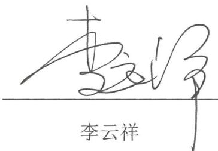

text_image

李云祥
李云祥

厦 同

2026 日

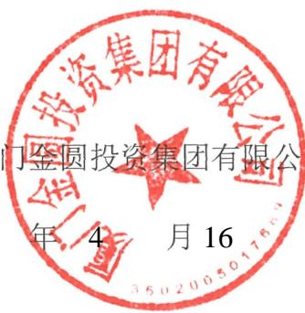

text_image

投资集团有限公司
门金圆投资集团有限公
年 4 月 16

## 发行人董事、高级管理人员声明

本公司董事、高级管理人员承诺本募集说明书不存在虚假记载、误导性陈述或重大遗漏，并对其真实性、准确性和完整性承担相应的法律责任。

董事长签名：

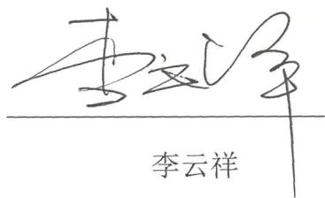

text_image

李云祥
李云祥

厦 司

202 日

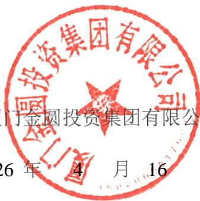

text_image

門金圓投資集團有限公司
26年 4月 16

## 发行人董事、高级管理人员声明

本公司董事、高级管理人员承诺本募集说明书不存在虚假记载、误导性陈述或重大遗漏，并对其真实性、准确性和完整性承担相应的法律责任。

董事签名：

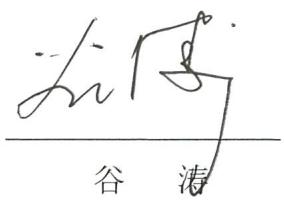

text_image

谷涛

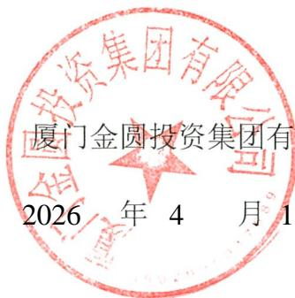

text_image

厦门金圆投资集团有
2026 年 4 月 1

限公司

6 日

## 发行人董事、高级管理人员声明

本公司董事、高级管理人员承诺本募集说明书不存在虚假记载、误导性陈述或重大遗漏，并对其真实性、准确性和完整性承担相应的法律责任。

董事签名：

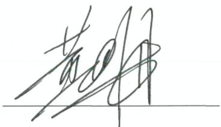

text_image

黄明

黄四海

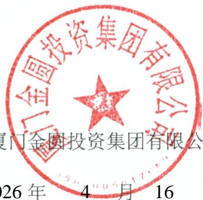

text_image

厦门金圆投资集团有限公司
厦门金圆投资集团有限公司
26年 4月 16

厦

20 日

## 发行人董事、高级管理人员声明

本公司董事、高级管理人员承诺本募集说明书不存在虚假记载、误导性陈述或重大遗漏，并对其真实性、准确性和完整性承担相应的法律责任。

非董事高级管理人员签名：

黄德牙

黄德芳

厦门

2026

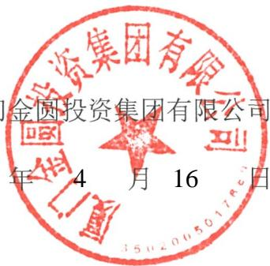

text_image

金圆投资集团有限公司
年 4 月 16 日

## 发行人董事、高级管理人员声明

本公司董事、高级管理人员承诺本募集说明书不存在虚假记载、误导性陈述或重大遗漏，并对其真实性、准确性和完整性承担相应的法律责任。

非董事高级管理人员签名：

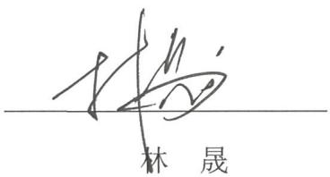

text_image

林晟

厦 司

2026 日

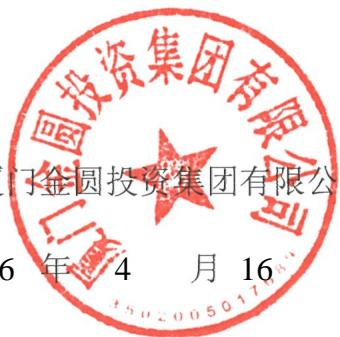

text_image

国投资集团有限公司
门金圆投资集团有限公
6年4月16

## 发行人董事、高级管理人员声明

本公司董事、高级管理人员承诺本募集说明书不存在虚假记载、误导性陈述或重大遗漏，并对其真实性、准确性和完整性承担相应的法律责任。

非董事高级管理人员签名：

张炎

厦 司

2026 日

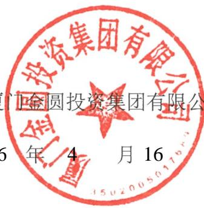

text_image

投资集团有限公司
金圆投资集团有限公
5年4月16

## 发行人董事、高级管理人员声明

本公司董事、高级管理人员承诺本募集说明书不存在虚假记载、误导性陈述或重大遗漏，并对其真实性、准确性和完整性承担相应的法律责任。

非董事高级管理人员签名：

text_image

吴似

厦门

2026

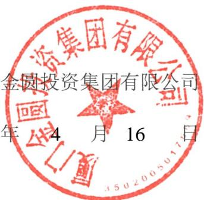

text_image

金圆投资集团有限公司
年 4 月 16 日

## 发行人董事、高级管理人员声明

本公司董事、高级管理人员承诺本募集说明书不存在虚假记载、误导性陈述或重大遗漏，并对其真实性、准确性和完整性承担相应的法律责任。

董事签名：

本

李榕芳

厦门

2026

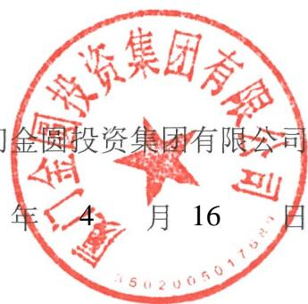

text_image

金圆投资集团有限公司
年 4 月 16 日

## 发行人董事、高级管理人员声明

本公司董事、高级管理人员承诺本募集说明书不存在虚假记载、误导性陈述或重大遗漏，并对其真实性、准确性和完整性承担相应的法律责任。

非董事高级管理人员签名：

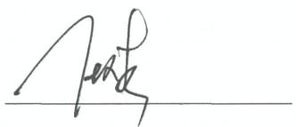

text_image

###

厦 司

2 日

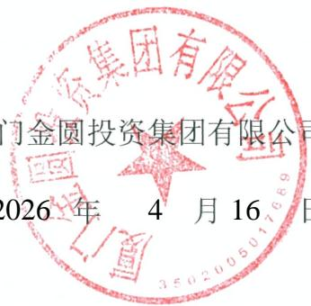

text_image

金圆集团有限公司
门金圆投资集团有限公司
2026 年 4 月 16 日

## 发行人董事、高级管理人员声明

本公司董事、高级管理人员承诺本募集说明书不存在虚假记载、误导性陈述或重大遗漏，并对其真实性、准确性和完整性承担相应的法律责任。

非董事高级管理人员签名：

text_image

胡荣炜
胡荣炜

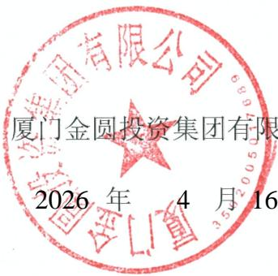

text_image

厦门金圆投资集团有限
2026 年 4 月 16

公司

日

## 发行人董事、高级管理人员声明

本公司董事、高级管理人员承诺本募集说明书不存在虚假记载、误导性陈述或重大遗漏，并对其真实性、准确性和完整性承担相应的法律责任。

非董事高级管理人员签名：

natural_image

Simple line drawing of a hand holding a pen, no text or symbols present

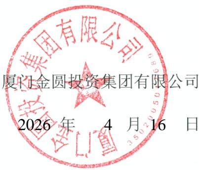

text_image

厦门金圆投资集团有限公司
2026 年 4 月 16 日

## 主承销商声明

本公司已对募集说明书进行了核查，确认不存在虚假记载、误导性陈述或重大遗漏，并对其真实性、准确性和完整性承担相应的法律责任。

项目负责人签名：海男邓小强

法定代表人授权代表签名：

主承销商：

20

text_image

中信证券股份有限公司
26年4月16日

## 法定代表人授权书

本人，张佑君，中信证券股份有限公司法定代表人，在此授权孙毅先生（身份证H）作为被授权人，代表公司签署与投资银行管理委员会业务相关的合同协议及其相关法律文件。被授权人签署的法律文件对我公司具法律约束力。

未经授权人许可，被授权人不得转授权。

本授权的有效期限自2026年3月24日至2027年3月31日（或至本授权书提前解除之日）止。

授权人

中信证券股 代表人

张佑君

2026年3月24日

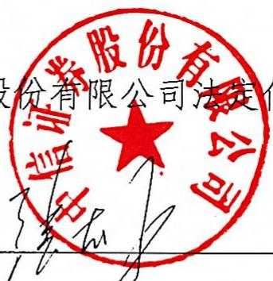

text_image

股份有限公司法定
证券股份有限公司

被授权人

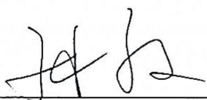

text_image

孙孙

孙毅（身份证此件与原件一致，仅供债融办理全圖集用公债有效期壹佰捌拾天。

）206年4月14日

## 主承销商声明

本公司已对募集说明书进行了核查，确认不存在虚假记载、误导性陈述或重大遗漏，并对其真实性，准确性和完整性承担相应的法律责任。

项目负责人签名：美林

吴东林

意晓文

袁晓文

法定代表人签名：

text_image

金圆统一证券有限公司
061005

主承销商： 司

2026 4 16

## 主承销商声明

本公司已对募集说明书及其摘要进行了核查，确认不存在虚假记载、误导性陈述或重大遗漏，并对其真实性、准确性和完整性承担相应的法律责任。

M 项目负责人（签字）： 任贤浩

法定代表人或授权代表（签字） 刘乃生

中信建投证券股份有限公司

16

## 中信建投证券股份有限公司特别授权书

仅供限金圆会司债使用

公投资行业务开展需要，中信建投证券股份有限公司董事长成先生对刘为生先生特别授权如下：

## 一、代表公司法定代表人签署以下文件：

（一）签署投资银行业务承做债券相关业务的文件，限于向监管部门报送的募集说明书、主承销商受托管理人声明、主承销商专项核查报告、承销商核查意见、房地产调控政策之专项核查报告、企业债主承销商综合信用承诺书、债权代理人声明。  
（二）签署投资银行业务承做三板重组相关业务的文件，限于向监管部门报送的三板重组（预案）之重组报告书（真实性、准确性、完整性的声明）、三板重组（预案）之独立财务顾问核查意见/报告、定向发行合法合规性的专项意见。  
（三）签署投资银行业务承做并购重组相关业务的文件，限于向监管部门报送以下文件：

1、重组报告书、独立财务顾问报告、反馈意见回复报告、重组委意见回复等文件的财务顾问专业意见；

2、申报文件真实性、准确性和完整性的承诺书、独立财务顾问同意书、独立财务顾问声明、举报信核查报告。

（四）签署投资银行业务承做保荐承销相关业务的文件，限于向监管部门报送的会后事项承诺函、不存在影响启动发行重大事项的承诺函、非公开发行股票申请增加询价对象的承诺函、关于办理完成限售登记及符合相关规定的承诺、发行阶段的保荐代表人证明文件及专项授权书、关于上市相关媒体质疑的专项回复的声明、认购对象合规性报告、发行情况报告书。

（五）签署由公司担任主承销商的投资银行类项目的发行及登记上市业务中向中国证监会、上海证券交易所、深圳证券交易所、北京证券交易所、中国证券登记结算有限责任公司、中央国债登记结算有限责任公司、全国中小企业股份转让系统有限转让公司等单位提交的文件，限于发行登记摇号公证上市阶段的授权委托书、IPO股票首次发行/可转债/配股/其他发行股票类网上认购资金划款申请表、配股发行失败应退利息支付承诺函、公司债券/资产支持专项计划/其他债权类发行登记及上市相关事宜的承诺函、股份过户登记申请。

## 二、在以下事务中拥有公司法定代表人人名章与身份证明文件的使用审批权：

（一）对外出具需要公司法定代表人签署的投资银行类项目的竞标文件、投标文件及建议书。

（二）在办理由公司担任主承销商的投资银行类项目的发行及登记上市业务中向中国证监会、上海证券交易所、深圳证券交易所、北京证券交易所、中国证券登记结算有限责任公司、中央国债登记结算有限责任公司、全国中小企业股份转让系统有限转让公司等单位提交公司法定代表人身份证件复印件、加盖法定代表人人名章的《指定联络人授权委托书》《集中办理深交所数字证书的承诺书》《信息披露联络人授权委托书》《可交换债券信托担保专用账户开立及信托担保登记办理授权书》《可交换债券质押担保专用账户开立及质押担保登记办理授权书》《验资业务银行询证函》《网下收款项目询证函》、公司债券转售业务的《非交易过户的申请》、可交换债券业务解除担保及信托事宜的《法定代表人授权委托书》。

（三）在办理由公司担任可转债抵押/质押权人代理人办理资产抵押/质押时提交的公司法定代表人身份证件复印件、加盖法定代表人人名章的《法定代表人证明书/委托书》《不动产登记申请表》等文件。

未经授权人许可，被授权人不得将上述授权内容再行转授权。

本授权有效期限自2026年1月1日起至2026年12月31日。

授权人：

中信建投证券股份有限公司董事长

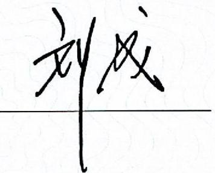

text_image

刘成

二零二六年一月一日建投证券股份有限公司缝专用章

## 主承销商声明

本公司已对募集说明书进行了核查，确认不存在虚假记载、误导性陈述或重大遗漏，并对其真实性、准确性和完整性承担相应的法律责任。

项目负责人签名：许

许婷婷

邱桓沛

建定代人批权代发批，古

胡金泉

主承销商：广发

202

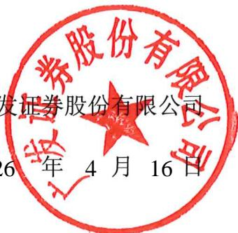

text_image

发证券股份有限公司
6 年 4 月 16 日

# 广发证券股份有限公司

广发证授权（2025）1号

## 2026年法定代表人签字授权书

根据工作需要，现将法资代装友的签字权授权如下：

## 一、授权原则

（一）被授权人根据司经营管理层工作分工或部门负责人任命行使权力，当职务变更自动调整或终止本授权。  
（二）被授权人代表公司法定代表人签字并承担相应责任，其法律效力等同于法定代表人签字。  
（三）被授权人无转委权。  
（四）授权人职务变更自动终止本授权。

## 二、授权权限

（一）加盖公司印章的文件签字权，授权公司分管领导。  
（二）加盖部门印章的文件签字权，授权部门负责人。

## 三、授权期限

本授权书有效期为2026年1月1日至12月31日，有效期内授权人可签署新的授权书对本授权书作出补充或修订。

附件：1.公司营业执照  
2.被授权人职责证明（公司经营管理层最新分工或部门负责人聘任发文） 股份

法定表

广发证券股份有限公司

2025年12月23日

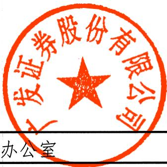

text_image

广发证券股份有限公司
办公室

广发证券股份有限公司

2025年12月23日印发

统一社会信用代码

91440000126335439C

# 营业执照

（副本）（1-1）

扫描二维码登录国家企业信用信总公示系统了解更多登记、备案、许可、监管信息

名 称广发证券股份有限公司

类 型股份有限公司（上市、自然人投资或控股）

法定代表人林传辉

经营范围 许可项目：证券业务：公募证券投资基金销售：证券公司为期货公司提供中高介绍业务，证券投资基金托管。（依法须经批准的项目，经相关部门批准后方可开展经营活动，具体经营项自以相关部门批准文件或许可证件为准）

text_image

证券股份有限公司
√
华泰证券有限公司为期货公司

注册资本人民币柒拾捌亿贰仟肆佰捌拾肆万伍仟伍佰壹拾壹元

成立日期1994年01月21日

住 所广东省广州市黄埔区中新广州知识城腾飞一街2号618室

此复印件与原件一致，再复印无效，仅限于办理《厦门金圆投资集团有限

公司债券项目

》使用，

有效期至年月日（提示：用途及有效期为空视同无效）

text_image

股份有限公司
登

记机关

text_image

广东省市场监督管理局
26年02月11日

202

# 广发证券股份有限公司

广发证董（2024）15号

# 关于聘任公司高级管理人员的决定

总部各部门、各分支机各子公

简称“公司”）第十一届董事会第一次会议决议及工作安排，公司决定：

聘任秦力先生担任公司总经理，主持公司日常经营管理工作，并分管国际业务、产业研究院、战略发展部；

聘任孙晓燕女士担任公司常务副总经理兼财务总监，分管财务部、结算与交易管理部、资金管理部；

聘任肖雪生先生担任公司副总经理，分管战略客户关系管理部；

聘任欧阳西先生担任公司副总经理，分管资产托管部、证券金融部、财富管理与经纪业务总部（含下设的财富管理部、数字平台部、机构客户部、运营管理部）；

聘任张威先生担任公司副总经理，分管发展研究中心；

聘任易阳方先生担任公司副总经理，分管股权衍生品业务部、

证券投资业务管理总部下发的权益投资部

聘任辛治运先生担任公司副总经理兼首席信息官，分管信息技术部；

聘任李谦先生担任公司副总经理，分管证券投资业务管理总部下设的固定收益投资部、资本中介部；

聘任徐佑军先生担任公司副总经理，分管办公室、人力资源管理部、培训中心；

聘任胡金泉先生担任公司副总经理，分管投行业务管理委员会（含下设的投行综合管理部、战略投行部、兼并收购部、债券业务部、资本市场部、投行质量控制部）；

聘任吴顺虎先生担任公司合规总监，兼任合规与法律事务部总经理，并分管合规与法律事务部、稽核部；

聘任崔舟航先生担任公司首席风险官，兼任风险管理部总经理，并分管风险管理部、投行内核部；

聘任尹中兴先生担任公司董事会秘书、联席公司秘书、证券事务代表，分管董事会办公室。

肖雪生先生和胡金泉先生正式履行上述职务尚需通过证券公司高级管理人员资质测试。尹中兴先生正式履行上述职务尚需通过证券公司高级管理人员资质测试及香港联合交易所有限公司关于公司秘书任职资格的豁免。在胡金泉先生正式履行上述职务之前，指定公司总经理秦力先生代为履行相应职责。在尹中兴先生正式履行上述职务之前，指定公司原董事会秘书、联席公司秘书、证券事务代表徐佑军先生继续履行相应职责。

公司将按规定向监管部门履行备案程序。

专此决定。

text_image

证券股份有限公司
证券股份有限公司
2024年5月10日

广发 司

2

（联系人：杨天天电话：020-66336680）

text_image

广发证券股份有限公司
监管局。

抄送：中国证监会广东监

广发证券股份有限公司董事会办公室

2024年5月10日印发

## 主承销商声明

本公司已对募集说明书进行了核查，确认不存在虚假记载、误导性陈述或重大遗漏，并对其真实性、准确性和完整性承担相应的法律责任。

项目负责人签名：

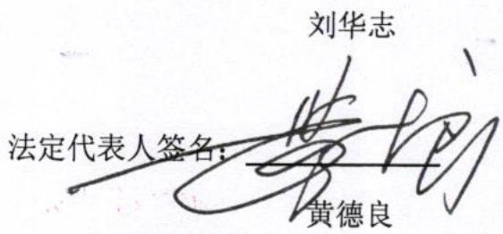

text_image

刘华志
法定代表人签名：
黄德良

text_image

福证券股份有限公司
35010210181976

主承销商：华福证券股份有限公司

2026 4 16

## 发行人律师声明

本所及签字的律师已阅读募集说明书，确认募集说明书与本所出具的法律意见书不存在矛盾。本所及签字的律师对发行人在募集说明书中引用的法律意见书的内容无异议，确认募集说明书不致因所引用内容出现虚假记载、误导性陈述或重大遗漏，并对其真实性、准确性和完整性承担相应的法律责任。

经办律师（签字）：

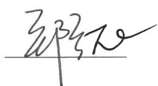  
郑兰花

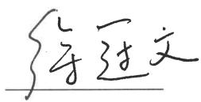  
徐冠文

律师事务所负责人（签字）：

text_image

韩德晶

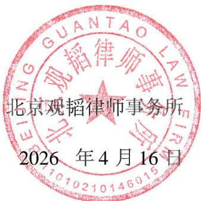

text_image

北京观韬律师事务所
2026 年 4 月 16 日

## 会计师事务所声明

本所及签字注册会计师已阅读募集说明书，确认募集说明书与本所出具的2024年度致同审字（2025）第351A017929号审计报告不存在矛盾。本所及签字注册会计师对募集说明书中引用的经本所审计的 2024年度财务报告的内容无异议，确认募集说明书不致因所引用内容而出现虚假记载、误导性陈述或重大遗漏，并对其真实性、准确性和完整性承担相应的法律责任。

经办注册会计师（签字）：

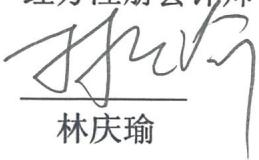

text_image

林庆瑜

会计师事务所负责人（签字）：

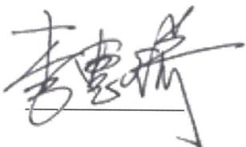

text_image

李雪娇

李惠琦

致同会计 合伙）

16

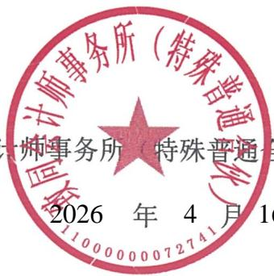

text_image

会计师事务所（特殊普通合伙）
2026 年 4 月 16

## 会计师事务所声明

本所及签字注册会计师已阅读《厦门金圆投资集团有限公司2026年面向专业投资者公开发行公司债券（第二期）募集说明书》，确认《厦门金圆投资集团有限公司2026年面向专业投资者公开发行公司债券（第二期）募集说明书》中引用的2022年度审计报告（众环审字（2023）3000022号）、2023年度审计报告（众环审字（2024）3000015号）内容与本所出具的审计报告的内容不存在矛盾。本所及签字注册会计师对发行人在《厦门金圆投资集团有限公司2026年面向专业投资者公开发行公司债券（第二期）募集说明书》中引用的财务报告的内容无异议，确认《厦门金圆投资集团有限公司2026年面向专业投资者公开发行公司债券（第二期）募集说明书》不致因所引用内容而出现虚假记载、误导性陈述或重大遗漏，并对其真实性、准确性和完整性承担相应的法律责任。

经办注册会计师（签字）：

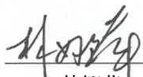

林娜萍

已离职

陈清建

会计师事务所负责人（签字）：

石文先

中审众环会 合伙）

16

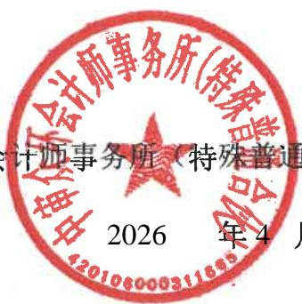

text_image

会计师事务所（特殊普通
2026 年4月

## 关于签字注册会计师离职的说明

## 深圳证券交易所：

本所作为厦门金圆投资集团有限公司申请 2026 年面向专业投资者公开发行公司债券（第二期）审计机构，出具了《审计报告》（众环审字〔2023〕3000022号、众环审字〔2024〕3000015 号），签字注册会计师为林娜萍同志和陈清建同志。

陈清建同志已于2024年10月从本所离职，故无法在《厦门金圆投资集团有限公司2026年面向专业投资者公开发行公司债券（第二期）募集说明书》之“会计师事务所声明”中签字。

专此说明，请予察核。

中审众环会 通合伙）

月 30 日

text_image

会计师事务所(特殊普通合伙)
2026年3月
420106000311665

## 资信评级机构声明

本机构及签字的资信评级人员已阅读募集说明书，确认募集说明书与本机构出具的报告不存在矛盾。本机构及签字的资信评级人员对发行人在募集说明书中引用的报告的内容无异议，确认募集说明书不致因所引用内容出现虚假记载、误导性陈述或重大遗漏，并对其真实性、准确性和完整性承担相应的法律责任。

签字资信评级人员（签字）：

资信评级机构负责人（签字）：

text_image

万华伟
万华伟

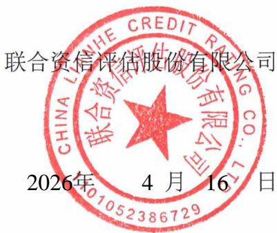

text_image

联合资信评估股份有限公司
CHINA LIHUA CHEM CREDIT RATING CO.,LTD.
2026年 4月16日

# 联合资信评估股份有限公司

## 授权委托书

兹授权联合资信评估股份有限公司总裁万华伟先生为我单位的代表人，在所有的评级业务合同、协议、投标书等评级业务有关文件上签字或签章。

授权期限自2026年1月1日至2026年12月31日。

被授权人签字或签章样本：

授权单位（公章)：联合资信评估股份有限公司

法定代表人（签字）：

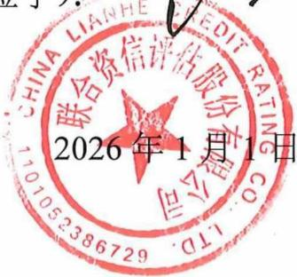

text_image

CHINA LIANHE
联合资信评估股份有限公司
101053386729
6214567
2026年1月1日

## 第十三节 备查文件

## 一、备查文件内容

（一）发行人 2022年至2024年度经审计的财务报告以及2025年1-9月未经审计的财务报表；

（二）主承销商出具的核查意见；

（三）发行人律师出具的法律意见书；

（四）《债券受托管理协议》；

（五）《债券持有人会议规则》；

（六）中国证监会同意发行人本期发行注册的文件。

## 二、备查文件查阅地点及查询网站

在本期债券发行期内，投资者可以至本公司及主承销商处查阅本募集说明书全文及上述备查文件，或访问深圳证券交易所网站（http://www.szse.cn）查阅本募集说明书。

查阅时间：上午9：00-11：30；下午：13：00-16：30

查阅地点：

## （一）发行人：厦门金圆投资集团有限公司

联系地址：厦门市思明区展鸿路82号厦门国际金融中心46层4610-4620单元

联系人：洪小勤

电话：0592-3502856

传真：0592-3502338

## （二）牵头主承销商/簿记管理人/受托管理人：中信证券股份有限公司

法定代表人：张佑君

住所：广东省深圳市福田区中心三路8 号卓越时代广场（二期）北座

联系地址：北京市朝阳区亮马桥路48号中信证券大厦22层

项目负责人：杨芳、邓小强

项目组成员：陈东辉、李晨、林政宇

联系电话：010-60838888

传真：010-60833504

## 三、备查文件查询网站

深圳证券交易所网站（http://www.szse.cn）。