或仲裁事项。

## （三）其他或有事项

截至 2025 年 6月 30日，公司及其子公司不存在需要披露的重要或有事项。

## （四）重大期后事项

截至本募集说明书出具日，公司及其子公司不存在需说明的重大期后事项。

## 十三、本次发行的影响

## （一）本次发行完成后，上市公司业务及资产的变动或整合计划情况

公司本次向不特定对象发行可转换公司债券，募集资金投资项目均基于公司现有业务基础及技术储备而确定，本次发行不会导致公司业务发生变化，亦不产生资产整合事项。

## （二）本次发行完成后，上市公司新旧产业融合情况的变化情况

本次募集资金投资项目紧密围绕公司主营业务展开，符合国家有关产业政策导向、行业发展趋势、以及公司整体战略发展方向，具有良好的市场发展前景和经济效益。上市公司不存在本次发行完成后新旧产业融合情况的变化情况。

## （三）本次发行完成后，上市公司控制权结构的变化情况

本次发行可转换公司债券及其后续转股不会造成上市公司控制权的变动。

## 第六节 合规经营与独立性

## 一、报告期内发行人及其董事、监事、高级管理人员、控股股东、实际控制人的合法合规情况

报告期内，公司不存在与生产经营相关的重大违法违规行为或受到行政处罚的情况。

发行人及其现任董事、监事、高级管理人员及主要股东不存在被证监会行政处罚或采取监管措施的情形，不存在被交易所公开谴责，亦不存在因涉嫌犯罪而被司法机关立案侦查或者涉嫌违法违规正被证监会立案调查的情形。

## 二、报告期内资金占用及为控股股东、实际控制人及其控制的其他企业担保的情况

报告期内，发行人不存在资金被控股股东、实际控制人及其控制的其他企业以借款、代偿债务、代垫款项或者其他方式占用的情况；亦不存在为控股股东、实际控制人及其控制的其他企业担保的情况。

## 三、同业竞争情况

## （一）发行人与控股股东、实际控制人及其控制的其他企业不存在同业竞争

报告期内，公司股权结构分散，不存在控股股东和实际控制人，故不存在发行人与控股股东、实际控制人及其控制的其他企业存在同业竞争。

## （二）控股股东、实际控制人关于避免同业竞争的承诺

截至本募集说明书出具之日，公司无控股股东、实际控制人。为避免公司未来可能出现的同业竞争，发行人主要股东工业富联与中坚公司（工业富联控股股东）、香港 TOP PARTNER、新蔼咨询、孙蔼彬先生、叶子祯先生已出具避免同业竞争的承诺函。

## 1、工业富联及工业富联的控股股东中坚公司出具的承诺

工业富联出具了关于避免同业竞争的承诺函，内容如下：

“1、截至本承诺函出具之日，鼎捷软件的营业收入主要来源于自主研发的软件销售，软件实施过程中的顾问辅导、二次开发与年度维护等服务收入。本公司是全球领先的智能制造服务商和工业互联网整体解决方案提供商。其经营范围：工业互联网技术研发；通讯系统研发；企业管理服务；从事电子产品及其零配件的进出口及相关配套业务（不涉及国营贸易管理商品，涉及配额、许可证管理及其它专项规定管理的商品，按国家有关规定办理申请）。截至本承诺函出具日，本公司营业收入主要来自于包括通信网络及移动设备、高精密机构件、云计算相关设备、科技服务。本次交易完成前，本公司及本公司控制的企业与鼎捷软件及其附属企业主营业务之间不存在同业竞争。

2、本次交易完成后，本公司作为鼎捷软件第一大股东（非控股股东），将根据相关法律法规及公司章程规定，在不违反中国证监会和交易所关于同业竞争相关规定的前提下，秉持互利共赢的原则，加强双方的合作。  
3、本公司将遵守上述承诺，如违反上述承诺给鼎捷软件及其附属企业造成实际损失的，将承担相应的法律责任。

本承诺函于下述全部条件满足之日起生效：

（1）本承诺函经本公司签署；  
（2）工业富联完成本次交易，成为鼎捷软件第一大股东，且工业富联与一致行动人拥有权益的股份达到或超过鼎捷软件已发行股份的 5%。

本承诺函自生效之日起至发生以下情形时终止（以较早为准）：（1）工业富联及其一致行动人拥有权益的股份达到或超过5%但未达到20%且不再是鼎捷软件的第一大股东；（2）工业富联及其一致行动人拥有权益的股份低于鼎捷软件已发行股份的5%；（3）鼎捷软件终止上市。”

工业富联的控股股东中坚公司出具了关于避免同业竞争的承诺函，内容如下：

“1、截至本承诺函出具之日，鼎捷软件的营业收入主要来源于自主研发的软件销售，软件实施过程中的顾问辅导、二次开发与年度维护等服务收入。本公司为一家投资控股型公司，旗下企业主要从事制造业等业务。本次交易完成前，本公司及本公司控制的企业与鼎捷软件及其附属企业主营业务之间不存在同业竞争。

2、本次交易完成后，工业富联作为鼎捷软件第一大股东（非控股股东），本公司将支持工业富联根据相关法律法规及公司章程规定，在不违反中国证监会和交易所关于同业竞争相关规定的前提下，秉持互利共赢的原则，加强双方的合作。  
3、本公司将遵守上述承诺，如违反上述承诺给鼎捷软件及其附属企业造成实际损失的，将承担相应的法律责任。

本承诺函于下述全部条件满足之日起生效：

（1）本承诺函经本公司签署；

（2）工业富联完成本次交易，成为鼎捷软件第一大股东，且工业富联与一致行动人拥有权益的股份达到或超过鼎捷软件已发行股份的 5%。

本承诺函自生效之日起至发生以下情形时终止（以较早为准）：（1）工业富联及其一致行动人拥有权益的股份达到或超过5%但未达到20%且不再是鼎捷软件的第一大股东；（2）工业富联及其一致行动人拥有权益的股份低于鼎捷软件已发行股份的5%；（3）鼎捷软件终止上市。”

## 2、香港 TOP PARTNER、新蔼咨询出具的承诺

香港 TOP PARTNER 和新蔼咨询出具了关于避免同业竞争的承诺函，内容如下：

“1、本次交易完成前，本公司及本公司控制的企业与鼎捷软件及其附属企业主营业务之间不存在同业竞争。  
2、本次交易完成后，本公司将努力避免发生与鼎捷软件及其附属企业主营业务构成同业竞争的业务，并促使本公司控制的企业避免发生与鼎捷软件及其附属企业主营业务构成同业竞争的业务。  
3、本公司将遵守上述承诺，如违反上述承诺给鼎捷软件及其附属企业造成实际损失的，将承担相应的法律责任。

本承诺函于下述全部条件满足之日起生效：（1）本承诺函经本公司签署；（2）工业富联完成本次交易，成为鼎捷软件第一大股东，且工业富联与一致行动人拥有权益的股份达到或超过鼎捷软件已发行股份的 5%。

本承诺函自生效之日起至发生以下情形时终止（以较早为准）：（1）工业富联及其一致行动人拥有权益的股份达到或超过5%但未达到20%且不再是鼎捷软件的第一大股东；（2）工业富联及其一致行动人拥有权益的股份低于鼎捷软件已发行股份的5%；（3）鼎捷软件终止上市。”

## 3、孙蔼彬先生和叶子祯先生出具的承诺

孙蔼彬先生和叶子祯先生也已出具了关于避免同业竞争的承诺函，内容如下：

“1、本次交易完成前，本人及本人控制的企业与鼎捷软件及其附属企业主营业务之间不存在对鼎捷软件构成重大不利影响的同业竞争。  
2、本次交易完成后，本人将努力避免本人控制的企业发生与鼎捷软件及其附属企业主营业务构成同业竞争的业务。  
3、本人将遵守上述承诺，如违反上述承诺给鼎捷软件及其附属企业造成实际损失的，将承担相应的法律责任。

本承诺函于下述全部条件满足之日起生效：（1）本承诺函经本人签署；（2）工业富联完成本次交易，成为鼎捷软件第一大股东，且工业富联与一致行动人拥有权益的股份达到或超过鼎捷软件已发行股份的 5%。

本承诺函自生效之日起至发生以下情形时终止（以较早为准）：（1）工业富联及其一致行动人拥有权益的股份达到或超过5%但未达到20%且不再是鼎捷软件的第一大股东；（2）工业富联及其一致行动人拥有权益的股份低于鼎捷软件已发行股份的5%；（3）鼎捷软件终止上市。”

## 四、关联方及关联交易

## （一）关联方及关联关系

根据《公司法》《企业会计准则第 36 号——关联方披露》《深圳证券交易所创业板股票上市规则》及其他法律、法规等相关规定，发行人的主要关联方及关联关系披露如下：

## 1、控股股东、实际控制人及其控制的企业

截至本募集说明书出具日，公司的股权结构较为分散，不存在单一股东持股或实际支配表决权超过 30%的情形。

## 2、持股 5%以上的股东

截至本募集说明书出具日，持有发行人 5%以上股份的股东为工业富联和香港TOP PARTNER，工业富联持有发行人 39,971,265股股份，占发行人股本总额的 14.73%。香港 TOP PARTNER 持有发行人 18,912,242 股股份，占发行人股本总额的 6.97%。工业富联、香港 TOP PARTNER 为发行人的关联方。2023 年 12月8日，工业富联和香港 TOP PARTNER、新蔼咨询、孙蔼彬、叶子祯签署了《<一致行动人协议>之补充协议》，延续了一致行动关系，新蔼咨询、孙蔼彬、叶子祯亦为发行人关联方。

## 3、持股 5%以上的股东控制或具有重大影响的其他企业

<table><tr><td>序号</td><td>公司名称</td><td>主营业务</td><td>关联关系</td></tr><tr><td>1</td><td>Cloud Network Technology Kft</td><td>服务器、存储器、网络设备</td><td rowspan="18">工业富联持有100%股份</td></tr><tr><td>2</td><td>Cloud Network Technology Singapore Pte.Ltd.</td><td>服务器、存储器、网络设备</td></tr><tr><td>3</td><td>Cloud Network Technology USA Inc.</td><td>服务器、存储器、网络设备</td></tr><tr><td>4</td><td>Cloud Network Technology (Samoa) Limited</td><td>服务器、存储器、网络设备</td></tr><tr><td>5</td><td>FII USA Inc.</td><td>软件开发、云计算</td></tr><tr><td>6</td><td>Focus PC Enterprises Limited</td><td>控股平台公司</td></tr><tr><td>7</td><td>Foxconn Assembly LLC</td><td>服务器、存储器、网络设备</td></tr><tr><td>8</td><td>Foxconn CZ s.r.o.</td><td>服务器、存储器、网络设备</td></tr><tr><td>9</td><td>Foxconn Precision International Limited</td><td>通信网络高精密机构件</td></tr><tr><td>10</td><td>Foxconn Technology CZ s.r.o.</td><td>服务器、存储设备</td></tr><tr><td>11</td><td>Foxconn Technology Service and Logistics Limited</td><td>技术服务、物流</td></tr><tr><td>12</td><td>Fuhong Precision Component (Bac Giang) Limited</td><td>网络设备</td></tr><tr><td>13</td><td>富联精密科技有限公司</td><td>网络设备</td></tr><tr><td>14</td><td>Funing Precision Component Co., Ltd.</td><td>网络设备</td></tr><tr><td>15</td><td>富裕精密组件有限公司</td><td>网络设备、电信设备、通信网络高精密机构件</td></tr><tr><td>16</td><td>Glory Star Investments Limited</td><td>控股平台公司</td></tr><tr><td>17</td><td>Ingrasys (Singapore) Pte. Ltd.</td><td>服务器、存储器</td></tr><tr><td>18</td><td>Ingrasys Technology Korea, Inc.</td><td>服务器、存储器</td></tr><tr><td>19</td><td>Ingrasys Technology Mexico S.A. de C.V.</td><td>服务器、内存</td><td rowspan="28"></td></tr><tr><td>20</td><td>Ingrasys Technology USA Inc.</td><td>服务器、存储器</td></tr><tr><td>21</td><td>IPL International Limited</td><td>贸易</td></tr><tr><td>22</td><td>Mega Well Limited</td><td>贸易</td></tr><tr><td>23</td><td>NSG Technology Inc.</td><td>网络设备</td></tr><tr><td>24</td><td>NWE Technology Inc.</td><td>提供管理服务</td></tr><tr><td>25</td><td>NWEA LLC</td><td>网络设备</td></tr><tr><td>26</td><td>PCE Paragon Solutions (USA) Inc.</td><td>提供管理、IT 服务</td></tr><tr><td>27</td><td>Profit New Limited</td><td>贸易</td></tr><tr><td>28</td><td>Rich Excel International Limited</td><td>控股平台公司</td></tr><tr><td>29</td><td>Safe DX s.r.o</td><td>软件开发、云计算</td></tr><tr><td>30</td><td>成都富联准刃科技有限公司</td><td>精密工具</td></tr><tr><td>31</td><td>富联百佳泰(北京)贸易有限公司</td><td>服务器</td></tr><tr><td>32</td><td>富联富甲智创(深圳)科技有限公司</td><td>服务器、存储器、网络设备</td></tr><tr><td>33</td><td>富联富翼精密工业(东莞)有限公司</td><td>通信网络高精密机构件</td></tr><tr><td>34</td><td>富联国基(上海)电子有限公司</td><td>网络设备、电信设备、通信网络高精密机构件</td></tr><tr><td>35</td><td>富联国宙电子(上海)有限公司</td><td>网络设备、电信设备、通信网络高精密机构件</td></tr><tr><td>36</td><td>富联精密电子(天津)有限公司</td><td>服务器、存储设备、云端运算高精密机构件</td></tr><tr><td>37</td><td>富联精密电子(郑州)有限公司</td><td>通信网络高精密机构件</td></tr><tr><td>38</td><td>富联精密科技(赣州)有限公司</td><td>制造业</td></tr><tr><td>39</td><td>富联科技(鹤壁)有限公司</td><td>通信网络高精密机构件</td></tr><tr><td>40</td><td>富联科技(济源)有限公司</td><td>通信网络高精密机构件</td></tr><tr><td>41</td><td>富联科技(晋城)有限公司</td><td>通信网络高精密机构件、机器人</td></tr><tr><td>42</td><td>富联科技(兰考)有限公司</td><td>网络设备</td></tr><tr><td>43</td><td>富联科技(山西)有限公司</td><td>通信网络高精密机构件</td></tr><tr><td>44</td><td>富联科技(武汉)有限公司</td><td>通信网络高精密机构件</td></tr><tr><td>45</td><td>富联科技(周口)有限公司</td><td>网络设备、电信设备、通信网络、高精密机构件</td></tr><tr><td>46</td><td>富联科技服务(天津)有限公司</td><td>服务器、存储设备</td></tr><tr><td>47</td><td>富联统合电子(海宁)有限公司</td><td>网络设备、服务器</td><td rowspan="22"></td></tr><tr><td>48</td><td>富联统合电子(杭州)有限公司</td><td>网络设备</td></tr><tr><td>49</td><td>富联裕展科技(河南)有限公司</td><td>通信网络高精密机构件</td></tr><tr><td>50</td><td>富联裕展科技(衡阳)有限公司</td><td>通讯类高精密机构件、自动化、模具</td></tr><tr><td>51</td><td>富联裕展科技(深圳)有限公司</td><td>通信网络高精密机构件、工业机器人</td></tr><tr><td>52</td><td>富联云计算(天津)有限公司</td><td>云计算</td></tr><tr><td>53</td><td>富联智能工坊(郑州)有限公司</td><td>软件开发、互联网信息服务</td></tr><tr><td>54</td><td>富联卓越科技(绍兴)有限公司</td><td>自动化设备制造、技术研发</td></tr><tr><td>55</td><td>工业富联(福建)数字科技有限公司</td><td>技术研发、技术咨询</td></tr><tr><td>56</td><td>工业富联(杭州)数据科技有限公司</td><td>技术研发、技术咨询</td></tr><tr><td>57</td><td>鸿佰科技股份有限公司</td><td>服务器、存储设备、云端运算</td></tr><tr><td>58</td><td>鸿泰精密工业(杭州)有限公司</td><td>电子元器件、通信网络设备</td></tr><tr><td>59</td><td>基准精密工业(惠州)有限公司</td><td>精密工具</td></tr><tr><td>60</td><td>晋城富联鸿刃科技有限公司</td><td>精密工具</td></tr><tr><td>61</td><td>南宁富联富桂精密工业有限公司</td><td>网络设备、电信设备、通信网络高精密机构件</td></tr><tr><td>62</td><td>日本裕展贸易株式会社</td><td>服务器、存储器、网络设备</td></tr><tr><td>63</td><td>深圳富联富桂精密工业有限公司</td><td>网络设备、电信设备、网络电信设备高精密机构件、服务器、存储设备</td></tr><tr><td>64</td><td>深圳富联精匠科技有限公司</td><td>精密工具</td></tr><tr><td>65</td><td>深圳智造谷工业互联网创新中心有限公司</td><td>管理咨询、教学设备</td></tr><tr><td>66</td><td>郑州富联鸿刃科技有限公司</td><td>精密工具</td></tr><tr><td>67</td><td>富联裕康医疗科技(深圳)有限公司</td><td>医疗器械生产销售</td></tr><tr><td>68</td><td>FII AMC MEXICO, S. DE R.L. DE C.V.</td><td>电子元件、主板,计算机、服务器及其外部零件</td></tr><tr><td>69</td><td>Foxconn Technology (India) Private Limited</td><td>通信网络高精密机构件</td><td>工业富联持有99.9994%股份</td></tr><tr><td>70</td><td>Likom De Mexico S.A De C.V</td><td>服务器、存储器、网络设备</td><td>工业富联持有99.99998%股份</td></tr><tr><td>71</td><td>Scientific Atlantade Mexico S. de R.L de C.V.</td><td>网络设备</td><td>工业富联持有99.9667%股份</td></tr><tr><td>72</td><td>LEAPSY INTERNATIONAL LTD</td><td>管理服务</td><td>工业富联持有73.00%股份</td></tr><tr><td>73</td><td>富联精密电子(贵阳)有限公司</td><td>服务器、存储设备</td><td>工业富联持有80.00%股份</td></tr><tr><td>74</td><td>工业富联(佛山)产业示范基地有限公司</td><td>高端制造,5G实验室</td><td>工业富联持有51.00%股份</td></tr><tr><td>75</td><td>工业富联(佛山)创新中心有限公司</td><td>高端制造,5G实验室</td><td>工业富联持有65.60%股份</td></tr><tr><td>76</td><td>工业富联佛山智造谷有限公司</td><td>高端研发,机械销售</td><td>工业富联持有51.00%股份</td></tr><tr><td>77</td><td>工业富联衡阳智造谷有限公司</td><td>信息系统、技术开发</td><td>工业富联持有51.00%股份</td></tr><tr><td>78</td><td>晋城鸿硕智能科技有限公司</td><td>工程机械设备、矿用设备</td><td>工业富联持有51.00%股份</td></tr><tr><td>79</td><td>晋城鸿智纳米光机电研究院有限公司</td><td>技术研发、技术咨询</td><td>工业富联持有80.00%股份</td></tr><tr><td>80</td><td>深圳富联智能制造产业创新中心有限公司</td><td>精密工具</td><td>工业富联持有80.81%股份</td></tr><tr><td>81</td><td>深圳市富联凌云光科技有限公司</td><td>技术研发,硬件研发</td><td>工业富联持有51.00%股份</td></tr><tr><td>82</td><td>深圳宇博先进科技有限公司</td><td>智能穿戴设备、软件开发</td><td>工业富联持有73.00%股份</td></tr><tr><td>83</td><td>宇博先进科技股份有限公司</td><td>技术开发</td><td>工业富联持有73.00%股份</td></tr><tr><td>84</td><td>Fii Holdings USA Inc.</td><td>电子制造服务、金融规划、投资咨询服务</td><td>工业富联持有100.00%股份</td></tr><tr><td>85</td><td>广州市天鹰精密工具有限公司</td><td>医疗器械、机械设备</td><td>工业富联持有100.00%股份</td></tr><tr><td>86</td><td>利威精密国际有限公司</td><td>医疗器械、机械设备</td><td>工业富联持有100.00%股份</td></tr></table>

注：工业富联的上述下属子公司为依据工业富联《2025 年半年度报告》及股东尽职调查表所进行的列示，依据谨慎原则，工业富联直接或间接控制的下属子公司均为发行人的关联方。

## 4、公司的控股子公司、参股公司

## （1）控股子公司

截至2025年6月30日，发行人的控股企业详见本募集说明书之“第四节 发行人基本情况”之“二、公司的组织结构及对其他企业的重要权益投资情况”之“（二）控股子公司”。

## （2）参股公司

截至 2025年 6月 30日，发行人的重要参股公司情况如下：

<table><tr><td>序号</td><td>企业名称</td><td>法定代表人/执行事务合伙人</td><td>成立日期</td><td>注册资本(原币)</td><td>发行人持股比例</td></tr><tr><td>1</td><td>中山市龙鼎家居科技有限公司</td><td>蒋红文</td><td>2017年1月</td><td>1,300万元人民币</td><td>48.08%</td></tr><tr><td>2</td><td>广州黄埔智造管理咨询合伙企业(普通合伙)</td><td>汇森(广州)股权投资基金管理有限公司</td><td>2018年7月</td><td>990万元人民币</td><td>50.51%</td></tr><tr><td>3</td><td>广州黄埔智造产业投资基金合伙企业(有限合伙)</td><td>广州黄埔智造管理咨询合伙企业(普通合伙)</td><td>2018年7月</td><td>10,000万元人民币</td><td>45.00%</td></tr><tr><td>4</td><td>苏州鼎信荣科技有限责任公司</td><td>孙建明</td><td>2022年5月</td><td>2,000万元人民币</td><td>40.00%</td></tr><tr><td>5</td><td>DSC CONSULTING SDN BHD(马来西亚)</td><td>Dr. Chua Hock Hoo</td><td>2012年12月</td><td>100万马来西亚林吉特</td><td>49.00%</td></tr><tr><td>6</td><td>绍兴聚承园区运营管理有限公司</td><td>秦荣华</td><td>2022年7月</td><td>10,000万元人民币</td><td>24.00%</td></tr><tr><td>7</td><td>温岭产融鼎捷绿色股权投资合伙企业(有限合伙)</td><td>杭州产融鼎捷股权投资有限公司</td><td>2023年9月</td><td>50,000万元人民币</td><td>23.60%</td></tr><tr><td>8</td><td>上海鼎捷私募基金管理有限公司 $^{注1}$ </td><td>林健伟</td><td>2022年12月</td><td>1,500万元人民币</td><td>20.00%</td></tr><tr><td>9</td><td>河南鼎华数字科技有限公司 $^{注2}$ </td><td>刘向阳</td><td>2023年10月</td><td>200万元</td><td>15.00%</td></tr></table>

注1：2023年9月 25日，上海鼎捷私募基金管理有限公司作出股东决定同意鼎捷数智将其所持的部分未实缴出资份额转让给上海十夕企业咨询合伙企业（有限合伙）、上海六夕企业管理咨询合伙企业（有限合伙），转让完成后发行人持股比例由53.33%降至20%，上海鼎捷私募基金管理有限公司现为发行人的参股公司。  
注2：发行人通过控股子公司南京鼎华持有河南鼎华15%的股份，穿透后的持股比例为7.74%。

## 5、公司的董事、监事、高级管理人员及其关系密切的家庭成员

公司董事、监事、高级管理人员的情况参见本募集说明书之“第四节 发行人基本情况”之“五、董事、监事、高级管理人员情况、其他核心人员”之“（一）基本情况”中董事、监事、高级管理人员的基本情况。

发行人的董事、监事、高级管理人员关系密切的家庭成员为发行人关联方。

## 6、发行人的董事、监事、高级管理人员及其关系密切的家庭成员控制或担任董事、高级管理人员的其他企业

截至 2025 年 6月 30日，发行人的董事、监事、高级管理人员及其关系密切的家庭成员控制或担任董事、高级管理人员的其他企业如下：

<table><tr><td>序号</td><td>名称</td><td>关联关系</td></tr><tr><td>1</td><td>颜回(香港)有限公司</td><td>叶子祯持有100%的股权且任其董事</td></tr><tr><td>2</td><td>子路(香港)有限公司</td><td>叶子祯持有100%的股权且任其董事</td></tr><tr><td>3</td><td>上海十夕企业咨询合伙企业(有限合伙)</td><td>叶子祯持有59.9940%的出资比例且任其执行事务合伙人、张苑逸持有39.9960%的出资比例</td></tr><tr><td>4</td><td>苏州鼎信荣科技有限责任公司</td><td>叶子祯任董事长、张苑逸任董事、林健伟任监事、发行人的联营企业</td></tr><tr><td>5</td><td>子我企业管理(上海)合伙企业(有限合伙)</td><td>颜回(香港)有限公司为其执行事务合伙人、由叶子祯实际控制</td></tr><tr><td>6</td><td>中山市龙鼎家居科技有限公司</td><td>刘波曾任董事并于2023年10月离任、发行人的联营企业</td></tr><tr><td>7</td><td>深圳市信润富联数字科技有限公司</td><td>刘宗长任董事</td></tr><tr><td>8</td><td>深圳富联智能制造产业创新中心有限公司</td><td>刘宗长任董事长</td></tr><tr><td>9</td><td>富联富甲智创(深圳)科技有限公司</td><td>刘宗长任董事</td></tr><tr><td>10</td><td>工业富联(福建)数字科技有限公司</td><td>刘宗长任董事长、经理、法定代表人</td></tr><tr><td>11</td><td>工业富联(杭州)数据科技有限公司</td><td>刘宗长任董事长、经理、法定代表人</td></tr><tr><td>12</td><td>工业富联佛山智造谷有限公司</td><td>刘宗长任董事长、总经理、法定代表人</td></tr><tr><td>13</td><td>绍兴聚承园区运营管理有限公司</td><td>张苑逸任董事</td></tr><tr><td>14</td><td>台霖生物科技股份有限公司</td><td>邹景文任总经理、董事</td></tr><tr><td>15</td><td>全域股份有限公司</td><td>邹景文任董事、总经理</td></tr><tr><td>16</td><td>台耀科技股份有限公司</td><td>邹景文任董事长</td></tr><tr><td>17</td><td>DSC CONSULTING SDN BHD(马来西亚)</td><td>潘泰龢任董事、发行人的联营企业</td></tr><tr><td>18</td><td>工业富联(佛山)创新中心有限公司</td><td>刘宗长任董事长、总经理、法定代表人</td></tr><tr><td>19</td><td>工业富联(佛山)产业示范基地有限公司</td><td>刘宗长任董事长、总经理、法定代表人</td></tr><tr><td>20</td><td>上海六夕企业管理咨询合伙企业(有限合伙)</td><td>林健伟持有75%的出资比例,任执行事务合伙人</td></tr><tr><td>21</td><td>上海鼎捷私募基金管理有限公司</td><td>叶子祯持有40%的股权且任其监事、张苑逸任其执行董事、林健伟任其总经理及法定代表人</td></tr></table>

## （二）报告期内的重大关联交易

## 1、重大关联交易判断标准

公司判断重大关联交易的标准系根据《深圳证券交易所创业板股票上市规则》《公司章程》《关联交易管理制度》等相关规定，公司与关联方达成的关联交易（提供担保除外）金额在 3,000.00万元以上，且占公司最近一期经审计净资产绝对值的5%以上，或公司为关联人提供担保，应当及时披露且提交股东大会审议。

## 2、报告期内重大关联交易情况

根据上述判断标准，报告期内公司与关联方之间未发生重大关联交易。

## （三）报告期内的一般关联交易

## 1、经常性关联交易

## （1）购销商品、提供和接受劳务的关联交易

报告期内，公司购销商品、提供和接受劳务的关联交易具体情况如下：

单位：万元

<table><tr><td>关联方名称</td><td>关联交易类别</td><td>2025年1-6月</td><td>2024年</td><td>2023年度</td><td>2022年度</td></tr><tr><td rowspan="2">中山市龙鼎家居科技有限公司</td><td>购买软硬件、接受服务和劳务</td><td>171.50</td><td>104.64</td><td>364.18</td><td>363.62</td></tr><tr><td>销售软件、提供服务</td><td>-</td><td>23.43</td><td>2.93</td><td>84.54</td></tr><tr><td>工业富联(杭州)数据科技有限公司</td><td>购买软硬件、接受服务和劳务销售软件、提供服务</td><td>23.50-</td><td>--</td><td>137.7460.38</td><td>384.4379.25</td></tr><tr><td rowspan="2">工业富联佛山智造谷有限公司</td><td>接受服务和劳务</td><td>-</td><td>-</td><td>-</td><td>295.00</td></tr><tr><td>销售软件、提供服务</td><td>-</td><td>-</td><td>344.69</td><td>111.69</td></tr><tr><td>DSC CONSULTING SDN BHD(马来西亚)</td><td>销售软件、提供技术服务</td><td>64.49</td><td>314.60</td><td>203.73</td><td>196.76</td></tr><tr><td>苏州鼎信荣科技有限责任公司</td><td>销售软件、提供服务</td><td>-</td><td>0.45</td><td>1.92</td><td>160.95</td></tr><tr><td>上海冠龙阀门节能设备股份有限公司 $^{注1}$ </td><td>销售软硬件、提供服务</td><td>-</td><td>-</td><td>5.66</td><td>-</td></tr><tr><td>上海冠龙阀门自控有限公司 $^{注1}$ </td><td>销售软硬件、提供服务</td><td>-</td><td>-</td><td>66.56</td><td>285.87</td></tr><tr><td>工业富联(福建)数字科技有限公司</td><td>销售软硬件、提供服务</td><td>-</td><td>4.20</td><td>49.69</td><td>72.96</td></tr><tr><td>富联裕展科技(深圳)有限公司</td><td>销售软件、提供服务</td><td>24.17</td><td>37.33</td><td>169.22</td><td>-</td></tr><tr><td>深圳富联智能制造产业创新中心有限公司</td><td>销售软件</td><td>-</td><td>7.92</td><td>87.16</td><td>63.39</td></tr><tr><td>深圳恒驱电机有限公司 $^{注2}$ </td><td>销售软件、提供服务</td><td>0.47</td><td>2.65</td><td>45.61</td><td>-</td></tr><tr><td rowspan="2">河南鼎华数字科技有限公司</td><td>购买软硬件、接受服务和劳务</td><td>23.48</td><td>39.69</td><td>-</td><td>-</td></tr><tr><td>销售自研软件</td><td>1.88</td><td>35.04</td><td>-</td><td>-</td></tr><tr><td>台霖生物科技股份有限公司</td><td>提供一体化解决方案、提供服务</td><td>7.52</td><td>8.07</td><td>-</td><td>-</td></tr><tr><td>全域股份有限公司</td><td>提供一体化解决方案、提供服务</td><td>-</td><td>0.64</td><td>-</td><td>-</td></tr><tr><td>深圳市富联凌云光科技有限公司</td><td>销售软件</td><td>10.93</td><td>-</td><td>-</td><td>-</td></tr></table>

注1：鼎捷数智原独立董事林凤仪于 2023年 5月 18日离任，其担任上海冠龙阀门节能设备股份有限公司总经理、董事长，上海冠龙阀门自控有限公司为其子公司。鼎捷数智与前述企业的关联关系于2024 年5月18日终止。  
注2：工业富联于2025 年6月30 日对深圳恒驱电机有限公司丧失控制权，鼎捷数智与深圳恒驱电机有限公司的关联关系于 2026年 6 月 30 日终止。

## （2）与关联交易相关的应收款项和应付款项

① 截至 2025 年6 月30 日与关联交易相关的应收款项和应付款项

关联方应收账款：

单位：万元

<table><tr><td rowspan="2">项目名称</td><td rowspan="2">关联方</td><td colspan="2">期末余额</td><td colspan="2">期初余额</td></tr><tr><td>账面余额</td><td>坏账准备</td><td>账面余额</td><td>坏账准备</td></tr><tr><td rowspan="2">应收账款</td><td>中山市龙鼎家居科技有限公司</td><td>126.17</td><td>104.21</td><td>126.17</td><td>99.02</td></tr><tr><td>工业富联(杭州)数据科技有限公司</td><td>-</td><td>-</td><td>64.00</td><td>64.00</td></tr><tr><td rowspan="2">预付款项</td><td>中山市龙鼎家居科技有限公司</td><td>223.16</td><td>-</td><td>94.13</td><td>-</td></tr><tr><td>工业富联(杭州)数据科技有限公司</td><td>-</td><td>-</td><td>31.15</td><td>-</td></tr></table>

注：金额为15.28 元。

关联方应付账款：  
单位：万元

<table><tr><td>项目名称</td><td>关联方</td><td>期末账面余额</td><td>期初账面余额</td></tr><tr><td rowspan="4">应付账款</td><td>中山市龙鼎家居科技有限公司</td><td>265.82</td><td>182.31</td></tr><tr><td>DSC CONSULTING SDN BHD(马来西亚)</td><td>-</td><td>344.32</td></tr><tr><td>工业富联佛山智造谷有限公司</td><td>94.99</td><td>-</td></tr><tr><td>工业富联(福建)数据科技有限公司</td><td>107.93</td><td>-</td></tr><tr><td rowspan="7">预收账款(合同负债、其他流动负债)</td><td>绍兴聚承园区运营管理有限公司</td><td>7.50</td><td>9.00</td></tr><tr><td>DSC CONSULTING SDN BHD(马来西亚)</td><td>5.18</td><td>12.56</td></tr><tr><td>富联裕展科技(深圳)有限公司</td><td>0.90</td><td>-</td></tr><tr><td>台耀科技股份有限公司</td><td>-</td><td>0.21</td></tr><tr><td>台霖生物科技股份有限公司</td><td>4.78</td><td>-</td></tr><tr><td>深圳恒驱电机有限公司</td><td>1.15</td><td>-</td></tr><tr><td>全域股份有限公司</td><td>0.05</td><td>-</td></tr><tr><td>其他应付款</td><td>绍兴聚承园区运营管理有限公司</td><td>15.00</td><td>18.00</td></tr></table>

② 截至 2024 年12月31日与关联交易相关的应收款项和应付款项

关联方应收账款：

单位：万元

<table><tr><td rowspan="2">项目名称</td><td rowspan="2">关联方</td><td colspan="2">期末余额</td><td colspan="2">期初余额</td></tr><tr><td>账面余额</td><td>坏账准备</td><td>账面余额</td><td>坏账准备</td></tr><tr><td rowspan="9">应收账款</td><td>中山市龙鼎家居科技有限公司</td><td>126.17</td><td>99.02</td><td>103.39</td><td>80.22</td></tr><tr><td>工业富联(杭州)数据科技有限公司</td><td>64.00</td><td>64.00</td><td>64.00</td><td>6.40</td></tr><tr><td>工业富联(福建)数字科技有限公司</td><td>-</td><td>-</td><td>0.10</td><td> $0.00^{注}$ </td></tr><tr><td>工业富联佛山智造谷有限公司</td><td>54.99</td><td>1.65</td><td>350.14</td><td>10.50</td></tr><tr><td>DSC CONSULTING SDN BHD(马来西亚)</td><td>380.40</td><td>32.09</td><td>112.14</td><td>3.36</td></tr><tr><td>深圳富联智能制造产业创新中心有限公司</td><td>44.77</td><td>44.77</td><td>107.44</td><td>21.49</td></tr><tr><td>河南鼎华数字科技有限公司</td><td>38.57</td><td>2.61</td><td>-</td><td>-</td></tr><tr><td>深圳市富联凌云光科技有限公司</td><td>1.42</td><td>0.04</td><td>-</td><td>-</td></tr><tr><td>富联裕展科技(深圳)有限公司</td><td>8.54</td><td>0.26</td><td>30.23</td><td>0.91</td></tr><tr><td rowspan="2">预付款项</td><td>中山市龙鼎家居科技有限公司</td><td>94.13</td><td>-</td><td>-</td><td>-</td></tr><tr><td>工业富联(杭州)数据科技有限公司</td><td>31.15</td><td>-</td><td>-</td><td>-</td></tr></table>

注：金额为29.52元。

关联方应付账款：

单位：万元

<table><tr><td>项目名称</td><td>关联方</td><td>期末账面余额</td><td>期初账面余额</td></tr><tr><td rowspan="4">应付账款</td><td>中山市龙鼎家居科技有限公司</td><td>182.31</td><td>249.73</td></tr><tr><td>DSC CONSULTING SDN BHD(马来西亚)</td><td>344.32</td><td>-</td></tr><tr><td>工业富联佛山智造谷有限公司</td><td>-</td><td>94.99</td></tr><tr><td>工业富联(杭州)数据科技有限公司</td><td>-</td><td>254.72</td></tr><tr><td rowspan="5">预收账款(合同负债、其他流动负债)</td><td>苏州鼎信荣科技有限责任公司</td><td>-</td><td>0.45</td></tr><tr><td>绍兴聚承园区运营管理有限公司</td><td>9.00</td><td>9.00</td></tr><tr><td>上海冠龙阀门自控有限公司</td><td>-</td><td>40.54</td></tr><tr><td>DSC CONSULTING SDN BHD(马来西亚)</td><td>12.56</td><td>-</td></tr><tr><td>台耀科技股份有限公司</td><td>0.21</td><td>-</td></tr><tr><td rowspan="2">其他应付款</td><td>绍兴聚承园区运营管理有限公司</td><td>18.00</td><td>18.00</td></tr><tr><td>工业富联(福建)数字科技有限公司</td><td>-</td><td>284.00</td></tr></table>

③ 截至 2023 年 12月31日与关联交易相关的应收款项和应付款项

关联方应收账款：  
单位：万元

<table><tr><td rowspan="2">项目名称</td><td rowspan="2">关联方</td><td colspan="2">期末余额</td><td colspan="2">期初余额</td></tr><tr><td>账面余额</td><td>坏账准备</td><td>账面余额</td><td>坏账准备</td></tr><tr><td rowspan="8">应收账款</td><td>苏州鼎信荣科技有限责任公司</td><td>-</td><td>-</td><td>169.81</td><td>5.09</td></tr><tr><td>中山市龙鼎家居科技有限公司</td><td>103.39</td><td>80.22</td><td>95.14</td><td>43.06</td></tr><tr><td>DSC CONSULTING SDN BHD(马来西亚)</td><td>112.14</td><td>3.36</td><td>-</td><td>-</td></tr><tr><td>工业富联(杭州)数据科技有限公司</td><td>64.00</td><td>6.40</td><td>84.00</td><td>2.52</td></tr><tr><td>工业富联(福建)数字科技有限公司</td><td>0.10</td><td> $0.00^{注}$ </td><td>43.31</td><td>1.30</td></tr><tr><td>工业富联佛山智造谷有限公司</td><td>350.14</td><td>10.50</td><td>-</td><td>-</td></tr><tr><td>深圳富联智能制造产业创新中心有限公司</td><td>107.44</td><td>21.49</td><td>-</td><td>-</td></tr><tr><td>富联裕展科技(深圳)有限公司</td><td>30.23</td><td>0.91</td><td>-</td><td>-</td></tr></table>

注：金额为29.52元。

关联方应付账款：  
单位：万元

<table><tr><td>项目名称</td><td>关联方</td><td>期末账面余额</td><td>期初账面余额</td></tr><tr><td rowspan="4">应付账款</td><td>中山市龙鼎家居科技有限公司</td><td>249.73</td><td>150.97</td></tr><tr><td>工业富联佛山智造谷有限公司</td><td>94.99</td><td>295.00</td></tr><tr><td>工业富联(杭州)数据科技有限公司</td><td>254.72</td><td>104.71</td></tr><tr><td>北京慧友云商科技有限公司</td><td>-</td><td>53.40</td></tr><tr><td rowspan="5">预收账款(合同负债、其他流动负债)</td><td>苏州鼎信荣科技有限责任公司</td><td>0.45</td><td>-</td></tr><tr><td>绍兴聚承园区运营管理有限公司</td><td>9.00</td><td>-</td></tr><tr><td>上海冠龙阀门自控有限公司</td><td>40.54</td><td>47.51</td></tr><tr><td>深圳富联智能制造产业创新中心有限公司</td><td>-</td><td>27.57</td></tr><tr><td>工业富联佛山智造谷有限公司</td><td>-</td><td>1.32</td></tr><tr><td rowspan="2">其他应付款</td><td>绍兴聚承园区运营管理有限公司</td><td>18.00</td><td>-</td></tr><tr><td>工业富联(福建)数字科技有限公司</td><td>284.00</td><td>180.73</td></tr></table>

## ④ 截至 2022 年 12月31日与关联交易相关的应收款项和应付款项

关联方应收账款：

单位：万元

<table><tr><td rowspan="2">项目名称</td><td rowspan="2">关联方</td><td colspan="2">期末余额</td><td colspan="2">期初余额</td></tr><tr><td>账面余额</td><td>坏账准备</td><td>账面余额</td><td>坏账准备</td></tr><tr><td rowspan="6">应收账款</td><td>苏州鼎信荣科技有限责任公司</td><td>169.81</td><td>5.09</td><td>-</td><td>-</td></tr><tr><td>中山市龙鼎家居科技有限公司</td><td>95.14</td><td>43.06</td><td>59.78</td><td>2.53</td></tr><tr><td>DSC CONSULTING SDN B HD(马来西亚)</td><td>-</td><td>-</td><td>363.97</td><td>113.82</td></tr><tr><td>工业富联(杭州)数据科技有限公司</td><td>84.00</td><td>2.52</td><td>141.00</td><td>4.23</td></tr><tr><td>工业富联(福建)数字科技有限公司</td><td>43.31</td><td>1.30</td><td>-</td><td>-</td></tr><tr><td>上海冠龙阀门自控有限公司</td><td>-</td><td>-</td><td>0.04</td><td> $0.00^{注}$ </td></tr></table>

注：金额为12.75元。

关联方应付账款：

单位：万元

<table><tr><td>项目名称</td><td>关联方</td><td>期末账面余额</td><td>期初账面余额</td></tr><tr><td rowspan="4">应付账款</td><td>中山市龙鼎家居科技有限公司</td><td>150.97</td><td>277.14</td></tr><tr><td>工业富联佛山智造谷有限公司</td><td>295.00</td><td>-</td></tr><tr><td>工业富联(杭州)数据科技有限公司</td><td>104.71</td><td>-</td></tr><tr><td>北京慧友云商科技有限公司</td><td>53.40</td><td>53.40</td></tr><tr><td rowspan="5">预收账款(合同负债、其他流动负债)</td><td>中山市龙鼎家居科技有限公司</td><td>-</td><td>122.10</td></tr><tr><td>上海冠龙阀门节能设备股份有限公司</td><td>-</td><td>0.70</td></tr><tr><td>上海冠龙阀门自控有限公司</td><td>47.51</td><td>0.60</td></tr><tr><td>深圳富联智能制造产业创新中心有限公司</td><td>27.57</td><td>-</td></tr><tr><td>工业富联佛山智造谷有限公司</td><td>1.32</td><td>-</td></tr><tr><td>其他应付款</td><td>工业富联(福建)数字科技有限公司</td><td>180.73</td><td>77.45</td></tr></table>

## （3）关联租赁

报告期内，公司关联租赁具体情况如下：

单位：万元

<table><tr><td>期间</td><td>出租方名称</td><td>租赁资产种类</td><td>金额</td></tr><tr><td>2023年度</td><td rowspan="2">工业富联(福建)数字科技有限公司</td><td rowspan="2">房屋</td><td>103.27</td></tr><tr><td>2022年度</td><td>103.27</td></tr><tr><td>期间</td><td>承租方名称</td><td>租赁资产种类</td><td>金额</td></tr><tr><td>2025年1-6月2024 年</td><td>绍兴聚承园区运营管理有限公司</td><td>房屋</td><td>42.6699.08</td></tr><tr><td>2023 年</td><td></td><td></td><td>92.71</td></tr></table>

## （4）关键管理人员报酬

单位：万元

<table><tr><td>项目</td><td>2025 年 1-6 月</td><td>2024 年度</td><td>2023 年度</td><td>2022 年度</td></tr><tr><td>关键管理人员报酬</td><td>267.51</td><td>804.29</td><td>1,408.80</td><td>1,436.04</td></tr></table>

## 2、偶发性关联交易

## （1）上海鼎捷私募基金管理有限公司的设立与出资转让

2022 年12月 2日，发行人与上海十夕企业咨询合伙企业（有限合伙）设立上海鼎捷私募基金管理有限公司，注册资本 1,000.00万元，其中发行人认缴出资800.00万元，占注册资本的 80.00%。2023 年 3月13日，发行人关联方上海十夕企业咨询合伙企业（有限合伙）向上海鼎捷私募基金管理有限公司增资 500万元，使其注册资本由 1,000 万元变更为 1,500 万元。发行人出资金额不变，持股比例由80%降至53.33%，合并报表范围并未发生变更。

2023 年 10 月 16 日，发行人将持有上海鼎捷私募基金管理有限公司的未实缴300万元出资份额、200万元出资份额，分别转让给关联方上海十夕企业咨询合伙企业（有限合伙）、关联方上海六夕企业管理咨询合伙企业（有限合伙）的工商变更完成，转让完成后发行人持股比例由 53.33%降至 20%，上海鼎捷私募基金管理有限公司变更为发行人的参股公司，不再纳入合并报表范围内。

2023 年 12 月 20 日，发行人召开第五届董事会第六次会议，审议通过《关于放弃参股公司股权优先购买权暨关联交易的议案》，公司作为上海鼎捷私募基金管理有限公司的股东，放弃本次股权转让的优先购买权。前述股权转让完成后，公司持有上海鼎捷私募基金管理有限公司的股权比例 20%无变化。

## （2）上海鼎捷移动股权转让及注销

2023 年11月，上海网络、上海鼎捷移动与北京慧友云商科技有限公司签订《关于转让上海鼎捷移动科技有限公司股权股权转让合同》，上海网络以人民币160万元收购北京慧友云商科技有限公司持有上海鼎捷移动全部股份，转让完成后上海网络的持股比例由 80.7692%变为 100%，上海鼎捷移动由原发行人的控股子公司变为全资孙公司，2024年3月22 日，上海鼎捷移动注销。

## （3）智互联减资

2024 年 8 月 8 日，发行人召开第五届董事会第十一次会议，审议通过《关于控股子公司减资暨关联交易的议案》，公司作为智互联的股东，和其余股东同意对智互联进行等比例减资。前述减资完成后，智互联的注册资本由 5,060万元减至 2,000 万元，发行人持有出资由 5,000 万元减至 1,976.2846 万元，持有智互联的股权比例98.81%无变化，合并报表范围并未发生变更。

## （四）关联交易的必要性、定价原则与公允性及其对公司业绩的影响

报告期内，公司发生的关联交易金额较小，均属正常的商业行为，不会影响发行人生产经营的独立性，对公司财务状况和经营业绩均不构成重大影响。关联交易决策程序符合《公司章程》《关联交易管理制度》及其他有关法律、法规的规定，遵循了公开、公平、公正的准则，且按市场公允价格定价，不存在损害公司及中小股东利益的情况。

## （五）关联交易履行的程序及独立董事的有关意见

对于报告期内关联交易，公司严格执行《公司章程》《关联交易管理制度》等规定制定的关联交易决策程序与权限、回避表决制度，同时进一步加强独立董事对关联交易的外部监督，健全公司治理结构，保证关联交易的公平、公正、公允，避免损害公司及其他中小股东的利益。报告期内，发行人关联交易均已按相关制度规定的审批权限履行审批程序，需关联董事、关联股东回避表决的事项，该等关联董事或关联股东均回避表决；关联交易需独立董事发表意见的，独立董事均已发表相关意见：公司报告期内发生的关联交易事项遵循了公平、公正、自愿的原则，关联交易价格系参照市场价格并经双方充分协商确定，定价原则公允、合理，关联交易旨在保障公司及股东利益，不存在损害公司及其他非关联股东利益的情形。

## 第七节 本次募集资金运用

## 一、本次募集资金使用计划

公司原计划向不特定对象发行可转换公司债券募集资金总额不超过83,766.42 万元（含 83,766.42 万元），根据股东大会授权，公司于 2025 年 8 月21 日召开了第五届董事会第十八次会议，审议通过了《关于调整公司向不特定对象发行可转换公司债券方案的议案》等与本次发行相关的议案，将拟补充流动资金金额由 15,000.00 万元调整为 14,000.00 万元，其余募集资金投资项目未进行调整，调减后本次募集资金总额由 83,766.42 万元调整为 82,766.42 万元，扣除发行费用后的募集资金净额拟投资于以下项目：

单位：万元

<table><tr><td>序号</td><td>项目名称</td><td>投资总金额</td><td>调整前拟使用募集资金投入金额</td><td>调整后拟使用募集资金投入金额</td><td>本次调减金额</td></tr><tr><td>1</td><td>鼎捷数智化生态赋能平台项目</td><td>101,121.30</td><td>68,766.42</td><td>68,766.42</td><td>-</td></tr><tr><td>2</td><td>补充流动资金</td><td>14,000.00</td><td>15,000.00</td><td>14,000.00</td><td>1,000,00</td></tr><tr><td colspan="2">合计</td><td>115,121.30</td><td>83,766.42</td><td>82,766.42</td><td>1,000.00</td></tr></table>

本次发行募集资金到位之前，公司将根据募集资金投资项目的实际情况，以自筹资金先行投入，并在募集资金到位后，依相关法律法规的要求和程序予以置换。募集资金到位后，若扣除发行费用后的实际募集资金净额少于拟投入募集资金总额，在本次发行募集资金投资项目范围内，公司将根据实际募集资金数额，按照项目的轻重缓急等情况，调整并最终决定募集资金的具体投资项目、顺序及各项目的具体投资额，募集资金不足部分由公司自筹解决。

## 二、鼎捷数智化生态赋能平台项目的具体情况及可行性分析

## （一）募投项目基本情况

“鼎捷数智化生态赋能平台项目”总投资 101,121.30万元，拟使用募集资金投入 68,766.42 万元，实施主体为鼎捷数智股份有限公司及其全资子公司湖州鼎捷软件有限公司。本项目建设内容主要包括鼎捷数智化研发培训基地和平台项目研发两部分。其中全资子公司湖州鼎捷主要负责场地建设以及软硬件的配套工作，鼎捷数智主要负责统筹平台项目研发相关工作，与湖州鼎捷配合完成研发项目实

施工作。

平台项目研发部分以智驱中台为核心，搭配智能入口、数据中台、知识中台、互联中台、技术平台、生态社区和服务云，打造新一代鼎捷数智化生态赋能平台。同时通过建设鼎捷数智化生态赋能研发培训基地，提供从项目研发到发展平台生态系统的全面支持及服务，用于公司新一代产品的研发、开展面向内外部人员的全方位、多层次产品使用培训以及提升公司产品的应用与展示效果，以支持公司未来市场的发展，共同打造鼎捷数智化生态体系。

## （二）募投项目经营前景与必要性

## 1、项目实施的必要性

## （1）顺应行业发展趋势，满足市场需求

随着我国宏观经济进入新常态，“建设数字中国”、“发展数字经济”已成为国家战略，在“十四五”规划中，数字化转型是国家全力支持并推动的重中之重，已经逐步渗透到企业等各个领域。国家大力支持企业通过数字化、网络化、智能化手段，打造云上企业，聚合丰富资源，在数字化平台生态中快速、高效的进行数字化转型。然而市场既有产品间技术架构差异大、技术栈不统一，无法满足企业数字化转型过程中数智化的诉求，信息系统需要从产品化走向平台化。

本项目建设将通过鼎捷数智化生态赋能平台，以数据驱动和知识封装为核心，为企业构建起全面数智能力，帮助企业实现全链路数智升级，进而赋能企业实现数智生态协同，最终实现支持更丰富的开发场景、更高的开发效率、可组装的开发能力、更好的用户及开发体验。本项目实施顺应数字化经济发展趋势，满足市场需求。

## （2）提升产品生命力，强化公司核心竞争力

公司紧跟数字技术、智能技术在制造领域的落地方向，聚焦客户核心业务场景和管理需求，以实现客户数字价值为导向，积极打造以数据驱动与知识封装为核心优势的公司下一代新产品鼎捷数智化生态赋能平台（鼎捷雅典娜），从而支撑企业数智化转型升级。在智能制造领域，公司以数据驱动和知识封装为核心优势，在充分吸收国内外数智驱动平台建设经验基础上，深度结合国内制造业，尤其离散型制造业的行业特点及企业实际需求，研发能帮助企业构建全面数智能力的智能解决方案产品。公司通过不断自主研发，目前已形成了一套专业性强、行业聚焦度高、数智驱动的智慧企业赋能平台。

本项目建设将打造下一代数智化生态赋能平台，聚焦客户核心业务场景和管理需求，发展融合知识、流程、机制、工具、监控与预警六要素的服务商品库，并持续优化交付方法与工具，以实现客户数字化效益为导向，提供高效价值服务，提升客户应用效益和数字化能力。本项目的有效实施，有利于进一步提升公司数智化生态赋能平台生命力，强化公司核心竞争力。

## （3）加强客户培训和生态伙伴赋能，提升公司整体服务水平

数字化时代，产业互联网需构建新型的、产业级的数字生态，打通各产业间、内外部连接，促进企业的转型升级。企业力求打破信息壁垒，实时了解公司上下游相关企业、合作伙伴以及客户的相关信息。传统企业存在创新能力不足、核心技术薄弱等问题，本项目建设内容主要包括鼎捷数智化研发培训基地和平台项目研发两部分。鼎捷数智化生态赋能研发培训基地通过建设研发中心、数智化培训学院、数智化体验馆、客服中心等设施，保障公司相关产品的持续开发能力，提升公司产品的应用与展示效果，以及提高公司对内部员工、客户与生态伙伴的培训效果；平台项目研发以智驱中台为核心，搭配智能入口、数据中台、知识中台、互联中台、技术平台、生态社区和服务云，打造新一代鼎捷数智化生态赋能平台。

鼎捷数智化研发培训基地为客户及生态伙伴提供相关的产品培训及赋能培训，协助客户及伙伴快速掌握平台产品的使用方法和技术细节，更好地应用平台的功能；基地提供应用场景展示参观平台、鼎捷数智化场景样板参观体验，使客户及生态伙伴更直观了解平台项目的实际应用效果、功能和优势；基地提供云产品客服中心，帮助平台项目与客户建立良好的关系及相关技术支持和专业的售后服务，提高平台项目使用成功率及客户满意度，提升公司整体服务水平。

本项目的建设有助于提升客户应用效益和数字化能力，提升公司市场占有率和品牌影响力，增强公司综合实力，对公司未来发展具有积极意义，有利于构建以鼎捷数智化生态赋能平台（鼎捷雅典娜）为中心、生态赋能研发培训基地为底座的鼎捷数智化生态体系。鼎捷数智化生态赋能研发培训基地将借助先进的设备和良好的研发环境，强有力的研发技术和人才支持，有利于公司持续完善客户服务体系及建立数字化业务生态，进一步提升公司的市场竞争力。

## （4）布局公司业务纵深发展，实现未来收入持续增长

在供给侧结构性改革以及制造业双碳目标的驱动下，数智化平台将成为实现智能制造的关键基础设施，数智化平台在制造领域的应用和技术革新为制造业向智能化的转型升级提供了坚实的基础。公司持续专注于装备制造、半导体、汽车零部件、电子、品牌分销等优势行业，并成立装备制造、半导体、汽车工业及印刷包装等专业的行业事业部，深入客户经营、挖掘企业生产管理痛点，以行业场景为主轴，企业精进管理为核心，实现产品联动发展，完善细分行业解决方案。综上，公司加速推动云平台行业场景应用，布局公司业务纵深发展，进而实现公司未来收入持续增长。

## 2、项目实施的可行性

## （1）国家相关政策为项目实施提供良好的产业环境

本项目是以数据驱动和知识封装为核心优势的智慧企业赋能平台，与国家产业支持政策相一致。如《产业结构调整指导目录（2024年本）》中将“基础软件和工业软件”列为“鼓励类”范畴。工业和信息化部发布的《中小企业数字化转型指南》明确数字化转型服务商应聚焦中小企业转型的痛点难点，为中小企业提供小型化、快速化、轻量化、精准化的产品和解决方案，带动产业链供应链上下游中小企业协同开展数字化转型。工业和信息化部发布的《工业能效提升行动计划》明确推动重点用能设备、工序等数字化改造和上云用云，推广以工业互联网为载体、以能效管理为对象的平台设计、智能化制造、网络化协同、个性化定制、服务化延伸、数字化管理等融合创新模式。十三届全国人大四次会议发布的《中华人民共和国国民经济和社会发展第十四个五年规划和 2035 年远景目标纲要》明确要加快数字化发展，建设数字中国，迎接数字时代，激活数据要素潜能，推进网络强国建设，加快建设数字经济、数字社会、数字政府，以数字化转型整体驱动生产方式、生活方式和治理方式变革。因此，国家相关支持政策的落地实施，为本项目建设创造了良好的产业环境，有助于本项目的顺利实施。

## （2）丰富的技术积累和人才储备为项目顺利实施提供技术保障

经过多年发展，公司在工业软件产品线等方面不断创新，形成了具有自主知识产权的核心技术体系。公司通过多年的技术发展与行业经验沉淀，已构建起以数字化管理软件为核心的完善的工业软件产品矩阵，并实现产品联动发展，推动企业全方位、全链条数字化转型。公司基于工业互联网平台，开发了轻量化的工业 APP，为制造业客户提供设备云、售后云服务，助力客户从设备智能实现工厂智能，促进企业提质、增效、降本，实现数据驱动的精益制造。公司在云平台方面，具备知识封装和数据驱动两大核心优势，云计算、5G、物联网、移动互联网、人工智能、大数据等 6 大底层技术，云原生、低代码、中台化、AIoT、混合云、多端协同、多元交互、增强智能、知识图谱等 9大技术亮点。此外，公司在多年的数字化建设实施服务中，培养出了大量在半导体、消费零售、装备制造、电子电器等行业和在集团管控、财务管理、生产制造、供应链管理、市场营销、质量管理、人力资源管理、设备管理等各业务模块具有丰富经验的专家人才团队。综上，公司丰富的技术积累和人才储备为本项目顺利实施提供技术保障。

## （3）广阔的市场空间和公司优质的客户资源为项目产能消化提供保障

随着国家鼓励企业数字化转型相关政策的密集出台，数字化建设被提升到新的战略高度，市场规模不断扩大，数字化转型已然是企业的核心战略，数字化市场空间广阔。此外，公司在装备制造、半导体、汽车零部件、品牌分销、印刷包装等相关行业深耕多年，积累了丰富的软件实施和精益管理经验，打造了一批如星网锐捷、水星家纺、立讯精密、上汽质量云等优秀的“标杆”典范企业案例。公司与众多客户建立了长期稳定的合作关系，树立了良好的企业品牌口碑。因此，企业数字化广阔的市场空间和公司优质的客户资源为项目产能消化提供市场保障。

## （三）募投项目与现有业务或发展战略的关系

## 1、公司的既有业务

公司是一家以工业软件产品和智能制造解决方案为核心，积极推进云领域与工业互联网领域的创新应用研发，助力企业变革运营模式，实践数字化转型的数字转型服务提供商。公司以工业软件产品和解决方案为核心，并不断向外扩充并衍生工业软件配套产品进行补充，构成数字化管理软件为核心的完善的工业软件产品矩阵，并实现产品联动发展，推动企业全方位、全链条数字化转型，协助企业走向智能化。本次募投项目平台项目研发部分是在公司原有平台研发的基础上进行升级，同时增加场景化应用开发，丰富产品的功能及应用领域。

近年来数字中国的兴起推动产业数字化应用高速发展，为我国研发、生产、管理、市场服务等方面数字化应用提供了广阔的发展空间，根据市场规模预测，未来5年将保持持续稳健的增长速度，整体需求量逐步上升；公司基于优质的服务，具有竞争力的研发团队，优质、稳定的客户资源，良好的品质表现等，客户数量及产品需求量逐年显著上升，并在稳步增长。

## 2、技术关联度分析

“鼎捷数智化生态赋能平台项目”将采用新一代的数字技术和智能技术，旨在通过技术赋能，让数智驱动技术成为企业战略落地的重要抓手。云计算、5G、物联网、移动互联网、人工智能、大数据构成了平台的 6大底层技术。云原生技术、低代码、中台化、AIoT、混合云、多端协同、多元交互、增强智能、知识图谱构成了平台的 9 大技术亮点。公司开创的数智驱动技术，知识封装+数据驱动，构成了2大核心优势。因此，本项目的主要技术与公司原有的技术体系具有较强的匹配度和关联性。

## 3、业务及市场关联度分析

“鼎捷数智化生态赋能平台项目”是在公司原有平台基础上进行升级，同时增加场景化应用开发，丰富产品的功能及应用领域。本项目不会对公司现有的研发设计能力、质量管控水平、交付能力、快速服务能力造成影响。反之，由于下游客户始终希望供应商能够持续不断的改善和提升软件及解决方案质量、服务，本项目将有利于公司与主要客户保持长期稳定的合作关系。公司相关产品已经获得了市场客户的高度认可，建立起了良好的品牌口碑。此外，公司在装备制造、半导体、汽车工业及印刷包装等自身优势行业成立行业事业部，深入客户经营、挖掘企业生产管理痛点，以行业场景为主轴，企业精进管理为核心，实现产品联动发展，完善细分行业解决方案。在本项目建成后，公司现有稳定的客户资源和未来拟建立合作关系的新客户均能为项目新增解决方案的消化提供保障。本次募投项目培训基地建设部分将为公司平台项目提供研发场所的同时，也可以为公司未来的客户提供培训中心、展示中心等场所去维护客户与拓展客户。

## （四）募投项目实施主体

鼎捷数智化生态赋能平台项目实施主体为鼎捷数智股份有限公司及其全资子公司湖州鼎捷软件有限公司。本项目建设内容主要包括鼎捷数智化研发培训基地和平台项目研发两部分。其中全资子公司湖州鼎捷主要负责场地建设以及软硬件的配套工作，鼎捷数智股份有限公司主要负责统筹平台项目研发相关工作，与湖州鼎捷配合完成研发项目实施工作。

## （五）募投项目的实施准备和进展情况

经过多年发展，公司在工业管理软件产品线等方面不断创新，形成了具有自主知识产权的核心技术体系。公司基于工业互联网平台，也在不断进行轻量化的工业 APP 的研发工作，为制造业客户提供设备云、售后云服务，助力客户从设备智能实现工厂智能，促进企业提质、增效、降本，实现数据驱动的精益制造。公司在云平台方面，具备知识封装和数据驱动两大核心优势，云计算、5G、物联网、移动互联网、人工智能、大数据等 6大底层技术，云原生、低代码、中台化、AIoT、混合云、多端协同、多元交互、增强智能、知识图谱等 9 大技术亮点。此外，公司在多年的数字化建设实施服务中，培养出了大量在半导体、消费零售、装备制造、电子电器等行业和在集团管控、财务管理、生产制造、供应链管理、市场营销、质量管理、人力资源管理、设备管理等各业务模块具有丰富经验的专家人才团队。综上，公司丰富的技术积累和人才储备为本项目顺利实施提供技术保障。

公司为本项目组建了专项团队，统筹协调项目建设工作，并在人员投入、技术研发及建设资金等方面进行了安排，以保障项目的顺利推进。本项目建设期拟定为4年。项目进度计划内容包括项目前期准备、勘察设计、建筑施工、设备采购、安装调试、职工招聘、培训及平台及解决方案升级。具体进度如下表所示：

<table><tr><td rowspan="2">序号</td><td rowspan="2">建设内容</td><td colspan="12">月份</td></tr><tr><td>4</td><td>8</td><td>12</td><td>16</td><td>20</td><td>24</td><td>28</td><td>32</td><td>36</td><td>40</td><td>44</td><td>48</td></tr><tr><td>1</td><td>项目前期准备</td><td>*</td><td></td><td></td><td></td><td></td><td></td><td></td><td></td><td></td><td></td><td></td><td></td></tr><tr><td>2</td><td>勘察设计</td><td></td><td>*</td><td></td><td></td><td></td><td></td><td></td><td></td><td></td><td></td><td></td><td></td></tr><tr><td>3</td><td>建筑施工</td><td></td><td>*</td><td>*</td><td>*</td><td>*</td><td>*</td><td>*</td><td>*</td><td>*</td><td>*</td><td></td><td></td></tr><tr><td>4</td><td>设备采购、安装与调试</td><td></td><td></td><td></td><td>*</td><td>*</td><td>*</td><td>*</td><td>*</td><td>*</td><td>*</td><td></td><td></td></tr><tr><td>5</td><td>职工招聘、培训</td><td></td><td>*</td><td>*</td><td>*</td><td>*</td><td>*</td><td>*</td><td>*</td><td>*</td><td>*</td><td>*</td><td></td></tr><tr><td>6</td><td>平台及解决方案升级</td><td></td><td>*</td><td>*</td><td>*</td><td>*</td><td>*</td><td>*</td><td>*</td><td>*</td><td>*</td><td>*</td><td>*</td></tr></table>

## （六）募投项目的投资概算

鼎捷数智化生态赋能平台项目投资概算情况如下所示：

单位：万元

<table><tr><td>序号</td><td>项目</td><td>投资金额</td><td>占总投资比例</td><td>拟使用募集资金</td><td>是否属于资本性支出</td><td>占本项目募集资金的比例</td></tr><tr><td>1</td><td>土地购置费</td><td>4,038.03</td><td>3.99%</td><td>4,038.03</td><td>是</td><td>5.87%</td></tr><tr><td>2</td><td>项目规划设计费用</td><td>1,790.74</td><td>1.77%</td><td>1,790.74</td><td>是</td><td>2.60%</td></tr><tr><td>3</td><td>办公场所投资</td><td>26,811.68</td><td>26.51%</td><td>21,231.68</td><td>是</td><td>30.88%</td></tr><tr><td>4</td><td>安装工程费</td><td>486.70</td><td>0.48%</td><td>-</td><td>否</td><td>-</td></tr><tr><td>5</td><td>设备购置费</td><td>5,682.03</td><td>5.62%</td><td>5,682.03</td><td>是</td><td>8.26%</td></tr><tr><td>6</td><td>软件购置费</td><td>12,783.97</td><td>12.64%</td><td>12,783.97</td><td>是</td><td>18.59%</td></tr><tr><td>7</td><td>研发支出</td><td>45,428.80</td><td>44.93%</td><td>20,000.00</td><td>是</td><td>29.08%</td></tr><tr><td>8</td><td>预备费</td><td>859.38</td><td>0.85%</td><td>-</td><td>否</td><td>-</td></tr><tr><td>9</td><td>铺底流动资金</td><td>3,239.97</td><td>3.20%</td><td>3,239.97</td><td>否</td><td>4.71%</td></tr><tr><td colspan="2">合计</td><td>101,121.30</td><td>100.00%</td><td>68,766.42</td><td>-</td><td>100%</td></tr></table>

其中各项的测算依据及过程具体如下：

## 1、土地购置费

根据公司与湖州市吴兴区妙西镇人民政府、湖州市吴兴区人民政府签订的《鼎捷数智化生态赋能平台项目投资协议书》，本项目 53 亩的土地购置费为4,038.03 万元。

## 2、项目规划设计费

项目规划设计主要根据以往工程项目经验以及本项目的实际情况进行的合理测算，具体如下：

单位：元/㎡、㎡、万元

<table><tr><td>设计科目</td><td>单价</td><td>面积</td><td>金额</td></tr><tr><td>方案设计</td><td>180.00</td><td>28,700.00</td><td>516.60</td></tr><tr><td>扩初、施工图设计</td><td>80.00</td><td>28,700.00</td><td>229.60</td></tr><tr><td>景观方案+扩初、施工图设计(含园区道路)</td><td>80.00</td><td>20,666.00</td><td>165.33</td></tr><tr><td>室内精装修设计费(方案+施工图)</td><td>200.00</td><td>28,700.00</td><td>574.00</td></tr><tr><td>幕墙设计费</td><td>50.00</td><td>28,700.00</td><td>143.50</td></tr><tr><td>智能化设计</td><td>40.00</td><td>28,700.00</td><td>114.80</td></tr><tr><td>装配式和BIM</td><td>12.00</td><td>28,700.00</td><td>34.44</td></tr><tr><td>海绵城市设计</td><td>3.60</td><td>26,666.00</td><td>9.60</td></tr><tr><td>结构优化咨询费</td><td>1.00</td><td>28,700.00</td><td>2.87</td></tr><tr><td colspan="3">合计</td><td>1,790.74</td></tr></table>

## 3、办公场所投资

办公场所的投资构成具体如下：

单位：万元

<table><tr><td>序号</td><td>名称</td><td>投资额</td></tr><tr><td>1</td><td>学术攻坚楼</td><td>8,216.43</td></tr><tr><td>2</td><td>展示接待中心</td><td>2,456.26</td></tr><tr><td>3</td><td>配套办公区</td><td>5,021.52</td></tr><tr><td>4</td><td>会议及培训中心</td><td>2,012.69</td></tr><tr><td>5</td><td>专家楼</td><td>3,041.67</td></tr><tr><td>6</td><td>商业活动区</td><td>2,584.36</td></tr><tr><td>7</td><td>设备用房</td><td>1,079.99</td></tr><tr><td>8</td><td>景观工程费</td><td>2,213.27</td></tr><tr><td>9</td><td>停车场</td><td>115.50</td></tr><tr><td>10</td><td>山塘水处理费</td><td>70.00</td></tr><tr><td colspan="2">合计</td><td>26,811.68</td></tr></table>

## 4、安装工程费

本项目的安装工程费系根据办公场所的功能不同，并结合以往的项目经验对各办公场所的安装工程费进行的合理测算，本项目安装工程费 486.70 万元，拟使用自有资金进行投入。

## 5、设备购置费与软件购置费

根据过去实施项目的经验，本项目设备及软件购置费合计为 18,466.00万元，

其中设备购置费 5,682.03万元，软件购置费 12,783.97万元。具体情况如下：

设备购置情况具体如下：

单位：台/套、万元

<table><tr><td>序号</td><td>设备名称</td><td>数量</td><td>单价</td><td>金额</td></tr><tr><td>一</td><td>专业设备</td><td></td><td></td><td></td></tr><tr><td>1</td><td>MLOPS 云端硬件</td><td>1</td><td>19.12</td><td>19.12</td></tr><tr><td>2</td><td>外部OCR 硬件-华为</td><td>1</td><td>8.00</td><td>8.00</td></tr><tr><td>3</td><td>外部OCR 硬件-微软</td><td>1</td><td>10.00</td><td>10.00</td></tr><tr><td>4</td><td>服务器</td><td>28</td><td>15.00</td><td>420.00</td></tr><tr><td></td><td>小计</td><td>31</td><td></td><td>457.12</td></tr><tr><td>二</td><td>运营设备</td><td></td><td></td><td></td></tr><tr><td>1</td><td>5D 动感影院</td><td>3</td><td>80.00</td><td>240.00</td></tr><tr><td>2</td><td>工程投影机</td><td>1</td><td>218.00</td><td>218.00</td></tr><tr><td>3</td><td>卡迪富(KAWDEN)</td><td>18</td><td>29.00</td><td>522.00</td></tr><tr><td>4</td><td>VRAR 感知智能互动桌</td><td>10</td><td>2.50</td><td>25.00</td></tr><tr><td>5</td><td>有线扫码枪</td><td>10</td><td>0.50</td><td>5.00</td></tr><tr><td>6</td><td>标签打印机</td><td>2</td><td>1.50</td><td>3.00</td></tr><tr><td>7</td><td>键盘式/平板式PDA</td><td>5</td><td>0.80</td><td>4.00</td></tr><tr><td>8</td><td>工业平板</td><td>3</td><td>1.20</td><td>3.60</td></tr><tr><td>9</td><td>智能刀具柜</td><td>1</td><td>15.00</td><td>15.00</td></tr><tr><td>10</td><td>智能电表</td><td>10</td><td>0.10</td><td>1.00</td></tr><tr><td>11</td><td>自助终端机</td><td>1</td><td>1.00</td><td>1.00</td></tr><tr><td>12</td><td>AGV 潜伏式</td><td>1</td><td>12.00</td><td>12.00</td></tr><tr><td>13</td><td>堆垛机立库</td><td>1</td><td>400.00</td><td>400.00</td></tr><tr><td>14</td><td>VR 智能穿戴</td><td>2</td><td>10.00</td><td>20.00</td></tr><tr><td>15</td><td>协作机械手</td><td>3</td><td>30.00</td><td>90.00</td></tr><tr><td>16</td><td>无线游标卡尺</td><td>2</td><td>0.80</td><td>1.60</td></tr><tr><td>17</td><td>硬安灯系统</td><td>2</td><td>0.15</td><td>0.30</td></tr><tr><td>18</td><td>协同控制器</td><td>2</td><td>0.20</td><td>0.40</td></tr><tr><td>19</td><td>车间物联网</td><td>1</td><td>1.00</td><td>1.00</td></tr><tr><td>20</td><td>工业设备手提箱</td><td>3</td><td>3.00</td><td>9.00</td></tr><tr><td>21</td><td>Bose/博士 F1 至尊旗舰</td><td>3</td><td>9.50</td><td>28.50</td></tr><tr><td>22</td><td>猎户星空豹小秘 plus 智能服务机器人</td><td>3</td><td>26.00</td><td>78.00</td></tr><tr><td>23</td><td>智能送餐机器人</td><td>10</td><td>6.00</td><td>60.00</td></tr><tr><td>24</td><td>智能清扫机器人</td><td>5</td><td>35.00</td><td>175.00</td></tr><tr><td>25</td><td>物流配送机器人</td><td>1</td><td>49.80</td><td>49.80</td></tr><tr><td></td><td>小计</td><td>103</td><td>-</td><td>1,963.20</td></tr><tr><td>三</td><td>办公设备</td><td></td><td></td><td></td></tr><tr><td>1</td><td>PC</td><td>594</td><td>0.80</td><td>475.20</td></tr><tr><td>2</td><td>Bose/博士 F1 至尊旗舰</td><td>1</td><td>9.50</td><td>9.50</td></tr><tr><td>3</td><td>办公印表机</td><td>5</td><td>85.80</td><td>429.00</td></tr><tr><td>4</td><td>卡迪富(KAWDEN)</td><td>6</td><td>29.00</td><td>174.00</td></tr><tr><td>5</td><td>maxhub 会议平板</td><td>83</td><td>2.10</td><td>174.30</td></tr><tr><td></td><td>小计</td><td>689</td><td></td><td>1,262.00</td></tr><tr><td>四</td><td>公辅/环保设备</td><td></td><td></td><td></td></tr><tr><td>1</td><td>变配电系统</td><td>1</td><td>717.50</td><td>717.50</td></tr><tr><td>2</td><td>弱电系统</td><td>1</td><td>100.45</td><td>100.45</td></tr><tr><td>3</td><td>消防系统</td><td>1</td><td>233.40</td><td>233.40</td></tr><tr><td>4</td><td>给排水系统</td><td>1</td><td>86.10</td><td>86.10</td></tr><tr><td>5</td><td>空调及新风系统</td><td>1</td><td>287.00</td><td>287.00</td></tr><tr><td>6</td><td>电梯工程</td><td>1</td><td>505.00</td><td>505.00</td></tr><tr><td>7</td><td>三网合一系统</td><td>1</td><td>70.26</td><td>70.26</td></tr><tr><td></td><td>小计</td><td>7</td><td></td><td>1,999.71</td></tr><tr><td></td><td>合计</td><td>830</td><td></td><td>5,682.03</td></tr></table>

软件购置的具体情况如下：

单位：台/套、万元

<table><tr><td>序号</td><td>软件名称</td><td>数量</td><td>单价</td><td>总价</td></tr><tr><td>1</td><td>摹客交互软件</td><td>1</td><td>5.58</td><td>5.58</td></tr><tr><td>2</td><td>摹客视觉软件</td><td>1</td><td>0.61</td><td>0.61</td></tr><tr><td>3</td><td>飞书</td><td>1</td><td>151.62</td><td>151.62</td></tr><tr><td>4</td><td>禅道</td><td>1</td><td>30.18</td><td>30.18</td></tr><tr><td>5</td><td>外部OCR服务-百度</td><td>1</td><td>14.40</td><td>14.40</td></tr><tr><td>6</td><td>外部OCR服务-微软</td><td>1</td><td>2.10</td><td>2.10</td></tr><tr><td>7</td><td>NLP软件成本</td><td>1</td><td>17.71</td><td>17.71</td></tr><tr><td>8</td><td>IM-GC</td><td>1</td><td>8.64</td><td>8.64</td></tr><tr><td>9</td><td>IM-GU</td><td>1</td><td>11.23</td><td>11.23</td></tr><tr><td>10</td><td>葡萄城 SpreadJS 部署授权</td><td>1</td><td>6.16</td><td>6.16</td></tr><tr><td>11</td><td>亿信</td><td>1</td><td>26.00</td><td>26.00</td></tr><tr><td>12</td><td>ag-Grid 每年维护与部署订阅合约</td><td>1</td><td>2.40</td><td>2.40</td></tr><tr><td>13</td><td>语义层控件</td><td>1</td><td>10.00</td><td>10.00</td></tr><tr><td>14</td><td>天喻套件</td><td>1</td><td>55.50</td><td>55.50</td></tr><tr><td>15</td><td>百度/企业微信等第三方接口</td><td>1</td><td>56.00</td><td>56.00</td></tr><tr><td>16</td><td>UX/UI 设计软件</td><td>1</td><td>19.40</td><td>19.40</td></tr><tr><td>17</td><td>azure</td><td>1</td><td>144.40</td><td>144.40</td></tr><tr><td>18</td><td>知识中台-IaaS</td><td>1</td><td>356.00</td><td>356.00</td></tr><tr><td>19</td><td>3D 组件</td><td>1</td><td>28.00</td><td>28.00</td></tr><tr><td>20</td><td>阿里云</td><td>1</td><td>132.00</td><td>132.00</td></tr><tr><td>21</td><td>云费用(IaaS)</td><td>1</td><td>283.90</td><td>283.90</td></tr><tr><td>22</td><td>云费用(PaaS)</td><td>1</td><td>227.96</td><td>227.96</td></tr><tr><td>23</td><td>云费用(安全)</td><td>1</td><td>507.00</td><td>507.00</td></tr><tr><td>24</td><td>云费用(内容审核服务)</td><td>1</td><td>52.00</td><td>52.00</td></tr><tr><td>25</td><td>云费用(生态)</td><td>1</td><td>240.00</td><td>240.00</td></tr><tr><td>26</td><td>云费用(外部ISV)</td><td>1</td><td>6,500.00</td><td>6,500.00</td></tr><tr><td>27</td><td>云费用(内部ISV)</td><td>1</td><td>1,230.00</td><td>1,230.00</td></tr><tr><td>28</td><td>大数据平台 IaaS</td><td>1</td><td>770.00</td><td>770.00</td></tr><tr><td>29</td><td>TBB 平台 IaaS</td><td>1</td><td>424.00</td><td>424.00</td></tr><tr><td>30</td><td>TBB 表格控件</td><td>1</td><td>16.00</td><td>16.00</td></tr><tr><td>31</td><td>云资源</td><td>1</td><td>130.60</td><td>130.60</td></tr><tr><td>32</td><td>移动组_极光推送</td><td>1</td><td>6.80</td><td>6.80</td></tr><tr><td>33</td><td>移动组_高德地图</td><td>1</td><td>20.00</td><td>20.00</td></tr><tr><td>34</td><td>移动组_谷歌地图</td><td>1</td><td>216.83</td><td>216.83</td></tr><tr><td>35</td><td>云资源-TEST 区</td><td>1</td><td>83.02</td><td>83.02</td></tr><tr><td>36</td><td>云资源-正式区</td><td>1</td><td>589.93</td><td>589.93</td></tr><tr><td>37</td><td>云资源-ISV 成本</td><td>1</td><td>408.00</td><td>408.00</td></tr><tr><td></td><td>合计</td><td>37</td><td>-</td><td>12,783.97</td></tr></table>

## 6、研发支出

公司结合研发项目的经验以及未来的研发规划，对研发支出的投入金额进行了合理测算，本项目的项目研发费用 45,428.80 万元，拟使用募集资金 20,000.00万元，主要为研发人员工资，具体测算情况如下：

单位：万元

<table><tr><td>序号</td><td>项目</td><td>T+1年</td><td>T+2年</td><td>T+3年</td><td>T+4年</td><td>合计</td></tr><tr><td>1</td><td>智驱中台</td><td>4,658.00</td><td>4,725.90</td><td>4,760.60</td><td>4,945.90</td><td>19,090.40</td></tr><tr><td>2</td><td>开发平台</td><td>872.40</td><td>596.40</td><td>492.60</td><td>442.20</td><td>2,403.60</td></tr><tr><td>3</td><td>智能入口</td><td>231.60</td><td>-</td><td>-</td><td>-</td><td>231.60</td></tr><tr><td>4</td><td>技术平台</td><td>1,710.70</td><td>1,514.80</td><td>1,041.80</td><td>920.90</td><td>5,188.20</td></tr><tr><td>5</td><td>数据中台</td><td>1,613.40</td><td>2,061.00</td><td>2,275.20</td><td>2,376.00</td><td>8,325.60</td></tr><tr><td>6</td><td>知识中台</td><td>1,275.90</td><td>1,620.90</td><td>1,417.20</td><td>1,489.20</td><td>5,803.20</td></tr><tr><td>7</td><td>生态社区</td><td>519.20</td><td>485.20</td><td>361.00</td><td>325.00</td><td>1,690.40</td></tr><tr><td>8</td><td>服务云</td><td>721.20</td><td>730.20</td><td>658.20</td><td>586.20</td><td>2,695.80</td></tr><tr><td colspan="2">合计</td><td>11,602.40</td><td>11,734.40</td><td>11,006.60</td><td>11,085.40</td><td>45,428.80</td></tr></table>

## 7、预备费与铺底流动资金

预备费与铺底流动资金是针对项目实施过程中可能发生的难以预料的支出而事先预留的费用，预备费为 859.38万元，铺底流动资金为 3,239.97万元。

## （七）募投项目的效益测算

鼎捷数智化生态赋能平台项目运营期年均营业收入为 70,124.70 万元，净利润为19,529.57 万元，所得税后内部收益率为 12.57%，项目所得税后投资回收期为8.64 年（含建设期 4年），运营期年均营业收入项目经济效益良好。

## 1、营业收入

本项目运营期年均营业收入70,124.70 万元，其构成详见下表：

单位：万元

<table><tr><td>序号</td><td>产品名称</td><td>最高收入</td><td>年均收入</td></tr><tr><td>1</td><td>平台&amp;中台买断</td><td>47,575.87</td><td>26,583.95</td></tr><tr><td>2</td><td>平台&amp;中台订阅</td><td>31,245.11</td><td>17,458.82</td></tr><tr><td>3</td><td>平台&amp;中台服务</td><td>13,741.09</td><td>7,678.10</td></tr><tr><td>4</td><td>SaaS 应用</td><td>15,432.30</td><td>8,623.10</td></tr><tr><td>5</td><td>ISV 分润</td><td>17,504.03</td><td>9,780.72</td></tr><tr><td colspan="3">合计</td><td>70,124.70</td></tr></table>

上述产品类别的具体含义如下：

（1）平台&中台买断收入：自制软件、软件维护、顾问辅导、外购软件、定制开发；  
（2）平台&中台订阅收入：自制软件、顾问辅导、定制开发；  
（3）平台&中台服务收入：自制软件、顾问辅导、定制开发；  
（4）平台级 SaaS 应用收入：自制软件、顾问辅导、定制开发；  
（5）ISV生态伙伴分润收入：合同结算分润。

“鼎捷数智化生态赋能平台项目” 主要为软件服务相关收入，将以新一代鼎捷雅典娜平台为基础，在服务过程中客户根据需求在新一代鼎捷雅典娜平台中自由选择模块组合，鼎捷为其提供定制化服务，收入类型与公司现有业务大类保持一致，包括：数智技术服务、自研数智软件产品、数智一体化软硬件解决方案。

## 2、增值税、税金及附加

## （1）增值税

根据《关于全国实施增值税转型改革若干问题的通知》（财政部、国家税务总局财税〔2008〕170号）及财政部、国家税务总局关于印发《营业税改征增值税试点方案》的通知（财税〔2011〕110 号）、财政部、税务总局《关于调整增值税税率的通知》（财税〔2018〕32号）及《关于深化增值税改革有关政策的公告》（财政部 税务总局 海关总署公告2019 年第39号），机器、机械、运输工具以及其他与生产经营相关的设备、工具、器具等纳入增值税的抵扣范围内，固定资产按照设备购置价格（不含税价）13%的税率进行增值税抵扣；项目建设投资中涉及交通运输业、邮政业和部分现代服务业服务以及软件投资的进项税按照实际发生的科目和该科目增值税率计算。

## ①销项税

项目平台&中台买断销项税率为 13%，其余平台及应用销项税率为 6%。

## ②进项税

本项目执行国家和地方现行税法的有关规定。原辅材料和动力的进项税，除了自来水的进项税率为 3%，其它进项税率均为 13%。

本项目建筑工程费进项税抵扣额为 2,213.81万元，设备及软件购置进项税抵扣额约为2,124.41 万元，安装工程费进项税额抵扣 40.19万元，项目建设其他费用进项税抵扣额为 101.36万元，合计进项税抵扣额 4,479.76万元。

## ③应纳增值税额

项目年均应缴纳增值税额为 4,644.74 万元。

## （2）税金及附加

本项目城市维护建设税按照应缴纳增值税的 7%计取，年均计 325.13 万元；教育费附加按照应缴纳增值税的 5%计取，计 232.24万元。

项目年均税金及附加为 557.37万元。

## 3、总成本费用估算

项目年均总成本费用为 44,217.18万元。年均经营成本 36,359.40 万元。具体估算如下：

（1）项目年均项目支撑需求费 2,250.00 万元，燃料动力费 60.12 万元，软硬件成本9,429.36 万元，顾问认证费用 489.60万元，研究合作费用 540.00万元。  
（2）固定资产折旧按照国家有关规定采用分类直线折旧方法计算，本项目建筑物原值折旧年限取30年，残值率取10％；设备折旧年限为5年，残值率0％。  
（3）项目土地使用权按 50年摊销，研发费用资本化、新增软件、其他资产均按5年摊销。  
（4）该项目定员为 594 人，福利费按工资总额的估算。年均工资总额及福利费总额为 22,187.83 万元。  
（5）该项目其他管理费用按营业收入的 2.0%估算。以上各项计入其他费用。

## 4、所得税

项目所得税税率以 25%计算。项目年均所得税额为 5,842.02 万元。

## 5、利润与利润分配

项目运营期年均利润总额为25,371.60万元，缴纳所得税款为5,842.02万元，净利润为19,529.57 万元，运营期年均毛利率为 71.12%，净利率为 15.46%。

项目所得税后利润提取 10%的法定盈余公积金，其余部分为企业可分配利润。

## 6、收益指标合理性

经测算，项目投资财务内部收益率所得税后为 12.57%，高于基准收益率；所得税后财务净现值大于 0，该项目在财务上可以接受；项目所得税后投资回收期为8.64 年（含建设期 4年），项目能较快收回投资。

## （八）项目建设用地及项目备案、环评情况

本项目实施地点位于浙江省湖州市吴兴区妙西镇（妙西镇 MFS01-16A-1 号地块），拟通过购买土地并自建房产的方式实施。截至本募集说明书出具日，鼎捷数智已取得本次募投项目用地取得募投项目用地所对应浙（2023）湖州市（吴兴）不动产权第 0141997号不动产权证书。

本次募集资金投资项目已履行的相关审批情况如下表所示：

<table><tr><td>序号</td><td>项目名称</td><td>备案情况</td><td>环评情况</td></tr><tr><td>1</td><td>鼎捷数智化生态赋能平台项目</td><td>已于2023年10月19日取得浙江省湖州市吴兴区发展改革和经济信息化局出具的《浙江省企业投资项目备案(赋码)信息表》</td><td>不适用</td></tr></table>

根据《建设项目环境影响评价分类管理名录（2021年版）》的规定，公司本次募集资金投资项目所在区域不涉及环境敏感区，系《建设项目环境影响评价分类管理名录（2021 年版）》下未作规定的建设项目。根据《建设项目环境影响评价分类管理名录（2021 年版）》第五条“本名录未作规定的建设项目，不纳入建设项目环境影响评价管理”的规定，本次募集资金投资项目无需办理环境影响评价手续，符合当地环境保护主管部门的要求。

公司所属行业为软件和信息技术服务业（I65），主营业务是为制造业、流通业企业提供数字化、网络化、智能化的综合解决方案，本次募集资金投向“鼎捷数智化生态赋能平台项目”以及“补充流动资金”，系对公司现有业务的升级，以支持公司未来市场的发展，不属于《产业结构调整指导目录（2024年本）》中的淘汰类、限制类产业。本次募投项目不属于相关规定中的落后产能或产能过剩行业，项目建设符合国家产业政策，不存在需要取得主管部门意见的情形。

本次募投项目不属于国家发展和改革委员会、商务部印发的《市场准入负面清单（2025年版）》中的禁止准入类或许可准入类项目。根据《环境保护综合名录（2021 年版）》，本次募投项目所涉及的业务、产品均不属于“高污染、高环境风险”产品。根据《国民经济行业分类》（GB/T4754-2017），公司所处行业为软件和信息技术服务业（I65），不属于上述规定中所列示的淘汰类或限制类产业、落后产能或产能过剩行业、禁止准入类或许可准入类项目。

综上所述，本次发行符合国家产业政策要求，不存在需要取得主管部门意见的情形，本次发行满足《注册办法》第三十条关于符合国家产业政策和板块定位（募集资金主要投向主业）的规定，符合投资管理以及其他法律、法规和规章的规定。

## 三、本次募投资金用于研发投入

## （一）研发项目的主要内容

鼎捷数智化生态赋能平台项目研发部分的主要建设内容为：以智驱中台为核心，搭配智能入口、数据中台、知识中台、互联中台、技术平台、生态社区和服务云，打造新一代鼎捷数智化生态赋能平台。

## （二）技术可行性、研发预算及时间安排

公司具备工业软件应用、云平台研发的技术，公司自 1983 年开发出第一套MRP 产品以来，依靠服务制造业客户的积累逐渐形成了完善的 ERP 产品布局。在客户规模方面，公司具有专门服务从大型及特大型企业到小微企业的 ERP 产品，形成了对客户企业规模的全覆盖。在完备的 ERP 产品线之外，鼎捷数智的软件产品拓展至 ERP II阶段，提供企业流程管理 BPM、商业智能管理 BI、人力资源管理 HR 等模块，完善 ERP 系列布局。云平台方面，公司基于工业互联网平台，开发了轻量化的工业 APP，为制造业客户提供设备云、售后云服务，其中售后云能够实现多端应用、流程可视、数据挖掘、云地混合、系统集成，助力制造服务转型升级；而设备云则具备设备任务管理、设备水晶球、设备控制台、设备云视界四大基础模块，助力客户从设备智能实现工厂智能，促进提质、增效、降本，实现数据驱动的精益制造。

另外，公司具备研发人才建设优势，公司在多年的数字化建设实施服务中，培养出了大量在半导体、消费零售、装备制造、电子电器等各行业和在集团管控、财务管理、生产制造、供应链管理、市场营销、质量管理、人力资源管理、设备管理等各业务模块具有丰富经验的专家人才团队。

整体来说，公司在国内企业数字化建设服务领域具有较高的影响力和品牌价值，具有丰富的人才、经验和技术储备，公司的综合实力也是本项目实施可行性的根本保障，本次募投项目中平台项目研发部分的研发失败风险整体较小。

本项目总投资 101,121.30 万元，拟使用募集资金投入 68,766.42 万元。其中研发建设部门的投入总金额为 45,428.80 万元，拟使用募集资金金额为 20,000.00万元，将进行资本化，投资期限与募投项目建设期为四年。

## （三）目前研发投入及进展

本次募投项目的研发投入对应公司研发项目中“基于数智驱动的新型工业互联网平台项目”，截至 2025 年 6 月 30 日的研发投入情况详见本募集说明书“第四节 发行人基本情况”之“十、与产品或服务有关的技术情况”之“（一）报告期内研发投入的构成及占营业收入的比例”。

## （四）已取得或预计可取得的研发成果等

本项目目前尚在研发阶段，通过本次募投项目的实施，公司将持续加强生态业务组织、人才队伍建设，升级生态业务运营体系，积极培育制造业与流通业企业数字化、智能化服务生态圈，实现生态的共销、共创、共生、共赢。并打造一个以智驱中台为核心，搭配智能入口、数据中台、知识中台、互联中台、技术平台、生态社区和服务云，打造新一代鼎捷数智化生态赋能平台。本次拟打造的数智化平台的主要架构如下：

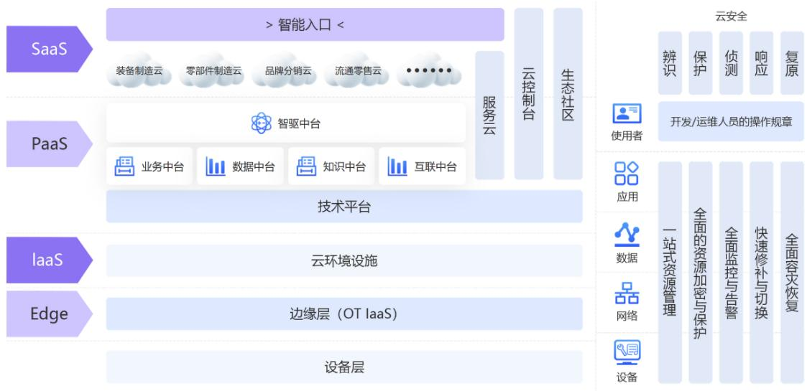

flowchart

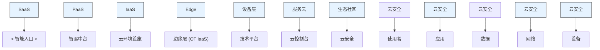

## （五）研发投入中拟资本化部分符合项目实际情况、符合《企业会计准则》的相关规定

公司将内部研究开发项目的支出区分为研究阶段支出和开发阶段支出。研究阶段的支出，于发生时计入当期损益。开发阶段的支出，同时满足下列条件的，才能予以资本化，即：完成该无形资产以使其能够使用或出售在技术上具有可行性；具有完成该无形资产并使用或出售的意图；无形资产产生经济利益的方式，包括能够证明运用该无形资产生产的产品存在市场或无形资产自身存在市场，无形资产将在内部使用的，能够证明其有用性，有足够的技术、财务资源和其他资源支持，以完成该无形资产的开发，并有能力使用或出售该无形资产；归属于该无形资产开发阶段的支出能够可靠地计量。

公司对于拟进行资本化的项目经过市场调研，项目可行性分析报告、项目立项报告、项目预算等环节严格的项目评审。上述资本化研发项目基于无形资产的使用或出售在技术上具有可行性，且公司有依赖上述无形资产进行销售的意图，基于无形资产完成的软件平台存在市场。公司营业收入及经营活动现金流入足以支撑研发工作，公司研发经验丰富，有足够的技术、财务资源和其他资源支持，以完成该项目的开发，并有能力使用或出售该无形资产。公司设立了完善的研发体系，从产品的立项、评审、开发、测试、发布评审、发布等均建立了相应的流程或制度，建立了相应的控制措施和识别标识，确保资本化的准确。符合项目的实际情况与符合《企业会计准则》的相关规定。

## （六）报告期内发行人同类项目、同行业公司可比项目的资本化情况

报告期内，发行人研发投入资本化的项目包括“基于数智驱动的新型工业互联网平台项目”、“财务数字化专案项目”以及“基于柔性可组装的数智企业业务共享平台项目”，其中“基于数智驱动的新型工业互联网平台项目”对应本次募投项目。

公司根据公开信息查询了软件与信息技术服务行业研发支出资本化的时点和依据，具体情况如下：

<table><tr><td>序号</td><td>公司</td><td>研发支出资本化的会计处理原则</td><td>资本化开始时点</td><td>资本化结束时点</td></tr><tr><td>1</td><td>用友网络(600588.SH)</td><td>公司内部研究开发项目的支出分为研究阶段支出和开发阶段支出。研究阶段的支出,于发生时计入当期损益。开发阶段的支出,同时满足《企业会计准则第6号-无形资产》第九条规定的确认为无形资产。不满足上述条件的开发支出计入当期损益</td><td>项目完成内部评审立项通过</td><td>达到预定用途之日</td></tr><tr><td>2</td><td>赛意信息(300687.SZ)</td><td>公司内部研究开发项目的支出分为研究阶段支出和开发阶段支出。研究阶段:为获取新技术和知识等进行的有计划的调查阶段。具体为公司内部研究开发项目的前期调研、可行性研究、立项申请评审阶段。开发阶段:已完成研究阶段的工作后再进行的开发活动阶段。具体时点为完成功能性设计,至项目终验,完成项目开发。研究阶段的支出,于发生时计入当期损益。开发阶段的支出,同时满足《企业会计准则第6号-无形资产》第九条规定的确认为无形资产。不满足上述条件的开发支出计入当期损益</td><td>已完成研究阶段的工作,通过可行性研究,项目立项完成时</td><td>达到预定用途之日</td></tr><tr><td>3</td><td>汉得信息(300170.SZ)</td><td>公司内部研究开发项目的支出分为研究阶段支出和开发阶段支出。研究阶段:为获取并理解新的科学或技术知识等而进行的独创性的有计划调查、研究活动的阶段。开发阶段:在进行商业性生产或使用前,将研究成果或其他知识应用于某项计划或设计,以生产出新的或具有实质性改进的材料、装置、产品等活动的阶段。研究阶段的支出,于发生时计入当期损益。开发阶段的支出,同时满足《企业会计准则第6号-无形资产》第九条规定的确认为无形资产。不满足上述条件的开发支出计入当期损益</td><td>已完成研究阶段工作,通过可行性研究,并经董事会会议审批对项目进行立项</td><td>达到预定用途之日</td></tr><tr><td>4</td><td>致远互联(688369.SH)</td><td>(1)划分为公司内部研究开发项目的研究阶段和开发阶段具体标准研究阶段:为获取并理解新的科学或技术知识等而进行的独创性的有计划调查、研究活动的阶段。开发阶段:在进行商业性生产或使用前,将研究成果或其他知识应用于某项计划或设计,以生产出新的或具有实质性改进的材料、装置、产品等活动的阶段。(2)研究阶段的支出,于发生时计入当期损益;开发阶段支出同时满足《企业会计准则第6号-无形资产》第九条规定的确认为无形资产。无法区分研究阶段支出和开发阶段支出的,将发生的研发支出全部计入当期损益</td><td>已完成研究阶段工作,通过可行性研究</td><td>达到预定用途之日</td></tr></table>

鼎捷数智以及本次募投项目研发建设部分的资本化开始时点为完成研究阶段的工作，并通过可行性研究及完成项目立项，结束时点为满足《企业会计准则第 6 号-无形资产》第九条的规定，达到预定用途之日，与上表中同行业公司的资本化政策不存在重大差异，符合相关会计准则的规定。

## 四、补充流动资金

## （一）项目概况

公司拟将本次募集资金中的 14,000 万元用于补充流动资金，以满足公司日常生产经营及业务发展对流动资金的需求。

## （二）补充流动资金的必要性分析

## 1、增加营运资金，满足业务规模扩张和研发投入产生的资金需求

随着公司销售收入持续增长、经营规模不断扩大，公司需要根据业务发展需求及时补充流动资金，为未来经营和发展提供充足的资金支持。本次补充流动资金将显著增强公司资金实力，对实现可持续发展具有重要意义。软件和信息服务行业市场竞争激烈，技术更新迭代较快，其研发需要提前投入资金及人员，因此行业内企业需要投入并储备大量资金保持企业发展的持续竞争力。公司综合考虑目前资金状况和未来发展需要，合理补充流动资金是保障公司正常经营及未来发展规划的切实需求，此举有利于公司未来的持续稳定经营。

## 2、进一步优化公司财务结构，提升公司可持续发展能力

本次补充流动资金能够有效提升公司流动比率和速动比率，优化财务结构，增强财务抗风险能力，为公司未来健康良性发展提供有力保障。本次募集资金到位后，公司将根据自身业务发展的需要，适时将流动资金投放于日常经营活动中，提升公司的盈利能力和可持续发展能力。

## （三）补充流动资金的可行性分析

## 1、募集资金用于补充流动资金符合法律法规的规定

公司本次向不特定对象发行可转换公司债券募集资金用于补充流动资金符合《上市公司证券发行注册管理办法》等法律、法规和规范性文件的相关规定，具有可行性。本次发行募集资金用于补充流动资金，有利于增强公司资金实力，夯实公司业务的市场竞争地位，保障公司的盈利能力。

## 2、募集资金管理与运用相关的内控制度完善

公司已按照上市公司的治理标准建立了现代企业制度，形成了较为规范的公司治理体系和完善的内部控制环境。在募集资金管理方面，公司已根据监管要求建立了募集资金管理制度，对募集资金的存放、使用等方面进行了明确规定。本次募集资金到位后，公司将严格遵守募集资金使用有关要求，确保本次募集资金的存放、使用和管理符合规范。

## （四）补充流动资金的合理性

## 1、主要参数的预测

营运资金缺口计算中的主要参数为未来三年各项经营性资产、经营性负债占营业收入的比重，以及未来三年预测的营业收入。

## （1）各项经营性资产、经营性负债占营业收入的比重

2021 年至2024 年，经营性流动资产和经营性流动负债占营业收入的比重如下：

<table><tr><td>项目</td><td>2024.12.31</td><td>2023.12.31</td><td>2022.12.31</td><td>2021.12.31</td></tr><tr><td>经营性流动资产:</td><td></td><td></td><td></td><td></td></tr><tr><td>应收票据</td><td>8.94%</td><td>9.62%</td><td>8.62%</td><td>10.72%</td></tr><tr><td>应收账款</td><td>25.86%</td><td>20.06%</td><td>13.22%</td><td>8.48%</td></tr><tr><td>预付款项</td><td>1.38%</td><td>1.04%</td><td>0.94%</td><td>0.98%</td></tr><tr><td>存货</td><td>3.67%</td><td>2.95%</td><td>2.43%</td><td>2.50%</td></tr><tr><td>经营性流动资产合计</td><td>39.85%</td><td>33.67%</td><td>25.21%</td><td>22.69%</td></tr><tr><td>经营性流动负债:</td><td></td><td></td><td></td><td></td></tr><tr><td>应付票据</td><td>0.19%</td><td>0.13%</td><td>0.00%</td><td>0.01%</td></tr><tr><td>应付账款</td><td>10.82%</td><td>10.20%</td><td>7.65%</td><td>7.07%</td></tr><tr><td>合同负债</td><td>13.65%</td><td>12.63%</td><td>12.83%</td><td>14.44%</td></tr><tr><td>经营性流动负债合计</td><td>24.67%</td><td>22.96%</td><td>20.48%</td><td>21.53%</td></tr><tr><td>流动资金占用额</td><td>15.18%</td><td>10.70%</td><td>4.73%</td><td>1.16%</td></tr></table>

发行人应收账款占营业收入的比重呈逐年上升趋势，其余经营性流动资产占比及经营性流动负债占比则较为平稳，随着发行人业务开拓，大客户、大型项目也在逐渐实现突破，后续应收账款占比亦会上升。因此，结合发行人 2021年至2024 年占比趋势、实际经营情况，假设 2025 年至2027 年，应收账款占营业收入的比重为 30%，其余经营性流动资产和经营性流动负债占比与 2024 年保持一致。各项经营性资产、经营性负债占营业收入的比重如下：

单位：万元

<table><tr><td>项目</td><td>占营业收入比重</td></tr><tr><td>经营性流动资产:</td><td></td></tr><tr><td>应收票据</td><td>8.94%</td></tr><tr><td>应收账款</td><td>30.00%</td></tr><tr><td>预付款项</td><td>1.38%</td></tr><tr><td>存货</td><td>3.67%</td></tr><tr><td>经营性流动资产合计</td><td>43.98%</td></tr><tr><td>经营性流动负债:</td><td></td></tr><tr><td>应付票据</td><td>0.19%</td></tr><tr><td>应付账款</td><td>10.82%</td></tr><tr><td>合同负债</td><td>13.65%</td></tr><tr><td>经营性流动负债合计</td><td>24.67%</td></tr></table>

## （2）营业收入预测

2022-2024 年度，公司与同行业可比上市公司营业收入及变动情况对比如下：

单位：万元

<table><tr><td>证券简称</td><td>2024 年度</td><td>变动比例</td><td>2023 年度</td><td>变动比例</td><td>2022 年度</td><td>变动比例</td></tr><tr><td>用友网络</td><td>915,272.94</td><td>-6.57%</td><td>979,607.16</td><td>5.77%</td><td>926,174.41</td><td>3.69%</td></tr><tr><td>赛意信息</td><td>239,545.17</td><td>6.27%</td><td>225,402.32</td><td>-0.75%</td><td>227,111.51</td><td>17.37%</td></tr><tr><td>汉得信息</td><td>323,515.07</td><td>8.57%</td><td>297,969.89</td><td>-0.90%</td><td>300,688.11</td><td>6.98%</td></tr><tr><td>致远互联</td><td>84,652.58</td><td>-18.97%</td><td>104,465.02</td><td>1.18%</td><td>103,242.98</td><td>0.12%</td></tr><tr><td>鼎捷数智</td><td>233,067.29</td><td>4.62%</td><td>222,774.00</td><td>11.65%</td><td>199,520.43</td><td>11.58%</td></tr></table>

可比公司由于与公司的主要客户群体不同导致 2022-2024 年整体的营业收入变动情况与公司存在一定的差异。公司客户群体较为分散，大客户集中度不高，且覆盖服务下游行业较多，有效分散了下游客户行业集中风险，故营业收入的变动情况与可比公司无法直接参考可比公司的情况，公司未来三年的营业收入情况将以自身营业收入的变化进行合理估计。

2022 年度至 2024 年度，公司营业收入复合增长率为 8.08%。假设 2025 年至 2027 年营业收入增长率保持在 8.08%，2025 年至 2027 年预测的营业收入金额如下：

单位：万元

<table><tr><td>项目</td><td>2024 年度</td><td>2025E</td><td>2026E</td><td>2027E</td></tr><tr><td>营业收入</td><td>233,067.29</td><td>251,900.07</td><td>272,254.63</td><td>294,253.91</td></tr></table>

根据测算，2025 年度至 2027 年度的营业收入分别为 251,900.07 万元、272,254.63 万元和 294,253.91 万元，公司预测期营业收入具有一定的谨慎性和合理性。

## 2、流动资金需求的测算方法与基本假设

公司本次营运资金的测算以 2024 年度经营情况为基础，按照销售百分比法测算未来三年经营性流动资产及经营性流动负债。假设公司经营性流动资产（应收账款、应收款项融资、预付款项、存货）和经营性流动负债（应付票据、应付账款、合同负债）与公司的销售收入呈一定比例，即经营性流动资产销售百分比和经营性流动负债销售百分比一定，且预测期保持不变。

经营性流动资产=上一年度营业收入×（1+销售收入增长率）×经营性流动资产销售百分比。

经营性流动负债=上一年度营业收入×（1+销售收入增长率）×经营性流动负债销售百分比。

流动资金占用额=经营性流动资产－经营性流动负债。

## 3、流动资金需求测算过程及结果

公司未来三年期间营运资金需求测算过程如下：

单位：万元

<table><tr><td rowspan="2">项目</td><td>基期</td><td rowspan="2">占营业收入比重</td><td colspan="3">预测期</td></tr><tr><td>2024 年</td><td>2025E</td><td>2026E</td><td>2027E</td></tr><tr><td>营业收入</td><td>233,067.29</td><td></td><td>251,900.07</td><td>272,254.63</td><td>294,253.91</td></tr><tr><td>经营性流动资产:</td><td></td><td></td><td></td><td></td><td></td></tr><tr><td>应收票据</td><td>20,835.06</td><td>8.94%</td><td>22,518.61</td><td>24,338.21</td><td>26,304.84</td></tr><tr><td>应收账款</td><td>60,277.29</td><td>30.00%</td><td>75,570.02</td><td>81,676.39</td><td>88,276.17</td></tr><tr><td>预付款项</td><td>3,211.90</td><td>1.38%</td><td>3,471.43</td><td>3,751.94</td><td>4,055.11</td></tr><tr><td>存货</td><td>8,544.14</td><td>3.67%</td><td>9,234.54</td><td>9,980.73</td><td>10,787.21</td></tr><tr><td>经营性流动资产合计</td><td>92,868.39</td><td>43.98%</td><td>110,794.61</td><td>119,747.27</td><td>129,423.33</td></tr><tr><td>经营性流动负债:</td><td></td><td></td><td>-</td><td>-</td><td>-</td></tr><tr><td>应付票据</td><td>449.68</td><td>0.19%</td><td>486.02</td><td>525.29</td><td>567.74</td></tr><tr><td>应付账款</td><td>25,219.29</td><td>10.82%</td><td>27,257.11</td><td>29,459.59</td><td>31,840.05</td></tr><tr><td>合同负债</td><td>31,824.28</td><td>13.65%</td><td>34,395.81</td><td>37,175.13</td><td>40,179.03</td></tr><tr><td>经营性流动负债合计</td><td>57,493.25</td><td>24.67%</td><td>62,138.94</td><td>67,160.01</td><td>72,586.82</td></tr><tr><td>流动资金占用额</td><td>35,375.14</td><td>19.32%</td><td>48,655.68</td><td>52,587.25</td><td>56,836.52</td></tr><tr><td>流动资金需求</td><td colspan="5">21,461.38</td></tr></table>

根据上表测算结果，公司 2027 年末的营运资金缺口为 21,461.38 万元。本次募集资金中拟用于补充流动资金金额小于流动资金缺口，因此本次补充流动资金规模具有合理性。

## （五）本次募集资金的合规性

本次拟募集资金非资本性支出包括补充流动资金 14,000 万元以及“鼎捷数智化生态赋能平台项目”中的铺底流动资金 3,239.97 万元、合计为 17,239.97万元，占本次募集资金总额 20.83%，未超过 30%，本次募集资金用于补充流动资金规模符合《证券期货法律适用意见第 18号》的有关规定，方案切实可行。

## 第八节 历次募集资金运用

公司经中国证券监督管理委员会《关于核准鼎捷软件股份有限公司首次公开发行股票并在创业板上市的批复》（证监许可[2014]25号）核准，并经深圳证券交易所同意，向社会公开发行人民币普通股（A股）不超过3,000 万股，其中，发行新股 2,878.4681 万股，公司股东公开发售股份 121.5319 万股，发行价格每股 20.77 元，募集资金总额 597,857,824.37 元，扣除与发行有关的费用80,589,730.04 元，募集资金净额为 517,268,094.33 元。大华会计师事务所（特殊普通合伙）已于2014 年1月22日对本公司首次公开发行股票的资金到位情况进行了审验，并出具了大华验字（2014）000052号《验资报告》，公司已将全部募集资金存放于募集资金专户管理。公司首次发行股票募集资金到账时间距今已满五个会计年度，且已使用完毕。

公司于2023年7月26日召开第五届董事会第三次会议及第五届监事会第三次会议，于 2023 年 8 月 14 日召开了 2023 年第二次临时股东大会审议通过了公司向不特定对象发行可转换公司债券的相关议案。公司于2024 年7月22日召开第五届董事会第十次会议及第五届监事会第十次会议，于 2024 年 8 月 8 日召开2024 年第二次临时股东大会，审议通过了延长本次发行股东大会决议有效期及相关授权有效期的相关议案。公司于 2024 年 10 月 30 日召开第五届董事会第十三次会议及第五届监事会第十三次会议审议通过了调整发行方案及相关修订文件的议案。公司于 2025 年 7 月 24 日召开第五届董事会第十七次会议及第五届监事会第十六次会议，于 2025 年 8 月 12 日召开 2025 年第一次临时股东大会，审议通过了延长本次发行股东大会决议有效期及相关授权有效期的相关议案。公司于 2025 年 8 月 21 日召开了第五届董事会第十八次会议及第五届监事会第十七次会议，审议通过了调整发行方案及相关修订文件的议案。根据中国证券监督管理委员会《监管规则适用指引——发行类第7号》有关规定：“前次募集资金使用情况报告对前次募集资金到账时间距今未满五个会计年度的历次募集资金实际使用情况进行说明，一般以年度末作为报告出具基准日，如截止最近一期末募集资金使用发生实质性变化，发行人也可提供截止最近一期末经鉴证的前募报告。”

公司于 2014 年上市，前次募集资金到账时间距今已超过五个会计年度，且公司最近五个会计年度内不存在通过增发（包括重大资产重组配套融资）、配股、发行可转换公司债券等方式募集资金的情形。鉴于上述情况，公司本次向不特定对象发行可转换公司债券无需编制前次募集资金使用情况报告，也无需聘请会计师事务所对前次募集资金使用情况出具鉴证报告。

## 第九节声明

## 一、发行人及全体董事、监事、高级管理人员声明

不存在虚假记载、误导性陈述或重大遗漏，按照诚信原则履行承诺，并完整，不存在虚假记载、误导性陈述或重大遗漏，按照诚信原则履行承诺，并承担相应的法律责任。

董事：

叶子祯

叶子祯

孙蔼彬

孙蔼彬

张苑逸

张苑逸

n

刘波

武

刘宗长

揭晓小

朱慈蕴

朱慈蕴

刘焱

邹景文

监事：

皮世明

皮世明

黄俊

黄俊

王娟

王娟

除董事、监事外的高级管理人员：

潘奉菊

潘泰龢

林市

林健伟

鼎捷数智股份有限公司

2025年9月16日

## 二、保荐机构声明

本公司已对募集说明书进行了核查，确认本募集说明书内容真实、准确、完整，不存在虚假记载、误导性陈述或重大遗漏，并承担相应的法律责任

项目协办人：

雷新轩雷妍妍

保荐代表人：

王贤

李海东李海东

总经理：

刘志辉

董事长、法定代表人（或授权代表）：

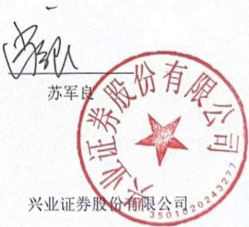

text_image

苏军良
兴业证券股份有限公司
3501020243271

年 月 日

## 声明

本人已认真阅读鼎捷数智股份有限公司募集说明书的全部内容，确认募集明书不存在虚假记载、误导性陈述或者重大遗漏，并对募集说明书真实性、准性、完整性、及时性承担相应法律责任。

保荐机构总经理：

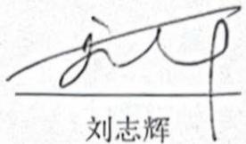

text_image

刘志辉

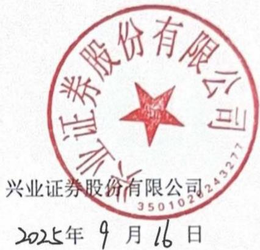

text_image

兴业证券股份有限公司
3501028243277
2025年9月16日

## 声明

本人已认真阅读鼎捷数智股份有限公司募集说明书的全部内容，确认募集明书不存在虚假记载、误导性陈述或者重大遗漏，并对募集说明书真实性、准性、完整性、及时性承担相应法律责任

保荐机构董事长（或授权代表）

text_image

冯敏

苏军

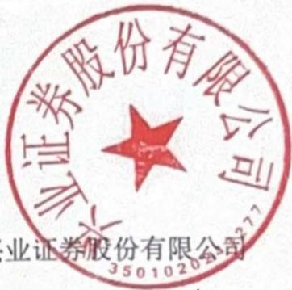

text_image

业证券股份有限公司
35010204
业证券股份有限公司

年 月

## 三、发行人律师声明

本所及经办律师已阅读募集说明书，确认募集说明书内容与本所出具的法律意见书不存在矛盾。本所及经办律师对发行人在募集说明书中引用的法律意的内容无异议，确认募集说明书不因引用上述内容而出现虚假记载、误导性或重大遗漏，并承担相应的法律责

经办律师：

杜田

杜羽田

张阳

张阳

律师事务所负责人：

颜克兵

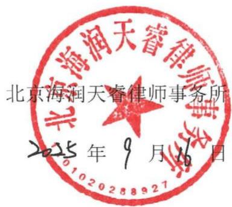

text_image

北京海润天睿律师事务所
2025年9月16日

## 四、审计机构声明

本所及签字注册会计师已阅读鼎捷数智股份有限公司向不特定对象发行可转换公司债券募集说明书（以下简称“募集说明书”），确认募集说明书与本所出具的上会师报字（2024）第15112号和上会师报字（2025）第5166号审计报告、上会师报字（2024）第15113号内部控制鉴证报告、上会师报字（2025）第5167号内部控制审计报告及上会师报字（2024）第15114号、上会师报字（2025）第9589号和上会师报字（2025）第14213号非经常性损益鉴证报告不存在矛盾。募集说明书中引用的审计报告的内容无异议，确认募集说明书不致因所引用内确认募集说明书不致因所引用内容而出现虚假记载、误导性陈述或重大遗漏，并担相应的法律责任。

计师事务所负责人：

荣

张會中晓计 荣师册张晓荣

字注册会计师：

张教

张毅

毅师

计

大香

王庆香

庆计

赖莉

赖会 莉计 国注 莉师册 赖莉莉

上会会计师事务所（特殊普通合伙）

年 月

## 联合资信评估股份有限公司

## 资信评级机构声明

本机构及签字的资信评级人员已阅读募集说明书，确认募集说明书与本机构出具的报告不存在矛盾。本机构及签字的资信评级人员对发行人在募集说明书中引用的报告的内容无异议，确认募集说明书不致因所引用内容而出现虚假记载、误导性陈述或重大遗漏，并对其真实性、准确性和完整性承担相应的法律责任。

资信评级人员：

信评估股份有

王佳晨子

宁立杰

资信评级机构负责人：

万华伟

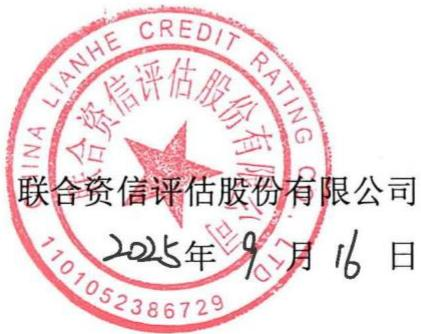

text_image

CHINA LIANHE CREDIT RATING
联合资信评估股份有限公司
2025年9月16日

## 联合资信评估股份有限公司

## 授权委托书

兹授权联合资信评估股份有限公司总裁万华伟先生（性别：男，身份证号360111197201160034）为我单位的代表人，在所有的评级业务合同、协议、投标书等评级业务有关文件上签字或签章。

授权期限自2025年1月1日至2025年12月31日。

被授权人签字或签章样本：

授权单位（公章）：联合资信评估股份有限公司

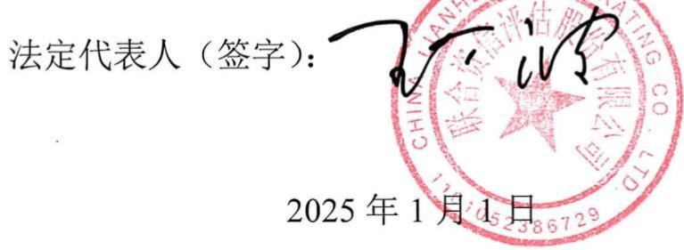

text_image

法定代表人（签字）：
2025年1月1日

## 六、董事会声明

本次发行摊薄即期回报的，发行人董事会按照国务院和中国证监会有关规定作出的承诺并兑现填补回报的具体措施。

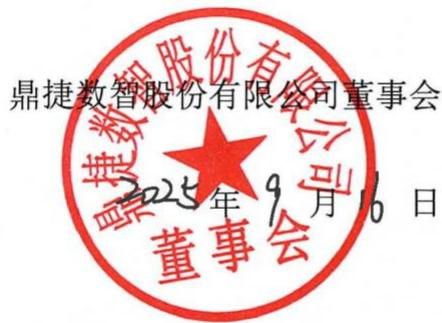

text_image

鼎捷数智股份有限公司董事会
2025年9月16日

## 第十节 备查文件

除本募集说明书所披露的资料外，本公司按照要求将下列文件作为备查文件，供投资者查阅：

（一）发行人最近三年的财务报告及审计报告；  
（二）保荐人出具的发行保荐书、发行保荐工作报告和尽职调查报告；  
（三）法律意见书和律师工作报告；  
（四）资信评级报告；  
（五）其他与本次发行有关的重要文件。

## 附表 1 商标

截至 2025 年 6月 30日，发行人拥有中国大陆注册商标201 项，具体情况如下表所示：

<table><tr><td>序号</td><td>注册商标</td><td>注册号</td><td>注册人</td><td>分类</td><td>申请日</td><td>有效期限</td><td>取得方式</td></tr><tr><td>1</td><td></td><td>1538335</td><td>发行人</td><td>第9类</td><td>1999/11/16</td><td>2021/3/14至2031/3/13</td><td>受让取得</td></tr><tr><td>2</td><td></td><td>1570354</td><td>发行人</td><td>第9类</td><td>1999/11/30</td><td>2021/5/14至2031/5/13</td><td>受让取得</td></tr><tr><td>3</td><td>易成</td><td>3038825</td><td>发行人</td><td>第9类</td><td>2001/12/13</td><td>2023/3/14/至2033/3/13</td><td>原始取得</td></tr><tr><td>4</td><td>易飞</td><td>3038826</td><td>发行人</td><td>第9类</td><td>2001/12/13</td><td>2023/3/14/至2033/3/13</td><td>原始取得</td></tr><tr><td>5</td><td>易助</td><td>3054975</td><td>发行人</td><td>第9类</td><td>2001/12/28</td><td>2023/3/14/至2033/3/13</td><td>原始取得</td></tr><tr><td>6</td><td>捷文</td><td>3303826</td><td>发行人</td><td>第9类</td><td>2002/9/11</td><td>2024/4/21/至2034/4/20</td><td>原始取得</td></tr><tr><td>7</td><td>[6CWS]</td><td>3435790</td><td>发行人</td><td>第35类</td><td>2003/1/14</td><td>2024/10/21/至2034/10/20</td><td>受让取得</td></tr><tr><td>8</td><td>DYNAPDM</td><td>5210682</td><td>发行人</td><td>第9类</td><td>2006/3/13</td><td>2019/4/14至2029/4/13</td><td>受让取得</td></tr><tr><td>9</td><td>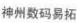</td><td>5210683</td><td>发行人</td><td>第9类</td><td>2006/3/13</td><td>2019/10/28至2029/10/27</td><td>原始取得</td></tr><tr><td>10</td><td>易慧</td><td>5209826</td><td>发行人</td><td>第9类</td><td>2006/3/13</td><td>2019/4/14至2029/4/13</td><td>受让取得</td></tr><tr><td>11</td><td>易竣</td><td>5383860</td><td>发行人</td><td>第9类</td><td>2006/5/29</td><td>2019/5/28至2029/5/27</td><td>受让取得</td></tr><tr><td>12</td><td>TOPGP</td><td>5578082</td><td>发行人</td><td>第9类</td><td>2006/8/31</td><td>2019/8/14/至2029/8/13</td><td>原始取得</td></tr><tr><td>13</td><td>DigiChannel</td><td>5578081</td><td>发行人</td><td>第9类</td><td>2006/8/31</td><td>2019/8/14/至2029/8/13</td><td>原始取得</td></tr><tr><td>14</td><td></td><td>5622997</td><td>发行人</td><td>第9类</td><td>2006/9/22</td><td>2019/8/21/至2029/8/20</td><td>受让取得</td></tr><tr><td>15</td><td>DIGIFLOW</td><td>5679602</td><td>发行人</td><td>第9类</td><td>2006/10/24</td><td>2019/8/28/至2029/8/27</td><td>原始取得</td></tr><tr><td>16</td><td></td><td>7101827</td><td>发行人</td><td>第41类</td><td>2008/12/8</td><td>2021/2/21至2031/2/20</td><td>原始取得</td></tr><tr><td>17</td><td>EsoGride</td><td>7428487</td><td>发行人</td><td>第9类</td><td>2009/5/27</td><td>2021/1/7至2031/1/6</td><td>原始取得</td></tr><tr><td>18</td><td></td><td>7605257</td><td>发行人</td><td>第9类</td><td>2009/8/10</td><td>2021/4/21/至2031/4/20</td><td>原始取得</td></tr><tr><td>19</td><td>DigwinSoft</td><td>8411193</td><td>发行人</td><td>第35类</td><td>2010/6/22</td><td>2021/11/7至2031/11/6</td><td>原始取得</td></tr><tr><td>20</td><td>DigwinSoft</td><td>8411037</td><td>发行人</td><td>第16类</td><td>2010/6/22</td><td>2021/10/14至2031/10/13</td><td>原始取得</td></tr><tr><td>21</td><td>DigwinSoft</td><td>8410869</td><td>发行人</td><td>第9类</td><td>2010/6/22</td><td>2022/12/7至2032/12/6</td><td>原始取得</td></tr><tr><td>22</td><td>鼎捷</td><td>8410859</td><td>发行人</td><td>第9类</td><td>2010/6/22</td><td>2021/7/7至2031/7/6</td><td>原始取得</td></tr><tr><td>23</td><td>鼎捷</td><td>8411145</td><td>发行人</td><td>第35类</td><td>2010/6/22</td><td>2021/7/14/至2031/7/13</td><td>原始取得</td></tr><tr><td>24</td><td>鼎捷</td><td>8411010</td><td>发行人</td><td>第16类</td><td>2010/6/22</td><td>2021/7/7至2031/7/6</td><td>原始取得</td></tr><tr><td>25</td><td></td><td>8411096</td><td>发行人</td><td>第16类</td><td>2010/6/22</td><td>2021/7/7至2031/7/6</td><td>原始取得</td></tr><tr><td>26</td><td></td><td>8410915</td><td>发行人</td><td>第9类</td><td>2010/6/22</td><td>2021/7/7至2031/7/6</td><td>原始取得</td></tr><tr><td>27</td><td></td><td>8411061</td><td>发行人</td><td>第16类</td><td>2010/6/22</td><td>2021/7/7至2031/7/6</td><td>原始取得</td></tr><tr><td>28</td><td></td><td>8410896</td><td>发行人</td><td>第9类</td><td>2010/6/22</td><td>2022/12/14/至2032/12/13</td><td>原始取得</td></tr><tr><td>29</td><td></td><td>8415611</td><td>发行人</td><td>第35类</td><td>2010/6/23</td><td>2021/10/7至2031/10/6</td><td>原始取得</td></tr><tr><td>30</td><td></td><td>8415675</td><td>发行人</td><td>第38类</td><td>2010/6/23</td><td>2021/8/7至2031/8/6</td><td>原始取得</td></tr><tr><td>31</td><td></td><td>8415732</td><td>发行人</td><td>第41类</td><td>2010/6/23</td><td>2021/7/28至2031/7/27</td><td>原始取得</td></tr><tr><td>32</td><td></td><td>8415723</td><td>发行人</td><td>第41类</td><td>2010/6/23</td><td>2022/1/28至2032/1/27</td><td>原始取得</td></tr><tr><td>33</td><td>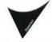</td><td>8415667</td><td>发行人</td><td>第38类</td><td>2010/6/23</td><td>2021/10/21/至2031/10/20</td><td>原始取得</td></tr><tr><td>34</td><td>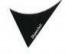</td><td>8415605</td><td>发行人</td><td>第35类</td><td>2010/6/23</td><td>2021/12/7至2031/12/6</td><td>原始取得</td></tr><tr><td>35</td><td></td><td>8415657</td><td>发行人</td><td>第38类</td><td>2010/6/23</td><td>2021/10/21/至2031/10/20</td><td>原始取得</td></tr><tr><td>36</td><td></td><td>8415711</td><td>发行人</td><td>第41类</td><td>2010/6/23</td><td>2021/11/28至2031/11/27</td><td>原始取得</td></tr><tr><td>37</td><td></td><td>8415644</td><td>发行人</td><td>第38类</td><td>2010/6/23</td><td>2021/8/7至2031/8/6</td><td>原始取得</td></tr><tr><td>38</td><td></td><td>8415694</td><td>发行人</td><td>第41类</td><td>2010/6/23</td><td>2021/7/7至2031/7/6</td><td>原始取得</td></tr><tr><td>39</td><td></td><td>8419606</td><td>发行人</td><td>第42类</td><td>2010/6/24</td><td>2021/11/28至2031/11/27</td><td>原始取得</td></tr><tr><td>40</td><td></td><td>8419596</td><td>发行人</td><td>第42类</td><td>2010/6/24</td><td>2021/7/7至2031/7/6</td><td>原始取得</td></tr><tr><td>41</td><td></td><td>8975301</td><td>发行人</td><td>第9类</td><td>2010/12/21</td><td>2022/1/7至2032/1/6</td><td>原始取得</td></tr><tr><td>42</td><td>[C3BX]</td><td>9802843</td><td>发行人</td><td>第9类</td><td>2011/8/3</td><td>2022/9/28至2032/9/27</td><td>原始取得</td></tr><tr><td>43</td><td></td><td>9802857</td><td>发行人</td><td>第35类</td><td>2011/8/3</td><td>2022/11/28至2032/11/27</td><td>原始取得</td></tr><tr><td>44</td><td></td><td>9802873</td><td>发行人</td><td>第38类</td><td>2011/8/3</td><td>2022/9/28至2032/9/27</td><td>原始取得</td></tr><tr><td>45</td><td></td><td>9802894</td><td>发行人</td><td>第41类</td><td>2011/8/3</td><td>2022/9/28至2032/9/27</td><td>原始取得</td></tr><tr><td>46</td><td></td><td>9802904</td><td>发行人</td><td>第42类</td><td>2011/8/3</td><td>2022/9/28至2032/9/27</td><td>原始取得</td></tr><tr><td>47</td><td>[S 6CW4]</td><td>16723693</td><td>发行人</td><td>第9类</td><td>2015/4/16</td><td>2016/6/7至2026/6/6</td><td>原始取得</td></tr><tr><td>48</td><td>[S X75T]</td><td>16723692</td><td>发行人</td><td>第16类</td><td>2015/4/16</td><td>2016/6/7至2026/6/6</td><td>原始取得</td></tr><tr><td>49</td><td>[S 6TWZ]</td><td>16723690</td><td>发行人</td><td>第35类</td><td>2015/4/16</td><td>2016/6/7至2026/6/6</td><td>原始取得</td></tr><tr><td>50</td><td>[S 2HA7]</td><td>16723689</td><td>发行人</td><td>第38类</td><td>2015/4/16</td><td>2016/6/7至2026/6/6</td><td>原始取得</td></tr><tr><td>51</td><td>[S C2K3]</td><td>16723688</td><td>发行人</td><td>第41类</td><td>2015/4/16</td><td>2016/6/7至2026/6/6</td><td>原始取得</td></tr><tr><td>52</td><td>[S D4AA]</td><td>16723691</td><td>发行人</td><td>第42类</td><td>2015/4/16</td><td>2016/6/7至2026/6/6</td><td>原始取得</td></tr><tr><td>53</td><td></td><td>17246747</td><td>发行人</td><td>第16类</td><td>2015/6/19</td><td>2016/10/28至2026/10/27</td><td>原始取得</td></tr><tr><td>54</td><td></td><td>17854606</td><td>发行人</td><td>第16类</td><td>2015/9/9</td><td>2016/12/21至2026/12/20</td><td>原始取得</td></tr><tr><td>55</td><td>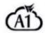</td><td>17854605</td><td>发行人</td><td>第35类</td><td>2015/9/9</td><td>2016/12/21至2026/12/20</td><td>原始取得</td></tr><tr><td>56</td><td></td><td>17854604</td><td>发行人</td><td>第38类</td><td>2015/9/9</td><td>2017/7/14/至2027/7/13</td><td>原始取得</td></tr><tr><td>57</td><td></td><td>17854602</td><td>发行人</td><td>第42类</td><td>2015/9/9</td><td>2017/7/14/至2027/7/13</td><td>原始取得</td></tr><tr><td>58</td><td></td><td>17854601</td><td>发行人</td><td>第9类</td><td>2015/9/9</td><td>2017/8/14/至2027/8/13</td><td>原始取得</td></tr><tr><td>59</td><td></td><td>17854600</td><td>发行人</td><td>第16类</td><td>2015/9/9</td><td>2016/12/21至2026/12/20</td><td>原始取得</td></tr><tr><td>60</td><td></td><td>17854599</td><td>发行人</td><td>第35类</td><td>2015/9/9</td><td>2016/12/21至2026/12/20</td><td>原始取得</td></tr><tr><td>61</td><td></td><td>17854598</td><td>发行人</td><td>第38类</td><td>2015/9/9</td><td>2016/10/21至2026/10/20</td><td>原始取得</td></tr><tr><td>62</td><td></td><td>17854596</td><td>发行人</td><td>第42类</td><td>2015/9/9</td><td>2017/8/7至2027/8/6</td><td>原始取得</td></tr><tr><td>63</td><td></td><td>17854595</td><td>发行人</td><td>第9类</td><td>2015/9/9</td><td>2017/8/14/至2027/8/13</td><td>原始取得</td></tr><tr><td>64</td><td></td><td>17854594</td><td>发行人</td><td>第38类</td><td>2015/9/9</td><td>2017/8/14/至2027/8/13</td><td>原始取得</td></tr><tr><td>65</td><td></td><td>17854593</td><td>发行人</td><td>第42类</td><td>2015/9/9</td><td>2017/8/7至2027/8/6</td><td>原始取得</td></tr><tr><td>66</td><td></td><td>18933342</td><td>发行人</td><td>第16类</td><td>2016/1/20</td><td>2017/2/28至2027/2/27</td><td>原始取得</td></tr><tr><td>67</td><td></td><td>18933341</td><td>发行人</td><td>第35类</td><td>2016/1/20</td><td>2018/3/14/至2028/3/13</td><td>原始取得</td></tr><tr><td>68</td><td></td><td>18933338</td><td>发行人</td><td>第39类</td><td>2016/1/20</td><td>2018/3/14/至2028/3/13</td><td>原始取得</td></tr><tr><td>69</td><td></td><td>18933337</td><td>发行人</td><td>第41类</td><td>2016/1/20</td><td>2018/3/14/至2028/3/13</td><td>原始取得</td></tr><tr><td>70</td><td></td><td>18933335</td><td>发行人</td><td>第45类</td><td>2016/1/20</td><td>2017/2/28至2027/2/27</td><td>原始取得</td></tr><tr><td>71</td><td></td><td>18933334</td><td>发行人</td><td>第9类</td><td>2016/1/20</td><td>2017/12/14/至2027/12/13</td><td>原始取得</td></tr><tr><td>72</td><td></td><td>18933333</td><td>发行人</td><td>第16类</td><td>2016/1/20</td><td>2017/2/28至2027/2/27</td><td>原始取得</td></tr><tr><td>73</td><td></td><td>18933332</td><td>发行人</td><td>第35类</td><td>2016/1/20</td><td>2017/2/28至2027/2/27</td><td>原始取得</td></tr><tr><td>74</td><td></td><td>18933331</td><td>发行人</td><td>第36类</td><td>2016/1/20</td><td>2017/2/28至2027/2/27</td><td>原始取得</td></tr><tr><td>75</td><td></td><td>18933330</td><td>发行人</td><td>第38类</td><td>2016/1/20</td><td>2017/2/28至2027/2/27</td><td>原始取得</td></tr><tr><td>76</td><td></td><td>18933329</td><td>发行人</td><td>第39类</td><td>2016/1/20</td><td>2017/2/28至2027/2/27</td><td>原始取得</td></tr><tr><td>77</td><td></td><td>18933328</td><td>发行人</td><td>第41类</td><td>2016/1/20</td><td>2017/2/28至2027/2/27</td><td>原始取得</td></tr><tr><td>78</td><td></td><td>18933327</td><td>发行人</td><td>第42类</td><td>2016/1/20</td><td>2017/2/28至2027/2/27</td><td>原始取得</td></tr><tr><td>79</td><td></td><td>18933326</td><td>发行人</td><td>第45类</td><td>2016/1/20</td><td>2017/2/28至2027/2/27</td><td>原始取得</td></tr><tr><td>80</td><td></td><td>18933324</td><td>发行人</td><td>第16类</td><td>2016/1/20</td><td>2017/2/28至2027/2/27</td><td>原始取得</td></tr><tr><td>81</td><td></td><td>18933323</td><td>发行人</td><td>第35类</td><td>2016/1/20</td><td>2018/3/14至2028/3/13</td><td>原始取得</td></tr><tr><td>82</td><td></td><td>18933320</td><td>发行人</td><td>第39类</td><td>2016/1/20</td><td>2018/3/14至2028/3/13</td><td>原始取得</td></tr><tr><td>83</td><td></td><td>18933319</td><td>发行人</td><td>第41类</td><td>2016/1/20</td><td>2018/3/14至2028/3/13</td><td>原始取得</td></tr><tr><td>84</td><td></td><td>18933317</td><td>发行人</td><td>第45类</td><td>2016/1/20</td><td>2017/2/28至2027/2/27</td><td>原始取得</td></tr><tr><td>85</td><td></td><td>19159236</td><td>发行人</td><td>第9类</td><td>2016/2/26</td><td>2017/12/14/至2027/12/13</td><td>原始取得</td></tr><tr><td>86</td><td></td><td>19159280</td><td>发行人</td><td>第16类</td><td>2016/2/26</td><td>2017/3/28至2027/3/27</td><td>原始取得</td></tr><tr><td>87</td><td></td><td>19159279</td><td>发行人</td><td>第35类</td><td>2016/2/26</td><td>2017/12/14/至2027/12/13</td><td>原始取得</td></tr><tr><td>88</td><td></td><td>19159278</td><td>发行人</td><td>第38类</td><td>2016/2/26</td><td>2017/12/14/至2027/12/13</td><td>原始取得</td></tr><tr><td>89</td><td></td><td>19159277</td><td>发行人</td><td>第41类</td><td>2016/2/26</td><td>2017/12/14/至2027/12/13</td><td>原始取得</td></tr><tr><td>90</td><td></td><td>19642267</td><td>发行人</td><td>第16类</td><td>2016/4/15</td><td>2017/5/28至2027/5/27</td><td>原始取得</td></tr><tr><td>91</td><td></td><td>19642268</td><td>发行人</td><td>第9类</td><td>2016/4/15</td><td>2017/6/7至2027/6/6</td><td>原始取得</td></tr><tr><td>92</td><td>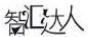</td><td>19642266</td><td>发行人</td><td>第35类</td><td>2016/4/15</td><td>2018/6/7至2028/6/6</td><td>原始取得</td></tr><tr><td>93</td><td></td><td>19642264</td><td>发行人</td><td>第41类</td><td>2016/4/15</td><td>2018/6/7至2028/6/6</td><td>原始取得</td></tr><tr><td>94</td><td>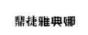</td><td>58123566</td><td>发行人</td><td>第35类</td><td>2021/7/30</td><td>2022/1/28至2032/1/27</td><td>原始取得</td></tr><tr><td>95</td><td>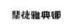</td><td>58133857</td><td>发行人</td><td>第38类</td><td>2021/7/31</td><td>2022/1/28至2032/1/27</td><td>原始取得</td></tr><tr><td>96</td><td>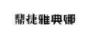</td><td>58132606</td><td>发行人</td><td>第41类</td><td>2021/7/31</td><td>2022/1/28至2032/1/27</td><td>原始取得</td></tr><tr><td>97</td><td rowspan="2">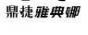</td><td>58113225</td><td>发行人</td><td>第35类</td><td>2021/7/30</td><td>2022/1/28至2032/1/27</td><td>原始取得</td></tr><tr><td>98</td><td>58128526</td><td>发行人</td><td>第38类</td><td>2021/7/31</td><td>2022/1/28至2032/1/27</td><td>原始取得</td></tr><tr><td>99</td><td rowspan="2">慧技雅尊卿慧技雅尊卿</td><td>58134217</td><td>发行人</td><td>第16类</td><td>2021/7/31</td><td>2022/2/7至2032/2/6</td><td>原始取得</td></tr><tr><td>100</td><td>58128874</td><td>发行人</td><td>第16类</td><td>2021/7/31</td><td>2022/2/7至2032/2/6</td><td>原始取得</td></tr><tr><td>101</td><td rowspan="2"></td><td>58116260</td><td>发行人</td><td>第9类</td><td>2021/7/30</td><td>2022/2/7至2032/2/6</td><td>原始取得</td></tr><tr><td>102</td><td>58111277</td><td>发行人</td><td>第42类</td><td>2021/7/30</td><td>2022/2/7至2032/2/6</td><td>原始取得</td></tr><tr><td>103</td><td rowspan="3"></td><td>58131424</td><td>发行人</td><td>第16类</td><td>2021/7/31</td><td>2022/2/21至2032/2/20</td><td>原始取得</td></tr><tr><td>104</td><td>58128483</td><td>发行人</td><td>第38类</td><td>2021/7/31</td><td>2022/2/21至2032/2/20</td><td>原始取得</td></tr><tr><td>105</td><td>58111652</td><td>发行人</td><td>第9类</td><td>2021/7/30</td><td>2022/2/28至2032/2/27</td><td>原始取得</td></tr><tr><td>106</td><td>慧技雅尊卿[C44]</td><td>58107676</td><td>发行人</td><td>第35类</td><td>2021/7/30</td><td>2022/2/28至2032/2/27</td><td>原始取得</td></tr><tr><td>107</td><td>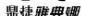</td><td>58107891</td><td>发行人</td><td>第42类</td><td>2021/7/30</td><td>2022/2/28至2032/2/27</td><td>原始取得</td></tr><tr><td>108</td><td>[XD2XL]</td><td>58111646</td><td>发行人</td><td>第9类</td><td>2021/7/30</td><td>2022/2/28至2032/2/27</td><td>原始取得</td></tr><tr><td>109</td><td>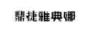</td><td>58123583</td><td>发行人</td><td>第42类</td><td>2021/7/30</td><td>2022/2/28至2032/2/27</td><td>原始取得</td></tr><tr><td>110</td><td rowspan="2">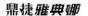</td><td>58129234</td><td>发行人</td><td>第41类</td><td>2021/7/31</td><td>2022/5/14至2032/5/13</td><td>原始取得</td></tr><tr><td>111</td><td>58124372</td><td>发行人</td><td>第41类</td><td>2021/7/31</td><td>2022/10/21至2032/10/20</td><td>原始取得</td></tr><tr><td>112</td><td rowspan="2">[HD4]</td><td>58112825</td><td>发行人</td><td>第9类</td><td>2021/7/30</td><td>2022/11/27至2032/11/26</td><td>原始取得</td></tr><tr><td>113</td><td>66424160</td><td>发行人</td><td>第35类</td><td>2022/8/5</td><td>2032/2/14至2033/2/13</td><td>原始取得</td></tr><tr><td>114</td><td rowspan="2">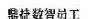</td><td>62660040</td><td>发行人</td><td>第36类</td><td>2022/2/17</td><td>2032/2/14至2033/2/13</td><td>原始取得</td></tr><tr><td>115</td><td>66438399</td><td>发行人</td><td>第9类</td><td>2022/8/5</td><td>2032/2/21至2033/2/20</td><td>原始取得</td></tr><tr><td>116</td><td></td><td>28143447</td><td>发行人</td><td>第16类</td><td>2017/12/18</td><td>2018/12/7至2028/12/6</td><td>受让取得</td></tr><tr><td>117</td><td>即享</td><td>19914996</td><td>智互联</td><td>第9类</td><td>2017/5/11</td><td>2017/6/28至2027/6/27</td><td>原始取得</td></tr><tr><td>118</td><td>即享</td><td>19914995</td><td>智互联</td><td>第16类</td><td>2017/5/11</td><td>2017/6/28至2027/6/27</td><td>原始取得</td></tr><tr><td>119</td><td>即享</td><td>19914994</td><td>智互联</td><td>第35类</td><td>2017/5/11</td><td>2017/6/28 至 2027/6/27</td><td>原始取得</td></tr><tr><td>120</td><td>即享</td><td>19914993</td><td>智互联</td><td>第36类</td><td>2017/5/11</td><td>2017/6/28 至 2027/6/27</td><td>原始取得</td></tr><tr><td>121</td><td>即享</td><td>19914991</td><td>智互联</td><td>第39类</td><td>2017/5/11</td><td>2017/6/28 至 2027/6/27</td><td>原始取得</td></tr><tr><td>122</td><td>即享</td><td>19914990</td><td>智互联</td><td>第41类</td><td>2017/5/11</td><td>2017/9/7 至 2027/9/6</td><td>原始取得</td></tr><tr><td>123</td><td>即享</td><td>19914988</td><td>智互联</td><td>第45类</td><td>2017/5/11</td><td>2017/6/28 至 2027/6/27</td><td>原始取得</td></tr><tr><td>124</td><td>即享云</td><td>19914987</td><td>智互联</td><td>第9类</td><td>2017/5/11</td><td>2017/6/28 至 2027/6/27</td><td>原始取得</td></tr><tr><td>125</td><td>即享云</td><td>19914986</td><td>智互联</td><td>第16类</td><td>2017/5/11</td><td>2017/6/28 至 2027/6/27</td><td>原始取得</td></tr><tr><td>126</td><td>即享云</td><td>19914985</td><td>智互联</td><td>第35类</td><td>2017/5/11</td><td>2017/6/28 至 2027/6/27</td><td>原始取得</td></tr><tr><td>127</td><td>即享云</td><td>19914984</td><td>智互联</td><td>第36类</td><td>2017/5/11</td><td>2017/6/28 至 2027/6/27</td><td>原始取得</td></tr><tr><td>128</td><td>即享云</td><td>19914982</td><td>智互联</td><td>第39类</td><td>2017/5/11</td><td>2017/6/28 至 2027/6/27</td><td>原始取得</td></tr><tr><td>129</td><td>即享云</td><td>19914981</td><td>智互联</td><td>第41类</td><td>2017/5/11</td><td>2017/6/28 至 2027/6/27</td><td>原始取得</td></tr><tr><td>130</td><td>即享云</td><td>19914979</td><td>智互联</td><td>第45类</td><td>2017/5/11</td><td>2017/6/28 至 2027/6/27</td><td>原始取得</td></tr><tr><td>131</td><td>工功云</td><td>64813171</td><td>南京鼎华</td><td>第42类</td><td>2022/5/23</td><td>2022/11/14/至 2032/11/13</td><td>原始取得</td></tr><tr><td>132</td><td>工功</td><td>64815769</td><td>南京鼎华</td><td>第42类</td><td>2022/5/23</td><td>2022/11/14/至 2032/11/13</td><td>原始取得</td></tr><tr><td>133</td><td>工功云</td><td>64810850</td><td>南京鼎华</td><td>第35类</td><td>2022/5/23</td><td>2022/11/14/至 2032/11/13</td><td>原始取得</td></tr><tr><td>134</td><td>工功</td><td>64816083</td><td>南京鼎华</td><td>第35类</td><td>2022/5/23</td><td>2022/11/14/至 2032/11/13</td><td>原始取得</td></tr><tr><td>135</td><td>工功</td><td>64817846</td><td>南京鼎华</td><td>第9类</td><td>2022/5/23</td><td>2022/11/14/至 2032/11/13</td><td>原始取得</td></tr><tr><td>136</td><td>工功云</td><td>64805904</td><td>南京鼎华</td><td>第9类</td><td>2022/5/23</td><td>2022/11/14/至 2032/11/13</td><td>原始取得</td></tr><tr><td>137</td><td>工功</td><td>61065238</td><td>南京鼎华</td><td>第42类</td><td>2021/12/1</td><td>2022/5/28/至 2032/5/27</td><td>原始取得</td></tr><tr><td>138</td><td>工功云</td><td>61065244</td><td>南京鼎华</td><td>第42类</td><td>2021/12/1</td><td>2022/5/28/至 2032/5/27</td><td>原始取得</td></tr><tr><td>139</td><td>工功</td><td>61049738</td><td>南京鼎华</td><td>第35类</td><td>2021/12/1</td><td>2022/5/28/至 2032/5/27</td><td>原始取得</td></tr><tr><td>140</td><td>工功</td><td>61050927</td><td>南京鼎华</td><td>第9类</td><td>2021/12/1</td><td>2022/6/7/至 2032/6/6</td><td>原始取得</td></tr><tr><td>141</td><td>工功云</td><td>61044907</td><td>南京鼎华</td><td>第9类</td><td>2021/12/1</td><td>2022/6/7/至 2032/6/6</td><td>原始取得</td></tr><tr><td>142</td><td>工功云</td><td>61044913</td><td>南京鼎华</td><td>第35类</td><td>2021/12/1</td><td>2022/8/7/至 2032/8/6</td><td>原始取得</td></tr><tr><td>143</td><td>鼎华智</td><td>66633937</td><td>南京鼎华</td><td>第42类</td><td>2022/8/16</td><td>2023/3/14/至 2033/3/13</td><td>原始取得</td></tr><tr><td>144</td><td>鼎华智</td><td>66639655</td><td>南京鼎华</td><td>第9类</td><td>2022/8/16</td><td>2023/2/21/至 2033/2/20</td><td>原始取得</td></tr><tr><td>145</td><td>娜娜帮我</td><td>69326583</td><td>发行人</td><td>第9类</td><td>2023/1/31</td><td>2023/7/21 至 2033/7/20</td><td>原始取得</td></tr><tr><td>146</td><td>娜娜帮我</td><td>69328376</td><td>发行人</td><td>第35类</td><td>2023/1/31</td><td>2023/7/21 至 2033/7/20</td><td>原始取得</td></tr><tr><td>147</td><td>娜娜帮我</td><td>69332121</td><td>发行人</td><td>第38类</td><td>2023/1/31</td><td>2023/7/21 至 2033/7/20</td><td>原始取得</td></tr><tr><td>148</td><td>娜娜帮我</td><td>69336246</td><td>发行人</td><td>第41类</td><td>2023/1/31</td><td>2023/7/21 至 2033/7/20</td><td>原始取得</td></tr><tr><td>149</td><td>娜娜帮我</td><td>69333437</td><td>发行人</td><td>第42类</td><td>2023/1/31</td><td>2023/7/21 至 2033/7/20</td><td>原始取得</td></tr><tr><td>150</td><td>帮帮我娜</td><td>72278131</td><td>发行人</td><td>第35类</td><td>2023/6/16</td><td>2024/3/7 至 2034/3/6</td><td>原始取得</td></tr><tr><td>151</td><td>帮帮我娜</td><td>71876142</td><td>发行人</td><td>第41类</td><td>2023/5/29</td><td>2024/1/28 至 2034/1/27</td><td>原始取得</td></tr><tr><td>152</td><td>帮帮我娜</td><td>69332070</td><td>发行人</td><td>第9类</td><td>2023/1/31</td><td>2024/6/14至2034/6/13</td><td>原始取得</td></tr><tr><td>153</td><td></td><td>69335380</td><td>发行人</td><td>第35类</td><td>2023/1/31</td><td>2023/10/14至2033/10/13</td><td>原始取得</td></tr><tr><td>154</td><td>帮帮我娜</td><td>69328194</td><td>发行人</td><td>第35类</td><td>2023/1/31</td><td>2024/5/7至2034/5/6</td><td>原始取得</td></tr><tr><td>155</td><td>帮帮我娜</td><td>69326747</td><td>发行人</td><td>第38类</td><td>2023/1/31</td><td>2024/5/7至2034/5/6</td><td>原始取得</td></tr><tr><td>156</td><td>帮帮我娜</td><td>69325368</td><td>发行人</td><td>第41类</td><td>2023/1/31</td><td>2024/6/14至2034/6/13</td><td>原始取得</td></tr><tr><td>157</td><td>帮帮我娜</td><td>66430896</td><td>发行人</td><td>第42类</td><td>2022/8/5</td><td>2023/9/28至2033/9/27</td><td>原始取得</td></tr><tr><td>158</td><td></td><td>3435791</td><td>发行人</td><td>第9类</td><td>2003/1/14</td><td>2024/7/14至2034/7/13</td><td>受让取得</td></tr><tr><td>159</td><td>Digiwin</td><td>80061407</td><td>发行人</td><td>第16类</td><td>2024/7/29</td><td>2025/2/21至2035/2/20</td><td>原始取得</td></tr><tr><td>160</td><td>Digiwin</td><td>80062895</td><td>发行人</td><td>第38类</td><td>2024/7/29</td><td>2025/2/7至2035/2/6</td><td>原始取得</td></tr><tr><td>161</td><td>Digiwin</td><td>80061413</td><td>发行人</td><td>第16类</td><td>2024/7/29</td><td>2025/2/7至2035/2/6</td><td>原始取得</td></tr><tr><td>162</td><td>鼎捷</td><td>74946121</td><td>发行人</td><td>第42类</td><td>2023/11/2</td><td>2024/12/28至2034/12/27</td><td>原始取得</td></tr><tr><td>163</td><td>DIGWIN METIS</td><td>79542707</td><td>发行人</td><td>第42类</td><td>2024/7/1</td><td>2024/12/21至2034/12/20</td><td>原始取得</td></tr><tr><td>164</td><td>米提思</td><td>79536225</td><td>发行人</td><td>第42类</td><td>2024/7/1</td><td>2024/12/21至2034/12/20</td><td>原始取得</td></tr><tr><td>165</td><td>米提思</td><td>79548020</td><td>发行人</td><td>第16类</td><td>2024/7/1</td><td>2024/12/21至2034/12/20</td><td>原始取得</td></tr><tr><td>166</td><td>DIGWIN METIS</td><td>79548802</td><td>发行人</td><td>第38类</td><td>2024/7/1</td><td>2024/12/21至2034/12/20</td><td>原始取得</td></tr><tr><td>167</td><td>DIGWIN METIS</td><td>79543584</td><td>发行人</td><td>第16类</td><td>2024/7/1</td><td>2024/12/21至2034/12/20</td><td>原始取得</td></tr><tr><td>168</td><td>DIGWIN METIS</td><td>79533566</td><td>发行人</td><td>第41类</td><td>2024/7/1</td><td>2024/12/21至2034/12/20</td><td>原始取得</td></tr><tr><td>169</td><td>莫提斯</td><td>79542716</td><td>发行人</td><td>第42类</td><td>2024/7/1</td><td>2024/12/21至2034/12/20</td><td>原始取得</td></tr><tr><td>170</td><td>莫提斯</td><td>79529382</td><td>发行人</td><td>第38类</td><td>2024/7/1</td><td>2024/12/21至2034/12/20</td><td>原始取得</td></tr><tr><td>171</td><td>DIGWIN METIS</td><td>79540377</td><td>发行人</td><td>第9类</td><td>2024/7/1</td><td>2024/12/21至2034/12/20</td><td>原始取得</td></tr><tr><td>172</td><td>莫提思</td><td>79543640</td><td>发行人</td><td>第42类</td><td>2024/7/1</td><td>2024/12/21至2034/12/20</td><td>原始取得</td></tr><tr><td>173</td><td>莫提思</td><td>79531779</td><td>发行人</td><td>第38类</td><td>2024/7/1</td><td>2024/12/21至2034/12/20</td><td>原始取得</td></tr><tr><td>174</td><td>DIGWIN METIS</td><td>79527403</td><td>发行人</td><td>第35类</td><td>2024/7/1</td><td>2024/12/21至2034/12/20</td><td>原始取得</td></tr><tr><td>175</td><td>米提思</td><td>79549967</td><td>发行人</td><td>第9类</td><td>2024/7/1</td><td>2024/12/21至2034/12/20</td><td>原始取得</td></tr><tr><td>176</td><td>米提思</td><td>79533964</td><td>发行人</td><td>第38类</td><td>2024/7/1</td><td>2024/12/21至2034/12/20</td><td>原始取得</td></tr><tr><td>177</td><td>鼎捷即享云</td><td>78318047</td><td>发行人</td><td>第38类</td><td>2024/4/29</td><td>2024/10/14至2034/10/13</td><td>原始取得</td></tr><tr><td>178</td><td>鼎捷即享云</td><td>78330646</td><td>发行人</td><td>第42类</td><td>2024/4/29</td><td>2024/10/14至2034/10/13</td><td>原始取得</td></tr><tr><td>179</td><td>鼎捷即享</td><td>78342264</td><td>发行人</td><td>第42类</td><td>2024/4/29</td><td>2024/10/14至2034/10/13</td><td>原始取得</td></tr><tr><td>180</td><td>鼎捷即享</td><td>78347623</td><td>发行人</td><td>第38类</td><td>2024/4/29</td><td>2024/10/14至2034/10/13</td><td>原始取得</td></tr><tr><td>181</td><td>鼎捷我想</td><td>69328438</td><td>发行人</td><td>第42类</td><td>2023/1/31</td><td>2024/10/14至2034/10/13</td><td>原始取得</td></tr><tr><td>182</td><td>DigiHua</td><td>77032171</td><td>南京鼎华</td><td>第9类</td><td>2024/2/29</td><td>2025/2/21至2035/2/20</td><td>原始取得</td></tr><tr><td>183</td><td>鼎捷数智</td><td>81734221</td><td>发行人</td><td>第38类</td><td>2024/11/1</td><td>2025/4/28至2035/4/27</td><td>原始取得</td></tr><tr><td>184</td><td>鼎捷数智</td><td>81724719</td><td>发行人</td><td>第42类</td><td>2024/11/1</td><td>2025/4/28至2035/4/27</td><td>原始取得</td></tr><tr><td>185</td><td>鼎捷数智</td><td>81724538</td><td>发行人</td><td>第9类</td><td>2024/11/1</td><td>2025/4/28至2035/4/27</td><td>原始取得</td></tr><tr><td>186</td><td>鼎捷数智</td><td>81729023</td><td>发行人</td><td>第35类</td><td>2024/11/1</td><td>2025/4/28至2035/4/27</td><td>原始取得</td></tr><tr><td>187</td><td>鼎捷数智</td><td>81717101</td><td>发行人</td><td>第16类</td><td>2024/11/2</td><td>2025/5/14至2035/5/13</td><td>原始取得</td></tr><tr><td>188</td><td>Digiwin鼎捷</td><td>81723135</td><td>发行人</td><td>第38类</td><td>2024/11/3</td><td>2025/5/15至2035/5/14</td><td>原始取得</td></tr><tr><td>189</td><td>Digiwin</td><td>81730064</td><td>发行人</td><td>第38类</td><td>2024/11/4</td><td>2025/5/16至2035/5/15</td><td>原始取得</td></tr><tr><td>190</td><td>Digiwin</td><td>81718444</td><td>发行人</td><td>第38类</td><td>2024/11/5</td><td>2025/5/17至2035/5/16</td><td>原始取得</td></tr><tr><td>191</td><td>Digiwin</td><td>81719580</td><td>发行人</td><td>第16类</td><td>2024/11/6</td><td>2025/5/18至2035/5/17</td><td>原始取得</td></tr><tr><td>192</td><td>Digiwin鼎捷</td><td>81718382</td><td>发行人</td><td>第16类</td><td>2024/11/7</td><td>2025/5/19至2035/5/18</td><td>原始取得</td></tr><tr><td>193</td><td>Digiwin鼎捷</td><td>81717245</td><td>发行人</td><td>第38类</td><td>2024/11/8</td><td>2025/5/20至2035/5/19</td><td>原始取得</td></tr><tr><td>194</td><td>Digiwin</td><td>81718764</td><td>发行人</td><td>第16类</td><td>2024/11/9</td><td>2025/5/21至2035/5/20</td><td>原始取得</td></tr><tr><td>195</td><td>Digiwin鼎捷</td><td>81722267</td><td>发行人</td><td>第16类</td><td>2024/11/10</td><td>2025/5/22至2035/5/21</td><td>原始取得</td></tr><tr><td>196</td><td></td><td>82452038</td><td>智互联</td><td>第16类</td><td>2024/12/10</td><td>2025/5/28至2035/5/27</td><td>原始取得</td></tr><tr><td>197</td><td></td><td>82462682</td><td>智互联</td><td>第9类</td><td>2024/12/10</td><td>2025/5/28至2035/5/27</td><td>原始取得</td></tr><tr><td>198</td><td></td><td>82464219</td><td>智互联</td><td>第35类</td><td>2024/12/10</td><td>2025/5/28至2035/5/27</td><td>原始取得</td></tr><tr><td>199</td><td></td><td>82465277</td><td>智互联</td><td>第42类</td><td>2024/12/10</td><td>2025/5/28至2035/5/27</td><td>原始取得</td></tr><tr><td>200</td><td></td><td>82469407</td><td>智互联</td><td>第38类</td><td>2024/12/10</td><td>2025/5/28至2035/5/27</td><td>原始取得</td></tr><tr><td>201</td><td></td><td>82473835</td><td>智互联</td><td>第41类</td><td>2024/12/10</td><td>2025/5/28至2035/5/27</td><td>原始取得</td></tr></table>

注：上述商标均无他项权利。

上述注册号为 1538335 的商标为发行人从原权利人中山市张家边电子厂处受让取得；上述注册号为 1570354的商标为发行人从原权利人鼎新数智（发行人全资子公司）处受让取得；上述注册号为 3435791、3435790 的商标为发行人从原权利人鼎诚资讯股份有限公司（原发行人间接控制控股子公司）处受让取得；上述注册号为5622997 的商标为发行人从原权利人广州鼎捷（发行人全资子公司）处受让取得；上述注册号为 5210682、5209826、5383860的商标为发行人从原权利人上海神州数码技术信息管理有限公司（发行人原全资子公司）处受让取得；

上述注册号为 28143447 的商标为发行人从原权利人上海鼎捷移动（原发行人全资孙公司）处受让取得。

截至 2025 年 6月 30日，发行人拥有中国大陆以外注册商标 171项，具体情况如下表所示：

<table><tr><td>序号</td><td>商标名称</td><td>商标图样</td><td>注册人</td><td>类别</td><td>注册/审定号</td><td>专用期限</td><td>取得方式</td></tr><tr><td>1</td><td>TIPTOP</td><td>TIPTOP</td><td>鼎新数智</td><td>9</td><td>00716650</td><td>1996/5/16至2026/5/15</td><td>原始取得</td></tr><tr><td>2</td><td>EasyFlow</td><td>EasyFlow</td><td>鼎新数智</td><td>9</td><td>00861368</td><td>1999/8/1至2029/7/31</td><td>原始取得</td></tr><tr><td>3</td><td>EasyFlow</td><td>EasyFlow</td><td>鼎新数智</td><td>16</td><td>00950655</td><td>2001/7/16至2031/7/15</td><td>原始取得</td></tr><tr><td>4</td><td>EasyFlow</td><td>EasyFlow</td><td>鼎新数智</td><td>38</td><td>00141221</td><td>2001/4/1至2031/3/31</td><td>原始取得</td></tr><tr><td>5</td><td>EasyFlow</td><td>EasyFlow</td><td>鼎新数智</td><td>41</td><td>00142510</td><td>2001/5/1至2031/4/30</td><td>原始取得</td></tr><tr><td>6</td><td>EasyFlow</td><td>EasyFlow</td><td>鼎新数智</td><td>42</td><td>00151580</td><td>2001/11/1至2031/10/31</td><td>原始取得</td></tr><tr><td>7</td><td>企业通</td><td>企業通</td><td>鼎新数智</td><td>9</td><td>00851503</td><td>1999/5/16至2029/5/15</td><td>原始取得</td></tr><tr><td>8</td><td>企业通</td><td>企業通</td><td>鼎新数智</td><td>41</td><td>00120949</td><td>2000/2/1至2030/1/31</td><td>原始取得</td></tr><tr><td>9</td><td>超级特助</td><td>超級特助</td><td>鼎新数智</td><td>9</td><td>00851539</td><td>1999/5/16至2029/3/15</td><td>原始取得</td></tr><tr><td>10</td><td>WorkflowERP及图</td><td></td><td>鼎新数智</td><td>9</td><td>00915941</td><td>2000/12/1至2030/11/30</td><td>原始取得</td></tr><tr><td>11</td><td>EC设计图</td><td></td><td>鼎新数智</td><td>9</td><td>00949905</td><td>2001/7/16至2031/7/15</td><td>原始取得</td></tr><tr><td>12</td><td>EC设计图</td><td></td><td>鼎新数智</td><td>16</td><td>00931206</td><td>2001/2/16至2031/2/15</td><td>原始取得</td></tr><tr><td>13</td><td>EC设计图</td><td>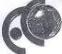</td><td>鼎新数智</td><td>38</td><td>00138528</td><td>2001/2/16至2031/2/15</td><td>原始取得</td></tr><tr><td>14</td><td>EC设计图</td><td></td><td>鼎新数智</td><td>41</td><td>00132737</td><td>2000/11/16至2030/11/15</td><td>原始取得</td></tr><tr><td>15</td><td>EC设计图</td><td>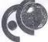</td><td>鼎新数智</td><td>42</td><td>00146135</td><td>2001/7/16至2031/7/15</td><td>原始取得</td></tr><tr><td>16</td><td>鼎新电脑Data Systems及图</td><td></td><td>鼎新数智</td><td>9</td><td>00949852</td><td>2001/3/1至2031/2/28</td><td>原始取得</td></tr><tr><td>17</td><td>鼎新电脑Data Systems及图</td><td></td><td>鼎新数智</td><td>16</td><td>00933445</td><td>2001/7/16至2031/7/15</td><td>原始取得</td></tr><tr><td>18</td><td>鼎新电脑Data Systems及图</td><td></td><td>鼎新数智</td><td>35</td><td>00133226</td><td>2000/12/1至2030/11/30</td><td>原始取得</td></tr><tr><td>19</td><td>鼎新电脑Data Systems及图</td><td></td><td>鼎新数智</td><td>38</td><td>00130186</td><td>2000/10/1至2030/9/30</td><td>原始取得</td></tr><tr><td>20</td><td>鼎新电脑Data Systems及图</td><td></td><td>鼎新数智</td><td>41</td><td>00130257</td><td>2000/10/1至2030/9/30</td><td>原始取得</td></tr><tr><td>21</td><td>鼎新电脑Data Systems及图</td><td></td><td>鼎新数智</td><td>42</td><td>00136055</td><td>2001/1/1至2030/12/31</td><td>原始取得</td></tr><tr><td>22</td><td>电子商务链及e-B chain</td><td>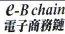</td><td>鼎新数智</td><td>9</td><td>00949904</td><td>2001/7/16至2031/7/15</td><td>原始取得</td></tr><tr><td>23</td><td>电子商务链及e-B chain</td><td>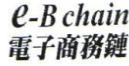</td><td>鼎新数智</td><td>16</td><td>00994824</td><td>2002/4/16至2032/4/15</td><td>原始取得</td></tr><tr><td>24</td><td>电子商务链及e-B chain</td><td> $\mathcal{Q} - B$  chain電子商務鏈</td><td>鼎新数智</td><td>38</td><td>00156729</td><td>2002/1/16至2032/1/15</td><td>原始取得</td></tr><tr><td>25</td><td>电子商务链及e-B chain</td><td> $\mathcal{Q} - B$  chain電子商務鏈</td><td>鼎新数智</td><td>41</td><td>00145176</td><td>2002/7/1至2032/6/30</td><td>原始取得</td></tr><tr><td>26</td><td>电子商务链及e-B chain</td><td> $\mathcal{Q} - B$  chain電子商務鏈</td><td>鼎新数智</td><td>42</td><td>00157035</td><td>2002/1/16至2032/1/15</td><td>原始取得</td></tr><tr><td>27</td><td>V-Point</td><td>Y-Point</td><td>鼎新数智</td><td>9</td><td>01101062</td><td>2004/5/16至2034/5/15</td><td>原始取得</td></tr><tr><td>28</td><td>EasyLearning</td><td>EasyLearning</td><td>鼎新数智</td><td>9</td><td>01110665</td><td>2004/7/16至2034/7/15</td><td>原始取得</td></tr><tr><td>29</td><td>Cosmos设计图</td><td></td><td>鼎新数智</td><td>9</td><td>01119302</td><td>2004/9/16至2034/9/15</td><td>原始取得</td></tr><tr><td>30</td><td>Cosmos设计图</td><td></td><td>鼎新数智</td><td>42</td><td>01120684</td><td>2004/9/16至2034/9/15</td><td>原始取得</td></tr><tr><td>31</td><td>软体分镜</td><td></td><td>鼎新数智</td><td>9、16、42</td><td>01147401</td><td>2005/4/1至2035/3/31</td><td>原始取得</td></tr><tr><td>32</td><td>SOFTSCORE</td><td>S </td><td>鼎新数智</td><td>9、16、42</td><td>01147402</td><td>2005/4/1至2035/3/31</td><td>原始取得</td></tr><tr><td>33</td><td>ego设计图</td><td></td><td>鼎新数智</td><td>9、16、35</td><td>01168077</td><td>2005/8/1至2025/7/31</td><td>原始取得</td></tr><tr><td>34</td><td>鼎新ego设计图</td><td></td><td>鼎新数智</td><td>38、41、42</td><td>01203253</td><td>2006/4/1至2026/3/31</td><td>原始取得</td></tr><tr><td>35</td><td>smart ERP</td><td></td><td>鼎新数智</td><td>9、42</td><td>01249929</td><td>2007/2/1至2027/1/31</td><td>原始取得</td></tr><tr><td>36</td><td>e-B Online</td><td></td><td>鼎新数智</td><td>9、38、16、41、35、42</td><td>01252167</td><td>2007/2/16至2027/2/15</td><td>原始取得</td></tr><tr><td>37</td><td>GP</td><td></td><td>鼎新数智</td><td>9、41、42</td><td>01267783</td><td>2007/6/16至2027/6/15</td><td>原始取得</td></tr><tr><td>38</td><td>DSC.NET</td><td>I </td><td>鼎新数智</td><td>9、16、38、42</td><td>01302134</td><td>2008/2/16至2028/2/15</td><td>受让取得</td></tr><tr><td>39</td><td>MDM</td><td></td><td>鼎新数智</td><td>9、16、38、42</td><td>01303589</td><td>2008/3/1至2028/2/29</td><td>受让取得</td></tr><tr><td>40</td><td>DSC.J</td><td></td><td>鼎新数智</td><td>9、16</td><td>01349032</td><td>2009/2/1至2029/1/31</td><td>原始取得</td></tr><tr><td>41</td><td>DSC.J</td><td></td><td>鼎新数智</td><td>38</td><td>01322288</td><td>2008/8/1至2028/7/31</td><td>原始取得</td></tr><tr><td>42</td><td>DSC.J</td><td></td><td>鼎新数智</td><td>42</td><td>01322447</td><td>2008/8/1至2028/7/31</td><td>原始取得</td></tr><tr><td>43</td><td>CRM及图</td><td></td><td>鼎新数智</td><td>9</td><td>01363994</td><td>2009/6/1至2029/5/31</td><td>原始取得</td></tr><tr><td>44</td><td>CRM及图</td><td></td><td>鼎新数智</td><td>16</td><td>01372171</td><td>2009/8/1至2029/7/31</td><td>原始取得</td></tr><tr><td>45</td><td>CRM及图</td><td></td><td>鼎新数智</td><td>38</td><td>01368923</td><td>2009/7/1至2029/6/30</td><td>原始取得</td></tr><tr><td>46</td><td>CRM及图</td><td></td><td>鼎新数智</td><td>42</td><td>01369050</td><td>2009/7/1至2029/6/30</td><td>原始取得</td></tr><tr><td>47</td><td>鼎捷软件DigiwinSoft及图</td><td></td><td>鼎新数智</td><td>35</td><td>01464661</td><td>2011/7/16至2031/7/15</td><td>原始取得</td></tr><tr><td>48</td><td>鼎新电脑股份有限公司标章(双V型1)</td><td></td><td>鼎新数智</td><td>9、38、16、41、35、42</td><td>01448103</td><td>2011/1/1至2030/12/31</td><td>原始取得</td></tr><tr><td>49</td><td>DigiwinSoft及图</td><td>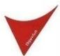</td><td>鼎新数智</td><td>9、38、16、41、35、42</td><td>01448104</td><td>2011/1/1至2030/12/31</td><td>原始取得</td></tr><tr><td>50</td><td>DigiwinSoft</td><td>DigiwinSoft</td><td>鼎新数智</td><td>9、41、16、42、38</td><td>01448105</td><td>2011/1/1至2030/12/31</td><td>原始取得</td></tr><tr><td>51</td><td>鼎捷</td><td></td><td>鼎新数智</td><td>9、38、16、41、35、42</td><td>01448106</td><td>2011/1/1至2030/12/31</td><td>原始取得</td></tr><tr><td>52</td><td>智汇达人设计图</td><td>智汇达人</td><td>鼎新数智</td><td>9</td><td>01803401</td><td>2016/11/16至2026/11/15</td><td>原始取得</td></tr><tr><td>53</td><td>智汇达人设计图</td><td></td><td>鼎新数智</td><td>16</td><td>01838025</td><td>2017/5/1至2027/4/30</td><td>原始取得</td></tr><tr><td>54</td><td>智汇达人设计图</td><td>智汇达人</td><td>鼎新数智</td><td>35</td><td>01844791</td><td>2017/6/1至2027/5/31</td><td>原始取得</td></tr><tr><td>55</td><td>智汇达人设计图</td><td></td><td>鼎新数智</td><td>38</td><td>01862349</td><td>2017/8/16至2027/8/15</td><td>原始取得</td></tr><tr><td>56</td><td>智汇达人设计图</td><td>智汇达人</td><td>鼎新数智</td><td>41</td><td>01845290</td><td>2017/6/1至2027/5/31</td><td>原始取得</td></tr><tr><td>57</td><td>智汇达人设计图</td><td>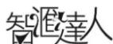</td><td>鼎新数智</td><td>42</td><td>01805392</td><td>2016/11/16至2026/11/15</td><td>原始取得</td></tr><tr><td>58</td><td>A1及图</td><td rowspan="2">[A1]</td><td>鼎新数智</td><td>9</td><td>01777121</td><td>2016/7/1至2026/6/30</td><td>原始取得</td></tr><tr><td>59</td><td>A1及图</td><td>鼎新数智</td><td>16</td><td>01838023</td><td>2017/5/1至2027/4/30</td><td>原始取得</td></tr><tr><td>60</td><td>A1及图</td><td>[A1]</td><td>鼎新数智</td><td>35</td><td>01770194</td><td>2016/5/16至2026/5/15</td><td>原始取得</td></tr><tr><td>61</td><td>A1及图</td><td></td><td>鼎新数智</td><td>38</td><td>01770413</td><td>2016/5/16至2026/5/15</td><td>原始取得</td></tr><tr><td>62</td><td>A1及图</td><td>[A1]</td><td>鼎新数智</td><td>41</td><td>01770522</td><td>2016/5/16至2026/5/15</td><td>原始取得</td></tr><tr><td>63</td><td>A1及图</td><td></td><td>鼎新数智</td><td>42</td><td>01775921</td><td>2016/6/16至2026/6/15</td><td>原始取得</td></tr><tr><td>64</td><td>A1商务应用云及图</td><td>[A1]商務應用微</td><td>鼎新数智</td><td>9</td><td>01777122</td><td>2016/7/1至2026/6/30</td><td>原始取得</td></tr><tr><td>65</td><td>A1商务应用云及图</td><td></td><td>鼎新数智</td><td>16</td><td>01838024</td><td>2017/5/1至2027/4/30</td><td>原始取得</td></tr><tr><td>66</td><td>A1商务应用云及图</td><td>[A1]商務應用微</td><td>鼎新数智</td><td>35</td><td>01770195</td><td>2016/5/16至2026/5/15</td><td>原始取得</td></tr><tr><td>67</td><td>A1商务应用云及图</td><td></td><td>鼎新数智</td><td>38</td><td>01770414</td><td>2016/5/16至2026/5/15</td><td>原始取得</td></tr><tr><td>68</td><td>A1商务应用云及图</td><td>[A1]商務應用微</td><td>鼎新数智</td><td>41</td><td>01770523</td><td>2016/5/16至2026/5/15</td><td>原始取得</td></tr><tr><td>69</td><td>A1商务应用云及图</td><td>商務應用微</td><td>鼎新数智</td><td>42</td><td>01775922</td><td>2016/6/16至2026/6/15</td><td>原始取得</td></tr><tr><td>70</td><td>DigiChain及图</td><td></td><td>鼎新数智</td><td>9、38、16、41、35、42</td><td>01498038</td><td>2012/1/1至2031/12/31</td><td>原始取得</td></tr><tr><td>71</td><td>鼎诚信息及DigiChain 及图</td><td></td><td>鼎新数智</td><td>9、38、16、41、35、42</td><td>01498039</td><td>2012/1/1 至 2031/12/31</td><td>原始取得</td></tr><tr><td>72</td><td>鼎诚</td><td></td><td>鼎新数智</td><td>9、38、16、41、35、42</td><td>01498040</td><td>2012/1/1 至 2031/12/31</td><td>原始取得</td></tr><tr><td>73</td><td>DataSystems及图</td><td></td><td>鼎新数智</td><td>9、38、16、41、35、42</td><td>01498041</td><td>2012/1/1 至 2031/12/31</td><td>原始取得</td></tr><tr><td>74</td><td>鼎新电脑及DataSystems 及图</td><td></td><td>鼎新数智</td><td>9、38、16、41、35、42</td><td>01498042</td><td>2012/1/1 至 2031/12/31</td><td>原始取得</td></tr><tr><td>75</td><td>鼎新</td><td></td><td>鼎新数智</td><td>9、38、16、41、35、42</td><td>01498043</td><td>2012/1/1 至 2031/12/31</td><td>原始取得</td></tr><tr><td>76</td><td>碳为观止及图</td><td></td><td>鼎新数智</td><td>35、42</td><td>01580294</td><td>2013/5/16 至 2033/5/15</td><td>原始取得</td></tr><tr><td>77</td><td>碳为观止及图</td><td></td><td>鼎新数智</td><td>35、42</td><td>01580295</td><td>2013/5/16 至 2033/5/15</td><td>原始取得</td></tr><tr><td>78</td><td>智互联及图</td><td></td><td>鼎新数智</td><td>9</td><td>01791112</td><td>2016/9/16 至 2026/9/15</td><td>原始取得</td></tr><tr><td>79</td><td>智互联及图</td><td></td><td>鼎新数智</td><td>16</td><td>01791525</td><td>2016/9/16 至 2026/9/15</td><td>原始取得</td></tr><tr><td>80</td><td>智互联及图</td><td></td><td>鼎新数智</td><td>35</td><td>01789336</td><td>2016/9/1 至 2026/8/31</td><td>原始取得</td></tr><tr><td>81</td><td>智互联及图</td><td></td><td>鼎新数智</td><td>36</td><td>01789421</td><td>2016/9/1 至 2026/8/31</td><td>原始取得</td></tr><tr><td>82</td><td>智互联及图</td><td></td><td>鼎新数智</td><td>38</td><td>01789468</td><td>2016/9/1 至 2026/8/31</td><td>原始取得</td></tr><tr><td>83</td><td>智互联及图</td><td></td><td>鼎新数智</td><td>39</td><td>01789494</td><td>2016/9/1 至 2026/8/31</td><td>原始取得</td></tr><tr><td>84</td><td>智互联及图</td><td></td><td>鼎新数智</td><td>41</td><td>01789613</td><td>2016/9/1 至 2026/8/31</td><td>原始取得</td></tr><tr><td>85</td><td>智互联及图</td><td></td><td>鼎新数智</td><td>42</td><td>01793379</td><td>2016/9/16 至 2026/9/15</td><td>原始取得</td></tr><tr><td>86</td><td>智互联及图</td><td></td><td>鼎新数智</td><td>45</td><td>01789921</td><td>2016/9/1 至 2026/8/31</td><td>原始取得</td></tr><tr><td>87</td><td>Zhilink 及图</td><td></td><td>鼎新数智</td><td>9</td><td>01791113</td><td>2016/9/16 至 2026/9/15</td><td>原始取得</td></tr><tr><td>88</td><td>Zhilink 及图</td><td></td><td>鼎新数智</td><td>16</td><td>01791526</td><td>2016/9/16 至 2026/9/15</td><td>原始取得</td></tr><tr><td>89</td><td>Zhilink 及图</td><td></td><td>鼎新数智</td><td>35</td><td>01789337</td><td>2016/9/1 至 2026/8/31</td><td>原始取得</td></tr><tr><td>90</td><td>Zhilink 及图</td><td></td><td>鼎新数智</td><td>36</td><td>01789422</td><td>2016/9/1 至 2026/8/31</td><td>原始取得</td></tr><tr><td>91</td><td>Zhilink 及图</td><td></td><td>鼎新数智</td><td>38</td><td>01789469</td><td>2016/9/1 至 2026/8/31</td><td>原始取得</td></tr><tr><td>92</td><td>Zhilink 及图</td><td></td><td>鼎新数智</td><td>39</td><td>01789495</td><td>2016/9/1 至 2026/8/31</td><td>原始取得</td></tr><tr><td>93</td><td>Zhilink 及图</td><td></td><td>鼎新数智</td><td>41</td><td>01789614</td><td>2016/9/1 至 2026/8/31</td><td>原始取得</td></tr><tr><td>94</td><td>Zhilink 及图</td><td></td><td>鼎新数智</td><td>42</td><td>01793380</td><td>2016/9/16 至 2026/9/15</td><td>原始取得</td></tr><tr><td>95</td><td>Zhilink 及图</td><td></td><td>鼎新数智</td><td>45</td><td>01789922</td><td>2016/9/1 至 2026/8/31</td><td>原始取得</td></tr><tr><td>96</td><td>智互联 Zhilink及图</td><td> $$ 智互聯Zinik</td><td>鼎新数智</td><td>9</td><td>01791114</td><td>2016/9/16至2026/9/15</td><td>原始取得</td></tr><tr><td>97</td><td>智互联 Zhilink及图</td><td> $$ 智互聯Zinik</td><td>鼎新数智</td><td>16</td><td>01791527</td><td>2016/9/16至2026/9/15</td><td>原始取得</td></tr><tr><td>98</td><td>智互联 Zhilink及图</td><td> $$ 智互聯Zinik</td><td>鼎新数智</td><td>35</td><td>01789338</td><td>2016/9/1至2026/8/31</td><td>原始取得</td></tr><tr><td>99</td><td>智互联 Zhilink及图</td><td> $$ 智互聯Zinik</td><td>鼎新数智</td><td>36</td><td>01789423</td><td>2016/9/1至2026/8/31</td><td>原始取得</td></tr><tr><td>100</td><td>智互联 Zhilink及图</td><td> $$ 智互聯Zinik</td><td>鼎新数智</td><td>38</td><td>01789470</td><td>2016/9/1至2026/8/31</td><td>原始取得</td></tr><tr><td>101</td><td>智互联 Zhilink及图</td><td> $$ 智互聯Zinik</td><td>鼎新数智</td><td>39</td><td>01789496</td><td>2016/9/1至2026/8/31</td><td>原始取得</td></tr><tr><td>102</td><td>智互联 Zhilink及图</td><td> $$ 智互聯Zinik</td><td>鼎新数智</td><td>41</td><td>01789615</td><td>2016/9/1至2026/8/31</td><td>原始取得</td></tr><tr><td>103</td><td>智互联 Zhilink及图</td><td> $$ 智互聯Zinik</td><td>鼎新数智</td><td>42</td><td>01793381</td><td>2016/9/16至2026/9/15</td><td>原始取得</td></tr><tr><td>104</td><td>智互联 Zhilink及图</td><td> $$ 智互聯Zinik</td><td>鼎新数智</td><td>45</td><td>01789923</td><td>2016/9/1至2026/8/31</td><td>原始取得</td></tr><tr><td>105</td><td>IW设计图</td><td> $$ </td><td>鼎新数智</td><td>9</td><td>01797540</td><td>2016/10/16至2026/10/15</td><td>原始取得</td></tr><tr><td>106</td><td>IW设计图</td><td> $$ </td><td>鼎新数智</td><td>16</td><td>01797812</td><td>2016/10/16至2026/10/15</td><td>原始取得</td></tr><tr><td>107</td><td>IW设计图</td><td> $$ </td><td>鼎新数智</td><td>35</td><td>01798743</td><td>2016/10/16至2026/10/15</td><td>原始取得</td></tr><tr><td>108</td><td>IW设计图</td><td> $$ </td><td>鼎新数智</td><td>38</td><td>01798890</td><td>2016/10/16至2026/10/15</td><td>原始取得</td></tr><tr><td>109</td><td>IW设计图</td><td> $$ </td><td>鼎新数智</td><td>41</td><td>01798968</td><td>2016/10/16至2026/10/15</td><td>原始取得</td></tr><tr><td>110</td><td>IW设计图</td><td> $$ </td><td>鼎新数智</td><td>42</td><td>01799027</td><td>2016/10/16至2026/10/15</td><td>原始取得</td></tr><tr><td>111</td><td>人像图</td><td> $$ </td><td>鼎新数智</td><td>9、38、16、41、35、42</td><td>02223714</td><td>2022/5/16至2032/5/15</td><td>原始取得</td></tr><tr><td>112</td><td>DigiwinSoftATHENA及图</td><td> $$ W44G</td><td>鼎新数智</td><td>9、41、16、42、35</td><td>02252293</td><td>2022/9/16至2032/9/15</td><td>原始取得</td></tr><tr><td>113</td><td>鼎捷 ATHENA</td><td> $$ </td><td>鼎新数智</td><td>9、41、16、42、35</td><td>02252294</td><td>2022/9/16至2032/9/15</td><td>原始取得</td></tr><tr><td>114</td><td>鼎捷雅典娜</td><td> $$ </td><td>鼎新数智</td><td>9、38、16、41、35、42</td><td>02252295</td><td>2022/9/16至2032/9/15</td><td>原始取得</td></tr><tr><td>115</td><td>鼎新 ATHENA</td><td> $$ </td><td>鼎新数智</td><td>9、41、16、42、35</td><td>02252296</td><td>2022/9/16至2032/9/15</td><td>原始取得</td></tr><tr><td>116</td><td>鼎新雅典娜</td><td>鼎新雅典娜</td><td>鼎新数智</td><td>9、38、16、41、35、42</td><td>02252297</td><td>2022/9/16至2032/9/15</td><td>原始取得</td></tr><tr><td>117</td><td>图形</td><td> $$ </td><td>鼎新数智</td><td>9</td><td>01926212</td><td>2018/7/16至2028/7/15</td><td>受让取得</td></tr><tr><td>118</td><td>图形</td><td> $$ </td><td>鼎新数智</td><td>16</td><td>01926495</td><td>2018/7/16至2028/7/15</td><td>受让取得</td></tr><tr><td>119</td><td>图形</td><td></td><td>鼎新数智</td><td>35</td><td>01924541</td><td>2018/7/1至2028/6/30</td><td>受让取得</td></tr><tr><td>120</td><td>图形</td><td></td><td>鼎新数智</td><td>38</td><td>01924708</td><td>2018/7/1至2028/6/30</td><td>受让取得</td></tr><tr><td>121</td><td>图形</td><td></td><td>鼎新数智</td><td>41</td><td>01924863</td><td>2018/7/1至2028/6/30</td><td>受让取得</td></tr><tr><td>122</td><td>图形</td><td></td><td>鼎新数智</td><td>42</td><td>01927816</td><td>2018/7/16至2028/7/15</td><td>受让取得</td></tr><tr><td>123</td><td>帮帮我娜</td><td>幫幫我娜</td><td>鼎新数智</td><td>9、16、35、38、41、42</td><td>02338097</td><td>2023/11/16至2033/11/15</td><td>原始取得</td></tr><tr><td>124</td><td>娜娜帮我</td><td>娜娜幫我</td><td>鼎新数智</td><td>9、16、35、38、41、42</td><td>02338098</td><td>2023/11/16至2033/11/15</td><td>原始取得</td></tr><tr><td>125</td><td>猫头鹰图</td><td></td><td>鼎新数智</td><td>9、16、35、38、41、42</td><td>02338099</td><td>2023/11/16至2033/11/15</td><td>原始取得</td></tr><tr><td>126</td><td>莫提斯</td><td>莫提斯</td><td>鼎新数智</td><td>9、42</td><td>02346576</td><td>2023/12/16至2033/12/15</td><td>原始取得</td></tr><tr><td>127</td><td>莫提斯</td><td>莫提斯</td><td>鼎新数智</td><td>16、35、38、41</td><td>02364650</td><td>2024/3/16至2034/3/15</td><td>原始取得</td></tr><tr><td>128</td><td>莫提思</td><td>莫提思</td><td>鼎新数智</td><td>9、42</td><td>02346577</td><td>2023/12/16至2033/12/15</td><td>原始取得</td></tr><tr><td>129</td><td>莫提思</td><td>莫提思</td><td>鼎新数智</td><td>16、35、38、41</td><td>02364651</td><td>2024/3/16至2034/3/15</td><td>原始取得</td></tr><tr><td>130</td><td>METIS</td><td>METIS</td><td>鼎新数智</td><td>9、42</td><td>02346578</td><td>2023/12/16至2033/12/15</td><td>原始取得</td></tr><tr><td>131</td><td>METIS</td><td>METIS</td><td>鼎新数智</td><td>16、35、38、41</td><td>02374239</td><td>2024/5/1至2034/4/30</td><td>原始取得</td></tr><tr><td>132</td><td>DIGIWIN METIS</td><td>DIGIWIN METIS</td><td>鼎新数智</td><td>9、42</td><td>02346579</td><td>2023/12/16至2033/12/15</td><td>原始取得</td></tr><tr><td>133</td><td>DIGIWIN METIS</td><td>DIGIWIN METIS</td><td>鼎新数智</td><td>16、35、38、41</td><td>02374240</td><td>2024/5/1至2034/4/30</td><td>原始取得</td></tr><tr><td>134</td><td>米提思</td><td>米提思</td><td>鼎新数智</td><td>9、42</td><td>02353430</td><td>2024/1/16至2034/1/15</td><td>原始取得</td></tr><tr><td>135</td><td>米提思</td><td>米提思</td><td>鼎新数智</td><td>16、35、38、41</td><td>02374264</td><td>2024/5/1至2034/4/30</td><td>原始取得</td></tr><tr><td>136</td><td>DigiwinSoft ATHENA及图</td><td>DigiwinSoft ATHENA</td><td>鼎新数智</td><td>9、16、35、38、41、42</td><td>02374146</td><td>2024/5/1至2034/4/30</td><td>原始取得</td></tr><tr><td>137</td><td>A1及图</td><td></td><td>鼎新数智</td><td>9、16、35、38、41、42</td><td>02359531</td><td>2024/2/16至2034/2/15</td><td>原始取得</td></tr><tr><td>138</td><td>鼎捷</td><td>鼎捷</td><td>鼎新数智</td><td>9</td><td>2013056726</td><td>2015/3/30至2033/7/9</td><td>原始取得</td></tr><tr><td>139</td><td>鼎捷</td><td>鼎捷</td><td>鼎新数智</td><td>35</td><td>2013056728</td><td>2015/4/9至2033/7/9</td><td>原始取得</td></tr><tr><td>140</td><td>鼎捷</td><td>鼎捷</td><td>鼎新数智</td><td>42</td><td>2013056729</td><td>2015/3/27至2033/7/9</td><td>原始取得</td></tr><tr><td>141</td><td>双V</td><td></td><td>鼎新数智</td><td>9</td><td>2013056731</td><td>2014/10/10至2033/7/9</td><td>原始取得</td></tr><tr><td>142</td><td>双V</td><td></td><td>鼎新数智</td><td>35</td><td>2013056733</td><td>2014/10/29至2033/7/9</td><td>原始取得</td></tr><tr><td>143</td><td>双V</td><td></td><td>鼎新数智</td><td>42</td><td>2013056735</td><td>2014/11/5至2033/7/9</td><td>原始取得</td></tr><tr><td>144</td><td>Zhilink及图</td><td></td><td>鼎新数智</td><td>9</td><td>2016052218</td><td>2016/10/24至2026/2/11</td><td>原始取得</td></tr><tr><td>145</td><td>Zhilink及图</td><td></td><td>鼎新数智</td><td>16</td><td>2016052222</td><td>2016/11/9至2026/2/11</td><td>原始取得</td></tr><tr><td>146</td><td>Zhilink及图</td><td></td><td>鼎新数智</td><td>35</td><td>2016052225</td><td>2016/11/3至2026/2/11</td><td>原始取得</td></tr><tr><td>147</td><td>Zhilink及图</td><td></td><td>鼎新数智</td><td>36</td><td>2016052230</td><td>2016/10/20至2026/2/11</td><td>原始取得</td></tr><tr><td>148</td><td>Zhilink及图</td><td></td><td>鼎新数智</td><td>38</td><td>2016052242</td><td>2016/11/17至2026/2/11</td><td>原始取得</td></tr><tr><td>149</td><td>Zhilink及图</td><td></td><td>鼎新数智</td><td>39</td><td>2016052245</td><td>2016/10/20至2026/2/11</td><td>原始取得</td></tr><tr><td>150</td><td>Zhilink及图</td><td></td><td>鼎新数智</td><td>41</td><td>2016052252</td><td>2016/11/17至2026/2/11</td><td>原始取得</td></tr><tr><td>151</td><td>Zhilink及图</td><td></td><td>鼎新数智</td><td>42</td><td>2016052259</td><td>2016/10/20至2026/2/11</td><td>原始取得</td></tr><tr><td>152</td><td>Zhilink及图</td><td></td><td>鼎新数智</td><td>45</td><td>2016052265</td><td>2016/11/17至2026/2/11</td><td>原始取得</td></tr><tr><td>153</td><td>鼎新</td><td></td><td>鼎新数智</td><td>9</td><td>2015056773</td><td>2017/1/27至2035/4/30</td><td>原始取得</td></tr><tr><td>154</td><td>鼎新</td><td></td><td>鼎新数智</td><td>35</td><td>2015056778</td><td>2017/2/10至2035/4/30</td><td>原始取得</td></tr><tr><td>155</td><td>鼎新</td><td></td><td>鼎新数智</td><td>42</td><td>2015056787</td><td>2017/1/31至2035/4/30</td><td>原始取得</td></tr><tr><td>156</td><td>digiwinsoft</td><td>digiwinsoft</td><td>鼎新数智</td><td>9</td><td>2014068628</td><td>2024/12/11至2034/12/11</td><td>原始取得</td></tr><tr><td>157</td><td>digiwinsoft</td><td>digiwinsoft</td><td>鼎新数智</td><td>42</td><td>2014068630</td><td>2024/12/11至2034/12/11</td><td>原始取得</td></tr><tr><td>158</td><td>digiwinsoft</td><td>digiwinsoft</td><td>鼎新数智</td><td>41</td><td>2014068629</td><td>2024/12/11至2034/12/11</td><td>原始取得</td></tr><tr><td>159</td><td>鼎新电脑 DataSystems+图</td><td></td><td>鼎新数智</td><td>9</td><td>141381</td><td>2010/1/25至2028/8/27</td><td>原始取得</td></tr><tr><td>160</td><td>Zhilink及图</td><td></td><td>鼎新数智</td><td>9、16、35、36、38、39、41、42、45</td><td>300316</td><td>2016/11/2至2026/2/19</td><td>原始取得</td></tr><tr><td>161</td><td>鼎华</td><td>鼎華</td><td>南京鼎华</td><td>9</td><td>01978122</td><td>2019/4/1至2029/3/31</td><td>受让取得</td></tr><tr><td>162</td><td>鼎华</td><td>鼎華</td><td>南京鼎华</td><td>16</td><td>01978343</td><td>2019/4/1至2029/3/31</td><td>受让取得</td></tr><tr><td>163</td><td>鼎华</td><td>鼎華</td><td>南京鼎华</td><td>35</td><td>01982381</td><td>2019/4/16至2029/4/15</td><td>受让取得</td></tr><tr><td>164</td><td>鼎华</td><td>鼎華</td><td>南京鼎华</td><td>38</td><td>01982540</td><td>2019/4/16至2029/4/15</td><td>受让取得</td></tr><tr><td>165</td><td>鼎华</td><td>鼎華</td><td>南京鼎华</td><td>41</td><td>01982667</td><td>2019/4/16至2029/4/15</td><td>受让取得</td></tr><tr><td>166</td><td>鼎华</td><td>鼎華</td><td>南京鼎华</td><td>42</td><td>01996875</td><td>2019/7/1至2029/6/30</td><td>受让取得</td></tr><tr><td>167</td><td>DIGIHUA</td><td>DIGIHUA</td><td>南京鼎华</td><td>9、16、35、38、41、42</td><td>02397226</td><td>2024/8/16至2034/8/15</td><td>原始取得</td></tr><tr><td>168</td><td>digiwinsoft</td><td>DigiWinSoft</td><td>越南鼎捷</td><td>9、35、37、41、42、45</td><td>182433</td><td>2012/4/5至2030/9/17</td><td>原始取得</td></tr><tr><td>169</td><td>单V+DigiwinSoft</td><td></td><td>越南鼎捷</td><td>9、35、37、41、42、45</td><td>182432</td><td>2012/4/5至2030/9/17</td><td>原始取得</td></tr><tr><td>170</td><td>双V</td><td></td><td>越南鼎捷</td><td>9、35、37、41、42、45</td><td>182434</td><td>2012/4/5至2030/9/17</td><td>原始取得</td></tr><tr><td>171</td><td>Easyflow</td><td>Easyflow</td><td>越南鼎捷</td><td>9、35、37、41、42、45</td><td>453771</td><td>2023/05/31至2029/11/29</td><td>原始取得</td></tr></table>

注：上述商标均无他项权利。

上述注册号为 01302134、01303589 的商标为鼎新数智从原权利人鼎华系统（发行人控股子公司）处受让取得；上述注册号为 01978122、01978343、01982381、01982540、01982667、01996875 的商标为南京鼎华从原权利人鼎新数智（发行人全资子公司）处受让取得；上述注册号为 01926212、01926495、01924541、01924708、01924863、01927816 的商标为鼎新数智从原权利人上海鼎捷移动（原发行人全资孙公司）处受让取得。

## 附表 2 专利

截至 2025 年 6 月 30 日，发行人及其子公司合计拥有中国大陆主要专利 49项，其中发明专利 44 项，外观设计专利 4 项，实用新型专利 1 项，具体情况如下表所示：

<table><tr><td>序号</td><td>权属人</td><td>专利名称</td><td>类型</td><td>专利号</td><td>有效期限</td><td>取得方式</td></tr><tr><td>1</td><td>发行人</td><td>下载脚本语言关连档案群的方法及电脑记录媒体</td><td>发明专利</td><td>2005101258613</td><td>2005/11/30至2025/11/29</td><td>受让取得</td></tr><tr><td>2</td><td>发行人</td><td>单一登入方法</td><td>发明专利</td><td>2008101462939</td><td>2008/8/18至2028/8/17</td><td>受让取得</td></tr><tr><td>3</td><td>发行人</td><td>移动设备网页窗体生成方法</td><td>发明专利</td><td>2011103208099</td><td>2011/10/21至2031/10/20</td><td>原始取得</td></tr><tr><td>4</td><td>发行人</td><td>智能操作按钮设置方法</td><td>发明专利</td><td>2011103208084</td><td>2011/10/21至2031/10/20</td><td>原始取得</td></tr><tr><td>5</td><td>发行人</td><td>一种服务管理的方法</td><td>发明专利</td><td>201110454481X</td><td>2011/12/30至2031/12/29</td><td>原始取得</td></tr><tr><td>6</td><td>发行人</td><td>电子数据同步方法及电子数据同步处理系统</td><td>发明专利</td><td>2011104569465</td><td>2011/12/30至2031/12/29</td><td>原始取得</td></tr><tr><td>7</td><td>发行人</td><td>数据库存取方法以及系统</td><td>发明专利</td><td>2011104577118</td><td>2011/12/31至2031/12/30</td><td>原始取得</td></tr><tr><td>8</td><td>发行人</td><td>一种软件系统功能划分及组合的方法</td><td>发明专利</td><td>2011104545564</td><td>2011/12/30至2031/12/29</td><td>原始取得</td></tr><tr><td>9</td><td>发行人</td><td>虚拟环境中的软件保护系统及软件保护方法</td><td>发明专利</td><td>2012105766395</td><td>2012/12/26至2032/12/25</td><td>原始取得</td></tr><tr><td>10</td><td>发行人</td><td>多栏位表单处理方法以及系统</td><td>发明专利</td><td>2012104056488</td><td>2012/10/22至2032/10/21</td><td>原始取得</td></tr><tr><td>11</td><td>发行人</td><td>判断控件状态的方法</td><td>发明专利</td><td>2012105935317</td><td>2012/12/31至2032/12/30</td><td>原始取得</td></tr><tr><td>12</td><td>发行人</td><td>数据变化标记装置</td><td>发明专利</td><td>2012105935425</td><td>2012/12/31至2032/12/30</td><td>原始取得</td></tr><tr><td>13</td><td>发行人</td><td>远程处理客户端交互的装置</td><td>发明专利</td><td>2012105922181</td><td>2012/12/31至2032/12/30</td><td>原始取得</td></tr><tr><td>14</td><td>发行人</td><td>页面管理系统以及页面管理方法</td><td>发明专利</td><td>2012105769552</td><td>2012/12/26至2032/12/25</td><td>原始取得</td></tr><tr><td>15</td><td>发行人</td><td>服务信息管理方法及服务信息管理系统</td><td>发明专利</td><td>2012105794770</td><td>2012/12/27至2032/12/26</td><td>原始取得</td></tr><tr><td>16</td><td>发行人</td><td>适用于远程程序呼叫的逾时控制单元与远程程序呼叫方法</td><td>发明专利</td><td>2014101773276</td><td>2014/4/29至2034/4/28</td><td>原始取得</td></tr><tr><td>17</td><td>发行人</td><td>共享数据系统及共享数据方法</td><td>发明专利</td><td>2017106844661</td><td>2017/8/11至2037/8/10</td><td>原始取得</td></tr><tr><td>18</td><td>发行人</td><td>程序连结方法及程序连结系统</td><td>发明专利</td><td>2017113904826</td><td>2017/12/21至2037/12/20</td><td>原始取得</td></tr><tr><td>19</td><td>发行人</td><td>自动训练虚拟助理的方法及系统</td><td>发明专利</td><td>2018102445652</td><td>2018/3/23至2038/3/22</td><td>原始取得</td></tr><tr><td>20</td><td>发行人</td><td>应用程序接口服务搜寻系统及其搜寻方法</td><td>发明专利</td><td>2021101792807</td><td>2021/2/9至2041/2/8</td><td>原始取得</td></tr><tr><td>21</td><td>发行人</td><td>显示屏幕面板的项目展示图形用户界面</td><td>外观设计</td><td>2021305455733</td><td>2021/8/20至2036/8/19</td><td>原始取得</td></tr><tr><td>22</td><td>发行人</td><td>显示屏幕面板的项目展示图形用户界面</td><td>外观设计</td><td>2021305463941</td><td>2021/8/20至2036/8/19</td><td>原始取得</td></tr><tr><td>23</td><td>发行人</td><td>显示屏幕面板的项目展示图形用户界面</td><td>外观设计</td><td>2021305464747</td><td>2021/8/20至2036/8/19</td><td>原始取得</td></tr><tr><td>24</td><td>发行人、上海交通大学</td><td>一种端边云的工业微服务系统、数据交互方法及介质</td><td>发明专利</td><td>2021105234388</td><td>2021/5/13至2041/5/12</td><td>原始取得</td></tr><tr><td>25</td><td>发行人</td><td>显示屏幕面板的项目展示图形用户界面</td><td>外观设计</td><td>2021305465326</td><td>2021/8/20至2036/8/19</td><td>原始取得</td></tr><tr><td>26</td><td>发行人、上海交通大学、上海交通大学宁波人工智能研究院、上海工程技术大学</td><td>长连接管理系统</td><td>发明专利</td><td>2020114356750</td><td>2020/12/10至2040/12/9</td><td>原始取得</td></tr><tr><td>27</td><td>发行人</td><td>用于侦测业务系统的电子装置及其侦测方法</td><td>发明专利</td><td>2020109598961</td><td>2020/9/14至2040/9/13</td><td>原始取得</td></tr><tr><td>28</td><td>发行人</td><td>即时响应系统以及即时响应方法</td><td>发明专利</td><td>2022109156471</td><td>2022/8/1至2042/7/31</td><td>原始取得</td></tr><tr><td>29</td><td>发行人</td><td>负载控制方法</td><td>发明专利</td><td>2019102200823</td><td>2019/3/22至2039/3/21</td><td>原始取得</td></tr><tr><td>30</td><td>发行人</td><td>云应用间的集成系统及其方法</td><td>发明专利</td><td>2022100921788</td><td>2022/1/26至2042/1/25</td><td>原始取得</td></tr><tr><td>31</td><td>发行人</td><td>一种用于服务器系统的更新方法以及服务器系统</td><td>发明专利</td><td>2015109795390</td><td>2015/12/23至2035/12/22</td><td>原始取得</td></tr><tr><td>32</td><td>发行人</td><td>数据闸道系统以数据互通方法</td><td>发明专利</td><td>2021111509566</td><td>2021/9/29至2041/9/28</td><td>原始取得</td></tr><tr><td>33</td><td>发行人</td><td>请求集成系统及请求集成方法</td><td>发明专利</td><td>2022105306732</td><td>2022/5/16至2042/5/15</td><td>原始取得</td></tr><tr><td>34</td><td>发行人</td><td>业务流程管理系统及业务流程管理方法</td><td>发明专利</td><td>202110442527X</td><td>2021/4/23至2041/4/22</td><td>原始取得</td></tr><tr><td>35</td><td>发行人</td><td>业务逻辑表示模型的建模装置及其建模方法</td><td>发明专利</td><td>2021105105279</td><td>2021/5/11至2041/5/10</td><td>原始取得</td></tr><tr><td>36</td><td>发行人</td><td>虚拟助理的自动学习方法及系统</td><td>发明专利</td><td>2018104366392</td><td>2018/5/9至2038/5/8</td><td>原始取得</td></tr><tr><td>37</td><td>发行人</td><td>操作虚拟助理的方法及系统</td><td>发明专利</td><td>2018101483534</td><td>2018/2/13至2038/2/12</td><td>原始取得</td></tr><tr><td>38</td><td>南京鼎华</td><td>基于内存运算的派工系统以及派工方法</td><td>发明专利</td><td>2022104497982</td><td>2022/4/27至2042/4/26</td><td>原始取得</td></tr><tr><td>39</td><td>南京品微、南京颖图电子技术有限公司</td><td>一种PCB产品制造全流程追溯光电解析装置</td><td>发明专利</td><td>2020103470038</td><td>2020/4/28至2040/4/27</td><td>原始取得</td></tr><tr><td>40</td><td>南京品微</td><td>划片刀智能物料管理设备</td><td>发明专利</td><td>2021113484309</td><td>2021/11/1至2041/10/31</td><td>原始取得</td></tr><tr><td>41</td><td>南京品微</td><td>半导体先进封装晶圆图谱自动化管理系统及方法</td><td>发明专利</td><td>2022104364656</td><td>2022/4/25至2042/4/24</td><td>原始取得</td></tr><tr><td>42</td><td>南京品微</td><td>一种实现设备远程数据采集及控制的装置</td><td>发明专利</td><td>2021103632484</td><td>2021/4/2至2041/4/1</td><td>原始取得</td></tr><tr><td>43</td><td>南京品微</td><td>一种SECSGEM通讯协议转换的方法</td><td>发明专利</td><td>2019112350992</td><td>2019/12/5至2039/12/4</td><td>原始取得</td></tr><tr><td>44</td><td>无锡品微</td><td>AGV自主纠偏机构</td><td>实用新型</td><td>2023224466421</td><td>2023/9/8至2033/9/7</td><td>原始取得</td></tr><tr><td>45</td><td>鼎新数智</td><td>优惠券分配系统和优惠券分配方法</td><td>发明专利</td><td>2019109730638</td><td>2019/10/14至2039/10/13</td><td>受让取得</td></tr><tr><td>46</td><td>发行人</td><td>业务数据交换系统以及业务数据交换方法</td><td>发明专利</td><td>2022102864900</td><td>2022/3/23至2042/3/22</td><td>原始取得</td></tr><tr><td>47</td><td>鼎新数智</td><td>会员回购商品的信息处理系统与方法</td><td>发明专利</td><td>2019109732949</td><td>2019/10/14至2039/10/13</td><td>受让取得</td></tr><tr><td>48</td><td>发行人</td><td>业务流程管理系统及其方法</td><td>发明专利</td><td>2022102870174</td><td>2022/3/23至2042/3/22</td><td>原始取得</td></tr><tr><td>49</td><td>南京鼎华</td><td>用于管理产品的系统及方法</td><td>发明专利</td><td>2022115319688</td><td>2022/12/1至2042/11/31</td><td>原始取得</td></tr></table>

报告期内，鼎捷数智以其拥有的专利号为 2012105794770、2012105935317、2011104577118、2011103208084、2011103208099 的专利为其在上海银行股份有限公司卢湾支行的借款设定质押担保，担保金额为 3,000万元，借款期限为 2024年5月 8日至2024 年11月8日，并就此质押事项办理了专利权质押登记。2024年 7 月 3 日，发行人收到了国家知识产权局出具的《专利权质押登记通知书》，专利权质押登记号为 Y2024310000567，质权自 2024 年 6 月 28 日起设立，并于2024 年 12 月 13 日注销。

截至 2025 年 6 月 30 日，鼎捷数智以其拥有的专利号为 2022109156471、2018104366392 、 2021101792807 、 2021105105279 、 2021111509566 、2020109598961 的专利为其在兴业银行股份有限公司上海闸北支行的借款设定质押担保，担保金额为 5,000 万元，借款期限为 2025 年 6 月 9 日至 2026 年 6月 8 日，并就此质押事项办理了专利权质押登记。2025 年 7 月 8 日，国家知识产权局出具《专利权质押登记通知书》，专利权质押登记号为 Y2025310000530，质权自 2025 年 6 月 20日起设立。

2024 年9月 6日，国家知识产权局出具《专利实施许可合同备案证明》，专利 实 施 许 可 合 同 备 案号 X2024310000112， 就 发 行 人 拥 有 的 专 利 号 为2017106844661、2017113904826、2018101483534、2018102445652、2018104366392、2019102200823、2022105306732、2022109156471 的专利，许可人为发行人，被许可人为上海数智，许可使用费支付方式为无偿，许可期限至 2029 年 7 月 20日。

除以上情形外，截至 2025 年 6 月 30日，上述专利不存在他项权利。

上述专利号为 2005101258613、2008101462939 的专利为发行人从原权利人台湾鼎新（发行人全资子公司）处受让取得；上述专利号为 2005100630045 的专利为发行人从原权利人台湾鼎新（发行人全资子公司）、鼎诚资讯股份有限公司（原发行人间接控制控股子公司）处受让取得。

上述专利号为 2019109730638、2019109732949 的专利为鼎新数智从原权利人治略资讯整合股份有限公司处受让取得。根据发行人《关于全资子公司对外投资的公告》[公告编码：2018-03040]，鼎新数智持有治略资讯整合股份有限公司的境外母公司 Crowdinsight Corporation（BVI）约 10%的股权，2022 年 9 月 13日，治略资讯整合股份有限公司的股东 Crowdinsight Corporation（BVI）将其持有的100%股权转让给走着瞧股份有限公司，走着瞧股份有限公司与鼎新数智无关联关系。

截至 2025 年 6 月 30 日，发行人共拥有 2 项共有专利，专利号分别为2021105234388、2020114356750。公司具有丰富的产品及服务类型，上述 2 项专利仅为部分细分产品细分功能的支持，亦可以通过其他方式替代，不属于发行人重要专利，对发行人经营不构成重大影响，且发行人与共同专利权人上海交通大学、上海交通大学宁波人工智能研究院、上海工程技术大学不存在纠纷。

南京品微拥有 1项共有专利，专利号为 2020103470038。南京品微该专利主要用于前期方案及产品预研，没有对应该专利的业务产品实现，南京品微实际业务应用中由于场景变化采用其他技术实现，没有应用此专利。权利人南京颖图电子技术有限公司不涉及该 PCB 全流程追溯业务领域。上述专利不属于公司重要专利，对公司经营不构成重大影响,且公司与共同专利权人南京颖图电子技术有限公司不存在纠纷。

截至 2025 年 6 月 30 日，发行人及子公司合计拥有中国大陆以外专利 181项，164 项为发明专利，6 项为设计（外观设计）专利，11项为新型（实用新型）专利。具体情况如下：

<table><tr><td>序号</td><td>专利种类</td><td>名称</td><td>权利人</td><td>申请日</td><td>专利证号</td><td>取得方式</td></tr><tr><td>1</td><td>发明</td><td>下载脚本语言关连档案群的方法及其相关之电脑可读取之记录媒体</td><td>鼎新数智</td><td>2005/11/11</td><td>I282502</td><td>受让取得</td></tr><tr><td>2</td><td>发明</td><td>可携式系统</td><td>鼎新数智</td><td>2006/11/21</td><td>I335539</td><td>原始取得</td></tr><tr><td>3</td><td>发明</td><td>适用于Web及Non-Web应用系统的单一登入方法</td><td>鼎新数智</td><td>2008/7/15</td><td>I363550</td><td>原始取得</td></tr><tr><td>4</td><td>发明</td><td>移动设备网页表单产生方法</td><td>鼎新数智</td><td>2012/10/19</td><td>I451322</td><td>受让取得</td></tr><tr><td>5</td><td>发明</td><td>电子资料同步方法及电子资料同步处理系统</td><td>鼎新数智</td><td>2012/6/25</td><td>I461944</td><td>受让取得</td></tr><tr><td>6</td><td>发明</td><td>软体系统功能划分及组合的方法</td><td>鼎新数智</td><td>2012/6/22</td><td>I462012</td><td>受让取得</td></tr><tr><td>7</td><td>发明</td><td>一种软体系统差异化的实现方法</td><td>鼎新数智</td><td>2012/6/27</td><td>I467482</td><td>受让取得</td></tr><tr><td>8</td><td>发明</td><td>智慧操作按钮设置方法</td><td>鼎新数智</td><td>2012/10/22</td><td>I474219</td><td>受让取得</td></tr><tr><td>9</td><td>发明</td><td>服务资讯管理方法及服务资讯管理系统</td><td>鼎新数智</td><td>2013/12/16</td><td>I498037</td><td>受让取得</td></tr><tr><td>10</td><td>发明</td><td>描述对象变化信息的记录方法</td><td>鼎新数智</td><td>2013/12/16</td><td>I503748</td><td>受让取得</td></tr><tr><td>11</td><td>发明</td><td>虚拟环境中的软体保护系统及软体保护方法</td><td>鼎新数智</td><td>2013/12/16</td><td>I503749</td><td>受让取得</td></tr><tr><td>12</td><td>发明</td><td>判断控制项状态的方法</td><td>鼎新数智</td><td>2013/12/16</td><td>I517020</td><td>受让取得</td></tr><tr><td>13</td><td>发明</td><td>资料变化标记装置</td><td>鼎新数智</td><td>2013/12/16</td><td>I522905</td><td>受让取得</td></tr><tr><td>14</td><td>发明</td><td>页面管理方法与页面管理系统</td><td>鼎新数智</td><td>2013/12/16</td><td>I530859</td><td>受让取得</td></tr><tr><td>15</td><td>发明</td><td>一种配置方法及配置系统</td><td>鼎新数智</td><td>2012/6/27</td><td>I530873</td><td>受让取得</td></tr><tr><td>16</td><td>发明</td><td>企业营运问题分析系统及其方法</td><td>鼎新数智</td><td>2016/9/19</td><td>I634498</td><td>原始取得</td></tr><tr><td>17</td><td>发明</td><td>自动训练虚拟助理的方法及系统</td><td>鼎新数智</td><td>2018/3/23</td><td>I652587</td><td>原始取得</td></tr><tr><td>18</td><td>发明</td><td>操作虚拟助理的方法及系统</td><td>鼎新数智</td><td>2018/2/13</td><td>I674530</td><td>原始取得</td></tr><tr><td>19</td><td>发明</td><td>虚拟助理的自动学习方法及系统</td><td>鼎新数智</td><td>2018/5/9</td><td>I679548</td><td>原始取得</td></tr><tr><td>20</td><td>发明</td><td>程式连结方法及程式连结系统</td><td>鼎新数智</td><td>2017/12/21</td><td>I680405</td><td>原始取得</td></tr><tr><td>21</td><td>发明</td><td>方案接轨系统及方法</td><td>鼎新数智</td><td>2018/4/3</td><td>I686719</td><td>原始取得</td></tr><tr><td>22</td><td>发明</td><td>资料部署方法及资料部署系统</td><td>鼎新数智</td><td>2018/2/8</td><td>I693565</td><td>原始取得</td></tr><tr><td>23</td><td>发明</td><td>共享资料系统及共享资料方法</td><td>鼎新数智</td><td>2017/8/11</td><td>I699658</td><td>原始取得</td></tr><tr><td>24</td><td>发明</td><td>负载控制方法</td><td>鼎新数智</td><td>2019/3/22</td><td>I702540</td><td>原始取得</td></tr><tr><td>25</td><td>新型</td><td>目标人物自动化调查系统</td><td>鼎新数智</td><td>2021/12/3</td><td>M625989</td><td>受让取得</td></tr><tr><td>26</td><td>发明</td><td>感测数据智能检测方法与系统</td><td>鼎新数智</td><td>2020/5/14</td><td>I761834</td><td>受让取得</td></tr><tr><td>27</td><td>发明</td><td>推论系统或产品品质异常的智能方法与系统</td><td>鼎新数智</td><td>2019/10/23</td><td>I761719</td><td>受让取得</td></tr><tr><td>28</td><td>新型</td><td>智能交期预测系统</td><td>鼎新数智</td><td>2020/12/30</td><td>M613466</td><td>受让取得</td></tr><tr><td>29</td><td>新型</td><td>感测数据智能检测系统</td><td>鼎新数智</td><td>2020/5/14</td><td>M601387</td><td>受让取得</td></tr><tr><td>30</td><td>新型</td><td>消费数据处理系统</td><td>鼎新数智</td><td>2020/4/22</td><td>M598990</td><td>受让取得</td></tr><tr><td>31</td><td>新型</td><td>推论系统或产品品质异常的智能系统</td><td>鼎新数智</td><td>2019/10/23</td><td>M592123</td><td>受让取得</td></tr><tr><td>32</td><td>新型</td><td>会员回购商品的资讯处理系统</td><td>鼎新数智</td><td>2019/9/27</td><td>M591667</td><td>受让取得</td></tr><tr><td>33</td><td>新型</td><td>销售预测系统</td><td>鼎新数智</td><td>2019/9/25</td><td>M591209</td><td>受让取得</td></tr><tr><td>34</td><td>新型</td><td>内容推荐系统</td><td>鼎新数智</td><td>2019/9/25</td><td>M591214</td><td>受让取得</td></tr><tr><td>35</td><td>新型</td><td>优惠券分配系统</td><td>鼎新数智</td><td>2019/9/26</td><td>M590746</td><td>受让取得</td></tr><tr><td>36</td><td>新型</td><td>基于人工智慧之名片管理系统</td><td>鼎新数智</td><td>2019/6/10</td><td>M589835</td><td>受让取得</td></tr><tr><td>37</td><td>新型</td><td>基于人工智慧之文件管理系统</td><td>鼎新数智</td><td>2019/6/10</td><td>M590730</td><td>受让取得</td></tr><tr><td>38</td><td>发明</td><td>用于侦测业务系统的电子装置及其侦测方法</td><td>鼎新数智</td><td>2020/9/30</td><td>I746190</td><td>原始取得</td></tr><tr><td>39</td><td>发明</td><td>表格布署系统和其方法</td><td>鼎新数智、发行人</td><td>2021/6/23</td><td>I768982</td><td>原始取得</td></tr><tr><td>40</td><td>发明</td><td>破坏性程式功能验证方法及其系统</td><td>鼎新数智、发行人</td><td>2021/7/23</td><td>I769896</td><td>原始取得</td></tr><tr><td>41</td><td>发明</td><td>业务流程管理系统及业务流程管理方法</td><td>鼎新数智、发行人</td><td>2021/4/6</td><td>I769773</td><td>原始取得</td></tr><tr><td>42</td><td>设计</td><td>电脑程式产品之图形化使用者介面</td><td>鼎新数智、发行人</td><td>2021/6/23</td><td>D220086</td><td>原始取得</td></tr><tr><td>43</td><td>设计</td><td>电脑程式产品之图形化使用者介面</td><td>鼎新数智、发行人</td><td>2021/6/23</td><td>D219819</td><td>原始取得</td></tr><tr><td>44</td><td>设计</td><td>电脑程式产品之图形化使用者介面</td><td>鼎新数智、发行人</td><td>2021/6/23</td><td>D220085</td><td>原始取得</td></tr><tr><td>45</td><td>设计</td><td>电脑程式产品之图形化使用者介面</td><td>鼎新数智、发行人</td><td>2021/6/24</td><td>D220087</td><td>原始取得</td></tr><tr><td>46</td><td>发明</td><td>应用程式介面服务搜寻系统及应用程式介面服务搜寻方法</td><td>鼎新数智、发行人</td><td>2021/5/11</td><td>I779599</td><td>原始取得</td></tr><tr><td>47</td><td>发明</td><td>商业资料历程管理系统及其方法</td><td>鼎新数智、发行人</td><td>2022/3/8</td><td>I781064</td><td>原始取得</td></tr><tr><td>48</td><td>发明</td><td>资料闸道系统以及资料互通方法</td><td>鼎新数智、发行人</td><td>2021/10/13</td><td>I782749</td><td>原始取得</td></tr><tr><td>49</td><td>发明</td><td>多云端应用之间的集成系统及其方法</td><td>鼎新数智、发行人</td><td>2022/2/11</td><td>I795207</td><td>原始取得</td></tr><tr><td>50</td><td>发明</td><td>资料分享系统以及资料分享方法</td><td>鼎新数智、发行人</td><td>2022/3/29</td><td>I795250</td><td>原始取得</td></tr><tr><td>51</td><td>发明</td><td>实时响应系统以及实时响应方法</td><td>鼎新数智、发行人</td><td>2022/8/17</td><td>I802487</td><td>原始取得</td></tr><tr><td>52</td><td>发明</td><td>自动编译系统及自动编译方法</td><td>鼎新数智、发行人</td><td>2022/9/16</td><td>I805488</td><td>原始取得</td></tr><tr><td>53</td><td>发明</td><td>业务逻辑表示模型的建模装置及建模方法</td><td>鼎新数智、发行人</td><td>2021/5/25</td><td>I803875</td><td>原始取得</td></tr><tr><td>54</td><td>发明</td><td>具有自动升级功能的开发系统以及开发系统的自动升级方法</td><td>鼎新数智、发行人</td><td>2022/05/12</td><td>I807824</td><td>原始取得</td></tr><tr><td>55</td><td>发明</td><td>关联事务推送与管理系统及其方法</td><td>鼎新数智、发行人</td><td>2022/08/03</td><td>I810005</td><td>原始取得</td></tr><tr><td>56</td><td>发明</td><td>业务资料交换系统以及业务资料交换方法</td><td>鼎新数智、发行人</td><td>2022/06/06</td><td>I810961</td><td>原始取得</td></tr><tr><td>57</td><td>发明</td><td>用于自动勾稽财务的系统以及用于自动勾稽财务的方法</td><td>鼎新数智、发行人</td><td>2022/07/04</td><td>I811004</td><td>原始取得</td></tr><tr><td>58</td><td>发明</td><td>订单匹配和跟进系统及其方法</td><td>鼎新数智、发行人</td><td>2022/11/18</td><td>I813510</td><td>原始取得</td></tr><tr><td>59</td><td>发明</td><td>业务流程管理系统及其方法</td><td>鼎新数智、发行人</td><td>2022/04/12</td><td>I814337</td><td>原始取得</td></tr><tr><td>60</td><td>发明</td><td>企业资源规划装置及其智慧式除错方法</td><td>鼎新数智、发行人</td><td>2021/5/26</td><td>I817128</td><td>原始取得</td></tr><tr><td>61</td><td>发明</td><td>自动化接口管理方法</td><td>鼎新数智、发行人</td><td>2021/6/23</td><td>I817147</td><td>原始取得</td></tr><tr><td>62</td><td>发明</td><td>管理界面的映射表的系统及方法</td><td>鼎新数智、发行人</td><td>2022/9/5</td><td>I819773</td><td>原始取得</td></tr><tr><td>63</td><td>发明</td><td>关联资料自动处理系统以及关联资料自动处理方法</td><td>鼎新数智、发行人</td><td>2022/11/18</td><td>I821033</td><td>原始取得</td></tr><tr><td>64</td><td>发明</td><td>业务行为管理系统及业务行为管理方法</td><td>鼎新数智、发行人</td><td>2022/6/10</td><td>I820746</td><td>原始取得</td></tr><tr><td>65</td><td>发明</td><td>设备孪生数据的模拟系统以及设备孪生数据的模拟方法</td><td>鼎新数智、发行人</td><td>2022/9/28</td><td>I820932</td><td>原始取得</td></tr><tr><td>66</td><td>发明</td><td>差异资料处理系统以及差异资料处理方法</td><td>鼎新数智、发行人</td><td>2022/11/16</td><td>I822469</td><td>原始取得</td></tr><tr><td>67</td><td>发明</td><td>企业资源规划系统及其自动更新方法</td><td>鼎新数智、发行人</td><td>2020/12/31</td><td>I824222</td><td>原始取得</td></tr><tr><td>68</td><td>发明</td><td>自动服务编排和执行系统及其方法</td><td>鼎新数智、发行人</td><td>2022/5/30</td><td>I828167</td><td>原始取得</td></tr><tr><td>69</td><td>发明</td><td>版本管理系统以及版本管理方法</td><td>鼎新数智、发行人</td><td>2022/6/7</td><td>I828181</td><td>原始取得</td></tr><tr><td>70</td><td>发明</td><td>预测资料平衡系统以及预测资料平衡方法</td><td>鼎新数智、发行人</td><td>2022/11/14</td><td>I831469</td><td>原始取得</td></tr><tr><td>71</td><td>发明</td><td>基于自动侦测的设计变更处理系统及其方法</td><td>鼎新数智、发行人</td><td>2022/10/14</td><td>I831418</td><td>原始取得</td></tr><tr><td>72</td><td>发明</td><td>设备模拟数据生成系统以及设备模拟数据生成方法</td><td>鼎新数智、发行人</td><td>2022/9/28</td><td>I833372</td><td>原始取得</td></tr><tr><td>73</td><td>发明</td><td>界面生成系统以及界面生成方法</td><td>鼎新数智、发行人</td><td>2023/4/11</td><td>I834538</td><td>原始取得</td></tr><tr><td>74</td><td>发明</td><td>接口控制系统以及方法</td><td>鼎新数智、发行人</td><td>2021/9/2</td><td>I836263</td><td>原始取得</td></tr><tr><td>75</td><td>发明</td><td>用于管理浮水印图片的系统及其方法</td><td>鼎新数智、发行人</td><td>2022/7/12</td><td>I839773</td><td>原始取得</td></tr><tr><td>76</td><td>发明</td><td>用于调用微服务的系统及方法</td><td>鼎新数智、发行人</td><td>2022/10/25</td><td>I839911</td><td>原始取得</td></tr><tr><td>77</td><td>发明</td><td>预测处理系统及预测处理方法</td><td>鼎新数智、发行人</td><td>2023/7/19</td><td>I840276</td><td>原始取得</td></tr><tr><td>78</td><td>发明</td><td>软体开发系统以及软体开发方法</td><td>鼎新数智、发行人</td><td>2023/3/10</td><td>I842427</td><td>原始取得</td></tr><tr><td>79</td><td>发明</td><td>问答系统及其操作方法</td><td>鼎新数智、发行人</td><td>2023/1/31</td><td>I842359</td><td>原始取得</td></tr><tr><td>80</td><td>发明</td><td>基于数据驱动的执行系统及其执行方法</td><td>鼎新数智、发行人</td><td>2023/1/16</td><td>I844232</td><td>原始取得</td></tr><tr><td>81</td><td>发明</td><td>数据驱动系统以及数据驱动方法</td><td>鼎新数智、发行人</td><td>2023/1/18</td><td>I844237</td><td>原始取得</td></tr><tr><td>82</td><td>发明</td><td>根据订单的风险决定应对方案的系统及方法</td><td>鼎新数智、发行人</td><td>2022/12/6</td><td>I845050</td><td>原始取得</td></tr><tr><td>83</td><td>发明</td><td>自动结算系统以及自动结算方法</td><td>鼎新数智、发行人</td><td>2022/8/2</td><td>I844905</td><td>原始取得</td></tr><tr><td>84</td><td>发明</td><td>界面布局系统以及界面布局方法</td><td>鼎新数智、发行人</td><td>2022/11/16</td><td>I846148</td><td>原始取得</td></tr><tr><td>85</td><td>发明</td><td>库存优化装置以及库存优化方法</td><td>鼎新数智、发行人</td><td>2023/9/23</td><td>I847878</td><td>原始取得</td></tr><tr><td>86</td><td>发明</td><td>企业管理系统及其执行方法</td><td>鼎新数智、发行人</td><td>2021/11/23</td><td>I848245</td><td>原始取得</td></tr><tr><td>87</td><td>发明</td><td>需求数据处理系统以及需求数据处理方法</td><td>鼎新数智、发行人</td><td>2023/8/2</td><td>I848786</td><td>原始取得</td></tr><tr><td>88</td><td>发明</td><td>业务数据处理系统以及自动抓取数据的方法</td><td>鼎新数智、发行人</td><td>2023/1/31</td><td>I848540</td><td>原始取得</td></tr><tr><td>89</td><td>发明</td><td>元数据生成系统以及元数据生成方法</td><td>鼎新数智、发行人</td><td>2022/5/30</td><td>I849427</td><td>原始取得</td></tr><tr><td>90</td><td>发明</td><td>数据及流程装配系统及其方法</td><td>鼎新数智、发行人</td><td>2023/8/8</td><td>I850057</td><td>原始取得</td></tr><tr><td>91</td><td>发明</td><td>资料管理平台及其方法</td><td>鼎新数智、发行人</td><td>2023/1/16</td><td>I849691</td><td>原始取得</td></tr><tr><td>92</td><td>发明</td><td>分布式排程系统以及分布式排程方法</td><td>鼎新数智、发行人</td><td>2022/10/26</td><td>I849549</td><td>原始取得</td></tr><tr><td>93</td><td>发明</td><td>供应链数据管理系统以及供应链数据管理方法</td><td>鼎新数智、发行人</td><td>2023/10/26</td><td>I851459</td><td>原始取得</td></tr><tr><td>94</td><td>发明</td><td>基于数据流程管理的数据撤回系统以及数据撤回方法</td><td>鼎新数智、发行人</td><td>2023/2/15</td><td>I851027</td><td>原始取得</td></tr><tr><td>95</td><td>发明</td><td>数据匹配装置以及数据匹配方法</td><td>鼎新数智、发行人</td><td>2023/2/2</td><td>I850997</td><td>原始取得</td></tr><tr><td>96</td><td>发明</td><td>数据自动发布系统及数据自动发布方法</td><td>鼎新数智、发行人</td><td>2023/4/27</td><td>I851172</td><td>原始取得</td></tr><tr><td>97</td><td>发明</td><td>预测资料处理系统以及预测资料处理方法</td><td>鼎新数智、发行人</td><td>2022/11/16</td><td>I852171</td><td>原始取得</td></tr><tr><td>98</td><td>发明</td><td>数据处理系统以及自动发起流程的方法</td><td>鼎新数智、发行人</td><td>2023/5/5</td><td>I852534</td><td>原始取得</td></tr><tr><td>99</td><td>发明</td><td>资料管理系统及其操作方法</td><td>鼎新数智、发行人</td><td>2023/5/16</td><td>I852554</td><td>原始取得</td></tr><tr><td>100</td><td>发明</td><td>请求集成系统及请求集成方法</td><td>鼎新数智、发行人</td><td>2022/6/27</td><td>I854248</td><td>原始取得</td></tr><tr><td>101</td><td>发明</td><td>监控限流系统及其方法</td><td>鼎新数智、发行人</td><td>2023/12/27</td><td>I855948</td><td>原始取得</td></tr><tr><td>102</td><td>发明</td><td>数据组合装置以及数据组合方法</td><td>鼎新数智、发行人</td><td>2023/4/13</td><td>I856609</td><td>原始取得</td></tr><tr><td>103</td><td>发明</td><td>数据血缘管理系统以及数据血缘管理方法</td><td>鼎新数智、发行人</td><td>2024/1/23</td><td>I856916</td><td>原始取得</td></tr><tr><td>104</td><td>发明</td><td>结构化资料分析系统以及结构化资料分析方法</td><td>鼎新数智、发行人</td><td>2023/3/22</td><td>I856573</td><td>原始取得</td></tr><tr><td>105</td><td>发明</td><td>基于数据的流程生成装置及其方法</td><td>鼎新数智、发行人</td><td>2023/4/12</td><td>I856607</td><td>原始取得</td></tr><tr><td>106</td><td>发明</td><td>DATA SHARING SYSTEM AND DATA SHARING METHOD</td><td>鼎新数智、发行人</td><td>2022/6/14</td><td>US11853818B2</td><td>原始取得</td></tr><tr><td>107</td><td>设计</td><td>DISPLAY SCREEN OR PORTION THEREOF WITH GRAPHICAL USER INTERFACE</td><td>鼎新数智、发行人</td><td>2021/9/27</td><td>USD1014521S</td><td>原始取得</td></tr><tr><td>108</td><td>发明</td><td>METADATA GENERATING SYSTEM AND METADATA GENERATING METHOD</td><td>鼎新数智、发行人</td><td>2022/6/14</td><td>US11977543B2</td><td>原始取得</td></tr><tr><td>109</td><td>发明</td><td>MIDDLEWARE SYSTEM AND SERVICE REQUEST RESULT RETURNING METHOD</td><td>鼎新数智、发行人</td><td>2023/8/24</td><td>US11991261B1</td><td>原始取得</td></tr><tr><td>110</td><td>发明</td><td>BUSINESS DATA EXCHANGE SYSTEM AND BUSINESS DATA EXCHANGE METHOD</td><td>鼎新数智、发行人</td><td>2022/8/8</td><td>US12010187B2</td><td>原始取得</td></tr><tr><td>111</td><td>发明</td><td>DATA GATEWAY SYSTEM AND DATA INTERCOMMUNICATION METHOD</td><td>鼎新数智、发行人</td><td>2021/11/6</td><td>US12015608B2</td><td>原始取得</td></tr><tr><td>112</td><td>发明</td><td>DEVELOPMENT SYSTEM WITH AUTOMATIC UPGRADE FUNCTION AND AUTOMATIC UPGRADE METHOD OF DEVELOPMENT SYSTEM</td><td>鼎新数智、发行人</td><td>2022/6/14</td><td>US12079617B2</td><td>原始取得</td></tr><tr><td>113</td><td>发明</td><td>ELECTRONIC DEVICE FOR DETECTING BUSINESS SYSTEM AND DETECTION METHOD THEREOF</td><td>鼎新数智</td><td>2020/11/1</td><td>US11687853B2</td><td>原始取得</td></tr><tr><td>114</td><td>发明</td><td>机台管理系统</td><td>鼎华系统</td><td>2020/7/9</td><td>I804745</td><td>原始取得</td></tr><tr><td>115</td><td>发明</td><td>基于记忆体运算的派工系统以及派工方法</td><td>鼎华系统、南京鼎华</td><td>2022/6/2</td><td>I814419</td><td>原始取得</td></tr><tr><td>116</td><td>发明</td><td>用于产生资料模型的系统及方法</td><td>鼎华系统、南京鼎华</td><td>2022/12/5</td><td>I828459</td><td>原始取得</td></tr><tr><td>117</td><td>发明</td><td>基于语音控制的执行系统以及基于语音控制的执行方法</td><td>鼎华系统、南京鼎华</td><td>2023/1/6</td><td>I845106</td><td>原始取得</td></tr><tr><td>118</td><td>发明</td><td>制造软体塑模系统及其方法</td><td>鼎华系统、南京鼎华</td><td>2022/7/20</td><td>I848329</td><td>原始取得</td></tr><tr><td>119</td><td>发明</td><td>通讯报文识别系统以及通讯报文识别方法</td><td>鼎华系统、南京鼎华</td><td>2023/11/13</td><td>I850152</td><td>原始取得</td></tr><tr><td>120</td><td>发明</td><td>学习型派工系统以及派工方法</td><td>鼎华系统、南京鼎华</td><td>2022/4/29</td><td>I850654</td><td>原始取得</td></tr><tr><td>121</td><td>发明</td><td>用于管理产品的系统及方法</td><td>鼎华系统、南京鼎华</td><td>2022/12/16</td><td>I852222</td><td>原始取得</td></tr><tr><td>122</td><td>发明</td><td>适用于远端程序呼叫的逾时控制单元与远端程序呼叫方法</td><td>发行人</td><td>2014/4/29</td><td>I556612</td><td>原始取得</td></tr><tr><td>123</td><td>发明</td><td>业务逻辑处理方法及装置</td><td>发行人</td><td>2012/6/22</td><td>I576776</td><td>原始取得</td></tr><tr><td>124</td><td>发明</td><td>一种服务管理的方法</td><td>发行人</td><td>2012/6/22</td><td>I579782</td><td>原始取得</td></tr><tr><td>125</td><td>发明</td><td>资料同步系统与资料同步方法</td><td>发行人</td><td>2015/12/18</td><td>I588663</td><td>原始取得</td></tr><tr><td>126</td><td>发明</td><td>资料库存取方法以及系统</td><td>发行人</td><td>2012/6/27</td><td>I590084</td><td>原始取得</td></tr><tr><td>127</td><td>发明</td><td>远程处理客户端交互的装置</td><td>发行人</td><td>2013/12/16</td><td>I607403</td><td>原始取得</td></tr><tr><td>128</td><td>发明</td><td>一种用于伺服器系统的更新方法以及伺服器系统</td><td>发行人</td><td>2015/12/23</td><td>I611348</td><td>原始取得</td></tr><tr><td>129</td><td>发明</td><td>VERSION MANAGEMENT SYSTEM AND VERSION MANAGEMENT METHOD</td><td>发行人、鼎新数智</td><td>2022/6/14</td><td>US12131143B2</td><td>原始取得</td></tr><tr><td>130</td><td>发明</td><td>STRUCTURED DATA ANALYSIS SYSTEM AND METHOD FOR STRUCTURED DATA ANALYSIS</td><td>发行人、鼎新数智</td><td>2023/4/25</td><td>US12130786B2</td><td>原始取得</td></tr><tr><td>131</td><td>发明</td><td>DATA-DRIVEN EXECUTION SYSTEM AND EXECUTION METHOD THEREOF</td><td>发行人、鼎新数智</td><td>2023/1/31</td><td>US12153543B2</td><td>原始取得</td></tr><tr><td>132</td><td>发明</td><td>DATA DISPLAYING SYSTEM AND DATA DISPLAYING METHOD</td><td>发行人、鼎新数智</td><td>2023/8/8</td><td>US12204844B2</td><td>原始取得</td></tr><tr><td>133</td><td>发明</td><td>DATA PROCESSING SYSTEM AND METHOD OF AUTOMATICALLY INITIATING PROCESS</td><td>发行人、鼎新数智</td><td>2023/4/23</td><td>US12242422B2</td><td>原始取得</td></tr><tr><td>134</td><td>发明</td><td>中介系统以及服务请求结果回传方法</td><td>发行人、鼎新数智</td><td>2023/8/9</td><td>I860026</td><td>原始取得</td></tr><tr><td>135</td><td>发明</td><td>数据构建系统以及数据构建方法</td><td>发行人、鼎新数智</td><td>2023/5/31</td><td>I859898</td><td>原始取得</td></tr><tr><td>136</td><td>发明</td><td>数据构建系统以及数据构建方法</td><td>发行人、鼎新数智</td><td>2023/8/9</td><td>I860027</td><td>原始取得</td></tr><tr><td>137</td><td>发明</td><td>制造流程管理系统以及制造流程管理方法</td><td>南京鼎华、鼎华系统</td><td>2022/9/16</td><td>I861559</td><td>原始取得</td></tr><tr><td>138</td><td>发明</td><td>车间配置系统以及车间配置方法</td><td>南京鼎华、鼎华系统</td><td>2023/8/18</td><td>I863516</td><td>原始取得</td></tr><tr><td>139</td><td>发明</td><td>产线数据管理系统以及产线数据管理方法</td><td>南京鼎华、鼎华系统</td><td>2024/1/24</td><td>I866754</td><td>原始取得</td></tr><tr><td>140</td><td>发明</td><td>数据清洗系统以及数据清洗方法</td><td>发行人、鼎新数智</td><td>2024/3/1</td><td>I869220</td><td>原始取得</td></tr><tr><td>141</td><td>发明</td><td>数据显示系统以及数据显示方法</td><td>发行人、鼎新数智</td><td>2023/6/30</td><td>I868767</td><td>原始取得</td></tr><tr><td>142</td><td>发明</td><td>日志管理方法以及日志管理系统</td><td>发行人、鼎新数智</td><td>2024/1/25</td><td>I869178</td><td>原始取得</td></tr><tr><td>143</td><td>发明</td><td>数据构建系统以及数据构建方法</td><td>发行人、鼎新数智</td><td>2023/7/3</td><td>1868770</td><td>原始取得</td></tr><tr><td>144</td><td>发明</td><td>应用程式管理系统以及应用程式管理方法</td><td>发行人、鼎新数智</td><td>2023/7/12</td><td>1868797</td><td>原始取得</td></tr><tr><td>145</td><td>发明</td><td>发布订阅装置及其操作方法</td><td>发行人、鼎新数智</td><td>2023/8/29</td><td>1868881</td><td>原始取得</td></tr><tr><td>146</td><td>发明</td><td>数据传输系统以及数据传输方法</td><td>发行人、鼎新数智</td><td>2024/3/25</td><td>1869248</td><td>原始取得</td></tr><tr><td>147</td><td>发明</td><td>介面生成系统以及介面生成方法</td><td>发行人、鼎新数智</td><td>2023/8/4</td><td>1868846</td><td>原始取得</td></tr><tr><td>148</td><td>发明</td><td>数据分析系统以及数据分析方法</td><td>发行人、鼎新数智</td><td>2024/2/29</td><td>1869218</td><td>原始取得</td></tr><tr><td>149</td><td>发明</td><td>任务风险识别与优化系统以及任务风险识别与优化方法</td><td>发行人、鼎新数智</td><td>2023/2/2</td><td>1868572</td><td>原始取得</td></tr><tr><td>150</td><td>发明</td><td>动态页面配置系统以及动态页面配置方法</td><td>发行人、鼎新数智</td><td>2023/2/24</td><td>1868600</td><td>原始取得</td></tr><tr><td>151</td><td>发明</td><td>知识管理系统以及知识管理方法</td><td>发行人、鼎新数智</td><td>2023/3/10</td><td>1868616</td><td>原始取得</td></tr><tr><td>152</td><td>发明</td><td>显示界面控制系统以及显示界面控制方法</td><td>发行人、鼎新数智</td><td>2023/9/19</td><td>1868930</td><td>原始取得</td></tr><tr><td>153</td><td>发明</td><td>合规检查系统以及合规检查方法</td><td>发行人、鼎新数智</td><td>2023/11/28</td><td>1869072</td><td>原始取得</td></tr><tr><td>154</td><td>发明</td><td>基于数据驱动的数据管理系统以及数据管理方法</td><td>发行人、鼎新数智</td><td>2023/8/15</td><td>1870975</td><td>原始取得</td></tr><tr><td>155</td><td>发明</td><td>讯息分析与转换系统以及讯息分析与转换方法</td><td>发行人、鼎新数智</td><td>2024/3/6</td><td>1872976</td><td>原始取得</td></tr><tr><td>156</td><td>发明</td><td>数据模拟系统及其方法</td><td>发行人、鼎新数智</td><td>2023/8/21</td><td>1871736</td><td>原始取得</td></tr><tr><td>157</td><td>发明</td><td>数据融合系统以及数据融合方法</td><td>发行人、鼎新数智</td><td>2023/9/28</td><td>1872724</td><td>原始取得</td></tr><tr><td>158</td><td>发明</td><td>管理微服务介面的系统及方法</td><td>发行人、鼎新数智</td><td>2022/10/17</td><td>1872378</td><td>原始取得</td></tr><tr><td>159</td><td>发明</td><td>数据编译以及执行装置以及数据编译以及执行方法</td><td>发行人、鼎新数智</td><td>2023/3/28</td><td>1872494</td><td>原始取得</td></tr><tr><td>160</td><td>发明</td><td>数据处理系统以及数据处理方法</td><td>发行人、鼎新数智</td><td>2023/9/18</td><td>1872709</td><td>原始取得</td></tr><tr><td>161</td><td>发明</td><td>生产数据模型管理系统以及生产数据模型管理方法</td><td>南京鼎华、鼎华系统</td><td>2024/1/24</td><td>1872927</td><td>原始取得</td></tr><tr><td>162</td><td>发明</td><td>推荐系统及其操作方法</td><td>发行人、鼎新数智</td><td>2023/8/18</td><td>1873788</td><td>原始取得</td></tr><tr><td>163</td><td>发明</td><td>生产管理系统以及生产管理方法</td><td>发行人、鼎新数智</td><td>2023/6/26</td><td>1876394</td><td>原始取得</td></tr><tr><td>164</td><td>发明</td><td>自动结算系统以及自动结算方法</td><td>发行人、鼎新数智</td><td>2022/10/27</td><td>1876219</td><td>原始取得</td></tr><tr><td>165</td><td>发明</td><td>多语言转换装置以及多语言转换方法</td><td>发行人、鼎新数智</td><td>2023/10/13</td><td>1877833</td><td>原始取得</td></tr><tr><td>166</td><td>发明</td><td>版本更新系统以及版本更新方法</td><td>发行人、鼎新数智</td><td>2024/4/2</td><td>1878080</td><td>原始取得</td></tr><tr><td>167</td><td>发明</td><td>DATA COMBINATION DEVICE AND DATA COMBINATION METHOD</td><td>发行人、鼎新数智</td><td>2023/6/16</td><td>US12265824B2</td><td>原始取得</td></tr><tr><td>168</td><td>设计</td><td>DISPLAY SCREEN OR PORTION THEREOF WITH GRAPHICAL USER INTERFACE</td><td>发行人、鼎新数智</td><td>2021/9/26</td><td>USD1070906S</td><td>原始取得</td></tr><tr><td>169</td><td>发明</td><td>DATA FUSION SYSTEM AND DATA FUSION METHOD</td><td>发行人、鼎新数智</td><td>2023/12/20</td><td>US12306848B2</td><td>原始取得</td></tr><tr><td>170</td><td>发明</td><td>DATA CONSTRUCTION SYSTEM AND DATA CONSTRUCTION METHOD</td><td>发行人、鼎新数智</td><td>2023/8/2</td><td>US12321388B2</td><td>原始取得</td></tr><tr><td>171</td><td>发明</td><td>DATA MATCHING DEVICE AND DATA MATCHING METHOD</td><td>发行人、鼎新数智</td><td>2023/2/24</td><td>US12314257B2</td><td>原始取得</td></tr><tr><td>172</td><td>发明</td><td>备产偏差数据分析系统以及备产偏差数据分析方法</td><td>发行人、鼎新数智</td><td>2023/1/7</td><td>I878775</td><td>原始取得</td></tr><tr><td>173</td><td>发明</td><td>数据清洗系统以及数据清洗方法</td><td>发行人、鼎新数智</td><td>2024/5/20</td><td>I880752</td><td>原始取得</td></tr><tr><td>174</td><td>发明</td><td>传输管理系统以及传输管理方法</td><td>南京鼎华、鼎华系统</td><td>2023/11/22</td><td>I880476</td><td>原始取得</td></tr><tr><td>175</td><td>发明</td><td>生产管理系统以及生产管理方法</td><td>发行人、鼎新数智</td><td>2023/11/22</td><td>I880477</td><td>原始取得</td></tr><tr><td>176</td><td>发明</td><td>生产管理系统以及生产管理方法</td><td>发行人、鼎新数智</td><td>2023/11/21</td><td>I880474</td><td>原始取得</td></tr><tr><td>177</td><td>发明</td><td>基于数据变化驱动的执行系统以及执行方法</td><td>发行人、鼎新数智</td><td>2023/3/25</td><td>I881312</td><td>原始取得</td></tr><tr><td>178</td><td>发明</td><td>软件测试系统及软件测试方法</td><td>发行人、鼎新数智</td><td>2023/6/30</td><td>I881378</td><td>原始取得</td></tr><tr><td>179</td><td>发明</td><td>生产线信息交换系统以及生产线信息交换方法</td><td>南京鼎华、鼎华系统</td><td>2023/11/21</td><td>I883652</td><td>原始取得</td></tr><tr><td>180</td><td>发明</td><td>滚动式备料处理系统以及滚动式备料处理方法</td><td>发行人、鼎新数智</td><td>2024/1/2</td><td>I886730</td><td>原始取得</td></tr><tr><td>181</td><td>发明</td><td>车间保修系统以及车间保修方法</td><td>南京鼎华、鼎华系统</td><td>2023/12/11</td><td>I886683</td><td>原始取得</td></tr></table>

注：上述专利均无他项权利。

上述专利号为 I282502 的专利为鼎新数智从原权利人鼎华系统（发行人控股子公司）处受让取得；上述专利号为 I451322、I461944、I462012、I467482、I474219、I498037、I503748、I503749、I517020、I522905、I530859、I530873 的专利为鼎新数智从原权利人发行人处受让取得；其余受让取得的专利为鼎新数智从原权利人治略资讯整合股份有限公司处受让取得。