# 金达威集团

# KINGDOMWAy

# 厦门金达威集团股份有限公司

（住所：福建省厦门市海沧新阳工业区）

# 向不特定对象发行可转换公司债券募集说明书

保荐人（主承销商）

广发证券股份有限公司

GFSECURITIESCO.,LTD.

二〇二五年八月

## 发行人声明

中国证监会、交易所对本次发行所作的任何决定或意见，均不表明其对申请文件及所披露信息的真实性、准确性、完整性作出保证，也不表明其对发行人的盈利能力、投资价值或者对投资者的收益作出实质性判断或保证。任何与之相反的声明均属虚假不实陈述。

根据《证券法》的规定，证券依法发行后，发行人经营与收益的变化，由发行人自行负责。投资者自主判断发行人的投资价值，自主作出投资决策，自行承担证券依法发行后因发行人经营与收益变化或者证券价格变动引致的投资风险。

## 重大事项提示

投资者在评价公司本次发行的可转换公司债券时，应特别关注下列重大事项并仔细阅读本募集说明书中有关风险因素的章节。

## 一、重大风险因素

公司提请投资者仔细阅读本募集说明书“风险因素”全文，并特别注意以下风险：

## （一）安全生产和安全事故风险

公司生产过程中使用的部分化学原料为易燃、易爆物品，若在安全管理的某个环节发生疏忽或员工操作不当、设备老化失修，均可能发生失火、爆炸等安全事故，影响公司的生产经营，造成一定程度的经济损失。

2024 年 1 月，公司子公司金达威维生素发生一起违规施工焊接引发污水处理池内可燃气体闪爆事故，造成 4 人死亡、2 人受伤。2024 年 7 月金达威维生素收到厦门市应急管理局下发的《行政处罚决定书》（厦应急罚〔2024〕50号），认定该事故符合《福建省安全生产行政处罚裁量基准》（2022 年版）关于“事故发生单位对事故发生负有责任（较大事故）”违法情形第一阶次裁量基准，依据《中华人民共和国安全生产法》第一百一十四条第一款第二项的规定，决定对金达威维生素处人民币 130 万元罚款的行政处罚。尽管该事故不在公司日常生产过程中发生，属于工程施工中的偶发事故，公司也深刻汲取安全生产事故教训，进一步强化安全风险管控和隐患排查治理工作，但仍不能完全排除类似事件再次发生，从而可能导致公司停产、受到行政处罚等监管措施，对公司的生产经营造成不利影响。

## （二）毛利率下降的风险

报告期各期，公司主营业务毛利率分别为 40.50%、37.36%和 38.54%，主营业务毛利率整体有所下降。公司主营业务毛利率主要受原材料价格、行业竞争程度、产品销售结构、下游市场需求等多种因素影响，如果未来出现主要原材料价格上涨、市场竞争加剧、下游市场需求变化等情况，公司毛利率存在下降的风险。

## （三）本次募集资金投资项目的风险

## 1、募投产能消化不及预期的风险

本次募集资金主要投入公司辅酶 Q10、阿洛酮糖及肌醇产品的生产。预计募投项目达产后可提供年产 620 吨辅酶 Q10、30,000 吨阿洛酮糖和 5,000 吨肌醇的产能。

公司新增订单可能无法满足公司辅酶 Q10 的产能。公司除肌醇形成少量销售外，尚未直接对外销售阿洛酮糖。本次募投项目实施后，若未来前述产品的市场需求增长不及预期，同行业公司扩产导致市场供给过剩，或公司不能及时把握市场发展趋势、成功拓展新产品市场和客户，公司本次募投项目可能存在产能消化不及预期的风险。

募投项目的建设规模是公司基于对行业未来增长趋势以及公司行业地位、竞争优势、客户粘性、产线柔性化安排等情况的判断。如果未来公司所处行业发生重大不利变化，导致市场规模收缩，或公司无法持续保持技术、产品、服务的竞争优势，或公司主要客户大量流失等，将可能导致募投项目市场销售不及预期，新增产能无法进行有效的市场消化。

## 2、募投项目实施风险

公司本次募集资金扣除发行费用后将用于“辅酶 Q10 改扩建项目”、“年产 30,000 吨阿洛酮糖、年产 5,000 吨肌醇建设项目”、“信息化系统建设项目”及补充流动资金。本次募投项目主要是公司基于现有的业务情况、行业发展趋势、国家经济环境和产业政策以及行业未来技术发展方向制定的，但募投项目的实施仍将受到资金到位、建设施工、人员组织、设备运抵和安装速度以及相关审批验收等多方面因素的影响。如果募投项目的建设进度未达到预期，将对公司的业务规模以及未来收入造成不利影响。

本次募投项目中“年产 30,000 吨阿洛酮糖、年产 5,000 吨肌醇建设项目”的产品系阿洛酮糖、肌醇。除肌醇形成少量销售外，此前尚未直接对外销售阿洛酮糖。本次募投项目实施后，公司的新产品阿洛酮糖和肌醇可能存在产能消化不及预期的情形，并将进一步导致项目存在取得的经济效益不达预期甚至短期内无法盈利的风险，进而对公司整体经营业绩产生不利影响。

公司本次募投项目拟生产的产品中阿洛酮糖计划在国内外开展销售，但尚未取得注册备案。根据相关规定或客户需求，阿洛酮糖需取得欧盟 noval-food认证。按照相关规定，取得相关注册备案需对量产产线进行现场检查，因此阿洛酮糖需待量产产线建设完毕后才可申请备案。尽管公司有申请类似产品注册备案的经验，但上述产品是否能获得相应的注册备案存在一定的不确定性，若无法取得注册备案，公司则不得在相应市场进行销售，将对募投项目效益产生不利影响。

## 3、募投效益不及预期的风险

“辅酶 Q10改扩建项目”建成后可实现税后财务内部收益率为 25.69%，税后静态投资回收期（含建设期）为 6.19 年；“年产 30,000 吨阿洛酮糖、年产5,000 吨肌醇建设项目”建成后可实现税后财务内部收益率为 19.44%，税后静态投资回收期（含建设期）为 7.49 年。本次募投项目的效益测算是基于各产品未来市场价格基本平稳、产品毛利率基本保持稳定等假设，若未来本次募投项目所生产的产品市场价格大幅下降、原材料价格提高或产品毛利率发生不利变动导致预测毛利率与实际毛利率存在差异，则本次募投项目的预期效益将无法实现。

## 4、募投项目新增折旧摊销风险

本次募投项目建成后预计将新增固定资产及无形资产共计 80,390.94 万元，相应折旧摊销均计入营业成本或各项费用。按现行折旧摊销政策初步测算，本次募投项目建成后公司达产年将新增折旧与摊销费用共计 6,702.94 万元，占公司 2024 年营业收入比例为 2.07%，占公司 2024 年归母净利润比例为 19.60%，对公司业绩存在一定影响。

由于固定资产及无形资产投入后，项目完全达产和市场开拓需要一定的时间才能实现，如果募投项目建成后产品市场销售状况不及预期，或公司运营效率未显著提升，使得募集资金投资项目不能如期达产并实现预期的经济效益，短期内收入增长无法覆盖新增折旧摊销费用，将出现募投项目新增折旧摊销费用拉低项目毛利率水平的状况，甚至可能导致公司当期利润水平在一定程度上降低的风险，对发行人经营业绩带来负面影响。

## （四）商誉减值风险

公司结合行业发展前景、市场竞争格局以及业务布局需要，审慎对外开展并购活动。公司并购过程中产生商誉的标的包括 DRB、VB、VK、PH、Zipfizz、诚信药业和 Activ。报告期各期末，公司商誉账面价值分别为 47,776.21 万元、48,586.36 万元和 51,474.44 万元，占各期末总资产的比重分别为 8.92%、9.08%和 8.05%。公司按照《企业会计准则》及《会计监管风险提示第 8 号—商誉减值》相关要求，于每年度末对商誉进行减值测试并计提相应减值准备，商誉减值准备计提充分。若未来宏观经济环境、市场竞争形势或与商誉相关资产组经营状况等发生重大不利变化，可能导致商誉存在进一步减值的风险，从而对公司未来经营业绩造成不利影响。

## （五）海外业务持续稳定开展的风险

报告期各期，公司境外销售收入分别为 240,943.89万元、252,110.73万元和256,562.89 万元，占营业收入的比例分别为 80.07%、81.26%和 79.18%，公司产品外销占比较高。此外，报告期内公司境外客户相对集中。海外市场易受国际政治、经济、外交、贸易、所在地监管政策等因素影响，若公司出口市场所在国家或地区的政治经济形势、贸易政策、监管环境等发生重大不利变化，可能对公司的出口业务和境外经营业绩造成不利影响。

## （六）汇率波动风险

报告期各期，公司外销产品收入分别为 240,943.89万元、252,110.73万元和256,562.89 万元，汇兑损益分别为-5,464.24 万元、-2,932.05 万元和-1,984.07 万元。目前，公司与境外客户主要使用美元进行定价和结算，汇率波动直接影响公司产品出口价格的竞争力，进而对经营业绩造成一定影响；同时，考虑到公司给予客户一定的信用期限，汇率波动直接影响公司汇兑损益金额；此外，公司以外币计价的资产占总资产比例较大，公司合并财务报表以人民币为记账本位币，汇率变动亦会影响资产价值和其他综合收益。汇率波动受全球政治、经济环境的变化而波动，具有不确定性，公司可能面临汇率波动产生一定汇兑损失的风险。

## 二、关于本次可转换公司债券发行符合发行条件的说明

公司本次向不特定对象发行可转换公司债券符合《公司法》《证券法》《上市公司证券发行注册管理办法》以及《可转换公司债券管理办法》等相关法规规定的发行条件。

## 三、关于本次发行的可转换公司债券的信用评级

本次可转换公司债券经东方金诚国际信用评估有限公司评级，根据东方金诚国际信用评估有限公司出具的《厦门金达威集团股份有限公司向不特定对象发行可转换公司债券信用评级报告》，厦门金达威集团股份有限公司主体信用等级为AA，评级展望为稳定，本次可转换公司债券信用等级为 AA。

东方金诚国际信用评估有限公司将在本次债券信用评级有效期内持续进行跟踪评级，跟踪评级包括定期跟踪评级和不定期跟踪评级。如果由于外部经营环境、公司自身情况或评级标准变化等因素，导致本可转换公司债券的信用评级降低，将会增大投资者的投资风险，对投资者的利益产生一定影响。

## 四、公司的股利分配政策和现金分红情况

## （一）利润分配基本原则

公司的利润分配应充分重视对投资者的合理投资回报，利润分配政策应保持连续性和稳定性，并坚持如下原则：

1、按照法定顺序分配利润的原则；  
2、同股同权、同权同利的原则；  
3、公司持有的本公司股份不参与分配利润的原则。

## （二）利润分配形式

1、公司采用现金、股票或者现金与股票相结合的方式或者法律、法规允许的其他方式分配股利。公司利润分配不得超过累计可分配利润的范围，不应损害公司持续经营能力；  
2、在利润分配方式中，相对于股票股利，公司优先采取现金分红的方式；  
3、公司具备现金分红条件的，应当采用现金分红进行利润分配。采用股票

股利进行利润分配的，应当具有公司成长性、每股净资产的摊薄等真实合理因素。

## （三）利润分配期间间隔

1、在公司当年盈利且累计未分配利润为正数的前提下，公司每年度至少进行一次利润分配；  
2、公司可以进行中期现金分红。公司董事会可以根据公司当期的盈利规模、现金流状况、发展阶段及资金需求状况，提议公司进行中期分红；  
3、公司召开年度股东会审议年度利润分配方案时，可审议批准下一年中期现金分红的条件、比例上限、金额上限等。年度股东会审议的下一年中期分红上限不应超过相应期间归属于公司股东的净利润。董事会根据股东会决议在符合利润分配的条件下制定具体的中期分红方案；  
4、当公司存在以下情形时，可以不进行利润分配：

（1）公司最近一年审计报告为非无保留意见或带与持续经营相关的重大不确定性段落的无保留意见；

（2）公司期末资产负债率高于 70%；

（3）公司该年度经营性现金流量净额为负数的；

（4）法律法规及章程规定的其他情形。

在保证公司持续经营和长期发展的前提下，如公司无重大投资计划或重大资金支出等事项（募集资金投资项目除外）发生，公司应当优先采取现金方式分配股利，公司每年以现金方式分配的利润不少于当年实现的可分配利润的10%，具体每个年度的分红比例由董事会根据公司年度盈利状况和未来资金使用计划提出预案。

公司董事会应当综合考虑公司所处行业特点、发展阶段、自身经营模式、盈利水平、债务偿还能力、是否有重大资金支出安排和投资者回报等因素，区分下列情形，并按照本章程规定的程序，提出差异化的现金分红政策：

（1）公司发展阶段属成熟期且无重大资金支出安排的，进行利润分配时，现金分红在本次利润分配中所占比例最低应达到 80%；  
（2）公司发展阶段属成熟期且有重大资金支出安排的，进行利润分配时，现金分红在本次利润分配中所占比例最低应达到 40%；  
（3）公司发展阶段属成长期且有重大资金支出安排的，进行利润分配时，现金分红在本次利润分配中所占比例最低应达到 20%；

公司发展阶段不易区分但有重大资金支出安排的，可以按照前款规定处理。

现金分红在本次利润分配中所占比例为现金股利除以现金股利与股票股利之和。

重大投资计划或重大现金支出是指：公司未来十二个月内拟对外投资、收购资产或购买设备的累计支出达到或超过公司最近一期经审计净资产的 30%。

## （五）发放股票股利的具体条件

在公司经营状况、成长性良好，且董事会认为公司每股收益、股票价格、每股净资产等与公司股本规模不匹配时，公司可以在满足上述现金分红比例的前提下，同时采取发放股票股利的方式分配利润。公司在确定以股票方式分配利润的具体金额时，应当充分考虑发放股票股利的总股本是否与公司目前的经营规模、盈利增长速度、每股净资产的摊薄等相适应，并考虑对未来债权融资成本的影响，以确保利润分配方案符合全体股东的整体利益和长远利益。

## （六）利润分配方案的决策程序和机制

1、在定期报告公布前，公司管理层、董事会应当在充分考虑公司持续经营能力、保证正常生产经营及业务发展所需资金和重视对投资者的合理投资回报的前提下，研究论证利润分配预案。董事会应当认真研究和论证公司现金分红的时机、条件和最低比例、调整的条件及其决策程序要求等事宜。独立董事认为现金分红具体方案可能损害公司或者中小股东权益的，有权发表意见。董事会对独立董事意见未采纳或者未完全采纳的，应当在董事会决议中记载独立董事的意见及未采纳的具体理由，并披露；

2、公司董事会拟订具体的利润分配预案时，应当遵守我国有关法律、行政

法规、部门规章、规范性文件和本章程规定的利润分配政策；

3、公司董事会审议通过利润分配预案并在定期报告中公告后，提交股东会审议。在公司年度股东会审议批准了下一年中期现金分红的条件、比例上限、金额上限等的情形下，如董事会根据该股东会决议在符合利润分配的条件下制定具体中期分红方案的，无需再提交股东会审议；  
4、公司在上一会计年度实现盈利且在弥补以前年度亏损、提取法定公积金后仍有剩余，但公司董事会在上一会计年度结束后未提出现金分红方案的，应当在定期报告中披露未提出现金分红方案的原因、未用于分红的资金留存公司的用途；  
5、在公司董事会对有关利润分配方案的决策和论证过程中，以及在公司股东会对现金分红具体方案进行审议前，公司可以通过电话、传真、信函、电子邮件等方式，主动与股东特别是中小股东进行沟通和交流，充分听取中小股东的意见和诉求，及时答复中小股东关心的问题；  
6、公司召开股东会时，单独或者合计持有公司 1%以上股份的股东有权按照《公司法》《上市公司股东会规则》和本章程的相关规定，向股东会提出关于利润分配方案的临时提案。

## （七）利润分配方案的审议程序

1、公司董事会审议通过利润分配预案后，方能提交股东会审议。董事会在审议利润分配预案时，需经全体董事过半数同意；  
2、股东会在审议利润分配方案时，须经出席股东会的股东（包括股东代理人）所持表决权的过半数通过。如股东会审议发放股票股利或以公积金转增股本的方案的，须经出席股东会的股东（包括股东代理人）所持表决权的三分之二以上通过。

## （八）利润分配政策的调整机制

1、如果公司因外部经营环境或自身经营状况发生较大变化而需要调整利润分配政策的，调整后的利润分配政策不得违反中国证监会和证券交易所的有关规定。上述“外部经营环境或自身经营状况的较大变化”系指以下情形之一：

（1）有关法律、行政法规、政策、规章或国际、国内经济环境发生重大变化非因公司自身原因导致公司经营亏损；（2）发生地震、泥石流、台风、龙卷风、洪水、战争、罢工、社会动乱等不能预见、不能避免并不能克服的不可抗力事件，对公司生产经营造成重大不利影响，导致公司经营亏损；（3）公司法定公积金弥补以前年度亏损后，公司当年实现的净利润仍不足以弥补以前年度亏损；（4）公司经营活动产生的现金流量净额连续三年均低于当年实现的可供分配利润的 20%；（5）法律、行政法规、部门规章规定的或者中国证监会、证券交易所规定的其他情形；

2、公司董事会在研究论证调整利润分配政策的过程中，应当充分考虑中小股东的意见。董事会在审议调整利润分配政策时，需经全体董事过半数同意；  
3、对章程规定的利润分配政策进行调整或变更的，应当经董事会审议通过后方能提交股东会审议。公司应以股东权益保护为出发点，在股东会提案中详细论证和说明原因。股东会在审议利润分配政策的调整或变更事项时，应当经出席股东会的股东（包括股东代理人）所持表决权的三分之二以上通过。

## 五、公司最近三年现金分红情况

公司最近三年以现金方式累计分配的利润共计 48,794.78 万元，占最近三年实现的年均可分配利润 29,184.11万元的167.20%，具体情况如下：

单位：万元

<table><tr><td>项目</td><td>2024年度</td><td>2023年度</td><td>2022年度</td></tr><tr><td>现金分红金额(含税)</td><td>24,397.39</td><td>12,198.70</td><td>12,198.70</td></tr><tr><td>归属于母公司所有者的净利润</td><td>34,198.69</td><td>27,671.15</td><td>25,682.51</td></tr><tr><td>现金分红额/当年净利润</td><td>71.34%</td><td>44.08%</td><td>47.50%</td></tr><tr><td>最近三年累计现金分红</td><td colspan="3">48,794.78</td></tr><tr><td>最近三年年均可分配利润</td><td colspan="3">29,184.11</td></tr><tr><td>最近三年累计现金分红/最近三年年均可分配利润</td><td colspan="3">167.20%</td></tr></table>

## 六、本次可转换公司债券发行的担保事项

本次发行的可转债不设担保。提请投资者注意本次可转债可能因未设定担保而存在兑付风险。

## 七、2024 年度报告和 2025 年一季度报告的相关信息

2024 年度公司营业收入为 324,005.86 万元，同比增长 4.43%，归属于母公司所有者的净利润为 34,198.69 万元，同比增长 23.59%，主要原因为：维生素行业的需求端呈现温和复苏，供给端持续整合分化，市场景气度有所恢复，维生素A价格企稳回升。

公司于 2025 年 4 月 29 日在深交所网站披露了 2025 年一季度报告。公司2025 年 1-3 月营业收入为 82,723.78 万元，较去年同期增长 11.31%，归属于母公司所有者的净利润为 12,174.36 万元，较去年同期增长 71.97%，主要原因为：维生素 A 较去年同期量价齐升，其中销量较去年同期增加 106.04%，销售单价较去年同期增长 64.88%，推动维生素 A销售收入增加 6,720.27万元，销售毛利增加 4,036.89 万元。

公司 2025 年一季度财务数据无重大不利变化和其他特殊情形，符合深交所关于财务报告与更新数据简要披露或索引式披露的相关规定。公司 2025 年一季度财务报告请于巨潮资讯网查询。

## 目 录

## 发行人声明 .

## 重大事项提示 ...

一、重大风险因素.. 2  
二、关于本次可转换公司债券发行符合发行条件的说明. .6  
三、关于本次发行的可转换公司债券的信用评级. .6  
四、公司的股利分配政策和现金分红情况.  
五、公司最近三年现金分红情况.. .10  
六、本次可转换公司债券发行的担保事项. .10  
七、2024年度报告和 2025年一季度报告的相关信息.

## 目 录....

## 第一节 释义 ...... 5

## 第二节 本次发行概况..

一、本次发行的基本情况. .19  
二、本次可转换公司债券基本发行条款.. .25  
三、本次发行的有关机构.. ..36  
四、发行人与有关人员之间的利益关系. .38

## 第三节 风险因素 . 39

一、与行业相关的风险.. .39  
二、与发行人相关的风险.. ..40  
三、与本次可转换公司债券发行相关的主要风险. .45

## 第四节 发行人基本情况 .... .48

一、公司的股本总额及前十名股东的持股情况. ..48  
二、公司组织结构及主要对外投资情况. .49  
三、公司控股股东、实际控制人基本情况. .55  
四、承诺与履行情况. ..60  
五、董事、监事和高级管理人员.. .63  
六、公司所处行业基本情况. .71  
七、公司主营业务的具体情况. .90

八、发行人技术及研发情况. .. 102  
九、公司主要固定资产及无形资产. .. 106  
十、境外经营情况.. .115  
十一、股利分配情况. .123  
十二、公司及子公司最近三年发行的债券和债券偿还情况. ..124

## 第五节 财务会计信息与管理层分析... ..126

一、会计师事务所的审计意见类型及重要性水平. ..126  
二、最近三年财务报表. ..126  
三、合并财务报表的编制基础、范围及变化情况. .. 133  
四、最近三年的主要财务指标及非经常性损益明细表. ..134  
五、会计政策变更、会计估计变更和会计差错更正. ..136  
六、财务状况分析.. ..139  
七、经营成果分析.. ... 170  
八、现金流量分析.. ..185  
九、资本性支出.. ...188  
十、技术创新分析.. ...188  
十一、重大担保、仲裁、诉讼、其他或有事项和重大期后事项. ...188  
十二、本次发行对上市公司的影响. ..189

## 第六节 合规经营与独立性 .192

一、合规经营.. ..192  
二、资金占用情况.. ..197  
三、同业竞争情况.. ..198  
四、关联交易情况.. ..202

## 第七节 本次募集资金运用. ..209

一、募投项目总体情况. ..209  
二、本次发行募集资金投资项目介绍. ..210  
三、公司本次募集资金投资项目与现有业务的关系.. ..230  
四、发行人的实施能力及资金缺口的解决方式. ..232  
五、本次募集资金投资项目拓展新产品的相关情况.. ..234  
六、本次发行符合国家产业政策和板块定位.. ..234

七、本次发行对公司的影响分析.. .. 236

## 第八节 历次募集资金运用. ..238

一、最近五年内募集资金的基本情况. ..238  
二、前次募集资金使用情况. ..238  
三、无需编制前次募集资金使用情况报告的说明. ..238  
四、历次融资募集资金用途的变更情况. ..239

## 第九节 有关声明. ..242

一、发行人及全体董事、高级管理人员声明.. ..242  
二、控股股东、实际控制人声明.. ..244  
三、保荐人（主承销商）声明. ..245  
四、保荐人（主承销商）董事长、总经理声明.. .. 246  
五、发行人律师声明.. ..247  
六、会计师事务所声明. ..248  
七、信用评级机构声明. ..249  
八、董事会声明.. ..250

## 第十节 备查文件 ..251

附录一发行人及其控股子公司商标权. ..252  
附录二发行人及其控股子公司专利权. ..265  
附录三发行人及其控股子公司作品著作权. ..280

## 第一节 释义

除非文中另有所指，下列简称具有如下特定含义：

<table><tr><td colspan="3">一般释义</td></tr><tr><td>金达威、发行人、公司、本公司</td><td>指</td><td>厦门金达威集团股份有限公司</td></tr><tr><td>本次发行、本次向不特定对象发行</td><td>指</td><td>厦门金达威集团股份有限公司向不特定对象发行可转换公司债券的行为</td></tr><tr><td>控股股东、金达威投资</td><td>指</td><td>厦门金达威投资有限公司,公司控股股东</td></tr><tr><td>中牧股份</td><td>指</td><td>中牧实业股份有限公司,持有公司5%以上股份股东</td></tr><tr><td>金达威维生素</td><td>指</td><td>厦门金达威维生素有限公司,公司全资子公司</td></tr><tr><td>金达威药业</td><td>指</td><td>内蒙古金达威药业有限公司,公司全资子公司</td></tr><tr><td>金达威生物科技</td><td>指</td><td>厦门金达威生物科技有限公司,公司全资子公司</td></tr><tr><td>金达威电子商务</td><td>指</td><td>厦门金达威电子商务有限公司,公司全资子公司</td></tr><tr><td>金达威控股</td><td>指</td><td>金达威控股有限公司,公司在中国香港设立的全资子公司</td></tr><tr><td>金达威生物技术</td><td>指</td><td>金达威生物技术(江苏)有限公司,公司全资子公司</td></tr><tr><td>诚信药业</td><td>指</td><td>江苏诚信药业有限公司,公司控股子公司</td></tr><tr><td>金达威食品</td><td>指</td><td>金达威(上海)营养食品有限公司,公司控股子公司</td></tr><tr><td>北京盈奥</td><td>指</td><td>北京盈奥营养食品有限公司,公司控股子公司</td></tr><tr><td>DRB、多特倍斯</td><td>指</td><td>Doctor's Best Inc.,公司在美国的控股子公司</td></tr><tr><td>Zipfizz、吉乐滋</td><td>指</td><td>Zipfizz Corporation,公司在美国的全资子公司</td></tr><tr><td>VN</td><td>指</td><td>Vitatech Nutritional Sciences, Inc.,2015年公司收购其主要经营性资产</td></tr><tr><td>VB</td><td>指</td><td>VitaBest Nutrition, Inc.,公司在美国设立的全资子公司</td></tr><tr><td>KPL</td><td>指</td><td>Kingdomway Pte. Ltd.,公司在新加坡设立的全资子公司</td></tr><tr><td>VK</td><td>指</td><td>Vitakids Pte.ltd.,公司在新加坡的控股子公司</td></tr><tr><td>PH</td><td>指</td><td>Pink of Health Pte. Ltd.,公司在新加坡的控股子公司</td></tr><tr><td>Activ</td><td>指</td><td>Activ Nutritional, LLC,公司在美国的控股子公司</td></tr><tr><td>金飘飘</td><td>指</td><td>金飘飘(上海)食品科技有限公司,公司参股公司</td></tr><tr><td>北京桦冠</td><td>指</td><td>北京桦冠生物技术有限公司,公司参股公司</td></tr><tr><td>天津众为</td><td>指</td><td>天津众为股权投资基金合伙企业(有限合伙),公司参股企业</td></tr><tr><td>舞昆食品</td><td>指</td><td>舞昆健康食品株式会社,公司参股公司</td></tr><tr><td>Labrada</td><td>指</td><td>Labrada Bodybuilding Nutrition, Inc.,公司参股公司</td></tr><tr><td>杭州网营</td><td>指</td><td>杭州网营科技股份有限公司,公司参股公司</td></tr><tr><td>PSupps</td><td>指</td><td>PSupps Holdings,LLC,公司参股公司</td></tr><tr><td>Cal-Southampton</td><td>指</td><td>Cal-Southampton Holdings, Limited, 公司参股公司</td></tr><tr><td>iHerb</td><td>指</td><td>iHerb, Inc., 是一家全球性营养保健食品专营线上零售商</td></tr><tr><td>Amazon</td><td>指</td><td>Amazon.com, Inc., 亚马逊, 美国跨国电子商务企业, 目前是全球最大的互联网线上零售商之一</td></tr><tr><td>Sam's Club</td><td>指</td><td>山姆会员店, 美国零售商沃尔玛公司旗下的高端会员制商店</td></tr><tr><td>Costco</td><td>指</td><td>Costco Wholesale Corporation, 美国零售商、美国第一大连锁会员制仓储式量贩店</td></tr><tr><td>Coupang</td><td>指</td><td>Coupang Inc., 总部位于韩国首都首尔的电子商务企业, 纽交所上市公司</td></tr><tr><td>NBTY</td><td>指</td><td>Nature's Bounty Co., 是全球最大的营养保健食品品牌公司之一, 已被雀巢收购</td></tr><tr><td>Walmart</td><td>指</td><td>Walmart Inc., 沃尔玛, 跨国零售企业</td></tr><tr><td>帝斯曼</td><td>指</td><td>Royal DSM N.V., 荷兰皇家帝斯曼集团</td></tr><tr><td>嘉必优</td><td>指</td><td>嘉必优生物技术(武汉)股份有限公司</td></tr><tr><td>仙乐健康</td><td>指</td><td>仙乐健康科技股份有限公司</td></tr><tr><td>巴斯夫</td><td>指</td><td>BASF SE, 巴斯夫股份公司</td></tr><tr><td>新和成</td><td>指</td><td>浙江新和成股份有限公司</td></tr><tr><td>浙江医药</td><td>指</td><td>浙江医药股份有限公司</td></tr><tr><td>神舟生物</td><td>指</td><td>神舟生物科技有限责任公司</td></tr><tr><td>天新药业</td><td>指</td><td>江西天新药业股份有限公司</td></tr><tr><td>新发药业</td><td>指</td><td>新发药业有限公司</td></tr><tr><td>Euromonitor</td><td>指</td><td>欧睿信息咨询有限公司, 总部位于英国伦敦, 其提供的数据和分析辐射到全球范围且覆盖了上万种产品/服务品类。在全球消费品行业具有一定的知名度</td></tr><tr><td>募集说明书</td><td>指</td><td>厦门金达威集团股份有限公司向不特定对象发行可转换公司债券募集说明书</td></tr><tr><td>可转债</td><td>指</td><td>可转换为公司股票的债券</td></tr><tr><td>转股</td><td>指</td><td>债券持有人将其持有的可转换公司债券按照约定的价格和程序转换为公司股票的过程</td></tr><tr><td>转股期</td><td>指</td><td>债券持有人可以将本次发行的可转换公司债券转换为公司股票的起始日至结束日</td></tr><tr><td>转股价格</td><td>指</td><td>本次发行的可转换公司债券转换为公司股票时, 债券持有人需支付的每股价格</td></tr><tr><td>债券持有人</td><td>指</td><td>持有公司本次发行的可转换公司债券的投资者</td></tr><tr><td>债券持有人会议规则</td><td>指</td><td>《厦门金达威集团股份有限公司可转换公司债券持有人会议规则》</td></tr><tr><td>公司章程</td><td>指</td><td>《厦门金达威集团股份有限公司章程》</td></tr><tr><td>中国证监会、证监会</td><td>指</td><td>中国证券监督管理委员会</td></tr><tr><td>深交所</td><td>指</td><td>深圳证券交易所</td></tr><tr><td>股东大会、股东会</td><td>指</td><td>厦门金达威集团股份有限公司股东大会</td></tr><tr><td>董事会</td><td>指</td><td>厦门金达威集团股份有限公司董事会</td></tr><tr><td>监事会</td><td>指</td><td>厦门金达威集团股份有限公司监事会</td></tr><tr><td>《公司法》</td><td>指</td><td>《中华人民共和国公司法》</td></tr><tr><td>《证券法》</td><td>指</td><td>《中华人民共和国证券法》</td></tr><tr><td>报告期、最近三年</td><td>指</td><td>2022年度、2023年度及2024年度</td></tr><tr><td>元、万元、亿元</td><td>指</td><td>人民币元、万元、亿元</td></tr><tr><td colspan="3">专业术语</td></tr><tr><td>营养保健食品</td><td>指</td><td>声称具有特定保健功能或者以补充维生素、矿物质为目的的食品。即适宜于特定人群食用,具有调节机体功能,不以治疗疾病为目的,并且对人体不产生任何急性、亚急性或者慢性危害的食品</td></tr><tr><td>维生素</td><td>指</td><td>又称维他命(Vitamin),人和动物维持正常生理功能而从食物中获取的微量有机物质</td></tr><tr><td>辅酶Q10</td><td>指</td><td>英文名coenzymeQ10,别名泛醌、癸烯醌,一种集营养保健、医用于一体的化合物。具有抗氧化、激活细胞呼吸、提高人体免疫力等作用</td></tr><tr><td>维生素A</td><td>指</td><td>又称视黄醇,一种脂溶性维生素。具有维持正常视觉反应、促进生长发育、维护皮肤细胞功能的完整与健全、加强免疫能力和清除自由基等重要生理功能</td></tr><tr><td>维生素D</td><td>指</td><td>一种脂溶性维生素,乃环戊烷多氢菲类化合物,一组结构上与固醇有关的维生素,最主要的是维生素D2与D3</td></tr><tr><td>维生素D3</td><td>指</td><td>D族维生素的一种,又称胆钙化醇。具有促进肠道钙吸收、调节钙与磷的代谢、诱导骨质钙磷沉着的生理功能,可促进骨骼生长</td></tr><tr><td>维生素K</td><td>指</td><td>又称凝血维生素,属于维生素的一种,具有叶绿醌生物活性</td></tr><tr><td>DHA</td><td>指</td><td>二十二碳六烯酸(DocosaHexaenoic Acid),俗称“脑黄金”,是人体必需的多不饱和脂肪酸,对婴儿的神经系统和视觉发育有着至关重要的作用。对成年人的心脏、大脑、眼睛、免疫系统等也有着重要作用</td></tr><tr><td>ARA</td><td>指</td><td>二十碳四烯酸(Arachidonic Acid),又称花生四烯酸。是人体必需的多不饱和脂肪酸,广泛应用于婴幼儿配方食品、营养保健食品、食品、饮料等领域</td></tr><tr><td>β-紫罗兰酮</td><td>指</td><td>一种具有广泛用途的精细化工产品,主要用于维生素A的合成、食用香精、香料、日化用品等</td></tr><tr><td>液糖</td><td>指</td><td>淀粉发酵生产的糖溶液,主要用于生物发酵生产</td></tr><tr><td>阿洛酮糖</td><td>指</td><td>一种天然低卡的甜味剂,被广泛应用于食品、饮料、医疗等领域,属于稀有单糖,具有安全性好、降血糖、抗氧化、神经保护等优点,是一种较为理想的蔗糖替代品</td></tr><tr><td>肌醇</td><td>指</td><td>又称环己六醇,广泛分布在动物和植物体内,是动物、微生物的生长因子,属于B族维生素的一种,有和维生素B1相似的功能活性,主要应用于饲料、医药、营养保健食品等领域</td></tr><tr><td>食品添加剂</td><td>指</td><td>为了改善食品品质和色、香、味以及为防腐、保鲜和加工工艺的需要而加入食品中的人工合成或者天然物质</td></tr><tr><td>饲料添加剂</td><td>指</td><td>在饲料加工、制作、使用过程中添加的少量或者微量物质,在饲料中用量很少但作用显著,包括营养性饲料添加剂和一般饲料添加剂</td></tr><tr><td>胶囊</td><td>指</td><td>一种用来装载药物或保健品的固体包装材料</td></tr><tr><td>片剂</td><td>指</td><td>药物与辅料均匀混合后压制而成的片状或异形片状的固体制剂</td></tr><tr><td>粉剂</td><td>指</td><td>原料、辅料经粉碎、均匀混合制成的干燥粉末状制剂</td></tr><tr><td>FDA</td><td>指</td><td>Food and Drug Administration,即美国食品和药品管理局</td></tr><tr><td>GMP认证</td><td>指</td><td>Good Manufacturing Practice,即良好生产规范。药品GMP认证是国家依法对药品生产企业(车间)和药品实施GMP监督检查并取得认可的一种制度,是国际药品贸易和药品监督管理的重要内容,也是确保药品质量稳定性、安全性和有效性的一种科学的管理手段。《中华人民共和国药品管理法(2019年修订)》取消GMP认证,将其调整为药品生产许可的申请条件</td></tr><tr><td>NSF cGMP认证</td><td>指</td><td>美国全国卫生基金会所颁布的现行药品生产质量管理规范,即动态药品生产管理规范,它要求在产品生产和物流的全过程都必须验证</td></tr><tr><td>ISO9001</td><td>指</td><td>ISO9000族标准所包括的一组质量管理体系核心标准之一,全称为质量管理体系要求,主要用于证实组织具有提供满足顾客要求和适用法规要求的产品的能力,目的在于增进顾客满意</td></tr><tr><td>ISO14001</td><td>指</td><td>ISO14000族标准所包括的一组环境管理体系认证标准之一,是由国际标准化组织制订的环境管理体系标准</td></tr><tr><td>FAMI-QS</td><td>指</td><td>European Feed Additives and Premixtures Quality System,即欧洲饲料添加剂和添加剂预混合饲料质量体系认证,是欧盟制定的关于饲料添加剂和预混合饲料等相关产品的操作规范,并且对欧盟及全球进入欧盟的饲料添加剂和添加剂预混合饲料开展的强制认证</td></tr><tr><td>FSSC22000</td><td>指</td><td>食品安全体系认证,其整合了ISO22000:2005食品安全标准及食品安全公共可用规范(PAS)220:2008的食品安全体系认证</td></tr><tr><td>USP</td><td>指</td><td>美国药典,是美联邦对药品质量标准和检定方法作出的技术规定,是企业、单位、机构等生产、使用、管理、检验药品、化学品、化工品的法律依据</td></tr><tr><td>HACCP</td><td>指</td><td>Hazard Analysis and Critical Control Point,中文译名“危害分析和临界控制点”。HACCP被公认为控制食品安全和风味品质的最有效的管理体系,美国、欧盟等多个国家和地区已要求食品生产厂家建立HACCP体系</td></tr><tr><td>SKU</td><td>指</td><td>Stock Keeping Unit(库存量单位),即库存进出计量的基本单元,可以是以件、盒、托盘等为单位</td></tr></table>

注 1：本募集说明书中部分合计数与各明细数直接相加之和在尾数上如有差异，这些差异因四舍五入造成；  
注 2：本募集说明书引用的财务会计数据，非经特别说明，均引自公司 2022年度、2023年度、2024年度经审计的财务报告，财务指标以上述财务会计数据为基础计算。

## 第二节 本次发行概况

## 一、本次发行的基本情况

## （一）发行人基本情况

<table><tr><td>公司名称(中文)</td><td>厦门金达威集团股份有限公司</td></tr><tr><td>公司名称(英文)</td><td>Xiamen Kingdomway Group Company</td></tr><tr><td>法定代表人</td><td>江斌</td></tr><tr><td>统一社会信用代码</td><td>91350200612033399C</td></tr><tr><td>注册资本</td><td>60,993.4771万元</td></tr><tr><td>注册地址</td><td>福建省厦门市海沧新阳工业区</td></tr><tr><td>上市时间</td><td>2011年10月28日</td></tr><tr><td>上市交易所</td><td>深圳证券交易所</td></tr><tr><td>股票简称及代码</td><td>金达威(002626.SZ)</td></tr><tr><td>经营范围</td><td>许可项目:食品生产;保健食品生产;食品添加剂生产;饲料添加剂生产;食品经营;食品经营(销售预包装食品);保健食品销售;食品互联网销售;食品互联网销售(销售预包装食品);技术进出口;货物进出口。(依法须经批准的项目,经相关部门批准后方可开展经营活动,具体经营项目以相关部门批准文件或许可证件为准)一般项目:食品添加剂销售;饲料添加剂销售;化妆品批发;卫生用品和一次性使用医疗用品销售;互联网销售(除销售需要许可的商品);企业管理;企业管理咨询;信息咨询服务(不含许可类信息咨询服务);品牌管理;会议及展览服务;以自有资金从事投资活动;自有资金投资的资产管理服务;物业管理;非居住房地产租赁;广告制作;广告发布(非广播电台、电视台、报刊出版单位);广告设计、代理;组织文化艺术交流活动。(除依法须经批准的项目外,凭营业执照依法自主开展经营活动)</td></tr></table>

## （二）本次发行的背景和目的

## 1、本次发行的背景

## （1）国家政策大力支持发展生物经济，合成生物制造大有可为

生物技术作为我国战略性新兴产业，发展势头良好，推动着制造业转型升级和经济高质量发展。合成生物学作为生物科学分支学科，被誉为是继 DNA双螺旋结构发现和基因组测序之后的“第三次生物科学革命”。合成生物技术作为核心先进制造技术之一，已经成为各国必争的技术高地，政策频出以促进产业快速发展。2022 年 5 月，国家发改委发布我国首部生物经济的五年规划《“十四五”生物经济发展规划》，明确指出发展生物经济是顺应全球生物技术加速演进趋势、实现高水平科技自立自强的重要方向，是前瞻布局培育壮大生物产业、推动经济高质量发展的重要举措，是满足生命健康需求快速增长、满足人民对美好生活向往的重要内容，是加强国家生物安全风险防控、推进国家治理体系和治理能力现代化的重要保障。2023 年 12 月 28 日，工业和信息化部、国家发展改革委、教育部、财政部、中国人民银行、税务总局、金融监管总局、中国证监会八部门近日联合印发《关于加快传统制造业转型升级的指导意见》，指出要大力发展生物制造，增强核心菌种、高性能酶制剂等底层技术创新能力，提升分离纯化等先进技术装备水平，推动生物技术在食品、医药、化工等领域加快融合应用。

近年来国家政策大力支持发展生物经济，合成生物学进入了新的快速发展阶段，加速了生物技术在化工领域的产业化进程，通过对酶、微生物细胞的重新构造，在保证生态可持续性的同时，实现目的化合物的规模量产，提升生物工业的整体经济效益，合成生物制造领域市场广阔。生物制造作为新质生产力非常重要的新赛道和新业态，在国家 2024 年政府工作报告中与生命科学、低空经济等共同被提出视为新的增长引擎。

## （2）顺应碳中和发展趋势，生物制造减排增效优势凸显

生物制造以可再生的物质为原材料，生产过程绿色环保，可大幅减少二氧化碳等排放，广泛应用于化工、食品以及医疗等领域，“碳中和”将催化和推动生物产业发展。2021年 11月，工信部发布《“十四五”工业绿色发展规划》，明确指出以推动高质量发展为主题，以供给侧结构性改革为主线，以碳达峰碳中和目标为引领，以减污降碳协同增效为总抓手，统筹发展与绿色低碳转型，深入实施绿色制造，加快产业结构优化升级，大力推进工业节能降碳，全面提高资源利用效率，积极推行清洁生产改造，提升绿色低碳技术、绿色产品、服务供给能力，构建工业绿色低碳转型与工业赋能绿色发展相互促进、深度融合的现代化产业格局，支撑碳达峰碳中和目标任务如期实现。2023 年 12 月 27 日国务院《关于全面推进美丽中国建设的意见》进一步强调加快发展方式绿色转型，积极稳妥推进碳达峰碳中和，统筹推进重点领域绿色低碳发展，大力推进传统产业工艺、技术、装备升级，实现绿色低碳转型，实施清洁生产水平提升

工程。

以碳税为代表的碳中和政策逐步落地，会进一步拉开生物制造对传统工艺的成本优势，生物制造产业也将迎来更大的发展。

## （3）信息化融合进程加快，智能制造成为企业提质增效的必由之路

党的二十大报告明确提出，“坚持把发展经济的着力点放在实体经济上，推进新型工业化”，“加快发展数字经济，促进数字经济和实体经济深度融合”。当前，互联网创新发展与新工业革命正处于历史交汇期，互联网从消费领域向生产领域、从虚拟经济向实体经济快速延伸，工业经济由数字化向网络化、智能化深度拓展，工业互联网作为新一代信息技术与制造业深度融合的产物，日益成为新工业革命的关键支撑和深化“互联网+先进制造业”的重要基石。工业互联网发展战略自实施以来已取得了明显成效，工业互联网平台对制造业转型升级的驱动能力正逐渐显现，无论是依托工业大数据分析实现企业价值深度挖掘，还是应用平台云化工具实现两化融合，亦或是基于平台的制造资源优化配置和产融对接等应用模式，无不都在推动我国制造业转型升级。

## 2、本次发行的目的

## （1）持续深耕营养健康领域，符合公司未来战略发展规划

未来，公司将加码投资合成生物技术及智慧型工厂，用科技、绿色、低碳、低成本打造具有品牌力、产品力的营养保健食品，践行绿色、环保、健康的发展理念，同时加强公司旗下营养保健食品的品牌建设、营销力度和产品渠道建设，努力成为全球营养健康全产业链的引领者。此外，公司在既有优势基础上坚持“强化创新、引领未来”的原则，用前瞻性的眼光找寻营养健康领域的发展机会，完善营养健康全产业链布局。

本次发行的顺利实施将有助于公司通过长期以来在生物制造领域所积累的丰富经验，延伸生物制造产品线，充分发挥合成生物技术优势，带动我国原料市场往低碳、环保的方向前进，并以此巩固、强化公司发展理念，推动公司长期发展战略的进一步落地。

## （2）顺应行业发展趋势，巩固现有产品市场地位

公司是全球辅酶 Q10 最大的生产商，产品远销全球数十个国家和地区。由于现有辅酶 Q10 与 ARA、DHA 等产品共线生产，辅酶 Q10 的订单需求一定程度上影响了其它产品的正常生产。随着辅酶 Q10 市场需求不断增长，为解决产能瓶颈问题，及时满足客户订单需求，公司将在原厂区新建一座专门生产辅酶Q10 的发酵车间，并购置配套的发酵设施，原有发酵车间则按公司产品的订单需求实行柔性化生产。本次发行将显著增强公司生产制造能力，扩大辅酶 Q10的生产规模，帮助公司有效突破产能瓶颈，为公司长远发展奠定坚实的基础。

## （3）丰富产品品类，满足客户一站式需求

本次募投项目中“年产 30,000 吨阿洛酮糖、年产 5,000 吨肌醇建设项目”是公司依托完善的合成生物技术体系，利用公司丰富的生物酶催化生产经验和规模化的生物酶库平台对现有产品进行的丰富和拓展，使公司更加突出主业，聚焦提升了主业质量。

通过本次募投项目的实施，公司可充分利用现有生产工艺技术和销售渠道，发挥技术协同效应和渠道协同效应，丰富公司产品品类，巩固技术工艺、客户资源、品牌形象等竞争优势，满足客户一站式需求，提高合作粘性，提升公司盈利能力。

## （4）深化数据赋能提升管理水平，提高智能制造水平

在数字化浪潮下，企业信息化建设成为大势所趋，企业信息化建设对其长足发展具有重要作用，信息的有效流通能够帮助企业显著提升运营管理水平。

目前公司境内外控股的子公司超 20 家，各下属公司信息化程度与需求情况存在一定差异，随着公司业务发展，公司现有信息化程度已难以支撑各子公司之间的业务协同和数据交叉统计。因此，公司需要升级、完善信息化系统，将各子公司信息化系统纳入母公司整体信息化建设中，通过升级或引进 OA、ERP、MES、SRM、CRM 和 WMS 等信息系统，打造较为完善的信息化管理平台，以实现数据在不同公司间有效流动。

## （三）本次发行的基本要素

## 1、本次发行证券的种类

本次发行证券的种类为可转换为公司股票的可转债，该可转债及未来转换的股票将在深交所上市。

## 2、发行规模

本次发行可转换公司债券募集资金总额为人民币 129,239.48 万元，发行数量为 12,923,948 张。

## 3、票面金额和发行价格

本次可转债每张面值为人民币 100元，按面值发行。

## 4、募集资金专项存储的账户

公司已经制订了募集资金管理相关制度，本次发行可转债的募集资金必须存放于董事会指定的募集资金专项账户中，具体开户事宜在发行前由董事会或董事会授权人士确定。

## （四）募集资金投向

根据有关法律法规规定并结合公司财务状况和投资计划，本次发行可转债拟募集资金总额为不超过人民币 129,239.48 万元（含本数），扣除发行费用后的募集资金净额拟投资于以下项目：

单位：万元

<table><tr><td>序号</td><td>项目</td><td>计划投资总额</td><td>拟使用募集资金金额</td></tr><tr><td>1</td><td>辅酶 Q10 改扩建项目</td><td>32,000.00</td><td>29,651.23</td></tr><tr><td>2</td><td>年产 30,000 吨阿洛酮糖、年产 5,000 吨肌醇建设项目</td><td>53,655.12</td><td>46,426.03</td></tr><tr><td>3</td><td>信息化系统建设项目</td><td>15,251.12</td><td>14,412.22</td></tr><tr><td>4</td><td>补充流动资金</td><td>38,750.00</td><td>38,750.00</td></tr><tr><td colspan="2">合计</td><td>139,656.24</td><td>129,239.48</td></tr></table>

本次募集资金到位前，公司可以根据项目实际情况通过自筹资金先行投入，并在募集资金到位后予以置换。项目总投资金额高于本次募集资金使用金额部分由公司自筹解决；若本次发行扣除发行费用后的实际募集资金净额低于拟投入的募集资金总额，不足部分由公司自筹解决。

在不改变本次募集资金拟投资项目的前提下，董事会或董事会授权人士可根据股东大会的授权，按照项目的轻重缓急等情况，对上述项目的募集资金投入顺序和金额进行适当调整。

## （五）发行方式及发行对象

## 1、发行方式

本次发行的可转债向发行人在股权登记日（2025年 8月 19日，T-1日）收市后中国结算深圳分公司登记在册的原股东优先配售，原股东优先配售后余额部分（含原股东放弃优先配售部分）通过深交所交易系统网上向社会公众投资者发行。

## 2、发行对象

（1）向发行人原股东优先配售：发行公告公布的股权登记日（2025 年 8月19日，T-1日）收市后中国结算深圳分公司登记在册的发行人所有股东。  
（2）网上发行：中华人民共和国境内持有深交所证券账户的社会公众投资者，包括：自然人、法人、证券投资基金、符合法律规定的其他投资者等（国家法律、法规禁止者除外），其中自然人需根据《关于完善可转换公司债券投资者适当性管理相关事项的通知（2025 年修订）》等规定已开通向不特定对象发行的可转债交易权限。

（3）本次发行的保荐人（主承销商）的自营账户不得参与网上申购。

## （六）承销方式及承销期

本次发行由主承销商以余额包销方式承销。承销期的起止时间：自 2025 年8 月 18 日至 2025 年 8 月 26 日。

## （七）发行费用

<table><tr><td>项目</td><td>金额(万元)</td></tr><tr><td>承销费用与保荐费用</td><td>834.88</td></tr><tr><td>审计费用与验资费用</td><td>113.21</td></tr><tr><td>律师费用</td><td>94.34</td></tr><tr><td>资信评级费用</td><td>30.19</td></tr><tr><td>发行手续费</td><td>14.59</td></tr><tr><td>信息披露费用</td><td>26.42</td></tr></table>

注：上述费用均为不含增值税金额，各项费用根据发行结果可能会有调整。合计数和各分项数值之和尾数存在微小差异，为四舍五入造成。

## （八）与本次发行有关的时间安排、申请上市的证券交易所

本次发行期间的主要日程示意性安排如下（如遇不可抗力则顺延）：

<table><tr><td>日期</td><td>交易日</td><td>发行安排</td></tr><tr><td>2025年8月18日周一</td><td>T-2日</td><td>1、披露《募集说明书》及摘要、《募集说明书提示性公告》《发行公告》《网上路演公告》等</td></tr><tr><td>2025年8月19日周二</td><td>T-1日</td><td>1、原股东优先配售股权登记日2、网上路演</td></tr><tr><td>2025年8月20日周三</td><td>T日</td><td>1、发行首日2、披露《发行提示性公告》3、原股东优先配售认购日(缴付足额资金)4、网上申购(无需缴付申购资金)5、确定网上中签率</td></tr><tr><td>2025年8月21日周四</td><td>T+1日</td><td>1、披露《网上发行中签率及优先配售结果公告》2、网上申购摇号抽签</td></tr><tr><td>2025年8月22日周五</td><td>T+2日</td><td>1、披露《中签号码公告》2、网上投资者根据中签号码确认认购数量并缴纳认购款(投资者确保资金账户在T+2日日终有足额的可转债认购资金)</td></tr><tr><td>2025年8月25日周一</td><td>T+3日</td><td>1、保荐人(主承销商)根据网上资金到账情况确定最终配售结果和包销金额</td></tr><tr><td>2025年8月26日周二</td><td>T+4日</td><td>1、披露《发行结果公告》2、向发行人划付募集资金</td></tr></table>

注：上述日期为交易日。如相关监管部门要求对上述日程安排进行调整或遇重大突发事件影响发行，公司将与保荐人（主承销商）协商后修改发行日程并及时公告。

本次可转债及未来转换的股票将在深交所上市。

## （九）本次发行证券的上市流通

发行结束后，公司将尽快向深交所申请上市交易，具体上市时间将另行公告。

## 二、本次可转换公司债券基本发行条款

## （一）债券期限

本次发行的可转换公司债券的期限为自发行之日起六年，即自 2025年 8月20 日（T 日）至 2031 年 8 月 19 日（如遇法定节假日或休息日延至其后的第 1个交易日；顺延期间付息款项不另计息）。

## （二）债券面值

本次可转债每张面值为人民币 100元，按面值发行。

## （三）债券利率

第一年 0.10%、第二年 0.30%、第三年 0.60%、第四年 1.00%、第五年1.50%、第六年 2.00%。

## （四）转股期限

本次发行的可转换公司债券转股期自发行结束之日（2025 年 8 月 26 日，T+4日）满六个月后的第一个交易日（2026年 2月 26日）起至可转换公司债券到期日（2031年 8月 19日）止（如遇法定节假日或休息日延至其后的第 1个交易日；顺延期间付息款项不另计息）。

## （五）债券评级情况

东方金诚国际信用评估有限公司对本次可转换公司债券进行了信用评级，本次可转换公司债券主体信用评级为 AA 级，评级展望为稳定，本次可转债信用评级为AA级。

## （六）债券持有人会议相关事项

为充分保护债券持有人的合法权益，本次可转换公司债券设立债券持有人会议。债券持有人会议的主要内容如下：

## 1、债券持有人的权利与义务

债券持有人根据法律、行政法规的规定和本募集说明书的约定行使权利和义务，监督发行人的有关行为。债券持有人的权利与义务如下：

## （1）债券持有人的权利

①依照其所持有的本次发行的可转债数额享有约定利息；  
②根据可转债募集说明书约定的条件将所持有的本次可转债转换为公司股票；  
③根据可转债募集说明书约定的条件行使回售权；  
④依照法律、行政法规及公司章程的规定转让、赠与或质押其所持有的可

转债；

⑤依照法律、公司章程的规定获得有关信息；  
⑥按可转债募集说明书约定的期限和方式要求公司偿付本次可转债本息；  
⑦依照法律、行政法规等相关规定参与或委托代理人参与债券持有人会议并行使表决权；  
⑧法律、行政法规及公司章程所赋予的其作为公司债权人的其他权利。

## （2）债券持有人义务

①遵守本次发行的可转债条款的相关规定；  
②依其所认购的本次发行的可转债数额缴纳认购资金；  
③遵守债券持有人会议形成的有效决议；  
④除法律、法规规定及可转债募集说明书约定之外，不得要求公司提前偿付本次发行的可转债的本金和利息；  
⑤法律、行政法规及公司章程规定应当由可转换公司债券持有人承担的其他义务。

## 2、债券持有人会议的权限范围

债券持有人会议的权限范围如下：

（1）当公司提出变更本次可转债募集说明书约定的方案时，对是否同意公司的建议作出决议，但债券持有人会议不得作出决议同意公司不支付本次债券本息、变更本次债券利率和期限、取消可转债募集说明书中的赎回或回售条款等；

（2）当公司未能按期支付可转换公司债券本息时，对是否同意相关解决方案作出决议，对是否通过诉讼等程序强制公司和担保人（如有）偿还债券本息作出决议，对是否参与或委托债权人代理人参与公司的整顿、和解、重组或者破产的法律程序作出决议；

（3）当公司减资（因公司实施员工持股计划、股权激励或为维护公司价值及股东权益而进行股份回购导致的减资除外）、合并、分立、解散或者申请破产时，对是否接受公司提出的建议，以及行使债券持有人依法享有的权利方案作出决议；

（4）当担保人（如有）、担保物（如有）或其他偿债保障措施发生重大不利变化时，对行使债券持有人依法享有权利的方案作出决议；  
（5）当发生对债券持有人权益有重大影响的事项时，对行使债券持有人依法享有权利的方案作出决议；  
（6）在法律规定许可的范围内对本规则的修改作出决议；  
（7）对变更、解聘债券受托管理人或变更债券受托管理协议主要内容（包括但不限于受托管理事项授权范围、利益冲突风险防范解决机制、与债券持有人权益密切相关的违约责任）作出决议；  
（8）法律、行政法规和规范性文件规定应当由债券持有人会议作出决议的其他情形。

可转换公司债券存续期间，债券持有人会议按照本条约定的权限范围，审议并决定与债券持有人利益有重大关系的事项。

## 3、债券持有人会议的召集

债券持有人会议由公司董事会或债券受托管理人负责召集。公司董事会或债券受托管理人应在提出或收到召开债券持有人会议的提议之日起 30 日内召开债券持有人会议。

公司董事会或债券受托管理人应在会议召开 15 日前公告会议通知，向全体债券持有人及有关出席对象发出会议通知。召集人认为需要紧急召集债券持有人会议以有利于债券持有人权益保护的，应最晚于会议召开日前 3 日披露召开债券持有人会议的通知公告。

在本次发行的可转债存续期内，当出现以下情形之一时，应当按照本规则项下约定召集债券持有人会议：

（1）拟变更可转债募集说明书的约定；  
（2）拟修改本债券持有人会议规则；

（3）拟变更债券受托管理人或受托管理协议的主要内容；  
（4）公司不能按期支付本次发行的可转债本息；  
（5）公司发生减资（因公司实施员工持股计划、股权激励或为维护公司价值及股东权益而进行股份回购导致的减资除外）、合并等可能导致偿债能力发生重大不利变化，需要决定或者授权采取相应措施；

（6）公司分立、被托管、解散、申请破产或者依法进入破产程序；

（7）担保人（如有）、担保物（如有）或者其他偿债保障措施发生重大变化；

（8）公司董事会、单独或者合计持有本次可转债未偿还债券面值总额 10%以上的债券持有人书面提议召开；

（9）公司管理层不能正常履行职责，导致公司债务清偿能力面临严重不确定性；

（10）公司提出债务重组方案的；

（11）发生其他对债券持有人权益有重大实质影响的事项；

（12）根据法律、行政法规、中国证监会、深圳证券交易所及债券持有人会议规则的规定，应当由债券持有人会议审议并决定的其他事项。

公司董事会、单独或者合计持有本次发行的可转债未偿还债券面值总额10%以上的债券持有人书面提议召开持有人会议的，受托管理人应当自收到书面提议之日起 5 个交易日内向提议人书面回复是否召集持有人会议，并说明召集会议的具体安排或不召集会议的理由。

下列机构或人士可以书面提议召开债券持有人会议：

（1）公司董事会；  
（2）债券受托管理人；  
（3）单独或者合计持有本次发行的可转债未偿还债券面值总额 10%以上的债券持有人；  
（4）法律、法规、中国证监会规定的其他机构或人士。

## （七）转股价格的确定和调整

## 1、初始转股价格的确定依据

本次发行的可转债的初始转股价格为 19.59 元/股，不低于募集说明书公告日前二十个交易日公司股票交易均价（若在该二十个交易日内发生过因除权、除息引起股价调整的情形，则对调整前交易日的交易均价按经过相应除权、除息调整后的价格计算）和前一个交易日公司股票交易均价，以及最近一期经审计的每股净资产（若自最近一期经审计的财务报告资产负债表日至募集说明书公告日期间发生送股、资本公积金转增股本或配股等除权事项，则最近一期经审计的每股净资产按经过相应除权调整后的数值确定）和股票面值。

前二十个交易日公司股票交易均价=前二十个交易日公司股票交易总额/该二十个交易日公司股票交易总量；前一个交易日公司股票交易均价=前一个交易日公司股票交易总额/该日公司股票交易总量。

## 2、转股价格的调整方式及计算公式

在本次发行之后，若公司发生派送股票股利、转增股本、增发新股（不包括因本次发行的可转债转股而增加的股本）、配股以及派发现金股利等情况，将按下述公式进行转股价格的调整（保留小数点后两位，最后一位四舍五入）：

派送股票股利或转增股本： $\mathrm { P l } { = } \mathrm { P } 0 / \ \mathrm { ( 1 { + } n ) }$ ）；

增发新股或配股： $\mathrm { P l } = \mathrm { ~ ( P 0 / \mathrm { A } { \times } k ) ~ / ~ } \mathrm { ~ ( 1 + k ) }$ ）；

上述两项同时进行： $\mathrm { P l } { = } \ \left( \mathrm { P } 0 { + } \mathrm { A } { \times } \mathrm { k } \right) ~ / \ \left( 1 { + } \mathrm { n } { + } \mathrm { k } \right)$ ；

派发现金股利： $\mathrm { P l = } \mathrm { P 0 - } \mathrm { D }$ ；

上述三项同时进行： $\mathrm { P 1 } = ~ \mathrm { ( P 0 - D + A { \times } k ) } ~ / ~ \mathrm { ( 1 + n + k ) }$ 。

其中：P1 为调整后转股价，P0 为调整前转股价，n 为派送股票股利或转增股本率，A为增发新股价或配股价，k为增发新股率或配股率，D为每股派发现金股利。

当公司出现上述股份和/或股东权益变化时，将依次进行转股价格调整，并在中国证监会指定的上市公司信息披露媒体上刊登转股价格调整的公告，并于公告中载明转股价格调整日、调整办法及暂停转股期间（如需）。当转股价格调整日为债券持有人转股申请日或之后、转换股份登记日之前，则该持有人的转股申请按公司调整后的转股价格执行。

当公司可能发生股份回购、公司合并、分立或任何其他情形使公司股份类别、数量和/或股东权益发生变化从而可能影响债券持有人的债权利益或转股衍生权益时，公司将视具体情况按照公平、公正、公允的原则以及充分保护债券持有人权益的原则调整转股价格。有关转股价格调整内容及操作办法将依据届时国家有关法律法规及证券监管部门的相关规定来制订。

## 3、转股价格向下修正条款

## （1）修正权限与修正幅度

在本次可转债存续期间，当公司股票在任意连续三十个交易日中至少有十五个交易日的收盘价低于当期转股价格的 85%时，董事会有权提出转股价格向下修正方案并提交股东大会审议表决。若在前述三十个交易日内发生过转股价格调整的情形，则在转股价格调整日前的交易日按调整前的转股价格和收盘价计算，在转股价格调整日及之后的交易日按调整后的转股价格和收盘价计算。

上述方案须经出席会议的股东所持表决权的三分之二以上通过方可实施。股东大会进行表决时，持有本次可转债的股东应当回避。修正后的转股价格应不低于该次股东大会召开日前二十个交易日公司股票交易均价和前一个交易日公司股票交易均价。同时，修正后的转股价格不得低于最近一期经审计的每股净资产值和股票面值。

若在前述三十个交易日内发生过转股价格调整的情形，则在转股价格调整日前的交易日按调整前的转股价格和收盘价计算，在转股价格调整日及之后的交易日按调整后的转股价格和收盘价计算。

## （2）修正程序

如公司决定向下修正转股价格，公司将在中国证监会指定的上市公司信息披露媒体上刊登相关公告，公告修正幅度、股权登记日及暂停转股期间等有关信息。从股权登记日后的第一个交易日（即转股价格修正日）起，开始恢复转股申请并执行修正后的转股价格。

若转股价格修正日为转股申请日或之后，转换股份登记日之前，该类转股申请应按修正后的转股价格执行。

## （八）转股股数确定方式

债券持有人在转股期内申请转股时，转股数量的计算方式为：Q=V/P，并以去尾法取一股的整数倍。

其中：V 为债券持有人申请转股的可转债票面总金额；P 为申请转股当日有效的转股价格。

债券持有人申请转换成的股份须是整数股。转股时不足转换为一股的可转债余额，公司将按照深交所等部门的有关规定，在债券持有人转股当日后的五个交易日内以现金兑付该部分可转债票面余额及该余额所对应的当期应计利息。

## （九）赎回条款

## 1、到期赎回条款

在本次可转债期满后五个交易日内，公司将按债券面值的 110%（含最后一期利息）的价格赎回未转股的可转债。

## 2、有条件赎回条款

在本次可转债转股期内，当下述两种情形的任意一种出现时，公司有权决定按照债券面值加上当期应计利息的价格赎回全部或部分未转股的可转债：

（1）公司股票连续三十个交易日中至少有十五个交易日的收盘价不低于当期转股价格的130%（含本数）；  
（2）本次发行的可转债未转股余额不足人民币 3,000万元时。

当期应计利息的计算公式为：IA=Bt×i×t/365

IA：指当期应计利息；

Bt：指债券持有人持有的将赎回的可转债票面总金额；

i：指本次可转债当年票面利率；

t：指计息天数，即从上一个付息日起至本计息年度赎回日止的实际日历天数（算头不算尾）。

若在前述三十个交易日内发生过转股价格调整的情形，则在转股价格调整日前的交易日按调整前的转股价格和收盘价计算，在转股价格调整日及之后的交易日按调整后的转股价格和收盘价计算。

## （十）回售条款

## 1、有条件回售条款

在本次可转债最后两个计息年度，如果公司股票在任何连续三十个交易日的收盘价低于当期转股价格的 70%时，债券持有人有权将其持有的可转债全部或部分按债券面值加上当期应计利息的价格回售给公司。

若在上述交易日内发生过转股价格因发生派送股票股利、转增股本、增发新股（不包括因本次发行的可转债转股而增加的股本）、配股以及派发现金股利等情况而调整的情形，则在转股价格调整日前的交易日按调整前的转股价格和收盘价计算，在转股价格调整日及之后的交易日按调整后的转股价格和收盘价计算。如果出现转股价格向下修正的情况，则上述“连续三十个交易日”须从转股价格调整之后的第一个交易日起重新计算。

在本次可转债最后两个计息年度，债券持有人在每年回售条件首次满足后可按上述约定条件行使回售权一次，若在首次满足回售条件而债券持有人未在公司届时公告的回售申报期内申报并实施回售的，该计息年度不能再行使回售权，债券持有人不能多次行使部分回售权。

## 2、附加回售条款

若本次可转债募集资金投资项目的实施情况与公司在募集说明书中的承诺情况相比出现重大变化，且该变化被中国证监会认定为改变募集资金用途的，债券持有人享有一次回售的权利。债券持有人有权将其持有的可转债全部或部分按债券面值加上当期应计利息的价格回售给公司。债券持有人在附加回售条件满足后，可以在公司公告后的附加回售申报期内进行回售，该次附加回售申报期内不实施回售的，自动丧失该回售权。当期应计利息的计算方式参见“（九）赎回条款”的相关内容。

## （十一）转股年度有关股利的归属

因本次可转债转股而增加的公司股票享有与原股票同等的权益，在股利发放的股权登记日当日登记在册的所有普通股股东（含因可转债转股形成的股东）均参与当期股利分配，享有同等权益。

## （十二）向原股东配售的安排

本次可转债向公司原股东实行优先配售，原股东有权放弃配售权。

本次可转债给予原股东优先配售后的余额及原股东放弃认购优先配售的金额，将通过网下对机构投资者发售及/或通过深圳证券交易所系统网上发行。如仍出现认购不足，则不足部分由主承销商包销。

## （十三）还本付息的期限和方式

本次可转债采用每年付息一次的付息方式，到期归还所有未转股的可转债本金并支付最后一年利息。公司于可转债期满后五个工作日内办理完毕偿还债券余额本息的事项。

## 1、计息年度的利息计算

计息年度的利息（以下简称“年利息”）指债券持有人按持有的可转债票面总金额自可转债发行首日起每满一年可享受的当期利息。

年利息的计算公式为：I=B×i

I：指年利息额；

B：指债券持有人在计息年度（以下简称“当年”或“每年”）付息债权登记日持有的可转债票面总金额；

i：指本次可转债当年票面利率。

## 2、付息方式

①本次可转债采用每年付息一次的付息方式，计息起始日为可转债发行首日。

②付息日：每年的付息日为本次可转债发行首日起每满一年的当日。如该日为法定节假日或休息日，则顺延至下一个工作日，顺延期间不另付息。每相

邻的两个付息日之间为一个计息年度。

③付息债权登记日：每年的付息债权登记日为每年付息日的前一交易日，公司将在每年付息日之后的五个交易日内支付当年利息。在付息债权登记日前（包括付息债权登记日）已转换或已申请转换为公司股票的可转债，公司不再向其持有人支付本计息年度及以后计息年度的利息。  
④债券持有人所获得利息收入的应付税项由债券持有人承担。

## （十四）违约解决机制及争议解决机制

## 1、违约的情形

在本次可转债存续期内，以下事件构成相应违约事件：

（1）公司未能按时完成本次可转债的本息兑付；  
（2）公司不履行或违反公司义务的规定，出售重大资产以致对公司对本次可转债的还本付息能力产生实质不利影响；  
（3）公司丧失清偿能力、被法院指定接管人或已开始与破产、清算相关的诉讼程序；  
（4）公司发生未能清偿到期债务的违约情况；债务种类包括但不限于中期票据、短期融资券、企业债券、公司债券、可转换债券、可分离债券等直接融资债务，以及银行贷款、承兑汇票等间接融资债务；  
（5）公司未按照债券持有人会议规则规定的程序，私自变更本次可转债募集资金用途；  
（6）其他对本次可转债的按期付息兑付产生重大不利影响的情形。

## 2、违约责任的承担方式

发生上述所列违约事件时，公司应当承担相应的违约责任，包括但不限于按照本次可转债募集说明书的约定向债券持有人及时、足额支付本金和/或利息以及迟延支付本金和/或利息产生的罚息、违约金等，并就受托管理人因公司违约事件承担相关责任造成的损失予以赔偿。债券受托管理人将代表债券持有人向发行人进行追索。如果债券受托管理人未履行其职责，债券持有人有权直接依法向发行人进行追索，并追究债券受托管理人的违约责任。

同时，本次可转债的违约责任的承担方式将符合可转债存续期内有效的法律、法规以及中国证监会和深圳证券交易所的有关规定。

## 3、争议解决机制

本次可转债发行适用于中国法律并依其解释。

本次可转债发行和存续期间所产生的争议，首先应在争议各方之间协商解决。如果协商解决不成，争议各方有权按照债券持有人会议规则等相关规定，向公司住所所在地有管辖权的人民法院通过诉讼解决。

当产生任何争议及任何争议正按前条约定进行解决时，除争议事项外，各方有权继续行使本次可转债发行及存续期的其他权利，并应履行其他义务。

## （十五）本次发行方案的有效期

本次发行方案的有效期为自股东大会审议通过本次发行方案之日起十二个月。

## 三、本次发行的有关机构

（一）发行人

<table><tr><td>名称</td><td>厦门金达威集团股份有限公司</td></tr><tr><td>住所</td><td>福建省厦门市海沧新阳工业区</td></tr><tr><td>法定代表人</td><td>江斌</td></tr><tr><td>联系人</td><td>林洁</td></tr><tr><td>联系电话</td><td>0592-3781760</td></tr><tr><td>传真</td><td>0592-6515151</td></tr></table>

（二）保荐人（主承销商）

<table><tr><td>名称</td><td>广发证券股份有限公司</td></tr><tr><td>住所</td><td>广东省广州市黄埔区中新广州知识城腾飞一街2号618室</td></tr><tr><td>法定代表人</td><td>林传辉</td></tr><tr><td>联系电话</td><td>020-66338888</td></tr><tr><td>传真</td><td>020-87553600</td></tr><tr><td>保荐代表人</td><td>孙昭伟、李姝</td></tr><tr><td>项目协办人</td><td>许振川</td></tr><tr><td>项目组其他成员</td><td>陈建、张小宙、程尹淇、袁海峰</td></tr></table>

（三）律师事务所

<table><tr><td>名称</td><td>福建至理律师事务所</td></tr><tr><td>住所</td><td>福州市鼓楼区洪山园路华润万象城三期TB#写字楼22层02、03、04单元</td></tr><tr><td>负责人</td><td>林涵</td></tr><tr><td>联系电话</td><td>0591-88065558</td></tr><tr><td>传真</td><td>0591-88068008</td></tr><tr><td>经办律师</td><td>林涵、韩叙</td></tr></table>

（四）会计师事务所

<table><tr><td>名称</td><td>立信会计师事务所(特殊普通合伙)</td></tr><tr><td>住所</td><td>上海市黄浦区南京东路61号四楼</td></tr><tr><td>负责人</td><td>杨志国</td></tr><tr><td>联系电话</td><td>021-23280000</td></tr><tr><td>传真</td><td>021-63392558</td></tr><tr><td>经办注册会计师</td><td>胡敬东、陈丽芳、葛晓萍、汪天姿</td></tr></table>

（五）申请上市交易所

<table><tr><td>名称</td><td>深圳证券交易所</td></tr><tr><td>住所</td><td>深圳市福田区深南大道2012号</td></tr><tr><td>电话</td><td>0755-88668888</td></tr><tr><td>传真</td><td>0755-82083947</td></tr></table>

（六）主承销商收款银行

<table><tr><td>名称</td><td>中国工商银行股份有限公司广州市第一支行</td></tr><tr><td>户名</td><td>广发证券股份有限公司</td></tr><tr><td>收款账号</td><td>3602000109001674642</td></tr></table>

（七）资信评级机构

<table><tr><td>名称</td><td>东方金诚国际信用评估有限公司</td></tr><tr><td>住所</td><td>北京市朝阳区朝外西街3号兆泰国际中心C座12层</td></tr><tr><td>负责人</td><td>崔磊</td></tr><tr><td>联系电话</td><td>010-62299800</td></tr><tr><td>传真</td><td>010-62299803</td></tr><tr><td>经办评级人员</td><td>王璐璐、任志娟、于易含</td></tr></table>

## 四、发行人与有关人员之间的利益关系

截至 2025年 4月 20日，广发证券股权衍生品业务部持有发行人 167,485股，融券专户持有发行人 1,600股，合计占发行人总股本的 0.03%。

除上述情形外，发行人与本次发行有关的各中介机构及其负责人、高级管理人员及经办人员之间不存在直接或间接股权关系或其他权益关系。

## 第三节 风险因素

投资者在评价发行人此次发行可转换公司债券时，除本募集说明书提供的其他资料外，应特别认真考虑下述风险因素。

## 一、与行业相关的风险

## （一）市场竞争风险

近年来，随着国家和人民对保健品认识的不断提升，营养保健食品行业持续快速发展，各类经营主体不断加入，从事营养保健食品生产经营的企业数量增长迅速，其中不乏跨行业进入者，使得行业竞争更加激烈与复杂。营养保健食品市场的竞争主要取决于产品研发、品牌价值和渠道建设等因素。公司面临着来自境内外企业的竞争压力，未来如果无法进一步提高产品质量、提升品牌影响力、拓展销售渠道以保持竞争优势，可能存在因竞争优势减弱而导致经营业绩不能达到预期目标的风险。

## （二）产品质量及食品安全管理风险

营养保健食品品类繁多，产品更新速度越来越快，监管机构及终端消费者对食品质量安全要求越来越高。一方面如行业发生食品安全质量事件产生舆论热点，将有可能对公司产品销售产生不利影响；另一方面如公司在原材料采购、产品生产、存储或运输环节出现质量管理失误，将有可能产生食品安全风险，进而影响公司信誉和品牌形象，给公司业绩带来负面影响。

## （三）产业政策调整风险

营养保健食品行业除受《食品安全法》《食品安全法实施条例》《广告法》《保健食品注册与备案管理办法》《保健食品备案工作指南（试行）》《食品安全国家标准—保健食品》等基本法律、法规外，由于行业特性，还需要遵守监管部门不时颁布的规范性文件。随着国家对营养保健食品的监管政策越来越严格，如果公司未能及时调整和有效执行企业发展战略和内部管理制度以适应监管要求，可能会对发行人经营发展造成不利影响。

## 二、与发行人相关的风险

## （一）经营风险

## 1、安全生产和安全事故风险

公司生产过程中使用的部分化学原料为易燃、易爆物品，若在安全管理的某个环节发生疏忽或员工操作不当、设备老化失修，均可能发生失火、爆炸等安全事故，影响公司的生产经营，造成一定程度的经济损失。

2024 年 1 月，公司子公司金达威维生素发生一起违规施工焊接引发污水处理池内可燃气体闪爆事故，造成 4 人死亡、2 人受伤。2024 年 7 月金达威维生素收到厦门市应急管理局下发的《行政处罚决定书》（厦应急罚〔2024〕50号），认定该事故符合《福建省安全生产行政处罚裁量基准》（2022 年版）关于“事故发生单位对事故发生负有责任（较大事故）”违法情形第一阶次裁量基准，依据《中华人民共和国安全生产法》第一百一十四条第一款第二项的规定，决定对金达威维生素处人民币 130 万元罚款的行政处罚。尽管该事故不在公司日常生产过程中发生，属于工程施工中的偶发事故，公司也深刻汲取安全生产事故教训，进一步强化安全风险管控和隐患排查治理工作，但仍不能完全排除类似事件再次发生，从而可能导致公司停产、受到行政处罚等监管措施，对公司的生产经营造成不利影响。

## 2、毛利率下降的风险

报告期各期，公司主营业务毛利率分别为 40.50%、37.36%和 38.54%，主营业务毛利率整体有所下降。公司主营业务毛利率主要受原材料价格、行业竞争程度、产品销售结构、下游市场需求等多种因素影响，如果未来出现主要原材料价格上涨、市场竞争加剧、下游市场需求变化等情况，公司毛利率存在下降的风险。

## 3、产品价格波动风险

受宏观经济环境、行业发展周期、上游原材料价格、产品市场需求及竞争格局变化等多方面因素影响，近年来公司辅酶 Q10、维生素 A 等主要产品价格波动幅度较大。报告期各期，辅酶 Q10 产品均价分别为 1,799.75 元/公斤、1,342.37 元/公斤和 1,143.07 元/公斤，维生素 A 产品均价分别为 143.40 元/公斤、

80.28 元/公斤和 110.10 元/公斤。

产品价格主要由市场供求关系决定，如未来公司产品价格出现较大幅度下降时，公司不能通过向原材料供应商传导降价压力、工艺改进降低生产成本等方式进行有效应对，可能对公司盈利能力造成较大不利影响。

## 4、海外业务持续稳定开展的风险

报告期各期，公司境外销售收入分别为 240,943.89万元、252,110.73万元和256,562.89 万元，占营业收入的比例分别为 80.07%、81.26%和 79.18%，公司产品外销占比较高。此外，报告期内公司境外客户相对集中。海外市场易受国际政治、经济、外交、贸易、所在地监管政策等因素影响，若公司出口市场所在国家或地区的政治经济形势、贸易政策、监管环境等发生重大不利变化，可能对公司的出口业务和境外经营业绩造成不利影响。

## 5、环保处罚风险

公司主要从事营养保健食品（包含营养保健食品原料和营养保健食品终端产品）和饲料添加剂的研发、生产及销售业务，生产过程中会形成一定废水、废气等污染物。公司自设立以来一直重视安全生产、环境保护工作，在各个生产环节进行管控，对污染物进行治理。随着公司业务规模不断拓展及国家环保政策趋严，公司在业务发展过程中需要不断增加环保支出，并根据环保政策及时调整，对现有设备、工艺进行更新优化，如果公司未能及时适应日益趋严的环保要求，可能面临环保处罚的风险。

## （二）财务风险

## 1、商誉减值风险

公司结合行业发展前景、市场竞争格局以及业务布局需要，审慎对外开展并购活动。公司并购过程中产生商誉的标的包括 DRB、VB、VK、PH、Zipfizz、诚信药业和 Activ。报告期各期末，公司商誉账面价值分别为 47,776.21 万元、48,586.36 万元和 51,474.44 万元，占各期末总资产的比重分别为 8.92%、9.08%和 8.05%。公司按照《企业会计准则》及《会计监管风险提示第 8 号—商誉减值》相关要求，于每年度末对商誉进行减值测试并计提相应减值准备，商誉减值准备计提充分。若未来宏观经济环境、市场竞争形势或与商誉相关资产组经营状况等发生重大不利变化，可能导致商誉存在进一步减值的风险，从而对公司未来经营业绩造成不利影响。

## 2、存货跌价风险

公司遵循“以产定购+合理库存”的采购原则，结合历史销售数据、客户订单需要和市场预测进行备货，并保有一定的合理库存，以满足连续供货和快速交付的供应链需求。报告期各期末，公司存货账面价值分别为 83,994.47 万元、71,582.47 万元和 81,427.53 万元，占总资产的比例分别为 15.68%、13.37%和12.74%，存货占总资产的比重较大。报告期各期末，公司存货跌价准备余额分别为 7,261.39 万元、3,783.05 万元和 2,408.69 万元。

随着公司业务规模不断增长，存货规模将逐步扩大，如果未来上述存货管理不善，或主要原材料价格出现大幅变动，或产品价格大幅下降，或因市场环境发生变化导致存货周转速度下降，公司存货可能面临跌价的风险。

## 3、汇率波动风险

报告期各期，公司外销产品收入分别为 240,943.89万元、252,110.73万元和256,562.89 万元，汇兑损益分别为-5,464.24 万元、-2,932.05 万元和-1,984.07 万元。目前，公司与境外客户主要使用美元进行定价和结算，汇率波动直接影响公司产品出口价格的竞争力，进而对经营业绩造成一定影响；同时，考虑到公司给予客户一定的信用期限，汇率波动直接影响公司汇兑损益金额；此外，公司以外币计价的资产占总资产比例较大，公司合并财务报表以人民币为记账本位币，汇率变动亦会影响资产价值和其他综合收益。汇率波动受全球政治、经济环境的变化而波动，具有不确定性，公司可能面临汇率波动产生一定汇兑损失的风险。

## 4、应收账款回款的风险

报告期各期末，公司应收账款账面价值分别为 36,473.69 万元、35,321.70万元和 40,762.26 万元，应收账款规模较大。虽然公司与主要客户均保持长期合作关系，客户信用情况良好，但如果客户资信状况、经营情况出现恶化，导致应收账款不能按合同规定及时收回，将可能给公司带来坏账风险。

## 5、高新技术企业税收优惠政策变动的风险

报告期内，公司子公司金达威维生素、金达威生物科技、金达威药业和诚信药业为高新技术企业，根据《高新技术企业认定管理办法》《中华人民共和国企业所得税法》《中华人民共和国企业所得税法实施条例》等有关规定，均享受 15%的企业所得税优惠税率。未来，金达威维生素、金达威生物科技、金达威药业和诚信药业在后续经营过程中，若不能持续满足高新技术企业的资格要求，导致不能通过高新技术企业的复审，或者未来国家对高新技术企业税收优惠政策作出调整，可能会对公司的经营业绩和利润水平产生不利影响。

## 6、出口退税税收优惠政策变动的风险

报告期内，公司主要外销产品享受增值税出口退税政策，出口退税率为13%。如果未来公司产品的出口退税率降低或相关政策发生不利调整，将直接增加公司的营业成本，进而可能对公司的经营业绩产生不利影响。

## 7、关联交易相关风险

报告期各期，公司出售商品/提供劳务的关联交易金额分别为 2,514.03 万元、457.74 万元和 3,718.40 万元，主要系向公司主要股东中牧股份销售维生素类产品，交易价格参考同期市场价格水平协商确定。根据公司经营需求，公司预计与中牧股份的交易将持续存在。若未来公司未能严格执行其内控制度或未能履行关联交易决策、审批程序，可能存在关联方利用关联交易或往来损害公司或其他股东利益的风险。

## （三）本次募集资金投资项目的风险

## 1、募投产能消化不及预期的风险

本次募集资金主要投入公司辅酶 Q10、阿洛酮糖及肌醇产品的生产。预计募投项目达产后可提供年产 620吨辅酶 Q10、30,000吨阿洛酮糖和 5,000吨肌醇的产能。

公司新增订单可能无法满足公司辅酶 Q10 的产能。公司除肌醇形成少量销售外，尚未直接对外销售阿洛酮糖。本次募投项目实施后，若未来前述产品的市场需求增长不及预期，同行业公司扩产导致市场供给过剩，或公司不能及时把握市场发展趋势、成功拓展新产品市场和客户，公司本次募投项目可能存在产能消化不及预期的风险。

募投项目的建设规模是公司基于对行业未来增长趋势以及公司行业地位、竞争优势、客户粘性、产线柔性化安排等情况的判断。如果未来公司所处行业发生重大不利变化，导致市场规模收缩，或公司无法持续保持技术、产品、服务的竞争优势，或公司主要客户大量流失等，将可能导致募投项目市场销售不及预期，新增产能无法进行有效的市场消化。

## 2、募投项目实施风险

公司本次募集资金扣除发行费用后将用于“辅酶 Q10 改扩建项目”、“年产 30,000 吨阿洛酮糖、年产 5,000 吨肌醇建设项目”、“信息化系统建设项目”及补充流动资金。本次募投项目主要是公司基于现有的业务情况、行业发展趋势、国家经济环境和产业政策以及行业未来技术发展方向制定的，但募投项目的实施仍将受到资金到位、建设施工、人员组织、设备运抵和安装速度以及相关审批验收等多方面因素的影响。如果募投项目的建设进度未达到预期，将对公司的业务规模以及未来收入造成不利影响。

本次募投项目中“年产 30,000 吨阿洛酮糖、年产 5,000 吨肌醇建设项目”的产品系阿洛酮糖、肌醇。除肌醇形成少量销售外，此前尚未直接对外销售阿洛酮糖。本次募投项目实施后，公司的新产品阿洛酮糖和肌醇可能存在产能消化不及预期的情形，并将进一步导致项目存在取得的经济效益不达预期甚至短期内无法盈利的风险，进而对公司整体经营业绩产生不利影响。

公司本次募投项目拟生产的产品中阿洛酮糖计划在国内外开展销售，但尚未取得注册备案。根据相关规定或客户需求，阿洛酮糖需取得欧盟 noval-food认证。按照相关规定，取得相关注册备案需对量产产线进行现场检查，因此阿洛酮糖需待量产产线建设完毕后才可申请备案。尽管公司有申请类似产品注册备案的经验，但上述产品是否能获得相应的注册备案存在一定的不确定性，若无法取得注册备案，公司则不得在相应市场进行销售，将对募投项目效益产生不利影响。

## 3、募投效益不及预期的风险

“辅酶 Q10改扩建项目”建成后可实现税后财务内部收益率为 25.69%，税后静态投资回收期（含建设期）为 6.19 年；“年产 30,000 吨阿洛酮糖、年产5,000 吨肌醇建设项目”建成后可实现税后财务内部收益率为 19.44%，税后静态投资回收期（含建设期）为 7.49 年。本次募投项目的效益测算是基于各产品未来市场价格基本平稳、产品毛利率基本保持稳定等假设，若未来本次募投项目所生产的产品市场价格大幅下降、原材料价格提高或产品毛利率发生不利变动导致预测毛利率与实际毛利率存在差异，则本次募投项目的预期效益将无法实现。

## 4、募投项目新增折旧摊销风险

本次募投项目建成后预计将新增固定资产及无形资产共计 80,390.94 万元，相应折旧摊销均计入营业成本或各项费用。按现行折旧摊销政策初步测算，本次募投项目建成后公司达产年将新增折旧与摊销费用共计 6,702.94 万元，占公司 2024 年营业收入比例为 2.07%，占公司 2024 年归母净利润比例为 19.60%，对公司业绩存在一定影响。

由于固定资产及无形资产投入后，项目完全达产和市场开拓需要一定的时间才能实现，如果募投项目建成后产品市场销售状况不及预期，或公司运营效率未显著提升，使得募集资金投资项目不能如期达产并实现预期的经济效益，短期内收入增长无法覆盖新增折旧摊销费用，将出现募投项目新增折旧摊销费用拉低项目毛利率水平的状况，甚至可能导致公司当期利润水平在一定程度上降低的风险，对发行人经营业绩带来负面影响。

## 三、与本次可转换公司债券发行相关的主要风险

## （一）可转债转股后每股收益、净资产收益率摊薄风险

投资者持有的可转债部分或全部转股后，公司总股本和净资产将会在一定范围内增加，而募投项目从开始建设至产生效益需要一定的时间，因此短期内可能会出现公司每股收益和加权平均净资产收益率等指标在一定范围内下降。此外，本次可转债设有转股价格向下修正条款，在该条款被触发时，公司可能申请向下修正转股价格，导致因本次可转债转股而新增的股本总额增加，从而扩大本次可转债转股对公司原普通股股东的潜在摊薄作用。

## （二）转股风险

进入可转债转股期后，可转债投资者将主要面临以下与转股相关的风险：

一方面，公司股价走势将取决于公司业绩、宏观经济形势、股票市场总体状况等多种因素的影响，可转债的交易价格会受到公司股价波动的影响。随着市场股价的波动，可能会出现转股价格高于股票市场价格的情形，导致可转换公司债券的交易价格降低。因此，公司可转换公司债券在上市交易及转股过程中，其交易价格均可能出现异常波动或价值背离，甚至低于面值的情况，从而使投资者面临一定的投资风险。

另一方面，本次可转债设置了有条件赎回条款，在转股期内，如果达到赎回条件，公司有权按照面值加当期应计利息的价格赎回全部或部分未转股的可转债。如果公司行使有条件赎回的条款，可能促使可转债投资者提前转股，从而导致投资者面临可转债存续期缩短、未来利息收入减少的风险。

## （三）可转债价格波动风险

可转债是一种具有债券特性且附有股票期权的混合型证券，为复合型衍生金融产品，具有股票和债券的双重特性。在二级市场可转债价格受市场利率、债券剩余期限、转股价格、公司股票价格、赎回条款、回售条款和转股价格向下修正条款、投资者的预期等诸多因素的影响，需要可转债的投资者具备一定的专业知识。可转债在上市交易、转股等过程中，价格可能会出现异常波动或严重偏离其自身价值的现象，可能导致投资者的投资收益不及预期。

## （四）评级风险

发行人聘请东方金诚国际信用评估有限公司为本次发行可转债进行了信用评级，厦门金达威集团股份有限公司主体信用级别为 AA，本次可转债信用级别为 AA。在本期债券存续期限内，评级机构将持续关注公司经营环境、财务状况等重大变化，出具跟踪评级报告。如果由于公司外部经营环境、公司自身状况或评级标准变化等因素，导致本期可转债的信用级别发生不利变化，将会增大投资者的风险，对投资人的利益产生一定影响。

## （五）利率风险

在可转债的存续期内，如果市场利率上升，可转债的价值可能会相应降低，从而使投资者遭受损失。投资者应当充分考虑市场利率波动可能导致的风险，以避免和减少损失。

## （六）本息兑付风险

在可转债的存续期限内，公司需按可转债的发行条款就可转债未转股的部分每年偿付利息及到期兑付本金，并承兑投资者可能提出的回售要求。但受国家政策、法律法规、行业及市场等不可控因素的影响，公司的经营活动可能回报不及预期，导致公司无法从预期的还款来源获得充足资金，从而影响公司对可转债本息的按时足额兑付，以及承兑投资者回售要求的能力。

## （七）未设立担保的风险

公司本次发行可转债未设立担保。如在本次可转债存续期间出现对公司经营能力和偿债能力有重大负面影响的事件，本次发行可转债可能因未设担保而增加兑付风险。

## （八）存续期内不实施向下修正条款以及修正幅度存在不确定性的风险

在本次可转债存续期间，当公司股票在任意连续三十个交易日中至少有十五个交易日的收盘价低于当期转股价格的 85%时，董事会有权提出转股价格向下修正方案并提交股东大会审议表决。若上述情况发生，股东大会进行表决时，持有本次可转债的股东应当回避。修正后的转股价格应不低于该次股东大会召开日前 20个交易日公司股票交易均价和 1个交易日公司股票交易均价，同时，修正后的转股价格不得低于最近一期经审计的每股净资产值和股票面值。

可转债存续期内，本次可转债转股价格向下修正条件可能无法达成。此外，在满足可转债转股价格向下修正条件的情况下，发行人董事会仍可能基于公司的实际情况、股价走势、市场因素等多重考虑，不提出转股价格向下调整方案。因此，存续期内可转债持有人可能面临转股价格向下修正条款不能实施以及修正幅度存在不确定性的风险。

## 第四节 发行人基本情况

## 一、公司的股本总额及前十名股东的持股情况

截至2024年12月31日，公司股本结构如下：

<table><tr><td>股份类别</td><td>股份数量(万股)</td><td>占总股本比例</td></tr><tr><td>一、有限售条件流通股</td><td>9.00</td><td>0.01%</td></tr><tr><td>1、境内自然人持股</td><td>9.00</td><td>0.01%</td></tr><tr><td>二、无限售条件流通股</td><td>60,984.48</td><td>99.99%</td></tr><tr><td>1、人民币普通股(A股)</td><td>60,984.48</td><td>99.99%</td></tr><tr><td>2、境内上市的外资股(B股)</td><td>-</td><td>-</td></tr><tr><td>三、股本合计</td><td>60,993.48</td><td>100.00%</td></tr></table>

截至2024年12月31日，公司前十大股东持股情况具体如下：

单位：股

<table><tr><td>股东名称</td><td>股东性质</td><td>持股比例(%)</td><td>持股数量</td><td>持有有限售条件的股份数量</td><td>持有无限售条件的股份数量</td><td>质押股份数量</td><td>冻结股份数量</td></tr><tr><td>厦门金达威投资有限公司</td><td>境内非国有法人</td><td>34.71</td><td>211,712,732</td><td>-</td><td>211,712,732</td><td>96,281,500</td><td>-</td></tr><tr><td>中牧实业股份有限公司</td><td>国有法人</td><td>18.68</td><td>113,927,593</td><td>-</td><td>113,927,593</td><td>-</td><td>-</td></tr><tr><td>厦门安控地产集团有限公司</td><td>国有法人</td><td>4.88</td><td>29,762,564</td><td>-</td><td>29,762,564</td><td>-</td><td>-</td></tr><tr><td>香港中央结算有限公司</td><td>境外法人</td><td>0.86</td><td>5,230,321</td><td>-</td><td>5,230,321</td><td>-</td><td>-</td></tr><tr><td>招商银行股份有限公司-南方中证1000交易型开放式指数证券投资基金</td><td>其他</td><td>0.41</td><td>2,513,900</td><td>-</td><td>2,513,900</td><td>-</td><td>-</td></tr><tr><td>深圳毕升私募证券基金管理有限公司-必胜年年升1号私募基金</td><td>其他</td><td>0.37</td><td>2,237,000</td><td>-</td><td>2,237,000</td><td>-</td><td>-</td></tr><tr><td>中信证券股份有限公司</td><td>国有法人</td><td>0.23</td><td>1,405,756</td><td>-</td><td>1,405,756</td><td>-</td><td>-</td></tr><tr><td>张大煦</td><td>境内自然人</td><td>0.23</td><td>1,395,000</td><td>-</td><td>1,395,000</td><td>-</td><td>-</td></tr><tr><td>招商银行股份有限公司-华夏中证1000交易型开放式指数证券投资基金</td><td>其他</td><td>0.22</td><td>1,353,090</td><td>-</td><td>1,353,090</td><td>-</td><td>-</td></tr><tr><td>中信证券股份有限公司-天弘中证食品饮料交易型开放式指数证券投资基金</td><td>其他</td><td>0.17</td><td>1,065,200</td><td>-</td><td>1,065,200</td><td>-</td><td>-</td></tr><tr><td>合计</td><td>/</td><td>60.76</td><td>370,603,156</td><td>-</td><td>370,603,156</td><td>96,281,500</td><td>-</td></tr></table>

## 二、公司组织结构及主要对外投资情况

（一）公司组织结构图  
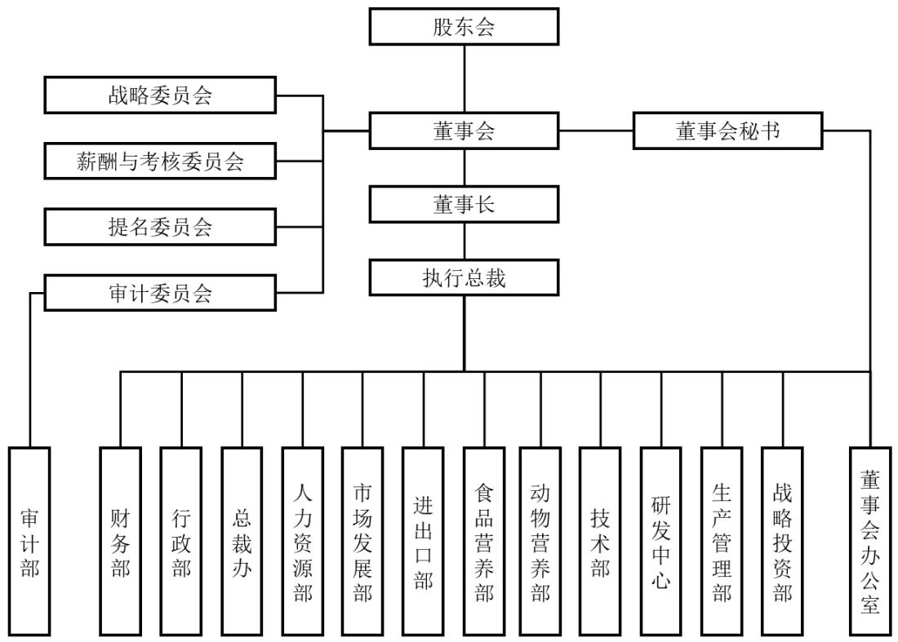

flowchart

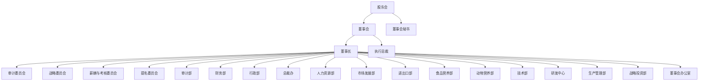

## （二）公司控股企业基本情况

截至 2024 年 12 月 31 日，公司控股企业共有 28 家，其中最近一期经审计总资产、净资产、营业收入或净利润占合并报表的比例超过 5%的控股公司共10家，具体情况如下：

<table><tr><td rowspan="2">序号</td><td rowspan="2">企业名称</td><td colspan="2">持股比例</td><td rowspan="2">与公司关系</td></tr><tr><td>直接</td><td>间接</td></tr><tr><td>1</td><td>内蒙古金达威药业有限公司</td><td>100.00%</td><td>-</td><td>直接控制的子公司</td></tr><tr><td>2</td><td>厦门金达威维生素有限公司</td><td>100.00%</td><td>-</td><td>直接控制的子公司</td></tr><tr><td>3</td><td>金达威控股有限公司</td><td>100.00%</td><td>-</td><td>直接控制的子公司</td></tr><tr><td>4</td><td>Kingdomway USA Corp.</td><td>100.00%</td><td>-</td><td>直接控制的子公司</td></tr><tr><td>5</td><td>Kingdomway America, LLC</td><td>-</td><td>100.00%</td><td>间接控制的子公司</td></tr><tr><td>6</td><td>KUC Holding</td><td>-</td><td>100.00%</td><td>间接控制的子公司</td></tr><tr><td>7</td><td>Doctor's Best Inc.</td><td>-</td><td>96.11%</td><td>间接控制的子公司</td></tr><tr><td>8</td><td>Zipfizz Corporation</td><td>-</td><td>100.00%</td><td>间接控制的子公司</td></tr><tr><td>9</td><td>Kingdomway Nutrition, Inc.</td><td>-</td><td>51.00%</td><td>间接控制的子公司</td></tr><tr><td>10</td><td>VitaBest Nutrition, Inc.</td><td>-</td><td>100.00%</td><td>间接控制的子公司</td></tr></table>

上述公司基本情况如下：

## 1、内蒙古金达威药业有限公司

<table><tr><td>公司名称</td><td>内蒙古金达威药业有限公司</td><td>成立时间</td><td>2004/3/1</td></tr><tr><td>注册资本</td><td>28,900.00万元</td><td>实收资本</td><td>28,900.00万元</td></tr><tr><td>注册地址及主要生产经营地</td><td colspan="3">内蒙古自治区呼和浩特市托克托工业园区</td></tr><tr><td>主要业务</td><td colspan="3">药品生产;药品零售;药品批发;药品进出口;食品生产;食品销售;食品添加剂生产;饲料生产;饲料添加剂生产;化妆品生产;食品进出口;货物进出口;食品添加剂销售;饲料原料销售;饲料添加剂销售;化妆品零售;化妆品批发;化工产品生产(不含许可类化工产品);化工产品销售(不含许可类化工产品);工业酶制剂研发</td></tr><tr><td rowspan="3">股东构成</td><td>股东名称</td><td colspan="2">持股比例</td></tr><tr><td>厦门金达威集团股份有限公司</td><td colspan="2">100.00%</td></tr><tr><td>合计</td><td colspan="2">100.00%</td></tr><tr><td rowspan="6">主要财务数据(万元)</td><td colspan="3">2024年12月31日</td></tr><tr><td>总资产</td><td colspan="2">175,177.92</td></tr><tr><td>净资产</td><td colspan="2">95,418.36</td></tr><tr><td colspan="3">2024年度</td></tr><tr><td>营业收入</td><td colspan="2">87,993.35</td></tr><tr><td>净利润</td><td colspan="2">19,955.49</td></tr></table>

注：2024年财务数据已经立信会计师事务所（特殊普通合伙）审计。

## 2、厦门金达威维生素有限公司

<table><tr><td>公司名称</td><td>厦门金达威维生素有限公司</td><td>成立时间</td><td>2014/12/4</td></tr><tr><td>注册资本</td><td>12,800.00万元</td><td>实收资本</td><td>12,800.00万元</td></tr><tr><td>注册地址及主要生产经营地</td><td colspan="3">厦门市海沧区龙门巷37号</td></tr><tr><td>主要业务</td><td colspan="3">许可项目:食品添加剂生产;饲料添加剂生产;药品生产。(依法须经批准的项目,经相关部门批准后方可开展经营活动,具体经营项目以相关部门批准文件或许可证件为准)一般项目:化工产品销售(不含许可类化工产品);食品添加剂销售;饲料添加剂销售;技术进出口;货物进出口。(除依法须经批准的项目外,凭营业执照依法自主开展经营活动)</td></tr><tr><td rowspan="3">股东构成</td><td>股东名称</td><td colspan="2">持股比例</td></tr><tr><td>厦门金达威集团股份有限公司</td><td colspan="2">100.00%</td></tr><tr><td>合计</td><td colspan="2">100.00%</td></tr><tr><td rowspan="6">主要财务数据(万元)</td><td colspan="3">2024年12月31日</td></tr><tr><td>总资产</td><td colspan="2">90,020.03</td></tr><tr><td>净资产</td><td colspan="2">22,423.12</td></tr><tr><td colspan="3">2024年度</td></tr><tr><td>营业收入</td><td colspan="2">29,685.53</td></tr><tr><td>净利润</td><td colspan="2">1,166.26</td></tr></table>

注：2024年财务数据已经立信会计师事务所（特殊普通合伙）审计。

## 3、金达威控股有限公司

<table><tr><td>公司名称</td><td>金达威控股有限公司</td><td>成立时间</td><td>2014/7/14</td></tr><tr><td>注册资本</td><td>11,679.229万港元</td><td>实收资本</td><td>7,371.079万港元</td></tr><tr><td>注册地址及主要生产经营地</td><td colspan="3">中国香港九龙观塘道348号宏利广场6楼</td></tr><tr><td>主要业务</td><td colspan="3">对外投资,国际市场合作开发;进出口贸易等</td></tr><tr><td rowspan="3">股东构成</td><td>股东名称</td><td colspan="2">持股比例</td></tr><tr><td>厦门金达威集团股份有限公司</td><td colspan="2">100.00%</td></tr><tr><td>合计</td><td colspan="2">100.00%</td></tr><tr><td rowspan="6">主要财务数据(万元)</td><td colspan="3">2024年12月31日</td></tr><tr><td>总资产</td><td colspan="2">9,505.70</td></tr><tr><td>净资产</td><td colspan="2">5,375.05</td></tr><tr><td colspan="3">2024年度</td></tr><tr><td>营业收入</td><td colspan="2">19,646.18</td></tr><tr><td>净利润</td><td colspan="2">543.21</td></tr></table>

注：2024年财务数据已经立信会计师事务所（特殊普通合伙）审计。

## 4、Kingdomway USA Corp.

<table><tr><td>公司名称</td><td>Kingdomway USA Corp.</td><td>成立时间</td><td>2017/1/3</td></tr><tr><td>注册资本</td><td>/</td><td>实收资本</td><td>/</td></tr><tr><td>注册地址及主要生产经营地</td><td colspan="3">美国特拉华州肯顿</td></tr><tr><td>主要业务</td><td colspan="3">主要从事股权投资业务</td></tr><tr><td rowspan="3">股东构成</td><td>股东名称</td><td colspan="2">持股比例</td></tr><tr><td>厦门金达威集团股份有限公司</td><td colspan="2">100.00%</td></tr><tr><td>合计</td><td colspan="2">100.00%</td></tr><tr><td rowspan="6">主要财务数据(万元)</td><td colspan="3">2024年12月31日</td></tr><tr><td>总资产</td><td colspan="2">158,698.59</td></tr><tr><td>净资产</td><td colspan="2">154,959.20</td></tr><tr><td colspan="3">2024年度</td></tr><tr><td>营业收入</td><td colspan="2">-</td></tr><tr><td>净利润</td><td colspan="2">4,549.07</td></tr></table>

注：2024年财务数据已经立信会计师事务所（特殊普通合伙）审计。

## 5、Kingdomway America, LLC

<table><tr><td>公司名称</td><td>Kingdomway America, LLC</td><td>成立时间</td><td>2014/12/17</td></tr><tr><td>注册资本</td><td>/</td><td>实收资本</td><td>/</td></tr><tr><td>注册地址及主要生产经营地</td><td colspan="3">美国特拉华州多佛</td></tr><tr><td>主要业务</td><td colspan="3">主要从事股权投资业务</td></tr><tr><td rowspan="3">股东构成</td><td>股东名称</td><td colspan="2">持股比例</td></tr><tr><td>Kingdomway USA Corp.</td><td colspan="2">100.00%</td></tr><tr><td>合计</td><td colspan="2">100.00%</td></tr><tr><td rowspan="6">主要财务数据(万元)</td><td colspan="3">2024年12月31日</td></tr><tr><td>总资产</td><td colspan="2">88,588.63</td></tr><tr><td>净资产</td><td colspan="2">88,660.32</td></tr><tr><td colspan="3">2024年度</td></tr><tr><td>营业收入</td><td colspan="2">-</td></tr><tr><td>净利润</td><td colspan="2">140.78</td></tr></table>

注：2024年财务数据已经立信会计师事务所（特殊普通合伙）审计。

## 6、KUC Holding

<table><tr><td>公司名称</td><td>KUC Holding</td><td>成立时间</td><td>2014/11/6</td></tr><tr><td>注册资本</td><td>/</td><td>实收资本</td><td>/</td></tr><tr><td>注册地址及主要生产经营地</td><td colspan="3">美国加利福尼亚州尔湾</td></tr><tr><td>主要业务</td><td colspan="3">主要从事股权投资业务</td></tr><tr><td rowspan="3">股东构成</td><td>股东名称</td><td colspan="2">持股比例</td></tr><tr><td>Kingdomway USA Corp.</td><td colspan="2">100.00%</td></tr><tr><td>合计</td><td colspan="2">100.00%</td></tr><tr><td rowspan="6">主要财务数据(万元)</td><td colspan="3">2024年12月31日</td></tr><tr><td>总资产</td><td colspan="2">211,064.28</td></tr><tr><td>净资产</td><td colspan="2">172,821.56</td></tr><tr><td colspan="3">2024年度</td></tr><tr><td>营业收入</td><td colspan="2">-</td></tr><tr><td>净利润</td><td colspan="2">1,923.02</td></tr></table>

注：2024年财务数据已经立信会计师事务所（特殊普通合伙）审计。

7、Doctor's Best Inc.

<table><tr><td>公司名称</td><td>Doctor&#x27;s Best Inc.</td><td>成立时间</td><td>1990/3/5</td></tr><tr><td>注册资本</td><td>/</td><td>实收资本</td><td>/</td></tr><tr><td>注册地址及主要生产经营地</td><td colspan="3">美国特拉华州威明顿;美国加利福尼亚州塔斯廷</td></tr><tr><td>主要业务</td><td colspan="3">主要从事DRB多特倍斯品牌营养保健食品的研发、推广和销售业务</td></tr><tr><td rowspan="4">股东构成</td><td>股东名称</td><td colspan="2">持股比例</td></tr><tr><td>KUC Holding</td><td colspan="2">96.11%</td></tr><tr><td>The Green Umbrella Nutrition, Inc.</td><td colspan="2">3.89%</td></tr><tr><td>合计</td><td colspan="2">100.00%</td></tr><tr><td rowspan="6">主要财务数据(万元)</td><td colspan="3">2024年12月31日</td></tr><tr><td>总资产</td><td colspan="2">108,040.32</td></tr><tr><td>净资产</td><td colspan="2">97,099.32</td></tr><tr><td colspan="3">2024年度</td></tr><tr><td>营业收入</td><td colspan="2">107,417.12</td></tr><tr><td>净利润</td><td colspan="2">14,720.97</td></tr></table>

注：2024年财务数据已经立信会计师事务所（特殊普通合伙）审计。

8、Zipfizz Corporation

<table><tr><td>公司名称</td><td>Zipfizz Corporation</td><td>成立时间</td><td>2003/7/9</td></tr><tr><td>注册资本</td><td>/</td><td>实收资本</td><td>/</td></tr><tr><td>注册地址及主要生产经营地</td><td colspan="3">美国华盛顿州西雅图</td></tr><tr><td>主要业务</td><td colspan="3">主要从事Zipfizz品牌功能产品的研发和销售业务,主要产品为低卡路里、低碳水化合物、无糖、含维生素和矿物质的粉剂能量产品</td></tr></table>

<table><tr><td rowspan="3">股东构成</td><td>股东名称</td><td>持股比例</td></tr><tr><td>KUC Holding</td><td>100.00%</td></tr><tr><td>合计</td><td>100.00%</td></tr><tr><td rowspan="6">主要财务数据(万元)</td><td colspan="2">2024年12月31日</td></tr><tr><td>总资产</td><td>86,790.87</td></tr><tr><td>净资产</td><td>77,419.30</td></tr><tr><td colspan="2">2024年度</td></tr><tr><td>营业收入</td><td>54,217.02</td></tr><tr><td>净利润</td><td>4,286.58</td></tr></table>

注：2024年财务数据已经立信会计师事务所（特殊普通合伙）审计。

## 9、Kingdomway Nutrition, Inc.

<table><tr><td>公司名称</td><td>Kingdomway Nutrition, Inc.</td><td>成立时间</td><td>2015/5/22</td></tr><tr><td>注册资本</td><td>3.00万美元</td><td>实收资本</td><td>3.00万美元</td></tr><tr><td>注册地址及主要生产经营地</td><td colspan="3">美国加利福尼亚州塔斯廷</td></tr><tr><td>主要业务</td><td colspan="3">主要从事营养保健原料贸易</td></tr><tr><td rowspan="5">股东构成</td><td>股东名称</td><td colspan="2">持股比例</td></tr><tr><td>KUC Holding</td><td colspan="2">51.00%</td></tr><tr><td>He Zhang</td><td colspan="2">30.00%</td></tr><tr><td>Wei Zhang</td><td colspan="2">19.00%</td></tr><tr><td>合计</td><td colspan="2">100.00%</td></tr><tr><td rowspan="6">主要财务数据(万元)</td><td colspan="3">2024年12月31日</td></tr><tr><td>总资产</td><td colspan="2">17,936.06</td></tr><tr><td>净资产</td><td colspan="2">-4,797.42</td></tr><tr><td colspan="3">2024年度</td></tr><tr><td>营业收入</td><td colspan="2">35,674.87</td></tr><tr><td>净利润</td><td colspan="2">-114.88</td></tr></table>

注：2024年财务数据已经立信会计师事务所（特殊普通合伙）审计。

## 10、VitaBest Nutrition, Inc.

<table><tr><td>公司名称</td><td>VitaBest Nutrition, Inc.</td><td>成立时间</td><td>2015/6/12</td></tr><tr><td>注册资本</td><td>/</td><td>实收资本</td><td>/</td></tr><tr><td>注册地址及主要生产经营地</td><td colspan="3">美国内华达州拉斯维加斯;美国加利福尼亚州塔斯廷</td></tr><tr><td>主要业务</td><td colspan="3">主要从事营养保健食品生产业务,为客户生产胶囊、片剂和粉剂产品,并提供包括原料采购、生产、研发和包装等全流程服务</td></tr></table>

<table><tr><td rowspan="3">股东构成</td><td>股东名称</td><td>持股比例</td></tr><tr><td>Kingdomway America, LLC</td><td>100.00%</td></tr><tr><td>合计</td><td>100.00%</td></tr><tr><td rowspan="6">主要财务数据(万元)</td><td colspan="2">2024年12月31日</td></tr><tr><td>总资产</td><td>39,790.42</td></tr><tr><td>净资产</td><td>-2,509.99</td></tr><tr><td colspan="2">2024年度</td></tr><tr><td>营业收入</td><td>44,233.63</td></tr><tr><td>净利润</td><td>-733.34</td></tr></table>

注：2024年财务数据已经立信会计师事务所（特殊普通合伙）审计。

## （三）公司参股企业基本情况

截至 2024年 12月 31日，发行人及其子公司拥有 8家参股公司，具体情况如下：

<table><tr><td>序号</td><td>公司名称</td><td>注册资本(万元)</td><td>持股比例</td></tr><tr><td>1</td><td>舞昆食品</td><td>900.00万日元</td><td>40.00%</td></tr><tr><td>2</td><td>北京桦冠</td><td>1,550.1451</td><td>4.3247%</td></tr><tr><td>3</td><td>Labrada</td><td>/</td><td>Kingdomway America, LLC持股30.00%</td></tr><tr><td>4</td><td>PSupps</td><td>/</td><td>Kingdomway America, LLC持股9.49%</td></tr><tr><td>5</td><td>iHerb Holdings LLC</td><td>/</td><td>金达威控股通过KUC Holding持股4.80%</td></tr><tr><td>6</td><td>北京华泰瑞合医疗产业投资中心(有限合伙)</td><td>100,000.00</td><td>5.00%</td></tr><tr><td>7</td><td>天津众为</td><td>111,300.00</td><td>2.70%</td></tr><tr><td>8</td><td>Cal-Southampton</td><td>/</td><td>/</td></tr></table>

## 三、公司控股股东、实际控制人基本情况

## （一）公司股权结构

截至2024年12月31日，公司股权结构如下：

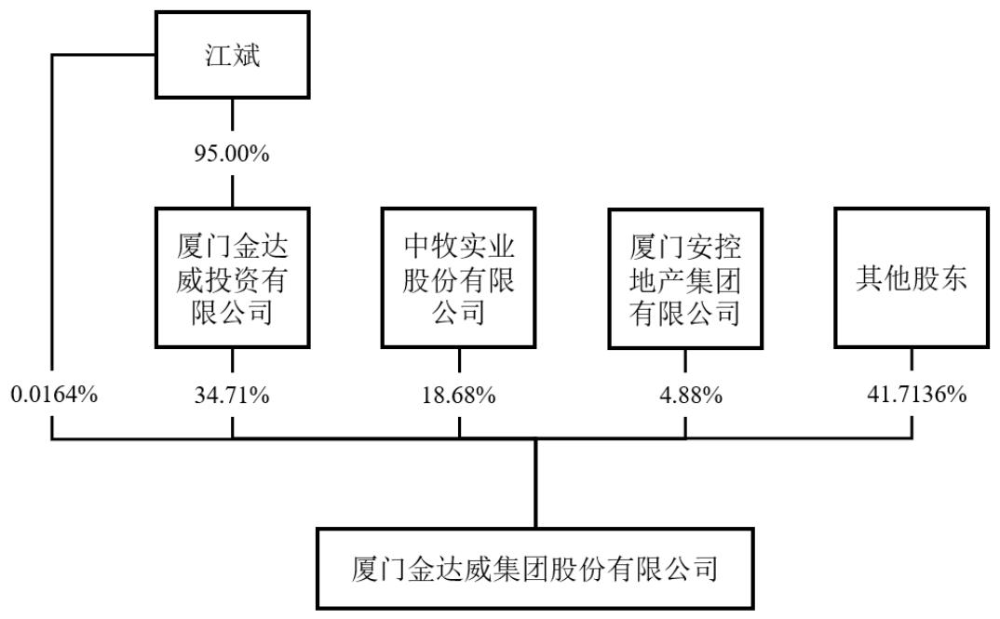

flowchart

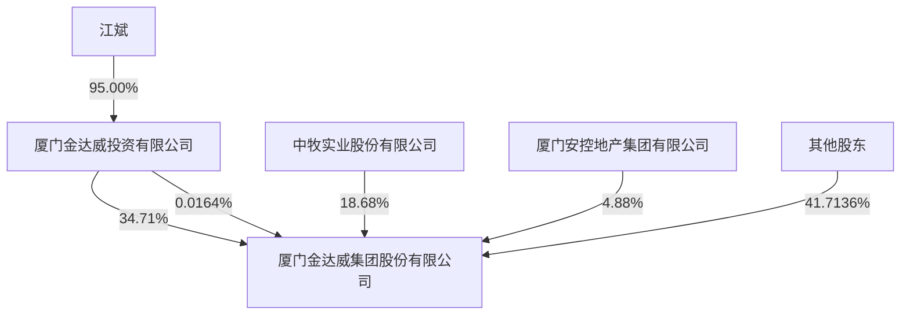

## （二）控股股东及实际控制人

## 1、控股股东

截至 2024 年 12 月 31 日，金达威投资持有发行人 21,171.27 万股股份，占发行人股权比例34.71%，系发行人的控股股东。

最近三年发行人控股股东未发生变化。

金达威投资基本情况如下：

<table><tr><td>公司名称</td><td>厦门金达威投资有限公司</td><td>成立时间</td><td>1997/3/25</td></tr><tr><td>注册资本</td><td>2,000.00万元</td><td>实收资本</td><td>2,000.00万元</td></tr><tr><td>注册地址</td><td colspan="3">厦门市嘉禾路321号汇腾大厦二十三层</td></tr><tr><td rowspan="4">股东构成</td><td>股东名称</td><td colspan="2">持股比例</td></tr><tr><td>江斌</td><td colspan="2">95.00%</td></tr><tr><td>陈佳良</td><td colspan="2">5.00%</td></tr><tr><td>合计</td><td colspan="2">100.00%</td></tr><tr><td>主要业务</td><td colspan="3">对外投资</td></tr><tr><td>经营范围</td><td colspan="3">对第一产业、第二产业、第三产业的投资(法律、法规另有规定除外);投资咨询(法律、法规另有规定除外);其他未列明批发业(不含需经许可审批的经营项目);其他未列明的专业咨询服务(不含需经许可审批的项目);建材批发;金属及金属矿批发(不含危险化学品和监控化学品);五金产品批发;电气设备批发;其他机械设备及电子产品批发;其他贸易经纪与代理</td></tr><tr><td rowspan="6">母公司财务报表的主要财务数据(万元)</td><td colspan="3">2024年12月31日</td></tr><tr><td>总资产</td><td colspan="2">149,648.56</td></tr><tr><td>净资产</td><td colspan="2">69,681.03</td></tr><tr><td colspan="3">2024年度</td></tr><tr><td>营业收入</td><td colspan="2">4,636.82</td></tr><tr><td>净利润</td><td colspan="2">1,237.76</td></tr><tr><td colspan="2">所持有的公司股票是否被质押</td><td colspan="2">是</td></tr></table>

## 2、实际控制人

江斌先生直接持有发行人 10.00万股股份，占发行人股权比例 0.0164%；江斌先生持有金达威投资 95.00%的股份，通过金达威投资间接控制发行人34.71%的股份，江斌先生合计控制发行人 34.73%的股份，系发行人的实际控制人。

最近三年发行人实际控制人未发生变化。

## 3、控股股东及实际控制人控制的其他企业

截至 2024年 12月 31日，发行人控股股东及实际控制人直接或间接控制的其他企业情况如下：

<table><tr><td>序号</td><td>被投资单位</td><td>持股比例</td><td>注册资本(万元)</td><td>主营业务</td></tr><tr><td>1</td><td>道洪集团有限公司</td><td>金达威投资直接持股94.00%</td><td>20,000.00</td><td>一般项目:物业管理;非居住房地产租赁;电子产品销售;服装服饰批发;建筑材料销售;珠宝首饰批发;停车场服务;企业形象策划(除依法须经批准的项目外,凭营业执照依法自主开展经营活动)</td></tr><tr><td>2</td><td>深圳金达威医疗科技有限公司</td><td>金达威投资直接持股33.91%</td><td>3,158.00</td><td>第一类医疗器械租赁;第二类医疗器械租赁;医护人员防护用品批发。第二类医疗器械销售;第一类医疗器械生产;第一类医疗器械销售;工程和技术研究和试验发展;软件开发;电子元器件与机电组件设备制造;专用设备修理;电子专用设备制造;技术服务、技术开发、技术咨询、技术交流、技术转让、技术推广;电子专用材料销售;电子元器件与机电组件设备销售;仪器仪表制造;化妆品批发;化妆品零售;电子元器件制造;技术进出口。(除依法须经批准的项目外,凭营业执照依法自主开展经营活动)第三类医疗器械租赁;医疗美容服务;第二类医疗器械生产;第三类医疗器械生产;第三类医疗器械经营;医疗器械互联网信息服务;互联网信息服务;药品互联网信息服务;化妆品生产;医疗服务;第二类增值电信业务;第一类增值电信业务。(依法须经批准的项目,经相关部门批准后方可开展经营活动,具体经营项目以相关部门批准文件或许可证件为准)</td></tr><tr><td>3</td><td>嘉兴市龙威投资管理有限公司</td><td>金达威投资通过道洪集团有限公司间接持有100.00%的股份</td><td>1,000.00</td><td>投资管理;实业投资;酒店管理;物业管理</td></tr><tr><td>4</td><td>嘉兴市龙之梦大酒店有限公司</td><td>金达威投资通过嘉兴市龙威投资管理有限公司间接持有100.00%的股份</td><td>50.00</td><td>酒店(住宿);卷烟零售、雪茄烟零售;餐饮服务;日用百货的零售;会议服务;农副产品收购;健身服务;棋牌服务。(依法须经批准的项目,经相关部门批准后方可开展经营活动)</td></tr><tr><td>5</td><td>浙江新凯房地产开发有限公司</td><td>金达威投资通过道洪集团有限公司间接持有51.00%的股份</td><td>800.00</td><td>房地产开发销售;受委托人委托从事住宅小区物业管理;室内家居装璜(以上范围凭有效的资质证书经营);自有房屋租赁;建筑材料的销售</td></tr><tr><td>6</td><td>金达威医疗器械(上海)有限公司</td><td>金达威投资通过深圳金达威医疗科技有限公司间接持有100.00%的股份</td><td>1,000.00</td><td>许可项目:第三类医疗器械经营;第三类医疗器械租赁;医疗器械互联网信息服务;医疗美容服务;医疗服务。(依法须经批准的项目,经相关部门批准后方可开展经营活动,具体经营项目以相关部门批准文件或许可证件为准)一般项目:第一类医疗器械租赁;第一类医疗器械销售;第二类医疗器械租赁;第二类医疗器械销售;医护人员防护用品批发;技术服务、技术开发、技术咨询、技术交流、技术转让、技术推广。(除依法须经批准的项目外,凭营业执照依法自主开展经营活动)</td></tr><tr><td>7</td><td>金达威医疗科技(湖南)有限公司</td><td>金达威投资通过深圳金达威医疗科技有限公司间接持有100.00%的股份</td><td>1,000.00</td><td>许可项目:第二类医疗器械生产;第三类医疗器械生产;第三类医疗器械经营;医疗器械互联网信息服务;第三类医疗器械租赁;互联网信息服务;药品互联网信息服务;化妆品生产;医疗服务;第二类增值电信业务;第一类增值电信业务(依法须经批准的项目,经相关部门批准后方可开展经营活动,具体经营项目以相关部门批准文件或许可证件为准)一般项目:第一类医疗器械销售;第二类医疗器械销售;第一类医疗器械租赁;第二类医疗器械租赁;第一类医疗器械生产;技术服务、技术开发、技术咨询、技术交流、技术转让、技术推广;软件开发;工程和技术研究和试验发展;电子元器件与机电组件设备制造;电子专用设备制造;电子专用设备销售;电子专用材料销售;电子元器件与机电组件设备销售;仪器仪表制造;化妆品批发;化妆品零售;电子元器件制造;专用设备修理;技术进出口(除依法须经批准的项目外,凭营业执照依法自主开展经营活动)</td></tr><tr><td>8</td><td>金达威医疗器械(深圳)有限公司</td><td>金达威投资通过深圳金达威医疗科技有限公司间接持有100.00%的股份</td><td>500.00</td><td>第二类医疗器械租赁;第二类医疗器械销售;第一类医疗器械销售;第一类医疗器械租赁;销售代理;技术服务、技术开发、技术咨询、技术交流、技术转让、技术推广;软件开发;工程和技术研究和试验发展;电子专用设备销售;电子元器件与机电组件设备销售;化妆品批发;化妆品零售;专用设备修理;技术进出口。(除依法须经批准的项目外,凭营业执照依法自主开展经营活动)第三类医疗器械经营;第三类医疗器械租赁;药品零售;药品批发;互联网信息服务;药品互联网信息服务。(依法须经批准的项目,经相关部门批准后方可开展经营活动,具体经营项目以相关部门批准文件或许可证件为准)</td></tr></table>

## （三）控股股东、实际控制人所持有的公司股票质押情况

截至2024年12月31日，发行人控股股东股份质押情况如下：

<table><tr><td>股东名称</td><td>质押数量(万股)</td><td>占其所持股份比例</td><td>占公司总股本比例</td><td>质押登记日期</td><td>质押权人</td></tr><tr><td>金达威投资</td><td>409.00</td><td>1.93%</td><td>0.67%</td><td>2024/10/18</td><td>广发证券股份有限公司</td></tr><tr><td>金达威投资</td><td>1,340.00</td><td>6.33%</td><td>2.20%</td><td>2024/4/22</td><td>中国银河证券股份有限公司</td></tr><tr><td>金达威投资</td><td>130.00</td><td>0.61%</td><td>0.21%</td><td>2024/2/6</td><td>中泰证券股份有限公司</td></tr><tr><td>金达威投资</td><td>400.00</td><td>1.89%</td><td>0.66%</td><td>2024/2/6</td><td>中国中金财富证券有限公司</td></tr><tr><td>金达威投资</td><td>500.00</td><td>2.36%</td><td>0.82%</td><td>2024/2/6</td><td>中信证券股份有限公司</td></tr><tr><td>金达威投资</td><td>340.00</td><td>1.61%</td><td>0.56%</td><td>2024/2/1</td><td>广发证券股份有限公司</td></tr><tr><td>金达威投资</td><td>160.00</td><td>0.76%</td><td>0.26%</td><td>2024/2/1</td><td>广发证券股份有限公司</td></tr><tr><td>金达威投资</td><td>154.00</td><td>0.73%</td><td>0.25%</td><td>2024/2/1</td><td>中泰证券股份有限公司</td></tr><tr><td>金达威投资</td><td>220.00</td><td>1.04%</td><td>0.36%</td><td>2024/1/22</td><td>中国中金财富证券有限公司</td></tr><tr><td>金达威投资</td><td>159.00</td><td>0.75%</td><td>0.26%</td><td>2024/1/22</td><td>广发证券股份有限公司</td></tr><tr><td>金达威投资</td><td>141.00</td><td>0.67%</td><td>0.23%</td><td>2024/1/22</td><td>广发证券股份有限公司</td></tr><tr><td>金达威投资</td><td>683.00</td><td>3.23%</td><td>1.12%</td><td>2023/6/19</td><td>中信证券股份有限公司</td></tr><tr><td>金达威投资</td><td>816.00</td><td>3.85%</td><td>1.34%</td><td>2023/5/25</td><td>中泰证券股份有限公司</td></tr><tr><td>金达威投资</td><td>55.00</td><td>0.26%</td><td>0.09%</td><td>2023/5/11</td><td>广发证券股份有限公司</td></tr><tr><td>金达威投资</td><td>300.00</td><td>1.42%</td><td>0.49%</td><td>2023/4/27</td><td>绍兴银行股份有限公司嘉兴分行</td></tr><tr><td>金达威投资</td><td>488.53</td><td>2.31%</td><td>0.80%</td><td>2022/8/4</td><td>广发证券股份有限公司</td></tr><tr><td>金达威投资</td><td>897.00</td><td>4.24%</td><td>1.47%</td><td>2022/6/21</td><td>中国中金财富证券有限公司</td></tr><tr><td>金达威投资</td><td>1,680.00</td><td>7.94%</td><td>2.75%</td><td>2022/6/20</td><td>中信证券股份有限公司</td></tr><tr><td>金达威投资</td><td>755.62</td><td>3.57%</td><td>1.24%</td><td>2022/5/13</td><td>广发证券股份有限公司</td></tr><tr><td>合计</td><td>9,628.15</td><td>45.48%</td><td>15.79%</td><td>/</td><td>/</td></tr></table>

注：金达威投资 2022 年 8 月 4 日向广发证券股份有限公司质押 1,618.53 万股股票，其中1,130.00 万股股票已于 2024 年 4 月 23 日解除质押。

截至2024年12月31日，发行人实际控制人不存在股份质押情况。

## 四、承诺与履行情况

## （一）报告期内发行人及其控股股东、实际控制人、董事、监事、高级管理人员所作出的重要承诺及承诺的履行情况

<table><tr><td>承诺类型</td><td>承诺方</td><td>承诺内容</td><td>承诺时间</td><td>承诺期限</td><td>履行情况</td></tr><tr><td rowspan="2">其他承诺</td><td>金达威投资、江斌</td><td>本公司、本人、本公司及本人所控制的其他企业在实际经营运作过程中,将保持规范运作,确保与金达威集团在人员、资产、财务、机构和业务等方面完全分开;本公司、本人、本公司及本人所控制的其他企业与金达威集团在经营业务、机构运作、财务核算等方面独立并各自承担经营责任和风险。</td><td>2010-07-26</td><td>长期</td><td>正常履行中</td></tr><tr><td>陈佳良、洪彦、江</td><td>公司拟向不超过10名特定对象非公开发行A股股票,根据《国务院办公厅关于</td><td>2016-03-08</td><td>长期</td><td>正常履行中</td></tr><tr><td></td><td>斌、詹光煌</td><td>进一步加强资本市场中小投资者合法权益保护工作的意见》(国办发[2013]110号)和《关于首发及再融资、重大资产重组摊薄即期回报有关事项的指导意见》(中国证券监督管理委员会公告[2015]31号)等文件的要求,公司全体董事、高级管理人员将忠实、勤勉地履行职责,维护公司和全体股东的合法权益。为了确保公司制定的填补回报措施能够得到切实履行,公司全体董事、高级管理人员作出承诺如下:1、承诺不得无偿或以不公平条件向其他单位或者个人输送利益,也不得采用其他方式损害公司利益;2、承诺对董事和高级管理人员的职务消费行为进行约束;3、承诺不得动用公司资产从事与其履行职责无关的投资、消费活动;4、承诺由董事会或董事会薪酬与考核委员会制定的薪酬制度与公司填补回报措施的执行情况相挂钩;5、公司未来如有制定股权激励计划的,承诺公司股权激励的行权条件与公司填补回报措施的执行情况相挂钩。公司全体董事、高级管理人员保证上述承诺是其真实意思表示,公司全体董事、高级管理人员自愿接受证券监管机构、自律组织及社会公众的监督,若违反上述承诺,相关责任主体将依法承担相应责任。</td><td></td><td></td><td></td></tr><tr><td rowspan="2">关于同业竞争、关联交易、资金占用方面的承诺</td><td>金达威投资、江斌</td><td>本人、本公司及所控制的其他企业目前并没有直接或间接地从事与金达威集团主营业务存在竞争的业务活动;本人、本公司不会,而且会促使本人、本公司所控制的其他企业不会直接或间接地在中国境内外参与、经营或从事与厦门金达威集团主营业务或其计划开展的业务构成竞争的业务;凡本人、本公司及所控制的其他企业有商业机会可参与、经营或从事任何可能与金达威集团主营业务或其计划开展的业务构成竞争的业务,本人、本公司应于发现该商业机会后立即书面通知金达威集团,并将上述商业机会无偿提供给金达威集团。</td><td>2010-07-26</td><td>长期</td><td>正常履行中</td></tr><tr><td>金达威投资、江斌</td><td>本公司、本人、本公司及本人所控制的其他企业不会以借款、代偿债务、代垫款项或者其他方式占用金达威集团资金。</td><td>2010-07-26</td><td>长期</td><td>正常履行中</td></tr><tr><td>分红承诺</td><td>金达威</td><td>按照公司《未来三年(2024年-2026年)股东回报规划》分配公司利润</td><td>2024-01-01</td><td>2026-12-31</td><td>正常履行中</td></tr></table>

（二）发行人及其控股股东、实际控制人、董事、监事、高级管理人员所作出的与本次发行相关的承诺事项

<table><tr><td>承诺类型</td><td>承诺方</td><td>承诺内容</td></tr><tr><td>对公司本次发行摊薄即期回报采取填补措施作出的承诺</td><td>金达威投资、江斌</td><td>(一)不会越权干预公司经营管理活动,不会侵占公司利益;(二)自本承诺出具日至公司本次向不特定对象发行可转换公司债券实施完毕前,若中国证监会做出关于填补回报措施及其承诺的其他新的监管规定,且上述承诺不能满足中国证监会该等规定时,本公司/本人承诺届时将按照中国证监会的最新规定出具补充承诺。</td></tr><tr><td>对公司本次发行摊薄即期回报采取填补措施作出的承诺</td><td>董事、监事、高级管理人员</td><td>(一)承诺不无偿或以不公平条件向其他单位或者个人输送利益,也不采用其他方式损害公司利益;(二)承诺对本人的职务消费行为进行约束;(三)承诺不动用公司资产从事与本人履行职责无关的投资、消费活动。(四)承诺由董事会或董事会薪酬与考核委员会制订的薪酬制度与公司填补回报措施的执行情况相挂钩;(五)公司未来如有制订股权激励计划,承诺拟公布的公司股权激励的行权条件与公司填补回报措施的执行情况相挂钩;(六)自承诺出具日至公司本次向不特定对象发行可转换公司债券实施完毕前,若中国证监会作出关于填补回报措施及其承诺的其他新的监管规定,且上述承诺不能满足中国证监会该等规定时,承诺届时将按照中国证监会的最新规定出具补充承诺。</td></tr><tr><td>关于本次发行可转债的认购意向及承诺</td><td>金达威投资、中牧股份</td><td>(一)在本次可转债发行首日(募集说明书公告日)确认后,本公司将自查发行首日前六个月内本公司是否存在减持金达威股票的情形:1、如存在减持情形,本公司将不参与本次可转债发行认购,亦不会委托其他主体参与本次可转债发行认购;2、如不存在减持情形,本公司将根据届时市场情况、个人资金情况决定是否参与本次可转债发行认购。若认购成功,本公司将严格遵守短线交易的相关规定,即自本次可转债发行首日起六个月内不减持金达威股票及本次发行的可转换公司债券。(二)如本公司出现违规减持情形,由此所得收益归金达威所有,并依法承担由此产生的法律责任。(三)本公司保证本公司将严格遵守《中华人民共和国证券法》以及中国证券监督管理委员会、深圳证券交易所有关短线交易的相关规定。</td></tr><tr><td>关于本次发行可转债的认购意向及承诺</td><td>董事、监事、高级管理人员</td><td>(一)在本次可转债发行首日(募集说明书公告日)确认后,本人将自查发行首日前六个月内本人及本人配偶、父母、子女是否存在减持金达威股票的情形:1、如存在减持情形,本人及本人配偶、父母、子女将不参与本次可转债发行认购,亦不会委托其他主体参与本次可转债发行认购;2、如不存在减持情形,本人或本人配偶、父母、子女将根据届时市场情况、个人资金情况决定是否参与本次可转债发行认购。若认购成功,本人及本人配偶父母、子女将严格遵守短线交易的相关规定,即自本次可转债发行首日起六个月内不减持金达威股票及本次发行的可转换公司债券。(二)如本人或本人配偶、父母、子女出现违规减持情形,由此所得收益归金达威所有,并依法承担由此产生的法律责任。(三)本人保证本人及本人配偶、父母、子女将严格遵守《中华人民共和国证券法》以及中国证券监督管理委员会、深圳证券交易所有关短线交易的相关规定。</td></tr></table>

## 五、董事、监事和高级管理人员

## （一）董事会成员简历

截至本募集说明书签署日，发行人共有 9 名董事，其中独立董事 3 名、非独立董事 6 名，发行人董事均由股东大会选举产生，任期 3 年，具体情况如下：

<table><tr><td>序号</td><td>姓名</td><td>职务</td><td>性别</td><td>年龄</td><td>任期</td></tr><tr><td>1</td><td>江斌</td><td>董事长</td><td>男</td><td>58</td><td>2025-05-15 至 2028-05-14</td></tr><tr><td>2</td><td>顾卫华</td><td>副董事长</td><td>男</td><td>55</td><td>2025-05-15 至 2028-05-14</td></tr><tr><td>3</td><td>陈佳良</td><td>董事</td><td>男</td><td>61</td><td>2025-05-15 至 2028-05-14</td></tr><tr><td>4</td><td>洪航</td><td>董事</td><td>男</td><td>43</td><td>2025-05-15 至 2028-05-14</td></tr><tr><td>5</td><td>徐肖特</td><td>董事</td><td>男</td><td>50</td><td>2025-05-15 至 2028-05-14</td></tr><tr><td>6</td><td>吴轶</td><td>董事</td><td>男</td><td>52</td><td>2025-05-15 至 2028-05-14</td></tr><tr><td>7</td><td>王大宏</td><td>独立董事</td><td>男</td><td>61</td><td>2025-05-15 至 2028-05-14</td></tr><tr><td>8</td><td>王肖健</td><td>独立董事</td><td>男</td><td>53</td><td>2025-05-15 至 2028-05-14</td></tr><tr><td>9</td><td>宗耕</td><td>独立董事</td><td>男</td><td>40</td><td>2025-05-15 至 2028-05-14</td></tr></table>

公司现任董事简历如下：

江斌先生，硕士；1997 年至今任公司董事长，2010 年 4 月至今任公司总经理。2012 年 5 月至今任厦门企业和企业家联合会副会长，2012 年 9 月至 2023年 3 月任厦门上市公司协会副会长；2014 年 7 月起任金达威控股执行董事；2014 年 6 月起任金达威电子商务执行董事兼总经理；2014 年 11 月起任 KUCHolding 首席执行官；2014 年 12 月起任 Kingdomway America, LLC 首席执行官；2015 年 3 月起任 DRB 董事长；2015 年 4 月起任迪诺宝（厦门）国际贸易有限公司执行董事兼总经理；2015 年 9 月起任 VB 首席执行官；2015 年 10 月起任

Kingdomway Nutrition, Inc.首席执行官；2015 年 12 月起任 KPL 董事；2016 年 4月起任舞昆食品董事、VK 董事、PH 董事；2016 年 12 月至 2023 年 5 月任道洪集团有限公司董事；2017 年 1 月起任 Kingdomway USA Corp.首席执行官；2018年 7 月起任 Zipfizz 首席执行官；2018 年 10 月至 2023 年 5 月担任 iHerbHongKong Limited 董事；2019 年 1 月起任金达威（上海）营销策划有限公司执行董事；2019年 3月起任金达威投资执行董事；2019年 6月起任北京盈奥执行董事；2021 年 11 月起任金达威食品执行董事；2022 年 4 月至 2024 年 7 月任金达威电子商务（杭州）有限公司执行董事兼总经理；2024 年 2 月起任VITABEST HEALTH SCIENCE, INC.董 事 ；2024 年 6 月 起 任 ORGARANUTRITION LLC 董事长、首席执行官；2024 年 8 月起任金元生物科技（内蒙古）有限公司董事长，2024 年 9 月起任 NORTH COURSE BRANDS, LLC 董事会主席，2025 年 2 月起任 Kingdomway E-Commerce LLC 首席执行官。

顾卫华先生，本科，兽医师；2022 年 5 月任公司董事。1994 年任中国牧工商（集团）总公司贸易分公司职员；1998 年 7 月进入中牧股份，先后任职饲料分公司、采购与出口部、大宗原料贸易部、动物营养品商务部等部门；2012 年5 月至 2021 年 5 月，先后任中牧（北京）动物营养科技有限公司贸易总监、副总经理等职；2021 年 5 月至今，任中牧（北京）动物营养科技有限公司董事、总经理。

陈佳良先生，大专；2001年 6月至今任公司董事。2012年 5月至今，任金达威药业董事；2013 年 4 月至今，任公司常务副总经理；2014 年 12 月至今，任金达威维生素董事长。

洪航先生，本科，会计师，AIA（国际会计师）；2016 年 4 月至今任公司副总经理、财务总监，2019 年 4 月至今任公司董事。2016 年至今任 DRB 董事兼秘书；2018 年至今任 Zipfizz 董事兼秘书；2019 年 8 月至今，任金达威药业董事；2021年 3月至今，任诚信药业董事；2022年 1月至今，任上海金葱岁月生物科技有限公司董事长、总经理；2022年 4月至 2024年 7月，任金达威电子商务（杭州）有限公司监事，2023 年 10 月起任金葱岁月生物科技控股有限公司董事。

徐肖特先生，硕士；1998 年进入中牧股份，先后任职动物营养商务部、采购部、采购与出口部等部门。2022 年 2 月至今，任中牧（北京）动物营养科技有限公司副总经理。

吴轶先生，本科，高级工程师；2021 年 2 月 22 日至今任公司董事。2012年 5月至今，任金达威药业董事、总经理；2021年 3月至 2023年 9月，任诚信药业总经理；2021年3月至今，任诚信药业董事。

王大宏先生，本科；2022 年 5 月至今任公司独立董事。2001 年 12 月至2024年 2月，任北京中卫康桥信息技术咨询有限公司总经理；2024年 2月至今，任北京中卫康桥信息技术咨询有限公司执行董事、经理；2004 年 12 月至今，任中国保健协会市场工作委员会秘书长；2006年 4月至 2024年 2月，任庶正康讯（北京）商务咨询有限公司董事、总经理；2024 年 2 月至今，任庶正康讯（北京）商务咨询有限公司经理。2015年至 2022年 5月，任山东好当家海洋发展股份有限公司独立董事；2017年 5月至 2023年 5月，任西王食品股份有限公司独立董事。

王肖健先生，博士；2022 年 5 月至今任公司独立董事。2011 年 12 月至今任厦门天健咨询有限公司董事、总经理；2016 年 7 月至今任厦门蜜呆投资管理有限公司总经理；2017年 4月至 2023年 5月任深信服科技股份有限公司独立董事；2017 年 11 月至 2022 年 4 月任汉纳森（厦门）数据股份有限公司独立董事；2019年 1月至今任深圳市晟世环境技术股份有限公司董事；2019年 8月至 2024年 9 月任常州光洋控股有限公司董事；2021 年 5 月至今任星宸科技股份有限公司独立董事；2023 年 8 月至 2024 年 12 月任厦门美科安防科技股份有限公司独立董事；2025年1月10日起任厦门嘉戎技术股份有限公司独立董事。

宗耕先生，博士；2022年 5月至今担任公司独立董事。2013年 9月至 2014年 10月，任联合利华弗拉尔丁恩研发中心博士后；2014年 10月至 2018年 1月，任哈佛大学陈曾熙公共卫生学院博士后；2018 年 1 月至 2024 年 12 月，任中国科学院上海营养与健康研究所研究员；2020 年 1 月至 2024 年 12 月在上海交通大学附属第六人民医院从事科学研究工作；2025 年 1 月起任复旦大学营养研究院研究员。

## （二）监事会成员简历

截至 2024年末，发行人共有 3名监事，其中非职工代表监事 2名，均由股东大会选举产生，职工代表监事 1 名，由公司职工代表大会选举产生，监事任期3年，具体情况如下：

<table><tr><td>序号</td><td>姓名</td><td>职务</td><td>性别</td><td>年龄</td><td>任期</td></tr><tr><td>1</td><td>焦洁</td><td>监事会主席</td><td>女</td><td>52</td><td>2022-05-17 至 2025-05-15</td></tr><tr><td>2</td><td>林水山</td><td>监事</td><td>男</td><td>60</td><td>2022-05-17 至 2025-05-15</td></tr><tr><td>3</td><td>李丹</td><td>职工代表监事</td><td>女</td><td>52</td><td>2022-05-17 至 2025-05-15</td></tr></table>

公司监事简历如下：

焦洁女士，本科，审计师；2022年 5月至 2025年 5月任公司监事会主席。1990 年任中国牧工商联合总公司直属企业北京华罗饲料添加剂厂财务部会计、中牧股份筹委会职员、稽核与管理部职员、财务部饲料专业组主任、饲料分公司财务部经理、稽核与审计部经理助理、副经理、副经理（主持工作）、经理等职；2009 年 8 月起，任中国牧工商集团有限公司稽核部副经理（主持工作）、经理、法律与风险管理部经理、稽核部总经理、纪委委员、职工监事等职；2016 年 8 月至 2024 年 9 月任天津自贸试验区国际清真产业园有限公司监事；2018 年 6 月至 2021 年 4 月，任中国农业发展集团有限公司审计与风险管理部副主任；2021年 4月至 2025年 1月任中牧股份总经理助理；2022年 2月至 2025年 1 月，兼任中牧股份党委巡察办公室主任；2022 年 5 月至今任中牧牧原（河南）生物药业有限公司监事；2023 年 9 月至今任成都中牧生物药业有限公司监事；2025年1月至今任中牧股份副总经理、董事会秘书。

林水山先生，2016年 4月至 2025年 5月任公司监事。2016年 6月至 2019年4月任金达威药业经营部经理；2019年4月至今任金达威药业总经理助理。

李丹女士，本科，教授级高级工程师，2020年 4月至 2025年 5月任公司监事。2014 年 4 月至 2019 年 4 月任金达威药业总经理助理兼副总工程师；2019年 4 月至今任金达威药业副总经理；2020 年 5 月至今，任金达威生物科技监事；2021年 3月至今，任诚信药业监事；2021年 3月至今，任金达威生物技术董事、总经理；2024年8月至今，任金元生物科技（内蒙古）有限公司监事。

公司根据 2024年 7月 1日起实施的《中华人民共和国公司法》及《上市公司章程指引（2025 年修订）》等相关法律法规的规定修改了《公司章程》，自2025 年 5 月 16 日起不再设置监事会，监事会的职权由董事会审计委员会行使。

## （三）高级管理人员简历

截至本募集说明书签署日，发行人共有 4 名高级管理人员，具体情况如下：

<table><tr><td>序号</td><td>姓名</td><td>职务</td><td>性别</td><td>年龄</td><td>任期</td></tr><tr><td>1</td><td>江斌</td><td>总经理</td><td>男</td><td>58</td><td>2025-05-15 至 2028-05-14</td></tr><tr><td>2</td><td>陈佳良</td><td>常务副总经理</td><td>男</td><td>61</td><td>2025-05-15 至 2028-05-14</td></tr><tr><td>3</td><td>洪航</td><td>副总经理、财务总监</td><td>男</td><td>43</td><td>2025-05-15 至 2028-05-14</td></tr><tr><td>4</td><td>詹光煌</td><td>副总经理</td><td>男</td><td>60</td><td>2025-05-15 至 2028-05-14</td></tr></table>

公司现任高级管理人员简历如下：

江斌、陈佳良、洪航的简历参见本节“五、董事、监事和高级管理人员”之“（一）董事会成员简历”。

詹光煌先生，本科；2008年 4月至今任公司副总经理。2012年 5月至今任金达威药业董事长；2021年 3月至今，任诚信药业董事长；2021年 3月至今，任金达威生物技术董事；2024 年 8 月至今，任金元生物科技（内蒙古）有限公司董事。

## （四）董事、监事和高级管理人员兼职情况

截至本募集说明书签署日，除上市公司及其子公司外，发行人现任董事、监事和高级管理人员在其他单位兼职的具体情况如下：

<table><tr><td>序号</td><td>姓名</td><td>公司职务</td><td>兼职单位名称</td><td>兼职单位职务</td><td>兼职单位与公司关系</td></tr><tr><td rowspan="3">1</td><td rowspan="3">江斌</td><td rowspan="3">董事长、总经理</td><td>金达威投资</td><td>执行董事</td><td>公司控股股东</td></tr><tr><td>厦门企业和企业家联合会</td><td>副会长</td><td>实际控制人江斌担任副会长的单位</td></tr><tr><td>舞昆食品</td><td>董事</td><td>公司参股公司</td></tr><tr><td>2</td><td>顾卫华</td><td>副董事长</td><td>中牧(北京)动物营养科技有限公司</td><td>董事、总经理</td><td>关联法人中牧股份控制、关联自然人顾卫华担任董事、总经理的企业</td></tr><tr><td>3</td><td>徐肖特</td><td>董事</td><td>中牧(北京)动物营养科技有限公司</td><td>副总经理</td><td>关联法人中牧股份控制、关联自然人徐肖特担任副总经理的企业</td></tr><tr><td>4</td><td>王大宏</td><td>独立董事</td><td>北京中卫康桥信息技术咨询有限公司中国保健协会市场工作委员会</td><td>执行董事、经理秘书长</td><td>关联自然人王大宏担任执行董事、经理的企业关联自然人王大宏担任秘书长的单位</td></tr><tr><td></td><td></td><td></td><td>庶正康讯(北京)商务咨询有限公司</td><td>经理</td><td>关联自然人王大宏担任经理的企业</td></tr><tr><td rowspan="5">5</td><td rowspan="5">王肖健</td><td rowspan="5">独立董事</td><td>厦门天健咨询有限公司</td><td>董事、总经理</td><td>关联自然人王肖健担任董事、总经理的企业</td></tr><tr><td>厦门蜜呆投资管理有限公司</td><td>总经理</td><td>关联自然人王肖健担任总经理的企业</td></tr><tr><td>深圳市晟世环境技术股份有限公司</td><td>董事</td><td>关联自然人王肖健担任董事的企业</td></tr><tr><td>星宸科技股份有限公司</td><td>独立董事</td><td>关联自然人王肖健担任独立董事的企业</td></tr><tr><td>厦门嘉戎技术股份有限公司</td><td>独立董事</td><td>关联自然人王肖健担任独立董事的企业</td></tr><tr><td>6</td><td>宗耕</td><td>独立董事</td><td>复旦大学营养研究院</td><td>研究员</td><td>关联自然人宗耕担任研究员的单位</td></tr></table>

## （五）董事、监事和高级管理人员最近一年领取薪酬情况

2024 年度，发行人董事、监事和高级管理人员从公司及关联方领取薪酬的情况如下：

<table><tr><td>序号</td><td>姓名</td><td>职务</td><td>税前金额(万元)</td><td>任职状态</td><td>是否在公司关联方领取报酬、津贴</td></tr><tr><td>1</td><td>江斌</td><td>董事长、总经理</td><td>240.07</td><td>现任</td><td>否</td></tr><tr><td>2</td><td>王水华</td><td>副董事长</td><td>-</td><td>离任</td><td>是</td></tr><tr><td>3</td><td>陈佳良</td><td>董事、常务副总经理</td><td>136.96</td><td>现任</td><td>否</td></tr><tr><td>4</td><td>洪航</td><td>董事、副总经理、财务总监</td><td>103.71</td><td>现任</td><td>否</td></tr><tr><td>5</td><td>吴轶</td><td>董事</td><td>122.47</td><td>现任</td><td>否</td></tr><tr><td>6</td><td>顾卫华</td><td>副董事长</td><td>-</td><td>现任</td><td>是</td></tr><tr><td>7</td><td>王大宏</td><td>独立董事</td><td>10.80</td><td>现任</td><td>否</td></tr><tr><td>8</td><td>王肖健</td><td>独立董事</td><td>10.80</td><td>现任</td><td>否</td></tr><tr><td>9</td><td>宗耕</td><td>独立董事</td><td>10.80</td><td>现任</td><td>否</td></tr><tr><td>10</td><td>焦洁</td><td>监事会主席</td><td>-</td><td>离任</td><td>是</td></tr><tr><td>11</td><td>李丹</td><td>监事</td><td>121.81</td><td>离任</td><td>否</td></tr><tr><td>12</td><td>林水山</td><td>监事</td><td>80.65</td><td>离任</td><td>否</td></tr><tr><td>13</td><td>张水陆</td><td>副总经理</td><td>11.49</td><td>离任</td><td>否</td></tr><tr><td>14</td><td>詹光煌</td><td>副总经理</td><td>143.48</td><td>现任</td><td>否</td></tr><tr><td>15</td><td>马国清</td><td>副总经理</td><td>35.23</td><td>离任</td><td>否</td></tr><tr><td>16</td><td>洪彦</td><td>副总经理、董事会秘书</td><td>82.69</td><td>离任</td><td>否</td></tr><tr><td>17</td><td>徐肖特</td><td>董事</td><td>-</td><td>现任</td><td>是</td></tr><tr><td colspan="3">合计</td><td>1,110.97</td><td>/</td><td>/</td></tr></table>

发行人前任副董事长王水华于中牧股份担任副总经理并领取薪酬，发行人现任副董事长顾卫华于中牧（北京）动物营养科技有限公司担任董事、总经理并领取薪酬，发行人董事徐肖特于中牧（北京）动物营养科技有限公司担任副总经理并领取薪酬。发行人前任监事会主席焦洁于中牧股份担任总经理助理、党委巡察办公室主任并领取薪酬。

## （六）董事、监事和高级管理人员持有公司股票情况

## 1、直接持有公司股份情况

截至 2024年 12月 31日，发行人董事、监事和高级管理人员在公司直接持股情况如下：

<table><tr><td>序号</td><td>姓名</td><td>职务</td><td>持股数量(万股)</td><td>持股比例</td></tr><tr><td>1</td><td>江斌</td><td>董事长、总经理</td><td>10.00</td><td>0.02%</td></tr><tr><td>2</td><td>洪彦</td><td>董事会秘书、副总经理</td><td>1.00</td><td>0.00%</td></tr><tr><td colspan="3">合计</td><td>11.00</td><td>0.02%</td></tr></table>

## 2、间接持有公司股份情况

截至 2024年 12月 31日，公司董事、监事和高级管理人员间接持有公司股权情况如下：

<table><tr><td>序号</td><td>姓名</td><td>职务</td><td>对金达威投资出资额(万元)</td><td>对金达威投资出资比例</td><td>间接持有公司股份数量(万股)</td><td>间接持有公司股份比例</td></tr><tr><td>1</td><td>江斌</td><td>董事长、总经理</td><td>1,900.00</td><td>95.00%</td><td>20,112.71</td><td>32.98%</td></tr><tr><td>2</td><td>陈佳良</td><td>董事、常务副总经理</td><td>100.00</td><td>5.00%</td><td>1,058.56</td><td>1.74%</td></tr><tr><td colspan="3">合计</td><td>2,000.00</td><td>100.00%</td><td>21,171.27</td><td>34.71%</td></tr></table>

## 3、最近三年的变动情况

最近三年，发行人董事、监事和高级管理人员持有公司股份数量未发生变动。

## （七）董事、监事和高级管理人员变动情况

## 1、报告期董事变动情况

（1）报告期初，公司董事共 9 人，江斌、陈佳良、洪航、王建成、黄金鉴、高志松为非独立董事，龙小宁、黄兴孪、陆翔为独立董事；  
（2）2021年 1月15日，高志松因工作变动辞去董事一职；  
（3）2021年 2月 22日，经公司 2021年第一次临时股东大会审议通过选举吴轶担任公司董事，任期至第七届董事会届满之日止；  
（4）由于公司第七届董事会董事任期届满，2022 年 5 月 17 日，公司召开2022 年第一次临时股东大会，选举江斌、陈佳良、洪航、王水华、吴轶、顾卫华为公司第八届董事会非独立董事，选举王大宏、王肖健、宗耕为公司第八届董事会独立董事，任期三年，至第八届董事会届满之日。其中，江斌为董事长。

## 2、报告期监事变动情况

（1）报告期初，公司监事共 3 人，分别为王水华、李丹、林水山，其中李丹为职工代表监事；  
（2）由于公司第七届监事会监事任期届满，2022 年 5 月 13 日，公司召开2022 年第一次职工代表大会选举李丹为公司第八届监事会职工代表监事；2022年 5 月 17 日，公司召开 2022 年第一次临时股东大会，选举焦洁、林水山为公司第八届监事会监事，与职工代表监事李丹共同组成公司第八届监事会，任期三年，至第八届监事会届满之日止。其中，焦洁为监事会主席。

## 3、报告期高级管理人员变动情况

（1）报告期初，公司高级管理人员共 7 人，江斌为总经理，陈佳良为常务副总经理，洪航为副总经理兼财务总监，洪彦为副总经理兼董事会秘书，马国清、张水陆、詹光煌为副总经理；  
（2）由于公司第七届董事会任期届满，2022 年 5 月 17 日，公司召开第八届董事会第一次会议，聘任江斌为总经理，陈佳良为常务副总经理，洪航为副总经理兼财务总监，洪彦为副总经理兼董事会秘书，马国清、张水陆、詹光煌为副总经理，任期至第八届董事会届满之日止；

（3）2024 年 2 月 1 日，马国清因达到法定退休年龄辞去公司副总经理职务；  
（4）2024年 2月7日，张水陆因个人原因辞去公司副总经理职务。

## （八）公司对董事、高级管理人员及其他员工的激励情况

2015年 6月 29日，公司第五届董事会第二十次临时会议、第五届监事会第十四次临时会议审议通过了《关于公司<限制性股票激励计划（草案）>及其摘要的议案》《关于公司<限制性股票激励计划实施考核管理办法>的议案》等议案，决定以定向发行新股的方式，拟授予激励对象不超过 1,600.00 万股限制性股票，其中，陈佳良、马国清、张水陆、詹光煌、洪彦及子公司管理团队、中层管理人员、核心及骨干人员共计 194 名激励对象首次获授限制性股票数量为1,520.00万股，预留限制性股票数量为 80.00万股。

2015 年 8 月 20 日，公司 2015 年第二次临时股东大会审议通过了本次限制性股票激励计划并授权董事会办理本次限制性股票激励计划相关事宜。

本次限制性股票激励计划经公司 2015 年第二次临时股东大会审议通过后，尚未实施授予。2015 年 9 月，因国内证券市场环境发生较大变化，公司若继续推进本次激励计划，将很难真正达到预期的激励效果。2015 年 9 月 16 日，公司第五届董事会第二十三次临时会议和第五届监事会第十八次临时会议审议通过了《关于终止实施公司限制性股票激励计划的议案》，决定终止实施本次限制性股票激励计划。

报告期内，公司无股权激励计划、员工持股计划或其他员工激励措施及相关安排。

## 六、公司所处行业基本情况

## （一）公司的行业分类

公司主要从事营养保健食品（包含营养保健食品原料和营养保健食品终端产品）和饲料添加剂的研发、生产及销售业务。公司营养保健食品原料产品包括辅酶 Q10、DHA、ARA、维生素 K等，其中辅酶 Q10系最主要原料产品；在营养保健食品终端领域，公司主要拥有 Doctor's Best、Zipfizz 两大品牌，自有生产工厂 VB 提供胶囊、片剂和粉剂的生产加工服务；饲料添加剂包括维生素

A、维生素 D 等，其中维生素 A 系主要饲料添加剂。此外，公司亦生产少量吡喹酮等医药原料，可用于血吸虫病、囊虫病等的治疗和预防。

根据国家统计局《国民经济行业分类》（GB/T4754-2017），公司营养保健食品原料、饲料添加剂业务所属行业为“食品及饲料添加剂制造”（C1495），公司营养保健食品终端产品业务所属行业为“保健食品制造”（C1492）。

## 1、营养保健食品行业

营养保健食品是指声称具有特定保健功能或者以补充维生素、矿物质为目的的食品。即适宜于特定人群食用，具有调节机体功能，不以治疗疾病为目的，并且对人体不产生任何急性、亚急性或者慢性危害的食品。

从产业链环节来看，营养保健食品行业主要包括原料、生产、运营、流通四个环节，主要由原料供应商、生产商、终端品牌商、渠道流通商等组成。金达威作为营养保健食品全产业链公司，覆盖上游原料供应、中游生产、下游品牌运营及渠道布局等各个环节。

## 2、饲料添加剂行业

饲料添加剂是指在饲料生产加工、使用过程中添加的少量或微量物质，在饲料中用量很少但作用显著。饲料添加剂是现代饲料工业必然使用的原料，对强化基础饲料营养价值、提高动物生产性能、保证动物健康、提升饲料的利用效率、改善畜产品品质等方面具有明显的效果。饲料添加剂通常分为两类，一类是非营养类饲料添加剂，主要包括抗生素、激素、酶制剂、驱虫剂、防霉剂等；另一类是营养类饲料添加剂，主要包括维生素、氨基酸、矿物添加剂等。

公司是维生素 A的主要原料提供商，也生产维生素 D等产品，公司维生素产品主要应用于动物营养领域，根据添加剂种类划分，公司属于维生素类饲料添加剂生产商。

## （二）行业的监管体制及最近三年监管政策的变化

## 1、国内行业监管体制

（1）营养保健食品行业监管体制

<table><tr><td>机构名称</td><td>主要职责</td></tr><tr><td>国务院食品安全委员会</td><td>负责分析食品安全形势,研究部署、统筹指导食品安全工作,提出食品安全监管的重大政策措施,督促落实食品安全监管责任</td></tr><tr><td>国家市场监督管理总局</td><td>负责起草市场监督管理有关法律法规草案,制定有关规章、政策、标准,负责市场综合监督管理,组织市场监管综合执法工作,管理产品质量安全风险监控,负责食品安全监督管理等</td></tr><tr><td>国家卫生健康委员会</td><td>负责开展食品安全风险监测评估,公布食品安全标准、新品种的安全性审查等</td></tr><tr><td>中国食品工业协会</td><td>为食品制造业的自律组织,是经国务院批准登记的自律性行业管理组织,主要任务和职责是开展食品行业产业结构、组织结构、生产、经营等方面的调查研究,就食品工业发展的规划方针、产业政策、法律法规等提出建议</td></tr><tr><td>中国保健协会</td><td>由中国健康产业内具有代表性的大中型企业为核心组成的行业机构,致力于健康产业的发展和科技的进步,在法律规范、产品研发、市场管理、行业自律及标准化建设等各个方面为中国健康产业提供全方位的服务,组织开展调查研究,编制行业发展报告,为政府制定产业发展战略、规划、政策、法规以及落实健康中国战略目标等重大决策提供意见和建议,为企业生产经营决策提供服务等工作</td></tr><tr><td>中国营养保健食品协会</td><td>专注于营养食品和保健食品领域,促进产业健康发展;以维护会员根本利益为宗旨,帮促会员解决共性问题;以市场化为建设与发展导向,升级服务的内容与标准</td></tr><tr><td>中国食品科学技术学会</td><td>负责参与组织影响中国食品工业与科技发展的重要决策咨询工作,是中国食品科技界在国际食品科学技术联盟中的唯一代表,是食品科技学术交流、科普工作及民间国际交流的重要参与者</td></tr></table>

我国营养保健食品行业的监管部门主要包括国务院食品安全委员会、国家市场监督管理总局和国家卫生健康委员会，行业自律规范组织为中国食品工业协会、中国保健协会和中国营养保健食品协会。

（2）饲料添加剂行业监管体制

<table><tr><td>部门</td><td>主要职能</td></tr><tr><td>国家农业农村部</td><td>负责全国饲料、饲料添加剂的监督管理工作</td></tr><tr><td>国家市场监督管理总局</td><td>负责市场综合监督管理、食品安全监督管理综合协调、食品安全监督管理</td></tr><tr><td>国家生态环境部</td><td>国家生态环境部负责建立健全生态环境基本制度,负责监督管理国家减排目标的落实,提出生态环境领域固定资产投资意见,负责环境污染防治的监督管理。医药行业企业的投资、生产等均要达到环保要求,接受生态环境部及其下属机构等环保部门的监督</td></tr><tr><td>中国食品添加剂和配料协会</td><td>促进行业稳定、健康地发展,发挥政府与行业之间的桥梁与纽带作用,接受政府委托进行行业管理,反映行业情况与意见,维护会员合法权益</td></tr><tr><td>中国饲料工业协会</td><td>协助政府制定行业规划,为政府制定方针政策提供依据;宣传普及饲料工业基本知识,推广科学技术成果和管理经验;组织国内外经贸合作和科技交流,提供信息咨询服务,发展有关公益事业;向政府反映会员的意见、要求并提供意见</td></tr></table>

我国饲料添加剂行业的监管部门主要包括国家农业农村部、国家市场监督管理总局和国家生态环境部，行业自律规范组织为中国食品添加剂和配料协会和中国饲料工业协会。

## 2、国内行业主要法律法规

（1）营养保健食品行业主要法律法规

<table><tr><td>序号</td><td>法律、法规名称</td><td>颁布时间</td><td>颁发部门</td></tr><tr><td>1</td><td>《保健食品新功能及产品技术评价实施细则(试行)》</td><td>2023年8月</td><td>国家市场监督管理总局</td></tr><tr><td>2</td><td>《食品经营许可和备案管理办法》</td><td>2023年6月</td><td>国家市场监督管理总局</td></tr><tr><td>3</td><td>《企业落实食品安全主体责任监督管理规定》</td><td>2022年9月</td><td>国家市场监督管理总局</td></tr><tr><td>4</td><td>《中华人民共和国进出口食品安全管理办法》</td><td>2021年4月</td><td>中华人民共和国海关总署</td></tr><tr><td>5</td><td>《中华人民共和国食品安全法》(2021修正)</td><td>2021年4月</td><td>全国人民代表大会常务委员会</td></tr><tr><td>6</td><td>《辅酶Q10等五种保健食品原料备案产品剂型及技术要求》</td><td>2021年1月</td><td>国家市场监督管理总局</td></tr><tr><td>7</td><td>《保健食品备案产品可用辅料及其使用规定(2021年版)》和《保健食品备案产品剂型及技术要求(2021年版)》</td><td>2021年1月</td><td>国家市场监督管理总局</td></tr><tr><td>8</td><td>《特殊食品注册现场核查工作规程(暂行)》</td><td>2020年11月</td><td>国家市场监督管理总局</td></tr><tr><td>9</td><td>《保健食品注册与备案管理办法》(2020修订)</td><td>2020年11月</td><td>国家市场监督管理总局</td></tr><tr><td>10</td><td>《食品生产许可管理办法》(2020年修订)</td><td>2020年1月</td><td>国家市场监督管理总局</td></tr><tr><td>11</td><td>《药品、医疗器械、保健食品、特殊医学用途配方食品广告审查管理暂行办法》</td><td>2019年12月</td><td>国家市场监督管理总局</td></tr><tr><td>12</td><td>《保健食品命名指南(2019年版)》</td><td>2019年11月</td><td>国家市场监督管理总局</td></tr><tr><td>13</td><td>《中华人民共和国食品安全法实施条例》(2019年修订)</td><td>2019年10月</td><td>国务院</td></tr><tr><td>14</td><td>《保健食品原料目录与保健功能目录管理办法》</td><td>2019年8月</td><td>国家市场监督管理总局</td></tr><tr><td>15</td><td>《保健食品标注警示用语指南》</td><td>2019年6月</td><td>国家市场监督管理总局</td></tr><tr><td>16</td><td>《食品添加剂新品种管理办法》(2017年修订)</td><td>2017年12月</td><td>国家卫生部</td></tr><tr><td>17</td><td>《食品相关产品新品种行政许可管理规定》</td><td>2011年3月</td><td>国家卫生部</td></tr><tr><td>18</td><td>《营养素补充剂申报与审评规定(试行)》</td><td>2005年5月</td><td>国家食品药品监督管理总局</td></tr></table>

（2）饲料添加剂行业主要法律法规

<table><tr><td>序号</td><td>法律、法规名称</td><td>实施时间</td><td>颁发部门</td></tr><tr><td>1</td><td>《饲料和饲料添加剂生产许可管理办法》(2022修订)</td><td>2022年1月</td><td>国家农业农村部</td></tr><tr><td>2</td><td>《新饲料和新饲料添加剂管理办法》</td><td>2022年1月</td><td>国家农业农村部</td></tr><tr><td>3</td><td>《饲料和饲料添加剂管理条例》(2017修订)</td><td>2017年3月</td><td>国务院</td></tr><tr><td>4</td><td>《饲料添加剂品种目录(2013)》</td><td>2013年12月</td><td>国家农业农村部</td></tr><tr><td>5</td><td>《饲料添加剂和添加剂预混合饲料产品批准文号管理办法》</td><td>2012年5月</td><td>国家农业农村部</td></tr></table>

## 3、国内产业政策

## （1）《关于加快传统制造业转型升级的指导意见》

2023 年 12 月，工业和信息化部、国家发展改革委、教育部、财政部、中国人民银行、税务总局、金融监管总局、中国证监会八部门近日联合印发《关于加快传统制造业转型升级的指导意见》，指出要大力发展生物制造，增强核心菌种、高性能酶制剂等底层技术创新能力，提升分离纯化等先进技术装备水平，推动生物技术在食品、医药、化工等领域加快融合应用。

## （2）《产业结构调整指导目录（2024年本）》

2023 年 12 月，国家发展和改革委员会修订发布了《产业结构调整指导目录（2024 年本）》，其中采用发酵法工艺生产小品种氨基酸（赖氨酸、谷氨酸、苏氨酸除外）、天然食品添加剂新技术开发与生产列为鼓励类产业；鼓励“符合绿色低碳循环要求的饲料、饲料添加剂、肥料、农药、兽药等优质安全环保农业投入品及绿色食品生产允许使用的食品添加剂开发”。

## （3）《食品安全标准与监测评估“十四五”规划》

2022 年 8 月，国家卫生健康委员会发布《食品安全标准与监测评估“十四五”规划》，明确提出贯彻实施国民营养计划与合理膳食行动，推动“减盐、减油、减糖”的“减”目标与功能食品等新一代健康食品的“加”效应形成双轮驱动格局，提升消费者科学认知，促进平衡膳食。

## （4）《“十四五”国民健康规划》

2022 年 4 月，国务院办公厅发布《“十四五”国民健康规划》，明确提出实施国民营养计划和合理膳食行动，强化食品安全标准与风险监测评估，促进健康与养老，推动食品等产业的融合发展。

## （5）《计量发展规划（2021—2035年）》

2021 年 12 月，国务院发布《计量发展规划（2021—2035 年）》，明确提出加快医疗健康领域计量服务体系建设，围绕疾病防控、生物医药、诊断试剂、高端医疗器械、康复理疗设备、可穿戴设备、营养与保健食品等开展关键计量测试技术研究和应用。

## （6）《“十四五”全国农业绿色发展规划》

2021 年 8 月，国家农业农村部等六部门联合印发了《“十四五”绿色农业发展规划》，推动农业绿色发展科技支撑工程，研发绿色高效饲料添加剂等绿色投入品。

## （7）《“健康中国 2030”规划纲要》

2016 年 10 月，中共中央、国务院印发《“健康中国 2030”规划纲要》，明确提出制定实施国民营养计划，深入开展食品（农产品、食品）营养功能评价研究，全面普及膳食营养知识；开发推广促进健康生活的适宜技术和用品。建立健全居民营养监测制度，对重点区域、重点人群实施营养干预，重点解决微量营养素缺乏、部分人群油脂等高热能食物摄入过多等问题。

## 4、美国行业监管情况

在美国，营养保健食品又称为膳食补充剂（Dietary Supplement）。膳食补充剂主管部门为美国食品药品管理局（Food and Drug Administration，简称FDA），是卫生与公众服务部（DHHS）下属的公共卫生部（PHS）中设立的执行机构之一。FDA 下设食品安全与应用营养中心，负责膳食补充剂的安全和标签标识；此外，FDA 于 2015 年成立膳食补充剂项目办公室，专门负责对膳食补充剂的安全和标示宣传进行监督。DHHS 下设国家卫生研究院（NIH），致力于科学研究，其设置了膳食补充剂办公室（ODS）和膳食补充剂标签委员会（CDSL），ODS 研究膳食补充剂在改进美国医疗保健中的潜在作用等，属于学术性质，不具有法规管理权威；CDSL 研究标签宣称的法规和膳食补充剂声明并提供建议，评估如何更好的向消费者提供真实、科学、有效并不误导的信息。

美国膳食补充剂行业重要法案列示如下：

<table><tr><td>时间</td><td>颁发部门</td><td>重要法规名称</td><td>主要内容</td></tr><tr><td>2016</td><td>FDA</td><td>更新膳食补充剂行业指导草案</td><td>按照膳食补充剂健康教育法案的要求,生产商或者经销商需要在含新原料膳食补充剂上市前的75天前向FDA汇报,该新原料已被用于食品无风险的情况除外。如果含有非食品原料并且未在销售的75天前向FDA汇报,那么会被判为掺假</td></tr><tr><td>2011</td><td>U.S. Federal</td><td>食品安全现代化法案</td><td>提出更加严格的国家食品供应安全要求,增加了14项制度措施,包括第三方机构审核、检测实验室认可等</td></tr><tr><td>2007</td><td>FDA</td><td>cGMP标准</td><td>该标准确保膳食补充剂生产质量不允许含有污染物或杂质,并且必须贴上准确的标签。这一规定,确保了在生产、包装、标签、储存过程中的质量,建立质量控制的程序,设计生产厂房和成分测试的要求。并对大中小型生产商明确了生效要求</td></tr><tr><td>2003</td><td>FDA</td><td>《膳食营养补充剂和膳食成分的制造、包装和保存的现行生产质量管理规范》</td><td>提出建立膳食补充剂cGMP的动议,保证其产品的真实性、纯度、质量、效力和成分,主要规定对人员、厂房、设备和器具、生产和工艺控制系统、储存和分销,退回产品及投诉、记录制作保存的要求</td></tr><tr><td>1997</td><td>FDA</td><td>《膳食补充剂健康与教育法案》补充</td><td>要求膳食补充剂应是以维生素、矿物质、植物、氨基酸等原料生产加工的产品,此类产品必须是片剂、硬软胶囊、粉状或液体,不能以代餐或是变通食品形式出现,对工厂设计建造生产设备、质量控制、产品监测、处理消费者投诉都有一系列规定</td></tr><tr><td>1997</td><td>U.S. Federal</td><td>食品药品现代化法案</td><td>允许健康宣称基于经过认证的科学团体的“权威的表述”,试图放宽FDA对健康宣称所做的说明</td></tr><tr><td>1997</td><td>FDA</td><td>一般认为安全法规草案</td><td>原料审批法规,是FDA鉴定食品添加剂是否对人体安全的依据。在这个体系中,由GRAS专家小组审查与成分的安全使用相关数据,包括实验数据和暴露数据,生产信息和说明书。这一途径可以不通过FDA关于MDIN的要求来确定安全性</td></tr><tr><td>1994</td><td>U.S. Federal</td><td>膳食补充剂健康与教育法案</td><td>在膳食补充剂的目录中添加了一系列物质,如人参、咖喱、鱼油、车前草、酶、腺体类物质,以及这些物质的混合物。并且规定,只要制造商在产品宣传过程中,没有提及预防或是治疗疾病,FDA就无权干预,FDA将膳食补充剂列为食品而不再是药品。但FDA规定1994年10月之后上市的物品,必须向FDA提交一份新膳食成分通告(MDIN)</td></tr><tr><td>1990</td><td>U.S. Federal</td><td>营养标签与教育法案</td><td>在膳食补充剂的目录中添加了“草药、或是类似营养物质”这一系列。FDA有权要求大多数食物提供营养标签,并且要求所有营养成分和健康宣称必须符合FDA的监管要求。FDA仍然保留对其上市审批权</td></tr><tr><td>1938</td><td>U.S. Federal</td><td>食品药品与化妆品法案</td><td>所有膳食补充剂被严格监管,只限于维他命、矿物质和蛋白质</td></tr></table>

## （三）行业发展基本情况

## 1、营养保健食品行业

## （1）营养保健食品行业基本情况

## ①营养保健食品市场整体情况

随着人们生活水平的提高以及对自身健康状况的日益关注，营养保健食品需求日渐旺盛，市场规模逐年增长。

从全球市场来看，据 Euromonitor 的数据显示，2018-2022 年，全球营养保健食品行业市场规模逐年上升，2022 年全球营养保健食品行业市场规模超过3,000 亿美元，同比上升 3.53%。据 Euromonitor 对全球营养保健食品市场发展趋势的预测，2023-2027 年，全球营养保健食品市场复合增长率约为 4.98%，到2027 年，市场规模近 4,029.67 亿美元。

2018-2022年全球营养保健食品行业市场规模  
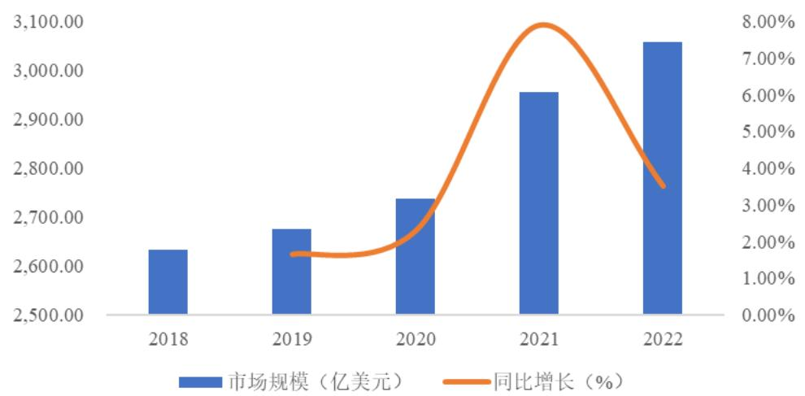

bar-line hybrid chart

| 年份 | 市场规模 (亿美元) | 同比增长 (%) |
| :--- | :--- | :--- |
| 2018 | 2630.00 | - |
| 2019 | 2670.00 | 1.8 |
| 2020 | 2740.00 | 2.5 |
| 2021 | 2960.00 | 7.9 |
| 2022 | 3060.00 | 3.5 |

资料来源：Euromonitor

2023-2027年全球营养保健食品行业市场前景预测  
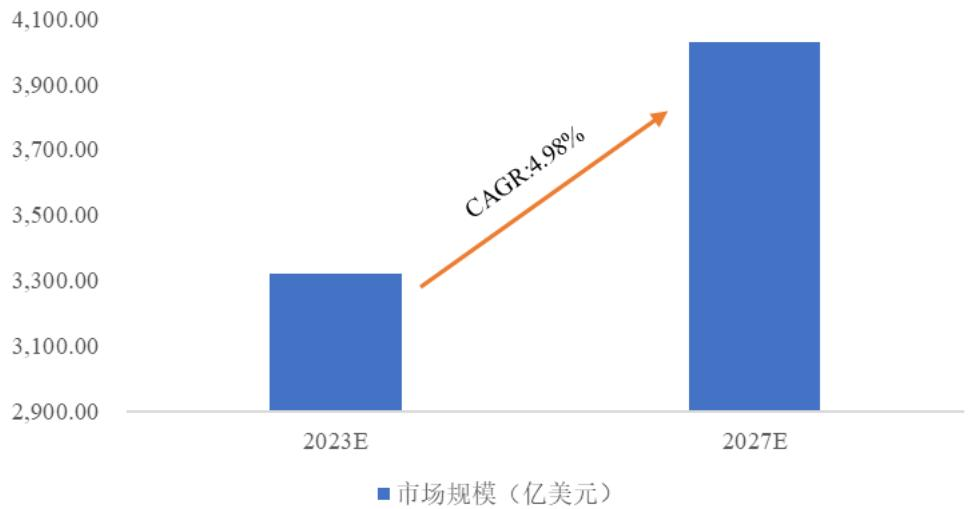

bar chart

| 年份 | 市场规模 (亿美元) |
| :--- | :--- |
| 2023E | 3,310.00 |
| 2027E | 3,980.00 |
CAGR: 4.98%

资料来源：Euromonitor

从国家和区域分布来看，营养保健食品的消费地区主要分布在美国、欧洲、澳大利亚、拉美及亚洲地区。其中美国、欧洲、澳大利亚营养保健食品行业发展较早，市场较为成熟，需求较为稳定。拉美、亚洲地区作为营养保健食品的新兴市场，近年来增速较快。北美市场为全球第一大营养保健食品市场，未来有望保持中低速增长。

从国内市场来看，据中国营养保健协会和前瞻产业研究院，2022 年中国营养保健食品市场产量为 78.7 万吨，同比增长 8.31%，行业供给水平逐年增长。2018-2022 年，中国营养保健食品市场的市场规模呈现逐年上升的趋势，2021年市场规模达到 6,272 亿元，同比增长 12%；2022 年，中国营养保健食品市场规模超过6,900亿元。

2018-2022年中国营养保健食品行业市场规模  
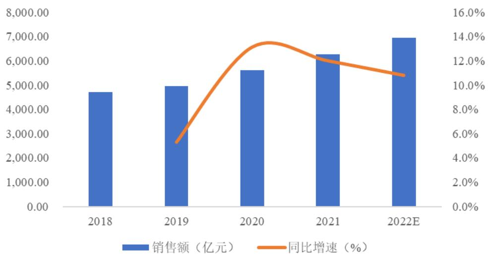

bar-line hybrid chart

| Year   | 销售额（亿元） | 同比增速（%） |
| ------ | -------------- | ------------- |
| 2018   | 4,800.00       | -             |
| 2019   | 5,000.00       | 5.0%          |
| 2020   | 5,600.00       | 13.5%         |
| 2021   | 6,300.00       | 12.5%         |
| 2022E  | 7,000.00       | 11.5%         |

资料来源：Euromonitor，前瞻产业研究院

## ②营养保健食品市场细分领域情况

根据 Euromonitor的分类，广义营养保健食品主要分为维生素及膳食补充剂类、运动营养品类及体重管理类等。

维生素及膳食补充剂为营养保健食品最重要的细分领域。2017-2022 年，全球维生素和膳食补充剂的市场规模呈现逐年上升的趋势，2022 年市场规模约为1,312 亿美元，年均复合增长率约为 5%。整体来看，全球维生素和膳食补充剂需求不断增长，推动全球营养保健食品行业市场规模进一步扩大。

目前，北美仍然是全球最大的维生素及膳食补充剂市场。2017-2021 年，北美市场维生素及膳食补充剂产品的市场平均增速为 4.96%，保持中低速增长。根据 Euromonitor 数据显示，2022 年美国维生素及膳食补充剂市场规模为357.16亿美元，预计 2023年至2027年将以 2.12%的复合年增长率增长。

运动营养食品普遍定义为一类生物活性和能量密度都很高的专门为运动人群机体代谢和需求所设计的食品，合理摄入此类食品可达到促进身体健康、提高运动能力的目的。随着全球社会经济的快速发展、城市化率的上升和健康生活方式的普及，消费者对健康营养饮食的认识越来越高，专业运动员、健身健美人群及大众体育爱好者数量越来越多，推动了运动营养市场需求的快速增长。

根据 Euromonitor 的数据显示，全球运动营养市场规模由 2017 年的 164.84亿美元增长到 2022年的 245.62亿美元，复合增长率达到 8.30%；随着人民对健康重视程度的提升，预计到 2027 年，全球运动营养食品行业市场规模将达到378.78 亿美元，2023-2027 年复合增长率为 8%。

体重管理产品通常是指用于调控用户身体能量及物质代谢平衡，使用户体重保持在健康范围内的产品。根据世界肥胖联合会发布的“2023 年世界肥胖图谱”显示，到 2035 年全球将有超过 40 亿人肥胖或超重，其中儿童和低收入国家的肥胖率正在快速上升，肥胖年轻化趋势已经显现。同时，随着年轻消费者们越来越注重自身的身材和体重，健康科学的减肥方式逐步受追捧，体重管理领域增长潜力大。

根据 Euromonitor 数据，全球体重管理市场规模将从 2022 年的 209.97 亿美元增长到 2023 年的 225.57 亿美元；预计到 2027 年，体重管理市场规模将增长至 275.21 亿美元，复合年增长率达到 5.10%。就地区而言，不同地区发展态势有一定差异，美国市场相对成熟，在体重管理产品市场占据最大份额，龙头地位稳固，新兴地区则成长较快。其中，亚太地区是增长最快的体重管理市场，主要分布在中国、日本和韩国。根据 Grand View Research，2022 年亚太地区在体重管理市场份额超过 37.68%。

## ③辅酶Q10市场情况

公司营养保健食品原料中占比最大的为辅酶 Q10，辅酶 Q10 是一种在生物体内广泛存在的脂溶性醌类物质，最重要的作用是清除自由基、提高免疫力，保护和改善肝、脑、心脏和神经系统功能。美国 FDA 在 2004 年即建议心脑血管病人在服用“他汀”类药物的同时需每天补充 100-200mg 的辅酶 Q10 以减小该类药物对身体的损害，而美国心脏病医师协会亦建议全美 65 岁以上老人，无论是否有心脏病，都宜每天服用辅酶 Q10。当前美国已成为全球最大的辅酶Q10需求市场。

辅酶 Q10 在日本起初主要应用于药品，而随着研究的广泛和深入，日本在2002 年放宽了相应规定——允许营养保健食品和护肤产品使用；2004 年美国FDA 批准辅酶 Q10 可以作为营养保健食品使用，从此市场需求迅速地扩张；2006 年，中国国家食品药品监督管理局发文允许辅酶 Q10 可以按照营养保健食品使用。

随着辅酶 Q10 新功能的不断发现，辅酶 Q10 被广泛应用于营养保健食品、食品添加剂、药物及化妆品等领域，市场需求呈现出不断增长的趋势。目前，美国是全球辅酶 Q10 最大的需求市场，2022 年度美国辅酶 Q10 市场规模已达3.71 亿美元。

## （2）行业竞争格局、市场集中情况及发行人的市场地位

结合业务构成情况，公司覆盖营养保健食品上游原料供应、中游生产和下游品牌运营等营养保健食品全产业链。其中，公司主要营养保健食品原料产品为辅酶 Q10，主要营养保健食品生产商为 VB，主要营养保健食品终端品牌为Doctor's Best 和 Zipfizz。

## ①营养保健食品原料辅酶 Q10

日本是最早开发和生产辅酶 Q10的国家，早期全球 90%辅酶 Q10的供应来自日本，主要厂家为钟渊化学工业株式会社、三菱瓦斯化学株式会社、旭化成株式会社、日清制药株式会社，市场供给不足，价格较高。2005 年后随着辅酶Q10 发酵法工艺逐步成熟，其产品质量和生产成本远低于合成法，使得合成法工艺逐渐淘汰，采用发酵法生产辅酶 Q10 的厂家逐渐占领市场。经过多年竞争，日本辅酶 Q10 生产企业逐渐呈萎缩态势，而国内生产技术快速发展，中国辅酶Q10生产企业在全球市场的话语权快速增强。

目前，中国是全球最大的辅酶 Q10 生产国，行业集中度较高。根据智研咨询，国内辅酶 Q10 的主要生产企业有金达威、神舟生物、新和成、浙江医药等。公司2024年度辅酶 Q10产量为648.56吨，生产能力占据优势地位。

## ②营养保健食品生产

公司主要营养保健食品生产商 VB 位于美国加利福尼亚州。在美国营养保健食品市场，有众多生产商参与，根据规模大小不同，生产商专注的市场及服务的客户有所差异，市场集中度较低。根据 Nutrition Business Journal 数据，在美国约 55%的营养保健食品生产被外包给合同生产商。公司美国生产主体 VB为美国营养保健食品合同生产商之一。

## ③营养保健食品终端产品

目前，全球营养保健食品行业发展迅速，各企业纷纷布局营养保健食品业务，行业供给能力及供给水平得到大幅提升。在全球营养保健食品行业中，欧美企业处于领先地位。

从市场竞争格局上看，营养保健食品市场产品类型丰富，企业数量众多，格局较为分散，集中度不高。以美国为例，前五大企业合计市场份额约为 22%。就国内市场而言，根据欧睿数据，2022 年我国营养保健食品零售市场前五大企业合计市场份额约为 29%。公司营养保健食品终端品牌 Doctor's Best 和 Zipfizz为全球营养保健食品市场的重要参与者。

## （3）主要竞争对手

①营养保健食品原料供应商

## A、神舟生物

神舟生物成立于 2006 年，是由中国航天科技集团公司投资组建的以研发、生产、销售生物发酵系列产品为主的企业，2022 年被上市公司华润双鹤药业股份有限公司收购。2021年神舟生物辅酶 Q10出口量约 185吨，辅酶 Q10收入超3.8 亿元，是国内重要的辅酶 Q10 生产基地之一。

## B、新和成（002001.SZ）

新和成成立于 1999 年，于 2004 年 6 月在深圳证券交易所挂牌上市。新和成是一家主要从事原料药、营养品、香精香料和高分子复合新材料的生产和销售的企业，产品涵盖维生素类、氨基酸类和色素类等品类，主要应用于营养保健食品、饲料添加剂、食品添加剂等领域，营养保健食品原料产品包括辅酶Q10 等，目前是国内生产辅酶 Q10 的龙头企业之一。

## C、浙江医药（600216.SH）

浙江医药成立于 1997年，于 1999年 10月在上海证券交易所挂牌上市。浙江医药现有业务主要为生命营养类产品和医药原料药、制剂两大部分，其中生命营养类产品包括辅酶 Q10原料。

## D、嘉必优（688089.SH）

嘉必优成立于 2004年，于 2019年 12月在上海证券交易所挂牌上市。嘉必优是国内最早从事以微生物合成法生产多不饱和脂肪酸及脂溶性营养素的企业之一，主营业务包括多不饱和脂肪酸 ARA、藻油 DHA 及 SA、天然β-胡萝卜素等多个系列产品的研发、生产与销售，产品广泛应用于婴幼儿配方食品、营养保健食品和特殊医学用途配方食品等领域。

②营养保健食品生产商

A、仙乐健康（300791.SZ）

仙乐健康成立于 1993 年，于 2019 年 9 月在深圳证券交易所挂牌上市。仙乐健康是一家集研发、生产、销售、技术服务为一体的营养保健食品领域综合服务提供商，拥有超过 4,000 个成熟产品配方、超 100 个保健食品注册证书，拥有软胶囊、粉剂、片剂、软糖、口服液、硬胶囊等多种剂型的规模生产能力，在营养保健食品制造领域具有一定的市场影响力。

B、艾兰得

艾兰得专业从事营养保健食品的研发、生产与销售业务，可提供包括片剂、粉剂、软胶囊、硬胶囊、凝胶糖果、益生菌、软糖以及液体制剂等多种剂型的营养保健食品。

③营养保健食品终端品牌商

A、安利

安利是一家总部位于美国密歇根州的家居护理产品公司，业务遍布 80 多个国家和地区。安利产品包括营养保健食品、美容化妆品、个人护理用品、家居护理用品和家居耐用品等，旗下拥有营养保健食品品牌“纽崔莱”，纽崔莱系列营养保健食品在安利营销的五大品类产品中市场份额最大，约占总销售额的50%，“纽崔莱”已经成为世界营养保健食品的领先品牌。

B、雀巢

雀巢是目前世界上最大的食品制造商，在全球拥有超过 500 家工厂，总部位于瑞士日内瓦。雀巢旗下拥有知名品牌 Nature’s Bounty。Nature’s Bounty 致力于用纯天然的营养保健食品，帮助人们改善健康，提高生活品质，Nature’sBounty产品遍布于 10万多家美国主流零售连锁店和各类健康食品商店。

## C、康宝莱

康宝莱是一家全球领先的营养和体重管理公司，总部位于美国洛杉矶。康宝莱的营养补充、体重管理、能量与健身、个人护理产品至今已覆盖全球超过90个国家和地区。

（4）公司所处行业与上、下游行业之间的关联性及上下游行业发展状况

营养保健食品产业链的上游主要是农产品生产及加工厂商、各种动植物提取物生产厂商以及化工原料生产厂商等原料生产商，中游主要是营养保健食品生产商，下游主要是营养保健食品品牌运营商以及流通领域的各种渠道商。

对于上游原料供应而言，通常营养保健食品生产所需原料繁多且相对独立，对单一品种原料不存在重大依赖。营养保健食品主要原料包括蛋白质、矿物质、维生素、动植物提取物等，原料采购单价受国内外供求关系、产业政策等因素影响。上游原材料的供需变动、价格波动及安全生产情况，将直接影响营养保健食品生产商的采购成本，进而影响营养保健食品的产品价格。

对于中游产品生产而言，参与者的优势主要在于配方研制、产品生产、质量控制及供应链管理，通过生产商的规模效益能够降低产品开发和生产成本，更好地利用资源，实现良好的资源配置，促进行业发展。

下游行业主要是营养保健食品品牌运营商以及各种渠道商，经营重点在于市场研究、产品营销和推广及市场渠道的拓展。

## 2、饲料添加剂行业

## （1）饲料添加剂行业基本情况

①饲料添加剂市场整体情况

饲料添加剂是现代饲料工业不可缺少的重要原料。根据大型跨国饲料与动保企业 Alltech 发布的全球饲料调查显示，2022年全球饲料总产量为 12.66亿吨，比上年下降 0.42%；2022 年我国饲料产量占全球饲料产量超 20%，为全球第一大饲料生产国。国家农业农村部和全国饲料工业协会数据显示，2022 年全国饲料工业总产值 13,168.5 亿元，比上年增长 7.6%；其中，饲料添加剂产品产值1,267.7 亿元，比上年增长 9.8%；2022 年全国工业饲料总产量首次突破 3 亿吨，达 30,223.4 万吨，比上年增长 3.0%，其中，饲料添加剂总产量 1,468.8 万吨，维生素类饲料添加剂产量占饲料添加剂总产量的 10.21%。近年来，饲料添加剂行业持续稳定发展，维生素类饲料添加剂总体需求稳中有增。

②维生素A市场情况

从维生素各品种市场份额来看，维生素 A、维生素 E 及维生素 C 是国际维生素市场上的三大主流品种，公司维生素类饲料添加剂主要产品为维生素 A。在众多维生素中，维生素 A 是第一个被发现的，也是一种较为重要且易缺乏的脂溶性维生素。

维生素 A 是饲料喂养过程中不可或缺的元素，其生理功能除视觉功能外，还包括基因表达调控、促进生长与繁殖、抗氧化、增强免疫力等，是一种重要的饲料添加剂。维生素 A 缺乏的症状特点为厌食、生长停止、衰弱、运动失调等。

根据 Global Market Insights（全球市场洞察公司）数据，2022 年全球维生素 A市场规模突破 5.4亿美元，预计 2023-2032年期间复合增长率将超过 5%，预计2032年将达到 9.05亿美元。

（2）行业竞争格局、市场集中情况及发行人的市场地位

维生素行业经过多年的分化、改组、并购，在全球形成了集中度很高的市场竞争格局，基本形成国外的帝斯曼、巴斯夫和中国企业三足鼎立的竞争态势。伴随着维生素产业向我国转移的逐步完成，我国已经成为世界维生素生产中心，是能生产全部维生素种类的少数国家之一。目前，各单项维生素品种集中度高，普遍情况是 3\~5 家企业单项维生素品种占据全球 70%以上市场份额，维生素产业基本形成了寡头垄断的竞争格局，国内企业已在多个维生素细分市场取得了国际竞争优势。

由于维生素 A 合成工艺复杂，技术壁垒高，中小企业难以进入，市场格局较为稳定，全球维生素 A 产能主要集中在巴斯夫、新发药业、新和成、帝斯曼、浙江医药、金达威等主要生产商。

据华创证券研究报告统计显示，2022 年全球主要维生素 A 供应商产能为52,900 吨，公司维生素 A 产能为 4,000 吨，占比 7.56%。公司是全球维生素 A

的主要生产厂商之一。

## （3）主要竞争对手

## ①巴斯夫

巴斯夫成立于 1865 年，是世界最大的化工企业之一，总部位于德国。巴斯夫经营领域包括化学品、特性产品、功能性材料与解决方案、农业解决方案、石油和天然气相关产品等，其提供的工业产品超过 8,000 种。在动物营养领域，巴斯夫生产和供应多种饲料添加剂及预混合饲料，包括维生素、类胡萝卜素、有机酸、酶制剂以及氨基酸等类别。

## ②新发药业

新发药业成立于 1998 年，总部位于山东东营，是一家主要从事饲料添加剂、兽药原料及医药中间体等产品生产、销售的企业。新发药业是全球主要的维生素 B5 生产商之一，也生产维生素 A、维生素 B1、维生素 B2、维生素 B6、叶酸、维生素D3等产品。

## ③新和成（002001.SZ）

新和成成立于 1999 年，于 2004 年 6 月在深圳证券交易所挂牌上市。新和成是一家主要从事原料药、营养品、香精香料和高分子复合新材料的生产和销售的企业，产品涵盖维生素类、氨基酸类和色素类等品类，主要应用于营养保健食品、饲料添加剂、食品添加剂等领域，饲料添加剂产品主要包括维生素 E、维生素A等，新和成维生素 A的产销量和出口量居世界前列。

## ④帝斯曼

帝斯曼成立于 1902 年，是一家总部位于荷兰的跨国生命科学和材料科学公司。帝斯曼产品被广泛应用于食品和营养保健食品、个人护理、饲料、药品、医疗设备、汽车、油漆、电气和电子、生命保护、替代能源和生物基材料等领域。2003 年，帝斯曼收购了罗氏（Roche）公司的维生素与精细化工分部，将其改名为帝斯曼营养产品部（DNP），该机构和帝斯曼的生命科学产品部一起，成为世界领先的生命科学产业供应商。帝斯曼营养产品部生产维生素、类胡萝卜素、多不饱和脂肪酸、营养保健食品以及其它用于食品工业的精细化工产品，

其维生素A产能占据全球前列。

⑤浙江医药（600216.SH）

浙江医药成立于 1997年，于 1999年 10月在上海证券交易所挂牌上市。浙江医药现有业务主要包括生命营养类产品和医药原料药、制剂两大部分，其中，生命营养类产品维生素 A为其主导产品，浙江医药是维生素 A的重要生产商之。

⑥天新药业

天新药业成立于 2004 年，专业从事单体维生素的研发、生产和销售，产品包括维生素 B6、维生素 B1、生物素、叶酸、维生素 D3、抗坏血酸棕榈酸酯、维生素 E 粉等，主要应用于饲料、医药、食品等领域。天新药业是全球 B 族维生素市场的重要供应商之一，在多个 B族维生素产品中占据较高的市场份额。

（4）公司所处行业与上、下游行业之间的关联性及上下游行业发展状况

饲料添加剂行业上游主要为基础化工、能源化工、农业等提供原材料的行业，中游为饲料添加剂生产商，下游为饲料生产制造行业，包括猪饲料、禽饲料、水产饲料等。

从上游看，原材料价格波动对饲料添加剂行业的利润水平产生一定影响；从下游看，养殖行业发展状况是影响饲料添加剂行业利润水平的重要因素，其中，发展状况包括生猪存栏量、蛋禽类及水产品养殖量、养殖行业生产规律等。此外，人力成本的提升、企业环保投入的增加以及较激烈的市场竞争也会给行业经营者带来一定压力。

长期来看，近十多年来我国饲料产量保持稳定增长；但短期内受下游养殖行业存栏量的波动变化，饲料及饲料添加剂产品需求量亦随之呈现波动变化。

## （四）进入行业壁垒

## 1、技术壁垒

研发能力和生产工艺技术是食品制造业的核心竞争力之一。食品生产通常涉及绿色合成、催化、发酵、化学合成等多种技术，技术含量较高、生产工艺相对复杂，实际生产中需要大量专有技术、专利技术和生产操作经验，同时产品生产亦涉及配方研究、质量标准研究、生产工艺研究、功效验证、稳定性测验等方面，对于企业的研发水平、经验积累、资本实力以及相关产品的生产能力均有较高的要求，构成行业较高的技术壁垒。

## 2、品牌壁垒

营养保健食品的产品质量和食品安全问题与消费者健康息息相关。随着各个国家对于食品安全监管日益加强及消费者对食品安全关注度的不断提高，消费者更倾向于选择知名的营养保健食品品牌。而产品口碑、品牌价值等则需要通过长期累积，行业新进入者通常很难在较短时间内建立起品牌优势，这为市场新进企业设立了较高的品牌壁垒。

## 3、市场进入壁垒

食品制造业对产品质量、品质要求较高，近年来各主要市场国对于产品安全的重视程度不断提升，国内外知名企业基于监管及其内部质量管理要求，对于供应商的认证及评审往往较为严格，如对生产管理系统的 GP 质量认证、对安全和环保等社会责任系统的认证等，食品制造商对供应商的研发实力、技术工艺、快速响应等诸多方面的要求，形成了较高的市场进入门槛。

## 4、资金壁垒

食品制造业的投资成本较高，是典型的资金密集型行业，形成一定规模的产能需要较大的初始投入，且产品生产具有一定的规模效应；同时，企业需要不断投入资金进行技术更新改造，通常需要较高的资金储备，对企业资金实力和综合实力要求较高，对新进入者形成了较高的资金壁垒。

## 5、人才壁垒

技术创新的关键因素是人才，研发人才储备是推动企业乃至整个行业发展的基石。由于营养保健食品和饲料添加剂的技术含量较高，公司需要不断对核心技术进行优化升级，这对研发人员的科研能力提出了较高要求。研发人员通常需具备微生物学、应用化学、生物化工、药学、食品学等交叉学科的专业背景，同时拥有丰富的产业化实践经验，以应对实验室技术产业化放大的各种技术难题，降低在研项目的试错成本，提高创新研发效率。因此，食品制造企业通常需要具备高水平的技术创新人才梯队，形成了较高的人才壁垒。

## 七、公司主营业务的具体情况

## （一）主要产品或服务的用途

公司主要从事营养保健食品（包含营养保健食品原料和营养保健食品终端产品）、饲料添加剂的研发、生产及销售业务。

公司主要产品或服务说明如下所示：

## 1、营养保健食品

## （1）辅酶 Q10

辅酶 Q10，英文名 CoenzymeQ10，简称 CoQ10，又称泛醌，是存在于人体所有细胞中的脂溶性抗氧化剂，能激活人体细胞和细胞能量的营养，具有提高人体免疫力、增强抗氧化、延缓衰老和增强人体活力等功能。辅酶 Q10 在营养保健、医药、美容化妆等方面应用广泛，可用于防治心脏病、高血压、糖尿病、急慢性肝炎、帕金森症等多种常见疾病，对心脏、肝脏和肾有良好的保健作用，被誉为“心脏的保护神”和“神奇营养素”。欧美日等发达国家已将人体中辅酶Q10的含量多少作为身体健康与否的重要指标。

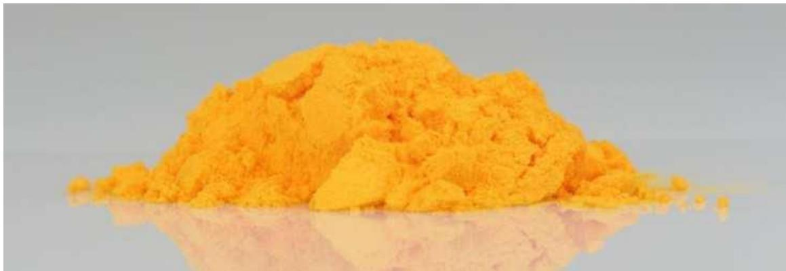

natural_image

Pile of bright yellow powder on a reflective surface (no text or symbols visible)

图：辅酶Q10原料

目前，生产辅酶 Q10 主要有发酵法、化学合成法。上述生产方法是资本、技术、管理高度结合的表现，生产工艺具有很强的经验性，需要非常高的系统工程整合能力，其经验式生产过程难以在短期内复制。与化学合成法相比，发酵法生产工艺更为安全和成熟、产品质量更好、生产成本更低。目前，发酵法已成为辅酶Q10生产的主流工艺。

辅酶 Q10上游主要为农产品和基础化工原材料行业，中游为辅酶 Q10原料生产商和相关产品加工企业，下游包括营养保健食品、药品、化妆品等消费领域，应用场景较为丰富。

## （2）营养保健食品生产

VB 是一家拥有药品级生产环境的营养保健食品生产公司，承接胶囊、片剂与粉剂的生产订单，提供配方制定、称量、混合、粉剂加工、封装、压片和包衣等生产业务，可生产不同种类、不同批量的营养保健食品。

## （3）营养保健食品终端品牌

## ①Doctor’s Best 品牌

Doctor’s Best是一家全品类全年龄段营养保健食品公司，旗下拥有超过 300种产品，主要有辅酶 Q10、氨糖软骨素、镁片等产品。辅酶 Q10 有助于供养心肌、保护心脏、天然抗氧化、抗衰老、激活能量、抗疲劳，提高机体免疫力；氨糖软骨素产品含氨基葡萄糖、硫酸软骨素、二甲基砜等软骨成分，适用于久坐办公群体、中老年人群体；高吸收甘氨酸镁片含镁元素，镁是一种对健康的许多方面都非常必要的矿物质，有助于提高能量水平，帮助维持正常、规律的心跳，帮助维持肌肉质量，减轻与压力和焦虑相关的症状。

text_image

Doctor's Science-Based Nutrition
BEST多特培斯
Lutein®
with Lutein®
DHA from Alga®
250 mg - 600 g/100g
200 mg - 900 mg
High Absorption CoQ10®
with Bioptics®
100 mg - 250 Softgets
Binary Supplement
Science-Based Nutrition®
High Absorption CoQ10®
Heart & Heart
Doctor's BEST®
Purified & Clear Omega 3 Fish Oil® with O
2000 mg + 1200 Mendeo Softgets
OOP Softgets
Doctor's BEST®
Natural Vitamin K₂⁺D₃™ Calcium®
Nattokinase 2000g Fla®
100 Vegetable Caps

图：Doctor’s Best 品牌产品

## ②Zipfizz 品牌

Zipfizz 是一家致力于为消费者提供新式健康功能性产品的营养保健食品公司。Zipfizz 产品为一种全天然、无糖、低热量、低碳水化合物的健康能量粉末，含 9种维生素（包括高含量的维生素 C及维生素 B12等）、8种矿物质、4种电解质和 4种抗氧化物，能够产生提神及保持精力充沛的功效，超 10种口味可供消费者选择，定位于年轻时尚群体。

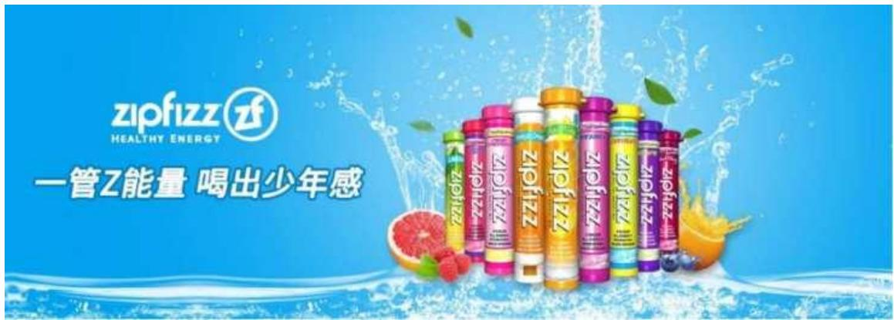

text_image

zipfizz
HEALTHY ENERGY
一管Z能量 喝出少年感

图：Zipfizz 品牌产品

## （4）其他

此外，公司还生产 DHA、ARA、维生素 K 等其他营养保健食品原料。DHA 和 ARA 对心血管系统疾病、炎症等具有积极的防治作用，并能促进婴幼儿视力和智力发育，广泛应用于营养保健食品、婴幼儿配方食品、孕期和哺乳期妇女食品等领域。维生素 K 能够促进血液正常凝固、促进骨健康，对于心脑血管具有保护作用。

## 2、饲料添加剂

## （1）维生素A

公司生产的维生素类饲料添加剂产品主要为维生素 A。维生素 A 是一种脂溶性维生素，呈黄色片状晶体或结晶性粉末状，不溶于水和甘油，能溶于醇、醚、烃、卤代烃等大多数有机溶剂。维生素 A 具有提高动物繁殖力、促进畜体生长、提高免疫力等功效。

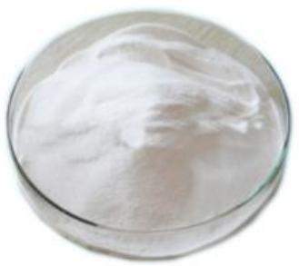

natural_image

Close-up of a white powdery substance in a glass bowl (no text or symbols visible)

图：维生素A原料

## （2）其他

此外，公司还生产维生素 D等其他饲料添加剂。维生素 D可以促进钙、磷在小肠中的吸收，促进生长和骨骼的钙化，还能够促进皮肤细胞生长、分化以及具有调节免疫的功能。

## 3、其他产品

除上述主要产品或品牌外，公司还生产吡喹酮等其他产品。吡喹酮是一种可用于人类及动物驱虫药的医药原料，专门治疗绦虫及吸虫疾病。

## （二）主要经营模式

## 1、采购模式

国内方面，公司采取自主采购的方式进行原辅材料采购，采购的主要原材料包括液糖、β-紫罗兰酮、溴乙烷、溴氢酸、明胶等。公司国内各生产厂区就其生产所需，采用“以产定购+合理库存”的采购原则，紧密围绕客户订单需求安排采购计划，根据原材料市场价格波动和供应商实际供货情况进行动态调整，并备有一定的安全库存。同时，公司在制定采购计划时会综合考虑仓库存储能力、现金流情况、生产计划安排等，确保在不影响公司正常生产活动的前提下实现公司仓储管理和资金管理的最优化。

国外方面，目前开展生产经营活动的海外子公司主要有 DRB、Zipfizz 和VB。DRB 和 Zipfizz 不直接从事生产业务，而是通过将生产业务转移给合同制造商，并向合同制造商采购胶囊、片剂、粉剂等成品，成品采购遵循“以销定购+合理库存”的原则，根据历史销售数据并结合市场需求预测制成订单并安排采购工作；VB主要从事营养保健食品生产业务，对生产所需的各类原料、辅料、包装材料等制定采购计划并进行相关采购。

## 2、生产模式

公司生产模式主要分为自主生产和委托生产两种模式。

国内方面，公司主要为自主生产模式。公司拥有 3 个主要生产主体：金达威药业主要负责辅酶 Q10 等营养保健食品原料的生产，金达威维生素主要负责维生素 A 等饲料添加剂的生产，诚信药业主要负责吡喹酮等医药原料的生产。国内生产主要采取“以销定产+适度备货”的生产原则，结合各主体的销售计划和实际库存情况，合理组织生产活动，提高营运效率。

国外方面，VB主要从事胶囊、片剂及粉剂的营养保健食品生产业务，视客户需求情况进行相应的生产活动。

## 3、销售模式

公司原料类产品主要采取与下游客户直接签订合同、批量供应的业务模式，成品类产品主要通过线上和线下渠道实现销售。原料类产品主要为辅酶 Q10 等营养保健食品原料、维生素 A 等饲料添加剂及吡喹酮等医药原料；成品类产品主要为 Doctor’s Best 品牌、Zipfizz 品牌旗下营养保健食品。

公司原料类产品客户主要为营养保健食品、饲料添加剂、医药制剂等产品的下游生产厂商及批发商等，公司对原料类产品客户销售均为买断式销售，采用一致的货款收取、结算或结汇方式。

公司成品类产品线上渠道模式为公司将产品直供给 Amazon、iHerb 等电商平台，再由电商平台销售给消费者，或者在天猫等线上电商平台自行开设品牌店，利用新媒体时代渠道多元化趋势，通过站内外引流（直播、短视频推广等方式）进行销售推广，直接将产品销售给消费者；线下渠道模式主要为公司将产品直供给 Costco、Sam's Club 等大型商超，再由商超销售给终端消费者。公司对成品类产品销售均为买断式销售。

## （三）主要产品的规模

## 1、主要产品产量和销量情况

报告期内，公司主要产品产能、产量和销量情况如下表所示：

<table><tr><td>产品</td><td colspan="2">项目</td><td>2024年度</td><td>2023年度</td><td>2022年度</td></tr><tr><td rowspan="13">辅酶Q10+ARA+DHA</td><td colspan="2">产能(吨)</td><td>620.00</td><td>620.00</td><td>620.00</td></tr><tr><td rowspan="4">产量(吨)</td><td>辅酶Q10</td><td>648.56</td><td>546.44</td><td>331.40</td></tr><tr><td>DHA</td><td>74.03</td><td>61.22</td><td>197.19</td></tr><tr><td>ARA</td><td>49.28</td><td>78.41</td><td>34.95</td></tr><tr><td>小计</td><td>771.88</td><td>686.06</td><td>563.53</td></tr><tr><td rowspan="4">销量(吨)</td><td>辅酶Q10</td><td>634.74</td><td>546.55</td><td>391.68</td></tr><tr><td>DHA</td><td>75.88</td><td>73.86</td><td>174.61</td></tr><tr><td>ARA</td><td>53.04</td><td>65.98</td><td>39.36</td></tr><tr><td>小计</td><td>763.65</td><td>686.39</td><td>605.65</td></tr><tr><td rowspan="3">产销率</td><td>辅酶Q10</td><td>97.87%</td><td>100.02%</td><td>118.19%</td></tr><tr><td>DHA</td><td>102.49%</td><td>120.66%</td><td>88.55%</td></tr><tr><td>ARA</td><td>107.62%</td><td>84.15%</td><td>112.62%</td></tr><tr><td colspan="2">产能利用率</td><td>124.50%</td><td>110.66%</td><td>90.89%</td></tr><tr><td rowspan="5">维生素A</td><td colspan="2">产能(吨)</td><td>4,000</td><td>4,000.00</td><td>4,000.00</td></tr><tr><td colspan="2">产量(吨)</td><td>2,846.15</td><td>2,473.86</td><td>3,040.44</td></tr><tr><td colspan="2">销量(吨)</td><td>2,476.80</td><td>2,670.99</td><td>3,278.44</td></tr><tr><td colspan="2">产销率</td><td>87.02%</td><td>107.97%</td><td>107.83%</td></tr><tr><td colspan="2">产能利用率</td><td>71.15%</td><td>61.85%</td><td>76.01%</td></tr></table>

注1：产销率=销量/产量×100%；产能利用率=产量/产能×100%；  
注 2：公司辅酶 Q10 及 ARA、DHA 生产环节中发酵等关键工序的生产设备可通用，存在共线生产情况，具有柔性生产特点，因此辅酶Q10及 ARA、DHA产品合并统计产能；  
注 3：公司存在产销率大于 100%情形，主要系当期销售包含以前年度库存所致；公司存在产能利用率大于100%情形，系生产工艺优化提升所致；  
注4：公司营养保健食品主要终端品牌Doctor's Best、Zipfizz不直接从事生产业务，而是将生产业务转移给合同制造商，并向合同制造商采购胶囊、片剂、粉剂等成品，故未列示相关产品产能；  
注5：辅酶Q10、DHA、ARA产量统计系剔除返工及自用后的数据；  
注6：2024年度产销量中含部分向神舟生物采购的辅酶Q10。

## 2、公司前五名客户情况

报告期内，公司前五名客户销售情况如下：

单位：万元

<table><tr><td>时间</td><td>客户名称</td><td>销售金额</td><td>占营业收入比例</td></tr><tr><td rowspan="6">2024年度</td><td>Amazon</td><td>45,228.45</td><td>13.96%</td></tr><tr><td>iHerb</td><td>40,498.13</td><td>12.50%</td></tr><tr><td>Costco</td><td>38,668.52</td><td>11.93%</td></tr><tr><td>Coupang</td><td>11,556.27</td><td>3.57%</td></tr><tr><td>NBTY</td><td>10,316.37</td><td>3.18%</td></tr><tr><td>合计</td><td>146,267.74</td><td>45.14%</td></tr><tr><td rowspan="6">2023年度</td><td>Amazon</td><td>49,355.49</td><td>15.91%</td></tr><tr><td>Costco</td><td>39,807.13</td><td>12.83%</td></tr><tr><td>iHerb</td><td>34,078.67</td><td>10.98%</td></tr><tr><td>NBTY</td><td>13,739.48</td><td>4.43%</td></tr><tr><td>Coupang</td><td>8,683.58</td><td>2.80%</td></tr><tr><td>合计</td><td>145,664.35</td><td>46.95%</td></tr><tr><td rowspan="6">2022年度</td><td>Amazon</td><td>37,290.76</td><td>12.39%</td></tr><tr><td>Costco</td><td>34,292.18</td><td>11.40%</td></tr><tr><td>iHerb</td><td>23,359.13</td><td>7.76%</td></tr><tr><td>NBTY</td><td>18,935.80</td><td>6.29%</td></tr><tr><td>Sam&#x27;s Club</td><td>7,828.07</td><td>2.60%</td></tr><tr><td>合计</td><td>121,705.95</td><td>40.44%</td></tr></table>

报告期内，公司不存在向前五大客户的销售占比超过 50%、单个销售客户销售占比超过30%的情况。

报告期前五大客户中，iHerb 为公司持有 4.80%股份的参股公司，除前述情形外，公司董事、监事、高级管理人员和核心技术人员、主要关联方和持有 5%以上股份的股东在上述客户中不存在占有权益的情况。

## 3、新增前五大客户的情况

公司报告期内新增的前五大客户为 Coupang。Coupang 是韩国最大的产品电子商务运营商，为公司长期合作伙伴，报告期各期均为公司前十名客户，2023 年度 Coupang 对公司营养保健食品的采购规模较同期有所上升，成为当期第五大客户。

## （四）产品、原材料采购情况

## 1、主要物料、能源采购情况

## （1）物料

公司采购的主要物料包括硬胶囊、能量粉剂和液糖等，主要物料的采购金额和占比情况如下：

单位：万元

<table><tr><td rowspan="2">项目</td><td colspan="2">2024年度</td><td colspan="2">2023年度</td><td colspan="2">2022年度</td></tr><tr><td>采购金额</td><td>占比</td><td>采购金额</td><td>占比</td><td>采购金额</td><td>占比</td></tr><tr><td>硬胶囊</td><td>42,873.21</td><td>19.88%</td><td>32,298.24</td><td>17.76%</td><td>36,050.84</td><td>20.97%</td></tr><tr><td>能量粉剂</td><td>31,993.08</td><td>14.83%</td><td>30,761.29</td><td>16.91%</td><td>27,889.16</td><td>16.23%</td></tr><tr><td>液糖</td><td>22,246.78</td><td>10.32%</td><td>22,869.10</td><td>12.57%</td><td>13,434.12</td><td>7.82%</td></tr><tr><td>软胶囊</td><td>17,281.97</td><td>8.01%</td><td>8,338.04</td><td>4.58%</td><td>13,264.30</td><td>7.72%</td></tr><tr><td>片剂</td><td>15,183.60</td><td>7.04%</td><td>12,034.46</td><td>6.62%</td><td>11,521.01</td><td>6.70%</td></tr><tr><td>β-紫罗兰酮</td><td>1,169.82</td><td>0.54%</td><td>3,118.64</td><td>1.71%</td><td>5,735.54</td><td>3.34%</td></tr><tr><td>合计</td><td>130,748.47</td><td>60.63%</td><td>109,419.78</td><td>60.15%</td><td>107,894.98</td><td>62.77%</td></tr></table>

## （2）能源

公司生产所需能源主要包括电、水、蒸汽、燃气等，该等能源供应持续、稳定，报告期各期境内主要能源具体耗用情况如下：

<table><tr><td>时间</td><td>能源</td><td>单位</td><td>数量</td><td>金额(万元)</td></tr><tr><td rowspan="5">2024年度</td><td>电</td><td>度</td><td>122,645,024.18</td><td>6,108.09</td></tr><tr><td>水</td><td>吨</td><td>622,943.90</td><td>342.34</td></tr><tr><td>蒸汽</td><td>吨</td><td>236,729.68</td><td>4,228.15</td></tr><tr><td>燃气</td><td>立方米</td><td>397,268.82</td><td>145.46</td></tr><tr><td>小计</td><td>/</td><td>/</td><td>10,824.04</td></tr><tr><td rowspan="5">2023年度</td><td>电</td><td>度</td><td>115,642,529.78</td><td>5,505.69</td></tr><tr><td>水</td><td>吨</td><td>583,938.00</td><td>312.04</td></tr><tr><td>蒸汽</td><td>吨</td><td>217,166.43</td><td>3,842.55</td></tr><tr><td>燃气</td><td>立方米</td><td>274,130.00</td><td>99.60</td></tr><tr><td>小计</td><td>/</td><td>/</td><td>9,759.89</td></tr><tr><td rowspan="2">2022年度</td><td>电</td><td>度</td><td>96,482,820.00</td><td>5,021.23</td></tr><tr><td>水蒸汽</td><td>吨吨</td><td>611,350.84170,220.19</td><td>279.983,459.61</td></tr><tr><td rowspan="2"></td><td>燃气</td><td>立方米</td><td>454,875.00</td><td>167.85</td></tr><tr><td>小计</td><td>/</td><td>/</td><td>8,928.67</td></tr></table>

## 2、公司前五名供应商情况

报告期内，公司前五名供应商采购情况如下：

单位：万元

<table><tr><td>时间</td><td>供应商名称</td><td>采购金额</td><td>占采购总额比例</td></tr><tr><td rowspan="6">2024年度</td><td>Vitaquest International LLC.</td><td>29,163.10</td><td>13.52%</td></tr><tr><td>内蒙古融成玉米开发有限公司</td><td>14,940.24</td><td>6.93%</td></tr><tr><td>内蒙古第三建筑工程有限公司</td><td>10,814.18</td><td>5.01%</td></tr><tr><td>Albion Laboratories, Inc.</td><td>8,005.31</td><td>3.71%</td></tr><tr><td>内蒙古金河淀粉有限责任公司</td><td>7,306.54</td><td>3.39%</td></tr><tr><td>合计</td><td>70,229.37</td><td>32.56%</td></tr><tr><td rowspan="6">2023年度</td><td>Vitaquest International LLC.</td><td>30,761.29</td><td>16.91%</td></tr><tr><td>内蒙古融成玉米开发有限公司</td><td>15,448.39</td><td>8.49%</td></tr><tr><td>Albion Laboratories, Inc.</td><td>7,808.39</td><td>4.29%</td></tr><tr><td>内蒙古金河淀粉有限责任公司</td><td>7,420.72</td><td>4.08%</td></tr><tr><td>DeerLand Enzymes, Inc.</td><td>5,722.73</td><td>3.15%</td></tr><tr><td>合计</td><td>67,161.51</td><td>36.92%</td></tr><tr><td rowspan="6">2022年度</td><td>Vitaquest International LLC.</td><td>27,889.16</td><td>16.23%</td></tr><tr><td>内蒙古融成玉米开发有限公司</td><td>8,123.56</td><td>4.73%</td></tr><tr><td>巴斯夫</td><td>5,735.54</td><td>3.34%</td></tr><tr><td>内蒙古金河淀粉有限责任公司</td><td>5,310.56</td><td>3.09%</td></tr><tr><td>DeerLand Enzymes, Inc.</td><td>5,172.27</td><td>3.01%</td></tr><tr><td>合计</td><td>52,231.09</td><td>30.39%</td></tr></table>

注：报告期内主要供应商按同一集团下合并列示，其中巴斯夫包括巴斯夫（中国）有限公司、巴斯夫国际贸易（上海）有限公司和 BASF Hong Kong Limited。

报告期内，公司不存在向前五大供应商采购占比超过 50%、单一供应商采购占比超过30%的情况。

公司董事、监事、高级管理人员和核心技术人员，主要关联方和持有 5%以上股份的股东在上述供应商中不存在占有权益的情况。

## 3、新增前五大供应商的情况

公司报告期新增的前五大供应商包括 Albion Laboratories, Inc.和内蒙古第三建筑工程有限公司，公司与 DeerLand Enzymes, Inc.合作时间长达 5 年以上，该供应商的产品市场认可度较高，报告期内公司因业务发展需要提高采购规模；2024 年度，公司因开展募投项目建设，由内蒙古第三建筑工程有限公司承包相关工程。

## （五）境内外采购、销售情况

## 1、境内外采购情况

单位：万元

<table><tr><td rowspan="2">区域</td><td colspan="2">2024年度</td><td colspan="2">2023年度</td><td colspan="2">2022年度</td></tr><tr><td>金额</td><td>比例</td><td>金额</td><td>比例</td><td>金额</td><td>比例</td></tr><tr><td>境内</td><td>97,776.78</td><td>45.34%</td><td>78,998.79</td><td>43.43%</td><td>69,266.09</td><td>40.30%</td></tr><tr><td>境外</td><td>117,890.64</td><td>54.66%</td><td>102,902.64</td><td>56.57%</td><td>102,621.76</td><td>59.70%</td></tr><tr><td>合计</td><td>215,667.42</td><td>100.00%</td><td>181,901.43</td><td>100.00%</td><td>171,887.86</td><td>100.00%</td></tr></table>

报告期内，公司境外采购占采购总额的比例分别为 59.70%、56.57%和54.66%。公司境外采购主要为两部分：（1）境外子公司 Zipfizz、DRB 向Vitaquest International LLC.等境外供应商采购能量粉剂、硬胶囊等；（2）境内主体进口β-紫罗兰酮等，进口地主要为德国。

## 2、境内外销售情况

单位：万元

<table><tr><td rowspan="2">区域</td><td colspan="2">2024 年度</td><td colspan="2">2023 年度</td><td colspan="2">2022 年度</td></tr><tr><td>金额</td><td>比例</td><td>金额</td><td>比例</td><td>金额</td><td>比例</td></tr><tr><td>境内</td><td>67,442.97</td><td>20.82%</td><td>58,147.37</td><td>18.74%</td><td>59,979.02</td><td>19.93%</td></tr><tr><td>境外</td><td>256,562.89</td><td>79.18%</td><td>252,110.73</td><td>81.26%</td><td>240,943.89</td><td>80.07%</td></tr><tr><td>合计</td><td>324,005.86</td><td>100.00%</td><td>310,258.09</td><td>100.00%</td><td>300,922.91</td><td>100.00%</td></tr></table>

报告期内，公司境外销售占营业收入的比例分别为 80.07%、81.26%和79.18%。公司境外销售主要为两部分：（1）境外子公司 DRB、Zipfizz 向Amazon、Costco 等境外客户销售营养保健食品；（2）境内主体出口辅酶 Q10及维生素 A等原料产品。其中，辅酶 Q10 主要销往美国、德国和澳大利亚，维生素A主要销往荷兰、德国和西班牙。

截至目前，前述进口国及出口国不存在对公司生产经营造成重大不利影响的贸易政策，未对公司进出口业务造成重大不利影响。

## （六）安全生产及环境保护情况

## 1、安全生产

公司一贯重视安全生产工作。为保证产品质量和食品的稳定和安全，公司按照《中华人民共和国安全生产法》《福建省安全生产条例》《内蒙古自治区安全生产条例》等法律法规的规定，结合公司的实际情况，制定了一系列质量及环境管理制度，通过了 ISO9001、ISO14001、FAMI-QS、FSSC22000、USP、NSFc GMP 等质量或环境管理体系认证，覆盖了生产、物料、设备设施、检验、包装标签、质量保证等各个环节，并在经营过程中严格执行。同时，公司设有生产管理部，主要职责包括安全策划和监督及环保策划和监督。公司上述措施有效保障了公司生产经营全过程及产品质量的稳定性，降低了产品质量风险。

2024年 1月 11 日 8 时 55分许，位于厦门市海沧区的发行人子公司金达威维生素发生一起施工焊接引发污水处理池内可燃气体闪爆事故，造成 4 人死亡、2 人受伤，直接经济损失约 530 万元。针对本次事故，金达威维生素进行了全面自查自改，对每一个作业面进行排查，分析事故原因，对员工进行警示教育培训。公司高度重视，深刻吸取事故教训，进一步加大安全生产检查和督查力度，严格落实安全生产措施，进一步消除可能存在的安全隐患。

2024 年 7 月 4 日厦门市应急管理局下发的《行政处罚决定书》（厦应急罚〔2024〕50 号），该事故符合《福建省安全生产行政处罚裁量基准》（2022 年版）关于“事故发生单位对事故发生负有责任（较大事故）”违法情形第一阶次裁量基准。同时根据《生产安全事故报告和调查处理条例》之规定，该事故不属于重大生产安全事故，厦门市海沧区应急管理局已出具证明认定该事故不属于重大违法行为。目前，金达威维生素已完成了全面整改，并已全面复工复产。

## 2、环境保护

公司严格执行国家有关环境保护的法律法规，制定了切实可行的环保制度，取得了相关政府机构批复文件。公司采取加大环保投入、积极推行节能减排、降低能耗等环保措施，在确保达标的前提下进一步削减排放量，履行社会责任。

报告期内，公司未出现重大环境污染事故，不存在因违反环境保护方面的法律、行政法规或规章而受到重大行政处罚，或者受到刑事处罚的情形。

## （七）现有业务发展安排及未来发展战略

## 1、现有业务发展安排

公司是一家营养健康全产业链龙头企业，主要从事营养保健食品（包含营养保健食品原料和营养保健食品终端产品）和饲料添加剂的研发、生产及销售业务。随着行业市场规模持续增长，行业内企业竞争加剧。面对快速增长的市场需求，公司一方面需积极扩建产能，增强产品供应能力，进而提升规模效益，增强自身产品的竞争实力；另一方面需要加大研发投入，丰富公司产品与服务品类，优化产品结构，实现盈利增长。

针对现有营养保健食品原料辅酶 Q10，公司拟新建一座专门生产辅酶 Q10的发酵车间，并购置配套的发酵设施，以突破产能瓶颈，扩大辅酶 Q10 的生产能力，提升辅酶 Q10 产品的规模化效益，进一步提高产品的市场占有率，巩固公司市场地位，增强公司盈利能力，为公司长远发展奠定坚实的基础。

此外，公司将依托完善的合成生物技术体系、丰富的生物合成研发能力及规模化的生物酶库平台，在现有营养原料业务内进行产品丰富和扩展。截至本募集说明书签署日，公司已对天然甜味剂阿洛酮糖完成生产工艺中试，打通了生产前述产品所需的完整工艺环节；肌醇已完成少量产品销售，产品质量稳定。前述产品产线建设完成后，公司可快速实现阿洛酮糖和肌醇的规模化生产，丰富公司产品品类，进一步满足客户一站式采购需求；同时，推动公司产品领域向甜味剂领域拓展，完善营养健康全产业链布局。

针对营养保健食品终端产品，公司将继续以 Doctor’s Best 为品牌建设重点，持续开发新媒体渠道的多方面价值，开拓销售渠道，通过产品和渠道共同推动品牌影响力；公司也将加大 Zipfizz 品牌广告推广投入，高频开展线下门店促销活动，提高产品曝光度，并通过社交媒体提高线上营销力度。

与此同时，公司业务规模不断增长，客户的拓展、市场的渗透以及人员规模的扩张，都对公司管理能力及效率提出了更高的要求。为满足公司未来随着生产销售规模迅速扩张而日益增长的信息化管理和数字化赋能需求，公司将引进 MES、SRM、CRM和 WMS等信息系统，维护升级 OA、ERP等信息化软硬件系统，实现公司与各子公司、公司内部各部门及各业务板块间的信息共享，增强业务协同性，提升公司对业务数据的集成管理与应用能力，为科学管理决策的制定提供支撑。

## 2、未来发展战略

公司将持续坚持“强化创新、引领未来”的原则，用前瞻性的眼光找寻营养健康领域的发展机会，完善营养健康全产业链布局。

未来，公司将不断加码投资生物酶及合成生物技术、智慧型工厂，布局合理的研发人才梯队，借助合成生物学的“工程特质”，用科技、绿色、低碳、低成本的工艺特点，为公司各业务板块开发具有前瞻性、可产业化的新产品，打造具有产品力的原料产品，同时加强公司旗下营养保健食品终端产品的品牌建设、营销力度和产品渠道建设，努力成为全球营养健康全产业链的引领者。

## 八、发行人技术及研发情况

## （一）报告期内研发投入情况

## 1、报告期研发投入的构成

报告期各期，公司研发投入金额分别为 7,185.77 万元、6,659.40 万元和7,049.18万元，具体构成如下：

单位：万元

<table><tr><td>项目</td><td>2024年度</td><td>2023年度</td><td>2022年度</td></tr><tr><td>工资及附加</td><td>4,034.78</td><td>3,487.73</td><td>3,672.04</td></tr><tr><td>新产品研发材料费</td><td>1,069.02</td><td>1,091.47</td><td>2,284.56</td></tr><tr><td>委外研发费用</td><td>405.12</td><td>1,019.84</td><td>245.40</td></tr><tr><td>研发设备折旧费</td><td>952.33</td><td>616.93</td><td>684.33</td></tr><tr><td>新产品研发动力费</td><td>221.73</td><td>150.28</td><td>155.26</td></tr><tr><td>其他</td><td>366.20</td><td>293.15</td><td>144.19</td></tr><tr><td>合计</td><td>7,049.18</td><td>6,659.40</td><td>7,185.77</td></tr></table>

## 2、报告期研发投入占比

报告期各期，公司研发投入占营业收入的比例如下：

单位：万元

<table><tr><td>项目</td><td>2024 年度</td><td>2023 年度</td><td>2022 年度</td></tr><tr><td>研发投入</td><td>7,049.18</td><td>6,659.40</td><td>7,185.77</td></tr><tr><td>研发投入占营业收入的比例</td><td>2.18%</td><td>2.15%</td><td>2.39%</td></tr></table>

## 3、报告期形成的重要技术及其应用

报告期内，公司主要产品的核心技术均系自主研发形成，公司运用自身核心技术生产的产品是公司主要收入来源。

报告期内，公司研发形成的授权专利技术参见本募集说明书“第四节 发行人基本情况”之“九、公司主要固定资产及无形资产”之“（二）主要无形资产”之“2、专利权”。

## （二）技术创新分析

## 1、技术先进性及具体表现

公司坚持“强化创新、引领未来”的原则，建立“以企业为主体、市场为导向、产学研一体化”的技术研发和创新体系。结合国内外技术发展趋势，制定技术开发计划，保障研发投入，持续进行新品开发和技术提升，增强公司的市场竞争力。公司拥有“国家企业技术中心”、“福建省营养强化剂工程技术研究中心”研发平台，与教育部工业微生物工程研究中心共建“金达威微生物工程研究中心”，与厦门大学共建“厦门大学——金达威食品营养工程技术研究中心”，汇聚了行业一流的技术专家和教授，研发人员超过 200人。

通过原始创新、集成创新和引进消化吸收再创新，公司掌握合成生物绿色制造、微生物发酵、化学合成、天然产物提取、微囊技术五大核心技术，实现了系列产品生产技术的全面提升。截至 2024年 12月 31日，公司拥有的境内外专利技术合计 194项，其中已授权的发明专利 147项，实用新型专利 39项，外观设计专利8项。

## 2、正在从事的研发项目及进展情况

截至2024年12月31日，公司正在从事的主要研发项目及进展情况如下：

<table><tr><td>序号</td><td>项目名称</td><td>项目起始日期</td><td>项目进展</td></tr><tr><td>1</td><td>辅酶 Q10 发酵工艺改进</td><td>2023/2</td><td>持续研发中</td></tr><tr><td>2</td><td>酶工艺开发</td><td>2023/1</td><td>小试阶段</td></tr><tr><td>3</td><td>淀粉糖下游产品绿色制造关键工艺研究</td><td>2022/5</td><td>中试阶段</td></tr><tr><td>4</td><td>ARA 生产工艺改进</td><td>2022/3</td><td>中试阶段</td></tr><tr><td>5</td><td>DHA 生产工艺改进</td><td>2022/3</td><td>中试阶段</td></tr><tr><td>6</td><td>K8 发酵工艺开发及产业化研究</td><td>2021/12</td><td>中试阶段</td></tr><tr><td>7</td><td>D-泛酸工艺优化研究</td><td>2021/12</td><td>中试阶段</td></tr><tr><td>8</td><td>格氏反应制备维生素 A 中间体缩合物的新工艺研究</td><td>2020/1</td><td>中试阶段</td></tr><tr><td>9</td><td>酶制剂菌株构建及发酵工艺开发</td><td>2019/1</td><td>持续研发中</td></tr><tr><td>10</td><td>酶制剂产品提纯工艺优化</td><td>2019/1</td><td>持续研发中</td></tr></table>

## 3、保持持续技术创新的机制和安排

## （1）不断提升对市场需求的洞察力

公司的研发工作以市场需求为导向，满足下游客户差异化的多样化的产品需求。公司将更为细致、准确、及时地了解客户的需求，与客户同步研发，发挥自身对市场竞争情况的分析洞察能力，从而优化工艺、技术的研究开发工作，为客户提供高性价比和优质的服务。

## （2）提高研发投入的力度

公司高度重视新工艺和新技术的开发与创新工作，研发投入持续保持较高水平，为公司研发体系建设、研发人才的引进和培养、研发设备的升级以及研发环境的改善奠定了坚实的基础。未来，公司将对研发机制进行不断地建设与完善，持续优化资源配置，制定有效的研发运行及管理机制。

## （3）加强核心技术人员的储备

公司在持续加大引进人才力度的同时，不断强化对公司现有技术人员的培养，有计划、有步骤地开展岗位技术培训，提高技术人员的研发水平。

## （4）完善技术保护机制和研发激励机制

公司高度重视技术创新的管理与保护，积极通过专利申请和非专利技术保密相结合的方式保护公司的核心技术。同时，为鼓励新技术、新产品的开发、推广与应用，公司制定了合理的研发工作考核及奖惩机制、有效的研发激励机制，将创新成果作为研发人员绩效考核的重要指标，对技术革新、新产品开发、优质专利申请均明确了奖励政策。

以上措施与安排使公司长期以来保持着持续的技术创新能力，成为行业技术的领先者。

## （三）研发团队情况

## 1、研发人员情况

报告期各期末公司的研发人员构成如下：

<table><tr><td>项目</td><td>2024年12月31日</td><td>2023年12月31日</td><td>2022年12月31日</td></tr><tr><td>研发人员总人数</td><td>219</td><td>232</td><td>201</td></tr><tr><td>公司总人数</td><td>2,123</td><td>2,126</td><td>2,105</td></tr><tr><td>研发人员占公司总人数比例</td><td>10.32%</td><td>10.91%</td><td>9.55%</td></tr></table>

## 2、核心技术人员情况

截至本募集说明书签署日，公司共有核心技术人员 4名，基本情况如下：

吴轶先生，具体情况请参见本募集说明书“第四节 发行人基本情况”之“五、董事、监事和高级管理人员”之“（一）董事会成员简历”。

李丹女士，具体情况请参见本募集说明书“第四节 发行人基本情况”之“五、董事、监事和高级管理人员”之“（二）监事会成员简历”。

詹光煌先生，具体情况请参见本募集说明书“第四节 发行人基本情况”之“五、董事、监事和高级管理人员”之“（三）高级管理人员简历”。

张水陆先生，本科；2004年 6月至 2024年 2月任公司副总经理。2012年 5月至今，任金达威药业董事；2014 年 12 月至 2024 年 3 月任金达威维生素董事、总经理；2014年12月起任金达威生物科技董事长。

## （四）核心技术来源及其影响

公司核心技术主要来源于自主研发，公司对核心技术均拥有所有权及使用权。公司凭借深厚的技术沉淀以及行业内领先的技术研究开发能力，成为行业龙头企业之一，并保持较快的发展速度和较好的盈利能力。

## 九、公司主要固定资产及无形资产

## （一）主要固定资产

公司主要固定资产为房屋建筑物、机器设备、电子设备等，截至 2024 年12月31日，公司固定资产具体情况如下：

单位：万元

<table><tr><td>固定资产</td><td>资产原值</td><td>累计折旧</td><td>减值准备</td><td>账面价值</td><td>成新率</td></tr><tr><td>房屋建筑物</td><td>84,974.99</td><td>19,829.99</td><td>-</td><td>65,145.01</td><td>76.66%</td></tr><tr><td>机器设备</td><td>128,798.23</td><td>64,280.82</td><td>1,736.94</td><td>62,780.47</td><td>50.09%</td></tr><tr><td>电子设备</td><td>4,201.16</td><td>2,988.51</td><td>9.78</td><td>1,202.88</td><td>28.86%</td></tr><tr><td>办公设备</td><td>2,434.89</td><td>1,990.53</td><td>0.37</td><td>443.98</td><td>18.25%</td></tr><tr><td>运输设备</td><td>2,062.02</td><td>1,628.15</td><td>-</td><td>433.87</td><td>21.04%</td></tr><tr><td>其他设备</td><td>1,630.09</td><td>1,382.65</td><td>0.20</td><td>247.24</td><td>15.18%</td></tr><tr><td>合计</td><td>224,101.38</td><td>92,100.64</td><td>1,747.30</td><td>130,253.45</td><td>58.90%</td></tr></table>

注：成新率=（资产原值-累计折旧）/资产原值

## 1、房屋及建筑物

## （1）境内房屋建筑物

截至 2024年 12月 31日，公司及子公司拥有的境内房屋建筑物具体情况如下：

<table><tr><td>序号</td><td>证书编号</td><td>所有权人</td><td>坐落地址</td><td>建筑面积(m2)</td><td>他项权利</td></tr><tr><td>1</td><td>苏(2020)启东市不动产权第0029601号</td><td>诚信药业</td><td>启东市滨江精细化工园上海路</td><td>28,506.65</td><td>无</td></tr><tr><td>2</td><td>厦国土房证第00756727号</td><td>金达威</td><td>海沧区东孚镇凤山西路63号(预混车间)</td><td>1,316.53</td><td>无</td></tr><tr><td>3</td><td>厦国土房证第00756728号</td><td>金达威</td><td>海沧区东孚镇凤山西路63号(仓库)</td><td>1,506.15</td><td>无</td></tr><tr><td>4</td><td>厦国土房证第00756729号</td><td>金达威</td><td>海沧区东孚镇凤山西路63号(硫酸铜间)</td><td>2,189.39</td><td>无</td></tr><tr><td>5</td><td>厦国土房证第00755291号</td><td>金达威</td><td>海沧区新昌路33号(微粒甲车间)</td><td>1,390.53</td><td>无</td></tr><tr><td>6</td><td>厦国土房证第00755293号</td><td>金达威</td><td>海沧区新昌路33号(C6车间)</td><td>771.72</td><td>无</td></tr><tr><td>7</td><td>厦国土房证第00755294号</td><td>金达威</td><td>海沧区新昌路33号(危险品仓库)</td><td>257.52</td><td>无</td></tr><tr><td>8</td><td>厦国土房证第00755295号</td><td>金达威</td><td>海沧区新昌路33号(仓库)</td><td>788.28</td><td>无</td></tr><tr><td>9</td><td>厦国土房证第00755296号</td><td>金达威</td><td>海沧区新昌路33号(中样D3车间)</td><td>2,323.96</td><td>无</td></tr><tr><td>10</td><td>厦国土房证第00755297号</td><td>金达威</td><td>海沧区新昌路33号(多维油车间)</td><td>2,653.02</td><td>无</td></tr><tr><td>11</td><td>厦国土房证第00755298号</td><td>金达威</td><td>海沧区新昌路35号(培训中心)</td><td>4,393.20</td><td>无</td></tr><tr><td>12</td><td>厦国土房证第00755299号</td><td>金达威</td><td>海沧区新昌路33号(原料成品库)</td><td>1,203.10</td><td>无</td></tr><tr><td>13</td><td>厦国土房证第00755300号</td><td>金达威</td><td>海沧区新昌路33号(锅炉房)</td><td>141.27</td><td>无</td></tr><tr><td>14</td><td>厦国土房证第00755301号</td><td>金达威</td><td>海沧区新昌路33号(丁烯酮车间)</td><td>920.93</td><td>无</td></tr><tr><td>15</td><td>厦国土房证第00755302号</td><td>金达威</td><td>海沧区新昌路35号(办公楼)</td><td>1,484.86</td><td>无</td></tr><tr><td>16</td><td>厦国土房证第00753742号</td><td>金达威</td><td>思明区嘉禾路301号12D室</td><td>115.85</td><td>无</td></tr><tr><td>17</td><td>厦国土房证第00753744号</td><td>金达威</td><td>思明区嘉禾路301号12E室</td><td>95.47</td><td>无</td></tr><tr><td>18</td><td>厦国土房证第01227092号</td><td>金达威</td><td>海沧区阳光西路299号</td><td>17,887.54</td><td>无</td></tr><tr><td>19</td><td>蒙房权证托克托县字第180011500186号</td><td>金达威药业</td><td>托克托县呼准公路71公里路西</td><td>7,764.25</td><td>无</td></tr><tr><td>20</td><td>蒙房权证托克托县字第180011500193号</td><td>金达威药业</td><td>托克托县呼准公路71公里路西</td><td>2,537.51</td><td>无</td></tr><tr><td>21</td><td>蒙房权证托克托县字第180011500204号</td><td>金达威药业</td><td>托克托县呼准公路71公里路西</td><td>20,093.71</td><td>无</td></tr><tr><td>22</td><td>蒙(2020)托克托县不动产权第0000664号</td><td>金达威药业</td><td>托克托县呼准公路71公里路西金达威药业有限公司喷雾干燥车间</td><td>2,759.82</td><td>无</td></tr><tr><td>23</td><td>房权证2006字第006449号</td><td>金达威药业</td><td>呼准公路71公里路西</td><td>22,707.99</td><td>无</td></tr><tr><td>24</td><td>房权证2006字第006450号</td><td>金达威药业</td><td>呼准公路71公里路西</td><td>8,048.48</td><td>无</td></tr><tr><td>25</td><td>蒙房权证内蒙古自治区字第180011000331号</td><td>金达威药业</td><td>内蒙古自治区呼准公路71公里路西(B2提炼2车间)</td><td>3,244.44</td><td>无</td></tr><tr><td>26</td><td>蒙(2020)托克托县不动产权第0000663号</td><td>金达威药业</td><td>托克托县呼准公路71公里路西金达威药业有限公司热风炉车间</td><td>481.95</td><td>无</td></tr><tr><td>27</td><td>蒙(2023)托克托县不动产权第0001768号</td><td>金达威药业</td><td>内蒙古自治区呼和浩特市托克托县托电工业园区西区</td><td>9,489.96</td><td>无</td></tr><tr><td>28</td><td>闽(2021)厦门市不动产权第0095032号</td><td>金达威电子商务</td><td>湖里区槟城道309号101单元</td><td>689.12</td><td>抵押</td></tr><tr><td>29</td><td>闽(2021)厦门市不动产权第0095049号</td><td>金达威电子商务</td><td>湖里区槟城道309号201单元</td><td>591.36</td><td>抵押</td></tr><tr><td>30</td><td>闽(2021)厦门市不动产权第0095077号</td><td>金达威电子商务</td><td>湖里区槟城道309号301单元</td><td>591.34</td><td>抵押</td></tr><tr><td>31</td><td>闽(2021)厦门市不动产权第0095086号</td><td>金达威电子商务</td><td>湖里区槟城道309号401单元</td><td>559.17</td><td>抵押</td></tr><tr><td>32</td><td>闽(2021)厦门市不动产权第0095198号</td><td>金达威电子商务</td><td>湖里区槟城道319号地下一层D-075号车位</td><td>45.65</td><td>抵押</td></tr><tr><td>33</td><td>闽(2021)厦门市不动产权第0095207号</td><td>金达威电子商务</td><td>湖里区槟城道319号地下一层D-076号车位</td><td>45.65</td><td>抵押</td></tr><tr><td>34</td><td>闽(2021)厦门市不动产权第0094688号</td><td>金达威电子商务</td><td>湖里区槟城道319号地下一层D-077号车位</td><td>45.65</td><td>抵押</td></tr><tr><td>35</td><td>闽(2021)厦门市不动产权第0094691号</td><td>金达威电子商务</td><td>湖里区槟城道319号地下一层D-078号车位</td><td>45.65</td><td>抵押</td></tr><tr><td>36</td><td>闽(2021)厦门市不动产权第0094692号</td><td>金达威电子商务</td><td>湖里区槟城道319号地下一层D-079号车位</td><td>45.65</td><td>抵押</td></tr><tr><td>37</td><td>闽(2021)厦门市不动产权第0094695号</td><td>金达威电子商务</td><td>湖里区槟城道319号地下一层D-080号车位</td><td>45.65</td><td>抵押</td></tr><tr><td>38</td><td>闽(2021)厦门市不动产权第0094697号</td><td>金达威电子商务</td><td>湖里区槟城道319号地下一层D-081号车位</td><td>45.65</td><td>抵押</td></tr><tr><td>39</td><td>闽(2021)厦门市不动产权第0094700号</td><td>金达威电子商务</td><td>湖里区槟城道319号地下一层D-082号车位</td><td>45.65</td><td>抵押</td></tr><tr><td>40</td><td>闽(2021)厦门市不动产权第0094203号</td><td>金达威电子商务</td><td>湖里区槟城道319号地下一层D-083号车位</td><td>45.65</td><td>抵押</td></tr><tr><td>41</td><td>闽(2021)厦门市不动产权第0094204号</td><td>金达威电子商务</td><td>湖里区槟城道319号地下一层D-084号车位</td><td>45.65</td><td>抵押</td></tr><tr><td>42</td><td>闽(2021)厦门市不动产权第0094205号</td><td>金达威电子商务</td><td>湖里区槟城道319号地下一层D-085号车位</td><td>45.65</td><td>抵押</td></tr><tr><td>43</td><td>闽(2021)厦门市不动产权第0094206号</td><td>金达威电子商务</td><td>湖里区槟城道319号地下一层D-086号车位</td><td>45.65</td><td>抵押</td></tr><tr><td>44</td><td>闽(2021)厦门市不动产权第0093914号</td><td>金达威电子商务</td><td>湖里区槟城道319号地下一层D-087号车位</td><td>45.65</td><td>抵押</td></tr><tr><td>45</td><td>闽(2021)厦门市不动产权第0093936号</td><td>金达威电子商务</td><td>湖里区槟城道319号地下一层D-088号车位</td><td>45.65</td><td>抵押</td></tr><tr><td>46</td><td>闽(2021)厦门市不动产权第0093913号</td><td>金达威电子商务</td><td>湖里区槟城道319号地下一层D-089号车位</td><td>45.65</td><td>抵押</td></tr><tr><td>47</td><td>闽(2021)厦门市不动产权第0093904号</td><td>金达威电子商务</td><td>湖里区槟城道319号地下一层D-090号车位</td><td>45.65</td><td>抵押</td></tr><tr><td>48</td><td>闽(2021)厦门市不动产权第0093909号</td><td>金达威电子商务</td><td>湖里区槟城道319号地下一层D-091号车位</td><td>45.65</td><td>抵押</td></tr><tr><td>49</td><td>闽(2021)厦门市不动产权第0093918号</td><td>金达威电子商务</td><td>湖里区槟城道319号地下一层D-092号车位</td><td>45.65</td><td>抵押</td></tr><tr><td>50</td><td>闽(2021)厦门市不动产权第0093927号</td><td>金达威电子商务</td><td>湖里区槟城道319号地下一层D-093号车位</td><td>45.65</td><td>抵押</td></tr><tr><td>51</td><td>闽(2023)厦门市不动产权第0065111号</td><td>金达威维生素</td><td>海沧区龙门巷37号</td><td>81,983.47</td><td>无</td></tr></table>

## （2）境外房屋建筑物

截至 2024年 12月 31日，公司及子公司拥有的境外房屋建筑物具体情况如下：

<table><tr><td>序号</td><td>证书编号</td><td>所有权人</td><td>坐落地址</td><td>建筑面积(平方英尺)</td><td>他项权利</td></tr><tr><td>1</td><td>2015000618445</td><td>VB</td><td>3141 Michelson Drive#1105,Irvine,CA92612</td><td>1,293.00</td><td>无</td></tr><tr><td>2</td><td>2016000000106</td><td>VB</td><td>3141 Michelson Drive#601,Irvine,CA 92612</td><td>1,293.00</td><td>无</td></tr></table>

## 2、主要生产设备情况

截至2024年12月31日，发行人及子公司拥有的主要生产设备情况如下：

单位：万元

<table><tr><td>序号</td><td>主体</td><td>生产设备名称</td><td>资产原值</td><td>累计折旧</td><td>资产净值</td><td>成新率</td></tr><tr><td>1</td><td>金达威药业</td><td>乙醇溶液热泵精馏耦合渗透汽化系统</td><td>1,631.76</td><td>-</td><td>1,631.76</td><td>100.00%</td></tr><tr><td>2</td><td>金达威药业</td><td>GM036陶瓷膜过滤系统</td><td>1,112.73</td><td>-</td><td>1,112.73</td><td>100.00%</td></tr><tr><td>3</td><td>金达威药业</td><td>蓄热式焚烧炉</td><td>647.07</td><td>20.63</td><td>626.45</td><td>96.81%</td></tr><tr><td>4</td><td>金达威药业</td><td>单效列管+MVR强制循环蒸发装置</td><td>596.31</td><td>61.40</td><td>534.91</td><td>89.70%</td></tr><tr><td>5</td><td>金达威维生素</td><td>污水处理系统主体</td><td>541.81</td><td>157.58</td><td>384.23</td><td>70.92%</td></tr><tr><td>6</td><td>金达威药业</td><td>真空冷冻干燥机</td><td>357.60</td><td>37.06</td><td>320.54</td><td>89.64%</td></tr><tr><td>7</td><td>诚信药业</td><td>环保配套设备</td><td>479.13</td><td>190.19</td><td>288.94</td><td>60.31%</td></tr><tr><td>8</td><td>诚信药业</td><td>HMVR列管强制循环蒸发装置机</td><td>322.72</td><td>45.68</td><td>277.04</td><td>85.84%</td></tr><tr><td>9</td><td>金达威药业</td><td>菌粉输送系统(管链系统)</td><td>445.56</td><td>171.85</td><td>273.71</td><td>61.43%</td></tr><tr><td>10</td><td>金达威药业</td><td>生物除臭系统</td><td>400.03</td><td>154.62</td><td>245.41</td><td>61.35%</td></tr><tr><td>合计</td><td>/</td><td>/</td><td>6,534.72</td><td>839.01</td><td>5,695.71</td><td>87.16%</td></tr></table>

注：成新率=（资产原值-累计折旧）/资产原值

## （二）主要无形资产

## 1、商标

## （1）境内商标

截至 2024年 12月 31日，公司拥有的境内注册商标共 259项，具体情况参见本募集说明书“附录一 发行人及其控股子公司商标权”之“1、境内商标”。

## （2）境外商标

截至 2024 年 12 月 31 日，公司拥有的境外注册商标共 72 项，具体情况参见本募集说明书“附录一 发行人及其控股子公司商标权”之“2、境外商标”。

## 2、专利权

## （1）境内专利

截至 2024年 12月 31日，公司拥有境内专利 186项，其中发明专利 139项，实用新型专利 39项，外观设计专利 8项。该等专利均为有效状态，公司已取得相关专利证书，具体情况参见本募集说明书“附录二 发行人及其控股子公司专利权”之“1、境内专利”。

## （2）境外专利

截至 2024年 12月 31日，公司拥有境外发明专利 8项。具体情况参见本募集说明书“附录二 发行人及其控股子公司专利权”之“2、境外专利”。

## 3、作品著作权

截至 2024年 12月 31日，公司拥有作品著作权 1项。具体情况参见本募集说明书“附录三发行人及其控股子公司作品著作权”。

## 4、土地使用权

截至 2024 年 12 月 31 日，发行人及子公司拥有的土地使用权具体情况如下：

<table><tr><td>序号</td><td>证书编号</td><td>所有权人</td><td>坐落地址</td><td>面积(m2)</td><td>用途</td><td>使用权类型</td><td>有效期至</td><td>他项权利</td></tr><tr><td>1</td><td>苏(2020)启东市不动产权第0029601号</td><td>诚信药业</td><td>启东市滨江精细化工园上海路</td><td>52,058.00</td><td>工业用地</td><td>出让</td><td>2062/1/18</td><td>无</td></tr><tr><td>2</td><td>厦国土房证第00756727号</td><td>金达威</td><td>海沧区东孚镇凤山西路63号(预混车间)</td><td rowspan="3">38,970.42</td><td rowspan="3">工业用地</td><td rowspan="3">出让</td><td rowspan="3">2052/8/5</td><td rowspan="3">无</td></tr><tr><td>3</td><td>厦国土房证第00756728号</td><td>金达威</td><td>海沧区东孚镇凤山西路63号(仓库)</td></tr><tr><td>4</td><td>厦国土房证第00756729号</td><td>金达威</td><td>海沧区东孚镇凤山西路63号(硫酸铜间)</td></tr><tr><td>5</td><td>厦国土房证第00755291号</td><td>金达威</td><td>海沧区新昌路33号(微粒甲车间)</td><td rowspan="6">22,160.16</td><td rowspan="6">工业</td><td rowspan="6">出让</td><td rowspan="6">2048/1/3</td><td rowspan="6">无</td></tr><tr><td>6</td><td>厦国土房证第00755293号</td><td>金达威</td><td>海沧区新昌路33号(C6车间)</td></tr><tr><td>7</td><td>厦国土房证第00755294号</td><td>金达威</td><td>海沧区新昌路33号(危险品仓库)</td></tr><tr><td>8</td><td>厦国土房证第00755295号</td><td>金达威</td><td>海沧区新昌路33号(仓库)</td></tr><tr><td>9</td><td>厦国土房证第00755296号</td><td>金达威</td><td>海沧区新昌路33号(中样D3车间)</td></tr><tr><td>10</td><td>厦国土房证第00755297号</td><td>金达威</td><td>海沧区新昌路33号(多维油车间)</td></tr><tr><td>11</td><td>厦国土房证第00755298号</td><td>金达威</td><td>海沧区新昌路35号(培训中心)</td><td rowspan="5"></td><td rowspan="5"></td><td rowspan="5"></td><td rowspan="5"></td><td rowspan="5"></td></tr><tr><td>12</td><td>厦国土房证第00755299号</td><td>金达威</td><td>海沧区新昌路33号(原料成品库)</td></tr><tr><td>13</td><td>厦国土房证第00755300号</td><td>金达威</td><td>海沧区新昌路33号(锅炉房)</td></tr><tr><td>14</td><td>厦国土房证第00755301号</td><td>金达威</td><td>海沧区新昌路33号(丁烯酮车间)</td></tr><tr><td>15</td><td>厦国土房证第00755302号</td><td>金达威</td><td>海沧区新昌路35号(办公楼)</td></tr><tr><td>16</td><td>厦国土房证第00753742号</td><td>金达威</td><td>思明区嘉禾路301号12D室</td><td>11.67</td><td>住宅</td><td>出让</td><td>2062/4/27</td><td>无</td></tr><tr><td>17</td><td>厦国土房证第00753744号</td><td>金达威</td><td>思明区嘉禾路301号12E室</td><td>9.62</td><td>住宅</td><td>出让</td><td>2062/4/27</td><td>无</td></tr><tr><td>18</td><td>厦国土房证第01227092号</td><td>金达威</td><td>海沧区阳光西路299号</td><td>14,810.22</td><td>工业</td><td>出让</td><td>2059/7/23</td><td>无</td></tr><tr><td>19</td><td>闽(2023)厦门市不动产权第0065111号</td><td>金达威维生素</td><td>海沧区龙门巷37号</td><td>68,197.73</td><td>工业用地</td><td>出让</td><td>2065/9/21</td><td>无</td></tr><tr><td>20</td><td>托国用(2006)第0443号</td><td>金达威药业</td><td>呼准公路71公里路西</td><td>134,400.00</td><td>工业</td><td>出让</td><td>2033/8/20</td><td>无</td></tr><tr><td>21</td><td>蒙(2021)托克托县不动产权第0001073号</td><td>金达威药业</td><td>托克托工业园区西区</td><td>19,660.00</td><td>工业用地</td><td>出让</td><td>2071/6/14</td><td>无</td></tr><tr><td>22</td><td>蒙(2023)托克托县不动产权第0001767号</td><td>金达威药业</td><td>托克托工业园区西区</td><td>140,006.43</td><td>工业用地</td><td>出让</td><td>2061/4/30</td><td>无</td></tr><tr><td>23</td><td>蒙(2023)托克托县不动产权第0001768号</td><td>金达威药业</td><td>内蒙古自治区呼和浩特市托克托县托电工业园区西区</td><td>152,020.24</td><td>工业用地</td><td>出让</td><td>2061/4/30</td><td>无</td></tr><tr><td>24</td><td>闽(2021)厦门市不动产权第0095032号</td><td>金达威电子商务</td><td>湖里区槟城道309号101单元</td><td>401.27</td><td>商务金融用地(办公)</td><td>出让</td><td>2063/3/17</td><td>抵押</td></tr><tr><td>25</td><td>闽(2021)厦门市不动产权第0095049号</td><td>金达威电子商务</td><td>湖里区槟城道309号201单元</td><td>344.35</td><td>商务金融用地(办公)</td><td>出让</td><td>2063/3/17</td><td>抵押</td></tr><tr><td>26</td><td>闽(2021)厦门市不动产权第0095077号</td><td>金达威电子商务</td><td>湖里区槟城道309号301单元</td><td>344.33</td><td>商务金融用地(办公)</td><td>出让</td><td>2063/3/17</td><td>抵押</td></tr><tr><td>27</td><td>闽(2021)厦门市不动产权第0095086号</td><td>金达威电子商务</td><td>湖里区槟城道309号401单元</td><td>325.60</td><td>商务金融用地(办公)</td><td>出让</td><td>2063/3/17</td><td>抵押</td></tr><tr><td>28</td><td>闽(2021)厦门市不动产权第0095198号</td><td>金达威电子商务</td><td>湖里区槟城道319号地下一层D-075号车位</td><td>12.05</td><td>车库</td><td>出让</td><td>2063/3/17</td><td>抵押</td></tr><tr><td>29</td><td>闽(2021)厦门市不动产权第0095207号</td><td>金达威电子商务</td><td>湖里区槟城道319号地下一层D-076号车位</td><td>12.05</td><td>车库</td><td>出让</td><td>2063/3/17</td><td>抵押</td></tr><tr><td>30</td><td>闽(2021)厦门市不动产权第0094688号</td><td>金达威电子商务</td><td>湖里区槟城道319号地下一层D-077号车位</td><td>12.05</td><td>车库</td><td>出让</td><td>2063/3/17</td><td>抵押</td></tr><tr><td>31</td><td>闽(2021)厦门市不动产权第0094691号</td><td>金达威电子商务</td><td>湖里区槟城道319号地下一层D-078号车位</td><td>12.05</td><td>车库</td><td>出让</td><td>2063/3/17</td><td>抵押</td></tr><tr><td>32</td><td>闽(2021)厦门市不动产权第0094692号</td><td>金达威电子商务</td><td>湖里区槟城道319号地下一层D-079号车位</td><td>12.05</td><td>车库</td><td>出让</td><td>2063/3/17</td><td>抵押</td></tr><tr><td>33</td><td>闽(2021)厦门市不动产权第0094695号</td><td>金达威电子商务</td><td>湖里区槟城道319号地下一层D-080号车位</td><td>12.05</td><td>车库</td><td>出让</td><td>2063/3/17</td><td>抵押</td></tr><tr><td>34</td><td>闽(2021)厦门市不动产权第0094697号</td><td>金达威电子商务</td><td>湖里区槟城道319号地下一层D-081号车位</td><td>12.05</td><td>车库</td><td>出让</td><td>2063/3/17</td><td>抵押</td></tr><tr><td>35</td><td>闽(2021)厦门市不动产权第0094700号</td><td>金达威电子商务</td><td>湖里区槟城道319号地下一层D-082号车位</td><td>12.05</td><td>车库</td><td>出让</td><td>2063/3/17</td><td>抵押</td></tr><tr><td>36</td><td>闽(2021)厦门市不动产权第0094203号</td><td>金达威电子商务</td><td>湖里区槟城道319号地下一层D-083号车位</td><td>12.05</td><td>车库</td><td>出让</td><td>2063/3/17</td><td>抵押</td></tr><tr><td>37</td><td>闽(2021)厦门市不动产权第0094204号</td><td>金达威电子商务</td><td>湖里区槟城道319号地下一层D-084号车位</td><td>12.05</td><td>车库</td><td>出让</td><td>2063/3/17</td><td>抵押</td></tr><tr><td>38</td><td>闽(2021)厦门市不动产权第0094205号</td><td>金达威电子商务</td><td>湖里区槟城道319号地下一层D-085号车位</td><td>12.05</td><td>车库</td><td>出让</td><td>2063/3/17</td><td>抵押</td></tr><tr><td>39</td><td>闽(2021)厦门市不动产权第0094206号</td><td>金达威电子商务</td><td>湖里区槟城道319号地下一层D-086号车位</td><td>12.05</td><td>车库</td><td>出让</td><td>2063/3/17</td><td>抵押</td></tr><tr><td>40</td><td>闽(2021)厦门市不动产权第0093914号</td><td>金达威电子商务</td><td>湖里区槟城道319号地下一层D-087号车位</td><td>12.05</td><td>车库</td><td>出让</td><td>2063/3/17</td><td>抵押</td></tr><tr><td>41</td><td>闽(2021)厦门市不动产权第0093936号</td><td>金达威电子商务</td><td>湖里区槟城道319号地下一层D-088号车位</td><td>12.05</td><td>车库</td><td>出让</td><td>2063/3/17</td><td>抵押</td></tr><tr><td>42</td><td>闽(2021)厦门市不动产权第0093913号</td><td>金达威电子商务</td><td>湖里区槟城道319号地下一层D-089号车位</td><td>12.05</td><td>车库</td><td>出让</td><td>2063/3/17</td><td>抵押</td></tr><tr><td>43</td><td>闽(2021)厦门市不动产权第0093904号</td><td>金达威电子商务</td><td>湖里区槟城道319号地下一层D-090号车位</td><td>12.05</td><td>车库</td><td>出让</td><td>2063/3/17</td><td>抵押</td></tr><tr><td>44</td><td>闽(2021)厦门市不动产权第0093909号</td><td>金达威电子商务</td><td>湖里区槟城道319号地下一层D-091号车位</td><td>12.05</td><td>车库</td><td>出让</td><td>2063/3/17</td><td>抵押</td></tr><tr><td>45</td><td>闽(2021)厦门市不动产权第0093918号</td><td>金达威电子商务</td><td>湖里区槟城道319号地下一层D-092号车位</td><td>12.05</td><td>车库</td><td>出让</td><td>2063/3/17</td><td>抵押</td></tr><tr><td>46</td><td>闽(2021)厦门市不动产权第0093927号</td><td>金达威电子商务</td><td>湖里区槟城道319号地下一层D-093号车位</td><td>12.05</td><td>车库</td><td>出让</td><td>2063/3/17</td><td>抵押</td></tr></table>

## （三）房屋、土地租赁情况

截至 2024年 12月 31日，发行人及子公司在境内租赁房屋的具体情况如下：

<table><tr><td>序号</td><td>出租方</td><td>承租方</td><td>位置</td><td>租赁面积(m2)</td><td>租赁期限</td><td>用途</td></tr><tr><td>1</td><td>启东和畅企业管理有限公司</td><td>金达威生物技术</td><td>启东市生命健康科技园金科路899号的绿地健康科技产业园项目中的1期16号楼第1-4层</td><td>3,309.46</td><td>2022/1/1-2026/12/31</td><td>办公生产</td></tr><tr><td>2</td><td>上海净鑫置业有限公司</td><td>金达威(上海)营销策划有限公司</td><td>上海市浦东新区浦东南路2266号1号楼四层</td><td>528.71</td><td>2020/12/1-2031/5/31</td><td>办公</td></tr><tr><td>3</td><td>上海净鑫置业有限公司</td><td>金达威维生素</td><td>上海市浦东新区浦东南路2266号1号楼二层</td><td>1,399.61</td><td>2020/12/1-2031/5/31</td><td>办公</td></tr><tr><td>4</td><td>上海净鑫置业有限公司</td><td>金达威药业</td><td>上海市浦东新区浦东南路2266号1号楼三层</td><td>1,399.61</td><td>2020/12/1-2031/5/31</td><td>办公</td></tr><tr><td>5</td><td>启东嘉茂开发有限公司、启东轩贸开发有限公司</td><td>诚信药业</td><td>启东市华石路65号碧云商业广场24幢5-6层</td><td>635.25</td><td>2024/4/1-2027/3/31</td><td>宿舍</td></tr><tr><td>6</td><td>启东嘉茂开发有限公司</td><td>金达威生物技术</td><td>启东市华石路65号碧云商业广场20幢5层</td><td>220.64</td><td>2023/8/12-2025/8/11</td><td>宿舍</td></tr><tr><td>7</td><td>万丽华</td><td>诚信药业</td><td>启东市北新镇富民巷28号房</td><td>108.00</td><td>2024/12/6-2025/12/5</td><td>宿舍</td></tr></table>

截至 2024年 12月 31日，发行人及子公司在境外租赁房屋的具体情况如下：

<table><tr><td>序号</td><td>出租方</td><td>承租方</td><td>位置</td><td>租赁面积(平方英尺)</td><td>租赁期限</td><td>用途</td></tr><tr><td>1</td><td>Memorrial Health Services</td><td>DRB</td><td>2742 Dow Avenue Tustin, California</td><td>51,588.00</td><td>2020/3/19-2029/12/29</td><td>办公</td></tr><tr><td>2</td><td>Wilson Dow Avenue,LLC</td><td>DRB</td><td>2785 and 2795 Dow Avenue Tustin, California92780</td><td>28,980.00</td><td>2020/9/1-2030/11/30</td><td>仓储</td></tr><tr><td>3</td><td>Wilson Dow Avenue, LLC</td><td>DRB</td><td>2811 Dow Avenue, Tustin, California 92780</td><td>13,867.00</td><td>2021/8/15-2026/9/30</td><td>仓储</td></tr><tr><td>4</td><td>Black Creek Diversified Property Operating Partnership LP</td><td>VB</td><td>2802 Dow Avenue, Tustin, California 92780</td><td>66,630.00</td><td>2019/3/1-2030/1/1</td><td>生产车间</td></tr><tr><td>5</td><td>Black Creek Diversified Property Operating Partnership LP</td><td>VB</td><td>2832 Dow Avenue , TustinCalifornia 92780</td><td>39,760.00</td><td>2019/3/1-2030/1/1</td><td>生产车间</td></tr><tr><td>6</td><td>DYER BUSINESS SPARK,LLC</td><td>VB</td><td>2906 Tech Center Drive, Santa Ana, California 92705</td><td>79,128.00</td><td>2020/8/1-2030/12/31</td><td>仓储</td></tr><tr><td>7</td><td>UOL Property Investments Pte. Ltd.</td><td>VK</td><td>101 THOMSON ROAD#B1-21 UNITED SQUARE SINGAPORE 307591</td><td>424.00</td><td>2023/7/1-2026/6/30</td><td>办公</td></tr><tr><td>8</td><td>HERMIL INVESTMENTS PTE LTD.</td><td>VK</td><td>583 ORCHARD ROAD#B1-26 FORUM THE SHOPPING MALL SINGAPORE 238884</td><td>366.00</td><td>2022/2/4-2025/2/3</td><td>办公</td></tr><tr><td>9</td><td>Marina Centre Holdings Private Limited</td><td>VK</td><td>6 Raffles Boulevard#03-152 Marina Square Singapore 039594</td><td>452.00</td><td>2023/5/15-2026/5/14</td><td>办公</td></tr><tr><td>10</td><td>TAMPINES 1 LLP</td><td>VK</td><td>Unit #03-22, the Building at 10 Tapines Central 1 Singapore 529536</td><td>248.00</td><td>2021/7/8-2025/6/7</td><td>办公</td></tr><tr><td>11</td><td>PRIME ASSET HOLDINGS LTD.</td><td>VK</td><td>Parkway Parade 80 Marine Parade Road Singapore 449269</td><td>382.12</td><td>2022/12/16 - 2025/12/15</td><td>办公</td></tr><tr><td>12</td><td>NORTH I PTE.LTD.</td><td>VK</td><td>1 SENGKANG SQUARE#01-15 COMPASS ONE SINGAPORE545078</td><td>267.27</td><td>2022/9/9-2025/9/8</td><td>办公</td></tr><tr><td>13</td><td>Woodinville West, LLC</td><td>Zipfizz</td><td>WoodinvilleWest, BuildingD(in itsentirety)16650WoodinvilleRedmond RoadNE WoodinvilleWA 98072</td><td>69,997.00</td><td>2020/5/1-2025/4/30</td><td>办公</td></tr><tr><td>14</td><td>Pacific Rainbow International, Inc.</td><td>KingdomwayNutrition, Inc.</td><td>19905 HarrisonAve. City of Industry, CA91789</td><td>/</td><td>无固定期限</td><td>仓储</td></tr><tr><td>15</td><td>Arco Warehousing &amp; Distributing Co, Inc.</td><td>KingdomwayNutrition, Inc.</td><td>61 Willet St. Building DD, Passaic.New Jersey 07055</td><td>/</td><td>无固定期限</td><td>仓储</td></tr><tr><td>16</td><td>HSBC INSTITUTIONAL TRUST SERVICES (SINGAPORE) LIMITED</td><td>VK</td><td>Plaza Singapura-68 Orchard Road, Singapore 238839</td><td>333.68</td><td>2024/4/16-2027/4/15</td><td>零售</td></tr><tr><td>17</td><td>HSBC INSTITUTIONAL TRUST SERVICES (SINGAPORE) LIMITED</td><td>VK</td><td>138 Joo Seng RoadSingapore 368361</td><td>7,078.34</td><td>2024/10/9-2027/10/8</td><td>仓储</td></tr><tr><td>18</td><td>144th Ave, LLC</td><td>Zipfizz</td><td>19211 144th Ave NE Woodinville WA 98072</td><td>/</td><td>/</td><td>办公/仓储</td></tr></table>

## 十、境外经营情况

为了打造品牌与渠道，构建大健康领域全产业链的发展战略，布局全球营养健康领域，公司在境外拥有 DRB、Zipfizz、VB 和 VK 等子公司，并参股了舞昆食品、Labrada、PSupps 和 iHerb 等境外公司。报告期各期，公司外销收入分别为 240,943.89 万元、252,110.73 万元和 256,562.89 万元，占营业收入的比例分别为 80.07%、81.26%和 79.18%，境外销售区域主要集中于美国和欧洲等地。

截至 2024 年 12 月 31 日，发行人在境外共拥有 16 家控股公司和 5 家参股

公司，具体如下：

## （一）金达威控股有限公司

公司子公司金达威控股有限公司的经营情况参见本募集说明书“第四节 发行人基本情况”之“二、公司组织结构及主要对外投资情况”之“（二）公司控股企业基本情况”之“3、金达威控股有限公司”。

## （二）Kingdomway USA Corp.

公司子公司 Kingdomway USA Corp.的经营情况参见本募集说明书“第四节发行人基本情况”之“二、公司组织结构及主要对外投资情况”之“（二）公司控股企业基本情况”之“4、Kingdomway USA Corp.”。

## （三）Kingdomway America, LLC

公司子公司 Kingdomway America, LLC 的经营情况参见本募集说明书“第四节 发行人基本情况”之“二、公司组织结构及主要对外投资情况”之“（二）公司控股企业基本情况”之“5、Kingdomway America, LLC”

## （四）KUC Holding

公司子公司KUC Holding的经营情况参见本募集说明书“第四节 发行人基本情况”之“二、公司组织结构及主要对外投资情况”之“（二）公司控股企业基本情况”之“6、KUC Holding”。

## （五）Doctor’s Best Inc.

公司子公司 Doctor’s Best Inc.的经营情况参见本募集说明书“第四节 发行人基本情况”之“二、公司组织结构及主要对外投资情况”之“（二）公司控股企业基本情况”之“7、Doctor's Best Inc.”。

## （六）Zipfizz Corporation

公司子公司Zipfizz的经营情况参见本募集说明书“第四节 发行人基本情况”之“二、公司组织结构及主要对外投资情况”之“（二）公司控股企业基本情况”之“8、Zipfizz Corporation”。

## （七）Kingdomway Nutrition, Inc.

公司子公司 Kingdomway Nutrition, Inc.的经营情况参见本募集说明书“第四节 发行人基本情况”之“二、公司组织结构及主要对外投资情况”之“（二）公司控股企业基本情况”之“9、Kingdomway Nutrition, Inc.”。

## （八）VitaBest Nutrition, Inc.

公司子公司 VB 的经营情况参见本募集说明书“第四节 发行人基本情况”之“二、公司组织结构及主要对外投资情况”之“（二）公司控股企业基本情况”之“10、VitaBest Nutrition, Inc.”。

## （九）Kingdomway Pte.Ltd.

<table><tr><td>公司名称</td><td>Kingdomway Pte.Ltd.</td><td>成立时间</td><td>2015/12/1</td></tr><tr><td>注册资本</td><td>/</td><td>实收资本</td><td>/</td></tr><tr><td>注册地址及主要生产经营地</td><td colspan="3">新加坡</td></tr><tr><td>主要业务</td><td colspan="3">主要从事股权投资业务</td></tr><tr><td rowspan="3">股东构成</td><td>股东名称</td><td colspan="2">持股比例</td></tr><tr><td>厦门金达威集团股份有限公司</td><td colspan="2">100.00%</td></tr><tr><td>合计</td><td colspan="2">100.00%</td></tr><tr><td rowspan="6">主要财务数据(万元)</td><td colspan="3">2024年12月31日</td></tr><tr><td>总资产</td><td colspan="2">3,717.83</td></tr><tr><td>净资产</td><td colspan="2">3,717.83</td></tr><tr><td colspan="3">2024年度</td></tr><tr><td>营业收入</td><td colspan="2">-</td></tr><tr><td>净利润</td><td colspan="2">18.55</td></tr></table>

注：上表2024年相关财务数据已经立信会计师事务所（特殊普通合伙）审计。

## （十）Vitakids Pte.Ltd.

<table><tr><td>公司名称</td><td>Vitakids Pte.Ltd.</td><td>成立时间</td><td>2006/5/23</td></tr><tr><td>注册资本</td><td>/</td><td>实收资本</td><td>/</td></tr><tr><td>注册地址及主要生产经营地</td><td colspan="3">新加坡</td></tr><tr><td>主要业务</td><td colspan="3">销售营养保健食品</td></tr><tr><td rowspan="2">股东构成</td><td>股东名称</td><td colspan="2">持股比例</td></tr><tr><td>Kingdomway Pte.Ltd.施能辉</td><td colspan="2">95.00%5.00%</td></tr><tr><td></td><td>合计</td><td colspan="2">100.00%</td></tr><tr><td rowspan="6">主要财务数据(万元)</td><td colspan="3">2024年12月31日</td></tr><tr><td>总资产</td><td colspan="2">1,611.45</td></tr><tr><td>净资产</td><td colspan="2">-1,227.06</td></tr><tr><td colspan="3">2024年度</td></tr><tr><td>营业收入</td><td colspan="2">2,608.70</td></tr><tr><td>净利润</td><td colspan="2">-589.83</td></tr></table>

注：上表2024年相关财务数据已经立信会计师事务所（特殊普通合伙）审计。

## （十一）Pink of Health Pte.Ltd.

<table><tr><td>公司名称</td><td>Pink of Health Pte.Ltd.</td><td>成立时间</td><td>2008/5/16</td></tr><tr><td>注册资本</td><td>/</td><td>实收资本</td><td>/</td></tr><tr><td>注册地址及主要生产经营地</td><td colspan="3">新加坡</td></tr><tr><td>主要业务</td><td colspan="3">销售营养保健食品</td></tr><tr><td rowspan="4">股东构成</td><td>股东名称</td><td colspan="2">持股比例</td></tr><tr><td>Kingdomway Pte.Ltd.</td><td colspan="2">95.00%</td></tr><tr><td>施能辉</td><td colspan="2">5.00%</td></tr><tr><td>合计</td><td colspan="2">100.00%</td></tr><tr><td rowspan="6">主要财务数据(万元)</td><td colspan="3">2024年12月31日</td></tr><tr><td>总资产</td><td colspan="2">236.18</td></tr><tr><td>净资产</td><td colspan="2">234.29</td></tr><tr><td colspan="3">2024年度</td></tr><tr><td>营业收入</td><td colspan="2">-</td></tr><tr><td>净利润</td><td colspan="2">-3.31</td></tr></table>

注：上表2024年相关财务数据已经立信会计师事务所（特殊普通合伙）审计。

## （十二）金葱岁月生物科技控股有限公司

<table><tr><td>公司名称</td><td>金葱岁月生物科技控股有限公司</td><td>成立时间</td><td>2023/10/11</td></tr><tr><td>注册资本</td><td>10,000港币</td><td>实收资本</td><td>-</td></tr><tr><td>注册地址及主要生产经营地</td><td colspan="3">中国香港九龙观塘道348号宏利广场6楼</td></tr><tr><td>主要业务</td><td colspan="3">主要从事食品及保健食品销售</td></tr><tr><td rowspan="2">股东构成</td><td>股东名称</td><td colspan="2">持股比例</td></tr><tr><td>金达威控股有限公司合计</td><td colspan="2">100.00%100.00%</td></tr><tr><td rowspan="6">主要财务数据(万元)</td><td colspan="3">2024年12月31日</td></tr><tr><td>总资产</td><td colspan="2">-</td></tr><tr><td>净资产</td><td colspan="2">-1.64</td></tr><tr><td colspan="3">2024年度</td></tr><tr><td>营业收入</td><td colspan="2">-</td></tr><tr><td>净利润</td><td colspan="2">-0.91</td></tr></table>

注：上表2024年相关财务数据已经立信会计师事务所（特殊普通合伙）审计。

（十三）VITABEST HEALTH SCIENCE, INC.

<table><tr><td>公司名称</td><td>VITABEST HEALTH SCIENCE, INC.</td><td>成立时间</td><td>2024/2/20</td></tr><tr><td>注册资本</td><td>/</td><td>实收资本</td><td>/</td></tr><tr><td>注册地址及主要生产经营地</td><td colspan="3">美国加利福尼亚州奇诺</td></tr><tr><td>主要业务</td><td colspan="3">主要从事软胶囊系列产品生产</td></tr><tr><td rowspan="5">股东构成</td><td>股东名称</td><td colspan="2">持股比例</td></tr><tr><td>VB</td><td colspan="2">65.00%</td></tr><tr><td>WONG KA HUNG</td><td colspan="2">30.00%</td></tr><tr><td>潘鑫琦</td><td colspan="2">5.00%</td></tr><tr><td>合计</td><td colspan="2">100.00%</td></tr><tr><td rowspan="6">主要财务数据(万元)</td><td colspan="3">2024年12月31日</td></tr><tr><td>总资产</td><td colspan="2">661.51</td></tr><tr><td>净资产</td><td colspan="2">572.06</td></tr><tr><td colspan="3">2024年度</td></tr><tr><td>营业收入</td><td colspan="2">-</td></tr><tr><td>净利润</td><td colspan="2">-2.98</td></tr></table>

注：上表2024年相关财务数据已经立信会计师事务所（特殊普通合伙）审计。

（十四）Activ Nutritional, LLC

<table><tr><td>公司名称</td><td>Activ Nutritional, LLC</td><td>成立时间</td><td>2016/10/27</td></tr><tr><td>注册资本</td><td>/</td><td>实收资本</td><td>/</td></tr><tr><td>注册地址及主要生产经营地</td><td colspan="3">美国特拉华州威明顿</td></tr><tr><td>主要业务</td><td colspan="3">主要从事Viactiv品牌营养保健食品的研发、推广和销售业务</td></tr><tr><td rowspan="2">股东构成</td><td>股东名称</td><td colspan="2">持股比例</td></tr><tr><td>DRB合计</td><td colspan="2">100.00%100.00%</td></tr><tr><td rowspan="6">主要财务数据(万美元)</td><td colspan="3">2024年12月31日</td></tr><tr><td>总资产</td><td colspan="2">-</td></tr><tr><td>净资产</td><td colspan="2">-</td></tr><tr><td colspan="3">2024年度</td></tr><tr><td>营业收入</td><td colspan="2">-</td></tr><tr><td>净利润</td><td colspan="2">-</td></tr></table>

注：上表2024年相关财务数据已经立信会计师事务所（特殊普通合伙）审计。

（十五）ORGARA NUTRITION LLC

<table><tr><td>公司名称</td><td>ORGARA NUTRITION LLC</td><td>成立时间</td><td>2024/6/28</td></tr><tr><td>注册资本</td><td>/</td><td>实收资本</td><td>/</td></tr><tr><td>注册地址及主要生产经营地</td><td colspan="3">美国加利福尼亚州塔斯廷</td></tr><tr><td>主要业务</td><td colspan="3">销售营养保健食品</td></tr><tr><td rowspan="4">股东构成</td><td>股东名称</td><td colspan="2">持股比例</td></tr><tr><td>VB</td><td colspan="2">51.00%</td></tr><tr><td>YOLAWANT INC.</td><td colspan="2">49.00%</td></tr><tr><td>合计</td><td colspan="2">100.00%</td></tr><tr><td rowspan="6">主要财务数据(万元)</td><td colspan="3">2024年12月31日</td></tr><tr><td>总资产</td><td colspan="2">35.34</td></tr><tr><td>净资产</td><td colspan="2">34.77</td></tr><tr><td colspan="3">2024年度</td></tr><tr><td>营业收入</td><td colspan="2">-</td></tr><tr><td>净利润</td><td colspan="2">-0.45</td></tr></table>

注：上表2024年相关财务数据已经立信会计师事务所（特殊普通合伙）审计。

（十六）North Course Brands, LLC

<table><tr><td>公司名称</td><td>North Course Brands, LLC</td><td>成立时间</td><td>2024/9/5</td></tr><tr><td>注册资本</td><td>/</td><td>实收资本</td><td>/</td></tr><tr><td>注册地址及主要生产经营地</td><td colspan="3">美国加利福尼亚州塔斯廷</td></tr><tr><td>主要业务</td><td colspan="3">销售营养保健食品</td></tr><tr><td rowspan="3">股东构成</td><td>股东名称</td><td colspan="2">持股比例</td></tr><tr><td>KUC Holding</td><td colspan="2">51.00%</td></tr><tr><td>Xenon Holdings, LLC</td><td colspan="2">29.00%</td></tr><tr><td rowspan="2"></td><td>The Green Umbrella Nutrition, Inc.</td><td colspan="2">20.00%</td></tr><tr><td>合计</td><td colspan="2">100.00%</td></tr><tr><td rowspan="6">主要财务数据(万元)</td><td colspan="3">2024年12月31日</td></tr><tr><td>总资产</td><td colspan="2">3,547.12</td></tr><tr><td>净资产</td><td colspan="2">3,354.41</td></tr><tr><td colspan="3">2024年度</td></tr><tr><td>营业收入</td><td colspan="2">-</td></tr><tr><td>净利润</td><td colspan="2">-137.68</td></tr></table>

注：上表2024年相关财务数据已经立信会计师事务所（特殊普通合伙）审计。

## （十七）舞昆健康食品株式会社

<table><tr><td>公司名称</td><td>舞昆健康食品株式会社</td><td>成立时间</td><td>2016/4/1</td></tr><tr><td>注册资本</td><td>900.00万日元</td><td>实收资本</td><td>900.00万日元</td></tr><tr><td>注册地址及主要生产经营地</td><td colspan="3">日本大阪</td></tr><tr><td>主要业务</td><td colspan="3">主要从事营养保健食品和化妆品的企划,制造、销售和进出口</td></tr><tr><td rowspan="4">股东构成</td><td>股东名称</td><td colspan="2">持股比例</td></tr><tr><td>厦门金达威集团股份有限公司</td><td colspan="2">40.00%</td></tr><tr><td>其他股东</td><td colspan="2">60.00%</td></tr><tr><td>合计</td><td colspan="2">100.00%</td></tr><tr><td rowspan="6">主要财务数据(万日元)</td><td colspan="3">2024年12月31日</td></tr><tr><td>总资产</td><td colspan="2">2,512.90</td></tr><tr><td>净资产</td><td colspan="2">1,909.52</td></tr><tr><td colspan="3">2024年度</td></tr><tr><td>营业收入</td><td colspan="2">240.00</td></tr><tr><td>净利润</td><td colspan="2">-246.28</td></tr></table>

## （十八）Labrada Bodybuilding Nutrition, Inc.

<table><tr><td>公司名称</td><td>Labrada Bodybuilding Nutrition, Inc.</td><td>成立时间</td><td>1996/6/28</td></tr><tr><td>注册资本</td><td>/</td><td>实收资本</td><td>/</td></tr><tr><td>注册地址及主要生产经营地</td><td colspan="3">美国德克萨斯州休斯顿</td></tr><tr><td>主要业务</td><td colspan="3">主要从事运动营养产品及体重管理</td></tr><tr><td rowspan="3">股东构成</td><td>股东名称</td><td colspan="2">持股比例</td></tr><tr><td>Kingdomway America, LLC</td><td colspan="2">30.00%</td></tr><tr><td>其他股东合计</td><td colspan="2">70.00%100.00%</td></tr><tr><td rowspan="6">主要财务数据(万美元)</td><td colspan="3">2024年12月31日</td></tr><tr><td>总资产</td><td colspan="2">2,030.47</td></tr><tr><td>净资产</td><td colspan="2">823.30</td></tr><tr><td colspan="3">2024年度</td></tr><tr><td>营业收入</td><td colspan="2">7,068.81</td></tr><tr><td>净利润</td><td colspan="2">87.80</td></tr></table>

（十九）PSupps Holdings,LLC

<table><tr><td>公司名称</td><td>PSupps Holdings,LLC</td><td>成立时间</td><td>2016/8/22</td></tr><tr><td>注册资本</td><td>/</td><td>实收资本</td><td>/</td></tr><tr><td>注册地址及主要生产经营地</td><td colspan="3">美国特拉华州威明顿;美国德克萨斯州达拉斯</td></tr><tr><td>主要业务</td><td colspan="3">主要经营运动营养产品</td></tr><tr><td rowspan="4">股东构成</td><td>股东名称</td><td colspan="2">持股比例</td></tr><tr><td>Kingdomway America, LLC</td><td colspan="2">9.49%</td></tr><tr><td>其他股东</td><td colspan="2">90.51%</td></tr><tr><td>合计</td><td colspan="2">100.00%</td></tr><tr><td rowspan="6">主要财务数据(万美元)</td><td colspan="3">2024年12月31日</td></tr><tr><td>总资产</td><td colspan="2">1,253.47</td></tr><tr><td>净资产</td><td colspan="2">-1,121.18</td></tr><tr><td colspan="3">2024年度</td></tr><tr><td>营业收入</td><td colspan="2">1,970.78</td></tr><tr><td>净利润</td><td colspan="2">-574.40</td></tr></table>

（二十）Cal-Southampton Holdings, Limited

<table><tr><td>公司名称</td><td>Cal-Southampton Holdings, Limited</td><td>成立时间</td><td>1996/1/1</td></tr><tr><td>注册资本</td><td>/</td><td>实收资本</td><td>/</td></tr><tr><td>注册地址及主要生产经营地</td><td colspan="3">英国百慕大群岛</td></tr><tr><td>主要业务</td><td colspan="3">会员制自保保险</td></tr><tr><td rowspan="3">股东构成</td><td>股东名称</td><td colspan="2">持股比例</td></tr><tr><td>/</td><td colspan="2">/</td></tr><tr><td>合计</td><td colspan="2">/</td></tr><tr><td rowspan="2">主要财务数据(万美元)</td><td colspan="3">2024年12月31日</td></tr><tr><td>总资产净资产</td><td colspan="2">1,356.71263.12</td></tr><tr><td rowspan="3"></td><td colspan="3">2024年度</td></tr><tr><td>营业收入</td><td colspan="2">125.56</td></tr><tr><td>净利润</td><td colspan="2">6.12</td></tr></table>

注：Cal-Southampton 系一家会员制自保保险公司，股权由各入会会员共享，但整体持股数据未对会员公开。

（二十一）iHerb Holdings,LLC

<table><tr><td>公司名称</td><td>iHerb Holdings,LLC</td><td>成立时间</td><td>2013/11/26</td></tr><tr><td>注册资本</td><td>/</td><td>实收资本</td><td>/</td></tr><tr><td>注册地址及主要生产经营地</td><td colspan="3">美国特拉华州肯顿;美国加利福尼亚州尔湾</td></tr><tr><td>主要业务</td><td colspan="3">主要从事维生素、矿物质和营养补充剂、天然/有机个人护理等保健产品专营线上销售</td></tr><tr><td rowspan="4">股东构成</td><td>股东名称</td><td colspan="2">持股比例</td></tr><tr><td>KUC Holding</td><td colspan="2">4.80%</td></tr><tr><td>其他股东</td><td colspan="2">95.20%</td></tr><tr><td>合计</td><td colspan="2">100.00%</td></tr><tr><td rowspan="6">主要财务数据(万美元)</td><td colspan="3">2024年12月31日</td></tr><tr><td>总资产</td><td colspan="2">53,839.00</td></tr><tr><td>净资产</td><td colspan="2">-9,009.90</td></tr><tr><td colspan="3">2024年度</td></tr><tr><td>营业收入</td><td colspan="2">242,563.70</td></tr><tr><td>净利润</td><td colspan="2">4,104.50</td></tr></table>

## 十一、股利分配情况

（一）报告期发行人分红情况  
单位：万元

<table><tr><td>分红年度</td><td>分红方案</td><td>现金分红(含税)</td><td>资本公积金转增股本</td><td>分红年度合并报表中归属于上市公司普通股股东的净利润</td><td>最近三年年均可分配利润</td></tr><tr><td>2022年</td><td>每10股派发现金红利2元(含税)</td><td>12,198.70</td><td>-</td><td>25,682.51</td><td rowspan="3">29,184.11</td></tr><tr><td>2023年</td><td>每10股派发现金红利2元(含税)</td><td>12,198.70</td><td>-</td><td>27,671.15</td></tr><tr><td>2024年</td><td>每10股派发现金红利4元(含税)</td><td>24,397.39</td><td>-</td><td>34,198.69</td></tr><tr><td colspan="4">最近三年累计现金分红金额占最近三年实现的年均可分配利润的比例</td><td colspan="2">167.20%</td></tr></table>

2022 至 2024 年度，公司现金分红（含税）的金额分别为 12,198.70 万元、12,198.70 万元和 24,397.39 万元，公司最近三年以现金方式累计分配的利润48,794.78 万元不少于最近三年实现的年均可分配利润的百分之三十（8,755.23万元），且最近三年累计现金分红金额占最近三年实现的年均可分配利润的比例达 167.20%。

公司实际分红情况符合《公司章程》的相关规定，与公司资本支出需求相匹配；公司现金分红水平符合相关法律法规针对向不特定对象发行可转换公司债券现金分红的相关要求。

## （二）发行人现金分红能力及影响因素

为平衡股东的合理投资回报和公司的可持续发展，发行人在综合分析企业经营发展状况、股东要求和意愿、社会资金成本、外部融资环境等因素的基础上，充分考虑公司目前及未来盈利规模、现金流量状况、发展所处阶段、项目投资资金需求、银行信贷及债权融资环境等情况，建立对投资者持续、稳定、科学的回报规划与机制，从而对利润分配作出制度性安排，以保持利润分配政策的连续性和稳定性。

2022 至 2024 年度公司营业收入分别为 300,922.91 万元、310,258.09 万元和324,005.86 万元，2022 至 2024 年度公司经营现金流分别为 69,512.16 万元、65,865.28万元和 52,113.84万元。公司盈利能力较强，现金流较好，现金分红能力较强。

## 十二、公司及子公司最近三年发行的债券和债券偿还情况

## （一）公司最近三年发行债券的情况

最近三年，公司及控股子公司未发行债券。截至 2024年 12月 31日，公司存续债券余额为零。

## （二）公司最近三年平均可分配利润

公司 2022 年度、2023 年度和 2024 年度经审计的合并报表中归属于母公司股东的净利润分别为 25,682.51 万元、27,671.15 万元和 34,198.69 万元，最近三年实现的平均可分配利润为 29,184.11 万元，经测算足以支付本次公司债券一年

的利息。

## （三）资信评级情况

东方金诚国际信用评估有限公司对本次发行的可转换公司债券进行信用评级，并对跟踪评级做出了相应的安排。根据《厦门金达威集团股份有限公司向不特定对象发行可转换公司债券信用评级报告》，公司信用评级为 AA，评级展望为稳定，可转换公司债券信用等级为 AA。

## 第五节 财务会计信息与管理层分析

本节的财务会计数据反映了公司最近三年的财务状况，引用的财务会计数据，非经特别说明，均引自公司 2022 年度、2023 年度和 2024 年度经审计的财务报告，财务指标根据上述财务报表为基础编制。投资者欲对本公司的财务状况、经营成果和现金流量等进行更详细的了解，还应阅读审计报告和财务报告全文，以获取全部的财务资料。

## 一、会计师事务所的审计意见类型及重要性水平

## （一）审计意见类型

公司 2022 年度、2023 年度和 2024 年度的财务报表均经审计，并由立信会计师事务所（特殊普通合伙）出具“信会师报字[2023]第 ZA11138 号”、“信会师报字[2024]第 ZA10272 号”和“信会师报字[2025]第 ZA10455 号”。

## （二）与财务会计信息相关的重要性水平的判断标准

公司根据自身所处的行业和发展阶段，从项目的性质和金额两方面判断财务信息的重要性。在判断项目性质的重要性时，公司主要考虑该项目在性质上是否属于日常活动、是否显著影响公司的财务状况、经营成果和现金流等因素；在判断项目金额重要性时，公司主要考虑该项目金额占营业收入、净利润、所有者权益总额等直接相关项目金额的比重或占所属报表单列项目金额的比重。

## 二、最近三年财务报表

## （一）合并资产负债表

单位：元

<table><tr><td>项目</td><td>2024 年 12 月 31 日</td><td>2023 年 12 月 31 日</td><td>2022 年 12 月 31 日</td></tr><tr><td>流动资产:</td><td></td><td></td><td></td></tr><tr><td>货币资金</td><td>1,166,162,946.62</td><td>605,084,126.50</td><td>687,664,357.78</td></tr><tr><td>交易性金融资产</td><td>176,414,408.45</td><td>305,470,169.51</td><td>99,689,096.67</td></tr><tr><td>应收票据</td><td>24,648,896.27</td><td>8,326,778.46</td><td>32,334,788.98</td></tr><tr><td>应收账款</td><td>407,622,599.89</td><td>353,216,974.94</td><td>364,736,914.72</td></tr><tr><td>应收款项融资</td><td>934,388.33</td><td>489,217.50</td><td>1,147,600.00</td></tr><tr><td>预付款项</td><td>40,939,674.89</td><td>22,644,904.37</td><td>32,658,072.59</td></tr><tr><td>其他应收款</td><td>23,720,428.80</td><td>17,024,580.24</td><td>18,946,608.71</td></tr><tr><td>存货</td><td>814,275,292.90</td><td>715,824,665.55</td><td>839,944,719.13</td></tr><tr><td>合同资产</td><td>-</td><td>-</td><td>-</td></tr><tr><td>持有待售资产</td><td>-</td><td>-</td><td>-</td></tr><tr><td>一年内到期的非流动资产</td><td>-</td><td>-</td><td>-</td></tr><tr><td>其他流动资产</td><td>12,473,888.20</td><td>16,693,444.15</td><td>29,273,017.10</td></tr><tr><td>流动资产合计</td><td>2,667,192,524.35</td><td>2,044,774,861.22</td><td>2,106,395,175.68</td></tr><tr><td>非流动资产:</td><td></td><td></td><td></td></tr><tr><td>债权投资</td><td>-</td><td>-</td><td>-</td></tr><tr><td>其他债权投资</td><td>-</td><td>-</td><td>-</td></tr><tr><td>长期应收款</td><td>-</td><td>-</td><td>-</td></tr><tr><td>长期股权投资</td><td>71,376,379.58</td><td>70,509,990.61</td><td>63,902,431.54</td></tr><tr><td>其他权益工具投资</td><td>806,988,412.77</td><td>702,524,569.33</td><td>572,580,975.75</td></tr><tr><td>其他非流动金融资产</td><td>44,033,004.73</td><td>55,706,631.41</td><td>56,037,454.30</td></tr><tr><td>投资性房地产</td><td>-</td><td>-</td><td>-</td></tr><tr><td>固定资产</td><td>1,302,534,498.60</td><td>1,162,803,339.96</td><td>1,118,033,162.58</td></tr><tr><td>在建工程</td><td>341,475,615.62</td><td>210,299,394.84</td><td>160,751,639.34</td></tr><tr><td>生产性生物资产</td><td>-</td><td>-</td><td>-</td></tr><tr><td>油气资产</td><td>-</td><td>-</td><td>-</td></tr><tr><td>使用权资产</td><td>194,645,596.36</td><td>230,622,956.98</td><td>269,543,490.66</td></tr><tr><td>无形资产</td><td>370,451,191.44</td><td>306,204,988.62</td><td>308,905,701.27</td></tr><tr><td>开发支出</td><td>1,083,109.85</td><td>397,524.75</td><td>-</td></tr><tr><td>商誉</td><td>514,744,413.07</td><td>485,863,639.23</td><td>477,762,139.12</td></tr><tr><td>长期待摊费用</td><td>47,118,448.77</td><td>50,923,679.71</td><td>44,419,851.52</td></tr><tr><td>递延所得税资产</td><td>22,763,675.57</td><td>28,135,608.58</td><td>172,399,610.64</td></tr><tr><td>其他非流动资产</td><td>7,694,853.18</td><td>4,624,857.58</td><td>7,444,134.58</td></tr><tr><td>非流动资产合计</td><td>3,724,909,199.54</td><td>3,308,617,181.60</td><td>3,251,780,591.30</td></tr><tr><td>资产总计</td><td>6,392,101,723.89</td><td>5,353,392,042.82</td><td>5,358,175,766.98</td></tr></table>

单位：元

<table><tr><td>项目</td><td>2024年12月31日</td><td>2023年12月31日</td><td>2022年12月31日</td></tr><tr><td>流动负债:</td><td></td><td></td><td></td></tr><tr><td>短期借款</td><td>365,872,129.47</td><td>58,046,047.22</td><td>140,090,241.56</td></tr><tr><td>交易性金融负债</td><td>-</td><td>-</td><td>-</td></tr><tr><td>衍生金融负债</td><td>-</td><td>-</td><td>-</td></tr><tr><td>应付票据</td><td>18,519,096.57</td><td>12,802,937.01</td><td>25,005,386.81</td></tr><tr><td>应付账款</td><td>345,723,213.95</td><td>273,656,449.73</td><td>230,158,273.58</td></tr><tr><td>预收款项</td><td>-</td><td>-</td><td>-</td></tr><tr><td>合同负债</td><td>18,435,322.18</td><td>9,490,338.73</td><td>12,356,316.20</td></tr><tr><td>应付职工薪酬</td><td>87,606,190.18</td><td>76,943,006.85</td><td>61,446,946.35</td></tr><tr><td>应交税费</td><td>16,873,811.21</td><td>11,480,468.30</td><td>16,827,299.70</td></tr><tr><td>其他应付款</td><td>36,988,528.81</td><td>30,611,501.95</td><td>27,418,591.51</td></tr><tr><td>持有待售负债</td><td>-</td><td>-</td><td>-</td></tr><tr><td>一年内到期的非流动负债</td><td>306,076,808.06</td><td>182,939,560.06</td><td>472,527,209.25</td></tr><tr><td>其他流动负债</td><td>25,124,634.99</td><td>8,062,330.49</td><td>31,685,604.99</td></tr><tr><td>流动负债合计</td><td>1,221,219,735.42</td><td>664,032,640.34</td><td>1,017,515,869.95</td></tr><tr><td>非流动负债:</td><td></td><td></td><td></td></tr><tr><td>长期借款</td><td>537,905,000.00</td><td>438,540,000.00</td><td>214,850,000.00</td></tr><tr><td>应付债券</td><td>-</td><td>-</td><td>-</td></tr><tr><td>租赁负债</td><td>177,289,745.43</td><td>214,556,926.85</td><td>251,886,186.60</td></tr><tr><td>长期应付款</td><td>696,334.92</td><td>1,110,991.12</td><td>1,488,230.41</td></tr><tr><td>长期应付职工薪酬</td><td>-</td><td>-</td><td>-</td></tr><tr><td>预计负债</td><td>-</td><td>10,324,369.85</td><td>-</td></tr><tr><td>递延收益</td><td>50,336,320.60</td><td>53,230,518.68</td><td>55,057,104.52</td></tr><tr><td>递延所得税负债</td><td>86,408,174.29</td><td>35,105,851.77</td><td>157,576,705.37</td></tr><tr><td>其他非流动负债</td><td>-</td><td>-</td><td>-</td></tr><tr><td>非流动负债合计</td><td>852,635,575.24</td><td>752,868,658.27</td><td>680,858,226.90</td></tr><tr><td>负债合计</td><td>2,073,855,310.66</td><td>1,416,901,298.61</td><td>1,698,374,096.85</td></tr><tr><td>所有者权益:</td><td></td><td></td><td></td></tr><tr><td>股本</td><td>609,934,771.00</td><td>609,934,771.00</td><td>609,934,771.00</td></tr><tr><td>资本公积</td><td>791,803,407.49</td><td>791,803,407.49</td><td>791,803,407.49</td></tr><tr><td>减:库存股</td><td>-</td><td>-</td><td>-</td></tr><tr><td>其他综合收益</td><td>214,545,615.65</td><td>79,176,688.52</td><td>-39,586,917.02</td></tr><tr><td>盈余公积</td><td>308,240,963.50</td><td>308,240,963.50</td><td>308,240,963.50</td></tr><tr><td>未分配利润</td><td>2,356,111,980.99</td><td>2,136,112,055.57</td><td>1,977,011,926.54</td></tr><tr><td>归属于母公司所有者权益合计</td><td>4,280,636,738.63</td><td>3,925,267,886.08</td><td>3,647,404,151.51</td></tr><tr><td>少数股东权益</td><td>37,609,674.60</td><td>11,222,858.13</td><td>12,397,518.62</td></tr><tr><td>所有者权益合计</td><td>4,318,246,413.23</td><td>3,936,490,744.21</td><td>3,659,801,670.13</td></tr><tr><td>负债和所有者权益总计</td><td>6,392,101,723.89</td><td>5,353,392,042.82</td><td>5,358,175,766.98</td></tr></table>

## （二）合并利润表

单位：元

<table><tr><td>项目</td><td>2024年度</td><td>2023年度</td><td>2022年度</td></tr><tr><td>一、营业总收入</td><td>3,240,058,601.13</td><td>3,102,580,918.31</td><td>3,009,229,135.39</td></tr><tr><td>其中:营业收入</td><td>3,240,058,601.13</td><td>3,102,580,918.31</td><td>3,009,229,135.39</td></tr><tr><td>二、营业总成本</td><td>2,761,274,553.71</td><td>2,752,379,428.53</td><td>2,516,888,568.43</td></tr><tr><td>其中:营业成本</td><td>1,992,049,092.44</td><td>1,944,485,343.22</td><td>1,790,843,728.24</td></tr><tr><td>税金及附加</td><td>17,839,192.61</td><td>18,277,335.48</td><td>22,684,623.67</td></tr><tr><td>销售费用</td><td>316,549,568.02</td><td>320,268,304.57</td><td>288,747,493.19</td></tr><tr><td>管理费用</td><td>384,099,826.26</td><td>418,723,091.41</td><td>370,655,287.57</td></tr><tr><td>研发费用</td><td>69,408,666.28</td><td>58,198,995.12</td><td>71,857,719.17</td></tr><tr><td>财务费用</td><td>-18,671,791.90</td><td>-7,573,641.27</td><td>-27,900,283.41</td></tr><tr><td>其中:利息费用</td><td>30,173,343.56</td><td>40,285,043.07</td><td>36,902,347.93</td></tr><tr><td>利息收入</td><td>30,315,656.68</td><td>20,433,512.45</td><td>13,211,427.08</td></tr><tr><td>加:其他收益</td><td>21,539,850.59</td><td>15,096,401.71</td><td>17,767,691.75</td></tr><tr><td>投资收益(损失以“-”号填列)</td><td>10,617,356.05</td><td>10,039,776.94</td><td>6,654,412.67</td></tr><tr><td>其中:对联营企业和合营企业的投资收益</td><td>1,701,067.00</td><td>4,189,162.72</td><td>3,639,877.91</td></tr><tr><td>以摊余成本计量的金融资产终止确认收益</td><td>-</td><td>-</td><td>95,248.03</td></tr><tr><td>净敞口套期收益(损失以“-”号填列)</td><td>-</td><td>-</td><td>-</td></tr><tr><td>公允价值变动收益(损失以“-”号填列)</td><td>-7,392,915.52</td><td>-1,563,248.70</td><td>-955,612.25</td></tr><tr><td>信用减值损失(损失以“-”号填列)</td><td>-6,583,480.48</td><td>-5,318,913.31</td><td>-5,138,061.17</td></tr><tr><td>资产减值损失(损失以“-”号填列)</td><td>-12,920,393.20</td><td>-12,967,815.37</td><td>-194,507,488.82</td></tr><tr><td>资产处置收益(损失以“-”号填列)</td><td>-1,748,432.71</td><td>475,443.81</td><td>-3,809,942.96</td></tr><tr><td>三、营业利润(亏损以“-”号填列)</td><td>482,296,032.15</td><td>355,963,134.86</td><td>312,351,566.18</td></tr><tr><td>加:营业外收入</td><td>3,535,687.04</td><td>3,856,571.37</td><td>3,937,189.55</td></tr><tr><td>减:营业外支出</td><td>16,316,972.63</td><td>25,207,788.74</td><td>5,555,175.13</td></tr><tr><td>四、利润总额(亏损总额以“-”号填列)</td><td>469,514,746.56</td><td>334,611,917.49</td><td>310,733,580.60</td></tr><tr><td>减:所得税费用</td><td>102,484,578.51</td><td>58,415,939.26</td><td>66,166,911.18</td></tr><tr><td>五、净利润(净亏损以“-”号填列)</td><td>367,030,168.05</td><td>276,195,978.23</td><td>244,566,669.42</td></tr><tr><td>(一)按经营持续性分类</td><td></td><td></td><td></td></tr><tr><td>1.持续经营净利润(净亏损以“-”号填列)</td><td>367,030,168.05</td><td>276,195,978.23</td><td>244,566,669.42</td></tr><tr><td>2.终止经营净利润(净亏损以“-”号填列)</td><td>-</td><td>-</td><td>-</td></tr><tr><td>(二)按所有权归属分类</td><td></td><td></td><td></td></tr><tr><td>1.归属于母公司股东的净利润(净亏损以“-”号填列)</td><td>341,986,879.62</td><td>276,711,481.05</td><td>256,825,059.58</td></tr><tr><td>2.少数股东损益(净亏损以“-”号填列)</td><td>25,043,288.43</td><td>-515,502.82</td><td>-12,258,390.16</td></tr><tr><td>六、其他综合收益的税后净额</td><td>135,560,262.77</td><td>118,610,875.25</td><td>-211,701,726.08</td></tr><tr><td>七、综合收益总额</td><td>502,590,430.82</td><td>394,806,853.48</td><td>32,864,943.34</td></tr><tr><td>(一)归属于母公司所有者的综合收益总额</td><td>477,355,806.75</td><td>395,148,140.98</td><td>42,808,528.14</td></tr><tr><td>(二)归属于少数股东的综合收益总额</td><td>25,234,624.07</td><td>-341,287.50</td><td>-9,943,584.80</td></tr><tr><td>八、每股收益</td><td></td><td></td><td></td></tr><tr><td>(一)基本每股收益(元/股)</td><td>0.56</td><td>0.45</td><td>0.42</td></tr><tr><td>(二)稀释每股收益(元/股)</td><td>0.56</td><td>0.45</td><td>0.42</td></tr></table>

（三）合并现金流量表

单位：元

<table><tr><td>项目</td><td>2024年度</td><td>2023年度</td><td>2022年度</td></tr><tr><td>一、经营活动产生的现金流量:</td><td></td><td></td><td></td></tr><tr><td>销售商品、提供劳务收到的现金</td><td>3,200,670,837.37</td><td>3,085,801,569.29</td><td>3,097,002,206.23</td></tr><tr><td>收到的税费返还</td><td>53,551,127.92</td><td>52,377,992.37</td><td>48,044,205.07</td></tr><tr><td>收到其他与经营活动有关的现金</td><td>52,382,205.80</td><td>50,650,378.91</td><td>33,303,215.17</td></tr><tr><td>经营活动现金流入小计</td><td>3,306,604,171.09</td><td>3,188,829,940.57</td><td>3,178,349,626.47</td></tr><tr><td>购买商品、接受劳务支付的现金</td><td>1,833,542,311.31</td><td>1,585,656,696.57</td><td>1,549,273,643.70</td></tr><tr><td>支付给职工以及为职工支付的现金</td><td>442,813,294.68</td><td>439,773,592.28</td><td>433,098,660.23</td></tr><tr><td>支付的各项税费</td><td>109,665,522.19</td><td>91,042,144.06</td><td>131,589,215.16</td></tr><tr><td>支付其他与经营活动有关的现金</td><td>399,444,690.76</td><td>413,704,669.04</td><td>369,266,521.22</td></tr><tr><td>经营活动现金流出小计</td><td>2,785,465,818.94</td><td>2,530,177,101.95</td><td>2,483,228,040.31</td></tr><tr><td>经营活动产生的现金流量净额</td><td>521,138,352.15</td><td>658,652,838.62</td><td>695,121,586.16</td></tr><tr><td>二、投资活动产生的现金流量:</td><td></td><td></td><td></td></tr><tr><td>收回投资收到的现金</td><td>1,871,237.46</td><td>120,000.00</td><td>14,263,976.64</td></tr><tr><td>取得投资收益收到的现金</td><td>8,916,289.05</td><td>5,850,614.08</td><td>3,014,534.76</td></tr><tr><td>处置固定资产、无形资产和其他长期资产收回的现金净额</td><td>4,800,133.31</td><td>3,526,409.30</td><td>3,293,954.28</td></tr><tr><td>处置子公司及其他营业单位收到的现金净额</td><td>-</td><td>-</td><td>-</td></tr><tr><td>收到其他与投资活动有关的现金</td><td>154,695,604.22</td><td>533,496,500.00</td><td>496,058,000.00</td></tr><tr><td>投资活动现金流入小计</td><td>170,283,264.04</td><td>542,993,523.38</td><td>516,630,465.68</td></tr><tr><td>购建固定资产、无形资产和其他长期资产支付的现金</td><td>364,597,897.58</td><td>251,785,434.51</td><td>161,690,393.42</td></tr><tr><td>投资支付的现金</td><td>-</td><td>5,415,000.00</td><td>7,590,000.00</td></tr><tr><td>取得子公司及其他营业单位支付的现金净额</td><td>122,948,876.85</td><td>-</td><td>-</td></tr><tr><td>支付其他与投资活动有关的现金</td><td>-</td><td>732,951,000.02</td><td>588,500,000.00</td></tr><tr><td>投资活动现金流出小计</td><td>487,546,774.43</td><td>990,151,434.53</td><td>757,780,393.42</td></tr><tr><td>投资活动产生的现金流量净额</td><td>-317,263,510.39</td><td>-447,157,911.15</td><td>-241,149,927.74</td></tr><tr><td>三、筹资活动产生的现金流量:</td><td></td><td></td><td></td></tr><tr><td>吸收投资收到的现金</td><td>15,166,374.59</td><td>920,000.00</td><td>1,650,000.00</td></tr><tr><td>其中:子公司吸收少数股东投资收到的现金</td><td>15,166,374.59</td><td>920,000.00</td><td>1,650,000.00</td></tr><tr><td>取得借款收到的现金</td><td>737,840,000.00</td><td>478,490,000.00</td><td>483,308,405.45</td></tr><tr><td>收到其他与筹资活动有关的现金</td><td>-</td><td>117,000,000.00</td><td>-</td></tr><tr><td>筹资活动现金流入小计</td><td>753,006,374.59</td><td>596,410,000.00</td><td>484,958,405.45</td></tr><tr><td>偿还债务支付的现金</td><td>209,245,000.00</td><td>570,766,267.60</td><td>553,051,005.49</td></tr><tr><td>分配股利、利润或偿付利息支付的现金</td><td>145,738,546.60</td><td>159,441,589.88</td><td>402,727,652.47</td></tr><tr><td>其中:子公司支付给少数股东的股利、利润</td><td>-</td><td>285,380.97</td><td>-</td></tr><tr><td>支付其他与筹资活动有关的现金</td><td>52,543,775.46</td><td>51,384,497.85</td><td>82,502,226.97</td></tr><tr><td>筹资活动现金流出小计</td><td>407,527,322.06</td><td>781,592,355.33</td><td>1,038,280,884.93</td></tr><tr><td>筹资活动产生的现金流量净额</td><td>345,479,052.53</td><td>-185,182,355.33</td><td>-553,322,479.48</td></tr><tr><td>四、汇率变动对现金及现金等价物的影响</td><td>11,724,925.83</td><td>27,589,104.76</td><td>12,927,261.02</td></tr><tr><td>五、现金及现金等价物净增加额</td><td>561,078,820.12</td><td>53,901,676.90</td><td>-86,423,560.04</td></tr><tr><td>加:期初现金及现金等价物余额</td><td>605,081,626.50</td><td>551,179,949.60</td><td>637,603,509.64</td></tr><tr><td>六、期末现金及现金等价物余额</td><td>1,166,160,446.62</td><td>605,081,626.50</td><td>551,179,949.60</td></tr></table>

## 三、合并财务报表的编制基础、范围及变化情况

## （一）合并财务报表的编制基础

公司以持续经营为基础，根据实际发生的交易和事项，按照企业会计准则及其应用指南和准则解释的规定进行确认和计量，在此基础上编制财务报表。此外，公司还按照中国证监会《公开发行证券的公司信息披露编报规则第 15 号财务报告的一般规定（2023年修订）》披露有关财务信息。

## （二）合并财务报表的范围及变化情况

截至2024年12月31日，公司纳入合并报表范围的子公司情况如下：

<table><tr><td>序号</td><td>公司名称</td><td>注册地</td><td>持股比例</td><td>业务性质</td></tr><tr><td>1</td><td>内蒙古金达威药业有限公司</td><td>呼和浩特</td><td>100.00%</td><td>生产制造</td></tr><tr><td>2</td><td>厦门金达威生物科技有限公司</td><td>厦门</td><td>100.00%</td><td>生产制造</td></tr><tr><td>3</td><td>厦门金达威电子商务有限公司</td><td>厦门</td><td>100.00%</td><td>贸易</td></tr><tr><td>4</td><td>厦门金达威维生素有限公司</td><td>厦门</td><td>100.00%</td><td>生产制造</td></tr><tr><td>5</td><td>迪诺宝(厦门)国际贸易有限公司</td><td>厦门</td><td>100.00%</td><td>贸易</td></tr><tr><td>6</td><td>金达威(上海)营销策划有限公司</td><td>上海</td><td>100.00%</td><td>贸易</td></tr><tr><td>7</td><td>Kingdomway USA Corp.</td><td>美国</td><td>100.00%</td><td>投资</td></tr><tr><td>8</td><td>Kingdomway Pte. Ltd.</td><td>新加坡</td><td>100.00%</td><td>投资</td></tr><tr><td>9</td><td>金达威控股有限公司</td><td>中国香港</td><td>100.00%</td><td>贸易</td></tr><tr><td>10</td><td>江苏诚信药业有限公司</td><td>南通</td><td>88.00%</td><td>生产制造</td></tr><tr><td>11</td><td>北京盈奥营养食品有限公司</td><td>北京</td><td>70.00%</td><td>贸易</td></tr><tr><td>12</td><td>金达威(上海)营养食品有限公司</td><td>上海</td><td>51.00%</td><td>贸易</td></tr><tr><td>13</td><td>金达威生物技术(江苏)有限公司</td><td>南通</td><td>97.60%</td><td>研发</td></tr><tr><td>14</td><td>上海金葱岁月生物科技有限公司</td><td>上海</td><td>51.00%</td><td>贸易</td></tr><tr><td>15</td><td>KUC Holding</td><td>美国</td><td>100.00%</td><td>投资</td></tr><tr><td>16</td><td>Kingdomway America, LLC</td><td>美国</td><td>100.00%</td><td>贸易</td></tr><tr><td>17</td><td>Vitakids Pte. Ltd.</td><td>新加坡</td><td>95.00%</td><td>贸易</td></tr><tr><td>18</td><td>Pink of Health Pte. Ltd.</td><td>新加坡</td><td>95.00%</td><td>贸易</td></tr><tr><td>19</td><td>Doctor's Best Inc.</td><td>美国</td><td>96.11%</td><td>品牌</td></tr><tr><td>20</td><td>Kingdomway Nutrition, Inc.</td><td>美国</td><td>51.00%</td><td>贸易</td></tr><tr><td>21</td><td>Zipfizz Corporation</td><td>美国</td><td>100.00%</td><td>品牌</td></tr><tr><td>22</td><td>VitaBest Nutrition, Inc.</td><td>美国</td><td>100.00%</td><td>生产制造</td></tr><tr><td>23</td><td>金葱岁月生物科技控股有限公司</td><td>中国香港</td><td>51.00%</td><td>贸易</td></tr><tr><td>24</td><td>VITABEST HEALTH SCIENCE, INC.</td><td>美国</td><td>65.00%</td><td>生产制造</td></tr><tr><td>25</td><td>Activ Nutritional, LLC</td><td>美国</td><td>96.11%</td><td>品牌</td></tr><tr><td>26</td><td>ORGARA NUTRITION LLC</td><td>美国</td><td>51.00%</td><td>贸易</td></tr><tr><td>27</td><td>North Course Brands, LLC</td><td>美国</td><td>51.00%</td><td>贸易</td></tr><tr><td>28</td><td>金元生物科技(内蒙古)有限公司</td><td>呼和浩特</td><td>60.00%</td><td>贸易</td></tr></table>

报告期内，公司合并报表范围变化情况如下表所示：

<table><tr><td>报告期</td><td>公司名称</td><td>变动方向</td><td>变动原因</td></tr><tr><td rowspan="6">2024年</td><td>VITABEST HEALTH SCIENCE, INC.</td><td>增加</td><td>投资设立</td></tr><tr><td>Activ Nutritional, LLC</td><td>增加</td><td>收购</td></tr><tr><td>ORGARA NUTRITION LLC</td><td>增加</td><td>投资设立</td></tr><tr><td>North Course Brands, LLC</td><td>增加</td><td>投资设立</td></tr><tr><td>金元生物科技(内蒙古)有限公司</td><td>增加</td><td>投资设立</td></tr><tr><td>金达威电子商务(杭州)有限公司</td><td>减少</td><td>注销</td></tr><tr><td rowspan="3">2023年</td><td>iHerb HongKong Limited</td><td>减少</td><td>注销</td></tr><tr><td>金葱岁月生物科技控股有限公司</td><td>增加</td><td>投资设立</td></tr><tr><td>厦门佰盛特生物科技有限公司</td><td>减少</td><td>注销</td></tr><tr><td rowspan="3">2022年</td><td>上海金葱岁月生物科技有限公司</td><td>增加</td><td>投资设立</td></tr><tr><td>金达威电子商务(杭州)有限公司</td><td>增加</td><td>投资设立</td></tr><tr><td>厦门鑫达威国际贸易有限公司</td><td>减少</td><td>注销</td></tr></table>

## 四、最近三年的主要财务指标及非经常性损益明细表

## （一）主要财务指标

<table><tr><td>项目</td><td>2024年12月31日</td><td>2023年12月31日</td><td>2022年12月31日</td></tr><tr><td>流动比率(倍)</td><td>2.18</td><td>3.08</td><td>2.07</td></tr><tr><td>速动比率(倍)</td><td>1.48</td><td>1.97</td><td>1.21</td></tr><tr><td>资产负债率(合并)</td><td>32.44%</td><td>26.47%</td><td>31.70%</td></tr><tr><td>资产负债率(母公司)</td><td>22.90%</td><td>27.03%</td><td>15.45%</td></tr><tr><td>归属于母公司股东的每股净资产(元)</td><td>7.02</td><td>6.44</td><td>5.98</td></tr><tr><td>项目</td><td>2024年度</td><td>2023年度</td><td>2022年度</td></tr><tr><td>存货周转率(次)</td><td>2.60</td><td>2.50</td><td>2.14</td></tr><tr><td>应收账款周转率(次)</td><td>8.52</td><td>8.64</td><td>8.30</td></tr><tr><td>每股净现金流量(元)</td><td>0.92</td><td>0.09</td><td>-0.14</td></tr><tr><td>每股经营活动产生的现金流量净额(元)</td><td>0.85</td><td>1.08</td><td>1.14</td></tr></table>

注：上述指标的计算公式如下：  
流动比率＝流动资产/流动负债；  
速动比率＝（流动资产-存货-预付款项）/流动负债；  
资产负债率＝负债总额/资产总额；  
归属于母公司股东的每股净资产=归属于母公司所有者权益/股本；  
存货周转率＝营业成本/平均存货账面价值；  
应收账款周转率＝营业收入/平均应收账款账面价值；  
每股净现金流量＝现金及现金等价物净增加额/期末普通股份总数；  
每股经营活动产生的现金流量净额＝经营活动的现金流量净额/期末普通股份总数。

## （二）非经常性损益明细表

单位：万元

<table><tr><td>项目</td><td>2024年度</td><td>2023年度</td><td>2022年度</td></tr><tr><td>非流动性资产处置损益(包括已计提资产减值准备的冲销部分)</td><td>-1,027.92</td><td>-1,175.39</td><td>-504.18</td></tr><tr><td>计入当期损益的政府补助(与公司正常经营业务密切相关,符合国家政策规定、按照确定的标准享有、对公司损益产生持续影响的政府补助除外)</td><td>2,112.03</td><td>1,497.22</td><td>1,776.48</td></tr><tr><td>委托他人投资或管理资产的损益</td><td>-</td><td>-</td><td>207.85</td></tr><tr><td>除同公司正常经营业务相关的有效套期保值业务外,非金融企业持有金融资产和金融负债产生的公允价值变动损益以及处置金融资产和金融负债产生的损益</td><td>-369.77</td><td>19.63</td><td>-95.56</td></tr><tr><td>单独进行减值测试的应收款项减值准备转回</td><td>-</td><td>88.14</td><td>-</td></tr><tr><td>除上述各项之外的其他营业外收入和支出</td><td>-461.75</td><td>-937.07</td><td>-74.59</td></tr><tr><td>其他符合非经常性损益定义的损益项目</td><td>78.66</td><td>37.30</td><td>36.26</td></tr><tr><td>减:所得税影响额</td><td>26.24</td><td>-105.15</td><td>316.36</td></tr><tr><td>少数股东权益影响额(税后)</td><td>-18.44</td><td>6.48</td><td>-3.31</td></tr><tr><td>合计</td><td>323.44</td><td>-371.50</td><td>1,033.22</td></tr></table>

## （三）最近三年净资产收益率及每股收益

公司按照中国证监会《公开发行证券公司信息披露编报规则第 9 号—净资产收益率和每股收益的计算及披露（2010 年修订）》要求计算的净资产收益率和每股收益如下：

<table><tr><td rowspan="2">期间</td><td rowspan="2">项目</td><td rowspan="2">加权平均净资产收益率(%)</td><td colspan="2">每股收益(元/股)</td></tr><tr><td>基本</td><td>稀释</td></tr><tr><td rowspan="2">2024年</td><td>归属于公司普通股股东的净利润</td><td>8.47</td><td>0.56</td><td>0.56</td></tr><tr><td>扣除非经常性损益后归属于公司普通股股东的净利润</td><td>8.40</td><td>0.56</td><td>0.56</td></tr><tr><td rowspan="2">2023年</td><td>归属于公司普通股股东的净利润</td><td>7.44</td><td>0.45</td><td>0.45</td></tr><tr><td>扣除非经常性损益后归属于公司普通股股东的净利润</td><td>7.54</td><td>0.46</td><td>0.46</td></tr><tr><td rowspan="2">2022年</td><td>归属于公司普通股股东的净利润</td><td>6.56</td><td>0.42</td><td>0.42</td></tr><tr><td>扣除非经常性损益后归属于公司普通股股东的净利润</td><td>6.29</td><td>0.40</td><td>0.40</td></tr></table>

# 五、会计政策变更、会计估计变更和会计差错更正

## （一）会计政策变更

<table><tr><td>会计政策变更的内容和原因</td><td>审批程序</td><td>受重要影响的报表项目名称和金额</td></tr><tr><td>公司自2022年1月1日起执行财政部2021年发布的《企业会计准则解释第15号》(财会[2021]35号)</td><td>无</td><td>1</td></tr><tr><td>公司自政策颁布之日起执行财政部2022年发布的《关于适用〈新冠肺炎疫情相关租金减让会计处理规定〉相关问题的通知》(财会[2022]13号)</td><td>无</td><td>2</td></tr><tr><td>公司自政策颁布之日起执行财政部2022年发布的《企业会计准则解释第16号》(财会[2022]31号)</td><td>无</td><td>3</td></tr><tr><td>公司自2024年1月1日起执行财政部2023年发布的《企业数据资源相关会计处理暂行规定》(财会[2023]11号)</td><td>无</td><td>4</td></tr><tr><td>公司自2024年1月1日起执行财政部2023年发布的《企业会计准则解释第17号》(财会[2023]21号)</td><td>无</td><td>5</td></tr><tr><td>公司自2024年12月6日起执行财政部2024年发布的《企业会计准则解释第18号》(财会[2024]24号)</td><td>无</td><td>6</td></tr></table>

## 1、执行《企业会计准则解释第 15号》

2021 年 12 月 30 日，财政部发布了《企业会计准则解释第 15 号》（财会[2021]35 号）（以下简称“解释 15 号”），其中“关于企业将固定资产达到预定可使用状态前或者研发过程中产出的产品或副产品对外销售的会计处理及其列报”和“关于亏损合同的判断”内容自 2022年 1月 1日起施行。执行解释 15号的相关规定对发行人报告期内财务报表未产生重大影响。

## 2、执行《关于适用〈新冠肺炎疫情相关租金减让会计处理规定〉相关问题的通知》

2022年 5月 19日，财政部发布了《关于适用〈新冠肺炎疫情相关租金减让会计处理规定〉相关问题的通知》（财会[2022]13 号），再次对允许采用简化方法的新冠肺炎疫情相关租金减让的适用范围进行调整。公司对适用范围调整前符合条件的租赁合同已全部选择采用简化方法进行会计处理，对适用范围调整后符合条件的类似租赁合同也全部采用简化方法进行会计处理，并对通知发布前已采用租赁变更进行会计处理的相关租赁合同进行追溯调整，但不调整前期比较财务报表数据；对 2022年 1月 1日至该通知施行日之间发生的未按照该通知规定进行会计处理的相关租金减让，根据该通知进行调整。执行该通知的相关规定对发行人报告期内财务报表未产生重大影响。

## 3、执行《企业会计准则解释第 16号》

2022 年 11 月 30 日，财政部发布了《企业会计准则解释第 16 号》（财会[2022]31 号，以下简称“解释 16 号”），“关于发行方分类为权益工具的金融工具相关股利的所得税影响的会计处理”“关于企业将以现金结算的股份支付修改为以权益结算的股份支付的会计处理”内容自公布之日起施行；“关于单项交易产生的资产和负债相关的递延所得税不适用初始确认豁免的会计处理”的规定自2023年1月1日起施行。

公司执行《企业会计准则解释第 16 号》对 2022 年期初合并报表相关项目的影响列示如下：

单位：元

<table><tr><td>受影响的报表项目</td><td>对 2022 年 1 月 1 日余额的影响金额</td></tr><tr><td>递延所得税资产</td><td>70,443,132.11</td></tr><tr><td>递延所得税负债</td><td>66,524,005.49</td></tr><tr><td>未分配利润</td><td>3,919,126.62</td></tr></table>

公司执行《企业会计准则解释第 16 号》对 2022 年期末合并报表相关项目的影响列示如下：

单位：元

<table><tr><td>受影响的报表项目</td><td>对 2022 年 12 月 31 日余额/2022 年度发生额的影响金额</td></tr><tr><td>递延所得税资产</td><td>67,167,359.70</td></tr><tr><td>递延所得税负债</td><td>62,344,219.40</td></tr><tr><td>其他综合收益</td><td>326,945.61</td></tr><tr><td>未分配利润</td><td>4,491,330.80</td></tr><tr><td>少数股东权益</td><td>4,863.89</td></tr><tr><td>所得税费用</td><td>-577,068.07</td></tr><tr><td>归属于母公司股东的净利润</td><td>572,204.18</td></tr><tr><td>少数股东损益</td><td>4,863.89</td></tr></table>

公司执行《企业会计准则解释第 16 号》对 2023 年期末合并报表相关项目的影响列示如下：

单位：元

<table><tr><td>受影响的报表项目</td><td>对2023年12月31日余额/2023年度发生额的影响金额</td></tr><tr><td>递延所得税资产</td><td>58,628,866.19</td></tr><tr><td>递延所得税负债</td><td>53,388,551.13</td></tr><tr><td>其他综合收益</td><td>333,726.95</td></tr><tr><td>未分配利润</td><td>6,316,581.95</td></tr><tr><td>少数股东权益</td><td>4,530.29</td></tr><tr><td>所得税费用</td><td>-1,826,246.34</td></tr><tr><td>归属于母公司股东的净利润</td><td>1,825,251.15</td></tr><tr><td>少数股东损益</td><td>995.19</td></tr></table>

## 4、执行《企业数据资源相关会计处理暂行规定》

2023 年 8 月 1 日，财政部发布了《企业数据资源相关会计处理暂行规定》（财会[2023]11 号），对数据资源的相关会计处理进行了规定，并对数据资源的披露提出了具体要求。该规定自 2024年 1月 1日起施行，执行该规定对发行人报告期内财务报表未产生重大影响。

## 5、执行《企业会计准则解释第 17号》

2023 年 10 月 25 日，财政部发布了《企业会计准则解释第 17 号》（财会[2023]21 号，以下简称“解释 17 号”），“关于流动负债与非流动负债的划分”、“关于供应商融资安排的披露”、“关于售后租回交易的会计处理”的规定自 2024 年 1 月 1 日起施行，执行解释 17 号的相关规定对发行人报告期内财务报表未产生重大影响。

## 6、执行《企业会计准则解释第 18 号》

2024 年 12 月 6 日，财政部发布了《企业会计准则解释第 18 号》（财会[2024]24 号，以下简称“解释 18 号”），“关于不属于单项履约义务的保证类质量保证产生的预计负债的会计核算”的规定自印发之日起施行，执行解释 18号的相关规定对发行人报告期内财务报表未产生重大影响。

## （二）会计估计变更

报告期内，公司重要会计估计未发生变更。

## （三）会计差错更正

报告期内，公司无会计差错更正。

## 六、财务状况分析

## （一）资产构成分析

报告期各期末，公司各类资产金额及占总资产的比例如下：

单位：万元

<table><tr><td rowspan="2">项目</td><td colspan="2">2024 年 12 月 31 日</td><td colspan="2">2023 年 12 月 31 日</td><td colspan="2">2022 年 12 月 31 日</td></tr><tr><td>金额</td><td>比例</td><td>金额</td><td>比例</td><td>金额</td><td>比例</td></tr><tr><td>流动资产</td><td>266,719.25</td><td>41.73%</td><td>204,477.49</td><td>38.20%</td><td>210,639.52</td><td>39.31%</td></tr><tr><td>非流动资产</td><td>372,490.92</td><td>58.27%</td><td>330,861.72</td><td>61.80%</td><td>325,178.06</td><td>60.69%</td></tr><tr><td>合计</td><td>639,210.17</td><td>100.00%</td><td>535,339.20</td><td>100.00%</td><td>535,817.58</td><td>100.00%</td></tr></table>

报告期各期末，公司资产总额分别为 535,817.58 万元、535,339.20 万元及639,210.17 万元，主要以货币资金、存货、固定资产和其他权益工具投资为主，资产规模基本保持稳定。

公司流动资产主要包括货币资金、存货、应收账款等，报告期各期末，公司流动资产占总资产比重分别为 39.31%、38.20%和 41.73%。公司非流动资产主要包括固定资产、其他权益工具投资、商誉、无形资产等，非流动资产占总资产比重分别为 60.69%、61.80%和 58.27%，公司资产结构较为稳定，非流动资产整体占比较高。

## 1、流动资产构成及变化分析

报告期各期末，公司流动资产构成情况如下：

单位：万元

<table><tr><td rowspan="2">项目</td><td colspan="2">2024 年 12 月 31 日</td><td colspan="2">2023 年 12 月 31 日</td><td colspan="2">2022 年 12 月 31 日</td></tr><tr><td>金额</td><td>比例</td><td>金额</td><td>比例</td><td>金额</td><td>比例</td></tr><tr><td>货币资金</td><td>116,616.29</td><td>43.72%</td><td>60,508.41</td><td>29.59%</td><td>68,766.44</td><td>32.65%</td></tr><tr><td>交易性金融资产</td><td>17,641.44</td><td>6.61%</td><td>30,547.02</td><td>14.94%</td><td>9,968.91</td><td>4.73%</td></tr><tr><td>应收票据</td><td>2,464.89</td><td>0.92%</td><td>832.68</td><td>0.41%</td><td>3,233.48</td><td>1.54%</td></tr><tr><td>应收账款</td><td>40,762.26</td><td>15.28%</td><td>35,321.70</td><td>17.27%</td><td>36,473.69</td><td>17.32%</td></tr><tr><td>应收款项融资</td><td>93.44</td><td>0.04%</td><td>48.92</td><td>0.02%</td><td>114.76</td><td>0.05%</td></tr><tr><td>预付款项</td><td>4,093.97</td><td>1.53%</td><td>2,264.49</td><td>1.11%</td><td>3,265.81</td><td>1.55%</td></tr><tr><td>其他应收款</td><td>2,372.04</td><td>0.89%</td><td>1,702.46</td><td>0.83%</td><td>1,894.66</td><td>0.90%</td></tr><tr><td>存货</td><td>81,427.53</td><td>30.53%</td><td>71,582.47</td><td>35.01%</td><td>83,994.47</td><td>39.88%</td></tr><tr><td>其他流动资产</td><td>1,247.39</td><td>0.47%</td><td>1,669.34</td><td>0.82%</td><td>2,927.30</td><td>1.39%</td></tr><tr><td>合计</td><td>266,719.25</td><td>100.00%</td><td>204,477.49</td><td>100.00%</td><td>210,639.52</td><td>100.00%</td></tr></table>

报告期各期末，公司流动资产分别为 210,639.52 万元、204,477.49 万元和266,719.25 万元。流动资产主要由货币资金、应收账款和存货构成，上述资产合计占流动资产的比重分别为 89.84%、81.87%和 89.53%。

## （1）货币资金

公司货币资金主要为银行存款和其他货币资金。报告期各期末，公司货币资金的构成情况如下：

单位：万元

<table><tr><td>项目</td><td>2024 年 12 月 31 日</td><td>2023 年 12 月 31 日</td><td>2022 年 12 月 31 日</td></tr><tr><td>库存现金</td><td>10.38</td><td>10.02</td><td>11.74</td></tr><tr><td>银行存款</td><td>116,536.66</td><td>60,279.63</td><td>54,964.49</td></tr><tr><td>其他货币资金</td><td>69.25</td><td>218.76</td><td>13,790.21</td></tr><tr><td>合计</td><td>116,616.29</td><td>60,508.41</td><td>68,766.44</td></tr></table>

报告期各期末，公司货币资金总额分别为 68,766.44 万元、60,508.41 万元和116,616.29万元，其中 2022年末其他货币资金主要为国际保函保证金。

2023 年末，公司货币资金总额有所下降，主要原因为：公司为提高资金使

用效率，利用部分闲置资金购买大额存单这一安全性高的保本型产品。

2024 年末，公司货币资金总额大幅增加，主要原因为：公司新增银行借款并转让部分大额存单以满足日常经营发展资金需求。

## （2）应收票据和应收款项融资

报告期各期末，公司应收票据及应收款项融资情况如下：

单位：万元

<table><tr><td>项目</td><td>2024 年 12 月 31 日</td><td>2023 年 12 月 31 日</td><td>2022 年 12 月 31 日</td></tr><tr><td>应收票据</td><td>2,464.89</td><td>832.68</td><td>3,233.48</td></tr><tr><td>其中:银行承兑汇票</td><td>2,464.89</td><td>832.68</td><td>3,233.48</td></tr><tr><td>应收款项融资</td><td>93.44</td><td>48.92</td><td>114.76</td></tr><tr><td>其中:银行承兑汇票</td><td>93.44</td><td>48.92</td><td>114.76</td></tr><tr><td>合计</td><td>2,558.33</td><td>881.60</td><td>3,348.24</td></tr></table>

报告期各期末，公司应收票据和应收款项融资合计账面价值分别为3,348.24 万元、881.60 万元和 2,558.33 万元，占流动资产的比例分别为 1.59%、0.43%和 0.96%，占比较低，主要系：公司销售收入以境外为主，境外客户较少采用票据方式进行款项结算。

报告期各期末，公司应收票据和应收款项融资按票据性质分类如下：

单位：万元

<table><tr><td>项目</td><td>2024年12月31日</td><td>2023年12月31日</td><td>2022年12月31日</td></tr><tr><td>银行承兑汇票</td><td>2,558.33</td><td>881.60</td><td>3,348.24</td></tr><tr><td>合计</td><td>2,558.33</td><td>881.60</td><td>3,348.24</td></tr></table>

报告期各期末，公司应收票据和应收款项融资均为银行承兑汇票，到期不获兑付的风险较小。

## （3）交易性金融资产

报告期各期末，公司交易性金融资产的构成情况如下：

单位：万元

<table><tr><td>项目</td><td>2024 年 12 月 31 日</td><td>2023 年 12 月 31 日</td><td>2022 年 12 月 31 日</td></tr><tr><td>以公允价值计量且其变动计入当期损益的金融资产</td><td>17,641.44</td><td>30,547.02</td><td>9,968.91</td></tr><tr><td>合计</td><td>17,641.44</td><td>30,547.02</td><td>9,968.91</td></tr></table>

报告期各期末，公司交易性金融资产金额分别为 9,968.91 万元、30,547.02万元和 17,641.44 万元，公司持有的交易性金融资产均系安全性高的保本型产品，且以大额存单为主。

## （4）应收账款

## ①应收账款具体情况

报告期各期末，公司应收账款情况如下：

单位：万元

<table><tr><td>项目</td><td>2024 年 12 月 31 日</td><td>2023 年 12 月 31 日</td><td>2022 年 12 月 31 日</td></tr><tr><td>应收账款账面余额</td><td>42,723.30</td><td>36,653.37</td><td>37,610.16</td></tr><tr><td>应收账款坏账准备</td><td>1,961.04</td><td>1,331.68</td><td>1,136.46</td></tr><tr><td>应收账款账面价值</td><td>40,762.26</td><td>35,321.70</td><td>36,473.69</td></tr><tr><td>营业收入</td><td>324,005.86</td><td>310,258.09</td><td>300,922.91</td></tr><tr><td>应收账款余额占当期营业收入的比例</td><td>13.19%</td><td>11.81%</td><td>12.50%</td></tr></table>

报告期各期末，公司应收账款账面余额分别为 37,610.16 万元、36,653.37万元和 42,723.30 万元，占营业收入的比例分别为 12.50%、11.81%和 13.19%。报告期内，公司对主要客户的信用政策未发生重大变化，公司各期末应收账款余额占当期营业收入的比例基本保持稳定。

## ②应收账款坏账准备计提情况

单位：万元

<table><tr><td>项目</td><td>2024 年 12 月 31 日</td><td>2023 年 12 月 31 日</td><td>2022 年 12 月 31 日</td></tr><tr><td>按单项计提坏账准备</td><td>-</td><td>35.41</td><td>620.34</td></tr><tr><td>按组合计提坏账准备</td><td>1,961.04</td><td>1,296.27</td><td>516.13</td></tr><tr><td>合计</td><td>1,961.04</td><td>1,331.68</td><td>1,136.46</td></tr></table>

报告期各期末，公司应收账款坏账准备分别为 1,136.46 万元、1,331.68 万元和 1,961.04 万元。报告期内，公司参照行业和自身状况制定了合理的坏账准备计提政策，采用单项计提信用损失和按组合计提信用损失相结合的坏账准备计提方法审慎计提坏账准备，应收账款坏账准备计提充分合理。

## ③各期坏账准备的计提和转回对经营业绩的影响

公司遵循一贯的坏账准备计提政策计提应收账款坏账准备，受各期末应收账款余额及账龄结构变化影响，公司各期应收账款坏账准备计提金额有所波动；此外，公司不存在金额较大的应收账款坏账准备转回情况，各期坏账准备的计提和转回未对公司经营业绩造成较大影响。

④应收账款余额账龄分布情况

报告期各期末，公司应收账款账龄分布情况如下：

单位：万元

<table><tr><td rowspan="2">项目</td><td colspan="2">2024年12月31日</td><td colspan="2">2023年12月31日</td><td colspan="2">2022年12月31日</td></tr><tr><td>金额</td><td>比例</td><td>金额</td><td>比例</td><td>金额</td><td>比例</td></tr><tr><td>1年以内</td><td>40,436.11</td><td>94.65%</td><td>35,226.39</td><td>96.11%</td><td>37,160.66</td><td>98.80%</td></tr><tr><td>1-2年</td><td>1,356.92</td><td>3.18%</td><td>1,417.87</td><td>3.87%</td><td>166.53</td><td>0.44%</td></tr><tr><td>2-3年</td><td>930.27</td><td>2.18%</td><td>4.12</td><td>0.01%</td><td>277.97</td><td>0.74%</td></tr><tr><td>3年以上</td><td>-</td><td>-</td><td>5.00</td><td>0.01%</td><td>5.00</td><td>0.01%</td></tr><tr><td>合计</td><td>42,723.30</td><td>100.00%</td><td>36,653.37</td><td>100.00%</td><td>37,610.16</td><td>100.00%</td></tr></table>

报告期各期末，公司 1 年以内的应收账款余额分别为 37,160.66 万元、35,226.39 万元和 40,436.11 万元，占应收账款余额比例分别为 98.80%、96.11%和 94.65%。报告期内，公司主要客户信用政策未发生重大变化，应收账款账龄结构较为稳定，应收账款账龄主要集中在 1 年以内，公司不存在放宽信用政策突击确认收入的情形。

⑤同行业坏账计提比例比较  
报告期内，公司与同行业可比公司应收账款坏账准备计提比例如下：

<table><tr><td>公司名称</td><td>2024 年度</td><td>2023 年度</td><td>2022 年度</td></tr><tr><td>嘉必优</td><td>10.80%</td><td>13.15%</td><td>13.80%</td></tr><tr><td>仙乐健康</td><td>3.07%</td><td>3.33%</td><td>3.36%</td></tr><tr><td>天新药业</td><td>5.00%</td><td>5.00%</td><td>5.00%</td></tr><tr><td>新和成</td><td>5.19%</td><td>5.57%</td><td>5.31%</td></tr><tr><td>浙江医药</td><td>3.35%</td><td>3.39%</td><td>3.26%</td></tr><tr><td>平均值</td><td>5.48%</td><td>6.09%</td><td>6.15%</td></tr><tr><td>发行人</td><td>4.59%</td><td>3.63%</td><td>3.02%</td></tr></table>

报告期内，公司应收账款坏账准备计提比例分别为 3.02%、3.63%和 4.59%，低于同行业可比公司平均值。由于同行业可比公司之间的业务结构、客户群体和销售政策等方面存在一定差异，因此应收账款坏账准备计提比例有所不同。

公司具有完善的应收账款管理制度，根据客户信用等因素对客户的赊销政策等进行差别化管理，按信用等级给予不同的回款期。公司建立了货款回收责任制，将销售货款回收率作为主要考核指标之一，保证有效、及时地收回货款，账期较好地控制在一年以内；此外，公司销售收入中营养保健食品、辅酶 Q10占比较高，营养保健食品面向的客户主要为 Costco、Sam's Club 等大型商超或Amazon、iHerb、Coupang 等大型电商平台，辅酶 Q10 面向的主要客户为 NBTY和 Auschem Pacific Group Pty. Ltd.等，主要客户具备较强的商业信用，能够及时有效地回收货款，应收账款逾期风险较小。因此，公司所采用的坏账计提政策与其客户结构、业务模式、实际经营情况相符，能够合理覆盖应收账款的坏账风险。公司应收账款坏账准备计提充分，不存在利用计提坏账准备操纵经营业绩的情形。

## ⑥应收账款前五名情况

报告期各期末，公司应收账款前五名具体情况如下所示：

单位：万元

<table><tr><td colspan="5">2024年12月31日</td></tr><tr><td>序号</td><td>客户名称</td><td>销售内容</td><td>应收账款余额</td><td>应收账款占比</td></tr><tr><td>1</td><td>Amazon</td><td>营养保健食品</td><td>9,421.89</td><td>22.05%</td></tr><tr><td>2</td><td>iHerb</td><td>营养保健食品</td><td>6,156.82</td><td>14.41%</td></tr><tr><td>3</td><td>NBTY</td><td>辅酶Q10</td><td>2,918.49</td><td>6.83%</td></tr><tr><td>4</td><td>Orffa Additives B.V.</td><td>维生素A、维生素D</td><td>2,118.17</td><td>4.96%</td></tr><tr><td>5</td><td>SYNERGY CHC CORP.</td><td>营养保健食品</td><td>1,670.12</td><td>3.91%</td></tr><tr><td colspan="3">合计</td><td>22,285.49</td><td>52.16%</td></tr><tr><td colspan="5">2023年12月31日</td></tr><tr><td>序号</td><td>客户名称</td><td>销售内容</td><td>应收账款余额</td><td>应收账款占比</td></tr><tr><td>1</td><td>Amazon</td><td>营养保健食品</td><td>6,949.93</td><td>18.96%</td></tr><tr><td>2</td><td>NBTY</td><td>辅酶Q10</td><td>2,944.99</td><td>8.03%</td></tr><tr><td>3</td><td>Costco</td><td>营养保健食品</td><td>2,510.65</td><td>6.85%</td></tr><tr><td>4</td><td>iHerb</td><td>营养保健食品</td><td>2,328.56</td><td>6.35%</td></tr><tr><td>5</td><td>SYNERGY CHC CORP.</td><td>营养保健食品</td><td>2,138.99</td><td>5.84%</td></tr><tr><td colspan="3">合计</td><td>16,873.12</td><td>46.03%</td></tr><tr><td colspan="5">2022年12月31日</td></tr><tr><td>序号</td><td>客户名称</td><td>销售内容</td><td>应收账款余额</td><td>应收账款占比</td></tr><tr><td>1</td><td>Amazon</td><td>营养保健食品</td><td>6,099.60</td><td>16.22%</td></tr><tr><td>2</td><td>iHerb</td><td>营养保健食品</td><td>4,677.79</td><td>12.44%</td></tr><tr><td>3</td><td>SYNERGY CHC CORP.</td><td>营养保健食品</td><td>3,864.07</td><td>10.27%</td></tr><tr><td>4</td><td>MERCK S.A. DE C.V.</td><td>吡喹酮</td><td>2,925.13</td><td>7.78%</td></tr><tr><td>5</td><td>杭州源佳化工有限公司</td><td>辅酶Q10</td><td>2,017.50</td><td>5.36%</td></tr><tr><td colspan="3">合计</td><td>19,584.08</td><td>52.07%</td></tr></table>

报告期各期末，应收账款前五名客户占期末应收账款账面余额的比例分别为 52.07%、46.03%和 52.16%，应收账款前五名客户多为公司长期合作的主要客户，信用情况良好，与公司建立了稳定的合作关系，应收账款回款风险较小。

## ⑦应收账款期后回款情况

公司长期合作的主要客户信用情况良好，与公司建立了稳定的合作关系，应收账款回款风险较小。报告期内，公司应收账款周转率均维持在较高水平，应收账款期后回款情况良好。

## （5）预付款项

报告期各期末，公司预付款项情况如下：

单位：万元

<table><tr><td rowspan="2">项目</td><td colspan="2">2024 年 12 月 31 日</td><td colspan="2">2023 年 12 月 31 日</td><td colspan="2">2022 年 12 月 31 日</td></tr><tr><td>金额</td><td>比例</td><td>金额</td><td>比例</td><td>金额</td><td>比例</td></tr><tr><td>1 年以内</td><td>4,068.84</td><td>99.39%</td><td>2,250.87</td><td>99.40%</td><td>3,225.58</td><td>98.77%</td></tr><tr><td>1-2 年</td><td>23.67</td><td>0.58%</td><td>10.78</td><td>0.48%</td><td>31.68</td><td>0.97%</td></tr><tr><td>2-3 年</td><td>0.76</td><td>0.02%</td><td>2.00</td><td>0.09%</td><td>5.62</td><td>0.17%</td></tr><tr><td>3 年以上</td><td>0.71</td><td>0.02%</td><td>0.83</td><td>0.04%</td><td>2.93</td><td>0.09%</td></tr><tr><td>合计</td><td>4,093.97</td><td>100.00%</td><td>2,264.49</td><td>100.00%</td><td>3,265.81</td><td>100.00%</td></tr></table>

报告期各期末，公司预付款项账面金额分别为 3,265.81 万元、2,264.49 万元和 4,093.97 万元，公司预付款项账面金额较为稳定，预付款项账龄主要集中在一年以内。

## （6）其他应收款

报告期各期末，公司其他应收款情况如下：

单位：万元

<table><tr><td>项目</td><td>2024 年 12 月 31 日</td><td>2023 年 12 月 31 日</td><td>2022 年 12 月 31 日</td></tr><tr><td>其他应收款账面余额</td><td>2,485.18</td><td>1,811.05</td><td>2,535.52</td></tr><tr><td>减:其他应收款坏账准备</td><td>113.14</td><td>108.59</td><td>640.86</td></tr><tr><td>其他应收款账面价值</td><td>2,372.04</td><td>1,702.46</td><td>1,894.66</td></tr></table>

公司其他应收款主要包括租赁押金、应收出口退税款和保证金等。报告期各期末，公司其他应收款账面价值分别为 1,894.66 万元、1,702.46 万元和2,372.04 万元，占流动资产的比重分别为 0.90%、0.83%和 0.89%，整体金额及占比较小。

## （7）存货

## ①存货总量分析

报告期各期末，公司存货的构成情况如下：

单位：万元

<table><tr><td rowspan="2">项目</td><td colspan="2">2024 年 12 月 31 日</td><td colspan="2">2023 年 12 月 31 日</td><td colspan="2">2022 年 12 月 31 日</td></tr><tr><td>金额</td><td>比例</td><td>金额</td><td>比例</td><td>金额</td><td>比例</td></tr><tr><td>原材料</td><td>19,943.82</td><td>23.79%</td><td>24,455.01</td><td>32.45%</td><td>19,646.93</td><td>21.53%</td></tr><tr><td>在途物资</td><td>2,616.92</td><td>3.12%</td><td>420.85</td><td>0.56%</td><td>-</td><td>-</td></tr><tr><td>周转材料</td><td>2,194.80</td><td>2.62%</td><td>2,098.57</td><td>2.78%</td><td>1,924.30</td><td>2.11%</td></tr><tr><td>委托加工物资</td><td>26.23</td><td>0.03%</td><td>-</td><td>-</td><td>27.07</td><td>0.03%</td></tr><tr><td>在产品</td><td>6,197.23</td><td>7.39%</td><td>5,798.68</td><td>7.69%</td><td>6,338.60</td><td>6.95%</td></tr><tr><td>库存商品</td><td>50,906.99</td><td>60.72%</td><td>41,328.52</td><td>54.84%</td><td>62,112.97</td><td>68.06%</td></tr><tr><td>发出商品</td><td>1,950.24</td><td>2.33%</td><td>1,263.89</td><td>1.68%</td><td>1,205.98</td><td>1.32%</td></tr><tr><td>账面余额</td><td>83,836.22</td><td>100.00%</td><td>75,365.52</td><td>100.00%</td><td>91,255.86</td><td>100.00%</td></tr></table>

国内方面，公司采取自主采购的方式进行原辅材料采购，国内各厂区就其生产所需，采用“以产定购+合理库存”的采购模式，紧密围绕客户订单需求安排采购计划，根据原材料市场价格波动和供应商实际供货情况进行动态调整，并备有一定的安全库存。国外方面，公司主要通过与外部合同制造商签订代工合同，将生产业务转移给合同制造商，向合同制造商采购胶囊、片剂、粉剂等成品。国外子公司采购主要遵循“以销定购+合理库存”的原则，根据历史销售数据并结合市场需求预测制成订单并安排采购工作。公司期末持有的存货主要是为保证及时交付而备有的库存商品和原材料等。

报告期各期末，公司存货账面余额分别为 91,255.86 万元、75,365.52 万元和 83,836.22 万元，呈现波动趋势，主要系：（1）2022 年美国供应链处于半瘫痪状态，公司备有增量的安全库存以满足交付需求，2023 年营养保健食品供应链逐渐恢复正常，公司逐步去库存以回笼资金；（2）2024 年公司适度备货以满足日渐旺盛的营养保健食品市场需求。

②存货库龄分析

2024年12月31日，公司存货库龄分布情况如下：

单位：万元

<table><tr><td>存货名称</td><td>1年以内</td><td>1-2年</td><td>2年以上</td><td>合计</td></tr><tr><td>原材料</td><td>17,221.55</td><td>866.01</td><td>1,856.25</td><td>19,943.82</td></tr><tr><td>在产品</td><td>5,936.50</td><td>4.29</td><td>256.44</td><td>6,197.23</td></tr><tr><td>库存商品</td><td>48,418.20</td><td>1,987.36</td><td>501.43</td><td>50,906.99</td></tr><tr><td>周转材料</td><td>1,190.10</td><td>340.35</td><td>664.34</td><td>2,194.80</td></tr><tr><td>发出商品</td><td>1,950.24</td><td>-</td><td>-</td><td>1,950.24</td></tr><tr><td>在途物资</td><td>2,616.92</td><td>-</td><td>-</td><td>2,616.92</td></tr><tr><td>委托加工物资</td><td>26.23</td><td>-</td><td>-</td><td>26.23</td></tr><tr><td>合计</td><td>77,359.74</td><td>3,198.02</td><td>3,278.46</td><td>83,836.22</td></tr><tr><td>占比</td><td>92.27%</td><td>3.81%</td><td>3.91%</td><td>100.00%</td></tr></table>

2023年12月31日，公司存货库龄分布情况如下：

单位：万元

<table><tr><td>存货名称</td><td>1年以内</td><td>1-2年</td><td>2年以上</td><td>合计</td></tr><tr><td>原材料</td><td>20,537.15</td><td>2,522.87</td><td>1,394.98</td><td>24,455.01</td></tr><tr><td>在产品</td><td>5,255.33</td><td>180.38</td><td>362.96</td><td>5,798.68</td></tr><tr><td>库存商品</td><td>41,974.70</td><td>2,916.83</td><td>727.71</td><td>41,328.52</td></tr><tr><td>周转材料</td><td>1,222.04</td><td>267.45</td><td>609.09</td><td>2,098.57</td></tr><tr><td>发出商品</td><td>1,263.89</td><td>-</td><td>-</td><td>1,263.89</td></tr><tr><td>在途物资</td><td>420.85</td><td>-</td><td>-</td><td>420.85</td></tr><tr><td>委托加工物资</td><td>-</td><td>-</td><td>-</td><td>-</td></tr><tr><td>合计</td><td>70,673.96</td><td>5,887.53</td><td>3,094.75</td><td>75,365.52</td></tr><tr><td>占比</td><td>93.77%</td><td>7.81%</td><td>4.11%</td><td>100.00%</td></tr></table>

2022年12月31日，公司存货库龄分布情况如下：

单位：万元

<table><tr><td>存货名称</td><td>1年以内</td><td>1-2年</td><td>2年以上</td><td>合计</td></tr><tr><td>原材料</td><td>17,192.28</td><td>2,196.14</td><td>258.51</td><td>19,646.93</td></tr><tr><td>在产品</td><td>5,860.36</td><td>477.93</td><td>0.31</td><td>6,338.60</td></tr><tr><td>库存商品</td><td>58,105.90</td><td>3,596.49</td><td>410.58</td><td>62,112.97</td></tr><tr><td>周转材料</td><td>1,175.33</td><td>660.37</td><td>88.60</td><td>1,924.30</td></tr><tr><td>发出商品</td><td>1,205.98</td><td>-</td><td>-</td><td>1,205.98</td></tr><tr><td>在途物资</td><td>-</td><td>-</td><td>-</td><td>-</td></tr><tr><td>委托加工物资</td><td>27.07</td><td>-</td><td>-</td><td>27.07</td></tr><tr><td>合计</td><td>83,566.93</td><td>6,930.93</td><td>758.00</td><td>91,255.86</td></tr><tr><td>占比</td><td>91.57%</td><td>7.60%</td><td>0.83%</td><td>100.00%</td></tr></table>

报告期各期末，公司库龄一年以内的存货占比均在 90.00%以上，存货库龄分布情况较为稳定。

③存货跌价准备分析

报告期各期末，公司存货跌价准备计提情况如下：

单位：万元

<table><tr><td>项目</td><td>2024 年 12 月 31 日</td><td>2023 年 12 月 31 日</td><td>2022 年 12 月 31 日</td></tr><tr><td>存货账面余额</td><td>83,836.22</td><td>75,365.52</td><td>91,255.86</td></tr><tr><td>存货跌价准备</td><td>2,408.69</td><td>3,783.05</td><td>7,261.39</td></tr><tr><td>存货账面价值</td><td>81,427.53</td><td>71,582.47</td><td>83,994.47</td></tr><tr><td>跌价计提比例</td><td>2.87%</td><td>5.02%</td><td>7.96%</td></tr></table>

报告期各期末，存货跌价准备金额分别为 7,261.39 万元、3,783.05 万元和2,408.69 万元，占存货账面余额的比重分别为 7.96%、5.02%和 2.87%，逐步下降，主要系：2022 年度美国供应链处于半瘫痪状态，公司备有增量的营养保健食品安全库存以满足交付需求，同时由于销售不畅营养保健食品滞销临期总量增多；自 2023 年开始随着美国供应链恢复正常，公司销路通畅，存货周转效率整体有所提高。

基于审慎考虑，公司根据会计准则相关规定合理确定存货可变现净值并计提存货跌价准备，存货跌价准备计提充分、合理。

④同行业存货跌价计提比例比较

报告期内，公司与同行业可比公司存货跌价计提比例对比如下：

<table><tr><td>公司名称</td><td>2024 年度</td><td>2023 年度</td><td>2022 年度</td></tr><tr><td>嘉必优</td><td>7.06%</td><td>7.80%</td><td>4.43%</td></tr><tr><td>仙乐健康</td><td>2.18%</td><td>1.15%</td><td>2.49%</td></tr><tr><td>天新药业</td><td>0.74%</td><td>2.77%</td><td>0.96%</td></tr><tr><td>新和成</td><td>3.61%</td><td>5.04%</td><td>3.56%</td></tr><tr><td>浙江医药</td><td>8.69%</td><td>7.11%</td><td>6.00%</td></tr><tr><td>平均值</td><td>4.46%</td><td>4.77%</td><td>3.49%</td></tr><tr><td>发行人</td><td>2.87%</td><td>5.02%</td><td>7.96%</td></tr></table>

报告期内，公司存货跌价计提比例分别为 7.96%、5.02%和 2.87%，整体高于同行业可比公司仙乐健康和天新药业，公司存货跌价准备计提政策审慎合理，存货跌价准备计提充分。

## （8）其他流动资产

报告期各期末，公司其他流动资产情况如下：

单位：万元

<table><tr><td rowspan="2">项目</td><td colspan="2">2024 年 12 月 31 日</td><td colspan="2">2023 年 12 月 31 日</td><td colspan="2">2022 年 12 月 31 日</td></tr><tr><td>金额</td><td>比例</td><td>金额</td><td>比例</td><td>金额</td><td>比例</td></tr><tr><td>预缴所得税</td><td>1,155.36</td><td>92.62%</td><td>1,301.92</td><td>77.99%</td><td>2,273.83</td><td>77.68%</td></tr><tr><td>待抵扣进项税</td><td>86.38</td><td>6.93%</td><td>367.43</td><td>22.01%</td><td>653.47</td><td>22.32%</td></tr><tr><td>其他</td><td>5.65</td><td>0.45%</td><td>-</td><td>-</td><td>-</td><td>-</td></tr><tr><td>合计</td><td>1,247.39</td><td>100.00%</td><td>1,669.34</td><td>100.00%</td><td>2,927.30</td><td>100.00%</td></tr></table>

报告期各期末，公司其他流动资产余额分别为 2,927.30 万元、1,669.34 万元和1,247.39万元，主要为预缴所得税和待抵扣进项税。

## 2、非流动资产构成及变化分析

报告期各期末，公司非流动资产构成情况如下：

单位：万元

<table><tr><td rowspan="2">项目</td><td colspan="2">2024 年 12 月 31 日</td><td colspan="2">2023 年 12 月 31 日</td><td colspan="2">2022 年 12 月 31 日</td></tr><tr><td>金额</td><td>比例</td><td>金额</td><td>比例</td><td>金额</td><td>比例</td></tr><tr><td>长期股权投资</td><td>7,137.64</td><td>1.92%</td><td>7,051.00</td><td>2.13%</td><td>6,390.24</td><td>1.97%</td></tr><tr><td>其他权益工具投资</td><td>80,698.84</td><td>21.66%</td><td>70,252.46</td><td>21.23%</td><td>57,258.10</td><td>17.61%</td></tr><tr><td>其他非流动金融资产</td><td>4,403.30</td><td>1.18%</td><td>5,570.66</td><td>1.68%</td><td>5,603.75</td><td>1.72%</td></tr><tr><td>固定资产</td><td>130,253.45</td><td>34.97%</td><td>116,280.33</td><td>35.14%</td><td>111,803.32</td><td>34.38%</td></tr><tr><td>在建工程</td><td>34,147.56</td><td>9.17%</td><td>21,029.94</td><td>6.36%</td><td>16,075.16</td><td>4.94%</td></tr><tr><td>使用权资产</td><td>19,464.56</td><td>5.23%</td><td>23,062.30</td><td>6.97%</td><td>26,954.35</td><td>8.29%</td></tr><tr><td>无形资产</td><td>37,045.12</td><td>9.95%</td><td>30,620.50</td><td>9.25%</td><td>30,890.57</td><td>9.50%</td></tr><tr><td>开发支出</td><td>108.31</td><td>0.03%</td><td>39.75</td><td>0.01%</td><td>-</td><td>-</td></tr><tr><td>商誉</td><td>51,474.44</td><td>13.82%</td><td>48,586.36</td><td>14.68%</td><td>47,776.21</td><td>14.69%</td></tr><tr><td>长期待摊费用</td><td>4,711.84</td><td>1.26%</td><td>5,092.37</td><td>1.54%</td><td>4,441.99</td><td>1.37%</td></tr><tr><td>递延所得税资产</td><td>2,276.37</td><td>0.61%</td><td>2,813.56</td><td>0.85%</td><td>17,239.96</td><td>5.30%</td></tr><tr><td>其他非流动资产</td><td>769.49</td><td>0.21%</td><td>462.49</td><td>0.14%</td><td>744.41</td><td>0.23%</td></tr><tr><td>合计</td><td>372,490.92</td><td>100.00%</td><td>330,861.72</td><td>100.00%</td><td>325,178.06</td><td>100.00%</td></tr></table>

报告期各期末，公司非流动资产分别为 325,178.06 万元、330,861.72 万元和 372,490.92 万元，主要由其他权益工具投资、固定资产、使用权资产、无形资产和商誉构成，上述资产合计占非流动资产的比重分别为 84.47%、87.29%和85.62%。

## （1）长期股权投资

报告期各期末，公司长期股权投资情况如下：

单位：万元

<table><tr><td>被投资单位</td><td>2024年12月31日</td><td>2023年12月31日</td><td>2022年12月31日</td></tr><tr><td>Labrada</td><td>7,102.32</td><td>6,811.32</td><td>6,118.71</td></tr><tr><td>舞昆食品</td><td>35.31</td><td>43.30</td><td>48.34</td></tr><tr><td>金飘飘</td><td>-</td><td>196.38</td><td>223.20</td></tr><tr><td>合计</td><td>7,137.64</td><td>7,051.00</td><td>6,390.24</td></tr></table>

报告期各期末，公司长期股权投资账面价值分别为 6,390.24 万元、7,051.00万元和 7,137.64 万元，公司长期股权投资账面价值变化主要是由增加投资本金及权益法下确认投资收益引起的。

## （2）其他权益工具投资

报告期各期末，公司其他权益工具投资情况如下：

单位：万元

<table><tr><td>被投资单位</td><td>2024 年 12 月 31 日</td><td>2023 年 12 月 31 日</td><td>2022 年 12 月 31 日</td></tr><tr><td>iHerb</td><td>77,152.96</td><td>64,218.66</td><td>49,057.15</td></tr><tr><td>北京桦冠</td><td>3,277.40</td><td>3,749.78</td><td>3,699.48</td></tr><tr><td>Cal-Southampton</td><td>268.48</td><td>251.93</td><td>-</td></tr><tr><td>杭州网营</td><td>-</td><td>2,032.09</td><td>4,000.00</td></tr><tr><td>PSupps</td><td>-</td><td>-</td><td>501.47</td></tr><tr><td>合计</td><td>80,698.84</td><td>70,252.46</td><td>57,258.10</td></tr></table>

报告期各期末，公司其他权益工具投资账面价值分别为 57,258.10 万元、70,252.46 万元和 80,698.84 万元，公司其他权益工具投资账面价值变化主要是由增加投资本金、确认其他权益工具投资公允价值变动引起的。

## （3）固定资产

## ①固定资产构成情况

报告期各期末，公司固定资产构成情况如下：

单位：万元

<table><tr><td rowspan="2">项目</td><td colspan="2">2024 年 12 月 31 日</td><td colspan="2">2023 年 12 月 31 日</td><td colspan="2">2022 年 12 月 31 日</td></tr><tr><td>金额</td><td>比例</td><td>金额</td><td>比例</td><td>金额</td><td>比例</td></tr><tr><td>房屋及建筑物</td><td>65,145.01</td><td>50.01%</td><td>60,126.11</td><td>51.71%</td><td>57,019.60</td><td>51.00%</td></tr><tr><td>机器设备</td><td>62,780.47</td><td>48.20%</td><td>53,329.41</td><td>45.86%</td><td>51,766.36</td><td>46.30%</td></tr><tr><td>电子设备</td><td>1,202.88</td><td>0.92%</td><td>1,350.38</td><td>1.16%</td><td>1,396.17</td><td>1.25%</td></tr><tr><td>办公设备</td><td>443.98</td><td>0.34%</td><td>638.73</td><td>0.55%</td><td>855.60</td><td>0.77%</td></tr><tr><td>运输设备</td><td>433.87</td><td>0.33%</td><td>546.58</td><td>0.47%</td><td>681.85</td><td>0.61%</td></tr><tr><td>其他设备</td><td>247.24</td><td>0.19%</td><td>289.13</td><td>0.25%</td><td>83.73</td><td>0.07%</td></tr><tr><td>合计</td><td>130,253.45</td><td>100.00%</td><td>116,280.33</td><td>100.00%</td><td>111,803.32</td><td>100.00%</td></tr></table>

报告期各期末，公司固定资产账面价值分别为 111,803.32 万元、116,280.33万元和 130,253.45 万元，公司固定资产主要为房屋及建筑物和机器设备，合计占报告期各期末固定资产的比例分别为 97.30%、97.57%和 98.21%。

## ②固定资产折旧政策

报告期内，公司及同行业可比公司各类固定资产折旧方法、折旧年限和年折旧率对比如下：

<table><tr><td colspan="5">嘉必优</td></tr><tr><td>类别</td><td>折旧方法</td><td>折旧年限(年)</td><td>残值率(%)</td><td>年折旧率(%)</td></tr><tr><td>房屋建筑物</td><td>年限平均法</td><td>20-25</td><td>1-10</td><td>3.80-4.75</td></tr><tr><td>机器设备</td><td>年限平均法</td><td>3-15</td><td>1-10</td><td>6.33-31.67</td></tr><tr><td>运输设备</td><td>年限平均法</td><td>3-8</td><td>1-10</td><td>11.88-31.67</td></tr><tr><td>办公设备</td><td>年限平均法</td><td>3-5</td><td>1-10</td><td>19.00-31.67</td></tr><tr><td>其他设备</td><td>年限平均法</td><td>3-5</td><td>1-10</td><td>19.00-31.67</td></tr><tr><td colspan="5">天新药业</td></tr><tr><td>类别</td><td>折旧方法</td><td>折旧年限(年)</td><td>残值率(%)</td><td>年折旧率(%)</td></tr><tr><td>房屋及建筑物</td><td>年限平均法</td><td>10-20</td><td>5</td><td>4.75-9.50</td></tr><tr><td>机器设备</td><td>年限平均法</td><td>3-10</td><td>5</td><td>9.50-31.67</td></tr><tr><td>运输工具</td><td>年限平均法</td><td>3-5</td><td>5</td><td>19.00-31.67</td></tr><tr><td>电子及其他设备</td><td>年限平均法</td><td>3-5</td><td>5</td><td>19.00-31.67</td></tr><tr><td colspan="5">仙乐健康</td></tr><tr><td>类别</td><td>折旧方法</td><td>折旧年限(年)</td><td>残值率(%)</td><td>年折旧率(%)</td></tr><tr><td>房屋建筑物</td><td>年限平均法</td><td>10-42</td><td>0-5</td><td>2.38-10.00</td></tr><tr><td>机器设备</td><td>年限平均法</td><td>3-15</td><td>0-10</td><td>6.00-33.33</td></tr><tr><td>运输工具</td><td>年限平均法</td><td>3-10</td><td>0-5</td><td>9.50-33.33</td></tr><tr><td>办公设备</td><td>年限平均法</td><td>3-15</td><td>0-10</td><td>6.00-33.33</td></tr><tr><td colspan="5">新和成</td></tr><tr><td>类别</td><td>折旧方法</td><td>折旧年限(年)</td><td>残值率(%)</td><td>年折旧率(%)</td></tr><tr><td>房屋及建筑物</td><td>年限平均法</td><td>7-70</td><td>5</td><td>1.36-13.57</td></tr><tr><td>通用设备</td><td>年限平均法</td><td>5-10</td><td>5</td><td>9.50-19.00</td></tr><tr><td>专用设备</td><td>年限平均法</td><td>5-15</td><td>5</td><td>6.33-19.00</td></tr><tr><td>运输工具</td><td>年限平均法</td><td>5-7</td><td>5</td><td>13.57-19.00</td></tr><tr><td colspan="5">浙江医药</td></tr><tr><td>类别</td><td>折旧方法</td><td>折旧年限(年)</td><td>残值率(%)</td><td>年折旧率(%)</td></tr><tr><td>房屋及建筑物</td><td>年限平均法</td><td>8-40</td><td>5</td><td>2.38-11.88</td></tr><tr><td>通用设备</td><td>年限平均法</td><td>5-15</td><td>5</td><td>6.33-19.00</td></tr><tr><td>专用设备</td><td>年限平均法</td><td>5-15</td><td>5</td><td>6.33-19.00</td></tr><tr><td>运输工具</td><td>年限平均法</td><td>6-12</td><td>5</td><td>7.92-15.83</td></tr><tr><td>其他设备</td><td>年限平均法</td><td>6</td><td>5</td><td>15.83</td></tr><tr><td colspan="5">发行人</td></tr><tr><td>类别</td><td>折旧方法</td><td>折旧年限(年)</td><td>残值率(%)</td><td>年折旧率(%)</td></tr><tr><td>房屋及建筑物</td><td>年限平均法</td><td>10-50</td><td>0-5</td><td>1.90-9.50</td></tr><tr><td>机器设备</td><td>年限平均法</td><td>5-15</td><td>0-5</td><td>6.33-20.00</td></tr><tr><td>运输设备</td><td>年限平均法</td><td>7-10</td><td>0-5</td><td>9.50-14.29</td></tr><tr><td>电子及办公设备</td><td>年限平均法</td><td>3-7</td><td>0-5</td><td>14.29-33.33</td></tr><tr><td>其他设备</td><td>年限平均法</td><td>3-10</td><td>0-5</td><td>9.50-33.33</td></tr></table>

如上表所示，公司固定资产折旧计提政策与同行业可比公司相比不存在重大差异，符合行业惯例，折旧政策合理，折旧计提充分。各类固定资产的预计净残值率和折旧年限因不同公司具体固定资产性质及使用情况略有差异，具备合理性。

③固定资产减值情况

报告期各期末，公司固定资产减值准备余额情况如下：

单位：万元

<table><tr><td>项目</td><td>2024 年 12 月 31 日</td><td>2023 年 12 月 31 日</td><td>2022 年 12 月 31 日</td></tr><tr><td>机器设备</td><td>1,736.94</td><td>1,049.80</td><td>1,211.47</td></tr><tr><td>电子设备</td><td>9.78</td><td>23.26</td><td>27.79</td></tr><tr><td>办公设备</td><td>0.37</td><td>0.37</td><td>0.55</td></tr><tr><td>其他设备</td><td>0.20</td><td>1.35</td><td>2.26</td></tr><tr><td>合计</td><td>1,747.30</td><td>1,074.79</td><td>1,242.06</td></tr></table>

报告期内，公司固定资产状况良好，公司定期检查固定资产使用状态，并按照会计准则相关规定及公司规范合理地计提固定资产减值准备，不存在应计提而未计提减值准备的情形。

## （4）在建工程

报告期各期末，公司在建工程情况如下：

单位：万元

<table><tr><td>项目</td><td>2024 年 12 月 31 日</td><td>2023 年 12 月 31 日</td><td>2022 年 12 月 31 日</td></tr><tr><td>在建工程</td><td>33,700.34</td><td>20,757.89</td><td>15,932.67</td></tr><tr><td>工程物资</td><td>447.22</td><td>272.05</td><td>142.49</td></tr><tr><td>合计</td><td>34,147.56</td><td>21,029.94</td><td>16,075.16</td></tr></table>

其中，报告期各期末公司在建工程分项目的具体情况如下：

单位：万元

<table><tr><td rowspan="2">项目</td><td colspan="2">2024 年 12 月 31 日</td><td colspan="2">2023 年 12 月 31 日</td><td colspan="2">2022 年 12 月 31 日</td></tr><tr><td>金额</td><td>比例</td><td>金额</td><td>比例</td><td>金额</td><td>比例</td></tr><tr><td>年产 200 吨透明质酸钠项目</td><td>-</td><td>-</td><td>2,495.82</td><td>12.02%</td><td>2,325.07</td><td>14.59%</td></tr><tr><td>新建办公楼、宿舍楼、体育馆</td><td>-</td><td>-</td><td>-</td><td>-</td><td>3,904.01</td><td>24.50%</td></tr><tr><td>多功能车间</td><td>-</td><td>-</td><td>4,210.02</td><td>20.28%</td><td>3,703.49</td><td>23.24%</td></tr><tr><td>F 车间改造项目</td><td>-</td><td>-</td><td>47.04</td><td>0.23%</td><td>-</td><td>-</td></tr><tr><td>金达威药业公司其他技改项目</td><td>1,261.41</td><td>3.74%</td><td>3,654.93</td><td>17.61%</td><td>1,507.02</td><td>9.46%</td></tr><tr><td>Vit-Best 公司设备升级</td><td>3,717.41</td><td>11.03%</td><td>2,323.80</td><td>11.19%</td><td>1,527.80</td><td>9.59%</td></tr><tr><td>金达威维生素公司车间改造</td><td>1199.96</td><td>3.56%</td><td>2,133.60</td><td>10.28%</td><td>523.80</td><td>3.29%</td></tr><tr><td>诚信药业车间改造</td><td>188.60</td><td>0.56%</td><td>424.65</td><td>2.05%</td><td>2,441.49</td><td>15.32%</td></tr><tr><td>年产 1,000 吨虾青素建设项目</td><td>-</td><td>-</td><td>1,940.30</td><td>9.35%</td><td>-</td><td>-</td></tr><tr><td>辅酶 Q10 改扩建项目</td><td>15,779.58</td><td>46.82%</td><td>1,868.15</td><td>9.00%</td><td>-</td><td>-</td></tr><tr><td>年产 10,000 吨泛酸钙建设项目</td><td>2,555.79</td><td>7.58%</td><td>24.18</td><td>0.12%</td><td>-</td><td>-</td></tr><tr><td>年产 30,000 吨阿洛酮糖、年产 5,000 吨肌醇建设项目</td><td>5,040.85</td><td>14.96%</td><td>1,635.39</td><td>7.88%</td><td>-</td><td>-</td></tr><tr><td>VHS 公司生产线建设</td><td>182.12</td><td>0.54%</td><td>-</td><td>-</td><td>-</td><td>-</td></tr><tr><td>DRB 公司NetSuite 项目</td><td>327.83</td><td>0.97%</td><td>-</td><td>-</td><td>-</td><td>-</td></tr><tr><td>Zipfizz 公司办公楼改造</td><td>196.22</td><td>0.58%</td><td>-</td><td>-</td><td>-</td><td>-</td></tr><tr><td>药业公司 Q 车间扩产技改</td><td>1,928.93</td><td>5.72%</td><td>-</td><td>-</td><td>-</td><td>-</td></tr><tr><td>药业公司 9#厂区研发楼</td><td>1,321.65</td><td>3.92%</td><td>-</td><td>-</td><td>-</td><td>-</td></tr><tr><td>合计</td><td>33,700.34</td><td>100.00%</td><td>20,757.89</td><td>100.00%</td><td>15,932.67</td><td>100.00%</td></tr></table>

报告期各期末，公司在建工程主要系项目建设施工和机器设备安装等费用，在建工程账面价值分别为 15,932.67 万元、20,757.89 万元和 33,700.34 万元，在建工程账面价值有所波动，主要系工程陆续投入、转固所致。

报告期期末在建工程转固后预计可以提升公司综合实力，提高经营业绩，相关在建工程预计未来经济效益不存在低于预期的情形，不存在其他表明资产可能已经发生减值的迹象。公司期末在建工程未计提减值准备符合企业会计准则的相关规定。

## （5）使用权资产

报告期各期末，公司使用权资产构成情况如下：

单位：万元

<table><tr><td rowspan="2">项目</td><td colspan="2">2024 年 12 月 31 日</td><td colspan="2">2023 年 12 月 31 日</td><td colspan="2">2022 年 12 月 31 日</td></tr><tr><td>金额</td><td>比例</td><td>金额</td><td>比例</td><td>金额</td><td>比例</td></tr><tr><td>房屋及建筑物</td><td>19,464.56</td><td>100.00%</td><td>23,062.30</td><td>100.00%</td><td>26,954.35</td><td>100.00%</td></tr><tr><td>合计</td><td>19,464.56</td><td>100.00%</td><td>23,062.30</td><td>100.00%</td><td>26,954.35</td><td>100.00%</td></tr></table>

报告期各期末，公司使用权资产账面价值分别为 26,954.35 万元、23,062.30万元和 19,464.56 万元，主要系境外子公司对外租入的办公楼及生产场地。

## （6）无形资产

## ①无形资产构成情况

报告期各期末，公司无形资产构成情况如下：

单位：万元

<table><tr><td rowspan="2">项目</td><td colspan="2">2024 年 12 月 31 日</td><td colspan="2">2023 年 12 月 31 日</td><td colspan="2">2022 年 12 月 31 日</td></tr><tr><td>金额</td><td>比例</td><td>金额</td><td>比例</td><td>金额</td><td>比例</td></tr><tr><td>商标</td><td>16,473.40</td><td>44.47%</td><td>12,407.06</td><td>40.52%</td><td>12,204.18</td><td>39.51%</td></tr><tr><td>土地使用权</td><td>8,324.79</td><td>22.47%</td><td>8,558.19</td><td>27.95%</td><td>5,501.08</td><td>17.81%</td></tr><tr><td>客户关系</td><td>7,959.36</td><td>21.49%</td><td>4,466.75</td><td>14.59%</td><td>7,870.68</td><td>25.48%</td></tr><tr><td>非专利技术</td><td>3,838.34</td><td>10.36%</td><td>4,782.17</td><td>15.62%</td><td>4,741.63</td><td>15.35%</td></tr><tr><td>计算机软件</td><td>306.35</td><td>0.83%</td><td>103.92</td><td>0.34%</td><td>109.53</td><td>0.35%</td></tr><tr><td>排污权</td><td>73.17</td><td>0.20%</td><td>104.22</td><td>0.34%</td><td>95.67</td><td>0.31%</td></tr><tr><td>员工</td><td>69.70</td><td>0.19%</td><td>198.19</td><td>0.65%</td><td>367.80</td><td>1.19%</td></tr><tr><td>合计</td><td>37,045.12</td><td>100.00%</td><td>30,620.50</td><td>100.00%</td><td>30,890.57</td><td>100.00%</td></tr></table>

报告期各期末，公司无形资产账面价值分别为 30,890.57 万元、30,620.50万元和 37,045.12 万元，公司无形资产主要为商标、土地使用权、客户关系和非专利技术，上述资产合计占无形资产的比例分别为 98.15%、98.67%和 98.79%。2024 年末，无形资产账面价值有所增加，主要原因为收购合并 Activ 新增商标和客户关系。

## ②无形资产摊销政策

报告期内，公司无形资产的摊销政策如下：

<table><tr><td>项目</td><td>预计使用寿命</td><td>摊销方法</td><td>依据</td></tr><tr><td>土地使用权</td><td>28-50年</td><td>直线法</td><td>预计使用期限</td></tr><tr><td>非专利技术</td><td>5-10年</td><td>直线法</td><td>预计使用期限</td></tr><tr><td>计算机软件</td><td>2-5年</td><td>直线法</td><td>预计使用期限</td></tr><tr><td>商标</td><td>10年</td><td>直线法</td><td>购买后按剩余年限摊销</td></tr><tr><td>员工</td><td>7-10年</td><td>直线法</td><td>评估预计使用期限</td></tr><tr><td>客户关系</td><td>7-10年</td><td>直线法</td><td>评估预计使用期限</td></tr><tr><td>排污权</td><td>5-10年</td><td>直线法</td><td>交易合同约定</td></tr></table>

公司主要无形资产摊销政策与同行业可比公司的比较情况如下：

<table><tr><td>公司名称</td><td>土地使用权</td><td>非专利技术</td><td>软件</td><td>商标</td><td>客户关系</td></tr><tr><td>嘉必优</td><td>40、50年</td><td>10年</td><td>5-10年</td><td>6年</td><td>/</td></tr><tr><td>仙乐健康</td><td>/</td><td>/</td><td>10年</td><td>20年</td><td>15年</td></tr><tr><td>天新药业</td><td>40-50年</td><td>/</td><td>2年</td><td>/</td><td>/</td></tr><tr><td>新和成</td><td>50、70年</td><td>15年</td><td>10年</td><td>/</td><td>/</td></tr><tr><td>浙江医药</td><td>40-50年</td><td>/</td><td>10年</td><td>/</td><td>/</td></tr><tr><td>可比公司范围</td><td>40-70年</td><td>10-15年</td><td>2-10年</td><td>6-20年</td><td>15年</td></tr><tr><td>发行人</td><td>28-50年</td><td>5-10年</td><td>2-5年</td><td>10年</td><td>7-10年</td></tr></table>

公司无形资产摊销政策与同行业可比公司基本保持一致，无形资产摊销政策具有合理性。

## ③无形资产减值情况

公司报告期内无形资产减值情况如下：

单位：万元

<table><tr><td>项目</td><td>2024年12月31日</td><td>2023年12月31日</td><td>2022年12月31日</td></tr><tr><td>客户关系</td><td>5,224.90</td><td>5,148.07</td><td>5,062.23</td></tr><tr><td>非专利技术</td><td>1,575.26</td><td>1,575.26</td><td>1,575.26</td></tr><tr><td>合计</td><td>6,800.16</td><td>6,723.33</td><td>6,637.49</td></tr></table>

报告期各期末，公司无形资产减值金额分别为 6,637.49 万元、6,723.33 万元和 6,800.16 万元。

报告期各期末，公司根据企业会计准则的相关规定判断公司无形资产是否存在减值迹象，并聘请具备相关资质的专业评估机构对无形资产进行评估后计提减值准备，无形资产减值准备计提充分、合理。

## （7）商誉

## ①商誉构成情况

报告期各期末，公司商誉账面价值具体情况如下：

单位：万元

<table><tr><td>项目</td><td>2024 年 12 月 31 日</td><td>2023 年 12 月 31 日</td><td>2022 年 12 月 31 日</td></tr><tr><td>DRB</td><td>3,158.22</td><td>3,111.78</td><td>3,059.89</td></tr><tr><td>KUC Holding</td><td>13,476.92</td><td>13,278.75</td><td>13,057.33</td></tr><tr><td>VB</td><td>-</td><td>-</td><td>-</td></tr><tr><td>VK</td><td>-</td><td>-</td><td>-</td></tr><tr><td>PH</td><td>-</td><td>-</td><td>-</td></tr><tr><td>Zipfizz</td><td>32,676.32</td><td>32,195.84</td><td>31,658.99</td></tr><tr><td>诚信药业</td><td>-</td><td>-</td><td>-</td></tr><tr><td>Activ</td><td>2,162.99</td><td>-</td><td>-</td></tr><tr><td>合计</td><td>51,474.44</td><td>48,586.36</td><td>47,776.21</td></tr></table>

公司商誉主要系报告期前历次并购所形成。在竞争愈发激烈的市场背景下，公司结合行业发展前景、市场竞争格局以及业务发展需求等因素审慎开展并购活动。相关商誉的初始计量情况如下：

## A、DRB

公司子公司 DRB的商誉 4,393,489.50美元，为购买该公司 51%的股权纳入合并报表范围时该公司原有商誉。

## B、KUC Holding

公司子公司 KUC Holding 于 2015 年 1 月支付 31,803,345.23 美元收购了DRB 的 51%权益，超过 DRB 按比例获得的可辨认资产、负债公允价值的差额18,748,143.10 美元，确认为 KUC Holding 的商誉。

## C、VB

公司子公司 VB 于 2015 年 9 月支付 100,648,116.20 美元收购了 VN 的经营性资产组，超过 VN 的经营性资产组的可辨认资产、负债公允价值的差额

69,868,975.76美元，确认为 VB的商誉。2016年，VB和转让方签署了《补充协议》对标的资产价格进行调整，VB于 2016年 8月 17日收到交易对方退回调整金额 1,117,000.00 美元，冲减商誉 1,117,000.00 美元。

## D、VK 和 PH

公司子公司 KPL 于 2016 年 3 月支付 2,600,000.00 新加坡元收购了 VK 和PH的 65%权益，超过其按比例获得的可辨认资产、负债公允价值的差额分别为1,157,325.08 新加坡元和 378,220.80 新加坡元，确认为商誉。公司子公司 KPL于 2017 年 2 月支付 400,000.00 新加坡元收购了 VK 和 PH 各 10%权益，超过其按比例获得的可辨认资产、负债公允价值的差额分别为 179,611.28 新加坡元和47,095.00 新加坡元，确认为商誉。公司子公司 KPL 于 2018 年 2 月支付400,000.00新加坡元收购了 VK和 PH各 10%权益，超过其按比例获得的可辨认资产、负债公允价值的差额分别为 166,557.50新加坡元和 42,179.17新加坡元，确认为商誉。

## E、Zipfizz

公司子公司 KUC Holding 于 2018 年 7 月支付 89,120,480.95 美元，同时暂估 5,183,183.04 美元的合同交易税款，合计 94,303,663.99 美元作为交易对价收购了 Zipfizz 的 100%股权，超过 Zipfizz 按比例获得的可辨认资产、负债公允价值的差额 46,696,229.99美元，确认为商誉。2019年 5月根据实际发生的交易税费对交割对价进行调整，调减商誉 1,239,215.29美元。

## F、诚信药业

公司于 2020 年 12 月支付 307,329,652.00 元人民币收购了诚信药业的 86%股权，超过诚信药业按比例获得的可辨认资产、负债公允价值的差额144,515,518.98 元人民币，确认为商誉。

## G、Activ

公司于 2024 年支付 17,200,000.00 美元收购了 Activ 的 100.00%股权，超过Activ可辨认资产、负债公允价值的差额 2,937,798.58美元，确认为商誉。

②商誉减值计提情况

截至报告期末，公司商誉减值准备为 64,922.06 万元，具体情况如下：

单位：万元

<table><tr><td>项目</td><td>2024 年 12 月 31 日</td><td>2023 年 12 月 31 日</td><td>2022 年 12 月 31 日</td></tr><tr><td>VB</td><td>49,421.67</td><td>48,694.96</td><td>47,883.00</td></tr><tr><td>诚信药业</td><td>14,451.55</td><td>14,451.55</td><td>14,451.55</td></tr><tr><td>VK</td><td>800.07</td><td>808.46</td><td>779.28</td></tr><tr><td>PH</td><td>248.77</td><td>251.38</td><td>242.31</td></tr><tr><td>合计</td><td>64,922.06</td><td>64,206.35</td><td>63,356.14</td></tr></table>

公司各年度末均按照《企业会计准则》及《会计监管风险提示第 8 号—商誉减值》等相关要求，对商誉进行减值测试。公司商誉减值准备计提审慎合理，未对公司经营业绩造成重大不利影响。

## （8）递延所得税资产

报告期各期末，公司递延所得税资产金额分别为 17,239.96 万元、2,813.56万元和 2,276.37 万元。公司递延所得税资产主要由资产减值准备、可抵扣亏损、递延收益、计入其他综合收益的其他权益工具投资公允价值变动等项目构成。

## （二）营运能力分析

报告期各期，公司应收账款周转率、存货周转率如下：

<table><tr><td>指标</td><td>2024 年度</td><td>2023 年度</td><td>2022 年度</td></tr><tr><td>应收账款周转率(次)</td><td>8.52</td><td>8.64</td><td>8.30</td></tr><tr><td>存货周转率(次)</td><td>2.60</td><td>2.50</td><td>2.14</td></tr></table>

注：计算公式如下：  
应收账款周转率＝营业收入/平均应收账款账面价值；  
存货周转率＝营业成本/平均存货账面价值。

## 1、应收账款周转率

报告期内，公司应收账款周转率分别为 8.30次、8.64次和 8.52次。整体来看，公司资金回笼周期较短，应收账款坏账风险较小。

公司与同行业上市公司应收账款周转率的比较如下：

<table><tr><td>公司名称</td><td>2024 年度</td><td>2023 年度</td><td>2022 年度</td></tr><tr><td>嘉必优</td><td>2.52</td><td>2.20</td><td>2.55</td></tr><tr><td>仙乐健康</td><td>6.54</td><td>6.68</td><td>6.26</td></tr><tr><td>天新药业</td><td>8.55</td><td>7.73</td><td>7.79</td></tr><tr><td>新和成</td><td>7.04</td><td>6.10</td><td>6.09</td></tr><tr><td>浙江医药</td><td>6.51</td><td>6.11</td><td>5.92</td></tr><tr><td>平均值</td><td>6.23</td><td>5.76</td><td>5.72</td></tr><tr><td>发行人</td><td>8.52</td><td>8.64</td><td>8.30</td></tr></table>

报告期各期，同行业上市公司应收账款周转率的平均值分别为 5.72 次、5.76次和6.23次，公司应收账款周转率优于同行业上市公司。

## 2、存货周转率

报告期各期，公司存货周转率分别为 2.14次、2.50次和 2.60次，逐步提高，主要原因为：自 2023 年开始随着美国供应链恢复正常，公司开始逐步去库存化，存货周转效率整体有所提高。

公司与同行业上市公司存货周转率的比较如下：

<table><tr><td>公司名称</td><td>2024 年度</td><td>2023 年度</td><td>2022 年度</td></tr><tr><td>嘉必优</td><td>2.49</td><td>2.63</td><td>3.21</td></tr><tr><td>仙乐健康</td><td>6.00</td><td>7.00</td><td>7.31</td></tr><tr><td>天新药业</td><td>2.40</td><td>2.45</td><td>3.30</td></tr><tr><td>新和成</td><td>2.99</td><td>2.39</td><td>2.74</td></tr><tr><td>浙江医药</td><td>2.61</td><td>2.63</td><td>2.75</td></tr><tr><td>平均值</td><td>3.30</td><td>3.42</td><td>3.86</td></tr><tr><td>发行人</td><td>2.60</td><td>2.50</td><td>2.14</td></tr></table>

报告期各期，公司存货周转率略低于同行业平均水平，主要原因为：（1）公司主要客户 Costco、Sam's Club、Amazon、iHerb 系大型商超或大型电商平台，对供应商及时交付商品的能力有着较高要求，公司备有一定的安全库存；（2）公司主营业务覆盖上游原料生产、中游营养保健食品生产研发和下游品牌运营，产业链布局较广，存货占流动资产比例较高，账面存货金额较大；（3）公司销售收入以境外为主，其中来自美国的收入占比较高。2022 年度美国出现供应紧张，公司策略性提前备货以及时响应客户需求，导致存货周转率较低。

随着美国供应链逐渐恢复正常，公司自 2023 年开始逐步去库存化，存货周转效率整体有所提高。

## （三）主要资产减值准备提取情况

报告期各期末，公司主要资产减值准备账面余额情况如下：

单位：万元

<table><tr><td>项目</td><td>2024 年 12 月 31 日</td><td>2023 年 12 月 31 日</td><td>2022 年 12 月 31 日</td></tr><tr><td>商誉减值准备</td><td>64,922.06</td><td>64,206.35</td><td>63,356.14</td></tr><tr><td>无形资产减值准备</td><td>6,800.16</td><td>6,723.33</td><td>6,637.49</td></tr><tr><td>存货跌价准备</td><td>2,408.69</td><td>3,783.05</td><td>7,261.39</td></tr><tr><td>应收账款坏账准备</td><td>1,961.04</td><td>1,331.68</td><td>1,136.46</td></tr><tr><td>固定资产减值准备</td><td>1,747.30</td><td>1,074.79</td><td>1,242.06</td></tr><tr><td>其他应收款坏账准备</td><td>113.14</td><td>108.59</td><td>640.86</td></tr><tr><td>合计</td><td>77,952.39</td><td>77,227.80</td><td>80,274.40</td></tr></table>

公司按照《企业会计准则第 8号—资产减值》《企业会计准则第 22号—金融工具确认和计量》以及《会计监管风险提示第 8 号—商誉减值》等规定制定各项资产减值准备计提的政策，充分计提各项资产减值准备。报告期内，公司计提的各项资产减值准备准确、真实，各项资产减值准备提取情况与资产质量实际状况相符。

## （四）负债构成分析

报告期各期末，公司负债构成及其变动情况如下：

单位：万元

<table><tr><td rowspan="2">项目</td><td colspan="2">2024 年 12 月 31 日</td><td colspan="2">2023 年 12 月 31 日</td><td colspan="2">2022 年 12 月 31 日</td></tr><tr><td>金额</td><td>比例</td><td>金额</td><td>比例</td><td>金额</td><td>比例</td></tr><tr><td>流动负债</td><td>122,121.97</td><td>58.89%</td><td>66,403.26</td><td>46.87%</td><td>101,751.59</td><td>59.91%</td></tr><tr><td>非流动负债</td><td>85,263.56</td><td>41.11%</td><td>75,286.87</td><td>53.13%</td><td>68,085.82</td><td>40.09%</td></tr><tr><td>合计</td><td>207,385.53</td><td>100.00%</td><td>141,690.13</td><td>100.00%</td><td>169,837.41</td><td>100.00%</td></tr></table>

报告期各期末，公司负债总额分别为 169,837.41 万元、141,690.13 万元和207,385.53 万元，主要以应付账款、一年内到期的非流动负债、长期借款、租赁负债和递延所得税负债为主，负债规模整体较为稳定。

## 1、流动负债的构成及变化分析

报告期各期末，公司流动负债构成情况如下：

单位：万元

<table><tr><td rowspan="2">项目</td><td colspan="2">2024 年 12 月 31 日</td><td colspan="2">2023 年 12 月 31 日</td><td colspan="2">2022 年 12 月 31 日</td></tr><tr><td>金额</td><td>比例</td><td>金额</td><td>比例</td><td>金额</td><td>比例</td></tr><tr><td>短期借款</td><td>36,587.21</td><td>29.96%</td><td>5,804.60</td><td>8.74%</td><td>14,009.02</td><td>13.77%</td></tr><tr><td>应付票据</td><td>1,851.91</td><td>1.52%</td><td>1,280.29</td><td>1.93%</td><td>2,500.54</td><td>2.46%</td></tr><tr><td>应付账款</td><td>34,572.32</td><td>28.31%</td><td>27,365.64</td><td>41.21%</td><td>23,015.83</td><td>22.62%</td></tr><tr><td>合同负债</td><td>1,843.53</td><td>1.51%</td><td>949.03</td><td>1.43%</td><td>1,235.63</td><td>1.21%</td></tr><tr><td>应付职工薪酬</td><td>8,760.62</td><td>7.17%</td><td>7,694.30</td><td>11.59%</td><td>6,144.69</td><td>6.04%</td></tr><tr><td>应交税费</td><td>1,687.38</td><td>1.38%</td><td>1,148.05</td><td>1.73%</td><td>1,682.73</td><td>1.65%</td></tr><tr><td>其他应付款</td><td>3,698.85</td><td>3.03%</td><td>3,061.15</td><td>4.61%</td><td>2,741.86</td><td>2.69%</td></tr><tr><td>一年内到期的非流动负债</td><td>30,607.68</td><td>25.06%</td><td>18,293.96</td><td>27.55%</td><td>47,252.72</td><td>46.44%</td></tr><tr><td>其他流动负债</td><td>2,512.46</td><td>2.06%</td><td>806.23</td><td>1.21%</td><td>3,168.56</td><td>3.11%</td></tr><tr><td>合计</td><td>122,121.97</td><td>100.00%</td><td>66,403.26</td><td>100.00%</td><td>101,751.59</td><td>100.00%</td></tr></table>

报告期各期末，公司流动负债分别为 101,751.59 万元、66,403.26 万元和122,121.97 万元。流动负债主要由短期借款、应付账款、应付职工薪酬和一年内到期的非流动负债构成，上述负债合计占流动负债的比重分别为 88.87%、89.09%和 90.51%。

## （1）短期借款

报告期各期末，公司短期借款构成情况如下：

单位：万元

<table><tr><td rowspan="2">项目</td><td colspan="2">2024 年 12 月 31 日</td><td colspan="2">2023 年 12 月 31 日</td><td colspan="2">2022 年 12 月 31 日</td></tr><tr><td>金额</td><td>比例</td><td>金额</td><td>比例</td><td>金额</td><td>比例</td></tr><tr><td>质押借款</td><td>-</td><td>-</td><td>-</td><td>-</td><td>7,343.93</td><td>52.42%</td></tr><tr><td>信用借款</td><td>36,587.21</td><td>100.00%</td><td>5,804.60</td><td>100.00%</td><td>200.20</td><td>1.43%</td></tr><tr><td>银行承兑汇票贴现未到期</td><td>-</td><td>-</td><td>-</td><td>-</td><td>6,464.90</td><td>46.15%</td></tr><tr><td>合计</td><td>36,587.21</td><td>100.00%</td><td>5,804.60</td><td>100.00%</td><td>14,009.02</td><td>100.00%</td></tr></table>

报告期各期末，公司短期借款分别为 14,009.02 万元、5,804.60 万元和36,587.21 万元，主要用于公司流动资金周转。报告期内，公司根据自身经营发展需要，合理规划筹资活动，未发生违约情形。

## （2）应付账款及应付票据

## ①应付账款

报告期各期末，公司应付账款余额分别为 23,015.83 万元、27,365.64 万元和 34,572.32 万元，占流动负债的比例分别为 22.62%、41.21%和 28.31%。公司应付账款主要为应付货款和工程设备款等，报告期内，应付账款余额整体较为稳定。

## ②应付票据

报告期各期末，公司应付票据构成情况如下：

单位：万元

<table><tr><td rowspan="2">项目</td><td colspan="2">2024 年 12 月 31 日</td><td colspan="2">2023 年 12 月 31 日</td><td colspan="2">2022 年 12 月 31 日</td></tr><tr><td>金额</td><td>比例</td><td>金额</td><td>比例</td><td>金额</td><td>比例</td></tr><tr><td>银行承兑汇票</td><td>1,179.41</td><td>63.69%</td><td>512.84</td><td>40.06%</td><td>2,500.54</td><td>100.00%</td></tr><tr><td>国内信用证</td><td>672.50</td><td>36.31%</td><td>767.45</td><td>59.94%</td><td>-</td><td>-</td></tr><tr><td>合计</td><td>1,851.91</td><td>100.00%</td><td>1,280.29</td><td>100.00%</td><td>2,500.54</td><td>100.00%</td></tr></table>

报告期各期末，公司应付票据余额分别为 2,500.54 万元、1,280.29 万元和1,851.91 万元，由银行承兑汇票和国内信用证构成，主要用于支付供应商款项。

报告期各期末，公司应付账款及应付票据合计金额分别为 25,516.37 万元、28,645.94万元和36,424.23万元，随公司资产经营规模提高而有所增加。

## （3）应付职工薪酬

报告期各期末，公司应付职工薪酬余额分别为 6,144.69 万元、7,694.30 万元和 8,760.62 万元，占流动负债的比例分别为 6.04%、11.59%和 7.17%，公司应付职工薪酬主要为已计提尚未发放的员工工资、奖金等。

## （4）应交税费

报告期各期末，公司应交税费的构成情况如下：

单位：万元

<table><tr><td>项目</td><td>2024年12月31日</td><td>2023年12月31日</td><td>2022年12月31日</td></tr><tr><td>企业所得税</td><td>769.85</td><td>381.43</td><td>663.78</td></tr><tr><td>增值税</td><td>389.66</td><td>258.53</td><td>454.66</td></tr><tr><td>个人所得税</td><td>196.14</td><td>193.63</td><td>223.85</td></tr><tr><td>其他税费</td><td>331.73</td><td>314.46</td><td>340.43</td></tr><tr><td>合计</td><td>1,687.38</td><td>1,148.05</td><td>1,682.73</td></tr></table>

报告期各期末，公司应交税费余额分别为 1,682.73 万元、1,148.05 万元和1,687.38 万元，占流动负债比例分别为 1.65%、1.73%和 1.38%。公司应交税费主要由企业所得税、增值税和个人所得税构成。

## （5）一年内到期的非流动负债

报告期各期末，公司一年内到期的非流动负债构成情况如下：

单位：万元

<table><tr><td rowspan="2">项目</td><td colspan="2">2024 年 12 月 31 日</td><td colspan="2">2023 年 12 月 31 日</td><td colspan="2">2022 年 12 月 31 日</td></tr><tr><td>金额</td><td>比例</td><td>金额</td><td>比例</td><td>金额</td><td>比例</td></tr><tr><td>一年内到期的长期借款</td><td>26,626.83</td><td>86.99%</td><td>14,447.27</td><td>78.97%</td><td>43,364.36</td><td>91.77%</td></tr><tr><td>一年内到期的租赁负债</td><td>3,937.73</td><td>12.87%</td><td>3,806.98</td><td>20.81%</td><td>3,851.38</td><td>8.15%</td></tr><tr><td>一年内到期的长期应付款</td><td>43.12</td><td>0.14%</td><td>39.71</td><td>0.22%</td><td>36.99</td><td>0.08%</td></tr><tr><td>合计</td><td>30,607.68</td><td>100.00%</td><td>18,293.96</td><td>100.00%</td><td>47,252.72</td><td>100.00%</td></tr></table>

报告期各期末，公司一年内到期的非流动负债分别为 47,252.72 万元、18,293.96 万元和 30,607.68 万元，占流动负债的比重分别为 46.44%、27.55%和25.06%。公司一年内到期的非流动负债主要以需要在一年内偿还的长期借款为主。

## 2、非流动负债的构成及变化分析

报告期各期末，公司非流动负债构成情况如下：

单位：万元

<table><tr><td rowspan="2">项目</td><td colspan="2">2024 年 12 月 31 日</td><td colspan="2">2023 年 12 月 31 日</td><td colspan="2">2022 年 12 月 31 日</td></tr><tr><td>金额</td><td>比例</td><td>金额</td><td>比例</td><td>金额</td><td>比例</td></tr><tr><td>长期借款</td><td>53,790.50</td><td>63.09%</td><td>43,854.00</td><td>58.25%</td><td>21,485.00</td><td>31.56%</td></tr><tr><td>租赁负债</td><td>17,728.97</td><td>20.79%</td><td>21,455.69</td><td>28.50%</td><td>25,188.62</td><td>37.00%</td></tr><tr><td>长期应付款</td><td>69.63</td><td>0.08%</td><td>111.10</td><td>0.15%</td><td>148.82</td><td>0.22%</td></tr><tr><td>预计负债</td><td>-</td><td>-</td><td>1,032.44</td><td>1.37%</td><td>-</td><td>-</td></tr><tr><td>递延收益</td><td>5,033.63</td><td>5.90%</td><td>5,323.05</td><td>7.07%</td><td>5,505.71</td><td>8.09%</td></tr><tr><td>递延所得税负债</td><td>8,640.82</td><td>10.13%</td><td>3,510.59</td><td>4.66%</td><td>15,757.67</td><td>23.14%</td></tr><tr><td>合计</td><td>85,263.56</td><td>100.00%</td><td>75,286.87</td><td>100.00%</td><td>68,085.82</td><td>100.00%</td></tr></table>

报告期各期末，公司非流动负债分别为 68,085.82 万元、75,286.87 万元和85,263.56 万元。非流动负债主要由长期借款、租赁负债和递延所得税负债构成，上述负债合计占非流动负债的比重分别为 91.69%、91.41%和94.01%。

## （1）长期借款

报告期各期末，公司长期借款账面金额分别为 21,485.00 万元、43,854.00万元和 53,790.50 万元，占当期非流动负债的比例分别为 31.56%、58.25%和63.09%。报告期内，公司信用良好，外部融资渠道通畅，根据经营情况和业务需求灵活采用长期借款的方式进行筹资。

## （2）租赁负债

公司于 2021年 1月 1日起执行新租赁准则，对承租方不再区分融资租赁与经营租赁，对除短期租赁和低价值租赁外的其他租赁确认使用权资产和租赁负债。报告期各期末，公司租赁负债分别为 25,188.62 万元、21,455.69 万元和17,728.97 万元，占当期非流动负债的比例分别为 37.00%、28.50%和 20.79%。

## （3）递延所得税负债

报告期各期末，公司递延所得税负债金额分别为 15,757.67 万元、3,510.59万元和 8,640.82 万元。公司递延所得税负债主要由非同一控制企业合并资产评估增值、计入其他综合收益的其他权益工具投资公允价值变动、固定资产加速折旧和使用权资产等项目形成。

## （五）偿债能力分析

报告期内，公司偿债能力指标如下表所示：

<table><tr><td>指标</td><td>2024年12月31日</td><td>2023年12月31日</td><td>2022年12月31日</td></tr><tr><td>流动比率(倍)</td><td>2.18</td><td>3.08</td><td>2.07</td></tr><tr><td>速动比率(倍)</td><td>1.48</td><td>1.97</td><td>1.21</td></tr><tr><td>资产负债率(合并)</td><td>32.44%</td><td>26.47%</td><td>31.70%</td></tr><tr><td>资产负债率(母公司)</td><td>22.90%</td><td>27.03%</td><td>15.45%</td></tr></table>

注：上述指标的计算公式如下：  
流动比率=流动资产/流动负债；  
速动比率=（流动资产-存货-预付款项）/流动负债；  
资产负债率=负债总额/资产总额。

报告期各期末，公司流动比率、速动比率有所波动，但仍保持较高的资产流动性水平。公司一直以来积极实行稳健的融资政策，出于自身实际情况及融资成本等考量，公司报告期内主要依靠自身积累来进行生产经营投入，保持较为安全的财务结构并严格控制负债规模，使得公司的资产负债率水平较低。

综合来看，公司财务安全性较高，偿债能力良好。

## （六）财务性投资情况

《上市公司证券发行注册管理办法》规定，申请向不特定对象发行可转债，除金融类企业外，最近一期末不存在金额较大的财务性投资。

关于“金额较大的财务性投资”，根据《证券期货法律适用意见第 18 号》的规定，财务性投资的类型包括不限于：投资类金融业务；非金融企业投资金融业务（不包括投资前后持股比例未增加的对集团财务公司的投资）；与公司主营业务无关的股权投资；投资产业基金、并购基金；拆借资金；委托贷款；购买收益波动大且风险较高的金融产品等。围绕产业链上下游以获取技术、原料或者渠道为目的的产业投资，以收购或者整合为目的的并购投资，以拓展客户、渠道为目的的拆借资金、委托贷款，如符合公司主营业务及战略发展方向，不界定为财务性投资。金额较大指的是，公司已持有和拟持有的财务性投资金额超过公司合并报表归属于母公司净资产的百分之三十（不包括对合并报表范围内的类金融业务的投资金额）。

截至 2024年 12月 31日，公司可能与财务性投资相关的各类资产科目情况如下：

单位：万元

<table><tr><td>序号</td><td>项目</td><td>账面金额</td><td>是否包含财务性投资</td></tr><tr><td>1</td><td>交易性金融资产</td><td>17,641.44</td><td>否</td></tr><tr><td>2</td><td>其他应收款</td><td>2,372.04</td><td>否</td></tr><tr><td>3</td><td>其他流动资产</td><td>1,247.39</td><td>否</td></tr><tr><td>4</td><td>长期股权投资</td><td>7,137.64</td><td>否</td></tr><tr><td>5</td><td>其他权益工具投资</td><td>80,698.84</td><td>是</td></tr><tr><td>6</td><td>其他非流动金融资产</td><td>4,403.30</td><td>是</td></tr><tr><td>7</td><td>其他非流动资产</td><td>769.49</td><td>否</td></tr><tr><td colspan="2">合计</td><td>114,270.14</td><td>-</td></tr></table>

## 1、交易性金融资产

截至 2024 年 12 月 31 日，公司交易性金融资产金额为 17,641.44 万元，均为安全性较高的大额定期存单，不属于收益波动大且风险较高的金融产品，不符合财务性投资的定义。

## 2、其他应收款

截至 2024年 12月 31日，公司其他应收款金额为 2,372.04万元，主要包括租赁押金、应收出口退税款和保证金等，均不属于财务性投资。

## 3、其他流动资产

截至 2024年 12月 31日，公司其他流动资产金额为 1,247.39万元，主要为预缴所得税和待抵扣进项税，均不属于财务性投资。

## 4、长期股权投资

截至2024年12月31日，公司长期股权投资情况如下：

单位：万元

<table><tr><td>项目</td><td>账面金额</td><td>持股比例</td><td>与公司关系</td><td>主营业务</td><td>是否为财务性投资</td></tr><tr><td>Labrada</td><td>7,102.32</td><td>30.00%</td><td>联营企业</td><td>功能性营养产品销售</td><td>否</td></tr><tr><td>舞昆食品</td><td>35.31</td><td>40.00%</td><td>联营企业</td><td>营养保健食品的企划、制造、销售和进出口</td><td>否</td></tr><tr><td>合计</td><td>7,137.64</td><td>/</td><td>/</td><td>/</td><td>/</td></tr></table>

截至 2024年 12月 31日，公司长期股权投资的账面金额为 7,137.64万元，公司向 Labrada 和舞昆食品的股权投资系围绕主营业务产业链及上下游业务合作而进行的产业投资，不以获取投资收益为主要目的，符合公司主营业务及战略发展方向，不属于财务性投资。

## 5、其他权益工具投资

截至 2024 年 12 月 31 日，公司其他权益工具投资情况如下：

单位：万元

<table><tr><td>项目</td><td>账面金额</td><td>持股比例</td><td>与公司关系</td><td>主营业务</td><td>是否为财务性投资</td></tr><tr><td>iHerb</td><td>77,152.96</td><td>4.80%</td><td>子公司 KUC Holding 的参股公司</td><td>维生素、矿物质和营养补充剂、天然/有机个人护理等保健产品专营线上零售</td><td>否</td></tr><tr><td>北京桦冠</td><td>3,277.40</td><td>4.3247%</td><td>公司的参股公司</td><td>生物技术研发</td><td>否</td></tr><tr><td>Cal-Southampton</td><td>268.48</td><td>/</td><td>子公司Kingdomway USA Corp.的参股公司</td><td>会员制自保保险</td><td>是</td></tr><tr><td>PSupps</td><td>-</td><td>9.49%</td><td>子公司Kingdomway America, LLC 的参股公司</td><td>运动营养品牌产品生产销售</td><td>否</td></tr><tr><td>合计</td><td>80,698.84</td><td>/</td><td>/</td><td>/</td><td>/</td></tr></table>

截至 2024 年 12 月 31 日，公司其他权益工具投资的账面金额为 80,698.84万元，系对 iHerb、北京桦冠、Cal-Southampton 和 PSupps 的投资，其中投资iHerb、北京桦冠和 PSupps 主要目的为拓展销售渠道、获取技术支持，属于围绕产业链上下游以获取技术、原料或者渠道为目的的产业投资，投资 Cal-Southampton 系用于为员工购买保单，与公司开展日常经营所需的员工保障相关，符合公司主营业务及战略发展方向，但鉴于投资 Cal-Southampton一定期间后可享受分红等财务性收益，基于谨慎性考虑，公司将该笔投资认定为财务性投资。

## 6、其他非流动金融资产

截至2024年12月31日，公司其他非流动金融资产情况如下：

单位：万元

<table><tr><td>项目</td><td>账面金额</td><td>持股比例</td><td>与公司关系</td><td>主营业务</td><td>是否为财务性投资</td></tr><tr><td>北京华泰瑞合医疗产业投资中心(有限合伙)</td><td>3,126.14</td><td>5.00%</td><td>公司对外投资的基金</td><td>以私募基金从事股权投资、投资管理、资产管理等活动</td><td>是</td></tr><tr><td>天津众为</td><td>1,277.16</td><td>2.70%</td><td>公司对外投资的基金</td><td>以私募基金从事股权投资、投资管理、资产管理等活动</td><td>是</td></tr><tr><td>合计</td><td>4,403.30</td><td>/</td><td>/</td><td>/</td><td>/</td></tr></table>

截至 2024年 12月 31日，公司其他非流动金融资产的账面金额为 4,403.30万元，系对北京华泰瑞合医疗产业投资中心（有限合伙）和天津众为的投资，主要目的为借助专业投资机构的行业经验、资源优势及管理平台，介入具有良好成长性和发展前景的健康、科技和消费相关领域以实现资本增值收益。因此对上述私募基金的投资属于财务性投资。

其中，公司对北京华泰瑞合医疗产业投资中心（有限合伙）和天津众为的投资情况具体如下：

单位：万元

<table><tr><td>项目</td><td>出资时点</td><td>出资金额</td></tr><tr><td rowspan="4">北京华泰瑞合医疗产业投资中心(有限合伙)</td><td>2015.06</td><td>2,500.00</td></tr><tr><td>2016.11</td><td>1,000.00</td></tr><tr><td>2017.08</td><td>1,500.00</td></tr><tr><td>合计</td><td>5,000.00</td></tr><tr><td rowspan="5">天津众为</td><td>2022.10</td><td>759.00</td></tr><tr><td>2023.03</td><td>111.00</td></tr><tr><td>2023.06</td><td>121.50</td></tr><tr><td>2023.08</td><td>229.00</td></tr><tr><td>合计</td><td>1,220.50</td></tr></table>

## 7、其他非流动资产

截至 2024年 12月 31日，公司其他非流动资产金额为 769.49万元，为预付长期资产款，不属于财务性投资。

综上，最近一期末公司存在财务性投资的情形，为公司对 Cal-Southampton、北京华泰瑞合医疗产业投资中心（有限合伙）和天津众为的投资，上述财务性投资的金额合计 4,671.78 万元，占最近一期末归属于母公司净资产的比例为1.09%，不属于金额较大的财务性投资。

自本次董事会决议日前六个月（2023年 1月 13日）起至今，发行人新投入

和拟投入财务性投资的具体情况如下：

单位：万元

<table><tr><td>投资标的</td><td>会计科目</td><td>出资金额</td><td>出资时点</td></tr><tr><td rowspan="4">天津众为</td><td rowspan="3">其他非流动金融资产</td><td>111.00</td><td>2023.03</td></tr><tr><td>121.50</td><td>2023.06</td></tr><tr><td>229.00</td><td>2023.08</td></tr><tr><td>/</td><td>1,779.50</td><td>拟投入(根据对方出具的缴款通知进行出资)</td></tr><tr><td colspan="2">合计</td><td>2,241.00</td><td>/</td></tr></table>

自本次董事会决议日前六个月（2023年 1月 13日）起至今，公司实施或拟实施的财务性投资金额为 2,241.00万元，已从本次募集资金总额中扣除。

## 七、经营成果分析

报告期内，发行人经营业绩情况如下所示：

单位：万元

<table><tr><td>项目</td><td>2024年度</td><td>2023年度</td><td>2022年度</td></tr><tr><td>营业收入</td><td>324,005.86</td><td>310,258.09</td><td>300,922.91</td></tr><tr><td>营业成本</td><td>199,204.91</td><td>194,448.53</td><td>179,084.37</td></tr><tr><td>营业利润</td><td>48,229.60</td><td>35,596.31</td><td>31,235.16</td></tr><tr><td>利润总额</td><td>46,951.47</td><td>33,461.19</td><td>31,073.36</td></tr><tr><td>净利润</td><td>36,703.02</td><td>27,619.60</td><td>24,456.67</td></tr><tr><td>营业收入增长率</td><td>4.43%</td><td>3.10%</td><td>-16.78%</td></tr><tr><td>净利润增长率</td><td>32.89%</td><td>12.93%</td><td>-68.72%</td></tr></table>

2022 年度公司营业收入同比减少 16.78%，净利润同比减少 68.72%，主要原因为：（1）在市场需求低迷的影响下，维生素 A 的市场价格一路走低；（2）受宏观经济影响，全球能源、贵金属及基础化工等产品价格维持高位，维生素生产成本总体提高；（3）辅酶 Q10 销售价格出现高位回落；（4）营养保健食品部分客户为清理库存主动减少采购量；（5）诚信药业经营业绩不达预期，经测试公司因收购诚信药业所形成的商誉本期发生减值损失 10,635.17万元。

2023 年度公司营业收入同比增长 3.10%，净利润同比增长 12.93%，主要原因为：（1）全球营养保健食品市场需求快速增长，公司辅酶 Q10 销量大幅增长；此外，美国通货膨胀率较高，营养保健食品成品单价提高，公司营养保健食品成品收入及效益有所增长；（2）经测试公司 2023 年度商誉所在资产组可收回金额高于账面金额，无需计提商誉减值准备。

2024 年度公司营业收入同比增长 4.43%，净利润同比增长 32.89%，主要原因为：维生素行业的需求端呈现温和复苏，供给端持续整合分化，市场景气度有所恢复，维生素 A价格企稳回升。

## （一）营业收入分析

## 1、营业收入构成分析

报告期内，公司营业收入构成及其变动情况如下：

单位：万元

<table><tr><td rowspan="2">项目</td><td colspan="2">2024年度</td><td colspan="2">2023年度</td><td colspan="2">2022年度</td></tr><tr><td>金额</td><td>比例</td><td>金额</td><td>比例</td><td>金额</td><td>比例</td></tr><tr><td>主营业务</td><td>323,422.26</td><td>99.82%</td><td>309,572.87</td><td>99.78%</td><td>300,603.59</td><td>99.89%</td></tr><tr><td>其他业务</td><td>583.60</td><td>0.18%</td><td>685.22</td><td>0.22%</td><td>319.33</td><td>0.11%</td></tr><tr><td>合计</td><td>324,005.86</td><td>100.00%</td><td>310,258.09</td><td>100.00%</td><td>300,922.91</td><td>100.00%</td></tr></table>

报告期内，公司主营业务收入分别为 300,603.59 万元、309,572.87 万元和323,422.26 万元，占营业收入的比例分别为 99.89%、99.78%和 99.82%，主营业务突出。

## 2、营业收入分地区分析

报告期各期，公司按地区划分的营业收入情况如下：

单位：万元

<table><tr><td rowspan="2">地区</td><td colspan="2">2024 年度</td><td colspan="2">2023 年度</td><td colspan="2">2022 年度</td></tr><tr><td>金额</td><td>比例</td><td>金额</td><td>比例</td><td>金额</td><td>比例</td></tr><tr><td>境内</td><td>67,442.97</td><td>20.82%</td><td>58,147.37</td><td>18.74%</td><td>59,979.02</td><td>19.93%</td></tr><tr><td>境外</td><td>256,562.89</td><td>79.18%</td><td>252,110.73</td><td>81.26%</td><td>240,943.89</td><td>80.07%</td></tr><tr><td>合计</td><td>324,005.86</td><td>100.00%</td><td>310,258.09</td><td>100.00%</td><td>300,922.91</td><td>100.00%</td></tr></table>

报告期内，公司销售收入以外销为主，外销收入占营业收入的比例分别为80.07%、81.26%和 79.18%，主要原因为：美国营养保健食品市场规模在全球处于领先地位，市场较为成熟，而我国市场起步晚于美国等发达国家，营养保健食品需求相较国外偏低。

目前，公司主要产品不在境外国家和地区对我国已裁决或正在执行的贸易救济措施产品目录中，境外国家或地区对于公司产品的进口并无特殊关税及不利进口的海关政策；此外，公司设有汇率风险管理小组紧密关注国际外汇行情变动，合理开展外汇避险工作。报告期内，境外贸易政策和汇率变动未对公司销售产生不利影响。

## 3、营业收入分季度分析

报告期内，公司按季度划分的营业收入情况如下：

单位：万元

<table><tr><td rowspan="2">季度</td><td colspan="2">2024年度</td><td colspan="2">2023年度</td><td colspan="2">2022年度</td></tr><tr><td>金额</td><td>比例</td><td>金额</td><td>比例</td><td>金额</td><td>比例</td></tr><tr><td>第一季度</td><td>74,317.00</td><td>22.94%</td><td>79,049.16</td><td>25.48%</td><td>74,144.76</td><td>24.64%</td></tr><tr><td>第二季度</td><td>78,023.48</td><td>24.08%</td><td>76,122.69</td><td>24.54%</td><td>82,298.30</td><td>27.35%</td></tr><tr><td>第三季度</td><td>81,934.99</td><td>25.29%</td><td>76,897.89</td><td>24.79%</td><td>74,046.95</td><td>24.61%</td></tr><tr><td>第四季度</td><td>89,730.38</td><td>27.69%</td><td>78,188.35</td><td>25.20%</td><td>70,432.91</td><td>23.41%</td></tr><tr><td>合计</td><td>324,005.86</td><td>100.00%</td><td>310,258.09</td><td>100.00%</td><td>300,922.91</td><td>100.00%</td></tr></table>

公司销售收入不存在明显的季节性波动。

## 4、公司分产品主营业务收入构成情况

报告期内，公司按产品类别划分的主营业务收入情况如下：

单位：万元

<table><tr><td rowspan="2">产品类别</td><td colspan="2">2024年度</td><td colspan="2">2023年度</td><td colspan="2">2022年度</td></tr><tr><td>金额</td><td>比例</td><td>金额</td><td>比例</td><td>金额</td><td>比例</td></tr><tr><td>辅酶Q10</td><td>72,554.74</td><td>22.43%</td><td>73,367.26</td><td>23.70%</td><td>70,492.37</td><td>23.45%</td></tr><tr><td>营养保健食品</td><td>196,435.10</td><td>60.74%</td><td>189,483.97</td><td>61.21%</td><td>162,195.45</td><td>53.96%</td></tr><tr><td>维生素A</td><td>27,270.46</td><td>8.43%</td><td>21,443.77</td><td>6.93%</td><td>47,014.43</td><td>15.64%</td></tr><tr><td>其他产品</td><td>27,161.96</td><td>8.40%</td><td>25,277.87</td><td>8.17%</td><td>20,901.34</td><td>6.95%</td></tr><tr><td>合计</td><td>323,422.26</td><td>100.00%</td><td>309,572.87</td><td>100.00%</td><td>300,603.59</td><td>100.00%</td></tr></table>

报告期内，公司主营业务收入主要来源于辅酶 Q10、营养保健食品和维生素A，合计占主营业务收入的比例分别为 93.05%、91.83%和91.60%。

公司是全球辅酶 Q10最大的生产商，维生素 A主要生产商，同时在营养保健食品终端产品领域拥有 Doctor's Best和 Zipfizz两大品牌，在 B端原料和 C端营养保健食品领域具备独特的竞争优势。

报告期内，在供应链不畅、能耗双控、工业原料价格普涨等一系列新挑战交织叠加冲击影响下，加之产品市场价格波动，公司 B 端原料收入整体有所下滑。公司凭借辅酶 Q10 持续攀升的销量以及营养保健食品品牌矩阵在海外成熟市场的影响力，减轻了上述因素对公司主营业务收入的冲击。

## （1）辅酶 Q10

报告期内，公司辅酶 Q10 收入分别为 70,492.37 万元、73,367.26 万元和72,554.74 万元，呈现波动趋势，销售收入占比为 23.45%、23.70%和 22.43%，收入占比较为稳定。

报告期内，公司辅酶 Q10 的销量、销售单价及销售收入的变动情况列示如下：

<table><tr><td>项目</td><td>2024年度</td><td>2023年度</td><td>2022年度</td></tr><tr><td>销量(吨)</td><td>634.74</td><td>546.55</td><td>391.68</td></tr><tr><td>销量变动率</td><td>16.13%</td><td>39.54%</td><td>7.89%</td></tr><tr><td>销售单价(元/公斤)</td><td>1,143.07</td><td>1,342.37</td><td>1,799.75</td></tr><tr><td>销售单价变动率</td><td>-14.85%</td><td>-25.41%</td><td>-26.69%</td></tr><tr><td>销售收入(万元)</td><td>72,554.74</td><td>73,367.26</td><td>70,492.37</td></tr><tr><td>销售收入变动率</td><td>-1.11%</td><td>4.08%</td><td>-20.91%</td></tr></table>

报告期内，公司辅酶 Q10 的销量持续攀升，辅酶 Q10 的销售单价自 2022年开始出现高位回落。其中，辅酶 Q10 的销量、销售单价变化对销售收入的影响列示如下：

单位：万元

<table><tr><td rowspan="2">项目</td><td colspan="2">销售收入变动</td><td colspan="2">销售单价变动对收入的影响</td><td colspan="2">销量变动对收入的影响</td></tr><tr><td>金额</td><td>变动率</td><td>金额</td><td>变动率</td><td>金额</td><td>变动率</td></tr><tr><td>2024年较2023年</td><td>-812.52</td><td>-1.11%</td><td>-10,892.59</td><td>-14.85%</td><td>10,080.06</td><td>13.74%</td></tr><tr><td>2023年较2022年</td><td>2,874.89</td><td>4.08%</td><td>-17,914.85</td><td>-25.41%</td><td>20,789.75</td><td>29.49%</td></tr><tr><td>2022年较2021年</td><td>-18,631.81</td><td>-20.91%</td><td>-23,785.74</td><td>-26.69%</td><td>5,153.93</td><td>5.78%</td></tr></table>

注：销售收入的变动影响分析采用连环替代法测算。销售收入变动=销量变动对收入的影响 +销售单价变动对收入的影响；单价变动对收入的影响金额=（本年销售单价-上年销售单价） ×上年销售数量；销量变动对收入的影响金额=（本年销售数量-上年销售数量）×本年销 售单价；销售单价变动对收入的影响率=销售单价变动对收入的影响金额/上年销售收入； 销量变动对收入的影响率=销量变动对收入的影响金额/上年销售收入；下同。

报告期内，受人口老龄化、消费观念升级等因素影响，消费者对免疫和心脏保健需求增加使得辅酶 Q10 的市场规模增长速度明显加快，公司辅酶 Q10 销量持续攀升，而公司辅酶 Q10销售收入整体有所下降，系受辅酶 Q10 销售单价降低影响。

2020年以来辅酶 Q10受市场热捧单价不断提高，市场报价高达 450美元/公斤左右，后续价格逐步回归理性。

## （2）营养保健食品

报告期内，公司营养保健食品收入分别为 162,195.45 万元、189,483.97 万元和 196,435.10 万元，销售收入占比为 53.96%、61.21%和 60.74%，系公司主营业务收入的主要来源。

公司在营养保健食品终端产品领域，拥有 Doctor's Best、Zipfizz 两大品牌，在营养保健细分领域的覆盖性程度高，公司旗下品牌产品 SKU 数量众多，其中多个单品在 Amazon、iHerb 等国际电商平台、Costco、Sam's Club 等会员店销量居前。

自 2023 年度开始，随着供应链等方面逐渐恢复正常，加之全球保健食品市场快速增长及美国通货膨胀，公司营养保健食品收入有所提升，2023 年同期增长 16.82%，2024 年同期增长 3.67%。

## （3）维生素A

报告期内，公司维生素 A 收入分别为 47,014.43 万元、21,443.77 万元和27,270.46 万元，销售收入占比为 15.64%、6.93%和 8.43%，呈现止跌回稳的趋势。

报告期内，公司维生素 A 的销量、销售单价及销售收入的变动情况列示如下：

<table><tr><td>项目</td><td>2024 年度</td><td>2023 年度</td><td>2022 年度</td></tr><tr><td>销量(吨)</td><td>2,476.80</td><td>2,670.99</td><td>3,278.44</td></tr><tr><td>销量变动率</td><td>-7.27%</td><td>-18.53%</td><td>21.85%</td></tr><tr><td>销售单价(元/公斤)</td><td>110.10</td><td>80.28</td><td>143.40</td></tr><tr><td>销售单价变动率</td><td>37.14%</td><td>-44.02%</td><td>-41.07%</td></tr><tr><td>销售收入(万元)</td><td>27,270.46</td><td>21,443.77</td><td>47,014.43</td></tr><tr><td>销售收入变动率</td><td>27.17%</td><td>-54.39%</td><td>-28.19%</td></tr></table>

报告期内，公司维生素 A 的销售单价持续下跌，2024 年开始有所回升。其中，维生素A的销量、销售单价变化对销售收入的影响列示如下：

单位：万元

<table><tr><td rowspan="2">项目</td><td colspan="2">销售收入变动</td><td colspan="2">销售单价变动对收入的影响</td><td colspan="2">销量变动对收入的影响</td></tr><tr><td>金额</td><td>变动率</td><td>金额</td><td>变动率</td><td>金额</td><td>变动率</td></tr><tr><td>2024年较2023年</td><td>5,826.69</td><td>27.17%</td><td>7,964.71</td><td>37.14%</td><td>-2,138.02</td><td>-9.97%</td></tr><tr><td>2023年较2022年</td><td>-25,570.65</td><td>-54.39%</td><td>-20,693.79</td><td>-44.02%</td><td>-4,876.86</td><td>-10.37%</td></tr><tr><td>2022年较2021年</td><td>-18,452.56</td><td>-28.19%</td><td>-26,884.39</td><td>-41.07%</td><td>8,431.82</td><td>12.88%</td></tr></table>

如上表所示，维生素 A销售收入变动主要系受维生素 A销售单价变动影响。维生素市场需求主要来自于下游的饲料、食品等领域。2022 年至 2023 年度，由于先前维生素行业景气度高，吸引了新产能进入及市场原有闲置的释放对市场格局造成冲击，叠加下游饲料、养殖行业不景气、消费需求低迷等多因素影响，维生素 A销售单价整体呈下跌趋势，从而导致维生素 A销售收入规模不断下滑；2024 年度，在市场景气度提升的情况下公司维生素 A 销售单价回升，维生素A销售收入规模有所提高。

维生素 A市场价格透明度较高，同时具备较强的波动性。国内维生素 A市场报价情况如下所示：

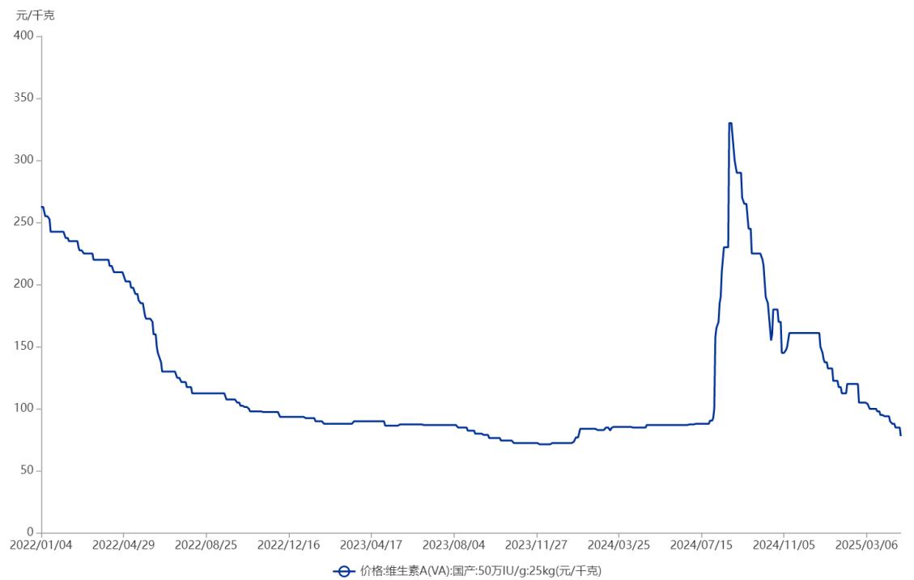

line chart

| Date       | Price (元/千克) |
| ---------- | -------------- |
| 2022/01/04 | 260            |
| 2022/04/29 | 180            |
| 2022/08/25 | 110            |
| 2022/12/16 | 95             |
| 2023/04/17 | 85             |
| 2023/08/04 | 80             |
| 2023/11/27 | 75             |
| 2024/03/25 | 85             |
| 2024/07/15 | 330            |
| 2024/11/05 | 160            |
| 2025/03/06 | 80             |

数据来源：博亚和讯

报告期内，公司维生素 A 销售价格波动与行业整体状况基本相符，与市场价格保持相同趋势。

## （4）其他产品

公司其他产品包括医药原料、辅酶 Q10 渣等产品，公司根据实际业务需求安排其他产品的生产销售。

报告期各期，公司其他产品收入分别为 20,901.34 万元、25,277.87 万元和27,161.96 万元，销售收入占比为 6.95%、8.17%和 8.40%，收入随产品结构变动呈现波动趋势。

## （二）营业成本分析

## 1、营业成本构成分析

报告期各期，公司营业成本构成及其变动情况如下：

单位：万元

<table><tr><td rowspan="2">项目</td><td colspan="2">2024 年度</td><td colspan="2">2023 年度</td><td colspan="2">2022 年度</td></tr><tr><td>金额</td><td>比例</td><td>金额</td><td>比例</td><td>金额</td><td>比例</td></tr><tr><td>主营业务</td><td>198,768.56</td><td>99.78%</td><td>193,903.73</td><td>99.72%</td><td>178,862.03</td><td>99.88%</td></tr><tr><td>其他业务</td><td>436.35</td><td>0.22%</td><td>544.80</td><td>0.28%</td><td>222.35</td><td>0.12%</td></tr><tr><td>合计</td><td>199,204.91</td><td>100.00%</td><td>194,448.53</td><td>100.00%</td><td>179,084.37</td><td>100.00%</td></tr></table>

公司营业成本主要由主营业务成本构成，报告期各期，公司主营业务成本占比均在 99.00%以上，较为稳定，与主营业务收入占比相匹配。

## 2、公司分产品主营业务成本构成情况

报告期各期，公司主营业务成本的产品构成情况如下：

单位：万元

<table><tr><td rowspan="2">产品类别</td><td colspan="2">2024年度</td><td colspan="2">2023年度</td><td colspan="2">2022年度</td></tr><tr><td>金额</td><td>比例</td><td>金额</td><td>比例</td><td>金额</td><td>比例</td></tr><tr><td>辅酶Q10</td><td>37,580.75</td><td>18.91%</td><td>32,342.87</td><td>16.68%</td><td>24,936.01</td><td>13.94%</td></tr><tr><td>营养保健食品</td><td>127,209.40</td><td>64.00%</td><td>124,952.46</td><td>64.44%</td><td>109,384.77</td><td>61.16%</td></tr><tr><td>维生素A</td><td>18,318.92</td><td>9.22%</td><td>22,282.38</td><td>11.49%</td><td>31,928.38</td><td>17.85%</td></tr><tr><td>其他产品</td><td>15,659.49</td><td>7.88%</td><td>14,326.02</td><td>7.39%</td><td>12,612.87</td><td>7.05%</td></tr><tr><td>合计</td><td>198,768.56</td><td>100.00%</td><td>193,903.73</td><td>100.00%</td><td>178,862.03</td><td>100.00%</td></tr></table>

报告期内，公司主营业务成本分别为 178,862.03 万元、193,903.73 万元和198,768.56 万元，主营业务成本中辅酶 Q10、营养保健食品、维生素 A 和其他产品的成本占比与主营业务收入构成情况基本匹配。

## （三）毛利率分析

## 1、综合毛利分析

报告期各期，公司主营业务和其他业务的毛利情况如下：

单位：万元

<table><tr><td rowspan="2">项目</td><td colspan="2">2024年度</td><td colspan="2">2023年度</td><td colspan="2">2022年度</td></tr><tr><td>毛利</td><td>占比</td><td>毛利</td><td>占比</td><td>毛利</td><td>占比</td></tr><tr><td>主营业务</td><td>124,653.70</td><td>99.88%</td><td>115,669.14</td><td>99.88%</td><td>121,741.56</td><td>99.92%</td></tr><tr><td>其他业务</td><td>147.25</td><td>0.12%</td><td>140.42</td><td>0.12%</td><td>96.98</td><td>0.08%</td></tr><tr><td>合计</td><td>124,800.95</td><td>100.00%</td><td>115,809.56</td><td>100.00%</td><td>121,838.54</td><td>100.00%</td></tr></table>

报告期内，公司主营业务突出，公司毛利主要来自主营业务，主营业务的毛利分别为 121,741.56 万元、115,669.14 万元和 124,653.70 万元，占毛利总额的比例为 99.92%、99.88%和 99.88%。

## 2、分产品毛利率分析

报告期内，公司分产品的毛利率情况如下表所示：

单位：万元

<table><tr><td>项目</td><td>2024 年度</td><td>2023 年度</td><td>2022 年度</td></tr><tr><td>辅酶 Q10</td><td>48.20%</td><td>55.92%</td><td>64.63%</td></tr><tr><td>营养保健食品</td><td>35.24%</td><td>34.06%</td><td>32.56%</td></tr><tr><td>维生素 A</td><td>32.83%</td><td>-3.91%</td><td>32.09%</td></tr><tr><td>其他产品</td><td>42.35%</td><td>43.33%</td><td>39.66%</td></tr><tr><td>主营业务毛利率</td><td>38.54%</td><td>37.36%</td><td>40.50%</td></tr></table>

报告期内，公司主营业务毛利率分别为 40.50%、37.36%和 38.54%，主营业务毛利率整体有所下降。

## （1）辅酶Q10毛利率分析

报告期内，辅酶 Q10 毛利率分别为 64.63%、55.92%和 48.20%，辅酶 Q10毛利率逐步下滑，主要原因为：2020 年以来辅酶 Q10 销售单价受市场热捧大幅提高，后续价格逐步回归理性。

## （2）营养保健食品毛利率分析

报告期内，营养保健食品毛利率分别为 32.56%、34.06%和 35.24%，逐步提高，主要原因为：美国通货膨胀影响下，营养保健食品成品单价提高，且通货膨胀对成本端的影响弱于收入端。

总体来看，公司营养保健食品毛利率维持在 30.00%以上，在产销量维持高水平的情况下给公司带来了较高的盈利。

## （3）维生素A毛利率分析

报告期内，维生素 A 毛利率分别为 32.09%、-3.91%和 32.83%，维生素 A毛利率自 2024 年开始有所提升，主要原因系：先前维生素行业相对景气，吸引了新产能进入及市场原有闲置的释放对市场格局造成冲击，叠加下游饲料、养殖行业不景气、消费需求低迷等多因素影响，维生素 A 销售单价持续走低，2024 年开始因行业去产能化库存处于低位，加之巴斯夫、帝斯曼停产检修，维生素A价格有所回升。

## （4）其他产品毛利率分析

报告期内，其他产品毛利率分别为 39.66%、43.33%和 42.35%，其他产品毛利率总体有所提升，主要系公司其他产品的生产工艺不断进行调整和改进，生产效率得到进一步提高。

## 3、主营业务毛利率与同行业可比上市公司比较分析

报告期内，公司与同行业可比上市公司主营业务的毛利率对比情况如下：

<table><tr><td>公司</td><td>2024 年度</td><td>2023 年度</td><td>2022 年度</td></tr><tr><td>嘉必优</td><td>43.72%</td><td>42.76%</td><td>44.76%</td></tr><tr><td>仙乐健康</td><td>31.05%</td><td>30.11%</td><td>30.97%</td></tr><tr><td>天新药业</td><td>42.53%</td><td>38.67%</td><td>37.80%</td></tr><tr><td>新和成</td><td>41.71%</td><td>32.92%</td><td>36.88%</td></tr><tr><td>浙江医药</td><td>42.53%</td><td>32.56%</td><td>34.82%</td></tr><tr><td>平均值</td><td>40.31%</td><td>35.40%</td><td>37.05%</td></tr><tr><td>发行人</td><td>38.54%</td><td>37.36%</td><td>40.50%</td></tr></table>

2023 年度，在宏观经济背景下，受通货膨胀、全球基础化工等产品价格维持高位及全球供应链瓶颈等多方面因素影响下，发行人与同行业可比上市公司均遭受了不同程度的冲击，毛利率整体下滑。

2024 年度，海外企业产能调整使得维生素供应进一步向国内集中，市场景气度有所恢复，多个维生素品种的价格回暖走高，发行人与同行业可比上市公司毛利率均有所上升。发行人毛利率变动趋势与同行业可比上市公司保持一致，不存在显著差异。

报告期内，发行人主营业务毛利率水平与同行业可比上市公司相比不存在显著差异，处于行业合理水平。

## 4、报告期内净利润波动原因分析

报告期各期，公司收入与净利润变动趋势如下：

单位：万元

<table><tr><td>项目</td><td>2024 年度</td><td>2023 年度</td><td>2022 年度</td></tr><tr><td>营业收入</td><td>324,005.86</td><td>310,258.09</td><td>300,922.91</td></tr><tr><td>同比增长率</td><td>4.43%</td><td>3.10%</td><td>-16.78%</td></tr><tr><td>归属于母公司股东的净利润</td><td>34,198.69</td><td>27,671.15</td><td>25,682.51</td></tr><tr><td>同比增长率</td><td>23.59%</td><td>7.74%</td><td>-67.44%</td></tr><tr><td>扣非后归属于母公司股东的净利润</td><td>33,875.25</td><td>28,042.65</td><td>24,649.29</td></tr><tr><td>同比增长率</td><td>20.80%</td><td>13.77%</td><td>-68.16%</td></tr></table>

2022 年度，公司营业收入和净利润整体均呈下滑趋势，主要原因为：（1）在供应链不畅、能耗双控、工业原料价格普涨等一系列新挑战交织叠加冲击影响下，公司 B 端原料和 C 端营养保健食品收入整体有所下滑；（2）维生素 A销售价格持续走低及辅酶 Q10 销售价格出现高位回落逐步压缩产品毛利空间；（3）诚信药业经营业绩不达预期，经测试公司因收购诚信药业所形成的商誉于报告期内已全额计提商誉减值准备。

2023 年度，公司营业收入和净利润有所上涨，且净利润上涨幅度高于营业收入，主要原因为：（1）公司辅酶 Q10 销量大幅增长，营养保健食品成品单价提高且销量也有所增长；（2）经评估测试公司 2023 年度无需计提商誉减值准备。

2024 年度公司营业收入和净利润较同期有所上涨，主要原因为：维生素行业的需求端呈现温和复苏，供给端持续整合分化，市场景气度有所恢复，维生素A价格企稳回升。

## （四）期间费用分析

## 1、销售费用分析

报告期各期，公司销售费用的明细情况如下：

单位：万元

<table><tr><td>项目</td><td>2024年度</td><td>2023年度</td><td>2022年度</td></tr><tr><td>营销推广费</td><td>17,233.04</td><td>17,526.02</td><td>13,967.45</td></tr><tr><td>工资及附加</td><td>8,156.67</td><td>8,115.12</td><td>7,593.61</td></tr><tr><td>佣金</td><td>3,087.81</td><td>3,397.75</td><td>3,839.53</td></tr><tr><td>租金</td><td>467.93</td><td>514.75</td><td>749.35</td></tr><tr><td>其他</td><td>2,709.51</td><td>2,473.20</td><td>2,724.81</td></tr><tr><td>合计</td><td>31,654.96</td><td>32,026.83</td><td>28,874.75</td></tr></table>

报告期各期，公司销售费用分别为 28,874.75 万元、32,026.83 万元和31,654.96 万元，占营业收入的比重分别为 9.60%、10.32%和 9.77%，主要由营

销推广费、工资及附加和佣金等构成。

报告期内，公司销售费用总体有所提高，主要原因为：公司加大广告投入，持续开发新媒体渠道，通过产品和渠道共同推动品牌影响力，同时高频开展线下门店促销活动提高产品曝光度，营销推广费支出有所增加。

## 2、管理费用分析

报告期各期，公司管理费用的明细情况如下：

单位：万元

<table><tr><td>项目</td><td>2024年度</td><td>2023年度</td><td>2022年度</td></tr><tr><td>工资及附加</td><td>15,329.26</td><td>16,451.25</td><td>13,640.62</td></tr><tr><td>折旧</td><td>3,058.83</td><td>4,956.86</td><td>4,923.39</td></tr><tr><td>无形资产摊销</td><td>4,324.31</td><td>4,660.42</td><td>4,538.24</td></tr><tr><td>环保费</td><td>3,771.15</td><td>3,426.90</td><td>2,403.20</td></tr><tr><td>租赁费</td><td>2,243.90</td><td>1,979.68</td><td>2,021.08</td></tr><tr><td>其他</td><td>9,682.53</td><td>10,397.20</td><td>9,539.00</td></tr><tr><td>合计</td><td>38,409.98</td><td>41,872.31</td><td>37,065.53</td></tr></table>

报告期各期，公司管理费用分别为 37,065.53 万元、41,872.31 万元和38,409.98 万元，占营业收入的比重分别为 12.32%、13.50%和 11.85%，主要由工资及附加、折旧摊销、环保费和租赁费等构成。

报告期内，随着公司生产经营和资产规模的扩大，公司管理费用的支出整体有所增加。

## 3、研发费用分析

报告期各期，公司研发费用的明细情况如下：

单位：万元

<table><tr><td>项目</td><td>2024 年度</td><td>2023 年度</td><td>2022 年度</td></tr><tr><td>工资及附加</td><td>4,034.78</td><td>3,487.73</td><td>3,672.04</td></tr><tr><td>新产品研发材料费</td><td>1,069.02</td><td>1,091.47</td><td>2,284.56</td></tr><tr><td>研发设备折旧费</td><td>952.33</td><td>616.93</td><td>684.33</td></tr><tr><td>其他</td><td>884.72</td><td>623.77</td><td>544.85</td></tr><tr><td>合计</td><td>6,940.87</td><td>5,819.90</td><td>7,185.77</td></tr></table>

报告期各期，公司研发费用分别为 7,185.77 万元、5,819.90 万元和 6,940.87万元，研发费用占营业收入的比重分别为 2.39%、1.88%和 2.14%，主要由工资及附加、新产品研发材料费和设备折旧等构成。

公司坚持技术创新，持续推进工艺改进、技术革新、新产品的开发研究，报告期内研发费用维持在一定水平。

## 4、财务费用分析

报告期各期，公司财务费用的明细情况如下：

单位：万元

<table><tr><td>项目</td><td>2024年度</td><td>2023年度</td><td>2022年度</td></tr><tr><td>利息费用</td><td>3,017.33</td><td>4,028.50</td><td>3,690.23</td></tr><tr><td>减:利息收入</td><td>3,031.57</td><td>2,043.35</td><td>1,321.14</td></tr><tr><td>汇兑损益</td><td>-1,984.07</td><td>-2,932.05</td><td>-5,464.24</td></tr><tr><td>其他</td><td>131.12</td><td>189.53</td><td>305.12</td></tr><tr><td>合计</td><td>-1,867.18</td><td>-757.36</td><td>-2,790.03</td></tr></table>

公司财务费用主要由利息费用和汇兑损益构成，报告期各期，财务费用占营业收入的比重分别为-0.93%、-0.24%和-0.58%，占比较低。

报告期内，受汇兑损益变化影响，公司财务费用有所波动。

## （五）其他科目分析

## 1、其他收益

报告期各期，公司其他收益的具体情况如下：

单位：万元

<table><tr><td>项目</td><td>2024年度</td><td>2023年度</td><td>2022年度</td></tr><tr><td>政府补助</td><td>2,075.33</td><td>1,472.34</td><td>1,740.51</td></tr><tr><td>进项税加计抵减</td><td>62.46</td><td>6.12</td><td>-</td></tr><tr><td>代扣个人所得税手续费</td><td>16.20</td><td>31.18</td><td>36.26</td></tr><tr><td>合计</td><td>2,153.99</td><td>1,509.64</td><td>1,776.77</td></tr></table>

公司其他收益主要为与公司日常经营活动相关的政府补助，报告期各期，公司其他收益分别为 1,776.77 万元、1,509.64 万元和 2,153.99 万元。

## 2、投资收益

报告期各期，公司投资收益的具体情况如下：

单位：万元

<table><tr><td>项目</td><td>2024年度</td><td>2023年度</td><td>2022年度</td></tr><tr><td>其他权益工具投资在持有期间取得的股利收入</td><td>522.11</td><td>409.10</td><td>93.60</td></tr><tr><td>交易性金融资产在持有期间的投资收益</td><td>369.52</td><td>175.96</td><td>198.33</td></tr><tr><td>权益法核算的长期股权投资收益</td><td>170.11</td><td>418.92</td><td>363.99</td></tr><tr><td>理财产品产生的投资收益</td><td>-</td><td>-</td><td>9.52</td></tr><tr><td>合计</td><td>1,061.74</td><td>1,003.98</td><td>665.44</td></tr></table>

报告期各期，公司投资收益分别为 665.44 万元、1,003.98 万元和 1,061.74万元，源自于其他权益工具投资和交易性金融资产在持有期间取得的收益等。

## 3、公允价值变动损益

报告期各期，公司公允价值变动损益分别为-95.56 万元、-156.32 万元和-739.29 万元，主要为计入交易性金融资产的理财产品和计入其他非流动金融资产的对外投资产生的公允价值变动。

## 4、信用减值损失

报告期各期，公司信用减值损失分别为-513.81 万元、-531.89 万元和-658.35万元，为应收账款坏账损失和其他应收款坏账损失。

## 5、资产减值损失

报告期各期，公司资产减值损失情况如下：

单位：万元

<table><tr><td>项目</td><td>2024年度</td><td>2023年度</td><td>2022年度</td></tr><tr><td>存货跌价损失及合同履约成本减值损失</td><td>-490.91</td><td>-1,296.78</td><td>-6,461.04</td></tr><tr><td>无形资产减值损失</td><td>-</td><td>-</td><td>-1,575.26</td></tr><tr><td>商誉减值损失</td><td>-</td><td>-</td><td>-11,414.45</td></tr><tr><td>固定资产减值损失</td><td>-801.13</td><td>-</td><td>-</td></tr><tr><td>合计</td><td>-1,292.04</td><td>-1,296.78</td><td>-19,450.75</td></tr></table>

公司资产减值损失来源于存货跌价损失及合同履约成本减值损失、无形资产减值损失、商誉减值损失和固定资产减值损失。报告期各期，公司资产减值损失分别为-19,450.75 万元、-1,296.78 万元和-1,292.04 万元。报告期内，公司遵循相关会计准则合理审慎计提相关资产减值损失。

## 6、资产处置收益

报告期各期，公司资产处置收益分别为-380.99 万元、47.54 万元和-174.84万元，主要系固定资产处置损益。

## 7、营业外收入和营业外支出

报告期各期，公司营业外收入与营业外支出如下：

单位：万元

<table><tr><td>项目</td><td>2024年度</td><td>2023年度</td><td>2022年度</td></tr><tr><td>营业外收入</td><td>353.57</td><td>385.66</td><td>393.72</td></tr><tr><td>营业外支出</td><td>1,631.70</td><td>2,520.78</td><td>555.52</td></tr><tr><td>利润总额</td><td>46,951.47</td><td>33,461.19</td><td>31,073.36</td></tr><tr><td>营业外收入占利润总额比例</td><td>0.75%</td><td>1.15%</td><td>1.27%</td></tr><tr><td>营业外支出占利润总额比例</td><td>3.48%</td><td>7.53%</td><td>1.79%</td></tr></table>

报告期各期，公司营业外收入分别为 393.72万元、385.66万元和 353.57万元，占利润总额的比例为 1.27%、1.15%和 0.75%，营业外收入占比较低并且逐年递减，对公司整体业绩影响较小。

报告期各期，公司营业外支出分别为 555.52 万元、2,520.78 万元和1,631.70 万元，占利润总额的比例为 1.79%、7.53%和 3.48%。2023 年度营业外支出金额及占比较高主要系子公司非流动资产报废产生损失及确认待执行的亏损合同损失，2024 年度营业外支出金额较高主要系子公司金达威维生素因安全事故造成损失和赔偿。

## （六）非经常性损益分析

报告期内，公司非经常性损益情况如下表所示：

单位：万元

<table><tr><td>项目</td><td>2024年度</td><td>2023年度</td><td>2022年度</td></tr><tr><td>非流动性资产处置损益(包括已计提资产减值准备的冲销部分)</td><td>-1,027.92</td><td>-1,175.39</td><td>-504.18</td></tr><tr><td>计入当期损益的政府补助(与公司正常经营业务密切相关,符合国家政策规定、按照确定的标准享有、对公司损益产生持续影响的政府补助除外)</td><td>2,112.03</td><td>1,497.22</td><td>1,776.48</td></tr><tr><td>委托他人投资或管理资产的损益</td><td>-</td><td>-</td><td>207.85</td></tr><tr><td>除同公司正常经营业务相关的有效套期保值业务外,非金融企业持有金融资产和金融负债产生的公允价值变动损益以及处置金融资产和金融负债产生的损益</td><td>-369.77</td><td>19.63</td><td>-95.56</td></tr><tr><td>单独进行减值测试的应收款项减值准备转回</td><td>-</td><td>88.14</td><td>-</td></tr><tr><td>除上述各项之外的其他营业外收入和支出</td><td>-461.75</td><td>-937.07</td><td>-74.59</td></tr><tr><td>其他符合非经常性损益定义的损益项目</td><td>78.66</td><td>37.30</td><td>36.26</td></tr><tr><td>减:所得税影响额</td><td>26.24</td><td>-105.15</td><td>316.36</td></tr><tr><td>少数股东权益影响额(税后)</td><td>-18.44</td><td>6.48</td><td>-3.31</td></tr><tr><td>合计</td><td>323.44</td><td>-371.50</td><td>1,033.22</td></tr></table>

报告期各期，归属于母公司所有者的非经常性损益分别为 1,033.22 万元、-371.50 万元和 323.44 万元，占归属于母公司所有者净利润的比重分别为 4.02%、-1.34%和0.95%，未对公司经营成果产生重大影响。

## 八、现金流量分析

报告期内，公司现金流量情况如下：

单位：万元

<table><tr><td>项目</td><td>2024年度</td><td>2023年度</td><td>2022年度</td></tr><tr><td>经营活动现金流入小计</td><td>330,660.42</td><td>318,882.99</td><td>317,834.96</td></tr><tr><td>经营活动现金流出小计</td><td>278,546.58</td><td>253,017.71</td><td>248,322.80</td></tr><tr><td>经营活动产生的现金流量净额</td><td>52,113.84</td><td>65,865.28</td><td>69,512.16</td></tr><tr><td>投资活动现金流入小计</td><td>17,028.33</td><td>54,299.35</td><td>51,663.05</td></tr><tr><td>投资活动现金流出小计</td><td>48,754.68</td><td>99,015.14</td><td>75,778.04</td></tr><tr><td>投资活动产生的现金流量净额</td><td>-31,726.35</td><td>-44,715.79</td><td>-24,114.99</td></tr><tr><td>筹资活动现金流入小计</td><td>75,300.64</td><td>59,641.00</td><td>48,495.84</td></tr><tr><td>筹资活动现金流出小计</td><td>40,752.73</td><td>78,159.24</td><td>103,828.09</td></tr><tr><td>筹资活动产生的现金流量净额</td><td>34,547.91</td><td>-18,518.24</td><td>-55,332.25</td></tr><tr><td>汇率变动对现金的影响额</td><td>1,172.49</td><td>2,758.91</td><td>1,292.73</td></tr><tr><td>现金及现金等价物净增加额</td><td>56,107.88</td><td>5,390.17</td><td>-8,642.36</td></tr></table>

## （一）经营活动现金流量分析

报告期内，公司经营活动现金流量情况如下：

单位：万元

<table><tr><td>项目</td><td>2024年度</td><td>2023年度</td><td>2022年度</td></tr><tr><td>销售商品、提供劳务收到的现金</td><td>320,067.08</td><td>308,580.16</td><td>309,700.22</td></tr><tr><td>收到的税费返还</td><td>5,355.11</td><td>5,237.80</td><td>4,804.42</td></tr><tr><td>收到其他与经营活动有关的现金</td><td>5,238.22</td><td>5,065.04</td><td>3,330.32</td></tr><tr><td>经营活动现金流入小计</td><td>330,660.42</td><td>318,882.99</td><td>317,834.96</td></tr><tr><td>购买商品、接受劳务支付的现金</td><td>183,354.23</td><td>158,565.67</td><td>154,927.36</td></tr><tr><td>支付给职工以及为职工支付的现金</td><td>44,281.33</td><td>43,977.36</td><td>43,309.87</td></tr><tr><td>支付的各项税费</td><td>10,966.55</td><td>9,104.21</td><td>13,158.92</td></tr><tr><td>支付其他与经营活动有关的现金</td><td>39,944.47</td><td>41,370.47</td><td>36,926.65</td></tr><tr><td>经营活动现金流出小计</td><td>278,546.58</td><td>253,017.71</td><td>248,322.80</td></tr><tr><td>经营活动产生的现金流量净额</td><td>52,113.84</td><td>65,865.28</td><td>69,512.16</td></tr><tr><td>销售商品、提供劳务收到的现金/营业收入</td><td>98.78%</td><td>99.46%</td><td>102.92%</td></tr><tr><td>经营活动产生的现金流量净额/净利润</td><td>141.99%</td><td>238.47%</td><td>284.23%</td></tr></table>

报告期各期，公司销售商品、提供劳务收到的现金分别为 309,700.22 万元、308,580.16 万元和 320,067.08 万元，占当期营业收入的比例分别为 102.92%、99.46%和 98.78%，与各期营业收入金额基本匹配，公司通过经营活动产生现金流的能力较强，销售回款较好。

报告期各期，公司经营活动产生的现金流量净额分别为 69,512.16 万元、65,865.28 万元和 52,113.84 万元，同期净利润分别为 24,456.67 万元、27,619.60万元和 36,703.02 万元，报告期内，公司经营活动产生的现金流量净额高于同期净利润主要系报告期各期计提资产减值准备及资产折旧摊销金额较大。

## （二）投资活动现金流量分析

报告期内，公司投资活动现金流量情况如下：

单位：万元

<table><tr><td>项目</td><td>2024年度</td><td>2023年度</td><td>2022年度</td></tr><tr><td>收回投资收到的现金</td><td>187.12</td><td>12.00</td><td>1,426.40</td></tr><tr><td>取得投资收益收到的现金</td><td>891.63</td><td>585.06</td><td>301.45</td></tr><tr><td>处置固定资产、无形资产和其他长期资产收回的现金净额</td><td>480.01</td><td>352.64</td><td>329.40</td></tr><tr><td>收到其他与投资活动有关的现金</td><td>15,469.56</td><td>53,349.65</td><td>49,605.80</td></tr><tr><td>投资活动现金流入小计</td><td>17,028.33</td><td>54,299.35</td><td>51,663.05</td></tr><tr><td>购建固定资产、无形资产和其他长期资产支付的现金</td><td>36,459.79</td><td>25,178.54</td><td>16,169.04</td></tr><tr><td>投资支付的现金</td><td>-</td><td>541.50</td><td>759.00</td></tr><tr><td>取得子公司及其他营业单位支付的现金净额</td><td>12,294.89</td><td>-</td><td>-</td></tr><tr><td>支付其他与投资活动有关的现金</td><td>-</td><td>73,295.10</td><td>58,850.00</td></tr><tr><td>投资活动现金流出小计</td><td>48,754.68</td><td>99,015.14</td><td>75,778.04</td></tr><tr><td>投资活动产生的现金流量净额</td><td>-31,726.35</td><td>-44,715.79</td><td>-24,114.99</td></tr></table>

报告期内，公司投资活动产生的现金流量净额分别为-24,114.99 万元、-44,715.79 万元和-31,726.35 万元。公司投资活动产生的现金流量净额为负主要系购买大额存单等理财产品及工程项目建设投入所致。

## （三）筹资活动现金流量分析

报告期内，公司筹资活动现金流量情况如下：

单位：万元

<table><tr><td>项目</td><td>2024年度</td><td>2023年度</td><td>2022年度</td></tr><tr><td>吸收投资收到的现金</td><td>1,516.64</td><td>92.00</td><td>165.00</td></tr><tr><td>其中:子公司吸收少数股东投资收到的现金</td><td>1,516.64</td><td>92.00</td><td>165.00</td></tr><tr><td>取得借款收到的现金</td><td>73,784.00</td><td>47,849.00</td><td>48,330.84</td></tr><tr><td>收到其他与筹资活动有关的现金</td><td>-</td><td>11,700.00</td><td>-</td></tr><tr><td>筹资活动现金流入小计</td><td>75,300.64</td><td>59,641.00</td><td>48,495.84</td></tr><tr><td>偿还债务支付的现金</td><td>20,924.50</td><td>57,076.63</td><td>55,305.10</td></tr><tr><td>分配股利、利润或偿付利息支付的现金</td><td>14,573.85</td><td>15,944.16</td><td>40,272.77</td></tr><tr><td>其中:子公司支付给少数股东的股利、利润</td><td>-</td><td>28.54</td><td>-</td></tr><tr><td>支付其他与筹资活动有关的现金</td><td>5,254.38</td><td>5,138.45</td><td>8,250.22</td></tr><tr><td>筹资活动现金流出小计</td><td>40,752.73</td><td>78,159.24</td><td>103,828.09</td></tr><tr><td>筹资活动产生的现金流量净额</td><td>34,547.91</td><td>-18,518.24</td><td>-55,332.25</td></tr></table>

报告期内，公司筹资活动产生的现金流量净额分别为-55,332.25 万元、-18,518.24 万元和 34,547.91 万元。2022 年至 2023 年度公司筹资活动产生的现金流量净额持续为负，主要系偿还债务及利息和分配股利所致；2024 年度公司筹资活动产生的现金流量净额为正，主要系对外借款用于日常经营资金周转的同

时偿还债务支出较少。

## 九、资本性支出

## （一）报告期内公司的资本性支出情况

报告期各期，公司购建固定资产、无形资产等长期资产所支付的现金分别为 16,169.04 万元、25,178.54 万元和 36,459.79 万元。报告期内，公司资本性支出主要用于购置土地、厂房、设备等经营性资产，逐步扩大公司产能和产品布局，为公司主营业务的持续稳定发展提供了保障。

## （二）未来可预见的重大资本性支出情况

截至本募集说明书签署日，除募集资金投资项目和在建工程中项目的投入外，公司暂未有其他可预见的重大资本性支出计划。

关于本次发行募集资金投资项目，请参见本募集说明书“第七节 本次募集资金运用”；在建工程的支出情况参见本募集说明书“第五节 财务会计信息与管理层分析”之“六、财务状况分析”之“（一）资产构成分析”之“2、非流动资产构成及变化分析”之“（4）在建工程”。

## 十、技术创新分析

参见本募集说明书“第四节 发行人基本情况”之“八、发行人技术及研发情况”之“（二）技术创新分析”。

## 十一、重大担保、仲裁、诉讼、其他或有事项和重大期后事项

## （一）重大担保

截至本募集说明书签署日，除上市公司与控股子公司之间的担保外，公司及子公司不存在对外担保事项。

## （二）重大仲裁、诉讼

截至本募集说明书签署日，发行人及其子公司不存在尚未了结的重大诉讼、仲裁情况。

## （三）其他或有事项

截至本募集说明书签署日，公司不存在影响正常经营活动的其他重要事项。

## （四）重大期后事项

截至本募集说明书签署日，公司不存在重大期后事项。

## 十二、本次发行对上市公司的影响

## （一）本次发行完成后，上市公司业务及资产的变动或整合计划

本次向不特定对象发行可转债募集资金投资项目是围绕公司主业展开的，不会导致上市公司业务发生变化，亦不产生资产整合事项。

本次可转债募集资金到位后，公司总资产规模将有所提高，有利于进一步增强公司资本实力。随着可转债陆续转股，公司净资产规模将得到充实，持续经营能力和抗风险能力得到提升。本次发行完成后，公司累计债券余额、资产负债结构和偿债能力情况如下：

## 1、累计债券余额不超过最近一期末净资产的 50%

截至 2024年 12月 31日，公司净资产规模为 431,824.64万元，发行人最近一期末应付债券余额 0.00 万元，本次发行后发行人累计应付债券余额不超过129,239.48 万元。本次发行完成后，公司累计债券余额占公司净资产的比例不超过 29.93%，未超过 50%。

## 2、本次发行对资产负债结构的影响

报告期各期末，公司资产负债率（合并口径）分别为 31.70%、26.47%和32.44%。公司资产负债率整体处于合理水平，符合公司生产经营情况特点。假设以 2024年 12月 31日公司的财务数据以及本次发行规模上限 129,239.48万元进行测算，本次发行完成前后，假设其他财务数据无变化，公司的资产负债率变动情况如下：

单位：万元

<table><tr><td>项目</td><td>2024 年 12 月 31 日</td><td>本次发行规模</td><td>本次发行后转股前</td><td>全部转股后</td></tr><tr><td>资产总额</td><td>639,210.17</td><td rowspan="2">129,239.48</td><td>768,449.65</td><td>768,449.65</td></tr><tr><td>负债总额</td><td>207,385.53</td><td>336,625.01</td><td>207,385.53</td></tr><tr><td>资产负债率</td><td>32.44%</td><td></td><td>43.81%</td><td>26.99%</td></tr></table>

注：以上测算未考虑可转债的权益公允价值（该部分金额通常确认为其他权益工具），若考虑该因素，本次发行后的实际资产负债率会进一步降低。

由上表可知，不考虑其他科目的增减变动影响，本次可转债发行完成后转股前公司合并资产负债率将由 32.44%上升至 43.81%，资产负债率有所提升，但仍处于合理范围。可转债属于混合融资工具，兼具股性和债性，票面利率较低，本次发行的可转债在未转股前，公司使用募集资金的财务成本相对较低，利息偿付风险较小。随着可转债持有人未来陆续转股，公司的资产负债率将逐步降低，可转债全部转股后公司资产负债率将下降至 26.99%，有利于优化公司的资本结构，提升公司的抗风险能力。

因此，本次发行可转债长期来看有利于优化公司的资本负债结构，本次发行不会对公司的资产负债率产生重大不利影响，公司仍具备合理的资产负债结构。

## 3、未来是否有足够的现金流支付本息

## （1）可分配利润足以支付公司债券本息

本次拟发行可转换公司债券募集资金总额不超过 129,239.48 万元，可转债的信用评级为 AA，根据 2024年 1月 1日至 2024年 12月 31日 A股发行的评级为 AA 的可转债普遍票面利率，假设本次可转债存续期内及到期时均不转股，测算本次可转债存续期内需支付的本息情况如下：

单位：万元

<table><tr><td>项目</td><td>第一年</td><td>第二年</td><td>第三年</td><td>第四年</td><td>第五年</td><td>第六年</td></tr><tr><td>普遍票面利率</td><td>0.30%</td><td>0.50%</td><td>1.00%</td><td>1.50%</td><td>1.80%</td><td>2.00%</td></tr><tr><td>本次可转债募集资金总额</td><td colspan="6">129,239.48</td></tr><tr><td>根据普遍票面利率估算每年支付利息金额</td><td>387.72</td><td>646.20</td><td>1,292.39</td><td>1,938.59</td><td>2,326.31</td><td>2,584.79</td></tr><tr><td>每年支付本金金额</td><td>-</td><td>-</td><td>-</td><td>-</td><td>-</td><td>129,239.48</td></tr></table>

本次拟发行可转换公司债券募集资金总额不超过 129,239.48 万元（含本数），结合上表市场普遍票面利率，在假设全部可转债持有人均不转股的极端情况下，本次发行的债券存续期第一年至第六年每年需支付的本息分别为

387.72 万元、646.20 万元、1,292.39 万元、1,938.59 万元、2,326.31 万元和131,824.27 万元。

公司 2022 年度、2023 年度和 2024 年度经审计的合并报表中归属于母公司股东的净利润分别为 25,682.51 万元、27,671.15 万元和 34,198.69 万元，最近三年实现的平均可分配利润为 29,184.11 万元。以最近三年平均归属于母公司的净利润进行模拟测算，公司可转债存续期 6 年内归属于母公司的净利润合计为175,104.68万元，基本可以覆盖可转债存续期 6年本息合计。

## （2）现金流量正常

报告期内，公司经营活动产生的现金流量净额分别为 69,512.16 万元、65,865.28 万元和 52,113.84 万元，公司现金流量符合行业及公司业务特点，公司自身盈利能力未发生重大不利变化，现金流量整体正常。

## （3）货币资金和银行授信额度充足

截至 2024年 12月 31日，公司货币资金为 116,616.29万元，同时公司信用情况良好，融资渠道顺畅，获得了较高额度的银行授信，能够保障未来的偿付能力。

综上所述，本次发行后公司累计债券余额不超过最近一期末净资产的 50%；报告期内公司资产结构合理，本次发行可转债不会对公司资产结构造成重大不利影响；公司盈利能力稳定、现金流量情况正常、货币资金和银行授信额度充足，能够保障未来债券本息的偿付。

## （二）本次发行完成后，上市公司控制权结构的变化

本次发行不会导致上市公司控制权发生变化。

## 第六节 合规经营与独立性

## 一、合规经营

## （一）被证监会行政处罚或采取监管措施及整改情况

2024 年 4 月 9 日，中国证券监督管理委员会厦门监管局根据发行人披露的《关于前期财务信息更正的公告》指出发行人 2020 年和 2021 年年度报告中加权平均净资产收益率计算错误，发行人 2022 年年度报告中加权平均净资产收益率、基本每股收益和稀释每股收益计算错误，并据此出具了《关于对厦门金达威集团股份有限公司、洪航采取出具警示函措施的决定》（〔2024〕6号）。

## （二）被证券交易所采取监管措施

2024 年 4 月 9 日，深圳证券交易所上市公司管理一部根据前文警示函所涉问题向发行人出具了《关于对厦门金达威集团股份有限公司及相关责任人的监管函》（公司部监管函〔2024〕第64号）。

收到上述监管措施决定后，公司及相关人员高度重视、认真反思，深刻吸取教训。公司将严格遵守法律法规及监管规则有关规定，持续加强对监管规则等的学习理解和正确运用，坚决按照上市公司信息披露规范要求做好信息披露工作，不断提高公司信息披露质量，进一步提升公司规范运作水平，切实维护公司及全体股东利益，确保公司平稳、健康、可持续发展。

上述事项不属于受到中国证监会或其派出机构的行政处罚行为，亦不属于深圳证券交易所的公开谴责，公司不存在《上市公司证券发行注册管理办法》第十条规定的不得向不特定对象发行股票的情形，不会对公司本次发行构成实质性障碍。

## （三）被司法机关立案侦查或证监会立案调查情况

报告期内，发行人及其董事、监事、高级管理人员、控股股东、实际控制人不存在因涉嫌犯罪正在被司法机关立案侦查或者涉嫌违法违规正在被证监会立案调查的情况。

## （四）与生产经营相关的重大违法违规行为及受到处罚的情况

报告期内，公司或其子公司存在 10 项与生产经营相关的行政处罚，但均不属于重大行政处罚，具体情况如下：

<table><tr><td>序号</td><td>处罚主体</td><td>处罚日期</td><td>处罚机关</td><td>处罚原因及内容</td><td>不构成重大行政处罚的说明</td></tr><tr><td>1</td><td>金达威药业</td><td>2023/3/27</td><td>内蒙古自治区生态环境厅</td><td>违反了《中华人民共和国水污染防治法》第四十条“禁止利用无防渗漏措施的沟渠、坑塘等输送或者存贮含有毒污染物的废水、含病原体的污水和其他废弃物”的规定。依据《中华人民共和国水污染防治法》第八十五条第一款第九项、第二款的相关规定,金达威药业被处以罚款50万元。</td><td>依据《中华人民共和国水污染防治法》第八十五条规定:“有下列行为之一的,由县级以上地方人民政府环境保护主管部门责令停止违法行为,限期采取治理措施,消除污染,处以罚款;逾期不采取治理措施的,环境保护主管部门可以指定有治理能力的单位代为治理,所需费用由违法者承担:......(九)未按照规定采取防护性措施,或者利用无防渗漏措施的沟渠、坑塘等输送或者存贮含有毒污染物的废水、含病原体的污水或者其他废弃物的。有前款第三项、第四项、第六项、第七项、第八项行为之一的,处二万元以上二十万元以下的罚款。有前款第一项、第二项、第五项、第九项行为之一的,处十万元以上一百万元以下的罚款;情节严重的,报经有批准权的人民政府批准,责令停业、关闭。”金达威药业该项罚款金额处于10万元至100万元之间,未被采取情节严重情形下的责令停业、关闭措施,处罚文件亦未认定该行为属于情节严重的违法行为,因此该违法行为不属于重大违法,亦未导致严重污染环境或严重损害社会公共利益。</td></tr><tr><td>2</td><td>金达威维生素</td><td>2022/10/17</td><td>厦门市海沧生态环境局</td><td>臭气浓度超过《恶臭污染物排放标准》(GB14554-93)中表2 恶臭污染物排放标准值。依据《中华人民共和国大气污染防治法》第九十九条第(二)项的规定,金达威维生素被处以罚款11.125万元。</td><td>根据《中华人民共和国大气污染防治法》第九十九条规定:“第九十九条 违反本法规定,有下列行为之一的,由县级以上人民政府生态环境主管部门责令改正或者限制生产、停产整治,并处十万元以上一百万元以下的罚款;情节严重的,报经有批准权的人民政府批准,责令停业、关闭:(一)未依法取得排污许可证排放大气污染物的;(二)超过大气污染物排放标准或者超过重点大气污染物排放总量控制指标排放大气污染物的;(三)通过逃避监管的方式排放大气污染物的。”金达威维生该项罚款金额接近区间下限,且未受到情节严重情形下的停业、关闭处罚,处罚文件亦未认定该行为属于重大违法行为,因此该违法行为不属于重大违法,亦未导致严重污染环境或严重损害社会公共利益。</td></tr><tr><td>3</td><td>金达威维生素</td><td>2022/12/27</td><td>厦门市海沧区应急管理局</td><td>未对承包单位设备拆除过程中的安全生产适时进行统一协调、管理,未能及时发现并督促整改设备拆除现场事故隐患。依据《中华人民共和国安全生产法》第一百零三条第二款的规定,参照《福建省安全生产行政处罚裁量基准》(2022年版)中相关裁量基准及《厦门市推行包容审慎监管执法若干规定》第十二条第一款,金达威维生素被处以罚款2.3万元。</td><td>根据《中华人民共和国安全生产法》第一百零三条第二款:“生产经营单位未与承包单位、承租单位签订专门的安全生产管理协议或者未在承包合同、租赁合同中明确各自的安全生产管理职责,或者未对承包单位、承租单位的安全生产统一协调、管理的,责令限期改正,处五万元以下的罚款对其直接负责的主管人员和其他直接责任人员处一万元以下的罚款;逾期未改正的,责令停产停业整顿。”根据《福建省安全生产行政处罚裁量基准》(2022年版)中相关裁量基准,金达威维生素该项处罚属于第二裁量阶次,罚款金额较小,且仅被要求责令改正,不存在情节严重的情形。因此不属于重大违法行为,亦未导致严重污染环境或严重损害社会公共利益。</td></tr><tr><td>4</td><td>诚信药业</td><td>2022/10/17</td><td>南通市生态环境局</td><td>雨水排放时未对PH值、氨氮、悬浮物开展自行监测。依据《排污许可管理条例》第三十六条第五项之规定及《中华人民共和国行政处罚法》第二十八条之规定,诚信药业被限期改正,并处以罚款5.86万元。</td><td>依据《排污许可管理条例》第三十六条规定:“违反本条例规定,排污单位有下列行为之一的,由生态环境主管部门责令改正,处2万元以上20万元以下的罚款;拒不改正的,责令停产整治:......(五)未按照排污许可证规定制定自行监测方案并开展自行监测;......”。诚信药业该项罚款金额较小,且仅被责令改正,不存在被责令停产整治的情形,因此不属于重大违法行为,亦未导致严重污染环境或严重损害社会公共利益。</td></tr><tr><td>5</td><td>诚信药业</td><td>2021/5/8</td><td>南通市生态环境局</td><td>生产项目需配建的环境保护设施均未经验收即投入生产。依据《建设项目环境保护管理条例》第二十三条第一款及《中华人民共和国行政处罚法》第二十三条,诚信药业被限期改正,处以罚款53万元。</td><td>依据《建设项目环境保护管理条例》第二十三条:“第二十三条违反本条例规定,需要配套建设的环境保护设施未建成、未经验收或者验收不合格,建设项目即投入生产或者使用,或者在环境保护设施验收中弄虚作假的,由县级以上环境保护行政主管部门责令限期改正,处20万元以上100万元以下的罚款;逾期不改正的,处100万元以上200万元以下的罚款;......”诚信药业该项罚款金额处于20万元至100万元之间,且仅被要求限期改正,未导致重大环境污染或者生态破坏,未被责令停止生产或者使用,处罚文件亦未认定该行为属于重大违法行为,因此该违法行为不属于重大违法。</td></tr><tr><td>6</td><td>诚信药业</td><td>2021/7/13</td><td>南通市生态环境局</td><td>产生挥发性有机物废气的生产未在密闭空间或设备中进行且未按照规定使用污染防治设施。依据《中华人民共和国大气污染防治法》第一百零八条第一款第一项及《中华人民共和国行政处罚法》第二十三条,诚信药业被责令改正,处以罚款6.6万元。</td><td>根据《中华人民共和国大气污染防治法》第一百零八条:“第一百零八条 违反本法规定,有下列行为之一的,由县级以上人民政府生态环境主管部门责令改正,处二万元以上二十万元以下的罚款;拒不改正的,责令停产整治:(一)产生含挥发性有机物废气的生产和服务活动,未在密闭空间或者设备中进行,未按照规定安装、使用污染防治设施,或者未采取减少废气排放措施的;......”诚信药业该项罚款金额较小,且仅被要求责令改正,不存在情节严重的情形。因此不属于重大违法行为,亦未导致严重污染环境或严重损害社会公共利益。</td></tr><tr><td>7</td><td>诚信药业</td><td>2021/6/22</td><td>南通市生态环境局</td><td>未按照规定对排放的工业废气进行监测。依据《中华人民共和国大气污染防治法》第一百条第一款第二项及《中华人民共和国行政处罚法》第二十三条,诚信药业被责令改正,处以罚款3.8万元。</td><td>根据《中华人民共和国大气污染防治法》第一百条:“第一百条 违反本法规定,有下列行为之一的,由县级以上人民政府生态环境主管部门责令改正,处二万元以上二十万元以下的罚款;拒不改正的,责令停产整治:(一)侵占、损毁或者擅自移动、改变大气环境质量监测设施或者大气污染物排放自动监测设备的;(二)未按照规定对所排放的工业废气和有毒有害大气污染物进行监测并保存原始监测记录的;......”诚信药业该项罚款金额较小,且仅被要求责令改正,不存在情节严重的情形。因此不属于重大违法行为,亦未导致严重污染环境或严重损害社会公共利益。</td></tr><tr><td>8</td><td>诚信药业</td><td>2023/1/16</td><td>启东市消防救援大队</td><td>消防设施未保持完好有效。依据《中华人民共和国消防法》第六十条第一款第(一)项和《江苏省消防行政处罚裁量基准》第十三条第一款第(三)项第2目规定,诚信药业被处以罚款1万元。</td><td>根据《中华人民共和国消防法》第六十条第一款第(一)项:“第六十条 单位违反本法规定,有下列行为之一的,责令改正,处五千元以上五万元以下罚款:(1)消防设施、器材或者消防安全标志的配置、设置不符合国家标准、行业标准,或者未保持完好有效的;......”诚信药业该项罚款金额系法定罚款幅度内的较低金额,相关行为未导致严重环境污染、重大人员伤亡、社会影响恶劣等情形,不属于严重损害投资者合法权益和社会公共利益的情形。</td></tr><tr><td>9</td><td>金达威维生素</td><td>2024/5/27</td><td>厦门市海沧区应急管理局</td><td>重大危险源罐区溴氢酸埋地储罐安全设施未经竣工验收擅自投入使用,违反了《中华人民共和国安全生产法》第三十四条第二款的相关规定。依据《中华人民共和国安全生产法》第九十八条第四项的相关规定对金达威维生素处以罚款18万元。</td><td>根据《中华人民共和国安全生产法》第九十八条:“第九十八条 生产经营单位有下列行为之一的,责令停止建设或者停产停业整顿,限期改正,并处十万元以上五十万元以下的罚款......:(四)矿山、金属冶炼建设项目或者用于生产、储存、装卸危险物品的建设项目竣工投入生产或者使用前,安全设施未经验收合格的。”金达威维生素该项罚款金额接近区间下限,处罚文件亦未认定该行为属于情节严重的违法行为。因此该违法行为不属于重大违法行为,亦未导致严重污染环境或严重损害社会公共利益。</td></tr><tr><td>10</td><td>金达威维生素</td><td>2024/7/4</td><td>厦门市应急管理局</td><td>在污水处理池上方进行动火作业,对危险有害因素辨识不全,气体分析和安全措施交底规定未落实,安全防护措施不到位,审批审核人未到现场作业审批,对事故发生负有责任。违反了《危险化学品企业特殊作业安全规范》(GB30871-2022)第4.1、4.4、4.5、4.6、4.11、5.3.1条(款)强制性规定,依据《中华人民共和国安全生产法》第一百一十四条第一款第二项的规定,对金达威维生素处以罚款130万元。</td><td>根据2024年7月4日厦门市应急管理局下发的《行政处罚决定书》(厦应急罚〔2024〕50号),该事故符合《福建省安全生产行政处罚裁量基准》(2022年版)关于“事故发生单位对事故发生负有责任(较大事故)”违法情形第一阶次裁量基准。同时根据《生产安全事故报告和调查处理条例》之规定,该事故不属于重大生产安全事故,厦门市海沧区应急管理局已出具证明认定该事故不属于重大违法行为,且该事故未导致严重环境污染、重大人员伤亡、社会影响恶劣。</td></tr></table>

上述行政处罚不存在严重损害上市公司利益、投资者合法权益、社会公共利益的情形。

## 二、资金占用情况

报告期内，发行人不存在资金被控股股东及其控制的其他企业以借款、代偿债务、代垫款项或者其他方式占用的情况，不存在为控股股东及其控制的其他企业提供担保的情况。

## 三、同业竞争情况

## （一）发行人同业竞争情况说明

截至报告期末，发行人实际控制人为江斌，发行人控股股东为金达威投资。报告期内，发行人主要从事营养保健食品（包含营养保健食品原料和营养保健食品终端产品）和饲料添加剂的研发、生产及销售业务。

发行人的实际控制人、控股股东及其控制的其他企业具体如下：

<table><tr><td>序号</td><td>公司名称</td><td>持股情况</td><td>经营范围</td><td>不存在同业竞争情况的说明</td></tr><tr><td>1</td><td>道洪集团有限公司</td><td>控股股东持有94.00%的股权</td><td>一般项目:物业管理;非居住房地产租赁;电子产品销售;服装服饰批发;建筑材料销售;珠宝首饰批发;停车场服务;企业形象策划(除依法须经批准的项目外,凭营业执照依法自主开展经营活动)。</td><td>主要业务为不动产运营,未从事与发行人主营业务相同或相似的业务,因此不存在同业竞争。</td></tr><tr><td>2</td><td>深圳金达威医疗科技有限公司</td><td>控股股东持有33.91%的股权</td><td>第一类医疗器械租赁;第二类医疗器械租赁;医护人员防护用品批发。第二类医疗器械销售;第一类医疗器械生产;第一类医疗器械销售;工程和技术研究和试验发展;软件开发;电子元器件与机电组件设备制造;专用设备修理;电子专用设备制造;技术服务、技术开发、技术咨询、技术交流、技术转让、技术推广;电子专用材料销售;电子元器件与机电组件设备销售;仪器仪表制造;化妆品批发;化妆品零售;电子元器件制造;技术进出口。(除依法须经批准的项目外,凭营业执照依法自主开展经营活动)第三类医疗器械租赁;医疗美容服务;第二类医疗器械生产;第三类医疗器械生产;第三类医疗器械经营;医疗器械互联网信息服务;互联网信息服务;药品互联网信息服务;化妆品生产;医疗服务;第二类增值电信业务;第一类增值电信业务。(依法须经批准的项目,经相关部门批准后方可开展经营活动,具体经营项目以相关部门批准文件或许可证件为准)</td><td>主要业务为医疗器械和医疗美容,未从事与发行人主营业务相同或相似的业务,因此不存在同业竞争。</td></tr><tr><td>3</td><td>嘉兴市龙威投资管理有限公司</td><td>道洪集团有限公司持有100.00%的股权</td><td>投资管理;实业投资;酒店管理;物业管理。</td><td>主要业务为物业租赁和管理,未从事与发行人主营业务相同或相似的业务,因此不存在同业竞争。</td></tr><tr><td>4</td><td>嘉兴市龙之梦大酒店有限公司</td><td>嘉兴市龙威投资管理有限公司持有100.00%的股权</td><td>酒店(住宿);卷烟零售、雪茄烟零售;餐饮服务;日用百货的零售;会议服务;农副产品收购;健身服务;棋牌服务。(依法须经批准的项目,经相关部门批准后方可开展经营活动)</td><td>主要业务为酒店(住宿),未从事与发行人主营业务相同或相似的业务,因此不存在同业竞争。</td></tr><tr><td>5</td><td>浙江新凯房地产开发有限公司</td><td>道洪集团有限公司持有51.00%的股权</td><td>房地产开发销售;受委托人委托从事住宅小区物业管理;室内家居装璜(以上范围凭有效的资质证书经营);自有房屋租赁;建筑材料的销售。</td><td>主要业务为房地产业务,未从事与发行人主营业务相同或相似的业务,因此不存在同业竞争。</td></tr><tr><td>6</td><td>金达威医疗器械(上海)有限公司</td><td>深圳金达威医疗科技有限公司持有100.00%的股权</td><td>许可项目:第三类医疗器械经营;第三类医疗器械租赁;医疗器械互联网信息服务;医疗美容服务;医疗服务。(依法须经批准的项目,经相关部门批准后方可开展经营活动,具体经营项目以相关部门批准文件或许可证件为准)一般项目:第一类医疗器械租赁;第一类医疗器械销售;第二类医疗器械租赁;第二类医疗器械销售;医护人员防护用品批发;技术服务、技术开发、技术咨询、技术交流、技术转让、技术推广。(除依法须经批准的项目外,凭营业执照依法自主开展经营活动)</td><td>主要业务为医疗器械经营,未从事与发行人主营业务相同或相似的业务,因此不存在同业竞争。</td></tr><tr><td>7</td><td>金达威医疗科技(湖南)有限公司</td><td>深圳金达威医疗科技有限公司持有100.00%的股权</td><td>许可项目:第二类医疗器械生产;第三类医疗器械生产;第三类医疗器械经营;医疗器械互联网信息服务;第三类医疗器械租赁;互联网信息服务;药品互联网信息服务;化妆品生产;医疗服务;第二类增值电信业务;第一类增值电信业务(依法须经批准的项目,经相关部门批准后方可开展经营活动,具体经营项目以相关部门批准文件或许可证件为准)</td><td>主要业务为医疗器械生产,未从事与发行人主营业务相同或相似的业务,因此不存在同业竞争。</td></tr></table>