## 科源製藥

# KEYUAN PHARMA

# 山东科源制药股份有限公司

# 发行股份购买资产

# 并募集配套资金暨关联交易报告书

# （草案）

<table><tr><td>项目</td><td>交易对方</td></tr><tr><td>发行股份购买资产</td><td>力诺投资、力诺集团等38名交易对方</td></tr><tr><td>募集配套资金</td><td>不超过35名特定投资者</td></tr></table>

## 独立财务顾问

中信建投证券股份有限公司

CHINA SECURITIES CO.,LTD.

二〇二五年四月

## 声明

## 一、上市公司声明

本公司及全体董事、监事、高级管理人员已就在本次重组过程中所提供资料真实性、准确性和完整性出具如下声明与承诺：

“1、本公司/本人向参与本次交易的中介机构所提供的本次交易相关的资料均为真实、准确、完整的原始书面资料或副本资料及信息，副本资料或者复印件与其原始资料或原件一致；所有文件的签字与印章皆为真实的，不存在任何虚假记载、误导性陈述或者重大遗漏，并对所提供信息的真实性、准确性和完整性承担法律责任；如因提供的信息存在虚假记载、误导性陈述或者重大遗漏，给投资者造成损失的，本公司/本人将依法承担个别及连带的法律责任。  
2、本公司/本人保证为本次交易所出具的说明及确认均为真实、准确和完整的，不存在任何虚假记载、误导性陈述或者重大遗漏，并对其虚假记载、误导性陈述或者重大遗漏承担个别及连带的法律责任。  
3、在本次交易期间，本公司/本人将依照相关法律法规、中国证券监督管理委员会和深圳证券交易所的有关规定，及时披露有关本次交易的信息并提交有关申报文件，并保证信息披露和申请文件的真实性、准确性和完整性，如因信息披露和申请文件存在虚假记载、误导性陈述或者重大遗漏，给投资者造成损失的，本公司/本人将依法承担赔偿责任。”

## 二、交易对方声明

本次交易的交易对方已出具承诺如下：

1、本企业/本人为本次交易所提供或披露的有关信息（无论该等信息提供的对象、场合、内容或方式如何）均为真实、准确和完整的，不存在虚假记载、误导性陈述或者重大遗漏；  
2、本企业/本人保证向参与本次交易的各中介机构所提供的资料均为真实、原始的书面资料或副本资料，该等资料副本或复印件与原始资料或原件一致，是准确和完整的，所有文件的签名、印章均是真实且经合法有效授权的，并无任何虚假记载、误导性陈述或重大遗漏；

3、在参与本次交易期间，本企业/本人将依照相关法律、法规、规章的规定，以及中国证监会、证券交易所等监管部门的要求，及时提供或披露有关本次交易的信息，并保证该等信息的真实性、准确性和完整性，保证该等信息不存在虚假记载、误导性陈述或者重大遗漏；如因提供或披露的信息存在虚假记载、误导性陈述或者重大遗漏，给上市公司或投资者造成损失的，将依法承担赔偿责任；  
4、本企业/本人保证本次交易的信息披露和申请文件真实、准确、完整，不存在任何虚假记载、误导性陈述或者重大遗漏；  
5、本企业/本人承诺，如本次交易因涉嫌本企业/本人所提供或者披露的信息存在虚假记载、误导性陈述或者重大遗漏，被司法机关立案侦查或者被中国证监会立案调查的，在案件调查结论明确之前，则暂停转让本企业/本人在上市公司拥有权益的股份（以下简称“锁定股份”），并于收到立案稽查通知的两个交易日内将暂停转让的书面申请和股票账户提交上市公司董事会，由上市公司董事会代其向证券交易所和登记结算公司申请锁定；未在两个交易日内提交锁定申请的，授权上市公司董事会核实后直接向证券交易所和登记结算公司报送本企业/本人的身份信息和账户信息并申请锁定；上市公司董事会未向证券交易所和登记结算公司报送本企业/本人的身份信息和账户信息的，授权证券交易所和登记结算公司直接锁定相关股份。如最终有效的调查结论认定存在违反法律法规或本承诺内容的情形，本企业/本人承诺锁定股份可用于相关投资者赔偿安排。

## 目录

## 声明.........

一、上市公司声明.  
二、交易对方声明.

## 目录...

## 释义...

一、一般术语. .8  
二、专业术语. 11

## 重大事项提示..

一、本次重组方案简要介绍. .12  
二、募集配套资金. ..16  
三、本次重组对上市公司的影响 ..16  
四、本次交易决策过程和批准情况. .21

五、上市公司控股股东及其一致行动人对本次重组的原则性意见，及上市公司控股股东及其一致行动人、上市公司董事、监事和高级管理人员自本次交易预案公告之日至实施完毕期间的减持计划. ... 21

六、本次重组对中小投资者权益保护的安排 .22  
七、独立财务顾问的证券业务资格. ..25  
八、其他需要提醒投资者重点关注的事项 .25

## 重大风险提示. 26

一、本次交易相关的风险.. ..26  
二、标的公司业务与经营风险. .. 28  
三、其他风险. .. 32

## 第一节 本次交易概况.. 33

一、本次交易的背景及目的. .33  
二、本次交易具体方案 ..35  
三、本次交易的性质. ..46  
四、本次重组对上市公司的影响 .47  
五、本次交易决策过程和批准情况. ..50

## 六、本次重组相关方作出的重要承诺. ..50

## 第二节 上市公司基本情况 .... 63

一、基本情况. ..63  
二、公司上市及上市后股本变动情况. .63  
三、控股股东、实际控制人情况 .64  
四、最近三十六个月的控制权变动情况. .65  
五、最近三年重大资产重组情况 .65  
六、公司主营业务发展情况和主要财务指标 .65  
七、上市公司合法合规情况. .. 67

## 第三节 交易对方基本情况... 68

一、发行股份购买资产的交易对方. ..68  
二、募集配套资金交易对方基本情况 .193

## 第四节 交易标的基本情况.... ..194

一、标的公司基本情况. .. 194  
二、标的公司历史沿革 .194  
三、标的公司最近三年曾进行与交易、增资或改制相关的评估或估值情况....0  
四、标的公司产权结构及控制关系.  
五、标的公司下属公司情况.  
六、标的公司主要资产权属状况、对外担保状况及主要负债、或有负债情况3  
七、涉及诉讼、仲裁、司法强制执行等重大争议或者存在妨碍权属转移的其他情况 ....  
八、标的公司合法合规情况.  
九、标的公司主营业务情况  
十、标的公司主要财务数据 ..23

十一、标的公司报告期会计政策及相关会计处理 ..24  
十二、本次交易涉及有关报批事项. .27  
十三、许可他人使用资产，或者被许可使用他人资产的情况 .27  
十四、本次交易涉及的债权债务转移情况 .28

## 第五节 发行股份情况...

一、发行股份购买资产 .29

## 二、发行股份募集配套资金. ..35

## 第六节 标的资产评估情况 .... 39

一、标的资产评估概述 ..39  
二、宏济堂评估介绍.. .. 39  
三、宏济堂评估情况. ..44  
四、上市公司董事会对本次交易评估事项的分析意见. . 68  
五、上市公司董事会关于评估机构独立性、假设前提合理性、评估方法与评估目的的相关性、评估定价公允性的独立性意见. ..71

## 第七节 本次交易主要合同 ..... .73

一、《购买资产协议》主要内容. ..73  
二、《业绩预测补偿及减值补偿协议》主要内容 .82

## 第八节 本次交易合规性分析 .... .90

一、本次交易符合《重组管理办法》的相关规定 .. 90  
二、本次交易符合《发行管理办法》相关规定. ..95  
三、独立财务顾问意见. ..97  
四、法律顾问意见. ..97

## 第九节 管理层讨论与分析.... .98

一、本次交易前上市公司财务状况和经营成果. ..98  
二、标的公司行业特点和经营情况的讨论与分析. .104  
三、标的公司财务状况分析. .117  
四、标的公司盈利能力分析 .136  
五、本次交易对上市公司持续经营能力及财务状况的影响 .150  
六、本次交易对上市公司未来发展前景的影响. .152  
七、本次交易对上市公司财务指标和非财务指标的影响 .154

## 第十节 财务会计信息.. .155

一、宏济堂最近两年的主要财务数据 .155  
二、上市公司备考财务报表 ..162

## 第十一节 同业竞争和关联交易..... ...168

一、同业竞争. .. 168  
二、关联交易. .168

## 第十二节 风险因素..... ...180

一、本次交易相关的风险.. .. 180  
二、标的公司业务与经营风险. .182  
三、其他风险. .186

## 第十三节 其他重要事项.... ..187

一、报告期内，拟购买资产的股东及其关联方是否存在对拟购买资产的非经营性资金占用.. ...187  
二、本次交易完成后，上市公司是否存在资金、资产被实际控制人或其他关联人占用，或为实际控制人及其他关联人提供担保的情形. ..187  
三、本次交易对上市公司负债结构的影响. .187  
四、上市公司最近十二个月重大资产购买或出售情况 .187  
五、本次交易对上市公司治理机制影响的说明. .188  
六、本次交易后的利润分配政策 .188  
七、相关各方买卖公司股票的自查情况. .191  
八、重大事项披露前股票价格波动情况的说明. .191  
九、关于本次重组相关主体不存在依据《上市公司监管指引第 7号—上市公司重大资产重组相关股票异常交易监管》第十二条不得参与任何上市公司重大资产重组情形的说明. ... 192  
十、上市公司控股股东对本次重组的原则性意见 .192  
十一、上市公司控股股东及其董事、监事、高级管理人员自本次重组预案披露之日起至本次交易实施完毕期间的股份减持计划. ...193  
十二、本次重组对中小投资者权益保护的安排. .193

## 第十四节 独立董事及证券服务机构对本次交易的意见.... ...194

一、独立董事意见. .. 194  
二、独立财务顾问意见. ..197  
三、法律顾问对本次交易的意见 .199

## 第十五节 本次交易相关证券服务机构... ..200

一、独立财务顾问. ..200  
二、法律顾问. ..200  
三、审计机构. ..200

四、评估机构. .201  
五、审阅机构. .. 201

## 第十六节 声明与承诺..

一、上市公司全体董事声明  
二、上市公司全体监事声明  
三、上市公司全体高级管理人员声明.  
四、独立财务顾问声明 4  
五、法律顾问声明.  
六、审计机构声明. 6  
七、评估机构声明.

## 第十七节 备查文件.

一、备查文件. 9  
二、备查地点. 9

## 附件一 无形资产情况...

一、专利情况. 11  
二、商标情况. 0

## 附件二 其他不动产与租赁不动产情况... .50

一、其他不动产. ..50  
二、租赁不动产 .51

## 释义

一、一般术语

<table><tr><td>公司/本公司/上市公司/科源制药</td><td>指</td><td>山东科源制药股份有限公司,在深圳证券交易所上市,A股股票代码为301281</td></tr><tr><td>力诺投资/控股股东</td><td>指</td><td>力诺投资控股集团有限公司</td></tr><tr><td>力诺集团/间接控股股东</td><td>指</td><td>力诺集团股份有限公司</td></tr><tr><td>力诺物流</td><td>指</td><td>山东力诺物流有限公司,持有力诺投资1.97%股权</td></tr><tr><td>宏济堂/标的公司</td><td>指</td><td>山东宏济堂制药集团股份有限公司</td></tr><tr><td>交易标的/标的资产/拟购买资产</td><td>指</td><td>山东宏济堂制药集团股份有限公司99.42%股权</td></tr><tr><td>本次交易/本次重组</td><td>指</td><td>科源制药向力诺投资、力诺集团等38名交易对方发行股份,购买其持有的宏济堂99.42%股权,同时拟向不超过35名符合条件的特定对象发行股票募集配套资金</td></tr><tr><td>本次购买资产</td><td>指</td><td>科源制药向力诺投资、力诺集团等38名交易对方发行股份,购买其合计持有的宏济堂99.42%股权</td></tr><tr><td>配套融资/本次募集配套资金</td><td>指</td><td>科源制药向不超过35名符合条件的特定对象发行股票募集配套资金</td></tr><tr><td>本草案、本报告书、重组报告书</td><td>指</td><td>《山东科源制药股份有限公司发行股份购买资产并募集配套资金暨关联交易报告书(草案)》</td></tr><tr><td>《购买资产协议》</td><td>指</td><td>《山东科源制药股份有限公司购买资产协议书》</td></tr><tr><td>《业绩预测补偿及减值补偿协议》</td><td>指</td><td>《山东科源制药股份有限公司购买资产的业绩预测补偿及减值补偿协议书》</td></tr><tr><td>《宏济堂审计报告》</td><td>指</td><td>天健会计师事务所(特殊普通合伙)出具的《山东宏济堂制药集团股份有限公司财务报表审计报告》(天健审(2025)4-317号)</td></tr><tr><td>《科源制药备考审阅报告》</td><td>指</td><td>上会会计师事务所(特殊普通合伙)出具的《山东科源制药股份有限公司备考合并财务报表审阅报告》(上会师报字(2025)第6307号)</td></tr><tr><td>《宏济堂资产评估报告》</td><td>指</td><td>《山东科源制药股份有限公司拟发行股份购买资产所涉及的山东宏济堂制药集团股份有限公司股东全部权益价值资产评估报告》(中水致远评报字[2025]第010079号)</td></tr><tr><td>定价基准日</td><td>指</td><td>本次发行股份购买资产的定价基准日为科源制药第四届董事会第二次会议决议公告日;本次募集配套资金的定价基准日为本次向特定对象发行股份发行期首日</td></tr><tr><td>过渡期</td><td>指</td><td>评估基准日至交割日的全部期间</td></tr><tr><td>北京联馨</td><td>指</td><td>北京联馨药业有限公司,标的公司持有该公司24%股权</td></tr><tr><td>济南安富</td><td>指</td><td>济南安富创业投资合伙企业(有限合伙)</td></tr><tr><td>济南财金科技</td><td>指</td><td>济南市财金科技投资有限公司</td></tr><tr><td>济南财投基金</td><td>指</td><td>济南市财政投资基金控股集团有限公司</td></tr><tr><td>济南财投新动能</td><td>指</td><td>济南财投新动能投资管理有限公司</td></tr><tr><td>济南财金投资</td><td>指</td><td>济南财金投资有限公司</td></tr><tr><td>济南鑫控</td><td>指</td><td>济南鑫控股权投资母基金合伙企业(有限合伙)</td></tr><tr><td>厦门德福悦安</td><td>指</td><td>厦门德福悦安投资合伙企业(有限合伙)</td></tr><tr><td>北京中企和润</td><td>指</td><td>北京中企和润投资管理中心(有限合伙)</td></tr><tr><td>济南乐威</td><td>指</td><td>济南乐威企业管理咨询合伙企业(有限合伙)</td></tr><tr><td>济南玖熙</td><td>指</td><td>济南玖熙产业投资合伙企业(有限合伙)</td></tr><tr><td>济南宏舜</td><td>指</td><td>济南宏舜企业管理咨询合伙企业(有限合伙)</td></tr><tr><td>济南宏凯</td><td>指</td><td>济南宏凯企业管理咨询合伙企业(有限合伙)</td></tr><tr><td>济南惠宏</td><td>指</td><td>济南惠宏企业管理咨询合伙企业(有限合伙)</td></tr><tr><td>济南鲲特</td><td>指</td><td>济南鲲特企业管理咨询合伙企业(有限合伙)</td></tr><tr><td>鲁康投资</td><td>指</td><td>鲁康投资有限公司</td></tr><tr><td>山东鲁信</td><td>指</td><td>山东省鲁信新旧动能转换创投母基金合伙企业(有限合伙)</td></tr><tr><td>新余人合厚乾</td><td>指</td><td>新余人合厚乾投资合伙企业(有限合伙)</td></tr><tr><td>老百姓医药</td><td>指</td><td>老百姓医药集团有限公司</td></tr><tr><td>乌鲁木齐徽元</td><td>指</td><td>乌鲁木齐徽元中医药产业投资合伙企业(有限合伙)</td></tr><tr><td>济南三价融智</td><td>指</td><td>济南三价融智知识产权股权投资合伙企业(有限合伙)</td></tr><tr><td>嘉兴华斌</td><td>指</td><td>嘉兴华斌股权投资合伙企业(有限合伙)</td></tr><tr><td>上海梓献</td><td>指</td><td>上海梓献企业管理合伙企业(有限合伙)</td></tr><tr><td>国元创新</td><td>指</td><td>国元创新投资有限公司</td></tr><tr><td>济高投保</td><td>指</td><td>济高投保联动股权投资基金(济南)合伙企业(有限合伙)</td></tr><tr><td>新余人合厚实</td><td>指</td><td>新余人合厚实投资合伙企业(有限合伙)</td></tr><tr><td>宁波东旸</td><td>指</td><td>宁波东旸投资中心(有限合伙)</td></tr><tr><td>池州徽元</td><td>指</td><td>池州徽元中小企业发展基金合伙企业(有限合伙)</td></tr><tr><td>济南嘉和</td><td>指</td><td>济南嘉和投资合伙企业(有限合伙)</td></tr><tr><td>新余人合厚信</td><td>指</td><td>新余人合厚信投资合伙企业(有限合伙)</td></tr><tr><td>济高科技</td><td>指</td><td>济高科技产业有限公司</td></tr><tr><td>济南汇中</td><td>指</td><td>济南汇中企业管理集团有限公司</td></tr><tr><td>青岛贝拉国融</td><td>指</td><td>青岛贝拉国融股权投资合伙企业(有限合伙)</td></tr><tr><td>广东银石</td><td>指</td><td>广东银石私募基金管理有限公司</td></tr><tr><td>济南华盈</td><td>指</td><td>济南市华盈生物工程中心(有限合伙)</td></tr><tr><td>星臻瀚智</td><td>指</td><td>星臻瀚智股权投资基金(淄博)合伙企业(有限合伙)</td></tr><tr><td>安徽协和成</td><td>指</td><td>安徽协和成药业饮片有限公司</td></tr><tr><td>山东玖悦</td><td>指</td><td>山东玖悦资本有限公司</td></tr><tr><td>首都大健康</td><td>指</td><td>首都大健康产业(北京)基金(有限合伙)</td></tr><tr><td>宏济堂医药公司</td><td>指</td><td>山东宏济堂制药集团医药有限公司</td></tr><tr><td>同仁堂</td><td>指</td><td>北京同仁堂股份有限公司,股票代码600085.SH</td></tr><tr><td>达仁堂</td><td>指</td><td>津药达仁堂集团股份有限公司,股票代码600329.SH</td></tr><tr><td>东阿阿胶</td><td>指</td><td>东阿阿胶股份有限公司,股票代码000423.SZ</td></tr><tr><td>佛慈制药</td><td>指</td><td>兰州佛慈制药股份有限公司,股票代码002644.SZ</td></tr><tr><td>太龙药业</td><td>指</td><td>河南太龙药业股份有限公司,股票代码600222.SH</td></tr><tr><td>桂林三金</td><td>指</td><td>桂林三金药业股份有限公司,股票代码002275.SZ</td></tr><tr><td>A股</td><td>指</td><td>经中国证监会批准向境内投资者发行、在境内证券交易所上市、以人民币标明股票面值、以人民币认购和进行交易的普通股</td></tr><tr><td>国务院</td><td>指</td><td>中华人民共和国国务院</td></tr><tr><td>财政部</td><td>指</td><td>中华人民共和国财政部</td></tr><tr><td>商务部</td><td>指</td><td>中华人民共和国商务部</td></tr><tr><td>海关总署</td><td>指</td><td>中华人民共和国海关总署</td></tr><tr><td>中国证监会/证监会</td><td>指</td><td>中国证券监督管理委员会</td></tr><tr><td>深交所/交易所</td><td>指</td><td>深圳证券交易所</td></tr><tr><td>《公司法》</td><td>指</td><td>《中华人民共和国公司法》</td></tr><tr><td>《证券法》</td><td>指</td><td>《中华人民共和国证券法》</td></tr><tr><td>《重组管理办法》</td><td>指</td><td>《上市公司重大资产重组管理办法》</td></tr><tr><td>《上市规则》</td><td>指</td><td>《深圳证券交易所创业板股票上市规则》</td></tr><tr><td>《发行管理办法》</td><td>指</td><td>《上市公司证券发行注册管理办法》</td></tr><tr><td>《监管指引第7号》</td><td>指</td><td>《上市公司监管指引第7号——上市公司重大资产重组相关股票异常交易监管》</td></tr><tr><td>《公司章程》</td><td>指</td><td>《山东科源制药股份有限公司章程》</td></tr><tr><td>中国证监会、证监会</td><td>指</td><td>中国证券监督管理委员会</td></tr><tr><td>深交所、证券交易所</td><td>指</td><td>深圳证券交易所</td></tr><tr><td>证券登记结算公司</td><td>指</td><td>中国证券登记结算有限责任公司深圳分公司</td></tr><tr><td>财务顾问、独立财务顾问、中信建投证券</td><td>指</td><td>中信建投证券股份有限公司</td></tr><tr><td>审计机构、天健会计师</td><td>指</td><td>天健会计师事务所(特殊普通合伙)</td></tr><tr><td>上会会计师</td><td>指</td><td>上会会计师事务所(特殊普通合伙)</td></tr><tr><td>法律顾问、世辉律师</td><td>指</td><td>北京世辉律师事务所</td></tr><tr><td>评估机构、中水致远</td><td>指</td><td>中水致远资产评估有限公司</td></tr><tr><td>元、万元、亿元</td><td>指</td><td>人民币元、万元、亿元</td></tr></table>

## 二、专业术语

<table><tr><td>原料药</td><td>指</td><td>旨在用于药品制造中的任何一种物质或物质的混合物,而且在用于制药时,成为药品的一种活性成分。此种物质在疾病的诊断,治疗,症状缓解,处理或疾病的预防中有药理活性或其他直接作用,或者能影响机体的功能或结构</td></tr><tr><td>制剂</td><td>指</td><td>按药典、药品标准或其他适当处方,将原料药物按某种剂型制成具有一定规格的药剂</td></tr><tr><td>中间体</td><td>指</td><td>原料药工艺步骤中产生的、必须经过进一步分子变化或精制才能成为原料药的一种物料</td></tr><tr><td>基药目录</td><td>指</td><td>国家基本药物目录</td></tr><tr><td>医保目录</td><td>指</td><td>国家基本医疗保险、工伤保险和生育保险药品目录</td></tr><tr><td>中成药</td><td>指</td><td>中成药是以中药材或中药饮片为原料,在中医药理论指导下,为了预防及治疗疾病的需要,按规定的处方和制剂工艺将其加工制成一定剂型的中药制品,是经国家药品监督管理部门批准的商品化的一类中药制剂</td></tr><tr><td>中药饮片</td><td>指</td><td>中药材经过炮制后可直接用于中医临床或制剂生产使用的药品</td></tr></table>

注：本报告书中除特别说明外所有数值保留两位小数，若出现各分项数值之和与总数尾数不符的情况，均为四舍五入原因造成的。

## 重大事项提示

## 一、本次重组方案简要介绍

## （一）重组方案概况

<table><tr><td colspan="2">交易形式</td><td colspan="2">发行股份购买资产并募集配套资金</td></tr><tr><td colspan="2">交易方案简介</td><td colspan="2">上市公司拟向力诺投资、力诺集团等38名交易对方发行股份购买其持有的宏济堂99.42%股权。同时,上市公司拟向不超过35名符合条件的特定对象发行股份募集配套资金,本次募集配套资金总额不超过70,000.00万元,不超过本次交易中上市公司以发行股份购买资产交易价格的100%,且不超过本次发行股份购买资产完成后上市公司总股本的30%。最终发行数量以深圳证券交易所审核通过、中国证监会同意注册的发行数量为准。</td></tr><tr><td colspan="2">交易价格(不含募集配套资金金额)</td><td colspan="2">358,061.77万元</td></tr><tr><td rowspan="6">交易标的</td><td>名称</td><td colspan="2">宏济堂99.42%股权</td></tr><tr><td>主营业务</td><td colspan="2">中成药及健康产品、麝香酮等产品的研发、生产和销售</td></tr><tr><td>所属行业</td><td colspan="2">C27医药制造业</td></tr><tr><td rowspan="3">其他</td><td>符合板块定位</td><td>☑是 □否 □不适用</td></tr><tr><td>属于上市公司的同行业或上下游</td><td>☑是 □否</td></tr><tr><td>与上市公司主营业务具有协同效应</td><td>☑是 □否</td></tr><tr><td rowspan="3" colspan="2">交易性质</td><td>构成关联交易</td><td>☑是 □否</td></tr><tr><td>构成《重组管理办法》第十二条规定的重大资产重组</td><td>☑是 □否</td></tr><tr><td>构成重组上市</td><td>□是 ☑否</td></tr><tr><td colspan="3">本次交易有无业绩补偿承诺</td><td>☑有 □无</td></tr><tr><td colspan="3">本次交易有无减值补偿承诺</td><td>☑有 □无</td></tr><tr><td colspan="2">其他需特别说明的事项</td><td colspan="2">无</td></tr></table>

## （二）交易标的评估情况

<table><tr><td>交易标的名称</td><td>基准日</td><td>评估方法</td><td>评估结果(万元)</td><td>增值率</td><td>本次拟交易的权益比例</td><td>交易价格(万元)</td><td>其他说明</td></tr><tr><td>宏济堂</td><td>2024年12月31日</td><td>资产基础法</td><td>360,154.41</td><td>60.54%</td><td>99.42%</td><td>358,061.77</td><td>-</td></tr></table>

## （三）本次重组支付方式

考虑到宏济堂股东历史投资成本因素，经各方协商一致，本次交易中针对不同的交易对方实施差异化定价，交易定价方案如下：

1、除力诺投资、力诺集团外的 36 名交易对方合计持有宏济堂 59.81%的股权，交易对价为 234,318.03 万元，对应宏济堂 100.00%股东权益作价 391,800.00万元，本次交易合计获得上市公司股份 140,058,577 股；  
2、力诺投资、力诺集团合计持有宏济堂 39.61%的股权，交易对价为123,743.73 万元，对应宏济堂 100.00%股东权益作价 312,378.17 万元，本次交易合计获得上市公司股份 73,965,171 股。

本次重组支付方式如下：

<table><tr><td rowspan="2">序号</td><td rowspan="2">交易对方</td><td rowspan="2">交易标的名称及权益比例</td><td colspan="3">支付方式</td><td rowspan="2">向该交易对方支付的总对价(万元)</td></tr><tr><td>股份支付对价(万元)</td><td>股份支付数量(股)</td><td>现金支付对价(万元)</td></tr><tr><td>1</td><td>力诺投资</td><td>宏济堂 38.36%股权</td><td>119,826.10</td><td>71,623,488</td><td>-</td><td>119,826.10</td></tr><tr><td>2</td><td>力诺集团</td><td>宏济堂 1.25%股权</td><td>3,917.64</td><td>2,341,683</td><td>-</td><td>3,917.64</td></tr><tr><td>3</td><td>济南财投新动能</td><td>宏济堂 16.57%股权</td><td>64,919.41</td><td>38,804,187</td><td>-</td><td>64,919.41</td></tr><tr><td>4</td><td>济南财金投资</td><td>宏济堂 13.81%股权</td><td>54,099.50</td><td>32,336,821</td><td>-</td><td>54,099.50</td></tr><tr><td>5</td><td>济南鑫控</td><td>宏济堂 7.95%股权</td><td>31,148.20</td><td>18,618,170</td><td>-</td><td>31,148.20</td></tr><tr><td>6</td><td>厦门德福悦安</td><td>宏济堂 2.39%股权</td><td>9,344.46</td><td>5,585,451</td><td>-</td><td>9,344.46</td></tr><tr><td>7</td><td>北京中企和润</td><td>宏济堂 1.89%股权</td><td>7,409.04</td><td>4,428,592</td><td>-</td><td>7,409.04</td></tr><tr><td>8</td><td>首都大健康</td><td>宏济堂 1.25%股权</td><td>4,897.50</td><td>2,927,375</td><td>-</td><td>4,897.50</td></tr><tr><td>9</td><td>钟慧鑫</td><td>宏济堂 1.10%股权</td><td>4,298.76</td><td>2,569,489</td><td>-</td><td>4,298.76</td></tr><tr><td>10</td><td>济南乐威</td><td>宏济堂 1.07%股权</td><td>4,186.24</td><td>2,502,235</td><td>-</td><td>4,186.24</td></tr><tr><td>11</td><td>济南玖熙</td><td>宏济堂 1.06%股权</td><td>4,153.09</td><td>2,482,423</td><td>-</td><td>4,153.09</td></tr><tr><td>12</td><td>济南宏舜</td><td>宏济堂 1.04%股权</td><td>4,077.85</td><td>2,437,446</td><td>-</td><td>4,077.85</td></tr><tr><td>13</td><td>济南宏凯</td><td>宏济堂 0.98%股权</td><td>3,825.54</td><td>2,286,633</td><td>-</td><td>3,825.54</td></tr><tr><td>14</td><td>济南惠宏</td><td>宏济堂 0.93%股权</td><td>3,625.30</td><td>2,166,946</td><td>-</td><td>3,625.30</td></tr><tr><td>15</td><td>济南鲲特</td><td>宏济堂 0.87%股权</td><td>3,393.95</td><td>2,028,660</td><td>-</td><td>3,393.95</td></tr><tr><td>16</td><td>鲁康投资</td><td>宏济堂 0.80%股权</td><td>3,114.82</td><td>1,861,816</td><td>-</td><td>3,114.82</td></tr><tr><td>17</td><td>山东鲁信</td><td>宏济堂 0.80%股权</td><td>3,114.82</td><td>1,861,816</td><td>-</td><td>3,114.82</td></tr><tr><td>18</td><td>新余人合厚乾</td><td>宏济堂 0.70%股权</td><td>2,741.04</td><td>1,638,398</td><td>-</td><td>2,741.04</td></tr><tr><td>19</td><td>老百姓医药</td><td>宏济堂 0.70%股权</td><td>2,741.04</td><td>1,638,398</td><td>-</td><td>2,741.04</td></tr><tr><td>20</td><td>济南三价融智</td><td>宏济堂 0.64%股权</td><td>2,491.85</td><td>1,489,452</td><td>-</td><td>2,491.85</td></tr><tr><td>21</td><td>嘉兴华斌</td><td>宏济堂 0.59%股权</td><td>2,296.72</td><td>1,372,814</td><td>-</td><td>2,296.72</td></tr><tr><td>22</td><td>济高投保</td><td>宏济堂 0.48%股权</td><td>1,868.89</td><td>1,117,089.00</td><td>-</td><td>1,868.89</td></tr><tr><td>23</td><td>新余人合厚实</td><td>宏济堂 0.46%股权</td><td>1,817.03</td><td>1,086,088.00</td><td>-</td><td>1,817.03</td></tr><tr><td>24</td><td>宁波东旸</td><td>宏济堂 0.45%股权</td><td>1,779.17</td><td>1,063,458.00</td><td>-</td><td>1,779.17</td></tr><tr><td>25</td><td>池州徽元</td><td>宏济堂 0.37%股权</td><td>1,442.61</td><td>862,289.00</td><td>-</td><td>1,442.61</td></tr><tr><td>26</td><td>济南嘉和</td><td>宏济堂 0.35%股权</td><td>1,388.53</td><td>829,966.00</td><td>-</td><td>1,388.53</td></tr><tr><td>27</td><td>新余人合厚信</td><td>宏济堂 0.33%股权</td><td>1,296.51</td><td>774,962.00</td><td>-</td><td>1,296.51</td></tr><tr><td>28</td><td>济高科技</td><td>宏济堂 0.32%股权</td><td>1,245.93</td><td>744,726.00</td><td>-</td><td>1,245.93</td></tr><tr><td>29</td><td>济南汇中</td><td>宏济堂 0.31%股权</td><td>1,221.63</td><td>730,204.00</td><td>-</td><td>1,221.63</td></tr><tr><td>30</td><td>青岛贝拉国融</td><td>宏济堂 0.28%股权</td><td>1,086.32</td><td>649,327.00</td><td>-</td><td>1,086.32</td></tr><tr><td>31</td><td>刘志涛</td><td>宏济堂 0.26%股权</td><td>1,010.81</td><td>604,189.00</td><td>-</td><td>1,010.81</td></tr><tr><td>32</td><td>广东银石</td><td>宏济堂 0.23%股权</td><td>889.58</td><td>531,729.00</td><td>-</td><td>889.58</td></tr><tr><td>33</td><td>济南华盈</td><td>宏济堂 0.21%股权</td><td>830.81</td><td>496,598.00</td><td>-</td><td>830.81</td></tr><tr><td>34</td><td>星臻瀚智</td><td>宏济堂 0.21%股权</td><td>805.48</td><td>481,455.00</td><td>-</td><td>805.48</td></tr><tr><td>35</td><td>国元创新</td><td>宏济堂 0.16%股权</td><td>646.22</td><td>386,262.00</td><td>-</td><td>646.22</td></tr><tr><td>36</td><td>安徽协和成</td><td>宏济堂 0.12%股权</td><td>482.69</td><td>288,517.00</td><td>-</td><td>482.69</td></tr><tr><td>37</td><td>山东玖悦</td><td>宏济堂 0.08%股权</td><td>315.22</td><td>188,415.00</td><td>-</td><td>315.22</td></tr><tr><td>38</td><td>陈晓晖</td><td>宏济堂 0.08%股权</td><td>311.48</td><td>186,181.00</td><td>-</td><td>311.48</td></tr></table>

注：上市公司于 2025 年 4 月 10 日召开第四届董事会第六次会议，审议通过了 2024 年度利润分配预案，向全体股东每 10股派发现金红利2.00元（含税）。实施完毕后，本次发行股份购买资产的发行价格将相应除息调整为16.53元/股。

## （四）发行股份情况

<table><tr><td>股票种类</td><td>人民币普通股(A股)</td><td>每股面值</td><td>人民币1.00元</td></tr><tr><td>定价基准日</td><td>上市公司第四届董事会第二次会议决议公告日</td><td>发行价格</td><td>16.73元/股,不低于定价基准日前20个交易日股票交易均价的80%,经双方协商一致确定为16.73元/股。上市公司于2025年4月10日召开第四届董事会第六次会议,审议通过了2024年度利润分配预案,向全体股东每10股派发现金红利2.00元(含税)。实施完毕后,本次发行股份购买资产的发行价格将相应除息调整为16.53元/股</td></tr><tr><td>发行数量</td><td colspan="3">214,023,748股,占发行后上市公司总股本的比例为66.40%</td></tr><tr><td>是否设置发行价格调整方案</td><td colspan="3">除派息、送股等除权、除息事项导致的发行价格调整外,本次交易不设置发行价格调整机制</td></tr><tr><td>锁定期安排</td><td colspan="3">交易对方力诺投资、力诺集团承诺:1、本公司因本次交易取得的上市公司股份,自本次股份发行结束之日起36个月内不得转让(实际控制人控制之下不同主体之间转让上市公司股份的除外),包括但不限于通过证券市场公开转让或通过协议方式转让,不委托他人管理其持有的上市公司股份,也不由上市公司回购该等股份。在此期限届满之后按照中国证监会和证券交易所的相关规定执行。2、根据《上市公司重大资产重组管理办法》第四十七条的规定,本次交易完成后6个月内如上市公司股票连续20个交易日的收盘价低于发行价,或者本次交易完成后6个月期末收盘价低于发行价的,本公司因本次交易获得的上市公司股份的锁定期自动延长6个月(期间如发生除权、除息、配股等事项,发行价格相应调整);如本次交易因涉嫌所提供或披露的信息存在虚假记载、误导性陈述或者重大遗漏,被司法机关立案侦查或者被中国证监会立案调查的,在案件调查结论明确以前,本公司将不转让在上市公司拥有权益的股份。3、本次交易实施完成后,本公司通过本次交易获得上市公司股份因上市公司送红股、转增股本等原因增加取得的股份,也应遵守前述规定。对于本次认购的股份,解除锁定后的转让将按照届时有效的法律法规和证券交易所的规则办理。如果审核监管部门对锁定期有最新规定或监管要求,则本公司应按审核监管部门的最新规定或监管意见对锁定期进行调整。4、本公司在本次交易前持有的上市公司股份,自本次股份发行结束之日起18个月内不得转让。但是,在适用法律许可的前提下的转让不受此限。本公司在本次交易前持有的上市公司股份因上市公司送红股、转增股本等原因增加取得的股份,也应遵守前述规定。对于本公司在本次交易前持有的上市公司股份,解除锁定后的转让将按照届时有效的法律法规和证券交易所的规则办理。如果审核监管部门对锁定期有最新规定或监管要求,则本公司应按审核监管部门的最新规定或监管意见对锁定期进行调整。交易对方济南财投新动能、济南财金投资、济南鑫控承诺:1、本企业因本次交易取得的上市公司股份,自本次股份发行结束之日起36个月内不得转让,包括但不限于通过证券市场公开转让或通过协议方式转让,不委托他人管理其持有的上市公司股份,也不由上市公司回购该等股份。在此期限届满之后按照中国证监会和证券交易所的相关规定执行。2、本次交易实施完成后,本企业通过本次交易获得上市公司股份因上市公司送红股、转增股本等原因增加取得的股份,也应遵守前述规定。对于本次认购的股份,解除锁定后的转让将按照届时有效的法律法规和证券交易所的规则办理。如果审核监管部门对锁定期有最新规定或监管要求,则本企业应按审核监管部门的最新规定或监管意见对锁定期进行调整。除力诺投资、力诺集团、济南财投新动能、济南财金投资、济南鑫控外的交易对方承诺:1、本企业/本人因本次交易取得的上市公司股份,自本次股份发行结束之日起12个月内不得转让,包括但不限于通过证券市场公开转让或通过协议方式转让,不委托他人管理其持有的上市公司股份,也不由上市公司回购该等股份;但如截至本次发行股份购买资产发行结束之日,本企业/本人对用于认购股份的资产持续拥有权益的时间不足12个月的,则本企业/本人因本次交易取得的上市公司股份,自本次股份发行结束之日起36个月内不得转让,包括但不限于通过证券市场公开转让或通过协议方式转让,不委托他人管理其持有的上市公司股份,也不由上市公司回购该等股份。在此期限届满之后按照中国证监会和证券交易所的相关规定执行。2、本次交易实施完成后,本企业/本人通过本次交易获得上市公司股份因上市公司送红股、转增股本等原因增加取得的股份,也应遵守前述规定。对于本次认购的股份,解除锁定后的转让将按照届时有效的法律法规和证券交易所的规则办理。如果审核监管部门对锁定期有最新规定或监管要求,则本企业/本人应按审核监管部门的最新规定或监管意见对锁定期进行调整。</td></tr></table>

## 二、募集配套资金

## （一）募集配套资金安排

<table><tr><td>募集配套资金金额</td><td>发行股份</td><td colspan="2">不超过70,000.00万元</td></tr><tr><td>发行对象</td><td>发行股份</td><td colspan="2">不超过35名特定投资者</td></tr><tr><td rowspan="4">募集配套资金用途</td><td>项目名称</td><td>拟使用募集资金金额(万元)</td><td>使用金额占全部募集配套资金金额的比例</td></tr><tr><td>中介机构费用及交易税费</td><td>2,500.00</td><td>3.57%</td></tr><tr><td>补充流动资金</td><td>67,500.00</td><td>96.43%</td></tr><tr><td>合计</td><td>70,000.00</td><td>100.00%</td></tr></table>

## （二）发行股份募集配套资金情况

<table><tr><td>股票种类</td><td>人民币普通股(A股)</td><td>每股面值</td><td>人民币1.00元</td></tr><tr><td>定价基准日</td><td>发行股份募集配套资金的发行期首日</td><td>发行价格</td><td>不低于定价基准日前20个交易日上市公司股票交易均价的80%</td></tr><tr><td>发行数量</td><td colspan="3">本次募集配套资金总额不超过70,000.00万元,不超过本次交易中上市公司以发行股份购买资产交易价格的100%,且发行股份数量不超过本次发行股份购买资产完成后上市公司总股本的30%,募集配套资金的最终发行股份数量将在中国证监会注册后按照《发行管理办法》的相关规定和询价结果确定</td></tr><tr><td>是否设置发行价格调整方案</td><td colspan="3">□是 ☑否</td></tr><tr><td>锁定期安排</td><td colspan="3">特定投资者认购的股份自发行结束之日起6个月内不得以任何方式转让</td></tr></table>

## 三、本次重组对上市公司的影响

## （一）本次交易对上市公司主营业务的影响

本次交易前，上市公司主营业务为化学原料药、化学药品制剂及中间体的研发、生产和销售，标的公司宏济堂主营业务为中成药及健康产品、麝香酮等产品的研发、生产和销售。宏济堂是我国中华老字号、国家级非物质文化遗产、中成药工业百强品牌、国家高新技术企业，具有较强的品牌优势及销售渠道资源，本次交易完成后，上市公司主营业务将延伸至中成药及健康产品、麝香酮等领域，实现部分生产办公设施集约化使用及采购、销售渠道协同，有助于上市公司优化产品布局、加强销售采购渠道整合、降低经营成本，打造具备规模优势、行业知名度高的医药大健康平台，提升上市公司综合实力和整体价值。

## （二）本次交易对上市公司盈利能力的影响

本次交易完成后，上市公司将持有宏济堂 99.42%股权，上市公司归属于母公司所有者的净利润将得以提高，有利于增强上市公司的盈利能力，实现股东利益的最大化。

根据上市公司财务报表及上会会计师事务所（特殊普通合伙）出具的《备考审阅报告》（上会师报字（2025）第 6307 号），不考虑募集配套资金，上市公司本次交易前后财务数据如下表所示：

单位：万元

<table><tr><td rowspan="2">项目</td><td colspan="3">2024年度</td></tr><tr><td>交易前</td><td>交易后(备考)</td><td>变动率</td></tr><tr><td>营业收入</td><td>46,371.68</td><td>174,513.72</td><td>276.34%</td></tr><tr><td>营业成本</td><td>25,843.31</td><td>88,858.65</td><td>243.84%</td></tr><tr><td>营业利润</td><td>6,826.26</td><td>17,849.31</td><td>161.48%</td></tr><tr><td>利润总额</td><td>6,570.85</td><td>16,647.54</td><td>153.35%</td></tr><tr><td>净利润</td><td>6,027.19</td><td>16,841.27</td><td>179.42%</td></tr><tr><td>归属于母公司股东的净利润</td><td>6,044.87</td><td>16,796.23</td><td>177.86%</td></tr><tr><td>基本每股收益(元/股)</td><td>0.56</td><td>0.52</td><td>-7.14%</td></tr></table>

注：基本每股收益=P÷S；S=S0+S1+Si×Mi÷M0–Sj×Mj÷M0–Sk；其中：P 为归属于公司普通股股东的净利润或扣除非经常性损益后归属于普通股股东的净利润；S为发行在外的普通股加权平均数；S0 为年初股份总数；S1为报告期因公积金转增股本或股票股利分配等增加股份数；Si 为报告期因发行新股或债转股等增加股份数；Sj 为报告期因回购等减少股份数；Sk 为报告期缩股数；M0 报告期月份数；Mi 为增加股份下一月份起至报告期年末的月份数；Mj为减少股份下一月份起至报告期年末的月份数。

本次交易后，上市公司 2024 年度的盈利水平将有所提升，交易后的备考归母净利润较交易前增加 177.86%。交易后的备考基本每股收益为 0.52 元/股，较交易之前有所下降，上市公司每股收益被摊薄主要系标的公司前期基于市场乐观判断各项投入较大，但受报告期内阶段性市场波动以及销售管理等因素影响，报告期内业绩未完全释放等原因导致。

标的公司具有较强的品牌及产品矩阵优势，宏济堂品牌始创于 1907 年，2006年商务部认定“宏济堂”为首批“中华老字号”，标的公司拥有 150个药品批件，特色产品阿胶、安宫牛黄丸市场份额排名靠前，标的公司为原国家保密配方、国家一类新药人工麝香上游原料麝香酮的唯一供应商，并持有人工麝香唯一生产商北京联馨24%股权，该业务能带来较为稳定的税前利润，其参与开发的《人工麝香研制及其产业化》项目于 2015年荣获国家科技进步一等奖。

标的公司主要产品市场前景良好，未来随着国家政策对中成药领域的大力支持、医疗市场趋于好转、标的公司各项超配的成本费用得到控制，预计经营业绩将逐步释放并增厚上市公司每股收益。为保护投资者利益，降低本次交易摊薄即期回报的风险，上市公司制定了相关措施填补本次交易摊薄即期回报的影响，具体如下：

## （1）持续完善上市公司治理，为上市公司发展提供制度保障

上市公司已建立了较为完善的法人治理结构，日常经营管理运作规范，具备完善、高效的股东大会、董事会、监事会和管理层的运行机制，设置了与上市公司经营相适应的、独立高效的组织机构，并制定了相应的岗位职责，各职能部门之间职责明确、相互协同。公司组织机构设置合理、运行有效，形成了一套合理、完整、有效的公司治理与经营管理框架。

公司将严格遵循《公司法》《证券法》《上市公司治理准则》等法律、法规和规范性文件的要求，不断优化公司治理结构，切实保护投资者尤其是中小投资者权益，为上市公司持续发展提供制度保障。

## （2）完善利润分配制度，优化投资回报机制

上市公司已根据《上市公司监管指引第 3 号——上市公司现金分红（2023年修订）》（中国证券监督管理委员会公告〔2023〕61 号）的要求及其他相关法律、法规及规范性文件的要求，在《公司章程》中明确了公司利润分配原则、利润分配形式、现金分红的条件等。上市公司将严格执行相关利润分配政策，重视对投资者的合理回报，兼顾全体股东的整体利益及上市公司的可持续发展。

## （3）公司控股股东及实际控制人、董事、高级管理人员关于本次重组摊薄即期回报及采取填补回报措施的承诺函

本次重组存在摊薄即期回报的情况。上市公司控股股东及实际控制人、全体董事、高级管理人员就摊薄即期回报有关事宜已作出相关承诺，具体参见本报告书“第一节/六、本次重组相关方作出的重要承诺”。

## （三）本次交易对上市公司股权结构的影响

本次交易前后，上市公司控股股东均为力诺投资，实际控制人均为高元坤，上市公司控制权不会发生变更。

本次交易前，截至本报告书签署日，上市公司总股本为 108,290,000 股。按照本次交易标的资产交易价格以及发行股份购买资产的发行价格，不考虑募集配套资金的情况下，本次交易对上市公司股权结构影响具体如下表所示：

单位：股

<table><tr><td rowspan="2">序号</td><td rowspan="2">股东名称</td><td colspan="2">本次重组前</td><td colspan="2">本次重组后</td></tr><tr><td>持股数量</td><td>持股比例</td><td>持股数量</td><td>持股比例</td></tr><tr><td>1</td><td>力诺投资控股集团有限公司</td><td>37,240,000</td><td>34.39%</td><td>108,863,488</td><td>33.78%</td></tr><tr><td>2</td><td>济南财投新动能</td><td>-</td><td>-</td><td>38,804,187</td><td>12.04%</td></tr><tr><td>3</td><td>济南财金投资有限公司</td><td>2,800,000</td><td>2.59%</td><td>35,136,821</td><td>10.90%</td></tr><tr><td>4</td><td>济南鑫控</td><td>-</td><td>-</td><td>18,618,170</td><td>5.78%</td></tr><tr><td>5</td><td>问泽鸿</td><td>8,400,000</td><td>7.76%</td><td>8,400,000</td><td>2.61%</td></tr><tr><td>6</td><td>济南安富创业投资合伙企业(有限合伙)</td><td>6,300,000</td><td>5.82%</td><td>6,300,000</td><td>1.95%</td></tr><tr><td>7</td><td>厦门德福悦安</td><td>-</td><td>-</td><td>5,585,451</td><td>1.73%</td></tr><tr><td>8</td><td>济南市财金科技投资有限公司</td><td>5,110,000</td><td>4.72%</td><td>5,110,000</td><td>1.59%</td></tr><tr><td>9</td><td>北京中企和润</td><td>-</td><td>-</td><td>4,428,592</td><td>1.37%</td></tr><tr><td>10</td><td>济南鼎佑健康产业投资合伙企业(有限合伙)</td><td>4,200,000</td><td>3.88%</td><td>4,200,000</td><td>1.30%</td></tr><tr><td>11</td><td>其他股东</td><td>44,240,000</td><td>40.85%</td><td>86,867,039</td><td>26.95%</td></tr><tr><td colspan="2">合计</td><td>108,290,000</td><td>100.00%</td><td>322,313,748</td><td>100.00%</td></tr></table>

注：本次交易前的股权结构为截至 2024年12月 31日的数据。

本次交易前后股权结构对比图如下：

## 本次交易前股权结构示意图

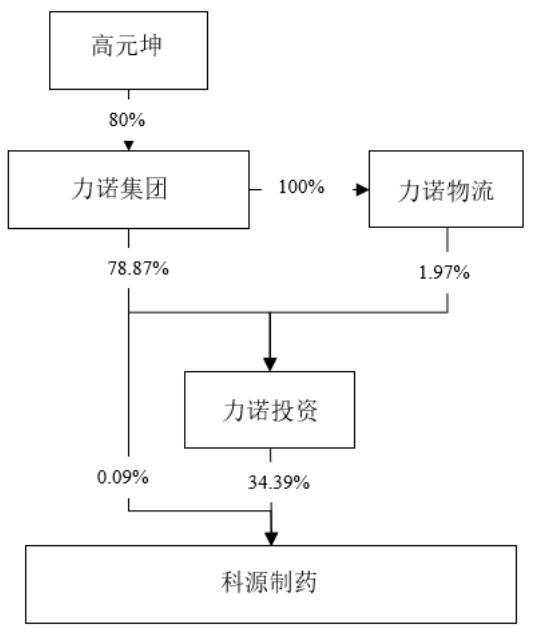

flowchart

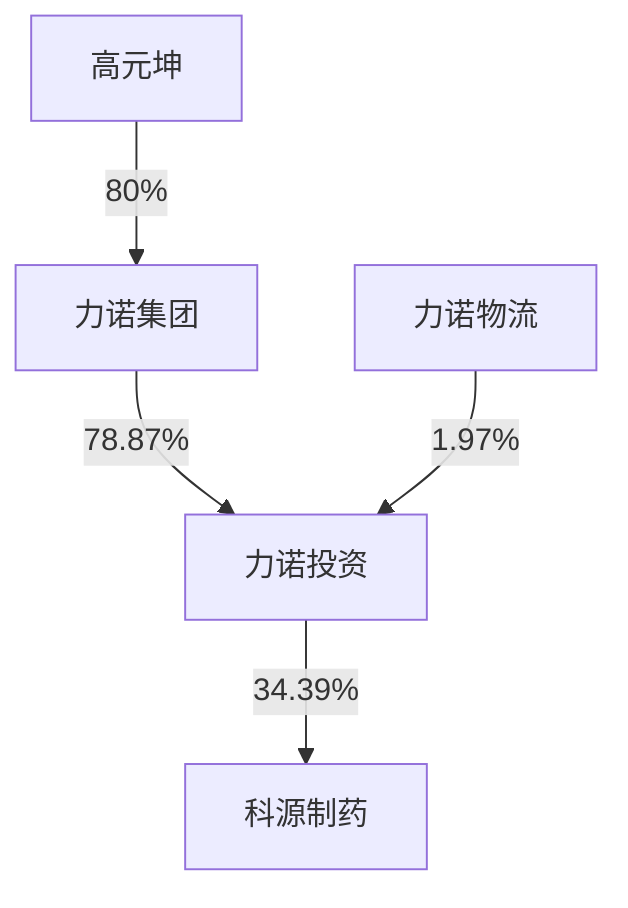
```mermaid
graph TD
  A["高元坤"] -->|80%| B["力诺集团"]
  B -->|78.87%| C["力诺投资"]
  D["力诺物流"] -->|1.97%| C
  C -->|34.39%| E["科源制药"]
```

flowchart

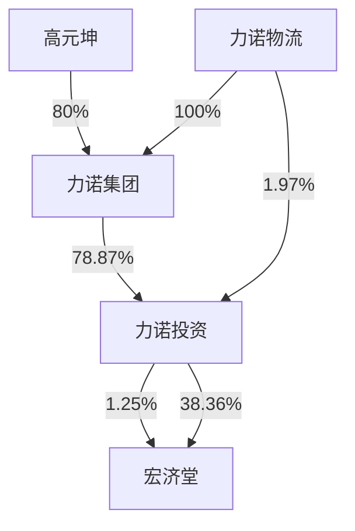
```mermaid
graph TD
  A["高元坤"] -->|80%| B["力诺集团"]
  B -->|78.87%| C["力诺投资"]
  D["力诺物流"] -->|100%| B
  D -->|1.97%| C
  C -->|1.25%| E["宏济堂"]
  C -->|38.36%| E
```

本次交易后股权结构示意图

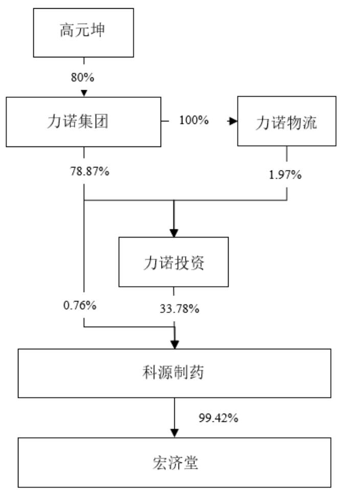

flowchart

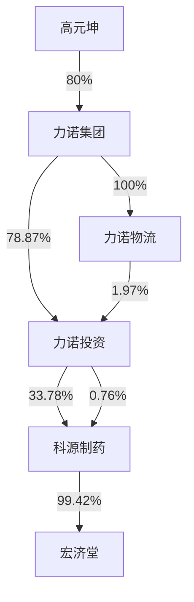
```mermaid
graph TD
  A["高元坤"] -->|80%| B["力诺集团"]
  B -->|100%| C["力诺物流"]
  B -->|78.87%| D["力诺投资"]
  C -->|1.97%| D
  D -->|33.78%| E["科源制药"]
  E -->|99.42%| F["宏济堂"]
  D -->|0.76%| E
```

## 四、本次交易决策过程和批准情况

## （一）本次交易方案已履行的决策和审批程序

1、本次交易已经获得上市公司控股股东、实际控制人及其一致行动人原则性同意；  
2、本次交易已履行了现阶段应当履行的批准和授权程序；  
3、2024年10 月21日，上市公司召开第四届董事会第二次会议，审议通过本次交易预案相关的议案；  
4、2025 年 4 月 21 日，上市公司召开第四届董事会第七次会议，审议通过本次交易报告书（草案）相关的议案。

## （二）本次交易方案尚需履行的决策和审批程序

本次交易尚需获得的批准和核准，包括但不限于：

1、本次交易尚需上市公司股东大会审议通过本次交易正式方案，且需同意豁免力诺集团、力诺投资以及济南财金投资及其一致行动人因本次交易涉及的要约收购义务；  
2、本次交易需经深交所审核通过并经中国证监会注册；  
3、相关交易对方根据相关法律法规要求履行必要的批准或备案程序；  
4、国家市场监督管理总局通过对本次交易涉及的经营者集中事项的审查（如需）；  
5、相关法律法规所要求的其他可能涉及的备案、许可、批准或核准（如需）。

## 五、上市公司控股股东及其一致行动人对本次重组的原则性意见，及上市公司控股股东及其一致行动人、上市公司董事、监事和高级管理人员自本次交易预案公告之日至实施完毕期间的减持计划

## （一）上市公司控股股东及其一致行动人对本次重组的原则性意见

上市公司控股股东力诺投资、间接控股股东力诺集团认为本次交易符合相关法律、法规及监管规则的规定，有利于提升上市公司盈利能力、增强持续经营能力，有利于保护广大投资者以及中小股东的利益，已原则性同意本次交易，将坚持在有利于上市公司的前提下，积极促成本次交易顺利进行。

## （二）上市公司控股股东及其一致行动人、董事、监事、高级管理人员自本次交易预案公告之日起至实施完毕期间的股份减持计划

上市公司控股股东力诺投资、间接控股股东力诺集团及实际控制人高元坤已出具承诺，自本次重组预案披露之日起至本次交易实施完毕期间，本企业/本人无任何减持上市公司股份的计划。如本次交易完成前本企业/本人根据自身实际需要或市场变化拟进行减持，本企业/本人将严格按照有关法律法规及中国证监会和证券交易所的相关规定执行，并及时披露减持计划，并将严格执行相关法律法规关于股份减持的规定及要求。

上市公司董事、监事、高级管理人员已出具承诺，自本次重组预案披露之日起至本次交易实施完毕期间，本人无任何减持上市公司股份的计划。如本次交易完成前本人根据自身实际需要或市场变化拟进行减持，本人将严格按照有关法律法规及中国证监会和证券交易所的相关规定执行，并及时披露减持计划，并将严格执行相关法律法规关于股份减持的规定及要求。

## 六、本次重组对中小投资者权益保护的安排

## （一）严格履行信息披露义务及相关法定程序

在本次交易过程中，公司及相关信息披露义务人将严格按照相关规定，切实履行信息披露义务，公平地向所有投资者披露可能对上市公司股票交易价格产生较大影响的重大事件。本报告书披露后，公司将继续按照相关法律、法规及规范性文件的要求，及时、准确地披露公司本次交易的进展情况。

## （二）严格执行关联交易批准程序

本次交易构成关联交易，其实施将严格执行法律法规以及公司内部对于关联交易的审批程序。上市公司董事会审议本次交易正式方案及相关议案时，关联董事已回避表决；召开股东大会审议本次交易相关议案时，关联股东将回避表决。

## （三）确保本次交易标的资产定价公平、公允

本次交易将按照相关法律、法规的规定依法进行，上市公司已聘请具有相关业务资格的评估机构对标的资产进行评估，并聘请独立财务顾问和法律顾问对本次交易所涉及的资产定价、标的资产权属等情况进行核查，独立财务顾问和法律顾问将对实施过程、相关协议及承诺的履行情况和相关后续事项的合规性和风险进行核查，发表明确意见，确保拟购买资产的定价公允、公平。公司独立董事专门会议已就资产评估机构的独立性、评估假设前提的合理性和评估定价的公允性发表审核意见。

## （四）股东大会通知公告程序及网络投票安排

根据有关规定，上市公司董事会已在审议本次交易的股东大会召开前发布股东大会通知，提醒上市公司股东参加审议本次交易的股东大会。根据有关规定，为给参加股东大会的股东提供便利，公司采用现场投票与网络投票相结合方式召开。公司提供网络形式的投票平台，股东可以在网络投票时间内通过网络投票平台行使表决权。

本公司将单独统计并披露公司的董事、监事、高级管理人员、单独或者合计持有上市公司5%以上股份的股东以外的其他股东的投票情况。

## （五）业绩承诺及补偿安排

本次交易中，发行对象暨上市公司控股股东力诺投资、间接控股股东力诺集团已与上市公司签订明确的《业绩预测补偿及减值补偿协议》，有利于保障上市公司及全体股东利益。具体业绩承诺及补偿安排参见本报告书“第七节/二、《业绩预测补偿及减值补偿协议》主要内容”。

## （六）摊薄当期每股收益的填补回报安排

## 1、本次交易对公司即期每股收益的影响

根据上市公司 2024 年度审计报告及上会会计师为本次交易出具的《备考审阅报告》，本次交易前后上市公司最近一年度主要财务数据和指标对比情况如下：

<table><tr><td>项目</td><td>交易前</td><td>交易后(备考)</td></tr><tr><td>归属于母公司股东的净利润(万元)</td><td>6,044.87</td><td>16,796.23</td></tr><tr><td>基本每股收益(元/股)</td><td>0.56</td><td>0.52</td></tr></table>

根据《备考审阅报告》，本次交易前，上市公司 2024 年度基本每股收益为0.56 元/股，本次交易后，上市公司 2024 年度基本每股收益为 0.52 元/股，上市公司每股收益将被摊薄。上市公司每股收益被摊薄，主要系宏济堂 2024 年资产减值及营业外支出较多，中成药业务持续加大加入，包括研发与市场投入较大，但经营业绩尚未充分体现，随着宏济堂前期投入逐步体现、资金占用的解决及成本费用的合理控制，预计未来经营业绩将逐步释放并增厚上市公司每股收益。

## 2、对本次交易摊薄即期收益采取的应对措施

为保护投资者利益，降低本次交易摊薄即期回报的风险，上市公司制定了相关措施填补本次交易可能对即期回报造成摊薄的影响，具体如下：

## （1）持续完善上市公司治理，为上市公司发展提供制度保障

上市公司已建立了较为完善的法人治理结构，日常经营管理运作规范，具备完善、高效的股东大会、董事会、监事会和管理层的运行机制，设置了与上市公司经营相适应的、独立高效的组织机构，并制定了相应的岗位职责，各职能部门之间职责明确、相互协同。公司组织机构设置合理、运行有效，形成了一套合理、完整、有效的公司治理与经营管理框架。

公司将严格遵循《公司法》《证券法》《上市公司治理准则》等法律、法规和规范性文件的要求，不断优化公司治理结构，切实保护投资者尤其是中小投资者权益，为上市公司持续发展提供制度保障。

## （2）完善利润分配制度，优化投资回报机制

上市公司已根据《上市公司监管指引第 3 号——上市公司现金分红（2023年修订）》（中国证券监督管理委员会公告〔2023〕61 号）的要求及其他相关法律、法规及规范性文件的要求，在《公司章程》中明确了公司利润分配原则、利润分配形式、现金分红的条件等。上市公司将严格执行相关利润分配政策，重视对投资者的合理回报，兼顾全体股东的整体利益及上市公司的可持续发展。

## （3）公司控股股东及实际控制人、董事、高级管理人员关于本次重组摊薄即期回报及采取填补回报措施的承诺函

为有效防范股东即期回报可能被摊薄的风险和提高公司未来的持续回报能力，上市公司控股股东及实际控制人、全体董事、高级管理人员作出相关承诺，具体参见本报告书“第一节/六、本次重组相关方作出的重要承诺”。

## 七、独立财务顾问的证券业务资格

上市公司聘请中信建投证券担任本次交易的独立财务顾问，中信建投证券经中国证监会批准依法设立，具备财务顾问业务及保荐承销业务资格。

## 八、其他需要提醒投资者重点关注的事项

本报告书的全文及中介机构出具的相关意见已在深圳证券交易所官方网站（http://www.szse.cn）披露，投资者应据此作出投资决策。本报告书披露后，上市公司将继续按照相关法规的要求，及时、准确地披露公司本次交易的进展情况，敬请广大投资者注意投资风险。

## 重大风险提示

## 一、本次交易相关的风险

## （一）本次重组被暂停、中止或终止的风险

1、在本次交易的筹划及实施过程中，交易各方采取了严格的保密措施，但仍不排除有关机构和个人利用关于本次交易的内幕信息进行内幕交易的可能，因此本次交易存在因公司股价异常波动或异常交易可能涉嫌内幕交易而被暂停、终止或取消的风险。  
2、在本次交易审核过程中，交易各方可能需要根据监管机构的意见及各自诉求不断调整和完善交易方案，如交易各方无法就调整和完善本次交易方案的相关措施达成一致，交易各方均有可能选择终止本次交易。  
3、本次交易存在因标的公司出现其他重大不利事项，而被暂停、中止或取消的风险。  
4、其他无法预见的可能导致本次交易被暂停、中止或取消的事项。

## （二）本次重组的审批风险

本次交易已经上市公司第四届董事会第二次、第七次会议审议通过，根据《重组管理办法》的相关规定，本次交易尚需满足多项的交易条件方可实施，包括但不限于：

1、本次交易尚需上市公司股东大会审议通过本次交易正式方案，且需同意豁免力诺集团、力诺投资以及济南财金投资及其一致行动人因本次交易涉及的要约收购义务；

2、本次交易需经深交所审核通过并经中国证监会注册；

3、相关交易对方根据相关法律法规要求履行必要的批准或备案程序；

4、国家市场监督管理总局通过对本次交易涉及的经营者集中事项的审查（如需）；

5、相关法律法规所要求的其他可能涉及的备案、许可、批准或核准（如需）。

本次交易能否取得上述批准、核准以及最终取得批准、核准的时间均存在不确定性。

## （三）拟购买资产的评估风险、减值风险

本次交易中，标的资产的交易价格参考具有为本次交易提供服务资质的资产评估机构出具的评估报告的评估结果确定。以2024年12月31日为评估基准日，标的公司经审计后净资产账面价值为224,346.27万元，评估值为360,154.41万元，增值额为 135,808.14 万元，增值率为 60.54%。

尽管评估机构在评估过程中勤勉尽责地履行了职责，但仍可能出现因未来实际情况与评估假设不一致，特别是政策法规、经济形势、市场环境等出现重大不利变化，影响本次评估的相关假设及限定条件，可能导致拟购买资产的评估值与实际情况不符的风险。

## （四）标的公司业绩承诺无法实现的风险

根据公司与补偿义务人签署的交易协议，力诺投资、力诺集团作为补偿义务人，对标的公司麝香酮专有技术及客户渠道、中成药专有技术及宏济堂商标（即业绩承诺资产）未来业绩进行了承诺。

相关业绩承诺是业绩补偿义务人综合考虑行业发展前景、业务发展规划等因素所做出的，但是业绩承诺期内宏观经济、市场环境等外部因素的变化均可能给标的公司的经营管理造成不利影响。相关业绩承诺资产实际实现的收入不能达到承诺收入数，则会对上市公司造成不利影响，并且本次交易依然存在业绩补偿承诺实施的违约风险，提请投资者注意相关风险。

## （五）标的公司持有北京联馨 24%股权减值风险

本次交易中，对宏济堂采用资产基础法作为最终评估结论。资产基础法评估中，对北京联馨24%股权采用市场法进行评估。根据公司与补偿义务人签署的交易协议，力诺投资、力诺集团作为补偿义务人，在补偿期间每一个会计年度结束后，将对北京联馨 24%股权价值进行减值测试，若发生减值，力诺投资、力诺集团将进行补偿。

北京联馨24%股权价值影响因素包括可比公司选取、所处行业估值水平、北京联馨自身经营业绩等因素。若北京联馨未能保持其现有盈利能力、其所在行业未能保持其目前的市盈率水平及中成药行业政策变动，北京联馨 24%股权在后续补偿期间发生减值，则会对上市公司造成不利影响，提请投资者注意相关风险。

## （六）实际控制人控制权稳定性风险

截至本报告书签署之日，力诺集团直接持有上市公司 0.09%股份，力诺投资持有上市公司34.39%股份，高元坤通过力诺集团、力诺投资控制上市公司34.48%股份。济南市财政局通过济南金控及其下属企业济南财金科技、济南财投基金、济南财金投资合计持有上市公司 11.03%的股权。

本次交易后，不考虑募集配套资金，高元坤通过力诺投资及力诺集团合计持有上市公司 34.53%股份，济南市财政局通过下属企业合计持有上市公司 31.55%股份，股权比例差距 2.98%。济南财投新动能、济南财金投资及济南鑫控出具《关于不谋求山东科源制药股份有限公司控制权的承诺》，承诺本次交易完成之日36个月内，济南财投新动能、济南财金投资及济南鑫控及关联方不会以任何方式直接或间接、单独或与第三方联合谋求上市公司的控制权，包括但不限于增持股权/股份、接受表决权委托、联合其他股东达成一致行动关系等。

若出现力诺集团、力诺投资以持有上市公司股份承担业绩补偿及减值补偿义务等情况，将造成力诺集团、力诺投资所持上市公司股份比例下降，将对上市公司控制权的稳定性造成不利影响。

## 二、标的公司业务与经营风险

## （一）标的公司与北京联馨交易金额及对北京联馨的投资收益较大的风险

标的公司持有北京联馨 24.00%股权，将所持北京联馨股权计入采用权益法核算的长期股权投资。北京联馨经原卫生部、国家中医药管理局批准，由中国药材公司、中国医学科学院药物研究所、山东济南中药厂（标的公司前身）、上海市药材有限公司四家人工麝香研究单位于 1999 年联合发起设立，主要从事人工麝香生产，为全国唯一具有人工麝香生产批件的企业。

标的公司向其供应人工麝香的核心原材料麝香酮，交易金额较大；同时，北京联馨具有较强的盈利能力，标的公司对北京联馨的投资收益较大。若北京联馨后续经营业绩发生较大波动或向标的公司采购规模减少，将影响标的公司的经营

业绩。

## （二）标的公司销售产品调回的风险

报告期内，标的公司存在一定规模的客户已采购产品调回的情形，主要系前期标的公司及客户对市场销售较为乐观，后续标的公司基于对市场情况的重新评估，为避免客户库存较多，扰乱公司终端价格体系以及影响公司品牌声誉，进行了部分客户库存调回。报告期内，标的公司根据产品的发货签收物流证据确认销售收入，其中对已发货但因非质量原因调回的货物冲减发货签收当期的收入，并经客户出具的销售、发货、调回函件进行验证确认。

未来若面临医药行业持续恶化、下游客户销售困难，标的公司可能进一步与下游客户协商调回部分已销售产品，进而影响公司经营业绩。

## （三）标的公司的公司治理风险

报告期内，力诺集团及其关联方存在对标的公司资金占用的情形。截至本报告书签署日，相关关联方已归还全部资金占用款及相应利息，标的公司资金占用情形已消除。

标的公司已加强内部控制，防范关联方资金占用再次发生，但控股股东和实际控制人仍可能利用其控股地位，通过公司董事会或行使股东表决权等方式对公司的发展战略、生产经营、利润分配等决策进行不当控制，将会对公司经营发展产生不利影响，损害其他股东的合法权益。

## （四）标的公司调整业务结构及销售人员的风险

2024 年，标的公司新增药品及医疗器械的流通服务，报告期内该部分流通业务的毛利率暂时为负，后续能否取得客户的认可并实现盈利存在一定不确定性。报告期内，标的公司持续优化缩减销售人员规模，若后续核心销售人员大量流失，而标的公司未能妥善完成销售服务工作的过渡交接，标的公司可能面临客户关系恶化、产品销量减少等风险，进而对标的公司业绩造成不利影响。

## （五）标的公司应收账款回款风险

报告期各期末，标的公司应收账款账面价值分别为 39,184.79 万元和72,921.87万元，占总资产的比重分别为 11.37%和17.14%，占比相对较高且增幅较快，主要系公司中成药、中药代煎、贸易配送等业务持续增长、因客户交接原因麝香酮业务回款临时性延后以及销售催款不及预期等因素综合导致。同时，标的公司应收账款中存在部分客户账龄时间长或资信情况较差等情形，预计难以回收，标的公司已经按照单项全额计提坏账准备。

未来随着标的公司业务的进一步拓展，标的公司的应收账款规模预计将会持续增加，若经济形势或标的公司的下游行业出现波动，或标的公司的客户面临经营困难，标的公司将面临应收账款回收较慢或者无法回收的风险。提请投资者关注相关风险。

## （六）标的公司存货跌价风险

2023 年末和 2024 年末，宏济堂存货账面价值分别为 80,491.94 万元和84,054.38万元，占各期末总资产比重分别为 23.36%和19.76%，占比较大并且存货周转速度低于同行业平均水平。如果市场需求发生重大不利变化，可能导致存货的可变现净值低于账面价值，使得宏济堂面临存货跌价损失。

## （七）标的公司产能利用率不足风险

报告期内，标的公司阿胶的产能利用率分别为 106.80%、38.36%，2024 年相对较低。产能利用率低将会导致单位固定成本分摊增加，若未来市场需求未显著改善或竞争加剧，现有产能闲置可能进一步扩大，影响标的公司未来经营业绩。

## （八）行业政策变化的风险

医药产业是我国重点发展的行业之一，药品是关系到社会公众安全与健康的特殊消费品，因此医药行业受监管程度较高。国家制定了一系列法律法规和产业政策，推动医疗卫生体制改革，促进行业健康有序发展，行业相关的法律法规体系正在逐步制订和不断完善。随着多项行业政策和法规的相继出台，对医药行业的投融资及市场供求关系，以及医药企业的技术研发、经营模式等可能产生较大影响，若标的公司未来无法采取有效措施应对医药行业政策的重大变化，不能加大研发力度，提升营销能力，上市公司的生产经营可能会受到不利影响。

## （九）市场竞争的风险

自设立以来，标的公司聚焦中成药及健康产品、麝香酮等产品的研发、生产与销售，在该领域形成了良好的品牌知名度。但随着市场需求的不断增加，可能吸引更多的企业进入中药领域，市场竞争将日益激烈。若标的公司不能及时改进、优化现有产品，同时加快研发，推出疗效更好、安全性更佳的新产品，日益激烈的市场竞争环境将对标的公司的经营业绩产生不利影响。

## （十）标的公司 2024 年经营活动现金流减少的风险

2024年，标的公司经营活动现金流量净额为-11,791.36万元，其中销售商品、提供劳务收到的现金较 2023年同比减少35,687.76 万元，主要系标的公司个别客户回款周期阶段性延迟、与众益康诉讼案件被冻结资金计入支付其他经营活动有关的现金等原因所导致。

若未来标的公司下游客户回款速度放缓或支付各项经营活动现金流增多，会进一步减少经营活动现金流，并对标的公司经营带来一定影响。

## （十一）国家基药目录和国家医保目录等调整的风险

截至本报告书签署之日，标的公司现有 35项产品列入《国家基本药物》（2018年版），90项产品列入《国家基本医疗保险、工伤保险和生育保险药品目录（2023年版）》。国家医保目录和基本药物目录会根据药品的使用情况在一定时期内进行调整，标的公司产品若被调出基本药物目录或医保目录，将会对标的公司生产经营产生不利影响。

## （十二）原材料价格波动的风险

标的公司生产所需原材料主要为驴皮、牛黄、连翘等动物药材及中药材。动物药材及中药材多为自然生长、季节采集、具有明显的道地性，其产量受到气候条件、自然灾害、养殖及种植规模等多种因素的影响，其供应具有一定的不稳定性。上述因素的变化可能影响药材正常生长或导致其中有效药用成分含量不足，且自然灾害、市场供求关系等因素变化也会影响其供应，导致标的公司产品成本发生变动，一定程度上影响标的公司的盈利能力。

## （十三）药品质量控制的风险

药品作为一种特殊商品其产品的质量直接关系到社会公众的健康和生命安全。国家及《中国药典（2020年版）》对中药产品的生产工艺、原材料、储藏环境、中药种植户、中药原材料采集企业、中药加工流通企业等均有严格的条件限制。但如果因不可控原因在药品生产、运输、储藏过程中发生问题，均会对药品本身成分、含量等产生影响，从而使药品的功效、性质发生变化，不再符合国家及《中国药典（2020 年版）》的相关标准，影响标的公司信誉和产品销售。

## 三、其他风险

## （一）标的公司控股股东负债规模较大风险

截至2024年12月31日，标的公司控股股东力诺投资的资产负债率为43.24%，标的公司间接控股股东力诺投资的资产负债率为 44.41%，本次重组完成后，如控股股东、间接控股股东的资信情况、财务能力或流动性状况出现其他重大不利变化，所负负债将存在逾期或违约的风险；实际控制人为标的公司的银行借款提供了担保，若未来标的公司资信状况及履约能力大幅下降，导致到期债务无法顺利偿还，则实际控制人可能需要履行担保义务，从而承担相应债务。上述情况均可能导致其持有的包括上市公司股份在内的资产被申请冻结进而司法强制执行，从而对上市公司控制权的稳定性产生不利影响。

## （二）股市波动风险

股票市场投资收益与投资风险并存。上市公司股票市场价格波动不仅取决于企业的经营业绩及发展前景，还受到国家宏观经济政策调整、金融政策的调控等因素的影响，同时也会因股票市场的投机行为、投资者的心理预期等因素的变化而产生波动。公司本次交易尚需履行相关的审批手续，并且实施完成需要一定的周期。在此期间股票市场的价格可能出现波动，会给投资者带来一定的投资风险。

## （三）重组整合风险

上市公司对本次交易完成后标的资产在销售、采购、研发、财务等方面已制定了切实有效具体的整合计划。如果上市公司的管理体系不能相应完善以适应本次交易完成后的整合需求，可能无法对标的公司进行有效管理和整合，从而无法充分发挥本次重组的协同效益，并对本次交易目的的实现产生不利影响。

与此同时，本次交易完成后，上市公司业务种类、资产规模和人员数量等都发生较大变化，主营业务由化学原料药、化学药品制剂及中间体的研发、生产和销售延伸至中成药及健康产品、麝香酮等领域，对公司现有的销售团队、营运管理、组织设置等方面均带来较大挑战。如果公司不能成功应对，将影响公司的发展速度、经营效率和业绩水平。

## 第一节 本次交易概况

## 一、本次交易的背景及目的

## （一）本次交易的背景

## 1、国家政策大力支持并购重组整合，鼓励企业提高上市公司质量

近年来，国务院、中国证监会及证券交易所先后出台了一系列鼓励支持重组整合的政策，为资本市场创造了良好条件。2020 年 10 月，国务院发布《关于进一步提高上市公司质量的意见》，指出要充分发挥资本市场的并购重组主渠道作用，鼓励上市公司盘活存量、提质增效、转型发展。2024 年 4 月，国务院发布新“国九条”，明确指出推动上市公司提升投资价值，鼓励上市公司聚焦主业，综合运用并购重组、股权激励等方式提高发展质量。上述一系列文件鼓励企业通过兼并重组方式进行资源整合、提质增效、转型发展。2024 年 9 月，中国证监会发布了《关于深化上市公司并购重组市场改革的意见》，提出支持上市公司向新质生产力方向转型升级、鼓励上市公司加强产业整合、提高监管包容度、提升重组市场交易效率、提升中介机构服务水平、依法加强监管六大方面内容，旨在进一步激发并购重组市场活力，支持经济转型升级和高质量发展。

## 2、国家政策加大对中医药支持力度、行业下游市场空间广阔

医药行业是我国国民经济的重要组成部分，与国人身心健康密切相关。受益于国民经济持续增长、人民生活水平提高、民众健康意识提高、医疗体制深化改革等有利因素的推进，我国医药消费能力与意愿逐步增强。近年来国家出台了一系列产业政策促进并保障行业健康发展，逐步构建起覆盖城乡居民的基本卫生医疗体系，建立社会化管理的医疗保障制度，未来我国医药市场将不断扩容。受老龄化、城镇化加深等因素影响，我国居民对慢病诊疗及中医养生的需求不断增长，成为我国医药行业特别是中医药行业长远发展的重要推动力。

近年来，我国逐步推出了《关于促进中医药传承创新发展的意见》《中医药振兴发展重大工程实施方案》《“十四五”中医药发展规划》等系列政策。主要针对中医药发展中面临的重点领域、重要环节的突出问题提出了重点工程改进项目及多项具体建设项目，在人才培养、中医药传承创新和现代化工程、中药质量提升及产业促进、国家中医药综合改革方面进行了全面细致规划。未来国家将逐步加强中医康复科建设、加强基层医疗卫生机构中医馆建设、实施名医堂工程；组建区域中西医协同医疗联合体，优化医院等级审评和绩效考核机制；提升中医药科技服务能力及协同创新能力，提升药品检验机构的中药质量评价能力；统一中药材追溯标准与管理办法，开展常用中药饮片的质量标准、生产工艺等研究；完善药物审评、质量管理及中药警戒制度。上述政策成为中医药行业持续高质量发展的重要保障。

## 3、通过资源整合提高风险抵御能力，应对日益激烈的市场竞争

近年来，受带量采购、一致性评价等政策以及市场竞争加剧影响，上市公司化学原料药的收入受到一定影响，为丰富业务板块，上市公司不断拓展化学药品制剂业务，目前处于快速增长状态，但整体规模相对较小。

在竞争日益激烈的市场环境下，具备多种产品线、规模大的制药企业通常拥有更强的议价能力和盈利能力，通过资源整合、优势互补丰富上市公司产品线、做大做强上市公司是应对市场竞争、提高抗风险能力的有力措施。

## （二）本次交易的目的

## 1、整合集团内优质中成药资产，打造具有市场竞争力的医药大健康平台

本次交易前，上市公司主营业务为化学原料药、化学药品制剂及中间体的研发、生产和销售，标的公司宏济堂主营业务为中成药及健康产品、麝香酮等产品的研发、生产和销售。宏济堂是我国中华老字号、国家级非物质文化遗产、中成药工业百强品牌、国家高新技术企业，具有较强的品牌优势及销售渠道资源，本次交易完成后，上市公司主营业务将延伸至中成药及健康产品、麝香酮等领域，有助于上市公司打造具备规模优势、行业知名度高的医药大健康平台。

## 2、丰富上市公司产品布局，提升上市公司抗风险能力及市场竞争力

目前上市公司主要产品格列齐特、盐酸二甲双胍、盐酸罗哌卡因以及单硝酸异山梨酯的终端需求相对稳定，而行业潜在进入者规模和技术处于不断提高之中，可能导致行业内企业降低价格、扩张产能，市场竞争加剧的风险持续存在。

标的公司宏济堂系中华老字号中药企业，截至本报告书签署日，宏济堂拥有150个药品批件，涵盖心脑血管类、感冒消炎类、咽喉口腔类、消化系统类、泌尿系统类等众多领域，并拥有金鸣片、前列欣胶囊及麝香心痛宁片等 7个药品独家品种、复方西羚解毒胶囊等 2 个独家剂型。其中特色产品阿胶、安宫牛黄丸、麝香酮等拥有长期积淀与良好市场口碑。通过集团内资源整合，丰富上市公司产品线、做大做强上市公司，能够提升上市公司抗风险能力及市场竞争力。

## 3、充分发挥协同优势，提高上市公司经营效率及盈利能力

通过本次交易，上市公司将与宏济堂充分发挥协同效应，一方面，上市公司的化学制剂业务起步较晚，市场知名度及销售渠道有待进一步增强，而宏济堂在零售药店、医药流通以及医院等渠道具有较强的网络覆盖，且拥有经验丰富的销售团队，可进一步提高上市公司的销售能力。另一方面，上市公司与宏济堂同属于医药制造行业，通过本次交易可以在研发、生产、采购、日常管理等各方面形成协同互补，可以实现生产办公集约化经营及联合采购，降低经营成本。

本次交易完成后，随着优质资产注入，上市公司盈利能力将进一步提升，上市公司经营效率将进一步提高。

## 二、本次交易具体方案

本次交易包括发行股份购买资产、发行股份募集配套资金两部分。

本次交易中，上市公司拟通过发行股份的方式向力诺投资、力诺集团等 38名交易对方发行股份购买其持有的宏济堂 99.42%股权。本次交易价格以符合《证券法》规定的中水致远评估师出具的标的公司评估结果为基础确定，根据中水致远出具的《宏济堂资产评估报告》（中水致远评报字[2025]第 010079 号），在评估基准日 2024 年 12 月 31 日，宏济堂 99.42%股权交易作价 358,061.77 万元。

本次交易中，上市公司拟向不超过 35名特定投资者发行股份募集配套资金，募集配套资金总额不超过 70,000.00 万元，不超过本次交易中上市公司以发行股份方式购买资产的交易价格的 100.00%，且发行股份数量不超过本次发行股份购买资产完成后上市公司总股本的 30.00%。募集配套资金的最终发行股份数量将在中国证监会注册后按照《发行管理办法》的相关规定和询价结果确定。

本次募集配套资金以本次发行股份购买资产交易的成功实施为前提，但募集配套资金的成功与否或是否足额募集不影响发行股份购买资产交易的实施。若本次募集配套资金发行失败或募集配套资金金额不足，则上市公司将以自有资金或

自筹资金支付。

## （一）发行股份购买资产

## 1、发行股份的种类、面值及上市地点

本次发行股份购买资产发行的股票种类为境内上市人民币普通股（A 股），每股面值为人民币 1.00元，上市地点为深交所。

## 2、发行方式和发行对象

考虑到宏济堂股东历史投资成本因素，经各方协商一致，本次交易中针对不同的交易对方实施差异化定价，交易定价方案如下：

1、除力诺投资、力诺集团外的 36 名交易对方合计持有宏济堂 59.81%的股权，交易对价为 234,318.03 万元，对应宏济堂 100.00%股东权益作价 391,800.00万元，本次交易合计获得上市公司股份 140,058,577 股；  
2、力诺投资、力诺集团合计持有宏济堂 39.61%的股权，交易对价为123,743.73 万元，对应宏济堂 100.00%股东权益作价 312,378.17 万元，本次交易合计获得上市公司股份 73,965,171 股。

发行方式和发行对象具体情况如下表所示：

<table><tr><td rowspan="2">序号</td><td rowspan="2">交易对方</td><td rowspan="2">交易标的名称及权益比例</td><td colspan="3">支付方式</td><td rowspan="2">向该交易对方支付的总对价(万元)</td></tr><tr><td>股份支付对价(万元)</td><td>股份支付数量(股)</td><td>现金支付对价(万元)</td></tr><tr><td>1</td><td>力诺投资</td><td>宏济堂 38.36%股权</td><td>119,826.10</td><td>71,623,488</td><td>-</td><td>119,826.10</td></tr><tr><td>2</td><td>力诺集团</td><td>宏济堂 1.25%股权</td><td>3,917.64</td><td>2,341,683</td><td>-</td><td>3,917.64</td></tr><tr><td>3</td><td>济南财投新动能</td><td>宏济堂 16.57%股权</td><td>64,919.41</td><td>38,804,187</td><td>-</td><td>64,919.41</td></tr><tr><td>4</td><td>济南财金投资</td><td>宏济堂 13.81%股权</td><td>54,099.50</td><td>32,336,821</td><td>-</td><td>54,099.50</td></tr><tr><td>5</td><td>济南鑫控</td><td>宏济堂 7.95%股权</td><td>31,148.20</td><td>18,618,170</td><td>-</td><td>31,148.20</td></tr><tr><td>6</td><td>厦门德福悦安</td><td>宏济堂 2.39%股权</td><td>9,344.46</td><td>5,585,451</td><td>-</td><td>9,344.46</td></tr><tr><td>7</td><td>北京中企和润</td><td>宏济堂 1.89%股权</td><td>7,409.04</td><td>4,428,592</td><td>-</td><td>7,409.04</td></tr><tr><td>8</td><td>首都大健康</td><td>宏济堂 1.25%股权</td><td>4,897.50</td><td>2,927,375</td><td>-</td><td>4,897.50</td></tr><tr><td>9</td><td>钟慧鑫</td><td>宏济堂 1.10%股权</td><td>4,298.76</td><td>2,569,489</td><td>-</td><td>4,298.76</td></tr><tr><td>10</td><td>济南乐威</td><td>宏济堂 1.07%股权</td><td>4,186.24</td><td>2,502,235</td><td>-</td><td>4,186.24</td></tr><tr><td>11</td><td>济南玖熙</td><td>宏济堂 1.06%股权</td><td>4,153.09</td><td>2,482,423</td><td>-</td><td>4,153.09</td></tr><tr><td>12</td><td>济南宏舜</td><td>宏济堂 1.04%股权</td><td>4,077.85</td><td>2,437,446</td><td>-</td><td>4,077.85</td></tr><tr><td>13</td><td>济南宏凯</td><td>宏济堂 0.98%股权</td><td>3,825.54</td><td>2,286,633</td><td>-</td><td>3,825.54</td></tr><tr><td>14</td><td>济南惠宏</td><td>宏济堂 0.93%股权</td><td>3,625.30</td><td>2,166,946</td><td>-</td><td>3,625.30</td></tr><tr><td>15</td><td>济南鲲特</td><td>宏济堂 0.87%股权</td><td>3,393.95</td><td>2,028,660</td><td>-</td><td>3,393.95</td></tr><tr><td>16</td><td>鲁康投资</td><td>宏济堂 0.80%股权</td><td>3,114.82</td><td>1,861,816</td><td>-</td><td>3,114.82</td></tr><tr><td>17</td><td>山东鲁信</td><td>宏济堂 0.80%股权</td><td>3,114.82</td><td>1,861,816</td><td>-</td><td>3,114.82</td></tr><tr><td>18</td><td>新余人合厚乾</td><td>宏济堂 0.70%股权</td><td>2,741.04</td><td>1,638,398</td><td>-</td><td>2,741.04</td></tr><tr><td>19</td><td>老百姓医药</td><td>宏济堂 0.70%股权</td><td>2,741.04</td><td>1,638,398</td><td>-</td><td>2,741.04</td></tr><tr><td>20</td><td>济南三价融智</td><td>宏济堂 0.64%股权</td><td>2,491.85</td><td>1,489,452</td><td>-</td><td>2,491.85</td></tr><tr><td>21</td><td>嘉兴华斌</td><td>宏济堂 0.59%股权</td><td>2,296.72</td><td>1,372,814</td><td>-</td><td>2,296.72</td></tr><tr><td>22</td><td>济高投保</td><td>宏济堂 0.48%股权</td><td>1,868.89</td><td>1,117,089.00</td><td>-</td><td>1,868.89</td></tr><tr><td>23</td><td>新余人合厚实</td><td>宏济堂 0.46%股权</td><td>1,817.03</td><td>1,086,088.00</td><td>-</td><td>1,817.03</td></tr><tr><td>24</td><td>宁波东旸</td><td>宏济堂 0.45%股权</td><td>1,779.17</td><td>1,063,458.00</td><td>-</td><td>1,779.17</td></tr><tr><td>25</td><td>池州徽元</td><td>宏济堂 0.37%股权</td><td>1,442.61</td><td>862,289.00</td><td>-</td><td>1,442.61</td></tr><tr><td>26</td><td>济南嘉和</td><td>宏济堂 0.35%股权</td><td>1,388.53</td><td>829,966.00</td><td>-</td><td>1,388.53</td></tr><tr><td>27</td><td>新余人合厚信</td><td>宏济堂 0.33%股权</td><td>1,296.51</td><td>774,962.00</td><td>-</td><td>1,296.51</td></tr><tr><td>28</td><td>济高科技</td><td>宏济堂 0.32%股权</td><td>1,245.93</td><td>744,726.00</td><td>-</td><td>1,245.93</td></tr><tr><td>29</td><td>济南汇中</td><td>宏济堂 0.31%股权</td><td>1,221.63</td><td>730,204.00</td><td>-</td><td>1,221.63</td></tr><tr><td>30</td><td>青岛贝拉国融</td><td>宏济堂 0.28%股权</td><td>1,086.32</td><td>649,327.00</td><td>-</td><td>1,086.32</td></tr><tr><td>31</td><td>刘志涛</td><td>宏济堂 0.26%股权</td><td>1,010.81</td><td>604,189.00</td><td>-</td><td>1,010.81</td></tr><tr><td>32</td><td>广东银石</td><td>宏济堂 0.23%股权</td><td>889.58</td><td>531,729.00</td><td>-</td><td>889.58</td></tr><tr><td>33</td><td>济南华盈</td><td>宏济堂 0.21%股权</td><td>830.81</td><td>496,598.00</td><td>-</td><td>830.81</td></tr><tr><td>34</td><td>星臻瀚智</td><td>宏济堂 0.21%股权</td><td>805.48</td><td>481,455.00</td><td>-</td><td>805.48</td></tr><tr><td>35</td><td>国元创新</td><td>宏济堂 0.16%股权</td><td>646.22</td><td>386,262.00</td><td>-</td><td>646.22</td></tr><tr><td>36</td><td>安徽协和成</td><td>宏济堂 0.12%股权</td><td>482.69</td><td>288,517.00</td><td>-</td><td>482.69</td></tr><tr><td>37</td><td>山东玖悦</td><td>宏济堂 0.08%股权</td><td>315.22</td><td>188,415.00</td><td>-</td><td>315.22</td></tr><tr><td>38</td><td>陈晓晖</td><td>宏济堂 0.08%股权</td><td>311.48</td><td>186,181.00</td><td>-</td><td>311.48</td></tr></table>

注：上市公司于 2025 年 4 月 10 日召开第四届董事会第六次会议，审议通过了 2024 年度利润分配预案，向全体股东每 10股派发现金红利2.00元（含税）。实施完毕后，本次发行股份购买资产的发行价格将相应除息调整为16.53元/股。

## 3、定价基准日和发行价格

## （1）定价基准日

本次交易中，发行股份购买资产涉及的发行股份定价基准日为上市公司审议本次交易相关事项的第四届董事会第二次会议决议公告日。

## （2）发行价格

根据《重组管理办法》的相关规定，上市公司发行股份的价格不得低于市场参考价的 80%；市场参考价为定价基准日前 20 个交易日、60 个交易日或者 120个交易日的公司股票交易均价之一。定价基准日前若干个交易日公司股票交易均价＝决议公告日前若干个交易日公司股票交易总额/决议公告日前若干个交易日公司股票交易总量。

本次交易发行股份购买资产的定价基准日为公司审议本次交易事项的首次董事会决议公告日，即科源制药第四届董事会第二次会议决议公告日。定价基准日前 20 个交易日、60 个交易日、120 个交易日股票交易均价具体情况如下表所示：

单位：元/股

<table><tr><td>股票交易均价计算区间</td><td>交易均价</td><td>交易均价的80%</td></tr><tr><td>前20个交易日</td><td>20.90</td><td>16.73</td></tr><tr><td>前60个交易日</td><td>21.82</td><td>17.46</td></tr><tr><td>前120个交易日</td><td>23.99</td><td>19.20</td></tr></table>

经充分考虑上市公司的历史股价走势、市场环境等因素且兼顾上市公司、交易对方和中小投资者的合法权益，公司与交易对方协商确认，本次发行股份购买资产发行价格选择首次董事会决议公告日前 20 个交易日的上市公司股票交易均价为市场参考价，本次发行股份购买资产发行价格按照不低于首次董事会决议公告日前 20 个交易日公司股票交易均价的 80%的原则，经双方协商一致确定为16.73 元/股。

在定价基准日至发行日期间，若上市公司发生派发股利、送红股、转增股本或配股等除息、除权行为，本次发行价格亦将作相应调整。具体的发行价格调整公式如下（保留小数点后两位，最后一位四舍五入）：

派送股票股利或转增股本： $\mathrm { P l } { = } \mathrm { P } 0 / \ \mathrm { ( 1 { + } n ) }$ ）；

增发新股或配股： $\mathrm { P l } = \mathrm { ~ ( P 0 + A } { \times } \mathrm { k } { ) } / \mathrm { ~ ( 1 + k ) }$ ；

上述两项同时进行： $\mathrm { P l } = \mathrm { ~ ( P 0 { + } A { \times } k ) ~ } / \mathrm { ~ ( 1 { + } n { + } k ) }$ ；

派送现金股利： $\mathrm { P l = } \mathrm { P 0 - } \mathrm { D }$ ；

上述三项同时进行： $\mathrm { P 1 } = ~ \mathrm { ( P 0 . D + A \times k ) } ~ / ~ \mathrm { ( 1 + n + k ) }$ 。

其中：P0为调整前发行价，n为派送股票股利或转增股本率，k 为增发新股或配股率，A 为增发新股价或配股价，D 为每股派送现金股利，P1 为调整后发行价。

## 4、发行价格调整机制

除前述派息、送股等除权、除息事项导致的发行价格调整外，本次交易不设置发行价格调整机制。

## 5、交易价格和定价依据

根据中水致远出具的《宏济堂资产评估报告》（中水致远评报字[2025]第010079 号），在评估基准日 2024 年 12 月 31 日，标的公司经审计后归母净资产账面价值为206,137.60 万元，评估值为 360,154.41 万元，本次交易价格以符合《证券法》规定的中水致远出具的标的公司评估结果为基础确定，本次交易宏济堂99.42%股权交易作价 358,061.77 万元。

本次交易中针对不同的交易对方涉及差异化定价。经交易各方协商，交易定价方案如下：

（1）除力诺投资、力诺集团外的 36 名交易对方合计持有宏济堂 59.81%的股权，交易对价为 234,318.03 万元，对应宏济堂 100.00%股东权益作价 391,800.00万元，本次交易合计获得上市公司股份 140,058,577 股；  
（2）力诺投资、力诺集团合计持有宏济堂 39.61%的股权，交易对价为123,743.73 万元，对应宏济堂 100.00%股东权益作价 312,378.17 万元，本次交易合计获得上市公司股份 73,965,171 股。

## 6、对价支付方式

上市公司拟通过发行股份方式购买宏济堂 99.42%股权，交易作价为358,061.77万元，全部以发行股份的方式支付。

<table><tr><td rowspan="2">序号</td><td rowspan="2">交易对方</td><td rowspan="2">交易标的名称及权益比例</td><td colspan="3">支付方式</td><td rowspan="2">向该交易对方支付的总对价(万元)</td></tr><tr><td>股份支付对价(万元)</td><td>股份支付数量(股)</td><td>现金支付对价(万元)</td></tr><tr><td>1</td><td>力诺投资</td><td>宏济堂38.36%股权</td><td>119,826.10</td><td>71,623,488</td><td>-</td><td>119,826.10</td></tr><tr><td>2</td><td>力诺集团</td><td>宏济堂1.25%股权</td><td>3,917.64</td><td>2,341,683</td><td>-</td><td>3,917.64</td></tr><tr><td>3</td><td>济南财投新动能</td><td>宏济堂16.57%股权</td><td>64,919.41</td><td>38,804,187</td><td>-</td><td>64,919.41</td></tr><tr><td>4</td><td>济南财金投资</td><td>宏济堂13.81%股权</td><td>54,099.50</td><td>32,336,821</td><td>-</td><td>54,099.50</td></tr><tr><td>5</td><td>济南鑫控</td><td>宏济堂7.95%股权</td><td>31,148.20</td><td>18,618,170</td><td>-</td><td>31,148.20</td></tr><tr><td>6</td><td>厦门德福悦安</td><td>宏济堂2.39%股权</td><td>9,344.46</td><td>5,585,451</td><td>-</td><td>9,344.46</td></tr><tr><td>7</td><td>北京中企和润</td><td>宏济堂1.89%股权</td><td>7,409.04</td><td>4,428,592</td><td>-</td><td>7,409.04</td></tr><tr><td>8</td><td>首都大健康</td><td>宏济堂1.25%股权</td><td>4,897.50</td><td>2,927,375</td><td>-</td><td>4,897.50</td></tr><tr><td>9</td><td>钟慧鑫</td><td>宏济堂1.10%股权</td><td>4,298.76</td><td>2,569,489</td><td>-</td><td>4,298.76</td></tr><tr><td>10</td><td>济南乐威</td><td>宏济堂1.07%股权</td><td>4,186.24</td><td>2,502,235</td><td>-</td><td>4,186.24</td></tr><tr><td>11</td><td>济南玖熙</td><td>宏济堂1.06%股权</td><td>4,153.09</td><td>2,482,423</td><td>-</td><td>4,153.09</td></tr><tr><td>12</td><td>济南宏舜</td><td>宏济堂1.04%股权</td><td>4,077.85</td><td>2,437,446</td><td>-</td><td>4,077.85</td></tr><tr><td>13</td><td>济南宏凯</td><td>宏济堂0.98%股权</td><td>3,825.54</td><td>2,286,633</td><td>-</td><td>3,825.54</td></tr><tr><td>14</td><td>济南惠宏</td><td>宏济堂0.93%股权</td><td>3,625.30</td><td>2,166,946</td><td>-</td><td>3,625.30</td></tr><tr><td>15</td><td>济南鲲特</td><td>宏济堂0.87%股权</td><td>3,393.95</td><td>2,028,660</td><td>-</td><td>3,393.95</td></tr><tr><td>16</td><td>鲁康投资</td><td>宏济堂0.80%股权</td><td>3,114.82</td><td>1,861,816</td><td>-</td><td>3,114.82</td></tr><tr><td>17</td><td>山东鲁信</td><td>宏济堂0.80%股权</td><td>3,114.82</td><td>1,861,816</td><td>-</td><td>3,114.82</td></tr><tr><td>18</td><td>新余人合厚乾</td><td>宏济堂0.70%股权</td><td>2,741.04</td><td>1,638,398</td><td>-</td><td>2,741.04</td></tr><tr><td>19</td><td>老百姓医药</td><td>宏济堂0.70%股权</td><td>2,741.04</td><td>1,638,398</td><td>-</td><td>2,741.04</td></tr><tr><td>20</td><td>济南三价融智</td><td>宏济堂0.64%股权</td><td>2,491.85</td><td>1,489,452</td><td>-</td><td>2,491.85</td></tr><tr><td>21</td><td>嘉兴华斌</td><td>宏济堂0.59%股权</td><td>2,296.72</td><td>1,372,814</td><td>-</td><td>2,296.72</td></tr><tr><td>22</td><td>济高投保</td><td>宏济堂0.48%股权</td><td>1,868.89</td><td>1,117,089.00</td><td>-</td><td>1,868.89</td></tr><tr><td>23</td><td>新余人合厚实</td><td>宏济堂0.46%股权</td><td>1,817.03</td><td>1,086,088.00</td><td>-</td><td>1,817.03</td></tr><tr><td>24</td><td>宁波东旸</td><td>宏济堂0.45%股权</td><td>1,779.17</td><td>1,063,458.00</td><td>-</td><td>1,779.17</td></tr><tr><td>25</td><td>池州徽元</td><td>宏济堂 0.37%股权</td><td>1,442.61</td><td>862,289.00</td><td>-</td><td>1,442.61</td></tr><tr><td>26</td><td>济南嘉和</td><td>宏济堂 0.35%股权</td><td>1,388.53</td><td>829,966.00</td><td>-</td><td>1,388.53</td></tr><tr><td>27</td><td>新余人合厚信</td><td>宏济堂 0.33%股权</td><td>1,296.51</td><td>774,962.00</td><td>-</td><td>1,296.51</td></tr><tr><td>28</td><td>济高科技</td><td>宏济堂 0.32%股权</td><td>1,245.93</td><td>744,726.00</td><td>-</td><td>1,245.93</td></tr><tr><td>29</td><td>济南汇中</td><td>宏济堂 0.31%股权</td><td>1,221.63</td><td>730,204.00</td><td>-</td><td>1,221.63</td></tr><tr><td>30</td><td>青岛贝拉国融</td><td>宏济堂 0.28%股权</td><td>1,086.32</td><td>649,327.00</td><td>-</td><td>1,086.32</td></tr><tr><td>31</td><td>刘志涛</td><td>宏济堂 0.26%股权</td><td>1,010.81</td><td>604,189.00</td><td>-</td><td>1,010.81</td></tr><tr><td>32</td><td>广东银石</td><td>宏济堂 0.23%股权</td><td>889.58</td><td>531,729.00</td><td>-</td><td>889.58</td></tr><tr><td>33</td><td>济南华盈</td><td>宏济堂 0.21%股权</td><td>830.81</td><td>496,598.00</td><td>-</td><td>830.81</td></tr><tr><td>34</td><td>星臻瀚智</td><td>宏济堂 0.21%股权</td><td>805.48</td><td>481,455.00</td><td>-</td><td>805.48</td></tr><tr><td>35</td><td>国元创新</td><td>宏济堂 0.16%股权</td><td>646.22</td><td>386,262.00</td><td>-</td><td>646.22</td></tr><tr><td>36</td><td>安徽协和成</td><td>宏济堂 0.12%股权</td><td>482.69</td><td>288,517.00</td><td>-</td><td>482.69</td></tr><tr><td>37</td><td>山东玖悦</td><td>宏济堂 0.08%股权</td><td>315.22</td><td>188,415.00</td><td>-</td><td>315.22</td></tr><tr><td>38</td><td>陈晓晖</td><td>宏济堂 0.08%股权</td><td>311.48</td><td>186,181.00</td><td>-</td><td>311.48</td></tr></table>

注：上市公司于 2025 年 4 月 10 日召开第四届董事会第六次会议，审议通过了 2024 年度利润分配预案，向全体股东每 10股派发现金红利2.00元（含税）。实施完毕后，本次发行股份购买资产的发行价格将相应除息调整为16.53元/股。

## 7、发行股份的数量

本次发行的股份数量将根据标的资产的交易价格确定，具体根据以下公式计算：

本次发行的股份总数=上市公司以发行股份方式支付的标的资产对价金额／本次发行价格（如有调价，则按调整后确定的发行价格）（不足一股的舍去尾数取整；单位为股）

本次交易中，发行股份购买资产的支付对价及发行股份数量具体情况如下：

<table><tr><td rowspan="2">交易对方</td><td rowspan="2">标的资产</td><td rowspan="2">交易作价(万元)</td><td colspan="2">股份支付</td><td rowspan="2">现金支付(万元)</td></tr><tr><td>金额(万元)</td><td>股数(股)</td></tr><tr><td>力诺投资、力诺集团等38名交易对方</td><td>宏济堂99.42%股权</td><td>358,061.77</td><td>358,061.77</td><td>214,023,748</td><td>-</td></tr></table>

本次发行股份的数量最终以经深交所审核通过并经中国证监会注册的股份数量为准。

在本次发行的定价基准日至发行日期间，上市公司如发生派息、送股、资本公积金转增股本等除权除息事项，将按照法律、法规、证监会及深交所的相关规则对发行价格进行相应调整，发行数量也将根据发行价格的情况进行相应调整。

## 8、锁定期安排

交易对方力诺投资、力诺集团承诺：

1、本公司因本次交易取得的上市公司股份，自本次股份发行结束之日起 36个月内不得转让（实际控制人控制之下不同主体之间转让上市公司股份的除外），包括但不限于通过证券市场公开转让或通过协议方式转让，不委托他人管理其持有的上市公司股份，也不由上市公司回购该等股份。在此期限届满之后按照中国证监会和证券交易所的相关规定执行。

2、根据《上市公司重大资产重组管理办法》第四十七条的规定，本次交易完成后 6 个月内如上市公司股票连续 20 个交易日的收盘价低于发行价，或者本次交易完成后6个月期末收盘价低于发行价的，本公司因本次交易获得的上市公司股份的锁定期自动延长 6个月（期间如发生除权、除息、配股等事项，发行价格相应调整）；如本次交易因涉嫌所提供或披露的信息存在虚假记载、误导性陈述或者重大遗漏，被司法机关立案侦查或者被中国证监会立案调查的，在案件调查结论明确以前，本公司将不转让在上市公司拥有权益的股份。

3、本次交易实施完成后，本公司通过本次交易获得上市公司股份因上市公司送红股、转增股本等原因增加取得的股份，也应遵守前述规定。对于本次认购的股份，解除锁定后的转让将按照届时有效的法律法规和证券交易所的规则办理。如果审核监管部门对锁定期有最新规定或监管要求，则本公司应按审核监管部门的最新规定或监管意见对锁定期进行调整。

4、本公司在本次交易前持有的上市公司股份，自本次股份发行结束之日起

18 个月内不得转让。但是，在适用法律许可的前提下的转让不受此限。本公司在本次交易前持有的上市公司股份因上市公司送红股、转增股本等原因增加取得的股份，也应遵守前述规定。对于本公司在本次交易前持有的上市公司股份，解除锁定后的转让将按照届时有效的法律法规和证券交易所的规则办理。如果审核监管部门对锁定期有最新规定或监管要求，则本公司应按审核监管部门的最新规定或监管意见对锁定期进行调整。

交易对方济南财投新动能、济南财金投资、济南鑫控承诺：

1、本企业因本次交易取得的上市公司股份，自本次股份发行结束之日起 36个月内不得转让，包括但不限于通过证券市场公开转让或通过协议方式转让，不委托他人管理其持有的上市公司股份，也不由上市公司回购该等股份。在此期限届满之后按照中国证监会和证券交易所的相关规定执行。  
2、本次交易实施完成后，本企业通过本次交易获得上市公司股份因上市公司送红股、转增股本等原因增加取得的股份，也应遵守前述规定。对于本次认购的股份，解除锁定后的转让将按照届时有效的法律法规和证券交易所的规则办理。如果审核监管部门对锁定期有最新规定或监管要求，则本企业应按审核监管部门的最新规定或监管意见对锁定期进行调整。

除力诺投资、力诺集团、济南财投新动能、济南财金投资、济南鑫控外的交易对方承诺：

1、本企业/本人因本次交易取得的上市公司股份，自本次股份发行结束之日起 12 个月内不得转让，包括但不限于通过证券市场公开转让或通过协议方式转让，不委托他人管理其持有的上市公司股份，也不由上市公司回购该等股份；但如截至本次发行股份购买资产发行结束之日，本企业/本人对用于认购股份的资产持续拥有权益的时间不足 12个月的，则本企业/本人因本次交易取得的上市公司股份，自本次股份发行结束之日起 36 个月内不得转让，包括但不限于通过证券市场公开转让或通过协议方式转让，不委托他人管理其持有的上市公司股份，也不由上市公司回购该等股份。在此期限届满之后按照中国证监会和证券交易所的相关规定执行。

2、本次交易实施完成后，本企业/本人通过本次交易获得上市公司股份因上市公司送红股、转增股本等原因增加取得的股份，也应遵守前述规定。对于本次认购的股份，解除锁定后的转让将按照届时有效的法律法规和证券交易所的规则办理。如果审核监管部门对锁定期有最新规定或监管要求，则本企业/本人应按审核监管部门的最新规定或监管意见对锁定期进行调整。

## 9、过渡期间损益安排

过渡期间内，标的公司自评估基准日至交割日期间的盈利归上市公司享有；如发生亏损，则由力诺投资、力诺集团向上市公司以现金方式补足。

## 10、滚存未分配利润的安排

上市公司于本次发行前留存的滚存未分配利润由本次发行后的新老股东按照发行后的持股比例共同享有。

## 11、业绩承诺及补偿安排

本次交易中，发行对象暨上市公司控股股东力诺投资、间接控股股东力诺集团已与上市公司签订明确的《业绩预测补偿及减值补偿协议》，有利于保障上市公司及全体股东利益。具体业绩承诺及补偿安排参见本报告书“第七节/二、《业绩预测补偿及减值补偿协议》主要内容”。

## 12、决议有效期

本次重组决议的有效期为公司股东大会审议通过之日起 12 个月。如果公司已于该有效期内取得中国证监会关于本次交易的注册文件，则该有效期自动延长至本次交易完成日。

## （二）发行股份募集配套资金

## 1、发行股份的种类、面值及上市地点

本次募集配套资金发行的股票种类为境内上市人民币普通股（A 股），每股面值为人民币1.00 元，上市地点为深交所。

## 2、发行对象及认购方式

上市公司拟向不超过 35 名特定投资者发行股份募集配套资金。募集配套资金发行股份采取询价发行的方式。

## 3、定价基准日及发行价格

本次募集配套资金的定价基准日为向特定对象发行股份发行期首日。本次募集配套资金的股份发行价格不低于定价基准日前 20 个交易日上市公司股票交易均价的80%。本次募集配套资金发行股份的最终发行价格将由上市公司董事会在股东大会的授权范围内，按照中国证监会相关监管要求及相关法律法规的规定，根据发行对象申购报价的情况确定。

若公司股票在募集配套资金的定价基准日至发行日期间发生派送红股、转增股本、增发新股、配股以及派发现金股利等除权除息情况，本次募集配套资金的股份发行价格将根据中国证监会及深交所的相关规定进行相应调整。

## 4、募集配套资金金额及发行数量

上市公司拟向不超过 35 名特定投资者发行股份募集配套资金，募集配套资金总额不超过 70,000.00 万元，不超过本次交易中上市公司以发行股份方式购买资产的交易价格的 100.00%，且发行股份数量不超过本次交易完成后上市公司总股本的 30.00%。募集配套资金的最终发行股份数量将在中国证监会注册后按照《发行管理办法》的相关规定和询价结果确定。

在募集配套资金的定价基准日至发行日期间，若上市公司发生派息、送股、配股、资本公积金转增股本等除权、除息事项，本次募集配套资金的发行价格及发行数量将按照中国证监会和深交所的相关规则进行相应调整。

## 5、锁定期安排

上市公司拟向不超过 35 名符合条件的特定投资者发行股份募集配套资金，上述特定投资者认购的股份自发行结束之日起 6个月内不得以任何方式转让。本次募集配套资金完成之后，募集配套资金认购方因本次交易取得的股份若由于上市公司送红股、转增股本等原因增持的股份，亦遵守上述限售期的约定。若本次募集配套资金中所认购股份的锁定期的规定与证券监管机构的最新监管意见不相符，公司及认购方将根据相关证券监管机构的监管意见进行相应调整。

## 6、募集配套资金用途

本次募集配套资金总额不超过 70,000.00 万元，拟用于补充流动资金、支付

中介机构费用及交易税费，募集配套资金具体用途如下：

单位：万元

<table><tr><td>序号</td><td>项目名称</td><td>拟投入募集资金金额</td></tr><tr><td>1</td><td>中介机构费用及交易税费</td><td>2,500.00</td></tr><tr><td>2</td><td>补充流动资金</td><td>67,500.00</td></tr><tr><td colspan="2">合计</td><td>70,000.00</td></tr></table>

本次募集配套资金以本次发行股份购买资产交易的成功实施为前提，但募集配套资金的成功与否或是否足额募集不影响发行股份购买资产交易的实施。若本次募集配套资金发行失败或募集配套资金金额不足，则上市公司将以自有资金或自筹资金支付。

## 7、滚存未分配利润的安排

本次向特定对象发行股份募集配套资金发行前的滚存未分配利润，由发行后的全体股东按其持股比例共享。

## 8、决议有效期

与本次募集配套资金有关的决议自股东大会审议通过之日起 12 个月内有效。如果公司已于该有效期内取得中国证监会关于本次募集配套资金的注册文件，则该有效期自动延长至本次募集配套资金完成日。

## 三、本次交易的性质

## （一）本次交易构成关联交易

本次交易中，交易对方中力诺投资为上市公司的控股股东；力诺集团为上市公司的间接控股股东；鲁康投资为上市公司实际控制人高元坤担任董事的企业；济南财金投资为上市公司持有 5%以上股份股东（济南财金投资与其一致行动人济南财投基金、济南财金科技合计持有上市公司 5%以上股份）；济南财投新动能、济南鑫控同时为济南财金投资的一致行动人；济南宏舜、济南惠宏为上市公司持有 5%以上股份股东济南安富的一致行动人（济南宏舜、济南惠宏与济南安富的执行事务合伙人均为申英明）。根据《上市规则》的相关规定，力诺投资、力诺集团、鲁康投资、济南财金投资、济南财投新动能、济南鑫控、济南宏舜、济南惠宏为上市公司的关联方，本次交易构成关联交易。

## （二）本次交易构成重大资产重组

根据科源制药 2024 年度经审计的资产总额、资产净额及营业收入，涉及交易的标的于2024年末经审计的资产总额及资产净额和2024年度经审计的营业收入以及交易作价情况，相关财务比例计算如下表所示：

单位：万元

<table><tr><td>项目</td><td>资产总额/交易作价孰高</td><td>资产净额/交易作价孰高</td><td>营业收入</td></tr><tr><td>标的公司(A)</td><td>425,326.72</td><td>358,061.77</td><td>128,287.26</td></tr><tr><td>上市公司(B)</td><td>155,247.43</td><td>135,879.56</td><td>46,371.68</td></tr><tr><td>财务指标占比(A/B)</td><td>273.97%</td><td>263.51%</td><td>276.65%</td></tr><tr><td>是否达到重大资产重组条件</td><td>是</td><td>是</td><td>是</td></tr></table>

本次交易构成重大资产重组，同时涉及发行股份购买资产，需经深交所审核通过并经中国证监会注册后方可实施。

## （三）本次交易不构成重组上市

本次交易前后，上市公司控股股东均为力诺投资，实际控制人均为高元坤，上市公司控制权不会发生变更。本次交易前三十六个月内，上市公司实际控制人未发生变更，不构成《重组管理办法》第十三条规定的交易情形，不构成重组上市。

## 四、本次重组对上市公司的影响

## （一）本次交易对上市公司主营业务的影响

本次交易前，上市公司主营业务为化学原料药、化学药品制剂及中间体的研发、生产和销售，标的公司宏济堂主营业务为中成药及健康产品、麝香酮等产品的研发、生产和销售。宏济堂是我国中华老字号、国家级非物质文化遗产、中成药工业百强品牌、国家高新技术企业，具有较强的品牌优势及销售渠道资源，本次交易完成后，上市公司主营业务将延伸至中成药及健康产品、麝香酮等领域，实现部分生产办公设施集约化使用及采购、销售渠道协同，有助于上市公司优化产品布局、加强销售采购渠道整合、降低经营成本，打造具备规模优势、行业知名度高的医药大健康平台，提升上市公司综合实力和整体价值。

## （二）本次交易对上市公司财务状况和盈利能力的影响

本次交易完成后，上市公司将持有宏济堂 99.42%股权，上市公司归属于母公司所有者的净利润将得以提高，有利于增强上市公司的盈利能力，实现股东利益的最大化。

标的公司宏济堂营业收入、净利润高于上市公司，本次交易后，上市公司2024年营业收入、净利润均大幅增长，但每股收益将被摊薄，详见本报告书“重大事项提示/三/（二）本次交易对上市公司盈利能力的影响”具体内容。

## （三）本次交易对上市公司股权结构的影响

本次交易前后，上市公司控股股东均为力诺投资，实际控制人均为高元坤，上市公司控制权不会发生变更。

本次交易前，截至本报告书签署之日，上市公司总股本为 108,290,000 股。按照本次交易标的资产交易价格以及发行股份购买资产的发行价格，不考虑募集配套资金的情况下，本次交易对上市公司股权结构影响具体如下表所示：

单位：股

<table><tr><td rowspan="2">序号</td><td rowspan="2">股东名称</td><td colspan="2">本次重组前</td><td colspan="2">本次重组后</td></tr><tr><td>持股数量</td><td>持股比例</td><td>持股数量</td><td>持股比例</td></tr><tr><td>1</td><td>力诺投资控股集团有限公司</td><td>37,240,000</td><td>34.39%</td><td>108,863,488</td><td>33.78%</td></tr><tr><td>2</td><td>济南财投新动能</td><td>-</td><td>-</td><td>38,804,187</td><td>12.04%</td></tr><tr><td>3</td><td>济南财金投资有限公司</td><td>2,800,000</td><td>2.59%</td><td>35,136,821</td><td>10.90%</td></tr><tr><td>4</td><td>济南鑫控</td><td>-</td><td>-</td><td>18,618,170</td><td>5.78%</td></tr><tr><td>5</td><td>问泽鸿</td><td>8,400,000</td><td>7.76%</td><td>8,400,000</td><td>2.61%</td></tr><tr><td>6</td><td>济南安富创业投资合伙企业(有限合伙)</td><td>6,300,000</td><td>5.82%</td><td>6,300,000</td><td>1.95%</td></tr><tr><td>7</td><td>厦门德福悦安</td><td>-</td><td>-</td><td>5,718,216</td><td>1.73%</td></tr><tr><td>8</td><td>济南市财金科技投资有限公司</td><td>5,110,000</td><td>4.72%</td><td>5,110,000</td><td>1.59%</td></tr><tr><td>9</td><td>北京中企和润</td><td>-</td><td>-</td><td>4,533,859</td><td>1.37%</td></tr><tr><td>10</td><td>济南鼎佑健康产业投资合伙企业(有限合伙)</td><td>4,200,000</td><td>3.88%</td><td>4,200,000</td><td>1.30%</td></tr><tr><td>11</td><td>其他股东</td><td>44,240,000</td><td>40.85%</td><td>86,867,039</td><td>26.95%</td></tr><tr><td colspan="2">合计</td><td>108,290,000</td><td>100.00%</td><td>322,313,748</td><td>100.00%</td></tr></table>

注：本次交易前的股权结构为截至 2024年12月 31日的数据。

本次交易前后股权结构对比图如下：

本次交易前股权结构示意图  

flowchart

```mermaid
graph TD
  A["高元坤"] -->|80%| B["力诺集团"]
  B -->|78.87%| C["力诺投资"]
  D["力诺物流"] -->|1.97%| C
  C -->|34.39%| E["科源制药"]
```

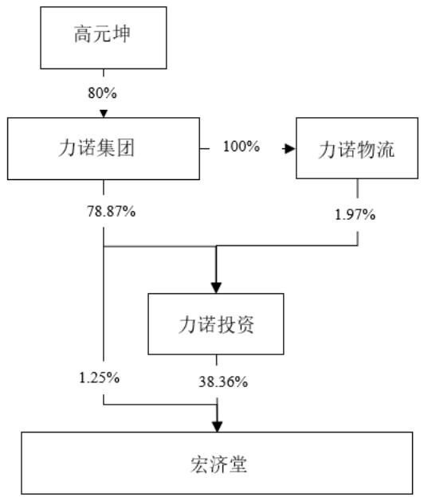

flowchart

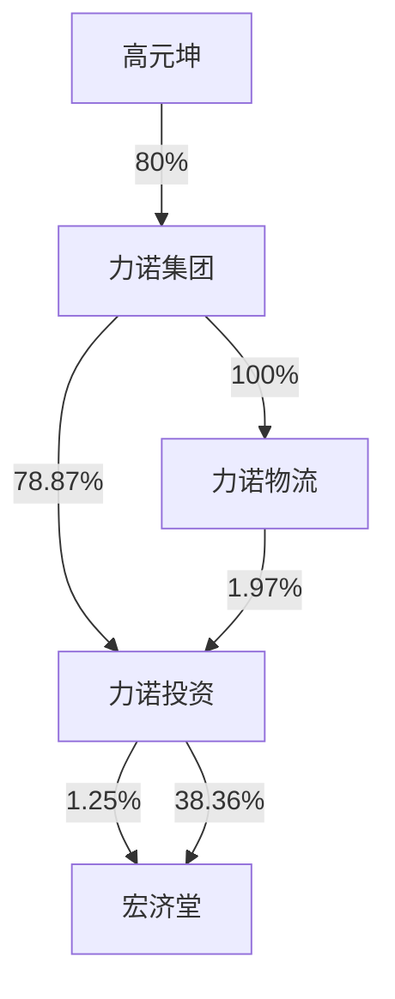
```mermaid
graph TD
  A["高元坤"] -->|80%| B["力诺集团"]
  B -->|100%| C["力诺物流"]
  B -->|78.87%| D["力诺投资"]
  C -->|1.97%| D
  D -->|1.25%| E["宏济堂"]
  D -->|38.36%| E
```

本次交易后股权结构示意图

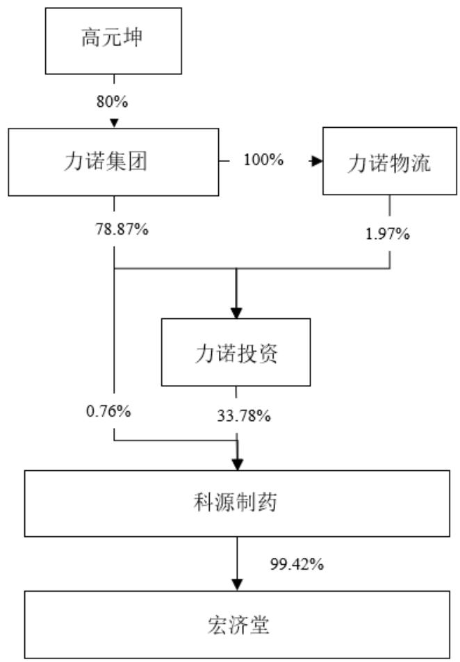

flowchart

```mermaid
graph TD
  A["高元坤"] -->|80%| B["力诺集团"]
  B -->|100%| C["力诺物流"]
  B -->|78.87%| D["力诺投资"]
  C -->|1.97%| D
  D -->|33.78%| E["科源制药"]
  E -->|99.42%| F["宏济堂"]
  D -->|0.76%| E
```

## 五、本次交易决策过程和批准情况

## （一）本次交易方案已履行的决策和审批程序

1、本次交易已经获得上市公司控股股东、实际控制人及其一致行动人原则性同意；  
2、本次交易已履行了现阶段应当履行的批准和授权程序；  
3、2024年10 月21日，上市公司召开第四届董事会第二次会议，审议通过本次交易预案相关的议案；  
4、2025 年 4 月 21 日，上市公司召开第四届董事会第七次会议，审议通过本次交易报告书（草案）相关的议案。

## （二）本次交易方案尚需履行的决策和审批程序

本次交易尚需获得的批准和核准，包括但不限于：

1、本次交易尚需上市公司股东大会审议通过本次交易正式方案，且需同意豁免力诺集团、力诺投资以及济南财金投资及其一致行动人因本次交易涉及的要约收购义务；  
2、本次交易需经深交所审核通过并经中国证监会注册；  
3、相关交易对方根据相关法律法规要求履行必要的批准或备案程序；  
4、国家市场监督管理总局通过对本次交易涉及的经营者集中事项的审查（如需）；  
5、相关法律法规所要求的其他可能涉及的备案、许可、批准或核准（如需）。

## 六、本次重组相关方作出的重要承诺

## （一）上市公司及其董事、监事、高级管理人员作出的重要承诺

<table><tr><td>承诺方</td><td>承诺事项</td><td>主要承诺内容</td></tr><tr><td>上市公司</td><td>关于提供信息真实性、准确性和完整性的承诺</td><td>1、上市公司为本次交易所提供或披露的有关信息(无论该等信息提供的对象、场合、内容或方式如何)均为真实、准确和完整的,不存在虚假记载、误导性陈述或者重大遗漏;2、上市公司保证向参与本次交易的各中介机构所提供的资料均为真实、原始的书面资料或副本资料,该等资料副本或复印件与原始资料或原件一致,是准确和完整的,所有文件的签名、印章均是真实且经合法有效授权的,并无任何虚假记载、误导性陈述或重大遗漏;3、在参与本次交易期间,上市公司将依照相关法律、法规、规章的规定,以及中国证监会、证券交易所等监管部门的要求,及时提供或披露有关本次交易的信息,并保证该等信息的真实性、准确性和完整性,保证该等信息不存在虚假记载、误导性陈述或者重大遗漏;如因提供或披露的信息存在虚假记载、误导性陈述或者重大遗漏,给投资者造成损失的,将依法承担赔偿责任;4、上市公司保证本次交易的信息披露和申请文件真实、准确、完整,不存在任何虚假记载、误导性陈述或者重大遗漏。</td></tr><tr><td>上市公司</td><td>关于不存在泄露本次交易内幕信息或进行内幕交易的承诺</td><td>1、截至本承诺函出具之日,上市公司不存在泄露本次交易内幕信息以及利用本次交易信息进行内幕交易的情形,不存在利用内幕信息建议他人买卖相关证券或其他内幕交易行为,不存在因涉嫌内幕交易被立案调查或立案侦查的情况,最近36个月内不存在因内幕交易被中国证监会作出行政处罚或者司法机关依法追究刑事责任的情形;2、上市公司不存在《上市公司监管指引第7号—上市公司重大资产重组相关股票异常交易监管》第十二条规定的不得参与重大资产重组的情形;3、上市公司若违反上述承诺,将依法承担相应的法律责任并将承担因此而给投资者造成的一切实际损失。</td></tr><tr><td>上市公司</td><td>关于无违法违规行为的承诺</td><td>1、上市公司不存在最近十二个月内未履行向投资者作出的公开承诺的情形;2、上市公司不存在最近三十六个月内因违反法律、行政法规、规章受到行政处罚且情节严重,或者受到刑事处罚,或者因违反证券法律、行政法规、规章受到中国证监会的行政处罚的情形;不存在最近十二个月内受到证券交易所的公开谴责的情形;不存在因涉嫌犯罪正被司法机关立案侦查或者涉嫌违法违规正被中国证监会立案调查的情形;3、上市公司控股股东、实际控制人不存在最近十二个月内因违反证券法律、行政法规、规章,受到中国证监会的行政处罚,或者受到刑事处罚的情形;4、上市公司现任董事、监事和高级管理人员具备和遵守《中华人民共和国公司法(2023修订)》等法律、法规、规范性文件和公司章程规定的任职资格和义务,其任职经合法程序产生,不存在有关法律、法规、规范性文件和公司章程及有关监管部门、兼职单位(如有)所禁止的兼职情形;上市公司现任董事、监事和高级管理人员不存在违反《中华人民共和国公司法》第一百七十八条、第一百七十九条、第一百八十条、第一百八十一条规定的行为,或者最近三十六个月内受到中国证监会的行政处罚、最近十二个月内受到证券交易所的公开谴责的情形;不存在因涉嫌犯罪被司法机关立案侦查或者涉嫌违法违规被中国证监会立案调查的情形;5、上市公司不存在严重损害投资者的合法权益或者社会公共利益的重大违法行为;6、上市公司最近一年及一期财务会计报告未被注册会计师出具保留意见、否定意见或者无法表示意见的审计报告;7、上市公司与控股股东或者实际控制人的人员、资产、财务分开,机构、业务独立,能够自主经营管理。上市公司最近十二个月不存在违规对外提供担保或者资金被上市公司控股股东、实际控制人及其控制的其他企业以借款、代偿债务、代垫款项或者其他方式占用的情形;8、上市公司不存在依据《上市公司监管指引第7号—上市公司重大资产重组相关股票异常交易监管》第十二条规定的不得参与任何上市公司重大资产重组情形。</td></tr><tr><td>上市公司董事、监事、高级管理人员</td><td>关于提供信息真实性、准确性和完整性的承诺</td><td>1、本人为本次交易所提供或披露的有关信息(无论该等信息提供的对象、场合、内容或方式如何)均为真实、准确和完整的,不存在虚假记载、误导性陈述或者重大遗漏;2、本人保证向参与本次交易的各中介机构所提供的资料均为真实、原始的书面资料或副本资料,该等资料副本或复印件与原始资料或原件一致,是准确和完整的,所有文件的签名、印章均是真实且经合法有效授权的,并无任何虚假记载、误导性陈述或重大遗漏;3、在参与本次交易期间,本人将依照相关法律、法规、规章的规定,以及中国证监会、证券交易所等监管部门的要求,及时提供或披露有关本次交易的信息,并保证该等信息的真实性、准确性和完整性,保证该等信息不存在虚假记载、误导性陈述或者重大遗漏;如因提供或披露的信息存在虚假记载、误导性陈述或者重大遗漏,给上市公司或投资者造成损失的,将依法承担赔偿责任;4、本人保证本次交易的信息披露和申请文件真实、准确、完整,不存在任何虚假记载、误导性陈述或者重大遗漏;5、本人承诺,如本次交易因涉嫌本人所提供或者披露的信息存在虚假记载、误导性陈述或者重大遗漏,被司法机关立案侦查或者被中国证监会立案调查的,在案件调查结论明确之前,则暂停转让本人在上市公司拥有权益的股份(以下简称“锁定股份”),并于收到立案稽查通知的两个交易日内将暂停转让的书面申请和股票账户提交上市公司董事会,由上市公司董事会代其向证券交易所和登记结算公司申请锁定;未在两个交易日内提交锁定申请的,授权上市公司董事会核实后直接向证券交易所和登记结算公司报送本人的身份信息和账户信息并申请锁定;上市公司董事会未向证券交易所和登记结算公司报送本人的身份信息和账户信息的,授权证券交易所和登记结算公司直接锁定相关股份。如最终有效的调查结论认定存在违反法律法规或本承诺内容的情形,本人承诺锁定股份可用于相关投资者赔偿安排。</td></tr><tr><td>上市公司的董事、监事、高级管理人员</td><td>关于不存在泄露本次交易内幕信息或进行内幕交易的承诺</td><td>1、本人保证采取必要措施对本次交易的资料和信息严格保密,在未经上市公司同意的情况下,不向任何第三方披露该等资料和信息,但有权机关要求披露或者向为完成本次交易而聘请的中介机构提供本次交易相关信息的除外;2、截至本承诺函出具之日,本人不存在泄露本次交易内幕信息以及利用本次交易信息进行内幕交易的情形,不存在利用内幕信息建议他人买卖相关证券或其他内幕交易行为,不存在因涉嫌内幕交易被立案调查或立案侦查的情况,最近36个月内不存在因内幕交易被中国证监会作出行政处罚或者司法机关依法追究刑事责任的情形;3、本人不存在《上市公司监管指引第7号—上市公司重大资产重组相关股票异常交易监管》第十二条规定的不得参与重大资产重组的情形;4、本人若违反上述承诺,将依法承担相应的法律责任并将承担因此而给投资者造成的一切实际损失。</td></tr><tr><td>上市公司的董事、监事、高级管理人员</td><td>关于无违法违规行为的承诺</td><td>1、本人不存在最近三十六个月内因违反法律、行政法规、规章受到行政处罚且情节严重,或者受到刑事处罚,或者因违反证券法律、行政法规、规章受到中国证监会的行政处罚的情形;不存在最近十二个月内受到证券交易所的公开谴责的情形;不存在因涉嫌犯罪被司法机关立案侦查或者涉嫌违法违规被中国证监会立案调查的情形;2、本人具备和遵守《中华人民共和国公司法(2023修订)》等法律、法规、规范性文件和公司章程规定的任职资格和义务,本人任职经合法程序产生,不存在有关法律、法规、规范性文件和公司章程及有关监管部门、兼职单位(如有)所禁止的兼职情形;本人不存在违反《中华人民共和国公司法》第一百七十八条、第一百七十九条、第一百八十条、第一百八十一条规定的行为;3、本人最近36个月不存在严重损害投资者的合法权益和社会公共利益的其他情形;4、本人不存在依据《上市公司监管指引第7号—上市公司重大资产重组相关股票异常交易监管》第十二条规定的不得参与任何上市公司重大资产重组情形。</td></tr><tr><td>上市公司的董事、监事、高级管理人员</td><td>关于本次交易期间股份减持计划的承诺</td><td>1、自本次重组预案披露之日起至本次交易实施完毕期间,本人无任何减持上市公司股份的计划。如本次交易完成前本人根据自身实际需要或市场变化拟进行减持,本人将严格按照有关法律法规及中国证监会和证券交易所的相关规定执行,并及时披露减持计划,并将严格执行相关法律法规关于股份减持的规定及要求;2、若上市公司自本承诺函签署之日起至本次交易实施完毕期间实施转增股份、送红股、配股等除权行为,本人因此获得的新增股份同样遵守上述承诺;3、如违反上述承诺,本人减持股份的收益归上市公司所有,若因本人违反本承诺而导致上市公司或投资者受到损失的,本人将依法承担赔偿责任。</td></tr><tr><td>上市公司的董事、监事、高级管理人员</td><td>关于减少与规范关联交易的承诺</td><td>1、本人及本人控制的其他企业将尽量避免与上市公司及其控股子公司之间发生关联交易;对于确有必要且无法回避的关联交易,将按照平等、自愿、公平、等价有偿的原则进行,交易价格按市场的公允价格确定,并按相关法律、法规、规范性文件及上市公司内部制度的规定履行交易审批程序及信息披露义务,保证不通过关联交易损害上市公司及其他股东的合法权益;2、如违反以上承诺,本人愿意承担由此产生的全部责任,充分赔偿或补偿由此给上市公司及上市公司其他股东造成的损失;3、本承诺函在本人作为上市公司的关联方期间持续有效且不可撤销。</td></tr><tr><td>上市公司的董事、高级</td><td>关于本次重组摊薄即期回报及采取填补回报措施</td><td>1、本人承诺忠实、勤勉地履行职责,维护上市公司和全体股东的合法权益。</td></tr><tr><td>管理人员</td><td>的承诺</td><td>2、本人承诺不以无偿或以不公平条件向其他单位或者个人输送利益,也不采用其他方式损害上市公司利益。3、本人承诺对本人的职务消费行为进行约束。4、本人承诺不动用上市公司资产从事与履行职责无关的投资、消费活动。5、本人承诺在本人合法权限范围内,促使由董事会或薪酬与考核委员会制定的薪酬制度与上市公司填补回报措施的执行情况相挂钩。6、如上市公司后续拟实施股权激励,本人承诺在本人合法权限范围内,促使拟公布的上市公司股权激励的行权条件与上市公司填补回报措施的执行情况相挂钩。7、自本承诺出具日至本次交易实施完毕前,如中国证券监督管理委员会(下称“中国证监会”)、深圳证券交易所等监管机构出台关于填补回报措施及其承诺的其他新的监管规定的,本人将积极采取一切必要、合理措施,促使上市公司填补回报措施能够得到有效的实施,且当上述承诺不能满足中国证监会、深圳证券交易所的该等规定时,本承诺人承诺届时将按照中国证监会、深圳证券交易所的最新规定出具补充承诺。8、本人承诺严格履行上述承诺事项,确保上市公司填补回报措施能够得到切实履行。如违反所作出的上述承诺或拒不履行上述承诺,本人将按照《关于首发及再融资、重大资产重组摊薄即期回报有关事项的指导意见》等相关规定履行解释、道歉等相应义务,并同意中国证监会、深圳证券交易所等证券监管机构按照其制定或发布的有关规定、规则,依法对本人作出相关处罚措施或采取相关监管措施;给上市公司或者股东造成损失的,本人愿意依法承担相应补偿责任。</td></tr></table>

## （二）上市公司控股股东、实际控制人作出的重要承诺

<table><tr><td>承诺方</td><td>承诺事项</td><td>主要承诺内容</td></tr><tr><td>力诺投资、力诺集团、高元坤</td><td>关于提供信息真实性、准确性和完整性的承诺</td><td>1、本企业/本人为本次交易所提供或披露的有关信息(无论该等信息提供的对象、场合、内容或方式如何)均为真实、准确和完整的,不存在虚假记载、误导性陈述或者重大遗漏;2、本企业/本人保证向参与本次交易的各中介机构所提供的资料均为真实、原始的书面资料或副本资料,该等资料副本或复印件与原始资料或原件一致,是准确和完整的,所有文件的签名、印章均是真实且经合法有效授权的,并无任何虚假记载、误导性陈述或重大遗漏;3、在参与本次交易期间,本企业/本人将依照相关法律、法规、规章的规定,以及中国证监会、证券交易所等监管部门的要求,及时提供或披露有关本次交易的信息,并保证该等信息的真实性、准确性和完整性,保证该等信息不存在虚假记载、误导性陈述或者重大遗漏;如因提供或披露的信息存在虚假记载、误导性陈述或者重大遗漏,给上市公司或投资者造成损失的,将依法承担赔偿责任;4、本企业/本人保证本次交易的信息披露和申请文件真实、准确、完整,不存在任何虚假记载、误导性陈述或者重大遗漏;5、本企业/本人承诺,如本次交易因涉嫌本企业所提供或者披露的信息存在虚假记载、误导性陈述或者重大遗漏,被司法机关立案侦查或者被中国证监会立案调查的,在案件调查结论明确之前,则暂停转让本企业/本人在上市公司拥有权益的股份(以下简称“锁定股份”),并于收到立案稽查通知的两个交易日内将暂停转让的书面申请和股票账户提交上市公司董事会,由上市公司董事会代其向证券交易所和登记结算公司申请锁定;未在两个交易日内提交锁定申请的,授权上市公司董事会核实后直接向证券交易所和登记结算公司报送本企业的身份信息和账户信息并申请锁定;上市公司董事会未向证券交易所和登记结算公司报送本企业的身份信息和账户信息的,授权证券交易所和登记结算公司直接锁定相关股份。如最终有效的调查结论认定存在违反法律法规或本承诺内容的情形,本企业承诺锁定股份可用于相关投资者赔偿安排。</td></tr><tr><td>力诺投资、力诺集团、高元坤</td><td>关于不存在泄露本次交易内幕信息或进行内幕交易的承诺</td><td>1、本企业/本人保证采取必要措施对本次交易的资料和信息严格保密,在未经上市公司同意的情况下,不向任何第三方披露该等资料和信息,但有权机关要求披露或者向为完成本次交易而聘请的中介机构提供本次交易相关信息的除外;2、截至本承诺函出具之日,本企业/本人不存在泄露本次交易内幕信息以及利用本次交易信息进行内幕交易的情形,不存在利用内幕信息建议他人买卖相关证券或其他内幕交易行为,不存在因涉嫌内幕交易被立案调查或立案侦查的情况,最近36个月内不存在因内幕交易被中国证监会作出行政处罚或者司法机关依法追究刑事责任的情形;3、本企业/本人不存在《上市公司监管指引第7号—上市公司重大资产重组相关股票异常交易监管》第十二条规定的不得参与重大资产重组的情形;4、本企业/本人若违反上述承诺,将依法承担相应的法律责任并将承担因此而给投资者造成的一切实际损失。</td></tr><tr><td>力诺投资、力诺集团、高元坤</td><td>关于避免同业竞争的承诺</td><td>1、本次交易完成后,本公司/本人控股的除上市公司及其控股子公司以外的其他企业均未经营或为他人经营与上市公司及其控股子公司的主营业务相同或类似的业务,亦未以任何形式从事与上市公司及其控股子公司的主营业务构成或可能构成直接或间接竞争关系的业务或活动;2、本次交易完成后,本公司/本人未来不直接从事与上市公司相同或相近的业务,并将采取合法及有效的措施,促使本公司/本人控制的其他企业不新增与上市公司相同或相近的业务,以避免与上市公司的业务经营产生直接或间接的同业竞争;3、如本公司/本人控制的其他企业有任何商业机会可从事、参与任何可能与上市公司的生产经营构成竞争的活动,则立即将上述商业机会通知上市公司;若在通知中所指定的合理期间内,上市公司作出愿意利用该商业机会的肯定答复,本公司/本人控制的其他企业尽力将该商业机会给予上市公司;4、本公司/本人不会利用本公司/本人作为上市公司控股股东或实际控制人的身份关系,进行损害上市公司及上市公司其他股东利益的活动,本公司/本人将根据有关法律法规的规定确保上市公司在资产、业务、人员、财务、机构方面的独立性;5、如本公司/本人违反上述承诺,本公司/本人愿意承担由此给上市公司造成的任何直接或间接经济损失、索赔责任及与此相关的费用支出;6、本承诺函在本公司/本人作为上市公司的控股股东或实际控制人期间内持续有效且不可撤销。</td></tr><tr><td>力诺投资、力诺集团、高元坤</td><td>关于减少与规范关联交易的承诺</td><td>1、本企业/本人及本企业/本人控制的其他企业将尽量避免与上市公司及其控股子公司之间发生关联交易;对于确有必要且无法回避的关联交易,将按照平等、自愿、公平、等价有偿的原则进行,交易价格按市场的公允价格确定,并按相关法律、法规、规范性文件及上市公司内部制度的规定履行交易审批程序及信息披露义务,保证不通过关联交易损害上市公司及其他股东的合法权益;2、如违反以上承诺,本企业/本人愿意承担由此产生的全部责任,充分赔偿或补偿由此给上市公司及上市公司其他股东造成的损失;3、本承诺函在本企业/本人作为上市公司的关联方期间持续有效且不可撤销。</td></tr><tr><td>力诺投资、力诺集团、高元坤</td><td>关于保证上市公司独立性的承诺</td><td>1、本次交易前,上市公司已按照《中华人民共和国公司法》《中华人民共和国证券法》和中国证监会的有关要求,建立了完善的法人治理结构和独立运营的公司管理体制,本企业/本人保证上市公司在业务、资产、机构、人员和财务等方面与本企业/本人及本企业/本人控制的其他企业之间保持独立,上市公司在业务、资产、机构、人员和财务等方面具备独立性;2、本次交易不存在可能导致上市公司在业务、资产、机构、人员、财务等方面丧失独立性的潜在风险;3、本次交易完成后,作为上市公司的控股股东、实际控制人,本企业/本人将严格遵守中国证监会、证券交易所以及公司章程等相关规定,平等行使股东权利、履行股东义务,不利用股东地位谋取不当利益。本企业/本人承诺不从事任何影响上市公司业务独立、资产独立、人员独立、财务独立、机构独立的行为,不损害上市公司及其他股东的利益,切实保障上市公司在业务、资产、人员、财务和机构等方面的独立性;4、如违反上述承诺,本企业/本人将依法承担相应的法律责任。</td></tr><tr><td>力诺投资、力诺集团、高元坤</td><td>关于本次交易期间股份减持计划的承诺</td><td>1、自本次重组预案披露之日起至本次交易实施完毕期间,本企业/本人无任何减持上市公司股份的计划。如本次交易完成前本企业/本人根据自身实际需要或市场变化拟进行减持,本企业/本人将严格按照有关法律法规及中国证监会和证券交易所的相关规定执行,并及时披露减持计划,并将严格执行相关法律法规关于股份减持的规定及要求;2、若上市公司自本承诺函签署之日起至本次交易实施完毕期间实施转增股份、送红股、配股等除权行为,本企业/本人因此获得的新增股份同样遵守上述承诺;3、如违反上述承诺,本企业/本人减持股份的收益归上市公司所有,若因本企业/本人违反本承诺而导致上市公司或投资者受到损失的,本企业/本人将依法承担赔偿责任。</td></tr><tr><td>力诺投</td><td>关于无违法违规</td><td>1、本企业不存在最近十二个月内受到证券交易所的公开谴责</td></tr><tr><td>资、力诺集团</td><td>行为的承诺</td><td>的情形,不存在其他重大失信行为,不存在因涉嫌犯罪正在被司法机关立案侦查或者涉嫌违法违规正在被中国证监会立案调查的情形;2、本企业及主要管理人员最近五年内未受过与证券市场有关的行政处罚、刑事处罚或涉及与经济纠纷有关的重大民事诉讼或仲裁;3、本企业及主要管理人员最近五年内不存在未按期偿还大额债务、未履行承诺、被中国证监会采取行政监管措施或受到证券交易所纪律处分的情形;4、本企业按时履行承诺,不存在不规范履行承诺、违背承诺或承诺未履行的情形;5、本企业不存在严重损害投资者的合法权益和社会公共利益的其他情形;6、本企业不存在依据《上市公司监管指引第7号—上市公司重大资产重组相关股票异常交易监管》第十二条规定的不得参与任何上市公司重大资产重组情形。</td></tr><tr><td>高元坤</td><td>关于无违法违规行为的承诺</td><td>1、本人不存在最近三十六个月内因违反法律、行政法规、规章受到行政处罚且情节严重,或者受到刑事处罚,或者因违反证券法律、行政法规、规章受到中国证监会的行政处罚的情形;不存在最近十二个月内受到证券交易所的公开谴责的情形;不存在因涉嫌犯罪被司法机关立案侦查或者涉嫌违法违规被中国证监会立案调查的情形;2、本人具备和遵守《中华人民共和国公司法(2023修订)》等法律、法规、规范性文件和公司章程规定的任职资格和义务,本人任职经合法程序产生,不存在有关法律、法规、规范性文件和公司章程及有关监管部门、兼职单位(如有)所禁止的兼职情形;本人不存在违反《中华人民共和国公司法》第一百七十八条、第一百七十九条、第一百八十条、第一百八十一条规定的行为;3、本人最近36个月不存在严重损害投资者的合法权益和社会公共利益的其他情形;4、本人不存在依据《上市公司监管指引第7号—上市公司重大资产重组相关股票异常交易监管》第十二条规定的不得参与任何上市公司重大资产重组情形。</td></tr><tr><td>力诺投资、力诺集团、高元坤</td><td>关于本次重组摊薄即期回报及采取填补回报措施的承诺函</td><td>1、本企业/本人承诺不越权干预上市公司经营管理活动,不会侵占上市公司利益,并将严格履行承诺人及其控制主体在本次重组中作出的业绩承诺,以及如业绩承诺未达成时的补偿责任。2、本企业/本人承诺不以无偿或不公平条件向其他单位或者个人输送利益,也不采用其他方式损害上市公司利益。3、如上市公司后续拟实施股权激励,本企业/本人承诺在本企业/本人合法权限内,促使拟公布的上市公司股权激励的行权条件与上市公司填补回报措施的执行情况相挂钩。4、自本承诺出具日至本次交易实施完毕前,如中国证券监督管理委员会(下称“中国证监会”)、深圳证券交易所等监管机构出台关于填补回报措施及其承诺的其他新的监管规定的,本企业/本人将积极采取一切必要、合理措施,促使上市公司填补回报措施能够得到有效的实施,且当上述承诺不能满足中国证监会、深圳证券交易所的该等规定时,本企业/本人承诺届时将按照中国证监会、深圳证券交易所的最新规定出具补充承诺。5、本企业/本人承诺切实履行上述承诺事项,确保上市公司填补回报措施能够得到切实履行。如违反所作出的上述承诺或拒不履行上述承诺,本企业/本人将按照《关于首发及再融资、重大资产重组摊薄即期回报有关事项的指导意见》等相关规定履行解释、道歉等相应义务,并同意中国证监会、深圳证券交易所等证券监管机构按照其制定或发布的有关规定、规则,依法对本企业/本人作出相关处罚措施或采取相关监管措施;给上市公司或者股东造成损失的,本企业/本人愿意依法承担相应补偿责任。</td></tr><tr><td>力诺投资、力诺集团</td><td>关于税收风险的承诺函</td><td>如宏济堂因报告期内的生产经营行为而受到税务行政处罚或被要求补缴税款、滞纳金等任何税务风险对宏济堂造成损失的,则该等损失由本公司负责赔偿。</td></tr></table>

## （三）交易对方作出的重要承诺

<table><tr><td>承诺方</td><td>承诺事项</td><td>主要承诺内容</td></tr><tr><td>交易对方</td><td>关于提供信息真实性、准确性和完整性的承诺</td><td>1、本企业/本人为本次交易所提供或披露的有关信息(无论该等信息提供的对象、场合、内容或方式如何)均为真实、准确和完整的,不存在虚假记载、误导性陈述或者重大遗漏;2、本企业/本人保证向参与本次交易的各中介机构所提供的资料均为真实、原始的书面资料或副本资料,该等资料副本或复印件与原始资料或原件一致,是准确和完整的,所有文件的签名、印章均是真实且经合法有效授权的,并无任何虚假记载、误导性陈述或重大遗漏;3、在参与本次交易期间,本企业/本人将依照相关法律、法规、规章的规定,以及中国证监会、证券交易所等监管部门的要求,及时提供或披露有关本次交易的信息,并保证该等信息的真实性、准确性和完整性,保证该等信息不存在虚假记载、误导性陈述或者重大遗漏;如因提供或披露的信息存在虚假记载、误导性陈述或者重大遗漏,给上市公司或投资者造成损失的,将依法承担赔偿责任;4、本企业/本人保证本次交易的信息披露和申请文件真实、准确、完整,不存在任何虚假记载、误导性陈述或者重大遗漏;5、本企业/本人承诺,如本次交易因涉嫌本企业/本人所提供或者披露的信息存在虚假记载、误导性陈述或者重大遗漏,被司法机关立案侦查或者被中国证监会立案调查的,在案件调查结论明确之前,则暂停转让本企业/本人在上市公司拥有权益的股份(以下简称“锁定股份”),并于收到立案稽查通知的两个交易日内将暂停转让的书面申请和股票账户提交上市公司董事会,由上市公司董事会代其向证券交易所和登记结算公司申请锁定;未在两个交易日内提交锁定申请的,授权上市公司董事会核实后直接向证券交易所和登记结算公司报送本企业/本人的身份信息和账户信息并申请锁定;上市公司董事会未向证券交易所和登记结算公司报送本企业/本人的身份信息和账户信息的,授权证券交易所和登记结算公司直接锁定相关股份。如最终有效的调查结论认定存在违反法律法规或本承诺内容的情形,本企业/本人承诺锁定股份可用于相关投资者赔偿安排。</td></tr><tr><td>交易对方</td><td>关于不存在泄露本次交易内幕信息或进行内幕交易的承诺</td><td>1、本企业/本人保证采取必要措施对本次交易的资料和信息严格保密,在未经上市公司同意的情况下,不向任何第三方披露该等资料和信息,但有权机关要求披露或者向为完成本次交易而聘请的中介机构提供本次交易相关信息的除外;2、截至本承诺函出具之日,本企业/本人不存在泄露本次交易内幕信息以及利用本次交易信息进行内幕交易的情形,不存在利用内幕信息建议他人买卖相关证券或其他内幕交易行为,不存在因涉嫌内幕交易被立案调查或立案侦查的情况,最近36个月内不存在因内幕交易被中国证监会作出行政处罚或者司法机关依法追究刑事责任的情形;3、本企业/本人不存在《上市公司监管指引第7号—上市公司重大资产重组相关股票异常交易监管》第十二条规定的不得参与重大资产重组的情形;4、本企业/本人若违反上述承诺,将依法承担相应的法律责任并将承担因此而给投资者造成的一切实际损失。</td></tr><tr><td>交易对方</td><td>关于无违法违规行为的承诺</td><td>1、本企业/本人不存在最近十二个月内受到证券交易所的公开谴责的情形,不存在其他重大失信行为,不存在因涉嫌犯罪正在被司法机关立案侦查或者涉嫌违法违规正在被中国证监会立案调查的情形;2、本企业及主要管理人员/本人最近五年内未受过与证券市场有关的行政处罚、刑事处罚或涉及与经济纠纷有关的重大民事诉讼或仲裁;3、本企业及主要管理人员/本人最近五年内不存在未按期偿还大额债务、未履行承诺、被中国证监会采取行政监管措施或受到证券交易所纪律处分的情形;4、本企业/本人按时履行承诺,不存在不规范履行承诺、违背承诺或承诺未履行的情形;5、本企业/本人不存在严重损害投资者的合法权益和社会公共利益的其他情形;6、本企业/本人不存在依据《上市公司监管指引第7号—上市公司重大资产重组相关股票异常交易监管》第十二条规定的不得参与任何上市公司重大资产重组情形。</td></tr><tr><td>力诺投资、力诺集团</td><td>关于拟注入资产权属清晰完整的承诺</td><td>1、承诺人持有的宏济堂股份(下称“标的资产”)合法、完整且权属清晰,标的公司系依法设立并有效存续的股份有限公司;2、标的资产不存在任何抵押、质押、查封、冻结等其他权利受限制的情况,不存在信托、委托持股或者类似安排,不存在禁止或限制转让的承诺或安排;3、承诺人承诺不存在以标的资产作为争议对象或标的之诉讼、仲裁或其他任何形式的纠纷,亦不存在任何可能导致承诺人持有的标的资产被有关司法机关或行政机关查封、冻结或限制转让的未决或潜在的诉讼、仲裁以及任何其他行政或司法程序,该等资产过户或转移不存在法律障碍;4、如承诺人违反上述承诺,承诺人愿意承担由此产生的全部责任,充分赔偿或补充由此给上市公司造成的所有直接或间接损失。</td></tr><tr><td>除力诺投资、力诺集团外的交易对方</td><td>关于拟注入资产权属清晰完整的承诺</td><td>1、本企业/本人持有的宏济堂股份(下称“标的资产”)合法、完整且权属清晰,标的公司系依法设立并有效存续的股份有限公司;2、本企业/本人已对标的公司依法履行出资义务,不存在任何虚假出资、延期出资、抽逃出资等违反作为股东所应当承担的义务及责任的行为,亦不存在任何导致或可能导致其解散、清算或破产的情形;3、标的资产不存在任何抵押、质押、查封、冻结等其他权利受限制的情况,不存在信托、委托持股或者类似安排,不存在禁止或限制转让的承诺或安排;4、本企业/本人承诺不存在以标的资产作为争议对象或标的之诉讼、仲裁或其他任何形式的纠纷,亦不存在任何可能导致本企业/本人持有的标的资产被有关司法机关或行政机关查封、冻结或限制转让的未决或潜在的诉讼、仲裁以及任何其他行政或司法程序,该等资产过户或转移不存在法律障碍;5、如本企业/本人违反上述承诺,本企业/本人愿意承担由此产生的全部责任,充分赔偿或补充由此给上市公司造成的所有直接或间接损失。</td></tr><tr><td>力诺投资、力诺集团</td><td>关于股份锁定期的承诺</td><td>1、本公司因本次交易取得的上市公司股份,自本次股份发行结束之日起36个月内不得转让(实际控制人控制之下不同主体之间转让上市公司股份的除外),包括但不限于通过证券市场公开转让或通过协议方式转让,不委托他人管理其持有的上市公司股份,也不由上市公司回购该等股份。在此期限届满之后按照中国证监会和证券交易所的相关规定执行。2、根据《上市公司重大资产重组管理办法》第四十七条的规定,本次交易完成后6个月内如上市公司股票连续20个交易日的收盘价低于发行价,或者本次交易完成后6个月期末收盘价低于发行价的,本公司因本次交易获得的上市公司股份的锁定期自动延长6个月(期间如发生除权、除息、配股等事项,发行价格相应调整);如本次交易因涉嫌所提供或披露的信息存在虚假记载、误导性陈述或者重大遗漏,被司法机关立案侦查或者被中国证监会立案调查的,在案件调查结论明确以前,本公司将不转让在上市公司拥有权益的股份。3、本次交易实施完成后,本公司通过本次交易获得上市公司股份因上市公司送红股、转增股本等原因增加取得的股份,也应遵守前述规定。对于本次认购的股份,解除锁定后的转让将按照届时有效的法律法规和证券交易所的规则办理。如果审核监管部门对锁定期有最新规定或监管要求,则本公司应按审核监管部门的最新规定或监管意见对锁定期进行调整。4、本公司在本次交易前持有的上市公司股份,自本次股份发行结束之日起18个月内不得转让。但是,在适用法律许可的前提下的转让不受此限。本公司在本次交易前持有的上市公司股份因上市公司送红股、转增股本等原因增加取得的股份,也应遵守前述规定。对于本公司在本次交易前持有的上市公司股份,解除锁定后的转让将按照届时有效的法律法规和证券交易所的规则办理。如果审核监管部门对锁定期有最新规定或监管要求,则本公司应按审核监管部门的最新规定或监管意见对锁定期进行调整。</td></tr><tr><td>济南财投新动能、济南财金投资、济南鑫控</td><td>关于股份锁定期的承诺</td><td>1、本企业因本次交易取得的上市公司股份,自本次股份发行结束之日起36个月内不得转让,包括但不限于通过证券市场公开转让或通过协议方式转让,不委托他人管理其持有的上市公司股份,也不由上市公司回购该等股份。在此期限届满之后按照中国证监会和证券交易所的相关规定执行。2、本次交易实施完成后,本企业通过本次交易获得上市公司股份因上市公司送红股、转增股本等原因增加取得的股份,也应遵守前述规定。对于本次认购的股份,解除锁定后的转让将按照届时有效的法律法规和证券交易所的规则办理。如果审核监管部门对锁定期有最新规定或监管要求,则本企业应按审核监管部门的最新规定或监管意见对锁定期进行调整。</td></tr><tr><td>除力诺投资、力诺集团、济南财投新动能、济南财金投资、济南鑫控外的交易对方</td><td>关于股份锁定期的承诺</td><td>1、本企业/本人因本次交易取得的上市公司股份,自本次股份发行结束之日起12个月内不得转让,包括但不限于通过证券市场公开转让或通过协议方式转让,不委托他人管理其持有的上市公司股份,也不由上市公司回购该等股份;但如截至本次发行股份购买资产发行结束之日,本企业/本人对用于认购股份的资产持续拥有权益的时间不足12个月的,则本企业/本人因本次交易取得的上市公司股份,自本次股份发行结束之日起36个月内不得转让,包括但不限于通过证券市场公开转让或通过协议方式转让,不委托他人管理其持有的上市公司股份,也不由上市公司回购该等股份。在此期限届满之后按照中国证监会和证券交易所的相关规定执行。2、本次交易实施完成后,本企业/本人通过本次交易获得上市公司股份因上市公司送红股、转增股本等原因增加取得的股份,也应遵守前述规定。对于本次认购的股份,解除锁定后的转让将按照届时有效的法律法规和证券交易所的规则办理。如果审核监管部门对锁定期有最新规定或监管要求,则本企业/本人应按审核监管部门的最新规定或监管意见对锁定期进行调整。</td></tr></table>

## （四）标的公司作出的重要承诺

<table><tr><td>承诺方</td><td>承诺事项</td><td>主要承诺内容</td></tr><tr><td>标的公司</td><td>关于提供信息真实性、准确性和完整性的承诺</td><td>1、本公司为本次交易所提供或披露的有关信息(无论该等信息提供的对象、场合、内容或方式如何)均为真实、准确和完整的,不存在虚假记载、误导性陈述或者重大遗漏;2、本公司保证向参与本次交易的各中介机构所提供的资料均为真实、原始的书面资料或副本资料,该等资料副本或复印件与原始资料或原件一致,是准确和完整的,所有文件的签名、印章均是真实且经合法有效授权的,并无任何虚假记载、误导性陈述或重大遗漏;3、在参与本次交易期间,本公司将依照相关法律、法规、规章的规定,以及中国证监会、证券交易所等监管部门的要求,及时提供或披露有关本次交易的信息,并保证该等信息的真实性、准确性和完整性,保证该等信息不存在虚假记载、误导性陈述或者重大遗漏;如因提供或披露的信息存在虚假记载、误导性陈述或者重大遗漏,给上市公司或投资者造成损失的,将依法承担赔偿责任;4、本公司保证本次交易的信息披露和申请文件真实、准确、完整,不存在任何虚假记载、误导性陈述或者重大遗漏。</td></tr><tr><td>标的公司</td><td>关于不存在泄露本次交易内幕信息或进行内幕交易的承诺</td><td>1、本公司保证采取必要措施对本次交易的资料和信息严格保密,在未经上市公司同意的情况下,不向任何第三方披露该等资料和信息,但有权机关要求披露或者向为完成本次交易而聘请的中介机构提供本次交易相关信息的除外;2、截至本承诺函出具之日,本公司不存在泄露本次交易内幕信息以及利用本次交易信息进行内幕交易的情形,不存在利用内幕信息建议他人买卖相关证券或其他内幕交易行为,不存在因涉嫌内幕交易被立案调查或立案侦查的情况,最近36个月内不存在因内幕交易被中国证监会作出行政处罚或者司法机关依法追究刑事责任的情形;3、本公司不存在《上市公司监管指引第7号—上市公司重大资产重组相关股票异常交易监管》第十二条规定的不得参与重大资产重组的情形;4、本公司若违反上述承诺,将依法承担相应的法律责任并将承担因此而给投资者造成的一切实际损失。</td></tr><tr><td>标的公司</td><td>关于无违法违规行为的承诺</td><td>1、本公司(含本公司下属企业,下同)最近三年不存在行政处罚(与证券市场相关)或者刑事处罚,或者因违反证券法律、行政法规、规章受到中国证监会行政处罚或者受到证券交易所纪律处分的情形,不存在未按期偿还大额债务、未履行承诺,不存在严重损害投资者合法权益和社会公共利益的情形;2、本公司不存在因涉嫌犯罪正被司法机关立案侦查或涉嫌违法违规正被中国证监会立案调查的情形;3、本公司不存在因涉嫌内幕交易被立案调查或者立案侦查;4、本公司不存在《上市公司监管指引第7号—上市公司重大资产重组相关股票异常交易监管》第十二条规定的不得参与重大资产重组的情形。</td></tr></table>

## 第二节 上市公司基本情况

## 一、基本情况

<table><tr><td>公司名称</td><td>山东科源制药股份有限公司</td></tr><tr><td>公司名称(英文)</td><td>Shandong Keyuan Pharmaceutical Co.,Ltd.</td></tr><tr><td>注册资本</td><td>108,290,000元</td></tr><tr><td>法定代表人</td><td>高春坡</td></tr><tr><td>公司成立日期</td><td>2004年12月27日</td></tr><tr><td>上市日期</td><td>2023年4月4日</td></tr><tr><td>统一社会信用代码</td><td>91370126771003840T</td></tr><tr><td>联系地址</td><td>山东济南市山东商河经济开发区科源街</td></tr><tr><td>股票简称及代码</td><td>科源制药,301281</td></tr><tr><td>股票上市场所</td><td>深圳证券交易所</td></tr><tr><td>经营范围</td><td>许可项目:新化学物质生产;药品生产;药品委托生产;危险化学品生产。(依法须经批准的项目,经相关部门批准后方可开展经营活动,具体经营项目以相关部门批准文件或许可证件为准)一般项目:基础化学原料制造(不含危险化学品等许可类化学品的制造);化工产品生产(不含许可类化工产品)。(除依法须经批准的项目外,凭营业执照依法自主开展经营活动)</td></tr></table>

## 二、公司上市及上市后股本变动情况

## （一）首次公开发行股票并在创业板上市

2023年2月21日，中国证监会下发《关于同意山东科源制药股份有限公司首次公开发行股票注册的批复》（证监许可[2023]362 号），同意科源制药首次公开发行股票的注册申请，公司首次公开发行股票 1,935 万股，每股发行价 44.18元,募集资金总额为人民币 8.5488 亿元，发行后总股本 7,735 万股；经深圳证券交易所审核同意，公司发行的人民币普通股股票于 2023 年 4 月 4 日起在深圳证券交易所创业板市场上市交易，股票简称为“科源制药”，股票代码为“301281”。

## （二）上市后历次股本变动情况

2023 年 5 月 16 日，公司召开 2022 年度股东大会，审议通过了《关于 2022年度利润分配及资本公积金转增股本预案的议案》，具体实施方案为：以公司现有总股本77,350,000股为基数，向全体股东每10股派4.00元人民币现金，同时，以资本公积金向全体股东每 10 股转增 4 股，公司总股本由 77,350,000 股增至

108,290,000 股。

同月，公司实施并登记完毕了该次资本公积转增股本方案，并取得工商主管部门换发的营业执照。

综上，公司上市后上述股本变动事宜均符合当时有效的相关法律、行政法规、规范性文件及公司章程的规定，并且已经履行了必要的法律程序，合法、有效。

## 三、控股股东、实际控制人情况

## （一）上市公司股权控制关系

截至本报告书签署日，上市公司的股权控制关系如下图所示：

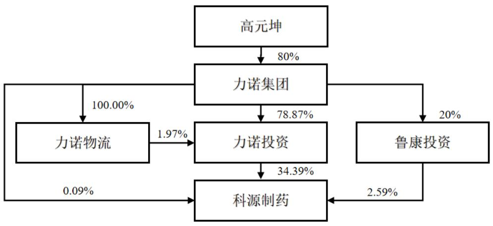

flowchart

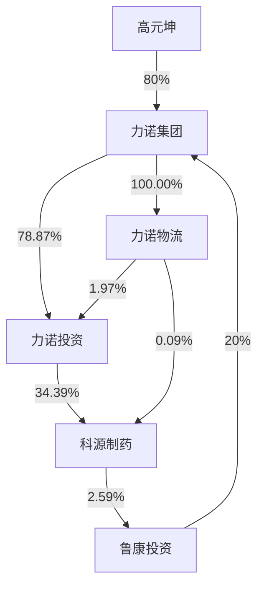
```mermaid
graph TD
  A["高元坤"] -->|80%| B["力诺集团"]
  B -->|78.87%| C["力诺投资"]
  C -->|34.39%| D["科源制药"]
  D -->|2.59%| E["鲁康投资"]
  E -->|20%| B
  B -->|100.00%| F["力诺物流"]
  F -->|1.97%| C
  F -->|0.09%| D
```

## （二）控股股东基本情况

截至本报告书签署日，力诺投资直接持有上市公司 34.39%的股份，为公司控股股东，其基本情况如下：

<table><tr><td>公司名称</td><td>力诺投资控股集团有限公司</td></tr><tr><td>统一社会信用代码</td><td>91370100744546671X</td></tr><tr><td>企业类型</td><td>其他有限责任公司</td></tr><tr><td>法定代表人</td><td>高元坤</td></tr><tr><td>成立时间</td><td>2002年11月21日</td></tr><tr><td>注册资本</td><td>43,180.00万元</td></tr><tr><td>实收资本</td><td>43,180.00万元</td></tr><tr><td>注册地址</td><td>中国(山东)自由贸易试验区济南片区经十东路30766号力诺科技园</td></tr><tr><td>经营范围</td><td>以自有资金投资及对投资项目的咨询(未经金融监管部门批准,不得从事吸收存款、融资担保、代客理财等金融业务);进出口业务;批发、零售;化学、化工产品(不含危险品),光伏产品。(依法须经批准的项目,经相关部门批准后方可开展经营活动)</td></tr></table>

## （三）实际控制人基本情况

截至本报告书签署日，高元坤先生为公司实际控制人，其个人简历如下：

高元坤先生，1958 年 2 月出生，中国国籍，无境外永久居留权，硕士研究生学历，1976 年 7 月至 1979 年 6 月，任沂南县轴承厂技术员；1979 年 6 月至1981 年 6 月，任沂南县银行印刷厂业务科科长；1981 年 6 月至 1984 年 10 月，任沂南县制鞋厂供销科科长、财务科科长；1984 年 10 月至 1986 年 4 月，任沂南县工业局供销科副科长；1986年4月至1987 年8月，在沂南县经委工作；1987年8月至1992年10 月，筹建鲁南医药玻璃总厂并任书记、厂长；1992 年10月至 1994 年 9 月，任山东省医疗器械研究所副所长；1994 年 9 月至 1997 年 8 月任济南三威有限责任公司总经理，1997年8 月至今，任力诺集团董事长兼总裁；2024年9月至今，任上市公司董事。

## 四、最近三十六个月的控制权变动情况

最近三十六个月内，上市公司控制权未发生变化，控股股东为力诺投资，实际控制人为高元坤先生。

## 五、最近三年重大资产重组情况

最近三年，上市公司不存在《重组管理办法》规定的重大资产重组的情况。

## 六、公司主营业务发展情况和主要财务指标

## （一）公司主营业务发展情况

公司主要从事化学原料药及其制剂产品的研发、生产和销售，自设立以来始终专注于化学原料药的研发和制造，并以特色原料药为基础，拓展部分化学药品制剂业务，致力于成为国内领先、具有国际竞争力的化学药品生产企业。

公司产品覆盖降糖类、麻醉类、心血管类及精神类等重点疾病领域。原料药产品主要包括格列齐特、盐酸二甲双胍、盐酸罗哌卡因、单硝酸异山梨酯等，化学药品制剂产品主要包括盐酸氟西汀分散片、单硝酸异山梨酯缓释片以及单硝酸异山梨酯片等产品，同时公司兼营部分中间体业务，主要销往国际客户。

## （二）公司主要财务指标

## 1、合并资产负债表主要数据

单位：万元

<table><tr><td>项目</td><td>2024 年 12 月 31 日</td><td>2023 年 12 月 31 日</td><td>2022 年 12 月 31 日</td></tr><tr><td>资产合计</td><td>155,247.43</td><td>146,996.80</td><td>65,178.92</td></tr><tr><td>负债合计</td><td>19,287.07</td><td>13,892.77</td><td>13,206.12</td></tr><tr><td>所有者权益合计</td><td>135,960.35</td><td>133,104.02</td><td>51,972.80</td></tr><tr><td>归属于母公司所有者权益</td><td>135,879.56</td><td>133,104.02</td><td>51,972.80</td></tr></table>

注：上市公司2022年、2023年及2024年的财务数据已经审计，下同。

## 2、合并利润表主要数据

单位：万元

<table><tr><td>项目</td><td>2024年度</td><td>2023年度</td><td>2022年度</td></tr><tr><td>营业收入</td><td>46,371.68</td><td>44,758.36</td><td>44,286.51</td></tr><tr><td>营业利润</td><td>6,826.26</td><td>8,011.66</td><td>9,817.14</td></tr><tr><td>利润总额</td><td>6,570.85</td><td>7,973.51</td><td>9,830.03</td></tr><tr><td>净利润</td><td>6,027.19</td><td>7,703.94</td><td>9,127.84</td></tr><tr><td>归属于母公司所有者的净利润</td><td>6,044.87</td><td>7,703.94</td><td>9,127.84</td></tr></table>

## 3、合并现金流量表主要数据

单位：万元

<table><tr><td>项目</td><td>2024年度</td><td>2023年度</td><td>2022年度</td></tr><tr><td>经营活动产生的现金流量净额</td><td>-6,051.58</td><td>3,703.10</td><td>11,585.87</td></tr><tr><td>投资活动产生的现金流量净额</td><td>-18,757.78</td><td>-60,212.66</td><td>-3,070.70</td></tr><tr><td>筹资活动产生的现金流量净额</td><td>1,506.90</td><td>73,980.80</td><td>-180.60</td></tr><tr><td>现金及现金等价物净增加额</td><td>-23,243.93</td><td>17,523.49</td><td>8,362.54</td></tr></table>

## 4、主要财务指标

<table><tr><td>项目</td><td>2024年12月31日/2024年度</td><td>2023年12月31日/2023年度</td><td>2022年12月31日/2022年度</td></tr><tr><td>基本每股收益(元/股)</td><td>0.56</td><td>0.76</td><td>1.57</td></tr><tr><td>稀释每股收益(元/股)</td><td>0.56</td><td>0.76</td><td>1.57</td></tr><tr><td>资产负债率</td><td>12.42%</td><td>9.45%</td><td>20.26%</td></tr><tr><td>毛利率</td><td>44.27%</td><td>47.25%</td><td>40.94%</td></tr><tr><td>净利率</td><td>13.00%</td><td>17.21%</td><td>20.61%</td></tr></table>

## 七、上市公司合法合规情况

（一）截至本报告书签署日，上市公司及其现任董事、高级管理人员不存在因涉嫌犯罪被司法机关立案侦查或涉嫌违法违规被中国证监会立案调查的情形。  
（二）截至本报告书签署日，上市公司及其控股股东、实际控制人最近十二个月内不存在受到证券交易所公开谴责或其他重大失信行为的情形。  
（三）截至本报告书签署日，上市公司及其现任董事、监事、高级管理人员最近三年不存在受到行政处罚（与证券市场明显无关的除外）或刑事处罚的情况。

## 第三节 交易对方基本情况

## 一、发行股份购买资产的交易对方

## （一）力诺投资

## 1、基本情况

<table><tr><td>公司名称</td><td>力诺投资控股集团有限公司</td></tr><tr><td>公司类型</td><td>有限责任公司</td></tr><tr><td>注册资本</td><td>43,180万元人民币</td></tr><tr><td>法定代表人</td><td>高元坤</td></tr><tr><td>成立日期</td><td>2002-11-21</td></tr><tr><td>注册地址</td><td>中国(山东)自由贸易试验区济南片区经十东路30766号力诺科技园</td></tr><tr><td>统一社会信用代码</td><td>91370100744546671X</td></tr><tr><td>经营范围</td><td>以自有资金投资及对投资项目的咨询(未经金融监管部门批准,不得从事吸收存款、融资担保、代客理财等金融业务);进出口业务;批发、零售;化学、化工产品(不含危险品),光伏产品。(依法须经批准的项目,经相关部门批准后方可开展经营活动)</td></tr></table>

## 2、历史沿革

## （1）2002 年 11 月，设立

2002 年 11 月，力诺投资设立，注册资本为 5,000 万元。其中力诺集团出资4,750万元，济南市化学医药国有资产经营管理有限公司（以下简称“化医公司”）出资250万元。股东及出资结构如下：

<table><tr><td>序号</td><td>股东名称</td><td>注册资本(万元)</td><td>出资比例</td></tr><tr><td>1</td><td>力诺集团</td><td>4,750.00</td><td>95.00%</td></tr><tr><td>2</td><td>济南市化学医药国有资产经营管理有限公司</td><td>250.00</td><td>5.00%</td></tr><tr><td colspan="2">合计</td><td>5,000.00</td><td>100.00%</td></tr></table>

## （2）2003 年 11 月，第一次增资

2003 年 11 月，力诺投资注册资本由 5,000 万元增加至 9,600 万元，其中力诺集团增资4,000万元，化医公司增资 600 万元。

本次增资后，股东及出资结构如下：

<table><tr><td>序号</td><td>股东名称</td><td>注册资本(万元)</td><td>出资比例</td></tr><tr><td>1</td><td>力诺集团</td><td>8,750.00</td><td>91.15%</td></tr><tr><td>2</td><td>济南市化学医药国有资产经营管理有限公司</td><td>850.00</td><td>8.85%</td></tr><tr><td colspan="2">合计</td><td>9,600.00</td><td>100.00%</td></tr></table>

## （3）2007年 9月，第一次转让

化医公司将所持 8.85%的股权划转给济南市国资委。本次转让后，股东及出资结构如下：

<table><tr><td>序号</td><td>股东名称</td><td>注册资本(万元)</td><td>出资比例</td></tr><tr><td>1</td><td>力诺集团</td><td>8,750.00</td><td>91.15%</td></tr><tr><td>2</td><td>济南市国资委</td><td>850.00</td><td>8.85%</td></tr><tr><td colspan="2">合计</td><td>9,600.00</td><td>100.00%</td></tr></table>

## （4）2010年 9月，第二次转让

济南市国资委所持 8.85%的股权划转给济南市投资控股有限公司（以下简称“济南投控”）。

本次转让后，股东及出资结构如下：

<table><tr><td>序号</td><td>股东名称</td><td>注册资本(万元)</td><td>出资比例</td></tr><tr><td>1</td><td>力诺集团</td><td>8,750.00</td><td>91.15%</td></tr><tr><td>2</td><td>济南市投资控股有限公司</td><td>850.00</td><td>8.85%</td></tr><tr><td colspan="2">合计</td><td>9,600.00</td><td>100.00%</td></tr></table>

## （5）2011 年 5 月，第三次股权转让

济南投控将所持 8.85%的股权挂牌转让给力诺物流。本次转让后，股东及出资结构如下：

<table><tr><td>序号</td><td>股东名称</td><td>注册资本(万元)</td><td>出资比例</td></tr><tr><td>1</td><td>力诺集团</td><td>8,750.00</td><td>91.15%</td></tr><tr><td>2</td><td>力诺物流</td><td>850.00</td><td>8.85%</td></tr><tr><td colspan="2">合计</td><td>9,600.00</td><td>100.00%</td></tr></table>

## （6）2013年 12月，第二次增资

力诺投资注册资本由 9,600万元增加至 41,600万元，其中力诺集团以债权转股增加注册资本20,000 万元，以货币增资 12,000万元。

本次增资后，股东及出资结构如下：

<table><tr><td>序号</td><td>股东名称</td><td>注册资本(万元)</td><td>出资比例</td></tr><tr><td>1</td><td>力诺集团</td><td>40,750.00</td><td>97.96%</td></tr><tr><td>2</td><td>力诺物流</td><td>850.00</td><td>2.04%</td></tr><tr><td colspan="2">合计</td><td>41,600.00</td><td>100.00%</td></tr></table>

## （7）2016年 8月，第三次增资

力诺投资注册资本由 41,600 万元增加至 43,180 万元，新增注册资本 1,580万元由济南财金投资控股集团有限公司（以下简称“济南金控”）以货币认购。本次增资后，股东及出资结构如下;

<table><tr><td>序号</td><td>股东名称</td><td>注册资本(万元)</td><td>出资比例</td></tr><tr><td>1</td><td>力诺集团</td><td>40,750.00</td><td>94.37%</td></tr><tr><td>2</td><td>济南财金投资控股集团有限公司</td><td>1,580.00</td><td>3.66%</td></tr><tr><td>3</td><td>力诺物流</td><td>850.00</td><td>1.97%</td></tr><tr><td colspan="2">合计</td><td>43,180.00</td><td>100.00%</td></tr></table>

## （8）2018年 11月，第四次转让

济南金控将所持 3.66%的股权转让给济南财金投资。本次转让后，股东及出资结构如下：

<table><tr><td>序号</td><td>股东名称</td><td>注册资本(万元)</td><td>出资比例</td></tr><tr><td>1</td><td>力诺集团</td><td>40,750.00</td><td>94.37%</td></tr><tr><td>2</td><td>济南财金投资</td><td>1,580.00</td><td>3.66%</td></tr><tr><td>3</td><td>力诺物流</td><td>850.00</td><td>1.97%</td></tr><tr><td colspan="2">合计</td><td>43,180.00</td><td>100.00%</td></tr></table>

## （9）2019年 12 月至 2022 年 1 月，第五次转让

济南财金投资将所持3.66%的股权转让给力诺集团。本次转让后，股东及出资结构如下：

<table><tr><td>序号</td><td>股东名称</td><td>注册资本(万元)</td><td>出资比例</td></tr><tr><td>1</td><td>力诺集团</td><td>42,330.00</td><td>98.03%</td></tr><tr><td>2</td><td>力诺物流</td><td>850.00</td><td>1.97%</td></tr><tr><td colspan="2">合计</td><td>43,180.00</td><td>100.00%</td></tr></table>

## （10）2020年 9月，第六次转让

力诺集团将所持 19.16%的股权转让给济南金控。本次转让后，股东及出资结构如下：

<table><tr><td>序号</td><td>股东名称</td><td>注册资本(万元)</td><td>出资比例</td></tr><tr><td>1</td><td>力诺集团</td><td>34,056.67</td><td>78.87%</td></tr><tr><td>2</td><td>济南金控</td><td>8,273.33</td><td>19.16%</td></tr><tr><td>3</td><td>力诺物流</td><td>850.00</td><td>1.97%</td></tr><tr><td colspan="2">合计</td><td>43,180.00</td><td>100.00%</td></tr></table>

## 3、产权结构及控制关系

截至本报告书签署日，力诺投资的股权结构如下：

<table><tr><td>序号</td><td>股东名称</td><td>认缴出资额(万元)</td><td>持股比例</td></tr><tr><td>1</td><td>力诺集团</td><td>34,056.67</td><td>78.87%</td></tr><tr><td>2</td><td>济南金投股权投资有限公司</td><td>5,721.35</td><td>13.25%</td></tr><tr><td>3</td><td>济南金投控股集团有限公司</td><td>2,551.98</td><td>5.91%</td></tr><tr><td>4</td><td>力诺物流</td><td>850.00</td><td>1.97%</td></tr><tr><td colspan="2">合计</td><td>43,180.00</td><td>100.00%</td></tr></table>

截至本报告书签署日，力诺集团持有力诺投资 78.87%的股权，为力诺投资的控股股东；高元坤先生直接持有力诺集团 80%股份，通过力诺集团及其全资子公司力诺物流合计控制力诺投资 80.84%股权，为力诺投资的实际控制人。力诺投资的产权控制关系如下：

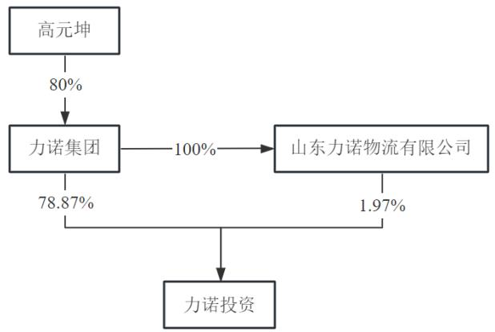

flowchart

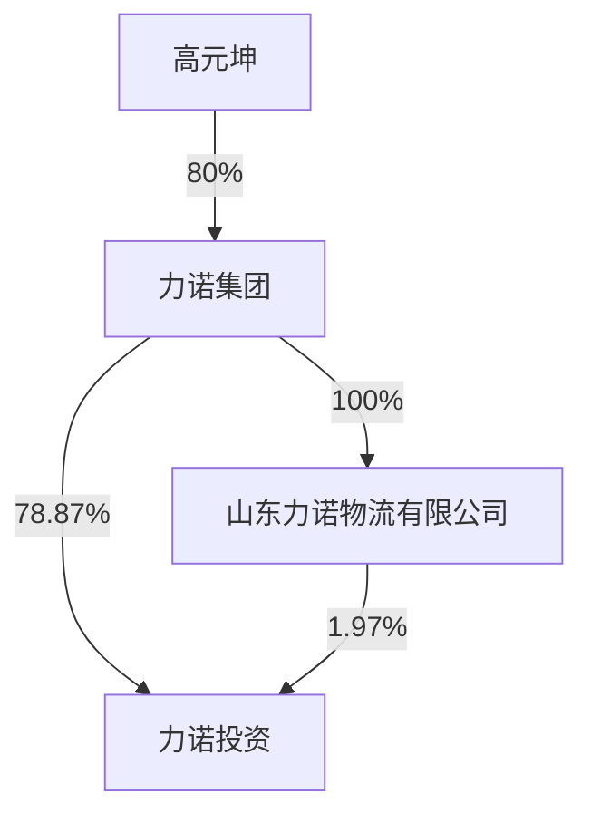
```mermaid
graph TD
  A["高元坤"] -->|80%| B["力诺集团"]
  B -->|100%| C["山东力诺物流有限公司"]
  B -->|78.87%| D["力诺投资"]
  C -->|1.97%| D
```

## 4、最近三年主营业务发展情况

力诺投资主营业务为股权投资。且最近三年主营业务无变更。

## 5、最近两年主要财务情况

力诺投资最近两年主要财务数据如下：

单位：万元

<table><tr><td>项目</td><td>2024年末/2024年度</td><td>2023年末/2023年度</td></tr><tr><td>资产总额</td><td>1,137,430.15</td><td>1,106,984.15</td></tr><tr><td>负债总额</td><td>490,707.93</td><td>382,941.76</td></tr><tr><td>净资产</td><td>646,722.22</td><td>724,042.39</td></tr><tr><td>营业收入</td><td>323,122.50</td><td>423,003.15</td></tr><tr><td>净利润</td><td>30,929.99</td><td>52,115.57</td></tr></table>

注：2023年财务数据已经审计；2024年财务数据未经审计。

## 6、下属企业情况

截至本报告书签署日，力诺投资主要下属企业如下：

<table><tr><td>序号</td><td>企业名称</td><td>注册资本/出资额(万元)</td><td>持股比例(%)</td><td>主营业务</td></tr><tr><td>1</td><td>山东科源制药股份有限公司</td><td>10,829.00</td><td>34.39</td><td>化学原料药</td></tr><tr><td>2</td><td>山东力诺医药包装股份有限公司</td><td>23,245.06</td><td>33.08</td><td>药用玻璃、耐热玻璃、电光源玻璃</td></tr><tr><td>3</td><td>山东宏济堂制药集团股份有限公司</td><td>28,587.67</td><td>38.36</td><td>中药生产</td></tr><tr><td>4</td><td>力诺电力集团股份有限公司</td><td>42,000.00</td><td>65.23</td><td>电力、热力、燃气及水生产和供应业</td></tr><tr><td>5</td><td>山东力诺电力设计咨询有限公司</td><td>30,000.00</td><td>65.23</td><td>科学研究和技术服务业</td></tr><tr><td>6</td><td>林州力诺太阳能电力工程有限公司</td><td>10,000.00</td><td>65.23</td><td>电力、热力、燃气及水生产和供应业</td></tr><tr><td>7</td><td>安阳力诺太阳能电力工程有限公司</td><td>9,000.00</td><td>65.23</td><td>电力、热力、燃气及水生产和供应业</td></tr><tr><td>8</td><td>西藏力诺太阳能电力有限公司</td><td>7,000.00</td><td>65.23</td><td>电力、热力、燃气及水生产和供应业</td></tr><tr><td>9</td><td>泉旭(上海)新能源科技有限公司</td><td>5,000.00</td><td>65.23</td><td>科学研究和技术服务业</td></tr><tr><td>10</td><td>山东蓝电电力有限公司</td><td>5,000.00</td><td>65.23</td><td>电力、热力、燃气及水生产和供应业</td></tr><tr><td>11</td><td>黄石力诺太阳能电力工程有限公司</td><td>5,000.00</td><td>65.23</td><td>电力、热力、燃气及水生产和供应业</td></tr><tr><td>12</td><td>兰坪旭升新能源科技有限公司</td><td>4,000.00</td><td>65.23</td><td>电力、热力、燃气及水生产和供应业</td></tr><tr><td>13</td><td>黑河市诺辉太阳能电力有限公司</td><td>4,000.00</td><td>65.23</td><td>电力、热力、燃气及水生产和供应业</td></tr><tr><td>14</td><td>兰坪力诺太阳能电力工程有限公司</td><td>4,000.00</td><td>65.23</td><td>电力、热力、燃气及水生产和供应业</td></tr></table>

## 7、是否属于私募投资基金及备案情况

力诺投资不存在以非公开方式向合格投资者募集资金设立的情形，其资产不存在由基金管理人管理、基金托管人进行托管的情形，亦不涉及从事私募投资基金管理活动的情形，无需办理私募投资基金或私募投资基金管理人登记备案手续。

## （二）力诺集团

## 1、基本情况

<table><tr><td>公司名称</td><td>力诺集团股份有限公司</td></tr><tr><td>公司类型</td><td>股份有限公司</td></tr><tr><td>注册资本</td><td>63,900万元人民币</td></tr><tr><td>法定代表人</td><td>高元坤</td></tr><tr><td>成立日期</td><td>1994-09-28</td></tr><tr><td>注册地址</td><td>中国(山东)自由贸易试验区济南片区经十东路30766号</td></tr><tr><td>统一社会信用代码</td><td>91370100264324770Q</td></tr><tr><td>经营范围</td><td>许可项目:热力生产和供应;发电业务、输电业务、供(配)电业务。(依法须经批准的项目,经相关部门批准后方可开展经营活动,具体经营项目以相关部门批准文件或许可证件为准)一般项目:非电力家用器具销售;太阳能热利用产品销售;光伏设备及元器件销售;服装辅料销售;日用品销售;新型建筑材料制造(不含危险化学品);工艺美术品及收藏品批发(象牙及其制品除外);包装专用设备销售;社会经济咨询服务;住房租赁;非居住房地产租赁;园区管理服务。(除依法须经批准的项目外,凭营业执照依法自主开展经营活动)</td></tr></table>

## 2、产权结构及控制关系

截至本报告书签署日，力诺集团的股权结构如下：

<table><tr><td>序号</td><td>股东姓名</td><td>认缴出资额(万元)</td><td>持股比例</td></tr><tr><td>1</td><td>高元坤</td><td>51,120.00</td><td>80.00%</td></tr><tr><td>2</td><td>申英明</td><td>12,780.00</td><td>20.00%</td></tr><tr><td colspan="2">合计</td><td>63,900.00</td><td>100.00%</td></tr></table>

截至本报告书签署日，高元坤持有力诺集团 80%的股权，为力诺集团的控股股东和实际控制人。力诺集团的产权控制关系如下：

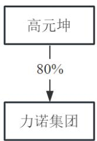

flowchart

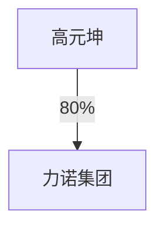
```mermaid
graph TD
  A["高元坤"] -->|80%| B["力诺集团"]
```

## 3、历史沿革

## （1）1994年 4月，设立

1994年4月，力诺集团设立。设立时公司名称为济南三威有限责任公司（以下简称“济南三威”）。注册资本为50.00 万元，公司股东为宿瞳、藏翠香以及申英明，出资结构如下：

<table><tr><td>序号</td><td>股东名称</td><td>注册资本(万元)</td><td>出资比例</td></tr><tr><td>1</td><td>宿瞳</td><td>27.50</td><td>55.00%</td></tr><tr><td>2</td><td>藏翠香</td><td>15.00</td><td>30.00%</td></tr><tr><td>3</td><td>申英明</td><td>7.50</td><td>15.00%</td></tr><tr><td colspan="2">合计</td><td>50.00</td><td>100.00%</td></tr></table>

## （2）1996 年 5 月，第一次增资

1996年5月，济南三威注册资本增至 198万元，系原股东同比例增资。

本次变更后，股东及出资结构如下：

<table><tr><td>序号</td><td>股东名称</td><td>注册资本(万元)</td><td>出资比例</td></tr><tr><td>1</td><td>宿瞳</td><td>108.90</td><td>55.00%</td></tr><tr><td>2</td><td>藏翠香</td><td>59.40</td><td>30.00%</td></tr><tr><td>3</td><td>申英明</td><td>39.70</td><td>15.00%</td></tr><tr><td colspan="2">合计</td><td>208.00</td><td>100.00%</td></tr></table>

## （3）1996年 8月，第一次转让

1996年8月，宿瞳将所持 55%股权（对应注册资本 108.9万元）转让给王士美。本次变更后，股东及出资结构如下：

<table><tr><td>序号</td><td>股东名称</td><td>注册资本(万元)</td><td>出资比例</td></tr><tr><td>1</td><td>王士美</td><td>108.90</td><td>55.00%</td></tr><tr><td>2</td><td>藏翠香</td><td>59.40</td><td>30.00%</td></tr><tr><td>3</td><td>申英明</td><td>39.70</td><td>15.00%</td></tr><tr><td colspan="2">合计</td><td>208.00</td><td>100.00%</td></tr></table>

## （4）1997年 9月，第二次增资

济南三威注册资本由 198万元增加至1,398 万元，系原股东同比例增资。

本次增资后，股东及出资结构如下：

<table><tr><td>序号</td><td>股东名称</td><td>注册资本(万元)</td><td>出资比例</td></tr><tr><td>1</td><td>王士美</td><td>768.90</td><td>55.00%</td></tr><tr><td>2</td><td>藏翠香</td><td>419.40</td><td>30.00%</td></tr><tr><td>3</td><td>申英明</td><td>209.70</td><td>15.00%</td></tr><tr><td colspan="2">合计</td><td>1,398.00</td><td>100.00%</td></tr></table>

## （5）1997 年 10 月，第二次股权转让

1997年10月，王士美将所持 55%的股权转让给高元坤，藏翠香将所持 30%的股权转让给丁振芝。

本次转让后，股东及出资结构如下：

<table><tr><td>序号</td><td>股东名称</td><td>注册资本(万元)</td><td>出资比例</td></tr><tr><td>1</td><td>高元坤</td><td>768.90</td><td>55.00%</td></tr><tr><td>2</td><td>丁振芝</td><td>419.40</td><td>30.00%</td></tr><tr><td>3</td><td>申英明</td><td>209.70</td><td>15.00%</td></tr><tr><td colspan="2">合计</td><td>1,398.00</td><td>100.00%</td></tr></table>

## （6）2001 年 3 月，第三次增资

2001年3月，力诺集团注册资本由 1,398 万元增加至5,001.36万元，原股东同比例增资。

本次转让后，股东出资结构如下：

<table><tr><td>序号</td><td>股东名称</td><td>注册资本(万元)</td><td>出资比例</td></tr><tr><td>1</td><td>高元坤</td><td>2,750.48</td><td>55.00%</td></tr><tr><td>2</td><td>丁振芝</td><td>1,500.41</td><td>30.00%</td></tr><tr><td>3</td><td>申英明</td><td>750.20</td><td>15.00%</td></tr><tr><td colspan="2">合计</td><td>5,001.09</td><td>100.00%</td></tr></table>

## （7）2002年 12月，第四次增资

力诺集团注册资本由5,001.36万元增加至63,688万元，系原股东同比例增资。本次增资后，股东出资结构如下：

<table><tr><td>序号</td><td>股东名称</td><td>注册资本(万元)</td><td>出资比例</td></tr><tr><td>1</td><td>高元坤</td><td>35,028.40</td><td>55.00%</td></tr><tr><td>2</td><td>丁振芝</td><td>19,100.40</td><td>30.00%</td></tr><tr><td>3</td><td>申英明</td><td>9,553.20</td><td>15.00%</td></tr><tr><td colspan="2">合计</td><td>63,682.00</td><td>100.00%</td></tr></table>

## （8）2007 年 11 月，股改

力诺集团整体变更为股份公司。

## （9）2014 年 1 月，第一次减资

丁振芝减资全部 19,106.40 万元股权，力诺集团注册资本从 63,688 万元减少至 44,581.6 万元。

本次减资后，股东出资结构如下：

<table><tr><td>序号</td><td>股东名称</td><td>注册资本(万元)</td><td>出资比例</td></tr><tr><td>1</td><td>高元坤</td><td>35,028.40</td><td>78.57%</td></tr><tr><td>2</td><td>申英明</td><td>9,553.20</td><td>21.43%</td></tr><tr><td colspan="2">合计</td><td>44,581.60</td><td>100.00%</td></tr></table>

## （10）2014 年 1 月，第五次增资

力诺集团注册资本由 44,581.6万元增至 63,900万元。其中高元坤以货币增资16,091.6 万元，申英明以货币增资 3,226.8 万元。

本次增资后，股东出资结构如下：

<table><tr><td>序号</td><td>股东名称</td><td>注册资本(万元)</td><td>出资比例</td></tr><tr><td>1</td><td>高元坤</td><td>51,120.00</td><td>80.00%</td></tr><tr><td>2</td><td>申英明</td><td>12,780.00</td><td>20.00%</td></tr><tr><td colspan="2">合计</td><td>63,900.00</td><td>100.00%</td></tr></table>

## 4、最近三年主营业务发展情况

力诺集团主营业务为股权投资。最近三年主营业务无变更。

## 5、最近两年主要财务情况

力诺集团最近两年主要财务数据如下：

单位：万元

<table><tr><td>项目</td><td>2024年末/2024年度</td><td>2023年末/2023年度</td></tr><tr><td>资产总额</td><td>1,977,141.67</td><td>2,002,348.44</td></tr><tr><td>负债总额</td><td>877,987.68</td><td>807,680.89</td></tr><tr><td>净资产</td><td>1,099,153.99</td><td>1,194,667.55</td></tr><tr><td>营业收入</td><td>950,326.99</td><td>941,993.98</td></tr><tr><td>净利润</td><td>53,958.98</td><td>73,162.19</td></tr></table>

注：2023年财务数据已经审计；2024年财务数据未经审计。

## 6、下属企业情况

截至本报告书签署日，力诺集团主要下属企业如下：

<table><tr><td>序号</td><td>企业名称</td><td>注册资本/出资额(万元)</td><td>持股比例(%)</td><td>主营业务</td></tr><tr><td>1</td><td>力诺投资控股集团有限公司</td><td>43,180.00</td><td>78.87%</td><td>股权投资</td></tr><tr><td>2</td><td>力诺集团(上海)有限公司</td><td>50,000.00</td><td>100.00%</td><td>货物及技术的进口业务,生物科技领域内的技术咨询、技术服务</td></tr><tr><td>3</td><td>力诺电力集团股份有限公司</td><td>42,000.00</td><td>16.97%</td><td>太阳能、风能电力开发、生产、售电服务</td></tr><tr><td>4</td><td>力诺集团(上海)控股有限公司</td><td>30,000.00</td><td>10.00%</td><td>资产管理、实业投资</td></tr><tr><td>5</td><td>武汉双虎涂料股份有限公司</td><td>22,000.00</td><td>72.73%</td><td>油漆涂料</td></tr><tr><td>6</td><td>山东力诺新能源发展有限公司</td><td>21,000.00</td><td>100.00%</td><td>新能源技术研发、设备销售</td></tr><tr><td>7</td><td>禾锋融资租赁(上海)有限公司</td><td>20,000.00</td><td>75.00%</td><td>融资租赁业务</td></tr><tr><td>8</td><td>山东力诺太阳能电力股份有限公司</td><td>13,306.62</td><td>98.12%</td><td>硅材料、太阳能电池、太阳能应用产品及组件</td></tr><tr><td>9</td><td>山东力诺新能源科技有限公司</td><td>10,000.00</td><td>100.00%</td><td>环保节能设备的技术开发、技术推广、技术服务</td></tr><tr><td>10</td><td>山东力诺智慧园科技有限公司</td><td>10,000.00</td><td>100.00%</td><td>技术服务、技术开发</td></tr><tr><td>11</td><td>力诺(山东)绿色能源科技有限公司</td><td>13,300.00</td><td>100.00%</td><td>节能技术研发、制冷设备销售</td></tr></table>

## 7、是否属于私募投资基金及备案情况

力诺集团不存在以非公开方式向合格投资者募集资金设立的情形，济南财投新动能的资产不存在由基金管理人管理、基金托管人进行托管的情形，亦不涉及从事私募投资基金管理活动的情形，无需办理私募投资基金或私募投资基金管理人登记备案手续。

## （三）济南财投新动能

## 1、基本情况

<table><tr><td>公司名称</td><td>济南财投新动能投资管理有限公司</td></tr><tr><td>公司类型</td><td>有限责任公司</td></tr><tr><td>注册资本</td><td>500,000万元人民币</td></tr><tr><td>法定代表人</td><td>全宇中</td></tr><tr><td>成立日期</td><td>2020-09-27</td></tr><tr><td>注册地址</td><td>中国(山东)自由贸易试验区济南片区经十路7000号汉峪金谷A4-5号楼22层</td></tr><tr><td>统一社会信用代码</td><td>91370100MA3U3Q779L</td></tr><tr><td>经营范围</td><td>一般项目:以自有资金从事投资活动;财务咨询;信息技术咨询服务;技术服务、技术开发、技术咨询、技术交流、技术转让、技术推广;货物进出口;技术进出口;创业空间服务。(除依法须经批准的项目外,凭营业执照依法自主开展经营活动)</td></tr></table>

## 2、历史沿革

## （1）2020 年 9 月，设立

2020 年 9 月，济南财投新动能设立。注册资本为 100,000.00 万元，公司股东为济南市财政投资基金控股集团有限公司，股东及出资结构如下：

<table><tr><td>序号</td><td>股东名称</td><td>注册资本(万元)</td><td>出资比例</td></tr><tr><td>1</td><td>济南市财政投资基金控股集团有限公司</td><td>100,000.00</td><td>100.00%</td></tr><tr><td colspan="2">合计</td><td>100,000.00</td><td>100.00%</td></tr></table>

## （2）2021年 3月，第一次增资

2021 年 3 月，济南财投新动能注册资本增至 500,000.00 万元，新增的认缴出资额均由济南市财政投资基金控股集团有限公司认缴。

本次变更后，股东及出资结构如下：

<table><tr><td>序号</td><td>股东名称</td><td>注册资本(万元)</td><td>出资比例</td></tr><tr><td>1</td><td>济南市财政投资基金控股集团有限公司</td><td>500,000.00</td><td>100.00%</td></tr><tr><td colspan="2">合计</td><td>500,000.00</td><td>100.00%</td></tr></table>

## 3、产权控制关系

截至本报告书签署日，济南市财投基金持有济南财投新动能 100%的股权，为济南财投新动能的控股股东；济南市财政局通过济南财金投资控股集团有限公司、济南财投基金持有济南财投新动能 100%股权，为济南财投新动能的实际控制人。济南财投新动能的产权控制关系如下：

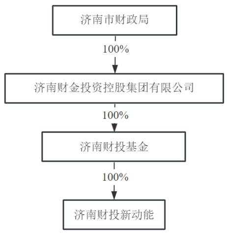

flowchart

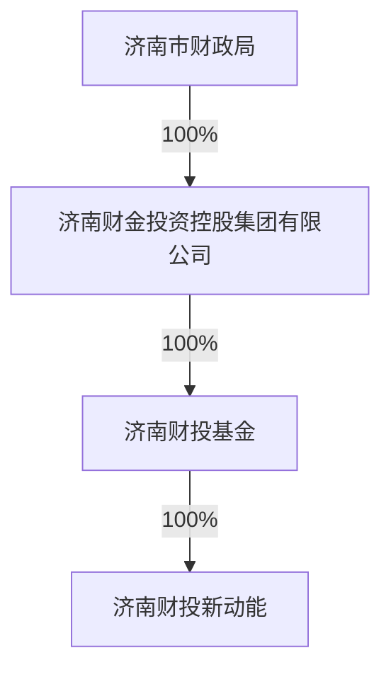
```mermaid
graph TD
  A["济南市财政局"] -->|100%| B["济南财金投资控股集团有限公司"]
  B -->|100%| C["济南财投基金"]
  C -->|100%| D["济南财投新动能"]
```

## 4、最近三年主营业务发展情况

济南财投新动能主营业务为以自有资金从事投资活动、财务咨询、信息技术咨询服务等；最近三年主营业务无变更。

## 5、最近两年主要财务情况

济南财投新动能最近两年主要财务数据如下：

单位：万元

<table><tr><td>项目</td><td>2024年末/2024年度</td><td>2023年末/2023年度</td></tr><tr><td>资产总额</td><td>399,257.12</td><td>473,911.46</td></tr><tr><td>负债总额</td><td>2,281.89</td><td>2,702.91</td></tr><tr><td>净资产</td><td>396,975.23</td><td>471,208.55</td></tr><tr><td>营业收入</td><td>4,718.62</td><td>10,006.15</td></tr><tr><td>净利润</td><td>3,773.83</td><td>3,111.79</td></tr></table>

注：财务数据未经审计。

## 6、下属企业情况

截至本报告书签署日，济南财投新动能不存在控制的下属企业。

## 7、是否属于私募投资基金及备案情况

济南财投新动能不存在以非公开方式向合格投资者募集资金设立的情形，济南财投新动能的资产不存在由基金管理人管理、基金托管人进行托管的情形，亦不涉及从事私募投资基金管理活动的情形，无需办理私募投资基金或私募投资基金管理人登记备案手续。

## （四）济南财金投资

## 1、基本情况

<table><tr><td>公司名称</td><td>济南财金投资有限公司</td></tr><tr><td>公司类型</td><td>有限责任公司</td></tr><tr><td>注册资本</td><td>340,000万元人民币</td></tr><tr><td>法定代表人</td><td>徐冉</td></tr><tr><td>成立日期</td><td>2014-11-18</td></tr><tr><td>注册地址</td><td>中国(山东)自由贸易试验区济南片区经十路7000号汉峪金谷A4-5号楼16层1606室</td></tr><tr><td>统一社会信用代码</td><td>91370100306992081P</td></tr><tr><td>经营范围</td><td>从事政府授权范围内的国有资产投资、管理、运营;国有股权投资、管理;为企业提供管理服务。(依法须经批准的项目,经相关部门批准后方可开展经营活动)</td></tr></table>

## 2、历史沿革

## （1）2014 年 11 月，设立

2014 年 11 月，济南财金投资设立。注册资本为 100,000 万元人民币，公司股东为济南财金投资控股集团有限公司、济南西城投资开发集团有限公司、济南城市建设投资集团有限公司、济南市历下区政府投融资管理中心、济南滨河新区建设投资集团有限公司、济南旧城开发投资集团有限公司、济南高新控股集团有限公司、济南西城投资发展有限公司、济南市槐荫区财政局，股东及出资结构如下：

<table><tr><td>序号</td><td>股东名称</td><td>注册资本(万元)</td><td>出资比例</td></tr><tr><td>1</td><td>济南财金投资控股集团有限公司</td><td>20,000.00</td><td>20.00%</td></tr><tr><td>2</td><td>济南西城投资开发集团有限公司</td><td>17,500.00</td><td>17.50%</td></tr><tr><td>3</td><td>济南城市建设投资集团有限公司</td><td>15,000.00</td><td>15.00%</td></tr><tr><td>4</td><td>济南市历下区政府投融资管理中心</td><td>15,000.00</td><td>15.00%</td></tr><tr><td>5</td><td>济南滨河新区建设投资集团有限公司</td><td>10,000.00</td><td>10.00%</td></tr><tr><td>6</td><td>济南旧城开发投资集团有限公司</td><td>10,000.00</td><td>10.00%</td></tr><tr><td>7</td><td>济南高新控股集团有限公司</td><td>5,000.00</td><td>5.00%</td></tr><tr><td>8</td><td>济南西城投资发展有限公司</td><td>5,000.00</td><td>5.00%</td></tr><tr><td>9</td><td>济南市槐荫区财政局</td><td>2,500.00</td><td>2.50%</td></tr><tr><td colspan="2">合计</td><td>100,000.00</td><td>100.00%</td></tr></table>

## （2）2016年 4月，第一次转让

2016年4月，济南市槐荫区财政局将 2.50%的股权（对应注册资本 2,500万元）转让给济南槐荫财金投资有限责任公司。济南市历下区政府投融资管理中心更名为济南市历下区财政投资评审中心。

本次变更后，股东及出资结构如下：

<table><tr><td>序号</td><td>股东名称</td><td>注册资本(万元)</td><td>出资比例</td></tr><tr><td>1</td><td>济南财金投资控股集团有限公司</td><td>20,000.00</td><td>20.00%</td></tr><tr><td>2</td><td>济南西城投资开发集团有限公司</td><td>17,500.00</td><td>17.50%</td></tr><tr><td>3</td><td>济南城市建设投资集团有限公司</td><td>15,000.00</td><td>15.00%</td></tr><tr><td>4</td><td>济南市历下区财政投资评审中心</td><td>15,000.00</td><td>15.00%</td></tr><tr><td>5</td><td>济南滨河新区建设投资集团有限公司</td><td>10,000.00</td><td>10.00%</td></tr><tr><td>6</td><td>济南旧城开发投资集团有限公司</td><td>10,000.00</td><td>10.00%</td></tr><tr><td>7</td><td>济南高新控股集团有限公司</td><td>5,000.00</td><td>5.00%</td></tr><tr><td>8</td><td>济南西城投资发展有限公司</td><td>5,000.00</td><td>5.00%</td></tr><tr><td>9</td><td>济南槐荫财金投资有限责任公司</td><td>2,500.00</td><td>2.50%</td></tr><tr><td colspan="2">合计</td><td>100,000.00</td><td>100.00%</td></tr></table>

## （3）2017 年 1 月，第二次转让，第一次增资

2017年1月，济南高新控股集团有限公司 5%的股权无偿划转给济南高新财金投资有限公司。济南财金投资注册资本增至 171,000万元，其中济南财金投资控股集团有限公司出资 34,200万元，其他股东出资 36,800万元。

本次变更后，股东及出资结构如下：

<table><tr><td>序号</td><td>股东名称</td><td>注册资本(万元)</td><td>出资比例</td></tr><tr><td>1</td><td>济南财金投资控股集团有限公司</td><td>54,200.00</td><td>31.70%</td></tr><tr><td>2</td><td>济南西城投资开发集团有限公司</td><td>25,550.00</td><td>14.94%</td></tr><tr><td>3</td><td>济南城市建设投资集团有限公司</td><td>21,900.00</td><td>12.81%</td></tr><tr><td>4</td><td>济南滨河新区建设投资集团有限公司</td><td>18,050.00</td><td>10.56%</td></tr><tr><td>5</td><td>济南市历下区财政投资评审中心</td><td>15,000.00</td><td>8.77%</td></tr><tr><td>6</td><td>济南旧城开发投资集团有限公司</td><td>14,600.00</td><td>8.54%</td></tr><tr><td>7</td><td>济南高新财金投资有限公司</td><td>11,900.00</td><td>6.96%</td></tr><tr><td>8</td><td>济南西城投资发展有限公司</td><td>7,300.00</td><td>4.27%</td></tr><tr><td>9</td><td>济南槐荫财金投资有限责任公司</td><td>2,500.00</td><td>1.46%</td></tr><tr><td colspan="2">合计</td><td>171,000.00</td><td>100.00%</td></tr></table>

## （4）2018年 10月，第二次增资

2018 年 10 月，济南财金投资注册资本增至 340,000 万元。其中济南金融控股集团有限公司认缴新增注册资本 103,500 万元，济南市股权投资母基金有限公司认缴新增注册资本 26,600 万元，济南历城控股集团有限公司认缴新增注册资本29,200万元，济南高新财金投资有限公司认缴新增注册资本 9,700 万元。

本次变更后，股东及出资结构如下：

<table><tr><td>序号</td><td>股东名称</td><td>注册资本(万元)</td><td>出资比例</td></tr><tr><td>1</td><td>济南金融控股集团有限公司</td><td>157,700.00</td><td>46.38%</td></tr><tr><td>2</td><td>济南历城控股集团有限公司</td><td>29,200.00</td><td>8.59%</td></tr><tr><td>3</td><td>济南市股权投资母基金有限公司</td><td>26,600.00</td><td>7.82%</td></tr><tr><td>4</td><td>济南西城投资开发集团有限公司</td><td>25,550.00</td><td>7.51%</td></tr><tr><td>5</td><td>济南城市建设投资集团有限公司</td><td>21,900.00</td><td>6.44%</td></tr><tr><td>6</td><td>济南高新财金投资有限公司</td><td>21,600.00</td><td>6.35%</td></tr><tr><td>7</td><td>济南滨河新区建设投资集团有限公司</td><td>18,050.00</td><td>5.31%</td></tr><tr><td>8</td><td>济南市历下区财政投资评审中心</td><td>15,000.00</td><td>4.41%</td></tr><tr><td>9</td><td>济南旧城开发投资集团有限公司</td><td>14,600.00</td><td>4.29%</td></tr><tr><td>10</td><td>济南西城投资发展有限公司</td><td>7,300.00</td><td>2.15%</td></tr><tr><td>11</td><td>济南槐荫财金投资有限责任公司</td><td>2,500.00</td><td>0.74%</td></tr><tr><td colspan="2">合计</td><td>340,000.00</td><td>100.00%</td></tr></table>

## （5）2023年 12月，第三次转让

2023 年 12 月，济南市历下区财政投资评审中心将 4.4118%的股权划转至历下区国企国资发展促进中心，历下区国企国资发展促进中心将 4.4118%的出资额协议转让给济南历下财鑫投资基金管理集团有限公司。

本次变更后，股东及出资结构如下：

<table><tr><td>序号</td><td>股东名称</td><td>注册资本(万元)</td><td>出资比例</td></tr><tr><td>1</td><td>济南金融控股集团有限公司</td><td>157,700.00</td><td>46.38%</td></tr><tr><td>2</td><td>济南历城控股集团有限公司</td><td>29,200.00</td><td>8.59%</td></tr><tr><td>3</td><td>济南市股权投资母基金有限公司</td><td>26,600.00</td><td>7.82%</td></tr><tr><td>4</td><td>济南西城投资开发集团有限公司</td><td>25,550.00</td><td>7.51%</td></tr><tr><td>5</td><td>济南城市建设投资集团有限公司</td><td>21,900.00</td><td>6.44%</td></tr><tr><td>6</td><td>济南高新财金投资有限公司</td><td>21,600.00</td><td>6.35%</td></tr><tr><td>7</td><td>济南滨河新区建设投资集团有限公司</td><td>18,050.00</td><td>5.31%</td></tr><tr><td>8</td><td>济南历下财鑫投资基金管理集团有限公司</td><td>15,000.00</td><td>4.41%</td></tr><tr><td>9</td><td>济南旧城开发投资集团有限公司</td><td>14,600.00</td><td>4.29%</td></tr><tr><td>10</td><td>济南西城投资发展有限公司</td><td>7,300.00</td><td>2.15%</td></tr><tr><td>11</td><td>济南槐荫财金投资有限责任公司</td><td>2,500.00</td><td>0.74%</td></tr><tr><td colspan="2">合计</td><td>340,000.00</td><td>100.00%</td></tr></table>

## 3、产权控制关系

截至本报告书签署日，济南金投控股集团有限公司直接并通过济南市股权投资母基金有限公司合计持有济南财金投资 54.20%的股权，为济南财金投资的控股股东；济南市财政局持有济南财金投资控股集团有限公司 100%股权，为济南财金投资的实际控制人。济南财金投资的产权控制关系如下：

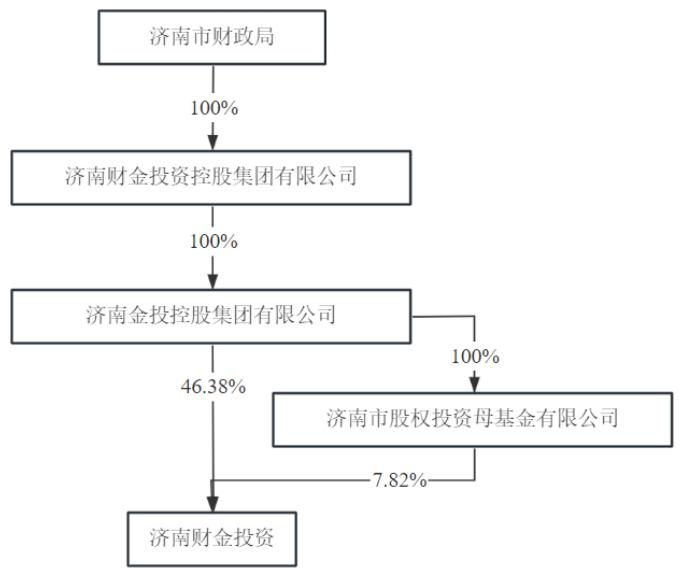

flowchart

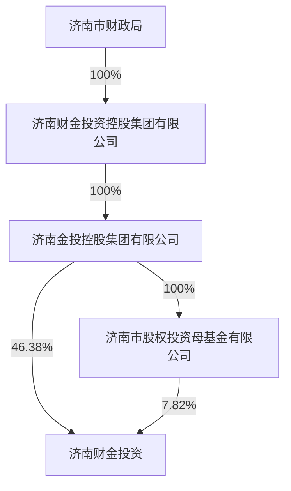
```mermaid
graph TD
  A["济南市财政局"] -->|100%| B["济南财金投资控股集团有限公司"]
  B -->|100%| C["济南金投控股集团有限公司"]
  C -->|46.38%| D["济南财金投资"]
  C -->|100%| E["济南市股权投资母基金有限公司"]
  E -->|7.82%| D
```

## 4、最近三年主营业务发展情况

济南财金投资主营业务为从事政府授权范围内的国有资产投资、管理、运营，国有股权投资、管理，为企业提供管理服务；最近三年主营业务无变更。

## 5、最近两年主要财务情况

济南财金投资最近两年主要财务数据如下：

单位：万元

<table><tr><td>项目</td><td>2024年末/2024年度</td><td>2023年末/2023年度</td></tr><tr><td>资产总额</td><td>550,620.68</td><td>517,996.85</td></tr><tr><td>负债总额</td><td>75,013.96</td><td>75,351.33</td></tr><tr><td>净资产</td><td>475,606.72</td><td>442,645.52</td></tr><tr><td>营业收入</td><td>25,486.27</td><td>15,386.34</td></tr><tr><td>净利润</td><td>15,288.82</td><td>4,680.57</td></tr></table>

注：财务数据未经审计。

## 6、下属企业情况

截至本报告书签署日，济南财金投资控制的主要下属企业如下：

<table><tr><td>序号</td><td>企业名称</td><td>注册资本/出资额(万元)</td><td>持股比例(%)</td><td>主营业务</td></tr><tr><td>1</td><td>济南财金工信投资有限公司</td><td>22,000.00</td><td>100.00</td><td>企业自有资金对外投资</td></tr><tr><td>2</td><td>济南金控资产运营有限公司</td><td>114,500.00</td><td>52.8204</td><td>资产管理服务、对外投资</td></tr></table>

## 7、是否属于私募投资基金及备案情况

济南财金投资不存在以非公开方式向合格投资者募集资金设立的情形，济南财金投资的资产不存在由基金管理人管理、基金托管人进行托管的情形，亦不涉及从事私募投资基金管理活动的情形，无需办理私募投资基金或私募投资基金管理人登记备案手续。

## （五）济南鑫控

## 1、基本情况

<table><tr><td>企业名称</td><td>济南鑫控股权投资母基金合伙企业(有限合伙)</td></tr><tr><td>企业类型</td><td>有限合伙企业</td></tr><tr><td>出资额</td><td>1,000,000万元人民币</td></tr><tr><td>执行事务合伙人</td><td>济南财金投资管理有限公司</td></tr><tr><td>成立日期</td><td>2021-11-08</td></tr><tr><td>主要经营场所</td><td>中国(山东)自由贸易试验区济南片区经十路7000号汉峪金融中心四区4号楼3层303-10室</td></tr><tr><td>统一社会信用代码</td><td>91370100MA7CB0T995</td></tr><tr><td>经营范围</td><td>一般项目:私募股权投资基金管理、创业投资基金管理服务(须在中国证券投资基金业协会完成登记备案后方可从事经营活动);以自有资金从事投资活动。(除依法须经批准的项目外,凭营业执照依法自主开展经营活动)</td></tr></table>

## 2、历史沿革

## （1）2021 年 11 月，设立

2021 年 11 月，济南鑫控设立。出资额为 1,000,000.00 万元，有限合伙人为济南金投控股集团有限公司、君道(北京)控股有限公司，普通合伙人为济南财金投资管理有限公司，合伙人及出资结构如下：

<table><tr><td>序号</td><td>合伙人名称</td><td>合伙人类型</td><td>出资额(万元)</td><td>出资比例</td></tr><tr><td>1</td><td>济南财金投资管理有限公司</td><td>普通合伙人</td><td>1,000.00</td><td>0.10%</td></tr><tr><td>2</td><td>济南金投控股集团有限公司</td><td>有限合伙人</td><td>998,000.00</td><td>99.80%</td></tr><tr><td>3</td><td>君道(北京)控股有限公司</td><td>有限合伙人</td><td>1,000.00</td><td>0.10%</td></tr><tr><td colspan="3">合计</td><td>1,000,000.00</td><td>100.00%</td></tr></table>

## 3、产权控制关系

截至本报告书签署日，济南市财政局通过济南财金投资控股集团有限公司、济南财投基金控制济南鑫控执行事务合伙人济南财金投资管理有限公司 100%股权，为济南鑫控实际控制人。济南鑫控的产权控制关系如下：

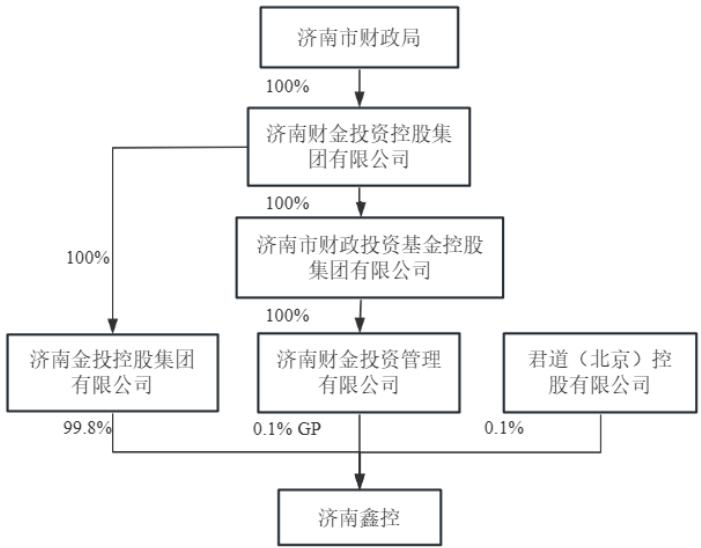

flowchart

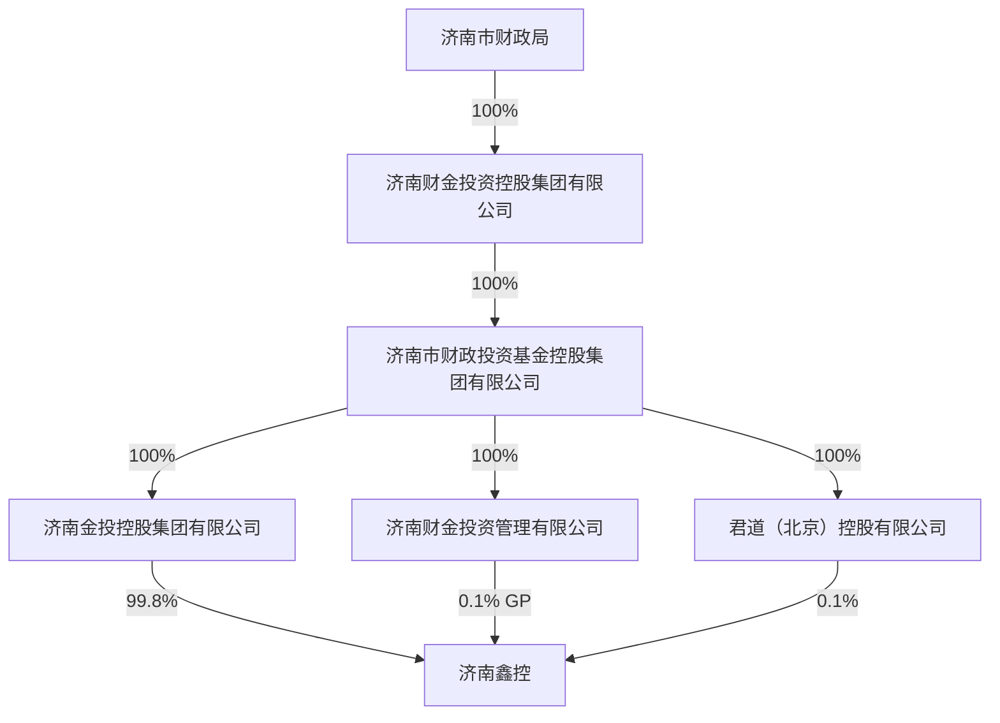
```mermaid
graph TD
  A["济南市财政局"] -->|100%| B["济南财金投资控股集团有限公司"]
  B -->|100%| C["济南市财政投资基金控股集团有限公司"]
  C -->|100%| D["济南金投控股集团有限公司"]
  C -->|100%| E["济南财金投资管理有限公司"]
  C -->|100%| F["君道（北京）控股有限公司"]
  D -->|99.8%| G["济南鑫控"]
  E -->|0.1% GP| G
  F -->|0.1%| G
```

## 4、最近三年主营业务发展情况

济南鑫控主营业务为私募股权投资基金管理、创业投资基金管理服务；最近三年主营业务无变更。

## 5、最近两年主要财务情况

济南鑫控最近两年主要财务数据如下：

单位：万元

<table><tr><td>项目</td><td>2024年末/2024年度</td><td>2023年末/2023年度</td></tr><tr><td>资产总额</td><td>52,192.36</td><td>50,903.93</td></tr><tr><td>负债总额</td><td>-</td><td>99.15</td></tr><tr><td>净资产</td><td>52,192.36</td><td>50,804.78</td></tr><tr><td>营业收入</td><td>1,325.09</td><td>578.74</td></tr><tr><td>净利润</td><td>1,276.28</td><td>526.61</td></tr></table>

注：财务数据未经审计。

## 6、下属企业情况

截至本报告书签署日，济南鑫控不存在控制的下属企业。

## 7、是否属于私募投资基金及备案情况

济南鑫控为合伙型私募基金，已在中国基金业协会登记为私募基金（登记编号为 STL501）。

## （六）厦门德福悦安

## 1、基本情况

<table><tr><td>企业名称</td><td>厦门德福悦安投资合伙企业(有限合伙)</td></tr><tr><td>企业类型</td><td>有限合伙企业</td></tr><tr><td>出资额</td><td>274,412.5万元人民币</td></tr><tr><td>执行事务合伙人</td><td>厦门德福投资咨询合伙企业(有限合伙)</td></tr><tr><td>成立日期</td><td>2020-11-13</td></tr><tr><td>主要经营场所</td><td>厦门市集美区杏林湾路492号2104单元B26</td></tr><tr><td>统一社会信用代码</td><td>91350211MA3525LA7C</td></tr><tr><td>经营范围</td><td>一般项目:以自有资金从事投资活动。(除依法须经批准的项目外,凭营业执照依法自主开展经营活动)。</td></tr></table>

## 2、历史沿革

## （1）2020 年 11 月，设立

2020年11月，厦门德福悦安设立。普通合伙人为厦门德福投资咨询合伙企业（有限合伙），有限合伙人为广州德福投资咨询合伙企业（有限合伙）。合伙人及出资结构如下：

<table><tr><td>序号</td><td>合伙人名称</td><td>合伙人类型</td><td>出资额(万元)</td><td>出资比例</td></tr><tr><td>1</td><td>厦门德福投资咨询合伙企业(有限合伙)</td><td>普通合伙人</td><td>100.00</td><td>1.00%</td></tr><tr><td>2</td><td>广州德福投资咨询合伙企业(有限合伙)</td><td>有限合伙人</td><td>9,900.00</td><td>99.00%</td></tr><tr><td colspan="3">合计</td><td>10,000.00</td><td>100.00%</td></tr></table>

## （2）2020 年 12 月，第一次增资、第一次转让

2020 年 12 月，广州德福投资咨询合伙企业(有限合伙)将厦门德福悦安 99%出资额转让给厦门德福三期股权投资基金合伙企业(有限合伙)。同时厦门德福悦安出资额增至 20,000.00 万元。新增的认缴出资额由厦门德福三期股权投资基金合伙企业(有限合伙)以货币形式认缴 9,900.00 万元，厦门德福投资咨询合伙企业(有限合伙)以货币形式认缴 100 万元。

本次变更后，合伙人及出资结构如下：

<table><tr><td>序号</td><td>合伙人名称</td><td>合伙人类型</td><td>出资额(万元)</td><td>出资比例</td></tr><tr><td>1</td><td>厦门德福投资咨询合伙企业(有限合伙)</td><td>普通合伙人</td><td>200.00</td><td>1.00%</td></tr><tr><td>2</td><td>厦门德福三期股权投资基金合伙企业(有限合伙)</td><td>有限合伙人</td><td>19,800.00</td><td>99.00%</td></tr><tr><td colspan="3">合计</td><td>20,000.00</td><td>100.00%</td></tr></table>

## （3）2021年 1月，第二次增资、第二次转让

2021年1月，厦门德福投资咨询合伙企业（有限合伙）将厦门德福悦安 0.50%出资额转让给厦门德福三期股权投资基金合伙企业(有限合伙)。同时厦门德福悦安出资额增至100,100.00 万元，新增的认缴出资额由合伙人厦门德福三期股权投资基金合伙企业(有限合伙)以货币形式认缴 80,100.00万元。

本次变更后，合伙人及出资结构如下：

<table><tr><td>序号</td><td>合伙人名称</td><td>合伙人类型</td><td>出资额(万元)</td><td>出资比例</td></tr><tr><td>1</td><td>厦门德福投资咨询合伙企业(有限合伙)</td><td>普通合伙人</td><td>100.00</td><td>0.10%</td></tr><tr><td>2</td><td>厦门德福三期股权投资基金合伙企业(有限合伙)</td><td>有限合伙人</td><td>100,000.00</td><td>99.90%</td></tr><tr><td colspan="3">合计</td><td>100,100.00</td><td>100.00%</td></tr></table>

## （4）2021年 12月，第三次增资、第三次转让

2021 年 12 月，厦门德福投资咨询合伙企业（有限合伙）将 0.0989%出资额转让给济南德福三期股权投资基金合伙企业（有限合伙）。厦门德福悦安认缴出资额由100,100.00 万元增加至162,101.00万元，其中厦门德福三期股权投资基金合伙企业（有限合伙）以货币形式认缴 12,100.00 万元；济南德福三期股权投资基金合伙企业（有限合伙）以货币形式认缴 49,901.00万元。

本次变更后，合伙人及出资结构如下：

<table><tr><td>序号</td><td>合伙人名称</td><td>合伙人类型</td><td>出资额(万元)</td><td>出资比例</td></tr><tr><td>1</td><td>厦门德福投资咨询合伙企业(有限合伙)</td><td>普通合伙人</td><td>1.00</td><td>0.001%</td></tr><tr><td>2</td><td>厦门德福三期股权投资基金合伙企业(有限合伙)</td><td>有限合伙人</td><td>112,100.00</td><td>69.15%</td></tr><tr><td>3</td><td>济南德福三期股权投资基金合伙企业(有限合伙)</td><td>有限合伙人</td><td>50,000.00</td><td>30.84%</td></tr><tr><td colspan="3">合计</td><td>162,101.00</td><td>100.00%</td></tr></table>

## （5）2024年 4月，第四次增资

2024 年 4 月，厦门德福悦安认缴出资额由 162,101.00 万元增加至 274,412.50万元，厦门德福三期股权投资基金合伙企业（有限合伙）名称变更为烟台德福三期股权投资基金合伙企业（有限合伙）。本次变更后，合伙人及出资结构如下：

<table><tr><td>序号</td><td>合伙人名称</td><td>合伙人类型</td><td>出资额(万元)</td><td>出资比例</td></tr><tr><td>1</td><td>厦门德福投资咨询合伙企业(有限合伙)</td><td>普通合伙人</td><td>1.00</td><td>0.0004%</td></tr><tr><td>2</td><td>烟台德福三期股权投资基金合伙企业(有限合伙)</td><td>有限合伙人</td><td>169,256.50</td><td>61.68%</td></tr><tr><td>3</td><td>济南德福三期股权投资基金合伙企业(有限合伙)</td><td>有限合伙人</td><td>105,155.00</td><td>38.32%</td></tr><tr><td colspan="3">合计</td><td>274,412.50</td><td>100.00%</td></tr></table>

## 3、产权控制关系

截至本报告书签署日，厦门德福悦安的执行事务合伙人为厦门德福投资咨询合伙企业（有限合伙）；侯明通过北京德福投资有限公司控制厦门德福投资咨询合伙企业（有限合伙）之执行事务合伙人广州德福投资管理有限公司，并直接持有厦门德福投资咨询合伙企业（有限合伙）99%合伙企业份额，为厦门德福悦安的实际控制人。其产权控制关系如下：

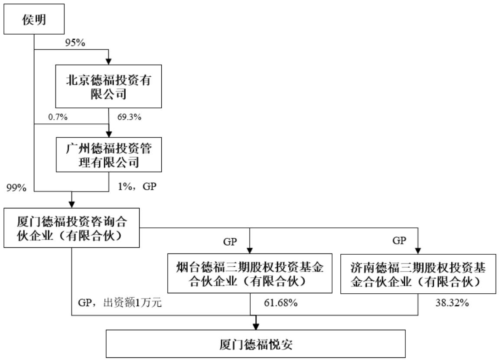

flowchart

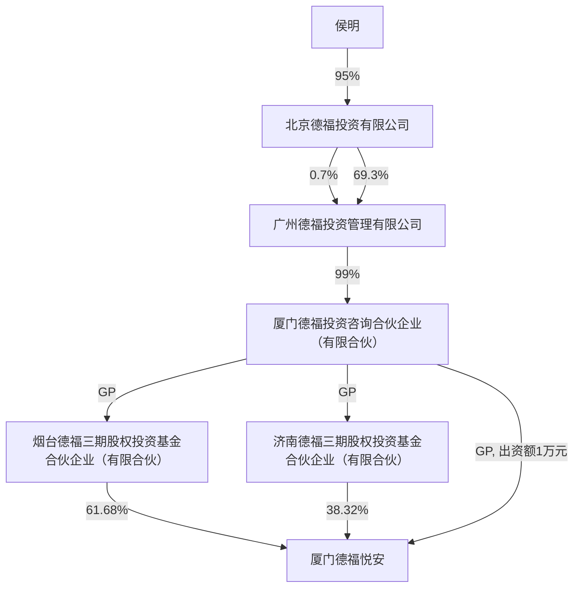
```mermaid
graph TD
  A["侯明"] -->|95%| B["北京德福投资有限公司"]
  B -->|0.7%| C["广州德福投资管理有限公司"]
  B -->|69.3%| C
  C -->|99%| D["厦门德福投资咨询合伙企业（有限合伙）"]
  D -->|GP| E["烟台德福三期股权投资基金合伙企业（有限合伙）"]
  D -->|GP| F["济南德福三期股权投资基金合伙企业（有限合伙）"]
  E -->|61.68%| G["厦门德福悦安"]
  F -->|38.32%| G
  D -->|GP, 出资额1万元| G
```

## 4、最近三年主营业务发展情况

厦门德福悦安主营业务为股权投资且最近三年主营业务无变更。

## 5、最近两年主要财务情况

厦门德福悦安最近两年主要财务数据如下：

单位：万元

<table><tr><td>项目</td><td>2024年末/2024年度</td><td>2023年末/2023年度</td></tr><tr><td>资产总额</td><td>334,517.71</td><td>311,492.76</td></tr><tr><td>负债总额</td><td>7303.15</td><td>28,763.90</td></tr><tr><td>净资产</td><td>327,214.55</td><td>282,728.86</td></tr><tr><td>营业收入</td><td>-</td><td>-</td></tr><tr><td>净利润</td><td>39,485.69</td><td>31,690.79</td></tr></table>

注：财务数据未经审计。

## 6、下属企业情况

截至本报告书签署日，厦门德福悦安控制的主要下属企业如下：

<table><tr><td>序号</td><td>企业名称</td><td>注册资本/出资额(万元)</td><td>持股比例(%)</td><td>主营业务</td></tr><tr><td>1</td><td>厦门德福多肽投资合伙企业(有限合伙)</td><td>9,999 万元</td><td>50.00</td><td>股权投资</td></tr><tr><td>2</td><td>厦门德福浩睿投资合伙企业(有限合伙)</td><td>13,999 万元</td><td>50.00</td><td>股权投资</td></tr><tr><td>3</td><td>广州德福医疗投资合伙企业(有限合伙)</td><td>39,682.54 万元</td><td>42.25</td><td>股权投资、管理咨询</td></tr><tr><td>4</td><td>厦门衡德美康投资合伙企业(有限合伙)</td><td>29,999 万元</td><td>100.00</td><td>股权投资、管理咨询</td></tr><tr><td>5</td><td>厦门德福中腾投资合伙企业(有限合伙)</td><td>17,000 万元</td><td>99.99</td><td>股权投资、管理咨询</td></tr><tr><td>6</td><td>厦门德福金普投资合伙企业(有限合伙)</td><td>9,999 万元</td><td>50.00</td><td>股权投资、管理咨询</td></tr><tr><td>7</td><td>广州德福福元投资合伙企业(有限合伙)</td><td>5,000 万元</td><td>16.67</td><td>股权投资、管理咨询</td></tr></table>

## 7、是否属于私募投资基金及备案情况

厦门德福悦安不存在以非公开方式向合格投资者募集资金设立的情形，其资产不存在由基金管理人管理、基金托管人进行托管的情形，亦不涉及从事私募投资基金管理活动的情形，无需办理私募投资基金或私募投资基金管理人登记备案手续。

## （七）北京中企和润

## 1、基本情况

<table><tr><td>企业名称</td><td>北京中企和润投资管理中心(有限合伙)</td></tr><tr><td>企业类型</td><td>有限合伙企业</td></tr><tr><td>出资额</td><td>10,550万元人民币</td></tr><tr><td>执行事务合伙人</td><td>中企会(北京)基金管理有限公司</td></tr><tr><td>成立日期</td><td>2014-09-22</td></tr><tr><td>主要经营场所</td><td>北京市朝阳区东四环南路53号院2号楼5层(04)501</td></tr><tr><td>统一社会信用代码</td><td>911101053179770550</td></tr><tr><td>经营范围</td><td>投资管理;资产管理;投资咨询;经济贸易咨询;企业管理咨询。(“1、未经有关部门批准,不得以公开方式募集资金;2、不得公开开展证券类产品和金融衍生品交易活动;3、不得发放贷款;4、不得对所投资企业以外的其他企业提供担保;5、不得向投资者承诺投资本金不受损失或者承诺最低收益”;市场主体依法自主选择经营项目,开展经营活动;依法须经批准的项目,经相关部门批准后依批准的内容开展经营活动;不得从事国家和本市产业政策禁止和限制类项目的经营活动。)</td></tr></table>

## 2、历史沿革

## （1）2014年 9月，设立

2014 年 9 月，北京中企和润设立。普通合伙人为中企鸿盛（北京）投资基金管理有限公司（有限合伙），有限合伙人为袁宇峰。出资结构如下：

<table><tr><td>序号</td><td>合伙人名称</td><td>合伙人类型</td><td>出资额(万元)</td><td>出资比例</td></tr><tr><td>1</td><td>中企鸿盛(北京)投资基金管理有限公司</td><td>普通合伙人</td><td>100.00</td><td>50.00%</td></tr><tr><td>2</td><td>袁宇峰</td><td>有限合伙人</td><td>100.00</td><td>50.00%</td></tr><tr><td colspan="3">合计</td><td>200.00</td><td>100.00%</td></tr></table>

## （2）2017年 12 月，第一次增资，第一次转让

2017年12月，袁宇峰、中企鸿盛（北京）投资基金管理有限公司退出。平安金石投资基金管理（北京）有限公司担任普通合伙人。本次变更后，合伙人及出资结构如下：

<table><tr><td>序号</td><td>合伙人名称</td><td>合伙人类型</td><td>出资额(万元)</td><td>出资比例</td></tr><tr><td>1</td><td>平安金石投资基金管理(北京)有限公司</td><td>普通合伙人</td><td>4,200.00</td><td>84.00%</td></tr><tr><td>2</td><td>钟德辉</td><td>有限合伙人</td><td>300.00</td><td>6.00%</td></tr><tr><td>3</td><td>河北至邦控股集团有限公司</td><td>有限合伙人</td><td>200.00</td><td>4.00%</td></tr><tr><td>4</td><td>朱志洪</td><td>有限合伙人</td><td>200.00</td><td>4.00%</td></tr><tr><td>5</td><td>中企会(北京)基金管理有限公司</td><td>有限合伙人</td><td>100.00</td><td>2.00%</td></tr><tr><td colspan="3">合计</td><td>5,000.00</td><td>100.00%</td></tr></table>

## （3）2018 年 1 月，变更执行事务合伙人

2018 年 1 月，中企会（北京）基金管理有限公司变更为普通合伙人，平安金石投资基金管理（北京）有限公司变更为有限合伙人。本次变更后，合伙人及出资结构如下：

<table><tr><td>序号</td><td>合伙人名称</td><td>合伙人类型</td><td>出资额(万元)</td><td>出资比例</td></tr><tr><td>1</td><td>中企会(北京)基金管理有限公司</td><td>普通合伙人</td><td>100.00</td><td>2.00%</td></tr><tr><td>2</td><td>平安金石投资基金管理(北京)有限公司</td><td>有限合伙人</td><td>4,200.00</td><td>84.00%</td></tr><tr><td>3</td><td>钟德辉</td><td>有限合伙人</td><td>300.00</td><td>6.00%</td></tr><tr><td>4</td><td>河北至邦控股集团有限公司</td><td>有限合伙人</td><td>200.00</td><td>4.00%</td></tr><tr><td>5</td><td>朱志洪</td><td>有限合伙人</td><td>200.00</td><td>4.00%</td></tr><tr><td colspan="3">合计</td><td>5,000.00</td><td>100.00%</td></tr></table>

## （4）2018年 10月，第二次增资，第二次转让

2018年10月，平安金石投资基金管理（北京）有限公司、河北至邦控股集团有限公司退伙。胡秀清、马永革、穆锦珲、王淑英、朱龙英、北京达飞安评管理顾问有限公司、南京金箔控股集团有限责任公司、苏州荣红贸易有限公司、西藏华西药业集团有限公司、中金瑞信投资有限公司入伙。合伙企业的出资额由5,000 万元增至 10,550 万元。

本次变更后，合伙人及出资结构如下：

<table><tr><td>序号</td><td>合伙人名称</td><td>合伙人类型</td><td>出资额(万元)</td><td>出资比例</td></tr><tr><td>1</td><td>中企会(北京)基金管理有限公司</td><td>普通合伙人</td><td>500.00</td><td>4.74%</td></tr><tr><td>2</td><td>南京金箔控股集团有限责任公司</td><td>有限合伙人</td><td>2,000.00</td><td>18.96%</td></tr><tr><td>3</td><td>穆锦珲</td><td>有限合伙人</td><td>1,850.00</td><td>17.54%</td></tr><tr><td>4</td><td>中金瑞信投资有限公司</td><td>有限合伙人</td><td>1,000.00</td><td>9.48%</td></tr><tr><td>5</td><td>苏州荣红贸易有限公司</td><td>有限合伙人</td><td>1,000.00</td><td>9.48%</td></tr><tr><td>6</td><td>北京达飞安评管理顾问有限公司</td><td>有限合伙人</td><td>1,000.00</td><td>9.48%</td></tr><tr><td>7</td><td>胡秀清</td><td>有限合伙人</td><td>1,000.00</td><td>9.48%</td></tr><tr><td>8</td><td>西藏华西药业集团有限公司</td><td>有限合伙人</td><td>500.00</td><td>4.74%</td></tr><tr><td>9</td><td>王淑英</td><td>有限合伙人</td><td>500.00</td><td>4.74%</td></tr><tr><td>10</td><td>马永革</td><td>有限合伙人</td><td>500.00</td><td>4.74%</td></tr><tr><td>11</td><td>钟德辉</td><td>有限合伙人</td><td>300.00</td><td>2.84%</td></tr><tr><td>12</td><td>朱龙英</td><td>有限合伙人</td><td>200.00</td><td>1.90%</td></tr><tr><td>13</td><td>朱志洪</td><td>有限合伙人</td><td>200.00</td><td>1.90%</td></tr><tr><td colspan="3">合计</td><td>10,550.00</td><td>100.00%</td></tr></table>

## （5）2020年 7月，第三次转让

2020年7月，穆锦珲、中金瑞信投资有限公司退伙，穆映州、宋明入伙。

本次变更后，合伙人及出资结构如下：

<table><tr><td>序号</td><td>合伙人名称</td><td>合伙人类型</td><td>出资额(万元)</td><td>出资比例</td></tr><tr><td>1</td><td>中企会(北京)基金管理有限公司</td><td>普通合伙人</td><td>500.00</td><td>4.74%</td></tr><tr><td>2</td><td>南京金箔控股集团有限责任公司</td><td>有限合伙人</td><td>2,000.00</td><td>18.96%</td></tr><tr><td>3</td><td>穆映州</td><td>有限合伙人</td><td>1850.00</td><td>17.54%</td></tr><tr><td>4</td><td>宋明</td><td>有限合伙人</td><td>1000.00</td><td>9.48%</td></tr><tr><td>5</td><td>苏州荣红贸易有限公司</td><td>有限合伙人</td><td>1000.00</td><td>9.48%</td></tr><tr><td>6</td><td>北京达飞安评管理顾问有限公司</td><td>有限合伙人</td><td>1000.00</td><td>9.48%</td></tr><tr><td>7</td><td>胡秀清</td><td>有限合伙人</td><td>1000.00</td><td>9.48%</td></tr><tr><td>8</td><td>西藏华西药业集团有限公司</td><td>有限合伙人</td><td>500.00</td><td>4.74%</td></tr><tr><td>9</td><td>王淑英</td><td>有限合伙人</td><td>500.00</td><td>4.74%</td></tr><tr><td>10</td><td>马永革</td><td>有限合伙人</td><td>500.00</td><td>4.74%</td></tr><tr><td>11</td><td>钟德辉</td><td>有限合伙人</td><td>300.00</td><td>2.84%</td></tr><tr><td>12</td><td>朱龙英</td><td>有限合伙人</td><td>200.00</td><td>1.90%</td></tr><tr><td>13</td><td>朱志洪</td><td>有限合伙人</td><td>200.00</td><td>1.90%</td></tr><tr><td colspan="3">合计</td><td>10,550.00</td><td>100.00%</td></tr></table>

## （6）2022年 6月，第四次转让

2022 年 6 月，胡秀清将所持合伙企业 1,000 万元出资额转让给胡继超。本次变更后，合伙人及出资结构如下：

<table><tr><td>序号</td><td>合伙人姓名/名称</td><td>合伙人类型</td><td>出资额(万元)</td><td>出资比例</td></tr><tr><td>1</td><td>中企会(北京)基金管理有限公司</td><td>普通合伙人</td><td>500.00</td><td>4.74%</td></tr><tr><td>2</td><td>南京金箔控股集团有限责任公司</td><td>有限合伙人</td><td>2,000.00</td><td>18.96%</td></tr><tr><td>3</td><td>穆映州</td><td>有限合伙人</td><td>1,850.00</td><td>17.54%</td></tr><tr><td>4</td><td>胡继超</td><td>有限合伙人</td><td>1,000.00</td><td>9.48%</td></tr><tr><td>5</td><td>苏州荣红贸易有限公司</td><td>有限合伙人</td><td>1,000.00</td><td>9.48%</td></tr><tr><td>6</td><td>北京达飞安评管理顾问有限公司</td><td>有限合伙人</td><td>1,000.00</td><td>9.48%</td></tr><tr><td>7</td><td>宋明</td><td>有限合伙人</td><td>1,000.00</td><td>9.48%</td></tr><tr><td>8</td><td>马永革</td><td>有限合伙人</td><td>500.00</td><td>4.74%</td></tr><tr><td>9</td><td>王淑英</td><td>有限合伙人</td><td>500.00</td><td>4.74%</td></tr><tr><td>10</td><td>西藏华西药业集团有限公司</td><td>有限合伙人</td><td>500.00</td><td>4.74%</td></tr><tr><td>11</td><td>钟德辉</td><td>有限合伙人</td><td>300.00</td><td>2.84%</td></tr><tr><td>12</td><td>朱龙英</td><td>有限合伙人</td><td>200.00</td><td>1.90%</td></tr><tr><td>13</td><td>朱志洪</td><td>有限合伙人</td><td>200.00</td><td>1.90%</td></tr><tr><td colspan="3">合计</td><td>10,550.00</td><td>100.00%</td></tr></table>

## 3、产权控制关系

截至本报告书签署日，侯祥通过北京中企会投资管理集团有限公司实际控制北京中企和润执行事务合伙人中企会（北京）基金管理有限公司 100%股权，为北京中企和润实际控制人。其产权控制关系如下：

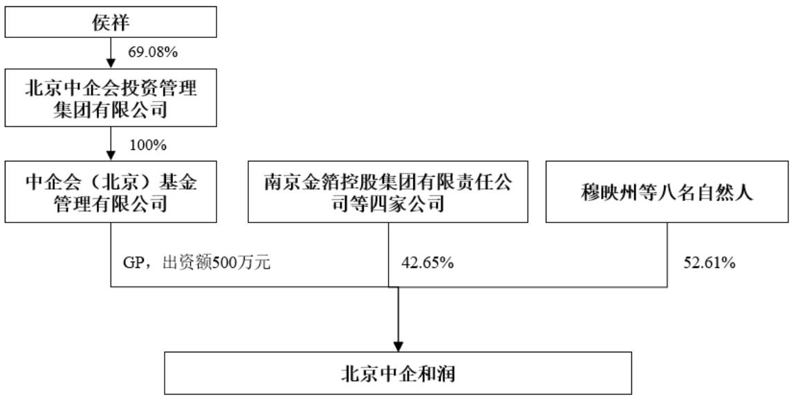

flowchart

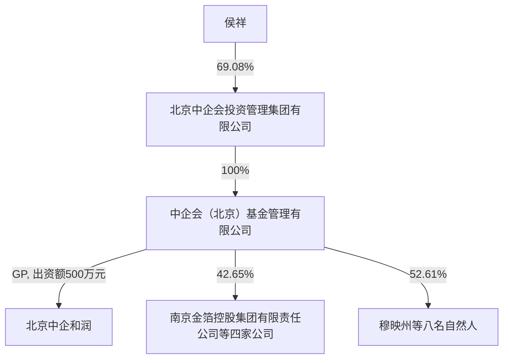
```mermaid
graph TD
  A["侯祥"] -->|69.08%| B["北京中企会投资管理集团有限公司"]
  B -->|100%| C["中企会（北京）基金管理有限公司"]
  C -->|GP, 出资额500万元| D["北京中企和润"]
  C -->|42.65%| E["南京金箔控股集团有限责任公司等四家公司"]
  C -->|52.61%| F["穆映州等八名自然人"]
```

## 4、最近三年主营业务发展情况

北京中企和润主营业务为投资管理、资产管理、投资咨询、经济贸易咨询、企业管理咨询，最近三年主营业务无变更。

## 5、最近两年主要财务情况

北京中企和润最近两年主要财务数据如下：

单位：万元

<table><tr><td>项目</td><td>2024年末/2024年度</td><td>2023年末/2023年度</td></tr><tr><td>资产总额</td><td>10,730.20</td><td>10,730.25</td></tr><tr><td>负债总额</td><td>0.19</td><td>0.19</td></tr><tr><td>净资产</td><td>10,730.01</td><td>10,730.06</td></tr><tr><td>营业收入</td><td>-</td><td>-</td></tr><tr><td>净利润</td><td>-0.05</td><td>0.00</td></tr></table>

注：财务数据未经审计。

## 6、下属企业情况

截至本报告书签署日，北京中企和润不存在控制的下属企业。

## 7、是否属于私募投资基金及备案情况

北京中企和润为合伙型私募基金，已在中国基金业协会登记为私募基金（登记编号为 SJS915）。

## （八）首都大健康

## 1、基本情况

<table><tr><td>企业名称</td><td>首都大健康产业(北京)基金(有限合伙)</td></tr><tr><td>企业类型</td><td>有限合伙企业</td></tr><tr><td>出资额</td><td>185,961万元人民币</td></tr><tr><td>执行事务合伙人</td><td>北广华盖咨询管理(北京)有限公司</td></tr><tr><td>成立日期</td><td>2021-07-13</td></tr><tr><td>主要经营场所</td><td>北京市北京经济技术开发区荣华中路10号1幢A座18层1802-1</td></tr><tr><td>统一社会信用代码</td><td>91110400MA04CRM851</td></tr><tr><td>经营范围</td><td>股权投资;私募证券投资基金管理服务(须在中国证券投资基金业协会完成登记备案后方可从事经营活动);私募股权投资基金管理、创业投资基金管理服务(须在中国证券投资基金业协会完成登记备案后方可从事经营活动)。(“1、未经有关部门批准,不得以公开方式募集资金;2、不得公开开展证券类产品和金融衍生品交易活动;3、不得发放贷款;4、不得对所投资企业以外的其他企业提供担保;5、不得向投资者承诺投资本金不受损失或者承诺最低收益”;市场主体依法自主选择经营项目,开展经营活动;下期出资时间为2041年06月30日;依法须经批准的项目,经相关部门批准后依批准的内容开展经营活动;不得从事国家和本市产业政策禁止和限制类项目的经营活动。)</td></tr></table>

## 2、历史沿革

## （1）2021年 7月，设立

2021年7月，首都大健康设立。合伙人及出资结构如下：

<table><tr><td>序号</td><td>合伙人名称</td><td>合伙人类型</td><td>出资额(万元)</td><td>出资比例</td></tr><tr><td>1</td><td>北广华盖咨询管理(北京)有限公司</td><td>普通合伙人</td><td>1,000.00</td><td>90.91%</td></tr><tr><td>2</td><td>邢硕博</td><td>有限合伙人</td><td>100.00</td><td>9.09%</td></tr><tr><td colspan="3">合计</td><td>1,100.00</td><td>100.00%</td></tr></table>

## （2）2022年 3月，第一次转让，第一次增资

2022 年 3 月，邢硕博退出，北京合音投资中心（有限合伙）、北京亦庄国际新兴产业投资中心（有限合伙）等投资人入伙，首都大健康出资额由 1,100万元增至 104,200 万元。

本次变更后，合伙人及出资结构如下：

<table><tr><td>序号</td><td>合伙人名称</td><td>性质</td><td>认缴出资额(万元)</td></tr><tr><td>1</td><td>北广华盖私募基金管理(北京)有限公司</td><td>普通合伙人</td><td>1,000</td></tr><tr><td>2</td><td>北京合音投资中心(有限合伙)</td><td>有限合伙人</td><td>31,000</td></tr><tr><td>3</td><td>北京亦庄国际新兴产业投资中心(有限合伙)</td><td>有限合伙人</td><td>30,000</td></tr><tr><td>4</td><td>奇安信(北京)网络科技有限公司</td><td>有限合伙人</td><td>10,000</td></tr><tr><td>5</td><td>宿迁京东盈正企业管理咨询有限公司</td><td>有限合伙人</td><td>10,000</td></tr><tr><td>6</td><td>浙江康恩贝制药股份有限公司</td><td>有限合伙人</td><td>9,000</td></tr><tr><td>7</td><td>宁波梅山保税港区华盖利晟股权投资合伙企业</td><td>有限合伙人</td><td>13,200</td></tr><tr><td colspan="3">合计</td><td>104,200.00</td></tr></table>

## （3）2022年 7月，第二次增资

2022 年 7 月，灵康药业集团股份有限公司、北京昭衍新药研究中心股份有限公司、北京谛恒投资集团有限公司入伙，首都大健康出资额由 104,200 万元增至 121,200 万元。

本次变更后，合伙人及出资结构如下：

<table><tr><td>序号</td><td>合伙人名称</td><td>合伙人类型</td><td>出资额(万元)</td><td>出资比例</td></tr><tr><td>1</td><td>北广华盖咨询管理(北京)有限公司</td><td>普通合伙人</td><td>1,000.00</td><td>0.83%</td></tr><tr><td>2</td><td>北京合音投资中心(有限合伙)</td><td>有限合伙人</td><td>31,000.00</td><td>25.58%</td></tr><tr><td>3</td><td>北京亦庄国际新兴产业投资中心(有限合伙)</td><td>有限合伙人</td><td>30,000.00</td><td>24.75%</td></tr><tr><td>4</td><td>宁波梅山保税港区华盖利晟股权投资合伙企业(有限合伙)</td><td>有限合伙人</td><td>16,200.00</td><td>13.37%</td></tr><tr><td>5</td><td>宿迁京东盈正企业管理咨询有限公司</td><td>有限合伙人</td><td>10,000.00</td><td>8.25%</td></tr><tr><td>6</td><td>奇安信(北京)网络科技有限公司</td><td>有限合伙人</td><td>10,000.00</td><td>8.25%</td></tr><tr><td>7</td><td>浙江康恩贝制药股份有限公司</td><td>有限合伙人</td><td>9,000.00</td><td>7.43%</td></tr><tr><td>8</td><td>灵康药业集团股份有限公司</td><td>有限合伙人</td><td>6,000.00</td><td>4.95%</td></tr><tr><td>9</td><td>北京昭衍新药研究中心股份有限公司</td><td>有限合伙人</td><td>5,000.00</td><td>4.13%</td></tr><tr><td>10</td><td>北京谛恒投资集团有限公司</td><td>有限合伙人</td><td>3,000.00</td><td>2.48%</td></tr><tr><td colspan="3">合计</td><td>121,200</td><td>100.00%</td></tr></table>

## （4）2022年 10月，第三次增资

2022 年 10 月，宁波梅山保税港区华盖利晟股权投资合伙企业（有限合伙）出资额增加4,000万元，首都大健康出资额由 121,200万元增至125,200 万元。

本次变更后，合伙人及出资结构如下：

<table><tr><td>序号</td><td>合伙人名称</td><td>合伙人类型</td><td>出资额(万元)</td><td>出资比例</td></tr><tr><td>1</td><td>北广华盖咨询管理(北京)有限公司</td><td>普通合伙人</td><td>1,000.00</td><td>0.80%</td></tr><tr><td>2</td><td>北京合音投资中心(有限合伙)</td><td>有限合伙人</td><td>31,000.00</td><td>24.76%</td></tr><tr><td>3</td><td>北京亦庄国际新兴产业投资中心(有限合伙)</td><td>有限合伙人</td><td>30,000.00</td><td>23.96%</td></tr><tr><td>4</td><td>宁波梅山保税港区华盖利晟股权投资合伙企业(有限合伙)</td><td>有限合伙人</td><td>20,200.00</td><td>16.13%</td></tr><tr><td>5</td><td>宿迁京东盈正企业管理咨询有限公司</td><td>有限合伙人</td><td>10,000.00</td><td>7.99%</td></tr><tr><td>6</td><td>奇安信(北京)网络科技有限公司</td><td>有限合伙人</td><td>10,000.00</td><td>7.99%</td></tr><tr><td>7</td><td>浙江康恩贝制药股份有限公司</td><td>有限合伙人</td><td>9,000.00</td><td>7.19%</td></tr><tr><td>8</td><td>灵康药业集团股份有限公司</td><td>有限合伙人</td><td>6,000.00</td><td>4.79%</td></tr><tr><td>9</td><td>北京昭衍新药研究中心股份有限公司</td><td>有限合伙人</td><td>5,000.00</td><td>3.99%</td></tr><tr><td>10</td><td>北京谛恒投资集团有限公司</td><td>有限合伙人</td><td>3,000.00</td><td>2.40%</td></tr><tr><td colspan="3">合计</td><td>125,200.00</td><td>100.00%</td></tr></table>

## （5）2024 年 3 月，第四次增资

2024年3月，首都大健康合伙企业出资额由125,200万元增至185,961万元。本次变更后，合伙人及出资结构如下：

<table><tr><td>序号</td><td>合伙人名称</td><td>合伙人类型</td><td>出资额(万元)</td><td>出资比例</td></tr><tr><td>1</td><td>北广华盖咨询管理(北京)有限公司</td><td>普通合伙人</td><td>1,860.00</td><td>1.00%</td></tr><tr><td>2</td><td>宁波梅山保税港区华盖利晟股权投资合伙企业(有限合伙)</td><td>有限合伙人</td><td>32,101.00</td><td>17.26%</td></tr><tr><td>3</td><td>北京合音投资中心(有限合伙)</td><td>有限合伙人</td><td>31,000.00</td><td>16.67%</td></tr><tr><td>4</td><td>北京亦庄国际新兴产业投资中心(有限合伙)</td><td>有限合伙人</td><td>30,000.00</td><td>16.13%</td></tr><tr><td>5</td><td>爱心人寿保险股份有限公司</td><td>有限合伙人</td><td>30,000.00</td><td>16.13%</td></tr><tr><td>6</td><td>宿迁京东盈正企业管理咨询有限公司</td><td>有限合伙人</td><td>10,000.00</td><td>5.38%</td></tr><tr><td>7</td><td>奇安信(北京)网络科技有限公司</td><td>有限合伙人</td><td>10,000.00</td><td>5.38%</td></tr><tr><td>8</td><td>太平(深圳)医疗健康产业私募股权投资基金合伙企业(有限合伙)</td><td>有限合伙人</td><td>10,000.00</td><td>5.38%</td></tr><tr><td>9</td><td>浙江康恩贝制药股份有限公司</td><td>有限合伙人</td><td>9,000.00</td><td>4.84%</td></tr><tr><td>10</td><td>灵康药业集团股份有限公司</td><td>有限合伙人</td><td>6,000.00</td><td>3.23%</td></tr><tr><td>11</td><td>北京不同凡响企业管理发展中心(有限合伙)</td><td>有限合伙人</td><td>5,000.00</td><td>2.69%</td></tr><tr><td>12</td><td>北京昭衍新药研究中心股份有限公司</td><td>有限合伙人</td><td>5,000.00</td><td>2.69%</td></tr><tr><td>13</td><td>北京谛恒投资集团有限公司</td><td>有限合伙人</td><td>3,000.00</td><td>1.61%</td></tr><tr><td>14</td><td>陕西秦创原科技创新投资基金合伙企业(有限合伙)</td><td>有限合伙人</td><td>3,000.00</td><td>1.61%</td></tr><tr><td colspan="3">合计</td><td>185,961.00</td><td>100.00%</td></tr></table>

## 3、产权控制关系

截至本报告书签署日，首都大健康的普通合伙人为北广华盖咨询管理（北京）有限公司，许小林、曾志强合计控制北广华盖咨询管理（北京）有限公司超过50%的股权，为北广华盖咨询管理（北京）有限公司的共同实际控制人。其产权控制关系如下：

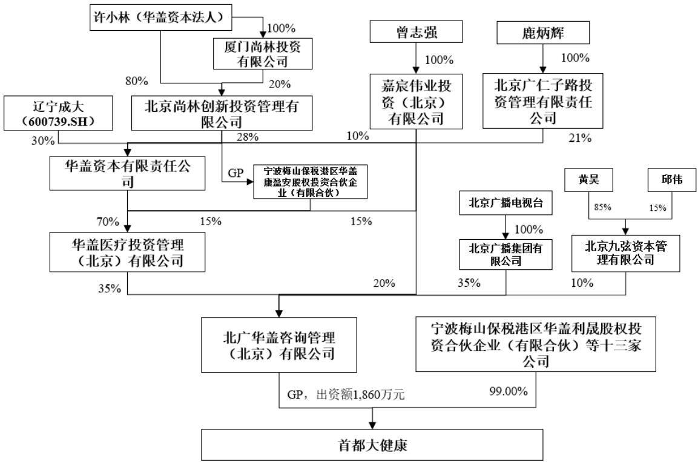

flowchart

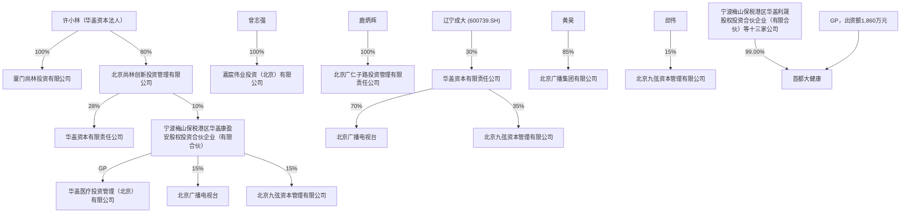
```mermaid
graph TD
  A["许小林（华盖资本法人）"] -->|100%| B["厦门尚林投资有限公司"]
  A -->|80%| C["北京尚林创新投资管理有限公司"]
  D["曾志强"] -->|100%| E["嘉宸伟业投资（北京）有限公司"]
  F["鹿炳辉"] -->|100%| G["北京广仁子路投资管理有限责任公司"]
  C -->|28%| H["华盖资本有限责任公司"]
  C -->|10%| I["宁波梅山保税港区华盖康盈安股权投资合伙企业（有限合伙）"]
  I -->|GP| J["华盖医疗投资管理（北京）有限公司"]
  I -->|15%| K["北京广播电视台"]
  I -->|15%| L["北京九弦资本管理有限公司"]
  M["辽宁成大 (600739.SH)"] -->|30%| N["华盖资本有限责任公司"]
  N -->|70%| O["北京广播电视台"]
  N -->|35%| P["北京九弦资本管理有限公司"]
  Q["黄昊"] -->|85%| R["北京广播集团有限公司"]
  S["邱伟"] -->|15%| T["北京九弦资本管理有限公司"]
  U["宁波梅山保税港区华盖利晟股权投资合伙企业（有限合伙）等十三家公司"] -->|99.00%| V["首都大健康"]
  W["GP，出资额1,860万元"] --> V
```

## 4、最近三年主营业务发展情况

首都大健康主营业务为股权投资。最近三年主营业务无变更。

## 5、最近两年主要财务情况

首都大健康最近两年主要财务数据如下：

单位：万元

<table><tr><td>项目</td><td>2024年末/2024年度</td><td>2023年末/2023年度</td></tr><tr><td>资产总额</td><td>177,049.26</td><td>150,019.26</td></tr><tr><td>负债总额</td><td>11.01</td><td>11.11</td></tr><tr><td>净资产</td><td>177,038.25</td><td>150,008.15</td></tr><tr><td>营业收入</td><td>430.69</td><td>1,228.80</td></tr><tr><td>净利润</td><td>-4,469.90</td><td>-2,321.20</td></tr></table>

注：2023年财务数据已经审计；2024年财务数据未经审计。

## 6、下属企业情况

截至本报告书签署日，首都大健康不存在控制的下属企业。

## 7、是否属于私募投资基金及备案情况

首都大健康为合伙型私募基金，已在中国基金业协会登记为私募基金（登记编号为 SVJ120）。

## （九）钟慧鑫

## 1、基本情况

<table><tr><td>姓名</td><td>钟慧鑫</td></tr><tr><td>曾用名</td><td>-</td></tr><tr><td>性别</td><td>女</td></tr><tr><td>国籍</td><td>中国</td></tr><tr><td>身份证号</td><td>371202200210******</td></tr><tr><td>住所</td><td>济南市莱芜区羊里街道******</td></tr><tr><td>通讯地址</td><td>济南市莱芜区羊里街道******</td></tr><tr><td>是否取得其他国家或者地区居留权</td><td>否</td></tr></table>

## 2、最近三年任职情况及任职单位产权关系

<table><tr><td>起止时间</td><td>任职单位</td><td>职务</td><td>产权关系</td></tr><tr><td>2022年1月1日至2024年12月31日</td><td>山东赢诺投资有限公司</td><td>副总经理</td><td>无</td></tr></table>

## （十）济南乐威

## 1、基本情况

<table><tr><td>企业名称</td><td>济南乐威企业管理咨询合伙企业(有限合伙)</td></tr><tr><td>企业类型</td><td>有限合伙企业</td></tr><tr><td>出资额</td><td>153.084078万元人民币</td></tr><tr><td>执行事务合伙人</td><td>周爱敏</td></tr><tr><td>成立日期</td><td>2015-06-19</td></tr><tr><td>主要经营场所</td><td>山东省济南市历城区经十东路30766号力诺永宁综合楼302室</td></tr><tr><td>统一社会信用代码</td><td>91370112MA3BXBTX7F</td></tr><tr><td>经营范围</td><td>企业管理咨询。(依法须经批准的项目,经相关部门批准后方可开展经营活动)</td></tr></table>

## 2、历史沿革

## （1）2015年，设立

2015 年 6 月，济南乐威设立，出资额为 153.08 万元，普通合伙人为周爱敏，有限合伙人为伦立军等 47人。合伙人及出资结构如下：

<table><tr><td>序号</td><td>合伙人姓名</td><td>合伙人类型</td><td>出资额(万元)</td><td>出资比例</td></tr><tr><td>1</td><td>周爱敏</td><td>普通合伙人</td><td>6.59</td><td>4.31%</td></tr><tr><td>2</td><td>伦立军</td><td>有限合伙人</td><td>8.44</td><td>5.51%</td></tr><tr><td>3</td><td>宋进军</td><td>有限合伙人</td><td>7.38</td><td>4.82%</td></tr><tr><td>4</td><td>张金丽</td><td>有限合伙人</td><td>6.59</td><td>4.31%</td></tr><tr><td>5</td><td>崔敬仲</td><td>有限合伙人</td><td>6.59</td><td>4.31%</td></tr><tr><td>6</td><td>刘伟</td><td>有限合伙人</td><td>4.14</td><td>2.71%</td></tr><tr><td>7</td><td>王振华</td><td>有限合伙人</td><td>3.64</td><td>2.38%</td></tr><tr><td>8</td><td>罗朝真</td><td>有限合伙人</td><td>3.64</td><td>2.38%</td></tr><tr><td>9</td><td>张鸣</td><td>有限合伙人</td><td>2.90</td><td>1.90%</td></tr><tr><td>10</td><td>刘敏</td><td>有限合伙人</td><td>2.90</td><td>1.90%</td></tr><tr><td>11</td><td>张秀</td><td>有限合伙人</td><td>2.90</td><td>1.90%</td></tr><tr><td>12</td><td>王秀平</td><td>有限合伙人</td><td>2.90</td><td>1.90%</td></tr><tr><td>13</td><td>李素荣</td><td>有限合伙人</td><td>2.90</td><td>1.90%</td></tr><tr><td>14</td><td>梁素珍</td><td>有限合伙人</td><td>2.90</td><td>1.90%</td></tr><tr><td>15</td><td>徐霞</td><td>有限合伙人</td><td>2.90</td><td>1.90%</td></tr><tr><td>16</td><td>王菊</td><td>有限合伙人</td><td>2.90</td><td>1.90%</td></tr><tr><td>17</td><td>陈琳琳</td><td>有限合伙人</td><td>2.90</td><td>1.90%</td></tr><tr><td>18</td><td>韩凤岐</td><td>有限合伙人</td><td>2.90</td><td>1.90%</td></tr><tr><td>19</td><td>郝丽华</td><td>有限合伙人</td><td>2.90</td><td>1.90%</td></tr><tr><td>20</td><td>李凤霞</td><td>有限合伙人</td><td>2.90</td><td>1.90%</td></tr><tr><td>21</td><td>宋文</td><td>有限合伙人</td><td>2.90</td><td>1.90%</td></tr><tr><td>22</td><td>孟庆梅</td><td>有限合伙人</td><td>2.90</td><td>1.90%</td></tr><tr><td>23</td><td>吴淑萍</td><td>有限合伙人</td><td>2.90</td><td>1.90%</td></tr><tr><td>24</td><td>董秀珍</td><td>有限合伙人</td><td>2.90</td><td>1.90%</td></tr><tr><td>25</td><td>张卫玲</td><td>有限合伙人</td><td>2.90</td><td>1.90%</td></tr><tr><td>26</td><td>李崇兰</td><td>有限合伙人</td><td>2.90</td><td>1.90%</td></tr><tr><td>27</td><td>邱影</td><td>有限合伙人</td><td>2.90</td><td>1.90%</td></tr><tr><td>28</td><td>王克泉</td><td>有限合伙人</td><td>2.90</td><td>1.90%</td></tr><tr><td>29</td><td>周振兰</td><td>有限合伙人</td><td>2.90</td><td>1.90%</td></tr><tr><td>30</td><td>李仁洪</td><td>有限合伙人</td><td>2.90</td><td>1.90%</td></tr><tr><td>31</td><td>任照兰</td><td>有限合伙人</td><td>2.90</td><td>1.90%</td></tr><tr><td>32</td><td>于莲香</td><td>有限合伙人</td><td>2.90</td><td>1.90%</td></tr><tr><td>33</td><td>常凤敏</td><td>有限合伙人</td><td>2.90</td><td>1.90%</td></tr><tr><td>34</td><td>于维兰</td><td>有限合伙人</td><td>2.90</td><td>1.90%</td></tr><tr><td>35</td><td>吴花芹</td><td>有限合伙人</td><td>2.90</td><td>1.90%</td></tr><tr><td>36</td><td>魏春</td><td>有限合伙人</td><td>2.30</td><td>1.50%</td></tr><tr><td>37</td><td>丁大勇</td><td>有限合伙人</td><td>2.30</td><td>1.50%</td></tr><tr><td>38</td><td>牛晓霞</td><td>有限合伙人</td><td>2.30</td><td>1.50%</td></tr><tr><td>39</td><td>方艳华</td><td>有限合伙人</td><td>2.15</td><td>1.40%</td></tr><tr><td>40</td><td>曲福生</td><td>有限合伙人</td><td>2.15</td><td>1.40%</td></tr><tr><td>41</td><td>师荣</td><td>有限合伙人</td><td>2.15</td><td>1.40%</td></tr><tr><td>42</td><td>石莉华</td><td>有限合伙人</td><td>2.15</td><td>1.40%</td></tr><tr><td>43</td><td>张玉霞</td><td>有限合伙人</td><td>2.15</td><td>1.40%</td></tr><tr><td>44</td><td>刘爱芹</td><td>有限合伙人</td><td>2.15</td><td>1.40%</td></tr><tr><td>45</td><td>李宗军</td><td>有限合伙人</td><td>2.15</td><td>1.40%</td></tr><tr><td>46</td><td>姚总胜</td><td>有限合伙人</td><td>2.00</td><td>1.30%</td></tr><tr><td>47</td><td>李岩</td><td>有限合伙人</td><td>1.85</td><td>1.21%</td></tr><tr><td>48</td><td>刘丽萍</td><td>有限合伙人</td><td>1.85</td><td>1.21%</td></tr><tr><td colspan="3">合计</td><td>153.08</td><td>100.00%</td></tr></table>

## 3、产权控制关系

截至本报告书签署日，周爱敏直接持有济南乐威 4.31%的合伙份额并担任济南乐威的执行事务合伙人，为济南乐威实际控制人。其产权控制关系如下：

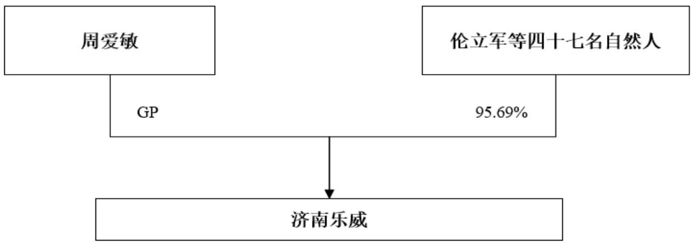

flowchart

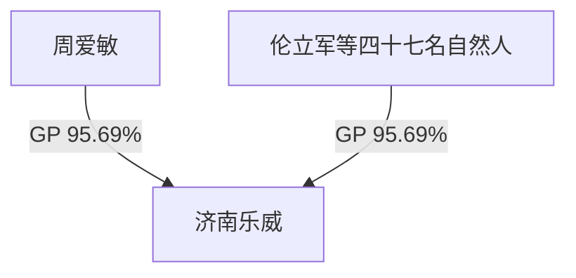
```mermaid
graph TD
  A["周爱敏"] -->|GP 95.69%| C["济南乐威"]
  B["伦立军等四十七名自然人"] -->|GP 95.69%| C["济南乐威"]
```

## 4、最近三年主营业务发展情况

济南乐威为宏济堂员工持股平台，最近三年主营业务无变更。

## 5、最近两年主要财务情况

济南乐威最近两年主要财务数据如下：

单位：万元

<table><tr><td>项目</td><td>2024年末/2024年度</td><td>2023年末/2023年度</td></tr><tr><td>资产总额</td><td>305.47</td><td>305.46</td></tr><tr><td>负债总额</td><td>0.10</td><td>0.05</td></tr><tr><td>净资产</td><td>305.37</td><td>305.41</td></tr><tr><td>营业收入</td><td>-</td><td>-</td></tr><tr><td>净利润</td><td>-0.04</td><td>152.73</td></tr></table>

注：财务数据未经审计。

## 6、下属企业情况

截至本报告书签署日，济南乐威不存在控制的下属企业。

## 7、是否属于私募投资基金及备案情况

济南乐威不存在以非公开方式向合格投资者募集资金设立的情形，济南乐威的资产不存在由基金管理人管理、基金托管人进行托管的情形，亦不涉及从事私募投资基金管理活动的情形，无需办理私募投资基金或私募投资基金管理人登记备案手续。

## （十一）济南玖熙

## 1、基本情况

<table><tr><td>企业名称</td><td>济南玖熙产业投资合伙企业(有限合伙)</td></tr><tr><td>企业类型</td><td>有限合伙企业</td></tr><tr><td>出资额</td><td>11,000万元人民币</td></tr><tr><td>执行事务合伙人</td><td>周子渊</td></tr><tr><td>成立日期</td><td>2021-12-28</td></tr><tr><td>主要经营场所</td><td>山东省济南市历下区龙奥西路1号银丰财富广场2号楼802-1</td></tr><tr><td>统一社会信用代码</td><td>91370102MA7E5C4679</td></tr><tr><td>经营范围</td><td>一般项目:以自有资金从事投资活动。(除依法须经批准的项目外,凭营业执照依法自主开展经营活动)</td></tr></table>

## 2、历史沿革

## （1）2021年，设立

2021年12月，济南玖熙设立。出资额为 11,000 万元，普通合伙人为周子渊，有限合伙人为王晓明。设立时合伙人及出资结构如下：

<table><tr><td>序号</td><td>合伙人姓名</td><td>合伙人类型</td><td>出资额(万元)</td><td>出资比例</td></tr><tr><td>1</td><td>周子渊</td><td>普通合伙人</td><td>7,150.00</td><td>65.00%</td></tr><tr><td>2</td><td>王晓明</td><td>有限合伙人</td><td>3,850.00</td><td>35.00%</td></tr><tr><td colspan="3">合计</td><td>11,000.00</td><td>100.00%</td></tr></table>

## 3、产权控制关系

截至本报告书签署日，周子渊直接持有济南玖熙 65%的合伙份额并担任济南玖熙的执行事务合伙人，为济南玖熙的实际控制人。其产权控制关系如下：

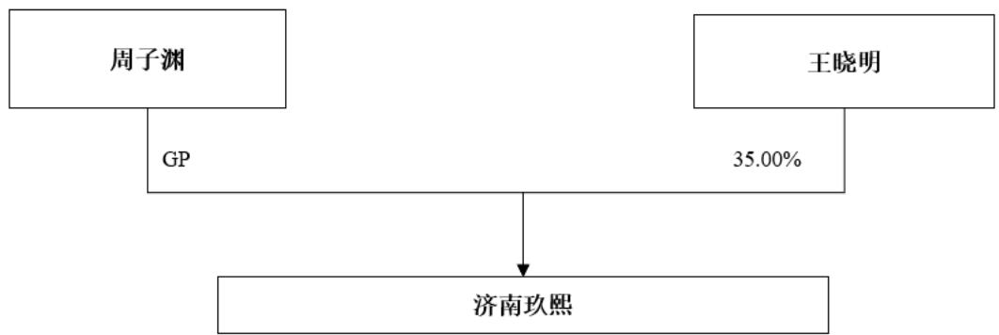

flowchart

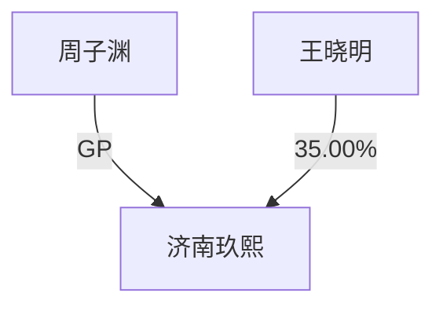
```mermaid
graph TD
  A["周子渊"] -->|GP| C["济南玖熙"]
  B["王晓明"] -->|35.00%| C["济南玖熙"]
```

## 4、最近三年主营业务发展情况

济南玖熙主营业务为以自有资金从事投资活动，最近三年主营业务无变更。

## 5、最近两年主要财务情况

济南玖熙最近两年主要财务数据如下：

单位：万元

<table><tr><td>项目</td><td>2024年末/2024年度</td><td>2023年末/2023年度</td></tr><tr><td>资产总额</td><td>10,009.58</td><td>10,009.21</td></tr><tr><td>负债总额</td><td>-0.45</td><td>-0.38</td></tr><tr><td>净资产</td><td>10,010.03</td><td>10,009.59</td></tr><tr><td>营业收入</td><td>-</td><td>0.04</td></tr><tr><td>净利润</td><td>-19.56</td><td>-16.21</td></tr></table>

注：财务数据未经审计。

## 6、下属企业情况

截至本报告书签署日，济南玖熙不存在控制的下属企业。

## 7、是否属于私募投资基金及备案情况

济南玖熙不存在以非公开方式向合格投资者募集资金设立的情形，济南玖熙的资产不存在由基金管理人管理、基金托管人进行托管的情形，亦不涉及从事私募投资基金管理活动的情形，无需办理私募投资基金或私募投资基金管理人登记备案手续。

## 8、执行事务合伙人情况

（1）基本情况

<table><tr><td>姓名</td><td>周子渊</td></tr><tr><td>曾用名</td><td>-</td></tr><tr><td>性别</td><td>男</td></tr><tr><td>国籍</td><td>中国</td></tr><tr><td>身份证号</td><td>370102198605******</td></tr><tr><td>住所</td><td>济南市历下区******</td></tr><tr><td>通讯地址</td><td>济南市历下区龙奥西路******</td></tr><tr><td>是否取得其他国家或者地区居留权</td><td>否</td></tr></table>

（2）最近三年任职情况及任职单位产权关系

<table><tr><td>起止时间</td><td>任职单位</td><td>职务</td><td>产权关系</td></tr><tr><td>2022年1月1日至2024年12月31日</td><td>济南玖熙、海南玖熙供应链管理有限公司、上海紫砾供应链管理有限公司</td><td>执行事务合伙人/法定代表人</td><td>有</td></tr></table>

## （十二）济南宏舜

1、基本情况

<table><tr><td>企业名称</td><td>济南宏舜企业管理咨询合伙企业(有限合伙)</td></tr><tr><td>企业类型</td><td>有限合伙企业</td></tr><tr><td>出资额</td><td>368.9496万元人民币</td></tr><tr><td>执行事务合伙人</td><td>申英明</td></tr><tr><td>成立日期</td><td>2015-07-24</td></tr><tr><td>主要经营场所</td><td>山东省济南市历城区经十东路30766号力诺永宁综合楼304室</td></tr><tr><td>统一社会信用代码</td><td>91370112306899266W</td></tr><tr><td>经营范围</td><td>企业管理咨询。(依法须经批准的项目,经相关部门批准后方可开展经营活动)</td></tr></table>

## 2、历史沿革

## （1）2015年 7月，设立

2015 年 7 月，济南宏舜设立。出资额为 492.9496 万元，普通合伙人为申英明，有限合伙人为韩福成等 37名自然人。设立时合伙人及出资结构如下：

<table><tr><td>序号</td><td>合伙人姓名</td><td>合伙人类型</td><td>出资额(万元)</td><td>出资比例</td></tr><tr><td>1</td><td>申英明</td><td>普通合伙人</td><td>205.32</td><td>41.65%</td></tr><tr><td>2</td><td>韩福成</td><td>有限合伙人</td><td>40.50</td><td>8.22%</td></tr><tr><td>3</td><td>赵磊</td><td>有限合伙人</td><td>40.50</td><td>8.22%</td></tr><tr><td>4</td><td>徐娟</td><td>有限合伙人</td><td>20.24</td><td>4.11%</td></tr><tr><td>5</td><td>高春坡</td><td>有限合伙人</td><td>20.24</td><td>4.11%</td></tr><tr><td>6</td><td>关桂菊</td><td>有限合伙人</td><td>20.24</td><td>4.11%</td></tr><tr><td>7</td><td>茹立显</td><td>有限合伙人</td><td>10.12</td><td>2.05%</td></tr><tr><td>8</td><td>袁世琪</td><td>有限合伙人</td><td>10.12</td><td>2.05%</td></tr><tr><td>9</td><td>朱凤珍</td><td>有限合伙人</td><td>10.12</td><td>2.05%</td></tr><tr><td>10</td><td>蔡慧华</td><td>有限合伙人</td><td>10.12</td><td>2.05%</td></tr><tr><td>11</td><td>谷瑞乾</td><td>有限合伙人</td><td>10.12</td><td>2.05%</td></tr><tr><td>12</td><td>乔寿华</td><td>有限合伙人</td><td>10.12</td><td>2.05%</td></tr><tr><td>13</td><td>范圣此</td><td>有限合伙人</td><td>10.12</td><td>2.05%</td></tr><tr><td>14</td><td>贾开钰</td><td>有限合伙人</td><td>10.12</td><td>2.05%</td></tr><tr><td>15</td><td>隗明</td><td>有限合伙人</td><td>10.12</td><td>2.05%</td></tr><tr><td>16</td><td>蒋凌涛</td><td>有限合伙人</td><td>10.12</td><td>2.05%</td></tr><tr><td>17</td><td>郑淑尧</td><td>有限合伙人</td><td>2.03</td><td>0.41%</td></tr><tr><td>18</td><td>徐胜炜</td><td>有限合伙人</td><td>2.03</td><td>0.41%</td></tr><tr><td>19</td><td>刘朋洁</td><td>有限合伙人</td><td>2.03</td><td>0.41%</td></tr><tr><td>20</td><td>魏凤英</td><td>有限合伙人</td><td>2.03</td><td>0.41%</td></tr><tr><td>21</td><td>梁善美</td><td>有限合伙人</td><td>2.03</td><td>0.41%</td></tr><tr><td>22</td><td>刘翠萍</td><td>有限合伙人</td><td>2.03</td><td>0.41%</td></tr><tr><td>23</td><td>李秀凤</td><td>有限合伙人</td><td>2.03</td><td>0.41%</td></tr><tr><td>24</td><td>侯月成</td><td>有限合伙人</td><td>2.03</td><td>0.41%</td></tr><tr><td>25</td><td>董淑莲</td><td>有限合伙人</td><td>2.03</td><td>0.41%</td></tr><tr><td>26</td><td>温璐璐</td><td>有限合伙人</td><td>2.03</td><td>0.41%</td></tr><tr><td>27</td><td>解西周</td><td>有限合伙人</td><td>2.03</td><td>0.41%</td></tr><tr><td>28</td><td>王吉波</td><td>有限合伙人</td><td>2.03</td><td>0.41%</td></tr><tr><td>29</td><td>杨宁宁</td><td>有限合伙人</td><td>2.03</td><td>0.41%</td></tr><tr><td>30</td><td>刘海红</td><td>有限合伙人</td><td>2.03</td><td>0.41%</td></tr><tr><td>31</td><td>王强</td><td>有限合伙人</td><td>2.03</td><td>0.41%</td></tr><tr><td>32</td><td>张凯</td><td>有限合伙人</td><td>2.03</td><td>0.41%</td></tr><tr><td>33</td><td>吕娟</td><td>有限合伙人</td><td>2.03</td><td>0.41%</td></tr><tr><td>34</td><td>种昉</td><td>有限合伙人</td><td>2.03</td><td>0.41%</td></tr><tr><td>35</td><td>宋荣</td><td>有限合伙人</td><td>2.03</td><td>0.41%</td></tr><tr><td>36</td><td>高琴</td><td>有限合伙人</td><td>2.03</td><td>0.41%</td></tr><tr><td>37</td><td>于瀚</td><td>有限合伙人</td><td>2.03</td><td>0.41%</td></tr><tr><td>38</td><td>刘册家</td><td>有限合伙人</td><td>2.03</td><td>0.41%</td></tr><tr><td colspan="3">合计</td><td>492.95</td><td>100.00%</td></tr></table>

## （2）2015 年 9 月，第一次转让

2015 年 9 月，济南宏舜合伙人由 38 名变更为 15 名，变更后合伙人及出资结构如下：

<table><tr><td>序号</td><td>合伙人姓名</td><td>合伙人类型</td><td>出资额(万元)</td><td>出资比例</td></tr><tr><td>1</td><td>申英明</td><td>普通合伙人</td><td>260.18</td><td>52.78%</td></tr><tr><td>2</td><td>韩福成</td><td>有限合伙人</td><td>40.50</td><td>8.22%</td></tr><tr><td>3</td><td>赵磊</td><td>有限合伙人</td><td>40.50</td><td>8.22%</td></tr><tr><td>4</td><td>徐娟</td><td>有限合伙人</td><td>20.24</td><td>4.11%</td></tr><tr><td>5</td><td>高春坡</td><td>有限合伙人</td><td>20.24</td><td>4.11%</td></tr><tr><td>6</td><td>关桂菊</td><td>有限合伙人</td><td>20.24</td><td>4.11%</td></tr><tr><td>7</td><td>茹立显</td><td>有限合伙人</td><td>10.12</td><td>2.05%</td></tr><tr><td>8</td><td>袁世琪</td><td>有限合伙人</td><td>10.12</td><td>2.05%</td></tr><tr><td>9</td><td>朱凤珍</td><td>有限合伙人</td><td>10.12</td><td>2.05%</td></tr><tr><td>10</td><td>蔡慧华</td><td>有限合伙人</td><td>10.12</td><td>2.05%</td></tr><tr><td>11</td><td>谷瑞乾</td><td>有限合伙人</td><td>10.12</td><td>2.05%</td></tr><tr><td>12</td><td>乔寿华</td><td>有限合伙人</td><td>10.12</td><td>2.05%</td></tr><tr><td>13</td><td>范圣此</td><td>有限合伙人</td><td>10.12</td><td>2.05%</td></tr><tr><td>14</td><td>贾开钰</td><td>有限合伙人</td><td>10.12</td><td>2.05%</td></tr><tr><td>15</td><td>隗明</td><td>有限合伙人</td><td>10.12</td><td>2.05%</td></tr><tr><td colspan="3">合计</td><td>492.95</td><td>100.00%</td></tr></table>

## （3）2016年 4月，第二次转让

2016年4月，赵磊退伙，变更后合伙人及出资结构如下：

<table><tr><td>序号</td><td>合伙人姓名</td><td>合伙人类型</td><td>出资额(万元)</td><td>出资比例</td></tr><tr><td>1</td><td>申英明</td><td>普通合伙人</td><td>300.68</td><td>61.00%</td></tr><tr><td>2</td><td>韩福成</td><td>有限合伙人</td><td>40.50</td><td>8.22%</td></tr><tr><td>3</td><td>徐娟</td><td>有限合伙人</td><td>20.24</td><td>4.11%</td></tr><tr><td>4</td><td>高春坡</td><td>有限合伙人</td><td>20.24</td><td>4.11%</td></tr><tr><td>5</td><td>关桂菊</td><td>有限合伙人</td><td>20.24</td><td>4.11%</td></tr><tr><td>6</td><td>茹立显</td><td>有限合伙人</td><td>10.12</td><td>2.05%</td></tr><tr><td>7</td><td>袁世琪</td><td>有限合伙人</td><td>10.12</td><td>2.05%</td></tr><tr><td>8</td><td>朱凤珍</td><td>有限合伙人</td><td>10.12</td><td>2.05%</td></tr><tr><td>9</td><td>蔡慧华</td><td>有限合伙人</td><td>10.12</td><td>2.05%</td></tr><tr><td>10</td><td>谷瑞乾</td><td>有限合伙人</td><td>10.12</td><td>2.05%</td></tr><tr><td>11</td><td>乔寿华</td><td>有限合伙人</td><td>10.12</td><td>2.05%</td></tr><tr><td>12</td><td>范圣此</td><td>有限合伙人</td><td>10.12</td><td>2.05%</td></tr><tr><td>13</td><td>贾开钰</td><td>有限合伙人</td><td>10.12</td><td>2.05%</td></tr><tr><td>14</td><td>隗明</td><td>有限合伙人</td><td>10.12</td><td>2.05%</td></tr><tr><td colspan="3">合计</td><td>492.95</td><td>100.00%</td></tr></table>

## （4）2016年 11月，第三次转让

2016年11月，韩福成退伙，变更后合伙人及出资结构如下：

<table><tr><td>序号</td><td>合伙人姓名</td><td>合伙人类型</td><td>出资额(万元)</td><td>出资比例</td></tr><tr><td>1</td><td>申英明</td><td>普通合伙人</td><td>341.17</td><td>69.21%</td></tr><tr><td>2</td><td>徐娟</td><td>有限合伙人</td><td>20.24</td><td>4.11%</td></tr><tr><td>3</td><td>高春坡</td><td>有限合伙人</td><td>20.24</td><td>4.11%</td></tr><tr><td>4</td><td>关桂菊</td><td>有限合伙人</td><td>20.24</td><td>4.11%</td></tr><tr><td>5</td><td>茹立显</td><td>有限合伙人</td><td>10.12</td><td>2.05%</td></tr><tr><td>6</td><td>袁世琪</td><td>有限合伙人</td><td>10.12</td><td>2.05%</td></tr><tr><td>7</td><td>朱凤珍</td><td>有限合伙人</td><td>10.12</td><td>2.05%</td></tr><tr><td>8</td><td>蔡慧华</td><td>有限合伙人</td><td>10.12</td><td>2.05%</td></tr><tr><td>9</td><td>谷瑞乾</td><td>有限合伙人</td><td>10.12</td><td>2.05%</td></tr><tr><td>10</td><td>乔寿华</td><td>有限合伙人</td><td>10.12</td><td>2.05%</td></tr><tr><td>11</td><td>范圣此</td><td>有限合伙人</td><td>10.12</td><td>2.05%</td></tr><tr><td>12</td><td>贾开钰</td><td>有限合伙人</td><td>10.12</td><td>2.05%</td></tr><tr><td>13</td><td>隗明</td><td>有限合伙人</td><td>10.12</td><td>2.05%</td></tr><tr><td colspan="3">合计</td><td>492.95</td><td>100.00%</td></tr></table>

## （5）2017 年 7 月，第四次转让

2017年7月，徐娟退伙，变更后合伙人及出资结构如下：

<table><tr><td>序号</td><td>合伙人姓名</td><td>合伙人类型</td><td>出资额(万元)</td><td>出资比例</td></tr><tr><td>1</td><td>申英明</td><td>普通合伙人</td><td>361.41</td><td>73.32%</td></tr><tr><td>2</td><td>高春坡</td><td>有限合伙人</td><td>20.24</td><td>4.11%</td></tr><tr><td>3</td><td>关桂菊</td><td>有限合伙人</td><td>20.24</td><td>4.11%</td></tr><tr><td>4</td><td>茹立显</td><td>有限合伙人</td><td>10.12</td><td>2.05%</td></tr><tr><td>5</td><td>袁世琪</td><td>有限合伙人</td><td>10.12</td><td>2.05%</td></tr><tr><td>6</td><td>朱凤珍</td><td>有限合伙人</td><td>10.12</td><td>2.05%</td></tr><tr><td>7</td><td>蔡慧华</td><td>有限合伙人</td><td>10.12</td><td>2.05%</td></tr><tr><td>8</td><td>谷瑞乾</td><td>有限合伙人</td><td>10.12</td><td>2.05%</td></tr><tr><td>9</td><td>乔寿华</td><td>有限合伙人</td><td>10.12</td><td>2.05%</td></tr><tr><td>10</td><td>范圣此</td><td>有限合伙人</td><td>10.12</td><td>2.05%</td></tr><tr><td>11</td><td>贾开钰</td><td>有限合伙人</td><td>10.12</td><td>2.05%</td></tr><tr><td>12</td><td>隗明</td><td>有限合伙人</td><td>10.12</td><td>2.05%</td></tr><tr><td colspan="3">合计</td><td>492.95</td><td>100.00%</td></tr></table>

## （6）2017 年 11 月，第五次转让

2017年11月，王卫平入伙，变更后合伙人及出资结构如下：

<table><tr><td>序号</td><td>合伙人姓名</td><td>合伙人类型</td><td>出资额(万元)</td><td>出资比例</td></tr><tr><td>1</td><td>申英明</td><td>普通合伙人</td><td>287.04</td><td>58.23%</td></tr><tr><td>2</td><td>王卫平</td><td>有限合伙人</td><td>74.39</td><td>15.09%</td></tr><tr><td>3</td><td>高春坡</td><td>有限合伙人</td><td>20.24</td><td>4.11%</td></tr><tr><td>4</td><td>关桂菊</td><td>有限合伙人</td><td>20.24</td><td>4.11%</td></tr><tr><td>5</td><td>茹立显</td><td>有限合伙人</td><td>10.12</td><td>2.05%</td></tr><tr><td>6</td><td>袁世琪</td><td>有限合伙人</td><td>10.12</td><td>2.05%</td></tr><tr><td>7</td><td>朱凤珍</td><td>有限合伙人</td><td>10.12</td><td>2.05%</td></tr><tr><td>8</td><td>蔡慧华</td><td>有限合伙人</td><td>10.12</td><td>2.05%</td></tr><tr><td>9</td><td>谷瑞乾</td><td>有限合伙人</td><td>10.12</td><td>2.05%</td></tr><tr><td>10</td><td>乔寿华</td><td>有限合伙人</td><td>10.12</td><td>2.05%</td></tr><tr><td>11</td><td>范圣此</td><td>有限合伙人</td><td>10.12</td><td>2.05%</td></tr><tr><td>12</td><td>贾开钰</td><td>有限合伙人</td><td>10.12</td><td>2.05%</td></tr><tr><td>13</td><td>隗明</td><td>有限合伙人</td><td>10.12</td><td>2.05%</td></tr><tr><td colspan="3">合计</td><td>492.95</td><td>100.00%</td></tr></table>

## （7）2018年 7月，第五次转让

2018年7月，王卫平退伙，变更后合伙人及出资结构如下：

<table><tr><td>序号</td><td>合伙人姓名</td><td>合伙人类型</td><td>出资额(万元)</td><td>出资比例</td></tr><tr><td>1</td><td>申英明</td><td>普通合伙人</td><td>361.41</td><td>73.32%</td></tr><tr><td>2</td><td>高春坡</td><td>有限合伙人</td><td>20.24</td><td>4.11%</td></tr><tr><td>3</td><td>关桂菊</td><td>有限合伙人</td><td>20.24</td><td>4.11%</td></tr><tr><td>4</td><td>茹立显</td><td>有限合伙人</td><td>10.12</td><td>2.05%</td></tr><tr><td>5</td><td>袁世琪</td><td>有限合伙人</td><td>10.12</td><td>2.05%</td></tr><tr><td>6</td><td>朱凤珍</td><td>有限合伙人</td><td>10.12</td><td>2.05%</td></tr><tr><td>7</td><td>蔡慧华</td><td>有限合伙人</td><td>10.12</td><td>2.05%</td></tr><tr><td>8</td><td>谷瑞乾</td><td>有限合伙人</td><td>10.12</td><td>2.05%</td></tr><tr><td>9</td><td>乔寿华</td><td>有限合伙人</td><td>10.12</td><td>2.05%</td></tr><tr><td>10</td><td>范圣此</td><td>有限合伙人</td><td>10.12</td><td>2.05%</td></tr><tr><td>11</td><td>贾开钰</td><td>有限合伙人</td><td>10.12</td><td>2.05%</td></tr><tr><td>12</td><td>隗明</td><td>有限合伙人</td><td>10.12</td><td>2.05%</td></tr><tr><td colspan="3">合计</td><td>492.95</td><td>100.00%</td></tr></table>

## （8）2020 年 2 月，第六次转让

2020年2月，刘五生入伙，变更后合伙人及出资结构如下：

<table><tr><td>序号</td><td>合伙人姓名</td><td>合伙人类型</td><td>出资额(万元)</td><td>出资比例</td></tr><tr><td>1</td><td>申英明</td><td>普通合伙人</td><td>311.81</td><td>63.25%</td></tr><tr><td>2</td><td>刘五生</td><td>有限合伙人</td><td>49.60</td><td>10.06%</td></tr><tr><td>3</td><td>高春坡</td><td>有限合伙人</td><td>20.24</td><td>4.11%</td></tr><tr><td>4</td><td>关桂菊</td><td>有限合伙人</td><td>20.24</td><td>4.11%</td></tr><tr><td>5</td><td>茹立显</td><td>有限合伙人</td><td>10.12</td><td>2.05%</td></tr><tr><td>6</td><td>袁世琪</td><td>有限合伙人</td><td>10.12</td><td>2.05%</td></tr><tr><td>7</td><td>朱凤珍</td><td>有限合伙人</td><td>10.12</td><td>2.05%</td></tr><tr><td>8</td><td>蔡慧华</td><td>有限合伙人</td><td>10.12</td><td>2.05%</td></tr><tr><td>9</td><td>谷瑞乾</td><td>有限合伙人</td><td>10.12</td><td>2.05%</td></tr><tr><td>10</td><td>乔寿华</td><td>有限合伙人</td><td>10.12</td><td>2.05%</td></tr><tr><td>11</td><td>范圣此</td><td>有限合伙人</td><td>10.12</td><td>2.05%</td></tr><tr><td>12</td><td>贾开钰</td><td>有限合伙人</td><td>10.12</td><td>2.05%</td></tr><tr><td>13</td><td>隗明</td><td>有限合伙人</td><td>10.12</td><td>2.05%</td></tr><tr><td colspan="3">合计</td><td>492.95</td><td>100.00%</td></tr></table>

## （9）2021年 1月，第七次转让

2021年1月，范圣此退伙，变更后合伙人及出资结构如下：

<table><tr><td>序号</td><td>合伙人姓名</td><td>合伙人类型</td><td>出资额(万元)</td><td>出资比例</td></tr><tr><td>1</td><td>申英明</td><td>普通合伙人</td><td>272.33</td><td>55.26%</td></tr><tr><td>2</td><td>刘五生</td><td>有限合伙人</td><td>99.20</td><td>20.12%</td></tr><tr><td>3</td><td>高春坡</td><td>有限合伙人</td><td>20.24</td><td>4.11%</td></tr><tr><td>4</td><td>关桂菊</td><td>有限合伙人</td><td>20.24</td><td>4.11%</td></tr><tr><td>5</td><td>茹立显</td><td>有限合伙人</td><td>10.12</td><td>2.05%</td></tr><tr><td>6</td><td>袁世琪</td><td>有限合伙人</td><td>10.12</td><td>2.05%</td></tr><tr><td>7</td><td>朱凤珍</td><td>有限合伙人</td><td>10.12</td><td>2.05%</td></tr><tr><td>8</td><td>蔡慧华</td><td>有限合伙人</td><td>10.12</td><td>2.05%</td></tr><tr><td>9</td><td>谷瑞乾</td><td>有限合伙人</td><td>10.12</td><td>2.05%</td></tr><tr><td>10</td><td>乔寿华</td><td>有限合伙人</td><td>10.12</td><td>2.05%</td></tr><tr><td>11</td><td>贾开钰</td><td>有限合伙人</td><td>10.12</td><td>2.05%</td></tr><tr><td>12</td><td>隗明</td><td>有限合伙人</td><td>10.12</td><td>2.05%</td></tr><tr><td colspan="3">合计</td><td>492.95</td><td>100.00%</td></tr></table>

## （10）2023 年 3 月，第八次转让

2023 年 3 月，济南宏舜合伙人由 12 人变更为 32 人，变更后合伙人及出资结构如下：

<table><tr><td>序号</td><td>合伙人姓名</td><td>合伙人类型</td><td>出资额(万元)</td><td>出资比例</td></tr><tr><td>1</td><td>申英明</td><td>普通合伙人</td><td>107.66</td><td>29.18%</td></tr><tr><td>2</td><td>刘五生</td><td>有限合伙人</td><td>99.20</td><td>26.89%</td></tr><tr><td>3</td><td>关桂菊</td><td>有限合伙人</td><td>20.24</td><td>5.49%</td></tr><tr><td>4</td><td>高春坡</td><td>有限合伙人</td><td>20.24</td><td>5.49%</td></tr><tr><td>5</td><td>朱凤珍</td><td>有限合伙人</td><td>10.12</td><td>2.74%</td></tr><tr><td>6</td><td>隗明</td><td>有限合伙人</td><td>10.12</td><td>2.74%</td></tr><tr><td>7</td><td>蔡慧华</td><td>有限合伙人</td><td>10.12</td><td>2.74%</td></tr><tr><td>8</td><td>茹立显</td><td>有限合伙人</td><td>10.12</td><td>2.74%</td></tr><tr><td>9</td><td>袁世琪</td><td>有限合伙人</td><td>10.12</td><td>2.74%</td></tr><tr><td>10</td><td>谷瑞乾</td><td>有限合伙人</td><td>10.12</td><td>2.74%</td></tr><tr><td>11</td><td>贾开钰</td><td>有限合伙人</td><td>10.12</td><td>2.74%</td></tr><tr><td>12</td><td>乔寿华</td><td>有限合伙人</td><td>10.12</td><td>2.74%</td></tr><tr><td>13</td><td>魏凤英</td><td>有限合伙人</td><td>2.03</td><td>0.55%</td></tr><tr><td>14</td><td>郑淑尧</td><td>有限合伙人</td><td>2.03</td><td>0.55%</td></tr><tr><td>15</td><td>李秀凤</td><td>有限合伙人</td><td>2.03</td><td>0.55%</td></tr><tr><td>16</td><td>种昉</td><td>有限合伙人</td><td>2.03</td><td>0.55%</td></tr><tr><td>17</td><td>刘册家</td><td>有限合伙人</td><td>2.03</td><td>0.55%</td></tr><tr><td>18</td><td>王吉波</td><td>有限合伙人</td><td>2.03</td><td>0.55%</td></tr><tr><td>19</td><td>于瀚</td><td>有限合伙人</td><td>2.03</td><td>0.55%</td></tr><tr><td>20</td><td>温璐璐</td><td>有限合伙人</td><td>2.03</td><td>0.55%</td></tr><tr><td>21</td><td>王强</td><td>有限合伙人</td><td>2.03</td><td>0.55%</td></tr><tr><td>22</td><td>宋荣</td><td>有限合伙人</td><td>2.03</td><td>0.55%</td></tr><tr><td>23</td><td>刘朋洁</td><td>有限合伙人</td><td>2.03</td><td>0.55%</td></tr><tr><td>24</td><td>刘海红</td><td>有限合伙人</td><td>2.03</td><td>0.55%</td></tr><tr><td>25</td><td>高琴</td><td>有限合伙人</td><td>2.03</td><td>0.55%</td></tr><tr><td>26</td><td>董淑莲</td><td>有限合伙人</td><td>2.03</td><td>0.55%</td></tr><tr><td>27</td><td>吕娟</td><td>有限合伙人</td><td>2.03</td><td>0.55%</td></tr><tr><td>28</td><td>梁善美</td><td>有限合伙人</td><td>2.03</td><td>0.55%</td></tr><tr><td>29</td><td>徐胜炜</td><td>有限合伙人</td><td>2.03</td><td>0.55%</td></tr><tr><td>30</td><td>杨宁宁</td><td>有限合伙人</td><td>2.03</td><td>0.55%</td></tr><tr><td>31</td><td>张凯</td><td>有限合伙人</td><td>2.03</td><td>0.55%</td></tr><tr><td>32</td><td>刘翠萍</td><td>有限合伙人</td><td>2.03</td><td>0.55%</td></tr><tr><td colspan="3">合计</td><td>368.95</td><td>100.00%</td></tr></table>

## （11）2024年 10 月，第九次转让

2024年10月，贾开钰将其所持全部出资额转让给申英明，变更后合伙人及出资结构如下：

<table><tr><td>序号</td><td>合伙人姓名</td><td>合伙人类型</td><td>出资额(万元)</td><td>出资比例</td></tr><tr><td>1</td><td>申英明</td><td>普通合伙人</td><td>117.78</td><td>31.92%</td></tr><tr><td>2</td><td>刘五生</td><td>有限合伙人</td><td>99.20</td><td>26.89%</td></tr><tr><td>3</td><td>关桂菊</td><td>有限合伙人</td><td>20.24</td><td>5.49%</td></tr><tr><td>4</td><td>高春坡</td><td>有限合伙人</td><td>20.24</td><td>5.49%</td></tr><tr><td>5</td><td>朱凤珍</td><td>有限合伙人</td><td>10.12</td><td>2.74%</td></tr><tr><td>6</td><td>隗明</td><td>有限合伙人</td><td>10.12</td><td>2.74%</td></tr><tr><td>7</td><td>蔡慧华</td><td>有限合伙人</td><td>10.12</td><td>2.74%</td></tr><tr><td>8</td><td>茹立显</td><td>有限合伙人</td><td>10.12</td><td>2.74%</td></tr><tr><td>9</td><td>袁世琪</td><td>有限合伙人</td><td>10.12</td><td>2.74%</td></tr><tr><td>10</td><td>谷瑞乾</td><td>有限合伙人</td><td>10.12</td><td>2.74%</td></tr><tr><td>11</td><td>乔寿华</td><td>有限合伙人</td><td>10.12</td><td>2.74%</td></tr><tr><td>12</td><td>魏凤英</td><td>有限合伙人</td><td>2.03</td><td>0.55%</td></tr><tr><td>13</td><td>郑淑尧</td><td>有限合伙人</td><td>2.03</td><td>0.55%</td></tr><tr><td>14</td><td>李秀凤</td><td>有限合伙人</td><td>2.03</td><td>0.55%</td></tr><tr><td>15</td><td>种昉</td><td>有限合伙人</td><td>2.03</td><td>0.55%</td></tr><tr><td>16</td><td>刘册家</td><td>有限合伙人</td><td>2.03</td><td>0.55%</td></tr><tr><td>17</td><td>王吉波</td><td>有限合伙人</td><td>2.03</td><td>0.55%</td></tr><tr><td>18</td><td>于瀚</td><td>有限合伙人</td><td>2.03</td><td>0.55%</td></tr><tr><td>19</td><td>温璐璐</td><td>有限合伙人</td><td>2.03</td><td>0.55%</td></tr><tr><td>20</td><td>王强</td><td>有限合伙人</td><td>2.03</td><td>0.55%</td></tr><tr><td>21</td><td>宋荣</td><td>有限合伙人</td><td>2.03</td><td>0.55%</td></tr><tr><td>22</td><td>刘朋洁</td><td>有限合伙人</td><td>2.03</td><td>0.55%</td></tr><tr><td>23</td><td>刘海红</td><td>有限合伙人</td><td>2.03</td><td>0.55%</td></tr><tr><td>24</td><td>高琴</td><td>有限合伙人</td><td>2.03</td><td>0.55%</td></tr><tr><td>25</td><td>董淑莲</td><td>有限合伙人</td><td>2.03</td><td>0.55%</td></tr><tr><td>26</td><td>吕娟</td><td>有限合伙人</td><td>2.03</td><td>0.55%</td></tr><tr><td>27</td><td>梁善美</td><td>有限合伙人</td><td>2.03</td><td>0.55%</td></tr><tr><td>28</td><td>徐胜炜</td><td>有限合伙人</td><td>2.03</td><td>0.55%</td></tr><tr><td>29</td><td>杨宁宁</td><td>有限合伙人</td><td>2.03</td><td>0.55%</td></tr><tr><td>30</td><td>张凯</td><td>有限合伙人</td><td>2.03</td><td>0.55%</td></tr><tr><td>31</td><td>刘翠萍</td><td>有限合伙人</td><td>2.03</td><td>0.55%</td></tr><tr><td colspan="3">合计</td><td>368.95</td><td>100.00%</td></tr></table>

## 3、产权控制关系

截至本报告书签署日，申英明直接持有济南宏舜 31.92%的合伙份额并担任济南宏舜的执行事务合伙人，为济南宏舜实际控制人。其产权控制关系如下：

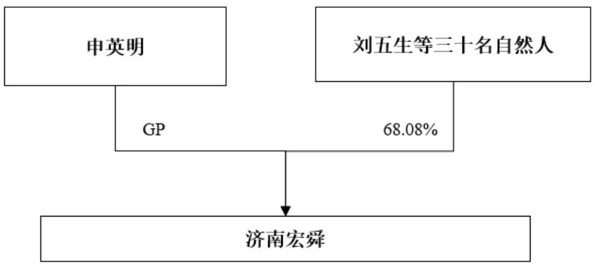

flowchart

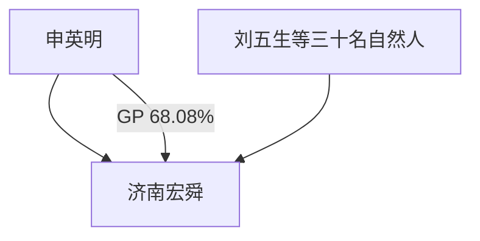
```mermaid
graph TD
  A["申英明"] --> C["济南宏舜"]
  B["刘五生等三十名自然人"] --> C["济南宏舜"]
  A -->|GP 68.08%| C
```

## 4、最近三年主营业务发展情况

济南宏舜为宏济堂员工持股平台，最近三年主营业务无变更。

## 5、最近两年主要财务情况

济南宏舜最近两年主要财务数据如下：

单位：万元

<table><tr><td>项目</td><td>2024年末/2024年度</td><td>2023年末/2023年度</td></tr><tr><td>资产总额</td><td>500.14</td><td>516.55</td></tr><tr><td>负债总额</td><td>202.87</td><td>219.24</td></tr><tr><td>净资产</td><td>297.27</td><td>297.31</td></tr><tr><td>营业收入</td><td>-</td><td>-</td></tr><tr><td>净利润</td><td>-0.04</td><td>198.66</td></tr></table>

注：财务数据未经审计。

## 6、下属企业情况

截至本报告书签署日，济南宏舜不存在控制的下属企业。

## 7、是否属于私募投资基金及备案情况

济南宏舜不存在以非公开方式向合格投资者募集资金设立的情形，济南宏舜的资产不存在由基金管理人管理、基金托管人进行托管的情形，亦不涉及从事私募投资基金管理活动的情形，无需办理私募投资基金或私募投资基金管理人登记备案手续。

## （十三）济南宏凯

## 1、基本情况

<table><tr><td>企业名称</td><td>济南宏凯企业管理咨询合伙企业(有限合伙)</td></tr><tr><td>企业类型</td><td>有限合伙企业</td></tr><tr><td>出资额</td><td>139.893804万元人民币</td></tr><tr><td>执行事务合伙人</td><td>袁世琪</td></tr><tr><td>成立日期</td><td>2015-06-19</td></tr><tr><td>主要经营场所</td><td>山东省济南市历城区经十东路30766号力诺永宁综合楼301室</td></tr><tr><td>统一社会信用代码</td><td>91370112307241271L</td></tr><tr><td>经营范围</td><td>企业管理咨询。(依法须经批准的项目,经相关部门批准后方可开展经营活动)</td></tr></table>

## 2、历史沿革

## （1）2015年 7月，设立

2015年7月，济南宏凯设立。出资额为 139.89万元，普通合伙人为袁世琪，有限合伙人为张玲等 46名自然人。设立时合伙人及出资结构如下：

<table><tr><td>序号</td><td>合伙人姓名</td><td>合伙人类型</td><td>出资额(万元)</td><td>出资比例</td></tr><tr><td>1</td><td>袁世琪</td><td>普通合伙人</td><td>4.75</td><td>3.40%</td></tr><tr><td>2</td><td>刁玉泰</td><td>有限合伙人</td><td>8.44</td><td>6.03%</td></tr><tr><td>3</td><td>王传明</td><td>有限合伙人</td><td>6.59</td><td>4.71%</td></tr><tr><td>4</td><td>张保智</td><td>有限合伙人</td><td>6.59</td><td>4.71%</td></tr><tr><td>5</td><td>张凯</td><td>有限合伙人</td><td>5.66</td><td>4.05%</td></tr><tr><td>6</td><td>曲正</td><td>有限合伙人</td><td>4.75</td><td>3.40%</td></tr><tr><td>7</td><td>朱明礼</td><td>有限合伙人</td><td>4.14</td><td>2.96%</td></tr><tr><td>8</td><td>李先明</td><td>有限合伙人</td><td>3.69</td><td>2.64%</td></tr><tr><td>9</td><td>张燕</td><td>有限合伙人</td><td>2.90</td><td>2.08%</td></tr><tr><td>10</td><td>张辉</td><td>有限合伙人</td><td>2.90</td><td>2.08%</td></tr><tr><td>11</td><td>石磊</td><td>有限合伙人</td><td>2.90</td><td>2.08%</td></tr><tr><td>12</td><td>赵勇</td><td>有限合伙人</td><td>2.90</td><td>2.08%</td></tr><tr><td>13</td><td>赵艳</td><td>有限合伙人</td><td>2.90</td><td>2.08%</td></tr><tr><td>14</td><td>王立华</td><td>有限合伙人</td><td>2.90</td><td>2.08%</td></tr><tr><td>15</td><td>方敏</td><td>有限合伙人</td><td>2.90</td><td>2.08%</td></tr><tr><td>16</td><td>邵建军</td><td>有限合伙人</td><td>2.90</td><td>2.08%</td></tr><tr><td>17</td><td>陈丽英</td><td>有限合伙人</td><td>2.90</td><td>2.08%</td></tr><tr><td>18</td><td>刘瑄</td><td>有限合伙人</td><td>2.90</td><td>2.08%</td></tr><tr><td>19</td><td>张启敏</td><td>有限合伙人</td><td>2.90</td><td>2.08%</td></tr><tr><td>20</td><td>梁云华</td><td>有限合伙人</td><td>2.90</td><td>2.08%</td></tr><tr><td>21</td><td>解品霞</td><td>有限合伙人</td><td>2.90</td><td>2.08%</td></tr><tr><td>22</td><td>徐成秋</td><td>有限合伙人</td><td>2.90</td><td>2.08%</td></tr><tr><td>23</td><td>康松鹤</td><td>有限合伙人</td><td>2.90</td><td>2.08%</td></tr><tr><td>24</td><td>杜宪义</td><td>有限合伙人</td><td>2.90</td><td>2.08%</td></tr><tr><td>25</td><td>芦广芬</td><td>有限合伙人</td><td>2.90</td><td>2.08%</td></tr><tr><td>26</td><td>司玉贞</td><td>有限合伙人</td><td>2.90</td><td>2.08%</td></tr><tr><td>27</td><td>侯本勇</td><td>有限合伙人</td><td>2.75</td><td>1.97%</td></tr><tr><td>28</td><td>高敏</td><td>有限合伙人</td><td>2.45</td><td>1.75%</td></tr><tr><td>29</td><td>于素文</td><td>有限合伙人</td><td>2.45</td><td>1.75%</td></tr><tr><td>30</td><td>杨文玉</td><td>有限合伙人</td><td>2.30</td><td>1.64%</td></tr><tr><td>31</td><td>韩倩</td><td>有限合伙人</td><td>2.15</td><td>1.54%</td></tr><tr><td>32</td><td>朱传虎</td><td>有限合伙人</td><td>2.15</td><td>1.54%</td></tr><tr><td>33</td><td>关桂菊</td><td>有限合伙人</td><td>2.15</td><td>1.54%</td></tr><tr><td>34</td><td>吴刚</td><td>有限合伙人</td><td>2.00</td><td>1.43%</td></tr><tr><td>35</td><td>王臻</td><td>有限合伙人</td><td>2.00</td><td>1.43%</td></tr><tr><td>36</td><td>解西周</td><td>有限合伙人</td><td>2.00</td><td>1.43%</td></tr><tr><td>37</td><td>赵秉如</td><td>有限合伙人</td><td>2.00</td><td>1.43%</td></tr><tr><td>38</td><td>毛翠芹</td><td>有限合伙人</td><td>2.00</td><td>1.43%</td></tr><tr><td>39</td><td>刘敏</td><td>有限合伙人</td><td>1.85</td><td>1.32%</td></tr><tr><td>40</td><td>张玲</td><td>有限合伙人</td><td>1.85</td><td>1.32%</td></tr><tr><td>41</td><td>刘春红</td><td>有限合伙人</td><td>1.85</td><td>1.32%</td></tr><tr><td>42</td><td>魏凤英</td><td>有限合伙人</td><td>1.85</td><td>1.32%</td></tr><tr><td>43</td><td>崔存良</td><td>有限合伙人</td><td>1.85</td><td>1.32%</td></tr><tr><td>44</td><td>毛日昆</td><td>有限合伙人</td><td>1.85</td><td>1.32%</td></tr><tr><td>45</td><td>孙雯红</td><td>有限合伙人</td><td>1.85</td><td>1.32%</td></tr><tr><td>46</td><td>梁善美</td><td>有限合伙人</td><td>1.85</td><td>1.32%</td></tr><tr><td>47</td><td>刘继东</td><td>有限合伙人</td><td>1.85</td><td>1.32%</td></tr><tr><td colspan="3">合计</td><td>139.89</td><td>100.00%</td></tr></table>

## 3、产权控制关系

截至本报告书签署日，袁世琪直接持有济南宏凯 3.40%的合伙份额并担任济南宏凯执行事务合伙人，为济南宏凯实际控制人。其产权控制关系如下：

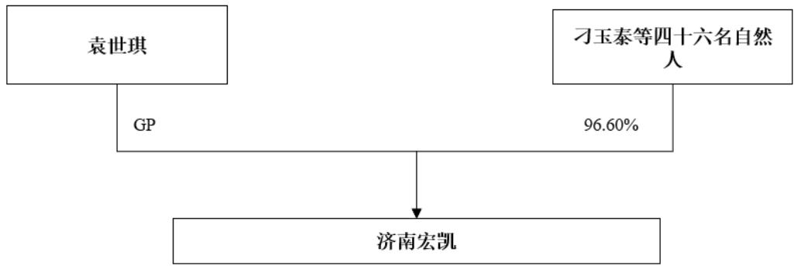

flowchart

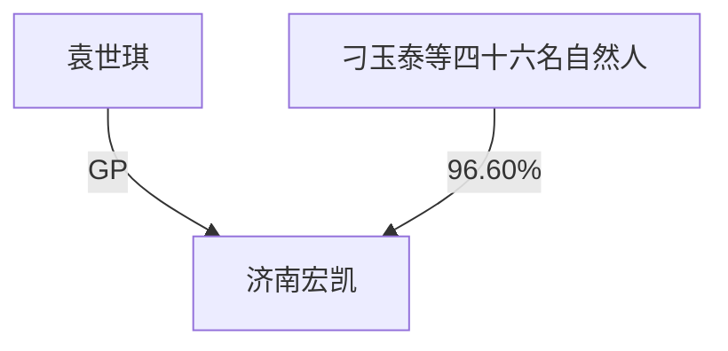
```mermaid
graph TD
  A["袁世琪"] -->|GP| C["济南宏凯"]
  B["刁玉泰等四十六名自然人"] -->|96.60%| C
```

## 4、最近三年主营业务发展情况

济南宏凯主营业务为宏济堂员工持股平台，最近三年主营业务无变更。

## 5、最近两年主要财务情况

济南宏凯最近两年主要财务数据如下：

单位：万元

<table><tr><td>项目</td><td>2024年末/2024年度</td><td>2023年末/2023年度</td></tr><tr><td>资产总额</td><td>279.19</td><td>279.28</td></tr><tr><td>负债总额</td><td>0.20</td><td>0.25</td></tr><tr><td>净资产</td><td>278.99</td><td>279.03</td></tr><tr><td>营业收入</td><td>-</td><td>-</td></tr><tr><td>净利润</td><td>-0.04</td><td>139.53</td></tr></table>

注：财务数据未经审计。

## 6、下属企业情况

截至本报告书签署日，济南宏凯不存在控制的下属企业。

## 7、是否属于私募投资基金及备案情况

济南宏凯不存在以非公开方式向合格投资者募集资金设立的情形，济南惠宏的资产不存在由基金管理人管理、基金托管人进行托管的情形，亦不涉及从事私募投资基金管理活动的情形，无需办理私募投资基金或私募投资基金管理人登记备案手续。

## （十四）济南惠宏

## 1、基本情况

<table><tr><td>企业名称</td><td>济南惠宏企业管理咨询合伙企业(有限合伙)</td></tr><tr><td>企业类型</td><td>有限合伙企业</td></tr><tr><td>出资额</td><td>328.00万元人民币</td></tr><tr><td>执行事务合伙人</td><td>申英明</td></tr><tr><td>成立日期</td><td>2015-07-24</td></tr><tr><td>主要经营场所</td><td>山东省济南市历城区经十东路30766号力诺永宁综合楼305室</td></tr><tr><td>统一社会信用代码</td><td>913701123068993626</td></tr><tr><td>经营范围</td><td>企业管理咨询。(依法须经批准的项目,经相关部门批准后方可开展经营活动)</td></tr></table>

## 2、历史沿革

## （1）2015年 7月，设立

2015年7月，济南惠宏设立。出资额为 328.00万元，普通合伙人为申英明，有限合伙人为杨纪海等 18名自然人。设立时合伙人及出资结构如下：

<table><tr><td>序号</td><td>合伙人姓名</td><td>合伙人类型</td><td>出资额(万元)</td><td>出资比例</td></tr><tr><td>1</td><td>申英明</td><td>普通合伙人</td><td>198.40</td><td>60.49%</td></tr><tr><td>2</td><td>杨纪海</td><td>有限合伙人</td><td>20.24</td><td>6.17%</td></tr><tr><td>3</td><td>王丽云</td><td>有限合伙人</td><td>20.24</td><td>6.17%</td></tr><tr><td>4</td><td>张晓洁</td><td>有限合伙人</td><td>10.12</td><td>3.08%</td></tr><tr><td>5</td><td>汤甜</td><td>有限合伙人</td><td>10.12</td><td>3.08%</td></tr><tr><td>6</td><td>王锋</td><td>有限合伙人</td><td>10.12</td><td>3.08%</td></tr><tr><td>7</td><td>韩丽</td><td>有限合伙人</td><td>10.12</td><td>3.08%</td></tr><tr><td>8</td><td>徐立春</td><td>有限合伙人</td><td>10.12</td><td>3.08%</td></tr><tr><td>9</td><td>陈学博</td><td>有限合伙人</td><td>10.12</td><td>3.08%</td></tr><tr><td>10</td><td>武祥伦</td><td>有限合伙人</td><td>10.12</td><td>3.08%</td></tr><tr><td>11</td><td>李华</td><td>有限合伙人</td><td>2.03</td><td>0.62%</td></tr><tr><td>12</td><td>耿加亮</td><td>有限合伙人</td><td>2.03</td><td>0.62%</td></tr><tr><td>13</td><td>徐慧敏</td><td>有限合伙人</td><td>2.03</td><td>0.62%</td></tr><tr><td>14</td><td>王勇</td><td>有限合伙人</td><td>2.03</td><td>0.62%</td></tr><tr><td>15</td><td>刘克祥</td><td>有限合伙人</td><td>2.03</td><td>0.62%</td></tr><tr><td>16</td><td>朱建欣</td><td>有限合伙人</td><td>2.03</td><td>0.62%</td></tr><tr><td>17</td><td>高红</td><td>有限合伙人</td><td>2.03</td><td>0.62%</td></tr><tr><td>18</td><td>刘桂燕</td><td>有限合伙人</td><td>2.03</td><td>0.62%</td></tr><tr><td>19</td><td>余彩娟</td><td>有限合伙人</td><td>2.03</td><td>0.62%</td></tr><tr><td colspan="3">合计</td><td>328.00</td><td>100.00%</td></tr></table>

## （2）2015年 9月，第一次转让

2015年9月，合伙人由 19人变更为9 人。本次变更后，合伙人及出资结构如下：

<table><tr><td>序号</td><td>合伙人姓名</td><td>合伙人类型</td><td>出资额(万元)</td><td>出资比例</td></tr><tr><td>1</td><td>申英明</td><td>普通合伙人</td><td>226.82</td><td>69.15%</td></tr><tr><td>2</td><td>杨纪海</td><td>有限合伙人</td><td>20.24</td><td>6.17%</td></tr><tr><td>3</td><td>王丽云</td><td>有限合伙人</td><td>20.24</td><td>6.17%</td></tr><tr><td>4</td><td>张晓洁</td><td>有限合伙人</td><td>10.12</td><td>3.08%</td></tr><tr><td>5</td><td>汤甜</td><td>有限合伙人</td><td>10.12</td><td>3.08%</td></tr><tr><td>6</td><td>王锋</td><td>有限合伙人</td><td>10.12</td><td>3.08%</td></tr><tr><td>7</td><td>徐立春</td><td>有限合伙人</td><td>10.12</td><td>3.08%</td></tr><tr><td>8</td><td>陈学博</td><td>有限合伙人</td><td>10.12</td><td>3.08%</td></tr><tr><td>9</td><td>武祥伦</td><td>有限合伙人</td><td>10.12</td><td>3.08%</td></tr><tr><td colspan="3">合计</td><td>328.00</td><td>100.00%</td></tr></table>

## （3）2017年 3月，第二次转让

2017年3月，王锋退伙。本次变更后，合伙人及出资结构如下：

<table><tr><td>序号</td><td>合伙人姓名</td><td>合伙人类型</td><td>出资额(万元)</td><td>出资比例</td></tr><tr><td>1</td><td>申英明</td><td>普通合伙人</td><td>236.94</td><td>72.24%</td></tr><tr><td>2</td><td>杨纪海</td><td>有限合伙人</td><td>20.24</td><td>6.17%</td></tr><tr><td>3</td><td>王丽云</td><td>有限合伙人</td><td>20.24</td><td>6.17%</td></tr><tr><td>4</td><td>张晓洁</td><td>有限合伙人</td><td>10.12</td><td>3.08%</td></tr><tr><td>5</td><td>汤甜</td><td>有限合伙人</td><td>10.12</td><td>3.08%</td></tr><tr><td>6</td><td>徐立春</td><td>有限合伙人</td><td>10.12</td><td>3.08%</td></tr><tr><td>7</td><td>陈学博</td><td>有限合伙人</td><td>10.12</td><td>3.08%</td></tr><tr><td>8</td><td>武祥伦</td><td>有限合伙人</td><td>10.12</td><td>3.08%</td></tr><tr><td colspan="3">合计</td><td>328.00</td><td>100.00%</td></tr></table>

## （4）2023年 2月，第三次转让

2023年2月，济南惠宏合伙人由 8人变更为 13人。本次变更后，合伙人及出资结构如下：

<table><tr><td>序号</td><td>合伙人姓名</td><td>合伙人类型</td><td>出资额(万元)</td><td>出资比例</td></tr><tr><td>1</td><td>申英明</td><td>普通合伙人</td><td>226.77</td><td>69.14%</td></tr><tr><td>2</td><td>王丽云</td><td>有限合伙人</td><td>20.24</td><td>6.17%</td></tr><tr><td>3</td><td>杨纪海</td><td>有限合伙人</td><td>20.24</td><td>6.17%</td></tr><tr><td>4</td><td>张晓洁</td><td>有限合伙人</td><td>10.12</td><td>3.08%</td></tr><tr><td>5</td><td>徐立春</td><td>有限合伙人</td><td>10.12</td><td>3.08%</td></tr><tr><td>6</td><td>汤甜</td><td>有限合伙人</td><td>10.12</td><td>3.08%</td></tr><tr><td>7</td><td>陈学博</td><td>有限合伙人</td><td>10.12</td><td>3.08%</td></tr><tr><td>8</td><td>武祥伦</td><td>有限合伙人</td><td>10.12</td><td>3.08%</td></tr><tr><td>9</td><td>高红</td><td>有限合伙人</td><td>2.03</td><td>0.62%</td></tr><tr><td>10</td><td>刘桂燕</td><td>有限合伙人</td><td>2.03</td><td>0.62%</td></tr><tr><td>11</td><td>刘克祥</td><td>有限合伙人</td><td>2.03</td><td>0.62%</td></tr><tr><td>12</td><td>余彩娟</td><td>有限合伙人</td><td>2.03</td><td>0.62%</td></tr><tr><td>13</td><td>朱建欣</td><td>有限合伙人</td><td>2.03</td><td>0.62%</td></tr><tr><td colspan="3">合计</td><td>328.00</td><td>100.00%</td></tr></table>

## 3、产权控制关系

截至本报告书签署日，申英明直接持有济南惠宏 69.14%的合伙份额并担任济南惠宏执行事务合伙人，为济南惠宏实际控制人。其产权控制关系如下：

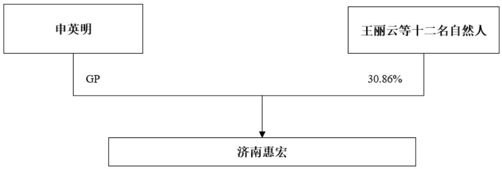

flowchart

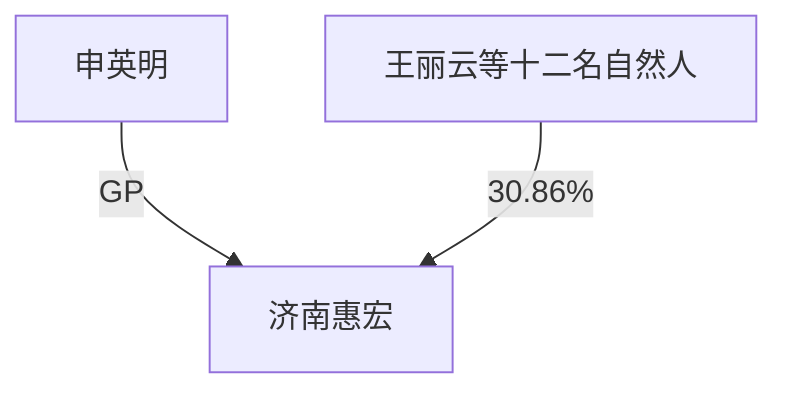
```mermaid
graph TD
  A["申英明"] -->|GP| C["济南惠宏"]
  B["王丽云等十二名自然人"] -->|30.86%| C
```

## 4、最近三年主营业务发展情况

济南惠宏主营业务为宏济堂员工持股平台，最近三年主营业务无变更。

## 5、最近两年主要财务情况

济南惠宏最近两年主要财务数据如下：

单位：万元

<table><tr><td>项目</td><td>2024年末/2024年度</td><td>2023年末/2023年度</td></tr><tr><td>资产总额</td><td>397.22</td><td>400.57</td></tr><tr><td>负债总额</td><td>133.08</td><td>136.39</td></tr><tr><td>净资产</td><td>264.14</td><td>264.18</td></tr><tr><td>营业收入</td><td>-</td><td>-</td></tr><tr><td>净利润</td><td>-0.04</td><td>132.13</td></tr></table>

注：财务数据未经审计。

## 6、下属企业情况

截至本报告书签署日，济南惠宏不存在控制的下属企业。

## 7、是否属于私募投资基金及备案情况

济南惠宏不存在以非公开方式向合格投资者募集资金设立的情形，济南惠宏的资产不存在由基金管理人管理、基金托管人进行托管的情形，亦不涉及从事私募投资基金管理活动的情形，无需办理私募投资基金或私募投资基金管理人登记备案手续。

## （十五）济南鲲特

## 1、基本情况

<table><tr><td>企业名称</td><td>济南鲲特企业管理咨询合伙企业(有限合伙)</td></tr><tr><td>企业类型</td><td>有限合伙企业</td></tr><tr><td>出资额</td><td>124.11万元人民币</td></tr><tr><td>执行事务合伙人</td><td>袁世琪</td></tr><tr><td>成立日期</td><td>2015-06-19</td></tr><tr><td>主要经营场所</td><td>山东省济南市历城区经十东路30766号力诺永宁综合楼303室</td></tr><tr><td>统一社会信用代码</td><td>913701123072413518</td></tr><tr><td>经营范围</td><td>企业管理咨询。(依法须经批准的项目,经相关部门批准后方可开展经营活动)</td></tr></table>

## 2、历史沿革

## （1）2015年 6月，设立

2015年6月，济南鲲特设立。出资额为 124.11万元，普通合伙人为袁世琪，有限合伙人为张鲁生等 11名自然人。设立时合伙人及出资结构如下：

<table><tr><td>序号</td><td>合伙人姓名</td><td>合伙人类型</td><td>出资额(万元)</td><td>出资比例</td></tr><tr><td>1</td><td>袁世琪</td><td>普通合伙人</td><td>96.09</td><td>77.43%</td></tr><tr><td>2</td><td>张鲁生</td><td>有限合伙人</td><td>2.90</td><td>2.34%</td></tr><tr><td>3</td><td>张兆颐</td><td>有限合伙人</td><td>2.90</td><td>2.34%</td></tr><tr><td>4</td><td>赵秀英</td><td>有限合伙人</td><td>2.90</td><td>2.34%</td></tr><tr><td>5</td><td>刘燕</td><td>有限合伙人</td><td>2.90</td><td>2.34%</td></tr><tr><td>6</td><td>韩克震</td><td>有限合伙人</td><td>2.90</td><td>2.34%</td></tr><tr><td>7</td><td>李兰华</td><td>有限合伙人</td><td>2.90</td><td>2.34%</td></tr><tr><td>8</td><td>董云霞</td><td>有限合伙人</td><td>2.60</td><td>2.10%</td></tr><tr><td>9</td><td>史学红</td><td>有限合伙人</td><td>2.45</td><td>1.97%</td></tr><tr><td>10</td><td>朱希妍</td><td>有限合伙人</td><td>1.85</td><td>1.49%</td></tr><tr><td>11</td><td>冯慰</td><td>有限合伙人</td><td>1.85</td><td>1.49%</td></tr><tr><td>12</td><td>孟卉</td><td>有限合伙人</td><td>1.85</td><td>1.49%</td></tr><tr><td colspan="3">合计</td><td>124.11</td><td>100.00%</td></tr></table>

## （2）2016年 2月，第一次转让

2016 年 2 月，济南鲲特合伙人由 12 名自然人变更为 15 名自然人，本次变更后，合伙人及出资结构如下：

<table><tr><td>序号</td><td>合伙人姓名</td><td>合伙人类型</td><td>出资额(万元)</td><td>出资比例</td></tr><tr><td>1</td><td>袁世琪</td><td>普通合伙人</td><td>87.99</td><td>70.89%</td></tr><tr><td>2</td><td>张鲁生</td><td>有限合伙人</td><td>2.90</td><td>2.34%</td></tr><tr><td>3</td><td>张兆颐</td><td>有限合伙人</td><td>2.90</td><td>2.34%</td></tr><tr><td>4</td><td>赵秀英</td><td>有限合伙人</td><td>2.90</td><td>2.34%</td></tr><tr><td>5</td><td>刘燕</td><td>有限合伙人</td><td>2.90</td><td>2.34%</td></tr><tr><td>6</td><td>韩克震</td><td>有限合伙人</td><td>2.90</td><td>2.34%</td></tr><tr><td>7</td><td>李兰华</td><td>有限合伙人</td><td>2.90</td><td>2.34%</td></tr><tr><td>8</td><td>李贤敏</td><td>有限合伙人</td><td>2.90</td><td>2.34%</td></tr><tr><td>9</td><td>林丛</td><td>有限合伙人</td><td>2.90</td><td>2.34%</td></tr><tr><td>10</td><td>董云霞</td><td>有限合伙人</td><td>2.60</td><td>2.10%</td></tr><tr><td>11</td><td>史学红</td><td>有限合伙人</td><td>2.45</td><td>1.97%</td></tr><tr><td>12</td><td>刘冬梅</td><td>有限合伙人</td><td>2.30</td><td>1.85%</td></tr><tr><td>13</td><td>朱希妍</td><td>有限合伙人</td><td>1.85</td><td>1.49%</td></tr><tr><td>14</td><td>冯慰</td><td>有限合伙人</td><td>1.85</td><td>1.49%</td></tr><tr><td>15</td><td>孟卉</td><td>有限合伙人</td><td>1.85</td><td>1.49%</td></tr><tr><td colspan="3">合计</td><td>124.11</td><td>100.00%</td></tr></table>

## （3）2016年 4月，第二次转让

2016 年 4 月，济南鲲特合伙人由 15 名自然人变更为 25 名自然人，本次变更后，合伙人及出资结构如下：

<table><tr><td>序号</td><td>合伙人姓名</td><td>合伙人类型</td><td>出资额(万元)</td><td>出资比例</td></tr><tr><td>1</td><td>袁世琪</td><td>普通合伙人</td><td>4.75</td><td>3.83%</td></tr><tr><td>2</td><td>李剑刚</td><td>有限合伙人</td><td>58.30</td><td>46.98%</td></tr><tr><td>3</td><td>刘燕</td><td>有限合伙人</td><td>2.90</td><td>2.34%</td></tr><tr><td>4</td><td>赵秀英</td><td>有限合伙人</td><td>2.90</td><td>2.34%</td></tr><tr><td>5</td><td>林丛</td><td>有限合伙人</td><td>2.90</td><td>2.34%</td></tr><tr><td>6</td><td>李兰华</td><td>有限合伙人</td><td>2.90</td><td>2.34%</td></tr><tr><td>7</td><td>朱玮</td><td>有限合伙人</td><td>2.90</td><td>2.34%</td></tr><tr><td>8</td><td>张鲁生</td><td>有限合伙人</td><td>2.90</td><td>2.34%</td></tr><tr><td>9</td><td>李贤敏</td><td>有限合伙人</td><td>2.90</td><td>2.34%</td></tr><tr><td>10</td><td>王延萍</td><td>有限合伙人</td><td>2.90</td><td>2.34%</td></tr><tr><td>11</td><td>袁之祥</td><td>有限合伙人</td><td>2.90</td><td>2.34%</td></tr><tr><td>12</td><td>焦梅芳</td><td>有限合伙人</td><td>2.90</td><td>2.34%</td></tr><tr><td>13</td><td>韩克震</td><td>有限合伙人</td><td>2.90</td><td>2.34%</td></tr><tr><td>14</td><td>林竺</td><td>有限合伙人</td><td>2.90</td><td>2.34%</td></tr><tr><td>15</td><td>张兆颐</td><td>有限合伙人</td><td>2.90</td><td>2.34%</td></tr><tr><td>16</td><td>孙双聚</td><td>有限合伙人</td><td>2.90</td><td>2.34%</td></tr><tr><td>17</td><td>逄玉芝</td><td>有限合伙人</td><td>2.90</td><td>2.34%</td></tr><tr><td>18</td><td>董云霞</td><td>有限合伙人</td><td>2.60</td><td>2.10%</td></tr><tr><td>19</td><td>陈旭东</td><td>有限合伙人</td><td>2.45</td><td>1.97%</td></tr><tr><td>20</td><td>史学红</td><td>有限合伙人</td><td>2.45</td><td>1.97%</td></tr><tr><td>21</td><td>刘冬梅</td><td>有限合伙人</td><td>2.30</td><td>1.85%</td></tr><tr><td>22</td><td>于湧</td><td>有限合伙人</td><td>2.15</td><td>1.73%</td></tr><tr><td>23</td><td>冯慰</td><td>有限合伙人</td><td>1.85</td><td>1.49%</td></tr><tr><td>24</td><td>孟卉</td><td>有限合伙人</td><td>1.85</td><td>1.49%</td></tr><tr><td>25</td><td>朱希妍</td><td>有限合伙人</td><td>1.85</td><td>1.49%</td></tr><tr><td colspan="3">合计</td><td>124.11</td><td>100.00%</td></tr></table>

## （4）2016年 4月，第三次变更

2016 年 4 月，袁世琪将 2.90 万元出资额转让至李剑刚，本次变更后，合伙人及出资结构如下：

<table><tr><td>序号</td><td>合伙人姓名</td><td>合伙人类型</td><td>出资额(万元)</td><td>出资比例</td></tr><tr><td>1</td><td>袁世琪</td><td>普通合伙人</td><td>1.85</td><td>1.49%</td></tr><tr><td>2</td><td>李剑刚</td><td>有限合伙人</td><td>61.21</td><td>49.32%</td></tr><tr><td>3</td><td>刘燕</td><td>有限合伙人</td><td>2.90</td><td>2.34%</td></tr><tr><td>4</td><td>赵秀英</td><td>有限合伙人</td><td>2.90</td><td>2.34%</td></tr><tr><td>5</td><td>林丛</td><td>有限合伙人</td><td>2.90</td><td>2.34%</td></tr><tr><td>6</td><td>李兰华</td><td>有限合伙人</td><td>2.90</td><td>2.34%</td></tr><tr><td>7</td><td>朱玮</td><td>有限合伙人</td><td>2.90</td><td>2.34%</td></tr><tr><td>8</td><td>张鲁生</td><td>有限合伙人</td><td>2.90</td><td>2.34%</td></tr><tr><td>9</td><td>李贤敏</td><td>有限合伙人</td><td>2.90</td><td>2.34%</td></tr><tr><td>10</td><td>王延萍</td><td>有限合伙人</td><td>2.90</td><td>2.34%</td></tr><tr><td>11</td><td>袁之祥</td><td>有限合伙人</td><td>2.90</td><td>2.34%</td></tr><tr><td>12</td><td>焦梅芳</td><td>有限合伙人</td><td>2.90</td><td>2.34%</td></tr><tr><td>13</td><td>韩克震</td><td>有限合伙人</td><td>2.90</td><td>2.34%</td></tr><tr><td>14</td><td>林竺</td><td>有限合伙人</td><td>2.90</td><td>2.34%</td></tr><tr><td>15</td><td>张兆颐</td><td>有限合伙人</td><td>2.90</td><td>2.34%</td></tr><tr><td>16</td><td>孙双聚</td><td>有限合伙人</td><td>2.90</td><td>2.34%</td></tr><tr><td>17</td><td>逄玉芝</td><td>有限合伙人</td><td>2.90</td><td>2.34%</td></tr><tr><td>18</td><td>董云霞</td><td>有限合伙人</td><td>2.60</td><td>2.10%</td></tr><tr><td>19</td><td>陈旭东</td><td>有限合伙人</td><td>2.45</td><td>1.97%</td></tr><tr><td>20</td><td>史学红</td><td>有限合伙人</td><td>2.45</td><td>1.97%</td></tr><tr><td>21</td><td>刘冬梅</td><td>有限合伙人</td><td>2.30</td><td>1.85%</td></tr><tr><td>22</td><td>于湧</td><td>有限合伙人</td><td>2.15</td><td>1.73%</td></tr><tr><td>23</td><td>冯慰</td><td>有限合伙人</td><td>1.85</td><td>1.49%</td></tr><tr><td>24</td><td>孟卉</td><td>有限合伙人</td><td>1.85</td><td>1.49%</td></tr><tr><td>25</td><td>朱希妍</td><td>有限合伙人</td><td>1.85</td><td>1.49%</td></tr><tr><td colspan="3">合计</td><td>124.11</td><td>100.00%</td></tr></table>

## 3、产权控制关系

截至本报告书签署日，袁世琪直接持有济南鲲特 1.49%的合伙份额并担任济南鲲特执行事务合伙人，为济南鲲特实际控制人。其产权控制关系如下：

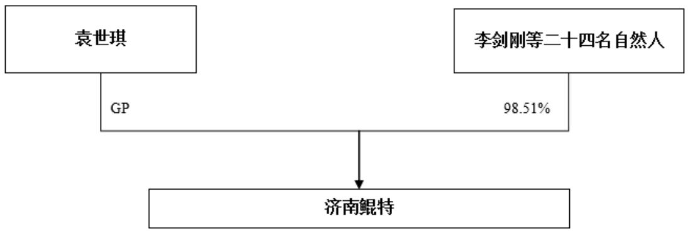

flowchart

```mermaid
graph TD
  A["袁世琪"] -->|GP| C["济南鲲特"]
  B["李剑刚等二十四名自然人"] -->|98.51%| C["济南鲲特"]
```

## 4、最近三年主营业务发展情况

济南鲲特主营业务为宏济堂员工持股平台，最近三年主营业务无变更。

## 5、最近两年主要财务情况

济南鲲特最近两年主要财务数据如下：

单位：万元

<table><tr><td>项目</td><td>2024年末/2024年度</td><td>2023年末/2023年度</td></tr><tr><td>资产总额</td><td>297.94</td><td>297.90</td></tr><tr><td>负债总额</td><td>50.32</td><td>50.32</td></tr><tr><td>净资产</td><td>247.62</td><td>247.57</td></tr><tr><td>营业收入</td><td>-</td><td>-</td></tr><tr><td>净利润</td><td>0.05</td><td>123.84</td></tr></table>

注：财务数据未经审计。

## 6、下属企业情况

截至本报告书签署日，济南鲲特不存在控制的下属企业。

## 7、是否属于私募投资基金及备案情况

济南鲲特不存在以非公开方式向合格投资者募集资金设立的情形，济南鲲特的资产不存在由基金管理人管理、基金托管人进行托管的情形，亦不涉及从事私募投资基金管理活动的情形，无需办理私募投资基金或私募投资基金管理人登记备案手续。

## （十六）鲁康投资

## 1、基本情况

<table><tr><td>公司名称</td><td>鲁康投资有限公司</td></tr><tr><td>公司类型</td><td>有限责任公司</td></tr><tr><td>注册资本</td><td>18,750万元人民币</td></tr><tr><td>法定代表人</td><td>李宪超</td></tr><tr><td>成立日期</td><td>2015-09-25</td></tr><tr><td>注册地址</td><td>山东省济南市高新技术产业开发区经十路7000号汉峪金谷A2-5栋23层</td></tr><tr><td>统一社会信用代码</td><td>91370000MA3BXJGU13</td></tr><tr><td>经营范围</td><td>以自有资金进行股权投资、项目投资、投资管理;企业咨询服务,投融资咨询及财务顾问业务。(依法须经批准的项目,经相关部门批准后方可开展经营活动)</td></tr></table>

## 2、历史沿革

## （1）2015年 9月，设立

2015年9月，鲁康投资设立，注册资本为 15,000.00万元，股东为山东省国有资产投资控股有限公司。股东及出资结构如下：

<table><tr><td>序号</td><td>股东名称</td><td>注册资本(万元)</td><td>出资比例</td></tr><tr><td>1</td><td>山东省国有资产投资控股有限公司</td><td>15,000.00</td><td>100.00%</td></tr><tr><td colspan="2">合计</td><td>15,000.00</td><td>100.00%</td></tr></table>

## （2）2021 年 12 月，第一次增资

2021 年 12 月，鲁康投资注册资本增至 18,750 万元。新增的注册资本 3,750万元由力诺集团股份有限公司以货币形式认缴。

本次变更后，股东及出资结构如下：

<table><tr><td>序号</td><td>股东名称</td><td>注册资本(万元)</td><td>出资比例</td></tr><tr><td>1</td><td>山东省国有资产投资控股有限公司</td><td>15,000.00</td><td>80.00%</td></tr><tr><td>2</td><td>力诺集团股份有限公司</td><td>3,750.00</td><td>20.00%</td></tr><tr><td colspan="2">合计</td><td>18,750.00</td><td>100.00%</td></tr></table>

## （3）2022年 6月，第一次转让

2022 年 6 月，山东省国有资产投资控股有限公司将鲁康投资有限公司 80%股权转让给山东省医药集团有限公司。

本次变更后，股东及出资结构如下：

<table><tr><td>序号</td><td>股东名称</td><td>注册资本(万元)</td><td>出资比例</td></tr><tr><td>1</td><td>山东省医药集团有限公司</td><td>15,000.00</td><td>80.00%</td></tr><tr><td>2</td><td>力诺集团股份有限公司</td><td>3,750.00</td><td>20.00%</td></tr><tr><td colspan="2">合计</td><td>18,750.00</td><td>100.00%</td></tr></table>

## 3、产权控制关系

截至本报告书签署日，山东省医药集团有限公司持有鲁康投资 80%的股权，为鲁康投资的控股股东；山东省人民政府国有资产监督管理委员会通过山东省国有资产投资控股有限公司控制山东省医药集团有限公司 100%股权，为鲁康投资的实际控制人。鲁康投资的产权控制关系如下：

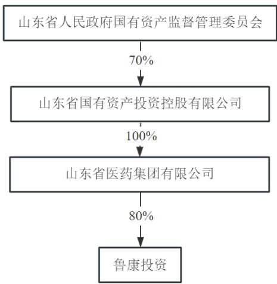

flowchart

```mermaid
graph TD
  A["山东省人民政府国有资产监督管理委员会"] -->|70%| B["山东省国有资产投资控股有限公司"]
  B -->|100%| C["山东省医药集团有限公司"]
  C -->|80%| D["鲁康投资"]
```

## 4、最近三年主营业务发展情况

鲁康投资主营业务为健康产业股权投资，最近三年主营业务无变更。

## 5、最近两年主要财务情况

鲁康投资最近两年主要财务数据如下：

单位：万元

<table><tr><td>项目</td><td>2024年末/2024年度</td><td>2023年末/2023年度</td></tr><tr><td>资产总额</td><td>48,542.91</td><td>46,136.87</td></tr><tr><td>负债总额</td><td>22,259.54</td><td>20,183.27</td></tr><tr><td>净资产</td><td>26,283.37</td><td>25,953.60</td></tr><tr><td>营业收入</td><td>35,194.09</td><td>37,491.14</td></tr><tr><td>净利润</td><td>329.77</td><td>1,293.60</td></tr></table>

注：2023年财务数据已经审计；2024年财务数据未经审计。

## 6、下属企业情况

截至本报告书签署日，鲁康投资控制的主要下属企业如下：

<table><tr><td>序号</td><td>企业名称</td><td>注册资本/出资额(万元)</td><td>持股比例(%)</td><td>主营业务</td></tr><tr><td>1</td><td>山东省齐天医药有限责任公司</td><td>80.00</td><td>100.00</td><td>医药销售</td></tr><tr><td>2</td><td>城投鲁康医养产业投资基金(潍坊市)合伙企业(有限合伙)</td><td>20,000.00</td><td>山东省齐天医药有限责任公司担任执行事务合伙人并持有0.5%合伙份额</td><td>以私募基金从事股权投资、投资管理、资产管理等活动;财务咨询</td></tr></table>

## 7、是否属于私募投资基金及备案情况

鲁康投资不存在以非公开方式向合格投资者募集资金设立的情形，鲁康投资的资产不存在由基金管理人管理、基金托管人进行托管的情形，亦不涉及从事私募投资基金管理活动的情形，无需办理私募投资基金或私募投资基金管理人登记备案手续。

## （十七）山东鲁信

## 1、基本情况

<table><tr><td>企业名称</td><td>山东省鲁信新旧动能转换创投母基金合伙企业(有限合伙)</td></tr><tr><td>企业类型</td><td>有限合伙企业</td></tr><tr><td>出资额</td><td>100,000万元人民币</td></tr><tr><td>执行事务合伙人</td><td>山东省高新技术创业投资有限公司</td></tr><tr><td>成立日期</td><td>2018-11-12</td></tr><tr><td>主要经营场所</td><td>山东省济南市先行区崔寨街道黄河数字经济产业中心M7号楼4539号</td></tr><tr><td>统一社会信用代码</td><td>91370100MA3NJFN55H</td></tr><tr><td>经营范围</td><td>以自有资金进行投资(未经金融监管部门批准,不得从事吸收存款、融资担保、代客理财等金融业务)。(依法须经批准的项目,经相关部门批准后方可开展经营活动)</td></tr></table>

## 2、历史沿革

## （1）2018 年 11 月，设立

2018 年 11 月，山东鲁信设立。出资额为 100,000 万元，普通合伙人为山东省高新技术创业投资有限公司，有限合伙人为鲁信创业投资集团股份有限公司、山东省新动能基金管理有限公司、山东省国际信托股份有限公司。合伙人及出资结构如下：

<table><tr><td>序号</td><td>合伙人名称</td><td>合伙人类型</td><td>出资额(万元)</td><td>出资比例</td></tr><tr><td>1</td><td>山东省高新技术创业投资有限公司</td><td>普通合伙人</td><td>2,000.00</td><td>2.00%</td></tr><tr><td>2</td><td>鲁信创业投资集团股份有限公司</td><td>有限合伙人</td><td>47,000.00</td><td>47.00%</td></tr><tr><td>3</td><td>山东省新动能基金管理有限公司</td><td>有限合伙人</td><td>25,000.00</td><td>25.00%</td></tr><tr><td>4</td><td>山东省国际信托股份有限公司</td><td>有限合伙人</td><td>26,000.00</td><td>26.00%</td></tr><tr><td colspan="3">合计</td><td>100,000.00</td><td>100.00%</td></tr></table>

## （2）2021年 12月，第一次股权转让

2021 年 12 月，山东鲁信有限合伙人山东省国际信托股份有限公司将所持7,400 万元出资额转让给山东产业技术研究院投资发展有限公司，将所持 400 万元出资额转让给刘梦杰。

本次变更后，山东鲁信合伙人及出资结构如下：

<table><tr><td>序号</td><td>合伙人名称</td><td>合伙人类型</td><td>出资额(万元)</td><td>出资比例</td></tr><tr><td>1</td><td>山东省高新技术创业投资有限公司</td><td>普通合伙人</td><td>2,000.00</td><td>2.00%</td></tr><tr><td>2</td><td>鲁信创业投资集团股份有限公司</td><td>有限合伙人</td><td>47,000.00</td><td>47.00%</td></tr><tr><td>3</td><td>山东省新动能基金管理有限公司</td><td>有限合伙人</td><td>25,000.00</td><td>25.00%</td></tr><tr><td>4</td><td>山东省国际信托股份有限公司</td><td>有限合伙人</td><td>18,200.00</td><td>18.20%</td></tr><tr><td>5</td><td>山东产业技术研究院投资发展有限公司</td><td>有限合伙人</td><td>7,400.00</td><td>7.40%</td></tr><tr><td>6</td><td>刘梦杰</td><td>有限合伙人</td><td>400.00</td><td>0.40%</td></tr><tr><td colspan="3">合计</td><td>100,000.00</td><td>100.00%</td></tr></table>

## 3、产权控制关系

截至本报告书签署日，鲁信创业投资集团股份有限公司持有山东鲁信执行事务合伙人山东省高新技术创业投资有限公司 100%股权，并直接持有山东鲁信 47%合伙份额，合计持有山东鲁信 49%出资额；鲁信创业投资集团股份有限公司系上海证券交易所主板上市公司，山东鲁信系其联营企业。山东鲁信无实际控制人。

山东鲁信的产权控制关系如下：

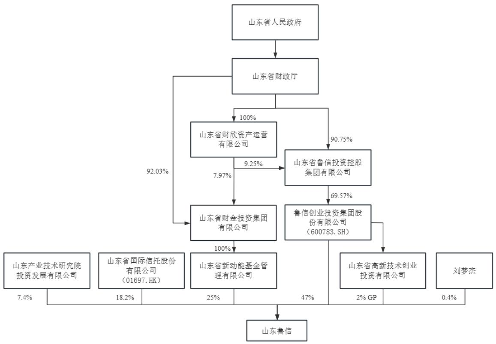

flowchart

```mermaid
graph TD
  A["山东省人民政府"] --> B["山东省财政厅"]
  B --> C["山东省财欣资产运营有限公司"]
  B --> D["山东省鲁信投资控股集团有限公司"]
  C -->|92.03%| E["山东省财金投资集团有限公司"]
  C -->|9.25%| D
  C -->|7.97%| E
  D -->|69.57%| F["鲁信创业投资集团股份有限公司 (600783.SH)"]
  E -->|100%| G["山东省新动能基金管理有限公司"]
  F -->|47%| H["山东省高新技术创业投资有限公司"]
  F -->|2% GP| I["山东产业技术研究院投资发展有限公司"]
  F -->|0.4%| J["刘梦杰"]
  G -->|7.4%| K["山东鲁信"]
  H -->|18.2%| K
  I -->|0.4%| K
```

## 4、最近三年主营业务发展情况

山东鲁信主营业务为股权投资；最近三年主营业务无变更。

## 5、最近两年主要财务情况

山东鲁信最近两年主要财务数据如下：

单位：万元

<table><tr><td>项目</td><td>2024年末/2024年度</td><td>2023年末/2023年度</td></tr><tr><td>资产总额</td><td>105,313.58</td><td>148,700.45</td></tr><tr><td>负债总额</td><td>65.50</td><td>-</td></tr><tr><td>净资产</td><td>105,248.08</td><td>148,700.45</td></tr><tr><td>营业收入</td><td>-</td><td>-</td></tr><tr><td>净利润</td><td>-14,541.99</td><td>28,557.21</td></tr></table>

注：2023年财务数据已经审计；2024年财务数据未经审计。

## 6、下属企业情况

截至本报告书签署日，山东鲁信不存在控制的下属企业。

## 7、是否属于私募投资基金及备案情况

山东鲁信已于 2019 年 2 月 28 日完成私募投资基金备案，基金编号为SEZ075；山东鲁信的基金管理人为山东省高新技术创业投资有限公司，已于2014年5月20日完成私募基金管理人登记，登记编号为 P1002240。

## （十八）新余人合厚乾

## 1、基本情况

<table><tr><td>企业名称</td><td>新余人合厚乾投资合伙企业(有限合伙)</td></tr><tr><td>企业类型</td><td>有限合伙企业</td></tr><tr><td>出资额</td><td>4,430万元人民币</td></tr><tr><td>执行事务合伙人</td><td>深圳人合资本管理有限公司</td></tr><tr><td>成立日期</td><td>2016-12-22</td></tr><tr><td>主要经营场所</td><td>江西省新余市高新开发区新城大道总部经济服务中心101号</td></tr><tr><td>统一社会信用代码</td><td>91360504MA35MWGJ14</td></tr><tr><td>经营范围</td><td>企业投资管理、资产管理、实业投资、项目投资、投资咨询(以上项目不含金融、证券、期货、保险业务,依法须经批准的项目,经相关部门批准后方可开展经营活动)</td></tr></table>

## 2、历史沿革

## （1）2016年 2月，设立

2016 年 2 月，新余人合厚乾设立，普通合伙人为深圳人合资本管理有限公司（有限合伙），有限合伙人为金伟春。合伙人及出资结构如下：

<table><tr><td>序号</td><td>合伙人名称</td><td>合伙人类型</td><td>出资额(万元)</td><td>出资比例</td></tr><tr><td>1</td><td>深圳人合资本管理有限公司</td><td>普通合伙人</td><td>100.00</td><td>50.00%</td></tr><tr><td>2</td><td>金伟春</td><td>有限合伙人</td><td>100.00</td><td>50.00%</td></tr><tr><td colspan="3">合计</td><td>200.00</td><td>100.00%</td></tr></table>

## （2）2017 年 4 月，第一次增资

2017 年 4 月，新余人合厚乾合伙企业出资额由人民币 200 万元增至人民币4,430万元，本次变更后，合伙人及出资结构如下：

<table><tr><td>序号</td><td>合伙人名称</td><td>合伙人类型</td><td>出资额</td><td>出资比例</td></tr><tr><td>1</td><td>深圳人合资本管理有限公司</td><td>普通合伙人</td><td>100.00</td><td>2.26%</td></tr><tr><td>2</td><td>侯庆鑫</td><td>有限合伙人</td><td>900.00</td><td>20.32%</td></tr><tr><td>3</td><td>代京凯</td><td>有限合伙人</td><td>400.00</td><td>9.03%</td></tr><tr><td>4</td><td>金伟春</td><td>有限合伙人</td><td>260.00</td><td>5.87%</td></tr><tr><td>5</td><td>郭洪杰</td><td>有限合伙人</td><td>200.00</td><td>4.51%</td></tr><tr><td>6</td><td>严凤霞</td><td>有限合伙人</td><td>200.00</td><td>4.51%</td></tr><tr><td>7</td><td>郑龙</td><td>有限合伙人</td><td>200.00</td><td>4.51%</td></tr><tr><td>8</td><td>郭达</td><td>有限合伙人</td><td>200.00</td><td>4.51%</td></tr><tr><td>9</td><td>余伟杰</td><td>有限合伙人</td><td>200.00</td><td>4.51%</td></tr><tr><td>10</td><td>陈元春</td><td>有限合伙人</td><td>200.00</td><td>4.51%</td></tr><tr><td>11</td><td>谭会晓</td><td>有限合伙人</td><td>150.00</td><td>3.39%</td></tr><tr><td>12</td><td>蔡达</td><td>有限合伙人</td><td>150.00</td><td>3.39%</td></tr><tr><td>13</td><td>王召言</td><td>有限合伙人</td><td>150.00</td><td>3.39%</td></tr><tr><td>14</td><td>沈亦超</td><td>有限合伙人</td><td>120.00</td><td>2.71%</td></tr><tr><td>15</td><td>李文方</td><td>有限合伙人</td><td>100.00</td><td>2.26%</td></tr><tr><td>16</td><td>谢冠斌</td><td>有限合伙人</td><td>100.00</td><td>2.26%</td></tr><tr><td>17</td><td>莫玲妹</td><td>有限合伙人</td><td>100.00</td><td>2.26%</td></tr><tr><td>18</td><td>范杰</td><td>有限合伙人</td><td>100.00</td><td>2.26%</td></tr><tr><td>19</td><td>王岩</td><td>有限合伙人</td><td>100.00</td><td>2.26%</td></tr><tr><td>20</td><td>蔡晖</td><td>有限合伙人</td><td>100.00</td><td>2.26%</td></tr><tr><td>21</td><td>罗益民</td><td>有限合伙人</td><td>100.00</td><td>2.26%</td></tr><tr><td>22</td><td>张黔南</td><td>有限合伙人</td><td>100.00</td><td>2.26%</td></tr><tr><td>23</td><td>刘金辉</td><td>有限合伙人</td><td>100.00</td><td>2.26%</td></tr><tr><td>24</td><td>王建莹</td><td>有限合伙人</td><td>100.00</td><td>2.26%</td></tr><tr><td colspan="3">合计</td><td>4,430.00</td><td>100.00%</td></tr></table>

## （3）2021 年 9 月，第一次转让

2021 年 9 月，李淼入伙，谭会晓退伙，本次变更后，合伙人及出资结构如下：

<table><tr><td>序号</td><td>合伙人名称</td><td>合伙人类型</td><td>出资额</td><td>出资比例</td></tr><tr><td>1</td><td>深圳人合资本管理有限公司</td><td>普通合伙人</td><td>100.00</td><td>2.26%</td></tr><tr><td>2</td><td>侯庆鑫</td><td>有限合伙人</td><td>900.00</td><td>20.32%</td></tr><tr><td>3</td><td>代京凯</td><td>有限合伙人</td><td>400.00</td><td>9.03%</td></tr><tr><td>4</td><td>金伟春</td><td>有限合伙人</td><td>260.00</td><td>5.87%</td></tr><tr><td>5</td><td>郭洪杰</td><td>有限合伙人</td><td>200.00</td><td>4.51%</td></tr><tr><td>6</td><td>严凤霞</td><td>有限合伙人</td><td>200.00</td><td>4.51%</td></tr><tr><td>7</td><td>郑龙</td><td>有限合伙人</td><td>200.00</td><td>4.51%</td></tr><tr><td>8</td><td>郭达</td><td>有限合伙人</td><td>200.00</td><td>4.51%</td></tr><tr><td>9</td><td>余伟杰</td><td>有限合伙人</td><td>200.00</td><td>4.51%</td></tr><tr><td>10</td><td>陈元春</td><td>有限合伙人</td><td>200.00</td><td>4.51%</td></tr><tr><td>11</td><td>李淼</td><td>有限合伙人</td><td>150.00</td><td>3.39%</td></tr><tr><td>12</td><td>蔡达</td><td>有限合伙人</td><td>150.00</td><td>3.39%</td></tr><tr><td>13</td><td>王召言</td><td>有限合伙人</td><td>150.00</td><td>3.39%</td></tr><tr><td>14</td><td>沈亦超</td><td>有限合伙人</td><td>120.00</td><td>2.71%</td></tr><tr><td>15</td><td>李文方</td><td>有限合伙人</td><td>100.00</td><td>2.26%</td></tr><tr><td>16</td><td>谢冠斌</td><td>有限合伙人</td><td>100.00</td><td>2.26%</td></tr><tr><td>17</td><td>莫玲妹</td><td>有限合伙人</td><td>100.00</td><td>2.26%</td></tr><tr><td>18</td><td>范杰</td><td>有限合伙人</td><td>100.00</td><td>2.26%</td></tr><tr><td>19</td><td>王岩</td><td>有限合伙人</td><td>100.00</td><td>2.26%</td></tr><tr><td>20</td><td>蔡晖</td><td>有限合伙人</td><td>100.00</td><td>2.26%</td></tr><tr><td>21</td><td>罗益民</td><td>有限合伙人</td><td>100.00</td><td>2.26%</td></tr><tr><td>22</td><td>张黔南</td><td>有限合伙人</td><td>100.00</td><td>2.26%</td></tr><tr><td>23</td><td>刘金辉</td><td>有限合伙人</td><td>100.00</td><td>2.26%</td></tr><tr><td>24</td><td>王建莹</td><td>有限合伙人</td><td>100.00</td><td>2.26%</td></tr><tr><td colspan="3">合计</td><td>4,430.00</td><td>100.00%</td></tr></table>

## （4）2023年 12月，第三次变更

2023 年 12 月，王建莹将新余人合厚乾 2.2573%出资额转让给李迎春。本次变更后，合伙人及出资结构如下：

<table><tr><td>序号</td><td>合伙人名称</td><td>合伙人类型</td><td>出资额(万元)</td><td>出资比例</td></tr><tr><td>1</td><td>深圳人合资本管理有限公司</td><td>普通合伙人</td><td>100.00</td><td>2.26%</td></tr><tr><td>2</td><td>侯庆鑫</td><td>有限合伙人</td><td>900.00</td><td>20.32%</td></tr><tr><td>3</td><td>代京凯</td><td>有限合伙人</td><td>400.00</td><td>9.03%</td></tr><tr><td>4</td><td>金伟春</td><td>有限合伙人</td><td>260.00</td><td>5.87%</td></tr><tr><td>5</td><td>郑龙</td><td>有限合伙人</td><td>200.00</td><td>4.51%</td></tr><tr><td>6</td><td>陈元春</td><td>有限合伙人</td><td>200.00</td><td>4.51%</td></tr><tr><td>7</td><td>郭洪杰</td><td>有限合伙人</td><td>200.00</td><td>4.51%</td></tr><tr><td>8</td><td>严凤霞</td><td>有限合伙人</td><td>200.00</td><td>4.51%</td></tr><tr><td>9</td><td>郭达</td><td>有限合伙人</td><td>200.00</td><td>4.51%</td></tr><tr><td>10</td><td>余伟杰</td><td>有限合伙人</td><td>200.00</td><td>4.51%</td></tr><tr><td>11</td><td>李淼</td><td>有限合伙人</td><td>150.00</td><td>3.39%</td></tr><tr><td>12</td><td>蔡达</td><td>有限合伙人</td><td>150.00</td><td>3.39%</td></tr><tr><td>13</td><td>王召言</td><td>有限合伙人</td><td>150.00</td><td>3.39%</td></tr><tr><td>14</td><td>沈亦超</td><td>有限合伙人</td><td>120.00</td><td>2.71%</td></tr><tr><td>15</td><td>李迎春</td><td>有限合伙人</td><td>100.00</td><td>2.26%</td></tr><tr><td>16</td><td>王岩</td><td>有限合伙人</td><td>100.00</td><td>2.26%</td></tr><tr><td>17</td><td>蔡晖</td><td>有限合伙人</td><td>100.00</td><td>2.26%</td></tr><tr><td>18</td><td>刘金辉</td><td>有限合伙人</td><td>100.00</td><td>2.26%</td></tr><tr><td>19</td><td>张黔南</td><td>有限合伙人</td><td>100.00</td><td>2.26%</td></tr><tr><td>20</td><td>范杰</td><td>有限合伙人</td><td>100.00</td><td>2.26%</td></tr><tr><td>21</td><td>谢冠斌</td><td>有限合伙人</td><td>100.00</td><td>2.26%</td></tr><tr><td>22</td><td>李文方</td><td>有限合伙人</td><td>100.00</td><td>2.26%</td></tr><tr><td>23</td><td>罗益民</td><td>有限合伙人</td><td>100.00</td><td>2.26%</td></tr><tr><td>24</td><td>莫玲妹</td><td>有限合伙人</td><td>100.00</td><td>2.26%</td></tr><tr><td colspan="3">合计</td><td>4,430.00</td><td>100.00%</td></tr></table>

## 3、产权控制关系

截至本报告书签署日，金伟春直接持有新余人合厚乾 5.87%的合伙份额，并持有新余人合厚乾执行事务合伙人深圳人合资本管理有限公司 99%股权，为新余人合厚乾的实际控制人。其产权控制关系如下：

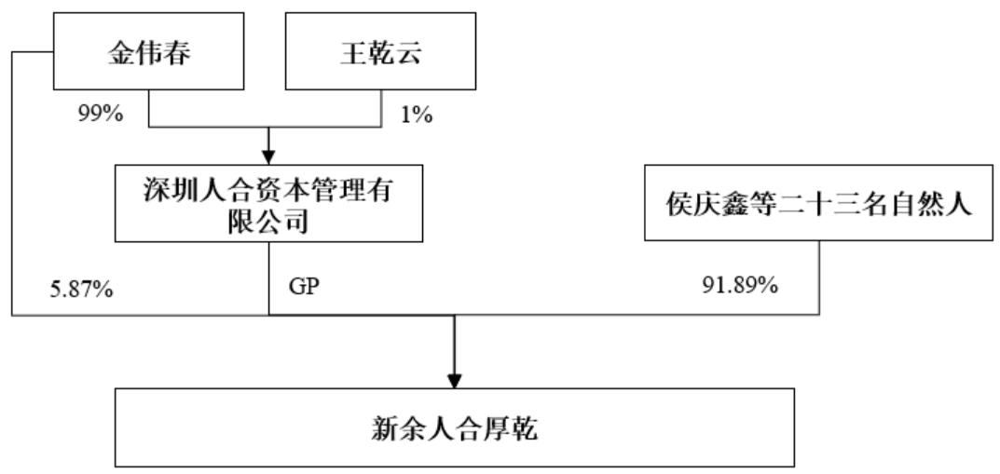

flowchart

```mermaid
graph TD
  A["金伟春"] -->|99%| C["深圳人合资本管理有限公司"]
  B["王乾云"] -->|1%| C
  C -->|5.87%| D["新余人合厚乾"]
  E["侯庆鑫等二十三名自然人"] -->|91.89%| D
```

## 4、最近三年主营业务发展情况

新余人合厚乾主营业务为企业投资管理、资产管理、实业投资、项目投资、投资咨询，最近三年主营业务无变更。

## 5、最近两年主要财务情况

新余人合厚乾最近两年主要财务数据如下：

单位：万元

<table><tr><td>项目</td><td>2024年末/2024年度</td><td>2023年末/2023年度</td></tr><tr><td>资产总额</td><td>4,083.13</td><td>4,088.16</td></tr><tr><td>负债总额</td><td>359.52</td><td>339.18</td></tr><tr><td>净资产</td><td>3,723.61</td><td>3748.98</td></tr><tr><td>营业收入</td><td>-</td><td>-</td></tr><tr><td>净利润</td><td>-25.37</td><td>-106.58</td></tr></table>

注：2023年财务数据已经审计；2024年财务数据未经审计。

## 6、下属企业情况

截至本报告书签署日，新余人合厚乾不存在控制的下属企业。

## 7、是否属于私募投资基金及备案情况

新余人合厚乾为合伙型私募基金，已在中国基金业协会登记为私募基金（登记编号为 SS1794）。

## 8、穿透核查情况

## （1）深圳人合资本管理有限公司基本情况

<table><tr><td>公司名称</td><td>深圳人合资本管理有限公司</td></tr><tr><td>公司类型</td><td>有限责任公司</td></tr><tr><td>注册资本</td><td>1000万元人民币</td></tr><tr><td>法定代表人</td><td>金伟春</td></tr><tr><td>成立日期</td><td>2012-12-28</td></tr><tr><td>注册地址</td><td>深圳市前海深港合作区前湾一路1号A栋201室(入驻深圳市前海商务秘书有限公司)</td></tr><tr><td>统一社会信用代码</td><td>914403000602698616</td></tr><tr><td>经营范围</td><td>受托资产管理、股权投资、投资管理、投资咨询(不得从事信托、金融资产管理、证券资产管理等业务)。</td></tr></table>

## （2）金伟春基本信息

<table><tr><td>姓名</td><td>金伟春</td></tr><tr><td>曾用名</td><td>-</td></tr><tr><td>性别</td><td>男</td></tr><tr><td>国籍</td><td>中国</td></tr><tr><td>身份证号</td><td>120104197209******</td></tr><tr><td>住所</td><td>广东省深圳市罗湖区中民时代广场******</td></tr><tr><td>通讯地址</td><td>北京市西城区金融大街投资广场******</td></tr><tr><td>是否取得其他国家或者地区居留权</td><td>否</td></tr></table>

## 2. 最近三年任职情况及任职单位产权关系

<table><tr><td>起止时间</td><td>任职单位</td><td>职务</td><td>产权关系</td></tr><tr><td>2012年12月至今</td><td>深圳人合资本管理有限公司</td><td>执行董事</td><td>金伟春持股99%</td></tr></table>

## （十九）老百姓医药

## 1、基本情况

<table><tr><td>公司名称</td><td>老百姓医药集团有限公司</td></tr><tr><td>公司类型</td><td>有限责任公司</td></tr><tr><td>注册资本</td><td>10,426.26万元人民币</td></tr><tr><td>法定代表人</td><td>谢子龙</td></tr><tr><td>成立日期</td><td>2001-10-25</td></tr><tr><td>注册地址</td><td>湖南省长沙市开福区月湖街道鸭子铺路1号234房9室</td></tr><tr><td>统一社会信用代码</td><td>91430105732844807X</td></tr><tr><td>经营范围</td><td>以自有资产进行医药零售批发项目的投资管理(不含销售)(不得从事吸收存款、集资收款、受托贷款、发放贷款等国家金融监管及财政信用业务)。(依法须经批准的项目,经相关部门批准后方可开展经营活动)</td></tr></table>

## 2、历史沿革

## （1）2001 年 10 月，设立

2001年10月，老百姓医药设立，股权结构如下：

<table><tr><td>序号</td><td>股东名称</td><td>认缴出资额(万元)</td><td>出资比例</td></tr><tr><td>1</td><td>黄新运</td><td>24.00</td><td>48.00%</td></tr><tr><td>2</td><td>湖南省药品经营有限公司</td><td>19.00</td><td>38.00%</td></tr><tr><td>3</td><td>陈秀兰</td><td>7.00</td><td>14.00%</td></tr><tr><td colspan="2">合计</td><td>50.00</td><td>100.00%</td></tr></table>

## （2）2002年 2月，第一次股权转让

2002 年 2 月，黄新运向谢子龙转让其持有的老百姓医药 48%的股权，变更后的股权结构为：

<table><tr><td>序号</td><td>股东名称</td><td>认缴出资额(万元)</td><td>出资比例</td></tr><tr><td>1</td><td>谢子龙</td><td>24.00</td><td>48.00%</td></tr><tr><td>2</td><td>湖南省药品经营有限公司</td><td>19.00</td><td>38.00%</td></tr><tr><td>3</td><td>陈秀兰</td><td>7.00</td><td>14.00%</td></tr><tr><td colspan="2">合计</td><td>50.00</td><td>100.00%</td></tr></table>

## （3）2002 年 11 月，第二次股权转让

2002年11月，湖南省药品经营有限公司向谢子龙转让其持有的老百姓医药38%的股权，变更后的股权结构为：

<table><tr><td>序号</td><td>股东姓名或名称</td><td>认缴出资额(万元)</td><td>出资比例</td></tr><tr><td>1</td><td>谢子龙</td><td>43.00</td><td>86.00%</td></tr><tr><td>2</td><td>陈秀兰</td><td>7.00</td><td>14.00%</td></tr><tr><td colspan="2">合计</td><td>50.00</td><td>100.00%</td></tr></table>

## （4）2003年 2月，第一次增资及第三次股权转让

2003 年 2 月，新增石展、田彬作为老百姓医药股东，并将老百姓医药注册资本增加至800万元，新增注册资本 750万元均为货币出资。增资后的股权结构为：

<table><tr><td>序号</td><td>股东姓名或名称</td><td>认缴出资额(万元)</td><td>出资比例</td></tr><tr><td>1</td><td>谢子龙</td><td>467.00</td><td>58.38%</td></tr><tr><td>2</td><td>陈秀兰</td><td>277.00</td><td>34.62%</td></tr><tr><td>3</td><td>石展</td><td>40.00</td><td>5.00%</td></tr><tr><td>4</td><td>田彬</td><td>16.00</td><td>2.00%</td></tr><tr><td colspan="2">合计</td><td>800.00</td><td>100.00%</td></tr></table>

## （5）2004 年 12 月，第四次股权转让

2004 年 12 月，田彬向谢子龙转让其持有的老百姓医药 2%的股权，变更后的股权结构为：

<table><tr><td>序号</td><td>股东姓名或名称</td><td>认缴出资额(万元)</td><td>出资比例</td></tr><tr><td>1</td><td>谢子龙</td><td>483.00</td><td>60.38%</td></tr><tr><td>2</td><td>陈秀兰</td><td>277.00</td><td>34.62%</td></tr><tr><td>3</td><td>石展</td><td>40.00</td><td>5.00%</td></tr><tr><td colspan="2">合计</td><td>800.00</td><td>100.00%</td></tr></table>

## （6）2007 年 11 月，第五次股权转让

石展向谢子龙转让给其持有的老百姓医药 5%的股权，变更后的股权结构为：

<table><tr><td>序号</td><td>股东姓名或名称</td><td>认缴出资额(万元)</td><td>出资比例</td></tr><tr><td>1</td><td>谢子龙</td><td>523.00</td><td>65.38%</td></tr><tr><td>2</td><td>陈秀兰</td><td>277.00</td><td>34.62%</td></tr><tr><td colspan="2">合计</td><td>800.00</td><td>100.00%</td></tr></table>

## （7）2017 年 2 月，增资

2017年2月，老百姓医药出资额从 800 万元增至10,426.26万元。本次增资完成后，老百姓医药的股权结构如下：

<table><tr><td>序号</td><td>股东姓名</td><td>认缴出资额(万元)</td><td>持股比例</td></tr><tr><td>1</td><td>谢子龙</td><td>7,297.96</td><td>70.00%</td></tr><tr><td>2</td><td>陈秀兰</td><td>3,128.30</td><td>30.00%</td></tr><tr><td colspan="2">合计</td><td>10,426.26</td><td>100.00%</td></tr></table>

## 3、产权控制关系

截至本报告书签署日，谢子龙、陈秀兰夫妇持有老百姓医药 100%的股权，为老百姓医药的控股股东、实际控制人。老百姓医药的产权控制关系如下：

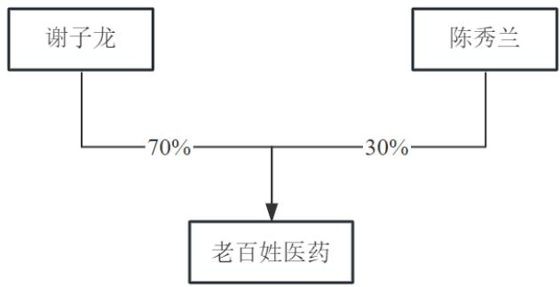

flowchart

```mermaid
graph TD
  A["谢子龙"] -->|70%| C["老百姓医药"]
  B["陈秀兰"] -->|30%| C["老百姓医药"]
```

## 3、最近三年主营业务发展情况

老百姓医药主营业务为以自有资产进行医药零售批发项目的投资管理，最近三年主营业务无变更。

## 4、最近两年主要财务情况

老百姓医药最近两年主要财务数据如下：

单位：万元

<table><tr><td>项目</td><td>2024年末/2024年度</td><td>2023年末/2023年度</td></tr><tr><td>资产总额</td><td>258,092.42</td><td>251,820.97</td></tr><tr><td>负债总额</td><td>131,639.99</td><td>134,885.33</td></tr><tr><td>净资产</td><td>126,452.43</td><td>116,935.64</td></tr><tr><td>营业收入</td><td>0.00</td><td>60.67</td></tr><tr><td>净利润</td><td>9,516.79</td><td>-708.67</td></tr></table>

注：2023年财务数据已经审计；2024年财务数据未经审计。

## 5、下属企业情况

截至本报告书签署日，老百姓医药控制的主要一级下属企业如下：

<table><tr><td>序号</td><td>企业名称</td><td>注册资本/出资额(万元)</td><td>持股比例(%)</td><td>主营业务</td></tr><tr><td>1</td><td>老百姓大药房连锁股份有限公司</td><td>76,009.56</td><td>26.12</td><td>连锁药房</td></tr><tr><td>2</td><td>湖南天宜医疗集团有限公司</td><td>48,500.00</td><td>100.00</td><td>风险投资、股权投资、项目投资、医院投资、养老院投资等</td></tr><tr><td>3</td><td>湖南天宜创业投资有限责任公司</td><td>19,000.00</td><td>100.00</td><td>创业投资、企业投资咨询</td></tr><tr><td>4</td><td>湖南天新医疗管理有限公司</td><td>2,000.00</td><td>100.00</td><td>医院经营管理;健康管理</td></tr><tr><td>5</td><td>衡阳天宜妇女儿童医院有限公司</td><td>1,000.00</td><td>100.00</td><td>医疗服务</td></tr><tr><td>6</td><td>湖南妇女儿童医院有限公司</td><td>34,687.00</td><td>87.35</td><td>医疗服务</td></tr><tr><td>7</td><td>湖南草莓母婴健康服务有限公司</td><td>200.00</td><td>87.35</td><td>母婴生活护理、健康咨询服务</td></tr><tr><td>8</td><td>湖南谢子龙影像艺术馆有限公司</td><td>16,750.00</td><td>79.10</td><td>出版物零售、文化场馆管理服务等</td></tr><tr><td>9</td><td>湖南明园蜂业科技有限公司</td><td>4,000.00</td><td>62.79</td><td>食品生产;食品销售</td></tr><tr><td>10</td><td>湖南省明园蜂业有限公司</td><td>2,206.67</td><td>62.79</td><td>食品生产;食品销售</td></tr><tr><td>11</td><td>广州天宜医生集团合伙企业(有限合伙)</td><td>500.00</td><td>51.00</td><td>医疗管理;医疗诊断、监护及治疗设备批发</td></tr><tr><td>12</td><td>湖南宜美置业有限公司</td><td>4,000.00</td><td>96.25</td><td>房地产开发与经营、房屋租赁</td></tr><tr><td>13</td><td>湖南天宜美康科技发展有限公司</td><td>300.00</td><td>84.00</td><td>包装装潢设计服务;摄影服务;企业管理咨询服务;企业形象策划服务</td></tr><tr><td>14</td><td>湖南光圈视觉广告有限公司</td><td>200.00</td><td>61.50</td><td>广告制作服务、发布服务、国内代理服务;工艺品、电子产品的销售;广告设计</td></tr></table>

## 6、是否属于私募投资基金及备案情况

老百姓医药不存在以非公开方式向合格投资者募集资金设立的情形，老百姓医药的资产不存在由基金管理人管理、基金托管人进行托管的情形，亦不涉及从事私募投资基金管理活动的情形，无需办理私募投资基金或私募投资基金管理人登记备案手续。

## （二十）济南三价融智

## 1、基本情况

<table><tr><td>企业名称</td><td>济南三价融智知识产权股权投资合伙企业(有限合伙)</td></tr><tr><td>企业类型</td><td>有限合伙企业</td></tr><tr><td>出资额</td><td>20,000万元人民币</td></tr><tr><td>执行事务合伙人</td><td>山东玖悦资本有限公司</td></tr><tr><td>成立日期</td><td>2021-04-22</td></tr><tr><td>主要经营场所</td><td>中国(山东)自由贸易试验区济南片区经十路7000号汉峪金谷A4-4号7楼703b(一址多照)</td></tr><tr><td>统一社会信用代码</td><td>91370100MA3WP3BL8B</td></tr><tr><td>经营范围</td><td>一般项目:创业投资(限投资未上市企业);以私募基金从事股权投资、投资管理、资产管理等活动(须在中国证券投资基金业协会完成登记备案后方可从事经营活动)。(除依法须经批准的项目外,凭营业执照依法自主开展经营活动)</td></tr></table>

## 2、历史沿革

## （1）2021年 4月，设立

2021 年 4 月，济南三价融智设立。普通合伙人为山东玖悦资本有限公司。合伙人及出资结构如下：

<table><tr><td>序号</td><td>合伙人名称</td><td>合伙人类型</td><td>出资额(万元)</td><td>出资比例</td></tr><tr><td>1</td><td>山东玖悦资本有限公司</td><td>普通合伙人</td><td>200.00</td><td>1.00%</td></tr><tr><td>2</td><td>济南财投新动能</td><td>有限合伙人</td><td>10,000.00</td><td>50.00%</td></tr><tr><td>3</td><td>山东山科产研人才价值股权投资基金合伙企业(有限合伙)</td><td>有限合伙人</td><td>2,800.00</td><td>14.00%</td></tr><tr><td>4</td><td>山东省人力资本产业创业投资有限公司</td><td>有限合伙人</td><td>2,500.00</td><td>12.50%</td></tr><tr><td>5</td><td>济南人力资本产业研究院</td><td>有限合伙人</td><td>2,500.00</td><td>12.50%</td></tr><tr><td>6</td><td>山东产业技术研究院投资发展有限公司</td><td>有限合伙人</td><td>2,000.00</td><td>10.00%</td></tr><tr><td colspan="3">合计</td><td>20,000.00</td><td>100.00%</td></tr></table>

## 3、产权控制关系

截至本报告书签署日，刘拥力持有济南三价融智执行事务合伙人山东玖悦资本有限公司99%的股权，为济南三价融智实际控制人。其产权控制关系如下：

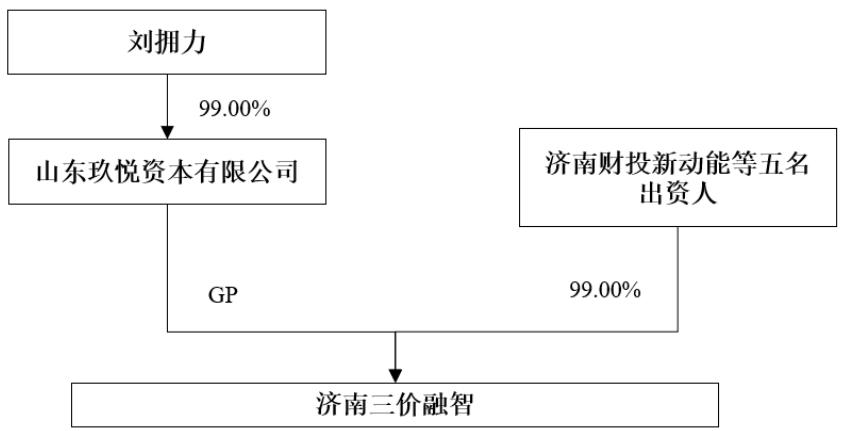

flowchart

```mermaid
graph TD
  A["刘拥力"] -->|99.00%| B["山东玖悦资本有限公司"]
  C["济南财投新动能等五名出资人"] -->|99.00%| D["济南三价融智"]
  B -->|GP| D
```

## 4、最近三年主营业务发展情况

济南三价融智主营业务为创业投资、以私募基金从事股权投资、投资管理、资产管理等活动。且最近三年主营业务无变更。

## 5、最近两年主要财务情况

济南三价融智最近两年主要财务数据如下：

单位：万元

<table><tr><td>项目</td><td>2024年末/2024年度</td><td>2023年末/2023年度</td></tr><tr><td>资产总额</td><td>19,455.19</td><td>19,628.49</td></tr><tr><td>负债总额</td><td>0.10</td><td>0.10</td></tr><tr><td>净资产</td><td>19,455.09</td><td>19,628.39</td></tr><tr><td>营业收入</td><td>-</td><td>-</td></tr><tr><td>净利润</td><td>-173.31</td><td>0.22</td></tr></table>

注：2023年财务数据已经审计；2024年财务数据未经审计。

## 6、下属企业情况

截至本报告书签署日，济南三价融智控制的主要一级下属企业：

<table><tr><td>序号</td><td>企业名称</td><td>注册资本/出资额(万元)</td><td>持股比例(%)</td><td>主营业务</td></tr><tr><td>1</td><td>山东百廿学府科技服务有限公司</td><td>10,000.00</td><td>50.00</td><td>科技中介服务、信息技术咨询服务、技术服务</td></tr></table>

## 7、是否属于私募投资基金及备案情况

济南三价融智为合伙型私募基金，已在中国基金业协会登记为私募基金（登记编号为 SSD288）。

## （二十一）嘉兴华斌

## 1、基本情况

<table><tr><td>企业名称</td><td>嘉兴华斌股权投资合伙企业(有限合伙)</td></tr><tr><td>企业类型</td><td>有限合伙企业</td></tr><tr><td>出资额</td><td>3,970.8804万元人民币</td></tr><tr><td>执行事务合伙人</td><td>方富天元(北京)资产管理有限公司</td></tr><tr><td>成立日期</td><td>2018-04-23</td></tr><tr><td>主要经营场所</td><td>浙江省嘉兴市南湖区南江路1856号基金小镇1号楼107室-97</td></tr><tr><td>统一社会信用代码</td><td>91330402MA2BA09G3U</td></tr><tr><td>经营范围</td><td>股权投资及相关咨询服务。(依法须经批准的项目,经相关部门批准后方可开展经营活动)</td></tr></table>

## 2、历史沿革

## （1）2018年 4月，设立

2018年4月，嘉兴华斌设立。普通合伙人为方富天元（北京）资产管理有限公司，设立时合伙人及出资结构如下：

<table><tr><td>序号</td><td>合伙人姓名/名称</td><td>合伙人类型</td><td>出资额(万元)</td><td>出资比例</td></tr><tr><td>1</td><td>方富天元(北京)资产管理有限公司</td><td>普通合伙人</td><td>1.00</td><td>0.03%</td></tr><tr><td>2</td><td>吴社杰</td><td>有限合伙人</td><td>3,400.00</td><td>99.97%</td></tr><tr><td colspan="3">合计</td><td>3,401.00</td><td>100.00%</td></tr></table>

## （2）2020年 4月，第一次转让

2020年4月，吴社杰退伙，13名有限合伙人入伙，本次转让后合伙人及出资结构如下：

<table><tr><td>序号</td><td>合伙人姓名/名称</td><td>合伙人类型</td><td>出资额(万元)</td><td>出资比例</td></tr><tr><td>1</td><td>方富天元(北京)资产管理有限公司</td><td>普通合伙人</td><td>1.00</td><td>0.02%</td></tr><tr><td>2</td><td>讷河青色草原现代农牧业发展有限责任公司</td><td>有限合伙人</td><td>1,500.00</td><td>37.23%</td></tr><tr><td>3</td><td>刘彦芳</td><td>有限合伙人</td><td>450.00</td><td>11.17%</td></tr><tr><td>4</td><td>郝进学</td><td>有限合伙人</td><td>400.00</td><td>9.93%</td></tr><tr><td>5</td><td>戴桂礼</td><td>有限合伙人</td><td>276.50</td><td>6.86%</td></tr><tr><td>6</td><td>张熙</td><td>有限合伙人</td><td>200.00</td><td>4.96%</td></tr><tr><td>7</td><td>汤建军</td><td>有限合伙人</td><td>230.00</td><td>5.71%</td></tr><tr><td>8</td><td>王峰</td><td>有限合伙人</td><td>200.00</td><td>4.96%</td></tr><tr><td>9</td><td>孙景景</td><td>有限合伙人</td><td>200.00</td><td>4.96%</td></tr><tr><td>10</td><td>曾琼</td><td>有限合伙人</td><td>130.00</td><td>3.23%</td></tr><tr><td>11</td><td>孙宝静</td><td>有限合伙人</td><td>122.00</td><td>3.03%</td></tr><tr><td>12</td><td>王晴</td><td>有限合伙人</td><td>120.00</td><td>2.98%</td></tr><tr><td>13</td><td>程广霞</td><td>有限合伙人</td><td>100.00</td><td>2.48%</td></tr><tr><td>14</td><td>吴杰</td><td>有限合伙人</td><td>100.00</td><td>2.48%</td></tr><tr><td colspan="3">合计</td><td>4,029.50</td><td>100.00%</td></tr></table>

## （3）2022年 8月，第二次转让

2022年8月，讷河青色草原现代农牧业发展有限责任公司退伙，武汉天源德启贸易有限公司入伙，本次转让后合伙人及出资结构如下：

<table><tr><td>序号</td><td>合伙人姓名/名称</td><td>合伙人类型</td><td>出资额(万元)</td><td>出资比例</td></tr><tr><td>1</td><td>方富天元(北京)资产管理有限公司</td><td>普通合伙人</td><td>1.00</td><td>0.02%</td></tr><tr><td>2</td><td>武汉天源德启贸易有限公司</td><td>有限合伙人</td><td>1,500.00</td><td>37.23%</td></tr><tr><td>3</td><td>刘彦芳</td><td>有限合伙人</td><td>450.00</td><td>11.17%</td></tr><tr><td>4</td><td>郝进学</td><td>有限合伙人</td><td>400.00</td><td>9.93%</td></tr><tr><td>5</td><td>戴桂礼</td><td>有限合伙人</td><td>276.50</td><td>6.86%</td></tr><tr><td>6</td><td>张熙</td><td>有限合伙人</td><td>200.00</td><td>4.96%</td></tr><tr><td>7</td><td>汤建军</td><td>有限合伙人</td><td>230.00</td><td>5.71%</td></tr><tr><td>8</td><td>王峰</td><td>有限合伙人</td><td>200.00</td><td>4.96%</td></tr><tr><td>9</td><td>孙景景</td><td>有限合伙人</td><td>200.00</td><td>4.96%</td></tr><tr><td>10</td><td>曾琼</td><td>有限合伙人</td><td>130.00</td><td>3.23%</td></tr><tr><td>11</td><td>孙宝静</td><td>有限合伙人</td><td>122.00</td><td>3.03%</td></tr><tr><td>12</td><td>王晴</td><td>有限合伙人</td><td>120.00</td><td>2.98%</td></tr><tr><td>13</td><td>程广霞</td><td>有限合伙人</td><td>100.00</td><td>2.48%</td></tr><tr><td>14</td><td>吴杰</td><td>有限合伙人</td><td>100.00</td><td>2.48%</td></tr><tr><td colspan="3">合计</td><td>4,029.50</td><td>100.00%</td></tr></table>

## （4）2023年 5月，第三次转让

2023年5月，盛紫瑾入伙，本次转让后合伙人及出资结构如下：

<table><tr><td>序号</td><td>合伙人姓名/名称</td><td>合伙人类型</td><td>出资额(万元)</td><td>出资比例</td></tr><tr><td>1</td><td>方富天元(北京)资产管理有限公司</td><td>普通合伙人</td><td>1.00</td><td>0.02%</td></tr><tr><td>2</td><td>武汉天源德启贸易有限公司</td><td>有限合伙人</td><td>1,500.00</td><td>37.23%</td></tr><tr><td>3</td><td>刘彦芳</td><td>有限合伙人</td><td>450.00</td><td>11.17%</td></tr><tr><td>4</td><td>郝进学</td><td>有限合伙人</td><td>400.00</td><td>9.93%</td></tr><tr><td>5</td><td>戴桂礼</td><td>有限合伙人</td><td>138.25</td><td>3.43%</td></tr><tr><td>6</td><td>张熙</td><td>有限合伙人</td><td>200.00</td><td>4.96%</td></tr><tr><td>7</td><td>汤建军</td><td>有限合伙人</td><td>230.00</td><td>5.71%</td></tr><tr><td>8</td><td>王峰</td><td>有限合伙人</td><td>200.00</td><td>4.96%</td></tr><tr><td>9</td><td>孙景景</td><td>有限合伙人</td><td>200.00</td><td>4.96%</td></tr><tr><td>10</td><td>盛紫瑾</td><td>有限合伙人</td><td>138.25</td><td>3.43%</td></tr><tr><td>11</td><td>曾琼</td><td>有限合伙人</td><td>130.00</td><td>3.23%</td></tr><tr><td>12</td><td>孙宝静</td><td>有限合伙人</td><td>122.00</td><td>3.03%</td></tr><tr><td>13</td><td>王晴</td><td>有限合伙人</td><td>120.00</td><td>2.98%</td></tr><tr><td>14</td><td>程广霞</td><td>有限合伙人</td><td>100.00</td><td>2.48%</td></tr><tr><td>15</td><td>吴杰</td><td>有限合伙人</td><td>100.00</td><td>2.48%</td></tr><tr><td colspan="3">合计</td><td>4,029.50</td><td>100.00%</td></tr></table>

## （5）2024 年 1 月，第四次转让

2024年1月，曾琼退伙，曾昊阳入伙，本次转让后合伙人及出资结构如下：

<table><tr><td>序号</td><td>合伙人姓名/名称</td><td>合伙人类型</td><td>出资额(万元)</td><td>出资比例</td></tr><tr><td>1</td><td>方富天元(北京)资产管理有限公司</td><td>普通合伙人</td><td>1.00</td><td>0.02%</td></tr><tr><td>2</td><td>武汉天源德启贸易有限公司</td><td>有限合伙人</td><td>1,750.66</td><td>44.09%</td></tr><tr><td>3</td><td>刘彦芳</td><td>有限合伙人</td><td>443.45</td><td>11.17%</td></tr><tr><td>4</td><td>郝进学</td><td>有限合伙人</td><td>394.18</td><td>9.93%</td></tr><tr><td>5</td><td>汤建军</td><td>有限合伙人</td><td>226.65</td><td>5.71%</td></tr><tr><td>6</td><td>王峰</td><td>有限合伙人</td><td>197.09</td><td>4.96%</td></tr><tr><td>7</td><td>孙景景</td><td>有限合伙人</td><td>197.09</td><td>4.96%</td></tr><tr><td>8</td><td>张熙</td><td>有限合伙人</td><td>197.09</td><td>3.43%</td></tr><tr><td>9</td><td>曾昊阳</td><td>有限合伙人</td><td>128.11</td><td>3.23%</td></tr><tr><td>10</td><td>孙宝静</td><td>有限合伙人</td><td>120.23</td><td>3.03%</td></tr><tr><td>11</td><td>王晴</td><td>有限合伙人</td><td>118.25</td><td>2.98%</td></tr><tr><td>12</td><td>程广霞</td><td>有限合伙人</td><td>98.55</td><td>2.48%</td></tr><tr><td>13</td><td>吴杰</td><td>有限合伙人</td><td>98.55</td><td>2.48%</td></tr><tr><td colspan="3">合计</td><td>3,970.88</td><td>100.00%</td></tr></table>

## 3、产权控制关系

截至本报告书签署日，王中华持有嘉兴华斌执行事务合伙人方富天元（北京）资产管理有限公司 95%股权，为嘉兴华斌实际控制人。其产权控制关系如下：

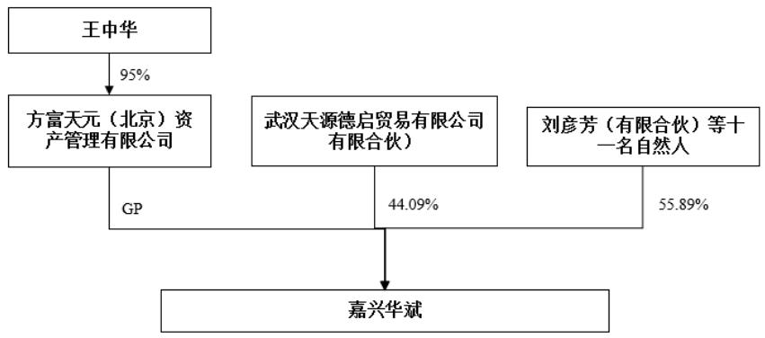

flowchart

```mermaid
graph TD
  A["王中华"] -->|95%| B["方富天元（北京）资产管理有限公司"]
  B -->|GP| C["嘉兴华斌"]
  D["武汉天源德启贸易有限公司有限合伙"] -->|44.09%| C
  E["刘彦芳（有限合伙）等十一名自然人"] -->|55.89%| C
```

## 4、最近三年主营业务发展情况

嘉兴华斌主营业务为股权投资及相关咨询服务。且最近三年主营业务无变更。

## 5、最近两年主要财务情况

嘉兴华斌最近两年主要财务数据如下：

单位：万元

<table><tr><td>项目</td><td>2024年末/2024年度</td><td>2023年末/2023年度</td></tr><tr><td>资产总额</td><td>3,531.42</td><td>3,614.43</td></tr><tr><td>负债总额</td><td>21.12</td><td>21.10</td></tr><tr><td>净资产</td><td>3,510.30</td><td>3,593.33</td></tr><tr><td>营业收入</td><td>-</td><td>-</td></tr><tr><td>净利润</td><td>-83.03</td><td>-81.87</td></tr></table>

注：2023年财务数据已经审计；2024年财务数据未经审计。

## 6、下属企业情况

截至本报告书签署日，嘉兴华斌不存在控制的下属企业。

## 7、是否属于私募投资基金及备案情况

嘉兴华斌为合伙型私募基金，已在中国基金业协会登记为私募基金(登记编号为 SEC717)。

## （二十二）济高投保

## 1、基本情况

<table><tr><td>企业名称</td><td>济高投保联动股权投资基金(济南)合伙企业(有限合伙)</td></tr><tr><td>企业类型</td><td>有限合伙企业</td></tr><tr><td>出资额</td><td>10,000万元人民币</td></tr><tr><td>执行事务合伙人</td><td>山东舜盈股权投资基金管理有限公司</td></tr><tr><td>成立日期</td><td>2020-06-28</td></tr><tr><td>主要经营场所</td><td>山东省济南市高新区经十东路7000号汉峪金谷A4-5号楼406-2</td></tr><tr><td>统一社会信用代码</td><td>91370100MA3TCJ7M0Y</td></tr><tr><td>经营范围</td><td>从事对未上市企业的股权投资,对上市公司非公开发行股票的投资及相关咨询服务(未经金融监管部门批准,不得从事向公众吸收存款、融资担保、代客理财等金融业务)。(依法须经批准的项目,经相关部门批准后方可开展经营活动)</td></tr></table>

## 2、历史沿革

## （1）2020年 6月，设立

2020 年 6 月，济高投保设立。出资额为 10,000 万元，普通合伙人为山东舜盈股权投资基金管理有限公司，有限合伙人为科信融资担保有限公司、济南高新财金投资有限公司。

合伙人及出资结构如下：

<table><tr><td>序号</td><td>合伙人名称</td><td>合伙人类型</td><td>出资额(万元)</td><td>出资比例</td></tr><tr><td>1</td><td>山东舜盈股权投资基金管理有限公司</td><td>普通合伙人</td><td>100.00</td><td>1.00%</td></tr><tr><td>2</td><td>科信融资担保有限公司</td><td>有限合伙人</td><td>5,000.00</td><td>50.00%</td></tr><tr><td>3</td><td>济南高新财金投资有限公司</td><td>有限合伙人</td><td>4,900.00</td><td>49.00%</td></tr><tr><td colspan="3">合计</td><td>10,000.00</td><td>100.00%</td></tr></table>

## 3、产权控制关系

截至本报告书签署日，济南高新技术产业开发区国有资产管理委员会通过济南高新控股集团有限公司、济高科技产业有限公司间接持有济高投保执行事务合伙人山东舜盈股权投资基金管理有限公司 100%股权，为济高投保实际控制人。济高投保的产权控制关系如下：

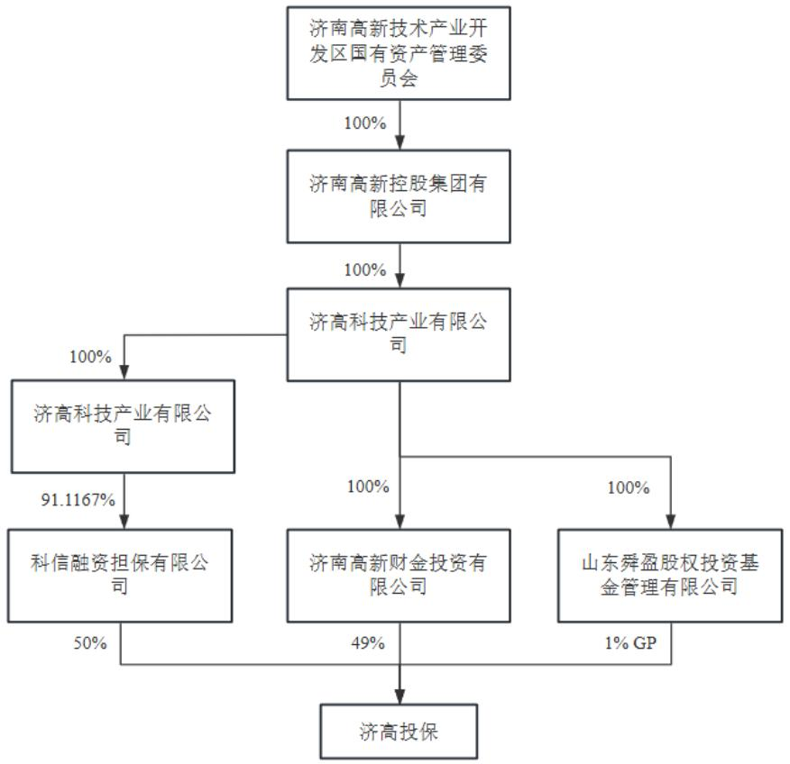

flowchart

```mermaid
graph TD
  A["济南高新技术产业开发区国有资产管理委员会"] -->|100%| B["济南高新控股集团有限公司"]
  B -->|100%| C["济高科技产业有限公司"]
  C -->|100%| D["济高科技产业有限公司"]
  C -->|100%| E["济南高新财金投资有限公司"]
  C -->|100%| F["山东舜盈股权投资基金管理有限公司"]
  D -->|91.1167%| G["科信融资担保有限公司"]
  E -->|50%| H["济高投保"]
  F -->|49%| H
  F -->|1% GP| H
```

## 4、最近三年主营业务发展情况

主营业务为股权投资；最近三年主营业务无变更。

## 5、最近两年主要财务情况

济高投保最近两年主要财务数据如下：

单位：万元

<table><tr><td>项目</td><td>2024年末/2024年度</td><td>2023年末/2023年度</td></tr><tr><td>资产总额</td><td>13,580.53</td><td>9,529.20</td></tr><tr><td>负债总额</td><td>0.00</td><td>0.25</td></tr><tr><td>净资产</td><td>13,580.53</td><td>9,528.95</td></tr><tr><td>营业收入</td><td>0.00</td><td>0.00</td></tr><tr><td>净利润</td><td>4,051.58</td><td>-150.36</td></tr></table>

注：2023年财务数据已经审计；2024年财务数据未经审计。

## 6、下属企业情况

截至本报告书签署日，济高投保不存在控制的下属企业。

## 7、是否属于私募投资基金及备案情况

济高投保为合伙型私募基金，已在中国基金业协会登记为私募基金（登记编

号为 P1070976）。

## （二十三）新余人合厚实

## 1、基本情况

<table><tr><td>企业名称</td><td>新余人合厚实投资合伙企业(有限合伙)</td></tr><tr><td>企业类型</td><td>有限合伙企业</td></tr><tr><td>出资额</td><td>5,300万元人民币</td></tr><tr><td>执行事务合伙人</td><td>深圳人合资本管理有限公司</td></tr><tr><td>成立日期</td><td>2016-04-26</td></tr><tr><td>主要经营场所</td><td>江西省新余市高新开发区新城大道总部经济服务中心109室</td></tr><tr><td>统一社会信用代码</td><td>91360504MA35HG6606</td></tr><tr><td>经营范围</td><td>实业投资、投资管理及投资咨询、企业管理与咨询服务、资产管理与咨询服务、商务信息咨询(以上项目不含金融、证券、期货、保险业务,依法须经批准的项目,经相关部门批准后方可开展经营活动)</td></tr></table>

## 2、历史沿革

## （1）2016年 4月，设立

2016 年 4 月，新余人合厚实设立。出资额为 200 万元，普通合伙人为深圳人合资本管理有限公司，有限合伙人为金伟春。合伙人及出资结构如下：

<table><tr><td>序号</td><td>合伙人姓名/名称</td><td>合伙人类型</td><td>出资额(万元)</td><td>出资比例</td></tr><tr><td>1</td><td>深圳人合资本管理有限公司</td><td>普通合伙人</td><td>100.00</td><td>50.00%</td></tr><tr><td>2</td><td>金伟春</td><td>有限合伙人</td><td>100.00</td><td>50.00%</td></tr><tr><td colspan="3">合计</td><td>200.00</td><td>100.00%</td></tr></table>

## （2）2017年 3月，第一次增资、第一次转让

2017年3月，新余人合厚实有限合伙人增至 23名，出资额增至 5,300万元，合伙人及出资结构如下：

<table><tr><td>序号</td><td>合伙人姓名/名称</td><td>合伙人类型</td><td>出资额(万元)</td><td>出资比例</td></tr><tr><td>1</td><td>深圳人合资本管理有限公司</td><td>普通合伙人</td><td>100.00</td><td>1.89%</td></tr><tr><td>2</td><td>北京盈生富通投资有限公司</td><td>有限合伙人</td><td>1,000.00</td><td>18.87%</td></tr><tr><td>3</td><td>郑建宏</td><td>有限合伙人</td><td>500.00</td><td>9.43%</td></tr><tr><td>4</td><td>北京荷宝投资有限公司</td><td>有限合伙人</td><td>500.00</td><td>9.43%</td></tr><tr><td>5</td><td>郭洪杰</td><td>有限合伙人</td><td>300.00</td><td>5.66%</td></tr><tr><td>6</td><td>赵建东</td><td>有限合伙人</td><td>300.00</td><td>5.66%</td></tr><tr><td>7</td><td>杨雨飞</td><td>有限合伙人</td><td>300.00</td><td>5.66%</td></tr><tr><td>8</td><td>金伟春</td><td>有限合伙人</td><td>200.00</td><td>3.77%</td></tr><tr><td>9</td><td>耿跃华</td><td>有限合伙人</td><td>200.00</td><td>3.77%</td></tr><tr><td>10</td><td>李晓丹</td><td>有限合伙人</td><td>200.00</td><td>3.77%</td></tr><tr><td>11</td><td>田大林</td><td>有限合伙人</td><td>200.00</td><td>3.77%</td></tr><tr><td>12</td><td>许新</td><td>有限合伙人</td><td>200.00</td><td>3.77%</td></tr><tr><td>13</td><td>北京新汉商投资管理有限公司</td><td>有限合伙人</td><td>200.00</td><td>3.77%</td></tr><tr><td>14</td><td>张继跃</td><td>有限合伙人</td><td>100.00</td><td>1.89%</td></tr><tr><td>15</td><td>李文方</td><td>有限合伙人</td><td>100.00</td><td>1.89%</td></tr><tr><td>16</td><td>张学增</td><td>有限合伙人</td><td>100.00</td><td>1.89%</td></tr><tr><td>17</td><td>俞婷</td><td>有限合伙人</td><td>100.00</td><td>1.89%</td></tr><tr><td>18</td><td>俞小芬</td><td>有限合伙人</td><td>100.00</td><td>1.89%</td></tr><tr><td>19</td><td>汪锋</td><td>有限合伙人</td><td>100.00</td><td>1.89%</td></tr><tr><td>20</td><td>侯庆鑫</td><td>有限合伙人</td><td>100.00</td><td>1.89%</td></tr><tr><td>21</td><td>刘卫红</td><td>有限合伙人</td><td>100.00</td><td>1.89%</td></tr><tr><td>22</td><td>肖南</td><td>有限合伙人</td><td>100.00</td><td>1.89%</td></tr><tr><td>23</td><td>范杰</td><td>有限合伙人</td><td>100.00</td><td>1.89%</td></tr><tr><td>24</td><td>张杰</td><td>有限合伙人</td><td>100.00</td><td>1.89%</td></tr><tr><td colspan="3">合计</td><td>5,300.00</td><td>100.00%</td></tr></table>

## （3）2024年 8月，第二次转让

2024 年 8 月，肖南将所持 100 万元出资额转让至陈隽，转让后合伙人及出资结构如下：

<table><tr><td>序号</td><td>合伙人姓名/名称</td><td>合伙人类型</td><td>出资额(万元)</td><td>出资比例</td></tr><tr><td>1</td><td>深圳人合资本管理有限公司</td><td>普通合伙人</td><td>100.00</td><td>1.89%</td></tr><tr><td>2</td><td>北京盈生富通投资有限公司</td><td>有限合伙人</td><td>1,000.00</td><td>18.87%</td></tr><tr><td>3</td><td>郑建宏</td><td>有限合伙人</td><td>500.00</td><td>9.43%</td></tr><tr><td>4</td><td>北京荷宝投资有限公司</td><td>有限合伙人</td><td>500.00</td><td>9.43%</td></tr><tr><td>5</td><td>赵建东</td><td>有限合伙人</td><td>300.00</td><td>5.66%</td></tr><tr><td>6</td><td>杨雨飞</td><td>有限合伙人</td><td>300.00</td><td>5.66%</td></tr><tr><td>7</td><td>郭洪杰</td><td>有限合伙人</td><td>300.00</td><td>5.66%</td></tr><tr><td>8</td><td>李晓丹</td><td>有限合伙人</td><td>200.00</td><td>3.77%</td></tr><tr><td>9</td><td>许新</td><td>有限合伙人</td><td>200.00</td><td>3.77%</td></tr><tr><td>10</td><td>田大林</td><td>有限合伙人</td><td>200.00</td><td>3.77%</td></tr><tr><td>11</td><td>耿跃华</td><td>有限合伙人</td><td>200.00</td><td>3.77%</td></tr><tr><td>12</td><td>金伟春</td><td>有限合伙人</td><td>200.00</td><td>3.77%</td></tr><tr><td>13</td><td>北京新汉商投资管理有限公司</td><td>有限合伙人</td><td>200.00</td><td>3.77%</td></tr><tr><td>14</td><td>陈隽</td><td>有限合伙人</td><td>100.00</td><td>1.89%</td></tr><tr><td>15</td><td>张杰</td><td>有限合伙人</td><td>100.00</td><td>1.89%</td></tr><tr><td>16</td><td>刘卫红</td><td>有限合伙人</td><td>100.00</td><td>1.89%</td></tr><tr><td>17</td><td>汪锋</td><td>有限合伙人</td><td>100.00</td><td>1.89%</td></tr><tr><td>18</td><td>张学增</td><td>有限合伙人</td><td>100.00</td><td>1.89%</td></tr><tr><td>19</td><td>范杰</td><td>有限合伙人</td><td>100.00</td><td>1.89%</td></tr><tr><td>20</td><td>俞婷</td><td>有限合伙人</td><td>100.00</td><td>1.89%</td></tr><tr><td>21</td><td>李文方</td><td>有限合伙人</td><td>100.00</td><td>1.89%</td></tr><tr><td>22</td><td>张继跃</td><td>有限合伙人</td><td>100.00</td><td>1.89%</td></tr><tr><td>23</td><td>俞小芬</td><td>有限合伙人</td><td>100.00</td><td>1.89%</td></tr><tr><td>24</td><td>侯庆鑫</td><td>有限合伙人</td><td>100.00</td><td>1.89%</td></tr><tr><td colspan="3">合计</td><td>5,300.00</td><td>100.00%</td></tr></table>

## 3、产权控制关系

截至本报告书签署日，金伟春直接持有新余人合厚实 3.77%的合伙份额，并持有新余人合厚实执行事务合伙人深圳人合资本管理有限公司 99%股权，为新余人合厚实的实际控制人。其产权控制关系如下：

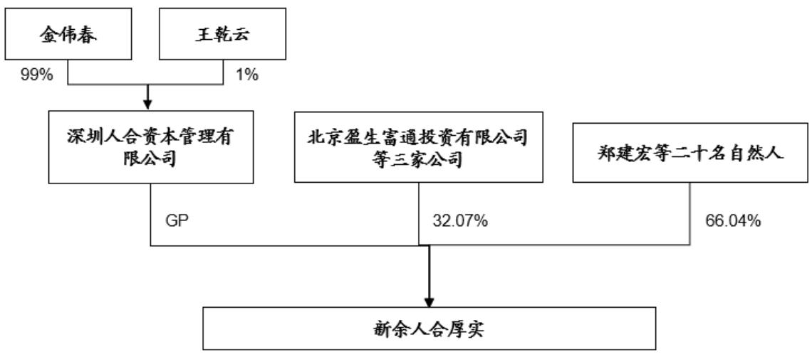

flowchart

```mermaid
graph TD
  A["金伟春"] -->|99%| C["深圳人合资本管理有限公司"]
  B["王乾云"] -->|1%| C
  C -->|GP| D["新余人合厚实"]
  E["北京盈生富通投资有限公司等三家公司"] -->|32.07%| D
  F["郑建宏等二十名自然人"] -->|66.04%| D
```

## 4、最近三年主营业务发展情况

新余人合厚实主营业务为实业投资、投资管理及投资咨询、企业管理与咨询

服务、资产管理与咨询服务、商务信息咨询。且最近三年主营业务无变更。

## 5、最近两年主要财务情况

新余人合厚实最近两年主要财务数据如下：

单位：万元

<table><tr><td>项目</td><td>2024年末/2024年度</td><td>2023年末/2023年度</td></tr><tr><td>资产总额</td><td>2,435.22</td><td>3,487.36</td></tr><tr><td>负债总额</td><td>11.50</td><td>11.50</td></tr><tr><td>净资产</td><td>2,423.72</td><td>3,475.86</td></tr><tr><td>营业收入</td><td>-</td><td>-</td></tr><tr><td>净利润</td><td>-288.07</td><td>-452.14</td></tr></table>

注：2023年财务数据已经审计；2024年财务数据未经审计。

## 6、下属企业情况

截至本报告书签署日，新余人合厚实不存在控制的下属企业。

## 7、是否属于私募投资基金及备案情况

新余人合厚实为合伙型私募基金，已在中国基金业协会登记为私募基金(登记编号为 SR4269)。

## （二十四）宁波东旸

## 1、基本情况

<table><tr><td>企业名称</td><td>宁波东旸投资中心(有限合伙)</td></tr><tr><td>企业类型</td><td>有限合伙企业</td></tr><tr><td>出资额</td><td>2,010万元人民币</td></tr><tr><td>执行事务合伙人</td><td>刘达</td></tr><tr><td>成立日期</td><td>2015-05-05</td></tr><tr><td>主要经营场所</td><td>浙江省宁波市北仑区梅山七星路88号1幢401室A区E0488</td></tr><tr><td>统一社会信用代码</td><td>91330206340618368G</td></tr><tr><td>经营范围</td><td>实业投资,投资管理,投资咨询。(未经金融等监管部门批准不得从事吸收存款、融资担保、代客理财、向社会公众集(融)资等金融业务)(依法须经批准的项目,经相关部门批准后方可开展经营活动)</td></tr></table>

## 2、历史沿革

## （1）2015年 5月，设立

2015 年 5 月，宁波东旸设立。出资额为 2,010 万元，普通合伙人为颜秀芸，有限合伙人为张林林。

合伙人及出资结构如下：

<table><tr><td>序号</td><td>合伙人姓名</td><td>合伙人类型</td><td>出资额(万元)</td><td>出资比例</td></tr><tr><td>1</td><td>颜秀芸</td><td>普通合伙人</td><td>10.05</td><td>0.50%</td></tr><tr><td>2</td><td>张林林</td><td>有限合伙人</td><td>1,999.95</td><td>99.50%</td></tr><tr><td colspan="3">合计</td><td>2,010.00</td><td>100.00%</td></tr></table>

## （2）2024 年 3 月，第一次转让

2024年3月，颜秀芸将 10.05万元出资额转让给刘达。

本次变更后，合伙人及出资结构如下：

<table><tr><td>序号</td><td>合伙人姓名</td><td>合伙人类型</td><td>出资额(万元)</td><td>出资比例</td></tr><tr><td>1</td><td>刘达</td><td>普通合伙人</td><td>10.05</td><td>0.50%</td></tr><tr><td>2</td><td>张林林</td><td>有限合伙人</td><td>1,999.95</td><td>99.50%</td></tr><tr><td colspan="3">合计</td><td>2,010.00</td><td>100.00%</td></tr></table>

## 3、产权控制关系

截至本报告书签署日，刘达直接持有宁波东旸 0.5%的合伙份额并担任宁波东旸执行事务合伙人，为宁波东旸实际控制人。宁波东旸的产权控制关系如下：

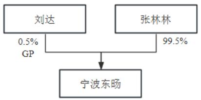

flowchart

```mermaid
graph TD
  A["刘达"] -->|0.5% GP| C["宁波东旸"]
  B["张林林"] -->|99.5%| C["宁波东旸"]
```

## 4、最近三年主营业务发展情况

主营业务为从事实业投资、投资管理等；最近三年主营业务无变更。

## 5、最近两年主要财务情况

宁波东旸最近两年主要财务数据如下：

单位：万元

<table><tr><td>项目</td><td>2024年末/2024年度</td><td>2023年末/2023年度</td></tr><tr><td>资产总额</td><td>2,002.04</td><td>2,002.76</td></tr><tr><td>负债总额</td><td>-</td><td>-</td></tr><tr><td>净资产</td><td>2,002.04</td><td>2,002.76</td></tr><tr><td>营业收入</td><td>-</td><td>-</td></tr><tr><td>净利润</td><td>-0.72</td><td>44.67</td></tr></table>

注：2023年财务数据已经审计；2024年财务数据未经审计。

## 6、下属企业情况

截至本报告书签署日，宁波东旸不存在控制的下属企业。

## 7、是否属于私募投资基金及备案情况

宁波东旸不存在以非公开方式向合格投资者募集资金设立的情形，宁波东旸的资产不存在由基金管理人管理、基金托管人进行托管的情形，亦不涉及从事私募投资基金管理活动的情形，无需办理私募投资基金或私募投资基金管理人登记备案手续。

## （二十五）池州徽元

## 1、基本情况

<table><tr><td>企业名称</td><td>池州徽元中小企业发展基金合伙企业(有限合伙)</td></tr><tr><td>企业类型</td><td>有限合伙企业</td></tr><tr><td>出资额</td><td>50,000万元人民币</td></tr><tr><td>执行事务合伙人</td><td>国元股权投资有限公司</td></tr><tr><td>成立日期</td><td>2019-05-20</td></tr><tr><td>主要经营场所</td><td>安徽省池州市经济开发区池州市清溪大道695号附二楼2层</td></tr><tr><td>统一社会信用代码</td><td>91341700MA2TQNTX68</td></tr><tr><td>经营范围</td><td>股权投资、投资管理及投资咨询(依法须经批准的项目,经相关部门批准后方可开展经营活动)</td></tr></table>

## 2、历史沿革

## （1）2019年 5月，设立

2019 年 5 月，池州徽元设立。出资额为 50,000 万元，普通合伙人为国元股权投资有限公司，有限合伙人为安徽省中小企业发展基金有限公司、安徽安诚中医药健康产业发展基金有限公司、淮北市产业扶持基金有限公司、青阳建设投资集团有限公司、池州市九华恒昌产业投资有限公司、池州金桥投资集团有限公司。

合伙人及出资结构如下：

<table><tr><td>序号</td><td>合伙人名称</td><td>合伙人类型</td><td>出资额(万元)</td><td>出资比例</td></tr><tr><td>1</td><td>国元股权投资有限公司</td><td>普通合伙人</td><td>10,000.00</td><td>20.00%</td></tr><tr><td>2</td><td>安徽省中小企业发展基金有限公司</td><td>有限合伙人</td><td>24,500.00</td><td>49.00%</td></tr><tr><td>3</td><td>安徽安诚中医药健康产业发展基金有限公司</td><td>有限合伙人</td><td>5,000.00</td><td>10.00%</td></tr><tr><td>4</td><td>淮北市产业扶持基金有限公司</td><td>有限合伙人</td><td>3,000.00</td><td>6.00%</td></tr><tr><td>5</td><td>青阳建设投资集团有限公司</td><td>有限合伙人</td><td>2,500.00</td><td>5.00%</td></tr><tr><td>6</td><td>池州市九华恒昌产业投资有限公司</td><td>有限合伙人</td><td>2,500.00</td><td>5.00%</td></tr><tr><td>7</td><td>池州金桥投资集团有限公司</td><td>有限合伙人</td><td>2,500.00</td><td>5.00%</td></tr><tr><td colspan="3">合计</td><td>50,000.00</td><td>100.00%</td></tr></table>

## 3、产权控制关系

截至本报告书签署日，国元证券股份有限公司持有池州徽元的执行事务合伙人国元股权投资有限公司 100%股权；国元证券股份有限公司系深交所主板上市公司，其控股股东为安徽国元金融控股集团有限责任公司，实际控制人为安徽省人民政府国有资产监督管理委员会。因此，池州徽元的实际控制人为安徽省人民政府国有资产监督管理委员会。池州徽元的产权控制关系如下：

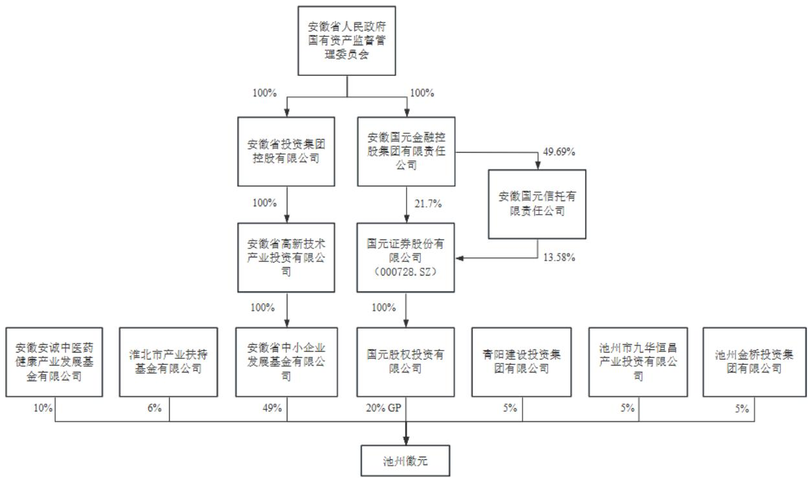

flowchart

```mermaid
graph TD
  A["安徽省人民政府国有资产监督管理委员会"] -->|100%| B["安徽省投资集团控股有限公司"]
  A -->|100%| C["安徽国元金融控股集团有限责任公司"]
  C -->|49.69%| D["安徽国元信托有限责任公司"]
  B -->|100%| E["安徽省高新技术产业投资有限公司"]
  C -->|21.7%| F["国元证券股份有限公司 (000728.SZ)"]
  F -->|13.58%| D
  E -->|100%| G["安徽省中小企业发展基金有限公司"]
  F -->|100%| H["国元股权投资有限公司"]
  G -->|49%| I["淮北市产业扶持基金有限公司"]
  H -->|20% GP| J["青阳建设投资集团有限公司"]
  I -->|10%| K["安徽安诚中医药健康产业发展基金有限公司"]
  J -->|5%| L["池州市九华恒昌产业投资有限公司"]
  J -->|5%| M["池州金桥投资集团有限公司"]
  J -->|5%| N["池州徽元"]
```

## 4、最近三年主营业务发展情况

主营业务为股权投资、投资管理及投资咨询；最近三年主营业务无变更。

## 5、最近两年主要财务情况

池州徽元最近两年主要财务数据如下：

单位：万元

<table><tr><td>项目</td><td>2024年末/2024年度</td><td>2023年末/2023年度</td></tr><tr><td>资产总额</td><td>71,252.37</td><td>58,922.68</td></tr><tr><td>负债总额</td><td>221.47</td><td>0.00</td></tr><tr><td>净资产</td><td>71,030.90</td><td>58,922.68</td></tr><tr><td>营业收入</td><td>16,539.54</td><td>87.23</td></tr><tr><td>净利润</td><td>16,108.22</td><td>-506.56</td></tr></table>

注：财务数据未经审计。

## 6、下属企业情况

截至本报告书签署日，池州徽元不存在控制的下属企业。

## 7、是否属于私募投资基金及备案情况

池州徽元为合伙型私募基金，已在中国基金业协会登记为私募基金（登记编号为 SJB731）。

## （二十六）济南嘉和

## 1、基本情况

<table><tr><td>企业名称</td><td>济南嘉和投资合伙企业(有限合伙)</td></tr><tr><td>企业类型</td><td>有限合伙企业</td></tr><tr><td>出资额</td><td>6,000万人民币</td></tr><tr><td>执行事务合伙人</td><td>王潇坤</td></tr><tr><td>成立日期</td><td>2021-12-29</td></tr><tr><td>主要经营场所</td><td>中国(山东)自由贸易试验区济南片区龙奥北路1577号龙奥天街广场4号楼1912室</td></tr><tr><td>统一社会信用代码</td><td>91370100MA7F41UN7T</td></tr><tr><td>经营范围</td><td>一般项目:以自有资金从事投资活动;企业管理;资产评估;土地整治服务;市政设施管理;工程管理服务;非居住房地产租赁;土地使用权租赁;会议及展览服务;互联网销售(除销售需要许可的商品)。(除依法须经批准的项目外,凭营业执照依法自主开展经营活动)</td></tr></table>

## 2、历史沿革

## （1）2021 年 12 月，设立

2021年12月，济南嘉和设立。出资额为 6,000.00万元，普通合伙人为王潇坤，有限合伙人为范玉莲。

合伙人及出资结构如下：

<table><tr><td>序号</td><td>合伙人姓名</td><td>合伙人类型</td><td>出资额(万元)</td><td>出资比例</td></tr><tr><td>1</td><td>王潇坤</td><td>普通合伙人</td><td>1,980.00</td><td>33.00%</td></tr><tr><td>2</td><td>范玉莲</td><td>有限合伙人</td><td>4,020.00</td><td>67.00%</td></tr><tr><td colspan="3">合计</td><td>6,000.00</td><td>100.00%</td></tr></table>

## 3、产权控制关系

截至本报告书签署日，王潇坤直接持有济南嘉和 33%的合伙份额并担任济南嘉和执行事务合伙人，为济南嘉和实际控制人。济南嘉和的产权控制关系如下：

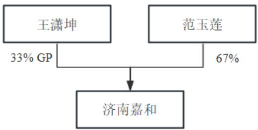

flowchart

```mermaid
graph TD
  A["王潇坤"] -->|33% GP| C["济南嘉和"]
  B["范玉莲"] -->|67%| C["济南嘉和"]
```

## 4、最近三年主营业务发展情况

主营业务为股权投资、投资管理及投资咨询；最近三年主营业务无变更。

## 5、最近两年主要财务情况

济南嘉和主要财务数据如下：

单位：万元

<table><tr><td>项目</td><td>2024年末/2024年度</td><td>2023年末/2023年度</td></tr><tr><td>资产总额</td><td>4,227.96</td><td>4,211.01</td></tr><tr><td>负债总额</td><td>4.69</td><td>19.11</td></tr><tr><td>净资产</td><td>4,223.27</td><td>4,191.90</td></tr><tr><td>营业收入</td><td>-</td><td>68.59</td></tr><tr><td>净利润</td><td>31.38</td><td>37.67</td></tr></table>

注：财务数据未经审计。

## 6、下属企业情况

截至本报告书签署日，济南嘉和不存在控制的下属企业。

## 7、是否属于私募投资基金及备案情况

济南嘉和不存在以非公开方式向合格投资者募集资金设立的情形，宁波东旸的资产不存在由基金管理人管理、基金托管人进行托管的情形，亦不涉及从事私募投资基金管理活动的情形，无需办理私募投资基金或私募投资基金管理人登记备案手续。

## （二十七）新余人合厚信

## 1、基本情况

<table><tr><td>企业名称</td><td>新余人合厚信投资合伙企业(有限合伙)</td></tr><tr><td>企业类型</td><td>有限合伙企业</td></tr><tr><td>出资额</td><td>8,155万元人民币</td></tr><tr><td>执行事务合伙人</td><td>深圳人合资本管理有限公司</td></tr><tr><td>成立日期</td><td>2016-03-16</td></tr><tr><td>主要经营场所</td><td>江西省新余市高新开发区新城大道总部经济服务中心112室</td></tr><tr><td>统一社会信用代码</td><td>91360504MA35GTP37R</td></tr><tr><td>经营范围</td><td>一般项目:创业投资(限投资未上市企业),以私募基金从事股权投资、投资管理、资产管理等活动(须在中国证券投资基金业协会完成登记备案后方可从事经营活动),以自有资金从事投资活动,企业总部管理,社会经济咨询服务,自有资金投资的资产管理服务(除依法须经批准的项目外,凭营业执照依法自主开展经营活动)</td></tr></table>

## 2、历史沿革

## （1）2016年 3月，设立

2016 年 3 月，新余人合厚信设立。出资额为 200 万元，普通合伙人为深圳人合资本管理有限公司，有限合伙人为金伟春。

合伙人及出资结构如下：

<table><tr><td>序号</td><td>合伙人名称</td><td>合伙人类型</td><td>出资额(万元)</td><td>出资比例</td></tr><tr><td>1</td><td>深圳人合资本管理有限公司</td><td>普通合伙人</td><td>100.00</td><td>50.00%</td></tr><tr><td>2</td><td>金伟春</td><td>有限合伙人</td><td>100.00</td><td>50.00%</td></tr><tr><td colspan="3">合计</td><td>200.00</td><td>100.00%</td></tr></table>

## （2）2016 年 6 月，第一次增资

2016年6月，新余人合厚信出资额增至 8,155万元。其中金伟春认缴 100万元，其余新增合伙人共计认缴 7,855万元。

本次变更后，合伙人及出资结构如下：

<table><tr><td>序号</td><td>合伙人名称</td><td>合伙人类型</td><td>出资额(万元)</td><td>出资比例</td></tr><tr><td>1</td><td>深圳人合资本管理有限公司</td><td>普通合伙人</td><td>100.00</td><td>1.2262%</td></tr><tr><td>2</td><td>罗建华</td><td>有限合伙人</td><td>1,000.00</td><td>12.2624%</td></tr><tr><td>3</td><td>伍瑞玲</td><td>有限合伙人</td><td>1,000.00</td><td>12.2624%</td></tr><tr><td>4</td><td>宁瑞鹏</td><td>有限合伙人</td><td>800.00</td><td>9.8099%</td></tr><tr><td>5</td><td>樊珊</td><td>有限合伙人</td><td>500.00</td><td>6.1312%</td></tr><tr><td>6</td><td>范杰</td><td>有限合伙人</td><td>350.00</td><td>4.2918%</td></tr><tr><td>7</td><td>高秀芳</td><td>有限合伙人</td><td>300.00</td><td>3.6787%</td></tr><tr><td>8</td><td>江明波</td><td>有限合伙人</td><td>200.00</td><td>2.4525%</td></tr><tr><td>9</td><td>王凡</td><td>有限合伙人</td><td>200.00</td><td>2.4525%</td></tr><tr><td>10</td><td>杨伟华</td><td>有限合伙人</td><td>200.00</td><td>2.4525%</td></tr><tr><td>11</td><td>刘金辉</td><td>有限合伙人</td><td>200.00</td><td>2.4525%</td></tr><tr><td>12</td><td>段萍</td><td>有限合伙人</td><td>200.00</td><td>2.4525%</td></tr><tr><td>13</td><td>徐世明</td><td>有限合伙人</td><td>200.00</td><td>2.4525%</td></tr><tr><td>14</td><td>金伟春</td><td>有限合伙人</td><td>200.00</td><td>2.4525%</td></tr><tr><td>15</td><td>钟培元</td><td>有限合伙人</td><td>200.00</td><td>2.4525%</td></tr><tr><td>16</td><td>王建莹</td><td>有限合伙人</td><td>155.00</td><td>1.9007%</td></tr><tr><td>17</td><td>周荣安</td><td>有限合伙人</td><td>150.00</td><td>1.8394%</td></tr><tr><td>18</td><td>黄国华</td><td>有限合伙人</td><td>150.00</td><td>1.8394%</td></tr><tr><td>19</td><td>张继跃</td><td>有限合伙人</td><td>130.00</td><td>1.5941%</td></tr><tr><td>20</td><td>张肖峣</td><td>有限合伙人</td><td>120.00</td><td>1.4715%</td></tr><tr><td>21</td><td>崔勇</td><td>有限合伙人</td><td>100.00</td><td>1.2262%</td></tr><tr><td>22</td><td>张小民</td><td>有限合伙人</td><td>100.00</td><td>1.2262%</td></tr><tr><td>23</td><td>张博</td><td>有限合伙人</td><td>100.00</td><td>1.2262%</td></tr><tr><td>24</td><td>刘德萍</td><td>有限合伙人</td><td>100.00</td><td>1.2262%</td></tr><tr><td>25</td><td>陈隽</td><td>有限合伙人</td><td>100.00</td><td>1.2262%</td></tr><tr><td>26</td><td>张学增</td><td>有限合伙人</td><td>100.00</td><td>1.2262%</td></tr><tr><td>27</td><td>姜兆年</td><td>有限合伙人</td><td>100.00</td><td>1.2262%</td></tr><tr><td>28</td><td>李占辉</td><td>有限合伙人</td><td>100.00</td><td>1.2262%</td></tr><tr><td>29</td><td>李文方</td><td>有限合伙人</td><td>100.00</td><td>1.2262%</td></tr><tr><td>30</td><td>朱燕锋</td><td>有限合伙人</td><td>100.00</td><td>1.2262%</td></tr><tr><td>31</td><td>张士学</td><td>有限合伙人</td><td>100.00</td><td>1.2262%</td></tr><tr><td>32</td><td>姜宝军</td><td>有限合伙人</td><td>100.00</td><td>1.2262%</td></tr><tr><td>33</td><td>黄立立</td><td>有限合伙人</td><td>100.00</td><td>1.2262%</td></tr><tr><td>34</td><td>何瑞琴</td><td>有限合伙人</td><td>100.00</td><td>1.2262%</td></tr><tr><td>35</td><td>洪子扬</td><td>有限合伙人</td><td>100.00</td><td>1.2262%</td></tr><tr><td>36</td><td>黄戌</td><td>有限合伙人</td><td>100.00</td><td>1.2262%</td></tr><tr><td>37</td><td>郭四野</td><td>有限合伙人</td><td>100.00</td><td>1.2262%</td></tr><tr><td>38</td><td>郭洪杰</td><td>有限合伙人</td><td>100.00</td><td>1.2262%</td></tr><tr><td colspan="3">合计</td><td>8,155.00</td><td>100.00%</td></tr></table>

## （3）2017 年 5 月，第一次转让

2017 年 5 月，江明波将 200 万元的出资额转让给张瑜。

本次变更后，合伙人及出资结构如下：

<table><tr><td>序号</td><td>合伙人名称</td><td>合伙人类型</td><td>出资额(万元)</td><td>出资比例</td></tr><tr><td>1</td><td>深圳人合资本管理有限公司</td><td>普通合伙人</td><td>100.00</td><td>1.2262%</td></tr><tr><td>2</td><td>罗建华</td><td>有限合伙人</td><td>1,000.00</td><td>12.2624%</td></tr><tr><td>3</td><td>伍瑞玲</td><td>有限合伙人</td><td>1,000.00</td><td>12.2624%</td></tr><tr><td>4</td><td>宁瑞鹏</td><td>有限合伙人</td><td>800.00</td><td>9.8099%</td></tr><tr><td>5</td><td>樊珊</td><td>有限合伙人</td><td>500.00</td><td>6.1312%</td></tr><tr><td>6</td><td>范杰</td><td>有限合伙人</td><td>350.00</td><td>4.2918%</td></tr><tr><td>7</td><td>高秀芳</td><td>有限合伙人</td><td>300.00</td><td>3.6787%</td></tr><tr><td>8</td><td>张瑜</td><td>有限合伙人</td><td>200.00</td><td>2.4525%</td></tr><tr><td>9</td><td>王凡</td><td>有限合伙人</td><td>200.00</td><td>2.4525%</td></tr><tr><td>10</td><td>杨伟华</td><td>有限合伙人</td><td>200.00</td><td>2.4525%</td></tr><tr><td>11</td><td>刘金辉</td><td>有限合伙人</td><td>200.00</td><td>2.4525%</td></tr><tr><td>12</td><td>段萍</td><td>有限合伙人</td><td>200.00</td><td>2.4525%</td></tr><tr><td>13</td><td>徐世明</td><td>有限合伙人</td><td>200.00</td><td>2.4525%</td></tr><tr><td>14</td><td>金伟春</td><td>有限合伙人</td><td>200.00</td><td>2.4525%</td></tr><tr><td>15</td><td>钟培元</td><td>有限合伙人</td><td>200.00</td><td>2.4525%</td></tr><tr><td>16</td><td>王建莹</td><td>有限合伙人</td><td>155.00</td><td>1.9007%</td></tr><tr><td>17</td><td>周荣安</td><td>有限合伙人</td><td>150.00</td><td>1.8394%</td></tr><tr><td>18</td><td>黄国华</td><td>有限合伙人</td><td>150.00</td><td>1.8394%</td></tr><tr><td>19</td><td>张继跃</td><td>有限合伙人</td><td>130.00</td><td>1.5941%</td></tr><tr><td>20</td><td>张肖峣</td><td>有限合伙人</td><td>120.00</td><td>1.4715%</td></tr><tr><td>21</td><td>崔勇</td><td>有限合伙人</td><td>100.00</td><td>1.2262%</td></tr><tr><td>22</td><td>张小民</td><td>有限合伙人</td><td>100.00</td><td>1.2262%</td></tr><tr><td>23</td><td>张博</td><td>有限合伙人</td><td>100.00</td><td>1.2262%</td></tr><tr><td>24</td><td>刘德萍</td><td>有限合伙人</td><td>100.00</td><td>1.2262%</td></tr><tr><td>25</td><td>陈隽</td><td>有限合伙人</td><td>100.00</td><td>1.2262%</td></tr><tr><td>26</td><td>张学增</td><td>有限合伙人</td><td>100.00</td><td>1.2262%</td></tr><tr><td>27</td><td>姜兆年</td><td>有限合伙人</td><td>100.00</td><td>1.2262%</td></tr><tr><td>28</td><td>李占辉</td><td>有限合伙人</td><td>100.00</td><td>1.2262%</td></tr><tr><td>29</td><td>李文方</td><td>有限合伙人</td><td>100.00</td><td>1.2262%</td></tr><tr><td>30</td><td>朱燕锋</td><td>有限合伙人</td><td>100.00</td><td>1.2262%</td></tr><tr><td>31</td><td>张士学</td><td>有限合伙人</td><td>100.00</td><td>1.2262%</td></tr><tr><td>32</td><td>姜宝军</td><td>有限合伙人</td><td>100.00</td><td>1.2262%</td></tr><tr><td>33</td><td>黄立立</td><td>有限合伙人</td><td>100.00</td><td>1.2262%</td></tr><tr><td>34</td><td>何瑞琴</td><td>有限合伙人</td><td>100.00</td><td>1.2262%</td></tr><tr><td>35</td><td>洪子扬</td><td>有限合伙人</td><td>100.00</td><td>1.2262%</td></tr><tr><td>36</td><td>黄巽</td><td>有限合伙人</td><td>100.00</td><td>1.2262%</td></tr><tr><td>37</td><td>郭四野</td><td>有限合伙人</td><td>100.00</td><td>1.2262%</td></tr><tr><td>38</td><td>郭洪杰</td><td>有限合伙人</td><td>100.00</td><td>1.2262%</td></tr><tr><td colspan="3">合计</td><td>8,155.00</td><td>100.00%</td></tr></table>

## （4）2024 年 1 月，第二次转让

2024年1月，王建莹将 155万元出资额转让给李迎春。

本次变更后，合伙人及出资结构如下：

<table><tr><td>序号</td><td>合伙人名称</td><td>合伙人类型</td><td>出资额(万元)</td><td>出资比例</td></tr><tr><td>1</td><td>深圳人合资本管理有限公司</td><td>普通合伙人</td><td>100.00</td><td>1.2262%</td></tr><tr><td>2</td><td>罗建华</td><td>有限合伙人</td><td>1,000.00</td><td>12.2624%</td></tr><tr><td>3</td><td>伍瑞玲</td><td>有限合伙人</td><td>1,000.00</td><td>12.2624%</td></tr><tr><td>4</td><td>宁瑞鹏</td><td>有限合伙人</td><td>800.00</td><td>9.8099%</td></tr><tr><td>5</td><td>樊珊</td><td>有限合伙人</td><td>500.00</td><td>6.1312%</td></tr><tr><td>6</td><td>范杰</td><td>有限合伙人</td><td>350.00</td><td>4.2918%</td></tr><tr><td>7</td><td>高秀芳</td><td>有限合伙人</td><td>300.00</td><td>3.6787%</td></tr><tr><td>8</td><td>张瑜</td><td>有限合伙人</td><td>200.00</td><td>2.4525%</td></tr><tr><td>9</td><td>王凡</td><td>有限合伙人</td><td>200.00</td><td>2.4525%</td></tr><tr><td>10</td><td>杨伟华</td><td>有限合伙人</td><td>200.00</td><td>2.4525%</td></tr><tr><td>11</td><td>刘金辉</td><td>有限合伙人</td><td>200.00</td><td>2.4525%</td></tr><tr><td>12</td><td>段萍</td><td>有限合伙人</td><td>200.00</td><td>2.4525%</td></tr><tr><td>13</td><td>徐世明</td><td>有限合伙人</td><td>200.00</td><td>2.4525%</td></tr><tr><td>14</td><td>金伟春</td><td>有限合伙人</td><td>200.00</td><td>2.4525%</td></tr><tr><td>15</td><td>钟培元</td><td>有限合伙人</td><td>200.00</td><td>2.4525%</td></tr><tr><td>16</td><td>李迎春</td><td>有限合伙人</td><td>155.00</td><td>1.9007%</td></tr><tr><td>17</td><td>周荣安</td><td>有限合伙人</td><td>150.00</td><td>1.8394%</td></tr><tr><td>18</td><td>黄国华</td><td>有限合伙人</td><td>150.00</td><td>1.8394%</td></tr><tr><td>19</td><td>张继跃</td><td>有限合伙人</td><td>130.00</td><td>1.5941%</td></tr><tr><td>20</td><td>张肖峣</td><td>有限合伙人</td><td>120.00</td><td>1.4715%</td></tr><tr><td>21</td><td>崔勇</td><td>有限合伙人</td><td>100.00</td><td>1.2262%</td></tr><tr><td>22</td><td>张小民</td><td>有限合伙人</td><td>100.00</td><td>1.2262%</td></tr><tr><td>23</td><td>张博</td><td>有限合伙人</td><td>100.00</td><td>1.2262%</td></tr><tr><td>24</td><td>刘德萍</td><td>有限合伙人</td><td>100.00</td><td>1.2262%</td></tr><tr><td>25</td><td>陈隽</td><td>有限合伙人</td><td>100.00</td><td>1.2262%</td></tr><tr><td>26</td><td>张学增</td><td>有限合伙人</td><td>100.00</td><td>1.2262%</td></tr><tr><td>27</td><td>姜兆年</td><td>有限合伙人</td><td>100.00</td><td>1.2262%</td></tr><tr><td>28</td><td>李占辉</td><td>有限合伙人</td><td>100.00</td><td>1.2262%</td></tr><tr><td>29</td><td>李文方</td><td>有限合伙人</td><td>100.00</td><td>1.2262%</td></tr><tr><td>30</td><td>朱燕锋</td><td>有限合伙人</td><td>100.00</td><td>1.2262%</td></tr><tr><td>31</td><td>张士学</td><td>有限合伙人</td><td>100.00</td><td>1.2262%</td></tr><tr><td>32</td><td>姜宝军</td><td>有限合伙人</td><td>100.00</td><td>1.2262%</td></tr><tr><td>33</td><td>黄立立</td><td>有限合伙人</td><td>100.00</td><td>1.2262%</td></tr><tr><td>34</td><td>何瑞琴</td><td>有限合伙人</td><td>100.00</td><td>1.2262%</td></tr><tr><td>35</td><td>洪子扬</td><td>有限合伙人</td><td>100.00</td><td>1.2262%</td></tr><tr><td>36</td><td>黄賀</td><td>有限合伙人</td><td>100.00</td><td>1.2262%</td></tr><tr><td>37</td><td>郭四野</td><td>有限合伙人</td><td>100.00</td><td>1.2262%</td></tr><tr><td>38</td><td>郭洪杰</td><td>有限合伙人</td><td>100.00</td><td>1.2262%</td></tr><tr><td colspan="3">合计</td><td>8,155.00</td><td>100.00%</td></tr></table>

## 3、产权控制关系

截至本报告书签署日，金伟春直接持有新余人合厚信 2.45%的合伙份额，并持有新余人合厚信执行事务合伙人深圳人合资本管理有限公司 99%股权，为新余人合厚信的实际控制人。新余人合厚信的产权控制关系如下：

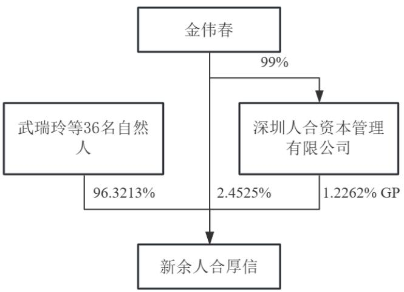

flowchart

```mermaid
graph TD
  A["金伟春"] -->|99%| B["深圳人合资本管理有限公司"]
  A -->|96.3213%| C["新余人合厚信"]
  B -->|2.4525%| C
  B -->|1.2262% GP| C
```

## 4、最近三年主营业务发展情况

主营业务为股权投资；最近三年主营业务无变更。

## 5、最近两年主要财务情况

新余人合厚信最近两年主要财务数据如下：

单位：万元

<table><tr><td>项目</td><td>2024年末/2024年度</td><td>2023年末/2023年度</td></tr><tr><td>资产总额</td><td>1,755.27</td><td>1,969.26</td></tr><tr><td>负债总额</td><td>7.50</td><td>10.00</td></tr><tr><td>净资产</td><td>1,747.77</td><td>1,959.26</td></tr><tr><td>营业收入</td><td>-</td><td>-</td></tr><tr><td>净利润</td><td>100.74</td><td>346.97</td></tr></table>

注：2023年财务数据已经审计；2024年财务数据未经审计。

## 6、下属企业情况

截至本报告书签署日，新余人合厚信不存在控制的下属企业。

## 7、是否属于私募投资基金及备案情况

新余人合厚信为合伙型私募基金，已在中国基金业协会登记为私募基金（登记编号为 SK7320）。

## （二十八）济高科技

## 1、基本情况

<table><tr><td>公司名称</td><td>济高科技产业有限公司</td></tr><tr><td>公司类型</td><td>有限责任公司</td></tr><tr><td>注册资本</td><td>300,000万元人民币</td></tr><tr><td>法定代表人</td><td>杨永波</td></tr><tr><td>成立日期</td><td>2019-03-26</td></tr><tr><td>注册地址</td><td>山东省济南市高新区孙村街道科航路1066号科航大厦2号楼10层1009</td></tr><tr><td>统一社会信用代码</td><td>91370100MA3PDNL619</td></tr><tr><td>经营范围</td><td>高新科技领域内的技术开发、技术服务、技术咨询、技术转让;自有房产租赁;物业管理以及其他按法律、法规、国务院决定等规定未禁止和不需经营许可的项目。(依法须经批准的项目,经相关部门批准后方可开展经营活动)</td></tr></table>

## 2、历史沿革

## （1）2019 年 3 月，设立

2019年3月，济高科技设立。注册资本为 10,000.00万元，股东为济南高新控股集团有限公司。

股东及出资结构如下：

<table><tr><td>序号</td><td>股东名称</td><td>注册资本(万元)</td><td>持股比例</td></tr><tr><td>1</td><td>济南高新控股集团有限公司</td><td>10,000.00</td><td>100.00%</td></tr><tr><td colspan="2">合计</td><td>10,000.00</td><td>100.00%</td></tr></table>

## （2）2024年 11月，第一次增资

2024 年 11 月，济高科技注册资本增至 300,000 万元，新增的认缴注册资本290,000万元由济南高新控股集团有限公司以货币形式认缴。

股东及出资结构如下：

<table><tr><td>序号</td><td>股东名称</td><td>注册资本(万元)</td><td>持股比例</td></tr><tr><td>1</td><td>济南高新控股集团有限公司</td><td>300,000.00</td><td>100.00%</td></tr><tr><td colspan="2">合计</td><td>300,000.00</td><td>100.00%</td></tr></table>

## 3、产权控制关系

截至本报告书签署日，济南高新控股集团有限公司持有济高科技 100%的股权，为济高科技的控股股东；济南高新技术产业开发区国有资产管理委员会持有济南高新控股集团有限公司 100%股权，为济高科技的实际控制人。济高科技的产权控制关系如下：

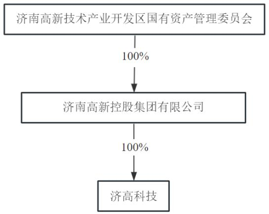

flowchart

```mermaid
graph TD
  A["济南高新技术产业开发区国有资产管理委员会"] -->|100%| B["济南高新控股集团有限公司"]
  B -->|100%| C["济高科技"]
```

## 4、最近三年主营业务发展情况

主营业务为股权投资；最近三年主营业务无变更。

## 5、最近两年主要财务情况

济高科技最近两年主要财务数据如下：

单位：万元

<table><tr><td>项目</td><td>2024年末/2024年度</td><td>2023年末/2023年度</td></tr><tr><td>资产总额</td><td>1,704,052.91</td><td>12,182.55</td></tr><tr><td>负债总额</td><td>33,282.87</td><td>774.05</td></tr><tr><td>净资产</td><td>1,670,770.04</td><td>11,408.50</td></tr><tr><td>营业收入</td><td>0.00</td><td>1,170.58</td></tr><tr><td>净利润</td><td>-576.28</td><td>2,494.09</td></tr></table>

注：2023年财务数据已经审计；2024年财务数据未经审计。

## 6、下属企业情况

截至本报告书签署日，济高科技控制的主要一级下属企业如下：

<table><tr><td>序号</td><td>企业名称</td><td>注册资本/出资额(万元)</td><td>持股比例(%)</td><td>主营业务</td></tr><tr><td>1</td><td>济南高新财金投资有限公司</td><td>300,000.00</td><td>100.00</td><td>股权投资及相关咨询服务</td></tr><tr><td>2</td><td>济南高新临空经济区园区开发有限公司</td><td>105,514.72</td><td>100.00</td><td>园区管理开发</td></tr><tr><td>3</td><td>济南高新创新谷园区开发有限公司</td><td>100,000.00</td><td>100.00</td><td>园区管理开发</td></tr><tr><td>4</td><td>济南东瓴发展投资开发有限公司</td><td>84,128.00</td><td>100.00</td><td>股权投资及相关咨询服务</td></tr><tr><td>5</td><td>济南药谷园区运营管理有限公司</td><td>60,000.00</td><td>100.00</td><td>园区管理开发</td></tr><tr><td>6</td><td>济南高新科技成果转化经纪有限公司</td><td>5,000.00</td><td>100.00</td><td>技术服务、技术开发、技术咨询</td></tr><tr><td>7</td><td>山东舜盈股权投资基金管理有限公司</td><td>2,000.00</td><td>100.00</td><td>受托管理股权投资基金、从事股权投资管理</td></tr><tr><td>8</td><td>山东高新量子通信产业有限公司</td><td>200.00</td><td>90.00</td><td>量子网络的研发、规划、设计、建设、运营、维护及相关服务</td></tr><tr><td>9</td><td>算谷运营管理有限公司</td><td>6,000.00</td><td>66.67</td><td>品牌管理;市场营销策划;园区管理服务</td></tr><tr><td>10</td><td>济南齐鲁软件园发展中心有限公司</td><td>72,600.00</td><td>60.00</td><td>软件产业园基地的开发、项目投资、配套设施管理服务、咨询</td></tr></table>

## 7、是否属于私募投资基金及备案情况

济高科技不存在以非公开方式向合格投资者募集资金设立的情形，济高科技的资产不存在由基金管理人管理、基金托管人进行托管的情形，亦不涉及从事私募投资基金管理活动的情形，无需办理私募投资基金或私募投资基金管理人登记备案手续。

## （二十九）济南汇中

## 1、基本情况

<table><tr><td>公司名称</td><td>济南汇中企业管理集团有限公司</td></tr><tr><td>公司类型</td><td>有限责任公司</td></tr><tr><td>注册资本</td><td>10,000万元人民币</td></tr><tr><td>法定代表人</td><td>陈松</td></tr><tr><td>成立日期</td><td>2020-03-19</td></tr><tr><td>注册地址</td><td>山东省济南市历下区洪山路1709号汇中沁园公建楼二楼202室</td></tr><tr><td>统一社会信用代码</td><td>91370102MA3RKCKX63</td></tr><tr><td>经营范围</td><td>企业管理咨询;物业管理;酒店管理咨询;市场调查;房屋租赁;批发、零售:建材、机械设备、非专控通讯设备、电子产品;计算机、网络技术开发、技术咨询;进出口业务。(依法须经批准的项目,经相关部门批准后方可开展经营活动)</td></tr></table>

## 2、历史沿革

## （1）2020 年 3 月，设立

2020年3月，济南汇中设立。注册资本为 10,000.00万元，股东为陈松、陈菲。

股东及出资结构如下：

<table><tr><td>序号</td><td>股东姓名</td><td>认缴出资额(万元)</td><td>持股比例</td></tr><tr><td>1</td><td>陈松</td><td>5,650.00</td><td>56.50%</td></tr><tr><td>2</td><td>陈菲</td><td>4,350.00</td><td>43.50%</td></tr><tr><td colspan="2">合计</td><td>10,000.00</td><td>100.00%</td></tr></table>

## 3、产权控制关系

截至本报告书签署日，陈松持有济南汇中 56.50%的股权，为济南汇中的控股股东、实际控制人。济南汇中的产权控制关系如下：

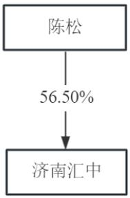

flowchart

```mermaid
graph TD
  A["陈松"] -->|56.50%| B["济南汇中"]
```

## 4、最近三年主营业务发展情况

济南汇中主营业务为企业管理咨询、物业管理；酒店管理咨询；房屋租赁；批发、零售建材、设备等；最近三年主营业务无变更。

## 5、最近两年主要财务情况

济南汇中最近两年主要财务数据如下：

单位：万元

<table><tr><td>项目</td><td>2024年末/2024年度</td><td>2023年末/2023年度</td></tr><tr><td>资产总额</td><td>3,791.70</td><td>3,755.20</td></tr><tr><td>负债总额</td><td>3,706.50</td><td>3,670.00</td></tr><tr><td>净资产</td><td>85.20</td><td>85.20</td></tr><tr><td>营业收入</td><td>-</td><td>-</td></tr><tr><td>净利润</td><td>-0.01</td><td>79.07</td></tr></table>

注：财务数据未经审计。

## 6、下属企业情况

截至本报告书签署日，济南汇中控制的主要下属企业如下：

<table><tr><td>序号</td><td>企业名称</td><td>注册资本/出资额(万元)</td><td>持股比例(%)</td><td>主营业务</td></tr><tr><td>1</td><td>济南汇中星空间商业运营管理有限公司</td><td>100.00</td><td>100.00</td><td>企业管理咨询;房屋租赁;办公服务等</td></tr><tr><td>2</td><td>济南汇中星空间物业管理有限公司</td><td>50.00</td><td>100.00</td><td>物业管理;停车场服务;建筑物清洁服务等</td></tr><tr><td>3</td><td>济南佰众传媒合伙企业(普通合伙)</td><td>370.00</td><td>济南汇中星空间商业运营管理有限公司担任执行事务合伙人并持有70%合伙份额</td><td>广告发布;企业形象策划;市场营销策划</td></tr></table>

## 7、是否属于私募投资基金及备案情况

济南汇中不存在以非公开方式向合格投资者募集资金设立的情形，济南汇中的资产不存在由基金管理人管理、基金托管人进行托管的情形，亦不涉及从事私募投资基金管理活动的情形，无需办理私募投资基金或私募投资基金管理人登记备案手续。

## （三十）青岛贝拉国融

1、基本情况

<table><tr><td>企业名称</td><td>青岛贝拉国融股权投资合伙企业(有限合伙)</td></tr><tr><td>企业类型</td><td>有限合伙企业</td></tr><tr><td>出资额</td><td>5,000万元人民币</td></tr><tr><td>执行事务合伙人</td><td>贝拉赢创信息咨询(上海)有限公司</td></tr><tr><td>成立日期</td><td>2022-01-25</td></tr><tr><td>主要经营场所</td><td>山东省青岛市莱西市姜山镇昌庆路231号9栋网点124户-22(集中办公区)</td></tr><tr><td>统一社会信用代码</td><td>91370285MA7GMYTW30</td></tr><tr><td>经营范围</td><td>一般项目:以自有资金从事投资活动。(除依法须经批准的项目外,凭营业执照依法自主开展经营活动)</td></tr></table>

## 2、历史沿革

（1）2022年 1月，设立

2022 年 1 月，青岛贝拉国融设立。出资额为 5,000.00 万元，普通合伙人为薛淏瑜，有限合伙人为薛刚。

合伙人及出资结构如下：

<table><tr><td>序号</td><td>合伙人姓名</td><td>合伙人类型</td><td>出资额(万元)</td><td>出资比例</td></tr><tr><td>1</td><td>薛淏瑜</td><td>普通合伙人</td><td>50.00</td><td>1.00%</td></tr><tr><td>2</td><td>薛刚</td><td>有限合伙人</td><td>4,950.00</td><td>99.00%</td></tr><tr><td colspan="3">合计</td><td>5,000.00</td><td>100.00%</td></tr></table>

## （2）2023 年 3 月，第一次转让

2023 年 3 月，薛淏瑜退伙，贝拉赢创信息咨询（上海）有限公司以普通合伙人身份入伙。

本次变更完成后，合伙人及出资结构如下：

<table><tr><td>序号</td><td>合伙人姓名/名称</td><td>合伙人类型</td><td>出资额(万元)</td><td>出资比例</td></tr><tr><td>1</td><td>贝拉赢创信息咨询(上海)有限公司</td><td>普通合伙人</td><td>50.00</td><td>1.00%</td></tr><tr><td>2</td><td>薛刚</td><td>有限合伙人</td><td>4,950.00</td><td>99.00%</td></tr><tr><td colspan="3">合计</td><td>5,000.00</td><td>100.00%</td></tr></table>

## 3、产权控制关系

截至本报告书签署日，范大力持有青岛贝拉国融执行事务合伙人贝拉赢创信息咨询（上海）有限公司 51%股权，为青岛贝拉国融实际控制人。青岛贝拉国融的产权控制关系如下：

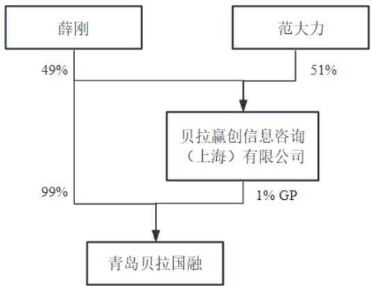

flowchart

```mermaid
graph TD
  A["薛刚"] -->|49%| C["贝拉赢创信息咨询（上海）有限公司"]
  B["范大力"] -->|51%| C
  C -->|99%| D["青岛贝拉国融"]
  C -->|1% GP| D
```

## 4、最近三年主营业务发展情况

青岛贝拉国融主营业务为以自有资金从事投资活动；最近三年主营业务无变更。

## 5、最近两年主要财务情况

青岛贝拉国融最近两年主要财务数据如下：

单位：万元

<table><tr><td>项目</td><td>2024年末/2024年度</td><td>2023年末/2023年度</td></tr><tr><td>资产总额</td><td>3,250.90</td><td>3,250.94</td></tr><tr><td>负债总额</td><td>3,251.00</td><td>3,251.00</td></tr><tr><td>净资产</td><td>-0.10</td><td>-0.06</td></tr><tr><td>营业收入</td><td>-</td><td>-</td></tr><tr><td>净利润</td><td>-0.04</td><td>-0.06</td></tr></table>

注：财务数据未经审计。

## 6、下属企业情况

截至本报告书签署日，青岛贝拉国融控制的主要下属企业如下：

<table><tr><td>序号</td><td>企业名称</td><td>注册资本/出资额(万元)</td><td>持股比例(%)</td><td>主营业务</td></tr><tr><td>1</td><td>织金嘉合物流有限公司</td><td>10.00</td><td>90.00</td><td>物流,物业管理,自有房屋租赁</td></tr><tr><td>2</td><td>织金赢合物流有限公司</td><td>10.00</td><td>90.00</td><td>物流,物业管理,自有房屋租赁</td></tr></table>

## 7、是否属于私募投资基金及备案情况

青岛贝拉国融不存在以非公开方式向合格投资者募集资金设立的情形，青岛贝拉国融的资产不存在由基金管理人管理、基金托管人进行托管的情形，亦不涉及从事私募投资基金管理活动的情形，无需办理私募投资基金或私募投资基金管理人登记备案手续。

## （三十一）刘志涛

## 1、基本情况

<table><tr><td>姓名</td><td>刘志涛</td></tr><tr><td>曾用名</td><td>-</td></tr><tr><td>性别</td><td>男</td></tr><tr><td>国籍</td><td>中国</td></tr><tr><td>身份证号</td><td>370628197701******</td></tr><tr><td>住所</td><td>山东省烟台市自贸区******</td></tr><tr><td>通讯地址</td><td>山东省烟台市自贸区******</td></tr><tr><td>是否取得其他国家或者地区居留权</td><td>否</td></tr></table>

## 2、最近三年任职情况及任职单位产权关系

<table><tr><td>起止时间</td><td>任职单位</td><td>职务</td><td>产权关系</td></tr><tr><td>2022年1月1日至2024年12月31日</td><td>烟台市一川企业管理咨询有限公司</td><td>执行董事兼总经理</td><td>持股50%</td></tr></table>

## （三十二）广东银石

## 1、基本情况

<table><tr><td>公司名称</td><td>广东银石私募基金管理有限公司</td></tr><tr><td>公司类型</td><td>有限责任公司</td></tr><tr><td>注册资本</td><td>1,000万元人民币</td></tr><tr><td>法定代表人</td><td>丘海云</td></tr><tr><td>成立日期</td><td>2010-10-26</td></tr><tr><td>注册地址</td><td>广州市天河区花城大道68号环球都会广场自编第5002-1单元(仅限办公)</td></tr><tr><td>统一社会信用代码</td><td>91440101563966642P</td></tr><tr><td>经营范围</td><td>私募证券投资基金管理服务(须在中国证券投资基金业协会完成登记备案登记后方可从事经营活动)</td></tr></table>

## 2、历史沿革

## （1）2010 年 10 月，设立

2010 年 10 月，广东银石设立。注册资本为 1,000.00 万元，股东为魏潇宇、陈超。

股东及出资结构如下：

<table><tr><td>序号</td><td>股东姓名</td><td>注册资本(万元)</td><td>持股比例</td></tr><tr><td>1</td><td>魏潇宇</td><td>700.00</td><td>70.00%</td></tr><tr><td>2</td><td>陈超</td><td>300.00</td><td>30.00%</td></tr><tr><td colspan="2">合计</td><td>1000.00</td><td>100.00%</td></tr></table>

## （2）2012 年 2 月，第一次转让

2012 年 2 月，魏潇宇将其持有的广东银石 70%股权（对应注册资本 700 万元）转让给柯袁昌。

本次变更完成后，股东及出资结构如下：

<table><tr><td>序号</td><td>股东姓名</td><td>注册资本(万元)</td><td>持股比例</td></tr><tr><td>1</td><td>柯袁昌</td><td>700.00</td><td>70.00%</td></tr><tr><td>2</td><td>陈超</td><td>300.00</td><td>30.00%</td></tr><tr><td colspan="2">合计</td><td>1000.00</td><td>100.00%</td></tr></table>

## （3）2013 年 2 月，第二次转让

2013年2月，柯袁昌将其持有的广东银石 5%股权（对应注册资本 50万元）转让给丘海云，将其持有的广东银石 32%股权（对应注册资本 320 万元）转让给杨亦石。

本次变更完成后，股东及出资结构如下：

<table><tr><td>序号</td><td>股东姓名</td><td>注册资本(万元)</td><td>持股比例</td></tr><tr><td>1</td><td>柯袁昌</td><td>330.00</td><td>33.00%</td></tr><tr><td>2</td><td>杨亦石</td><td>320.00</td><td>32.00%</td></tr><tr><td>3</td><td>陈超</td><td>300.00</td><td>30.00%</td></tr><tr><td>4</td><td>丘海云</td><td>50.00</td><td>5.00%</td></tr><tr><td colspan="2">合计</td><td>1000.00</td><td>100.00%</td></tr></table>

## （4）2016年 1月，第三次转让

2016 年 1 月，柯袁昌将其持有的广东银石 14%股权（对应注册资本 140 万元）转让给丘海云；杨亦石将其持有的广东银石 8%股权（对应注册资本 80万元）转让给曹琰，将其持有的广东银石 24%股权（对应注册资本 240万元）转让给杨中一；陈超将其持有的广东银石 18%股权（对应注册资本 180万元）转让给张玉玲，将其持有的广东银石 12%股权（对应注册资本 120万元）转让给丘海云。

本次变更完成后，股东及出资结构如下：

<table><tr><td>序号</td><td>股东姓名</td><td>注册资本(万元)</td><td>持股比例</td></tr><tr><td>1</td><td>丘海云</td><td>310.00</td><td>31.00%</td></tr><tr><td>2</td><td>杨中一</td><td>240.00</td><td>24.00%</td></tr><tr><td>3</td><td>柯袁昌</td><td>190.00</td><td>19.00%</td></tr><tr><td>4</td><td>张玉玲</td><td>180.00</td><td>18.00%</td></tr><tr><td>5</td><td>曹琰</td><td>80.00</td><td>8.00%</td></tr><tr><td colspan="2">合计</td><td>1,000.00</td><td>100.00%</td></tr></table>

## （5）2017年 10月，第四次转让

2017年10月，柯袁昌将其持有的广东银石 19%股权（对应注册资本 190万元）转让给广州市南沙区长远发展投资咨询合伙企业（有限合伙）；杨中一将其持有的广东银石24%股权（对应注册资本240 万元）转让给广州市南沙区长远发展投资咨询合伙企业（有限合伙）。

本次变更完成后，股东及出资结构如下：

<table><tr><td>序号</td><td>股东姓名</td><td>认缴出资额(万元)</td><td>持股比例</td></tr><tr><td>1</td><td>广州市南沙区长远发展投资咨询合伙企业(有限合伙)</td><td>430.00</td><td>43.00%</td></tr><tr><td>2</td><td>丘海云</td><td>310.00</td><td>31.00%</td></tr><tr><td>3</td><td>张玉玲</td><td>180.00</td><td>18.00%</td></tr><tr><td>4</td><td>曹琰</td><td>80.00</td><td>8.00%</td></tr><tr><td colspan="2">合计</td><td>1,000.00</td><td>100%</td></tr></table>

## （6）2023 年 11 月，第五次转让

2023 年 11 月，曹琰将其持有的广东银石 8%股权（对应注册资本 80 万元）转让给丘海云。

本次变更完成后，股东及出资结构如下：

<table><tr><td>序号</td><td>股东姓名</td><td>认缴出资额(万元)</td><td>持股比例</td></tr><tr><td>1</td><td>广州市南沙区长远发展投资咨询合伙企业(有限合伙)</td><td>430.00</td><td>43.00%</td></tr><tr><td>2</td><td>丘海云</td><td>390.00</td><td>39.00%</td></tr><tr><td>3</td><td>张玉玲</td><td>180.00</td><td>18.00%</td></tr><tr><td colspan="2">合计</td><td>1,000.00</td><td>100%</td></tr></table>

## 3、产权控制关系

截至本报告书签署日，丘海云直接持有广东银石 39%的股权并通过广州市南沙区长远发展投资咨询合伙企业（有限合伙）间接控制广东银石 43%的股权，合计控制广东银石82%的股权，为广东银石控股股东、实际控制人。广东银石的产权控制关系如下：

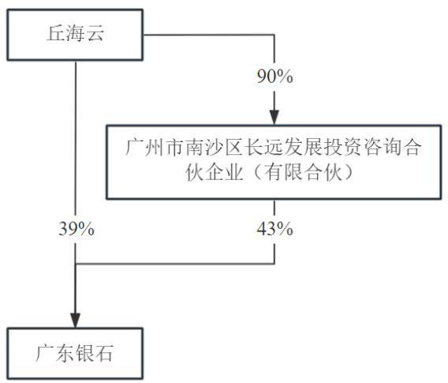

flowchart

```mermaid
graph TD
  A["丘海云"] -->|90%| B["广州市南沙区长远发展投资咨询合伙企业（有限合伙）"]
  A -->|39%| C["广东银石"]
  B -->|43%| C
```

## 4、最近三年主营业务发展情况

广东银石的主营业务为私募证券投资基金管理服务，银石聚宝 1期基金、银石双动力1期基金及银石双动力 2期基金的主营业务均为证券投资；最近三年主营业务无变更。

## 5、最近两年主要财务情况

广东银石最近两年主要财务数据如下：

单位：万元

<table><tr><td>项目</td><td>2024年末/2024年度</td><td>2023年末/2023年度</td></tr><tr><td>资产总额</td><td>891.84</td><td>1,233.43</td></tr><tr><td>负债总额</td><td>203.27</td><td>223.63</td></tr><tr><td>净资产</td><td>688.57</td><td>1,009.80</td></tr><tr><td>营业收入</td><td>-</td><td>191.57</td></tr><tr><td>净利润</td><td>-274.22</td><td>-339.52</td></tr></table>

注：2023年财务数据已经审计；2024年财务数据未经审计。

## 6、下属企业情况

截至本报告书签署日，除作为基金管理人管理银石聚宝 1期基金、银石双动力1期基金、银石双动力 2期基金等私募基金外，广东银石不存在控制的下属企业。

## 7、是否属于私募投资基金及备案情况

广东银石为私募基金管理人，已在中国基金业协会登记为私募基金管理人（登记编号为 P1001207）。

银石聚宝1期基金为契约型私募基金，已在中国基金业协会登记为私募基金（登记编号为S29893）。

银石双动力1 期基金为契约型私募基金，已在中国基金业协会登记为私募基金（登记编号为S27696）。

银石双动力2 期基金为契约型私募基金，已在中国基金业协会登记为私募基金（登记编号为S29123）。

## 8、穿透核查情况

## （1）银石聚宝 1期基金

<table><tr><td>基金名称</td><td colspan="3">银石聚宝1期基金</td></tr><tr><td>基金编号</td><td colspan="3">S29893</td></tr><tr><td>成立时间</td><td colspan="3">2015-05-18</td></tr><tr><td>备案时间</td><td colspan="3">2015-05-21</td></tr><tr><td>基金类型</td><td colspan="3">私募证券投资基金</td></tr><tr><td>基金管理人名称</td><td colspan="3">广东银石私募基金管理有限公司</td></tr><tr><td>托管人名称</td><td colspan="3">招商证券股份有限公司</td></tr><tr><td>基金运作方式</td><td colspan="3">契约型封闭式</td></tr><tr><td>基金存续期限</td><td colspan="3">基金的预计存续期限为3年,自基金成立之日起算。如基金存续期届满最后一日为节假日,则基金存续期顺延至下一工作日。基金管理人有权根据基金的投资运作情况,提前终止基金或对基金进行延期</td></tr><tr><td>投资范围</td><td colspan="3">主要投资于拟在全国中小企业股份转让系统挂牌的公司股权、全国中小企业股份转让系统挂牌的股票及其定向增发、国内依法公开发行或募集的股票、证券投资基金、权证、公司债、企业债、国债、金融债、央行票据、短期融资券、债券逆回购、债券正回购、可转换债券、分离交易可转债、资产支持受益凭证、资产支持证券等各类中国证监会允许投资的金融工具,以及现金、货币基金、银行存款。</td></tr><tr><td rowspan="3">基金份额持有人</td><td>序号</td><td>基金份额持有人</td><td>持有基金份额比例</td></tr><tr><td>1</td><td>银石双动力1期基金</td><td>71.47%</td></tr><tr><td>2</td><td>张玉玲</td><td>28.53%</td></tr></table>

## （2）银石双动力 1期基金

<table><tr><td>基金名称</td><td>银石双动力1期基金</td></tr><tr><td>基金编号</td><td>S27696</td></tr><tr><td>成立时间</td><td>2015-03-23</td></tr><tr><td>备案时间</td><td>2015-03-24</td></tr><tr><td>基金类型</td><td>私募证券投资基金</td></tr><tr><td>基金管理人名称</td><td>广东银石私募基金管理有限公司</td></tr><tr><td>托管人名称</td><td>招商证券股份有限公司</td></tr><tr><td>基金运作方式</td><td>契约型开放式</td></tr><tr><td>基金存续期限</td><td>不定期</td></tr><tr><td>投资范围</td><td>主要投资于全国中小企业股份转让系统挂牌的股票及其定向增发、国内依法公开发行或募集的股票、证券投资基金、权证、公司债、企业债、国债、金融债、央行票据、短期融资券、债券逆回购、债券正回购、可转换债券、分离交易可转债、资产支持受益凭证、资产支持证券等各类中国证监会允许投资的金融工具,以及现金、货币基金、银行存款。</td></tr></table>

<table><tr><td rowspan="12">基金份额持有人</td><td>序号</td><td>基金份额持有人</td><td>持有基金份额比例</td></tr><tr><td>1</td><td>张玉玲</td><td>12.26%</td></tr><tr><td>2</td><td>何志坚</td><td>11.68%</td></tr><tr><td>3</td><td>丘海云</td><td>7.15%</td></tr><tr><td>4</td><td>陈蒲顺</td><td>5.84%</td></tr><tr><td>5</td><td>朱翔</td><td>5.84%</td></tr><tr><td>6</td><td>肖凌</td><td>4.38%</td></tr><tr><td>7</td><td>老倩仪</td><td>4.38%</td></tr><tr><td>8</td><td>秦晓霞</td><td>2.92%</td></tr><tr><td>9</td><td>李宗尧</td><td>2.92%</td></tr><tr><td>10</td><td>宁静</td><td>2.92%</td></tr><tr><td>11</td><td>广东银石</td><td>2.92%</td></tr></table>

## （3）银石双动力 2期基金

<table><tr><td>基金名称</td><td colspan="3">银石双动力2期基金</td></tr><tr><td>基金编号</td><td colspan="3">S29123</td></tr><tr><td>成立时间</td><td colspan="3">2015-05-15</td></tr><tr><td>备案时间</td><td colspan="3">2015-05-22</td></tr><tr><td>基金类型</td><td colspan="3">私募证券投资基金</td></tr><tr><td>基金管理人名称</td><td colspan="3">广东银石私募基金管理有限公司</td></tr><tr><td>托管人名称</td><td colspan="3">招商证券股份有限公司</td></tr><tr><td>基金运作方式</td><td colspan="3">契约型开放式</td></tr><tr><td>基金存续期限</td><td colspan="3">基金的预计存续期限为2年,自基金成立之日起算。如基金存续期届满最后一日为节假日,则基金存续期顺延至下一工作日。基金管理人有权根据基金的投资运作情况,提前终止基金或对基金进行延期</td></tr><tr><td>投资范围</td><td colspan="3">主要投资于全国中小企业股份转让系统挂牌的股票及其定向增发、拟在全国中小企业股份转让系统挂牌企业的股份或股权、国内依法公开发行或募集的股票、证券投资基金、私募投资基金、权证、公司债、企业债、国债、金融债、央行票据、短期融资券、债券逆回购、债券正回购、可转换债券、分离交易可转债、资产支持受益凭证、资产支持证券等各类中国证监会允许投资的金融工具,以及现金、货币基金、银行存款。</td></tr><tr><td rowspan="4">基金份额持有人</td><td>序号</td><td>基金份额持有人</td><td>持有基金份额比例</td></tr><tr><td>1</td><td>孙怀庆</td><td>32.89%</td></tr><tr><td>2</td><td>许自萍</td><td>16.45%</td></tr><tr><td>34</td><td>黄玉莲黄微</td><td>8.88%6.58%</td></tr><tr><td rowspan="8"></td><td>5</td><td>谭一兵</td><td>6.58%</td></tr><tr><td>6</td><td>张广荣</td><td>6.58%</td></tr><tr><td>7</td><td>吴刚</td><td>4.93%</td></tr><tr><td>8</td><td>陆佳仪</td><td>3.95%</td></tr><tr><td>9</td><td>龚萍</td><td>3.29%</td></tr><tr><td>10</td><td>何颖思</td><td>3.29%</td></tr><tr><td>11</td><td>凌仕保</td><td>3.29%</td></tr><tr><td>12</td><td>许金萍</td><td>3.29%</td></tr></table>

## （三十三）济南华盈

## 1、基本情况

<table><tr><td>企业名称</td><td>济南市华盈生物工程中心(有限合伙)</td></tr><tr><td>企业类型</td><td>有限合伙企业</td></tr><tr><td>出资额</td><td>5,000万元人民币</td></tr><tr><td>执行事务合伙人</td><td>山东尊圣新材料有限公司</td></tr><tr><td>成立日期</td><td>2021-12-28</td></tr><tr><td>主要经营场所</td><td>中国(山东)自由贸易试验区济南片区龙奥北路1577号阳光金融中心19层1907-2室</td></tr><tr><td>统一社会信用代码</td><td>91370100MA7FY1351P</td></tr><tr><td>经营范围</td><td>一般项目:细胞技术研发和应用;以自有资金从事投资活动;信息技术咨询服务;社会经济咨询服务。(除依法须经批准的项目外,凭营业执照依法自主开展经营活动)</td></tr></table>

## 2、历史沿革

## （1）2021 年 12 月，设立

2021年12月，济南华盈设立。出资额为 5,000.00万元，普通合伙人为王娇，有限合伙人为王佳。

合伙人及出资结构如下：

<table><tr><td>序号</td><td>合伙人姓名/名称</td><td>合伙人类型</td><td>出资额(万元)</td><td>出资比例</td></tr><tr><td>1</td><td>王娇</td><td>普通合伙人</td><td>3,000.00</td><td>60.00%</td></tr><tr><td>2</td><td>王佳</td><td>有限合伙人</td><td>2,000.00</td><td>40.00%</td></tr><tr><td colspan="3">合计</td><td>5,000.00</td><td>100.00%</td></tr></table>

## （2）2022年 1月，第一次转让

2022年1月，王娇将所持济南华盈 3,000 万元出资额转让给刘吉昊。

本次变更完成后，合伙人及出资结构如下：

<table><tr><td>序号</td><td>合伙人姓名/名称</td><td>合伙人类型</td><td>出资额(万元)</td><td>出资比例</td></tr><tr><td>1</td><td>刘吉昊</td><td>普通合伙人</td><td>3,000</td><td>60.00%</td></tr><tr><td>2</td><td>王佳</td><td>有限合伙人</td><td>2,000</td><td>40.00%</td></tr><tr><td colspan="3">合计</td><td>5,000.00</td><td>100.00%</td></tr></table>

## （3）2023年 8月，第二次转让

2023年8月，刘吉昊向张亮、曹庆花、吕士垒分别转让 100万元出资份额。

本次变更完成后，合伙人及出资结构如下：

<table><tr><td>序号</td><td>合伙人姓名/名称</td><td>合伙人类型</td><td>出资额(万元)</td><td>出资比例</td></tr><tr><td>1</td><td>刘吉昊</td><td>普通合伙人</td><td>2,700.00</td><td>54.00%</td></tr><tr><td>2</td><td>王佳</td><td>有限合伙人</td><td>2,000.00</td><td>40.00%</td></tr><tr><td>3</td><td>张亮</td><td>有限合伙人</td><td>100.00</td><td>2.00%</td></tr><tr><td>4</td><td>曹庆花</td><td>有限合伙人</td><td>100.00</td><td>2.00%</td></tr><tr><td>5</td><td>吕士垒</td><td>有限合伙人</td><td>100.00</td><td>2.00%</td></tr><tr><td colspan="3">合计</td><td>5,000.00</td><td>100.00%</td></tr></table>

## （4）2023年 11月，第三次转让

2023年11月，王佳将所持济南华盈500 万元出资额转让给山东和合投资发展有限公司。

本次变更完成后，合伙人及出资结构如下：

<table><tr><td>序号</td><td>合伙人姓名/名称</td><td>合伙人类型</td><td>出资额(万元)</td><td>出资比例</td></tr><tr><td>1</td><td>刘吉昊</td><td>普通合伙人</td><td>2,700.00</td><td>54.00%</td></tr><tr><td>2</td><td>王佳</td><td>有限合伙人</td><td>1,500.00</td><td>30.00%</td></tr><tr><td>3</td><td>山东和合投资发展有限公司</td><td>有限合伙人</td><td>500.00</td><td>10.00%</td></tr><tr><td>4</td><td>张亮</td><td>有限合伙人</td><td>100.00</td><td>2.00%</td></tr><tr><td>5</td><td>曹庆花</td><td>有限合伙人</td><td>100.00</td><td>2.00%</td></tr><tr><td>6</td><td>吕士垒</td><td>有限合伙人</td><td>100.00</td><td>2.00%</td></tr><tr><td colspan="3">合计</td><td>5,000.00</td><td>100.00%</td></tr></table>

## （5）2024 年 10 月，第四次转让

2023年11月，刘吉昊、王佳将全部出资份额转让至山东中资国际贸易有限公司，张亮、曹庆花、吕士垒将全部出资份额转让至山东尊圣新材料有限公司。

本次变更完成后，合伙人及出资结构如下：

<table><tr><td>序号</td><td>合伙人名称</td><td>合伙人类型</td><td>出资额(万元)</td><td>出资比例</td></tr><tr><td>1</td><td>山东尊圣新材料有限公司</td><td>普通合伙人</td><td>800.00</td><td>16.00%</td></tr><tr><td>2</td><td>山东中资国际贸易有限公司</td><td>有限合伙人</td><td>4,200.00</td><td>84.00%</td></tr><tr><td colspan="3">合计</td><td>5,000.00</td><td>100.00%</td></tr></table>

## 3、产权控制关系

截至本报告书签署日，曹庆花持有济南华盈执行事务合伙人山东尊圣新材料有限公司65%股权，为济南华盈实际控制人。济南华盈的产权控制关系如下：

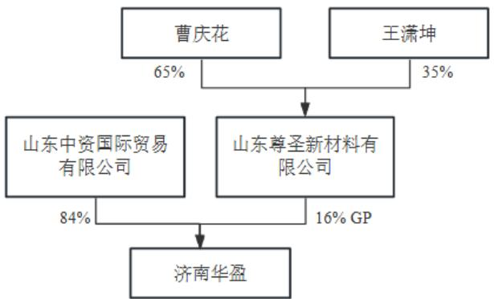

flowchart

```mermaid
graph TD
  A["曹庆花"] -->|65%| C["山东中资国际贸易有限公司"]
  B["王潇坤"] -->|35%| C
  C -->|84%| D["济南华盈"]
  C -->|16% GP| D
```

## 4、最近三年主营业务发展情况

主营业务为以自有资金从事投资活动；最近三年主营业务无变更。

## 5、最近两年主要财务情况

济南华盈最近两年主要财务数据如下：

单位：万元

<table><tr><td>项目</td><td>2024年末/2024年度</td><td>2023年末/2023年度</td></tr><tr><td>资产总额</td><td>2,538.25</td><td>2,526.90</td></tr><tr><td>负债总额</td><td>7.25</td><td>6.00</td></tr><tr><td>净资产</td><td>2,531.00</td><td>2,520.90</td></tr><tr><td>营业收入</td><td>45.90</td><td>58.97</td></tr><tr><td>净利润</td><td>10.10</td><td>32.82</td></tr></table>

注：财务数据未经审计。

## 6、下属企业情况

截至本报告书签署日，济南华盈不存在控制的下属企业。

## 7、是否属于私募投资基金及备案情况

济南华盈不存在以非公开方式向合格投资者募集资金设立的情形，济南华盈的资产不存在由基金管理人管理、基金托管人进行托管的情形，亦不涉及从事私募投资基金管理活动的情形，无需办理私募投资基金或私募投资基金管理人登记备案手续。

## （三十四）星臻瀚智

## 1、基本情况

<table><tr><td>企业名称</td><td>星臻瀚智股权投资基金(淄博)合伙企业(有限合伙)</td></tr><tr><td>企业类型</td><td>有限合伙企业</td></tr><tr><td>出资额</td><td>2,202.7505万元人民币</td></tr><tr><td>执行事务合伙人</td><td>嘉兴星臻私募基金管理合伙企业(有限合伙)</td></tr><tr><td>成立日期</td><td>2022-10-08</td></tr><tr><td>主要经营场所</td><td>山东省淄博市高新区柳泉路139号金融科技中心B座12层A区3009号</td></tr><tr><td>统一社会信用代码</td><td>91370303MAC0UMX298</td></tr><tr><td>经营范围</td><td>一般项目:私募股权投资基金管理、创业投资基金管理服务(须在中国证券投资基金业协会完成登记备案后方可从事经营活动);以私募基金从事股权投资、投资管理、资产管理等活动(须在中国证券投资基金业协会完成登记备案后方可从事经营活动)。(除依法须经批准的项目外,凭营业执照依法自主开展经营活动)</td></tr></table>

## 2、历史沿革

## （1）2022 年 10 月，设立

2022年10月，星臻瀚智设立。出资额为 100万元。

## （2）2023 年 3 月，增资

本次变更完成后，合伙人及出资结构如下：

<table><tr><td>序号</td><td>合伙人姓名/名称</td><td>合伙人类型</td><td>出资额(万元)</td><td>出资比例</td></tr><tr><td>1</td><td>嘉兴星臻私募基金管理合伙企业(有限合伙)</td><td>普通合伙人</td><td>2.7505</td><td>0.1169%</td></tr><tr><td>2</td><td>海南运晟企业管理合伙企业(有限合伙)</td><td>有限合伙人</td><td>500.00</td><td>21.2517%</td></tr><tr><td>3</td><td>李林益</td><td>有限合伙人</td><td>300.00</td><td>12.7510%</td></tr><tr><td>4</td><td>简兴福</td><td>有限合伙人</td><td>200.00</td><td>8.5007%</td></tr><tr><td>5</td><td>简晓琴</td><td>有限合伙人</td><td>200.00</td><td>8.5007%</td></tr><tr><td>6</td><td>方秀琴</td><td>有限合伙人</td><td>200.00</td><td>8.5007%</td></tr><tr><td>7</td><td>何乐一</td><td>有限合伙人</td><td>200.00</td><td>8.5007%</td></tr><tr><td>8</td><td>苏香</td><td>有限合伙人</td><td>200.00</td><td>8.5007%</td></tr><tr><td>9</td><td>王国华</td><td>有限合伙人</td><td>100.00</td><td>4.2503%</td></tr><tr><td>10</td><td>简瑶</td><td>有限合伙人</td><td>100.00</td><td>4.2503%</td></tr><tr><td>11</td><td>夏凡</td><td>有限合伙人</td><td>100.00</td><td>4.2503%</td></tr><tr><td>12</td><td>毛奕心</td><td>有限合伙人</td><td>100.00</td><td>4.2503%</td></tr><tr><td>13</td><td>叶静</td><td>有限合伙人</td><td>150.00</td><td>6.3755%</td></tr><tr><td colspan="3">合计</td><td>2,352.75</td><td>100.00%</td></tr></table>

## （3）2023 年 5 月，第一次减资

2023 年 5 月，叶静退伙，星臻瀚智出资额由为 2,352.7505 万元减至 2,202.7505万元。

本次变更完成后，合伙人及出资结构如下：

<table><tr><td>序号</td><td>合伙人姓名/名称</td><td>合伙人类型</td><td>出资额(万元)</td><td>出资比例</td></tr><tr><td>1</td><td>嘉兴星臻私募基金管理合伙企业(有限合伙)</td><td>普通合伙人</td><td>2.7505</td><td>0.12%</td></tr><tr><td>2</td><td>海南运晟企业管理合伙企业(有限合伙)</td><td>有限合伙人</td><td>500.00</td><td>22.70%</td></tr><tr><td>3</td><td>李林益</td><td>有限合伙人</td><td>300.00</td><td>13.62%</td></tr><tr><td>4</td><td>简兴福</td><td>有限合伙人</td><td>200.00</td><td>9.08%</td></tr><tr><td>5</td><td>简晓琴</td><td>有限合伙人</td><td>200.00</td><td>9.08%</td></tr><tr><td>6</td><td>方秀琴</td><td>有限合伙人</td><td>200.00</td><td>9.08%</td></tr><tr><td>7</td><td>何乐一</td><td>有限合伙人</td><td>200.00</td><td>9.08%</td></tr><tr><td>8</td><td>苏香</td><td>有限合伙人</td><td>200.00</td><td>9.08%</td></tr><tr><td>9</td><td>王国华</td><td>有限合伙人</td><td>100.00</td><td>4.54%</td></tr><tr><td>10</td><td>简瑶</td><td>有限合伙人</td><td>100.00</td><td>4.54%</td></tr><tr><td>11</td><td>夏凡</td><td>有限合伙人</td><td>100.00</td><td>4.54%</td></tr><tr><td>12</td><td>毛奕心</td><td>有限合伙人</td><td>100.00</td><td>4.54%</td></tr><tr><td colspan="3">合计</td><td>2,202.75</td><td>100.00%</td></tr></table>

## 3、产权控制关系

截至本报告书签署日，成都泽翎企业管理有限公司为星臻瀚智执行事务合伙人嘉兴星臻私募基金管理合伙企业（有限合伙）之执行事务合伙人，刘峰持有成都泽翎企业管理有限公司 60%股权，为星臻瀚智实际控制人。星臻瀚智的产权控制关系如下：

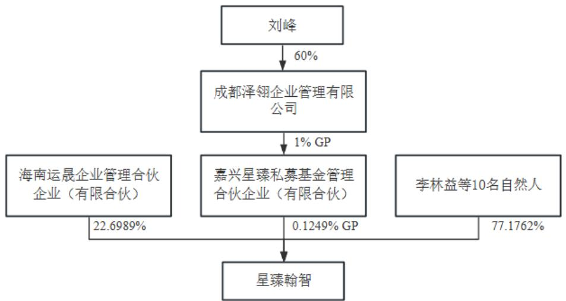

flowchart

```mermaid
graph TD
  A["刘峰"] -->|60%| B["成都泽翎企业管理有限公司"]
  B -->|1% GP| C["嘉兴星臻私募基金管理合伙企业（有限合伙）"]
  C -->|0.1249% GP| D["星臻翰智"]
  C -->|77.1762%| D
  E["海南运晟企业管理合伙企业（有限合伙）"] -->|22.6989%| D
  F["李林益等10名自然人"] -->|77.1762%| D
```

## 4、最近三年主营业务发展情况

主营业务为私募股权投资基金管理、创业投资基金管理服务；最近三年主营业务无变更。

## 5、最近两年主要财务情况

星臻瀚智最近两年主要财务数据如下：

单位：万元

<table><tr><td>项目</td><td>2024年末/2024年度</td><td>2023年末/2023年度</td></tr><tr><td>资产总额</td><td>2,075.67</td><td>2,076.49</td></tr><tr><td>负债总额</td><td>0.05</td><td>0.05</td></tr><tr><td>净资产</td><td>2,075.62</td><td>2,076.44</td></tr><tr><td>营业收入</td><td>-</td><td>-</td></tr><tr><td>净利润</td><td>-0.83</td><td>-126.31</td></tr></table>

注：2023年财务数据已经审计；2024年财务数据未经审计。

## 6、下属企业情况

截至本报告书签署日，星臻瀚智不存在控制的下属企业。

## 7、是否属于私募投资基金及备案情况

星臻瀚智为合伙型私募基金，已在中国基金业协会登记为私募基金（登记编号为 SZK921）。

## （三十五）国元创新

## 1、基本情况

<table><tr><td>公司名称</td><td>国元创新投资有限公司</td></tr><tr><td>公司类型</td><td>有限责任公司</td></tr><tr><td>注册资本</td><td>150,000万元人民币</td></tr><tr><td>法定代表人</td><td>万雷</td></tr><tr><td>成立日期</td><td>2012-11-28</td></tr><tr><td>注册地址</td><td>安徽省合肥市包河区包河大道118号包河区机关后勤服务中心三楼310室</td></tr><tr><td>统一社会信用代码</td><td>913401000584682396</td></tr><tr><td>经营范围</td><td>项目投资;股权投资。(依法须经批准的项目,经相关部门批准后方可开展经营活动)</td></tr></table>

## 2、历史沿革

## （1）2012 年 11 月，设立

2012年11月，国元创新设立，设立时股权结构如下：

<table><tr><td>序号</td><td>股东名称</td><td>认缴出资额(万元)</td><td>持股比例</td></tr><tr><td>1</td><td>国元证券股份有限公司</td><td>150,000.00</td><td>100.00%</td></tr><tr><td colspan="2">合计</td><td>150,000.00</td><td>100.00%</td></tr></table>

## 3、产权控制关系

截至本报告书签署日，国元证券股份有限公司持有国元创新 100%的股权，是国元创新的控股股东；国元证券股份有限公司系深交所主板上市公司，其控股股东为安徽国元金融控股集团有限责任公司，实际控制人为安徽省人民政府国有资产监督管理委员会。因此，国元创新的实际控制人为安徽省人民政府国有资产监督管理委员会，国元创新的产权控制关系如下：

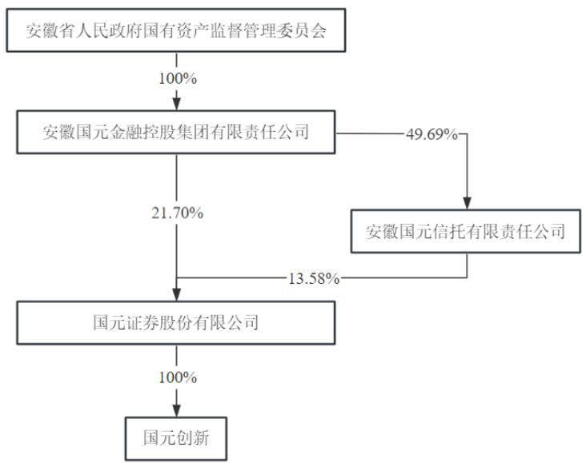

flowchart

```mermaid
graph TD
  A["安徽省人民政府国有资产监督管理委员会"] -->|100%| B["安徽国元金融控股集团有限责任公司"]
  B -->|49.69%| C["安徽国元信托有限责任公司"]
  B -->|21.70%| D["国元证券股份有限公司"]
  C -->|13.58%| D
  D -->|100%| E["国元创新"]
```

## 4、最近三年主营业务发展情况

国元创新主营业务为项目投资、股权投资。最近三年主营业务无变更。

## 5、最近两年主要财务情况

国元创新最近两年主要财务数据如下：

单位：万元

<table><tr><td>项目</td><td>2024年末/2024年度</td><td>2023年末/2023年度</td></tr><tr><td>资产总额</td><td>409,077.74</td><td>419,001.78</td></tr><tr><td>负债总额</td><td>55,010.98</td><td>66,615.52</td></tr><tr><td>净资产</td><td>354,066.76</td><td>352,386.26</td></tr><tr><td>营业收入</td><td>4,635.94</td><td>29,043.81</td></tr><tr><td>净利润</td><td>1,501.50</td><td>21,270.60</td></tr></table>

注：2023年财务数据已经审计；2024年财务数据未经审计。

## 6、下属企业情况

截至本报告书签署日，国元创新不存在控制的下属企业。

## 7、是否属于私募投资基金及备案情况

国元创新不存在以非公开方式向合格投资者募集资金设立的情形，国元创新的资产不存在由基金管理人管理、基金托管人进行托管的情形，亦不涉及从事私募投资基金管理活动的情形，无需办理私募投资基金或私募投资基金管理人登记备案手续。

## （三十六）安徽协和成

## 1、基本情况

<table><tr><td>公司名称</td><td>安徽协和成药业饮片有限公司</td></tr><tr><td>公司类型</td><td>有限责任公司</td></tr><tr><td>注册资本</td><td>6,660万元人民币</td></tr><tr><td>法定代表人</td><td>李素亮</td></tr><tr><td>成立日期</td><td>2005-02-24</td></tr><tr><td>注册地址</td><td>安徽省亳州市谯城区药都大道2008号</td></tr><tr><td>统一社会信用代码</td><td>91341600771133389C</td></tr><tr><td>经营范围</td><td>许可项目:药品生产;药品批发;药品零售;药品进出口;茶叶制品生产;饮料生产;食品销售;化妆品生产(依法须经批准的项目,经相关部门批准后方可开展经营活动,具体经营项目以相关部门批准文件或许可证件为准)一般项目:化妆品批发;化妆品零售;互联网销售(除销售需要许可的商品);食品互联网销售(仅销售预包装食品);初级农产品收购;农副产品销售;地产中草药(不含中药饮片)购销;中草药收购;中草药种植;货物进出口;进出口代理(除许可业务外,可自主依法经营法律法规非禁止或限制的项目)</td></tr></table>

## 2、历史沿革

## （1）2005年 2月，设立

2005年2月，安徽协和成设立。注册资本为 1,000.00 万元，股东为李素亮、李仁义、李素清和亳州市协和成药业有限责任公司。

股东及出资结构如下：

<table><tr><td>序号</td><td>股东姓名/名称</td><td>注册资本(万元)</td><td>持股比例</td></tr><tr><td>1</td><td>李素亮</td><td>500.00</td><td>50.00%</td></tr><tr><td>2</td><td>李仁义</td><td>440.00</td><td>44.00%</td></tr><tr><td>3</td><td>李素清</td><td>40.00</td><td>4.00%</td></tr><tr><td>4</td><td>亳州市协和成药业有限责任公司</td><td>20.00</td><td>2.00%</td></tr><tr><td colspan="2">合计</td><td>1,000.00</td><td>100.00%</td></tr></table>

## （2）2005年 4月，第一次转让

2005年4月，李素亮将持有安徽协和成 15%股权（对应注册资本 150万元）转让给洪海彬、将持有安徽协和成 5%股权（对应注册资本 50万元）转让给李杰；李仁义将持有安徽协和成 18%股权（对应注册资本 180万元）转让给李杰；李素清将持有安徽协和成 1%股权（对应注册资本 10万元）转让给李杰。

本次变更完成后，股东及出资结构如下：

<table><tr><td>序号</td><td>股东姓名/名称</td><td>注册资本(万元)</td><td>持股比例</td></tr><tr><td>1</td><td>李素亮</td><td>300.00</td><td>30.00%</td></tr><tr><td>2</td><td>李仁义</td><td>260.00</td><td>26.00%</td></tr><tr><td>3</td><td>李杰</td><td>240.00</td><td>24.00%</td></tr><tr><td>4</td><td>洪海彬</td><td>150.00</td><td>15.00%</td></tr><tr><td>5</td><td>李素清</td><td>30.00</td><td>3.00%</td></tr><tr><td>6</td><td>亳州市协和成药业有限责任公司</td><td>20.00</td><td>2.00%</td></tr><tr><td colspan="2">合计</td><td>1,000.00</td><td>100.00%</td></tr></table>

## （3）2008年 8月，第一次增资

2008 年 8 月，安徽协和成的注册资本增加至 1,660.00 万元，其中，李素亮认缴新增注册资本 198万元、李仁义认缴新增注册资本 171.6万元、李素清认缴新增注册资本 33 万元、李杰认缴新增注册资本 158.4 万元、洪海彬认缴新增注册资本99万元。

本次变更完成后，股东及出资结构如下：

<table><tr><td>序号</td><td>股东姓名/名称</td><td>注册资本(万元)</td><td>持股比例</td></tr><tr><td>1</td><td>李素亮</td><td>498.00</td><td>30.00%</td></tr><tr><td>2</td><td>李仁义</td><td>431.60</td><td>26.00%</td></tr><tr><td>3</td><td>李杰</td><td>398.40</td><td>24.00%</td></tr><tr><td>4</td><td>洪海彬</td><td>249.00</td><td>15.00%</td></tr><tr><td>5</td><td>李素清</td><td>63.00</td><td>3.80%</td></tr><tr><td>6</td><td>亳州市协和成药业有限责任公司</td><td>20.00</td><td>1.20%</td></tr><tr><td colspan="2">合计</td><td>1,660.00</td><td>100.00%</td></tr></table>

## （4）2014 年 2 月，第二次增资

2014年2月，安徽协和成以盈余公积 3,000 万元与未分配利润 2,000万元增加注册资本至6,660 万元，各股东享有转增资本的数额按本次转增前各股东认缴注册资本的比例享有。股东李仁义姓名变更为李金义。

本次变更完成后，股东及出资结构如下：

<table><tr><td>序号</td><td>股东姓名/名称</td><td>注册资本(万元)</td><td>持股比例</td></tr><tr><td>1</td><td>李素亮</td><td>1,998.00</td><td>30.00%</td></tr><tr><td>2</td><td>李金义</td><td>1,731.60</td><td>26.00%</td></tr><tr><td>3</td><td>李杰</td><td>1,598.40</td><td>24.00%</td></tr><tr><td>4</td><td>洪海彬</td><td>999.00</td><td>15.00%</td></tr><tr><td>5</td><td>李素清</td><td>253.08</td><td>3.80%</td></tr><tr><td>6</td><td>亳州市协和成药业有限责任公司</td><td>79.92</td><td>1.20%</td></tr><tr><td colspan="2">合计</td><td>6,660.00</td><td>100.00%</td></tr></table>

## （5）2015 年 12 月，出资方式变更

2015年12月，安徽协和成将 2014年2 月以盈余公积3,000万元与未分配利润 2,000 万元增加注册资本至 6,660 万元事宜，调整为安徽协和成新增注册资本5,000万元，各股东按现有所持股权比例以货币认缴公司新增注册资本。

本次变更完成后，股东及出资结构如下：

<table><tr><td>序号</td><td>股东姓名/名称</td><td>注册资本(万元)</td><td>持股比例</td></tr><tr><td>1</td><td>李素亮</td><td>1,998.00</td><td>30.00%</td></tr><tr><td>2</td><td>李金义</td><td>1,731.60</td><td>26.00%</td></tr><tr><td>3</td><td>李杰</td><td>1,598.40</td><td>24.00%</td></tr><tr><td>4</td><td>洪海彬</td><td>999.00</td><td>15.00%</td></tr><tr><td>5</td><td>李素清</td><td>253.08</td><td>3.80%</td></tr><tr><td>6</td><td>亳州市协和成药业有限责任公司</td><td>79.92</td><td>1.20%</td></tr><tr><td colspan="2">合计</td><td>6,660.00</td><td>100.00%</td></tr></table>

## （6）2017 年 5 月，第二次转让

2017 年 5 月，亳州市协和成药业有限责任公司将其持有的 1.2%的股权转让给李素清。

本次变更完成后，股东及出资结构如下：

<table><tr><td>序号</td><td>股东姓名</td><td>注册资本(万元)</td><td>持股比例</td></tr><tr><td>1</td><td>李素亮</td><td>1,998.00</td><td>30.00%</td></tr><tr><td>2</td><td>李金义</td><td>1,731.60</td><td>26.00%</td></tr><tr><td>3</td><td>李杰</td><td>1,598.40</td><td>24.00%</td></tr><tr><td>4</td><td>洪海彬</td><td>999.00</td><td>15.00%</td></tr><tr><td>5</td><td>李素清</td><td>333.00</td><td>5.00%</td></tr><tr><td colspan="2">合计</td><td>6,660.00</td><td>100.00%</td></tr></table>

## 3、产权控制关系

截至本报告书签署日，李素亮持有安徽协和成 30%的股权并担任安徽协和成的执行董事兼总经理，为安徽协和成的控股股东、实际控制人。安徽协和成的产权控制关系如下：

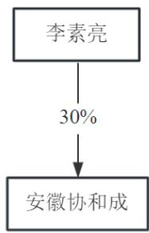

flowchart

```mermaid
graph TD
  A["李素亮"] -->|30%| B["安徽协和成"]
```

## 4、最近三年主营业务发展情况

主营业务为药品生产，药品批发，药品零售，药品进出口；茶制品生产，饮料生产；食品生产及销售；化妆品生产及销售；农副产品收购及销售；地产中药材购销；中草药种植。最近三年主营业务无变更。

## 5、最近两年主要财务情况

安徽协和成最近两年主要财务数据如下：

单位：万元

<table><tr><td>项目</td><td>2024年末/2024年度</td><td>2023年末/2023年度</td></tr><tr><td>资产总额</td><td>124,760.65</td><td>114,966.10</td></tr><tr><td>负债总额</td><td>43,412.79</td><td>41,978.96</td></tr><tr><td>净资产</td><td>81,347.86</td><td>72,987.15</td></tr><tr><td>营业收入</td><td>110,121.27</td><td>88,092.93</td></tr><tr><td>净利润</td><td>8,394.93</td><td>4,304.57</td></tr></table>

注：2023年财务数据已经审计；2024年财务数据未经审计。

## 6、下属企业情况

截至本报告书签署日，安徽协和成控制的主要下属企业如下：

<table><tr><td>序号</td><td>企业名称</td><td>注册资本/出资额(万元)</td><td>持股比例(%)</td><td>主营业务</td></tr><tr><td>1</td><td>安徽省本草国药饮片有限公司</td><td>1,320.00</td><td>100.00</td><td>中药饮片及食品</td></tr><tr><td>2</td><td>安徽协和成制药有限公司</td><td>6,000.00</td><td>100.00</td><td>中成药及配方颗粒</td></tr><tr><td>3</td><td>安徽协和成典当有限公司</td><td>3,200.00</td><td>93.75</td><td>中药材抵押典当</td></tr><tr><td>4</td><td>安徽本草保健食品有限公司</td><td>600.00</td><td>100.00</td><td>食品及保健品</td></tr><tr><td>5</td><td>安徽协和成文化旅游管理有限公司</td><td>10,000.00</td><td>100.00</td><td>文化旅游咨询、餐饮及会展服务</td></tr><tr><td>6</td><td>安徽颐禾堂大药房有限公司</td><td>600.00</td><td>100.00</td><td>中药饮片代煎、药品零售</td></tr><tr><td>7</td><td>安徽颐禾堂中医诊疗有限公司</td><td>600.00</td><td>100.00</td><td>中医诊疗服务</td></tr><tr><td>8</td><td>安徽颐禾堂中医院有限公司</td><td>600.00</td><td>100.00</td><td>中医诊疗服务</td></tr><tr><td>9</td><td>亳州市中药材进出口检测中心</td><td>200.00</td><td>80.00</td><td>中药材和食品检测、咨询服务</td></tr><tr><td>10</td><td>安徽佳合堂生物科技有限公司</td><td>500.00</td><td>安徽省本草国药饮片有限公司持股51%</td><td>生物科技领域内的技术研发、技术咨询、技术服务</td></tr></table>

## 7、是否属于私募投资基金及备案情况

安徽协和成不存在以非公开方式向合格投资者募集资金设立的情形，安徽协和成的资产不存在由基金管理人管理、基金托管人进行托管的情形，亦不涉及从事私募投资基金管理活动的情形，无需办理私募投资基金或私募投资基金管理人登记备案手续。

## （三十七）山东玖悦

## 1、基本情况

<table><tr><td>公司名称</td><td>山东玖悦资本有限公司</td></tr><tr><td>公司类型</td><td>有限责任公司</td></tr><tr><td>注册资本</td><td>1,000万元人民币</td></tr><tr><td>法定代表人</td><td>刘拥力</td></tr><tr><td>成立日期</td><td>2019-10-17</td></tr><tr><td>注册地址</td><td>中国(山东)自由贸易试验区济南片区经十路7000号汉峪金融商务中心A6-4号楼5楼5-7</td></tr><tr><td>统一社会信用代码</td><td>91370100MA3QQXQH2Q</td></tr><tr><td>经营范围</td><td>以自有资金投资(未经金融监管部门批准,不得吸收存款、融资担保、代客理财等金融业务)。(依法须经批准的项目,经相关部门批准后方可开展经营活动)</td></tr></table>

## 2、历史沿革

## （1）2019 年 10 月，设立

2019 年 10 月，山东玖悦设立。注册资本为 1,000.00 万元，股东为郭建忠、刘拥力。

股东及出资结构如下：

<table><tr><td>序号</td><td>股东姓名</td><td>注册资本(万元)</td><td>持股比例</td></tr><tr><td>1</td><td>刘拥力</td><td>700.00</td><td>70.00%</td></tr><tr><td>2</td><td>郭建忠</td><td>300.00</td><td>30.00%</td></tr><tr><td colspan="2">合计</td><td>1,000.00</td><td>100.00%</td></tr></table>

## （2）2022 年 9 月，第一次转让

2022 年 9 月，郭建忠将其所持有的山东玖悦 30%股权（对应注册资本 300万元）转让给刘拥力，刘拥力将其所持有的山东玖悦 1%股权（对应注册资本 10万元）转让给郭晓琳。

本次变更完成后，股东及出资结构如下：

<table><tr><td>序号</td><td>股东姓名</td><td>注册资本(万元)</td><td>持股比例</td></tr><tr><td>1</td><td>刘拥力</td><td>990.00</td><td>99.00%</td></tr><tr><td>2</td><td>郭晓琳</td><td>10.00</td><td>1.00%</td></tr><tr><td colspan="2">合计</td><td>1,000.00</td><td>100.00%</td></tr></table>

## （3）2023年 6月，第二次转让

2023 年 6 月，郭晓琳将其所持有的山东玖悦 1%股权（对应注册资本 10 万元）转让给姚欣雅。

本次变更完成后，股东及出资结构如下：

<table><tr><td>序号</td><td>股东姓名</td><td>注册资本(万元)</td><td>持股比例</td></tr><tr><td>1</td><td>刘拥力</td><td>990.00</td><td>99.00%</td></tr><tr><td>2</td><td>姚欣雅</td><td>10.00</td><td>1.00%</td></tr><tr><td colspan="2">合计</td><td>1,000.00</td><td>100.00%</td></tr></table>

## 3、产权控制关系

截至本报告书签署日，刘拥力持有山东玖悦 99%的股权，为山东玖悦的控股股东、实际控制人。山东玖悦的产权控制关系如下：

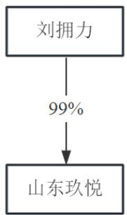

flowchart

```mermaid
graph TD
  A["刘拥力"] -->|99%| B["山东玖悦"]
```

## 4、最近三年主营业务发展情况

主营业务为以自有资金投资；最近三年主营业务无变更。

## 5、最近两年主要财务情况

山东玖悦最近两年主要财务数据如下：

单位：万元

<table><tr><td>项目</td><td>2024年末/2024年度</td><td>2023年末/2023年度</td></tr><tr><td>资产总额</td><td>2,904.26</td><td>3,360.41</td></tr><tr><td>负债总额</td><td>856.07</td><td>1,540.64</td></tr><tr><td>净资产</td><td>2,048.19</td><td>1,819.77</td></tr><tr><td>营业收入</td><td>304.43</td><td>327.23</td></tr><tr><td>净利润</td><td>228.45</td><td>461.91</td></tr></table>

注：财务数据未经审计。

## 6、下属企业情况

截至本报告书签署日，山东玖悦控制的主要一级下属企业如下：

<table><tr><td>序号</td><td>企业名称</td><td>注册资本/出资额(万元)</td><td>持股比例(%)</td><td>主营业务</td></tr><tr><td>1</td><td>济南三价融智知识产权股权投资合伙企业(有限合伙)</td><td>20,000.00</td><td>担任执行事务合伙人并持有1%的合伙份额</td><td>创业投资(限投资未上市企业);以私募基金从事股权投资、投资管理、资产管理等活动</td></tr><tr><td>2</td><td>济南胜悦投资管理有限公司</td><td>2,000.00</td><td>51.00</td><td>以自有资金投资及其对投资项目进行投资管理</td></tr><tr><td>3</td><td>山东和悦投资有限公司</td><td>1,000.00</td><td>100.00</td><td>以自有资金从事投资活动</td></tr><tr><td>4</td><td>山东百廿学府创业投资有限公司</td><td>1,800.00</td><td>直接并通过济南胜悦投资管理有限公司合计控制55.56股权</td><td>创业投资;以自有资金从事投资活动;私募股权投资基金管理、创业投资基金管理服务</td></tr><tr><td>5</td><td>济南舜悦投资有限公司</td><td>100.00</td><td>100.00</td><td>以自有资金从事投资活动;企业管理;财务咨询;企业管理咨询;社会经济咨询服务</td></tr><tr><td>6</td><td>呼家楼投资基金管理(北京)有限公司</td><td>200.00</td><td>50.00</td><td>非证券业务的投资、投资管理、项目投资;投资咨询</td></tr></table>

## 7、是否属于私募投资基金及备案情况

山东玖悦不存在以非公开方式向合格投资者募集资金设立的情形，山东玖悦的资产不存在由基金管理人管理、基金托管人进行托管的情形，亦不涉及从事私募投资基金管理活动的情形，无需办理私募投资基金或私募投资基金管理人登记备案手续。

## （三十八）陈晓晖

## 1、基本情况

<table><tr><td>姓名</td><td>陈晓晖</td></tr><tr><td>曾用名</td><td>-</td></tr><tr><td>性别</td><td>男</td></tr><tr><td>国籍</td><td>中国</td></tr><tr><td>身份证号</td><td>370721196312******</td></tr><tr><td>住所</td><td>北京市朝阳区光华路******</td></tr><tr><td>通讯地址</td><td>山东省潍坊市玉清东街******</td></tr><tr><td>是否取得其他国家或者地区居留权</td><td>否</td></tr></table>

## 2、最近三年任职情况及任职单位产权关系

<table><tr><td>起止时间</td><td>任职单位</td><td>职务</td><td>产权关系</td></tr><tr><td>2022年1月1日至2024年12月31日</td><td>无</td><td>自由职业</td><td>无</td></tr></table>

## （三十九）其他

## 1、交易对方及其主要管理人员最近五年内未受处罚的情况说明

截至本报告书签署日，本次交易的交易对方及其主要管理人员近五年内均未受到过行政处罚（与证券市场明显无关的除外）、刑事处罚，且不存在涉及与经济纠纷有关的重大民事诉讼或者仲裁的情形。

## 2、交易对方及其主要管理人员最近五年的诚信情况

截至本报告书签署日，本次交易的交易对方及其主要管理人员近五年内不存在未按期偿还大额债务、未履行承诺、被中国证监会采取行政监管措施或受到证券交易所纪律处分的情形。

## 3、交易对方之间存在的关联关系

截至本报告书签署日，交易对方之间存在的关联关系如下：

（1）力诺集团直接持有力诺投资 78.8714%的股权，并通过其全资子公司山东力诺物流有限公司间接持有力诺投资 1.9685%的股权，合计持有力诺投资80.8399%的股权，为力诺投资控股股东，力诺集团、力诺投资之间存在关联关系；  
（2）济南市财政局通过济南财金投资控股集团有限公司实际控制济南财投新动能、济南财金投资及济南鑫控，济南财投新动能、济南财金投资、济南鑫控之间存在关联关系；  
（3）申英明担任济南宏舜、济南惠宏执行事务合伙人，为济南宏舜、济南惠宏实际控制人，济南宏舜、济南惠宏之间存在关联关系；

（4）袁世琪担任济南宏凯、济南鲲特执行事务合伙人，为济南宏凯、济南鲲特实际控制人，济南宏凯、济南鲲特之间存在关联关系；  
（5）深圳人合资本管理有限公司为新余人合厚乾、新余人合厚实、新余人合厚信执行事务合伙人，其实际控制人金伟春为新余人合厚乾、新余人合厚实、新余人合厚信实际控制人，新余人合厚乾、新余人合厚实、新余人合厚信之间存在关联关系；  
（6）国元证券股份有限公司持有池州徽元执行事务合伙人国元股权投资有限公司 100%股权，并持有国元创新 100%股权，其实际控制人安徽省人民政府国有资产监督管理委员会为池州徽元及国元创新实际控制人，池州徽元及国元创新之间存在关联关系；  
（7）济南高新技术产业开发区国有资产管理委员会通过济南高新控股集团有限公司、济高科技产业有限公司间接持有济高投保执行事务合伙人山东舜盈股权投资基金管理有限公司 100%股权，济南高新技术产业开发区国有资产管理委员会通过济南高新控股集团有限公司间接持有济高科技 100%股权，济南高新技术产业开发区国有资产管理委员会为济高投保、济高科技实际控制人，济高投保、济高科技之间存在关联关系；  
（8）济南财投新动能、济南财金投资及济南鑫控的控股股东济南财金投资控股集团有限公司通过其全资子公司济南市财政投资基金控股集团有限公司、济南财金生物医药产业投资有限公司间接持有济南生技医疗产业发展母基金合伙企业（有限合伙）37.13%的份额，济南生技医疗产业发展母基金合伙企业（有限合伙）持有济南德福三期股权投资基金合伙企业（有限合伙）19.02%的份额，济南德福三期股权投资基金合伙企业（有限合伙）为厦门德福悦安的有限合伙人并持有其38.32%的份额；  
（9）山东玖悦持有济南三价融智 1%的份额并担任其执行事务合伙人，山东玖悦与济南三价融智之间存在关联关系；  
（10）济南财投新动能为济南三价融智有限合伙人并持有其 50%的份额，济南财投新动能与济南三价融智之间存在关联关系；  
（11）王潇坤为济南嘉和执行事务合伙人并持有其 33%份额；山东尊圣新材

料有限公司为济南华盈执行事务合伙人并持有其 16%份额，王潇坤持有山东尊圣新材料有限公司35%股权。

除此之外，交易对方之间不存在其他关联关系。

## 4、交易对方与上市公司及其控股股东、实际控制人之间存在的关联关系

本次重组交易对方与上市公司之间的关系详见本报告书“第一节/三/（一）本次交易构成关联交易”。

## 5、交易对方向上市公司推荐的董事及高级管理人员情况

截至本报告书签署之日，上市公司董事长兼总经理高春坡、副董事长邹晓虹、董事高元坤系交易对方力诺投资向上市公司推荐。

## 6、宏济堂历史对赌情况

宏济堂及其控股股东力诺投资、力诺集团、实际控制人高元坤曾与宏济堂部分投资人股东签署协议，约定宏济堂、力诺投资、力诺集团及高元坤承诺投资人股东在投资/股权转让完成后一定期限内，宏济堂（1）实现相关业绩指标，及/或（2）实现上市；并约定如未完成相关业绩指标或未如期上市的，相关投资人股东有权要求回购其持有的宏济堂股权或承担连带责任。根据上市公司、宏济堂、交易对方、高元坤签署的《购买资产协议》，约定对赌协议中宏济堂作为义务人承担义务的相关条款，不可撤销地终止；除对赌协议中宏济堂作为义务人承担义务相关条款外的其他条款，在上市公司终止本次重组之日起自动恢复效力，并视同该等条款从未终止，自始有效。

## 二、募集配套资金交易对方基本情况

本次交易募集配套资金的交易对方为不超过 35名特定投资者。

## 第四节 交易标的基本情况

## 一、标的公司基本情况

本次标的资产为宏济堂99.42%股权。宏济堂基本情况如下：

<table><tr><td>标的公司名称</td><td>山东宏济堂制药集团股份有限公司</td></tr><tr><td>法定代表人</td><td>蒋红升</td></tr><tr><td>标的公司性质</td><td>股份有限公司</td></tr><tr><td>注册地址</td><td>济南市历城区经十东路30766号</td></tr><tr><td>统一社会信用代码</td><td>91370100163142804X</td></tr><tr><td>成立时间</td><td>1991年5月4日</td></tr><tr><td>注册资本</td><td>28,587.6736万元</td></tr><tr><td>经营范围</td><td>许可项目:药品生产;药品批发;保健食品生产;食品销售;药品进出口;药品零售;食品生产;食品互联网销售;食品添加剂生产;道路货物运输(不含危险货物);药用辅料销售。(依法须经批准的项目,经相关部门批准后方可开展经营活动,具体经营项目以相关部门批准文件或许可证件为准)一般项目:中草药种植;地产中草药(不含中药饮片)购销;中草药收购;保健食品(预包装)销售;食品销售(仅销售预包装食品);日用化学产品销售;日用化学产品制造;食品添加剂销售;制药专用设备制造;制药专用设备销售;技术服务、技术开发、技术咨询、技术交流、技术转让、技术推广;住房租赁;包装材料及制品销售;塑料制品销售;纸制品销售;日用木制品销售;软木制品销售;金银制品销售;有色金属合金销售;非金属矿及制品销售;金属包装容器及材料销售;食品用塑料包装容器工具制品销售;化工产品销售(不含许可类化工产品);农副产品销售。(除依法须经批准的项目外,凭营业执照依法自主开展经营活动)</td></tr></table>

## 二、标的公司历史沿革

## （一）宏济堂自成立以来的股权及股份变动情况

## 1、宏济堂设立前的股本及演变

宏济堂系由宏济堂有限整体变更设立的股份公司，宏济堂有限的前身为1960年4月1日开业的山东济南中药厂。

1980 年 5 月 13 日，山东济南中药厂提交《工业企业普查登记表》，申请工商部门核准登记。1980年5月21 日，济南市工商行政管理局核准山东济南中药厂工商登记，并于 1980年8月10日签发山东济南中药厂营业执照。

1989 年 7 月 4 日，山东济南中药厂提交《企业法人申请开业登记注册书》，申请企业法人登记。1989 年 9 月 2 日，济南市工商行政管理局核准山东济南中药厂企业法人登记，并核发《企业法人营业执照》（注册号为：163114280-4，注册资金为 9,028,000 元）。

1991年5月7 日，济南市审计事务所出具《验资证明》（（91）验字第 80号），山东济南中药厂注册资金增至 1,117 万元。1991 年 5 月 30 日，济南市工商行政管理局核发山东济南中药厂《企业法人营业执照》（注册号为 163114280-4，注册资金为1,117万元）。

1992年5月7 日，济南市审计事务所出具《验资证明》（（92）验字第 27号），山东济南中药厂注册资金增至 1,362 万元。1992 年 8 月 17 日，济南市工商行政管理局核发山东济南中药厂《企业法人营业执照》（注册号：163114280-4，注册资金为1,362万元）。

## （1）1999年 3月，宏济堂有限设立

1998 年 10 月 16 日，济南市国有资产管理局出具《资产评估结果确认通知书》（济国资评认字[1998]第 40 号），经对山东第二会计师事务所对山东济南中药厂经营性资产评估结果审核验证，确认山东济南中药厂净资产为 43,196,981.58元。

1998年11月 4日，济南市经济体制改革委员会出具《关于同意济南中药厂改制为济南神方中药有限责任公司的批复》（济体改企字〔1998〕25 号），同意济南中药厂改制为济南神方中药有限责任公司，总股本为 1,360万元，其中以经市国资局委托评估并确认的700万元资产作为国家股投入，占总股本的51.47%，济南中药厂工会职工持股会集体出资660万元，占总股本的 48.53%。

1998 年 12 月 14 日，济南市国有资产管理局出具《关于山东济南中药厂改制国有资产折股的批复》（济国资企字（1998）第 66 号），同意山东济南中药厂对非经营性资产进行剥离，剥离后经营性净资产为 753.06万元，折为国家股 700万股，差额部分转入资本公积金。

1998 年 12 月 26 日，济南市国有资产管理局、山东济南中药厂工会职工持股会共同签署《济南神方中药有限责任公司章程》，约定：济南市国有资产管理局以山东济南中药厂经评估并由济南市国有资产管理局确认的经营性净资产700万元作为国家股股本投入、山东济南中药厂工会职工持股会以职工个人货币出资和历年结余工资转作职工股两部分合计出资 660 万元作为内部职工集体股股本投入设立济南神方中药有限责任公司，其中国家股 700 万元占公司注册资本51.5%，内部职工集体股 660万元占注册资本 48.5%。

1999年2月10 日，山东济南审计师事务所出具《验资报告》（（99）济审事验字第 272 号），验证截至 1999 年 2 月 10 日，济南神方中药有限责任公司已收到其股东投入的资本 1,360万元。

1999年3月18日，济南市国有资产管理局出具《关于明确济南中药厂改制后国家股投资主体的通知》（济国资企字[1999]第 11 号），明确投入济南神方中药有限责任公司的700 万国家股，由济南市国有资产管理局持有。

1999年3月24日，宏济堂有限取得济南市工商行政管理局核发的《企业法人营业执照》。

宏济堂有限设立时的股权结构如下：

<table><tr><td>序号</td><td>股东名称</td><td>出资额(万元)</td><td>出资比例</td></tr><tr><td>1</td><td>济南市国有资产管理局</td><td>700.00</td><td>51.50%</td></tr><tr><td>2</td><td>山东济南中药厂工会职工持股会</td><td>660.00</td><td>48.50%</td></tr><tr><td colspan="2">合计</td><td>1,360.00</td><td>100.00%</td></tr></table>

## （2）2003年 10月，宏济堂有限重组

1999年7月27日，经济南市工商行政管理局核准，宏济堂有限更名为“济南宏济堂制药有限责任公司”。

2002年10月 8日，济南化药、力诺集团、宏济堂有限签订《资产重组协议书》，就组建济南力诺药业有限责任公司、对宏济堂有限进行增资扩股、资产评估等事项进行约定，约定济南化药以宏济堂有限、永宁制药国有权益作为出资，与力诺集团共同组建济南力诺药业有限责任公司，折国家股 600万股，占济南力诺药业有限责任公司总股本的 5%；济南力诺药业有限责任公司以现金及前述宏济堂有限、永宁制药国有权益对宏济堂有限出资。

2003年3月14 日，济南市人民政府出具《济南市人民政府关于同意市化医公司所属济南宏济堂制药公司等 4 家企业与力诺集团实施资产重组的批复》（济政字〔2003〕20 号），同意宏济堂、永宁制药等四家企业与力诺集团进行重组。

2003年8月15 日，山东新求是有限责任会计师事务所出具《济南宏济堂制药有限责任公司整体资产评估报告书》（鲁新求评报字[2002]第 20 号），截至评估基准日 2002 年 8 月 31 日，宏济堂有限资产总额评估值为 17,611.16 万元；负债总额评估值为11,036.20万元；净资产评估值为 6,574.96万元。

2003年8月30 日，济南市国有资产管理局出具《关于对济南宏济堂制药有限责任公司资产重组资产评估项目予以核准的函》（济国资评函[2003]08 号），确认山东新求是有限责任会计师事务所具有资产评估资格，评估报告内容和格式符合规定要求。

2003年9月17 日，济南市国有资产管理委员会办公室出具《关于对宏济堂和永宁制药两企业国有资产处置意见的批复》（济国资委办[2003]25 号），确定宏济堂有限国有股权益为 3,590.67万元，永宁制药国有股权益为 1,593.05 万元，宏济堂有限、永宁制药国有股权益合计 5,183.72 万元；同意将前述5,183.72 万元国有权益中的 4,548.28 万元用于对企业职工安置和补偿费用，剩余 635.44 万元折国家股600万股，与力诺集团共同组建济南力诺药业有限责任公司；宏济堂有限、永宁制药的国有股权，由济南力诺药业有限责任公司持有。

2003 年 10 月 18 日，宏济堂有限召开股东会，对下列事项作出决议：按照济国资委[2003]25 号文件的批复，根据济南化药、力诺集团、宏济堂有限《资产重组协议书》的内容，将宏济堂有限注册资本变更为 11,034.42 万元，其中济南力诺药业控股集团有限公司以现金投入 8,000 万元、以宏济堂有限评估后国有股净资产经剥离职工安置和补偿费用后剩余的 600 万元作为注册资本，合计出资8,600万元，占总股本的 77.94%，宏济堂有限工会委员会以评估后的净资产作为出资 2,434.42 万元，占总股本的 22.06%。

2003 年 10 月 23 日，济南力诺药业控股集团有限公司、济南宏济堂制药有限责任公司工会委员会签署《济南宏济堂制药有限责任公司（新）章程》。

2003 年 10 月 28 日，山东天元有限责任会计师事务所出具《济南宏济堂制药有限责任公司验资报告》（鲁天元会验字[2003]第 391 号），验证：截至 2003年 10 月 28 日，宏济堂有限已收到济南力诺药业控股集团有限公司以货币出资8,000 万元、以净资产出资 600 万元，宏济堂有限工会委员会以净资产出资2,434.42 万元。

2003 年 10 月 30 日，宏济堂有限取得济南市工商行政管理局核发的《企业法人营业执照》。

本次变更完成后，宏济堂有限的股权结构如下：

<table><tr><td>序号</td><td>股东名称</td><td>出资额(万元)</td><td>出资比例</td></tr><tr><td>1</td><td>济南力诺药业控股集团有限公司</td><td>8,600.00</td><td>77.94%</td></tr><tr><td>2</td><td>济南宏济堂制药有限责任公司工会委员会</td><td>2,434.42</td><td>22.06%</td></tr><tr><td colspan="2">合计</td><td>11,034.42</td><td>100.00%</td></tr></table>

## （3）2010年 6月，宏济堂有限第一次股权转让

2010 年 6 月 8 日，宏济堂有限召开股东会，全体股东一致同意宏济堂有限工会委员会将其持有的宏济堂有限 17,290,624.14 元出资额权益（占股权比例的15.67%）作价 17,290,624.14 元转让给力诺集团股份有限公司。

同日，宏济堂有限工会委员会与力诺集团股份有限公司签署《济南宏济堂制药有限责任公司股权转让协议》，约定工会委员会将其持有的宏济堂有限17,290,624.14 元出资额权益作价 17,290,624.14 元转让给力诺集团股份有限公司。

2010年6月21 日，宏济堂有限取得济南市工商行政管理局核发的《企业法人营业执照》。

本次股权转让完成后，宏济堂有限的股权结构如下：

<table><tr><td>序号</td><td>股东名称</td><td>出资额(万元)</td><td>出资比例</td></tr><tr><td>1</td><td>济南力诺药业控股集团有限公司</td><td>8,600.000000</td><td>77.94%</td></tr><tr><td>2</td><td>力诺集团股份有限公司</td><td>1,729.062414</td><td>15.67%</td></tr><tr><td>3</td><td>济南宏济堂制药有限责任公司工会委员会</td><td>705.357586</td><td>6.39%</td></tr><tr><td colspan="2">合计</td><td>11,034.420000</td><td>100.00%</td></tr></table>

## （4）2013年 8月，宏济堂有限第二次股权转让

2012年3月30日，经山东省工商行政管理局核准，宏济堂有限更名为“山东宏济堂制药集团有限公司”。

2013年6月14日，宏济堂有限召开股东会，同意宏济堂有限工会委员会将其持有的宏济堂有限 2.42%股权（对应宏济堂有限注册资本 2,677,696.47 元）作价2,677,696.47元转让给力诺集团股份有限公司。

2013年8月5 日，宏济堂有限工会委员会与力诺集团股份有限公司签署《股权转让协议》，约定宏济堂有限工会委员会将其持有的宏济堂有限 2.42%股权转让予力诺集团股份有限公司，转让价格为 2,677,696.47 元。

本次股权转让完成后，宏济堂有限的股权结构如下：

<table><tr><td>序号</td><td>股东名称</td><td>出资额(万元)</td><td>出资比例</td></tr><tr><td>1</td><td>济南力诺药业控股集团有限公司</td><td>8,600.000000</td><td>77.94%</td></tr><tr><td>2</td><td>力诺集团股份有限公司</td><td>1,996.832061</td><td>18.09%</td></tr><tr><td>3</td><td>济南宏济堂制药有限责任公司工会委员会</td><td>437.587939</td><td>3.97%</td></tr><tr><td colspan="2">合计</td><td>11,034.420000</td><td>100.00%</td></tr></table>

## （5）2014年 8月，宏济堂有限第三次股权转让

2014 年 8 月 8 日，宏济堂有限召开股东会，全体股东一致同意宏济堂有限工会委员会将其持有的宏济堂有限 0.2%股权转让给力诺集团，转让价款为322,181.28 元。

同日，宏济堂有限工会委员会与力诺集团签署《股权转让协议》，约定上述股权转让事宜。

本次股权转让完成后，宏济堂有限的股权结构如下：

<table><tr><td>序号</td><td>股东名称</td><td>出资额(万元)</td><td>出资比例</td></tr><tr><td>1</td><td>力诺投资控股集团有限公司</td><td>8,600.000000</td><td>77.94%</td></tr><tr><td>2</td><td>力诺集团股份有限公司</td><td>2,018.310813</td><td>18.29%</td></tr><tr><td>3</td><td>济南宏济堂制药有限责任公司工会委员会</td><td>416.109187</td><td>3.77%</td></tr><tr><td colspan="2">合计</td><td>11,034.42000</td><td>100.00%</td></tr></table>

注：2014 年 3 月，济南力诺药业控股集团有限公司更名为“力诺投资控股集团有限公司”。

## （6）2015年 7月，宏济堂有限第四次股权转让

2015年7月27 日，宏济堂有限召开股东会，全体股东一致同意力诺集团将持有的宏济堂有限 5.29%、2.21%、2.5%、1.47%、1.03%、1.47%、0.59%、1.47%、