# 2025

# 年 度 报 告

# A N N U A L R E P O R T

股票代码：601668.SH

广州白云国际机场三期扩建工程

# 中国建筑精神

忠诚担当 使命必达

# 企业使命

拓展幸福空间

# 企业愿景

成为最具国际竞争力的投资建设集团

# 核心价值观

品质保障 价值创造

# 目 录

董事长致辞 2

年报速览 4

重要提示 6

第一节 释义 7

第二节 公司简介和主要财务指标 8

第三节 管理层讨论与分析 12

第四节 公司治理、环境和社会 64

第五节 重要事项 90

第六节 股份变动及股东情况 108

第七节 债券相关情况 118

第八节 财务报告 132

natural_image

Watercolor illustration of a cityscape with skyscrapers, a rocket launch, and modern architecture (no text or symbols)

text_image

間空福幸展拓
京州
北京
山東
鄭
寧陽
廣東
廣東省
廣東省
廣東省
廣東省
廣東省
廣東省
廣東省
廣東省
廣東省
廣東省
廣東省
廣東省
廣東省
廣東省
廣東省
廣東省
廣東省
廣東省
廣東省
廣東省
廣東省
廣東省
廣東省
廣東省
廣東省
廣東市

# 董事长致辞

# 尊敬的各位股东、投资者：

我谨代表公司董事会，向大家长期以来对中国建筑的关心和支持表示衷心感谢！

2025年是中国建筑加快改革创新、奋力穿越发展周期的关键一年。面对市场深度调整，中国建筑紧扣高质量发展这个首要任务，锚定“一创五强”战略目标，深入实施“一六六”战略路径，主动服务国家战略，大力拓展业务市场，守好投资建造业务基本盘，加快发展城市更新、城市运营等新兴业务，高质量参与“一带一路”建设，首次发布“好房子”营造体系，狠抓科技成果产品化产业化，主动化解各类风险，企业保持稳健发展态势。全年新签合同额4.55万亿元，完成营业收入2.08万亿元，实现归属于上市公司股东净利润390.7亿元，继续保持全球建筑行业最高信用评级。

回望“十四五”，中国建筑在国家经济社会发展大局中，迎难而上、砥砺奋进，经受住市场巨大变化的考验，完成主要目标任务，建设世界一流企业迈上新的台阶。公司全力担当央企使命，“十四五”期间累计实现合同额20.8万亿元、营业收入10.5万亿元、利润总额4,331亿元，同比“十三五”分别增长57%、68%、20%。主责主业更加稳健，房建、基建利润占比同比提高了31个百分点，地产业务销售额增长37%，海外营收增长28%、ENR国际承包商排名提升至第6位。转型升级加快推进，完成国企改革三年行动和深化提升行动目标任务，推动8家企业战略性联动、6家企业战略性整合，获批建设4个国家级科创平台，成功举办中国建筑科技展，城市更新、城市运营业务覆盖250多个城市。

2026年是“十五五”开局之年，建筑市场挑战和机遇并存。国家在城市更新、“好房子”建设、稳定房地产等领域加大政策力度，行业正在朝着高质量发展方向坚定前行。我们将坚持以习近平新时代中国特色社会主义思想为指导，围绕中心、服务大局，以创建世界一流企业为总目标，以推动高质量发展为总要求，突出“稳”和“新”，主动摸高抓规划，稳中求进谋发展，动真碰硬深改革，落地转化促创新，夯实基础塑品牌，严字当头强党建，统筹发展和安全，与广大股东、投资者一道，塑强“科技中建”“价值中建”“幸福中建”品牌，奋力实现“十五五”良好开局。

text_image

2 1 中国建筑股份有限公司

一是持续服务国家重大战略。深入开展政策研究，高质量编制、落实公司“十五五”战略规划，在服务国家战略中抢抓发展机遇，持续优化业务结构与市场布局。强化央地合作，深度融入京津冀、长三角、粤港澳大湾区等区域发展。加大海外市场拓展力度，服务高质量共建“一带一路”。

二是持续做强做优主责主业。深入践行“两优两重"市场策略，聚焦基础设施迭代升级、新能源、产业集群等带来的市场机遇，深度融入城市建设。积极扩大有效投资，以“好房子”为抓手推动地产业务高质量发展。积极拓展城市更新、城市运营业务，发挥“咨投建运"综合优势，切实当好“城市合伙人”。

三是持续加大科技创新力度。保持研发经费投入强度，加强行业核心关键技术攻关，加大基础研究投入，推动科技成果转化。聚力建筑工业化、数字化、绿色化，建强中建“好房子”品牌，树立中建智能建造品牌。加快产品化产业化步伐，积极发展战新产业，因地制宜培育壮大新质生产力。

四是持续深化国有企业改革。认真开展新一轮国企改革，切实增强核心功能、提升核心竞争力。完善现代企业制度，优化市场化经营机制，推进组织机构治理，提高运行质量与效率。深入实施“法人管项目”，推进项目增收创效，深化项目成本再节约活动，持续深化供应链生态建设。抓好品牌建设，擦亮“中国建筑”金字招牌。

五是持续实施科学市值管理。不断完善市值管理体系，加强中长期规划，促进投资价值合理反映公司发展质量。将ESG深度融入到经营管理中，不断提高信息披露质量，全力维护好公司的投资价值。保持长期稳定的分红政策，以实实在在的投资收益和股票分红回报股东信任。

各位股东、投资者！为者常成，行者常至。“十五五"新程再启，中国建筑将以坚定不移的信心决心、昂扬奋发的精神气质，锚定高质量发展这个首要任务，打开改革发展新局面，力争2026年实现新签合同额4.6万亿元，营业收入2.1万亿元，继续创造更多更好的发展业绩，不辜负广大股东、投资者和社会各界的关心和支持！

都子

郑学选

董事长

中国•北京

2026 年4月17日

# 年报速览

natural_image

Abstract blue line drawing of a city skyline silhouette (no text or symbols)

# 关于中国建筑

第 16 位

2025年《财富》世界500 强榜单

第 4 位

2025年《财富》中国500 强榜单

连续入选

《财富》中国ESG影响力榜

# 首位

《工程新闻记录》(ENR) “ 全球最大250家工程承包商”

持续入选中证 50、上证 50、富时中国 A50、

MSCI 中国 A50 互联互通指数等重要指数

价值创造力、国际竞争力、行业引领力、品牌影响力、文化软实力持续提升

# 主要经营指标

新签合同额

45,458 亿元

同比增长 1.0%

营业收入

20,821 亿元

同比下降 4.8%

归属上市公司股东净利润

390.7 亿元

同比下降 15.4%

经营活动产生的现金流量净额

205.4 亿元

连续 6 年保持正向流入

加权平均净资产收益率

8.15%

减少 2.21 个百分点

归属普通股股东的每股净资产

11.68 元／股

同比增长 7.2%

# 房屋建筑工程业务

# 基础设施建设与投资业务

# 房地产开发与投资业务

# 勘察设计业务

natural_image

Illustration of modern office buildings, calculator, and document (no text or symbols)

# 国际化业务

# 重要提示

一、 本公司董事会及董事、高级管理人员保证年度报告内容的真实性、准确性、完整性，不存在虚假记载、误导性陈述或重大遗漏，并承担个别和连带的法律责任。  
二、 本报告经公司第四届董事会第三十三次会议审议通过，公司全体董事出席董事会会议。  
三、 安永华明会计师事务所（特殊普通合伙）为本公司出具了标准无保留意见的审计报告。  
四、 公司负责人（董事长）郑学选，主管会计工作负责人（财务总监）黄杰，会计机构负责人（会计主管人员）姜瑞枫声明 ：保证年度报告中财务报告的真实、准确、完整。  
五、 董事会决议通过的本报告期利润分配预案和资本公积金转增股本预案

公司拟向全体普通股股东每10股派送现金红利人民币2.718元（含税），以截至本报告披露日的总股本41,320,390,444股为基数，以此计算合计拟派发现金红利总额约为112.31亿元（含税）。本年度公司现金分红占合并报表归属于上市公司股东净利润的比例为28.75%。如在实施权益分派股权登记日前公司总股本发生变动，公司拟维持每股分配金额不变，相应调整现金红利总额，并将另行公告具体调整情况。上述利润分配预案已经公司第四届董事会第三十三次会议审议通过，尚需提交公司2025年年度股东会审议批准。

截至报告期末，母公司存在未弥补亏损的相关情况及其对公司分红等事项的影响

适用　 不适用

# 六、 前瞻性陈述的风险声明

适用　 不适用

本报告存在一些基于对未来政策和经济走势的主观假设和判断而做出的预见性陈述，受诸多可变因素影响，实际结果或趋势可能会与这些预见性陈述出现差异。

本报告中所涉及的未来计划、发展战略等前瞻性描述不构成公司对投资者的实质性承诺，敬请投资者予以关注。

# 七、 是否存在被控股股东及其他关联方非经营性占用资金情况

否

# 八、 是否存在违反规定决策程序对外提供担保的情况

否

# 九、是否存在半数以上董事无法保证公司所披露年度报告的真实性、准确性和完整性

否

# 十、 重大风险提示

报告期内，公司不存在重大风险事项。

公司已在本报告中详细描述了可能存在的相关风险，敬请参阅本报告“第三节管理层讨论与分析之“六、关于公司未来发展的讨论与分析”相关内容。

# 十一、其他

适用□不适用

除经审计的财务数据外，本报告所采用的业务数据来源于公司管理口径。

# 第一节

# 释义

在本报告书中，除非文义另有所指，下列词语具有如下含义 ：

常用词语释义

<table><tr><td>中国建筑/公司/本公司</td><td>指</td><td>中国建筑股份有限公司</td></tr><tr><td>中建集团/集团/集团公司</td><td>指</td><td>中国建筑集团有限公司</td></tr><tr><td>中建总公司</td><td>指</td><td>中国建筑工程总公司(已改制并更名为中国建筑集团有限公司)</td></tr><tr><td>中建一局至八局</td><td>指</td><td>中国建筑一局(集团)有限公司至中国建筑第八工程局有限公司</td></tr><tr><td>新疆建工</td><td>指</td><td>中建新疆建工(集团)有限公司</td></tr><tr><td>中海集团</td><td>指</td><td>中国海外集团有限公司</td></tr><tr><td>中建国际</td><td>指</td><td>中建国际建设有限公司</td></tr><tr><td>中海地产</td><td>指</td><td>中海集团下属中国海外发展有限公司(00688.HK)所属地产发展品牌及业务</td></tr><tr><td>中建地产</td><td>指</td><td>中国建筑所从事的除“中海地产”以外的房地产品牌及业务</td></tr><tr><td>中建设计集团</td><td>指</td><td>中国中建设计研究院有限公司</td></tr><tr><td>中国海外发展</td><td>指</td><td>中国海外发展有限公司(00688.HK)</td></tr><tr><td>中国建筑国际</td><td>指</td><td>中国建筑国际集团有限公司(03311.HK)</td></tr><tr><td>中海宏洋</td><td>指</td><td>中国海外宏洋集团有限公司(00081.HK)</td></tr><tr><td>中国建筑兴业</td><td>指</td><td>中国建筑兴业集团有限公司(00830.HK)</td></tr><tr><td>中海物业</td><td>指</td><td>中海物业集团有限公司(02669.HK)</td></tr><tr><td>西部建设</td><td>指</td><td>中建西部建设股份有限公司(002302.SZ)</td></tr><tr><td>中建财务公司</td><td>指</td><td>中建财务有限公司</td></tr><tr><td>中建方程</td><td>指</td><td>中建方程投资发展集团有限公司</td></tr><tr><td>中建资本</td><td>指</td><td>中建资本控股有限公司</td></tr><tr><td>中建装饰</td><td>指</td><td>中国建筑装饰集团有限公司</td></tr><tr><td>中建基础</td><td>指</td><td>中国建设基础设施有限公司</td></tr><tr><td>中建发展</td><td>指</td><td>中国建筑发展有限公司</td></tr><tr><td>中建科创</td><td>指</td><td>中国中建科创集团有限公司</td></tr><tr><td>中建科工</td><td>指</td><td>中建科工集团有限公司</td></tr><tr><td>中建交通</td><td>指</td><td>中建交通建设集团有限公司</td></tr><tr><td>中建数科</td><td>指</td><td>中建数字科技有限公司</td></tr><tr><td>中建港航局</td><td>指</td><td>中建港航局集团有限公司</td></tr><tr><td>中建安装</td><td>指</td><td>中建安装集团有限公司</td></tr><tr><td>公司章程</td><td>指</td><td>中国建筑股份有限公司章程</td></tr><tr><td>ESG</td><td>指</td><td>环境、社会和公司治理</td></tr><tr><td>报告期</td><td>指</td><td>2025年1月1日至2025年12月31日止</td></tr></table>

# 第二节

# 公司简介和主要财务指标

# 一、ﾠ公司信息

<table><tr><td>公司的中文名称</td></tr><tr><td>公司的中文简称</td></tr><tr><td>公司的外文名称</td></tr><tr><td>公司的外文名称缩写</td></tr><tr><td>公司的法定代表人</td></tr></table>

<table><tr><td>中国建筑股份有限公司</td></tr><tr><td>中国建筑</td></tr><tr><td>China State Construction Engineering Corporation Limited</td></tr><tr><td>CSCEC</td></tr><tr><td>郑学选</td></tr></table>

# 二、ﾠ联系人和联系方式

<table><tr><td>姓名</td></tr><tr><td>联系地址</td></tr><tr><td>电话</td></tr><tr><td>传真</td></tr><tr><td>电子信箱</td></tr></table>

<table><tr><td>董事会秘书</td></tr><tr><td>刘立新</td></tr><tr><td>北京市朝阳区安定路5号院3号楼中建财富国际中心</td></tr><tr><td>010-86498888</td></tr><tr><td>010-86498170</td></tr><tr><td>ir@cscec.com</td></tr></table>

# 三、ﾠ基本情况简介

<table><tr><td>公司注册地址</td></tr><tr><td>公司注册地址的历史变更情况</td></tr><tr><td>公司办公地址</td></tr><tr><td>公司办公地址的邮政编码</td></tr><tr><td>公司网址</td></tr><tr><td>电子信箱</td></tr></table>

<table><tr><td>北京市海淀区三里河路15号</td></tr><tr><td>/</td></tr><tr><td>北京市朝阳区安定路5号院3号楼中建财富国际中心</td></tr><tr><td>100029</td></tr><tr><td>www.cscec.com</td></tr><tr><td>ir@cscec.com</td></tr></table>

# 四、ﾠ信息披露及备置地点变更情况简介

<table><tr><td>公司披露年度报告的媒体名称及网址</td><td>中国证券报:http://www.cs.com.cn上海证券报:http://www.cnstock.com证券时报:http://www.stcn.com证券日报:http://www.zqrb.cn</td></tr><tr><td>公司披露年度报告的证券交易所网址</td><td>www.sse.com.cn</td></tr><tr><td>公司年度报告备置地点</td><td>北京市朝阳区安定路5号院3号楼中建财富国际中心中国建筑董事会办公室</td></tr></table>

# 五、ﾠ公司股票简况

<table><tr><td colspan="5">公司股票简况</td></tr><tr><td>股票种类</td><td>股票上市交易所</td><td>股票简称</td><td>股票代码</td><td>变更前股票简称</td></tr><tr><td>A股</td><td>上海证券交易所</td><td>中国建筑</td><td>601668</td><td>不适用</td></tr></table>

# 六、ﾠ其他相关资料

<table><tr><td rowspan="3">公司聘请的会计师事务所(境内)</td><td>名称</td><td>安永华明会计师事务所(特殊普通合伙)</td></tr><tr><td>办公地址</td><td>中国北京市东城区东长安街1号东方广场安永大楼17层01-12室</td></tr><tr><td>签字会计师姓名</td><td>高君、李冬冬</td></tr></table>

# 七、ﾠ近三年主要会计数据和财务指标

# （一）主要会计数据

单位 ：千元　币种 ：人民币

<table><tr><td rowspan="2">主要会计数据</td><td rowspan="2">2025年</td><td colspan="2">2024年</td><td rowspan="2">本期比上年同期增减(%)</td><td rowspan="2">2023年</td></tr><tr><td>调整后</td><td>调整前</td></tr><tr><td>营业收入</td><td>2,082,141,811</td><td>2,187,334,286</td><td>2,187,147,839</td><td>-4.8</td><td>2,265,529,244</td></tr><tr><td>利润总额</td><td>70,221,649</td><td>80,046,319</td><td>80,036,950</td><td>-12.3</td><td>92,995,473</td></tr><tr><td>归属于上市公司股东的净利润</td><td>39,069,002</td><td>46,193,694</td><td>46,187,099</td><td>-15.4</td><td>54,264,173</td></tr><tr><td>归属于上市公司股东的扣除非经常性损益的净利润</td><td>31,934,462</td><td>41,579,271</td><td>41,581,095</td><td>-23.2</td><td>48,538,669</td></tr><tr><td>经营活动产生的现金流量净额</td><td>20,537,132</td><td>15,825,793</td><td>15,773,535</td><td>29.8</td><td>11,030,123</td></tr><tr><td rowspan="2"></td><td rowspan="2">2025年末</td><td colspan="2">2024年末</td><td rowspan="2">本期末比上年同期增减(%)</td><td rowspan="2">2023年末</td></tr><tr><td>调整后</td><td>调整前</td></tr><tr><td>归属于上市公司股东的净资产</td><td>491,555,607</td><td>462,498,099</td><td>462,184,659</td><td>6.3</td><td>427,609,892</td></tr><tr><td>总资产</td><td>3,560,679,818</td><td>3,189,774,343</td><td>3,189,262,063</td><td>11.6</td><td>2,903,322,519</td></tr><tr><td>期末总股本</td><td>41,320,390</td><td>41,610,322</td><td>41,610,322</td><td>-0.7</td><td>41,919,514</td></tr></table>

# （二）主要财务指标

<table><tr><td rowspan="2">主要财务指标</td><td rowspan="2">2025年</td><td colspan="2">2024年</td><td rowspan="2">本期比上年同期增减(%)</td><td rowspan="2">2023年</td></tr><tr><td>调整后</td><td>调整前</td></tr><tr><td>基本每股收益(元/股)</td><td>0.94</td><td>1.11</td><td>1.11</td><td>-15.3</td><td>1.31</td></tr><tr><td>稀释每股收益(元/股)</td><td>0.94</td><td>1.11</td><td>1.11</td><td>-15.3</td><td>1.31</td></tr><tr><td>扣除非经常性损益后的基本每股收益(元/股)</td><td>0.77</td><td>1.00</td><td>1.00</td><td>-23.0</td><td>1.17</td></tr><tr><td>加权平均净资产收益率(%)</td><td>8.15</td><td>10.36</td><td>10.37</td><td>减少2.21个百分点</td><td>13.36</td></tr><tr><td>扣除非经常性损益后的加权平均净资产收益率(%)</td><td>6.65</td><td>9.33</td><td>9.33</td><td>减少2.68个百分点</td><td>11.94</td></tr><tr><td>归属普通股股东的每股净资产(元/股)</td><td>11.68</td><td>10.90</td><td>10.89</td><td>7.2</td><td>9.98</td></tr><tr><td>每10股派息金额(元)</td><td>2.718</td><td>2.715</td><td>2.715</td><td>0.1</td><td>2.7145</td></tr></table>

报告期末公司前三年主要会计数据和财务指标的说明

# 适用　 不适用

①计算每股收益时，将尚未达到解锁条件及失效的限制性股票从本公司发行在外普通股的加权平均数中扣减。  
②按照相关会计准则规定，计算每股收益时，归属于上市公司股东的净利润将扣除优先股、永续债等其他权益工具的股利或利息及限制性股票的影响。

③归属于普通股股东的每股净资产为归属于上市公司股东的净资产扣除其他权益工具后除以报告期末总股数。  
④　派息金额含税。

敬请参阅本报告第八节"财务报告"财务报表附注五、68"每股收益”、管理层补充资料二“净资产收益率和每股收益”等相关内容。

# 八、ﾠ境内外会计准则下会计数据差异

# （一）同时按照国际会计准则与按中国会计准则披露的财务报告中净利润和归属于上市公司股东的净资产差异情况

适用　 不适用

# （二）同时按照境外会计准则与按中国会计准则披露的财务报告中净利润和归属于上市公司股东的净资产差异情况

适用　 不适用

# (三）境内外会计准则差异的说明：

适用　 不适用

# 九、ﾠ2025年分季度主要财务数据

单位 ：千元　币种 ：人民币

<table><tr><td></td><td>第一季度(1-3月份)</td><td>第二季度(4-6月份)</td><td>第三季度(7-9月份)</td><td>第四季度(10-12月份)</td></tr><tr><td>营业收入</td><td>555,342,204</td><td>552,965,231</td><td>449,912,446</td><td>523,921,930</td></tr><tr><td>归属于上市公司股东的净利润</td><td>15,013,469</td><td>15,390,884</td><td>7,778,049</td><td>886,600</td></tr><tr><td>归属于上市公司股东的扣除非经常性损益后的净利润</td><td>14,850,075</td><td>12,648,002</td><td>7,702,482</td><td>-3,266,097</td></tr><tr><td>经营活动产生的现金流量净额</td><td>-95,852,099</td><td>13,021,504</td><td>13,351,612</td><td>90,016,115</td></tr></table>

季度数据与已披露定期报告数据差异说明

适用　 不适用

# 十、ﾠ非经常性损益项目和金额

适用□不适用

单位：千元币种：人民币

<table><tr><td>非经常性损益项目</td><td>2025年金额</td><td>附注(如适用)</td><td>2024年金额(调整后)</td><td>2023年金额</td></tr><tr><td>非流动资产处置损益,包括已计提资产减值准备的冲销部分</td><td>290,029</td><td>/</td><td>561,274</td><td>226,075</td></tr><tr><td>计入当期损益的政府补助,但与公司正常经营业务密切相关、符合国家政策规定、按照确定的标准享有、对公司损益产生持续影响的政府补助除外</td><td>427,761</td><td>营业外收入/其他收益</td><td>533,043</td><td>631,101</td></tr><tr><td>分步实现企业合并产生的收益</td><td>/</td><td>/</td><td>/</td><td>20,247</td></tr><tr><td>除同公司正常经营业务相关的有效套期保值业务外,非金融企业持有金融资产和金融负债产生的公允价值变动损益以及处置金融资产和金融负债产生的损益</td><td>42,955</td><td>/</td><td>100,235</td><td>85,597</td></tr><tr><td>计入当期损益的对非金融企业收取的资金占用费</td><td>122,178</td><td>/</td><td>136,265</td><td>204,761</td></tr><tr><td>单独进行减值测试的应收款项减值准备转回</td><td>6,633,411</td><td>/</td><td>5,545,794</td><td>5,349,746</td></tr><tr><td>处置长期股权投资产生的投资收益</td><td>2,426</td><td>/</td><td>-41,815</td><td>23,148</td></tr><tr><td>处置子公司产生的投资收益</td><td>799,121</td><td>/</td><td>41,823</td><td>33,426</td></tr><tr><td>与公司正常经营业务无关的或偶发事项产生的损益</td><td>1,230</td><td>/</td><td>85,110</td><td>761,906</td></tr><tr><td>除上述各项之外的其他营业外收入和支出</td><td>1,225,632</td><td></td><td>-652,665</td><td>-286,227</td></tr><tr><td>所得税影响额</td><td>-1,899,401</td><td>/</td><td>-1,467,590</td><td>-1,441,995</td></tr><tr><td>少数股东权益影响额(税后)</td><td>-510,802</td><td>/</td><td>-227,051</td><td>117,719</td></tr><tr><td>合计</td><td>7,134,540</td><td>/</td><td>4,614,423</td><td>5,725,504</td></tr></table>

对公司将《公开发行证券的公司信息披露解释性公告第1号——非经常性损益》未列举的项目认定为非经常性损益项目且金额重大的，以及将《公开发行证券的公司信息披露解释性公告第1号――非经常性损益》中列举的非经常性损益项目界定为经常性损益的项目，应说明原因。

适用　 不适用

# 十一、ﾠ存在股权激励、员工持股计划的公司可选择披露扣除股份支付影响后的净利润

适用　 不适用

单位：千元币种：人民币

<table><tr><td rowspan="2">主要会计数据</td><td rowspan="2">2025年</td><td colspan="2">2024年</td><td rowspan="2">本期比上年同期增减(%)</td><td rowspan="2">2023年</td></tr><tr><td>调整后</td><td>调整前</td></tr><tr><td>扣除股份支付影响后的净利润</td><td>39,069,002</td><td>45,724,916</td><td>45,718,321</td><td>-14.6</td><td>54,098,101</td></tr></table>

注 ：上述净利润为归属于上市公司股东的净利润。

# 十二、ﾠ采用公允价值计量的项目

适用　 不适用

单位：千元币种：人民币

<table><tr><td rowspan="2">项目名称</td><td colspan="2">期初余额</td><td rowspan="2">期末余额</td><td rowspan="2">当期变动</td><td rowspan="2">对当期利润的影响金额</td></tr><tr><td>调整后</td><td>调整前</td></tr><tr><td>交易性金融资产</td><td>15,175</td><td>15,175</td><td>20,669</td><td>5,494</td><td>29,720</td></tr><tr><td>其他权益工具投资</td><td>7,293,820</td><td>7,293,820</td><td>8,648,360</td><td>1,354,540</td><td>45,029</td></tr><tr><td>其他非流动金融资产</td><td>1,904,220</td><td>1,904,220</td><td>1,997,545</td><td>93,325</td><td>13,235</td></tr><tr><td>应收款项融资</td><td>3,575,355</td><td>3,565,600</td><td>1,586,441</td><td>-1,988,914</td><td>/</td></tr><tr><td>其他债权投资</td><td>135,767</td><td>135,767</td><td>404,622</td><td>268,855</td><td>9,522</td></tr><tr><td>其他流动资产</td><td>853,717</td><td>853,717</td><td>734,594</td><td>-119,123</td><td>794</td></tr><tr><td>合计</td><td>13,778,054</td><td>13,768,299</td><td>13,392,231</td><td>-385,823</td><td>98,300</td></tr></table>

# 十三、ﾠ其他

适用　 不适用

# 第三节

# 管理层讨论与分析

《财富》世界500强

第 16位 位

中国500强榜单

第 4 位

《工程新闻记录》

(ENR)“全球最大250

家工程承包商”榜单

首位

# 报告期内公司所从事的业务情况

中国建筑是全球规模最大的投资建设集团之一，在房屋建筑工程、基础设施建设与投资、房地产开发与投资、勘察设计等领域居行业领先地位。中国建筑位居2025年《财富》世界500强榜单第16位、中国500强榜单第4位，连续入选《财富》中国ESG影响力榜，位列《工程新闻记录》(ENR)“全球最大250家工程承包商”榜单首位。

中国建筑是我国最具实力的投资商之一，主要投资方向为房地产开发、融投资建造、城镇综合建设等领域。公司强化内部资源整合与业务协同，打造“规划设计、投资开发、基础设施建设、房屋建筑工程""四位一体"的商业模式，为城市建设提供全领域、全过程、全要素的一揽子服务。

中国建筑是世界最大的工程承包商，经营区域覆盖我国各省区市以及海外近百个国家和地区，业务范围涉及城市建设的全部领域与项目建设的每个环节，具有综合设计能力、施工能力和土地开发能力，拥有产品技术研发、勘察设计、地产开发、工程承包、设备制造、资产运营、物业管理等完整的建筑产品产业链条。国内绝大多数的300米以上超高层建筑，众多技术含量高、结构形式复杂的建筑均由中国建筑承建。

报告期内公司新增重要非主营业务的说明

适用　 不适用

# 房屋建筑工程

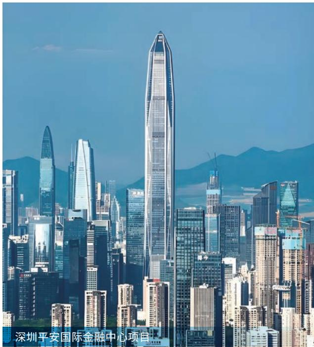

text_image

深圳平安国际金融中心项目

中国建筑在房屋建筑工程领域具有绝对优势，坚持以客户为中心的经营理念，聚焦“优质客户、优质项目、重点区域、重点领域”市场营销策略，通过不断挖掘自身潜力，追求高品质工程，致力于为全球客户提供各种高、大、精、尖、难、特建筑项目全过程一站式综合服务。公司在超高层、大型场馆、工业厂房、办公楼、酒店、医院、学校等细分领域，承建了一大批地标性建筑，代表了我国乃至全球房屋建筑领域的领先水平。

# 基础设施建设与投资

中国建筑坚持基础设施工程建设与项目投资并举，一方面，依靠技术、管理和人才优势，在国内外城市轨道交通、高铁、特大型桥梁、高速公路、市政道路、城市综合管廊、港口与航道、电力、矿山、冶金、石油化工、机场、核电站等基建领域快速发展，完成了众多经典工程 ；另一方面，依靠雄厚资本实力，迅速发展成为国际一流的基础设施投融资发展商，在国内外先后投资建设了一大批重大基础设施工程。

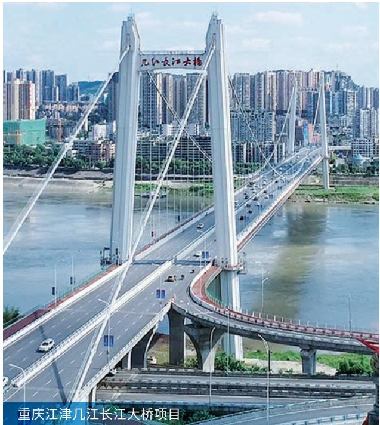

text_image

九江长江大桥
重庆江津几江长江大桥项目

# 房地产开发与投资

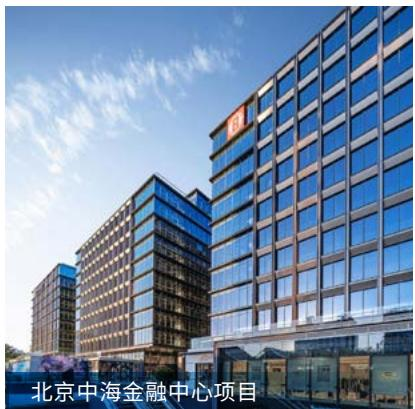

text_image

北京中海金融中心项目

中国建筑旗下拥有中海地产和中建地产两大房地产品牌。中海地产是公司下属中海集团房地产业务的品牌统称，品牌价值始终处于中国房地产行业领先地位，致力于成为卓越的国际化不动产开发运营集团，加快形成以住宅产品开发为主、优质商业开发运营为辅、康养等新兴业务为补充的业务格局。中建地产是公司各局院地产业务所使用的品牌，包括中建智地、中建玖合、中建壹品、中建信和、中建东孚等子品牌，开展地产开发、城市更新、资产运营和综合服务等业务。

# 勘察设计

中国建筑是国内最大的建筑设计综合企业集团，勘察设计板块主要由7家具有甲级设计资质的大型勘察设计企业组成，业务覆盖建筑设计、城市规划、工程勘察、市政公用工程设计等诸多领域，在机场、酒店、体育建筑、博览建筑、古建筑、超高层等领域居国内领先地位，并在设计原创、科技创新、标准规范制定等方面为行业发展作出了重要贡献。

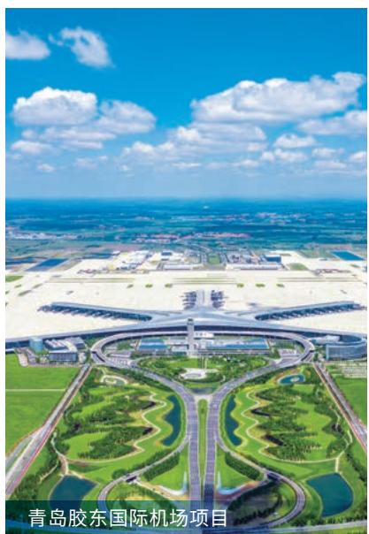

text_image

青岛胶东国际机场项目

# 国际化业务

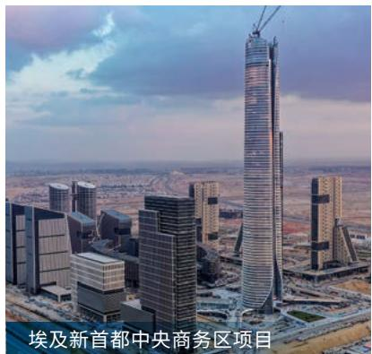

text_image

埃及新首都中央商务区项目

中国建筑是中国最早开展国际工程承包业务的企业之一，公司发挥全产业链优势，海外工程承包业务涵盖房建、机场、公路、桥梁、港口、能源、轨道交通、市政工程、矿山建设、水务环保等多个领域，并成功探索实施海外地产开发。公司积极践行“一带一路”倡议，大力实施“海外高质量发展战略”，持续塑强海外深耕优势。目前，公司经营区域遍布亚洲、非洲、中东欧、北美、拉美、大洋洲等近百个国家和地区。

# 二、报告期内公司所处行业情况

2025年，我国经济顶压前行、向新向优发展，主要预期目标圆满实现，“十四五”胜利收官。据国家统计局初步核算，2025年，我国国内生产总值首次突破140万亿元，同比增长5.0%。建筑业、房地产业作为国民经济的重要支柱产业，与整个国家经济发展、人民生活的改善有着密切的关系，对稳定经济大盘具有重要意义。

# 房屋建筑存量市场提质，增量市场蕴含发展机遇。

一是新型城镇化建设持续推进。2025年7月，中央城市工作会议指出，我国城镇化正从快速增长期转向稳定发展期，城市发展正从大规模增量扩张阶段转向存量提质增效为主的阶段。2025年末，我国常住人口城镇化率提升至67.89%，持续释放住房及公共服务设施领域的需求。二是城市更新政策激活存量市场。加力实施城中村和危旧房改造，持续推进城市更新和城镇老旧小区改造，2025年全国配售型保障性住房、保障性租赁住房和公租房等开工建设和筹集121万套（间），城市危旧房改造开工17万套，新开工改造城镇老旧小区2.71万个，建设城市绿道5,800多公里，改造地下管网15.6万公里。三是高端工业制造建设需求带来增量需求。2025年，我国第二产业投资同比增长2.5%，其中制造业投资增长0.6%，新能源汽车、电子信息、生物医药等新兴产业对智能工厂及洁净厂房需求快速增加，为建筑行业注入新的增长点。

# 基础设施建设稳步推进，重点领域投资较快增长。

一是基础设施投资精准发力。据国家统计局初步核算，2025年基础设施投资（不含电力、热力、燃气及水生产和供应业）比上年下降2.2%。其中管道运输业、多式联运和运输代理业、互联网和相关服务业等领域快速增长，全年新建铁路投产里程3,109km、新改建高速公路里程8,699km、新增民用运输机场7个。二是重大项目建设稳步推进。据国家发展改革委统计，2025年“两重”建设安排8,000亿元超长期特别国债，支持1,459个重点项目，涉及长江流域生态修复、长江沿线重大交通基础设施、西部陆海新通道、重大水利工程等重点领域。“十四五"规划102项重大工程如期完成规划目标任务，涉及交通、能源、电信、水利以及新型基础设施等领域的五千多个具体项目，川藏铁路、平陆运河等重大工程稳步建设。三是能源绿色转型投资建设加快。据国家能源局数据显示，2025年我国陆上风电重点项目完成投资额同比增长近50%；新型储能、氢能产业全年重点项目完成投资额较上一年实现翻番。第一批“沙戈荒”新能源基地项目基本建成投产，新型储能装机规模超过1.3亿千瓦，非化石能源消费占比达到21.7%。

# 房地产政策持续优化，推进“好房子”建设落地。

一是政策“组合拳”持续稳楼市。2025年政府工作报告明确提出“持续用力推动房地产市场止跌回稳”。6月13日国常会要求“更大力度推动房地产市场止跌回稳”，对全国房地产已供土地和在建项目进行摸底，进一步优化现有政策，提升政策实施的系统性。多地因城施策，优化限购限售政策、降低房贷利率和首付比例、减交易税费等，着力激发住房消费需求。二是“好房子”建设成为市场新赛道。政府工作报告明确“好房子”建设发展方向，相关建设标准、配套支持政策加速落地实施，行业发展从“规模竞争”向“品质竞争”深度转型，持续推动房企优化产品结构、提升核心竞争力与产品力。三是加快推进城市更新行动落地。2025年5月，中办、国办印发《关于持续推进城市更新行动的意见》明确顶层设计，转变城市开发建设方式 ；7月，中央城市工作会议要求高质量开展城市更新，推进土地混合开发利用、用途合理转换，有效推动城市低效土地再开发，推动各类产业园区改造提升。各地加快编制城市更新专项规划，相关配套政策加速落地见效，有序推进城市更新项目实施。

# 勘察设计行业深度转型，市场挑战与机遇并存。

一是提质增效带来新动力。一方面存量市场改造，包括老旧街区、历史街区及旧工业区改造等，推动建筑设计需求增长。另一方面城市公共服务设施建设提质升级，对文化场馆、体育设施、教育设施等细分领域原创设计能力提出更高要求。二是绿色低碳设计理念持续深化落地。行业积极响应“双碳”战略目标，将绿色低碳设计理念贯穿项目全生命周期，绿色建造设计与零碳技术正成为新的核心竞争力。三是数智化技术广泛应用。BIM（建筑信息模型）、AI(人工智能)、VR(虚拟现实)和AR(增强现实)等前沿技术推动行业转型加速，持续推动勘察设计全流程智能化升级，提升服务效率与自动化水平。

# 国际工程合作深化，新兴领域释放动能。

一是对外承包工程规模成效不断提升。据商务部统计，2025年我国对外承包工程业务新签2,892.2 8.2% 1,788.2 7.7%质量共建“一带一路”成效显著。“一带一路”倡议实施以来，合作领域持续拓展，互联互通纵深推进。2025年，我国在共建国家新签承包工程合同额2,579.8亿美元，增长10.8% ；完成营业额1,526.3亿美元，增长9.3%，占同期对外承包工程总营业额的85%。三是新兴领域成为国际业务发展新引擎。新一轮技术革命和产业变革加速演进，集成电路、航空航天、生物医药、光伏风电、低空经济等新兴产业不断发展，参与全球产业竞争，为国际工程市场带来新动能。

# 三、经营情况讨论与分析

2025年，公司牢牢把握高质量发展首要任务，聚焦“一创五强”战略目标，实施“一六六”战略路径，扎实推进“学政策、创效益、深改革、优管理、促创新、防风险、强党建”七大任务，在行业市场深度调整的形势下，整体保持稳健发展态势。

报告期内，公司新签合同额4.55万亿元，同比增长1.0% ；实现营业收入2.08万亿元，同比下降4.8% ；实现归属于上市公司股东的净利润390.7亿元，同比下降15.4%；经营性净现金流205.4亿元，连续6年保持正流入。公司位居2025年《财富》世界500强榜单第16位、中国500强榜单第4位，连续入选《财富》中国ESG影响力榜，位列英国Brand Finance“2025年度中国品牌价值500强”榜单第16位、蝉联行业首位，《2025中国企业品牌价值TOP100榜单》中排名中央企业第3位。公司持续被纳入中证50、上证50、富时中国A50、MSCI中国A50互联互通指数等重要指数。总体来看，公司经营发展呈现以下特点：

主动融入国家重大战略，有力服务保障发展大局。公司胸怀“国之大者”，始终把服务国家战略作为核心使命，在服务经济社会发展大局中找准定位、拓展空间。报告期内，公司深度融入国家区域协调发展战略，在京津冀、长三角、粤港澳大湾区、长江经济带、黄河流域等重点区域新签合同额占比为79.9%，完成投资额占比为88.9%。全力服务“两重”“两新”等国家重点领域工程建设，承接大连长海大桥、甘南高速公路等一批重大基础设施项目 ；承建的广州白云国际机场三期扩建工程等机场项目正式投运，参与投资建设运营的广西苍昭高速公路工程等高速公路、轨道交通项目通车运营。深度参与“东数西算”工程建设，承建北京、上海、广州、深圳、杭州、重庆、芜湖等地区数据中心项目，助力构建新型算力网络体系。积极参与高质量共建“一带一路”，实施海外高质量发展战略，持续优化海外市场布局，稳步推进标志性项目和民生工程建设，承建的哈萨克斯坦最大物流运输枢纽－中国西安哈萨克斯坦码头项目、柬埔寨德崇国际机场项目建成投用，助力设施联通和城市功能提升。

抢抓主责主业发展机遇，不断加快新兴业务拓展。公司制定实施《“两优两重"市场策略实施方案》，聚焦优质客户、优质项目、重点区域、重点领域，依托全产业链优势，推进高端对接和深化合作。报告期内，公司建筑业务保持稳健增长，新签合同额4.2万亿元，着力强化市场协同，积极拓展高端制造工业厂房、科教文卫体设施、能源工程、水利水运等细分业务领域，业务结构持续优化。地产业务塑强竞争优势，聚焦核心城市、核心区域获取优质土地资源，新增土地储备928万平方米，全部位于一线、二线及省会城市 ；加强精益建造和科技赋能，持续打造高品质产品。大力推进城市更新业务，成立公司城市更新工作领导小组，编制发布《城市更新业务工作指引》，明确公司城市更新业务的八大核心内容、八种实施模式及七项工作要求。加快发展城市运营业务，明确12个主要业务分类，设计使用中国建筑城市运营品牌标识。公司投资建设运营的北京中海大吉巷项目，通过拆旧改造，打造传统与现代交融的城市更新典范。落实《布局发展战略性新兴产业的指导性文件》，更新战略性新兴产业布局地图，2025年公司战略性新兴产业实现营业收入2.629亿元。

强化科技创新驱动力，加快培育发展新动能。公司以科技创新赋能产业转型升级，加大科技研发力度，推动创新成果在建筑产业体系化、规模化应用。报告期内，公司新增1个国家级科技创新平台，参与共建的“城乡水资源与水环境全国重点实验室”已正式获得批准设立。加强关键核心技术攻关，牵头6项“十四五”国家重点研发计划项目，聚焦智能装备、建筑新能源、新材料、绿色低碳等8个重点方向开展技术攻关，高海拔增压式建筑（零海拔屋）入选国资委2025年央企十大国之重器。探索科技创新成果产业化发展，选出“新建好房子”“旧改好房子”“模块化建筑产品”“光伏建筑一体化(BIPV)系列产品”等11大项作为公司首批产业化推广产品。研究发布中国建筑“好房子”营造体系，创新提出“6633（六不六防三省三要）”居住痛点框架，建立支持、验证、督导机制，搭建“好房子”管理平台，在百余个项目落地应用。数字化智能化转型加速，发布“建证”大模型1.0，推进“人工智能+”专项行动，推动BIM技术全链条应用，提升项目管理效率。

持续深化国企改革，全面激发企业内生动力。报告期内，公司改革深化提升行动实现高质量收官，全面完成既定改革任务，连续4年获得中央企业改革深化提升行动重点任务考核A级。加强穿透式监管体系建设，制定专项工作方案，系统构建“1+N”穿透式监管制度体系，实现全层级、全流程、全要素监管覆盖，全面提升合规管理、风险防控与综合治理能力。推动"法人管项目"标准化建设，规范项目全生命周期管控标准，常态化开展重大项目监督检查，确保项目高质量履约。深入推进子企业战略性重组，通过资源优化配置，提高子企业协同效率。制定重大风险防控专项预案，建立监测指标体系，开展季度监测预警，有效防控重大经营风险。实施资产盘活专项行动，实行资产分类分级管理，制定有针对性的盘活措施，运用REITs、无增信ABS等方式优化盘活资产。科学实施市值管理，创新实践“136”战略市值管理体系，制定公司《市值管理规定》，发布估值提升计划，通过系统化、规范化、战略化管理，持续提升公司投资价值。持续深化“厉行节约 勤俭办企”专项行动，公司管理费用、财务费用分别下降2.2%、9.4%。

积极践行社会责任，推动企业可持续发展。报告期内，公司不断完善战略ESG治理体系，迭代升级ESG指标体系，扎实推进环境、供应链、安全等关键议题管理提升，推动ESG与企业经营管理深度融合。所有上市子企业实现ESG报告披露全覆盖。推动绿色低碳转型升级，深入落实“双碳"战略，实施“个十百千万"工程，开展节能降碳专项行动，建立了多级联动的系统性碳排放数据管理体系，编制发布《中国建筑绿色发展报告2025》。制定供应链生态建设重点措施，围绕品类、区域、产品线等推进年度供应链创新与应用，进一步提升供应链管理水平。助力乡村全面振兴，坚持打好产业、就业、教育、消费、党建帮扶“组合拳”,打造特色民宿、康养基地等旅游基础设施。持续建强人才队伍，组织开展科技研发序列专家、勘察设计大师等评选工作，举办首届青年创新创业大赛，选拔出一批拔尖人才和优秀创业团队。在10个国家推进“鲁班工匠计划”，帮助属地员工提升技术专业能力。

# 中国建筑“好房子”营造体系

中国建筑“好房子”营造体系是中国建筑构建的一套保障好房子建设的工作体系。这套体系锚定好房子“安全、舒适、绿色、智慧”的价值目标，贯彻“五好”要求，从解决百姓居住痛点出发，充分发挥中国建筑全产业链优势，全面统筹设计、建造、运维和供应链管理等众多环节，是建设新时代好房子的《营造法式》。

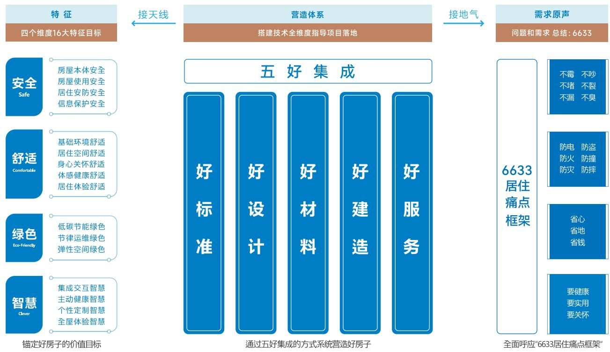

flowchart

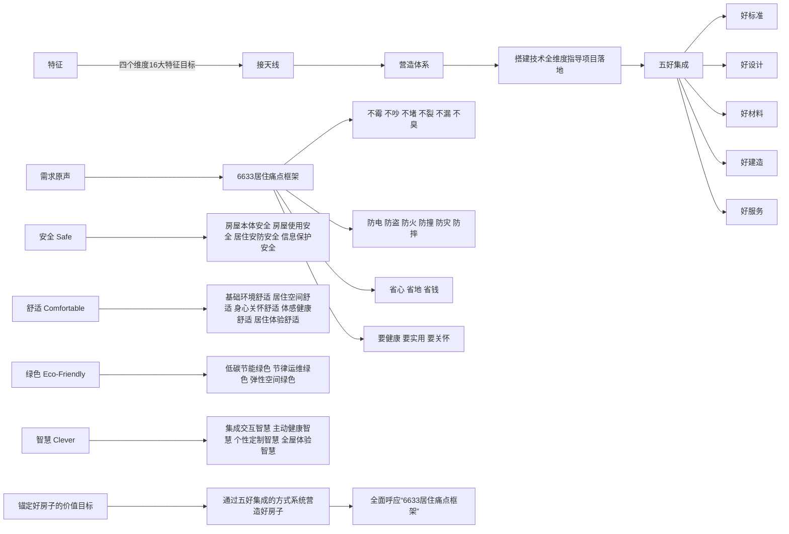
```mermaid
graph LR
    A["特征"] -->|四个维度16大特征目标| B["接天线"]
    B --> C["营造体系"]
    C --> D["搭建技术全维度指导项目落地"]
    D --> E["五好集成"]
    E --> F["好标准"]
    E --> G["好设计"]
    E --> H["好材料"]
    E --> I["好建造"]
    E --> J["好服务"]
    K["需求原声"] --> L["6633居住痛点框架"]
    L --> M["不霉 不吵 不堵 不裂 不漏 不臭"]
    L --> N["防电 防盗 防火 防撞 防灾 防摔"]
    L --> O["省心 省地 省钱"]
    L --> P["要健康 要实用 要关怀"]
    Q["安全 Safe"] --> R["房屋本体安全 房屋使用安全 居住安防安全 信息保护安全"]
    S["舒适 Comfortable"] --> T["基础环境舒适 居住空间舒适 身心关怀舒适 体感健康舒适 居住体验舒适"]
    U["绿色 Eco-Friendly"] --> V["低碳节能绿色 节律运维绿色 弹性空间绿色"]
    W["智慧 Clever"] --> X["集成交互智慧 主动健康智慧 个性定制智慧 全屋体验智慧"]
    Y["锚定好房子的价值目标"] --> Z["通过五好集成的方式系统营造好房子"]
    Z --> AA["全面呼应“6633居住痛点框架”"]
```

中国建筑“好房子”营造体系首批践行项目  
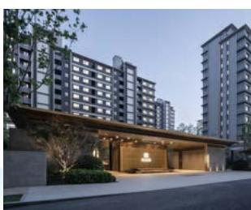

natural_image

Exterior view of a modern residential building with high-rise towers and a central entrance (no signage or text visible)

中海和瑞叁號院

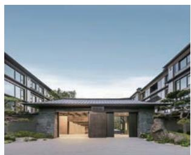

natural_image

Exterior view of a modern architectural complex with symmetrical architecture and central entrance (no signage or text visible)

中建宸园

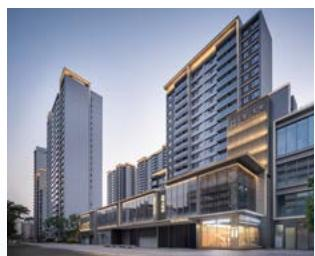

natural_image

Exterior view of modern high-rise buildings at dusk, featuring glass facades and illuminated windows (no visible signage or text)

中海海上和集

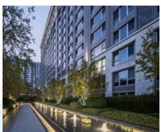

natural_image

Exterior view of a modern multi-story office building with landscaped grounds and water reflections (no signage or text visible)

中海都阙台

# 中国建筑“好房子”营造体系的五大特点

# 问题导向

切实解决“6633居住痛点框架”中，老百姓最关心的101项基础痛点和71项全维痛点。

必须解决

基础痛点

101项基础痛点

尽量解决

全维痛点

71项全维痛点

#

一体推进“好标准、好设计、好材料、好建造、好服务”，五好集成。

好房子开发

五好集成

中国建筑好房子检测检验中心

好标准

中国建筑好房子设计团队

好设计

中国建筑好房子认质认样中心

好材料

中国建筑好房子施工团队

好建造

中国建筑好房子物业管理团队

好服务

# 全程督导

专业技术团队全过程督导设计、建造、材料选择及物业管理，全面实现好房子营造目标。

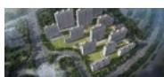  
规划设计

  
建造 (选材)

  
物业管理

  
评估

  
交付

# 好房子营造体系的专业督导团队

# 评估闭环

从物业管理和第三方不同维度评估交付的好房子是否切实解决了百姓的居住痛点。

反馈

第三方评价

好房子 开发

反馈

物业管理

# 开放系统

不断以新的居住痛点充实和完善“好房子"营造体系，并带动整个产业链以科技创新解决新痛点，取得新发展。

需求痛点开放   
  
全民开放征集需求，保持需求与时俱进

解决方案开放  
  
接纳更优的解决措施，保持体系的专业性和权威性

对行业开放  
  
全链条开放，服务于全行业，实现共建共享

# • 主要经营数据

单位 ：亿元　币种 ：人民币

建筑业务新签合同额  
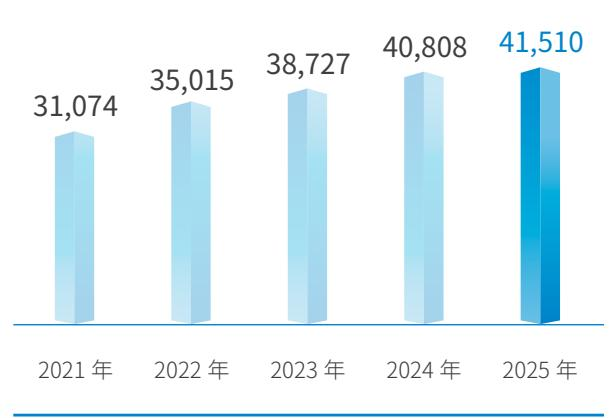

bar

| 年份 | 数值 |
| :--- | :--- |
| 2021年 | 31,074 |
| 2022年 | 35,015 |
| 2023年 | 38,727 |
| 2024年 | 40,808 |
| 2025年 | 41,510 |

地产业务合约销售额  
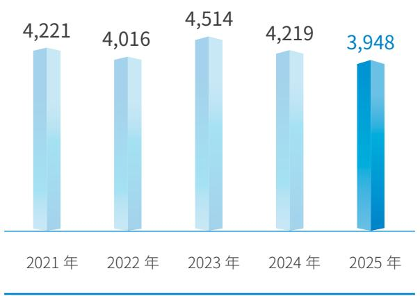

bar

| 年份 | 数值 |
| :--- | :--- |
| 2021年 | 4,221 |
| 2022年 | 4,016 |
| 2023年 | 4,514 |
| 2024年 | 4,219 |
| 2025年 | 3,948 |

营业收入  
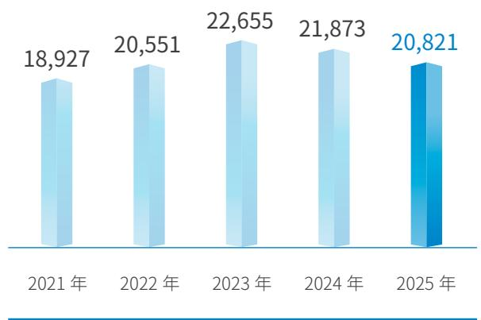

bar

| 年份 | 数值 |
| :--- | :--- |
| 2021年 | 18,927 |
| 2022年 | 20,551 |
| 2023年 | 22,655 |
| 2024年 | 21,873 |
| 2025年 | 20,821 |

归属于上市公司股东的净利润  
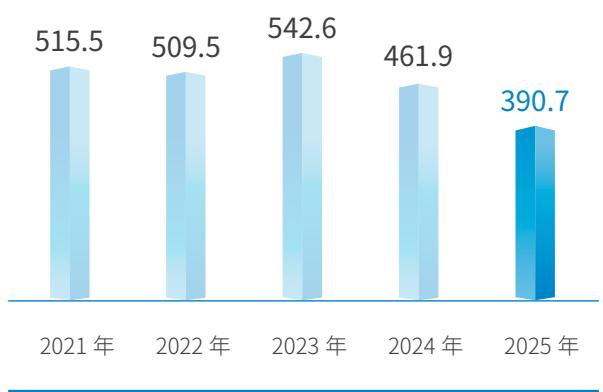

bar

| 年份 | 数值 |
| :--- | :--- |
| 2021年 | 515.5 |
| 2022年 | 509.5 |
| 2023年 | 542.6 |
| 2024年 | 461.9 |
| 2025年 | 390.7 |

新签合同额比重  
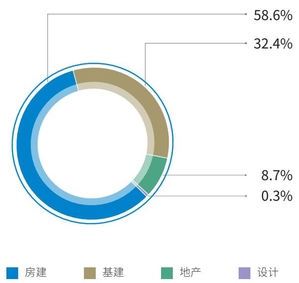

pie

| 类别 | 占比 (%) |
| :--- | :--- |
| 房建 | 58.6 |
| 基建 | 32.4 |
| 地产 | 8.7 |
| 设计 | 0.3 |

分部收入比重  
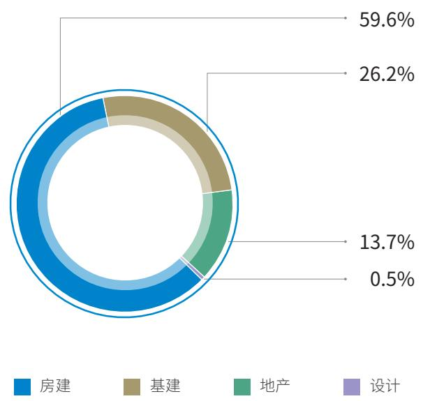

pie

| 类别 | 占比 (%) |
| :--- | :--- |
| 房建 | 59.6 |
| 基建 | 26.2 |
| 地产 | 13.7 |
| 设计 | 0.5 |

分部毛利润比重  
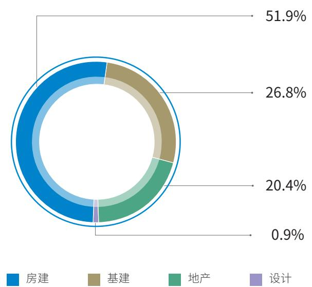

pie

| 类别 | 占比 (%) |
| :--- | :--- |
| 房建 | 51.9 |
| 基建 | 26.8 |
| 地产 | 20.4 |
| 设计 | 0.9 |

分部毛利率情况  
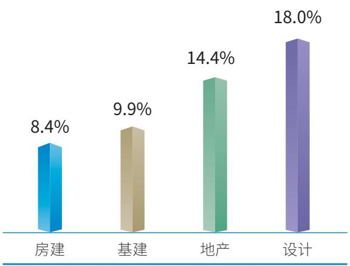

bar

| 类别 | 数值 (%) |
|---|---|
| 房建 | 8.4 |
| 基建 | 9.9 |
| 地产 | 14.4 |
| 设计 | 18.0 |

注 ：分部业务所占比例的分母系公司四大业务板块（房建、基建、地产和设计）数据的直接加总。

• 主要业务数据

<table><tr><td>项目</td><td>单位</td><td>2025年</td><td>2024年</td><td>同比增长(%)</td></tr><tr><td>新签合同总额</td><td>亿元人民币</td><td>45,458</td><td>45,027</td><td>1.0</td></tr><tr><td>一、建筑业务</td><td></td><td></td><td></td><td></td></tr><tr><td>(一)期内累计新签合同额</td><td rowspan="6">亿元人民币</td><td>41,510</td><td>40,808</td><td>1.7</td></tr><tr><td>分行业 1.房屋建筑</td><td>26,654</td><td>26,516</td><td>0.5</td></tr><tr><td>2.基础设施</td><td>14,728</td><td>14,149</td><td>4.1</td></tr><tr><td>3.勘察设计</td><td>128</td><td>143</td><td>-10.0</td></tr><tr><td>分地区 1.境内</td><td>39,253</td><td>38,697</td><td>1.4</td></tr><tr><td>2.境外</td><td>2,257</td><td>2,110</td><td>6.9</td></tr><tr><td>(二)房屋建筑业务工程量</td><td rowspan="4">万平方米</td><td>/</td><td>/</td><td>/</td></tr><tr><td>1.累计施工面积</td><td>165,442</td><td>169,251</td><td>-2.3</td></tr><tr><td>2.累计新开工面积</td><td>27,652</td><td>30,816</td><td>-10.3</td></tr><tr><td>3.累计竣工面积</td><td>22,893</td><td>22,404</td><td>2.2</td></tr><tr><td>(三)基础设施业务工程量</td><td>/</td><td>/</td><td>/</td><td>/</td></tr><tr><td>1.道路(国内新签)</td><td>公里</td><td>3,708</td><td>3,850</td><td>-3.7</td></tr><tr><td>2.面积(国内新签)</td><td>万平方米</td><td>5,638</td><td>5,415</td><td>4.1</td></tr><tr><td>二、房地产业务</td><td></td><td></td><td></td><td></td></tr><tr><td>(一)期内合约销售额</td><td rowspan="2">亿元人民币</td><td>3,948</td><td>4,219</td><td>-6.4</td></tr><tr><td>其中:中海地产1</td><td>2,190</td><td>2,706</td><td>-19.0</td></tr><tr><td>(二)期内合约销售面积</td><td rowspan="2">万平方米</td><td>1,509</td><td>1,461</td><td>3.3</td></tr><tr><td>其中:中海地产</td><td>762</td><td>800</td><td>-4.7</td></tr><tr><td>(三)期末认购销售额</td><td>亿元人民币</td><td>123</td><td>144</td><td>-14.6</td></tr><tr><td>(四)期内平均售价</td><td>元/平方米</td><td>26,166</td><td>28,872</td><td>-9.4</td></tr><tr><td>(五)期末土地储备2(全额数)</td><td rowspan="2">万平方米</td><td>6,961</td><td>7,718</td><td>-9.8</td></tr><tr><td>其中:中海地产</td><td>2,528</td><td>2,877</td><td>-12.1</td></tr><tr><td>(六)购置土地储备(全额数)</td><td rowspan="2">万平方米</td><td>928</td><td>882</td><td>5.2</td></tr><tr><td>其中:中海地产</td><td>499</td><td>416</td><td>20.0</td></tr></table>

注 ：①中海地产是指中国海外发展及其附属公司所从事的地产业务，但不包括中国海外宏洋 ；

②期末土地储备=上年末土地储备 + 新购置土地储备 - 本期竣工面积 +（或-）项目调整面积。

# 四、报告期内核心竞争力分析

适用　 不适用

报告期内，公司核心竞争力未发生重大变化。主要包括如下 ：

# （一）市场化的运营机制

作为市场经济主体，中国建筑始终坚守市场化的运营机制，尊重、恪守、适应并利用市场规律，逐步提高对市场规律的驾驭能力。面对激烈的市场竞争，中国建筑创造性地挖掘并不断满足顾客现实和潜在的需求，通过高品质的产品和超值服务，不断赢得和创造顾客。始终贯彻绩效理念，通过清晰界定目标、科学设计流程、强化高效运营，以追求卓越绩效。公司始终追求有盈利支撑的规模增长，在高效运用和运营资源、大力倡导规模经济的同时，提高资产周转效率，获取高于行业平均水平的资产收益，并通过稳定增长持续获取更高的市场占有率。

# （二）全球化的发展方向

公司秉承国际化经营理念，全面参与高质量共建“一带一路”，大力实施以“一个方位、六个目标、五个路径”为内涵的海外高质量发展战略，持续推动海外业务量质齐升。公司深入贯彻新发展理念，充分利用国内国际两个市场、两种资源，致力于成为一家在全球范围内配置资源并高效运营的跨国公司。公司持续开创海外发展的新局面，打造结构合理的海外市场体系，巩固优势市场，深耕重点市场，坚守潜力市场，审慎拓展新市场。公司坚持推行本土化运营，积极对接所在国发展需求，深度参与所在国城市化和基础设施建设。同时，通过与国际先进企业同台竞争，学习先进的管理经验和经营理念，提升公司的整体经营管理实力。

# （三）相关多元和纵向一体化的拓展方式

始终生产或提供能够持续创造客户、服务客户、满意客户的产品或服务，是中国建筑长足发展的重要保证。在选择产品（或服务）方面，中国建筑基于已经拥有的技术优势和市场优势，走出一条多元化道路。公司在继续保持勘察设计、房屋建筑施工、房地产开发传统优势的同时，积极在基础设施投资建造业务等领域进行横向拓展。

中国建筑致力于投资、设计、建造、运营、服务等纵向一体化的拓展方式，在公司所从事的业务领域努力构建起独一无二的市场地位，形成竞争对手难以模仿的竞争优势。

# （四）高品质、低成本和差异化的竞争策略

为社会大众提供高品质和低成本的产品和服务，始终是中国建筑的追求方向。高品质源于公司的技术优势、人才优势和组织方式优势；低成本源于公司的一体化运作模式、集约效应和速度经济。身处完全竞争的行业领域，作为国有企业的优秀代表，中国建筑始终将“有所为、有所不为”作为公司生产经营与事业发展的基本导向，聚焦“优质客户、优质项目、重点区域、重点领域”市场营销策略，持续开展“差异化”市场经营与竞争。公司内部不同子企业之间通过贯彻“差异化”策略，分别聚焦不同的细分市场，或专注于相应专业（专业化），或专注于相应区域（区域化），形成各自的“拳头产品、特色服务”，减少内部无序竞争，强化对外整体竞争优势。

# （五）授权和集中有度的管控模式

尊重中国建筑的发展历史，在由多法人载体形成的集团公司基础上，探索和形成富有竞争力的集团管控模式。公司总部定位为战略管控型总部，履行“引领、服务、监督”职能，公司与下属各子企业作为独立法人主体，财产相互独立，公司对二级子企业坚持放活与管好相统一。二级子企业根据公司授权经营，根据承担责任的大小享有相应权限。对于劳动密集型、成熟度较高的业务，通过加大授权，扩大市场接触面，以加快市场反应速度，提高服务质量。对于资本密集型、成熟度较低的业务，通过集中资源冲击目标细分市场，在有效规避风险的基础上，积极谋求在目标市场上的快速突破。针对不同的细分市场，采取不同的市场竞争策略，并适配相应的管控模式。

# (六）结果导向和责任承担的管理体系

公司各项管理行为始终致力于公司使命、愿景和目标的实现。公司坚持以促使工作更加富有效率、员工更加富有成就感、企业更加富有未来作为管理的根本目的，通过各职能领域管理行为的有机融合，形成富有生命力、科学合理、简洁高效的系统，避免出现自行其是、互相推诿现象，实现责任权利的统一。公司坚信管理者是因其承担的责任而定义的。为提升产品和服务的质量，公司致力于实现管理的标准化、技术的标准化和工作的标准化，借助信息化手段，通过标准化和信息化的“两化融合”，提高工作效率，实施“底线管理”，提升产品质量，降低运营成本。

# （七）“ 以人为本 ” 的人力资源管理

公司秉承“专业化、职业化、国际化"的人才发展战略，拥有一大批忠于企业、忠于事业、坚信团队利益高于个人利益，能够自我约束、自我激励和自我发展的懂技术、会管理、擅营销的人才团队。公司始终遵循“事业留人、感情留人、待遇留人"和“关注个体"的基本人力资源管理理念，通过职业规划、教育培训和绩效考核的全员覆盖，建立与个人价值创造和能力相结合、共享企业发展成果的薪酬激励机制，实施多元化的中长期激励机制，强化对人才的吸引力度，保障人才的发展空间，更好地为企业发展提供强有力的人才支撑。

# （八）“产融结合”战略助推企业发展

公司聚焦建筑地产行业特点，围绕产业链上下游需求，坚持合规经营、规范运作，把金融资源集聚到助力企业高质量发展、助力产业链稳固的战略方向、重点领域，为公司主业提供高质量金融服务。依托中建财务公司和中建资本等内部专业金融平台，通过开展境内外资金集中、贷款集中、基金、应收账款保理、资产证券化、供应链融资、融资租赁、保险集中等业务，为公司主业和产业链上下游提供既满足实际需要、又有效补充社会金融短板的金融服务，在协同公司主业发展、拓宽融资渠道、降低融资成本、盘活存量资产、实现稳链固链等方面发挥了积极作用。同时，公司严格执行国家有关政策要求，加强日常管理，防范金融风险，坚决杜绝“脱实向虚”和“空转套利”。

# （九）科技创新驱动的核心竞争能力

公司通过持续的科技创新驱动生产模式和组织模式的变革，依托全产业链业务布局，构建建筑产品研发、数字化制造、智能建造、智慧运维、绿色低碳的技术体系，掌握全球领先的超高层建筑、大跨度空间、单体建筑平移、大型屋盖滑移、复杂钢结构生产与施工等建造技术，致力打造建筑行业绿色低碳、智能建造原创技术策源地。

截至报告期末，公司拥有国家数字建造技术创新中心、绿色建筑全国重点实验室、土壤养分管理与污染修复国家工程研究中心、城乡水资源与水环境全国重点实验室四个国家级科技创新平台，5个国家企业技术中心(含分中心)、9家院士工作站，75个省部级企业技术中心、89家省部级科技创新平台，建成19个博士后工作站，拥有242家高新技术企72,800 14,107

# （十）内化于心、外化于行的企业文化

中国建筑是具有光荣历史的企业，我们在传承中创新，在履行使命、实现愿景的过程中，将“品质保障　价值创造”的核心价值观和“忠诚担当　使命必达”的中国建筑精神，融入公司的规章制度和管理行为，成为支撑公司发展的软实力。

资源可以枯竭，唯有文化生生不息。公司坚守在市场经济大潮中经过磨砺、凝练和沉淀所形成的中建信条，结合时代潮流，与各级子企业的文化不断融合，确保公司事业常青的内生动力源源不断。

# 五、ﾠ报告期内主要经营情况

# (一) 主营业务分析

# 1.　利润表及现金流量表相关科目变动分析表

单位 ：千元　币种 ：人民币

<table><tr><td>科目</td><td>本期数</td><td>上年同期数</td><td>变动比例(%)</td></tr><tr><td>营业收入</td><td>2,082,141,811</td><td>2,187,334,286</td><td>-4.8</td></tr><tr><td>营业成本</td><td>1,876,058,765</td><td>1,971,708,426</td><td>-4.9</td></tr><tr><td>销售费用</td><td>9,038,614</td><td>8,743,942</td><td>3.4</td></tr><tr><td>管理费用</td><td>33,873,816</td><td>34,636,932</td><td>-2.2</td></tr><tr><td>财务费用</td><td>17,641,773</td><td>19,464,954</td><td>-9.4</td></tr><tr><td>研发费用</td><td>44,009,417</td><td>45,464,667</td><td>-3.2</td></tr><tr><td>经营活动产生的现金流量净额</td><td>20,537,132</td><td>15,825,793</td><td>29.8</td></tr><tr><td>投资活动产生的现金流量净额</td><td>-32,150,028</td><td>-2,531,054</td><td>/</td></tr><tr><td>筹资活动产生的现金流量净额</td><td>11,579,358</td><td>15,110,108</td><td>-23.4</td></tr></table>

营业收入变动原因说明：主要是受房地产行业深度调整以及公司主动优化业务结构等内外部因素影响，公司营业收入有所下降。

营业成本变动原因说明：主要是公司本年经营规模有所减少，营业成本相应降低。

销售费用变动原因说明：主要是公司为加快房地产销售去化，加大营销推广力度，广告费及业务宣传费同比增加。

管理费用变动原因说明 ：主要是公司持续深入开展“厉行节约 勤俭办企”专项行动，管理费用相应下降。

财务费用变动原因说明：主要是公司积极把握融资政策窗口，推动高息债务置换，平均融资成本有所降低。

研发费用变动原因说明 ：主要是公司不断健全研发投入机制，优化研发投入结构，提升投入产出效率。

经营活动产生的现金流量净额变动原因说明：主要是公司积极采取有效措施加强现金流管控，持续保持较好现金流水平。

投资活动产生的现金流量净额变动原因说明：主要是支付其他与投资活动有关的现金、取得子公司及其他营业单位支付的现金净额增加所致。

筹资活动产生的现金流量净额变动原因说明：主要是发行债券收到的现金减少所致。

本期公司业务类型、利润构成或利润来源发生重大变动的详细说明

适用　 不适用

# 2.　收入和成本分析

# 适用　 不适用

2025年，公司实现营业收入20,821亿元，同比减少4.8% ；发生营业成本18,761亿元，同比减少4.9%。公司实现毛利润2,060亿元，同比降低4.4% ；毛利率9.9%，与上年同期持平。

收入确认方法等敬请参阅本报告第八节“财务报告"所附财务报表附注三、25“与客户之间的合同产生的收入”相关内容。

# (1). 主营业务分行业、分产品、分地区情况

单位 ：千元　币种 ：人民币

<table><tr><td colspan="7">主营业务分行业情况</td></tr><tr><td>分行业</td><td>营业收入</td><td>营业成本</td><td>毛利率(%)</td><td>营业收入比上年同期增减(%)</td><td>营业成本比上年同期增减(%)</td><td>毛利率比上年同期增减(%)</td></tr><tr><td>房屋建筑工程</td><td>1,234,205,792</td><td>1,129,949,766</td><td>8.4</td><td>-6.6</td><td>-7.7</td><td>增加1.0个百分点</td></tr><tr><td>基础设施建设与投资</td><td>543,179,718</td><td>489,418,942</td><td>9.9</td><td>-1.4</td><td>-1.3</td><td>减少0.1个百分点</td></tr><tr><td>房地产开发与投资</td><td>284,393,567</td><td>243,362,415</td><td>14.4</td><td>-7.2</td><td>-4.0</td><td>减少2.9个百分点</td></tr><tr><td>勘察设计</td><td>10,171,215</td><td>8,337,917</td><td>18.0</td><td>-6.0</td><td>-2.4</td><td>减少3.0个百分点</td></tr><tr><td>其他</td><td>40,155,113</td><td>34,166,015</td><td>14.9</td><td>18.2</td><td>33.0</td><td>减少9.5个百分点</td></tr><tr><td>分部间抵销</td><td>-29,963,594</td><td>-29,176,290</td><td>/</td><td>/</td><td>/</td><td>/</td></tr><tr><td>合计</td><td>2,082,141,811</td><td>1,876,058,765</td><td>9.9</td><td>-4.8</td><td>-4.9</td><td>持平</td></tr><tr><td colspan="7">主营业务分地区情况</td></tr><tr><td>分地区</td><td>营业收入</td><td>营业成本</td><td>毛利率(%)</td><td>营业收入比上年同期增减(%)</td><td>营业成本比上年同期增减(%)</td><td>毛利率比上年同期增减(%)</td></tr><tr><td>境内</td><td>1,940,443,514</td><td>1,738,347,534</td><td>10.4</td><td>-6.2</td><td>-6.5</td><td>增加0.3个百分点</td></tr><tr><td>境外注</td><td>141,698,297</td><td>137,711,231</td><td>2.8</td><td>19.4</td><td>22.2</td><td>减少2.2个百分点</td></tr><tr><td>合计</td><td>2,082,141,811</td><td>1,876,058,765</td><td>9.9</td><td>-4.8</td><td>-4.9</td><td>持平</td></tr></table>

注：境外指除中国大陆以外的地区。

<table><tr><td colspan="7">近三年营业收入及占比情况</td></tr><tr><td>分行业</td><td>2025年</td><td>占比(%)</td><td>2024年(调整后)</td><td>占比(%)</td><td>2023年</td><td>占比(%)</td></tr><tr><td>房屋建筑工程</td><td>1,234,205,792</td><td>59.2</td><td>1,321,801,232</td><td>60.4</td><td>1,383,744,032</td><td>61.1</td></tr><tr><td>基础设施建设与投资</td><td>543,179,718</td><td>26.1</td><td>550,903,080</td><td>25.2</td><td>556,561,456</td><td>24.6</td></tr><tr><td>房地产开发与投资</td><td>284,393,567</td><td>13.7</td><td>306,319,493</td><td>14.0</td><td>308,807,680</td><td>13.6</td></tr><tr><td>勘察设计</td><td>10,171,215</td><td>0.5</td><td>10,821,915</td><td>0.5</td><td>11,747,277</td><td>0.5</td></tr><tr><td>其他</td><td>40,155,113</td><td>1.9</td><td>33,982,328</td><td>1.6</td><td>44,052,885</td><td>1.9</td></tr><tr><td>分部间抵销</td><td>-29,963,594</td><td>-1.4</td><td>-36,493,762</td><td>-1.7</td><td>-39,384,086</td><td>-1.7</td></tr><tr><td>合计</td><td>2,082,141,811</td><td>100.0</td><td>2,187,334,286</td><td>100.0</td><td>2,265,529,244</td><td>100.0</td></tr></table>

主营业务分行业、分产品、分地区情况的说明

# 适用　 不适用

新签合同额

$$
2 6, 6 5 4 _ {\mathrm{亿元}}
$$

营业收入

$$
1 2, 3 4 2 _ {\text {亿元}}
$$

毛利

$$
1, 0 4 2. 6 _ {\text {亿元}}
$$

# 房屋建筑工程业务

房建业务稳固领先优势。报告期内，公司房建业务新签合同额26,654亿元，同比增长0.5% ；实现营业收入12,342亿元，同比下降6.6% ；实现毛利1,042.6亿元，同比增长6.5%。

报告期内，公司坚持“两优两重”的市场策略，聚焦优质客户、优质项目、重点区域、重点领域，业务结构持续调整，合同质量稳步提升。从整体看，房建业务结构持续优化，工业厂房等公共建筑领域新签合同额占比持续提升，住宅业务新签合同额占比下降至20.0%。从细分领域看，工业厂房新签合同额8,885亿元，同比增长23.1%，合同额占比33.3% ；承接了一批半导体、新能源、电子及通信、生物医药、航天航空等高端制造业厂房项目，助力新质生产力发展。科教文卫体设施新签合同额4,225亿元，其中教育设施新签合同额1,813亿元，医疗建筑新签合同额1,292亿元 ；承接北京邮电大学沙河校区计算机学院楼施工、东北大学浑南校区学生宿舍项目等一大批高校项目 ；承接河南中医药大学第一附属医院国家医学中心建设项目施工总承包、重庆市南川区中医医院医养中心建设项目设计施工总承包等医院项目，助力推进公共服务设施升级。商业综合新签合同额3,786亿元，承接广东东莞时代金融中心、温州市核心片区商务中心单元F-02地块等项目。同时，公司深入参与老旧小区、老旧街区、城中村等城市更新建设，承接济南东吴家堡、南吴家堡、南沙王庄三村整合城中村改造项目安置房建设工程（EPC）等一批重点民生工程。

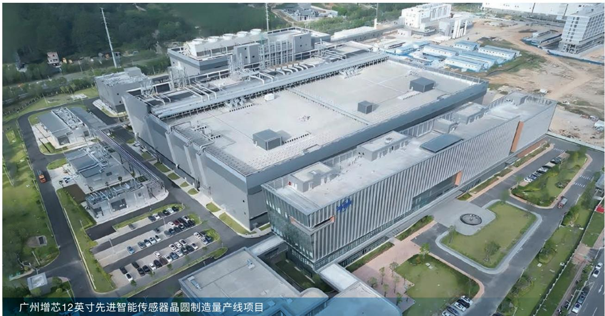

text_image

广州增芯12英寸先进智能传感器晶圆制造量产线项目

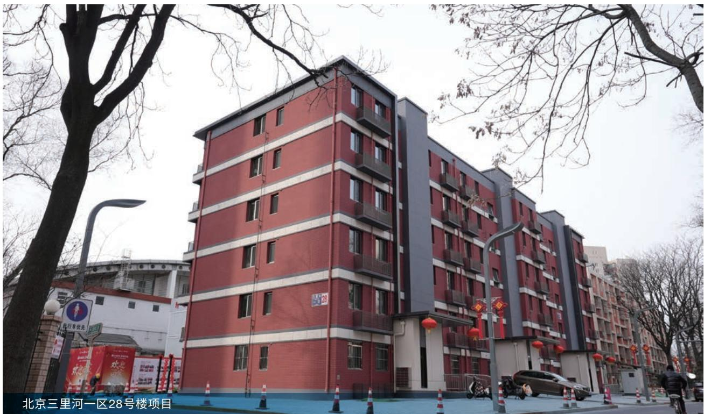

text_image

北京三里河一区28号楼项目

报告期内，公司在大跨度空间结构、高精度复杂结构、快速建造、绿色建造、智慧建造、洁净建造等领域核心竞争力持续增强，为房建项目承接和优质履约提供有力支撑。公司自主研发的轻量化造楼机、模块化建筑体系、基于BIM的智能建造协同平台及装配式装修集成技术等实现规模化推广应用，有效提升建造效率和绿色施工水平。公司承建的深圳市光明区人民医院、合肥科大讯飞人工智能产业园、福耀科技大学等重大项目全面竣工，公司原拆原建的“好房子"实践——北京三里河一区28号楼项目等重点工程高品质完成交付。

房建业务细分领域新签合同额情况   
单位 ：亿元　币种 ：人民币

<table><tr><td>序号</td><td>一级类别</td><td>二级类别</td><td>2025年</td><td>2024年</td><td>同比增长(%)</td></tr><tr><td>1</td><td>住宅</td><td>商品房等</td><td>5,324</td><td>5,732</td><td>-7.1</td></tr><tr><td>2</td><td>保障性住房</td><td>保障性住房等</td><td>1,042</td><td>1,383</td><td>-24.7</td></tr><tr><td>3</td><td>工业厂房</td><td>工业加工厂房、工业制造厂房等</td><td>8,885</td><td>7,216</td><td>23.1</td></tr><tr><td>4</td><td>科教文卫体设施</td><td>科研设施、教育设施、医疗建筑、文化设施、体育设施、会议会展中心等</td><td>4,225</td><td>5,171</td><td>-18.3</td></tr><tr><td>5</td><td>商业综合</td><td>商用写字楼、城市综合体、酒店等</td><td>3,786</td><td>4,997</td><td>-24.2</td></tr><tr><td>6</td><td>其他</td><td>市政配套建筑、仓储物流、算力数据中心等</td><td>3,392</td><td>2,017</td><td>68.1</td></tr><tr><td>合计</td><td></td><td>/</td><td>26,654</td><td>26,516</td><td>0.5</td></tr></table>

新签合同额

14,728 亿元

营业收入

5,432 亿元

毛利

537.6 亿元

# • 基础设施建设与投资业务

基建业务持续稳健增长。报告期内，公司基建业务新签合同额14,728亿元，同比增长4.1% ；实现营业收入5,432亿元，同比下降1.4% ；实现毛利537.6亿元，同比下降2.7%。

报告期内，公司加强基础设施业务高质量发展顶层设计，抢抓基建领域结构性机遇，进一步塑强竞争优势。从整体看，能源工程、水利水运等领域保持快速增长，能源工程新签合同占比上升至39.9%。从细分领域看，能源工程新签合同额5,870亿元，同比增长17.2% ；在新疆、甘肃、内蒙古、山西等地承接了一批以光伏发电、风电、核电为代表的能源工程项目。市政工程新签合同额2.611亿元，承接湖北武汉东西湖大道扩容改造及周边路网完善工程勘察设计施工总承包项目等。交通运输工程新签合同额2,060亿元，承接弋阳至南丰高速公路新建工程特许经营项目施工总承包、G85银昆高速、G93成渝地区环线高速重庆高新区至荣昌区（川渝界）段改扩建工程项目、上海浦东新区东方枢纽上海东站站前区A3-01地块新建工程等项目。水务及环保新签合同额1,569亿元，承接山东日照市东港区涛雒镇海洋生态保护与渔业融合发展EOD项目等。水利水运新签合同额721亿元，同比增长32.4%，签约江苏连云港抽水蓄能电站业主营地建设工程、潍坊港中港区5万吨级航道工程施工四标段等项目。

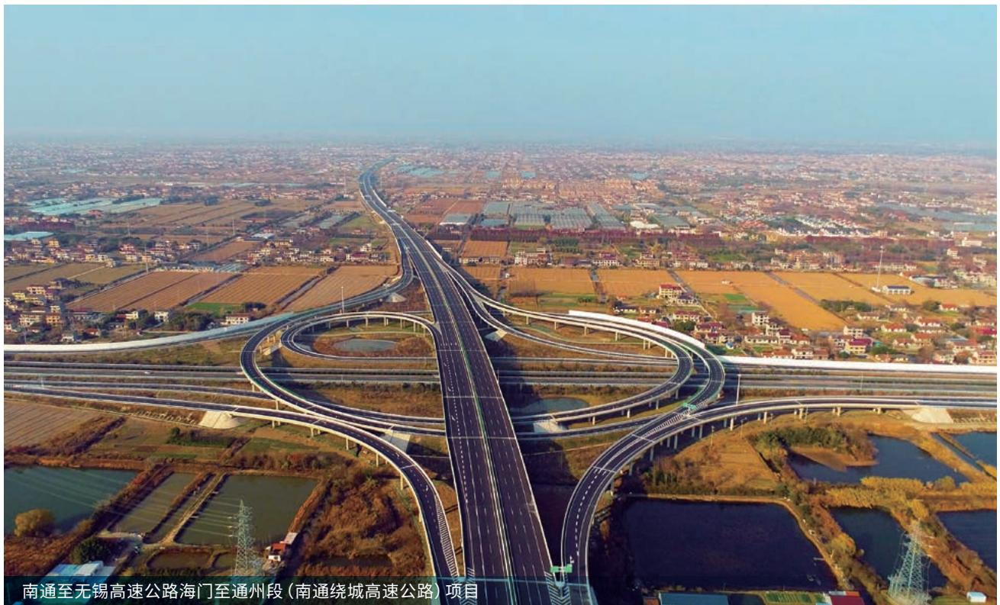

text_image

南通至无锡高速公路海门至通州段(南通绕城高速公路)项目

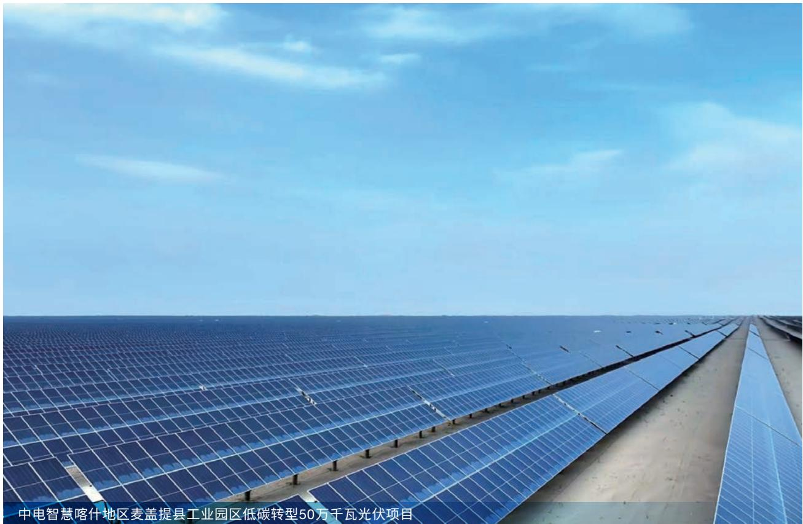

text_image

中电智慧喀什地区麦盖提县工业园区低碳转型50万千瓦光伏项目

报告期内，公司加快推进基建领域科技研发与成果转化，在超大型结构施工、断裂带隧道施工、高精度预埋件安装和无磁钢施工、智能装配造桥机等关键技术方面，取得多项重要创新成果，推动基建业务市场营销和高质量履约。公司承建的广州白云国际机场三期扩建工程、重庆江北国际机场T3B航站楼等重大项目正式投运，公司投资-建设-运营的广西苍昭高速公路工程、天津地铁7号线一期工程南段工程等项目通车运营。

基建业务细分领域新签合同额情况  
单位 ：亿元　币种 ：人民币

<table><tr><td>序号</td><td>一级类别</td><td>二级类别</td><td>2025年</td><td>2024年</td><td>同比增长(%)</td></tr><tr><td>1</td><td>市政工程</td><td>市政道路、邮电通讯工程、防卫防灾工程等</td><td>2,611</td><td>2,647</td><td>-1.4</td></tr><tr><td>2</td><td>交通运输工程</td><td>高速公路、铁路(含高铁)、城市轨道交通、机场、桥梁等</td><td>2,060</td><td>2,288</td><td>-10.0</td></tr><tr><td>3</td><td>能源工程</td><td>光伏发电、风电、核电工程等</td><td>5,870</td><td>5,008</td><td>17.2</td></tr><tr><td>4</td><td>水务及环保</td><td>环保工程、供水及处理工程</td><td>1,569</td><td>2,040</td><td>-23.1</td></tr><tr><td>5</td><td>水利水运</td><td>水利、水运</td><td>721</td><td>544</td><td>32.4</td></tr><tr><td>6</td><td>其他</td><td>石油化工工程等</td><td>1,897</td><td>1,622</td><td>17.0</td></tr><tr><td>合计</td><td></td><td>/</td><td>14,728</td><td>14,149</td><td>4.1</td></tr></table>

合约销售额

3,948 亿元

营业收入

2,844 亿元

毛利

410.3 亿元

# • 房地产开发与投资业务

地产业务塑强竞争优势。报告期内，公司地产业务合约销售额3,948亿元，同比下降6.4% ；合约销售面积1,509万平方米，同比增长3.3% ；实现营业收入2,844亿元，同比下降7.2% ；实现毛利410.3亿元，同比下降22.5%。

报告期内，公司坚持稳健审慎投资策略，聚焦核心城市、核心区域获取优质土地资源，充分发挥“咨投建运”一体化优势，积极参与城市更新、保障性住房建设和老旧小区改造，加强精益建造和科技赋能，持续打造高品质产品。公司研究发布中国建筑“好房子”营造体系，构建一套完整的住宅品质提升解决方案，在百余个项目启动实践。公司旗下中海地产权益销售额、新增购地金额位居行业前列，中建壹品、中建东孚、中建智地、中建玖合、中建信和等品牌稳居中国房地产企业销售业绩排名百强。上海徐汇滨江安澜、北京紫京宸园、通州运河玖院等项目持续热销。

公司全年新购置土地88宗，期末土地储备6,961万平方米，新增土地储备928万平方米，总购地金额1,892亿元。新增土地储备全部位于一线、二线及省会城市，土地储备结构进一步优化。其中 ：中海地产新购置土地35宗，新增土地储备499万平方米，购地金额1,187亿元 ；中建地产新购置土地53宗，新增土地储备429万平方米，购地金额705亿元。报告期内，公司实现房地产项目新开工面积975万平方米，同比下降7.2% ；竣工面积1,622万平方米，同比下降0.6% ；在建面积5,036万平方米，同比下降11.1%。

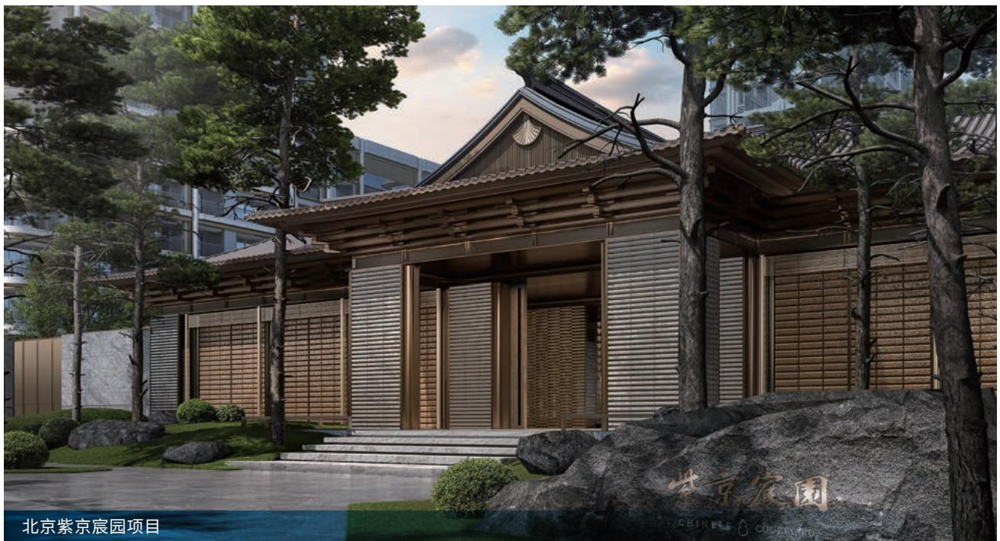

text_image

北京紫京宸园项目
CHINESE COUVE

text_image

ANLAN
上海徐汇滨江安澜项目

公司经过多年拓展，目前拥有写字楼、酒店、公寓、商业地产等持有型物业超1,500万平方米，账面净值1.567亿元，占公司总资产4.4%。区域分布上，持有型物业主要集中分布在一、二线城市及经济发达城市，其中上海、北京、广东三大地区持有型物业净值占比超过50%。报告期内，公司依托商业、养老、物流等成熟的资产管理体系与精细化的运营策略，通过持续打造城市及区域标杆项目、优化多元资产组合，有效激发资产潜能，实现经营效益稳健增长，年内持有型物业实现收入76.9亿元。

敬请参阅本报告第八节“财务报告”财务报表附注五、8“存货”中“房地产开发成本”“房地产开发产品”、附注五、32“合同负债”中“预售房产款”等相关内容。

<table><tr><td colspan="6">新增土地储备前十大城市</td></tr><tr><td>序号</td><td>所在城市</td><td>购地金额(亿元)</td><td>金额占比(%)</td><td>总建筑面积 (万平方米)</td><td>规模占比(%)</td></tr><tr><td>1</td><td>上海</td><td>825.7</td><td>43.6</td><td>228.2</td><td>24.6</td></tr><tr><td>2</td><td>北京</td><td>548.7</td><td>29.0</td><td>214.9</td><td>23.2</td></tr><tr><td>3</td><td>深圳</td><td>133.7</td><td>7.1</td><td>61.4</td><td>6.6</td></tr><tr><td>4</td><td>杭州</td><td>80.8</td><td>4.3</td><td>29.7</td><td>3.2</td></tr><tr><td>5</td><td>济南</td><td>55.6</td><td>2.9</td><td>82.7</td><td>8.9</td></tr><tr><td>6</td><td>天津</td><td>36.9</td><td>2.0</td><td>39.4</td><td>4.2</td></tr><tr><td>7</td><td>长沙</td><td>20.2</td><td>1.1</td><td>46.3</td><td>5.0</td></tr><tr><td>8</td><td>沈阳</td><td>19.3</td><td>1.0</td><td>47.4</td><td>5.1</td></tr><tr><td>9</td><td>石家庄</td><td>16.9</td><td>0.9</td><td>24.2</td><td>2.6</td></tr><tr><td>10</td><td>成都</td><td>16.4</td><td>0.9</td><td>13.6</td><td>1.5</td></tr></table>

# • 勘察设计业务

勘察设计业务转型发展。报告期内，公司勘察设计业务新签合同额128亿元，同比下降10.0% ；实现营业收入102亿元，同比下降6.0% ；实现毛利18.3亿元，同比下降19.4%。

报告期内，公司聚焦建筑设计、城市规划、工程勘察、市政公用工程设计等主营业务领域，持续发挥设计咨询前端引领作用，不断提升在机场、体育建筑、文化场馆、医疗健康、教育设施及古建筑等细分设计领域核心竞争力 ；签约四川大学华西第二医院西藏医院国家区域医疗中心、上海青青旅游世界医疗养老产业园、海南万宁医疗养老社区、成都电子科技职业学院等设计项目。积极拓展新基建、新能源等领域设计咨询业务，承接新疆俊瑞新能源规模化制绿氢项目、国蒙氢能科技绿电制氢项目、乐山市虚拟电厂及配套储能项目、重庆市荣昌区城区防洪排涝体系建设工程、美姑县城市排水管网改造等。设计业务出海再取新突破，承接埃及阿拉曼新城湖心岛深化设计项目等。

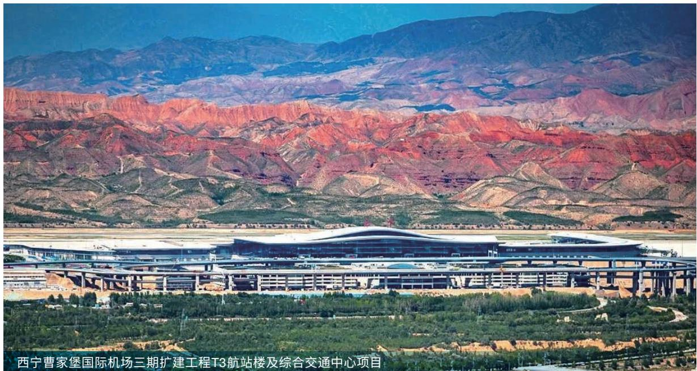

text_image

西宁曹家堡国际机场三期扩建工程T3航站楼及综合交通中心项目

# • 国际化业务

国际化业务实现较快增长。报告期内，公司深入推进海外高质量发展战略，经营规模和质量持续提升，境外业务新签合同额2,550亿元，同比增长15.2%，其中建筑业务新签合同额2,257亿元，6.9% 1,417 19.4% 39.932.5%。

报告期内，公司持续深耕重点市场，东南亚、西亚、北非、中亚地区订单规模快速增长，承接了新加坡高端公共医疗项目亚历山大医院IP标段、阿联酋迪拜扎比尔阿德里斯住宅、乌兹别克斯坦国家艺术博物馆等项目。公司深化多元领域发展，新基建、新能源业务实现较快发展，签约印度尼西亚巴淡岛数据中心、阿尔及利亚图古尔特省153兆瓦光伏发电站等项目。

报告期内，公司持续强化项目履约管理水平，全力保障标志性项目和民生工程建设，承建的柬埔寨德崇国际机场项目正式启用，马来西亚赛城英菲尼数据中心项目交付运营，援洪都拉斯农业学校项目实现当年开工、当年竣工。澳大利亚东北干线、新加坡地铁跨岛线――榜鹅延长线里维拉站及隧道、乌兹别克斯坦塔什干市政道路升级改造等基础设施项目有序推进。

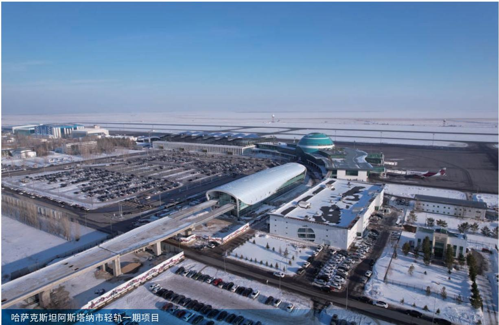

text_image

哈萨克斯坦阿斯塔纳市轻轨一期项目

# . 其他业务

公司其他业务主要为经营土地一级开发、机械设备租赁、工程监理等收入。报告期内，实现营业401.6 18.2% 59.9 14.9% 9.5

敬请参阅本报告第八节“财务报告”财务报表附注五53、“营业收入和营业成本”、附注五66、“费用按性质分类”、附注十五、1"分部报告"相关内容。

# (2). 产销量情况分析表

适用　 不适用

# (3). 重大采购合同、重大销售合同的履行情况

适用　 不适用

# (4). 成本分析表

单位 ：千元　币种 ：人民币

<table><tr><td colspan="7">分行业情况</td></tr><tr><td>分行业</td><td>成本构成项目</td><td>本期金额</td><td>本期占总成本比例(%)</td><td>上年同期金额</td><td>上年同期占总成本比例(%)</td><td>本期金额较上年同期变动比例(%)</td></tr><tr><td>房屋建筑工程</td><td>原材料、分包成本、人工成本等</td><td>1,129,949,766</td><td>60.2</td><td>1,223,950,886</td><td>62.1</td><td>-7.7</td></tr><tr><td>基础设施建设和投资</td><td>原材料、分包成本、人工成本等</td><td>489,418,942</td><td>26.1</td><td>495,663,127</td><td>25.1</td><td>-1.3</td></tr><tr><td>房地产开发与投资</td><td>建筑安装成本、土地成本、人工成本等</td><td>243,362,415</td><td>13.0</td><td>253,380,372</td><td>12.9</td><td>-4.0</td></tr><tr><td>勘察设计</td><td>人工成本、设备租赁</td><td>8,337,917</td><td>0.4</td><td>8,546,395</td><td>0.4</td><td>-2.4</td></tr><tr><td>其他</td><td>人工成本、设备租赁</td><td>34,166,015</td><td>1.9</td><td>25,687,808</td><td>1.3</td><td>33.0</td></tr><tr><td>分部间抵销</td><td>/</td><td>-29,176,290</td><td>-1.6</td><td>-35,520,162</td><td>-1.8</td><td>/</td></tr><tr><td>合计</td><td>/</td><td>1,876,058,765</td><td>100</td><td>1,971,708,426</td><td>100</td><td>-4.9</td></tr></table>

单位 ：千元　币种 ：人民币

<table><tr><td colspan="8">成本主要构成要素情况</td></tr><tr><td>分行业</td><td>成本构成要素</td><td>2025年</td><td>占比(%)</td><td>2024年(调整后)</td><td>占比(%)</td><td>2023年</td><td>占比(%)</td></tr><tr><td rowspan="6">房屋建筑工程</td><td>产品销售成本</td><td>16,418,560</td><td>0.9</td><td>18,633,022</td><td>0.9</td><td>24,287,871</td><td>1.2</td></tr><tr><td>分包成本</td><td>501,172,759</td><td>26.7</td><td>511,257,031</td><td>25.9</td><td>519,233,745</td><td>25.4</td></tr><tr><td>原材料</td><td>291,486,009</td><td>15.5</td><td>320,807,432</td><td>16.3</td><td>343,390,812</td><td>16.8</td></tr><tr><td>职工薪酬</td><td>45,139,241</td><td>2.4</td><td>44,681,073</td><td>2.3</td><td>40,535,318</td><td>2.0</td></tr><tr><td>其他费用</td><td>275,733,197</td><td>14.7</td><td>328,572,328</td><td>16.7</td><td>355,825,525</td><td>17.4</td></tr><tr><td>小计</td><td>1,129,949,766</td><td>60.2</td><td>1,223,950,886</td><td>62.1</td><td>1,283,273,271</td><td>62.8</td></tr><tr><td rowspan="5">基础设施建设和投资</td><td>分包成本</td><td>207,595,631</td><td>11.1</td><td>202,770,905</td><td>10.3</td><td>220,633,861</td><td>10.8</td></tr><tr><td>原材料</td><td>136,708,737</td><td>7.3</td><td>141,568,785</td><td>7.2</td><td>136,159,382</td><td>6.7</td></tr><tr><td>人员费</td><td>67,390,614</td><td>3.6</td><td>70,994,532</td><td>3.6</td><td>78,052,538</td><td>3.8</td></tr><tr><td>其他费用</td><td>77,723,961</td><td>4.1</td><td>80,328,905</td><td>4.0</td><td>67,018,799</td><td>3.3</td></tr><tr><td>小计</td><td>489,418,942</td><td>26.1</td><td>495,663,127</td><td>25.1</td><td>501,864,580</td><td>24.6</td></tr><tr><td rowspan="3">房地产投资与开发</td><td>房地产开发产品结转</td><td>220,921,622</td><td>11.8</td><td>234,014,894</td><td>11.9</td><td>235,352,228</td><td>11.5</td></tr><tr><td>其他费用</td><td>22,440,793</td><td>1.2</td><td>19,365,478</td><td>1.0</td><td>17,228,191</td><td>0.8</td></tr><tr><td>小计</td><td>243,362,415</td><td>13.0</td><td>253,380,372</td><td>12.9</td><td>252,580,419</td><td>12.4</td></tr><tr><td>勘察设计</td><td>小计</td><td>8,337,917</td><td>0.4</td><td>8,546,395</td><td>0.4</td><td>9,250,674</td><td>0.5</td></tr><tr><td>其他</td><td>小计</td><td>34,166,015</td><td>1.9</td><td>25,687,808</td><td>1.3</td><td>33,964,319</td><td>1.7</td></tr><tr><td>分部间抵销</td><td>/</td><td>-29,176,290</td><td>-1.6</td><td>-35,520,162</td><td>-1.8</td><td>-38,209,432</td><td>-1.9</td></tr><tr><td></td><td>合计</td><td>1,876,058,765</td><td>100.0</td><td>1,971,708,426</td><td>100.0</td><td>2,042,723,831</td><td>100.0</td></tr></table>

成本分析其他情况说明

无

(5). 报告期主要子公司股权变动导致合并范围变化

适用　 不适用

(6). 公司报告期内业务、产品或服务发生重大变化或调整有关情况

适用　 不适用

(7).主要销售客户及主要供应商情况

属于同一控制人控制的客户或供应商视为同一客户或供应商合并列示，受同一国有资产管理机构实际控制的除外。

下列客户及供应商信息按照同一控制口径合并计算列示的情况说明

无

A. 公司主要销售客户及主要供应商情况

适用　 不适用

前五名客户销售额478.5亿元，占年度全部销售总额2.3% ；其中前五名客户销售额中关联方销售额0亿元，占年度销售总额0%。

报告期内，公司来自前五名供应商的采购金额435.4亿元，占年度采购总额3.0%，其中前五名供应商采购额中关联方采购额0亿元，占年度采购总额0%。

B．报告期内向单个客户的销售比例超过总额的50%、前5名客户中存在新增客户的或严重依赖于少数客户的情形

适用　 不适用

单位：亿元币种：人民币

<table><tr><td>序号</td><td>客户名称</td><td>销售额</td><td>占年度销售总额比例(%)</td><td>备注</td></tr><tr><td>1</td><td>华润(集团)有限公司</td><td>190.1</td><td>0.9</td><td>/</td></tr><tr><td>2</td><td>中国保利集团有限公司</td><td>136.2</td><td>0.7</td><td>/</td></tr><tr><td>3</td><td>万科企业股份有限公司</td><td>52.9</td><td>0.3</td><td>/</td></tr><tr><td>4</td><td>中国广核集团有限公司</td><td>51.5</td><td>0.2</td><td>前5名客户中新增客户</td></tr><tr><td>5</td><td>招商局集团有限公司</td><td>47.8</td><td>0.2</td><td>/</td></tr></table>

报告期内向单个供应商的采购比例超过总额的50%、前5名供应商中存在新增供应商的或严重依赖于少数供应商的情形

# 适用　 不适用

单位 ：亿元 币种 ：人民币

<table><tr><td>序号</td><td>供应商名称</td><td>采购额</td><td>占年度采购总额比例(%)</td><td>备注</td></tr><tr><td>1</td><td>中国五矿集团有限公司</td><td>148.2</td><td>1.0</td><td>/</td></tr><tr><td>2</td><td>上海钰翔投资控股集团有限公司</td><td>87.9</td><td>0.6</td><td>/</td></tr><tr><td>3</td><td>华南物资集团有限公司</td><td>71.8</td><td>0.5</td><td>/</td></tr><tr><td>4</td><td>中国建材集团有限公司</td><td>64.8</td><td>0.5</td><td>/</td></tr><tr><td>5</td><td>厦门国有资本运营有限责任公司</td><td>62.7</td><td>0.4</td><td>前5名供应商中新增供应商</td></tr></table>

# C. 报告期内公司股票被实施退市风险警示或其他风险警示

前五名销售客户

适用　 不适用

D. 报告期内公司存在贸易业务收入

适用　 不适用

其他说明

公司的营业规模和多元化的业务结构决定了公司的供应商较为广泛、集中度较低，在大宗物资采购上均采用限制性极小的公开招标采购，保障资源供应的同时，也避免公司对单一供应商的依赖。

# 3.　费用

适用　 不适用

2025年，公司销售费用、管理费用、财务费用及研发费用四项期间费用合计1,046亿元，同比下降3.5%。四项费用占收入比5.0%，同比增加了0.1个百分点。

敬请参阅本报告第八节“财务报告"财务报表附注五、55"销售费用”、附注五、56"管理费用"、附注五、57“研发费用”和附注五、58“财务费用”相关内容。

# 4.　研发投入

(1). 研发投入情况表

适用　 不适用

单位 ：千元　币种 ：人民币

<table><tr><td>本期费用化研发投入</td><td>44,009,417</td></tr><tr><td>本期资本化研发投入</td><td>/</td></tr><tr><td>研发投入合计</td><td>44,009,417</td></tr><tr><td>研发投入总额占营业收入比例(%)</td><td>2.1</td></tr><tr><td>研发投入资本化的比重(%)</td><td>/</td></tr></table>

研发投入占比  
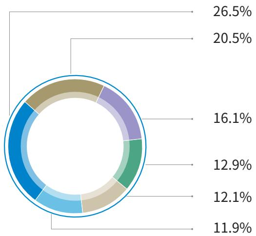

pie

| Segment | Percentage |
| ------- | ---------- |
| Segment 1 | 26.5% |
| Segment 2 | 20.5% |
| Segment 3 | 16.1% |
| Segment 4 | 12.9% |
| Segment 5 | 12.1% |
| Segment 6 | 11.9% |

绿色低碳与建筑新能源  
城市更新与城市运营  
智能建造与数字化技术  
新材料与新型建筑工业化  
基础设施建造技术  
其他

# (2). 研发人员情况表

适用　 不适用

<table><tr><td>公司研发人员的数量</td><td>38,297</td></tr><tr><td>研发人员数量占公司总人数的比例(%)</td><td>10.3</td></tr><tr><td colspan="2">研发人员学历结构</td></tr><tr><td>学历结构类别</td><td>学历结构人数</td></tr><tr><td>博士研究生</td><td>458</td></tr><tr><td>硕士研究生</td><td>6,157</td></tr><tr><td>本科</td><td>29,559</td></tr><tr><td>专科</td><td>2,035</td></tr><tr><td>高中及以下</td><td>88</td></tr><tr><td colspan="2">研发人员年龄结构</td></tr><tr><td>年龄结构类别</td><td>年龄结构人数</td></tr><tr><td>30岁以下(不含30岁)</td><td>11,358</td></tr><tr><td>30-40岁(含30岁,不含40岁)</td><td>20,093</td></tr><tr><td>40-50岁(含40岁,不含50岁)</td><td>5,417</td></tr><tr><td>50-60岁(含50岁,不含60岁)</td><td>1,400</td></tr><tr><td>60岁及以上</td><td>29</td></tr></table>

说明：研发(R&D）人员是指报告期研发(R&D)活动单位中从事基础研究、应用研究和试验发展活动的人员(《研究与试验发展(R&D)投入统计规范(试行)》国统字[2019]47号)。具体包含了从事研发(R&D)项目的科技管理人员、工程技术人员、设计研发人员等全部研发（R&D）人员。

研发人员学历结构  
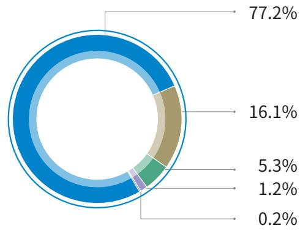

pie

| Category | Percentage |
| -------- | ---------- |
| Segment 1 | 77.2% |
| Segment 2 | 16.1% |
| Segment 3 | 5.3% |
| Segment 4 | 1.2% |
| Segment 5 | 0.2% |

博士研究生  
硕士研究生  
本科  
专科  
高中及以下

研发人员年龄结构  
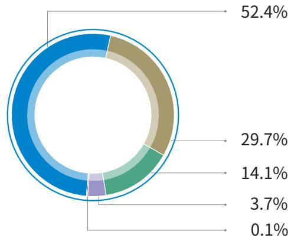

pie

| Category | Percentage |
| -------- | ---------- |
| Segment 1 | 52.4% |
| Segment 2 | 29.7% |
| Segment 3 | 14.1% |
| Segment 4 | 3.7% |
| Segment 5 | 0.1% |

30 岁以下（不含 30 岁）  
30-40 岁（含 30 岁，不含 40 岁）  
40-50 岁（含 40 岁，不含 50 岁）  
50-60 岁（含 50 岁，不含 60 岁）  
60岁及以上

# (3). 情况说明

# 适用　 不适用

近年来，公司致力以科技创新赋能传统建造转型升级，以“产品化、产业化、市场化”为导向加快科技创新，大力培育发展新质生产力，推动科技创新与产业创新深度融合，促进各类优秀创新科技成果的体系化、规模化应用，打造高质量发展第二增长曲线，更好服务人民群众对美好生活的向往。

加强科技创新平台体系建设。公司拥有国家数字建造技术创新中心、绿色建筑全国重点实验室、土壤养分管理与污染修复国家工程研究中心、城乡水资源与水环境全国重点实验室四个国家级科技创新平台，5个国家企业技术中心(含分中心)、9家院士工作站，75个省部级企业技术中心、89家省部级科技创新平台，建成19个博士后工作站，拥有242家高新技术企业。参与建设住房和城乡建设部科技创新平台6家，包含创新中心3家、重点实验室3家。搭建中国建筑“5+7”科技创新平台体系。同时，分专业、分层级建立科技人才库，充分鼓励自主创新，调动科技工作者的积极性和创造性。

加大关键核心技术研发攻关。公司聚焦“智能装备、建筑新能源、新材料、城市更新、城市运营、绿色低碳、极端条件人居环境以及BIM软件国产化"等8个重点方向开展技术攻关，立项年度课题60项。报告期内，公司成功攻克高精度预埋件安装和无磁钢施工等核心技术难题，自主研发的“适用于重荷载高精度的预埋支撑平台及其预埋工艺”，助力中国紧凑型聚变能实验装置BEST首个关键部件杜瓦底座成功安装就位。公司主导的金属屋面建造关键技术研究与应用科技成果通过评审，整体达到国际先进水平。其中“嵌入式连续焊接不锈钢金属屋面系统"和“金属屋面模块化体系和施工技术"达到国际领先水平。该成果系列技术在多个重大工程中应用，为国内大跨度建筑屋面结构抗风性能的实质性提升作出贡献。

加快推动科技成果产业化。公司发布新建好房子、旧改好房子、模块化建筑产品、光伏建筑一体化（BIPV）系列产品等11项首批产业化推广产品，推动建筑行业向工业化、绿色化、智能化转型。报告期内，公司承建的全球海拔最高、规模最大的增压建筑群――新疆火烧云铅锌矿增压建筑群项目落成交付。“零海拔屋”系列产品已应用到极端环境科考、工程、旅居等场景，为相关人员提供工作与居住保障。

# (4). 研发人员构成发生重大变化的原因及对公司未来发展的影响

适用　 不适用

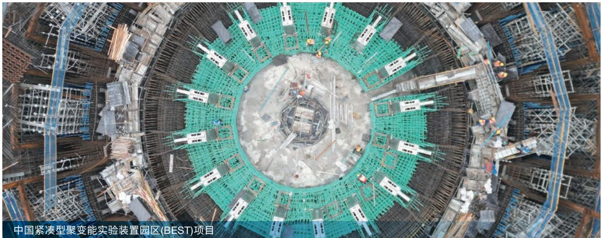

text_image

中国紧凑型聚变能实验装置园区(BEST)项目

# 5.　现金流

适用　 不适用

报告期内，公司现金净流出1.76亿元，同比减少303.63亿元。

公司经营活动现金净流入205.37亿元，同比增加净流入47.11亿元，主要是本年经营现金流量增加，由于公司积极采取有效措施加强现金流管控，持续保持较好现金流水平。

公司投资活动现金净流出321.50亿元，同比增加净流出296.19亿元，主要是支付其他与投资活动有关的现金、取得子公司及其他营业单位支付的现金净额增加所致。

公司筹资活动现金净流入115.79亿元，同比减少净流入35.31亿元，主要是发行债券收到的现金减少所致。

敬请参阅本报告第八节"财务报告"财务报表附注五、69"现金流量表项目注释"和附注五、70"现金流量表补充资料”相关内容。

# 6.　融资情况

报告期内，公司深化运用宽松货币政策环境，全年新增银行借款利率与新发行债券利率同比均实现降低，不断发挥低成本融资优势。截至报告期末，全公司带息负债总额9,302亿元，较年初增长主要是由于公司订单量增长，与之相匹配的融资增多，带息负债规模与公司业务规模保持适应，带息负债结构与公司业务结构保持匹配，整体流动性风险较低且受到有效控制。

# (二) 经营性投资业务情况

报告期内，公司审慎应对市场形势，投资结构持续优化，进一步加大重大基础设施、战略性新兴产业项目拓展力度。同时，紧跟国家稳定房地产市场及政府化债的政策机遇，有力推动地产存货去化及综合类投资项目回款。报告期内，公司完成投资额3,386亿元，同比下降3.6% ；投资回款3,848亿元，同比下降12.0% ；投资收支比113.6%，同比下降10.9个百分点。

经营性投资业务投资及回款实现情况表  
单位 ：亿元　币种 ：人民币

<table><tr><td>项目分类</td><td>报告期内投资额</td><td>占比(%)</td><td>同比增长(%)</td><td>报告期内回款额</td><td>占比(%)</td><td>同比增长(%)</td></tr><tr><td colspan="7">按项目类别分</td></tr><tr><td>房地产开发投资</td><td>2,540</td><td>75.0</td><td>-5.0</td><td>2,958</td><td>76.9</td><td>-15.7</td></tr><tr><td>基础设施投资</td><td>340</td><td>10.0</td><td>5.9</td><td>281</td><td>7.3</td><td>-4.1</td></tr><tr><td>房建工程投资</td><td>391</td><td>11.6</td><td>-3.3</td><td>440</td><td>11.4</td><td>4.0</td></tr><tr><td>城镇综合建设</td><td>103</td><td>3.0</td><td>0.8</td><td>123</td><td>3.2</td><td>2.5</td></tr><tr><td>固定资产投资及其他投资</td><td>12</td><td>0.4</td><td>9.1</td><td>46</td><td>1.2</td><td>64.3</td></tr><tr><td colspan="7">按项目时续分</td></tr><tr><td>续投项目</td><td>1,876</td><td>55.4</td><td>-8.7</td><td></td><td></td><td></td></tr><tr><td>新拓展项目</td><td>1,510</td><td>44.6</td><td>3.6</td><td></td><td></td><td></td></tr><tr><td>合计</td><td>3,386</td><td>100</td><td>-3.6</td><td>3,848</td><td>100</td><td>-12.0</td></tr></table>

注：以上项目分类是结合行业惯例和公司内部管理需要而设计，部分项目的分类属性会根据项目实际情况进行调整，表中同比增长率计算时将相应地对变化项目进行追溯调整。

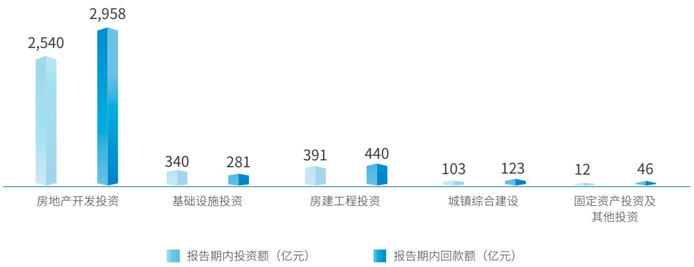

bar

| 投资类别 | 报告期内投资额 (亿元) | 报告期内回款额 (亿元) |
| :--- | :--- | :--- |
| 房地产开发投资 | 2,540 | 2,958 |
| 基础设施投资 | 340 | 281 |
| 房建工程投资 | 391 | 440 |
| 城镇综合建设 | 103 | 123 |
| 固定资产投资及其他投资 | 12 | 46 |

# 1.　房地产开发业务

报告期内，公司房地产开发业务完成投资额2,540亿元，同比下降5% ；实现投资回款2,958亿元，同比15.7% 116.4% 14.8

# 2.　基础设施投资业务

报告期内，公司基础设施投资业务完成投资额340亿元，同比增长5.9%；实现投资回款281亿元，同比4.1% 82.6% 8.6

# 3.　房建工程投资业务

报告期内，公司房建工程投资业务完成投资额391亿元，同比下降3.3%；实现投资回款440亿元，同比4.0% 112.6% 7.9

# 4．城镇综合建设业务

报告期内，公司城镇综合建设业务完成投资额103亿元，同比增长0.8%；实现投资回款123亿元，同比2.5% 119.5% 1.8

# 5．重点区域投资建设情况

公司始终坚决贯彻落实党中央、国务院重大决策部署，紧扣国家重大战略布局，主动服务和融入区域协调发展战略，深度参与京津冀协同发展、长江经济带发展、粤港澳大湾区建设、长三角一体化发展、黄河流域生态保护和高质量发展等国家重点区域建设。报告期内，公司在京津冀、长江经济带、粤港澳大湾区、长三角和黄河流域完成投资额3,009亿元，占公司整体完成投资额的88.9%。

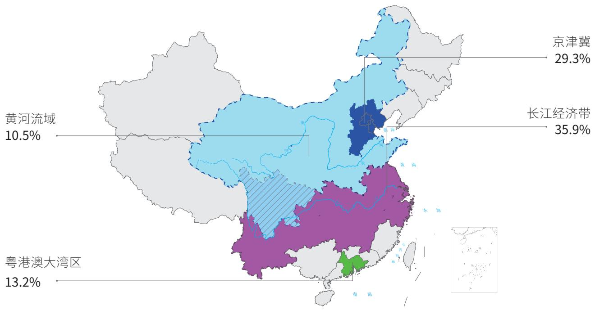

geo

| 区域 | 占比 (%) |
| :--- | :--- |
| 京津冀 | 29.3 |
| 长江经济带 | 35.9 |
| 黄河流域 | 10.5 |
| 粤港澳大湾区 | 13.2 |

# 6. PPP业务开展情况

自2023年11月财政部发布PPP新机制指导意见以来，公司未新增PPP项目，重点强化存量项目管理。2025年国务院办公厅转发财政部《关于规范政府和社会资本合作存量项目建设和运营的指导意见》（国办函〔2025〕84号）发布后，公司主动与地方政府对接，报告期内终止存量PPP项目14个，有效管控投资风险 ；强化过程督导，建立回款管控长效机制，压实主体责任，保障投资收益，截至报告期末，已运营PPP项目运营情况良好，年度绩效考核均达标；同时主动适应PPP新机制，探索特许经营类项目，规范项目评估与过程监控，推动项目管理高质量发展。截至2025年底，在实施PPP项目416个，权益投资额5,951亿元。其中已运营PPP项目365个，权益投资额约5,097亿元，占比85.6%。

在实施PPP项目业务分布情况表  
单位 ：亿元　币种 ：人民币

<table><tr><td>细分类型</td><td>权益投资额</td><td>占比(%)</td><td>累计完成投资额</td><td>累计实现回款额</td></tr><tr><td>交通运输类</td><td>2,435</td><td>40.9</td><td>2,047</td><td>360</td></tr><tr><td>市政工程类</td><td>1,924</td><td>32.3</td><td>1,823</td><td>696</td></tr><tr><td>城镇综合开发类</td><td>696</td><td>11.7</td><td>612</td><td>178</td></tr><tr><td>文体医疗及保障房类</td><td>607</td><td>10.2</td><td>579</td><td>224</td></tr><tr><td>生态环保和其他类</td><td>289</td><td>4.9</td><td>264</td><td>57</td></tr><tr><td>合计</td><td>5,951</td><td>100</td><td>5,325</td><td>1,515</td></tr></table>

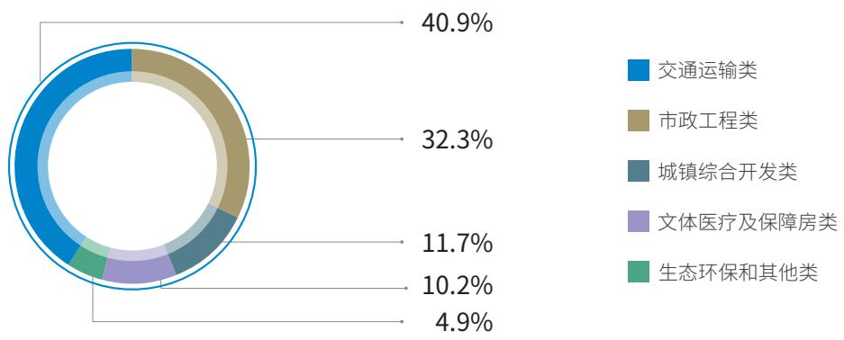

pie

| 类别 | 占比 (%) |
| :--- | :--- |
| 交通运输类 | 40.9 |
| 市政工程类 | 32.3 |
| 城镇综合开发类 | 11.7 |
| 文体医疗及保障房类 | 10.2 |
| 生态环保和其他类 | 4.9 |

text_image

梧州至乐业公路广宁经苍梧至昭平项目

# （三）专业板块经营情况

报告期内，公司始终坚持走专业化发展道路，涵盖建筑行业主要细分领域产品，有力支撑了公司改革创新发展。公司专业板块全年新签合同额7,179.3亿元，同比降低2.2% ；实现营业收入4,832.8亿元，同比增长2.3% ；实现毛利319.6亿元，同比降低5.9% ；实现营业利润162.4亿元，同比降低7.7%。

报告期内，公司制定“一企一策”战略发展规划，着力推动各专业公司在细分领域深耕细作，加快形成独特竞争优势。公司旗下中建装饰在装饰、幕墙等业务领域规模位于行业前列，数字化绿色健康装修技术优势引领行业，首个家装品牌“中建幸福家"公司揭牌成立。中建科工是中国钢结构行业竞争力榜首企业、国家高新技术企业，在高端钢结构业务领域市占率第一 ；积极布局智慧停车、交通绿能、建筑机器人等领域，首个数字能源工厂正式投产。中建安装丙烷脱氢核心设备全球市场占有率连续三年稳居第一，大型塔器、反应器现场制造能力领跑全国化工装备领域。西部建设位居中国预拌混凝土行业前列。

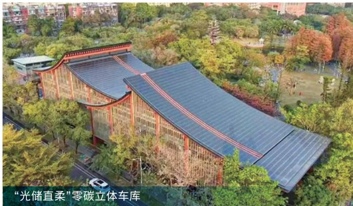

text_image

“光储直柔”零碳立体车库

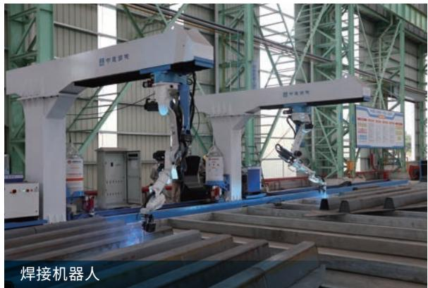

natural_image

Industrial welding machine in a factory setting, no visible text or symbols on machinery or background

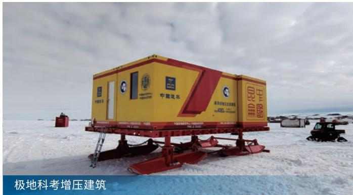

text_image

中国工程
极地科考增压建筑

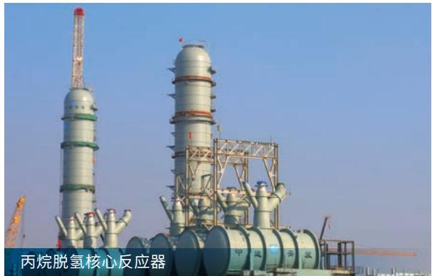

text_image

丙烷脱氢核心反应器

单位 ：亿元　币种 ：人民币

<table><tr><td>项目</td><td>板块名称</td><td>新签合同额</td><td>2025营业收入</td><td>同比增长(%)</td><td>2025毛利</td><td>同比增长(%)</td><td>2025营业利润</td><td>同比增长(%)</td></tr><tr><td rowspan="3">跨板块</td><td>安装</td><td>849.0</td><td>653.9</td><td>1.1</td><td>30.7</td><td>-17.8</td><td>13.7</td><td>-33.1</td></tr><tr><td>钢构</td><td>204.2</td><td>318.2</td><td>6.6</td><td>18.6</td><td>8.3</td><td>9.0</td><td>23.5</td></tr><tr><td>商混</td><td>502.1</td><td>181.1</td><td>-11.0</td><td>8.8</td><td>-43.4</td><td>-7.5</td><td>295.4</td></tr><tr><td rowspan="2">房建</td><td>装饰</td><td>421.0</td><td>506.0</td><td>0.7</td><td>33.3</td><td>-14.6</td><td>5.3</td><td>-37.5</td></tr><tr><td>园林</td><td>112.4</td><td>91.1</td><td>-0.1</td><td>9.0</td><td>9.0</td><td>7.0</td><td>27.5</td></tr><tr><td rowspan="6">基建</td><td>市政</td><td>1,228.9</td><td>894.0</td><td>3.2</td><td>97.0</td><td>0.2</td><td>66.1</td><td>13.3</td></tr><tr><td>铁路</td><td>186.2</td><td>254.1</td><td>-2.7</td><td>6.2</td><td>-21.5</td><td>3.2</td><td>-39.7</td></tr><tr><td>轨交</td><td>127.2</td><td>551.6</td><td>-15.0</td><td>25.3</td><td>-7.8</td><td>12.8</td><td>-40.1</td></tr><tr><td>路桥</td><td>1,207.0</td><td>965.8</td><td>0.2</td><td>65.3</td><td>-9.6</td><td>37.6</td><td>-8.1</td></tr><tr><td>电力</td><td>2,070.7</td><td>292.0</td><td>126.7</td><td>14.1</td><td>111.7</td><td>10.2</td><td>141.9</td></tr><tr><td>港工</td><td>270.4</td><td>125.1</td><td>12.3</td><td>11.4</td><td>1.9</td><td>5.1</td><td>-14.6</td></tr><tr><td>合计</td><td></td><td>7,179.3</td><td>4,832.8</td><td>2.3</td><td>319.6</td><td>-5.9</td><td>162.4</td><td>-7.7</td></tr></table>

<table><tr><td rowspan="2">项目</td><td rowspan="2">板块名称</td><td colspan="3">毛利率(%)</td><td colspan="3">营业利润率(%)</td></tr><tr><td>2025年</td><td>2024年</td><td>同比增减(百分点)</td><td>2025年</td><td>2024年</td><td>同比增减(百分点)</td></tr><tr><td rowspan="3">跨板块</td><td>安装</td><td>4.7</td><td>5.8</td><td>-1.1</td><td>2.1</td><td>3.2</td><td>-1.1</td></tr><tr><td>钢构</td><td>5.9</td><td>5.8</td><td>0.1</td><td>2.8</td><td>2.4</td><td>0.4</td></tr><tr><td>商混</td><td>4.8</td><td>7.6</td><td>-2.8</td><td>-4.1</td><td>-0.9</td><td>-3.2</td></tr><tr><td rowspan="2">房建</td><td>装饰</td><td>6.6</td><td>7.8</td><td>-1.2</td><td>1.0</td><td>1.7</td><td>-0.7</td></tr><tr><td>园林</td><td>9.9</td><td>9.0</td><td>0.9</td><td>7.7</td><td>6.0</td><td>1.7</td></tr><tr><td rowspan="6">基建</td><td>市政</td><td>10.8</td><td>11.2</td><td>-0.4</td><td>7.4</td><td>6.7</td><td>0.7</td></tr><tr><td>铁路</td><td>2.5</td><td>3.0</td><td>-0.5</td><td>1.3</td><td>2.0</td><td>-0.7</td></tr><tr><td>轨交</td><td>4.6</td><td>4.2</td><td>0.4</td><td>2.3</td><td>3.3</td><td>-1.0</td></tr><tr><td>路桥</td><td>6.8</td><td>7.5</td><td>-0.7</td><td>3.9</td><td>4.2</td><td>-0.3</td></tr><tr><td>电力</td><td>4.8</td><td>5.2</td><td>-0.4</td><td>3.5</td><td>3.3</td><td>0.2</td></tr><tr><td>港工</td><td>9.1</td><td>10.1</td><td>-1.0</td><td>4.1</td><td>5.4</td><td>-1.3</td></tr><tr><td>合计</td><td></td><td>6.6</td><td>7.2</td><td>-0.6</td><td>3.4</td><td>3.7</td><td>-0.3</td></tr></table>

# （四）非主营业务导致利润重大变化的说明

适用　 不适用

# 资产、负债情况

适用　 不适

其他说明  
产及负债状 .   
种 ：人民 位 ：千元

<table><tr><td>项目名称</td><td>本期期末数</td><td>本期期末数占总资产的比例(%)</td><td>上期期末数</td><td>上期期末数占总资产的比例(%)</td><td>本期期末金额较上期期末变动比例(%)</td><td>情况说明</td></tr><tr><td>总资产</td><td>3,560,679,818</td><td>100.00</td><td>3,189,774,343</td><td>100.00</td><td>11.63</td><td>总资产本年增加3,709亿元,主要是存货增加437亿元,应收账款增加984亿元,合同资产增加1,436亿元,其他流动资产增加532亿元,长期应收款增加135亿元。</td></tr><tr><td>货币资金</td><td>411,670,207</td><td>11.56</td><td>424,425,658</td><td>13.31</td><td>-3.01</td><td>货币资金本年减少128亿元,主要是资金使用需求上升,资金存量有所降低。</td></tr><tr><td>应收票据</td><td>3,820,157</td><td>0.11</td><td>2,328,094</td><td>0.07</td><td>64.09</td><td>应收票据本年增加15亿元,主要是客户使用承兑汇票支付款项增加所致。</td></tr><tr><td>应收账款</td><td>415,558,761</td><td>11.67</td><td>317,144,080</td><td>9.94</td><td>31.03</td><td>应收账款本年增加984亿元,主要是回款放缓所致。</td></tr><tr><td>应收款项融资</td><td>1,586,441</td><td>0.04</td><td>3,575,355</td><td>0.11</td><td>-55.63</td><td>应收款项融资本年减少20亿元,主要是本年客户使用银行承兑汇票支付的款项比例减少所致。</td></tr><tr><td>预付款项</td><td>35,476,792</td><td>1.00</td><td>24,341,057</td><td>0.76</td><td>45.75</td><td>预付款项本年增加111亿元,主要是本期新增土地储备,预付土地款增加,尚未满足结转条件所致。</td></tr><tr><td>其他应收款</td><td>74,786,128</td><td>2.10</td><td>68,235,576</td><td>2.14</td><td>9.60</td><td>其他应收款本年增加66亿元,主要是因为本年新增日常业务所发生的应收代垫款以及其他往来款所致。</td></tr><tr><td>存货</td><td>815,866,130</td><td>22.91</td><td>772,168,289</td><td>24.21</td><td>5.66</td><td>存货本年增加437亿元,主要是房地产开发成本和建筑业原材料增加所致。</td></tr><tr><td>合同资产</td><td>588,967,936</td><td>16.54</td><td>445,400,720</td><td>13.96</td><td>32.23</td><td>合同资产本年增加1,436亿元,主要是部分房建及基建项目施工进度加快,相应已完工未结算余额增加所致。</td></tr><tr><td>一年内到期的非流动资产</td><td>47,874,731</td><td>1.34</td><td>61,780,779</td><td>1.94</td><td>-22.51</td><td>一年内到期的非流动资产本年减少139亿元,主要是部分长期应收款到期收回所致。</td></tr><tr><td>其他流动资产</td><td>210,880,973</td><td>5.92</td><td>157,692,450</td><td>4.94</td><td>33.73</td><td>其他流动资产本年增加532亿元,主要是由于待抵扣进项税额增加所致。</td></tr><tr><td>债权投资</td><td>26,379,049</td><td>0.74</td><td>21,971,115</td><td>0.69</td><td>20.06</td><td>债权投资本年增加44亿元,主要是应收关联方贷款增加所致。</td></tr><tr><td>长期应收款</td><td>135,065,035</td><td>3.79</td><td>121,537,045</td><td>3.81</td><td>11.13</td><td>长期应收款本年增加135亿元,主要是投资项目及基建、房建项目应收款项增加所致。</td></tr><tr><td>长期股权投资</td><td>126,566,824</td><td>3.55</td><td>119,073,558</td><td>3.73</td><td>6.29</td><td>长期股权投资本年增加75亿元,主要是对外投资增加所致。</td></tr><tr><td>其他权益工具投资</td><td>8,648,360</td><td>0.24</td><td>7,293,820</td><td>0.23</td><td>18.57</td><td>其他权益工具投资本年增加14亿元,主要是部分非上市权益工具投资增加所致。</td></tr><tr><td>投资性房地产</td><td>156,683,794</td><td>4.40</td><td>156,271,918</td><td>4.90</td><td>0.26</td><td>投资性房地产本年增加4亿元,主要是本年存货转入投资性房地产所致。</td></tr><tr><td>无形资产</td><td>42,392,977</td><td>1.19</td><td>35,323,710</td><td>1.11</td><td>20.01</td><td>无形资产本年增加71亿元,主要是由于以无形资产模式以及混合模式核算的PPP项目投资增加所致。</td></tr><tr><td>其他非流动资产</td><td>357,439,422</td><td>10.04</td><td>352,602,811</td><td>11.05</td><td>1.37</td><td>其他非流动资产本年增加48亿元,主要是本期随项目结算,相应确权质保金有所增加所致。</td></tr><tr><td>总负债</td><td>2,738,171,656</td><td>76.90</td><td>2,417,792,878</td><td>75.80</td><td>13.25</td><td>总负债同比增加3,204亿元,主要是短期借款增加545亿元,应付账款增加1,694亿元所致,其他流动负债增加438亿元所致。</td></tr><tr><td>短期借款</td><td>170,246,434</td><td>4.78</td><td>115,745,796</td><td>3.63</td><td>47.09</td><td>短期借款本年增加545亿元,主要是本年信用借款增加524亿所致。</td></tr><tr><td>应付票据</td><td>11,657,357</td><td>0.33</td><td>16,103,080</td><td>0.50</td><td>-27.61</td><td>应付票据本年减少44亿元,主要是本年到期兑付以及通过商业票据支付的金额减少所致。</td></tr><tr><td>应付账款</td><td>997,477,873</td><td>28.01</td><td>828,088,617</td><td>25.96</td><td>20.46</td><td>应付账款本年增加1,694亿元,主要是随着业务开展,应付分包工程款及材料款增加所致。</td></tr><tr><td>合同负债</td><td>377,779,486</td><td>10.61</td><td>345,388,447</td><td>10.83</td><td>9.38</td><td>合同负债本年增加324亿元,主要是已完工未结算和预收工程款增加所致。</td></tr><tr><td>一年内到期的非流动负债</td><td>127,047,835</td><td>3.57</td><td>120,913,942</td><td>3.79</td><td>5.07</td><td>一年内到期的非流动负债本年增加61亿元,主要是由于一年内到期的长期借款和应付债券增加所致。</td></tr><tr><td>其他流动负债</td><td>155,221,746</td><td>4.36</td><td>111,469,323</td><td>3.49</td><td>39.25</td><td>其他流动负债较上年期末数增加438亿元,主要是短期融资券和待转销项税增加所致。</td></tr><tr><td>长期借款</td><td>526,471,993</td><td>14.79</td><td>524,271,669</td><td>16.44</td><td>0.42</td><td>长期借款本年增加22亿元,主要为了满足房地产开发项目和PPP项目公司的资金需求增加借款所致。</td></tr><tr><td>应付债券</td><td>113,381,047</td><td>3.18</td><td>98,245,542</td><td>3.08</td><td>15.41</td><td>应付债券增加151亿元,主要本年新发行债券,用于房地产项目投资建设及补充运营资金。</td></tr><tr><td>长期应付款</td><td>15,407,569</td><td>0.43</td><td>14,623,910</td><td>0.46</td><td>5.36</td><td>长期应付款较上年期末数增加8亿元,主要是应付工程质量保证金增加所致。</td></tr></table>

# 2.　境外资产情况

适用　 不适用

# (1) 资产规模

其中 ：截至报告期末，公司境外资产2,306（单位 ：亿元 币种 ：人民币），占总资产的比例为6.5%。

# (2) 境外资产占比较高的相关说明

适用　 不适用

# (3）境外资产相关说明

适用　 不适用

报告期内，公司主要资产未发生重大变化。上述境外资产数据未经审计。

# 3.　截至报告期末主要资产受限情况

适用　 不适用

敬请参阅本报告第八节“财务报告”财务报表附注五、26“所有权或使用权受到限制的资产”的相关内容。

# 4.　其他说明

适用　 不适用

# （六）行业经营性信息分析

适用　 不适用

# 建筑行业经营性信息分析

# 1.　报告期内竣工验收的项目情况

适用　 不适用

单位 ：亿元　币种 ：人民币

<table><tr><td>细分行业</td><td>房屋建设</td><td>基建工程</td><td>专业工程</td><td>建筑装饰</td><td>其他</td><td>总计</td></tr><tr><td>项目数(个)</td><td>8,370</td><td>2,769</td><td>/</td><td>/</td><td>/</td><td>11,139</td></tr><tr><td>总金额</td><td>21,874</td><td>9,392</td><td>/</td><td>/</td><td>/</td><td>31,266</td></tr></table>

适用　 不适用

单位 ：亿元　币种 ：人民币

<table><tr><td>项目地区</td><td>项目数量(个)</td><td>总金额</td></tr><tr><td>境内</td><td>10,716</td><td>28,717</td></tr><tr><td>境外</td><td>423</td><td>2,549</td></tr><tr><td>其中:</td><td></td><td></td></tr><tr><td>港澳地区</td><td>127</td><td>1,353</td></tr><tr><td>东南亚地区</td><td>107</td><td>257</td></tr><tr><td>中东地区</td><td>44</td><td>119</td></tr><tr><td>北非地区</td><td>41</td><td>458</td></tr><tr><td>中南部非洲地区</td><td>34</td><td>245</td></tr><tr><td>美洲地区</td><td>11</td><td>15</td></tr><tr><td>欧洲地区</td><td>18</td><td>19</td></tr><tr><td>其他地区</td><td>41</td><td>83</td></tr><tr><td>总计</td><td>11,139</td><td>31,266</td></tr></table>

其他说明

适用　 不适用

参照国家有关标准，结合自身经营特点和结构发展需要，公司房屋建设工程的口径包括工程总承包和专业承包工程(地基基础、钢结构、建筑安装、装修装饰等）；基建工程的口径包括交通运输工程（公路、市政道路、铁路、城市轨道交通、机场、港口及码头、停车场、隧道、桥梁、航道等)、能源工程、石油化工工程、供水及处理工程、环保工程、邮电通讯工程、防卫防灾工程、水工工程和其他工程（室外体育场、室外娱乐设施、填海造地、人工岛、地下综合管廊、管网等)，下同。

# 2.　报告期内在建项目情况

适用　 不适用

单位 ：亿元　币种 ：人民币

<table><tr><td>细分行业</td><td>房屋建设</td><td>基建工程</td><td>专业工程</td><td>建筑装饰</td><td>其他</td><td>总计</td></tr><tr><td>项目数量(个)</td><td>15,582</td><td>6,274</td><td>/</td><td>/</td><td>/</td><td>21,856</td></tr><tr><td>总金额</td><td>73,593</td><td>31,838</td><td>/</td><td>/</td><td>/</td><td>105,431</td></tr></table>

适用　 不适用

单位 ：亿元　币种 ：人民币

<table><tr><td>项目地区</td><td>项目数量(个)</td><td>总金额</td></tr><tr><td>境内</td><td>21,027</td><td>98,286</td></tr><tr><td>境外</td><td>829</td><td>7,145</td></tr><tr><td>其中:</td><td></td><td></td></tr><tr><td>港澳地区</td><td>156</td><td>2,794</td></tr><tr><td>东南亚地区</td><td>382</td><td>1,904</td></tr><tr><td>中东地区</td><td>84</td><td>940</td></tr><tr><td>北非地区</td><td>34</td><td>475</td></tr><tr><td>中南部非洲地区</td><td>33</td><td>137</td></tr><tr><td>美洲地区</td><td>16</td><td>96</td></tr><tr><td>欧洲地区</td><td>24</td><td>84</td></tr><tr><td>其他地区</td><td>100</td><td>715</td></tr><tr><td>总计</td><td>21,856</td><td>105,431</td></tr></table>

其他说明

适用　 不适用

# 3.　在建重大项目情况

适用　 不适用

其他说明

适用　 不适用

# 4.　报告期内境外项目情况

# 适用　 不适用

单位 ：亿元　币种 ：人民币

<table><tr><td>项目地区</td><td>项目数量(个)</td><td>总金额</td></tr><tr><td>港澳地区</td><td>285</td><td>4,196</td></tr><tr><td>东南亚地区</td><td>557</td><td>2,647</td></tr><tr><td>中东地区</td><td>129</td><td>1,333</td></tr><tr><td>北非地区</td><td>89</td><td>986</td></tr><tr><td>中南部非洲地区</td><td>73</td><td>549</td></tr><tr><td>美洲地区</td><td>42</td><td>197</td></tr><tr><td>欧洲地区</td><td>44</td><td>177</td></tr><tr><td>其他地区</td><td>162</td><td>1,163</td></tr><tr><td>总计</td><td>1,381</td><td>11,248</td></tr></table>

其他说明

# 适用　 不适用

上述项目状态包括已竣工已结算、已竣工未结算、在建及其他。

境外项目的合同额中外币对人民币汇率按照合同约定或签约即时汇率进行折算。

# 5．报告期内累计新签项目

# 适用　 不适用

报告期内累计新签项目数量9,729（个），金额41,510亿元人民币（建筑业合同额）。

# 6.　报告期末在手订单情况

# 适用　 不适用

报告期末在手订单总金额70,828亿元人民币。其中，已签订合同但尚未开工项目金额22,352亿元人民币，在建项目中未完工部分金额48.476亿元人民币。

其他说明

# 适用　 不适用

# 7.　其他说明

# □适用不适用

# • 公司建筑行业资质情况

公司资质体系完备、高端资质优势突出。截至报告期末，公司拥有建筑工程、市政公用工程、公路工程、港口与航道工程、石油化工工程等类别施工总承包特级资质80项、工程设计综合甲级资质1项、工程勘察综合甲级资质4项，拥有长输管道GA1安装许可3项、GA1设计许可2项。

# • 公司质量控制体系、执行标准、控制措施及整体评价

中国建筑以ISO9001质量管理认证为基础，持续完善质量管理的组织体系、制度体系和监督体系，将质量风险管理与质量控制要求深化到业务管理流程中，全面保障产品质量。2025年，公司发布了《工程建设企业境外质量管控指南》，为企业在复杂国际环境中实现“管理有标可依、执行有据可查、监督有章可循”的管理目标提供有力支撑。同时，公司持续优化完善工程质量精益化管理，从减少浪费、提高品质、利于工序穿插、提高工效等多角度制定精益建造实施指南，持续增强建造履约创效能力。竣工项目合格率100%，未发生一般以上质量责任事故。

# 公司安全生产制度的运行情况

报告期内，公司扎实开展治本攻坚三年行动、安全生产“雷霆行动”“三个专项整治”行动、“高层建筑重大火灾风险隐患排查整治"行动等，安全生产风险管控能力进一步提升，公司及子企业全年未发生较大及以上生产安全事故。公司制定科学的制度框架，形成了完整的安全生产管理制度体系，新制定《安全生产教育培训管理办法》《安全生产操作规程管理办法》《机械设备安全管理办法》等17项职业健康安全系列制度文件，实现了管理业务、领域、内容全覆盖。各子企业有效承接制度要求，形成了上下贯通一致的制度体系。

# （七）投资状况分析

# 对外股权投资总体分析

适用　 不适用

公司对外股权投资主要包括以交易为目的而购入的二级市场股票、不以交易为目的而持有的其他上市公司或其他非上市公司的股权。核算科目包括交易性金融资产、其他权益工具投资以及长期股权投资。

# 1.　重大的股权投资

适用　 不适用

# 2.　重大的非股权投资

适用　 不适用

# 3.　以公允价值计量的金融资产

# 适用　 不适用

单位 ：千元　币种 ：人民币

<table><tr><td>资产类别</td><td>期初数</td><td>本期公允价值变动损益</td><td>计入权益的累计公允价值变动</td><td>本期计提的减值</td><td>本期购买金额</td><td>本期出售/赎回金额</td><td>其他变动</td><td>期末数</td></tr><tr><td>股票</td><td>868,892</td><td>5,938</td><td>-542,316</td><td>0</td><td>1,001,594</td><td>3,330</td><td>-11,044</td><td>1,588,030</td></tr><tr><td>私募基金</td><td>1,284,830</td><td>0</td><td>0</td><td>0</td><td>162,446</td><td>3,000</td><td>-14,517</td><td>1,429,759</td></tr><tr><td>其他</td><td>11,624,332</td><td>-49,538</td><td>352,072</td><td>0</td><td>3,856,172</td><td>4,723,285</td><td>-386</td><td>10,374,442</td></tr><tr><td>合计</td><td>13,778,054</td><td>-43,600</td><td>-190,244</td><td>0</td><td>5,020,212</td><td>4,729,615</td><td>-25,947</td><td>13,392,231</td></tr></table>

证券投资情况

# 适用　 不适用

单位：千元币种：人民币

<table><tr><td>证券品种</td><td>证券代码</td><td>证券简称</td><td>最初投资成本</td><td>资金来源</td><td>期初账面价值</td><td>本期公允价值变动损益</td><td>计入权益的累计公允价值变动</td><td>本期购买金额</td><td>本期出售金额</td><td>本期投资损益</td><td>期末账面价值</td><td>会计核算科目</td></tr><tr><td>股票</td><td>06178.HK</td><td>光大证券</td><td>870,914</td><td>自有资金</td><td>0</td><td>0</td><td>-157,371</td><td>1,001,182</td><td>0</td><td>11,420</td><td>832,767</td><td>其他权益工具投资</td></tr><tr><td>股票</td><td>600390.SH</td><td>五矿资本</td><td>1,119,539</td><td>自有资金</td><td>853,717</td><td>0</td><td>-384,945</td><td>0</td><td>0</td><td>794</td><td>734,594</td><td>其他流动资产</td></tr><tr><td>股票</td><td>600515.SH</td><td>海南机场</td><td>20,153</td><td>债转股</td><td>15,175</td><td>5,938</td><td>0</td><td>0</td><td>3,330</td><td>2,474</td><td>20,257</td><td>交易性金融资产</td></tr><tr><td>股票</td><td>400174.NQ</td><td>中天3</td><td>412</td><td>债转股</td><td>0</td><td>0</td><td>0</td><td>412</td><td>0</td><td>0</td><td>412</td><td>交易性金融资产</td></tr><tr><td>合计</td><td>/</td><td>/</td><td>2,011,018</td><td>/</td><td>868,892</td><td>5,938</td><td>-542,316</td><td>1,001,594</td><td>3,330</td><td>14,688</td><td>1,588,030</td><td>/</td></tr></table>

证券投资情况的说明

# 适用　 不适用

①本表填列公司交易性金融资产、其他流动资产、其他权益工具投资核算的股票证券投资情况。  
②除上表外，列示于交易性金融资产、其他权益工具投资敬请参阅本报告第八节“财务报告"财务报表附注五、2“交易性金融资产”、附注五、15“其他权益工具投资”等相关内容。

私募基金投资情况

# 适用　 不适用

单位 ：千元　币种 ：人民币

<table><tr><td>产品(被投资单位)全称</td><td>期初账面价值</td><td>期末账面价值</td></tr><tr><td>上海中忻慧地投资中心(有限合伙)</td><td>793,658</td><td>793,658</td></tr><tr><td>海建基金有限合伙</td><td>450,027</td><td>435,510</td></tr><tr><td>上海天誓投资合伙企业(有限合伙)</td><td>41,145</td><td>38,145</td></tr><tr><td>华泰-上海中建广场持有型不动产资产支持专项计划</td><td>0</td><td>124,601</td></tr><tr><td>中信建投-中国建筑商业物业持有型不动产资产支持专项计划</td><td>0</td><td>37,790</td></tr><tr><td>珠海华沣伍号企业管理合伙企业(有限合伙)</td><td>0</td><td>55</td></tr><tr><td>合计</td><td>1,284,830</td><td>1,429,759</td></tr></table>

衍生品投资情况

适用　 不适用

# 4.　报告期内重大资产重组整合的具体进展情况

适用　 不适用

# （八）重大资产和股权出售

适用　 不适用

# （九）主要控股参股公司分析

适用　 不适用

# 1.　通过设立或投资等方式取得的重要子公司

单位 ：千元　币种 ：人民币

<table><tr><td>名称</td><td>业务性质</td><td>注册资本</td><td>持股比例(%)</td><td>总资产</td><td>净资产</td><td>净利润</td></tr><tr><td>中海集团</td><td>投资控股</td><td>31,032,258</td><td>100.00</td><td>1,117,103,584</td><td>406,162,093</td><td>21,710,038</td></tr><tr><td>中国海外发展</td><td>房地产开发与经营</td><td>10.95亿港币</td><td>56.10</td><td>823,900,460</td><td>348,002,496</td><td>12,526,823</td></tr><tr><td>中国建筑国际</td><td>建筑安装</td><td>15亿港币</td><td>61.81</td><td>282,043,394</td><td>77,246,489</td><td>9,005,382</td></tr><tr><td>中海物业</td><td>物业管理</td><td>0.3亿港币</td><td>61.24</td><td>12,958,636</td><td>5,930,341</td><td>1,377,509</td></tr><tr><td>中建一局</td><td>建筑安装</td><td>10,000,000</td><td>100.00</td><td>174,049,504</td><td>34,690,878</td><td>3,506,168</td></tr><tr><td>中建二局</td><td>建筑安装</td><td>10,000,000</td><td>100.00</td><td>223,604,034</td><td>36,343,326</td><td>2,660,789</td></tr><tr><td>中建三局</td><td>建筑安装</td><td>5,087,865</td><td>100.00</td><td>480,577,387</td><td>96,360,145</td><td>11,731,805</td></tr><tr><td>中建四局</td><td>建筑安装</td><td>8,000,000</td><td>100.00</td><td>189,896,201</td><td>20,002,673</td><td>384,228</td></tr><tr><td>中建五局</td><td>建筑安装</td><td>10,000,000</td><td>100.00</td><td>225,234,912</td><td>41,461,741</td><td>3,690,260</td></tr><tr><td>中建六局</td><td>建筑安装</td><td>6,277,947</td><td>100.00</td><td>90,110,910</td><td>16,578,611</td><td>930,313</td></tr><tr><td>中建七局</td><td>建筑安装</td><td>9,000,000</td><td>100.00</td><td>204,295,278</td><td>24,876,470</td><td>592,775</td></tr><tr><td>中建八局</td><td>建筑安装</td><td>15,218,000</td><td>100.00</td><td>513,938,259</td><td>104,672,998</td><td>12,626,533</td></tr><tr><td>中建西南院</td><td>工程勘察设计</td><td>383,310</td><td>100.00</td><td>9,152,744</td><td>3,512,004</td><td>380,779</td></tr><tr><td>中建装饰</td><td>工业装修装饰</td><td>1,000,000</td><td>100.00</td><td>23,115,000</td><td>1,677,219</td><td>118,879</td></tr><tr><td>中建方程</td><td>基础设施建设业务</td><td>5,000,000</td><td>100.00</td><td>54,910,427</td><td>19,195,779</td><td>339,151</td></tr></table>

# 2.　通过同一控制下的企业合并取得的重要子公司

单位：千元币种：人民币

<table><tr><td>名称</td><td>业务性质</td><td>注册资本</td><td>持股比例(%)</td><td>总资产</td><td>净资产</td><td>净利润</td></tr><tr><td>中建新疆建工</td><td>建筑安装</td><td>3,603,530</td><td>85.00</td><td>68,684,421</td><td>15,043,067</td><td>-333,847</td></tr><tr><td>中建西部建设</td><td>建筑材料</td><td>1,262,354</td><td>57.79</td><td>31,841,057</td><td>9,741,706</td><td>-734,693</td></tr><tr><td>中建财务公司</td><td>金融</td><td>15,000,000</td><td>80.00</td><td>82,322,346</td><td>19,931,082</td><td>759,956</td></tr></table>

# 3.　通过非同一控制下的企业合并取得的重要子公司

单位：千元币种：人民币

<table><tr><td>名称</td><td>业务性质</td><td>注册资本</td><td>持股比例(%)</td><td>总资产</td><td>净资产</td><td>净利润</td></tr><tr><td>中国建筑兴业</td><td>建筑安装</td><td>1亿港币</td><td>43.75</td><td>10,842,350</td><td>2,442,607</td><td>208,103</td></tr><tr><td>中建港航局</td><td>基础设施建设业务</td><td>1,333,333</td><td>70.00</td><td>13,820,746</td><td>3,607,880</td><td>351,803</td></tr></table>

敬请参阅本报告第八节“财务报告”财务报表附注八“在其他主体中的权益”中“1、在子公司中的权益”的相关内容。

# 主要子公司及对公司净利润影响达到10%以上的参股公司情况

适用　 不适用

单位 ：千元　币种 ：人民币

<table><tr><td>公司名称</td><td>公司类型</td><td>业务性质</td><td>注册资本</td><td>持股比例(%)</td><td>总资产</td><td>净资产</td><td>营业收入</td><td>营业利润</td><td>净利润</td></tr><tr><td>中海集团</td><td>子公司</td><td>投资控股</td><td>31,032,258</td><td>100.00</td><td>1,117,103,584</td><td>406,162,093</td><td>282,608,448</td><td>29,031,276</td><td>21,710,038</td></tr><tr><td>中国海外发展</td><td>子公司</td><td>房地产开发与经营</td><td>10.95亿港币</td><td>56.10</td><td>823,900,460</td><td>348,002,496</td><td>172,227,295</td><td>16,178,324</td><td>12,526,823</td></tr><tr><td>中国建筑国际</td><td>子公司</td><td>建筑安装</td><td>15亿港币</td><td>61.81</td><td>282,043,394</td><td>77,246,489</td><td>100,714,533</td><td>11,772,011</td><td>9,005,382</td></tr><tr><td>中建三局</td><td>子公司</td><td>建筑安装</td><td>5,087,865</td><td>100.00</td><td>480,577,387</td><td>96,360,145</td><td>422,705,457</td><td>13,691,590</td><td>11,731,805</td></tr><tr><td>中建八局</td><td>子公司</td><td>建筑安装</td><td>15,218,000</td><td>100.00</td><td>513,938,259</td><td>104,672,998</td><td>458,681,578</td><td>15,099,883</td><td>12,626,533</td></tr></table>

报告期内取得和处置子公司的情况

适用　 不适用

其他说明

适用　 不适用

# (十）公司控制的结构化主体情况

适用　 不适用

敬请参阅本报告第八节"财务报告"财务报表附注八“在其他主体中的权益"中"3、在纳入合并财务报表范围的结构化主体中的权益"的相关内容。

# 六、ﾠ关于公司未来发展的讨论与分析

# （一）行业格局和趋势

# 适用　 不适用

房建市场持续优化转型升级。随着我国城市发展从大规模增量扩张转向存量提质增效为主的新阶段，房建市场正迎来结构性优化调整期。“十五五”规划纲要提出，科学有序推进农业转移人口市民化，培育发展现代化都市圈。预计到2030年，我国常住人口城镇化率将提升至71%左右。据测算，城镇化率每提高一个百分点，可以拉动万亿规模的新增投资需求，有效带动市政公用服务设施、居民住房等领域投资建设。城市更新行动持续推进，“十五五"期间，预计改造城镇危旧房约50万套(间)、老旧小区约11.5万个，更新改造约1.500个老旧街区厂区，释放存量市场空间。未来，伴随我国城镇化率的稳步提升和城市更新的深入推进，房建市场仍蕴含发展动能和广阔空间，并向绿色化、智能化、工业化的方向转型发展。

适度超前建设推动基建市场新增长。2025年底，国家发展改革委组织下达2026年提前批“两重"建设项目清单和中央预算内投资计划，共计约2.950亿元，加快各类资金拨付和使用节奏。随着“适度超前"纳入“十五五”规划纲要，现代化基础设施体系加快构建，基建投资将持续稳定工程市场需求。规划纲要进一步明确，“十五五"期间基本建成“八纵八横"高铁主通道和国家高速公路网，推进航道、港口群、机场群建设。这意味着，基础设施投资正从单一项目驱动转向系统网络完善。非化石能源十年倍增行动及“三北"风电光伏、沿海核电、海上风电等清洁能源基地建设，抽水蓄能及新型储能等科学布局，正加速构建新型能源基础设施体系。总体来看，“十五五"时期基础设施领域有效投资持续扩大，现代化基础设施体系加快形成，新型基础设施领域工程将保持较快增长，为基建行业带来结构优化增量空间。

多措并举推动房地产高质量发展。随着中央持续用力稳楼市，各地因城施策推进控增量、去库存、优供给，深化住房公积金制度改革，市场预期逐步趋稳，住房需求有望得到进一步释放和改善。一方面，“好房子"建设相关政策持续出台、建设标准不断完善，对房地产企业的工程建造和综合运营能力提出了更高标准，成为房企转型发展升级方向。另一方面，国家出台《关于持续推进城市更新行动的意见》明确八项重点任务，规划到2030年取得重要进展，城市开发建设方式转型初见成效，为房地产行业带来存量改造、功能提升等长期业务空间，规范发展住房租赁市场，培育专业化租赁企业，加快构建房地产发展新模式。综合来看，在市场供求关系和调控政策不断完善的新形势下，房地产企业的开发能力、资产运营能力及城市服务能力面临更高要求，行业格局正加速向精细化、专业化方向调整。

勘察设计行业竞争格局加速重塑。“十五五”时期，零碳工厂与园区建设、既有建筑及市政设施节能降碳改造、超低能耗与装配式建筑规模化发展等方向逐步明确，推动建筑行业绿色低碳转型进入实质推进阶段。低碳设计理念和全生命周期碳管理能力对勘察设计行业的转型引领作用逐步显现。中央城市工作会议强调推动城市建筑体现中华美学与时代风尚，提升建筑文化品质与设计管理水平，勘察设计行业迎来美学引领下的差异化发展机遇，行业核心竞争力对原创设计能力的需求不断增加。此外，随着“人工智能+"行动深入实施，勘察设计行业与AI辅助设计、数字化交付、智慧运维等技术的结合不断深化，智能化能力成为重要竞争维度。综合来看，未来勘察设计行业市场竞争、深度转型过程中，美学设计、绿色低碳理念以及数字化服务能力将推动行业格局向专业化、差异化方向调整。

国际工程市场面临新机遇新挑战。随着推进多个国际走廊、国际铁路等重大项目、“丝路海运”港航贸一体化发展，国际基础设施互联互通布局不断完善，这进一步巩固了中国企业在国际工程市场中的稳定参与者地位，为国际工程企业“走出去”带来新的市场空间，也对风险应对和属地化运营能力提出更高要求。同时，企业正从传统的施工承包向“投建营”全产业链运营转型，通过深度融入当地工业化进程，积极推进中国标准海外应用。这一转变意味着，单纯依靠施工能力已难以满足新形势下的竞争需求，投建营一体化、综合实力强、管理领先的国际化投资建设企业将在未来竞争中逐步占据优势。总体来看，国际工程市场正从项目驱动向能力驱动转变，对企业的全产业链整合、标准输出及本地化运营能力提出了更高要求。

# (二）公司发展战略

# 适用　 不适用

“十五五”期间，公司将以“一创五强”战略目标为指引，突出主责主业，扎实推动公司不断向高质量发展、创新发展、绿色发展、数字化发展和大安全发展转型，加大战略性新兴产业拓展力度，进一步提升公司核心竞争力，建设成为世界一流的投资建设集团。

1.房屋建筑工程业务。公司房建业务要深化提质增效，头部优势更加稳固，更加注重结构调整和能力提升；要锚定标杆引领、稳居鳌头的目标，成为国家重大战略与政策实施的支撑力量，成为参与现代化人民城市建设的主力军，成为中国建筑业高质量发展的引领者，以及国内智能建造、绿色建造、建筑工业化的龙头企业。全面塑强EPC总承包管理能力，强化设计引领与融合能力，设计管理深度介入项目前端，主导技术方案优化、材料设备选型和成本估算，实现“设计驱动价值、设计控制成本、设计保障工期”。  
2．基础设施建设与投资业务。公司坚持把做强做优做大基础设施业务作为公司的核心战略、长期战略推进，加快塑强基础设施业务市场竞争力、品牌影响力、价值创造力。打造基建细分领域优势，巩固提升能源工程、市政工程、公路工程、轨道交通工程传统业务优势，扩大市场占有率 ；大力拓展水利水运工程、环保工程业务，打造公司基础设施业务新增长极；稳步发展铁路工程、石油化工工程、海洋工程业务，全面夯实发展根基。  
3．房地产投资与开发业务。公司房地产业务应持续保持行业规模和利润的领先地位。持续提升全国一、二线重点城市市场占有率，积极储备核心地块优质土地。核心城市充分发挥自身投资优势。持续落地和深化"好房子"产品，依托研发优势，加大产品研发和科技创新力度，快速落地和迭代中建体系的“好房子"标准。加快存货处置，提升企业经营性净现金流。加大存量资产盘活力度，精准对接市场需求，实现资产快速变现。  
4，勘察设计业务。勘察设计业务应充分发挥设计前端的引领作用，塑强房建领域领先优势，实现基础设施领域差异化发展，为公司发展贡献乘数效应。以咨询带动设计、投资、勘察和施工，增强“造项目”与全产业链运作能力。研究城市、服务城市，主动为新阶段城市建设发展出谋划策，增强为地方政府提供城市高质量建设发展咨询服务的能力。

5.　运营业务。加强运营业务的体系建设，建立并完善管理标准和业务流程，打破内部壁垒，促进投资、设计、施工与运营环节的高效协作，建立跨部门协同机制，提升运营效率，形成适合运营业务发展的组织体系。加强人才队伍建设，开展城市运营人才训练营，从市场营销、运营管理、技术管理、成本控制等多维度打造成熟运营人才。  
6.　国际化业务。公司将聚焦“中国建造”全球品牌升级，持续巩固和提升“中国建造”的国际品牌形象，致力于成为“中国建造"走向世界的领军力量，成长为国际化龙头企业。做强做优传统优势市场，持续巩固港澳、东南亚、西亚、北非等优势区域的市场地位 ；积极探索非洲、拉美、欧洲等地区的优质市场，培育新产出区。

“十五五”期间，公司将立足于新发展阶段的实际需求，贯彻落实新发展理念，加快构建新发展格局，以推动高质量发展为主题，以深化供给侧结构性改革为主线，关注需求侧改革带来的新商机，对标国家“十五五”规划和2035年远景目标，主动适应新形势、奋勇迎接新挑战、全力抢抓新机遇，在危机中育先机、于变局中开新局，始终胸怀中华民族伟大复兴的战略全局、世界百年未有之大变局“两个大局”，保持战略定力，坚定发展信心，放大自身优势，补齐各项短板，统筹发展和安全，协调好国内国际两个市场、用好国内国际两种资源，实现更高质量、更有效率、更可持续、更为安全的发展，向“具有全球竞争力的世界一流投资建设综合企业集团”的愿景不断迈进。

# （三）经营计划

# 适用　 不适用

公司2026年计划实现新签合同额4.6万亿元，营业收入2.1万亿元。公司将坚持稳中求进工作总基调，坚持新发展理念，进一步突出高质量发展这个首要任务，聚焦“一创五强”战略目标、深入实施“一六六”战略路径，坚持高质量发展，坚持守正创新，坚持问题导向，奋力穿越行业发展周期，落实落细“七大任务”，围绕“一利五率"核心指标，推动“一利稳定增长，五率持续优化”，突出价值导向，更加注重提升“五个价值”，着力增强核心功能、提高核心竞争力。

该经营计划并不构成公司对投资者的业绩承诺，敬请投资者对此保持足够的风险意识，并应当理解经营计划与业绩承诺之间的差异。

# （四）可能面对的风险

适用　 不适用

# 1.　安全、环保、质量风险

近年来，公司安全生产形势总体平稳，环保违规和生态破坏问题得到有效控制，承建项目质量总体良好，但由于承建项目点多、面广，安全、环保、质量方面风险隐患仍然存在。公司将持续优化中建智慧安全平台，完善安全生产标准化体系 ；持续做好生态环保风险合规信息实时监测预警，推进生态环保重大风险隐患排查整治 ；常态化实施质量穿透式监管，开展境外项目质量隐患自查整治专项行动，提升风险防范与应急处置能力。公司始终高度重视安全、环保与质量管理工作，统筹发展和安全，筑牢风险防控长效机制。

# 2.　现金流风险

受宏观经济及行业深度调整影响，行业上下游资金周转承压，上游结算难、收款难现象突出，下游刚性支付压力凸显。公司将强化现金流预算管理、监测预警和考核评价，持续开展负流项目治理和收款攻坚行动，狠抓投资回款，保障资金流动性合理充裕，维护资金链安全稳定。

# 3.　市场竞争风险

当前行业面临的市场竞争格局日益复杂，国内经济结构调整和产业升级加速推进，新兴行业崛起对传统建筑业带来一定挑战，行业竞争压力增大。公司将持续优化营销管理体系，聚焦“两重"项目，高质量参与城市更新、保障性住房及“好房子”建设，积极助力构建房地产发展新模式 ；强化行业数据分析和前瞻性研究，及时识别公平竞争相关风险 ；持续做好舆情监测与应对，维护企业良好市场形象。

# 4.　债务风险

受宏观经济及行业深度调整影响，企业现金流较为紧张，融资需求不断增加。公司将加强带息负债预算管理、监测预警和考核评价，严把融资审批和投资项目审核，深入开展存量资产盘活，有效控制债务风险。

# 5．经营效益风险

受市场环境、政策调整及项目管理等因素影响，行业整体盈利空间有所收窄，对公司经营效益产生一定影响。公司将加强效益源头管控，强化合同管理创效和风险化解，推进负效项目治理，抓实风险地产化债 ；加快房地产存货去化，提升资金回笼效率 ；持续完善经营性投资项目风险预警机制，全力抓好投资项目回款。

公司经营活动面临的各种金融风险包括市场风险（主要为外汇风险、利率风险和其他价格风险）、信用风险和流动性风险。公司整体的风险管理计划将重点针对金融市场的不可预见性，力求减少对财务业绩的潜在不利影响。敬请参阅本报告第八节“财务报告”财务报表附注十“与金融工具相关的风险”的相关内容。

公司商誉及其减值情况敬请参阅本报告第八节“财务报告”财务报表附注五、22“商誉”相关内容。

# （五）其他

适用　 不适用

# 七、ﾠ公司因不适用准则规定或国家秘密、商业秘密等特殊原因，未按准则披露的情况和原因说明

适用　 不适用

# 第四节

# 公司治理、环境和社会

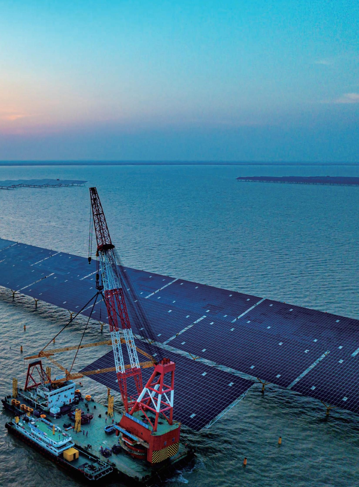

natural_image

Aerial view of a large-scale offshore wind farm with floating solar panels and a crane vessel, set against a calm sea at dusk (no visible text or symbols)

# 公司治理相关情况说明

适用　 不适用

# （一）公司治理主体规范运作情况

报告期内，公司严格按照《中华人民共和国公司法》《中华人民共和国证券法》等法律法规，以及中国证监会颁布的行政规章和上海证券交易所制定的各类规则的有关要求规范运作，建立健全规范、完善的法人治理结构，有效构建一套系统、完备的公司治理制度体系。持续跟踪立法动态，深入贯彻落实最新公司治理要求，修编公司治理制度，推动治理主体规范运作、发挥效能，致力建立完善权责法定、权责透明、协调运转、有效制衡的公司治理机制。公司连续15年成为上证公司治理指数样本股、连续多年获上交所年度信息披露工作最高评价A级。公司荣获中国上市公司协会评选的“上市公司董事会最佳实践案例”“可持续发展最佳实践案例”“业绩说明会最佳实践案例”、金圆桌“公司治理特别贡献奖”等资本市场奖项。

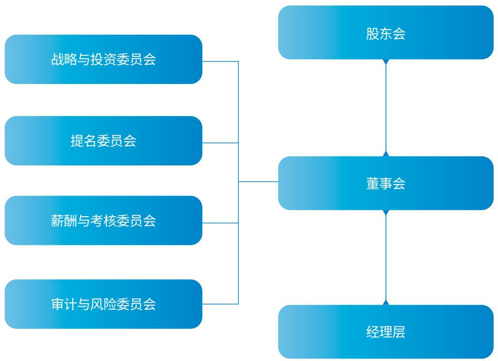

flowchart

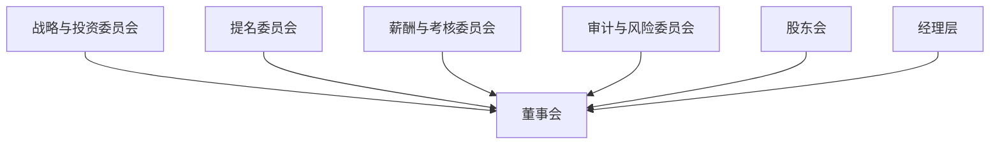
```mermaid
graph TD
    A["战略与投资委员会"] --> D["董事会"]
    B["提名委员会"] --> D["董事会"]
    C["薪酬与考核委员会"] --> D["董事会"]
    E["审计与风险委员会"] --> D["董事会"]
    F["股东会"] --> D["董事会"]
    G["经理层"] --> D["董事会"]
```

公司治理结构图

# 1.　股东会

公司严格按照《公司章程》《股东会议事规则》的规定和要求召集、召开股东会，确保全体股东特别是中小股东能够享有平等的权利，充分行使自己的表决权。对于可能影响中小投资者利益的重大事项，公司在股东会中对中小投资者的表决结果进行单独统计并公告，充分保护中小投资者合法权益。公司为广大股东参加股东会提供了现场加网络投票的方式，保证所有股东享有平等权利表达意见和诉求。同时公司聘请律师出席股东会，对会议的召开程序、审议事项、出席人身份进行确认和见证，保证股东会的合法有效。报告期内，公司修订《股东会议事规则》，落实监事会改革要求，完善股东会运行机制，进一步保障股东尤其是中小股东权益。

# 2.　董事会

公司董事会现有董事7名，其中独立董事4名。董事会下设4个专门委员会，包括战略与投资委员会、提名委员会、薪酬与考核委员会和审计与风险委员会。全年董事会召开会议20次，审议通过并听取了105项议案及汇报。公司持续推动科学、理性、高效董事会建设。进一步落实董事会职权，强化战略引领，推动“十四五”顺利收官，指导“十五五”战略规划编制 ；强化科学决策，加强董事会决策全周期管理，聚焦重大投资、公司治理等事项，着力提升董事会决策质效；强化风险防控，健全风险合规管理体系机制，加大机构治理、经营性现金流等重点领域风险防范力度，推动化解债权回收等风险 ；强化监督职责，对决策事项执行情况、授权决策情况、投资项目进展情况进行监督，切实发挥审计监督实效，推动审计发现重点问题整改。董事会着力加强自身建设，首次设置职工董事，通过修订《公司章程》《董事会议事规则》等制度系统优化治理主体权责，持续做好董事履职服务保障，加强工作支撑、信息支撑等全方位支撑。

# （二）信息披露情况

公司严格按照上市公司信息披露相关法律法规和规范性文件要求，始终秉持“真实、准确、完整、及时、公平"的原则，认真履行信息披露义务，持续完善信息披露体系，不断提高信息披露质量和透明度。2025年，公司披露定期报告、临时公告及文件共126份，及时、准确地向资本市场传递公司重大决策事项、生产经营和发展成果，充分保障投资者的知情权和合法权益，连续8年荣获上海证券交易所信息披露年度考核最高评价A级。持续完善信息披露体系，公司根据证监会、上交所最新监管规则要求，修订并发布《中国建筑股份有限公司信息披露及重大信息内部报告管理规定》《中国建筑股份有限公司内幕信息知情人登记管理规定》，制定并发布《中国建筑股份有限公司信息披露暂缓与豁免管理办法》，进一步规范公司信息披露管控流程，确保公司信息披露体系合规性和先进性。主动做优自愿性信息披露，公司坚持以投资者需求为导向，自愿披露公司战略、财务、研发、行业、ESG等与投资者价值判断和投资决策有关信息。持续按月度披露经营情况简报、重大项目公告等自愿性临时公告，及时传递公司生产经营动态。在定期报告中，增加房建业务和基建业务细分领域数据、地产业务新增土地储备主要城市分布数据、研发投入情况说明等内容，持续提升信息披露的广度和深度。不断丰富信息展现形式，持续优化定期报告排版设计，通过增加重点项目、工程装备等图片素材，采用图文结合、图表并茂的呈现方式，便于投资者能够更加直观、高效地获取关键内容，切实增强信息披露的可读性与实用性。同时，公司立足国际化视野，持续编制英文版定期报告和临时公告，满足全球投资者、合作方需求。

# （三）投资者关系管理情况

公司持续升级投资者关系管理，坚守资本市场人民性，通过丰富沟通渠道、多维度交流、加强中小投资者保护等多种举措，维护和塑造良好的投资者关系生态。举办高品质业绩推介，采用“视频+电话+文字"直播互动形式开展推介3场，覆盖各类投资者18.7万人次，荣获中国上市公司协会业绩说明会“最佳实践”。赴北京、上海、深圳核心城市组织股东拜访活动23场，实现前十大机构股东全覆盖。开展多维度交流活动，策划“好房子”投资者开放日、外资投资者走进北京宸园等活动，邀请境内外机构投资者、分析师及中小投资者代表走进项目一线。参与券商组织的投资策略会32次，分层分类、精准组织投资者专题调研5场，持续提升投资者对公司的认同感和认可度。聚焦中小投资者保护，全年接听投资者热线电话数百个，处理投资者邮件千余封，回复上证e互动平台投资者提问237个，连续6年自愿发布投资者保护工作报告。公司投资者关系微信公众号平台（中国建筑投资者关系）全年发布推介文章224篇，平台总体阅读量实现持续提升。

# （四）市值管理情况

公司坚持深耕市值管理实践，秉承以公司发展质量为基、以投资者为本的理念，系统构建落实管理体系、管理举措。创新实践“136"战略市值管理体系，以提升公司投资价值为战略目标，以市值诊断、市值提升、市值实现为战略路径，以理念、组织、制度、资源、能力和绩效为战略保障，科学完善市值管理工作机制，不断丰富市值管理“工具箱”，持续塑造公司的成长性、回报性、确定性投资价值。落实市值管理举措，制定《中国建筑股份有限公司市值管理规定》、《中国建筑股份有限公司市值管理评价考核办法（试行）》等制度，实施《估值提升计划》《“提质增效重回报”行动方案》等，积极推动控股股东及重要机构股东持续增持公司股份，中建集团顺利完成第七轮增持计划，累计增持金额超过6.23亿元，持续有效提振市场信心。坚持长期稳定的分红政策，2024年度公司实现现金分红112.18亿元，现金分红比率达24.29%，持续稳居建筑央企第一 ；截至2025年底，公司累计现金分红规模已达1,040.47亿元，位居建筑同业上市公司首位，资本市场红利标签进一步强化。

# （五）其他事项说明

2025年11月25日，公司第四届董事会第二十五次会议审议通过了《关于取消监事会并修订<中国建筑股份有限公司章程>的议案》《关干修订<中国建筑股份有限公司股东会议事规则>的议案》《关于修订<中国建筑股份有限公司董事会议事规则>的议案》《关于修订<中国建筑股份有限公司独立董事工作规则>的议案》《关于修订<中国建筑股份有限公司董事、监事津补贴管理办法>的议案》。2025年12月12日，公司2025 2025 11 26 2025 12 13发布于上海证券交易所网站及《中国证券报》《上海证券报》《证券时报》和《证券日报》的相关公告。

公司治理与法律、行政法规和中国证监会关于上市公司治理的规定是否存在重大差异；如有重大差异，应当说明原因

# 适用　 不适用

公司严格遵守《信息披露及重大信息内部报告管理规定》《年报信息披露重大差错责任追究管理办法》《规范与控股股东及其他关联方资金往来管理办法》《董事和高级管理人员所持本公司股份及其变动管理办法》《内幕信息知情人登记管理规定》等制度，未发生重大违反相关制度的情况。公司治理实际情况与中国证监会有关规定和要求不存在重大差异，公司未受到中国证监会行政处罚或通报批评，亦未被其他监管机构处罚及证券交易所谴责。

# 二、ﾠ公司控股股东、实际控制人在保证公司资产、人员、财务、机构、业务等方面独立性的具体措施，以及影响公司独立性而采取的解决方案、工作进度及后续工作计划

# 适用　 不适用

控股股东、实际控制人及其控制的其他单位从事与公司相同或者相近业务的情况，以及同业竞争或者同业竞争情况发生较大变化对公司的影响、已采取的解决措施、解决进展以及后续解决计划。

# 适用　 不适用

公司控股股东是中国建筑集团有限公司（原中国建筑工程总公司）。2007年12月，中国建筑工程总公司将其所属企业和全部资产整体重组改制，发起设立中国建筑股份有限公司，将其全部主营业务及资产、负债、资质和品牌注入中建股份，并于2009年7月以中国建筑为主体在上交所实现整体上市。整体上市后，中建集团作为持股主体，主要以中国建筑为平台开展经营管理活动。截至2025年12月31日，中国建筑最近一期经审计的资产总额、营业收入、净利润占中建集团相应指标的比重均超过99%。报告期内，公司控股股东严格规范自身行为，履行避免同业竞争、规范关联交易的各项承诺，依法行使股东权利、履行义务。公司持续建立健全制度机制，厘清治理边界，独立管理资产和业务，全面开展财务风险隔离与管理，独立决策机构设置和人员任免，建立健全高管履职监督机制，严格防范控股股东资金占用、违规担保等风险，在资产、人员、财务、机构、业务等方面保持独立性。

和高级管理人员的三、  
适用　 不适  
位 ：万

<table><tr><td>姓名</td><td>职务</td><td>性别</td><td>年龄</td><td>任期起始日期</td><td>任期终止日期</td><td>年初持股数</td><td>年末持股数</td><td>年度内股份增减变动量</td><td>增减变动原因</td><td>报告期内从公司获得的税前报酬总额(万元)</td><td>是否在公司关联方获取报酬</td></tr><tr><td colspan="12">现任董事和高级管理人员</td></tr><tr><td>郑学选</td><td>董事长</td><td>男</td><td>59</td><td>2021-11-26</td><td>2027-08-29</td><td>50.4</td><td>50.4</td><td>0</td><td>/</td><td>/</td><td>是</td></tr><tr><td rowspan="2">文兵</td><td>董事</td><td rowspan="2">男</td><td rowspan="2">55</td><td>2024-05-24</td><td>2027-08-29</td><td rowspan="2">0</td><td rowspan="2">0</td><td rowspan="2">0</td><td rowspan="2">/</td><td rowspan="2">/</td><td rowspan="2">是</td></tr><tr><td>总裁</td><td>2024-04-29</td><td>董事会另聘/解聘时</td></tr><tr><td>单广袖</td><td>董事</td><td>女</td><td>55</td><td>2023-08-21</td><td>2027-08-29</td><td>122.046</td><td>122.046</td><td>0</td><td>/</td><td>/</td><td>是</td></tr><tr><td>马王军</td><td>独立董事</td><td>男</td><td>61</td><td>2023-05-19</td><td>2027-08-29</td><td>0</td><td>0</td><td>0</td><td>/</td><td>/</td><td>否</td></tr><tr><td>孙承铭</td><td>独立董事</td><td>男</td><td>66</td><td>2021-05-13</td><td>2027-08-29</td><td>0</td><td>0</td><td>0</td><td>/</td><td>10.00</td><td>否</td></tr><tr><td>刘汝臣</td><td>独立董事</td><td>男</td><td>62</td><td>2024-08-30</td><td>2027-08-29</td><td>0</td><td>0</td><td>0</td><td>/</td><td>6.67</td><td>否</td></tr><tr><td>梁维特</td><td>独立董事</td><td>男</td><td>63</td><td>2024-08-30</td><td>2027-08-29</td><td>0</td><td>0</td><td>0</td><td>/</td><td>19.20</td><td>否</td></tr><tr><td>赵晓江</td><td>副总裁</td><td>男</td><td>60</td><td>2016-01-19</td><td>董事会另聘/解聘时</td><td>0</td><td>0</td><td>0</td><td>/</td><td>/</td><td>是</td></tr><tr><td rowspan="2">黄杰</td><td>副总裁、财务总监</td><td rowspan="2">男</td><td rowspan="2">57</td><td>2024-04-18</td><td rowspan="2">董事会另聘/解聘时</td><td rowspan="2">0</td><td rowspan="2">0</td><td rowspan="2">0</td><td rowspan="2">/</td><td rowspan="2">/</td><td rowspan="2">是</td></tr><tr><td>总法律顾问</td><td>2025-11-25</td></tr><tr><td>吴爱国</td><td>副总裁</td><td>男</td><td>57</td><td>2024-09-13</td><td>董事会另聘/解聘时</td><td>23.0001</td><td>4.0001</td><td>-19</td><td>股权激励实施</td><td>/</td><td>是</td></tr><tr><td>陈勇</td><td>副总裁</td><td>男</td><td>51</td><td>2025-11-25</td><td>董事会另聘/解聘时</td><td>24</td><td>0</td><td>-24</td><td>股权激励实施</td><td>/</td><td>是</td></tr><tr><td>刘立新</td><td>董事会秘书</td><td>男</td><td>59</td><td>2025-04-09</td><td>董事会另聘/解聘时</td><td>98.86</td><td>74.86</td><td>-24</td><td>股权激励实施</td><td>55.19</td><td>否</td></tr><tr><td colspan="12">离任董事和高级管理人员</td></tr><tr><td>薛克庆</td><td>原董事会秘书</td><td>男</td><td>62</td><td>2018-06-15</td><td>2025-04-09</td><td>177.9</td><td>153.9</td><td>-24</td><td>股权激励实施</td><td>62.58</td><td>否</td></tr><tr><td>吴秉琪</td><td>原副总裁、总法律顾问</td><td>男</td><td>54</td><td>2023-10-26</td><td>2025-09-12</td><td>0</td><td>0</td><td>0</td><td>/</td><td>/</td><td>是</td></tr><tr><td>李永明</td><td>原副总裁</td><td>男</td><td>53</td><td>2023-04-27</td><td>2026-03-11</td><td>24</td><td>0</td><td>-24</td><td>股权激励实施</td><td>/</td><td>是</td></tr><tr><td>合计</td><td>/</td><td>/</td><td>/</td><td>/</td><td>/</td><td>520.2061</td><td>405.2061</td><td>-115</td><td>/</td><td>153.64</td><td>/</td></tr></table>

报告期内从公司获得的税前报酬统计口径为该等人员担任董事、高级管理人员职务期间对应的报酬，其在报告期内担任非董事、高级管理人员职务期间对应的报酬未统计在内。注 ：考虑中共中央组织部、国务院国有资产监督管理委员会对中建集团领导班子的任免情况，中建集团领导人员薪酬由中建集团支付，并在公司官网披露。董事和高级管理人员 考虑中共中央组织

# 董事

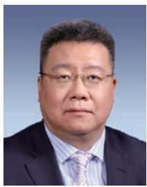

natural_image

Portrait of a man wearing glasses and a suit (no text or symbols visible)

# 郑学选

中国建筑集团有限公司董事长、党组书记，中国建筑股份有限公司董事长。教授级高级工程师，博士研究生。曾任中建阿尔及利亚公司总经理、党委书记、董事长，中国建筑股份有限公司人力资源部总经理、助理总经理、副总裁、董事、总裁，中国建筑集团有限公司党组成员、副总经理、董事、党组副书记、工会主席、直属党委书记、总经理等。2021年11月起任中国建筑集团有限公司党组书记、董事长，中国建筑股份有限公司董事长。二十届中央委员会候补委员，中国共产党第十七次全国代表大会代表，中国共产党第二十次全国代表大会代表，全国劳动模范。

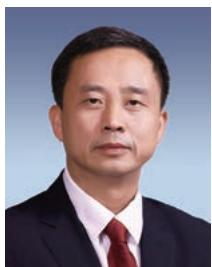

natural_image

Portrait of a man in formal suit and tie against a plain background (no text or symbols visible)

# 文兵

中国建筑集团有限公司董事、总经理、党组副书记，中国建筑股份有限公司董事、总裁。教授级高级建筑师，硕十研究生。曾任中国建筑设计院有限公司董事长、总经理、临时党委副书记，中国建筑设计研究院党委委员、副院长，中国建设科技集团股份有限公司党委委员、副总裁，中国建设科技有限公司党委副书记、董事、总经理，中国建设科技有限公司党委书记、董事长、总经理，中国建设科技集团股份有限公司党委书记、董事长、总裁等。2024年4月起任中国建筑集团有限公司董事、总经理、党组副书记，中国建筑股份有限公司总裁。2024年5月起任中国建筑股份有限公司董事。中国共产党第二十次全国代表大会代表。

natural_image

Portrait of a woman wearing glasses and a blue blazer (no text or symbols visible)

# 单广袖

中国建筑集团有限公司董事、党组副书记、工会主席、直属党委书记，中国建筑股份有限公司董事。正高级经济师，大学学历，硕士学位。曾任中国建筑集团有限公司人力资源部（干部人事部)副总经理、总经理，中国建筑一局(集团)有限公司党委副书记、董事、副总经理，中国建筑集团有限公司副总经理、党组成员，中国建筑股份有限公司副总裁等。2023年6月起任中国建筑集团有限公司董事、党组副书记，2023年8月起任中国建筑股份有限公司董事，2023年9月起任中国建筑集团有限公司工会主席、直属党委书记，2026年1月起任中国建筑股份有限公司职工代表董事。

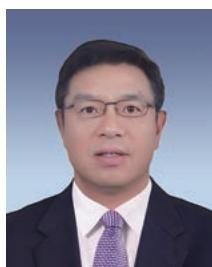

natural_image

Portrait of a man wearing glasses and a suit (no text or symbols visible)

# 马王军

中国建筑股份有限公司独立董事。高级会计师，大学学历，硕士学位。曾任中粮集团有限公司财务部总监、副总会计师、总裁助理、总会计师、党组成员，香港中旅(集团)有限公司总会计师、党委委员，国家石油天然气管网集团有限公司外部董事，中国建设科技有限公司外部董事。2022年9月起任中央企业专职外部董事，2023年5月起任中国建筑股份有限公司独立董事。

natural_image

Portrait of a man wearing glasses and a suit (no text or symbols visible)

# 孙承铭

中国建筑股份有限公司独立董事。高级工程师，硕士研究生。曾任招商局集团有限公司副总经理、党委委员，招商局蛇口工业区控股股份有限公司董事长、总经理、党委书记，招商局工业集团有限公司总经理、党总支书记，国家开发投资集团有限公司外部董事。2021年5月起任中国建筑股份有限公司独立董事，2024年7月起任中国旅游集团有限公司（香港中旅（集团）有限公司）外部董事。

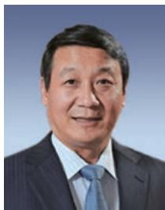

natural_image

Portrait of a man in formal suit and tie against a plain background (no text or symbols visible)

# 刘汝臣

中国建筑股份有限公司独立董事。正高级工程师，硕士研究生。曾任中铁十九局副局长，中铁十九局集团公司副董事长、总经理、党委副书记，中铁十六局集团公司董事长、党委副书记，中国铁建股份有限公司副总裁、党委常委、执行董事，中国铁道建筑集团有限公司党委常委，中国安能建设集团有限公司筹备组临时党委副书记等。2024年8月起任中国建筑股份有限公司独立董事，2026年1月起任中国交通建设股份有限公司独立董事。

natural_image

Portrait photo of a man in formal attire (no text or symbols visible)

# 梁维特

中国建筑股份有限公司独立董事。博士研究生。曾任中华人民共和国第十一及第十二届全国人大代表，澳门特区政府经济财政司司长，澳门特区政府行政会委员，“三边委员会"亚太地区中国组成员，博鳌亚洲论坛粤港澳大湾区建设澳门委员会主席、咨询委员会成员，MOTA-ENGIL葡萄牙莫塔集团独立董事等。2020年11月起任国际科技与创新论坛大会执行主席，2021年3月起任国际金融论坛(IFF)副理事长，2024年8月起任中国建筑股份有限公司独立董事、华国宝有限公司董事，2025年2月起任Bo Go Mo Limited董事，2025年5月起任Huge Profit AssetLimited董事，2026年1月起任博鳌亚洲论坛高级顾问。

# 高级管理人员

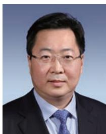

natural_image

Portrait of a man in formal attire with glasses (no visible text or symbols)

# 赵晓江

中国建筑集团有限公司副总经理、党组成员，中国建筑股份有限公司副总裁。正高级工程师，博士研究生。曾任国务院办公厅副局级秘书、正局级秘书，南京市副市长(挂职)，南京市委常委、副市长(挂职)，扬州市委副书记(正市级)，连云港市委副书记、代市长、市长、市政府党组书记等。2015年11月起任中国建筑集团有限公司党组成员，2016年1月起任中国建筑股份有限公司副总裁，2017年1月起任中国建筑集团有限公司副总经理。

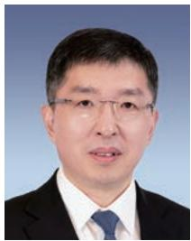

natural_image

Portrait of a man wearing glasses and a suit (no text or symbols visible)

# 黄杰

中国建筑集团有限公司总会计师、党组成员，中国建筑股份有限公司副总裁、财务总监、总法律顾问。正高级会计师，大学学历，硕士学位。曾任中国移动通信集团河北有限公司董事、副总经理、总会计师、党组成员，中国移动通信集团有限公司财务部副总经理、财务部总经理，中国移动有限公司证券事务部（香港机构）总经理，中国移动通信有限公司证券事务部总经理等。2024年3月起任中国建筑集团有限公司总会计师、党组成员，2024年4月起任中国建筑股份有限公司副总裁、财务总监，2025年11月起兼任中国建筑股份有限公司总法律顾问。

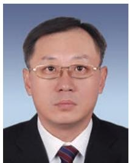

natural_image

Portrait of a man wearing glasses and a suit (no text or symbols visible)

# 吴爱国

中国建筑集团有限公司副总经理、党组成员，中国建筑股份有限公司副总裁。教授级高级工程师，大学学历，硕士学位。曾任中国建筑第二工程局有限公司副局长、董事、党委常委、副总经理，中建电力建设有限公司董事、总经理，中国建筑股份有限公司市场与项目管理部总经理、办公厅（党组办公室)主任、董事会办公室主任，中国建筑股份有限公司基础设施事业部总经理、党工委副书记，中国建设基础设施有限公司董事长、党委书记，中国建筑一局（集团）有限公司董事长、党委书记等。2024年8月起任中国建筑集团有限公司副总经理、党组成员，2024年9月起任中国建筑股份有限公司副总裁。

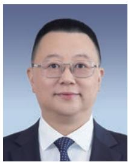

natural_image

Portrait of a man in formal attire with glasses (no visible text or symbols)

# 陈勇

中国建筑集团有限公司副总经理、党组成员，中国建筑股份有限公司副总裁。正高级工程师，大学学历。曾任中国建筑西南设计研究院有限公司项目管理公司执行总经理、总承包管理部总经理、院长助理，中国建筑西南设计研究院有限公司副总经理、党委委员、董事、总经理、党委副书记、董事长、党委书记，中建长江建设投资有限公司总经理、党工委副书记、董事长、党委书记，中国建筑股份有限公司西南区域总部总经理等。2025年10月起仟中国建筑集团有限公司副总经理、党组成员，2025年11月起任中国建筑股份有限公司副总裁。

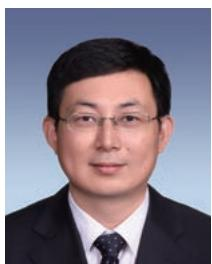

natural_image

Portrait of a man in formal attire with glasses (no text or symbols visible)

# 刘立新

中国建筑股份有限公司董事会秘书、助理总裁、首席信息官。教授级高级工程师，硕士研究生。曾任中建一局五公司副总经理、总工程师、常务副总经理、董事长；中建一局副总经理、党委常委，董事、总经理、党委副书记；中国建筑股份有限公司市场与项目管理部总经理、企业策划与管理部总经理、战略研究院副院长。2023年9月起任中国建筑股份有限公司助理总裁、首席信息官。2025年4月起任中国建筑股份有限公司董事会秘书。

其它情况说明

# 适用　 不适用

1.2025年4月9日，公司召开第四届董事会第十四次会议，因年龄原因，同意薛克庆先生不再担任公司董事会秘书，同意聘任刘立新先生为公司董事会秘书。  
2.2025年9月12日，公司召开第四届董事会第二十一次会议，因工作调动，同意吴秉琪先生不再担任公司副总裁、总法律顾问。  
3．2025年11月25日，公司召开第四届董事会第二十五次会议，同意聘任陈勇先生为公司副总裁，同意黄杰先生兼任公司总法律顾问。  
4. 2026年1月16日，公司召开第三届职工代表大会第四次会议，同意选举单广袖女士为公司第四届董事会职工代表董事，任期与第四届董事会任期一致。  
5. 2026年3月11日，公司召开第四届董事会第三十一次会议，因工作调动，同意李永明先生不再担任公司副总裁。

# (二) 现任及报告期内离任董事和高级管理人员的任职情况

# 1.　在股东单位任职情况

适用　 不适用

<table><tr><td>任职人员姓名</td><td>股东单位名称</td><td>在股东单位担任的职务</td><td>任期起始日期</td><td>任期终止日期</td></tr><tr><td>郑学选</td><td>中国建筑集团有限公司</td><td>党组书记、董事长</td><td>2021-11</td><td>/</td></tr><tr><td>文兵</td><td>中国建筑集团有限公司</td><td>党组副书记、董事、总经理</td><td>2024-04</td><td>/</td></tr><tr><td>单广袖</td><td>中国建筑集团有限公司</td><td>党组副书记、董事</td><td>2023-06</td><td>/</td></tr><tr><td>赵晓江</td><td>中国建筑集团有限公司</td><td>党组成员、副总经理</td><td>2015-11、2017-01</td><td>/</td></tr><tr><td>黄杰</td><td>中国建筑集团有限公司</td><td>党组成员、总会计师</td><td>2024-03</td><td>/</td></tr><tr><td>吴爱国</td><td>中国建筑集团有限公司</td><td>党组成员、副总经理</td><td>2024-08</td><td>/</td></tr><tr><td>陈勇</td><td>中国建筑集团有限公司</td><td>党组成员、副总经理</td><td>2025-10</td><td>/</td></tr><tr><td>吴秉琪</td><td>中国建筑集团有限公司</td><td>原党组成员、副总经理</td><td>2023-09</td><td>2025-08</td></tr><tr><td>李永明</td><td>中国建筑集团有限公司</td><td>原党组成员、副总经理</td><td>2023-02</td><td>2026-02</td></tr><tr><td>在股东单位任职情况的说明</td><td>无</td><td></td><td></td><td></td></tr></table>

# 2.　在其他单位任职情况

适用　 不适用

<table><tr><td>任职人员姓名</td><td>其他单位名称</td><td>在其他单位担任的职务</td><td>任期起始日期</td><td>任期终止日期</td></tr><tr><td>马王军</td><td>国家石油天然气管网集团有限公司</td><td>外部董事</td><td>2023-03</td><td>2026-01</td></tr><tr><td>马王军</td><td>中国建设科技有限公司</td><td>外部董事</td><td>2023-09</td><td>2026-03</td></tr><tr><td>孙承铭</td><td>中国旅游集团有限公司(香港中旅(集团)有限公司)</td><td>外部董事</td><td>2024-07</td><td>/</td></tr><tr><td>刘汝臣</td><td>中国交通建设股份有限公司</td><td>独立董事</td><td>2026-01</td><td>/</td></tr><tr><td>梁维特</td><td>MOTA-ENGIL葡萄牙莫塔集团</td><td>独立董事</td><td>2022-05</td><td>2025-05</td></tr><tr><td>梁维特</td><td>华国宝有限公司</td><td>董事</td><td>2024-08</td><td>/</td></tr><tr><td>梁维特</td><td>Bo Go Mo Limited</td><td>董事</td><td>2025-02</td><td>/</td></tr><tr><td>梁维特</td><td>Huge Profit Asset Limited</td><td>董事</td><td>2025-05</td><td>/</td></tr><tr><td>在其他单位任职情况的说明</td><td>/</td><td></td><td></td><td></td></tr></table>

# (三) 董事、高级管理人员报酬情况

适用　 不适用

<table><tr><td>董事、高级管理人员薪酬的决策程序</td><td>由国务院国资委和董事会进行经营业绩考核评价和个人考核评价,薪酬分配由国务院国资委和董事会审批核定。</td></tr><tr><td>董事在董事会讨论本人薪酬事项时是否回避</td><td>是</td></tr><tr><td>薪酬与考核委员会或独立董事专门会议关于董事、高级管理人员薪酬事项发表建议的具体情况</td><td>薪酬与考核委员会及独立董事对公司年度高级管理人员绩效考核和薪酬方案等事项进行了审核并发表了同意的审核意见。</td></tr><tr><td>董事、高级管理人员薪酬确定依据</td><td>根据国务院国资委关于中央企业负责人薪酬管理和外部董事报酬管理有关政策,以及中国建筑股份有限公司有关薪酬管理办法。</td></tr><tr><td>董事和高级管理人员薪酬的实际支付情况</td><td>公司董事(不包括独立董事)和高级管理人员,在公司领取的本年度报酬总额(包括基本工资、绩效奖金、保险福利及津补贴等)为117.77万元。独立董事本年度的津贴总额为35.87万元。</td></tr><tr><td>报告期末全体董事和高级管理人员实际获得的薪酬合计</td><td>153.64万元</td></tr><tr><td>报告期末全体董事和高级管理人员实际获得薪酬的考核依据和完成情况</td><td>由公司董事会按照公司年度高级管理人员绩效考核和薪酬方案进行考核评价,薪酬与考核委员会及董事会对公司年度高级管理人员考核结果和薪酬兑现方案等事项进行了审核并发表同意的审核意见。</td></tr><tr><td>报告期末全体董事和高级管理人员实际获得薪酬的递延支付安排</td><td>根据国家有关政策及公司的相关制度实施递延支付。</td></tr><tr><td>报告期末全体董事和高级管理人员实际获得薪酬的止付追索情况</td><td>公司已建立薪酬止付与追索扣回机制,明确触发情形与处理程序。报告期内未发生应止付、应追索事项,无薪酬止付及追索扣回情况。</td></tr></table>

# (四) 公司董事、高级管理人员变动情况

适用　 不适用

<table><tr><td>姓名</td><td>担任的职务</td><td>变动情形</td><td>变动原因</td></tr><tr><td>单广袖</td><td>职工董事</td><td>选举</td><td>工作需要</td></tr><tr><td>黄杰</td><td>总法律顾问</td><td>聘任</td><td>工作需要</td></tr><tr><td>陈勇</td><td>副总裁</td><td>聘任</td><td>工作需要</td></tr><tr><td>刘立新</td><td>董事会秘书</td><td>聘任</td><td>工作需要</td></tr><tr><td>吴秉琪</td><td>原副总裁、总法律顾问</td><td>离任</td><td>工作调动</td></tr><tr><td>李永明</td><td>原副总裁</td><td>离任</td><td>工作调动</td></tr><tr><td>薛克庆</td><td>原董事会秘书</td><td>离任</td><td>年龄原因</td></tr></table>

# (五) 近三年受证券监管机构处罚的情况说明

适用　 不适用

# ( 六 ) 其他

适用　 不适用

# 四、ﾠ董事履行职责情况

(一) 董事参加董事会和股东会的情况

<table><tr><td rowspan="2">董事姓名</td><td rowspan="2">是否独立董事</td><td rowspan="2">本年应参加董事会次数</td><td colspan="4">参加董事会情况</td><td rowspan="2">是否连续两次未亲自参加会议</td><td rowspan="2">参加股东会情况出席股东会的次数</td></tr><tr><td>亲自出席次数</td><td>以通讯方式参加次数</td><td>委托出席次数</td><td>缺席次数</td></tr><tr><td>郑学选</td><td>否</td><td>20</td><td>19</td><td>9</td><td>1</td><td>0</td><td>否</td><td>2</td></tr><tr><td>文兵</td><td>否</td><td>20</td><td>17</td><td>9</td><td>3</td><td>0</td><td>否</td><td>0</td></tr><tr><td>单广袖</td><td>否</td><td>20</td><td>17</td><td>9</td><td>3</td><td>0</td><td>否</td><td>0</td></tr><tr><td>马王军</td><td>是</td><td>20</td><td>19</td><td>9</td><td>1</td><td>0</td><td>否</td><td>0</td></tr><tr><td>孙承铭</td><td>是</td><td>20</td><td>19</td><td>9</td><td>1</td><td>0</td><td>否</td><td>0</td></tr><tr><td>刘汝臣</td><td>是</td><td>20</td><td>20</td><td>9</td><td>0</td><td>0</td><td>否</td><td>2</td></tr><tr><td>梁维特</td><td>是</td><td>20</td><td>20</td><td>9</td><td>0</td><td>0</td><td>否</td><td>0</td></tr></table>

连续两次未亲自出席董事会会议的说明

适用　 不适用

<table><tr><td>年内召开董事会会议次数</td><td>20</td></tr><tr><td>其中:现场会议次数</td><td>11</td></tr><tr><td>通讯方式召开会议次数</td><td>9</td></tr><tr><td>现场结合通讯方式召开会议次数</td><td>0</td></tr></table>

# (二) 董事对公司有关事项提出异议的情况

适用　 不适用

# ( 三 ) 其他

# 适用　 不适用

公司独立董事对公司管理层兼任公司控股股东中国建筑集团有限公司高管职务期间的履职情况进行审查和监督，并发表独立意见如下：文兵先生、赵晓江先生、黄杰先生、吴爱国先生、陈勇先生、李永明先生、吴秉琪先生在2025年度兼职期间，切实履行承诺，勤勉尽职，能够优先履行公司高级管理人员的职责，处理好公司与控股股东之间的关系，维护公司及全体股东的利益。其未因兼职而做出任何损害公司股东，尤其是中小股东利益的行为。

# 五、ﾠ董事会下设专门委员会情况

# 适用　 不适用

# (一) 董事会下设专门委员会成员情况

<table><tr><td>专门委员会类别</td><td>成员姓名</td></tr><tr><td>战略与投资委员会</td><td>主任委员:郑学选委员:文兵、单广袖、马王军、孙承铭、刘汝臣、梁维特</td></tr><tr><td>提名委员会</td><td>主任委员:郑学选委员:文兵、单广袖、马王军、孙承铭、刘汝臣、梁维特</td></tr><tr><td>薪酬与考核委员会</td><td>主任委员:马王军委员:孙承铭、刘汝臣、梁维特</td></tr><tr><td>审计与风险委员会</td><td>主任委员:马王军委员:孙承铭、刘汝臣、梁维特</td></tr></table>

# (二) 专门委员会会议情况

# 1.　报告期内战略与投资委员会召开14次会议

<table><tr><td>召开日期</td><td>会议内容</td><td>重要意见和建议</td><td>其他履行职责情况</td></tr><tr><td>2025年3月7日</td><td>审议通过了《关于深化改革有关方案的议案》</td><td>会议同意上述议案内容并提请董事会审议。</td><td>召开独立董事专题沟通会,听取并讨论了有关议案情况。</td></tr><tr><td>2025年3月13日</td><td>审议通过了《关于中建一局北京市朝阳区黄杉木店、孙河两组团地块房地产开发项目的议案》等4项议案</td><td>会议同意上述议案内容并提请董事会审议。</td><td>召开独立董事专题沟通会,听取并讨论了有关议案情况。</td></tr><tr><td>2025年4月15日</td><td>审议通过了《关于中国建筑股份有限公司2024年度环境社会治理可持续发展报告的议案》等6项议案</td><td>会议同意上述议案内容并提请董事会审议。</td><td>召开独立董事专题沟通会,听取并讨论了有关议案情况。</td></tr><tr><td>2025年4月27日</td><td>审议通过了《关于中建一局北京市朝阳区黄杉木店、孙河两组团地块房地产开发项目投资变更的议案》</td><td>会议同意上述议案内容并提请董事会审议。</td><td>召开独立董事专题沟通会,听取并讨论了有关议案情况。</td></tr><tr><td>2025年5月20日</td><td>审议通过了《关于中建二局北京市通州区交通枢纽地块房地产开发项目的议案》</td><td>会议同意上述议案内容并提请董事会审议。</td><td>召开独立董事专题沟通会,听取并讨论了有关议案情况。</td></tr><tr><td>2025年6月17日</td><td>审议通过了《关于中建八局上海市宝山区南大路站TOD地块房地产开发项目投资变更的议案》</td><td>会议同意上述议案内容并提请董事会审议。</td><td>召开独立董事专题沟通会,听取并讨论了有关议案情况。</td></tr><tr><td>2025年7月7日</td><td>审议通过了《关于中建三局、中建八局天津高银项目债转股事项的议案》</td><td>会议同意上述议案内容并提请董事会审议。</td><td>召开独立董事专题沟通会,听取并讨论了有关议案情况。</td></tr><tr><td>2025年8月28日</td><td>审议通过了《关于中海集团上海市徐汇区东安房地产开发项目的议案》等2项议案</td><td>会议同意上述议案内容并提请董事会审议。</td><td>召开独立董事专题沟通会,听取并讨论了有关议案情况。</td></tr><tr><td>2025年9月12日</td><td>审议通过了《关于子企业收购万达项目公司股权化债事宜的议案》</td><td>会议同意上述议案内容并提请董事会审议。</td><td>召开独立董事专题沟通会,听取并讨论了有关议案情况。</td></tr><tr><td>2025年10月30日</td><td>审议通过了《关于&lt;中建西南院托管中建长江工作实施方案(2025-2026)&gt;的议案》等2项议案</td><td>会议同意上述议案内容并提请董事会审议。</td><td>/</td></tr><tr><td>2025年11月3日</td><td>审议通过了《关于支持中建三局、中建八局积极参与推动天津高银项目整体盘活的议案》</td><td>会议同意上述议案内容并提请董事会审议。</td><td>召开独立董事专题沟通会,听取并讨论了有关议案情况。</td></tr><tr><td>2025年11月6日</td><td>审议通过了《关于深化改革有关方案的议案》</td><td>会议同意上述议案内容并提请董事会审议。</td><td>召开独立董事专题沟通会,听取并讨论了有关议案情况。</td></tr><tr><td>2025年11月28日</td><td>审议通过了《关于中国建筑股份有限公司向有关子企业增加注册资本金的议案》</td><td>会议同意上述议案内容并提请董事会审议。</td><td>召开独立董事专题沟通会,听取并讨论了有关议案情况。</td></tr><tr><td>2025年12月24日</td><td>审议通过了《关于中海企业发展集团有限公司对深圳市海荣房地产开发有限公司实施协议增资的议案》等2项议案</td><td>会议同意上述议案内容并提请董事会审议。</td><td>召开独立董事专题沟通会,听取并讨论了有关议案情况。</td></tr></table>

# 2.　报告期内提名委员会召开3次会议

<table><tr><td>召开日期</td><td>会议内容</td><td>重要意见和建议</td><td>其他履行职责情况</td></tr><tr><td>2025年4月9日</td><td>审议通过了《关于薛克庆不再担任中国建筑股份有限公司董事会秘书的议案》《关于聘任刘立新为中国建筑股份有限公司董事会秘书的议案》2项议案</td><td>会议同意上述议案内容并提请董事会审议。</td><td>/</td></tr><tr><td>2025年9月12日</td><td>审议通过了《关于吴秉琪不再担任中国建筑股份有限公司副总裁、总法律顾问的议案》</td><td>会议同意上述议案内容并提请董事会审议。</td><td>/</td></tr><tr><td>2025年11月25日</td><td>审议通过了《关于聘任黄杰为中国建筑股份有限公司总法律顾问的议案》《关于聘任陈勇为中国建筑股份有限公司副总裁的议案》2项议案</td><td>会议同意上述议案内容并提请董事会审议。</td><td>/</td></tr></table>

3.　报告期内审计与风险委员会召开7次会议

<table><tr><td>召开日期</td><td>会议内容</td><td>重要意见和建议</td><td>其他履行职责情况</td></tr><tr><td>2025年1月21日</td><td>听取了《关于2024年度审计计划和重点审计任务及预审工作进展情况的汇报》等2项汇报</td><td>/</td><td>/</td></tr><tr><td>2025年3月12日</td><td>审议通过了《关于&lt;中国建筑股份有限公司2025年法治工作报告&gt;的议案》等3项议案</td><td>会议同意上述议案内容并提请董事会审议。</td><td>/</td></tr><tr><td>2025年4月14日</td><td>审议通过并听取了《关于中国建筑股份有限公司2024年度财务决算报告的议案》等15项汇报及议案</td><td>会议同意上述议案内容并提请董事会审议。</td><td>/</td></tr><tr><td>2025年4月27日</td><td>审议通过并听取了《关于中国建筑股份有限公司2025年一季度财务分析报告的议案》等3项汇报及议案</td><td>会议同意上述议案内容并提请董事会审议。</td><td>/</td></tr><tr><td>2025年8月27日</td><td>审议通过并听取了《关于中国建筑股份有限公司2025年中期财务分析报告的议案》等9项汇报及议案</td><td>会议同意上述议案内容并提请董事会审议。</td><td>/</td></tr><tr><td>2025年10月30日</td><td>审议通过并听取了《关于中国建筑股份有限公司2025年三季度财务分析报告的议案》等3项汇报及议案</td><td>会议同意上述议案内容并提请董事会审议。</td><td>/</td></tr><tr><td>2025年12月15日</td><td>听取了《关于公司重大投资项目、重大投资风险项目实施进展情况的汇报》</td><td>/</td><td>/</td></tr></table>

4.　报告期内薪酬与考核委员会召开2次会议

<table><tr><td>召开日期</td><td>会议内容</td><td>重要意见和建议</td><td>其他履行职责情况</td></tr><tr><td>2025年4月14日</td><td>审议通过并听取了《关于中国建筑股份有限公司2024年度高级管理人员绩效考核方案的议案》等2项汇报及议案</td><td>会议同意上述议案内容并提请董事会审议。</td><td>/</td></tr><tr><td>2025年10月30日</td><td>审议通过了《关于中国建筑股份有限公司2024年度高级管理人员绩效考核结果与薪酬兑现的议案》</td><td>会议同意上述议案内容并提请董事会审议。</td><td>/</td></tr></table>

# (三) 存在异议事项的具体说明

适用　 不适用

# 六、ﾠ审计与风险委员会发现公司存在风险的说明

适用　 不适用

审计与风险委员会对报告期内的监督事项无异议。

# 七、ﾠ报告期末母公司和主要子公司的员工情况

# ( 一 ) 员工情况

<table><tr><td>母公司在职员工的数量</td><td>441</td></tr><tr><td>主要子公司在职员工的数量</td><td>369,831</td></tr><tr><td>在职员工的数量合计</td><td>370,272</td></tr><tr><td>母公司及主要子公司需承担费用的离退休职工人数(2025年底退休和离休人员数合计)</td><td>62,269</td></tr></table>

<table><tr><td colspan="2">专业构成</td></tr><tr><td>专业构成类别</td><td>专业构成人数</td></tr><tr><td>经营管理</td><td>12,830</td></tr><tr><td>项目建造</td><td>218,305</td></tr><tr><td>勘察设计</td><td>19,206</td></tr><tr><td>地产开发</td><td>29,544</td></tr><tr><td>专业管理</td><td>90,387</td></tr><tr><td>合计</td><td>370,272</td></tr></table>

<table><tr><td colspan="2">教育程度</td></tr><tr><td>教育程度类别</td><td>数量(人)</td></tr><tr><td>硕士及以上</td><td>38,385</td></tr><tr><td>本科</td><td>268,064</td></tr><tr><td>大专</td><td>34,240</td></tr><tr><td>中专及以下</td><td>29,583</td></tr><tr><td>合计</td><td>370,272</td></tr></table>

  
专业构成

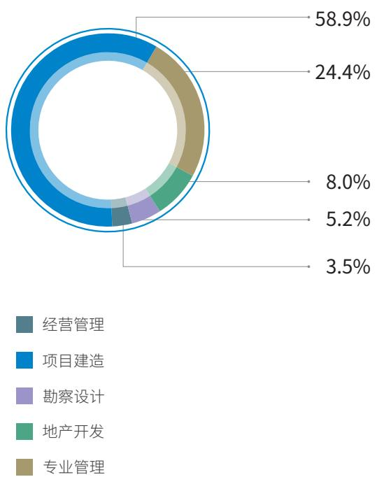

pie

| 类别 | 占比 (%) |
| :--- | :--- |
| 经营管理 | 3.5 |
| 项目建造 | 58.9 |
| 勘察设计 | 5.2 |
| 地产开发 | 8.0 |
| 专业管理 | 24.4 |

  
教育程度

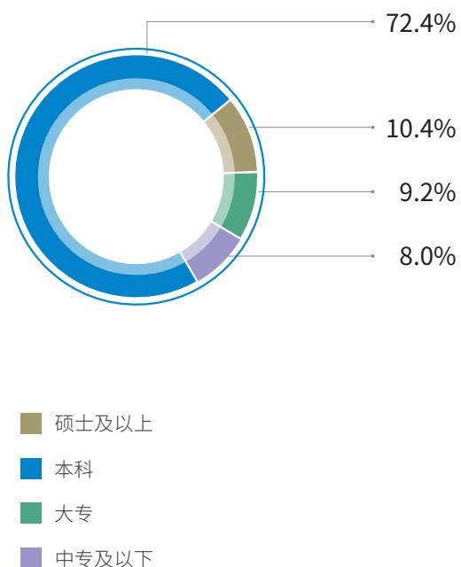

pie

| 学历 | 占比 (%) |
| :--- | :--- |
| 硕士及以上 | 10.4 |
| 本科 | 72.4 |
| 大专 | 9.2 |
| 中专及以下 | 8.0 |

# (二) 薪酬政策

# 适用　 不适用

公司坚持市场和业绩导向，强化薪酬考核激励。将薪酬分配与企业效益、个人业绩紧密挂钩，业绩升薪酬升，业绩降薪酬降，有效调动了广大员工的积极性、主动性与创造性。同时，以价值创造为中心，坚持工效联动，强化对标管理，完善薪酬绩效管理，加强薪酬分配的针对性、精准性和有效性，不断健全激励有效约束有力的薪酬分配体系，促进企业活力、竞争力、创造力不断增强。

# (三) 培训计划

# 适用　 不适用

紧紧围绕公司“十四五”规划和年度工作要点，坚持旗帜鲜明讲政治，开展城市运营人才训练营、四级企业第一责任人管理资格认证培训班、项目经理纪法教育培训暨项目关键岗位继续教育网络专题培训班等中建特色关键人才培育项目，稳步推进培训体系建设，不断提升教育培训保障能力，推进教育培训工作顺利开展，为公司人才队伍建设提供内驱动能。

# (四) 劳务外包情况

# 适用　 不适用

# 八、利润分配或资本公积转增预案

# (一) 现金分红政策的制定、执行或调整情况

# 适用　 不适用

# 1.　利润分配的具体政策

《公司章程》规定 ：公司可以采用现金、股票、现金与股票相结合及其他符合法律法规规定的方式分配股利；公司应优先采用现金分红的利润分配方式，同时在经营情况良好，并且董事会认为公司股票价格与公司股本规模不匹配、发放股票股利有利于公司全体股东整体利益时，在满足现金分红的条件下，提出股票股利等其他分配预案 ；除公司董事会确定的特殊情况外，公司在当年盈利且累计未分配利润为正的情况下，采取现金方式分配股利，每年以现金方式分配的利润原则上不少于当年实现的可供分配利润的15%。

# 2.　报告期内现金分红政策的执行情况

2025年5月23日，公司2024年年度股东会以现场记名投票与网络投票相结合的方式审议通过了《关于中国建筑股份有限公司2024年度利润分配方案的议案》；2025年7月10日，公司发布《中国建筑股份有限公司2024年年度权益分派实施公告》；2025年7月17日，公司向全体股东派发现金红利，2024年度利润分配方案实施完毕。公司严格按照《公司章程》有关规定及股东会决议执行利润分配事项。

# 3.　年度利润分配预案

根据《公司法》和《公司章程》相关规定，结合股东回报及公司业务发展对资金需求等因素的考虑，按照公司第四届董事会第三十三次会议审议通过的《中国建筑股份有限公司2025年度利润分配方案》，确定2025年度利润分配预案。

2025年度利润分配预案：公司合并报表归属于上市公司股东净利润为390.69亿元，母公司累计未分配利润为557.69亿元，上市公司拟向全体股东每10股派发现金红利2.718元(含税)。以截至本报告披露日的总股本41,320,390,444股为基数，以此计算合计拟派发现金红利约112.31亿元（含税）。本年度公司现金分红占合并报表归属于母公司股东净利润的比例为28.75%。如在实施权益分派股权登记日前公司总股本发生变动，公司拟维持每股分配金额不变，相应调整分配总额，并将另行公告具体调整情况。

上述利润分配预案已经公司第四届董事会第三十三次会议审议通过，预案尚需经公司2025年年度股东会审议批准。公司2025年年度股东会拟采取现场记名投票与网络投票相结合的方式，从而确保中小股东有充分表达意见和诉求的机会，充分维护中小股东的合法权益。

# 4.　公司本年度拟分配的现金红利相关情况说明

# （1）公司所处行业情况及特点

建筑行业增加值占GDP比例长期保持在6%以上，是国民经济的支柱产业，行业发展根基总体稳固。近年来，随着国家城镇化改革的推进，行业正从增量扩张转向存量提质增效阶段，行业规模、效益、资金等方面面临一定挑战。国家"十五五"规划明确提出，“巩固提升建筑产业在全球产业分工中的地位和竞争力；加快建设交通强国，构建现代化基础设施体系”，政策端的持续发力将为建筑行业带来结构性机遇。

# (2)公司发展阶段和自身经营模式

近年来，受外部宏观经济形势影响，公司主要经济指标虽然有所承压，但业绩表现好于同类企业，市场占有率稳步提升，领先地位进一步巩固。顺应国家政策，公司正在积极推进“好房子"建设，加快发展城市更新、城市运营等新业务，这些都将为公司发展带来新的机遇，成为未来增长的重要引擎。公司将坚定践行高质量发展战略，持续增强全球竞争力与品牌影响力，努力在行业变革中抢占先机。

# （3）公司盈利水平及资金需求

自上市以来，公司净资产收益率一直维持在行业较高水平，利润规模始终保持在央企前列，为股东创造了长期稳定的投资回报。当前，公司正在加快推进转型升级，持续加强资源集约管理，加大新业务领域的资源投入，进一步强化资金集中管控，不断提升资金使用效率。

# （4）公司保留一定比例留存未分配利润的原因

当前及未来一段时期，市场环境复杂多变，机遇与挑战并存，公司需要合理留存部分收益，以增强整体抗风险能力，为稳健发展提供安全保障。公司历年积累的留存收益归属于全体投资者，公司将持续优化资源配置，全面提升盈利水平，力争在未来为投资者创造更加丰厚的回报。

# （5）公司留存未分配利润的确切用途以及预计收益情况

留存未分配利润将重点用于抢抓战略发展机遇，持续深化公司规划实施，加大结构调整与转型升级力度，加快培育新的效益增长点。中国建筑长期保持稳定、连续的分红政策，充分体现了公司稳健经营和持续回报股东的能力。展望未来，公司将紧密围绕国家重大战略部署及“十五五"战略规划，抢抓当前经济发展的重要战略机遇期，不断夯实发展基础，提升综合竞争力，更好地回馈广大股东的信任与支持。

# (6)公司为中小股东参与现金分红决策提供便利情况

公司建立健全了多渠道的投资者沟通机制，中小股东可通过投资者热线、公司投资者关系邮箱、上证e互动平台提问等多种方式来表达对现金分红政策的意见和诉求。在公司年度股东会上，中小股东可通过网络投票方式对利润分配方案进行表决。同时公司还积极通过现金分红说明会等形式，及时解答中小股东关心的问题。

# （7）公司为增强投资者回报水平拟采取的措施

公司按照《上市公司监管指引第3号——上市公司现金分红》等法律法规、规范性文件和《公司章程》的规定，增加利润分配决策透明度和可操作性，便于股东对公司经营和利润分配进行监督。公司将继续秉承为投资者带来长期持续回报的经营理念，结合当前宏观经济形势以及重大资金支出安排等因素，继续优化利润分配方案，增厚投资者回报。

本次利润分配预案符合有关法律、法规和《公司章程》的规定，利润分配程序合规、透明。中国建筑一直保持稳定的分红政策，本年度每股现金分红保持稳定，体现了中国建筑稳健发展和持续分红的能力，展示了中国建筑秉持以投资者为本的理念、以优异经营业绩回报股东的决心。

# (二) 公司近五年（含报告期）的普通股股利分配方案或预案、资本公积金转增股本方案或预案

单位：千元币种：人民币

<table><tr><td>分红年度</td><td>每10股送红股数(股)</td><td>每10股派息数(元)(含税)</td><td>每10股转增数(股)</td><td>现金分红的数额(含税)</td><td>分红年度合并报表中归属于上市公司普通股股东的净利润</td><td>占合并报表中归属于上市公司普通股股东的净利润的比率(%)</td></tr><tr><td>2025年</td><td>0</td><td>2.718</td><td>0</td><td>11,230,882</td><td>39,069,002</td><td>28.75</td></tr><tr><td>2024年</td><td>0</td><td>2.715</td><td>0</td><td>11,218,486</td><td>46,187,099</td><td>24.29</td></tr><tr><td>2023年</td><td>0</td><td>2.7145</td><td>0</td><td>11,297,736</td><td>54,264,173</td><td>20.82</td></tr><tr><td>2022年</td><td>0</td><td>2.527</td><td>0</td><td>10,596,831</td><td>50,950,301</td><td>20.80</td></tr><tr><td>2021年</td><td>0</td><td>2.50</td><td>0</td><td>10,485,215</td><td>51,407,661</td><td>20.40</td></tr></table>

# (三) 现金分红政策的专项说明

适用　 不适用

<table><tr><td>是否符合公司章程的规定或股东会决议的要求</td><td>☑是 □否</td></tr><tr><td>分红标准和比例是否明确和清晰</td><td>☑是 □否</td></tr><tr><td>相关的决策程序和机制是否完备</td><td>☑是 □否</td></tr><tr><td>独立董事是否履职尽责并发挥了应有的作用</td><td>☑是 □否</td></tr><tr><td>中小股东是否有充分表达意见和诉求的机会,其合法权益是否得到了充分保护</td><td>☑是 □否</td></tr></table>

# (四) 报告期内盈利且母公司可供普通股股东分配利润为正，但未提出普通股现金利润分配方案预案的，公司应当详细披露原因以及未分配利润的用途和使用计划

适用　 不适用

# (五) 本报告期利润分配及资本公积金转增股本预案

适用　 不适用

单位 ：千元　币种 ：人民币

<table><tr><td>每10股送红股数(股)</td><td>/</td></tr><tr><td>每10股派息数(元)(含税)</td><td>2.718</td></tr><tr><td>每10股转增数(股)</td><td>/</td></tr><tr><td>现金分红金额(含税)</td><td>11,230,882</td></tr><tr><td>分红年度合并报表中归属于上市公司普通股股东的净利润</td><td>39,069,002</td></tr><tr><td>占合并报表中归属于上市公司普通股股东的净利润的比率(%)</td><td>28.75</td></tr><tr><td>以现金方式回购股份计入现金分红的金额</td><td>/</td></tr><tr><td>合计分红金额(含税)</td><td>11,230,882</td></tr><tr><td>合计分红金额占合并报表中归属于上市公司普通股股东的净利润的比率(%)</td><td>28.75</td></tr></table>

# (六) 最近三个会计年度现金分红情况

适用　 不适用

单位 ：千元　币种 ：人民币

<table><tr><td>最近三个会计年度累计现金分红金额(含税)(1)</td><td>33,747,104</td></tr><tr><td>最近三个会计年度累计回购并注销金额(2)</td><td>/</td></tr><tr><td>最近三个会计年度现金分红和回购并注销累计金额(3)=(1)+(2)</td><td>33,747,104</td></tr><tr><td>最近三个会计年度年均净利润金额(4)</td><td>46,506,758</td></tr><tr><td>最近三个会计年度现金分红比例(%)(5)=(3)/(4)</td><td>72.56</td></tr><tr><td>最近一个会计年度合并报表中归属于上市公司普通股股东的净利润</td><td>39,069,002</td></tr><tr><td>最近一个会计年度母公司报表年度末未分配利润</td><td>55,768,900</td></tr></table>

上市至今现金分红情况  
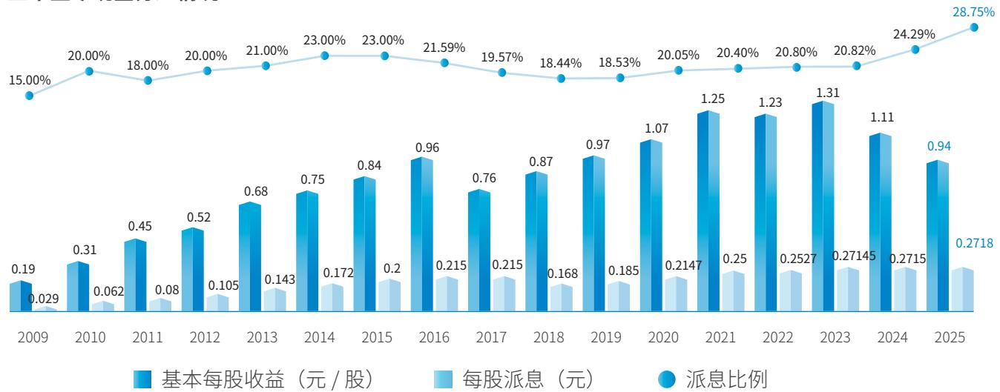

bar_line

| Year | 基本每股收益 (元 / 股) | 每股派息 (元) | 派息比例 |
|------|------------------------|---------------|----------|
| 2009 | 0.19                   | 0.029         | 15.00%   |
| 2010 | 0.31                   | 0.062         | 20.00%   |
| 2011 | 0.45                   | 0.08          | 18.00%   |
| 2012 | 0.52                   | 0.105         | 20.00%   |
| 2013 | 0.68                   | 0.143         | 21.00%   |
| 2014 | 0.75                   | 0.172         | 23.00%   |
| 2015 | 0.84                   | 0.2           | 23.00%   |
| 2016 | 0.96                   | 0.215         | 21.59%   |
| 2017 | 0.76                   | 0.215         | 19.57%   |
| 2018 | 0.87                   | 0.168         | 18.44%   |
| 2019 | 0.97                   | 0.185         | 18.53%   |
| 2020 | 1.07                   | 0.2147        | 20.05%   |
| 2021 | 1.25                   | 0.25          | 20.40%   |
| 2022 | 1.23                   | 0.2527        | 20.80%   |
| 2023 | 1.31                   | 0.27145       | 20.82%   |
| 2024 | 1.11                   | 0.2715        | 24.29%   |
| 2025 | 0.94                   | 0.2718        | 28.75%   |

# 九、ﾠ公司股权激励计划、员工持股计划或其他员工激励措施的情况及其影响

# (一) 相关激励事项已在临时公告披露且后续实施无进展或变化的

适用　 不适用

<table><tr><td>事项概述</td><td>查询索引</td></tr><tr><td>本次回购注销限制性股票涉及激励对象共计2,652名,合计拟回购注销限制性股票289,932,000股;本次回购注销完成后,公司股权激励限制性股票数量将为0股。本次回购注销完成后,公司将减少注册资本暨股本289,932,000元(股),减少后的注册资本暨股本为41,320,390,444元(股)。</td><td>2025年1月3日发布的《股权激励限制性股票回购注销实施公告》。</td></tr></table>

# (二) 临时公告未披露或有后续进展的激励情况

股权激励情况

适用　 不适用

其他说明

适用　 不适用

员工持股计划情况

适用　 不适用

其他激励措施

适用　 不适用

# (三) 董事、高级管理人员报告期内被授予的股权激励情况

适用　 不适用

单位 ：万股

<table><tr><td>姓名</td><td>职务</td><td>年初持有限制性股票数量</td><td>报告期新授予限制性股票数量</td><td>限制性股票的授予价格(元)</td><td>已解锁股份</td><td>未解锁股份</td><td>期末持有限制性股票数量</td><td>报告期末市价(万元)</td></tr><tr><td>郑学选</td><td>董事长</td><td>0</td><td>0</td><td>0</td><td>0</td><td>0</td><td>0</td><td>0</td></tr><tr><td>文兵</td><td>董事、总裁</td><td>0</td><td>0</td><td>0</td><td>0</td><td>0</td><td>0</td><td>0</td></tr><tr><td>单广袖</td><td>董事</td><td>0</td><td>0</td><td>0</td><td>0</td><td>0</td><td>0</td><td>0</td></tr><tr><td>马王军</td><td>独立董事</td><td>0</td><td>0</td><td>0</td><td>0</td><td>0</td><td>0</td><td>0</td></tr><tr><td>孙承铭</td><td>独立董事</td><td>0</td><td>0</td><td>0</td><td>0</td><td>0</td><td>0</td><td>0</td></tr><tr><td>刘汝臣</td><td>独立董事</td><td>0</td><td>0</td><td>0</td><td>0</td><td>0</td><td>0</td><td>0</td></tr><tr><td>梁维特</td><td>独立董事</td><td>0</td><td>0</td><td>0</td><td>0</td><td>0</td><td>0</td><td>0</td></tr><tr><td>赵晓江</td><td>副总裁</td><td>0</td><td>0</td><td>0</td><td>0</td><td>0</td><td>0</td><td>0</td></tr><tr><td>黄杰</td><td>副总裁、财务总监、总法律顾问</td><td>0</td><td>0</td><td>0</td><td>0</td><td>0</td><td>0</td><td>0</td></tr><tr><td>吴爱国</td><td>副总裁</td><td>19</td><td>0</td><td>0</td><td>0</td><td>19</td><td>0</td><td>0</td></tr><tr><td>陈勇</td><td>副总裁</td><td>24</td><td>0</td><td>0</td><td>0</td><td>24</td><td>0</td><td>0</td></tr><tr><td>刘立新</td><td>董事会秘书</td><td>24</td><td>0</td><td>0</td><td>0</td><td>24</td><td>0</td><td>0</td></tr><tr><td>吴秉琪</td><td>原副总裁、总法律顾问</td><td>0</td><td>0</td><td>0</td><td>0</td><td>0</td><td>0</td><td>0</td></tr><tr><td>李永明</td><td>原副总裁</td><td>24</td><td>0</td><td>0</td><td>0</td><td>24</td><td>0</td><td>0</td></tr><tr><td>薛克庆</td><td>原董事会秘书</td><td>24</td><td>0</td><td>0</td><td>0</td><td>24</td><td>0</td><td>0</td></tr><tr><td>合计</td><td>/</td><td>115</td><td>0</td><td>/</td><td>0</td><td>115</td><td>0</td><td>/</td></tr></table>

# (四) 报告期内对高级管理人员的考评机制，以及激励机制的建立、实施情况

适用　 不适用

敬请参阅本报告本节“三、董事和高级管理人员的情况”相关内容。

# 十、ﾠ报告期内的内部控制制度建设及实施情况

适用　 不适用

报告期内，公司继续优化内部控制体系，修订完善内部控制制度，并确保各项制度有效落实，对各业务流程进一步梳理与规范，提升企业经营管理水平和风险防控能力。公司的内部控制流程不断完善，并覆盖到决策、执行、监督、反馈等各个环节，公司内部控制的全面性和有效性进一步提升。

公司内部控制评价报告详见经公司第四届董事会第三十三次会议审议通过，并在上海证券交易所网站披露的《中国建筑股份有限公司2025年度内部控制评价报告》。

报告期内部控制存在重大缺陷情况的说明

适用　 不适用

# + 报告期内对子公司的管理控制情况

适用　 不适用

公司制定了《中国建筑股份有限公司子公司治理结构管理办法》《中国建筑股份有限公司子企业总部组织结构管理办法》《中国建筑股份有限公司子企业经营业绩考核评价管理办法》《中国建筑股份有限公司参股企业管理细则》等子企业管理制度，建立起以《公司章程》为基础，以投资、产权、财务、公司治理、业绩考核、重大信息报告、信息披露等管理制度为主要组成部分的内部管控体系，并得到严格贯彻和执行，通过设置审批和授权权限，有效地对子公司进行管控。

对子公司的管理控制存在异常的风险提示

适用　 不适用

# 十二、ﾠ内部控制审计报告的相关情况说明

# 适用　 不适用

经股东会批准，公司聘请安永华明会计师事务所(特殊普通合伙)，对公司于2025年12月31日与财务报告相关的内部控制有效性进行了审计，并出具了标准无保留的内部控制审计报告。

公司内部控制审计报告详见公司在上海证券交易所网站披露的《中国建筑2025年度内部控制审计报告》。

是否披露内部控制审计报告 ：是

内部控制审计报告意见类型 ：标准的无保留意见

报告期或上年度是否被出具内部控制非标准审计意见

# 是　 否

# 十三、ﾠ上市公司治理专项行动自查问题整改情况

公司深入贯彻落实国务院《关于进一步提高上市公司质量的意见》和证监会《关于开展上市公司治理专项行动的公告》的文件精神和要求，积极推进公司治理专项行动自查和整改工作。经自查，公司在公司治理各个方面整体合规，不存在对投资者的利益有重大不利影响的事项。公司将持续巩固公司治理的成果，提升公司治理水平，促进公司持续、健康、高质量发展。

# 十四、ﾠ纳入环境信息依法披露企业名单的上市公司及其主要子公司的环境信息情况

# 适用　 不适用

报告期内，根据生态环境主管部门披露的环境信息依法披露企业名单公示信息，公司及主要子公司未被纳入所在地生态环境主管部门公示的环境信息依法披露企业名单。

其他说明

# 适用　 不适用

报告期内，公司下属子企业因施工噪声、扬尘、污水及固废等环境问题受到行政处罚的施工项目数量共59个，涉及罚款金额合计约561.75万元，均已整改完毕。

公司高度重视生态环境保护工作，报告期内公司未发生突发环境事件。公司生产经营活动对环境的影响主要包含噪声、扬尘、固废等方面。为有效降低对环境的影响，项目开工前按照有关要求开展环境因素识别，做好环境保护、绿色施工工作前期策划并制定方案，施工过程中配备并规范运行自动喷淋、车辆冲洗、沉淀池、隔声棚等各类污染防治设施，优先选用节能环保新技术、新工艺，降低能源消耗与污染物排放，最大限度减少生产活动对生态环境的影响。报告期内，下属286个项目获评中施企协绿色建造施工水平星级项目，26个项目获评生态环境部第二批“无废工地”。

# 十五、ﾠ社会责任工作情况

# (一) 是否单独披露社会责任报告、可持续发展报告或ESG报告

# 适用　 不适用

中国建筑始终以国家战略为引领、以行业责任为己任，坚持以ESG赋能高质量发展，构建以董事会为核心的三级治理体系，将绿色低碳、安全生产、供应链管理等关键要求全面融入经营管理全过程，不断完善公司“366”战略ESG治理体系。公司将在上海证券交易所网站披露可持续发展报告，相关情况敬请参阅报告相关内容。

# (二) 社会责任工作具体情况

# 适用　 不适用

<table><tr><td>对外捐赠、公益项目</td><td>数量/内容</td><td>情况说明</td></tr><tr><td>总投入(万元)</td><td>16,119.43</td><td>向甘肃省康乐县、卓尼县、康县、福建省长汀县、新疆英吉沙县等地区投入无偿援扶资金;向中国儿童少年基金会捐赠资金;向香港“大埔宏福苑援助基金”捐赠资金。</td></tr><tr><td>其中:资金(万元)</td><td>15,878.33</td><td>主要用于产业、人才、文化、生态、组织五大振兴和“三保障”方面的援扶项目建设;支持妇女儿童关爱保护事业;支援香港大埔宏福苑火灾救援及灾后处置工作。</td></tr><tr><td>物资折款(万元)</td><td>241.1</td><td>向援扶地区捐赠文具、图书、慰问物资等。</td></tr><tr><td>惠及人数(人)</td><td>648,702</td><td>/</td></tr></table>

具体说明

# 适用　 不适用

# 十六、ﾠ巩固拓展脱贫攻坚成果、乡村振兴等工作具体情况

# 适用　 不适用

<table><tr><td>扶贫及乡村振兴项目</td><td>数量/内容</td><td>情况说明</td></tr><tr><td>总投入(万元)</td><td>14,010.15</td><td>向甘肃省康乐县、卓尼县、康县、福建省长汀县、新疆英吉沙县等地区投入无偿帮扶资金。</td></tr><tr><td>其中:资金(万元)</td><td>13,769.05</td><td>主要用于产业、人才、文化、生态、组织五大振兴和“三保障”方面的援扶项目建设。</td></tr><tr><td>物资折款(万元)</td><td>241.1</td><td>向帮扶地区捐赠文具、图书、慰问物资等。</td></tr><tr><td>惠及人数(人)</td><td>644,102</td><td>/</td></tr><tr><td>帮扶形式(如产业扶贫、就业扶贫、教育扶贫等)</td><td>产业帮扶、就业帮扶、教育帮扶、消费帮扶、党建帮扶、助力解决“三保障”突出问题</td><td>/</td></tr></table>

具体说明

# √适用□不适用

# （一）乡村振兴工作规划

公司及其控股股东中建集团深入学习贯彻习近平总书记关于“三农”工作的重要论述和重要指示精神，以学习运用“千万工程"经验为引领，认真落实党中央、国务院决策部署，坚决履行定点帮扶甘肃省康乐县、卓尼县、康县（简称甘肃三县）和对口支援福建省长汀县的政治责任，有关子企业按照地方党委政府安排结对帮扶四川青川县、新疆英吉沙县等11个地区。印发年度援扶工作要点，向相关子企业“点对点”下发任务清单，召开助力乡村振兴工作会议，立足援扶地区资源禀赋和实际需求，坚持打好“产业、就业、教育、消费、党建”帮扶组合拳，有效助力援扶地区乡村全面振兴。

# （二）乡村振兴工作概要

公司坚持以人为本，着力提升援扶地区乡村产业发展水平、乡村建设水平、乡村治理水平。一是坚持统筹谋划，“高位推动”强化调研督促指导，“组团帮扶”提升定点帮扶工作合力，“尽锐出战”完成挂职干部压茬交接，圆满完成定点帮扶工作任务。二是坚持产业主导，“集中连片”发展文旅产业，“订单定向”扶持劳务输出产业，“品牌赋能”壮大电商消费产业，采购帮销援扶地区农特产品5,859.63万元，助力乡村特色产业发展壮大。三是坚持生态宜居，“规划引领”绘制和美乡村蓝图，多措并举改善县域基础设施，“产链结合”优化百姓生活条件，发挥建筑全产业链优势，在长汀开展城市运营试点，以点带面提升长汀县城市运营管理品质，着力打造宜居宜业富民强县。四是深化党建联建，“党建结对"助力提升乡村治理能力，“人才培训”激发振兴内生动力，“公益志愿”提升基层治理温度，有效提升乡村治理水平。

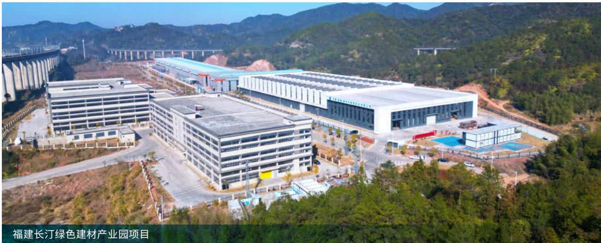

text_image

福建长汀绿色建材产业园项目

# (三）后续助力乡村振兴工作计划

2026年，公司将坚持以习近平新时代中国特色社会主义思想为指导，深入学习贯彻党的二十届四中全会精神，学习运用好“千万工程"经验，大力弘扬“忠诚担当使命必达"的中建精神，做好定点帮扶“十五五"谋划，立足县域资源禀赋和发展诉求，着力将中建元素融入定点帮扶，将资源品牌导入帮扶地区，将惠农富农政策落在百姓身上，聚力实现“五大振兴”，为推动农业农村现代化和建设农业强国贡献中建力量。

# 十七、ﾠ其他

适用　 不适用

# 第五节

# 重要事项

natural_image

Aerial view of a multi-lane highway cutting through terraced farmland and hills under a partly cloudy sky (no visible text or symbols)

一

<table><tr><td>承诺背景</td><td>承诺类型</td><td>承诺方</td><td>承诺内容</td><td>承诺时间</td><td>是否有履行期限</td><td>承诺期限</td><td>是否及时严格履行</td><td>如未能及时履行应说明未完成履行的具体原因</td><td>如未能及时履行应说明下一步计划</td></tr><tr><td rowspan="3">与首次公开发行相关的承诺</td><td>解决同业竞争</td><td>中建总公司</td><td>与本公司签署《避免同业竞争协议》,敬请参阅公司《中国建筑股份有限公司首次公开发行股票招股意向书》相关内容。</td><td>2009年7月29日</td><td>否</td><td>无期限</td><td>是</td><td>/</td><td>/</td></tr><tr><td>解决土地等产权瑕疵</td><td>中建总公司</td><td>对作为出资投入本公司纳入资产评估报告范围的土地使用权和房产,应本公司要求并在本公司的配合下,完成登记至公司或公司相关附属企业现有名称之下的相关手续。</td><td>2009年7月29日</td><td>否</td><td>无期限</td><td>是</td><td>/</td><td>/</td></tr><tr><td>解决土地等产权瑕疵</td><td>中建总公司</td><td>对作为出资投入本公司的房地产项目,于本公司设立之前已经确认收入的部分,如未来汇算清缴土地增值税时需补交土地增值税,由中建总公司承担。</td><td>2009年7月29日</td><td>否</td><td>无期限</td><td>是</td><td>/</td><td>/</td></tr><tr><td rowspan="3">其他对公司中小股东所作承诺</td><td>解决同业竞争</td><td>中国建筑</td><td>向控股香港上市子公司中国海外发展出具《非竞争承诺函》,公司原则上不再新增普通房地产开发业务,但由公司属下各工程局及设计院等子公司运营之房地产开发项目除外。</td><td>2015年3月20日</td><td>是</td><td>承诺期内</td><td>是</td><td>/</td><td>/</td></tr><tr><td>解决同业竞争</td><td>中国建筑</td><td>向控股香港上市子公司中海物业集团出具不竞争契据,敬请参阅中海物业集团于2015年10月14日发布的《上市文件-本公司全部已发行股本以介绍方式在香港联合交易所有限公司主板上市》相关内容。</td><td>2015年10月9日</td><td>是</td><td>承诺期内</td><td>是</td><td>/</td><td>/</td></tr><tr><td>其他</td><td>中建集团兼职的高级管理人员</td><td>保证担任公司高管一职期间勤勉尽职,处理好公司与其控股股东的关系,不辜负公司董事会和全体股东的信任,维护公司及股东的利益,不会因为兼职而做出任何损害上市公司及其中小股东利益的行为。</td><td>/</td><td>是</td><td>承诺期内</td><td>是</td><td>/</td><td>/</td></tr></table>

# （二）公司资产或项目存在盈利预测，且报告期仍处在盈利预测期间，公司就资产或项目

是否达到原盈利预测及其原因作出说明

已达到　 未达到　 不适用

# （三）业绩承诺的完成情况及其对商誉减值测试的影响

适用　 不适用

# 二、ﾠ报告期内控股股东及其他关联方非经营性占用资金情况

适用　 不适用

# 三、ﾠ违规担保情况

适用　 不适用

# 四、ﾠ公司董事会对会计师事务所“非标准意见审计报告”的说明

适用　 不适用

# 五、ﾠ公司对会计政策、会计估计变更或重大会计差错更正原因和影响的分析说明

# (一）公司对会计政策、会计估计变更原因及影响的分析说明

适用　 不适用

# （二）公司对重大会计差错更正原因及影响的分析说明

适用　 不适用

# （三）与前任会计师事务所进行的沟通情况

适用　 不适用

# （四）审批程序及其他说明

适用　 不适用

# 六、ﾠ聘任、解聘会计师事务所情况

单位 ：万元　币种 ：人民币

<table><tr><td></td><td colspan="2">现聘任</td></tr><tr><td>境内会计师事务所名称</td><td colspan="2">安永华明会计师事务所(特殊普通合伙)</td></tr><tr><td>境内会计师事务所报酬</td><td colspan="2">4,480</td></tr><tr><td>境内会计师事务所审计年限</td><td colspan="2">6</td></tr><tr><td>境内会计师事务所注册会计师姓名</td><td colspan="2">高君、李冬冬</td></tr><tr><td>境内会计师事务所注册会计师审计服务的累计年限</td><td colspan="2">2、1</td></tr><tr><td>境外会计师事务所名称</td><td colspan="2">/</td></tr><tr><td>境外会计师事务所报酬</td><td colspan="2">/</td></tr><tr><td>境外会计师事务所审计年限</td><td colspan="2">/</td></tr><tr><td></td><td>名称</td><td>报酬</td></tr><tr><td>内部控制审计会计师事务所</td><td>安永华明会计师事务所(特殊普通合伙)</td><td>315</td></tr><tr><td>财务顾问</td><td>/</td><td>/</td></tr><tr><td>保荐人</td><td>/</td><td>/</td></tr></table>

聘任、解聘会计师事务所的情况说明

# 适用　 不适用

2025年5月23日，经公司2024年年度股东会分别审议通过，公司聘请安永华明会计师事务所（特殊普通合伙)为公司2025年度财务报告审计机构和内部控制审计机构，聘期一年。敬请参阅公司于2025年4月16 2025 2025 5 15 20242025 5 24 2024

审计期间改聘会计师事务所的情况说明

# 适用　 不适用

审计费用较上一年度下降20%以上(含20%)的情况说明

# 适用　 不适用

# 七、ﾠ面临退市风险的情况

# （一）导致退市风险警示的原因

适用　 不适用

# （二）公司拟采取的应对措施

适用　 不适用

# （三）面临终止上市的情况和原因

适用　 不适用

# 八、破产重整相关事项

适用　 不适用

# 九、ﾠ重大诉讼、仲裁事项

本年度公司有重大诉讼、仲裁事项　 本年度公司无重大诉讼、仲裁事项

# （一）诉讼、仲裁事项已在临时公告披露且无后续进展的

适用　 不适用

# （二）临时公告未披露或有后续进展的诉讼、仲裁情况

适用　 不适用

# （三）其他说明

适用　 不适用

# 十、ﾠ上市公司及其董事、高级管理人员、控股股东、实际控制人涉嫌违法违规、受到处罚及整改情况

适用　 不适用

# 十一、ﾠ报告期内公司及其控股股东、实际控制人诚信状况的说明

适用　 不适用

# 十二、ﾠ重大关联交易

# （一）与日常经营相关的关联交易

# 1.　已在临时公告披露且后续实施无进展或变化的事项

适用　 不适用

<table><tr><td>事项概述</td><td>查询索引</td></tr><tr><td>2024年12月4日和2024年12月24日,经公司第四届董事会第八次会议和2024年第三次临时股东大会审议通过《关于中国建筑股份有限公司与中国建筑集团有限公司续签&lt;综合服务框架协议&gt;的议案》。公司与中建集团就公司与中建集团及其子公司之间涉及的销售、采购、商业保理服务、融资租赁服务、物业租赁以及其他业务产生的关联交易续签《中国建筑集团有限公司与中国建筑股份有限公司综合服务框架协议》,在协议服务期内,公司与中建集团及其子公司之间涉及的销售业务不超过2亿元;采购业务不超过30亿元;商业保理业务(不含财务公司提供的商业保理业务)最高余额不超过1亿元,保理利息及服务费不超过0.06亿元;融资租赁服务业务(不含财务公司提供的融资租赁业务)最高余额不超过1亿元,融资租赁利息及服务费不超过0.06亿元;物业租赁不超过1亿元;其他日常关联交易业务不超过1亿元。报告期内,公司与中建集团及其子公司之间涉及的销售业务0.4亿元;采购业务10.4亿元;商业保理业务和融资租赁服务业务未发生;物业租赁0.3亿元;其他日常关联交易业务0.5亿元。公司实际发生的日常关联交易金额,在协议约定范围内。</td><td>2024年12月5日发布的《第四届董事会第八次会议决议公告》《关于公司与中国建筑集团有限公司续签&lt;综合服务框架协议&gt;暨日常关联交易公告》。2024年12月25日发布的《2024年第三次临时股东大会决议公告》。</td></tr><tr><td>2024年12月4日和2024年12月24日,经公司第四届董事会第八次会议和2024年第三次临时股东大会审议通过《关于中建财务有限公司与中国建筑集团有限公司续签&lt;金融服务框架协议&gt;的议案》。公司下属子公司中建财务公司与中建集团就中建财务公司为中建集团及其子公司提供存款、综合授信、财务和融资顾问等相关金融服务产生的关联交易续签《中国建筑集团有限公司与中建财务有限公司金融服务框架协议》。在协议服务期内,中建集团及其子公司于中建财务公司存置的每日最高存款余额(含应计利息)不超过200亿元;获得的综合授信额度不超过200亿元,其中贷款额度不超过120亿元,获得的每日贷款余额(含应计利息)不超过每日最高存款余额(含应计利息);中建财务公司为中建集团及其子公司提供其他金融服务所收取的服务费用不超过3亿元。报告期内实际履行情况符合协议约定,实际发生的中建集团及其子公司在中建财务公司存置的每日最高存款余额(含应计利息)为86.1亿元,每日最高信贷余额(含应计利息)为20.1亿元;中建财务公司为中建集团及其子公司提供其他金融服务所收取的服务费用0.03亿元;详情敬请参阅本报告第五节“十二、重大关联交易”“(五)公司与存在关联关系的财务公司、公司控股财务公司与关联方之间的金融业务”相关内容。</td><td>2024年12月5日发布的《第四届董事会第八次会议决议公告》《关于中建财务有限公司与中国建筑集团有限公司续签&lt;金融服务框架协议&gt;暨日常关联交易公告》。2024年12月25日发布的《2024年第三次临时股东大会决议公告》。</td></tr><tr><td>2025年11月25日和2025年12月12日,经公司第四届董事会第二十五次会议和2025年第一次临时股东会审议通过《关于中国建筑股份有限公司与中国建筑集团有限公司续签&lt;综合服务框架协议&gt;的议案》。公司与中建集团就公司与中建集团及其子公司之间涉及的销售、采购、商业保理服务、融资租赁服务、物业租赁以及其他业务产生的关联交易续签《中国建筑集团有限公司与中国建筑股份有限公司综合服务框架协议》,在协议服务期内,公司与中建集团及其子公司之间涉及的销售业务不超过2亿元;采购业务不超过30亿元;商业保理业务(不含财务公司提供的商业保理业务)最高余额不超过1亿元,保理利息及服务费不超过0.06亿元;融资租赁服务业务(不含财务公司提供的融资租赁业务)最高余额不超过1亿元,融资租赁利息及服务费不超过0.06亿元;物业租赁不超过1亿元;其他日常关联交易业务不超过1亿元。</td><td>2025年11月26日发布的《第四届董事会第二十五次会议决议公告》《关于公司与中国建筑集团有限公司续签&lt;综合服务框架协议&gt;暨日常关联交易公告》。2025年12月13日发布的《2025年第一次临时股东会决议公告》。</td></tr><tr><td>2025年11月25日和2025年12月12日,经公司第四届董事会第二十五次会议和2025年第一次临时股东会审议通过《关于中建财务有限公司与中国建筑集团有限公司续签&lt;金融服务框架协议&gt;的议案》。公司下属子公司中建财务公司与中建集团就中建财务公司为中建集团及其子公司提供存款、综合授信、财务和融资顾问等相关金融服务产生的关联交易续签《中国建筑集团有限公司与中建财务有限公司金融服务框架协议》。在协议服务期内,中建集团及其子公司于中建财务公司存置的每日最高存款余额(含应计利息)不超过200亿元;获得的综合授信额度不超过200亿元,其中贷款额度不超过120亿元,获得的每日贷款余额(含应计利息)不超过每日最高存款余额(含应计利息);中建财务公司为中建集团及其子公司提供其他金融服务所收取的服务费用不超过3亿元。</td><td>2025年11月26日发布的《第四届董事会第二十五次会议决议公告》《关于中建财务有限公司与中国建筑集团有限公司续签&lt;金融服务框架协议&gt;暨日常关联交易公告》。2025年12月13日发布的《2025年第一次临时股东会决议公告》。</td></tr></table>

# 2.　已在临时公告披露，但有后续实施的进展或变化的事项

适用　 不适用

# 3.　临时公告未披露的事项

适用　 不适用

# （二）资产收购或股权收购、出售发生的关联交易

# 1.　已在临时公告披露且后续实施无进展或变化的事项

适用　 不适用

# 2.　已在临时公告披露，但有后续实施的进展或变化的事项

适用　 不适用

# 3.　临时公告未披露的事项

适用　 不适用

4.　涉及业绩约定的，应当披露报告期内的业绩实现情况

适用　 不适用

# （三）共同对外投资的重大关联交易

1.　已在临时公告披露且后续实施无进展或变化的事项

适用　 不适用

2.　已在临时公告披露，但有后续实施的进展或变化的事项

适用　 不适用

3.　临时公告未披露的事项

适用　 不适用

# （四）关联债权债务往来

1.　已在临时公告披露且后续实施无进展或变化的事项

适用　 不适用

2.　已在临时公告披露，但有后续实施的进展或变化的事项

适用　 不适用

3.　临时公告未披露的事项

适用　 不适用

# （五）公司与存在关联关系的财务公司、公司控股财务公司与关联方之间的金融业务

适用　 不适用

1.　存款业务

适用　 不适用

单位：千元币种：人民币

<table><tr><td rowspan="2">关联方</td><td rowspan="2">关联关系</td><td rowspan="2">每日最高存款限额(含应计利息)</td><td rowspan="2">存款利率范围(%)</td><td colspan="2">期初余额</td><td colspan="3">本期发生额</td></tr><tr><td>调整后</td><td>调整前</td><td>本期合计存入金额</td><td>本期合计取出金额</td><td>期末余额</td></tr><tr><td>中建集团及其子公司</td><td>控股股东及其直接或间接控制的公司</td><td>20,000,000</td><td>0.55-2.25</td><td>2,466,688</td><td>2,471,955</td><td>58,884,359</td><td>58,613,496</td><td>2,737,551</td></tr><tr><td>合计</td><td>/</td><td>/</td><td>/</td><td>2,466,688</td><td>2,471,955</td><td>58,884,359</td><td>58,613,496</td><td>2,737,551</td></tr></table>

# 2.　贷款业务

适用　 不适用

单位 ：千元　币种 ：人民币

<table><tr><td rowspan="2">关联方</td><td rowspan="2">关联关系</td><td rowspan="2">贷款额度</td><td rowspan="2">贷款利率范围(%)</td><td rowspan="2">期初余额</td><td colspan="3">本期发生额</td></tr><tr><td>本期合计贷款金额</td><td>本期合计还款金额</td><td>期末余额</td></tr><tr><td>中建集团及其子公司</td><td>控股股东及其直接或间接控制的公司</td><td>不超过每日最高存款限额(含应计利息)</td><td>2.11-2.4</td><td>2,000,000</td><td>1,770,036</td><td>2,040,036</td><td>1,730,000</td></tr><tr><td>合计</td><td>/</td><td>/</td><td>/</td><td>2,000,000</td><td>1,770,036</td><td>2,040,036</td><td>1,730,000</td></tr></table>

# 3.　授信业务或其他金融业务

适用　 不适用

单位 ：千元　币种 ：人民币

<table><tr><td>关联方</td><td>关联关系</td><td>业务类型</td><td>总额</td><td>实际发生额</td></tr><tr><td>中建集团及其子公司</td><td>控股股东及其直接或间接控制的公司</td><td>其他金融业务</td><td>300,000</td><td>2,995</td></tr></table>

# 4.　其他说明

适用　 不适用

公司上述关联交易事项已经公司第四届董事会第八次会议决议和2024年第三次临时股东大会及第四届董事会第二十五次会议决议、2025年第一次临时股东会决议公告审议通过，详情敬请参阅本报告第五节“十二、重大关联交易”“（一）与日常经营相关的关联交易”相关内容。

# （六）其他

适用　 不适用

公司关联交易情况敬请参阅本报告第八节“财务报告”财务报表附注十二“关联方关系及其交易”相关内容。

# 十三、ﾠ重大合同及其履行情况

# （一）托管、承包、租赁事项

# 1.　托管情况

适用　 不适用

# 2.　承包情况

适用　 不适用

# 3.　租赁情况

适用　 不适用

）担保情  
适用　 不适  
种 ：人民 位 ：千元

<table><tr><td colspan="15">公司对外担保情况(不包括对子公司的担保)</td></tr><tr><td>担保方</td><td>担保方与上市公司的关系</td><td>被担保方</td><td>担保金额</td><td>担保发生日期(协议签署日)</td><td>担保起始日</td><td>担保到期日</td><td>担保类型</td><td>担保物(如有)</td><td>担保是否已经履行完毕</td><td>担保是否逾期</td><td>担保逾期金额</td><td>反担保情况</td><td>是否为关联方担保</td><td>关联关系</td></tr><tr><td>中国海外集团有限公司</td><td>控股子公司</td><td>广州碧臻房地产开发有限公司</td><td>9,710</td><td>2018/12/11</td><td>2018/12/11</td><td>2026/6/8</td><td>连带责任担保</td><td>无</td><td>否</td><td>否</td><td>0</td><td>否</td><td>是</td><td>联营公司</td></tr><tr><td>中国海外集团有限公司</td><td>控股子公司</td><td>Asia Power Development Limited</td><td>1,404,900</td><td>2025/10/23</td><td>2025/10/23</td><td>2026/10/27</td><td>连带责任担保</td><td>无</td><td>否</td><td>否</td><td>0</td><td>否</td><td>是</td><td>合营公司</td></tr><tr><td>中国海外集团有限公司</td><td>控股子公司</td><td>Capital Asian Limited</td><td>385,200</td><td>2024/1/27</td><td>2024/1/27</td><td>2026/1/27</td><td>连带责任担保</td><td>无</td><td>否</td><td>否</td><td>0</td><td>否</td><td>是</td><td>合营公司</td></tr><tr><td>中国建筑第八工程局有限公司</td><td>控股子公司</td><td>广州孚创房地产开发有限公司</td><td>170,000</td><td>2024/7/4</td><td>2024/7/4</td><td>2030/1/6</td><td>连带责任担保</td><td>无</td><td>否</td><td>否</td><td>0</td><td>否</td><td>是</td><td>合营公司</td></tr><tr><td>中国建筑第八工程局有限公司</td><td>控股子公司</td><td>广州孚创房地产开发有限公司</td><td>529,720</td><td>2024/8/29</td><td>2024/8/29</td><td>2030/1/6</td><td>连带责任担保</td><td>无</td><td>否</td><td>否</td><td>0</td><td>否</td><td>是</td><td>合营公司</td></tr><tr><td>中国建筑(南洋)发展有限公司</td><td>控股子公司</td><td>Lentor Central Park Pte.Ltd.</td><td>261,823</td><td>2023/12/12</td><td>2023/12/12</td><td>2028/12/18</td><td>连带责任担保</td><td>无</td><td>否</td><td>否</td><td>0</td><td>否</td><td>是</td><td>联营公司</td></tr><tr><td>中国建筑(南洋)发展有限公司</td><td>控股子公司</td><td>Grand Dunman Pte.Ltd.</td><td>400,000</td><td>2023/7/25</td><td>2023/7/25</td><td>2027/9/9</td><td>连带责任担保</td><td>无</td><td>否</td><td>否</td><td>0</td><td>否</td><td>是</td><td>联营公司</td></tr><tr><td>中国建筑(南洋)发展有限公司</td><td>控股子公司</td><td>Tengah Garden Development Pte. Ltd</td><td>672,123</td><td>2025/4/17</td><td>2025/4/17</td><td>2030/4/17</td><td>连带责任担保</td><td>无</td><td>否</td><td>否</td><td>0</td><td>否</td><td>是</td><td>联营公司</td></tr><tr><td>中国海外集团有限公司</td><td>控股子公司</td><td>上海永年里房地产开发有限公司</td><td>39,200</td><td>2022/9/28</td><td>2022/9/28</td><td>2034/9/27</td><td>连带责任担保</td><td>无</td><td>否</td><td>否</td><td>0</td><td>否</td><td>否</td><td>其他</td></tr><tr><td>中国海外集团有限公司</td><td>控股子公司</td><td>上海永年里房地产开发有限公司</td><td>126,800</td><td>2022/11/10</td><td>2022/11/10</td><td>2034/9/27</td><td>连带责任担保</td><td>无</td><td>否</td><td>否</td><td>0</td><td>否</td><td>否</td><td>其他</td></tr><tr><td>中国海外集团有限公司</td><td>控股子公司</td><td>上海永年里房地产开发有限公司</td><td>26,860</td><td>2022/12/19</td><td>2022/12/19</td><td>2034/9/27</td><td>连带责任担保</td><td>无</td><td>否</td><td>否</td><td>0</td><td>否</td><td>否</td><td>其他</td></tr><tr><td>中国海外集团有限公司</td><td>控股子公司</td><td>上海永年里房地产开发有限公司</td><td>20,000</td><td>2023/2/9</td><td>2023/2/9</td><td>2034/9/27</td><td>连带责任担保</td><td>无</td><td>否</td><td>否</td><td>0</td><td>否</td><td>否</td><td>其他</td></tr><tr><td>中国海外集团有限公司</td><td>控股子公司</td><td>上海永年里房地产开发有限公司</td><td>1,801</td><td>2023/3/20</td><td>2023/3/20</td><td>2034/9/27</td><td>连带责任担保</td><td>无</td><td>否</td><td>否</td><td>0</td><td>否</td><td>否</td><td>其他</td></tr><tr><td>中国海外集团有限公司</td><td>控股子公司</td><td>上海永年里房地产开发有限公司</td><td>11,000</td><td>2023/6/9</td><td>2023/6/9</td><td>2034/9/27</td><td>连带责任担保</td><td>无</td><td>否</td><td>否</td><td>0</td><td>否</td><td>否</td><td>其他</td></tr><tr><td>中国海外集团有限公司</td><td>控股子公司</td><td>上海永年里房地产开发有限公司</td><td>1,900</td><td>2023/6/20</td><td>2023/6/20</td><td>2034/9/27</td><td>连带责任担保</td><td>无</td><td>否</td><td>否</td><td>0</td><td>否</td><td>否</td><td>其他</td></tr><tr><td>中国海外集团有限公司</td><td>控股子公司</td><td>上海永年里房地产开发有限公司</td><td>14,000</td><td>2023/9/18</td><td>2023/9/18</td><td>2034/9/27</td><td>连带责任担保</td><td>无</td><td>否</td><td>否</td><td>0</td><td>否</td><td>否</td><td>其他</td></tr><tr><td>中国海外集团有限公司</td><td>控股子公司</td><td>上海永年里房地产开发有限公司</td><td>1,631</td><td>2023/9/20</td><td>2023/9/20</td><td>2034/9/27</td><td>连带责任担保</td><td>无</td><td>否</td><td>否</td><td>0</td><td>否</td><td>否</td><td>其他</td></tr><tr><td>中国海外集团有限公司</td><td>控股子公司</td><td>上海永年里房地产开发有限公司</td><td>4,000</td><td>2023/11/27</td><td>2023/11/27</td><td>2034/9/27</td><td>连带责任担保</td><td>无</td><td>否</td><td>否</td><td>0</td><td>否</td><td>否</td><td>其他</td></tr><tr><td>中国海外集团有限公司</td><td>控股子公司</td><td>上海永年里房地产开发有限公司</td><td>1,724</td><td>2023/12/19</td><td>2023/12/19</td><td>2034/9/27</td><td>连带责任担保</td><td>无</td><td>否</td><td>否</td><td>0</td><td>否</td><td>否</td><td>其他</td></tr><tr><td>中国海外集团有限公司</td><td>控股子公司</td><td>上海永年里房地产开发有限公司</td><td>1,706</td><td>2024/3/20</td><td>2024/3/20</td><td>2034/9/27</td><td>连带责任担保</td><td>无</td><td>否</td><td>否</td><td>0</td><td>否</td><td>否</td><td>其他</td></tr><tr><td>中国海外集团有限公司</td><td>控股子公司</td><td>上海永年里房地产开发有限公司</td><td>1,049</td><td>2024/4/24</td><td>2024/4/24</td><td>2034/9/27</td><td>连带责任担保</td><td>无</td><td>否</td><td>否</td><td>0</td><td>否</td><td>否</td><td>其他</td></tr></table>

<table><tr><td colspan="15">公司对外担保情况(不包括对子公司的担保)</td></tr><tr><td>担保方</td><td>担保方与上市公司的关系</td><td>被担保方</td><td>担保金额</td><td>担保发生日期(协议签署日)</td><td>担保起始日</td><td>担保到期日</td><td>担保类型</td><td>担保物(如有)</td><td>担保是否已经履行完毕</td><td>担保是否逾期</td><td>担保逾期金额</td><td>反担保情况</td><td>是否为关联方担保</td><td>关联关系</td></tr><tr><td>中国海外集团有限公司</td><td>控股子公司</td><td>上海永年里房地产开发有限公司</td><td>600</td><td>2024/5/30</td><td>2024/5/30</td><td>2034/9/27</td><td>连带责任担保</td><td>无</td><td>否</td><td>否</td><td>0</td><td>否</td><td>否</td><td>其他</td></tr><tr><td>中国海外集团有限公司</td><td>控股子公司</td><td>上海永年里房地产开发有限公司</td><td>1,733</td><td>2024/6/19</td><td>2024/6/19</td><td>2034/9/27</td><td>连带责任担保</td><td>无</td><td>否</td><td>否</td><td>0</td><td>否</td><td>否</td><td>其他</td></tr><tr><td>中国海外集团有限公司</td><td>控股子公司</td><td>上海永年里房地产开发有限公司</td><td>3,200</td><td>2024/6/25</td><td>2024/6/25</td><td>2034/9/27</td><td>连带责任担保</td><td>无</td><td>否</td><td>否</td><td>0</td><td>否</td><td>否</td><td>其他</td></tr><tr><td>中国海外集团有限公司</td><td>控股子公司</td><td>上海永年里房地产开发有限公司</td><td>1,768</td><td>2024/9/19</td><td>2024/9/19</td><td>2034/9/19</td><td>连带责任担保</td><td>无</td><td>否</td><td>否</td><td>0</td><td>否</td><td>否</td><td>其他</td></tr><tr><td>中国海外集团有限公司</td><td>控股子公司</td><td>上海永年里房地产开发有限公司</td><td>4,000</td><td>2024/11/19</td><td>2024/11/19</td><td>2034/11/19</td><td>连带责任担保</td><td>无</td><td>否</td><td>否</td><td>0</td><td>否</td><td>否</td><td>其他</td></tr><tr><td>中国海外集团有限公司</td><td>控股子公司</td><td>上海永年里房地产开发有限公司</td><td>1,766</td><td>2024/12/19</td><td>2024/12/19</td><td>2034/12/19</td><td>连带责任担保</td><td>无</td><td>否</td><td>否</td><td>0</td><td>否</td><td>否</td><td>其他</td></tr><tr><td>中国海外集团有限公司</td><td>控股子公司</td><td>上海永年里房地产开发有限公司</td><td>1,436</td><td>2025/3/21</td><td>2025/3/21</td><td>2034/9/27</td><td>连带责任担保</td><td>无</td><td>否</td><td>否</td><td>0</td><td>否</td><td>否</td><td>其他</td></tr><tr><td>中国海外集团有限公司</td><td>控股子公司</td><td>上海永年里房地产开发有限公司</td><td>6,200</td><td>2025/3/27</td><td>2025/3/27</td><td>2034/9/27</td><td>连带责任担保</td><td>无</td><td>否</td><td>否</td><td>0</td><td>否</td><td>否</td><td>其他</td></tr><tr><td>中国海外集团有限公司</td><td>控股子公司</td><td>上海永年里房地产开发有限公司</td><td>1,459</td><td>2025/6/20</td><td>2025/6/20</td><td>2034/9/27</td><td>连带责任担保</td><td>无</td><td>否</td><td>否</td><td>0</td><td>否</td><td>否</td><td>其他</td></tr><tr><td>中国海外集团有限公司</td><td>控股子公司</td><td>上海永年里房地产开发有限公司</td><td>1,469</td><td>2025/9/18</td><td>2025/9/18</td><td>2034/9/27</td><td>连带责任担保</td><td>无</td><td>否</td><td>否</td><td>0</td><td>否</td><td>否</td><td>其他</td></tr><tr><td>中国海外集团有限公司</td><td>控股子公司</td><td>上海永年里房地产开发有限公司</td><td>8,000</td><td>2025/10/30</td><td>2025/10/30</td><td>2034/9/27</td><td>连带责任担保</td><td>无</td><td>否</td><td>否</td><td>0</td><td>否</td><td>否</td><td>其他</td></tr><tr><td>中国海外集团有限公司</td><td>控股子公司</td><td>上海永年里房地产开发有限公司</td><td>700</td><td>2025/12/19</td><td>2025/12/19</td><td>2034/9/27</td><td>连带责任担保</td><td>无</td><td>否</td><td>否</td><td>0</td><td>否</td><td>否</td><td>其他</td></tr><tr><td>中国海外集团有限公司</td><td>控股子公司</td><td>上海永年里房地产开发有限公司</td><td>1,484</td><td>2025/12/21</td><td>2025/12/21</td><td>2034/9/27</td><td>连带责任担保</td><td>无</td><td>否</td><td>否</td><td>0</td><td>否</td><td>否</td><td>其他</td></tr><tr><td>中国海外集团有限公司</td><td>控股子公司</td><td>长沙亿达创智置业发展有限公司</td><td>139,405</td><td>2020/4/20</td><td>2020/4/20</td><td>2026/4/20</td><td>连带责任担保</td><td>无</td><td>否</td><td>否</td><td>0</td><td>否</td><td>是</td><td>合营公司</td></tr><tr><td>中国海外集团有限公司</td><td>控股子公司</td><td>株洲中海宏洋地产有限公司</td><td>60,000</td><td>2024/4/30</td><td>2024/4/30</td><td>2030/4/29</td><td>连带责任担保</td><td>无</td><td>否</td><td>否</td><td>0</td><td>否</td><td>是</td><td>联营公司</td></tr><tr><td>中国海外集团有限公司</td><td>控股子公司</td><td>株洲中海宏洋地产有限公司</td><td>36,000</td><td>2024/9/14</td><td>2024/9/14</td><td>2027/4/30</td><td>连带责任担保</td><td>无</td><td>否</td><td>否</td><td>0</td><td>否</td><td>是</td><td>联营公司</td></tr><tr><td>中国海外集团有限公司</td><td>控股子公司</td><td>安徽蚌五高速公路投资管理有限公司</td><td>233,240</td><td>2023/3/17</td><td>2023/3/17</td><td>2041/3/20</td><td>连带责任担保</td><td>无</td><td>否</td><td>否</td><td>0</td><td>否</td><td>是</td><td>合营公司</td></tr><tr><td>中国海外集团有限公司</td><td>控股子公司</td><td>杭州云中生物医药有限公司</td><td>61,253</td><td>2024/3/5</td><td>2024/3/5</td><td>2045/3/4</td><td>连带责任担保</td><td>无</td><td>否</td><td>否</td><td>0</td><td>否</td><td>是</td><td>合营公司</td></tr><tr><td>中国海外集团有限公司</td><td>控股子公司</td><td>杭州云中生物医药有限公司</td><td>10,058</td><td>2024/7/26</td><td>2024/7/26</td><td>2045/3/4</td><td>连带责任担保</td><td>无</td><td>否</td><td>否</td><td>0</td><td>否</td><td>是</td><td>合营公司</td></tr><tr><td>中国海外集团有限公司</td><td>控股子公司</td><td>杭州云中生物医药有限公司</td><td>37,921</td><td>2025/1/14</td><td>2025/1/14</td><td>2045/3/4</td><td>连带责任担保</td><td>无</td><td>否</td><td>否</td><td>0</td><td>否</td><td>是</td><td>合营公司</td></tr><tr><td>中国海外集团有限公司</td><td>控股子公司</td><td>杭州云中生物医药有限公司</td><td>102,689</td><td>2025/7/25</td><td>2025/7/25</td><td>2045/3/4</td><td>连带责任担保</td><td>无</td><td>否</td><td>否</td><td>0</td><td>否</td><td>是</td><td>合营公司</td></tr><tr><td>中国海外集团有限公司</td><td>控股子公司</td><td>嘉兴海禾智能传感创新园开发建设有限公司</td><td>50,000</td><td>2025/12/25</td><td>2025/12/25</td><td>2050/12/24</td><td>连带责任担保</td><td>无</td><td>否</td><td>否</td><td>0</td><td>否</td><td>是</td><td>合营公司</td></tr><tr><td>中国建筑第三工程局有限公司</td><td>控股子公司</td><td>武汉光谷科学岛建设发展有限公司</td><td>240,000</td><td>2022/9/13</td><td>2022/9/13</td><td>2040/9/15</td><td>连带责任担保</td><td>无</td><td>否</td><td>否</td><td>0</td><td>是</td><td>是</td><td>合营公司</td></tr><tr><td>中国建筑第三工程局有限公司</td><td>控股子公司</td><td>武汉光谷科学岛建设发展有限公司</td><td>169,717</td><td>2023/1/13</td><td>2023/1/13</td><td>2041/1/13</td><td>连带责任担保</td><td>无</td><td>否</td><td>否</td><td>0</td><td>是</td><td>是</td><td>合营公司</td></tr><tr><td>中国建筑第三工程局有限公司</td><td>控股子公司</td><td>武汉光谷科学岛建设发展有限公司</td><td>157,500</td><td>2024/1/9</td><td>2024/1/9</td><td>2041/1/13</td><td>连带责任担保</td><td>无</td><td>否</td><td>否</td><td>0</td><td>是</td><td>是</td><td>合营公司</td></tr></table>

<table><tr><td colspan="15">公司对外担保情况(不包括对子公司的担保)</td></tr><tr><td>担保方</td><td>担保方与上市公司的关系</td><td>被担保方</td><td>担保金额</td><td>担保发生日期(协议签署日)</td><td>担保起始日</td><td>担保到期日</td><td>担保类型</td><td>担保物(如有)</td><td>担保是否已经履行完毕</td><td>担保是否逾期</td><td>担保逾期金额</td><td>反担保情况</td><td>是否为关联方担保</td><td>关联关系</td></tr><tr><td>中国建筑第三工程局有限公司</td><td>控股子公司</td><td>武汉光谷科学岛建设发展有限公司</td><td>239,256</td><td>2023/8/8</td><td>2023/8/8</td><td>2044/8/8</td><td>连带责任担保</td><td>无</td><td>否</td><td>否</td><td>0</td><td>是</td><td>是</td><td>合营公司</td></tr><tr><td>中国建筑第三工程局有限公司</td><td>控股子公司</td><td>广州星旅房地产开发有限公司</td><td>307,400</td><td>2025/5/21</td><td>2025/5/21</td><td>2033/5/21</td><td>连带责任担保</td><td>无</td><td>否</td><td>否</td><td>0</td><td>否</td><td>是</td><td>合营公司</td></tr><tr><td>中国建筑第八工程局有限公司</td><td>控股子公司</td><td>广州孚创房地产开发有限公司</td><td>495,285</td><td>2021/12/28</td><td>2021/12/28</td><td>2030/1/6</td><td>连带责任担保</td><td>无</td><td>否</td><td>否</td><td>0</td><td>否</td><td>是</td><td>合营公司</td></tr><tr><td>中国建筑第八工程局有限公司</td><td>控股子公司</td><td>广州孚创房地产开发有限公司</td><td>73,460</td><td>2023/4/3</td><td>2023/4/3</td><td>2030/1/6</td><td>连带责任担保</td><td>无</td><td>否</td><td>否</td><td>0</td><td>否</td><td>是</td><td>合营公司</td></tr><tr><td colspan="14">报告期内担保发生额合计(不包括对子公司的担保)</td><td>2,595,781</td></tr><tr><td colspan="14">报告期末担保余额合计(A)(不包括对子公司的担保)</td><td>6,532,146</td></tr><tr><td colspan="15">公司及其子公司对子公司的担保情况</td></tr><tr><td colspan="14">报告期内对子公司担保发生额合计</td><td>21,404,817</td></tr><tr><td colspan="14">报告期末对子公司担保余额合计(B)</td><td>192,641,202</td></tr><tr><td colspan="15">公司担保总额情况(包括对子公司的担保)</td></tr><tr><td colspan="14">担保总额(A+B)</td><td>199,173,348</td></tr><tr><td colspan="14">担保总额占公司归母净资产的比例(%)</td><td>40.52</td></tr><tr><td colspan="15">其中:</td></tr><tr><td colspan="14">为股东、实际控制人及其关联方提供担保的金额(C)</td><td>0</td></tr><tr><td colspan="14">直接或间接为资产负债率超过70%的被担保对象提供的债务担保金额(D)</td><td>147,015,266</td></tr><tr><td colspan="14">担保总额超过归母净资产50%部分的金额(E)</td><td>0</td></tr><tr><td colspan="14">上述三项担保金额合计(C+D+E)</td><td>147,015,266</td></tr><tr><td colspan="14">未到期担保可能承担连带清偿责任说明</td><td>无</td></tr><tr><td>担保情况说明</td><td colspan="14">截至报告期末,公司担保总额1,992亿元,其中融资担保1,103亿元、经营担保889亿元;公司对外担保(不包括对控股子公司的担保及小业主按揭担保)余额为65亿元,公司为购房小业主按揭提供的担保余额为637亿元。中海集团对上海永年里房地产开发有限公司持股2%,不构成共同控制或重大影响,非本公司合营或联营公司。</td></tr></table>

# （三）委托他人进行现金资产管理的情况

# 1.　委托理财情况

(1). 理财总体情况

适用　 不适用

(2)．单项委托理财情况

适用　 不适用

(3). 委托理财减值准备

适用　 不适用

# 2.　委托贷款情况

(1)．委托贷款总体情况

适用　 不适用

其他情况

适用　 不适用

(2). 单项委托贷款情况

适用　 不适用

其他情况

适用　 不适用

(3). 委托贷款减值准备

适用　 不适用

# 3.　其他情况

适用　 不适用

# （四）其他重大合同

# 适用　 不适用

# 1.　报告期内国内主要商务合同

注 ：以上合同主要根据截至报告期末公司实际签署的合同信息统计。  
单位 ：亿元　币种 ：人民币

<table><tr><td>序号</td><td>合同名称</td><td>签约主体</td><td>合同金额</td><td>合同类型</td></tr><tr><td>1</td><td>弋阳至南丰高速公路新建工程特许经营项目施工总承包合同</td><td>中国建筑股份有限公司、中国建设基础设施有限公司、中建三局集团有限公司、中国建筑第五工程局有限公司、中国建筑第八工程局有限公司、中建四局(厦门)投资发展有限公司</td><td>148.26</td><td>基础设施建设</td></tr><tr><td>2</td><td>G0611张掖至汶川国家高速公路赛尔龙(甘青界)至郎木寺(甘川界)段与S45碌曲至久治(青海)高速公路尕秀至玛曲段捆绑项目施工总承包合同</td><td>中国建筑股份有限公司、中国建设基础设施有限公司、中国建筑一局(集团)有限公司、中建三局集团有限公司、中国建筑第四工程局有限公司、中国建筑第七工程局有限公司</td><td>89.18</td><td>基础设施建设</td></tr><tr><td>3</td><td>国道长长线(大连市长海大桥工程)施工总承包合同</td><td>中国建筑股份有限公司、中建三局集团有限公司、中国建筑第七工程局有限公司、中国建筑第六工程局有限公司、中国建筑第八工程局有限公司</td><td>61.68</td><td>基础设施建设</td></tr><tr><td>4</td><td>高性能锂电池基地建设项目(施工合同)</td><td>中建一局集团东南建设有限公司</td><td>51.96</td><td>基础设施建设</td></tr><tr><td>5</td><td>福银高速公路襄阳段改扩建工程FYXYTJ-1标段项目总承包合同</td><td>中国建筑第八工程局有限公司</td><td>50.78</td><td>基础设施建设</td></tr><tr><td>6</td><td>广州新华学院(天河校区)建设项目施工总承包合同</td><td>中建八局深圳发展建设有限公司</td><td>50.68</td><td>房屋建设</td></tr><tr><td>7</td><td>G95首都地区环线高速公路廊坊至涿州段改扩建工程设计施工总承包合同</td><td>中国建筑第八工程局有限公司</td><td>48.14</td><td>基础设施建设</td></tr><tr><td>8</td><td>大连金州湾国际机场工程航站楼、楼前高架桥及附属设施工程施工总承包(S)</td><td>中建八局城市建设有限公司</td><td>42.66</td><td>基础设施建设</td></tr><tr><td>9</td><td>苏州工业园区中建财富中心(DK20110118地块)超高层项目总承包工程合同协议书</td><td>中国建筑一局(集团)有限公司</td><td>40.49</td><td>房屋建设</td></tr><tr><td>10</td><td>重庆枢纽港产业园先进机电装备和物流产业园项目</td><td>中国建筑第六工程局有限公司</td><td>38.85</td><td>基础设施建设</td></tr><tr><td>11</td><td>东方枢纽上海东站站前区A3-01地块新建工程建设工程施工合同</td><td>中国建筑第八工程局有限公司</td><td>37.56</td><td>基础设施建设</td></tr><tr><td>12</td><td>烟台金山湾惠农国际大健康智慧产业平台建设项目工程总承包(EPC)</td><td>中国建筑第六工程局有限公司</td><td>36.09</td><td>房屋建设</td></tr><tr><td>13</td><td>河北省建设工程施工合同-润泽数字产业园项目</td><td>中国建筑第八工程局有限公司</td><td>35.20</td><td>房屋建设</td></tr><tr><td>14</td><td>后海沄玺花园施工总承包工程</td><td>中建科工集团有限公司</td><td>34.92</td><td>房屋建设</td></tr><tr><td>15</td><td>武汉经济技术开发区军山片区山体综合开发项目设计施工总承包合同</td><td>中国建筑一局(集团)有限公司</td><td>34.50</td><td>基础设施建设</td></tr><tr><td>16</td><td>三星堆文化旅游发展区项目O+EPC(运营+设计、采购、施工总承包)合同</td><td>中国建筑第八工程局有限公司</td><td>33.75</td><td>房屋建设</td></tr><tr><td>17</td><td>中绿电托克逊县100万千瓦风电工程总承包项目</td><td>中建八局总承包建设有限公司</td><td>32.83</td><td>基础设施建设</td></tr><tr><td>18</td><td>河北人工智能算力中心一期建设EPC总承包合同</td><td>中建五局安装工程有限公司</td><td>32.11</td><td>基础设施建设</td></tr><tr><td>19</td><td>绿色半导体智能制造产业园工程总承包EPC项目(一期)合同</td><td>中建四局建设发展有限公司</td><td>31.42</td><td>房屋建设</td></tr><tr><td>20</td><td>中绿电三塘湖300万千瓦风电-I标段(100万千瓦)工程总承包项目合同</td><td>中国建筑第二工程局有限公司</td><td>31.02</td><td>基础设施建设</td></tr><tr><td>21</td><td>中绿电十三间房300万千瓦风电-IV标段(100万千瓦)工程总承包项目合同</td><td>中国建筑第二工程局有限公司</td><td>30.76</td><td>基础设施建设</td></tr></table>

# 2.　报告期内境外主要商务合同

注 ：以上合同主要根据截至报告期末公司实际签署的合同信息统计。  
单位 ：亿元　币种 ：美元

<table><tr><td>序号</td><td>合同名称</td><td>签约主体</td><td>合同金额</td><td>合同类型</td></tr><tr><td>1</td><td>亚历山大医院IP标段</td><td>丰盛建筑有限公司</td><td>14.36</td><td>房屋建设</td></tr><tr><td>2</td><td>小蚝湾车厂物业发展——小蚝湾站及相关建设工程</td><td>中国建筑工程(香港)有限公司</td><td>11.01</td><td>基础设施建设</td></tr><tr><td>3</td><td>香港新界元朗锦上路第1号地盘第1期及第2期公营房屋发展计划</td><td>中国海外房屋工程有限公司</td><td>4.71</td><td>房屋建设</td></tr><tr><td>4</td><td>香港设计及建造锦上路第4a号地盘第1期及第2期公营房屋发展计划</td><td>中国建筑工程(香港)有限公司</td><td>4.62</td><td>房屋建设</td></tr><tr><td>5</td><td>伊拉克济加尔省综合医疗城建设(设计与建造)项目业主合同</td><td>中国建筑股份有限公司伊拉克分公司</td><td>3.79</td><td>房屋建设</td></tr><tr><td>6</td><td>印尼一号二期项目-总承包合同</td><td>上海中建海外发展印度尼西亚有限公司</td><td>3.73</td><td>房屋建设</td></tr><tr><td>7</td><td>迪拜R1181/1道路升级改造项目</td><td>中建中东有限责任公司</td><td>3.66</td><td>基础设施建设</td></tr><tr><td>8</td><td>美东邨(较旧部分)公营房屋重建计划的建筑工程</td><td>中国建筑工程(香港)有限公司</td><td>3.27</td><td>房屋建设</td></tr><tr><td>9</td><td>兀兰关卡基础设施项目</td><td>中国建筑股份有限公司新加坡办事处</td><td>2.85</td><td>基础设施建设</td></tr><tr><td>10</td><td>新加坡交通部大楼</td><td>丰盛建筑有限公司</td><td>2.34</td><td>房屋建设</td></tr><tr><td>11</td><td>R1013/2F辛达加走廊升级工程——迪拜岛跨海桥项目</td><td>中建中东有限责任公司</td><td>2.15</td><td>基础设施建设</td></tr><tr><td>12</td><td>TF-11-C1迪拜乐园区域雨水调蓄池、排水管线及泵站建设项目</td><td>中建中东有限责任公司</td><td>2.15</td><td>基础设施建设</td></tr><tr><td>13</td><td>马来西亚槟城柏淡工业园-英诺威新材料科技(马来西亚)有限公司高性能锂离子电池湿法隔膜及涂覆隔膜工程施工总承包合同</td><td>中建长江(马来西亚)有限公司</td><td>2.01</td><td>房屋建设</td></tr><tr><td>14</td><td>柬埔寨万力轮胎股份有限公司海外橡胶轮胎建设项目建筑工程施工总承包合同</td><td>中国建筑第四工程局(柬埔寨)有限公司</td><td>1.99</td><td>房屋建设</td></tr><tr><td>15</td><td>朗边二期公屋基础工程</td><td>中国建筑工程(香港)有限公司</td><td>1.97</td><td>房屋建设</td></tr><tr><td>16</td><td>东涌第 100 区、屯门第 29 区西和白田邨第十期公营房屋发展计划的完成建筑工程</td><td>中国海外房屋工程有限公司</td><td>1.77</td><td>房屋建设</td></tr><tr><td>17</td><td>印尼KNI年产12万吨镍金属量氧化镍钴湿法项目总承包工程(四标段)施工合同</td><td>中建珠江海外发展有限公司印尼分公司</td><td>1.73</td><td>基础设施建设</td></tr><tr><td>18</td><td>乌兹别克斯坦国家博物馆项目总承包合同</td><td>中建国际建设有限公司</td><td>1.70</td><td>房屋建设</td></tr><tr><td>19</td><td>东海岸碧湾径政府组屋</td><td>丰盛建筑有限公司</td><td>1.53</td><td>房屋建设</td></tr><tr><td>20</td><td>丽阳阿瓦隆7A地块公寓项目总承包合同</td><td>中国建筑马来西亚有限公司</td><td>1.32</td><td>房屋建设</td></tr><tr><td>21</td><td>瑟尔贝副中心棚户区改造项目2标段</td><td>中国建筑第六工程局有限公司</td><td>1.29</td><td>房屋建设</td></tr><tr><td>22</td><td>沙特阿拉伯达曼南地块保障房项目一标段工程、采购与施工合同</td><td>中建中原(沙特)有限责任公司</td><td>1.24</td><td>房屋建设</td></tr><tr><td>23</td><td>元朗南公屋基础工程</td><td>中国建筑工程(香港)有限公司</td><td>1.21</td><td>房屋建设</td></tr><tr><td>24</td><td>印尼玛雅帕达南雅医院项目 III-承包类合同</td><td>中建珠江海外发展有限公司印尼分公司</td><td>1.14</td><td>房屋建设</td></tr></table>

# 3．新增综合授信合同

单位 ：亿元　币种 ：人民币

<table><tr><td>序号</td><td>综合授信合同名称</td><td>授信人</td><td>被授信人</td><td>综合授信额度</td><td>授信期限</td></tr><tr><td>1</td><td>综合授信合同</td><td>中国银行股份有限公司北京中银大厦支行</td><td>中国建筑股份有限公司</td><td>402</td><td>2025年3月17日至2026年3月10日</td></tr><tr><td>2</td><td>综合授信合同</td><td>中国民生银行股份有限公司北京分行</td><td>中国建筑股份有限公司</td><td>70</td><td>2025年3月19日至2027年3月18日</td></tr><tr><td>3</td><td>授信协议</td><td>招商银行股份有限公司北京分行</td><td>中国建筑股份有限公司</td><td>60</td><td>2025年9月11日至2026年9月10日</td></tr><tr><td>4</td><td>授信额度合同</td><td>广发银行股份有限公司北京大兴区支行</td><td>中国建筑股份有限公司</td><td>40</td><td>2025年10月20日至2027年6月18日</td></tr></table>

# 4.　新增战略合作和业务合作协议

无

# 十四、ﾠ募集资金使用进展说明

适用　 不适用

# 十五、ﾠ其他对投资者作出价值判断和投资决策有重大影响的重大事项的说明

适用　 不适用

第六节

# 股份变动及 股东情况

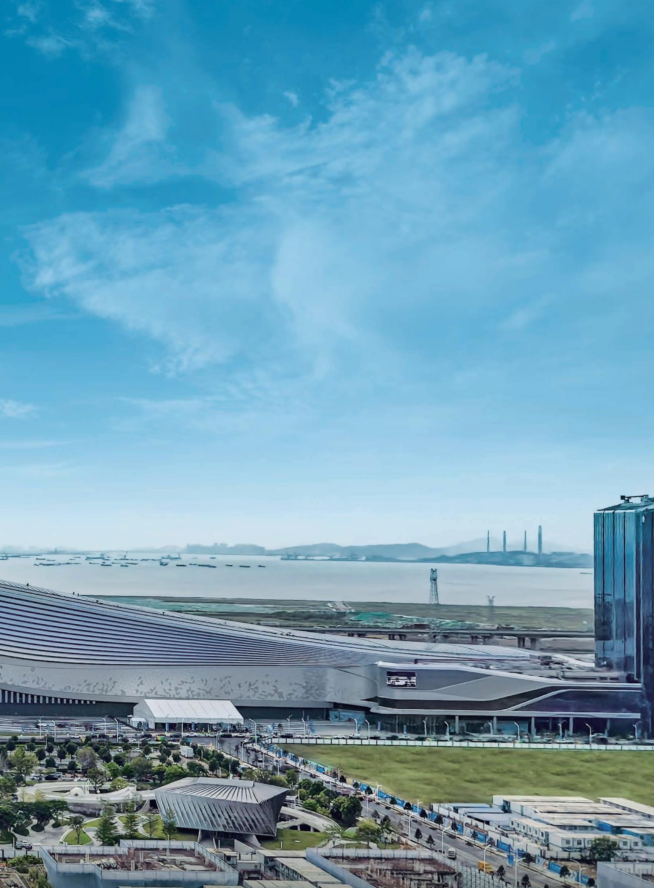

natural_image

Exterior view of a modern architectural complex with curved roof and waterfront, under a blue sky with scattered clouds (no signage or text visible)

# 本变动情、一

#

# 股份变动情况

至报告期末

位 ：股

<table><tr><td></td><td colspan="2">本次变动前</td><td colspan="5">本次变动增减(+,-)</td><td colspan="2">本次变动后</td></tr><tr><td></td><td>数量</td><td>比例(%)</td><td>发行新股</td><td>送股</td><td>公积金转股</td><td>其他</td><td>小计</td><td>数量</td><td>比例(%)</td></tr><tr><td>一、有限售条件股份</td><td>289,932,000</td><td>0.70</td><td></td><td></td><td></td><td>-289,932,000</td><td>-289,932,000</td><td>0</td><td>0</td></tr><tr><td>1、国家持股</td><td></td><td></td><td></td><td></td><td></td><td></td><td></td><td></td><td></td></tr><tr><td>2、国有法人持股</td><td></td><td></td><td></td><td></td><td></td><td></td><td></td><td></td><td></td></tr><tr><td>3、其他内资持股</td><td>289,932,000</td><td>0.70</td><td></td><td></td><td></td><td>-289,932,000</td><td>-289,932,000</td><td>0</td><td>0</td></tr><tr><td>其中:境内非国有法人持股</td><td></td><td></td><td></td><td></td><td></td><td></td><td></td><td></td><td></td></tr><tr><td>境内自然人持股</td><td>289,932,000</td><td>0.70</td><td></td><td></td><td></td><td>-289,932,000</td><td>-289,932,000</td><td>0</td><td>0</td></tr><tr><td>4、外资持股</td><td></td><td></td><td></td><td></td><td></td><td></td><td></td><td></td><td></td></tr><tr><td>其中:境外法人持股</td><td></td><td></td><td></td><td></td><td></td><td></td><td></td><td></td><td></td></tr><tr><td>境外自然人持股</td><td></td><td></td><td></td><td></td><td></td><td></td><td></td><td></td><td></td></tr><tr><td>二、无限售条件流通股份</td><td>41,320,390,444</td><td>99.30</td><td></td><td></td><td></td><td></td><td></td><td>41,320,390,444</td><td>100.00</td></tr><tr><td>1、人民币普通股</td><td>41,320,390,444</td><td>99.30</td><td></td><td></td><td></td><td></td><td></td><td>41,320,390,444</td><td>100.00</td></tr><tr><td>2、境内上市的外资股</td><td></td><td></td><td></td><td></td><td></td><td></td><td></td><td></td><td></td></tr><tr><td>3、境外上市的外资股</td><td></td><td></td><td></td><td></td><td></td><td></td><td></td><td></td><td></td></tr><tr><td>4、其他</td><td></td><td></td><td></td><td></td><td></td><td></td><td></td><td></td><td></td></tr><tr><td>三、股份总数</td><td>41,610,322,444</td><td>100.00</td><td></td><td></td><td></td><td>-289,932,000</td><td>-289,932,000</td><td>41,320,390,444</td><td>100.00</td></tr></table>

# 2.　股份变动情况说明

# 适用　 不适用

报告期内，公司发生1次股份变动，系公司回购并注销限制性股票所致。详细情况如下 ：

公司完成回购激励对象不符合解锁条件的限制性股票289,932,000股，并予以注销。回购注销完成后，公司减少注册资本暨股本289,932,000元（股），减少后的注册资本暨股本为41,320,390,444元（股）。详情敬请参阅公司于2025年1月3日发布的《股权激励限制性股票回购注销实施公告》。

# 3.　股份变动对最近一年和最近一期每股收益、每股净资产等财务指标的影响（如有）

# 适用　 不适用

报告期内，公司股份变动系限制性股票回购并注销部分所致，影响情况如下 ：

单位 ：元　币种 ：人民币

<table><tr><td>财务指标</td><td>考虑限制性股票注销</td><td>不考虑限制性股票注销</td></tr><tr><td>每股收益</td><td>0.94</td><td>0.93</td></tr><tr><td>每股净资产</td><td>11.68</td><td>11.68</td></tr></table>

# 4.　公司认为必要或证券监管机构要求披露的其他内容

# 适用　 不适用

# （二）限售股份变动情况

# 适用　 不适用

单位 ：股

<table><tr><td>股东名称</td><td>期初限售股数</td><td>报告期解除限售股数</td><td>报告期增加限售股数</td><td>报告期末限售股数</td><td>限售原因</td><td>解除限售日期</td></tr><tr><td>限制性股票激励计划激励对象</td><td>289,932,000</td><td>-289,932,000</td><td>0</td><td>0</td><td>/</td><td>/</td></tr><tr><td>合计</td><td>289,932,000</td><td>-289,932,000</td><td>0</td><td>0</td><td>/</td><td>/</td></tr></table>

详细情况敬请参阅本节一“股本变动情况”（一）“股份变动情况表”2.“股份变动情况说明”相关内容。

# 二、ﾠ证券发行与上市情况

# （一）截至报告期内证券发行情况

适用　 不适用

单位 ：千元　币种 ：人民币

<table><tr><td>股票及其衍生证券的种类</td><td>发行日期</td><td>发行价格(或利率)</td><td>发行金额</td><td>上市日期</td><td>获准上市交易数量金额</td><td>交易终止日期</td></tr><tr><td colspan="7">债券(包括企业债券、公司债券以及非金融企业债务融资工具)</td></tr><tr><td>25中建MTN001(科创债)</td><td>2025-11-21</td><td>2.05%</td><td>4,000,000.00</td><td>2025-11-24</td><td>4,000,000.00</td><td>/</td></tr></table>

截至报告期内证券发行情况的说明（存续期内利率不同的债券，请分别说明）：

适用　 不适用

债券发行情况详见本报告第七节“债券相关情况”。

# （二）公司股份总数及股东结构变动及公司资产和负债结构的变动情况

适用　 不适用

# （三）现存的内部职工股情况

适用　 不适用

# 三、ﾠ股东和实际控制人情况

# （一）股东总数

<table><tr><td>截止报告期末普通股股东总数(户)</td><td>375,914</td></tr><tr><td>年度报告披露日前上一月末的普通股股东总数(户)</td><td>420,337</td></tr><tr><td>截止报告期末表决权恢复的优先股股东总数(户)</td><td>不适用</td></tr><tr><td>年度报告披露日前上一月末表决权恢复的优先股股东总数(户)</td><td>不适用</td></tr></table>

# （二）截至报告期末前十名股东、前十名流通股东（或无限售条件股东）持股情况表

单位 ：股

<table><tr><td colspan="8">前十名股东持股情况(不含通过转融通出借股份)</td></tr><tr><td rowspan="2">股东名称(全称)</td><td rowspan="2">报告期内增减</td><td rowspan="2">期末持股数量</td><td rowspan="2">比例(%)</td><td rowspan="2">持有有限售条件股份数量</td><td colspan="2">质押、标记或冻结情况</td><td rowspan="2">股东性质</td></tr><tr><td>股份状态</td><td>数量</td></tr><tr><td>中国建筑集团有限公司</td><td>112,185,388</td><td>23,843,727,325</td><td>57.70</td><td>0</td><td>无</td><td>0</td><td>国有法人</td></tr><tr><td>中国证券金融股份有限公司</td><td>0</td><td>1,258,300,898</td><td>3.05</td><td>0</td><td>无</td><td>0</td><td>其他</td></tr><tr><td>香港中央结算有限公司</td><td>-897,463,316</td><td>779,705,261</td><td>1.89</td><td>0</td><td>无</td><td>0</td><td>其他</td></tr><tr><td>中央汇金资产管理有限责任公司</td><td>0</td><td>583,327,120</td><td>1.41</td><td>0</td><td>无</td><td>0</td><td>国有法人</td></tr><tr><td>中国人寿保险股份有限公司-传统-普通保险产品-005L-CT001沪</td><td>435,958,972</td><td>569,344,486</td><td>1.38</td><td>0</td><td>无</td><td>0</td><td>其他</td></tr><tr><td>中国工商银行-上证50交易型开放式指数证券投资基金</td><td>-8,845,048</td><td>382,038,952</td><td>0.92</td><td>0</td><td>无</td><td>0</td><td>证券投资基金</td></tr><tr><td>中国工商银行股份有限公司-华泰柏瑞沪深300交易型开放式指数证券投资基金</td><td>-17,988,594</td><td>341,150,103</td><td>0.83</td><td>0</td><td>无</td><td>0</td><td>证券投资基金</td></tr><tr><td>中国建设银行股份有限公司-易方达沪深300交易型开放式指数发起式证券投资基金</td><td>-4,391,100</td><td>243,385,250</td><td>0.59</td><td>0</td><td>无</td><td>0</td><td>证券投资基金</td></tr><tr><td>中国工商银行股份有限公司-华夏沪深300交易型开放式指数证券投资基金</td><td>21,045,220</td><td>185,738,262</td><td>0.45</td><td>0</td><td>无</td><td>0</td><td>证券投资基金</td></tr><tr><td>中国银行股份有限公司-嘉实沪深300交易型开放式指数证券投资基金</td><td>4,095,200</td><td>160,155,132</td><td>0.39</td><td>0</td><td>无</td><td>0</td><td>证券投资基金</td></tr></table>

前十名无限售条件股东持股情况(不含通过转融通出借股份)

<table><tr><td rowspan="2">股东名称</td><td rowspan="2">持有无限售条件流通股的数量</td><td colspan="2">股份种类及数量</td></tr><tr><td>种类</td><td>数量</td></tr><tr><td>中国建筑集团有限公司</td><td>23,843,727,325</td><td>人民币普通股</td><td>23,843,727,325</td></tr><tr><td>中国证券金融股份有限公司</td><td>1,258,300,898</td><td>人民币普通股</td><td>1,258,300,898</td></tr><tr><td>香港中央结算有限公司</td><td>779,705,261</td><td>人民币普通股</td><td>779,705,261</td></tr><tr><td>中央汇金资产管理有限责任公司</td><td>583,327,120</td><td>人民币普通股</td><td>583,327,120</td></tr><tr><td>中国人寿保险股份有限公司-传统-普通保险产品-005L-CT001沪</td><td>569,344,486</td><td>人民币普通股</td><td>569,344,486</td></tr><tr><td>中国工商银行-上证50交易型开放式指数证券投资基金</td><td>382,038,952</td><td>人民币普通股</td><td>382,038,952</td></tr><tr><td>中国工商银行股份有限公司-华泰柏瑞沪深300交易型开放式指数证券投资基金</td><td>341,150,103</td><td>人民币普通股</td><td>341,150,103</td></tr><tr><td>中国建设银行股份有限公司-易方达沪深300交易型开放式指数发起式证券投资基金</td><td>243,385,250</td><td>人民币普通股</td><td>243,385,250</td></tr><tr><td>中国工商银行股份有限公司-华夏沪深300交易型开放式指数证券投资基金</td><td>185,738,262</td><td>人民币普通股</td><td>185,738,262</td></tr><tr><td>中国银行股份有限公司-嘉实沪深300交易型开放式指数证券投资基金</td><td>160,155,132</td><td>人民币普通股</td><td>160,155,132</td></tr><tr><td>前十名股东中回购专户情况说明</td><td>不适用</td><td></td><td></td></tr><tr><td>上述股东委托表决权、受托表决权、放弃表决权的说明</td><td>不适用</td><td></td><td></td></tr><tr><td>上述股东关联关系或一致行动的说明</td><td colspan="3">公司第一大股东中国建筑集团有限公司与上述其他股东之间不存在关联关系,也不属于一致行动人。公司未知上述股东之间存在任何关联关系或属于一致行动人。</td></tr><tr><td>表决权恢复的优先股股东及持股数量的说明</td><td>不适用</td><td></td><td></td></tr></table>

注：公司于2024年10月15日收到控股股东中建集团通知，中建集团将自《关干控股股东增持公司股份计划的公告》（临2024-066）披露之日起12个月内通过上海证券交易所交易系统以集中竞价交易方式增持公司A股股份，增持总金额不低于人民币6亿元，不超过人民币12亿元。

中建集团于2024年10月16日至2025年10月15日期间通过上海证券交易所交易系统以集中竞价交易方式累计增持公司112,185,388 A 0.27% 623,206,575.04施完毕。详情请见《关于控股股东增持公司股份计划实施结果的公告》(临2025-060)。

持股5%以上股东、前十名股东及前十名无限售流通股股东参与转融通业务出借股份情况

适用　 不适用

前十名股东及前十名无限售流通股股东因转融通出借/归还原因导致较上期发生变化

适用　 不适用

前十名有限售条件股东持股数量及限售条件

适用　 不适用

前十名有限售条件股东持股数量及限售条件

适用　 不适用

敬请参阅本节一“股本变动情况”（二）“限售股份变动情况”相关内容。

# （三）战略投资者或一般法人因配售新股成为前10名股东

适用　 不适用

# 四、ﾠ控股股东及实际控制人情况

# （一）控股股东情况

# 1.　法人

适用　 不适用

<table><tr><td>名称</td><td>中国建筑集团有限公司</td></tr><tr><td>单位负责人或法定代表人</td><td>郑学选</td></tr><tr><td>成立日期</td><td>原城乡建设环境保护部于1982年6月11日发文成立,原国家行政管理局于1983年3月25日向中国建筑工程总公司颁发营业证书。已于2017年11月28日改制为国有独资公司,并更名为中国建筑集团有限公司。</td></tr><tr><td>主要经营业务</td><td>国务院授权范围内的国有资产经营;承担国内外土木和建筑工程的勘察、设计、施工、安装、咨询;房地产经营;装饰工程;雕塑壁画业务;承担国家对外经济援助项目;承包境内的外资工程,在海外举办非贸易性企业,利用外方资源、资金和技术在境内开展劳务合作,国外工程所需设备、材料的出口业务;建筑材料及其他非金属矿物制品、建筑用金属制品、工具、建筑工程机械和钻探机械的生产经营;货物进出口、技术进出口、代理进出口;项目投资;房地产开发;工程勘察设计;建设工程项目管理;技术咨询、技术服务;物业管理。(市场主体依法自主选择经营项目,开展经营活动;依法须经批准的项目,经相关部门批准后依批准的内容开展经营活动;不得从事国家和本市产业政策禁止和限制类项目的经营活动。)</td></tr><tr><td>报告期内控股和参股的其他境内外上市公司的股权情况</td><td>除公司及其控制的上市公司外,中建集团通过全资子公司中建创新投资有限公司(简称“中建创新投资”,曾用名北京中建启明企业管理有限公司)持有中建环能科技股份有限公司(股票简称:中建环能,股票代码:300425.SZ)26.80%股份,中建创新投资为中建环能控股股东。</td></tr><tr><td>其他情况说明</td><td>/</td></tr></table>

# 2.　自然人

适用 不适用

# 3.　公司不存在控股股东情况的特别说明

适用 不适用

# 4.　报告期内控股股东变更情况的说明

适用 不适用

# 5．公司与控股股东之间的产权及控制关系的方框图

适用 不适用

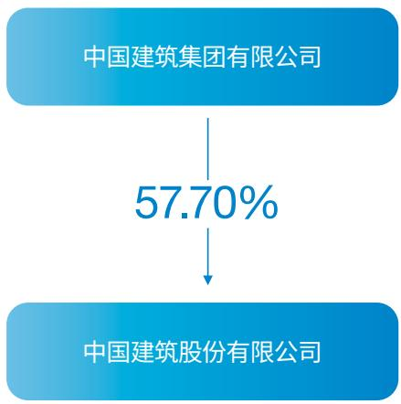

flowchart

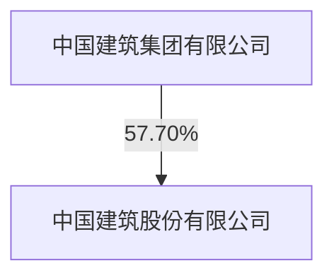
```mermaid
graph TD
    A["中国建筑集团有限公司"] -->|57.70%| B["中国建筑股份有限公司"]
```

# （二）实际控制人情况

# 1.　法人

适用 不适用

名称

国务院国有资产监督管理委员会

# 2.　自然人

适用 不适用

# 3.　公司不存在实际控制人情况的特别说明

适用 不适用

# 4.　报告期内公司控制权发生变更的情况说明

适用 不适用

# 5.　公司与实际控制人之间的产权及控制关系的方框图

适用 不适用

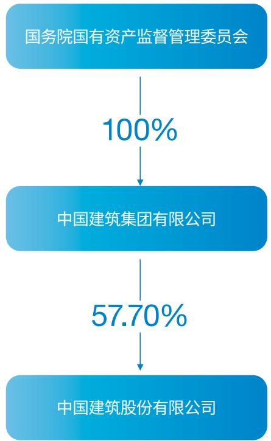

flowchart

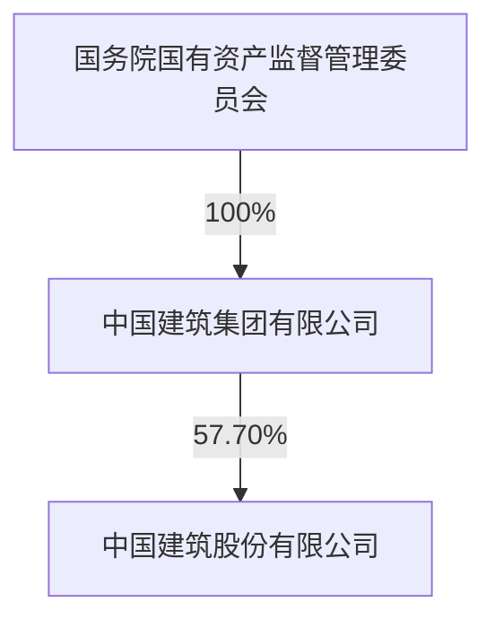
```mermaid
graph TD
    A["国务院国有资产监督管理委员会"] -->|100%| B["中国建筑集团有限公司"]
    B -->|57.70%| C["中国建筑股份有限公司"]
```

# 6.　实际控制人通过信托或其他资产管理方式控制公司

适用 不适用

# （三）控股股东及实际控制人其他情况介绍

适用 不适用

# 五、ﾠ公司控股股东或第一大股东及其一致行动人累计质押股份数量占其所持公司股份数量比例达到80%以上

适用 不适用

# 六、ﾠ其他持股在百分之十以上的法人股东

适用 不适用

# 七、ﾠ股份限制减持情况说明

适用 不适用

# 八、ﾠ股份回购在报告期的具体实施情况

适用 不适用

# 九、ﾠ优先股相关情况

适用 不适用

# 第七节

# 债券相关情况

# 一、ﾠ公司债券（含企业债券）和非金融企业债务融资工具

适用 不适用

# （一）公司债券（含企业债券）

适用 不适用

# 1.　公司债券基本情况

公司对债券终止上市交易风险的应对措施

适用 不适用

报告期内债券付息兑付情况

适用 不适用

# 2.　公司或投资者选择权条款、投资者保护条款的触发和执行情况

适用 不适用

# 3.　为债券发行及存续期业务提供服务的中介机构

<table><tr><td>中介机构名称</td><td>办公地址</td><td>签字会计师姓名</td><td>联系人</td><td>联系电话</td></tr><tr><td>安永华明会计师事务所(特殊普通合伙)</td><td>中国北京市东城区东长安街1号东方广场安永大楼17层01-12室</td><td>高君、李冬冬</td><td>高君</td><td>010-58153000</td></tr></table>

上述中介机构发生变更的情况

适用 不适用

# 4.　信用评级结果调整情况

适用 不适用

其他说明 ：

适用 不适用

# 5．担保情况、偿债计划及其他偿债保障措施在报告期内的执行和变化情况及其影响

适用 不适用

# 债券其他情况的6.

# 适用 不适

截至本报告出具日，下属子公司存续公司债券情况如下 ：

子公司公司债券发行  
种 ：人民 位 ：千元

<table><tr><td>序号</td><td>债券名称</td><td>简称</td><td>发行日</td><td>起息日</td><td>到期日</td><td>发行规模/当前规模</td><td>利率(%)</td><td>还本付息情况</td></tr><tr><td>1</td><td>中国海外发展有限公司5.35%,2042年到期,美元保证票据</td><td>CHINAOVSN4211</td><td>2012-11-15</td><td>2012-11-15</td><td>2042-11-15</td><td>2,108,640.00</td><td>5.35</td><td>正常</td></tr><tr><td>2</td><td>中国海外发展有限公司6.375%,2043年到期,美元保证票据</td><td>CHINAOVSN4310</td><td>2013-10-29</td><td>2013-10-29</td><td>2043-10-29</td><td>3,514,400.00</td><td>6.38</td><td>正常</td></tr><tr><td>3</td><td>中国海外发展有限公司6.45%,2034年到期,美元保证票据</td><td>CHINAOVSN3406</td><td>2014-06-11</td><td>2014-06-11</td><td>2034-06-11</td><td>3,514,400.00</td><td>6.45</td><td>正常</td></tr><tr><td>4</td><td>中海地产集团有限公司公开发行2016年公司债券(第一期)</td><td>16中海01</td><td>2016-08-22</td><td>2016-08-23</td><td>2026-08-23</td><td>1,900,000.00</td><td>3.6</td><td>正常</td></tr><tr><td>5</td><td>中国建筑股份有限公司3.5%,2027年到期,美元保证票据</td><td>CSCECIIN2707</td><td>2017-07-05</td><td>2017-07-05</td><td>2027-07-05</td><td>3,514,400.00</td><td>3.5</td><td>正常</td></tr><tr><td>6</td><td>中国建筑国际集团有限公司3.875%,2027年到期,美元保证票据</td><td>CSCFINIIN2711</td><td>2017-11-29</td><td>2017-11-29</td><td>2027-11-29</td><td>1,757,200.00</td><td>3.88</td><td>正常</td></tr><tr><td>7</td><td>中国海外发展有限公司4.75%,2028年到期,美元保证票据</td><td>CHINAOVSN2804</td><td>2018-04-26</td><td>2018-04-26</td><td>2028-04-26</td><td>5,271,600.00</td><td>4.75</td><td>正常</td></tr><tr><td>8</td><td>中国海外发展有限公司3.45%,2029年到期,美元中期票据</td><td>CHINAOVSN2907</td><td>2019-07-15</td><td>2019-07-15</td><td>2029-07-15</td><td>3,162,960.00</td><td>3.45</td><td>正常</td></tr><tr><td>9</td><td>中国海外发展有限公司3.05%,2029年到期,美元中期票据</td><td>CHINAOVSN2911</td><td>2019-11-27</td><td>2019-11-27</td><td>2029-11-27</td><td>2,066,467.20</td><td>3.05</td><td>正常</td></tr><tr><td>10</td><td>中国海外发展有限公司2.75%,2030年到期,美元中期票据</td><td>CHINAOVSN3003</td><td>2020-03-02</td><td>2020-03-02</td><td>2030-03-02</td><td>3,514,400.00</td><td>2.75</td><td>正常</td></tr><tr><td>11</td><td>中国海外发展有限公司3.125%,2035年到期,美元中期票据</td><td>CHINAOVSN3503</td><td>2020-03-02</td><td>2020-03-02</td><td>2035-03-02</td><td>1,405,760.00</td><td>3.13</td><td>正常</td></tr><tr><td>12</td><td>中国建筑国际集团有限公司3.4%永续债券</td><td>CSCFINSGPSB</td><td>2021-06-08</td><td>2021-06-08</td><td>2026-06-08</td><td>3,514,400.00</td><td>3.4</td><td>正常</td></tr><tr><td>13</td><td>中海企业发展集团有限公司2021年面向专业投资者公开发行公司债券(第一期)(品种二)</td><td>21中海02</td><td>2021-06-11</td><td>2021-06-15</td><td>2026-06-15</td><td>1,000,000.00</td><td>3.55</td><td>正常</td></tr><tr><td>14</td><td>中海企业发展集团有限公司2021年面向专业投资者公开发行公司债券(第三期)(品种二)</td><td>21中海06</td><td>2021-08-06</td><td>2021-08-09</td><td>2028-08-09</td><td>1,500,000.00</td><td>3.25</td><td>正常</td></tr><tr><td>15</td><td>中海企业发展集团有限公司2021年面向专业投资者公开发行公司债券(第四期)(品种二)</td><td>21中海08</td><td>2021-11-24</td><td>2021-11-25</td><td>2026-11-25</td><td>1,200,000.00</td><td>3.38</td><td>正常</td></tr><tr><td>16</td><td>中海企业发展集团有限公司2021年面向专业投资者公开发行公司债券(第五期)(品种二)</td><td>21中海10</td><td>2021-12-17</td><td>2021-12-20</td><td>2026-12-20</td><td>800,000.00</td><td>3.38</td><td>正常</td></tr></table>

<table><tr><td>序号</td><td>债券名称</td><td>简称</td><td>发行日</td><td>起息日</td><td>到期日</td><td>发行规模/当前规模</td><td>利率(%)</td><td>还本付息情况</td></tr><tr><td>17</td><td>中海企业发展集团有限公司2022年面向专业投资者公开发行公司债券(第一期)(品种二)</td><td>22中海02</td><td>2022-04-06</td><td>2022-04-07</td><td>2027-04-07</td><td>1,000,000.00</td><td>3.5</td><td>正常</td></tr><tr><td>18</td><td>中海企业发展集团有限公司2022年面向专业投资者公开发行公司债券(第二期)(品种二)</td><td>22中海04</td><td>2022-05-09</td><td>2022-05-10</td><td>2027-05-10</td><td>1,500,000.00</td><td>3.48</td><td>正常</td></tr><tr><td>19</td><td>中海企业发展集团有限公司2022年面向专业投资者公开发行公司债券(第三期)(品种二)</td><td>22中海06</td><td>2022-09-19</td><td>2022-09-20</td><td>2027-09-20</td><td>500,000.00</td><td>3.15</td><td>正常</td></tr><tr><td>20</td><td>中海企业发展集团有限公司2022年面向专业投资者公开发行公司债券(第四期)(品种二)</td><td>22中海08</td><td>2022-12-19</td><td>2022-12-20</td><td>2027-12-20</td><td>1,500,000.00</td><td>2.7</td><td>正常</td></tr><tr><td>21</td><td>中国建筑第二工程局有限公司2023年面向专业投资者公开发行科技创新可续期公司债券(第一期)</td><td>建二YK01</td><td>2023-06-16</td><td>2023-06-20</td><td>2026-06-20</td><td>1,700,000.00</td><td>3.32</td><td>正常</td></tr><tr><td>22</td><td>中建国际投资集团有限公司2023年面向专业投资者公开发行绿色公司债券(第一期)</td><td>23中建国投G1</td><td>2023-08-18</td><td>2023-08-22</td><td>2026-08-22</td><td>1,100,000.00</td><td>2.88</td><td>正常</td></tr><tr><td>23</td><td>中国建筑一局(集团)有限公司2023年面向专业投资者公开发行科技创新可续期公司债券(第一期)</td><td>建一YK01</td><td>2023-10-18</td><td>2023-10-20</td><td>2026-10-20</td><td>1,500,000.00</td><td>3.39</td><td>正常</td></tr><tr><td>24</td><td>中国建筑一局(集团)有限公司2023年面向专业投资者公开发行科技创新可续期公司债券(第二期)</td><td>建一YK02</td><td>2023-11-07</td><td>2023-11-09</td><td>2026-11-09</td><td>1,500,000.00</td><td>3.3</td><td>正常</td></tr><tr><td>25</td><td>中建科工集团有限公司2023年面向专业投资者公开发行科技创新可续期公司债券(第一期)</td><td>23科工YK01</td><td>2023-11-08</td><td>2023-11-10</td><td>2026-11-10</td><td>1,300,000.00</td><td>3.93</td><td>正常</td></tr><tr><td>26</td><td>中建科技集团有限公司2023年面向专业投资者公开发行科技创新低碳转型挂钩公司债券(第一期)</td><td>23中建K1</td><td>2023-09-19</td><td>2023-09-21</td><td>2026-09-21</td><td>500,000.00</td><td>3.19</td><td>正常</td></tr><tr><td>27</td><td>中建三局集团有限公司2023年面向专业投资者公开发行科技创新可续期公司债券(可持续挂钩)(第一期)</td><td>建三YK01</td><td>2023-12-15</td><td>2023-12-19</td><td>2026-12-19</td><td>1,200,000.00</td><td>3.16</td><td>正常</td></tr><tr><td>28</td><td>中国海外发展3.5%N20261025</td><td>CHIOLI31/210/25/2026</td><td>2023-10-25</td><td>2023-10-25</td><td>2026-10-25</td><td>3,190,000.00</td><td>3.5</td><td>正常</td></tr><tr><td>29</td><td>中海企业发展集团有限公司2023年面向专业投资者公开发行公司债券(第一期)(品种一)</td><td>23中海01</td><td>2023-11-03</td><td>2023-11-07</td><td>2026-11-07</td><td>2,000,000.00</td><td>2.9</td><td>正常</td></tr><tr><td>30</td><td>中海企业发展集团有限公司2023年面向专业投资者公开发行公司债券(第一期)(品种二)</td><td>23中海02</td><td>2023-11-03</td><td>2023-11-07</td><td>2028-11-07</td><td>1,000,000.00</td><td>3.25</td><td>正常</td></tr><tr><td>31</td><td>中海企业发展集团有限公司2023年面向专业投资者公开发行公司债券(第二期)(品种二)</td><td>23中海04</td><td>2023-12-08</td><td>2023-12-12</td><td>2028-12-12</td><td>3,000,000.00</td><td>3.2</td><td>正常</td></tr><tr><td>32</td><td>中国建筑第八工程局有限公司2024年面向专业投资者公开发行科技创新低碳转型挂钩公司债券(第一期)</td><td>24八局K1</td><td>2024-04-19</td><td>2024-04-23</td><td>2029-04-23</td><td>2,000,000.00</td><td>2.5</td><td>正常</td></tr><tr><td>33</td><td>中建国际投资集团有限公司2024年面向专业投资者公开发行公司债券(第一期)</td><td>24中建投资01</td><td>2024-04-22</td><td>2024-04-24</td><td>2029-04-24</td><td>900,000.00</td><td>2.54</td><td>正常</td></tr><tr><td>34</td><td>中海企业发展集团有限公司2024年面向专业投资者公开发行公司债券(第一期)(品种二)</td><td>24中海02</td><td>2024-04-22</td><td>2024-04-24</td><td>2029-04-24</td><td>3,000,000.00</td><td>2.68</td><td>正常</td></tr><tr><td>35</td><td>中建方程投资发展集团有限公司2024年面向专业投资者公开发行公司债券(第一期)</td><td>24方程01</td><td>2024-04-29</td><td>2024-05-06</td><td>2027-05-06</td><td>1,000,000.00</td><td>2.6</td><td>正常</td></tr><tr><td>36</td><td>中建资本控股有限公司2024年面向专业投资者公开发行公司债券(第一期)</td><td>24资控01</td><td>2024-04-26</td><td>2024-05-06</td><td>2027-05-06</td><td>2,000,000.00</td><td>2.7</td><td>正常</td></tr><tr><td>37</td><td>中国建筑第八工程局有限公司2024年面向专业投资者公开发行科技创新可续期公司债券(第一期)</td><td>八局YK01</td><td>2024-08-26</td><td>2024-08-28</td><td>2029-08-28</td><td>1,500,000.00</td><td>2.55</td><td>正常</td></tr><tr><td>38</td><td>中建三局集团有限公司2024年面向专业投资者公开发行科技创新可续期公司债券(可持续挂钩)(第一期)</td><td>建三YK02</td><td>2024-09-12</td><td>2024-09-18</td><td>2027-09-18</td><td>1,500,000.00</td><td>2.24</td><td>正常</td></tr><tr><td>39</td><td>中国建筑第八工程局有限公司2024年面向专业投资者公开发行科技创新可续期公司债券(第二期)(品种一)</td><td>八局YK02</td><td>2024-09-18</td><td>2024-09-20</td><td>2027-09-20</td><td>1,000,000.00</td><td>2.2</td><td>正常</td></tr><tr><td>40</td><td>中国建筑第八工程局有限公司2024年面向专业投资者公开发行科技创新可续期公司债券(第二期)(品种二)</td><td>八局YK03</td><td>2024-09-18</td><td>2024-09-20</td><td>2029-09-19</td><td>1,000,000.00</td><td>2.38</td><td>正常</td></tr><tr><td>41</td><td>中国建筑第八工程局有限公司2024年面向专业投资者公开发行科技创新公司债券(第二期)</td><td>24八局K2</td><td>2024-11-21</td><td>2024-11-25</td><td>2034-11-25</td><td>1,000,000.00</td><td>2.69</td><td>正常</td></tr><tr><td>42</td><td>中海企业发展集团有限公司2024年面向专业投资者公开发行公司债券(第二期)(品种一)</td><td>24中海03</td><td>2024-11-26</td><td>2024-11-28</td><td>2029-11-28</td><td>1,600,000.00</td><td>2.35</td><td>正常</td></tr><tr><td>43</td><td>中海企业发展集团有限公司2024年面向专业投资者公开发行公司债券(第二期)(品种二)</td><td>24中海04</td><td>2024-11-26</td><td>2024-11-28</td><td>2034-11-28</td><td>1,400,000.00</td><td>2.7</td><td>正常</td></tr><tr><td>44</td><td>中建科技集团有限公司2024年面向专业投资者公开发行科技创新可续期公司债券(第一期)</td><td>24中建YK</td><td>2024-12-16</td><td>2024-12-18</td><td>2027-12-18</td><td>300,000.00</td><td>2.32</td><td>正常</td></tr><tr><td>45</td><td>中国建筑第八工程局有限公司2025年面向专业投资者公开发行科技创新公司债券(第一期)</td><td>25八局K1</td><td>2025-02-25</td><td>2025-02-27</td><td>2035-02-27</td><td>1,000,000.00</td><td>2.47</td><td>正常</td></tr><tr><td>46</td><td>中国建筑第八工程局有限公司2025年面向专业投资者公开发行科技创新中小微企业支持公司债券(第一期)</td><td>八局KZ01</td><td>2025-04-24</td><td>2025-04-25</td><td>2035-04-25</td><td>1,000,000.00</td><td>2.57</td><td>正常</td></tr></table>

<table><tr><td>序号</td><td>债券名称</td><td>简称</td><td>发行日</td><td>起息日</td><td>到期日</td><td>发行规模/当前规模</td><td>利率(%)</td><td>还本付息情况</td></tr><tr><td>47</td><td>中海企业发展集团有限公司2025年面向专业投资者公开发行公司债券(第一期)(品种二)</td><td>25中海02</td><td>2025-04-25</td><td>2025-04-29</td><td>2035-04-29</td><td>500,000.00</td><td>2.37</td><td>正常</td></tr><tr><td>48</td><td>中海企业发展集团有限公司2025年面向专业投资者公开发行公司债券(第一期)(品种一)</td><td>25中海01</td><td>2025-04-25</td><td>2025-04-29</td><td>2030-04-29</td><td>1,000,000.00</td><td>1.8</td><td>正常</td></tr><tr><td>49</td><td>中海企业发展集团有限公司2025年面向专业投资者公开发行公司债券(第二期)(品种一)</td><td>25中海03</td><td>2025-08-08</td><td>2025-08-12</td><td>2028-08-12</td><td>800,000.00</td><td>1.6</td><td>正常</td></tr><tr><td>50</td><td>中海企业发展集团有限公司2025年面向专业投资者公开发行公司债券(第二期)(品种二)</td><td>25中海04</td><td>2025-08-08</td><td>2025-08-12</td><td>2030-08-12</td><td>2,500,000.00</td><td>1.79</td><td>正常</td></tr><tr><td>51</td><td>中国建筑第八工程局有限公司2025年面向专业投资者公开发行科技创新可续期公司债券(第一期)(品种一)</td><td>八局YK04</td><td>2025-09-17</td><td>2025-09-19</td><td>2030-09-19</td><td>2,500,000.00</td><td>2.54</td><td>正常</td></tr><tr><td>52</td><td>中国建筑第八工程局有限公司2025年面向专业投资者公开发行科技创新可续期公司债券(第二期)</td><td>八局YK06</td><td>2025-09-26</td><td>2025-09-30</td><td>2030-09-30</td><td>800,000.00</td><td>2.7</td><td>正常</td></tr><tr><td>53</td><td>中建资本控股有限公司2025年面向专业投资者公开发行公司债券(第一期)(品种一)</td><td>25资控01</td><td>2025-09-18</td><td>2025-09-22</td><td>2028-09-22</td><td>900,000.00</td><td>2.15</td><td>正常</td></tr><tr><td>54</td><td>中建资本控股有限公司2025年面向专业投资者公开发行公司债券(第二期)(品种一)</td><td>25资控03</td><td>2025-10-17</td><td>2025-10-21</td><td>2028-10-21</td><td>1,100,000.00</td><td>2.13</td><td>正常</td></tr><tr><td>55</td><td>中建安装集团有限公司2025年面向专业投资者公开发行公司债券(第一期)</td><td>25安装01</td><td>2025-12-17</td><td>2025-12-22</td><td>2030-12-22</td><td>500,000.00</td><td>2.19</td><td>正常</td></tr><tr><td>56</td><td>中海企业发展集团有限公司2026年面向专业投资者公开发行公司债券(第一期)(品种一)</td><td>26中海01</td><td>2026-01-12</td><td>2026-01-14</td><td>2029-01-14</td><td>1,500,000.00</td><td>1.8</td><td>正常</td></tr><tr><td>57</td><td>中海企业发展集团有限公司2026年面向专业投资者公开发行公司债券(第一期)(品种二)</td><td>26中海02</td><td>2026-01-12</td><td>2026-01-14</td><td>2031-01-14</td><td>1,000,000.00</td><td>2.1</td><td>正常</td></tr><tr><td>58</td><td>中建资本控股有限公司2026年面向专业投资者公开发行绿色公司债券(第一期)</td><td>G26资控1</td><td>2026-03-03</td><td>2026-03-05</td><td>2029-03-05</td><td>2,000,000.00</td><td>1.95</td><td>正常</td></tr></table>

（二）公司债券募集资金情况  
公司债券在报告期内涉及募集资金使用或者整改 本公司所有公司债券在报告期内均不涉及募集资金使用或者整改  
不适用 适用

（三）专项品种债券应当披露的其他事项

# （四）报告期内公司债券相关重要事项

不适用 适用

# （五）银行间债券市场非金融企业债务融资工具

适用　 不适

1.　非金融企业债务融资工具基本情况1.

<table><tr><td>序号</td><td>债券名称</td><td>简称</td><td>代码</td><td>发行日</td><td>起息日</td><td>到期日</td><td>债券余额</td><td>利率(%)</td><td>还本付息方式</td><td>交易场所</td><td>投资者适当性安排(如有)</td><td>交易机制</td><td>是否存在终止上市交易的风险</td></tr><tr><td>1</td><td>中国建筑股份有限公司2023年度第一期中期票据</td><td>23中建MTN001</td><td>102300386</td><td>2023-6-19</td><td>2023-6-21</td><td>2026-6-21</td><td>3,000,000.00</td><td>3.24</td><td>年度付息,赎回日有赎回选择权</td><td>银行间债券市场</td><td>/</td><td>竞价、报价、询价和协议</td><td>否</td></tr><tr><td>2</td><td>中国建筑股份有限公司2023年度第二期中期票据</td><td>23中建MTN002</td><td>102381653</td><td>2023-7-11</td><td>2023-7-13</td><td>2026-7-13</td><td>3,000,000.00</td><td>3.14</td><td>年度付息,赎回日有赎回选择权</td><td>银行间债券市场</td><td>/</td><td>竞价、报价、询价和协议</td><td>否</td></tr><tr><td>3</td><td>中国建筑股份有限公司2023年度第三期中期票据</td><td>23中建MTN003</td><td>102382053</td><td>2023-8-10</td><td>2023-8-14</td><td>2026-8-14</td><td>3,000,000.00</td><td>3.08</td><td>年度付息,赎回日有赎回选择权</td><td>银行间债券市场</td><td>/</td><td>竞价、报价、询价和协议</td><td>否</td></tr><tr><td>4</td><td>中国建筑股份有限公司2024年度第一期中期票据</td><td>24中建MTN001</td><td>102481838</td><td>2024-04-25</td><td>2024-04-29</td><td>2034-04-29</td><td>3,000,000.00</td><td>2.77</td><td>年付息,到期还本</td><td>银行间债券市场</td><td>/</td><td>竞价、报价、询价和协议</td><td>否</td></tr><tr><td>5</td><td>中国建筑股份有限公司2024年度第二期中期票据</td><td>24中建MTN002</td><td>102482261</td><td>2024-06-12</td><td>2024-06-14</td><td>2034-06-14</td><td>3,000,000.00</td><td>2.63</td><td>年付息,到期还本</td><td>银行间债券市场</td><td>/</td><td>竞价、报价、询价和协议</td><td>否</td></tr><tr><td>6</td><td>中国建筑股份有限公司2025年度第一期科技创新债券</td><td>25中建MTN001(科创债)</td><td>102501712</td><td>2025-11-21</td><td>2025-11-24</td><td>2030-11-24</td><td>4,000,000.00</td><td>2.05</td><td>年付息,到期还本</td><td>银行间债券市场</td><td>/</td><td>竞价、报价、询价和协议</td><td>否</td></tr></table>

内容。敬请参阅本报告第八节“财务报告”财务报表附注五、36“一年内到期的非流动负债”，附注五、39“应付债券”，附注五、47“其他权益工具”等相

公司对债券终止上市交易风险的应对措施

适用　 不适用

逾期未偿还债券

适用　 不适用

报告期内债券付息兑付情况

适用　 不适用

<table><tr><td>债券名称</td><td>付息兑付情况的说明</td></tr><tr><td>中国建筑股份有限公司2023年度第一期中期票据</td><td>正常还本付息</td></tr><tr><td>中国建筑股份有限公司2023年度第二期中期票据</td><td>正常还本付息</td></tr><tr><td>中国建筑股份有限公司2023年度第三期中期票据</td><td>正常还本付息</td></tr><tr><td>中国建筑股份有限公司2024年度第一期中期票据</td><td>正常还本付息</td></tr><tr><td>中国建筑股份有限公司2024年度第二期中期票据</td><td>正常还本付息</td></tr><tr><td>中国建筑股份有限公司2025年度第一期科技创新债券</td><td>正常还本付息</td></tr></table>

# 2.　公司或投资者选择权条款、投资者保护条款的触发和执行情况

适用　 不适用

# 3.　为债券发行及存续期业务提供服务的中介机构

<table><tr><td>中介机构名称</td><td>办公地址</td><td>签字会计师姓名</td><td>联系人</td><td>联系电话</td></tr><tr><td>安永华明会计师事务所(特殊普通合伙)</td><td>中国北京市东城区东长安街1号东方广场安永大楼17层01-12室</td><td>高君、李冬冬</td><td>高君</td><td>010-58153000</td></tr></table>

上述中介机构发生变更的情况

适用　 不适用

# 4.　报告期末募集资金使用情况

# 适用　 不适用

单位 ：千元　币种 ：人民币

<table><tr><td>债券名称</td><td>募集资金总金额</td><td>已使用金额</td><td>未使用金额</td><td>募集资金专项账户运作情况(如有)</td><td>募集资金违规使用的整改情况(如有)</td><td>是否与募集说明书承诺的用途、使用计划及其他约定一致</td></tr><tr><td>中国建筑股份有限公司2023年度第一期中期票据</td><td>3,000,000.00</td><td>3,000,000.00</td><td>0</td><td>无</td><td>无</td><td>是</td></tr><tr><td>中国建筑股份有限公司2023年度第二期中期票据</td><td>3,000,000.00</td><td>3,000,000.00</td><td>0</td><td>无</td><td>无</td><td>是</td></tr><tr><td>中国建筑股份有限公司2023年度第三期中期票据</td><td>3,000,000.00</td><td>3,000,000.00</td><td>0</td><td>无</td><td>无</td><td>是</td></tr><tr><td>中国建筑股份有限公司2024年度第一期中期票据</td><td>3,000,000.00</td><td>3,000,000.00</td><td>0</td><td>无</td><td>无</td><td>是</td></tr><tr><td>中国建筑股份有限公司2024年度第二期中期票据</td><td>3,000,000.00</td><td>3,000,000.00</td><td>0</td><td>无</td><td>无</td><td>是</td></tr><tr><td>中国建筑股份有限公司2025年度第一期科技创新债券</td><td>4,000,000.00</td><td>4,000,000.00</td><td>0</td><td>无</td><td>无</td><td>是</td></tr></table>

募集资金用于建设项目的进展情况及运营效益

适用　 不适用

报告期内变更上述债券募集资金用途的说明

适用　 不适用

其他说明

适用　 不适用

# 5.　信用评级结果调整情况

适用　 不适用

其他说明 ：

适用　 不适用

# 6．担保情况、偿债计划及其他偿债保障措施在报告期内的执行和变化情况及其影响

适用　 不适用

# 7．非金融企业债务融资工具其他情况的说明

适用　 不适用

至本报告披露 

<table><tr><td>序号</td><td>债券名称</td><td>简称</td><td>发行日</td><td>起息日</td><td>到期日</td><td>发行规模/当前规模</td><td>利率(%)</td><td>还本付息情况</td></tr><tr><td>1</td><td>中国建筑第四工程局有限公司2021年度第三期中期票据(品种一)</td><td>21中建四局MTN003A</td><td>2021-12-16</td><td>2021-12-20</td><td>2026-12-20</td><td>110,000.00</td><td>3.3</td><td>正常</td></tr><tr><td>2</td><td>中国建筑第四工程局有限公司2021年度第三期中期票据(品种二)</td><td>21中建四局MTN003B</td><td>2021-12-16</td><td>2021-12-20</td><td>2026-12-20</td><td>1,000,000.00</td><td>3.95</td><td>正常</td></tr><tr><td>3</td><td>中海企业发展集团有限公司2022年度第一期中期票据(品种二)</td><td>22中海企业MTN001B</td><td>2022-01-12</td><td>2022-01-14</td><td>2027-01-14</td><td>1,200,000.00</td><td>3.25</td><td>正常</td></tr><tr><td>4</td><td>中海企业发展集团有限公司2022年度第二期绿色中期票据</td><td>22中海企业MTN002(绿色)</td><td>2022-02-21</td><td>2022-02-23</td><td>2027-02-23</td><td>1,000,000.00</td><td>3.22</td><td>正常</td></tr><tr><td>5</td><td>中海企业发展集团有限公司2022年度第三期中期票据(品种二)</td><td>22中海企业MTN003B</td><td>2022-05-25</td><td>2022-05-27</td><td>2027-05-27</td><td>1,000,000.00</td><td>3.1</td><td>正常</td></tr><tr><td>6</td><td>中海企业发展集团有限公司2022年度第四期中期票据</td><td>22中海企业MTN004</td><td>2022-07-21</td><td>2022-07-25</td><td>2027-07-25</td><td>2,000,000.00</td><td>3.26</td><td>正常</td></tr><tr><td>7</td><td>中建国际投资集团有限公司2022年度第三期中期票据</td><td>22中建投资MTN003</td><td>2022-08-17</td><td>2022-08-19</td><td>2027-08-19</td><td>1,040,000.00</td><td>2.7</td><td>正常</td></tr><tr><td>8</td><td>中海企业发展集团有限公司2022年度第五期中期票据</td><td>22中海企业MTN005</td><td>2022-10-25</td><td>2022-10-27</td><td>2027-10-27</td><td>1,000,000.00</td><td>2.85</td><td>正常</td></tr><tr><td>9</td><td>中海企业发展集团有限公司2022年度第六期绿色中期票据</td><td>22中海企业MTN006(绿色)</td><td>2022-12-12</td><td>2022-12-14</td><td>2027-12-14</td><td>2,000,000.00</td><td>2.7</td><td>正常</td></tr><tr><td>10</td><td>中海企业发展集团有限公司2022年度第七期绿色中期票据</td><td>22中海企业MTN007(绿色)</td><td>2022-12-12</td><td>2022-12-14</td><td>2027-12-14</td><td>1,000,000.00</td><td>2.7</td><td>正常</td></tr><tr><td>11</td><td>中国建筑第七工程局有限公司2023年度第一期中期票据</td><td>23中建七局MTN001</td><td>2023-04-18</td><td>2023-04-20</td><td>2026-04-20</td><td>1,500,000.00</td><td>3.2</td><td>正常</td></tr><tr><td>12</td><td>中国建筑第五工程局有限公司2023年度第一期中期票据</td><td>23中建五局MTN001</td><td>2023-04-17</td><td>2023-04-19</td><td>2026-04-19</td><td>1,700,000.00</td><td>3.55</td><td>正常</td></tr><tr><td>13</td><td>中国建筑第二工程局有限公司2023年度第一期中期票据(科创票据)</td><td>23中建二局MTN001(科创票据)</td><td>2023-04-14</td><td>2023-04-18</td><td>2026-04-18</td><td>2,000,000.00</td><td>3.55</td><td>正常</td></tr><tr><td>14</td><td>中国建筑第二工程局有限公司2023年度第二期中期票据(科创票据)</td><td>23中建二局MTN002(科创票据)</td><td>2023-04-25</td><td>2023-04-27</td><td>2026-04-27</td><td>2,000,000.00</td><td>3.54</td><td>正常</td></tr><tr><td>15</td><td>中建西部建设股份有限公司2023年度第一期绿色中期票据</td><td>23中建西部MTN001(绿色)</td><td>2023-04-19</td><td>2023-04-21</td><td>2026-04-21</td><td>1,000,000.00</td><td>3.4</td><td>正常</td></tr><tr><td>16</td><td>中建新疆建工(集团)有限公司2023年度第一期中期票据(科创票据)</td><td>23中建新疆MTN001(科创票据)</td><td>2023-09-08</td><td>2023-09-12</td><td>2026-09-12</td><td>700,000.00</td><td>3.83</td><td>正常</td></tr><tr><td>17</td><td>中国建筑第八工程局有限公司2023年度第一期中期票据(科创票据)</td><td>23中建八局MTN001</td><td>2023-08-31</td><td>2023-09-04</td><td>2026-09-04</td><td>2,000,000.00</td><td>3.15</td><td>正常</td></tr></table>

<table><tr><td>序号</td><td>债券名称</td><td>简称</td><td>发行日</td><td>起息日</td><td>到期日</td><td>发行规模/当前规模</td><td>利率(%)</td><td>还本付息情况</td></tr><tr><td>18</td><td>中建海峡建设发展有限公司2023年度第一期中期票据(科创票据)</td><td>23中建海峡MTN001(科创票据)</td><td>2023-11-01</td><td>2023-11-02</td><td>2026-11-02</td><td>1,000,000.00</td><td>3.98</td><td>正常</td></tr><tr><td>19</td><td>中国建筑第七工程局有限公司2023年度第二期中期票据(科创票据)</td><td>23中建七局MTN002(科创票据)</td><td>2023-11-15</td><td>2023-11-17</td><td>2026-11-17</td><td>1,700,000.00</td><td>3.6</td><td>正常</td></tr><tr><td>20</td><td>中国建设基础设施有限公司2023年度第一期中期票据</td><td>23中国建设MTN001</td><td>2023-08-31</td><td>2023-09-04</td><td>2026-09-04</td><td>1,200,000.00</td><td>3.44</td><td>正常</td></tr><tr><td>21</td><td>中国建筑第六工程局有限公司2023年度第一期中期票据(科创票据)</td><td>23中建六局MTN001(科创票据)</td><td>2023-09-18</td><td>2023-09-20</td><td>2026-09-20</td><td>1,000,000.00</td><td>3.7</td><td>正常</td></tr><tr><td>22</td><td>中国建筑第六工程局有限公司2023年度第二期中期票据(科创票据)</td><td>23中建六局MTN002(科创票据)</td><td>2023-11-06</td><td>2023-11-08</td><td>2026-11-08</td><td>500,000.00</td><td>3.5</td><td>正常</td></tr><tr><td>23</td><td>中国建筑第六工程局有限公司2023年度第三期中期票据(科创票据)</td><td>23中建六局MTN003(科创票据)</td><td>2023-11-23</td><td>2023-11-27</td><td>2026-11-27</td><td>600,000.00</td><td>3.4</td><td>正常</td></tr><tr><td>24</td><td>中建三局集团有限公司2023年度第一期中期票据(科创票据)</td><td>23中建三局MTN001(科创票据)</td><td>2023-09-18</td><td>2023-09-20</td><td>2026-09-20</td><td>1,500,000.00</td><td>3.45</td><td>正常</td></tr><tr><td>25</td><td>中建三局集团有限公司2023年度第二期中期票据</td><td>23中建三局MTN002</td><td>2023-10-12</td><td>2023-10-16</td><td>2026-10-16</td><td>1,500,000.00</td><td>3.4</td><td>正常</td></tr><tr><td>26</td><td>中国建筑第四工程局有限公司2023年度第一期中期票据(科创票据)</td><td>23中建四局MTN001(科创票据)</td><td>2023-11-20</td><td>2023-11-22</td><td>2026-11-22</td><td>1,300,000.00</td><td>3.7</td><td>正常</td></tr><tr><td>27</td><td>中国建筑第四工程局有限公司2023年度第二期中期票据(科创票据)</td><td>23中建四局MTN002(科创票据)</td><td>2023-12-06</td><td>2023-12-08</td><td>2026-12-08</td><td>1,700,000.00</td><td>3.95</td><td>正常</td></tr><tr><td>28</td><td>中国建筑第四工程局有限公司2023年度第三期中期票据(科创票据)</td><td>23中建四局MTN003(科创票据)</td><td>2023-12-18</td><td>2023-12-20</td><td>2026-12-20</td><td>700,000.00</td><td>3.7</td><td>正常</td></tr><tr><td>29</td><td>中建国际投资集团有限公司2023年度第一期中期票据</td><td>23中建投资MTN001</td><td>2023-11-16</td><td>2023-11-20</td><td>2026-11-20</td><td>2,000,000.00</td><td>3.5</td><td>正常</td></tr><tr><td>30</td><td>中海企业发展集团有限公司2024年度第一期中期票据(品种一)</td><td>24中海企业MTN001A</td><td>2024-01-22</td><td>2024-01-24</td><td>2027-01-24</td><td>1,500,000.00</td><td>2.8</td><td>正常</td></tr><tr><td>31</td><td>中海企业发展集团有限公司2024年度第一期中期票据(品种二)</td><td>24中海企业MTN001B</td><td>2024-01-22</td><td>2024-01-24</td><td>2029-01-24</td><td>1,500,000.00</td><td>3.05</td><td>正常</td></tr><tr><td>32</td><td>中建国际投资集团有限公司2024年度第一期中期票据</td><td>24中建投资MTN001</td><td>2024-02-26</td><td>2024-02-28</td><td>2029-02-28</td><td>2,000,000.00</td><td>2.84</td><td>正常</td></tr><tr><td>33</td><td>中国建筑第五工程局有限公司2024年度第一期中期票据(科创票据)</td><td>24中建五局MTN001(科创票据)</td><td>2024-06-25</td><td>2024-06-26</td><td>2027-06-26</td><td>2,500,000.00</td><td>2.33</td><td>正常</td></tr><tr><td>34</td><td>中国建筑第二工程局有限公司2024年度第一期中期票据</td><td>24中建二局MTN001</td><td>2024-06-25</td><td>2024-06-27</td><td>2029-06-27</td><td>1,500,000.00</td><td>2.48</td><td>正常</td></tr><tr><td>35</td><td>中建国际投资集团有限公司2024年度第二期中期票据</td><td>24中建投资MTN002</td><td>2024-07-17</td><td>2024-07-19</td><td>2029-07-19</td><td>2,000,000.00</td><td>2.3</td><td>正常</td></tr><tr><td>36</td><td>中建三局集团有限公司2024年度第一期中期票据</td><td>24中建三局MTN001</td><td>2024-08-09</td><td>2024-08-13</td><td>2027-08-13</td><td>1,300,000.00</td><td>2.2</td><td>正常</td></tr><tr><td>37</td><td>中国建筑一局(集团)有限公司2024年度第一期中期票据(科创票据)</td><td>24中建一局MTN001(科创票据)</td><td>2024-09-10</td><td>2024-09-12</td><td>2029-09-12</td><td>1,000,000.00</td><td>2.42</td><td>正常</td></tr><tr><td>38</td><td>中国建筑第五工程局有限公司2024年度第二期中期票据(科创票据)</td><td>24中建五局MTN002(科创票据)</td><td>2024-09-10</td><td>2024-09-12</td><td>2027-09-12</td><td>1,800,000.00</td><td>2.3</td><td>正常</td></tr><tr><td>39</td><td>中国建筑第七工程局有限公司2024年度第一期中期票据(科创票据)</td><td>24中建七局MTN001(科创票据)</td><td>2024-09-11</td><td>2024-09-13</td><td>2027-09-13</td><td>1,500,000.00</td><td>2.36</td><td>正常</td></tr><tr><td>40</td><td>中国建筑第四工程局有限公司2024年度第一期中期票据(科创票据)</td><td>24中建四局MTN001</td><td>2024-09-11</td><td>2024-09-13</td><td>2027-09-13</td><td>1,500,000.00</td><td>2.42</td><td>正常</td></tr><tr><td>41</td><td>中建国际投资集团有限公司2024年度第三期中期票据</td><td>24中建投资MTN003</td><td>2024-09-24</td><td>2024-09-26</td><td>2027-09-26</td><td>1,500,000.00</td><td>2.29</td><td>正常</td></tr><tr><td>42</td><td>中国建筑第四工程局有限公司2024年度第二期中期票据(科创票据)</td><td>24中建四局MTN002</td><td>2024-10-22</td><td>2024-10-23</td><td>2027-10-23</td><td>1,300,000.00</td><td>2.69</td><td>正常</td></tr><tr><td>43</td><td>中建西部建设股份有限公司2024年度第一期中期票据</td><td>24中建西部MTN001</td><td>2024-11-15</td><td>2024-11-19</td><td>2027-11-19</td><td>600,000.00</td><td>2.79</td><td>正常</td></tr><tr><td>44</td><td>中国建设基础设施有限公司2024年度第一期中期票据(科创票据)</td><td>24中国建设MTN001(科创票据)</td><td>2024-11-19</td><td>2024-11-21</td><td>2027-11-21</td><td>500,000.00</td><td>2.5</td><td>正常</td></tr><tr><td>45</td><td>中建国际投资集团有限公司2024年度第四期中期票据</td><td>24中建投资MTN004</td><td>2024-11-27</td><td>2024-11-29</td><td>2027-11-29</td><td>1,500,000.00</td><td>2.12</td><td>正常</td></tr><tr><td>46</td><td>中建方程投资发展集团有限公司2024年度第一期中期票据</td><td>24中建方程MTN001</td><td>2024-12-03</td><td>2024-12-04</td><td>2027-12-04</td><td>1,000,000.00</td><td>2.38</td><td>正常</td></tr><tr><td>47</td><td>中国建筑第八工程局有限公司2024年度第一期中期票据(科创票据)</td><td>24中建八局MTN001(科创票据)</td><td>2024-12-19</td><td>2024-12-23</td><td>2044-12-23</td><td>1,000,000.00</td><td>2.76</td><td>正常</td></tr><tr><td>48</td><td>中建国际投资集团有限公司2025年度第一期中期票据</td><td>25中建投资MTN001</td><td>2025-01-10</td><td>2025-01-14</td><td>2028-01-14</td><td>2,000,000.00</td><td>1.83</td><td>正常</td></tr><tr><td>49</td><td>中国建筑第八工程局有限公司2025年度第九期科技创新债券(品种二)</td><td>25中建八局MTN009B(科创债)</td><td>2025-06-12</td><td>2025-06-16</td><td>2045-06-16</td><td>1,000,000.00</td><td>2.68</td><td>正常</td></tr><tr><td>50</td><td>中国建筑第六工程局有限公司2025年度第一期科技创新债券</td><td>25中建六局MTN001(科创债)</td><td>2025-07-21</td><td>2025-07-23</td><td>2035-07-23</td><td>500,000.00</td><td>2.35</td><td>正常</td></tr><tr><td>51</td><td>中国建筑第七工程局有限公司2025年度第一期科技创新债券</td><td>25中建七局MTN001(科创债)</td><td>2025-07-03</td><td>2025-07-04</td><td>2030-07-04</td><td>2,000,000.00</td><td>1.96</td><td>正常</td></tr><tr><td>52</td><td>中建丝路建设投资有限公司2025年度第一期中期票据(可持续挂钩)</td><td>25中建丝路MTN001(可持续挂钩)</td><td>2025-04-11</td><td>2025-04-14</td><td>2030-04-14</td><td>500,000.00</td><td>2.2</td><td>正常</td></tr><tr><td>53</td><td>中海企业发展集团有限公司2025年度第一期中期票据(品种一)</td><td>25中海企业MTN001A</td><td>2025-04-11</td><td>2025-04-14</td><td>2030-04-14</td><td>500,000.00</td><td>1.9</td><td>正常</td></tr><tr><td>54</td><td>中海企业发展集团有限公司2025年度第一期中期票据(品种二)</td><td>25中海企业MTN001B</td><td>2025-04-11</td><td>2025-04-14</td><td>2035-04-14</td><td>1,500,000.00</td><td>2.38</td><td>正常</td></tr><tr><td>55</td><td>中国建筑第二工程局有限公司2025年度第一期科技创新债券</td><td>25中建二局MTN001(科创债)</td><td>2025-07-11</td><td>2025-07-14</td><td>2035-07-14</td><td>1,000,000.00</td><td>2.35</td><td>正常</td></tr><tr><td>56</td><td>中建国际投资集团有限公司2025年度第二期中期票据</td><td>25中建投资MTN002</td><td>2025-08-08</td><td>2025-08-11</td><td>2028-08-11</td><td>2,000,000.00</td><td>1.81</td><td>正常</td></tr><tr><td>57</td><td>中国建筑第七工程局有限公司2025年度第二期科技创新债券</td><td>25中建七局MTN002(科创债)</td><td>2025-08-11</td><td>2025-08-12</td><td>2030-08-12</td><td>1,200,000.00</td><td>1.94</td><td>正常</td></tr><tr><td>58</td><td>中国建筑一局(集团)有限公司2025年度第五期科技创新债券</td><td>25中建一局SCP005(科创债)</td><td>2025-08-08</td><td>2025-08-08</td><td>2026-05-05</td><td>2,000,000.00</td><td>1.54</td><td>正常</td></tr><tr><td>59</td><td>中海企业发展集团有限公司2025年度第二期中期票据(品种一)</td><td>25中海企业MTN002A</td><td>2025-08-22</td><td>2025-08-25</td><td>2030-08-25</td><td>1,500,000.00</td><td>1.75</td><td>正常</td></tr><tr><td>60</td><td>中海企业发展集团有限公司2025年度第二期中期票据(品种三)</td><td>25中海企业MTN002C</td><td>2025-08-22</td><td>2025-08-25</td><td>2040-08-25</td><td>500,000.00</td><td>2.5</td><td>正常</td></tr><tr><td>61</td><td>中国建筑第二工程局有限公司2025年度第二期科技创新债券</td><td>25中建二局MTN002(科创债)</td><td>2025-08-07</td><td>2025-08-08</td><td>2035-08-08</td><td>1,000,000.00</td><td>2.34</td><td>正常</td></tr><tr><td>62</td><td>中国建筑第二工程局有限公司2025年度第三期科技创新债券</td><td>25中建二局MTN003(科创债)</td><td>2025-09-22</td><td>2025-09-23</td><td>2030-09-23</td><td>1,000,000.00</td><td>2.06</td><td>正常</td></tr><tr><td>63</td><td>中国建筑第七工程局有限公司2025年度第三期科技创新债券</td><td>25中建七局SCP003(科创债)</td><td>2025-09-15</td><td>2025-09-16</td><td>2026-06-03</td><td>900,000.00</td><td>1.71</td><td>正常</td></tr><tr><td>64</td><td>中国建筑第七工程局有限公司2025年度第四期科技创新债券</td><td>25中建七局SCP004(科创债)</td><td>2025-09-16</td><td>2025-09-17</td><td>2026-06-12</td><td>900,000.00</td><td>1.71</td><td>正常</td></tr><tr><td>65</td><td>中国建筑第七工程局有限公司2025年度第五期科技创新债券</td><td>25中建七局SCP005(科创债)</td><td>2025-09-18</td><td>2025-09-19</td><td>2026-06-16</td><td>800,000.00</td><td>1.71</td><td>正常</td></tr><tr><td>66</td><td>中建新疆建工(集团)有限公司2025年度第一期科技创新债券</td><td>25中建新疆MTN001(科创债)</td><td>2025-10-13</td><td>2025-10-15</td><td>2035-10-15</td><td>500,000.00</td><td>2.3</td><td>正常</td></tr><tr><td>67</td><td>中建新疆建工(集团)有限公司2025年度第二期科技创新债券</td><td>25中建新疆MTN002(科创债)</td><td>2025-10-15</td><td>2025-10-17</td><td>2035-10-17</td><td>500,000.00</td><td>2.3</td><td>正常</td></tr><tr><td>68</td><td>中国建筑第七工程局有限公司2025年度第六期科技创新债券</td><td>25中建七局MTN006(科创债)</td><td>2025-10-15</td><td>2025-10-17</td><td>2030-10-17</td><td>1,000,000.00</td><td>2.19</td><td>正常</td></tr><tr><td>69</td><td>中海企业发展集团有限公司2025年度第三期中期票据(品种一)</td><td>25中海企业MTN003A</td><td>2025-10-20</td><td>2025-10-21</td><td>2028-10-21</td><td>100,000.00</td><td>1.7</td><td>正常</td></tr><tr><td>70</td><td>中海企业发展集团有限公司2025年度第三期中期票据(品种二)</td><td>25中海企业MTN003B</td><td>2025-10-20</td><td>2025-10-21</td><td>2030-10-21</td><td>2,900,000.00</td><td>1.9</td><td>正常</td></tr><tr><td>71</td><td>中国建筑第七工程局有限公司2025年度第七期科技创新债券</td><td>25中建七局SCP007(科创债)</td><td>2025-10-24</td><td>2025-10-27</td><td>2026-07-14</td><td>700,000.00</td><td>1.71</td><td>正常</td></tr><tr><td>72</td><td>中国建筑第七工程局有限公司2025年度第八期科技创新债券</td><td>25中建七局SCP008(科创债)</td><td>2025-10-27</td><td>2025-10-28</td><td>2026-07-24</td><td>700,000.00</td><td>1.71</td><td>正常</td></tr><tr><td>73</td><td>中国建筑第六工程局有限公司2025年度第二期科技创新债券</td><td>25中建六局SCP002(科创债)</td><td>2025-11-03</td><td>2025-11-05</td><td>2026-06-13</td><td>1,000,000.00</td><td>1.65</td><td>正常</td></tr><tr><td>74</td><td>中建三局集团有限公司2025年度第五期科技创新债券</td><td>25中建三局SCP005(科创债)</td><td>2025-11-10</td><td>2025-11-11</td><td>2026-08-08</td><td>3,000,000.00</td><td>1.58</td><td>正常</td></tr><tr><td>75</td><td>中国建筑第四工程局有限公司2025年度第一期科技创新债券</td><td>25中建四局MTN001(科创债)</td><td>2025-11-11</td><td>2025-11-13</td><td>2030-11-13</td><td>1,500,000.00</td><td>2.14</td><td>正常</td></tr><tr><td>76</td><td>中国建设基础设施有限公司2025年度第一期科技创新债券</td><td>25中国建设MTN001(科创债)</td><td>2025-12-05</td><td>2025-12-08</td><td>2030-12-08</td><td>1,000,000.00</td><td>2.2</td><td>正常</td></tr><tr><td>77</td><td>中国建筑一局(集团)有限公司2026年度第一期科技创新债券</td><td>26中建一局SCP001(科创债)</td><td>2026-01-05</td><td>2026-01-06</td><td>2026-08-28</td><td>1,500,000.00</td><td>1.53</td><td>正常</td></tr><tr><td>78</td><td>中国建筑一局(集团)有限公司2026年度第二期科技创新债券</td><td>26中建一局SCP002(科创债)</td><td>2026-01-05</td><td>2026-01-06</td><td>2026-08-28</td><td>1,500,000.00</td><td>1.53</td><td>正常</td></tr><tr><td>79</td><td>中建丝路建设投资有限公司2026年度第一期科技创新债券</td><td>26中建丝路SCP001(科创债)</td><td>2026-01-13</td><td>2026-01-14</td><td>2026-10-11</td><td>500,000.00</td><td>1.62</td><td>正常</td></tr><tr><td>80</td><td>中建方程投资发展集团有限公司2026年度第一期中期票据(可持续挂钩)</td><td>26中建方程MTN001(可持续挂钩)</td><td>2026-01-14</td><td>2026-01-15</td><td>2031-01-15</td><td>1,000,000.00</td><td>2.19</td><td>正常</td></tr><tr><td>81</td><td>中国建筑第八工程局有限公司2026年度第一期科技创新债券</td><td>26中建八局SCP001(科创债)</td><td>2026-01-16</td><td>2026-01-19</td><td>2026-04-17</td><td>3,000,000.00</td><td>1.52</td><td>正常</td></tr><tr><td>82</td><td>中国建筑第八工程局有限公司2026年度第二期科技创新债券</td><td>26中建八局SCP002(科创债)</td><td>2026-01-21</td><td>2026-01-22</td><td>2026-06-19</td><td>3,000,000.00</td><td>1.55</td><td>正常</td></tr><tr><td>83</td><td>中国建筑第八工程局有限公司2026年度第三期科技创新债券</td><td>26中建八局SCP003(科创债)</td><td>2026-01-23</td><td>2026-01-26</td><td>2026-04-24</td><td>3,000,000.00</td><td>1.55</td><td>正常</td></tr><tr><td>84</td><td>中国建筑第八工程局有限公司2026年度第四期科技创新债券</td><td>26中建八局SCP004(科创债)</td><td>2026-01-28</td><td>2026-01-29</td><td>2026-05-27</td><td>2,000,000.00</td><td>1.55</td><td>正常</td></tr><tr><td>85</td><td>中建国际建设有限公司2026年度第一期中期票据</td><td>26中建建设MTN001</td><td>2026-01-30</td><td>2026-02-03</td><td>2029-02-03</td><td>600,000.00</td><td>1.97</td><td>正常</td></tr><tr><td>86</td><td>中国建筑第四工程局有限公司2026年度第一期科技创新债券</td><td>26中建四局MTN001</td><td>2026-02-03</td><td>2026-02-05</td><td>2029-02-05</td><td>1,000,000.00</td><td>1.97</td><td>正常</td></tr><tr><td>87</td><td>中国建筑第八工程局有限公司2026年度第五期科技创新债券</td><td>26中建八局MTN005(科创债)</td><td>2026-02-06</td><td>2026-02-09</td><td>2031-02-09</td><td>1,000,000.00</td><td>1.8</td><td>正常</td></tr><tr><td>88</td><td>中国建筑第七工程局有限公司2026年度第一期科技创新债券</td><td>26中建七局MTN001(科创债)</td><td>2026-02-09</td><td>2026-02-10</td><td>2029-02-10</td><td>700,000.00</td><td>1.84</td><td>正常</td></tr><tr><td>89</td><td>中国建筑第七工程局有限公司2026年度第二期中期票据</td><td>26中建七局MTN002</td><td>2026-03-17</td><td>2026-03-18</td><td>2029-03-18</td><td>800,000.00</td><td>1.76</td><td>正常</td></tr><tr><td>90</td><td>中国建筑第四工程局有限公司2026年度第二期中期票据</td><td>26中建四局MTN002</td><td>2026-03-19</td><td>2026-03-20</td><td>2029-03-20</td><td>1,500,000.00</td><td>1.93</td><td>正常</td></tr><tr><td>91</td><td>中国建筑第五工程局有限公司2026年度第一期中期票据</td><td>26中建五局MTN001</td><td>2026-03-26</td><td>2026-03-27</td><td>2029-03-27</td><td>1,000,000.00</td><td>1.65</td><td>正常</td></tr><tr><td>92</td><td>中国建筑第五工程局有限公司2026年度第二期中期票据</td><td>26中建五局MTN002</td><td>2026-03-31</td><td>2026-04-02</td><td>2029-04-02</td><td>1,700,000.00</td><td>1.98</td><td>正常</td></tr><tr><td>93</td><td>中国建筑第八工程局有限公司2026年度第六期中期票据</td><td>26中建八局MTN006</td><td>2026-04-03</td><td>2026-04-07</td><td>2031-04-07</td><td>2,000,000.00</td><td>1.85</td><td>正常</td></tr><tr><td>94</td><td>中国建筑第八工程局有限公司2026年度第六期超短期融资券</td><td>26中建八局SCP006</td><td>2026-03-31</td><td>2026-04-01</td><td>2026-04-30</td><td>2,000,000.00</td><td>1.55</td><td>正常</td></tr><tr><td>95</td><td>中国建筑第七工程局有限公司2026年度第三期中期票据</td><td>26中建七局MTN003</td><td>2026-04-02</td><td>2026-04-07</td><td>2029-04-07</td><td>800,000.00</td><td>1.75</td><td>正常</td></tr><tr><td>96</td><td>中国建筑第二工程局有限公司2026年度第一期中期票据</td><td>26中建二局MTN001</td><td>2026-04-09</td><td>2026-04-10</td><td>2031-04-10</td><td>2,000,000.00</td><td>2.27</td><td>正常</td></tr><tr><td>97</td><td>中建丝路建设投资有限公司2026年度第二期超短期融资券</td><td>26中建丝路SCP002</td><td>2026-04-14</td><td>2026-04-15</td><td>2027-01-10</td><td>500,000.00</td><td>1.49</td><td>正常</td></tr></table>

敬请参阅本报告第八节“财务报告”财务报表附注五、36“一年内到期的非流动负债”，附注五、39“应付债券”等相关内容。

# （六）公司报告期内合并报表范围亏损超过上年末净资产10%

适用　 不适用

# （七）报告期末除债券外的有息债务逾期情况

适用　 不适用

# (八）报告期内违反法律法规、公司章程、信息披露事务管理制度规定的情况以及债券募集说明书约定或承诺的情况对债券投资者权益的影响

适用　 不适用

# （九）截至报告期末公司近2年的会计数据和财务指标

适用　 不适用

单位 ：千元　币种 ：人民币

<table><tr><td>主要指标</td><td>2025年</td><td>2024年</td><td>本报告期末比上年度末增减(%)</td><td>变动原因</td></tr><tr><td>归属于上市公司股东的扣除非经常性损益的净利润</td><td>31,934,462</td><td>41,579,271</td><td>-23.2</td><td>经营性利润减少</td></tr><tr><td>流动比率(%)</td><td>126.2</td><td>129.4</td><td>减少3.2个百分点</td><td>/</td></tr><tr><td>速动比率(%)</td><td>73.3</td><td>73.0</td><td>增加0.3个百分点</td><td>速动资产增加</td></tr><tr><td>资产负债率(%)</td><td>76.9</td><td>75.8</td><td>增加1.1个百分点</td><td>总负债增加</td></tr><tr><td>EBITDA全部债务比(%)</td><td>11.2</td><td>13.7</td><td>减少2.5个百分点</td><td>全部债务增加</td></tr><tr><td>利息保障倍数</td><td>3.0</td><td>3.0</td><td>持平</td><td>/</td></tr><tr><td>现金利息保障倍数</td><td>2.1</td><td>2.1</td><td>持平</td><td>/</td></tr><tr><td>EBITDA利息保障倍数</td><td>3.6</td><td>3.6</td><td>持平</td><td>/</td></tr><tr><td>贷款偿还率(%)</td><td>100.0</td><td>100.0</td><td>/</td><td>/</td></tr><tr><td>利息偿付率(%)</td><td>100.0</td><td>100.0</td><td>/</td><td>/</td></tr></table>

# 二、ﾠ可转换公司债券情况

适用　 不适用

# 第八节

# 财务报告

# 审计报告

适用　 不适用

详见附件

# 二、ﾠ财务报表

详见附件

董事长 ：郑学选

董事会批准报送日期 ：2026-04-17

# 修订信息

适用　 不适用

<table><tr><td rowspan="3">备查文件目录</td><td>公司负责人(董事长),主管会计工作负责人(财务总监),会计机构负责人(会计主管人员)签名并盖章的财务报表</td></tr><tr><td>会计师事务所盖章、注册会计师签名并盖章的审计报告原件</td></tr><tr><td>报告期内公开披露过的所有公司文件的正本及公告的原稿</td></tr></table>

中国建筑股份有限公司

已审财务报表

2025年度

目 录

<table><tr><td></td><td>页</td><td>次</td></tr><tr><td>审计报告</td><td>1</td><td>- 7</td></tr><tr><td>已审财务报表</td><td></td><td></td></tr><tr><td>合并资产负债表</td><td>8</td><td>- 10</td></tr><tr><td>合并利润表</td><td>11</td><td>- 12</td></tr><tr><td>合并股东权益变动表</td><td>13</td><td>- 14</td></tr><tr><td>合并现金流量表</td><td>15</td><td>- 16</td></tr><tr><td>公司资产负债表</td><td>17</td><td>- 19</td></tr><tr><td>公司利润表</td><td></td><td>20</td></tr><tr><td>公司股东权益变动表</td><td>21</td><td>- 22</td></tr><tr><td>公司现金流量表</td><td>23</td><td>- 24</td></tr><tr><td>财务报表附注</td><td>25</td><td>- 226</td></tr><tr><td>补充资料</td><td></td><td></td></tr><tr><td>1.非经常性损益明细表</td><td></td><td>1</td></tr><tr><td>2.净资产收益率和每股收益</td><td></td><td>1</td></tr></table>

# 审计报告

安永华明（2026）审字第70048147\_A01号

中国建筑股份有限公司

中国建筑股份有限公司全体股东：

# 一、审计意见

我们审计了中国建筑股份有限公司的财务报表，包括2025年12月31日的合并及公司资产负债表，2025年度的合并及公司利润表、股东权益变动表和现金流量表以及相关财务报表附注。

我们认为，后附的中国建筑股份有限公司的财务报表在所有重大方面按照企业会计准则的规定编制，公允反映了中国建筑股份有限公司2025年12月31日的合并及公司财务状况以及2025年度的合并及公司经营成果和现金流量。

# 二、形成审计意见的基础

我们按照中国注册会计师审计准则的规定执行了审计工作。审计报告的“注册会计师对财务报表审计的责任”部分进一步阐述了我们在这些准则下的责任。按照《中国注册会计师独立性准则第1号——财务报表审计和审阅业务对独立性的要求》和中国注册会计师职业道德守则，我们独立于中国建筑股份有限公司，并履行了职业道德方面的其他责任。我们在审计中遵循了对公众利益实体审计的独立性要求。我们相信，我们获取的审计证据是充分、适当的，为发表审计意见提供了基础。

# 三、关键审计事项

关键审计事项是我们根据职业判断，认为对本年财务报表审计最为重要的事项。这些事项的应对以对财务报表整体进行审计并形成审计意见为背景，我们不对这些事项单独发表意见。我们对下述每一事项在审计中是如何应对的描述也以此为背景。

我们已经履行了本报告“注册会计师对财务报表审计的责任”部分阐述的责任，包括与这些关键审计事项相关的责任。相应地，我们的审计工作包括执行为应对评估的财务报表重大错报风险而设计的审计程序。我们执行审计程序的结果，包括应对下述关键审计事项所执行的程序，为财务报表整体发表审计意见提供了基础。

# 审计报告（续）

安永华明（2026）审字第70048147\_A01号中国建筑股份有限公司

# 三、关键审计事项（续）

<table><tr><td>关键审计事项:</td><td>该事项在审计中是如何应对:</td></tr><tr><td colspan="2">工程承包合同收入确认</td></tr><tr><td>中国建筑股份有限公司收入主要来自于按照履约进度确认收入的工程承包合同。履约进度主要根据工程的性质,采用投入法,以发生的成本占合同预计总成本的比例,确定提供建造服务的履约进度。中国建筑股份有限公司管理层在工程开始时预估合同的预计总收入及预计总成本,并于合同执行过程中对合同交付范围、尚未完工成本等因素进行持续评估,考虑合同预计总收入和合同预计总成本的变更等事项带来的财务影响。合同预计总收入、合同预计总成本以及履约进度的确定,涉及管理层的重大估计和判断,并对收入确认的金额有重大影响。基于上述原因,我们将工程承包合同收入确认认定为关键审计事项。工程承包合同收入确认的会计政策和披露信息见财务报表附注三、25及35以及附注五、53。</td><td>我们了解、测试并评估了中国建筑股份有限公司工程承包合同收入确认流程相关的内部控制,包括合同预计总收入和合同预计总成本的编制,履约进度的确定,以及按照履约进度计算收入的关键内部控制;我们从管理层取得了工程承包合同清单,选取了重大工程承包合同执行测试,主要包括:复核关键合同条款和管理层编制的合同预计总收入和合同预计总成本,以及预算变更、合同变更、索赔及奖励等的支持性文件,评估管理层对合同预计总收入和合同预计总成本估计的适当性;检查工程承包合同本年已经发生的成本,核对相关的支持性文件,并检查相关合同成本是否被记录在恰当的会计期间;根据已发生合同成本和合同预计总成本重新计算履约进度,并根据预计总收入和履约进度重新计算当期确认的收入,测试其准确性,并对毛利率执行分析程序;现场查看工程形象进度,询问工程管理部门,并与账面记录进行比较,评估履约进度的合理性。我们同时关注了对工程承包合同收入披露的充分性。</td></tr></table>

# 审计报告（续）

安永华明（2026）审字第70048147\_A01号中国建筑股份有限公司

# 三、关键审计事项（续）

<table><tr><td>关键审计事项:</td><td>该事项在审计中是如何应对:</td></tr><tr><td colspan="2">应收账款及合同资产减值准备</td></tr><tr><td>应收账款及合同资产减值准备以预期信用损失为基础确认,中国建筑股份有限公司考虑有关过去事项、当前状况以及对未来经济状况的预测等合理且有依据的信息,确认预期信用损失,涉及重大管理层判断和估计,且中国建筑股份有限公司应收账款及合同资产余额重大,其可收回性对于财务报表具有重大影响。因此,我们将应收账款及合同资产减值准备认定为关键审计事项。应收账款及合同资产减值准备会计政策和披露信息见财务报表附注三、10及35以及附注五、4及9。</td><td>我们了解、测试并评估了与应收账款及合同资产减值准备计提相关的内部控制;对于管理层按照单项计提预期信用损失的应收账款及合同资产,抽取样本取得管理层据以判断客户付款能力和合同资产历史结算情况的证明文件,结合客户的资金状况、资信状况、项目进展、历史付款率以及对未来经济情况的预测等,评估管理层计提预期信用损失的合理性和充分性;对于管理层按照信用风险特征组合计提预期信用损失的应收账款及合同资产,参考历史回款、结算和账龄情况,并结合当前状况以及对未来经济状况的预测等,评估管理层划分的组合以及对不同组合估计的预期信用损失率的合理性,并选取样本测试应收账款及合同资产的组合分类以及账龄划分的准确性,对计提的预期信用损失进行重新计算;选取样本检查应收账款期后回款及合同资产期后结算情况;我们同时关注了对应收账款及合同资产减值准备披露的充分性。</td></tr></table>

# 审计报告（续）

安永华明（2026）审字第70048147\_A01号中国建筑股份有限公司

# 四、其他信息

中国建筑股份有限公司管理层对其他信息负责。其他信息包括年度报告中涵盖的信息，但不包括财务报表和我们的审计报告。

我们对财务报表发表的审计意见不涵盖其他信息，我们也不对其他信息发表任何形式的鉴证结论。

结合我们对财务报表的审计，我们的责任是阅读其他信息，在此过程中，考虑其他信息是否与财务报表或我们在审计过程中了解到的情况存在重大不一致或者似乎存在重大错报。

基于我们已执行的工作，如果我们确定其他信息存在重大错报，我们应当报告该事实。在这方面，我们无任何事项需要报告。

# 五、管理层和治理层对财务报表的责任

管理层负责按照企业会计准则的规定编制财务报表，使其实现公允反映，并设计、执行和维护必要的内部控制，以使财务报表不存在由于舞弊或错误导致的重大错报。

在编制财务报表时，管理层负责评估中国建筑股份有限公司的持续经营能力，披露与持续经营相关的事项（如适用），并运用持续经营假设，除非计划进行清算、终止运营或别无其他现实的选择。

治理层负责监督中国建筑股份有限公司的财务报告过程。

# 审计报告（续）

安永华明（2026）审字第70048147\_A01号中国建筑股份有限公司

# 六、注册会计师对财务报表审计的责任

我们的目标是对财务报表整体是否不存在由于舞弊或错误导致的重大错报获取合理保证，并出具包含审计意见的审计报告。合理保证是高水平的保证，但并不能保证按照审计准则执行的审计在某一重大错报存在时总能发现。错报可能由于舞弊或错误导致，如果合理预期错报单独或汇总起来可能影响财务报表使用者依据财务报表作出的经济决策，则通常认为错报是重大的。

在按照审计准则执行审计工作的过程中，我们运用职业判断，并保持职业怀疑。同时，我们也执行以下工作：

（1） 识别和评估由于舞弊或错误导致的财务报表重大错报风险，设计和实施审计程序以应对这些风险，并获取充分、适当的审计证据，作为发表审计意见的基础。由于舞弊可能涉及串通、伪造、故意遗漏、虚假陈述或凌驾于内部控制之上，未能发现由于舞弊导致的重大错报的风险高于未能发现由于错误导致的重大错报的风险。  
（2） 了解与审计相关的内部控制，以设计恰当的审计程序。  
（3） 评价管理层选用会计政策的恰当性和作出会计估计及相关披露的合理性。  
（4） 对管理层使用持续经营假设的恰当性得出结论。同时，根据获取的审计证据，就可能导致对中国建筑股份有限公司持续经营能力产生重大疑虑的事项或情况是否存在重大不确定性得出结论。如果我们得出结论认为存在重大不确定性，审计准则要求我们在审计报告中提请报表使用者注意财务报表中的相关披露；如果披露不充分，我们应当发表非无保留意见。我们的结论基于截至审计报告日可获得的信息。然而，未来的事项或情况可能导致中国建筑股份有限公司不能持续经营。  
（5） 评价财务报表的总体列报（包括披露）、结构和内容，并评价财务报表是否公允反映相关交易和事项。  
（6） 就中国建筑股份有限公司中实体或业务活动的财务信息获取充分、适当的审计证据，以对财务报表发表审计意见。我们负责指导、监督和执行集团审计，并对审计意见承担全部责任。

# 审计报告（续）

安永华明（2026）审字第70048147\_A01号中国建筑股份有限公司

# 六、注册会计师对财务报表审计的责任（续）

我们与治理层就计划的审计范围、时间安排和重大审计发现等事项进行沟通，包括沟通我们在审计中识别出的值得关注的内部控制缺陷。

我们还就已遵守与独立性相关的职业道德要求向治理层提供声明，并与治理层沟通可能被合理认为影响我们独立性的所有关系和其他事项，以及相关的防范措施（如适用）。

从与治理层沟通过的事项中，我们确定哪些事项对本年财务报表审计最为重要，因而构成关键审计事项。我们在审计报告中描述这些事项，除非法律法规禁止公开披露这些事项，或在极少数情形下，如果合理预期在审计报告中沟通某事项造成的负面后果超过在公众利益方面产生的益处，我们确定不应在审计报告中沟通该事项。

# 审计报告（续）

安永华明（2026）审字第70048147\_A01号中国建筑股份有限公司

（本页无正文）

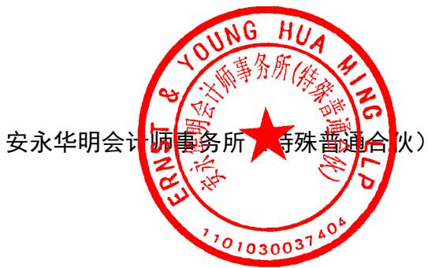

text_image

安永华明会计师事务所(特殊普通合伙)
1101030037404
ERNT & YOUNG HUA MING
(中国)

中国 北京

高君

中国注册会计师：高 君（项目合伙人）

李文冬

中国注册会计师：李冬冬

2026 年 4 月 17 日

<table><tr><td>资产</td><td>附注五</td><td>2025年12月31日</td><td>2024年12月31日(经重述)</td></tr><tr><td>流动资产</td><td></td><td></td><td></td></tr><tr><td>货币资金</td><td>1</td><td>411,670,207</td><td>424,425,658</td></tr><tr><td>交易性金融资产</td><td>2</td><td>20,669</td><td>15,175</td></tr><tr><td>应收票据</td><td>3</td><td>3,820,157</td><td>2,328,094</td></tr><tr><td>应收账款</td><td>4</td><td>415,558,761</td><td>317,144,080</td></tr><tr><td>应收款项融资</td><td>5</td><td>1,586,441</td><td>3,575,355</td></tr><tr><td>预付款项</td><td>6</td><td>35,476,792</td><td>24,341,057</td></tr><tr><td>其他应收款</td><td>7</td><td>74,786,128</td><td>68,235,576</td></tr><tr><td>存货</td><td>8</td><td>815,866,130</td><td>772,168,289</td></tr><tr><td>合同资产</td><td>9</td><td>588,967,936</td><td>445,400,720</td></tr><tr><td>持有待售资产</td><td></td><td>7,792</td><td>1,897,210</td></tr><tr><td>一年内到期的非流动资产</td><td>10</td><td>47,874,731</td><td>61,780,779</td></tr><tr><td>其他流动资产</td><td>11</td><td>210,880,973</td><td>157,692,450</td></tr><tr><td>流动资产合计</td><td></td><td>2,606,516,717</td><td>2,279,004,443</td></tr><tr><td>非流动资产</td><td></td><td></td><td></td></tr><tr><td>债权投资</td><td>12</td><td>26,379,049</td><td>21,971,115</td></tr><tr><td>其他债权投资</td><td></td><td>404,622</td><td>135,767</td></tr><tr><td>长期应收款</td><td>13</td><td>135,065,035</td><td>121,537,045</td></tr><tr><td>长期股权投资</td><td>14</td><td>126,566,824</td><td>119,073,558</td></tr><tr><td>其他权益工具投资</td><td>15</td><td>8,648,360</td><td>7,293,820</td></tr><tr><td>其他非流动金融资产</td><td>16</td><td>1,997,545</td><td>1,904,220</td></tr><tr><td>投资性房地产</td><td>17</td><td>156,683,794</td><td>156,271,918</td></tr><tr><td>固定资产</td><td>18</td><td>53,511,445</td><td>53,392,055</td></tr><tr><td>在建工程</td><td>19</td><td>5,098,512</td><td>4,307,051</td></tr><tr><td>使用权资产</td><td>20</td><td>5,335,354</td><td>6,355,261</td></tr><tr><td>无形资产</td><td>21</td><td>42,392,977</td><td>35,323,710</td></tr><tr><td>商誉</td><td>22</td><td>2,367,054</td><td>2,437,609</td></tr><tr><td>长期待摊费用</td><td>23</td><td>1,641,820</td><td>1,537,713</td></tr><tr><td>递延所得税资产</td><td>24</td><td>30,631,288</td><td>26,626,247</td></tr><tr><td>其他非流动资产</td><td>25</td><td>357,439,422</td><td>352,602,811</td></tr><tr><td>非流动资产合计</td><td></td><td>954,163,101</td><td>910,769,900</td></tr><tr><td>资产总计</td><td></td><td>3,560,679,818</td><td>3,189,774,343</td></tr><tr><td>负债和股东权益</td><td>附注五</td><td>2025年12月31日</td><td>2024年12月31日(经重述)</td></tr><tr><td>流动负债</td><td></td><td></td><td></td></tr><tr><td>短期借款</td><td>28</td><td>170,246,434</td><td>115,745,796</td></tr><tr><td>应付票据</td><td>29</td><td>11,657,357</td><td>16,103,080</td></tr><tr><td>应付账款</td><td>30</td><td>997,477,873</td><td>828,088,617</td></tr><tr><td>预收款项</td><td>31</td><td>1,208,413</td><td>974,280</td></tr><tr><td>合同负债</td><td>32</td><td>377,779,486</td><td>345,388,447</td></tr><tr><td>应付职工薪酬</td><td>33</td><td>13,951,290</td><td>13,023,401</td></tr><tr><td>应交税费</td><td>34</td><td>57,286,249</td><td>62,248,347</td></tr><tr><td>其他应付款</td><td>35</td><td>153,999,969</td><td>147,574,908</td></tr><tr><td>一年内到期的非流动负债</td><td>36</td><td>127,047,835</td><td>120,913,942</td></tr><tr><td>其他流动负债</td><td>37</td><td>155,221,746</td><td>111,469,323</td></tr><tr><td>流动负债合计</td><td></td><td>2,065,876,652</td><td>1,761,530,141</td></tr><tr><td>非流动负债</td><td></td><td></td><td></td></tr><tr><td>长期借款</td><td>38</td><td>526,471,993</td><td>524,271,669</td></tr><tr><td>应付债券</td><td>39</td><td>113,381,047</td><td>98,245,542</td></tr><tr><td>租赁负债</td><td>40</td><td>3,382,648</td><td>4,260,163</td></tr><tr><td>长期应付款</td><td>41</td><td>15,407,569</td><td>14,623,910</td></tr><tr><td>长期应付职工薪酬</td><td>42</td><td>1,360,180</td><td>1,492,530</td></tr><tr><td>预计负债</td><td>43</td><td>2,467,283</td><td>3,069,334</td></tr><tr><td>递延收益</td><td>44</td><td>478,962</td><td>398,954</td></tr><tr><td>递延所得税负债</td><td>24</td><td>8,902,586</td><td>9,055,865</td></tr><tr><td>其他非流动负债</td><td>45</td><td>442,736</td><td>844,770</td></tr><tr><td>非流动负债合计</td><td></td><td>672,295,004</td><td>656,262,737</td></tr><tr><td>负债合计</td><td></td><td>2,738,171,656</td><td>2,417,792,878</td></tr></table>

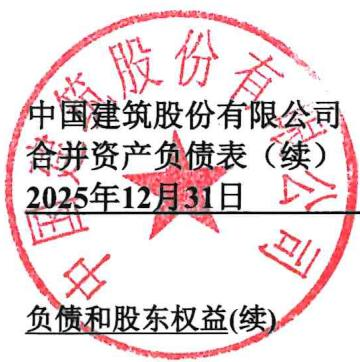

text_image

中国建筑股份有限公司
合并资产负债表（续）
2025年12月31日
负债和股东权益(续)

人民币千元

<table><tr><td>负债和股东权益(续)</td><td>附注五</td><td>2025年12月31日</td><td>2024年12月31日(经重述)</td></tr><tr><td>股东权益</td><td></td><td></td><td></td></tr><tr><td>股本</td><td>46</td><td>41,320,390</td><td>41,610,322</td></tr><tr><td>其他权益工具</td><td>47</td><td>9,000,000</td><td>9,000,000</td></tr><tr><td>其中:永续债</td><td></td><td>9,000,000</td><td>9,000,000</td></tr><tr><td>资本公积</td><td>48</td><td>9,940,155</td><td>11,035,669</td></tr><tr><td>减:库存股</td><td></td><td>-</td><td>(884,370)</td></tr><tr><td>其他综合收益</td><td>49</td><td>(3,069,363)</td><td>(3,241,738)</td></tr><tr><td>专项储备</td><td>50</td><td>3,973,773</td><td>2,277,958</td></tr><tr><td>一般风险准备</td><td></td><td>2,832,901</td><td>2,832,901</td></tr><tr><td>盈余公积</td><td>51</td><td>18,555,842</td><td>17,364,718</td></tr><tr><td>未分配利润</td><td>52</td><td>409,001,909</td><td>382,502,639</td></tr><tr><td>归属于母公司股东权益合计</td><td></td><td>491,555,607</td><td>462,498,099</td></tr><tr><td>少数股东权益</td><td></td><td>330,952,555</td><td>309,483,366</td></tr><tr><td>股东权益合计</td><td></td><td>822,508,162</td><td>771,981,465</td></tr><tr><td>负债和股东权益总计</td><td></td><td>3,560,679,818</td><td>3,189,774,343</td></tr></table>

本财务报表由以下人士签署：

企业负责人：

会计机构负责人：

后附财务报表附注为本财务报表的组成部分

<table><tr><td></td><td>附注五</td><td>2025年</td><td>2024年(经重述)</td></tr><tr><td>营业收入</td><td>53</td><td>2,082,141,811</td><td>2,187,334,286</td></tr><tr><td>减:营业成本</td><td>53</td><td>1,876,058,765</td><td>1,971,708,426</td></tr><tr><td>税金及附加</td><td>54</td><td>8,754,330</td><td>9,780,065</td></tr><tr><td>销售费用</td><td>55</td><td>9,038,614</td><td>8,743,942</td></tr><tr><td>管理费用</td><td>56</td><td>33,873,816</td><td>34,636,932</td></tr><tr><td>研发费用</td><td>57</td><td>44,009,417</td><td>45,464,667</td></tr><tr><td>财务费用</td><td>58</td><td>17,641,773</td><td>19,464,954</td></tr><tr><td>其中:利息费用</td><td></td><td>19,810,305</td><td>21,795,048</td></tr><tr><td>利息收入</td><td></td><td>3,962,278</td><td>4,232,406</td></tr><tr><td>加:其他收益</td><td>59</td><td>1,002,756</td><td>937,841</td></tr><tr><td>投资收益</td><td>60</td><td>802,824</td><td>1,504,780</td></tr><tr><td>其中:对联营企业和合营企业的投资收益</td><td></td><td>1,713,031</td><td>3,652,253</td></tr><tr><td>以摊余成本计量的金融资产终止确认损失</td><td></td><td>(3,205,603)</td><td>(3,081,169)</td></tr><tr><td>公允价值变动(损失)/收益</td><td>61</td><td>(43,600)</td><td>94,324</td></tr><tr><td>信用减值损失</td><td>62</td><td>(18,655,275)</td><td>(13,634,192)</td></tr><tr><td>资产减值损失</td><td>63</td><td>(7,210,082)</td><td>(6,456,693)</td></tr><tr><td>资产处置收益</td><td></td><td>287,115</td><td>583,753</td></tr><tr><td>营业利润</td><td></td><td>68,948,834</td><td>80,565,113</td></tr><tr><td>加:营业外收入</td><td>64</td><td>1,768,669</td><td>1,217,165</td></tr><tr><td>减:营业外支出</td><td>65</td><td>495,854</td><td>1,735,959</td></tr><tr><td>利润总额</td><td></td><td>70,221,649</td><td>80,046,319</td></tr><tr><td>减:所得税费用</td><td>67</td><td>16,664,009</td><td>17,299,856</td></tr><tr><td>净利润</td><td></td><td>53,557,640</td><td>62,746,463</td></tr><tr><td>其中:同一控制下企业合并中被合并方合并前净利润</td><td></td><td>5,698</td><td>7,421</td></tr><tr><td>按经营持续性分类</td><td></td><td></td><td></td></tr><tr><td>持续经营净利润</td><td></td><td>53,557,640</td><td>62,746,463</td></tr><tr><td>按所有权归属分类</td><td></td><td></td><td></td></tr><tr><td>归属于母公司股东的净利润</td><td></td><td>39,069,002</td><td>46,193,694</td></tr><tr><td>少数股东损益</td><td></td><td>14,488,638</td><td>16,552,769</td></tr></table>

后附财务报表附注为本财务报表的组成部分

<table><tr><td></td><td>附注五</td><td>2025年</td><td>2024年(经重述)</td></tr><tr><td>其他综合收益的税后净额</td><td></td><td>1,025,582</td><td>(1,293,201)</td></tr><tr><td>归属于母公司股东的其他综合收益的税后净额</td><td>49</td><td>391,294</td><td>(693,691)</td></tr><tr><td>不能重分类进损益的其他综合收益</td><td></td><td>(326,174)</td><td>194,631</td></tr><tr><td>重新计量设定受益计划变动额</td><td></td><td>9,581</td><td>(56,982)</td></tr><tr><td>其他权益工具投资公允价值变动</td><td></td><td>(335,755)</td><td>251,613</td></tr><tr><td>将重分类进损益的其他综合收益</td><td></td><td>717,468</td><td>(888,322)</td></tr><tr><td>权益法下可转损益的其他综合收益</td><td></td><td>117,185</td><td>(87,405)</td></tr><tr><td>其他债权投资公允价值变动</td><td></td><td>540</td><td>1,470</td></tr><tr><td>外币财务报表折算差额</td><td></td><td>599,743</td><td>(802,387)</td></tr><tr><td>归属于少数股东的其他综合收益的税后净额</td><td>49</td><td>634,288</td><td>(599,510)</td></tr><tr><td>综合收益总额</td><td></td><td>54,583,222</td><td>61,453,262</td></tr><tr><td>其中:</td><td></td><td></td><td></td></tr><tr><td>归属于母公司股东的综合收益总额</td><td></td><td>39,460,296</td><td>45,500,003</td></tr><tr><td>归属于少数股东的综合收益总额</td><td></td><td>15,122,926</td><td>15,953,259</td></tr><tr><td>每股收益</td><td>68</td><td></td><td></td></tr><tr><td>基本每股收益(元/股)</td><td></td><td>0.94</td><td>1.11</td></tr><tr><td>稀释每股收益(元/股)</td><td></td><td>0.94</td><td>1.11</td></tr></table>

本财务报表由以下人士签署：

企业负责人：

主管会计工作负责人：

会计机构负责人：

后附财务报表附注为本财务报表的组成部分

<table><tr><td rowspan="2"></td><td colspan="10">归属于母公司股东权益</td><td rowspan="2">少数股东权益</td><td rowspan="2">股东权益合计</td></tr><tr><td>股本</td><td>其他权益工具永续债</td><td>资本公积</td><td>减:库存股</td><td>其他综合收益</td><td>专项储备</td><td>一般风险准备</td><td>盈余公积</td><td>未分配利润</td><td>小计</td></tr><tr><td>一、上年年末余额</td><td>41,610,322</td><td>9,000,000</td><td>10,723,129</td><td>(884,370)</td><td>(3,241,738)</td><td>2,276,816</td><td>2,832,901</td><td>17,364,718</td><td>382,502,881</td><td>462,184,659</td><td>309,275,817</td><td>771,460,476</td></tr><tr><td>加:同一控制下的企业合并</td><td>-</td><td>-</td><td>312,540</td><td>-</td><td>-</td><td>1,142</td><td>-</td><td>-</td><td>(242)</td><td>313,440</td><td>207,549</td><td>520,989</td></tr><tr><td>二、本年年初余额</td><td>41,610,322</td><td>9,000,000</td><td>11,035,669</td><td>(884,370)</td><td>(3,241,738)</td><td>2,277,958</td><td>2,832,901</td><td>17,364,718</td><td>382,502,639</td><td>462,498,099</td><td>309,483,366</td><td>771,981,465</td></tr><tr><td>三、本年增减变动金额</td><td></td><td></td><td></td><td></td><td></td><td></td><td></td><td></td><td></td><td></td><td></td><td></td></tr><tr><td>(一)综合收益总额</td><td>-</td><td>-</td><td>-</td><td>-</td><td>391,294</td><td>-</td><td>-</td><td>-</td><td>39,069,002</td><td>39,460,296</td><td>15,122,926</td><td>54,583,222</td></tr><tr><td>(二)股东投入和减少资本</td><td></td><td></td><td></td><td></td><td></td><td></td><td></td><td></td><td></td><td></td><td></td><td></td></tr><tr><td>1.股东投入资本</td><td>-</td><td>-</td><td>-</td><td>-</td><td>-</td><td>-</td><td>-</td><td>-</td><td>-</td><td>-</td><td>12,488,909</td><td>12,488,909</td></tr><tr><td>2.其他权益工具持有者投入资本</td><td>-</td><td>-</td><td>(1,760)</td><td>-</td><td>-</td><td>-</td><td>-</td><td>-</td><td>-</td><td>(1,760)</td><td>1,801,760</td><td>1,800,000</td></tr><tr><td>3.其他权益工具持有者减少资本</td><td>-</td><td>-</td><td>-</td><td>-</td><td>-</td><td>-</td><td>-</td><td>-</td><td>-</td><td>-</td><td>(2,000,000)</td><td>(2,000,000)</td></tr><tr><td>4.对子公司持股比例变化的影响</td><td>-</td><td>-</td><td>(143,930)</td><td>-</td><td>-</td><td>-</td><td>-</td><td>-</td><td>-</td><td>(143,930)</td><td>(211,851)</td><td>(355,781)</td></tr><tr><td>5.回购并注销未解锁的限制性股票</td><td>(289,932)</td><td>-</td><td>(594,438)</td><td>884,370</td><td>-</td><td>-</td><td>-</td><td>-</td><td>-</td><td>-</td><td>-</td><td>-</td></tr><tr><td>6.收购子公司</td><td>-</td><td>-</td><td>-</td><td>-</td><td>-</td><td>-</td><td>-</td><td>-</td><td>-</td><td>-</td><td>3,739,199</td><td>3,739,199</td></tr><tr><td>7.同一控制下企业合并</td><td>-</td><td>-</td><td>(395,358)</td><td>-</td><td>-</td><td>-</td><td>-</td><td>-</td><td>-</td><td>(395,358)</td><td>-</td><td>(395,358)</td></tr><tr><td>8.其他</td><td>-</td><td>-</td><td>39,972</td><td>-</td><td>-</td><td>-</td><td>-</td><td>-</td><td>(95,241)</td><td>(55,269)</td><td>(111,609)</td><td>(166,878)</td></tr><tr><td>(三)利润分配</td><td></td><td></td><td></td><td></td><td></td><td></td><td></td><td></td><td></td><td></td><td></td><td></td></tr><tr><td>1.提取盈余公积</td><td>-</td><td>-</td><td>-</td><td>-</td><td>-</td><td>-</td><td>-</td><td>1,191,124</td><td>(1,191,124)</td><td>-</td><td>-</td><td>-</td></tr><tr><td>2.对股东的分配</td><td>-</td><td>-</td><td>-</td><td>-</td><td>-</td><td>-</td><td>-</td><td>-</td><td>(11,218,486)</td><td>(11,218,486)</td><td>(7,426,047)</td><td>(18,644,533)</td></tr><tr><td>3.对其他权益工具持有者的股利分配</td><td>-</td><td>-</td><td>-</td><td>-</td><td>-</td><td>-</td><td>-</td><td>-</td><td>(283,800)</td><td>(283,800)</td><td>(1,925,078)</td><td>(2,208,878)</td></tr><tr><td>(四)股东权益内部结转</td><td></td><td></td><td></td><td></td><td></td><td></td><td></td><td></td><td></td><td></td><td></td><td></td></tr><tr><td>1.其他综合收益结转留存收益</td><td>-</td><td>-</td><td>-</td><td>-</td><td>(218,919)</td><td>-</td><td>-</td><td>-</td><td>218,919</td><td>-</td><td>-</td><td>-</td></tr><tr><td>(五)专项储备</td><td></td><td></td><td></td><td></td><td></td><td></td><td></td><td></td><td></td><td></td><td></td><td></td></tr><tr><td>1.本年提取</td><td>-</td><td>-</td><td>-</td><td>-</td><td>-</td><td>57,904,564</td><td>-</td><td>-</td><td>-</td><td>57,904,564</td><td>260,156</td><td>58,164,720</td></tr><tr><td>2.本年使用</td><td>-</td><td>-</td><td>-</td><td>-</td><td>-</td><td>(56,208,749)</td><td>-</td><td>-</td><td>-</td><td>(56,208,749)</td><td>(269,176)</td><td>(56,477,925)</td></tr><tr><td>四、本年年末余额</td><td>41,320,390</td><td>9,000,000</td><td>9,940,155</td><td>-</td><td>(3,069,363)</td><td>3,973,773</td><td>2,832,901</td><td>18,555,842</td><td>409,001,909</td><td>491,555,607</td><td>330,952,555</td><td>822,508,162</td></tr></table>

<table><tr><td rowspan="2"></td><td colspan="10">归属于母公司股东权益</td><td rowspan="2">少数股东 权益</td><td rowspan="2">股东权益 合计</td></tr><tr><td>股本</td><td>其他权益工具 永续债</td><td>资本公积</td><td>减:库存股</td><td>其他综合 收益</td><td>专项储备</td><td>一般风险 准备</td><td>盈余公积</td><td>未分配利润</td><td>小计</td></tr><tr><td>一、上年年末余额</td><td>41,919,514</td><td>9,131,494</td><td>12,050,197</td><td>(1,831,725)</td><td>(2,575,572)</td><td>915,879</td><td>2,582,513</td><td>15,579,360</td><td>349,838,232</td><td>427,609,892</td><td>303,460,217</td><td>731,070,109</td></tr><tr><td>加:同一控制下的企业合并</td><td>-</td><td>-</td><td>312,540</td><td>-</td><td>-</td><td>992</td><td>-</td><td>-</td><td>(6,807)</td><td>306,725</td><td>204,939</td><td>511,664</td></tr><tr><td>二、本年年初余额</td><td>41,919,514</td><td>9,131,494</td><td>12,362,737</td><td>(1,831,725)</td><td>(2,575,572)</td><td>916,871</td><td>2,582,513</td><td>15,579,360</td><td>349,831,425</td><td>427,916,617</td><td>303,665,156</td><td>731,581,773</td></tr><tr><td>三、本年增减变动金额</td><td></td><td></td><td></td><td></td><td></td><td></td><td></td><td></td><td></td><td></td><td></td><td></td></tr><tr><td>(一)综合收益总额</td><td>-</td><td>-</td><td>-</td><td>-</td><td>(693,691)</td><td>-</td><td>-</td><td>-</td><td>46,193,694</td><td>45,500,003</td><td>15,953,259</td><td>61,453,262</td></tr><tr><td>(二)股东投入和减少资本</td><td></td><td></td><td></td><td></td><td></td><td></td><td></td><td></td><td></td><td></td><td></td><td></td></tr><tr><td>1.股东投入资本</td><td>-</td><td>-</td><td>-</td><td>-</td><td>-</td><td>-</td><td>-</td><td>-</td><td>-</td><td>-</td><td>1,532,713</td><td>1,532,713</td></tr><tr><td>2.其他权益工具持有者投入资本</td><td>-</td><td>-</td><td>(13,001)</td><td>-</td><td>-</td><td>-</td><td>-</td><td>-</td><td>-</td><td>(13,001)</td><td>19,696,740</td><td>19,683,739</td></tr><tr><td>3.其他权益工具持有者减少资本</td><td>-</td><td>-</td><td>-</td><td>-</td><td>-</td><td>-</td><td>-</td><td>-</td><td>-</td><td>-</td><td>(21,243,318)</td><td>(21,243,318)</td></tr><tr><td>4.股份支付计入股东权益的金额</td><td>-</td><td>-</td><td>(468,778)</td><td>-</td><td>-</td><td>-</td><td>-</td><td>-</td><td>-</td><td>(468,778)</td><td>(22,277)</td><td>(491,055)</td></tr><tr><td>5.对子公司持股比例变化的影响</td><td>-</td><td>-</td><td>138,146</td><td>-</td><td>-</td><td>-</td><td>-</td><td>-</td><td>-</td><td>138,146</td><td>(383,634)</td><td>(245,488)</td></tr><tr><td>6.回购并注销未解锁的限制性股票</td><td>(309,192)</td><td>-</td><td>(638,163)</td><td>947,355</td><td>-</td><td>-</td><td>-</td><td>-</td><td>-</td><td>-</td><td>-</td><td>-</td></tr><tr><td>7.收购子公司</td><td>-</td><td>-</td><td>-</td><td>-</td><td>-</td><td>-</td><td>-</td><td>-</td><td>-</td><td>-</td><td>363,253</td><td>363,253</td></tr><tr><td>8.其他</td><td>-</td><td>-</td><td>(345,272)</td><td>-</td><td>-</td><td>-</td><td>-</td><td>-</td><td>(9,166)</td><td>(354,438)</td><td>(6,629)</td><td>(361,067)</td></tr><tr><td>(三)利润分配</td><td></td><td></td><td></td><td></td><td></td><td></td><td></td><td></td><td></td><td></td><td></td><td></td></tr><tr><td>1.提取盈余公积</td><td>-</td><td>-</td><td>-</td><td>-</td><td>-</td><td>-</td><td>-</td><td>1,785,358</td><td>(1,785,358)</td><td>-</td><td>-</td><td>-</td></tr><tr><td>2.提取一般风险准备</td><td>-</td><td>-</td><td>-</td><td>-</td><td>-</td><td>-</td><td>250,388</td><td>-</td><td>(250,388)</td><td>-</td><td>-</td><td>-</td></tr><tr><td>3.对股东的分配</td><td>-</td><td>-</td><td>-</td><td>-</td><td>-</td><td>-</td><td>-</td><td>-</td><td>(11,297,737)</td><td>(11,297,737)</td><td>(7,738,194)</td><td>(19,035,931)</td></tr><tr><td>4.对其他权益工具持有者的股利分配</td><td>-</td><td>(131,494)</td><td>-</td><td>-</td><td>-</td><td>-</td><td>-</td><td>-</td><td>(152,306)</td><td>(283,800)</td><td>(2,337,239)</td><td>(2,621,039)</td></tr><tr><td>(四)股东权益内部结转</td><td></td><td></td><td></td><td></td><td></td><td></td><td></td><td></td><td></td><td></td><td></td><td></td></tr><tr><td>1.其他综合收益结转留存收益</td><td>-</td><td>-</td><td>-</td><td>-</td><td>27,525</td><td>-</td><td>-</td><td>-</td><td>(27,525)</td><td>-</td><td>-</td><td>-</td></tr><tr><td>(五)专项储备</td><td></td><td></td><td></td><td></td><td></td><td></td><td></td><td></td><td></td><td></td><td></td><td></td></tr><tr><td>1.本年提取</td><td>-</td><td>-</td><td>-</td><td>-</td><td>-</td><td>61,665,679</td><td>-</td><td>-</td><td>-</td><td>61,665,679</td><td>206,213</td><td>61,871,892</td></tr><tr><td>2.本年使用</td><td>-</td><td>-</td><td>-</td><td>-</td><td>-</td><td>(60,304,592)</td><td>-</td><td>-</td><td>-</td><td>(60,304,592)</td><td>(202,677)</td><td>(60,507,269)</td></tr><tr><td>四、本年年末余额</td><td>41,610,322</td><td>9,000,000</td><td>11,035,669</td><td>(884,370)</td><td>(3,241,738)</td><td>2,277,958</td><td>2,832,901</td><td>17,364,718</td><td>382,502,639</td><td>462,498,099</td><td>309,483,366</td><td>771,981,465</td></tr></table>

本财务报表由以下人士签署：

企业负责人：

后附财务报表附注为本财务报表的组成部分

主管会计工作负责人：

会计机构负责人：

# 一、经营活动产生的现金流量：

<table><tr><td>销售商品、提供劳务收到的现金</td><td></td><td>2,131,180,581</td><td>2,239,232,925</td></tr><tr><td>收到的税费返还</td><td></td><td>2,140,949</td><td>3,257,532</td></tr><tr><td>收到其他与经营活动有关的现金</td><td>69</td><td>53,972,386</td><td>39,263,435</td></tr><tr><td>经营活动现金流入小计</td><td></td><td>2,187,293,916</td><td>2,281,753,892</td></tr><tr><td>购买商品、接受劳务支付的现金</td><td></td><td>1,952,939,461</td><td>2,014,807,221</td></tr><tr><td>支付给职工以及为职工支付的现金</td><td></td><td>115,118,850</td><td>115,878,042</td></tr><tr><td>支付的各项税费</td><td></td><td>64,785,137</td><td>71,762,302</td></tr><tr><td>支付其他与经营活动有关的现金</td><td>69</td><td>33,913,336</td><td>63,480,534</td></tr><tr><td>经营活动现金流出小计</td><td></td><td>2,166,756,784</td><td>2,265,928,099</td></tr><tr><td>经营活动产生的现金流量净额</td><td>70</td><td>20,537,132</td><td>15,825,793</td></tr></table>

# 二、投资活动产生的现金流量：

<table><tr><td>收回投资收到的现金</td><td>69</td><td>4,560,099</td><td>2,880,906</td></tr><tr><td>取得投资收益收到的现金</td><td>69</td><td>2,169,520</td><td>2,567,779</td></tr><tr><td>处置固定资产、无形资产和其他长期资产收回的现金净额</td><td>69</td><td>4,760,083</td><td>8,416,141</td></tr><tr><td>处置子公司及其他营业单位收到的现金净额</td><td>69</td><td>4,141,494</td><td>290,909</td></tr><tr><td>收到其他与投资活动有关的现金</td><td>69</td><td>17,878,005</td><td>23,287,331</td></tr><tr><td>投资活动现金流入小计</td><td></td><td>33,509,201</td><td>37,443,066</td></tr><tr><td>购建固定资产、无形资产和其他长期资产支付的现金</td><td>69</td><td>26,226,719</td><td>19,825,295</td></tr><tr><td>投资支付的现金</td><td>69</td><td>8,561,454</td><td>5,420,794</td></tr><tr><td>取得子公司及其他营业单位支付的现金净额</td><td>69</td><td>7,425,135</td><td>1,015,521</td></tr><tr><td>支付其他与投资活动有关的现金</td><td>69</td><td>23,445,921</td><td>13,712,510</td></tr><tr><td>投资活动现金流出小计</td><td></td><td>65,659,229</td><td>39,974,120</td></tr><tr><td>投资活动使用的现金流量净额</td><td></td><td>(32,150,028)</td><td>(2,531,054)</td></tr></table>

后附财务报表附注为本财务报表的组成部分

# 三、筹资活动产生的现金流量：

<table><tr><td>吸收投资收到的现金</td><td></td><td>14,290,669</td><td>21,229,453</td></tr><tr><td>其中:子公司吸收少数股东投资收到的现金</td><td></td><td>14,290,669</td><td>21,229,453</td></tr><tr><td>取得借款收到的现金</td><td></td><td>469,885,077</td><td>470,232,218</td></tr><tr><td>发行债券收到的现金</td><td></td><td>124,558,100</td><td>150,984,306</td></tr><tr><td>收到其他与筹资活动有关的现金</td><td>69</td><td>8,889,695</td><td>19,330,091</td></tr><tr><td>筹资活动现金流入小计</td><td></td><td>617,623,541</td><td>661,776,068</td></tr><tr><td>偿还债务支付的现金</td><td></td><td>534,846,647</td><td>562,720,795</td></tr><tr><td>分配股利、利润或偿付利息支付的现金</td><td></td><td>49,757,579</td><td>53,995,535</td></tr><tr><td>其中:子公司支付给少数股东的股利、利润</td><td></td><td>9,396,085</td><td>10,087,835</td></tr><tr><td>支付其他与筹资活动有关的现金</td><td>69</td><td>21,439,957</td><td>29,949,630</td></tr><tr><td>筹资活动现金流出小计</td><td></td><td>606,044,183</td><td>646,665,960</td></tr><tr><td>筹资活动产生的现金流量净额</td><td></td><td>11,579,358</td><td>15,110,108</td></tr><tr><td>四、汇率变动对现金及现金等价物的影响</td><td></td><td>(142,832)</td><td>1,781,495</td></tr><tr><td>五、现金及现金等价物净(减少)/增加额</td><td>70</td><td>(176,370)</td><td>30,186,342</td></tr><tr><td>加:年初现金及现金等价物余额</td><td>70</td><td>359,372,597</td><td>329,186,255</td></tr><tr><td>六、年末现金及现金等价物余额</td><td>70</td><td>359,196,227</td><td>359,372,597</td></tr></table>

本财务报表由以下人士签署

企业负责人：

主管会计工作负责人

会计机构负责人：

后附财务报表附注为本财务报表的组成部分

<table><tr><td>资产</td><td>附注十六</td><td>2025年12月31日</td><td>2024年12月31日</td></tr><tr><td>流动资产</td><td></td><td></td><td></td></tr><tr><td>货币资金</td><td></td><td>14,116,274</td><td>16,388,313</td></tr><tr><td>其中:存放财务公司款项</td><td></td><td>3,825,153</td><td>4,724,472</td></tr><tr><td>应收票据</td><td></td><td>25,459</td><td>29,298</td></tr><tr><td>应收账款</td><td>1</td><td>22,618,817</td><td>23,383,738</td></tr><tr><td>预付款项</td><td></td><td>6,174,387</td><td>5,810,605</td></tr><tr><td>其他应收款</td><td>2</td><td>29,089,607</td><td>27,420,937</td></tr><tr><td>存货</td><td></td><td>992,052</td><td>814,156</td></tr><tr><td>合同资产</td><td></td><td>18,397,420</td><td>18,476,198</td></tr><tr><td>一年内到期的非流动资产</td><td></td><td>1,352,377</td><td>720,326</td></tr><tr><td>其他流动资产</td><td></td><td>4,969,787</td><td>4,502,203</td></tr><tr><td>流动资产合计</td><td></td><td>97,736,180</td><td>97,545,774</td></tr><tr><td>非流动资产</td><td></td><td></td><td></td></tr><tr><td>债权投资</td><td></td><td>15,161,606</td><td>8,864,481</td></tr><tr><td>长期应收款</td><td></td><td>931,505</td><td>1,076,820</td></tr><tr><td>长期股权投资</td><td>3</td><td>241,103,937</td><td>235,843,128</td></tr><tr><td>其他权益工具投资</td><td></td><td>1,521,756</td><td>1,629,133</td></tr><tr><td>其他非流动金融资产</td><td></td><td>305,681</td><td>304,844</td></tr><tr><td>投资性房地产</td><td></td><td>413,357</td><td>438,209</td></tr><tr><td>固定资产</td><td></td><td>1,208,985</td><td>1,156,786</td></tr><tr><td>在建工程</td><td></td><td>168,799</td><td>126,759</td></tr><tr><td>使用权资产</td><td></td><td>624,903</td><td>350,868</td></tr><tr><td>无形资产</td><td></td><td>622,314</td><td>491,205</td></tr><tr><td>长期待摊费用</td><td></td><td>6,647</td><td>12,819</td></tr><tr><td>递延所得税资产</td><td></td><td>2,171,983</td><td>2,005,568</td></tr><tr><td>其他非流动资产</td><td></td><td>8,837,828</td><td>8,215,924</td></tr><tr><td>非流动资产合计</td><td></td><td>273,079,301</td><td>260,516,544</td></tr><tr><td>资产总计</td><td></td><td>370,815,481</td><td>358,062,318</td></tr></table>

后附财务报表附注为本财务报表的组成部分

<table><tr><td>负债和股东权益</td><td>2025年12月31日</td><td>2024年12月31日</td></tr><tr><td>流动负债</td><td></td><td></td></tr><tr><td>短期借款</td><td>14,898,700</td><td>11,410,180</td></tr><tr><td>应付账款</td><td>56,036,369</td><td>53,546,197</td></tr><tr><td>合同负债</td><td>9,550,505</td><td>11,280,974</td></tr><tr><td>应付职工薪酬</td><td>352,550</td><td>402,713</td></tr><tr><td>应交税费</td><td>2,283,114</td><td>3,123,665</td></tr><tr><td>其他应付款</td><td>56,384,097</td><td>53,639,580</td></tr><tr><td>一年内到期的非流动负债</td><td>7,286,970</td><td>20,964,485</td></tr><tr><td>其他流动负债</td><td>3,522,646</td><td>3,761,724</td></tr><tr><td>流动负债合计</td><td>150,314,951</td><td>158,129,518</td></tr><tr><td>非流动负债</td><td></td><td></td></tr><tr><td>长期借款</td><td>47,150,310</td><td>32,020,800</td></tr><tr><td>应付债券</td><td>9,992,906</td><td>5,994,325</td></tr><tr><td>租赁负债</td><td>524,823</td><td>348,782</td></tr><tr><td>长期应付款</td><td>9,400,850</td><td>8,517,634</td></tr><tr><td>长期应付职工薪酬</td><td>85,090</td><td>94,960</td></tr><tr><td>预计负债</td><td>12,949</td><td>43,614</td></tr><tr><td>递延收益</td><td>6,549</td><td>2,354</td></tr><tr><td>非流动负债合计</td><td>67,173,477</td><td>47,022,469</td></tr><tr><td>负债合计</td><td>217,488,428</td><td>205,151,987</td></tr><tr><td>负债和股东权益(续)</td><td>2025年12月31日</td><td>2024年12月31日</td></tr><tr><td>股东权益</td><td></td><td></td></tr><tr><td>股本</td><td>41,320,390</td><td>41,610,322</td></tr><tr><td>其他权益工具</td><td>9,000,000</td><td>9,000,000</td></tr><tr><td>其中:永续债</td><td>9,000,000</td><td>9,000,000</td></tr><tr><td>资本公积</td><td>28,564,677</td><td>29,206,050</td></tr><tr><td>减:库存股</td><td>-</td><td>(884,370)</td></tr><tr><td>其他综合收益</td><td>(95,702)</td><td>117,531</td></tr><tr><td>专项储备</td><td>212,946</td><td>62,941</td></tr><tr><td>盈余公积</td><td>18,555,842</td><td>17,364,718</td></tr><tr><td>未分配利润</td><td>55,768,900</td><td>56,433,139</td></tr><tr><td>股东权益合计</td><td>153,327,053</td><td>152,910,331</td></tr><tr><td>负债和股东权益总计</td><td>370,815,481</td><td>358,062,318</td></tr></table>

本财务报表由以下人士签署：

企业负责人：

主管会计工作负责人

会计机构负责人：

后附财务报表附注为本财务报表的组成部分

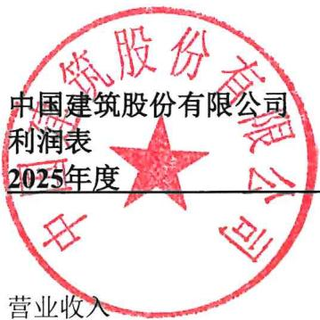

text_image

中国建筑股份有限公司
利润表
2025年度
营业收入

人民币千元

<table><tr><td></td><td>附注十六</td><td>2025年</td><td>2024年</td></tr><tr><td>营业收入</td><td>4</td><td>46,370,096</td><td>49,571,654</td></tr><tr><td>减:营业成本</td><td>4</td><td>46,649,204</td><td>46,561,387</td></tr><tr><td>税金及附加</td><td></td><td>83,139</td><td>51,902</td></tr><tr><td>管理费用</td><td></td><td>1,460,423</td><td>1,673,152</td></tr><tr><td>研发费用</td><td></td><td>221,981</td><td>254,479</td></tr><tr><td>财务费用</td><td></td><td>1,314,528</td><td>1,722,334</td></tr><tr><td>其中:利息费用</td><td></td><td>1,823,900</td><td>1,872,158</td></tr><tr><td>利息收入</td><td></td><td>259,634</td><td>172,996</td></tr><tr><td>加:其他收益</td><td></td><td>8,762</td><td>6,278</td></tr><tr><td>投资收益</td><td>5</td><td>15,433,768</td><td>20,262,844</td></tr><tr><td>其中:对联营企业和合营企业的投资(损失)/收益</td><td></td><td>(354,984)</td><td>65,373</td></tr><tr><td>以摊余成本计量的金融资产终止确认损失</td><td></td><td>(1,300)</td><td>(2,281)</td></tr><tr><td>公允价值变动收益</td><td></td><td>837</td><td>31,219</td></tr><tr><td>信用减值损失</td><td></td><td>(165,522)</td><td>(991,539)</td></tr><tr><td>资产减值损失</td><td></td><td>(39,555)</td><td>(7,415)</td></tr><tr><td>资产处置收益</td><td></td><td>22,999</td><td>492</td></tr><tr><td>营业利润</td><td></td><td>11,902,110</td><td>18,610,279</td></tr><tr><td>加:营业外收入</td><td></td><td>17,121</td><td>6,676</td></tr><tr><td>减:营业外支出</td><td></td><td>126,417</td><td>126,800</td></tr><tr><td>利润总额</td><td></td><td>11,792,814</td><td>18,490,155</td></tr><tr><td>减:所得税费用</td><td></td><td>(118,423)</td><td>636,571</td></tr><tr><td>净利润</td><td></td><td>11,911,237</td><td>17,853,584</td></tr><tr><td>其中:持续经营净利润</td><td></td><td>11,911,237</td><td>17,853,584</td></tr><tr><td>其他综合收益的税后净额</td><td></td><td>(95,299)</td><td>35,588</td></tr><tr><td>不能重分类进损益的其他综合收益</td><td></td><td>(57,985)</td><td>(196)</td></tr><tr><td>重新计量设定受益计划变动额</td><td></td><td>1,400</td><td>(1,810)</td></tr><tr><td>其他权益工具投资公允价值变动</td><td></td><td>(59,385)</td><td>1,614</td></tr><tr><td>将重分类进损益的其他综合收益</td><td></td><td>(37,314)</td><td>35,784</td></tr><tr><td>权益法下可转损益的其他综合收益</td><td></td><td>(496)</td><td>(265)</td></tr><tr><td>外币财务报表折算差额</td><td></td><td>(36,818)</td><td>36,049</td></tr><tr><td>综合收益总额</td><td></td><td>11,815,938</td><td>17,889,172</td></tr></table>

本财务报表由以下人签署：

企业负责人： 主管会计工作负责人

会计机构负责人：

后附财务报表附注为本财务报表的组成部分

<table><tr><td></td><td>股本</td><td>其他权益工具永续债</td><td>资本公积</td><td>减:库存股</td><td>其他综合收益</td><td>专项储备</td><td>盈余公积</td><td>未分配利润</td><td>股东权益合计</td></tr><tr><td>一、本年年初余额</td><td>41,610,322</td><td>9,000,000</td><td>29,206,050</td><td>(884,370)</td><td>117,531</td><td>62,941</td><td>17,364,718</td><td>56,433,139</td><td>152,910,331</td></tr><tr><td>二、本年增减变动金额</td><td></td><td></td><td></td><td></td><td></td><td></td><td></td><td></td><td></td></tr><tr><td>(一)综合收益总额</td><td>-</td><td>-</td><td>-</td><td>-</td><td>(95,299)</td><td>-</td><td>-</td><td>11,911,237</td><td>11,815,938</td></tr><tr><td>(二)股东投入和减少资本</td><td></td><td></td><td></td><td></td><td></td><td></td><td></td><td></td><td></td></tr><tr><td>1.回购并注销未解锁的限制性股票</td><td>(289,932)</td><td>-</td><td>(594,438)</td><td>884,370</td><td>-</td><td>-</td><td>-</td><td>-</td><td>-</td></tr><tr><td>2.其他</td><td>-</td><td>-</td><td>(46,935)</td><td>-</td><td>-</td><td>-</td><td>-</td><td>-</td><td>(46,935)</td></tr><tr><td>(三)利润分配</td><td></td><td></td><td></td><td></td><td></td><td></td><td></td><td></td><td></td></tr><tr><td>1.提取盈余公积</td><td>-</td><td>-</td><td>-</td><td>-</td><td>-</td><td>-</td><td>1,191,124</td><td>(1,191,124)</td><td>-</td></tr><tr><td>2.对股东的分配</td><td>-</td><td>-</td><td>-</td><td>-</td><td>-</td><td>-</td><td>-</td><td>(11,218,486)</td><td>(11,218,486)</td></tr><tr><td>3.对其他权益工具持有者的股利分配</td><td>-</td><td>-</td><td>-</td><td>-</td><td>-</td><td>-</td><td>-</td><td>(283,800)</td><td>(283,800)</td></tr><tr><td>(四)股东权益内部结转</td><td></td><td></td><td></td><td></td><td></td><td></td><td></td><td></td><td></td></tr><tr><td>1.其他综合收益结转留存收益</td><td>-</td><td>-</td><td>-</td><td>-</td><td>(117,934)</td><td>-</td><td>-</td><td>117,934</td><td>-</td></tr><tr><td>(五)专项储备</td><td></td><td></td><td></td><td></td><td></td><td></td><td></td><td></td><td></td></tr><tr><td>1.本年提取</td><td>-</td><td>-</td><td>-</td><td>-</td><td>-</td><td>946,993</td><td>-</td><td>-</td><td>946,993</td></tr><tr><td>2.本年使用</td><td>-</td><td>-</td><td>-</td><td>-</td><td>-</td><td>(796,988)</td><td>-</td><td>-</td><td>(796,988)</td></tr><tr><td>三、本年年末余额</td><td>41,320,390</td><td>9,000,000</td><td>28,564,677</td><td>-</td><td>(95,702)</td><td>212,946</td><td>18,555,842</td><td>55,768,900</td><td>153,327,053</td></tr></table>

<table><tr><td></td><td>股本</td><td>其他权益工具永续债</td><td>资本公积</td><td>减:库存股</td><td>其他综合收益</td><td>专项储备</td><td>盈余公积</td><td>未分配利润</td><td>股东权益合计</td></tr><tr><td>一、本年年初余额</td><td>41,919,514</td><td>9,131,494</td><td>30,331,332</td><td>(1,831,725)</td><td>81,943</td><td>30,620</td><td>15,579,360</td><td>51,814,956</td><td>147,057,494</td></tr><tr><td>二、本年增减变动金额</td><td></td><td></td><td></td><td></td><td></td><td></td><td></td><td></td><td></td></tr><tr><td>(一)综合收益总额</td><td>-</td><td>-</td><td>-</td><td>-</td><td>35,588</td><td>-</td><td>-</td><td>17,853,584</td><td>17,889,172</td></tr><tr><td>(二)股东投入和减少资本</td><td></td><td></td><td></td><td></td><td></td><td></td><td></td><td></td><td></td></tr><tr><td>1.股份支付计入股东权益的金额</td><td>-</td><td>-</td><td>(491,055)</td><td>-</td><td>-</td><td>-</td><td>-</td><td>-</td><td>(491,055)</td></tr><tr><td>2.回购并注销未解锁的限制性股票</td><td>(309,192)</td><td>-</td><td>(638,163)</td><td>947,355</td><td>-</td><td>-</td><td>-</td><td>-</td><td>-</td></tr><tr><td>3.其他</td><td>-</td><td>-</td><td>3,936</td><td>-</td><td>-</td><td>-</td><td>-</td><td>-</td><td>3,936</td></tr><tr><td>(三)利润分配</td><td></td><td></td><td></td><td></td><td></td><td></td><td></td><td></td><td></td></tr><tr><td>1.提取盈余公积</td><td>-</td><td>-</td><td>-</td><td>-</td><td>-</td><td>-</td><td>1,785,358</td><td>(1,785,358)</td><td>-</td></tr><tr><td>2.对股东的分配</td><td>-</td><td>-</td><td>-</td><td>-</td><td>-</td><td>-</td><td>-</td><td>(11,297,737)</td><td>(11,297,737)</td></tr><tr><td>3.对其他权益工具持有者的股利分配</td><td>-</td><td>(131,494)</td><td>-</td><td>-</td><td>-</td><td>-</td><td>-</td><td>(152,306)</td><td>(283,800)</td></tr><tr><td>(四)专项储备</td><td></td><td></td><td></td><td></td><td></td><td></td><td></td><td></td><td></td></tr><tr><td>1.本年提取</td><td>-</td><td>-</td><td>-</td><td>-</td><td>-</td><td>750,195</td><td>-</td><td>-</td><td>750,195</td></tr><tr><td>2.本年使用</td><td>-</td><td>-</td><td>-</td><td>-</td><td>-</td><td>(717,874)</td><td>-</td><td>-</td><td>(717,874)</td></tr><tr><td>三、本年年末余额</td><td>41,610,322</td><td>9,000,000</td><td>29,206,050</td><td>(884,370)</td><td>117,531</td><td>62,941</td><td>17,364,718</td><td>56,433,139</td><td>152,910,331</td></tr></table>

本财务报表由以下人士签署

企业负责人：

主管会计工作负责人：

会计机构负责人：

后附财务报表附注为本财务报表的组成部分

# 一、经营活动产生的现金流量：

<table><tr><td>销售商品、提供劳务收到的现金</td><td>47,989,811</td><td>53,512,213</td></tr><tr><td>收到的税费返还</td><td>-</td><td>5,122</td></tr><tr><td>收到其他与经营活动有关的现金</td><td>3,700,418</td><td>2,180,558</td></tr><tr><td>经营活动现金流入小计</td><td>51,690,229</td><td>55,697,893</td></tr><tr><td>购买商品、接受劳务支付的现金</td><td>46,888,985</td><td>50,518,742</td></tr><tr><td>支付给职工以及为职工支付的现金</td><td>2,305,564</td><td>2,540,096</td></tr><tr><td>支付的各项税费</td><td>1,156,864</td><td>519,376</td></tr><tr><td>支付其他与经营活动有关的现金</td><td>3,882,889</td><td>3,345,608</td></tr><tr><td>经营活动现金流出小计</td><td>54,234,302</td><td>56,923,822</td></tr><tr><td>经营活动使用的现金流量净额</td><td>(2,544,073)</td><td>(1,225,929)</td></tr></table>

# 二、投资活动产生的现金流量：

<table><tr><td>收回投资收到的现金</td><td>501,553</td><td>1,299,672</td></tr><tr><td>取得投资收益收到的现金</td><td>13,782,831</td><td>18,814,969</td></tr><tr><td>处置固定资产、无形资产和其他长期资产收回的现金净额</td><td>29,948</td><td>11,380</td></tr><tr><td>收到其他与投资活动有关的现金</td><td>1,762,978</td><td>673,847</td></tr><tr><td>投资活动现金流入小计</td><td>16,077,310</td><td>20,799,868</td></tr><tr><td>购建固定资产、无形资产和其他长期资产支付的现金</td><td>473,429</td><td>296,644</td></tr><tr><td>投资支付的现金</td><td>5,798,715</td><td>8,997,305</td></tr><tr><td>支付其他与投资活动有关的现金</td><td>9,170,645</td><td>313,242</td></tr><tr><td>投资活动现金流出小计</td><td>15,442,789</td><td>9,607,191</td></tr><tr><td>投资活动产生的现金流量净额</td><td>634,5212025年</td><td>11,192,6772024年</td></tr><tr><td colspan="3">三、筹资活动产生的现金流量:</td></tr><tr><td>取得借款收到的现金</td><td>44,616,210</td><td>39,696,000</td></tr><tr><td>发行债券收到的现金</td><td>4,000,000</td><td>6,000,000</td></tr><tr><td>收到其他与筹资活动有关的现金</td><td>2,100,000</td><td>-</td></tr><tr><td>筹资活动现金流入小计</td><td>50,716,210</td><td>45,696,000</td></tr><tr><td>偿还债务支付的现金</td><td>38,861,583</td><td>41,859,000</td></tr><tr><td>分配股利、利润或偿付利息支付的现金</td><td>13,119,079</td><td>13,008,028</td></tr><tr><td>支付其他与筹资活动有关的现金</td><td>983,024</td><td>1,168,098</td></tr><tr><td>筹资活动现金流出小计</td><td>52,963,686</td><td>56,035,126</td></tr><tr><td>筹资活动使用的现金流量净额</td><td>(2,247,476)</td><td>(10,339,126)</td></tr><tr><td>四、汇率变动对现金及现金等价物的影响</td><td>(36,304)</td><td>(39,273)</td></tr><tr><td>五、现金及现金等价物净减少额</td><td>(4,193,332)</td><td>(411,651)</td></tr><tr><td>加:年初现金及现金等价物余额</td><td>15,818,505</td><td>16,230,156</td></tr><tr><td>六、年末现金及现金等价物余额</td><td>11,625,173</td><td>15,818,505</td></tr></table>

本财务报表由 署：

企业负责人：

主管会计工作负责人

会计机构负责人：

后附财务报表附注为本财务报表的组成部分

# 基本情况

中国建筑股份有限公司（以下称“本公司”）是根据中国法律、行政法规的有关规定，并经国务院国有资产监督管理委员会（以下称“国资委”）于2007年12月6日以国资改革[2007]1495号文批准，由中国建筑工程总公司（以下称“中建总公司”）、中国石油天然气集团公司、宝钢集团有限公司和中国中化集团公司（以下合称“其他发起人”）作为发起人共同发起设立的股份有限公司。

于2017年11月，经国资委批准，中建总公司由全民所有制企业改制为国有独资公司，改制后中建总公司名称为中国建筑集团有限公司（以下称“中建集团”），由国资委代表国务院履行出资人职责。

本公司于2007年12月10日在中华人民共和国（以下称“中国”）北京市注册成立，总部地址为中国北京市。本公司的母公司和最终控股母公司为中建集团。本公司于2009年7月在上海证券交易所（A股）挂牌上市。于2025年12月31日，本公司的总股本为约413亿元，每股面值1元。截至2025年12月31日，中建集团持有本公司股份数量约为2,384,373万股，约占本公司已发行总股份的57.70%。

本公司及本公司之子公司（以下合称“本集团”）的经营范围包括勘察、设计、施工、安装、咨询、开发、装饰、生产、批发、零售、进出口；经营范围中主营：承担国内外公用、民用房屋建筑工程的施工、安装、咨询；基础设施项目的投资与承建；国内外房地产投资与开发；建筑与基础设施建设的勘察与设计；装饰工程、园林工程的设计与施工；实业投资；承包境内外资工程；进出口业务；建筑材料及其他非金属矿物制品、建筑用金属制品、工具、建筑工程机械和钻探机械的生产与销售；以及集团内部存贷款等金融业务。

本财务报表业经本公司董事会于2026年4月17日决议批准报出。

合并财务报表的合并范围以控制为基础确定，本年合并范围的变动情况详见附注七，本年不存在新纳入合并范围的重要子公司，本年亦不存在不再纳入合并范围的重要子公司。

# 财务报表的编制基础

# 1. 编制基础

本财务报表按照财政部颁布的《企业会计准则——基本准则》以及其后颁布及修订的具体会计准则、解释以及其他相关规定（统称“企业会计准则”）编制。此外，本财务报表还按照《公开发行证券的公司信息披露编报规则第15号——财务报告的一般规定》披露有关财务信息。

# 2. 持续经营

本财务报表以持续经营为基础列报。

# 三、 重要会计政策及会计估计

本集团根据实际生产经营特点制定了具体会计政策和会计估计，主要体现在应收款项及合同资产的预期信用损失的计量、存货计价方法、收入确认和计量等。

# 1. 遵循企业会计准则的声明

本集团2025年度的合并及公司财务报表符合企业会计准则的要求，真实、完整地反映了本公司及本集团于2025年12月31日财务状况以及2025年度的经营成果和现金流量。

# 2. 会计期间

本集团会计年度采用公历年度，即每年自1月1日起至12月31日止。

# 3. 记账本位币

本公司记账本位币和编制本财务报表所采用的货币均为人民币。除有特别说明外，均以人民币千元为单位表示。

本集团下属子公司、合营企业及联营企业，根据其经营所处的主要经济环境自行决定其记账本位币，编制财务报表时折算为人民币。

# 4. 财务报表披露遵循的重要性标准确定方法和选择依据

重要性标准

<table><tr><td>重要的单项计提坏账准备的应收款项</td><td>单项计提坏账准备金额大于3亿元</td></tr><tr><td>重要的坏账准备收回、转回或核销金额</td><td>单项应收款项坏账准备收回、转回或核销金额大于3亿元</td></tr><tr><td>重要的债权投资</td><td>单项债权投资金额大于20亿元</td></tr><tr><td>重要的在建工程</td><td>单项在建工程项目金额大于5亿元</td></tr><tr><td>账龄超过1年的重要合同负债</td><td>单项账龄超过1年的合同负债占合同负债总额1%以上且金额大于30亿元</td></tr><tr><td>账龄超过1年的重要应付账款/其他应付款</td><td>账龄超过1年且年末余额占账面余额总额比例大于1%</td></tr><tr><td>重要的投资活动现金流量</td><td>单项投资活动涉及现金金额超过20亿元以上</td></tr><tr><td>重要的子公司</td><td>子公司资产总额、营业收入或利润总额之一占合并财务报表相应项目5%以上的,或者虽不具有财务重大性,但在风险、报酬及战略等方面于集团具有重要影响</td></tr><tr><td>存在重要少数股东权益的子公司</td><td>子公司的少数股东权益占集团净资产0.5%以上</td></tr><tr><td>重要的合营企业和联营企业</td><td>对合营企业或联营企业的长期股权投资账面价值占集团净资产1%以上</td></tr><tr><td>重要的商誉和商誉减值准备</td><td>单项商誉金额大于5亿元、商誉减值准备大于2亿元</td></tr></table>

# 三、 重要会计政策及会计估计（续）

# 5. 企业合并

企业合并分为同一控制下企业合并和非同一控制下企业合并。

参与合并的企业在合并前后均受同一方或相同的多方最终控制，且该控制并非暂时性的，为同一控制下企业合并。合并方在同一控制下企业合并中取得的资产和负债（包括最终控制方收购被合并方而形成的商誉），按合并日在最终控制方财务报表中的账面价值为基础进行相关会计处理。合并方取得的净资产账面价值与支付的合并对价的账面价值（或发行股份面值总额）的差额，调整资本公积中的股本溢价，不足冲减的则调整留存收益。

参与合并的企业在合并前后不受同一方或相同的多方最终控制的，为非同一控制下企业合并。非同一控制下企业合并中所取得的被购买方可辨认资产、负债及或有负债在收购日以公允价值计量。合并成本大于合并中取得的被购买方可辨认净资产公允价值份额的差额，确认为商誉，并以成本减去累计减值损失进行后续计量。合并成本小于合并中取得的被购买方可辨认净资产公允价值份额的，对取得的被购买方各项可辨认资产、负债及或有负债的公允价值以及合并成本的公允价值的计量进行复核，复核后合并成本仍小于合并中取得的被购买方可辨认净资产公允价值份额的，其差额计入当期损益。

# 6. 合并财务报表

合并财务报表的合并范围以控制为基础确定，包括本公司及全部子公司的财务报表。子公司，是指被本公司控制的主体（含企业、被投资单位中可分割的部分，以及本公司所控制的结构化主体等）。当且仅当投资方具备下列三要素时，投资方能够控制被投资方：投资方拥有对被投资方的权力；因参与被投资方的相关活动而享有可变回报；有能力运用对被投资方的权力影响其回报金额。

# 三、 重要会计政策及会计估计（续）

# 6. 合并财务报表（续）

子公司与本公司采用的会计政策或会计期间不一致的，在编制合并财务报表时，按照本公司的会计政策和会计期间对子公司财务报表进行必要的调整。本集团内部各公司之间的所有交易产生的资产、负债、权益、收入、费用和现金流量于合并时全额抵销。

子公司少数股东分担的当期亏损超过了少数股东在该子公司期初股东权益中所享有的份额的，其余额仍冲减少数股东权益。

对于通过非同一控制下企业合并取得的子公司，被购买方的经营成果和现金流量自本集团取得控制权之日起纳入合并财务报表，直至本集团对其控制权终止。在编制合并财务报表时，以购买日确定的各项可辨认资产、负债及或有负债的公允价值为基础对子公司的财务报表进行调整。

对于通过同一控制下企业合并取得的子公司，被合并方的经营成果和现金流量自合并当期期初纳入合并财务报表。编制比较合并财务报表时，对前期财务报表的相关项目进行调整，视同合并后形成的报告主体自最终控制方开始实施控制时一直存在。

如果相关事实和情况的变化导致对控制要素中的一项或多项发生变化的，本集团重新评估是否控制被投资方。

不丧失控制权情况下，少数股东权益发生变化作为权益性交易。

如果以本集团为会计主体与以本公司或子公司为会计主体对同一交易的认定不同时，从本集团的角度对该交易予以调整。

# 7. 合营安排分类及共同经营

合营安排分为共同经营和合营企业。共同经营，是指合营方享有该安排相关资产且承担该安排相关负债的合营安排。合营企业，是指合营方仅对该安排的净资产享有权利的合营安排。

合营方确认其与共同经营中利益份额相关的下列项目：确认单独所持有的资产，以及按其份额确认共同持有的资产；确认单独所承担的负债，以及按其份额确认共同承担的负债；确认出售其享有的共同经营产出份额所产生的收入；按其份额确认共同经营因出售产出所产生的收入；确认单独所发生的费用，以及按其份额确认共同经营发生的费用。

# 三、 重要会计政策及会计估计（续）

# 8. 现金及现金等价物

现金，是指本集团的库存现金以及可以随时用于支付的存款；现金等价物，是指本集团持有的期限短、流动性强、易于转换为已知金额的现金、价值变动风险很小的投资。

# 9. 外币业务和外币报表折算

本集团对于发生的外币交易，将外币金额折算为记账本位币金额。

外币交易在初始确认时，采用交易发生日的即期汇率将外币金额折算为记账本位币金额，但投资者以外币投入的资本以交易发生日的即期汇率折算。于资产负债表日，对于外币货币性项目采用资产负债表日即期汇率折算。由此产生的结算和货币性项目折算差额，除属于与购建符合资本化条件的资产相关的外币专门借款产生的差额按照借款费用资本化的原则处理之外，均计入当期损益。以历史成本计量的外币非货币性项目，仍采用初始确认时所采用的汇率折算，不改变其记账本位币金额。以公允价值计量的外币非货币性项目，采用公允价值确定日的即期汇率折算，由此产生的差额根据非货币性项目的性质计入当期损益或其他综合收益。

对于境外经营，本集团在编制财务报表时将其记账本位币折算为人民币：对资产负债表中的资产和负债项目，采用资产负债表日的即期汇率折算，股东权益项目除“未分配利润”项目外，其他项目采用发生时的即期汇率折算；利润表中的收入和费用项目，采用交易发生当期平均汇率（除非汇率波动使得采用该汇率折算不适当，则采用交易发生日的即期汇率折算）折算。按照上述折算产生的外币财务报表折算差额，确认为其他综合收益。处置境外经营时，将与该境外经营相关的其他综合收益转入处置当期损益，部分处置的按处置比例计算。

外币现金流量以及境外子公司的现金流量，采用现金流量发生当期平均汇率（除非汇率波动使得采用该汇率折算不适当，则采用现金流量发生日的即期汇率折算）折算。汇率变动对现金的影响额作为调节项目，在现金流量表中单独列报。

# 三、 重要会计政策及会计估计（续）

# 10. 金融工具

金融工具，是指形成一个企业的金融资产，并形成其他单位的金融负债或权益工具的合同。

# （1） 金融工具的确认和终止确认

本集团于成为金融工具合同的一方时确认一项金融资产或金融负债。

满足下列条件的，终止确认金融资产（或金融资产的一部分，或一组类似金融资产的一部分），即将之前确认的金融资产从资产负债表中予以转出：

（1） 收取金融资产现金流量的权利届满；  
（2） 转移了收取金融资产现金流量的权利，或在“过手协议”下承担了及时将收取的现金流量全额支付给第三方的义务；并且实质上转让了金融资产所有权上几乎所有的风险和报酬，或者，虽然实质上既没有转移也没有保留金融资产所有权上几乎所有的风险和报酬，但放弃了对该金融资产的控制。

如果金融负债的责任已履行、撤销或届满，则对金融负债进行终止确认。如果现有金融负债被同一债权人以实质上几乎完全不同条款的另一金融负债所取代，或现有负债的条款几乎全部被实质性修改，则此类替换或修改作为终止确认原负债和确认新负债处理，差额计入当期损益。

以常规方式买卖金融资产，按交易日会计进行确认和终止确认。以常规方式买卖金融资产，是指按照合同规定购买或出售金融资产，并且该合同条款规定，根据通常由法规或市场惯例所确定的时间安排来交付金融资产。交易日，是指本集团承诺买入或卖出金融资产的日期。

# 三、 重要会计政策及会计估计（续）

# 10. 金融工具（续）

# （2） 金融资产分类和计量

本集团的金融资产于初始确认时根据本集团管理金融资产的业务模式和金融资产的合同现金流量特征分类为：以摊余成本计量的金融资产、以公允价值计量且其变动计入其他综合收益的金融资产、以公允价值计量且其变动计入当期损益的金融资产。当且仅当本集团改变管理金融资产的业务模式时，才对所有受影响的相关金融资产进行重分类。

金融资产在初始确认时以公允价值计量，但是因销售商品或提供服务等产生的应收账款或应收票据未包含重大融资成分或不考虑不超过一年的融资成分的，按照交易价格进行初始计量。

对于以公允价值计量且其变动计入当期损益的金融资产，相关交易费用直接计入当期损益，其他类别的金融资产相关交易费用计入其初始确认金额。

金融资产的后续计量取决于其分类：

以摊余成本计量的债务工具投资

金融资产同时符合下列条件的，分类为以摊余成本计量的金融资产：管理该金融资产的业务模式是以收取合同现金流量为目标；该金融资产的合同条款规定，在特定日期产生的现金流量仅为对本金和以未偿付本金金额为基础的利息的支付。此类金融资产采用实际利率法确认利息收入，其终止确认、修改或减值产生的利得或损失，均计入当期损益。

以公允价值计量且其变动计入其他综合收益的债务工具投资

金融资产同时符合下列条件的，分类为以公允价值计量且其变动计入其他综合收益的金融资产：本集团管理该金融资产的业务模式是既以收取合同现金流量为目标又以出售金融资产为目标；该金融资产的合同条款规定，在特定日期产生的现金流量仅为对本金和以未偿付本金金额为基础的利息的支付。此类金融资产采用实际利率法确认利息收入。除利息收入、减值损失及汇兑差额确认为当期损益外，其余公允价值变动计入其他综合收益。当金融资产终止确认时，之前计入其他综合收益的累计利得或损失从其他综合收益转出，计入当期损益。

# 三、 重要会计政策及会计估计（续）

# 10. 金融工具（续）

# （2） 金融资产分类和计量（续）

金融资产的后续计量取决于其分类：（续）

以公允价值计量且其变动计入其他综合收益的权益工具投资

本集团不可撤销地选择将部分非交易性权益工具投资指定为以公允价值计量且其变动计入其他综合收益的金融资产，仅将相关股利收入（明确作为投资成本部分收回的股利收入除外）计入当期损益，公允价值的后续变动计入其他综合收益，不需计提减值准备。当金融资产终止确认时，之前计入其他综合收益的累计利得或损失从其他综合收益转出，计入留存收益。

以公允价值计量且其变动计入当期损益的金融资产

上述以摊余成本计量的金融资产和以公允价值计量且其变动计入其他综合收益的金融资产之外的金融资产，分类为以公允价值计量且其变动计入当期损益的金融资产。对于此类金融资产，采用公允价值进行后续计量，所有公允价值变动计入当期损益。

# （3） 金融负债分类和计量

除了签发的财务担保合同及由于金融资产转移不符合终止确认条件或继续涉入被转移金融资产所形成的金融负债以外，本集团的金融负债于初始确认时分类为：以公允价值计量且其变动计入当期损益的金融负债、以摊余成本计量的金融负债。对于以公允价值计量且其变动计入当期损益的金融负债，相关交易费用直接计入当期损益，以摊余成本计量的金融负债的相关交易费用计入其初始确认金额。

金融负债的后续计量取决于其分类：

以公允价值计量且其变动计入当期损益的金融负债

以公允价值计量且其变动计入当期损益的金融负债，包括交易性金融负债（含属于金融负债的衍生工具）和初始确认时指定为以公允价值计量且其变动计入当期损益的金融负债。交易性金融负债（含属于金融负债的衍生工具），按照公允价值进行后续计量，所有公允价值变动均计入当期损益。对于指定为以公允价值计量且其变动计入当期损益的金融负债，按照公允价值进行后续计量，除由本集团自身信用风险变动引起的公允价值变动计入其他综合收益之外，其他公允价值变动计入当期损益；如果由本集团自身信用风险变动引起的公允价值变动计入其他综合收益会造成或扩大损益中的会计错配，本集团将所有公允价值变动（包括自身信用风险变动的影响金额）计入当期损益。

以摊余成本计量的金融负债

对于此类金融负债，采用实际利率法，按照摊余成本进行后续计量。

# 三、 重要会计政策及会计估计（续）

# 10. 金融工具（续）

# （4） 金融工具减值

预期信用损失的确定方法及会计处理方法

本集团以预期信用损失为基础，对以摊余成本计量的金融资产、以公允价值计量且其变动计入其他综合收益的债务工具投资、租赁应收款、合同资产及财务担保合同进行减值处理并确认损失准备。

对于不含重大融资成分的应收款项以及合同资产，本集团运用简化计量方法，按照相当于整个存续期内的预期信用损失金额计量损失准备。

对于租赁应收款、包含重大融资成分的应收款项以及合同资产，本集团选择运用简化计量方法，按照相当于整个存续期内的预期信用损失金额计量损失准备。

除上述采用简化计量方法以外的金融资产及财务担保合同，本集团在每个资产负债表日评估其信用风险自初始确认后是否已经显著增加，如果信用风险自初始确认后未显著增加，处于第一阶段，本集团按照相当于未来12个月内预期信用损失的金额计量损失准备，并按照账面余额和实际利率计算利息收入；如果信用风险自初始确认后已显著增加但尚未发生信用减值的，处于第二阶段，本集团按照相当于整个存续期内预期信用损失的金额计量损失准备，并按照账面余额和实际利率计算利息收入；如果初始确认后发生信用减值的，处于第三阶段，本集团按照相当于整个存续期内预期信用损失的金额计量损失准备，并按照摊余成本和实际利率计算利息收入。对于资产负债表日只具有较低信用风险的金融工具，本集团假设其信用风险自初始确认后未显著增加。

关于本集团对信用风险显著增加判断标准、已发生信用减值资产的定义等披露参见附注十、1。

本集团计量金融工具预期信用损失的方法反映的因素包括：通过评价一系列可能的结果而确定的无偏概率加权平均金额、货币时间价值，以及在资产负债表日无须付出不必要的额外成本或努力即可获得的有关过去事项、当前状况以及未来经济状况预测的合理且有依据的信息。

# 三、 重要会计政策及会计估计（续）

# 10. 金融工具（续）

# （4） 金融工具减值（续）

按照信用风险特征组合计提减值准备的组合类别及确定依据

本集团考虑了不同客户的信用风险特征，以共同风险特征为依据，以若干组合并结合账龄为基础评估应收款项及合同资产的预期信用损失。

当单项应收账款和合同资产无法以合理成本评估预期信用损失的信息时，本集团依据信用风险特征将应收账款和合同资产划分为若干组合，在组合基础上计算预期信用损失，确定组合的依据如下：

应收账款组合1 应收政府部门及中央企业客户

应收账款组合2 应收海外企业客户

应收账款组合3 应收其他客户

对于划分为组合的应收账款，本集团参考历史信用损失经验，结合当前状况以及对未来经济状况的预测，编制应收账款账龄与整个存续期预期信用损失率对照表，计算预期信用损失。

合同资产组合1 工程承包项目合同资产

合同资产组合2 尚未到期的质保金

合同资产组合3 业主未确认投资项目款

合同资产组合4 土地一级开发项目合同资产

合同资产组合5 其他合同资产

对于划分为组合的合同资产，本集团参考历史信用损失经验，结合当前状况以及对未来经济状况的预测，通过违约风险敞口和整个存续期预期信用损失率，计算预期信用损失。

对于因销售商品、提供劳务等日常经营活动形成的长期应收款中的PPP项目款、BT项目款、土地一级开发及征拆垫款以及其他基建项目款等，本集团参考历史信用损失经验，结合当前状况以及对未来经济状况的预测，通过违约风险敞口和整个存续期预期信用损失率，计算预期信用损失。对于其他长期应收款，本集团参考历史信用损失经验，结合当前状况以及对未来经济状况的预测，通过违约风险敞口和未来12个月内或整个存续期信用损失率，计算预期信用损失。

# 三、 重要会计政策及会计估计（续）

# 10. 金融工具（续）

# （4） 金融工具减值（续）

按照信用风险特征组合计提减值准备的组合类别及确定依据（续）

当单项其他应收款无法以合理成本评估预期信用损失的信息时，本集团依据信用风险特征将其他应收款划分为若干组合，在组合基础上计算预期信用损失，确定组合的依据如下：

其他应收款组合1 应收保证金、押金及备用金

其他应收款组合2 应收代垫款

其他应收款组合3 应收其他款项

对于划分为组合的其他应收款，本集团参考历史信用损失经验，结合当前状况以及对未来经济状况的预测，通过违约风险敞口和未来12个月内或整个存续期预期信用损失率，计算预期信用损失。

基于账龄确认信用风险特征组合的账龄计算方法

本集团根据工程结算时点确定账龄。

按照单项计提坏账减值准备的单项计提判断标准

若某一对手方信用风险特征与组合中其他对手方显著不同，对应收该对手方款项按照单项计提损失准备。

# 减值准备的核销

当本集团不再合理预期能够全部或部分收回金融资产合同现金流量时，本集团直接减记该金融资产的账面余额。

# 三、 重要会计政策及会计估计（续）

# 10. 金融工具（续）

# （5） 金融工具抵销

同时满足下列条件的，金融资产和金融负债以相互抵销后的净额在资产负债表内列示：具有抵销已确认金额的法定权利，且该种法定权利是当前可执行的；计划以净额结算，或同时变现该金融资产和清偿该金融负债。

# （6） 财务担保合同

财务担保合同，是指特定债务人到期不能按照债务工具条款偿付债务时，发行方向蒙受损失的合同持有人赔付特定金额的合同。财务担保合同在初始确认时按照公允价值计量，除指定为以公允价值计量且其变动计入当期损益的金融负债的财务担保合同外，其余财务担保合同在初始确认后按照资产负债表日确定的预期信用损失准备金额和初始确认金额扣除按照收入确认原则确定的累计摊销额后的余额两者孰高者进行后续计量。

# （7） 金融资产转移

本集团已将金融资产所有权上几乎所有的风险和报酬转移给转入方的，终止确认该金融资产；保留了金融资产所有权上几乎所有的风险和报酬的，不终止确认该金融资产。

本集团既没有转移也没有保留金融资产所有权上几乎所有的风险和报酬的，分别下列情况处理：放弃了对该金融资产控制的，终止确认该金融资产并确认产生的资产和负债；未放弃对该金融资产控制的，按照其继续涉入所转移金融资产的程度确认有关金融资产，并相应确认有关负债。

通过对所转移金融资产提供财务担保方式继续涉入的，按照金融资产的账面价值和财务担保金额两者之中的较低者，确认继续涉入形成的资产。财务担保金额，是指所收到的对价中，将被要求偿还的最高金额。

# 三、 重要会计政策及会计估计（续）

# 11. 存货

存货包括原材料、在产品、库存商品、开发成本、开发产品等。

存货按照成本进行初始计量。存货成本包括建造成本、采购成本、加工成本和其他成本。

原材料、周转材料、在产品以及库存商品等存货发出时，采用先进先出法或加权平均法确定发出存货的成本。库存商品和在产品成本包括原材料、直接人工以及在正常生产能力下按系统的方法分配的制造费用。

开发成本及开发产品主要包括土地出让金、基础配套设施支出、建筑安装工程支出、开发项目完工前所发生的符合资本化条件的借款费用及开发过程中的其他相关费用。开发成本于项目完工后按实际成本结转为开发产品，开发产品成本结转时按实际成本核算。

周转材料采用分次摊销法进行摊销。

存货的盘存制度采用永续盘存制。

于资产负债表日，存货按照成本与可变现净值孰低计量，对成本高于可变现净值的，计提存货跌价准备，计入当期损益。可变现净值，是指在日常活动中，存货的估计售价减去至完工时估计将要发生的成本、估计的销售费用以及相关税费后的金额。对于数量繁多、单价较低的存货，按类别计提存货跌价准备，其他存货按单个存货项目计提存货跌价准备。与在同一地区生产和销售的产品系列相关、具有相同或类似最终用途或目的，且难以与其他项目分开计量的存货，合并计提存货跌价准备。

# 12. 持有待售的非流动资产

主要通过出售而非持续使用一项非流动资产收回其账面价值的，划分为持有待售类别。同时满足下列条件的，划分为持有待售类别：根据类似交易中出售此类资产的惯例，在当前状况下即可立即出售；出售极可能发生，即企业已经就一项出售计划作出决议且获得确定的购买承诺，预计出售将在一年内完成（有关规定要求企业相关权力机构或者监管部门批准后方可出售的，已经获得批准）。

# 三、 重要会计政策及会计估计（续）

# 13. 长期股权投资

长期股权投资包括对子公司、合营企业和联营企业的权益性投资。

长期股权投资在取得时以初始投资成本进行初始计量。通过同一控制下企业合并取得的长期股权投资，以合并日取得被合并方所有者权益在最终控制方合并财务报表中的账面价值的份额作为初始投资成本；初始投资成本与合并对价账面价值之间差额，调整资本公积（不足冲减的，冲减留存收益）。通过非同一控制下企业合并取得的长期股权投资，以合并成本作为初始投资成本（通过多次交易分步实现非同一控制下企业合并的，以购买日之前所持被购买方的股权投资的账面价值与购买日新增投资成本之和作为初始投资成本）。除企业合并形成的长期股权投资以外方式取得的长期股权投资，按照下列方法确定初始投资成本：支付现金取得的，以实际支付的购买价款及与取得长期股权投资直接相关的费用、税金及其他必要支出作为初始投资成本；发行权益性证券取得的，以发行权益性证券的公允价值作为初始投资成本。

本公司能够对被投资单位实施控制的长期股权投资，在本公司个别财务报表中采用成本法核算。控制，是指拥有对被投资方的权力，通过参与被投资方的相关活动而享有可变回报，并且有能力运用对被投资方的权力影响回报金额。

采用成本法时，长期股权投资按初始投资成本计价。追加或收回投资的，调整长期股权投资的成本。被投资单位宣告分派的现金股利或利润，确认为当期投资收益。

本集团对被投资单位具有共同控制或重大影响的，长期股权投资采用权益法核算。共同控制，是指按照相关约定对某项安排所共有的控制，并且该安排的相关活动必须经过分享控制权的参与方一致同意后才能决策。重大影响，是指对被投资单位的财务和经营政策有参与决策的权力，但并不能够控制或者与其他方一起共同控制这些政策的制定。

采用权益法时，长期股权投资的初始投资成本大于投资时应享有被投资单位可辨认净资产公允价值份额的，归入长期股权投资的初始投资成本；长期股权投资的初始投资成本小于投资时应享有被投资单位可辨认净资产公允价值份额的，其差额计入当期损益，同时调整长期股权投资的成本。

# 三、 重要会计政策及会计估计（续）

# 13. 长期股权投资（续）

采用权益法时，取得长期股权投资后，按照应享有或应分担的被投资单位实现的净损益和其他综合收益的份额，分别确认投资损益和其他综合收益并调整长期股权投资的账面价值。在确认应享有被投资单位净损益的份额时，以取得投资时被投资单位可辨认资产等的公允价值为基础，按照本集团的会计政策及会计期间，并抵销与联营企业及合营企业之间发生的内部交易损益按照应享有的比例计算归属于投资方的部分（但内部交易损失属于资产减值损失的，应全额确认），对被投资单位的净利润进行调整后确认，但投出或出售的资产构成业务的除外。按照被投资单位宣告分派的利润或现金股利计算应享有的部分，相应减少长期股权投资的账面价值。本集团确认被投资单位发生的净亏损，以长期股权投资的账面价值以及其他实质上构成对被投资单位净投资的长期权益减记至零为限，本集团负有承担额外损失义务的除外。对于被投资单位除净损益、其他综合收益和利润分配以外股东权益的其他变动，调整长期股权投资的账面价值并计入股东权益。

# 14. 投资性房地产

投资性房地产，是指为赚取租金或资本增值，或两者兼有而持有的房地产。

投资性房地产按照成本进行初始计量。与投资性房地产有关的后续支出，如果与该资产有关的经济利益很可能流入且其成本能够可靠地计量，则计入投资性房地产成本。否则，于发生时计入当期损益。

本集团采用成本模式对投资性房地产进行后续计量，按其使用寿命及预计净残值率对房屋及建筑物和土地使用权计提折旧或摊销。

# 15. 固定资产

固定资产仅在与其有关的经济利益很可能流入本集团，且其成本能够可靠地计量时才予以确认。与固定资产有关的后续支出，符合该确认条件的，计入固定资产成本，并终止确认被替换部分的账面价值；否则，在发生时按照受益对象计入当期损益或相关资产成本。

固定资产按照成本进行初始计量。购置固定资产的成本包括购买价款、相关税费、使固定资产达到预定可使用状态前所发生的可直接归属于该项资产的其他支出。

# 三、 重要会计政策及会计估计（续）

# 15. 固定资产（续）

除使用提取的安全生产费形成的之外，固定资产的折旧采用年限平均法计提，各类固定资产的使用寿命、预计净残值率及年折旧率如下：

<table><tr><td></td><td>使用寿命</td><td>预计净残值率</td><td>年折旧率</td></tr><tr><td>房屋及建筑物</td><td>8-35年</td><td>0%-5%</td><td>2.71%-12.50%</td></tr><tr><td>机器设备</td><td>5-14年</td><td>0%-5%</td><td>6.79%-20.00%</td></tr><tr><td>运输工具</td><td>3-10年</td><td>0%-5%</td><td>9.50%-33.33%</td></tr><tr><td>办公设备、临时设施及其他</td><td>5-10年</td><td>0%-5%</td><td>9.50%-20.00%</td></tr></table>

本集团至少于每年年度终了，对固定资产的使用寿命、预计净残值和折旧方法进行复核，必要时进行调整。

# 16. 在建工程

在建工程成本按实际工程支出确定，包括在建期间发生的各项必要工程支出、工程达到预定可使用状态前的应予资本化的借款费用以及其他相关费用等。

在建工程转入固定资产、无形资产或投资性房地产标准如下：

结转固定资产、无形资产或投资性房地产的标准

<table><tr><td>房屋及建筑物</td><td>达到预定可使用状态</td></tr><tr><td>机器设备</td><td>完成安装调试</td></tr><tr><td>运输工具</td><td>获得行驶证书</td></tr><tr><td>其他</td><td>实际开始使用</td></tr></table>

# 17. 借款费用

可直接归属于符合资本化条件的资产的购建或者生产的借款费用，予以资本化，其他借款费用计入当期损益。

当资本支出和借款费用已经发生，且为使资产达到预定可使用或可销售状态所必要的购建或生产活动已经开始时，借款费用开始资本化。

购建或者生产符合资本化条件的资产达到预定可使用或者可销售状态时，借款费用停止资本化。之后发生的借款费用计入当期损益。

# 三、 重要会计政策及会计估计（续）

# 17. 借款费用（续）

在资本化期间内，每一会计期间的利息资本化金额，按照下列方法确定：专门借款以当期实际发生的利息费用，减去暂时性的存款利息收入或投资收益后的金额确定；占用的一般借款，根据累计资产支出超过专门借款部分的资产支出加权平均数乘以所占用一般借款的加权平均利率计算确定。

符合资本化条件的资产在购建或者生产过程中，发生除达到预定可使用或者可销售状态必要的程序之外的非正常中断、且中断时间连续超过3个月的，暂停借款费用的资本化。在中断期间发生的借款费用确认为费用，计入当期损益，直至资产的购建或者生产活动重新开始。

# 18. 无形资产

# （1） 无形资产使用寿命

无形资产仅在与其有关的经济利益很可能流入本集团，且其成本能够可靠地计量时才予以确认，并以成本进行初始计量。但非同一控制下企业合并中取得的无形资产，其公允价值能够可靠地计量的，即单独确认为无形资产并按照公允价值计量。

无形资产按照其能为本集团带来经济利益的期限确定使用寿命，无法预见其为本集团带来经济利益期限的作为使用寿命不确定的无形资产。

本集团取得的土地使用权，通常作为无形资产核算。自行开发建造厂房等建筑物，相关的土地使用权和建筑物分别作为无形资产和固定资产核算。外购土地及建筑物支付的价款在土地使用权和建筑物之间进行分配，难以合理分配的，全部作为固定资产处理，并在土地使用权期限内以直线法进行摊销。

本集团涉及若干服务特许经营安排，本集团按照授权方所订的预设条件，为授权方开展基础设施工程建设，以换取有关资产的经营权。合同规定在有关基础设施建成后，本集团在从事经营的一定期间内有权利向获取服务的对象收取费用，收费金额不确定的，该权利不构成一项无条件收取可确定金额的货币资金或其他金融资产的权利的，作为无形资产模式进行核算。本集团会将该等特许经营权在建设期时的对价金额或确认的建造收入金额确认为合同资产，在相关建造期间确认的合同资产应当在资产负债表“无形资产”项目中列报。本集团在项目资产达到预定可使用状态时，将相关项目资产的对价金额或确认的建造收入金额，超过有权收取可确定金额的现金（或其他金融资产）的差额，确认为无形资产，并在特许经营期内以直线法进行摊销。

# 三、 重要会计政策及会计估计（续）

# 18. 无形资产（续）

# （1） 无形资产使用寿命（续）

使用寿命有限的无形资产，在其使用寿命内采用直线法摊销。本集团至少于每年年度终了，对使用寿命有限的无形资产的使用寿命及摊销方法进行复核，必要时进行调整。

# （2） 研发支出

本集团将内部研究开发项目的支出，区分为研究阶段支出和开发阶段支出。研究阶段的支出，于发生时计入当期损益。开发阶段的支出，只有在同时满足下列条件时，才能予以资本化，即：完成该无形资产以使其能够使用或出售在技术上具有可行性；具有完成该无形资产并使用或出售的意图；无形资产产生经济利益的方式，包括能够证明运用该无形资产生产的产品存在市场或无形资产自身存在市场，无形资产将在内部使用的，能够证明其有用性；有足够的技术、财务资源和其他资源支持，以完成该无形资产的开发，并有能力使用或出售该无形资产；归属于该无形资产开发阶段的支出能够可靠地计量。不满足上述条件的开发支出，于发生时计入当期损益。

# 19. 资产减值

对除存货、合同资产及与合同成本有关的资产、递延所得税、金融资产、持有待售的非流动资产外的资产减值，按以下方法确定：于资产负债表日判断资产是否存在可能发生减值的迹象，存在减值迹象的，本集团将估计其可收回金额，进行减值测试；对因企业合并所形成的商誉、使用寿命不确定的无形资产和尚未达到可使用状态的无形资产，无论是否存在减值迹象，至少于每年末进行减值测试。

可收回金额根据资产的公允价值减去处置费用后的净额与资产预计未来现金流量的现值两者之间较高者确定。本集团以单项资产为基础估计其可收回金额；难以对单项资产的可收回金额进行估计的，以该资产所属的资产组为基础确定资产组的可收回金额。资产组的认定，以资产组产生的主要现金流入是否独立于其他资产或者资产组的现金流入为依据。

当资产或者资产组的可收回金额低于其账面价值时，本集团将其账面价值减记至可收回金额，减记的金额计入当期损益，同时计提相应的资产减值准备。

就商誉的减值测试而言，对于商誉的账面价值，自购买日起按照合理的方法分摊至相关的资产组或者资产组组合。相关的资产组或者资产组组合，是能够从企业合并的协同效应中受益的资产组或者资产组组合，且不大于本集团确定的经营分部。

# 三、 重要会计政策及会计估计（续）

# 19. 资产减值（续）

比较包含商誉的资产组或者资产组组合的账面价值与可收回金额，如可收回金额低于账面价值的，减值损失金额首先抵减分摊至资产组或者资产组组合中商誉的账面价值，再根据资产组或者资产组组合中除商誉之外的其他各项资产的账面价值所占比重，按比例抵减其他各项资产的账面价值。

上述资产减值损失一经确认，在以后会计期间不再转回。

# 20. 长期待摊费用

长期待摊费用包括经营租入固定资产改良及其他已经发生但应由本期和以后各期负担的、分摊期限在一年以上的各项费用，按预计受益期间分期平均摊销，并以实际支出减去累计摊销后的净额列示。

# 21. 职工薪酬

职工薪酬，是指本集团为获得职工提供的服务或解除劳动关系而给予的除股份支付以外各种形式的报酬或补偿。职工薪酬包括短期薪酬、离职后福利、辞退福利和其他长期职工福利。

# （1） 短期薪酬

在职工提供服务的会计期间，将实际发生的短期薪酬确认为负债，并计入当期损益或相关资产成本。

# （2） 离职后福利（设定提存计划）

本集团的职工参加由当地政府管理的养老保险和失业保险，还参加了企业年金，相应支出在发生时计入相关资产成本或当期损益。

# 三、 重要会计政策及会计估计（续）

# 21. 职工薪酬（续）

# （3） 离职后福利（设定受益计划）

本集团运作一项设定受益退休金计划，该计划要求向独立管理的基金缴存费用。该计划未注入资金，设定受益计划下提供该福利的成本采用预期累积福利单位法。设定受益退休金计划引起的重新计量，包括精算利得或损失，资产上限影响的变动（扣除包括在设定受益计划净负债利息净额中的金额）和计划资产回报（扣除包括在设定受益计划净负债利息净额中的金额），均在资产负债表中立即确认，并在其发生期间通过其他综合收益计入股东权益，后续期间不转回至损益。在下列日期孰早日将过去服务成本确认为当期费用：修改设定受益计划时；本集团确认相关重组费用或辞退福利时。利息净额由设定受益计划净负债或净资产乘以折现率计算而得。本集团在利润表的管理费用、财务费用中确认设定受益计划净义务的如下变动：服务成本，包括当期服务成本、过去服务成本和结算利得或损失；利息净额，包括计划资产的利息收益、计划义务的利息费用以及资产上限影响的利息。

# （4） 辞退福利

本集团向职工提供辞退福利的，在下列两者孰早日确认辞退福利产生的职工薪酬负债，并计入当期损益：企业不能单方面撤回因解除劳动关系计划或裁减建议所提供的辞退福利时；企业确认与涉及支付辞退福利的重组相关的成本或费用时。

预期在资产负债表日起一年内需支付的辞退福利，列示为流动负债。

# （5） 内退福利

本集团向接受内部退休安排的职工提供内退福利。内退福利是指，向未达到国家规定的退休年龄、经本集团管理层批准自愿退出工作岗位的职工支付的工资及为其缴纳的社会保险费等。本集团自内部退休安排开始之日起至职工达到正常退休年龄止，向内退职工支付内部退养福利。对于内退福利，本集团比照辞退福利进行会计处理，在符合辞退福利相关确认条件时，将自职工停止提供服务日至正常退休日期间拟支付的内退职工工资和缴纳的社会保险费等，确认为负债，一次性计入当期损益。内退福利的精算假设变化及福利标准调整引起的差异于发生时计入当期损益。

# 三、 重要会计政策及会计估计（续）

# 22. 预计负债

除了非同一控制下企业合并中的或有对价及承担的或有负债之外，与或有事项相关的义务是本集团承担的现时义务且该义务的履行很可能会导致经济利益流出本集团，同时有关金额能够可靠地计量的，本集团将其确认为预计负债。

预计负债按照履行相关现时义务所需支出的最佳估计数进行初始计量，并综合考虑与或有事项有关的风险、不确定性和货币时间价值等因素。于资产负债表日对预计负债的账面价值进行复核并进行适当调整以反映当前最佳估计数。

以预期信用损失进行后续计量的财务担保合同列示于预计负债。

# 23. 股份支付

股份支付，分为以权益结算的股份支付和以现金结算的股份支付。以权益结算的股份支付，是指本集团为获取服务以股份或其他权益工具作为对价进行结算的交易。

以权益结算的股份支付换取职工提供服务的，以授予职工权益工具的公允价值计量。授予后立即可行权的，在授予日按照公允价值计入相关成本或费用，相应增加资本公积；完成等待期内的服务或达到规定业绩条件才可行权的，在等待期内每个资产负债表日，以对可行权权益工具数量的最佳估计为基础，按照授予日的公允价值，将当期取得的服务计入相关成本或费用，相应增加资本公积。

如果修改了以权益结算的股份支付的条款，至少按照未修改条款的情况确认取得的服务。此外，增加所授予权益工具公允价值的修改，或在修改日对职工有利的变更，均确认取得服务的增加。

如果取消了以权益结算的股份支付，则于取消日作为加速行权处理，立即确认尚未确认的金额。职工或其他方能够选择满足非可行权条件但在等待期内未满足的，作为取消以权益结算的股份支付处理。但是，如果授予新的权益工具，并在新权益工具授予日认定所授予的新权益工具是用于替代被取消的权益工具的，则以与处理原权益工具条款和条件修改相同的方式，对所授予的替代权益工具进行处理。

# 三、 重要会计政策及会计估计（续）

# 24. 其他权益工具

本集团发行的永续债到期后本集团有权不限次数展期，对于永续债票面利息，本集团有权递延支付，本集团并无合同义务支付现金或其他金融资产，分类为权益工具。

# 25. 与客户之间的合同产生的收入

本集团在履行了合同中的履约义务，即在客户取得相关商品或服务控制权时确认收入。取得相关商品或服务的控制权，是指能够主导该商品的使用或该服务的提供并从中获得几乎全部的经济利益。

# （1） 工程承包合同收入

本集团与客户之间的工程承包合同收入通常包含房屋建筑建设和基础设施建设履约义务，由于客户能够控制本集团履约过程中的在建资产，本集团将其作为在某一时段内履行的履约义务，按照履约进度确认收入，履约进度不能合理确定的除外。本集团按照投入法，根据发生的成本确定提供服务的履约进度。履约进度不能合理确定时，本集团已经发生的成本预计能够得到补偿的，按照已经发生的成本金额确认收入，直到履约进度能够合理确定为止。

# （2） 房地产销售收入

本集团房地产开发业务的收入于将物业控制权转移给客户时确认；通常，在综合考虑了下列因素的基础上，以某一时点确认收入：取得商品的现时收款权利、商品所有权上的主要风险和报酬的转移、商品的法定所有权的转移、商品实物资产的转移、客户接受该商品。本集团在房屋完工且经验收合格，与购买方签订了销售合同，取得了购买方付款证明并交付使用时确认房地产销售收入的实现。购买方接到书面交房通知，无正当理由拒绝接收的，于书面交房通知确定的交付使用时限结束后即确认房地产销售收入的实现。

# （3） 勘察设计服务收入

由于本集团履约过程中所提供的勘察设计服务具有不可替代用途，且本集团在整个合同期间内有权就累计至今已完成的履约部分收取款项，本集团将其作为在某一时段内履行的履约义务，按照履约进度确认收入，履约进度不能合理确定的除外。对于履约进度不能合理确定时，本集团已经发生的成本预计能够得到补偿的，按照已经发生的成本金额确认收入，直到履约进度能够合理确定为止。

# 三、 重要会计政策及会计估计（续）

# 25. 与客户之间的合同产生的收入（续）

# （4） 销售商品收入

本集团与客户之间的销售商品合同通常仅包含转让商品的履约义务。本集团通常在综合考虑了下列因素的基础上，以控制权转移时点确认收入：取得商品的现时收款权利、商品所有权上的主要风险和报酬的转移、商品的法定所有权的转移、商品实物资产的转移、客户接受该商品。

# （5） 可变对价

本集团部分与客户之间的合同存在销售返利（提前完工奖励等）的安排，形成可变对价。本集团按照期望值或最有可能发生金额确定可变对价的最佳估计数，但包含可变对价的交易价格不超过在相关不确定性消除时累计已确认收入极可能不会发生重大转回的金额。

# （6） 重大融资成分

对于合同中存在重大融资成分的，本集团按照假定客户在取得商品或服务控制权时即以现金支付的应付金额确定交易价格，使用将合同对价的名义金额折现为商品或服务现销价格的折现率，将确定的交易价格与合同承诺的对价金额之间的差额在合同期间内采用实际利率法摊销。对于预计客户取得商品或服务控制权与客户支付价款间隔未超过一年的，本集团未考虑合同中存在的重大融资成分。

# （7） 质保义务

根据合同约定、法律规定等，本集团为所销售的商品或所建造的资产等提供质量保证。对于为向客户保证所销售的商品符合既定标准的保证类质量保证，本集团按照附注三、22进行会计处理。对于为向客户保证所销售的商品符合既定标准之外提供了一项单独服务的服务类质量保证，本集团将其作为一项单项履约义务，按照提供商品和服务类质量保证的单独售价的相对比例，将部分交易价格分摊至服务类质量保证，并在客户取得服务控制权时确认收入。在评估质量保证是否在向客户保证所销售商品符合既定标准之外提供了一项单独服务时，本集团考虑该质量保证是否为法定要求、质量保证期限以及本集团承诺履行任务的性质等因素。

# 三、 重要会计政策及会计估计（续）

# 25. 与客户之间的合同产生的收入（续）

# （8） 主要责任人/代理人

本集团根据在向客户转让商品或服务前是否拥有对该商品或服务的控制权，来判断从事交易时本集团的身份是主要责任人还是代理人。本集团在向客户转让商品或服务前能够控制该商品或服务的，本集团为主要责任人，按照已收或应收对价总额确认收入；否则，本集团为代理人，按照预期有权收取的佣金或手续费的金额确认收入，该金额应当按照已收或应收对价总额扣除应支付给其他相关方的价款后的净额，或者按照既定的佣金金额或比例等确定。

# （9） 政府和社会资本合作（以下称“PPP”）业务相关收入的确认

PPP项目合同，是指本集团作为社会资本方与政府方依法依规就PPP项目合作所订立的合同，该合同应当同时符合下列特征（以下简称“双特征”）：

（1）本集团在合同约定的运营期间内代表政府方使用PPP项目资产提供公共产品和服务；  
（2）本集团在合同约定的期间内就其提供的公共产品和服务获得补偿。

同时符合下列条件（以下简称“双控制”）：

（1）政府方控制或管制本集团使用PPP项目资产必须提供的公共产品和服务的类型、对象和价格；  
（2）PPP项目合同终止时，政府方通过所有权、收益权或其他形式控制PPP项目资产的重大剩余权益。

社会资本方根据PPP项目合同约定，提供多项服务（如既提供PPP项目资产建造服务又提供建成后的运营服务、维护服务）的，应当按照建造合同确认建造服务的收入和成本。建造服务收入按照收取或有权收取的对价计量，并在确认收入的同时，确认合同资产。于运营阶段，当提供劳务服务时，确认相应的收入；发生的日常维护或修理费用，确认为当期费用。

社会资本方根据PPP项目合同约定，在项目运营期间，本集团满足有权收取可确定金额的现金（或其他金融资产）条件的，应当在社会资本方拥有收取该对价的权利（该权利仅取决于时间流逝的因素）时，在确认收入的同时确认应收款项，并按照《企业会计准则第22号——金融工具确认和计量》的规定进行会计处理。

# 三、 重要会计政策及会计估计（续）

# 25. 与客户之间的合同产生的收入（续）

# （9） 政府和社会资本合作（以下称“PPP”）业务相关收入的确认（续）

社会资本方根据PPP项目合同约定，在项目运营期间，本集团有权向获取公共产品和服务的对象收取费用，但收费金额不确定的，该权利不构成一项无条件收取现金的权利，应当在PPP项目资产达到预定可使用状态时，将相关PPP项目资产的对价金额或确认的建造收入金额确认为无形资产，并按照《企业会计准则第6号——无形资产》的规定进行会计处理。

PPP项目资产达到预定可使用状态后，社会资本方应当按照《企业会计准则第14号— 收入》确认与运营服务相关的收入。

# （10） 建设-转移（以下称“BT”）业务相关收入确认

对于本集团提供建造服务的，于建设阶段，按照建造合同确认相关建造服务收入和成本，建造服务收入按照收取或有权收取的对价计量，在确认收入的同时确认合同资产，并对合同安排中的重大融资成分进行会计处理。待拥有无条件收取对价权利时，转入金融资产，待收到业主支付的款项后，进行冲减。

# 26. 合同资产与合同负债

本集团根据履行履约义务与客户付款之间的关系在资产负债表中列示合同资产或合同负债。本集团将同一合同下的合同资产和合同负债相互抵销后以净额列示。

# （1） 合同资产

在客户实际支付合同对价或在该对价到期应付之前，已向客户转让商品或服务而有权收取对价的权利（且该权利取决于时间流逝之外的其他因素），确认为合同资产；后续取得无条件收款权时，转为应收款项。

本集团对合同资产的预期信用损失的确定方法及会计处理方法详见附注三、10。

# （2） 合同负债

在向客户转让商品或服务之前，已收客户对价或取得无条件收取对价权利而应向客户转让商品或服务的义务，确认为合同负债。

# 三、 重要会计政策及会计估计（续）

# 27. 与合同成本有关的资产

本集团与合同成本有关的资产包括合同取得成本和合同履约成本。根据其流动性，分别列报在存货、其他流动资产和其他非流动资产中。

本集团为取得合同发生的增量成本预期能够收回的，作为合同取得成本确认为一项资产，除非该资产摊销期限不超过一年。

本集团为履行合同发生的成本，不适用存货、固定资产或无形资产等相关准则的规范范围的，且同时满足下列条件的，作为合同履约成本确认为一项资产：

（1） 该成本与一份当前或预期取得的合同直接相关，包括直接人工、直接材料、制造费用（或类似费用）、明确由客户承担的成本以及仅因该合同而发生的其他成本；  
（2） 该成本增加了企业未来用于履行履约义务的资源；  
（3） 该成本预期能够收回。

本集团对与合同成本有关的资产采用与该资产相关的收入确认相同的基础进行摊销，计入当期损益。

与合同成本有关的资产，其账面价值高于下列两项差额的，本集团将超出部分计提减值准备，并确认为资产减值损失：

（1） 因转让与该资产相关的商品或服务预期能够取得的剩余对价；  
（2） 为转让该相关商品或服务估计将要发生的成本。

# 28. 政府补助

政府补助在能够满足其所附的条件并且能够收到时，予以确认。政府补助为货币性资产的，按照收到或应收的金额计量。政府补助为非货币性资产的，按照公允价值计量；公允价值不能可靠取得的，按照名义金额计量。

政府文件规定用于购建或以其他方式形成长期资产的，作为与资产相关的政府补助；政府文件不明确的，以取得该补助必须具备的基本条件为基础进行判断，以购建或其他方式形成长期资产为基本条件的作为与资产相关的政府补助，除此之外的作为与收益相关的政府补助。

本集团采用总额法核算政府补助。

# 三、 重要会计政策及会计估计（续）

# 28. 政府补助（续）

与收益相关的政府补助，用于补偿以后期间的相关成本费用或损失的，确认为递延收益，并在确认相关成本费用或损失的期间计入当期损益；用于补偿已发生的相关成本费用或损失的，直接计入当期损益。

与资产相关的政府补助，确认为递延收益，在相关资产使用寿命内按照合理、系统的方法分期计入损益（但按照名义金额计量的政府补助，直接计入当期损益），相关资产在使用寿命结束前被出售、转让、报废或发生毁损的，尚未分配的相关递延收益余额转入资产处置当期的损益。

财政将贴息资金拨付给贷款银行，由贷款银行以政策性优惠利率向本集团提供贷款的，以实际收到的借款金额作为借款的入账价值，按照借款本金和该政策性优惠利率计算相关借款费用。

# 29. 递延所得税

本集团根据资产与负债于资产负债表日的账面价值与计税基础之间的暂时性差异，以及未作为资产和负债确认但按照税法规定可以确定其计税基础的项目的账面价值与计税基础之间的差额产生的暂时性差异，采用资产负债表债务法计提递延所得税。

各种应纳税暂时性差异均据以确认递延所得税负债，除非：

（1） 应纳税暂时性差异是在以下交易中产生的：商誉的初始确认，或者具有以下特征的单项交易中产生的资产或负债的初始确认：该交易不是企业合并、交易发生时既不影响会计利润也不影响应纳税所得额或可抵扣亏损、且初始确认的资产和负债未导致产生等额应纳税暂时性差异和可抵扣暂时性差异；  
（2） 对于与子公司、合营企业及联营企业投资相关的应纳税暂时性差异，该暂时性差异转回的时间能够控制并且该暂时性差异在可预见的未来很可能不会转回。

# 三、 重要会计政策及会计估计（续）

# 29. 递延所得税（续）

对于可抵扣暂时性差异、能够结转以后年度的可抵扣亏损和税款抵减，本集团以很可能取得用来抵扣可抵扣暂时性差异、可抵扣亏损和税款抵减的未来应纳税所得额为限，确认由此产生的递延所得税资产，除非：

（1） 可抵扣暂时性差异是在以下单项交易中产生的：该交易不是企业合并、交易发生时既不影响会计利润也不影响应纳税所得额或可抵扣亏损、且初始确认的资产和负债未导致产生等额应纳税暂时性差异和可抵扣暂时性差异；  
（2） 对于与子公司、合营企业及联营企业投资相关的可抵扣暂时性差异，该暂时性差异在可预见的未来很可能转回且未来很可能获得用来抵扣该暂时性差异的应纳税所得额。

本集团于资产负债表日，对于递延所得税资产和递延所得税负债，依据税法规定，按照预期收回该资产或清偿该负债期间的适用税率计量，并反映资产负债表日预期收回资产或清偿负债方式的所得税影响。

于资产负债表日，本集团对递延所得税资产的账面价值进行复核，如果未来期间很可能无法获得足够的应纳税所得额用以抵扣递延所得税资产的利益，减记递延所得税资产的账面价值。于资产负债表日，本集团重新评估未确认的递延所得税资产，在很可能获得足够的应纳税所得额可供所有或部分递延所得税资产转回的限度内，确认递延所得税资产。

同时满足下列条件时，递延所得税资产和递延所得税负债以抵销后的净额列示：拥有以净额结算当期所得税资产及当期所得税负债的法定权利；递延所得税资产和递延所得税负债是与同一税收征管部门对同一应纳税主体征收的所得税相关或者对不同的纳税主体相关，但在未来每一具有重要性的递延所得税资产和递延所得税负债转回的期间内，涉及的纳税主体意图以净额结算当期所得税资产及当期所得税负债或是同时取得资产、清偿债务。

# 30. 租赁

在合同开始日，本集团评估合同是否为租赁或者包含租赁，如果合同中一方让渡了在一定期间内控制一项或多项已识别资产使用的权利以换取对价，则该合同为租赁或者包含租赁。

# 三、 重要会计政策及会计估计（续）

# 30. 租赁（续）

# （1） 作为承租人

除了短期租赁和低价值资产租赁，本集团对租赁确认使用权资产和租赁负债。

合同中同时包含租赁和非租赁部分的，本集团按照各部分单独价格的相对比例分摊合同对价。

在租赁期开始日，本集团将其可在租赁期内使用租赁资产的权利确认为使用权资产，按照成本进行初始计量。使用权资产成本包括：租赁负债的初始计量金额；在租赁期开始日或之前支付的租赁付款额，扣除已享受的租赁激励相关金额；承租人发生的初始直接费用；承租人为拆卸及移除租赁资产、复原租赁资产所在场地或将租赁资产恢复至租赁条款约定状态预计将发生的成本。本集团因租赁付款额变动重新计量租赁负债的，相应调整使用权资产的账面价值。本集团后续采用年限平均法对使用权资产计提折旧。能够合理确定租赁期届满时取得租赁资产所有权的，本集团在租赁资产剩余使用寿命内计提折旧。无法合理确定租赁期届满时能够取得租赁资产所有权的，本集团在租赁期与租赁资产剩余使用寿命两者孰短的期间内计提折旧。

在租赁期开始日，本集团将尚未支付的租赁付款额的现值确认为租赁负债，短期租赁和低价值资产租赁除外。租赁付款额包括固定付款额及实质固定付款额扣除租赁激励后的金额、取决于指数或比率的可变租赁付款额、根据担保余值预计应支付的款项，还包括购买选择权的行权价格或行使终止租赁选择权需支付的款项，前提是本集团合理确定将行使该选择权或租赁期反映出本集团将行使终止租赁选择权。未纳入租赁负债计量的可变租赁付款额于实际发生时计入当期损益，但另有规定计入相关资产成本的除外。当实质固定付款额发生变动、担保余值预计的应付金额发生变化、用于确定租赁付款额的指数或比率发生变动、购买选择权、续租选择权或终止选择权的评估结果或实际行权情况发生变化时，本集团按照变动后的租赁付款额的现值重新计量租赁负债。

本集团将在租赁期开始日，租赁期不超过12个月，且不包含购买选择权的租赁认定为短期租赁；将单项租赁资产为全新资产时价值较低的租赁认定为低价值资产租赁。本集团对短期租赁和低价值资产租赁选择不确认使用权资产和租赁负债。在租赁期内各个期间按照直线法计入相关的资产成本或当期损益。

# 三、 重要会计政策及会计估计（续）

# 30. 租赁（续）

# （2） 作为出租人

租赁开始日实质上转移了与租赁资产所有权有关的几乎全部风险和报酬的租赁为融资租赁，除此之外的均为经营租赁。本集团作为转租出租人时，基于原租赁产生的使用权资产对转租赁进行分类。合同中同时包含租赁和非租赁部分的，本集团按照各部分单独价格的相对比例分摊合同对价。

经营租赁的租金收入在租赁期内各个期间按直线法确认为当期损益，未计入租赁收款额的可变租赁付款额在实际发生时计入当期损益。初始直接费用资本化，在租赁期内按照与租金收入确认相同的基础进行分摊，分期计入当期损益。

# 31. 回购股份

回购自身权益工具支付的对价和交易费用，减少股东权益。除股份支付之外，发行（含再融资）、回购、出售或注销自身权益工具，作为权益的变动处理。

# 32. 安全生产费

按照规定提取的安全生产费，计入相关产品的成本或当期损益，同时计入专项储备；使用时区分是否形成固定资产分别进行处理：属于费用性支出的，直接冲减专项储备；形成固定资产的，归集所发生的支出，于达到预定可使用状态时确认固定资产，同时冲减等值专项储备并确认等值累计折旧。

# 33. 公允价值计量

在财务报表中以公允价值计量或披露的资产和负债，根据对公允价值计量整体而言具有重要意义的最低层次输入值，确定所属的公允价值层次：第一层次输入值，在计量日能够取得的相同资产或负债在活跃市场上未经调整的报价；第二层次输入值，除第一层次输入值外相关资产或负债直接或间接可观察的输入值；第三层次输入值，相关资产或负债的不可观察输入值。

每个资产负债表日，本集团对在财务报表中确认的持续以公允价值计量的资产和负债进行重新评估，以确定是否在公允价值计量层次之间发生转换。

# 三、 重要会计政策及会计估计（续）

# 34. 资产证券化

本集团将部分应收账款（“信托财产”）证券化，将资产信托给结构化主体，由该主体向投资者发行优先/劣后级资产支持证券。信托财产在支付信托税负和相关费用之后，优先用于偿付优先级资产支持证券的本金及利息，全部本息偿付之后剩余的信托财产作为次级资产支持证券的收益，归次级资产支持证券持有人。

针对金融资产证券化业务，本集团首先根据持有的劣后级份额、享有的业绩报酬以及拥有的权力等分析是否应合并结构化主体。若本集团保留了收取金融资产现金流量的合同权利，但承担了将收取的该现金流量支付给一个或多个最终收款方的合同义务，当且仅当同时符合以下三个条件时，本集团按照附注三、10考虑转移至其他实体的资产的风险和报酬程度确定相关会计处理，否则本集团继续确认被转让金融资产：本集团只有从该金融资产收到对等的现金流量时，才有义务将其支付给最终收款方；转让合同规定禁止本集团出售或抵押该金融资产，但本集团可以将其作为向最终收款方支付现金流量义务的保证；及本集团有义务将代表最终收款方收取的所有现金流量及时划转给最终收款方，且无重大延误。

# 35. 重大会计判断和估计

编制财务报表要求管理层作出判断、估计和假设，这些判断、估计和假设会影响收入、费用、资产和负债的列报金额及其披露，以及资产负债表日或有负债的披露。这些假设和估计的不确定性所导致的结果可能造成对未来受影响的资产或负债的账面价值进行重大调整。

# （1） 判断

在应用本集团的会计政策的过程中，管理层作出了以下对财务报表所确认的金额具有重大影响的判断：

经营租赁— 作为出租人

本集团就投资性房地产签订了租赁合同。本集团认为，根据租赁合同的条款，本集团保留了这些房地产所有权上的几乎全部重大风险和报酬，因此作为经营租赁处理。

# 三、 重要会计政策及会计估计（续）

# 35. 重大会计判断和估计（续）

# （1） 判断（续）

投资性房地产与存货的划分

本集团建造的物业可能用于出售，也可能用于赚取租金及/或资本增值。本集团在建造物业的初期根据持有目的将物业划分为存货或投资性房地产。在建的过程中，建成后用于出售的物业划分为存货-开发成本，计入流动资产，而建成后用于赚取租金及/或资本增值的物业划分为在建的投资性房地产，计入非流动资产。建成后，用于出售的物业转入存货-开发产品，而用于赚取租金及/或资本增值的物业转入已完工的投资性房地产。

投资性房地产与固定资产的划分

本集团决定所持有的物业是否满足投资性房地产的定义，并在进行判断的时候建立了相关标准。本集团将持有的为赚取租金或资本增值，或两者兼有的房地产（包括正在建造或开发过程中将来用于出租的建筑物）划分为投资性房地产。因此，本集团会考虑物业产生现金流的方式是否在很大程度上独立于本集团持有的其他资产。有些物业的一部分用于赚取租金或资本增值，剩余部分用于生产商品、提供劳务或者经营管理。如果用于赚取租金或资本增值的部分能够单独出售或者出租，本集团对该部分单独核算。

工程承包合同履约进度的确定方法

本集团按照投入法确定提供工程承包合同服务的履约进度，具体而言，本集团按照累计实际发生的建造成本占预计总成本的比例确定履约进度，累计实际发生的成本包括本集团向客户转移商品过程中所发生的直接成本和间接成本。本集团认为，与客户之间的工程承包合同价款以建造成本为基础确定，实际发生的建造成本占预计总成本的比例能够如实反映建造服务的履约进度。鉴于工程承包合同存续期间较长，可能跨越若干会计期间，本集团会随着工程承包合同的推进复核并修订预算，相应调整履约进度及收入确认金额。

业务模式

金融资产于初始确认时的分类取决于本集团管理金融资产的业务模式，在判断业务模式时，本集团考虑包括企业评价和向关键管理人员报告金融资产业绩的方式、影响金融资产业绩的风险及其管理方式以及相关业务管理人员获得报酬的方式等。在评估是否以收取合同现金流量为目标时，本集团需要对金融资产到期日前的出售原因、时间、频率和价值等进行分析判断。

# 三、 重要会计政策及会计估计（续）

# 35. 重大会计判断和估计（续）

# （1） 判断（续）

合同现金流量特征

金融资产于初始确认时的分类取决于金融资产的合同现金流量特征，需要判断合同现金流量是否仅为对本金和以未偿付本金为基础的利息的支付时，包含对货币时间价值的修正进行评估时需要判断与基准现金流量相比是否具有显著差异、对包含提前还款特征的金融资产需要判断提前还款特征的公允价值是否非常小等。

合同是否为租赁或包含租赁

本集团就部分工程施工项目签订了设备租赁协议。本集团认为，根据租赁协议，不存在已识别资产或资产供应方对相关设备拥有实质性替换权，因此，该租赁协议不包含租赁，本集团将其作为接受服务进行处理。

房地产销售收入

根据附注三、25所述的会计政策，本集团在客户获得实物所有权且本集团已获得现时收款权并很可能收回对价的时点确认。

在本集团与购房客户签订房屋销售合同时，按照部分银行的要求，如果购房客户需要从银行获取按揭贷款以支付房款，本集团将与购房客户和银行达成三方按揭担保贷款协议。在该协议下，本集团将为银行向购房客户发放的抵押贷款提供阶段性连带责任保证担保。该项阶段性连带责任保证担保在购房客户办理完毕房屋所有权证并办妥房产抵押登记手续后解除。在三方按揭贷款担保协议下，本集团仅在担保时限内需要对购房客户尚未偿还的按揭贷款部分向银行提供担保。银行仅会在购房者违约不偿还按揭贷款的情况下向本集团追索。

根据本集团销售类似开发产品的历史经验，本集团相信，在阶段性连带责任保证担保期间内，因购房客户无法偿还抵押贷款而导致本集团向银行承担担保责任的比率很低且本集团可以通过向购房客户追索因承担阶段性连带责任保证担保而支付的代垫款项，在购房客户不予偿还的情况下，本集团可以根据相关购房合同的约定通过优先处置相关房产的方式避免发生损失。因此，本集团认为该财务担保对开发产品的销售收入确认无重大影响。

权益工具

本集团发行的永续债等权益工具无须用本集团自身权益工具进行结算，不包括交付现金或其他金融资产给其他方，或在潜在不利条件下与其他方交换金融资产或金融负债的合同义务。因此本集团将其作为其他权益工具核算。

# 三、 重要会计政策及会计估计（续）

# 35. 重大会计判断和估计（续）

# （2） 估计的不确定性

以下为于资产负债表日有关未来的关键假设以及估计不确定性的其他关键来源，可能会导致未来会计期间资产和负债账面价值重大调整。

金融工具和合同资产减值

本集团采用预期信用损失模型对金融工具和合同资产的减值进行评估，应用预期信用损失模型需要做出重大判断和估计，考虑有关过去事项、当前状况以及对未来经济状况的预测等合理且有依据的信息。在做出这些判断和估计时，本集团根据历史还款数据结合经济政策、宏观经济指标、行业风险等因素推断债务人信用风险的预期变动。不同的估计可能会影响减值准备的计提，已计提的减值准备可能并不等于未来实际的减值损失金额。

除金融资产之外的非流动资产减值（除商誉外）

本集团于资产负债表日对除金融资产之外的非流动资产判断是否存在可能发生减值的迹象。对使用寿命不确定的无形资产，除每年进行的减值测试外，当其存在减值迹象时，也进行减值测试。其他除金融资产之外的非流动资产，当存在迹象表明其账面价值不可收回时，进行减值测试。当资产或资产组的账面价值高于可收回金额，即公允价值减去处置费用后的净额和预计未来现金流量的现值中的较高者，表明发生了减值。公允价值减去处置费用后的净额，参考公平交易中类似资产的销售协议价格或可观察到的市场价格，减去可直接归属于该资产处置的增量成本确定。预计未来现金流量现值时，管理层必须估计该项资产或资产组的预计未来现金流量，并选择恰当的折现率确定未来现金流量的现值。

商誉减值

本集团至少每年测试商誉是否发生减值。这要求对分配了商誉的资产组或者资产组组合的未来现金流量的现值进行预计。对未来现金流量的现值进行预计时，本集团需要预计未来资产组或者资产组组合产生的现金流量，同时选择恰当的折现率确定未来现金流量的现值。

# 三、 重要会计政策及会计估计（续）

# 35. 重大会计判断和估计（续）

# （2） 估计的不确定性（续）

非上市股权投资的公允价值

本集团采用市场法确定对一部分非上市股权投资的公允价值，这要求本集团确定可比上市公司、选择市场乘数、对流动性折价进行估计等，因此具有不确定性。此外，本集团根据具有类似合同条款和风险特征的其他金融工具的当前折现率折现的预计未来现金流量确定对另一部分非上市股权投资的公允价值。这要求本集团估计预计未来现金流量、信用风险、波动和折现率，因此具有不确定性。

建造及服务合同

确认建造及服务合同的收入及费用需要由管理层做出相关估计。如果预计建造及服务合同将发生损失，则此类损失应确认为当期成本。本集团管理层根据建造及服务合同预算来预计可能发生的损失。由于房建、基建和勘察设计业务的特性，导致合同签订日期与项目完成日期往往归属于不同会计期间。在合同进展过程中，本集团持续复核及修订合同预算总收入和合同预算总成本。

递延所得税资产

在很可能有足够的应纳税所得额用以抵扣可抵扣亏损的限度内，应就所有尚未利用的可抵扣亏损确认递延所得税资产。这需要管理层运用大量的判断来估计未来取得应纳税所得额的时间和金额，结合纳税筹划策略，以决定应确认的递延所得税资产的金额。

土地增值税

本集团须对物业销售增值部分根据税法缴纳土地增值税。土地增值税的计提是管理层根据对有关税收法律及法规要求的理解作出的最佳估计。实际土地增值税负债须于土地增值税清算时由税务机关厘定。本集团尚未与税务机关就若干房地产开发项目确定其土地增值税的清算及纳税方案。最终的土地增值税计算结果可能有别于初始入账的金额，任何差异将会影响实现差异期间的土地增值税支出及相关计提金额。

在建房地产开发成本的确认及分摊

房地产建造的成本于工程在建期间记为存货，并将于房地产销售收入确认后结转入利润表。在最终结算工程成本和其他有关的房地产开发成本之前，该等成本需要本集团管理层按照预算成本和开发进度进行估计。本集团的房地产开发一般分期进行，直接与某一期开发有关之成本记作该期之成本。不同阶段的共同成本按照可出售面积分摊至各个阶段。倘若工程成本的最终结算及相关成本分摊与最初估计不同，则工程成本及其他成本的增减会影响未来年度的损益。

# 三、 重要会计政策及会计估计（续）

# 35. 重大会计判断和估计（续）

# （2） 估计的不确定性（续）

存货跌价准备

本集团的存货按照成本与可变现净值孰低计量。存货的可变现净值是指存货的估计售价减去至完工时估计将要发生的成本、估计的销售费用以及相关税费后的金额。管理层对存货的可变现净值计算涉及到对估计售价、至完工时估计将要发生的成本、估计的销售费用以及相关税费的估计。该等估计的变化将会影响存货的账面价值和未来变化年度的损益。

设定受益义务的计量

本集团就向若干退休和提前退休职工支付的补充津贴福利确认为一项负债。该等福利支出及负债的金额乃采用独立专业精算师所作的精算估值而厘定。独立专业精算师每年均对本集团退休计划的精算状况进行评估。该等精算估值涉及对折现率、退休福利通胀比率及其他因素所作出的假设。鉴于其长期性，上述估计具有不确定性。

固定资产的可使用年限和残值

本集团对固定资产在考虑其残值后，在预计使用寿命内计提折旧。本集团定期复核相关资产的预计使用寿命和残值，以决定将计入每个报告期的折旧费用数额。资产使用寿命和残值是本集团根据对同类资产的已往经验并结合预期的技术改变而确定。如果以前的估计发生重大变化，则会在未来期间对折旧费用进行调整。

承租人增量借款利率

对于无法确定租赁内含利率的租赁，本集团采用承租人增量借款利率作为折现率计算租赁付款额的现值。确定增量借款利率时，本集团根据所处经济环境，以可观察的利率作为确定增量借款利率的参考基础，在此基础上，根据自身情况、标的资产情况、租赁期和租赁负债金额等租赁业务具体情况对参考利率进行调整以得出适用的增量借款利率。

# 四、 税项

# 1. 主要税种及税率

<table><tr><td>增值税</td><td>-应税收入按相应的税率计算销项税,并按扣除当期允许抵扣的进项税额后的差额计缴增值税。本集团2025年度适用税率或征收率包括13%、9%、6%、5%、3%。根据2016年财政部和国家税务总局颁发的《营业税改征增值税试点有关事项的规定》,本集团按简易计税方式的建筑行业老项目等按应税收入的3%计算应纳税额以及房地产开发行业的老项目按应税收入的5%计算应纳税额。</td></tr><tr><td>城市维护建设税</td><td>-按实际缴纳的流转税的7%或5%计缴。</td></tr><tr><td>企业所得税</td><td>-本集团位于中国内地的企业所得税按应纳税所得额的25%计缴(除附注四、2所述税收优惠外),中国香港地区的企业所得税按应纳税所得额的16.5%计缴,其他海外地区按应纳税所得额的0%-35%计缴。</td></tr><tr><td>教育费附加</td><td>-按实际缴纳的流转税的3%计缴。</td></tr><tr><td>土地增值税</td><td>-本集团有偿转让土地使用权及地上建筑物或其他附着物产权产生土地增值额的,按30%-60%的四级超率累进税率计算缴纳土地增值税。</td></tr><tr><td>房产税</td><td>-按房产原值从价计征部分1.2%计缴或房产租金收入从租计征部分12%计缴。</td></tr></table>

# 四、 税项（续）

# 2. 税收优惠

本集团享受的企业所得税税收优惠情况如下：

# （1） 国家需要重点扶持的高新技术企业税收优惠政策

本集团所属子公司根据企业所得税法及其他相关规定，被认定为国家需要重点扶持的高新技术企业的具体情况如下：

<table><tr><td>公司名称</td><td>高新技术企业证书编号</td><td>实际税率</td></tr><tr><td>中国建设基础设施有限公司</td><td>GR202311000228</td><td>15%</td></tr><tr><td>中国建筑一局(集团)有限公司</td><td>GR202411000611</td><td>15%</td></tr><tr><td>中建一局集团第一建筑有限公司</td><td>GR202531000515</td><td>15%</td></tr><tr><td>兰笺(苏州)科技有限公司</td><td>GR202532000984</td><td>15%</td></tr><tr><td>中建一局集团第二建筑有限公司</td><td>GR202411000454</td><td>15%</td></tr><tr><td>中建一局集团第三建筑有限公司</td><td>GR202311001104</td><td>15%</td></tr><tr><td>中建一局集团建设发展有限公司</td><td>GR202311000140</td><td>15%</td></tr><tr><td>中建(天津)工业化建筑工程有限公司</td><td>GR202412000932</td><td>15%</td></tr><tr><td>中建一局华江建设有限公司</td><td>GR202411000336</td><td>15%</td></tr><tr><td>中建市政工程有限公司</td><td>GR202411001289</td><td>15%</td></tr><tr><td>中建一局集团装饰工程有限公司</td><td>GR202311004997</td><td>15%</td></tr><tr><td>北京中建建筑科学研究院有限公司</td><td>GR202311005140</td><td>15%</td></tr><tr><td>北京市建设工程质量第六检测所有限公司</td><td>GR202511004326</td><td>15%</td></tr><tr><td>中建一局集团东南建设有限公司</td><td>GR202435100664</td><td>15%</td></tr><tr><td>中国建筑第二工程局有限公司</td><td>GR202311001075</td><td>15%</td></tr><tr><td>中建二局第一建筑工程有限公司</td><td>GR202411000415</td><td>15%</td></tr><tr><td>中建二局第二建筑工程有限公司</td><td>GR202344202805</td><td>15%</td></tr><tr><td>中建二局第三建筑工程有限公司</td><td>GR202411002635</td><td>15%</td></tr><tr><td>中建二局第四建筑工程有限公司</td><td>GR202512001691</td><td>15%</td></tr><tr><td>中建玖合发展集团有限公司</td><td>GR202511006908</td><td>15%</td></tr><tr><td>中建二局土木工程集团有限公司</td><td>GR202411001539</td><td>15%</td></tr><tr><td>中建二局安装工程有限公司</td><td>GR202411000638</td><td>15%</td></tr><tr><td>中建二局装饰工程有限公司</td><td>GR202311003272</td><td>15%</td></tr><tr><td>中建机械有限公司</td><td>GR202313002502</td><td>15%</td></tr><tr><td>中建二局阳光智造有限公司</td><td>GR202344009095</td><td>15%</td></tr><tr><td>中建二局深圳南方建设投资有限公司</td><td>GR202444209099</td><td>15%</td></tr><tr><td>中建二局(厦门)建设有限公司</td><td>GR202335100877</td><td>15%</td></tr><tr><td>中建电力工程(深圳)有限公司</td><td>GR202444202407</td><td>15%</td></tr><tr><td>中建电力建设服务(广东)有限公司</td><td>GR202344017488</td><td>15%</td></tr><tr><td>中建二局西北投资建设有限公司</td><td>GR202361007361</td><td>15%</td></tr><tr><td>中建三局智能技术有限公司</td><td>GR202442000524</td><td>15%</td></tr><tr><td>中建三局第三建设工程有限责任公司</td><td>GR202342005655</td><td>15%</td></tr><tr><td>中建三局基础设施建设投资有限公司</td><td>GR202442006499</td><td>15%</td></tr></table>