### （二）信息披露事务负责人在信息披露中的具体职责及其履职保障

公司债券信息披露事务由董事会统一领导。公司分管财务的领导是债券信息披露事务负责人，负责组织和协调债券信息披露相关工作，接受投资者问询，维护投资者关系。公司财务管理部门为债券信息披露事务归口管理部门，协助信息披露事务负责人开展信息披露工作。其主要职责有：

1、负责公司债券信息披露事务管理，汇集公司应予披露的信息，跟进信息披露的审核流程；
2、负责牵头组织起草、编制信息披露文件，组织对外发布信息；
3、持续关注媒体对公司的报道并主动求证报道的真实情况；
4、负责保管信息披露文件；
5、负责组织修订公司债券信息披露事务管理制度。
6、负责债券投资者关系的日常管理及与投资者、中介机构等信息沟通。

### （三）董事和董事会、高级管理人员等的报告、审议和披露的职责

1、公司信息披露义务人包括公司董事、高级管理人员或具有同等职责的人员；各部门、各所属企业的主要负责人及其他因工作关系接触到应披露信息的相关人员。
2、涉及债券发行及其他事务的相关文件及定期报告由公司财务管理部门具体经办人员起草、编制，履行公司内部审核程序后，由债券信息披露事务归口管理部门组织披露工作。其中，涉及债券发行的相关文件由债券信息披露事务归口管理部门组织编写，并向公司董事（由董事会办公室负责）、高级管理人员或履行同等职责的人员报送。公司董事、高级管理人员或履行同等职责的人员应及时给予意见反馈。

### （四）对外发布信息的申请、审核、发布流程

#### 1、债券存续期内，公司应当按以下要求披露定期报告：

（1）应当在每个会计年度结束之日后4个月内披露上一年年度报告。年度报告应当包含报告期内企业主要情况、审计机构出具的审计报告、经审计的财务报表、附注以及其他必要信息；
（2）应当在每个会计年度的上半年结束之日后2个月内披露半年度报告；
（3）如债券主管部门有季度财务报表披露要求的，还应当在每个会计年度前3个月、9个月结束后的1个月内披露季度财务报表，第一季度财务报表的披露时间不得早于上一年年度报告的披露时间；
（4）定期报告的财务报表部分应当至少包含资产负债表、利润表和现金流量表。除提供合并财务报表外，还应当披露母公司财务报表。

2、债券存续期内，公司发生可能影响偿债能力或投资者权益的重大事项时，应当及时披露临时公告，并说明事项的起因、目前的状态和可能产生的影响。

### （五）涉及子公司的信息披露事务管理和报告制度

1、发行人各所属企业发生《信披管理办法》第十三条规定的重大事项，可能对公司偿债能力产生较大影响的，应按本办法规定的程序上报发行人。
2、公司各部门或各所属企业接触未公开重大信息的第一责任人应在获知该信息时毫不迟延地汇报给部门或所属企业负责人，并由部门或所属企业负责人毫不迟延地报告公司债券信息披露事务归口管理部门。公司债券信息披露事务归口管理部门需要进一步材料时，相关部门或所属企业应当根据其要求的时限和内容提交。公司债券信息披露事务归口管理部门因工作需要要求提供资料的，相关部门或所属企业应当积极配合。

## 二、投资者关系管理的制度安排

发行人将遵循真实、准确、完整、及时的信息披露原则，按照《中华人民共和国证券法》《公司债券发行与交易管理办法》及中国证券监督管理委员会、中国证券业协会及有关交易场所的有关规定进行重大事项信息披露，使公司偿债能力、募集资金使用等情况受到债券持有人、债券受托管理人和股东的监督，防范偿债风险。

### （一）发行前的信息披露安排

本期公司债券发行日前，发行人将通过证券交易所认可的网站披露如下文件：

1、发行人最近三年经审计的财务报告和最近一期会计报表；
2、募集说明书；
3、信用评级报告（如有）；
4、证监会、证券交易所要求的其他文件。

### （二）存续期内定期信息披露

发行人在本期公司债券存续期内，向市场定期公开披露以下信息：

1、每个会计年度结束之日起四个月内披露上一年年度报告。年度报告包含报告期内发行人主要情况、审计机构出具的审计报告、经审计的财务报表、附注以及其他必要信息；

2、每个会计年度的上半年结束之日起两个月内披露半年度报告；

发行人披露的定期报告的财务报表部分包含资产负债表、利润表和现金流量表等内容。除提供合并财务报表外，发行人将同时披露母公司财务报表。

### （三）存续期内重大事项的信息披露

发行人在本期公司债券存续期间，发行人发生可能影响其偿债能力的重大事项时，应及时向市场披露，包括但不限于：

（1）发行人经营方针、经营范围、股权结构或生产经营外部条件等发生重大变化

（2）发行人名称、主体评级或发行人发行的债券信用评级发生变化；

（3）发行人及其合并范围内子公司主要资产被查封、扣押、冻结或者被抵押、质押、出售、转让、报废、发生重大资产重组或者进行重大投资等；
（4）发行人及其合并范围内子公司发生或预计发生未能清偿到期债务的违约情况，以及发行人发行的公司债券违约或转移债券清偿义务；
（5）发行人及其合并范围内子公司当年累计新增借款或者对外提供担保超过上年末净资产的百分之二十，承担他人债务超过上年末净资产百分之十；
（6）发行人及其合并范围内子公司放弃债权或财产、出售或转让资产，资产金额超过上年末净资产的百分之十；
（7）发行人及其合并范围内子公司发生超过上年末净资产百分之十的重大损失，发行人丧失对重要子公司的实际控制权；
（8）发行人分配股利，发行人及其主要子公司作出减资、合并、分立、分拆、解散的决定，股权、经营权等被委托管理，被托管或接管，或者申请破产及依法进入破产程序、被责令关闭、停产停业、被暂扣或者吊销许可证；
（9）发行人及其合并范围内子公司涉及重大诉讼、仲裁事项或者受到重大行政处罚、行政监管措施或自律组织纪律处分；
（10）保证人、担保物、增信措施或者其他偿债保障措施发生变化、变更等；
（11）发行人情况发生重大变化导致可能不符合公司债券上市条件；
（12）发行人及其主要子公司、发行人的控股股东、实际控制人涉嫌犯罪被司法机关立案调查或者发行人的控股股东、实际控制人发生变更，发行人董事、高级管理人员涉嫌犯罪被司法机关采取强制措施或涉嫌重大违法违纪被有权机关调查的，或上述相关人员违法失信、无法履行职责、发生变更或涉及重大变动；
（13）发行人拟变更募集说明书的约定；
（14）发行人不能按期支付到期债务本息等违约情形；
（15）发行人管理层不能正常履行职责，以及发行人董事长或者总经理、

三分之一以上董事、三分之二以上监事发生变动的；

（16）发行人及其主要子公司提出债务重组方案的；发行人及其主要子公司在日常经营活动之外购买、出售资产或者通过其他方式进行资产交易，导致其业务、资产、收入发生重大变化，达到下列标准之一的：购买、出售的资产总额占发行人最近一个会计年度经审计的合并财务会计报告期末资产总额的50%以上；购买、出售的资产在最近一个会计年度的营业收入占发行人同期经审计的合并财务会计报告营业收入的比例达到50%以上；购买、出售的资产净额占发行人最近一个会计年度经审计的合并财务会计报告期末净资产额的比例达到50%以上；
（17）本期债券可能被暂停或者终止提供交易或转让服务、债券停牌的，以及债券暂停上市后恢复上市的、债券停牌后复牌的；
（18）发行人及其主要子公司涉及需要说明的市场传闻；
（19）发行人的偿债能力、信用状况、经营与财务状况发生重大变化，发行人遭遇自然灾害、发生生产安全事故，可能影响如期偿还本期债券本息的或其他偿债保障措施发生重大变化；
（20）发行人聘请的会计师事务所发生变更的，发行人为发行的公司债券聘请的债券受托管理人、资信评级机构发生变更的；
（21）发生其他对债券持有人权益有重大影响的事项；
（22）发生其他对投资者作出投资决策有重大影响的事项；
（23）发生持有人会议规则规定应召开持有人会议的事项；
（24）公司董监高、持股比例超过 5% 的股东及其他关联方交易或转让公司发行的公司债券；
（25）公司信息披露事务负责人发生变更；
（26）法律、行政法规、部门规章、规范性文件规定或者中国证监会、证券交易所要求的其他事项。

## 三、定期报告披露

发行人承诺，将于每一会计年度结束之日起四个月内披露年度报告，每一会计年度的上半年结束之日起二个月内披露半年度报告，且年度报告和半年度报告的内容与格式符合法律法规的规定和深圳证券交易所相关定期报告编制要求。

## 四、重大事项披露

发行人承诺，当发生影响发行人偿债能力、债券价格、投资者权益的重大事项或募集说明书约定发行人应当履行信息披露义务的其他事项时，或者存在关于发行人及其债券的重大市场传闻时，发行人将按照法律法规的规定和募集说明书的约定及时履行信息披露义务，说明事件的起因、目前的状态和可能产生的后果，并持续披露事件的进展情况。

## 五、本息兑付披露

发行人承诺，将按照《深圳证券交易所公司债券上市规则》和深圳证券交易所其他业务要求及时披露本息兑付安排。

## 六、科技创新公司债券特殊安排

本期债券存续期内，发行人将在定期报告中披露科技创新公司债券募集资金使用情况、促进科技创新发展效果。

# 第十节 投资者保护机制

## 一、偿债计划和保障措施

本期债券发行后，本公司将根据债务结构进一步加强资产负债管理、流动性管理和募集资金运用管理，保证资金按计划使用，及时、足额准备资金用于每年的利息支付和到期的本金兑付，以充分保障投资者的利益。

为了充分、有效地维护本期债券持有人的合法权益，发行人为本期债券的按时、足额偿付制定了一系列工作计划，努力形成一套确保债券安全兑付的保障措施。

### （一）专门部门负责偿付工作

发行人指定财务管理部牵头负责协调本期债券的偿付工作，并协调公司其他相关部门在每年的财务预算中落实安排本期债券本息的偿付资金，保证本息的如期偿付，保障债券持有人的利益。

### （二）设立专项账户并严格执行资金管理计划

发行人于发行前指定募集资金监管专项账户，用于公司债券募集资金的接收、存储、划转及本息偿付，并进行专项管理。偿债资金将主要来源于稳定的营业收入和经营性现金流、外部融资及其他法律法规允许的途径。本期债券发行后，发行人将根据债务结构情况进一步优化公司的资产负债管理、加强公司的流动性管理和募集资金使用等资金管理，并将根据债券本息未来到期应付情况制定年度资金运用计划，保证资金按计划调度，及时、足额地准备偿债资金用于每年的利息支付以及到期本金的兑付，保障投资者的利益。

### （三）制定债券持有人会议规则

发行人已与债券受托管理人为本次债券制定了《债券持有人会议规则》，约定债券持有人通过债券持有人会议行使权利的范围、程序和其他重要事项，为保障本次公司债券本息及时足额偿付做出了合理的制度安排。

有关债券持有人会议规则的具体内容，详见本募集说明书第十节“投资者保护机制”之“三、持有人会议规则”。

### （四）充分发挥债券受托管理人的作用

发行人按照《管理办法》的要求，聘请中信证券担任本次债券的债券受托管理人，并订立了《受托管理协议》。在本次债券存续期限内，由债券受托管理人依照协议的约定维护债券持有人的利益。

### （五）严格信息披露

发行人将遵循真实、准确、完整的信息披露原则，按《管理办法》《受托管理协议》及中国证监会的有关规定进行重大事项信息披露，使公司偿债能力、募集资金使用等情况受到债券持有人、债券受托管理人和股东的监督，防范偿债风险。

发行人保证按照本募集说明书约定的还本付息安排向债券持有人支付本期债券利息及兑付本期债券本金。

## 二、违约事项及纠纷解决机制

### （一）违约情形及认定

以下情形构成本期债券项下的违约：

（1）发行人违反募集说明书或其他相关约定，未能按期足额偿还本期债券的本金（包括但不限于分期偿还、债券回售、债券赎回、债券置换、债券购回、到期兑付等，下同）或利息（以下合称还本付息），但增信机构或其他主体已代为履行偿付义务的除外。
（2）发行人触发募集说明书中有关约定，导致发行人应提前还本付息而未足额偿付的，但增信机构或其他主体已代为履行偿付义务的除外。
（3）本期债券未到期，但有充分证据证明发行人不能按期足额支付债券本金或利息，经法院判决或仲裁机构裁决，发行人应提前偿还债券本息且未按期

足额偿付的，但增信机构或其他主体已代为履行偿付义务的除外。

（4）发行人违反募集说明书关于交叉保护的约定且未按持有人要求落实负面事项救济措施的。
（5）发行人违反募集说明书金钱给付义务外的其他承诺事项且未按持有人要求落实负面事项救济措施的。
(6) 发行人被法院裁定受理破产申请的。

### （二）违约责任及免除

本期债券发生违约的，发行人承担如下违约责任：

（1）继续履行。本期债券构成被法院裁定受理破产申请外的其他违约情形的，发行人应当按照募集说明书和相关约定，继续履行相关承诺或给付义务，法律法规另有规定的除外。
（2）协商变更履行方式。本期债券构成被法院裁定受理破产申请外的其他违约情形的，发行人可以与本期债券持有人协商变更履行方式，以新达成的方式履行。

发行人的违约责任可因如下事项免除：

（1）法定免除。违约行为系因不可抗力导致的，该不可抗力适用《民法典》关于不可抗力的相关规定。
（2）约定免除。发行人违约的，发行人可与本期债券持有人通过协商或其他方式免除发行人违约责任。

### （三）争议解决方式

发行人、本期债券持有人及受托管理人等因履行募集说明书、受托管理协议或其他相关协议的约定发生争议的，争议各方应在平等、自愿基础上就相关事项的解决进行友好协商，积极采取措施消除或减少因违反约定导致的不良影响。如协商不成的，应提交广州仲裁委员会提起仲裁。双方同意适用仲裁普通程序，仲裁庭由三人组成。仲裁裁决是终局的，对双方均有约束力。

## 三、持有人会议规则

为规范本次债券的债券持有人会议的组织和行为，界定债券持有人会议的职权，保障债券持有人的合法权益，根据《中华人民共和国公司法》、《中华人民共和国证券法》、《公司债券发行与交易管理办法》等有关法律、法规、部门规章和规范性文件的规定，制定了《债券持有人会议规则》。

### （一）债券持有人行使权利的形式

《债券持有人会议规则》中规定的债券持有人会议职责范围内的事项，债券持有人应通过债券持有人会议维护自身的利益；其他事项，债券持有人应依据法律、法规和《募集说明书》的规定行使权利，维护自身的利益。投资者通过认购、交易或其他合法方式取得本次公司债券，即视作同意公司制定的《债券持有人会议规则》。债券持有人会议根据《债券持有人会议规则》审议通过的决议，对全体本次债券持有人（包括未出席会议、出席会议但明确表达不同意见或弃权以及无表决权的债券持有人）具有同等的效力和约束力。在本次债券存续期间，债券持有人会议在其职权范围内通过的任何有效决议的效力优先于包含债券受托管理人在内的其他任何主体就该有效决议内容做出的决议和主张。

### （二）《债券持有人会议规则》的内容

本次债券的持有人会议规则的全文内容如下：

# 第一章 总则

1.1 为规范广东省广晟控股集团有限公司 2025 年面向专业投资者公开发行公司债券（“本次债券”）债券持有人会议的组织和决策行为，明确债券持有人会议的职权与义务，维护本期债券持有人的权益，根据《中华人民共和国证券法》《中华人民共和国公司法》《公司债券发行与交易管理办法》《关于深化债券注册制改革的指导意见》等法律、行政法规、部门规章、规范性文件及深圳证券交易所相关业务规则的规定，结合本期债券的实际情况，制订本规则。“本期债券”是指按照募集说明书约定的采用分期发行（如有）的本次债券中的任一期；若本次债券不涉及分期发行，“本期债券”指本次债券。

债券简称及代码、发行日、兑付日、发行利率、发行规模、含权条款及投资者权益保护条款设置情况等本期债券的基本要素和重要约定以本期债券募集说明书等文件载明的内容为准。

1.2 债券持有人会议自本期债券完成发行起组建，至本期债券债权债务关系终止后解散。债券持有人会议由持有本期债券未偿还份额的持有人（包括通过认购、交易、受让、继承或其他合法方式持有本期债券的持有人）组成。

债券上市/挂牌期间，前述持有人范围以中国证券登记结算有限责任公司登记在册的债券持有人为准，法律法规另有规定的除外。

1.3 债券持有人会议依据本规则约定的程序召集、召开，对本规则约定权限范围内的事项进行审议和表决。

债券持有人应当配合受托管理人等会议召集人的相关工作，积极参加债券持有人会议，审议会议议案，行使表决权，配合推动债券持有人会议生效决议的落实，依法维护自身合法权益。出席会议的持有人不得利用出席会议获取的相关信息从事内幕交易、操纵市场、利益输送和证券欺诈等违法违规活动，损害其他债券持有人的合法权益。

投资者通过认购、交易、受让、继承或其他合法方式持有本期债券的，视为同意并接受本规则相关约定，并受本规则之约束。

1.4 债券持有人会议依据本规则约定程序审议通过的生效决议对本期债券全体持有人均有同等约束力。债券受托管理人依据债券持有人会议生效决议行事的结果由全体持有人承担。法律法规另有规定或者本规则另有约定的，从其规定或约定。

1.5 债券持有人会议应当由律师见证。

见证律师应当针对会议的召集、召开、表决程序，出席会议人员资格，有效表决权的确定、决议的效力及其合法性等事项出具法律意见书。法律意见书应当与债券持有人会议决议一同披露。

1.6 债券持有人出席债券持有人会议而产生的差旅费用、食宿费用等，均由债券持有人自行承担。因召开债券持有人会议产生的相关会务费用、广告费、律师费等必要费用由发行人承担。本规则、债券受托管理协议或者其他协议另有约定的除外。
1.7 本规则中使用的词语与《广东省广晟控股集团有限公司 2025 年面向专业投资者公开发行公司债券之受托管理协议》（“《债券受托管理协议》”）中定义的词语具有相同的含义。

# 第二章 债券持有人会议的权限范围

2.1 本期债券存续期间，债券持有人会议按照本规则第 2.2 条约定的权限范围，审议并决定与本期债券持有人利益有重大关系的事项。

除本规则第 2.2 条约定的事项外，受托管理人为了维护本期债券持有人利益，按照债券受托管理协议之约定履行受托管理职责的行为无需债券持有人会议另行授权。

2.2 本期债券存续期间，出现下列情形之一的，应当通过债券持有人会议决议方式进行决策：
2.2.1 拟变更债券募集说明书的重要约定：

a. 变更债券偿付基本要素（包括偿付主体、期限、票面利率调整机制等）；
b. 变更增信或其他偿债保障措施及其执行安排；
c. 变更债券投资者保护措施及其执行安排；
d. 变更募集说明书约定的募集资金用途;
e.其他涉及债券本息偿付安排及与偿债能力密切相关的重大事项变更。

2.2.2 拟修改债券持有人会议规则；

2.2.3 拟解聘、变更债券受托管理人或者变更债券受托管理协议的主要内容（包括但不限于受托管理事项授权范围、利益冲突风险防范解决机制、与债券持有人权益密切相关的违约责任等约定）；

2.2.4 发生下列事项之一，需要决定或授权采取相应措施（包括但不限于与发行人等相关方进行协商谈判，提起、参与仲裁或诉讼程序，处置担保物或者其他有利于投资者权益保护的措施等）的：

a. 发行人已经或预计不能按期支付本期债券的本金或者利息；
b. 发行人已经或预计不能按期支付除本期债券以外的其他有息负债，未偿金额超过 5000 万元且达到发行人母公司最近一期经审计净资产 10% 以上，且可能导致本期债券发生违约的；
c. 发行人及其合并报表范围内的重要子公司（指最近一期经审计的总资产、净资产或营业收入占发行人合并报表相应科目 30% 以上的子公司）发生减资、合并、分立、被责令停产停业、被暂扣或者吊销许可证、被托管、解散、申请破产或者依法进入破产程序的；

d. 发行人管理层不能正常履行职责，导致发行人偿债能力面临严重不确定性的；

e. 发行人或其控股股东、实际控制人因无偿或以明显不合理对价转让资产或放弃债权、对外提供大额担保等行为导致发行人偿债能力面临严重不确定性的；

f. 增信主体、增信措施或者其他偿债保障措施发生重大不利变化的；

g.发生其他对债券持有人权益有重大不利影响的事项。

2.2.5.发行人提出债务重组方案的；

2.2.6 法律、行政法规、部门规章、规范性文件规定或者本期债券募集说明书、本规则约定的应当由债券持有人会议作出决议的其他情形。

# 第三章 债券持有人会议的筹备

# 第一节会议的召集

3.1.1 债券持有人会议主要由受托管理人负责召集。

本期债券存续期间，出现本规则第2.2条约定情形之一且具有符合本规则约定要求的拟审议议案的，受托管理人原则上应于15个交易日内召开债券持有人会议，经单独或合计持有本期未偿债券总额[30%]以上的债券持有人书面同意延期召开的除外。延期时间原则上不超过[15]个交易日。

3.1.2 发行人、单独或者合计持有本期债券未偿还份额 10% 以上的债券持有人、保证人或者其他提供增信或偿债保障措施的机构或个人（如有）（以下统称“提议人”）有权提议受托管理人召集债券持有人会议。

提议人拟提议召集债券持有人会议的，应当以书面形式告知受托管理人，提出符合本规则约定权限范围及其他要求的拟审议议案。受托管理人应当自收到书面提议之日起5个交易日内向提议人书面回复是否召集债券持有人会议，并说明召集会议的具体安排或不召集会议的理由。同意召集会议的，应当于书面回复日起15个交易日内召开债券持有人会议，提议人同意延期召开的除外。

合计持有本期债券未偿还份额 10%以上的债券持有人提议召集债券持有人会议时，可以共同推举[1]名代表作为联络人，协助受托管理人完成会议召集相关工作。

3.1.3 受托管理人不同意召集会议或者应当召集而未召集会议的，发行人、单独或者合计持有本期债券未偿还份额 10% 以上的债券持有人、保证人或者其他提供增信或偿债保障措施的机构或个人（如有）有权自行召集债券持有人会议，受托管理人应当为召开债券持有人会议提供必要协助，包括：协助披露债券持有人会议通知及会议结果等文件、代召集人查询债券持有人名册并提供联系方式、协助召集人联系应当列席会议的相关机构或人员等。

# 第二节议案的提出与修改

3.2.1 提交债券持有人会议审议的议案应当符合法律、行政法规、部门规章、规范性文件、证券交易场所业务规则及本规则的相关规定或者约定，具有明确并切实可行的决议事项。

债券持有人会议审议议案的决议事项原则上应包括需要决议的具体方案或措施、实施主体、实施时间及其他相关重要事项。

3.2.2 召集人披露债券持有人会议通知后，受托管理人、发行人、单独或者合计持有本期债券未偿还份额10%以上的债券持有人、保证人或者其他提供增信或偿债保障措施的机构或个人（如有）（以下统称“提案人”）均可以书面形式提出议案，召集人应当将相关议案提交债券持有人会议审议。

召集人应当在会议通知中明确提案人提出议案的方式及时限要求。

3.2.3 受托管理人、债券持有人提出的拟审议议案需要发行人或其控股股东和实际控制人、债券清偿义务承继方、保证人或者其他提供增信或偿债保障措施的机构或个人等履行义务或者推进、落实的，召集人、提案人应当提前与相关机构或个人充分沟通协商，尽可能形成切实可行的议案。

受托管理人、发行人、保证人或者其他提供增信或偿债保障措施的机构或个人（如有）提出的拟审议议案需要债券持有人同意或者推进、落实的，召集人、提案人应当提前与主要投资者充分沟通协商，尽可能形成切实可行的议案。

3.2.4 债券持有人会议拟授权受托管理人或推选代表人代表债券持有人与发行人或其控股股东和实际控制人、债券清偿义务承继方、保证人或者其他提供增信或偿债保障措施的机构或个人等进行谈判协商并签署协议，代表债券持有人提起或参加仲裁、诉讼程序的，提案人应当在议案的决议事项中明确下列授权范围供债券持有人选择：

a. 特别授权受托管理人或推选的代表人全权代表债券持有人处理相关事务的具体授权范围，包括但不限于：达成协商协议或调解协议、在破产程序中就发行人重整计划草案和和解协议进行表决等实质影响甚至可能减损、让渡债券持有人利益的行为。

b. 授权受托管理人或推选的代表人代表债券持有人处理相关事务的具体授权范围，并明确在达成协商协议或调解协议、在破产程序中就发行人重整计划草案和和解协议进行表决时，特别是作出可能减损、让渡债券持有人利益的行为时，应当事先征求债券持有人的意见或召集债券持有人会议审议并依债券持有人有效决议行事。

3.2.5 召集人应当就全部拟提交审议的议案与相关提案人、议案涉及的利益相关方进行充分沟通，对议案进行修改完善或协助提案人对议案进行修改完善，尽可能确保提交审议的议案符合本规则第 3.2.1 条的约定，且同次债券持有人会

议拟审议议案间不存在实质矛盾。

召集人经与提案人充分沟通，仍无法避免同次债券持有人会议拟审议议案的待决议事项间存在实质矛盾的，则相关议案应当按照本规则第4.2.6条的约定进行表决。召集人应当在债券持有人会议通知中明确该项表决涉及的议案、表决程序及生效条件。

3.2.6 提交同次债券持有人会议审议的全部议案应当最晚于债权登记日前一交易日公告。议案未按规定及约定披露的，不得提交该次债券持有人会议审议。

# 第三节会议的通知、变更及取消

3.3.1 召集人应当最晚于债券持有人会议召开日前第[10]个交易日披露召开债券持有人会议的通知公告。受托管理人认为需要紧急召集债券持有人会议以有利于债券持有人权益保护的，应最晚于现场会议（包括现场、非现场相结合形式召开的会议）召开日前第[3]个交易日或者非现场会议召开日前第[2]个交易日披露召开债券持有人会议的通知公告。

前款约定的通知公告内容包括但不限于债券基本情况、会议时间、会议召开形式、会议地点（如有）、会议拟审议议案、债权登记日、会议表决方式及表决时间等议事程序、委托事项、召集人及会务负责人的姓名和联系方式等。

3.3.2 根据拟审议议案的内容，债券持有人会议可以以现场（包括通过网络方式进行现场讨论的形式，下同）、非现场或者两者相结合的形式召开。召集人应当在债券持有人会议的通知公告中明确会议召开形式和相关具体安排。会议以网络投票方式进行的，召集人还应当披露网络投票办法、投票方式、计票原则、计票方式等信息。

3.3.3 召集人拟召集债券持有人现场会议的，可以在会议召开日前设置参会反馈环节，征询债券持有人参会意愿，并在会议通知公告中明确相关安排。

拟出席该次债券持有人会议的债券持有人应当及时反馈参会情况。债券持有人未反馈的，不影响其在该次债券持有人会议行使参会及表决权。

## 3.3.4 债券持有人对债券持有人会议通知具体内容持有异议或有补充意见的，

可以与召集人沟通协商，由召集人决定是否调整通知相关事项。

3.3.5 召集人决定延期召开债券持有人会议或者变更债券持有人会议通知涉及的召开形式、会议地点及拟审议议案内容等事项的，应当最迟于原定债权登记日前一交易日，在会议通知发布的同一信息披露平台披露会议通知变更公告。
3.3.6 已披露的会议召开时间原则上不得随意提前。因发生紧急情况，受托管理人认为如不尽快召开债券持有人会议可能导致持有人权益受损的除外，但应当确保会议通知时间符合本规则第 3.3.1 条的约定。
3.3.7 债券持有人会议通知发出后，除召开债券持有人会议的事由消除、发生不可抗力的情形或本规则另有约定的，债券持有人会议不得随意取消。

召集人拟取消该次债券持有人会议的，原则上应不晚于原定债权登记日前一交易日在会议通知发布的同一信息披露平台披露取消公告并说明取消理由。

如债券持有人会议设置参会反馈环节，反馈拟出席会议的持有人所代表的本期债券未偿还份额不足本规则第4.1.1条约定的会议成立的最低要求，且召集人已在会议通知中提示该次会议可能取消风险的，召集人有权决定直接取消该次会议。

3.3.8 因出席人数未达到本规则第 4.1.1 条约定的债券持有人会议成立的最低要求，召集人决定再次召集会议的，可以根据前次会议召集期间债券持有人的相关意见适当调整拟审议议案的部分细节，以寻求获得债券持有人会议审议通过的最大可能。

召集人拟就实质相同或相近的议案再次召集会议的，应最晚于现场会议召开日前[3]个交易日或者非现场会议召开日前[2]个交易日披露召开债券持有人会议的通知公告，并在公告中详细说明以下事项：

a. 前次会议召集期间债券持有人关于拟审议议案的相关意见；
b.本次拟审议议案较前次议案的调整情况及其调整原因;
c.本次拟审议议案通过与否对投资者权益可能产生的影响;
d.本次债券持有人会议出席人数如仍未达到约定要求，召集人后续取消或

者再次召集会议的相关安排，以及可能对投资者权益产生的影响。

# 第四章 债券持有人会议的召开及决议

# 第一节债券持有人会议的召开

4.1.1 债券持有人会议应当由代表本期债券未偿还份额且享有表决权的[二分之一]以上债券持有人出席方能召开。债券持有人在现场会议中的签到行为或者在非现场会议中的投票行为即视为出席该次持有人会议。
4.1.2 债权登记日登记在册的、持有本期债券未偿还份额的持有人均有权出席债券持有人会议并行使表决权，本规则另有约定的除外。

前款所称债权登记日为债券持有人会议召开日的前 1 个交易日。债券持有人会议因故变更召开时间的，债权登记日相应调整。

4.1.3 本期债券受托管理人应当出席并组织召开债券持有人会议或者根据本规则第3.1.3条约定为相关机构或个人自行召集债券持有人会议提供必要的协助，在债券持有人现场会议中促进债券持有人之间、债券持有人与发行人或其控股股东和实际控制人、债券清偿义务承继方、保证人或者其他提供增信或偿债保障措施的机构或个人等进行沟通协商，形成有效的、切实可行的决议等。
4.1.4 拟审议议案需要发行人或其控股股东和实际控制人、债券清偿义务承继方、保证人或者其他提供增信或偿债保障措施的机构或个人等履行义务或者推进、落实的，上述机构或个人应按照受托管理人或召集人的要求，安排具有相应权限的人员按时出席债券持有人现场会议，向债券持有人说明相关情况，接受债券持有人等的询问，与债券持有人进行沟通协商，并明确拟审议议案决议事项的相关安排。
4.1.5 资信评级机构可以应召集人邀请列席债券持有人现场会议，持续跟踪发行人或其控股股东和实际控制人、债券清偿义务承继方、保证人或者其他提供增信或偿债保障措施的机构或个人等的资信情况，及时披露跟踪评级报告。
4.1.6 债券持有人可以自行出席债券持有人会议并行使表决权，也可以委托受托管理人、其他债券持有人或者其他代理人（以下统称“代理人”）出席债

券持有人会议并按授权范围行使表决权。

债券持有人自行出席债券持有人现场会议的，应当按照会议通知要求出示能够证明本人身份及享有参会资格的证明文件。债券持有人委托代理人出席债券持有人现场会议的，代理人还应当出示本人身份证明文件、被代理人出具的载明委托代理权限的委托书（债券持有人法定代表人亲自出席并表决的除外）。

债券持有人会议以非现场形式召开的，召集人应当在会议通知中明确债券持有人或其代理人参会资格确认方式、投票方式、计票方式等事项。

4.1.7 受托管理人可以作为征集人，征集债券持有人委托其代理出席债券持有人会议，并按授权范围行使表决权。征集人应当向债券持有人客观说明债券持有人会议的议题和表决事项，不得隐瞒、误导或者以有偿方式征集。征集人代理出席债券持有人会议并行使表决权的，应当取得债券持有人的委托书。

4.1.8 债券持有人会议的会议议程可以包括但不限于：

a.召集人介绍召集会议的缘由、背景及会议出席人员；

b.召集人或提案人介绍所提议案的背景、具体内容、可行性等；

c. 享有表决权的债券持有人针对拟审议议案询问提案人或出席会议的其他利益相关方，债券持有人之间进行沟通协商，债券持有人与发行人或其控股股东和实际控制人、债券清偿义务承继方、保证人或者其他提供增信或偿债保障措施的机构或个人等就属于本规则第3.2.3条约定情形的拟审议议案进行沟通协商；

d.享有表决权的持有人依据本规则约定程序进行表决。

# 第二节债券持有人会议的表决

4.2.1 债券持有人会议采取记名方式投票表决。

4.2.2 债券持有人进行表决时，每一张未偿还的债券享有一票表决权，但下列机构或人员直接持有或间接控制的债券份额除外：

a. 发行人及其关联方，包括发行人的控股股东、实际控制人、合并范围内子公司、同一实际控制人控制下的关联公司（仅同受国家控制的除外）等；

b.本期债券的保证人或者其他提供增信或偿债保障措施的机构或个人；
c. 债券清偿义务承继方；
d.其他与拟审议事项存在利益冲突的机构或个人。

债券持有人会议表决开始前，上述机构、个人或者其委托投资的资产管理产品的管理人应当主动向召集人申报关联关系或利益冲突有关情况并回避表决。

4.2.3 出席会议且享有表决权的债券持有人需按照 “同意” “反对” “弃权” 三种类型进行表决，表决意见不可附带相关条件。无明确表决意见、附带条件的表决就同一议案的多项表决意见、字迹无法辨认的表决或者出席现场会议但未提交表决票的，原则上均视为选择 “弃权”。

4.2.4 债券持有人会议原则上应当连续进行，直至完成所有议案的表决。除因不可抗力等特殊原因导致债券持有人会议中止、不能作出决议或者出席会议的持有人一致同意暂缓表决外，债券持有人会议不得对会议通知载明的拟审议事项进行搁置或不予表决。

因网络表决系统、电子通讯系统故障等技术原因导致会议中止或无法形成决议的，召集人应采取必要措施尽快恢复召开会议或者变更表决方式，并及时公告。

4.2.5 出席会议的债券持有人按照会议通知中披露的议案顺序，依次逐项对提交审议的议案进行表决。

4.2.6 发生本规则第 3.2.5 条第二款约定情形的，召集人应就待决议事项存在矛盾的议案内容进行特别说明，并将相关议案同次提交债券持有人会议表决。债券持有人仅能对其中一项议案投 “同意” 票，否则视为对所有相关议案投 “弃权” 票。

# 第三节债券持有人会议决议的生效

4.3.1 债券持有人会议对下列属于本规则第 2.2 条约定权限范围内的重大事项之一的议案作出决议，经全体有表决权的债券持有人所持表决权的[三分之二]以上同意方可生效：

a. 拟同意第三方承担本期债券清偿义务；
b. 发行人拟下调票面利率的，债券募集说明书已明确约定发行人单方面享有相应决定权的除外；
c. 发行人或其他负有偿付义务的第三方提议减免、延缓偿付本期债券应付本息的，债券募集说明书已明确约定发行人单方面享有相应决定权的除外；

d. 拟减免、延缓增信主体或其他负有代偿义务第三方的金钱给付义务；

e. 拟减少抵押/质押等担保物数量或价值，导致剩余抵押/质押等担保物价值不足以覆盖本期债券全部未偿本息；

f. 拟修改债券募集说明书、本规则相关约定以直接或间接实现本款第 a 至 e 项目的；

g.拟修改本规则关于债券持有人会议权限范围的相关约定。

4.3.2 除本规则第 4.3.1 条约定的重大事项外，债券持有人会议对本规则第 2.2 条约定范围内的其他一般事项议案作出决议，经超过出席债券持有人会议且有表决权的持有人所持表决权的[二分之一]同意方可生效。本规则另有约定的，从其约定。

召集人就实质相同或相近的前款一般事项议案连续召集[三]次债券持有人会议且每次会议出席人数均未达到本规则第4.1.1条约定的会议召开最低要求的，则相关决议经出席第[三]次债券持有人会议的债券持有人所持表决权的[二分之一]以上同意即可生效。

4.3.3 债券持有人会议议案需要发行人或其控股股东和实际控制人、债券清偿义务承继方、保证人或者其他提供增信或偿债保障措施的机构或个人等履行义务或者推进、落实，但未与上述相关机构或个人协商达成一致的，债券持有人会议可以授权受托管理人、上述相关机构或个人、符合条件的债券持有人按照本规则提出采取相应措施的议案，提交债券持有人会议审议。

4.3.4 债券持有人会议拟审议议案涉及授权受托管理人或推选的代表人代表债券持有人提起或参加要求发行人或增信主体偿付债券本息或履行增信义务、申请或参与发行人破产重整或破产清算、参与发行人破产和解等事项的仲裁或诉讼，如全部债券持有人授权的，受托管理人或推选的代表人代表全部债券持有人提起或参加相关仲裁或诉讼程序；如仅部分债券持有人授权的，受托管理人或推选的代表人仅代表同意授权的债券持有人提起或参加相关仲裁或诉讼程序。

4.3.5 债券持有人会议的表决结果，由召集人指定代表及见证律师共同负责清点、计算，并由受托管理人负责载入会议记录。召集人应当在会议通知中披露计票、监票规则，并于会议表决前明确计票、监票人选。

债券持有人会议表决结果原则上不得早于债券持有人会议决议公告披露日前公开。如召集人现场宣布表决结果的，应当将有关情况载入会议记录。

4.3.6 债券持有人对表决结果有异议的，可以向召集人等申请查阅会议表决票、表决计算结果、会议记录等相关会议材料，召集人等应当配合。

# 第五章 债券持有人会议的会后事项与决议落实

5.1 债券持有人会议均由受托管理人负责记录，并由召集人指定代表及见证律师共同签字确认。

会议记录应当记载以下内容:

（一）债券持有人会议名称（含届次）、召开及表决时间、召开形式、召开地点（如有）；

（二）出席（包括现场、非现场方式参加）债券持有人会议的债券持有人及其代理人（如有）姓名、身份、代理权限，所代表的本期未偿还债券面值总额及占比，是否享有表决权；

（三）会议议程；

（四）债券持有人询问要点，债券持有人之间进行沟通协商简要情况，债券持有人与发行人或其控股股东和实际控制人、债券清偿义务承继方、保证人或者其他提供增信或偿债保障措施的机构或个人等就属于本规则第3.2.3条约定情形的拟审议议案沟通协商的内容及变更的拟决议事项的具体内容（如有）；

（五）表决程序（如为分批次表决）；
（六）每项议案的表决情况及表决结果；

债券持有人会议记录、表决票、债券持有人参会资格证明文件、代理人的委托书及其他会议材料由债券受托管理人保存。保存期限至少至本期债券债权债务关系终止后的5年。

债券持有人有权申请查阅其持有本期债券期间的历次会议材料，债券受托管理人不得拒绝。

5.2 债券持有人会议形成的决议自通过之日起生效。召集人应最晚于债券持有人会议表决截止日次一交易日披露会议决议公告，会议决议公告包括但不限于以下内容：

（一）债券持有人会议召开情况，包括名称（含届次）、召开及表决时间、召开形式、召开地点（如有）等；

（二）出席会议的债券持有人所持表决权情况及会议有效性；

（三）各项议案的议题及决议事项、表决结果及决议生效情况；

（四）其他需要公告的重要事项。

5.3 按照本规则约定的权限范围及会议程序形成的债券持有人会议生效决议，受托管理人应当积极落实，及时告知发行人或其他相关方并督促其进行回复。

债券持有人会议生效决议需要发行人或其控股股东和实际控制人、债券清偿义务承继方、保证人或者其他提供增信或偿债保障措施的机构或个人等履行义务或者推进、落实的，上述相关机构或个人应当按照规定、约定或有关承诺切实履行相应义务，推进、落实生效决议事项，并及时披露决议落实的进展情况。相关机构或个人未按规定、约定或有关承诺落实债券持有人会议生效决议的，受托管理人应当采取进一步措施，切实维护债券持有人权益。

债券持有人应当积极配合受托管理人、发行人或其他相关方推动落实债券持有人会议生效决议有关事项。

5.4 债券持有人授权受托管理人提起、参加债券违约合同纠纷仲裁、诉讼或者申请、参加破产程序的，受托管理人应当按照授权范围及实施安排等要求，勤勉履行相应义务。受托管理人因提起、参加仲裁、诉讼或破产程序产生的合理费用，由作出授权的债券持有人承担。债券受托管理协议另有约定的，从其约定。

受托管理人依据授权仅代表部分债券持有人提起、参加债券违约合同纠纷仲裁、诉讼或者申请、参加破产程序的，其他债券持有人后续明确表示委托受托管理人提起、参加仲裁或诉讼的，受托管理人应当一并代表其提起、参加仲裁或诉讼。受托管理人也可以参照本规则第4.1.7条约定，向之前未授权的债券持有人征集由其代表其提起、参加仲裁或诉讼。受托管理人不得因授权时间与方式不同而区别对待债券持有人，但非因受托管理人主观原因导致债券持有人权利客观上有所差异的除外。

未委托受托管理人提起、参加仲裁或诉讼的其他债券持有人可以自行提起、参加仲裁或诉讼，或者委托、推选其他代表人提起、参加仲裁或诉讼。

受托管理人未能按照授权文件约定勤勉代表债券持有人提起、参加仲裁或诉讼，或者在过程中存在其他怠于行使职责的行为，债券持有人可以单独、共同或推选其他代表人提起、参加仲裁或诉讼。

# 第六章 特别约定

# 第一节关于表决机制的特别约定

6.1.1 因债券持有人行使回售选择权或者其他法律规定或募集说明书约定的权利，导致部分债券持有人对发行人享有的给付请求权与其他同期债券持有人不同的，具有相同请求权的债券持有人可以就不涉及其他债券持有人权益的事项进行单独表决。

前款所涉事项由受托管理人、所持债券份额占全部具有相同请求权的未偿还债券余额[10%]以上的债券持有人或其他符合条件的提案人作为特别议案提出，仅限受托管理人作为召集人，并由利益相关的债券持有人进行表决。

受托管理人拟召集持有人会议审议特别议案的，应当在会议通知中披露议案内容、参与表决的债券持有人范围、生效条件，并明确说明相关议案不提交全体债券持有人进行表决的理由以及议案通过后是否会对未参与表决的投资者产生不利影响。

特别议案的生效条件以受托管理人在会议通知中明确的条件为准。见证律师应当在法律意见书中就特别议案的效力发表明确意见。

# 第二节简化程序

6.2.1 发生本规则第 2.2 条约定的有关事项且存在以下情形之一的，受托管理人可以按照本节约定的简化程序召集债券持有人会议，本规则另有约定的从其约定：

a. 发行人拟变更债券募集资金用途，且变更后不会影响发行人偿债能力的；

b. 发行人因实施股权激励计划等回购股份导致减资，且累计减资金额低于本期债券发行时最近一期经审计合并口径净资产的[10]%的；

c. 债券受托管理人拟代表债券持有人落实的有关事项预计不会对债券持有人权益保护产生重大不利影响的；

d. 债券募集说明书、本规则、债券受托管理协议等文件已明确约定相关不利事项发生时，发行人、受托管理人等主体的义务，但未明确约定具体执行安排或者相关主体未在约定时间内完全履行相应义务，需要进一步予以明确的；

e. 受托管理人、提案人已经就拟审议议案与有表决权的债券持有人沟通协商，且超过出席债券持有人会议且有表决权的持有人所持表决权的[二分之一]（如为第4.3.2条约定的一般事项）或者达到全体有表决权的债券持有人所持表决权的[三分之二]以上（如为第4.3.1条约定的重大事项）的债券持有人已经表示同意议案内容的；

f. 全部未偿还债券份额的持有人数量（同一管理人持有的数个账户合并计算）不超过[4]名且均书面同意按照简化程序召集、召开会议的。

6.2.2 发生本规则第 6.2.1 条 a 项至 c 项情形的，受托管理人可以公告说明关于发行人或受托管理人拟采取措施的内容、预计对发行人偿债能力及投资者权益保护产生的影响等。债券持有人如有异议的，应于公告之日起[5]个交易日内以书面形式回复受托管理人。逾期不回复的，视为同意受托管理人公告所涉意见或者建议。

针对债券持有人所提异议事项，受托管理人应当与异议人积极沟通，并视情况决定是否调整相关内容后重新征求债券持有人的意见，或者终止适用简化程序。单独或合计持有本期债券未偿还份额10%以上的债券持有人于异议期内提议终止适用简化程序的，受托管理人应当立即终止。

异议期届满后，视为本次会议已召开并表决完毕，受托管理人应当按照本规则第4.3.2条第一款的约定确定会议结果，并于次日内披露持有人会议决议公告及见证律师出具的法律意见书。

6.2.3 发生本规则第 6.2.1 条 d 项至 f 项情形的，受托管理人应最晚于现场会议召开日前[3]个交易日或者非现场会议召开日前[2]个交易日披露召开持有人会议的通知公告，详细说明拟审议议案的决议事项及其执行安排、预计对发行人偿债能力和投资者权益保护产生的影响以及会议召开和表决方式等事项。债券持有人可以按照会议通知所明确的方式进行表决。

持有人会议的召开、表决、决议生效及落实等事项仍按照本规则第四章、第五章的约定执行。

# 第七章 附则

7.1 本规则自本期债券发行完毕之日起并加盖公司公章后生效。
7.2 依据本规则约定程序对本规则部分约定进行变更或者补充的，变更或补充的规则与本规则共同构成对全体债券持有人具有同等效力的约定。
7.3 本规则的相关约定如与债券募集说明书的相关约定存在不一致或冲突的，以债券募集说明书的约定为准；如与债券受托管理协议或其他约定存在不一致或冲突的，除相关内容已于债券募集说明书中明确约定并披露以外，均以本规则的约定为准。
7.4 对债券持有人会议的召集、召开及表决程序、决议合法有效性以及其他因债券持有人会议产生的纠纷，应当向广州仲裁委员会提起仲裁。仲裁裁决为

终局裁决，对各方均有约束力。

7.5 本规则约定的 “以上” “以内” 包含本数，“超过” 不包含本数。

## 四、受托管理人

凡通过认购、受让、接受赠与、继承等合法途径取得并持有本次债券的投资者，均视为同意《债券受托管理协议》的条款和条件，并由债券受托管理人按《债券受托管理协议》履行其职责。

本节仅列明《债券受托管理协议》的主要条款，投资者在作出相关决策时，请查阅《债券受托管理协议》的全文。

### （一）受托管理人聘任及受托管理协议签订情况

根据 2025 年 12 月发行人与中信证券签订的《广东省广晟控股集团有限公司（作为“发行人”）与中信证券股份有限公司（作为“受托管理人”）关于广东省广晟控股集团有限公司 2025 年面向专业投资者公开发行公司债券之受托管理协议》，由中信证券担任本次债券的债券受托管理人。

### （二）债券受托管理人与发行人的利害关系情况

本次债券受托管理人与发行人的利害关系情况，参见 “第十一节本次债券发行的有关机构及利害关系” 之 “二、发行人与本次债券的有关机构、人员的利害关系”。

### （三）《债券受托管理协议》的内容

本协议由以下各方在广州市签订：

甲方（发行人）：广东省广晟控股集团有限公司

住所：广东省广州市天河区珠江西路17号广晟国际大厦50-58楼

法定代表人：吕永钟

乙方（受托管理人）：中信证券股份有限公司

住所：广东省深圳市福田区中心三路8号卓越时代广场（二期）北座

法定代表人：张佑君

## 鉴于：

1. 甲方拟根据《中华人民共和国证券法》《中华人民共和国公司法》《公司债券发行与交易管理办法》等规定，在中国境内面向专业投资者公开发行总额不超过190亿元的公司债券（以主管机关注册的发行规模为准）。
2. 乙方具备担任本次债券受托管理人的资格和能力。
3.本次债券募集说明书（以下简称“募集说明书”，本次债券分期发行的，募集说明书分别指各期债券募集说明书）已经明确约定，投资者认购或持有本次债券将被视为接受本协议。

为保护债券持有人的合法权益、明确发行人和受托管理人的权利义务，各方经友好协商，根据《中华人民共和国公司法》《中华人民共和国证券法》《中华人民共和国民法典》《公司债券发行与交易管理办法》《关于深化债券注册制改革的指导意见》《公司债券受托管理人执业行为准则》《深圳证券交易所公司债券上市规则》《深圳证券交易所公司债券存续期监管业务指引第2号—临时报告》等法律法规、部门规章、行政规范性文件及自律规则的规定，在相互信任、平等互利、意思表示真实的基础上，就本次债券受托管理人聘任事宜，签订本协议。如本协议约定内容与上述法律法规、部门规章、行政规范性文件及自律规则的规定不一致或本协议未约定的，以上述法律法规、部门规章、行政规范性文件及自律规则的规定为准。

## 第一条定义及解释

1.1 除本协议另有规定外，募集说明书中的定义与解释均适用于本协议。
1.2 在本协议中，除非文中另有规定，下列词语具有以下含义：

“本次债券”：发行人拟在中国境内面向专业投资者公开发行的总额不超

过人民币 190 亿元（以主管机关注册的发行规模为准）的公司债券。

“本期债券”：按照募集说明书约定的采用分期发行的本次债券中的每一期。

“募集说明书”：发行人根据有关法律为发行本期债券而制作的本期债券募集说明书。

“发行人”、“甲方”：广东省广晟控股集团有限公司。

“受托管理人”、“乙方”：中信证券股份有限公司。

“初始登记日”：有关登记托管机构办理完毕本期债券持有人名册的初始登记之日（如本次债券涉及分期发行，则为有关登记托管机构办理完毕首期债券持有人名册初始登记之日）。

“工作日”：兑付代理人和中国的商业银行均对公营业的任何一天。

“日/天”：日历日。

“未偿还的本期债券”：除下述债券之外的一切已发行的本期债券：（1）根据本期债券条款已兑付本息的债券；（2）已届本金兑付日，兑付资金已按照有关本期债券的登记及托管协议的约定由发行人向兑付代理人支付，并且已经可以向债券持有人进行本息兑付的债券。兑付资金包括该债券截至本金兑付日的根据本期债券条款应支付的任何本金和利息；（3）发行人根据本期债券条款约定回购（若有，包括但不限于发行人赎回、债券持有人回售等情形）并注销的债券。

“债券持有人”或“登记持有人”：在有关登记托管机构的托管名册或者合格证券账户上登记的持有本期债券的投资者（包括通过认购或购买或其他合法方式取得本期债券的投资者）。

“债券持有人会议”：由全体债券持有人组成的议事机构，依据债券持有人会议规则规定的程序召集并召开，并对债券持有人会议规则规定的职权范围内事项依法进行审议和表决。

“债券持有人会议规则”：《广东省广晟控股集团有限公司2025年面向专

业投资者公开发行公司债券之债券持有人会议规则》。

“信用风险管理”：本期债券的发行人、债券受托管理人及其他相关机构，在本期债券存续期内持续动态监测、排查、预警本期债券信用风险，及时主动采取有效措施防范、化解信用风险和处置违约事件，以及投资者依法维护合法权益的行为。

“本期债券条款”：募集说明书中约定的本期债券条款。

“本协议”：本协议以及不时补充或修订本协议的补充协议。

“兑付代理人”：根据适用法律或有关协议的规定或约定，受发行人的委托为本期债券办理本息兑付业务的机构。

“元”：人民币元。

“中国证监会”：中国证券监督管理委员会。

“有关登记托管机构”：受托办理本期债券登记托管事务的机构。

“中国”：中华人民共和国（为本协议之目的，不包括香港特别行政区、澳门特别行政区和台湾地区）。

“书面/书面形式”：是指任何纸质的或电子数据形式（包括但不限于电子邮件、微信、短信等电子通信工具中的记录）的文件。

## 第二条受托管理事项

2.1 为维护本次债券全体债券持有人的权益，甲方委任乙方担任本次债券的受托管理人，并同意接受乙方的监督。乙方接受全体债券持有人的委托，行使受托管理职责。

2.2 在本期债券存续期内，即自债券上市挂牌直至债券本息兑付全部完成或债券的债权债务关系终止的其他情形期间，乙方应当勤勉尽责，根据相关法律法规、部门规章、行政规范性文件与自律规则（以下合称法律、法规和规则）的规定以及募集说明书、本协议及债券持有人会议规则的规定，行使权利和履行义务，维护债券持有人合法权益。

乙方依据本协议的约定与债券持有人会议的有效决议，履行受托管理职责的法律后果由全体债券持有人承担。个别债券持有人在受托管理人履行相关职责前向受托管理人以书面形式明示自行行使相关权利的，受托管理人的相关履职行为不对其产生约束力。乙方若接受个别债券持有人单独主张权利的，在代为履行其权利主张时，不得与本协议、募集说明书和债券持有人会议有效决议内容发生冲突。法律、法规和规则另有规定，募集说明书、本协议或者债券持有人会议决议另有约定的除外。

2.3 甲方应当在募集说明书中约定，任何债券持有人一经通过认购、交易、受让、继承或者其他合法方式持有本期债券，即视为同意乙方作为本期债券的受托管理人，且视为同意并接受本协议项下的相关约定，并受本协议之约束。

## 第三条甲方的权利和义务

3.1 甲方及其董事、高级管理人员应自觉强化法治意识、诚信意识，全面理解和执行公司债券存续期管理的有关法律法规、债券市场规范运作和信息披露的要求。甲方董事、高级管理人员应当按照法律法规的规定对甲方定期报告签署书面确认意见，并及时将相关书面确认意见提供至乙方。
3.2 甲方应当根据法律、法规和规则及募集说明书的约定，履行投资者保护相关要求及其在募集说明书投资者保护条款项下所作出的承诺（如有），按期足额支付本期债券的利息和本金。
3.3 甲方应当设立募集资金专项账户，用于本期债券募集资金的接收、存储、划转。甲方应当在募集资金到达专项账户前与乙方以及存放募集资金的银行订立监管协议。

甲方不得在专项账户中将本期债券募集资金与其他债券募集资金及其他资金混同存放,并确保募集资金的流转路径清晰可辨，根据募集资金监管协议约定的必须由募集资金专项账户支付的偿债资金除外。在本期债券募集资金使用完毕前，专项账户不得用于接收、存储、划转其他资金。

甲方应当为本期债券的募集资金制定相应的使用计划及管理制度。募集资金的使用应当符合现行法律法规的有关规定及募集说明书的约定。募集资金的使用应当符合现行法律法规的有关规定及募集说明书的约定，如甲方拟变更募集资金的用途，应当按照法律法规的规定或募集说明书、募集资金三方监管协议的约定及募集资金使用管理制度的规定履行相应程序。

本期债券募集资金约定用于固定资产投资项目或者股权投资、债权投资等其他特定项目的，甲方应当确保债券募集资金实际投入与项目进度相匹配，保证项目顺利实施。甲方使用募集资金时，应当以书面形式告知乙方。

甲方应当根据乙方的核查要求，按季度及时向乙方提供募集资金专项账户及其他相关账户（若涉及）的流水、募集资金使用凭证、募集资金使用的内部决策流程等资料。

若募集资金用于补充流动资金、固定资产投资项目或者股权投资、债权投资等其他特定项目的，募集资金使用凭证包括但不限于合同、发票、转账凭证。

若募集资金用于偿还有息债务的，募集资金使用凭证包括但不限于借款合同、转账凭证、有息债务还款凭证。

若募集资金用于基金出资的，甲方应提供出资或投资进度的相关证明文件（如出资或投资证明、基金股权或份额证明等），基金股权或份额及受限情况说明、基金收益及受限情况说明等资料文件等。

本期债券募集资金约定用于固定资产投资项目或者股权投资、债权投资等其他特定项目的，甲方还应当按季度向乙方提供项目进度的相关资料（如项目进度证明、现场项目建设照片等），并说明募集资金的实际投入情况是否与项目进度相匹配，募集资金是否未按预期投入或长期未投入、项目建设进度是否与募集说明书披露的预期进度存在较大差异。存续期内项目建设进度与约定预期存在较大差异，导致对募集资金的投入和使用计划产生实质影响的，甲方应当及时履行信息披露义务。甲方应当按季度说明募投项目收益与来源、项目收益是否存在重大不利变化、相关资产或收益是否存在受限及其他可能影响募投项目运营收益的情形，并提供相关证明文件。若项目运营收益实现存在较大不确定性，甲方应当及时进行信息披露。

3.4 本期债券存续期内，甲方应当根据法律法规，及时、公平地履行信息披露义务，确保所披露或者报送的信息真实、准确、完整，不得有虚假记载、误导性陈述或者重大遗漏。甲方应当根据相关法律、法规和规则的规定，制定信息披露事务管理制度，并指定信息披露事务负责人及联络人负责信息披露相关事宜，按照规定和约定履行信息披露义务。

3.5 本期债券存续期内，发生以下任何事项，甲方应当在二个工作日内以书面形式通知乙方，配合乙方要求提供相关证据、文件和资料，并根据乙方要求持续以书面形式通知事件进展和结果：

（1）甲方经营方针、经营范围、股权结构或生产经营外部条件等发生重大变化；
（2）甲方名称或者注册地址变更，或者甲方境内外主体信用评级或甲方发行的债券信用评级发生变化或者资信评级机构终止对甲方或其债券信用评级的，或者甲方的控股股东、实际控制人发生变更；
（3）甲方可能影响其偿债能力的资产被查封、扣押、冻结或者重大资产被抵押、质押、出售、转让、报废；
（4）甲方发生或预计发生未能清偿到期债务的违约情况，以及发行人发行的公司债券违约或拟转移债券清偿义务；或者甲方成立债权人委员会的；
（5）甲方新增借款超过上年末净资产的百分之二十，或者对外提供重大担保、承担流动性支持或差额补足义务等以自身信用对外提供增信可能影响其偿债能力的，或者承担他人的有息债务超过上年末净资产百分之十；
（6）甲方放弃债权、无偿划转或者赠予资产超过上年末净资产的百分之十；
（7）甲方发生超过上年末净资产百分之十的重大损失，或者甲方丧失对重要子公司的实际控制权；
（8）甲方 1 个自然年度内拟分配现金股利超过上年末净资产 10% 的，或者甲方分配股利、作出减资、合并、分立、分拆、解散的决定，股权、经营权等被委托管理，被托管或接管，或者申请破产及依法进入破产程序、被责令关闭；
（9）甲方作为被告、被申请人或者第三人发生重大诉讼、仲裁事项或者受到刑事处罚、重大行政处罚、行政监管措施或自律组织作出的公司信用类债券

业务相关的处分，或者甲方或者其重要子公司，发行人法定代表人、控股股东、实际控制人、董事、监事、高级管理人员等存在严重失信行为；

（10）增信主体、担保物或者其他偿债保障措施发生变化、变更等；

（11）甲方情况发生重大变化导致可能不符合公司债券上市条件；

（12）甲方涉嫌违法违规被司法机关立案调查，甲方董事、监事、高级管理人员等涉嫌违法违规被有权机关调查、被司法机关采取强制措施或涉嫌重大违法违纪被有权机关调查的，或上述相关人员违法失信、无法履行职责、发生变更或涉及重大变动；

（13）甲方拟变更募集说明书的约定；或者甲方未按照相关规定与募集说明书的约定使用募集资金；或者甲方违反募集说明书承诺且对债券持有人权益有重大影响；甲方募投项目情况发生重大变化，可能影响募集资金投入和使用计划，或者导致项目预期运营收益实现存在较大不确定性；

（14）甲方不能按期支付到期债务本息等违约情形；

（15）甲方法定代表人、董事长、总经理或具有同等职责的人员无法履行职责，以及甲方在1个自然年度内董事长或者总经理或具有同等职责的人员、三分之一以上董事、三分之二以上监事发生变动的；或者本期债券存续期内，甲方变更信息披露事务负责人的；

（16）甲方发生重大资产出售、转让、重大投资行为或重大资产重组；

（17）本期债券可能被暂停或者终止提供交易或转让服务、债券停牌的，以及债券暂停上市后恢复上市的、债券停牌后复牌的；

（18）甲方涉及重大不利报道、负面不利传闻及其他需要说明的市场传闻；

（19）甲方的偿债能力、信用状况、经营与财务状况发生重大变化，或者甲方遭遇自然灾害、发生生产安全事故，可能影响如期偿还本期债券本息的；

（20）甲方聘请的会计师事务所发生变更的，甲方为发行的公司债券聘请的债券受托管理人、资信评级机构发生变更的；

（21）募集说明书约定或甲方承诺的其他应当披露事项；

（22）甲方拟变更债券募集说明书的约定或拟修改债券持有人会议规则；
（23）甲方拟变更债券受托管理人或受托管理协议的主要内容；
（24）本期债券首次出现价格异常大幅下跌，或者连续多日成交价格明显低于合理价值的，或者债券交易出现异常波动的；

（25）发生其他可能影响甲方资信状况、偿债能力、增信主体代偿能力、增信措施有效性、债券价格或投资者权益，或者触发约定的投资者权益保护条款、构成持有人会议召开事由的事项；

（26）出现导致本期发行可续期公司债券不再计入权益的事项（本期债券为可续期公司债券时适用）；

（27）发生强制付息事件或利息递延下的限制事项（本期债券为可续期公司债券时适用）；

（28）其他可能影响甲方偿债能力或债券持有人权益的事项；

（29）法律、行政法规、部门规章、规范性文件及自律规则规定或者中国证监会、证券交易所、行业自律组织要求的其他事项。

就上述事件通知乙方同时，甲方就该等事项是否影响本期债券本息安全向乙方作出书面说明，并对有影响的事件提出有效且切实可行的应对措施。触发信息披露义务的，甲方应当按照相关规定及时披露上述事项及后续进展。

甲方的控股股东或者实际控制人对重大事项的发生、进展产生较大影响的，甲方知晓后应当及时以书面形式告知乙方，并配合乙方履行相应职责。

本条提及的 “甲方” 包括根据监管规则所指的甲方、甲方子公司、甲方重要子公司、甲方控股股东、甲方实际控制人或其他相关关联方等。深圳证券交易所对发行人及其子公司、重要子公司、控股股东、实际控制人或关联方等主体的重大事项所涉及的信息披露义务及其履行时间另有规定的，从其规定。本条提及的 “重大”、“影响偿债能力” 等界定标准如在监管规定或自律规则中有明确要求的，从其规定。

甲方应按月（每月第5个工作日前）向乙方出具截至上月底是否发生包括但不限于本条所列事宜的重大事项的书面说明。甲方应当保证上述说明内容的真实、准确、完整。

3.6 甲方应当协助乙方在债券持有人会议召开前或者在乙方认为有必要时取得债权登记日的本期债券持有人名册，并承担相应费用。
3.7 债券持有人会议审议议案需要甲方推进落实的，甲方应当出席债券持有人会议，接受债券持有人等相关方的问询，并就会议决议的落实安排发表明确意见。甲方单方面拒绝出席债券持有人会议的，不影响债券持有人会议的召开和表决。甲方意见不影响债券持有人会议决议的效力。

甲方及其董事、高级管理人员、控股股东、实际控制人、承销机构、增信主体及其他专业机构应当履行债券持有人会议规则及债券持有人会议决议项下相关各方应当履行的各项职责和义务并向债券投资者披露相关安排，配合受托管理人履行受托管理职责，及时向乙方通报与本期债券相关的信息，积极提供受托管理所需的资料、信息和相关情况，为乙方履行职责提供必要的条件和便利，充分保护债券持有人的各项权益。

3.8 预计不能偿还债务时，甲方应当及时告知乙方，甲方应当按照乙方要求追加偿债保障措施，履行募集说明书和本协议约定的投资者权益保护机制与偿债保障措施。偿债保障措施包括但不限于：（1）不向股东分配利润；（2）暂缓重大对外投资、收购兼并等资本性支出项目的实施；（3）调减或停发董事和高级管理人员的工资和奖金。

乙方依法申请法定机关采取财产保全措施的，甲方应当配合乙方办理。财产保全措施所需相应担保的提供方式包括但不限于：（1）申请人提供物的担保或现金担保；（2）第三人提供信用担保、物的担保或现金担保；（3）专业担保公司提供信用担保等。

乙方申请财产保全措施的费用应由全体债券持有人按照本期债券持有比例承担。

3.9 甲方无法按时偿付本期债券本息时，应当对后续偿债措施作出安排，并及时通知乙方和债券持有人。

甲方根据募集说明书相关约定，在本期债券存续期内行使续期选择权或递延支付利息权，则该债券续期及利息递延支付不属于甲方未能按时偿付债券本息的行为（本期债券为可续期公司债券时适用）。

本条上一款规定的后续偿债措施包括但不限于：（1）部分偿付及其安排；（2）全部偿付措施及其实现期限；（3）由增信主体（如有）或者其他机构代为偿付的安排；（4）重组或者破产的安排。

甲方出现募集说明书约定的其他违约事件的，应当及时整改并按照募集说明书约定承担相应责任。

本期债券违约风险处置过程中，甲方拟聘请财务顾问等专业机构参与违约风险处置，或聘请的专业机构发生变更的，应及时告知乙方，并说明聘请或变更的合理性。该等专业机构与受托管理人的工作职责应当明确区分，不得干扰受托管理人正常履职，不得损害债券持有人的合法权益。相关聘请行为应符合法律法规关于廉洁从业风险防控的相关要求，不应存在以各种形式进行利益输送、商业贿赂等行为。

甲方成立金融机构债权人委员会且乙方被授权加入的，应当协助乙方加入其中，并及时向乙方告知有关信息。

3.10 甲方应对乙方履行本协议项下职责或授权予以充分、有效、及时地配合和支持，并提供便利和必要的信息、资料和数据。甲方应指定专人负责与本期债券相关的事务，并确保与乙方能够有效沟通。前述人员发生变更的，甲方应当在3个工作日内通知乙方。在不违反应遵守的法律规定的前提下，于每个会计期间结束且甲方年度报告已公布后一个月内，尽可能快地向乙方提供经审计的会计报告；于公布半年度报告和/或季度报告后一个月内，应尽快向乙方提供半年度和/或季度财务报表；根据乙方的合理需要，向其提供与经审计的会计报告相关的其他必要的证明文件。

3.11 在本期债券存续期内，甲方应尽最大合理努力维持债券上市交易。如果本期债券停牌，发行人应当至少每个月披露一次未能复牌的原因、相关事件的进展情况以及对发行人偿债能力的影响等。如果本期债券终止上市，发行人将委托乙方提供终止上市后债券的托管、登记等相关服务。

3.12 甲方应维持现有的办公场所，若其必须变更现有办公场所，则其必须以本协议约定的通知方式及时通知乙方。
3.13 甲方应严格依法履行有关关联交易的审议和信息披露程序，包括但不限于：（1）就依据适用法律和甲方公司章程的规定应当提交甲方董事会和/或股东大会审议的关联交易，甲方应严格依法提交其董事会和/或股东大会审议，关联董事和/或关联股东应回避表决，独立董事应就该等关联交易的审议程序及对甲方全体股东是否公平发表独立意见；和（2）就依据适用法律和甲方公司章程的规定应当进行信息披露的关联交易，甲方应严格依法履行信息披露义务。

甲方及其关联方交易甲方发行公司债券的，应当及时以书面形式告知乙方。

3.14 一旦发生本协议 3.5 约定的事项时，甲方应立即以书面形式通知乙方，同时提供就该等事项的说明文件，对该等事项进行详细说明和解释并提出拟采取的措施。

3.15 甲方应按照本期债券条款的约定按期向债券持有人支付债券本息及其他应付相关款项。在本期债券任何一笔应付款到期日前甲方应按照本期债券兑付代理人的相关要求，将应付款项划付至兑付代理人指定账户，并通知乙方。

3.16 甲方应当根据本协议相关规定向乙方支付本期债券受托管理费和乙方履行受托管理人职责产生的额外费用。甲方主动追加担保或其他偿债保障措施的费用应由甲方承担。

乙方因参加债券持有人会议、申请财产保全、实现担保物权、提起诉讼或仲裁、参与债务重组、参与破产清算等受托管理履职行为所产生的相关费用由甲方承担。甲方暂时无法承担的，相关费用按照本协议第4.22条和第4.23条的约定进行垫付，垫付方有权向甲方进行追偿。

3.17 甲方应当履行本协议、募集说明书及法律、法规和规则规定的其他义务。如存在违反或可能违反约定的投资者权益保护条款的，甲方应当及时采取救济措施并以书面形式告知乙方。

## 第四条乙方的职责、权利和义务

4.1 乙方应当根据法律、法规和规则的规定及本协议的约定制定受托管理业务内部操作规则，明确履行受托管理事务的方式和程序，配备充足的具备履职能力的专业人员，对甲方履行募集说明书及本协议约定义务的情况进行持续跟踪和监督。乙方为履行受托管理职责，有权按照年度代表债券持有人查询债券持有人名册及相关登记信息，以及专项账户中募集资金的存储与划转情况。
4.2 乙方应当督促甲方及其董事、高级管理人员自觉强化法治意识、诚信意识，全面理解和执行公司债券存续期管理的有关法律法规、债券市场规范运作和信息披露的要求。乙方应核查甲方董事、高级管理人员对甲方定期报告的书面确认意见签署情况。
4.3 乙方应当通过多种方式和渠道持续关注甲方和增信主体（如有）的资信状况、信用风险状况、担保物状况、内外部增信机制、投资者权益保护机制及偿债保障措施的有效性与实施情况，可采取包括但不限于如下方式进行核查：

（1）就本协议第3.5条约定的情形，列席甲方和增信主体（如有）的内部有权机构的决策会议或获取相关会议纪要；

（2）每年查阅前项所述的会议资料、财务会计报告和会计账簿；

（3）每年调取甲方、增信主体银行征信记录；

（4）每年对甲方和增信主体（如有）进行现场检查；

（5）每年约见甲方或者增信主体（如有）进行谈话；

（6）每年对担保物（如有）进行现场检查，关注担保物状况；

（7）每年查询相关网站系统或进行实地走访，了解甲方及增信主体（如有）的诉讼仲裁、处罚处分、诚信信息、媒体报道等内容；

（8）每年结合募集说明书约定的投资者权益保护机制（如有），检查投资者保护条款的执行状况。

涉及具体事由的，乙方可以不限于固定频率对甲方与增信主体（如有）进行核查。涉及增信主体的，甲方应当给予乙方必要的支持。

4.4 乙方应当对甲方专项账户募集资金的接收、存储、划转与本息偿付进行监督，并应当在募集资金到达专项账户前与甲方以及存放募集资金的银行订立监管协议。乙方应当监督本期债券募集资金在专项账户中是否存在与其他债券募集资金及其他资金混同存放的情形,并监督募集资金的流转路径是否清晰可辨，根据募集资金监管协议约定的必须由募集资金专项账户支付的偿债资金除外。在本期债券募集资金使用完毕前，若发现募集资金专项账户存在资金混同存放的，乙方应当督促甲方进行整改和纠正。

在本期债券存续期内，乙方应当每季度检查甲方募集资金的使用情况是否与募集说明书约定一致，募集资金按约定使用完毕的除外。乙方有权要求甲方及时向其提供相关文件资料并就有关事项作出说明。乙方应当按季度检查募集资金专项账户流水、募集资金使用凭证、募集资金使用的内部决策流程，核查债券募集资金的使用是否符合法律法规的要求、募集说明书的约定和募集资金使用管理制度的相关规定。

募集资金用于补充流动资金、固定资产投资项目或者股权投资、债权投资等其他特定项目的，乙方应定期核查的募集资金的使用凭证包括但不限于合同、发票、转账凭证。

募集资金用于偿还有息债务的，乙方应定期核查的募集资金的使用凭证包括但不限于借款合同、转账凭证、有息债务还款凭证。

本期债券募集资金用于固定资产投资项目或者股权投资、债权投资等其他特定项目的，乙方还应当按季度核查募集资金的实际投入情况是否与项目进度相匹配，项目运营效益是否发生重大不利变化，募集资金是否未按预期投入或长期未投入、项目建设进度与募集资金使用进度或募集说明书披露的预期进度是否存在较大差异，实际产生收益是否符合预期以及是否存在其他可能影响募投项目运营收益的事项。债券存续期内项目发生重大变化的，乙方应当督促甲方履行信息披露义务。对于募集资金用于固定资产投资项目的，乙方应当至少每年对项目建设进展及运营情况开展一次现场核查。

募集资金使用存在变更的，乙方应当核查募集资金变更是否履行了法律法规要求、募集说明书约定和甲方募集资金使用管理制度规定的相关流程，并核查甲方是否按照法律法规要求履行信息披露义务。

乙方发现债券募集资金使用存在违法违规的，应督促甲方进行整改，并披露临时受托管理事务报告。

4.5 乙方应当督促甲方在募集说明书中披露本协议的主要内容与债券持有人会议规则全文，并应当通过本期债券交易场所的网站和证监会指定的网站（如需）及报刊，向债券持有人披露包括但不限于受托管理事务报告、本期债券到期不能偿还的法律程序以及中国证监会及自律组织要求的其他需要向债券持有人披露的重大事项或文件。
4.6 乙方应当每年对甲方进行回访，建立对甲方偿债能力的跟踪机制，监督甲方对募集说明书约定义务的执行情况，并做好回访记录，持续动态监测、排查、预警并及时报告债券信用风险，采取或者督促甲方等有关机构或人员采取有效措施防范、化解信用风险和处置违约事件，出具受托管理事务报告。
4.7 出现本协议第 3.5 条情形的，在知道或应当知道该等情形之日起五个交易日内，乙方应当问询甲方或者增信主体（如有），要求甲方或者增信主体（如有）解释说明，提供相关证据、文件和资料，并根据《债券受托管理人执业行为准则》的要求向市场公告临时受托管理事务报告。发生触发债券持有人会议情形的，召集债券持有人会议。
4.8 乙方应当根据法律、法规和规则、本协议及债券持有人会议规则的规定召集债券持有人会议，并监督甲方或相关各方严格执行债券持有人会议决议，监督债券持有人会议决议的实施。

债券持有人会议生效决议需要发行人或其控股股东和实际控制人、债券清偿义务承继方、保证人或者其他提供增信或偿债保障措施的机构或个人等履行义务或者推进、落实的，上述相关机构或个人应当按照规定、约定或有关承诺切实履行相应义务，推进、落实生效决议事项，并及时披露决议落实的进展情况。相关机构或个人未按规定、约定或有关承诺落实债券持有人会议生效决议的，乙方应当采取进一步措施，切实维护债券持有人权益。

4.9 乙方应当在债券存续期内持续督促甲方还本付息、履行信息披露及有关承诺的义务。对影响偿债能力和投资者权益的重大事项，乙方应当督促甲方及时、公平地履行信息披露义务，督导甲方提升信息披露质量，有效维护债券持有人利益。乙方应当关注甲方的信息披露情况，收集、保存与本期债券偿付相关的所有信息资料，根据所获信息判断对本期债券本息偿付的影响，并按照本协议的约定报告债券持有人。

4.10 乙方应当至少在本期债券每次兑付兑息日前\_20\_个交易日（不少于二十个交易日），了解甲方的偿债资金准备情况与资金到位情况。乙方应按照证监会及其派出机构要求滚动摸排兑付风险。

4.11 乙方预计甲方不能偿还债务时，应当要求甲方追加偿债保障措施，督促甲方履行本协议第 3.8 条约定的偿债保障措施，或者可以依法申请法定机关采取财产保全措施。

4.12 本期债券存续期内，乙方应当勤勉处理债券持有人与甲方之间的谈判或者诉讼事务。

乙方有权聘请律师等专业人士协助乙方处理上述谈判或者诉讼事务，为执行上述债券持有人会议决议而发生的律师费等费用之承担按照本协议第4.22条及第4.23条的约定执行。

在乙方根据债券持有人会议决议的授权且取得全部或部分债券持有人的书面授权，以自己名义代表债券持有人对甲方提起诉讼的情况下，诉讼结果由乙方所代表的债券持有人承担。

4.13 甲方为本期债券设定担保的，乙方应当在本期债券发行前或募集说明书约定的时间内取得担保的权利证明或者其他有关文件，并在增信措施有效期内妥善保管。经与甲方协商一致，乙方可以委托律师或其他专业机构管理担保措施，产生的费用由发行人承担。

4.14 本期债券出现违约情形或风险的，或者发行人信息披露文件存在虚假记载、误导性陈述或者重大遗漏，致使债券持有人遭受损失的，乙方应当及时通过召开债券持有人会议等方式征集债券持有人的意见，并勤勉尽责、及时有效地采取相关措施，包括但不限于与发行人、增信主体（如有）、承销机构及其他相关方进行谈判，督促发行人、增信主体和其他具有偿付义务的机构等落实相应的偿债措施和承诺，接受全部或者部分债券持有人的委托，以自己名义代表债券持有人依法申请法定机关采取财产保全措施、提起民事诉讼、申请仲裁、参与重组或者破产的法律程序等。债券持有人按照募集说明书或持有人会议规则的约定对乙方采取上述措施进行授权。

乙方要求甲方追加担保的,担保物因形势变化发生价值减损或灭失导致无法覆盖违约债券本息的，乙方可以要求再次追加担保。

甲方成立金融机构债权人委员会的，乙方有权接受全部或部分债券持有人的委托参加金融机构债权人委员会会议，维护本期债券持有人权益。

4.15 乙方对受托管理相关事务享有知情权，但应当依法保守所知悉的甲方商业秘密等非公开信息，不得利用提前获知的可能对本期债券持有人权益有重大影响的事项为自己或他人谋取利益。
4.16 乙方应当妥善保管其履行受托管理事务的所有文件档案及电子资料，包括但不限于本协议、债券持有人会议规则、受托管理工作底稿、与增信措施有关的权利证明（如有），保管时间不得少于本期债券债权债务关系终止后二十年。
4.17 除上述各项外，乙方还应当履行以下职责：

（1）债券持有人会议授权受托管理人履行的其他职责；

（2）募集说明书约定由受托管理人履行的其他职责。

乙方应当督促甲方履行募集说明书的承诺与投资者权益保护约定。募集说明书存在投资者保护条款的，甲方应当履行投资者保护条款相关约定的保障机制与承诺。

4.18 在本期债券存续期内，乙方不得将其受托管理人的职责和义务委托其他第三方代为履行。

乙方在履行本协议项下的职责或义务时，可以聘请律师事务所、会计师事

务所等第三方专业机构提供专业服务。

4.19 乙方有权依据本协议的规定获得受托管理报酬。乙方就担任本次债券受托管理人向甲方一次性收取人民币 50,000 元整（人民币伍万元整）（含税）的受托管理事务报酬。受托管理报酬单独收取且能够覆盖受托管理业务的投入。受托管理报酬在本次债券项下的第一期发行完成后，从募集资金中扣除，向受托管理人支付。
4.20 如果甲方发生本协议第 3.5 条项下的事件，乙方有权根据债券持有人会议作出的决议，依法采取任何其他可行的法律救济方式回收未偿还的本期债券本金和利息以保障全体债券持有人权益。
4.21 乙方有权行使本协议、募集说明书及法律、法规和规则规定的其他权利，应当履行本协议、募集说明书及法律、法规和规则规定的其他义务。
4.22 除第 4.19 条所述受托管理事务报酬外，甲方应负担乙方在履行本协议项下债券受托管理人责任时发生的全部费用和支出，包括但不限于：因召开债券持有人会议所产生的合理费用，以及因甲方未履行募集说明书和本协议项下的义务而导致债券受托管理人/债券持有人额外支出的费用等。
4.23 本协议第 4.22 条所述所有费用在费用发生时应由甲方支付。如甲方在前述费用发生时未支付该等费用，则债券持有人应先行支付该等费用，并可就先行支付的该等费用向甲方进行追偿，乙方无义务垫付任何费用。
4.24 本协议项下有关甲方的信息披露均应该严格按照法律、法规和规则以及甲方《公司章程》的规定执行。但乙方有权：

（1）依照法律、法规和规则的要求或法院命令或监管机构（包括证券交易所）命令的要求，或根据政府行为、监管要求或请求，或因乙方认为系为遵守监管义务所需时，作出披露或公告；

(2) 对以下信息无需履行保密义务: ①乙方从第三方获得的信息, 并且就乙方所知晓, 该第三方同甲方之间不存在因任何法律规定或协议约定的义务而禁止其向乙方提供该信息; ②已经公开的信息, 但不是由乙方违反本协议约定所作披露而造成的; ③该信息已由甲方同意公开; ④并非直接或间接利用甲方提供的保密信息而由乙方独立开发的信息；⑤乙方在甲方提供以前已从合法途径获得的信息；

（3）在甲方允许时，进行披露；
（4）对其专业顾问进行披露，但该等专业顾问须被告知相关信息的保密性；
（5）向其内部参与本协议项下事务的工作人员进行披露。

4.25 乙方无义务向甲方披露，或为甲方的利益利用乙方在为任何其他人士提供服务、进行任何交易（以自营或其他方式）或在其他业务活动过程中获得的任何非公开信息。
4.26 乙方可以通过其选择的任何媒体宣布或宣传其根据本协议接受委托和 / 或提供的服务，以上的宣传可以包括甲方的名称以及甲方名称的图案或文字等内容。
4.27 乙方应对本期债券特殊发行事项进行持续关注，包括但不限于发行人续期选择权、债券利率及确定方式、递延支付利息条款、强制付息事件、利息递延下的限制事项、发行人赎回选择权、会计处理及偿付顺序等事项（本期债券为可续期公司债券时适用）。

## 第五条信用风险管理

5.1 甲方在本期债券存续期间，应当履行如下债券信用风险管理义务：

（1）制定债券还本付息（含回售、分期偿还、赎回及其他权利行权等，下同）管理制度，安排专人负责债券还本付息事项；
（2）甲方不得以任何理由和方式逃废债务，包括但不限于：（1）提供虚假财务报表和/或资产债务证明；（2）故意放弃债权或财产；（3）以不合理对价处置公司主要财产、重要债权或债权担保物；（4）虚构任何形式的债务；（5）与控股股东、实际控制人及其关联方发生资产、业务混同等。
（3）内外部增信机制、偿债保障措施等发生重大变化的，甲方应当及时以书面形式告知乙方；
（4）按照法律、法规和规则规定以及协议约定履行信息披露义务，及时披

露影响偿债能力和还本付息的风险事项；

（5）采取有效措施，防范并化解可能影响偿债能力及还本付息的风险事项，及时处置预计或已经违约的债券风险事件；
（6）配合受托管理人及其他相关机构开展风险管理工作；
（7）法律、法规和规则等规定或者协议约定的其他职责。

5.2 甲方不得怠于行使或放弃权利，致使对本期债券的还本付息能力产生实质不利影响。

5.3 乙方应当在履职过程中，按照法律、法规和规则的规定及本协议的约定，对本期债券履行以下风险管理职责：

（1）根据乙方的债券信用风险管理制度，由从事信用风险管理相关工作的专门机构或岗位履行风险管理职责；
（2）根据对本期债券信用风险状况的监测和分析结果，对本期债券进行风险分类管理，通过现场、非现场或现场与非现场相结合的方式对本期债券开展持续动态监测、风险排查；
（3）发现影响本期债券还本付息的风险事项，及时督促发行人或其他相关机构披露相关信息，进行风险预警；
（4）按照法律、法规和规则的规定及本协议的约定披露受托管理事务报告，必要时根据债券持有人会议规则的规定召集债券持有人会议，及时披露影响本期债券还本付息的风险事项；
（5）根据乙方的信用风险管理制度的规定，协调、督促甲方、增信机构（如有）采取有效措施化解信用风险或处置违约事件；
（6）根据法律、法规和规则以及募集说明书、本协议约定或投资者委托，代表投资者维护合法权益；
（7）法律、法规和规则等规定或者本协议约定的其他风险管理职责。

## 第六条受托管理事务报告

6.1 受托管理事务报告包括年度受托管理事务报告和临时受托管理事务报告。
6.2 乙方应当建立对甲方的定期跟踪机制，监督甲方对募集说明书所约定义务的执行情况，在每年6月30日前向市场公告上一年度的受托管理事务报告。

前款规定的受托管理事务报告，应当至少包括以下内容：

(1) 乙方履行职责情况;
(2) 甲方的经营与财务状况;
（3）甲方募集资金使用及专项账户运作情况与核查情况；
（4）内外部增信机制、偿债保障措施的有效性分析，发生重大变化的，说明基本情况及处理结果；
（5）甲方偿债保障措施的执行情况以及本期债券的本息偿付情况；
（6）甲方在募集说明书中约定的其他义务的执行情况（如有）；
(7) 债券持有人会议召开的情况;
(8) 偿债能力和意愿分析;
（9）甲方根据募集说明书中约定的特殊发行事项的履行情况，包括但不限于发行人续期选择权、债券利率及确定方式、递延支付利息条款、强制付息事件、利息递延下的限制事项、发行人赎回选择权、会计处理及偿付顺序等相关事项（本期债券为可续期公司债券时适用）；
（10）与甲方偿债能力和增信措施有关的其他情况及乙方采取的应对措施。

上述内容可根据中国证监会或有关证券交易所的规定和要求进行修订、调整。

6.3 本期债券存续期内，出现以下情形的，乙方在知道或应当知道该等情形之日起五个交易日内向市场公告临时受托管理事务报告：

（1）乙方在履行受托管理职责时发生利益冲突的；
(2) 内外部增信机制、偿债保障措施发生重大变化的;
（3）发现甲方及其关联方交易其发行的公司债券；

（4）出现本协议第3.5条相关情形的；
（5）出现其他可能影响甲方偿债能力或债券持有人权益的事项。

乙方发现甲方提供材料不真实、不准确、不完整的，或者拒绝配合受托管理工作的，且经提醒后仍拒绝补充、纠正，导致乙方无法履行受托管理职责，乙方可以披露临时受托管理事务报告。

临时受托管理事务报告应当说明上述情形的具体情况、可能产生的影响、乙方已采取或者拟采取的应对措施（如有）等。

6.4 为出具受托管理事务报告及履行受托管理职责之目的，甲方应及时、准确、完整地提供乙方所需的相关信息、文件。甲方应保证其提供的相关信息、文件不存在虚假记载、误导性陈述或者重大遗漏。乙方对上述信息、文件内容的真实、准确和完整性不承担任何责任。
6.5 如果本期债券停牌，甲方未按照第 3.14 条的约定履行信息披露义务，或者甲方信用风险状况及程度不清的，乙方应当按照相关规定及时对甲方进行排查，并及时出具并披露临时受托管理事务报告，说明核查过程、核查所了解的甲方相关信息及其进展情况、甲方信用风险状况及程度等，并提示投资者关注相关风险。

## 第七条受托管理人的变更

7.1 在本期债券存续期内，出现下列情形之一的，应当召开债券持有人会议，履行变更受托管理人的程序：

（1）乙方未能持续履行本协议约定的受托管理人职责；
（2）乙方停业、解散、破产或依法被撤销；
(3) 乙方提出书面辞职;
（4）乙方不再符合受托管理人资格的其他情形。

在乙方应当召集而未召集债券持有人会议时，发行人、单独或合计持有本期债券总额百分之十以上的债券持有人有权自行召集债券持有人会议。

7.2 债券持有人会议决议决定变更受托管理人或者解聘乙方的，自债券持有人会议作出变更债券受托管理人的决议且甲方与新任受托管理人签订受托协议之日或双方约定之日起，新任受托管理人继承乙方在法律、法规和规则及本协议项下的权利和义务，本协议终止。新任受托管理人应当与甲方签署新的债券受托管理协议，并及时将变更情况向中国证券业协会报告。

7.3 上述变更发生时，甲方应当配合乙方及新任受托管理人完成乙方工作及档案移交的有关事项，并向新任受托管理人履行本协议项下应当向乙方履行的各项义务。
7.4 乙方应当在上述变更生效当日或之前与新任受托管理人办理完毕工作移交手续。
7.5 乙方在本协议中的权利和义务，在新任受托管理人与甲方签订受托协议之日或双方约定之日起终止，但并不免除乙方在本协议生效期间所应当享有的权利以及应当承担的责任。

## 第八条陈述与保证

8.1 甲方保证以下陈述在本协议签订之日均属真实和准确：

（1）甲方是一家按照中国法律合法注册并有效存续的法人；
（2）甲方签署和履行本协议已经得到甲方内部必要的授权，并且没有违反适用于甲方的任何法律、法规和规则的规定，也没有违反甲方的公司章程以及甲方与第三方签订的任何合同或者协议的规定。
（3）甲方及其董事、总经理、财务负责人、董事会秘书及其他高级管理人员（以下简称“高管人员”）及甲方的控股股东、实际控制人将支持、配合乙方履行受托管理人职责，为乙方履行受托管理人职责提供必要的条件和便利，并依照法律、法规和规则的规定承担相应的责任。乙方及其代表履行受托管理人职责，不能减轻或者免除前述主体的责任。

8.2 乙方各机构保证以下陈述在本协议签订之日均属真实和准确：

（1）乙方是一家按照中国法律合法注册并有效存续的证券公司；
(2) 乙方具备担任本期债券受托管理人的资格, 且就乙方各机构所知, 并

不存在任何情形导致或者可能导致乙方丧失该资格；

（3）乙方签署和履行本协议已经得到乙方内部必要的授权，并且没有违反适用于乙方各机构的任何法律、法规和规则的规定，也没有违反乙方各机构的公司章程以及乙方与第三方签订的任何合同或者协议的规定。
（4）乙方不对本期债券的合法有效性作任何声明；除监督义务外，不对本次募集资金的使用情况负责；除依据法律和本协议出具的证明文件外，不对与本期债券有关的任何声明负责（为避免疑问，若乙方同时为本期债券的主承销商，则本款项下的免责声明不影响乙方作为本期债券的主承销商应承担的责任）。

## 第九条不可抗力

9.1 不可抗力事件是指双方在签署本协议时不能预见、不能避免且不能克服的自然事件和社会事件。主张发生不可抗力事件的一方应当及时以书面形式通知其他方，并提供发生该不可抗力事件的证明。主张发生不可抗力事件的一方还必须尽一切合理的努力减轻该不可抗力事件所造成的不利影响。
9.2 在发生不可抗力事件的情况下，双方应当立即协商以寻找适当的解决方案，并应当尽一切合理的努力尽量减轻该不可抗力事件所造成的损失。如果该不可抗力事件导致本协议的目标无法实现，则本协议提前终止。

## 第十条 违约责任

10.1 本协议任何一方违约，守约方有权依据法律、法规和规则、募集说明书及本协议的规定追究违约方的违约责任。
10.2 甲方发生募集说明书约定的本期债券项下的违约亦构成本协议项下的甲方违约事件。甲方违约事件发生时，甲方应当按照募集说明书的约定及时整改并承担相应的违约责任。甲方应在知道或应当知道甲方违约事件触发之日起2个工作日内以书面形式告知乙方。
10.3 甲方违反募集说明书约定可能导致债券持有人遭受损失的，相应违约情形与违约责任在募集说明书中约定。

10.4 甲方同意，在不损害甲方可能对乙方提出的任何索赔的权益下，甲方不会因为对乙方的任何可能索赔而对乙方的董事、高级职员、雇员或代理人提出索赔。
10.5 甲方如果注意到任何可能引起本协议相关条款所述的索赔、处罚，应立即通知乙方。乙方或乙方的代表就中国证监会、证券交易所或行业自律组织拟对乙方或乙方代表采取的行政处罚、监管措施、自律措施或追究法律责任提出申辩时，甲方应积极协助乙方并提供乙方合理要求的有关证据。
10.6 除本协议中约定的义务外，乙方不对本期债券募集资金的使用情况及甲方按照本协议及募集说明书的履行/承担相关义务和责任的情况负责。

## 第十一条 法律适用和争议解决

11.1 本协议的订立、生效、履行适用中国法律并依其解释。
11.2 本协议项下所产生的或与本协议有关的任何争议，首先争议各方应在平等、自愿基础上就相关事项的解决进行友好协商，积极采取措施恢复、消除或减少因违反约定导致的不良影响。如果协商解决不成，应提交位于广州的广州仲裁委员会按照该会届时有效的仲裁规则提起仲裁。仲裁应用中文进行。仲裁裁决是终局的，对双方均有约束力。
11.3 当产生任何争议及任何争议正按前条约定进行解决时，除争议事项外，各方有权继续行使本协议项下的其他权利，并应履行本协议项下的其他义务。

## 第十二条 协议的生效、变更及终止

12.1 本协议于双方的法定代表人或者其授权代表签字并加盖双方单位公章后，自本期债券发行的初始登记日（如系分期发行，则为首期发行的初始登记日）起生效并对本协议双方具有约束力。
12.2 本协议之规定若与任何现行或不时修订、颁布的法律、法规、部门规章、交易所规则和规范性文件的有关规定有任何冲突或抵触，应以该等现行或不时修订、颁布的法律、法规、部门规章、交易所规则和规范性文件的有关规定为准。

12.3 除非法律、法规和规则另有规定，本协议的任何变更，均应当由双方协商一致订立书面补充协议后生效。本协议于本期债券发行完成后的变更，如涉及债券持有人权利、义务的，应当事先经债券持有人会议同意。任何补充协议均为本协议之不可分割的组成部分，与本协议具有同等效力。

12.4 本协议在以下情形下终止:

（1）本期债券存续期届满，甲方依照募集说明书的约定，按期足额偿付完毕本期债券本息；
（2）债券持有人或甲方按照本协议约定变更受托管理人；
（3）本期债券未能发行完成或因不可抗力致使本协议无法继续履行；
（4）出现本协议约定其他终止情形导致本协议终止。

## 第十三条 通知

13.1 在任何情况下，本协议所要求的任何通知可以经专人递交，亦可以通过邮局挂号方式或者快递服务，将本协议双方指定的以下地址。

甲方通讯地址：广东省广州市天河区珠江西路17号广晟国际大厦50-58楼

甲方收件人：梁秋梅 020-29117555

乙方通讯地址：广州市天河区临江西路天德广场1号9楼

乙方收件人：苗雁杰 18820800704

13.2 任何一方的上述通讯地址、收件人发生变更的，应当在该变更发生日起三个工作日内通知另一方。
13.3 通知被视为有效送达日期按如下方法确定：

（1）以专人递交的通知，应当于专人递交之日为有效送达日期；

（2）以邮局挂号或者快递服务发送的通知，应当于收件回执所示日期为有效送达日期。

### 13.4 如果收到债券持有人依据本协议约定发给甲方的通知或要求，乙方应在收到通知或要求后两个工作日内按本协议约定的方式将该通知或要求转发给

甲方。

## 第十四条廉洁从业

双方应严格遵守有关法律法规以及行业道德规范和行为准则，共同营造公平公正的商业环境，增强双方内部工作人员的合规和廉洁从业意识，自觉抵制不廉洁行为。双方不得为谋取不正当利益或商业机会进行各种形式的商业贿赂或利益输送，包括但不限于向协议对手方及其相关成员支付除本协议约定之外的额外工作报酬或其他经济利益、利用内幕信息或未公开信息直接或者间接为本方、协议对手方或者他人谋取不正当利益等。

## 第十五条 附则

15.1 本协议对甲乙双方均有约束力。未经对方书面同意，任何一方不得转让其在本协议中的权利或义务。
15.2 本协议中如有一项或多项条款在任何方面根据任何适用法律是不合法、无效或不可执行的，且不影响到本协议整体效力的，则本协议的其他条款仍应完全有效并应当被执行。
15.3 除非本协议另有特别约定，否则本协议涉及的所有乙方应向甲方收取的费用、违约金和补偿款项均包含增值税。
15.4 甲方确认，除依法需聘请的律师事务所、会计师事务所、评级机构等证券服务机构之外，甲方不存在就本次债券直接或间接有偿聘请其他第三方的情况。甲方理解并同意，在乙方根据相关法律、法规及规范性文件的要求对甲方就聘请第三方机构的行为进行核查时，提供必要的协助及配合。
15.5 本协议正本一式[捌]份，甲方、乙方各执[贰]份，其余[肆]份由乙方保存，供报送有关部门。各份均具有同等法律效力。

# 第十一节 本期债券发行的有关机构及利害关系

## 一、本期发行的有关机构

### （一）发行人：广东省广晟控股集团有限公司

住所：广东省广州市天河区珠江西路17号广晟国际大厦50-58楼

法定代表人：吕永钟

电话：020-29117555

信息披露经办人员：姜可意、陈俊霖

### （二）牵头主承销商、受托管理人、簿记管理人：中信证券股份有限公司

住所：广东省深圳市福田区中心三路8号卓越时代广场（二期）北座

法定代表人：张佑君

联系电话：020-32258106

有关经办人员：董青、苗雁杰、敖重淼、何禧

### （三）联席主承销商：万联证券股份有限公司

住所：广州市天河区珠江东路11号18、19楼全层

法定代表人：王达

联系电话：020-85806011

有关经办人员：董尧奇、孙晨曦、陈广鹏

### （四）联席主承销商：广发证券股份有限公司

住所：广东省广州市黄埔区中新广州知识城腾飞一街2号618室

法定代表人：林传辉

联系电话：020-66338888

有关经办人员：陈洁怡、李曼佳、王昊杨、刘瑞洁、秦疆皓、宋宜佳

### （五）联席主承销商：中国国际金融股份有限公司

住所：北京市朝阳区建国门外大街1号国贸大厦2座27层及28层

法定代表人：陈亮

联系电话：010-65051166

有关经办人员：杨曦、马俊、黄頔、邓佳喜、李子昂

### （六）联席主承销商：华泰联合证券有限责任公司

住所：广东省深圳市前海深港合作区南山街道桂湾五路128号前海深港基金小镇B7栋401

法定代表人：江禹

联系电话：0755-81902000

有关经办人员：杨德聪、丁昊晨、龙思学

### （七）联席主承销商：中国银河证券股份有限公司

住所：北京市丰台区西营街8号院1号楼7至18层101

法定代表人：王晟

联系电话：010-80927132

有关经办人员：刘嘉璐、黄丹蕊、辛欣、宋宇佳

### （八）联席主承销商：中银国际证券股份有限公司

住所：上海市浦东新区银城中路200号中银大厦39层

法定代表人：周权

联系电话：021-20328109

有关经办人员：孟李娜、施蓉蓉、付翥宇、孟予璇、刘子琰

### （九）联席主承销商：中信建投证券股份有限公司

住所：北京市朝阳区安立路66号4号楼

法定代表人：刘成

联系电话：010-56052097

有关经办人员：焦希波、李谦、朱卫存、高宽

### （十）联席主承销商：国泰海通证券股份有限公司

住所：上海市浦东新区自由贸易试验区商城路618号

法定代表人：朱健

联系电话：021-38677399

有关经办人员：周迪、陈百硕、肖骁

### （十一）律师事务所：北京德恒律师事务所

住所：北京市西城区金融街19号富凯大厦B座12层

事务所负责人：王丽

联系电话：020-38011266

传真：020-38011230

有关经办人员：朱利、叶嘉腾

### （十二）会计师事务所：天职国际会计师事务所（特殊普通合伙）

住所：北京市海淀区车公庄西路19号68号楼A-1和A-5区域

事务所负责人：邱靖之

联系电话：010-88827799

传真：010-88018737

有关经办人员：颜艳飞、张小勤

### （十三）会计师事务所：致同会计师事务所（特殊普通合伙）

住所：北京市朝阳区建国门外大街22号赛特广场五层

事务所负责人：李惠琦

联系电话：010-85665588

传真：010-85665120

有关经办人员：梁寄意

### （十四）本期债券申请上市的证券交易场所：深圳证券交易所

住所：深圳市福田区莲花街道深南大道2012号

负责人：沙雁

联系电话：0755-88666173

传真：0755-88666149

### （十五）登记、托管、结算机构：中国证券登记结算有限责任公司深圳分公司

住所：深圳市福田区莲花街道深南大道2012号深圳证券交易所广场25楼

负责人：汪有为

联系电话：0755-21899999

传真：021-58754185

### （十六）募集资金等各专项账户开户银行：中国光大银行股份有限公司广州分行

住所：广州市天河区天河北路685号

法定代表人/负责人：杨剑平

联系电话：020-38731766

传真：/

有关经办人员：高靖

邮政编码：510000

### （十七）募集资金等各专项账户开户银行：广东华兴银行股份有限公司广州分行

住所：广州市天河区金穗路62号2302房、2303房、2601房、2602房、2603房、2606房、3201房、3301房、3302房、3303房、3304房、3305房、3306房，金穗路62号之一106房

法定代表人/负责人：卢一山

联系电话：020-32509485

传真：/

有关经办人员：许晨菲

邮政编码：510000

### （十八）募集资金等各专项账户开户银行：兴业银行股份有限公司广州海珠支行

住所：广州市海珠区宸悦路1号兴业银行海珠支行

法定代表人/负责人：杜志然

联系电话：020-31950974

传真：/

有关经办人员：赵天

邮政编码：510000

## 二、发行人与本期债券的有关机构、人员的利害关系

截至 2025 年 6 月末，中信证券持有发行人及其下属企业股权情况如下：

单位：股/张

<table><tr><td>证券代码</td><td>证券名称</td><td>中信证券自营业务股票账户</td><td>中信证券信用融券专户</td><td>中信证券资产管理业务股票账户</td></tr><tr><td>000541.SZ</td><td>佛山照明</td><td>32,739</td><td>0</td><td>0</td></tr><tr><td>200541.SZ</td><td>粤照明 B</td><td>0</td><td>0</td><td>0</td></tr><tr><td>002672.SZ</td><td>东江环保</td><td>530,473</td><td>0</td><td>0</td></tr><tr><td>0895.HK</td><td>东江环保</td><td>0</td><td>0</td><td>0</td></tr><tr><td>000060.SZ</td><td>中金岭南</td><td>4,508,996</td><td>116,700</td><td>0</td></tr><tr><td>000636.SZ</td><td>风华高科</td><td>902,259</td><td>64,900</td><td>0</td></tr><tr><td>002449.SZ</td><td>国星光电</td><td>46,353</td><td>0</td><td>0</td></tr></table>

截至 2025 年 6 月末，除上述情形外，中信证券未持有发行人其他股权，与发行人及其负责人、高级管理人员及经办人员之间不存在直接或间接的其他重大利害关系。

截至 2025 年 6 月末，发行人控股子公司广东省广晟资本投资有限公司持有万联证券 1% 以下的股权。截至 2025 年 6 月末，万联证券子公司万联证券资产管理（广东）有限公司的指数增强产品持有发行人子公司深圳市中金岭南有色金属股份有限公司（000060.SZ）股份 400 股，持有子公司广东风华高新科技股份有限公司（000636.SZ）100 股，持有中国稀土集团资源科技股份有限公司（000831.SZ）100 股。除上述情况外，万联证券股份有限公司及其负责人、高级管理人员及经办人员与发行人之间不存在直接或间接的股东关系或其他重大利害关系。

截至 2025 年 6 月末，广发证券股权衍生品业务部自营账户持有中国稀土集团资源科技股份有限公司（000831.SZ）42,799 股；东江环保股份有限公司（002672.SZ）149,063 股；佛山市国星光电股份有限公司（002449.SZ）58,446 股；深圳市中金岭南有色金属股份有限公司（000060.SZ）613,841 股；广东风华高新科技股份有限公司（000636.SZ）55,396 股，该等持股系因场外期权交易/场外收益互换交易过程中对冲风险需要而通过自营账户持股，不带有自营的择时、选股观点，不以博取股票上涨收益为最终交易目的，交易时未获知内幕信息或者未公开信息。截至 2025 年 6 月末，广发证券融券专户持有中国稀土集团资源科技股份有限公司（000831.SZ）1,100 股；深圳市中金岭南有色金属股份有限公司（000060.SZ）21,700 股；广东风华高新科技股份有限公司（000636.SZ）5,900 股，均为扣除已融出部分口径。广发证券融券专户该等持股情形系公司出于正常商业合作考虑，不存在利益输送等情形，不存在利用内幕信息或者未公开信息。截至 2025 年 6 月末，发行人与广发证券及其法定代表人或负责人、高级管理人员及经办人员之间不存在直接或间接的股权关系或其他重大利害关系。

截至 2025 年 6 月末，中金公司及其下属机构持有发行人子公司深圳市中金岭南有色金属股份有限公司（股票简称“中金岭南”，股票代码“000060.SZ”）合计 3,265,342 股，持有发行人子公司东江环保股份有限公司（股票简称“东江环保”，股票代码“002672.SZ”）合计 1,680,502 股，持有发行人子公司东江环保股份有限公司（股票简称“东江环保”，股票代码“00895.HK”）合计 51,000 股，持有发行人子公司佛山市国星光电股份有限公司（股票简称“国星光电”，股票代码“002449.SZ”）合计 1,178,364 股，持有发行人子公司广东风华高新科技股份有限公司（股票简称“风华高科”，股票代码“000636.SZ”）合计 999,339 股；持有发行人子公司佛山电器照明股份有限公司（股票简称“佛山照明”，股票代码“000541.SZ”）合计 196,614 股。除此之外，中金公司及其下属机构，法定代表人或负责人、高级管理人员及本项目经办人员与发行人之间不存在直接或间接的股权关系或其他重大利害关系。

截至 2025 年 6 月末，华泰联合证券有限责任公司持有广东省广晟控股集团有限公司及其重要关联方股份的情况如下：

截至 2025 年 6 月末，华泰联合证券有限责任公司之母公司华泰证券股份有限公司持有广东省广晟控股集团有限公司及其重要关联方股份情况如下：

<table><tr><td>证券代码</td><td>证券名称</td><td>持股情况</td></tr><tr><td>000060.SZ</td><td>中金岭南</td><td>2,221,856</td></tr><tr><td>002449.SZ</td><td>国星光电</td><td>415,826</td></tr><tr><td>000541.SZ</td><td>佛山照明</td><td>647,661</td></tr><tr><td>002672.SZ</td><td>东江环保</td><td>159,900</td></tr><tr><td>0895.HK</td><td>东江环保</td><td>0</td></tr><tr><td>000636.SZ</td><td>风华高科</td><td>281,001</td></tr><tr><td>200541.SZ</td><td>粤照明 B</td><td>0</td></tr></table>

截至 2025 年 6 月末，除上述情况外，华泰联合证券有限责任公司及法定代表人或负责人、高级管理人员及经办人员与广东省广晟控股集团有限公司之间不存在直接或间接的股权关系或其他重大利害关系。

截至 2025 年 6 月末，银河证券及其法定代表人、高级管理人员及经办人员与发行人之间不存在直接或间接的重大利害关系。

截至 2025 年 6 月末，中银证券公募账户持有发行人子公司深圳市中金岭南有色金属股份有限公司（股票简称“中金岭南”，股票代码“000060.SZ”）合计 31,500 股；中银证券公募账户持有发行人子公司广东风华高新科技股份有限公司（股票简称“风华高科”，股票代码“000636.SZ”）合计 9,800 股。除此之外，中银证券及中银证券相关人员（包括法定代表人/机构负责人、项目负责人及经办人员）与发行人不存在直接或间接的股权关系或其他重大利害关系。

截至 2025 年 6 月末，中信建投证券持有发行人及其下属企业股权情况如下：

<table><tr><td rowspan="2">序号</td><td rowspan="2">查询时点</td><td rowspan="2">股票代码</td><td rowspan="2">证券名称</td><td colspan="3">中信建投证券股份有限公司(单位:股/张)</td></tr><tr><td>自营业务账户</td><td>信用融券专户</td><td>资产管理业务账户</td></tr><tr><td>1</td><td>2025年6月30日</td><td>000060.SZ</td><td>中金岭南</td><td>395,000</td><td>-</td><td>43,489</td></tr><tr><td>2</td><td>2025年6月30日</td><td>000541.SZ</td><td>佛山照明</td><td>5,672,700</td><td>500</td><td>3,434</td></tr><tr><td>3</td><td>2025年6月30日</td><td>002449.SZ</td><td>国星光电</td><td>-</td><td>-</td><td>70</td></tr><tr><td>4</td><td>2025年6月30日</td><td>000636.SZ</td><td>风华高科</td><td>214,600</td><td></td><td>2,197,391</td></tr><tr><td>5</td><td>2025年6月30日</td><td>200541.SZ</td><td>粤照明B</td><td>-</td><td>-</td><td>-</td></tr><tr><td>6</td><td>2025年6月30日</td><td>00895.HK</td><td>东江环保</td><td>-</td><td>-</td><td>-</td></tr><tr><td>7</td><td>2025年6月30日</td><td>002672.SZ</td><td>东江环保</td><td>50,600</td><td>14,200</td><td>14,622</td></tr></table>

除前述情况外，中信建投及其法定代表人或负责人、高级管理人员及经办人员与发行人之间不存在其他直接或间接的股权关系或其他利害关系。

截至 2025 年 6 月末，国泰海通证券通过自营、融券、资管计划等账户合计持有中金岭南（000060.SZ）2,265,050 股股票，持有风华高科（000636.SZ）527,329 股股票，持有国星光电（002449.SZ）279,583 股股票，持有佛山照明（000541.SZ）18,221 股股票，持有东江环保（002672.SZ）58,163 股股票。除上述情况外，国泰海通证券及其法定代表人、高级管理人员及经办人员与发行人之间不存在其他直接或间接股权关系或重大利害关系情况。

除上述内容之外，截至报告期末，发行人与本期债券有关的证券服务机构及其负责人、高级管理人员、经办人员之间不存在直接或间接的股权关系及其他重大利害关系。

# 第十二节 发行人、中介机构及相关人员声明

## 发行人声明

根据《公司法》、《证券法》和《公司债券发行与交易管理办法》的有关规定，本公司符合公开发行公司债券的条件。

公司法定代表人签名：

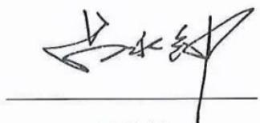

text_image

赵永钊

吕永钟

广东省广晟控股集团有限公司

2026年4月21日

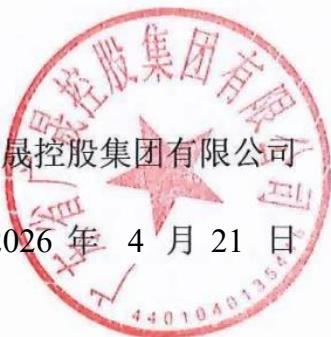

text_image

晟控股集团有限公司
026年4月21日

## 发行人全体董事及高级管理人员声明

本公司全体董事及高级管理人员承诺本募集说明书不存在虚假记载、误导性陈述或重大遗漏，对其真实性、准确性、完整性承担相应的法律责任，并承诺将持续履行相关职责，确保每期债券发行文件真实、准确、完整。

公司全体董事（签字）：

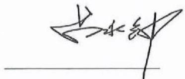

text_image

古水系

吕永钟

广东省广晟控股集团有限公司

2026 年 4 月 21 日

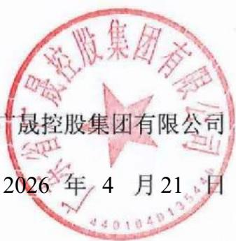

text_image

晟控股集团有限公司
2026 年 4 月 21 日

## 发行人全体董事及高级管理人员声明

本公司全体董事及高级管理人员承诺本募集说明书不存在虚假记载、误导性陈述或重大遗漏，对其真实性、准确性、完整性承担相应的法律责任，并承诺将持续履行相关职责，确保每期债券发行文件真实、准确、完整。

公司全体董事（签字）：

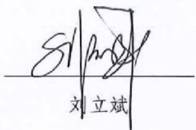

text_image

811
刘立斌

广东省广晟控股集团有限公司

2026 年 4 月 21 日

text_image

集团有限公司
4月21日

## 发行人全体董事及高级管理人员声明

本公司全体董事及高级管理人员承诺本募集说明书不存在虚假记载、误导性陈述或重大遗漏，对其真实性、准确性、完整性承担相应的法律责任，并承诺将持续履行相关职责，确保每期债券发行文件真实、准确、完整。

公司全体董事（签字）：

汪东兵

广东省广晟控股集团有限公司

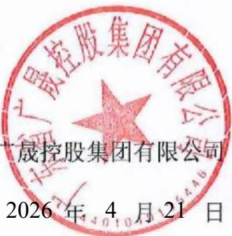

text_image

晟控股集团有限公司
晟控股集团有限公司
2026 年 4 月 21 日

2026年4月21日

## 发行人全体董事及高级管理人员声明

本公司全体董事及高级管理人员承诺本募集说明书不存在虚假记载、误导性陈述或重大遗漏，对其真实性、准确性、完整性承担相应的法律责任，并承诺将持续履行相关职责，确保每期债券发行文件真实、准确、完整。

公司全体董事（签字）：

累化凯

罗健凯

广东省广晟控股集团有限公司

2026年4月21日

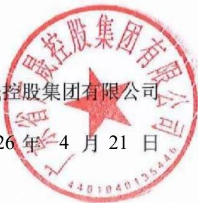

text_image

控股集团有限公司
26年4月21日

## 发行人全体董事及高级管理人员声明

本公司全体董事及高级管理人员承诺本募集说明书不存在虚假记载、误导性陈述或重大遗漏，对其真实性、准确性、完整性承担相应的法律责任，并承诺将持续履行相关职责，确保每期债券发行文件真实、准确、完整。

公司全体董事（签字）：

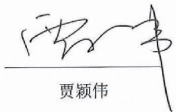

text_image

贾颖伟

广东省广晟控股集团有限公司

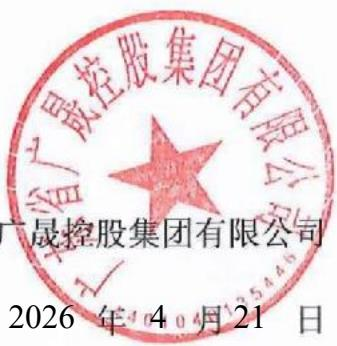

text_image

广东省广晟控股集团有限公司
广晟控股集团有限公司
2026年4月21日

2026 年 4 月 21 日

## 发行人全体董事及高级管理人员声明

本公司全体董事及高级管理人员承诺本募集说明书不存在虚假记载、误导性陈述或重大遗漏，对其真实性、准确性、完整性承担相应的法律责任，并承诺将持续履行相关职责，确保每期债券发行文件真实、准确、完整。

公司全体董事（签字）：

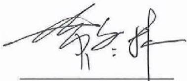

text_image

郭永林

黄冬林

广东省广晟控股集团有限公司

2026年4月21日

text_image

晟控股集团有限公司
26年 4月21日

## 发行人全体董事及高级管理人员声明

本公司全体董事及高级管理人员承诺本募集说明书不存在虚假记载、误导性陈述或重大遗漏，对其真实性、准确性、完整性承担相应的法律责任，并承诺将持续履行相关职责，确保每期债券发行文件真实、准确、完整。

公司全体董事（签字）：

彭燎原

广东省广晟控股集团有限公司

2026年4月21日

text_image

贵控股集团有限公司
26年 4月21日

## 发行人全体董事及高级管理人员声明

本公司全体董事及高级管理人员承诺本募集说明书不存在虚假记载、误导性陈述或重大遗漏，对其真实性、准确性、完整性承担相应的法律责任，并承诺将持续履行相关职责，确保每期债券发行文件真实、准确、完整。

公司全体非董事高级管理人员（签字）：

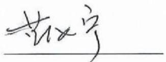

text_image

赵宇

蓝汝宁

广东省广晟控股集团有限公司

2026年4月21日

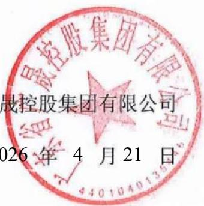

text_image

股控股集团有限公司
2026年4月21日

## 发行人全体董事及高级管理人员声明

本公司全体董事及高级管理人员承诺本募集说明书不存在虚假记载、误导性陈述或重大遗漏，对其真实性、准确性、完整性承担相应的法律责任，并承诺将持续履行相关职责，确保每期债券发行文件真实、准确、完整。

公司全体非董事高级管理人员（签字）：

郑任发

广东省广晟控股集团有限公司

2026年4月21日

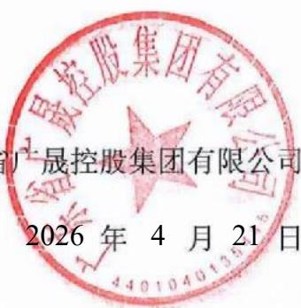

text_image

广晟控股集团有限公司
2026年4月21日

## 发行人全体董事及高级管理人员声明

本公司全体董事及高级管理人员承诺本募集说明书不存在虚假记载、误导性陈述或重大遗漏，对其真实性、准确性、完整性承担相应的法律责任，并承诺将持续履行相关职责，确保每期债券发行文件真实、准确、完整。

公司全体非董事高级管理人员（签字）：

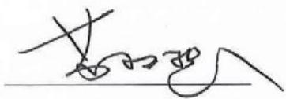

text_image

Handwritten signature or scribble on a line, possibly a signature or note

苏权捷

广东省广晟控股集团有限公司

2026 年 4 月 21 日

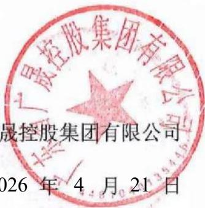

text_image

晟控股集团有限公司
2026 年 4 月 21 日

## 发行人全体董事及高级管理人员声明

本公司全体董事及高级管理人员承诺本募集说明书不存在虚假记载、误导性陈述或重大遗漏，对其真实性、准确性、完整性承担相应的法律责任，并承诺将持续履行相关职责，确保每期债券发行文件真实、准确、完整。

公司全体非董事高级管理人员（签字）：

吴之辉

吴圣辉

广东省广晟控股集团有限公司

2026 年 4 月 21 日

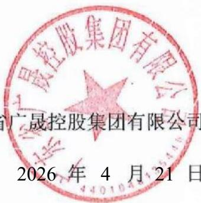

text_image

广晟控股集团有限公司
广晟控股集团有限公司
2026 年 4 月 21 日

## 发行人全体董事及高级管理人员声明

本公司全体董事及高级管理人员承诺本募集说明书不存在虚假记载、误导性陈述或重大遗漏，对其真实性、准确性、完整性承担相应的法律责任，并承诺将持续履行相关职责，确保每期债券发行文件真实、准确、完整。

公司全体非董事高级管理人员（签字）：

y $^{2}$ 万山

广东省广晟控股集团有限公司

2026年4月21日

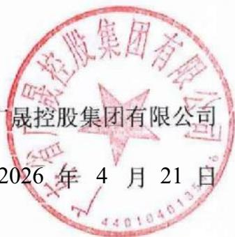

text_image

晟控股集团有限公司
2026 年 4 月 21 日

## 主承销商声明

本公司已对募集说明书进行了核查，确认不存在虚假记载、误导性陈述或重大遗漏，并对其真实性、准确性和完整性承担相应的法律责任。

项目负责人签名：

简雁杰

苗雁杰

敖重淼

法定代表人或授权代表签名：

孙敏

孙毅

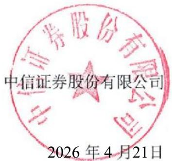

text_image

中信证券股份有限公司
2026年4月21日

中信证券股份有限公司

2026年4月21日

## 法定代表人授权书

本人，张佑君，中信证券股份有限公司法定代表人，在此授权孙毅先生（身份证）作为被授权人，代表公司签署与投资银行管理委员会业务相关的合同协议及其相关法律文件。被授权人签署的法律文件对我公司具法律约束力。

未经授权人许可，被授权人不得转授权。

本授权的有效期限自 2026 年 3 月 16 日至 2027 年 3 月 14 日（或至本授权书提前解除之日）止。

授权人

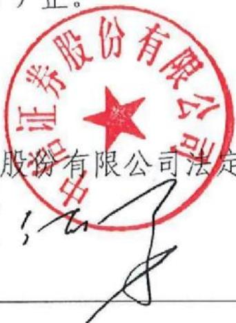

text_image

证券股份有限公司
五角
股份有限公司法定

中信证券股份有限公司法定代表人

张：

张佑君

2026年3月16日

被授权人

孙小

孙毅（身份证此件与原件一致，仅供投行华南部办理 广蜀公司债 用，有效期 现天。
—— 2026年4月3日

## 主承销商声明

本公司已对募集说明书进行了核查，确认不存在虚假记载、误导性陈述或重大遗漏，并对其真实性、准确性和完整性承担相应的法律责任。

项目负责人签名：

董尧奇 孙晨曦

法定代表人或授权代表签名：

刘津荷
刘康莉

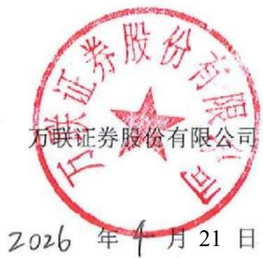

text_image

万联证券股份有限公司
2026 年 4 月 21 日

## 授权委托书

委托人：万联证券股份有限公司

法定代表人：王达

受托人：刘康莉

职务：党委书记、董事长

职务：副总裁

兹授权受托人代表本公司法定代表人，对投资银行业务条线债权融资类业务已依照本公司规定履行审批决策程序事项有关的合同、协议、文件，进行审批并对外签署，包括：

## 一、业务品种

公司债券（含企业债券）、金融债券、地方政府债券、债权融资计划、资产证券化产品、非金融企业债务融资工具的承销或财务顾问业务，其他债权融资类财务顾问业务。

## 二、文件类别

### （一）业务协议类：

业务品种涉及的各类合同、协议。

### （二）申报文件类：

公司债券（含企业债券）募集说明书承销商声明、受托管理人声明、主承销商核查意见等法规规定可以授权的文件等。

### （三）其他：

各项投标文件、法定代表人身份证复印件及各类其他对外报送文件。

受托人代表本公司法定代表人签署合同、协议、文件，须经本公司盖章确认方为有效。仅由受托人签署，未经本公司盖章确认的合同、协议、文件，不对本公司产生约束力。本授权书自2026年3月3日起生效至2026年12月31日（或本授权书提前终止之日）止。本授权事项不得转授权。

委托人：万联证券股份有限公司
法定代表人（签字）：

受托人（签字、盖章）：刘泽俞

## 主承销商声明

本公司已对募集说明书进行了核查，确认不存在虚假记载、误导性陈述或重大遗漏，并对其真实性、准确性和完整性承担相应的法律责任。

项目负责人签名：

理扬

王昊杨

刘瑞生

刘瑞洁

法定代表人或授权代表签名：

胡华

胡金泉

# 广发证券股份有限公司

text_image

# 广发证券股份有限公司
发证券股份有限公司

2026年4月21日

# 广发证券股份有限公司

广发证授权〔2025〕1号

## 2026 年法定代表人签字授权书

根据工作需要，现将法定代表人的签字权授权如下：

## 一、授权原则

（一）被授权人根据公司经营管理层工作分工或部门负责人任命行使权力，当职务变更自动调整或终止本授权。
(二)被授权人代表公司法定代表人签字并承担相应责任, 其法律效力等同于法定代表人签字。
（三）被授权人无转委权。
（四）授权人职务变更自动终止本授权。

## 二、授权权限

（一）加盖公司印章的文件签字权，授权公司分管领导。
（二）加盖部门印章的文件签字权，授权部门负责人。

## 三、授权期限

本授权书有效期为 2026 年 1 月 1 日至 12 月 31 日，有效期内授权人可签署新的授权书对本授权书作出补充或修订。

# 营业执照
附件：1. 公司
2. 被授权人职责证明（公司经营管理层最新分工或部门负责人聘任发文）

法定代表

text_image

证券股份有限公司
代表人：

林绍翔

广发证券股份有限公司

2025年12月23日

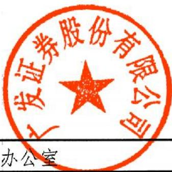

text_image

广发证券股份有限公司
办公室

广发证券股份有限公司办公室

2025年12月23日印发

text_image

年02月11日
广东省市场监督管理局

## 登记机关

2026年02月11日

此复印件与原件一致，再复印无效，仅限于办理《广泛控股集团有限公司2026年面向专业投资者公开发行科技
2026年面向专业投资者公开发行科技
仅限于办理《广晟控股集团有限公司
此复用件与原件一致，再复用无效。

门批准文件或许可证件为准）

回拨单中间外汇业务，证考收款覆盖托管。（依法须经批准的项

许可项目：证券业务；公司证券投资投资基金销售；证券公司为期货公司(1)基因通过控制 通过控制\_\_\_\_,\_\_\_\_的合成来控制代谢过程,进而控制生物体的性状。

广东省广州市黄埔区中新广州知识城腾飞

成立日期 1994年01月21日

佰壹拾壹元

注册资本 人民币柒拾捌亿元贰仟肆佰捌拾肆万伍仟伍

text_image

广发证券股份有限公司
(股票版)

称广发证券股份有限公司

[Unreadable]

扫描二维码登录，全国
系统，了解更多卷
记、备考、许可、监
告信表

# 营业执照

统一社会信用代码

91440000126335439C

natural_image

Red emblem with decorative border and star pattern (no text or symbols)

# 广发证券股份有限公司

广发证董〔2024〕15号

# 关于聘任公司高级管理人员的决定

总部各部门、各分支机构、各子公司

根据广发证券股份有限公司（以下简称“公司”）第十一届董事会第一次会议决议及工作安排，公司决定：

聘任秦力先生担任公司总经理，主持公司日常经营管理工作，并分管国际业务、产业研究院、战略发展部；

聘任孙晓燕女士担任公司常务副总经理兼财务总监，分管财务部、结算与交易管理部、资金管理部；

聘任肖雪生先生担任公司副总经理，分管战略客户关系管理部；

聘任欧阳西先生担任公司副总经理，分管资产托管部、证券金融部、财富管理与经纪业务总部（含下设的财富管理部、数字平台部、机构客户部、运营管理部）；

聘任张威先生担任公司副总经理，分管发展研究中心；

聘任易阳方先生担任公司副总经理，分管股权衍生品业务部、

证券投资业务管理总部下设的权益投资部；

聘任辛治运先生担任公司副总经理兼首席信息官，分管信息技术部；

聘任李谦先生担任公司副总经理，分管证券投资业务管理总部下设的固定收益投资部、资本中介部；

聘任徐佑军先生担任公司副总经理，分管办公室、人力资源管理部、培训中心；

聘任胡金泉先生担任公司副总经理，分管投行业务管理委员会（含下设的投行综合管理部、战略投行部、兼并收购部、债券业务部、资本市场部、投行质量控制部）；

聘任吴顺虎先生担任公司合规总监，兼任合规与法律事务部总经理，并分管合规与法律事务部、稽核部；

聘任崔舟航先生担任公司首席风险官，兼任风险管理部总经理，并分管风险管理部、投行内核部；

聘任尹中兴先生担任公司董事会秘书、联席公司秘书、证券事务代表，分管董事会办公室。

肖雪生先生和胡金泉先生正式履行上述职务尚需通过证券公司高级管理人员资质测试。尹中兴先生正式履行上述职务尚需通过证券公司高级管理人员资质测试及香港联合交易所有限公司关于公司秘书任职资格的豁免。在胡金泉先生正式履行上述职务之前，指定公司总经理秦力先生代为履行相应职责。在尹中兴先生正式履行上述职务之前，指定公司原董事会秘书、联席公司秘书、证券事务代表徐佑军先生继续履行相应职责。

公司将按规定向监管部门履行备案程序。

专此决定。

text_image

广发证券股份有限公司
2024年5月10日

(联系人：杨天天 电话：020-66336680)

text_image

发证券股份有限公司
管局。

抄送：中国证监会广东监管局。

广发证券股份有限公司董事会办公室

2024年5月10日印发

## 主承销商声明

本公司已对募集说明书进行了核查，确认不存在虚假记载、误导性陈述或重大遗漏，并对其真实性、准确性和完整性承担相应的法律责任。

项目负责人签名：

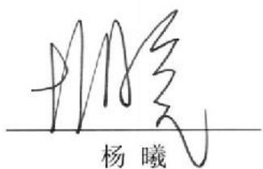

text_image

杨曦

法定代表人或授权代表签名：

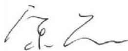

宋黎

text_image

## 中国国际金融股份有限公司
2026 年 4 月 21 日

# 中国国际金融股份有限公司

# 中国国际金融股份有限公司

## 授权书

兹授权中国国际金融股份有限公司党委委员、管理委员会成员王曙光签署如下合同、协议和文件：

1、授权王曙光签署与投资银行业务、资本市场业务相关的合同、协议和文件，王曙光可根据投资银行业务及资本市场业务经营管理需要对本项授权进行转授权，与上市公司并购重组财务顾问业务相关的申报文件除外。
2、授权王曙光签署与上市公司并购重组财务顾问业务相关的申报文件，包括重组报告书、财务顾问报告等申报文件，反馈意见回复报告、重组委意见回复等文件的财务顾问专业意见，举报信核查报告等。上述申报文件在签署并申报前应完成中国国际金融股份有限公司制定的质量控制、内核等相关内部控制流程。本项授权不得转授权。

本授权自签署之日起生效，自上述授权撤销之日起失效。

中国国际金融股份有限公司

沈

陈亮

党委书记、董事长、管委会主席

二零二四年四月十日

# 中国国际金融股份有限公司

## 授权书

兹授权中国国际金融股份有限公司投资银行部负责人孙雷签署与投资银行业务相关的协议和文件，与上市公司并购重组财务顾问业务相关的申报文件除外。孙雷可根据投资银行业务经营管理需要对本项授权进行转授权。

本授权自签署之日起生效，自上述授权撤销之日起失效。

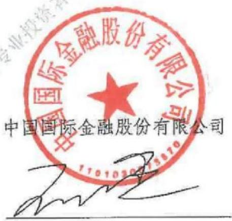

text_image

中国国际金融股份有限公司
中国国际金融股份有限公司

王曙光

二零二五年一月六日

# 中国国际金融股份有限公司

## 授权书

兹授权中国国际金融股份有限公司投资银行部执行负责人许佳、投资银行部执行负责人宋黎签署与投资银行业务相关的协议和文件，与上市公司并购重组财务顾问业务相关的申报文件除外。

本授权自签署之日起生效，自上述授权撤销之日起失效。

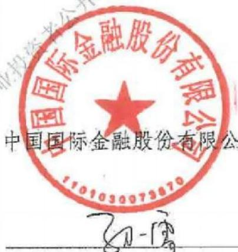

text_image

中国国际金融股份有限公司
中国国际金融股份有限公司
1101030073870
孙一霄

孙雷

二零二五年一月六日

## 主承销商声明

主承销商已对募集说明书进行了核查，确认不存在虚假记载、误导性陈述和重大遗漏，并对其真实性、准确性和完整性承担相应的法律责任。

项目负责人（签字）：

杨德聪
杨德聪

丁昊晨
丁昊晨

公司法定代表人或授权代表（签字）：

李洪涛

text_image

# 华泰联合证券有限责任公司
2026年4月21日

华泰联合证券有限责任公司

text_image

2026年4月21日

# 华泰联合证券有限责任公司

## 授权委托书

<table><tr><td>授权人</td><td>江禹</td><td>授权人职务</td><td>董事长、法定代表人</td></tr><tr><td>被授权人</td><td>李洪涛</td><td>被授权人职务</td><td>合规总监兼首席风险官</td></tr><tr><td>授权期限</td><td colspan="3">2026年1月1日至2026年12月31日</td></tr><tr><td colspan="4">具体授权事项</td></tr><tr><td colspan="4">授权李洪涛先生在债务融资类业务(包括但不限于企业债、公司债、资产证券化以及按上述类型管控的其他业务等)及公开募集基础设施证券投资基金(REITs)业务涉及的全部文件依照公司规定完成内部审批决策流程后,代表江禹先生对外签署,包括但不限于各类项目相关协议、申报材料、申请文件、说明文件、承诺函、通知书、公告文件、投标文件等。</td></tr><tr><td colspan="4">特别说明:1、除投标文件外,被授权人需亲自完成授权事项,无转授权的权利。投标文件可进行转授权。2、本授权为非排他性授权,授权作出后,授权人仍有权自行或授权其他人签署相关文件。3、被授权人基于相关职务接收授权人授权,如因被授权人临时不在岗或岗位发生变动,则相关授权事项归复原授权人执行。</td></tr><tr><td colspan="2">授权人(签字)</td><td colspan="2">被授权人(签字)</td></tr></table>

授权日期：2025年12月31日（加盖公章）

## 主承销商声明

本公司已对募集说明书进行了核查，确认不存在虚假记载、误导性陈述或重大遗漏，并对其真实性、准确性和完整性承担相应的法律责任。

项目负责人签名：

张铭

刘嘉璐

法定代表人或授权代表签名：

王晟王晟

中国银河证券股份有限公司

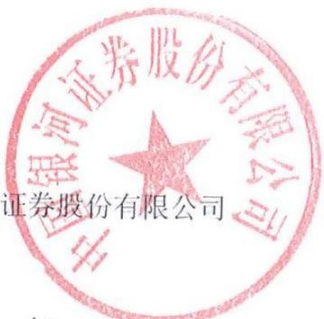

text_image

银河证券股份有限公司
证券股份有限公司

2026 年 4 月 21 日

## 主承销商声明

本公司已对募集说明书进行了核查，确认不存在虚假记载、误导性陈述或重大遗漏，并对其真实性、准确性和完整性承担相应的法律责任。

项目负责人签名：

孟李娇

孟李娜

花蓉蓉

施蓉蓉

付静宁

付翥宇

法定代表人或授权代表签名：

周冰

周冰

中银国际证券股份有限公司

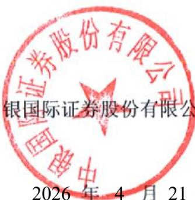

text_image

银国际证券股份有限公司
2026年4月21

2026年4月21日

## 授权委托书

周冰先生现任中银国际证券股份有限公司（以下简称“公司”）执行总裁，特授权周冰先生代表法定代表人对外签署证券承销与保荐业务相关的业务合同及各类文件；

一、与首次公开发行股票、上市公司再融资、上市公司并购重组财务顾问等股权类保荐与承销业务相关的合同及其他文件。

二、与公司债、企业债、金融债、熊猫债、可续期债、非金融企业债务融资工具等债券类发行与承销业务，以及公司债受托管理业务相关的合同及其他文件。

三、与全国中小企业股份转让系统主办券商推荐挂牌、持续督导、定向增发、重大资产重组等新三板类业务相关的合同及其他文件。

四、上述三类业务相关的报送监管机构各类项目申报文件、申请补贴文件、投标文件等。

五、投资银行业务日常经营管理及业务开展所需签订的其他合同及法律文件。

六、以上授权如有法律法规及监管规定要求必须由法定代表人办理的，或者其他授权文件明确授权他人办理的除外。

本授权有效期为本授权委托书签发之日起至2026年12月31日止。

此复印件仅供签署广东省广晟控股集团有限公司2026年面向专业投资者公开发行科技创新公司债券（第一期）发行文件之用。

授权人：中银国际证券股份有限公司董事长周权（签名）：

被授权人：中银国际证券股份有限公司执行总裁周冰（签名）：

周风

2026年1月1日

## 主承销商声明

本公司已对募集说明书进行了核查，确认不存在虚假记载、误导性陈述或重大遗漏，并对其真实性、准确性和完整性承担相应的法律责任。

项目负责人签名：

李谦
李谦

法定代表人或授权代表签名：

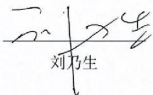

text_image

刘乃生

中信建投证券股份有限公司

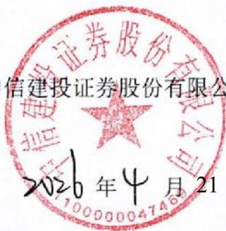

text_image

信建投证券股份有限公司
2020年4月21

# 中信建投证券股份有限公司特别授权书

仅供广东省广晟控股集团有限公司公开发行公司债券项目使用

为公司投资银行业务开展需要，中信建投证券股份有限公司董事长刘成先生对刘乃生先生特别授权如下：

## 一、代表公司法定代表人签署以下文件：

（一）签署投资银行业务承做债券相关业务的文件，限于向监管部门报送的募集说明书、主承销商受托管理人声明、主承销商专项核查报告、承销商核查意见、房地产调控政策之专项核查报告、企业债主承销商综合信用承诺书、债权代理人声明。

（二）签署投资银行业务承做三板重组相关业务的文件，限于向监管部门报送的三板重组（预案）之重组报告书（真实性、准确性、完整性的声明）、三板重组（预案）之独立财务顾问核查意见/报告、定向发行合法合规性的专项意见。

### （三）签署投资银行业务承做并购重组相关业务的文件，限于向监管部门报送以下文件：

1、重组报告书、独立财务顾问报告、反馈意见回复报告、重组委意见回复等文件的财务顾问专业意见；

2、申报文件真实性、准确性和完整性的承诺书、独立财务顾问同意书、独立财务顾问声明、举报信核查报告。

（四）签署投资银行业务承做保荐承销相关业务的文件，限于向监管部门报送的会后事项承诺函、不存在影响启动发行重大事项的承诺函、非公开发行股票申请增加询价对象的承诺函、关于办理完成限售登记及符合相关规定的承诺、发行阶段的保荐代表人证明文件及专项授权书、关于上市相关媒体质疑的专项回复的声明、认购对象合规性报告、发行情况报告书。

（五）签署由公司担任主承销商的投资银行类项目的发行及登记上市业务中向中国证监会、上海证券交易所、深圳证券交易所、北京证券交易所、中国证券登记结算有限责任公司、中央国债登记结算有限责任公司、全国中小企业股份转让系统有限转让公司等单位提交的文件，限于发行登记摇号公证上市阶段的授权委托书、IPO股票首次发行/可转债/配股/其他发行股票类网上认购资金划款申请表、配股发行失败应退利息支付承诺函、公司债券/资产支持专项计划/其他债权类发行登记及上市相关事宜的承诺函、股份过户登记申请。

## 二、在以下事务中拥有公司法定代表人人名章与身份证明文件的使用审批权：

（一）对外出具需要公司法定代表人签署的投资银行类项目的竞标文件、投标文件及建议书。

（二）在办理由公司担任主承销商的投资银行类项目的发行及登记上市业务中向中国证监会、上海证券交易所、深圳证券交易所、北京证券交易所、中国证券登记结算有限责任公司、中央国债登记结算有限责任公司、全国中小企业股份转让系统有限转让公司等单位提交公司法定代表人身份证件复印件、加盖法定代表人人名章的《指定联络人授权委托书》《集中办理深交所数字证书的承诺书》《信息披露联络人授权委托书》《可交换债券信托担保专用账户开立及信托担保登记办理授权书》《可交换债券质押担保专用账户开立及质押担保登记办理授权书》《验资业务银行询证函》《网下收款项目询证函》、公司债券转售业务的《非交易过户的申请》、可交换债券业务解除担保及信托事宜的《法定代表人授权委托书》。

（三）在办理由公司担任可转债抵押/质押权人代理人办理资产抵押/质押时提交的公司法定代表人身份证件复印件、加盖法定代表人人名章的《法定代表人证明书/委托书》《不动产登记申请表》等文件。

未经授权人许可，被授权人不得将上述授权内容再行转授权。

本授权有效期限自2026年1月1日起至2026年12月31日。

授权人：

中信建投证券股份有限公司董事长

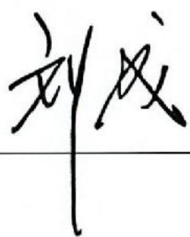

text_image

刘戊

二零二六年一月一日建投证券股份有限公司
倚缝专用章

## 主承销商声明

本公司已对募集说明书进行了核查，确认不存在虚假记载、误导性陈述或重大遗漏，并对其真实性、准确性和完整性承担相应的法律责任。

项目负责人签名：

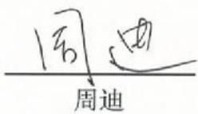

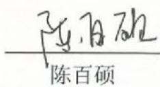

法定代表人或授权代表签名：

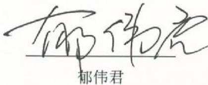

text_image

郁伟君

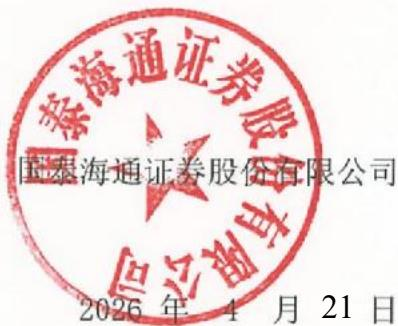

text_image

国泰海通证券股份有限公司
2026年4月21日

# 国泰海通证券股份有限公司文件

## 授权委托书

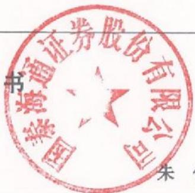

text_image

书
海通证券股份有限公司
国
朱

朱健

郁伟君

授权人：国泰海通证券股份有限公司董事长

受权人：国泰海通证券股份有限公司投资银行业务委员会总裁

授权人在此授权并委托受权人对其所分管部门依照公司规定履行完毕审批决策流程的事项，对外代表本公司签署如下协议及文件：

## 一、股权业务（保荐、并购重组和财务顾问业务）相关协议及文件

1、保密协议：
2、财务顾问协议：
3、独立财务顾问协议；
4、上市辅导协议；
5、承销协议；
6、承销团协议；
7、保荐协议：
8、资金监管协议；
9、律师见证协议；

text_image

香港通貨
國

10、持续督导协议；
11、上市服务协议；
12、战略合作协议、合作协议；
13、开展股权融资和财务顾问业务中涉及的其他协议；
14、上述协议的补充协议、解除协议/终止协议。

## 二、债券业务相关协议及文件

1、保密协议；
2、财务顾问协议：
3、合作协议：
4、承销协议；
5、承销团协议：
6、资金监管协议：
7、受托管理协议或债权代理协议；
8、分销协议；
9、定向发行协议；
10、担保协议；
11、信托协议或者担保及信托协议（仅针对可交换债）；
12、开展债务融资业务中涉及的其他协议；
13、上述协议的补充协议或解除协议/终止协议。

## 三、新三板业务相关协议及文件

1、保密协议；

2、财务顾问协议；

3、推荐挂牌并持续督导协议；

4、持续督导协议；

5、资金监管协议；

6、承销协议；

7、合作协议；

8、开展新三板推荐挂牌及持续督导业务中涉及的其他协议；

9、上述协议的补充协议或解除协议/终止协议。

四、上述业务条线/部门向监管部门、自律组织等机构（包括但不限于中国证券监督管理委员会及其派出机构、中国人民银行、国有资产监督管理委员会、中国银行间市场交易商协会、中国外汇交易中心、上海清算所、上海证券交易所、深圳证券交易所、北京证券交易所、中国证券登记结算有限公司及其分公司、中国证券业协会、中国证券投资基金业协会、中国证券投资者保护基金有限责任公司、全国中小企业股份转让系统等）报送的文件（除监管部门明确规定需由法定代表人签字的文件）。

本授权书自授权人与受权人签字之日起生效，有效期至受权人任期届满止。有效期内，授权人可签署新的授权委托书对本授权委托书做出补充或修订。自本授权生效之日起过往授权同时废止。

如授权人或受权人不再担任相关职务或遇组织架构、职责分工调整的，则本授权委托书自动失效。

(此页为签署页)

text_image

泰海通证券股份有限公司
泰海通证券股份有限公司

授权人：国泰海通证券股份有限公司（章）

董事长：\_\_\_\_

2025年5月28日

text_image

泰海通证券股份有限公司
泰海通证券股份有限公司

受权人：国泰海通证券股份有限公司（章）

投资银行业务委员会总裁：邢伟杰

2025年5月28日

## 发行人律师声明

本所及签字的律师已阅读募集说明书，确认募集说明书与本所出具的法律意见书不存在矛盾。本所及签字律师对发行人在募集说明书中所引用的法律意见书的内容无异议，确认募集说明书不致因所引用内容出现虚假记载、误导性陈述或重大遗漏，并对其真实性、准确性和完整性承担相应的法律责任。

经办律师（签名）：朱利
朱利

叶嘉腾

律师事务所负责人（签名）：

王南

王丽

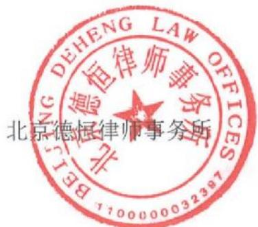

text_image

北京德恒律师事务所
BEIJING DEHENG LAW OFFICES

2026 年 4 月 21 日

## 审计机构声明

本所及签字注册会计师已阅读广东省广晟控股集团有限公司2026年面向专业投资者公开发行科技创新公司债券（第一期）募集说明书，确认募集说明书引用的广东省广晟控股集团有限公司2022年度、2023年度财务数据与本所出具的报告（天职业字[2023]26382号、天职业字[2024]34781号）不存在矛盾。本所及签字注册会计师对发行人在募集说明书中引用的2022年度、2023年度财务报告的内容无异议，确认募集说明书不致因所引用内容而出现虚假记载、误导性陈述或重大遗漏，并对其真实性、准确性和完整性承担相应的法律责任。

经办注册会计师签名：

颜艳飞

张小勤

会计师事务所负责人（或授权代表）签名：

text_image

王之卿
印靖

邱靖之

天职国际会计师事务所（特殊普通合伙）

text_image

天职国际会计师事务所（特殊普通合伙）
会计师事务所（特殊普
1701080212359
2006年4

2026年4月15日

## 审计机构声明

本所及签字注册会计师已阅读募集说明书，确认募集说明书与本所出具的报告不存在矛盾。本所及签字注册会计师对发行人在募集说明书中引用的财务报告的内容无异议，确认募集说明书不致因所引用内容而出现虚假记载、误导性陈述或重大遗漏，并对其真实性、准确性和完整性承担相应的法律责任。

经办注册会计师签名：梁寄意

会计师事务所负责人（或授权代表）签名：李惠琦

李惠琦

致同会计师事务所（特殊普通合伙）

text_image

事务所（特殊普通合伙）
2026年4月15日

2026年4月15日

## 发行人审计机构关于承担审计业务签字注册会计师离职声明

致同会计师事务所（特殊普通合伙）（以下简称“本机构”）出具的“致同审字（2025）第440A021946号”审计报告的签字会计师为梁寄意、董永峰，董永峰已从本机构离职。

本机构对发行人在募集说明书中引用的审计报告的内容无异议，并对其真实性、准确性和完整性承担相应的法律责任。

特此声明。

会计师事务所负责人（签名）：

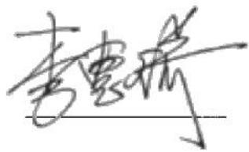

text_image

李雪娇

李惠琦

致同会计师事务所（特殊普通合伙）

text_image

事务所（特殊普通合伙）
2026年4月15
1100000072741

# 第十三节 备查文件

## 一、备查文件清单

（一）发行人 2022-2024 年度经审计的合并及母公司财务报告，2025 年 1-6 月未经审计的合并及母公司财务报表；

（二）主承销商出具的核查意见；

（三）发行人律师出具的法律意见书；

（四）资信评级报告；

（五）《债券持有人会议规则》；

（六）《债券受托管理协议》；

（七）中国证监会同意发行人本次发行注册的文件；

（八）相关法律法规、规范性文件要求披露的其他文件。

## 二、备查文件查阅地点及查询网址

在本期债券发行期内，投资者可以至本公司及主承销商处查阅本募集说明书全文及上述备查文件，或访问深圳证券交易所网站（http://www.szse.cn）查阅本募集说明书。

投资者可以自本期债券募集说明书公告之日起到下列地点查阅本募集说明书全文及上述备查文件：

### （一）发行人：广东省广晟控股集团有限公司

住所：广东省广州市天河区珠江西路17号广晟国际大厦50-58楼

法定代表人：吕永钟

电话：020-29117551

传真：020-29110900

信息披露经办人员：姜可意、陈俊霖

### （二）牵头主承销商、受托管理人、簿记管理人：中信证券股份有限公司

住所：广东省深圳市福田区中心三路8号卓越时代广场（二期）北座

法定代表人：张佑君

联系电话：020-32258106

有关经办人员：董青、苗雁杰、敖重淼、何禧
