适当调整拟审议议案的部分细节，以寻求获得债券持有人会议审议通过的最大可能。

召集人拟就实质相同或相近的议案再次召集会议的，应最晚于现场会议召开日前[3]个交易日或者非现场会议召开日前[2]个交易日披露召开债券持有人会议的通知公告，并在公告中详细说明以下事项：

（一）前次会议召集期间债券持有人关于拟审议议案的相关意见；  
（二）本次拟审议议案较前次议案的调整情况及其调整原因；  
（三）本次拟审议议案通过与否对投资者权益可能产生的影响；  
（四）本次债券持有人会议出席人数如仍未达到约定要求，召集人后续取消或者再次召集会议的相关安排，以及可能对投资者权益产生的影响。

## 4、债券持有人会议的召开及决议

## 4.1 债券持有人会议的召开

4.1.1 债券持有人会议应当由代表本期债券未偿还份额且享有表决权的[二分之一]以上债券持有人出席方能召开。债券持有人在现场会议中的签到行为或者在非现场会议中的投票行为即视为出席该次持有人会议。  
4.1.2 债权登记日登记在册的、持有本期债券未偿还份额的持有人均有权出席债券持有人会议并行使表决权，本规则另有约定的除外。

前款所称债权登记日为债券持有人会议召开日的前[1]个交易日。债券持有人会议因故变更召开时间的，债权登记日相应调整。

4.1.3 本期债券受托管理人应当出席并组织召开债券持有人会议或者根据本规则第 3.1.3 条约定为相关机构或个人自行召集债券持有人会议提供必要的协助，在债券持有人现场会议中促进债券持有人之间、债券持有人与发行人或其控股股东和实际控制人、债券清偿义务承继方、保证人或者其他提供增信或偿债保障措施的机构或个人等进行沟通协商，形成有效的、切实可行的决议等。  
4.1.4 拟审议议案要求发行人或其控股股东和实际控制人、债券清偿义务承继方、保证人或者其他提供增信或偿债保障措施的机构或个人等履行义务或者推进、

落实的，上述机构或个人应按照受托管理人或召集人的要求，安排具有相应权限的人员按时出席债券持有人现场会议，向债券持有人说明相关情况，接受债券持有人等的询问，与债券持有人进行沟通协商，并明确拟审议议案决议事项的相关安排。

4.1.5 资信评级机构可以应召集人邀请列席债券持有人现场会议，持续跟踪发行人或其控股股东和实际控制人、债券清偿义务承继方、保证人或者其他提供增信或偿债保障措施的机构或个人等的资信情况，及时披露跟踪评级报告。  
4.1.6 债券持有人可以自行出席债券持有人会议并行使表决权，也可以委托受托管理人、其他债券持有人或者其他代理人（以下统称代理人）出席债券持有人会议并按授权范围行使表决权。

债券持有人自行出席债券持有人现场会议的，应当按照会议通知要求出示能够证明本人身份及享有参会资格的证明文件。债券持有人委托代理人出席债券持有人现场会议的，代理人还应当出示本人身份证明文件、被代理人出具的载明委托代理权限的委托书（债券持有人法定代表人亲自出席并表决的除外）。

债券持有人会议以非现场形式召开的，召集人应当在会议通知中明确债券持有人或其代理人参会资格确认方式、投票方式、计票方式等事项。

4.1.7 受托管理人可以作为征集人，征集债券持有人委托其代理出席债券持有人会议，并按授权范围行使表决权。征集人应当向债券持有人客观说明债券持有人会议的议题和表决事项，不得隐瞒、误导或者以有偿方式征集。征集人代理出席债券持有人会议并行使表决权的，应当取得债券持有人的委托书。

4.1.8 债券持有人会议的会议议程可以包括但不限于：

（一）召集人介绍召集会议的缘由、背景及会议出席人员；  
（二）召集人或提案人介绍所提议案的背景、具体内容、可行性等；  
（三）享有表决权的债券持有人针对拟审议议案询问提案人或出席会议的其他利益相关方，债券持有人之间进行沟通协商，债券持有人与发行人或其控股股东和实际控制人、债券清偿义务承继方、保证人或者其他提供增信或偿债保障措施的机构或个人等就属于本规则第3.2.3条约定情形的拟审议议案进行沟通协商；

## （四）享有表决权的持有人依据本规则约定程序进行表决。

债券持有人会议的表决

4.2.1 债券持有人会议采取记名方式投票表决。  
4.2.2 债券持有人进行表决时，每一张未偿还的债券享有一票表决权，但下列机构或人员直接持有或间接控制的债券份额除外：

（一）发行人及其关联方，包括发行人的控股股东、实际控制人、合并范围内子公司、同一实际控制人控制下的关联公司（仅同受国家控制的除外）等；

（二）本期债券的保证人或者其他提供增信或偿债保障措施的机构或个人；

（三）债券清偿义务承继方；

（四）其他与拟审议事项存在利益冲突的机构或个人。债券持有人会议表决开始前，上述机构、个人或者其委托投资的资产管理产品的管理人应当主动向召集人申报关联关系或利益冲突有关情况并回避表决。

4.2.3 出席会议且享有表决权的债券持有人需按照 “同意” “反对” “弃权” 三种类型进行表决，表决意见不可附带相关条件。无明确表决意见、附带条件的表决、就同一议案的多项表决意见、字迹无法辨认的表决或者出席现场会议但未提交表决票的，原则上均视为选择 “弃权”。  
4.2.4 债券持有人会议原则上应当连续进行，直至完成所有议案的表决。除因不可抗力等特殊原因导致债券持有人会议中止、不能作出决议或者出席会议的持有人一致同意暂缓表决外，债券持有人会议不得对会议通知载明的拟审议事项进行搁置或不予表决。

因网络表决系统、电子通讯系统故障等技术原因导致会议中止或无法形成决议的，召集人应采取必要措施尽快恢复召开会议或者变更表决方式，并及时公告。

4.2.5 出席会议的债券持有人按照会议通知中披露的议案顺序，依次逐项对提交审议的议案进行表决。  
4.2.6 发生本规则第 3.2.5 条第二款约定情形的，召集人应就待决议事项存在矛盾的议案内容进行特别说明，并将相关议案同次提交债券持有人会议表决。债券

持有人仅能对其中一项议案投 “同意” 票，否则视为对所有相关议案投 “弃权” 票。

债券持有人会议决议的生效

4.3.1 债券持有人会议对下列属于本规则第 2.2 条约定权限范围内的重大事项之一的议案作出决议，经全体有表决权的债券持有人所持表决权的[三分之二]以上同意方可生效：

（一）拟同意第三方承担本期债券清偿义务；  
（二）发行人拟下调票面利率的，债券募集说明书已明确约定发行人单方面享有相应决定权的除外；  
（三）发行人或其他负有偿付义务的第三方提议减免、延缓偿付本期债券应付本息的，债券募集说明书已明确约定发行人单方面享有相应决定权的除外；  
（四）拟减免、延缓增信主体或其他负有代偿义务第三方的金钱给付义务；  
（五）拟减少抵押/质押等担保物数量或价值，导致剩余抵押/质押等担保物价值不足以覆盖本期债券全部未偿本息；  
（六）拟修改债券募集说明书、本规则相关约定以直接或间接实现本款第（一）至（五）项目的；  
（七）拟修改本规则关于债券持有人会议权限范围的相关约定；

4.3.2 除本规则第 4.3.1 条约定的重大事项外，债券持有人会议对本规则第 2.2 条约定范围内的其他一般事项议案作出决议，经超过出席债券持有人会议且有表决权的持有人所持表决权的[二分之一]同意方可生效。本规则另有约定的，从其约定。

□召集人就实质相同或相近的前款一般事项议案连续召集[三]次债券持有人会议且每次会议出席人数均未达到本规则第4.1.1条约定的会议召开最低要求的，则相关决议经出席第[三]次债券持有人会议的债券持有人所持表决权的[二分之一]以上同意即可生效。

4.3.3 债券持有人会议议案要求发行人或其控股股东和实际控制人、债券清偿义务承继方、保证人或者其他提供增信或偿债保障措施的机构或个人等履行义务或者推进、落实，但未与上述相关机构或个人协商达成一致的，债券持有人会议可以授权受托管理人、上述相关机构或个人、符合条件的债券持有人按照本规则提出采取相应措施的议案，提交债券持有人会议审议。  
4.3.4 债券持有人会议拟审议议案涉及授权受托管理人或推选的代表人代表债券持有人提起或参加要求发行人或增信主体偿付债券本息或履行增信义务、申请或参与发行人破产重整或破产清算、参与发行人破产和解等事项的仲裁或诉讼，如全部债券持有人授权的，受托管理人或推选的代表人代表全部债券持有人提起或参加相关仲裁或诉讼程序；如仅部分债券持有人授权的，受托管理人或推选的代表人仅代表同意授权的债券持有人提起或参加相关仲裁或诉讼程序。  
4.3.5 债券持有人会议的表决结果，由召集人指定代表及见证律师共同负责清点、计算，并由受托管理人负责载入会议记录。召集人应当在会议通知中披露计票、监票规则，并于会议表决前明确计票、监票人选。

债券持有人会议表决结果原则上不得早于债券持有人会议决议公告披露日前公开。如召集人现场宣布表决结果的，应当将有关情况载入会议记录。

4.3.6 债券持有人对表决结果有异议的，可以向召集人等申请查阅会议表决票、表决计算结果、会议记录等相关会议材料，召集人等应当配合。

## 5、债券持有人会议的会后事项与决议落实

5.1 债券持有人会议均由受托管理人负责记录，并由召集人指定代表及见证律师共同签字确认。

会议记录应当记载以下内容:

（一）债券持有人会议名称（含届次）、召开及表决时间、召开形式、召开地点（如有）；  
（二）出席（包括现场、非现场方式参加）债券持有人会议的债券持有人及其代理人（如有）姓名、身份、代理权限，所代表的本期未偿还债券面值总额及占比，是否享有表决权；

## （三）会议议程；

（四）债券持有人询问要点，债券持有人之间进行沟通协商简要情况，债券持有人与发行人或其控股股东和实际控制人、债券清偿义务承继方、保证人或者其他提供增信或偿债保障措施的机构或个人等就属于本规则第3.2.3条约定情形的拟审议议案沟通协商的内容及变更的拟决议事项的具体内容（如有）；

## （五）表决程序（如为分批次表决）；

## （六）每项议案的表决情况及表决结果；

债券持有人会议记录、表决票、债券持有人参会资格证明文件、代理人的委托书及其他会议材料由债券受托管理人保存。保存期限至少至本期债券债权债务关系终止后的5年。

债券持有人有权申请查阅其持有本期债券期间的历次会议材料，债券受托管理人不得拒绝。

5.2 召集人应最晚于债券持有人会议表决截止日次一交易日披露会议决议公告，会议决议公告包括但不限于以下内容：

（一）债券持有人会议召开情况，包括名称（含届次）、召开及表决时间、召开形式、召开地点（如有）等；

（二）出席会议的债券持有人所持表决权情况及会议有效性；

（三）各项议案的议题及决议事项、表决结果及决议生效情况；

（四）其他需要公告的重要事项。

5.3 按照本规则约定的权限范围及会议程序形成的债券持有人会议生效决议，受托管理人应当积极落实，及时告知发行人或其他相关方并督促其进行回复。

债券持有人会议生效决议要求发行人或其控股股东和实际控制人、债券清偿义务承继方、保证人或者其他提供增信或偿债保障措施的机构或个人等履行义务或者推进、落实的，上述相关机构或个人应当按照规定、约定或有关承诺切实履行相应义务，推进、落实生效决议事项，并及时披露决议落实的进展情况。相关机构或个人未按规定、约定或有关承诺落实债券持有人会议生效决议的，受托管理人应当采取进一步措施，切实维护债券持有人权益。

债券持有人应当积极配合受托管理人、发行人或其他相关方推动落实债券持有人会议生效决议有关事项。

5.4 债券持有人授权受托管理人提起、参加债券违约合同纠纷仲裁、诉讼或者申请、参加破产程序的，受托管理人应当按照授权范围及实施安排等要求，勤勉履行相应义务。受托管理人因提起、参加仲裁、诉讼或破产程序产生的合理费用，由作出授权的债券持有人承担，或者由受托管理人依据与债券持有人的约定先行垫付，债券受托管理协议另有约定的，从其约定。

受托管理人依据授权仅代表部分债券持有人提起、参加债券违约合同纠纷仲裁、诉讼或者申请、参加破产程序的，其他债券持有人后续明确表示委托受托管理人提起、参加仲裁或诉讼的，受托管理人应当一并代表其提起、参加仲裁或诉讼。受托管理人也可以参照本规则第4.1.7条约定，向之前未授权的债券持有人征集由其代表其提起、参加仲裁或诉讼。受托管理人不得因授权时间与方式不同而区别对待债券持有人，但非因受托管理人主观原因导致债券持有人权利客观上有所差异的除外。

未委托受托管理人提起、参加仲裁或诉讼的其他债券持有人可以自行提起、参加仲裁或诉讼，或者委托、推选其他代表人提起、参加仲裁或诉讼。

受托管理人未能按照授权文件约定勤勉代表债券持有人提起、参加仲裁或诉讼，或者在过程中存在其他怠于行使职责的行为，债券持有人可以单独、共同或推选其他代表人提起、参加仲裁或诉讼。

## 6、特别约定

6.1 关于表决机制的特别约定

6.1.1 关于表决机制的特别约定

6.1.1 因债券持有人行使回售选择权或者其他法律规定或募集说明书约定的权利，导致部分债券持有人对发行人享有的给付请求权与其他同期债券持有人不同的，具有相同请求权的债券持有人可以就不涉及其他债券持有人权益的事项进行单独表决。

前款所涉事项由受托管理人、所持债券份额占全部具有相同请求权的未偿还债券余额[10%]以上的债券持有人或其他符合条件的提案人作为特别议案提出，仅限受托管理人作为召集人，并由利益相关的债券持有人进行表决。

受托管理人拟召集持有人会议审议特别议案的，应当在会议通知中披露议案内容、参与表决的债券持有人范围、生效条件，并明确说明相关议案不提交全体债券持有人进行表决的理由以及议案通过后是否会对未参与表决的投资者产生不利影响。

特别议案的生效条件以受托管理人在会议通知中明确的条件为准。见证律师应当在法律意见书中就特别议案的效力发表明确意见。

简化程序

6.2.1 发生本规则第 2.2 条约定的有关事项且存在以下情形之一的，受托管理人可以按照本节约定的简化程序召集债券持有人会议，本规则另有约定的从其约定：

（一）发行人拟变更债券募集资金用途，且变更后不会影响发行人偿债能力的；  
（二）发行人因实施股权激励计划等回购股份导致减资，且累计减资金额低于本期债券发行时最近一期经审计合并口径净资产的 5% 的；  
（三）债券受托管理人拟代表债券持有人落实的有关事项预计不会对债券持有人权益保护产生重大不利影响的；  
（四）债券募集说明书、本规则、债券受托管理协议等文件已明确约定相关不利事项发生时，发行人、受托管理人等主体的义务，但未明确约定具体执行安排或者相关主体未在约定时间内完全履行相应义务，需要进一步予以明确的；  
（五）受托管理人、提案人已经就拟审议议案与有表决权的债券持有人沟通协商，且超过出席债券持有人会议且有表决权的持有人所持表决权的[二分之一]

（如为第 4.3.2 条约定的一般事项）或者达到全体有表决权的债券持有人所持表决权的[三分之二]以上（如为第 4.3.1 条约定的重大事项）的债券持有人已经表示同意议案内容的；

（六）全部未偿还债券份额的持有人数量（同一管理人持有的数个账户合并计算）不超过[4]名且均书面同意按照简化程序召集、召开会议的；

6.2.2 发生本规则第 6.2.1 条第（一）项至（三）项情形的，受托管理人可以公告说明关于发行人或受托管理人拟采取措施的内容、预计对发行人偿债能力及投资者权益保护产生的影响等。债券持有人如有异议的，应于公告之日起[5]个交易日内以书面形式回复受托管理人。逾期不回复的，视为同意受托管理人公告所涉意见或者建议。

针对债券持有人所提异议事项，受托管理人应当与异议人积极沟通，并视情况决定是否调整相关内容后重新征求债券持有人的意见，或者终止适用简化程序。单独或合计持有本期债券未偿还份额 10%以上的债券持有人于异议期内提议终止适用简化程序的，受托管理人应当立即终止。

异议期届满后，视为本次会议已召开并表决完毕，受托管理人应当按照本规则第 4.3.2 条第一款的约定确定会议结果，并于次日内披露持有人会议决议公告及见证律师出具的法律意见书。

6.2.3 发生本规则第 6.2.1 条第（四）项至（六）项情形的，受托管理人应最晚于现场会议召开日前[3]个交易日或者非现场会议召开日前[2]个交易日披露召开持有人会议的通知公告，详细说明拟审议议案的决议事项及其执行安排、预计对发行人偿债能力和投资者权益保护产生的影响以及会议召开和表决方式等事项。债券持有人可以按照会议通知所明确的方式进行表决。

持有人会议的召开、表决、决议生效及落实等事项仍按照本规则第四章、第五章的约定执行。

## 7、附则

7.1 本规则自本期债券发行完毕之日起生效。

7.2 依据本规则约定程序对本规则部分约定进行变更或者补充的，变更或补充的规则与本规则共同构成对全体债券持有人具有同等效力的约定。  
7.3 本规则的相关约定如与债券募集说明书的相关约定存在不一致或冲突的，以债券募集说明书的约定为准；如与债券受托管理协议或其他约定存在不一致或冲突的，除相关内容已于债券募集说明书中明确约定并披露以外，均以本规则的约定为准。  
7.4 对债券持有人会议的召集、召开及表决程序、决议合法有效性以及其他因债券持有人会议产生的纠纷，应当：

向[深圳国际仲裁院]提起仲裁。

7.5 本规则约定的 “以上” “以内” 包含本数，“超过” 不包含本数。

## 七、受托管理人

投资者认购本次公司债券视作同意《深圳市融资租赁（集团）有限公司 2026 年面向专业投资者公开发行公司债券受托管理协议》。本章仅列示了《债券受托管理协议》的主要内容，投资者在作出相关决策时，请查阅《债券受托管理协议》全文。

## （一）债券受托管理人聘任及《债券受托管理协议》签订情况

根据发行人与国信证券签署的《债券受托管理协议》，国信证券受聘担任本次债券的债券受托管理人。

## 1、债券受托管理人的名称及基本情况

受托管理人名称：国信证券股份有限公司

法定代表人：张纳沙

住所：深圳市罗湖区红岭中路1012号国信证券大厦十六层至二十六层

联系地址：深圳市福田区福华路国信金融大厦29楼

## 2、《债券受托管理协议》签订情况

2026 年 4 月，发行人与国信证券股份有限公司签订了《深圳市融资租赁（集团）有限公司 2026 年面向专业投资者公开发行公司债券受托管理协议》。

## （二）债券受托管理协议主要内容

以下仅列明《债券受托管理协议》的主要条款，投资者在作出相关决策时，请查阅《债券受托管理协议》的全文。《债券受托管理协议》主要内容如下：

## 第一条 定义及解释

1.1 除本协议另有规定外，募集说明书中的定义与解释均适用于本协议。

1.2“募集说明书”指由发行人签署的深圳市融资租赁（集团）有限公司2026年面向专业投资者公开发行公司债券募集说明书。

1.3“交易日”指中国证券经营机构的正常营业日（不包括法定及政府指定节假日或休息日）。

1.4“人民币”指中国的法定货币。

1.5“生效日”指第 12.1 款规定的日期，本协议将自该日生效并对本协议双方具有约束力。

1.6“受托管理协议”指本协议以及不时补充或修订本协议的补充协议。

1.7“债券持有人”指在中国证券登记结算有限责任公司或适用法律规定的其他机构托管名册上登记的持有本期债券的投资者。

1.8“中国证监会”指中国证券监督管理委员会。

1.9“证券业协会”指中国证券业协会。

1.10“证券交易所”指深圳证券交易所。

## 第二条 受托管理事项

2.1 为维护本期债券全体债券持有人的权益，甲方聘任乙方作为本期债券的受托管理人，并同意接受乙方的监督。乙方接受全体债券持有人的委托，行使受托管理职责。  
2.2 在本期债券存续期内，即自债券上市挂牌直至债券本息兑付全部完成或债券的债权债务关系终止的其他情形期间，乙方应当勤勉尽责，根据相关法律法规、部门规章、行政规范性文件与自律规则（以下合称法律、法规和规则）的规定以及募集说明书、本协议及债券持有人会议规则的约定，行使权利和履行义务，维护债券持有人合法权益。

乙方依据本协议的约定与债券持有人会议的有效决议，履行受托管理职责的法律后果由全体债券持有人承担。个别债券持有人在受托管理人履行相关职责前向受托管理人书面明示自行行使相关权利的，受托管理人的相关履职行为不对其产生约束力。乙方若接受个别债券持有人单独主张权利的，在代为履行其权利主张时，不得与本协议、募集说明书和债券持有人会议有效决议内容发生冲突。法律、法规和规则另有规定，募集说明书、本协议或者债券持有人会议决议另有约定的除外。

2.3 本期债券发行期间的代理事项：

向投资者提供有关受托管理人事务的咨询服务。

2.4 债券存续期间的常规代理事项：  
2.4.1 召集和主持债券持有人会议；  
2.4.2 督促甲方履行《债券持有人会议规则》及债券持有人会议决议项下甲方应当履行的各项职责和义务，持续关注债券持有人会议决议的实施情况，并按照主管机关的要求进行信息披露；  
2.4.3 根据债券持有人会议的授权，作为债券持有人的代表与甲方谈判关于本期债券的事项；  
2.4.4 按照相关法律、法规和规则的规定及募集说明书的约定，提醒甲方履行有关信息披露义务；在甲方不能按相关法律、法规和规则的规定及募集说明书的约定履行披露义务时，及时向债券持有人通报有关信息；

2.4.5 根据持有人会议决议，代表债券持有人实现担保物权；

2.4.6 根据持有人会议决议，代表债券持有人要求保证人承担保证责任。

2.5 特别授权事项

2.5.1 债券持有人会议授权受托管理人代表本期债券持有人与发行人或其控股股东和实际控制人、债券清偿义务承继方、保证人或者其他提供增信或偿债保障措施的机构或个人等进行谈判协商并签署协议，代表债券持有人提起、参加债券违约合同纠纷仲裁、诉讼或者申请、参加破产程序时，受托管理人有权根据债券持有人会议的特别授权，全权代表债券持有人处理相关事务，包括但不限于：达成协商协议或调解协议、在破产程序中就发行人重整计划草案和和解协议进行表决等实质影响甚至可能减损、让渡债券持有人利益的行为。受托管理人因提起、参加仲裁、诉讼或破产程序产生的合理费用（包括但不限于诉讼费、仲裁费、律师费、财产保全费用、破产程序费用等）由甲方承担，甲方暂时无法承担的，相关费用可由持有人进行垫付，垫付方有权向甲方进行追偿。

2.5.2 代理债券持有人会议在债券存续期间授权的其他非常规事项。

2.6 任何债券持有人一经通过认购、交易、受让、继承或者其他合法方式持有本期债券，即视为同意乙方作为本期债券的受托管理人，且视为同意并接受本协议项下的相关约定，并受本协议之约束。

## 第三条 甲方的权利和义务

3.1 甲方及其董事、高级管理人员应自觉强化法治意识、诚信意识，全面理解和执行公司债券存续期管理的有关法律法规、债券市场规范运作和信息披露的要求。甲方董事、高级管理人员应当按照法律法规的规定对甲方定期报告签署书面确认意见，并及时将相关书面确认意见提供至乙方。

3.2 甲方应当根据法律、法规和规则及募集说明书的约定，按期足额支付本期债券的利息和本金。

3.3 甲方应当设立募集资金专项账户，用于本期债券募集资金的接收、存储、划转。甲方应当在募集资金到达专项账户前与乙方以及存放募集资金的银行订立监管协议。

甲方不得在专项账户中将本期债券项下的每期债券募集资金与其他债券募集资金及其他资金混同存放,并确保募集资金的流转路径清晰可辨，根据募集资金监管协议约定的必须由募集资金专项账户支付的偿债资金除外。在本期债券项下的每期募集资金使用完毕前，专项账户不得用于接收、存储、划转其他资金。

3.4 甲方应当为本期债券的募集资金制定相应的使用计划及管理制度。募集资金的使用应当符合现行法律法规的有关规定及募集说明书的约定，如甲方拟变更募集资金的用途，应当按照法律法规的规定或募集说明书、募集资金三方监管协议的约定及募集资金使用管理制度的规定履行相应程序。

本期债券募集资金约定用于固定资产投资项目或者股权投资、债权投资等其他特定项目的，甲方应当确保债券募集资金实际投入与项目进度相匹配，保证项目顺利实施。

3.5 甲方使用募集资金时，应当书面告知乙方。

甲方应当根据乙方的核查要求，按季度及时向乙方提供募集资金专项账户及其他相关账户（若涉及）的流水、募集资金使用凭证、募集资金使用的内部决策流程等资料。

若募集资金用于补充流动资金、固定资产投资项目或者股权投资、债权投资等其他特定项目的，募集资金使用凭证包括但不限于合同、发票、转账凭证。

若募集资金用于偿还有息债务的，募集资金使用凭证包括但不限于借款合同、转账凭证、有息债务还款凭证。

若募集资金用于基金出资的，甲方应提供出资或投资进度的相关证明文件（如出资或投资证明、基金股权或份额证明等），基金股权或份额及受限情况说明、基金收益及受限情况说明等资料文件等。

若本期债券募集资金约定用于固定资产投资项目或者股权投资、债权投资等其他特定项目的，甲方还应当按季度向乙方提供项目进度的相关资料（如项目进度证明、现场项目建设照片等），并说明募集资金的实际投入情况是否与项目进度相匹配，募集资金是否未按预期投入或长期未投入、项目建设进度是否与募集说明书披露的预期进度存在较大差异。存续期内项目建设进度与约定预期存在较大差异，导致对募集资金的投入和使用计划产生实质影响的，甲方应当及时履行信息披露义务。甲方应当按季度说明募投项目收益与来源、项目收益是否存在重大不利变化、相关资产或收益是否存在受限及其他可能影响募投项目运营收益的情形，并提供相关证明文件。若项目运营收益实现存在较大不确定性，甲方应当及时进行信息披露。

3.6 本期债券存续期内，甲方应当根据法律、法规和规则的规定，及时、公平地履行信息披露义务，确保所披露或者报送的信息真实、准确、完整，简明清晰，通俗易懂，不得有虚假记载、误导性陈述或者重大遗漏。  
3.7 本期债券存续期内，发生以下任何事项，甲方应当及时书面通知乙方，并根据乙方要求持续书面通知事件进展和结果：

（一）甲方名称变更、股权结构或生产经营状况发生重大变化；  
（二）甲方变更财务报告审计机构、资信评级机构；  
（三）甲方三分之一以上董事、三分之二以上监事、董事长、总经理或具有同等职责的人员发生变动；  
（四）甲方法定代表人、董事长、总经理或具有同等职责的人员无法履行职责；  
（五）甲方控股股东或者实际控制人变更；  
（六）甲方发生重大资产抵押、质押、出售、转让、报废、无偿划转以及重大投资行为或重大资产重组；  
（七）甲方发生超过上年末净资产百分之十的重大损失；  
（八）甲方放弃债权或者财产超过上年末净资产的百分之十；  
（九）甲方股权、经营权涉及被委托管理；  
（十）甲方丧失对重要子公司的实际控制权；

（十一）甲方或其债券信用评级发生变化，或者本期债券担保情况发生变更；

（十二）甲方转移债券清偿义务；

（十三）甲方一次承担他人债务超过上年末净资产百分之十，或者新增借款、对外提供担保超过上年末净资产的百分之二十；

（十四）甲方未能清偿到期债务或进行债务重组；

（十五）甲方涉嫌违法违规被有权机关调查，受到刑事处罚、重大行政处罚或行政监管措施、市场自律组织作出的债券业务相关的处分，或者存在严重失信行为；

（十六）甲方法定代表人、控股股东、实际控制人、董事、高级管理人员涉嫌违法违规被有权机关调查、采取强制措施，或者存在严重失信行为；

（十七）甲方涉及重大诉讼、仲裁事项；

（十八）甲方出现可能影响其偿债能力的资产被查封、扣押或冻结的情况；

（十九）甲方分配股利，作出减资、合并、分立、解散及申请破产的决定，或者依法进入破产程序、被责令关闭；

（二十）甲方涉及需要说明的市场传闻；

（二十一）甲方未按照相关规定与募集说明书的约定使用募集资金；

（二十二）甲方违反募集说明书承诺且对债券持有人权益有重大影响；

（二十三）募集说明书约定或甲方承诺的其他应当披露事项；

（二十四）甲方募投项目情况发生重大变化，可能影响募集资金投入和使用计划，或者导致项目预期运营收益实现存在较大不确定性；

（二十五）甲方拟修改债券持有人会议规则；

（二十六）甲方拟变更债券受托管理人或受托管理协议的主要内容；

（二十七）甲方拟变更债券募集说明书的约定；

（二十八）其他可能影响甲方偿债能力或债券持有人权益的事项。

就上述事件通知乙方同时，甲方就该等事项是否影响本期债券本息安全向乙方作出书面说明，配合乙方要求提供相关证据、文件和资料，并对有影响的事件提出有效且切实可行的应对措施。触发信息披露义务的，甲方应当按照相关规定及时披露上述事项及后续进展。

甲方的控股股东或者实际控制人对重大事项的发生、进展产生较大影响的，甲方知晓后应当及时书面告知乙方，并配合乙方履行相应职责。

3.8 甲方应当协助乙方在债券持有人会议召开前取得债权登记日的本期债券持有人名册，并承担相应费用。  
3.9 债券持有人会议审议议案需要甲方推进落实的，甲方应当出席债券持有人会议，接受债券持有人等相关方的问询，并就会议决议的落实安排发表明确意见。甲方单方面拒绝出席债券持有人会议的，不影响债券持有人会议的召开和表决。甲方意见不影响债券持有人会议决议的效力。

甲方及其董事、高级管理人员、控股股东、实际控制人应当履行债券持有人会议规则及债券持有人会议决议项下其应当履行的各项职责和义务并向债券投资者披露相关安排。

3.10 甲方在本期债券存续期间，应当履行如下债券信用风险管理义务：

（一）制定债券还本付息（含回售、分期偿还、赎回及其他权利行权等，下同）管理制度，安排专人负责债券还本付息事项；

（二）提前落实偿债资金，按期还本付息，不得逃废债务；

（三）内外部增信机制、偿债保障措施等发生重大变化的，甲方应当及时书面告知乙方；

（四）采取有效措施，防范并化解可能影响偿债能力及还本付息的风险事项，及时处置债券违约风险事件；

（五）配合受托管理人及其他相关机构开展风险管理工作。

3.11 预计不能偿还本期债券时，甲方应当及时告知乙方，按照乙方要求追加偿债保障措施，履行募集说明书和本协议约定的投资者权益保护机制与偿债保障措施。

约定的偿债保障措施为:

## 1、资信维持承诺

发行人承诺，在本期债券存续期内，不发生如下情形：

（1）发行人发生一个自然年度内减资超过原注册资本 20% 以上、分立、被责令停产停业的情形。  
（2）发行人合并报表范围内的重要子公司被吊销营业执照、申请破产或者依法进入破产程序等可能致发行人偿债能力发生重大不利变化的。  
（3）发行人存在重大市场负面传闻未合理澄清的。  
（4）发行人预计不能按期支付本期债券的本金或者利息的其他情形。

发行人在债券存续期内，出现违反上述约定的资信维持承诺情形的，发行人将及时采取措施在半年内恢复承诺相关要求。

当发行人发生违反资信维持承诺、发生或预计发生将影响偿债能力相关事项的，发行人将及时告知受托管理人并履行信息披露义务。

发行人违反资信维持承诺且未在上述约定期限内恢复承诺的，持有人有权要求发行人按照“2、负面事项救济措施”的约定采取负面事项救济措施。

## 2、负面事项救济措施

（1）如发行人违反“资信维持承诺”相关承诺要求且未能在“资信维持承诺”约定期限恢复相关承诺要求或采取相关措施的，经持有本期债券 $30\%$ 以上的持有人要求，发行人将于收到要求后的次日立即采取如下救济措施，争取通过债券持有人会议等形式与债券持有人就违反承诺事项达成和解：在30个自然日内为本期债券增加担保或其他增信措施。

（2）持有人要求发行人实施救济措施的，发行人应当在 2 个交易日内告知受托管理人并履行信息披露义务，并及时披露救济措施的落实进展。

乙方依法申请法定机关采取财产保全措施的，甲方应当配合乙方办理。

财产保全措施所需相应担保的提供方式可包括但不限于：申请人提供物的担保或现金担保；第三人提供信用担保、物的担保或现金担保；专业担保公司提供信用担保；申请人自身信用。

3.12 甲方无法按时偿付本期债券本息时，应当对后续偿债措施作出安排，并及时通知乙方和债券持有人。

后续偿债措施可包括但不限于：部分偿付及其安排、全部偿付措施及其实现期限、由增信主体（如有）或者其他机构代为偿付的安排、重组或者破产的安排。

甲方出现募集说明书约定的其他违约事件的，应当及时整改并按照募集说明书约定承担相应责任。

3.13 甲方无法按时偿付本期债券本息时，乙方根据募集说明书约定及债券持有人会议决议的授权申请处置抵质押物的，甲方应当积极配合并提供必要的协助。  
3.14 本期债券违约风险处置过程中，甲方拟聘请财务顾问等专业机构参与违约风险处置，或聘请的专业机构发生变更的，应及时告知乙方，并说明聘请或变更的合理性。该等专业机构与受托管理人的工作职责应当明确区分，不得干扰受托管理人正常履职，不得损害债券持有人的合法权益。相关聘请行为应符合法律法规关于廉洁从业风险防控的相关要求，不应存在以各种形式进行利益输送、商业贿赂等行为。  
3.15 甲方成立金融机构债权人委员会且乙方被授权加入的，应当协助乙方加入其中，并及时向乙方告知有关信息。  
3.16 甲方应当对乙方履行本协议项下职责或授权予以充分、有效、及时的配合和支持，并提供便利和必要的信息、资料和数据。甲方应当指定专人[隗祖敏、

财务资金部、融资主管、0755-26806899]负责与本期债券相关的事务，并确保与乙方能够有效沟通。前述人员发生变更的，甲方应当在三个工作日内通知乙方。

3.17 受托管理人变更时，甲方应当配合乙方及新任受托管理人完成乙方工作及档案移交的有关事项，并向新任受托管理人履行本协议项下应当向乙方履行的各项义务。  
3.18 在本期债券存续期内，甲方应尽最大合理努力维持债券上市交易。

甲方及其关联方交易甲方发行公司债券的，应当及时书面告知乙方。

3.19 甲方应当根据本协议第 4.21 条的规定向乙方支付本期债券受托管理报酬和乙方履行受托管理人职责产生的额外费用。

乙方因参加债券持有人会议、申请财产保全、实现担保物权、提起诉讼或仲裁、参与债务重组、参与破产清算等受托管理履职行为所产生的相关费用由甲方承担。甲方暂时无法承担的，相关费用可由持有人进行垫付，垫付方有权向甲方进行追偿。

3.20 甲方应当履行本协议、募集说明书及法律、法规和规则规定的其他义务。如存在违反或可能违反约定的投资者权益保护条款的，甲方应当及时采取救济措施并书面告知乙方。

## 第四条 乙方的职责、权利和义务

4.1 乙方应当根据法律、法规和规则的规定及本协议的约定制定受托管理业务内部操作规则，明确履行受托管理事务的方式和程序，配备充足的具备履职能力的专业人员，对甲方履行募集说明书及本协议约定义务的情况进行持续跟踪和监督。乙方为履行受托管理职责，有权按照实际工作需要代表债券持有人查询债券持有人名册及相关登记信息，按照实际工作需要查询专项账户中募集资金的存储与划转情况。  
4.2 乙方应当督促甲方及其董事、高级管理人员自觉强化法治意识、诚信意识，全面理解和执行公司债券存续期管理的有关法律法规、债券市场规范运作和信息

披露的要求。乙方应核查甲方董事、高级管理人员对甲方定期报告的书面确认意见签署情况。

4.3 乙方应当通过多种方式和渠道持续关注甲方和增信主体的资信状况、信用风险状况、担保物状况、内外部增信机制、投资者权益保护机制及偿债保障措施的有效性与实施情况，可采取包括但不限于如下方式进行核查：

（一）就本协议第3.7条约定的情形，列席甲方和增信主体的内部有权机构的决策会议，或获取相关会议纪要；  
（二）每年查阅前项所述的会议资料、财务会计报告和会计账簿；  
（三）每年调取甲方、增信主体银行征信记录；  
（四）每年对甲方和增信主体进行现场检查；  
（五）每年约见甲方或者增信主体进行谈话；  
（六）每年对担保物（如有）进行现场检查，关注担保物状况；  
（七）每年查询相关网站系统或进行实地走访，了解甲方及增信主体的诉讼仲裁、处罚处分、诚信信息、媒体报道等内容；  
（八）至少每季度结合募集说明书约定的投资者权益保护机制（如有），检查投资者保护条款的执行状况。

涉及具体事由的，乙方可以不限于固定频率对甲方与增信主体进行核查。涉及增信主体的，甲方应当给予乙方必要的支持。

4.4 乙方应当对甲方专项账户募集资金的接收、存储、划转进行监督，并应当在募集资金到达专项账户前与甲方以及存放募集资金的银行订立监管协议。

乙方应当监督本期债券项下的每期债券募集资金在专项账户中是否存在与其他债券募集资金及其他资金混同存放的情形,并监督募集资金的流转路径是否清晰可辨，根据募集资金监管协议约定的必须由募集资金专项账户支付的偿债资金除外。在本期债券项下的每期债券募集资金使用完毕前，若发现募集资金专项账户存在资金混同存放的，乙方应当督促甲方进行整改和纠正。

4.5 在本期债券存续期内，乙方应当每季度检查甲方募集资金的使用情况是否符合相关规定并与募集说明书约定一致，募集资金按约定使用完毕的除外。

乙方应当每季度检查募集资金专项账户流水、募集资金使用凭证、募集资金使用的内部决策流程，核查债券募集资金的使用是否符合法律法规的要求、募集说明书的约定和募集资金使用管理制度的相关规定。

若募集资金用于补充流动资金、固定资产投资项目或者股权投资、债权投资等其他特定项目的，乙方应定期核查的募集资金的使用凭证包括但不限于合同、发票、转账凭证。

若募集资金用于偿还有息债务的，乙方应定期核查的募集资金的使用凭证包括但不限于借款合同、转账凭证、有息债务还款凭证。

若本期债券募集资金用于固定资产投资项目或者股权投资、债权投资等其他特定项目的，乙方还应当按季度核查募集资金的实际投入情况是否与项目进度相匹配，项目运营效益是否发生重大不利变化，募集资金是否未按预期投入或长期未投入、项目建设进度与募集资金使用进度或募集说明书披露的预期进度是否存在较大差异，实际产生收益是否符合预期以及是否存在其他可能影响募投项目运营收益的事项。债券存续期内项目发生重大变化的，乙方应当督促甲方履行信息披露义务。对于募集资金用于固定资产投资项目的，乙方应当至少每年对项目建设进展及运营情况开展一次现场核查。

募集资金使用存在变更的，乙方应当核查募集资金变更是否履行了法律法规要求、募集说明书约定和甲方募集资金使用管理制度规定的相关流程，并核查甲方是否按照法律法规要求履行信息披露义务。

乙方发现债券募集资金使用存在违法违规的，应督促甲方进行整改，并披露临时受托管理事务报告。

4.6 乙方应当督促甲方在募集说明书中披露本协议的主要内容与债券持有人会议规则全文，并应当通过监管机构认可的方式，向债券投资者披露受托管理事务报告、本期债券到期不能偿还的法律程序以及其他需要向债券投资者披露的重大事项。

4.7 乙方应当每年对甲方进行回访，监督甲方对募集说明书约定义务的执行情况，并做好回访记录，按规定出具受托管理事务报告。  
4.8 出现本协议第 3.7 条情形的，在知道或应当知道该等情形之日起五个交易日内，乙方应当问询甲方或者增信主体，要求甲方或者增信主体解释说明，提供相关证据、文件和资料，并根据《债券受托管理人执业行为准则》的要求向市场公告临时受托管理事务报告。发生触发债券持有人会议情形的，乙方应当召集债券持有人会议。  
4.9 乙方应当根据法律、法规和规则、本协议及债券持有人会议规则的规定召集债券持有人会议，并监督相关各方严格执行债券持有人会议决议，监督债券持有人会议决议的实施。  
4.10 乙方应当在债券存续期内持续督促甲方履行信息披露义务。对影响偿债能力和投资者权益的重大事项，乙方应当督促甲方及时、公平地履行信息披露义务，督导甲方提升信息披露质量，有效维护债券持有人利益。乙方应当关注甲方的信息披露情况，收集、保存与本期债券偿付相关的所有信息资料，根据所获信息判断对本期债券本息偿付的影响，并按照本协议的约定报告债券持有人。  
4.11 乙方预计甲方不能偿还本期债券时，应当要求甲方追加偿债保障措施，督促甲方等履行募集说明书和本协议约定投资者权益保护机制与偿债保障措施，或按照本协议约定的担保提供方式依法申请法定机关采取财产保全措施。  
因甲方追加偿债保障措施或履行约定的投资者权益保护机制与偿债保障措施、乙方申请财产保全措施产生的费用由甲方承担，甲方暂时无法承担的，相关费用可由持有人进行垫付，垫付方有权向甲方进行追偿。乙方无承担或垫付义务。  
4.12 本期债券存续期内，乙方应当勤勉处理债券持有人与甲方之间的谈判或者诉讼事务。  
4.13 甲方为本期债券设定担保的，乙方应当在本期债券发行前或募集说明书约定的时间内取得担保的权利证明或者其他有关文件，并在增信措施有效期内妥善保管。

4.14 乙方应当至少在本期债券每次兑付兑息日前二十个交易日，了解甲方的偿债资金准备情况与资金到位情况。乙方应按照证监会及其派出机构要求滚动摸排兑付风险。  
4.15 甲方不能偿还本期债券时，乙方应当督促发行人、增信主体和其他具有偿付义务的机构等落实相应的偿债措施和承诺。甲方不能按期兑付债券本息或出现募集说明书约定的其他违约事件影响发行人按时兑付债券本息的，乙方可以接受全部或部分债券持有人的委托，以自己名义代表债券持有人提起、参加民事诉讼、仲裁或者破产等法律程序，或者代表债券持有人申请处置抵质押物。  
乙方要求甲方追加担保的,担保物因形势变化发生价值减损或灭失导致无法覆盖违约债券本息的，乙方可以要求再次追加担保。  
4.16 甲方成立金融机构债权人委员会的，乙方有权接受全部或部分债券持有人的委托参加金融机构债权人委员会会议，维护本期债券持有人权益。  
4.17 乙方对受托管理相关事务享有知情权，但应当依法保守所知悉的甲方商业秘密等非公开信息，不得利用提前获知的可能对本期债券持有人权益有重大影响的事项为自己或他人谋取利益。  
4.18 乙方应当妥善保管其履行受托管理事务的所有文件档案及电子资料，包括但不限于本协议、债券持有人会议规则、受托管理工作底稿、与增信措施有关的权利证明（如有），保管时间不得少于本期债券债权债务关系终止后二十年。  
4.19 除上述各项外，乙方还应当履行以下职责：

（一）债券持有人会议授权受托管理人履行的其他职责；

（二）募集说明书约定由受托管理人履行的其他职责。

乙方应当督促甲方履行募集说明书的承诺与投资者权益保护约定。

甲方履行投资者保护条款相关约定的保障机制内容如下：1、资信维持承诺

发行人承诺，在本期债券存续期内，不发生如下情形：

（1）发行人发生一个自然年度内减资超过原注册资本 20% 以上、分立、被责令停产停业的情形。

（2）发行人合并报表范围内的重要子公司被吊销营业执照、申请破产或者依法进入破产程序等可能致发行人偿债能力发生重大不利变化的。  
（3）发行人存在重大市场负面传闻未合理澄清的。  
（4）发行人预计不能按期支付本期债券的本金或者利息的其他情形。

发行人在债券存续期内，出现违反上述约定的资信维持承诺情形的，发行人将及时采取措施在半年内恢复承诺相关要求。

当发行人发生违反资信维持承诺、发生或预计发生将影响偿债能力相关事项的，发行人将及时告知受托管理人并履行信息披露义务。

发行人违反资信维持承诺且未在上述约定期限内恢复承诺的，持有人有权要求发行人按照“2、负面事项救济措施”的约定采取负面事项救济措施。

## 2、负面事项救济措施

（1）如发行人违反“资信维持承诺”相关承诺要求且未能在“资信维持承诺”约定期限恢复相关承诺要求或采取相关措施的，经持有本期债券30%以上的持有人要求，发行人将于收到要求后的次日立即采取如下救济措施，争取通过债券持有人会议等形式与债券持有人就违反承诺事项达成和解：在30个自然日内为本期债券增加担保或其他增信措施。

（2）持有人要求发行人实施救济措施的，发行人应当在 2 个交易日内告知受托管理人并履行信息披露义务，并及时披露救济措施的落实进展。

4.20 在本期债券存续期内，乙方不得将其受托管理人的职责和义务委托其他第三方代为履行。

乙方在履行本协议项下的职责或义务时，可以聘请律师事务所、会计师事务所等第三方专业机构提供专业服务。

## 第五条 受托管理事务报告

5.1 受托管理事务报告包括年度受托管理事务报告和临时受托管理事务报告。  
5.2 乙方应当建立对甲方的定期跟踪机制，监督甲方对募集说明书所约定义务的执行情况，对债券存续期超过一年的，在每年六月三十日前向市场公告上一年度的受托管理事务报告。

前款规定的受托管理事务报告，应当至少包括以下内容：

（一）乙方履行职责情况；  
（二）甲方的经营与财务状况；  
（三）甲方募集资金使用及专项账户运作情况与核查情况；  
（四）内外部增信机制、偿债保障措施的有效性分析，发生重大变化的，说明基本情况及处理结果；  
（五）甲方偿债保障措施的执行情况以及本期债券的本息偿付情况；  
（六）甲方在募集说明书中约定的其他义务的执行情况（如有）；  
（七）债券持有人会议召开的情况；  
（八）偿债能力和意愿分析；  
（九）与甲方偿债能力和增信措施有关的其他情况及乙方采取的应对措施。

5.3 本期债券存续期内，出现以下情形的，乙方在知道或应当知道该等情形之日起五个交易日内向市场公告临时受托管理事务报告：

（一）乙方在履行受托管理职责时发生利益冲突的；  
（二）内外部增信机制、偿债保障措施发生重大变化的；  
（三）发现甲方及其关联方交易其发行的公司债券；  
（四）出现本协议第3.7条第（一）项至第（二十四）项等情形的；  
（五）出现其他可能影响甲方偿债能力或债券持有人权益的事项。

乙方发现甲方提供材料不真实、不准确、不完整的，或者拒绝配合受托管理工作的，且经提醒后仍拒绝补充、纠正，导致乙方无法履行受托管理职责，乙方可以披露临时受托管理事务报告。

临时受托管理事务报告应当说明上述情形的具体情况、可能产生的影响、乙方已采取或者拟采取的应对措施（如有）等。

## 第六条 利益冲突的风险防范机制

6.1 乙方在履行受托管理职责时，将通过以下措施管理可能存在的利益冲突情形及进行相关风险防范：

（一）乙方作为一家综合类证券经营机构，在其（含其关联实体）通过自营或作为代理人按照法律、法规和规则参与各类经营业务活动时，可能存在不同业务之间的利益或职责冲突，进而导致与乙方在本协议项下的职责产生利益冲突。相关利益冲突的情形包括但不限于，甲乙双方之间，一方持有对方或互相地持有对方股权或负有债务；

（二）针对上述可能产生的利益冲突，乙方将按照《证券公司信息隔离墙制度指引》等监管规定及其内部有关信息隔离的管理要求，通过业务隔离、人员隔离、物理隔离、信息系统隔离以及资金与账户分离等隔离手段，防范发生与本协议项下乙方作为受托管理人履职相冲突的情形、披露已经存在或潜在的利益冲突，并在必要时按照客户利益优先和公平对待客户的原则，适当限制有关业务；

（三）当乙方按照法律、法规和规则的规定以及本协议的约定诚实、勤勉、独立地履行本协议项下的职责，甲方以及本期债券的债券持有人认可乙方在为履行本协议服务之目的而行事，并确认乙方（含其关联实体）可以同时提供其依照监管要求合法合规开展的其他业务活动（包括如投资顾问、资产管理、直接投资、研究、证券发行、交易、自营、经纪活动等），并豁免乙方因此等利益冲突而可能产生的责任。

甲方发现与乙方发生利益冲突的，应当及时书面告知乙方。

6.2 乙方不得为本期债券提供担保，且乙方承诺，其与甲方发生的任何交易或者其对甲方采取的任何行为均不会损害债券持有人的权益。  
6.3 甲乙双方违反利益冲突防范机制给债券持有人造成损失的，债券持有人可依法提出赔偿申请。

## 第七条 受托管理人的变更

7.1 在本期债券存续期内，出现下列情形之一的，应当召开债券持有人会议，履行变更受托管理人的程序：

（一）乙方未能持续履行本协议约定的受托管理人职责；  
（二）乙方停业、解散、破产或依法被撤销；  
（三）乙方提出书面辞职；  
（四）乙方不再符合受托管理人资格的其他情形。

在乙方应当召集而未召集债券持有人会议时，单独或合计持有本期债券总额百分之十以上的债券持有人有权自行召集债券持有人会议。

7.2 债券持有人会议决议决定变更受托管理人或者解聘乙方的，自新的受托管理协议生效之日，新任受托管理人承接乙方在法律、法规和规则及本协议项下的权利和义务，本协议终止。新任受托管理人应当及时将变更情况向协会报告。  
7.3 乙方应当在上述变更生效当日或之前与新任受托管理人办理完毕工作移交手续。  
7.4 乙方在本协议中的权利和义务，在新任受托管理人与甲方签订受托协议之日或双方约定之日起终止，但并不免除乙方在本协议生效期间所应当享有的权利以及应当承担的责任。

## 第八条 陈述与保证

8.1 甲方保证以下陈述在本协议签订之日均属真实和准确：

（一）甲方是一家按照中国法律合法注册并有效存续的有限责任公司；  
（二）甲方签署和履行本协议已经得到甲方内部必要的授权，并且没有违反适用于甲方的任何法律、法规和规则的规定，也没有违反甲方的公司章程的规定以及甲方与第三方签订的任何合同或者协议的约定。

8.2 乙方保证以下陈述在本协议签订之日均属真实和准确；

（一）乙方是一家按照中国法律合法注册并有效存续的证券公司；  
（二）乙方具备担任本期债券受托管理人的资格，且就乙方所知，并不存在任何情形导致或者可能导致乙方丧失该资格；  
（三）乙方签署和履行本协议已经得到乙方内部必要的授权，并且没有违反适用于乙方的任何法律、法规和规则的规定，也没有违反乙方的公司章程以及乙方与第三方签订的任何合同或者协议的规定。

## 第九条 不可抗力

9.1 不可抗力事件是指双方在签署本协议时不能预见、不能避免且不能克服的自然事件和社会事件。主张发生不可抗力事件的一方应当及时以书面方式通知其他方，并提供发生该不可抗力事件的证明。主张发生不可抗力事件的一方还必须尽一切合理的努力减轻该不可抗力事件所造成的不利影响。  
9.2 在发生不可抗力事件的情况下，双方应当立即协商以寻找适当的解决方案，并应当尽一切合理的努力尽量减轻该不可抗力事件所造成的损失。如果该不可抗力事件导致本协议的目标无法实现，则本协议提前终止。

## 第十条 违约责任

10.1 本协议任何一方违约，守约方有权依据法律、法规和规则的规定及募集说明书、本协议的约定追究违约方的违约责任。  
10.2 在本期债券存续期内，以下事件构成本协议项下的违约事件：

10.2.1 在本期债券到期、加速清偿（如适用）或回售（如适用）时，甲方未能偿付到期应付本金。  
10.2.2 甲方未能偿付本期债券的到期利息。  
10.2.3 甲方不履行或违反《受托管理协议》项下的任何承诺且将对甲方履行本期债券的还本付息义务产生实质或重大影响，且经乙方书面通知，或经单独或合计持有本期未偿还债券总额 10% 以上的债券持有人书面通知，该违约仍未得到纠正。  
10.2.4 在债券存续期间内，甲方发生解散、注销、被吊销营业执照、停业、清算、丧失清偿能力、被法院指定接管人或已开始相关的诉讼程序。  
10.2.5 任何适用的现行或将来的法律、规则、规章、判决，或政府、监管、立法或司法机构或权力部门的指令、法令或命令，或上述规定的解释的变更导致甲方在《受托管理协议》或本期债券项下义务的履行变得不合法。  
10.2.6 甲方信息披露文件存在虚假记载、误导性陈述或者重大遗漏，致使债券持有人遭受损失的。

上述违约事件发生时，甲方应当承担相应的违约责任，包括但不限于按照募集说明书的约定向债券持有人及时、足额支付本金及/或利息以及迟延支付本金及/或利息产生的罚息、违约金等，并就乙方因甲方违约事件承担相关责任造成的损失予以赔偿。

10.3 甲方违反募集说明书约定可能导致债券持有人遭受损失的，相应违约情形与违约责任在募集说明书中约定。

## 第十一条 法律适用和争议解决

11.1 本协议适用于中国法律并依其解释。

11.2 本协议项下所产生的或与本协议有关的任何争议，首先应在争议各方之间协商解决。如果协商解决不成，各方同意，任何一方可将争议交由[深圳国际仲裁院]按其规则和程序，在[深圳]进行仲裁。各方同意适用仲裁普通程序，仲裁庭由三人组成。仲裁的裁决为终局的，对各方均有约束力。

11.3 当产生任何争议及任何争议正按前条约定进行解决时，除争议事项外，各方有权继续行使本协议项下的其他权利，并应履行本协议项下的其他义务。

## 第十二条 协议的生效、变更及终止

12.1 本协议于双方的法定代表人或者其授权代表签字并加盖双方单位公章后，自[本期债券已成功发行并起息后]起生效。

12.2 除非法律、法规和规则另有规定，本协议的任何变更，均应当由双方协商一致订立书面补充协议后生效。本协议于本期债券发行完成后的变更，如涉及债券持有人权利、义务的，应当事先经债券持有人会议同意。任何补充协议均为本协议之不可分割的组成部分，与本协议具有同等效力。

12.3 在下列情况下，本协议终止：

12.3.1 甲方已履行完毕本期债券本息偿付的全部事务；

12.3.2 经债券持有人会议决议更换受托管理人，且与新的受托管理人签订受托管理协议并生效。

## 第十一节本期债券发行的有关机构及利害关系

## 一、本期债券发行的有关机构

## （一）发行人：深圳市融资租赁（集团）有限公司

住所：深圳市前海深港合作区南山街道桂湾五路 128 号基金小镇创投基金中心 407

法定代表人：徐腊平

联系电话：0755-26806899

传真：0755-26670222

有关经办人员：熊晓建、隗祖敏

## （二）牵头主承销商、簿记管理人、受托管理人：国信证券股份有限公司

住所：深圳市罗湖区红岭中路1012号国信证券大厦十六层至二十六层

法定代表人：张纳沙

联系电话：0755-81981355

传真：0755-82133436

有关经办人员：禹剑慈、周力、钟翠婷

## （三）联席主承销商：万和证券股份有限公司

住所：海口市南沙路49号通信广场二楼

法定代表人：甘卫斌

联系电话：0755-82830333

传真：/

有关经办人员：黄美其、朱建武

## 中信证券股份有限公司

住所：广东省深圳市福田区中心三路8号卓越时代广场（二期）北座

法定代表人：张佑君

联系电话：0755-23835181

传真：010-60833504

有关经办人员：陈天涯、蔡智洋

## （四）律师事务所：上海市锦天城律师事务所

地址：上海市浦东新区银城中路501号上海中心大厦9层、11层、12层

负责人：沈国权

联系电话：021-20511000

传真：021-20511999

有关经办人员：吴辉

## （五）会计师事务所：信永中和会计师事务所(特殊普通合伙)

主要经营场所：北京市东城区朝阳门北大街8号富华大厦A座8层

负责人：谭小青

联系电话：86(010)6554 2288

传真：86(010)6554 7190

有关经办人员：李文茜

## （六）本期债券登记机构：中国证券登记结算有限责任公司深圳分公司

住所：深圳市深南大道2012号深圳证券交易所广场25楼

负责人：汪有为

联系电话：0755-25938000

传真：0755-25988122

## （七）本期债券申请上市的证券交易所：深圳证券交易所

住所：深圳市福田区深南大道2012号

理事长：沙雁

联系电话：0755-82083333

传真：0755-82083947

## 二、发行人与本次发行的有关机构、人员的利害关系

发行人与发行有关的承销商、证券服务机构及其负责人、高级管理人员、经办人员之间存在的直接或间接的股权关系及其他重大利害关系如下：

截至 2025 年 9 月末，发行人控股股东为深圳市资本运营集团有限公司，实际控制人深圳市人民政府国有资产监督管理委员会。同时，深圳市人民政府国有资产监督管理委员会也是本期债券主承销商国信证券和万和证券的实际控制人。因此，国信证券和万和证券与发行人存在利害关系。

截至本募集说明书签署日，除上述事项外，发行人与发行有关的承销商、证券服务机构及其负责人、高级管理人员、经办人员之间不存在其他重大利害关系。

## 第十二节发行人、中介机构及相关人员声明

## 发行人声明

根据《公司法》《证券法》和《公司债券发行与交易管理办法》的有关规定，公司符合公开发行公司债券的条件。

法定代表人（签字）：

徐胜

徐腊平

text_image

深圳市融资租赁（集团）有限公司
FINANCIAL LEASING (GROUP) CO.
SHENZHEN FINANCIAL LEASING (GROUP) CO.,LTD.
深圳市融资租赁（集团）

深圳市融资租赁（集团）有限公司

2026年4月16日

## 发行人全体董事、高级管理人员声明

本公司全体董事及高级管理人员承诺本募集说明书不存在虚假记载、误导性陈述或者重大遗漏，并对其真实性、准确性和完整性承担相应的法律责任。

公司董事签名：

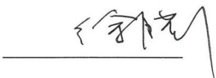

text_image

徐晓

徐腊平

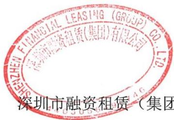

text_image

FINANCIAL LEASING (GROUP) CO.
深圳市融资租赁(集团)有限公司
深圳市融资租赁（集团）

深圳市融资租赁（集团）有限公司

2026年4月16日

## 发行人全体董事、高级管理人员声明

本公司全体董事及高级管理人员承诺本募集说明书不存在虚假记载、误导性陈述或者重大遗漏，并对其真实性、准确性和完整性承担相应的法律责任。

公司董事签名：

于玉群

text_image

SHENZHEN FINANCIAL LEASING (GROUP) CO.
深圳市融资租赁(集团)有限公司
030564571
深圳市融资租赁(集团)

深圳市融资租赁（集团）有限公司

2026年4月16日

## 发行人全体董事、高级管理人员声明

本公司全体董事及高级管理人员承诺本募集说明书不存在虚假记载、误导性陈述或者重大遗漏，并对其真实性、准确性和完整性承担相应的法律责任。

公司董事签名：

text_image

曾邗

text_image

FINANCIAL LEADING (GROUP) CO.
深圳市融资租赁(集团)有限公司
SHENZHEN FINANCIAL LEADING (GROUP) CO.
深圳市融资租赁（集

深圳市融资租赁（集团）有限公司

2026年4月16日

## 发行人全体董事、高级管理人员声明

本公司全体董事及高级管理人员承诺本募集说明书不存在虚假记载、误导性陈述或者重大遗漏，并对其真实性、准确性和完整性承担相应的法律责任。

公司董事签名：

闪宽

陶宽

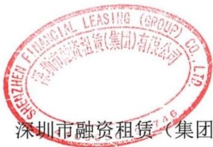

text_image

SHENZHEN FINANCIAL LEASING (GROUP) CO.,LTD.
深圳市融资租赁(集团)有限公司
深圳市融资租赁（集团

深圳市融资租赁（集团）有限公司

2020年4月16日

## 发行人全体董事、高级管理人员声明

本公司全体董事及高级管理人员承诺本募集说明书不存在虚假记载、误导性陈述或者重大遗漏，并对其真实性、准确性和完整性承担相应的法律责任。

公司董事签名：

王淑红

text_image

SHEN ZHEN FINANCIAL LEASING (GROUP) CO.,LTD.
深圳市融资租赁（集团）有限公司
4403056490
深圳市融资租赁（

深圳市融资租赁（集团）有限公司

2026年4月16日

## 发行人全体董事、高级管理人员声明

本公司全体董事及高级管理人员承诺本募集说明书不存在虚假记载、误导性陈述或者重大遗漏，并对其真实性、准确性和完整性承担相应的法律责任。

公司董事签名：

text_image

向阳民

熊晓建

text_image

FINANCIAL LEASING (GROUP)
深圳市科资租赁(集团)有限公司
SHENZHEN FINANCIAL LEASING (GROUP) CO.,LTD.

深圳市融资租赁（集团）有限公司

2026年4月16日

## 发行人全体董事、高级管理人员声明

本公司全体董事及高级管理人员承诺本募集说明书不存在虚假记载、误导性陈述或者重大遗漏，并对其真实性、准确性和完整性承担相应的法律责任。

公司董事签名：

负数

黄敏

text_image

SHENZHEN FINANCIAL LEASING (GROUP) CO.,LTD.
深圳市融资租赁(集团)有限公司
深圳市融资租赁

深圳市融资租赁（集团）有限公司

2026年4月16日

## 发行人全体董事、高级管理人员声明

本公司全体董事及高级管理人员承诺本募集说明书不存在虚假记载、误导性陈述或者重大遗漏，并对其真实性、准确性和完整性承担相应的法律责任。

公司非董事高级管理人员签名：

text_image

Handwritten signature or scribble on a line, possibly from a document or form

刘武军

text_image

SHENZHEN FINANCIAL LEASING (GROUP) CO.,LTD.
深圳市融资租赁(集团)有限公司
深圳市融资租赁

深圳市融资租赁（集团）有限公司

2026年4月16日

## 发行人全体董事、高级管理人员声明

本公司全体董事及高级管理人员承诺本募集说明书不存在虚假记载、误导性陈述或者重大遗漏，并对其真实性、准确性和完整性承担相应的法律责任。

公司非董事高级管理人员签名：

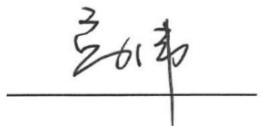

高伟

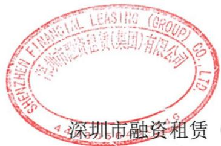

text_image

SHENZHEN FINANCIAL LEASING (GROUP) CO.,LTD.
深圳市融资租赁(集团)有限公司
深圳市融资租赁

深圳市融资租赁（集团）有限公司

2026年4月16日

## 主承销商声明

本公司已对募集说明书进行了核查，确认不存在虚假记载、误导性陈述或重大遗漏，并对其真实性、准确性和完整性承担相应的法律责任。

项目负责人签字:

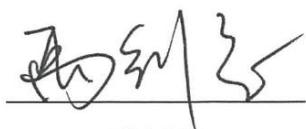

text_image

雨到冬

禹剑慈

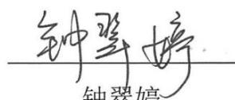

钟翠婷

周力

法定代表人（或授权代表）签字：

界田夜

罗晓波

text_image

国信证券股份有限公司
2026年4月

国信证券股份有限公司

2026年4月16日

兹授权罗晓波，为我方签订经济合同及办理其它事务代理人，其权限是：签署1)

代表签署经审批并加盖公司公章的主承销项目申报材料、反馈材料、发行前核查材料、发行相关材料(发行业务约定书等)、承销情况备案文件、销售类材料、存续期材料；2）代表签署经审批并加盖公司公章的向监管部门提交的低于债券承销报价内部约束的相关材料；3）代表签署经审批并加盖公司公章的主承项目或参团及分销认购、申购等协议及相关材料；4）代表签署经审批并加盖公司公章的经公司同意由我部负责的以公司作为发行人发行的各品种债券发行、备案登记（含证券登记及服务协议等）、上市、存续期等材料以及交易所、证监会、行业协会等监管机构要求的其他材料；5）代表签署经审批并加盖公司公章的主承销项目协议：承销协议、承销费分配比例协议、受托管理协议、账户监管协议、持有人会议规则、承销团协议等；代表签署经审批并加盖公司公章的我司担任主承销商时签订的财务顾问协议、金融服务协议；代表签署经审批并加盖公司公章的我司不担任主承销商时，签订的销售服务（顾问）协议，以及限于我司收费的财务顾问协议、金融服务协议；代表签署经审批并加盖公司公章的企业资产证券化产品的代理销售协议；代表签署经审批并加盖公司公章的地方政府债、政策性金融债承销协议；代表签署经审批并加盖公司公章的经公司同意由我部负责的以公司作为发行人发行的各品种债券相关协议（承销协议、承销协议补充协议、受托管理协议、持有人会议规则等）。

授权单位：

(盖章)

有效期限：至2026年06月30日

附：代理人性别：

年龄：

职务：

法定代表人：

(签名或盖章)

签发日期：2026.01.08

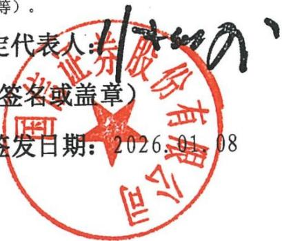

text_image

代表人:11
签名或盖章)
签发日期: 2026.01.08

## 法定代表人证明书

张纳沙 同志，现任我单位 董事长 职务，为法定代表人，特此证明。

## 主承销商声明

本公司已对募集说明书进行了核查，确认不存在虚假记载、误导性陈述或重大遗漏，并对其真实性、准确性和完整性承担相应的法律责任。

项目负责人（签字）：

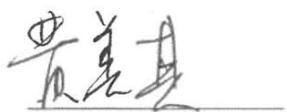  
黄美其

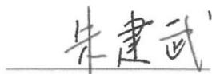  
朱建武

法定代表人或授权代表（签字）：

text_image

Handwritten signature or scribble on a white background, possibly a signature or autograph

甘卫斌

万和证券股份有限公司

text_image

和证券股份有限公司
证券股份有限公司
460100005100

2026年4月16日

## 主承销商声明

本公司已对募集说明书进行了核查，确认不存在虚假记载、误导性陈述或重大遗漏，并对其真实性、准确性和完整性承担相应的法律责任。

法定代表人或授权代表签名：

孙毅

项目负责人签名：

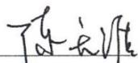

陈天涯

蔡智洋

中信证券股份有限公司

text_image

中信证券股份有限公司
2026年4月16日

2026年4月16日

## 发行人律师声明

本所及经办律师已阅读《深圳市融资租赁（集团）有限公司2026年面向专业投资者公开发行科技创新公司债券（第一期）募集说明书》，确认募集说明书与本所出具的法律意见书不存在矛盾。本所及经办律师对发行人在募集说明书中引用的法律意见书的内容无异议，确认募集说明书不致因所引用内容而出现虚假记载、误导性陈述或重大遗漏，并对募集说明书引用法律意见书的内容的真实性、准确性和完整性承担相应的法律责任。

经办律师（签字）：

text_image

吴辉

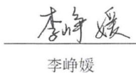

text_image

李峥媛
李峥媛

律师事务所负责人（签字）：沈国权

text_image

上海市锦天城律师事务所
2026年4月16日

## 会计师事务所声明

本所及签字注册会计师已阅读深圳市融资租赁（集团）有限公司（曾用名：中集融资租赁有限公司）募集说明书，确认募集说明书所引用内容与本所出具的2020年1月1日至2022年12月31日审计报告（报告号：XYZH/2024SZAA4F0003）、2023年1月1日至2023年12月31日审计报告(报告号：XYZH/2024SZAA4B0181)和2024年1月1日至2024年12月31日审计报告(报告号：XYZH/2025SZAI2B0002)不存在矛盾。本所及签字注册会计师对发行人在募集说明书中引用的财务报告的内容无异议，确认募集说明书不致因所引用内容而出现虚假记载、误导性陈述或重大遗漏，并承担相应的法律责任。

签字注册会计师：

text_image

李文茜
蕭雪
徐紹
唐師
李頤
蕭雪
徐紹
魏師

text_image

劉杰
龔師
龔師
龔師

会计师事务所负责人：

text_image

潘青
韓國程
北京
青年出版社

信永中和会计师事务所（特殊普通合伙）

2026年4月16日

text_image

特惠普通合伙）
信永和会计师事务所(特殊普通合伙)
年 4月16日

## 第十三节 备查文件

## 一、备查文件内容

本募集说明书的备查文件如下:

（一）发行人最近三年的财务报告及审计报告，最近一期财务报表；  
（二）主承销商出具的核查意见；  
（三）法律意见书；  
（四）《债券受托管理协议》；  
（五）《债券持有人会议规则》；  
（六）中国证监会同意本期债券发行注册的文件。

## 二、备查文件查阅地点及查询网站

在本期债券发行期间内，投资者可以至本公司及牵头主承销商处查阅本募集说明书全文及上述备查文件，或访问深圳证券交易所网站（http://www.szse.cn）查阅本募集说明书。

## （一）发行人：深圳市融资租赁（集团）有限公司

住所：深圳市前海深港合作区南山街道桂湾五路 128 号基金小镇创投基金中心 407

办公地址：深圳市福田区福华三路与中心五路交汇处星河中心21-22层

联系人：熊晓建、隗祖敏

电话：0755-26806899

## （二）牵头主承销商：国信证券股份有限公司

住所：深圳市罗湖区红岭中路1012号国信证券大厦十六层至二十六层

办公地址：深圳市福田区福华路国信金融大厦29楼

联系人：禹剑慈、周力、钟翠婷

电话：0755-81981355

投资者若对募集说明书存在任何疑问，应咨询自己的证券经纪人、律师、专业会计师或其他专业顾问。