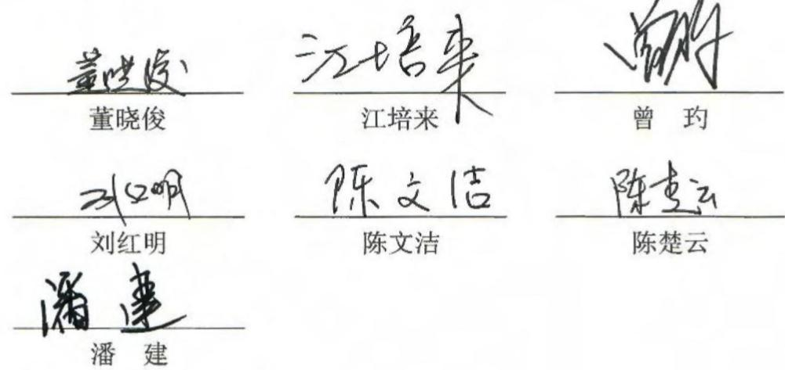
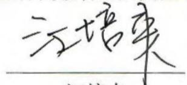
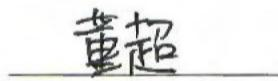
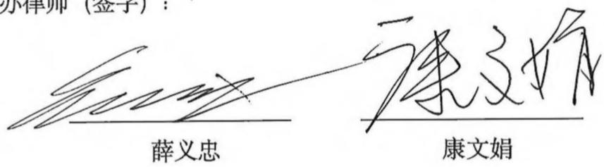
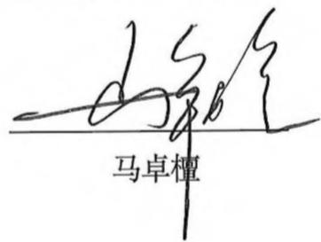
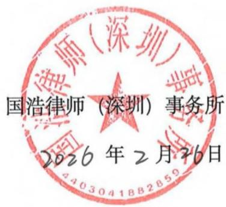
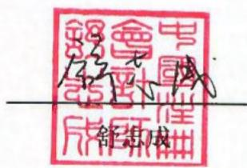
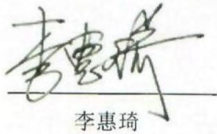
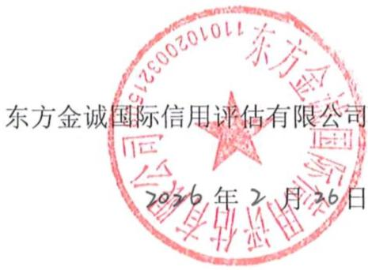

成本有关的资产”）采用与该资产相关的商品或服务收入确认相同的基础进行摊销，计入当期损益。

当与合同成本有关的资产的账面价值高于下列两项的差额时，公司对超出部分计提减值准备，并确认为资产减值损失：

①公司因转让与该资产相关的商品或服务预期能够取得的剩余对价；  
②为转让该相关商品或服务估计将要发生的成本。

## 26、政府补助

政府补助在满足政府补助所附条件并能够收到时确认。

对于货币性资产的政府补助，按照收到或应收的金额计量。对于非货币性资产的政府补助，按照公允价值计量；公允价值不能够可靠取得的，按照名义金额1元计量。

与资产相关的政府补助，是指公司取得的、用于购建或以其他方式形成长期资产的政府补助；除此之外，作为与收益相关的政府补助。

对于政府文件未明确规定补助对象的，能够形成长期资产的，与资产价值相对应的政府补助部分作为与资产相关的政府补助，其余部分作为与收益相关的政府补助；难以区分的，将政府补助整体作为与收益相关的政府补助。

与资产相关的政府补助，确认为递延收益在相关资产使用期限内按照合理、系统的方法分期计入损益。与收益相关的政府补助，用于补偿已发生的相关成本费用或损失的，计入当期损益；用于补偿以后期间的相关成本费用或损失的，则计入递延收益，于相关成本费用或损失确认期间计入当期损益。按照名义金额计量的政府补助，直接计入当期损益。本公司对相同或类似的政府补助业务，采用一致的方法处理。与日常活动相关的政府补助，按照经济业务实质，计入其他收益。与日常活动无关的政府补助，计入营业外收入。

已确认的政府补助需要返还时，初始确认时冲减相关资产账面价值的，调整资产账面价值；存在相关递延收益余额的，冲减相关递延收益账面余额，超出部分计入当期损益；属于其他情况的，直接计入当期损益。

## 27、递延所得税资产/递延所得税负债

所得税包括当期所得税和递延所得税。除由于企业合并产生的调整商誉，或与直接计入所有者权益的交易或者事项相关的递延所得税计入所有者权益外，均作为所得税费用计入当期损益。

公司根据资产、负债于资产负债表日的账面价值与计税基础之间的暂时性差异，采用资产负债表债务法确认递延所得税。

各项应纳税暂时性差异均确认相关的递延所得税负债，除非该应纳税暂时性差异是在以下交易中产生的：

（1）商誉的初始确认，或者具有以下特征的交易中产生的资产或负债的初始确认：该交易不是企业合并，并且交易发生时既不影响会计利润也不影响应纳税所得额（初始确认的资产和负债导致产生等额应纳税暂时性差异和可抵扣暂时性差异的单项交易除外）；  
（2）对于与子公司、合营企业及联营企业投资相关的应纳税暂时性差异，该暂时性差异转回的时间能够控制并且该暂时性差异在可预见的未来很可能不会转回。

对于可抵扣暂时性差异、能够结转以后年度的可抵扣亏损和税款抵减，公司以很可能取得用来抵扣可抵扣暂时性差异、可抵扣亏损和税款抵减的未来应纳税所得额为限，确认由此产生的递延所得税资产，除非该可抵扣暂时性差异是在以下交易中产生的：

（1）该交易不是企业合并，并且交易发生时既不影响会计利润也不影响应纳税所得额（初始确认的资产和负债导致产生等额应纳税暂时性差异和可抵扣暂时性差异的单项交易除外）；  
（2）对于与子公司、合营企业及联营企业投资相关的可抵扣暂时性差异，同时满足下列条件的，确认相应的递延所得税资产：暂时性差异在可预见的未来很可能转回，且未来很可能获得用来抵扣可抵扣暂时性差异的应纳税所得额。

资产负债表日，公司对递延所得税资产和递延所得税负债，按照预期收回该资产或清偿该负债期间的适用税率计量，并反映资产负债表日预期收回资产

或清偿负债方式的所得税影响。

资产负债表日，公司对递延所得税资产的账面价值进行复核。如果未来期间很可能无法获得足够的应纳税所得额用以抵扣递延所得税资产的利益，减记递延所得税资产的账面价值。在很可能获得足够的应纳税所得额时，减记的金额予以转回。

资产负债表日，递延所得税资产和递延所得税负债在同时满足下列条件时以抵销后的净额列示：（1）公司内该纳税主体拥有以净额结算当期所得税资产和当期所得税负债的法定权利；

（2）递延所得税资产和递延所得税负债是与同一税收征管部门对公司内同一纳税主体征收的所得税相关。

## 28、租赁

## (1) 租赁的识别

在合同开始日，公司作为承租人或出租人评估合同中的客户是否有权获得在使用期间内因使用已识别资产所产生的几乎全部经济利益，并有权在该使用期间主导已识别资产的使用。如果合同中一方让渡了在一定期间内控制一项或多项已识别资产使用的权利以换取对价，则公司认定合同为租赁或者包含租赁。

## (2) 公司作为承租人

在租赁期开始日，公司对所有租赁确认使用权资产和租赁负债，简化处理的短期租赁和低价值资产租赁除外。

使用权资产的会计政策见 “29、使用权资产”。

租赁负债按照租赁期开始日尚未支付的租赁付款额采用租赁内含利率计算的现值进行初始计量，无法确定租赁内含利率的，采用增量借款利率作为折现率。租赁付款额包括：固定付款额及实质固定付款额，存在租赁激励的，扣除租赁激励相关金额；取决于指数或比率的可变租赁付款额；购买选择权的行权价格，前提是承租人合理确定将行使该选择权；行使终止租赁选择权需支付的款项，前提是租赁期反映出承租人将行使终止租赁选择权；以及根据承租人提供的担保余值预计应支付的款项。后续按照固定的周期性利率计算租赁负债在租赁期内各期间的利息费用，并计入当期损益。未纳入租赁负债计量的可变租赁付款额在实际发生时计入当期损益。

短期租赁

短期租赁是指在租赁期开始日，租赁期不超过 12 个月的租赁，包含购买选择权的租赁除外。

公司将短期租赁的租赁付款额，在租赁期内各个期间按照直线法的方法计入相关资产成本或当期损益。

对于短期租赁，公司按照租赁资产的类别将下列资产类型中满足短期租赁条件的项目选择采用上述简化处理方法。

低价值资产租赁

低价值资产租赁是指单项租赁资产为全新资产时价值低于 4 万元的租赁。

公司将低价值资产租赁的租赁付款额，在租赁期内各个期间按照直线法的方法计入相关资产成本或当期损益。

对于低价值资产租赁，公司根据每项租赁的具体情况选择采用上述简化处理方法。

租赁变更

租赁发生变更且同时符合下列条件的，公司将该租赁变更作为一项单独租赁进行会计处理：①该租赁变更通过增加一项或多项租赁资产的使用权而扩大了租赁范围；②增加的对价与租赁范围扩大部分的单独价格按该合同情况调整后的金额相当。

租赁变更未作为一项单独租赁进行会计处理的，在租赁变更生效日，公司重新分摊变更后合同的对价，重新确定租赁期，并按照变更后租赁付款额和修订后的折现率计算的现值重新计量租赁负债。

租赁变更导致租赁范围缩小或租赁期缩短的，公司相应调减使用权资产的账面价值，并将部分终止或完全终止租赁的相关利得或损失计入当期损益。

其他租赁变更导致租赁负债重新计量的，公司相应调整使用权资产的账面价值。

## （3）公司作为出租人

公司作为出租人时，将实质上转移了与资产所有权有关的全部风险和报酬的租赁确认为融资租赁，除融资租赁之外的其他租赁确认为经营租赁。

融资租赁

融资租赁中，在租赁期开始日公司按租赁投资净额作为应收融资租赁款的入账价值，租赁投资净额为未担保余值和租赁期开始日尚未收到的租赁收款额按照租赁内含利率折现的现值之和。公司作为出租人按照固定的周期性利率计算并确认租赁期内各个期间的利息收入。公司作为出租人取得的未纳入租赁投资净额计量的可变租赁付款额在实际发生时计入当期损益。

应收融资租赁款的终止确认和减值按照《企业会计准则第 22 号——金融工具确认和计量》和《企业会计准则第 23 号——金融资产转移》的规定进行会计处理。

经营租赁

经营租赁中的租金，公司在租赁期内各个期间按照直线法确认当期损益。发生的与经营租赁有关的初始直接费用应当资本化，在租赁期内按照与租金收入确认相同的基础进行分摊，分期计入当期损益。取得的与经营租赁有关的未计入租赁收款额的可变租赁付款额，在实际发生时计入当期损益。

租赁变更

经营租赁发生变更的，公司自变更生效日起将其作为一项新租赁进行会计处理，与变更前租赁有关的预收或应收租赁收款额视为新租赁的收款额。

融资租赁发生变更且同时符合下列条件的，公司将该变更作为一项单独租赁进行会计处理：①该变更通过增加一项或多项租赁资产的使用权而扩大了租赁范围；②增加的对价与租赁范围扩大部分的单独价格按该合同情况调整后的金额相当。融资租赁发生变更未作为一项单独租赁进行会计处理的，公司分别下列情形对变更后的租赁进行处理：①假如变更在租赁开始日生效，该租赁会被分类为经营租赁的，公司自租赁变更生效日开始将其作为一项新租赁进行会计处理，并以租赁变更生效日前的租赁投资净额作为租赁资产的账面价值；②假如变更在租赁开始日生效，该租赁会被分类为融资租赁的，公司按照《企业会计准则第22号——金融工具确认和计量》关于修改或重新议定合同的规定进行会计处理。

## 29、使用权资产

## （1）使用权资产确认条件

使用权资产是指公司作为承租人可在租赁期内使用租赁资产的权利。

在租赁期开始日，使用权资产按照成本进行初始计量。该成本包括：租赁负债的初始计量金额；在租赁期开始日或之前支付的租赁付款额，存在租赁激励的，扣除已享受的租赁激励相关金额；公司作为承租人发生的初始直接费用；公司作为承租人为拆卸及移除租赁资产、复原租赁资产所在场地或将租赁资产恢复至租赁条款约定状态预计将发生的成本。公司作为承租人按照《企业会计准则第13号——或有事项》对拆除复原等成本进行确认和计量。后续就租赁负债的任何重新计量作出调整。

## (2) 使用权资产的折旧方法

公司采用直线法计提折旧。公司作为承租人能够合理确定租赁期届满时取得租赁资产所有权的，在租赁资产剩余使用寿命内计提折旧。无法合理确定租赁期届满时能够取得租赁资产所有权的，在租赁期与租赁资产剩余使用寿命两者孰短的期间内计提折旧。

使用权资产的减值测试方法、减值准备计提方法见“20、资产减值”。

## 30、回购股份

公司回购的股份在注销或者转让之前，作为库存股管理，回购股份的全部支出转作库存股成本。股份回购中支付的对价和交易费用减少所有者权益，回购、转让或注销公司股份时，不确认利得或损失。

转让库存股，按实际收到的金额与库存股账面金额的差额，计入资本公积，资本公积不足冲减的，冲减盈余公积和未分配利润。注销库存股，按股票面值和注销股数减少股本，按注销库存股的账面余额与面值的差额，冲减资本公积，资本公积不足冲减的，冲减盈余公积和未分配利润。

## 31、重大会计判断和估计

公司根据历史经验和其它因素，包括对未来事项的合理预期，对所采用的重要会计估计和关键假设进行持续的评价。很可能导致下一会计年度资产和负债的账面价值出现重大调整风险的重要会计估计和关键假设列示如下：

金融资产的分类公司在确定金融资产的分类时涉及的重大判断包括业务模式及合同现金流量特征的分析等。

公司在金融资产组合的层次上确定管理金融资产的业务模式，考虑的因素包括评价和向关键管理人员报告金融资产业绩的方式、影响金融资产业绩的风险及其管理方式、以及相关业务管理人员获得报酬的方式等。

公司在评估金融资产的合同现金流量是否与基本借贷安排相一致时，存在以下主要判断：本金是否可能因提前还款等原因导致在存续期内的时间分布或者金额发生变动；利息是否仅包括货币时间价值、信用风险、其他基本借贷风险以及与成本和利润的对价。例如，提前偿付的金额是否仅反映了尚未支付的本金及以未偿付本金为基础的利息，以及因提前终止合同而支付的合理补偿。

应收账款预期信用损失的计量

公司通过应收账款违约风险敞口和预期信用损失率计算应收账款预期信用损失，并基于违约概率和违约损失率确定预期信用损失率。在确定预期信用损失率时，公司使用内部历史信用损失经验等数据，并结合当前状况和前瞻性信息对历史数据进行调整。在考虑前瞻性信息时，公司使用的指标包括经济下滑的风险、外部市场环境、技术环境和客户情况的变化等。公司定期监控并复核与预期信用损失计算相关的假设。

递延所得税资产

在很有可能有足够的应纳税利润来抵扣亏损的限度内，应就所有未利用的税务亏损确认递延所得税资产。这需要管理层运用大量的判断来估计未来应纳税利润发生的时间和金额，结合纳税筹划策略，以决定应确认的递延所得税资产的金额。

## （二）重要会计政策变更

财政部于 2022 年 11 月发布了《企业会计准则解释第 16 号》（财会〔2022〕31 号）（以下简称“解释第 16 号”）。解释第 16 号规定，对于不是企业合并、交易发生时既不影响会计利润也不影响应纳税所得额（或可抵扣亏损）、且初始确认的资产和负债导致产生等额应纳税暂时性差异和可抵扣暂时性差异的单项交易，因资产和负债的初始确认所产生的应纳税暂时性差异和可抵扣暂时性差异，应当根据《企业会计准则第 18 号——所得税》等有关规定，在交易发生时分别确认相应的递延所得税负债和递延所得税资产。对于在首次施行上述规定的财务报表列报最早期间的期初至本解释施行日之间发生的上述交易，企业应当按照上述规定，将累积影响数调整财务报表列报最早期间的期初留存收益及其他相关财务报表项目。上述会计处理规定自 2023 年 1 月 1 日起施行。公司对租赁业务确认的租赁负债和使用权资产，产生应纳税暂时性差异和可抵扣暂时性差异的，按照解释第 16 号的规定进行调整，具体如下：

单位：元

<table><tr><td>会计政策变更的内容和原因</td><td>受重要影响的报表项目名称</td><td>影响金额</td></tr><tr><td>对租赁业务确认的租赁负债和使用权资产,产生应纳税暂时性差异和可抵扣暂时性差异的,按照《企业会计准则解释第16号》的规定进行调整</td><td>递延所得税资产</td><td>112,364.54</td></tr><tr><td>对租赁业务确认的租赁负债和使用权资产,产生应纳税暂时性差异和可抵扣暂时性差异的,按照《企业会计准则解释第16号》的规定进行调整</td><td>盈余公积</td><td>552.86</td></tr><tr><td>对租赁业务确认的租赁负债和使用权资产,产生应纳税暂时性差异和可抵扣暂时性差异的,按照《企业会计准则解释第16号》的规定进行调整</td><td>未分配利润</td><td>111,811.68</td></tr><tr><td>对租赁业务确认的租赁负债和使用权资产,产生应纳税暂时性差异和可抵扣暂时性差异的,按照《企业会计准则解释第16号》的规定进行调整</td><td>所得税费用</td><td>-112,364.54</td></tr><tr><td>对租赁业务确认的租赁负债和使用权资产,产生应纳税暂时性差异和可抵扣暂时性差异的,按照《企业会计准则解释第16号》的规定进行调整</td><td>净利润</td><td>112,364.54</td></tr></table>

## （三）会计估计变更

报告期内，公司无会计估计变更的情况。

## （四）会计差错更正

报告期内，公司存在差错更正的情况，具体如下：公司于2025年4月26日披露《2025年第一季度报告》，因公司填报偏差，导致公司披露的《2025年第一季度报告》非经常性损益项目相关数据有误，于2025年6月20日做出差错更正，公司不存在通过会计差错更正调节业绩的情形。

## 四、主要纳税税种及税收优惠情况

## （一）公司缴纳的主要税种及税率

<table><tr><td>税种</td><td>计税依据</td><td>税率</td></tr><tr><td>增值税</td><td>应纳税增值额(应纳税额按应纳税销售额乘以适用税率扣除当期允许抵扣的进项税后的余额计算)</td><td>13%</td></tr><tr><td>城市维护建设税</td><td>实际缴纳的流转税额</td><td>7%</td></tr><tr><td>企业所得税</td><td>应纳税所得额</td><td>25%/20%/16.5%/15%</td></tr><tr><td>教育费附加</td><td>实际缴纳的流转税额</td><td>3%</td></tr><tr><td>地方教育费附加</td><td>实际缴纳的流转税额</td><td>2%</td></tr></table>

其中，存在不同企业所得税税率纳税主体的，具体情况如下：

<table><tr><td>纳税主体名称</td><td>所得税税率</td></tr><tr><td>本川智能</td><td>15%</td></tr><tr><td>艾威尔深圳</td><td>15%</td></tr><tr><td>骏岭线路板</td><td>25%</td></tr><tr><td>珠海亚图</td><td>20%</td></tr><tr><td>香港本川</td><td>16.5%</td></tr><tr><td>美国本川</td><td>7%-39%(累进税率)</td></tr><tr><td>艾威尔泰国</td><td>20%</td></tr><tr><td>皖粤光电</td><td>20%</td></tr><tr><td>珠海硕鸿</td><td>25%</td></tr><tr><td>本川鵬芯</td><td>20%</td></tr></table>

## （二）目前主要的税收优惠政策情况

## 1、企业所得税税收优惠

（1）本川智能于 2019 年 11 月 22 日取得江苏省科学技术厅、江苏省财政厅、国家税务总局江苏省税务局联合颁发的《高新技术企业证书》，证书编号：GR201932003495，有效期三年，上述证书于 2022 年 11 月到期。此后，公司通过高新复审认证，于 2022 年 12 月 12 日取得续发的《高新技术企业证书》，证书编号：GR202232012979，有效期三年。公司企业所得税按 15% 的税率缴纳。  
（2）艾威尔深圳于 2019 年 12 月 9 日取得深圳市科技创新委员会、深圳市财政局、国家税务总局深圳市税务局联合颁发的《高新技术企业证书》，证书编号：GR201944204903，有效期三年，上述证书于 2022 年 12 月到期，2022 年通过高新复审认证，于 2022 年 12 月 14 日取得续发的《高新技术企业证书》，证书编号：GR202244202316，有效期三年。艾威尔深圳企业所得税按 15% 的税率缴纳。  
（3）根据 2023 年 8 月 2 日财政部、税务总局下发的《关于进一步支持小微企业和个体工商户发展有关税费政策的公告》（财政部 税务总局公告 2023 年第 12 号），对小型微利企业减按 25% 计算应纳税所得额，按 20% 的税率缴纳企业所得税。公司之子公司珠海亚图、皖粤光电、本川鹏芯享受上述税收优惠。

## 2、开发新技术、新产品、新工艺发生的研究开发费用加计扣除优惠

根据《中华人民共和国企业所得税法》《中华人民共和国企业所得税法实施条例》，公司报告期内研究开发费用在计算应纳税所得额时加计扣除。

经核查公司提供的纳税申报表、税务机关出具的查询结果等文件，公司执行的税种、税率符合法律法规和规范性文件的要求；报告期内，公司能够按时申报纳税，及时缴纳税款，报告期内不存在因纳税违法违规行为而受到监管部门重大行政处罚的情形。

## 五、最近三年及一期的主要财务指标

## （一）主要财务指标

报告期内，公司主要财务指标如下：

<table><tr><td>项目</td><td>2025-09-30/2025年1-9月</td><td>2024-12-31/2024年度</td><td>2023-12-31/2023年度</td><td>2022-12-31/2022年度</td></tr><tr><td>流动比率(倍)</td><td>1.65</td><td>2.49</td><td>2.83</td><td>2.58</td></tr><tr><td>速动比率(倍)</td><td>1.25</td><td>2.16</td><td>2.56</td><td>2.26</td></tr><tr><td>资产负债率(母公司)</td><td>27.43%</td><td>17.52%</td><td>18.16%</td><td>21.87%</td></tr><tr><td>资产负债率(合并)</td><td>31.99%</td><td>24.21%</td><td>24.38%</td><td>26.47%</td></tr><tr><td>归属于发行人股东的每股净资产</td><td>13.26</td><td>12.82</td><td>12.88</td><td>13.04</td></tr><tr><td>应收账款周转率(次)</td><td>3.91</td><td>3.63</td><td>3.81</td><td>3.80</td></tr><tr><td>存货周转率(次)</td><td>4.48</td><td>5.18</td><td>4.09</td><td>3.38</td></tr><tr><td>归属于发行人股东的净利润(万元)</td><td>3,307.62</td><td>2,373.96</td><td>482.69</td><td>4,755.39</td></tr><tr><td>归属于发行人股东扣除非经常性损益后的净利润(万元)</td><td>3,023.01</td><td>1,697.04</td><td>-673.93</td><td>3,405.22</td></tr><tr><td>利息保障倍数(倍)</td><td>56.88</td><td>23.61</td><td>1.67</td><td>102.02</td></tr><tr><td>研发投入占营业收入比例</td><td>3.72%</td><td>5.18%</td><td>5.77%</td><td>5.93%</td></tr><tr><td>每股经营活动现金流量净额(元/股)</td><td>-0.09</td><td>0.36</td><td>0.97</td><td>1.43</td></tr><tr><td>每股净现金流量(元/股)</td><td>0.18</td><td>0.04</td><td>0.05</td><td>0.03</td></tr></table>

注 1：2025 年 1-9 月的应收账款周转率和存货周转率以年化计算；  
注2：主要财务指标计算方法如下：  
1、流动比率=期末流动资产/期末流动负债；  
2、速动比率= $\left(\text{期末流动资产}-\text{期末存货}\right)/\text{期末流动负债};$  
3、资产负债率=总负债/总资产；  
4、归属于发行人股东的每股净资产=归属于发行人母公司股东的净资产/期末总股本；  
5、应收账款周转率=营业收入/年初年末应收账款平均账面余额；  
6、存货周转率=营业成本/年初年末存货平均账面余额；  
7、利息保障倍数= $\left(\text{利润总额}+\text{利息费用}\right)/\text{利息费用};$  
8、研发投入占收入比重=研发投入/营业收入；  
9、每股经营活动的现金流量=经营活动产生的现金流量净额/期末总股本；  
10、每股净现金流量=现金及现金等价物净增加额/期末总股本。

## （二）净资产收益率及每股收益

根据中国证监会《公开发行证券公司信息披露编报规则第 9 号——净资产收益率和每股收益的计算及披露》（2010 年修订）《公开发行证券的公司信息披露解释性公告第 1 号——非经常性损益》的相关要求，报告期内公司加权平均净资产收益率及每股收益情况如下：

<table><tr><td rowspan="2">报告期</td><td rowspan="2">报告期利润</td><td rowspan="2">加权平均净资产收益率</td><td colspan="2">每股收益</td></tr><tr><td>基本每股收益(元/股)</td><td>稀释每股收益(元/股)</td></tr><tr><td rowspan="2">2025年1-9月</td><td>归属于上市公司普通股股东的净利润</td><td>3.27%</td><td>0.43</td><td>0.43</td></tr><tr><td>扣除非经常性损益后归属于上市公司普通股股东的净利润</td><td>3.00%</td><td>0.39</td><td>0.39</td></tr><tr><td rowspan="2">2024年度</td><td>归属于上市公司普通股股东的净利润</td><td>2.35%</td><td>0.31</td><td>0.31</td></tr><tr><td>扣除非经常性损益后归属于上市公司普通股股东的净利润</td><td>1.68%</td><td>0.22</td><td>0.22</td></tr><tr><td rowspan="2">2023年度</td><td>归属于上市公司普通股股东的净利润</td><td>0.47%</td><td>0.06</td><td>0.06</td></tr><tr><td>扣除非经常性损益后归属于上市公司普通股股东的净利润</td><td>-0.66%</td><td>-0.09</td><td>-0.09</td></tr><tr><td rowspan="2">2022年度</td><td>归属于上市公司普通股股东的净利润</td><td>4.74%</td><td>0.62</td><td>0.62</td></tr><tr><td>扣除非经常性损益后归属于上市公司普通股股东的净利润</td><td>3.40%</td><td>0.44</td><td>0.44</td></tr></table>

## 六、财务状况分析

## （一）资产状况分析

报告期各期末，公司资产构成情况如下：

单位：万元、%

<table><tr><td rowspan="2">项目</td><td colspan="2">2025-09-30</td><td colspan="2">2024-12-31</td><td colspan="2">2023-12-31</td><td colspan="2">2022-12-31</td></tr><tr><td>金额</td><td>占比</td><td>金额</td><td>占比</td><td>金额</td><td>占比</td><td>金额</td><td>占比</td></tr><tr><td colspan="9">流动资产</td></tr><tr><td>货币资金</td><td>22,253.75</td><td>14.68</td><td>21,576.25</td><td>16.47</td><td>19,420.75</td><td>14.75</td><td>18,866.46</td><td>13.76</td></tr><tr><td>交易性金融资产</td><td>2,800.86</td><td>1.85</td><td>15,806.06</td><td>12.07</td><td>36,696.54</td><td>27.86</td><td>39,215.94</td><td>28.60</td></tr><tr><td>应收票据</td><td>5,437.71</td><td>3.59</td><td>5,227.65</td><td>3.99</td><td>3,163.66</td><td>2.40</td><td>5,695.20</td><td>4.15</td></tr><tr><td>应收账款</td><td>21,813.00</td><td>14.39</td><td>16,228.88</td><td>12.39</td><td>13,191.25</td><td>10.02</td><td>10,769.39</td><td>7.86</td></tr><tr><td>应收款项融资</td><td>860.60</td><td>0.57</td><td>943.06</td><td>0.72</td><td>936.96</td><td>0.71</td><td>3,111.74</td><td>2.27</td></tr><tr><td>预付款项</td><td>270.59</td><td>0.18</td><td>430.17</td><td>0.33</td><td>172.53</td><td>0.13</td><td>194.68</td><td>0.14</td></tr><tr><td>其他应收款</td><td>734.01</td><td>0.48</td><td>211.67</td><td>0.16</td><td>206.95</td><td>0.16</td><td>871.68</td><td>0.64</td></tr><tr><td>存货</td><td>17,800.91</td><td>11.74</td><td>9,467.46</td><td>7.23</td><td>7,855.41</td><td>5.96</td><td>11,543.01</td><td>8.42</td></tr><tr><td>其他流动资产</td><td>1,284.54</td><td>0.85</td><td>934.72</td><td>0.71</td><td>795.44</td><td>0.60</td><td>424.15</td><td>0.31</td></tr><tr><td>流动资产合计</td><td>73,255.97</td><td>48.33</td><td>70,825.92</td><td>54.08</td><td>82,439.49</td><td>62.60</td><td>90,692.25</td><td>66.15</td></tr><tr><td colspan="9">非流动资产</td></tr><tr><td>长期股权投资</td><td>2,697.91</td><td>1.78</td><td>900.00</td><td>0.69</td><td>-</td><td>-</td><td>-</td><td>-</td></tr><tr><td>固定资产</td><td>56,027.02</td><td>36.97</td><td>40,098.44</td><td>30.62</td><td>38,933.84</td><td>29.56</td><td>40,822.89</td><td>29.78</td></tr><tr><td>在建工程</td><td>2,559.74</td><td>1.69</td><td>7,204.31</td><td>5.50</td><td>3,866.33</td><td>2.94</td><td>641.49</td><td>0.47</td></tr><tr><td>使用权资产</td><td>1,622.47</td><td>1.07</td><td>2,080.17</td><td>1.59</td><td>1,660.37</td><td>1.26</td><td>778.86</td><td>0.57</td></tr><tr><td>无形资产</td><td>6,955.05</td><td>4.59</td><td>7,033.14</td><td>5.37</td><td>2,441.57</td><td>1.85</td><td>2,553.94</td><td>1.86</td></tr><tr><td>商誉</td><td>686.22</td><td>0.45</td><td>686.22</td><td>0.52</td><td>223.86</td><td>0.17</td><td>223.86</td><td>0.16</td></tr><tr><td>长期待摊费用</td><td>1,231.63</td><td>0.81</td><td>833.05</td><td>0.64</td><td>607.46</td><td>0.46</td><td>754.86</td><td>0.55</td></tr><tr><td>递延所得税资产</td><td>306.03</td><td>0.20</td><td>305.82</td><td>0.23</td><td>733.06</td><td>0.56</td><td>462.53</td><td>0.34</td></tr><tr><td>其他非流动资产</td><td>6,220.07</td><td>4.10</td><td>1,008.73</td><td>0.77</td><td>790.62</td><td>0.60</td><td>164.69</td><td>0.12</td></tr><tr><td>非流动资产合计</td><td>78,306.15</td><td>51.67</td><td>60,149.88</td><td>45.92</td><td>49,257.11</td><td>37.40</td><td>46,403.12</td><td>33.85</td></tr><tr><td>资产总计</td><td>151,562.12</td><td>100.00</td><td>130,975.80</td><td>100.00</td><td>131,696.60</td><td>100.00</td><td>137,095.37</td><td>100.00</td></tr></table>

报告期各期末，公司资产总额分别为 137,095.37 万元、131,696.60 万元、130,975.80 万元和 151,562.12 万元，报告期末，公司的总资产规模整体较为稳定。

## 1、流动资产构成及变动分析

报告期各期末，流动资产总额分别为 90,692.25 万元、82,439.49 万元、70,825.92 万元和 73,255.97 万元，占资产总额比例分别为 66.15%、62.60%、54.08% 和 48.33%，报告期内公司流动资产占比较高，公司整体资产流动性较强，此外，报告期内公司流动资产总额及占总资产比例趋于下降趋势，主要系公司 IPO 募投项目及其他生产建设项目的持续开展使得货币资金流出所致。

## (1) 货币资金

报告期各期末，公司货币资金余额分别为 18,866.46 万元、19,420.75 万元、21,576.25 万元和 22,253.75 万元，占资产总额的比例分别为 13.76%、14.75%、

16.47%和 14.68%。公司货币资金具体构成如下：

单位：万元、%

<table><tr><td rowspan="2">项目</td><td colspan="2">2025-09-30</td><td colspan="2">2024-12-31</td><td colspan="2">2023-12-31</td><td colspan="2">2022-12-31</td></tr><tr><td>金额</td><td>占比</td><td>金额</td><td>占比</td><td>金额</td><td>占比</td><td>金额</td><td>占比</td></tr><tr><td>库存现金</td><td>9.69</td><td>0.04</td><td>8.22</td><td>0.04</td><td>5.24</td><td>0.03</td><td>18.07</td><td>0.10</td></tr><tr><td>银行存款</td><td>17,654.36</td><td>79.33</td><td>16,261.75</td><td>75.37</td><td>15,936.71</td><td>82.06</td><td>15,350.34</td><td>81.36</td></tr><tr><td>其他货币资金</td><td>4,589.70</td><td>20.62</td><td>5,306.27</td><td>24.59</td><td>3,478.79</td><td>17.91</td><td>3,498.05</td><td>18.54</td></tr><tr><td>合计</td><td>22,253.75</td><td>100.00</td><td>21,576.25</td><td>100.00</td><td>19,420.75</td><td>100.00</td><td>18,866.46</td><td>100.00</td></tr><tr><td>其中:因抵押、质押或冻结等对使用有限制的款项总额</td><td>4,589.68</td><td>20.62</td><td>5,306.26</td><td>24.59</td><td>3,478.44</td><td>17.91</td><td>3,291.62</td><td>17.45</td></tr><tr><td>存放在境外的资金</td><td>2,946.33</td><td>13.24</td><td>2,992.40</td><td>13.87</td><td>1,093.22</td><td>5.63</td><td>526.56</td><td>2.79</td></tr></table>

货币资金为公司主要流动资产之一，公司保有一定量的货币资金用于满足正常生产经营需要，与公司的生产经营规模基本一致。报告期各期末，公司货币资金整体较为稳定。

报告期各期末，公司受限货币资金主要包括银行承兑汇票保证金、已申购未扣款理财资金、收购子公司所用共管账户资金等。除上述受限资金外，公司不存在其他因抵押、质押或冻结等对使用有限制、以及存放在境外且资金汇回受到限制的款项。

公司存放在境外的资金主要是境外子公司香港本川、美国本川、艾威尔泰国三家海外子公司的账户资金，主要为以上公司日常经营及投资所用。

## (2) 交易性金融资产

报告期各期末，公司交易性金融资产分别为 39,215.94 万元、36,696.54 万元、15,806.06 万元和 2,800.86 万元，交易性金融资产具体构成如下：

单位：万元

<table><tr><td>项目</td><td>2025-09-30</td><td>2024-12-31</td><td>2023-12-31</td><td>2022-12-31</td></tr><tr><td>以公允价值计量且其变动计入当期损益的金融资产</td><td>2,800.86</td><td>15,806.06</td><td>36,696.54</td><td>39,215.94</td></tr><tr><td>合计</td><td>2,800.86</td><td>15,806.06</td><td>36,696.54</td><td>39,215.94</td></tr></table>

公司各期末交易性金融资产主要是公司购买的理财产品、结构性存款以及券商投资理财产品。公司在满足日常资金正常周转需要的前提下，为提高闲置资金使用效率，公司购买中低风险、安全性高、流动性好等特点的结构性银行存款、活期银行理财产品或 FOF 券商理财产品，对公司资金安排不存在重大不利影响，不属于收益波动大且风险较高的金融产品，此外，各报告期末公司交易性资产金额逐期下降，主要系公司 IPO 募投项目及其他生产建设项目的持续开展使得募集资金及自有资金现金管理金额减少所致。报告期各期末，交易性金融资产金额变动一方面系公司资金安排变动使得购买结构性存款、理财产品的规模所致，另一方面系结构性存款、理财产品的期限结构变动所致。

## （3）应收票据及应收款项融资

报告期内，公司收到的承兑汇票根据承兑公司信用等级的具体情况在应收票据科目和应收款项融资科目分别核算。报告期各期末，公司应收票据和应收款项融资情况如下：

单位：万元

<table><tr><td>项目</td><td>2025-09-30/2025年1-9月</td><td>2024-12-31/2024年度</td><td>2023-12-31/2023年度</td><td>2022-12-31/2022年度</td></tr><tr><td>应收票据</td><td>5,437.71</td><td>5,236.76</td><td>3,170.97</td><td>5,695.20</td></tr><tr><td>其中:银行承兑汇票</td><td>5,437.71</td><td>5,054.55</td><td>3,024.83</td><td>5,695.20</td></tr><tr><td>商业承兑汇票</td><td>-</td><td>182.21</td><td>146.14</td><td>-</td></tr><tr><td>应收款项融资</td><td>860.60</td><td>943.06</td><td>936.96</td><td>3,111.74</td></tr><tr><td>合计</td><td>6,298.31</td><td>6,179.82</td><td>4,107.93</td><td>8,806.94</td></tr><tr><td>商业承兑汇票坏账</td><td>-</td><td>9.11</td><td>7.31</td><td>-</td></tr><tr><td>应收票据及应收款项融资净值</td><td>6,298.31</td><td>6,170.71</td><td>4,100.63</td><td>8,806.94</td></tr><tr><td>应收票据及应收款项融资余额总额占营业收入比重</td><td>10.27%</td><td>10.37%</td><td>8.04%</td><td>15.75%</td></tr></table>

报告期各期末，公司应收票据及应收款项融资合计余额分别为 8,806.94 万元、4,107.93 万元、6,179.82 万元和 6,298.31 万元，占营业收入比重分别为 15.75%、8.04%、10.37% 和 10.27%。报告期各期末，公司应收票据及应收款项融资总额有所波动，主要系公司营业收入波动及客户付款方式选择影响所致。此外，报告期各期末，公司的应收票据及应收款项融资主要为银行承兑汇票，

整体回收风险较小。

报告期各期末，被质押应收票据金额分别为 5,623.20 万元、1,282.53 万元、1,220.55 万元和 843.63 万元，全部系银行承兑汇票保证金。

## （4）应收账款

报告期各期末，公司应收账款净额分别为 10,769.39 万元、13,191.25 万元、16,228.88 万元和 21,813.00 万元，占资产总额的比例分别为 7.86%、10.02%、12.39% 和 14.39%，应收账款具体情况如下：

单位：万元

<table><tr><td>项目</td><td>2025-09-30</td><td>2024-12-31</td><td>2023-12-31</td><td>2022-12-31</td></tr><tr><td>应收账款余额</td><td>23,829.03</td><td>17,999.65</td><td>14,837.62</td><td>11,955.35</td></tr><tr><td>坏账准备</td><td>2,016.03</td><td>1,770.78</td><td>1,646.37</td><td>1,185.96</td></tr><tr><td>应收账款净额</td><td>21,813.00</td><td>16,228.88</td><td>13,191.25</td><td>10,769.39</td></tr></table>

## ①应收账款账龄情况

报告期各期末，公司应收账款账龄结构如下：

单位：万元

<table><tr><td>账龄</td><td>2025-09-30</td><td>2024-12-31</td><td>2023-12-31</td><td>2022-12-31</td></tr><tr><td>1年以内</td><td>23,326.09</td><td>17,135.66</td><td>14,309.58</td><td>11,562.55</td></tr><tr><td>1至2年</td><td>113.94</td><td>474.98</td><td>138.32</td><td>4.52</td></tr><tr><td>2至3年</td><td>0.03</td><td>0.03</td><td>1.45</td><td>38.21</td></tr><tr><td>3年以上</td><td>388.97</td><td>388.98</td><td>388.28</td><td>350.07</td></tr><tr><td>3至4年</td><td>0.69</td><td>0.70</td><td>38.21</td><td>125.96</td></tr><tr><td>4至5年</td><td>-</td><td>38.21</td><td>125.96</td><td>-</td></tr><tr><td>5年以上</td><td>388.28</td><td>350.07</td><td>224.11</td><td>224.11</td></tr><tr><td>合计</td><td>23,829.03</td><td>17,999.65</td><td>14,837.62</td><td>11,955.35</td></tr></table>

由上表可知，报告期各期末，公司应收账款之账龄集中在一年以内，分别占 96.71%、96.44%、95.20% 和 97.89%，不存在长期挂账的未收回大额应收账款，整体情况较好。

## ②应收账款变动情况

报告期各期末，公司应收账款规模及变化情况如下：

单位：万元

<table><tr><td>项目</td><td>2025-09-30/2025年1-9月</td><td>2024-12-31/2024年度</td><td>2023-12-31/2023年度</td><td>2022-12-31/2022年度</td></tr><tr><td>应收账款余额</td><td>23,829.03</td><td>17,999.65</td><td>14,837.62</td><td>11,955.35</td></tr><tr><td>营业收入</td><td>61,354.86</td><td>59,610.27</td><td>51,094.26</td><td>55,926.34</td></tr><tr><td>应收账款余额占营业收入比重</td><td>29.13%</td><td>30.20%</td><td>29.04%</td><td>21.38%</td></tr></table>

注：2025年1-9月应收账款余额占营业收入比重已做年化处理。

报告期各期末，公司应收账款余额分别为 11,955.35 万元、14,837.62 万元、17,999.65 万元和 23,829.03 万元，占同期营业收入的比重分别为 21.38%、29.04%、30.20% 和 29.13%，2023 年以来较为平稳，整体上公司应收账款余额占营业收入比例较低，应收账款管理较好。

## ③应收账款账龄及坏账准备计提情况

对于应收账款，无论是否包含重大融资成分，公司始终按照相当于整个存续期内预期信用损失的金额计量其损失准备，由此形成的损失准备的增加或转回金额，作为减值损失或利得计入当期损益。对于划分为组合的应收账款，公司参考历史信用损失经验，结合当前状况以及对未来经济状况的预测，编制应收账款账龄/逾期天数与整个存续期预期信用损失率对照表，计算预期信用损失。应收账款的账龄自确认之日起计算，逾期天数自信用期满之日起计算。该应收账款坏账准备的计提比例进行估计如下：如果有客观证据表明某项应收账款已经发生信用减值，则公司对该应收账款单项计提坏账准备并确认预期信用损失。

## A. 报告期各期末，公司应收账款按种类计提坏账准备的具体情况如下：

单位：万元

<table><tr><td rowspan="2">项目</td><td colspan="2">2025-09-30</td><td colspan="2">2024-12-31</td><td colspan="2">2023-12-31</td><td colspan="2">2022-12-31</td></tr><tr><td>账面余额</td><td>坏账准备</td><td>账面余额</td><td>坏账准备</td><td>账面余额</td><td>坏账准备</td><td>账面余额</td><td>坏账准备</td></tr><tr><td>单项计提坏账准备的应收账款</td><td>398.88</td><td>398.88</td><td>398.88</td><td>398.88</td><td>388.28</td><td>388.28</td><td>388.28</td><td>388.28</td></tr><tr><td>按信用风险特征组合计提坏账准备的应收账款</td><td>23,430.15</td><td>1,617.15</td><td>17,600.77</td><td>1,371.89</td><td>14,449.35</td><td>1,258.09</td><td>11,567.07</td><td>797.68</td></tr><tr><td>其中:应收境内客户</td><td>16,774.50</td><td>1,439.09</td><td>13,001.49</td><td>1,322.45</td><td>10,682.49</td><td>1,138.95</td><td>6,712.93</td><td>592.01</td></tr><tr><td>应收境外客户</td><td>6,655.65</td><td>178.06</td><td>4,599.28</td><td>49.44</td><td>3,766.86</td><td>119.15</td><td>4,854.15</td><td>205.66</td></tr><tr><td>合计</td><td>23,829.03</td><td>2,016.03</td><td>17,999.65</td><td>1,770.78</td><td>14,837.62</td><td>1,646.37</td><td>11,955.35</td><td>1,185.96</td></tr></table>

B. 报告期各期末，按照信用风险特征组合计提坏账准备的应收账款分布-境内客户如下：

单位：万元

<table><tr><td rowspan="2">项目</td><td colspan="2">2025-09-30</td><td colspan="2">2024-12-31</td><td colspan="2">2023-12-31</td><td colspan="2">2022-12-31</td></tr><tr><td>账面余额</td><td>坏账准备</td><td>账面余额</td><td>坏账准备</td><td>账面余额</td><td>坏账准备</td><td>账面余额</td><td>坏账准备</td></tr><tr><td>未逾期</td><td>12,165.54</td><td>339.42</td><td>8,844.31</td><td>186.61</td><td>7,488.64</td><td>166.25</td><td>4,127.58</td><td>87.92</td></tr><tr><td>逾期30天以内(逾期天数&lt;30天)</td><td>2,425.02</td><td>307.74</td><td>1,866.19</td><td>179.53</td><td>974.44</td><td>105.34</td><td>1,453.02</td><td>132.81</td></tr><tr><td>逾期30-90天(30天≤逾期天数&lt;90天)</td><td>1,317.36</td><td>316.30</td><td>1,355.31</td><td>333.27</td><td>1,098.40</td><td>271.52</td><td>546.14</td><td>104.42</td></tr><tr><td>逾期90-180天(90天≤逾期天数&lt;180天)</td><td>611.34</td><td>254.01</td><td>483.46</td><td>211.03</td><td>585.81</td><td>248.09</td><td>454.88</td><td>186.05</td></tr><tr><td>逾期180-365天(180天≤逾期天数&lt;365天)</td><td>177.44</td><td>143.83</td><td>349.00</td><td>308.80</td><td>501.90</td><td>314.44</td><td>128.82</td><td>78.33</td></tr><tr><td>逾期1年-2年</td><td>77.80</td><td>77.80</td><td>103.21</td><td>103.21</td><td>33.31</td><td>33.31</td><td>2.49</td><td>2.49</td></tr><tr><td>逾期2年以上</td><td>-</td><td>-</td><td>-</td><td>-</td><td>-</td><td>-</td><td>-</td><td>-</td></tr><tr><td>合计</td><td>16,774.50</td><td>1,439.09</td><td>13,001.49</td><td>1,322.45</td><td>10,682.49</td><td>1,138.95</td><td>6,712.93</td><td>592.01</td></tr></table>

C. 报告期各期末，按照信用风险特征组合计提坏账准备的应收账款分布-境外客户如下

单位：万元

<table><tr><td rowspan="2">项目</td><td colspan="2">2025-09-30</td><td colspan="2">2024-12-31</td><td colspan="2">2023-12-31</td><td colspan="2">2022-12-31</td></tr><tr><td>账面余额</td><td>坏账准备</td><td>账面余额</td><td>坏账准备</td><td>账面余额</td><td>坏账准备</td><td>账面余额</td><td>坏账准备</td></tr><tr><td>未逾期</td><td>4,469.74</td><td>43.36</td><td>2,998.51</td><td>12.59</td><td>2,560.69</td><td>35.85</td><td>3,547.49</td><td>51.44</td></tr><tr><td>逾期30天以内(逾期天数&lt;30天)</td><td>1,589.67</td><td>47.37</td><td>1,206.17</td><td>15.56</td><td>780.70</td><td>28.81</td><td>814.49</td><td>32.99</td></tr><tr><td>逾期30-90天(30天≤逾期天数&lt;90天)</td><td>540.22</td><td>45.86</td><td>387.67</td><td>15.78</td><td>407.59</td><td>43.78</td><td>464.74</td><td>98.62</td></tr><tr><td>逾期90-180天(90天≤逾期天数&lt;180天)</td><td>32.77</td><td>20.35</td><td>1.60</td><td>0.81</td><td>13.22</td><td>6.11</td><td>11.40</td><td>8.96</td></tr><tr><td>逾期180-365天(180天≤逾期天数&lt;365天)</td><td>18.42</td><td>16.28</td><td>3.90</td><td>3.28</td><td>0.38</td><td>0.32</td><td>15.99</td><td>13.62</td></tr><tr><td>逾期1年-2年</td><td>4.80</td><td>4.80</td><td>1.39</td><td>1.39</td><td>4.25</td><td>4.25</td><td>-</td><td>-</td></tr><tr><td>逾期2年以上</td><td>0.03</td><td>0.03</td><td>0.03</td><td>0.03</td><td>0.03</td><td>0.03</td><td>0.03</td><td>0.03</td></tr><tr><td>合计</td><td>6,655.65</td><td>178.06</td><td>4,599.28</td><td>49.44</td><td>3,766.86</td><td>119.15</td><td>4,854.15</td><td>205.66</td></tr></table>

报告期各期末，在按照信用风险特征组合计提预期信用减值损失的应收账款项目组中，未逾期应收账款分别占66.35%、69.55%、67.29%和71.00%，占比较大，结合公司历史回款情况，公司应收账款回收风险较小。

单位：万元，%

<table><tr><td rowspan="2">项目</td><td colspan="2">2025-09-30</td><td colspan="2">2024-12-31</td><td colspan="2">2023-12-31</td><td colspan="2">2022-12-31</td></tr><tr><td>账面余额</td><td>比例</td><td>账面余额</td><td>比例</td><td>账面余额</td><td>比例</td><td>账面余额</td><td>比例</td></tr><tr><td>未逾期</td><td>16,635.28</td><td>71.00</td><td>11,842.82</td><td>67.29</td><td>10,049.32</td><td>69.55</td><td>7,675.06</td><td>66.35</td></tr><tr><td>逾期</td><td>6,794.87</td><td>29.00</td><td>5,757.95</td><td>32.71</td><td>4,400.02</td><td>30.45</td><td>3,892.01</td><td>33.65</td></tr><tr><td>合计</td><td>23,430.15</td><td>100.00</td><td>17,600.77</td><td>100.00</td><td>14,449.35</td><td>100.00</td><td>11,567.07</td><td>100.00</td></tr></table>

## D. 报告期末按单项计提重大坏账准备的情况

截至 2025 年 9 月 30 日，公司按单项计提坏账准备的应收账款合计金额为 398.88 万元，具体明细如下：

单位：万元

<table><tr><td>序号</td><td>单位名称</td><td>账面余额</td><td>坏账准备</td><td>计提比例</td><td>计提理由</td></tr><tr><td>1</td><td>广东晖速通信技术股份有限公司</td><td>164.17</td><td>164.17</td><td>100.00%</td><td>预计无法收回</td></tr><tr><td>2</td><td>张家港保税区国信通信有限公司</td><td>224.11</td><td>224.11</td><td>100.00%</td><td>预计无法收回</td></tr><tr><td>3</td><td>江苏比莱特光电科技有限公司</td><td>10.60</td><td>10.60</td><td>100.00%</td><td>预计无法收回</td></tr><tr><td colspan="2">合计</td><td>398.88</td><td>398.88</td><td></td><td></td></tr></table>

上述单项计提坏账准备款项涉及的客户广东晖速通信技术股份有限公司已破产，张家港保税区国信通信有限公司、江苏比莱特光电科技有限公司已被列为失信被执行人，预计货款不能完全收回，公司基于谨慎性原则，按照预期信用损失法对前述客户的应收账款单独计提坏账损失。

## E.与同行业坏账计提政策及比例分析

以 2025 年 6 月 30 日为例，同行业公司坏账计提政策不尽相同，以账龄为信用组合特征的同行业公司的坏账计提比例如下：

<table><tr><td>公司</td><td>1年以内</td><td>1-2年</td><td>2-3年</td><td>3-4年</td><td>4-5年</td><td>5年以上</td></tr><tr><td>崇达技术</td><td>5.00%</td><td>10.00%</td><td>50.00%</td><td>100.00%</td><td>100.00%</td><td>100.00%</td></tr><tr><td>明阳电路</td><td>5.00%</td><td>20.00%</td><td>50.00%</td><td>100.00%</td><td>100.00%</td><td>100.00%</td></tr><tr><td>兴森科技</td><td>3.77%</td><td>19.14%</td><td>33.81%</td><td>63.23%</td><td>99.95%</td><td>99.61%</td></tr><tr><td>四会富仕</td><td>5.00%</td><td>20.00%</td><td>50.00%</td><td>100.00%</td><td>100.00%</td><td>100.00%</td></tr><tr><td>中富电路</td><td>5.00%</td><td>20.00%</td><td>40.00%</td><td>60.00%</td><td>80.00%</td><td>100.00%</td></tr><tr><td>平均值</td><td>4.75%</td><td>17.83%</td><td>44.76%</td><td>84.65%</td><td>95.99%</td><td>99.92%</td></tr></table>

公司按照逾期账龄迁徙率确定逾期信用损失率，报告期各期末，公司应收账款坏账计提比例与同行业可比公司比较情况如下：

<table><tr><td>项目</td><td>2025-09-30</td><td>2024-12-31</td><td>2023-12-31</td><td>2022-12-31</td></tr><tr><td>崇达技术</td><td>未披露</td><td>5.00%</td><td>5.01%</td><td>5.15%</td></tr><tr><td>明阳电路</td><td>未披露</td><td>5.89%</td><td>5.16%</td><td>5.00%</td></tr><tr><td>兴森科技</td><td>未披露</td><td>8.52%</td><td>7.89%</td><td>6.84%</td></tr><tr><td>沪电股份</td><td>未披露</td><td>1.20%</td><td>1.13%</td><td>1.85%</td></tr><tr><td>深南电路</td><td>未披露</td><td>5.33%</td><td>5.16%</td><td>4.68%</td></tr><tr><td>四会富仕</td><td>未披露</td><td>5.27%</td><td>5.16%</td><td>5.05%</td></tr><tr><td>中富电路</td><td>未披露</td><td>5.52%</td><td>5.74%</td><td>5.00%</td></tr><tr><td>可比公司平均值</td><td>未披露</td><td>5.25%</td><td>5.03%</td><td>4.80%</td></tr><tr><td>本川智能</td><td>8.46%</td><td>9.84%</td><td>11.10%</td><td>9.92%</td></tr></table>

从上表可见，公司应收账款坏账准备的计提比例高于同行业上市公司，主要原因为公司按照迁徙率法计算坏账计提比例且逾期 1-2 年则按照 100% 计提坏账，不存在通过调节坏账计提比例调节利润的情形。

## ④期后回款情况

截至 2026 年 1 月 31 日，报告期各期末公司应收账款期后回款情况如下：

单位：万元

<table><tr><td>项目</td><td>2025-09-30</td><td>2024-12-31</td><td>2023-12-31</td><td>2022-12-31</td></tr><tr><td>应收账款余额</td><td>23,829.03</td><td>17,999.65</td><td>14,837.62</td><td>11,955.35</td></tr><tr><td>截至2026年1月31日回款金额</td><td>20,409.19</td><td>17,466.31</td><td>14,450.06</td><td>11,567.78</td></tr><tr><td>回款比例</td><td>85.65%</td><td>97.04%</td><td>97.39%</td><td>96.76%</td></tr></table>

从上表看，期后回款情况整体较好，2025年9月末的应收账款期后回款有所降低主要系2025年公司经营规模持续扩大，期末应收账款随之增长，大部分客户货款尚在信用期内。

## ⑤主要客户的信用条款是否变化

公司客户为大型电子产品或电子设备零部件生产公司和贸易商，资质良好，具有良好的商业信誉和付款能力。公司为客户设定信用期，保证公司资金安全，防范经营风险，提高资金使用效率。公司对客户信用政策为现款提货或1-9个月，并根据公司对客户的信用分级管理，给予不同的信用期或者现款现货。报告期内，公司上述信用政策得到一贯执行，公司主要客户的信用政策未发生重大变动。

## ⑥坏账准备的计提和转回对经营业绩的影响

报告期各期，应收账款坏账准备计提和转回对经营业绩影响情况如下：

单位：万元

<table><tr><td>项目</td><td>2025 年 1-9 月</td><td>2024 年度</td><td>2023 年度</td><td>2022 年度</td></tr><tr><td>计提金额</td><td>246.58</td><td>177.54</td><td>459.41</td><td>-32.70</td></tr><tr><td>转回金额</td><td>-</td><td>74.34</td><td>-</td><td>-</td></tr><tr><td>核销金额</td><td>-</td><td>-</td><td>1.73</td><td>0.56</td></tr><tr><td>汇兑损益</td><td>-1.32</td><td>21.21</td><td>2.74</td><td>16.94</td></tr><tr><td>合计</td><td>245.26</td><td>124.40</td><td>460.41</td><td>-16.32</td></tr><tr><td>利润总额</td><td>3,482.30</td><td>2,816.26</td><td>49.81</td><td>5,155.00</td></tr><tr><td>计提占比</td><td>7.04%</td><td>4.42%</td><td>924.30%</td><td>-0.32%</td></tr></table>

报告期各期，应收账款坏账准备变动额分别为-16.32万元、460.41万元、120.40万元和245.26万元，占利润总额的比例分别为-0.32%、924.30%、4.42%和7.04%，2023年占比激增主要系公司2023年利润较小所致。

## ⑦报告期各期末应收账款主要客户情况

截至 2025 年 9 月 30 日，公司应收账款前五名的单位情况如下：

单位：万元、%

<table><tr><td>序号</td><td>客户名称</td><td>与公司关系</td><td>应收账款余额</td><td>占应收账款余额比例</td><td>坏账准备</td><td>期后回款金额</td><td>期后回款比例</td></tr><tr><td>1</td><td>京信通信技术(广州)有限公司</td><td>非关联方</td><td>1,735.09</td><td>7.28</td><td>229.51</td><td>333.59</td><td>19.23</td></tr><tr><td>2</td><td>珠海英搏尔电气股份有限公司</td><td>非关联方</td><td>1,407.73</td><td>5.91</td><td>39.28</td><td>269.84</td><td>19.17</td></tr><tr><td>3</td><td>京信射频技术(广州)有限公司</td><td>非关联方</td><td>1,035.21</td><td>4.34</td><td>30.57</td><td>64.15</td><td>6.20</td></tr><tr><td>4</td><td>Sigmatron International Taiwan Branch Office</td><td>非关联方</td><td>908.37</td><td>3.81</td><td>32.99</td><td>147.93</td><td>16.28</td></tr><tr><td>5</td><td>佛山飞荣达通信科技有限公司</td><td>非关联方</td><td>785.76</td><td>3.30</td><td>19.52</td><td>299.54</td><td>38.12</td></tr><tr><td colspan="3">合计</td><td>5,872.16</td><td>24.64</td><td>351.87</td><td>1,115.05</td><td></td></tr></table>

注：期后回款为截至 2025 年 10 月 31 日的回款。

截至 2025 年 9 月 30 日，公司应收账款中前五名单位合计金额 5,872.16 万元，占公司应收账款余额的比例为 24.64%。应收账款前五名的客户均为公司长期合作的客户，具有良好的商业信誉和付款能力，公司应收账款发生大额坏账的可能性较小。公司已根据金融工具准则对上述欠款客户按照组合计提了坏账准备。报告期内公司主要应收账款方与主要客户匹配，不存在放宽信用政策突击确认收入的情形。

在应收账款管理方面，公司始终关注应收账款的安全性。一方面，加大应收账款的催收力度，要求客户按合同履行付款义务，减少应收账款坏账风险。另一方面，持续优化客户结构，提高优质大客户占比，根据客户的财务状况和偿付能力采取差异化措施，对客户进行应收账款额度和账期控制，确保应收账款风险合理可控。

## (5) 预付款项

报告期各期末，公司预付款项分别为 194.68 万元、172.53 万元、430.17 万元和 270.59 万元，占资产总额的比例分别为 0.14%、0.13%、0.33% 和 0.18%，预付款项具体情况如下：

单位：万元、%

<table><tr><td rowspan="2">项目</td><td colspan="2">2025-09-30</td><td colspan="2">2024-12-31</td><td colspan="2">2023-12-31</td><td colspan="2">2022-12-31</td></tr><tr><td>金额</td><td>比例</td><td>金额</td><td>比例</td><td>金额</td><td>比例</td><td>金额</td><td>比例</td></tr><tr><td>1年以内</td><td>270.59</td><td>100.00</td><td>430.17</td><td>100.00</td><td>172.53</td><td>100.00</td><td>187.03</td><td>96.06</td></tr><tr><td>1至2年</td><td>-</td><td>-</td><td>-</td><td>-</td><td>-</td><td>-</td><td>1.45</td><td>0.75</td></tr><tr><td>2至3年</td><td>-</td><td>-</td><td>-</td><td>-</td><td>-</td><td>-</td><td>6.20</td><td>3.19</td></tr><tr><td>合计</td><td>270.59</td><td>100.00</td><td>430.17</td><td>100.00</td><td>172.53</td><td>100.00</td><td>194.68</td><td>100.00</td></tr></table>

从上表可见，报告期各期末，预付款项1年以内账龄占比分别为96.06%、100.00%、100.00%和100.00%，公司预付款项账龄结构较短。公司预付款项主要系预付原材料采购款，且呈波动上升趋势，主要系公司为应对板材等原材料涨价以及供货周期延长的风险，保障正常生产经营，公司积极拓宽采购渠道，加大上述原材料储备力度所致。

截至 2025 年 9 月 30 日，公司预付款项前 5 名具体情况如下：

单位：万元

<table><tr><td>序号</td><td>名称</td><td>金额</td><td>账龄</td><td>比例</td><td>期后完成比例</td></tr><tr><td>1</td><td>深圳市天成建设工程有限公司</td><td>1,561.59</td><td>一年以内</td><td>24.06%</td><td>95.00%</td></tr><tr><td>2</td><td>广州施杰节能科技有限公司</td><td>581.80</td><td>一年以内</td><td>8.96%</td><td>100.00%</td></tr><tr><td>3</td><td>珠海利源环保科技有限公司</td><td>568.10</td><td>一年以内</td><td>8.75%</td><td>100.00%</td></tr><tr><td>4</td><td>广东腾龙建设有限公司珠海分公司</td><td>539.80</td><td>一年以内</td><td>8.32%</td><td>100.00%</td></tr><tr><td>5</td><td>东莞宇宙电路板设备有限公司</td><td>519.26</td><td>一年以内</td><td>8.00%</td><td>100.00%</td></tr></table>

注 1：以上金额为包含调整至其他非流动资产的预付款项；  
注 2：期后完成比例为截至 2025 年 10 月 31 日的结算情况；  
注 3：比例=客户预付款项金额（含调整至其他非流动资产的预付款项）/（预付款项金额+调整至其他非流动资产的预付款项总金额）；  
注 4：以上期后完成比例为工程或设备实际验收的比例。

## (6) 其他应收款

报告期各期末，公司其他应收款净额分别为 860.05 万元、206.95 万元、211.67 万元和 734.01 万元，占资产总额的比例分别为 0.64%、0.16%、0.16%和

0.48%，整体占比较低，其他应收款具体情况如下：

单位：万元

<table><tr><td>项目</td><td>2025-09-30</td><td>2024-12-31</td><td>2023-12-31</td><td>2022-12-31</td></tr><tr><td>其他应收款余额</td><td>757.65</td><td>221.53</td><td>216.70</td><td>926.34</td></tr><tr><td>坏账准备</td><td>23.64</td><td>9.85</td><td>9.75</td><td>66.28</td></tr><tr><td>其他应收款净额</td><td>734.01</td><td>211.67</td><td>206.95</td><td>860.05</td></tr></table>

其他应收款按款项性质分类主要为押金和保证金、应收出口退税、备用金等，公司押金及保证金主要系向客户销售产品过程中根据对方要求提供质保金或租赁保证金。备用金主要为员工在拓展业务过程中如出差费用、零星采购等提前领用的资金。应收出口退税为对报关出口的货物退还在我国国内按税法规定缴纳的增值税，具体如下：

单位：万元

<table><tr><td>项目</td><td>2025-09-30</td><td>2024-12-31</td><td>2023-12-31</td><td>2022-12-31</td></tr><tr><td>押金和保证金</td><td>208.96</td><td>159.89</td><td>171.93</td><td>435.16</td></tr><tr><td>备用金</td><td>35.05</td><td>24.43</td><td>21.79</td><td>21.50</td></tr><tr><td>应收出口退税</td><td>249.88</td><td>-</td><td>-</td><td>259.01</td></tr><tr><td>其他</td><td>263.77</td><td>37.21</td><td>22.97</td><td>210.67</td></tr><tr><td>合计</td><td>757.65</td><td>221.53</td><td>216.70</td><td>926.34</td></tr></table>

报告期各期末其他应收款变化较大，2023年末其他应收款押金和保证金下降幅度较大，主要系公司2022年末应收溧水经济开发区企业服务中心和珠海英搏尔电气股份有限公司押金收回所致。2023年末和2024年末无应收出口退税，主要系受税务部门退税审批流程较长，使得退税流程尚未审批完毕所致。

报告期各期末，其他应收款账龄分布情况如下：

单位：万元

<table><tr><td>项目</td><td>2025-09-30</td><td>2024-12-31</td><td>2023-12-31</td><td>2022-12-31</td></tr><tr><td>1年以内</td><td>622.29</td><td>70.12</td><td>76.49</td><td>593.13</td></tr><tr><td>1至2年</td><td>8.56</td><td>13.88</td><td>6.96</td><td>233.10</td></tr><tr><td>2至3年</td><td>2.30</td><td>4.96</td><td>43.10</td><td>-</td></tr><tr><td>3年以上</td><td>124.51</td><td>132.57</td><td>90.15</td><td>100.10</td></tr><tr><td>3至4年</td><td>37.18</td><td>42.60</td><td>-</td><td>69.03</td></tr><tr><td>4至5年</td><td>1.00</td><td>-</td><td>59.08</td><td>24.12</td></tr><tr><td>5年以上</td><td>86.33</td><td>89.96</td><td>31.07</td><td>6.95</td></tr><tr><td>其他应收款余额</td><td>757.65</td><td>221.53</td><td>216.70</td><td>926.34</td></tr><tr><td>坏账准备</td><td>23.64</td><td>9.85</td><td>9.75</td><td>66.28</td></tr><tr><td>其他应收款账面价值</td><td>734.01</td><td>211.67</td><td>206.95</td><td>860.05</td></tr></table>

报告期内，公司长账龄其他应收账款主要系公司长期租赁房租所付出的房屋租金，不存在重大异常。

截至 2025 年 9 月 30 日，公司其他应收款的前五名情况如下：

单位：万元，%

<table><tr><td>序号</td><td>客户名称</td><td>款项性质</td><td>账龄</td><td>余额</td><td>比例</td><td>坏账准备</td></tr><tr><td>1</td><td>应收补贴款</td><td>补贴款</td><td>1年以内</td><td>249.88</td><td>32.98%</td><td>-</td></tr><tr><td>2</td><td>预提费用</td><td>其他</td><td>1年以内</td><td>188.27</td><td>24.85%</td><td>9.41</td></tr><tr><td>3</td><td>陈国贤</td><td>押金及保证金</td><td>3-4年、5年以上</td><td>82.60</td><td>10.90%</td><td>4.13</td></tr><tr><td>4</td><td>华电招标有限公司(国电南自)</td><td>押金及保证金</td><td>1年以内</td><td>50.00</td><td>6.60%</td><td>2.50</td></tr><tr><td>5</td><td>深圳麦格米特电气股份有限公司</td><td>押金及保证金</td><td>1年以内</td><td>20.00</td><td>2.64%</td><td>1.00</td></tr><tr><td colspan="4">合计</td><td>590.75</td><td>77.97%</td><td>17.04</td></tr></table>

## (7) 存货

## ①存货构成

报告期各期末，公司存货账面价值分别为 11,543.01 万元、7,855.41 万元、9,467.46 万元和 17,800.91 万元，占资产总额的比例分别为 8.42%、5.96%、7.23% 和 11.74%，存货具体构成情况如下：

单位：万元

<table><tr><td>项目</td><td>2025-09-30</td><td>2024-12-31</td><td>2023-12-31</td><td>2022-12-31</td></tr><tr><td>原材料</td><td>5,801.54</td><td>2,456.49</td><td>2,555.03</td><td>4,812.88</td></tr><tr><td>在产品</td><td>3,068.45</td><td>1,387.44</td><td>925.86</td><td>1,195.68</td></tr><tr><td>库存商品</td><td>2,816.85</td><td>1,988.34</td><td>1,534.44</td><td>1,926.99</td></tr><tr><td>周转材料</td><td>639.55</td><td>378.77</td><td>361.74</td><td>711.14</td></tr><tr><td>发出商品</td><td>5,474.51</td><td>3,256.43</td><td>2,478.34</td><td>2,896.32</td></tr><tr><td>合计</td><td>17,800.91</td><td>9,467.46</td><td>7,855.41</td><td>11,543.01</td></tr></table>

公司存货主要包括原材料、在产品、库存商品、周转材料和发出商品。2023年末和2024年末存货余额变动分别为-31.95%、20.52%，2023年末存货余额下降幅度较大主要系境内外对PCB产品的需求有所下降从而公司降低备货所致，2024年末和2025年9月末存货余额上升幅度较大主要系下游市场对PCB产品的需求逐渐回升故而公司加大备货所致，整体而言，存货变动趋势与公司经营营业收入变动趋势相匹配。

报告期内，公司发出商品和库存商品余额占营业收入情况如下：

单位：万元

<table><tr><td>项目</td><td>2025-09-30/2025年1-9月</td><td>2024-12-31/2024年</td><td>2023-12-31/2023年</td><td>2022-12-31/2022年</td></tr><tr><td>发出商品</td><td>5,474.51</td><td>3,256.43</td><td>2,478.34</td><td>2,896.32</td></tr><tr><td>库存商品</td><td>3,472.54</td><td>2,415.39</td><td>2,113.34</td><td>2,490.70</td></tr><tr><td>合计</td><td>8,947.05</td><td>5,671.82</td><td>4,591.67</td><td>5,387.01</td></tr><tr><td>营业收入</td><td>61,354.86</td><td>59,610.27</td><td>51,094.26</td><td>55,926.34</td></tr><tr><td>发出商品和库存商品合计占营业收入比重</td><td>10.74%</td><td>9.51%</td><td>8.99%</td><td>9.63%</td></tr></table>

注：2025年1-9月数据已做年化处理。

从上表可见，报告期各期末，公司发出商品和库存商品合计占营业收入比重分别为 9.63%、8.99%、9.51% 和 10.74%，公司存货发出商品和库存商品与营业收入基本匹配。

## ②存货跌价准备

公司于资产负债表日对存货进行全面核查，结合库龄和存货状态、残次呆滞等因素，合理估计存货的可变现净值，可变现净值低于账面金额的，账面金额与可变现净值差额计提存货跌价准备。报告期各期末，公司存货跌价准备分别为687.15万元、682.62万元、669.97万元和1,015.10万元。

单位：万元

<table><tr><td rowspan="2">项目</td><td colspan="2">2025-09-30</td><td colspan="2">2024-12-31</td><td colspan="2">2023-12-31</td><td colspan="2">2022-12-31</td></tr><tr><td>账面余额</td><td>跌价准备</td><td>账面余额</td><td>跌价准备</td><td>账面余额</td><td>跌价准备</td><td>账面余额</td><td>跌价准备</td></tr><tr><td>原材料</td><td>6,160.96</td><td>359.42</td><td>2,699.41</td><td>242.92</td><td>2,658.75</td><td>103.72</td><td>4,936.32</td><td>123.44</td></tr><tr><td>在产品</td><td>3,068.45</td><td></td><td>1,387.44</td><td>-</td><td>925.86</td><td>-</td><td>1,195.68</td><td>-</td></tr><tr><td>库存商品</td><td>3,472.54</td><td>655.68</td><td>2,415.39</td><td>427.05</td><td>2,113.34</td><td>578.90</td><td>2,490.70</td><td>563.71</td></tr><tr><td>周转材料</td><td>639.55</td><td></td><td>378.77</td><td>-</td><td>361.74</td><td>-</td><td>711.14</td><td>-</td></tr><tr><td>发出商品</td><td>5,474.51</td><td></td><td>3,256.43</td><td>-</td><td>2,478.34</td><td>-</td><td>2,896.32</td><td>-</td></tr><tr><td>合计</td><td>18,816.00</td><td>1,015.10</td><td>10,137.44</td><td>669.97</td><td>8,538.03</td><td>682.62</td><td>12,230.15</td><td>687.15</td></tr></table>

报告期各期末，公司存货库龄情况如下：

单位：万元

<table><tr><td rowspan="2">项目</td><td colspan="2">2025-09-30</td><td colspan="2">2024-12-31</td><td colspan="2">2023-12-31</td><td colspan="2">2022-12-31</td></tr><tr><td>1年以内</td><td>1年以上</td><td>1年以内</td><td>1年以上</td><td>1年以内</td><td>1年以上</td><td>1年以内</td><td>1年以上</td></tr><tr><td>原材料</td><td>5,537.44</td><td>623.51</td><td>2,168.05</td><td>531.36</td><td>1,852.62</td><td>806.13</td><td>3,783.20</td><td>1,153.12</td></tr><tr><td>在产品</td><td>3,068.45</td><td></td><td>1,387.44</td><td>-</td><td>925.86</td><td>-</td><td>1,195.68</td><td>-</td></tr><tr><td>库存商品</td><td>3,017.20</td><td>455.33</td><td>2,069.37</td><td>346.02</td><td>1,747.73</td><td>365.61</td><td>2,229.98</td><td>260.71</td></tr><tr><td>周转材料</td><td>639.55</td><td></td><td>378.77</td><td>-</td><td>361.74</td><td>-</td><td>711.14</td><td>-</td></tr><tr><td>发出商品</td><td>5,474.51</td><td></td><td>3,256.43</td><td>-</td><td>2,478.34</td><td>-</td><td>2,896.32</td><td>-</td></tr><tr><td>合计</td><td>17,737.16</td><td>1,078.85</td><td>9,260.05</td><td>877.38</td><td>7,366.29</td><td>1,171.74</td><td>10,816.31</td><td>1,413.84</td></tr></table>

从上表可见，报告期各期末，公司1年以内存货占比较高，分别为88.44%、86.28%、91.35%和94.27%。

报告期内，公司退换货情况如下：

单位：万元

<table><tr><td>项目</td><td>2025 年 1-9 月</td><td>2024 年度</td><td>2023 年度</td><td>2022 年度</td></tr><tr><td>退货商品成本</td><td>61.31</td><td>52.22</td><td>57.85</td><td>111.31</td></tr><tr><td>换货商品成本</td><td>641.18</td><td>514.80</td><td>571.71</td><td>416.61</td></tr><tr><td>退换货占营业成本比重</td><td>1.44%</td><td>1.17%</td><td>1.48%</td><td>1.17%</td></tr></table>

公司产品基本为定制化生产，报告期内，公司退换货金额占营业成本比重分别为 1.17%、1.48%、1.17% 和 1.44%，退换货占营业成本比重较小。

截至 2025 年 9 月 30 日，公司库存商品、发出商品、在产品与在手订单比较情况如下：

单位：万元

<table><tr><td>项目</td><td>2025-09-30</td></tr><tr><td>库存商品</td><td>3,472.54</td></tr><tr><td>发出商品</td><td>5,474.51</td></tr><tr><td>在产品</td><td>3,068.45</td></tr><tr><td>合计</td><td>12,015.50</td></tr><tr><td>在手订单</td><td>18,407.33</td></tr></table>

公司主要采用以销定产的生产模式，为保证正常生产对原材料进行常规备货。除原材料外，一般情况下公司的在产品、库存商品及发出商品等均有相应在手订单。2025年9月末公司在手订单可以覆盖期末库存商品、发出商品、在产品。

综上所述，公司存货库龄较短，不存在大量残次冷备品，不存在滞销或大量的销售退回；报告期各期末，公司已对存货计提跌价准备，与存货质量实际状况相符，存货跌价准备计提充分，符合《企业会计准则》的相关规定。

## ③发出商品情况

截至 2025 年 9 月 30 日，公司发出商品金额为 5,474.51 万元，发出商品对应的主要客户、金额、所在地情况如下：

单位：万元

<table><tr><td>客户</td><td>金额</td><td>比例</td><td>所在地</td></tr><tr><td>珠海英搏尔电气股份有限公司</td><td>772.22</td><td>14.11</td><td>在途</td></tr><tr><td>HAYWARD INDUSTRIES INC</td><td>508.12</td><td>9.28</td><td>在途</td></tr><tr><td>Sigmatron International Taiwan Branch Office</td><td>265.07</td><td>4.84</td><td>在途</td></tr><tr><td>京信通信技术(广州)有限公司</td><td>200.21</td><td>3.66</td><td>在途</td></tr><tr><td>东莞市华荣通信技术有限公司</td><td>161.45</td><td>2.95</td><td>在途</td></tr><tr><td>合计</td><td>1,907.07</td><td>34.84</td><td></td></tr></table>

对于期末发出商品，公司确认收入尚需履行的后续程序为验收对账确认收入，公司已发出但尚未确认收入的产品大部分属于运输途中、处于客户或货代仓库等，公司能及时了解产品的情况，对产品进行跟踪管理，不存在重大损毁灭失风险。

## (8) 其他流动资产

报告期各期末，公司其他流动资产账面价值为 424.15 万元、795.44 万元、934.72 万元和 1,284.54 万元，占资产总额的比例分别为 0.31%、0.60%、0.71% 和 0.85%，其他流动资产具体构成情况如下：

单位：万元

<table><tr><td>项目</td><td>2025-09-30</td><td>2024-12-31</td><td>2023-12-31</td><td>2022-12-31</td></tr><tr><td>待抵扣进项税</td><td>1,279.06</td><td>921.69</td><td>471.22</td><td>145.74</td></tr><tr><td>预缴所得税</td><td>5.48</td><td>13.03</td><td>324.22</td><td>278.42</td></tr><tr><td>合计</td><td>1,284.54</td><td>934.72</td><td>795.44</td><td>424.15</td></tr></table>

报告期各期末，公司其他流动资产主要为预缴所得税和待抵扣进项税，报告期内其他流动资产金额逐渐增加，主要系公司为原材料、设备、工程服务采购逐渐增多，相应的各期末待抵扣进项税增加所致。

## 2、非流动资产构成及变动分析

报告期各期末，公司非流动资产总额分别为 46,403.12 万元、49,257.11 万元、60,149.88 万元和 78,306.15 万元，占资产总额比例分别为 33.85%、37.40%、45.92% 和 51.67%。公司非流动资产主要由长期股权投资、固定资产、在建工程构成。

## (1) 长期股权投资

报告期各期末，公司长期股权投资账面金额分别为 0.00 万元、0.00 万元、900.00 万元、2,697.91 万元，主要系公司对深圳保腾福顺创业投资基金合伙企业（有限合伙）、上海芯华睿半导体科技有限公司、泰国珞呈有限公司的投资。

单位：万元

<table><tr><td>被投资单位</td><td>账面余额</td></tr><tr><td>泰国珞呈有限公司</td><td>397.91</td></tr><tr><td>上海芯华睿半导体科技有限公司</td><td>500.00</td></tr><tr><td>深圳保腾福顺创业投资基金合伙企业(有限合伙)</td><td>1,800.00</td></tr><tr><td>合计</td><td>2,697.91</td></tr></table>

## (2) 固定资产

报告期各期末，公司的固定资产账面金额分别为 40,822.89 万元、38,933.84万元、40,098.44 万元和 56,027.02 万元，占资产总额的比例分别为 29.78%、29.56%、30.62% 和 36.97%，公司固定资产的具体情况如下：

单位：万元、%

<table><tr><td rowspan="2">项目</td><td colspan="2">2025-09-30</td><td colspan="2">2024-12-31</td><td colspan="2">2023-12-31</td><td colspan="2">2022-12-31</td></tr><tr><td>金额</td><td>比例</td><td>金额</td><td>比例</td><td>金额</td><td>比例</td><td>金额</td><td>比例</td></tr><tr><td colspan="9">账面原值</td></tr><tr><td>房屋及建筑物</td><td>33,218.19</td><td>44.84</td><td>21,969.81</td><td>39.80</td><td>20,397.86</td><td>39.75</td><td>20,484.46</td><td>40.99</td></tr><tr><td>机器设备</td><td>38,303.73</td><td>51.71</td><td>31,370.54</td><td>56.82</td><td>29,235.86</td><td>56.98</td><td>27,915.48</td><td>55.86</td></tr><tr><td>运输设备</td><td>617.13</td><td>0.83</td><td>549.64</td><td>1.00</td><td>480.88</td><td>0.94</td><td>479.12</td><td>0.96</td></tr><tr><td>办公设备及其他</td><td>1,938.09</td><td>2.62</td><td>1,317.43</td><td>2.39</td><td>1,196.17</td><td>2.33</td><td>1,094.63</td><td>2.19</td></tr><tr><td>合计</td><td>74,077.14</td><td>100.00</td><td>55,207.42</td><td>100.00</td><td>51,310.76</td><td>100.00</td><td>49,973.69</td><td>100.00</td></tr><tr><td colspan="9">累计折旧</td></tr><tr><td>房屋及建筑物</td><td>2,707.41</td><td>15.18</td><td>2,057.45</td><td>13.86</td><td>1,439.79</td><td>11.95</td><td>828.67</td><td>9.06</td></tr><tr><td>机器设备</td><td>13,549.54</td><td>75.97</td><td>11,440.69</td><td>77.04</td><td>9,503.13</td><td>78.87</td><td>7,367.26</td><td>80.51</td></tr><tr><td>运输设备</td><td>432.90</td><td>2.43</td><td>419.46</td><td>2.82</td><td>400.01</td><td>3.32</td><td>395.94</td><td>4.33</td></tr><tr><td>办公设备及其他</td><td>1,145.13</td><td>6.42</td><td>932.25</td><td>6.28</td><td>706.38</td><td>5.86</td><td>558.93</td><td>6.11</td></tr><tr><td>合计</td><td>17,834.98</td><td>100.00</td><td>14,849.84</td><td>100.00</td><td>12,049.31</td><td>100.00</td><td>9,150.80</td><td>100.00</td></tr><tr><td colspan="9">减值准备</td></tr><tr><td>房屋及建筑物</td><td>-</td><td>-</td><td>-</td><td>-</td><td>-</td><td>-</td><td>-</td><td>-</td></tr><tr><td>机器设备</td><td>215.13</td><td>100.00</td><td>259.14</td><td>100.00</td><td>327.61</td><td>100.00</td><td>-</td><td>-</td></tr><tr><td>运输设备</td><td>-</td><td>-</td><td>-</td><td>-</td><td>-</td><td>-</td><td>-</td><td>-</td></tr><tr><td>办公设备及其他</td><td>-</td><td>-</td><td>-</td><td>-</td><td>-</td><td>-</td><td>-</td><td>-</td></tr><tr><td>合计</td><td>215.13</td><td>100.00</td><td>259.14</td><td>100.00</td><td>327.61</td><td>100.00</td><td>-</td><td>-</td></tr><tr><td colspan="9">账面金额</td></tr><tr><td>房屋及建筑物</td><td>30,510.77</td><td>54.46</td><td>19,912.36</td><td>49.66</td><td>18,958.07</td><td>48.69</td><td>19,655.79</td><td>48.15</td></tr><tr><td>机器设备</td><td>24,539.06</td><td>43.80</td><td>19,670.71</td><td>49.06</td><td>19,405.11</td><td>49.84</td><td>20,548.22</td><td>50.34</td></tr><tr><td>运输设备</td><td>184.23</td><td>0.33</td><td>130.19</td><td>0.32</td><td>80.86</td><td>0.21</td><td>83.17</td><td>0.20</td></tr><tr><td>办公设备及其他</td><td>792.96</td><td>1.42</td><td>385.18</td><td>0.96</td><td>489.80</td><td>1.26</td><td>535.70</td><td>1.31</td></tr><tr><td>合计</td><td>56,027.02</td><td>100.00</td><td>40,098.44</td><td>100.00</td><td>38,933.84</td><td>100.00</td><td>40,822.89</td><td>100.00</td></tr></table>

报告期各期末，公司固定资产主要由房屋及建筑物和机器设备构成，均与公司生产经营密切相关。报告期各期末，公司固定资产逐渐上升主要系公司前次募投项目及其他生产建设项目的逐步实施所致。公司固定资产属正常生产经营所必需的资产，且报告期各期末公司将闲置且预计出售的设备按照账面价值

和可回收价值孰低进行减值处理。

2022 年末，公司账面价值为 6,329,017.77 元的房屋（产权编号：粤（2017）深圳市不动产权第 0221807 号）抵押给中国光大银行股份有限公司深圳分行，用于 3,500.00 万元银行承兑汇票的最高授信额度的抵押。除上所述外，报告期其余各期末不存在被抵押固定资产。

单位：年、%

<table><tr><td rowspan="2">项目</td><td colspan="2">房屋及建筑物</td><td colspan="2">机器设备</td><td colspan="2">运输工具</td><td colspan="2">电子设备及其他</td></tr><tr><td>折旧年限</td><td>残值率</td><td>折旧年限</td><td>残值率</td><td>折旧年限</td><td>残值率</td><td>折旧年限</td><td>残值率</td></tr><tr><td>崇达技术</td><td>20-50</td><td>5-10</td><td>5、10</td><td>5-10</td><td>5</td><td>5-10</td><td>5</td><td>5-10</td></tr><tr><td>明阳电路</td><td>20-40</td><td>5</td><td>5-10</td><td>5</td><td>4</td><td>5</td><td>3-5</td><td>5</td></tr><tr><td>兴森科技</td><td>20-50</td><td>3</td><td>5-10</td><td>3</td><td>5</td><td>3</td><td>5</td><td>3</td></tr><tr><td>沪电股份</td><td>房屋及建筑物:20-35公共设施:10</td><td>房屋及建筑物:10公共设施:0-10</td><td>防治污染设备:10主机设备:8-12辅助设备:6-10</td><td>0-10</td><td>5</td><td>0-10</td><td>5-6</td><td>0-10</td></tr><tr><td>深南电路</td><td>35</td><td>5</td><td>10</td><td>5</td><td>5</td><td>5</td><td>5</td><td>5</td></tr><tr><td>四会富仕</td><td>20</td><td>5</td><td>5-10</td><td>5</td><td>4</td><td>5</td><td>3</td><td>5</td></tr><tr><td>中富电路</td><td>20</td><td>5</td><td>10</td><td>5</td><td>4-5</td><td>5</td><td>3-5</td><td>5</td></tr><tr><td>本川智能</td><td>20-35</td><td>5</td><td>3-10</td><td>5</td><td>5</td><td>5</td><td>3-10</td><td>5</td></tr></table>

如上表所示，公司固定资产折旧年限与同行业可比公司相比不存在显著差异，固定资产折旧计提政策较为合理。

## (3) 在建工程

报告期各期末，公司在建工程账面金额分别为 641.49 万元、3,866.33 万元、7,204.31 万元和 2,559.74 万元，占资产总额的比例分别为 0.47%、2.94%、5.50% 和 1.69%，在建工程具体情况如下：

单位：万元

<table><tr><td>项目</td><td>2025-09-30</td><td>2024-12-31</td><td>2023-12-31</td><td>2022-12-31</td></tr><tr><td>设备安装工程</td><td>807.57</td><td>720.53</td><td>602.19</td><td>39.51</td></tr><tr><td>厂房二期工程</td><td>6.60</td><td>-</td><td>-</td><td>592.80</td></tr><tr><td>柔性项目工程</td><td>-</td><td>6,464.72</td><td>3,029.93</td><td></td></tr><tr><td>经营场所改造工程</td><td>1,745.57</td><td>19.06</td><td>234.20</td><td>9.17</td></tr><tr><td>合计</td><td>2,559.74</td><td>7,204.31</td><td>3,866.33</td><td>641.49</td></tr></table>

2024 年末和 2025 年 9 月末，公司的在建工程变动主要系 2023 和 2024 年柔性项目工程的逐步实施及 2025 年转入固定资产所致。报告期各期末，公司在建工程处于正常建设状态，待达到可使用状态后转入固定资产，不存在减值迹象。

## （4）使用权资产

报告期各期末，公司使用权资产账面金额分别为 778.86 万元、1,660.37 万元、2,080.17 万元和 1,622.47 万元，占资产总额比例较小，使用权资产具体情况如下：

单位：万元

<table><tr><td>项目</td><td>2025-09-30</td><td>2024-12-31</td><td>2023-12-31</td><td>2022-12-31</td></tr><tr><td colspan="5">账面原值</td></tr><tr><td>房屋建筑物</td><td>2,588.85</td><td>2,571.54</td><td>3,356.55</td><td>1,849.80</td></tr><tr><td>机器设备</td><td>76.46</td><td>76.46</td><td>110.13</td><td>112.66</td></tr><tr><td>合计</td><td>2,665.31</td><td>2,648.00</td><td>3,466.68</td><td>1,962.45</td></tr><tr><td colspan="5">累计折旧</td></tr><tr><td>房屋建筑物</td><td>990.28</td><td>521.66</td><td>1,746.77</td><td>1,144.47</td></tr><tr><td>机器设备</td><td>52.56</td><td>46.17</td><td>59.54</td><td>39.13</td></tr><tr><td>合计</td><td>1,042.83</td><td>567.83</td><td>1,806.31</td><td>1,183.60</td></tr><tr><td colspan="5">账面价值</td></tr><tr><td>房屋建筑物</td><td>1,598.57</td><td>2,049.88</td><td>1,609.78</td><td>705.33</td></tr><tr><td>机器设备</td><td>23.90</td><td>30.29</td><td>50.59</td><td>73.53</td></tr><tr><td>合计</td><td>1,622.47</td><td>2,080.17</td><td>1,660.37</td><td>778.86</td></tr></table>

## (5) 无形资产

报告期各期末，公司的无形资产账面金额分别为 2,553.94 万元、2,441.57 万元、7,033.14 万元和 6,955.05 万元，占资产总额的比例分别为 1.86%、1.85%、5.37% 和 4.59%，无形资产具体情况如下：

单位：万元，%

<table><tr><td rowspan="2">项目</td><td colspan="2">2025-09-30</td><td colspan="2">2024-12-31</td><td colspan="2">2023-12-31</td><td colspan="2">2022-12-31</td></tr><tr><td>金额</td><td>比例</td><td>金额</td><td>比例</td><td>金额</td><td>比例</td><td>金额</td><td>比例</td></tr><tr><td colspan="9">账面原值</td></tr><tr><td>土地使用权</td><td>2,654.56</td><td>33.47</td><td>2,651.06</td><td>34.09</td><td>1,671.88</td><td>57.33</td><td>1,671.88</td><td>60.31</td></tr><tr><td>境外土地所有权</td><td>4,012.33</td><td>50.60</td><td>3,865.07</td><td>49.70</td><td>-</td><td>-</td><td>-</td><td>-</td></tr><tr><td>软件</td><td>1,263.11</td><td>15.93</td><td>1,261.42</td><td>16.22</td><td>1,244.26</td><td>42.67</td><td>1,100.32</td><td>39.69</td></tr><tr><td>合计</td><td>7,929.99</td><td>100.00</td><td>7,777.55</td><td>100.00</td><td>2,916.14</td><td>100.00</td><td>2,772.20</td><td>100.00</td></tr><tr><td colspan="9">累计摊销</td></tr><tr><td>土地使用权</td><td>222.62</td><td>22.83</td><td>168.16</td><td>22.59</td><td>131.46</td><td>27.70</td><td>98.03</td><td>44.91</td></tr><tr><td>境外土地所有权</td><td>-</td><td>-</td><td>-</td><td>-</td><td>-</td><td>-</td><td>-</td><td>-</td></tr><tr><td>软件</td><td>752.32</td><td>77.17</td><td>576.25</td><td>77.41</td><td>343.11</td><td>72.30</td><td>120.24</td><td>55.09</td></tr><tr><td>合计</td><td>974.94</td><td>100.00</td><td>744.41</td><td>100.00</td><td>474.57</td><td>100.00</td><td>218.27</td><td>100.00</td></tr><tr><td colspan="9">账面价值</td></tr><tr><td>土地使用权</td><td>2,431.94</td><td>34.97</td><td>2,482.90</td><td>35.30</td><td>1,540.42</td><td>63.09</td><td>1,573.86</td><td>61.62</td></tr><tr><td>境外土地所有权</td><td>4,012.33</td><td>57.69</td><td>3,865.07</td><td>54.96</td><td>-</td><td>-</td><td>-</td><td>-</td></tr><tr><td>软件</td><td>510.79</td><td>7.34</td><td>685.17</td><td>9.74</td><td>901.15</td><td>36.91</td><td>980.08</td><td>38.38</td></tr><tr><td>合计</td><td>6,955.05</td><td>100.00</td><td>7,033.14</td><td>100.00</td><td>2,441.57</td><td>100.00</td><td>2,553.94</td><td>100.00</td></tr></table>

公司无形资产主要为境内土地使用权、境外土地所有权和软件。公司 2024 年年末无形资产大幅增加主要系公司于 2024 年取得位于泰国北榄府邦普工业园的土地所有权。

报告期内，公司无形资产摊销年限与同行业公司的比较情况如下：

<table><tr><td>项目</td><td>土地使用权</td><td>软件使用权</td><td>摊销方法</td></tr><tr><td>崇达技术</td><td>30年-50年</td><td>10年</td><td>直线法</td></tr><tr><td>明阳电路</td><td>30年-50年</td><td>10年</td><td>直线法</td></tr><tr><td>兴森科技</td><td>证载使用期限或法定期限</td><td>3年-10年</td><td>直线法</td></tr><tr><td>沪电股份</td><td>40年-50年</td><td>未披露</td><td>直线法</td></tr><tr><td>深南电路</td><td>30年、50年</td><td>10年</td><td>直线法</td></tr><tr><td>四会富仕</td><td>证载使用期限或法定期限</td><td>3年-5年</td><td>直线法</td></tr><tr><td>中富电路</td><td>50年</td><td>2年-10年</td><td>直线法</td></tr><tr><td>本川智能</td><td>50年</td><td>5年-10年</td><td>直线法</td></tr></table>

如上表所示，公司土地使用权摊销年限与同行业可比公司一致，为证载使用期限，软件使用权摊销年限和方法与同行业基本一致，因此公司境内无形资产与同行业相比不存在显著差异。此外，公司对境外土地享有所有权，因此未进行摊销，具有合理性。

报告期内，公司拥有的土地使用权和境外土地所有权不存在过时、闲置、被终止使用或创造的经济绩效低于或将低于预期等减值迹象；公司拥有的软件目前均有效使用，不存在闲置或无法使用的软件，因此公司无形资产不存在减值迹象，无需计提减值准备。

## (6) 长期待摊费用

报告期各期末，公司长期待摊费用账面金额分别为 754.86 万元、607.46 万元、833.05 万元和 1,231.63 万元，占资产总额比例分别为 0.55%、0.46%、0.64% 和 0.81%。公司长期待摊费用主要为生产经营场所改造发生的费用，具体情况如下：

单位：万元

<table><tr><td>项目</td><td>2025-09-30</td><td>2024-12-31</td><td>2023-12-31</td><td>2022-12-31</td></tr><tr><td>生产经营场所改造</td><td>1,231.63</td><td>833.05</td><td>607.46</td><td>754.86</td></tr><tr><td>合计</td><td>1,231.63</td><td>833.05</td><td>607.46</td><td>754.86</td></tr></table>

## （7）递延所得税资产/递延所得税负债

公司递延所得税资产主要系资产减值准备、内部交易未实现利润、可抵扣亏损、递延收益等所致，公司递延所得税负债主要系非同一控制企业合并资产评估增值、交易性金融资产公允价值变动、固定资产一次性扣除、使用权资产等所致。公司递延所得税资产和递延所得税负债抵销后按净额列示：

公司未经抵消的递延所得税资产如下：

单位：万元

<table><tr><td>项目</td><td>2025-09-30</td><td>2024-12-31</td><td>2023-12-31</td><td>2022-12-31</td></tr><tr><td>资产减值准备</td><td>519.47</td><td>475.37</td><td>409.17</td><td>276.13</td></tr><tr><td>内部交易未实现利润</td><td>38.90</td><td>28.28</td><td>47.85</td><td>40.23</td></tr><tr><td>可抵扣亏损</td><td>1,150.83</td><td>1,534.88</td><td>1,928.86</td><td>-</td></tr><tr><td>递延收益</td><td>331.65</td><td>266.58</td><td>267.15</td><td>128.28</td></tr><tr><td>租赁负债</td><td>-</td><td>396.28</td><td>354.04</td><td>135.69</td></tr><tr><td>股权激励</td><td>77.03</td><td>77.03</td><td>95.80</td><td>7.65</td></tr><tr><td>合计</td><td>2,117.88</td><td>2,778.42</td><td>3,102.86</td><td>587.99</td></tr></table>

公司未经抵消的递延所得税负债如下：

单位：万元

<table><tr><td>项目</td><td>2025-09-30</td><td>2024-12-31</td><td>2023-12-31</td><td>2022-12-31</td></tr><tr><td>非同一控制企业合并资产评估增值</td><td>1.53</td><td>1.60</td><td>0.10</td><td>0.27</td></tr><tr><td>交易性金融资产公允价值变动</td><td>0.13</td><td>8.56</td><td>14.63</td><td>-</td></tr><tr><td>固定资产一次性扣除</td><td>1,811.72</td><td>2,078.08</td><td>2,012.37</td><td>-</td></tr><tr><td>使用权资产</td><td>-</td><td>385.97</td><td>342.80</td><td>125.45</td></tr><tr><td>合计</td><td>1,813.39</td><td>2,474.20</td><td>2,369.90</td><td>125.73</td></tr></table>

公司抵消的递延所得税资产和递延所得税负债如下：

单位：万元

<table><tr><td>项目</td><td>2025-09-30</td><td>2024-12-31</td><td>2023-12-31</td><td>2022-12-31</td></tr><tr><td>递延所得税资产</td><td>1,811.85</td><td>2,472.60</td><td>2,369.80</td><td>125.45</td></tr><tr><td>递延所得税负债</td><td>1,811.85</td><td>2,472.60</td><td>2,369.80</td><td>125.45</td></tr></table>

公司未经抵消的递延所得税负债如下：

单位：万元

<table><tr><td>项目</td><td>2025-09-30</td><td>2024-12-31</td><td>2023-12-31</td><td>2022-12-31</td></tr><tr><td>递延所得税资产</td><td>306.03</td><td>305.82</td><td>733.06</td><td>462.53</td></tr><tr><td>递延所得税负债</td><td>1.53</td><td>1.60</td><td>0.10</td><td>0.27</td></tr></table>

## (8) 商誉

报告期内各期末，公司合并报表商誉分别为 223.86 万元、223.86 万元、686.22 万元和 686.22 万元，具体如下：

单位：万元

<table><tr><td>被投资单位名称或形成商誉的事项</td><td>2025-09-30</td><td>2024-12-31</td><td>2023-12-31</td><td>2022-12-31</td></tr><tr><td>骏岭线路板(深圳)有限公司</td><td>223.86</td><td>223.86</td><td>223.86</td><td>223.86</td></tr><tr><td>皖粤光电科技(珠海)有限公司</td><td>462.36</td><td>462.36</td><td>-</td><td>-</td></tr><tr><td>合计</td><td>686.22</td><td>686.22</td><td>223.86</td><td>223.86</td></tr></table>

公司收购骏岭线路板、皖粤光电符合公司发展战略和投资方向，属于公司经营发展需要，有利于加快公司产业布局，增强公司可持续发展能力和核心竞争力，报告期各期末不存在减值迹象，无需对商誉计提减值准备。

## (9) 其他非流动资产

报告期各期末，公司其他非流动资产分别为 164.69 万元、790.62 万元、1,008.73 万元和 6,220.07 万元，占资产总额比例分别为 0.12%、0.60%、0.77% 和 4.10%。公司其他非流动资产主要由预付设备款、预付工程款和预付土地出让金构成，具体情况如下：

单位：万元

<table><tr><td>项目</td><td>2025-09-30</td><td>2024-12-31</td><td>2023-12-31</td><td>2022-12-31</td></tr><tr><td>预付设备款</td><td>2,791.81</td><td>857.88</td><td>-</td><td>164.69</td></tr><tr><td>预付工程款</td><td>3,428.26</td><td>150.85</td><td>36.51</td><td>-</td></tr><tr><td>预付土地出让金</td><td>-</td><td>-</td><td>754.11</td><td>-</td></tr><tr><td>合计</td><td>6,220.07</td><td>1,008.73</td><td>790.62</td><td>164.69</td></tr></table>

## 3、资产跌价准备状况

报告期各期末，公司资产减值准备情况如下：

单位：万元

<table><tr><td>项目</td><td>2025-09-30</td><td>2024-12-31</td><td>2023-12-31</td><td>2022-12-31</td></tr><tr><td>应收账款</td><td>2,016.03</td><td>1,770.78</td><td>1,646.37</td><td>1,185.96</td></tr><tr><td>应收票据</td><td>-</td><td>9.11</td><td>7.31</td><td>-</td></tr><tr><td>其他应收款</td><td>23.64</td><td>9.85</td><td>9.75</td><td>66.28</td></tr><tr><td>存货</td><td>1,015.10</td><td>669.97</td><td>682.62</td><td>687.15</td></tr><tr><td>固定资产</td><td>215.13</td><td>259.14</td><td>327.61</td><td>-</td></tr><tr><td>合计</td><td>3,269.90</td><td>2,718.86</td><td>2,673.66</td><td>1,939.39</td></tr></table>

报告期各期末，公司根据会计准则对应收账款、应收票据、其他应收款按照预期信用损失计提坏账准备；按照账面价值和可变现价值孰低原则对原材料、库存商品等进行计量并计提跌价准备；按照账面价值和可变现净值孰低原则对固定资产计提减值准备。

## 4、受限资产状况

报告期各期末，公司所有权或使用权受到限制的资产如下：

单位：万元

<table><tr><td>项目</td><td>2025-09-30</td><td>2024-12-31</td><td>2023-12-31</td><td>2022-12-31</td></tr><tr><td>货币资金</td><td>4,589.68</td><td>5,306.26</td><td>3,478.44</td><td>3,291.62</td></tr><tr><td>应收票据</td><td>843.63</td><td>1,220.55</td><td>1,282.53</td><td>5,623.20</td></tr><tr><td>固定资产</td><td>-</td><td>-</td><td>-</td><td>632.90</td></tr><tr><td>合计</td><td>5,433.31</td><td>6,526.81</td><td>4,760.97</td><td>9,547.73</td></tr></table>

2022 年末及 2025 年 9 月末公司受限资产均为银行承兑汇票保证金，2023年末受限资产除部分为在途货币资金外，均为银行承兑汇票保证金，2024年末除部分为申购理财不可支取及用于收购子公司的共管户受限外，均为银行承兑汇票保证金。

## （二）负债状况分析

报告期各期末，公司负债构成情况如下：

单位：万元、%

<table><tr><td rowspan="2">项目</td><td colspan="2">2025-09-30</td><td colspan="2">2024-12-31</td><td colspan="2">2023-12-31</td><td colspan="2">2022-12-31</td></tr><tr><td>金额</td><td>占比</td><td>金额</td><td>占比</td><td>金额</td><td>占比</td><td>金额</td><td>占比</td></tr><tr><td colspan="9">流动负债</td></tr><tr><td>短期借款</td><td>-</td><td>-</td><td>-</td><td>-</td><td>2,002.51</td><td>6.24</td><td>-</td><td>-</td></tr><tr><td>应付票据</td><td>13,230.97</td><td>27.29</td><td>9,722.39</td><td>30.65</td><td>8,852.81</td><td>27.57</td><td>12,533.30</td><td>34.54</td></tr><tr><td>应付账款</td><td>24,108.74</td><td>49.72</td><td>12,873.32</td><td>40.59</td><td>13,351.91</td><td>41.58</td><td>19,700.66</td><td>54.29</td></tr><tr><td>合同负债</td><td>99.19</td><td>0.20</td><td>86.60</td><td>0.27</td><td>102.68</td><td>0.32</td><td>54.50</td><td>0.15</td></tr><tr><td>应付职工薪酬</td><td>1,423.89</td><td>2.94</td><td>1,306.22</td><td>4.12</td><td>1,069.18</td><td>3.33</td><td>1,029.42</td><td>2.84</td></tr><tr><td>应交税费</td><td>774.04</td><td>1.60</td><td>627.89</td><td>1.98</td><td>801.37</td><td>2.50</td><td>895.79</td><td>2.47</td></tr><tr><td>其他应付款</td><td>593.86</td><td>1.22</td><td>371.81</td><td>1.17</td><td>904.21</td><td>2.82</td><td>328.18</td><td>0.90</td></tr><tr><td>一年内到期的非流动负债</td><td>646.28</td><td>1.33</td><td>594.18</td><td>1.87</td><td>522.62</td><td>1.63</td><td>470.51</td><td>1.30</td></tr><tr><td>其他流动负债</td><td>3,625.83</td><td>7.48</td><td>2,847.98</td><td>8.98</td><td>1,550.28</td><td>4.83</td><td>73.74</td><td>0.20</td></tr><tr><td>小计</td><td>44,502.79</td><td>91.78</td><td>28,430.39</td><td>89.64</td><td>29,157.56</td><td>90.80</td><td>35,086.11</td><td>96.70</td></tr><tr><td colspan="9"></td></tr><tr><td>长期借款</td><td>693.04</td><td>1.43</td><td>-</td><td>-</td><td>-</td><td>-</td><td>-</td><td>-</td></tr><tr><td>租赁负债</td><td>1,095.63</td><td>2.26</td><td>1,526.53</td><td>4.81</td><td>1,199.90</td><td>3.74</td><td>374.39</td><td>1.03</td></tr><tr><td>递延收益</td><td>2,194.72</td><td>4.53</td><td>1,757.08</td><td>5.54</td><td>1,755.86</td><td>5.47</td><td>824.34</td><td>2.27</td></tr><tr><td>递延所得税负债</td><td>1.53</td><td>0.00</td><td>1.60</td><td>0.01</td><td>0.10</td><td>-</td><td>0.27</td><td>-</td></tr><tr><td>小计</td><td>3,984.92</td><td>8.22</td><td>3,285.21</td><td>10.36</td><td>2,955.86</td><td>9.20</td><td>1,199.01</td><td>3.30</td></tr><tr><td>合计</td><td>48,487.71</td><td>100.00</td><td>31,715.60</td><td>100.00</td><td>32,113.42</td><td>100.00</td><td>36,285.12</td><td>100.00</td></tr></table>

报告期各期末，公司负债总额分别为 36,285.12 万元、32,113.42 万元、31,715.60 万元和 48,487.71 万元，主要为应付票据、应付账款等。

## 1、流动负债

报告期各期末，公司流动负债分别为 35,086.11 万元、29,157.56 万元、28,430.39 万元和 44,502.79 万元，公司流动负债占负债总额的比例分别为 96.70%、90.80%、89.64% 和 91.78%。公司流动负债主要包括应付账款、短期借款和应付票据等。

## (1) 短期借款

短期借款主要系公司为满足日常营运资金需求所借入的保证借款和已贴现未到期银行承兑汇票，短期借款具体情况如下：

单位：万元

<table><tr><td>项目</td><td>2025-09-30</td><td>2024-12-31</td><td>2023-12-31</td><td>2022-12-31</td></tr><tr><td>保证借款</td><td>-</td><td>-</td><td>2,000.00</td><td>-</td></tr><tr><td>已贴现未到期银行承兑汇票</td><td>-</td><td>-</td><td>1.00</td><td>-</td></tr><tr><td>应计利息</td><td>-</td><td>-</td><td>1.51</td><td>-</td></tr><tr><td>合计</td><td>-</td><td>-</td><td>2,002.51</td><td>-</td></tr></table>

2023 年，公司通过借入短期借款 2,000 万元用于营运资金周转，2024 年已

归还，不存在借款展期或违约情形，具体情况如下：

单位：万元

<table><tr><td>序号</td><td>借款银行</td><td>授信协议号</td><td>授信金额</td><td>合同号</td><td>金额</td><td>起始日</td><td>到期日</td><td>利率</td></tr><tr><td>1</td><td>中国工商银行股份有限公司</td><td>0400000018-2022年新沙(保)字0307号</td><td>10,000.00</td><td>0400000018-2023年(新沙)字02377号</td><td>2,000.00</td><td>2023-12-14</td><td>2024-12-01</td><td>2.5%</td></tr></table>

## (2) 应付票据

报告期各期末，公司应付票据账面金额分别为 12,533.30 万元、8,852.81 万元、9,722.39 万元和 13,230.97 万元，占负债总额的比例分别为 34.54%、27.57%、30.65% 和 27.29%。公司应付票据全部为银行承兑汇票，各期末应付票据的形成主要系公司根据业务运营需要，与部分供应商采用票据结算所致。2023 年，公司业务规模有所下降，公司开具承兑汇票金额有所下降，2024 年随着公司业务规模的逐渐回升，开具银行承兑汇票的规模有所上升，导致 2024 年末和 2025 年 9 月末的应付票据金额上升。

## （3）应付账款

报告期各期末，公司应付账款余额分别为 19,700.66 万元、13,351.91 万元、12,873.32 万元和 24,108.74 万元，占负债总额的比例分别为 54.29%、41.58%、40.59% 和 49.72%。

单位：万元

<table><tr><td>项目</td><td>2025-09-30</td><td>2024-12-31</td><td>2023-12-31</td><td>2022-12-31</td></tr><tr><td>货款</td><td>15,415.70</td><td>8,862.15</td><td>6,382.95</td><td>7,263.35</td></tr><tr><td>加工费</td><td>1,637.66</td><td>1,522.33</td><td>1,149.97</td><td>1,882.87</td></tr><tr><td>运费</td><td>215.38</td><td>72.63</td><td>75.63</td><td>201.15</td></tr><tr><td>设备款</td><td>4,485.34</td><td>841.75</td><td>1,738.85</td><td>4,862.44</td></tr><tr><td>工程款</td><td>2,304.77</td><td>1,372.63</td><td>3,564.73</td><td>5,205.06</td></tr><tr><td>软件款</td><td>49.90</td><td>67.32</td><td>252.40</td><td>241.59</td></tr><tr><td>其他</td><td>-</td><td>134.51</td><td>187.39</td><td>44.20</td></tr><tr><td>合计</td><td>24,108.74</td><td>12,873.32</td><td>13,351.91</td><td>19,700.66</td></tr></table>

如上表所示，应付账款中主要为货款、加工费、设备款和工程款，公司

2023 年货款和加工费受公司业务规模有所下降影响略有降幅。随着 PCB 下游市场的需求回升，公司 2024 年末和 2025 年 1-9 月的应付货款和应付加工费也逐渐回升。此外，随着公司募投项目于 2022 年逐步完成，公司 2023 年以来，应付工程款和设备款趋于下降。

截至 2025 年 9 月 30 日，公司应付账款余额前五名情况如下：

单位：万元、%

<table><tr><td>序号</td><td>供应商名称</td><td>与公司关系</td><td>应付账款余额</td><td>占应付账款余额比例</td></tr><tr><td>1</td><td>常熟生益科技有限公司</td><td>非关联方</td><td>3,182.48</td><td>13.20</td></tr><tr><td>2</td><td>南京市第八建筑安装工程有限公司</td><td>非关联方</td><td>1,713.11</td><td>7.11</td></tr><tr><td>3</td><td>广东生益科技股份有限公司</td><td>非关联方</td><td>1,569.31</td><td>6.51</td></tr><tr><td>4</td><td>昆山东威科技股份有限公司</td><td>非关联方</td><td>1,082.16</td><td>4.49</td></tr><tr><td>5</td><td>常州中英科技股份有限公司</td><td>非关联方</td><td>1,015.11</td><td>4.21</td></tr><tr><td colspan="3">合计</td><td>8,562.17</td><td>35.52</td></tr></table>

## （4）合同负债

报告期各期末，公司合同负债的账面金额分别为 54.50 万元、102.68 万元、86.60 万元和 99.19 万元，占负债总额比例分别为 0.15%、0.32%、0.27% 和 0.20%，合同负债主要为预收客户销售货款，整体规模较小。

## (5) 应付职工薪酬

报告期各期末，公司应付职工薪酬分别为 1,029.42 万元、1,069.18 万元、1,306.22 万元和 1,423.89 万元，占负债总额的比例为 2.84%、3.33%、4.12% 和 2.94%，总体占比较低。报告期各期末，公司应付职工薪酬具体情况如下表：

单位：万元

<table><tr><td>项目</td><td>2025-09-30</td><td>2024-12-31</td><td>2023-12-31</td><td>2022-12-31</td></tr><tr><td>短期薪酬</td><td>1,423.48</td><td>1,305.76</td><td>1,068.97</td><td>1,020.01</td></tr><tr><td>离职后福利</td><td>0.41</td><td>0.46</td><td>0.20</td><td>9.41</td></tr><tr><td>合计</td><td>1,423.89</td><td>1,306.22</td><td>1,069.18</td><td>1,029.42</td></tr></table>

报告期各期末，公司应付职工薪酬主要为短期薪酬，包括员工工资、奖金、津贴和补贴等，离职后福利为养老保险和失业保险。2024年末公司应付职工薪酬余额同比增加 237.04 万元，主要系公司经营规模的扩大以及收购皖粤光电、珠海硕鸿使得期末员工人数增加所致。

## (6) 应交税费

报告期各期末，公司应交税费分别为 895.79 万元、801.37 万元、627.89 万元和 774.04 万元，占负债总额的比例分别为 2.47%、2.50%、1.98% 和 1.60%，公司应交税费具体构成如下：

单位：万元

<table><tr><td>项目</td><td>2025-09-30</td><td>2024-12-31</td><td>2023-12-31</td><td>2022-12-31</td></tr><tr><td>企业所得税</td><td>578.48</td><td>360.60</td><td>394.22</td><td>668.95</td></tr><tr><td>增值税</td><td>60.01</td><td>156.74</td><td>323.47</td><td>163.47</td></tr><tr><td>房产税</td><td>55.13</td><td>37.65</td><td>38.40</td><td>1.63</td></tr><tr><td>个人所得税</td><td>23.26</td><td>21.84</td><td>17.70</td><td>18.52</td></tr><tr><td>城市维护建设税</td><td>20.73</td><td>18.02</td><td>3.27</td><td>16.77</td></tr><tr><td>印花税</td><td>14.36</td><td>9.83</td><td>12.55</td><td>8.81</td></tr><tr><td>土地使用税</td><td>6.31</td><td>6.31</td><td>6.31</td><td>4.10</td></tr><tr><td>教育费附加</td><td>8.89</td><td>7.72</td><td>1.40</td><td>6.24</td></tr><tr><td>地方教育费附加</td><td>5.92</td><td>5.15</td><td>0.93</td><td>5.74</td></tr><tr><td>环境保护税</td><td>0.94</td><td>4.03</td><td>3.12</td><td>1.57</td></tr><tr><td>合计</td><td>774.04</td><td>627.89</td><td>801.37</td><td>895.79</td></tr></table>

公司应交税费主要为应交企业所得税、增值税，2023年企业所得税下降幅度较大主要系公司2023年业绩规模有所下滑，2023年年末应交增值税增加幅度较大，主要系2023年12月艾威尔深圳采购有所减少使得抵扣增值税进项税减少所致。

## (7) 其他应付款

报告期各期末，公司其他应付款分别为 328.18 万元、904.21 万元、371.81 万元和 593.86 万元，占负债总额比例分别为 0.90%、2.82%、1.17% 和 1.22%。公司其他应付款主要系押金、预提费用等，具体情况如下：

单位：万元

<table><tr><td>项目</td><td>2025-09-30</td><td>2024-12-31</td><td>2023-12-31</td><td>2022-12-31</td></tr><tr><td>押金</td><td>164.00</td><td>127.00</td><td>87.00</td><td>127.28</td></tr><tr><td>预提费用</td><td>97.35</td><td>193.37</td><td>172.18</td><td>141.24</td></tr><tr><td>代收代付</td><td>-</td><td>-</td><td>586.40</td><td>-</td></tr><tr><td>其他</td><td>332.51</td><td>51.44</td><td>58.63</td><td>59.66</td></tr><tr><td>合计</td><td>593.86</td><td>371.81</td><td>904.21</td><td>328.18</td></tr></table>

除 2023 年末外，报告期各期末其他应付款整体变动较小，2023 年年末的 586.40 万元代收代付款为公司收到的南京市溧水经济开发区管理委员会给予公司高管减持的超额经济效益奖励，公司已于 2024 年发放。2025 年 9 月 30 日其他应付款-其他主要系欠付供电局电费及其他中介费用。

## （8）一年内到期的非流动负债

报告期各期末，公司一年内到期的非流动负债余额分别为 470.51 万元、522.62 万元、594.18 万元和 646.28 万元，占负债总额的比例为 1.30%、1.63%、1.87% 和 1.33%，系公司将在一年内到期的租赁负债重分类所致，具体情况如下：

单位：万元

<table><tr><td>项目</td><td>2025-09-30</td><td>2024-12-31</td><td>2023-12-31</td><td>2022-12-31</td></tr><tr><td>一年内到期的租赁负债</td><td>600.10</td><td>594.18</td><td>522.62</td><td>470.51</td></tr><tr><td>一年内到期的长期借款</td><td>46.18</td><td>-</td><td>-</td><td>-</td></tr><tr><td>合计</td><td>646.28</td><td>594.18</td><td>522.62</td><td>470.51</td></tr></table>

## (9) 其他流动负债

报告期各期末，公司其他流动负债余额分别为 73.74 万元、1,550.28 万元、2,847.98 万元和 3,625.83 万元，占负债总额的比例分别为 0.20%、4.83%、8.98% 和 7.48%，具体情况如下：

单位：万元

<table><tr><td>项目</td><td>2025-09-30</td><td>2024-12-31</td><td>2023-12-31</td><td>2022-12-31</td></tr><tr><td>待转销项税额</td><td>11.40</td><td>7.29</td><td>13.54</td><td>1.74</td></tr><tr><td>票据背书未终止确认</td><td>3,614.43</td><td>2,840.69</td><td>1,536.74</td><td>72.00</td></tr><tr><td>合计</td><td>3,625.83</td><td>2,847.98</td><td>1,550.28</td><td>73.74</td></tr></table>

其他流动负债为待转销项税、已背书未终止确认的票据。待转销项税主要系公司根据新收入准则，将预收商品款中增值税税额调至“其他流动负债”列报。已背书未到期的票据系已背书未到期的商业承兑汇票和商业信誉较低的银行承兑汇票。

## 2、非流动负债

报告期各期末，公司非流动负债分别为 1,199.01 万元、2,955.86 万元、3,285.21 万元和 3,984.92 万元，占负债总额的比例分别为 3.30%、9.20%、10.36% 和 8.22%。

## (1) 长期借款

长期借款主要系基于业务快速发展需要，公司借入长期借款，款项将于后期陆续偿还，不存在集中还款压力。报告期各期末，除2025年9月末外无长期借款，具体情况如下：

单位：万元

<table><tr><td>项目</td><td>2025-09-30</td><td>2024-12-31</td><td>2023-12-31</td><td>2022-12-31</td></tr><tr><td>信用借款</td><td>693.04</td><td>-</td><td>-</td><td>-</td></tr><tr><td>合计</td><td>693.04</td><td>-</td><td>-</td><td>-</td></tr></table>

长期借款具体情况如下:

单位：万元、%

<table><tr><td>序号</td><td>借款银行</td><td>授信金额</td><td>借款余额</td><td>借款起始日</td><td>借款到期日</td><td>利率</td></tr><tr><td>1</td><td rowspan="6">招商银行南京分行雨花支行</td><td rowspan="6">24,000.00</td><td>394.11</td><td>2025/2/19</td><td>2030/2/18</td><td rowspan="6">0.90</td></tr><tr><td>2</td><td>124.81</td><td>2025/2/20</td><td>2030/2/18</td></tr><tr><td>3</td><td>24.88</td><td>2025/3/3</td><td>2030/2/18</td></tr><tr><td>4</td><td>19.97</td><td>2025/3/10</td><td>2030/2/18</td></tr><tr><td>5</td><td>125.27</td><td>2025/3/31</td><td>2030/2/18</td></tr><tr><td>6</td><td>50.00</td><td>2025/4/3</td><td>2030/2/18</td></tr><tr><td colspan="3">合计</td><td>739.04</td><td colspan="3"></td></tr></table>

注：上表借款余额含一年内到期的长期借款及计提利息。

## (2) 租赁负债

租赁负债主要系公司向外租赁房屋建筑物所致。报告期各期末，公司租赁负债分别为 374.39 万元、1,199.90 万元、1,526.53 万元和 1,095.63 万元，具体

如下:

单位：万元

<table><tr><td>项目</td><td>2025-09-30</td><td>2024-12-31</td><td>2023-12-31</td><td>2022-12-31</td></tr><tr><td>经营租赁</td><td>1,695.72</td><td>2,120.71</td><td>1,722.52</td><td>844.90</td></tr><tr><td>减:一年内到期的租赁负债</td><td>600.09</td><td>594.18</td><td>522.62</td><td>470.51</td></tr><tr><td>合计</td><td>1,095.63</td><td>1,526.53</td><td>1,199.90</td><td>374.39</td></tr></table>

## (3) 递延收益

报告期各期末，公司递延收益账面金额分别为 824.34 万元、1,755.86 万元、1,757.08 万元和 2,194.72 万元，占负债总额的比例分别为 2.27%、5.47%、5.54% 和 4.53%。公司递延收益主要为与资产相关的政府补助，具体情况如下：

单位：万元

<table><tr><td>年度</td><td>期初</td><td>增加</td><td>减少</td><td>期末</td></tr><tr><td>2025年1-9月</td><td>1,757.08</td><td>675.00</td><td>237.36</td><td>2,194.72</td></tr><tr><td>2024年度</td><td>1,755.86</td><td>295.00</td><td>293.77</td><td>1,757.08</td></tr><tr><td>2023年度</td><td>824.34</td><td>1,224.30</td><td>292.78</td><td>1,755.86</td></tr><tr><td>2022年度</td><td>872.40</td><td>102.60</td><td>150.66</td><td>824.34</td></tr></table>

截至 2025 年 9 月 30 日，公司递延收益明细如下：

单位：万元

<table><tr><td>序号</td><td>名称</td><td>金额</td></tr><tr><td>1</td><td>深圳市工业和信息化局2019年技术改造倍增专项技术装备及管理智能化提升项目补贴</td><td>90.22</td></tr><tr><td>2</td><td>微波技术改造资助(资产)</td><td>39.75</td></tr><tr><td>3</td><td>宝安区技术改造项目(2018年)</td><td>72.95</td></tr><tr><td>4</td><td>2021年技改倍增专项技术改造投资项目第一批资助计划款</td><td>4.93</td></tr><tr><td>5</td><td>2021年技改倍增专项技术改造投资项目第一批资助计划款</td><td>5.65</td></tr><tr><td>6</td><td>2022年企业技术改造项目扶持计划第二批</td><td>18.77</td></tr><tr><td>7</td><td>2019年溧水区加快发展先进制造业专项资金</td><td>25.62</td></tr><tr><td>8</td><td>溧水区财政局2019年市工业和信息化发展专项资金项目及资金</td><td>26.20</td></tr><tr><td>9</td><td>溧水经济开发区企业服务中心的2018年发展先进制造业专项资金款</td><td>28.42</td></tr><tr><td>10</td><td>溧水区财政局的2019年第二批省级工业和信息产业转型升级专项资金</td><td>26.08</td></tr><tr><td>11</td><td>溧水经济开发区企业服务中心的2020年市落实促进中小微企业稳定发展措施专项资金</td><td>26.76</td></tr><tr><td>12</td><td>开发区管委会的2020年支持制造业高质量发展奖补项目资金</td><td>25.45</td></tr><tr><td>13</td><td>2022年企业技术改造项目扶持计划第二批</td><td>768.95</td></tr><tr><td>14</td><td>2021年支持制造业高质量发展奖金</td><td>102.02</td></tr><tr><td>15</td><td>溧水经济开发区企业服务中心2023年工业和信息重大设备技改资助</td><td>257.95</td></tr><tr><td>16</td><td>南京市溧水区财政局国库支付中心2025年第一批超长期国债支持设备更新项目</td><td>675.00</td></tr><tr><td colspan="2">合计</td><td>2,194.72</td></tr></table>

## （三）偿债能力分析

## 1、偿债能力指标分析

报告期内，公司主要偿债能力指标如下：

<table><tr><td>项目</td><td>2025-09-30</td><td>2024-12-31</td><td>2023-12-31</td><td>2022-12-31</td></tr><tr><td>流动比率(倍)</td><td>1.65</td><td>2.49</td><td>2.83</td><td>2.58</td></tr><tr><td>速动比率(倍)</td><td>1.25</td><td>2.16</td><td>2.56</td><td>2.26</td></tr><tr><td>利息保障倍数(倍)</td><td>56.88</td><td>23.61</td><td>1.67</td><td>102.02</td></tr><tr><td>资产负债率(母公司,%)</td><td>27.43</td><td>17.52</td><td>18.16</td><td>21.87</td></tr><tr><td>资产负债率(合并,%)</td><td>31.99</td><td>24.21</td><td>24.38</td><td>26.47</td></tr></table>

## (1) 短期偿债能力

报告期各期末，公司流动比率分别为 2.58 倍、2.83 倍、2.49 倍和 1.65 倍，速动比率分别为 2.26 倍、2.56 倍、2.16 倍和 1.25 倍，利息保障倍数分别为 102.02 倍、1.67 倍、23.61 倍和 56.88 倍，能够有效保障短期负债的支付。此外，公司负债以经营负债为主，有息负债规模相对较小，且银行资信状况良好，无不良信用记录，债务风险较小。

## (2) 长期偿债能力

报告期各期末，公司合并口径资产负债率分别为 26.47%、24.38%、24.21% 和 31.99%，资产负债率维持较低的水平，负债规模较为合理。整体上看，公司长期偿债能力较强。

## （3）现金流状况及银行授信

报告期内，公司经营活动产生的现金流量净额分别为 11,045.02 万元、7,459.99 万元、2,818.46 万元和-716.13 万元，2025 年 1-9 月因购买商品、接受劳务支付的现金有所上升使得经营活动产生的现金流量净额为负，但公司现金流较为充裕，能够保证支付借款利息，违约风险较小。

此外，公司资信良好，融资渠道通畅，无到期未归还的银行贷款，无展期情况，且拥有较充足的银行授信额度。截至2025年9月30日，公司拥有各商业银行贷款授信额度为31,200.00万元，已使用2,259.04万元额度，具体如下：

单位：万元

<table><tr><td>序号</td><td>授信银行</td><td>授信额度</td><td>到期日期</td><td>已使用额度</td></tr><tr><td>1</td><td>中国光大银行股份有限公司深圳龙华民塘支行</td><td>7,200.00</td><td>2026-03-19</td><td>1,505.30</td></tr><tr><td>2</td><td>招商银行股份有限公司南京分行</td><td>24,000.00</td><td>2030-02-18</td><td>753.74</td></tr><tr><td colspan="2">合计</td><td>31,200.00</td><td></td><td>2,259.04</td></tr></table>

## 2、与同行业公司相关指标对比分析

报告期内，公司与同行业可比公司偿债能力指标对比情况如下：

## (1) 流动比率

单位：倍

<table><tr><td>项目</td><td>2025-09-30</td><td>2024-12-31</td><td>2023-12-31</td><td>2022-12-31</td></tr><tr><td>崇达技术</td><td>1.93</td><td>2.04</td><td>2.38</td><td>1.68</td></tr><tr><td>明阳电路</td><td>2.25</td><td>2.36</td><td>2.70</td><td>2.13</td></tr><tr><td>兴森科技</td><td>1.40</td><td>1.16</td><td>1.45</td><td>1.36</td></tr><tr><td>沪电股份</td><td>1.40</td><td>1.28</td><td>1.56</td><td>1.76</td></tr><tr><td>深南电路</td><td>1.41</td><td>1.45</td><td>1.34</td><td>1.28</td></tr><tr><td>四会富仕</td><td>2.83</td><td>3.45</td><td>4.81</td><td>2.68</td></tr><tr><td>中富电路</td><td>1.27</td><td>1.49</td><td>1.55</td><td>1.76</td></tr><tr><td>可比公司平均值</td><td>1.78</td><td>1.89</td><td>2.26</td><td>1.81</td></tr><tr><td>本川智能</td><td>1.65</td><td>2.49</td><td>2.83</td><td>2.58</td></tr></table>

数据来源：可比公司公开披露信息。

## (2) 速动比率

单位：倍

<table><tr><td>项目</td><td>2025-09-30</td><td>2024-12-31</td><td>2023-12-31</td><td>2022-12-31</td></tr><tr><td>崇达技术</td><td>1.58</td><td>1.72</td><td>2.08</td><td>1.37</td></tr><tr><td>明阳电路</td><td>1.87</td><td>1.99</td><td>2.12</td><td>1.75</td></tr><tr><td>兴森科技</td><td>1.16</td><td>0.95</td><td>1.29</td><td>1.15</td></tr><tr><td>沪电股份</td><td>1.06</td><td>0.96</td><td>1.21</td><td>1.29</td></tr><tr><td>深南电路</td><td>0.91</td><td>0.99</td><td>0.92</td><td>0.93</td></tr><tr><td>四会富仕</td><td>2.37</td><td>3.09</td><td>4.40</td><td>2.33</td></tr><tr><td>中富电路</td><td>0.94</td><td>1.15</td><td>2.02</td><td>1.19</td></tr><tr><td>可比公司平均值</td><td>1.41</td><td>1.55</td><td>2.01</td><td>1.43</td></tr><tr><td>本川智能</td><td>1.25</td><td>2.16</td><td>2.56</td><td>2.26</td></tr></table>

数据来源：可比公司公开披露信息。

## (3) 资产负债率（合并）

<table><tr><td>项目</td><td>2025-09-30</td><td>2024-12-31</td><td>2023-12-31</td><td>2022-12-31</td></tr><tr><td>崇达技术</td><td>26.59%</td><td>37.59%</td><td>36.70%</td><td>42.32%</td></tr><tr><td>明阳电路</td><td>27.59%</td><td>30.43%</td><td>45.05%</td><td>39.44%</td></tr><tr><td>兴森科技</td><td>60.98%</td><td>59.20%</td><td>57.77%</td><td>40.87%</td></tr><tr><td>沪电股份</td><td>46.78%</td><td>43.81%</td><td>38.65%</td><td>33.87%</td></tr><tr><td>深南电路</td><td>43.65%</td><td>42.12%</td><td>41.67%</td><td>40.88%</td></tr><tr><td>四会富仕</td><td>36.61%</td><td>38.74%</td><td>36.46%</td><td>26.22%</td></tr><tr><td>中富电路</td><td>48.34%</td><td>59.97%</td><td>48.64%</td><td>39.03%</td></tr><tr><td>可比公司平均值</td><td>41.51%</td><td>44.55%</td><td>43.56%</td><td>37.52%</td></tr><tr><td>本川智能</td><td>31.99%</td><td>24.21%</td><td>24.38%</td><td>26.47%</td></tr></table>

数据来源：可比公司公开披露信息。

整体上看，报告期各期末，报告期各流动比率、速动比率基本均高于同行业可比公司平均值，整体来看，公司的资产负债结构较为合理，偿债风险较低，经营较为稳健。

报告期各期末，公司的合并口径资产负债率分别为 26.47%、24.38%、24.21% 和 31.99%，主要系公司 IPO 募集资金净额 56,089.55 万元于 2021 年 8 月到位，导致所有者权益大幅增加所致，但是除前募项目中规划的补充流动资金项目外，前次募集资金均有专项用途。后期随着业务规模的提升以及恰当的直接融资，公司的偿债能力将进一步提升。

## （四）资产周转能力分析

## 1、资产周转能力指标分析

报告期内，公司主要资产周转能力指标如下：

单位：次

<table><tr><td>项目</td><td>2025 年 1-9 月</td><td>2024 年度</td><td>2023 年度</td><td>2022 年度</td></tr><tr><td>应收账款周转率</td><td>3.91</td><td>3.63</td><td>3.81</td><td>3.80</td></tr><tr><td>存货周转率</td><td>4.48</td><td>5.18</td><td>4.09</td><td>3.38</td></tr></table>

注：2025年1-9月的应收账款周转率和存货周转率均为年化水平。

报告期内，公司应收账款周转率分别为 3.80 次、3.81 次、3.63 次和 3.91 次，存货周转率分别为 3.38 次、4.09 次、5.18 次和 4.48 次，报告期内，公司在客户信用期管理方面未出现较大变动，且下游主要客户均为与公司合作多年的客户，信誉较好，因此应收账款周转率整体较为稳定，与公司现款提货或 1-9 个月的信用政策相吻合。此外，报告期内，公司不断提升供应链管理水平使得存货周转率逐渐提升，整体营运能力不断增强。

## 2、与同行业可比公司相关指标对比分析

## （1）应收账款周转率

报告期内，公司和同行业可比公司的应收账款周转率情况如下：

单位：次

<table><tr><td>项目</td><td>2025年1-9月</td><td>2024年度</td><td>2023年度</td><td>2022年度</td></tr><tr><td>崇达技术</td><td>未披露</td><td>4.05</td><td>4.21</td><td>4.35</td></tr><tr><td>明阳电路</td><td>未披露</td><td>4.74</td><td>4.78</td><td>5.05</td></tr><tr><td>兴森科技</td><td>未披露</td><td>2.84</td><td>2.90</td><td>3.19</td></tr><tr><td>沪电股份</td><td>未披露</td><td>3.92</td><td>3.57</td><td>3.89</td></tr><tr><td>深南电路</td><td>未披露</td><td>4.92</td><td>4.39</td><td>4.87</td></tr><tr><td>四会富仕</td><td>未披露</td><td>4.27</td><td>4.34</td><td>4.78</td></tr><tr><td>中富电路</td><td>未披露</td><td>4.03</td><td>3.60</td><td>3.91</td></tr><tr><td>可比公司平均值</td><td>未披露</td><td>4.11</td><td>3.97</td><td>4.29</td></tr><tr><td>本川智能</td><td>3.91</td><td>3.63</td><td>3.81</td><td>3.80</td></tr></table>

数据来源：可比公司公开披露信息。

报告期内，公司应收账款周转率分别为 3.80 次、3.81 次、3.63 次和 3.91 次。略低于同行业平均水平，主要系公司规模较小所致，整体上看，公司应收账款周转率处于可比公司合理区间范围内，与同行业可比公司平均值不存在重大差

异。

## (2) 存货周转率

报告期内，公司和同行业可比公司的存货周转率情况如下：

单位：次

<table><tr><td>项目</td><td>2025年1-9月</td><td>2024年度</td><td>2023年度</td><td>2022年度</td></tr><tr><td>崇达技术</td><td>未披露</td><td>4.70</td><td>4.92</td><td>4.73</td></tr><tr><td>明阳电路</td><td>未披露</td><td>4.91</td><td>4.69</td><td>4.48</td></tr><tr><td>兴森科技</td><td>未披露</td><td>6.42</td><td>5.64</td><td>5.16</td></tr><tr><td>沪电股份</td><td>未披露</td><td>3.90</td><td>3.29</td><td>3.02</td></tr><tr><td>深南电路</td><td>未披露</td><td>4.18</td><td>3.86</td><td>4.01</td></tr><tr><td>四会富仕</td><td>未披露</td><td>6.97</td><td>7.02</td><td>7.29</td></tr><tr><td>中富电路</td><td>未披露</td><td>3.32</td><td>6.92</td><td>5.72</td></tr><tr><td>可比公司平均值</td><td>未披露</td><td>4.91</td><td>5.19</td><td>4.92</td></tr><tr><td>本川智能</td><td>4.48</td><td>5.18</td><td>4.09</td><td>3.38</td></tr></table>

数据来源：可比公司公开披露信息。

报告期内，公司存货周转率分别为 3.38 次、4.09 次、5.18 次和 4.48 次，2022 年度和 2023 年度存货周转率水平偏低主要系公司业务规模较小所致。2024 年和 2025 年，随着下游需求的回暖、公司产销量的上升使得存货周转率有所上升。整体上看，公司存货周转率处于可比公司合理区间范围内，与同行业可比公司平均值不存在重大差异。

## （五）截至最近一期末公司不存在金额较大的财务性投资的基本情况

## 1、财务性投资的认定

根据《证券期货法律适用意见第 18 号》，对于财务性投资的要求如下：

“（一）财务性投资包括但不限于：投资类金融业务；非金融企业投资金融业务（不包括投资前后持股比例未增加的对集团财务公司的投资）；与公司主营业务无关的股权投资；投资产业基金、并购基金；拆借资金；委托贷款；购买收益波动大且风险较高的金融产品等。

（二）围绕产业链上下游以获取技术、原料或者渠道为目的的产业投资，以收购或者整合为目的的并购投资，以拓展客户、渠道为目的的拆借资金、委托贷款，如符合公司主营业务及战略发展方向，不界定为财务性投资。

（三）上市公司及其子公司参股类金融公司的，适用本条要求；经营类金融业务的不适用本条，经营类金融业务是指将类金融业务收入纳入合并报表。  
（四）基于历史原因，通过发起设立、政策性重组等形成且短期难以清退的财务性投资，不纳入财务性投资计算口径。  
（五）金额较大指的是，公司已持有和拟持有的财务性投资金额超过公司合并报表归属于母公司净资产的 30%（不包括对合并报表范围内的类金融业务的投资金额）。  
（六）本次发行董事会决议日前六个月至本次发行前新投入和拟投入的财务性投资金额应从本次募集资金总额中扣除。投入是指支付投资资金、披露投资意向或者签订投资协议等。  
（七）发行人应当结合前述情况，准确披露截至最近一期末不存在金额较大的财务性投资的基本情况。”

## 2、发行人自本次发行董事会决议日前六个月起至今实施或拟实施财务性投资的业务情形

自本次发行董事会决议日前六个月起至今，公司实施或拟实施的财务性投资业务的情形具体如下：

## （1）投资类金融业务

自本次发行相关董事会决议日前六个月至今，公司不存在投资类金融业务的情形。

## （2）非金融企业投资金融业务

自本次发行相关董事会决议日前六个月至今，公司不存在从事非金融企业投资金融业务活动的情形。

## （3）与公司主营业务无关的股权投资

自本次发行相关董事会决议日前六个月至今，公司不存在与公司主营业务

无关的股权投资活动的情形。

## （4）投资产业基金、并购基金

自本次发行相关董事会决议日前六个月至今，公司不存在投资产业基金、并购基金的情形。

## （5）拆借资金、委托贷款

自本次发行相关董事会决议日前六个月至今，公司不存在对外拆借资金、委托贷款的情形。

## （6）购买收益波动大且风险较高的金融产品

自本次发行相关董事会决议日前六个月起至今，公司存在使用闲置资金购买短期银行理财的情形，主要是为了提高临时闲置资金的使用效率，以现金管理为目的，所购买的理财产品主要为安全性高、流动性好的低风险的理财产品，具有持有期限短、收益稳定、风险低的特点，不属于收益波动大且风险较高的金融产品，不属于财务性投资范畴。

## （7）其他已实施或拟实施的财务性投资的具体情况

自本次发行相关董事会决议日前六个月至今，公司存在向深圳保腾福顺创业投资基金合伙企业（有限合伙）（以下简称“保腾福顺”）投资的情况，根据保腾福顺投资协议的相关约定，公司认缴投资金额合计3,000.00万元。上述投资额中，自本次发行相关董事会决议日前六个月至今已实施或拟实施的投资金额合计2,100.00万元，该部分金额已在本次募集资金总额中扣除。

综上，自本次发行相关董事会决议日前六个月至今，公司已实施或拟实施的财务性投资金额共计 2,100.00 万元，该部分金额已在本次募集资金总额中扣除。

## 3、公司最近一期末财务性投资的情况

截至 2025 年 9 月 30 日，公司可能涉及财务性投资的主要会计科目情况如下：

单位：万元

<table><tr><td>科目</td><td>账面价值</td><td>是否为财务性投资</td></tr><tr><td>交易性金融资产</td><td>2,800.86</td><td>否</td></tr><tr><td>其他应收款</td><td>21,813.00</td><td>否</td></tr><tr><td>其他流动资产</td><td>1,284.54</td><td>否</td></tr><tr><td>长期股权投资</td><td>2,697.91</td><td>其中对保腾福顺的投资1,800.00万元属于财务性投资,其他不属于财务性投资</td></tr><tr><td>其他非流动资产</td><td>6,220.07</td><td>否</td></tr></table>

## （1）交易性金融资产

截至 2025 年 9 月 30 日，公司交易性金融资产账面价值为 2,800.86 万元，为结构性存款，具体如下：

单位：万元

<table><tr><td>受托方</td><td>产品名称</td><td>收益类型</td><td>理财金额</td><td>理财起止日</td><td>资金投向</td><td>预期年化收益率(%)</td><td>风险等级</td></tr><tr><td>中信银行股份有限公司溧水支行</td><td>共赢智信汇率挂钩人民币结构性存款A11292期</td><td>保本浮动收益</td><td>2,800.86</td><td>2025/9/24-2025/10/24</td><td>银行存款、同业存单等-</td><td>1.60%</td><td>低</td></tr><tr><td colspan="3">合计</td><td>2,800.86</td><td></td><td></td><td></td><td></td></tr></table>

公司购买结构性产品是公司日常资金管理行为，以安全性、流动性为主要考量，风险评级较低，不属于收益波动大且风险较高的金融产品，不属于财务性投资。

## (2) 其他应收款

截至 2025 年 9 月 30 日，公司其他应收款账面价值为 734.01 万元，具体如下：

单位：万元

<table><tr><td>项目</td><td>2025-09-30</td></tr><tr><td>押金和保证金</td><td>208.96</td></tr><tr><td>应收出口退税</td><td>249.88</td></tr><tr><td>其他</td><td>263.77</td></tr><tr><td>备用金</td><td>35.05</td></tr><tr><td>其他应收款余额</td><td>757.65</td></tr><tr><td>其他应收款坏账准备</td><td>23.64</td></tr><tr><td>其他应收款账面价值</td><td>734.01</td></tr></table>

其他应收款按款项性质分类主要为押金及保证金、应收出口退税、备用金等，公司押金及保证金主要系向客户销售产品过程中根据对方要求提供质保金或租赁保证金。备用金主要为员工在拓展业务过程中如出差费用、零星采购等提前领用的资金。应收出口退税为对报关出口的货物退还在我国国内按税法规定缴纳的增值税。综上所述，其他应收款不属于财务性投资。

## (3) 其他流动资产

截至 2025 年 9 月 30 日，公司其他流动资产为 1,284.54 万元，具体如下：

单位：万元

<table><tr><td>项目</td><td>2025-09-30</td></tr><tr><td>待抵扣进项税</td><td>1,279.06</td></tr><tr><td>预缴所得税</td><td>5.48</td></tr><tr><td>合计</td><td>1,284.54</td></tr></table>

公司其他流动资产主要为增值税待抵扣进项税、预缴所得税，其他流动资产不属于财务性投资。

## （4）长期股权投资

截至 2025 年 9 月 30 日，公司长期股权投资情况如下：

单位：万元

<table><tr><td>被投资单位</td><td>账面余额</td></tr><tr><td>泰国珞呈有限公司</td><td>397.91</td></tr><tr><td>上海芯华睿半导体科技有限公司</td><td>500.00</td></tr><tr><td>深圳保腾福顺创业投资基金合伙企业(有限合伙)</td><td>1,800.00</td></tr><tr><td>合计</td><td>2,697.91</td></tr></table>

截至 2025 年 9 月 30 日，公司长期股权投资金额为 2,697.91 万元，主要系公司对保腾福顺、上海芯华睿半导体科技有限公司（以下简称“上海芯华睿”）、泰国珞呈有限公司（以下简称“泰国珞呈”）的投资。结合相关投资协议的约定内容，截至 2025 年 9 月 30 日，公司上述对外投资参股企业的投资时点、主营业务、协同效应等情况具体如下：

<table><tr><td>企业名称</td><td>投资时点</td><td>账面余额/万元</td><td>被投资公司主营业务</td><td>与公司的协同效应</td><td>是否构成财务性投资</td></tr><tr><td>保腾福顺</td><td>2024-09-04/2025-09-23</td><td>1,800.00</td><td>主要从事股权投资业务,根据保腾福顺合伙协议约定,对外投资应集中于以下领域:政府扶持和鼓励的战略性新兴行业股权,主要围绕本川智能等产业链上下游细分行业,包括:电子元器件及设备、新材料、半导体、计算机、通讯、新能源等领域的企业或股权投资项目</td><td>保腾福顺对外投资企业,均系围绕公司所处产业链的上下游细分行业开展,如新材料行业能够为公司研发活动提供材料方面的支持,或为现有业务生产提供原材料;如计算机、通讯、新能源等行业则属于PCB下游相关的行业,有助于公司进一步开拓客户、增加销售渠道;对于如电子元器件及设备、半导体等行业,可通过联合开发等方式,与该类企业加强技术合作,开展对新产品、高端产品的研发,增强公司技术实力和产品竞争力截至本募集说明书出具之日,保腾福顺对外投资企业包括杭州万智微电子有限公司(集成电路行业)、本川鹏芯,芯片嵌入式功率板行业),上述企业所处行业均系与公司上下游产业链相关因此,通过投资保腾福顺,公司可拓展业务领域和市场、获取前沿技术和资源、优化供应链和产业布局,并增加获客机会,促进强强联合,为公司的持续发展进一步赋能。公司对保腾福顺的投资,属于围绕产业链上下游以获取技术、原料或者渠道为目的的产业投资此外,通过保腾福顺对杭州万智微电子有限公司开展投资,公司与杭州万智微电子有限公司的相关方加强了合作力度。该相关方系国内储能电池管理系统领域的头部企业,预计未来对PCB产品的需求将持续增加,对公司PCB产品的采购量也有望不断释放,相关订单已经开始放量。2025年1-9月期间,该相关方已成为公司单体口径的前10大客户之一</td><td>是</td></tr><tr><td>上海芯华睿</td><td>2025-06-18</td><td>500.00</td><td>车规级功率半导体模块研发、生产、销售</td><td>上海芯华睿拥有多项汽车半导体领域的专利等技术资源,公司通过投资上海芯华睿,能够利用其技术优势,针对汽车电子等重点领域开发更具备高精密、高难度等特征的新产品,实现技术互补,提高产品的性能,加强对前沿技术、产品的研发,推动公司的高质量发展公司正在开展芯片嵌入式功率板的研发,即采用特殊工艺,将功率芯片埋入PCB,能够大幅提升电子产品的功率密度,提高能耗利用效率,可应用于如新能源汽车等功率较大、对功率密度要求较高的领域,上海芯华睿主要产品包括功率芯片,能够为嵌入式功率板提供车规级功率芯片产品及设计支持因此,公司对上海芯华睿的投资,属于围绕产业链上下游以获取技术、原料或者渠道为目的的产业投资</td><td>否</td></tr><tr><td>泰国珞呈</td><td>2025-04-09/2025-07-15</td><td>397.91</td><td>PCB相关电子元器件组装,主要涉及新能源、工业控制器等领域</td><td>一方面,电子元器件组装需要以PCB为原材料,通过投资泰国珞呈,能够增加直接销售渠道,并借助其海外客户资源,开拓海外市场,重点拓展如新能源、工业控制等领域的客户群体,有助于公司外销订单及收入的增长;另一方面,通过投资该企业,有助于公司进一步整合下游产业链、向电子制造等直接下游领域布局,实现经济效益的最大化因此,公司对泰国珞呈的投资,属于围绕产业链上下游以获取技术、原料或者渠道为目的的产业投资。</td><td>否</td></tr></table>

根据保腾福顺投资协议的相关约定，保腾福顺设立投资决策委员会（以下简称“投委会”）。根据投资协议约定，公司法定代表人、董事长董晓俊先生为保腾福顺投委会委员，代表公司行使关于保腾福顺投资决策的相关职权；投委会每次决策会议应有董晓俊参加，决策需获得参会委员三分之二以上票数方能通过；董晓俊担任保腾福顺管理团队核心成员。结合保腾福顺的主营业务、内部架构、决策程序，公司在保腾福顺开展主营业务的过程中能够参与决策，但在决策过程中不具有决定性作用。

由上表可见，截至 2025 年 9 月 30 日，公司对以上参股企业的投资，有助于公司：开拓市场、增加境内外客户渠道，增加销售收入；针对重点领域开展技术合作，加强对前沿技术、高端产品、新产品的研发，提高产品竞争力；为公司研发或生产活动提供原材料方面的供应链支持；进一步整合下游产业链，向直接下游领域布局，实现经济效益最大化。

因此，上述投资均系与公司所处产业密切相关，与公司主营业务存在显著的协同效应，属于围绕产业链上下游以获取技术、原料或者渠道为目的的产业投资，将上海芯华睿、泰国珞呈的投资未认定为财务性投资的依据充分。同时，出于审慎考虑，将对保腾福顺的投资认定为财务性投资。

此外，2025年7月2日，公司与上海芯华睿、保腾福顺、上海芯裕通企业管理合伙企业（有限合伙）等共同投资设立本川鹏芯，合资公司注册资本为人民币1,000万元。截至本募集说明书出具之日，上海芯华睿、上海芯裕通企业管理合伙企业（有限合伙）持有的本川鹏芯股份已转让给公司，公司对本川鹏芯的持股比例为81%，认缴出资810.00万元。本川鹏芯系公司控股子公司，并纳入公司合并报表范围内，不属于发行人参股投资企业。

本川鹏芯主要业务为芯片嵌入式功率板的研发、生产和销售，该产品主要应用于汽车电子、工业控制、通信等领域。公司投资设立本川鹏芯，系借助各方的技术资源、渠道，开展上述高端、前沿 PCB 产品的研发、生产，实现电子器件与 PCB 的一体化方案，达到更高的集成度和功率密度，抢占技术和市场先机。因此，本川鹏芯业务系紧密围绕公司主营业务开展，符合公司主营业务及战略发展方向，未认定为财务性投资的依据充分。

## (5) 其他非流动资产

截至 2025 年 9 月 30 日，公司其他非流动资产为 6,220.07 万元，为预付的工程款、设备款，均与公司生产相关，不属于财务性投资，前十大其他非流动资产如下：

单位：万元

<table><tr><td>序号</td><td>供应商名称</td><td>性质</td><td>金额</td><td>占比</td></tr><tr><td>1</td><td>深圳市天成建设工程有限公司</td><td>工程款</td><td>1,561.59</td><td>25.11%</td></tr><tr><td>2</td><td>广州施杰节能科技有限公司</td><td>工程款</td><td>581.80</td><td>9.35%</td></tr><tr><td>3</td><td>珠海利源环保科技有限公司</td><td>工程款</td><td>568.10</td><td>9.13%</td></tr><tr><td>4</td><td>广东腾龙建设有限公司珠海分公司</td><td>工程款</td><td>539.80</td><td>8.68%</td></tr><tr><td>5</td><td>东莞宇宙电路板设备有限公司</td><td>设备款</td><td>519.26</td><td>8.35%</td></tr><tr><td>6</td><td>昆山东威科技股份有限公司</td><td>设备款</td><td>396.00</td><td>6.37%</td></tr><tr><td>7</td><td>深圳市大族数控科技股份有限公司</td><td>设备款</td><td>339.30</td><td>5.45%</td></tr><tr><td>8</td><td>大量科技(涟水)有限公司</td><td>设备款</td><td>252.38</td><td>4.06%</td></tr><tr><td>9</td><td>深圳市东方宇之光科技股份有限公司</td><td>设备款</td><td>192.00</td><td>3.09%</td></tr><tr><td>10</td><td>源卓微纳科技(苏州)股份有限公司</td><td>设备款</td><td>135.00</td><td>2.17%</td></tr><tr><td colspan="3">合计</td><td>5,085.23</td><td>81.76%</td></tr></table>

## (6) 类金融情况

截至 2025 年 9 月 30 日，发行人不存在投资类金融业务的情况。

综上所述，截至 2025 年 9 月 30 日，公司持有财务性投资合计金额为 1,800.00 万元，金额仅占同期合并报表归属于母公司净资产的 1.76%，不存在持有金额较大的财务性投资的情形，符合《上市公司证券发行注册管理办法》《证券期货法律适用意见第 18 号》的相关规定。

## 七、经营成果分析

## （一）经营成果概览

报告期内，公司经营成果总体如下：

单位：万元

<table><tr><td>项目</td><td>2025 年 1-9 月</td><td>2024 年度</td><td>2023 年度</td><td>2022 年度</td></tr><tr><td>营业收入</td><td>61,354.86</td><td>59,610.27</td><td>51,094.26</td><td>55,926.34</td></tr><tr><td>营业成本</td><td>48,627.79</td><td>48,362.55</td><td>42,479.66</td><td>45,157.74</td></tr><tr><td>营业毛利</td><td>12,727.07</td><td>11,247.72</td><td>8,614.60</td><td>10,768.60</td></tr><tr><td>营业利润</td><td>3,496.45</td><td>2,982.00</td><td>56.88</td><td>5,372.45</td></tr><tr><td>利润总额</td><td>3,482.30</td><td>2,816.26</td><td>49.81</td><td>5,155.00</td></tr><tr><td>净利润</td><td>3,234.02</td><td>2,366.39</td><td>482.69</td><td>4,755.39</td></tr><tr><td>归属于母公司股东的净利润</td><td>3,307.62</td><td>2,373.96</td><td>482.69</td><td>4,755.39</td></tr><tr><td>扣除非经常性损益后归属于母公司股东的净利润</td><td>3,023.01</td><td>1,697.04</td><td>-673.93</td><td>3,405.22</td></tr></table>

## （二）营业收入

## 1、营业收入按业务构成情况分类

报告期内，公司营业收入按业务构成情况如下：

单位：万元、%

<table><tr><td rowspan="2">项目</td><td colspan="2">2025 年 1-9 月</td><td colspan="2">2024 年度</td><td colspan="2">2023 年度</td><td colspan="2">2022 年度</td></tr><tr><td>金额</td><td>比例</td><td>金额</td><td>比例</td><td>金额</td><td>比例</td><td>金额</td><td>比例</td></tr><tr><td>主营业务</td><td>56,268.10</td><td>91.71</td><td>55,075.51</td><td>92.39</td><td>48,008.50</td><td>93.96</td><td>53,409.50</td><td>95.50</td></tr><tr><td>其他业务</td><td>5,086.76</td><td>8.29</td><td>4,534.76</td><td>7.61</td><td>3,085.76</td><td>6.04</td><td>2,516.84</td><td>4.50</td></tr><tr><td>合计</td><td>61,354.86</td><td>100.00</td><td>59,610.27</td><td>100.00</td><td>51,094.26</td><td>100.00</td><td>55,926.34</td><td>100.00</td></tr></table>

报告期内公司主营业务收入分别为 53,409.50 万元、48,008.50 万元、55,075.51 万元和 56,268.10 万元，占同期营业收入总额的比例均在 90%以上。公司主营业务收入为多品种、小批量、定制化印刷电路板的销售收入。

## 2、营业收入按季节分布情况分类

报告期内，公司营业收入按季度分布情况如下：

单位：万元、%

<table><tr><td rowspan="2">项目</td><td>2025 年 1-9 月</td><td colspan="2">2024 年度</td><td colspan="2">2023 年度</td><td colspan="2">2022 年度</td></tr><tr><td>金额</td><td>金额</td><td>比例</td><td>金额</td><td>比例</td><td>金额</td><td>比例</td></tr><tr><td>第一季度</td><td>17,048.74</td><td>12,242.50</td><td>20.54</td><td>12,804.69</td><td>25.06</td><td>14,305.84</td><td>25.58</td></tr><tr><td>第二季度</td><td>20,924.84</td><td>15,494.33</td><td>25.99</td><td>13,577.13</td><td>26.57</td><td>14,446.04</td><td>25.83</td></tr><tr><td>第三季度</td><td>23,381.29</td><td>15,136.95</td><td>25.39</td><td>12,223.73</td><td>23.92</td><td>14,868.77</td><td>26.59</td></tr><tr><td>第四季度</td><td>-</td><td>16,736.49</td><td>28.08</td><td>12,488.71</td><td>24.44</td><td>12,305.69</td><td>22.00</td></tr><tr><td>总计</td><td>61,354.86</td><td>59,610.27</td><td>100.00</td><td>51,094.26</td><td>100.00</td><td>55,926.34</td><td>100.00</td></tr></table>

由上表可知，公司在各季度的业务规模波动较小，不存在显著季节性特征。

## 3、营业收入按销售模式分类

报告期内，公司营业收入按销售模式分类情况如下：

单位：万元、%

<table><tr><td rowspan="2">项目</td><td colspan="2">2025 年 1-9 月</td><td colspan="2">2024 年度</td><td colspan="2">2023 年度</td><td colspan="2">2022 年度</td></tr><tr><td>金额</td><td>比例</td><td>金额</td><td>比例</td><td>金额</td><td>比例</td><td>金额</td><td>比例</td></tr><tr><td>直销</td><td>61,354.86</td><td>100.00</td><td>59,610.27</td><td>100.00</td><td>51,094.26</td><td>100.00</td><td>55,926.34</td><td>100.00</td></tr><tr><td>经销</td><td>-</td><td>-</td><td>-</td><td>-</td><td>-</td><td>-</td><td>-</td><td>-</td></tr><tr><td>合计</td><td>61,354.86</td><td>100.00</td><td>59,610.27</td><td>100.00</td><td>51,094.26</td><td>100.00</td><td>55,926.34</td><td>100.00</td></tr></table>

由上表可知，公司业务全部为直销，不存在分销的销售模式。

## 4、主营业务收入分析

## （1）主营业务收入按销售区域分析

报告期内，公司同时进军国内和国际市场，但国内市场份额逐渐上升，主营业务收入按销售区域分类具体情况如下：

单位：万元、%

<table><tr><td rowspan="2">区域</td><td colspan="2">2025年1-9月</td><td colspan="2">2024年度</td><td colspan="2">2023年度</td><td colspan="2">2022年度</td></tr><tr><td>金额</td><td>比例</td><td>金额</td><td>比例</td><td>金额</td><td>比例</td><td>金额</td><td>比例</td></tr><tr><td colspan="9">境内销售</td></tr><tr><td>华南</td><td>15,272.00</td><td>27.14</td><td>16,810.86</td><td>30.52</td><td>12,921.85</td><td>26.92</td><td>13,260.53</td><td>24.83</td></tr><tr><td>华东</td><td>12,641.97</td><td>22.47</td><td>10,883.49</td><td>19.76</td><td>9,662.72</td><td>20.13</td><td>9,301.58</td><td>17.42</td></tr><tr><td>华中</td><td>481.91</td><td>0.86</td><td>577.75</td><td>1.05</td><td>324.45</td><td>0.68</td><td>145.08</td><td>0.27</td></tr><tr><td>华北</td><td>493.35</td><td>0.88</td><td>90.29</td><td>0.16</td><td>22.33</td><td>0.05</td><td>14.16</td><td>0.03</td></tr><tr><td>西北</td><td>53.78</td><td>0.10</td><td>59.34</td><td>0.11</td><td>46.92</td><td>0.10</td><td>40.56</td><td>0.08</td></tr><tr><td>西南</td><td>0.64</td><td>-</td><td>4.21</td><td>0.01</td><td>5.09</td><td>0.01</td><td>4.60</td><td>0.01</td></tr><tr><td>东北</td><td>93.02</td><td>0.17</td><td>-</td><td>-</td><td>-</td><td>-</td><td>0.51</td><td>-</td></tr><tr><td colspan="9">境外销售</td></tr><tr><td>美洲</td><td>11,651.73</td><td>20.71</td><td>11,046.49</td><td>20.06</td><td>10,808.32</td><td>22.51</td><td>14,722.79</td><td>27.57</td></tr><tr><td>欧洲</td><td>9,428.03</td><td>16.76</td><td>9,119.72</td><td>16.56</td><td>9,217.96</td><td>19.20</td><td>10,174.82</td><td>19.05</td></tr><tr><td>亚洲</td><td>5,142.86</td><td>9.14</td><td>5,329.10</td><td>9.68</td><td>3,948.34</td><td>8.22</td><td>4,630.35</td><td>8.67</td></tr><tr><td>大洋洲</td><td>976.91</td><td>1.74</td><td>1,113.54</td><td>2.02</td><td>1,039.48</td><td>2.17</td><td>1,109.46</td><td>2.08</td></tr><tr><td>非洲</td><td>31.89</td><td>0.06</td><td>40.72</td><td>0.07</td><td>11.03</td><td>0.02</td><td>5.03</td><td>0.01</td></tr><tr><td>总计</td><td>56,268.10</td><td>100.00</td><td>55,075.51</td><td>100.00</td><td>48,008.50</td><td>100.00</td><td>53,409.50</td><td>100.00</td></tr></table>

公司境内销售的 PCB 板主要应用于通信设备、工业控制、汽车电子等领域。2023 年受外部环境影响，销售规模有所下降。2024 年公司境内销售收入较上年快速增长，主要系公司积极把握汽车电动化与智能化趋势带来的增量机会，订单需求持续释放，公司汽车电子、新能源等领域营业收入保持稳定增长，从而使得公司销售收入持续增长，相应境内销售比重也逐年增加。

公司境外销售的 PCB 板主要应用于工业控制、汽车电子等领域，主要集中在美洲、欧洲、亚洲区域。美洲地区 2022 年至 2024 年整体销售规模趋于下降主要系受外部需求下降等因素综合影响所致。欧洲地区销售规模整体较为稳定，2025 年一季度有上升趋势，主要系欧洲地区 PCB 产品供应商的产能有所下降所致。随着东南亚电子工业的逐步发展，公司对境外亚洲区域的销售规模波动上升。根据 Prismark 统计，2024-2029 年全球 PCB 产值年均复合增长率预测如下：

单位：亿美元

<table><tr><td>地区</td><td>2024 年产值</td><td>占比</td><td>2029 年预计产值</td><td>占比</td><td>年度复合增长率</td></tr><tr><td>中国大陆</td><td>412.13</td><td>56.00%</td><td>497.04</td><td>52.70%</td><td>3.80%</td></tr><tr><td>中国台湾</td><td>86.69</td><td>11.80%</td><td>121.27</td><td>12.80%</td><td>6.90%</td></tr><tr><td>韩国</td><td>66.31</td><td>9.00%</td><td>81.39</td><td>8.60%</td><td>4.20%</td></tr><tr><td>日本</td><td>58.40</td><td>7.90%</td><td>78.55</td><td>8.30%</td><td>6.10%</td></tr><tr><td>美洲</td><td>34.93</td><td>4.70%</td><td>40.75</td><td>4.30%</td><td>3.10%</td></tr><tr><td>欧洲</td><td>16.38</td><td>2.20%</td><td>18.63</td><td>2.00%</td><td>2.60%</td></tr><tr><td>东南亚/其他</td><td>60.81</td><td>8.30%</td><td>108.98</td><td>11.30%</td><td>12.40%</td></tr><tr><td>合计</td><td>735.65</td><td>100.00%</td><td>946.61</td><td>100.00%</td><td>5.20%</td></tr></table>

根据 Prismark 统计，现阶段全球 PCB 产值主要集中于中国大陆。2024 年中国大陆 PCB 产值约占全球 PCB 产值的 56.0%。预计到 2029 年，中国大陆 PCB 产值约占全球 PCB 产值的 52.7%。因此，未来一段时间内，全球 PCB 产能仍将主要集中于中国大陆地区；欧洲、美国地区受供应链、配套基础设施、熟练技术工人数量等方面的影响，短期内可能难以增加较多的 PCB 产能，因此境外市场对中国大陆的 PCB 需求短期内不会有较大变动。

公司境外销售均系通过香港本川进行，由境内主体向香港本川销售，香港本川统一向全球除大陆以外的地区销售，各期与海关出口数据存在的差异及原因如下：

单位：万美元

<table><tr><td>项目</td><td>2025年1-9月</td><td>2024年度</td><td>2023年度</td><td>2022年度</td></tr><tr><td>海关出口数据(A)</td><td>3,360.46</td><td>3,496.72</td><td>3,454.44</td><td>4,494.52</td></tr><tr><td>减:上年确认收入,海关信息延迟录入本期</td><td>88.00</td><td>110.77</td><td>35.41</td><td>27.95</td></tr><tr><td>加:本年确认收入,海关信息延迟录入下期</td><td>89.83</td><td>88.00</td><td>110.77</td><td>35.41</td></tr><tr><td>加:当期香港外销收入毛利</td><td>442.16</td><td>254.41</td><td>27.73</td><td>95.09</td></tr><tr><td>在海关出口数据基础上勾稽调节后的境外销售收入(B)</td><td>3,804.46</td><td>3,728.36</td><td>3,557.53</td><td>4,597.08</td></tr><tr><td>审定境外销售收入金额(C)</td><td>3,810.19</td><td>3,734.76</td><td>3,562.98</td><td>4,593.97</td></tr><tr><td>差异金额(D=B-C)</td><td>-5.73</td><td>-6.40</td><td>-5.45</td><td>3.11</td></tr></table>

注：海关出口数据为海关电子口岸数据，仅适用于中国境内主体对外销售的情形。

报告期内，公司境外销售收入与海关出口数据存在差异，主要系海关统计数据时点与公司收入确认时点差异所致，经调节后的海关出口数据与公司境外销售收入差异较小。

针对境外收入，各期与增值税出口退税金额差异如下：

单位：万美元

<table><tr><td>项目</td><td>2025年1-9月</td><td>2024年度</td><td>2023年度</td><td>2022年度</td></tr><tr><td>申报出口退税销售额(A)</td><td>3,504.11</td><td>3,492.73</td><td>3,327.42</td><td>4,628.03</td></tr><tr><td>减:上年确认收入,本期申报出口退税金额</td><td>593.09</td><td>609.96</td><td>406.32</td><td>540.18</td></tr><tr><td>加:本年确认收入,尚未申报出口退税金额</td><td>452.43</td><td>593.09</td><td>609.96</td><td>406.32</td></tr><tr><td>加:当期香港外销收入毛利</td><td>442.16</td><td>254.41</td><td>27.73</td><td>95.09</td></tr><tr><td>在申报出口退税销售额基础上勾稽调节后的境外销售收入(B)</td><td>3,805.62</td><td>3,730.27</td><td>3,558.79</td><td>4,589.25</td></tr><tr><td>审定境外销售收入金额(C)</td><td>3,810.19</td><td>3,734.76</td><td>3,562.98</td><td>4,593.97</td></tr><tr><td>差异金额(D=B-C)</td><td>-4.57</td><td>-4.50</td><td>-4.19</td><td>-4.72</td></tr></table>

报告期内，公司境外销售收入与申报出口退税销售额存在差异，主要系公司申报出口退税时点与收入确认时点差异所致，经调节后的海关出口数据与公司审定境外销售收入差异较小。公司各期境外收入与增值税出口退税金额匹配。

## （2）主营业务收入按产品类型分析

报告期内，公司主营业务收入按产品分类构成情况如下：

单位：万元、%

<table><tr><td rowspan="2">项目</td><td colspan="2">2025 年 1-9 月</td><td colspan="2">2024 年度</td><td colspan="2">2023 年度</td><td colspan="2">2022 年度</td></tr><tr><td>金额</td><td>比例</td><td>金额</td><td>比例</td><td>金额</td><td>比例</td><td>金额</td><td>比例</td></tr><tr><td>单/双面板</td><td>28,716.71</td><td>51.04</td><td>31,840.39</td><td>57.81</td><td>29,504.50</td><td>61.46</td><td>31,663.19</td><td>59.28</td></tr><tr><td>多层面板</td><td>27,551.39</td><td>48.96</td><td>23,235.13</td><td>42.19</td><td>18,504.00</td><td>38.54</td><td>21,746.30</td><td>40.72</td></tr><tr><td>合计</td><td>56,268.10</td><td>100.00</td><td>55,075.51</td><td>100.00</td><td>48,008.50</td><td>100.00</td><td>53,409.50</td><td>100.00</td></tr></table>

## ①单/双面板

单位：万元、万平米、元/平米、%

<table><tr><td rowspan="2" colspan="2">项目</td><td colspan="2">2025 年 1-9 月</td><td colspan="2">2024 年度</td><td colspan="2">2023 年度</td><td>2022 年度</td></tr><tr><td>数值</td><td>变动率</td><td>数值</td><td>变动率</td><td>数值</td><td>变动率</td><td>数值</td></tr><tr><td rowspan="3">单/双面板</td><td>收入</td><td>28,716.71</td><td>20.25</td><td>31,840.39</td><td>7.92</td><td>29,504.50</td><td>-6.82</td><td>31,663.19</td></tr><tr><td>销量</td><td>52.57</td><td>15.94</td><td>60.46</td><td>22.14</td><td>49.50</td><td>5.29</td><td>47.01</td></tr><tr><td>均价</td><td>546.22</td><td>3.72</td><td>526.63</td><td>-11.65</td><td>596.04</td><td>-11.50</td><td>673.47</td></tr></table>

注：2025年1-9月收入和销量年化处理并与2024年度进行比较。

报告期内，公司单/双面板的销售收入分别为 31,663.19 万元、29,504.50 万元、31,840.39 万元和 28,716.71 万元，分别占主营业务收入的 59.28%、61.46%、57.81% 和 51.04%，单/双面板主要应用于通信设备、工业控制、汽车电子等领域，境内外均有销售。2023 年销售额下降主要系行业内销售单价下降幅度较大所致，2024 年以来销售额逐步回升主要系销售单价小幅回升、销量大幅增长所致。2025 年 1-9 月随着下游市场需求的增加以及公司拓客力度的加强，单/双面板销量增加带动销售收入的增加。

## ②多层面板

单位：万元、万平米、元/平米、%

<table><tr><td rowspan="2" colspan="2">项目</td><td colspan="2">2025 年 1-9 月</td><td colspan="2">2024 年度</td><td colspan="2">2023 年度</td><td>2022 年度</td></tr><tr><td>数值</td><td>变动率</td><td>数值</td><td>变动率</td><td>数值</td><td>变动率</td><td>数值</td></tr><tr><td rowspan="3">多层面板</td><td>收入</td><td>27,551.39</td><td>58.10</td><td>23,235.13</td><td>25.57</td><td>18,504.00</td><td>-14.91</td><td>21,746.30</td></tr><tr><td>销量</td><td>30.45</td><td>68.61</td><td>24.08</td><td>47.41</td><td>16.34</td><td>-5.52</td><td>17.29</td></tr><tr><td>均价</td><td>904.73</td><td>-6.23</td><td>964.87</td><td>-14.82</td><td>1,132.68</td><td>-9.94</td><td>1,257.69</td></tr></table>

注：2025年1-9月收入和销量年化处理并与2024年度进行比较。

报告期内，公司多层面板产品的销售收入分别为 21,746.30 万元、18,504.00 万元、23,235.13 万元和 27,551.39 万元，分别占主营业务收入的 40.72%、

38.54%、42.19%和48.96%。公司生产的多层面板主要应用于工业控制、汽车电子领域，以境外销售为主。2023年销售额下降主要系行业内销售单价下降幅度较大及销量有所下降所致，2024年以来销售额逐步回升主要系销量大幅回升所致。2025年1-9月，公司多层面板的产销量快速提升，使得公司在销售单价有所下降的情况下多层面板的收入大幅增加。2025年1-9月单价下降主要系产能利用率提升使得单位生产成本下降、公司为拓展客源适当给予客户一定优惠所致。

## （3）主营业务收入按下游应用领域分析

公司产品广泛应用于通信设备、工业控制、汽车电子等领域，下游客户按性质可分为电子产品制造商和 PCB 贸易商，其中 PCB 贸易商客户基于商业保密的行业惯例考虑，较少与 PCB 厂商共享产品终端使用客户或领域等信息，故公司向 PCB 贸易商客户销售的产品无法按终端应用领域进行分类。

报告期内，公司单/双面板、多层面板按照应用领域分类的具体销售情况如下表所示，其中向电子产品制造商销售的产品按照最终应用领域划分，向 PCB 贸易商销售的产品因无法获知具体应用领域情况而单独列示。

报告期内，单/双面板按产品应用领域分类如下：

<table><tr><td rowspan="2">项目</td><td colspan="5">单/双面板</td></tr><tr><td>项目</td><td>2025年1-9月</td><td>2024年度</td><td>2023年度</td><td>2022年度</td></tr><tr><td rowspan="5">电子产品制造商-通信设备</td><td>销售收入(万元)</td><td>9,933.87</td><td>11,950.20</td><td>12,330.50</td><td>11,679.73</td></tr><tr><td>占单/双面板收入的比例</td><td>34.59%</td><td>37.53%</td><td>41.79%</td><td>36.89%</td></tr><tr><td>销售数量(万平米)</td><td>19.00</td><td>24.62</td><td>23.14</td><td>19.58</td></tr><tr><td>占单/双面板销量的比例</td><td>36.14%</td><td>40.72%</td><td>46.74%</td><td>41.65%</td></tr><tr><td>销售单价(元/平米)</td><td>522.78</td><td>485.34</td><td>532.95</td><td>596.46</td></tr><tr><td rowspan="5">电子产品制造商-工业控制</td><td>销售收入(万元)</td><td>4,511.93</td><td>5,335.30</td><td>4,679.14</td><td>6,898.71</td></tr><tr><td>占单/双面板收入的比例</td><td>15.71%</td><td>16.76%</td><td>15.86%</td><td>21.79%</td></tr><tr><td>销售数量(万平米)</td><td>8.59</td><td>10.53</td><td>7.62</td><td>9.80</td></tr><tr><td>占单/双面板销量的比例</td><td>16.34%</td><td>17.42%</td><td>15.40%</td><td>20.84%</td></tr><tr><td>销售单价(元/平米)</td><td>525.35</td><td>506.54</td><td>613.80</td><td>704.23</td></tr><tr><td rowspan="2">电子产品制造商-汽车电</td><td>销售收入(万元)</td><td>1,620.76</td><td>1,585.42</td><td>1,286.84</td><td>1,164.57</td></tr><tr><td>占单/双面板收入的比例</td><td>5.64%</td><td>4.98%</td><td>4.36%</td><td>3.68%</td></tr><tr><td rowspan="5">项目子</td><td colspan="5">单/双面板</td></tr><tr><td>项目</td><td>2025年1-9月</td><td>2024年度</td><td>2023年度</td><td>2022年度</td></tr><tr><td>销售数量(万平米)</td><td>3.59</td><td>3.64</td><td>2.70</td><td>1.91</td></tr><tr><td>占单/双面板销量的比例</td><td>6.83%</td><td>6.02%</td><td>5.45%</td><td>4.07%</td></tr><tr><td>销售单价(元/平米)</td><td>451.45</td><td>435.93</td><td>477.27</td><td>608.31</td></tr><tr><td rowspan="5">电子产品制造商-其他</td><td>销售收入(万元)</td><td>5,102.98</td><td>5,093.66</td><td>3,522.39</td><td>3,158.08</td></tr><tr><td>占单/双面板收入的比例</td><td>17.77%</td><td>16.00%</td><td>11.94%</td><td>9.97%</td></tr><tr><td>销售数量(万平米)</td><td>9.45</td><td>9.81</td><td>5.67</td><td>3.95</td></tr><tr><td>占单/双面板销量的比例</td><td>17.98%</td><td>16.23%</td><td>11.45%</td><td>8.39%</td></tr><tr><td>销售单价(元/平米)</td><td>539.73</td><td>518.99</td><td>621.27</td><td>800.26</td></tr><tr><td rowspan="5">PCB贸易商</td><td>销售收入(万元)</td><td>7,547.17</td><td>7,875.81</td><td>7,685.64</td><td>8,762.11</td></tr><tr><td>占单/双面板收入的比例</td><td>26.28%</td><td>24.74%</td><td>26.05%</td><td>27.67%</td></tr><tr><td>销售数量(万平米)</td><td>11.94</td><td>11.85</td><td>10.38</td><td>11.78</td></tr><tr><td>占单/双面板销量的比例</td><td>22.71%</td><td>19.61%</td><td>20.96%</td><td>25.05%</td></tr><tr><td>销售单价(元/平米)</td><td>632.18</td><td>664.42</td><td>740.77</td><td>744.06</td></tr><tr><td colspan="2">单/双面板销售均价(元/平米)</td><td>546.22</td><td>526.63</td><td>596.04</td><td>673.47</td></tr><tr><td colspan="2">单/双面板销售均价变动率</td><td>3.72%</td><td>-11.65%</td><td>-11.50%</td><td>-0.52%</td></tr></table>

报告期内，多层面板按产品应用领域分类如下：

<table><tr><td rowspan="2">项目</td><td colspan="5">多层面板</td></tr><tr><td>项目</td><td>2025年1-9月</td><td>2024年度</td><td>2023年度</td><td>2022年度</td></tr><tr><td rowspan="5">电子产品制造商-通信设备</td><td>销售收入(万元)</td><td>962.22</td><td>1,162.67</td><td>1,083.67</td><td>2,363.84</td></tr><tr><td>占多层面板收入的比例</td><td>3.49%</td><td>5.00%</td><td>5.86%</td><td>10.87%</td></tr><tr><td>销售数量(万平米)</td><td>0.65</td><td>0.87</td><td>0.76</td><td>1.50</td></tr><tr><td>占多层面板销量的比例</td><td>2.13%</td><td>3.62%</td><td>4.67%</td><td>8.68%</td></tr><tr><td>销售单价(元/平米)</td><td>1,482.04</td><td>1,335.29</td><td>1,420.34</td><td>1,574.14</td></tr><tr><td rowspan="5">电子产品制造商-工业控制</td><td>销售收入(万元)</td><td>7,720.73</td><td>6,979.70</td><td>6,109.69</td><td>6,671.16</td></tr><tr><td>占多层面板收入的比例</td><td>28.02%</td><td>30.04%</td><td>33.02%</td><td>30.68%</td></tr><tr><td>销售数量(万平米)</td><td>7.98</td><td>7.13</td><td>4.89</td><td>4.75</td></tr><tr><td>占多层面板销量的比例</td><td>26.19%</td><td>29.61%</td><td>29.92%</td><td>27.50%</td></tr><tr><td>销售单价(元/平米)</td><td>968.11</td><td>978.79</td><td>1,249.82</td><td>1,403.07</td></tr><tr><td rowspan="3">电子产品制造商-汽车电子</td><td>销售收入(万元)</td><td>2,963.04</td><td>1,505.00</td><td>1,284.51</td><td>1,211.31</td></tr><tr><td>占多层面板收入的比例</td><td>10.75%</td><td>6.48%</td><td>6.94%</td><td>5.57%</td></tr><tr><td>销售数量(万平米)</td><td>4.58</td><td>2.22</td><td>1.66</td><td>1.40</td></tr><tr><td rowspan="5">电子产品制造商-其他</td><td>销售收入(万元)</td><td>8,083.82</td><td>5,310.61</td><td>3,323.94</td><td>3,025.74</td></tr><tr><td>占多层面板收入的比例</td><td>29.34%</td><td>22.86%</td><td>17.96%</td><td>13.91%</td></tr><tr><td>销售数量(万平米)</td><td>8.82</td><td>5.20</td><td>2.74</td><td>1.99</td></tr><tr><td>占多层面板销量的比例</td><td>28.95%</td><td>21.58%</td><td>16.78%</td><td>11.50%</td></tr><tr><td>销售单价(元/平米)</td><td>916.79</td><td>1,022.06</td><td>1,212.22</td><td>1,522.26</td></tr><tr><td rowspan="5">PCB贸易商</td><td>销售收入(万元)</td><td>7,821.59</td><td>8,277.15</td><td>6,702.20</td><td>8,474.26</td></tr><tr><td>占多层面板收入的比例</td><td>28.39%</td><td>35.62%</td><td>36.22%</td><td>38.97%</td></tr><tr><td>销售数量(万平米)</td><td>8.43</td><td>8.66</td><td>6.28</td><td>7.65</td></tr><tr><td>占多层面板销量的比例</td><td>27.69%</td><td>35.98%</td><td>38.46%</td><td>44.24%</td></tr><tr><td>销售单价(元/平米)</td><td>927.53</td><td>955.31</td><td>1,066.82</td><td>1,107.87</td></tr><tr><td colspan="2">多层面板销售均价(元/平米)</td><td>904.73</td><td>964.87</td><td>1,132.68</td><td>1,257.69</td></tr><tr><td colspan="2">多层面板销售均价变动率</td><td>-6.23%</td><td>-14.82%</td><td>-9.94%</td><td>4.20%</td></tr></table>

从以上二表中得知，2023年至2025年1-9月，公司单/双面板的销售均价较上期分别变动 $-11.50\%$ 、 $-11.65\%$ 和 $3.72\%$ ，多层板的销售均价较上期分别变动 $-9.94\%$ 、 $-14.82\%$ 和 $-6.23\%$ 。2023年PCB市场下游需求萎缩，行业市场价格竞争激烈，行业内卷严重，PCB产品销售单价下降。2025年1-9月随着下游市场的逐步回暖，行业整体回暖，单/双面板销售单价整体有所回升。2025年1-9月多层面板单价下降主要系公司产能利用率提高，单位生产成本下降、公司为拓展客源适当给予客户一定优惠所致。

此外公司原材料采购价格变动也使得公司产品销售单价出现变动，总体上原材料价格呈现先下降后上升的趋势。报告期内，公司主要原材料为 FR4 覆铜板、高频覆铜板、普通半固化片、外层阻焊油墨、磷铜球、铜箔、金盐等，采购情况如下：

<table><tr><td rowspan="2">材料类别</td><td rowspan="2">单位</td><td colspan="2">2025年1-9月</td><td colspan="2">2024年度</td><td colspan="2">2023年度</td><td colspan="2">2022年度</td></tr><tr><td>价格</td><td>变动</td><td>价格</td><td>变动</td><td>价格</td><td>变动</td><td>价格</td><td>变动</td></tr><tr><td>FR4覆铜板</td><td>元/平方米</td><td>103.66</td><td>9.36%</td><td>94.79</td><td>-6.54%</td><td>101.42</td><td>-15.71%</td><td>120.33</td><td>-25.82%</td></tr><tr><td>高频覆铜板</td><td>元/平方米</td><td>206.77</td><td>6.00%</td><td>195.06</td><td>-8.60%</td><td>213.42</td><td>-1.66%</td><td>217.03</td><td>-18.39%</td></tr><tr><td>普通半固化片</td><td>元/平方米</td><td>7.02</td><td>5.66%</td><td>6.64</td><td>-34.24%</td><td>10.10</td><td>-24.97%</td><td>13.45</td><td>-7.86%</td></tr><tr><td>外层阻焊油墨</td><td>元/千克</td><td>43.62</td><td>0.42%</td><td>43.44</td><td>-3.25%</td><td>44.89</td><td>1.55%</td><td>44.21</td><td>-0.18%</td></tr><tr><td>磷铜球</td><td>元/千克</td><td>67.01</td><td>-1.19%</td><td>67.82</td><td>9.77%</td><td>61.78</td><td>1.12%</td><td>61.09</td><td>-0.90%</td></tr><tr><td>铜箔-电解铜</td><td>元/千克</td><td>82.56</td><td>5.49%</td><td>78.27</td><td>2.55%</td><td>76.32</td><td>-4.76%</td><td>80.13</td><td>-16.30%</td></tr><tr><td>金盐</td><td>元/克</td><td>462.00</td><td>35.78%</td><td>340.26</td><td>25.19%</td><td>271.78</td><td>9.59%</td><td>248.00</td><td>-</td></tr></table>

由上表可知，公司主要原材料除金盐、磷铜球之外的 FR4 覆铜板、高频覆铜板在 2023 年和 2024 年的采购平均单价下降使得公司单/双面和多层面板销售价格均出现下降。2025 年 1-9 月，原材料采购价格有所上升，但公司产能利用率提升，单位成本下降为公司产品降低售价提供了空间。

报告期内，公司各应用领域产品的销售单价变动及销量结构变动对销售均价的影响情况如下：

<table><tr><td rowspan="2">项目</td><td rowspan="2">项目</td><td colspan="3">单/双面板</td><td colspan="3">多层面板</td></tr><tr><td>2025年1-9月</td><td>2024年度</td><td>2023年度</td><td>2025年1-9月</td><td>2024年度</td><td>2023年度</td></tr><tr><td rowspan="3">电子产品制造商-通信设备</td><td>销售单价变动影响</td><td>2.90%</td><td>-3.73%</td><td>-3.93%</td><td>0.55%</td><td>-0.35%</td><td>-1.06%</td></tr><tr><td>销量结构变动影响</td><td>-4.55%</td><td>-4.90%</td><td>4.03%</td><td>-2.28%</td><td>-1.24%</td><td>-4.53%</td></tr><tr><td>该类产品合计影响</td><td>-1.65%</td><td>-8.63%</td><td>0.10%</td><td>-1.73%</td><td>-1.59%</td><td>-5.60%</td></tr><tr><td rowspan="3">电子产品制造商-工业控制</td><td>销售单价变动影响</td><td>0.62%</td><td>-2.77%</td><td>-2.80%</td><td>-0.33%</td><td>-7.16%</td><td>-3.35%</td></tr><tr><td>销量结构变动影响</td><td>-1.08%</td><td>1.72%</td><td>-4.95%</td><td>-3.44%</td><td>-0.27%</td><td>2.41%</td></tr><tr><td>该类产品合计影响</td><td>-0.46%</td><td>-1.05%</td><td>-7.75%</td><td>-3.76%</td><td>-7.43%</td><td>-0.94%</td></tr><tr><td rowspan="3">电子产品制造商-汽车电子</td><td>销售单价变动影响</td><td>0.18%</td><td>-0.38%</td><td>-0.79%</td><td>-0.30%</td><td>-0.86%</td><td>-0.60%</td></tr><tr><td>销量结构变动影响</td><td>0.70%</td><td>0.42%</td><td>0.97%</td><td>3.90%</td><td>-0.57%</td><td>1.28%</td></tr><tr><td>该类产品合计影响</td><td>0.87%</td><td>0.04%</td><td>0.18%</td><td>3.61%</td><td>-1.42%</td><td>0.68%</td></tr><tr><td rowspan="3">电子产品制造商-其他</td><td>销售单价变动影响</td><td>0.64%</td><td>-1.97%</td><td>-2.23%</td><td>-2.35%</td><td>-2.82%</td><td>-2.83%</td></tr><tr><td>销量结构变动影响</td><td>1.79%</td><td>4.16%</td><td>2.82%</td><td>7.01%</td><td>4.32%</td><td>5.10%</td></tr><tr><td>该类产品合计影响</td><td>2.43%</td><td>2.20%</td><td>0.59%</td><td>4.66%</td><td>1.51%</td><td>2.26%</td></tr><tr><td rowspan="3">PCB贸易商</td><td>销售单价变动影响</td><td>-1.20%</td><td>-2.69%</td><td>-0.12%</td><td>-1.04%</td><td>-3.79%</td><td>-1.44%</td></tr><tr><td>销量结构变动影响</td><td>3.72%</td><td>-1.51%</td><td>-4.50%</td><td>-7.97%</td><td>-2.09%</td><td>-4.90%</td></tr><tr><td>该类产品合计影响</td><td>2.52%</td><td>-4.19%</td><td>-4.62%</td><td>-9.00%</td><td>-5.87%</td><td>-6.35%</td></tr><tr><td colspan="2">合计</td><td>3.72%</td><td>-11.65%</td><td>-11.50%</td><td>-6.23%</td><td>-14.82%</td><td>-9.94%</td></tr></table>

注 1：销售单价变动影响=上年度该应用领域产品销量占比\*（本年度该应用领域产品销售

单价-上年度该应用领域产品销售单价）/上年度单双层板（或多层面板）销售均价；

注 2：销量结构变动影响=本年度该应用领域产品销售单价\*（本年度该应用领域产品销售数量占比-上年度该应用领域产品销售数量占比）/上年度单双层板（或多层面板）销售均价；  
注 3：该类产品合计影响=单价变动影响+销量结构变动影响。

由上表可知，2023年公司单/双面板均价变化主要系销售价格相对较高的工业控制类产品销售单价下降12.84%及销量占比从20.84%下降至15.40%所致；2024年公司单/双面板均价下降主要系销售价格较低的通讯设备类产品的销售单价继续下降8.93%所致；2025年1-9月，公司单/双面板销售均价上升主要系公司销售价格较高的贸易类PCB产品、电子制造其他类产品的销售比例上升所致。

此外，2023年公司多层面板销售均价下降主要系销售价格相对较高的通信设备产品和贸易类PCB产品销售占比下降所致；2024年公司多层面板销售均价下降主要系销售价格相对较高的工业控制类产品和贸易类PCB产品销售单价下降幅度相对较大所致；2025年1-9月公司多层面板销售均价下降一方面系工业控制类产品的销售比例和销售均价有所下降，另一方面系贸易类产品的销售比例下降所致。

## （4）主营业务按照客户类型分析

## ①主营业务收入按客户类型分类

报告期内，公司主营业务收入中电子产品制造商和 PCB 贸易商的收入情况如下：

单位：万元

<table><tr><td rowspan="2">项目</td><td colspan="2">2025 年 1-9 月</td><td colspan="2">2024 年度</td><td colspan="2">2023 年度</td><td colspan="2">2022 年度</td></tr><tr><td>金额</td><td>比例</td><td>金额</td><td>比例</td><td>金额</td><td>比例</td><td>金额</td><td>比例</td></tr><tr><td>电子产品制造商</td><td>40,899.34</td><td>72.69%</td><td>38,922.55</td><td>70.67%</td><td>33,620.67</td><td>70.03%</td><td>36,173.13</td><td>67.73%</td></tr><tr><td>PCB 贸易商</td><td>15,368.76</td><td>27.31%</td><td>16,152.96</td><td>29.33%</td><td>14,387.83</td><td>29.97%</td><td>17,236.37</td><td>32.27%</td></tr><tr><td>合计</td><td>56,268.10</td><td>100.00%</td><td>55,075.51</td><td>100.00%</td><td>48,008.50</td><td>100.00%</td><td>53,409.50</td><td>100.00%</td></tr></table>

由上表可知，公司 2023 年对电子产品制造商和 PCB 贸易商的销售规模均出现下降，主要原因为 2023 年宏观经济环境复杂多变，受地缘政治、通货膨胀、全球经济增速放缓等因素的影响，宏观经济下行叠加下游企业去库存，终端市场需求处于低迷的状态，PCB 行业景气度阶段性承压，市场整体需求疲软，供应端趋于饱和，市场价格竞争激烈，导致销售规模下降。公司 2024 年对电子产品制造商和 PCB 贸易商的销售规模逐步回升，主要是得益于算力、高速网络通信和新能源汽车及高级驾驶辅助系统等下游领域对 PCB 产业相关产品的需求在逐步复苏。

## ②贸易类收入情况

单位：万元

<table><tr><td>项目</td><td>2025年1-9月</td><td>2024年度</td><td>2023年度</td><td>2022年度</td></tr><tr><td>境内贸易类收入</td><td>1,414.36</td><td>1,719.20</td><td>553.12</td><td>405.83</td></tr><tr><td>境外贸易类收入</td><td>13,954.40</td><td>14,433.76</td><td>13,834.71</td><td>16,830.54</td></tr><tr><td>合计</td><td>15,368.76</td><td>16,152.96</td><td>14,387.83</td><td>17,236.37</td></tr><tr><td>境外贸易类收入占贸易类收入比重</td><td>90.80%</td><td>89.36%</td><td>96.16%</td><td>97.65%</td></tr></table>

由上表可知，公司贸易类收入以境外贸易类收入为主。

按照公司对贸易商客户的当期销售规模不同，公司的贸易类收入结构如下所示：

单位：万元、%

<table><tr><td rowspan="2">对贸易商销售金额</td><td colspan="3">2025年1-9月</td><td colspan="3">2024年度</td></tr><tr><td>金额</td><td>占比</td><td>家数</td><td>金额</td><td>占比</td><td>家数</td></tr><tr><td>境外贸易类收入&gt;500万</td><td>10,637.27</td><td>69.21%</td><td>8</td><td>9,793.29</td><td>60.63</td><td>13</td></tr><tr><td>100万&lt;境外贸易类收入≤500万</td><td>3,630.48</td><td>23.62%</td><td>12</td><td>4,058.16</td><td>25.12</td><td>19.</td></tr><tr><td>当期销售额≤100万</td><td>1,101.01</td><td>7.16%</td><td>74</td><td>2,301.51</td><td>14.25</td><td>114.</td></tr><tr><td>合计</td><td>15,368.76</td><td>100.00</td><td>94</td><td>16,152.96</td><td>100.00</td><td>146</td></tr><tr><td rowspan="2">对贸易商销售金额</td><td colspan="3">2023年度</td><td colspan="3">2022年度</td></tr><tr><td>金额</td><td>占比</td><td>家数</td><td>金额</td><td>占比</td><td>家数</td></tr><tr><td>境外贸易类收入&gt;500万</td><td>7,161.36</td><td>49.77</td><td>9</td><td>10,596.99</td><td>61.48</td><td>11</td></tr><tr><td>100万&lt;境外贸易类收入≤500万</td><td>4,640.03</td><td>32.25</td><td>21</td><td>4,746.36</td><td>27.54</td><td>24</td></tr><tr><td>当期销售额≤100万</td><td>2,586.44</td><td>17.98</td><td>113</td><td>1,893.01</td><td>10.98</td><td>89</td></tr><tr><td>合计</td><td>14,387.83</td><td>100.00</td><td>143</td><td>17,236.37</td><td>100.00</td><td>124</td></tr></table>

进入 21 世纪以来，PCB 产业重心不断向亚洲地区转移，中国大陆已跃升成为全球最重要的 PCB 生产基地。随着全球产能向中国大陆转移，部分欧美地区的 PCB 生产商逐步转型为 PCB 贸易商，利用其积累的行业经验，为终端客户提供全球采购和设计咨询服务。

目前，PCB 贸易商仍是全球小批量印制电路板产业链中的重要一环。由于印制电路板行业具有产品类型多、产品定制化、订单批次多等特点，贸易商利用自身的渠道、服务将终端客户订单聚集后，再向 PCB 生产商采购，既可以为 PCB 生产商降低市场开拓成本、提高业务运作效率又可以为终端客户降低采购成本、提高采购效率。因此，通过 PCB 贸易商覆盖海外市场是中国印制电路板厂商常用的一种销售方式，同行业可比公司崇达技术、明阳电路、四会富仕、中富电路等均向贸易商进行销售。

## （5）主营业务退换货情况分析

报告期内，发行人发生的退换货金额较小，占比情况整体较为稳定，具体情况如下：

单位：万元、%

<table><tr><td>项目</td><td>2025 年 1-9 月</td><td>2024 年度</td><td>2023 年度</td><td>2022 年度</td></tr><tr><td>退货金额</td><td>63.87</td><td>59.63</td><td>65.44</td><td>132.19</td></tr><tr><td>换货金额</td><td>692.00</td><td>569.37</td><td>637.67</td><td>483.48</td></tr><tr><td>退货换货金额合计</td><td>755.87</td><td>628.99</td><td>703.11</td><td>615.67</td></tr><tr><td>退换货金额占营业收入的比例</td><td>1.23</td><td>1.06</td><td>1.38</td><td>1.10</td></tr></table>

## 5、其他业务收入分析

## （1）其他业务收入情况

报告期内，公司其他业务收入具体情况如下：

单位：万元、%

<table><tr><td rowspan="2">项目</td><td colspan="2">2025 年 1-9 月</td><td colspan="2">2024 年度</td><td colspan="2">2023 年度</td><td colspan="2">2022 年度</td></tr><tr><td>金额</td><td>比例</td><td>金额</td><td>比例</td><td>金额</td><td>比例</td><td>金额</td><td>比例</td></tr><tr><td>一、废料</td><td>4,924.96</td><td>96.82</td><td>4,406.01</td><td>97.16</td><td>3,037.06</td><td>98.42</td><td>2,427.46</td><td>96.45</td></tr><tr><td>其中:废液、废泥</td><td>2,292.84</td><td>45.07</td><td>2,211.44</td><td>48.77</td><td>2,359.43</td><td>76.46</td><td>1,808.88</td><td>71.87</td></tr><tr><td>铜板</td><td>1,436.72</td><td>28.24</td><td>881.35</td><td>19.44</td><td>-</td><td>-</td><td>-</td><td>-</td></tr><tr><td>报废板</td><td>96.08</td><td>1.89</td><td>147.69</td><td>3.26</td><td>98.33</td><td>3.19</td><td>78.30</td><td>3.11</td></tr><tr><td>边框、边角</td><td>338.29</td><td>6.65</td><td>289.56</td><td>6.39</td><td>165.12</td><td>5.35</td><td>105.19</td><td>4.18</td></tr><tr><td>废铝片</td><td>183.33</td><td>3.60</td><td>202.10</td><td>4.46</td><td>125.56</td><td>4.07</td><td>96.09</td><td>3.82</td></tr><tr><td>废铜箔</td><td>253.97</td><td>4.99</td><td>187.14</td><td>4.13</td><td>105.32</td><td>3.41</td><td>94.93</td><td>3.77</td></tr><tr><td>其他</td><td>323.73</td><td>6.36</td><td>486.74</td><td>10.73</td><td>183.29</td><td>5.94</td><td>244.06</td><td>9.70</td></tr><tr><td>二、原材料</td><td>141.98</td><td>2.79</td><td>95.05</td><td>2.10</td><td>38.92</td><td>1.26</td><td>89.38</td><td>3.55</td></tr><tr><td>三、场地租赁</td><td>19.82</td><td>0.39</td><td>33.70</td><td>0.74</td><td>9.78</td><td>0.32</td><td>-</td><td>-</td></tr><tr><td>总计</td><td>5,086.76</td><td>100.00</td><td>4,534.76</td><td>100.00</td><td>3,085.76</td><td>100.00</td><td>2,516.84</td><td>100.00</td></tr></table>

报告期内，公司的其他业务收入主要系由废液、废泥、报废板、边框、边角料、废铝片、废铜箔等废料销售收入、少量原材料销售收入以及场地租赁收入构成，前述各类废料系公司主要原材料于多道工序加工中产生。公司存在少量的原材料销售，主要系部分型号原材料存在最低采购量的要求，而公司的订单呈多品种、小批量的特点，少量型号的原材料在保质期内实际使用需求低于库存量，出于库存管理的考虑，公司将该部分原材料对外销售。公司主要废料的产生环节情况如下：

<table><tr><td>废料名称</td><td>产生环节</td></tr><tr><td>废液</td><td>废液系在蚀刻工序中,使用蚀刻液将印制电路板表面多余的铜蚀刻后产生的含铜蚀刻废液</td></tr><tr><td>废泥</td><td>废泥系在污水站沉淀池中产生,由沉淀池中的废渣经压滤机压缩后所形成的含铜废泥</td></tr><tr><td>报废板</td><td>报废板包括加工过程中各工序所产生的报废产品、库存中超过产品有效期的产成品、客户退回的报废产品</td></tr><tr><td>边框、边角料</td><td>边框、边角料系在开料、钻孔、成型工序中,加工所废弃的边框、边角料</td></tr><tr><td>废铝片</td><td>废铝片系在钻孔工序中,钻孔后所剩余的废铝片</td></tr><tr><td>废铜箔</td><td>废铜箔系在压合工序中,裁切、压合铜后剩余的废铜</td></tr><tr><td>铜板</td><td>铜板系公司用提铜设施将废液内铜提取出来后制作的铜板</td></tr></table>

## （2）其他业务收入同行业对比分析

报告期内，公司其他业务收入比例与同行业可比公司比例对比情况如下：

<table><tr><td>项目</td><td>2025年1-9月</td><td>2024年度</td><td>2023年度</td><td>2022年度</td></tr><tr><td>崇达技术</td><td>未披露</td><td>9.17%</td><td>7.17%</td><td>5.62%</td></tr><tr><td>明阳电路</td><td>未披露</td><td>5.92%</td><td>5.05%</td><td>5.82%</td></tr><tr><td>兴森科技</td><td>未披露</td><td>3.25%</td><td>2.48%</td><td>1.94%</td></tr><tr><td>沪电股份</td><td>未披露</td><td>3.73%</td><td>4.01%</td><td>4.55%</td></tr><tr><td>深南电路</td><td>未披露</td><td>4.84%</td><td>4.46%</td><td>3.64%</td></tr><tr><td>四会富仕</td><td>未披露</td><td>4.75%</td><td>3.41%</td><td>3.05%</td></tr><tr><td>中富电路</td><td>未披露</td><td>11.10%</td><td>8.82%</td><td>7.28%</td></tr><tr><td>平均值</td><td>未披露</td><td>6.11%</td><td>5.06%</td><td>4.56%</td></tr><tr><td>本川智能</td><td>8.29%</td><td>7.61%</td><td>6.04%</td><td>4.50%</td></tr></table>

报告期内，公司其他业务收入占比高于行业平均水平，但居于上述可比公司之间，数据差异主要系由其各自订单结构、材料利用率、生产良率、生产工艺不同导致废料产生量有所不同所致。

## （三）营业成本

## 1、营业成本按业务构成情况分类

报告期内，公司营业成本构成情况如下：

单位：万元、%

<table><tr><td rowspan="2">项目</td><td colspan="2">2025 年 1-9 月</td><td colspan="2">2024 年度</td><td colspan="2">2023 年度</td><td colspan="2">2022 年度</td></tr><tr><td>金额</td><td>比例</td><td>金额</td><td>比例</td><td>金额</td><td>比例</td><td>金额</td><td>比例</td></tr><tr><td>主营业务</td><td>48,397.40</td><td>99.53</td><td>48,234.27</td><td>99.73</td><td>42,440.11</td><td>99.91</td><td>44,974.20</td><td>99.59</td></tr><tr><td>其他业务</td><td>230.39</td><td>0.47</td><td>128.27</td><td>0.27</td><td>39.55</td><td>0.09</td><td>183.54</td><td>0.41</td></tr><tr><td>合计</td><td>48,627.79</td><td>100.00</td><td>48,362.55</td><td>100.00</td><td>42,479.66</td><td>100.00</td><td>45,157.74</td><td>100.00</td></tr></table>

报告期内，公司主营业务成本占营业成本的比重均在 99% 以上，主营业务成本的变动与主营业务收入的变动趋势基本一致。

公司的其他业务收入由废料销售收入、少量原材料销售收入及场地租赁构成。其中，废料系印制电路板制作过程中产生的含金属废液和废泥，以及边框、边料、废板等，由于其富含铜、锡等金属物质所以具备一定回收利用价值，但并不涉及额外的成本归集。原材料销售收入的成本核算方式系在原材料销售时，按照相应原材料的账面价值结转成本。

## 2、主营业务成本按产品分类

报告期内，公司主营业务成本按产品分类情况如下：

单位：万元、%

<table><tr><td rowspan="2">项目</td><td colspan="2">2025 年 1-9 月</td><td colspan="2">2024 年度</td><td colspan="2">2023 年度</td><td colspan="2">2022 年度</td></tr><tr><td>金额</td><td>比例</td><td>金额</td><td>比例</td><td>金额</td><td>比例</td><td>金额</td><td>比例</td></tr><tr><td>单/双面板</td><td>25,109.09</td><td>51.88</td><td>28,205.91</td><td>58.48</td><td>26,325.97</td><td>62.03</td><td>27,270.48</td><td>60.64</td></tr><tr><td>多层面板</td><td>23,288.31</td><td>48.12</td><td>20,028.37</td><td>41.52</td><td>16,114.14</td><td>37.97</td><td>17,703.72</td><td>39.36</td></tr><tr><td>合计</td><td>48,397.40</td><td>100.00</td><td>48,234.27</td><td>100.00</td><td>42,440.11</td><td>100.00</td><td>44,974.20</td><td>100.00</td></tr></table>

报告期内，公司单/双面板、多层面板的成本构成结构、变化趋势与主营业务收入情况基本一致。

## 3、主营业务成本按组成类别分类

报告期内，公司主营业务成本主要含材料成本、直接人工、制造费用等，具体情况如下：

单位：万元

<table><tr><td rowspan="2">项目</td><td colspan="2">2025 年 1-9 月</td><td colspan="2">2024 年度</td><td colspan="2">2023 年度</td><td colspan="2">2022 年度</td></tr><tr><td>金额</td><td>比例</td><td>金额</td><td>比例</td><td>金额</td><td>比例</td><td>金额</td><td>比例</td></tr><tr><td>材料成本</td><td>28,962.66</td><td>59.84</td><td>28,048.65</td><td>58.15</td><td>23,758.26</td><td>55.98</td><td>23,441.51</td><td>52.12</td></tr><tr><td>直接人工</td><td>7,197.50</td><td>14.87</td><td>7,411.25</td><td>15.37</td><td>6,890.38</td><td>16.24</td><td>6,317.90</td><td>14.05</td></tr><tr><td>制造费用</td><td>6,264.91</td><td>12.94</td><td>7,302.94</td><td>15.14</td><td>7,303.94</td><td>17.21</td><td>5,199.09</td><td>11.56</td></tr><tr><td>委外加工费</td><td>3,869.60</td><td>8.00</td><td>4,026.06</td><td>8.35</td><td>3,224.52</td><td>7.60</td><td>7,962.08</td><td>17.70</td></tr><tr><td>运输成本</td><td>2,102.72</td><td>4.34</td><td>1,445.37</td><td>3.00</td><td>1,263.01</td><td>2.98</td><td>2,053.62</td><td>4.57</td></tr><tr><td>合计</td><td>48,397.40</td><td>100.00</td><td>48,234.27</td><td>100.00</td><td>42,440.11</td><td>100.00</td><td>44,974.20</td><td>100.00</td></tr></table>

报告期内，公司主营业务成本中材料成本占比最高，占比均超过 50%，且2023 年和 2024 年材料成本金额和所占比例呈现上升趋势，主要系公司前次募投项目投产后产能得到提升，公司委外加工费用下降使得材料成本占比相对上升。受员工人数增加及薪资水平提升因素影响，公司主营业务成本中的直接人工成本总额呈现上升趋势。如前所述，随着公司募投项目的投产，公司委外加工费用的需求减少，使得委外加工费所占比例呈现下降趋势。报告期内公司制造费用呈现上升趋势，具体如下：

单位：万元、%

<table><tr><td rowspan="2">项目</td><td colspan="2">2025年1-9月</td><td colspan="2">2024年度</td><td colspan="2">2023年度</td><td colspan="2">2022年度</td></tr><tr><td>金额</td><td>比例</td><td>金额</td><td>比例</td><td>金额</td><td>比例</td><td>金额</td><td>比例</td></tr><tr><td>折旧费用</td><td>2,098.71</td><td>33.50</td><td>2,220.76</td><td>30.41</td><td>2,163.25</td><td>29.62</td><td>771.56</td><td>14.84</td></tr><tr><td>水电费用</td><td>1,933.99</td><td>30.87</td><td>2,671.09</td><td>36.58</td><td>2,535.44</td><td>34.71</td><td>1,891.05</td><td>36.37</td></tr><tr><td>工资</td><td>720.58</td><td>11.50</td><td>849.13</td><td>11.63</td><td>947.66</td><td>12.97</td><td>822.82</td><td>15.83</td></tr><tr><td>房租费用</td><td>268.38</td><td>4.28</td><td>366.80</td><td>5.02</td><td>368.91</td><td>5.05</td><td>313.98</td><td>6.04</td></tr><tr><td>环保费用</td><td>325.98</td><td>5.20</td><td>191.74</td><td>2.63</td><td>196.41</td><td>2.69</td><td>163.36</td><td>3.14</td></tr><tr><td>福利费</td><td>152.61</td><td>2.44</td><td>128.36</td><td>1.76</td><td>165.79</td><td>2.27</td><td>118.35</td><td>2.28</td></tr><tr><td>社保费</td><td>68.66</td><td>1.10</td><td>5.21</td><td>0.07</td><td>60.81</td><td>0.83</td><td>215.66</td><td>4.15</td></tr><tr><td>劳务费</td><td>30.70</td><td>0.49</td><td>77.08</td><td>1.06</td><td>50.13</td><td>0.69</td><td>14.90</td><td>0.29</td></tr><tr><td>燃气费</td><td>81.00</td><td>1.29</td><td>78.09</td><td>1.07</td><td>84.84</td><td>1.16</td><td>58.99</td><td>1.13</td></tr><tr><td>长期待摊费用</td><td>39.63</td><td>0.63</td><td>90.15</td><td>1.23</td><td>62.22</td><td>0.85</td><td>196.30</td><td>3.78</td></tr><tr><td>维护修理费用</td><td>133.22</td><td>2.13</td><td>67.57</td><td>0.93</td><td>51.32</td><td>0.70</td><td>191.97</td><td>3.69</td></tr><tr><td>安全生产</td><td>12.19</td><td>0.19</td><td>13.14</td><td>0.18</td><td>13.41</td><td>0.18</td><td>10.09</td><td>0.19</td></tr><tr><td>奖金</td><td>2.45</td><td>0.04</td><td>9.59</td><td>0.13</td><td>6.83</td><td>0.09</td><td>1.57</td><td>0.03</td></tr><tr><td>住房公积金</td><td>8.76</td><td>0.14</td><td>11.09</td><td>0.15</td><td>20.16</td><td>0.28</td><td>6.95</td><td>0.13</td></tr><tr><td>租赁费用</td><td>11.91</td><td>0.19</td><td>6.03</td><td>0.08</td><td>6.12</td><td>0.08</td><td>3.19</td><td>0.06</td></tr><tr><td>差旅费用</td><td>7.10</td><td>0.11</td><td>467.70</td><td>6.40</td><td>516.65</td><td>7.07</td><td>389.74</td><td>7.50</td></tr><tr><td>物料消耗</td><td>330.17</td><td>5.27</td><td>4.37</td><td>0.06</td><td>9.80</td><td>0.13</td><td>22.17</td><td>0.43</td></tr><tr><td>其他</td><td>38.87</td><td>0.62</td><td>45.06</td><td>0.62</td><td>44.19</td><td>0.60</td><td>6.45</td><td>0.12</td></tr><tr><td>合计</td><td>6,264.91</td><td>100.00</td><td>7,302.94</td><td>100.00</td><td>7,303.94</td><td>100.00</td><td>5,199.09</td><td>100.00</td></tr></table>

由上表可知，报告期内，公司制造费用主要由折旧、水电等构成。2023年至2025年1-9月折旧费用及所占制造费用比例上升幅度较大主要系公司IPO募投项目“年产48万平高频高速、多层及高密度印制电路板生产线扩建项目”完成，产线的固定支出较高所致。2023年至2025年1-9月的水电费整体趋于上升状态，主要系产量增加及委外加工规模减小所致。

## 4、主营业务成本按产品应用领域分类

报告期内，公司主营业务成本按产品应用领域情况如下：

单位：万元、%

<table><tr><td>项目</td><td>2025年1-9月</td><td>2024年度</td><td>2023年度</td><td>2022年度</td></tr></table>

<table><tr><td></td><td>金额</td><td>比例</td><td>金额</td><td>比例</td><td>金额</td><td>比例</td><td>金额</td><td>比例</td></tr><tr><td>电子产品制造商-通信设备</td><td>8,824.23</td><td>18.23</td><td>11,060.15</td><td>22.93</td><td>11,722.30</td><td>27.62</td><td>11,978.02</td><td>26.63</td></tr><tr><td>电子产品制造商-工业控制</td><td>10,200.00</td><td>21.08</td><td>10,666.25</td><td>22.11</td><td>9,430.21</td><td>22.22</td><td>11,355.51</td><td>25.25</td></tr><tr><td>电子产品制造商-汽车电子</td><td>4,461.09</td><td>9.22</td><td>3,110.83</td><td>6.45</td><td>2,487.45</td><td>5.86</td><td>1,866.53</td><td>4.15</td></tr><tr><td>电子产品制造商-其他</td><td>11,220.26</td><td>23.18</td><td>9,221.14</td><td>19.12</td><td>5,925.16</td><td>13.96</td><td>5,113.13</td><td>11.37</td></tr><tr><td>PCB贸易商</td><td>13,691.82</td><td>28.29</td><td>14,175.91</td><td>29.39</td><td>12,874.99</td><td>30.34</td><td>14,661.02</td><td>32.60</td></tr><tr><td>合计</td><td>48,397.40</td><td>100.00</td><td>48,234.27</td><td>100.00</td><td>42,440.11</td><td>100.00</td><td>44,974.20</td><td>100.00</td></tr></table>

如上表所示，报告期内，公司主营业务成本按产品应用领域占比与公司主营业务收入基本匹配。

## （四）毛利及毛利率

## 1、综合毛利及毛利率分析

报告期内，公司综合毛利及毛利率情况如下：

单位：万元、%

<table><tr><td rowspan="2">项目</td><td colspan="4">2025 年 1-9 月</td><td colspan="4">2024 年度</td></tr><tr><td>收入</td><td>成本</td><td>毛利</td><td>毛利率</td><td>收入</td><td>成本</td><td>毛利</td><td>毛利率</td></tr><tr><td>主营业务</td><td>56,268.10</td><td>48,397.40</td><td>7,870.70</td><td>13.99</td><td>55,075.51</td><td>48,234.27</td><td>6,841.24</td><td>12.42</td></tr><tr><td>其他业务</td><td>5,086.76</td><td>230.39</td><td>4,856.37</td><td>95.47</td><td>4,534.76</td><td>128.27</td><td>4,406.49</td><td>97.17</td></tr><tr><td>合计</td><td>61,354.86</td><td>48,627.79</td><td>12,727.07</td><td>20.74</td><td>59,610.27</td><td>48,362.55</td><td>11,247.72</td><td>18.87</td></tr><tr><td rowspan="2">项目</td><td colspan="4">2023 年度</td><td colspan="4">2022 年度</td></tr><tr><td>收入</td><td>成本</td><td>毛利</td><td>毛利率</td><td>收入</td><td>成本</td><td>毛利</td><td>毛利率</td></tr><tr><td>主营业务</td><td>48,008.50</td><td>42,440.11</td><td>5,568.40</td><td>11.60</td><td>53,409.50</td><td>44,974.20</td><td>8,435.29</td><td>15.79</td></tr><tr><td>其他业务</td><td>3,085.76</td><td>39.55</td><td>3,046.21</td><td>98.72</td><td>2,516.84</td><td>183.54</td><td>2,333.30</td><td>92.71</td></tr><tr><td>合计</td><td>51,094.26</td><td>42,479.66</td><td>8,614.60</td><td>16.86</td><td>55,926.34</td><td>45,157.74</td><td>10,768.60</td><td>19.25</td></tr></table>

报告期内，公司综合毛利分别为 10,768.60 万元、8,614.60 万元、11,247.72 万元及 12,727.07 万元，综合毛利率分别为 19.25%、16.86%、18.87% 及 20.74%，以上变动主要受公司主营业务毛利率变动影响。报告期内，公司主营业务毛利率分别为 15.79%、11.60%、12.42% 和 13.99%，与综合毛利率变化趋势基本一致。主营业务毛利率和综合毛利率在 2023 年下降主要受下游市场需求疲弱，行业内部竞争激烈，PCB 产品价格低迷所致；2024 年以来，毛利率逐步回升主要系下游需求逐步回暖，公司产能利用率提高，规模效应显现，单位产品成本下降，推动了毛利率的提高。

单位：%

<table><tr><td rowspan="2">项目</td><td colspan="2">2025 年 1-9 月</td><td colspan="2">2024 年度</td><td colspan="2">2023 年度</td><td>2022 年度</td></tr><tr><td>毛利率</td><td>变动</td><td>毛利率</td><td>变动</td><td>毛利率</td><td>变动</td><td>毛利率</td></tr><tr><td>主营业务毛利率</td><td>13.99</td><td>1.57</td><td>12.42</td><td>0.82</td><td>11.60</td><td>-4.19</td><td>15.79</td></tr><tr><td>其中:单/双面板</td><td>12.56</td><td>1.15</td><td>11.41</td><td>0.64</td><td>10.77</td><td>-3.10</td><td>13.87</td></tr><tr><td>多层面板</td><td>15.47</td><td>1.67</td><td>13.80</td><td>0.89</td><td>12.92</td><td>-5.67</td><td>18.59</td></tr><tr><td>其他业务毛利率</td><td>95.47</td><td>-1.70</td><td>97.17</td><td>-1.55</td><td>98.72</td><td>6.01</td><td>92.71</td></tr><tr><td>综合毛利率</td><td>20.74</td><td>1.87</td><td>18.87</td><td>2.01</td><td>16.86</td><td>-2.39</td><td>19.25</td></tr></table>

报告期内，公司的其他业务收入主要系由废液、废泥、报废板、边框、边角料、废铝片、废铜箔等废料销售收入、少量原材料销售收入以及场地租赁收入构成。废料系印制电路板制作过程中产生的含金属废液和废泥，以及边框、边料、废板等，由于其富含铜、锡等金属物质所以具备一定回收利用价值，但并不涉及额外的成本归集。原材料销售收入的成本核算方式系在原材料销售时，按照相应原材料的账面价值结转成本。综上所述，公司其他业务毛利率相对较高具有合理性。

## 2、主营业务按产品毛利率分析

报告期内，公司主营业务各类产品的毛利率情况如下：

单位：%

<table><tr><td rowspan="2">项目</td><td colspan="2">2025 年 1-9 月</td><td colspan="2">2024 年度</td><td colspan="2">2023 年度</td><td colspan="2">2022 年度</td></tr><tr><td>毛利率</td><td>销售占比</td><td>毛利率</td><td>销售占比</td><td>毛利率</td><td>销售占比</td><td>毛利率</td><td>销售占比</td></tr><tr><td>单/双面板</td><td>12.56</td><td>51.04</td><td>11.41</td><td>57.81</td><td>10.77</td><td>61.46</td><td>13.87</td><td>59.28</td></tr><tr><td>多层面板</td><td>15.47</td><td>48.96</td><td>13.80</td><td>42.19</td><td>12.92</td><td>38.54</td><td>18.59</td><td>40.72</td></tr><tr><td>主营业务综合毛利率</td><td>13.99</td><td>100.00</td><td>12.42</td><td>100.00</td><td>11.60</td><td>100.00</td><td>15.79</td><td>100.00</td></tr></table>

报告期内，公司主营业务毛利分别为 8,435.29 万元、5,568.40 万元、6,841.24 万元及 5,587.90 万元，主营业务毛利率分别为 15.79%、11.60%、12.42% 及 13.99%，主营业务毛利率的波动主要受产品销售结构及单价变动影响。由上表可知，单/双面板和多层面板毛利率在 2023 年均出现下滑，主要受外部需求疲弱，竞争加剧，产品销售价格下降幅度较大等综合因素影响。2024 年及 2025年 1-9 月，单/双面板和多层面板毛利率均出现回升，主要系公司 2024 年进一步开拓下游市场使得订单量大幅提升，以及公司募投项目投运使得产能大幅提升推动规模效应下毛利率的上升。

## 3、主营业务毛利率按下游业务领域分析

## （1）单/双面板按下游应用领域的毛利率情况

报告期内，公司向电子产品制造商销售的单/双面板按下游应用领域主要可分为通信设备类产品、工业控制类产品、汽车电子类产品等，公司向 PCB 贸易商的销售因无法获取其终端客户应用领域而单独列示，具体情况如下：

单位：万元、%

<table><tr><td rowspan="2">项目</td><td colspan="3">2025年1-9月</td><td colspan="3">2024年度</td></tr><tr><td>收入</td><td>占比</td><td>毛利率</td><td>收入</td><td>占比</td><td>毛利率</td></tr><tr><td>电子产品制造商-通信设备</td><td>9,933.87</td><td>34.59</td><td>18.81</td><td>11,950.20</td><td>37.53</td><td>15.91</td></tr><tr><td>电子产品制造商-工业控制</td><td>4,511.93</td><td>15.71</td><td>11.59</td><td>5,335.30</td><td>16.76</td><td>9.52</td></tr><tr><td>电子产品制造商-汽车电子</td><td>1,620.76</td><td>5.64</td><td>-5.26</td><td>1,585.42</td><td>4.98</td><td>-8.27</td></tr><tr><td>电子产品制造商-其他</td><td>5,102.98</td><td>17.77</td><td>11.33</td><td>5,093.66</td><td>16.00</td><td>8.42</td></tr><tr><td>PCB贸易商</td><td>7,547.17</td><td>26.28</td><td>9.58</td><td>7,875.81</td><td>24.74</td><td>11.78</td></tr><tr><td rowspan="2">项目</td><td colspan="3">2023年度</td><td colspan="3">2022年度</td></tr><tr><td>收入</td><td>占比</td><td>毛利率</td><td>收入</td><td>占比</td><td>毛利率</td></tr><tr><td>电子产品制造商-通信设备</td><td>12,330.50</td><td>41.79</td><td>12.50</td><td>11,679.73</td><td>36.89</td><td>14.13</td></tr><tr><td>电子产品制造商-工业控制</td><td>4,679.14</td><td>15.86</td><td>10.44</td><td>6,898.71</td><td>21.79</td><td>12.65</td></tr><tr><td>电子产品制造商-汽车电子</td><td>1,286.84</td><td>4.36</td><td>0.79</td><td>1,164.57</td><td>3.68</td><td>24.28</td></tr><tr><td>电子产品制造商-其他</td><td>3,522.39</td><td>11.94</td><td>12.19</td><td>3,158.08</td><td>9.97</td><td>15.53</td></tr><tr><td>PCB贸易商</td><td>7,685.64</td><td>26.05</td><td>9.23</td><td>8,762.11</td><td>27.67</td><td>12.51</td></tr></table>

注：上表中通信设备包括通信基站、光模块、低空卫星等具体领域；工业控制包括工业机器人、工业控制板、工业监测系统、工业检测仪等具体领域；汽车电子包括“大小三电”、毫米波雷达、BMS电池管理系统、智能化座舱等具体领域，下同。

报告期内，公司单/双面板毛利率分别为 13.87%、10.77%、11.41% 和

12.56%，2023年相较于2022年有所下降，2024年开始逐步上升。收入结构变动及产品毛利率变动对单/双面板毛利率影响情况如下：

单位：%

<table><tr><td>项目</td><td>2025 年 1-9 月</td><td>2024 年度</td><td>2023 年度</td><td>2022 年度</td></tr><tr><td>单/双面板毛利率</td><td>12.56</td><td>11.41</td><td>10.77</td><td>13.87</td></tr><tr><td>单/双面板毛利率变动</td><td>1.15</td><td>0.64</td><td>-3.10</td><td>-4.45</td></tr><tr><td>一、收入结构变动影响</td><td></td><td></td><td></td><td></td></tr><tr><td>其中:电子产品制造商-通信设备</td><td>-0.47</td><td>-0.53</td><td>0.69</td><td>-0.04</td></tr><tr><td>电子产品制造商-工业控制</td><td>-0.10</td><td>0.09</td><td>-0.75</td><td>-0.27</td></tr><tr><td>电子产品制造商-汽车电子</td><td>-0.05</td><td>0.00</td><td>0.17</td><td>-0.07</td></tr><tr><td>电子产品制造商-其他</td><td>0.15</td><td>0.49</td><td>0.31</td><td>0.30</td></tr><tr><td>PCB 贸易商</td><td>0.18</td><td>-0.12</td><td>-0.20</td><td>0.06</td></tr><tr><td>二、产品毛利率变动影响</td><td></td><td></td><td></td><td></td></tr><tr><td>其中:电子产品制造商-通信设备</td><td>1.00</td><td>1.28</td><td>-0.68</td><td>-2.56</td></tr><tr><td>电子产品制造商-工业控制</td><td>0.33</td><td>-0.15</td><td>-0.35</td><td>-0.62</td></tr><tr><td>电子产品制造商-汽车电子</td><td>0.17</td><td>-0.45</td><td>-1.02</td><td>0.21</td></tr><tr><td>电子产品制造商-其他</td><td>0.52</td><td>-0.60</td><td>-0.40</td><td>0.08</td></tr><tr><td>PCB 贸易商</td><td>-0.58</td><td>0.63</td><td>-0.85</td><td>-1.54</td></tr></table>

由上表可知，2022年度单/双面板产品毛利率下降4.45个百分点，主要系通信设备产品和贸易商产品的毛利率分别从 $21.06\%$ 下降至 $14.13\%$ 和从 $18.07\%$ 下降至 $12.51\%$ 所致；2023年度单/双面板毛利率下降，主要系公司2023年销量整体下降，规模效应减小，下游各个领域的毛利率均下降所致；2024年毛利率上升0.64个百分点，主要系通信设备在销售单价下降 $8.93\%$ 的情况下单位销售成本下降 $11.55\%$ 所致；2025年1-9月单/双面板的毛利率上升1.15个百分点，主要系通信设备在单位成本略降的基础上，单位售价从485.34元/平米上升至522.78元/平米所致。

报告期内，公司单/双面板产品销售单价、单位销售成本及单位直接材料、单位直接人工、单位制造费用等及其变动情况如下：

单位：万元、万平米、元/平米、%

<table><tr><td rowspan="2">项目</td><td colspan="2">2025 年 1-9 月</td><td colspan="2">2024 年度</td><td colspan="2">2023 年度</td><td>2022 年度</td></tr><tr><td>数值</td><td>变动率</td><td>数值</td><td>变动率</td><td>数值</td><td>变动率</td><td>数值</td></tr><tr><td>收入</td><td>28,716.71</td><td>20.25</td><td>31,840.39</td><td>7.92</td><td>29,504.50</td><td>-6.82</td><td>31,663.19</td></tr><tr><td>数量</td><td>52.57</td><td>15.94</td><td>60.46</td><td>22.14</td><td>49.50</td><td>5.29</td><td>47.01</td></tr><tr><td>单位售价</td><td>546.22</td><td>3.72</td><td>526.63</td><td>-11.65</td><td>596.04</td><td>-11.50</td><td>673.47</td></tr><tr><td>销售成本</td><td>25,109.09</td><td>18.69</td><td>28,205.91</td><td>7.14</td><td>26,325.97</td><td>-3.46</td><td>27,270.48</td></tr><tr><td>其中</td><td></td><td></td><td></td><td></td><td></td><td></td><td></td></tr><tr><td>直接材料</td><td>14,052.24</td><td>17.91</td><td>15,890.77</td><td>9.19</td><td>14,553.32</td><td>1.43</td><td>14,347.77</td></tr><tr><td>直接人工</td><td>4,108.96</td><td>19.41</td><td>4,588.24</td><td>3.18</td><td>4,446.85</td><td>8.71</td><td>4,090.70</td></tr><tr><td>制造费用</td><td>3,230.53</td><td>3.81</td><td>4,149.10</td><td>-5.74</td><td>4,401.78</td><td>36.65</td><td>3,221.20</td></tr><tr><td>加工费</td><td>2,416.93</td><td>20.09</td><td>2,683.43</td><td>26.53</td><td>2,120.75</td><td>-49.64</td><td>4,210.88</td></tr><tr><td>运费</td><td>1,300.44</td><td>93.87</td><td>894.37</td><td>11.34</td><td>803.27</td><td>-42.62</td><td>1,399.94</td></tr><tr><td>单位成本</td><td>477.60</td><td>2.38</td><td>466.52</td><td>-12.28</td><td>531.83</td><td>-8.31</td><td>580.04</td></tr><tr><td>其中:</td><td></td><td></td><td></td><td></td><td></td><td></td><td></td></tr><tr><td>单位直接材料</td><td>267.29</td><td>1.70</td><td>262.83</td><td>-10.60</td><td>294.00</td><td>-3.66</td><td>305.18</td></tr><tr><td>单位直接人工</td><td>78.16</td><td>2.99</td><td>75.89</td><td>-15.52</td><td>89.83</td><td>3.25</td><td>87.01</td></tr><tr><td>单位制造费用</td><td>61.45</td><td>-10.46</td><td>68.63</td><td>-22.83</td><td>88.92</td><td>29.79</td><td>68.51</td></tr><tr><td>单位加工费</td><td>45.97</td><td>3.58</td><td>44.38</td><td>3.60</td><td>42.84</td><td>-52.17</td><td>89.57</td></tr><tr><td>单位运费</td><td>24.74</td><td>67.21</td><td>14.79</td><td>-8.84</td><td>16.23</td><td>-45.50</td><td>29.78</td></tr></table>

注：上表 2025 年 1-9 月指标变动分析按照年化处理。

由上表可知，单/双面板产品售价在 2023 年和 2024 年下降幅度较大，主要系行业内卷严重，竞争激烈且叠加原材料价格有所下降推动销售单价下调，2025 年度随着下游市场的逐步恢复，单/双面板销售单价有所回升，单位成本亦小幅上升，原因为单位运费成本有所增加，主要系公司发货量增加、发货频次增加、单次发货量有所减少使得运输供应商价格折让相对减少。此外，DHL 和 UPS 等海外承运商运输报价提高也使得海外运输运费有所增长，从而综合导致了单位运输成本的上升。

## （2）多层面板按照下游应用领域的毛利率分析

报告期内，公司向电子产品制造商销售的多层面板按下游应用领域主要可分为通信设备类产品、工业控制类产品、汽车电子类产品等，公司向 PCB 贸易商的销售因无法获取其终端客户应用领域而单独列示，具体情况如下：

单位：万元、%

<table><tr><td rowspan="2">项目</td><td colspan="3">2025 年 1-9 月</td><td colspan="3">2024 年度</td></tr><tr><td>收入</td><td>占比</td><td>毛利率</td><td>收入</td><td>占比</td><td>毛利率</td></tr><tr><td>电子产品制造商-通信设备</td><td>962.22</td><td>3.49</td><td>21.10</td><td>1,162.67</td><td>5.00</td><td>13.00</td></tr><tr><td>电子产品制造商-工业控制</td><td>7,720.73</td><td>28.02</td><td>19.56</td><td>6,979.70</td><td>30.04</td><td>16.35</td></tr><tr><td>电子产品制造商-汽车电子</td><td>2,963.04</td><td>10.75</td><td>7.02</td><td>1,505.00</td><td>6.48</td><td>7.36</td></tr><tr><td>电子产品制造商-其他</td><td>8,083.82</td><td>29.34</td><td>17.18</td><td>5,310.61</td><td>22.86</td><td>14.20</td></tr><tr><td>PCB 贸易商</td><td>7,821.59</td><td>28.39</td><td>12.19</td><td>8,277.15</td><td>35.62</td><td>12.68</td></tr><tr><td rowspan="2">项目</td><td colspan="3">2023 年度</td><td colspan="3">2022 年度</td></tr><tr><td>收入</td><td>占比</td><td>毛利率</td><td>收入</td><td>占比</td><td>毛利率</td></tr><tr><td>电子产品制造商-通信设备</td><td>1,083.67</td><td>5.86</td><td>13.90</td><td>2,363.84</td><td>10.87</td><td>17.56</td></tr><tr><td>电子产品制造商-工业控制</td><td>6,109.69</td><td>33.02</td><td>14.24</td><td>6,671.16</td><td>30.68</td><td>20.11</td></tr><tr><td>电子产品制造商-汽车电子</td><td>1,284.51</td><td>6.94</td><td>5.74</td><td>1,211.31</td><td>5.57</td><td>18.71</td></tr><tr><td>电子产品制造商-其他</td><td>3,323.94</td><td>17.96</td><td>14.79</td><td>3,025.74</td><td>13.91</td><td>19.17</td></tr><tr><td>PCB 贸易商</td><td>6,702.20</td><td>36.22</td><td>11.99</td><td>8,474.26</td><td>38.97</td><td>17.46</td></tr></table>

报告期内，公司多层面板毛利率分别为 18.59%、12.92%、13.80% 和 15.47%，2023 年相较于 2022 年有所下降，2024 年开始逐步上升。收入结构变动及产品毛利率变动对单/双面板毛利率影响情况如下：

单位：%

<table><tr><td>项目</td><td>2025 年 1-9 月</td><td>2024 年度</td><td>2023 年度</td><td>2022 年度</td></tr><tr><td>多层面板毛利率</td><td>15.47</td><td>13.80</td><td>12.92</td><td>18.59</td></tr><tr><td>多层面板毛利率变动</td><td>1.67</td><td>0.89</td><td>-5.67</td><td>-2.34</td></tr><tr><td>一、收入结构变动影响</td><td></td><td></td><td></td><td></td></tr><tr><td>其中:电子产品制造商-通信设备</td><td>-0.20</td><td>-0.12</td><td>-0.88</td><td>-0.17</td></tr><tr><td>电子产品制造商-工业控制</td><td>-0.33</td><td>-0.42</td><td>0.47</td><td>-0.96</td></tr><tr><td>电子产品制造商-汽车电子</td><td>0.31</td><td>-0.03</td><td>0.26</td><td>0.16</td></tr><tr><td>电子产品制造商-其他</td><td>0.92</td><td>0.72</td><td>0.78</td><td>0.43</td></tr><tr><td>PCB 贸易商</td><td>-0.92</td><td>-0.07</td><td>-0.48</td><td>0.65</td></tr><tr><td>二、产品毛利率变动影响</td><td></td><td></td><td></td><td></td></tr><tr><td>其中:电子产品制造商-通信设备</td><td>0.28</td><td>-0.04</td><td>-0.21</td><td>0.62</td></tr><tr><td>电子产品制造商-工业控制</td><td>0.90</td><td>0.63</td><td>-1.94</td><td>-0.82</td></tr><tr><td>电子产品制造商-汽车电子</td><td>-0.04</td><td>0.10</td><td>-0.90</td><td>0.08</td></tr><tr><td>电子产品制造商-其他</td><td>0.87</td><td>-0.14</td><td>-0.79</td><td>-1.02</td></tr><tr><td>PCB贸易商</td><td>-0.14</td><td>0.25</td><td>-1.98</td><td>-1.32</td></tr></table>

由上表可知，2022年度多层面板产品毛利率下降2.34个百分点，主要系贸易商产品、工业控制类产品及其他类产品的毛利率下降所致；2023年度多层面板毛利率下降，主要原因为随着下游客户的技术革新等因素，通信产品使用价格相对便宜的单/双面板的频率增加使得其对多层面板的需求减少，销量从1.5万平米下降至0.76万平米；2024年多层面板产品毛利率上升一方面系公司大力开拓销售单价相对较高的其他类客户如照明类、PCB组装类客户等所致，另一方面系毛利率相对较高的工业控制类多层面板2024年度销量从上年度的4.89万平米上升到7.13万平米所致；2025年1-9月，多层面板毛利率主要系公司多层面板的产量和销量均上升使得规模效应下单位成本有所下降所致。

报告期内，公司多层面板销售单价、单位销售成本、单位直接材料、单位直接人工、单位制造费用及变动情况如下：

单位：万元、万平米、元/平米、%

<table><tr><td rowspan="2">项目</td><td colspan="2">2025 年 1-9 月</td><td colspan="2">2024 年度</td><td colspan="2">2023 年度</td><td>2022 年度</td></tr><tr><td>金额</td><td>变动率</td><td>金额</td><td>变动率</td><td>金额</td><td>变动率</td><td>金额</td></tr><tr><td>收入</td><td>27,551.39</td><td>58.10</td><td>23,235.13</td><td>25.57</td><td>18,504.00</td><td>-14.91</td><td>21,746.30</td></tr><tr><td>数量</td><td>30.45</td><td>68.61</td><td>24.08</td><td>47.41</td><td>16.34</td><td>-5.52</td><td>17.29</td></tr><tr><td>单位售价</td><td>904.73</td><td>-6.23</td><td>964.87</td><td>-14.82</td><td>1,132.68</td><td>-9.94</td><td>1,257.69</td></tr><tr><td>成本</td><td>23,288.31</td><td>55.04</td><td>20,028.37</td><td>24.29</td><td>16,114.14</td><td>-8.98</td><td>17,703.72</td></tr><tr><td>其中:</td><td></td><td></td><td></td><td></td><td></td><td></td><td></td></tr><tr><td>直接材料</td><td>14,910.43</td><td>63.52</td><td>12,157.88</td><td>32.08</td><td>9,204.94</td><td>1.36</td><td>9,081.59</td></tr><tr><td>直接人工</td><td>3,088.54</td><td>45.87</td><td>2,823.01</td><td>15.53</td><td>2,443.52</td><td>9.57</td><td>2,230.11</td></tr><tr><td>制造费用</td><td>3,034.38</td><td>28.28</td><td>3,153.84</td><td>8.67</td><td>2,902.16</td><td>46.63</td><td>1,979.19</td></tr><tr><td>加工费</td><td>1,452.67</td><td>44.26</td><td>1,342.63</td><td>21.64</td><td>1,103.77</td><td>-70.64</td><td>3,759.14</td></tr><tr><td>运费</td><td>802.29</td><td>94.14</td><td>551.00</td><td>19.85</td><td>459.74</td><td>-29.67</td><td>653.69</td></tr><tr><td>单位成本</td><td>764.74</td><td>-8.05</td><td>831.70</td><td>-15.68</td><td>986.39</td><td>-3.66</td><td>1,023.89</td></tr><tr><td>其中:</td><td></td><td></td><td></td><td></td><td></td><td></td><td></td></tr><tr><td>单位直接材料</td><td>489.62</td><td>-3.02</td><td>504.87</td><td>-10.40</td><td>563.46</td><td>7.28</td><td>525.23</td></tr><tr><td>单位直接人工</td><td>101.42</td><td>-13.48</td><td>117.23</td><td>-21.63</td><td>149.57</td><td>15.97</td><td>128.98</td></tr><tr><td>单位制造费用</td><td>99.64</td><td>-23.92</td><td>130.97</td><td>-26.28</td><td>177.65</td><td>55.20</td><td>114.47</td></tr><tr><td>单位加工费</td><td>47.70</td><td>-14.44</td><td>55.75</td><td>-17.48</td><td>67.56</td><td>-68.92</td><td>217.41</td></tr><tr><td>单位运费</td><td>26.35</td><td>15.14</td><td>22.88</td><td>-18.70</td><td>28.14</td><td>-25.56</td><td>37.81</td></tr></table>

注：上表 2025 年 1-9 月指标变动分析按照年化处理。

由上表可知，报告期内多层面板产品售价逐渐下降，主要系行业内卷严重，竞争激烈且叠加原材料价格有所下降推动销售单价下调。此外，与单/双面板相仿，报告期内多层面板产品单位成本的下降一方面系前次募投项目的完成，公司产能上升，规模效应下单位制造成本有所下降及委外加工费用减少所致，另一方面系外销收入使得单位运费减少所致。

## 4、主营业务毛利率按销售区域分析

报告期内，公司境内外销售对应毛利率情况如下：

单位：%

<table><tr><td rowspan="2">项目</td><td rowspan="2">产品</td><td colspan="2">2025 年 1-9 月</td><td colspan="2">2024 年度</td><td colspan="2">2023 年度</td><td colspan="2">2022 年度</td></tr><tr><td>毛利率</td><td>变动</td><td>毛利率</td><td>变动</td><td>毛利率</td><td>变动</td><td>毛利率</td><td>变动</td></tr><tr><td rowspan="3">境内</td><td>单/双面板</td><td>12.95</td><td>0.68</td><td>12.27</td><td>0.90</td><td>11.37</td><td>-2.87</td><td>14.24</td><td>-3.42</td></tr><tr><td>多层面板</td><td>15.15</td><td>1.12</td><td>14.02</td><td>0.56</td><td>13.46</td><td>-4.69</td><td>18.16</td><td>-0.41</td></tr><tr><td>综合</td><td>13.91</td><td>1.09</td><td>12.82</td><td>0.98</td><td>11.84</td><td>-3.35</td><td>15.19</td><td>-2.71</td></tr><tr><td rowspan="3">境外</td><td>单/双面板</td><td>12.05</td><td>1.99</td><td>10.07</td><td>0.21</td><td>9.86</td><td>-3.57</td><td>13.43</td><td>-5.85</td></tr><tr><td>多层面板</td><td>15.75</td><td>2.09</td><td>13.66</td><td>0.96</td><td>12.70</td><td>-6.04</td><td>18.74</td><td>-3.56</td></tr><tr><td>综合</td><td>14.07</td><td>2.08</td><td>12.00</td><td>0.62</td><td>11.37</td><td>-4.87</td><td>16.24</td><td>-4.46</td></tr></table>

由上表可知，境外销售毛利率整体低于境内销售毛利率，一方面系 Fineline、ICAPE 等大型境外 PCB 贸易商，采购量较大，公司基于市场拓展的需要，在保持一定利润水平的前提下，给予了客户一定的价格优惠所致，另一方面系公司需承担部分境外销售运输费用所致。

境内外毛利率在 2023 年有所下降，2024 年开始逐步回升，境内外毛利率和境内外收入结构变动对毛利率的影响如下：

单位：%

<table><tr><td>项目</td><td>2025 年 1-9 月</td><td>2024 年度</td><td>2023 年度</td><td>2022 年度</td></tr><tr><td>主营业务毛利率</td><td>13.99</td><td>12.42</td><td>11.60</td><td>15.79</td></tr><tr><td>主营业务毛利率较上年变动</td><td>1.57</td><td>0.82</td><td>-4.19</td><td>-3.49</td></tr><tr><td>一、境内外收入结构变动影响</td><td></td><td></td><td></td><td></td></tr><tr><td>其中:境内</td><td>-0.43</td><td>0.51</td><td>0.84</td><td>-0.95</td></tr><tr><td>境外</td><td>0.44</td><td>-0.49</td><td>-0.94</td><td>1.13</td></tr><tr><td>二、境内外毛利率变动影响</td><td></td><td></td><td></td><td></td></tr><tr><td>其中:境内</td><td>0.56</td><td>0.54</td><td>-1.71</td><td>-1.22</td></tr><tr><td>境外</td><td>1.01</td><td>0.26</td><td>-2.38</td><td>-2.44</td></tr></table>

由上表可得，2022年度和2023年度，毛利率均下降，一方面系境内外PCB产品需求萎缩，行业竞争激烈使得单价下降所致，另一方面系公司前次募投项目实施完成，制造费用使得成本上升所致。2024年，随着公司持续不断的开拓境内市场各类PCB产品应用领域客户，境内销售从毛利率提升方面和销售结构方面均推动了主营业务毛利率的上升；2025年1-9月，在境外PCB产能不足的情况下，除境内销售收入贡献度有所下降外，境外销售和境内外销售的毛利率均推动主营业务综合毛利率的上升。

## 5、主营业务毛利率按客户类型分析

报告期内，公司 PCB 贸易商、电子产品制造商的毛利率如下：

单位：%

<table><tr><td rowspan="2">项目</td><td rowspan="2">产品</td><td colspan="2">2025年1-9月</td><td colspan="2">2024年度</td></tr><tr><td>毛利率</td><td>毛利率变动</td><td>毛利率</td><td>毛利率变动</td></tr><tr><td rowspan="3">PCB贸易商</td><td>单/双面板</td><td>9.58</td><td>-2.19</td><td>11.78</td><td>2.55</td></tr><tr><td>多层面板</td><td>12.19</td><td>-0.49</td><td>12.68</td><td>0.69</td></tr><tr><td>综合</td><td>10.91</td><td>-1.33</td><td>12.24</td><td>1.72</td></tr><tr><td rowspan="3">电子产品制造商</td><td>单/双面板</td><td>13.63</td><td>2.33</td><td>11.30</td><td>-0.02</td></tr><tr><td>多层面板</td><td>16.77</td><td>2.35</td><td>14.42</td><td>0.98</td></tr><tr><td>综合</td><td>15.14</td><td>2.65</td><td>12.50</td><td>0.43</td></tr><tr><td rowspan="2">项目</td><td rowspan="2">产品</td><td colspan="2">2023年度</td><td colspan="2">2022年度</td></tr><tr><td>毛利率</td><td>毛利率变动</td><td>毛利率</td><td>毛利率变动</td></tr><tr><td>PCB贸易商</td><td>单/双面板多层面板</td><td>9.2311.99</td><td>-3.28-5.47</td><td>12.5117.46</td><td>-4.78-3.72</td></tr><tr><td></td><td>综合</td><td>10.51</td><td>-4.43</td><td>14.94</td><td>-4.17</td></tr><tr><td rowspan="3">电子产品制造商</td><td>单/双面板</td><td>11.32</td><td>-3.08</td><td>14.40</td><td>-4.16</td></tr><tr><td>多层面板</td><td>13.44</td><td>-5.87</td><td>19.31</td><td>-1.52</td></tr><tr><td>综合</td><td>12.06</td><td>-4.14</td><td>16.20</td><td>-3.13</td></tr></table>

由上表可知，PCB 贸易商的毛利率低于电子产品制造商的毛利率，主要系定价较低从而使得毛利率较低的境外贸易商销售比重较高所致。报告期内，公司对境外电子产品制造商与境外 PCB 贸易商毛利率具体情况如下：

单位：万元、%

<table><tr><td rowspan="2">客户类型</td><td colspan="2">2025 年 1-9 月</td><td colspan="2">2024 年度</td><td colspan="2">2023 年度</td><td colspan="2">2022 年度</td></tr><tr><td>收入</td><td>毛利率</td><td>收入</td><td>毛利率</td><td>收入</td><td>毛利率</td><td>收入</td><td>毛利率</td></tr><tr><td>境外 PCB 贸易商</td><td>13,954.40</td><td>10.56</td><td>14,433.76</td><td>11.88</td><td>13,834.71</td><td>9.87</td><td>16,830.54</td><td>14.81</td></tr><tr><td>境外电子产品制造商</td><td>13,277.03</td><td>17.77</td><td>12,215.81</td><td>12.13</td><td>11,190.42</td><td>13.24</td><td>13,811.91</td><td>17.99</td></tr></table>

公司向境外客户销售产品的毛利率主要受订单面积、定价策略、订单交期、材料及工艺等多种因素影响。报告期内，公司境外电子产品制造商与境外 PCB 贸易商收入及毛利率如下：

单位：万元、元/平米

<table><tr><td rowspan="2">客户类型</td><td rowspan="2">订单面积</td><td colspan="5">2025年1-9月</td><td colspan="5">2024年度</td></tr><tr><td>销售金额</td><td>销售占比</td><td>毛利率</td><td>销售单价</td><td>单位成本</td><td>销售金额</td><td>销售占比</td><td>毛利率</td><td>销售单价</td><td>单位成本</td></tr><tr><td rowspan="6">境外PCB贸易商</td><td>0-3平米</td><td>1,983.70</td><td>14.22</td><td>12.92</td><td>1,698.50</td><td>1,479.04</td><td>2,283.63</td><td>15.82%</td><td>12.63%</td><td>1,652.51</td><td>1,443.84</td></tr><tr><td>3-5平米</td><td>906.74</td><td>6.50</td><td>12.30</td><td>1,024.67</td><td>898.68</td><td>994.11</td><td>6.89%</td><td>13.18%</td><td>1,012.58</td><td>879.17</td></tr><tr><td>5-10平米</td><td>1,695.62</td><td>12.15</td><td>11.41</td><td>934.45</td><td>827.83</td><td>1,838.08</td><td>12.73%</td><td>12.91%</td><td>919.14</td><td>800.46</td></tr><tr><td>10-20平米</td><td>2,202.88</td><td>15.79</td><td>11.09</td><td>797.19</td><td>708.77</td><td>2,313.80</td><td>16.03%</td><td>12.27%</td><td>826.68</td><td>725.28</td></tr><tr><td>20-50平米</td><td>2,577.42</td><td>18.47</td><td>10.25</td><td>705.69</td><td>633.33</td><td>2,651.75</td><td>18.37%</td><td>12.13%</td><td>750.36</td><td>659.37</td></tr><tr><td>50平米以上</td><td>4,588.03</td><td>32.88</td><td>8.80</td><td>568.64</td><td>518.61</td><td>4,352.40</td><td>30.15%</td><td>10.41%</td><td>625.37</td><td>560.27</td></tr><tr><td rowspan="6">境外电子产品制造商</td><td>0-3平米</td><td>1,062.82</td><td>8.00</td><td>19.01</td><td>2,788.37</td><td>2,258.25</td><td>1,125.06</td><td>9.21%</td><td>15.80%</td><td>2,426.24</td><td>2,042.93</td></tr><tr><td>3-5平米</td><td>647.45</td><td>4.88</td><td>17.38</td><td>1,732.77</td><td>1,431.64</td><td>595.06</td><td>4.87%</td><td>14.68%</td><td>1,467.89</td><td>1,252.43</td></tr><tr><td>5-10平米</td><td>1,374.00</td><td>10.35</td><td>19.06</td><td>1,543.30</td><td>1,249.19</td><td>1,267.19</td><td>10.37%</td><td>13.68%</td><td>1,295.91</td><td>1,118.61</td></tr><tr><td>10-20平米</td><td>1,744.42</td><td>13.14</td><td>17.75</td><td>1,393.62</td><td>1,146.32</td><td>1,905.57</td><td>15.60%</td><td>13.42%</td><td>1,270.29</td><td>1,099.75</td></tr><tr><td>20-50平米</td><td>3,143.17</td><td>23.67</td><td>18.24</td><td>1,256.07</td><td>1,027.02</td><td>2,868.34</td><td>23.48%</td><td>13.22%</td><td>1,107.86</td><td>961.40</td></tr><tr><td>50平米以上</td><td>5,305.17</td><td>39.96</td><td>16.96</td><td>792.24</td><td>657.88</td><td>4,454.58</td><td>36.47%</td><td>9.17%</td><td>687.68</td><td>624.63</td></tr><tr><td rowspan="2">项目</td><td rowspan="2">产品</td><td colspan="5">2023年度</td><td colspan="5">2022年度</td></tr><tr><td>销售金额</td><td>销售占比</td><td>毛利率</td><td>销售单价</td><td>单位成本</td><td>销售金额</td><td>销售占比</td><td>毛利率</td><td>销售单价</td><td>单位成本</td></tr><tr><td rowspan="3">境外PCB贸易商</td><td>0-3平米</td><td>2,023.93</td><td>14.63%</td><td>8.47%</td><td>1,815.73</td><td>1,661.98</td><td>2,013.58</td><td>11.96%</td><td>13.71%</td><td>1,625.65</td><td>1,402.73</td></tr><tr><td>3-5平米</td><td>1,092.90</td><td>7.90%</td><td>11.39%</td><td>1,061.92</td><td>940.96</td><td>1,111.94</td><td>6.61%</td><td>16.15%</td><td>1,098.84</td><td>921.35</td></tr><tr><td>5-10平米</td><td>1,965.55</td><td>14.21%</td><td>11.23%</td><td>1,009.81</td><td>896.44</td><td>2,090.97</td><td>12.42%</td><td>16.30%</td><td>1,029.15</td><td>861.41</td></tr><tr><td rowspan="3"></td><td>10-20 平米</td><td>2,216.13</td><td>16.02%</td><td>11.05%</td><td>915.88</td><td>814.66</td><td>2,662.74</td><td>15.82%</td><td>15.68%</td><td>967.50</td><td>815.77</td></tr><tr><td>20-50 平米</td><td>2,433.02</td><td>17.59%</td><td>10.26%</td><td>797.30</td><td>715.52</td><td>2,830.95</td><td>16.82%</td><td>14.90%</td><td>835.80</td><td>711.29</td></tr><tr><td>50 平米以上</td><td>4,103.18</td><td>29.66%</td><td>8.63%</td><td>640.71</td><td>585.43</td><td>6,120.35</td><td>36.36%</td><td>13.99%</td><td>725.46</td><td>623.98</td></tr><tr><td rowspan="6">境外电子产品制造商</td><td>0-3 平米</td><td>679.88</td><td>6.08%</td><td>-3.69%</td><td>2,208.36</td><td>2,289.76</td><td>923.27</td><td>6.68%</td><td>18.15%</td><td>2,260.15</td><td>1,849.99</td></tr><tr><td>3-5 平米</td><td>492.28</td><td>4.40%</td><td>14.57%</td><td>1,532.98</td><td>1,309.62</td><td>529.02</td><td>3.83%</td><td>18.20%</td><td>1,527.42</td><td>1,249.49</td></tr><tr><td>5-10 平米</td><td>1,011.30</td><td>9.04%</td><td>16.36%</td><td>1,377.03</td><td>1,151.78</td><td>1,027.44</td><td>7.44%</td><td>18.58%</td><td>1,400.47</td><td>1,140.24</td></tr><tr><td>10-20 平米</td><td>1,406.68</td><td>12.57%</td><td>15.88%</td><td>1,275.38</td><td>1,072.87</td><td>1,627.08</td><td>11.78%</td><td>17.55%</td><td>1,280.76</td><td>1,056.01</td></tr><tr><td>20-50 平米</td><td>2,418.30</td><td>21.61%</td><td>14.76%</td><td>1,165.66</td><td>993.65</td><td>3,100.38</td><td>22.45%</td><td>18.85%</td><td>1,152.61</td><td>935.36</td></tr><tr><td>50 平米以上</td><td>5,181.97</td><td>46.31%</td><td>13.30%</td><td>1,117.60</td><td>968.98</td><td>6,604.73</td><td>47.82%</td><td>17.57%</td><td>1,112.37</td><td>916.95</td></tr></table>

报告期内，公司向境外电子产品制造商与境外 PCB 贸易商两类客户销售产品的毛利率存在差异，主要系订单面积及定价策略综合影响，具体分析如下：

①订单面积小的产品通常销售单价和毛利率较高。由于产品的订单面积小，其生产效率通常较低，考虑到板材利用率、开工成本等因素，公司对其销售定价通常较高。  
②对于相同订单面积范围的产品，公司向境外电子产品制造商销售产品的定价及毛利率整体高于境外 PCB 贸易商。境外 PCB 贸易商客户主要通过转卖公司的产品以赚取差价，其对产品价格的敏感度相对高于境外电子制造商客户，公司对境外贸易商客户定价整体相对较低。

## 6、主营业务毛利率与同行业可比公司对比分析

报告期内，公司与同行业可比公司主营业务毛利率对比情况如下：

<table><tr><td>项目</td><td>2025年1-9月</td><td>2024年度</td><td>2023年度</td><td>2022年度</td></tr><tr><td>崇达技术</td><td>未披露</td><td>14.60%</td><td>20.23%</td><td>23.25%</td></tr><tr><td>明阳电路</td><td>未披露</td><td>16.08%</td><td>21.70%</td><td>20.82%</td></tr><tr><td>兴森科技</td><td>未披露</td><td>13.32%</td><td>21.97%</td><td>27.75%</td></tr><tr><td>沪电股份</td><td>未披露</td><td>35.84%</td><td>32.26%</td><td>31.68%</td></tr><tr><td>深南电路</td><td>未披露</td><td>25.84%</td><td>24.13%</td><td>26.05%</td></tr><tr><td>四会富仕</td><td>未披露</td><td>19.03%</td><td>24.55%</td><td>26.59%</td></tr><tr><td>中富电路</td><td>未披露</td><td>15.82%</td><td>13.13%</td><td>15.72%</td></tr><tr><td>平均值</td><td>未披露</td><td>20.08%</td><td>22.57%</td><td>24.55%</td></tr><tr><td>本川智能</td><td>13.99%</td><td>12.42%</td><td>11.60%</td><td>15.79%</td></tr></table>

由上表可知，公司主营业务毛利率低于同行业可比公司平均水平。全球印制电路板市场规模巨大且行业集中度较为分散，参与者众多。同时，由于印制电路板行业是电子信息产业的基础行业，应用于社会经济的各个领域，尤其是小批量板行业，其下游应用领域广泛，涉及通信设备、工业控制、汽车电子、医疗及军工等众多领域，订单规模、交货期限和生产复杂程度差别较大。市场的高度分散及下游应用需求的多样化共同导致小批量板生产商在产品销售定价能力和成本管控水平等方面差异较大，其销售毛利率水平也不尽相同。公司主营业务毛利率低于同行业水平一方面主要系公司整体规模较小，成本规模效应尚未完全体现，另一方面主要系公司前次募投项目的投产使得报告期内单位制造费用上升较快。综上，公司主营业务毛利率低于同行业平均水平具有一定合理性。

此外，与公司主营业务毛利率变动情况类似，同行业可比公司的主营业务毛利率均出现不同程度的下滑。2024年，除深南电路、中富电路外，其余同行业可比公司主营业务毛利率均继续下滑。公司2024年主营业务毛利率上升主要系公司2024年度持续加大对新兴市场的拓展力度，积极引入新客户，客户导入工作有序推进，全年承接的订单金额同比大幅增加。同时，公司“年产48万平高频高速、多层及高密度印制电路板生产线扩建项目”和“年产52万平5G高频高速通信电路板项目”等项目进展顺利，为订单导入提供了有力的产能支撑，公司产量大幅增加，稼动率维持在较高水平，订单交付能力大幅提升，规模效应放大下毛利率得到快速提升。

7、其他业务毛利率与同行业可比公司对比分析

<table><tr><td>项目</td><td>2025年1-9月</td><td>2024年度</td><td>2023年度</td><td>2022年度</td></tr><tr><td>崇达技术</td><td>未披露</td><td>99.85%</td><td>99.83%</td><td>97.52%</td></tr><tr><td>明阳电路</td><td>未披露</td><td>76.75%</td><td>85.72%</td><td>87.68%</td></tr><tr><td>兴森科技</td><td>未披露</td><td>91.79%</td><td>76.61%</td><td>74.82%</td></tr><tr><td>沪电股份</td><td>未披露</td><td>0.89%</td><td>0.88%</td><td>64.05%</td></tr><tr><td>深南电路</td><td>未披露</td><td>5.01%</td><td>8.47%</td><td>11.44%</td></tr><tr><td>四会富仕</td><td>未披露</td><td>98.68%</td><td>99.72%</td><td>99.74%</td></tr><tr><td>中富电路</td><td>未披露</td><td>1.08%</td><td>1.28%</td><td>1.04%</td></tr><tr><td>平均值</td><td>未披露</td><td>53.44%</td><td>53.21%</td><td>62.33%</td></tr><tr><td>本川智能</td><td>95.47%</td><td>97.17%</td><td>98.72%</td><td>92.71%</td></tr></table>

由上表可知，由于同行业可比公司其他业务收入中包含收入项目种类较多，导致其毛利率存在差异。其中，兴森科技其他业务收入内容暂未公开披露；深南电路和沪电股份其他业务收入中除废料外还包含部分租赁业务收入；中富电路其他业务毛利率较低，主要系其以废料市场价格为成本核算基础，而废料销售价格与市场价格接近，从而导致其毛利率较低；崇达技术、明阳电路和四会富仕等企业的其他业务内容及毛利率水平与发行人较为接近，尤其四会富仕其他业务收入因均为废料销售收入，其毛利率接近100%，与公司废料销售毛利率

相仿。

## （五）利润表其他项目分析

## 1、营业税金及附加

报告期内，公司营业税金及附加的明细如下：

单位：万元

<table><tr><td>项目</td><td>2025 年 1-9 月</td><td>2024 年度</td><td>2023 年度</td><td>2022 年度</td></tr><tr><td>城市维护建设税</td><td>89.24</td><td>92.76</td><td>63.84</td><td>107.46</td></tr><tr><td>教育费附加</td><td>24.33</td><td>39.76</td><td>32.68</td><td>44.97</td></tr><tr><td>房产税</td><td>130.28</td><td>187.54</td><td>161.08</td><td>15.09</td></tr><tr><td>土地使用税</td><td>23.95</td><td>32.55</td><td>25.25</td><td>13.11</td></tr><tr><td>印花税</td><td>31.11</td><td>38.59</td><td>34.92</td><td>36.37</td></tr><tr><td>地方教育费附加</td><td>16.22</td><td>26.50</td><td>21.60</td><td>31.78</td></tr><tr><td>其他</td><td>37.38</td><td>25.11</td><td>11.60</td><td>21.43</td></tr><tr><td>合计</td><td>352.50</td><td>442.82</td><td>350.98</td><td>270.22</td></tr></table>

报告期内，公司税金及附加分别为 270.22 万元、350.98 万元、442.82 万元及 352.50 万元。2023 年房产税上升幅度较大，主要系前次募投项目完成，新厂房投入使用所致。

## 2、期间费用

报告期内，公司期间费用金额及占营业收入的比例情况如下：

单位：万元、%

<table><tr><td rowspan="2">项目</td><td colspan="2">2025 年 1-9 月</td><td colspan="2">2024 年度</td><td colspan="2">2023 年度</td><td colspan="2">2022 年度</td></tr><tr><td>金额</td><td>占比</td><td>金额</td><td>占比</td><td>金额</td><td>占比</td><td>金额</td><td>占比</td></tr><tr><td>销售费用</td><td>2,881.01</td><td>4.70</td><td>3,224.33</td><td>5.41</td><td>2,682.23</td><td>5.25</td><td>2,424.86</td><td>4.34</td></tr><tr><td>管理费用</td><td>3,581.23</td><td>5.84</td><td>3,315.28</td><td>5.56</td><td>3,409.76</td><td>6.67</td><td>2,952.78</td><td>5.28</td></tr><tr><td>研发费用</td><td>2,284.45</td><td>3.72</td><td>3,086.40</td><td>5.18</td><td>2,945.81</td><td>5.77</td><td>3,319.03</td><td>5.93</td></tr><tr><td>财务费用</td><td>-102.35</td><td>-0.17</td><td>-546.44</td><td>-0.92</td><td>-179.11</td><td>-0.35</td><td>-2,063.93</td><td>-3.69</td></tr><tr><td>合计</td><td>8,644.33</td><td>14.09</td><td>9,079.56</td><td>15.23</td><td>8,858.69</td><td>17.34</td><td>6,632.74</td><td>11.86</td></tr></table>

报告期内，公司期间费用分别为 6,632.74 万元、8,858.69 万元、9,079.56 万元和 8,644.33 万元，占当期营业收入比例分别为 11.86%、17.34%、15.23% 和 14.09%。

## （1）销售费用变动分析

报告期内，公司销售费用的主要明细如下：

单位：万元、%

<table><tr><td rowspan="2">项目</td><td colspan="2">2025 年 1-9 月</td><td colspan="2">2024 年度</td><td colspan="2">2023 年度</td><td colspan="2">2022 年度</td></tr><tr><td>金额</td><td>占比</td><td>金额</td><td>占比</td><td>金额</td><td>占比</td><td>金额</td><td>占比</td></tr><tr><td>职工薪酬</td><td>1,669.08</td><td>57.93</td><td>2,077.69</td><td>64.44</td><td>1,620.86</td><td>60.43</td><td>1,621.94</td><td>66.89</td></tr><tr><td>市场推广费</td><td>583.79</td><td>20.26</td><td>583.11</td><td>18.08</td><td>413.93</td><td>15.43</td><td>178.95</td><td>7.38</td></tr><tr><td>保险费</td><td>143.91</td><td>5.00</td><td>187.01</td><td>5.80</td><td>160.32</td><td>5.98</td><td>204.43</td><td>8.43</td></tr><tr><td>业务招待费</td><td>186.70</td><td>6.48</td><td>119.09</td><td>3.69</td><td>118.09</td><td>4.40</td><td>168.43</td><td>6.95</td></tr><tr><td>差旅费</td><td>83.60</td><td>2.90</td><td>102.14</td><td>3.17</td><td>90.89</td><td>3.39</td><td>51.16</td><td>2.11</td></tr><tr><td>产品检测费</td><td>41.58</td><td>1.44</td><td>38.41</td><td>1.19</td><td>50.28</td><td>1.87</td><td>30.96</td><td>1.28</td></tr><tr><td>租赁费</td><td>27.29</td><td>0.95</td><td>9.01</td><td>0.28</td><td>45.31</td><td>1.69</td><td>50.74</td><td>2.09</td></tr><tr><td>资产折旧与摊销</td><td>42.22</td><td>1.47</td><td>52.36</td><td>1.62</td><td>50.48</td><td>1.88</td><td>47.67</td><td>1.97</td></tr><tr><td>展览费</td><td>73.32</td><td>2.54</td><td>20.95</td><td>0.65</td><td>48.79</td><td>1.82</td><td>14.80</td><td>0.61</td></tr><tr><td>办公费</td><td>26.65</td><td>0.93</td><td>19.57</td><td>0.61</td><td>15.12</td><td>0.56</td><td>20.90</td><td>0.86</td></tr><tr><td>股份支付</td><td>-</td><td>0.00</td><td>-11.08</td><td>-0.34</td><td>36.67</td><td>1.37</td><td>7.14</td><td>0.29</td></tr><tr><td>其他</td><td>2.86</td><td>0.10</td><td>26.06</td><td>0.81</td><td>31.49</td><td>1.17</td><td>27.75</td><td>1.14</td></tr><tr><td>合计</td><td>2,881.01</td><td>100.00</td><td>3,224.33</td><td>100.00</td><td>2,682.23</td><td>100.00</td><td>2,424.86</td><td>100.00</td></tr></table>

报告期内，公司销售费用分别为 2,424.86 万元、2,682.23 万元、3,224.33 万元和 2,881.01 万元，占营业收入的比重分别为 4.34%、5.25%、5.41% 和 4.70%，整体呈上升趋势。2023 年度销售费用较 2022 上升 257.37 万元，主要系公司为应对市场需求减小风险，围绕重点应用领域、前沿应用领域，锚定其中头部企业、上市公司作为目标客户，开展合作开发、市场营销，加强国内和国际市场拓展力度，提高市场占有率和品牌知名度使得市场推广费有所上升所致。2024 年较 2023 年度上升 542.10 万元，主要系公司抓住 PCB 下游市场回暖机遇，增大销售团队规模使得销售人员薪酬总额有所上升所致。2025 年 1-9 月，下游市场持续回暖，公司加大市场开拓力度，市场开拓费和业务招待费等上升幅度较大，使得销售费用整体上升。

报告期内，公司销售费用主要由职工薪酬、市场推广费、业务招待费等构成，具体如下：

## ①职工薪酬

报告期内，公司销售费用中职工薪酬与销售人员情况如下：

<table><tr><td>项目</td><td>2025年1-9月</td><td>2024年度</td><td>2023年度</td><td>2022年度</td></tr><tr><td>销售费用中的职工薪酬(万元)</td><td>1,669.08</td><td>2,077.69</td><td>1,620.86</td><td>1,621.94</td></tr><tr><td>销售人员平均人数(人)</td><td>107</td><td>99</td><td>78</td><td>84</td></tr><tr><td>销售人员平均薪酬(万元/人)</td><td>20.80</td><td>20.99</td><td>20.78</td><td>19.31</td></tr></table>

注：销售人员平均薪酬按照年化处理。

报告期内，公司为巩固原有客户和开拓新领域新客户，加大销售人员聘用规模，销售人员整体人数由2022年度的84人上升至2025年前三季度的107人，同时，公司持续改善相关人员薪资水平，人均薪酬持续上升，导致报告期内销售人员职工薪酬持续上升。

## ②市场推广费

报告期内，市场推广费整体趋于上升趋势，从 2022 年度的 178.95 万元上涨到 2025 年前三季度的 583.79 万元，主要系公司制定明确的市场拓展规划，在不断加强与已有客户的合作深度的同时，大力拓展国内外市场，继续寻求与更多新的优质客户的合作机会而发生的市场推广费用。

## ③业务招待费

报告期内，公司业务招待费分别为 168.43 万元、118.09 万元、119.09 万元和 143.91 万元，整体较为平稳，2022 年较高主要系销售人员拜访客户频次较高所致。

## ④与同行业可比公司销售费用率对比分析

单位：%

<table><tr><td>项目</td><td>2025年1-9月</td><td>2024年度</td><td>2023年度</td><td>2022年度</td></tr><tr><td>崇达技术</td><td>2.68</td><td>3.04</td><td>3.02</td><td>2.19</td></tr><tr><td>明阳电路</td><td>3.75</td><td>3.74</td><td>3.48</td><td>3.27</td></tr><tr><td>兴森科技</td><td>3.02</td><td>3.47</td><td>3.78</td><td>3.39</td></tr><tr><td>沪电股份</td><td>2.76</td><td>2.74</td><td>2.96</td><td>3.27</td></tr><tr><td>深南电路</td><td>1.53</td><td>1.70</td><td>1.99</td><td>1.81</td></tr><tr><td>四会富仕</td><td>2.49</td><td>2.54</td><td>2.21</td><td>1.78</td></tr><tr><td>中富电路</td><td>1.56</td><td>1.75</td><td>2.03</td><td>1.64</td></tr><tr><td>平均值</td><td>2.54</td><td>2.71</td><td>2.78</td><td>2.48</td></tr><tr><td>本川智能</td><td>4.70</td><td>5.41</td><td>5.25</td><td>4.34</td></tr></table>

报告期内，公司的销售费用率分别为 4.34%、5.25%、5.41% 和 4.70%，高于同行业可比公司平均值，主要系同行业上市公司整体业务规模较大，相较公司的规模优势更为突出。

## （2）管理费用变动分析

报告期内，公司管理费用主要包括职工薪酬、折旧摊销等，主要明细如下：

单位：万元、%

<table><tr><td rowspan="2">项目</td><td colspan="2">2025 年 1-9 月</td><td colspan="2">2024 年度</td><td colspan="2">2023 年度</td><td colspan="2">2022 年度</td></tr><tr><td>金额</td><td>占比</td><td>金额</td><td>占比</td><td>金额</td><td>占比</td><td>金额</td><td>占比</td></tr><tr><td>职工薪酬</td><td>1,554.46</td><td>43.41</td><td>1,820.54</td><td>54.91</td><td>1,759.54</td><td>51.60</td><td>1,652.32</td><td>55.96</td></tr><tr><td>资产折旧与摊销</td><td>606.67</td><td>16.94</td><td>501.98</td><td>15.14</td><td>312.53</td><td>9.17</td><td>176.95</td><td>5.99</td></tr><tr><td>中介服务费</td><td>218.92</td><td>6.11</td><td>225.28</td><td>6.80</td><td>296.71</td><td>8.70</td><td>247.10</td><td>8.37</td></tr><tr><td>办公费</td><td>166.22</td><td>4.64</td><td>118.55</td><td>3.58</td><td>163.86</td><td>4.81</td><td>131.30</td><td>4.45</td></tr><tr><td>业务招待费</td><td>130.66</td><td>3.65</td><td>171.93</td><td>5.19</td><td>225.06</td><td>6.60</td><td>248.40</td><td>8.41</td></tr><tr><td>修理费</td><td>35.48</td><td>0.99</td><td>21.85</td><td>0.66</td><td>11.12</td><td>0.33</td><td>15.63</td><td>0.53</td></tr><tr><td>差旅费</td><td>47.26</td><td>1.32</td><td>78.70</td><td>2.37</td><td>114.96</td><td>3.37</td><td>43.56</td><td>1.48</td></tr><tr><td>联防费</td><td>20.64</td><td>0.58</td><td>16.37</td><td>0.49</td><td>16.29</td><td>0.48</td><td>16.13</td><td>0.55</td></tr><tr><td>电讯费用</td><td>23.13</td><td>0.65</td><td>22.86</td><td>0.69</td><td>21.75</td><td>0.64</td><td>25.76</td><td>0.87</td></tr><tr><td>租赁费</td><td>17.55</td><td>0.49</td><td>32.71</td><td>0.99</td><td>42.53</td><td>1.25</td><td>48.98</td><td>1.66</td></tr><tr><td>交通费</td><td>21.37</td><td>0.60</td><td>33.25</td><td>1.00</td><td>23.01</td><td>0.67</td><td>22.30</td><td>0.76</td></tr><tr><td>认证费用</td><td>10.41</td><td>0.29</td><td>13.86</td><td>0.42</td><td>20.32</td><td>0.60</td><td>10.04</td><td>0.34</td></tr><tr><td>股份支付</td><td>-</td><td>-</td><td>-17.95</td><td>-0.54</td><td>179.61</td><td>5.27</td><td>29.59</td><td>1.00</td></tr><tr><td>其他</td><td>728.46</td><td>20.34</td><td>275.35</td><td>8.31</td><td>222.49</td><td>6.51</td><td>284.68</td><td>9.63</td></tr><tr><td>合计</td><td>3,581.23</td><td>100.00</td><td>3,315.28</td><td>100.01</td><td>3,409.78</td><td>100.00</td><td>2,952.74</td><td>100.00</td></tr></table>

报告期内，公司管理费用分别为 2,952.74 万元、3,409.78 万元、3,315.28 万元和 3,581.23 万元，占营业收入的比重分别为 5.28%、6.67%、5.56% 和 5.84%。2025 年 1-9 月管理费用中其他金额较大主要系结转工厂筹备阶段的成本所致。报告期内，公司的管理费用主要为职工薪酬、折旧及摊销、中介服务费、业务

招待费等。

## ①职工薪酬

报告期内，公司管理费用中职工薪酬与管理人员情况如下：

<table><tr><td>项目</td><td>2025年1-9月</td><td>2024年度</td><td>2023年度</td><td>2022年度</td></tr><tr><td>管理费用中的职工薪酬(万元)</td><td>1,554.46</td><td>1,820.54</td><td>1,759.54</td><td>1,652.32</td></tr><tr><td>管理人员平均人数(人)</td><td>129.00</td><td>84</td><td>84</td><td>85</td></tr><tr><td>管理人员平均薪酬(万元/人/年)</td><td>16.07</td><td>21.67</td><td>20.95</td><td>19.44</td></tr></table>

注：管理人员平均薪酬按照年化处理。

从上表可知，公司管理人员整体较为稳定，薪酬水平稳中有升。

## ②折旧与摊销

报告期内，公司管理费用项下折旧与摊销金额分别为 176.95 万元、312.53 万元、501.98 万元和 606.67 万元，呈逐年增长趋势，主要系报告期内公司募投项目投入使用后，人员入驻新办公区以及新电子设备等折旧与摊销费用增加所致。

## ③中介服务费

报告期内，公司管理费用下中介服务费分别为 247.10 万元、296.71 万元、225.28 万元和 218.92 万元，主要为公司向中国证券登记结算有限责任公司、律师事务所、会计师事务所、评估师事务所以及知识产权相关中介机构的服务费用，整体较为稳定。

## ④与同行业可比公司管理费用率对比分析

单位：%

<table><tr><td>项目</td><td>2025 年 1-9 月</td><td>2024 年度</td><td>2023 年度</td><td>2022 年度</td></tr><tr><td>崇达技术</td><td>5.51</td><td>5.85</td><td>5.35</td><td>4.91</td></tr><tr><td>明阳电路</td><td>6.31</td><td>7.04</td><td>7.95</td><td>6.19</td></tr><tr><td>兴森科技</td><td>7.26</td><td>8.73</td><td>8.97</td><td>9.11</td></tr><tr><td>沪电股份</td><td>2.23</td><td>2.42</td><td>2.19</td><td>1.95</td></tr><tr><td>深南电路</td><td>4.52</td><td>4.05</td><td>4.44</td><td>4.81</td></tr><tr><td>四会富仕</td><td>2.61</td><td>3.51</td><td>3.05</td><td>3.08</td></tr><tr><td>中富电路</td><td>3.91</td><td>3.52</td><td>2.65</td><td>2.11</td></tr><tr><td>平均值</td><td>4.62</td><td>5.02</td><td>4.94</td><td>4.59</td></tr><tr><td>本川智能</td><td>5.84</td><td>5.56</td><td>6.67</td><td>5.28</td></tr></table>

报告期内，公司管理费用率分别为 5.28%、6.67%、5.56% 和 5.84%，高于同行业可比公司平均值，与销售费用相仿，主要系同行业上市公司整体业务规模较大，相较公司的规模优势更为突出。

## （3）研发费用变动分析

报告期内，公司研发费用主要包括人工费、材料费等，主要明细如下：

单位：万元

<table><tr><td rowspan="2">项目</td><td colspan="2">2025 年 1-9 月</td><td colspan="2">2024 年度</td><td colspan="2">2023 年度</td><td colspan="2">2022 年度</td></tr><tr><td>金额</td><td>占比</td><td>金额</td><td>占比</td><td>金额</td><td>占比</td><td>金额</td><td>占比</td></tr><tr><td>人工费</td><td>1,218.92</td><td>53.36</td><td>1,586.05</td><td>51.39</td><td>1,213.06</td><td>41.18</td><td>1,008.05</td><td>30.37</td></tr><tr><td>材料费</td><td>842.86</td><td>36.90</td><td>1,238.81</td><td>40.14</td><td>1,299.50</td><td>44.11</td><td>2,137.75</td><td>64.41</td></tr><tr><td>折旧与摊销</td><td>144.31</td><td>6.32</td><td>177.81</td><td>5.76</td><td>173.59</td><td>5.89</td><td>77.67</td><td>2.34</td></tr><tr><td>股份支付</td><td>-</td><td>-</td><td>-22.70</td><td>-0.74</td><td>76.99</td><td>2.61</td><td>14.34</td><td>0.43</td></tr><tr><td>其他</td><td>78.36</td><td>3.42</td><td>106.44</td><td>3.45</td><td>182.67</td><td>6.20</td><td>81.21</td><td>2.45</td></tr><tr><td>合计</td><td>2,284.45</td><td>100.00</td><td>3,086.40</td><td>100.00</td><td>2,945.81</td><td>100.00</td><td>3,319.03</td><td>100.00</td></tr></table>

报告期内，公司研发费用分别为3,319.03万元、2,945.81万元、3,086.40万元和2,284.45万元，占营业收入的比重分别为 $5.93\%$ 、 $5.77\%$ 、 $5.18\%$ 和 $3.72\%$ 。报告期内公司研发费用主要为人工费用、直接材料投入等。报告期内，公司持续保持研发创新投入，公司通过在核心技术、产品开发、研发团队建设等方面的持续投入，为公司经营规模的持续增长奠定坚实的基础。

报告期内，公司研发费用中人工费用与研发人员平均人数的匹配情况如下表：

<table><tr><td>项目</td><td>2025年1-9月</td><td>2024年度</td><td>2023年度</td><td>2022年度</td></tr><tr><td>研发费用-职工薪酬(万元)</td><td>1,218.92</td><td>1,586.05</td><td>1,213.06</td><td>1,008.05</td></tr><tr><td>研发人员平均人数(人)</td><td>99</td><td>96</td><td>75</td><td>66</td></tr><tr><td>研发人员平均薪酬(万元/人)</td><td>16.42</td><td>16.52</td><td>16.17</td><td>15.27</td></tr></table>

注：研发人员平均薪酬按照年化处理。

为推动公司技术迭代和产品升级，报告期内，公司通过持续加大研发投入，以保持产品的市场竞争力，公司研发人员数量持续增加。同时，公司持续提高研发人员薪酬待遇，报告期内，公司研发人员人工费用有了较大幅度上升。

报告期内，公司研发费用率与同行业可比公司研发费用率对比如下：

单位：%

<table><tr><td>项目</td><td>2025年1-9月</td><td>2024年度</td><td>2023年度</td><td>2022年度</td></tr><tr><td>崇达技术</td><td>4.98</td><td>5.51</td><td>5.50</td><td>5.17</td></tr><tr><td>明阳电路</td><td>4.66</td><td>4.90</td><td>5.29</td><td>4.42</td></tr><tr><td>兴森科技</td><td>6.63</td><td>7.60</td><td>9.17</td><td>7.15</td></tr><tr><td>沪电股份</td><td>5.86</td><td>5.92</td><td>6.03</td><td>5.62</td></tr><tr><td>深南电路</td><td>6.78</td><td>7.10</td><td>7.93</td><td>5.86</td></tr><tr><td>四会富仕</td><td>3.82</td><td>4.13</td><td>4.04</td><td>4.47</td></tr><tr><td>中富电路</td><td>5.99</td><td>5.27</td><td>4.32</td><td>4.82</td></tr><tr><td>平均值</td><td>5.53</td><td>5.78</td><td>6.04</td><td>5.36</td></tr><tr><td>本川智能</td><td>3.72</td><td>5.18</td><td>5.77</td><td>5.93</td></tr></table>

2022 年-2024 年，公司研发费用率整体接近于上述同行业上市公司的平均水平。2025 年 1-9 月，随着公司研发费用率下降主要系公司营业收入的快速增长。

报告期内，公司研发费用主要明细如下：

单位：万元

<table><tr><td rowspan="2">序号</td><td rowspan="2">项目名称</td><td colspan="4">研发投入</td><td>截至2025年9月30日研发项目状态</td></tr><tr><td>2025年1-9月</td><td>2024年度</td><td>2023年度</td><td>2022年度</td><td></td></tr><tr><td>1</td><td>感光绿油屏蔽无源互调5G功分板研发</td><td>-</td><td>-</td><td>-</td><td>0.06</td><td>已完成</td></tr><tr><td>2</td><td>脉冲电镀降低5G校准网络板驻波加工工艺研发</td><td>-</td><td>-</td><td>-</td><td>0.06</td><td>已完成</td></tr><tr><td>3</td><td>利用PTFE膜层压替代感光液态油墨加工5G电调耦合片工艺研发</td><td>-</td><td>-</td><td>-</td><td>0.06</td><td>已完成</td></tr><tr><td>4</td><td>高阻抗比厚铜板双面蚀刻工艺研发</td><td>-</td><td>-</td><td>-</td><td>0.12</td><td>已完成</td></tr><tr><td>5</td><td>厚铜板高均匀性面油厚度控制技术研发</td><td>-</td><td>-</td><td>-</td><td>0.12</td><td>已完成</td></tr><tr><td>6</td><td>选择性化金油墨制作分段金手指的线路板制备技术研发</td><td>-</td><td>-</td><td>-</td><td>0.06</td><td>已完成</td></tr><tr><td>7</td><td>新型柔性线路板双面镂空线路制备技术研发</td><td>-</td><td>-</td><td>-</td><td>22.14</td><td>已完成</td></tr><tr><td>8</td><td>空腔式柔性电路板结构及其制备技术研发</td><td>-</td><td>-</td><td>-</td><td>6.12</td><td>已完成</td></tr><tr><td>9</td><td>低损耗高频印制电路板铜箔表面处理技术研发</td><td>-</td><td>-</td><td>-</td><td>41.15</td><td>已完成</td></tr><tr><td>10</td><td>线路板环保型膜渣脱水技术及装置研发</td><td>-</td><td>-</td><td>-</td><td>-0.68</td><td>已完成</td></tr><tr><td>11</td><td>高品质HDI互连线路板高温深镀技术研发</td><td>-</td><td>-</td><td>-</td><td>202.91</td><td>已完成</td></tr><tr><td>12</td><td>基于高厚径比的高频印制电路板微型钻孔技术研发</td><td>-</td><td>-</td><td>-</td><td>335.64</td><td>已完成</td></tr><tr><td>13</td><td>聚四氟乙烯材质的台阶槽高频板制备工艺研发</td><td>-</td><td>-</td><td>-</td><td>204.40</td><td>已完成</td></tr><tr><td>14</td><td>5G模块高密度互连印制线路板制作关键技术研发</td><td>-</td><td>-</td><td>-</td><td>178.57</td><td>已完成</td></tr><tr><td>15</td><td>高稳定性5GPTFE板树脂塞孔工艺技术研发</td><td>-</td><td>-</td><td>-</td><td>233.01</td><td>已完成</td></tr><tr><td>16</td><td>基于多层的超厚铜印制电路板制造工艺研发</td><td>-</td><td>-</td><td>-5.99</td><td>193.29</td><td>已完成</td></tr><tr><td>17</td><td>5G通信印制电路板PTH孔口高精度控深技术研发</td><td>-</td><td>-</td><td>18.06</td><td>124.58</td><td>已完成</td></tr><tr><td>18</td><td>基于5G通信基站AAU的印制电路板研发</td><td>-</td><td>-</td><td>42.46</td><td>111.11</td><td>已完成</td></tr><tr><td>19</td><td>基于机器视觉的新能源电池线路板</td><td>-</td><td>-</td><td>62.25</td><td>70.59</td><td>已完成</td></tr><tr><td>20</td><td>基于SLP技术的高精密多阶HDI电路板研发</td><td>-</td><td>-</td><td>83.24</td><td>80.00</td><td>已完成</td></tr><tr><td>21</td><td>高效率HELP自动测试系统的光伏逆变器电路板研发</td><td>-</td><td>-</td><td>126.73</td><td>-</td><td>已完成</td></tr><tr><td>22</td><td>可组合式储能电池模组集成线路板研发</td><td>-</td><td>-</td><td>126.57</td><td>-</td><td>已完成</td></tr><tr><td>23</td><td>基于PTFE的线路板微孔加工工艺研发</td><td>-</td><td>-</td><td>222.59</td><td>-</td><td>已完成</td></tr><tr><td>24</td><td>高频铜基烧结印制线路板散热技术研发</td><td>-</td><td>-</td><td>208.76</td><td>-</td><td>已完成</td></tr><tr><td>25</td><td>基于GIS技术的线路板布线研究</td><td>-</td><td>-5.33</td><td>229.58</td><td>-</td><td>已完成</td></tr><tr><td>26</td><td>5G通讯线路板埋嵌铜压合印制技术研发</td><td>-</td><td>12.11</td><td>193.71</td><td>-</td><td>已完成</td></tr><tr><td>27</td><td>新型高效线路板缺陷识别系统研发</td><td>-</td><td>40.77</td><td>145.95</td><td>-</td><td>已完成</td></tr><tr><td>28</td><td>高多层混合印刷线路板对位系统研发</td><td>-</td><td>94.21</td><td>33.11</td><td>-</td><td>已完成</td></tr><tr><td>29</td><td>基于数字化控制系统的线路板三防涂覆工艺研发</td><td>-</td><td>95.64</td><td>34.31</td><td>-</td><td>已完成</td></tr><tr><td>30</td><td>基于高频高速线路板的抗干扰技术研发</td><td>-</td><td>110.69</td><td>-</td><td>-</td><td>已完成</td></tr><tr><td>31</td><td>基于多层LCP线路热处理技术的5G通讯线路板研发</td><td>-</td><td>124.19</td><td>-</td><td>-</td><td>已完成</td></tr><tr><td>32</td><td>高品质YOLOv5s检测技术的储能线路板研发</td><td>-</td><td>182.78</td><td>-</td><td>-</td><td>已完成</td></tr><tr><td>33</td><td>基于EKF的热压焊温度控制技术的汽车柔性线路板研发</td><td>-</td><td>168.87</td><td>-</td><td>-</td><td>已完成</td></tr><tr><td>34</td><td>基于弯曲度可查的新型线路板弯曲测试技术研发</td><td>-</td><td>176.80</td><td>-</td><td>-</td><td>已完成</td></tr><tr><td>35</td><td>高效防磨损精细线路补偿技术的线路板研发</td><td>-</td><td>147.89</td><td>-</td><td>-</td><td>已完成</td></tr><tr><td>36</td><td>新型5G高频线路板的高效分割技术研发</td><td>34.17</td><td>155.70</td><td>-</td><td>-</td><td>已完成</td></tr><tr><td>37</td><td>基于自动贴片生产工艺的光伏线路板研发</td><td>60.36</td><td>90.98</td><td>-</td><td>-</td><td>已完成</td></tr><tr><td>38</td><td>高效散热3D一体化成型技术的5G通讯线路板研发</td><td>87.94</td><td>33.83</td><td>-</td><td>-</td><td>已完结</td></tr><tr><td>39</td><td>新型储能线路板耐高温高压防护技术研发</td><td>122.66</td><td>33.90</td><td>-</td><td>-</td><td>已完结</td></tr><tr><td>40</td><td>基于金手指表面均匀蚀刻技术高速光模块板研发</td><td>142.90</td><td>33.72</td><td>-</td><td>-</td><td>已完结</td></tr><tr><td>41</td><td>新型线路板旋转多角度蚀刻喷淋技术研发</td><td>190.47</td><td>-</td><td>-</td><td>-</td><td>正在进行中</td></tr><tr><td>42</td><td>高稳定线路板蚀刻废液分层回收工艺研发</td><td>161.13</td><td>-</td><td>-</td><td>-</td><td>正在进行中</td></tr><tr><td>43</td><td>基于激光盲孔定位校准技术的HDI线路板研发</td><td>138.17</td><td>-</td><td>-</td><td>-</td><td>正在进行中</td></tr><tr><td>44</td><td>高功率电池的新能源汽车线路板设计工艺研究</td><td>111.11</td><td>-</td><td>-</td><td>-</td><td>正在进行中</td></tr><tr><td>45</td><td>高效率PCB多通道激光分板切割技术研发</td><td>80.86</td><td>-</td><td>-</td><td>-</td><td>在研</td></tr><tr><td>46</td><td>NTC片式碳膜热敏电阻线路板生产技术项目研发</td><td>-</td><td>-</td><td>-</td><td>0.72</td><td>已结束</td></tr><tr><td>47</td><td>军用直升机平板变压器线路板生产与研发</td><td>-</td><td>-</td><td>-</td><td>-1.04</td><td>已结束</td></tr><tr><td>48</td><td>免焊接邦定厚铜汽车板的生产与研发</td><td>-</td><td>-</td><td>-</td><td>-1.42</td><td>已结束</td></tr><tr><td>49</td><td>直流负载器控制电路板的生产技术与研发</td><td>-</td><td>-</td><td>-</td><td>1.61</td><td>已结束</td></tr><tr><td>50</td><td>PCB内层线路光刻生产工艺研发</td><td>-</td><td>-</td><td>0.04</td><td>179.04</td><td>已结束</td></tr><tr><td>51</td><td>PCB阻焊层激光成像生产工艺研发</td><td>-</td><td>-</td><td>1.54</td><td>207.97</td><td>已结束</td></tr><tr><td>52</td><td>光模块类型产品生产研发</td><td>-</td><td>-</td><td>0.56</td><td>240.24</td><td>已结束</td></tr><tr><td>53</td><td>印制电路板脉冲电镀生产工艺研发</td><td>-</td><td>-</td><td>2.11</td><td>410.93</td><td>已结束</td></tr><tr><td>54</td><td>印制电路板阻焊油墨喷涂制程工艺研发</td><td>-</td><td>-</td><td>-0.60</td><td>178.32</td><td>已结束</td></tr><tr><td>55</td><td>印制电路板钻孔工序自动上PIN包胶自动化生产工艺研发</td><td>-</td><td>-</td><td>0.65</td><td>299.33</td><td>已结束</td></tr><tr><td>56</td><td>PTFE材料生产工艺研发</td><td>-</td><td>-2.60</td><td>212.72</td><td>-</td><td>已结束</td></tr><tr><td>57</td><td>成型控深锣生产工艺研发</td><td>-</td><td>-3.00</td><td>153.10</td><td>-</td><td>已结束</td></tr><tr><td>58</td><td>工控激光盲孔HDI对应PCB制程工艺研发</td><td>-</td><td>-3.00</td><td>316.22</td><td>-</td><td>已结束</td></tr><tr><td>59</td><td>压合裁磨钻靶流程连线涨缩自动分堆工艺研发</td><td>-</td><td>-3.00</td><td>222.47</td><td>-</td><td>已结束</td></tr><tr><td>60</td><td>印制板低金环保型化学沉镍金工艺研发</td><td>-</td><td>-2.60</td><td>483.32</td><td>-</td><td>已结束</td></tr><tr><td>61</td><td>6G通讯用高端PCB印制电路板的研究与设计</td><td>-</td><td>-</td><td>32.36</td><td>-</td><td>委外研发中</td></tr><tr><td>62</td><td>控深钻生产工艺研发</td><td>-2.60</td><td>321.41</td><td>-</td><td>-</td><td>已结束</td></tr><tr><td>63</td><td>超低离子污染度电路板生产工艺研发</td><td>-3.00</td><td>261.55</td><td>-</td><td>-</td><td>已结束</td></tr><tr><td>64</td><td>3D打印电路板生产技术研发</td><td>-3.00</td><td>364.29</td><td>-</td><td>-</td><td>已结束</td></tr><tr><td>65</td><td>高精密教学触摸屏电路板生产技术研发</td><td>-3.00</td><td>215.66</td><td>-</td><td>-</td><td>已结束</td></tr><tr><td>66</td><td>印制电路板水平沉锡生产工艺研发</td><td>-2.57</td><td>440.94</td><td>-</td><td>-</td><td>已结束</td></tr><tr><td>67</td><td>印制电路板镭射盲孔生产工艺研发</td><td>302.93</td><td>-</td><td>-</td><td>-</td><td>已结束</td></tr><tr><td>68</td><td>PTFE+FR-4材质高频混压生产工艺研发</td><td>209.77</td><td>-</td><td>-</td><td>-</td><td>试产阶段</td></tr><tr><td>69</td><td>小孔径背钻生产工艺研发</td><td>265.15</td><td>-</td><td>-</td><td>-</td><td>试产阶段</td></tr><tr><td>70</td><td>精细线路(线宽/间距≤1.5mil)板生产工艺研发</td><td>205.49</td><td>-</td><td>-</td><td>-</td><td>试产阶段</td></tr><tr><td>71</td><td>高多层20-30层电路板生产技术研发</td><td>185.50</td><td>-</td><td>-</td><td>-</td><td>打样阶段</td></tr><tr><td></td><td>合计</td><td>2,284.45</td><td>3,086.40</td><td>2,945.81</td><td>3,319.03</td><td></td></tr></table>

注：项目状态为截至 2025 年 9 月 30 日的研发项目状态。

## （4）财务费用变动分析

报告期内，公司财务费用的主要明细如下：

单位：万元

<table><tr><td>项目</td><td>2025 年 1-9 月</td><td>2024 年度</td><td>2023 年度</td><td>2022 年度</td></tr><tr><td>利息支出</td><td>4.04</td><td>50.66</td><td>2.48</td><td>-</td></tr><tr><td>经营租赁利息费用</td><td>58.27</td><td>73.89</td><td>71.58</td><td>51.03</td></tr><tr><td>减: 利息收入</td><td>349.27</td><td>438.58</td><td>395.40</td><td>133.54</td></tr><tr><td>汇兑损益</td><td>147.59</td><td>-276.95</td><td>101.10</td><td>-2,027.43</td></tr><tr><td>手续费及其他</td><td>37.02</td><td>44.54</td><td>41.14</td><td>46.00</td></tr><tr><td>合计</td><td>-102.35</td><td>-546.44</td><td>-179.11</td><td>-2,063.93</td></tr></table>

报告期内，公司财务费用分别为-2,063.93万元、-179.11万元、-546.44万元和-102.35万元，占营业收入的比重分别为 $-3.69\%$ 、 $-0.35\%$ 、 $-0.92\%$ 和 $-0.17\%$ 。公司财务费用波动较大主要系美元与人民币汇率波动及公司理财产品购买规模及频次变化所致。

## 3、其他收益

2025 年 1-9 月，公司其他收益的主要明细如下：

单位：万元

<table><tr><td>序号</td><td>项目</td><td>2025年1-9月</td><td>补助类型</td></tr><tr><td>1</td><td>增值税进项加计抵减</td><td>245.07</td><td>与收益相关</td></tr><tr><td>2</td><td>2022年企业技术改造项目扶持计划第二批</td><td>88.39</td><td>与资产相关</td></tr><tr><td>3</td><td>深圳市商务局外贸处-2024年出口信用保险保费资助项目补贴</td><td>65.00</td><td>与收益相关</td></tr><tr><td>4</td><td>宝安区商务局短期出口信用保险保费资助项目补贴</td><td>54.00</td><td>与收益相关</td></tr><tr><td>5</td><td>深圳市工业和信息化局2024年企业技术改造项目扶持计划第四批资助项目款</td><td>46.00</td><td>与资产相关</td></tr><tr><td>6</td><td>专精特新企业奖励项目</td><td>37.50</td><td>与收益相关</td></tr><tr><td>7</td><td>深圳市工业和信息化局2019年技术改造倍增专项技术装备及管理智能化提升项目补贴</td><td>32.78</td><td>与资产相关</td></tr><tr><td>8</td><td>溧水经济开发区企业服务中心2023年工业和信息重大设备技改资助</td><td>30.44</td><td>与资产相关</td></tr><tr><td>9</td><td>宝安区技术改造项目(2018年)</td><td>25.43</td><td>与资产相关</td></tr><tr><td>10</td><td>微波技术改造资助(资产)</td><td>14.41</td><td>与资产相关</td></tr><tr><td>11</td><td>贫困人员税收减免</td><td>11.70</td><td>与收益相关</td></tr><tr><td>12</td><td>2021年支持制造业高质量发展奖金</td><td>10.96</td><td>与资产相关</td></tr><tr><td>13</td><td>深圳市宝安区商务局2025年短期出口信用保险保费资助项目补贴</td><td>10.00</td><td>与收益相关</td></tr><tr><td>14</td><td>扣代缴个人所得税手续费返还</td><td>9.32</td><td>与收益相关</td></tr><tr><td>15</td><td>溧水区财政局的2019年第二批省级工业和信息产业转型升级专项资金</td><td>6.91</td><td>与资产相关</td></tr><tr><td>16</td><td>贫困人员税收减免</td><td>6.89</td><td>与收益相关</td></tr><tr><td>17</td><td>贫困人员税收减免</td><td>5.85</td><td>与收益相关</td></tr><tr><td>18</td><td>开发区管委会的2020年支持制造业高质量发展奖补项目资金</td><td>5.70</td><td>与资产相关</td></tr><tr><td>19</td><td>扩岗、稳岗、见习、培训补贴</td><td>5.69</td><td>与收益相关</td></tr><tr><td>20</td><td>其他</td><td>5.00</td><td>与收益相关</td></tr><tr><td>21</td><td>深圳市宝安区松岗街道办事处吸纳脱贫人口社保和岗位补贴</td><td>4.79</td><td>与收益相关</td></tr><tr><td>22</td><td>2022年企业技术改造项目扶持计划第二批</td><td>4.66</td><td>与资产相关</td></tr><tr><td>23</td><td>2019年溧水区加快发展先进制造业专项资金</td><td>4.65</td><td>与资产相关</td></tr><tr><td>24</td><td>溧水经济开发区企业服务中心的2020年市落实促进中小微企业稳定发展措施专项资金</td><td>4.59</td><td>与资产相关</td></tr><tr><td>25</td><td>溧水经济开发区企业服务中心的2018年发展先进制造业专项资金款</td><td>3.18</td><td>与资产相关</td></tr><tr><td>26</td><td>溧水区财政局2019年市工业和信息化发展专项资金项目及资金</td><td>2.90</td><td>与资产相关</td></tr><tr><td>27</td><td>深圳市宝安区松岗街道办事处吸纳脱贫一次性补贴</td><td>1.60</td><td>与收益相关</td></tr><tr><td>28</td><td>2021年技改倍增专项技术改造投资项目第一批资助计划款</td><td>1.32</td><td>与资产相关</td></tr><tr><td>29</td><td>吸纳脱贫人口社保补贴和岗位补贴</td><td>1.22</td><td>与收益相关</td></tr><tr><td>30</td><td>2021年技改倍增专项技术改造投资项目第一批资助计划款</td><td>1.04</td><td>与资产相关</td></tr><tr><td>31</td><td>扣代缴个人所得税手续费返还</td><td>0.95</td><td>与收益相关</td></tr><tr><td>32</td><td>金湾区政府2024年稳岗补贴</td><td>0.52</td><td>与收益相关</td></tr><tr><td>33</td><td>扣代缴个人所得税手续费返还</td><td>0.38</td><td>与收益相关</td></tr><tr><td colspan="2">合计</td><td>748.83</td><td></td></tr></table>

2024 年度，公司其他收益的主要明细如下：

单位：万元

<table><tr><td>序号</td><td>项目</td><td>金额</td><td>补助类型</td></tr><tr><td>1</td><td>增值税进项加计抵减</td><td>391.40</td><td>与收益相关</td></tr><tr><td>2</td><td>2022年企业技术改造项目扶持计划第二批</td><td>124.12</td><td>与资产相关</td></tr><tr><td>3</td><td>出口信用保险保费资助项目补贴</td><td>118.00</td><td>与收益相关</td></tr><tr><td>4</td><td>贫困人员税收减免</td><td>44.72</td><td>与收益相关</td></tr><tr><td>5</td><td>深圳市工业和信息化局2019年技术改造倍增专项技术装备及管理智能化提升项目补贴</td><td>43.70</td><td>与资产相关</td></tr><tr><td>6</td><td>宝安区技术改造项目(2018年)</td><td>33.91</td><td>与资产相关</td></tr><tr><td>7</td><td>扩岗、稳岗、见习、培训补贴</td><td>19.21</td><td>与收益相关</td></tr><tr><td>8</td><td>深圳市经济贸易和信息化委员会2018年技术改造资助</td><td>19.21</td><td>与资产相关</td></tr><tr><td>9</td><td>2021年支持制造业高质量发展奖金</td><td>14.81</td><td>与资产相关</td></tr><tr><td>10</td><td>溧水区财政局的2019年第二批省级工业和信息产业转型升级专项资金</td><td>13.95</td><td>与资产相关</td></tr><tr><td>11</td><td>2019年溧水区加快发展先进制造业专项资金</td><td>10.87</td><td>与资产相关</td></tr><tr><td>12</td><td>宝安区企业技术改造投资资助</td><td>10.65</td><td>与收益相关</td></tr><tr><td>13</td><td>专精特新企业奖励项目</td><td>10.00</td><td>与收益相关</td></tr><tr><td>14</td><td>开发区管委会的2020年支持制造业高质量发展奖补项目资金</td><td>8.24</td><td>与资产相关</td></tr><tr><td>15</td><td>溧水经济开发区企业服务中心的2020年市落实促进中小微企业稳定发展措施专项资金</td><td>6.91</td><td>与资产相关</td></tr><tr><td>16</td><td>溧水经济开发区企业服务中心2023年工业和信息重大设备技改资助</td><td>6.61</td><td>与资产相关</td></tr><tr><td>17</td><td>溧水经济开发区企业服务中心的2018年发展先进制造业专项资金款</td><td>4.42</td><td>与资产相关</td></tr><tr><td>18</td><td>溧水区财政局2019年市工业和信息化发展专项资金项目及资金</td><td>3.87</td><td>与资产相关</td></tr><tr><td>19</td><td>企业健康发展奖励项目补贴</td><td>3.86</td><td>与收益相关</td></tr><tr><td>20</td><td>扣代缴个人所得税手续费返还</td><td>3.63</td><td>与收益相关</td></tr><tr><td>21</td><td>2021年技改倍增专项技术改造投资项目第一批资助</td><td>3.15</td><td>与资产相关</td></tr><tr><td>22</td><td>深圳市生态环境局生态环境专项资金</td><td>0.53</td><td>与收益相关</td></tr><tr><td>23</td><td>其他</td><td>52.69</td><td>与收益相关</td></tr><tr><td colspan="2">合计</td><td>948.46</td><td></td></tr></table>

2023 年度，公司其他收益的主要明细如下：

单位：万元

<table><tr><td>序号</td><td>项目</td><td>金额</td><td>补助类型</td></tr><tr><td>1</td><td>2022年企业技术改造项目扶持计划第二批</td><td>125.58</td><td>与资产相关</td></tr><tr><td>2</td><td>税收减免</td><td>100.19</td><td>与收益相关</td></tr><tr><td>3</td><td>2020年7-12月出口信用保险保费资助</td><td>96.25</td><td>与收益相关</td></tr><tr><td>4</td><td>深圳市商务局2021年1-6月保费资助项目补贴</td><td>49.00</td><td>与收益相关</td></tr><tr><td>5</td><td>深圳市工业和信息化局2019年技术改造倍增专项技术装备及管理智能化提升项目补贴</td><td>43.70</td><td>与资产相关</td></tr><tr><td>6</td><td>个税手续费返还</td><td>43.16</td><td>与收益相关</td></tr><tr><td>7</td><td>稳岗就业资助补贴</td><td>38.90</td><td>与收益相关</td></tr><tr><td>8</td><td>宝安区技术改造项目(2018年)</td><td>33.91</td><td>与资产相关</td></tr><tr><td>9</td><td>工业企业稳增长奖励</td><td>32.59</td><td>与收益相关</td></tr><tr><td>10</td><td>2023年工业和信息化发展专项资金</td><td>25.00</td><td>与收益相关</td></tr><tr><td>11</td><td>深圳市经济贸易和信息化委员会2018年技术改造资助</td><td>19.21</td><td>与资产相关</td></tr><tr><td>12</td><td>溧水区财政局的2019年第二批省级工业和信息产业转型升级专项资金</td><td>18.51</td><td>与资产相关</td></tr><tr><td>14</td><td>2019年溧水区加快发展先进制造业专项资金</td><td>16.37</td><td>与资产相关</td></tr><tr><td>15</td><td>企业健康发展奖励项目补贴</td><td>16.06</td><td>与收益相关</td></tr><tr><td>16</td><td>税局重点人群增值税申报退税款</td><td>15.54</td><td>与收益相关</td></tr><tr><td>17</td><td>南京市溧水区财政局国库支付中心进口贴息补贴</td><td>14.18</td><td>与收益相关</td></tr><tr><td>18</td><td>2022年规模以上工业企业健康发展补贴</td><td>13.89</td><td>与收益相关</td></tr><tr><td>19</td><td>开发区管委会的2020年支持制造业高质量发展奖补项目资金</td><td>12.65</td><td>与资产相关</td></tr><tr><td>20</td><td>专精特新“小巨人”企业补助款</td><td>10.00</td><td>与收益相关</td></tr><tr><td>21</td><td>2023年高新技术企业培育资助第一批资助资金</td><td>10.00</td><td>与收益相关</td></tr><tr><td>22</td><td>溧水经济开发区企业服务中心的2020年市落实促进中小微企业稳定发展措施专项资金</td><td>7.15</td><td>与资产相关</td></tr><tr><td>23</td><td>溧水经济开发区企业服务中心的2018年发展先进制造业专项资金款</td><td>5.08</td><td>与资产相关</td></tr><tr><td>24</td><td>南京市溧水区科学技术局2022年高企奖励</td><td>5.00</td><td>与收益相关</td></tr><tr><td>25</td><td>溧水区财政局2019年市工业和信息化发展专项资金项目及资金</td><td>4.63</td><td>与资产相关</td></tr><tr><td>26</td><td>2021年技改倍增专项技术改造投资项目第一批资助</td><td>3.49</td><td>与资产相关</td></tr><tr><td>27</td><td>2021年支持制造业高质量发展奖金</td><td>2.50</td><td>与资产相关</td></tr><tr><td>28</td><td>2022年知识产权管理规范贯标认证后资助</td><td>1.90</td><td>与收益相关</td></tr><tr><td colspan="2">合计</td><td>764.44</td><td></td></tr></table>

2022 年度，公司其他收益的主要明细如下：

单位：万元

<table><tr><td>序号</td><td>项目</td><td>2022年度</td><td>补助类型</td></tr><tr><td>1</td><td>2022年度省级专精特新“小巨人”企业培育资金</td><td>300.00</td><td>与收益相关</td></tr><tr><td>2</td><td>2020-2021年宝安区中信保保费补贴</td><td>136.33</td><td>与收益相关</td></tr><tr><td>3</td><td>2021年工业企业稳增长奖励(第三批)</td><td>85.09</td><td>与收益相关</td></tr><tr><td>4</td><td>深圳市工业和信息化局2019年技术改造倍增专项技术装备及管理智能化提升项目补贴</td><td>43.70</td><td>与资产相关</td></tr><tr><td>5</td><td>深圳市商务局2021年1-6月保费资助项目补贴</td><td>36.00</td><td>与收益相关</td></tr><tr><td>6</td><td>2020年7-12月出口信用保险保费资助</td><td>34.38</td><td>与收益相关</td></tr><tr><td>7</td><td>宝安区技术改造项目(2018年)</td><td>33.91</td><td>与资产相关</td></tr><tr><td>8</td><td>资本市场融资补贴</td><td>30.00</td><td>与收益相关</td></tr><tr><td>9</td><td>一次性留工培训补助</td><td>20.24</td><td>与收益相关</td></tr><tr><td>10</td><td>深圳市科技创新委员会2020年研发费用资助补贴</td><td>20.00</td><td>与收益相关</td></tr><tr><td>11</td><td>深圳市经济贸易和信息化委员会2018年技术改造资助</td><td>19.21</td><td>与资产相关</td></tr><tr><td>12</td><td>2021年度省级专精特新“小巨人”企业补助款</td><td>12.50</td><td>与收益相关</td></tr><tr><td>13</td><td>工业和信息化局工业企业纾困发展补贴项目</td><td>12.05</td><td>与收益相关</td></tr><tr><td>14</td><td>溧水区财政局的2019年第二批省级工业和信息产业转型升级专项资金</td><td>11.54</td><td>与资产相关</td></tr><tr><td>15</td><td>稳岗补贴</td><td>10.02</td><td>与收益相关</td></tr><tr><td>16</td><td>强制性清洁生产奖励扶持项目</td><td>10.00</td><td>与收益相关</td></tr><tr><td>17</td><td>2020年支持制造业高质量发展奖补项目资金</td><td>9.56</td><td>与资产相关</td></tr><tr><td>18</td><td>溧水经济开发区企业服务中心的2019年溧水区加快发展先进制造业专项资金</td><td>9.14</td><td>与资产相关</td></tr><tr><td>19</td><td>税收减免</td><td>8.78</td><td>与收益相关</td></tr><tr><td>20</td><td>2020年市落实促进中小微企业稳定发展措施专项资金</td><td>6.95</td><td>与资产相关</td></tr><tr><td>21</td><td>2022年企业技术改造项目扶持计划第二批</td><td>4.53</td><td>与资产相关</td></tr><tr><td>22</td><td>溧水经济开发区企业服务中心的2018年发展先进制造业专项资金</td><td>4.51</td><td>与资产相关</td></tr><tr><td>23</td><td>溧水区财政局2019年市工业和信息化发展专项资金项目及资金</td><td>4.11</td><td>与资产相关</td></tr><tr><td>24</td><td>扩岗补贴</td><td>3.60</td><td>与收益相关</td></tr><tr><td>25</td><td>2021年技改倍增专项技术改造投资项目第一批资助</td><td>3.49</td><td>与资产相关</td></tr><tr><td>26</td><td>珠海市疫情期间一次性留工补贴</td><td>3.05</td><td>与收益相关</td></tr><tr><td>27</td><td>个税手续费返还</td><td>2.15</td><td>与收益相关</td></tr><tr><td>28</td><td>深圳市工业企业防疫消杀支出补贴项目</td><td>2.00</td><td>与收益相关</td></tr><tr><td>29</td><td>吸取脱贫人口</td><td>1.75</td><td>与收益相关</td></tr><tr><td>30</td><td>残疾人岗位补贴</td><td>0.60</td><td>与收益相关</td></tr><tr><td>31</td><td>2021年度环责险补贴</td><td>0.53</td><td>与收益相关</td></tr><tr><td>32</td><td>外贸处-2022年深港跨境水路运输补贴项目</td><td>0.13</td><td>与收益相关</td></tr><tr><td colspan="2">合计</td><td>879.86</td><td></td></tr></table>

报告期内，公司计入当期损益的政府补助金额分别为 879.86 万元、764.44 万元、948.46 万元和 748.83 万元，主要为与日常经营活动相关的政府补助。

## 4、投资收益

报告期内，公司投资收益分别为 1,172.56 万元、982.81 万元、819.19 万元和 262.30 万元，主要为银行结构性存款与理财产品收益、远期外汇合约收益。报告期内，公司投资收益较高主要系公司将闲置的募集资金购买结构性存款产生较多利息收入，具体如下表所示：

单位：万元

<table><tr><td>项目</td><td>2025 年 1-9 月</td><td>2024 年度</td><td>2023 年度</td><td>2022 年度</td></tr><tr><td>处置交易性金融资产取得的投资收益</td><td>262.30</td><td>819.19</td><td>1,184.15</td><td>1,263.60</td></tr><tr><td>远期外汇合约收益</td><td>-</td><td>-</td><td>-201.34</td><td>-91.04</td></tr><tr><td>合计</td><td>262.30</td><td>819.19</td><td>982.81</td><td>1,172.56</td></tr></table>

## 5、公允价值变动收益

报告期内，公司公允价值变动收益情况如下：

单位：万元

<table><tr><td>产生公允价值变动收益的来源</td><td>2025年1-9月</td><td>2024年</td><td>2023年</td><td>2022年</td></tr><tr><td>交易性金融资产</td><td>-56.20</td><td>-40.48</td><td>31.59</td><td>-80.49</td></tr><tr><td>合计</td><td>-56.20</td><td>-40.48</td><td>31.59</td><td>-80.49</td></tr></table>

报告期内，公司公允价值变动收益主要系尚未到期的理财产品公允价值变动产生的损益。

## 6、资产减值损失及信用减值损失

报告期内，公司资产减值损失、信用减值损失的具体情况如下：

单位：万元

<table><tr><td>项目</td><td>2025 年 1-9 月</td><td>2024 年度</td><td>2023 年度</td><td>2022 年度</td></tr><tr><td colspan="5">资产减值损失:</td></tr><tr><td>存货跌价损失</td><td>-827.39</td><td>-345.81</td><td>-350.58</td><td>-455.99</td></tr><tr><td>固定资产减值损失</td><td>-15.70</td><td>-15.70</td><td>-327.61</td><td>-</td></tr><tr><td>合计</td><td>-843.09</td><td>-361.51</td><td>-678.19</td><td>-455.99</td></tr><tr><td colspan="5">信用减值损失:</td></tr><tr><td>应收票据坏账损失</td><td>9.11</td><td>-1.80</td><td>-7.31</td><td>1.79</td></tr><tr><td>应收账款坏账损失</td><td>-246.58</td><td>-103.20</td><td>-459.41</td><td>32.70</td></tr><tr><td>其他应收款坏账损失</td><td>-13.80</td><td>-0.11</td><td>27.15</td><td>-44.15</td></tr><tr><td>合计</td><td>-251.27</td><td>-105.11</td><td>-439.56</td><td>-9.66</td></tr></table>

## (1) 资产减值损失

报告期内，公司的资产减值损失主要来自于存货计提的跌价损失和固定资产减值损失。报告期内，公司存货跌价损失金额分别为 455.99 万元、350.58 万元、345.81 万元和 827.39 万元，主要源于各期对可变现净值低于原值的库存商品和原材料计提了跌价损失。此外，公司在 2023 年对一批闲置的机器设备按照账面价值和可收回金额差异计提了跌价准备产生了固定资产减值损失。

## (2) 信用减值损失

报告期内，公司信用减值损失发生额分别为 9.66 万元、439.56 万元、

105.11 万元和 251.27 万元。截至 2025 年 9 月末，公司客户广东晖速通信技术股份有限公司已破产，张家港保税区国信通信有限公司、江苏比莱特光电科技有限公司经营不善，被列为失信被执行人，预计货款不能完全收回。公司基于谨慎性原则，按照预期信用损失法对前述客户的应收账款单独计提坏账损失共计 398.88 万元。

## 7、资产处置收益

报告期内，公司资产处置收益明细如下：

单位：万元

<table><tr><td>项目</td><td>2025 年 1-9 月</td><td>2024 年度</td><td>2023 年度</td><td>2022 年度</td></tr><tr><td>固定资产处置</td><td>-94.36</td><td>-15.94</td><td>-9.15</td><td>0.53</td></tr><tr><td>使用权资产处置</td><td>-</td><td>12.04</td><td>-</td><td>-</td></tr><tr><td>合计</td><td>-94.36</td><td>-3.90</td><td>-9.15</td><td>0.53</td></tr></table>

报告期内，公司资产处置收益主要为固定资产及使用权资产处置收益，分别为 0.53 万元、-9.15 万元、-3.90 万元及-94.36 万元。报告期内，公司资产处置收益金额较小，对公司经营业绩不构成重大影响。

## 8、营业外收入

报告期内，公司营业外收入金额分别为 3.94 万元、17.91 万元、11.91 万元和 20.18 万元，具体情况如下：

单位：万元

<table><tr><td>项目</td><td>2025年1-9月</td><td>2024年度</td><td>2023年度</td><td>2022年度</td></tr><tr><td>罚款收入</td><td>19.05</td><td>0.68</td><td>12.77</td><td>3.25</td></tr><tr><td>其他</td><td>1.13</td><td>11.23</td><td>5.14</td><td>0.69</td></tr><tr><td>合计</td><td>20.18</td><td>11.91</td><td>17.91</td><td>3.94</td></tr></table>

公司营业外收入主要为供应商、员工违章违规的罚款收入，2023年罚款收入主要为公司因照明绝缘电阻测试四次未通过影响竣工验收时间对中国电子系统工程第四建设有限公司罚款10万元。2024年营业外收入主要为皖粤科技无法支付的款项10.26万元。

## 9、营业外支出

报告期内，公司营业外支出金额分别为 221.39 万元、24.98 万元、177.65

万元和 34.33 万元，具体情况如下：

单位：万元

<table><tr><td>项目</td><td>2025 年 1-9 月</td><td>2024 年度</td><td>2023 年度</td><td>2022 年度</td></tr><tr><td>非流动资产毁损报废损失</td><td>-</td><td>172.69</td><td>5.80</td><td>180.65</td></tr><tr><td>公益捐赠</td><td>23.26</td><td>2.28</td><td>16.00</td><td>3.30</td></tr><tr><td>其他</td><td>11.06</td><td>2.68</td><td>3.18</td><td>37.43</td></tr><tr><td>合计</td><td>34.33</td><td>177.65</td><td>24.98</td><td>221.39</td></tr></table>

报告期内公司营业外支出主要为非流动资产毁损报废损失、公益捐赠等，2022年和2024年非流动资产毁损报废损失主要系公司报废一批闲置无出售可能的机器。

## （六）非经常性损益分析

根据中国证监会发布的《公开发行证券的公司信息披露解释性公告第 1 号—非经常性损益》的规定，报告期内，公司非经常性损益明细如下：

单位：万元

<table><tr><td>项目</td><td>2025 年 1-9 月</td><td>2024 年度</td><td>2023 年度</td><td>2022 年度</td></tr><tr><td>非流动性资产处置损益(包括已计提资产减值准备的冲销部分)</td><td>-94.36</td><td>-176.58</td><td>-14.94</td><td>-180.12</td></tr><tr><td>计入当期损益的政府补助(与公司正常经营业务密切相关,符合国家政策规定、按照确定的标准享有、对公司损益产生持续影响的政府补助除外)</td><td>231.31</td><td>214.94</td><td>364.86</td><td>727.05</td></tr><tr><td>除同公司正常经营业务相关的有效套期保值业务外,非金融企业持有金融资产和金融负债产生的公允价值变动损益以及处置金融资产和金融负债产生的损益</td><td>206.10</td><td>778.72</td><td>1,014.40</td><td>1,092.07</td></tr><tr><td>委托他人投资或管理资产的损益</td><td>-14.15</td><td>-</td><td>-</td><td>-</td></tr><tr><td>除上述各项之外的其他营业外收入和支出</td><td></td><td>6.95</td><td>-1.27</td><td>-36.80</td></tr><tr><td>减:所得税影响额</td><td>44.27</td><td>149.34</td><td>206.42</td><td>252.04</td></tr><tr><td>少数股东权益影响额</td><td>0.01</td><td>-2.24</td><td>-</td><td>-</td></tr><tr><td>合计</td><td>284.61</td><td>676.92</td><td>1,156.62</td><td>1,350.17</td></tr></table>

报告期内，公司非经常性损益净额分别为 1,350.17 万元、1,156.62 万元、

676.92 万元和 284.61 万元，主要为计入当期损益的政府补助、结构性存款利息收益、银行理财产品公允价值变动收益及 FOF 券商理财产品公允价值变动收益。

## （七）净利润分析

## 1、净利润波动情况分析

报告期内，公司的利润构成情况如下：

单位：万元、%

<table><tr><td rowspan="2">项目</td><td colspan="2">2025 年 1-9 月</td><td colspan="2">2024 年度</td><td colspan="2">2023 年度</td><td>2022 年度</td></tr><tr><td>金额</td><td>变动率</td><td>金额</td><td>变动率</td><td>金额</td><td>变动率</td><td>金额</td></tr><tr><td>营业收入</td><td>61,354.86</td><td>43.11</td><td>59,610.27</td><td>16.67</td><td>51,094.26</td><td>-8.64</td><td>55,926.34</td></tr><tr><td>净利润</td><td>3,234.02</td><td>52.76</td><td>2,366.39</td><td>390.25</td><td>482.69</td><td>-89.85</td><td>4,755.39</td></tr><tr><td>归属于母公司所有者的净利润</td><td>3,307.62</td><td>56.23</td><td>2,373.96</td><td>391.81</td><td>482.69</td><td>-89.85</td><td>4,755.39</td></tr><tr><td>扣非后归属于母公司所有者的净利润</td><td>3,023.01</td><td>142.98</td><td>1,697.04</td><td>351.81</td><td>-673.93</td><td>-119.79</td><td>3,405.22</td></tr><tr><td>经营活动产生的现金流量净额</td><td>-716.13</td><td>-122.72</td><td>2,818.46</td><td>-62.22</td><td>7,459.99</td><td>-32.46</td><td>11,045.02</td></tr></table>

## (1) 收入波动情况

报告期内，公司营业收入分别为 55,926.34 万元、51,094.26 万元、59,610.27 万元和 61,354.86 万元，主营业务收入分别为 53,409.50 万元、48,008.50 万元、55,075.51 万元和 56,268.10 万元。

公司 2023 年营业收入下降 4,832.07 万元，降幅为 8.64%，下降幅度较大，主要原因如下：2023 年，宏观经济环境复杂多变，受地缘政治、通货膨胀、全球经济增速放缓等因素的影响，宏观经济下行叠加下游企业去库存，终端市场需求处于低迷的状态，PCB 行业景气度阶段性承压，市场整体需求疲软，供应端趋于饱和，市场价格竞争激烈。根据 Prismark 数据，2023 年全球 PCB 产值约为 695.17 亿美元，同比下降约 14.96%，PCB 产出面积同比下降约 4.7%。PCB 产值同比下降的幅度远超出 PCB 产出面积同比下降的幅度，折射出 PCB 产品销售单价的急剧下降，凸显行业的竞争愈演愈烈。中国大陆是全球 PCB 产能最大的地区，占全球产能比例超过一半。2023 年中国大陆 PCB 产值约为 377.94 亿美元，同比下降约 13.2%。受整体大环境影响，PCB 终端市场需求低迷，行业市场价格竞争激烈，行业内卷严重，导致 PCB 产品销售单价下降，公司产品销售价格比 2022 年度下降约 12.20%。

2024 年度和 2025 年 1-9 月，公司营业收入逐渐修复，主要原因如下：2024年度以来，公司始终坚持“以客户为中心，以市场为导向”的发展方针，公司持续加大对新兴市场的拓展力度，积极引入新客户，客户导入工作有序推进，全年承接的订单金额同比增长 23.40%；与此同时，公司积极调整订单结构，积极布局高多层面板、HDI、刚挠结合板、特殊金属基板等高附加值产品，多层面板收入占主营业务收入的比重同比增加 3.64 个百分点。

此外，2024年度公司“年产48万平高频高速、多层及高密度印制电路板生产线扩建项目”和“年产52万平5G高频高速通信电路板项目”等项目进展顺利，为订单导入提供了有力的产能支撑，公司产量大幅增加，稼动率维持在较高水平，订单交付能力大幅提升。2024年度，公司PCB产量达到87.98万平方米，较2023年度增长约 $31.82\%$ ；PCB销量达84.54万平方米，较2023年度增长约 $28.40\%$ 。2025年1-9月，公司承接订单面积分别为87.92万平方米、89.49万平方米，同比增长 $41.16\%$ ，进一步推动了营业收入的快速增长。

## (2) 净利润波动情况

报告期内，公司归属于母公司所有者的净利润分别为 4,755.39 万元、482.69 万元、2,373.96 万元及 3,307.62 万元。

2023 年归属于母公司所有者的利润下降幅度较大的原因如下：公司前次募集资金投资项目 2023 年度尚处产能爬坡期，产线的固定支出较高，销售收入与产品结构尚未达成规划目标，整体产能未充分得到利用，公司单位人工成本及单位制造费用等固定成本均较 2022 年度均有不同幅度的增长，叠加公司产品销售单价的下降，导致公司毛利率下滑，对经营业绩产生影响。公司境外销售收入占比超过 50%，人民币兑美元的汇率波动导致汇兑损益的变化，直接影响公司净利润。2023 年度，公司产生了约 101.10 万元的汇兑损失，较 2022 年度产生的汇兑收益 2,027.43 万元同比下降约 104.99%。此外，公司在信息化、自动化建设等方面的投入、股权激励产生的股份支付费用、信用减值损失的增加、陈旧设备的资产处置损失增加等因素共同导致 2023 年度公司业绩有所下滑。

2024 年度和 2025 年 1-9 月，公司归母净利润逐渐恢复的原因如下：2024年度公司 PCB 业务规模不断扩大，产能利用率进一步提升，生产量和销售量保持稳步增长。2024年度产量达到 87.98 万平方米，较 2023年度同期增加约 31.82%；销量达 84.54 万平方米，较 2023年同期增加约 28.40%，规模效应下盈利能力得到快速提升。如前所述，2025年1-9月，公司产品的产销量大幅增加，推动了利润的快速增长。

报告期内，公司扣除非经常性损益后的净利润分别为 3,405.22 万元、-673.93 万元、1,697.04 万元及 3,023.01 万元，与公司扣除非经常性损益前的净利润存在一定差异，主要系政府补助以及理财产品投资收益。

## （3）净利润与营业收入的波动对比情况

报告期内，公司营业收入的变动率分别为 $0.94\%$ 、 $-8.64\%$ 、 $16.67\%$ 和 $43.11\%$ ，净利润较上年同期的变动率分别为 $-11.70\%$ 、 $-89.85\%$ 、 $390.25\%$ 、 $52.76\%$ ，整体上营业收入和净利润均呈现先降后升的趋势。2022年营业收入略涨 $0.94\%$ 、净利润下降幅度达到 $11.77\%$ ，差异较大，主要系公司为实施募投项目，提前储备生产人员、技术人员、管理人员及销售人员使得毛利率下降和费用率上升所致；2023年营业收入下降 $8.64\%$ 、净利润下降 $89.85\%$ ，差异较大，主要系下游市场需求降低使得前次募投项目未达预期效益反推高制造费用，使得公司综合毛利率从 $19.25\%$ 降到 $16.86\%$ 所致，此外，销售费用和管理费用分别上升 $10.61\%$ 和 $15.48\%$ 导致净利润大幅下降；2024年营业收入上涨 $16.67\%$ ，净利润上升 $390.25\%$ ，差异较大，主要系公司2024年度业务规模扩大，产能利用率进一步提升，生产量、销售量保持增长较快，规模效应下盈利能力大幅提升。2025年1-9月，营业收入和净利润的变动趋势基本吻合。

## （4）净利润与经营活动产生的现金流量净额的对比情况

报告期内，公司净利润与经营活动产生的现金流量金额对比情况详见本节之“八、现金流量分析”之“（一）经营活动现金流量分析”。

## 2、最近一期业绩是否存在下滑情况

公司最近一期营业收入、净利润、归母净利润和扣非后归母净利润相比同期均呈现快速上升趋势，与同行业可比公司对比情况如下：

单位：万元、%

<table><tr><td>客户</td><td>项目</td><td>2025年1-9月</td><td>2024年1-9月</td><td>变动率</td></tr><tr><td rowspan="4">崇达技术</td><td>营业收入</td><td>559,289.63</td><td>457,404.19</td><td>22.27%</td></tr><tr><td>净利润</td><td>34,607.60</td><td>29,791.14</td><td>16.17%</td></tr><tr><td>归母净利润</td><td>31,359.99</td><td>26,225.37</td><td>19.58%</td></tr><tr><td>扣非后归母净利润</td><td>31,099.27</td><td>24,009.63</td><td>29.53%</td></tr><tr><td rowspan="4">明阳电路</td><td>营业收入</td><td>138,244.65</td><td>118,925.87</td><td>16.24%</td></tr><tr><td>净利润</td><td>7,427.56</td><td>3,341.37</td><td>122.29%</td></tr><tr><td>归母净利润</td><td>7,448.49</td><td>3,400.18</td><td>119.06%</td></tr><tr><td>扣非后归母净利润</td><td>6,625.48</td><td>2,044.07</td><td>224.13%</td></tr><tr><td rowspan="4">兴森科技</td><td>营业收入</td><td>537,302.79</td><td>435,148.96</td><td>23.48%</td></tr><tr><td>净利润</td><td>-4,112.23</td><td>-20,731.17</td><td>80.16%</td></tr><tr><td>归母净利润</td><td>13,149.14</td><td>-3,160.21</td><td>516.08%</td></tr><tr><td>扣非后归母净利润</td><td>14,871.09</td><td>-1,357.36</td><td>1195.59%</td></tr><tr><td rowspan="4">沪电股份</td><td>营业收入</td><td>1,351,239.02</td><td>901,091.40</td><td>49.96%</td></tr><tr><td>净利润</td><td>271,332.14</td><td>183,022.19</td><td>48.25%</td></tr><tr><td>归母净利润</td><td>271,761.80</td><td>184,838.94</td><td>47.03%</td></tr><tr><td>扣非后归母净利润</td><td>267,642.03</td><td>180,631.21</td><td>48.17%</td></tr><tr><td rowspan="4">深南电路</td><td>营业收入</td><td>1,675,401.53</td><td>1,304,949.77</td><td>28.39%</td></tr><tr><td>净利润</td><td>232,833.87</td><td>148,797.66</td><td>56.48%</td></tr><tr><td>归母净利润</td><td>232,582.56</td><td>148,805.51</td><td>56.30%</td></tr><tr><td>扣非后归母净利润</td><td>218,196.33</td><td>137,608.16</td><td>58.56%</td></tr><tr><td rowspan="4">四会富仕</td><td>营业收入</td><td>139,616.91</td><td>103,803.70</td><td>34.50%</td></tr><tr><td>净利润</td><td>13,097.56</td><td>12,275.19</td><td>6.70%</td></tr><tr><td>归母净利润</td><td>13,093.27</td><td>12,277.41</td><td>6.65%</td></tr><tr><td>扣非后归母净利润</td><td>11,624.65</td><td>10,879.70</td><td>6.85%</td></tr><tr><td rowspan="4">中富电路</td><td>营业收入</td><td>135,480.45</td><td>104,377.58</td><td>29.80%</td></tr><tr><td>净利润</td><td>2,803.05</td><td>3,107.24</td><td>-9.79%</td></tr><tr><td>归母净利润</td><td>2,785.39</td><td>3,117.00</td><td>-10.64%</td></tr><tr><td>扣非后归母净利润</td><td>2,514.74</td><td>2,535.18</td><td>-0.81%</td></tr><tr><td rowspan="4">本川智能</td><td>营业收入</td><td>61,354.86</td><td>42,873.78</td><td>43.11%</td></tr><tr><td>净利润</td><td>3,234.02</td><td>2,117.08</td><td>52.76%</td></tr><tr><td>归母净利润</td><td>3,307.62</td><td>2,117.08</td><td>56.23%</td></tr><tr><td>扣非后归母净利润</td><td>3,023.01</td><td>1,244.14</td><td>142.98%</td></tr></table>

从上表可知，2024年PCB市场在供应过剩、库存过剩、需求疲软等负面因素影响逐渐减弱后，行业整体开启复苏模式，同行业可比公司营业收入均呈现上升态势，部分公司出现了超50%的大幅增长。鉴于各家公司经营情况不同，客户群体不同，因此净利润等业绩情况有一定差异。整体而言，公司最近一期的业绩变动和同行业可比公司相比不存在重大差异。

随着 PCB 下游需求逐渐恢复，预计相关不利影响持续风险较小，公司已进行风险提示，详见本募集说明书 “第三节 风险因素” 之 “一、与发行人相关的风险” 之 “（二）财务风险” 之 “1、业绩波动风险”。

## 八、现金流量分析

报告期内，公司现金流量情况如下：

单位：万元

<table><tr><td>项目</td><td>2025年-1-9月</td><td>2024年度</td><td>2023年度</td><td>2022年度</td></tr><tr><td>经营活动产生的现金流量净额</td><td>-716.13</td><td>2,818.46</td><td>7,459.99</td><td>11,045.02</td></tr><tr><td>投资活动产生的现金流量净额</td><td>5,485.92</td><td>30.97</td><td>-6,009.45</td><td>-9,227.83</td></tr><tr><td>筹资活动产生的现金流量净额</td><td>-3,382.46</td><td>-2,908.04</td><td>-812.43</td><td>-2,873.21</td></tr><tr><td>汇率变动对现金及现金等价物的影响</td><td>6.75</td><td>386.29</td><td>-270.64</td><td>1,323.30</td></tr><tr><td>现金及现金等价物净增加额</td><td>1,394.08</td><td>327.69</td><td>367.47</td><td>267.29</td></tr><tr><td>期末现金及现金等价物余额</td><td>17,664.07</td><td>16,269.99</td><td>15,942.30</td><td>15,574.83</td></tr></table>

## （一）经营活动现金流量分析

## 1、经营活动产生的现金流量净额变动分析

报告期内，公司经营活动产生的现金流量净额变化情况如下：

单位：万元

<table><tr><td>项目</td><td>2025 年 1-9 月</td><td>2024 年度</td><td>2023 年度</td><td>2022 年度</td></tr><tr><td>销售商品、提供劳务收到的现金</td><td>44,104.40</td><td>43,745.68</td><td>45,872.33</td><td>51,144.49</td></tr><tr><td>收到的税费返还</td><td>2,566.84</td><td>2,671.50</td><td>3,117.81</td><td>5,429.50</td></tr><tr><td>收到其他与经营活动有关的现金</td><td>1,275.89</td><td>1,472.78</td><td>3,237.30</td><td>1,237.48</td></tr><tr><td>经营活动现金流入小计</td><td>47,947.13</td><td>47,889.96</td><td>52,227.43</td><td>57,811.47</td></tr><tr><td>购买商品、接受劳务支付的现金</td><td>29,488.63</td><td>22,900.40</td><td>25,199.08</td><td>28,430.37</td></tr><tr><td>支付给职工以及为职工支付的现金</td><td>12,469.51</td><td>12,520.75</td><td>11,314.28</td><td>10,572.36</td></tr><tr><td>支付的各项税费</td><td>970.89</td><td>1,648.48</td><td>1,855.22</td><td>1,544.36</td></tr><tr><td>支付其他与经营活动有关的现金</td><td>5,734.24</td><td>8,001.87</td><td>6,398.86</td><td>6,219.35</td></tr><tr><td>经营活动现金流出小计</td><td>48,663.26</td><td>45,071.49</td><td>44,767.44</td><td>46,766.45</td></tr><tr><td>经营活动产生的现金流量净额</td><td>-716.13</td><td>2,818.46</td><td>7,459.99</td><td>11,045.02</td></tr></table>

2023 年、2024 年和 2025 年 1-9 月，公司经营活动产生的现金流量净额分别同比下降 32.46%、62.22% 和 122.72%，主要系公司购买商品、接受劳务支付的现金、支付给职工以及为职工支付的现金与销售商品、提供劳务收到的现金变动率有所差异所致，具体如下：

<table><tr><td>项目</td><td>2025 年 1-9 月</td><td>2024 年度</td><td>2023 年度</td><td>2022 年度</td></tr><tr><td>营业收入</td><td>61,354.86</td><td>59,610.27</td><td>51,094.26</td><td>55,926.34</td></tr><tr><td>期后回款比率</td><td>32.55%</td><td>97.03%</td><td>97.38%</td><td>96.75%</td></tr><tr><td>销售商品、提供劳务收到的现金</td><td>44,104.40</td><td>43,745.68</td><td>45,872.33</td><td>51,144.49</td></tr><tr><td>购买商品、接受劳务支付的现金</td><td>29,488.63</td><td>22,900.40</td><td>25,199.08</td><td>28,430.37</td></tr><tr><td>支付给职工以及为职工支付的现金</td><td>12,469.51</td><td>12,520.75</td><td>11,314.28</td><td>10,572.36</td></tr><tr><td>现金收入支出比</td><td>95.13%</td><td>80.97%</td><td>79.60%</td><td>76.26%</td></tr></table>

注：现金收入支出占比= $\left(\text{购买商品、接受劳务支付的现金}+\text{支付给职工以及为职工支付的现}\right)/\text{销售商品、提供劳务收到的现金}$ 。

从收入端来看，一方面，报告期内，公司销售商品、提供劳务收到的现金分别为 51,144.49 万元、45,872.33 万元、43,745.68 万元和 44,104.40 万元，除 2024 年有所下降外，整体呈现上升趋势，2024 年有所下降主要系 2023 年收入规模下降影响所致；另一方面，公司期后回款比率分别为 96.75%、97.38%、97.03% 和 32.55%，整体回款情况与公司款到发货和 1-9 个月账期的信用政策基本相符。

从支出端来看，报告期内，现金收入支出比分别为 $76.26\%$ 、 $79.60\%$ 、 $80.97\%$ 和 $95.13\%$ ，呈现上升趋势，主要系公司业务规模变化、上游原材料市场价格变动等使得采购节奏变动，尤其是2025年1-9月，公司为满足下游客户需求及减小原材料涨价风险，加大备货力度及加大人员招募使得公司购买商品、接受劳务支付的现金、支付给职工以及为职工支付的现金大幅增加。

此外，叠加宏观社会经济环境、终端市场需求变化及客户结构调整、客户信用期变化等其他因素，报告期内公司经营性现金流量净额持续下降，具体分

析如下:

## （1）2023年经营性现金流量净额变动原因分析

2023 年，公司经营活动产生的现金流量净额较上年度下降 3,585.03 万元，主要原因如下：

①受宏观社会经济环境、终端市场需求阶段性低迷等影响，公司2022年、2023年营业收入较上年度分别变动 $0.94\%$ 、 $-8.64\%$ ，整体呈下降趋势，销售收入下降引起回款减少，导致2023年销售商品、提供劳务收到的现金较上年度减少5,272.16万元。  
②受出口退税审批流程延长等财政预算规划的影响，导致2023年公司出口退税减少，收到的税费返还较上年度减少2,311.69万元。  
③2023 年，公司销售商品、提供劳务收到的票据为 16,164.84 万元，购买商品、接受劳务支付的票据为 11,784.24 万元，差额为 4,380.60 万元。假定前述票据支付方式为现金支付，则公司 2023 年度经营活动产生的现金流量净额将增加 4,380.60 万元至 11,840.59 万元。

综上，受销售商品、提供劳务收到的现金及收到的税费返还减少的综合影响，2023年公司经营活动现金流入金额较上年度下降5,584.04万元，超过同期经营活动现金流出下降的金额，导致2023年公司经营活动产生的现金流量净额较上年度下降3,585.03万元。此外，若2022年和2023年公司使用承兑汇票与客户、供应商结算的部分均以现金方式支付，则2022年和2023年的模拟经营活动产生的现金流量净额将分别增加至22,922.80万元、11,840.59万元。

## （2）2024年经营性现金流量净额变动原因分析

2024 年，公司经营活动产生的现金流量净额较上年度下降 4,641.53 万元，主要原因如下：

①2023 年受下游需求阶段性低迷的影响，公司营业收入较上年度有所下降，以及公司加强境内客户开拓，采用票据结算、账期相对较长的客户有所增加，导致 2024 年回款有所减少，销售商品、提供劳务收到的现金较上年度减少 2,126.65 万元。

②2024 年收到其他与经营活动有关的现金较上年度减少 1,764.52 万元，主要系以下原因造成：A. 公司 2023 年收到代付的限售股纳税奖励 719.85 万元、收到大额保证金等款项 352.22 万元，而 2024 年度收到代付的限售股纳税奖励为 393.86 万元；B. 在补贴款方面，2023 年公司收到技术改造项目扶持计划第二批补助 1,094.00 万元及政府支持制造业高质量发展奖金 130.30 万元，2024 年公司收到工业和信息重大设备技改资助 295.00 万元。  
③随着 2024 年以来业务规模的增长，公司员工规模进一步增加，从 2023 年末的 887 人增加至 2024 年末的 1,090 人，带动员工薪酬规模的增长，2024 年公司支付给职工以及为职工支付的现金较上年度增加 1,206.46 万元。  
④在支付的往来款及其他方面，2024年该部分金额较上年度增长1,793.14万元，一方面系公司在2024年度支付限售股纳税奖励金额933.71万元，在2023年支付金额为133.45万元所致；另一方面系子公司皖粤光电支付往来款655.98万元所致。  
⑤2024 年，公司销售商品、提供劳务收到的票据为 21,717.64 万元，购买商品、接受劳务支付的票据为 12,909.36 万元，差额为 8,808.28 万元。假定前述以票据结算的部分均以现金支付，则公司 2024 年度模拟经营活动产生的现金流量净额将增加 8,808.28 万元至 11,626.74 万元。

综上，受销售商品、提供劳务收到的现金及收到其他与经营活动有关的现金较上年度减少，支付给职工以及为职工支付的现金、支付的往来款及其他较上年度有所增长的影响，导致公司经营活动产生的现金流量净额较上年度下降4,641.53万元。此外，若2023年和2024年公司使用承兑汇票与客户、供应商结算的部分均以现金方式支付，则2024年模拟经营活动产生的现金流量净额将增加8,808.28万元至11,626.74万元，2024年模拟经营活动产生的现金流量净额较2023年下降213.85万元。

## （3）2025年1-9月经营性现金流量净额变动原因分析

2025 年 1-9 月，公司经营活动产生的现金流量净额同比下降 3,867.75 万元，主要原因如下：

①在下游市场回暖、公司加强市场开拓等作用下，2024年、2025年1-9月，公司营业收入分别同比增长 16.67%、43.11%，呈快速增长趋势。收入规模的快速增长，使 2025 年 1-9 月公司销售商品、提供劳务收到的现金金额同比增加 12,498.45 万元，经营活动现金流入同比增加 12,705.70 万元。

②2024 年以来，随着下游市场需求的好转，以及公司持续注重和加强客户拓展，公司订单规模大幅增加。2025 年 1-9 月期间，公司承接订单面积合计 89.49 万平方米，同比增长 41.16%；截至 2025 年 9 月 30 日，公司最近 12 个月内承接订单面积合计达到 114.01 万平方米，同比增长 39.39%。为应对日益增长的订单需求，确保对客户的快速交付，公司在 2025 年前三季度加大原材料的备货力度，但因部分原材料（如金盐等）供应商的议价能力较强，给予账期较短且需要银行汇款支付，导致期间内公司原材料采购等现金支出增加，购买商品、接受劳务支付的现金同比增加 14,099.59 万元。

③在订单增加、营业规模扩大的背景下，公司员工人数继续增长。截至2025年9月30日，公司员工人数为1,503人，较2024年末增加413人。员工人数的增长，使期间内公司支付给职工以及为职工支付的现金金额同比增加2,990.40万元。此外，2025年1-9月，公司支付各项税费及其他与经营活动相关的现金支出同比减少516.54万元。

④2025 年 1-9 月，公司销售商品、提供劳务收到的票据为 19,813.76 万元，购买商品、接受劳务支付的票据为 11,793.82 万元，差额为 8,019.95 万元。假定前述以票据支付的部分均以现金方式支付，则公司 2025 年 1-9 月的模拟经营活动产生的现金流量净额将增加 8,019.95 万元至 7,303.82 万元。

综上，下游市场回暖带来需求增加，公司销售规模快速增长，使得2025年1-9月经营活动现金流入同比增加12,705.70万元；为满足经营规模扩张需要，公司加大原材料备货力度、扩充员工数量及合理安排其他现金支出等，使得2025年1-9月经营活动现金流出同比增加16,573.45万元，超过同期经营活动现金流入同比增加的规模，导致公司经营活动产生的现金流量净额同比下降3,867.75万元。报告期内，公司经营活动产生的现金流净额的下降，其原因系与同期公司所处行业需求情况的变化、公司采取的应对措施等密切相关，具有合理性。2025年1-6月和2025年1-9月公司经营活动产生的现金流量净额分别为-1,285.91万元和-716.13万元，呈现收窄趋势，随着公司催账力度的增加，公司经营活动产生的现金流量净额将逐渐好转。此外，若公司使用承兑汇票与客户、供应商结算的部分均以现金方式支付，则2025年1-9月的模拟经营活动产生的现金流量净额将增加8,019.95万元至7,303.82万元。

报告期内，公司经营活动产生的现金流量净额分别为 11,045.02 万元、7,459.99 万元、2,818.46 万元和-716.13 万元，若剔除使用承兑汇票进行销售和采购结算的因素、假定相关结算均以现金方式支付，报告期内，公司的模拟经营活动产生的现金流量净额分别为 22,922.80 万元、11,840.59 万元、11,626.74 万元和 7,303.82 万元，整体为正，但亦呈现下降趋势，与同行业上市公司经营活动现金流的变动趋势基本一致。

## 2、公司净利润与经营活动产生的现金流量净额匹配关系分析

报告期内，公司净利润与经营活动产生的现金流量净额的匹配关系如下：

单位：万元

<table><tr><td>项目</td><td>2025 年 1-9 月</td><td>2024 年度</td><td>2023 年度</td><td>2022 年度</td></tr><tr><td>净利润</td><td>3,234.02</td><td>2,366.39</td><td>482.69</td><td>4,755.39</td></tr><tr><td>加:信用减值损失</td><td>251.27</td><td>105.11</td><td>439.56</td><td>9.66</td></tr><tr><td>资产减值准备</td><td>843.09</td><td>361.51</td><td>678.19</td><td>455.99</td></tr><tr><td>固定资产折旧</td><td>3,716.38</td><td>3,370.39</td><td>3,256.07</td><td>1,371.09</td></tr><tr><td>使用权资产折旧</td><td>448.23</td><td>602.22</td><td>621.55</td><td>595.37</td></tr><tr><td>无形资产摊销</td><td>210.34</td><td>269.84</td><td>256.30</td><td>45.17</td></tr><tr><td>长期待摊费用摊销</td><td>254.98</td><td>237.68</td><td>216.70</td><td>353.05</td></tr><tr><td>处置固定资产、无形资产和其他长期资产的损失(收益以“-”号填列)</td><td>94.36</td><td>3.90</td><td>9.15</td><td>-0.53</td></tr><tr><td>固定资产报废损失(收益以“-”号填列)</td><td>-</td><td>172.69</td><td>5.80</td><td>180.65</td></tr><tr><td>公允价值变动损失(收益以“-”号填列)</td><td>56.20</td><td>40.48</td><td>-31.59</td><td>80.49</td></tr><tr><td>财务费用(收益以“-”号填列)</td><td>-21.00</td><td>-152.40</td><td>299.56</td><td>-1,272.11</td></tr><tr><td>投资损失(收益以“-”号填列)</td><td>-262.30</td><td>-819.19</td><td>-982.81</td><td>-1,172.56</td></tr><tr><td>递延所得税资产减少(增加以“-”号填列)</td><td>-0.21</td><td>372.20</td><td>-270.94</td><td>-35.01</td></tr><tr><td>递延所得税负债增加(减少以“-”号填列)</td><td>-0.06</td><td>1.50</td><td>-0.17</td><td>-0.17</td></tr><tr><td>存货的减少(增加以“-”号填列)</td><td>-9,197.27</td><td>-1,962.11</td><td>3,337.02</td><td>1,943.55</td></tr><tr><td>经营性应收项目的减少(增加以“-”号填列)</td><td>-9,621.15</td><td>-3,289.10</td><td>-701.98</td><td>3,562.42</td></tr><tr><td>经营性应付项目的增加(减少以 “—” 号填列)</td><td>9,276.99</td><td>1,189.09</td><td>-448.37</td><td>121.50</td></tr><tr><td>其他</td><td>-</td><td>-51.73</td><td>293.27</td><td>51.07</td></tr><tr><td>经营活动产生的现金净流量</td><td>-716.13</td><td>2,818.46</td><td>7,459.99</td><td>11,045.02</td></tr></table>

报告期内，公司经营活动产生的现金流量净额与净利润差额分别为-6,289.64万元、-6,977.30万元、-452.07万元和3,950.15万元，2022年-2024年，公司经营活动现金净流量高于净利润，主要得益于公司对客户账期等优化管理以及供应链优化管理使得客户和供应商经营占款整体较小。随着客户回款进度有所减缓和公司为适应市场需求扩大生产，经营性应收项目增加，经营性应付项目增加，从而导致公司经营活动产生的现金流量净额低于净利润。公司经营活动产生的现金流量净额与净利润差额变动具体分析如下：

2022 年公司经营活动产生的现金流量净额与净利润差额为-6,289.64 万元，主要原因是 2022 年市场下游需求出现下降趋势，为应对风险，公司加大了客户应收账款的催收力度，并且适当降低采购规模，使得经营性应收款项占款及存货占款降低，从而导致在经营性现金流量流入增加 3,562.42 万元的同时经营性现金流出减少 1,943.55 万元。

2023 年公司经营活动产生的现金流量净额与净利润差额为-6,977.30万元，主要原因为公司新厂房和新设备的投运，使得公司2023年度的固定资产折旧金额达到3,256.07万元，此外，为应对2023年PCB下游需求萎缩的情况，公司生产规模有所缩小使得原材料采购减少从而导致存货占款减少3,337.02万元。

2024 年经营活动产生的现金流量净额与净利润差额为-452.07万元，主要原因系 2024 年 PCB 市场下游行业逐渐回暖，需求上升，公司增加备货，导致 2024 年存货同比增加 1,962.11 万元；此外，公司营业规模扩大使得经营性应收款项增加 3,289.10 万元。

2025 年 1-9 月经营活动产生的现金流量净额与净利润差额为 3,950.15 万元，同样是受益于 PCB 市场下游客户需求增加，公司继续增强备货力度，导致公司 2025 年月末存货较 2024 年末存货增加 9,197.27 万元；2025 年 1-9 月营业收入较上年同期增长达 43.11% 使得经营性应收款项大幅增加了 9,621.15 万元。

## （二）投资活动现金流量分析

报告期内，公司投资活动产生的现金流量情况如下：

单位：万元

<table><tr><td>项目</td><td>2025 年 1-9 月</td><td>2024 年度</td><td>2023 年度</td><td>2022 年度</td></tr><tr><td>收回投资收到的现金</td><td>74,598.00</td><td>153,615.00</td><td>213,322.55</td><td>175,729.44</td></tr><tr><td>取得投资收益收到的现金</td><td>262.30</td><td>819.19</td><td>982.81</td><td>1,172.56</td></tr><tr><td>处置固定资产、无形资产和其他长期资产收回的现金净额</td><td>4.23</td><td>5.25</td><td>26.41</td><td>0.51</td></tr><tr><td>投资活动现金流入小计</td><td>74,864.53</td><td>154,439.44</td><td>214,331.76</td><td>176,902.52</td></tr><tr><td>购建固定资产、无形资产和其他长期资产支付的现金</td><td>10,401.85</td><td>12,178.76</td><td>9,569.67</td><td>20,729.22</td></tr><tr><td>投资支付的现金</td><td>58,466.76</td><td>137,226.00</td><td>210,771.55</td><td>165,401.12</td></tr><tr><td>取得子公司及其他营业单位支付的现金净额</td><td>510.00</td><td>4,859.84</td><td>-</td><td>-</td></tr><tr><td>支付其他与投资活动有关的现金</td><td>-</td><td>143.86</td><td>-</td><td>-</td></tr><tr><td>投资活动现金流出小计</td><td>69,378.62</td><td>154,408.47</td><td>220,341.21</td><td>186,130.34</td></tr><tr><td>投资活动产生的现金流量净额</td><td>5,485.92</td><td>30.97</td><td>-6,009.45</td><td>-9,227.83</td></tr></table>

报告期内，投资活动产生的现金流量净额分别为-9,227.83万元、-6,009.45万元、30.97万元和5,485.92万元，2024年支付其他与投资活动有关的现金为公司为购买子公司而转入共管户的资金。报告期内，公司为顺应电子行业长期向好的发展趋势，结合自身发展战略、经营规划，不断加大产能建设，购建固定资产、无形资产和其他长期资产支付的现金持续增加。2025年1-9月，投资活动产生的现金流量金额变动较大主要系2024年取得收购子公司支出的资金金额较大。

## （三）筹资活动现金流量分析

报告期内，公司筹资活动产生的现金流量情况如下：

单位：万元

<table><tr><td>项目</td><td>2025 年 1-9 月</td><td>2024 年度</td><td>2023 年度</td><td>2022 年度</td></tr><tr><td>吸收投资收到的现金</td><td>1,115.00</td><td>300.00</td><td>-</td><td>-</td></tr><tr><td>取得借款收到的现金</td><td>753.74</td><td>-</td><td>2,001.00</td><td>-</td></tr><tr><td>收到其他与筹资活动有关的现金</td><td>3,701.86</td><td>4,884.40</td><td>4,243.34</td><td>7,291.44</td></tr><tr><td>筹资活动现金流入小计</td><td>5,570.60</td><td>5,184.40</td><td>6,244.34</td><td>7,291.44</td></tr><tr><td>偿还债务支付的现金</td><td>14.70</td><td>2,000.00</td><td>-</td><td>-</td></tr><tr><td>分配股利、利润或偿付利息支付的现金</td><td>767.12</td><td>3,101.19</td><td>0.97</td><td>2,318.95</td></tr><tr><td>支付其他与筹资活动有关的现金</td><td>8,171.25</td><td>2,991.26</td><td>7,055.80</td><td>7,845.70</td></tr><tr><td>筹资活动现金流出小计</td><td>8,953.06</td><td>8,092.44</td><td>7,056.77</td><td>10,164.65</td></tr><tr><td>筹资活动产生的现金流量净额</td><td>-3,382.46</td><td>-2,908.04</td><td>-812.43</td><td>-2,873.21</td></tr></table>

报告期内，公司收到的其他与筹资活动有关的现金主要为收到的承兑汇票保证金和股利分红保证金，支付的其他与筹资活动有关的现金主要为支付的承兑汇票保证金、回购库存股资金、股利分红保证金、偿还租赁负债等。报告期内，公司筹资活动产生的现金流量净额分别为-2,873.21万元、-812.43万元、-2,908.04万元和-3,382.46万元。

2023 年公司筹资活动产生的现金流量净额为-812.43 万元，同比增加2,060.78 万元，主要系公司增加银行借款以满足业务发展及维持公司授信，收到的银行借款增加、收到的承兑汇票保证金有所减少以及分配股利减少所致。2024 年公司筹资活动产生的现金流量净额为-2,908.04 万元，同比减少2,095.61 万元，主要系2024年度公司购买子公司之时收到的少数股东投资款增加、归还银行借款以及分配股利所致。

此外，公司与多家商业银行保持良好的合作关系，授信情况参见本节“六、财务状况分析”之“（三）偿债能力分析”。公司筹资活动现金净流入为公司扩大业务规模提供了有力的资金支持。公司将根据战略发展、生产经营及资金回笼状况安排银行借贷规模。2024年以来，公司处于业务规模扩张期，对营运资本和项目建设资金有较强的需求，如果本次向不特定对象发行可转换公司债券募集资金顺利完成，将一定程度上进一步优化公司的资产负债结构。

## 九、资本性支出分析

## （一）最近三年及一期资本性支出情况

报告期内，公司的资本性支出主要围绕主营业务展开，主要用于购建固定资产等。报告期内，公司购建固定资产、无形资产和其他长期资产支付的现金分别为20,729.22万元、9,569.67万元、12,178.76万元和10,401.85万元。公司的资本性支出有利于扩大公司产能规模，提高公司的综合竞争力，提升公司的盈利能力。

## （二）未来可预见的重大资本性支出计划

公司已公布或未来可预见的重大资本性支出主要为本次募集资金投资项目和前次募集资金投资项目的相关支出，具体内容参见本募集说明书“第八节 历次募集资金运用”和“第七节 本次募集资金使用”之内容，均系公司围绕主营业务进行的扩建和新建项目，可以扩大公司的产能规模，优化公司的产能布局，提高公司服务客户的综合能力。公司拟通过自有资金、本次发行可转债、前次募集资金及银行授信等多种资金来源进行筹资。

## 十、技术创新分析

## （一）技术先进性及具体表现

公司自成立以来一直注重技术研发，积累了多项专利和非专利技术。在全面发展生产技术的同时，公司还追求差异化，专注细分领域的研发创新，建立差异化的技术优势。通过研发技术的应用，公司提高了生产效率，降低了生产成本，提升了产品质量，缩短了交货周期，提高了市场竞争力。公司通过与客户及供应商开展紧密的研发设计合作，及时跟踪市场需求，积极发现处于发展起步阶段且未来发展空间广阔的细分领域，合理选择研发项目，针对性地研究开发，以提高公司生产技术及研发的优势。

经过长期技术研发和积累，公司可以提供多种技术方向和特殊材料产品。按照导电图形层数来看，公司产品以双面板和多层面板为主；按照基材投入柔软度来看，公司可生产刚性板、挠性板和刚挠结合板所有类型的 PCB 板；按照技术方向来看，公司可提供高频高速板、金属基板、厚铜板、HDI 板、热电分离铜基板、镜面铝基板、陶瓷基板等多种类型 PCB 板。此外公司印制电路板产品定位于中高端应用市场，具有高精度、高密度和高可靠性等特点，产品以通信设备、汽车电子、新能源为核心应用领域，长期深耕工业控制、电力、医疗器械等应用领域，并逐步向其他前沿应用领域探索。

## （二）正在从事的研发项目及进展情况

截至 2025 年 9 月 30 日，公司正在从事的研发项目及进展情况参见本节“七、经营成果分析”之“（五）利润表其他项目分析”之“2 期间费用”之“（3）研发费用变动分析”。

## （三）保持持续技术创新的机制和安排

公司高度重视技术与产品的研发工作，持续加大研发投入规模，不断提升公司的研发和技术创新能力。截至2025年9月30日，公司及子公司共计拥有73项专利，其中发明专利24项，实用新型专利49项。此外，公司基于长期以来的技术积累，形成了涵盖高频高速、高多层、刚挠结合、多层软板、金属基材、厚铜、HDI等多种产品的核心技术，为开发新产品、提高生产效率提供了有效支持。

为不断提高企业自主创新能力，公司全方位推进高层次创新人才队伍建设，目前公司已打造一支紧跟市场需求、研发经验丰富、成果转化高效的高素质研发团队。公司坚持“以客户为中心，以市场为导向”的模式，紧密结合国内外市场发展需求，建立健全的绩效激励机制和人才培养体系，引导全体员工进行技术创新。

此外，公司积极寻求与高校建立产学研合作关系的机会，共同进行前沿技术研究和人才培养，致力于将研究成果快速转化为实际应用产品。公司持续加强研发投入，结合客户和市场的实际需求，专注于细分领域的技术研发，打造核心技术优势，不断保持技术领先优势。

## 十一、重大担保、仲裁、诉讼、其他或有和重大期后事项

## （一）重大担保

## 1、公司及其子公司作为担保方

如下表所示，公司子公司珠海硕鸿在被公司收购之前，为其原实际控制人苏州东山精密制造股份有限公司控制的珠海斗门超毅实业有限公司提供11,400.00万元担保，具体如下：

单位：万元

<table><tr><td>项目</td><td>担保金额</td><td>担保起始日</td><td>担保终止日</td><td>担保提前解除日</td><td>担保是否解除</td></tr><tr><td>贸易融资</td><td>5,000.00</td><td>2024-9-25</td><td>2025-3-20</td><td>2025-03-12</td><td>是</td></tr><tr><td>贸易融资</td><td>5,000.00</td><td>2024-10-31</td><td>2025-4-29</td><td>2025-04-10</td><td>是</td></tr><tr><td>电费保函</td><td>1,200.00</td><td>2024-04-27</td><td>2025-4-27</td><td>2025-04-18</td><td>是</td></tr><tr><td>关税保函</td><td>200.00</td><td>2024-10-30</td><td>2025-12-30</td><td>2025-04-18</td><td>是</td></tr><tr><td>合计</td><td>11,400.00</td><td></td><td></td><td></td><td></td></tr></table>

## 2、公司及其子公司作为被担保方

报告期内，公司及其子公司作为被担保方接受的担保如下：

单位：万元

<table><tr><td>序号</td><td>担保方</td><td>被担保方</td><td>担保金额</td><td>担保终止日</td><td>担保是否解除</td></tr><tr><td>1</td><td>董晓俊</td><td>本川智能</td><td>62,000.00</td><td>2022-06-14</td><td>是</td></tr><tr><td>2</td><td>董晓俊</td><td>本川智能</td><td>3,500.00</td><td>2022-12-07</td><td>是</td></tr><tr><td>3</td><td>苏州东山精密制造股份有限公司</td><td>珠海硕鸿</td><td>1,700.00</td><td>2023-10-20</td><td>是</td></tr><tr><td>4</td><td>苏州东山精密制造股份有限公司</td><td>珠海硕鸿</td><td>800.00</td><td>2023-12-12</td><td>是</td></tr><tr><td>5</td><td>苏州东山精密制造股份有限公司</td><td>珠海硕鸿</td><td>850.00</td><td>2024-02-02</td><td>是</td></tr></table>

## （二）诉讼、仲裁事项

报告期内，公司不存在重大诉讼、仲裁。

## （三）其他或有事项

截至本募集说明书出具之日，公司重大承诺事项如下：

单位：万元

<table><tr><td>已签约但尚未于财务报表中确认的资本承诺</td><td>尚需投入金额</td></tr><tr><td>对外投资承诺</td><td>1,200.00</td></tr></table>

公司已与深圳市保腾资本管理有限公司、深圳顺络电子股份有限公司、深圳市福田资本运营集团有限公司和深圳市保腾联盛投资企业（有限合伙）于2024年9月2日签署一项合伙协议。根据该协议，公司将参与投资设立深圳保腾福顺创业投资基金合伙企业（有限合伙），公司认缴出资额为3,000.00万元，截至2025年9月30日公司已实缴出资1,800.00万元，尚需投入金额为1,200.00万元。

## （四）重大期后事项

截至本募集说明书出具之日，公司未发生重大期后事项。

## 十二、本次发行的影响

## （一）本次发行完成后，上市公司业务及资产的变动或整合计划情况

本次募集资金投资项目是立足于公司发展战略目标、围绕现有主营业务进行。公司对募集资金投资项目的可行性进行了充分的科学论证。公司本次募集资金的运用是以现有主营业务为基础，结合未来市场需求及自身发展规划，把握技术变革机遇，布局先进产线；促进提质降本增效，保持新环境下竞争优势；优化公司资本结构，提升可持续发展能力的重要举措。本次发行完成后，公司业务未发生重大变动，不存在因本次向不特定对象发行可转债而导致的业务及资产的整合计划。

## （二）本次发行完成后，上市公司新旧产业融合情况的变化情况

本次向不特定对象发行可转债募集资金投资项目是建立在公司现有业务基础上的提质降本增效，有助于公司把握技术变革机遇，布局新产线，有利于公司保持并进一步提升实力，不存在新旧产业融合情况的变化。

## （三）本次发行完成后，上市公司控制权结构的变化情况

本次发行完成后，上市公司控股股东、实际控制人不会发生变化，公司控制权结构不会发生变化。

## 第六节 合规经营与独立性

## 一、合规经营

## （一）与生产经营相关的重大违法违规行为及受到处罚的情况

报告期内，公司及子公司不存在与生产经营相关的重大违法违规行为，亦不存在因此受到行政处罚的情况。

## （二）公司及董事、时任监事、高级管理人员、控股股东、实际控制人被证券监管部门和交易所行政处罚、公开批评或公开谴责的情况

报告期内，公司及公司的董事、时任监事、高级管理人员、控股股东、实际控制人不存在被证券监管部门和交易所行政处罚、公开批评或公开谴责的情形。

## （三）公司及董事、时任监事、高级管理人员、控股股东、实际控制人被证券监管部门和交易所采取监管措施、涉嫌犯罪正在被司法机关立案侦查或者涉嫌违法违规正在被证监会立案调查的情况

报告期内，公司及董事、时任监事、高级管理人员、控股股东、实际控制人不存在被证券监管部门和交易所采取监管措施的情形。公司及董事、时任监事、高级管理人员、控股股东、实际控制人不存在因涉嫌犯罪正在被司法机关立案侦查或者涉嫌违法违规正在被证监会立案调查的情形。

## 二、关联方资金占用情况

报告期内，公司不存在资金被控股股东、实际控制人及其控制的其他企业以借款、代偿债务、代垫款项或者其他方式占用的情况，不存在为控股股东、实际控制人及其控制的其他企业担保的情况。

## 三、同业竞争情况

## （一）公司不存在同业竞争的情况

公司控股股东、实际控制人为董晓俊。截至 2025 年 9 月 30 日，董晓俊直接和间接合计持有公司 32.08% 的股份，其中直接持有公司 21.38% 的股份，通过瑞瀚投资间接控制公司 10.70% 的股份。除持有公司股份外，瑞瀚投资不存在

其他对外投资情况。

除上述企业外，董晓俊持有深圳市瀚徽冷链技术有限公司 90% 的股份。深圳市瀚徽冷链技术有限公司主要从事运输用制冷机组的销售、安装及售后服务。董晓俊持有深圳市华玉信息科技有限公司 10% 的股份，深圳市华玉信息科技有限公司主要从事消费电子产品的销售。因此，公司与控股股东、实际控制人及其控制的其他企业不存在同业竞争。

## （二）避免同业竞争的措施

为充分保护上市公司的利益，避免潜在同业竞争，董晓俊于发行人首次公开发行股票并上市之时出具了《关于避免同业竞争的承诺函》，承诺将避免与发行人产生同业竞争，承诺长期有效，具体如下：

“1、本人、本人控制的其他企业及与本人关系密切的近亲属目前没有，将来也不从事与本川智能及其控制的其他企业主营业务相同或相似的生产经营活动，本人及本人控制的其他企业也不会通过投资于其它经济实体、机构、经济组织从事或参与和本川智能及其控制的其他企业主营业务相同的竞争性业务，本人也不会在该等与本川智能有竞争关系的经济实体、机构、经济组织担任董事、高级管理人员或核心技术人员。  
2、如果本川智能及其控制的其他企业在其现有业务的基础上进一步拓展其经营业务范围，而本人、本人控制的其他企业及与本人关系密切的近亲属对此已经进行生产、经营的，只要本人仍然是本川智能的实际控制人，本人、本人控制的其他企业及与本人关系密切的近亲属或终止从事该业务，或由本川智能在同等条件下优先收购该业务所涉资产或股权（权益），或遵循公平、公正的原则将该业务所涉资产或股权转让给无关联关系的第三方。  
3、对于本川智能及其控制的其他企业在其现有业务范围的基础上进一步拓展其经营业务范围，而本人、本人控制的其他企业及与本人关系密切的近亲属目前尚未对此进行生产、经营的，只要本人仍然是本川智能的实际控制人，本人、本人控制的其他企业及与本人关系密切的近亲属将不从事与本川智能及其控制的其他企业相竞争的该等新业务。  
4、本人、本人控制的其他企业及与本人关系密切的近亲属目前没有，将来

也不向其他业务与本川智能及其控制的其他企业主营业务相同、类似的公司、企业或其他机构、组织或个人提供专有技术或提供销售渠道、客户信息等商业机密。

5、本川智能股票在证券交易所上市交易后且本人依照所适用的上市规则被认定为本川智能的控股股东、实际控制人期间，本人将不会变更、解除本承诺。  
6、本人将忠实履行上述承诺，并承担相应的法律责任，若不履行本承诺所赋予的义务和责任，本人将承担本川智能、本川智能其他股东或利益相关方因此所受到的任何损失。”

截至本募集说明书出具之日，上述承诺均已严格履行，未来将继续履行。

## 四、关联方和关联交易情况

## （一）主要关联方及关联关系

根据《公司法》《证券法》《上市规则》等文件的有关规定，公司关联方情况如下：

## 1、控股股东及实际控制人及其控制的企业

## （1）控股股东、实际控制人

截至 2025 年 12 月 31 日，董晓俊先生直接和间接合计持有公司 32.08% 的股份，系公司控股股东、实际控制人。董晓俊先生基本情况参见本募集说明书“第四节 发行人基本情况”之“三、控股股东和实际控制人基本情况”之“（一）控股股东和实际控制人”。

## （2）控股股东、实际控制人控制的企业

截至 2025 年 12 月 31 日，公司控股股东、实际控制人董晓俊控制的企业如下：

<table><tr><td>序号</td><td>关联方名称</td><td>关联关系</td></tr><tr><td>1</td><td>瑞瀚投资</td><td>公司控股股东、实际控制人董晓俊持股53.72%并担任执行事务合伙人的企业</td></tr><tr><td>2</td><td>深圳市瀚徽冷链技术有限公司</td><td>公司控股股东、实际控制人董晓俊持股90%,公司董事、总经理江培来持股10%的企业</td></tr></table>

## 2、持股 5% 以上的其他股东

截至 2025 年 12 月 31 日，除控股股东、实际控制人董晓俊外，公司持股 5% 以上的其他股东如下所示：

<table><tr><td>序号</td><td>股东名称</td><td>关联关系</td></tr><tr><td>1</td><td>瑞瀚投资</td><td>直接持有发行人19.92%股份,实际控制人董晓俊担任执行事务合伙人</td></tr><tr><td>2</td><td>周国雄</td><td>直接持有发行人7.00%股份,通过瑞瀚投资间接持有发行人3.51%股份,合计持有发行人10.51%股份</td></tr><tr><td>3</td><td>江培来</td><td>直接持有发行人3.83%股份,通过瑞瀚投资间接持有发行人2.99%股份,合计持有发行人6.82%股份</td></tr></table>

## 3、关联自然人及其控制、担任董事（同为双方的独立董事除外）或高级管理人员的企业

## （1）持股 5% 以上的自然人股东

截至 2025 年 12 月 31 日，公司持股 5% 以上（直接持股与间接持股比例合计 5% 以上）的自然人股东为董晓俊、周国雄、江培来。

## （2）公司董事、高级管理人员

公司董事、高级管理人员情况详见本募集说明书“第四节 发行人基本情况”之“五、现任董事、现任高级管理人员及其他核心人员”之“（二）现任董事、现任高级管理人员及其他核心人员的简历”。

## （3）实际控制人、持股 $5\%$ 以上的自然人股东、董事、时任监事、高级管理人员及关系密切的家庭成员

上述人员关系密切的家庭成员均为公司的关联自然人，包括配偶、父母、配偶的父母、兄弟姐妹及其配偶、年满十八周岁的子女及其配偶、配偶的兄弟姐妹和子女配偶的父母。

## （4）关联自然人直接或者间接控制的，或者担任董事（不含同为双方的独立董事）、高级管理人员的，除上市公司及其控股子公司以外的法人或者其他组织

截至 2025 年 12 月 31 日，关联自然人直接或者间接控制的，或担任董事（不含同为双方的独立董事）、高级管理人员或具有重大影响的其他公司情况如下所示：

<table><tr><td>序号</td><td>关联方名称</td><td>关联关系</td></tr><tr><td>1</td><td>梅州市富鑫通实业发展有限公司</td><td>持股5%以上股东周国雄持股60%并担任执行董事、经理,其子周碧宏、周俊宏各持股20%的企业</td></tr><tr><td>2</td><td>苏州市富通精密机械有限公司</td><td>持股5%以上股东周国雄合计持股63.82%并担任执行董事,其子周碧宏、周俊宏间接持股13.09%的企业</td></tr><tr><td>3</td><td>上海厉澜科技有限公司</td><td>持股5%以上股东周国雄持股68%并担任执行董事,其子周碧宏、周俊宏各持股16%的企业</td></tr><tr><td>4</td><td>上海泛澜实业有限公司</td><td>持股5%以上股东周国雄间接持股68%并担任执行董事,其子周碧宏、周俊宏各间接持股16%的企业</td></tr><tr><td>5</td><td>鑫通精密钣金(苏州)有限公司</td><td>持股5%以上股东周国雄间接持股70.07%并担任董事长,其子周碧宏、周俊宏间接持股14.50%的企业</td></tr><tr><td>6</td><td>香港鑫通科技有限公司</td><td>持股5%以上股东周国雄持股90%并担任董事的企业</td></tr><tr><td>7</td><td>明氏电气科技(东莞)有限公司</td><td>持股5%以上股东周国雄持股40%的企业</td></tr><tr><td>8</td><td>明氏实业发展(东莞)有限公司</td><td>持股5%以上股东周国雄间接持股40%的企业</td></tr><tr><td>9</td><td>吴江市富通精密机械有限公司</td><td>持股5%以上股东周国雄间接持股39.74%,其子周碧宏共持股13.41%并担任执行董事兼总经理,其子周俊宏间接持股9.35%的企业</td></tr><tr><td>10</td><td>深圳市祥兴达五金有限公司</td><td>持股5%以上股东周国雄女婿的父亲陈柏林持股70%、女婿的母亲徐秀云持股30%,女婿担任执行董事、总经理的企业</td></tr><tr><td>11</td><td>上海乾德生物科技有限公司</td><td>持股5%以上股东周国雄直接持股30.00%的企业</td></tr><tr><td>12</td><td>人人签数据网络(上海)有限公司</td><td>持股5%以上股东周国雄间接持股27.88%,其子周俊间接持股6.56%并担任董事,其子周碧宏间接持股6.56%,其女周碧清担任财务负责人的企业</td></tr><tr><td>13</td><td>北京市君泽君(深圳)律师事务所</td><td>独立董事陈楚云担任合伙人的企业</td></tr><tr><td>14</td><td>深圳市前海弘盛创业投资服务有限公司</td><td>董事曾均担任执行董事、总经理的企业</td></tr><tr><td>15</td><td>深圳市易胜投资有限公司</td><td>董事曾均担任执行董事、总经理的企业</td></tr><tr><td>16</td><td>海口弘易胜投资有限公司</td><td>董事曾均担任执行董事的企业</td></tr><tr><td>17</td><td>深圳市欣旺达再生材料有限公司</td><td>董事曾均担任执行董事的企业</td></tr><tr><td>18</td><td>东莞市欣旺达智能硬件有限公司</td><td>董事曾均担任执行董事的企业</td></tr><tr><td>19</td><td>惠州市盈旺精密技术股份有限公司</td><td>董事曾均担任董事的企业</td></tr><tr><td>20</td><td>欣川能碳(四川)科技有限责任公司</td><td>董事曾均担任董事的企业</td></tr><tr><td>21</td><td>禹创半导体(深圳)有限公司</td><td>董事曾均担任董事的企业</td></tr><tr><td>22</td><td>广东中泰工业科技股份有限公司</td><td>董事曾均担任董事的企业</td></tr><tr><td>23</td><td>深圳欣向荣创业服务有限公司</td><td>董事曾均担任总经理的企业</td></tr><tr><td>24</td><td>欣旺达电子股份有限公司</td><td>董事曾均担任董事、董事会秘书、副总经理的企业</td></tr><tr><td>25</td><td>创维电器股份有限公司</td><td>独立董事刘红明担任财务总监、董事会秘书的企业</td></tr></table>

## 4、历史关联方

## (1) 历史关联自然人

报告期内，曾任公司董事、监事及高级管理人员的人员情况如下：

<table><tr><td>序号</td><td>姓名</td><td>曾任职务</td><td>离任时间</td></tr><tr><td>1</td><td>刘方森</td><td>监事</td><td>2022年5月</td></tr><tr><td>2</td><td>黄庆娥</td><td>董事</td><td>2022年5月</td></tr><tr><td>3</td><td>张燃</td><td>独立董事</td><td>2022年5月</td></tr><tr><td>4</td><td>江东城</td><td>监事</td><td>2023年12月</td></tr><tr><td>5</td><td>周国雄</td><td>董事</td><td>2025年12月</td></tr><tr><td>6</td><td>郭玉</td><td>独立董事</td><td>2025年12月</td></tr><tr><td>7</td><td>夏俊</td><td>独立董事</td><td>2025年12月</td></tr><tr><td>8</td><td>史春魁</td><td>监事</td><td>2025年12月</td></tr><tr><td>9</td><td>郑小春</td><td>监事</td><td>2025年12月</td></tr><tr><td>10</td><td>孔和兵</td><td>副总经理、财务总监、董事会秘书</td><td>2025年12月</td></tr></table>

注：截至本募集说明书出具之日，公司已召开2025年第三次临时股东大会，审议通过《关于修订<公司章程>及其附件的议案》。议案通过后，《公司法》规定的监事会的职权由董事会审计委员会行使，公司《监事会议事规则》相应废止，公司各项规章制度中涉及监事会、监事的规定不再适用。时任监事属于历史关联方，其任职的企业构成历史关联法人。

## (2) 历史关联法人

报告期内，发行人曾经存在关联关系的关联法人如下：

<table><tr><td>序号</td><td>历史关联方名称</td><td>曾经存在的关联关系</td><td>备注</td></tr><tr><td>1</td><td>深圳市宏兴达玻璃钢制品有限公司</td><td>持股5%以上股东、董事周国雄持股80%并担任总经理、执行董事的企业</td><td>该企业于2024年1月注销</td></tr><tr><td>2</td><td>昆山佰奥智能装备股份有限公司</td><td>时任监事史春魁曾担任董事</td><td>史春魁于2024年12月卸任董事职务</td></tr><tr><td>3</td><td>盛视科技股份有限公司</td><td>独立董事郭玉曾担任董事的企业</td><td>郭玉于2022年6月卸任董事职务</td></tr><tr><td>4</td><td>深圳市天诚财务咨询有限公司</td><td>独立董事郭玉担任董事长并持股25%的企业</td><td>郭玉于2025年9月退出持股并卸任董事长职务</td></tr><tr><td>5</td><td>陕西省膜分离技术研究院有限公司</td><td>董事曾灼曾担任董事的企业</td><td>曾灼于2025年9月卸任董事职务</td></tr><tr><td>6</td><td>深圳睿克微电子有限公司(已注销)</td><td>董事曾均曾担任董事的企业</td><td>曾均于2025年9月卸任卸任董事职务</td></tr><tr><td>7</td><td>杭州方便电科技有限公司(已注销)</td><td>董事曾均曾担任董事的企业</td><td>曾均于2025年6月卸任卸任董事职务</td></tr><tr><td>8</td><td>上海芯裕通企业管理合伙企业(有限合伙)</td><td>财务负责人、董事会秘书董超曾担任执行事务合伙人的企业</td><td>董超已于2025年11月卸任执行事务合伙人职务</td></tr><tr><td>9</td><td>深圳市菁优智慧教育股份有限公司</td><td>时任独立董事夏俊担任董事的企业</td><td>夏俊于2025年12月卸任公司独立董事职务</td></tr><tr><td>10</td><td>深圳市禾望电气股份有限公司</td><td>时任独立董事夏俊担任董事的企业</td><td>夏俊于2025年12月卸任公司独立董事职务</td></tr><tr><td>11</td><td>深圳市鑫华泰电梯装饰工程有限公司</td><td>时任独立董事郭玉担任董事并持股20%的企业</td><td>郭玉于2025年12月卸任公司独立董事职务</td></tr><tr><td>12</td><td>安徽中微兴华生物科技有限公司</td><td>时任独立董事郭玉担任董事长兼总经理并持股100%的企业</td><td>郭玉于2025年12月卸任公司独立董事职务</td></tr><tr><td>13</td><td>安泉生物酒业(安徽)有限公司</td><td>时任独立董事郭玉担任执行董事、总经理、财务负责人的企业</td><td>郭玉于2025年12月卸任公司独立董事职务</td></tr><tr><td>14</td><td>安泉生物科技(广东)有限公司</td><td>时任独立董事郭玉担任监事并持股70%的企业</td><td>郭玉于2025年12月卸任公司独立董事职务</td></tr><tr><td>15</td><td>安泉生物科技(湖南)有限公司</td><td>时任独立董事郭玉担任董事长并间接持股63.2%的企业</td><td>郭玉于2025年12月卸任公司独立董事职务</td></tr><tr><td>16</td><td>安泉生物科技(吉林)有限公司</td><td>时任独立董事郭玉担任董事长并间接持股63.2%的企业</td><td>郭玉于2025年12月卸任公司独立董事职务</td></tr><tr><td>17</td><td>华宝固土材料(广东)有限公司</td><td>时任独立董事郭玉担任董事长并直接持股80%的企业</td><td>郭玉于2025年12月卸任公司独立董事职务</td></tr><tr><td>18</td><td>鹏盛会计师事务所(特殊普通合伙)</td><td>时任独立董事郭玉担任副所长并持有0.5%合伙份额的企业</td><td>郭玉于2025年12月卸任公司独立董事职务</td></tr><tr><td>19</td><td>深圳市天诚华信税务师事务所(特殊普通合伙)</td><td>时任独立董事郭玉担任执行事务合伙人并持有98.9%合伙份额的企业</td><td>郭玉于2025年12月卸任公司独立董事职务</td></tr><tr><td>20</td><td>中微兴华控股(广东)有限公司</td><td>时任独立董事郭玉担任董事长兼总经理并持股79%的企业</td><td>郭玉于2025年12月卸任公司独立董事职务</td></tr><tr><td>21</td><td>广东金元热能科技有限公司</td><td>时任独立董事郭玉持股20%的企业</td><td>郭玉于2025年12月卸任公司独立董事职务</td></tr><tr><td>22</td><td>华宝固土材料(新疆)有限公司</td><td>时任独立董事郭玉间接持股64%的企业</td><td>郭玉于2025年12月卸任公司独立董事职务</td></tr><tr><td>23</td><td>晖热(广东)科技有限公司</td><td>时任独立董事郭玉持股20%的企业</td><td>郭玉于2025年12月卸任公司独立董事职务</td></tr><tr><td>24</td><td>江苏中恒宠物用品股份有限公司</td><td>时任监事史春魁担任董事的企业</td><td>史春魁于2025年12月卸任公司独立董事职务</td></tr><tr><td>25</td><td>南京英田光学工程股份有限公司</td><td>时任监事史春魁担任董事的企业</td><td>史春魁于2025年12月卸任公司独立董事职务</td></tr><tr><td>26</td><td>上海信元动物药品有限公司</td><td>时任监事史春魁担任董事的企业</td><td>史春魁于2025年12月卸任公司独立董事职务</td></tr></table>

## （二）关联交易情况

报告期内，控股股东、实际控制人董晓俊曾为公司提供关联担保，详细情况参见本募集说明书 “第五节 财务会计信息与管理层分析” 之 “十一、重大担保、仲裁、诉讼、其他或有和重大期后事项” 之 “（一）重大担保” 之 “2、公司及其子公司作为被担保方”。

## （三）报告期内关联交易必要性、公允性以及对公司财务状况、经营成果影响情况

报告期内，发行人关联交易为控股股东、实际控制人董晓俊曾为其提供关联担保。该关联担保对公司财务状况和经营成果均不构成重大影响。

## （四）减少和规范关联交易的措施

## 1、制度建设

发行人依照《公司法》等法律、法规建立了规范、健全的法人治理结构，发行人制定的《公司章程》《股东会议事规则》《董事会议事规则》等规章制度，对关联交易决策权力和程序作出了详细的规定，有利于公司规范和减少关联交易，保证关联交易的公开、公平、公正。

同时，发行人董事会成员中有 3 位独立董事，有利于发行人董事会的独立性和公司治理机制的完善，发行人的独立董事将在避免同业竞争、规范和减少关联交易方面发挥重要作用，积极保护公司和中小投资者的利益。

发行人与关联方之间的关联交易将在符合《上市规则》《公司章程》等相关规定的前提下进行，同时公司将及时履行相关信息披露义务，不损害上市公司及全体股东的利益。

## 2、公司控股股东、实际控制人承诺

在公司首次公开发行并上市之时，公司控股股东、实际控制人董晓俊对关联交易作出如下承诺，该承诺长期有效，内容具体如下：

“（1）本人承诺并促使本人控制的其他企业、与本人关系密切的近亲属不利用本人的地位及控制性影响谋求本川智能及其控制的其他企业在业务合作等方面给予优于市场第三方的权利。

（2）本人承诺并促使本人控制的其他企业、与本人关系密切的近亲属不利用本人的地位及控制性影响谋求与本川智能及其控制的其他企业达成交易的优

先权利。

（3）本人承诺并促使本人控制的其他企业、与本人关系密切的近亲属不以低于或高于市场价格的条件与本川智能及其控制的其他企业进行交易，不会利用关联交易转移、输送利润，亦不利用关联交易从事任何损害本川智能及其控制的其他企业利益的行为。  
（4）本人承诺并促使本人控制的其他企业、与本人关系密切的近亲属尽量减少及避免并规范与本川智能及其控制的其他企业之间的关联交易。如果有不可避免的关联交易发生，所涉及的关联交易均会按照相关法律法规、公司章程和《关联交易决策制度》等文件的相关规定履行合法程序，及时进行信息披露，保证不通过关联交易损害本川智能及其他股东的合法权益。  
（5）本川智能股票在证券交易所上市交易后且本人依照所适用的上市规则被认定为本川智能的控股股东、实际控制人期间，本人将不会变更、解除本承诺。  
（6）本人将忠实履行上述承诺，并承担相应的法律责任，若不履行本承诺所赋予的义务和责任，本人将承担本川智能、本川智能其他股东或利益相关方因此所受到的任何损失。”

## 第七节 本次募集资金使用

## 一、本次募集资金使用计划

公司本次发行可转债拟募集资金总额不超过 46,900.00 万元（含 46,900.00 万元），扣除发行费用后，募集资金净额拟投资于以下项目：

单位：万元

<table><tr><td>序号</td><td>项目名称</td><td>项目总投资额</td><td>拟使用募集资金金额</td></tr><tr><td>1</td><td>珠海硕鸿年产30万平米智能电路产品生产建设项目</td><td>35,618.80</td><td>33,454.10</td></tr><tr><td>2</td><td>本川智能泰国印制电路板生产基地建设项目</td><td>23,758.39</td><td>10,545.90</td></tr><tr><td>3</td><td>补充流动资金</td><td>2,900.00</td><td>2,900.00</td></tr><tr><td colspan="2">合计</td><td>62,277.19</td><td>46,900.00</td></tr></table>

募集资金到位前，公司可根据募集资金投资项目的实际情况，以自有资金先行投入，并在募集资金到位后予以置换。若本次募集资金净额少于上述项目拟投入募集资金总额，则募集资金将依照上表所列示的募投项目顺序依次实施，募集资金不足部分由公司以自有资金或其他法律法规允许的融资方式解决。在上述募集资金投资项目范围内，公司董事会可根据项目的实际需求，按照相关法规规定的程序对上述项目的募集资金投入金额进行适当调整。

公司本次发行可转债募集资金总额不超过 46,900.00 万元，其中铺底流动资金、预备费等视同补充流动资金金额均以自有资金支付，不使用募集资金支付；补充流动资金金额 2,900.00 万元。补充流动资金金额占募集资金总额的比例为 6.18%，未超过 30%，符合相关法规的要求。

本次募集资金投资项目符合国家产业政策，不属于新增过剩产能或投资于限制类、淘汰类项目。

## 二、本次募集资金投资项目具体情况

## （一）珠海硕鸿年产30万平米智能电路产品生产建设项目

## 1、项目基本情况

<table><tr><td>项目名称</td><td>珠海硕鸿年产30万平米智能电路产品生产建设项目</td></tr><tr><td>实施主体</td><td>珠海硕鸿电路板有限公司</td></tr><tr><td>项目总投资</td><td>35,618.80万元</td></tr><tr><td>项目建设期</td><td>2年</td></tr><tr><td>项目建设内容</td><td>本项目计划在位于珠海市金湾区三灶镇海业东路3号的珠海硕鸿厂区现有空地新建厂房,规划建筑面积约30,050平方米,用于生产多层板(包括挠性板、刚挠结合板、预埋元件电路板、HDI板等)产品,设计年产能为30万平方米。本项目将引进如激光钻孔机、LDI(激光直接成像)系统、AOI(自动光学)检测设备、全自动机械臂等先进生产及检测设备,导入ERP、MES等信息化系统,同时配备高水平的新产品试制线,以满足新产品的研发试制、打样、中小批量试制需求。本项目的建设,将为珠海硕鸿及公司打造立足于华南地区的数智化标杆工厂,以公司华南地区客户为核心,主要针对汽车电子、工业控制、新能源(储能、风电、充电桩等)、医疗器械等下游领域客户提供高质量产品,并通过配备试制线,具备面向如AI服务器电源、低空经济、机器人等前沿、新兴领域的样板、小批量订单生产能力,为公司与客户开展合作研发、向上述领域拓展市场提供条件。</td></tr><tr><td>项目建设地点</td><td>广东省珠海市金湾区三灶镇海业东路3号</td></tr></table>

## 2、项目实施的必要性

## （1）打造华南地区智造中心，完善公司区域生产体系布局

公司国内客户主要集中于华东、华南两大区域。现阶段，公司已经在南京建成华东地区生产中心，为公司辐射华东地区客群提供关键制造能力支撑。

华南地区是我国重要的电子产品制造基地，大量电子产品的头部企业、上市公司汇集于此。同时，华南地区也是公司业务开展的重点区域，2024年，公司在该地区销售收入占公司国内销售收入的比例已超过50%。通过市场开拓与长期合作，公司已经在华南地区积累了覆盖新能源汽车、通信、工业控制等下游领域的大量优质客户，并拟继续围绕该区域内的重点目标客户进行市场开拓。

但相对于华南地区丰富的客户资源和庞大的市场规模，目前公司在当地的生产布局相对分散，产线分布于深圳、珠海的多个厂区，每个厂区的产能有限、厂房空间相对狭小。除珠海硕鸿以外，其余厂区均为租赁厂房，难以大规模地通过新建、技改等方式添置设备或进行产线升级。

对此，通过本项目的建设，新建厂房并配置先进的产线设备，接入公司的信息化生产管理系统，并从人员、管理、供应链等多方面进行统筹规划，建设满足自动化要求的生产环境，达到客户的验厂标准，打造公司在华南地区的智造中心和高水平、数智化生产基地，提高生产精度，缩短面向华南地区各类客群的服务半径，大幅提升对该类目标客户订单的响应能力和快速交付能力，最终形成公司立足于华东、华南以及海外三大区域的生产制造体系，也为公司后续进一步整合华南地区的生产制造资源、优化生产区域布局、提升管理集中度以减少管理成本提供坚实基础。

综上，从完善区域生产布局的角度，本项目的实施具有必要性。

## （2）配置高水平新产品试制线，把握前沿应用领域市场机遇

未来阶段随着低空经济、AI、机器人等前沿、新兴领域的持续产业化，以及各类产品的不断普及化，相关领域的市场规模将愈发壮大。以低空经济为例，根据公开数据记载，2023年我国低空经济市场规模为5,059.5亿元，增速为33.8%，而到2035年市场规模有望达到3.5万亿元。现阶段，广东已经集聚全国30%以上的低空经济产业链企业，并已基本形成广州、深圳、珠海“三核联动、多点支撑、成片发展”的低空经济产业格局，行业发展前景广阔。

基于上述形势，除继续立足于新能源汽车、通信、工业控制等传统优势领域外，公司也将基于自身在产品、技术、生产管理方面的优势，持续关注相关下游前沿、新兴领域的发展并有针对性地加强技术研发与储备，逐渐布局相关高端PCB产品，发挥在华南地区的区位优势，通过如联合开发等方式进行前期市场开拓，加强与上述领域内目标客户的合作。

对此，通过本项目的建设，公司将配置高水平的新产品试制线，使公司具备针对前述领域客户高端 PCB 产品样板试制、小批量订单生产的能力，并为与目标客户开展联合开发、合作研发等活动提供条件。同时，本项目其他产线亦具备自动化、智能化、高精度的生产条件，如未来阶段公司市场开拓顺利，获得前述领域目标客户的大量订单，则本项目的现有产线经过技改，能够满足该类新领域产品的生产需要。

综上，从面向前沿领域、开拓新兴市场的角度，本项目的实施具有必要性。

## （3）提升公司整体生产能力，满足中长期业务拓展的需求

近年来，公司紧紧围绕发展战略，强化内生发展，始终坚持“以客户为中心，以市场为导向”，通过在行业周期底部大力拓展新客户和新市场，成功开发了多家行业领先知名客户，获得批量订单并持续放量。2024年以来，公司营业收入5.96亿元，较上年度增长16.67%；PCB产量达到87.98万平方米，较上

年度增加约 31.82%。

对于 PCB 厂商而言，生产制造能力是其拓展业务、获取增量订单最核心的基础。现阶段，公司整体产能利用率已基本达到满足客户快速交付要求下的较高状态，如在不添置产线的情况下进一步提高产能利用率，则将会导致公司订单交付时间延长、产品交付速度降低，影响客户观感，不利于维持公司长期以来形成的快速响应、按期及时交付的优势和市场口碑。因此，公司现有产能将愈发难以满足下游客户日益增长的市场需求，产能瓶颈正成为阻碍公司业务规模增长和制约公司盈利能力提升的重要掣肘。

鉴于此，通过本项目的建设，配置相应的 PCB 产线，提升公司整体生产能力和订单承接能力，以在客户订单持续放量的情况下，能够保证产品质量并快速、按时、及时完成交付，有望满足下游客户日益增长的市场需求，实现公司中长期业务的持续稳步拓展，进一步提升公司核心市场竞争优势。

综上，从提升整体生产能力的角度，本项目的实施具有必要性。

## 3、项目实施的可行性

## （1）稳定的客户资源与市场开拓能力是项目产能消化的关键

多年来，公司凭借先进的技术、高质的产品、及时稳定的交货能力和快速响应的客户服务，受到了下游直接客户、终端客户的认可，并与众多下游行业领先企业建立了长期稳定的合作关系，在市场中享有较高的品牌知名度。

现阶段与公司合作的很多客户均为相关领域的优质企业，在通信领域，公司基于传统产品和技术优势，已在 5G、6G 等应用领域与部分头部通讯设备厂商开展长期技术合作；在汽车电子领域，公司已经与部分“大三电”、“小三电”、BMS 领域大客户、上市公司开展深度合作，订单持续放量，另有部分客户在前期导入中；在电力及电源领域，公司利用自身区位优势、较高的品牌知名度和良好的行业口碑，已与部分电力头部企业建立了合作关系，未来有望持续深化，增强合作粘性，获取更多订单份额。稳定的客户资源为公司的未来发展奠定了坚实的基础。2024 年，公司全年承接的订单金额同比增加 23.40%，PCB 销量达 84.54 万平方米，较去年增加约 28.40%，客户数量同比增加 14.52%。客户数量、订单、产品销量均实现了快速增长。

同时，公司制定了明确的市场拓展规划，并成立专门的市场营销部门，配置专业营销团队，大力拓展国内外市场，不断加强与已有客户的合作深度，并寻求与更多优质客户的合作机会。公司通过积极运用各项客户维护与市场开拓措施，为本项目的产能消化奠定了市场可行性基础。

综上，从客户资源、市场开拓能力的角度，本项目的实施具备可行性。

## （2）技术储备与研发创新能力是项目投产运营的重要支撑

公司主营产品为多品种的定制化印制电路板产品。对于定制化产品，客户一般会对 PCB 厂商设置 1 至 2 年的考察期进行全方位的考核，PCB 厂商在进入其供应商体系并实现规模化生产后一般不会被轻易更换。同时，对于小批量、定制化 PCB 产品，其从研发设计到小批量量产，一般需要 PCB 厂商与客户共同完成，因此对 PCB 厂商的技术储备和研发能力要求较高。

对此，公司高度重视技术与产品的研发工作并专注于细分领域的技术研发，不断加强技术储备。现阶段，公司已经拥有如刚挠结合板、高频高速电子线路板、天线耦合板和高阶 HDI 线路板等多项自主研发的核心技术，且已具备如特殊金属基板、陶瓷基板等多款高新技术产品的生产工艺。截至 2025 年 9 月 30 日，公司及子公司共计拥有 73 项专利，其中发明专利 24 项，实用新型专利 49 项。因此，公司具有充分的技术储备，能够为本项目的开展提供有效的技术资源支持。

同时，公司持续加大研发投入规模，不断提升公司的研发和技术创新能力。2024年度，公司累计投入研发费用0.31亿元，较去年增长 $4.77\%$ ；截至2025年三季度末，公司已建立198人的研发技术团队。此外，公司是国家级高新技术企业、国家级专精特新“小巨人”企业，江苏省省级企业技术中心。公司子公司艾威尔深圳是深圳市“专精特新”中小企业，并且于2023年被认定为2022年度广东省5G通讯天线耦合印制电路板工程技术研究中心，艾威尔深圳的实验室已被中国合格评定国家认可委员会（CNAS）授予实验室认可证书。因此，公司具备相应的研发创新能力。

综上，从技术储备、研发创新能力的角度，本项目的实施具备可行性。

## （3）柔性化生产管理能力是项目顺利开展生产的重要基础

PCB 生产工艺流程较为复杂，不同客户、不同批次对产品要求各异，因此对 PCB 厂商的生产管理能力提出了较高的要求。尤其是对于以公司为代表的小批量、定制化 PCB 厂商，其生产管理复杂程度和难度的要求往往更高。

为满足生产管理要求，公司基于自身在生产管理方面的近二十年的丰富经验，从项目筹建开始，便会将柔性化生产理念贯穿于整个工厂生产运营的各个环节，通过紧凑、合理地对机器、生产线进行排列布局，利用订单细分的方式合理规划产能的利用；通过智能排程系统（APS）等信息系统，依据订单优先级、交货期、生产工艺等因素，智能分配生产资源，建立高度柔性化、精细化、智能化、信息化的生产管理体系，实现生产过程中的模块化、自动化、各工序连接的无缝化，在面对订单需求多样化的情况下，仍能够充分发挥快速响应、快速交付的优势，提升客户体验，为获取更多目标客户订单创造条件。

综上，从生产管理能力的角度，本项目的实施具备可行性。

## （4）全面的质量控制能力是项目产品高可靠性的重要保障

PCB 产品对生产加工的精细化程度要求严格，生产过程中的精细程度直接决定着产品质量。小批量 PCB 产品由于产品交期短，为避免因返工、补投等原因造成延迟交货风险，其生产过程中的容错率较低，对产品生产的一次合格率要求较高。此外，公司主要客户包括大量电子产品制造商中的头部企业、上市公司以及海外厂商，此类客户对产品质量有较为严格的控制标准。因此，在配置产线，打造良好生产环境的同时，还需要 PCB 厂商具备全流程、全方面、全周期的质量控制能力，充分保障产品质量和服务交期。

对此，结合小批量 PCB 产品特点，公司已建立贯穿产品设计、生产、检验、销售等流程环节的全面完整的质量体系，将在本项目实施过程中配置先进的质量检测设备，实行全面的质量控制流程管理。公司已取得 ISO9001 质量管理体系认证、ISO14001 环境管理体系认证、IATF16949 汽车行业质量体系认证，并在生产过程中严格执行。同时，在生产过程中，公司按照客户对产品质量的具体要求，以国家及行业标准为基础，紧密跟踪国际先进的质量管理控制操作流程，不断修订和完善公司的质量标准体系，以确保产品能够满足全球行业质量

标准及全球下游领先客户的质量要求。

综上，从产品质量控制能力的角度，本项目的实施具备可行性。

## 4、项目实施主体

本项目实施主体为珠海硕鸿，珠海硕鸿系公司的全资子公司。

## 5、项目建设周期及进度安排

本项目预计建设周期为 2 年，包括工程设计报批报建、土建工程、装修工程、设备采购安装及调试等工作。建设进度安排如下：

<table><tr><td rowspan="2">序号</td><td rowspan="2">实施步骤</td><td colspan="4">T+1年</td><td colspan="4">T+2年</td></tr><tr><td>Q1</td><td>Q2</td><td>Q3</td><td>Q4</td><td>Q1</td><td>Q2</td><td>Q3</td><td>Q4</td></tr><tr><td>1</td><td>工程设计报批报建</td><td></td><td></td><td></td><td></td><td></td><td></td><td></td><td></td></tr><tr><td>2</td><td>项目土建工程</td><td></td><td></td><td></td><td></td><td></td><td></td><td></td><td></td></tr><tr><td>3</td><td>项目装修工程</td><td></td><td></td><td></td><td></td><td></td><td></td><td></td><td></td></tr><tr><td>4</td><td>设备采购、安装、调试</td><td></td><td></td><td></td><td></td><td></td><td></td><td></td><td></td></tr><tr><td>5</td><td>人员招募、培训</td><td></td><td></td><td></td><td></td><td></td><td></td><td></td><td></td></tr><tr><td>6</td><td>项目投产</td><td></td><td></td><td></td><td></td><td></td><td></td><td></td><td></td></tr></table>

## 6、项目投资概算

## （1）项目投资构成明细

本项目计划投资总额 35,618.80 万元，其中工程建设费用 11,283.50 万元、设备及软件购置费用 22,170.60 万元、基本预备费 1,003.62 万元、铺底流动资金 1,161.08 万元。具体金额及资金使用计划如下表所示：

单位：万元

<table><tr><td>序号</td><td>项目构成</td><td>投资规模</td><td>比例</td><td>T+1年</td><td>T+2年</td><td>使用募集资金金额</td><td>是否为资本性支出</td></tr><tr><td>1</td><td>建设投资</td><td>34,457.72</td><td>96.74%</td><td>6,190.30</td><td>28,267.42</td><td>33,454.10</td><td>-</td></tr><tr><td>1.2</td><td>工程建设费用</td><td>11,283.50</td><td>31.68%</td><td>6,010.00</td><td>5,273.50</td><td>11,283.50</td><td>是</td></tr><tr><td>1.3</td><td>设备及软件购置费用</td><td>22,170.60</td><td>62.24%</td><td>-</td><td>22,170.60</td><td>22,170.60</td><td>是</td></tr><tr><td>1.4</td><td>基本预备费</td><td>1,003.62</td><td>2.82%</td><td>180.30</td><td>823.32</td><td>-</td><td>否</td></tr><tr><td>2</td><td>铺底流动资金</td><td>1,161.08</td><td>3.26%</td><td>-</td><td>1,161.08</td><td>-</td><td>否</td></tr><tr><td colspan="2">合计</td><td>35,618.80</td><td>100.00%</td><td>6,190.30</td><td>29,428.50</td><td>33,454.10</td><td>-</td></tr></table>

截至 2025 年 5 月 6 日公司第三届董事会第二十六次会议审议通过本次发行方案前，本项目尚未投入资金，不涉及董事会前投入资金的情形。

## （2）项目投资测算依据及过程

本项目投资主要包括工程建设费用、设备及软件购置费用、基本预备费及铺底流动资金。具体如下：

## ①工程建设费用

本项目工程建设费用合计 11,283.50 万元，主要包括土建工程、装修工程和配套工程，具体构成如下表所示：

<table><tr><td>序号</td><td>内容</td><td>面积/平方米</td><td>单价/元</td><td>金额/万元</td></tr><tr><td>1</td><td>土建工程</td><td>30,050.00</td><td>2,000.00</td><td>6,010.00</td></tr><tr><td>2</td><td>装修工程</td><td></td><td></td><td></td></tr><tr><td>2.2.1</td><td>生产区(压板机、实验室)</td><td>1,900.00</td><td>1,300.00</td><td>247.00</td></tr><tr><td>2.2.2</td><td>生产区(其他部分)</td><td>21,550.00</td><td>1,000.00</td><td>2,155.00</td></tr><tr><td>2.2</td><td>仓储区</td><td>4,200.00</td><td>1,300.00</td><td>546.00</td></tr><tr><td>2.3</td><td>办公区</td><td>2,400.00</td><td>1,300.00</td><td>312.00</td></tr><tr><td>3</td><td>配套工程</td><td></td><td></td><td></td></tr><tr><td>3.1</td><td>绿化</td><td>10,000.00</td><td>50.00</td><td>50.00</td></tr><tr><td>3.2</td><td>配套污水处理</td><td>300.00</td><td>3,000.00</td><td>90.00</td></tr><tr><td>3.3</td><td>机电安装</td><td>30,050.00</td><td>600.00</td><td>1,803.00</td></tr><tr><td>3.4</td><td>配电(发电)房</td><td>300.00</td><td>600.00</td><td>18.00</td></tr><tr><td>3.5</td><td>环厂区二级路面</td><td>3,500.00</td><td>150.00</td><td>52.50</td></tr><tr><td colspan="2">合计</td><td>30,050.00</td><td></td><td>11,283.50</td></tr></table>

## ②设备及软件购置费用

本项目设备及软件购置费用合计 22,170.60 万元，主要包括生产设备、辅助设备、检测设备和信息化设备，涉及开料、钻孔、压板、内层、电镀、干膜、软板贴合、阻焊、表面处理、电测、包装等工序，具体构成如下表所示：

单位：万元

<table><tr><td>序号</td><td>工序/项目</td><td>主要设备</td><td>金额</td></tr><tr><td>1</td><td>开料</td><td>开料机</td><td>126.90</td></tr><tr><td>2</td><td>钻孔</td><td>镭射钻机、机械钻机</td><td>4,320.00</td></tr><tr><td>3</td><td>压板</td><td>棕化线、压合机、MLB自动叠板回流线</td><td>1,906.90</td></tr><tr><td>4</td><td>内层</td><td>自动贴膜机、内层LDI自动曝光机、酸洗真空蚀刻线</td><td>2,364.60</td></tr><tr><td>5</td><td>电镀</td><td>水平沉铜线、VCP填铜线、VCP板电镀线</td><td>5,265.00</td></tr><tr><td>6</td><td>AOI/VRS/AVI</td><td>线路AOI、VRS检修机、成品AVI</td><td>853.00</td></tr><tr><td>7</td><td>干膜</td><td>外层前处理线、自动贴膜机、外层LDI自动曝光机</td><td>972.00</td></tr><tr><td>8</td><td>软板贴合</td><td>贴合覆盖膜机、快速压合机</td><td>248.50</td></tr><tr><td>9</td><td>阻焊</td><td>防焊整体设备方案、LDI曝光机、连线字符打印机</td><td>1,926.00</td></tr><tr><td>10</td><td>锣房</td><td>锣机、V坑机</td><td>607.50</td></tr><tr><td>11</td><td>表面处理</td><td>化学沉镍金线、前后处理洗板线、有机涂敷线</td><td>333.00</td></tr><tr><td>12</td><td>软硬成型</td><td>卷对卷激光切割机、控深锣平台机、双平台激光切割机</td><td>328.50</td></tr><tr><td>13</td><td>电测</td><td>通用测试机、飞针测试机、洗板线</td><td>1,116.00</td></tr><tr><td>14</td><td>FQC</td><td>水平式板曲校正机</td><td>22.50</td></tr><tr><td>15</td><td>包装</td><td>全自动包装线</td><td>135.00</td></tr><tr><td>16</td><td>SMT</td><td>IC段印刷、贴片机、回流炉</td><td>170.80</td></tr><tr><td>17</td><td>其他辅助设备</td><td>收放板机、AGV、货物提升梯</td><td>1,194.00</td></tr><tr><td>18</td><td>信息化设备</td><td>MES配套用具、服务器及配套设备</td><td>55.00</td></tr><tr><td>19</td><td>软件</td><td>设计软件、生产管理系统</td><td>225.40</td></tr><tr><td colspan="3">合计</td><td>22,170.60</td></tr></table>

## ③基本预备费

预备费为针对在项目实施过程中可能发生难以预料的支出，需要事先预留的费用，按照工程建设费用、设备及软件购置费用之和的 3% 计提。

## ④铺底流动资金

本项目铺底流动资金为 1,161.08 万元。铺底流动资金按项目计算期流动资金需求总额的 20% 计算；项目流动资金需求总额参照公司运行时预计的流动资金需求情况估算。

## 7、项目经济效益分析

经测算，本项目达产后，预计项目税后投资内部收益率为 14.07%，税后静态投资回收期（含建设期）为 7.69 年，经济效益良好。具体如下：

## (1) 效益测算过程

## ①营业收入

根据本项目建设进度，本项目预计在 T+2 年达产 30%、T+3 年达产 60%、T+4 年达产 90%、T+5 年达产 100%。产品价格参考公司 2022 年至 2024 年期间同类产品的平均销售价格，并结合市场供需情况等因素综合确定。其中，多层面板按照 1,100 元/平方米、HDI 板按照 4,000 元/平方米、软板按照 1,500 元/平方米、软硬结合板按照 4,000 元/平方米。项目收入测算情况如下：

单位：万元

<table><tr><td>时间</td><td>T+1</td><td>T+2</td><td>T+3</td><td>T+4</td><td>T+5</td></tr><tr><td>营业收入</td><td>-</td><td>12,276.00</td><td>24,552.00</td><td>36,828.00</td><td>40,920.00</td></tr><tr><td>时间</td><td>T+6</td><td>T+7</td><td>T+8</td><td>T+9</td><td>T+10</td></tr><tr><td>营业收入</td><td>40,920.00</td><td>40,920.00</td><td>40,920.00</td><td>40,920.00</td><td>40,920.00</td></tr></table>

## ②成本费用

## A. 测算假设

本项目成本费用测算包括生产成本及各项期间费用，具体测算假设如下：

<table><tr><td>项目</td><td>测算假设</td></tr><tr><td>原材料</td><td>参考2022年-2024年同类产品单位原材料成本计算</td></tr><tr><td>直接人工</td><td>参考公司生产人员平均工资水平及预计涨幅、本项目预计生产人员人数计算</td></tr><tr><td>制造费用</td><td>包括间接人工及折旧摊销a.间接人工:参考公司各类非生产人员(包括技术人员、仓储人员、采购人员、设备维护人员、管理人员)的平均工资水平及预计涨幅、本项目中预计上述各类人员的人数计算b.折旧摊销:本项目投资中会导致折旧、摊销的因素主要包括建筑工程厂房、设备、软件等。本次新增折旧、摊销采用直线法,其中:厂房按35年折旧,残值率为5%;设备按10年折旧,残值率为5%;软件按5年摊销,残值率为0</td></tr><tr><td>其他成本</td><td>a.水电费:参考2022年-2024年同类产品单位水电费成本,并考虑随着产量增加,水电费增速不会与产量同比例增长的因素b.加工费:即部分工序可能发生的外协费用,参考2022年-2024年同类产品单位加工费成本,并考虑到本项目包括PCB生产全部工序,对外协需求预计较小,按2022年-2024年同类产品单位加工费成本的50%计算c.运费:参考2022年-2024年同类产品单位运费成本计算</td></tr><tr><td>期间费用</td><td>包括销售费用、管理费用、研发费用和财务费用a.销售费用、管理费用、研发费用:参考2022年-2024年上述各类费用占收入比例,并剔除如股份支付、折旧与摊销、中介服务费、租赁费等不相关的费用;同时,考虑到本项目以生产为主,预计不会配置过多销售人员、管理人员,因此对期间费用予以适当调减b. 财务费用:假设流动资金不足部分,全部通过贷款补足,贷款利息计入财务费用,贷款利率参照 2025 年 3 月公布的 LPR 五年期贷款利率 3.6%计算</td></tr></table>

## B. 测算结果

按照上述标准，本项目计算期间内成本费用情况如下：

单位：万元

<table><tr><td>序号</td><td>项目</td><td>T+1</td><td>T+2</td><td>T+3</td><td>T+4</td><td>T+5</td></tr><tr><td>1</td><td>生产成本</td><td>-</td><td>7,352.03</td><td>20,903.94</td><td>28,376.91</td><td>30,952.16</td></tr><tr><td>1.1</td><td>原材料</td><td>-</td><td>5,583.59</td><td>11,167.18</td><td>16,750.77</td><td>18,611.97</td></tr><tr><td>1.2</td><td>直接人工</td><td>-</td><td>-</td><td>2,428.74</td><td>2,501.60</td><td>2,576.65</td></tr><tr><td>1.3</td><td>制造费用</td><td>-</td><td>-</td><td>3,771.14</td><td>3,819.22</td><td>3,868.74</td></tr><tr><td>1.4</td><td>水电费</td><td>-</td><td>466.07</td><td>932.14</td><td>1,398.21</td><td>1,553.57</td></tr><tr><td>1.5</td><td>加工费</td><td>-</td><td>1,024.81</td><td>2,049.62</td><td>3,074.43</td><td>3,416.03</td></tr><tr><td>1.6</td><td>运费</td><td>-</td><td>277.56</td><td>555.12</td><td>832.68</td><td>925.20</td></tr><tr><td>2</td><td>销售费用</td><td>-</td><td>368.28</td><td>736.56</td><td>1,104.84</td><td>1,227.60</td></tr><tr><td>3</td><td>管理费用</td><td>-</td><td>429.66</td><td>859.32</td><td>1,288.98</td><td>1,432.20</td></tr><tr><td>4</td><td>研发费用</td><td>-</td><td>368.28</td><td>736.56</td><td>1,104.84</td><td>1,227.60</td></tr><tr><td>5</td><td>财务费用</td><td>-</td><td>44.13</td><td>53.39</td><td>137.83</td><td>164.93</td></tr><tr><td>6</td><td>总成本费用</td><td>-</td><td>8,562.38</td><td>23,289.77</td><td>32,013.40</td><td>35,004.49</td></tr></table>

(续上表)

单位：万元

<table><tr><td>序号</td><td>项目</td><td>T+6</td><td>T+7</td><td>T+8</td><td>T+9</td><td>T+10</td></tr><tr><td>1</td><td>生产成本</td><td>30,811.67</td><td>30,811.67</td><td>30,769.14</td><td>30,769.14</td><td>30,769.14</td></tr><tr><td>1.1</td><td>原材料</td><td>18,611.97</td><td>18,611.97</td><td>18,611.97</td><td>18,611.97</td><td>18,611.97</td></tr><tr><td>1.2</td><td>直接人工</td><td>2,576.65</td><td>2,576.65</td><td>2,576.65</td><td>2,576.65</td><td>2,576.65</td></tr><tr><td>1.3</td><td>制造费用</td><td>3,728.25</td><td>3,728.25</td><td>3,685.72</td><td>3,685.72</td><td>3,685.72</td></tr><tr><td>1.4</td><td>水电费</td><td>1,553.57</td><td>1,553.57</td><td>1,553.57</td><td>1,553.57</td><td>1,553.57</td></tr><tr><td>1.5</td><td>加工费</td><td>3,416.03</td><td>3,416.03</td><td>3,416.03</td><td>3,416.03</td><td>3,416.03</td></tr><tr><td>1.6</td><td>运费</td><td>925.20</td><td>925.20</td><td>925.20</td><td>925.20</td><td>925.20</td></tr><tr><td>2</td><td>销售费用</td><td>1,227.60</td><td>1,227.60</td><td>1,227.60</td><td>1,227.60</td><td>1,227.60</td></tr><tr><td>3</td><td>管理费用</td><td>1,432.20</td><td>1,432.20</td><td>1,432.20</td><td>1,432.20</td><td>1,432.20</td></tr><tr><td>4</td><td>研发费用</td><td>1,227.60</td><td>1,227.60</td><td>1,227.60</td><td>1,227.60</td><td>1,227.60</td></tr><tr><td>5</td><td>财务费用</td><td>166.67</td><td>166.67</td><td>167.20</td><td>167.20</td><td>167.20</td></tr><tr><td>6</td><td>总成本费用</td><td>34,865.74</td><td>34,865.74</td><td>34,823.73</td><td>34,823.73</td><td>34,823.73</td></tr></table>

## C. 折旧摊销对业绩的影响

按照前述标准测算，本项目固定资产及无形资产的折旧和摊销对公司未来经营业绩影响如下：

单位：万元

<table><tr><td>序号</td><td>项目</td><td>T+1</td><td>T+2</td><td>T+3</td><td>T+4</td><td>T+5</td></tr><tr><td>1</td><td>厂房折旧</td><td>-</td><td>-</td><td>280.98</td><td>280.98</td><td>280.98</td></tr><tr><td>2</td><td>设备折旧</td><td>-</td><td>-</td><td>1,844.95</td><td>1,844.95</td><td>1,844.95</td></tr><tr><td>3</td><td>软件摊销</td><td>-</td><td>-</td><td>42.53</td><td>42.53</td><td>42.53</td></tr><tr><td colspan="2">折旧摊销合计</td><td>-</td><td>-</td><td>2,168.46</td><td>2,168.46</td><td>2,168.46</td></tr><tr><td colspan="2">项目营业收入</td><td>-</td><td>12,276.00</td><td>24,552.00</td><td>36,828.00</td><td>40,920.00</td></tr><tr><td colspan="2">折旧摊销占项目收入比例</td><td>-</td><td>-</td><td>8.83%</td><td>5.89%</td><td>5.30%</td></tr></table>

(续上表)

单位：万元

<table><tr><td>序号</td><td>项目</td><td>T+6</td><td>T+7</td><td>T+8</td><td>T+9</td><td>T+10</td></tr><tr><td>1</td><td>厂房折旧</td><td>140.49</td><td>140.49</td><td>140.49</td><td>140.49</td><td>140.49</td></tr><tr><td>2</td><td>设备折旧</td><td>1,844.95</td><td>1,844.95</td><td>1,844.95</td><td>1,844.95</td><td>1,844.95</td></tr><tr><td>3</td><td>软件摊销</td><td>42.53</td><td>42.53</td><td>-</td><td>-</td><td>-</td></tr><tr><td colspan="2">折旧摊销合计</td><td>2,027.97</td><td>2,027.97</td><td>1,985.44</td><td>1,985.44</td><td>1,985.44</td></tr><tr><td colspan="2">项目营业收入</td><td>40,920.00</td><td>40,920.00</td><td>40,920.00</td><td>40,920.00</td><td>40,920.00</td></tr><tr><td colspan="2">折旧摊销占项目收入比例</td><td>4.96%</td><td>4.96%</td><td>4.85%</td><td>4.85%</td><td>4.85%</td></tr></table>

如上表所示，本项目在达产后，新增折旧和摊销占营业收入的比例较低，新增营业收入将可以覆盖折旧和摊销产生的影响。因此，本项目产生的折旧和摊销将不会对公司未来经营业绩产生重大不利影响。

## ③税费

本项目增值税税率 13%，税金及附加包括城市维护建设税（税率 7%）、教育费附加税（税率 3%）和地方教育费附加税（税率 2%），企业所得税（考虑到珠海硕鸿拟申请高新技术企业认证，T+1 年至 T+5 年税率为 25%，T+6 年至 T+10 年税率为 15%，并考虑研发费用 100% 加计扣除）。

## ④项目效益测算情况

按照上述测算假设及测算过程，本项目效益具体测算结果如下所示：

单位：万元

<table><tr><td>序号</td><td>项目</td><td>T+1</td><td>T+2</td><td>T+3</td><td>T+4</td><td>T+5</td></tr><tr><td>1</td><td>营业收入</td><td>-</td><td>12,276.00</td><td>24,552.00</td><td>36,828.00</td><td>40,920.00</td></tr><tr><td>2</td><td>减:营业成本</td><td>-</td><td>7,352.03</td><td>20,903.94</td><td>28,376.91</td><td>30,952.16</td></tr><tr><td>3</td><td>减:税金及附加</td><td>-</td><td>-</td><td>-</td><td>210.12</td><td>348.01</td></tr><tr><td>4</td><td>减:销售费用</td><td>-</td><td>368.28</td><td>736.56</td><td>1,104.84</td><td>1,227.60</td></tr><tr><td>5</td><td>减:管理费用</td><td>-</td><td>429.66</td><td>859.32</td><td>1,288.98</td><td>1,432.20</td></tr><tr><td>6</td><td>减:研发费用</td><td>-</td><td>368.28</td><td>736.56</td><td>1,104.84</td><td>1,227.60</td></tr><tr><td>7</td><td>减:财务费用</td><td>-</td><td>44.13</td><td>53.39</td><td>137.83</td><td>164.93</td></tr><tr><td>8</td><td>利润总额</td><td>-</td><td>3,713.62</td><td>1,262.23</td><td>4,604.48</td><td>5,567.51</td></tr><tr><td>9</td><td>减:研发费用加计扣除</td><td>-</td><td>368.28</td><td>736.56</td><td>1,104.84</td><td>1,227.60</td></tr><tr><td>10</td><td>减:所得税</td><td>-</td><td>836.33</td><td>131.42</td><td>874.91</td><td>1,084.98</td></tr><tr><td>11</td><td>净利润</td><td>-</td><td>2,877.28</td><td>1,130.81</td><td>3,729.57</td><td>4,482.53</td></tr></table>

(续上表)

单位：万元

<table><tr><td>序号</td><td>项目</td><td>T+6</td><td>T+7</td><td>T+8</td><td>T+9</td><td>T+10</td></tr><tr><td>1</td><td>营业收入</td><td>40,920.00</td><td>40,920.00</td><td>40,920.00</td><td>40,920.00</td><td>40,920.00</td></tr><tr><td>2</td><td>减:营业成本</td><td>30,811.67</td><td>30,811.67</td><td>30,769.14</td><td>30,769.14</td><td>30,769.14</td></tr><tr><td>3</td><td>减:税金及附加</td><td>348.01</td><td>348.01</td><td>348.01</td><td>348.01</td><td>348.01</td></tr><tr><td>4</td><td>减:销售费用</td><td>1,227.60</td><td>1,227.60</td><td>1,227.60</td><td>1,227.60</td><td>1,227.60</td></tr><tr><td>5</td><td>减:管理费用</td><td>1,432.20</td><td>1,432.20</td><td>1,432.20</td><td>1,432.20</td><td>1,432.20</td></tr><tr><td>6</td><td>减:研发费用</td><td>1,227.60</td><td>1,227.60</td><td>1,227.60</td><td>1,227.60</td><td>1,227.60</td></tr><tr><td>7</td><td>减:财务费用</td><td>166.67</td><td>166.67</td><td>167.20</td><td>167.20</td><td>167.20</td></tr><tr><td>8</td><td>利润总额</td><td>5,706.26</td><td>5,706.26</td><td>5,748.26</td><td>5,748.26</td><td>5,748.26</td></tr><tr><td>9</td><td>减:研发费用加计扣除</td><td>1,227.60</td><td>1,227.60</td><td>1,227.60</td><td>1,227.60</td><td>1,227.60</td></tr><tr><td>10</td><td>减:所得税</td><td>671.80</td><td>671.80</td><td>678.10</td><td>678.10</td><td>678.10</td></tr><tr><td>11</td><td>净利润</td><td>5,034.46</td><td>5,034.46</td><td>5,070.16</td><td>5,070.16</td><td>5,070.16</td></tr></table>

## (2) 效益测算合理性

根据公开信息查询，2023 年以来，同行业可比上市公司再融资募投项目效

益测算情况如下:

<table><tr><td>序号</td><td>公司名称</td><td>项目名称</td><td>达产后毛利率</td><td>税后内部收益率</td><td>税后静态回收期</td></tr><tr><td>1</td><td>中富电路</td><td>年产100万平方米印制线路板项目</td><td>21.83%</td><td>15.55%</td><td>7.52年</td></tr><tr><td>2</td><td>四会富仕</td><td>年产150万平方米高可靠性电路板扩建项目一期(年产80万平方米电路板)</td><td>20.69%</td><td>21.07%</td><td>5.46年</td></tr><tr><td>3</td><td>明阳电路</td><td>年产12万平方米新能源汽车PCB专线建设项目</td><td>27.06%</td><td>13.11%</td><td>7.98年</td></tr><tr><td>4</td><td>崇达技术</td><td>珠海崇达电路技术有限公司新建电路板项目(二期)</td><td>27.02%</td><td>10.07%</td><td>8.07年</td></tr><tr><td>5</td><td>胜宏科技</td><td>越南胜宏人工智能HDI项目</td><td>25.03%</td><td>15.18%</td><td>7.69年</td></tr><tr><td colspan="3">平均值</td><td>24.33%</td><td>15.00%</td><td>7.34年</td></tr><tr><td colspan="3">本项目</td><td>24.70%-24.81%</td><td>14.07%</td><td>7.69年</td></tr></table>

如上表所示，本项目达产后毛利率、税后内部收益率及税后投资回收期与同行业上市公司再融资募投项目相比，不存在较大差异。

## 8、项目备案及审批情况

## (1) 备案情况

截至本募集说明书出具之日，本项目已取得珠海市金湾区发展和改革局出具的《广东省企业投资项目备案证》（项目代码：2505-440404-04-01-800782）。

## (2) 环评情况

该项目实施主体珠海硕鸿电路板有限公司于 2000 年 9 月 1 日取得《关于珠海硕鸿电路板有限公司扩建工程环境影响报告书的批复》（珠环建[2000]18号），并于 2016 年 11 月 3 日取得《关于珠海硕鸿电路板有限公司项目环境影响后评价报告的备案意见》（珠环建[2016]10 号）。

截至本募集说明书出具之日，珠海市生态环境局金湾分局已出具《关于珠海硕鸿电路板有限公司投资项目环评相关事项的意见》，其中意见如下：“按照《建设项目环境保护管理条例》《建设项目环境影响评价分类管理名录（2021年版）》等现行生态环境管理有关规定，项目无需重新办理新的环评手续。”根据上述批复意见，“珠海硕鸿年产30万平米智能电路产品生产建设项目”无需另行办理环评手续。

## (3) 用地情况

截至本募集说明书出具之日，本项目实施主体珠海硕鸿已取得位于珠海市金湾区三灶镇海业东路3号的珠海硕鸿厂区的土地使用权证书，证书编号为粤房地证字第C5024046号、粤房地证字第2129134号、粤房地证字第C5024045号、粤房地证字第C0843723号、粤房地证字第C0843722号，因此本项目不涉及使用募集资金购置土地的情形。

## （二）本川智能泰国印制电路板生产基地建设项目

## 1、项目基本情况

<table><tr><td>项目名称</td><td>本川智能泰国印制电路板生产基地建设项目</td></tr><tr><td>实施主体</td><td>艾威尔电路(泰国)有限公司</td></tr><tr><td>项目总投资</td><td>23,758.39万元</td></tr><tr><td>项目建设期</td><td>1.5年</td></tr><tr><td>项目建设内容</td><td>本项目实施主体为艾威尔电路(泰国)有限公司,具体建设内容包括厂房整改翻新、购建产线设备等。本项目年产能规划为25万平米,主要产品为双层、多层印刷电路板与高密度互连型印刷电路板。本项目建设地点位于泰国北榄府,计划整改翻新原有生产车间以及新建部分配套设施,项目建设期1.5年。本项目建成后将主要承接公司海外客户订单,以更好地满足公司业务发展和海外生产基地布局的需要。</td></tr><tr><td>项目建设地点</td><td>泰国北榄府邦普工业区</td></tr></table>

## 2、项目实施的必要性

## （1）完善海外区域产业布局，应对公司海外订单需求

现阶段，公司 PCB 产能、产线均集中于国内，尚未在海外地区配置产能。公司海外客户较多，销售收入占比相对较高；2024 年，公司国外销售收入为 26,649.57 万元，国外收入金额占公司主营业务收入金额的 48.39%。同时，公司国内客户订单持续增长，且增速较快；2024 年，公司国内销售收入为 28,425.94 万元，较上年增长 23.68%。在国内订单快速增长、国外业务体量仍然较大，但全部产线都在国内的情况下，公司需要在海外建设生产基地，布置产能以满足海外客户的需要，同时也为华东、华南生产基地承接更多国内订单创造条件。

近年来，泰国基于自身在土地、人力成本、税收、区位等方面的优势，已经承接了我国大量 PCB 的产业转移，包括鹏鼎控股、深南电路、沪电股份、东山精密等行业龙头企业以及如中富电路、四会富仕等与公司业务结构相对接近的企业均已在泰国设置生产基地。因此，如能够充分利用泰国的区位优势布局产能，通过本项目的建设，填补公司海外产能的空白，则将有助于增强公司海外产品供应能力，更快速、高效、灵活地响应海外客户的订单需求，提高客户满意度，并形成公司华东、华南、泰国三大制造中心，面向不同区域客户开展生产活动，完善并优化公司区域产业布局。

综上，从完善区域产业布局、应对海外订单需求的角度，本项目的实施具有必要性。

## （2）实现供应链多元化和本地化，确保公司海外产品供应链的稳定

一方面，考虑到公司国内 PCB 订单量的日益快速增长，如果不在海外添置产线、布局产能，则将不得不延长公司对国内、国外订单的交付时间，导致公司核心竞争优势减弱、品牌效应受损。通过建设本项目，开辟新的海外产品供应链，能够更好地调配国内外产能，确保公司海内外产品供应链的稳定，并能满足部分海外客户关于供应商应在海外建厂、具备海外生产能力的要求，有助于公司未来阶段获取更多海外客户实现外销收入稳步增长。同时，本项目位于泰国北榄府，毗邻泰国湾，与曼谷港、林查班港、素那万普机场等重要海运、空运枢纽距离较近。利用泰国的区位优势、交通便利优势，公司也能够大幅缩短向欧洲、澳洲等地区客户的产品交付时间，进一步发挥公司产品快速交付优势，节约运输成本。

另一方面，随着国际产业转移的不断深化和本国政策的支持，东南亚越来越多地承接了来自中国、欧美、日韩地区的新能源汽车、电子、通信等制造业产业，并逐渐形成了相对完善的产业链。以新能源汽车为例，泰国政府提出“3030”政策，计划在2030年新能源汽车产量占泰国汽车产量的 $30\%$ ，并在2035年实现 $100\%$ 汽车电动化的目标，这一政策预计将直接大幅拉动对PCB产业的需求。因此，东南亚地区上述产业对PCB产品将存在较大规模的需求，且增长潜力巨大。通过实施本项目，公司能够实现海外供应链的属地化，就近服务泰国、东南亚等国家及地区客户，发掘海外市场新的增长点，形成多元化的海外市场格局，分享东南亚地区经济增长带来的红利，提升公司在全球PCB市场中的竞争力。

综上，从供应链的多元化和本地化、满足海外客户需要的角度，本项目的实施具有必要性。

## （3）降低国际贸易争端风险的影响，提高公司综合抗风险能力

当前，全球地缘政治冲突不断，贸易保护主义抬头，如关税、反补贴、反倾销等壁垒、国际贸易争端频繁发生，国际贸易宏观环境充满不确定性。

泰国是东盟成员国，并且已加入《区域全面经济伙伴关系协定》（RCEP）。近年来，泰国积极推动自由贸易协定，推动开展区域经贸合作，2025年1月23日，泰国与欧洲自由贸易联盟（EFTA）达成全面自由贸易协定；同时，泰国与欧盟的自由贸易协定谈判已经取得积极进展，已与英国签署《强化贸易伙伴关系协定》，进一步消除双方之间贸易壁垒；此外，泰国已经单独或作为东盟成员国与日本、韩国、澳大利亚、新西兰、印度等签署自由贸易协定，被上述国家征收额外反补贴、反倾销税的可能性较小。

现阶段，公司海外销售收入占主营业务收入的比重仍相对较大。通过建设本项目，未来阶段公司 PCB 产品可从泰国直接出口到海外客户，能够有效利用相关贸易协定，规避如高额关税、非关税贸易壁垒等不利因素的影响，降低国际贸易争端风险可能对公司产生的潜在不利影响，提升公司的综合抗风险能力，在复杂的国际贸易形势中开辟新的增长路径。

综上，从降低国际贸易影响、提高综合抗风险能力的角度，本项目的实施具有必要性。

## 3、项目实施的可行性

## （1）泰国良好的经营环境与中泰友好合作基础，为项目开展提供良好的外部环境

近年来，在“一带一路”倡议下，中泰两国经贸加速发展，在科技、教育、文化、卫生等领域交流合作日益密切，全面战略合作伙伴关系不断发展。中泰两国是 RCEP 共同成员国，中国已连续多年来稳居泰国最大贸易伙伴地位。而泰国是中国在东南亚的重要贸易伙伴，泰国的“东部经济走廊”项目与中国共建“一带一路”倡议深度对接，2024 年，中泰双边贸易总值已达 1,339.8 亿美元，同比增长 6.1%。

中泰双方通过签署各类合作协定，为中国企业在泰国投资创造了有利环境。其中包括各方共同签署的 RCEP，以降低关税，简化原产地规则，促进区域内供应链整合与产品出口；2023 年，双方签署《关于数字经济领域合作的谅解备忘录》，加强数字经济政策协调，促进数字技术创新应用，推动传统产业数字化转型；2025 年，双方签署 AEO（认证经营者）互认安排，以加速海关通关，减少物流成本和时间；同年，双方签署关于加强全面战略合作伙伴关系的联合声明，鼓励数字经济、绿色发展，支持高科技产业投资。这些协议涵盖贸易便利化、基础设施建设、技术合作及产能协同，结合泰国本土的税收优惠和产业链配套，显著降低了中国企业在泰国建厂的成本与风险。未来阶段，随着中泰“一带一路”的合作深化及泰国“工业 5.0 战略”的推进，PCB 产业有望进一步受益于区域经济一体化趋势。

综上，从外部政策环境的角度，本项目的实施具备可行性。

## （2）属地化产业链及政策配套完整，有助于项目建设及生产运营开展

东南亚地区的 PCB 产业早期由日本、美国、中国香港的 PCB 企业在此投资建厂而逐步发展起来，目前已成为全球重要的 PCB 生产和消费区域之一，其 PCB 产业主要分布在泰国、新加坡、马来西亚、菲律宾、越南、印度尼西亚等地。泰国作为快速发展的新兴市场经济体，其印制电路板的相关产业链配套不断得到完善，具备土地、环保、人力、税收等方面的成本比较优势，为制造业发展提供了坚实基础，可以较好满足公司建设海外生产基地的需要。以税收优惠为例，泰国投资促进委员会（BOI）面向 PCB 企业，提供了在一定年度内免除所得税、所得税减半的优惠政策，以降低企业财务负担；享受投资优惠权益的项目，可拥有土地所有权（泰国原则上禁止外国人控股的公司拥有土地所有权）。此外，泰国政府还通过建立“电子电路中心”强化本地研发能力，逐步实现供应链本地化，进一步降低原材料进口依赖，降低原材料成本。

本次海外生产基地的建设与实施，将有助于公司充分利用当地丰富的资源和完善的产业配套，优化生产成本与税收成本，更好地为海外现有及潜在客户提供产品服务增强海外业务的市场竞争力。

综上，从被投资地产业链、政策等资源完整性的角度，本项目的实施具备

可行性。

## （3）海外业务拓展及客户资源积累，为项目运营提供业务来源保障

本项目建成投产后，主要面向海外客户提供高品质 PCB 产品。公司发展至今，已分别在中国香港、美国、泰国设立营销或生产基地，不断完善全球营销网络，并通过增聘外籍员工，扩大属地本土化营销团队，增加对区域市场的渗透度，以快速响应客户需求，加强海外客户粘性。2024 年，公司国外营业收入 26,649.57 万元，仍维持较大规模，收入金额较上年度提高 6.49%，呈现稳步增长的趋势。

经过多年发展，公司已积累了 PCB CONNECT、Fineline、ICAPE 等贸易商客户，以及 Federal Signal、ULTRATEC INC、Sigmatron International 等海外知名制造类企业客户，并长期以来与其保持稳定的合作与信任关系。上述客户资源将对公司海外业务发展形成重要支撑。未来阶段，公司将持续保持对海外市场的业务拓展，加强与海外客户等合作伙伴之间的交流，并不断开拓新客户，扩大海外订单来源，为泰国生产基地的投产运营提供稳定的订单支持，保障项目投产后的产能消化。

综上，从客户订单的角度，本项目的实施具备可行性。

## 4、项目实施主体

本项目实施主体为艾威尔泰国（ALLFAVOR CIRCUITS（THAILAND）CO., LTD.）。截至 2025 年 9 月 30 日，公司直接持有艾威尔泰国 99% 的股份，公司全资子公司香港本川持有艾威尔泰国 1% 股份。

## 5、项目建设周期及进度安排

本项目预计建设周期为 1.5 年，包括工程设计报批报建、土建工程、装修工程、设备采购安装及调试等工作。建设进度安排如下：

<table><tr><td rowspan="2">序号</td><td rowspan="2">实施步骤</td><td colspan="4">T+1年</td><td colspan="4">T+2年</td></tr><tr><td>Q1</td><td>Q2</td><td>Q3</td><td>Q4</td><td>Q1</td><td>Q2</td><td>Q3</td><td>Q4</td></tr><tr><td>1</td><td>工程设计报批报建</td><td></td><td></td><td></td><td></td><td></td><td></td><td></td><td></td></tr><tr><td>2</td><td>项目土建工程</td><td></td><td></td><td></td><td></td><td></td><td></td><td></td><td></td></tr><tr><td>3</td><td>项目装修工程</td><td></td><td></td><td></td><td></td><td></td><td></td><td></td><td></td></tr><tr><td>4</td><td>设备采购、安装、调试</td><td></td><td></td><td></td><td></td><td></td><td></td><td></td><td></td></tr><tr><td>5</td><td>人员招募、培训</td><td></td><td></td><td></td><td></td><td></td><td></td><td></td><td></td></tr><tr><td>6</td><td>项目投产</td><td></td><td></td><td></td><td></td><td></td><td></td><td></td><td></td></tr></table>

## 6、项目投资概算

## （1）项目投资构成明细

本项目计划投资总额 23,758.39 万元，其中工程建设费用 8,237.18 万元、设备及软件购置费用 14,143.20 万元、基本预备费 671.41 万元、铺底流动资金 706.59 万元。具体金额及资金使用计划如下表所示：

单位：万元

<table><tr><td>序号</td><td>项目构成</td><td>投资规模</td><td>比例</td><td>T+1年</td><td>T+2年</td><td>使用募集资金金额</td><td>是否为资本性支出</td></tr><tr><td>1</td><td>建设投资</td><td>23,051.79</td><td>97.03%</td><td>6,188.34</td><td>16,863.45</td><td>10,545.90</td><td>-</td></tr><tr><td>1.2</td><td>工程建设费用</td><td>8,237.18</td><td>34.67%</td><td>6,008.10</td><td>2,229.08</td><td>5,000.00</td><td>是</td></tr><tr><td>1.3</td><td>设备及软件购置费用</td><td>14,143.20</td><td>59.53%</td><td>-</td><td>14,143.20</td><td>5,545.90</td><td>是</td></tr><tr><td>1.4</td><td>基本预备费</td><td>671.41</td><td>2.83%</td><td>180.24</td><td>491.17</td><td>-</td><td>否</td></tr><tr><td>2</td><td>铺底流动资金</td><td>706.59</td><td>2.97%</td><td>-</td><td>706.59</td><td>-</td><td>否</td></tr><tr><td colspan="2">合计</td><td>23,758.39</td><td>100.00%</td><td>6,188.34</td><td>17,570.04</td><td>10,545.90</td><td>-</td></tr></table>

截至 2025 年 5 月 6 日公司第三届董事会第二十六次会议审议通过本次发行方案前，本项目尚未投入资金，不涉及董事会前投入资金的情形。

## （2）项目投资测算依据及过程

本项目投资主要包括工程建设费用、设备及软件购置费用、基本预备费及铺底流动资金。具体如下：

## ①工程建设费用

本项目工程建设费用合计 8,237.18 万元，主要包括土建工程、装修工程和配套工程，具体构成如下表所示：

<table><tr><td>序号</td><td>内容</td><td>面积/平方米</td><td>单价/元</td><td>金额/万元</td></tr><tr><td>1</td><td>土建工程</td><td>21,168.00</td><td>2,000.00</td><td>4,233.60</td></tr><tr><td>2</td><td>装修工程</td><td></td><td></td><td></td></tr><tr><td>2.2.1</td><td>生产区(沉金、压板机、实验室)</td><td>1,750.00</td><td>1,500.00</td><td>262.50</td></tr><tr><td>2.2.2</td><td>生产区(其他部分)</td><td>9,000.00</td><td>1,300.00</td><td>1,170.00</td></tr><tr><td>2.2</td><td>仓储区</td><td>1,080.00</td><td>1,500.00</td><td>162.00</td></tr><tr><td>2.3</td><td>办公区</td><td>1,200.00</td><td>1,500.00</td><td>180.00</td></tr><tr><td>3</td><td>配套工程</td><td></td><td></td><td></td></tr><tr><td>3.1</td><td>绿化</td><td>400.00</td><td>50.00</td><td>2.00</td></tr><tr><td>3.2</td><td>配套污水处理</td><td>3,000.00</td><td>3,000.00</td><td>900.00</td></tr><tr><td>3.3</td><td>机电安装</td><td>21,168.00</td><td>600.00</td><td>1,270.08</td></tr><tr><td>3.4</td><td>配电(发电)房</td><td>300.00</td><td>500.00</td><td>15.00</td></tr><tr><td>3.5</td><td>环厂区二级路面</td><td>2,800.00</td><td>150.00</td><td>42.00</td></tr><tr><td colspan="2">合计</td><td>21,168.00</td><td></td><td>8,237.18</td></tr></table>

## ②设备及软件购置费用

本项目设备及软件购置费用合计 14,143.20 万元，主要包括生产设备、辅助设备、检测设备和信息化设备，涉及开料、钻孔、压板、内层、电镀、干膜、阻焊、表面处理、电测、包装等工序，具体构成如下表所示：

单位：万元

<table><tr><td>序号</td><td>工序/项目</td><td>主要设备</td><td>金额</td></tr><tr><td>1</td><td>开料</td><td>开料机</td><td>52.20</td></tr><tr><td>2</td><td>钻孔</td><td>机械钻机、上PIN、封胶连线设备与自动退PIN机</td><td>1,922.40</td></tr><tr><td>3</td><td>压板</td><td>压合机、MLB自动叠板回流线</td><td>1,541.50</td></tr><tr><td>4</td><td>内层</td><td>内层LDI自动曝光机、内层涂布线</td><td>1,098.00</td></tr><tr><td>5</td><td>电镀</td><td>VCP整体方案、图形电铜电锡线</td><td>1,620.00</td></tr><tr><td>6</td><td>AOI/VRS/AVI</td><td>线路AOI、VRS检修机、成品AVI</td><td>853.00</td></tr><tr><td>7</td><td>干膜</td><td>自动贴膜机、外层LDI自动曝光机</td><td>702.00</td></tr><tr><td>8</td><td>阻焊</td><td>防焊整体设备方案、LDI曝光机、字符打印机</td><td>1,514.70</td></tr><tr><td>9</td><td>锣房</td><td>锣机、V坑机</td><td>661.50</td></tr><tr><td>10</td><td>表面处理</td><td>化学沉镍金线、有机涂敷线</td><td>202.50</td></tr><tr><td>11</td><td>电测</td><td>通用测试机、飞针测试机</td><td>693.00</td></tr><tr><td>12</td><td>FQC</td><td>水平式板曲校正机</td><td>22.50</td></tr><tr><td>13</td><td>包装</td><td>全自动包装线</td><td>135.00</td></tr><tr><td>14</td><td>其他辅助设备</td><td>水平线、收放板机、AGV、货物提升梯</td><td>2,952.00</td></tr><tr><td>15</td><td>信息化设备</td><td>打印机、PDA、扫码枪、服务器及配套设备</td><td>55.00</td></tr><tr><td>16</td><td>软件</td><td>设计软件、生产管理系统</td><td>117.90</td></tr><tr><td colspan="3">合计</td><td>14,143.20</td></tr></table>

## ③基本预备费

预备费为针对在项目实施过程中可能发生难以预料的支出，需要事先预留的费用，按照工程建设费用、设备及软件购置费用之和的 3% 计提。

## ④铺底流动资金

本项目铺底流动资金为 706.59 万元。铺底流动资金按项目计算期流动资金需求总额的 20% 计算；项目流动资金需求总额参照公司运行时预计的流动资金需求情况估算。

## 7、项目经济效益分析

经测算，本项目达产后，预计项目税后投资内部收益率为 13.80%，税后静态投资回收期（含建设期）为 7.70 年，经济效益良好。具体如下：

## (1) 效益测算过程

## ①营业收入

根据本项目建设进度，本项目预计在 T+2 年达产 60%、T+3 年达产 80%、T+4 年达产 100%。产品价格参考公司 2022 年至 2024 年期间同类产品的平均销售价格，并结合市场供需情况等因素综合确定。其中，双层板按照 600 元/平方米、多层板按照 1,100 元/平方米。项目收入测算情况如下：

单位：万元

<table><tr><td>时间</td><td>T+1</td><td>T+2</td><td>T+3</td><td>T+4</td><td>T+5</td></tr><tr><td>营业收入</td><td>-</td><td>15,000.00</td><td>20,000.00</td><td>25,000.00</td><td>25,000.00</td></tr><tr><td>时间</td><td>T+6</td><td>T+7</td><td>T+8</td><td>T+9</td><td>T+10</td></tr><tr><td>营业收入</td><td>25,000.00</td><td>25,000.00</td><td>25,000.00</td><td>25,000.00</td><td>25,000.00</td></tr></table>

## ②成本费用

## A. 测算假设

本项目成本费用测算包括生产成本及各项期间费用，具体测算假设如下：

<table><tr><td>项目</td><td>测算假设</td></tr><tr><td>原材料</td><td>参考2022年-2024年同类产品单位原材料成本计算</td></tr><tr><td>直接人工</td><td>参考公司生产人员平均工资水平及预计涨幅、本项目预计生产人员人数计算</td></tr><tr><td>制造费用</td><td>包括间接人工及折旧摊销a.间接人工:参考公司各类非生产人员(包括技术人员、仓储人员、采购人员、设备维护人员、管理人员)的平均工资水平及预计涨幅、本项目中预计上述各类人员的人数计算b.折旧摊销:本项目投资中会导致折旧、摊销的因素主要包括建筑工程厂房、设备、软件等。本次新增折旧、摊销采用直线法,其中:厂房按35年折旧,残值率为5%;设备按10年折旧,残值率为5%;软件按5年摊销,残值率为0</td></tr><tr><td>其他成本</td><td>a.水电费:参考2022年-2024年同类产品单位水电费成本,并考虑随着产量增加,水电费增速不会与产量同比例增长的因素b.加工费:即部分工序可能发生的外协费用,参考2022年-2024年同类产品单位加工费成本,并考虑到本项目包括PCB生产全部工序,对外协需求预计会相应减少,按2022年-2024年同类产品单位加工费成本的90%计算c.运费:参考2022年-2024年同类产品单位运费成本计算</td></tr><tr><td>期间费用</td><td>包括销售费用、管理费用、研发费用和财务费用a.销售费用、管理费用:参考2022年-2024年上述各类费用占收入比例,并剔除如股份支付、折旧与摊销、中介服务费、租赁费等不相关的费用;同时,考虑到本项目以生产为主,预计不会配置过多销售人员、管理人员,因此对销售费用、管理费用予以适当调减b.研发费用:考虑到本项目仅作为生产基地,预计仅配备少数技术人员,因此在2022年-2024年研发费用占收入比例基础上予以适当调减c.财务费用:假设流动资金不足部分,全部通过贷款补足,贷款利息计入财务费用,贷款利率参照2025年3月公布的LPR五年期贷款利率3.6%计算</td></tr></table>

## B. 测算结果

按照上述标准，本项目计算期间内成本费用情况如下：

单位：万元

<table><tr><td>序号</td><td>项目</td><td>T+1</td><td>T+2</td><td>T+3</td><td>T+4</td><td>T+5</td></tr><tr><td>1</td><td>生产成本</td><td>-</td><td>9,720.82</td><td>16,924.49</td><td>20,239.79</td><td>20,317.06</td></tr><tr><td>1.1</td><td>原材料</td><td>-</td><td>7,236.28</td><td>9,648.37</td><td>12,060.46</td><td>12,060.46</td></tr><tr><td>1.2</td><td>直接人工</td><td>-</td><td>-</td><td>1,371.96</td><td>1,413.12</td><td>1,455.51</td></tr><tr><td>1.3</td><td>制造费用</td><td>-</td><td>-</td><td>2,591.44</td><td>2,625.30</td><td>2,660.19</td></tr><tr><td>1.4</td><td>水电费</td><td>-</td><td>682.57</td><td>910.09</td><td>1,137.61</td><td>1,137.61</td></tr><tr><td>1.5</td><td>加工费</td><td>-</td><td>1,385.59</td><td>1,847.45</td><td>2,309.31</td><td>2,309.31</td></tr><tr><td>1.6</td><td>运费</td><td>-</td><td>416.39</td><td>555.19</td><td>693.98</td><td>693.98</td></tr><tr><td>2</td><td>销售费用</td><td>-</td><td>525.00</td><td>700.00</td><td>875.00</td><td>875.00</td></tr><tr><td>3</td><td>管理费用</td><td>-</td><td>525.00</td><td>700.00</td><td>875.00</td><td>875.00</td></tr><tr><td>4</td><td>研发费用</td><td>-</td><td>300.00</td><td>400.00</td><td>500.00</td><td>500.00</td></tr><tr><td>5</td><td>财务费用</td><td>-</td><td>70.44</td><td>70.44</td><td>101.48</td><td>101.48</td></tr><tr><td>6</td><td>总成本费用</td><td>-</td><td>11,141.26</td><td>18,794.93</td><td>22,591.27</td><td>22,668.54</td></tr></table>

(续上表)

单位：万元

<table><tr><td>序号</td><td>项目</td><td>T+6</td><td>T+7</td><td>T+8</td><td>T+9</td><td>T+10</td></tr><tr><td>1</td><td>生产成本</td><td>20,317.06</td><td>20,317.06</td><td>20,295.03</td><td>20,295.03</td><td>20,295.03</td></tr><tr><td>1.1</td><td>原材料</td><td>12,060.46</td><td>12,060.46</td><td>12,060.46</td><td>12,060.46</td><td>12,060.46</td></tr><tr><td>1.2</td><td>直接人工</td><td>1,455.51</td><td>1,455.51</td><td>1,455.51</td><td>1,455.51</td><td>1,455.51</td></tr><tr><td>1.3</td><td>制造费用</td><td>2,660.19</td><td>2,660.19</td><td>2,638.15</td><td>2,638.15</td><td>2,638.15</td></tr><tr><td>1.4</td><td>水电费</td><td>1,137.61</td><td>1,137.61</td><td>1,137.61</td><td>1,137.61</td><td>1,137.61</td></tr><tr><td>1.5</td><td>加工费</td><td>2,309.31</td><td>2,309.31</td><td>2,309.31</td><td>2,309.31</td><td>2,309.31</td></tr><tr><td>1.6</td><td>运费</td><td>693.98</td><td>693.98</td><td>693.98</td><td>693.98</td><td>693.98</td></tr><tr><td>2</td><td>销售费用</td><td>875.00</td><td>875.00</td><td>875.00</td><td>875.00</td><td>875.00</td></tr><tr><td>3</td><td>管理费用</td><td>875.00</td><td>875.00</td><td>875.00</td><td>875.00</td><td>875.00</td></tr><tr><td>4</td><td>研发费用</td><td>500.00</td><td>500.00</td><td>500.00</td><td>500.00</td><td>500.00</td></tr><tr><td>5</td><td>财务费用</td><td>101.48</td><td>101.48</td><td>101.75</td><td>101.75</td><td>101.75</td></tr><tr><td>6</td><td>总成本费用</td><td>22,668.54</td><td>22,668.54</td><td>22,646.78</td><td>22,646.78</td><td>22,646.78</td></tr></table>

## C. 折旧摊销对业绩的影响

按照前述标准测算，本项目固定资产及无形资产的折旧和摊销对公司未来经营业绩影响如下：

单位：万元

<table><tr><td>序号</td><td>项目</td><td>T+1</td><td>T+2</td><td>T+3</td><td>T+4</td><td>T+5</td></tr><tr><td>1</td><td>厂房折旧</td><td>-</td><td>-</td><td>195.28</td><td>195.28</td><td>195.28</td></tr><tr><td>2</td><td>设备折旧</td><td>-</td><td>-</td><td>1,245.24</td><td>1,245.24</td><td>1,245.24</td></tr><tr><td>3</td><td>软件摊销</td><td>-</td><td>-</td><td>22.04</td><td>22.04</td><td>22.04</td></tr><tr><td colspan="2">折旧摊销合计</td><td>-</td><td>-</td><td>1,462.56</td><td>1,462.56</td><td>1,462.56</td></tr><tr><td colspan="2">项目营业收入</td><td>-</td><td>15,000.00</td><td>20,000.00</td><td>25,000.00</td><td>25,000.00</td></tr><tr><td colspan="2">折旧摊销占项目收入比例</td><td>-</td><td>-</td><td>7.31%</td><td>5.85%</td><td>5.85%</td></tr></table>

(续上表)

单位：万元

<table><tr><td>序号</td><td>项目</td><td>T+6</td><td>T+7</td><td>T+8</td><td>T+9</td><td>T+10</td></tr><tr><td>1</td><td>厂房折旧</td><td>195.28</td><td>195.28</td><td>195.28</td><td>195.28</td><td>195.28</td></tr><tr><td>2</td><td>设备折旧</td><td>1,245.24</td><td>1,245.24</td><td>1,245.24</td><td>1,245.24</td><td>1,245.24</td></tr><tr><td>3</td><td>软件摊销</td><td>22.04</td><td>22.04</td><td>-</td><td>-</td><td>-</td></tr><tr><td colspan="2">折旧摊销合计</td><td>1,462.56</td><td>1,462.56</td><td>1,440.52</td><td>1,440.52</td><td>1,440.52</td></tr><tr><td colspan="2">项目营业收入</td><td>25,000.00</td><td>25,000.00</td><td>25,000.00</td><td>25,000.00</td><td>25,000.00</td></tr><tr><td colspan="2">折旧摊销占项目收入比例</td><td>5.85%</td><td>5.85%</td><td>5.76%</td><td>5.76%</td><td>5.76%</td></tr></table>

如上表所示，本项目在达产后，新增折旧和摊销占营业收入的比例较低，新增营业收入将可以覆盖折旧和摊销产生的影响。因此，本项目产生的折旧和摊销将不会对公司未来经营业绩产生重大不利影响。

## ③税费

按照泰国法律，本项目增值税税率为 7%，无其他附加；企业所得税税率为 20%。

## ④项目效益测算情况

按照上述测算假设及测算过程，本项目效益具体测算结果如下所示：

单位：万元

<table><tr><td>序号</td><td>项目</td><td>T+1</td><td>T+2</td><td>T+3</td><td>T+4</td><td>T+5</td></tr><tr><td>1</td><td>营业收入</td><td>-</td><td>15,000.00</td><td>20,000.00</td><td>25,000.00</td><td>25,000.00</td></tr><tr><td>2</td><td>减:营业成本</td><td>-</td><td>9,720.82</td><td>16,924.49</td><td>20,239.79</td><td>20,317.06</td></tr><tr><td>3</td><td>减:销售费用</td><td>-</td><td>525.00</td><td>700.00</td><td>875.00</td><td>875.00</td></tr><tr><td>4</td><td>减:管理费用</td><td>-</td><td>525.00</td><td>700.00</td><td>875.00</td><td>875.00</td></tr><tr><td>5</td><td>减:研发费用</td><td>-</td><td>300.00</td><td>400.00</td><td>500.00</td><td>500.00</td></tr><tr><td>6</td><td>减:财务费用</td><td>-</td><td>70.44</td><td>70.44</td><td>101.48</td><td>101.48</td></tr><tr><td>7</td><td>利润总额</td><td>-</td><td>3,858.74</td><td>1,205.07</td><td>2,408.73</td><td>2,331.46</td></tr><tr><td>8</td><td>减:所得税</td><td>-</td><td>-</td><td>-</td><td>-</td><td>-</td></tr><tr><td>9</td><td>净利润</td><td>-</td><td>3,858.74</td><td>1,205.07</td><td>2,408.73</td><td>2,331.46</td></tr></table>

(续上表)

单位：万元

<table><tr><td>序号</td><td>项目</td><td>T+6</td><td>T+7</td><td>T+8</td><td>T+9</td><td>T+10</td></tr><tr><td>1</td><td>营业收入</td><td>25,000.00</td><td>25,000.00</td><td>25,000.00</td><td>25,000.00</td><td>25,000.00</td></tr><tr><td>2</td><td>减:营业成本</td><td>20,317.06</td><td>20,317.06</td><td>20,295.03</td><td>20,295.03</td><td>20,295.03</td></tr><tr><td>3</td><td>减:销售费用</td><td>875.00</td><td>875.00</td><td>875.00</td><td>875.00</td><td>875.00</td></tr><tr><td>4</td><td>减:管理费用</td><td>875.00</td><td>875.00</td><td>875.00</td><td>875.00</td><td>875.00</td></tr><tr><td>5</td><td>减:研发费用</td><td>500.00</td><td>500.00</td><td>500.00</td><td>500.00</td><td>500.00</td></tr><tr><td>6</td><td>减:财务费用</td><td>101.48</td><td>101.48</td><td>101.75</td><td>101.75</td><td>101.75</td></tr><tr><td>7</td><td>利润总额</td><td>2,331.46</td><td>2,331.46</td><td>2,353.22</td><td>2,353.22</td><td>2,353.22</td></tr><tr><td>8</td><td>减:所得税</td><td>-</td><td>-</td><td>-</td><td>-</td><td>-</td></tr><tr><td>9</td><td>净利润</td><td>2,331.46</td><td>2,331.46</td><td>2,353.22</td><td>2,353.22</td><td>2,353.22</td></tr></table>

## (2) 效益测算合理性

根据公开信息查询，2023 年以来，同行业可比上市公司及其他 PCB 行业上市公司实施地位于泰国的再融资募投项目效益测算情况如下：

<table><tr><td>序号</td><td>公司名称</td><td>项目名称</td><td>达产后毛利率</td><td>税后内部收益率</td><td>税后静态回收期</td></tr><tr><td>1</td><td>中富电路</td><td>年产100万平方米印制线路板项目</td><td>21.83%</td><td>15.55%</td><td>7.52年</td></tr><tr><td>2</td><td>澳弘电子</td><td>泰国生产基地建设项目</td><td>21.91%</td><td>13.77%</td><td>7.39年</td></tr><tr><td>3</td><td>胜宏科技</td><td>泰国高多层印制线路板项目</td><td>18.24%</td><td>14.30%</td><td>7.28年</td></tr><tr><td colspan="3">平均值</td><td>20.66%</td><td>14.54%</td><td>7.40年</td></tr><tr><td colspan="3">本项目</td><td>18.73%-18.82%</td><td>13.80%</td><td>7.70年</td></tr></table>

如上表所示，本项目达产后毛利率、税后内部收益率及税后投资回收期与上述实施地位于泰国的再融资募投项目相比，整体不存在较大差异。

## 8、项目备案及审批情况

## (1) 备案情况

截至本募集说明书出具之日，本项目已取得江苏省商务厅颁发的《企业境外投资证书》（境外投资证第 N3200202300918 号）、南京市发展和改革委员会颁发的《境外项目投资备案通知书》（宁发改外资字[2023]628 号）以及泰国投资委员会（BOI）颁发的批准文件（证书编号 68-0205-2-00-1-0）。

## (2) 环评情况

截至本募集说明书出具之日，本项目所在的泰国北榄府邦普工业园已取得泰国自然资源和环境政策与规划办公室出具的环评批复，本项目无需另行办理环评手续。

## (3) 用地情况

截至本募集说明书出具之日，本项目实施主体艾威尔泰国已取得位于泰国北榄府邦普工业园的土地所有权（地契号：85425、85426、85431、85432）。

## （三）补充流动资金

## 1、项目基本情况

本次发行可转债募集资金中的 2,900.00 万元拟用于补充流动资金，以满足公司业务增长带来的营运资金需求，提高公司盈利能力和可持续发展能力，增强公司核心竞争力。

## 2、项目实施的必要性

2024 年度，公司实现营业收入 59,610.27 万元，较上年度增长 16.67%；2025 年 1-9 月，公司实现营业收入 61,354.86 万元，较上年同期增长 43.11%。随着公司业务规模的不断增长，公司对营运资金的需求也将相应增加，且通过现有经营的积累可能难以满足上述资金需求。通过将本次发行可转债的部分募集资金用于补充流动资金，有助于缓解公司业务规模持续增长所面临的流动资金压力，为公司未来阶段的经营发展提供资金支持，有利于公司继续拓展市场空间、提高市场份额，为公司的可持续发展夯实基础。

因此，本次发行可转债募集资金用于补充流动资金具有必要性。

## 3、项目实施的可行性

本次发行可转债募集资金用于补充流动资金符合相关法律法规、规范性文件的规定。同时，公司已根据中国证监会、深圳证券交易所等监管机构关于上市公司规范运作的相关规定，建立健全关于各项公司治理制度，并制定了《募集资金管理办法》，对募集资金的存储、使用、管理与监督等作出了明确规定，确保公司募集资金的依法、合规使用。

因此，本次发行可转债募集资金用于补充流动资金具有可行性。

## 4、补充流动资金的原因、补充流动资金规模的合理性

## （1）补充流动资金的原因

随着 PCB 下游行业需求的逐渐复苏和起量，公司业务规模在 2024 年以来呈现持续增长的趋势。公司主要业务集中于小批量 PCB，具有多品种、多批次、短交期的特点，客户对交付时间要求高，在业务规模不断扩大的情况下，公司在生产运营、原料采购、员工招募方面即需要更多的资金投入，并保证产品质量和快速交付能力不受影响。因此，公司需要补充流动资金，进一步提升资本实力，缓解经营资金压力，降低公司资金流动性风险，维持公司在质量、交付能力方面的竞争优势，提高公司的可持续发展能力。

## （2）补充流动资金规模的合理性

发行人补充流动资金缺口测算情况如下:

## ①计算方法

公司本次补充流动资金的测算系在估算 2025 年、2026 年、2027 年营业收入的基础上，按照销售百分比法测算未来收入增长所导致的相关经营性流动资产及经营性流动负债的变化，进而测算公司未来期间生产经营对流动资金的需求量，即因营业收入增长所导致的营运资金缺口。

## ②假设前提及参数依据

## A. 营业收入及增长率预计

2024 年，公司营业收入较上年度增长 16.67%，2025 年 1-9 月，公司营业收入同比增长 43.11%，增长速度较快。结合 PCB 行业发展形势及公司未来阶段收入增长态势，假设公司 2025 年至 2027 年营业收入年增长率为 25.00%。

## B. 经营性流动资产和经营性流动负债的测算取值依据

选取应收账款、应收票据、存货、应收账款融资、预付款项和合同资产作为经营性流动资产测算指标，选取应付账款、合同负债及应付票据作为经营性流动负债测算指标。

在发行人主营业务、经营模式及各项资产负债周转情况长期稳定，且未来不发生较大变化的假设前提下，公司未来三年各项经营性流动资产、经营性流动负债与销售收入应保持较稳定的比例关系。

选取 2024 年为基期，公司 2025 年至 2026 年各年末的经营性流动资产、经营性流动负债=各年预测营业收入×2024 年末各项经营性流动资产、经营性流动负债占 2024 年营业收入的比重。

## C. 流动资金占用的测算依据

公司 2025 年至 2027 年流动资金占用额=各年末经营性流动资产金额-各年末经营性流动负债金额。

## D. 新增流动资金需求的测算依据

公司 2025 年至 2027 年各年新增流动资金需求（即流动资金缺口）=各年底流动资金占用额-上年底流动资金占用额。

## E. 补充流动资金的确定依据

本次补充流动资金规模即以 2025 年至 2027 年三年新增流动资金需求（即流动资金缺口）之和为依据确定。

## ③补充流动资金的计算过程

根据上述假设前提及测算依据，基于销售百分比法公司未来三年流动资金缺口情况如下：

单位：万元

<table><tr><td rowspan="2">项目</td><td rowspan="2">2024 年实际数</td><td rowspan="2">经营资产、负债占营业收入比例</td><td colspan="3">预计经营资产及经营负债数额</td><td rowspan="2">2027 年末预计数-2024年实际数</td></tr><tr><td>2025 年(预计)</td><td>2026 年(预计)</td><td>2027 年(预计)</td></tr><tr><td>营业收入</td><td>59,610.27</td><td>100.00%</td><td>74,512.84</td><td>93,141.05</td><td>116,426.31</td><td>56,816.04</td></tr><tr><td>应收账款</td><td>16,228.88</td><td>27.22%</td><td>20,286.10</td><td>25,357.62</td><td>31,697.03</td><td>15,468.15</td></tr><tr><td>存货</td><td>9,467.46</td><td>15.88%</td><td>11,834.33</td><td>14,792.91</td><td>18,491.14</td><td>9,023.68</td></tr><tr><td>应收款项融资</td><td>943.06</td><td>1.58%</td><td>1,178.82</td><td>1,473.53</td><td>1,841.91</td><td>898.85</td></tr><tr><td>应收票据</td><td>5,227.65</td><td>8.77%</td><td>6,534.57</td><td>8,168.21</td><td>10,210.26</td><td>4,982.61</td></tr><tr><td>预付账款</td><td>430.17</td><td>0.72%</td><td>537.72</td><td>672.14</td><td>840.18</td><td>410.01</td></tr><tr><td>经营性流动资产合计</td><td>32,297.23</td><td>54.18%</td><td>40,371.53</td><td>50,464.42</td><td>63,080.52</td><td>30,783.29</td></tr><tr><td>应付账款</td><td>12,873.32</td><td>21.60%</td><td>16,091.65</td><td>20,114.56</td><td>25,143.20</td><td>12,269.88</td></tr><tr><td>应付票据</td><td>9,722.39</td><td>16.31%</td><td>12,152.98</td><td>15,191.23</td><td>18,989.04</td><td>9,266.65</td></tr><tr><td>合同负债</td><td>86.60</td><td>0.15%</td><td>108.25</td><td>135.32</td><td>169.14</td><td>82.54</td></tr><tr><td>经营性流动负债合计</td><td>22,682.31</td><td>38.05%</td><td>28,352.89</td><td>35,441.11</td><td>44,301.38</td><td>21,619.08</td></tr><tr><td>流动资金占用额(经营资产-经营负债)</td><td>9,614.92</td><td>16.13%</td><td>12,018.65</td><td>15,023.31</td><td>18,779.14</td><td>9,164.22</td></tr></table>

注：上述测算仅为测算流动资金缺口为目的，并不构成公司未来盈利预测。

根据上述测算，公司未来三年的新增流动资金需求预计为 9,164.22 万元。本次发行可转债募集资金计划用于补充发行人流动资金 2,900.00 万元，未超过测算所需流动资金缺口，具有合理性。

## （3）补充流动资金规模符合《证券期货法律适用意见第18号》的规定

本次募投项目的基本预备费、铺底流动资金均以公司自有资金支付，不使用募集资金。因此，本次募投项目不涉及使用募集资金投入视同补充流动资金的项目。

发行人本次拟使用募集资金补充流动资金金额为 2,900.00 万元，占本次募集资金的比例的 6.18%，未超过 30%。因此，本次募投项目中补充流动资金规模符合《证券期货法律适用意见第 18 号》相关规定。

## 三、本次募集资金投资项目实施后是否会新增同业竞争、关联交易的核查

公司本次募投项目将通过公司全资子公司珠海硕鸿、公司直接和间接 100% 持股子公司艾威尔泰国实施，不涉及控股股东或实际控制人投资的情形，且本次募集资金投资项目不涉及收购控股股东或实际控制人资产（包括权益）的情形。

公司本次募投项目均围绕现有主营业务，实施后不存在新增同业竞争、关联交易的情况。

## 四、本次募投项目与公司既有业务、前次募投项目的区别和联系

## （一）本次募投项目与公司既有业务的区别和联系

公司主营业务为 PCB 的研发、生产和销售，并立足于小批量板领域。

本次募投项目 “珠海硕鸿年产 30 万平米智能电路产品生产建设项目” 系在公司现有产品、技术的基础上，专门打造面向华南区域的生产制造基地，客户结构以华南区域客户为主，产品结构主要为多层板（包括软板、刚挠结合板、HDI 板、预埋元件电路板等），并通过配置试制线，以满足低空经济、AI、机器人等前沿、新兴应用领域 PCB 新产品的研发试制、打样、中小批量试制需求。

本次募投项目 “本川智能泰国印制电路板生产基地建设项目” 系针对海外客户的需求，建设海外生产基地，承接外销订单，助力公司海外市场的进一步拓展。

补充流动资金旨在公司业务规模不断扩大的情况下，为生产经营提供更多流动资金支持，缓解经营资金压力，降低公司资金流动性风险，维持公司在质量、交付能力方面的竞争优势，提高公司的可持续发展能力。

综上，本次募投项目与公司既有业务关系紧密，又在地域、产品结构、应用领域方面更具有针对性和集中性。

## （二）本次募投项目与公司前次募投项目的区别和联系

公司 2021 年首次公开发行股票并在深圳证券交易所创业板上市的募集资金投资项目包括 “年产 48 万平高频高速、多层及高密度印制电路板生产线扩建项目” “研发中心建设项目” 和补充流动资金。

由于 “研发中心建设项目” 为研发类项目、成本类项目，本次募投项目除补充流动资金外均为生产类项目、效益类项目，因此 “研发中心建设项目” 与本次募投项目相比不具有可比性。其他募投项目之间的联系与区别对比如下：

<table><tr><td rowspan="2">项目</td><td rowspan="2">联系</td><td colspan="3">区别</td></tr><tr><td>年产48万平高频高速、多层及高密度印制电路板生产线扩建项目</td><td>珠海硕鸿年产30万平米智能电路产品生产建设项目</td><td>本川智能泰国印制电路板生产基地建设项目</td></tr><tr><td>所属行业</td><td>均属于印制电路板的研发、生产和销售,即“电子元件及电子专用材料制造”下的“电子电路制造”</td><td>-</td><td>-</td><td>-</td></tr><tr><td>实施地点</td><td>-</td><td>江苏省南京市溧水经济开发区孔家路7号</td><td>广东省珠海市金湾区三灶镇海业东路3号</td><td>泰国北榄府邦普工业区</td></tr><tr><td>项目定位</td><td>-</td><td>华东地区生产基地</td><td>华南地区智造中心、新产品试制中心</td><td>海外专门生产基地</td></tr><tr><td>实施主体</td><td>-</td><td>本川智能</td><td>珠海硕鸿</td><td>艾威尔泰国</td></tr><tr><td>产线工艺</td><td>-</td><td>一定程度的自动化</td><td>全面自动化、高度智能化,并配置高精度的高水平新产品试制线</td><td>一定程度的自动化</td></tr><tr><td>技术方向</td><td>均是基于公司现有技术储备,部分募投项目会根据产品情况开展进一步技术升级</td><td>围绕公司现有技术展开</td><td>在现有技术基础上,重点布局如高多层板、高阶板、刚挠结合板、预埋元件板等技术;通过布置试制线,开发PCB在前沿新兴领域等特定场景应用方面的技术;通过购置高精设备,以适应高精度、全流程自动化的生产工艺</td><td>围绕公司现有技术展开</td></tr><tr><td>产品结构</td><td>均包括多层板</td><td>高频高速、多层及高密度板</td><td>集中于多层板,并着重布局软板、刚挠结合板、HDI板、预埋元件电路板等高端高值产品</td><td>双面板、多层板</td></tr><tr><td>应用领域</td><td>部分应用领域相同</td><td>主要应用于通信、工业控制、汽车电子等领域</td><td>除既有领域外,还涉及如AI电源服务器、低空经济、机器人等前沿新型领域</td><td>根据海外客户需求,主要集中于工业控制、安防领域</td></tr><tr><td>客户群体</td><td>-</td><td>华东地区客户</td><td>华南地区客户、前沿新兴领域客户</td><td>海外客户</td></tr></table>

## 五、本次募投项目相关既有业务的发展概况、扩大业务规模的必要性、新增产能规模的合理性

## （一）本次募投项目相关既有业务的发展概况

公司长期坚持 PCB 的主营业务，专注于细分领域的技术研发，提早布局，打造核心技术优势，拥有如刚挠结合板、高频高速电子线路板、天线耦合板和高阶 HDI 线路板等多项自主研发的核心技术，且已具备如特殊金属基板、陶瓷基板等多款高新技术产品的生产工艺，打造了核心技术优势。现阶段，公司PCB产品已经覆盖双面板、多层板、挠性板、刚挠结合板、高频高速板、金属基板、厚铜板、HDI板、热电分离铜基板、镜面铝基板、陶瓷基板等多种类型。

在客户方面，公司下游应用领域的直接客户、终端客户群体中，已经覆盖业内大量的上市公司、头部企业和海外知名企业。基于长期的客户积累，公司业务规模和收入迅速放量。2024年度，公司客户数量较上年度增加14.52%，全年承接的订单金额较上年度增加23.40%，PCB产品销量较上年度增长28.40%，全年实现营业收入5.96亿元，较上年度增长16.67%。

## （二）扩大业务规模的必要性、新增产能规模的合理性

关于本次募投项目扩大业务规模的必要性、新增产能规模的合理性，相关内容已在募投项目的必要性论证部分进行了充分论述，详见本募集说明书“第七节 本次募集资金使用”之“二、本次募集资金投资项目具体情况”之“（一）珠海硕鸿年产30万平米智能电路产品生产建设项目”之“2、项目实施的必要性”之“（3）提升公司整体生产能力，满足中长期业务拓展的需求”及“（二）本川智能泰国印制电路板生产基地建设项目”之“2、项目实施的必要性”之“（1）完善海外区域产业布局，应对公司海外订单需求”。

## 六、本次募集资金投向的合规性分析

## （一）发行人主营业务和本次募集资金投向符合国家产业政策和板块定位要求（“两符合”）

公司自成立以来，持续专注于 PCB 行业，并立足于小批量 PCB 的研发、生产和销售。依据《国民经济行业分类（GB/T4754-2017）》，公司所处行业分类为 “电子元件及电子专用材料制造” 下的 “电子电路制造（行业代码 C3982）”。

本次募投项目 “珠海硕鸿年产 30 万平米智能电路产品生产建设项目” 和 “本川智能泰国印制电路板生产基地建设项目” 的主要内容均为 PCB 产品的生产，均围绕发行人主营业务实施；补充流动资金不涉及生产。

## 1、公司主营业务和本次募投项目不属于淘汰类、限制类产业

公司主营业务和本次募投项目属于《产业结构调整指导目录（2024年本）》“鼓励类”之“二十八、信息产业”之“5.新型电子元器件制造”（单层、双层及多层挠性板、刚挠印刷电路板）及“6.电子元器件生产专用材料”（新型电子元器件），且不涉及《产业结构调整指导目录（2024年本）》中淘汰类、限制类产业。

## 2、公司主营业务和本次募投项目不属于落后产能或过剩行业

公司主营业务和本次募投项目不涉及《国务院关于进一步加强淘汰落后产能工作的通知》（国发〔2010〕7号）、《关于印发淘汰落后产能工作考核实施方案的通知》（工信部联产业〔2011〕46号）、《国务院关于化解产能严重过剩矛盾的指导意见》（国发〔2013〕41号）、《政府核准的投资项目目录〔2016年本〕》（国发〔2016〕72号）、《关于利用综合标准依法依规推动落后产能退出的指导意见》（工信部联产业〔2017〕30号）、《关于做好2020年重点领域化解过剩产能工作的通知》（发改运行〔2020〕901号）以及《2015年各地区淘汰落后和过剩产能目标任务完成情况》（工业和信息化部、国家能源局公告2016年第50号）中的落后产能或产能过剩行业。

## 3、公司主营业务和本次募投项目不属于禁止准入或许可准入行业

公司主营业务和本次募投项目不属于国家发展和改革委员会、商务部印发的《市场准入负面清单（2022年版）》和《政府核准的投资项目目录（2016年本）》（国发〔2016〕72号）中的禁止准入类或许可准入类项目。

## 4、公司主营业务和本次募投项目符合国家产业政策的鼓励方向

公司主营业务和本次募投项目涉及 HDI、挠性板，已被纳入国家发改委《战略性新兴产业重点产品和服务指导目录（2016）》《战略性新兴产业分类（2018）》和国家统计局《工业战略性新兴产业分类目录（2023）》的名录中。

综上，公司主营业务和本次募投项目符合国家产业政策要求，本次募投项目不存在需要取得主管部门意见的情形。

## （二）关于募集资金投向与主业的关系

本次募集资金投向“珠海硕鸿年产30万平米智能电路产品生产建设项目”“本川智能泰国印制电路板生产基地建设项目”和补充流动资金，系投向主业，满足《注册管理办法》第三十条关于符合国家产业政策和板块定位（募集资金主要投向主业）的规定。

<table><tr><td>项目</td><td>珠海硕鸿年产30万平米智能电路产品生产建设项目</td><td>本川智能泰国印制电路板生产基地建设项目</td><td>补充流动资金</td></tr><tr><td>1、是否属于对现有业务(包括产品、服务、技术等,下同)的扩产</td><td>是,本项目打造发行人华南地区生产基地,建成投产后,将新增每年30万平米多层板(包括挠性板、刚挠结合板、预埋元件电路板、HDI板等)产品的生产能力</td><td>是,本项目打造发行人海外地区生产基地,建成投产后,将新增每年25万平米双层、多层印刷电路板与高密度互连型印刷电路板的生产能力</td><td>不适用</td></tr><tr><td>2、是否属于对现有业务的升级</td><td>是,在现有下游领域的基础上,通过配备高度自动化、智能化产线,以及高水平的新产品试制线,布局前沿、新兴应用领域</td><td>否</td><td>不适用</td></tr><tr><td>3、是否属于基于现有业务在其他应用领域的拓展</td><td>是,本次通过配置新产品试制线,具备面向如AI服务器电源、低空经济、机器人等前沿、新兴领域的样板、小批量板订单生产能力</td><td>否</td><td>不适用</td></tr><tr><td>4、是否属于对产业链上下游的(横向/纵向)延伸</td><td>否</td><td>否</td><td>不适用</td></tr><tr><td>5、是否属于跨主业投资</td><td>否</td><td>否</td><td>不适用</td></tr><tr><td>6、其他</td><td>-</td><td>-</td><td>-</td></tr></table>

## 七、本次发行对公司经营管理、财务状况的影响

## （一）本次发行对公司经营管理的影响

本次募集资金投资项目符合国家相关产业政策及行业发展方向，紧密契合公司未来阶段战略规划，具有良好的市场发展前景和经济效益。本次募集资金投资项目的建设和实施有利于完善公司生产布局，把握前沿、新兴领域市场机会，提升整体生产能力，并满足公司提质增效、市场拓展的发展需要，改善公司的运营效率和资本流动性，为公司扩大市场规模、获取更多客户群体、提升整体产品层次奠定基础，进而提高公司盈利能力、综合竞争力和长期可持续发展能力。

同时，补充流动资金将有助于缓解公司营运资金压力，满足公司业务规模持续增长对营运资金的需求。

## （二）本次发行对公司财务状况的影响

本次发行完成后，公司的总资产规模相应增加，资金实力得到进一步提升，为公司的可持续发展提供有效保障。本次可转债转股前，公司的资产负债率将有所提高，但相较于其他债务融资方式，使用可转债募集资金的财务成本较低，利息偿付风险较小；本次可转债转股期开始后，如本次发行的可转债大部分转为公司股票，则公司净资产规模将有所增加，并将有利于优化、改善公司资本结构、提升公司抗风险能力。此外，随着本次募集资金投资项目的推进，项目效益将逐步得到释放，公司整体经营规模、盈利能力也将相应提升。

## 第八节 历次募集资金运用

## 一、最近五年内募集资金情况

截至本募集说明书出具之日，公司最近五年内共有 1 次募集资金情况，为 2021 年创业板首次公开发行股票募集资金。

## （一）募集资金金额、资金到账情况

经中国证监会证监发行字（2021）2261号文核准，并经深交所同意，公司向社会公众公开发行了普通股（A股）股票1,932.46万股，发行价为每股人民币32.12元。截至2021年8月2日，公司共募集资金620,706,152.00元，扣除发行费用59,810,632.16元后，募集资金净额为560,895,519.84元。上述募集资金净额已经致同验字（2021）第441C000542号《验资报告》验证。

## （二）募集资金存放情况

截至 2025 年 9 月 30 日，发行人前次募集资金具体存放情况如下：

单位：万元

<table><tr><td>开户银行</td><td>银行账号</td><td>账户类别</td><td>存储余额</td></tr><tr><td>招商银行股份有限公司南京分行营业部</td><td>125905395810859</td><td>一般户</td><td>已注销</td></tr><tr><td>招商银行股份有限公司南京分行营业部</td><td>125905395810828</td><td>一般户</td><td>已注销</td></tr><tr><td>中信银行股份有限公司南京溧水支行</td><td>8110501013301752306</td><td>一般户</td><td>已注销</td></tr><tr><td>中信银行股份有限公司南京溧水支行</td><td>8110501012501752290</td><td>一般户</td><td>491.31</td></tr><tr><td>中信银行股份有限公司南京溧水支行</td><td>8110501062502429565</td><td>定期保证金</td><td>567.28</td></tr><tr><td colspan="3">合计</td><td>1,058.58</td></tr></table>

截至 2025 年 9 月 30 日，公司前次募集资金账户存储余额与尚未使用募集资金的对应关系如下：

单位：万元

<table><tr><td>明细项目</td><td>金额</td></tr><tr><td>募集资金账户存储余额</td><td>1,058.58</td></tr><tr><td>加:期末用于现金管理的暂时闲置募集资金金额</td><td>2,800.00</td></tr><tr><td>减:利息收入扣除手续费</td><td>2,074.52</td></tr><tr><td>加:销户利息补充流动资金</td><td>1.69</td></tr><tr><td>尚未使用募集资金净额</td><td>1,785.75</td></tr></table>

## 二、前次募集资金的实际使用情况

## （一）前次募集资金使用情况对照表

截至 2025 年 9 月 30 日，发行人募集资金具体使用情况如下：

单位：万元

<table><tr><td colspan="6">募集资金总额:56,089.55</td><td colspan="5">已累计使用募集资金总额:54,303.80</td></tr><tr><td rowspan="6" colspan="6">变更用途的募集资金总额:4,058.97变更用途的募集资金总额比例:7.24%</td><td colspan="5">各年度使用募集资金总额:</td></tr><tr><td colspan="3">2021年:</td><td colspan="2">12,162.65</td></tr><tr><td colspan="3">2022年:</td><td colspan="2">19,237.32</td></tr><tr><td colspan="3">2023年:</td><td colspan="2">12,695.81</td></tr><tr><td colspan="3">2024年:</td><td colspan="2">6,788.42</td></tr><tr><td colspan="3">2025年1-9月:</td><td colspan="2">3,419.60</td></tr><tr><td colspan="3">投资项目</td><td colspan="3">募集资金投资总额</td><td colspan="4">截止日募集资金累计投资额</td><td rowspan="2">项目达到预定可使用状态日期(或截止日项目完工程度)</td></tr><tr><td>序号</td><td>承诺投资项目</td><td>实际投资项目</td><td>募集前承诺投资金额</td><td>募集后承诺投资金额</td><td>实际投资金额</td><td>募集前承诺投资金额</td><td>募集后承诺投资金额</td><td>实际投资金额</td><td>实际投资金额与募集后承诺投资金额的差额</td></tr><tr><td>1</td><td>年产48万平高频高速、多层及高密度印制电路板生产线扩建项目</td><td>年产48万平高频高速、多层及高密度印制电路板生产线扩建项目</td><td>30,647.05</td><td>30,647.05</td><td>31,415.22</td><td>30,647.05</td><td>30,647.05</td><td>31,415.22</td><td>768.17</td><td>2022年12月</td></tr><tr><td>2</td><td>研发中心建设项目</td><td>研发中心建设项目</td><td>4,058.97</td><td>4,058.97</td><td>644.84</td><td>4,058.97</td><td>4,058.97</td><td>644.84</td><td>-3,414.13</td><td>2025年12月</td></tr><tr><td>3</td><td>补充流动资金</td><td>补充流动资金</td><td>2,668.98</td><td>2,668.98</td><td>2,668.98</td><td>2,668.98</td><td>2,668.98</td><td>2,668.98</td><td>-</td><td>不适用</td></tr><tr><td>4</td><td>超募资金-用于永久补充流动资金</td><td>超募资金-用于永久补充流动资金</td><td>-</td><td>18,714.55</td><td>19,574.76</td><td>-</td><td>18,714.55</td><td>19,574.76</td><td>860.21</td><td>不适用</td></tr><tr><td colspan="3">合计</td><td>37,375.00</td><td>56,089.55</td><td>54,303.80</td><td>37,375.00</td><td>56,089.55</td><td>54,303.80</td><td>-1,785.75</td><td>-</td></tr></table>

注 1：“年产 48 万平高频高速、多层及高密度印制电路板生产线扩建项目”实际投资金额与募集后承诺投资金额的差额，系使用闲置募集资金进行现金管理金额产生的理财收益，加上募集资金利息收入扣减银行手续费净额后的净收益，该部分也已投入募投项目。  
注 2：“研发中心建设项目”实际投资金额与募集后承诺投资金额的差额，系 2023 年 12 月 8 日，公司召开第三届董事会第十四次会议、第三届监事会第十一次会议，审议通过《关于部分募集资金投资项目延期的议案》，将“研发中心建设项目”达到预定可使用状态日期由 2023 年 12 月 31 日延期至 2025 年 12 月 31 日，截至 2025 年 9 月 30 日，部分募集资金尚未投入募投项目。  
注 3：超募资金实际投资金额与募集后承诺投资金额的差额，系使用部分闲置募集资金进

行现金管理产生的收益和银行利息投入。

## （二）前次募集资金实际投资项目变更和调整情况

## 1、“研发中心建设项目”延期

2023 年 12 月 8 日，公司召开第三届董事会第十四次会议、第三届监事会第十一次会议，审议通过《关于部分募集资金投资项目延期的议案》，同意在募投项目实施主体、实施方式、募集资金用途及投资项目规模不发生变更的情况下，将“研发中心建设项目”达到预定可使用状态日期由 2023 年 12 月 31 日延期至 2025 年 12 月 31 日。

## 2、“研发中心建设项目”变更实施方式和调整内部投资结构

2024 年 12 月 13 日，公司召开第三届董事会第二十四次会议和第三届监事会第十九次会议，审议通过《关于部分募投项目变更实施方式和调整内部投资结构的议案》，为便于募投项目实施和管理，充分利用现有场地和设施，进一步提高募集资金使用效率，根据公司募投项目实施规划，结合经营发展需要，同意变更募集资金投资项目之“研发中心建设项目”的实施方式并调整其内部投资结构，将该项目的实施方式由新建研发中心大楼变更为利用公司现有场地，根据场地规划建设研发实验室，引进关键研发设备、仪器及软件，保证公司研发工作的顺利开展，并取消展厅、接待中心、仓库、培训中心、办公室、会议室等其他原规划建设内容，并增加硬件设备、软件设备投资，调减工程建设投资。

## （三）前次募集资金投资项目已对外转让或置换情况

## 1、对外转让情况

截至 2025 年 9 月 30 日，公司前次募集资金投资项目不存在对外转让情况。

## 2、置换情况

截至 2025 年 9 月 30 日，公司以自筹资金支付发行费用 294.16 万元已从募集资金专户置换，不存在前次募集资金投资项目先期投入资金置换情况。

## （四）临时闲置募集资金使用情况

2021 年 8 月 17 日，公司召开第二届董事会第十一次会议和第二届监事会第十二次会议，审议通过《关于使用部分闲置募集资金和自有资金进行现金管理的议案》，同意公司（含子公司）在确保不影响募集资金投资项目建设和公司正常经营的前提下，使用不超过人民币12,000.00万元（含本数）的闲置募集资金和不超过人民币6,000.00万元（含本数）的闲置自有资金进行现金管理。2021年8月25日，公司召开第二届董事会第十二次会议和第二届监事会第十三次会议，并于2021年9月13日召开2021年第二次临时股东大会，审议通过《关于增加使用闲置募集资金和自有资金进行现金管理额度的议案》，同意公司（含子公司）在原有不超过人民币12,000.00万元闲置募集资金和不超过人民币6,000.00万元闲置自有资金现金管理额度的基础上，再增加不超过人民币3亿元的闲置募集资金和不超过人民币1亿元的闲置自有资金进行现金管理；上述合计不超过人民币4.2亿元的闲置募集资金和不超过人民币1.6亿元的闲置自有资金的现金管理额度的有效期限为自公司股东大会审议通过之日起12个月内有效，在上述使用期限和授权额度内资金可滚动使用。

2022 年 8 月 10 日，公司召开第三届董事会第三次会议和第三届监事会第二次会议，审议通过《关于使用部分闲置募集资金进行现金管理的议案》，同意公司（含子公司）在确保不影响募集资金投资项目建设和公司正常经营的前提下，使用不超过人民币 3.3 亿元（含本数）的闲置募集资金进行现金管理。上述额度的有效期自董事会审议通过之日起 12 个月内有效，在前述额度和期限范围内，资金可循环滚动使用。

2023 年 8 月 9 日，公司召开第三届董事会第十一次会议和第三届监事会第八次会议，审议通过《关于使用部分闲置募集资金进行现金管理的议案》，同意公司（含子公司）在确保不影响募集资金投资项目建设和公司正常经营的前提下，使用不超过人民币 1.7 亿元（含本数）的闲置募集资金进行现金管理。上述额度的有效期自董事会审议通过之日起 12 个月内有效，在前述额度和期限范围内，资金可循环滚动使用。

2024 年 8 月 8 日，公司召开第三届董事会第二十次会议和第三届监事会第十六次会议，审议通过《关于使用部分闲置募集资金进行现金管理的议案》，同意公司（含子公司）在确保不影响募集资金投资项目建设和公司正常经营的前提下，使用不超过人民币 0.75 亿元（含本数）的闲置募集资金进行现金管理。

上述额度的有效期自董事会审议通过之日起 12 个月内有效，在前述额度和期限范围内，资金可循环滚动使用。

2025 年 8 月 7 日，公司召开第三届董事会第二十八次会议、第三届监事会第二十二次会议，审议通过《关于使用部分闲置募集资金进行现金管理的议案》，同意公司（含子公司）在确保不影响募集资金投资项目建设和公司正常经营的前提下，使用不超过人民币 0.4 亿元（含本数）的闲置募集资金进行现金管理。上述额度的有效期自董事会审议通过之日起 12 个月内有效，在前述额度和期限范围内，资金可循环滚动使用。

截至 2025 年 9 月 30 日，公司以募集资金认购尚未到期的现金管理产品余额为 2,800.00 万元（含以募集资金利息收入投入的金额）。

## （五）前次募集资金投资项目实现效益情况

## 1、前次募集资金投资项目实现效益情况的说明

截至 2025 年 9 月 30 日，前次募集资金投资项目实现效益情况如下表所示：

单位：万元

<table><tr><td colspan="2">实际投资项目</td><td rowspan="2">截止日投资项目累计产能利用率</td><td colspan="3">最近三年承诺效益</td><td colspan="4">最近三年一期实际效益</td><td rowspan="2">截止日累计实现效益</td><td rowspan="2">是否达到预计效益</td><td rowspan="2">备注</td></tr><tr><td>序号</td><td>项目名称</td><td>2023年</td><td>2024年</td><td>2025年</td><td>2022年</td><td>2023年</td><td>2024年</td><td>2025年1-9月</td></tr><tr><td>1</td><td>年产48万平高频高速、多层及高密度印制电路板生产线扩建项目</td><td>79.55%</td><td>可行性研究报告预计运行期第一年净利润3,927.52万元</td><td>可行性研究报告预计运行期第二年净利润4,893.56万元</td><td>可行性研究报告预计运行期第三年净利润6,074.74万元</td><td>不适用</td><td>1,227.41</td><td>1,674.26</td><td>2,774.06</td><td>5,675.73</td><td>否</td><td>-</td></tr><tr><td>2</td><td>研发中心建设项目</td><td>不适用</td><td>不适用</td><td>不适用</td><td>不适用</td><td>不适用</td><td>不适用</td><td>不适用</td><td>不适用</td><td>不适用</td><td>不适用</td><td>-</td></tr><tr><td>3</td><td>补充流动资金</td><td>不适用</td><td>不适用</td><td>不适用</td><td>不适用</td><td>不适用</td><td>不适用</td><td>不适用</td><td>不适用</td><td>不适用</td><td>不适用</td><td>-</td></tr><tr><td>4</td><td>超募资金</td><td>不适用</td><td>不适用</td><td>不适用</td><td>不适用</td><td>不适用</td><td>不适用</td><td>不适用</td><td>不适用</td><td>不适用</td><td>不适用</td><td>-</td></tr></table>

注 1：公司前次募投项目未对效益作出公开披露的承诺，上表中净利润为前次募投项目可行性研究报告中预计的净利润。  
注 2：“年产 48 万平高频高速、多层及高密度印制电路板生产线扩建项目”2022 年尚处于建设期，并于 2022 年 12 月达到预定可使用状态，因此 2022 年度不涉及实际效益。  
注 3：2025 年 1-9 月实际效益按照该项目实际产生的净利润列示，未年化处理。

## 2、部分前次募集资金投资项目无法单独核算效益的说明

公司前次募集资金投资项目中的“研发中心建设项目”、补充流动资金和

超募资金不直接产生效益，无法单独核算效益。

## 3、募集资金投资项目累计实现收益低于预计效益 20%（含 20%）以上的情况

公司前次募投项目 “年产 48 万平高频高速、多层及高密度印制电路板生产线扩建项目” 未达到可行性研究报告预计收益，主要原因包括：项目建设完毕后产能逐渐爬坡，同期折旧、摊销、人工、水电等金额较大，增加固定成本费用；该项目的可行性研究报告编制于 2019 年 8 月，而项目达到预定可使用状态的时间为 2022 年 12 月，受期间内社会经济状况等多方面影响，导致印制电路板行业整体出现阶段性低迷、行业竞争加剧、产品单价较测算当时有所下降、如高频高速板等高精产品占比偏低，影响了募投项目的经济效益。

## 三、前次募集资金使用情况与公司年度报告已披露信息的比较

公司前次募集资金实际使用情况与各年度定期报告和其他信息披露文件中披露的内容不存在差异。

## 四、会计师事务所对前次募集资金使用情况的鉴证意见

致同会计师为发行人前次募集资金使用情况出具《江苏本川智能电路科技股份有限公司前次募集资金使用情况鉴证报告》（致同专字（2025）第441A012617号）。其中认为：“本川智能公司董事会编制的截至2025年3月31日的前次募集资金使用情况报告、前次募集资金使用情况对照表和前次募集资金投资项目实现效益情况对照表符合中国证监会《监管规则适用指引——发行类第7号》的规定，如实反映了本川智能公司前次募集资金使用情况。”

## 第九节 声明

## 一、发行人及全体董事、高级管理人员声明

本公司及全体董事、高级管理人员承诺本募集说明书内容真实、准确、完整，不存在虚假记载、误导性陈述或重大遗漏，按照诚信原则履行承诺，并承担相应的法律责任。

全体董事签字：

text_image

曾鹏

全体高级管理人员签字：

text_image

江培荣

江培来

  
董超

text_image

江苏本川智能电路科技股份有限公司
2026年12月26日

本公司董事会审计委员会承诺本募集说明书的内容真实、准确、完整，不存在虚假记载、误导性陈述或重大遗漏，按照诚信原则履行承诺，并承担相应的法律责任。

董事会审计委员会委员签字：

21(209)

刘红明

陈志云

陈楚云

潘建

潘建

江苏本川智能电路科技股份有限公司

2026年2月26日

## 二、发行人控股股东、实际控制人声明

本人承诺本募集说明书内容真实、准确、完整，不存在虚假记载、误导性陈述或重大遗漏，按照诚信原则履行承诺，并承担相应的法律责任。

控股股东、实际控制人（签字）：\_\_\_\_
董晓俊

江苏本川智能电路科技股份有限公司

text_image

智能电路科技股份有限
2026年2月2

## 三、保荐人（主承销商）声明

## （一）保荐人（主承销商）声明

本公司已对募集说明书进行了核查，确认本募集说明书内容真实、准确、完整，不存在虚假记载、误导性陈述或重大遗漏，并承担相应的法律责任。

项目协办人（签字）：\_\_\_\_ 赵吉祥
赵吉祥

保荐代表人（签字）：王丹丹
王丹丹杭立俊

法定代表人（签字）：李福春

text_image

东北证券股份有限公司
2016年2月26日

## 三、保荐人（主承销商）声明

## （二）保荐人（主承销商）董事长和总经理声明

本人已认真阅读江苏本川智能电路科技股份有限公司向不特定对象发行可转换公司债券募集说明书的全部内容，确认募集说明书不存在虚假记载、误导性陈述或重大遗漏，并对募集说明书真实性、准确性、完整性承担相应法律责任。

保荐人总经理（签字）：何俊岩

保荐人董事长（签字）：李福春

text_image

东北证券股份有限公司
2026年12月26日

## 四、公司律师声明

本所及经办律师已阅读募集说明书，确认募集说明书内容与本所出具的法律意见书不存在矛盾。本所及经办律师对发行人在募集说明书中引用的法律意见书的内容无异议，确认募集说明书不因引用上述内容而出现虚假记载、误导性陈述或重大遗漏，并承担相应的法律责任。

经办律师（签字）：

text_image

苏律师（签字）：
薛义忠
康文娟

律师事务所负责人（签字）：

text_image

马卓檀

text_image

国浩律师（深圳）事务所
2026年2月26日

## 五、会计师事务所声明

本所及签字注册会计师已阅读募集说明书，确认募集说明书与本所出具的审计报告、内部控制鉴证报告、前次募集资金使用情况鉴证报告、非经常性损益专项审核报告等文件不存在矛盾。本所及签字注册会计师对发行人在募集说明书中引用的审计报告等文件的内容无异议，确认募集说明书不因引用上述内容而出现虚假记载、误导性陈述或重大遗漏，并承担相应的法律责任。

签字注册会计师（签字）：

text_image

會計
中國座
師所
高虹

text_image

舒都成

会计师事务所负责人（签字）：

text_image

李惠琦
李惠琦

text_image

致同会计师事务所（特殊普通合伙）
2026年2月26日

## 信用评级机构声明

本机构及签字的资信评级人员已阅读江苏本川智能电路科技股份有限公司向不特定对象发行可转换公司债券的募集说明书，确认募集说明书与本机构出具的报告不存在矛盾。本机构及签字的资信评级人员对发行人在募集说明书中引用的报告的内容无异议，确认募集说明书不致因所引用内容而出现虚假记载、误导性陈述或重大遗漏，并对其真实性、准确性和完整性承担相应的法律责任。募集说明书中引用的报告的内容并非是对某种决策的结论或建议，本机构不对任何投资行为和投资结果负责。

资信评级人员（签名）：姜珊
姜珊

郑慧
郑慧

评级机构负责人（签字）：崔磊

text_image

110102003215
东方金诚国际信用评估有限公司
2026年2月26日

## 七、董事会关于本次发行的相关声明及承诺

本次向不特定对象发行可转债将可能导致投资者的即期回报被摊薄。为保障股东利益，公司拟采取多种措施降低即期回报被摊薄的风险，以填补股东回报，充分保护中小股东利益，实现公司的可持续发展，增强公司持续回报能力。具体措施如下：

## （一）持续完善公司法人治理结构，为公司发展提供制度保障

公司已设立完善的股东会、董事会和管理层，已建立健全的法人治理结构，规范运作，并设置了与公司生产经营相适应的、能充分独立运行的职能机构，制定了相应的岗位职责，各职能部门之间职责、分工明确，形成了一套合理、完整、有效的公司治理与经营管理框架。未来阶段，公司将严格遵循各项法律法规、规范性文件的要求，不断完善治理结构，对于重大事项强化各项内部程序，切实保护投资者尤其是中小投资者权益，为公司发展提供制度保障。

## （二）加强公司内部管理和控制，提升运营效率和管理水平

随着本次发行可转债募集资金的到位和募集资金投资项目的开展，公司的资产和业务规模将得到进一步扩大。在此基础上，公司将不断加强内部管理和内部控制，积极提高经营水平和管理能力，持续优化公司运营模式。公司将加强对管理人员、技术人员、一线生产人员的专业化培训，持续提升员工管理能力、业务和技术水平，并进一步完善各项管理制度，优化组织架构，强化内部控制，实行精细管理，从而提升公司管理效率、降低运营成本，改善运营效率和管理水平，最终实现盈利能力的全面提高。

## （三）积极推进募投项目建设，提高募集资金使用效率

公司董事会已对本次发行可转债募投项目的可行性进行了充分论证，募投项目是综合考虑行业发展趋势、公司生产经营实际情况等因素所做出的决策，符合国家产业政策的要求，符合公司所处行业发展方向及未来战略规划，具有良好的市场前景。本次发行募集资金到位后，公司将积极调动各项资源，推进募投项目的建设，提高资金使用效率，争取募投项目早日达产并实现预期效益。

## （四）加强募集资金管理，保障募集资金的合理规范使用

为规范募集资金的存储、管理和使用，公司已按照相关法律法规、规范性文件的规定，制定《募集资金管理办法》，并严格管理募集资金，保证募集资金按照约定用途合理、规范使用。公司将根据募集资金管理制度及董事会相关决议，将募集资金存放于指定专户中，并将积极配合监管银行和保荐人对募集资金使用的检查和监督，合理防范募集资金使用风险，充分发挥募集资金效益，切实保护投资者的利益。

## （五）完善利润分配制度，优化投资者回报机制

公司将持续根据国务院《关于进一步加强资本市场中小投资者合法权益保护工作的意见》、中国证监会《上市公司监管指引第3号——上市公司现金分红》的有关要求，严格执行《公司章程》明确的现金分红政策。同时，公司已经制定和完善《公司章程》中有关利润分配的相关条款，并已根据前述规定，制定了《江苏本川智能电路科技股份有限公司未来三年股东回报规划（2025-2027年）》，明确了公司利润分配的原则、形式、现金分配的条件等事项，强化了中小投资者权益保障机制。未来阶段，公司将不断强化投资回报理念，积极推动对股东的利润分配，增强现金分红透明度，保持利润分配政策的连续性与稳定性，给予投资者持续稳定的合理回报。

## （六）发行人控股股东、实际控制人、持股5%以上的股东、董事、时任监事、高级管理人员针对认购本次可转债的说明及承诺

## 1、控股股东、实际控制人、持股 5%以上股东及董事（不含独立董事）、时任监事、高级管理人员承诺情况

针对本次发行，发行人控股股东、实际控制人、持股 5%以上股东及董事（不含独立董事）、时任监事、高级管理人员出具承诺如下：

“1、若本人在本次发行可转债认购之日起前六个月存在股票减持情形，本人承诺将不参与本次可转债的认购，亦不会委托其他主体参与本次可转债发行认购。  
2、若本人在本次发行可转债认购之日起前六个月不存在股票减持情形，本人将根据市场情况决定是否参与本次可转债的认购，若认购成功则本人承诺将

严格遵守相关法律法规对短线交易的要求，自本次发行可转债认购之日起至本次可转债发行完成后六个月内不减持公司股票及认购的本次可转债。

3、本人保证本人之配偶、父母、子女将严格遵守短线交易的相关规定。  
4、本人自愿作出上述承诺，并自愿接受本承诺的约束。若本人违反上述承诺直接或间接减持上市公司股份或可转债的，因此所得收益全部归上市公司所有，并依法承担由此产生的法律责任。  
5、若本承诺函出具之后适用的相关法律、法规、规范性文件、政策及证券监管机构的要求发生变化的，本人承诺将自动适用变更后的相关法律、法规、规范性文件、政策及证券监管机构的要求。”

## 2、独立董事承诺情况

针对本次发行，发行人独立董事出具承诺如下：

“1、本人及本人关系密切的家庭成员承诺不认购本次发行可转债，亦不会委托其他主体参与本次发行可转债发行认购。  
2、本人及本人关系密切的家庭成员自愿作出上述承诺，并自愿接受本承诺函的约束。若本人及本人关系密切的家庭成员违反上述承诺，将依法承担由此产生的法律责任。若对公司及/或其他投资者造成损失的，本人将依法承担赔偿责任。”

（本页无正文，为《江苏本川智能电路科技股份有限公司向不特定对象发行可转换公司债券募集说明书》“第九节 声明”之“七、董事会关于本次发行的相关声明及承诺”之盖章页）

text_image

江苏本川智能电
320129
58753
电路科技股份有限公司
2026年2月

江苏本川智能电路科技股份有限公司董事会

2026年2月26日

## 第十节 备查文件

除本募集说明书披露的资料外，公司将整套发行申请文件及其他相关文件作为备查文件，供投资者查阅。有关备查文件目录如下：

一、发行人最近三年的财务报告及审计报告和最近一期的财务报告；  
二、保荐机构出具的发行保荐书、发行保荐工作报告和尽职调查报告；  
三、法律意见书及律师工作报告；

四、董事会编制、股东会批准的关于前次募集资金使用情况的报告以及会计师出具的鉴证报告；

五、中国证监会对本次发行予以注册的文件；

六、资信评级机构出具的资信评级报告；

七、其他与本次发行有关的重要文件。

自本募集说明书公告之日起，投资者可至发行人、主承销商住所查阅募集说明书全文及备查文件，亦可在中国证监会指定网站查阅本次发行的募集说明书全文及备查文件。