根据本次交易的安排，若标的公司2024年、2025年两年实际的净利润累计金额超过承诺的净利润累计金额，则届时仍在标的公司任职的管理团队及核心人员将获得超额业绩奖励，奖励金额= $\left(\text{业绩承诺期内累积实现净利润数}-\text{业绩承诺期内累积承诺净利润数}\right)*50\%$ 。上述超额奖励的举措将长期激励包括交易对方在内的标的公司管理团队和核心人员。

业绩承诺期满后，上市公司将充分考虑标的公司经营团队及员工的短期利益和中长期利益的需求，采取适当的激励措施，加强标的公司核心团队的建设、健全人才培养机制，从而保障上市公司及标的公司现有经营团队的稳定，减少核心人才的流失。

## （五）机构整合

上市公司将帮助标的公司按照上市公司规范运作的相关要求，通过定期辅导、学习和培训等方式在管理、运营、投资等各项工作中履行上市公司规范运作的应尽义务，切实提升标的公司的公司治理水平。

上市公司拟推荐或聘任蒯海波担任上市公司的董事、副总经理，业绩承诺期内，全面管理标的公司的经营管理及上市公司指定的业务。

根据双方签署的《补充协议》，在标的资产交割日后，标的公司将正式启动董事会进行日常经营管理。标的公司董事会设董事五名，其中甲方（上市公司）有权提名3名董事，乙方（交易对方）有权提名2名董事，每位董事的每届任期为三年，经其原委派方重新提名并经股东会按照本协议约定投票选举可以连任。甲乙双方均可随时免除其委派的任何董事的职务并委派继任董事，继任董事的任期为被替换董事的剩余任期。更换董事时，一方须向另一方及公司发出更换董事的书面通知。甲方更换甲方委派董事时乙方应同意，乙方更换乙方委派董事时甲方可反驳。公司应就此项变更依法向主管市场监督管理部门办理相应的变更登记手续。董事长由甲方提名的董事担任。

（六）标的资产核心人员交易完成后持有上市公司、标的资产的股权情况及其对标的资产生产经营的影响

标的资产核心人员交易完成后持有上市公司、标的资产的股权情况如下：

<table><tr><td>序号</td><td>姓名</td><td>标的公司任职情况</td><td>主要职责</td><td>交易完成后持有上市公司股份比例</td><td>交易完成后持有标的公司股权比例</td></tr><tr><td>1</td><td>蒯海波</td><td>总经理</td><td>全面负责公司管理工作,制定公司战略,组织建设和运营管理,分管公司销售中心</td><td>1.87%</td><td>12.25%</td></tr><tr><td>2</td><td>徐军</td><td>执行董事</td><td>负责公司生产管理,分管公司生产中心和总务中心</td><td>1.87%</td><td>12.25%</td></tr><tr><td>3</td><td>徐飞</td><td>副总经理</td><td>负责公司技术设计,项目管理,采购管理,分管技术中心,电控中心,项目中心,采购中心</td><td>1.87%</td><td>12.25%</td></tr><tr><td>4</td><td>刘世严</td><td>副总经理</td><td>负责公司人力资源管理,财务管理,分管人力中心和财务中心</td><td>1.87%</td><td>12.25%</td></tr><tr><td colspan="3">合计</td><td>-</td><td>7.49%</td><td>49.00%</td></tr></table>

注：（1）持股比例包含直接及间接持股；（2）持有上市公司股份比例不考虑募集配套资金的影响。

本次交易完成后，蒯海波、徐军、徐飞、刘世严合计持有上市公司7.49%股份和标的公司49%股权，其中蒯海波拟担任上市公司董事及副总经理，标的资产核心人员将与上市公司、标的公司的利益长期深度绑定，各方利益一致，能够促进其更积极的参与标的公司经营；交易完成后，其在标的公司负责销售、采购、生产、研发等方面的具体工作和执行上市公司拟定的发展战略。

对于标的公司核心人员，本次交易完成后上市公司主要通过以下管控措施维护上市公司及中小投资者利益：

（1）上市公司通过股东会及董事会决定标的公司重大经营事项，包括制定标的公司的经营方针和投资计划、调整经营范围、进行对外股权投资、审议批准年度财务预算方案及决算方案、修改公司章程、任命高管、变更会计政策、从事关联交易、进行资产转让/质押/抵押、对外担保等；  
（2）上市公司将参照上市公司治理要求对标的公司进行整体的财务管控，委派一名财务总监，加强财务方面的内控建设和管理，提升标的公司风险防范能力，控制财务风险，提高整体的资金运用效率；  
（3）对于标的资产核心人员所持有上市公司的股份设置锁定期，其中蒯海波拟担任上市公司董事及副总经理，其股份减持将遵循上市公司董事及高管减持规则；

（4）对于标的资产核心人员设置业绩补偿条款，且在《业绩补偿协议》约定的业绩承诺期到期前或其完成业绩补偿/资产减值补偿义务(如有)前，其对所持有的标的公司股权设定任何抵押、质押、债务负担或其它任何性质的担保权益，或进行任何转让均需经董事会审议。

综上，上市公司能够采取相应管控措施以督促标的资产核心人员对标的公司的业务开展和经营管理勤勉尽责，维护上市公司及中小投资者利益，本次交易的管控措施具有有效性。

## （七）仅收购标的资产控股权未对上市公司整合管控产生不利影响

## 1、本次交易仅收购标的资产控股权的原因

（1）上市公司收购标的资产控股权，能够满足交易双方的商业目的

上市公司的交易目标为通过本次收购实现智能装备系统在半导体设备领域的拓展，标的公司的交易目的为通过本次收购可以借助上市公司平台实现进一步发展。

本次交易完成后，上市公司将取得标的公司 51% 股权，能够对其实施控制，且能够满足交易双方的商业目的，实现合作共赢。

（2）上市公司收购标的资产 51% 股权，有利于降低收购成本、控制投资风险

本次交易上市公司收购标的公司 51% 股份，通过本次交易，标的公司将成为上市公司的控股子公司。相较于收购标的公司 100% 股份，本次交易方案有利于降低收购成本、减少商誉金额、有效控制投资风险，有利于保护上市公司及中小股东的权益。

（3）交易对方继续持有 49% 股权有利于标的公司持续健康发展

交易对方对标的公司的业务发展前景看好，愿与上市公司共同促进标的公司未来的发展。本次交易后，交易对方合计仍持有标的公司49%的股权，能够分享标的公司未来经营发展成果。此外，上述人员与标的公司签订了服务期及竞业限制协议，服务期不低于收购后5个完整会计年度，有利于深度绑定其与标的公司的利益，维护标的公司管理团队的稳定性，促进标的公司持续健康发展。

因此，上市公司仅收购标的资产控股权，是基于交易双方商业目标、降低收购成本并控制投资风险、促进标的公司持续健康发展等多重因素，在交易各方充分协商谈判后作出的商业安排，具有合理性。

## 2、仅收购标的资产控股权不会对上市公司整合管控产生不利影响

## （1）上市公司能够在股权结构层面对标的公司实施有效控制

本次交易完成后，上市公司将持有标的公司 51% 的股权，标的公司将成为上市公司的控股子公司，纳入上市公司的合并报表范围内，上市公司能够通过股东会决定标的公司重大经营事项，包括决定公司的经营方针和投资计划、选举董事及监事、审议批准公司的年度财务预算方案、决算方案、修改公司章程等。

## （2）上市公司能够在董事会层面对标的公司实施有效控制

本次交易后，标的公司将正式启动董事会进行日常经营管理。标的公司董事会设董事5名，其中上市公司有权提名3名董事，且能通过股东会决定董事的任免，能够实现对标的公司董事会的控制，并通过董事会对标的公司经营计划、投资方案、高管任命、关联交易、资产转让/质押/抵押、对外担保及其他重大事项行使决策权。同时，标的公司财务总监将由上市公司委派，全面负责标的公司财务管理团队的组建和内部控制制度的建设，履行财务监督职能。

综上，上市公司仅收购标的资产控股权不会对上市公司整合管控产生不利影响。

## 3、后续是否存在进一步收购计划

上市公司对标的公司剩余股权尚不存在收购计划或其他相关安排。若上市公司未来收购标的公司剩余股权，将按照相关法律法规的规定履行相应的决策程序和信息披露义务。

## 五、本次交易对上市公司的影响分析

## （一）本次交易对上市公司持续经营能力的影响分析

## 1、本次交易对上市公司盈利能力驱动因素及持续经营能力的影响

本次交易前，上市公司专注于向国内外领先的高端设备制造商提供“小批量、多品种、工艺复杂、精密度高”的定制化精密金属制造服务，包括制造工艺研发与改善、定制化设计与开发、智能化生产与测试、专用设备维修与装配等。上市公司下游客户以半导体设备领域为核心，涵盖新能源及电力设备、医疗器械等其他领域。

标的公司主要从事生产物流智能化方案的设计与优化，以及相关智能装备系统的研发、制造、集成和销售，在动力和储能电池制造等领域积累了良好的口碑和信誉。

标的公司智能装备系统集成了 WMS、WCS、AGV 调度系统等工业数字化软件控制系统，以及智能移动搬运机器人（AGV 等）、智能作业机器人、智能存储等智能生产辅助设备。该智能装备系统是下游客户实现生产全流程智能化升级、数字化转型的重要组成部分，有助于客户优化产线流程管控，提升整体生产效率并降低生产成本。

标的公司客户目前已涵盖新能源、光学材料等新兴产业领域。在新能源电池领域，客户有亿纬锂能、中创新航、蜂巢能源、孚能科技、正力新能、瑞浦能源、国轩高科等国内主要锂电池生产企业；在新能源材料、光学材料等领域，客户有江西铜业、杉金光电、中材锂膜、星源材质、韩国 PNT、卓勤新材等知名企业。

本次交易完成后，标的公司将成为上市公司控股子公司。上市公司在进一步拓展半导体设备领域产品服务范围、拓宽下游应用领域的同时，将和标的公司形成优势互补，共享研发技术能力、销售体系和上市公司品牌效应，从而充分发挥协同效应，有效提升上市公司的主营业务规模和行业地位。

首先，上市公司长期深耕半导体设备领域，通过此次并购将有效融合标的公司在智能装备系统领域产品、技术、人才等方面的优势，实现生产辅助智能装备系统在半导体设备制造领域的应用和拓展，提升半导体设备国产化的智能化水平。

其次，上市公司将结合标的公司在动力和储能电池等领域积累的客户资源，实现精密金属制造在前述应用领域的延伸，借助行业的发展契机提升上市公司业务规模。

最后，上市公司已成立了自动化装配事业部，提高半导体设备等专业领域的集成装配能力，加大在集成装配业务的投入，重点支持和满足国内半导体设备厂商的需求。本次交易后，上市公司将通过融合标的公司在集成方面的技术优势，提升自身集成装配能力，推动上市公司从精密金属制造商向具备集成能力的综合配套制造服务商转型。

因此，本次交易的顺利实施将进一步扩大上市公司的业务规模和行业地位，提高上市公司的研发技术能力，增强上市公司的持续经营能力。

## 2、上市公司未来经营中的优势和劣势分析

## （1）上市公司未来经营中的优势

上市公司未来经营中的优势体现在技术优势、创新研发优势、客户资源优势和人才队伍优势，具体内容详见“第九章 管理层讨论与分析”之“二、标的公司所处行业特点和经营情况的讨论与分析”之“（二）本次交易标的核心竞争力及行业地位”。

## （2）上市公司未来经营中的劣势

本次交易完成后，标的公司将成为上市公司的控股子公司，上市公司将与冠鸿智能在业务开展、治理结构、财务管理、人力资源与其他资源的协调与运用方面进行融合，实现协同发展，若上市公司的经营管理无法随发展相匹配，将一定程度上降低上市公司的运作效率，对上市公司业务的正常发展产生不利影响。

## 3、本次交易完成后上市公司的财务安全性分析

## (1) 资产负债结构与偿债能力

根据天衡会计师出具的《备考财务报表审阅报告》（天衡专字(2024)00594号），不考虑募集配套资金的影响，本次交易完成后上市公司资产负债结构与偿债能力分析如下：

单位：万元

<table><tr><td rowspan="2">项目</td><td colspan="3">2023年12月31日</td><td colspan="3">2022年12月31日</td></tr><tr><td>交易前</td><td>交易后(备考)</td><td>变动比例</td><td>交易前</td><td>交易后(备考)</td><td>变动比例</td></tr><tr><td>流动资产</td><td>105,206.57</td><td>181,548.78</td><td>72.56%</td><td>125,426.14</td><td>198,725.97</td><td>58.44%</td></tr><tr><td>非流动资产</td><td>47,924.28</td><td>91,503.58</td><td>90.93%</td><td>25,364.61</td><td>66,792.44</td><td>163.33%</td></tr><tr><td>资产总计</td><td>153,130.86</td><td>273,052.36</td><td>78.31%</td><td>150,790.75</td><td>265,518.41</td><td>76.08%</td></tr><tr><td>流动负债</td><td>11,359.25</td><td>90,836.61</td><td>699.67%</td><td>18,174.28</td><td>96,753.10</td><td>432.36%</td></tr><tr><td>非流动负债</td><td>27,820.53</td><td>29,718.16</td><td>6.82%</td><td>24,254.15</td><td>26,398.94</td><td>8.84%</td></tr><tr><td>负债总计</td><td>39,179.78</td><td>120,554.77</td><td>207.70%</td><td>42,428.44</td><td>123,152.04</td><td>190.26%</td></tr><tr><td>流动比率(倍)</td><td>9.26</td><td>2.00</td><td>-78.40%</td><td>6.90</td><td>2.05</td><td>-70.29%</td></tr><tr><td>速动比率(倍)</td><td>8.44</td><td>1.33</td><td>-84.24%</td><td>6.33</td><td>1.45</td><td>-77.09%</td></tr><tr><td>资产负债率</td><td>25.59%</td><td>44.15%</td><td>18.56%</td><td>28.14%</td><td>46.38%</td><td>18.24%</td></tr></table>

鉴于标的公司资产规模及经营特点，本次交易完成后，上市公司资产总额、负债总额均较原财务报表有较大提升，资产负债率有所上升，流动比率和速动比率有所下降，主要原因为标的公司实行订单驱动、以销定产、预收货款的生产经营模式，主要项目在收款进度至50%或60%时才安排发货，报告期内订单量快速增长，使得标的公司的合同负债规模和合同履约成本相对较大。除合同负债外，标的公司有息负债规模较小，不存在大额对外担保、诉讼、承诺等或有负债事项，偿债风险较低。本次交易完成后，上市公司资产负债率、流动比率等偿债指标仍处于合理水平，与同行业可比公司不存在明显差异。

## (2) 未来融资能力

根据本次交易安排，上市公司将持有标的公司 51% 股权。标的公司在锂电池行业客户的认可度较高，盈利能力和现金流良好，银行融资渠道通畅，融资能力较强。本次交易完成后，上市公司的资产规模和盈利能力将会相应提升，预计融资能力也将进一步加强。因此，本次交易后上市公司的财务安全性较高。

## 4、本次交易有关的企业合并的会计政策及会计处理

本次交易以上市公司和标的公司的财务报表为基础，参考《企业会计准则20号——企业合并》的相关规定，按照“非同一控制下企业合并”的处理原则进行编制。

## 5、本次交易对上市公司商誉的影响

## （1）标的公司商誉情况

根据天衡会计师出具的《审计报告》，本次交易前标的公司报告期末无商誉。

## (2) 商誉确认符合企业会计准则的规定

根据《企业会计准则第 20 号——企业合并》第十条规定，“参与合并的各方在合并前后不受同一方或相同的多方最终控制的，为非同一控制下合并。非同一控制下的企业合并，在购买日取得对其他参与合并企业控制权的一方为购买方，参与合并的其他企业为被购买方。购买日，是指购买方实际取得对被购买方控制权的日期”；第十一条规定，“一次交换交易实现的企业合并，合并成本为购买方在购买日为取得对被购买方的控制权而付出的资产、发生或承担的负债以及发行的权益性证券的公允价值”；第十三条规定，“购买方对合并成本大于合并中取得的被购买方可辨认净资产公允价值份额的差额，应当确认为商誉”。

本次上市公司拟以发行股份及支付现金的方式收购冠鸿智能 51% 股权，上市公司及冠鸿智能在合并前后均不受同一方或相同的多方最终控制，构成非同一控制下的企业合并。因此，上市公司在编制备考合并财务报表时，按照非同一控制下企业合并的原则进行账务处理。

## （3）本次交易完成后上市公司商誉情况

根据天衡会计师出具的《备考财务报表审阅报告》，上市公司交易完成后合计商誉金额为31,596.44万元，占交易后2023年度上市公司备考归属于母公司净利润的比例为 $286.66\%$ ，占交易后2023年末上市公司备考总资产和归属于母公司净资产的比例分别为 $11.57\%$ 和 $22.04\%$ 。

本次商誉形成过程如下:

单位：万元

<table><tr><td>项目</td><td>金额</td></tr><tr><td>合并成本:</td><td></td></tr><tr><td>现金</td><td>12,178.80</td></tr><tr><td>发行的权益性证券的公允价值</td><td>28,417.20</td></tr><tr><td>合并成本合计</td><td>40,596.00</td></tr><tr><td>减:取得的标的公司可辨认净资产公允价值份额</td><td>8,999.56</td></tr><tr><td>商誉</td><td>31,596.44</td></tr></table>

## （4）后续商誉减值的具体应对措施

为应对商誉减值风险，上市公司拟采取的措施包括：

①本次交易设置了业绩承诺与补偿安排，详见本报告书“第七章 本次交易主要合同”之“三、业绩补偿协议的主要内容”。  
②上市公司拟尽快完成与标的公司之间的业务整合，提升整合绩效与盈利能力，充分发挥上市公司和标的公司之间在客户、渠道、产品、技术等方面的协同效应，以应对商誉减值的风险。  
③本次交易完成后，上市公司将根据《企业会计准则第8号——资产减值》、《会计监管风险提示第8号——商誉减值》的规定，对因企业合并所形成的商誉，不论其是否存在减值迹象，都会至少在每年年度终了进行减值测试。

## （二）本次交易对上市公司未来发展前景的分析

本次交易完成后，上市公司将在保持标的公司相对独立运营和现有经营管理团队稳定的基础上，将标的公司统一纳入上市公司的战略发展规划当中。上市公司将凭借其经营管理、上市平台等方面的优势，进一步助力标的公司的发展壮大、做大做强。同时，上市公司将努力推动对标的公司业务、资产、财务、人员和机构的整合，实现与上市公司现有业务的协同发展。本次交易的具体整合管控计划参见本报告书“第九章 管理层讨论与分析”之“四、对拟购买资产的整合管控安排”。

本次交易完成后，标的公司将成为上市公司的控股子公司，上市公司将进入生产物流智能装备业务领域，客户资源和产品结构将得到进一步的丰富与提升，核心竞争能力和抗风险能力将进一步增强。上市公司将继续深耕全球精密金属结构制造市场，重点支持和满足国内半导体设备、新能源及电力设备厂商的需求，并推动标的公司产品在半导体设备等应用领域中的拓展；同时，上市公司将借助标的公司的客户渠道资源，着力拓展新能源电池等产业链的精密金属结构制造服务，并作为标的公司的精密金属结构制造服务供应商，提升标的公司智能物流装备产品的自主生产制造能力。此外，上市公司将积极融合标的公司在系统集成方面的技术优势，提升自身集成装配能力，加快推动公司从精密金属制造商向具备集成能力的综合配套制造服务商转型。

## （三）本次交易对上市公司主要财务指标和非财务指标影响的分析

根据天衡会计师出具的《备考财务报表审阅报告》（天衡专字(2024)00594

号），本次交易对上市公司主要财务指标影响如下：

单位：万元

<table><tr><td rowspan="2">项目</td><td colspan="3">2023年12月31日/2023年度</td><td colspan="3">2022年12月31日/2022年度</td></tr><tr><td>交易前</td><td>交易后(备考)</td><td>变动比例</td><td>交易前</td><td>交易后(备考)</td><td>变动比例</td></tr><tr><td>归属于母公司股东的净利润</td><td>8,811.52</td><td>11,005.77</td><td>24.90%</td><td>15,024.12</td><td>14,783.72</td><td>-1.60%</td></tr><tr><td>扣非后归属于母公司股东的净利润</td><td>8,102.12</td><td>10,302.20</td><td>27.15%</td><td>15,076.74</td><td>14,744.28</td><td>-2.21%</td></tr><tr><td>每股收益(元/股)</td><td>1.10</td><td>1.27</td><td>15.45%</td><td>1.88</td><td>1.71</td><td>-9.04%</td></tr><tr><td>扣除非经常性损益后的每股收益(元/股)</td><td>1.01</td><td>1.19</td><td>17.82%</td><td>1.88</td><td>1.70</td><td>-9.57%</td></tr><tr><td>每股净资产(元/股)</td><td>14.23</td><td>16.57</td><td>16.44%</td><td>13.53</td><td>15.66</td><td>15.74%</td></tr></table>

根据《备考财务报表审阅报告》，假定本次交易于2022年1月1日完成。2022年度，标的公司利润规模尚小，可辨认净资产公允价值相关的折旧摊销金额增加，以及交易后上市公司股本增加，使得2022年度的备考每股收益存在一定程度的稀释。2023年度，标的公司在手订单项目持续推进，收入、利润快速增长，上市公司净资产规模、利润水平和每股收益将有所提升。

根据《业绩补偿协议》，标的公司2023年度、2024年度和2025年度的承诺净利润分别不低于5,800万元、7,000万元和8,200万元，若未来标的公司实际业绩未明显低于上述承诺净利润水平，上市公司的每股收益水平将增加，盈利能力预期将得以提升。

上市公司应对本次交易摊薄即期回报采取的措施及上市公司控股股东、实际控制人、董事、高管的承诺参见本报告书“第一章 本次交易概况”之“六、交易各方重要承诺”之“（一）上市公司及其董事、监事、高级管理人员作出的重要承诺”和“（二）上市公司控股股东、实际控制人及其一致行动人作出的重要承诺”。

## （四）本次交易对上市公司未来资本性支出的影响

为提高本次重组效率, 增强重组完成后上市公司盈利能力和可持续发展能力, 上市公司拟以询价的方式向不超过 35 名特定对象发行股份募集配套资金不超过 28,417.20 万元, 本次配套资金在扣除交易税费及中介机构费用后, 将用于支付本次交易的现金对价和补充上市公司流动资金。

本次交易完成后，标的公司将成为上市公司的控股子公司，其未来的资本性支出计划将纳入上市公司未来年度计划、发展规划中统筹考虑。未来，上市公司将继续利用资本平台的融资功能，通过自有资金、再融资、银行贷款等方式筹集所需资金，加强母子公司资金支持和协同，满足未来资本性支出的需要。

## （五）本次交易的职工安置方案及其对上市公司影响

本次交易不涉及员工安置问题。原由标的公司聘任的员工在交割日后仍然由标的公司继续聘任。

## （六）本次交易成本对上市公司的影响

本次交易涉及的税负成本由相关责任方各自承担，中介机构费用等按照市场收费水平确定，上述交易成本不会对上市公司造成重大不利影响。

## 第十章 财务会计信息

## 一、标的公司财务报表

天衡会计师对冠鸿智能2022年12月31日和2023年12月31日的资产负债表，2022年度和2023年度的利润表、现金流量表、所有者权益变动表以及相关财务报表附注进行了审计，并出具了标准无保留意见的《审计报告》（天衡审字(2024)01294号）。

## （一）资产负债表

单位：万元

<table><tr><td>项目</td><td>2023年12月31日</td><td>2022年12月31日</td></tr><tr><td>流动资产:</td><td></td><td></td></tr><tr><td>货币资金</td><td>3,333.50</td><td>5,669.66</td></tr><tr><td>交易性金融资产</td><td>2,003.06</td><td>6.14</td></tr><tr><td>应收票据</td><td>2,511.09</td><td>521.81</td></tr><tr><td>应收账款</td><td>8,845.91</td><td>3,795.25</td></tr><tr><td>应收款项融资</td><td>2,407.80</td><td>6,075.17</td></tr><tr><td>预付款项</td><td>2,186.37</td><td>2,353.39</td></tr><tr><td>其他应收款</td><td>378.25</td><td>5,478.49</td></tr><tr><td>存货</td><td>46,836.25</td><td>41,269.27</td></tr><tr><td>合同资产</td><td>3,200.36</td><td>950.31</td></tr><tr><td>其他流动资产</td><td>5.70</td><td>691.90</td></tr><tr><td>流动资产合计</td><td>71,708.30</td><td>66,811.37</td></tr><tr><td>非流动资产:</td><td></td><td></td></tr><tr><td>固定资产</td><td>6,480.70</td><td>541.07</td></tr><tr><td>在建工程</td><td>-</td><td>2,177.93</td></tr><tr><td>使用权资产</td><td>-</td><td>53.40</td></tr><tr><td>无形资产</td><td>253.81</td><td>262.90</td></tr><tr><td>递延所得税资产</td><td>177.33</td><td>158.93</td></tr><tr><td>其他非流动资产</td><td>252.08</td><td>111.72</td></tr><tr><td>非流动资产合计</td><td>7,163.91</td><td>3,305.94</td></tr><tr><td>资产合计</td><td>78,872.21</td><td>70,117.31</td></tr><tr><td>流动负债:</td><td></td><td></td></tr><tr><td>短期借款</td><td>-</td><td>1,002.04</td></tr><tr><td>应付票据</td><td>4,543.90</td><td>7,574.03</td></tr><tr><td>应付账款</td><td>16,453.88</td><td>10,413.05</td></tr><tr><td>合同负债</td><td>43,138.05</td><td>44,162.10</td></tr><tr><td>应付职工薪酬</td><td>1,035.29</td><td>863.72</td></tr><tr><td>应交税费</td><td>639.06</td><td>88.06</td></tr><tr><td>其他应付款</td><td>0.52</td><td>30.04</td></tr><tr><td>一年内到期的非流动负债</td><td>2.06</td><td>55.46</td></tr><tr><td>其他流动负债</td><td>2,682.99</td><td>2,810.11</td></tr><tr><td>流动负债合计</td><td>68,495.74</td><td>66,998.61</td></tr><tr><td>非流动负债:</td><td></td><td></td></tr><tr><td>预计负债</td><td>300.12</td><td>102.91</td></tr><tr><td>非流动负债合计</td><td>300.12</td><td>102.91</td></tr><tr><td>负债合计</td><td>68,795.87</td><td>67,101.52</td></tr><tr><td>所有者权益:</td><td></td><td></td></tr><tr><td>实收资本</td><td>1,240.00</td><td>1,000.00</td></tr><tr><td>盈余公积</td><td>993.63</td><td>311.58</td></tr><tr><td>未分配利润</td><td>7,842.71</td><td>1,704.21</td></tr><tr><td>所有者权益合计</td><td>10,076.35</td><td>3,015.79</td></tr><tr><td>负债和所有者权益总计</td><td>78,872.21</td><td>70,117.31</td></tr></table>

## （二）利润表

单位：万元

<table><tr><td>项目</td><td>2023年度</td><td>2022年度</td></tr><tr><td>一、营业总收入</td><td>33,857.25</td><td>10,454.54</td></tr><tr><td>其中:营业收入</td><td>33,857.25</td><td>10,454.54</td></tr><tr><td>二、营业总成本</td><td>25,960.75</td><td>9,972.19</td></tr><tr><td>其中:营业成本</td><td>21,538.26</td><td>6,799.02</td></tr><tr><td>税金及附加</td><td>225.61</td><td>78.35</td></tr><tr><td>销售费用</td><td>1,595.08</td><td>739.93</td></tr><tr><td>管理费用</td><td>1,545.92</td><td>1,611.69</td></tr><tr><td>研发费用</td><td>1,147.68</td><td>892.38</td></tr><tr><td>财务费用</td><td>-91.81</td><td>-149.18</td></tr><tr><td>其中:利息费用</td><td>72.78</td><td>5.14</td></tr><tr><td>利息收入</td><td>171.14</td><td>169.95</td></tr><tr><td>加:其他收益</td><td>168.24</td><td>36.45</td></tr><tr><td>投资收益(损失以“-”号填列)</td><td>-143.01</td><td>52.34</td></tr><tr><td>公允价值变动收益(损失以“-”号填列)</td><td>3.06</td><td>-</td></tr><tr><td>信用减值损失(损失以“-”号填列)</td><td>101.64</td><td>-165.78</td></tr><tr><td>资产减值损失(损失以“-”号填列)</td><td>-162.50</td><td>17.50</td></tr><tr><td>资产处置收益(损失以“-”号填列)</td><td>-0.00</td><td>-</td></tr><tr><td>三、营业利润(损失以“-”号填列)</td><td>7,863.93</td><td>422.86</td></tr><tr><td>加:营业外收入</td><td>5.00</td><td>4.13</td></tr><tr><td>减:营业外支出</td><td>16.83</td><td>2.79</td></tr><tr><td>四、利润总额(损失以“-”号填列)</td><td>7,852.10</td><td>424.20</td></tr><tr><td>减:所得税费用</td><td>1,031.55</td><td>-41.21</td></tr><tr><td>五、净利润(损失以“-”号填列)</td><td>6,820.55</td><td>465.41</td></tr><tr><td>(一)按经营持续性分类</td><td></td><td></td></tr><tr><td>1.持续经营净利润(损失以“-”号填列)</td><td>6,820.55</td><td>465.41</td></tr><tr><td>2.终止经营净利润(损失以“-”号填列)</td><td>-</td><td>-</td></tr><tr><td>(二)按所有权归属分类</td><td></td><td></td></tr><tr><td>1.归属于母公司股东的净利润(损失以“-”号填列)</td><td>6,820.55</td><td>465.41</td></tr><tr><td>六、其他综合收益的税后净额</td><td>-</td><td>-</td></tr><tr><td>七、综合收益总额</td><td>6,820.55</td><td>465.41</td></tr></table>

## （三）现金流量表

单位：万元

<table><tr><td>项目</td><td>2023年度</td><td>2022年度</td></tr><tr><td>一、经营活动产生的现金流量:</td><td></td><td></td></tr><tr><td>销售商品、提供劳务收到的现金</td><td>20,382.77</td><td>28,194.53</td></tr><tr><td>收到其他与经营活动有关的现金</td><td>829.81</td><td>2,432.99</td></tr><tr><td>经营活动现金流入小计</td><td>21,212.58</td><td>30,627.52</td></tr><tr><td>购买商品、接受劳务支付的现金</td><td>12,858.34</td><td>16,019.78</td></tr><tr><td>支付给职工以及为职工支付的现金</td><td>3,826.48</td><td>2,639.93</td></tr><tr><td>支付的各项税费</td><td>2,461.35</td><td>1,058.68</td></tr><tr><td>支付其他与经营活动有关的现金</td><td>2,117.00</td><td>3,459.71</td></tr><tr><td>经营活动现金流出小计</td><td>21,263.17</td><td>23,178.09</td></tr><tr><td>经营活动产生的现金流量净额</td><td>-50.59</td><td>7,449.44</td></tr><tr><td>二、投资活动产生的现金流量:</td><td></td><td></td></tr><tr><td>收回投资收到的现金</td><td>6.14</td><td>17,038.93</td></tr><tr><td>取得投资收益收到的现金</td><td>0.00</td><td>53.52</td></tr><tr><td>处置固定资产、无形资产和其他长期资产收回的现金净额</td><td>1.08</td><td>-</td></tr><tr><td>收到其他与投资活动有关的现金</td><td>5,825.81</td><td>710.44</td></tr><tr><td>投资活动现金流入小计</td><td>5,833.03</td><td>17,802.89</td></tr><tr><td>购建固定资产、无形资产和其他长期资产支付的现金</td><td>2,532.67</td><td>2,471.53</td></tr><tr><td>投资支付的现金</td><td>2,000.00</td><td>15,999.00</td></tr><tr><td>支付其他与投资活动有关的现金</td><td>800.58</td><td>2,373.23</td></tr><tr><td>投资活动现金流出小计</td><td>5,333.25</td><td>20,843.76</td></tr><tr><td>投资活动产生的现金流量净额</td><td>499.78</td><td>-3,040.87</td></tr><tr><td>三、筹资活动产生的现金流量:</td><td></td><td></td></tr><tr><td>吸收投资收到的现金</td><td>240.00</td><td>-</td></tr><tr><td>取得借款收到的现金</td><td>12,354.88</td><td>1,000.00</td></tr><tr><td>收到其他与筹资活动有关的现金</td><td>94.50</td><td>-</td></tr><tr><td>筹资活动现金流入小计</td><td>12,689.38</td><td>1,000.00</td></tr><tr><td>偿还债务支付的现金</td><td>13,354.88</td><td>-</td></tr><tr><td>分配股利、利润或偿付利息支付的现金</td><td>80.93</td><td>800.00</td></tr><tr><td>支付其他与筹资活动有关的现金</td><td>406.40</td><td>1,208.07</td></tr><tr><td>筹资活动现金流出小计</td><td>13,842.20</td><td>2,008.07</td></tr><tr><td>筹资活动产生的现金流量净额</td><td>-1,152.82</td><td>-1,008.07</td></tr><tr><td>四、汇率变动对现金及现金等价物的影响</td><td>-</td><td>-</td></tr><tr><td>五、现金及现金等价物净增加额</td><td>-703.63</td><td>3,400.49</td></tr><tr><td>加:期初现金及现金等价物余额</td><td>3,416.85</td><td>16.35</td></tr><tr><td>六、期末现金及现金等价物余额</td><td>2,713.21</td><td>3,416.85</td></tr></table>

## 二、上市公司备考财务报告

天衡会计师对上市公司编制的备考合并财务报表及附注进行了审阅，并出具了《备考财务报表审阅报告》（天衡专字(2024)00594号）。上市公司最近一年及一期的备考财务报表如下：

## （一）备考合并资产负债表

单位：万元

<table><tr><td>项目</td><td>2023年12月31日</td><td>2022年12月31日</td></tr><tr><td>流动资产:</td><td></td><td></td></tr><tr><td>货币资金</td><td>58,878.74</td><td>71,407.13</td></tr><tr><td>交易性金融资产</td><td>25,037.54</td><td>30,114.40</td></tr><tr><td>应收票据</td><td>3,468.56</td><td>678.70</td></tr><tr><td>应收账款</td><td>24,372.53</td><td>22,008.22</td></tr><tr><td>应收款项融资</td><td>2,407.80</td><td>6,075.17</td></tr><tr><td>预付款项</td><td>2,500.45</td><td>2,780.88</td></tr><tr><td>其他应收款</td><td>828.16</td><td>5,877.24</td></tr><tr><td>存货</td><td>60,841.03</td><td>58,138.44</td></tr><tr><td>合同资产</td><td>3,200.36</td><td>950.31</td></tr><tr><td>其他流动资产</td><td>13.61</td><td>695.48</td></tr><tr><td>流动资产合计</td><td>181,548.78</td><td>198,725.97</td></tr><tr><td>非流动资产:</td><td></td><td></td></tr><tr><td>其他权益工具投资</td><td>2,600.00</td><td>1,200.00</td></tr><tr><td>固定资产</td><td>15,236.80</td><td>9,445.00</td></tr><tr><td>在建工程</td><td>20,265.00</td><td>7,207.97</td></tr><tr><td>使用权资产</td><td>2,872.85</td><td>1,037.49</td></tr><tr><td>无形资产</td><td>8,782.44</td><td>9,899.11</td></tr><tr><td>商誉</td><td>31,596.44</td><td>31,596.44</td></tr><tr><td>长期待摊费用</td><td>140.86</td><td>116.71</td></tr><tr><td>递延所得税资产</td><td>1,060.83</td><td>589.55</td></tr><tr><td>其他非流动资产</td><td>8,948.36</td><td>5,700.16</td></tr><tr><td>非流动资产合计</td><td>91,503.58</td><td>66,792.44</td></tr><tr><td>资产合计</td><td>273,052.36</td><td>265,518.41</td></tr><tr><td>流动负债:</td><td></td><td></td></tr><tr><td>短期借款</td><td>-</td><td>1,002.04</td></tr><tr><td>衍生金融负债</td><td>2.28</td><td>391.34</td></tr><tr><td>应付票据</td><td>8,219.65</td><td>13,975.92</td></tr><tr><td>应付账款</td><td>21,103.31</td><td>17,649.44</td></tr><tr><td>合同负债</td><td>42,153.50</td><td>43,706.56</td></tr><tr><td>应付职工薪酬</td><td>2,898.95</td><td>3,456.09</td></tr><tr><td>应交税费</td><td>1,094.69</td><td>1,147.28</td></tr><tr><td>其他应付款</td><td>12,258.88</td><td>12,377.37</td></tr><tr><td>一年内到期的非流动负债</td><td>553.54</td><td>299.10</td></tr><tr><td>其他流动负债</td><td>2,551.81</td><td>2,747.97</td></tr><tr><td>流动负债合计</td><td>90,836.61</td><td>96,753.10</td></tr><tr><td>非流动负债:</td><td></td><td></td></tr><tr><td>应付债券</td><td>24,303.94</td><td>22,410.89</td></tr><tr><td>租赁负债</td><td>2,428.15</td><td>795.79</td></tr><tr><td>预计负债</td><td>300.12</td><td>102.91</td></tr><tr><td>递延所得税负债</td><td>2,685.95</td><td>3,089.36</td></tr><tr><td>非流动负债合计</td><td>29,718.16</td><td>26,398.94</td></tr><tr><td>负债合计</td><td>120,554.77</td><td>123,152.04</td></tr><tr><td>所有者权益:</td><td></td><td></td></tr><tr><td>实收资本</td><td>8,000.06</td><td>8,000.00</td></tr><tr><td>其他权益工具</td><td>9,600.59</td><td>9,601.56</td></tr><tr><td>资本公积</td><td>76,012.77</td><td>75,887.12</td></tr><tr><td>其他综合收益</td><td>56.96</td><td>78.28</td></tr><tr><td>盈余公积</td><td>4,000.03</td><td>4,000.00</td></tr><tr><td>未分配利润</td><td>45,665.71</td><td>37,859.97</td></tr><tr><td>归属于母公司所有者权益合计</td><td>143,336.11</td><td>135,426.93</td></tr><tr><td>少数股东权益</td><td>9,161.48</td><td>6,939.44</td></tr><tr><td>所有者权益合计</td><td>152,497.59</td><td>142,366.37</td></tr><tr><td>负债和所有者权益总计</td><td>273,052.36</td><td>265,518.41</td></tr></table>

## （二）备考合并利润表

单位：万元

<table><tr><td>项目</td><td>2023年度</td><td>2022年度</td></tr><tr><td>一、营业总收入</td><td>79,954.89</td><td>72,390.27</td></tr><tr><td>其中:营业收入</td><td>79,954.89</td><td>72,390.27</td></tr><tr><td>二、营业总成本</td><td>65,059.88</td><td>53,756.69</td></tr><tr><td>其中:营业成本</td><td>54,334.50</td><td>45,400.70</td></tr><tr><td>税金及附加</td><td>556.78</td><td>578.02</td></tr><tr><td>销售费用</td><td>2,758.34</td><td>1,889.56</td></tr><tr><td>管理费用</td><td>5,598.55</td><td>6,789.50</td></tr><tr><td>研发费用</td><td>3,377.08</td><td>3,001.92</td></tr><tr><td>财务费用</td><td>-1,565.36</td><td>-3,903.01</td></tr><tr><td>其中:利息费用</td><td>571.01</td><td>52.90</td></tr><tr><td>利息收入</td><td>1,656.58</td><td>615.48</td></tr><tr><td>加:其他收益</td><td>500.91</td><td>90.90</td></tr><tr><td>投资收益(损失以“-”号填列)</td><td>-20.12</td><td>-180.18</td></tr><tr><td>公允价值变动收益(损失以“-”号填列)</td><td>472.20</td><td>169.23</td></tr><tr><td>信用减值损失(损失以“-”号填列)</td><td>31.81</td><td>-258.37</td></tr><tr><td>资产减值损失(损失以“-”号填列)</td><td>-960.95</td><td>-1,637.31</td></tr><tr><td>资产处置收益(损失以“-”号填列)</td><td>18.97</td><td>1.03</td></tr><tr><td>三、营业利润(损失以“-”号填列)</td><td>14,937.84</td><td>16,818.88</td></tr><tr><td>加:营业外收入</td><td>5.10</td><td>6.70</td></tr><tr><td>减:营业外支出</td><td>127.57</td><td>59.79</td></tr><tr><td>四、利润总额(损失以“-”号填列)</td><td>14,815.37</td><td>16,765.78</td></tr><tr><td>减:所得税费用</td><td>1,705.17</td><td>2,212.88</td></tr><tr><td>五、净利润(损失以“-”号填列)</td><td>13,110.20</td><td>14,552.90</td></tr><tr><td>(一)按经营持续性分类</td><td></td><td></td></tr><tr><td>1.持续经营净利润(损失以“-”号填列)</td><td>13,110.20</td><td>14,552.90</td></tr><tr><td>2.终止经营净利润(损失以“-”号填列)</td><td></td><td></td></tr><tr><td>(二)按所有权归属分类</td><td></td><td></td></tr><tr><td>1.归属于母公司股东的净利润(损失以“-”号填列)</td><td>11,005.77</td><td>14,783.72</td></tr><tr><td>2.少数股东损益</td><td>2,104.43</td><td>-230.81</td></tr><tr><td>六、其他综合收益的税后净额</td><td>-21.32</td><td>95.33</td></tr><tr><td>(一)归属于母公司所有者的其他综合收益的税后净额</td><td>-21.32</td><td>95.33</td></tr><tr><td>(二)以后将重分类进损益的其他综合收益</td><td>-21.32</td><td>95.33</td></tr><tr><td>(8)外币财务报表折算差额</td><td>-21.32</td><td>95.33</td></tr><tr><td>七、综合收益总额</td><td>13,088.88</td><td>14,648.24</td></tr><tr><td>归属于母公司所有者的综合收益总额</td><td>10,984.44</td><td>14,879.05</td></tr><tr><td>归属于少数股东的综合收益总额</td><td>2,104.43</td><td>-230.81</td></tr></table>

## 第十一章 同业竞争和关联交易

## 一、本次交易完成后同业竞争情况

## （一）本次交易完成后，上市公司与公司控股股东、实际控制人及其关联企业之间不存在同业竞争的情况

本次交易前，上市公司控股股东、实际控制人及其关联企业与上市公司及其子公司之间不存在同业竞争的情况。

本次交易未导致上市公司的控股股东、实际控制人发生变更。标的公司主营生产物流智能化方案的设计与优化，以及相关智能装备系统的研发、制造、集成和销售。上市公司控股股东、实际控制人及其关联企业不存在从事与标的公司相同或相似业务的情形。本次交易完成后，上市公司控股股东、实际控制人及其关联企业与上市公司及其子公司不存在新增同业竞争的情况。

## （二）本次交易完成后，上市公司与公司控股股东、实际控制人及其关联企业之间避免同业竞争的措施

为避免本次交易完成后与上市公司同业竞争，维护上市公司及其社会公众股东的合法权益，上市公司的控股股东、实际控制人及其一致行动人承诺如下：

“1、截至本承诺函签署日，本人/本企业及本人/本企业直接或间接控制的除上市公司以外的公司、企业或其他经营实体不存在以任何形式直接或间接从事任何与上市公司经营的业务构成竞争或可能构成竞争的业务；  
2、本人/本企业保证本人/本企业及本人/本企业控制的关联主体不直接或间接从事、参与或进行与上市公司的产品生产及/或业务经营相竞争的任何活动；  
3、自本承诺函签署日起，如本人/本企业从第三方获得的任何商业机会与上市公司业务存在同业竞争或潜在同业竞争的，本人/本企业将立即通知上市公司，并按照上市公司的要求，将该等商业机会让与上市公司，由上市公司在同等条件下以公平合理的价格优先收购有关业务所涉及的资产或股权，以避免与上市公司构成同业竞争或潜在同业竞争；  
4、上述承诺为本人/本企业的真实意思表示，若违反上述承诺，本人/本企业将依法承担相应的法律责任，给上市公司造成损失的，本人/本企业将向上市公

司作出赔偿。”

## 二、标的公司关联交易情况

## （一）标的公司的关联方情况

根据《公司法》《企业会计准则》《股票上市规则》，标的公司主要关联方情况如下：

## 1、控股股东、实际控制人

截至本报告书出具日，蒯海波、徐军、徐飞、刘世严分别直接持有标的公司23.8552%的股权，并通过冠鸿壹号、冠鸿贰号间接控制标的公司4.58%的股权，合计控制标的公司100%的股权，为标的公司的共同实际控制人。

## 2、持有标的公司 5%以上股份的其他股东

除标的公司共同实际控制人蒯海波、徐军、徐飞、刘世严外，无持有标的公司5%以上股份的其他股东。

## 3、标的公司控股、参股企业

截至本报告书出具日，标的公司无控股、参股公司。

## 4、董事、监事和高级管理人员

除控股股东、实际控制人外，标的公司其他董事、监事和高级管理人员如下：

<table><tr><td>关联方名称</td><td>关联关系</td></tr><tr><td>王亮亮</td><td>监事</td></tr><tr><td>吴丽华</td><td>财务负责人</td></tr></table>

## 5、标的公司前述关联自然人关系密切的家庭成员

关系密切的家庭成员，包括其配偶、年满 18 周岁的子女及其配偶、父母及配偶的父母、兄弟姐妹及其配偶、配偶的兄弟姐妹、子女配偶的父母。

## 6、标的公司前述关联自然人直接或者间接控制的，或者担任董事、高级管理人员的除标的公司以外的法人或者其他组织

<table><tr><td>序号</td><td>企业名称</td><td>关联关系</td></tr><tr><td>1</td><td>苏州冠鸿机电有限公司</td><td>徐飞持股40%并担任执行董事兼总经理,徐军持股30%并担任监事,蒯海波持股30%</td></tr><tr><td>2</td><td>冠鸿(苏州)企业管理有限公司</td><td>蒯海波持股35%并担任执行董事、总经理,徐军持股25%并担任监事,徐飞持股25%,刘世严持股15%</td></tr><tr><td>3</td><td>苏州冠鸿设备租赁合伙企业(有限合伙)</td><td>刘世严持有80%的出资份额并担任执行事务合伙人</td></tr><tr><td>4</td><td>冠鸿(苏州)智能科技有限公司</td><td>冠鸿(苏州)企业管理有限公司持股62%,苏州冠鸿设备租赁合伙企业(有限合伙)持股20%,刘世严持股18%并担任执行董事</td></tr><tr><td>5</td><td>苏州冠鸿工程安装有限公司</td><td>徐军持股30%并担任执行董事,蒯海波持股40%并担任监事,徐飞持股30%</td></tr><tr><td>6</td><td>苏州汉尔赛福环保设备有限公司</td><td>刘世严持股24%并担任执行董事,徐军持股24%并担任监事,徐飞持股24%,蒯海波持股24%</td></tr><tr><td>7</td><td>苏州冠鸿壹号企业管理合伙企业(有限合伙)</td><td>蒯海波持有25%的出资份额并担任执行事务合伙人,徐军、徐飞、刘世严各持有25%的出资份额</td></tr><tr><td>8</td><td>苏州冠鸿贰号企业管理合伙企业(有限合伙)</td><td>徐军持有25%的出资份额并担任执行事务合伙人,蒯海波、徐飞、刘世严各持有25%的出资份额</td></tr><tr><td>9</td><td>无锡泽辉机电设备有限公司</td><td>蒯海波、徐军、徐飞、刘世严四人通过冠鸿智能前员工孟泽及其配偶合计持有100%的股权</td></tr><tr><td>10</td><td>威蓝德(苏州)物流设备有限公司</td><td>蒯海波配偶徐娟持股100%并担任执行董事、总经理</td></tr><tr><td>11</td><td>滨海县正红镇侬家水果店</td><td>监事王亮亮父亲经营的个体工商户</td></tr></table>

## 7、报告期内曾经存在关联关系的企业

<table><tr><td>序号</td><td>关联方名称</td><td>关联关系</td></tr><tr><td>1</td><td>江苏湘翼策建设工程有限公司</td><td>冠鸿智能吸收合并的企业,已于2022年10月注销</td></tr><tr><td>2</td><td>苏州中天纸业包装有限公司</td><td>徐军曾经持股40%并担任执行董事,蒯海波曾经持股30%,已于2023年8月注销</td></tr><tr><td>3</td><td>苏州华利海贸易有限公司</td><td>蒯海波配偶徐娟曾经持股49.00%,并担任执行董事兼总经理,已于2023年10月注销。</td></tr><tr><td>4</td><td>吴中经济开发区越溪瑞静设计服务部</td><td>蒯海波妹妹、刘世严配偶蒯晓静曾经经营的个体工商户,已于2023年4月注销</td></tr><tr><td>5</td><td>姑苏区军华设计服务部</td><td>徐军配偶吴丽华曾经经营的个体工商户,已于2023年4月注销</td></tr><tr><td>6</td><td>姑苏区盛丹信息咨询服务部</td><td>徐飞配偶林丹丹曾经经营的个体工商户,已于2023年4月注销</td></tr><tr><td>7</td><td>吴中经济开发区越溪盛源来信息咨询服务部</td><td>徐军和徐飞妹妹、蒯海波配偶徐娟曾经经营的个体工商户,已于2023年4月注销</td></tr><tr><td>8</td><td>湖南驰众</td><td>蒯海波曾直接和间接合计持有湖南驰众5%的股权,湖南驰众为冠鸿智能的主要供应商。截至本报告书出具日,蒯海波已对外转让部分股权,持有湖南驰众的股权比例已不足5%</td></tr></table>

## （二）关联交易

## 1、购销商品、提供和接受劳务的关联交易

## （1）采购商品/接受劳务情况

单位：万元

<table><tr><td>关联方</td><td>关联交易内容</td><td>2023 年度</td><td>2022 年度</td></tr><tr><td>冠鸿(苏州)智能科技有限公司</td><td>采购商品</td><td>6.02</td><td>-</td></tr><tr><td>苏州汉尔赛福环保设备有限公司</td><td>接受劳务</td><td>14.90</td><td>17.01</td></tr><tr><td>湖南驰众</td><td>采购商品</td><td>3,255.63</td><td>8,556.91</td></tr><tr><td>湖南驰众</td><td>接受劳务</td><td>4.97</td><td>-</td></tr><tr><td>威蓝德(苏州)物流设备有限公司</td><td>采购商品</td><td>936.72</td><td>379.50</td></tr><tr><td>威蓝德(苏州)物流设备有限公司</td><td>接受劳务</td><td>5.70</td><td>7.78</td></tr><tr><td>无锡泽辉机电设备有限公司</td><td>接受劳务</td><td>35.26</td><td>21.84</td></tr><tr><td>无锡泽辉机电设备有限公司</td><td>采购商品</td><td>370.10</td><td>-</td></tr><tr><td>苏州冠鸿机电有限公司</td><td>采购商品</td><td>5.09</td><td>-</td></tr></table>

## （2）销售商品/提供劳务情况

单位：万元

<table><tr><td>关联方</td><td>关联交易内容</td><td>2023年度</td><td>2022年度</td></tr><tr><td>湖南驰众</td><td>销售商品</td><td>-</td><td>0.81</td></tr><tr><td>苏州冠鸿机电有限公司</td><td>提供劳务</td><td>5.43</td><td>-</td></tr><tr><td>无锡泽辉机电设备有限公司</td><td>销售商品</td><td>345.13</td><td>-</td></tr></table>

注：2022年度标的公司为苏州冠鸿机电有限公司代采材料214,859.29元，以净额确认。

## ①与湖南驰众之间的关联交易

报告期内，标的公司与湖南驰众之间存在较大金额的关联采购及少量的关联销售。双方交易的必要性、公允性如下：

标的公司主要向湖南驰众采购定制化的 AGV 设备。双方自 2017 年开始业务往来，并于 2018 年建立战略合作关系，冠鸿智能的实际控制人之一蒯海波于 2020 年 4 月对湖南驰众投资 5%。标的公司根据客户需求，向湖南驰众定制化采购 AGV，与系统软件集成后，最终实现对外销售，关联交易具有必要性。冠鸿智能向湖南驰众采购 AGV 的价格系双方公平协商确定，交易价格公允。

由于 AGV 设备在标的公司采购中占比较高，因此标的公司逐步开始自主研发生产 AGV 设备。随着标的公司自产 AGV 的规模扩大，后续对湖南驰众的关联采购将逐步减少。

除前述关联采购之外，标的公司亦存在向湖南驰众进行少量销售的情况，销售金额及占比较低，对标的公司财务状况和经营成果影响较小。

②与威蓝德（苏州）物流设备有限公司之间的交易

威蓝德(苏州)物流设备有限公司具备某瑞典智能货柜在国内的代理商资格，标的公司的部分客户存在购买该瑞典品牌智能货柜的需求，故标的公司与威蓝德间的关联交易具有必要性。

威蓝德向标的公司销售智能货柜的价格与威蓝德向其他客户销售类似商品的价格差异不大，关联交易价格公允。

③与无锡泽辉机电设备有限公司之间的交易

无锡泽辉机电设备有限公司成立目的系拓展标的公司销售渠道，扩大业务规模。无锡泽辉与客户签订合同后，以同等价格转予标的公司并由标的公司承做。从采购便捷性考虑，标的公司存在委托无锡泽辉代为采购部分设备、零部件的情形，因此而发生的采购费用及人工成本，由标的公司与无锡泽辉据实结算。无锡泽辉所承接订单对应的客户以及代采设备、零部件对应的供应商与标的公司均无关联关系，相关销售、采购价格公允。综上，标的公司与无锡泽辉机电设备有限公司之间的交易具有合理性、公允性。

截至本报告书出具日，蒯海波、徐军、徐飞、刘世严已出具承诺，无锡泽辉机电设备有限公司将不再承接新的订单，在手订单执行完毕后将启动注销流程。

## 2、关联租赁

单位：万元

<table><tr><td rowspan="2">出租方名称</td><td rowspan="2">租赁资产种类</td><td rowspan="2">房屋位置</td><td rowspan="2">租赁面积(m2)</td><td rowspan="2">租赁期间</td><td colspan="2">租金结算情况</td></tr><tr><td>2023年度</td><td>2022年度</td></tr><tr><td>苏州汉尔赛福环保设备有限公司</td><td>房屋建筑物</td><td>苏州市吴中经济开发区第一工园C16-1东办公楼</td><td>1,200.00</td><td>2021/1/1至2022/12/31</td><td>-</td><td>61.32</td></tr><tr><td>苏州汉尔赛福环保设备有限公司</td><td>房屋建筑物</td><td>苏州市吴中经济开发区第一工园C16-1东办公楼</td><td>1,300.00</td><td>2023/1/1至2023/12/31</td><td>66.44</td><td>-</td></tr><tr><td>苏州汉尔赛福环保设备有限公司</td><td>房屋建筑物</td><td>苏州吴中区越溪街道南官渡路16号</td><td>3,848.53</td><td>2022/8/15至2023/8/14</td><td>88.33</td><td>46.76</td></tr><tr><td>苏州汉尔赛福环保设备有限公司</td><td>房屋建筑物</td><td>苏州吴中经济开发区南官渡路16号10幢1楼</td><td>500.00</td><td>2023/4/11至2023/6/10</td><td>4.20</td><td>-</td></tr><tr><td>苏州汉尔赛福环保设备有限公司</td><td>房屋建筑物</td><td>苏州吴中经济开发区南官渡路16号10幢1楼</td><td>200.00</td><td>2022/12/3至2022/12/22</td><td>-</td><td>0.53</td></tr></table>

报告期内，标的公司向关联方苏州汉尔赛福环保设备有限公司租赁房产的租金单价与同商业地段、同类商业地产的租金价格相近，租赁价格公允。

## 3、关联担保

单位：万元

<table><tr><td>担保方</td><td>被担保方</td><td>担保金额(最高额度)</td><td>担保起始日</td><td>担保到期日</td><td>担保是否已经履行完毕</td></tr><tr><td>徐军、吴丽华、徐飞、林丹丹、蒯海波、徐娟、蒯晓静、刘世严</td><td>标的公司</td><td>5,000.00</td><td>2022-12-8</td><td>2023-12-8</td><td>是</td></tr><tr><td>徐军、吴丽华、徐飞、林丹丹、蒯海波、徐娟、蒯晓静、刘世严</td><td>标的公司</td><td>3,000.00</td><td>2022-9-8</td><td>2023-9-7</td><td>是</td></tr><tr><td>徐军、徐飞、蒯海波、刘世严</td><td>标的公司</td><td>10,000.00</td><td>2022-9-19</td><td>2025-11-10</td><td>否</td></tr><tr><td>徐军、吴丽华、徐飞、林丹丹、蒯海波、徐娟、蒯晓静、刘世严</td><td>标的公司</td><td>649.80</td><td>2023-1-18</td><td>2023-11-13</td><td>是</td></tr><tr><td>徐军、吴丽华、徐飞、林丹丹、蒯海波、徐娟、蒯晓静、刘世严</td><td>标的公司</td><td>8,000.00</td><td>2023-2-10</td><td>2026-2-9</td><td>否</td></tr><tr><td>徐军、吴丽华</td><td>标的公司</td><td>10,000.00</td><td>2023-12-19</td><td>2028-12-18</td><td>否</td></tr></table>

## 4、关联方资金拆借

## (1) 关联方资金往来

报告期内，标的公司与关联方资金拆出情况如下：

单位：万元

<table><tr><td>年度</td><td>关联方</td><td>项目</td><td>期初余额</td><td>本期增加</td><td>本期减少</td><td>期末余额</td></tr><tr><td rowspan="12">2023年度</td><td>苏州冠鸿机电有限公司</td><td>本金及利息</td><td>3,110.86</td><td>386.48</td><td>3,497.34</td><td>-</td></tr><tr><td>苏州冠鸿工程安装有限公司</td><td>本金及利息</td><td>585.82</td><td>17.38</td><td>603.20</td><td>-</td></tr><tr><td>苏州汉尔赛福环保设备有限公司</td><td>本金及利息</td><td>28.84</td><td>7.44</td><td>36.28</td><td>-</td></tr><tr><td>冠鸿(苏州)智能科技有限公司</td><td>本金及利息</td><td>0.02</td><td>-</td><td>0.02</td><td>-</td></tr><tr><td>无锡泽辉机电设备有限公司</td><td>本金及利息</td><td>57.51</td><td>8.00</td><td>65.51</td><td>-</td></tr><tr><td>林丹丹</td><td>本金及利息</td><td>362.64</td><td>149.35</td><td>511.99</td><td>-</td></tr><tr><td>徐娟</td><td>本金及利息</td><td>266.58</td><td>110.91</td><td>377.48</td><td>-</td></tr><tr><td>吴丽华</td><td>本金及利息</td><td>338.18</td><td>245.84</td><td>584.03</td><td>-</td></tr><tr><td>蒯晓静</td><td>本金及利息</td><td>239.79</td><td>76.63</td><td>316.41</td><td>-</td></tr><tr><td>徐军</td><td>本金及利息</td><td>2.04</td><td>68.46</td><td>70.49</td><td>-</td></tr><tr><td>李婉平</td><td>本金及利息</td><td>5.59</td><td>-</td><td>5.59</td><td>-</td></tr><tr><td>吴凤根</td><td>本金及利息</td><td>5.59</td><td>-</td><td>5.59</td><td>-</td></tr><tr><td></td><td colspan="2">合计</td><td>5,003.47</td><td>1,070.47</td><td>6,073.94</td><td>-</td></tr><tr><td rowspan="13">2022年度</td><td>苏州冠鸿机电有限公司</td><td>本金及利息</td><td>2,851.34</td><td>1,075.72</td><td>816.20</td><td>3,110.86</td></tr><tr><td>苏州冠鸿工程安装有限公司</td><td>本金及利息</td><td>449.47</td><td>136.35</td><td>-</td><td>585.82</td></tr><tr><td>苏州汉尔赛福环保设备有限公司</td><td>本金及利息</td><td>32.35</td><td>19.94</td><td>23.45</td><td>28.84</td></tr><tr><td>冠鸿(苏州)智能科技有限公司</td><td>本金及利息</td><td>0.02</td><td>-</td><td>-</td><td>0.02</td></tr><tr><td>无锡泽辉机电设备有限公司</td><td>本金及利息</td><td>15.66</td><td>41.86</td><td>-</td><td>57.51</td></tr><tr><td>林丹丹</td><td>本金及利息</td><td>4.38</td><td>358.26</td><td>-</td><td>362.64</td></tr><tr><td>徐娟</td><td>本金及利息</td><td>0.99</td><td>324.02</td><td>58.44</td><td>266.58</td></tr><tr><td>吴丽华</td><td>本金及利息</td><td>4.18</td><td>340.42</td><td>6.41</td><td>338.18</td></tr><tr><td>蒯晓静</td><td>本金及利息</td><td>-</td><td>239.79</td><td>-</td><td>239.79</td></tr><tr><td>徐军</td><td>本金及利息</td><td>4.51</td><td>0.10</td><td>2.57</td><td>2.04</td></tr><tr><td>李婉平</td><td>本金及利息</td><td>55.22</td><td>0.37</td><td>50.00</td><td>5.59</td></tr><tr><td>吴凤根</td><td>本金及利息</td><td>55.22</td><td>0.37</td><td>50.00</td><td>5.59</td></tr><tr><td colspan="2">合计</td><td>3,473.34</td><td>2,537.20</td><td>1,007.07</td><td>5,003.47</td></tr></table>

报告期内，关联方拆借资金主要用于家庭房产购置、汉尔赛福不动产购置、家庭消费等。2023年末，前述拆借给关联方的资金及利息已全部收回。

报告期内，标的公司与关联方资金拆入情况如下：

单位：万元

<table><tr><td>年度</td><td>关联方</td><td>项目</td><td>期初余额</td><td>本期增加</td><td>本期减少</td><td>期末余额</td></tr><tr><td>2023 年度</td><td>无锡泽辉机电设备有限公司</td><td>本金及利息</td><td>-</td><td>345.40</td><td>345.40</td><td>-</td></tr></table>

标的公司拆入资金主要用于日常经营资金周转。截至本报告书出具日，标的公司前述拆入资金及利息已全部归还。

## 5、关联方资产转让、债务重组情况

单位：万元

<table><tr><td>关联方</td><td>关联交易内容</td><td>2023年度</td><td>2022年度</td></tr><tr><td>冠鸿(苏州)智能科技有限公司</td><td>购买资产</td><td>-</td><td>0.05</td></tr></table>

标的公司向冠鸿（苏州）智能科技有限公司购买的商品为 AGV。冠鸿科技此前主要从事 AGV 租赁业务，后因租赁业务的收缩，将多余 AGV 处置销售给标的公司。

## 6、关键管理人员薪酬

单位：万元

<table><tr><td>关联方</td><td>2023 年度</td><td>2022 年度</td></tr><tr><td>关键管理人员报酬</td><td>579.33</td><td>687.83</td></tr></table>

## 7、关联方应收应付款项

## （1）应收关联方款项

单位：万元

<table><tr><td rowspan="2">项目</td><td rowspan="2">关联方</td><td colspan="2">2023年12月31日</td><td colspan="2">2022年12月31日</td></tr><tr><td>账面余额</td><td>坏账准备</td><td>账面余额</td><td>坏账准备</td></tr><tr><td>应收账款及合同资产</td><td>无锡泽辉机电设备有限公司</td><td>393.00</td><td>21.25</td><td>8.50</td><td>1.05</td></tr><tr><td>应收账款</td><td>苏州冠鸿机电有限公司</td><td>6.13</td><td>0.31</td><td></td><td></td></tr><tr><td>其他应收款</td><td>苏州冠鸿机电有限公司</td><td>-</td><td>-</td><td>3,110.86</td><td>155.54</td></tr><tr><td>其他应收款</td><td>苏州冠鸿工程安装有限公司</td><td>-</td><td>-</td><td>585.82</td><td>29.29</td></tr><tr><td>其他应收款</td><td>苏州汉尔赛福环保设备有限公司</td><td>-</td><td>-</td><td>28.84</td><td>1.44</td></tr><tr><td>其他应收款</td><td>冠鸿(苏州)智能科技有限公司</td><td>-</td><td>-</td><td>0.02</td><td>0.00</td></tr><tr><td>其他应收款</td><td>无锡泽辉机电设备有限公司</td><td>-</td><td>-</td><td>57.51</td><td>2.88</td></tr><tr><td>其他应收款</td><td>林丹丹</td><td>-</td><td>-</td><td>362.64</td><td>18.13</td></tr><tr><td>其他应收款</td><td>徐娟</td><td>-</td><td>-</td><td>266.58</td><td>13.33</td></tr><tr><td>其他应收款</td><td>吴丽华</td><td>-</td><td>-</td><td>338.18</td><td>16.91</td></tr><tr><td>其他应收款</td><td>蒯晓静</td><td>-</td><td>-</td><td>239.79</td><td>11.99</td></tr><tr><td>其他应收款</td><td>徐军</td><td>-</td><td>-</td><td>2.04</td><td>0.10</td></tr><tr><td>其他应收款</td><td>顾正旺</td><td>20.57</td><td>2.06</td><td>102.51</td><td>10.00</td></tr><tr><td>其他应收款</td><td>李婉平</td><td>-</td><td>-</td><td>5.59</td><td>0.28</td></tr><tr><td>其他应收款</td><td>吴凤根</td><td>-</td><td>-</td><td>5.59</td><td>0.28</td></tr><tr><td>其他应收款</td><td>王亮亮</td><td>8.00</td><td>0.40</td><td>-</td><td>-</td></tr><tr><td>预付款项</td><td>威蓝德(苏州)物流设备有限公司</td><td>-</td><td>-</td><td>395.18</td><td>-</td></tr></table>

注：顾正旺系标的公司股东徐军、徐飞的继弟，王亮亮系标的公司监事，均为标的公司的主要销售人员，牵头负责相关项目的客户对接和实施进度管理工作，标的公司对两人的其他应收款系相关项目的备用金，用于满足项目上零星采购、差旅费用、应急支付等资金需求，以提高项目实施效率。

## (2) 应付关联方款项

单位：万元

<table><tr><td>项目</td><td>关联方</td><td>2023年12月31日</td><td>2022年12月31日</td></tr><tr><td>应付账款</td><td>冠鸿(苏州)智能科技有限公司</td><td>-</td><td>17.42</td></tr><tr><td>应付账款</td><td>湖南驰众</td><td>6,793.09</td><td>4,829.52</td></tr><tr><td>应付账款</td><td>威蓝德(苏州)物流设备有限公司</td><td>57.83</td><td>-</td></tr><tr><td>应付账款</td><td>无锡泽辉机电设备有限公司</td><td>308.05</td><td>58.23</td></tr><tr><td>合同负债</td><td>无锡泽辉机电设备有限公司</td><td>176.99</td><td>-</td></tr><tr><td>租赁负债及一年内到期的租赁负债</td><td>苏州汉尔赛福环保设备有限公司</td><td>2.06</td><td>55.46</td></tr></table>

## 三、本次交易前后上市公司关联交易情况

## （一）本次交易前上市公司主要关联交易情况

上市公司于 2022 年 12 月公开发行 3.4 亿元可转换公司债券，公司实际控制人王彩男、王景余、陆巧英提供全额无条件不可撤销的连带责任保证担保。担保范围为公司经中国证监会核准发行的可转换公司债券本金及利息、违约金、损害赔偿金及实现债权的合理费用，担保的受益人为全体债券持有人。

2023 年度，上市公司向其孙公司苏州澳科泰克半导体技术有限公司股东株式会社 AK Tech Co., Ltd 采购商品 42.55 万元。

除上述情形外，本次交易前，上市公司不存在其他关联交易。

## （二）本次交易后上市公司主要关联交易情况

本次交易完成后，交易对方作为一致行动人，将合计持有上市公司5%以上股份。根据天衡会计师出具的《备考财务报表审阅报告》，本次交易完成后，上市公司主要关联交易系标的公司与交易对方及其控制企业的关联交易。

最近一年及一期，标的公司与交易对方及其控制企业的关联购销交易金额及占比较小，截至本报告书出具日，标的公司与交易对方及其控制企业之间的资金拆借已作清理。对于与关联方之间无法避免或有合理原因而发生的关联交易，上市公司将遵循市场原则以公允、合理的市场价格进行，依法与关联方签订规范的交易合同。上市公司将继续严格按照《公司章程》及相关法律、法规的规定，严格遵守关联交易管理制度履行关联交易决策程序，依法履行信息披露义务和办理相关报批程序。本次交易完成后，为减少和规范关联交易，上市公司控股股东、实际控制人及其一致行动人及交易对方已出具《关于减少及规范关联交易的承诺函》。

## （三）本次交易完成后规范和减少关联交易的措施

## 1、相关内部控制制度设立

本次交易前，上市公司已依照《公司法》《证券法》及中国证监会的相关要求制定了完善的关联交易制度体系，在《公司章程》《关联交易决策制度》《股东大会议事规则》和《董事会议事规则》等规章制度中对公司关联交易的原则、关联人和关联关系、关联交易的决策程序、关联交易的审议程序以及关联交易的披露等事项进行了相关规定并严格执行。与此同时，上市公司的独立董事、监事会能够依据法律法规及《公司章程》的规定，勤勉尽责，切实履行监督职责，对关联交易及时、充分发表意见。

本次交易完成后，冠鸿智能将成为上市公司控股子公司，上市公司将继续按照《公司章程》及相关法律、法规的规定，规范本次交易完成后的关联交易，并按照有关法律、法规和监管规则等规定进行信息披露，以确保相关关联交易定价的合理性、公允性和合法性，维护上市公司及广大中小股东的合法权益。

## 2、关于规范和减少关联交易的承诺

上市公司控股股东以及交易对方出具了《关于减少及规范关联交易的承诺函》，具体内容详见本报告书“第一章 本次交易概况”之“六、交易各方重要承诺”之“（二）上市公司控股股东、实际控制人及其一致行动人作出的重要承诺”和“（三）交易对方作出的重要承诺”。

## 第十二章 风险因素

## 一、与本次交易相关的风险

## （一）本次交易被暂停、中止或者取消的风险

尽管上市公司制定了严格的内幕信息管理制度，上市公司与交易对方在协商确定本次交易的过程中，尽可能缩小内幕信息知情人员的范围，减少内幕信息的传播，但是仍不排除有关机构和个人利用本次交易内幕信息进行内幕交易的可能。本次交易存在因股价异常波动或异常交易、可能涉嫌内幕交易而被暂停、中止或取消的风险。

自本次交易协议签署至最终实施完毕存在一定的时间跨度。在交易推进过程中，如交易相关方的经营情况、财务状况或市场环境发生不利变化，或者出现不可预知的重大事件，将使得本次交易可能无法按期进行，进而导致本次交易存在被暂停、中止或者取消的风险。

此外，在本次交易过程中，交易各方可能需要根据监管机构的要求完善交易方案，如交易各方无法就完善交易方案的措施及时达成一致，则本次交易可能被暂停、中止或者取消。

若本次交易因上述原因被暂停、中止或取消，而交易相关方又计划重新启动交易的，则交易方案及其他交易相关的条款、条件均可能较本报告书中披露的重组方案存在重大变化，提请广大投资者注意相关风险。

## （二）本次交易的审批风险

本次交易尚需满足多项条件后方可实施，包括但不限于中国证监会同意注册等，详见本报告书“重大事项提示”之“四、本次重组尚未履行的决策程序及报批程序”。

本次交易能否获得上述批准或注册以及最终获得相关批准或注册的时间，均存在不确定性，提请广大投资者注意本次交易的审批风险。

## （三）标的资产的评估风险

根据中联评估出具的《资产评估报告》，以2023年6月30日为评估基准日，本次交易所涉标的公司股东全部权益评估值为 80,600.00 万元，较标的公司所有者权益账面净资产增值 75,461.23 万元，增值率为 1,468.47%。2023 年末标的公司净资产 10,076.35 万元，根据加期评估价值（评估基准日 2023 年 12 月 31 日）84,700.00 万元，与账面净资产相比增值 74,623.65 万元，增值率 740.58%。

本次交易中，评估机构采用收益法和资产基础法对标的公司股东全部权益价值进行了评估，并采用收益法评估值作为本次交易标的资产的作价依据。由于收益法评估是基于一系列假设并基于对标的资产未来盈利能力的预测而作出的，受到政策环境、市场需求、竞争格局以及标的公司自身经营状况等多种因素影响。标的公司主要下游应用领域为锂电行业，近年来我国动力和储能锂电池出货量呈快速增长态势，但若未来相关客户需求下降、竞争加剧导致毛利率下滑、客户验收周期延长导致收入和利润延后、客户违约或原材料价格上涨导致存货减值、对其他客户和其他行业的拓展不及预期等，将对标的公司业务发展和经营业绩造成不利影响。若未来标的公司盈利能力无法达到资产评估时的预测水平，可能导致标的资产估值与实际情况不符的情形。提请投资者注意本次交易存在标的公司盈利能力未达到预期进而影响标的资产估值的风险。

## （四）本次交易新增商誉减值的风险

本次交易构成非同一控制下企业合并。根据天衡会计师出具的《备考财务报表审阅报告》，交易完成后上市公司的合并资产负债表中将新增商誉31,596.44万元，占2023年末上市公司备考合并报表总资产和归属于母公司净资产的比例分别为 $11.57\%$ 和 $22.04\%$ 。根据《企业会计准则》规定，本次交易形成的商誉不作摊销处理，但需在未来每年年度终了进行减值测试，经测算，假设在合并日后第一个资产负债表日进行商誉减值测试，当商誉减值比例达 $40\%$ 时，上市公司将面临合并财务报表亏损的风险。

若标的公司未来经营状况未达预期，该等商誉存在减值的风险，从而对上市公司当期损益造成不利影响，甚至可能导致上市公司出现亏损。提请投资者注意商誉减值相关风险。

## （五）交易对方承诺业绩无法实现的风险

本次交易中，交易对方作出业绩承诺，承诺标的公司在2024年度和2025年度实现的实际净利润数分别不低于 7,000 万元和 8,200 万元。上述业绩承诺是交易对方综合考虑政策、市场环境和行业发展前景，以及标的公司主营业务现状和未来业务发展规划等因素所做出的审慎判断。交易对方将尽最大努力确保上述业绩承诺实现。但是，业绩承诺期内宏观经济、市场环境、产业政策及意外事件等诸多因素的不利变化，可能导致标的公司经营情况不达预期，无法实现承诺业绩，进而影响上市公司的整体经营业绩和盈利水平。提请投资者关注交易对方承诺业绩无法实现的风险。

## （六）本次交易方案调整的风险

本次交易尚需经中国证监会同意注册，不排除交易双方需要根据监管机构的意见进一步调整和完善交易方案的可能性。因此，本次交易存在方案调整的风险。

## （七）募集配套资金未能实施或募集资金低于预期的风险

上市公司拟向不超过 35 名合格投资者发行股份募集配套资金，募集配套资金总额不超过本次交易中以发行股份方式购买资产交易价格的 100%。本次募集配套资金在扣除交易税费及中介机构费用后，将用于支付本次交易的现金对价和补充上市公司流动资金。若募集配套资金未能获准实施或虽获准实施但不足以支付本次交易的现金对价，则不足部分由上市公司以自筹资金支付。

上述募集配套资金事项能否取得证监会的注册尚存在不确定性，且市场环境变化、股票价格波动和投资者预期等因素亦会对募集配套资金能否顺利实施产生影响。如果募集配套资金未能实施或募集资金低于预期，将可能对上市公司的资金使用安排及短期偿债能力产生一定影响，提请投资者注意相关风险。

## （八）本次交易可能摊薄上市公司即期回报的风险

本次交易完成后，标的公司将成为上市公司控股子公司，上市公司总资产、净资产、营业收入及净利润预计将有所增加，每股收益预计将有所增厚。若未来标的公司经营效益不及预期，本次交易完成后每股收益等财务指标可能较交易前下降，上市公司即期回报面临被摊薄的风险。提请投资者关注上述风险。

## （九）整合管控风险

本次交易完成后，标的公司将成为上市公司的控股子公司，从上市公司整体的业务协同性出发，上市公司将对双方的主营业务、管理职责、资金运用等进行整合。本次交易完成后，如果双方业务、人员及资产的整合未能达到预期的效果，或在管理制度、内控体系、经营模式等方面未能及时进行合理、必要的调整，可能会影响上市公司的运营，进而导致本次重组效果不如预期。提请投资者关注本次交易的整合管控风险。

## （十）股份对价不能覆盖业绩补偿金额的风险

本次交易的股份对价比例为 70%，现金对价比例为 30%，若累计业绩完成率不足 30%时，股份对价可能无法完全覆盖业绩补偿金额。

考虑到标的公司的项目验收特点，业绩可能出现一定波动特征，因此业绩承诺协议中约定，若业绩承诺期第一年标的公司实际业绩达到承诺业绩85%以上，交易对方并不触发业绩补偿义务。经测算，若标的公司第一年业绩完成度为85%、第二年业绩完成率不足48%，或两年累计业绩完成率不足65%时，交易对方未解锁股份的价值将可能无法完全覆盖业绩补偿金额。

提请投资者注意上述未解锁股份不能覆盖业绩补偿金额的风险。

## 二、标的公司相关风险

## （一）下游行业集中度高以及需求波动的风险

标的公司主要从事生产物流智能化方案的设计与优化，以及相关智能装备系统的研发、制造、集成和销售，属于战略性新兴产业中的智能制造装备行业。报告期内，标的公司产品及服务主要应用在动力和储能锂电池领域，主营业务收入占比分别为94.04%和78.07%，毛利占比分别为81.77%和77.06%，下游行业集中度较高，下游锂电池行业的景气程度对标的公司的经营状况和盈利能力有着重要影响。

近年来，我国新能源汽车置换浪潮兴起，配储政策深化推进，动力和储能锂电池出货量呈快速增长态势。但是，如果未来相关客户需求下降或扩产放缓，将对标的公司业务发展和经营业绩造成不利影响，导致业绩实现不达预期。

## （二）市场竞争加剧风险

标的公司主营业务所涉及的智能物流装备行业目前整体处于快速发展期。未来如果同行业竞争者扩大产能或者行业外投资者进入本行业，可能导致市场竞争加剧，行业整体利润水平下降。此外，如果现有行业内企业不断通过工艺和技术革新，取得产品的技术领先优势，或者标的公司不能顺应市场需求变化，不能在产品开发和产品应用领域保持持续的竞争优势，则有可能导致标的公司销售收入下降、经营效益下滑。

## （三）客户集中度较高的风险

报告期内，标的公司客户集中度较高，对前五大客户的收入占比分别为77.34%和69.59%，主要客户包括孚能科技、蜂巢能源、亿纬锂能、中创新航等知名锂电池企业。如果该等主要客户的采购、经营战略发生较大变化，或资信情况发生重大不利变化，或者标的公司产品无法及时满足主要客户的需求，则标的公司经营业绩将面临增速放缓甚至下降的风险。

## （四）客户验收周期较长的风险

标的公司以客户出具的验收文件作为收入确认的依据。由于智能物流装备系统具有非标属性，在交付至验收阶段，可能需要按照客户实际产线情况作进一步的调整优化，且受客户厂内其他产线设备到货调试进度的影响，达到要求后客户才提起验收流程；标的公司客户主要为新能源电池及材料等领域的大中型企业，其项目验收标准和流程较为严格。因此，标的公司的客户验收周期较长，从签订合同到验收的平均周期超1.5年，部分规模较大项目的验收周期甚至在2年以上。若客户验收周期延长，将导致相关项目的收入和利润拖迟实现，从而对标的公司短期经营业绩造成不利影响。

## （五）存货减值风险

报告期内，标的公司的销售收入主要来自智能物流装备系统。该等项目自发货至客户验收的周期较长，从而导致标的公司存货期末余额较高。报告期各期末，标的公司的存货账面价值分别为41,269.27万元和46,836.25万元，主要为尚未完工验收项目的合同履约成本。报告期各期末，标的公司的存货跌价准备计提比例分别为 $0.02\%$ 和 $0.07\%$ ，主要系标的公司采用向下游客户预收货款后安排向上游供应商采购的模式，预收款项可基本覆盖存货成本，且项目毛利率较高，可变现净值低于存货成本可能性较小。如果在项目执行过程中，发生物料采购价格大幅上涨、客户违约、合同变更甚至合同终止等事项，标的公司存货将面临减值风险，进而对标的公司经营业绩造成不利影响。

## （六）应收账款及合同资产产生坏账的风险

报告期各期末，标的公司应收账款和合同资产的合计账面余额分别为5,349.68万元和13,062.13万元。随着标的公司业务经营规模的扩大，应收账款、合同资产规模呈增长态势。

如果未来标的公司催收账款不力，或主要客户资信状况恶化、出现还款困难，标的公司的应收账款及合同资产的坏账损失将增加，营运资金将趋于紧张，从而对标的公司经营业绩产生不利影响。

## （七）毛利率波动风险

报告期内，标的公司综合毛利率分别为 $34.97\%$ 和 $36.39\%$ 。受项目规模、复杂程度等因素的影响，不同客户项目的招投标价格及毛利率水平往往存在一定差异，使得报告期内标的公司综合毛利率呈现一定的波动。未来若标的公司主营业务构成、产品销售价格、物料采购价格等发生不利变化，或者市场竞争加剧，标的公司毛利率将面临下滑风险，进而对标的公司经营业绩造成不利影响。

## （八）人才流失的风险

标的公司经过多年经营，已拥有一批行业经验丰富、专业能力强、响应速度快的经营管理团队和技术人才队伍。随着行业的不断发展，行业内企业对优秀管理人才和技术人才的需求也日益强烈。如果标的公司不能在未来业务发展过程中持续完善各类人才激励机制，可能会导致骨干人才流失或专业人才储备不足，从而对标的公司的市场竞争能力产生不利影响。

## （九）部分原材料存在供应商集中的风险

报告期内，标的公司 AGV 主要向湖南驰众采购，存在 AGV 供应商集中的情形。报告期内，标的公司逐步提升高精度举升式/悬臂轴式 AGV 等核心装备的自制比例，对湖南驰众的采购金额占采购总额的比例呈现下降趋势，各期向湖南驰众的采购占比分别为 26.67%、13.33%。

标的公司与湖南驰众拥有多年稳定合作的历史经验。然而，若未来湖南驰众不能及时供应标的公司定制化项目方案所需的 AGV，且标的公司也未能及时提高自制能力或增加合格供应商，标的公司短期内将面临 AGV 供应短缺的风险，从而对标的公司的生产经营带来不利影响。

## （十）税收优惠政策发生变化的风险

报告期内，标的公司享受高新技术企业所得税减免，适用15%企业所得税税率等税收优惠。根据相关规定，高新技术企业资质等税收优惠政策需定期复审或者备案。若未来标的公司不能持续满足享受高新技术企业15%所得税税率优惠的条件或者其他税收优惠政策，将面临税费上升、利润水平不达评估预期的风险。

## （十一）标的公司签约订单金额下降的风险

标的公司2022年、2023年的签约金额（不含税）分别为68,591.67万元、39,666.47万元。2022年签约金额较高主要是由于新能源汽车市场于2021年进入爆发增长期，锂电厂商扩产项目集中开工落地。随着前述“抢装潮”退去，锂电行业进入平稳扩张阶段，2023年标的公司签约金额同比下降。2024年1-7月，标的公司签约金额（不含税）为17,682.57万元，同比上升 $14.41\%$ ，占评估预测全年签约金额的比例为 $38.76\%$ 。标的公司签约订单金额存在下降的风险，可能对标的公司未来盈利能力造成不利影响。

## 三、其他风险

## （一）股价波动风险

股票市场投资收益与投资风险并存。股票价格的波动不仅受上市公司盈利水平和发展前景的影响，而且受国家宏观经济政策调整、金融政策的调控、股票市场的投机行为、投资者的心理预期等诸多因素的影响。本次交易需要有关部门审批且需要一定的时间周期方能完成，在此期间股票市场价格可能出现波动。上市公司将根据《公司法》《证券法》和《上市规则》等有关法律、法规的要求，真实、准确、及时、完整、公平地向投资者披露有可能影响上市公司股票价格的重大信息供投资者做出投资判断，提请投资者关注股价波动风险。

## （二）不可抗力风险

上市公司不排除政治、经济、自然灾害等其他不可抗力因素为本次交易带来

不利影响的可能性。提请投资者关注相关风险。

## （三）上市公司业绩下滑风险

受下游半导体等行业波动影响，上市公司2023年度营业收入为4.61亿元，同比下降 $25.57\%$ ，归属于上市公司股东的净利润为8,811.52万元，同比下降 $41.35\%$ 。上市公司2024年一季度营业收入为1.14亿元，同比下降 $2.55\%$ ，归属于上市公司股东的净利润为2,363.42万元，同比增长 $3.28\%$ 。若未来下游行业需求不达预期、行业政策调整，相关领域的投资力度将会减小，可能对上市公司的销售收入和盈利水平产生不利影响。提请投资者关注相关风险。

## 第十三章 其他重要事项

## 一、报告期内，拟购买资产的股东及其关联方、资产所有人及其关联方是否存在对拟购买资产的非经营性资金占用

报告期内，标的资产的股东及其关联方、资产所有人及其关联方对标的资产的非经营性资金占用的情形详见本报告书“第十一章 同业竞争和关联关系”之“二、标的公司关联交易情况”之“（二）关联交易”之“4、关联方资金拆借”。

截至本报告书出具日，标的资产的股东及其关联方、资产所有人及其关联方对标的资产不存在非经营性资金占用的情况。

## 二、本次交易完成后，上市公司是否存在资金、资产被实际控制人或其他关联人占用的情形，是否存在为实际控制人或其他关联人提供担保的情形

本次交易完成后，上市公司控股股东、实际控制人未发生变化，上市公司不存在因本次交易导致资金、资产被实际控制人或其他关联人占用的情形，亦不存在为实际控制人或其他关联人提供担保的情形。

## 三、本次交易对于上市公司负债结构的影响

截至 2023 年 12 月 31 日，上市公司负债总额为 39,179.78 万元，资产负债率（合并）为 25.59%。根据备考财务报表审阅报告，本次交易完成后，截至 2023 年 12 月 31 日，上市公司负债总额为 120,554.77 万元，资产负债率（备考合并后）为 44.15%，仍处于合理区间。标的公司实行订单驱动、以销定产、预收货款的生产经营模式，主要负债为预收客户款项相关的合同负债。除合同负债外，标的公司有息负债规模较小，不存在大额对外担保、诉讼、承诺等或有负债事项，偿债风险较低。

因此，本次交易不会导致上市公司负债结构不合理的情形。

## 四、上市公司本次交易前十二个月内购买、出售资产的情况

根据《重组管理办法》的规定：“上市公司在十二个月内连续对同一或者相关资产进行购买、出售的，以其累计数分别计算相应数额。已按照本办法的规定编制并披露重大资产重组报告书的资产交易行为，无须纳入累计计算的范围。中国证监会对本办法第十三条第一款规定的重大资产重组的累计期限和范围另有规定的，从其规定。交易标的资产属于同一交易方所有或者控制，或者属于相同或者相近的业务范围，或者中国证监会认定的其他情形下，可以认定为同一或者相关资产。”

截至本报告书出具日，上市公司在最近十二个月内不存在《重组管理办法》认定的重大资产交易情况，不存在购买、出售与本次交易标的资产为同一或相关资产的情形。

## 五、本次交易对上市公司治理机制的影响

在本次交易完成前，上市公司已按照《公司法》《证券法》等法律、法规及规章建立了规范的法人治理机构和独立运营的公司管理体制，做到了业务独立、资产独立、财务独立、机构独立、人员独立。同时，上市公司根据相关法律、法规的要求结合公司实际工作需要，制定了《股东大会议事规则》《董事会议事规则》《监事会议事规则》，建立了相关的内部控制制度。上述制度的制定与实行，保障了上市公司治理的规范性。

本次交易完成后，上市公司的控股股东及实际控制人未发生变化。上市公司将依据有关法律法规的要求进一步完善公司法人治理结构，继续完善公司治理结构，维护公司及中小股东的利益。

本次交易不会对上市公司治理机制产生不利影响。

## 六、本次交易后上市公司的现金分红政策及相应的安排

上市公司现行利润分配政策如下：

## （一）利润分配的原则

公司的利润分配应充分重视对投资者的合理投资回报，利润分配政策应保持连续性和稳定性，并坚持按照“同股同权、同股同利”的原则，根据各股东持有公司股份的比例进行分配。公司将实行持续、稳定的股利分配政策，公司的股利分配应重视对投资者特别是中小投资者的合理投资回报并兼顾公司的可持续发展。在公司盈利且符合监管要求及公司正常经营和长期发展的前提下，公司将积极采取现金方式分配股利。

## （二）利润分配的形式

公司采取现金、股票或者现金与股票相结合的方式分配股利，并且在公司具备现金分红条件的情况下，公司应优先采用现金分红进行利润分配。

## （三）利润分配的期间间隔

公司当年如实现盈利并有可供分配利润时，应当进行年度利润分配，尤其是现金分红。董事会可以根据公司的经营状况提议公司进行中期现金分红。

## （四）利润分配的条件

## 1、现金分红的具体条件

（1）在公司当年经审计的净利润为正数且公司当年无重大对外投资计划或重大现金支出事项发生时，公司应当采取现金分红的方式进行利润分配。  
（2）公司每年度现金分红金额应不低于当年实现的可供分配利润（不含年初未分配利润）的 $20\%$ 。由公司董事会根据公司的具体经营情况和市场环境，制定利润分配预案报股东大会批准。

重大对外投资计划或重大现金支出是指以下情形之一：

公司未来 12 个月内拟对外投资、收购资产或购买固定资产累计支出达到或超过公司最近一期经审计净资产的 15% 且超过 6,000 万元；

公司未来 12 个月内拟对外投资、收购资产或购买固定资产累计支出达到或超过公司最近一期经审计总资产的 10%。

上述重大对外投资计划或重大现金支出须经董事会批准,报股东大会审议通过后方可实施。

## 2、发放股票股利的具体条件

在保证公司股本规模和股权结构合理的前提下,基于回报投资者和分享企业价值的考虑,从公司成长性、每股净资产的摊薄、公司股价与公司股本规模的匹配性等真实合理因素出发,当公司股票估值处于合理范围内,公司可以在实施现金分红的同时进行股票股利分配。股票股利分配预案由董事会拟定，并提交股东大会表决。

## 3、差异化的现金分红政策

公司董事会应当综合考虑公司所处行业特点、发展阶段、自身经营模式、盈利水平以及是否有重大资金支出安排等因素，区分下列情形，并按照本章程规定的程序，提出差异化的现金分红政策：

(1)公司发展阶段属成熟期且无重大资金支出安排的,进行利润分配时,现金分红在本次利润分配中所占比例最低应达到80%;  
(2)公司发展阶段属成熟期且有重大资金支出安排的,进行利润分配时,现金分红在本次利润分配中所占比例最低应达到40%;  
(3)公司发展阶段属成长期且有重大资金支出安排的,进行利润分配时,现金分红在本次利润分配中所占比例最低应达到20%;  
（4）公司发展阶段不易区分但有重大资金支出安排的，可以按照前项规定处理。

现金分红在本次利润分配中所占比例为现金股利除以现金股利与股票股利之和。

## （五）董事会、股东大会对利润分配方案的研究论证程序和决策机制

1、在定期报告公布前，公司高级管理人员、董事会应当在充分考虑公司持续经营能力、保证正常生产经营及业务发展所需资金和重视对投资者的合理投资回报的前提下，研究论证利润分配预案。董事会应当认真研究和论证公司现金分红的时机、条件和最低比例、调整的条件及其决策程序要求等事宜，独立董事应当发表明确意见。独立董事可以征集中小股东的意见，提出分红提案，并直接提交董事会审议。  
2、公司董事会拟订具体的利润分配预案时，应当遵守我国有关法律、行政法规、部门规章、规范性文件和本章程规定的利润分配政策。  
3、公司董事会审议通过利润分配预案并在定期报告中公告后，提交股东大会审议。

4、公司在上一会计年度实现盈利，但公司董事会在上一会计年度结束后未提出现金分红方案的，应当征询监事会的意见，并在定期报告中披露未提出现金分红方案的原因、未用于分红的资金留存公司的用途，独立董事还应当对此发表独立意见并公开披露。  
5、在公司董事会对有关利润分配方案的决策和论证过程中，以及在公司股东大会对现金分红具体方案进行审议前，公司可以通过电话、传真、信函、电子邮件、公司网站上的投资者关系互动平台等方式，与股东特别是中小股东进行沟通和交流，充分听取中小股东的意见和诉求，及时答复中小股东关心的问题。股东大会审议利润分配方案时，除现场会议投票外，公司应当提供网络投票等方式以方便股东参与股东大会表决。除按照股东大会批准的利润分配方案进行利润分配外，剩余未分配利润将用于发展公司的主营业务。  
6、公司召开股东大会时，单独或者合计持有公司 3% 以上股份的股东有权按照《公司法》《上市公司股东大会规则》和本章程的相关规定，向股东大会提出关于利润分配方案的临时提案。

## （六）利润分配方案的审议程序

1、公司董事会审议通过利润分配预案后，方能提交股东大会审议。董事会在审议利润分配预案时，需经全体董事过半数同意，且经二分之一以上独立董事同意方为通过。  
2、股东大会在审议利润分配方案时，须经出席股东大会的股东（包括股东代理人）所持表决权的过半数通过。如股东大会审议发放股票股利或以公积金转增股本的方案的，须经出席股东大会的股东（包括股东代理人）所持表决权的三分之二以上通过。

## （七）利润分配政策的调整

1、如果公司因外部经营环境或自身经营状况发生较大变化而需要调整利润分配政策的，调整后的利润分配政策不得违反中国证监会和证券交易所的有关规定。上述“外部经营环境或自身经营状况的较大变化”系指以下情形之一：

（1）有关法律、行政法规、政策、规章或国际、国内经济环境发生重大变化，非因公司自身原因导致公司经营亏损；

（2）发生地震、泥石流、台风、龙卷风、洪水、战争、罢工、社会动乱等不能预见、不能避免并不能克服的不可抗力事件，对公司生产经营造成重大不利影响，导致公司经营亏损；  
（3）公司法定公积金弥补以前年度亏损后，公司当年实现的净利润仍不足以弥补以前年度亏损；  
（4）公司经营活动产生的现金流量净额连续三年均低于当年实现的可供分配利润的 20%;  
（5）法律、行政法规、部门规章规定的或者中国证监会、证券交易所规定的其他情形。

2、公司董事会在研究论证调整利润分配政策的过程中，应当充分考虑独立董事和中小股东的意见。董事会在审议调整利润分配政策时，需经全体董事过半数同意，且经二分之一以上独立董事同意方为通过。  
3、对本章程规定的利润分配政策进行调整或变更的，应当经董事会审议通过后方能提交股东大会审议。公司应以股东权益保护为出发点，在股东大会提案中详细论证和说明原因。股东大会在审议利润分配政策的调整或变更事项时，应当经出席股东大会的股东（包括股东代理人）所持表决权的三分之二以上通过。

## （八）年度报告对利润分配政策执行情况的说明

公司应当在年度报告中披露现金分红政策的制定及执行情况,并对下列事项进行专项说明:

1、是否符合公司章程的规定或者股东大会决议的要求；  
2、分红标准和比例是否明确和清晰；  
3、相关的决策程序和机制是否完备；  
4、独立董事是否履职尽责并发挥了应有的作用；  
5、中小股东是否有充分表达意见和诉求的机会，中小股东的合法权益是否得到了充分保护等。

公司对现金分红政策进行调整或变更的,还应当对调整或变更的条件及程序是否合规和透明等进行详细说明。

## （九）如果公司股东存在违规占用公司资金情况的，公司应当扣减该股东所获分配的现金红利，以偿还其占用的资金。

上市公司现行的现金分红政策符合中国证监会《关于进一步落实上市公司现金分红有关事项的通知》《上市公司监管指引第3号——上市公司现金分红》的相关规定。

本次交易完成后，上市公司将继续严格按照上述现金分红政策实施利润分配，并根据中国证监会、深交所及相关法律法规的要求，不断完善现金分红政策。

## 七、本次交易涉及的相关主体买卖上市公司股票的自查情况

## （一）内幕信息知情人登记制度的制定和执行情况

上市公司已按照《公司法》《证券法》《信息披露管理办法》等相关法律法规及规范性文件，制定了《内幕信息知情人登记管理制度》。在筹划本次交易期间，上市公司严格遵守《内幕信息知情人登记管理制度》的规定，采取了如下必要且充分的保密措施：

1、上市公司与交易相关方就本次交易进行磋商时，已经采取了必要且充分保密措施，并严格控制项目参与人员范围，尽可能的缩小知悉本次交易相关敏感信息的人员范围。  
2、上市公司聘请了独立财务顾问、法律顾问、审计机构、评估机构等中介机构，并与上述中介机构签署了《保密协议》，明确约定了保密信息的范围及保密责任。  
3、上市公司就本次重组制作了《重大资产重组交易进程备忘录》等备查文件，内容包括本次重组过程中各个关键时点的时间、参与人员名单、主要内容等，相关人员已在备查文件上签名确认。  
4、上市公司多次督导提示内幕信息知情人员履行保密义务和责任，在内幕信息依法披露前，不得公开或者泄露该信息，不得利用内幕信息买卖或者建

议他人买卖公司股票。

## （二）本次交易的内幕信息知情人自查期间

本次交易的内幕信息知情人买卖股票情况的自查期间为: 华亚智能就本次交易申请股票停牌之日前 6 个月至重组报告书披露之前一日止。

## （三）本次交易的内幕信息知情人核查范围

本次交易的内幕信息知情人核查范围包括：上市公司及其实际控制人、董事、监事、高级管理人员及相关知情人员；交易对方及相关知情人员；标的公司及其董事、监事、高级管理人员（或主要负责人）及相关知情人员；本次交易相关中介机构及其经办人员，以及上述人员的直系亲属（配偶、父母、年满18周岁的子女）；其他内幕信息知情人。

## （四）相关主体买卖上市公司股票的情况

根据各相关机构和人员出具的自查报告及中国证券登记结算有限责任公司深圳分公司出具的对于核查范围内相关人员、机构在自查期间内买卖华亚智能股票情况的《信息披露义务人持股及股份变更查询证明》、《股东股份变更明细清单》等文件，核查对象在自查期间买卖上市公司股票的情形具体如下：

1、本次交易内幕信息知情人自然人买卖华亚智能股票情况

自查期间内，本次交易不存在内幕信息知情人自然人买卖华亚智能股票的情形。

2、本次交易内幕信息知情人机构买卖华亚智能股票情况

本次交易相关机构中，仅独立财务顾问东吴证券于自查期间买卖华亚智能股票，具体情况如下：

2023年1月23日至2023年11月22日期间，东吴证券权益自营账户于2023年6月28日买入华亚智能45,000股，于6月29日全部卖出，具体情况如下：

<table><tr><td>序号</td><td>交易日期</td><td>买卖方向</td><td>成交数量(股)</td><td>成交均价(元/股)</td><td>日终持仓(股)</td></tr><tr><td>1</td><td>2023.06.28</td><td>买入</td><td>45,000</td><td>55.05</td><td>45,000</td></tr><tr><td>2</td><td>2023.06.29</td><td>卖出</td><td>45,000</td><td>55.22</td><td>0</td></tr></table>

2023 年 1 月 23 日至 2023 年 11 月 22 日期间，东吴证券场内现货对冲账户多空收益互换业务交易情况如下:

<table><tr><td>序号</td><td>交易日期</td><td>买卖方向</td><td>成交数量(股)</td><td>成交均价(元/股)</td><td>日终持仓(股)</td></tr><tr><td>1</td><td>2023.04.18</td><td>买入</td><td>200</td><td>69.84</td><td>200</td></tr><tr><td>2</td><td>2023.04.19</td><td>卖出</td><td>200</td><td>69.84</td><td>0</td></tr><tr><td>3</td><td>2023.06.21</td><td>买入</td><td>100</td><td>56.16</td><td>100</td></tr><tr><td>4</td><td>2023.06.26</td><td>卖出</td><td>100</td><td>53.61</td><td>0</td></tr></table>

东吴证券 2023 年 11 月 22 日时点无该股票持仓。

东吴证券就上述买卖股票事项作出承诺与声明如下：

“本公司已严格遵守相关法律法规和公司各项规章制度，切实执行内部信息隔离制度，充分保障了职业操守和独立性。本公司建立了严格的信息隔离墙机制，各业务之间在机构设置、人员、信息系统、资金账户、业务运作、经营管理等方面的独立隔离机制及保密信息的管理和控制机制等，以防范内幕交易及避免因利益冲突发生的违法违规行为。本公司权益自营性质账户买卖‘华亚智能’股票是依据其自身独立投资研究作出的决策，属于其日常市场化行为；场内现货对冲账户交易系交易过程中对冲风险需要而持股，不带有自营的择时、选股观点，不以博取股票上涨收益为最终交易目的，交易时未获知内幕信息或者未公开信息。”

除内幕信息知情人东吴证券在核查期内曾存在买卖上市公司股票的行为外，其他纳入本次交易核查范围的内幕信息知情人在核查期内均不存在买卖上市公司股票的情形。针对东吴证券的前述交易行为，其已出具承诺声明，明确不属于相关法律、法规、规范性文件所禁止的内幕交易行为，不会对本次交易构成实质性法律障碍。

## 八、上市公司股票停牌前股价波动情况的说明

按照《深圳证券交易所上市公司自律监管指引第8号——重大资产重组》等法律法规的要求，上市公司对本次交易预案首次披露前股价波动的情况进行了自查。

本次交易预案公告前 20 个交易日内（即为 2023 年 6 月 26 日至 2023 年 7 月 21 日期间），上市公司股票价格、同期大盘涨跌幅情况、同期同行业板块

涨跌幅情况如下:

<table><tr><td>项目</td><td>停牌前第21个交易日(2023年6月21日)收盘价</td><td>停牌前第1个交易日(2023年7月21日)收盘价</td><td>涨幅</td></tr><tr><td>华亚智能(003043.SZ)(元/股)</td><td>55.27</td><td>51.01</td><td>-7.71%</td></tr><tr><td>深证成指(399001.SZ)(点)</td><td>11,058.63</td><td>10,810.18</td><td>-2.25%</td></tr><tr><td>证监会制造业(883020.WI)(点)</td><td>4,980.83</td><td>4,955.63</td><td>-0.51%</td></tr><tr><td colspan="3">剔除大盘因素影响涨跌幅</td><td>-5.46%</td></tr><tr><td colspan="3">剔除同行业板块因素影响涨跌幅</td><td>-7.20%</td></tr></table>

综上所述，在剔除同期大盘因素和行业板块影响后，公司股票在本次交易预案披露前20个交易日内累计涨跌幅未超过 $20\%$ ，不存在异常波动情况。

## 九、关于本次重组相关主体和证券服务机构不存在依据《上市公司监管指引第7号——上市公司重大资产重组相关股票异常交易监管》第十二条规定不得参与任何上市公司重大资产重组情形的说明

上市公司和交易对方，上市公司控股股东、实际控制人、董事、监事、高级管理人员，标的公司及其董事、监事、高级管理人员，以及上述主体控制的机构，为本次交易提供服务的证券公司、各证券服务机构及其经办人员，不存在因涉嫌与本次交易相关的内幕交易被立案调查或者立案侦查且尚未进行责任认定的情形，最近36个月内未曾因与重大资产重组相关的内幕交易被中国证监会作出行政处罚或者司法机关依法追究刑事责任。

本次重组相关主体和证券服务机构不存在依据《上市公司监管指引第7号——上市公司重大资产重组相关股票异常交易监管》第十二条规定不得参与任何上市公司重大资产重组的情形。

## 十、上市公司控股股东及其一致行动人对本次重组的原则性意见

上市公司的控股股东王彩男先生及其一致行动人，已出具书面意见，原则性同意本次交易的相关事宜。

## 十一、上市公司控股股东及其一致行动人、董事、监事、高级管理人员自本次重组复牌之日起至实施完毕期间的股份减持计划

上市公司控股股东及其一致行动人已经出具承诺，自本次重组复牌之日起至本次重组实施完毕期间，不减持所持上市公司的股份，上述股份包括原持有的上市公司股份以及因上市公司送股、资本公积转增股本等原因获得的上市公司股份。

上市公司全体董事、监事、高级管理人员均已经出具承诺，自本次重组复牌之日起至本次重组实施完毕期间，不减持所持上市公司的股份，上述股份包括原持有的上市公司股份以及因上市公司送股、资本公积转增股本等原因获得的上市公司股份。

## 十二、本次交易对中小投资者权益保护的安排

本次交易中，为保护投资者尤其是中小投资者的合法权益，本次交易过程将采取以下安排和措施：

## （一）严格履行上市公司信息披露义务

上市公司及相关信息披露义务人将严格按照《证券法》《信息披露管理办法》《重组管理办法》等相关规定，切实履行信息披露义务，公平地向所有投资者披露可能对上市公司股票交易价格产生较大影响的重大事件。本报告书披露后，上市公司将继续按照相关法规的要求，及时、准确地披露本次重组的进展情况。

## （二）提供股东大会网络投票平台

上市公司董事会在审议本次交易方案的股东大会召开前发布股东大会通知公告，提醒全体股东参加审议本次交易方案的临时股东大会会议。上市公司根据中国证监会有关规定，为参加股东大会的股东提供便利，就本次交易方案的表决提供网络投票平台，股东可以参加现场投票，也可以直接通过网络进行投票表决。

## （三）确保本次交易定价公平、公允

对于本次交易，上市公司已聘请符合《证券法》规定的会计师事务所和资产评估机构对标的资产进行专项审计和评估，标的资产最终交易价格是以符合《证券法》规定的资产评估机构出具的评估报告的评估结果为基础，由交易双 方协商确定，以保证本次交易标的资产定价合理、公平、公允，充分保护上市公司及中小股东的利益。

## （四）业绩承诺和补偿安排

根据上市公司与补偿义务主体签订的《业绩补偿协议》，交易对方对标的资产的未来业绩承诺和补偿作了相应安排，本次交易业绩承诺和补偿相关安排详见本报告书“第一章 本次交易概况”之“二、本次交易的具体方案”之“(一)发行股份及支付现金购买资产”之“10、业绩承诺及补偿安排”。

## （五）锁定期安排

交易对方对认购股份的锁定期出具了承诺，具体内容详见本报告书“第一章 本次交易概况”之“二、本次交易的具体方案”之“（一）发行股份及支付现金购买资产”之“7、锁定期安排”。

## （六）关于公司防范本次交易摊薄即期回报采取的相关填补措施

为防范上市公司即期回报被摊薄的风险，上市公司控股股东、实际控制人及其一致行动人、董事、监事、高级管理人员均已出具关于摊薄即期回报及填补措施的承诺函，详见本报告书“第一章 本次交易概况”之“六、交易各方重要承诺”。

## （七）其他保护投资者权益的措施

本次重组交易各方均承诺，保证所提供的信息真实、准确、完整，不存在虚假记载、误导性陈述或者重大遗漏，并声明承担由此产生的法律责任。

## 第十四章 中介机构关于本次交易的意见

## 一、独立财务顾问意见

东吴证券作为本次交易的独立财务顾问，按照《公司法》《证券法》《重组管理办法》等法律法规的规定和中国证监会的相关要求，通过尽职调查和对重组报告书等信息披露文件的审慎核查，并与上市公司、法律顾问、审计审阅机构、评估机构等充分沟通后，认为：

“1、本次交易遵守了国家相关法律、法规的要求，履行了必要的信息披露程序，符合《公司法》《证券法》《重组管理办法》等法律、法规和规范性文件的规定。  
2、本次交易完成后上市公司实际控制人未发生变更，本次交易构成重大资产重组，不构成重组上市。  
3、本次交易完成后，上市公司仍具备股票上市的条件。  
4、本次交易价格根据具有从事证券相关业务资格的评估机构出具的评估报告为基础，由交易各方协商确定，定价公平、合理。本次发行股票的价格符合《重组管理办法》《注册管理办法》等相关规定。本次交易涉及资产评估的评估假设前提合理，方法选择适当，结论公允、合理。  
5、本次交易的资产评估结果定价，所选取的评估方法具有适当性、评估假设前提具有合理性、预期未来收入增长率、折现率等重要评估参数取值具有合理性、预期收益具有可实现性。  
6、本次交易有利于提升上市公司的盈利能力，有利于上市公司的持续发展，不存在损害股东合法权益的问题。  
7、本次交易的标的资产权属清晰，标的资产注入上市公司不存在实质性法律障碍；本次交易不涉及标的公司债权债务的转移，不涉及人员安置问题。  
8、上市公司与交易对方签署了《发行股份及支付现金购买资产协议》及其补充协议和《业绩补偿协议》及其补充协议。根据协议约定，合同约定的资产交付安排不会导致上市公司发行股份及支付现金后不能及时获得对价的风险，相关的违约责任切实有效，不会损害上市公司股东利益，尤其是中小股东的利

益。

9、本次交易构成关联交易，相关主体已出具关于规范和减少关联交易的承诺，不存在损害上市公司及非关联股东利益的情形。  
10、本次交易中上市公司与交易对方根据市场化原则，就相关资产实际盈利数不足利润预测数情况的补偿安排切实可行、合理。  
11、本次交易完成后，上市公司在业务、资产、财务、人员、机构等方面与实际控制人及其关联方将继续保持独立，符合中国证监会关于上市公司独立性的相关规定。  
12、截至独立财务顾问报告出具日，本次交易的交易对方及其关联方不存在对拟购买资产的非经营性资金占用。  
13、公司所预计的即期回报摊薄情况的合理性、填补即期回报措施及相关承诺主体的承诺事项符合《国务院办公厅关于进一步加强资本市场中小投资者合法权益保护工作的意见》中关于保护中小投资者合法权益的精神。  
14、本次交易中本独立财务顾问不存在直接或间接有偿聘请第三方机构或个人行为；上市公司除聘请独立财务顾问、律师事务所、会计师事务所、资产评估机构，以及聘请北京荣大科技股份有限公司、北京荣大商务有限公司提供材料制作等服务以外，不存在直接或间接有偿聘请其他第三方机构或个人的行为，符合《关于加强证券公司在投资银行类业务中聘请第三方等廉洁从业风险防控的意见》的相关规定。  
15、本次交易已充分考虑对中小股东利益的保护，对本次交易可能存在的风险，上市公司已经在重组报告书及相关文件中作了充分揭示，有助于全体股东和投资者对本次交易的客观评判。”

## 二、法律顾问意见

上市公司聘请了上海市锦天城律师事务所作为本次交易的法律顾问。根据上海市锦天城律师事务所出具的《上海市锦天城律师事务所关于苏州华亚智能科技股份有限公司发行股份及支付现金购买资产并募集配套资金暨关联交易的法律意见书》，对本次交易结论性意见如下：

“本次交易方案符合《公司法》《证券法》《注册管理办法》及《重组办法》等相关法律、法规的规定；华亚智能和交易对方均具备进行本次交易的主体资格；本次交易已经履行了目前必要的批准和授权程序；本次交易所涉相关协议在内容和形式上不存在违反《重组办法》等相关中国法律禁止性规定的情况；本次交易所涉标的资产权属清晰，标的资产过户不存在法律障碍；本次交易构成华亚智能的关联交易，相关交易已依法履行必要的信息披露义务；本次交易并不会导致华亚智能与其控股股东、实际控制人及其控制的其他企业之间形成同业竞争；参与本次交易的相关证券服务机构及其经办人员均具备相应合法有效的资质；本次交易尚需取得本法律意见书‘三、本次交易的授权与批准’之‘（二）本次交易尚需取得的授权和批准’所述的批准、审核和同意注册后方可依法实施。”

## 第十五章 本次交易相关的中介机构

## 一、独立财务顾问

<table><tr><td>名称</td><td>东吴证券股份有限公司</td></tr><tr><td>法定代表人</td><td>范力</td></tr><tr><td>住所</td><td>江苏省苏州工业园区星阳街5号</td></tr><tr><td>联系电话</td><td>0512-62938168</td></tr><tr><td>传真</td><td>0512-62938500</td></tr><tr><td>主要经办人员</td><td>周祥、潘哲盛、王茂华、朱广超、吴超</td></tr></table>

## 二、法律顾问

<table><tr><td>名称</td><td>上海市锦天城律师事务所</td></tr><tr><td>负责人</td><td>沈国权</td></tr><tr><td>住所</td><td>银城中路501号上海中心大厦11、12层</td></tr><tr><td>联系电话</td><td>021-20511000</td></tr><tr><td>传真</td><td>021-20511999</td></tr><tr><td>经办律师</td><td>庞景、窦方旭、湛益祥</td></tr></table>

## 三、审计机构

<table><tr><td>名称</td><td>天衡会计师事务所(特殊普通合伙)</td></tr><tr><td>负责人</td><td>郭澳</td></tr><tr><td>住所</td><td>南京市建邺区江东中路 106 号 1907 室</td></tr><tr><td>联系电话</td><td>025-84711188</td></tr><tr><td>传真</td><td>025-84714872</td></tr><tr><td>经办注册会计师</td><td>金炜、王福丽</td></tr></table>

## 四、资产评估机构

<table><tr><td>名称</td><td>中联资产评估集团(浙江)有限公司</td></tr><tr><td>法定代表人</td><td>邬崇国</td></tr><tr><td>住所</td><td>杭州市湖墅南路260号6楼</td></tr><tr><td>联系电话</td><td>0571-88372130</td></tr><tr><td>传真</td><td>0571-88372112</td></tr><tr><td>经办资产评估师</td><td>冯世图、金源</td></tr></table>

## 第十六章 声明与承诺

## 一、上市公司全体董事声明

本公司及本公司董事会全体董事保证本报告书及摘要的内容真实、准确和完整，不存在虚假记载、误导性陈述或者重大遗漏，并对其真实性、准确性和完整性承担个别和连带责任。

全体董事：

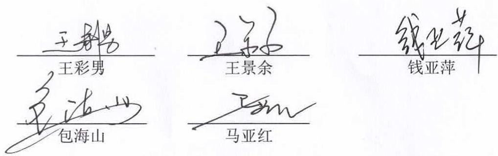

text_image

王彩男
王彩男
王彩
王景余
钱亚萍
包海山
马亚红

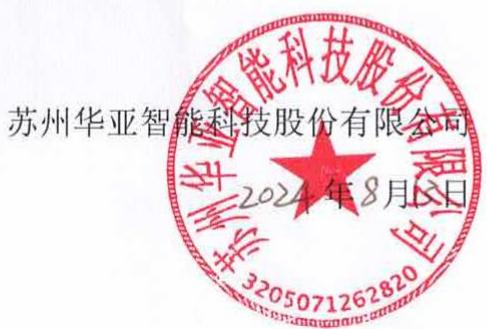

text_image

苏州华亚智能科技股份有限公司
2024年8月13日

## 二、上市公司全体监事声明

本公司及本公司监事会全体监事保证本报告书及摘要的内容真实、准确和完整，不存在虚假记载、误导性陈述或者重大遗漏，并对其真实性、准确性和完整性承担个别和连带责任。

全体监事：

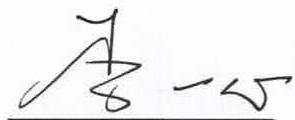  
李一心

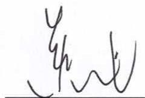

text_image

Handwritten Chinese characters, possibly a signature or artistic mark

黄健

  
陆春红

苏州华亚智能科技股份有限公司

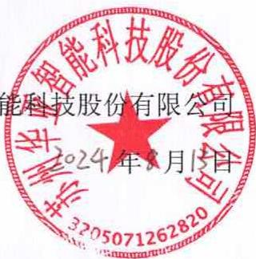

text_image

能科技股份有限公司
2024年8月15日

## 三、上市公司全体高级管理人员声明

本公司及本公司全体高级管理人员保证本报告书及摘要的内容真实、准确和完整，不存在虚假记载、误导性陈述或者重大遗漏，并对其真实性、准确性和完整性承担个别和连带责任。

全体高级管理人员：

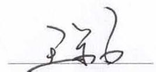  
王景余

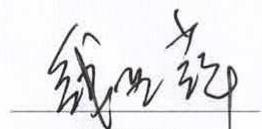  
钱亚萍

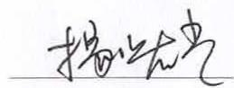  
杨曙光

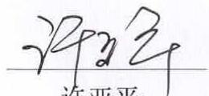  
许亚平

苏州华亚智能科技股份有限公司

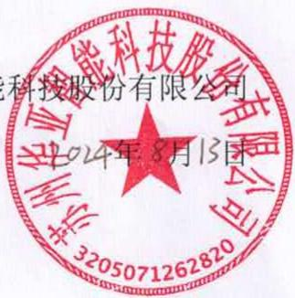

text_image

科技股份有限公司
2024年8月13日
3205071262820

## 四、独立财务顾问声明

东吴证券股份有限公司（以下简称“本独立财务顾问”）及项目经办人员同意本报告书及其摘要中引用本独立财务顾问出具的独立财务顾问报告的相关内容。

本独立财务顾问及项目经办人员已对本报告书及其摘要中引用的本独立财务顾问出具的独立财务顾问报告的相关内容进行了审阅，确认本报告书及其摘要不致因上述引用内容而出现虚假记载、误导性陈述或者重大遗漏，并对其真实性、准确性及完整性承担相应的法律责任。

财务顾问协办人签名：朱个超

朱广超

财务顾问主办人签名：周祥
周祥

潘哲盛
潘哲盛

法定代表人或授权代表签名：\_\_\_\_
范力

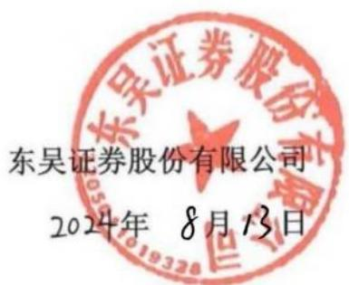

text_image

东吴证券股份有限公司
2024年 8月13日

## 五、法律顾问声明

上海市锦天城律师事务所（以下简称“本所”）及本所经办律师同意《苏州华亚智能科技股份有限公司发行股份及支付现金购买资产并募集配套资金暨关联交易报告书（草案）》（以下简称“重组报告书”）及其摘要中引用本所出具的法律意见书的结论性意见，且所引用内容已经本所及本所经办律师审阅，确认重组报告书及其摘要不致因引用上述内容而出现虚假记载、误导性陈述或重大遗漏，并对前述所引用内容的真实性、准确性和完整性承担相应的法律责任。

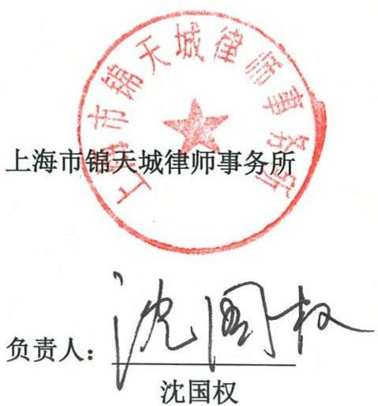

text_image

上海市锦天城律师事务所
负责人：沈国权
沈国权

经办律师：庞景

经办律师：窦方旭

经办律师：湛益祥
湛益祥

2024年8月13日

## 六、审计机构声明

天衡会计师事务所（特殊普通合伙）（以下简称“本审计审阅机构”）及签字注册会计师同意《苏州华亚智能科技股份有限公司发行股份及支付现金购买资产并募集配套资金暨关联交易报告书（草案）》及其摘要中引用本审计审阅机构出具的审计报告（天衡审字(2024)01294号）和审阅报告（天衡专字(2024)00594号、天衡专字(2024)01408号）的内容，且所引用内容已经本审计审阅机构及签字注册会计师审阅，确认《苏州华亚智能科技股份有限公司发行股份及支付现金购买资产并募集配套资金暨关联交易报告书（草案）》及其摘要不致因引用上述内容而出现虚假记载、误导性陈述或重大遗漏，并对其真实性、准确性和完整性承担相应的法律责任。

经办注册会计师：

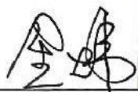

中国
注册会计师
金炜
320000100048王福丽

中国
注册会计师
王福丽
320000104799

金炜

王福丽

会计师事务所负责人签名：

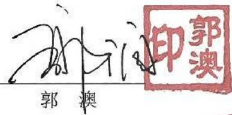

text_image

印郭澳
郭澳

天衡会计师事务所（特殊普通合伙）

2024年8月13日

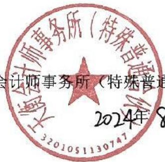

text_image

会计师事务所（特殊普通合伙）
2024年8月
3201051130747

## 七、评估机构声明

本机构及签字资产评估师已阅读《苏州华亚智能科技股份有限公司发行股份及支付现金购买资产并募集配套资金暨关联交易报告书（草案）》及其摘要，并确认《苏州华亚智能科技股份有限公司发行股份及支付现金购买资产并募集配套资金暨关联交易报告书（草案）》及其摘要中援引本公司出具的《苏州华亚智能科技股份有限公司拟发行股份及支付现金购买苏州冠鸿智能装备有限公司51%股权涉及的苏州冠鸿智能装备有限公司股东全部权益价值评估项目》（浙联评报字[2024]第334号）的专业结论无矛盾之处。本机构及签字资产评估师对《苏州华亚智能科技股份有限公司发行股份及支付现金购买资产并募集配套资金暨关联交易报告书（草案）》及其摘要中完整准确地援引本公司出具的《苏州华亚智能科技股份有限公司拟发行股份及支付现金购买苏州冠鸿智能装备有限公司51%股权涉及的苏州冠鸿智能装备有限公司股东全部权益价值评估项目》（浙联评报字[2024]第334号）的专业结论无异议。确认《苏州华亚智能科技股份有限公司发行股份及支付现金购买资产并募集配套资金暨关联交易报告书（草案）》及其摘要不致因援引本机构出具的资产评估专业结论而出现虚假记载、误导性陈述或重大遗漏，

并对其真实性、准确性和完整性承担应的法律责任。

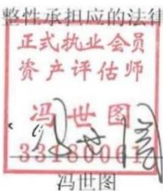

text_image

整性承担应的法律
正式执业会员
资产评估师
冯世图
33180001
冯世图

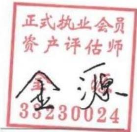

text_image

正式执业会员
资产评估师
金源
33230024

金源

签字资产评估师：

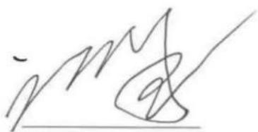

text_image

img

邬崇国

资产评估机构负责人：

中联资产评估集团（浙江）有限公司

2024年8月13日

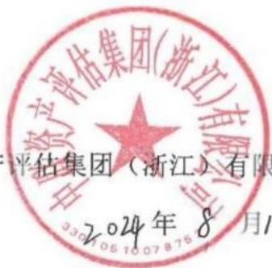

text_image

资产评估集团(浙江)有限
评估集团(浙江)有限
2024年8月1

## 第十七章 备查文件

## 一、备查文件

1、华亚智能关于本次交易的董事会决议  
2、本次交易相关协议  
3、东吴证券出具的关于本次交易的独立财务顾问报告  
4、锦天城出具的关于本次交易的法律意见书  
5、天衡会所出具的拟购买标的资产的《审计报告》及上市公司《备考财务报表审阅报告》  
6、中联评估出具的拟购买标的资产的《资产评估报告》  
7、其他与本次交易有关的重要文件

## 二、备查地点

投资者可在下列地点查阅有关备查文件:

## （一）苏州华亚智能科技股份有限公司

办公地址：苏州相城经济开发区漕湖产业园春兴路58号

电话：0512-66731999

传真：0512-66731856

联系人：杨曙光

## （二）东吴证券股份有限公司

办公地址：江苏省苏州工业园区星阳街5号

电话：0512-62938168

传真：0512-62938500

联系人：周祥

（本页无正文，为《苏州华亚智能科技股份有限公司发行股份及支付现金购买资产并募集配套资金暨关联交易报告书（草案）（注册稿）》之盖章页）

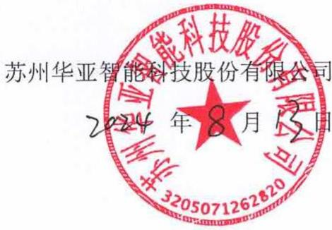

text_image

苏州华亚智能科技股份有限公司
2024年8月13日

附件一：冠鸿智能拥有的专利情况

<table><tr><td>序号</td><td>权利人</td><td>专利号</td><td>专利名称</td><td>专利类型</td><td>取得方式</td><td>申请日</td><td>权利期限</td><td>他项权利</td></tr><tr><td>1</td><td>苏州冠鸿智能装备有限公司</td><td>ZL202011140148.7</td><td>AVG搬运机器人的设计方法、AVG搬运机器人</td><td>发明</td><td>原始取得</td><td>2020.10.22</td><td>20年</td><td>无</td></tr><tr><td>2</td><td>苏州冠鸿智能装备有限公司</td><td>ZL202011140358.6</td><td>一种智能化搬运机器人的工作方法</td><td>发明</td><td>原始取得</td><td>2020.10.22</td><td>20年</td><td>无</td></tr><tr><td>3</td><td>苏州冠鸿智能装备有限公司</td><td>ZL202011140366.0</td><td>一种智能化搬运机器人</td><td>发明</td><td>原始取得</td><td>2020.10.22</td><td>20年</td><td>无</td></tr><tr><td>4</td><td>苏州冠鸿智能装备有限公司</td><td>ZL202110303690.8</td><td>一种曲块转向-过渡输送一体机、工作方法、应用</td><td>发明</td><td>原始取得</td><td>2021.03.22</td><td>20年</td><td>无</td></tr><tr><td>5</td><td>苏州冠鸿智能装备有限公司</td><td>ZL202110303680.4</td><td>一种接曲装置、智能化酒曲搬运生产线、酒曲曲块搬运方法</td><td>发明</td><td>原始取得</td><td>2021.03.22</td><td>20年</td><td>无</td></tr><tr><td>6</td><td>苏州冠鸿智能装备有限公司</td><td>ZL202110450606.5</td><td>一种旋臂式转动机构、90°转动设备及在酒曲搬运中的应用</td><td>发明</td><td>原始取得</td><td>2021.04.25</td><td>20年</td><td>无</td></tr><tr><td>7</td><td>苏州冠鸿智能装备有限公司</td><td>ZL202110450613.5</td><td>曲架夹具、双夹具、搬运机器人、改进型酒曲曲块搬运生产线及其工作方法</td><td>发明</td><td>原始取得</td><td>2021.04.25</td><td>20年</td><td>无</td></tr><tr><td>8</td><td>苏州冠鸿智能装备有限公司</td><td>ZL201920796601.6</td><td>一种具有升降旋转功能的智能搬运机器人</td><td>实用新型</td><td>原始取得</td><td>2019.05.30</td><td>10年</td><td>无</td></tr><tr><td>9</td><td>苏州冠鸿智能装备有限公司</td><td>ZL201920795807.7</td><td>一种智能仓储设备的取货装置</td><td>实用新型</td><td>原始取得</td><td>2019.05.30</td><td>10年</td><td>无</td></tr><tr><td>10</td><td>苏州冠鸿智能装备有限公司</td><td>ZL201920795649.5</td><td>一种智能搬运设备</td><td>实用新型</td><td>原始取得</td><td>2019.05.30</td><td>10年</td><td>无</td></tr><tr><td>11</td><td>苏州冠鸿智能装备有限公司</td><td>ZL201920795793.9</td><td>一种容积可变的智能物流柜</td><td>实用新型</td><td>原始取得</td><td>2019.05.30</td><td>10年</td><td>无</td></tr><tr><td>12</td><td>苏州冠鸿智能装备有限公司</td><td>ZL201920796608.8</td><td>一种电子元器件智能仓储设备</td><td>实用新型</td><td>原始取得</td><td>2019.05.30</td><td>10年</td><td>无</td></tr><tr><td>13</td><td>苏州冠鸿智能装备有限公司</td><td>ZL201920795665.4</td><td>一种智能仓储用堆垛机构</td><td>实用新型</td><td>原始取得</td><td>2019.05.30</td><td>10年</td><td>无</td></tr><tr><td>14</td><td>苏州冠鸿智能装备有限公司</td><td>ZL201920847270.4</td><td>一种新型智能起重设备</td><td>实用新型</td><td>原始取得</td><td>2019.06.06</td><td>10年</td><td>无</td></tr><tr><td>15</td><td>苏州冠鸿智能装备有限公司</td><td>ZL201920847531.2</td><td>一种智能移载机</td><td>实用新型</td><td>原始取得</td><td>2019.06.06</td><td>10年</td><td>无</td></tr><tr><td>16</td><td>苏州冠鸿智能装备有限公司</td><td>ZL201920847271.9</td><td>一种新型智能化垂直立体柜</td><td>实用新型</td><td>原始取得</td><td>2019.06.06</td><td>10年</td><td>无</td></tr><tr><td>17</td><td>苏州冠鸿智能装备有限公司</td><td>ZL201920847266.8</td><td>一种新型自动化无人叉车</td><td>实用新型</td><td>原始取得</td><td>2019.06.06</td><td>10年</td><td>无</td></tr><tr><td>18</td><td>苏州冠鸿智能装备有限公司</td><td>ZL201920847274.2</td><td>一种自动智能传输系统</td><td>实用新型</td><td>原始取得</td><td>2019.06.06</td><td>10年</td><td>无</td></tr><tr><td>19</td><td>苏州冠鸿智能装备有限公司</td><td>ZL201920847275.7</td><td>一种机器人智能化搬运设备</td><td>实用新型</td><td>原始取得</td><td>2019.06.06</td><td>10年</td><td>无</td></tr><tr><td>20</td><td>苏州冠鸿智能装备有限公司</td><td>ZL201920847514.9</td><td>一种潜入式 AGV</td><td>实用新型</td><td>原始取得</td><td>2019.06.06</td><td>10年</td><td>无</td></tr><tr><td>21</td><td>苏州冠鸿智能装备有限公司</td><td>ZL201920847288.4</td><td>一种智能搬运提升辅助装置</td><td>实用新型</td><td>原始取得</td><td>2019.06.06</td><td>10年</td><td>无</td></tr><tr><td>22</td><td>苏州冠鸿智能装备有限公司</td><td>ZL201920795750.0</td><td>一种智能仓储货架</td><td>实用新型</td><td>原始取得</td><td>2019.12.24</td><td>10年</td><td>无</td></tr><tr><td>23</td><td>苏州冠鸿智能装备有限公司</td><td>ZL202021462837.5</td><td>激光 SLAM 导航高精度快捷悬臂轴对接 AGV</td><td>实用新型</td><td>原始取得</td><td>2020.07.22</td><td>10年</td><td>无</td></tr><tr><td>24</td><td>苏州冠鸿智能装备有限公司</td><td>ZL202021455977.X</td><td>激光 SLAM 导航高效窄巷道前支腿型叉车 AGV</td><td>实用新型</td><td>原始取得</td><td>2020.07.22</td><td>10年</td><td>无</td></tr><tr><td>25</td><td>苏州冠鸿智能装备有限公司</td><td>ZL202021464835.X</td><td>激光 SLAM 导航高效地牛型叉车 AGV</td><td>实用新型</td><td>原始取得</td><td>2020.07.22</td><td>10年</td><td>无</td></tr><tr><td>26</td><td>苏州冠鸿智能装备有限公司</td><td>ZL202021458241.8</td><td>激光 SLAM 导航高效精准举升对接 AGV</td><td>实用新型</td><td>原始取得</td><td>2020.07.22</td><td>10年</td><td>无</td></tr><tr><td>27</td><td>苏州冠鸿智能装备有限公司</td><td>ZL202021467177.X</td><td>激光 SLAM 高精度导航举升对接 AGV</td><td>实用新型</td><td>原始取得</td><td>2020.07.22</td><td>10年</td><td>无</td></tr><tr><td>28</td><td>苏州冠鸿智能装备有限公司</td><td>ZL202022815727.9</td><td>一种高速稳定的桁架机械手</td><td>实用新型</td><td>原始取得</td><td>2020.11.30</td><td>10年</td><td>无</td></tr><tr><td>29</td><td>苏州冠鸿智能装备有限公司</td><td>ZL202220458034.5</td><td>一种高精度助力臂电动提升装置</td><td>实用新型</td><td>原始取得</td><td>2022.03.04</td><td>10年</td><td>无</td></tr><tr><td>30</td><td>苏州冠鸿智能装备有限公司</td><td>ZL202220458045.3</td><td>一种高精度助力臂电动行走机构</td><td>实用新型</td><td>原始取得</td><td>2022.03.04</td><td>10年</td><td>无</td></tr><tr><td>31</td><td>苏州冠鸿智能装备有限公司</td><td>ZL202220508501.0</td><td>一种高精度助力臂电动胀紧装置</td><td>实用新型</td><td>原始取得</td><td>2022.03.10</td><td>10年</td><td>无</td></tr><tr><td>32</td><td>苏州冠鸿智能装备有限公司</td><td>ZL202220572207.6</td><td>一种带减震舵轮驱动装置</td><td>实用新型</td><td>原始取得</td><td>2022.03.16</td><td>10年</td><td>无</td></tr><tr><td>33</td><td>苏州冠鸿智能装备有限公司</td><td>ZL202220572208.0</td><td>一种 AGV 小车的中央刹车脚轮</td><td>实用新型</td><td>原始取得</td><td>2022.03.16</td><td>10年</td><td>无</td></tr><tr><td>34</td><td>苏州冠鸿智能装备有限公司</td><td>ZL202220653445.X</td><td>一种高精度助力臂电动推杆机构</td><td>实用新型</td><td>原始取得</td><td>2022.03.23</td><td>10年</td><td>无</td></tr><tr><td>35</td><td>苏州冠鸿智能装备有限公司</td><td>ZL202220651695.X</td><td>一种电动止挡张紧机构</td><td>实用新型</td><td>原始取得</td><td>2022.03.23</td><td>10年</td><td>无</td></tr><tr><td>36</td><td>苏州冠鸿智能装备有限公司</td><td>ZL202223318620.9</td><td>一种卷料转运小车</td><td>实用新型</td><td>原始取得</td><td>2022.12.12</td><td>10年</td><td>无</td></tr><tr><td>37</td><td>苏州冠鸿智能装备有限公司</td><td>ZL202223491176.0</td><td>一种设有平衡机构的智能装载搬运车悬臂轴</td><td>实用新型</td><td>原始取得</td><td>2022.12.27</td><td>10年</td><td>无</td></tr><tr><td>38</td><td>苏州冠鸿智能装备有限公司</td><td>ZL202223557876.5</td><td>一种用于智能搬运车的举升机构</td><td>实用新型</td><td>原始取得</td><td>2022.12.30</td><td>10年</td><td>无</td></tr><tr><td>39</td><td>苏州冠鸿智能装备有限公司</td><td>ZL202020987594.0</td><td>一种牵引型 AGV 用拖挂车导向装置</td><td>实用新型</td><td>继受取得</td><td>2020.12.29</td><td>10年</td><td>无</td></tr><tr><td>40</td><td>苏州冠鸿智能装备有限公司</td><td>ZL202030275526.7</td><td>背负举升小车(AGV)</td><td>外观设计</td><td>继受取得</td><td>2021.02.09</td><td>15年</td><td>无</td></tr><tr><td>41</td><td>苏州冠鸿智能装备有限公司</td><td>ZL202030275284.1</td><td>充电机</td><td>外观设计</td><td>继受取得</td><td>2020.09.29</td><td>15年</td><td>无</td></tr><tr><td>42</td><td>苏州冠鸿智能装备有限公司</td><td>ZL202030275518.2</td><td>地牛型小车(AGV)</td><td>外观设计</td><td>继受取得</td><td>2021.02.09</td><td>15年</td><td>无</td></tr><tr><td>43</td><td>苏州冠鸿智能装备有限公司</td><td>ZL202030275282.2</td><td>牵引机(AGV)</td><td>外观设计</td><td>继受取得</td><td>2021.03.30</td><td>15年</td><td>无</td></tr><tr><td>44</td><td>苏州冠鸿智能装备有限公司</td><td>ZL202020977916.3</td><td>一种 AGV 叉车到位检测结构</td><td>实用新型</td><td>继受取得</td><td>2021.01.05</td><td>10年</td><td>无</td></tr><tr><td>45</td><td>苏州冠鸿智能装备有限公司</td><td>ZL202020977889.X</td><td>一种 AGV 叉车举升结构</td><td>实用新型</td><td>继受取得</td><td>2021.04.20</td><td>10年</td><td>无</td></tr><tr><td>46</td><td>苏州冠鸿智能装备有限公司</td><td>ZL202020988469.1</td><td>一种 AGV 小车驱动连接结构</td><td>实用新型</td><td>继受取得</td><td>2020.12.22</td><td>10年</td><td>无</td></tr><tr><td>47</td><td>苏州冠鸿智能装备有限公司</td><td>ZL202020976748.6</td><td>一种 AGV 用自动适配充电机</td><td>实用新型</td><td>继受取得</td><td>2021.03.26</td><td>10年</td><td>无</td></tr><tr><td>48</td><td>苏州冠鸿智能装备有限公司</td><td>ZL202020988468.7</td><td>一种背负举升 AGV 小车</td><td>实用新型</td><td>继受取得</td><td>2021.04.06</td><td>10年</td><td>无</td></tr><tr><td>49</td><td>苏州冠鸿智能装备有限公司</td><td>ZL202020978098.9</td><td>一种地牛型 AGV 叉车</td><td>实用新型</td><td>继受取得</td><td>2021.04.06</td><td>10年</td><td>无</td></tr><tr><td>50</td><td>苏州冠鸿智能装备有限公司</td><td>ZL202020987919.5</td><td>一种牵引型 AGV 用牵引夹取装置</td><td>实用新型</td><td>继受取得</td><td>2020.12.25</td><td>10年</td><td>无</td></tr><tr><td>51</td><td>苏州冠鸿智能装备有限公司</td><td>ZL202020987619.7</td><td>一种易于拖挂车转向的牵引型 AGV</td><td>实用新型</td><td>继受取得</td><td>2020.12.29</td><td>10年</td><td>无</td></tr><tr><td>52</td><td>苏州冠鸿智能装备有限公司</td><td>ZL202020976359.3</td><td>一种自适应调整充电头</td><td>实用新型</td><td>继受取得</td><td>2020.11.03</td><td>10年</td><td>无</td></tr><tr><td>53</td><td>苏州冠鸿智能装备有限公司</td><td>ZL202321276329.1</td><td>一种带有防掉落机构的转运小车</td><td>实用新型</td><td>原始取得</td><td>2023.05.24</td><td>10年</td><td>无</td></tr><tr><td>54</td><td>苏州冠鸿智能装备有限公司</td><td>ZL202320738483.X</td><td>一种基于视觉目标识别系统的 AGV 机器人</td><td>实用新型</td><td>原始取得</td><td>2023.04.06</td><td>10年</td><td>无</td></tr><tr><td>55</td><td>苏州冠鸿智能装备有限公司</td><td>ZL202320995592.X</td><td>一种滚筒式的双工位 AGV 车辆</td><td>实用新型</td><td>原始取得</td><td>2023.04.27</td><td>10年</td><td>无</td></tr><tr><td>56</td><td>苏州冠鸿智能装备有限公司</td><td>ZL202223356889.6</td><td>一种侧叉式智能搬运车的可伸缩叉杆</td><td>实用新型</td><td>原始取得</td><td>2022.12.15</td><td>10年</td><td>无</td></tr><tr><td>57</td><td>苏州冠鸿智能装备有限公司</td><td>ZL202223398777.7</td><td>一种智能运输车的旋转定位机构</td><td>实用新型</td><td>原始取得</td><td>2022.12.19</td><td>10年</td><td>无</td></tr><tr><td>58</td><td>苏州冠鸿智能装备有限公司</td><td>ZL202320689606.5</td><td>一种目标货物的 AGV 堆叠装置</td><td>实用新型</td><td>原始取得</td><td>2023.03.31</td><td>10年</td><td>无</td></tr><tr><td>59</td><td>苏州冠鸿智能装备有限公司</td><td>ZL202321461115.1</td><td>一种智能 AGV 车辆的精准入叉装置</td><td>实用新型</td><td>原始取得</td><td>2023.06.09</td><td>10年</td><td>无</td></tr><tr><td>60</td><td>苏州冠鸿智能装备有限公司</td><td>ZL202321873299.2</td><td>一种举升式的膜卷搬运 AGV 小车</td><td>实用新型</td><td>原始取得</td><td>2023.07.17</td><td>10年</td><td>无</td></tr></table>