## 2024

## 年度报告

## ANNUAL REPORT

股票代码：601668.SH

平陆运河航道 11 标段水铺村裁弯取直段落施工项目

## 中国建筑精神

忠诚担当 使命必达

## 企业使命

拓展幸福空间

## 企业愿景

成为最具国际竞争力的投资建设集团

## 核心价值观

品质保障 价值创造

## 目录

董事长致辞 2

年报速览 4

重要提示 6

第一节 释义 7

第二节 公司简介和主要财务指标 8

第三节 管理层讨论与分析 12

第四节 公司治理 62

第五节 环境与社会责任 92

第六节 重要事项 99

第七节 股份变动及股东情况 121

第八节 优先股相关情况 129

第九节 债券相关情况 130

第十节 财务报告 142

natural_image

Watercolor illustration of a modern cityscape with skyscrapers, a rocket launch, and a bridge over water (no text or symbols)

text_image

間空福幸展拓
京機
鄧山燕
李正

# 董事长致辞

## 尊敬的各位股东、投资者：

我谨代表公司董事会，向各位呈报中国建筑2024年年度报告，并向大家长期以来对中国建筑的关心和支持表示衷心感谢！

2024年是中国建筑抢抓发展机遇、沉着应对挑战的关键一年。面对建筑市场竞争加剧、房地产业深度调整带来的压力挑战，中国建筑紧扣高质量发展这个首要任务，锚定“一创五强”战略目标，深入实施“一六六”战略路径，主动服务国家战略，抢抓结构性市场机会，守好建造业务基本盘，全力推动地产业务止跌回稳，狠抓科技成果产品化，积极培育战略性新兴产业，强化履约品质管控，扎实推进供应链建设，主动化解各类风险，企业保持稳健发展态势。全年新签合同额4.5万亿元，完成营业收入2.19万亿元，实现归属于上市公司股东净利润461.9亿元，继续保持全球建筑行业最高信用评级。总的来看，我们“稳”的基础在持续夯实，“进”的动能在不断增强，“新”的空间在逐步拓展。

当前和未来一段时间，市场挑战和机遇并存，国家在投资、化债、稳楼市、“两新”“两重”等领域出台的政策持续显效，建筑业工业化、数字化、绿色化转型升级步伐加快，房地产发展新模式正在加快构建，推动企业在高质量发展道路上取得更多更好的成果。我们将坚持以习近平新时代中国特色社会主义思想为指导，坚决贯彻党中央决策部署，牢牢把握高质量发展的目标方向，深入研判、主动应对建筑市场的加剧竞争、房地产业的深度调整，着力推进“学政策、创效益、深改革、优管理、促创新、防风险、强党建”七大任务，与广大股东、投资者一道，塑强“科技中建”“价值中建”“幸福中建”的品牌，推动企业持续健康发展。

一是坚持融入和服务国家战略。认真落实去年以来中央推出的一系列重磅措施和配套政策，把握政策机遇，稳步推进市场拓展步伐。持续深化央地合作，加大投资建设力度，深度融入京津冀、长三角、粤港澳大湾区等区域发展。持续强化海外市场开拓，加快推动优势专业业务海外发展，切实提升海外经营质量。

text_image

2 | 中国建筑股份有限公司

二是坚持做强做优主责主业。坚持“两优两重”市场策略，抓住结构性市场机会，大力拓展工业、铁路、水利、能源等领域。进一步增强产业链资源集成能力，持续发力城市更新、城市运营和物业管理市场，努力从单体建筑建造向城市综合服务延伸。聚焦核心城市和核心区域，加大地产投资力度，为人民群众打造更多安全、舒适、绿色、智慧的“好房子”。

三是坚持夯实基础管理根基。持续完善“法人管项目”体制机制，提升项目履约和创效能力，“向零奋斗”抓好安全生产。建立从总部到项目一线的穿透式监管体系，动态监测子企业和项目运营情况。深入开展“厉行节约 勤俭办企”专项行动，全面推进降本增效。以更大的决心开展低效机构治理和资产盘活，不断提升企业发展质量。

四是坚持走创新发展之路。锚定产品化产业化方向，瞄准市场需求，明晰产品定位，加大创新产品宣传推广力度。深入开展建筑工业化产业链“链长”建设，带动建筑业工业化转型。深化推进“AI+”专项行动，加快建设建筑行业大模型。加强战略性新兴产业发展力度，培育更多专精特新“小巨人”企业。

五是坚持用经营效益回报投资者。把ESG管理深度融入到经营管理中，全面加强资产、负债管理，优化资产负债结构。秉持合作共赢理念，坚持公开公平公正原则，打造稳定的分供商队伍。继续推进存量资产清理盘活，加大款项回收力度，全力推进地产存货去化，有效提升收入、利润质量。

六是坚持做好常态化市值管理。强化顶层设计，推动市值管理深度融入企业发展战略，保障公司投资价值稳步提升。推动控股股东增持股票，适时回购股份，全力维护好公司的投资价值。不断提高信息披露质量，始终保持长期稳定的分红政策，以实实在在的投资收益和股票分红回报股东信任。

各位股东、投资者！大道至简，实干为要。中国建筑继续坚持高质量发展的主题主线，用好一切有利条件，坚定不移办好自己的事，努力以自身能力提升的确定性，来应对形势变化的不确定性，力争2025年实现新签合同额超过4.6万亿元，营业收入超过2.28万亿元，继续创造更多更好的发展业绩，奋力穿越行业发展周期，不负广大股东、投资者和社会各界的关心和支持！

钟子花

2025年4月15日

# 年报速览

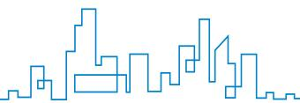

natural_image

Abstract blue line drawing of a city skyline silhouette (no text or symbols)

## 关于中国建筑

第 14 位

2024年《财富》世界500强榜单

第4位

2024年《财富》中国500强榜单

入选

2024年《财富》中国ESG影响力榜

## 首位

《工程新闻记录》(ENR) “全球最大250家工程承包商”

第 19 次

获国务院国资委年度中央企业负责人经营业绩考核 A 级

持续入选中证 50、上证 50、富时中国 A50、

MSCI 中国 A50 互联互通指数等重要指数

继续保持全球建筑行业最高信用评级

## 主要经营指标

新签合同额

45,027 亿元

同比增长 4.1%

营业收入

21,871 亿元

同比下降 3.5%

归属上市公司股东净利润

461.9 亿元

同比下降 14.9%

经营活动产生的现金流量净额

157.7 亿元

连续保持正向流入

加权平均净资产收益率

10.37%

继续保持行业领先

归属普通股股东的每股净资产

10.89元/股

同比增长 9.1%

## 房屋建筑工程业务

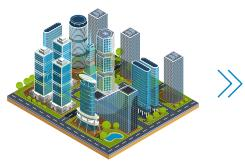

natural_image

Isometric illustration of a modern city skyline with skyscrapers and green spaces (no text or symbols)

新签合同额 26,516 亿元

同比下降 1.4%

营业收入 13,218 亿元

同比下降 $4.5\%$

## 基础设施建设与投资业务

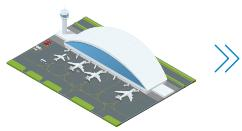

新签合同额 14,149 亿元

同比增长21.1%

营业收入 5,509 亿元

同比下降 $1.0\%$

## 房地产开发与投资业务

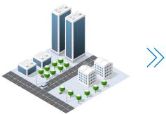

natural_image

Isometric illustration of a modern urban area with high-rise buildings, green trees, and road (no text or symbols)

合约销售额 4,219 亿元

同比下降6.5%

合约销售面积 1,461 万 m²

同比下降 21.4%

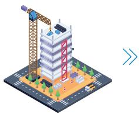

natural_image

Isometric illustration of a high-rise construction site with cranes and surrounding greenery (no text or symbols)

营业收入 3,062 亿元

同比下降 0.8%

新购置土地储备 882 万 $\mathrm{m}^2$

期末土地储备 7,718 万 m²

## 勘察设计业务

新签合同额 143 亿元

同比下降 3.8%

营业收入 108 亿元

同比下降 7.9%

## 境外业务

natural_image

Isometric illustration of a city with green buildings and a globe, no text or symbols present

新签合同额 2,213 亿元

同比增长 19.0%

营业收入 1,186 亿元

同比增长 2.5%

## 重要提示

一、本公司董事会、监事会及董事、监事、高级管理人员保证年度报告内容的真实性、准确性、完整性，不存在虚假记载、误导性陈述或重大遗漏，并承担个别和连带的法律责任。  
二、本报告经公司第四届董事会第十五次会议审议通过，公司全体董事出席董事会会议。  
三、安永华明会计师事务所（特殊普通合伙）为本公司出具了标准无保留意见的审计报告。  
四、公司负责人(董事长)郑学选，主管会计工作负责人(财务总监)黄杰，会计机构负责人(会计主管人员)姜瑞枫声明：保证年度报告中财务报告的真实、准确、完整。  
五、董事会决议通过的本报告期利润分配预案和资本公积金转增股本预案

公司拟向全体普通股股东每10股派送现金红利人民币2.715元（含税），以截至本报告披露日的总股本41,320,390,444股为基数，以此计算合计拟派发现金红利总额约为112.18亿元（含税）。本年度公司现金分红占合并报表归属于上市公司股东净利润的比例为 $24.29\%$ 。如在实施权益分派股权登记日前公司总股本发生变动，公司拟维持每股分配金额不变，相应调整现金红利总额，并将另行公告具体调整情况。上述利润分配预案已经公司第四届董事会第十五次会议审议通过，尚需提交公司2024年年度股东会审议批准。

## 六、前瞻性陈述的风险声明

√ 适用 □ 不适用

本报告存在一些基于对未来政策和经济走势的主观假设和判断而做出的预见性陈述，受诸多可变因素影响，实际结果或趋势可能会与这些预见性陈述出现差异。

本报告中所涉及的未来计划、发展战略等前瞻性描述不构成公司对投资者的实质性承诺，敬请投资者予以关注。

## 七、是否存在被控股股东及其他关联方非经营性占用资金情况

否

## 八、是否存在违反规定决策程序对外提供担保的情况

否

## 九、是否存在半数以上董事无法保证公司所披露年度报告的真实性、准确性和完整性

否

## 十、重大风险提示

报告期内，公司不存在重大风险事项。

公司已在本报告中详细描述了可能存在的相关风险，敬请参阅本报告“第三节管理层讨论与分析”之“六、关于公司未来发展的讨论与分析”相关内容。

## 十一、其他

√ 适用 □ 不适用

除经审计的财务数据外，本报告所采用的业务数据来源于公司管理口径。

## 第一节

## 释义

在本报告书中，除非文义另有所指，下列词语具有如下含义：

常用词语释义

<table><tr><td>中国建筑/公司/本公司</td><td>指</td><td>中国建筑股份有限公司</td></tr><tr><td>中建集团/集团/集团公司</td><td>指</td><td>中国建筑集团有限公司</td></tr><tr><td>中建总公司</td><td>指</td><td>中国建筑工程总公司(已改制并更名为中国建筑集团有限公司)</td></tr><tr><td>中建一局至八局</td><td>指</td><td>中国建筑一局(集团)有限公司至中国建筑第八工程局有限公司</td></tr><tr><td>新疆建工</td><td>指</td><td>中建新疆建工(集团)有限公司</td></tr><tr><td>中海集团</td><td>指</td><td>中国海外集团有限公司</td></tr><tr><td>中建国际</td><td>指</td><td>中建国际建设有限公司</td></tr><tr><td>中海地产</td><td>指</td><td>中海集团下属中国海外发展有限公司(00688.HK)所属地产发展品牌及业务</td></tr><tr><td>中建地产</td><td>指</td><td>中国建筑所从事的除“中海地产”以外的房地产品牌及业务</td></tr><tr><td>中建设计集团</td><td>指</td><td>中国中建设计研究院有限公司</td></tr><tr><td>中国海外发展</td><td>指</td><td>中国海外发展有限公司(00688.HK)</td></tr><tr><td>中国建筑国际</td><td>指</td><td>中国建筑国际集团有限公司(03311.HK)</td></tr><tr><td>中海宏洋</td><td>指</td><td>中国海外宏洋集团有限公司(00081.HK)</td></tr><tr><td>中国建筑兴业</td><td>指</td><td>中国建筑兴业集团有限公司(00830.HK)</td></tr><tr><td>中海物业</td><td>指</td><td>中海物业集团有限公司(02669.HK)</td></tr><tr><td>西部建设</td><td>指</td><td>中建西部建设股份有限公司(002302.SZ)</td></tr><tr><td>中建财务公司</td><td>指</td><td>中建财务有限公司</td></tr><tr><td>中建方程</td><td>指</td><td>中建方程投资发展集团有限公司</td></tr><tr><td>中建资本</td><td>指</td><td>中建资本控股有限公司</td></tr><tr><td>中建装饰</td><td>指</td><td>中国建筑装饰集团有限公司</td></tr><tr><td>中建基础</td><td>指</td><td>中国建设基础设施有限公司</td></tr><tr><td>中建发展</td><td>指</td><td>中国建筑发展有限公司</td></tr><tr><td>中建科创</td><td>指</td><td>中国中建科创集团有限公司</td></tr><tr><td>中建科工</td><td>指</td><td>中建科工集团有限公司</td></tr><tr><td>中建交通</td><td>指</td><td>中建交通建设集团有限公司</td></tr><tr><td>中建科技</td><td>指</td><td>中建科技集团有限公司</td></tr><tr><td>中建数科</td><td>指</td><td>中建数字科技有限公司</td></tr><tr><td>中建港航局</td><td>指</td><td>中建港航局集团有限公司</td></tr><tr><td>中建安装</td><td>指</td><td>中建安装集团有限公司</td></tr><tr><td>公司章程</td><td>指</td><td>中国建筑股份有限公司章程</td></tr><tr><td>ESG</td><td>指</td><td>环境、社会和公司治理</td></tr><tr><td>报告期</td><td>指</td><td>2024年1月1日至2024年12月31日止</td></tr></table>

## 第二节

# 公司简介和主要财务指标

## 一、公司信息

<table><tr><td>公司的中文名称</td></tr><tr><td>公司的中文简称</td></tr><tr><td>公司的外文名称</td></tr><tr><td>公司的外文名称缩写</td></tr><tr><td>公司的法定代表人</td></tr></table>

<table><tr><td>中国建筑股份有限公司</td></tr><tr><td>中国建筑</td></tr><tr><td>China State Construction Engineering Corporation Limited</td></tr><tr><td>CSCEC</td></tr><tr><td>郑学选</td></tr></table>

## 二、联系人和联系方式

<table><tr><td>姓名</td></tr><tr><td>联系地址</td></tr><tr><td>电话</td></tr><tr><td>传真</td></tr><tr><td>电子信箱</td></tr></table>

<table><tr><td>董事会秘书</td></tr><tr><td>刘立新</td></tr><tr><td>北京市朝阳区安定路5号院3号楼中建财富国际中心</td></tr><tr><td>010-86498888</td></tr><tr><td>010-86498170</td></tr><tr><td>ir@cscec.com</td></tr></table>

## 三、基本情况简介

<table><tr><td>公司注册地址</td></tr><tr><td>公司注册地址的历史变更情况</td></tr><tr><td>公司办公地址</td></tr><tr><td>公司办公地址的邮政编码</td></tr><tr><td>公司网址</td></tr><tr><td>电子信箱</td></tr></table>

<table><tr><td>北京市海淀区三里河路15号</td></tr><tr><td>/</td></tr><tr><td>北京市朝阳区安定路5号院3号楼中建财富国际中心</td></tr><tr><td>100029</td></tr><tr><td>www.cscec.com</td></tr><tr><td>ir@cscec.com</td></tr></table>

## 四、信息披露及备置地点

<table><tr><td>公司披露年度报告的媒体名称及网址</td><td>中国证券报:http://www.cs.com.cn上海证券报:http://www.cnstock.com证券时报:http://www.stcn.com证券日报:http://www.zqrb.cn</td></tr><tr><td>公司披露年度报告的证券交易所网址</td><td>www.sse.com.cn</td></tr><tr><td>公司年度报告备置地点</td><td>北京市朝阳区安定路5号院3号楼中建财富国际中心中国建筑董事会办公室</td></tr></table>

## 五、公司股票简况

<table><tr><td colspan="5">公司股票简况</td></tr><tr><td>股票种类</td><td>股票上市交易所</td><td>股票简称</td><td>股票代码</td><td>变更前股票简称</td></tr><tr><td>A股</td><td>上海证券交易所</td><td>中国建筑</td><td>601668</td><td>不适用</td></tr></table>

## 六、其他相关资料

<table><tr><td rowspan="3">公司聘请的会计师事务所(境内)</td><td>名称</td><td>安永华明会计师事务所(特殊普通合伙)</td></tr><tr><td>办公地址</td><td>中国北京市东城区东长安街1号东方广场安永大楼17层01-12室</td></tr><tr><td>签字会计师姓名</td><td>沈岩、高君</td></tr></table>

## 七、近三年主要会计数据和财务指标

## （一）主要会计数据

单位：千元 币种：人民币

<table><tr><td>主要会计数据</td><td>2024年</td><td>2023年</td><td>本期比上年同期增减(%)</td><td>2022年</td></tr><tr><td>营业收入</td><td>2,187,147,839</td><td>2,265,529,244</td><td>-3.5</td><td>2,055,052,070</td></tr><tr><td>利润总额</td><td>80,036,950</td><td>92,995,473</td><td>-13.9</td><td>88,835,435</td></tr><tr><td>归属于上市公司股东的净利润</td><td>46,187,099</td><td>54,264,173</td><td>-14.9</td><td>50,950,301</td></tr><tr><td>归属于上市公司股东的扣除非经常性损益的净利润</td><td>41,581,095</td><td>48,538,669</td><td>-14.3</td><td>45,233,864</td></tr><tr><td>经营活动产生的现金流量净额</td><td>15,773,535</td><td>11,030,123</td><td>43.0</td><td>3,828,927</td></tr><tr><td></td><td>2024年末</td><td>2023年末</td><td>本期末比上年同期增减(%)</td><td>2022年末</td></tr><tr><td>归属于上市公司股东的净资产</td><td>462,184,659</td><td>427,609,892</td><td>8.1</td><td>384,322,141</td></tr><tr><td>总资产</td><td>3,189,262,063</td><td>2,903,322,519</td><td>9.8</td><td>2,652,903,306</td></tr><tr><td>期末总股本</td><td>41,610,322</td><td>41,919,514</td><td>-0.7</td><td>41,934,433</td></tr></table>

## （二）主要财务指标

<table><tr><td>主要财务指标</td><td>2024年</td><td>2023年</td><td>本期比上年同期增减(%)</td><td>2022年</td></tr><tr><td>基本每股收益(元/股)</td><td>1.11</td><td>1.31</td><td>-15.3</td><td>1.23</td></tr><tr><td>稀释每股收益(元/股)</td><td>1.11</td><td>1.31</td><td>-15.3</td><td>1.23</td></tr><tr><td>扣除非经常性损益后的基本每股收益(元/股)</td><td>1.00</td><td>1.17</td><td>-14.5</td><td>1.07</td></tr><tr><td>加权平均净资产收益率(%)</td><td>10.37</td><td>13.36</td><td>减少2.99个百分点</td><td>13.94</td></tr><tr><td>扣除非经常性损益后的加权平均净资产收益率(%)</td><td>9.33</td><td>11.94</td><td>减少2.61个百分点</td><td>12.42</td></tr><tr><td>归属普通股股东的每股净资产(元/股)</td><td>10.89</td><td>9.98</td><td>9.1</td><td>8.93</td></tr><tr><td>每10股派息金额(元)</td><td>2.715</td><td>2.7145</td><td>0.02</td><td>2.527</td></tr></table>

报告期末公司前三年主要会计数据和财务指标的说明

## √ 适用 □ 不适用

① 计算每股收益时，将尚未达到解锁条件及失效的限制性股票从本公司发行在外普通股的加权平均数中扣减。  
② 按照相关会计准则规定，计算每股收益时，归属于上市公司股东的净利润将扣除优先股、永续债等其他权益工具的股利或利息及限制性股票的影响。

③ 归属于普通股股东的每股净资产为归属于上市公司股东的净资产扣除其他权益工具后除以报告期末总股数。  
④ 派息金额含税。

敬请参阅本报告第十节“财务报告”财务报表附注十三“股份支付”、附注五、69“每股收益”、管理层补充资料二“净资产收益率和每股收益”等相关内容。

## 八、境内外会计准则下会计数据差异

## （一）同时按照国际会计准则与按中国会计准则披露的财务报告中净利润和归属于上市公司股东的净资产差异情况

□适用 □不适用

## （二）同时按照境外会计准则与按中国会计准则披露的财务报告中净利润和归属于上市公司股东的净资产差异情况

□适用 □不适用

## （三）境内外会计准则差异的说明：

□适用 □不适用

## 九、2024年分季度主要财务数据

单位：千元 币种：人民币

<table><tr><td></td><td>第一季度(1-3月份)</td><td>第二季度(4-6月份)</td><td>第三季度(7-9月份)</td><td>第四季度(10-12月份)</td></tr><tr><td>营业收入</td><td>549,319,265</td><td>595,299,770</td><td>481,921,938</td><td>560,606,866</td></tr><tr><td>归属于上市公司股东的净利润</td><td>14,921,852</td><td>14,528,024</td><td>10,253,185</td><td>6,484,038</td></tr><tr><td>归属于上市公司股东的扣除非经常性损益后的净利润</td><td>14,739,216</td><td>12,210,350</td><td>10,071,498</td><td>4,560,031</td></tr><tr><td>经营活动产生的现金流量净额</td><td>-96,595,019</td><td>-12,174,195</td><td>31,759,855</td><td>92,782,894</td></tr></table>

季度数据与已披露定期报告数据差异说明

□适用 □不适用

## 十、非经常性损益项目和金额

## √ 适用 □ 不适用

单位：千元 币种：人民币

<table><tr><td>非经常性损益项目</td><td>2024年金额</td><td>附注(如适用)</td><td>2023年金额</td><td>2022年金额</td></tr><tr><td>非流动资产处置损益,包括已计提资产减值准备的冲销部分</td><td>561,187</td><td>/</td><td>226,075</td><td>432,388</td></tr><tr><td>计入当期损益的政府补助,但与公司正常经营业务密切相关、符合国家政策规定、按照确定的标准享有、对公司损益产生持续影响的政府补助除外</td><td>532,708</td><td>营业外收入/其他收益</td><td>631,101</td><td>1,049,139</td></tr><tr><td>分步实现企业合并产生的收益</td><td>/</td><td>/</td><td>20,247</td><td>1,251,160</td></tr><tr><td>除同公司正常经营业务相关的有效套期保值业务外,非金融企业持有金融资产和金融负债产生的公允价值变动损益以及处置金融资产和金融负债产生的损益</td><td>100,235</td><td>/</td><td>85,597</td><td>-84,935</td></tr><tr><td>计入当期损益的对非金融企业收取的资金占用费</td><td>136,265</td><td>/</td><td>204,761</td><td>469,261</td></tr><tr><td>单独进行减值测试的应收款项减值准备转回</td><td>5,545,794</td><td>/</td><td>5,349,746</td><td>3,326,302</td></tr><tr><td>处置长期股权投资产生的投资收益</td><td>-41,815</td><td>/</td><td>23,148</td><td>141,065</td></tr><tr><td>处置子公司产生的投资收益</td><td>41,823</td><td>/</td><td>33,426</td><td>-32,150</td></tr><tr><td>与公司正常经营业务无关的或偶发事项产生的损益</td><td>71,930</td><td>/</td><td>761,906</td><td>1,173,635</td></tr><tr><td>除上述各项之外的其他营业外收入和支出</td><td>-652,666</td><td>/</td><td>-286,227</td><td>746,481</td></tr><tr><td>所得税影响额</td><td>-1,464,190</td><td>/</td><td>-1,441,995</td><td>-1,253,512</td></tr><tr><td>少数股东权益影响额(税后)</td><td>-225,267</td><td>/</td><td>117,719</td><td>-1,502,397</td></tr><tr><td>合计</td><td>4,606,004</td><td>/</td><td>5,725,504</td><td>5,716,437</td></tr></table>

对公司将《公开发行证券的公司信息披露解释性公告第1号——非经常性损益》未列举的项目认定为非经常性损益项目且金额重大的，以及将《公开发行证券的公司信息披露解释性公告第1号——非经常性损益》中列举的非经常性损益项目界定为经常性损益的项目，应说明原因。

## □适用 □不适用

## 十一、采用公允价值计量的项目

## √ 适用 □ 不适用

单位：千元 币种：人民币

<table><tr><td>项目名称</td><td>期初余额</td><td>期末余额</td><td>当期变动</td><td>对当期利润的影响金额</td></tr><tr><td>交易性金融资产</td><td>14,854</td><td>15,175</td><td>321</td><td>321</td></tr><tr><td>其他权益工具投资</td><td>6,107,503</td><td>7,293,820</td><td>1,186,317</td><td>80,260</td></tr><tr><td>其他非流动金融资产</td><td>1,525,114</td><td>1,904,220</td><td>379,106</td><td>99,914</td></tr><tr><td>应收款项融资</td><td>4,353,284</td><td>3,565,600</td><td>-787,684</td><td>/</td></tr><tr><td>其他债权投资</td><td>136,574</td><td>135,767</td><td>-807</td><td>49,452</td></tr><tr><td>其他流动资产</td><td>829,951</td><td>853,717</td><td>23,766</td><td>/</td></tr><tr><td>合计</td><td>12,967,280</td><td>13,768,299</td><td>801,019</td><td>229,947</td></tr></table>

## 十二、其他

## □适用 □不适用

## 第三节

## 管理层讨论与分析

《财富》世界500强

第14位

《财富》中国500强

第4位

《工程新闻记录》(ENR)

“全球最大250家工程承包商”

首位

第 19 次获得国务院国资委

年度中央企业负责人经营业绩考核

A级

国际三大评级机构对

中国建筑的评级

A

标普

A2

穆迪

A

惠誉

## 一、报告期内公司所从事的主要业务和经营模式

中国建筑是全球规模最大的投资建设集团之一，在房屋建筑工程、基础设施建设与投资、房地产开发与投资、勘察设计等领域居行业领先地位。中国建筑位居2024年《财富》世界500强榜单第14位、《财富》中国500强榜单第4位、《工程新闻记录》（ENR）“全球最大250家工程承包商”榜单首位。2024年，中国建筑第19次获得国务院国资委年度中央企业负责人经营业绩考核A级。国际三大评级机构标普、穆迪、惠誉对中国建筑的评级分别为A/A2/A，展望维持“稳定”，中国建筑继续保持全球建筑行业最高信用评级。

中国建筑是我国最具实力的投资商之一，主要投资方向为房地产开发、融投资建造、城镇综合建设等领域。公司强化内部资源整合与业务协同，打造“规划设计、投资开发、基础设施建设、房屋建筑工程”“四位一体”的商业模式，为城市建设提供全领域、全过程、全要素的一揽子服务。

中国建筑是世界最大的工程承包商，经营区域覆盖我国各省区市以及海外近百个国家和地区，业务范围涉及城市建设的全部领域与项目建设的每个环节，具有综合设计能力、施工能力和土地开发能力，拥有产品技术研发、勘察设计、地产开发、工程承包、设备制造、资产运营、物业管理等完整的建筑产品产业链条。国内绝大多数的300米以上超高层建筑，众多技术含量高、结构形式复杂的建筑均由中国建筑承建。

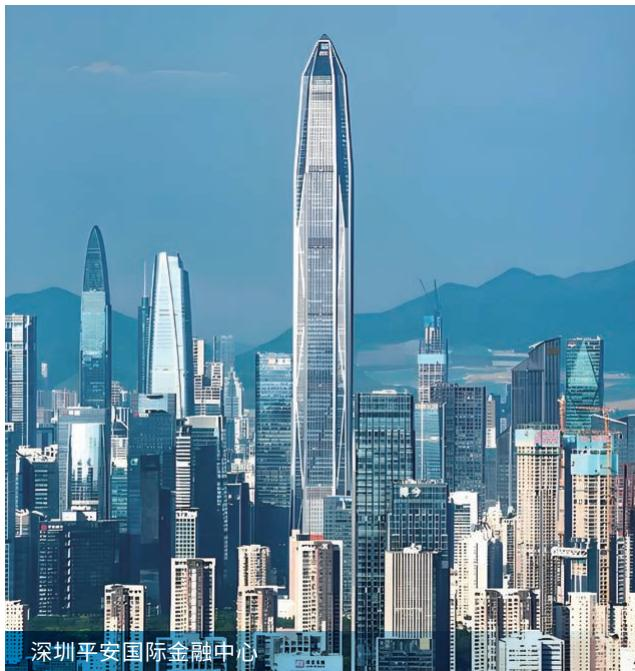

text_image

深圳平安国际金融中心

中国建筑在房屋建筑工程领域具有绝对优势，坚持以客户为中心的经营理念，聚焦“优质客户、优质项目、重点区域、重点领域”市场营销策略，通过不断挖掘自身潜力，追求高品质工程，致力于为全球客户提供各种高、大、精、尖、难、特建筑项目全过程一站式综合服务。公司在超高层、大型场馆、工业厂房、办公楼、酒店、医院、学校等细分领域，承建了一大批地标性建筑，代表着我国乃至全球房屋建筑领域的领先水平。

中国建筑坚持基础设施工程建设与项目投资并举，一方面依靠技术、管理和人才优势，在国内外城市轨道交通、高铁、特大型桥梁、高速公路、市政道路、城市综合管廊、港口与航道、电力、矿山、冶金、石油化工、机场、核电站等基建领域快速发展，完成了众多经典工程；另一方面，依靠雄厚资本实力，迅速发展成为国际一流的基础设施投融资发展商，在国内外先后投资建设了一大批重大基础设施工程。

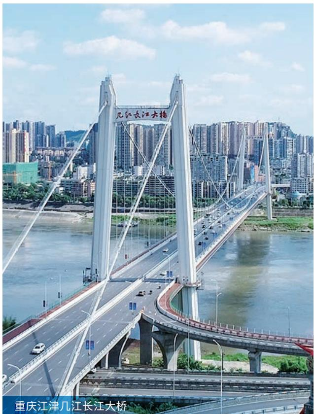

text_image

几江长江大桥
重庆江津几江长江大桥

## 房地产开发与投资

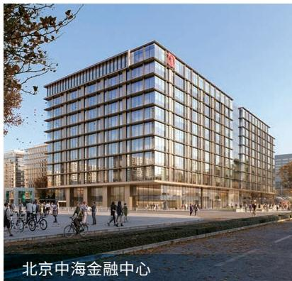

natural_image

Exterior view of a modern glass office building with people cycling in front (no signage visible)

中国建筑旗下拥有中海地产和中建地产两大房地产品牌。中海地产是公司下属中海集团房地产业务的品牌统称，品牌价值始终处于中国房地产行业领先地位，致力于成为卓越的国际化不动产开发运营集团，加快形成以住宅产品开发为主、优质商业开发运营为辅、康养等新兴业务为补充的业务格局。中建地产是公司各局院地产业务所使用的品牌，包括中建智地、中建玖合、中建壹品、中建信和、中建东孚等子品牌，开展地产开发、城市更新、资产运营和综合服务等业务。

## 勘察设计

中国建筑是国内最大的建筑设计综合企业集团，勘察设计板块主要由7家具有甲级设计资质的大型勘察设计企业组成，业务覆盖建筑设计、城市规划、工程勘察、市政公用工程设计等诸多领域，在机场、酒店、体育建筑、博览建筑、古建筑、超高层等领域居国内领先地位，并在设计原创、科技创新、标准规范制定等方面为行业发展作出了重要贡献。

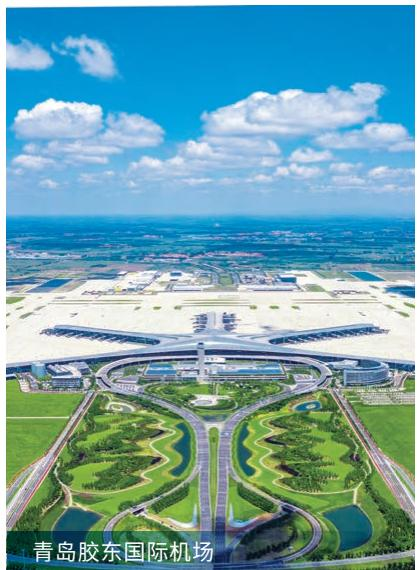

natural_image

Aerial view of Qingdao Jiaotong International Airport with surrounding green landscape and modern terminal building under a blue sky (no signage visible)

## 海外经营

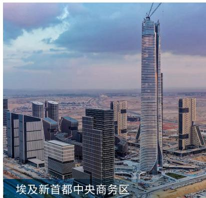

text_image

埃及新首都中央商务区

中国建筑是中国最早开展国际工程承包业务的企业之一，公司发挥全产业链优势，海外工程承包业务涵盖房建、机场、公路、桥梁、港口、能源、轨道交通、市政工程、矿山建设、水务环保等多个领域，并成功探索实施海外地产开发。公司积极践行“一带一路”倡议，大力实施“海外高质量发展战略”，持续塑强海外深耕优势。目前，公司经营区域遍布亚洲、非洲、中东欧、北美、拉美、大洋洲等近百个国家和地区。

## 二、报告期内核心竞争力分析

√ 适用 □ 不适用

报告期内，公司核心竞争力未发生重大变化。主要包括如下：

## （一）市场化的运营机制

作为市场经济主体，中国建筑始终坚守市场化的运营机制，尊重、恪守、适应并利用市场规律，逐步提高对市场规律的驾驭能力。面对激烈的市场竞争，中国建筑创造性地挖掘并不断满足顾客现实和潜在的需求，通过高品质的产品和超值服务，不断赢得和创造顾客。始终贯彻绩效理念，通过清晰界定目标、科学设计流程、强化高效运营，以追求卓越绩效。公司始终追求有盈利支撑的规模增长，在高效运用和运营资源、大力倡导规模经济的同时，提高资产周转效率，获取高于行业平均水平的资产收益，并通过稳定增长持续获取更高的市场占有率。

## （二）全球化的发展方向

公司秉承国际化经营理念，全面参与高质量共建“一带一路”，大力实施以“一个方位、六个目标、五个路径”为内涵的海外高质量发展战略，持续推动海外业务量质齐升。公司深入贯彻新发展理念，充分利用国内国际两个市场、两种资源，致力于成为一家在全球范围内配置资源并高效运营的跨国公司。公司持续开创海外发展的新局面，打造结构合理的海外市场体系，巩固优势市场，深耕重点市场，坚守潜力市场，审慎拓展新市场。公司坚持推行本土化运营，积极对接所在国发展需求，深度参与所在国城市化和基础设施建设。同时，通过与国际先进企业同台竞争，学习先进的管理经验和经营理念，提升公司的整体经营管理实力。

## （三）相关多元和纵向一体化的拓展方式

始终生产或提供能够持续创造客户、服务客户、满意客户的产品或服务，是中国建筑长足发展的重要保证。在选择产品（或服务）方面，中国建筑基于已经拥有的技术优势和市场优势，走出一条多元化道路。公司在继续保持勘察设计、房屋建筑施工、房地产开发传统优势的同时，积极在基础设施投资建造业务等领域进行横向拓展。

中国建筑致力于投资、设计、建造、运营、服务等纵向一体化的拓展方式，在公司所从事的业务领域努力构建起独一无二的市场地位，形成竞争对手难以模仿的竞争优势。

## （四）高品质、低成本和差异化的竞争策略

为社会大众提供高品质和低成本的产品和服务，始终是中国建筑的追求方向。高品质源于公司的技术优势、人才优势和组织方式优势；低成本源于公司的一体化运作模式、集约效应和速度经济。身处完全竞争的行业领域，作为国有企业的优秀代表，中国建筑始终将“有所为、有所不为”作为公司生产经营与事业发展的基本导向，着力实施“高端市场、高端客户、高端项目”的市场策略，持续开展“差异化”市场经营与竞争。公司内部不同子企业之间通过贯彻“差异化”策略，分别聚焦不同的细分市场，或专注于相应专业（专业化），或专注于相应区域（区域化），形成各自的“拳头产品、特色服务”，减少内部无序竞争，强化对外整体竞争优势。

## （五）授权和集中有度的管控模式

尊重中国建筑的发展历史，在由多法人载体形成的集团公司基础上，探索和形成富有竞争力的集团管控模式。公司总部定位为战略管控型总部，履行“引领、服务、监督”职能，公司与下属各子企业作为独立法人主体，财产相互独立，公司对二级子企业坚持放活与管好相统一。二级子企业根据公司授权经营，根据承担责任的大小享有相应权限。对于劳动密集型、成熟度较高的业务，通过加大授权，扩大市场接触面，以加快市场反应速度，提高服务质量。对于资本密集型、成熟度较低的业务，通过集中资源冲击目标细分市场，在有效规避风险的基础上，积极谋求在目标市场上的快速突破。针对不同的细分市场，采取不同的市场竞争策略，并适配相应的管控模式。

## （六）结果导向和责任承担的管理体系

公司各项管理行为始终致力于公司使命、愿景和目标的实现。公司坚持以促使工作更加富有效率、员工更加富有成就感、企业更加富有未来作为管理的根本目的，通过各职能领域管理行为的有机融合，形成富有生命力、科学合理、简洁高效的系统，避免出现自行其是、互相推诿现象，实现责任权利的统一。公司坚信管理者是因其承担的责任而定义的。为提升产品和服务的质量，公司致力于实现管理的标准化、技术的标准化和工作的标准化，借助信息化手段，通过标准化和信息化的“两化融合”，提高工作效率，实施“底线管理”，提升产品质量，降低运营成本。

## (七) “以人为本”的人力资源管理

公司秉承“专业化、职业化、国际化”的人才发展战略，拥有一大批忠于企业、忠于事业、坚信团队利益高于个人利益，能够自我约束、自我激励和自我发展的懂技术、会管理、擅营销的人才团队。公司始终遵循“事业留人、感情留人、待遇留人”和“关注个体”的基本人力资源管理理念，通过职业规划、教育培训和绩效考核的全员覆盖，建立与个人价值创造和能力相结合、共享企业发展成果的薪酬激励机制，实施多元化的中长期激励机制，强化对人才的吸引力度，保障人才的发展空间，更好地为企业发展提供强有力的人才支撑。

## (八) “产融结合” 战略助推企业发展

公司聚焦建筑地产行业特点，围绕产业链上下游需求，坚持合规经营、规范运作，把金融资源集聚到助力企业高质量发展、助力产业链稳固的战略方向、重点领域，为公司主业提供高质量金融服务。依托中建财务公司和中建资本等内部专业金融平台，通过开展境内外资金集中、贷款集中、结构化融资、应收账款保理、资产证券化、供应链融资、融资租赁、保险集中等业务，为公司主业和产业链上下游提供既满足实际需要、又有效补充社会金融短板的金融服务，在协同公司主业发展、拓宽融资渠道、降低融资成本、盘活存量资产、实现稳链固链等方面发挥了积极作用。同时，公司严格执行国家有关政策要求，加强日常管理，防范金融风险，坚决杜绝“脱实向虚”和“空转套利”。

## （九）科技创新驱动的核心竞争能力

公司通过持续的科技创新驱动生产模式和组织模式的变革。公司依托全产业链业务布局，涵盖建筑产品研发、数字化制造、智能建造、智慧运维、绿色低碳的技术体系，掌握全球领先的超高层建筑、大跨度空间、单体建筑平移、大型屋盖滑移、复杂钢结构生产与施工等建造技术，致力打造建筑行业绿色低碳、智能建造原创技术策源地。

截至报告期末，公司拥有国家数字建造技术创新中心、绿色建筑全国重点实验室、土壤养分管理与污染修复国家工程研究中心三大国家级科技创新平台，5个国家企业技术中心（含分中心）、9家院士工作站，75个省部级企业技术中心、72家省部级科技创新平台，建成19个博士后工作站，拥有248家高新技术企业。

## （十）内化于心、外化于行的企业文化

中国建筑是具有光荣历史的企业，我们在传承中创新，在履行使命、实现愿景的过程中，将“品质保障、价值创造”的核心价值观和“忠诚担当 使命必达”的中国建筑精神，融入公司的规章制度和管理行为，成为支撑公司发展的软实力。

资源可以枯竭，唯有文化生生不息。公司坚守在市场经济大潮中经过磨砺、凝练和沉淀所形成的中建信条，结合时代潮流，与各级子企业的文化不断融合，确保公司事业常青的内生动力源源不断。

## 三、报告期内公司所在行业情况说明

2024年，我国经济运行总体平稳、稳中有进，高质量发展取得新进展，特别是国家及时部署出台一揽子增量政策，推动社会信心有效提振、经济明显回升，经济社会发展主要目标任务顺利完成。国家统计局初步核算，2024年国内生产总值1,349,084亿元，比上年增长5.0%。建筑业、房地产业作为国民经济的重要支柱产业，与整个国家经济发展、人民生活的改善有着密切的关系，对稳定经济大盘具有重要意义。

## 房建增量和存量市场结构性机遇凸显。

一是新型城镇化建设加速推进。我国不断推进农业转移人口市民化、户籍制度改革和公共服务均等化，2024年末我国常住人口城镇化率提高到67.0%。随着城市化进程的加速推进，不断释放住房、公共服务设施的刚性需求。二是城市更新政策协同激活存量市场。我国加快保障性住房建设、“平急两用”公共基础设施建设、城中村改造等“三大工程”建设。2024年，全年完成老旧小区改造5.6万个、更新改造小区内各类老化管线超过5万公里，建成完整社区试点106个。城中村改造政策的扶持范围已从原先的35个大型城市扩展至近300个地级及以上城市。三是高端工业制造建设需求带来增量空间。随着新能源、半导体、生物医药等领域加速发展，推动工业厂房、研发中心及配套设施需求提升，高科技厂房、洁净车间、智能仓储等专业化建筑投资建设项目增加，为行业提供了新的业务增长点。

## 基建投资维持稳健增长态势。

一是持续扩大有效投资。2024年，中央财政新增地方政府专项债规模达4万亿元，超长期特别国债发行了1万亿元，重点支持“两重”“两新”项目实施。国家统计局初步核算，2024年全国基础设施投资（不含电力、热力、燃气及水生产和供应业）比上年增长4.4%，其中水利管理业投资增长41.7%，航空运输业投资增长20.7%，铁路运输业投资增长13.5%。二是加快推进重大工程项目建设。各地区各部门加快推进重大工程项目建设，交通、能源、水利以及新型基础设施等一批重点项目加速推进。截至2025年3月，“十四五”规划102项重大工程涉及的5,000多个具体项目，已经开工建设或建成的达到98%。三是区域协调发展迎来新机遇。我国加快构建现代化基础设施体系，尤其是中西部地区发力布局基础设施建设，在中西部地区实施了一批重大项目，成为基建投资新的增长点。

## 房地产行业止跌回稳态势显现。

一是政策“组合拳”协同发力。2024年9月26日中央政治局会议首次明确促进房地产市场止跌回稳后，各部委出台多项“稳地产”政策，下调住房贷款利率和首付比例，降低交易环节税费水平，扎实推进保交房工作；各地因城施策，陆续优化限购政策，发放购房补贴，大力支持居民刚性和改善性住房需求。二是市场出现积极变化。得益于供给端到需求端一系列政策的支持，房地产市场保持了止跌回稳的积极势头。国家统计局数据显示，2024年四季度全国新建商品房销售面积、新建商品房销售额同比分别增长0.5%、1.0%，扭转了之前连续下滑的态势。从房地产开发景气指数来看，截至2024年12月，房地产开发景气指数达到92.78，已连续8个月回升。三是土地市场逐步回暖。2024年下半年，北京、上海、杭州、成都等多个城市的土地市场成交活跃，市场情绪逐步回暖，进一步提振了房地产市场的信心。

## 勘察设计行业持续转型发展。

一是城市更新、老旧小区改造给行业带来新动力。一方面存量市场改造，包括老旧街区、历史街区及旧工业区改造等，推动建筑设计需求增长。另一方面城市公共服务设施建设提质升级，对文化场馆、体育设施、教育设施等细分领域原创设计能力提出更高要求。二是数字化技术广泛应用。以BIM（建筑信息模型）、AI（人工智能）、VR（虚拟现实）和AR（增强现实）等前沿技术推动行业转型加速，不断提升勘察设计服务的智能化和自动化水平。三是绿色低碳设计理念深入践行。行业积极响应“双碳”战略目标，将绿色低碳设计理念贯穿项目全生命周期，推动建筑行业向绿色化、低碳化方向发展。

## 国际工程市场呈现增长势头。

一是高质量共建“一带一路”成效显著。“一带一路”倡议提出以来，合作领域不断扩大、互联互通稳步推进，以医疗设施、保障房、文化场馆、体育设施等为代表的“小而美”民生项目，以及区域互联互通重大标志性工程稳步实施。二是对外承包工程规模稳步提升。据商务部统计，2024年，我国对外承包工程完成营业额1,659.7亿美元，较上年增长3.1%，新签合同额2,673亿美元，较上年增长1.1%，创历史新高。三是绿色基建合作深入发展。新一轮技术革命和产业变革加速演进，智慧城市、绿色建筑、清洁能源开发和利用等基础设施建设和改造需求为国际工程市场带来发展新动能。据商务部统计，2024年我国对外承包工程中节能环保清洁项目新签合同额492.6亿美元，增长12.7%。

## 四、经营情况讨论与分析

2024年，公司紧扣高质量发展这个首要任务，锚定“一创五强”战略目标，深入实施“一六六”战略路径，主动应对市场变化与风险挑战，奋力推进“抓整改、保增长、促创新、深改革、固基础、防风险、强党建”七大任务，在建筑市场竞争加剧、房地产业深度调整的形势下保持了稳健发展态势，取得了来之不易的成绩。

报告期内，公司新签合同额4.5万亿元，实现营业收入2.19万亿元，实现归属于上市公司股东的净利润461.9亿元。中国建筑第19次获得国务院国资委年度中央企业负责人经营业绩考核A级，位居2024年《财富》世界500强榜单第14位并入选中国ESG影响力榜，位列Brand Finance“2024年度中国品牌价值500强”榜单第13位、蝉联全球行业首位，持续入选中证50、上证50、富时中国A50、MSCI中国A50互联互通指数等重要指数，保持全球建筑行业最高信用评级。总体来看，公司经营发展情况呈现以下特点：

服务国家重大战略，彰显央企使命担当。报告期内，公司集中优势资源，发挥全产业链优势，深度参与京津冀协同发展、长江经济带发展、粤港澳大湾区建设、长三角一体化发展、黄河流域生态保护和高质量发展等区域重大战略，在上述区域新签合同额占比达83.1%、完成投资额占比为92.4%。积极投身“两重”“两新”“三大工程”等国家重点领域投资建设，中标江西弋阳至南丰高速公路新建工程、大连长海大桥等一批重大工程，助力制造强国、交通强国、美丽中国的建设。高质量参与共建“一带一路”，实施海外高质量发展战略，推进埃及阿拉曼新城超高综合体、阿尔及利亚住房部新办公大楼、中泰高铁4-3标段、新加坡大士供水回收厂C3A项目等境外重大基础设施和民生工程建设，助力当地提升城市功能品质。

聚焦主责主业发展，全面提升经营质效。报告期内，公司制定“两优两重”的市场策略，聚焦优质客户、优质项目、重点区域、重点领域，抢抓高科技工业厂房、能源工程、水利、铁路等细分业务领域发展机遇，业务结构持续调整，合同质量稳步提升。致力于好房子、好小区、好社区、好城区的创新实践，打造“新建好房子”和“旧改好房子”综合解决方案，并在北京市西城区桦皮厂胡同8号楼老旧小区改造工程等项目应用。进一步完善供应链管理体系，以“强基强链、共创共赢”主题召开首届供应链管理大会暨合作伙伴发展大会，优化供应链各环节协同机制，保障产品品质与供应链稳定性。制定布局发展战略性新兴产业的指导性文件，明确新能源工程施工、分布式新能源、节能建筑、环保工程、工厂化建造和现场工业化六大赛道的发展重点，制定契合企业实际的“千亿级赛道、百亿级产业、十亿级产品”的发展模式，形成以产品提升产业、产业赋能赛道的发展格局，探索推进战略性新兴产业和传统主业协同发力。报告期内，公司战略性新兴产业实现营业收入2,241.8亿元，占营业收入比重10.25%。

加快科技创新步伐，塑强核心竞争能力。报告期内，公司重大科技成果实现新突破，荣获国家技术发明奖一等奖1项，国家科学技术进步奖二等奖1项。“成都天府国际机场”等15个项目荣获詹天佑大奖。4家子企业获评第六批国家级专精特新“小巨人”，2家子企业入选国家级制造业单项冠军。积极承担国家重大科研攻关任务，“模块集成建筑建造关键技术研究与应用”等“十四五”国家重点研发计划项目有序推进。加强关键核心技术攻关，自主研发形成5G智能塔机远程驾驶装备、新一代轻型智能“造塔机”、单塔多笼循环运行施工电梯、星璇智能安全帽等一系列新装备、新技术。数字化建设稳步推进，将数字技术与生产经营的深度融合，建造一体化平台在子企业试点应用，大幅提升业务流程效率。成功举办中国建筑科技展，涵盖宜居城市、韧性城市、智慧城市、绿色低碳、“好房子”、智能建造、大国建造7大领域，系统性展示167项新成果、新技术和新应用，促进科技成果市场转化和行业科技交流。

推进改革深化提升，筑牢企业发展基石。报告期内，公司扎实推进改革深化提升行动，在总部层面累计完成227项改革举措、子企业层面累计完成4,217项改革举措，连续3年获得中央企业改革深化提升行动重点任务考核A级。推动建设科学、理性、高效董事会，保障独立董事制度发挥作用。深化任期制和契约化管理，建立二级子企业经理层成员关键岗位经营业绩考核指标库，切实提高全员绩效考核科学精准性。完善“法人管项目”体制机制，实施项目全过程精益管控，推动“一手册、一方案”在每个项目上落实落地，提升履约效率和品质。全面推进降本增效，开展低效机构治理，不断提升企业发展质量。大力夯实财务基础管理，加快推进财务数智化转型，开展收款攻坚专项行动，着力改善经营性现金流。大力度部署存量资产盘活工作，引入外部金融资源，持续拓展盘活渠道，不断提升资产效率效益。健全风险防控体系，完善风险等级及识别要素库，建立风险监测预警指标体系。推进审计改革创新，首次引入审计审理、复盘和后评估机制，进一步提升审计工作成效。

主动践行社会责任，推动绿色可持续发展。报告期内，公司持续推进ESG理念与经营管理深度融合，制定环境、社会和公司治理（ESG）工作方案，持续完善ESG关键指标体系，探索应用ESG数字化平台，重点推动环境、供应链、安全等ESG关键议题的管理提升。探索绿色低碳发展新模式，大力发展装配式、智能化等新型建筑工业化建造方式，推广绿色低碳技术应用，打造中建滨湖设计总部项目、中建四局科创大厦等一批近零能耗、零碳建筑示范项目，引领行业实现绿色低碳转型发展。有序实施碳达峰“个十百千万”工程，开展节能降碳专项行动，完成在建项目碳排查工作。助力乡村振兴，聚焦“五大振兴”，深入开展产业升级“三大行动”，打造了康乐花儿民宿、卓尼文化商业街、康县青龙山景区、卓尼三姊妹山泉水等一批惠民项目。组织人员和机械设备，全力投入广东、广西、安徽等地的抗洪抢险，保障人民群众生命财产安全。深入开展各类公益活动，组织全国农村留守儿童关爱保护活动、“春蕾行动”等关爱活动115场次，开展“建证未来”青年志愿服务超1万次，在10个国家启动“鲁班工匠计划”。

- 主要业务数据

<table><tr><td>项目</td><td>单位</td><td>2024年</td><td>2023年</td><td>同比增长(%)</td></tr><tr><td>新签合同总额</td><td>亿元人民币</td><td>45,027</td><td>43,241</td><td>4.1</td></tr><tr><td>一、建筑业务</td><td></td><td></td><td></td><td></td></tr><tr><td>(一)期内累计新签合同额</td><td rowspan="6">亿元人民币</td><td>40,808</td><td>38,727</td><td>5.4</td></tr><tr><td>分行业 1.房屋建筑</td><td>26,516</td><td>26,894</td><td>-1.4</td></tr><tr><td>2.基础设施</td><td>14,149</td><td>11,685</td><td>21.1</td></tr><tr><td>3.勘察设计</td><td>143</td><td>148</td><td>-3.8</td></tr><tr><td>分地区 1.境内</td><td>38,697</td><td>36,973</td><td>4.7</td></tr><tr><td>2.境外</td><td>2,110</td><td>1,755</td><td>20.3</td></tr><tr><td>(二)房屋建筑业务工程量</td><td rowspan="4">万平方米</td><td>/</td><td>/</td><td>/</td></tr><tr><td>1.累计施工面积</td><td>169,251</td><td>172,200</td><td>-1.7</td></tr><tr><td>2.累计新开工面积</td><td>30,816</td><td>37,725</td><td>-18.3</td></tr><tr><td>3.累计竣工面积</td><td>22,404</td><td>26,015</td><td>-13.9</td></tr><tr><td>(三)基础设施业务工程量</td><td>/</td><td>/</td><td>/</td><td>/</td></tr><tr><td>1.道路(国内新签)</td><td>公里</td><td>3,850</td><td>4,297</td><td>-10.4</td></tr><tr><td>2.面积(国内新签)</td><td>万平方米</td><td>5,415</td><td>4,978</td><td>8.8</td></tr><tr><td>二、房地产业务</td><td></td><td></td><td></td><td></td></tr><tr><td>(一)期内合约销售额</td><td rowspan="2">亿元人民币</td><td>4,219</td><td>4,514</td><td>-6.5</td></tr><tr><td>其中:中海地产1</td><td>2,706</td><td>2,670</td><td>1.3</td></tr><tr><td>(二)期内合约销售面积</td><td rowspan="2">万平方米</td><td>1,461</td><td>1,858</td><td>-21.4</td></tr><tr><td>其中:中海地产</td><td>800</td><td>982</td><td>-18.5</td></tr><tr><td>(三)期末认购销售额</td><td>亿元人民币</td><td>144</td><td>26</td><td>447.6</td></tr><tr><td>(四)期内平均售价</td><td>元/平方米</td><td>28,810</td><td>24,292</td><td>18.6</td></tr><tr><td>(五)期末土地储备2(全额数)</td><td rowspan="2">万平方米</td><td>7,718</td><td>8,523</td><td>-9.4</td></tr><tr><td>其中:中海地产</td><td>2,877</td><td>3,522</td><td>-18.3</td></tr><tr><td>(六)购置土地储备(全额数)</td><td rowspan="2">万平方米</td><td>882</td><td>1,310</td><td>-32.7</td></tr><tr><td>其中:中海地产</td><td>416</td><td>764</td><td>-45.6</td></tr></table>

注：①中海地产是指中国海外发展及其附属公司所从事的地产业务，但不包括中国海外宏洋；  
②期末土地储备=上年末土地储备+新购置土地储备-本期竣工面积+(或-)项目调整面积。

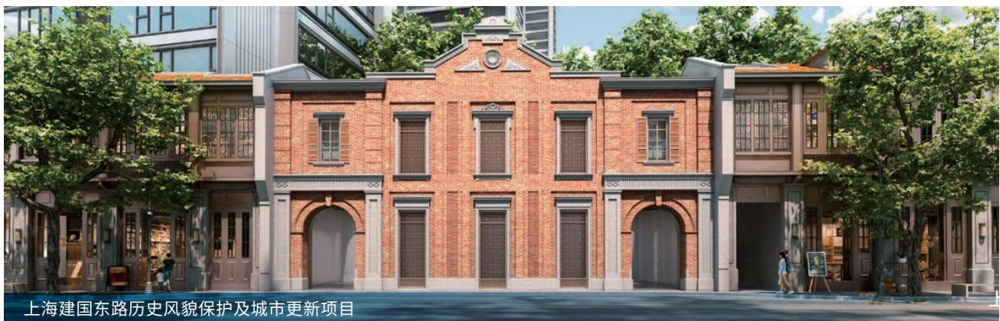

text_image

上海建国东路历史风貌保护及城市更新项目

## - 主要经营数据

单位：亿元 币种：人民币

建筑业务新签合同额  
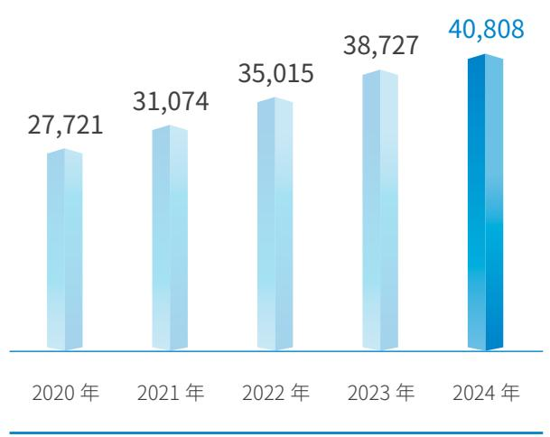

bar chart

| 年份 | 数值 |
| :--- | :--- |
| 2020年 | 27,721 |
| 2021年 | 31,074 |
| 2022年 | 35,015 |
| 2023年 | 38,727 |
| 2024年 | 40,808 |

地产业务合约销售额  
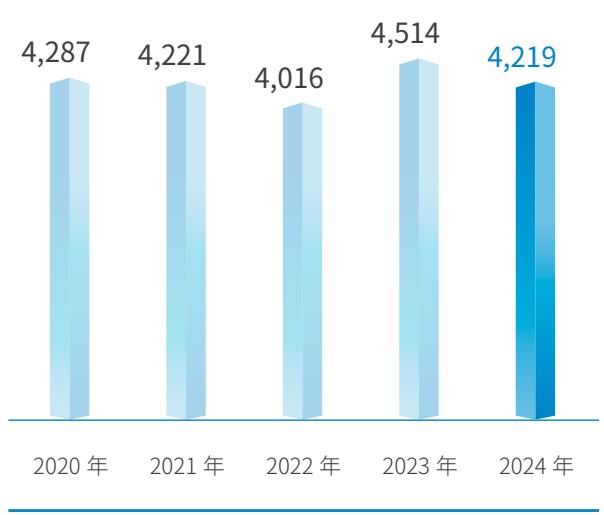

bar chart

| 年份 | 数值 |
| :--- | :--- |
| 2020年 | 4,287 |
| 2021年 | 4,221 |
| 2022年 | 4,016 |
| 2023年 | 4,514 |
| 2024年 | 4,219 |

营业收入  
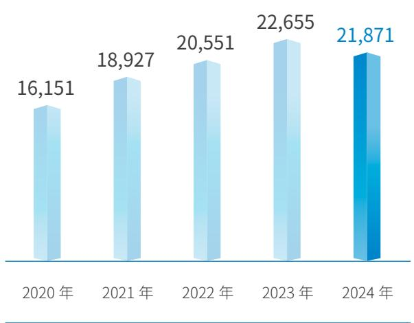

bar chart

| 年份 | 数值 |
| :--- | :--- |
| 2020年 | 16,151 |
| 2021年 | 18,927 |
| 2022年 | 20,551 |
| 2023年 | 22,655 |
| 2024年 | 21,871 |

归属于上市公司股东的净利润  
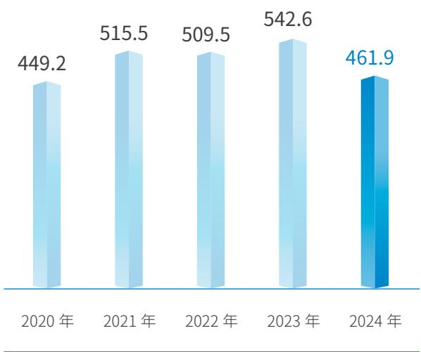

bar chart

| 年份 | 数值 |
| :--- | :--- |
| 2020年 | 449.2 |
| 2021年 | 515.5 |
| 2022年 | 509.5 |
| 2023年 | 542.6 |
| 2024年 | 461.9 |

新签合同额比重  
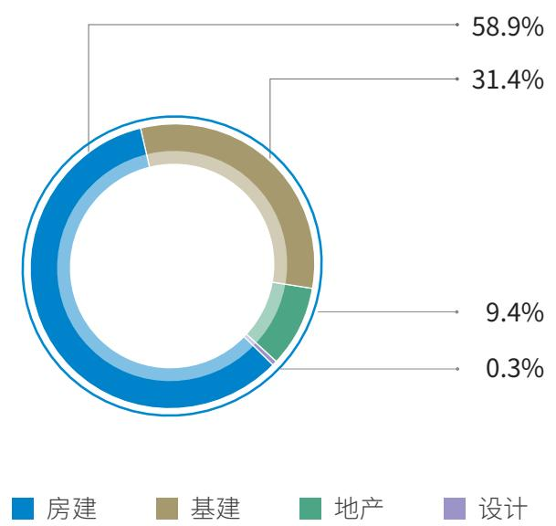

pie chart

| 类别 | 占比 (%) |
| :--- | :--- |
| 房建 | 58.9 |
| 基建 | 31.4 |
| 地产 | 9.4 |
| 设计 | 0.3 |

分部收入比重注  
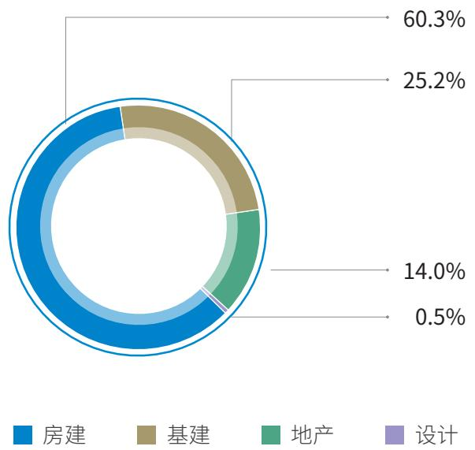

pie chart

| 类别 | 占比 (%) |
| :--- | :--- |
| 房建 | 60.3 |
| 基建 | 25.2 |
| 地产 | 14.0 |
| 设计 | 0.5 |

分部毛利润比重  
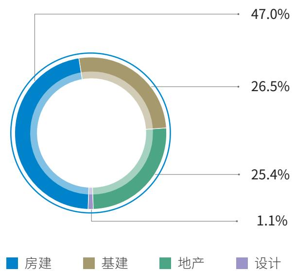

pie chart

| 类别 | 占比 (%) |
| :--- | :--- |
| 房建 | 47.0 |
| 基建 | 26.5 |
| 地产 | 25.4 |
| 设计 | 1.1 |

分部毛利率情况

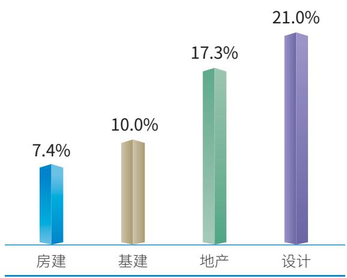

bar chart

| 类别 | 数值 (%) |
|---|---|
| 房建 | 7.4 |
| 基建 | 10.0 |
| 地产 | 17.3 |
| 设计 | 21.0 |

注：分部业务所占比例的分母系公司四大业务板块（房建、基建、地产和设计）数据的直接加总。

## 五、报告期内主要经营情况

## （一）主营业务分析

## 1. 利润表及现金流量表相关科目变动分析表

单位：千元 币种：人民币

<table><tr><td>科目</td><td>本期数</td><td>上年同期数</td><td>变动比例(%)</td></tr><tr><td>营业收入</td><td>2,187,147,839</td><td>2,265,529,244</td><td>-3.5</td></tr><tr><td>营业成本</td><td>1,971,580,906</td><td>2,042,723,831</td><td>-3.5</td></tr><tr><td>销售费用</td><td>8,724,383</td><td>7,628,182</td><td>14.4</td></tr><tr><td>管理费用</td><td>34,614,764</td><td>34,402,175</td><td>0.6</td></tr><tr><td>财务费用</td><td>19,462,089</td><td>18,577,073</td><td>4.8</td></tr><tr><td>研发费用</td><td>45,459,339</td><td>46,073,572</td><td>-1.3</td></tr><tr><td>经营活动产生的现金流量净额</td><td>15,773,535</td><td>11,030,123</td><td>43.0</td></tr><tr><td>投资活动产生的现金流量净额</td><td>-2,510,503</td><td>-26,501,519</td><td>/</td></tr><tr><td>筹资活动产生的现金流量净额</td><td>15,167,548</td><td>30,450,196</td><td>-50.2</td></tr></table>

营业收入变动原因说明：受房地产行业深度调整、公司房建业务结构优化等内外部影响，公司营业收入下降。

营业成本变动原因说明：收入规模减少，营业成本相应减少。

销售费用变动原因说明：公司地产业务加大广告投入，相应支付的广告费及业务宣传费、业务费和销售佣金等有一定增长。

管理费用变动原因说明：公司持续深入开展“厉行节约 勤俭办企”专项行动，严控管理费用大幅增长。

财务费用变动原因说明：主要是随业务规模扩大资金需求增加。

研发费用变动原因说明：主要是公司不断健全研发投入制度，优化研发投入结构，提高研发投入效益。

经营活动产生的现金流量净额变动原因说明：本年经营现金流量增加主要由于公司积极采取有效措施加强现金流管控，持续保持较好现金流水平。

投资活动产生的现金流量净额变动原因说明：本年投资活动净流出减少主要是购建固定资产、无形资产和其他长期资产支付的现金减少所致。

筹资活动产生的现金流量净额变动原因说明：本年筹资活动流入减少主要为取得借款收到的现金减少所致。

本期公司业务类型、利润构成或利润来源发生重大变动的详细说明

□适用 □不适用

## 2. 收入和成本分析

## √ 适用 □ 不适用

2024年，公司实现营业收入21,871亿元，同比减少3.5%；发生营业成本19,716亿元，同比减少3.5%。公司实现毛利润2,156亿元，同比降低3.2%；毛利率9.9%，与上年同期相比提升0.1个百分点。

收入确认方法等敬请参阅本报告第十节“财务报告”所附财务报表附注三、25“与客户之间的合同产生的收入”相关内容。

## (1). 主营业务分行业、分产品、分地区情况

单位：千元 币种：人民币

<table><tr><td colspan="7">主营业务分行业情况</td></tr><tr><td>分行业</td><td>营业收入</td><td>营业成本</td><td>毛利率(%)</td><td>营业收入比上年同期增减(%)</td><td>营业成本比上年同期增减(%)</td><td>毛利率比上年同期增减(%)</td></tr><tr><td>房屋建筑工程</td><td>1,321,801,232</td><td>1,223,950,886</td><td>7.4</td><td>-4.5</td><td>-4.6</td><td>提升0.1个百分点</td></tr><tr><td>基础设施建设与投资</td><td>550,903,080</td><td>495,663,127</td><td>10.0</td><td>-1.0</td><td>-1.2</td><td>提升0.2个百分点</td></tr><tr><td>房地产开发与投资</td><td>306,234,199</td><td>253,305,303</td><td>17.3</td><td>-0.8</td><td>0.3</td><td>降低0.9个百分点</td></tr><tr><td>勘察设计</td><td>10,821,916</td><td>8,546,395</td><td>21.0</td><td>-7.9</td><td>-7.6</td><td>降低0.3个百分点</td></tr><tr><td>其他</td><td>33,881,173</td><td>25,635,358</td><td>24.3</td><td>-23.1</td><td>-24.5</td><td>提升1.4个百分点</td></tr><tr><td>分部间抵销</td><td>-36,493,761</td><td>-35,520,163</td><td>/</td><td>/</td><td>/</td><td>/</td></tr><tr><td>合计</td><td>2,187,147,839</td><td>1,971,580,906</td><td>9.9</td><td>-3.5</td><td>-3.5</td><td>提升0.1个百分点</td></tr></table>

<table><tr><td colspan="7">主营业务分地区情况</td></tr><tr><td>分地区</td><td>营业收入</td><td>营业成本</td><td>毛利率(%)</td><td>营业收入比上年同期增减(%)</td><td>营业成本比上年同期增减(%)</td><td>毛利率比上年同期增减(%)</td></tr><tr><td>境内</td><td>2,068,514,115</td><td>1,858,856,808</td><td>10.1</td><td>-3.8</td><td>-3.8</td><td>提升0.05个百分点</td></tr><tr><td> $境外_{注}$ </td><td>118,633,724</td><td>112,724,098</td><td>5.0</td><td>2.5</td><td>2.7</td><td>降低0.2个百分点</td></tr><tr><td>合计</td><td>2,187,147,839</td><td>1,971,580,906</td><td>9.9</td><td>-3.5</td><td>-3.5</td><td>提升0.1个百分点</td></tr></table>

注：境外指除中国大陆以外的地区。

<table><tr><td colspan="7">近三年营业收入及占比情况</td></tr><tr><td>分行业</td><td>2024年</td><td>占比(%)</td><td>2023年</td><td>占比(%)</td><td>2022年</td><td>占比(%)</td></tr><tr><td>房屋建筑工程</td><td>1,321,801,232</td><td>60.4</td><td>1,383,744,032</td><td>61.1</td><td>1,265,081,519</td><td>61.6</td></tr><tr><td>基础设施建设与投资</td><td>550,903,080</td><td>25.2</td><td>556,561,456</td><td>24.6</td><td>493,498,360</td><td>24.0</td></tr><tr><td>房地产开发与投资</td><td>306,234,199</td><td>14.0</td><td>308,807,680</td><td>13.6</td><td>282,044,629</td><td>13.7</td></tr><tr><td>勘察设计</td><td>10,821,916</td><td>0.5</td><td>11,747,277</td><td>0.5</td><td>10,763,560</td><td>0.5</td></tr><tr><td>其他</td><td>33,881,173</td><td>1.6</td><td>44,052,885</td><td>1.9</td><td>38,694,144</td><td>1.9</td></tr><tr><td>分部间抵销</td><td>-36,493,761</td><td>-1.7</td><td>-39,384,086</td><td>-1.7</td><td>-35,030,142</td><td>-1.7</td></tr><tr><td>合计</td><td>2,187,147,839</td><td>100.0</td><td>2,265,529,244</td><td>100.0</td><td>2,055,052,070</td><td>100.0</td></tr></table>

主营业务分行业、分产品、分地区情况的说明

## √ 适用 □ 不适用

新签合同额

26,516 亿元

同比下降

1.4%

营业收入

13,218亿元

同比下降

4.5%

## - 房屋建筑工程业务

房建业务结构持续优化。报告期内，公司房建业务新签合同额26,516亿元，同比下降1.4%；实现营业收入13,218亿元，同比下降4.5%；实现毛利978.5亿元，同比下降2.6%。

报告期内，公司坚持“两优两重”的市场策略，聚焦优质客户、优质项目、重点区域、重点领域，业务结构持续调整，合同质量稳步提升。从整体看，工业厂房、科教文卫体设施、商业综合等公共建筑领域新签合同额合计占比提升至65.6%。从细分领域看，工业厂房新签合同额7,216亿元，同比增长16.0%，合同额占比提升至27.2%，跃居房建业务细分领域规模首位，承接京东方第8.6代AMOLED生产线项目等项目。科教文卫体设施新签合同额5,171亿元，其中教育设施新签合同额1,928亿元，同比增长4.2%，承接北京理工大学珠海学院恩平项目等工程。商业综合新签合同额4,997亿元，承接沈阳中心大厦、西安太古里商业综合体等项目。同时，公司深入参与“三大工程”建设，承接榆林市榆阳区小西沙棚户区改造项目等一批重点民生工程。

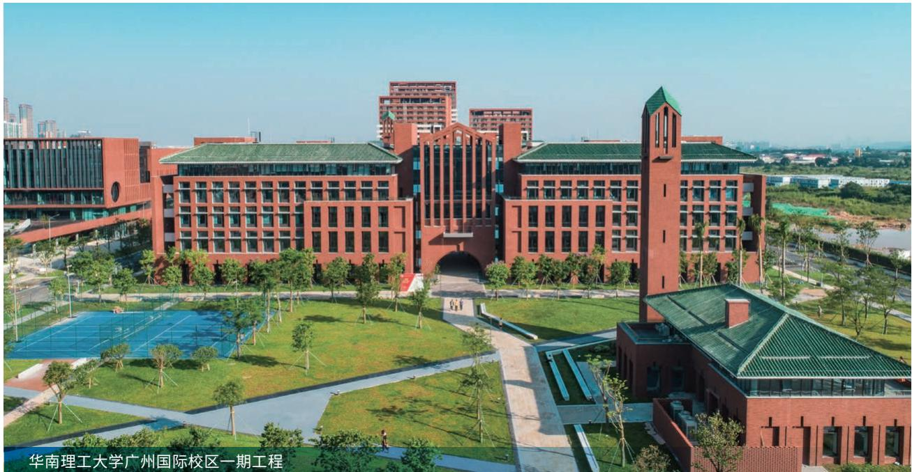

text_image

华南理工大学广州国际校区一期工程

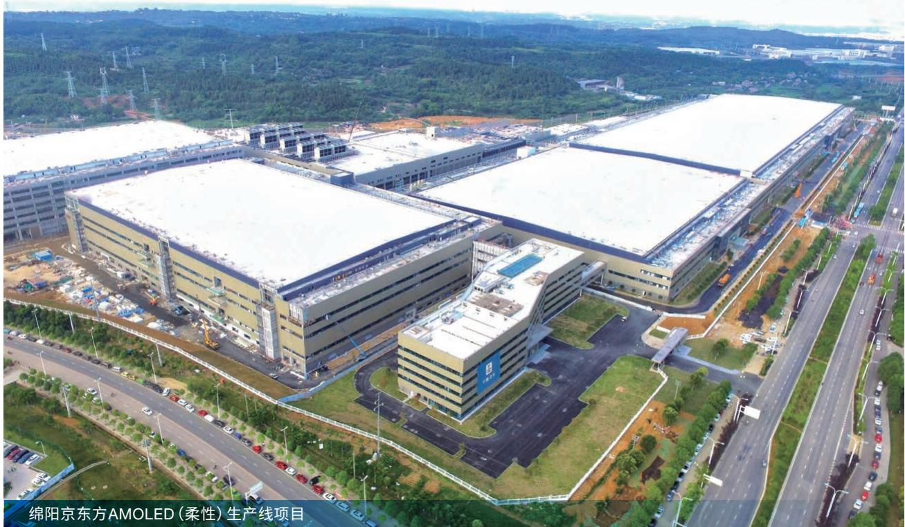

text_image

绵阳京东方AMOLED（柔性）生产线项目

报告期内，公司在大跨度空间结构、精益建造、绿色建造、智慧建造等领域核心竞争力持续增强，为房建项目承接和优质履约提供有力支撑。公司自主研发的装配式建筑造楼机、塔机5G远程控制技术等实现推广应用，大幅提高施工作业效率和数字化管理水平。公司承建的中国人民大学通州校区项目、上海港城广场四期、杭州大会展中心等重点项目全面竣工，持续打造品质更高的“好房子”。

房建业务细分领域新签合同额情况  
单位：亿元 币种：人民币

<table><tr><td>序号</td><td>一级类别</td><td>二级类别</td><td>2024年</td><td>2023年</td><td>同比增长(%)</td></tr><tr><td>1</td><td>住宅</td><td>商品房等</td><td>5,732</td><td>6,619</td><td>-13.4</td></tr><tr><td>2</td><td>保障性住房</td><td>保障性住房等</td><td>1,383</td><td>1,584</td><td>-12.7</td></tr><tr><td>3</td><td>工业厂房</td><td>工业加工厂房、工业制造厂房等</td><td>7,216</td><td>6,218</td><td>16.0</td></tr><tr><td>4</td><td>科教文卫体设施</td><td>科研设施、教育设施、医疗建筑、文化设施、体育设施、会议会展中心等</td><td>5,171</td><td>5,342</td><td>-3.2</td></tr><tr><td>5</td><td>商业综合</td><td>商用写字楼、城市综合体、酒店等</td><td>4,997</td><td>5,169</td><td>-3.3</td></tr><tr><td>6</td><td>其他</td><td>市政配套建筑等</td><td>2,017</td><td>1,962</td><td>2.8</td></tr><tr><td colspan="2">合计</td><td>/</td><td>26,516</td><td>26,894</td><td>-1.4</td></tr></table>

新签合同额

14,149 亿元

同比增长

21.1%

营业收入

5,509 亿元

同比下降

1.0%

## - 基础设施建设与投资业务

基建业务市场再获突破。报告期内，公司基建业务新签合同额14,149亿元，同比增长21.1%；实现营业收入5,509亿元，同比下降1.0%；实现毛利552.4亿元，同比增长1.0%。

报告期内，公司坚持“顶层设计、高层互动、分层对接”的策略，抢抓基建细分领域发展机遇，市场竞争力不断增强。从整体看，能源工程、水务及环保、水利水运等领域保持快速增长，新签合同额合计占比提升至53.7%。从细分领域看，能源工程新签合同额5,008亿元，同比增长85.6%，合同额占比提升至35.4%，跃升至基建业务细分领域规模首位，在新疆、甘肃、内蒙古、山西等地承接了一批以光伏发电、风电、核电为代表的能源工程项目。市政工程新签合同额2,647亿元，承接康良路（京杭大运河－运溪高架）工程一期（宣杭铁路－杭行路）等。交通运输工程新签合同额2,288亿元，承接北京轨道交通M101线工程、凤凰黄河大桥南延工程、三亚凤凰机场三期改扩建T3航站楼等项目。水务及环保新签合同额2,040亿元，同比增长76.3%；承接长江天门山段凤鸣湖流域生态环境治理与产业绿色转型发展项目等。水利水运新签合同额544亿元，同比增长8.6%，承接签约湖南浏阳风洞口抽水蓄能电站、平陆运河航道工程等项目。

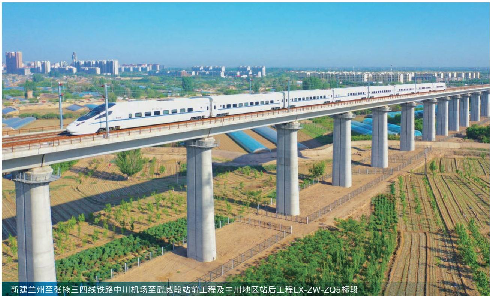

text_image

新建兰州至张掖三四线铁路中川机场至武威段站前工程及中川地区站后工程LX-ZW-ZQ5标段

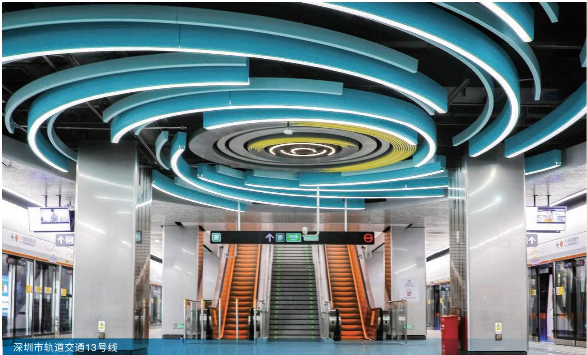

text_image

深圳市轨道交通13号线

报告期内，公司加快推进基建领域科技研发与成果转化，推动基建项目市场营销和高质量履约。公司自主研发国内新一代轻型智能“造塔机”，打造“空中智能移动工厂”，在湖北荆州李埠长江公铁大桥项目成功投入使用。无人化梁厂UBF2.0在江苏连云港赣榆市204国道项目应用，实现从原材下料、半成品加工到成品组装全流程自动流水化作业。公司承建的西安咸阳国际机场三期、云南华丽高速公路等重大基础设施项目顺利竣工，承建的成都轨道交通27号线一期、青岛地铁6号线、新建潍坊至烟台高铁等项目开通运营。

基建业务细分领域新签合同额情况  
单位：亿元 币种：人民币

<table><tr><td>序号</td><td>一级类别</td><td>二级类别</td><td>2024年</td><td>2023年</td><td>同比增长(%)</td></tr><tr><td>1</td><td>市政工程</td><td>市政道路、邮电通讯工程、防卫防灾工程等</td><td>2,647</td><td>2,829</td><td>-6.4</td></tr><tr><td>2</td><td>交通运输工程</td><td>高速公路、铁路(含高铁)、城市轨道交通、机场、桥梁等</td><td>2,288</td><td>2,598</td><td>-11.9</td></tr><tr><td>3</td><td>能源工程</td><td>光伏发电、风电、核电工程等</td><td>5,008</td><td>2,697</td><td>85.6</td></tr><tr><td>4</td><td>水务及环保</td><td>环保工程、供水及处理工程</td><td>2,040</td><td>1,157</td><td>76.3</td></tr><tr><td>5</td><td>水利水运</td><td>水利、水运</td><td>544</td><td>501</td><td>8.6</td></tr><tr><td>6</td><td>其他</td><td>石油化工工程等</td><td>1,622</td><td>1,903</td><td>-14.8</td></tr><tr><td colspan="2">合计</td><td>/</td><td>14,149</td><td>11,685</td><td>21.1</td></tr></table>

合约销售额

4,219亿元

同比下降

6.5%

营业收入

3,062 亿元

同比下降

0.8%

## 房地产开发与投资业务

地产业务保持行业领先。报告期内，公司地产业务合约销售额4,219亿元，同比下降6.5%；合约销售面积1,461万平方米，同比下降21.4%；实现营业收入3,062亿元，同比下降0.8%；实现毛利529.3亿元，同比下降5.9%。

报告期内，公司深入研判房地产市场形势和政策变化，强化精准投资，坚持布局核心城市核心区域，加强全过程精细化管控，加大销售去化力度。公司旗下中海地产权益销售额位居行业第一，中建壹品、中建智地、中建东孚、中建信和、中建玖合等品牌保持中国房地产企业销售业绩排名百强。上海中海顺昌玖里、北京中建宸园等一批优质楼盘逆势热销。公司全年新购置土地75宗，期末土地储备7,718万平方米，新增土地储备882万平方米，总购地金额1,385亿元。新增土地储备全部位于一线、强二线及省会城市，土地储备结构进一步优化。其中：中海地产新购置土地22宗，新增土地储备416万平方米，购地金额806.1亿元；中建地产新购置土地53宗，新增土地储备466万平方米，购地金额579亿元。报告期内，公司实现房地产项目新开工面积1,052万平方米，同比下降26.3%；竣工面积1,632万平方米，同比下降23.7%；在建面积5,665万平方米，同比下降10.4%。

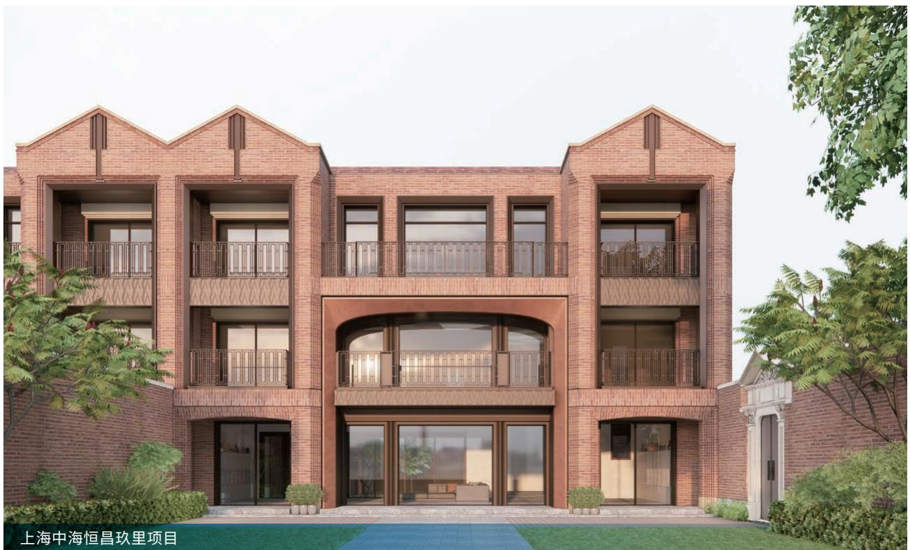

natural_image

Exterior view of a modern multi-story residential building with balconies and greenery, labeled '上海中海恒昌玖里项目' (Shanghai Zhonghai Hongxing Real Estate Project)

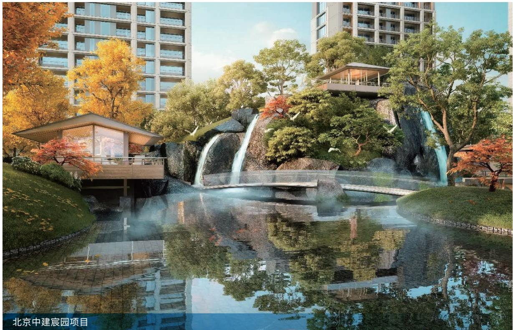

natural_image

Exterior view of the Beijing Zhong Jian宸 Park project featuring a waterfall, cherry trees, and modern high-rise buildings (no signage)

公司经过多年拓展，目前拥有写字楼、酒店、公寓、商业地产等持有型物业1,500万平方米，账面净值1,562亿元，占公司总资产4.9%。区域分布上，持有型物业主要集中分布在一、二线城市及经济发达城市，其中上海、北京、广东三大地区持有型物业净值占比超过50%。报告期内，公司加快产业升级，拓展商业、养老、物流等业务领域，通过树立城市级标杆项目、科学布局多元产品的拓展路径，有力助推商业价值高效释放，经营绩效稳步提升，年内持有型物业实现收入75.8亿元。

敬请参阅本报告第十节“财务报告”财务报表附注五8“存货”中“房地产开发成本”“房地产开发产品”、附注五33“合同负债”中“预售房产款”等相关内容。

新增土地储备前八大城市

<table><tr><td>序号</td><td>所在城市</td><td>购地金额(亿元)</td><td>金额占比(%)</td><td>总建筑面积(万平方米)</td><td>规模占比(%)</td></tr><tr><td>1</td><td>北京</td><td>593</td><td>42.8</td><td>225</td><td>25.5</td></tr><tr><td>2</td><td>深圳</td><td>254</td><td>18.4</td><td>79</td><td>8.9</td></tr><tr><td>3</td><td>上海</td><td>223</td><td>16.1</td><td>80</td><td>9.1</td></tr><tr><td>4</td><td>杭州</td><td>61</td><td>4.4</td><td>30</td><td>3.4</td></tr><tr><td>5</td><td>济南</td><td>48</td><td>3.5</td><td>92</td><td>10.4</td></tr><tr><td>6</td><td>西安</td><td>48</td><td>3.4</td><td>134</td><td>15.2</td></tr><tr><td>7</td><td>天津</td><td>34</td><td>2.5</td><td>29</td><td>3.3</td></tr><tr><td>8</td><td>成都</td><td>24</td><td>1.7</td><td>19</td><td>2.1</td></tr></table>

## - 勘察设计业务

勘察设计业务转型发展。报告期内，公司勘察设计业务新签合同额142.7亿元，同比下降3.8%；实现营业收入108亿元，同比下降7.9%；实现毛利22.8亿元，同比下降8.9%。

报告期内，公司聚焦建筑设计、城市规划、工程勘察、市政公用工程设计等勘察设计主营业务，提升在机场、学校、酒店、体育建筑、文化场馆和古建筑等细分设计领域核心竞争力。持续提升原创设计能力，签约深圳宝安国际机场T2航站区及配套设施工程、石家庄音乐厅等设计项目。加快发展全过程工程咨询业务，签约昆明长水国际机场改扩建、兰州市城区老旧管网供水改造等项目。设计业务出海取得新突破，获得蒙古国新首都设计与规划方案、阿联酋半导体科技园设计总承包等项目，提升属地设计咨询能力。

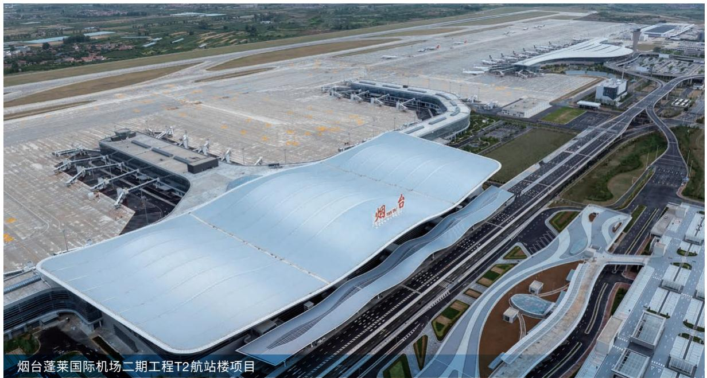

text_image

烟台蓬莱国际机场二期工程T2航站楼项目

## - 境外业务

境外业务订单快速增长。报告期内，公司深入推进海外高质量发展战略，经营规模和质量持续提升，新签合同额2,213亿元，同比增长19.0%，其中建筑业务新签合同额2,110亿元，同比增长20.3%；实现境外营业收入1,186亿元，同比增长2.5%；实现毛利59.1亿元，同比下降1.9%。

报告期内，公司持续深耕重点区域市场，在中东、东南亚、非洲、港澳地区承接了一批设施联通和城市地标工程，签约沙特阿拉伯萨勒曼国王知识区项目、香港新界西堆填区扩建计划项目等大体量标志性和重要民生工程。多元化业务发展有力推进，在新能源、环保工程、矿山工程等领域承接了阿尔及利亚瓦德省300兆瓦光伏发电站、印度尼西亚勿加泗市生活垃圾焚烧发电项目（一期）、蓝焰能源投资有限公司湿法冶炼项目土建等一系列工程。

报告期内，公司持续强化项目履约管理水平，承接的马来西亚沙巴州第一高楼亚庇双子塔项目、阿尔及利亚住房部新办公大楼项目顺利完工，澳大利亚东北干线、新加坡地铁跨岛线CR105项目等基建项目有序推进。

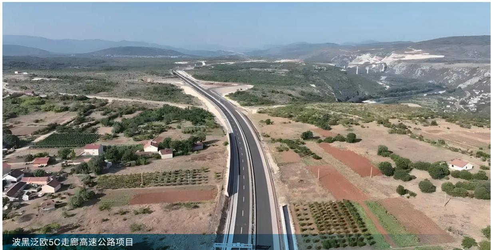

text_image

波黑泛欧5C走廊高速公路项目

## 其他业务

公司其他业务主要为经营土地一级开发、机械设备租赁、工程监理等收入。报告期内，实现营业收入338.8亿元，同比减少23.1%；实现毛利82.5亿元，毛利率为24.3%，同比上升1.4个百分点。

敬请参阅本报告第十节“财务报告”财务报表附注五54、“营业收入和营业成本”、附注五67、“费用按性质分类”、附注十六、1“分部报告”相关内容。

## (2). 产销量情况分析表

□适用 不适用

## (3). 重大采购合同、重大销售合同的履行情况

□适用 不适用

## (4). 成本分析表

单位：千元 币种：人民币

<table><tr><td colspan="7">分行业情况</td></tr><tr><td>分行业</td><td>成本构成项目</td><td>本期金额</td><td>本期占总成本比例(%)</td><td>上年同期金额</td><td>上年同期占总成本比例(%)</td><td>本期金额较上年同期变动比例(%)</td></tr><tr><td>房屋建筑工程</td><td>原材料、分包成本、人工成本等</td><td>1,223,950,886</td><td>62.1</td><td>1,283,273,271</td><td>62.8</td><td>-4.6</td></tr><tr><td>基础设施建设和投资</td><td>原材料、分包成本、人工成本等</td><td>495,663,127</td><td>25.1</td><td>501,864,580</td><td>24.6</td><td>-1.2</td></tr><tr><td>房地产开发与投资</td><td>建筑安装成本、土地成本、人工成本等</td><td>253,305,303</td><td>12.8</td><td>252,580,419</td><td>12.4</td><td>0.3</td></tr><tr><td>勘察设计</td><td>人工成本、设备租赁</td><td>8,546,395</td><td>0.4</td><td>9,250,674</td><td>0.5</td><td>-7.6</td></tr><tr><td>其他</td><td>人工成本、设备租赁</td><td>25,635,358</td><td>1.4</td><td>33,964,319</td><td>1.7</td><td>-24.5</td></tr><tr><td>分部间抵销</td><td>/</td><td>-35,520,163</td><td>-1.8</td><td>-38,209,432</td><td>-1.9</td><td>/</td></tr><tr><td>合计</td><td>/</td><td>1,971,580,906</td><td>100.0</td><td>2,042,723,831</td><td>100.0</td><td>-3.5</td></tr></table>

单位：千元 币种：人民币

<table><tr><td colspan="8">成本主要构成要素情况</td></tr><tr><td>分行业</td><td>成本构成要素</td><td>2024年</td><td>占比(%)</td><td>2023年</td><td>占比(%)</td><td>2022年</td><td>占比(%)</td></tr><tr><td rowspan="6">房屋建筑工程</td><td>产品销售成本</td><td>18,633,022</td><td>0.9</td><td>24,287,871</td><td>1.2</td><td>21,812,934</td><td>1.2</td></tr><tr><td>分包成本</td><td>511,257,031</td><td>25.9</td><td>519,233,745</td><td>25.4</td><td>398,178,917</td><td>21.6</td></tr><tr><td>原材料</td><td>320,807,432</td><td>16.3</td><td>343,390,812</td><td>16.8</td><td>347,342,497</td><td>18.9</td></tr><tr><td>职工薪酬</td><td>44,681,073</td><td>2.3</td><td>40,535,318</td><td>2.0</td><td>37,501,570</td><td>2.0</td></tr><tr><td>其他费用</td><td>328,572,328</td><td>16.7</td><td>355,825,525</td><td>17.4</td><td>359,575,460</td><td>19.6</td></tr><tr><td>小计</td><td>1,223,950,886</td><td>62.1</td><td>1,283,273,271</td><td>62.8</td><td>1,164,411,378</td><td>63.3</td></tr><tr><td rowspan="5">基础设施建设和投资</td><td>分包成本</td><td>202,770,905</td><td>10.3</td><td>220,633,861</td><td>10.8</td><td>224,249,598</td><td>12.2</td></tr><tr><td>原材料</td><td>141,568,785</td><td>7.2</td><td>136,159,382</td><td>6.7</td><td>105,384,913</td><td>5.7</td></tr><tr><td>人员费</td><td>70,994,532</td><td>3.6</td><td>78,052,538</td><td>3.8</td><td>62,440,426</td><td>3.4</td></tr><tr><td>其他费用</td><td>80,328,905</td><td>4.0</td><td>67,018,799</td><td>3.3</td><td>49,818,123</td><td>2.7</td></tr><tr><td>小计</td><td>495,663,127</td><td>25.1</td><td>501,864,580</td><td>24.6</td><td>441,893,060</td><td>24.0</td></tr><tr><td rowspan="3">房地产投资与开发</td><td>房地产开发产品结转</td><td>233,939,825</td><td>11.8</td><td>235,352,228</td><td>11.5</td><td>217,259,901</td><td>11.8</td></tr><tr><td>其他费用</td><td>19,365,478</td><td>1.0</td><td>17,228,191</td><td>0.8</td><td>11,291,708</td><td>0.6</td></tr><tr><td>小计</td><td>253,305,303</td><td>12.8</td><td>252,580,419</td><td>12.4</td><td>228,551,609</td><td>12.4</td></tr><tr><td>勘察设计</td><td>小计</td><td>8,546,395</td><td>0.4</td><td>9,250,674</td><td>0.5</td><td>8,522,205</td><td>0.5</td></tr><tr><td>其他</td><td>小计</td><td>25,635,358</td><td>1.4</td><td>33,964,319</td><td>1.7</td><td>30,475,497</td><td>1.7</td></tr><tr><td>分部间抵销</td><td>/</td><td>-35,520,163</td><td>-1.8</td><td>-38,209,432</td><td>-1.9</td><td>-33,671,368</td><td>-1.9</td></tr><tr><td colspan="2">合计</td><td>1,971,580,906</td><td>100.0</td><td>2,042,723,831</td><td>100.0</td><td>1,840,182,381</td><td>100.0</td></tr></table>

成本分析其他情况说明

无

(5). 报告期主要子公司股权变动导致合并范围变化

□适用 □不适用

(6). 公司报告期内业务、产品或服务发生重大变化或调整有关情况

□适用 □不适用

(7). 主要销售客户及主要供应商情况

A. 公司主要销售客户情况

√ 适用 □ 不适用

2024年，公司前5名客户营业收入／销售额356亿元，占年度全部营业收入／销售总额1.6%；其中前五名客户销售额中关联方销售额0亿元，占年度销售总额0%。

报告期内向单个客户的销售比例超过总额的50%、前5名客户中存在新增客户的或严重依赖于少数客户的情形

□适用 □不适用

B. 公司主要供应商情况

√ 适用 □ 不适用

报告期内，公司来自前5名供应商的采购金额409亿元，占年度采购总额2.7%，其中前五名供应商采购额中关联方采购额0亿元，占年度采购总额0%。

报告期内向单个供应商的采购比例超过总额的50%、前5名供应商中存在新增供应商的或严重依赖于少数供应商的情形

□适用 □不适用

其他说明

公司的营业规模和多元化的业务结构决定了公司的供应商较为广泛、集中度较低，在大宗物资采购上均采用限制性极小的公开招标采购，保障资源供应的同时，也避免公司对单一供应商的依赖。

## 3. 费用

## √ 适用 □ 不适用

2024年，公司销售费用、管理费用、财务费用及研发费用四项期间费用合计1,083亿元，同比增加1.5%。四项费用占收入比4.9%，同比增加了0.2个百分点。

敬请参阅本报告第十节“财务报告”财务报表附注五、56“销售费用”、附注五57“管理费用”、附注五58、“研发费用”和附注五59、“财务费用”相关内容。

## 4. 研发投入

## (1). 研发投入情况表

## √ 适用 □ 不适用

单位：千元 币种：人民币

<table><tr><td>本期费用化研发投入</td><td>45,459,339</td></tr><tr><td>本期资本化研发投入</td><td>/</td></tr><tr><td>研发投入合计</td><td>45,459,339</td></tr><tr><td>研发投入总额占营业收入比例(%)</td><td>2.1</td></tr><tr><td>研发投入资本化的比重(%)</td><td>/</td></tr></table>

## 研发投入占比

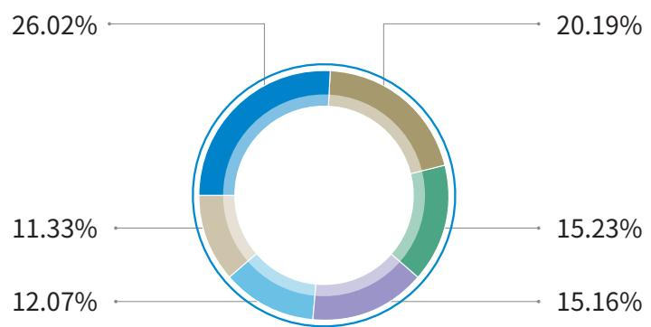

pie chart

| Segment | Percentage |
| ------- | ---------- |
| Segment 1 | 26.02% |
| Segment 2 | 20.19% |
| Segment 3 | 15.23% |
| Segment 4 | 15.16% |
| Segment 5 | 12.07% |
| Segment 6 | 11.33% |

绿色低碳与建筑新能源

智能建造与数字化

城市更新与城市运营

基础设施建造技术

新材料与新型建筑工业化

其他

## (2). 研发人员情况表

√ 适用 □ 不适用

<table><tr><td>公司研发人员的数量</td><td>38,004</td></tr><tr><td>研发人员数量占公司总人数的比例(%)</td><td>10.5</td></tr><tr><td colspan="2">研发人员学历结构</td></tr><tr><td>学历结构类别</td><td>学历结构人数</td></tr><tr><td>博士研究生</td><td>516</td></tr><tr><td>硕士研究生</td><td>6,088</td></tr><tr><td>本科</td><td>27,088</td></tr><tr><td>专科</td><td>4,120</td></tr><tr><td>高中及以下</td><td>192</td></tr><tr><td colspan="2">研发人员年龄结构</td></tr><tr><td>年龄结构类别</td><td>年龄结构人数</td></tr><tr><td>30岁以下(不含30岁)</td><td>13,740</td></tr><tr><td>30-40岁(含30岁,不含40岁)</td><td>16,902</td></tr><tr><td>40-50岁(含40岁,不含50岁)</td><td>5,138</td></tr><tr><td>50-60岁(含50岁,不含60岁)</td><td>2,027</td></tr><tr><td>60岁及以上</td><td>197</td></tr></table>

说明：研发(R&D)人员是指报告期研发(R&D)活动单位中从事基础研究、应用研究和试验发展活动的人员（《研究与试验发展(R&D)投入统计规范(试行)》国统字〔2019〕47号）。具体包含了从事研发(R&D)项目的科技管理人员、工程技术人员、设计研发人员等全部研发(R&D)人员。

研发人员学历结构  
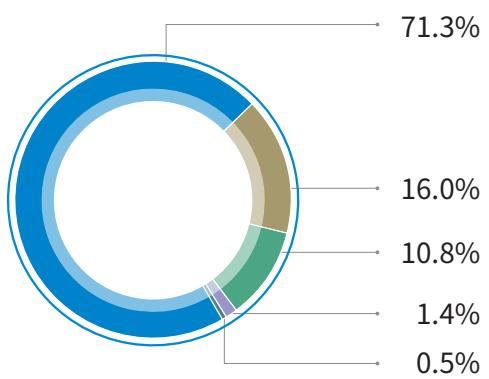

pie chart

| Segment | Percentage |
| ------- | ---------- |
| Segment 1 | 71.3% |
| Segment 2 | 16.0% |
| Segment 3 | 10.8% |
| Segment 4 | 1.4% |
| Segment 5 | 0.5% |

本科  
■ 硕士研究生  
专科  
博士研究生  
高中及以下

研发人员年龄结构  
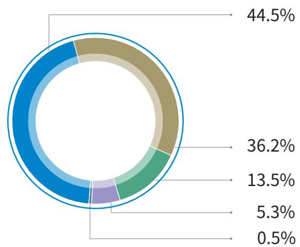

pie chart

| Segment | Percentage |
| ------- | ---------- |
| Segment 1 | 44.5% |
| Segment 2 | 36.2% |
| Segment 3 | 13.5% |
| Segment 4 | 5.3% |
| Segment 5 | 0.5% |

30-40岁（含30岁，不含40岁）  
30岁以下（不含30岁）  
40-50岁（含40岁，不含50岁）  
50-60岁(含50岁, 不含60岁)  
60 岁及以上

## 科技赋能美好生活

## 宜居城市

①花园城市生态价值提升系统解决方案  
②流域水环境综合治理系统解决方案  
③山水林田湖草生态保护修复解决方案

## 韧性城市

④韧性城市大水网建设系统技术  
⑤城市生命线运营管理平台

## 智慧城市

⑥智慧城市运营管理平台  
⑦新能源充电桩及换电站

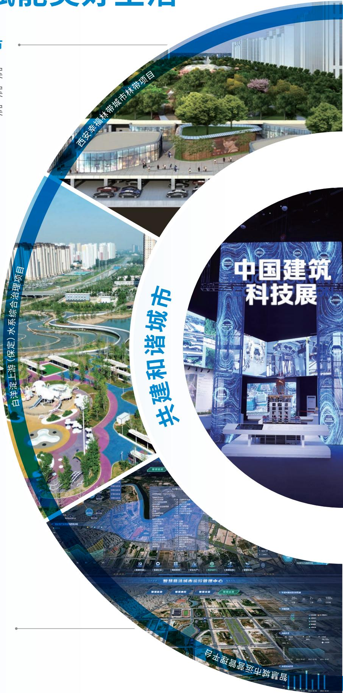

text_image

智能美好生活
西安幸福林带城市林带项目
白洋淀上游（保定）水系综合治理项目
中国建筑科技展
智慧城市运营管理平台

## 创新引领中国建造

## 绿色低碳

⑧绿色建筑综合解决方案

## 好房子

⑨新建好房子样板  
⑩旧改好房子样板

## 智能建造

⑪智能建造系统解决方案

## 大国建造

⑫云端建造工厂设备  
⑬单塔多笼循环运行施工电梯

工厂装备

## (3). 情况说明

## √ 适用 □ 不适用

近年来，公司深入实施创新驱动发展战略，加大科技创新力度，在完善科技创新平台体系、加大关键核心技术研发投入、加快科技创新产品化产业化等方面均取得了一定的成果，有力塑强企业核心竞争力。

持续完善科技创新平台体系。公司拥有国家数字建造技术创新中心、绿色建筑全国重点实验室、土壤养分管理与污染修复国家工程研究中心三个国家级科技创新平台，5个国家企业技术中心（含分中心）、9家院士工作站，75个省部级企业技术中心、72家省部级科技创新平台，建成19个博士后工作站，拥有248家高新技术企业。参与建设住房和城乡建设部科技创新平台6家，包含创新中心3家、重点实验室3家。搭建中国建筑“2+6”科技创新平台体系。同时，分专业、分层级建立科技人才库，充分鼓励自主创新，调动科技工作者的积极性和创造性。

加大关键核心技术研发投入。公司加大绿色建造、基础设施与新业务建造、装配式建筑、智能建造、既有建筑及基础设施功能提升与改造、特殊自然环境条件下适宜性建造、生态环保与污染防治、城市地下空间综合利用等关键核心技术研究，年度重点科研课题立项77项。

加快科技创新产品化产业化。公司聚焦“绿色建造、智慧建造、新型建筑工业化”领域，布局城市更新、智慧城市、流域综合治理、机器人及智能技术创新与集成，打造出模块化建筑、光伏建筑一体化（BIPV）、智慧立体停车库、智能充电桩与换电站设备等系列产品。截至报告期末，公司有效专利68,577项（其中发明专利10,362项），专利数量、成果水平居行业领先地位。

## (4). 研发人员构成发生重大变化的原因及对公司未来发展的影响

## □适用 □不适用

## 5. 现金流

## √ 适用 □ 不适用

报告期内，公司现金净流入302.12亿元，同比增加净流入140.81亿元。

公司经营活动现金净流入157.74亿元，同比增加净流入47.43亿元，主要是本年经营现金流量增加主要由于公司积极采取有效措施加强现金流管控，持续保持较好现金流水平。

公司投资活动现金净流出25.11亿元，同比减少净流出239.91亿元，主要是本年购建固定资产、无形资产和其他长期资产支付的现金减少所致。

公司筹资活动现金净流入151.68亿元，同比减少净流入152.83亿元，主要是取得借款收到的现金减少所致。

敬请参阅本报告第十节“财务报告”财务报表附注五70“现金流量表项目注释”和附注五71“现金流量表补充资料”相关内容。

## 6. 融资情况

报告期内，公司深化运用宽松货币政策环境，全年新增银行借款利率与新发行债券利率同比均实现降低，不断发挥低成本融资优势。截至报告期末，全公司带息负债总额8,513亿元，较年初增长主要是由于公司订单量增长，与之相匹配融资增多，带息负债规模与公司业务规模保持适应，带息负债结构与公司业务结构保持匹配，整体流动性风险较低且受到有效控制。

## （二）经营性投资业务情况

报告期内，公司始终坚持稳健的投资策略，严控新增投资项目质量，投资业务结构持续优化。加大项目投资回款力度，投资收支比显著提升。报告期内，公司完成投资额3,512亿元，同比下降12.3%；投资回款4,374亿元，同比增长2.1%；投资收支比124.5%，同比增长17.5个百分点。

单位：亿元 币种：人民币

<table><tr><td>项目分类</td><td>报告期内投资额</td><td>占比(%)</td><td>同比增长(%)</td><td>报告期内回款额</td><td>占比(%)</td><td>同比增长(%)</td></tr><tr><td colspan="7">按项目类别分</td></tr><tr><td>房地产开发投资</td><td>2,674</td><td>76.2</td><td>-12.6</td><td>3,510</td><td>80.3</td><td>-0.8</td></tr><tr><td>基础设施投资</td><td>321</td><td>9.1</td><td>-23.0</td><td>293</td><td>6.7</td><td>19.1</td></tr><tr><td>房建工程投资</td><td>404</td><td>11.5</td><td>-7.1</td><td>423</td><td>9.7</td><td>13.4</td></tr><tr><td>城镇综合建设</td><td>102</td><td>2.9</td><td>32.5</td><td>120</td><td>2.7</td><td>51.9</td></tr><tr><td>固定资产投资及其他投资</td><td>11</td><td>0.3</td><td>-15.4</td><td>28</td><td>0.6</td><td>-37.8</td></tr><tr><td colspan="7">按项目时续分</td></tr><tr><td>续投项目</td><td>2,054</td><td>58.5</td><td>-5.6</td><td></td><td></td><td></td></tr><tr><td>新拓展项目</td><td>1,458</td><td>41.5</td><td>-20.2</td><td></td><td></td><td></td></tr><tr><td>合计</td><td>3,512</td><td>100</td><td>-12.3</td><td>4,374</td><td>100</td><td>2.1</td></tr></table>

注：1. 结合行业惯例和公司内部管理形成以上项目分类，部分项目的分类属性会根据项目实际情况进行调整，表中同比增长率计算时将相应地对变化项目进行追溯调整。2. 固定资产投资及其他投资主要包含生产经营性固定资产投资项目如工业厂房及购置自建办公楼等。

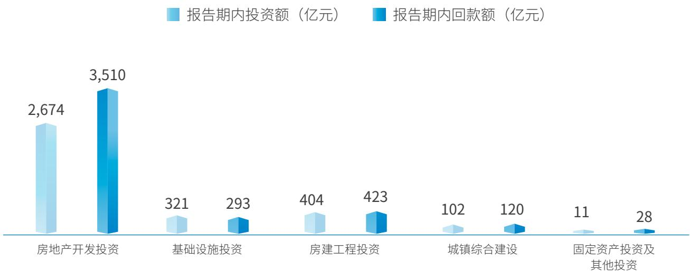

bar chart

| 投资类别 | 报告期内投资额 (亿元) | 报告期内回款额 (亿元) |
| :--- | :--- | :--- |
| 房地产开发投资 | 2,674 | 3,510 |
| 基础设施投资 | 321 | 293 |
| 房建工程投资 | 404 | 423 |
| 城镇综合建设 | 102 | 120 |
| 固定资产投资及其他投资 | 11 | 28 |

## 1. 房地产开发业务

报告期内，公司房地产开发业务完成投资额2,674亿元，同比下降12.6%；实现投资回款3,510亿元，较上年同期下降0.8%；投资收支比131.3%，较上年同期增长15.7个百分点。

## 2. 基础设施投资业务

报告期内，公司基础设施投资业务完成投资额321亿元，同比下降 $23\%$ ；实现投资回款293亿元，较上年同期增长 $19.1\%$ ；投资收支比 $91.3\%$ ，较上年同期增长32.2个百分点。

## 3. 房建工程投资业务

报告期内，公司房建工程投资业务完成投资额404亿元，同比下降7.1%；实现投资回款423亿元，较上年同期增长13.4%；投资收支比104.7%，较上年同期增长18.9个百分点。

## 4. 城镇综合建设业务

报告期内，公司城镇综合建设业务完成投资额102亿元，同比增长32.5%；实现投资回款120亿元，较上年同期增长51.9%；投资收支比117.6%，较上年同期增长15.5个百分点。

## 5. 重点区域投资建设情况

公司坚决贯彻落实党中央、国务院重大决策部署，围绕国家重大战略规划部署，积极践行区域协调发展战略，深度参与京津冀协同发展、长江经济带发展、粤港澳大湾区建设、长三角一体化发展、黄河流域生态保护和高质量发展等国家重点区域的投资建设。报告期内，公司在京津冀、长江经济带、粤港澳大湾区、长三角和黄河流域完成投资额3,245亿元，占公司整体完成投资额的92.4%。

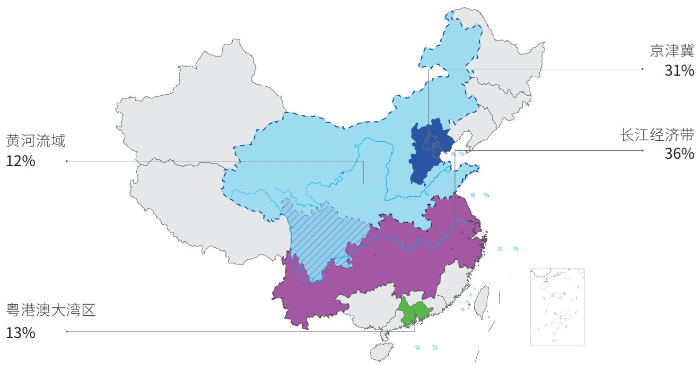

map chart

| 区域 | 占比 (%) |
| :--- | :--- |
| 京津冀 | 31 |
| 长江经济带 | 36 |
| 黄河流域 | 12 |
| 粤港澳大湾区 | 13 |

## 6. PPP业务开展情况

按照国家对PPP业务规范发展的有关要求，公司紧跟国家政策导向，建立健全PPP业务风险管控体系，合理控制PPP业务规模，坚持PPP业务高质量发展。2024年，公司在实施PPP项目430个，权益投资额6,235亿元。

截至报告期末，公司PPP项目进入运营期321个，权益投资额约4,477亿元，占比71.8%。按照运营项目类型分类，目前进入运营期的PPP项目主要集中在市政道路、综合管廊、文体场馆、保障性安居工程和生态环保类领域。报告期内，公司持续加强PPP项目管理工作，推动PPP业务高质量发展。一是适应新机制，积极探索拓展特许经营类项目；二是推进现金流摸排工作，以现金流为主线，对PPP项目全周期进行统筹管理；三是高度重视回款管理，全面梳理运营期PPP项目的回款实现情况，夯实投资回款责任，切实保障投资收益的实现。截至报告期末，已进入运营期的PPP项目运营绩效考核情况良好。

在实施PPP项目业务分布情况表  
单位：亿元 币种：人民币

<table><tr><td>细分类型</td><td>权益投资额</td><td>占比(%)</td><td>累计完成投资额</td><td>累计实现回款额</td></tr><tr><td>交通运输类</td><td>2,562</td><td>41.1</td><td>1,826</td><td>302</td></tr><tr><td>市政工程类</td><td>1,878</td><td>30.1</td><td>1,679</td><td>557</td></tr><tr><td>生态环保和其他类</td><td>847</td><td>13.6</td><td>481</td><td>145</td></tr><tr><td>文体医疗及保障房类</td><td>616</td><td>9.9</td><td>526</td><td>144</td></tr><tr><td>城镇综合开发类</td><td>332</td><td>5.3</td><td>250</td><td>47</td></tr><tr><td>合计</td><td>6,235</td><td>100</td><td>4,762</td><td>1,195</td></tr></table>

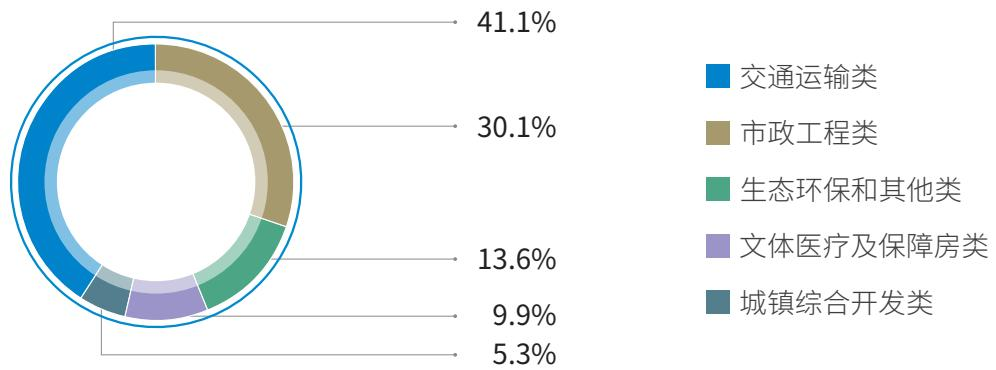

pie chart

| 类别 | 占比 (%) |
| :--- | :--- |
| 交通运输类 | 41.1 |
| 市政工程类 | 30.1 |
| 生态环保和其他类 | 13.6 |
| 文体医疗及保障房类 | 9.9 |
| 城镇综合开发类 | 5.3 |

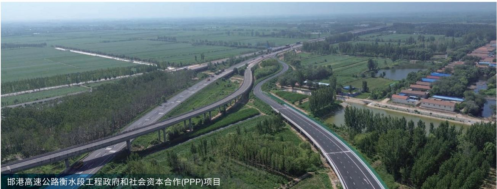

text_image

邯港高速公路衡水段工程政府和社会资本合作(PPP)项目

## （三）专业板块经营情况

报告期内，公司始终坚持走专业化发展道路，涵盖建筑行业主要细分领域产品，有力支撑了公司改革创新发展。公司全年新签合同额7,342亿元，同比增长6.4%；实现营业收入4,722.6亿元，同比降低1.1%；实现毛利339.5亿元，同比降低5.6%；实现营业利润175.9亿元，同比降低12.6%。

报告期内，公司召开专业公司高质量发展推进会，制定“一企一策”战略发展规划，着力推动专业公司在细分领域形成独特竞争优势。公司旗下中建装饰在装饰、幕墙等业务领域规模位于行业前列，数字化绿色健康装修技术优势引领行业，既有建筑幕墙检测与维改技术实现升级，幕墙无损透视检测技术得到推广应用。中建钢构蝉联中国建筑钢结构行业竞争力排名榜首，在高端钢结构业务领域市占率第一。中建安装丙烷脱氢核心设备全球市场占有率第一，大型塔器、反应器现场制造能力在全国化工装备制造领域占据领先地位。西部建设位居中国预拌混凝土行业前列。中建科技创新研发落地CMC“未来人居”产品，在广州白云国际机场三期扩建工程方石安置区项目应用。中国建筑国际自主研发的模块化集成建筑（MiC建筑）为老旧小区改造带来新模式，实现建筑的高效、快速、高质量建造。中建产研院自主研发的快速建模软件、AECMate系列软件等专项产品，入选中央企业科技创新成果产品手册。

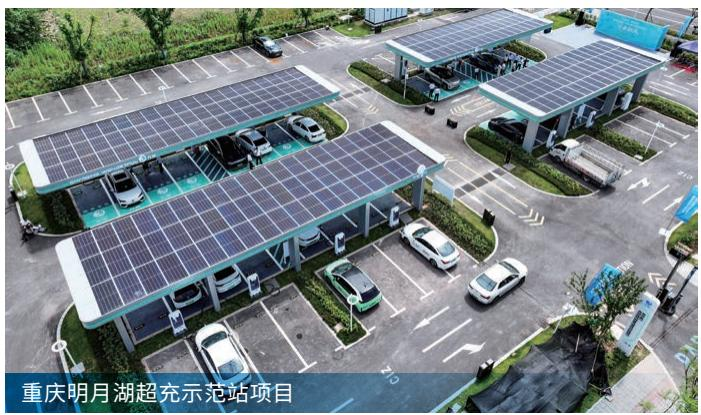

text_image

重庆明月湖超充示范站项目

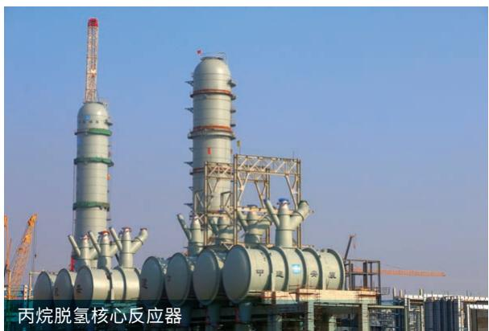

text_image

丙烷脱氢核心反应器

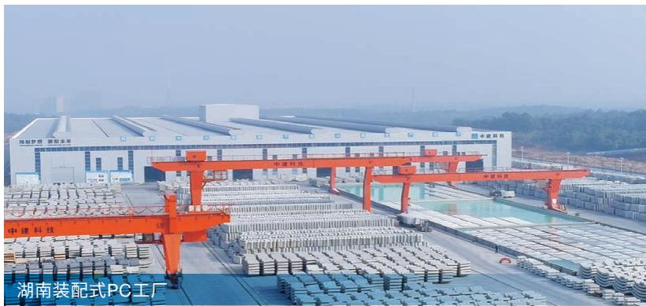

natural_image

Exterior view of a modern industrial park with large orange gantry cranes and stacked shipping containers (no signage visible)

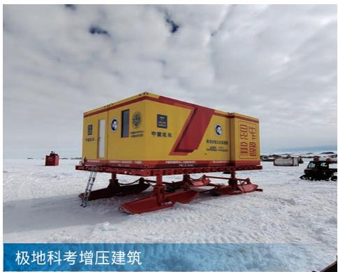

text_image

中国海洋
中国海洋
极地科考增压建筑

单位：亿元 币种：人民币

<table><tr><td>项目</td><td>板块名称</td><td>新签合同额</td><td>2024营业收入</td><td>同比增长(%)</td><td>2024毛利</td><td>同比增长(%)</td><td>2024营业利润</td><td>同比增长(%)</td></tr><tr><td rowspan="3">跨板块</td><td>安装</td><td>666</td><td>646.5</td><td>-4.2</td><td>37.4</td><td>-7.7</td><td>20.5</td><td>-19.9</td></tr><tr><td>钢构</td><td>220</td><td>298.4</td><td>5.9</td><td>17.2</td><td>-2.9</td><td>7.3</td><td>-18.4</td></tr><tr><td>商混</td><td>560</td><td>203.5</td><td>-11.0</td><td>15.4</td><td>-40.4</td><td>-1.9</td><td>-121.3</td></tr><tr><td rowspan="2">房建</td><td>装饰</td><td>561</td><td>502.3</td><td>1.7</td><td>39.0</td><td>4.7</td><td>8.4</td><td>-22.2</td></tr><tr><td>园林</td><td>103</td><td>91.2</td><td>-12.1</td><td>8.2</td><td>-6.5</td><td>5.5</td><td>4.1</td></tr><tr><td rowspan="6">基建</td><td>市政</td><td>1,780</td><td>866.5</td><td>-5.9</td><td>96.8</td><td>-6.5</td><td>58.3</td><td>-7.2</td></tr><tr><td>铁路</td><td>280</td><td>261.2</td><td>-5.4</td><td>7.9</td><td>62.5</td><td>5.3</td><td>59.6</td></tr><tr><td>轨交</td><td>343</td><td>648.9</td><td>-1.1</td><td>27.4</td><td>-21.0</td><td>21.4</td><td>-9.2</td></tr><tr><td>路桥</td><td>1,171</td><td>963.9</td><td>2.3</td><td>72.2</td><td>1.1</td><td>40.9</td><td>-12.1</td></tr><tr><td>电力</td><td>1,357</td><td>128.8</td><td>31.9</td><td>6.6</td><td>21.2</td><td>4.2</td><td>41.6</td></tr><tr><td>港工</td><td>301</td><td>111.4</td><td>10.6</td><td>11.2</td><td>19.9</td><td>6.0</td><td>144.8</td></tr><tr><td colspan="2">合计</td><td>7,342</td><td>4,722.6</td><td>-1.1</td><td>339.5</td><td>-5.6</td><td>175.9</td><td>-12.6</td></tr></table>

<table><tr><td rowspan="2">项目</td><td rowspan="2">板块名称</td><td colspan="3">毛利率(%)</td><td colspan="3">营业利润率(%)</td></tr><tr><td>2024年</td><td>2023年</td><td>同比增减(百分点)</td><td>2024年</td><td>2023年</td><td>同比增减(百分点)</td></tr><tr><td rowspan="3">跨板块</td><td>安装</td><td>5.8</td><td>6.0</td><td>-0.2</td><td>3.2</td><td>3.8</td><td>-0.6</td></tr><tr><td>钢构</td><td>5.8</td><td>6.3</td><td>-0.5</td><td>2.4</td><td>3.2</td><td>-0.7</td></tr><tr><td>商混</td><td>7.6</td><td>11.3</td><td>-3.7</td><td>-0.9</td><td>3.9</td><td>-4.8</td></tr><tr><td rowspan="2">房建</td><td>装饰</td><td>7.8</td><td>7.5</td><td>0.2</td><td>1.7</td><td>2.2</td><td>-0.5</td></tr><tr><td>园林</td><td>9.0</td><td>8.5</td><td>0.5</td><td>6.0</td><td>5.1</td><td>0.9</td></tr><tr><td rowspan="6">基建</td><td>市政</td><td>11.2</td><td>11.2</td><td>-0.1</td><td>6.7</td><td>6.8</td><td>-0.1</td></tr><tr><td>铁路</td><td>3.0</td><td>1.8</td><td>1.3</td><td>2.0</td><td>1.2</td><td>0.8</td></tr><tr><td>轨交</td><td>4.2</td><td>5.3</td><td>-1.1</td><td>3.3</td><td>3.6</td><td>-0.3</td></tr><tr><td>路桥</td><td>7.5</td><td>7.6</td><td>-0.1</td><td>4.2</td><td>4.9</td><td>-0.7</td></tr><tr><td>电力</td><td>5.2</td><td>5.6</td><td>-0.5</td><td>3.3</td><td>3.0</td><td>0.2</td></tr><tr><td>港工</td><td>10.1</td><td>9.3</td><td>0.8</td><td>5.4</td><td>2.4</td><td>3.0</td></tr><tr><td colspan="2">合计</td><td>7.2</td><td>7.5</td><td>-0.3</td><td>3.7</td><td>4.2</td><td>-0.5</td></tr></table>

## (四) 非主营业务导致利润重大变化的说明

□适用 不适用

## （五）资产、负债情况分析

√ 适用 □ 不适用

1. 资产及负债状况

单位：千元 币种：人民币

<table><tr><td>项目名称</td><td>本期期末数</td><td>本期期末数占总资产的比例(%)</td><td>上期期末数</td><td>上期期末数占总资产的比例(%)</td><td>本期期末金额较上期期末变动比例(%)</td><td>情况说明</td></tr><tr><td>总资产</td><td>3,189,262,063</td><td>100.00</td><td>2,903,322,519</td><td>100.00</td><td>9.85</td><td>总资产本年增加2,859亿元,主要是货币资金增加656亿元,应收账款增加594亿元,合同资产增加1,104亿元,其他非流动资产增加344亿元,其他流动资产增加231亿元。</td></tr><tr><td>货币资金</td><td>424,396,071</td><td>13.31</td><td>358,790,899</td><td>12.36</td><td>18.29</td><td>货币资金本年增加656亿元,主要是加强资金筹划,强化现金流管理,资金存量有所增长。</td></tr><tr><td>应收账款</td><td>317,094,483</td><td>9.94</td><td>257,698,659</td><td>8.88</td><td>23.05</td><td>应收账款本年增加594亿元,主要是回款放缓所致。</td></tr><tr><td>预付款项</td><td>24,340,316</td><td>0.76</td><td>28,778,596</td><td>0.99</td><td>-15.42</td><td>预付款项本年减少44亿元,主要是预付土地款本年结转至存货所致。</td></tr><tr><td>其他应收款</td><td>68,240,611</td><td>2.14</td><td>76,554,995</td><td>2.64</td><td>-10.86</td><td>其他应收款本年减少83亿元,主要是因为本年收回维持日常业务所发生的应收代垫款以及应收保证金及备用金所致。</td></tr><tr><td>存货</td><td>772,146,995</td><td>24.21</td><td>796,342,895</td><td>27.43</td><td>-3.04</td><td>存货本年减少242亿元,本年减少主要是由于开发产品的销售。</td></tr><tr><td>合同资产</td><td>445,402,103</td><td>13.97</td><td>334,954,194</td><td>11.54</td><td>32.97</td><td>合同资产本年增加1,104亿元,主要是部分房建及基建项目施工进度加快,相应已完工未结算余额增加所致。</td></tr><tr><td>一年内到期的非流动资产</td><td>61,780,989</td><td>1.94</td><td>54,290,578</td><td>1.87</td><td>13.80</td><td>一年内到期的非流动资产本年增加75亿元,主要是应收棚户区改造款等一年内到期的部分增加所致。</td></tr><tr><td>其他流动资产</td><td>157,692,307</td><td>4.94</td><td>134,570,627</td><td>4.64</td><td>17.18</td><td>其他流动资产本年增加231亿元,主要是因为业务体量增长,相应预缴税金及待抵扣进项税额的增加所致。</td></tr><tr><td>长期应收款</td><td>121,537,045</td><td>3.81</td><td>111,329,401</td><td>3.83</td><td>9.17</td><td>长期应收款本年增加102亿元,主要是棚户区改造项目应收款项增加所致。</td></tr><tr><td>长期股权投资</td><td>119,073,558</td><td>3.73</td><td>113,983,973</td><td>3.93</td><td>4.47</td><td>长期股权投资本年增加51亿元,主要是对外投资增加所致。</td></tr><tr><td>其他权益工具投资</td><td>7,293,820</td><td>0.23</td><td>6,107,503</td><td>0.21</td><td>19.42</td><td>其他权益工具投资本年增加12亿元,主要是部分非上市权益工具投资增加所致。</td></tr><tr><td>投资性房地产</td><td>156,241,562</td><td>4.90</td><td>158,491,475</td><td>5.46</td><td>-1.42</td><td>投资性房地产本年减少22亿元,主要是本年处置投资性房地产所致。</td></tr><tr><td>无形资产</td><td>35,249,210</td><td>1.11</td><td>32,730,141</td><td>1.13</td><td>7.70</td><td>无形资产本年增加25亿元,主要是由于以无形资产模式以及混合模式核算的PPP项目投资增加所致。</td></tr><tr><td>其他非流动资产</td><td>352,602,811</td><td>11.06</td><td>318,154,072</td><td>10.96</td><td>10.83</td><td>其他非流动资产本年增加344亿元,主要是本年随项目结算,相应确权质保金有所增加所致。</td></tr></table>

<table><tr><td>项目名称</td><td>本期期末数</td><td>本期期末数占总资产的比例(%)</td><td>上期期末数</td><td>上期期末数占总资产的比例(%)</td><td>本期期末金额较上期期末变动比例(%)</td><td>情况说明</td></tr><tr><td>总负债</td><td>2,417,801,587</td><td>75.81</td><td>2,172,252,410</td><td>74.82</td><td>11.30</td><td>总负债本年增加2,455亿元,主要是长期借款增加662亿元,应付账款增加1,382亿元。</td></tr><tr><td>短期借款</td><td>115,665,735</td><td>3.63</td><td>124,352,134</td><td>4.28</td><td>-6.99</td><td>短期借款本年减少87亿元,主要是本年主要偿还部分借款所致。</td></tr><tr><td>应付票据</td><td>16,105,618</td><td>0.50</td><td>10,770,185</td><td>0.37</td><td>49.54</td><td>应付票据本年增加53亿元,主要是增加票据结算方式所致。</td></tr><tr><td>应付账款</td><td>828,176,717</td><td>25.97</td><td>689,957,840</td><td>23.76</td><td>20.03</td><td>应付账款本年增加1,382亿元,主要是由于公司经营规模增长,尚未支付的分包工程款增加。</td></tr><tr><td>合同负债</td><td>345,383,924</td><td>10.83</td><td>316,984,078</td><td>10.92</td><td>8.96</td><td>合同负债本年增加284亿元,主要是本年新增楼盘开盘预售,预售房产款增加所致。</td></tr><tr><td>应付职工薪酬</td><td>13,021,176</td><td>0.41</td><td>11,494,654</td><td>0.40</td><td>13.28</td><td>应付职工薪酬本年增加15亿元,主要由于本年业务规模扩大,工程业务量增加,导致年末计提的薪酬增加。</td></tr><tr><td>一年内到期的非流动负债</td><td>120,933,590</td><td>3.79</td><td>127,873,148</td><td>4.40</td><td>-5.43</td><td>一年内到期的非流动负债本年减少69亿元,主要是由于应付债券将于2025年到期的部分减少所致。</td></tr><tr><td>其他流动负债</td><td>111,466,335</td><td>3.50</td><td>102,330,742</td><td>3.52</td><td>8.93</td><td>其他流动负债本年增加91亿元,主要是短期融资券和待转销项税增加所致。</td></tr><tr><td>长期借款</td><td>524,271,669</td><td>16.44</td><td>458,112,463</td><td>15.78</td><td>14.44</td><td>长期借款本年增加662亿元,主要为了满足房地产开发项目和PPP项目的资金需求增加借款所致。</td></tr><tr><td>应付债券</td><td>98,245,542</td><td>3.08</td><td>92,372,831</td><td>3.18</td><td>6.36</td><td>应付债券本年增加59亿元,主要本年新发行债券,用于房地产项目投资建设及补充运营资金。</td></tr><tr><td>长期应付款</td><td>14,613,910</td><td>0.46</td><td>12,380,443</td><td>0.43</td><td>18.04</td><td>长期应付款本年增加22亿元,主要是应付工程质量保证金增加所致。</td></tr></table>

其他说明

## 2. 境外资产情况

√ 适用 □ 不适用

## (1) 资产规模

其中：截至报告期末，公司境外资产1,885（单位：亿元 币种：人民币），占总资产的比例为5.9%。

## (2) 境外资产占比较高的相关说明

□适用 □不适用

## (3) 境外资产相关说明

√ 适用 □ 不适用

报告期内，公司主要资产未发生重大变化。上述境外资产数据未经审计。

## 3. 截至报告期末主要资产受限情况

√ 适用 □ 不适用

敬请参阅本报告第十节“财务报告”财务报表附注五、27“所有权或使用权受到限制的资产”的相关内容。

## 4. 其他说明

□适用 □不适用

## （六）行业经营性信息分析

√ 适用 □ 不适用

## 建筑行业经营性信息分析

## 1. 报告期内竣工验收的项目情况

√ 适用 □ 不适用

单位：亿元 币种：人民币

<table><tr><td>细分行业</td><td>房屋建设</td><td>基建工程</td><td>专业工程</td><td>建筑装饰</td><td>其他</td><td>总计</td></tr><tr><td>项目数(个)</td><td>8,903</td><td>2,376</td><td>/</td><td>/</td><td>/</td><td>11,279</td></tr><tr><td>总金额</td><td>19,668</td><td>6,405</td><td>/</td><td>/</td><td>/</td><td>26,073</td></tr></table>

## √ 适用 □ 不适用

单位：亿元 币种：人民币

<table><tr><td>项目地区</td><td>项目数量(个)</td><td>总金额</td></tr><tr><td>境内</td><td>10,862</td><td>23,293</td></tr><tr><td>境外</td><td>417</td><td>2,780</td></tr><tr><td>其中:</td><td></td><td></td></tr><tr><td>港澳地区</td><td>84</td><td>1,264</td></tr><tr><td>东南亚地区</td><td>112</td><td>348</td></tr><tr><td>中东地区</td><td>76</td><td>500</td></tr><tr><td>北非地区</td><td>13</td><td>11</td></tr><tr><td>中南部非洲地区</td><td>31</td><td>45</td></tr><tr><td>美洲地区</td><td>40</td><td>467</td></tr><tr><td>欧洲地区</td><td>13</td><td>13</td></tr><tr><td>其他地区</td><td>48</td><td>132</td></tr><tr><td>总计</td><td>11,279</td><td>26,073</td></tr></table>

其他说明

## √ 适用 □ 不适用

参照国家有关标准，结合自身经营特点和结构发展需要，公司房屋建设工程的口径包括工程总承包和专业承包工程（地基基础、钢结构、建筑安装、装修装饰等）；基建工程的口径包括交通运输工程（公路、市政道路、铁路、城市轨道交通、机场、港口及码头、停车场、隧道、桥梁、航道等）、能源工程、石油化工工程、供水及处理工程、环保工程、邮电通讯工程、防卫防灾工程、水工工程和其他工程（室外体育场、室外娱乐设施、填海造地、人工岛、地下综合管廊、管网等），下同。

## 2. 报告期内在建项目情况

## √ 适用 □ 不适用

单位：亿元 币种：人民币

<table><tr><td>细分行业</td><td>房屋建设</td><td>基建工程</td><td>专业工程</td><td>建筑装饰</td><td>其他</td><td>总计</td></tr><tr><td>项目数量(个)</td><td>20,471</td><td>8,113</td><td>/</td><td>/</td><td>/</td><td>28,584</td></tr><tr><td>总金额</td><td>71,768</td><td>36,616</td><td>/</td><td>/</td><td>/</td><td>108,384</td></tr></table>

## √ 适用 □ 不适用

单位：亿元 币种：人民币

<table><tr><td>项目地区</td><td>项目数量(个)</td><td>总金额</td></tr><tr><td>境内</td><td>27,744</td><td>102,925</td></tr><tr><td>境外</td><td>840</td><td>5,459</td></tr><tr><td>其中:</td><td></td><td></td></tr><tr><td>港澳地区</td><td>137</td><td>1,524</td></tr><tr><td>东南亚地区</td><td>342</td><td>1,395</td></tr><tr><td>中东地区</td><td>84</td><td>743</td></tr><tr><td>北非地区</td><td>50</td><td>519</td></tr><tr><td>中南部非洲地区</td><td>63</td><td>481</td></tr><tr><td>美洲地区</td><td>12</td><td>42</td></tr><tr><td>欧洲地区</td><td>18</td><td>39</td></tr><tr><td>其他地区</td><td>134</td><td>716</td></tr><tr><td>总计</td><td>28,584</td><td>108,384</td></tr></table>

其他说明

□适用 □不适用

## 3. 在建重大项目情况

□适用 □不适用

其他说明

□适用 □不适用

## 4. 报告期内境外项目情况

## √ 适用 □ 不适用

单位：亿元 币种：人民币

<table><tr><td>项目地区</td><td>项目数量(个)</td><td>总金额</td></tr><tr><td>港澳地区</td><td>221</td><td>2,787</td></tr><tr><td>东南亚地区</td><td>473</td><td>2,022</td></tr><tr><td>中东地区</td><td>164</td><td>1,268</td></tr><tr><td>北非地区</td><td>70</td><td>571</td></tr><tr><td>中南部非洲地区</td><td>104</td><td>557</td></tr><tr><td>美洲地区</td><td>52</td><td>509</td></tr><tr><td>欧洲地区</td><td>32</td><td>51</td></tr><tr><td>其他地区</td><td>192</td><td>874</td></tr><tr><td>总计</td><td>1,308</td><td>8,639</td></tr></table>

其他说明

## √ 适用 □ 不适用

上述项目状态包括已竣工已结算、已竣工未结算、在建及其他。

境外项目的合同额中外币对人民币汇率按照合同约定或签约即时汇率进行折算。

## 5. 报告期内累计新签项目

## ☑ 适用 □ 不适用

报告期内累计新签项目数量8,653（个），金额40,808亿元人民币（建筑业合同额）。

## 6. 报告期末在手订单情况

## √ 适用 □ 不适用

报告期末在手订单总金额72,555亿元人民币。其中，已签订合同但尚未开工项目金额23,917亿元人民币，在建项目中未完工部分金额48,638亿元人民币。

其他说明

## □适用 不适用

## 7. 其他说明

## □适用 不适用

## 公司建筑行业资质情况

截至报告期末，公司共拥有特级资质企业43家、工程设计综合甲级资质企业1家；拥有特级和综合甲级资质80个，其中建筑工程施工总承包特级41个、市政公用工程施工总承包特级22个、公路工程施工总承包特级13个、石油化工施工总承包特级2个、港口与航道施工总承包特级1个，设计综合甲级资质1个。

## - 公司质量控制体系、执行标准、控制措施及整体评价

中国建筑以ISO 9001质量管理认证为基础，持续完善质量管理的组织体系、制度体系和监督体系，将质量风险管理与质量控制要求深化到业务管理流程中，全面保障产品质量。截至报告期末，共计296家公司获得ISO 9001质量管理体系的第三方认证。2024年，公司发布出版《工程质量管理标准化指导手册》系列丛书，提升质量管理标准化水平，发布《工程质量精益管理指引》《质量问题突发事件应急处置管理办法》，持续完善质量管理体系。同时，公司持续优化完善产品质量检定及产品回收程序相关的政策与规范。竣工项目合格率100%，未发生一般以上质量责任事故。

## 公司安全生产制度的运行情况

报告期内，公司锚定“零事故、零伤亡”目标，扎实推进治本攻坚三年行动和国资委部署的“隐患攻坚年”各项任务，大力实施“126”工作举措，安全生产管理基础不断得到夯实。公司组织开展专项督查、年度考核、管理评价等活动，对安全生产制度的运行情况动态检索，进一步完善安全生产制度体系，新制定了中国建筑《分供商安全管理办法》《境外安全生产管理办法》《子企业安全生产管理评价办法》《子企业安全生产考核管理办法》《生产安全事故信息报送管理细则》《生产安全事故隐患内部报告奖励管理细则》《施工现场安全防护标准化指引》等制度文件。

## (七) 投资状况分析

## 对外股权投资总体分析

√ 适用 □ 不适用

公司对外股权投资主要包括以交易为目的而购入的二级市场股票、不以交易为目的而持有的其他上市公司或其他非上市公司的股权。核算科目包括交易性金融资产、其他权益工具投资以及长期股权投资。

## 1. 重大的股权投资

□适用 □不适用

## 2. 重大的非股权投资

□适用√不适用

## 3. 以公允价值计量的金融资产

√ 适用 □ 不适用

单位：千元 币种：人民币

<table><tr><td>资产类别</td><td>期初数</td><td>本期公允价值变动损益</td><td>计入权益的累计公允价值变动</td><td>本期计提的减值</td><td>本期购买金额</td><td>本期出售/赎回金额</td><td>其他变动</td><td>期末数</td></tr><tr><td>股票</td><td>844,805</td><td>321</td><td>-265,822</td><td>0</td><td>0</td><td>358,271</td><td>0</td><td>868,892</td></tr><tr><td>其他</td><td>12,122,475</td><td>94,003</td><td>684,925</td><td>0</td><td>4,112,127</td><td>3,327,753</td><td>41,037</td><td>12,899,407</td></tr><tr><td>合计</td><td>12,967,280</td><td>94,324</td><td>419,103</td><td>0</td><td>4,112,127</td><td>3,686,024</td><td>41,037</td><td>13,768,299</td></tr></table>

证券投资情况

√ 适用 □ 不适用

单位：千元 币种：人民币

<table><tr><td>证券品种</td><td>证券代码</td><td>证券简称</td><td>最初投资成本</td><td>资金来源</td><td>期初账面价值</td><td>本期公允价值变动损益</td><td>计入权益的累计公允价值变动</td><td>本期购买金额</td><td>本期出售金额</td><td>本期投资损益</td><td>期末账面价值</td><td>会计核算科目</td></tr><tr><td>股票</td><td>600515.SH</td><td>海南机场</td><td>20,153</td><td>债转股</td><td>14,854</td><td>321</td><td>0</td><td>0</td><td>0</td><td>0</td><td>15,175</td><td>交易性金融资产</td></tr><tr><td>股票</td><td>600390.SH</td><td>五矿资本</td><td>1,119,539</td><td>自有资金</td><td>829,951</td><td>0</td><td>-265,822</td><td>0</td><td>358,271</td><td>0</td><td>853,717</td><td>其他流动资产</td></tr><tr><td>合计</td><td>/</td><td>/</td><td>1,139,692</td><td>/</td><td>844,805</td><td>321</td><td>-265,822</td><td>0</td><td>358,271</td><td>0</td><td>868,892</td><td>/</td></tr></table>

证券投资情况的说明：

①本表填列公司交易性金融资产、其他流动资产、其他权益工具投资核算的股票证券投资情况。  
②报告期损益指：针对交易性金融资产，包括持有期间取得的投资收益及公允价值变动，以及报告期内处置取得的投资收益；针对其他权益工具投资和其他流动资产，包括持有期间取得的投资收益。  
③其他证券投资指：除上述列示以外的其他列示于交易性金融资产、其他权益工具投资的股票证券投资。  
④除上表外列示于交易性金融资产、其他权益工具投资敬请参阅本报告第十节“财务报告”财务报表附注五2“交易性金融资产”、附注五16“其他权益工具投资”等相关内容。

私募基金投资情况

□适用 □不适用

衍生品投资情况

□适用 □不适用

## 4. 报告期内重大资产重组整合的具体进展情况

□适用 不适用

## （八）重大资产和股权出售

□适用 □不适用

## （九）主要控股参股公司分析

√ 适用 □ 不适用

## 1. 通过设立或投资等方式取得的重要子公司

单位：千元 币种：人民币

<table><tr><td>名称</td><td>业务性质</td><td>注册资本</td><td>持股比例(%)</td><td>总资产</td><td>净资产</td><td>净利润</td></tr><tr><td>中海集团</td><td>投资控股</td><td>31,032,258</td><td>100.00</td><td>1,082,472,405</td><td>377,105,598</td><td>24,480,226</td></tr><tr><td>中国海外发展</td><td>房地产开发与经营</td><td>10.95亿港币</td><td>56.10</td><td>818,265,455</td><td>330,942,330</td><td>14,805,051</td></tr><tr><td>中国建筑国际</td><td>建筑安装</td><td>15亿港币</td><td>64.81</td><td>249,233,545</td><td>67,703,565</td><td>9,278,024</td></tr><tr><td>中海物业</td><td>物业管理</td><td>0.3亿港币</td><td>61.24</td><td>12,005,456</td><td>5,174,008</td><td>1,521,508</td></tr><tr><td>中建一局</td><td>建筑安装</td><td>10,000,000</td><td>100.00</td><td>127,612,892</td><td>29,486,501</td><td>3,561,810</td></tr><tr><td>中建二局</td><td>建筑安装</td><td>10,000,000</td><td>100.00</td><td>189,535,349</td><td>35,310,575</td><td>3,201,129</td></tr><tr><td>中建三局</td><td>建筑安装</td><td>5,087,865</td><td>100.00</td><td>401,469,001</td><td>88,298,807</td><td>11,728,790</td></tr><tr><td>中建四局</td><td>建筑安装</td><td>8,000,000</td><td>100.00</td><td>171,721,540</td><td>22,229,514</td><td>758,224</td></tr><tr><td>中建五局</td><td>建筑安装</td><td>10,000,000</td><td>100.00</td><td>197,554,317</td><td>42,161,165</td><td>3,242,386</td></tr><tr><td>中建六局</td><td>建筑安装</td><td>6,277,946</td><td>100.00</td><td>81,179,436</td><td>15,960,846</td><td>716,132</td></tr><tr><td>中建七局</td><td>建筑安装</td><td>9,000,000</td><td>100.00</td><td>207,280,222</td><td>24,272,394</td><td>587,088</td></tr><tr><td>中建八局</td><td>建筑安装</td><td>15,218,000</td><td>100.00</td><td>401,729,879</td><td>94,735,321</td><td>12,876,171</td></tr><tr><td>中建西南院</td><td>工程勘察设计</td><td>383,310</td><td>100.00</td><td>10,073,635</td><td>3,300,590</td><td>411,942</td></tr><tr><td>中建装饰</td><td>工业装修装饰</td><td>1,000,000</td><td>100.00</td><td>21,816,577</td><td>1,866,387</td><td>146,037</td></tr><tr><td>中建方程</td><td>基础设施建设业务</td><td>5,000,000</td><td>100.00</td><td>54,869,057</td><td>18,908,120</td><td>909,231</td></tr></table>

## 2. 通过同一控制下的企业合并取得的重要子公司

单位：千元 币种：人民币

<table><tr><td>名称</td><td>业务性质</td><td>注册资本</td><td>持股比例(%)</td><td>总资产</td><td>净资产</td><td>净利润</td></tr><tr><td>中建新疆建工</td><td>建筑安装</td><td>3,603,530</td><td>85.00</td><td>68,976,666</td><td>16,091,903</td><td>258,967</td></tr><tr><td>中建西部建设</td><td>建筑材料</td><td>1,262,354</td><td>57.79</td><td>33,498,060</td><td>10,718,508</td><td>-220,546</td></tr><tr><td>中建财务公司</td><td>金融</td><td>15,000,000</td><td>80.00</td><td>87,306,535</td><td>19,772,206</td><td>976,912</td></tr></table>

## 3. 通过非同一控制下的企业合并取得的重要子公司

单位：千元 币种：人民币

<table><tr><td>名称</td><td>业务性质</td><td>注册资本</td><td>持股比例(%)</td><td>总资产</td><td>净资产</td><td>净利润</td></tr><tr><td>中国建筑兴业</td><td>建筑安装</td><td>1亿港币</td><td>45.87</td><td>10,697,204</td><td>2,380,975</td><td>589,149</td></tr><tr><td>中建港航局</td><td>基础设施建设业务</td><td>1,333,333</td><td>70.00</td><td>12,637,582</td><td>3,301,106</td><td>305,396</td></tr></table>

敬请参阅本报告第十节“财务报告”财务报表附注八“在其他主体中的权益”中“1、在子公司中的权益”的相关内容。

## （十）公司控制的结构化主体情况

√ 适用 □ 不适用

敬请参阅本报告第十节“财务报告”财务报表附注八“在其他主体中的权益”中“3、在纳入合并财务报表范围的结构化主体中的权益”的相关内容。

## 六、关于公司未来发展的讨论与分析

## （一）行业格局和趋势

√ 适用 □ 不适用

房建市场蕴含潜力和空间。新型城镇化进程再提速带动增量市场需求，2024年7月国务院印发《深入实施以人为本的新型城镇化战略五年行动计划》，对新一轮农业转移人口市民化、潜力地区城镇化水平提升、现代化都市圈培育、城市更新和安全韧性提升等4项重大行动作了部署，提出未来5年我国常住人口城镇化率提升至接近70%。据测算，城镇化率每提高一个百分点，可以拉动万亿规模的新增投资需求，有效带动市政公用、公共服务等方面的投资以及居民住房等领域投资。城市更新和老旧小区改造提速激发存量市场，住房和城乡建设部明确提出2025年要大力实施城市更新行动，全面完成2000年底前建成的城镇老旧小区改造任务，推进老旧小区改造、城中村整治、地下管网更新等民生工程。同时，加快培育和发展新质生产力的战略部署，将带动高端制造项目加快投资建设。未来，随着我国城镇化率的提升和城市更新的稳步推进，房建市场依然蕴含着强劲的发展动能和较大的发展空间，并向绿色化、智慧化、工业化方向转型发展。从细分领域看，各地区将加快推进“三大工程”、高科技工业厂房、教育设施、文化场馆、体育健康、医疗卫生等领域投资建设，将给建筑市场带来新的发展机遇。

扩大有效投资带动基建市场增长。2025年，我国将积极扩大有效投资，实施更加积极的财政政策，赤字率拟按4%安排，创历史新高。地方政府专项债规模增加5,000亿元至4.4万亿元，超长期特别国债新增1.3万亿元，将更大力度支持“两重”建设，推动“十四五”规划重大工程顺利收官。随着区域协调发展战略的深入实施，铁路、公路、机场等传统基础设施投资将仍保持较大规模，新建与改扩建需求并存。在“新质生产力”“人工智能+”、绿色低碳发展行动的推动下，新能源、低空经济等新基建领域迎来更大发展机遇。未来，伴随着我国制造强国、质量强国、航天强国、交通强国、网络强国、数字中国、美丽中国的建设，以及现代化基础设施体系的加快构建，能源、水利、生态环保工程将持续较快增长。

加快构建房地产发展新模式。2024年四季度以来，房地产政策“组合拳”落地显效，各地调整优化降息、增贷、减税等房地产市场相关政策，进一步释放刚性和改善性住房需求。从统计数据看，去年四季度，新建商品房销售面积和销售额实现了正增长。今年以来，房地产市场保持了止跌回稳的积极势头。为进一步适应人民群众高品质居住需要，将完善标准规范，推动建设安全、舒适、绿色、智慧的“好房子”，我国将继续推进地方政府收购存量商品房，在收购主体、价格和用途方面给予城市政府更大自主权。未来，房地产行业将迈入高质量发展阶段，在市场供求关系和调控政策变化的新形势下，对房地产企业的开发能力、资产运营能力、城市服务能力提出更高要求，行业集中度将进一步提高。

勘察设计行业深度转型发展。新型城镇化进程再提速和基础设施投资建设为勘察设计行业发展带来了新机遇，城市更新、老旧小区改造、科教文卫体设施、能源工程、水利等细分设计领域有望较快增长。同时，绿色低碳设计理念深入推进，以BIM（建筑信息模型）、AI（人工智能）、VR（虚拟现实）和AR（增强现实)等前沿技术广泛应用，将进一步推动勘察设计行业加快转型升级。未来，勘察设计行业市场竞争可能进一步加剧，对勘察设计企业的原创设计能力、数字化服务质量提出更高要求。

国际工程市场面临新的机遇和挑战。2024年，我国成功举办中非合作论坛北京峰会、全球可持续交通高峰论坛(2024)，为国际工程领域发展注入了新的动力。随着高质量共建“一带一路”的八项行动逐步落地实施，中国企业“走出去”将迎来新的机遇与挑战。未来，在“一带一路”倡议下，以医疗设施、保障房、文化场馆、体育设施等为代表“小而美”惠民生工程、区域标志性工程将持续推进。以高速公路、高铁、机场、桥梁、港口等为核心的全方位、多层次、复合型区域互联互通标志性工程正加快形成。全球产业链、供应链重塑带来工业项目建设机会，多国推进新城新区规划建设，智慧城市、绿色建筑、清洁能源开发和利用等新需求，为国际工程市场带来发展新动能。投建营一体化、综合实力强、管理领先的国际化投资建设企业将在竞争中脱颖而出。

## （二）公司发展战略

## √ 适用 □ 不适用

“十四五”期间，公司将以“一创五强”战略目标为指引，突出主责主业，扎实推动公司不断向高质量发展、创新发展、绿色发展、数字化发展和大安全发展转型，加大战略性新兴产业拓展力度，进一步提升公司核心竞争力，建设成为世界一流的投资建设集团。

1. 房屋建筑工程业务。持续巩固公司在房屋建筑领域的绝对优势地位，按照稳速增效的原则，重点拓展公投领域项目和优质地产商的住宅、商业办公等项目，持续提升在快速建造、绿色建造、智能建造等领域的竞争实力，在供应链管理、信息化、工程质量、节能环保、安全生产等方面达到行业标杆水准，并形成一批达到国内和国际领先水平的科研成果，不断提升公司的市场竞争能力和发展质量。通过不断深化改革创新项目管理体系，优化系统内部协同机制，成为工程建设领域规模、技术和品质领先，高端客户首选的企业。  
2. 基础设施建设与投资业务。持续把基建业务作为转型升级的重心，发展成为稳住基本盘的支柱力量。提升市场前端、建设履约、运营管理的全生命周期能力。巩固城市轨道交通、机场、综合交通枢纽建设领域的领先地位，加快提升公路、铁路、水利建设领域综合竞争能力和市场份额，成为新能源、智慧交通、通用航空等新兴基建市场杰出代表者。基础设施投资运营业务是公司优化业务结构、实现转型升级的关键环节，“十四五”期间公司将高度重视投资管理和项目的安全稳健运营，努力提升运营管控、专业实施、风险化解“三项关键能力”。  
3. 房地产投资与开发业务。地产业务致力于成为卓越的国际化不动产开发运营集团，将继续以“转型升级”为基调，加快形成以住宅产品开发为主、优质商业开发运营为辅、康养等新兴业务为补充的格局。新型城镇化业务将积极践行国家关于实施城市更新行动的战略部署，统筹做好区域布局，集中资源充分发挥公司“四位一体”的优势，聚焦片区开发、大体量城市更新、站城融合、城市运营等领域，统筹城市规划、建设、运营管理，不断提升城市人居环境质量和人民生活质量，努力成为国内领先的城市服务运营商。  
4. 勘察设计业务。勘察设计业务致力于提升公司品牌影响力、培养高端人才、强化科技创新以及为公司开展工程总承包业务提供有力支撑。推动勘察设计业务延伸，打造品牌核心能力，围绕重点专业方向，实现特色化、差异化发展，提升产品方案原创能力；打造勘察设计人才高地，做好高端人才

储备；加强业务协同联动力度，创新业务合作模式；借助“一带一路”等发展机遇，积极与系统内外单位开展合作，拓展海外勘察设计业务。

5. 战略性新兴产业。以服务国家战略、助力公司转型为目标，依托建筑行业优势和建筑产业链，将发展战新产业同加快转型升级深入统一，持续拓宽、拓展主业相关业务。结合行业趋势、市场需求和国家战新产业导向，侧重于布局与建筑行业生态相关的前沿技术，助力公司成为现代产业链链长。现阶段重点领域与发展方向为新一代信息技术、高端装备制造、新材料、新能源、节能环保及相关服务业等领域中与主业关联度较高的业务，形成业务协同和产业集群。到2025年，形成具有强大辐射带动作用的战新产业增长极。到2030年，战新产业要成为公司实现“具有中国特色的全球最强投资建设集团”的核心引擎。  
6. 国际化业务。持续践行海外高质量发展战略，抢抓“一带一路”带来的商机，着力实现海外经营量质齐升。打造协同高效的组织体系，巩固优势市场，深耕重点市场，深挖潜力市场，审慎拓展新市场，打造结构合理的市场体系。同时，通过与国际先进企业同台竞争，学习先进的管理经验和经营理念，提升公司的整体经营管理实力。

“十四五”期间，公司将立足于新发展阶段的实际需求，贯彻落实新发展理念，加快构建新发展格局，以推动高质量发展为主题，以深化供给侧结构性改革为主线，关注需求侧改革带来的新商机，对标国家“十四五”规划和2035年远景目标，主动适应新形势、奋勇迎接新挑战、全力抢抓新机遇，在危机中育先机、于变局中开新局，始终胸怀中华民族伟大复兴的战略全局、世界百年未有之大变局“两个大局”，保持战略定力，坚定发展信心，放大自身优势，补齐各项短板，统筹发展和安全，协调好国内国际两个市场、用好国内国际两种资源，实现更高质量、更有效率、更可持续、更为安全的发展，向“具有全球竞争力的世界一流投资建设综合企业集团”的愿景不断迈进。

## （三）经营计划

## √ 适用 □ 不适用

公司2025年计划实现新签合同额超过4.6万亿元，营业收入超过2.28万亿元。公司将坚持稳中求进工作总基调，坚持新发展理念，进一步突出高质量发展这个首要任务，致力“一创五强”战略目标、深入实施“一六六”战略路径，坚持高质量发展，坚持守正创新，坚持问题导向，奋力穿越行业发展周期，聚焦“一创五强”战略目标，落实落细“七大任务”，围绕“一利五率”核心指标，推动“一利稳定增长，五率持续优化”，突出价值导向，更加注重提升“五个价值”，着力增强核心功能、提高核心竞争力。

该经营计划并不构成公司对投资者的业绩承诺，敬请投资者对此保持足够的风险意识，并应当理解经营计划与业绩承诺之间的差异。

## （四）可能面对的风险

## √ 适用 □ 不适用

## 1. 安全、环保、质量风险

近年来，公司安全生产形势总体平稳，环保违规和生态破坏问题得到有效控制，承建项目质量总体良好，但由于承建项目点多、面广，安全、环保、质量方面风险隐患仍然存在。公司将持续优化升级中建智慧安全平台，健全完善安全生产应急管理体系；持续做好生态环保风险合规信息实时监测预警，组织开展生态环保重大风险隐患排查整治；持续巩固质量问题专项整治成效，提高质量问题突发事件应急能力。公司坚持把安全、环保、质量管理摆在更为重要、更加突出的位置，做到安全、环保、质量风险防范常抓不懈，更好统筹发展和安全。

## 2. 现金流风险

受宏观经济形势和产业链上下游影响，行业资金情况持续紧张，上游结算难、收款难现象突出，下游刚性支付压力凸显，建筑央企经营性现金流持续承压。公司将加强现金流预算管理、监测预警和考核评价，深入推进负流项目专项治理和收款攻坚行动，狠抓投资回款，奋力实现全年预算目标，保障资金链安全稳定。

## 3. 债务风险

受行业深度调整与下游影响，公司资金压力加大，融资需求持续扩大。近年来公司负债总额和带息负债规模增长，可能影响盈利能力、融资成本和融资能力。公司将强化带息负债预算管理和债务风险监测预警，深入开展存量资产盘活，健全应急保障资源储备，有效控制债务风险。

## 4. 经营效益风险

受建设单位成本精细化管理、境外项目延期、建筑行业同质化竞争激烈等因素影响，公司建造项目盈利空间持续收窄。地产行业仍处于深度调整期，止跌回稳仍需巩固发力。公司将加强效益风险源头管控，推进负效项目治理，抓实风险地产化债；聚焦房地产存货去化，把握地产政策窗口期，紧抓销售回款；持续开展经营性投资项目风险预警，全面推进投资回款。

## 5. 市场竞争风险

随着城镇化率的多年持续提升，市场需求萎缩，各类新建项目数量减少，行业产能过剩，建筑业增速明显放缓；部分区域市场供大于求的情况较为突出。行业内卷严重，同质化低价竞争加剧，不正当竞争现象突出。公司将巩固高质量营销体系优势，坚持“两优两重”市场策略；强化数据统计分析和行业前瞻性研究，及时识别公平竞争风险因素；持续完善合规问题防范与舆情监测处置机制，维护良好市场形象。

公司经营活动面临的各种金融风险包括市场风险（主要为外汇风险、利率风险和其他价格风险）、信用风险和流动性风险。公司整体的风险管理计划将重点针对金融市场的不可预见性，力求减少对财务业绩的潜在不利影响。敬请参阅本报告第十节“财务报告”财务报表附注十“与金融工具相关的风险”的相关内容。

公司商誉及其减值情况敬请参阅本报告第十节“财务报告”财务报表附注五、23“商誉”相关内容。

## (五) 其他

□适用 不适用

## 七、公司因不适用准则规定或国家秘密、商业秘密等特殊原因，未按准则披露的情况和原因说明

□适用 □不适用

## 第四节

## 公司治理

natural_image

Large red cargo ship sailing on open sea under a blue sky with scattered clouds (no visible text or symbols)

## 一、公司治理相关情况说明

√ 适用 □ 不适用

## （一）公司治理主体规范运作情况

报告期内，公司严格按照《中华人民共和国公司法》《中华人民共和国证券法》等法律法规，以及中国证监会颁布的行政规章和上海证券交易所制定的各类规则的有关要求规范运作，建立健全规范、完善的法人治理结构，有效构建一套系统、完备的公司治理制度体系。持续跟踪立法动态，深入贯彻落实最新公司治理要求，修编公司治理制度，推动治理主体规范运作、发挥效能，致力建立完善权责法定、权责透明、协调运转、有效制衡的公司治理机制。公司连续14年成为上证公司治理指数样本股、连续7年获得上海证券交易所年度信息披露工作最高等级评价A级。公司荣获中国上市公司协会评选的“上市公司董事会最佳实践案例”“可持续发展最佳实践案例”、金圆桌“公司治理特别贡献奖”等资本市场奖项。入选《财富》中国ESG70强影响力榜。

## 1. 股东会

公司严格按照公司《章程》《股东会议事规则》的规定和要求召集、召开股东会，确保全体股东特别是中小股东能够享有平等的权利，充分行使自己的表决权。对于可能影响中小投资者利益的重大事项，公司在股东会中对中小投资者的表决结果进行单独统计并公告，充分保护中小投资者合法权益。公司为广大股东参加股东会提供了现场加网络投票的方式，保证所有股东享有平等权利表达意见和诉求。同时公司聘请律师出席股东会，对会议的召开程序、审议事项、出席人身份进行确认和见证，保证股东会的合法有效。报告期内，公司修订《股东大会议事规则》，降低提出临时议案股东的持股比例要求，进一步保障股东尤其是中小股东权益。

## 2. 董事会

报告期内，公司董事会按期进行换届，依法合规召开会议选举董事。公司董事会现有董事7名，其中独立董事4名。董事会下设4个专门委员会，包括战略与投资委员会、提名委员会、薪酬与考核委员会和审计与风险委员会。全年董事会召开会议19次，审议通过并听取了104项议案及汇报。公司持续加强董事会建设，落实董事会职权，坚持战略引领，为高质量发展把航定向；坚持科学理性，持续深化“4+2+2”事前沟通机制，致力全方位、全链条、全过程提升决策实效；坚持全过程管控，推动风险管理向“主动预防”“体系化”转变，更好统筹发展和安全。报告期内，董事会统筹落实新《公司法》，指导编制专项方案，推进17项举措落实；持续健全董事会制度体系，组织修订公司《章程》《董事会议事规则》等治理制度，进一步优化各治理主体运行规则，修订优化董事会授权方案；公司全面做好董事会履职保障支撑，充分发挥独立董事参与决策、监督制衡、专业咨询作用；推动数智创新赋能发展，持续推动治理能力向世界一流水平迈进，为股东创造长期价值。

## 3. 监事会

公司监事会现有监事5名，其中职工代表监事2人，监事会的人数和人员构成符合法律法规的要求。监事会根据公司《章程》《监事会议事规则》合法合规召开监事会会议，认真履行职责，对董事和高级管理人员履职情况和公司财务的合法、合规性进行监督检查，充分维护公司及股东的合法权益。公司监事会下设监事会办公室，协助监事会履职。

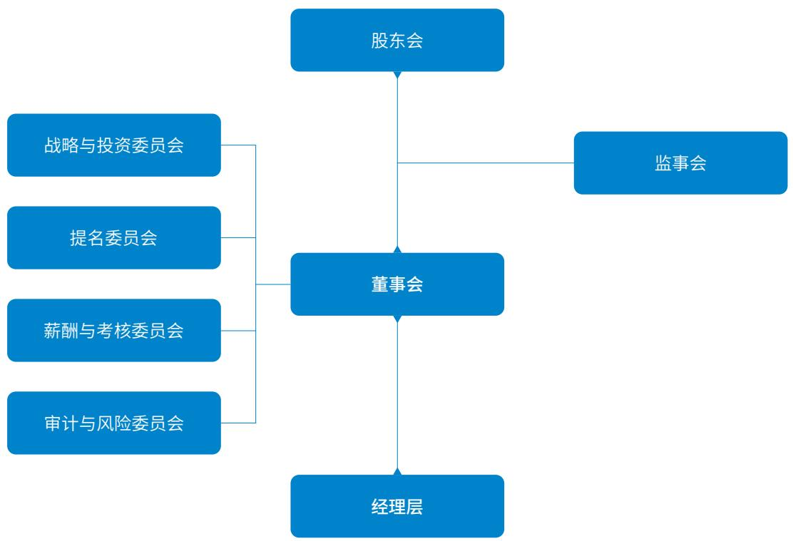

flowchart

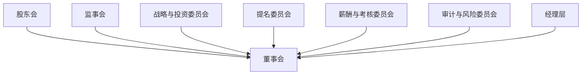
```mermaid
graph TD
  A["股东会"] --> B["董事会"]
  C["监事会"] --> B
  D["战略与投资委员会"] --> B
  E["提名委员会"] --> B
  F["薪酬与考核委员会"] --> B
  G["审计与风险委员会"] --> B
  H["经理层"] --> B
```

公司治理结构图

## （二）信息披露情况

公司严格按照上市公司信息披露的相关规定和要求，真实、准确、完整、及时和公平地进行信息披露，持续完善信息披露体系、提升信息披露品质、丰富信息披露渠道，充分保障投资者的知情权和合法权益。健全“强制性+自愿性”的信息披露管理体系建设，主动做优自愿性信息披露工作，在首次开展信息披露现状诊断的基础上，审议制定信息披露工作提升方案，落实防范信息披露风险专项工作。提升信息披露颗粒度，自愿披露公司战略、财务、研发、行业、ESG等与投资者价值判断和投资决策有关信息。坚持高标准、严要求，持续编制英文版年度报告，立足国际化视野，深度融合业务信息与财务数据展开精细分析，披露定期报告及临时公告等文件138份。全年公告实现“零质询”“零差错”，连续7年获得上海证券交易所年度信息披露工作最高等级评价A级，英文版年度报告获全球百佳报告等多项国际大奖。

## （三）投资者关系管理情况

公司重视维护和塑造良好的投资者关系管理工作，秉持以投资者为本的理念，丰富投资者沟通渠道，通过业绩说明会、股东会、投资策略会、投资者开放日、现场调研等多种渠道与广大投资者进行沟通交流，主动了解投资者关注重点和诉求建议。2024年，公司面向全球投资者举办业绩说明会3场，结合“现场+电话+公告征集问题+文字互动+视频直播”等形式，约17万人次在线参与。组织股东拜访活动21场，覆盖前十大机构股东。接待投资者调研85场，参与券商组织的投资策略会28次，与超过700家机构投资者沟通交流。以中国建筑科技展为契机，累计组织8场共计300人次参观交流，以科技创新赋能投资价值。组织“城市更新”投资者开放日活动，邀请投资者感受广州黄埔城市更新项目投资价值。持续做好中小投资者保护工作，接听有效投资者热线电话500余个，回复上证E互动平台投资者提问87个，处理投资者邮件上千封，连续5年自愿发布投资者保护工作报告。拓宽投资者获取信息渠道，公司投资者关系微信公众号平台（中国建筑投资者关系）全年发布推介文章215篇，获得投资者充分认可。

公司严格遵守《信息披露及重大信息内部报告管理规定》《年报信息披露重大差错责任追究管理办法》《规范关联方资金往来管理办法》《董事、监事和高级管理人员所持本公司股份及其变动管理办法》《内幕信息知情人登记管理规定》等制度，未发生重大违反相关制度的情况。公司治理实际情况与中国证监会有关规定和要求不存在重大差异，公司未受到中国证监会行政处罚或通报批评，亦未被其他监管机构处罚及证券交易所谴责。

公司治理与法律、行政法规和中国证监会关于上市公司治理的规定是否存在重大差异；如有重大差异，应当说明原因

□适用 □不适用

## 二、公司控股股东、实际控制人在保证公司资产、人员、财务、机构、业务等方面独立性的具体措施，以及影响公司独立性而采取的解决方案、工作进度及后续工作计划

□适用 不适用

控股股东、实际控制人及其控制的其他单位从事与公司相同或者相近业务的情况，以及同业竞争或者同业竞争情况发生较大变化对公司的影响、已采取的解决措施、解决进展以及后续解决计划。

□适用 不适用

公司控股股东是中国建筑集团有限公司（原中国建筑工程总公司）。2007年12月，中国建筑工程总公司将其所属企业和全部资产整体重组改制，发起设立中国建筑股份有限公司，将其全部主营业务及资产、负债、资质和品牌注入中建股份，并于2009年7月以中国建筑为主体在上交所实现整体上市。整体上市后，中建集团作为持股主体，主要以中国建筑为平台开展经营管理活动。截至2024年12月31日，中国建筑最近一期经审计的资产总额、营业收入、净利润占中建集团相应指标的比重均超过99%。报告期内，公司控股股东严格规范自身行为，依法行使股东权利、履行义务。公司严格防范控股股东资金占用、违规担保等风险，敦促控股股东履行承诺，与控股股东在资产、人员、财务、机构、业务等方面均保持独立性。

## 三、股东大会情况简介

<table><tr><td>会议届次</td><td>召开日期</td><td>决议刊登的指定网站的查询索引</td><td>决议刊登的披露日期</td><td>会议决议</td></tr><tr><td>2023年年度股东大会</td><td>2024年5月24日</td><td>www.sse.com.cn</td><td>2024年5月25日</td><td>会议审议通过了《关于中国建筑股份有限公司2023年度董事会工作报告的议案》《关于中国建筑股份有限公司2023年度独立董事工作报告的议案》《关于中国建筑股份有限公司2023年度监事会工作报告的议案》等15项议案</td></tr><tr><td>2024年第一次临时股东大会</td><td>2024年8月30日</td><td>www.sse.com.cn</td><td>2024年8月31日</td><td>会议审议通过了《关于选举董事的议案》《关于选举独立董事的议案》《关于选举监事的议案》</td></tr><tr><td>2024年第二次临时股东大会</td><td>2024年11月15日</td><td>www.sse.com.cn</td><td>2024年11月16日</td><td>会议审议通过了《关于中国建筑股份有限公司第四期A股限制性股票计划2024年第三批次股票回购注销的议案》</td></tr><tr><td>2024年第三次临时股东大会</td><td>2024年12月24日</td><td>www.sse.com.cn</td><td>2024年12月25日</td><td>会议审议通过了《关于修订&lt;中国建筑股份有限公司章程&gt;的议案》《关于修订&lt;中国建筑股份有限公司股东大会议事规则&gt;的议案》《关于修订&lt;中国建筑股份有限公司董事会议事规则&gt;的议案》等5项议案</td></tr></table>

表决权恢复的优先股股东请求召开临时股东大会

□适用 不适用

股东大会情况说明

□适用 不适用

## 四、董事、监事和高级管理人员的情况

（一）现任及报告期内离任董事、监事和高级管理人员持股变动及报酬情况

√ 适用 □ 不适用

单位：万股

<table><tr><td>姓名</td><td>职务</td><td>性别</td><td>年龄</td><td>任期起始日期</td><td>任期终止日期</td><td>年初持股数</td><td>年末持股数</td><td>年度内股份增减变动量</td><td>增减变动原因</td><td>报告期内从公司获得的税前报酬总额(万元)</td><td>是否在公司关联方获取报酬</td></tr><tr><td colspan="12">现任董事、监事和高级管理人员</td></tr><tr><td>郑学选</td><td>董事长</td><td>男</td><td>58</td><td>2021-11-26</td><td>2027-08-29</td><td>50.4</td><td>50.4</td><td>0</td><td>/</td><td>/</td><td>是</td></tr><tr><td rowspan="2">文兵</td><td>董事</td><td rowspan="2">男</td><td rowspan="2">54</td><td>2024-05-24</td><td>2027-08-29</td><td rowspan="2">0</td><td rowspan="2">0</td><td rowspan="2">0</td><td rowspan="2">/</td><td rowspan="2">/</td><td rowspan="2">是</td></tr><tr><td>总裁</td><td>2024-04-29</td><td>董事会另聘/解聘时</td></tr><tr><td>单广袖</td><td>董事</td><td>女</td><td>54</td><td>2023-08-21</td><td>2027-08-29</td><td>122.046</td><td>122.046</td><td>0</td><td>/</td><td>/</td><td>是</td></tr><tr><td>马王军</td><td>独立董事</td><td>男</td><td>60</td><td>2023-05-19</td><td>2027-08-29</td><td>0</td><td>0</td><td>0</td><td>/</td><td>/</td><td>否</td></tr><tr><td>孙承铭</td><td>独立董事</td><td>男</td><td>65</td><td>2021-05-13</td><td>2027-08-29</td><td>0</td><td>0</td><td>0</td><td>/</td><td>10</td><td>否</td></tr><tr><td>刘汝臣</td><td>独立董事</td><td>男</td><td>61</td><td>2024-08-30</td><td>2027-08-29</td><td>0</td><td>0</td><td>0</td><td>/</td><td>2</td><td>否</td></tr><tr><td>梁维特</td><td>独立董事</td><td>男</td><td>62</td><td>2024-08-30</td><td>2027-08-29</td><td>0</td><td>0</td><td>0</td><td>/</td><td>7</td><td>否</td></tr><tr><td>张翌</td><td>监事会主席</td><td>男</td><td>59</td><td>2023-12-27</td><td>2027-08-29</td><td>69.02</td><td>21.02</td><td>-48</td><td>股权激励实施</td><td>119</td><td>否</td></tr><tr><td>李剑波</td><td>监事</td><td>男</td><td>67</td><td>2018-01-09</td><td>2027-08-29</td><td>44.8</td><td>44.8</td><td>0</td><td>/</td><td>6</td><td>否</td></tr><tr><td>田世芳</td><td>监事</td><td>男</td><td>67</td><td>2018-01-09</td><td>2027-08-29</td><td>15.4</td><td>15.4</td><td>0</td><td>/</td><td>6</td><td>否</td></tr><tr><td>苏晶</td><td>职工监事</td><td>男</td><td>51</td><td>2024-08-30</td><td>2027-08-29</td><td>0</td><td>0</td><td>0</td><td>/</td><td>39</td><td>否</td></tr><tr><td>翟筛红</td><td>职工监事</td><td>男</td><td>55</td><td>2024-08-30</td><td>2027-08-29</td><td>0</td><td>0</td><td>0</td><td>/</td><td>2</td><td>否</td></tr><tr><td>赵晓江</td><td>副总裁</td><td>男</td><td>59</td><td>2016-01-19</td><td>董事会另聘/解聘时</td><td>0</td><td>0</td><td>0</td><td>/</td><td>/</td><td>是</td></tr><tr><td>李永明</td><td>副总裁</td><td>男</td><td>52</td><td>2023-04-27</td><td>董事会另聘/解聘时</td><td>48.0</td><td>24.0</td><td>-24</td><td>股权激励实施</td><td>/</td><td>是</td></tr><tr><td>吴秉琪</td><td>副总裁、总法律顾问</td><td>男</td><td>53</td><td>2023-10-26</td><td>董事会另聘/解聘时</td><td>0</td><td>0</td><td>0</td><td>/</td><td>/</td><td>是</td></tr><tr><td>黄杰</td><td>副总裁、财务总监</td><td>男</td><td>56</td><td>2024-04-18</td><td>董事会另聘/解聘时</td><td>0</td><td>0</td><td>0</td><td>/</td><td>/</td><td>是</td></tr><tr><td>吴爱国</td><td>副总裁</td><td>男</td><td>56</td><td>2024-09-13</td><td>董事会另聘/解聘时</td><td>42.0001</td><td>23.0001</td><td>-19</td><td>股权激励实施</td><td>/</td><td>是</td></tr><tr><td>刘立新</td><td>董事会秘书</td><td>男</td><td>58</td><td>2025-04-09</td><td>董事会另聘/解聘时</td><td>122.86</td><td>98.86</td><td>-24</td><td>股权激励实施</td><td>/</td><td>否</td></tr><tr><td colspan="12">离任董事、监事和高级管理人员</td></tr><tr><td rowspan="2">张兆祥</td><td>原董事</td><td rowspan="2">男</td><td rowspan="2">61</td><td>2020-12-07</td><td>2024-04-29</td><td rowspan="2">0</td><td rowspan="2">0</td><td rowspan="2">0</td><td rowspan="2">/</td><td rowspan="2">/</td><td rowspan="2">是</td></tr><tr><td>原总裁</td><td>2022-02-25</td><td>2024-04-29</td></tr><tr><td>贾谌</td><td>原独立董事</td><td>男</td><td>69</td><td>2018-01-09</td><td>2024-08-30</td><td>0</td><td>0</td><td>0</td><td>/</td><td>6</td><td>否</td></tr><tr><td>李平</td><td>原独立董事</td><td>男</td><td>71</td><td>2021-05-13</td><td>2024-08-30</td><td>0</td><td>0</td><td>0</td><td>/</td><td>6</td><td>否</td></tr><tr><td>吕小刚</td><td>原职工监事</td><td>男</td><td>63</td><td>2021-05-13</td><td>2024-08-30</td><td>16.7</td><td>16.7</td><td>0</td><td>/</td><td>4</td><td>否</td></tr><tr><td>曲宏光</td><td>原职工监事</td><td>男</td><td>63</td><td>2021-05-13</td><td>2024-08-30</td><td>0</td><td>0</td><td>0</td><td>/</td><td>4</td><td>否</td></tr><tr><td rowspan="2">王云林</td><td>原副总裁、财务总监</td><td rowspan="2">男</td><td rowspan="2">61</td><td>2019-01-15</td><td>2024-04-17</td><td rowspan="2">0</td><td rowspan="2">0</td><td rowspan="2">0</td><td rowspan="2">/</td><td rowspan="2">/</td><td rowspan="2">是</td></tr><tr><td>原总法律顾问</td><td>2022-09-20</td><td>2023-10-26</td></tr><tr><td>薛克庆</td><td>原董事会秘书</td><td>男</td><td>61</td><td>2018-06-15</td><td>2025-04-09</td><td>201.9</td><td>177.9</td><td>-24</td><td>股权激励实施</td><td>120</td><td>否</td></tr><tr><td>合计</td><td>/</td><td>/</td><td>/</td><td>/</td><td>/</td><td>733.1261</td><td>594.1261</td><td>-139</td><td>/</td><td>331</td><td>/</td></tr></table>

注：考虑中共中央组织部、国务院国有资产监督管理委员会对中建集团领导班子的任免情况，中建集团领导人员薪酬由中建集团支付，并在公司官网披露。董事、监事和高级管理人员报告期内从公司获得的税前报酬统计口径为该等人员担任董监高职务期间对应的报酬，其在报告期内担任非董监高职务期间对应的报酬未统计在内。

## 董事

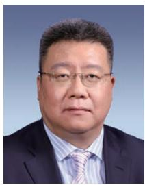

natural_image

Portrait of a man wearing glasses and a suit (no text or symbols visible)

## 郑学选

中国建筑集团有限公司董事长、党组书记，中国建筑股份有限公司董事长。教授级高级工程师，博士研究生。曾任中建阿尔及利亚公司总经理、党委书记、董事长，中国建筑股份有限公司人力资源部总经理、助理总经理、副总裁、董事、总裁，中国建筑集团有限公司党组成员、副总经理、董事、党组副书记、工会主席、直属党委书记、总经理等。2021年11月起任中国建筑集团有限公司党组书记、董事长，中国建筑股份有限公司董事长。二十届中央委员会候补委员，中国共产党第十七次全国代表大会代表，中国共产党第二十次全国代表大会代表，全国劳动模范。

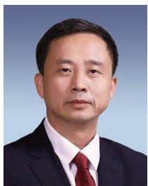

natural_image

Portrait of a man in formal suit and red tie against a blue gradient background (no text or symbols visible)

## 文兵

中国建筑集团有限公司董事、总经理、党组副书记，中国建筑股份有限公司董事、总裁。教授级高级建筑师，硕士研究生。曾任中国建筑设计院有限公司董事长、总经理、临时党委副书记，中国建筑设计研究院党委委员、副院长，中国建设科技集团股份有限公司党委委员、副总裁，中国建设科技有限公司党委副书记、董事、总经理，中国建设科技有限公司党委书记、董事长、总经理，中国建设科技集团股份有限公司党委书记、董事长、总裁等。2024年4月起任中国建筑集团有限公司董事、总经理、党组副书记，中国建筑股份有限公司总裁。2024年5月起任中国建筑股份有限公司董事。

natural_image

Portrait of a woman wearing glasses and a blue blazer (no text or symbols visible)

## 单广袖

中国建筑集团有限公司董事、党组副书记、工会主席、直属党委书记，中国建筑股份有限公司董事。正高级经济师，大学学历，硕士学位。曾任中国建筑集团有限公司人力资源部（干部人事部）副总经理、总经理，中国建筑一局（集团）有限公司党委副书记、董事、副总经理，中国建筑集团有限公司副总经理、党组成员，中国建筑股份有限公司副总裁等。2023年6月起任中国建筑集团有限公司董事、党组副书记，2023年8月起任中国建筑股份有限公司董事，2023年9月起任中国建筑集团有限公司工会主席、直属党委书记。

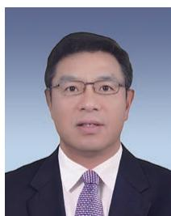

natural_image

Portrait of a man wearing glasses and a suit (no text or symbols visible)

## 马王军

中国建筑股份有限公司独立董事。高级会计师，大学学历，硕士学位。曾任中粮集团有限公司财务部总监、副总会计师、总裁助理、总会计师、党组成员，香港中旅（集团）有限公司总会计师、党委委员等。2022年9月起任中央企业专职外部董事，2023年3月起任国家石油天然气管网集团有限公司外部董事，2023年5月起任中国建筑股份有限公司独立董事，2023年9月起任中国建设科技有限公司外部董事。

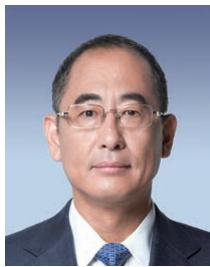

natural_image

Portrait of a man in formal attire with glasses (no visible text or symbols)

## 孙承铭

中国建筑股份有限公司独立董事。高级工程师，硕士研究生。曾任招商局集团有限公司副总经理、党委委员，招商局蛇口工业区控股股份有限公司董事长、总经理、党委书记，招商局工业集团有限公司总经理、党总支书记，国家开发投资集团有限公司外部董事。2021年5月起任中国建筑股份有限公司独立董事，2024年7月起任香港中旅（集团）有限公司外部董事。

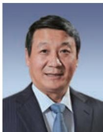

natural_image

Portrait of a man in business attire (no visible text or symbols)

## 刘汝臣

中国建筑股份有限公司独立董事。正高级工程师，硕士研究生。曾任中铁十九局副局长，中铁十九局集团公司副董事长、总经理、党委副书记，中铁十六局集团公司董事长、党委副书记，中国铁建股份有限公司副总裁、党委常委、执行董事，中国铁道建筑集团有限公司党委常委，中国安能建设集团有限公司筹备组临时党委副书记等。2024年8月起任中国建筑股份有限公司独立董事。

natural_image

Portrait photo of a man in formal attire (no text or symbols visible)

## 梁维特

中国建筑股份有限公司独立董事。博士研究生。曾任中华人民共和国第十一及第十二届全国人大代表、澳门特区政府经济财政司司长、澳门特区政府行政会委员、“三边委员会”亚太地区中国组成员等。2020年11月起任博鳌亚洲论坛粤港澳大湾区建设澳门委员会主席、国际科技与创新论坛大会执行主席，2021年3月起任国际金融论坛(IFF)副理事长，2021年11月起任博鳌亚洲论坛咨询委员会成员，2022年5月起任莫塔集团MOTA-ENGIL独立董事。2024年8月起任中国建筑股份有限公司独立董事、华国宝有限公司董事，2025年2月起任Bo Go Mo Limited董事。

## 监事

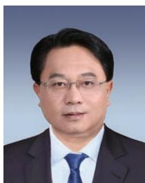

natural_image

Portrait of a man in formal attire with glasses (no visible text or symbols)

## 张翌

中国建筑股份有限公司监事会主席、助理总裁、安全总监。正高级经济师，大学学历。曾任中国建筑工程总公司企业策划与管理部副总经理、总经理，中国建筑股份有限公司副总经济师，基础设施事业部执行总经理、党工委委员、总经理、党工委副书记，中国海外集团有限公司常务董事，中建南方投资有限公司董事长，中国建设基础设施有限公司执行董事、总经理，中国建筑股份有限公司助理总经理、市场与项目管理部总经理，中国建筑股份有限公司助理总裁、总法律顾问、法律事务部总经理，中建财务有限公司监事会主席，中国建筑西北设计研究院有限公司党委书记、董事长等。2023年8月起任中国建筑股份有限公司助理总裁、安全总监，2023年12月起任中国建筑股份有限公司监事会主席。

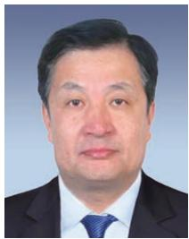

natural_image

Portrait of a man in formal suit and tie against a plain background (no text or symbols visible)

## 李剑波

中国建筑股份有限公司监事。教授级高级工程师，大学学历，硕士学位。曾任中国建筑集团有限公司人力资源部处长、副经理、总经理，中国海外集团有限公司常务董事、党委书记、副董事长等。2018年1月起任中国建筑股份有限公司监事。

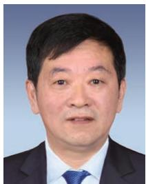

natural_image

Portrait photo of a man in formal attire (no visible text or symbols)

## 田世芳

中国建筑股份有限公司监事。高级会计师。曾任中国建筑第八工程局有限公司审计处副处长，中建八局第二建设有限公司董事、总会计师、党委委员，中建筑港集团有限公司董事、总会计师、党委委员，中建港航局集团有限公司董事、财务总监、党委委员等。2018年1月起任中国建筑股份有限公司监事。

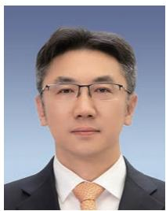

natural_image

Portrait of a man in formal attire with glasses (no visible text or symbols)

## 苏晶

中国建筑股份有限公司职工监事。工程师、注册城市规划师。曾任北京市规划委员会详细规划处副处长、北京市政府办公厅副局级秘书、商务部对外贸易司商务参赞（副司级）、商务部外国投资管理司副司长、驻美国使馆经济商务参赞（副司级）、商务部外国投资管理司副司长、中央纪委副秘书长、一级高级监察官、中办正局级机要秘书等。2024年5月起任中国建筑股份有限公司企业文化部主任。2024年8月起任中国建筑股份有限公司监事。

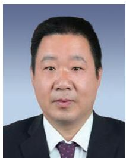

natural_image

Portrait of a man in formal suit and tie against a plain background (no text or symbols visible)

## 翟筛红

中国建筑股份有限公司职工监事。高级技师。曾任中建五局装饰公司西北分公司项目部生产经理、中建五局装饰公司直管项目部总工程师、中建五局装饰公司辽宁分公司项目部生产经理、中建五局装饰公司西北分公司项目部总工程师等。2017年12月起，任中建五局装饰公司劳模创新工作室主任。2024年8月起任中国建筑股份有限公司监事。

## 高级管理人员

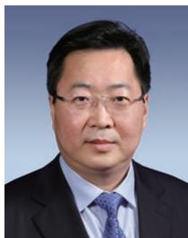

natural_image

Portrait of a man in formal attire with glasses (no visible text or symbols)

## 赵晓江

中国建筑集团有限公司副总经理、党组成员，中国建筑股份有限公司副总裁。正高级工程师，博士研究生。曾任国务院办公厅副局级秘书、正局级秘书，南京市副市长（挂职），南京市委常委、副市长（挂职），扬州市委副书记（正市级），连云港市委副书记、代市长、市长、市政府党组书记等。2015年11月起任中国建筑集团有限公司党组成员，2016年1月起任中国建筑股份有限公司副总裁，2017年1月起任中国建筑集团有限公司副总经理。

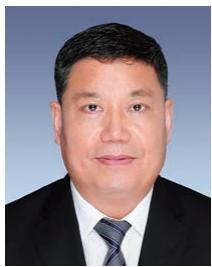

natural_image

Portrait of a man in formal suit and tie against a plain background (no text or symbols visible)

## 李永明

中国建筑集团有限公司副总经理、党组成员，中国建筑股份有限公司副总裁。教授级高级工程师，大学学历，硕士学位。曾任中国建筑第八工程局有限公司副总经理、董事、总经理、党委副书记、董事长、党委书记等。2023年2月起任中国建筑集团有限公司副总经理、党组成员，2023年4月起任中国建筑股份有限公司副总裁。中国共产党第二十次全国代表大会代表。

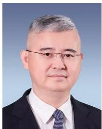

natural_image

Portrait of a man in formal attire with glasses (no visible text or symbols)

## 吴秉琪

中国建筑集团有限公司副总经理、党组成员，中国建筑股份有限公司副总裁、总法律顾问、首席合规官。高级工程师，大学学历，硕士学位。曾任华润置地有限公司副总裁、战略总监、高级副总裁（集团业务单元总经理级）、党委委员、党委副书记、总裁等。2023年9月起任中国建筑集团有限公司副总经理、党组成员，2023年10月起任中国建筑股份有限公司副总裁、总法律顾问、首席合规官。

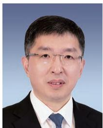

natural_image

Portrait of a man wearing glasses and a suit (no text or symbols visible)

## 黄杰

中国建筑集团有限公司总会计师、党组成员，中国建筑股份有限公司副总裁、财务总监。高级会计师，大学学历，硕士学位。曾任中国移动通信集团河北有限公司董事、副总经理、总会计师、党组成员，中国移动通信集团有限公司财务部副总经理、财务部总经理，中国移动有限公司证券事务部（香港机构）总经理，中国移动通信有限公司证券事务部总经理等。2024年3月起任中国建筑集团有限公司总会计师、党组成员，2024年4月起任中国建筑股份有限公司副总裁、财务总监。

natural_image

Portrait of a man wearing glasses and formal attire (no text or symbols visible)

## 吴爱国

中国建筑集团有限公司副总经理、党组成员，中国建筑股份有限公司副总裁。教授级高级工程师，大学学历，硕士学位。曾任中国建筑第二工程局有限公司副局长、董事、党委常委、副总经理，中建电力建设有限公司董事、总经理，中国建筑股份有限公司市场与项目管理部总经理、办公厅（党组办公室）主任、董事会办公室主任，中国建筑股份有限公司基础设施事业部总经理、党工委副书记，中国建设基础设施有限公司董事长、党委书记，中国建筑一局（集团）有限公司董事长、党委书记等。2024年8月起任中国建筑集团有限公司副总经理、党组成员，2024年9月起任中国建筑股份有限公司副总裁。

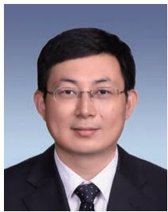

natural_image

Portrait of a man in formal attire with glasses (no text or symbols visible)

## 刘立新

中国建筑股份有限公司董事会秘书、助理总裁、首席信息官。教授级高级工程师，硕士研究生。曾任中建一局五公司副总经理、总工程师、常务副总经理、董事长；中建一局副总经理、党委常委，董事、总经理、党委副书记；中国建筑股份有限公司市场与项目管理部总经理、企业策划与管理部总经理、战略研究院副院长。2023年9月起任中国建筑股份有限公司助理总裁、首席信息官。2025年4月起任中国建筑股份有限公司董事会秘书。

## 其它情况说明

## √ 适用 □ 不适用

1. 2024年4月17日，公司召开第三届董事会第五十五次会议，因年龄原因，同意王云林先生不再担任公司副总裁、财务总监。  
2. 2024年4月18日，公司召开第三届董事会第五十六次会议，同意聘任黄杰先生为公司副总裁、财务总监。  
3. 2024年4月29日，公司召开第三届董事会第五十七次会议，因年龄原因，同意张兆祥先生不再担任公司董事、董事会专门委员会相关职务以及公司总裁职务。  
4. 2024年4月29日，公司召开第三届董事会第五十七次会议，同意聘任文兵先生为公司总裁。  
5. 2024年5月24日，公司召开2023年年度股东大会，选举文兵先生为公司董事。  
6. 2024年8月30日，公司召开2024年第一次临时股东大会，选举郑学选先生、文兵先生、单广袖女士为公司第四届董事会董事，选举马王军先生、孙承铭先生、刘汝臣先生、梁维特先生为公司第四届董事会独立董事，以上7位共同组成公司第四届董事会；选举张翌先生、李剑波先生、田世芳先生为第四届监事会股东代表监事，与职工代表大会选举产生的苏晶先生、翟筛红先生共同组成第四届监事会。  
7. 2024年9月13日，公司召开第四届董事会第二次会议，同意聘任吴爱国先生为公司副总裁。  
8. 2025年4月9日，公司召开第四届董事会第十四次会议，因年龄原因，同意薛克庆先生不再担任公司董事会秘书，同意聘任刘立新先生为公司董事会秘书。

## （二）现任及报告期内离任董事、监事和高级管理人员的任职情况

## 1. 在股东单位任职情况

√ 适用 □ 不适用

<table><tr><td>任职人员姓名</td><td>股东单位名称</td><td>在股东单位担任的职务</td><td>任期起始日期</td><td>任期终止日期</td></tr><tr><td>郑学选</td><td>中国建筑集团有限公司</td><td>党组书记、董事长</td><td>2021-11</td><td>/</td></tr><tr><td>文兵</td><td>中国建筑集团有限公司</td><td>党组副书记、董事、总经理</td><td>2024-04</td><td>/</td></tr><tr><td>单广袖</td><td>中国建筑集团有限公司</td><td>董事、党组副书记</td><td>2023-06</td><td>/</td></tr><tr><td>赵晓江</td><td>中国建筑集团有限公司</td><td>党组成员、副总经理</td><td>2015-11、2017-01</td><td>/</td></tr><tr><td>李永明</td><td>中国建筑集团有限公司</td><td>党组成员、副总经理</td><td>2023-02</td><td>/</td></tr><tr><td>吴秉琪</td><td>中国建筑集团有限公司</td><td>党组成员、副总经理</td><td>2023-09</td><td>/</td></tr><tr><td>黄杰</td><td>中国建筑集团有限公司</td><td>党组成员、总会计师</td><td>2024-03</td><td>/</td></tr><tr><td>吴爱国</td><td>中国建筑集团有限公司</td><td>党组成员、副总经理</td><td>2024-08</td><td>/</td></tr><tr><td>张兆祥</td><td>中国建筑集团有限公司</td><td>党组副书记、董事、总经理</td><td>2020-07、2020-08、2022-02</td><td>2024-04</td></tr><tr><td>王云林</td><td>中国建筑集团有限公司</td><td>党组成员、总会计师</td><td>2018-11、2018-12</td><td>2024-03</td></tr><tr><td>在股东单位任职情况的说明</td><td>无</td><td></td><td></td><td></td></tr></table>

## 2. 在其他单位任职情况

√ 适用 □ 不适用

<table><tr><td>任职人员姓名</td><td>其他单位名称</td><td>在其他单位担任的职务</td><td>任期起始日期</td><td>任期终止日期</td></tr><tr><td>马王军</td><td>国家石油天然气管网集团有限公司</td><td>外部董事</td><td>2023-03</td><td>/</td></tr><tr><td>马王军</td><td>中国建设科技有限公司</td><td>外部董事</td><td>2023-09</td><td>/</td></tr><tr><td>孙承铭</td><td>国家开发投资集团有限公司</td><td>外部董事</td><td>2020-12</td><td>2024-06</td></tr><tr><td>孙承铭</td><td>香港中旅(集团)有限公司</td><td>外部董事</td><td>2024-07</td><td>/</td></tr><tr><td>梁维特</td><td>莫塔集团MOTA-ENGIL</td><td>独立董事</td><td>2022-05</td><td>/</td></tr><tr><td>梁维特</td><td>华国宝有限公司</td><td>董事</td><td>2024-08</td><td>/</td></tr><tr><td>梁维特</td><td>Bo Go Mo Limited</td><td>董事</td><td>2025-02</td><td>/</td></tr><tr><td>在其他单位任职情况的说明</td><td>/</td><td></td><td></td><td></td></tr></table>

## （三）董事、监事、高级管理人员报酬情况

√ 适用 □ 不适用

<table><tr><td>董事、监事、高级管理人员报酬的决策程序</td><td>由国务院国资委和董事会进行经营业绩考核评价和个人考核评价,薪酬分配由国务院国资委和董事会审批核定。</td></tr><tr><td>董事在董事会讨论本人薪酬事项时是否回避</td><td>是</td></tr><tr><td>薪酬与考核委员会或独立董事专门会议关于董事、监事、高级管理人员报酬事项发表建议的具体情况</td><td>薪酬与考核委员会及独立董事对公司年度高级管理人员绩效考核和薪酬方案等事项进行了审核并发表了同意的审核意见。</td></tr><tr><td>董事、监事、高级管理人员报酬确定依据</td><td>根据国务院国资委关于中央企业负责人薪酬管理和外部董事报酬管理有关政策,以及中国建筑股份有限公司有关薪酬管理办法。</td></tr><tr><td>董事、监事和高级管理人员报酬的实际支付情况</td><td>公司董事(不包括独立董事)、监事和高级管理人员,在公司领取的本年度报酬总额(包括基本工资、绩效奖金、保险福利及津补贴等)为300万元。独立董事本年度的津贴总额为31万元。</td></tr><tr><td>报告期末全体董事、监事和高级管理人员实际获得的报酬合计</td><td>331万元</td></tr></table>

## （四）公司董事、监事、高级管理人员变动情况

√ 适用 □ 不适用

<table><tr><td>姓名</td><td>担任的职务</td><td>变动情形</td><td>变动原因</td></tr><tr><td>文兵</td><td>董事、总裁</td><td>选举</td><td>工作需要</td></tr><tr><td>刘汝臣</td><td>独立董事</td><td>选举</td><td>工作需要</td></tr><tr><td>梁维特</td><td>独立董事</td><td>选举</td><td>工作需要</td></tr><tr><td>苏晶</td><td>监事</td><td>选举</td><td>工作需要</td></tr><tr><td>翟筛红</td><td>监事</td><td>选举</td><td>工作需要</td></tr><tr><td>黄杰</td><td>副总裁、财务总监</td><td>聘任</td><td>工作需要</td></tr><tr><td>吴爱国</td><td>副总裁</td><td>聘任</td><td>工作需要</td></tr><tr><td>刘立新</td><td>董事会秘书</td><td>聘任</td><td>工作需要</td></tr><tr><td>张兆祥</td><td>董事、总裁</td><td>离任</td><td>年龄原因</td></tr><tr><td>贾谌</td><td>独立董事</td><td>离任</td><td>换届选举</td></tr><tr><td>李平</td><td>独立董事</td><td>离任</td><td>换届选举</td></tr><tr><td>吕小刚</td><td>职工监事</td><td>离任</td><td>换届选举</td></tr><tr><td>曲宏光</td><td>职工监事</td><td>离任</td><td>换届选举</td></tr><tr><td>王云林</td><td>副总裁、财务总监</td><td>离任</td><td>年龄原因</td></tr><tr><td>薛克庆</td><td>董事会秘书</td><td>离任</td><td>年龄原因</td></tr></table>

## （五）近三年受证券监管机构处罚的情况说明

□适用 □不适用

## (六) 其他

□适用 不适用

五、报告期内召开的董事会有关情况

<table><tr><td>会议届次</td><td>召开日期</td><td>会议决议</td></tr><tr><td>第三届董事会第53次会议</td><td>2024年1月9日</td><td>会议审议通过了《关于中建三局广州市白云区黄边村城市更新项目的议案》等3项议案</td></tr><tr><td>第三届董事会第54次会议</td><td>2024年3月20日</td><td>会议审议通过了《关于修订&lt;中国建筑股份有限公司“十四五”战略规划&gt;的议案》等17项议案</td></tr><tr><td>第三届董事会第55次会议</td><td>2024年4月17日</td><td>会议审议通过了《关于王云林不再担任中国建筑股份有限公司副总裁、财务总监的议案》</td></tr><tr><td>第三届董事会第56次会议</td><td>2024年4月18日</td><td>会议审议通过并听取了《关于聘任黄杰为中国建筑股份有限公司副总裁、财务总监的议案》等22项议案及汇报</td></tr><tr><td>第三届董事会第57次会议</td><td>2024年4月29日</td><td>会议审议通过并听取了《关于张兆祥不再担任中国建筑股份有限公司第三届董事会董事、总裁的议案》等7项议案及汇报</td></tr><tr><td>第三届董事会第58次会议</td><td>2024年5月24日</td><td>会议审议通过了《关于推选文兵为公司第三届董事会战略与投资委员会委员的议案》等2项议案</td></tr><tr><td>第三届董事会第59次会议</td><td>2024年6月12日</td><td>会议审议通过了《关于中建一局北京市朝阳区酒仙桥组团地块、前苇沟组团地块、电子城0017地块房地产开发项目的议案》</td></tr><tr><td>第三届董事会第60次会议</td><td>2024年8月5日</td><td>会议审议通过了进一步盘活公司存量资产的议案</td></tr><tr><td>第三届董事会第61次会议</td><td>2024年8月15日</td><td>会议审议通过了《关于提名中国建筑股份有限公司第四届董事会董事候选人的议案》等3项议案</td></tr><tr><td>第三届董事会第62次会议</td><td>2024年8月29日</td><td>会议审议通过并听取了《关于中国建筑股份有限公司2024年董事会半年度工作报告的议案》等10项议案及汇报</td></tr><tr><td>第四届董事会第1次会议</td><td>2024年8月30日</td><td>会议审议通过了《关于选举中国建筑股份有限公司第四届董事会董事长的议案》等6项议案</td></tr><tr><td>第四届董事会第2次会议</td><td>2024年9月13日</td><td>会议审议通过了《关于聘任吴爱国为中国建筑股份有限公司副总裁的议案》</td></tr><tr><td>第四届董事会第3次会议</td><td>2024年10月4日</td><td>会议审议通过了进一步优化金融业务布局的议案</td></tr><tr><td>第四届董事会第4次会议</td><td>2024年10月16日</td><td>会议审议通过了《关于中建南洋公司新加坡淡滨尼95街执行共管公寓住宅地块房地产开发项目的议案》等3项议案</td></tr><tr><td>第四届董事会第5次会议</td><td>2024年10月25日</td><td>会议审议通过并听取了《关于修订&lt;中国建筑股份有限公司金融投资管理规定&gt;的议案》等9项议案及汇报</td></tr><tr><td>第四届董事会第6次会议</td><td>2024年11月15日</td><td>会议审议通过了《关于向中国儿童少年基金会捐赠留守(困境)儿童关爱保护公益资金的议案》等4项议案</td></tr><tr><td>第四届董事会第7次会议</td><td>2024年11月28日</td><td>会议审议通过了《关于中海集团深圳市南山区后海登良路地块房地产开发项目的议案》等3项议案</td></tr><tr><td>第四届董事会第8次会议</td><td>2024年12月4日</td><td>会议审议通过了《关于中国建筑股份有限公司与中国建筑集团有限公司续签&lt;综合服务框架协议&gt;的议案》等7项议案</td></tr><tr><td>第四届董事会第9次会议</td><td>2024年12月26日</td><td>会议审议通过并听取了《关于设立中国建筑股份有限公司洪都拉斯分公司的议案》等3项议案及汇报</td></tr></table>

## 六、董事履行职责情况

## （一）董事参加董事会和股东大会的情况

<table><tr><td rowspan="2">董事姓名</td><td rowspan="2">是否独立董事</td><td colspan="6">参加董事会情况</td><td>参加股东大会情况</td></tr><tr><td>本年应参加董事会次数</td><td>亲自出席次数</td><td>以通讯方式参加次数</td><td>委托出席次数</td><td>缺席次数</td><td>是否连续两次未亲自参加会议</td><td>出席股东大会的次数</td></tr><tr><td>郑学选</td><td>否</td><td>19</td><td>19</td><td>9</td><td>0</td><td>0</td><td>否</td><td>2</td></tr><tr><td>文兵</td><td>否</td><td>14</td><td>12</td><td>7</td><td>2</td><td>0</td><td>否</td><td>2</td></tr><tr><td>单广袖</td><td>否</td><td>19</td><td>14</td><td>9</td><td>5</td><td>0</td><td>否</td><td>2</td></tr><tr><td>马王军</td><td>是</td><td>19</td><td>19</td><td>9</td><td>0</td><td>0</td><td>否</td><td>3</td></tr><tr><td>孙承铭</td><td>是</td><td>19</td><td>19</td><td>9</td><td>0</td><td>0</td><td>否</td><td>2</td></tr><tr><td>刘汝臣</td><td>是</td><td>9</td><td>9</td><td>5</td><td>0</td><td>0</td><td>否</td><td>3</td></tr><tr><td>梁维特</td><td>是</td><td>9</td><td>8</td><td>5</td><td>1</td><td>0</td><td>否</td><td>1</td></tr><tr><td>张兆祥</td><td>否</td><td>5</td><td>3</td><td>2</td><td>2</td><td>0</td><td>否</td><td>0</td></tr><tr><td>贾谌</td><td>是</td><td>10</td><td>8</td><td>4</td><td>2</td><td>0</td><td>否</td><td>1</td></tr><tr><td>李平</td><td>是</td><td>10</td><td>10</td><td>4</td><td>0</td><td>0</td><td>否</td><td>1</td></tr></table>

连续两次未亲自出席董事会会议的说明

□适用 □不适用

<table><tr><td>年内召开董事会会议次数</td><td>19</td></tr><tr><td>其中:现场会议次数</td><td>10</td></tr><tr><td>通讯方式召开会议次数</td><td>9</td></tr><tr><td>现场结合通讯方式召开会议次数</td><td>0</td></tr></table>

## （二）董事对公司有关事项提出异议的情况

□适用 √不适用

## (三) 其他

## √ 适用 □ 不适用

公司独立董事对公司管理层兼任公司控股股东中国建筑集团有限公司高管职务期间的履职情况进行审查和监督，并发表独立意见如下：文兵先生、赵晓江先生、李永明先生、吴秉琪先生、黄杰先生、吴爱国先生、张兆祥先生、王云林先生在2024年度兼职期间，切实履行承诺，勤勉尽职，能够优先履行公司高级管理人员的职责，处理好公司与控股股东之间的关系，维护公司及全体股东的利益。其未因兼职而做出任何损害公司股东，尤其是中小股东利益的行为。

## 七、董事会下设专门委员会情况

## √ 适用 □ 不适用

## （一）董事会下设专门委员会成员情况

<table><tr><td>专门委员会类别</td><td>成员姓名</td></tr><tr><td>战略与投资委员会</td><td>主任委员:郑学选委员:文兵、单广袖、马王军、孙承铭、刘汝臣、梁维特</td></tr><tr><td>提名委员会</td><td>主任委员:郑学选委员:文兵、单广袖、马王军、孙承铭、刘汝臣、梁维特</td></tr><tr><td>薪酬与考核委员会</td><td>主任委员:马王军委员:孙承铭、刘汝臣、梁维特</td></tr><tr><td>审计与风险委员会</td><td>主任委员:马王军委员:孙承铭、刘汝臣、梁维特</td></tr></table>

注：2024年12月4日，第四届董事会第八次会议审议通过《关于董事会撤销监督委员会的议案》，董事会撤销监督委员会，相关职责由审计与风险委员会承接。

## （二）专门委员会履职情况

报告期内，公司董事会下设战略与投资委员会、提名委员会、薪酬与考核委员会、审计与风险委员会、监督委员会，认真组织研究和勤勉审议专业性议题，切实发挥专门委员会的充分酝酿和决策支撑职能。2024年12月4日，第四届董事会第八次会议审议通过《关于董事会撤销监督委员会的议案》，董事会撤销监督委员会。撤销后公司董事会下设战略与投资委员会、提名委员会、薪酬与考核委员会、审计与风险委员会，负责研究和审议投资、可持续发展、提名、财务、审计、内控、风险管理等相关议题，切实发挥董事会专门委员会的决策支撑职能。2024年，董事会专门委员会共召开28次会议，审议71项议题（含14项汇报）。

## （三）专门委员会会议情况

1. 报告期内审计与风险委员会召开8次会议

<table><tr><td>召开日期</td><td>会议内容</td><td>重要意见和建议</td><td>其他履行职责情况</td></tr><tr><td>2024年1月9日</td><td>审议听取了《关于2023年度审计计划和重点审计任务及预审工作进展情况的汇报》等2项汇报</td><td>/</td><td>/</td></tr><tr><td>2024年3月15日</td><td>审议通过并听取了《关于中国建筑股份有限公司第三届董事会审计与风险委员会2023年度履职情况报告的议案》等5项汇报及议案</td><td>会议同意上述议案内容并提请董事会审议。</td><td>/</td></tr><tr><td>2024年4月17日</td><td>审议通过了《关于聘任黄杰为中国建筑股份有限公司副总裁、财务总监的议案》等2项议案</td><td>会议同意上述议案内容并提请董事会审议。</td><td>/</td></tr><tr><td>2024年4月17日</td><td>审议通过并听取了《关于中国建筑股份有限公司2023年度财务决算报告的议案》等13项汇报及议案</td><td>会议同意上述议案内容并提请董事会审议。</td><td>/</td></tr><tr><td>2024年4月29日</td><td>审议通过了《关于中国建筑股份有限公司2024年一季度财务分析报告的议案》等2项议案</td><td>会议同意上述议案内容并提请董事会审议。</td><td>/</td></tr><tr><td>2024年8月28日</td><td>审议通过并听取了《关于中国建筑股份有限公司2024年中期财务分析报告的议案》等7项汇报及议案</td><td>会议同意上述议案内容并提请董事会审议。</td><td>/</td></tr><tr><td>2024年10月24日</td><td>审议通过了《关于中国建筑股份有限公司2024年三季度财务分析报告的议案》等3项议案</td><td>会议同意上述议案内容并提请董事会审议。</td><td>/</td></tr><tr><td>2024年12月26日</td><td>审议听取了《关于中国建筑股份有限公司2024年度财务决算工作进展情况的汇报》等3项汇报</td><td>/</td><td>/</td></tr></table>

2. 报告期内提名委员会召开4次会议

<table><tr><td>召开日期</td><td>会议内容</td><td>重要意见和建议</td><td>其他履行职责情况</td></tr><tr><td>2024年4月17日</td><td>审议通过了《关于王云林不再担任中国建筑股份有限公司副总裁、财务总监职务的议案》《关于聘任黄杰为中国建筑股份有限公司副总裁、财务总监的议案》2项议案</td><td>会议同意上述议案内容并提请董事会审议。</td><td>/</td></tr><tr><td>2024年4月29日</td><td>审议通过了《关于提名文兵为中国建筑股份有限公司第三届董事会董事的议案》《关于提名文兵任中国建筑股份有限公司总裁的议案》2项议案</td><td>会议同意上述议案内容并提请董事会审议。</td><td>/</td></tr><tr><td>2024年8月15日</td><td>审议通过了《关于提名中国建筑股份有限公司第四届董事会董事候选人的议案》《关于提名中国建筑股份有限公司第四届董事会独立董事候选人的议案》2项议案</td><td>会议同意上述议案内容并提请董事会审议。</td><td>/</td></tr><tr><td>2024年9月14日</td><td>审议通过了《关于聘任吴爱国为中国建筑股份有限公司副总裁的议案》</td><td>会议同意上述议案内容并提请董事会审议。</td><td>/</td></tr></table>

3. 报告期内薪酬与考核委员会召开3次会议

<table><tr><td>召开日期</td><td>会议内容</td><td>重要意见和建议</td><td>其他履行职责情况</td></tr><tr><td>2024年1月9日</td><td>审议通过了《关于中国建筑股份有限公司第四期A股限制性股票计划部分激励对象股票回购注销的议案》</td><td>会议同意上述议案内容并提请董事会审议。</td><td>/</td></tr><tr><td>2024年4月17日</td><td>听取并审议通过了《关于中国建筑股份有限公司2023年度高级管理人员考核和薪酬兑现方案的议案》等2项议案及汇报</td><td>会议同意上述议案内容并提请董事会审议。</td><td>/</td></tr><tr><td>2024年10月24日</td><td>审议通过了《关于中国建筑股份有限公司2023年度高级管理人员绩效考核结果与薪酬兑现的议案》等2项议案</td><td>会议同意上述议案内容并提请董事会审议。</td><td>/</td></tr></table>

4. 报告期内战略与投资委员会召开10次会议

<table><tr><td>召开日期</td><td>会议内容</td><td>重要意见和建议</td><td>其他履行职责情况</td></tr><tr><td>2024年1月9日</td><td>审议通过了《关于中建三局广州市白云区黄边村城市更新项目的议案》等2项议案</td><td>会议同意上述议案内容并提请董事会审议。</td><td>召开独立董事专题沟通会,听取并讨论了有关议案情况。</td></tr><tr><td>2024年3月20日</td><td>审议通过了《关于修订&lt;中国建筑股份有限公司“十四五”战略规划&gt;的议案》等3项议案</td><td>会议同意上述议案内容并提请董事会审议。</td><td>召开独立董事专题沟通会,听取并讨论了有关议案情况。</td></tr><tr><td>2024年4月18日</td><td>审议通过了《关于中国建筑股份有限公司本级2024年度债券发行额度的议案》等2项议案</td><td>会议同意上述议案内容并提请董事会审议。</td><td>召开独立董事专题沟通会,听取并讨论了有关议案情况。</td></tr><tr><td>2024年6月12日</td><td>审议通过了《关于中建一局北京市朝阳区酒仙桥组团地块、前苇沟组团地块、电子城0017地块房地产开发项目的议案》</td><td>会议同意上述议案内容并提请董事会审议。</td><td>/</td></tr><tr><td>2024年8月5日</td><td>审议通过了《关于中国建筑股份有限公司进一步盘活公司存量资产的议案》</td><td>会议同意上述议案内容并提请董事会审议。</td><td>召开独立董事专题沟通会,听取并讨论了有关议案情况。</td></tr><tr><td>2024年8月29日</td><td>审议通过了《关于中国建筑股份有限公司债券发行管理办法的议案》</td><td>会议同意上述议案内容并提请董事会审议。</td><td>/</td></tr><tr><td>2024年10月4日</td><td>审议通过了《关于中国建筑股份有限公司进一步优化金融业务布局的议案》</td><td>会议同意上述议案内容并提请董事会审议。</td><td>/</td></tr><tr><td>2024年10月16日</td><td>审议通过了《关于中建南洋公司新加坡淡滨尼95街执行共管公寓住宅地块房地产开发项目的议案》等3项议案</td><td>会议同意上述议案内容并提请董事会审议。</td><td>召开独立董事专题沟通会,听取并讨论了有关议案情况。</td></tr><tr><td>2024年10月25日</td><td>审议通过了《关于修订&lt;中国建筑股份有限公司金融投资管理规定&gt;的议案》</td><td>会议同意上述议案内容并提请董事会审议。</td><td>/</td></tr><tr><td>2024年11月28日</td><td>审议通过了《关于中海集团深圳市南山区后海登良路地块房地产开发项目的议案》等3项议案</td><td>会议同意上述议案内容并提请董事会审议。</td><td>召开独立董事专题沟通会,听取并讨论了有关议案情况。</td></tr></table>

5. 报告期内监督委员会召开3次会议

<table><tr><td>召开日期</td><td>会议内容</td><td>重要意见和建议</td><td>其他履行职责情况</td></tr><tr><td>2024年4月29日</td><td>听取了《关于中国建筑股份有限公司2024年一季度董事会决议执行情况的汇报》</td><td>/</td><td>/</td></tr><tr><td>2024年8月28日</td><td>听取了《关于中国建筑股份有限公司2024年上半年董事会决议执行情况的汇报》等2项汇报</td><td>/</td><td>/</td></tr><tr><td>2024年10月24日</td><td>听取了《关于中国建筑股份有限公司2024年三季度董事会决议执行情况的汇报》</td><td>/</td><td>/</td></tr></table>

## （四）存在异议事项的具体说明

□适用 □不适用

## 八、监事会发现公司存在风险的说明

□适用 □不适用

报告期内，监事会依照《公司法》《上市公司治理准则》及《公司章程》《监事会议事规则》等有关规定，依法规范履职，以风险防控为重点，围绕公司经营管理重大事项、财务情况、内部控制、董事及高级管理人员履职行为等方面扎实开展监督工作，对报告期内的监督事项无异议。

text_image

云南华丽高速公路项目

## 九、报告期末母公司和主要子公司的员工情况

## （一）员工情况

<table><tr><td>母公司在职员工的数量</td><td>426</td></tr><tr><td>主要子公司在职员工的数量</td><td>360,823</td></tr><tr><td>在职员工的数量合计</td><td>361,249</td></tr><tr><td>母公司及主要子公司需承担费用的离退休职工人数(2024年底退休和离休人员数合计)</td><td>68,462</td></tr></table>

<table><tr><td colspan="2">专业构成</td></tr><tr><td>专业构成类别</td><td>专业构成人数</td></tr><tr><td>经营管理</td><td>13,240</td></tr><tr><td>项目建造</td><td>205,240</td></tr><tr><td>勘察设计</td><td>20,538</td></tr><tr><td>地产开发</td><td>35,384</td></tr><tr><td>专业管理</td><td>86,847</td></tr><tr><td>合计</td><td>361,249</td></tr></table>

<table><tr><td colspan="2">教育程度</td></tr><tr><td>教育程度类别</td><td>数量(人)</td></tr><tr><td>硕士及以上</td><td>37,207</td></tr><tr><td>本科</td><td>253,612</td></tr><tr><td>大专</td><td>36,202</td></tr><tr><td>中专及以下</td><td>34,228</td></tr><tr><td>合计</td><td>361,249</td></tr></table>

专业构成

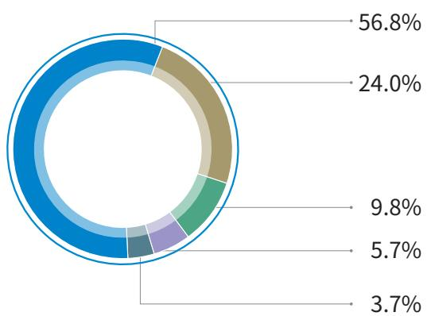

pie chart

| Segment | Percentage |
| ------- | ---------- |
| Segment 1 | 56.8% |
| Segment 2 | 24.0% |
| Segment 3 | 9.8% |
| Segment 4 | 5.7% |
| Segment 5 | 3.7% |

项目建造

■ 专业管理

地产开发

勘察设计

经营管理

教育程度  
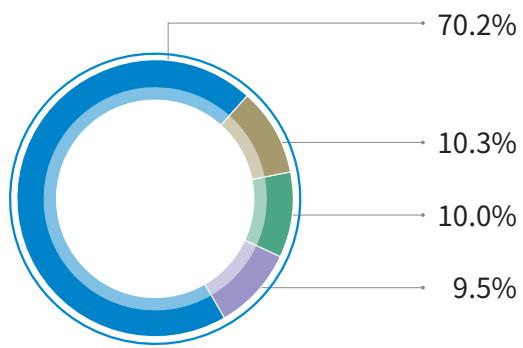

pie chart

| Segment | Percentage |
| ------- | ---------- |
| Segment 1 | 70.2% |
| Segment 2 | 10.3% |
| Segment 3 | 10.0% |
| Segment 4 | 9.5% |

本科

硕士及以上

大专

中专及以下

## （二）薪酬政策

## √ 适用 □ 不适用

公司坚持市场和业绩导向，强化薪酬考核激励。将薪酬分配与企业效益、个人业绩紧密挂钩，业绩升薪酬升，业绩降薪酬降，该高的高，该低的低，有效调动了广大员工的积极性、主动性与创造性。同时，以价值创造为中心，坚持工效联动，强化对标管理，完善薪酬绩效管理，加强薪酬分配的针对性、精准性和有效性，不断健全激励有效约束有力的薪酬分配体系，促进企业活力、竞争力、创造力不断增强。

## （三）培训计划

## √ 适用 □ 不适用

紧紧围绕公司“十四五”规划和年度工作要点，坚持旗帜鲜明讲政治，确保执行中央文件精神不走样，坚持以“领导力、专业力、职业力”提升为抓手，持续完善中建特色关键人才培育项目，稳步推进培训体系建设，不断提升教育培训保障能力，加强统筹协调、组织引领，推进教育培训工作顺利开展，为公司人才队伍建设提供内驱动能。

## （四）劳务外包情况

## □适用 □不适用

## 十、利润分配或资本公积转增预案

## （一）现金分红政策的制定、执行或调整情况

## √ 适用 □ 不适用

## 1. 利润分配的具体政策

《公司章程》规定：公司可以采用现金、股票、现金与股票相结合及其他符合法律法规规定的方式分配股利；公司应优先采用现金分红的利润分配方式，同时在经营情况良好，并且董事会认为公司股票价格与公司股本规模不匹配、发放股票股利有利于公司全体股东整体利益时，在满足现金分红的条件下，提出股票股利等其他分配预案；除公司董事会确定的特殊情况外，公司在当年盈利且累计未分配利润为正的情况下，采取现金方式分配股利，每年以现金方式分配的利润原则上不少于当年实现的可供分配利润的15%。

## 2. 报告期内现金分红政策的执行情况

2024年5月24日，公司2023年年度股东大会以现场记名投票与网络投票相结合的方式审议通过了《关于中国建筑股份有限公司2023年度利润分配方案的议案》；2024年6月21日，公司发布《中国建筑股份有限公司2023年年度权益分派实施公告》；2024年6月27日，公司向全体股东派发现金红利，2023年度利润分配方案实施完毕。公司严格按照《公司章程》有关规定及股东会决议执行利润分配事项。

## 3. 年度利润分配预案

根据《公司法》和《公司章程》相关规定，结合股东回报及公司业务发展对资金需求等因素的考虑，按照公司第四届董事会第十五次会议审议通过的《中国建筑股份有限公司2024年度利润分配方案》，确定2024年度利润分配预案。

2024年度利润分配预案：公司合并报表归属于上市公司股东净利润为461.87亿元，母公司累计未分配利润为564.33亿元，上市公司拟向全体股东每10股派发现金红利2.715元(含税)。以截至本报告披露日的总股本41,320,390,444股为基数，以此计算合计拟派发现金红利约112.18亿元(含税)。本年度公司现金分红占合并报表归属于母公司股东净利润的比例为 $24.29\%$ 。如在实施权益分派股权登记日前公司总股本发生变动，公司拟维持每股分配金额不变，相应调整分配总额，并将另行公告具体调整情况。

上述利润分配预案已经公司第四届董事会第十五次会议审议通过，预案尚需经公司2024年年度股东会审议批准。公司2024年年度股东会拟采取现场记名投票与网络投票相结合的方式，从而确保中小股东有充分表达意见和诉求的机会，中小股东的合法权益得到充分维护。

## 4. 公司本年度拟分配的现金红利相关情况说明

## (1)公司所处行业情况及特点

公司所处的建筑行业属于充分竞争行业，所承接项目呈现单体体量大、生产周期长等特点，用于维持日常经营周转的资金需求量较大。公司精准把握国家政策机遇，推动提升主业发展水平，持续深化项目履约管理，加快推进创新工作，不断强化底线思维，积极应对激烈的行业竞争。

## (2)公司发展阶段和自身经营模式

公司目前正处于转型升级阶段，随着绿色生产方式和建设模式的逐步推广，节能建筑、装配式建筑、光伏建筑等领域将迎来巨大的市场空间，推动建筑行业向更加绿色、可持续的方向发展，建筑行业正迎来新的发展机遇。面对新的挑战与转型需求，公司积极践行高质量发展战略，对标新发展理念，对标世界一流企业，不断提升全球竞争力和品牌影响力。

## (3)公司盈利水平及资金需求

公司自上市以来，净资产收益率维持行业较高水平，为股东创造了稳定的投资回报。随着公司加大改革创新力度，需要增加对创新业务、新型技术的投入力度。此外，公司需要积累适当的留存收益支持公司持续发展，提升公司整体价值，这符合广大股东的长远利益。

## (4)公司保留一定比例留存未分配利润的原因

当前和未来一段时间，市场挑战和机遇并存，公司需要保存留存收益以增强企业抗风险能力。公司历年累计的留存收益归属于全体投资者，公司将不断提高资金运营效率，提升公司整体盈利水平，未来为投资者提供更丰厚的回报。

## (5)公司留存未分配利润的确切用途以及预计收益情况

留存未分配利润将用于支持企业抢抓战略发展机遇、持续深化公司战略、加大结构调整和转型升级力度、寻求新的效益增长点等方面。中国建筑历年保持稳定的分红政策，体现了公司稳健发展和持续分红的能力，公司将继续围绕国家重大战略部署和“十四五”规划，紧抓当前经济发展重要战略机遇期，更好地回报广大股东。

## (6)公司为中小股东参与现金分红决策提供便利情况

公司建立健全了多渠道的投资者沟通机制，中小股东可通过投资者热线、公司投资者关系邮箱、上证e互动平台提问等多种方式来表达对现金分红政策的意见和诉求。在公司年度股东会上，中小股东可通过网络投票方式对利润分配方案进行表决。同时公司还积极通过现金分红说明会等形式，及时解答中小股东关心的问题。

## (7)公司为增强投资者回报水平拟采取的措施

公司按照《上市公司监管指引第3号——上市公司现金分红》《公司章程》等法律法规、规范性文件的要求，增加利润分配决策透明度和可操作性，便于股东对公司经营和利润分配进行监督。公司将继续秉承为投资者带来长期持续回报的经营理念，结合当前宏观经济形势以及重大资金支出安排等因素，继续优化利润分配方案，增厚投资者回报。

## （二）公司近五年(含报告期)的普通股股利分配方案或预案、资本公积金转增股本方案或预案

单位：千元 币种：人民币

<table><tr><td>分红年度</td><td>每10股送红股数(股)</td><td>每10股派息数(元)(含税)</td><td>每10股转增数(股)</td><td>现金分红的数额(含税)</td><td>分红年度合并报表中归属于上市公司普通股股东的净利润</td><td>占合并报表中归属于上市公司普通股股东的净利润的比率(%)</td></tr><tr><td>2024年</td><td>0</td><td>2.715</td><td>0</td><td>11,218,486</td><td>46,187,099</td><td>24.29</td></tr><tr><td>2023年</td><td>0</td><td>2.7145</td><td>0</td><td>11,297,736</td><td>54,264,173</td><td>20.82</td></tr><tr><td>2022年</td><td>0</td><td>2.527</td><td>0</td><td>10,596,831</td><td>50,950,301</td><td>20.80</td></tr><tr><td>2021年</td><td>0</td><td>2.50</td><td>0</td><td>10,485,215</td><td>51,407,661</td><td>20.40</td></tr><tr><td>2020年</td><td>0</td><td>2.147</td><td>0</td><td>9,006,272</td><td>44,924,929</td><td>20.05</td></tr></table>

## （三）现金分红政策的专项说明

√ 适用 □ 不适用

<table><tr><td>是否符合公司章程的规定或股东大会决议的要求</td><td>☑是 □否</td></tr><tr><td>分红标准和比例是否明确和清晰</td><td>☑是 □否</td></tr><tr><td>相关的决策程序和机制是否完备</td><td>☑是 □否</td></tr><tr><td>独立董事是否履职尽责并发挥了应有的作用</td><td>☑是 □否</td></tr><tr><td>中小股东是否有充分表达意见和诉求的机会,其合法权益是否得到了充分保护</td><td>☑是 □否</td></tr></table>

## （四）报告期内盈利且母公司可供普通股股东分配利润为正，但未提出普通股现金利润分配方案预案的，公司应当详细披露原因以及未分配利润的用途和使用计划

## □适用 不适用

## （五）本报告期利润分配及资本公积金转增股本预案

√ 适用 □ 不适用  
单位：千元 币种：人民币

<table><tr><td>每10股送红股数(股)</td><td>/</td></tr><tr><td>每10股派息数(元)(含税)</td><td>2.715</td></tr><tr><td>每10股转增数(股)</td><td>/</td></tr><tr><td>现金分红金额(含税)</td><td>11,218,486</td></tr><tr><td>分红年度合并报表中归属于上市公司普通股股东的净利润</td><td>46,187,099</td></tr><tr><td>占合并报表中归属于上市公司普通股股东的净利润的比率(%)</td><td>24.29</td></tr><tr><td>以现金方式回购股份计入现金分红的金额</td><td>/</td></tr><tr><td>合计分红金额(含税)</td><td>11,218,486</td></tr><tr><td>合计分红金额占合并报表中归属于上市公司普通股股东的净利润的比率(%)</td><td>24.29</td></tr></table>

## （六）最近三个会计年度现金分红情况

## √ 适用 □ 不适用

单位：千元 币种：人民币

<table><tr><td>最近三个会计年度累计现金分红金额(含税)(1)</td><td>33,113,053</td></tr><tr><td>最近三个会计年度累计回购并注销金额(2)</td><td>/</td></tr><tr><td>最近三个会计年度现金分红和回购并注销累计金额(3)=(1)+(2)</td><td>33,113,053</td></tr><tr><td>最近三个会计年度年均净利润金额(4)</td><td>50,467,191</td></tr><tr><td>最近三个会计年度现金分红比例(%)(5)=(3)/(4)</td><td>65.61</td></tr><tr><td>最近一个会计年度合并报表中归属于上市公司普通股股东的净利润</td><td>46,187,099</td></tr><tr><td>最近一个会计年度母公司报表年度未未分配利润</td><td>56,433,139</td></tr></table>

上市至今现金分红情况  
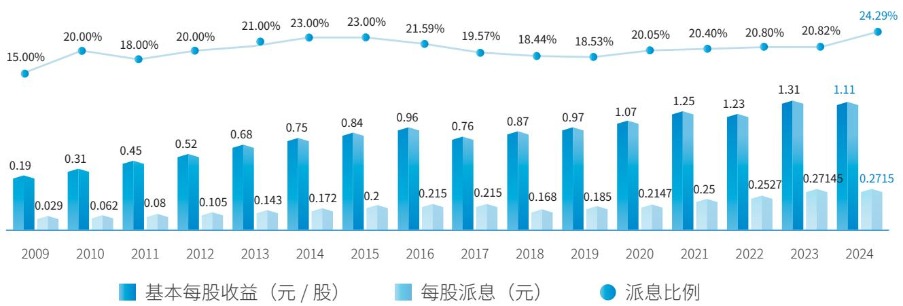

bar-line hybrid chart

| Year | 基本每股收益 (元 / 股) | 每股派息 (元) | 派息比例 |
|------|------------------------|--------------|----------|
| 2009 | 0.19                   | 0.029        | 15.00%   |
| 2010 | 0.31                   | 0.062        | 20.00%   |
| 2011 | 0.45                   | 0.08         | 18.00%   |
| 2012 | 0.52                   | 0.105        | 20.00%   |
| 2013 | 0.68                   | 0.143        | 21.00%   |
| 2014 | 0.75                   | 0.172        | 23.00%   |
| 2015 | 0.84                   | 0.2          | 23.00%   |
| 2016 | 0.96                   | 0.215        | 21.59%   |
| 2017 | 0.76                   | 0.215        | 19.57%   |
| 2018 | 0.87                   | 0.168        | 18.44%   |
| 2019 | 0.97                   | 0.185        | 18.53%   |
| 2020 | 1.07                   | 0.2147       | 20.05%   |
| 2021 | 1.25                   | 0.25         | 20.40%   |
| 2022 | 1.23                   | 0.2527       | 20.80%   |
| 2023 | 1.31                   | 0.27145      | 20.82%   |
| 2024 | 1.11                   | 0.2715       | 24.29%   |

## 十一、公司股权激励计划、员工持股计划或其他员工激励措施的情况及其影响

## （一）相关激励事项已在临时公告披露且后续实施无进展或变化的

√ 适用 □ 不适用

<table><tr><td>事项概述</td><td>查询索引</td></tr><tr><td>公司本次回购注销限制性股票涉及公司第四期A股限制性股票计划部分激励对象共计75名,合计拟回购注销限制性股票9,630,000股。本次用于回购的资金总额为30,694,678.86元(含利息),资金来源为公司自有资金。本次回购的股票全部注销后,公司将减少注册资本9,630,000元。</td><td>2024年1月10日发布的《关于回购第四期A股限制性股票部分激励对象股票的公告》。</td></tr><tr><td>本次回购注销限制性股票涉及激励对象共计2,727名,合计拟回购注销限制性股票299,562,000股;本次回购注销完成后,公司剩余股权激励限制性股票合计299,562,000股。回购注销的回购价格为3.06元/股,用于回购限制性股票的资金全部为自有资金,回购款项合计人民币916,659,720元,不包含因回购限制性股票产生的过户费、印花税等由公司承担的相关费用。本次回购注销完成后,公司将减少注册资本暨股本299,562,000元(股),减少后的注册资本暨股本为41,619,952,444元(股)。</td><td>2024年2月27日发布的《股权激励部分限制性股票回购注销实施公告》。</td></tr><tr><td>本次以第四期3.06元/股的价格回购75名激励对象持有的限制性股票9,630,000股,并根据《中国建筑股份有限公司第四期A股限制性股票计划》向部分激励对象支付利息。本次回购的股票全部注销后,公司将减少注册资本9,630,000元。</td><td>2024年5月25日发布的《关于回购注销部分第四期限制性股票减少公司注册资本暨通知债权人公告》。</td></tr><tr><td>本次回购注销限制性股票涉及激励对象共计75名,合计拟回购注销限制性股票9,630,000股;本次回购注销完成后,公司剩余股权激励限制性股票合计289,932,000股。回购注销的回购价格为3.06元/股或3.06元/股购回并支付利息,用于回购限制性股票的资金全部为自有资金,回购款项合计人民币30,694,678.86元(含利息),不包含因回购限制性股票产生的过户费、印花税等由公司承担的相关费用。</td><td>2024年8月15日发布的《股权激励部分限制性股票回购注销实施公告》。</td></tr><tr><td>因公司未满足解锁业绩目标,第四期A股限制性股票计划2024年第三批次共有2,652名激励对象持有的289,932,000股限制性股票解锁条件未达成,触发了股票回购条款。回购限制性股票的资金全部为自有资金,回购款项合计人民币887,191,920元(含利息),不包含因回购限制性股票产生的过户费、印花税等由公司承担的相关费用。</td><td>2024年10月26日发布的《关于第四期A股限制性股票计划2024年第三批次股票回购注销的公告》。</td></tr><tr><td>本次回购的第四期第三批次限制性股票数量289,932,000股,占第四期限制性股票授予数量912,036,000股的比例为31.79%,占公司总股本的比例为0.70%。第四期A股限制性股票回购价格按照3.06元/股执行,合计回购资金为887,191,920元。本次回购的股票全部注销后,公司将减少注册资本289,932,000元。</td><td>2024年11月16日发布的《关于回购注销第四期第三批次限制性股票减少公司注册资本暨通知债权人公告》。</td></tr><tr><td>本次回购注销限制性股票涉及激励对象共计2,652名,合计拟回购注销限制性股票289,932,000股;本次回购注销完成后,公司股权激励限制性股票数量将为0股。本次回购注销完成后,公司将减少注册资本暨股本289,932,000元(股),减少后的注册资本暨股本为41,320,390,444元(股)。</td><td>2025年1月3日发布的《股权激励部分限制性股票回购注销实施公告》。</td></tr></table>

## （二）临时公告未披露或有后续进展的激励情况

股权激励情况

□适用 □不适用

其他说明

√ 适用 □ 不适用

公司限制性股票对财务状况和经营成果的影响敬请参阅本报告第十节“财务报告”财务报表附注十三“股份支付”相关内容。

员工持股计划情况

□适用 □不适用

其他激励措施

□适用 □不适用

## （三）董事、高级管理人员报告期内被授予的股权激励情况

√ 适用 □ 不适用

单位：万股

<table><tr><td>姓名</td><td>职务</td><td>期初持有限制性股票数量</td><td>报告期新授予限制性股票数量</td><td>限制性股票的授予价格(元)</td><td>已解锁股份</td><td>未解锁股份</td><td>期末持有限制性股票数量</td><td>报告期末市价(万元)</td></tr><tr><td>郑学选</td><td>董事长</td><td>0</td><td>0</td><td>0</td><td>0</td><td>0</td><td>0</td><td>0</td></tr><tr><td>文兵</td><td>董事、总裁</td><td>0</td><td>0</td><td>0</td><td>0</td><td>0</td><td>0</td><td>0</td></tr><tr><td>单广袖</td><td>董事</td><td>0</td><td>0</td><td>0</td><td>0</td><td>0</td><td>0</td><td>0</td></tr><tr><td>马王军</td><td>独立董事</td><td>0</td><td>0</td><td>0</td><td>0</td><td>0</td><td>0</td><td>0</td></tr><tr><td>孙承铭</td><td>独立董事</td><td>0</td><td>0</td><td>0</td><td>0</td><td>0</td><td>0</td><td>0</td></tr><tr><td>刘汝臣</td><td>独立董事</td><td>0</td><td>0</td><td>0</td><td>0</td><td>0</td><td>0</td><td>0</td></tr><tr><td>梁维特</td><td>独立董事</td><td>0</td><td>0</td><td>0</td><td>0</td><td>0</td><td>0</td><td>0</td></tr><tr><td>赵晓江</td><td>副总裁</td><td>0</td><td>0</td><td>0</td><td>0</td><td>0</td><td>0</td><td>0</td></tr><tr><td>李永明</td><td>副总裁</td><td>48</td><td>0</td><td>0</td><td>0</td><td>24</td><td>24</td><td>144</td></tr><tr><td>吴秉琪</td><td>副总裁、总法律顾问</td><td>0</td><td>0</td><td>0</td><td>0</td><td>0</td><td>0</td><td>0</td></tr><tr><td>黄杰</td><td>副总裁、财务总监</td><td>0</td><td>0</td><td>0</td><td>0</td><td>0</td><td>0</td><td>0</td></tr><tr><td>吴爱国</td><td>副总裁</td><td>38</td><td>0</td><td>0</td><td>0</td><td>19</td><td>19</td><td>114</td></tr><tr><td>刘立新</td><td>董事会秘书</td><td>48</td><td>0</td><td>0</td><td>0</td><td>24</td><td>24</td><td>144</td></tr><tr><td>张兆祥</td><td>原董事、总裁</td><td>0</td><td>0</td><td>0</td><td>0</td><td>0</td><td>0</td><td>0</td></tr><tr><td>贾谌</td><td>原独立董事</td><td>0</td><td>0</td><td>0</td><td>0</td><td>0</td><td>0</td><td>0</td></tr><tr><td>李平</td><td>原独立董事</td><td>0</td><td>0</td><td>0</td><td>0</td><td>0</td><td>0</td><td>0</td></tr><tr><td>王云林</td><td>原副总裁、财务总监、总法律顾问</td><td>0</td><td>0</td><td>0</td><td>0</td><td>0</td><td>0</td><td>0</td></tr><tr><td>薛克庆</td><td>原董事会秘书</td><td>48</td><td>0</td><td>0</td><td>0</td><td>24</td><td>24</td><td>144</td></tr><tr><td>合计</td><td>/</td><td>182</td><td>0</td><td>/</td><td>0</td><td>91</td><td>91</td><td>/</td></tr></table>

## （四）报告期内对高级管理人员的考评机制，以及激励机制的建立、实施情况

√ 适用 □ 不适用

敬请参阅本报告本节“四、董事、监事和高级管理人员的情况”相关内容。

## 十二、报告期内的内部控制制度建设及实施情况

√ 适用 □ 不适用

报告期内，公司继续优化内部控制体系，修订完善内部控制制度，并确保各项制度有效落实，对各业务流程进一步梳理与规范，提升企业经营管理水平和风险防控能力。公司的内部控制流程不断完善，并覆盖到决策、执行、监督、反馈等各个环节，公司内部控制的全面性和有效性进一步提升。

公司内部控制评价报告详见经公司第四届董事会第十五次会议审议通过，并在上海证券交易所网站披露的《中国建筑股份有限公司2024年度内部控制评价报告》。

报告期内部控制存在重大缺陷情况的说明

□适用 □不适用

## 十三、报告期内对子公司的管理控制情况

√ 适用 □ 不适用

公司制定了《中国建筑股份有限公司子公司治理结构管理办法》《中国建筑股份有限公司子企业总部组织结构管理办法》《中国建筑股份有限公司子企业经营业绩考核评价管理办法》《中国建筑股份有限公司参股企业管理细则》等子企业管理制度，建立起以《公司章程》为基础，以投资、产权、财务、公司治理、业绩考核、重大信息报告、信息披露等管理制度为主要组成部分的内部管控体系，并得到严格贯彻和执行，通过设置审批和授权权限，有效地对子公司进行管控。

## 十四、内部控制审计报告的相关情况说明

√ 适用 □ 不适用

经股东大会批准，公司聘请安永华明会计师事务所（特殊普通合伙），对公司于2024年12月31日与财务报告相关的内部控制有效性进行了审计，并出具了标准无保留的内部控制审计报告。

公司内部控制审计报告详见公司在上海证券交易所网站披露的《中国建筑2024年度内部控制审计报告》。

是否披露内部控制审计报告：是

内部控制审计报告意见类型：标准的无保留意见

## 十五、上市公司治理专项行动自查问题整改情况

公司深入贯彻落实国务院《关于进一步提高上市公司质量的意见》和证监会《关于开展上市公司治理专项行动的公告》的文件精神和要求，积极推进公司治理专项行动自查和整改工作。经自查，公司在公司治理各个方面整体合规，不存在对投资者的利益有重大不利影响的事项。公司将持续巩固公司治理的成果，提升公司治理水平，促进公司持续、健康高质量发展。

## 十六、商业道德与反腐败

中国建筑持续推进商业道德培训及反腐败治理，弘扬“崇德善建尚廉筑基”廉洁文化理念，营造风清气正的廉洁氛围。2024年，公司组织管理层人员深入学习纪律法规制度，分业务、分人员、分层级地开展警示教育和廉政培训，并坚持“逢培必考”机制，让廉洁文化入脑入心。公司持续开展日常监督、基层监督、境外廉洁合规监督等工作，不断加大监督执纪执法力度。同时，坚持选优配强专职监督力量，着力打造“学习创新型、价值创造型、忠诚干净型、实干担当型、和谐奋进型”五型团队，持续提升廉洁合规风险防范制度化、规范化水平。

## 十七、其他

□适用 不适用

## 第五节

## 环境与社会责任

natural_image

Aerial view of a large-scale solar farm installed on a snowy mountain slope under a clear blue sky.

## 一、环境信息情况

<table><tr><td>是否建立环境保护相关机制</td><td>是</td></tr><tr><td>报告期内投入环保资金(单位:亿元)</td><td>6.86</td></tr></table>

## （一）属于环境保护部门公布的重点排污单位的公司及其重要子公司的环保情况说明

□适用 不适用

## （二）重点排污单位之外的公司的环保情况说明

√ 适用 □ 不适用

## 1. 因环境问题受到行政处罚的情况

√ 适用 □ 不适用

报告期内，公司下属子企业因施工噪声、扬尘、污水及固废等环境问题受到行政处罚的数量共75个，涉及罚款金额合计约540.87万元，均已整改完毕。

## 2. 参照重点排污单位披露其他环境信息

√ 适用 □ 不适用

公司高度重视生态环境保护工作，报告期内公司未发生突发环境事件。公司生产经营活动对环境的影响主要包含噪声、扬尘、固废等方面，且多数发生于项目施工生产阶段。为有效降低对环境的影响，项目开工前按照有关要求开展环境因素识别，做好环境保护、绿色施工工作前期策划并制定方案，施工过程中配备并规范运行自动喷淋、车辆冲洗、沉淀池、隔声棚等各类污染防治设施，优先选用节能环保新技术、新工艺，降低能源消耗与污染物排放，最大限度减少生产活动对生态环境的影响。

## 3. 未披露其他环境信息的原因

□适用 不适用

## （三）有利于保护生态、防治污染、履行环境责任的相关信息

## √ 适用 □ 不适用

公司坚持将“生态优先、绿色发展”理念融入项目投资、设计、施工、运营全生命周期，建立了自上而下的环境管理治理架构，建立工作机制，夯实环境管理体系，加快推动绿色建造方式转型，积极开展生物多样性课题研究，不断提升环境保护水平。

1. 强化绿色投资。报告期内，公司积极拓展生态环保投资领域，先后投资建设了湖南省永州市江华抽水蓄能电站项目、北京经济技术开发区亦庄新城台湖再生水厂一期项目、山东省潍坊市三峡寿光光伏发电项目等水务环保、清洁能源领域项目。  
2. 强化绿色设计。报告期内，公司参与勘察设计的绿色低碳项目近700个，总建筑面积近2,000万平方米，其中绿建三星项目105个。中建设计研究院聚焦生态领域，以LIM（景观信息模型）为基础，构建服务零碳项目的一站式解决方案。中建西南院在绿色建筑领域充分发挥设计院在“双碳”需求提出、技术支撑、创新组织、推广应用等方面的优势，共参与完成项目10余项。  
3. 强化绿色施工。作为行业绿色施工倡导者，公司将绿色理念融入项目施工全过程，严格落实国家关于绿色施工的各项要求，积极采用新型工业化、绿色化、智能化建造方式，扎实做好生态环境保护及节能减排工作，同时强化绿色示范引领，打造绿色示范工地。报告期内，公司承建的坪山河干流综合整治及水质提升工程获第二十届中国土木工程詹天佑奖，江苏理工学院新校区项目等26个项目入选生态环境部第二批“无废工地”建设试点项目。  
4. 强化绿色运营。公司通过清洁能源开发、智慧技术应用、战略科研投入及国际合作，构建了覆盖全产业链的绿色运营体系。西安幸福林带工程融合绿化、市政、地铁等多业态，打造城市生态核心。高质量参与“一带一路”倡议，持续输出绿色技术方案。  
5. 强化绿色科技研发。公司聚焦固体废弃物回收利用技术，立项建筑拆除平台与拆除垃圾再生产品研究等专项课题，并成立中国建筑固体废弃物资源化利用创新联合体，深入开展固废回收利用的相关科技研发工作。

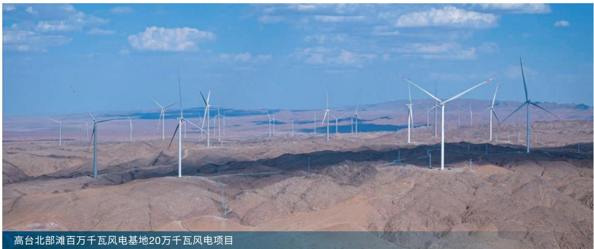

text_image

高台北部滩百万千瓦风电基地20万千瓦风电项目

## （四）在报告期内为减少其碳排放所采取的措施及效果

<table><tr><td>是否采取减碳措施</td><td>是</td></tr><tr><td>减少排放二氧化碳当量(单位:吨)</td><td>/</td></tr><tr><td>减碳措施类型(如使用清洁能源发电、在生产过程中使用减碳技术、研发生产助于减碳的新产品等)</td><td>在生产过程中使用减碳技术(例如:爬架外墙面分布式光伏电站应用技术、装配式桥梁技术、临建光伏及储能微电网系统应用技术、光储柴一体化移动能源供应模块技术、合规性骨料和低水泥胶凝材料混凝土应用技术,公司在中国建筑碳排放监测与管理综合服务平台的基础上建设绿色低碳建筑材料数据库和绿色低碳先进技术数据库,为公司生产经营的节能减碳提供案例和数据支撑)。研发生产助于减碳的新产品(例如:高性能围护结构、高气密性门窗系统、高效空调及换风系统和节能电气照明系统构成的超低能耗建筑产品,“光储直柔”系列、超级充电桩、仿铝板光伏组件产品,低噪声高效除霜风冷热泵系列产品,再生新型饰面材料无机人造石产品实现固体废弃物的全组分利用,利用率达95%以上,获得中国绿色建材三星级产品认证)。</td></tr></table>

具体说明

## √ 适用 □ 不适用

公司全面贯彻新发展理念，聚焦“双碳”战略目标，积极探索绿色建造发展模式，推动创新成果产品化、产业化发展，引领建筑业绿色低碳转型，助力行业高质量发展。

公司将绿色低碳攻关纳入企业科技发展整体规划，围绕绿色建筑材料、高效建筑设备、智慧楼宇系统等，加大“双碳”领域产品与技术研发投入，大力发展绿色建造、智能建造技术，攻关建筑节能、光伏一体化、“光储直柔”关键技术，推动绿色低碳新技术广泛应用，积极开展绿色低碳产品研发，致力实现技术水平和市场竞争力的显著提升。报告期内，公司围绕绿色低碳转型，在建筑新能源和绿色低碳领域立项了“中国建筑绿色低碳关键技术与发展战略研究”“海洋光伏体系高效建造技术及装备研发与应用”等24项公司科研课题，系统梳理绿色低碳技术科研体系框架，引领行业绿色低碳前沿技术研究。

公司以战略性新兴产业为核心引领，积极支持新能源、水务环保等战略性新兴产业发展，并鼓励子企业运用多元化方式，大力推动模式创新，全面布局战略性新兴产业，加快培育新质生产力。同时，公司积极构建风、光、水等清洁能源供应体系，运用清洁能源技术对基础设施的规划建设和运营维护进行全过程绿色低碳改造，引领建筑企业实现绿色低碳转型发展。报告期内，公司投资建设了一批水务环保、光伏发电、抽水蓄能电站、新能源汽车充电站、能源站项目。

公司坚持“厉行节约，善用资源”，关注日常办公环节的环境影响，识别并管理公司及各业务板块公司日常办公中的环境风险因素，开展创建千个绿色低碳办公场所专项工作，遴选首批30个办公场所入围示范项目，组织自用办公场所能耗情况数据调研工作，编制完成《中国建筑自用办公场所能耗情况调研报告》，并推行《中国建筑员工绿色低碳行为倡议书》，引导员工建立节约资源、绿色低碳的办公理念。

## 二、社会责任工作情况

## （一）是否单独披露社会责任报告、可持续发展报告或 ESG 报告

## √ 适用 □ 不适用

公司将在上海证券交易所网站披露可持续发展报告，相关情况敬请参阅报告相关内容。

## （二）社会责任工作具体情况

√ 适用 □ 不适用

<table><tr><td>对外捐赠、公益项目</td><td>数量/内容</td><td>情况说明</td></tr><tr><td>总投入(万元)</td><td>15,443</td><td>向甘肃省康乐县、卓尼县、康县、福建省长汀县、新疆英吉沙县等地区投入无偿帮扶资金;向中国儿童少年基金会、中国乡村发展协会捐赠资金。</td></tr><tr><td>其中:资金(万元)</td><td>15,363.94</td><td>主要用于援扶地区产业、人才、文化、生态、组织等五大振兴项目建设以及妇女儿童关爱保护等。</td></tr><tr><td>物资折款(万元)</td><td>79.06</td><td>向帮扶地区捐赠图书、生活物资等。</td></tr><tr><td>惠及人数(人)</td><td>507,890</td><td>/</td></tr></table>

具体说明

## √ 适用 □ 不适用

中国建筑积极履行社会责任，成立“中国建筑品牌工作协调小组”，持续发展品牌引领型社会责任管理模式，高度重视安全生产、保障产品质量、优化供应链管理、助力人才发展、投身社区建设、推进品牌引领行动，坚持以“横向业务线为基础、纵向子企业延伸”为推进路径，保障社会责任工作在全系统上下贯通、层层推进。

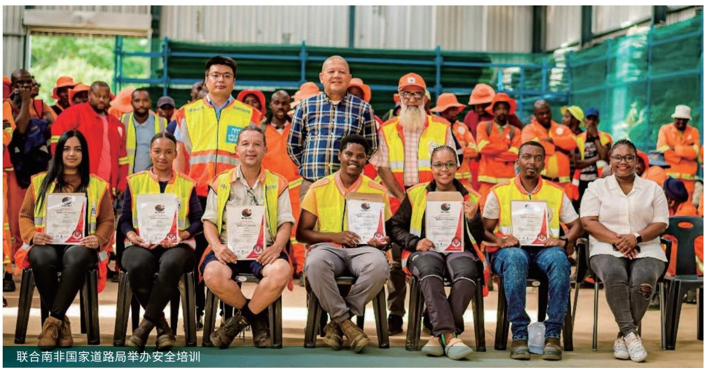

text_image

联合南非国家道路局举办安全培训

1. 培育责任文化。深入学习贯彻习近平文化思想，构建文化深化“133”工作体系，推出并深入宣贯企业文化手册《中建信条（2024版）》、行为规范手册《十典九章（2024版）》及海外文化融合版，组织“争做文明有礼中建人”活动千余场，引导员工将文化力量转化为践行社会责任的强劲动力。  
2. 深化责任实践。投身社会公益事业，投入资金1.54亿元，实施援扶项目58个。组织全国农村留守儿童关爱保护“百场宣讲进工地”“春蕾行动”等关爱活动115场次。在10个国家启动“鲁班工匠计划”。开展“建证未来”青年志愿服务活动超1万次，8个项目荣获“第七届中国青年志愿服务项目大赛”奖项，其中“追光小屋”项目荣获金奖。四个集体（个人）获评首都学雷锋志愿服务“五个100”先进典型。  
3. 强化责任沟通。将社区沟通参与纳入《文化融合指导手册》，重点海外机构编制并落实《文化融合执行手册》。制定《中建集团对外报告类成果设计指引》，编制6份国别可持续发展报告。3篇案例入选国务院国资委《中央企业社会责任蓝皮书(2024)》《中央企业海外ESG蓝皮书(2024)》《中央企业上市公司ESG蓝皮书(2024)》。  
4. 打造责任品牌。深入推进“中国建筑品牌引领行动”，发布集团科技品牌片、《智慧建造》纪录片，开展品牌故事短视频大赛。参加“中国品牌日”活动、中国品牌博览会，公司获评国务院国资委“中央企业品牌引领行动首批优秀成果”集团品牌，中海物业获评服务品牌。在英国Brand Finance发布的“2024年度中国品牌价值500强”榜单位列第13位、蝉联行业首位。

## 三、巩固拓展脱贫攻坚成果、乡村振兴等工作具体情况

√ 适用 □ 不适用

<table><tr><td>扶贫及乡村振兴项目</td><td>数量/内容</td><td>情况说明</td></tr><tr><td>总投入(万元)</td><td>14,893.27</td><td>向甘肃省康乐县、卓尼县、康县、福建省长汀县、新疆英吉沙县等地区投入无偿帮扶资金。</td></tr><tr><td>其中:资金(万元)</td><td>14,814.21</td><td>主要用于产业、人才、文化、生态、组织等五大振兴项目建设。</td></tr><tr><td>物资折款(万元)</td><td>79.06</td><td>向帮扶地区捐赠图书、生活物资等。</td></tr><tr><td>惠及人数(人)</td><td>507,890</td><td>/</td></tr><tr><td>帮扶形式(如产业扶贫、就业扶贫、教育扶贫等)</td><td>产业帮扶、就业帮扶、教育帮扶、消费帮扶、党建帮扶、助力解决“三保障”突出问题</td><td>/</td></tr></table>

具体说明

√ 适用 □ 不适用

## （一）乡村振兴工作规划

公司及其控股股东中建集团坚持以习近平新时代中国特色社会主义思想为指导，全面贯彻落实党的二十届三中全会和中央农村工作会议精神，学习运用“千万工程”经验，认真落实党中央、国务院决策部署，不折不扣履行政治责任，定点帮扶甘肃省康乐县、卓尼县、康县和对口支援福建省长汀县，有关子企业按照地方党委政府要求结对帮扶四川青川县、新疆英吉沙县等11个地区，助力全国乡村振兴大局。落实《中建集团助力乡村振兴工作管理办法》，编制印发工作要点和任务清单，召开3次乡村振兴工作会议，对全年乡村振兴工作做出详细规划，结合当地资源禀赋和县域发展实际，从产业、人才、文化、生态、组织5个方面助力帮扶地区乡村全面振兴。

## （二）乡村振兴工作概要

公司坚持以人民为中心，紧扣五大振兴，深入开展产业升级“三大行动”。一是特色产业扶持行动。着力推动乡村旅游产业集中连片发展，打造中药材种植加工、山泉水厂等产业链，助力特色产业发展壮大。二是产业集群打造行动。持续深化康乐香菇、卓尼木耳品牌建设，发挥建筑业优势带动当地劳务产业发展，加快推动产业集群建设。三是消费帮扶惠民行动。联合主办央企消费帮扶聚力行动，线上线下拓展帮销渠道，完善消费联农富农机制。

公司聚力办好民生改善“三件实事”。一是建设宜居宜业和美乡村。坚持做好乡村振兴村庄规划，大力扶持村集体经济，聚力打造乡村振兴示范点。二是激发乡村振兴内生动力。持续开展教育帮扶助学活动，深入推进基层干部、专业技能人才素质提升，为农业农村发展厚植人才根基。三是筑牢乡村振兴基层基础。广泛开展党建结对共建，以基建投资推动乡村建设发展，举办人文交融活动为载体，激发乡村全面振兴动力活力。

## （三）后续助力乡村振兴工作计划

2025年，公司将继续以习近平新时代中国特色社会主义思想为指导，全面贯彻落实党的二十届三中全会精神，深入贯彻落实习近平总书记关于“三农”工作的重要论述和重要指示批示精神，切实发挥建筑“全产业链”优势，加大强农惠农富农支持力度，聚力实现乡村“五大振兴”，统筹推进定点帮扶、对口支援、援疆援藏援青等工作，为助力乡村全面振兴、加快农业农村现代化和建设农业强国作出新的更大贡献。

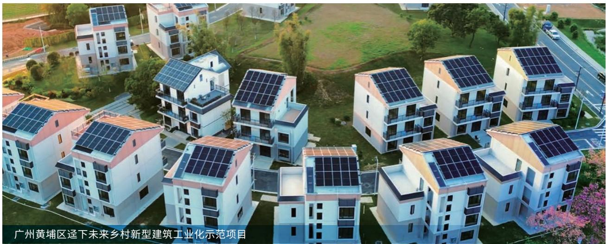

text_image

广州黄埔区迳下未来乡村新型建筑工业化示范项目

## 第六节

## 重要事项

一、承诺事项履行情况（一）公司实际控制人、股东、关联方、收购人以及公司等承诺相关方在报告期内或持续到报告期内的承诺事项

√ 适用 □ 不适用

<table><tr><td>承诺背景</td><td>承诺类型</td><td>承诺方</td><td>承诺内容</td><td>承诺时间</td><td>是否有履行期限</td><td>承诺期限</td><td>是否及时严格履行</td><td>如未能及时履行应说明未完成履行的具体原因</td><td>如未能及时履行应说明下一步计划</td></tr><tr><td rowspan="3">与首次公开发行相关的承诺</td><td>解决同业竞争</td><td>中建总公司</td><td>与本公司签署《避免同业竞争协议》,敬请参阅公司《中国建筑股份有限公司首次公开发行股票招股意向书》相关内容。</td><td>2009年7月29日</td><td>否</td><td>无期限</td><td>是</td><td>/</td><td>/</td></tr><tr><td>解决土地等产权瑕疵</td><td>中建总公司</td><td>对作为出资投入本公司纳入资产评估报告范围的土地使用权和房产,应本公司要求并在本公司的配合下,完成登记至公司或公司相关附属企业现有名称之下的相关手续。</td><td>2009年7月29日</td><td>否</td><td>无期限</td><td>是</td><td>/</td><td>/</td></tr><tr><td>解决土地等产权瑕疵</td><td>中建总公司</td><td>对作为出资投入本公司的房地产项目,于本公司设立之前已经确认收入的部分,如未来汇算清缴土地增值税时需补交土地增值税,由中建总公司承担。</td><td>2009年7月29日</td><td>否</td><td>无期限</td><td>是</td><td>/</td><td>/</td></tr><tr><td rowspan="3">其他对公司中小股东所作承诺</td><td>解决同业竞争</td><td>中国建筑</td><td>向控股香港上市子公司中国海外发展出具《非竞争承诺函》,公司原则上不再新增普通房地产开发业务,但由公司属下各工程局及设计院等子公司运营之房地产开发项目除外。</td><td>2015年3月20日</td><td>是</td><td>承诺期内</td><td>是</td><td>/</td><td>/</td></tr><tr><td>解决同业竞争</td><td>中国建筑</td><td>向控股香港上市子公司中海物业集团出具不竞争契据,敬请参阅中海物业集团于2015年10月14日发布的《上市文件-本公司全部已发行股本以介绍方式在香港联合交易所有限公司主板上市》相关内容。</td><td>2015年10月9日</td><td>是</td><td>承诺期内</td><td>是</td><td>/</td><td>/</td></tr><tr><td>其他</td><td>中建集团兼职的高级管理人员</td><td>保证担任公司高管一职期间勤勉尽职,处理好公司与其控股股东的关系,不辜负公司董事会和全体股东的信任,维护公司及股东的利益,不会因为兼职而做出任何损害上市公司及其中小股东利益的行为。</td><td>/</td><td>是</td><td>承诺期内</td><td>是</td><td>/</td><td>/</td></tr></table>

## （二）公司资产或项目存在盈利预测，且报告期仍处在盈利预测期间，公司就资产或项目是否达到原盈利预测及其原因作出说明

□ 已达到 □ 未达到 ☑ 不适用

## （三）业绩承诺的完成情况及其对商誉减值测试的影响

□适用 □不适用

## 二、报告期内控股股东及其他关联方非经营性占用资金情况

□适用 □不适用

## 三、违规担保情况

□适用 □不适用

## 四、公司董事会对会计师事务所“非标准意见审计报告”的说明

□适用 不适用

## 五、公司对会计政策、会计估计变更或重大会计差错更正原因和影响的分析说明

## （一）公司对会计政策、会计估计变更原因及影响的分析说明

□适用 不适用

## （二）公司对重大会计差错更正原因及影响的分析说明

□适用 不适用

## （三）与前任会计师事务所进行的沟通情况

□适用 不适用

## （四）审批程序及其他说明

□适用 □不适用

## 六、聘任、解聘会计师事务所情况

单位：万元 币种：人民币

<table><tr><td></td><td colspan="2">现聘任</td></tr><tr><td>境内会计师事务所名称</td><td colspan="2">安永华明会计师事务所(特殊普通合伙)</td></tr><tr><td>境内会计师事务所报酬</td><td colspan="2">4,480</td></tr><tr><td>境内会计师事务所审计年限</td><td colspan="2">5</td></tr><tr><td>境内会计师事务所注册会计师姓名</td><td colspan="2">沈岩、高君</td></tr><tr><td>境内会计师事务所注册会计师审计服务的累计年限</td><td colspan="2">5、1</td></tr><tr><td>境外会计师事务所名称</td><td colspan="2">/</td></tr><tr><td>境外会计师事务所报酬</td><td colspan="2">/</td></tr><tr><td>境外会计师事务所审计年限</td><td colspan="2">/</td></tr><tr><td></td><td>名称</td><td>报酬</td></tr><tr><td>内部控制审计会计师事务所</td><td>安永华明会计师事务所(特殊普通合伙)</td><td>315</td></tr><tr><td>财务顾问</td><td>/</td><td>/</td></tr><tr><td>保荐人</td><td>/</td><td>/</td></tr></table>

## 聘任、解聘会计师事务所的情况说明

## √ 适用 □ 不适用

2024年5月25日，经公司2023年年度股东大会分别审议通过，公司聘请安永华明会计师事务所（特殊普通合伙）为公司2024年度财务报告审计机构和内部控制审计机构，聘期一年。敬请参阅公司于2024年4月19日发布的《关于续聘2024年度会计师事务所的公告》、2024年5月17日发布的《2023年年度股东大会会议资料》、2024年5月25日发布的《2023年年度股东大会决议公告》。

审计期间改聘会计师事务所的情况说明

## □适用 □不适用

审计费用较上一年度下降20%以上（含20%）的情况说明

## □适用 不适用

## 七、面临退市风险的情况

## （一）导致退市风险警示的原因

□适用 □不适用

## （二）公司拟采取的应对措施

□适用 □不适用

## （三）面临终止上市的情况和原因

□适用 不适用

## 八、破产重整相关事项

□适用 不适用

## 九、重大诉讼、仲裁事项

□本年度公司有重大诉讼、仲裁事项√本年度公司无重大诉讼、仲裁事项

## （一）诉讼、仲裁事项已在临时公告披露且无后续进展的

□适用 不适用

## （二）临时公告未披露或有后续进展的诉讼、仲裁情况

□适用 □不适用

## （三）其他说明

□适用 □不适用

## 十、上市公司及其董事、监事、高级管理人员、控股股东、实际控制人涉嫌违法违规、受到处罚及整改情况

□适用 不适用

## 十一、报告期内公司及其控股股东、实际控制人诚信状况的说明

□适用 □不适用

## 十二、重大关联交易

## （一）与日常经营相关的关联交易

## 1、已在临时公告披露且后续实施无进展或变化的事项

√ 适用 □ 不适用

<table><tr><td>事项概述</td><td>查询索引</td></tr><tr><td>2023年12月7日和2023年12月27日,经公司第三届董事会第五十次会议、第三届监事会第二十五次会议和公司2023年第二次临时股东大会审议通过《关于中国建筑股份有限公司与中国建筑集团有限公司续签&lt;综合服务框架协议&gt;的议案》。</td><td></td></tr><tr><td>公司与中建集团就公司与中建集团及其子公司之间涉及的销售、采购、商业保理服务、融资租赁服务、物业租赁以及其他业务产生的关联交易续签《中国建筑集团有限公司与中国建筑股份有限公司综合服务框架协议》,在协议服务期内,公司与中建集团及其子公司之间涉及的销售业务不超过1.4亿元;采购业务不超过35亿元;商业保理业务(不含财务公司提供的商业保理业务)最高余额不超过1亿元,保理利息及服务费不超过0.06亿元;融资租赁服务业务(不含财务公司提供的融资租赁业务)最高余额不超过0.2亿元,融资租赁利息及服务费不超过0.01亿元;物业租赁不超过0.6亿元;其他日常关联交易业务不超过1亿元。</td><td>2023年12月8日发布的《第三届董事会第五十次会议决议公告》《第三届监事会第二十五次会议决议公告》《关于公司与中国建筑集团有限公司续签&lt;综合服务框架协议&gt;暨日常关联交易公告》。</td></tr><tr><td>报告期内,公司与中建集团及其子公司之间涉及的销售业务0.5亿元;采购业务16.8亿元;商业保理业务和融资租赁服务业务未发生;物业租赁0.4亿元;其他日常关联交易业务0.6亿元。公司实际发生的日常关联交易金额,在协议约定范围内。</td><td>2023年12月28日发布的《2023年第二次临时股东大会决议公告》。</td></tr><tr><td>2023年12月7日和2023年12月27日,经公司第三届董事会第五十次会议、第三届监事会第二十五次会议和公司2023年第二次临时股东大会审议通过《关于中建财务有限公司与中国建筑集团有限公司续签&lt;金融服务框架协议&gt;的议案》。</td><td></td></tr><tr><td>公司下属子公司中建财务公司与中建集团就中建财务公司为中建集团及其子公司提供存款、信贷、财务和融资顾问等相关金融服务产生的关联交易续签《中国建筑集团有限公司与中建财务有限公司金融服务框架协议》。在协议服务期内,中建集团及其子公司于中建财务公司存置的每日最高存款余额(含应计利息)不超过200亿元,获得的每日信贷余额(含应计利息)不超过每日最高存款余额(含应计利息);中建财务公司为中建集团及其子公司提供其他金融服务所收取的服务费用不超过3亿元。</td><td>2023年12月8日发布的《第三届董事会第五十次会议决议公告》《第三届监事会第二十五次会议决议公告》《关于中建财务有限公司与中国建筑集团有限公司续签&lt;金融服务框架协议&gt;暨日常关联交易公告》。</td></tr><tr><td>报告期内实际履行情况符合协议约定,实际发生的中建集团及其子公司在中建财务公司存置的每日最高存款余额(含应计利息)为91.3亿元,每日最高信贷余额(含应计利息)为20亿元;中建财务公司为中建集团及其子公司提供其他金融服务所收取的服务费用0.04亿元;详情敬请参阅本报告第六节“十、重大关联交易”“(五)公司与存在关联关系的财务公司、公司控股财务公司与关联方之间的金融业务”相关内容。2024年12月4日和2024年12月24日,经公司第四届董事会第八次会议、第四届监事会第三次会议和公司2024年第三次临时股东大会审议通过《关于中国建筑股份有限公司与中国建筑集团有限公司续签&lt;综合服务框架协议&gt;的议案》。</td><td>2023年12月28日发布的《2023年第二次临时股东大会决议公告》。</td></tr><tr><td>公司与中建集团就公司与中建集团及其子公司之间涉及的销售、采购、商业保理服务、融资租赁服务、物业租赁以及其他业务产生的关联交易续签《中国建筑集团有限公司与中国建筑股份有限公司综合服务框架协议》,在协议服务期内,公司与中建集团及其子公司之间涉及的销售业务不超过2亿元;采购业务不超过30亿元;商业保理业务(不含财务公司提供的商业保理业务)最高余额不超过1亿元,保理利息及服务费不超过0.06亿元;融资租赁服务业务(不含财务公司提供的融资租赁业务)最高余额不超过1亿元,融资租赁利息及服务费不超过0.06亿元;物业租赁不超过1亿元;其他日常关联交易业务不超过1亿元。</td><td>2024年12月5日发布的《第四届董事会第八次会议决议公告》《第四届监事会第三次会议决议公告》《关于公司与中国建筑集团有限公司续签&lt;综合服务框架协议&gt;暨日常关联交易公告》。2024年12月25日发布的《2024年第三次临时股东大会决议公告》。</td></tr><tr><td>2024年12月4日和2024年12月24日,经公司第四届董事会第八次会议、第四届监事会第三次会议和公司2024年第三次临时股东大会审议通过《关于中建财务有限公司与中国建筑集团有限公司续签&lt;金融服务框架协议&gt;的议案》。</td><td></td></tr><tr><td>公司下属子公司中建财务公司与中建集团就中建财务公司为中建集团及其子公司提供存款、综合授信、财务和融资顾问等相关金融服务产生的关联交易续签《中国建筑集团有限公司与中建财务有限公司金融服务框架协议》。在协议服务期内,中建集团及其子公司于中建财务公司存置的每日最高存款余额(含应计利息)不超过200亿元;获得的综合授信额度不超过200亿元,其中贷款额度不超过120亿元,获得的每日贷款余额(含应计利息)不超过每日最高存款余额(含应计利息);中建财务公司为中建集团及其子公司提供其他金融服务所收取的服务费用不超过3亿元。</td><td>2024年12月5日发布的《第四届董事会第八次会议决议公告》《第四届监事会第三次会议决议公告》《关于中建财务有限公司与中国建筑集团有限公司续签&lt;金融服务框架协议&gt;暨日常关联交易公告》。2024年12月25日发布的《2024年第三次临时股东大会决议公告》。</td></tr></table>

## 2、已在临时公告披露，但有后续实施的进展或变化的事项

□适用 □不适用

## 3、临时公告未披露的事项

□适用 □不适用

## （二）资产收购或股权收购、出售发生的关联交易

## 1、已在临时公告披露且后续实施无进展或变化的事项

□适用 □不适用

## 2、已在临时公告披露，但有后续实施的进展或变化的事项

□适用 □不适用

## 3、临时公告未披露的事项

□适用 □不适用

## 4、涉及业绩约定的，应当披露报告期内的业绩实现情况

□适用 □不适用

## （三）共同对外投资的重大关联交易

## 1、已在临时公告披露且后续实施无进展或变化的事项

□适用 □不适用

## 2、已在临时公告披露，但有后续实施的进展或变化的事项

□适用 □不适用

## 3、临时公告未披露的事项

□适用 □不适用

## （四）关联债权债务往来

## 1、已在临时公告披露且后续实施无进展或变化的事项

□适用 □不适用

## 2、已在临时公告披露，但有后续实施的进展或变化的事项

□适用 □不适用

## 3、临时公告未披露的事项

□适用 □不适用

## （五）公司与存在关联关系的财务公司、公司控股财务公司与关联方之间的金融业务

√ 适用 □ 不适用

## 1. 存款业务

√ 适用 □ 不适用

单位：千元 币种：人民币

<table><tr><td rowspan="2">关联方</td><td rowspan="2">关联关系</td><td rowspan="2">每日最高存款限额(含应计利息)</td><td rowspan="2">存款利率范围(%)</td><td rowspan="2">期初余额</td><td colspan="3">本期发生额</td></tr><tr><td>本期合计存入金额</td><td>本期合计取出金额</td><td>期末余额</td></tr><tr><td>中建集团及其子公司</td><td>控股股东及其直接或间接控制的公司</td><td>20,000,000</td><td>0.355-1.5</td><td>3,068,848</td><td>47,827,019</td><td>48,423,912</td><td>2,471,955</td></tr><tr><td>合计</td><td>/</td><td>/</td><td>/</td><td>3,068,848</td><td>47,827,019</td><td>48,423,912</td><td>2,471,955</td></tr></table>

## 2. 贷款业务

√ 适用 □ 不适用

单位：千元 币种：人民币

<table><tr><td rowspan="2">关联方</td><td rowspan="2">关联关系</td><td rowspan="2">贷款额度</td><td rowspan="2">贷款利率范围(%)</td><td rowspan="2">期初余额</td><td colspan="3">本期发生额</td></tr><tr><td>本期合计贷款金额</td><td>本期合计还款金额</td><td>期末余额</td></tr><tr><td>中建集团及其子公司</td><td>控股股东及其直接或间接控制的公司</td><td>不超过每日最高存款限额(含应计利息)</td><td>2.4-2.6</td><td>2,001,589</td><td>2,047,614</td><td>2,049,203</td><td>2,000,000</td></tr><tr><td>合计</td><td>/</td><td>/</td><td>/</td><td>2,001,589</td><td>2,047,614</td><td>2,049,203</td><td>2,000,000</td></tr></table>

## 3. 授信业务或其他金融业务

√ 适用 □ 不适用

单位：千元 币种：人民币

<table><tr><td>关联方</td><td>关联关系</td><td>业务类型</td><td>总额</td><td>实际发生额</td></tr><tr><td>中建集团及其子公司</td><td>控股股东及其直接或间接控制的公司</td><td>其他金融业务</td><td>300,000</td><td>4,400</td></tr></table>

## 4. 其他说明

## √ 适用 □ 不适用

公司上述关联交易事项已经公司第三届董事会第五十次会议、第三届监事会第二十五次会议和公司2023年第二次临时股东大会及公司第四届董事会第八次会议、第四届监事会第三次会议、2024年第三次临时股东大会审议通过，详情敬请参阅本报告第六节“十二、重大关联交易”“（一）与日常经营相关的关联交易”相关内容。

## (六) 其他

## √ 适用 □ 不适用

公司关联交易情况敬请参阅本报告第十节“财务报告”财务报表附注十二“关联方关系及其交易”相关内容。

## 十三、重大合同及其履行情况

## （一）托管、承包、租赁事项

## 1、托管情况

□适用 □不适用

## 2、承包情况

□适用 □不适用

## 3、租赁情况

□适用 □不适用

（二）担保情况  
√ 适用 □ 不适用  
单位：千元 币种：人民币

<table><tr><td colspan="15">公司对外担保情况(不包括对子公司的担保)</td></tr><tr><td>担保方</td><td>担保方与上市公司的关系</td><td>被担保方</td><td>担保金额</td><td>担保发生日期(协议签署日)</td><td>担保起始日</td><td>担保到期日</td><td>担保类型</td><td>担保物(如有)</td><td>担保是否已经履行完毕</td><td>担保是否逾期</td><td>担保逾期金额</td><td>反担保情况</td><td>是否为关联方担保</td><td>关联关系</td></tr><tr><td>中国海外集团有限公司</td><td>控股子公司</td><td>广州碧臻房地产开发有限公司</td><td>31,415</td><td>2018/12/11</td><td>2018/12/11</td><td>2026/6/8</td><td>连带责任担保</td><td>无</td><td>否</td><td>否</td><td>0</td><td>否</td><td>是</td><td>联营公司</td></tr><tr><td>中国海外集团有限公司</td><td>控股子公司</td><td>株洲中海宏洋地产有限公司</td><td>75,000</td><td>2024/4/30</td><td>2024/4/30</td><td>2030/4/29</td><td>连带责任担保</td><td>无</td><td>否</td><td>否</td><td>0</td><td>否</td><td>是</td><td>联营公司</td></tr><tr><td>中国海外集团有限公司</td><td>控股子公司</td><td>株洲中海宏洋地产有限公司</td><td>45,000</td><td>2024/9/14</td><td>2024/9/14</td><td>2027/4/30</td><td>连带责任担保</td><td>无</td><td>否</td><td>否</td><td>0</td><td>否</td><td>是</td><td>联营公司</td></tr><tr><td>中国海外集团有限公司</td><td>控股子公司</td><td>长沙亿达创智置业发展有限公司</td><td>143,570</td><td>2020/4/20</td><td>2020/4/20</td><td>2026/4/20</td><td>连带责任担保</td><td>无</td><td>否</td><td>否</td><td>0</td><td>否</td><td>是</td><td>合营公司</td></tr><tr><td>中国海外集团有限公司</td><td>控股子公司</td><td>Infinite Sun Limited</td><td>1,119,148</td><td>2019/12/4</td><td>2019/12/4</td><td>2025/12/4</td><td>连带责任担保</td><td>无</td><td>否</td><td>否</td><td>0</td><td>否</td><td>是</td><td>合营公司</td></tr><tr><td>中国海外集团有限公司</td><td>控股子公司</td><td>Infinite Sun Limited</td><td>257,145</td><td>2022/1/25</td><td>2022/1/25</td><td>2025/12/4</td><td>连带责任担保</td><td>无</td><td>否</td><td>否</td><td>0</td><td>否</td><td>是</td><td>合营公司</td></tr><tr><td>中国海外集团有限公司</td><td>控股子公司</td><td>Infinite Sun Limited</td><td>281,720</td><td>2023/1/30</td><td>2023/1/30</td><td>2025/12/4</td><td>连带责任担保</td><td>无</td><td>否</td><td>否</td><td>0</td><td>否</td><td>是</td><td>合营公司</td></tr><tr><td>中国海外集团有限公司</td><td>控股子公司</td><td>Infinite Sun Limited</td><td>130,021</td><td>2023/7/18</td><td>2023/7/18</td><td>2025/12/4</td><td>连带责任担保</td><td>无</td><td>否</td><td>否</td><td>0</td><td>否</td><td>是</td><td>合营公司</td></tr><tr><td>中国海外集团有限公司</td><td>控股子公司</td><td>Infinite Sun Limited</td><td>86,254</td><td>2024/1/12</td><td>2024/1/12</td><td>2025/12/4</td><td>连带责任担保</td><td>无</td><td>否</td><td>否</td><td>0</td><td>否</td><td>是</td><td>合营公司</td></tr><tr><td>中国海外集团有限公司</td><td>控股子公司</td><td>Infinite Sun Limited</td><td>49,394</td><td>2024/7/24</td><td>2024/7/24</td><td>2025/12/4</td><td>连带责任担保</td><td>无</td><td>否</td><td>否</td><td>0</td><td>否</td><td>是</td><td>合营公司</td></tr><tr><td>中国海外集团有限公司</td><td>控股子公司</td><td>Marble Edge Investments Limited</td><td>559,560</td><td>2020/6/1</td><td>2020/6/1</td><td>2025/12/1</td><td>连带责任担保</td><td>无</td><td>否</td><td>否</td><td>0</td><td>否</td><td>是</td><td>合营公司</td></tr><tr><td>中国海外集团有限公司</td><td>控股子公司</td><td>Marble Edge Investments Limited</td><td>143,568</td><td>2022/5/12</td><td>2022/5/12</td><td>2025/12/1</td><td>连带责任担保</td><td>无</td><td>否</td><td>否</td><td>0</td><td>否</td><td>是</td><td>合营公司</td></tr><tr><td>中国海外集团有限公司</td><td>控股子公司</td><td>Marble Edge Investments Limited</td><td>113,441</td><td>2023/2/9</td><td>2023/2/9</td><td>2025/12/1</td><td>连带责任担保</td><td>无</td><td>否</td><td>否</td><td>0</td><td>否</td><td>是</td><td>合营公司</td></tr><tr><td>中国海外集团有限公司</td><td>控股子公司</td><td>Marble Edge Investments Limited</td><td>109,284</td><td>2023/7/12</td><td>2023/7/12</td><td>2025/12/1</td><td>连带责任担保</td><td>无</td><td>否</td><td>否</td><td>0</td><td>否</td><td>是</td><td>合营公司</td></tr><tr><td>中国海外集团有限公司</td><td>控股子公司</td><td>Marble Edge Investments Limited</td><td>32,112</td><td>2024/1/18</td><td>2024/1/18</td><td>2025/12/1</td><td>连带责任担保</td><td>无</td><td>否</td><td>否</td><td>0</td><td>否</td><td>是</td><td>合营公司</td></tr><tr><td>中国海外集团有限公司</td><td>控股子公司</td><td>Marble Edge Investments Limited</td><td>13,140</td><td>2024/10/23</td><td>2024/10/23</td><td>2025/12/1</td><td>连带责任担保</td><td>无</td><td>否</td><td>否</td><td>0</td><td>否</td><td>是</td><td>合营公司</td></tr><tr><td>中国海外集团有限公司</td><td>控股子公司</td><td>Dragon Star H.K. Investments Limited</td><td>901,192</td><td>2020/7/27</td><td>2020/7/27</td><td>2025/7/27</td><td>连带责任担保</td><td>无</td><td>否</td><td>否</td><td>0</td><td>否</td><td>是</td><td>合营公司</td></tr><tr><td>中国海外集团有限公司</td><td>控股子公司</td><td>Dragon Star H.K. Investments Limited</td><td>125,569</td><td>2022/1/17</td><td>2022/1/17</td><td>2025/7/27</td><td>连带责任担保</td><td>无</td><td>否</td><td>否</td><td>0</td><td>否</td><td>是</td><td>合营公司</td></tr><tr><td>中国海外集团有限公司</td><td>控股子公司</td><td>Dragon Star H.K. Investments Limited</td><td>115,248</td><td>2023/1/11</td><td>2023/1/11</td><td>2025/7/27</td><td>连带责任担保</td><td>无</td><td>否</td><td>否</td><td>0</td><td>否</td><td>是</td><td>合营公司</td></tr><tr><td>中国海外集团有限公司</td><td>控股子公司</td><td>Dragon Star H.K. Investments Limited</td><td>179,392</td><td>2023/7/10</td><td>2023/7/10</td><td>2025/7/27</td><td>连带责任担保</td><td>无</td><td>否</td><td>否</td><td>0</td><td>否</td><td>是</td><td>合营公司</td></tr><tr><td>中国海外集团有限公司</td><td>控股子公司</td><td>Dragon Star H.K. Investments Limited</td><td>184,764</td><td>2024/1/12</td><td>2024/1/12</td><td>2025/7/27</td><td>连带责任担保</td><td>无</td><td>否</td><td>否</td><td>0</td><td>否</td><td>是</td><td>合营公司</td></tr><tr><td>中国海外集团有限公司</td><td>控股子公司</td><td>Dragon Star H.K. Investments Limited</td><td>74,649</td><td>2024/7/11</td><td>2024/7/11</td><td>2025/7/27</td><td>连带责任担保</td><td>无</td><td>否</td><td>否</td><td>0</td><td>否</td><td>是</td><td>合营公司</td></tr><tr><td>中国海外集团有限公司</td><td>控股子公司</td><td>Ultra Keen Holdings Limited</td><td>1,745,958</td><td>2020/11/11</td><td>2020/11/11</td><td>2025/10/30</td><td>连带责任担保</td><td>无</td><td>否</td><td>否</td><td>0</td><td>否</td><td>是</td><td>合营公司</td></tr></table>

<table><tr><td colspan="15">公司对外担保情况(不包括对子公司的担保)</td></tr><tr><td>担保方</td><td>担保方与上市公司的关系</td><td>被担保方</td><td>担保金额</td><td>担保发生日期(协议签署日)</td><td>担保起始日</td><td>担保到期日</td><td>担保类型</td><td>担保物(如有)</td><td>担保是否已经履行完毕</td><td>担保是否逾期</td><td>担保逾期金额</td><td>反担保情况</td><td>是否为关联方担保</td><td>关联关系</td></tr><tr><td>中国海外集团有限公司</td><td>控股子公司</td><td>Ultra Keen Holdings Limited</td><td>215,642</td><td>2022/1/31</td><td>2022/1/31</td><td>2025/10/30</td><td>连带责任担保</td><td>无</td><td>否</td><td>否</td><td>0</td><td>否</td><td>是</td><td>合营公司</td></tr><tr><td>中国海外集团有限公司</td><td>控股子公司</td><td>Ultra Keen Holdings Limited</td><td>301,815</td><td>2023/1/19</td><td>2023/1/19</td><td>2025/10/30</td><td>连带责任担保</td><td>无</td><td>否</td><td>否</td><td>0</td><td>否</td><td>是</td><td>合营公司</td></tr><tr><td>中国海外集团有限公司</td><td>控股子公司</td><td>Ultra Keen Holdings Limited</td><td>375,256</td><td>2023/7/19</td><td>2023/7/19</td><td>2025/10/30</td><td>连带责任担保</td><td>无</td><td>否</td><td>否</td><td>0</td><td>否</td><td>是</td><td>合营公司</td></tr><tr><td>中国海外集团有限公司</td><td>控股子公司</td><td>Ultra Keen Holdings Limited</td><td>66,130</td><td>2024/1/11</td><td>2024/1/11</td><td>2025/10/30</td><td>连带责任担保</td><td>无</td><td>否</td><td>否</td><td>0</td><td>否</td><td>是</td><td>合营公司</td></tr><tr><td>中国海外集团有限公司</td><td>控股子公司</td><td>Grand Ample Ltd.</td><td>104,157</td><td>2022/1/10</td><td>2022/1/10</td><td>2025/6/22</td><td>连带责任担保</td><td>无</td><td>否</td><td>否</td><td>0</td><td>否</td><td>是</td><td>合营公司</td></tr><tr><td>中国海外集团有限公司</td><td>控股子公司</td><td>Grand Ample Ltd.</td><td>128,160</td><td>2023/1/11</td><td>2023/1/11</td><td>2025/6/22</td><td>连带责任担保</td><td>无</td><td>否</td><td>否</td><td>0</td><td>否</td><td>是</td><td>合营公司</td></tr><tr><td>中国海外集团有限公司</td><td>控股子公司</td><td>Grand Ample Ltd.</td><td>218,233</td><td>2023/7/3</td><td>2023/7/3</td><td>2025/6/22</td><td>连带责任担保</td><td>无</td><td>否</td><td>否</td><td>0</td><td>否</td><td>是</td><td>合营公司</td></tr><tr><td>中国海外集团有限公司</td><td>控股子公司</td><td>Grand Ample Ltd.</td><td>53,670</td><td>2024/1/5</td><td>2024/1/5</td><td>2025/6/22</td><td>连带责任担保</td><td>无</td><td>否</td><td>否</td><td>0</td><td>否</td><td>是</td><td>合营公司</td></tr><tr><td>中国海外集团有限公司</td><td>控股子公司</td><td>Grand Ample Ltd.</td><td>783,241</td><td>2024/7/24</td><td>2024/7/24</td><td>2025/6/22</td><td>连带责任担保</td><td>无</td><td>否</td><td>否</td><td>0</td><td>否</td><td>是</td><td>合营公司</td></tr><tr><td>中国海外集团有限公司</td><td>控股子公司</td><td>Asia Power Development Limited</td><td>1,199,970</td><td>2022/5/27</td><td>2022/5/27</td><td>2026/5/27</td><td>连带责任担保</td><td>无</td><td>否</td><td>否</td><td>0</td><td>否</td><td>是</td><td>合营公司</td></tr><tr><td>中国海外集团有限公司</td><td>控股子公司</td><td>Asia Power Development Limited</td><td>378,401</td><td>2023/1/27</td><td>2023/1/27</td><td>2026/5/27</td><td>连带责任担保</td><td>无</td><td>否</td><td>否</td><td>0</td><td>否</td><td>是</td><td>合营公司</td></tr><tr><td>中国海外集团有限公司</td><td>控股子公司</td><td>Asia Power Development Limited</td><td>205,989</td><td>2023/7/27</td><td>2023/7/27</td><td>2026/5/27</td><td>连带责任担保</td><td>无</td><td>否</td><td>否</td><td>0</td><td>否</td><td>是</td><td>合营公司</td></tr><tr><td>中国海外集团有限公司</td><td>控股子公司</td><td>Asia Power Development Limited</td><td>253,187</td><td>2024/1/25</td><td>2024/1/25</td><td>2026/5/27</td><td>连带责任担保</td><td>无</td><td>否</td><td>否</td><td>0</td><td>否</td><td>是</td><td>合营公司</td></tr><tr><td>中国海外集团有限公司</td><td>控股子公司</td><td>Asia Power Development Limited</td><td>45,652</td><td>2024/7/31</td><td>2024/7/31</td><td>2026/5/27</td><td>连带责任担保</td><td>无</td><td>否</td><td>否</td><td>0</td><td>否</td><td>是</td><td>合营公司</td></tr><tr><td>中国海外集团有限公司</td><td>控股子公司</td><td>重庆中建海龙两江建筑科技有限公司</td><td>97,279</td><td>2021/10/29</td><td>2021/10/29</td><td>2031/10/29</td><td>连带责任担保</td><td>无</td><td>否</td><td>否</td><td>0</td><td>否</td><td>是</td><td>合营公司</td></tr><tr><td>中国海外集团有限公司</td><td>控股子公司</td><td>重庆中建海龙两江建筑科技有限公司</td><td>2,016</td><td>2023/10/29</td><td>2023/10/29</td><td>2031/10/29</td><td>连带责任担保</td><td>无</td><td>否</td><td>否</td><td>0</td><td>否</td><td>是</td><td>合营公司</td></tr><tr><td>中国海外集团有限公司</td><td>控股子公司</td><td>重庆中建海龙两江建筑科技有限公司</td><td>2,170</td><td>2023/10/29</td><td>2023/10/29</td><td>2026/5/10</td><td>连带责任担保</td><td>无</td><td>否</td><td>否</td><td>0</td><td>否</td><td>是</td><td>合营公司</td></tr><tr><td>中国海外集团有限公司</td><td>控股子公司</td><td>上海永年里房地产开发有限公司</td><td>39,200</td><td>2022/9/28</td><td>2022/9/28</td><td>2034/9/27</td><td>连带责任担保</td><td>无</td><td>否</td><td>否</td><td>0</td><td>否</td><td>否</td><td>其他</td></tr><tr><td>中国海外集团有限公司</td><td>控股子公司</td><td>上海永年里房地产开发有限公司</td><td>126,800</td><td>2022/11/10</td><td>2022/11/10</td><td>2034/9/27</td><td>连带责任担保</td><td>无</td><td>否</td><td>否</td><td>0</td><td>否</td><td>否</td><td>其他</td></tr><tr><td>中国海外集团有限公司</td><td>控股子公司</td><td>上海永年里房地产开发有限公司</td><td>26,860</td><td>2022/12/19</td><td>2022/12/19</td><td>2034/9/27</td><td>连带责任担保</td><td>无</td><td>否</td><td>否</td><td>0</td><td>否</td><td>否</td><td>其他</td></tr><tr><td>中国海外集团有限公司</td><td>控股子公司</td><td>上海永年里房地产开发有限公司</td><td>20,000</td><td>2023/2/9</td><td>2023/2/9</td><td>2034/9/27</td><td>连带责任担保</td><td>无</td><td>否</td><td>否</td><td>0</td><td>否</td><td>否</td><td>其他</td></tr><tr><td>中国海外集团有限公司</td><td>控股子公司</td><td>上海永年里房地产开发有限公司</td><td>1,801</td><td>2023/3/20</td><td>2023/3/20</td><td>2034/9/27</td><td>连带责任担保</td><td>无</td><td>否</td><td>否</td><td>0</td><td>否</td><td>否</td><td>其他</td></tr><tr><td>中国海外集团有限公司</td><td>控股子公司</td><td>上海永年里房地产开发有限公司</td><td>11,000</td><td>2023/6/9</td><td>2023/6/9</td><td>2034/9/27</td><td>连带责任担保</td><td>无</td><td>否</td><td>否</td><td>0</td><td>否</td><td>否</td><td>其他</td></tr><tr><td>中国海外集团有限公司</td><td>控股子公司</td><td>上海永年里房地产开发有限公司</td><td>1,900</td><td>2023/6/20</td><td>2023/6/20</td><td>2034/9/27</td><td>连带责任担保</td><td>无</td><td>否</td><td>否</td><td>0</td><td>否</td><td>否</td><td>其他</td></tr><tr><td>中国海外集团有限公司</td><td>控股子公司</td><td>上海永年里房地产开发有限公司</td><td>14,000</td><td>2023/9/18</td><td>2023/9/18</td><td>2034/9/27</td><td>连带责任担保</td><td>无</td><td>否</td><td>否</td><td>0</td><td>否</td><td>否</td><td>其他</td></tr><tr><td>中国海外集团有限公司</td><td>控股子公司</td><td>上海永年里房地产开发有限公司</td><td>1,631</td><td>2023/9/20</td><td>2023/9/20</td><td>2034/9/27</td><td>连带责任担保</td><td>无</td><td>否</td><td>否</td><td>0</td><td>否</td><td>否</td><td>其他</td></tr><tr><td>中国海外集团有限公司</td><td>控股子公司</td><td>上海永年里房地产开发有限公司</td><td>4,000</td><td>2023/11/27</td><td>2023/11/27</td><td>2034/9/27</td><td>连带责任担保</td><td>无</td><td>否</td><td>否</td><td>0</td><td>否</td><td>否</td><td>其他</td></tr><tr><td>中国海外集团有限公司</td><td>控股子公司</td><td>上海永年里房地产开发有限公司</td><td>1,724</td><td>2023/12/19</td><td>2023/12/19</td><td>2034/9/27</td><td>连带责任担保</td><td>无</td><td>否</td><td>否</td><td>0</td><td>否</td><td>否</td><td>其他</td></tr><tr><td>中国海外集团有限公司</td><td>控股子公司</td><td>上海永年里房地产开发有限公司</td><td>1,706</td><td>2024/3/20</td><td>2024/3/20</td><td>2034/9/27</td><td>连带责任担保</td><td>无</td><td>否</td><td>否</td><td>0</td><td>否</td><td>否</td><td>其他</td></tr><tr><td>中国海外集团有限公司</td><td>控股子公司</td><td>上海永年里房地产开发有限公司</td><td>1,049</td><td>2024/4/24</td><td>2024/4/24</td><td>2034/9/27</td><td>连带责任担保</td><td>无</td><td>否</td><td>否</td><td>0</td><td>否</td><td>否</td><td>其他</td></tr><tr><td>中国海外集团有限公司</td><td>控股子公司</td><td>上海永年里房地产开发有限公司</td><td>600</td><td>2024/5/30</td><td>2024/5/30</td><td>2034/9/27</td><td>连带责任担保</td><td>无</td><td>否</td><td>否</td><td>0</td><td>否</td><td>否</td><td>其他</td></tr><tr><td>中国海外集团有限公司</td><td>控股子公司</td><td>上海永年里房地产开发有限公司</td><td>1,733</td><td>2024/6/19</td><td>2024/6/19</td><td>2034/9/27</td><td>连带责任担保</td><td>无</td><td>否</td><td>否</td><td>0</td><td>否</td><td>否</td><td>其他</td></tr><tr><td>中国海外集团有限公司</td><td>控股子公司</td><td>上海永年里房地产开发有限公司</td><td>3,200</td><td>2024/6/25</td><td>2024/6/25</td><td>2034/9/27</td><td>连带责任担保</td><td>无</td><td>否</td><td>否</td><td>0</td><td>否</td><td>否</td><td>其他</td></tr><tr><td>中国海外集团有限公司</td><td>控股子公司</td><td>上海永年里房地产开发有限公司</td><td>1,768</td><td>2024/9/19</td><td>2024/9/19</td><td>2034/9/19</td><td>连带责任担保</td><td>无</td><td>否</td><td>否</td><td>0</td><td>否</td><td>否</td><td>其他</td></tr><tr><td>中国海外集团有限公司</td><td>控股子公司</td><td>上海永年里房地产开发有限公司</td><td>4,000</td><td>2024/11/19</td><td>2024/11/19</td><td>2034/11/19</td><td>连带责任担保</td><td>无</td><td>否</td><td>否</td><td>0</td><td>否</td><td>否</td><td>其他</td></tr><tr><td>中国海外集团有限公司</td><td>控股子公司</td><td>上海永年里房地产开发有限公司</td><td>1,766</td><td>2024/12/19</td><td>2024/12/19</td><td>2034/12/19</td><td>连带责任担保</td><td>无</td><td>否</td><td>否</td><td>0</td><td>否</td><td>否</td><td>其他</td></tr><tr><td>中国海外集团有限公司</td><td>控股子公司</td><td>安徽蚌五高速公路投资管理有限公司</td><td>235,200</td><td>2023/3/17</td><td>2023/3/17</td><td>2041/3/20</td><td>连带责任担保</td><td>无</td><td>否</td><td>否</td><td>0</td><td>否</td><td>是</td><td>合营公司</td></tr><tr><td>中国海外集团有限公司</td><td>控股子公司</td><td>广东海朝科技产业发展有限公司</td><td>21,980</td><td>2022/10/31</td><td>2022/10/31</td><td>2041/10/31</td><td>连带责任担保</td><td>无</td><td>否</td><td>否</td><td>0</td><td>否</td><td>是</td><td>合营公司</td></tr><tr><td>中国海外集团有限公司</td><td>控股子公司</td><td>广东海朝科技产业发展有限公司</td><td>39,557</td><td>2023/1/29</td><td>2023/1/29</td><td>2041/10/24</td><td>连带责任担保</td><td>无</td><td>否</td><td>否</td><td>0</td><td>否</td><td>是</td><td>合营公司</td></tr><tr><td>中国海外集团有限公司</td><td>控股子公司</td><td>广东海朝科技产业发展有限公司</td><td>89,376</td><td>2023/7/19</td><td>2023/7/19</td><td>2041/10/24</td><td>连带责任担保</td><td>无</td><td>否</td><td>否</td><td>0</td><td>否</td><td>是</td><td>合营公司</td></tr><tr><td>中国海外集团有限公司</td><td>控股子公司</td><td>广东海朝科技产业发展有限公司</td><td>36,680</td><td>2024/1/4</td><td>2024/1/4</td><td>2041/10/24</td><td>连带责任担保</td><td>无</td><td>否</td><td>否</td><td>0</td><td>否</td><td>是</td><td>合营公司</td></tr><tr><td>中国海外集团有限公司</td><td>控股子公司</td><td>广东海朝科技产业发展有限公司</td><td>37,511</td><td>2024/8/24</td><td>2024/8/24</td><td>2039/10/24</td><td>连带责任担保</td><td>无</td><td>否</td><td>否</td><td>0</td><td>否</td><td>是</td><td>合营公司</td></tr><tr><td>中国海外集团有限公司</td><td>控股子公司</td><td>Capital Asian Limited</td><td>393,760</td><td>2024/1/27</td><td>2024/1/27</td><td>2026/1/27</td><td>连带责任担保</td><td>无</td><td>否</td><td>否</td><td>0</td><td>否</td><td>是</td><td>联营公司</td></tr><tr><td>中国海外集团有限公司</td><td>控股子公司</td><td>杭州云中生物医药有限公司</td><td>61,253</td><td>2024/3/5</td><td>2024/3/5</td><td>2045/3/4</td><td>连带责任担保</td><td>无</td><td>否</td><td>否</td><td>0</td><td>否</td><td>是</td><td>合营公司</td></tr><tr><td>中国海外集团有限公司</td><td>控股子公司</td><td>杭州云中生物医药有限公司</td><td>10,058</td><td>2024/7/26</td><td>2024/7/26</td><td>2045/3/4</td><td>连带责任担保</td><td>无</td><td>否</td><td>否</td><td>0</td><td>否</td><td>是</td><td>合营公司</td></tr><tr><td>中国建筑第三工程局有限公司</td><td>控股子公司</td><td>武汉光谷科学岛建设发展有限公司</td><td>150,000</td><td>2022/9/13</td><td>2022/9/13</td><td>2040/9/15</td><td>连带责任担保</td><td>无</td><td>否</td><td>否</td><td>0</td><td>否</td><td>是</td><td>合营公司</td></tr><tr><td>中国建筑第三工程局有限公司</td><td>控股子公司</td><td>武汉光谷科学岛建设发展有限公司</td><td>183,857</td><td>2023/1/13</td><td>2023/1/13</td><td>2041/1/13</td><td>连带责任担保</td><td>无</td><td>否</td><td>否</td><td>0</td><td>否</td><td>是</td><td>合营公司</td></tr><tr><td>中国建筑第三工程局有限公司</td><td>控股子公司</td><td>武汉光谷科学岛建设发展有限公司</td><td>175,000</td><td>2023/8/8</td><td>2023/8/8</td><td>2044/8/8</td><td>连带责任担保</td><td>无</td><td>否</td><td>否</td><td>0</td><td>否</td><td>是</td><td>合营公司</td></tr><tr><td>中国建筑第三工程局有限公司</td><td>控股子公司</td><td>武汉光谷科学岛建设发展有限公司</td><td>90,000</td><td>2024/1/5</td><td>2024/1/5</td><td>2040/9/15</td><td>连带责任担保</td><td>无</td><td>否</td><td>否</td><td>0</td><td>否</td><td>是</td><td>合营公司</td></tr><tr><td>中国建筑第三工程局有限公司</td><td>控股子公司</td><td>武汉光谷科学岛建设发展有限公司</td><td>157,500</td><td>2024/1/9</td><td>2024/1/9</td><td>2041/1/13</td><td>连带责任担保</td><td>无</td><td>否</td><td>否</td><td>0</td><td>否</td><td>是</td><td>合营公司</td></tr><tr><td>中国建筑第三工程局有限公司</td><td>控股子公司</td><td>武汉光谷科学岛建设发展有限公司</td><td>65,000</td><td>2024/1/10</td><td>2024/1/10</td><td>2044/8/8</td><td>连带责任担保</td><td>无</td><td>否</td><td>否</td><td>0</td><td>否</td><td>是</td><td>合营公司</td></tr><tr><td>中国建筑第三工程局有限公司</td><td>控股子公司</td><td>武汉光谷科学岛建设发展有限公司</td><td>8,792</td><td>2024/9/15</td><td>2024/9/15</td><td>2044/8/8</td><td>连带责任担保</td><td>无</td><td>否</td><td>否</td><td>0</td><td>否</td><td>是</td><td>合营公司</td></tr><tr><td>中国建筑第八工程局有限公司</td><td>控股子公司</td><td>广州孚创房地产开发有限公司</td><td>510,000</td><td>2021/12/28</td><td>2021/12/28</td><td>2030/1/6</td><td>连带责任担保</td><td>无</td><td>否</td><td>否</td><td>0</td><td>否</td><td>是</td><td>合营公司</td></tr><tr><td>中国建筑第八工程局有限公司</td><td>控股子公司</td><td>广州孚创房地产开发有限公司</td><td>102,000</td><td>2023/4/3</td><td>2023/4/3</td><td>2030/1/6</td><td>连带责任担保</td><td>无</td><td>否</td><td>否</td><td>0</td><td>否</td><td>是</td><td>合营公司</td></tr></table>

<table><tr><td colspan="15">公司对外担保情况(不包括对子公司的担保)</td></tr><tr><td>担保方</td><td>担保方与上市公司的关系</td><td>被担保方</td><td>担保金额</td><td>担保发生日期(协议签署日)</td><td>担保起始日</td><td>担保到期日</td><td>担保类型</td><td>担保物(如有)</td><td>担保是否已经履行完毕</td><td>担保是否逾期</td><td>担保逾期金额</td><td>反担保情况</td><td>是否为关联方担保</td><td>关联关系</td></tr><tr><td>中国建筑第八工程局有限公司</td><td>控股子公司</td><td>广州孚创房地产开发有限公司</td><td>170,000</td><td>2024/7/4</td><td>2024/7/4</td><td>2030/1/6</td><td>连带责任担保</td><td>无</td><td>否</td><td>否</td><td>0</td><td>否</td><td>是</td><td>合营公司</td></tr><tr><td>中国建筑第八工程局有限公司</td><td>控股子公司</td><td>广州孚创房地产开发有限公司</td><td>529,720</td><td>2024/8/29</td><td>2024/8/29</td><td>2030/1/6</td><td>连带责任担保</td><td>无</td><td>否</td><td>否</td><td>0</td><td>否</td><td>是</td><td>合营公司</td></tr><tr><td>中国建筑(南洋)发展有限公司</td><td>控股子公司</td><td>Grand Dunman Pte.Ltd.</td><td>400,000</td><td>2023/7/25</td><td>2023/7/25</td><td>2027/9/9</td><td>连带责任担保</td><td>无</td><td>否</td><td>否</td><td>0</td><td>否</td><td>是</td><td>联营公司</td></tr><tr><td>中国建筑(南洋)发展有限公司</td><td>控股子公司</td><td>Lentor Central Park Pte.Ltd.</td><td>339,429</td><td>2023/12/12</td><td>2023/12/12</td><td>2028/12/18</td><td>连带责任担保</td><td>无</td><td>否</td><td>否</td><td>0</td><td>否</td><td>是</td><td>联营公司</td></tr><tr><td>中国建筑(南洋)发展有限公司</td><td>控股子公司</td><td>Lentor Central Park Pte.Ltd.</td><td>31,249</td><td>2024/12/31</td><td>2024/12/31</td><td>2028/12/18</td><td>连带责任担保</td><td>无</td><td>否</td><td>否</td><td>0</td><td>否</td><td>是</td><td>联营公司</td></tr><tr><td colspan="14">报告期内担保发生额合计(不包括对子公司的担保)</td><td>3,369,538</td></tr><tr><td colspan="14">报告期末担保余额合计(A)(不包括对子公司的担保)</td><td>15,050,172</td></tr><tr><td colspan="15">公司及其子公司对子公司的担保情况</td></tr><tr><td colspan="14">报告期内对子公司担保发生额合计</td><td>35,327,791</td></tr><tr><td colspan="14">报告期末对子公司担保余额合计(B)</td><td>235,580,368</td></tr><tr><td colspan="15">公司担保总额情况(包括对子公司的担保)</td></tr><tr><td colspan="14">担保总额(A+B)</td><td>250,630,540</td></tr><tr><td colspan="14">担保总额占公司归母净资产的比例(%)</td><td>54.23</td></tr><tr><td colspan="15">其中:</td></tr><tr><td colspan="14">为股东、实际控制人及其关联方提供担保的金额(C)</td><td>0</td></tr><tr><td colspan="14">直接或间接为资产负债率超过70%的被担保对象提供的债务担保金额(D)</td><td>166,197,849</td></tr><tr><td colspan="14">担保总额超过归母净资产50%部分的金额(E)</td><td>19,538,211</td></tr><tr><td colspan="14">上述三项担保金额合计(C+D+E)</td><td>185,736,060</td></tr><tr><td colspan="14">未到期担保可能承担连带清偿责任说明</td><td>无</td></tr><tr><td>担保情况说明</td><td colspan="14">截至报告期末,公司担保总额为2,506亿元,其中融资担保1,419亿元、经营担保1,088亿元;公司对外担保(不包括对控股子公司的担保及小业主按揭担保)余额为151亿元,公司为购房小业主按揭提供的担保余额为947亿元。中海集团对上海永年里房地产开发有限公司持股2%,不构成共同控制或重大影响,非本公司合营或联营公司。</td></tr></table>

## （三）委托他人进行现金资产管理的情况

## 1、委托理财情况

(1). 理财总体情况

□适用 不适用

(2). 单项委托理财情况

□适用 不适用

(3). 委托理财减值准备

□适用 不适用

## 2、委托贷款情况

(1). 委托贷款总体情况

√ 适用 □ 不适用

单位：千元 币种：人民币

<table><tr><td>类型</td><td>资金来源</td><td>发生额</td><td>未到期余额</td><td>逾期未收回金额</td></tr><tr><td>一般委托贷款</td><td>自有资金</td><td>-6,583</td><td>0</td><td>0</td></tr></table>

其他情况

□适用 不适用

(2). 单项委托贷款情况

□适用 □不适用

其他情况

□适用 不适用

(3). 委托贷款减值准备

□适用 不适用

## 3、其他情况

□适用 不适用

## （四）其他重大合同

√ 适用 □ 不适用

## 1、报告期内国内主要商务合同

单位：亿元 币种：人民币

<table><tr><td>序号</td><td>合同名称</td><td>签约主体</td><td>合同金额</td><td>合同类型</td></tr><tr><td>1</td><td>凤凰黄河大桥南延工程施工总承包合同</td><td>中国建筑第八工程局有限公司</td><td>119.92</td><td>基础设施建设</td></tr><tr><td>2</td><td>枣庄高新区未来产业园基础设施建设工程(一期)工程总承包EPC项目合同</td><td>中建八局鲁南建设发展有限公司、中国建筑第八工程局有限公司、中建八局发展建设有限公司</td><td>110.00</td><td>房屋建设</td></tr><tr><td>3</td><td>G85银昆高速、G93成渝地区环线高速重庆高新区至荣昌区(川渝界)段改扩建工程施工承包合同(TJ01、TJ02、TJ04合同段LM01、LM02、JA、LH、FJ合同段)</td><td>中国建筑第五工程局有限公司</td><td>103.41</td><td>基础设施建设</td></tr><tr><td>4</td><td>榆林市榆阳区小西沙棚户区改造项目建设工程N2标段——承包类合同</td><td>中建八局第二建设有限公司</td><td>100.12</td><td>房屋建设</td></tr><tr><td>5</td><td>贵州省织金县熊家场乡金桥煤矿技改项目施工总承包合同</td><td>中建三局第三建设工程有限责任公司</td><td>92.10</td><td>基础设施建设</td></tr><tr><td>6</td><td>白云区鹤龙街黄边村更新改造项目总承包合同</td><td>中建三局集团华南有限公司</td><td>82.01</td><td>房屋建设</td></tr><tr><td>7</td><td>深圳市城市轨道交通25号线一期工程主体工程25101标施工总承包合同深圳市城市轨道交通25号线一期工程中低压燃气管线改迁及恢复工程(不含燃气碰口)施工协议书深圳市城市轨道交通25号线一期工程交通疏解工程(含路灯改迁及恢复工程)施工协议书深圳市城市轨道交通25号线一期工程给排水管线改迁及恢复工程施工协议书深圳市城市轨道交通25号线一期工程零星拆迁及恢复工程施工协议书</td><td>中建南方投资有限公司、中国建筑一局(集团)有限公司、中国建筑第二工程局有限公司、中国建筑第四工程局有限公司、中建五局土木工程有限公司、中国建筑第七工程局有限公司、中建八局轨道交通建设有限公司、中建交通建设集团有限公司、中建安装集团有限公司</td><td>73.88</td><td>基础设施建设</td></tr><tr><td>8</td><td>聊热入济长距离供热北线工程总承包(EPC)</td><td>中建八局第二建设有限公司</td><td>73.44</td><td>基础设施建设</td></tr><tr><td>9</td><td>长江天门山段凤鸣湖流域生态环境治理与产业绿色转型发展项目工程总承包合同</td><td>中国建筑第八工程局有限公司</td><td>64.80</td><td>基础设施建设</td></tr><tr><td>10</td><td>昆明长水国际机场改扩建工程T2航站楼工程(北段)施工总承包建设工程施工合同</td><td>中建三局集团有限公司、中国建筑第八工程局有限公司</td><td>58.75</td><td>基础设施建设</td></tr><tr><td>11</td><td>南宁市轨道交通6号线一期剩余工程施工总承包01标</td><td>中国建筑第八工程局有限公司、中国建筑股份有限公司、中国建设基础设施有限公司、中建安装集团有限公司、中建八局广西建设有限公司</td><td>49.65</td><td>基础设施建设</td></tr><tr><td>12</td><td>京东方第8.6代AMOLED生产线项目总包工程(A标段)合同</td><td>中建三局集团有限公司</td><td>47.03</td><td>房屋建设</td></tr><tr><td>13</td><td>岳西县国家储备林项目二、三期工程建设工程施工合同</td><td>中建四局第六建设有限公司</td><td>46.50</td><td>基础设施建设</td></tr><tr><td>14</td><td>阿拉山口市明阳开沅120万千瓦风电项目工程总承包合同</td><td>中国建筑第四工程局有限公司、中建四局安装工程有限公司</td><td>45.56</td><td>基础设施建设</td></tr><tr><td>15</td><td>泾河新城光伏新能源产业园配套项目EPC工程总承包合同</td><td>中建三局集团有限公司、中建科工集团有限公司</td><td>45.17</td><td>房屋建设</td></tr><tr><td>16</td><td>平桥区全域土地综合整治和生态修复项目EPC总承包合同书</td><td>中建电力工程(深圳)有限公司</td><td>44.99</td><td>基础设施建设</td></tr><tr><td>17</td><td>沈阳地铁10号线工程(张沙布-丁香街)土建施工合同</td><td>中建三局集团有限公司、中建铁路投资建设集团有限公司、中建三局城建有限公司、中建三局集团西南有限公司</td><td>44.96</td><td>基础设施建设</td></tr><tr><td>18</td><td>扬州大运河“十里外滩”综合整治提升项目(古运河-七里河)投资建设合作协议</td><td>中建三局集团有限公司</td><td>40.40</td><td>基础设施建设</td></tr><tr><td>19</td><td>昭阳区小龙洞应急响应中心、取水码头等应急救灾设施项目等8个项目工程总承包合同</td><td>中建基础昭通建设发展有限公司、中建七局西南建设有限责任公司、中国建筑第五工程局有限公司、中国建设基础设施有限公司</td><td>39.34</td><td>基础设施建设</td></tr><tr><td>20</td><td>新建深圳至南宁高铁珠三角枢纽机场至省界段项目施工总价承包(SNSG-3标)合同协议书</td><td>中国建筑股份有限公司</td><td>35.85</td><td>基础设施建设</td></tr><tr><td>21</td><td>西安太古里商业综合体项目DK-13(一期二期三期)及DK-14(一期)、地铁改造建设工程施工合同</td><td>中国建筑第四工程局有限公司</td><td>33.61</td><td>房屋建设</td></tr><tr><td>22</td><td>建设项目工程总承包合同</td><td>中国建筑第二工程局有限公司</td><td>33.40</td><td>基础设施建设</td></tr><tr><td>23</td><td>中绿电阜康130万千瓦光伏项目工程总承包合同</td><td>中国建筑第二工程局有限公司</td><td>33.24</td><td>基础设施建设</td></tr><tr><td>24</td><td>经开区隆基光伏新能源产业园项目合同</td><td>中国建筑第八工程局有限公司、中建科技集团有限公司</td><td>32.83</td><td>房屋建设</td></tr><tr><td>25</td><td>南宁市“两港一区”临空片区综合开发项目(一期)施工合同</td><td>中建八局第二建设有限公司</td><td>32.01</td><td>基础设施建设</td></tr><tr><td>26</td><td>西丽综合交通枢纽I标主体工程施工承包合同西丽综合交通枢纽I标创科路隧道工程施工承包合同西丽综合交通枢纽I标石鼓路隧道工程施工承包合同西丽综合交通枢纽I标科苑路隧道工程施工承包合同西丽综合交通枢纽给排水管线改迁及恢复工程XL602标段合同协议书西丽综合交通枢纽交通疏解工程(含路灯改迁及恢复工程)XL601标段合同协议书西丽综合交通枢纽中低压燃气改迁及恢复工程XL603标段合同协议书西丽综合交通枢纽零星拆迁及恢复工程XL605标段合同协议书</td><td>中建南方投资有限公司、中国建筑第二工程局有限公司</td><td>31.96</td><td>基础设施建设</td></tr><tr><td>27</td><td>长春至榆树高速公路建设项目SG02标段施工合同</td><td>中国建筑股份有限公司</td><td>31.23</td><td>基础设施建设</td></tr><tr><td>28</td><td>青海丝绸云谷低碳算力产业园一期EPC项目总承包合同</td><td>中国城市建设研究院有限公司、中建五局第三建设有限公司、中国建筑标准设计研究院有限公司</td><td>31.16</td><td>基础设施建设</td></tr><tr><td>29</td><td>杭政储出[2023]161号临安区青山湖国际科创中心项目(临安区青山湖城市客厅首发区块建设项目)合同</td><td>中建三局集团有限公司</td><td>30.98</td><td>房屋建设</td></tr><tr><td>30</td><td>成都高新区未来科技城智造示范区安居工程施工合同</td><td>中建五局成都建设工程有限公司、中国建筑第五工程局有限公司</td><td>30.47</td><td>房屋建设</td></tr><tr><td>31</td><td>广东省东莞市岭岚花园项目总承包工程合同</td><td>中建三局集团(深圳)有限公司</td><td>30.20</td><td>房屋建设</td></tr><tr><td>32</td><td>沈阳至海口国家高速公路荷坳至深圳机场段改扩建项目主体工程施工第1合同段工程承包合同</td><td>中建四局第五建筑工程有限公司</td><td>30.20</td><td>基础设施建设</td></tr><tr><td>33</td><td>济南新旧动能转换起步区示范区鹊山生态文化区一期项目特许经营项目建设工程施工合同</td><td>中国建筑第八工程局有限公司</td><td>30.00</td><td>房屋建设</td></tr></table>

注：以上合同主要根据截至报告期末公司实际签署的合同信息统计。

## 2、报告期内境外主要商务合同

单位：亿元 币种：美元

<table><tr><td>序号</td><td>合同名称</td><td>签约主体</td><td>合同金额</td><td>合同类型</td></tr><tr><td>1</td><td>沙特阿拉伯萨勒曼国王知识区主工程承包商项目施工总承包合同</td><td>中国建筑股份有限公司</td><td>10.43</td><td>房屋建设</td></tr><tr><td>2</td><td>RSR-THE RESERVE RESIDENCES(新加坡惹兰安娜武吉的综合发展项目)</td><td>中建(南洋)发展有限公司</td><td>4.85</td><td>房屋建设</td></tr><tr><td>3</td><td>DAMAC BAY 1 MAIN WORKS PACKAGE FOR THE PROJECT</td><td>中建中东有限责任公司</td><td>4.15</td><td>房屋建设</td></tr><tr><td>4</td><td>阿联酋迪拜萨法二号住宅项目-AYKON CITY 3 (SAFA TWO)</td><td>中建中东有限责任公司</td><td>3.81</td><td>房屋建设</td></tr><tr><td>5</td><td>CONSTRUCTION, COMPLETION AND MAINTENANCE OF ROAD WORKS, INFRASTRUCTURE NETWORKS FOR 7,623 RESIDENTIAL UNITS FOR BLOCK (N5, N7, N9, N10) IN SOUTH AL-AHMAD CITY</td><td>中国建筑股份有限公司</td><td>3.09</td><td>基础设施建设</td></tr><tr><td>6</td><td>PUBLIC SECTOR STANDARD CONDITIONS OF CONTRACTFOR CONSTRUCTION WORKS 2020-新加坡加冷黄埔政府组屋C45A/BHDB Kallang Whampoa Contract 45A/B</td><td>丰盛建筑有限公司</td><td>2.89</td><td>房屋建设</td></tr><tr><td>7</td><td>REDAS Design and Build Conditions of Contract with Option Module for Employer's Design4th Edition-新加坡汤申路上段公寓项目Upper Thomson Road Condominium</td><td>中建(南洋)发展有限公司</td><td>2.78</td><td>房屋建设</td></tr><tr><td>8</td><td>AVENANT N°09 ET DE CLOTURE AUMARCHE N°02/2013 (TRAVAUX DE DEDOUBLEMENT DE LA RN01ENTRE CHFFAET BERROUAGHIA SUR 53KM)</td><td>中国建筑股份有限公司</td><td>2.73</td><td>基础设施建设</td></tr><tr><td>9</td><td>MAIN BUILDING WORKS FOR Proposed INV New Material Project in Penang Technology Park @ Bertam, JIn Tun Hamdan Sheikh Tahir, 13200 Kepala Batas, Penang,MALAYSIA马来西亚槟城柏淡工业园-英诺威新材料科技(马来西亚)有限公司高性能锂离子电池湿法隔膜及涂覆隔膜项目施工总承包工程</td><td>中建长江(马来西亚)有限公司</td><td>2.48</td><td>房屋建设</td></tr><tr><td>10</td><td>EDAS Design and Build Conditions of Main Contract4th Edition-新加坡鑫丰瑞府The Chuan Park</td><td>中国建筑(南洋)发展有限公司</td><td>2.48</td><td>房屋建设</td></tr><tr><td>11</td><td>MAIN WORKS FOR THE PROJECT</td><td>中建中东有限责任公司</td><td>2.40</td><td>房屋建设</td></tr><tr><td>12</td><td>REDAS Design and Build Conditions of Contract incorporating the Option Module (with Employer's Design)4th Edition-金文泰1道公寓项目CONDO AT CLEMENTI AVENUE 1</td><td>中建南洋置业有限公司</td><td>1.74</td><td>房屋建设</td></tr><tr><td>13</td><td>沙特阿拉伯发展性住房项目阿卜杜勒-法瓦兹区项目施工合同</td><td>中建中原沙特有限责任公司</td><td>1.63</td><td>房屋建设</td></tr><tr><td>14</td><td>柬埔寨西港半岛综合度假村A区施工总承包工程合同(不含酒吧街)</td><td>中建华中柬埔寨有限责任公司</td><td>1.48</td><td>房屋建设</td></tr><tr><td>15</td><td>PAVILION SQUARE柏威年广场项目施工总承包合同</td><td>中国建筑马来西亚有限公司</td><td>1.48</td><td>房屋建设</td></tr><tr><td>16</td><td>SUB-STRUCTURES AND MAIN BUILDING WORKS FOR GDS DATA CENTRE (BUILDING J&amp;K) AT NUSAJAYA TECHNOLOGY PARK, JOHOR BAHRU, JOHOR,MALAYSIA马来西亚万国数据中心PLOT4-JK栋主合同</td><td>中建长江(马来西亚)有限公司</td><td>1.46</td><td>房屋建设</td></tr><tr><td>17</td><td>PERJANJIAN JASA PENGANGKUTAN BATUBARA印度尼西亚勿加泗市生活垃圾焚烧发电项目(一期)</td><td>中建珠江海外发展有限公司印尼分公司</td><td>1.46</td><td>基础设施建设</td></tr><tr><td>18</td><td>印尼南苏门答腊煤矿运输项目-煤炭运输服务协议</td><td>中建长江(印尼)有限公司</td><td>1.42</td><td>基础设施建设</td></tr><tr><td>19</td><td>沙巴州兵南邦综合楼项目工程总承包合同</td><td>中国建筑马来西亚有限公司</td><td>1.39</td><td>房屋建设</td></tr><tr><td>20</td><td>立泰物联科技产业园总承包项目建设工程总承包合同</td><td>中国建筑工程(泰国)有限公司</td><td>1.32</td><td>房屋建设</td></tr><tr><td>21</td><td>努桑塔拉国际会展中心项目-承包类合同</td><td>上海中建海外发展印度尼西亚有限公司</td><td>1.23</td><td>房屋建设</td></tr><tr><td>22</td><td>马来西亚丽都海湾PLOT16项目</td><td>中国建筑马来西亚有限公司</td><td>1.23</td><td>房屋建设</td></tr><tr><td>23</td><td>阿联酋迪拜萨勒曼国王街高架桥和纳西姆街升级改造项目</td><td>中建中东有限责任公司</td><td>1.18</td><td>基础设施建设</td></tr><tr><td>24</td><td>哈萨克斯坦阿斯塔纳市轻轨一期项目车辆段工程施工合同</td><td>中国建筑第六工程局有限公司</td><td>1.17</td><td>基础设施建设</td></tr><tr><td>25</td><td>瑞隆能源投资有限公司湿法冶炼项目土建工程施工合同</td><td>中国建筑长江(印度尼西亚)有限公司</td><td>1.15</td><td>基础设施建设</td></tr><tr><td>26</td><td>印尼STD 2GW拉晶+2GW切片项目合同</td><td>上海中建海外发展印度尼西亚有限公司</td><td>1.15</td><td>房屋建设</td></tr><tr><td>27</td><td>蓝焰能源投资有限公司湿法冶炼项目土建工程施工合同</td><td>中国建筑长江(印度尼西亚)有限公司</td><td>1.12</td><td>基础设施建设</td></tr><tr><td>28</td><td>REDAS Design and Build Conditions of Main Contract 4th Edition新加坡顶林佳苑公寓项目</td><td>中建(南洋)发展有限公司</td><td>1.08</td><td>房屋建设</td></tr><tr><td>29</td><td>非洲进出口银行乌干达坎帕拉非洲贸易中心项目EPC合同</td><td>中建国际建设有限公司</td><td>1.05</td><td>房屋建设</td></tr></table>

注：以上合同主要根据截至报告期末公司实际签署的合同信息统计。

## 3、新增综合授信合同

单位：亿元 币种：人民币

<table><tr><td>序号</td><td>综合授信合同名称</td><td>授信人</td><td>被授信人</td><td>综合授信额度</td><td>授信期限</td></tr><tr><td>1</td><td>授信额度协议</td><td>中国银行股份有限公司北京中银大厦支行</td><td>中国建筑股份有限公司</td><td>385.68</td><td>2024年3月22日—2025年3月13日</td></tr><tr><td>2</td><td>授信协议</td><td>招商银行股份有限公司北京分行</td><td>中国建筑股份有限公司</td><td>60</td><td>2024年4月16日—2025年4月15日</td></tr><tr><td>3</td><td>综合授信协议</td><td>中国光大银行股份有限公司北京和平里支行</td><td>中国建筑股份有限公司</td><td>40</td><td>2024年5月11日—2027年5月10日</td></tr><tr><td>4</td><td>综合授信合同</td><td>交通银行股份有限公司北京阜外支行</td><td>中国建筑股份有限公司</td><td>180</td><td>2024年6月25日—2026年6月25日</td></tr><tr><td>5</td><td>综合授信合同</td><td>北京银行股份有限公司中关村分行</td><td>中国建筑股份有限公司</td><td>18</td><td>2024年12月27日—2026年12月26日</td></tr></table>

## 4、新增战略合作和业务合作协议

报告期内，公司继续加大与各地方政府、大型国内外企业、金融机构等进行战略合作。以下是公司签订的主要合作协议：

<table><tr><td>序号</td><td>合同名称</td><td>合同签订日期</td><td>协议内容</td></tr><tr><td>1</td><td>中国国际贸易中心股份有限公司与中国建筑股份有限公司战略合作框架协议</td><td>2024年2月6日</td><td>根据中国国际贸易中心股份有限公司的整体规划,结合中国建筑发展,双方本着“自愿平等、长期合作、互利共赢、诚实守信”的原则,建立战略合作伙伴关系。重点合作内容包括:高端商业综合项目整体或单体的投资建设运营、品牌冠名、委托管理;市场开拓等方面。</td></tr><tr><td>2</td><td>中国(上海)自由贸易试验区临港新片区管委会与中国建筑股份有限公司深化战略合作协议</td><td>2024年2月29日</td><td>根据中国(上海)自由贸易试验区临港新片区管委会的整体规划,结合中国建筑发展,双方本着“优势互补、互惠互利、资源共享、合作共赢”的原则,建立战略合作伙伴关系。重点合作内容包括:投资建设领域业务;科创产业发展基地建设;数字智能、绿色低碳和城市运营业务等方面。</td></tr><tr><td>3</td><td>广州大学与中国建筑股份有限公司战略合作框架协议</td><td>2024年6月5日</td><td>根据广州大学的整体规划,结合中国建筑发展,双方建立战略合作伙伴关系。重点合作内容包括:科技创新;校产股权;人才培养等方面。</td></tr></table>

## 十四、募集资金使用进展说明

□适用 不适用

## 十五、其他对投资者作出价值判断和投资决策有重大影响的重大事项的说明

□适用 □不适用

## 十六、信息披露索引

报告期内，公司在上海证券交易所网站(www.sse.com.cn)发布138份公告及文件，相关公告亦刊载于《中国证券报》《上海证券报》《证券日报》《证券时报》。

<table><tr><td>序号</td><td>事项</td><td>披露日期</td></tr><tr><td>1</td><td>中国建筑:北京市金杜律师事务所关于中国建筑股份有限公司第四期A股限制性股票计划回购注销部分限制性股票相关事项的法律意见书</td><td>2024-01-10</td></tr><tr><td>2</td><td>中国建筑:第三届董事会第五十三次会议决议公告</td><td>2024-01-10</td></tr><tr><td>3</td><td>中国建筑:第三届监事会第二十七次会议决议公告</td><td>2024-01-10</td></tr><tr><td>4</td><td>中国建筑:关于回购第四期A股限制性股票部分激励对象股票的公告</td><td>2024-01-10</td></tr><tr><td>5</td><td>中国建筑:2023年1-12月经营情况简报</td><td>2024-01-12</td></tr><tr><td>6</td><td>中国建筑:关于下属子公司投资广州市白云区黄边村城市更新项目的公告</td><td>2024-01-20</td></tr><tr><td>7</td><td>中国建筑:关于控股股东增持公司股份进展的公告</td><td>2024-01-20</td></tr><tr><td>8</td><td>中国建筑:重大项目公告</td><td>2024-01-31</td></tr><tr><td>9</td><td>中国建筑:2024年1月经营情况简报</td><td>2024-02-21</td></tr><tr><td>10</td><td>中国建筑:股权激励部分限制性股票回购注销实施公告</td><td>2024-02-27</td></tr><tr><td>11</td><td>中国建筑:北京市金杜律师事务所关于中国建筑股份有限公司第四期A股限制性股票计划2023年第二批股票回购注销相关事项的法律意见书</td><td>2024-02-27</td></tr><tr><td>12</td><td>中国建筑:重大项目公告</td><td>2024-02-28</td></tr><tr><td>13</td><td>中国建筑:2024年1-2月经营情况简报</td><td>2024-03-16</td></tr><tr><td>14</td><td>中国建筑:董事会审计与风险委员会2023年度履职情况报告</td><td>2024-03-21</td></tr><tr><td>15</td><td>中国建筑:第三届董事会第五十四次会议决议公告</td><td>2024-03-21</td></tr><tr><td>16</td><td>中国建筑:2023年度投资者保护工作报告</td><td>2024-03-21</td></tr><tr><td>17</td><td>中国建筑:第三届监事会第二十八次会议决议公告</td><td>2024-03-21</td></tr><tr><td>18</td><td>中国建筑:重大项目公告</td><td>2024-03-23</td></tr><tr><td>19</td><td>中国建筑:关于下属子公司签约实施重大设计、建造及运营项目的公告</td><td>2024-03-29</td></tr><tr><td>20</td><td>中国建筑:关于召开2023年年度业绩说明会的公告</td><td>2024-04-12</td></tr><tr><td>21</td><td>中国建筑:关于控股股东增持公司股份计划实施结果的公告</td><td>2024-04-17</td></tr><tr><td>22</td><td>中国建筑:2024年1-3月经营情况简报</td><td>2024-04-17</td></tr><tr><td>23</td><td>中国建筑:北京市金杜律师事务所关于中国建筑股份有限公司控股股东增持公司股份的专项核查意见</td><td>2024-04-17</td></tr><tr><td>24</td><td>中国建筑:第三届董事会第五十五次会议决议公告</td><td>2024-04-18</td></tr><tr><td>25</td><td>中国建筑:关于公司高级管理人员离任的公告</td><td>2024-04-18</td></tr><tr><td>26</td><td>中国建筑:2023年度财务报表及审计报告</td><td>2024-04-19</td></tr><tr><td>27</td><td>中国建筑:2023年度环境社会治理可持续发展报告</td><td>2024-04-19</td></tr><tr><td>28</td><td>中国建筑:会计师事务所对控股股东及其他关联方占用资金情况的专项报告</td><td>2024-04-19</td></tr><tr><td>29</td><td>中国建筑:会计师事务所对公司内部控制的审计报告</td><td>2024-04-19</td></tr><tr><td>30</td><td>中国建筑:2023年内部控制评价报告</td><td>2024-04-19</td></tr><tr><td>31</td><td>中国建筑:2023年年度报告摘要</td><td>2024-04-19</td></tr><tr><td>32</td><td>中国建筑:2023年度独立董事工作报告(马王军)</td><td>2024-04-19</td></tr><tr><td>33</td><td>中国建筑:会计师事务所对涉及财务公司关联交易的专项说明</td><td>2024-04-19</td></tr><tr><td>34</td><td>中国建筑:第三届监事会第二十九次会议决议公告</td><td>2024-04-19</td></tr><tr><td>35</td><td>中国建筑:对中建财务有限公司风险持续评估的报告</td><td>2024-04-19</td></tr><tr><td>36</td><td>中国建筑:关于2024年度拟新增对外担保额度的公告</td><td>2024-04-19</td></tr><tr><td>37</td><td>中国建筑:关于续聘2024年度会计师事务所的公告</td><td>2024-04-19</td></tr><tr><td>38</td><td>中国建筑:2023年度独立董事工作报告(孙承铭)</td><td>2024-04-19</td></tr><tr><td>39</td><td>中国建筑:关于2023年度利润分配的公告</td><td>2024-04-19</td></tr><tr><td>40</td><td>中国建筑:第三届董事会第五十六次会议决议公告</td><td>2024-04-19</td></tr><tr><td>41</td><td>中国建筑:对会计师事务所2023年度履职情况的评估报告</td><td>2024-04-19</td></tr><tr><td>42</td><td>中国建筑:董事会审计与风险委员会对会计师事务所2023年度履行监督职责情况报告</td><td>2024-04-19</td></tr><tr><td>43</td><td>中国建筑:关于2023年度计提资产减值准备的公告</td><td>2024-04-19</td></tr><tr><td>44</td><td>中国建筑:2023年度独立董事工作报告(贾谌)</td><td>2024-04-19</td></tr><tr><td>45</td><td>中国建筑:关于聘任公司副总裁、财务总监的公告</td><td>2024-04-19</td></tr><tr><td>46</td><td>中国建筑:2023年度独立董事工作报告(李平)</td><td>2024-04-19</td></tr><tr><td>47</td><td>中国建筑:董事会对2023年度独立董事独立性情况的专项意见</td><td>2024-04-19</td></tr><tr><td>48</td><td>中国建筑:关于中建财务有限公司与关联方开展金融业务风险处置预案</td><td>2024-04-19</td></tr><tr><td>49</td><td>中国建筑:2023年年度报告</td><td>2024-04-19</td></tr><tr><td>50</td><td>中国建筑:重大项目公告</td><td>2024-04-27</td></tr><tr><td>51</td><td>中国建筑:关于召开2023年年度股东大会的通知</td><td>2024-04-30</td></tr><tr><td>52</td><td>中国建筑:第三届监事会第三十次会议决议公告</td><td>2024-04-30</td></tr><tr><td>53</td><td>中国建筑:关于公司董事、总裁辞任的公告</td><td>2024-04-30</td></tr><tr><td>54</td><td>中国建筑:第三届董事会第五十七次会议决议公告</td><td>2024-04-30</td></tr><tr><td>55</td><td>中国建筑:关于聘任公司总裁的公告</td><td>2024-04-30</td></tr><tr><td>56</td><td>中国建筑:2024年第一季度报告</td><td>2024-04-30</td></tr><tr><td>57</td><td>中国建筑:中国建筑2023年年度股东大会会议资料</td><td>2024-05-17</td></tr><tr><td>58</td><td>中国建筑:中国建筑2024年1-4月经营情况简报</td><td>2024-05-17</td></tr><tr><td>59</td><td>中国建筑:北京市金杜律师事务所关于中国建筑股份有限公司2023年年度股东大会的法律意见书</td><td>2024-05-25</td></tr><tr><td>60</td><td>中国建筑:2023年年度股东大会决议公告</td><td>2024-05-25</td></tr><tr><td>61</td><td>中国建筑:关于回购注销部分第四期限制性股票减少公司注册资本暨通知债权人公告</td><td>2024-05-25</td></tr><tr><td>62</td><td>中国建筑:重大项目公告</td><td>2024-05-25</td></tr><tr><td>63</td><td>中国建筑:第三届董事会第五十八次会议决议公告</td><td>2024-05-25</td></tr><tr><td>64</td><td>中国建筑:关于下属子公司投资北京市朝阳区房地产开发项目的公告</td><td>2024-06-14</td></tr><tr><td>65</td><td>中国建筑:2024年1-5月经营情况简报</td><td>2024-06-18</td></tr><tr><td>66</td><td>中国建筑:2023年年度权益分派实施公告</td><td>2024-06-21</td></tr><tr><td>67</td><td>中国建筑:重大项目公告</td><td>2024-06-27</td></tr><tr><td>68</td><td>中国建筑:海外重大项目中标公告</td><td>2024-07-12</td></tr><tr><td>69</td><td>中国建筑:2024年1-6月经营情况简报</td><td>2024-07-13</td></tr><tr><td>70</td><td>中国建筑:重大项目公告</td><td>2024-07-31</td></tr><tr><td>71</td><td>中国建筑:北京市金杜律师事务所关于中国建筑股份有限公司第四期A股限制性股票计划回购注销部分限制性股票相关事项的法律意见书</td><td>2024-08-15</td></tr><tr><td>72</td><td>中国建筑:股权激励部分限制性股票回购注销实施公告</td><td>2024-08-15</td></tr><tr><td>73</td><td>中国建筑:关于召开2024年第一次临时股东大会的通知</td><td>2024-08-16</td></tr><tr><td>74</td><td>中国建筑:第三届监事会第三十一次会议决议公告</td><td>2024-08-16</td></tr><tr><td>75</td><td>中国建筑:独立董事候选人声明与承诺</td><td>2024-08-16</td></tr><tr><td>76</td><td>中国建筑:第三届董事会第六十一次会议决议公告</td><td>2024-08-16</td></tr><tr><td>77</td><td>中国建筑:独立董事提名人声明与承诺</td><td>2024-08-16</td></tr><tr><td>78</td><td>中国建筑:2024年1-7月经营情况简报</td><td>2024-08-22</td></tr><tr><td>79</td><td>中国建筑:2024年第一次临时股东大会会议资料</td><td>2024-08-22</td></tr><tr><td>80</td><td>中国建筑:关于召开2024年半年度业绩说明会的公告</td><td>2024-08-27</td></tr><tr><td>81</td><td>中国建筑:重大项目公告</td><td>2024-08-29</td></tr><tr><td>82</td><td>中国建筑:2024年半年度报告</td><td>2024-08-30</td></tr><tr><td>83</td><td>中国建筑:2024年半年度报告摘要</td><td>2024-08-30</td></tr><tr><td>84</td><td>中国建筑:关于对中建财务有限公司风险持续评估的报告</td><td>2024-08-30</td></tr><tr><td>85</td><td>中国建筑:第三届监事会第三十二次会议决议公告</td><td>2024-08-30</td></tr><tr><td>86</td><td>中国建筑:第三届董事会第六十二次会议决议公告</td><td>2024-08-30</td></tr><tr><td>87</td><td>中国建筑:关于2024年半年度计提资产减值准备的公告</td><td>2024-08-30</td></tr><tr><td>88</td><td>中国建筑:第四届董事会第一次会议决议公告</td><td>2024-08-31</td></tr><tr><td>89</td><td>中国建筑:2024年第一次临时股东大会决议公告</td><td>2024-08-31</td></tr><tr><td>90</td><td>中国建筑:第四届监事会第一次会议决议公告</td><td>2024-08-31</td></tr><tr><td>91</td><td>中国建筑:关于选举职工代表监事的公告</td><td>2024-08-31</td></tr><tr><td>92</td><td>中国建筑:北京市金杜律师事务所关于中国建筑股份有限公司2024年第一次临时股东大会的法律意见书</td><td>2024-08-31</td></tr><tr><td>93</td><td>中国建筑:2024年1-8月经营情况简报</td><td>2024-09-13</td></tr><tr><td>94</td><td>中国建筑:国际信用评级结果公告</td><td>2024-09-14</td></tr><tr><td>95</td><td>中国建筑:关于聘任公司副总裁的公告</td><td>2024-09-14</td></tr><tr><td>96</td><td>中国建筑:第四届董事会第二次会议决议公告</td><td>2024-09-14</td></tr><tr><td>97</td><td>中国建筑:重大项目公告</td><td>2024-09-26</td></tr><tr><td>98</td><td>中国建筑:2024年1-9月经营情况简报</td><td>2024-10-15</td></tr><tr><td>99</td><td>中国建筑:关于控股股东增持公司股份计划的公告</td><td>2024-10-16</td></tr><tr><td>100</td><td>中国建筑:关于召开2024年第二次临时股东大会的通知</td><td>2024-10-26</td></tr><tr><td>101</td><td>中国建筑:第四届董事会第五次会议决议公告</td><td>2024-10-26</td></tr><tr><td>102</td><td>中国建筑:关于第四期A股限制性股票计划2024年第三批次股票回购注销的公告</td><td>2024-10-26</td></tr><tr><td>103</td><td>中国建筑:关于”提质增效重回报”行动方案的公告</td><td>2024-10-26</td></tr><tr><td>104</td><td>中国建筑:北京市金杜律师事务所关于中国建筑股份有限公司第四期A股限制性股票计划2024年第三批次股票回购注销相关事项的法律意见书</td><td>2024-10-26</td></tr><tr><td>105</td><td>中国建筑:第四届监事会第二次会议决议公告</td><td>2024-10-26</td></tr><tr><td>106</td><td>中国建筑:2024年第三季度报告</td><td>2024-10-26</td></tr><tr><td>107</td><td>中国建筑:重大项目公告</td><td>2024-10-31</td></tr><tr><td>108</td><td>中国建筑:2024年第二次临时股东大会会议资料</td><td>2024-11-02</td></tr><tr><td>109</td><td>中国建筑:关于召开2024年第三季度业绩说明会的公告</td><td>2024-11-08</td></tr><tr><td>110</td><td>中国建筑:2024年第二次临时股东大会决议公告</td><td>2024-11-16</td></tr><tr><td>111</td><td>中国建筑:2024年1-10月经营情况简报</td><td>2024-11-16</td></tr><tr><td>112</td><td>中国建筑:北京市金杜律师事务所关于中国建筑股份有限公司2024年第二次临时股东大会的法律意见书</td><td>2024-11-16</td></tr><tr><td>113</td><td>中国建筑:关于回购注销第四期第三批次限制性股票减少公司注册资本暨通知债权人公告</td><td>2024-11-16</td></tr><tr><td>114</td><td>中国建筑:第四届董事会第六次会议决议公告</td><td>2024-11-16</td></tr><tr><td>115</td><td>中国建筑:重大项目公告</td><td>2024-11-27</td></tr><tr><td>116</td><td>中国建筑:关于下属子公司投资北京市朝阳区房地产开发项目的公告</td><td>2024-11-30</td></tr><tr><td>117</td><td>中国建筑:关于下属子公司投资深圳市南山区房地产开发项目的公告</td><td>2024-12-03</td></tr><tr><td>118</td><td>中国建筑:关于公司与中国建筑集团有限公司续签《综合服务框架协议》暨日常关联交易公告</td><td>2024-12-05</td></tr><tr><td>119</td><td>中国建筑:第四届董事会第八次会议决议公告</td><td>2024-12-05</td></tr><tr><td>120</td><td>中国建筑:关于召开2024年第三次临时股东大会的通知</td><td>2024-12-05</td></tr><tr><td>121</td><td>中国建筑:关于修订《中国建筑股份有限公司章程》的公告</td><td>2024-12-05</td></tr><tr><td>122</td><td>中国建筑:关于修订《中国建筑股份有限公司董事会议事规则》的公告</td><td>2024-12-05</td></tr><tr><td>123</td><td>中国建筑:董事会议事规则(2024年修订草案)</td><td>2024-12-05</td></tr><tr><td>124</td><td>中国建筑:第四届监事会第三次会议决议公告</td><td>2024-12-05</td></tr><tr><td>125</td><td>中国建筑:章程(2024年修订草案)</td><td>2024-12-05</td></tr><tr><td>126</td><td>中国建筑:关于中建财务有限公司与中国建筑集团有限公司续签《金融服务框架协议》暨日常关联交易公告</td><td>2024-12-05</td></tr><tr><td>127</td><td>中国建筑:股东会议事规则(2024年修订草案)</td><td>2024-12-05</td></tr><tr><td>128</td><td>中国建筑:关于修订《中国建筑股份有限公司股东大会议事规则》的公告</td><td>2024-12-05</td></tr><tr><td>129</td><td>中国建筑:关于江西省弋阳至南丰高速公路新建工程特许经营项目中标公告</td><td>2024-12-10</td></tr><tr><td>130</td><td>中国建筑:2024年第三次临时股东大会会议资料</td><td>2024-12-14</td></tr><tr><td>131</td><td>中国建筑:2024年1-11月经营情况简报</td><td>2024-12-19</td></tr><tr><td>132</td><td>中国建筑:关于控股股东获得增持资金贷款支持的公告</td><td>2024-12-21</td></tr><tr><td>133</td><td>中国建筑:2024年第三次临时股东大会决议公告</td><td>2024-12-25</td></tr><tr><td>134</td><td>中国建筑:董事会议事规则(2024年12月修订)</td><td>2024-12-25</td></tr><tr><td>135</td><td>中国建筑:北京市金杜律师事务所关于中国建筑股份有限公司2024年第三次临时股东大会的法律意见书</td><td>2024-12-25</td></tr><tr><td>136</td><td>中国建筑:章程(2024年12月修订)</td><td>2024-12-25</td></tr><tr><td>137</td><td>中国建筑:股东会议事规则(2024年12月修订)</td><td>2024-12-25</td></tr><tr><td>138</td><td>中国建筑:重大项目公告</td><td>2024-12-31</td></tr></table>

## 第七节

## 股份变动及股东情况

一、股本变动情况(一) 股份变动情况表

1、股份变动情况表截至报告期末，公司股本结构发生如下变化：

单位：股

<table><tr><td></td><td colspan="2">本次变动前</td><td colspan="5">本次变动增减(+,-)</td><td colspan="2">本次变动后</td></tr><tr><td></td><td>数量</td><td>比例(%)</td><td>发行新股</td><td>送股</td><td>公积金转股</td><td>其他</td><td>小计</td><td>数量</td><td>比例(%)</td></tr><tr><td>一、有限售条件股份</td><td>599,124,000</td><td>1.43</td><td></td><td></td><td></td><td>-309,192,000</td><td>-309,192,000</td><td>289,932,000</td><td>0.70</td></tr><tr><td>1、国家持股</td><td></td><td></td><td></td><td></td><td></td><td></td><td></td><td></td><td></td></tr><tr><td>2、国有法人持股</td><td></td><td></td><td></td><td></td><td></td><td></td><td></td><td></td><td></td></tr><tr><td>3、其他内资持股</td><td>599,124,000</td><td>1.43</td><td></td><td></td><td></td><td>-309,192,000</td><td>-309,192,000</td><td>289,932,000</td><td>0.70</td></tr><tr><td>其中:境内非国有法人持股</td><td></td><td></td><td></td><td></td><td></td><td></td><td></td><td></td><td></td></tr><tr><td>境内自然人持股</td><td>599,124,000</td><td>1.43</td><td></td><td></td><td></td><td>-309,192,000</td><td>-309,192,000</td><td>289,932,000</td><td>0.70</td></tr><tr><td>4、外资持股</td><td></td><td></td><td></td><td></td><td></td><td></td><td></td><td></td><td></td></tr><tr><td>其中:境外法人持股</td><td></td><td></td><td></td><td></td><td></td><td></td><td></td><td></td><td></td></tr><tr><td>境外自然人持股</td><td></td><td></td><td></td><td></td><td></td><td></td><td></td><td></td><td></td></tr><tr><td>二、无限售条件流通股份</td><td>41,320,390,444</td><td>98.57</td><td></td><td></td><td></td><td>0</td><td>0</td><td>41,320,390,444</td><td>99.30</td></tr><tr><td>1、人民币普通股</td><td>41,320,390,444</td><td>98.57</td><td></td><td></td><td></td><td>0</td><td>0</td><td>41,320,390,444</td><td>99.30</td></tr><tr><td>2、境内上市的外资股</td><td></td><td></td><td></td><td></td><td></td><td></td><td></td><td></td><td></td></tr><tr><td>3、境外上市的外资股</td><td></td><td></td><td></td><td></td><td></td><td></td><td></td><td></td><td></td></tr><tr><td>4、其他</td><td></td><td></td><td></td><td></td><td></td><td></td><td></td><td></td><td></td></tr><tr><td>三、股份总数</td><td>41,919,514,444</td><td>100.00</td><td></td><td></td><td></td><td>-309,192,000</td><td>-309,192,000</td><td>41,610,322,444</td><td>100.00</td></tr></table>

## 2、股份变动情况说明

## √ 适用 □ 不适用

报告期内，公司发生2次股份变动，系公司回购并注销部分限制性股票所致。详细情况如下：

(1) 公司完成回购激励对象不符合解锁条件的限制性股票299,562,000股，并予以注销。回购注销完成后，公司减少注册资本暨股本299,562,000元（股），减少后的注册资本暨股本为41,619,952,444元（股）。详情敬请参阅公司于2024年2月27日发布的《股权激励部分限制性股票回购注销实施公告》。  
(2) 公司完成回购激励对象不符合解锁条件的限制性股票9,630,000股，并予以注销。回购注销完成后，公司减少注册资本暨股本9,630,000元（股），减少后的注册资本暨股本为41,610,322,444元（股）。详情敬请参阅公司于2024年8月15日发布的《股权激励部分限制性股票回购注销实施公告》。

报告期后到年报披露日期间，公司发生1次股份变动，系公司回购并注销部分限制性股票所致。公司完成回购激励对象不符合解锁条件的限制性股票289,932,000股，并予以注销。回购注销完成后，公司减少注册资本暨股本289,932,000元（股），减少后的注册资本暨股本为41,320,390,444元（股）。详情敬请参阅公司于2025年1月3日发布的《股权激励部分限制性股票回购注销实施公告》。

## 3、股份变动对最近一年和最近一期每股收益、每股净资产等财务指标的影响（如有）

## √ 适用 □ 不适用

报告期内，公司股份变动系限制性股票回购并注销部分所致，影响情况如下：

单位：元 币种：人民币

<table><tr><td>财务指标</td><td>考虑限制性股票注销</td><td>不考虑限制性股票注销</td></tr><tr><td>每股收益</td><td>1.11</td><td>1.11</td></tr><tr><td>每股净资产</td><td>10.89</td><td>10.89</td></tr></table>

## 4、公司认为必要或证券监管机构要求披露的其他内容

## □适用 □不适用

## （二）限售股份变动情况

## √ 适用 □ 不适用

单位：股

<table><tr><td>股东名称</td><td>年初限售股数</td><td>本年解除限售股数</td><td>本年增加限售股数</td><td>年末限售股数</td><td>限售原因</td><td>解除限售日期</td></tr><tr><td>限制性股票激励计划激励对象</td><td>599,124,000</td><td>-309,192,000</td><td>0</td><td>289,932,000</td><td>限售期内</td><td>/</td></tr><tr><td>合计</td><td>599,124,000</td><td>-309,192,000</td><td>0</td><td>289,932,000</td><td>/</td><td>/</td></tr></table>

详细情况敬请参阅本节一“股本变动情况”（一）“股份变动情况表”2.“股份变动情况说明”相关内容。

## 二、证券发行与上市情况

## （一）截至报告期内证券发行情况

√ 适用 □ 不适用

单位：千元 币种：人民币

<table><tr><td>股票及其衍生证券的种类</td><td>发行日期</td><td>发行价格(或利率)</td><td>发行金额</td><td>上市日期</td><td>获准上市交易数量金额</td><td>交易终止日期</td></tr><tr><td colspan="7">债券(包括企业债券、公司债券以及非金融企业债务融资工具)</td></tr><tr><td>24中建MTN001</td><td>2024年4月25日</td><td>2.77%</td><td>3,000,000</td><td>2024年4月29日</td><td>3,000,000</td><td>/</td></tr><tr><td>24中建MTN002</td><td>2024年6月12日</td><td>2.63%</td><td>3,000,000</td><td>2024年6月14日</td><td>3,000,000</td><td>/</td></tr></table>

截至报告期内证券发行情况的说明（存续期内利率不同的债券，请分别说明）：

√ 适用 □ 不适用

债券发行情况详见本报告第九节“债券相关情况”。

## （二）公司股份总数及股东结构变动及公司资产和负债结构的变动情况

□适用 □不适用

## （三）现存的内部职工股情况

□适用 □不适用

## 三、股东和实际控制人情况

## （一）股东总数

<table><tr><td>截止报告期末普通股股东总数(户)</td><td>363,551</td></tr><tr><td>年度报告披露日前上一月末的普通股股东总数(户)</td><td>380,797</td></tr><tr><td>截止报告期末表决权恢复的优先股股东总数(户)</td><td>不适用</td></tr><tr><td>年度报告披露日前上一月末表决权恢复的优先股股东总数(户)</td><td>不适用</td></tr></table>

## （二）截止报告期末前十名股东、前十名流通股东(或无限售条件股东)持股情况表

单位：股

<table><tr><td colspan="8">前十名股东持股情况</td></tr><tr><td rowspan="2">股东名称(全称)</td><td rowspan="2">报告期内增减</td><td rowspan="2">期末持股数量</td><td rowspan="2">比例(%)</td><td rowspan="2">持有有限售条件股份数量</td><td colspan="2">质押或冻结情况</td><td rowspan="2">股东性质</td></tr><tr><td>股份状态</td><td>数量</td></tr><tr><td>中国建筑集团有限公司</td><td>12,344,600</td><td>23,731,541,937</td><td>57.03</td><td>0</td><td>无</td><td>0</td><td>国有法人</td></tr><tr><td>香港中央结算有限公司</td><td>290,121,302</td><td>1,677,168,577</td><td>4.03</td><td>0</td><td>无</td><td>0</td><td>其他</td></tr><tr><td>中国证券金融股份有限公司</td><td>0</td><td>1,258,300,898</td><td>3.02</td><td>0</td><td>无</td><td>0</td><td>其他</td></tr><tr><td>中央汇金资产管理有限责任公司</td><td>0</td><td>583,327,120</td><td>1.40</td><td>0</td><td>无</td><td>0</td><td>国有法人</td></tr><tr><td>中国工商银行-上证50交易型开放式指数证券投资基金</td><td>135,502,617</td><td>390,884,000</td><td>0.94</td><td>0</td><td>无</td><td>0</td><td>证券投资基金</td></tr><tr><td>中国工商银行股份有限公司-华泰柏瑞沪深300交易型开放式指数证券投资基金</td><td>203,258,352</td><td>359,138,697</td><td>0.86</td><td>0</td><td>无</td><td>0</td><td>证券投资基金</td></tr><tr><td>中国建设银行股份有限公司-易方达沪深300交易型开放式指数发起式证券投资基金</td><td>189,036,160</td><td>247,776,350</td><td>0.60</td><td>0</td><td>无</td><td>0</td><td>证券投资基金</td></tr><tr><td>全国社保基金四一三组合</td><td>0</td><td>205,170,036</td><td>0.49</td><td>0</td><td>无</td><td>0</td><td>其他</td></tr><tr><td>中国工商银行股份有限公司-华夏沪深300交易型开放式指数证券投资基金</td><td>121,779,700</td><td>164,693,042</td><td>0.40</td><td>0</td><td>无</td><td>0</td><td>证券投资基金</td></tr><tr><td>中国银行股份有限公司-嘉实沪深300交易型开放式指数证券投资基金</td><td>106,390,300</td><td>156,059,932</td><td>0.38</td><td>0</td><td>无</td><td>0</td><td>证券投资基金</td></tr></table>

前十名无限售条件股东持股情况

<table><tr><td rowspan="2">股东名称</td><td rowspan="2">持有无限售条件流通股的数量</td><td colspan="2">股份种类及数量</td></tr><tr><td>种类</td><td>数量</td></tr><tr><td>中国建筑集团有限公司</td><td>23,731,541,937</td><td>人民币普通股</td><td>23,731,541,937</td></tr><tr><td>香港中央结算有限公司</td><td>1,677,168,577</td><td>人民币普通股</td><td>1,677,168,577</td></tr><tr><td>中国证券金融股份有限公司</td><td>1,258,300,898</td><td>人民币普通股</td><td>1,258,300,898</td></tr><tr><td>中央汇金资产管理有限责任公司</td><td>583,327,120</td><td>人民币普通股</td><td>583,327,120</td></tr><tr><td>中国工商银行-上证50交易型开放式指数证券投资基金</td><td>390,884,000</td><td>人民币普通股</td><td>390,884,000</td></tr><tr><td>中国工商银行股份有限公司-华泰柏瑞沪深300交易型开放式指数证券投资基金</td><td>359,138,697</td><td>人民币普通股</td><td>359,138,697</td></tr><tr><td>中国建设银行股份有限公司-易方达沪深300交易型开放式指数发起式证券投资基金</td><td>247,776,350</td><td>人民币普通股</td><td>247,776,350</td></tr><tr><td>全国社保基金四一三组合</td><td>205,170,036</td><td>人民币普通股</td><td>205,170,036</td></tr><tr><td>中国工商银行股份有限公司-华夏沪深300交易型开放式指数证券投资基金</td><td>164,693,042</td><td>人民币普通股</td><td>164,693,042</td></tr><tr><td>中国银行股份有限公司-嘉实沪深300交易型开放式指数证券投资基金</td><td>156,059,932</td><td>人民币普通股</td><td>156,059,932</td></tr><tr><td>前十名股东中回购专户情况说明</td><td>不适用</td><td></td><td></td></tr><tr><td>上述股东委托表决权、受托表决权、放弃表决权的说明</td><td>不适用</td><td></td><td></td></tr><tr><td>上述股东关联关系或一致行动的说明</td><td colspan="3">公司第一大股东中国建筑集团有限公司与上述其他股东之间不存在关联关系,也不属于一致行动人。公司未知上述股东之间存在任何关联关系或属于一致行动人。</td></tr><tr><td>表决权恢复的优先股股东及持股数量的说明</td><td>不适用</td><td></td><td></td></tr></table>

注：  
(1) 公司于2023年10月19日收到控股股东中建集团通知，中建集团将自《关于控股股东增持公司股份计划的公告》（临2023-057）披露之日起6个月内通过上海证券交易所交易系统以集中竞价交易方式增持公司A股股份，增持总金额不低于人民币5亿元，不超过人民币10亿元。中建集团于2023年10月25日至2024年4月16日期间通过上海证券交易所交易系统以集中竞价交易方式累计增持公司100,845,940股A股股份，增持总金额约为500,004,203.40元（不含税费），上述增持计划已实施完毕，详情请见《关于控股股东增持公司股份计划实施结果的公告》（临2024-017）。  
(2) 公司于2024年10月15日收到控股股东中建集团通知，中建集团将自《关于控股股东增持公司股份计划的公告》（临2024-066）披露之日起12个月内通过上海证券交易所交易系统以集中竞价交易方式增持公司A股股份，增持总金额不低于人民币6亿元，不超过人民币12亿元。截至2025年3月12日，中建集团已累计增持公司109,900,588股A股股份，占公司总股本比例约为 $0.27\%$ ，对应增持总金额约610,710,613.04元（不含税费），详情请见《关于控股股东增持公司股份进展的公告》（临2025-011）。截至本报告出具日，上述增持计划尚未实施完毕，公司将持续关注并及时履行相关信息披露义务。

持股5%以上股东、前十名股东及前十名无限售流通股股东参与转融通业务出借股份情况

## √ 适用 □ 不适用

单位：股

<table><tr><td colspan="9">持股5%以上股东、前十名股东及前十名无限售流通股股东参与转融通业务出借股份情况</td></tr><tr><td rowspan="2">股东名称(全称)</td><td colspan="2">期初普通账户、信用账户持股</td><td colspan="2">期初转融通出借股份且尚未归还</td><td colspan="2">期末普通账户、信用账户持股</td><td colspan="2">期末转融通出借股份且尚未归还</td></tr><tr><td>数量合计</td><td>比例(%)</td><td>数量合计</td><td>比例(%)</td><td>数量合计</td><td>比例(%)</td><td>数量合计</td><td>比例(%)</td></tr><tr><td>中国工商银行-上证50交易型开放式指数证券投资基金</td><td>255,381,383</td><td>0.61</td><td>1,819,900</td><td>0.00</td><td>390,884,000</td><td>0.94</td><td>0</td><td>0.00</td></tr><tr><td>中国工商银行股份有限公司-华泰柏瑞沪深300交易型开放式指数证券投资基金</td><td>155,880,345</td><td>0.37</td><td>104,000</td><td>0.00</td><td>359,138,697</td><td>0.86</td><td>0</td><td>0.00</td></tr><tr><td>中国建设银行股份有限公司-易方达沪深300交易型开放式指数发起式证券投资基金</td><td>58,740,190</td><td>0.14</td><td>84,200</td><td>0.00</td><td>247,776,350</td><td>0.60</td><td>0</td><td>0.00</td></tr><tr><td>中国工商银行股份有限公司-华夏沪深300交易型开放式指数证券投资基金</td><td>42,913,342</td><td>0.10</td><td>2,465,300</td><td>0.06</td><td>164,693,042</td><td>0.40</td><td>0</td><td>0.00</td></tr></table>

前十名股东及前十名无限售流通股股东因转融通出借/归还原因导致较上期发生变化

## □适用 □不适用

前十名有限售条件股东持股数量及限售条件

## □适用 □不适用

敬请参阅本节一“股本变动情况”（二）“限售股份变动情况”相关内容。

## （三）战略投资者或一般法人因配售新股成为前10名股东

## □适用 □不适用

## 四、控股股东及实际控制人情况

## （一）控股股东情况

## 1 法人

√ 适用 □ 不适用

<table><tr><td>名称</td><td>中国建筑集团有限公司</td></tr><tr><td>单位负责人或法定代表人</td><td>郑学选</td></tr><tr><td>成立日期</td><td>原城乡建设环境保护部于1982年6月11日发文成立,原国家行政管理局于1983年3月25日向中国建筑工程总公司颁发营业证书。已于2017年11月28日改制为国有独资公司,并更名为中国建筑集团有限公司。</td></tr><tr><td>主要经营业务</td><td>国务院授权范围内的国有资产经营;承担国内外土木和建筑工程的勘察、设计、施工、安装、咨询;房地产经营;装饰工程;雕塑壁画业务;承担国家对外经济援助项目;承包境内的外资工程,在海外举办非贸易性企业,利用外方资源、资金和技术在境内开展劳务合作,国外工程所需设备、材料的出口业务;建筑材料及其他非金属矿物制品、建筑用金属制品、工具、建筑工程机械和钻探机械的生产经营;货物进出口、技术进出口、代理进出口;项目投资;房地产开发;工程勘察设计;建设工程项目管理;技术咨询、技术服务;物业管理。(市场主体依法自主选择经营项目,开展经营活动;依法须经批准的项目,经相关部门批准后依批准的内容开展经营活动;不得从事国家和本市产业政策禁止和限制类项目的经营活动。)</td></tr><tr><td>报告期内控股和参股的其他境内外上市公司的股权情况</td><td>除公司及其控制的上市公司外,中建集团通过全资子公司中建创新投资有限公司(简称“中建创新投资”,曾用名北京中建启明企业管理有限公司)持有中建环能科技股份有限公司(股票简称:中建环能,股票代码:300425.SZ)26.80%股份,中建创新投资为中建环能控股股东。</td></tr><tr><td>其他情况说明</td><td>/</td></tr></table>

## 2 自然人

□适用 不适用

## 3 公司不存在控股股东情况的特别说明

□适用 不适用

## 4 报告期内控股股东变更情况的說明

□适用 不适用

## 5 公司与控股股东之间的产权及控制关系的方框图

√ 适用 □ 不适用

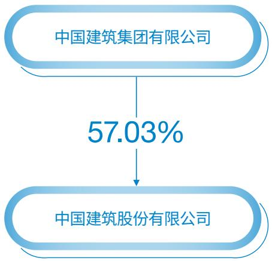

flowchart

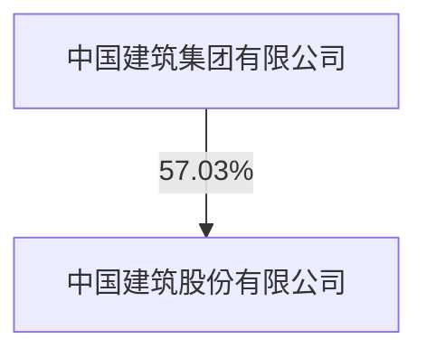
```mermaid
graph TD
  A["中国建筑集团有限公司"] -->|57.03%| B["中国建筑股份有限公司"]
```

## （二）实际控制人情况

## 1 法人

√ 适用 □ 不适用

名称

国务院国有资产监督管理委员会

## 2 自然人

□适用 □不适用

## 3 公司不存在实际控制人情况的特别说明

□适用 □不适用

## 4 报告期内公司控制权发生变更的情况说明

□适用 □不适用

## 5 公司与实际控制人之间的产权及控制关系的方框图

√ 适用 □ 不适用

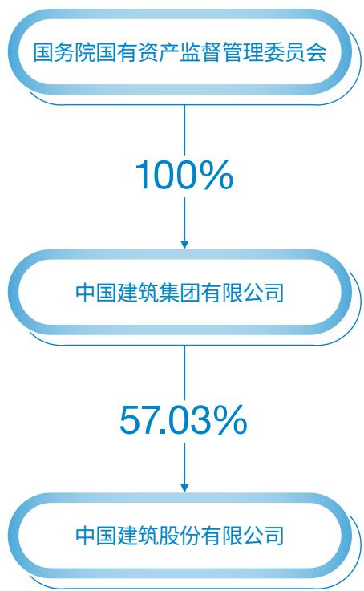

flowchart

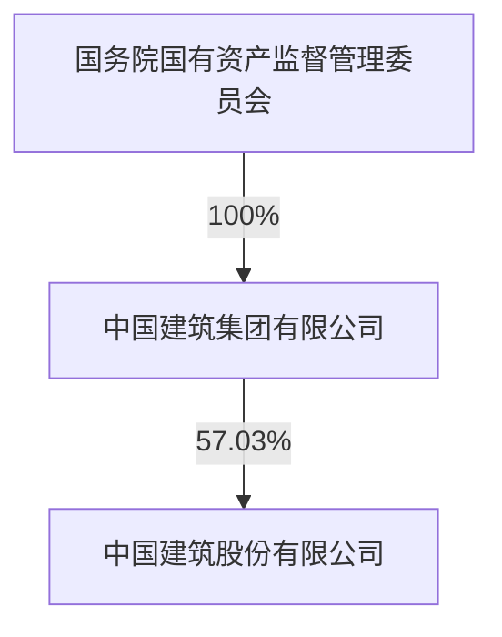
```mermaid
graph TD
  A["国务院国有资产监督管理委员会"] -->|100%| B["中国建筑集团有限公司"]
  B -->|57.03%| C["中国建筑股份有限公司"]
```

## 6 实际控制人通过信托或其他资产管理方式控制公司

□适用√不适用

## （三）控股股东及实际控制人其他情况介绍

□适用 □不适用

## 五、公司控股股东或第一大股东及其一致行动人累计质押股份数量占其所持公司股份数量比例达到80%以上

□适用 □不适用

## 六、其他持股在百分之十以上的法人股东

□适用 □不适用

## 七、股份限制减持情况说明

□适用 □不适用

## 八、股份回购在报告期的具体实施情况

□适用 □不适用

# 第八节

# 优先股相关情况

□适用 □不适用

## 第九节

## 债券相关情况

## 一、公司债券（含企业债券）和非金融企业债务融资工具

√ 适用 □ 不适用

## （一）公司债券（含企业债券）

√ 适用 □ 不适用

## 1. 公司债券基本情况

公司对债券终止上市交易风险的应对措施

□适用 不适用

报告期内债券付息兑付情况

□适用 不适用

## 2. 公司或投资者选择权条款、投资者保护条款的触发和执行情况

□适用 不适用

## 3. 为债券发行及存续期业务提供服务的中介机构

<table><tr><td>中介机构名称</td><td>办公地址</td><td>签字会计师姓名</td><td>联系人</td><td>联系电话</td></tr><tr><td>安永华明会计师事务所(特殊普通合伙)</td><td>中国北京市东城区东长安街1号东方广场安永大楼17层01-12室</td><td>沈岩、高君</td><td>沈岩</td><td>010-58153000</td></tr></table>

上述中介机构发生变更的情况

□适用 不适用

## 4. 信用评级结果调整情况

□适用 □不适用

其他说明

□适用 □不适用

## 5. 担保情况、偿债计划及其他偿债保障措施在报告期内的执行和变化情况及其影响

□适用 不适用

## 6. 公司债券其他情况的说明

## √ 适用 □ 不适用

截至本报告出具日，下属子公司存续公司债券情况如下：

下属子公司公司债券发行情况  
单位：千元 币种：人民币

<table><tr><td>序号</td><td>债券名称</td><td>简称</td><td>发行日</td><td>起息日</td><td>到期日</td><td>发行规模/当前规模</td><td>利率(%)</td><td>还本付息情况</td></tr><tr><td>1</td><td>中国海外发展有限公司5.35%,2042年到期,美元保证票据</td><td>CHINA OVS N4211</td><td>2012-11-15</td><td>2012-11-15</td><td>2042-11-15</td><td>2,156,520.00</td><td>5.35</td><td>正常</td></tr><tr><td>2</td><td>中国海外发展有限公司6.375%,2043年到期,美元保证票据</td><td>CHINA OVS N4310</td><td>2013-10-29</td><td>2013-10-29</td><td>2043-10-29</td><td>3,594,200.00</td><td>6.375</td><td>正常</td></tr><tr><td>3</td><td>中国海外发展有限公司6.45%,2034年到期,美元保证票据</td><td>CHINA OVS N3406</td><td>2014-06-11</td><td>2014-06-11</td><td>2034-06-11</td><td>3,594,200.00</td><td>6.45</td><td>正常</td></tr><tr><td>4</td><td>中海地产集团有限公司公开发行2016年公司债券(第一期)</td><td>16中海01</td><td>2016-08-22</td><td>2016-08-23</td><td>2026-08-23</td><td>1,900,000.00</td><td>3.6</td><td>正常</td></tr><tr><td>5</td><td>中国建筑股份有限公司3.5%,2027年到期,美元保证票据</td><td>CSCEC II N2707</td><td>2017-07-05</td><td>2017-07-05</td><td>2027-07-05</td><td>3,594,200.00</td><td>3.5</td><td>正常</td></tr><tr><td>6</td><td>中国建筑国际集团有限公司3.875%,2027年到期,美元保证票据</td><td>CSCFIN II N2711</td><td>2017-11-29</td><td>2017-11-29</td><td>2027-11-29</td><td>1,797,100.00</td><td>3.875</td><td>正常</td></tr><tr><td>7</td><td>中国海外发展有限公司4.75%,2028年到期,美元保证票据</td><td>CHINA OVS N2804</td><td>2018-04-26</td><td>2018-04-26</td><td>2028-04-26</td><td>5,391,300.00</td><td>4.75</td><td>正常</td></tr><tr><td>8</td><td>中国海外发展有限公司3.45%,2029年到期,美元中期票据</td><td>CHINA OVS N2907</td><td>2019-07-15</td><td>2019-07-15</td><td>2029-07-15</td><td>3,234,780.00</td><td>3.45</td><td>正常</td></tr><tr><td>9</td><td>中国海外发展有限公司3.05%,2029年到期,美元中期票据</td><td>CHINA OVS N2911</td><td>2019-11-27</td><td>2019-11-27</td><td>2029-11-27</td><td>2,113,389.60</td><td>3.05</td><td>正常</td></tr><tr><td>10</td><td>中国海外发展有限公司2.75%,2030年到期,美元中期票据</td><td>CHINA OVS N3003</td><td>2020-03-02</td><td>2020-03-02</td><td>2030-03-02</td><td>3,594,200.00</td><td>2.75</td><td>正常</td></tr><tr><td>11</td><td>中国海外发展有限公司3.125%,2035年到期,美元中期票据</td><td>CHINA OVS N3503</td><td>2020-03-02</td><td>2020-03-02</td><td>2035-03-02</td><td>1,437,680.00</td><td>3.125</td><td>正常</td></tr><tr><td>12</td><td>中国建筑国际集团有限公司3.4%永续债券</td><td>CSC FIN SGPSB</td><td>2021-06-08</td><td>2021-06-08</td><td>2026-06-08</td><td>3,594,200.00</td><td>3.4</td><td>正常</td></tr><tr><td>13</td><td>中海企业发展集团有限公司2021年面向专业投资者公开发行公司债券(第一期)(品种二)</td><td>21中海02</td><td>2021-06-11</td><td>2021-06-15</td><td>2026-06-15</td><td>1,000,000.00</td><td>3.55</td><td>正常</td></tr><tr><td>14</td><td>中海企业发展集团有限公司2021年面向专业投资者公开发行公司债券(第三期)(品种二)</td><td>21中海06</td><td>2021-08-06</td><td>2021-08-09</td><td>2028-08-09</td><td>1,500,000.00</td><td>3.25</td><td>正常</td></tr><tr><td>15</td><td>中海企业发展集团有限公司2021年面向专业投资者公开发行公司债券(第四期)(品种二)</td><td>21中海08</td><td>2021-11-24</td><td>2021-11-25</td><td>2026-11-25</td><td>1,200,000.00</td><td>3.38</td><td>正常</td></tr><tr><td>16</td><td>中海企业发展集团有限公司2021年面向专业投资者公开发行公司债券(第五期)(品种二)</td><td>21中海10</td><td>2021-12-17</td><td>2021-12-20</td><td>2026-12-20</td><td>800,000.00</td><td>3.38</td><td>正常</td></tr></table>

<table><tr><td>序号</td><td>债券名称</td><td>简称</td><td>发行日</td><td>起息日</td><td>到期日</td><td>发行规模/当前规模</td><td>利率(%)</td><td>还本付息情况</td></tr><tr><td>17</td><td>中海企业发展集团有限公司2022年面向专业投资者公开发行公司债券(第一期)(品种二)</td><td>22中海02</td><td>2022-04-06</td><td>2022-04-07</td><td>2027-04-07</td><td>1,000,000.00</td><td>3.5</td><td>正常</td></tr><tr><td>18</td><td>中建资本控股有限公司2022年面向专业投资者公开发行公司债券(第一期)</td><td>22资控01</td><td>2022-04-25</td><td>2022-04-27</td><td>2025-04-27</td><td>1,000,000.00</td><td>3.3</td><td>正常</td></tr><tr><td>19</td><td>中海企业发展集团有限公司2022年面向专业投资者公开发行公司债券(第二期)(品种一)</td><td>22中海03</td><td>2022-05-09</td><td>2022-05-10</td><td>2025-05-10</td><td>1,500,000.00</td><td>2.75</td><td>正常</td></tr><tr><td>20</td><td>中海企业发展集团有限公司2022年面向专业投资者公开发行公司债券(第二期)(品种二)</td><td>22中海04</td><td>2022-05-09</td><td>2022-05-10</td><td>2027-05-10</td><td>1,500,000.00</td><td>3.48</td><td>正常</td></tr><tr><td>21</td><td>中海企业发展集团有限公司2022年面向专业投资者公开发行公司债券(第三期)(品种一)</td><td>22中海05</td><td>2022-09-19</td><td>2022-09-20</td><td>2025-09-20</td><td>1,000,000.00</td><td>2.4</td><td>正常</td></tr><tr><td>22</td><td>中海企业发展集团有限公司2022年面向专业投资者公开发行公司债券(第三期)(品种二)</td><td>22中海06</td><td>2022-09-19</td><td>2022-09-20</td><td>2027-09-20</td><td>500,000.00</td><td>3.15</td><td>正常</td></tr><tr><td>23</td><td>中海企业发展集团有限公司2022年面向专业投资者公开发行公司债券(第四期)(品种一)</td><td>22中海07</td><td>2022-12-19</td><td>2022-12-20</td><td>2025-12-20</td><td>1,500,000.00</td><td>2.25</td><td>正常</td></tr><tr><td>24</td><td>中海企业发展集团有限公司2022年面向专业投资者公开发行公司债券(第四期)(品种二)</td><td>22中海08</td><td>2022-12-19</td><td>2022-12-20</td><td>2027-12-20</td><td>1,500,000.00</td><td>2.7</td><td>正常</td></tr><tr><td>25</td><td>中建方程投资发展集团有限公司2023年面向专业投资者公开发行公司债券(第一期)</td><td>23方程01</td><td>2023-03-24</td><td>2023-03-28</td><td>2026-03-28</td><td>800,000.00</td><td>3.38</td><td>正常</td></tr><tr><td>26</td><td>中国建筑第二工程局有限公司2023年面向专业投资者公开发行科技创新可续期公司债券(第一期)</td><td>建二YK01</td><td>2023-06-16</td><td>2023-06-20</td><td>2026-06-20</td><td>1,700,000.00</td><td>3.32</td><td>正常</td></tr><tr><td>27</td><td>中建国际投资集团有限公司2023年面向专业投资者公开发行绿色公司债券(第一期)</td><td>23中建国投G1</td><td>2023-08-18</td><td>2023-08-22</td><td>2026-08-22</td><td>1,100,000.00</td><td>2.88</td><td>正常</td></tr><tr><td>28</td><td>中国建筑一局(集团)有限公司2023年面向专业投资者公开发行科技创新可续期公司债券(第一期)</td><td>建一YK01</td><td>2023-10-18</td><td>2023-10-20</td><td>2026-10-20</td><td>1,500,000.00</td><td>3.39</td><td>正常</td></tr><tr><td>29</td><td>中国建筑一局(集团)有限公司2023年面向专业投资者公开发行科技创新可续期公司债券(第二期)</td><td>建一YK02</td><td>2023-11-07</td><td>2023-11-09</td><td>2026-11-09</td><td>1,500,000.00</td><td>3.3</td><td>正常</td></tr><tr><td>30</td><td>中建科工集团有限公司2023年面向专业投资者公开发行科技创新可续期公司债券(第一期)</td><td>23科工YK01</td><td>2023-11-08</td><td>2023-11-10</td><td>2026-11-10</td><td>1,300,000.00</td><td>3.93</td><td>正常</td></tr><tr><td>31</td><td>中建科技集团有限公司2023年面向专业投资者公开发行科技创新低碳转型挂钩公司债券(第一期)</td><td>23中建K1</td><td>2023-09-19</td><td>2023-09-21</td><td>2026-09-21</td><td>500,000.00</td><td>3.19</td><td>正常</td></tr><tr><td>32</td><td>中建三局集团有限公司2023年面向专业投资者公开发行科技创新可续期公司债券(可持续挂钩)(第一期)</td><td>建三YK01</td><td>2023-12-15</td><td>2023-12-19</td><td>2026-12-19</td><td>1,200,000.00</td><td>3.16</td><td>正常</td></tr><tr><td>33</td><td>中国海外发展3.5% N20261025</td><td>CHIOLI 3 1/2 10/25/2026</td><td>2023-10-25</td><td>2023-10-25</td><td>2026-10-25</td><td>3,190,000.00</td><td>3.5</td><td>正常</td></tr><tr><td>34</td><td>中海企业发展集团有限公司2023年面向专业投资者公开发行公司债券(第一期)(品种一)</td><td>23中海01</td><td>2023-11-03</td><td>2023-11-07</td><td>2026-11-07</td><td>2,000,000.00</td><td>2.9</td><td>正常</td></tr><tr><td>35</td><td>中海企业发展集团有限公司2023年面向专业投资者公开发行公司债券(第一期)(品种二)</td><td>23中海02</td><td>2023-11-03</td><td>2023-11-07</td><td>2028-11-07</td><td>1,000,000.00</td><td>3.25</td><td>正常</td></tr><tr><td>36</td><td>中海企业发展集团有限公司2023年面向专业投资者公开发行公司债券(第二期)(品种二)</td><td>23中海04</td><td>2023-12-08</td><td>2023-12-12</td><td>2028-12-12</td><td>3,000,000.00</td><td>3.2</td><td>正常</td></tr><tr><td>37</td><td>中国建筑第八工程局有限公司2024年面向专业投资者公开发行科技创新低碳转型挂钩公司债券(第一期)</td><td>24八局K1</td><td>2024-04-22</td><td>2024-04-23</td><td>2029-04-23</td><td>2,000,000.00</td><td>2.5</td><td>正常</td></tr><tr><td>38</td><td>中建国际投资集团有限公司2024年面向专业投资者公开发行公司债券(第一期)</td><td>24中建投资01</td><td>2024-04-23</td><td>2024-04-24</td><td>2029-04-24</td><td>900,000.00</td><td>2.54</td><td>正常</td></tr><tr><td>39</td><td>中海企业发展集团有限公司2024年面向专业投资者公开发行公司债券(第一期)(品种二)</td><td>24中海02</td><td>2024-04-23</td><td>2024-04-24</td><td>2029-04-24</td><td>3,000,000.00</td><td>2.68</td><td>正常</td></tr><tr><td>40</td><td>中建方程投资发展集团有限公司2024年面向专业投资者公开发行公司债券(第一期)</td><td>24方程01</td><td>2024-04-30</td><td>2024-05-06</td><td>2027-05-06</td><td>1,000,000.00</td><td>2.6</td><td>正常</td></tr><tr><td>41</td><td>中建资本控股有限公司2024年面向专业投资者公开发行公司债券(第一期)</td><td>24资控01</td><td>2024-04-29</td><td>2024-05-06</td><td>2027-05-06</td><td>2,000,000.00</td><td>2.7</td><td>正常</td></tr><tr><td>42</td><td>中国建筑第八工程局有限公司2024年面向专业投资者公开发行科技创新可续期公司债券(第一期)</td><td>八局YK01</td><td>2024-08-27</td><td>2024-08-28</td><td>2029-08-28</td><td>1,500,000.00</td><td>2.55</td><td>正常</td></tr><tr><td>43</td><td>中建三局集团有限公司2024年面向专业投资者公开发行科技创新可续期公司债券(可持续挂钩)(第一期)</td><td>建三YK02</td><td>2024-09-13</td><td>2024-09-18</td><td>2027-09-18</td><td>1,500,000.00</td><td>2.24</td><td>正常</td></tr><tr><td>44</td><td>中国建筑第八工程局有限公司2024年面向专业投资者公开发行科技创新可续期公司债券(第二期)(品种一)</td><td>八局YK02</td><td>2024-09-19</td><td>2024-09-20</td><td>2027-09-20</td><td>1,000,000.00</td><td>2.2</td><td>正常</td></tr><tr><td>45</td><td>中国建筑第八工程局有限公司2024年面向专业投资者公开发行科技创新可续期公司债券(第二期)(品种二)</td><td>八局YK03</td><td>2024-09-19</td><td>2024-09-20</td><td>2029-09-19</td><td>1,000,000.00</td><td>2.38</td><td>正常</td></tr><tr><td>46</td><td>中国建筑第八工程局有限公司2024年面向专业投资者公开发行科技创新公司债券(第二期)</td><td>24八局K2</td><td>2024-11-22</td><td>2024-11-25</td><td>2034-11-25</td><td>1,000,000.00</td><td>2.69</td><td>正常</td></tr><tr><td>47</td><td>中海企业发展集团有限公司2024年面向专业投资者公开发行公司债券(第二期)(品种一)</td><td>24中海03</td><td>2024-11-27</td><td>2024-11-28</td><td>2029-11-28</td><td>1,600,000.00</td><td>2.35</td><td>正常</td></tr><tr><td>48</td><td>中海企业发展集团有限公司2024年面向专业投资者公开发行公司债券(第二期)(品种二)</td><td>24中海04</td><td>2024-11-27</td><td>2024-11-28</td><td>2034-11-28</td><td>1,400,000.00</td><td>2.7</td><td>正常</td></tr><tr><td>49</td><td>中建科技集团有限公司2024年面向专业投资者公开发行科技创新可续期公司债券(第一期)</td><td>24中建YK</td><td>2024-12-17</td><td>2024-12-18</td><td>2027-12-18</td><td>300,000.00</td><td>2.32</td><td>正常</td></tr><tr><td>50</td><td>中国建筑第八工程局有限公司2025年面向专业投资者公开发行科技创新公司债券(第一期)</td><td>25八局K1</td><td>2025-02-26</td><td>2025-02-27</td><td>2035-02-27</td><td>1,000,000.00</td><td>2.47</td><td>正常</td></tr></table>

## (二) 公司债券募集资金情况

□ 公司债券在报告期内涉及募集资金使用或者整改 √ 本公司所有公司债券在报告期内均不涉及募集资金使用或者整改

(三)专项品种债券应当披露的其他事项

□适用 不适用

(四)报告期内公司债券相关重要事项

□适用 不适用

（五）银行间债券市场非金融企业债务融资工具

√ 适用 □ 不适用

1. 非金融企业债务融资工具基本情况

单位：千元 币种：人民币敬请参阅本报告第十节“财务报告”财务报表附注五、37“一年内到期的非流动负债”，附注五、40“应付债券”，附注五、48“其他权益工具”等相关内容。

<table><tr><td>序号</td><td>债券名称</td><td>简称</td><td>代码</td><td>发行日</td><td>起息日</td><td>到期日</td><td>债券余额</td><td>利率(%)</td><td>还本付息方式</td><td>交易场所</td><td>投资者适当性安排(如有)</td><td>交易机制</td><td>是否存在终止上市交易的风险</td></tr><tr><td>1</td><td>中国建筑股份有限公司2023年度第一期中期票据</td><td>23中建MTN001</td><td>102300386</td><td>2023-6-19</td><td>2023-6-21</td><td>2026-6-21</td><td>3,000,000.00</td><td>3.24</td><td>年度付息,赎回日有赎回选择权</td><td>银行间债券市场</td><td>/</td><td>竞价、报价、询价和协议</td><td>否</td></tr><tr><td>2</td><td>中国建筑股份有限公司2023年度第二期中期票据</td><td>23中建MTN002</td><td>102381653</td><td>2023-7-11</td><td>2023-7-13</td><td>2026-7-13</td><td>3,000,000.00</td><td>3.14</td><td>年度付息,赎回日有赎回选择权</td><td>银行间债券市场</td><td>/</td><td>竞价、报价、询价和协议</td><td>否</td></tr><tr><td>3</td><td>中国建筑股份有限公司2023年度第三期中期票据</td><td>23中建MTN003</td><td>102382053</td><td>2023-8-10</td><td>2023-8-14</td><td>2026-8-14</td><td>3,000,000.00</td><td>3.08</td><td>年度付息,赎回日有赎回选择权</td><td>银行间债券市场</td><td>/</td><td>竞价、报价、询价和协议</td><td>否</td></tr><tr><td>4</td><td>中国建筑股份有限公司2024年度第一期中期票据</td><td>24中建MTN001</td><td>102481838</td><td>2024-04-25</td><td>2024-04-29</td><td>2034-04-29</td><td>3,000,000.00</td><td>2.77</td><td>年度付息,到期还本</td><td>银行间债券市场</td><td>/</td><td>竞价、报价、询价和协议</td><td>否</td></tr><tr><td>5</td><td>中国建筑股份有限公司2024年度第二期中期票据</td><td>24中建MTN002</td><td>102482261</td><td>2024-06-12</td><td>2024-06-14</td><td>2034-06-14</td><td>3,000,000.00</td><td>2.63</td><td>年度付息,到期还本</td><td>银行间债券市场</td><td>/</td><td>竞价、报价、询价和协议</td><td>否</td></tr></table>

公司对债券终止上市交易风险的应对措施

□适用 □不适用

逾期未偿还债券

□适用 □不适用

报告期内债券付息兑付情况

√ 适用 □ 不适用

<table><tr><td>债券名称</td><td>付息兑付情况的说明</td></tr><tr><td>中国建筑股份有限公司2023年度第一期中期票据</td><td>正常还本付息</td></tr><tr><td>中国建筑股份有限公司2023年度第二期中期票据</td><td>正常还本付息</td></tr><tr><td>中国建筑股份有限公司2023年度第三期中期票据</td><td>正常还本付息</td></tr><tr><td>中国建筑股份有限公司2024年度第一期中期票据</td><td>正常还本付息</td></tr><tr><td>中国建筑股份有限公司2024年度第二期中期票据</td><td>正常还本付息</td></tr></table>

## 2. 公司或投资者选择权条款、投资者保护条款的触发和执行情况

□适用 □不适用

## 3. 为债券发行及存续期业务提供服务的中介机构

<table><tr><td>中介机构名称</td><td>办公地址</td><td>签字会计师姓名</td><td>联系人</td><td>联系电话</td></tr><tr><td>安永华明会计师事务所(特殊普通合伙)</td><td>中国北京市东城区东长安街1号东方广场安永大楼17层01-12室</td><td>沈岩、高君</td><td>沈岩</td><td>010-58153000</td></tr></table>

上述中介机构发生变更的情况

□适用 □不适用

## 4. 报告期末募集资金使用情况

## √ 适用 □ 不适用

单位：千元 币种：人民币

<table><tr><td>债券名称</td><td>募集资金总金额</td><td>已使用金额</td><td>未使用金额</td><td>募集资金专项账户运作情况(如有)</td><td>募集资金违规使用的整改情况(如有)</td><td>是否与募集说明书承诺的用途、使用计划及其他约定一致</td></tr><tr><td>中国建筑股份有限公司2023年度第一期中期票据</td><td>3,000,000.00</td><td>3,000,000.00</td><td>0</td><td>无</td><td>无</td><td>是</td></tr><tr><td>中国建筑股份有限公司2023年度第二期中期票据</td><td>3,000,000.00</td><td>3,000,000.00</td><td>0</td><td>无</td><td>无</td><td>是</td></tr><tr><td>中国建筑股份有限公司2023年度第三期中期票据</td><td>3,000,000.00</td><td>3,000,000.00</td><td>0</td><td>无</td><td>无</td><td>是</td></tr><tr><td>中国建筑股份有限公司2024年度第一期中期票据</td><td>3,000,000.00</td><td>3,000,000.00</td><td>0</td><td>无</td><td>无</td><td>是</td></tr><tr><td>中国建筑股份有限公司2024年度第二期中期票据</td><td>3,000,000.00</td><td>3,000,000.00</td><td>0</td><td>无</td><td>无</td><td>是</td></tr></table>

募集资金用于建设项目的进展情况及运营效益

□适用 □不适用

报告期内变更上述债券募集资金用途的说明

□适用 不适用

其他说明

□适用 不适用

## 5. 信用评级结果调整情况

□适用 不适用

其他说明

□适用 不适用

## 6. 担保情况、偿债计划及其他偿债保障措施在报告期内的执行和变化情况及其影响

□适用 不适用

## 7. 非金融企业债务融资工具其他情况的说明

√ 适用 □ 不适用

截至本报告披露日，下属子公司非金融企业债务融资工具发行情况如下：  
下属子公司非金融企业债务融资工具发行情况

<table><tr><td>序号</td><td>债券名称</td><td>简称</td><td>发行日</td><td>起息日</td><td>到期日</td><td>发行规模/当前规模</td><td>利率(%)</td><td>还本付息情况</td></tr><tr><td>1</td><td>中国建筑第八工程局有限公司2020年度第一期中期票据</td><td>20中建八局MTN001</td><td>2020-06-11</td><td>2020-06-15</td><td>2025-06-11</td><td>2,000,000.00</td><td>4.04</td><td>正常</td></tr><tr><td>2</td><td>中国建筑第四工程局有限公司2021年度第三期中期票据(品种一)</td><td>21中建四局MTN003A</td><td>2021-12-16</td><td>2021-12-20</td><td>2026-12-20</td><td>1,000,000.00</td><td>3.3</td><td>正常</td></tr><tr><td>3</td><td>中国建筑第四工程局有限公司2021年度第三期中期票据(品种二)</td><td>21中建四局MTN003B</td><td>2021-12-16</td><td>2021-12-20</td><td>2026-12-20</td><td>1,000,000.00</td><td>3.95</td><td>正常</td></tr><tr><td>4</td><td>中海企业发展集团有限公司2022年度第一期中期票据(品种二)</td><td>22中海企业MTN001B</td><td>2022-01-12</td><td>2022-01-14</td><td>2027-01-14</td><td>1,200,000.00</td><td>3.25</td><td>正常</td></tr><tr><td>5</td><td>中海企业发展集团有限公司2022年度第二期绿色中期票据</td><td>22中海企业MTN002(绿色)</td><td>2022-02-21</td><td>2022-02-23</td><td>2027-02-23</td><td>1,000,000.00</td><td>3.22</td><td>正常</td></tr><tr><td>6</td><td>中建国际投资集团有限公司2022年度第二期中期票据</td><td>22中建投资MTN002</td><td>2022-04-25</td><td>2022-04-27</td><td>2025-04-27</td><td>1,500,000.00</td><td>3.09</td><td>正常</td></tr><tr><td>7</td><td>中海企业发展集团有限公司2022年度第三期中期票据(品种一)</td><td>22中海企业MTN003A</td><td>2022-05-25</td><td>2022-05-27</td><td>2025-05-27</td><td>2,000,000.00</td><td>2.63</td><td>正常</td></tr><tr><td>8</td><td>中海企业发展集团有限公司2022年度第三期中期票据(品种二)</td><td>22中海企业MTN003B</td><td>2022-05-25</td><td>2022-05-27</td><td>2027-05-27</td><td>1,000,000.00</td><td>3.1</td><td>正常</td></tr><tr><td>9</td><td>中海企业发展集团有限公司2022年度第四期中期票据</td><td>22中海企业MTN004</td><td>2022-07-21</td><td>2022-07-25</td><td>2027-07-25</td><td>2,000,000.00</td><td>3.26</td><td>正常</td></tr><tr><td>10</td><td>中建国际投资集团有限公司2022年度第三期中期票据</td><td>22中建投资MTN003</td><td>2022-08-17</td><td>2022-08-19</td><td>2027-08-19</td><td>1,040,000.00</td><td>2.7</td><td>正常</td></tr><tr><td>11</td><td>中海企业发展集团有限公司2022年度第五期中期票据</td><td>22中海企业MTN005</td><td>2022-10-25</td><td>2022-10-27</td><td>2027-10-27</td><td>1,000,000.00</td><td>2.85</td><td>正常</td></tr><tr><td>12</td><td>中国建筑第七工程局有限公司2022年度第一期中期票据</td><td>22中建七局MTN001</td><td>2022-10-26</td><td>2022-10-28</td><td>2025-10-28</td><td>1,500,000.00</td><td>2.79</td><td>正常</td></tr><tr><td>13</td><td>中海企业发展集团有限公司2022年度第六期绿色中期票据</td><td>22中海企业MTN006(绿色)</td><td>2022-12-12</td><td>2022-12-14</td><td>2027-12-14</td><td>2,000,000.00</td><td>2.7</td><td>正常</td></tr><tr><td>14</td><td>中海企业发展集团有限公司2022年度第七期绿色中期票据</td><td>22中海企业MTN007(绿色)</td><td>2022-12-12</td><td>2022-12-14</td><td>2027-12-14</td><td>1,000,000.00</td><td>2.7</td><td>正常</td></tr><tr><td>15</td><td>中国建筑第七工程局有限公司2023年度第一期中期票据</td><td>23中建七局MTN001</td><td>2023-04-18</td><td>2023-04-20</td><td>2026-04-20</td><td>1,500,000.00</td><td>3.2</td><td>正常</td></tr></table>

<table><tr><td>序号</td><td>债券名称</td><td>简称</td><td>发行日</td><td>起息日</td><td>到期日</td><td>发行规模/当前规模</td><td>利率(%)</td><td>还本付息情况</td></tr><tr><td>16</td><td>中国建筑第五工程局有限公司2023年度第一期中期票据</td><td>23中建五局MTN001</td><td>2023-04-17</td><td>2023-04-19</td><td>2026-04-19</td><td>1,700,000.00</td><td>3.55</td><td>正常</td></tr><tr><td>17</td><td>中国建筑第二工程局有限公司2023年度第一期中期票据(科创票据)</td><td>23中建二局MTN001(科创票据)</td><td>2023-04-14</td><td>2023-04-18</td><td>2026-04-18</td><td>2,000,000.00</td><td>3.55</td><td>正常</td></tr><tr><td>18</td><td>中国建筑第二工程局有限公司2023年度第二期中期票据(科创票据)</td><td>23中建二局MTN002(科创票据)</td><td>2023-04-25</td><td>2023-04-27</td><td>2026-04-27</td><td>2,000,000.00</td><td>3.54</td><td>正常</td></tr><tr><td>19</td><td>中建西部建设股份有限公司2023年度第一期绿色中期票据</td><td>23中建西部MTN001(绿色)</td><td>2023-04-19</td><td>2023-04-21</td><td>2026-04-21</td><td>1,000,000.00</td><td>3.4</td><td>正常</td></tr><tr><td>20</td><td>中建新疆建工(集团)有限公司2023年度第一期中期票据(科创票据)</td><td>23中建新疆MTN001(科创票据)</td><td>2023-09-08</td><td>2023-09-12</td><td>2026-09-12</td><td>700,000.00</td><td>3.83</td><td>正常</td></tr><tr><td>21</td><td>中国建筑第八工程局有限公司2023年度第一期中期票据(科创票据)</td><td>23中建八局MTN001</td><td>2023-08-31</td><td>2023-09-04</td><td>2026-09-04</td><td>2,000,000.00</td><td>3.15</td><td>正常</td></tr><tr><td>22</td><td>中建海峡建设发展有限公司2023年度第一期中期票据(科创票据)</td><td>23中建海峡MTN001(科创票据)</td><td>2023-11-01</td><td>2023-11-02</td><td>2026-11-02</td><td>1,000,000.00</td><td>3.98</td><td>正常</td></tr><tr><td>23</td><td>中国建筑第七工程局有限公司2023年度第二期中期票据(科创票据)</td><td>23中建七局MTN002(科创票据)</td><td>2023-11-15</td><td>2023-11-17</td><td>2026-11-17</td><td>1,700,000.00</td><td>3.6</td><td>正常</td></tr><tr><td>24</td><td>中国建设基础设施有限公司2023年度第一期中期票据</td><td>23中国建设MTN001</td><td>2023-08-31</td><td>2023-09-04</td><td>2026-09-04</td><td>1,200,000.00</td><td>3.44</td><td>正常</td></tr><tr><td>25</td><td>中国建筑第六工程局有限公司2023年度第一期中期票据(科创票据)</td><td>23中建六局MTN001(科创票据)</td><td>2023-09-18</td><td>2023-09-20</td><td>2026-09-20</td><td>1,000,000.00</td><td>3.7</td><td>正常</td></tr><tr><td>26</td><td>中国建筑第六工程局有限公司2023年度第二期中期票据(科创票据)</td><td>23中建六局MTN002(科创票据)</td><td>2023-11-06</td><td>2023-11-08</td><td>2026-11-08</td><td>500,000.00</td><td>3.5</td><td>正常</td></tr><tr><td>27</td><td>中国建筑第六工程局有限公司2023年度第三期中期票据(科创票据)</td><td>23中建六局MTN003(科创票据)</td><td>2023-11-23</td><td>2023-11-27</td><td>2026-11-27</td><td>600,000.00</td><td>3.4</td><td>正常</td></tr><tr><td>28</td><td>中建三局集团有限公司2023年度第一期中期票据(科创票据)</td><td>23中建三局MTN001(科创票据)</td><td>2023-09-18</td><td>2023-09-20</td><td>2026-09-20</td><td>1,500,000.00</td><td>3.45</td><td>正常</td></tr><tr><td>29</td><td>中建三局集团有限公司2023年度第二期中期票据</td><td>23中建三局MTN002</td><td>2023-10-12</td><td>2023-10-16</td><td>2026-10-16</td><td>1,500,000.00</td><td>3.4</td><td>正常</td></tr><tr><td>30</td><td>中国建筑第四工程局有限公司2023年度第一期中期票据(科创票据)</td><td>23中建四局MTN001(科创票据)</td><td>2023-11-20</td><td>2023-11-22</td><td>2026-11-22</td><td>1,300,000.00</td><td>3.7</td><td>正常</td></tr><tr><td>31</td><td>中国建筑第四工程局有限公司2023年度第二期中期票据(科创票据)</td><td>23中建四局MTN002(科创票据)</td><td>2023-12-06</td><td>2023-12-08</td><td>2026-12-08</td><td>1,700,000.00</td><td>3.95</td><td>正常</td></tr><tr><td>32</td><td>中国建筑第四工程局有限公司2023年度第三期中期票据(科创票据)</td><td>23中建四局MTN003(科创票据)</td><td>2023-12-18</td><td>2023-12-20</td><td>2026-12-20</td><td>700,000.00</td><td>3.7</td><td>正常</td></tr><tr><td>33</td><td>中建国际投资集团有限公司2023年度第一期中期票据</td><td>23中建投资MTN001</td><td>2023-11-16</td><td>2023-11-20</td><td>2026-11-20</td><td>2,000,000.00</td><td>3.5</td><td>正常</td></tr><tr><td>34</td><td>中海企业发展集团有限公司2024年度第一期中期票据(品种一)</td><td>24中海企业MTN001A</td><td>2024-01-22</td><td>2024-01-24</td><td>2027-01-24</td><td>1,500,000.00</td><td>2.8</td><td>正常</td></tr><tr><td>35</td><td>中海企业发展集团有限公司2024年度第一期中期票据(品种二)</td><td>24中海企业MTN001B</td><td>2024-01-22</td><td>2024-01-24</td><td>2029-01-24</td><td>1,500,000.00</td><td>3.05</td><td>正常</td></tr><tr><td>36</td><td>中建国际投资集团有限公司2024年度第一期中期票据</td><td>24中建投资MTN001</td><td>2024-02-26</td><td>2024-02-28</td><td>2029-02-28</td><td>2,000,000.00</td><td>2.84</td><td>正常</td></tr><tr><td>37</td><td>中国建筑第六工程局有限公司2024年度第一期中期票据(科创票据)</td><td>24中建六局MTN001(科创票据)</td><td>2024-02-27</td><td>2024-02-28</td><td>2026-02-28</td><td>800,000.00</td><td>2.6</td><td>正常</td></tr><tr><td>38</td><td>中国建筑第六工程局有限公司2024年度第二期中期票据(科创票据)</td><td>24中建六局MTN002(科创票据)</td><td>2024-03-01</td><td>2024-03-05</td><td>2026-03-05</td><td>600,000.00</td><td>2.55</td><td>正常</td></tr><tr><td>39</td><td>中国建筑第五工程局有限公司2024年度第一期中期票据(科创票据)</td><td>24中建五局MTN001(科创票据)</td><td>2024-06-25</td><td>2024-06-26</td><td>2027-06-26</td><td>2,500,000.00</td><td>2.33</td><td>正常</td></tr><tr><td>40</td><td>中国建筑第二工程局有限公司2024年度第一期中期票据</td><td>24中建二局MTN001</td><td>2024-06-25</td><td>2024-06-27</td><td>2029-06-27</td><td>1,500,000.00</td><td>2.48</td><td>正常</td></tr><tr><td>41</td><td>中建国际投资集团有限公司2024年度第二期中期票据</td><td>24中建投资MTN002</td><td>2024-07-17</td><td>2024-07-19</td><td>2029-07-19</td><td>2,000,000.00</td><td>2.3</td><td>正常</td></tr><tr><td>42</td><td>中建三局集团有限公司2024年度第一期中期票据</td><td>24中建三局MTN001</td><td>2024-08-09</td><td>2024-08-13</td><td>2027-08-13</td><td>1,300,000.00</td><td>2.2</td><td>正常</td></tr><tr><td>43</td><td>中国建筑一局(集团)有限公司2024年度第一期中期票据(科创票据)</td><td>24中建一局MTN001(科创票据)</td><td>2024-09-10</td><td>2024-09-12</td><td>2029-09-12</td><td>1,000,000.00</td><td>2.42</td><td>正常</td></tr><tr><td>44</td><td>中国建筑第五工程局有限公司2024年度第二期中期票据(科创票据)</td><td>24中建五局MTN002(科创票据)</td><td>2024-09-10</td><td>2024-09-12</td><td>2027-09-12</td><td>1,800,000.00</td><td>2.3</td><td>正常</td></tr><tr><td>45</td><td>中国建筑第七工程局有限公司2024年度第一期中期票据(科创票据)</td><td>24中建七局MTN001(科创票据)</td><td>2024-09-11</td><td>2024-09-13</td><td>2027-09-13</td><td>1,500,000.00</td><td>2.36</td><td>正常</td></tr><tr><td>46</td><td>中国建筑第四工程局有限公司2024年度第一期中期票据(科创票据)</td><td>24中建四局MTN001</td><td>2024-09-11</td><td>2024-09-13</td><td>2027-09-13</td><td>1,500,000.00</td><td>2.42</td><td>正常</td></tr><tr><td>47</td><td>中国建筑第七工程局有限公司2024年度第五期超短期融资券(科创票据)</td><td>24中建七局SCP005(科创票据)</td><td>2024-09-25</td><td>2024-09-26</td><td>2025-04-24</td><td>1,000,000.00</td><td>2.04</td><td>正常</td></tr><tr><td>48</td><td>中建国际投资集团有限公司2024年度第三期中期票据</td><td>24中建投资MTN003</td><td>2024-09-24</td><td>2024-09-26</td><td>2027-09-26</td><td>1,500,000.00</td><td>2.29</td><td>正常</td></tr><tr><td>49</td><td>中国建筑第七工程局有限公司2024年度第六期超短期融资券(科创票据)</td><td>24中建七局SCP006(科创票据)</td><td>2024-10-10</td><td>2024-10-11</td><td>2025-06-10</td><td>1,000,000.00</td><td>2.39</td><td>正常</td></tr><tr><td>50</td><td>中国建筑第四工程局有限公司2024年度第二期中期票据(科创票据)</td><td>24中建四局MTN002</td><td>2024-10-22</td><td>2024-10-23</td><td>2027-10-23</td><td>1,300,000.00</td><td>2.69</td><td>正常</td></tr><tr><td>51</td><td>中建西部建设股份有限公司2024年度第一期中期票据</td><td>24中建西部MTN001</td><td>2024-11-15</td><td>2024-11-19</td><td>2027-11-19</td><td>600,000.00</td><td>2.79</td><td>正常</td></tr><tr><td>52</td><td>中国建设基础设施有限公司2024年度第一期中期票据(科创票据)</td><td>24中国建设MTN001(科创票据)</td><td>2024-11-19</td><td>2024-11-21</td><td>2027-11-21</td><td>500,000.00</td><td>2.5</td><td>正常</td></tr><tr><td>53</td><td>中建国际投资集团有限公司2024年度第四期中期票据</td><td>24中建投资MTN004</td><td>2024-11-27</td><td>2024-11-29</td><td>2027-11-29</td><td>1,500,000.00</td><td>2.12</td><td>正常</td></tr><tr><td>54</td><td>中建方程投资发展集团有限公司2024年度第一期中期票据</td><td>24中建方程MTN001</td><td>2024-12-03</td><td>2024-12-04</td><td>2027-12-04</td><td>1,000,000.00</td><td>2.38</td><td>正常</td></tr><tr><td>55</td><td>中国建筑第八工程局有限公司2024年度第一期中期票据(科创票据)</td><td>24中建八局MTN001(科创票据)</td><td>2024-12-19</td><td>2024-12-23</td><td>2044-12-23</td><td>1,000,000.00</td><td>2.76</td><td>正常</td></tr><tr><td>56</td><td>中国建筑第八工程局有限公司2024年度第十七期超短期融资券(科创票据)</td><td>24中建八局SCP017(科创票据)</td><td>2024-12-23</td><td>2024-12-24</td><td>2025-09-19</td><td>1,500,000.00</td><td>1.76</td><td>正常</td></tr><tr><td>57</td><td>中国建筑第七工程局有限公司2024年度第八期超短期融资券(科创票据)</td><td>24中建七局SCP008(科创票据)</td><td>2024-12-26</td><td>2024-12-27</td><td>2025-05-28</td><td>600,000.00</td><td>1.78</td><td>正常</td></tr><tr><td>58</td><td>中国建筑一局(集团)有限公司2025年度第一期超短期融资券(科创票据)</td><td>25中建一局SCP001(科创票据)</td><td>2025-01-03</td><td>2025-01-03</td><td>2025-06-30</td><td>2,000,000.00</td><td>1.67</td><td>正常</td></tr><tr><td>59</td><td>中国建筑一局(集团)有限公司2025年度第二期超短期融资券(科创票据)</td><td>25中建一局SCP002(科创票据)</td><td>2025-01-03</td><td>2025-01-03</td><td>2025-06-30</td><td>500,000.00</td><td>1.67</td><td>正常</td></tr><tr><td>60</td><td>中国建筑第八工程局有限公司2025年度第二期超短期融资券(科创票据)</td><td>25中建八局SCP002(科创票据)</td><td>2025-01-09</td><td>2025-01-10</td><td>2025-04-18</td><td>3,000,000.00</td><td>1.56</td><td>正常</td></tr><tr><td>61</td><td>中国建筑第八工程局有限公司2025年度第三期超短期融资券(科创票据)</td><td>25中建八局SCP003(科创票据)</td><td>2025-01-14</td><td>2025-01-15</td><td>2025-04-18</td><td>1,000,000.00</td><td>1.64</td><td>正常</td></tr><tr><td>62</td><td>中国建筑第八工程局有限公司2025年度第四期超短期融资券(科创票据)</td><td>25中建八局SCP004(科创票据)</td><td>2025-01-20</td><td>2025-01-21</td><td>2025-06-20</td><td>4,000,000.00</td><td>1.82</td><td>正常</td></tr><tr><td>63</td><td>中建三局集团有限公司2025年度第一期超短期融资券(科创票据)</td><td>25中建三局SCP001(科创票据)</td><td>2025-01-08</td><td>2025-01-09</td><td>2025-09-05</td><td>2,000,000.00</td><td>1.7</td><td>正常</td></tr><tr><td>64</td><td>中建国际投资集团有限公司2025年度第一期中期票据</td><td>25中建投资MTN001</td><td>2025-01-10</td><td>2025-01-14</td><td>2028-01-14</td><td>2,000,000.00</td><td>1.83</td><td>正常</td></tr><tr><td>65</td><td>中国建筑第七工程局有限公司2025年度第一期超短期融资券(科创票据)</td><td>25中建七局SCP001(科创票据)</td><td>2025-03-06</td><td>2025-03-07</td><td>2025-10-22</td><td>1,400,000.00</td><td>2.16</td><td>正常</td></tr><tr><td>66</td><td>中建丝路建设投资有限公司2025年度第一期中期票据(可持续挂钩)</td><td>25中建丝路MTN001(可持续挂钩)</td><td>2025-04-11</td><td>2025-04-14</td><td>2030-04-14</td><td>500,000.00</td><td>2.2</td><td>正常</td></tr><tr><td>67</td><td>中海企业发展集团有限公司2025年度第一期中期票据(品种一)</td><td>25中海企业MTN001A</td><td>2025-04-11</td><td>2025-04-14</td><td>2030-04-14</td><td>500,000.00</td><td>1.9</td><td>正常</td></tr><tr><td>68</td><td>中海企业发展集团有限公司2025年度第一期中期票据(品种二)</td><td>25中海企业MTN001B</td><td>2025-04-11</td><td>2025-04-14</td><td>2035-04-14</td><td>1,500,000.00</td><td>2.38</td><td>正常</td></tr></table>

敬请参阅本报告第十节“财务报告”财务报表附注五、37“一年内到期的非流动负债”，附注五、40“应付债券”等相关内容。

## （六）公司报告期内合并报表范围亏损超过上年末净资产10%

□适用 □不适用

## （七）报告期末除债券外的有息债务逾期情况

□适用 □不适用

## （八）报告期内违反法律法规、公司章程、信息披露事务管理制度规定的情况以及债券募集说明书约定或承诺的情况对债券投资者权益的影响

□适用 □不适用

## （九）截至报告期末公司近2年的会计数据和财务指标

√ 适用 □ 不适用

单位：千元 币种：人民币

<table><tr><td>主要指标</td><td>2024年</td><td>2023年</td><td>本报告期末比上年度末增减(%)</td><td>变动原因</td></tr><tr><td>归属于上市公司股东的扣除非经常性损益的净利润</td><td>41,581,095</td><td>48,538,669</td><td>-14.3</td><td>经营性利润减少</td></tr><tr><td>流动比率(%)</td><td>129.4</td><td>128.8</td><td>增加0.6个百分点</td><td>/</td></tr><tr><td>速动比率(%)</td><td>73.0</td><td>67.0</td><td>增加6.0个百分点</td><td>速动资产增加</td></tr><tr><td>资产负债率(%)</td><td>75.8</td><td>74.8</td><td>增加1个百分点</td><td>总负债增加</td></tr><tr><td>EBITDA全部债务比(%)</td><td>13.7</td><td>16.3</td><td>减少2.6个百分点</td><td>全部债务增加</td></tr><tr><td>利息保障倍数</td><td>3.0</td><td>3.5</td><td>-0.5</td><td>息税前利润减少</td></tr><tr><td>现金利息保障倍数</td><td>2.1</td><td>2.0</td><td>0.1</td><td>经营现金净流入增加</td></tr><tr><td>EBITDA利息保障倍数</td><td>3.6</td><td>4.0</td><td>-0.4</td><td>息税前利润减少</td></tr><tr><td>贷款偿还率(%)</td><td>100.0</td><td>100.0</td><td>/</td><td>/</td></tr><tr><td>利息偿付率(%)</td><td>100.0</td><td>100.0</td><td>/</td><td>/</td></tr></table>

## 二、可转换公司债券情况

□适用 □不适用

## 第十节

## 财务报告

## 一、审计报告

√ 适用 □ 不适用

详见附件

## 二、财务报表

详见附件

董事长：郑学选

董事会批准报送日期：2025-04-15

## 修订信息

□适用 不适用

<table><tr><td rowspan="3">备查文件目录</td><td>公司负责人(董事长),主管会计工作负责人(财务总监),会计机构负责人(会计主管人员)签名并盖章的财务报表</td></tr><tr><td>会计师事务所盖章、注册会计师签名并盖章的审计报告原件</td></tr><tr><td>报告期内公开披露过的所有公司文件的正本及公告的原稿</td></tr></table>

中国建筑股份有限公司

已审财务报表

2024年度

目录

<table><tr><td></td><td>页</td><td>次</td></tr><tr><td>审计报告</td><td>1</td><td>- 7</td></tr><tr><td>已审财务报表</td><td></td><td></td></tr><tr><td>合并资产负债表</td><td>8</td><td>- 10</td></tr><tr><td>合并利润表</td><td>11</td><td>- 12</td></tr><tr><td>合并股东权益变动表</td><td>13</td><td>- 14</td></tr><tr><td>合并现金流量表</td><td>15</td><td>- 16</td></tr><tr><td>公司资产负债表</td><td>17</td><td>- 19</td></tr><tr><td>公司利润表</td><td></td><td>20</td></tr><tr><td>公司股东权益变动表</td><td>21</td><td>- 22</td></tr><tr><td>公司现金流量表</td><td>23</td><td>- 24</td></tr><tr><td>财务报表附注</td><td>25</td><td>- 238</td></tr><tr><td>补充资料</td><td></td><td></td></tr><tr><td>1.非经常性损益明细表</td><td></td><td>1</td></tr><tr><td>2.净资产收益率和每股收益</td><td></td><td>1</td></tr></table>

## 审计报告

安永华明（2025）审字第70048147\_A01号

中国建筑股份有限公司

中国建筑股份有限公司全体股东：

## 一、审计意见

我们审计了中国建筑股份有限公司的财务报表，包括2024年12月31日的合并及公司资产负债表，2024年度的合并及公司利润表、股东权益变动表和现金流量表以及相关财务报表附注。

我们认为，后附的中国建筑股份有限公司的财务报表在所有重大方面按照企业会计准则的规定编制，公允反映了中国建筑股份有限公司2024年12月31日的合并及公司财务状况以及2024年度的合并及公司经营成果和现金流量。

## 二、形成审计意见的基础

我们按照中国注册会计师审计准则的规定执行了审计工作。审计报告的“注册会计师对财务报表审计的责任”部分进一步阐述了我们在这些准则下的责任。按照中国注册会计师职业道德守则，我们独立于中国建筑股份有限公司，并履行了职业道德方面的其他责任。我们相信，我们获取的审计证据是充分、适当的，为发表审计意见提供了基础。

## 三、关键审计事项

关键审计事项是我们根据职业判断，认为对本年财务报表审计最为重要的事项。这些事项的应对以对财务报表整体进行审计并形成审计意见为背景，我们不对这些事项单独发表意见。我们对下述每一事项在审计中是如何应对的描述也以此为背景。

我们已经履行了本报告“注册会计师对财务报表审计的责任”部分阐述的责任，包括与这些关键审计事项相关的责任。相应地，我们的审计工作包括执行为应对评估的财务报表重大错报风险而设计的审计程序。我们执行审计程序的结果，包括应对下述关键审计事项所执行的程序，为财务报表整体发表审计意见提供了基础。

## 审计报告（续）

安永华明（2025）审字第70048147\_A01号
中国建筑股份有限公司

## 三、关键审计事项（续）

<table><tr><td>关键审计事项:</td><td>该事项在审计中是如何应对:</td></tr><tr><td colspan="2">工程承包合同收入确认</td></tr><tr><td>中国建筑股份有限公司收入主要来自于按照履约进度确认收入的工程承包合同。履约进度主要根据工程的性质,采用投入法,以发生的成本占合同预计总成本的比例,确定提供建造服务的履约进度。中国建筑股份有限公司管理层在工程开始时预估合同的预计总收入及预计总成本,并于合同执行过程中对合同交付范围、尚未完工成本等因素进行持续评估,考虑合同预计总收入和合同预计总成本的变更等事项带来的财务影响。合同预计总收入、合同预计总成本以及履约进度的确定,涉及管理层的重大估计和判断,并对收入确认的金额有重大影响。基于上述原因,我们将工程承包合同收入确认认定为关键审计事项。工程承包合同收入确认的会计政策和披露信息见财务报表附注三、25及35以及附注五、54。</td><td>我们了解、测试并评估了中国建筑股份有限公司工程承包合同收入确认流程相关的内部控制,包括合同预计总收入和合同预计总成本的编制,履约进度的确定,以及按照履约进度计算收入的关键内部控制;我们从管理层取得了工程承包合同清单,选取了重大工程承包合同执行测试,主要包括:复核关键合同条款和管理层编制的合同预计总收入和合同预计总成本,以及预算变更、合同变更、索赔及奖励等的支持性文件,评估管理层对合同预计总收入和合同预计总成本估计的适当性;检查工程承包合同本年已经发生的成本,核对相关的支持性文件,并检查相关合同成本是否被记录在恰当的会计期间;根据已发生合同成本和合同预计总成本重新计算履约进度,并根据预计总收入和履约进度重新计算当期确认的收入,测试其准确性,并对毛利率执行分析程序;现场查看工程形象进度,询问工程管理部门,并与账面记录进行比较,评估履约进度的合理性。我们同时关注了对工程承包合同收入披露的充分性。</td></tr></table>

## 审计报告（续）

安永华明（2025）审字第70048147\_A01号
中国建筑股份有限公司

## 三、关键审计事项（续）

<table><tr><td>关键审计事项:</td><td>该事项在审计中是如何应对:</td></tr><tr><td colspan="2">应收账款及合同资产减值准备</td></tr><tr><td>应收账款及合同资产减值准备以预期信用损失为基础确认,中国建筑股份有限公司考虑有关过去事项、当前状况以及对未来经济状况的预测等合理且有依据的信息,确认预期信用损失,涉及重大管理层判断和估计,且中国建筑股份有限公司应收账款及合同资产余额重大,其可收回性对于财务报表具有重大影响。因此,我们将应收账款及合同资产减值准备认定为关键审计事项。应收账款及合同资产减值准备会计政策和披露信息见财务报表附注三、10及35以及附注五、4及9。</td><td>我们了解、测试并评估了与应收账款及合同资产减值准备计提相关的内部控制;对于管理层按照单项计提预期信用损失的应收账款及合同资产,抽取样本取得管理层据以判断客户付款能力和合同资产历史结算情况的证明文件,结合客户的资金状况、资信状况、项目进展、历史付款率以及对未来经济情况的预测等,评估管理层计提预期信用损失的合理性和充分性;对于管理层按照信用风险特征组合计提预期信用损失的应收账款及合同资产,参考历史回款、结算和账龄情况,并结合当前状况以及对未来经济状况的预测等,评估管理层划分的组合以及对不同组合估计的预期信用损失率的合理性,并选取样本测试应收账款及合同资产的组合分类以及账龄划分的准确性,对计提的预期信用损失进行重新计算;选取样本检查应收账款期后回款及合同资产期后结算情况;我们同时关注了对应收账款及合同资产减值准备披露的充分性。</td></tr></table>

## 审计报告（续）

安永华明（2025）审字第70048147\_A01号
中国建筑股份有限公司

## 四、其他信息

中国建筑股份有限公司管理层对其他信息负责。其他信息包括年度报告中涵盖的信息，但不包括财务报表和我们的审计报告。

我们对财务报表发表的审计意见不涵盖其他信息，我们也不对其他信息发表任何形式的鉴证结论。

结合我们对财务报表的审计，我们的责任是阅读其他信息，在此过程中，考虑其他信息是否与财务报表或我们在审计过程中了解到的情况存在重大不一致或者似乎存在重大错报。

基于我们已执行的工作，如果我们确定其他信息存在重大错报，我们应当报告该事实。在这方面，我们无任何事项需要报告。

## 五、管理层和治理层对财务报表的责任

管理层负责按照企业会计准则的规定编制财务报表，使其实现公允反映，并设计、执行和维护必要的内部控制，以使财务报表不存在由于舞弊或错误导致的重大错报。

在编制财务报表时，管理层负责评估中国建筑股份有限公司的持续经营能力，披露与持续经营相关的事项（如适用），并运用持续经营假设，除非计划进行清算、终止运营或别无其他现实的选择。

治理层负责监督中国建筑股份有限公司的财务报告过程。

## 审计报告（续）

安永华明（2025）审字第70048147\_A01号
中国建筑股份有限公司

## 六、注册会计师对财务报表审计的责任

我们的目标是对财务报表整体是否不存在由于舞弊或错误导致的重大错报获取合理保证，并出具包含审计意见的审计报告。合理保证是高水平的保证，但并不能保证按照审计准则执行的审计在某一重大错报存在时总能发现。错报可能由于舞弊或错误导致，如果合理预期错报单独或汇总起来可能影响财务报表使用者依据财务报表作出的经济决策，则通常认为错报是重大的。

在按照审计准则执行审计工作的过程中，我们运用职业判断，并保持职业怀疑。同时，我们也执行以下工作：

（1）识别和评估由于舞弊或错误导致的财务报表重大错报风险，设计和实施审计程序以应对这些风险，并获取充分、适当的审计证据，作为发表审计意见的基础。由于舞弊可能涉及串通、伪造、故意遗漏、虚假陈述或凌驾于内部控制之上，未能发现由于舞弊导致的重大错报的风险高于未能发现由于错误导致的重大错报的风险。  
(2) 了解与审计相关的内部控制，以设计恰当的审计程序。  
（3）评价管理层选用会计政策的恰当性和作出会计估计及相关披露的合理性。  
(4) 对管理层使用持续经营假设的恰当性得出结论。同时，根据获取的审计证据，就可能导致对中国建筑股份有限公司持续经营能力产生重大疑虑的事项或情况是否存在重大不确定性得出结论。如果我们得出结论认为存在重大不确定性，审计准则要求我们在审计报告中提请报表使用者注意财务报表中的相关披露；如果披露不充分，我们应当发表非无保留意见。我们的结论基于截至审计报告日可获得的信息。然而，未来的事项或情况可能导致中国建筑股份有限公司不能持续经营。  
(5) 评价财务报表的总体列报（包括披露）、结构和内容，并评价财务报表是否公允反映相关交易和事项。  
(6) 就中国建筑股份有限公司中实体或业务活动的财务信息获取充分、适当的审计证据，以对财务报表发表审计意见。我们负责指导、监督和执行集团审计，并对审计意见承担全部责任。

## 审计报告（续）

安永华明（2025）审字第70048147\_A01号
中国建筑股份有限公司

## 六、注册会计师对财务报表审计的责任（续）

我们与治理层就计划的审计范围、时间安排和重大审计发现等事项进行沟通，包括沟通我们在审计中识别出的值得关注的内部控制缺陷。

我们还就已遵守与独立性相关的职业道德要求向治理层提供声明，并与治理层沟通可能被合理认为影响我们独立性的所有关系和其他事项，以及相关的防范措施（如适用）。

从与治理层沟通过的事项中，我们确定哪些事项对本年财务报表审计最为重要，因而构成关键审计事项。我们在审计报告中描述这些事项，除非法律法规禁止公开披露这些事项，或在极少数情形下，如果合理预期在审计报告中沟通某事项造成的负面后果超过在公众利益方面产生的益处，我们确定不应在审计报告中沟通该事项。

## 审计报告（续）

安永华明（2025）审字第70048147\_A01号
中国建筑股份有限公司

(本页无正文)

text_image

安永华明会计师事务所(特殊普通合伙)
1101030037404
ERNT & YOUNG HUA MING
(中国)

中国 北京

沈岩

中国注册会计师：沈岩（项目合伙人）

高君

中国注册会计师：高君（项目合伙人）

2025年4月15日

<table><tr><td>资产</td><td>附注五</td><td>2024年12月31日</td><td>2023年12月31日</td></tr><tr><td>流动资产</td><td></td><td></td><td></td></tr><tr><td>货币资金</td><td>1</td><td>424,396,071</td><td>358,790,899</td></tr><tr><td>交易性金融资产</td><td>2</td><td>15,175</td><td>14,854</td></tr><tr><td>应收票据</td><td>3</td><td>2,328,094</td><td>2,613,164</td></tr><tr><td>应收账款</td><td>4</td><td>317,094,483</td><td>257,698,659</td></tr><tr><td>应收款项融资</td><td>5</td><td>3,565,600</td><td>4,353,284</td></tr><tr><td>预付款项</td><td>6</td><td>24,340,316</td><td>28,778,596</td></tr><tr><td>其他应收款</td><td>7</td><td>68,240,611</td><td>76,554,995</td></tr><tr><td>存货</td><td>8</td><td>772,146,995</td><td>796,342,895</td></tr><tr><td>合同资产</td><td>9</td><td>445,402,103</td><td>334,954,194</td></tr><tr><td>持有待售资产</td><td>10</td><td>1,897,210</td><td>-</td></tr><tr><td>一年内到期的非流动资产</td><td>11</td><td>61,780,989</td><td>54,290,578</td></tr><tr><td>其他流动资产</td><td>12</td><td>157,692,307</td><td>134,570,627</td></tr><tr><td>流动资产合计</td><td></td><td>2,278,899,954</td><td>2,048,962,745</td></tr><tr><td>非流动资产</td><td></td><td></td><td></td></tr><tr><td>债权投资</td><td>13</td><td>21,971,115</td><td>21,681,916</td></tr><tr><td>其他债权投资</td><td></td><td>135,767</td><td>136,574</td></tr><tr><td>长期应收款</td><td>14</td><td>121,537,045</td><td>111,329,401</td></tr><tr><td>长期股权投资</td><td>15</td><td>119,073,558</td><td>113,983,973</td></tr><tr><td>其他权益工具投资</td><td>16</td><td>7,293,820</td><td>6,107,503</td></tr><tr><td>其他非流动金融资产</td><td>17</td><td>1,904,220</td><td>1,525,114</td></tr><tr><td>投资性房地产</td><td>18</td><td>156,241,562</td><td>158,491,475</td></tr><tr><td>固定资产</td><td>19</td><td>53,105,014</td><td>52,721,575</td></tr><tr><td>在建工程</td><td>20</td><td>4,307,051</td><td>4,086,880</td></tr><tr><td>使用权资产</td><td>21</td><td>6,368,554</td><td>6,689,182</td></tr><tr><td>无形资产</td><td>22</td><td>35,249,210</td><td>32,730,141</td></tr><tr><td>商誉</td><td>23</td><td>2,437,609</td><td>2,387,960</td></tr><tr><td>长期待摊费用</td><td>24</td><td>1,511,390</td><td>1,448,739</td></tr><tr><td>递延所得税资产</td><td>25</td><td>26,623,383</td><td>22,885,269</td></tr><tr><td>其他非流动资产</td><td>26</td><td>352,602,811</td><td>318,154,072</td></tr><tr><td>非流动资产合计</td><td></td><td>910,362,109</td><td>854,359,774</td></tr><tr><td>资产总计</td><td></td><td>3,189,262,063</td><td>2,903,322,519</td></tr></table>

后附财务报表附注为本财务报表的组成部分

<table><tr><td>负债和股东权益</td><td>附注五</td><td>2024年12月31日</td><td>2023年12月31日</td></tr><tr><td>流动负债</td><td></td><td></td><td></td></tr><tr><td>短期借款</td><td>29</td><td>115,665,735</td><td>124,352,134</td></tr><tr><td>应付票据</td><td>30</td><td>16,105,618</td><td>10,770,185</td></tr><tr><td>应付账款</td><td>31</td><td>828,176,717</td><td>689,957,840</td></tr><tr><td>预收款项</td><td>32</td><td>974,039</td><td>843,074</td></tr><tr><td>合同负债</td><td>33</td><td>345,383,924</td><td>316,984,078</td></tr><tr><td>应付职工薪酬</td><td>34</td><td>13,021,176</td><td>11,494,654</td></tr><tr><td>应交税费</td><td>35</td><td>62,243,838</td><td>66,087,180</td></tr><tr><td>其他应付款</td><td>36</td><td>147,572,999</td><td>139,739,834</td></tr><tr><td>一年内到期的非流动负债</td><td>37</td><td>120,933,590</td><td>127,873,148</td></tr><tr><td>其他流动负债</td><td>38</td><td>111,466,335</td><td>102,330,742</td></tr><tr><td>流动负债合计</td><td></td><td>1,761,543,971</td><td>1,590,432,869</td></tr><tr><td>非流动负债</td><td></td><td></td><td></td></tr><tr><td>长期借款</td><td>39</td><td>524,271,669</td><td>458,112,463</td></tr><tr><td>应付债券</td><td>40</td><td>98,245,542</td><td>92,372,831</td></tr><tr><td>租赁负债</td><td>41</td><td>4,265,042</td><td>4,607,506</td></tr><tr><td>长期应付款</td><td>42</td><td>14,613,910</td><td>12,380,443</td></tr><tr><td>长期应付职工薪酬</td><td>43</td><td>1,492,530</td><td>1,541,880</td></tr><tr><td>预计负债</td><td>44</td><td>3,069,334</td><td>2,032,508</td></tr><tr><td>递延收益</td><td>45</td><td>398,954</td><td>388,504</td></tr><tr><td>递延所得税负债</td><td>25</td><td>9,055,865</td><td>8,799,029</td></tr><tr><td>其他非流动负债</td><td>46</td><td>844,770</td><td>1,584,377</td></tr><tr><td>非流动负债合计</td><td></td><td>656,257,616</td><td>581,819,541</td></tr><tr><td>负债合计</td><td></td><td>2,417,801,587</td><td>2,172,252,410</td></tr></table>

后附财务报表附注为本财务报表的组成部分

<table><tr><td>负债和股东权益(续)</td><td>附注五</td><td>2024年12月31日</td><td>2023年12月31日</td></tr><tr><td>股东权益</td><td></td><td></td><td></td></tr><tr><td>股本</td><td>47</td><td>41,610,322</td><td>41,919,514</td></tr><tr><td>其他权益工具</td><td>48</td><td>9,000,000</td><td>9,131,494</td></tr><tr><td>其中:永续债</td><td></td><td>9,000,000</td><td>9,131,494</td></tr><tr><td>资本公积</td><td>49</td><td>10,723,129</td><td>12,050,197</td></tr><tr><td>减:库存股</td><td></td><td>(884,370)</td><td>(1,831,725)</td></tr><tr><td>其他综合收益</td><td>50</td><td>(3,241,738)</td><td>(2,575,572)</td></tr><tr><td>专项储备</td><td>51</td><td>2,276,816</td><td>915,879</td></tr><tr><td>一般风险准备</td><td></td><td>2,832,901</td><td>2,582,513</td></tr><tr><td>盈余公积</td><td>52</td><td>17,364,718</td><td>15,579,360</td></tr><tr><td>未分配利润</td><td>53</td><td>382,502,881</td><td>349,838,232</td></tr><tr><td>归属于母公司股东权益合计</td><td></td><td>462,184,659</td><td>427,609,892</td></tr><tr><td>少数股东权益</td><td></td><td>309,275,817</td><td>303,460,217</td></tr><tr><td>股东权益合计</td><td></td><td>771,460,476</td><td>731,070,109</td></tr><tr><td>负债和股东权益总计</td><td></td><td>3,189,262,063</td><td>2,903,322,519</td></tr></table>

本财务报表由以下人士签署：

企业负责人：

主管会计工作负责人：

会计机构负责人：

后附财务报表附注为本财务报表的组成部分

<table><tr><td></td><td>附注五</td><td>2024年</td><td>2023年</td></tr><tr><td>营业收入</td><td>54</td><td>2,187,147,839</td><td>2,265,529,244</td></tr><tr><td>减:营业成本</td><td>54</td><td>1,971,580,906</td><td>2,042,723,831</td></tr><tr><td>税金及附加</td><td>55</td><td>9,775,326</td><td>14,311,655</td></tr><tr><td>销售费用</td><td>56</td><td>8,724,383</td><td>7,628,182</td></tr><tr><td>管理费用</td><td>57</td><td>34,614,764</td><td>34,402,175</td></tr><tr><td>研发费用</td><td>58</td><td>45,459,339</td><td>46,073,572</td></tr><tr><td>财务费用</td><td>59</td><td>19,462,089</td><td>18,577,073</td></tr><tr><td>其中:利息费用</td><td></td><td>21,791,488</td><td>20,111,090</td></tr><tr><td>利息收入</td><td></td><td>4,232,170</td><td>4,573,352</td></tr><tr><td>加:其他收益</td><td>60</td><td>937,506</td><td>1,365,982</td></tr><tr><td>投资收益</td><td>61</td><td>1,504,780</td><td>4,036,060</td></tr><tr><td>其中:对联营企业和合营企业的投资收益</td><td></td><td>3,652,253</td><td>3,853,217</td></tr><tr><td>以摊余成本计量的金融资产终止确认损失</td><td></td><td>( 3,081,169)</td><td>( 1,673,249)</td></tr><tr><td>公允价值变动收益/(损失)</td><td>62</td><td>94,324</td><td>( 9,444)</td></tr><tr><td>信用减值损失</td><td>63</td><td>( 13,633,668)</td><td>( 8,596,270)</td></tr><tr><td>资产减值损失</td><td>64</td><td>( 6,456,693)</td><td>( 5,706,212)</td></tr><tr><td>资产处置收益</td><td></td><td>583,667</td><td>229,435</td></tr><tr><td>营业利润</td><td></td><td>80,560,948</td><td>93,132,307</td></tr><tr><td>加:营业外收入</td><td>65</td><td>1,214,683</td><td>1,166,293</td></tr><tr><td>减:营业外支出</td><td>66</td><td>1,738,681</td><td>1,303,127</td></tr><tr><td>利润总额</td><td></td><td>80,036,950</td><td>92,995,473</td></tr><tr><td>减:所得税费用</td><td>68</td><td>17,299,589</td><td>19,455,760</td></tr><tr><td>净利润</td><td></td><td>62,737,361</td><td>73,539,713</td></tr><tr><td>按经营持续性分类</td><td></td><td></td><td></td></tr><tr><td>持续经营净利润</td><td></td><td>62,737,361</td><td>73,539,713</td></tr><tr><td>按所有权归属分类</td><td></td><td></td><td></td></tr><tr><td>归属于母公司股东的净利润</td><td></td><td>46,187,099</td><td>54,264,173</td></tr><tr><td>少数股东损益</td><td></td><td>16,550,262</td><td>19,275,540</td></tr></table>

后附财务报表附注为本财务报表的组成部分

<table><tr><td></td><td>附注五</td><td>2024年</td><td>2023年</td></tr><tr><td>其他综合收益的税后净额</td><td></td><td>(1,293,201)</td><td>(1,088,940)</td></tr><tr><td>归属于母公司股东的其他综合收益的税后净额</td><td>50</td><td>(693,691)</td><td>(677,284)</td></tr><tr><td>不能重分类进损益的其他综合收益</td><td></td><td>194,631</td><td>430,181</td></tr><tr><td>重新计量设定受益计划变动额</td><td></td><td>(56,982)</td><td>(3,407)</td></tr><tr><td>其他权益工具投资公允价值变动</td><td></td><td>251,613</td><td>433,588</td></tr><tr><td>将重分类进损益的其他综合收益</td><td></td><td>(888,322)</td><td>(1,107,465)</td></tr><tr><td>权益法下可转损益的其他综合收益</td><td></td><td>(87,405)</td><td>(285,892)</td></tr><tr><td>其他债权投资公允价值变动</td><td></td><td>1,470</td><td>10,764</td></tr><tr><td>外币财务报表折算差额</td><td></td><td>(802,387)</td><td>(832,337)</td></tr><tr><td>归属于少数股东的其他综合收益的税后净额</td><td>50</td><td>(599,510)</td><td>(411,656)</td></tr><tr><td>综合收益总额</td><td></td><td>61,444,160</td><td>72,450,773</td></tr><tr><td>其中:</td><td></td><td></td><td></td></tr><tr><td>归属于母公司股东的综合收益总额</td><td></td><td>45,493,408</td><td>53,586,889</td></tr><tr><td>归属于少数股东的综合收益总额</td><td></td><td>15,950,752</td><td>18,863,884</td></tr><tr><td>每股收益</td><td>69</td><td></td><td></td></tr><tr><td>基本每股收益(元/股)</td><td></td><td>1.11</td><td>1.31</td></tr><tr><td>稀释每股收益(元/股)</td><td></td><td>1.11</td><td>1.31</td></tr></table>

本财务报表由以下人士签署：

企业负责人: 郑郑主管会计工作负责人: 徐学

会计机构负责人：

text_image

人：
姜瑞
姜瑞

后附财务报表附注为本财务报表的组成部分

2024年度

<table><tr><td rowspan="2"></td><td colspan="10">归属于母公司股东权益</td><td rowspan="2">少数股东 权益</td><td rowspan="2">股东权益 合计</td></tr><tr><td>股本</td><td>其他权益工具 永续债</td><td>资本公积</td><td>减:库存股</td><td>其他综合 收益</td><td>专项储备</td><td>一般风险 准备</td><td>盈余公积</td><td>未分配利润</td><td>小计</td></tr><tr><td>一、本年年初余额</td><td>41,919,514</td><td>9,131,494</td><td>12,050,197</td><td>(1,831,725)</td><td>(2,575,572)</td><td>915,879</td><td>2,582,513</td><td>15,579,360</td><td>349,838,232</td><td>427,609,892</td><td>303,460,217</td><td>731,070,109</td></tr><tr><td>二、本年增减变动金额</td><td></td><td></td><td></td><td></td><td></td><td></td><td></td><td></td><td></td><td></td><td></td><td></td></tr><tr><td>(一)综合收益总额</td><td>-</td><td>-</td><td>-</td><td>-</td><td>(693,691)</td><td>-</td><td>-</td><td>-</td><td>46,187,099</td><td>45,493,408</td><td>15,950,752</td><td>61,444,160</td></tr><tr><td>(二)股东投入和减少资本</td><td></td><td></td><td></td><td></td><td></td><td></td><td></td><td></td><td></td><td></td><td></td><td></td></tr><tr><td>1.股东投入资本</td><td>-</td><td>-</td><td>-</td><td>-</td><td>-</td><td>-</td><td>-</td><td>-</td><td>-</td><td>-</td><td>1,532,713</td><td>1,532,713</td></tr><tr><td>2.其他权益工具持有者投入资本</td><td>-</td><td>-</td><td>(13,001)</td><td>-</td><td>-</td><td>-</td><td>-</td><td>-</td><td>-</td><td>(13,001)</td><td>19,696,740</td><td>19,683,739</td></tr><tr><td>3.其他权益工具持有者减少资本</td><td>-</td><td>-</td><td>-</td><td>-</td><td>-</td><td>-</td><td>-</td><td>-</td><td>-</td><td>-</td><td>(21,243,318)</td><td>(21,243,318)</td></tr><tr><td>4.股份支付计入股东权益的金额</td><td>-</td><td>-</td><td>(468,778)</td><td>-</td><td>-</td><td>-</td><td>-</td><td>-</td><td>-</td><td>(468,778)</td><td>(22,277)</td><td>(491,055)</td></tr><tr><td>5.对子公司持股比例变化的影响</td><td>-</td><td>-</td><td>138,146</td><td>-</td><td>-</td><td>-</td><td>-</td><td>-</td><td>-</td><td>138,146</td><td>(383,634)</td><td>(245,488)</td></tr><tr><td>6.回购并注销未解锁的限制性股票</td><td>(309,192)</td><td>-</td><td>(638,163)</td><td>947,355</td><td>-</td><td>-</td><td>-</td><td>-</td><td>-</td><td>-</td><td>-</td><td>-</td></tr><tr><td>7.收购子公司</td><td>-</td><td>-</td><td>-</td><td>-</td><td>-</td><td>-</td><td>-</td><td>-</td><td>-</td><td>-</td><td>363,253</td><td>363,253</td></tr><tr><td>8.其他</td><td>-</td><td>-</td><td>(345,272)</td><td>-</td><td>-</td><td>-</td><td>-</td><td>-</td><td>(9,136)</td><td>(354,408)</td><td>(6,631)</td><td>(361,039)</td></tr><tr><td>(三)利润分配</td><td></td><td></td><td></td><td></td><td></td><td></td><td></td><td></td><td></td><td></td><td></td><td></td></tr><tr><td>1.提取盈余公积</td><td>-</td><td>-</td><td>-</td><td>-</td><td>-</td><td>-</td><td>-</td><td>1,785,358</td><td>(1,785,358)</td><td>-</td><td>-</td><td>-</td></tr><tr><td>2.提取一般风险准备</td><td>-</td><td>-</td><td>-</td><td>-</td><td>-</td><td>-</td><td>250,388</td><td>-</td><td>(250,388)</td><td>-</td><td>-</td><td>-</td></tr><tr><td>3.对股东的分配</td><td>-</td><td>-</td><td>-</td><td>-</td><td>-</td><td>-</td><td>-</td><td>-</td><td>(11,297,737)</td><td>(11,297,737)</td><td>(7,738,194)</td><td>(19,035,931)</td></tr><tr><td>4.对其他权益工具持有者的股利分配</td><td>-</td><td>(131,494)</td><td>-</td><td>-</td><td>-</td><td>-</td><td>-</td><td>-</td><td>(152,306)</td><td>(283,800)</td><td>(2,337,239)</td><td>(2,621,039)</td></tr><tr><td>(四)股东权益内部结转</td><td></td><td></td><td></td><td></td><td></td><td></td><td></td><td></td><td></td><td></td><td></td><td></td></tr><tr><td>1.其他综合收益结转留存收益</td><td>-</td><td>-</td><td>-</td><td>-</td><td>27,525</td><td>-</td><td>-</td><td>-</td><td>(27,525)</td><td>-</td><td>-</td><td>-</td></tr><tr><td>(五)专项储备</td><td></td><td></td><td></td><td></td><td></td><td></td><td></td><td></td><td></td><td></td><td></td><td></td></tr><tr><td>1.本年提取</td><td>-</td><td>-</td><td>-</td><td>-</td><td>-</td><td>61,665,529</td><td>-</td><td>-</td><td>-</td><td>61,665,529</td><td>206,112</td><td>61,871,641</td></tr><tr><td>2.本年使用</td><td>-</td><td>-</td><td>-</td><td>-</td><td>-</td><td>(60,304,592)</td><td>-</td><td>-</td><td>-</td><td>(60,304,592)</td><td>(202,677)</td><td>(60,507,269)</td></tr><tr><td>三、本年年末余额</td><td>41,610,322</td><td>9,000,000</td><td>10,723,129</td><td>(884,370)</td><td>(3,241,738)</td><td>2,276,816</td><td>2,832,901</td><td>17,364,718</td><td>382,502,881</td><td>462,184,659</td><td>309,275,817</td><td>771,460,476</td></tr></table>

后附财务报表附注为本财务报表的组成部分

## 2023年度

归属于母公司股东权益

<table><tr><td></td><td>股本</td><td>其他权益工具永续债</td><td>资本公积</td><td>减:库存股</td><td>其他综合收益</td><td>专项储备</td><td>一般风险准备</td><td>盈余公积</td><td>未分配利润</td><td>小计</td><td>权益</td><td>合计</td></tr><tr><td>一、本年年初余额</td><td>41,934,433</td><td>10,000,000</td><td>11,808,020</td><td>( 1,880,038)</td><td>( 1,953,749)</td><td>305,176</td><td>2,185,029</td><td>14,349,125</td><td>307,574,145</td><td>384,322,141</td><td>296,064,769</td><td>680,386,910</td></tr><tr><td>二、本年增减变动金额</td><td></td><td></td><td></td><td></td><td></td><td></td><td></td><td></td><td></td><td></td><td></td><td></td></tr><tr><td>(一)综合收益总额</td><td>-</td><td>-</td><td>-</td><td>-</td><td>( 677,284)</td><td>-</td><td>-</td><td>-</td><td>54,264,173</td><td>53,586,889</td><td>18,863,884</td><td>72,450,773</td></tr><tr><td>(二)股东投入和减少资本</td><td></td><td></td><td></td><td></td><td></td><td></td><td></td><td></td><td></td><td></td><td></td><td></td></tr><tr><td>1. 股东投入资本</td><td>-</td><td>-</td><td>-</td><td>-</td><td>-</td><td>-</td><td>-</td><td>-</td><td>-</td><td>-</td><td>1,126,711</td><td>1,126,711</td></tr><tr><td>2. 其他权益工具持有者投入资本</td><td>-</td><td>9,000,000</td><td>( 20,658)</td><td>-</td><td>-</td><td>-</td><td>-</td><td>-</td><td>-</td><td>8,979,342</td><td>28,054,880</td><td>37,034,222</td></tr><tr><td>3. 其他权益工具持有者减少资本</td><td>-</td><td>( 10,000,000)</td><td>-</td><td>-</td><td>-</td><td>-</td><td>-</td><td>-</td><td>-</td><td>( 10,000,000)</td><td>( 30,523,955)</td><td>( 40,523,955)</td></tr><tr><td>4. 股份支付计入股东权益的金额</td><td>-</td><td>-</td><td>( 166,072)</td><td>-</td><td>-</td><td>-</td><td>-</td><td>-</td><td>-</td><td>( 166,072)</td><td>( 4,082)</td><td>( 170,154)</td></tr><tr><td>5. 对子公司持股比例变化的影响</td><td>-</td><td>-</td><td>460,931</td><td>-</td><td>-</td><td>-</td><td>-</td><td>-</td><td>619,732</td><td>1,080,663</td><td>( 2,309,567)</td><td>( 1,228,904)</td></tr><tr><td>6. 回购并注销未解锁的限制性股票</td><td>( 14,919)</td><td>-</td><td>( 33,394)</td><td>48,313</td><td>-</td><td>-</td><td>-</td><td>-</td><td>-</td><td>-</td><td>-</td><td>-</td></tr><tr><td>7. 收购子公司</td><td>-</td><td>-</td><td>-</td><td>-</td><td>-</td><td>-</td><td>-</td><td>-</td><td>-</td><td>-</td><td>2,682,199</td><td>2,682,199</td></tr><tr><td>8. 其他</td><td>-</td><td>-</td><td>1,370</td><td>-</td><td>-</td><td>-</td><td>-</td><td>-</td><td>( 208,313)</td><td>( 206,943)</td><td>( 44,848)</td><td>( 251,791)</td></tr><tr><td>(三)利润分配</td><td></td><td></td><td></td><td></td><td></td><td></td><td></td><td></td><td></td><td></td><td></td><td></td></tr><tr><td>1. 提取盈余公积</td><td>-</td><td>-</td><td>-</td><td>-</td><td>-</td><td>-</td><td>-</td><td>1,230,235</td><td>( 1,230,235)</td><td>-</td><td>-</td><td>-</td></tr><tr><td>2. 提取一般风险准备</td><td>-</td><td>-</td><td>-</td><td>-</td><td>-</td><td>-</td><td>397,484</td><td>-</td><td>( 397,484)</td><td>-</td><td>-</td><td>-</td></tr><tr><td>3. 对股东的分配</td><td>-</td><td>-</td><td>-</td><td>-</td><td>-</td><td>-</td><td>-</td><td>-</td><td>( 10,596,831)</td><td>( 10,596,831)</td><td>( 7,720,237)</td><td>( 18,317,068)</td></tr><tr><td>4. 对其他权益工具持有者的股利分配</td><td>-</td><td>131,494</td><td>-</td><td>-</td><td>-</td><td>-</td><td>-</td><td>-</td><td>( 131,494)</td><td>-</td><td>( 2,733,259)</td><td>( 2,733,259)</td></tr><tr><td>(四)股东权益内部结转</td><td></td><td></td><td></td><td></td><td></td><td></td><td></td><td></td><td></td><td></td><td></td><td></td></tr><tr><td>1. 其他综合收益结转留存收益</td><td>-</td><td>-</td><td>-</td><td>-</td><td>55,461</td><td>-</td><td>-</td><td>-</td><td>( 55,461)</td><td>-</td><td>-</td><td>-</td></tr><tr><td>(五)专项储备</td><td></td><td></td><td></td><td></td><td></td><td></td><td></td><td></td><td></td><td></td><td></td><td></td></tr><tr><td>1. 本年提取</td><td>-</td><td>-</td><td>-</td><td>-</td><td>-</td><td>56,607,331</td><td>-</td><td>-</td><td>-</td><td>56,607,331</td><td>178,229</td><td>56,785,560</td></tr><tr><td>2. 本年使用</td><td>-</td><td>-</td><td>-</td><td>-</td><td>-</td><td>( 55,996,628)</td><td>-</td><td>-</td><td>-</td><td>( 55,996,628)</td><td>( 174,507)</td><td>( 56,171,135)</td></tr><tr><td>三、本年年末余额</td><td>41,919,514</td><td>9,131,494</td><td>12,050,197</td><td>( 1,831,725)</td><td>( 2,575,572)</td><td>915,879</td><td>2,582,513</td><td>15,579,360</td><td>349,838,232</td><td>427,609,892</td><td>303,460,217</td><td>731,070,109</td></tr></table>

本财务报表由以下人士签署

企业负责人：

主管会计工作负责人：

会计机构负责人：

text_image

人：
枫姜
印林

后附财务报表附注为本财务报表的组成部分

## 一、经营活动产生的现金流量：

<table><tr><td>销售商品、提供劳务收到的现金</td><td></td><td>2,239,163,754</td><td>2,290,420,688</td></tr><tr><td>收到的税费返还</td><td></td><td>3,257,530</td><td>4,767,827</td></tr><tr><td>收到其他与经营活动有关的现金</td><td>70</td><td>39,225,626</td><td>16,708,807</td></tr><tr><td>经营活动现金流入小计</td><td></td><td>2,281,646,910</td><td>2,311,897,322</td></tr><tr><td>购买商品、接受劳务支付的现金</td><td></td><td>2,014,843,055</td><td>2,083,316,637</td></tr><tr><td>支付给职工以及为职工支付的现金</td><td></td><td>115,832,263</td><td>111,450,131</td></tr><tr><td>支付的各项税费</td><td></td><td>71,744,891</td><td>75,684,763</td></tr><tr><td>支付其他与经营活动有关的现金</td><td>70</td><td>63,453,166</td><td>30,415,668</td></tr><tr><td>经营活动现金流出小计</td><td></td><td>2,265,873,375</td><td>2,300,867,199</td></tr><tr><td>经营活动产生的现金流量净额</td><td>71</td><td>15,773,535</td><td>11,030,123</td></tr></table>

## 二、投资活动产生的现金流量：

<table><tr><td>收回投资收到的现金</td><td>70</td><td>2,880,906</td><td>4,097,507</td></tr><tr><td>取得投资收益收到的现金</td><td>70</td><td>2,567,779</td><td>2,565,372</td></tr><tr><td>处置固定资产、无形资产和其他长期资 产收回的现金净额</td><td>70</td><td>8,416,117</td><td>2,552,102</td></tr><tr><td>处置子公司及其他营业单位收到的现金 净额</td><td></td><td>290,909</td><td>31,529</td></tr><tr><td>收到其他与投资活动有关的现金</td><td>70</td><td>23,287,331</td><td>18,960,956</td></tr><tr><td>投资活动现金流入小计</td><td></td><td>37,443,042</td><td>28,207,466</td></tr><tr><td>购建固定资产、无形资产和其他长期资 产支付的现金</td><td>70</td><td>19,804,720</td><td>34,055,554</td></tr><tr><td>投资支付的现金</td><td>70</td><td>5,420,794</td><td>7,896,596</td></tr><tr><td>取得子公司及其他营业单位支付的现金 净额</td><td></td><td>1,015,521</td><td>1,059,363</td></tr><tr><td>支付其他与投资活动有关的现金</td><td>70</td><td>13,712,510</td><td>11,697,472</td></tr><tr><td>投资活动现金流出小计</td><td></td><td>39,953,545</td><td>54,708,985</td></tr><tr><td>投资活动使用的现金流量净额</td><td></td><td>(2,510,503)</td><td>(26,501,519)</td></tr></table>

后附财务报表附注为本财务报表的组成部分

## 三、筹资活动产生的现金流量：

<table><tr><td>吸收投资收到的现金</td><td></td><td>21,229,453</td><td>40,181,591</td></tr><tr><td>其中:子公司吸收少数股东投资收到的现金</td><td></td><td>21,229,453</td><td>31,181,591</td></tr><tr><td>取得借款收到的现金</td><td></td><td>470,132,218</td><td>609,176,923</td></tr><tr><td>发行债券收到的现金</td><td></td><td>150,984,306</td><td>139,588,296</td></tr><tr><td>收到其他与筹资活动有关的现金</td><td>70</td><td>19,330,091</td><td>10,015,322</td></tr><tr><td>筹资活动现金流入小计</td><td></td><td>661,676,068</td><td>798,962,132</td></tr><tr><td>偿还债务支付的现金</td><td></td><td>562,572,795</td><td>657,056,112</td></tr><tr><td>分配股利、利润或偿付利息支付的现金</td><td></td><td>53,992,191</td><td>53,335,149</td></tr><tr><td>其中:子公司支付给少数股东的股利、利润</td><td></td><td>10,087,835</td><td>11,370,484</td></tr><tr><td>支付其他与筹资活动有关的现金</td><td>70</td><td>29,943,534</td><td>58,120,675</td></tr><tr><td>筹资活动现金流出小计</td><td></td><td>646,508,520</td><td>768,511,936</td></tr><tr><td>筹资活动产生的现金流量净额</td><td></td><td>15,167,548</td><td>30,450,196</td></tr><tr><td>汇率变动对现金及现金等价物的影响</td><td></td><td>1,781,495</td><td>1,151,944</td></tr><tr><td>现金及现金等价物净增加额</td><td></td><td>30,212,075</td><td>16,130,744</td></tr><tr><td>加:年初现金及现金等价物余额</td><td>71</td><td>329,130,935</td><td>313,000,191</td></tr><tr><td>年末现金及现金等价物余额</td><td>71</td><td>359,343,010</td><td>329,130,935</td></tr></table>

本财务报表由以下人士签署：

企业负责人：

主管会计工作负责人：

会计机构负责人：

后附财务报表附注为本财务报表的组成部分

<table><tr><td>资产</td><td>附注十七</td><td>2024年12月31日</td><td>2023年12月31日</td></tr><tr><td>流动资产</td><td></td><td></td><td></td></tr><tr><td>货币资金</td><td></td><td>16,388,313</td><td>16,512,686</td></tr><tr><td>其中:存放财务公司款项</td><td></td><td>4,724,472</td><td>4,728,275</td></tr><tr><td>应收票据</td><td></td><td>29,298</td><td>58,941</td></tr><tr><td>应收账款</td><td>1</td><td>23,383,738</td><td>26,260,382</td></tr><tr><td>应收款项融资</td><td></td><td>-</td><td>20,826</td></tr><tr><td>预付款项</td><td></td><td>5,810,605</td><td>7,213,040</td></tr><tr><td>其他应收款</td><td>2</td><td>27,420,937</td><td>27,584,143</td></tr><tr><td>存货</td><td></td><td>814,156</td><td>379,916</td></tr><tr><td>合同资产</td><td></td><td>18,476,198</td><td>16,702,491</td></tr><tr><td>一年内到期的非流动资产</td><td></td><td>720,326</td><td>3,158,911</td></tr><tr><td>其他流动资产</td><td></td><td>4,502,203</td><td>4,922,286</td></tr><tr><td>流动资产合计</td><td></td><td>97,545,774</td><td>102,813,622</td></tr><tr><td>非流动资产</td><td></td><td></td><td></td></tr><tr><td>债权投资</td><td></td><td>8,864,481</td><td>6,788,023</td></tr><tr><td>长期应收款</td><td></td><td>1,076,820</td><td>518,603</td></tr><tr><td>长期股权投资</td><td>3</td><td>235,843,128</td><td>226,483,401</td></tr><tr><td>其他权益工具投资</td><td></td><td>1,629,133</td><td>772,510</td></tr><tr><td>其他非流动金融资产</td><td></td><td>304,844</td><td>273,625</td></tr><tr><td>投资性房地产</td><td></td><td>438,209</td><td>463,061</td></tr><tr><td>固定资产</td><td></td><td>1,156,786</td><td>1,143,196</td></tr><tr><td>在建工程</td><td></td><td>126,759</td><td>146,507</td></tr><tr><td>使用权资产</td><td></td><td>350,868</td><td>480,421</td></tr><tr><td>无形资产</td><td></td><td>491,205</td><td>275,050</td></tr><tr><td>长期待摊费用</td><td></td><td>12,819</td><td>27,708</td></tr><tr><td>递延所得税资产</td><td></td><td>2,005,568</td><td>1,729,211</td></tr><tr><td>其他非流动资产</td><td></td><td>8,215,924</td><td>9,419,104</td></tr><tr><td>非流动资产合计</td><td></td><td>260,516,544</td><td>248,520,420</td></tr><tr><td>资产总计</td><td></td><td>358,062,318</td><td>351,334,042</td></tr></table>

后附财务报表附注为本财务报表的组成部分

<table><tr><td>负债和股东权益</td><td>2024年12月31日</td><td>2023年12月31日</td></tr><tr><td>流动负债</td><td></td><td></td></tr><tr><td>短期借款</td><td>11,410,180</td><td>31,424,634</td></tr><tr><td>应付账款</td><td>53,546,197</td><td>57,237,097</td></tr><tr><td>合同负债</td><td>11,280,974</td><td>13,053,429</td></tr><tr><td>应付职工薪酬</td><td>402,713</td><td>288,940</td></tr><tr><td>应交税费</td><td>3,123,665</td><td>2,632,966</td></tr><tr><td>其他应付款</td><td>53,639,580</td><td>51,700,804</td></tr><tr><td>一年内到期的非流动负债</td><td>20,964,485</td><td>9,952,674</td></tr><tr><td>其他流动负债</td><td>3,761,724</td><td>4,024,971</td></tr><tr><td>流动负债合计</td><td>158,129,518</td><td>170,315,515</td></tr><tr><td>非流动负债</td><td></td><td></td></tr><tr><td>长期借款</td><td>32,020,800</td><td>25,478,000</td></tr><tr><td>应付债券</td><td>5,994,325</td><td>-</td></tr><tr><td>租赁负债</td><td>348,782</td><td>420,369</td></tr><tr><td>长期应付款</td><td>8,517,634</td><td>7,955,337</td></tr><tr><td>长期应付职工薪酬</td><td>94,960</td><td>101,880</td></tr><tr><td>预计负债</td><td>43,614</td><td>3,093</td></tr><tr><td>递延收益</td><td>2,354</td><td>2,354</td></tr><tr><td>非流动负债合计</td><td>47,022,469</td><td>33,961,033</td></tr><tr><td>负债合计</td><td>205,151,987</td><td>204,276,548</td></tr><tr><td>负债和股东权益(续)</td><td>2024年12月31日</td><td>2023年12月31日</td></tr><tr><td>股东权益</td><td></td><td></td></tr><tr><td>股本</td><td>41,610,322</td><td>41,919,514</td></tr><tr><td>其他权益工具</td><td>9,000,000</td><td>9,131,494</td></tr><tr><td>其中:永续债</td><td>9,000,000</td><td>9,131,494</td></tr><tr><td>资本公积</td><td>29,206,050</td><td>30,331,332</td></tr><tr><td>减:库存股</td><td>(884,370)</td><td>(1,831,725)</td></tr><tr><td>其他综合收益</td><td>117,531</td><td>81,943</td></tr><tr><td>专项储备</td><td>62,941</td><td>30,620</td></tr><tr><td>盈余公积</td><td>17,364,718</td><td>15,579,360</td></tr><tr><td>未分配利润</td><td>56,433,139</td><td>51,814,956</td></tr><tr><td>股东权益合计</td><td>152,910,331</td><td>147,057,494</td></tr><tr><td>负债和股东权益总计</td><td>358,062,318</td><td>351,334,042</td></tr></table>

本财务报表由以下人士签署：

企业负责人：主管会计工作负责人：

会计机构负责人：

后附财务报表附注为本财务报表的组成部分

<table><tr><td></td><td>附注十七</td><td>2024年</td><td>2023年</td></tr><tr><td>营业收入</td><td>4</td><td>49,571,654</td><td>59,800,006</td></tr><tr><td>减:营业成本</td><td>4</td><td>46,561,387</td><td>57,532,876</td></tr><tr><td>税金及附加</td><td></td><td>51,902</td><td>72,542</td></tr><tr><td>管理费用</td><td></td><td>1,673,152</td><td>1,545,933</td></tr><tr><td>研发费用</td><td></td><td>254,479</td><td>345,226</td></tr><tr><td>财务费用</td><td></td><td>1,722,334</td><td>1,941,930</td></tr><tr><td>其中:利息费用</td><td></td><td>1,872,158</td><td>1,944,718</td></tr><tr><td>利息收入</td><td></td><td>172,996</td><td>184,998</td></tr><tr><td>加:其他收益</td><td></td><td>6,278</td><td>5,420</td></tr><tr><td>投资收益</td><td>5</td><td>20,262,844</td><td>14,828,971</td></tr><tr><td>其中:对联营企业和合营企业的投资收益/(损失)</td><td></td><td>65,373</td><td>( 45,788)</td></tr><tr><td>以摊余成本计量的金融资产终止确认损失</td><td></td><td>( 2,281)</td><td>( 4,600)</td></tr><tr><td>公允价值变动收益/(损失)</td><td></td><td>31,219</td><td>( 8,802)</td></tr><tr><td>信用减值损失</td><td></td><td>( 991,539)</td><td>( 212,937)</td></tr><tr><td>资产减值损失</td><td></td><td>( 7,415)</td><td>( 15,001)</td></tr><tr><td>资产处置收益</td><td></td><td>492</td><td>2,416</td></tr><tr><td>营业利润</td><td></td><td>18,610,279</td><td>12,961,566</td></tr><tr><td>加:营业外收入</td><td></td><td>6,676</td><td>5,428</td></tr><tr><td>减:营业外支出</td><td></td><td>126,800</td><td>120,453</td></tr><tr><td>利润总额</td><td></td><td>18,490,155</td><td>12,846,541</td></tr><tr><td>减:所得税费用</td><td></td><td>636,571</td><td>544,188</td></tr><tr><td>净利润</td><td></td><td>17,853,584</td><td>12,302,353</td></tr><tr><td>其中:持续经营净利润</td><td></td><td>17,853,584</td><td>12,302,353</td></tr><tr><td>其他综合收益的税后净额</td><td></td><td>35,588</td><td>310,116</td></tr><tr><td>不能重分类进损益的其他综合收益</td><td></td><td>( 196)</td><td>6,004</td></tr><tr><td>重新计量设定受益计划变动额</td><td></td><td>( 1,810)</td><td>2,040</td></tr><tr><td>其他权益工具投资公允价值变动</td><td></td><td>1,614</td><td>3,964</td></tr><tr><td>将重分类进损益的其他综合收益</td><td></td><td>35,784</td><td>304,112</td></tr><tr><td>权益法下可转损益的其他综合收益</td><td></td><td>( 265)</td><td>485</td></tr><tr><td>外币财务报表折算差额</td><td></td><td>36,049</td><td>303,627</td></tr><tr><td>综合收益总额</td><td></td><td>17,889,172</td><td>12,612,469</td></tr></table>

本财务报表由以下人士签署：

企业负责人: 邹以生 主管会计工作负责人

会计机构负责人：

后附财务报表附注为本财务报表的组成部分

2024年度

<table><tr><td></td><td></td><td>股本</td><td>其他权益工具永续债</td><td>资本公积</td><td>减:库存股</td><td>其他综合收益</td><td>专项储备</td><td>盈余公积</td><td>未分配利润</td><td>股东权益合计</td></tr><tr><td>一、</td><td>本年年初余额</td><td>41,919,514</td><td>9,131,494</td><td>30,331,332</td><td>(1,831,725)</td><td>81,943</td><td>30,620</td><td>15,579,360</td><td>51,814,956</td><td>147,057,494</td></tr><tr><td>二、</td><td>本年增减变动金额</td><td></td><td></td><td></td><td></td><td></td><td></td><td></td><td></td><td></td></tr><tr><td>(一)</td><td>综合收益总额</td><td>-</td><td>-</td><td>-</td><td>-</td><td>35,588</td><td>-</td><td>-</td><td>17,853,584</td><td>17,889,172</td></tr><tr><td>(二)</td><td>股东投入和减少资本</td><td></td><td></td><td></td><td></td><td></td><td></td><td></td><td></td><td></td></tr><tr><td>1.</td><td>股份支付计入股东权益的金额</td><td>-</td><td>-</td><td>(491,055)</td><td>-</td><td>-</td><td>-</td><td>-</td><td>-</td><td>(491,055)</td></tr><tr><td>2.</td><td>回购并注销未解锁的限制性股票</td><td>(309,192)</td><td>-</td><td>(638,163)</td><td>947,355</td><td>-</td><td>-</td><td>-</td><td>-</td><td>-</td></tr><tr><td>3.</td><td>其他</td><td>-</td><td>-</td><td>3,936</td><td>-</td><td>-</td><td>-</td><td>-</td><td>-</td><td>3,936</td></tr><tr><td>(三)</td><td>利润分配</td><td></td><td></td><td></td><td></td><td></td><td></td><td></td><td></td><td></td></tr><tr><td>1.</td><td>提取盈余公积</td><td>-</td><td>-</td><td>-</td><td>-</td><td>-</td><td>-</td><td>1,785,358</td><td>(1,785,358)</td><td>-</td></tr><tr><td>2.</td><td>对股东的分配</td><td>-</td><td>-</td><td>-</td><td>-</td><td>-</td><td>-</td><td>-</td><td>(11,297,737)</td><td>(11,297,737)</td></tr><tr><td>3.</td><td>对其他权益工具持有者的股利分配</td><td>-</td><td>(131,494)</td><td>-</td><td>-</td><td>-</td><td>-</td><td>-</td><td>(152,306)</td><td>(283,800)</td></tr><tr><td>(四)</td><td>专项储备</td><td></td><td></td><td></td><td></td><td></td><td></td><td></td><td></td><td></td></tr><tr><td>1.</td><td>本年提取</td><td>-</td><td>-</td><td>-</td><td>-</td><td>-</td><td>750,195</td><td>-</td><td>-</td><td>750,195</td></tr><tr><td>2.</td><td>本年使用</td><td>-</td><td>-</td><td>-</td><td>-</td><td>-</td><td>(717,874)</td><td>-</td><td>-</td><td>(717,874)</td></tr><tr><td>三、</td><td>本年年末余额</td><td>41,610,322</td><td>9,000,000</td><td>29,206,050</td><td>(884,370)</td><td>117,531</td><td>62,941</td><td>17,364,718</td><td>56,433,139</td><td>152,910,331</td></tr></table>

后附财务报表附注为本财务报表的组成部分

text_image

Red circular stamp with Chinese characters and a small seal mark, likely a official or institutional record.

2023年度

<table><tr><td></td><td></td><td>股本</td><td>其他权益工具永续债</td><td>资本公积</td><td>减:库存股</td><td>其他综合收益</td><td>专项储备</td><td>盈余公积</td><td>未分配利润</td><td>股东权益合计</td></tr><tr><td>一、</td><td>本年年初余额</td><td>41,934,433</td><td>10,000,000</td><td>30,538,929</td><td>(1,880,038)</td><td>(228,173)</td><td>35,061</td><td>14,349,125</td><td>51,471,163</td><td>146,220,500</td></tr><tr><td>二、</td><td>本年增减变动金额</td><td></td><td></td><td></td><td></td><td></td><td></td><td></td><td></td><td></td></tr><tr><td>(一)</td><td>综合收益总额</td><td>-</td><td>-</td><td>-</td><td>-</td><td>310,116</td><td>-</td><td>-</td><td>12,302,353</td><td>12,612,469</td></tr><tr><td>(二)</td><td>股东投入和减少资本</td><td></td><td></td><td></td><td></td><td></td><td></td><td></td><td></td><td></td></tr><tr><td>1.</td><td>其他权益工具持有者投入资本</td><td>-</td><td>9,000,000</td><td>(4,049)</td><td>-</td><td>-</td><td>-</td><td>-</td><td>-</td><td>8,995,951</td></tr><tr><td>2.</td><td>其他权益工具持有者减少资本</td><td>-</td><td>(10,000,000)</td><td>-</td><td>-</td><td>-</td><td>-</td><td>-</td><td>-</td><td>(10,000,000)</td></tr><tr><td>3.</td><td>股份支付计入股东权益的金额</td><td>-</td><td>-</td><td>(170,154)</td><td>-</td><td>-</td><td>-</td><td>-</td><td>-</td><td>(170,154)</td></tr><tr><td>4.</td><td>回购并注销未解锁的限制性股票</td><td>(14,919)</td><td>-</td><td>(33,394)</td><td>48,313</td><td>-</td><td>-</td><td>-</td><td>-</td><td>-</td></tr><tr><td>(三)</td><td>利润分配</td><td></td><td></td><td></td><td></td><td></td><td></td><td></td><td></td><td></td></tr><tr><td>1.</td><td>提取盈余公积</td><td>-</td><td>-</td><td>-</td><td>-</td><td>-</td><td>-</td><td>1,230,235</td><td>(1,230,235)</td><td>-</td></tr><tr><td>2.</td><td>对股东的分配</td><td>-</td><td>-</td><td>-</td><td>-</td><td>-</td><td>-</td><td>-</td><td>(10,596,831)</td><td>(10,596,831)</td></tr><tr><td>3.</td><td>对其他权益工具持有者的股利分配</td><td>-</td><td>131,494</td><td>-</td><td>-</td><td>-</td><td>-</td><td>-</td><td>(131,494)</td><td>-</td></tr><tr><td>(四)</td><td>专项储备</td><td></td><td></td><td></td><td></td><td></td><td></td><td></td><td></td><td></td></tr><tr><td>1.</td><td>本年提取</td><td>-</td><td>-</td><td>-</td><td>-</td><td>-</td><td>850,027</td><td>-</td><td>-</td><td>850,027</td></tr><tr><td>2.</td><td>本年使用</td><td>-</td><td>-</td><td>-</td><td>-</td><td>-</td><td>(854,468)</td><td>-</td><td>-</td><td>(854,468)</td></tr><tr><td>三、</td><td>本年年末余额</td><td>41,919,514</td><td>9,131,494</td><td>30,331,332</td><td>(1,831,725)</td><td>81,943</td><td>30,620</td><td>15,579,360</td><td>51,814,956</td><td>147,057,494</td></tr></table>

本财务报表由以下人士签署：

企业负责人：

text_image

以下人士簽署：
鄭学

主管会计工作负责人：

会计机构负责人：

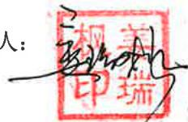

后附财务报表附注为本财务报表的组成部分

<table><tr><td></td><td>2024年</td><td>2023年</td></tr><tr><td colspan="3">一、经营活动产生的现金流量:</td></tr><tr><td>销售商品、提供劳务收到的现金</td><td>53,512,213</td><td>58,356,781</td></tr><tr><td>收到的税费返还</td><td>5,122</td><td>2,432</td></tr><tr><td>收到其他与经营活动有关的现金</td><td>2,180,558</td><td>4,506,008</td></tr><tr><td>经营活动现金流入小计</td><td>55,697,893</td><td>62,865,221</td></tr><tr><td>购买商品、接受劳务支付的现金</td><td>50,518,742</td><td>58,222,542</td></tr><tr><td>支付给职工以及为职工支付的现金</td><td>2,540,096</td><td>2,269,585</td></tr><tr><td>支付的各项税费</td><td>519,376</td><td>1,301,981</td></tr><tr><td>支付其他与经营活动有关的现金</td><td>3,345,608</td><td>3,798,598</td></tr><tr><td>经营活动现金流出小计</td><td>56,923,822</td><td>65,592,706</td></tr><tr><td>经营活动使用的现金流量净额</td><td>( 1,225,929)</td><td>( 2,727,485)</td></tr></table>

## 二、投资活动产生的现金流量：

<table><tr><td>收回投资收到的现金</td><td>1,299,672</td><td>182,972</td></tr><tr><td>取得投资收益收到的现金</td><td>18,814,969</td><td>13,757,906</td></tr><tr><td>处置固定资产、无形资产和其他长期资产收回的现金净额</td><td>11,380</td><td>12,680</td></tr><tr><td>收到其他与投资活动有关的现金</td><td>673,847</td><td>2,828,291</td></tr><tr><td>投资活动现金流入小计</td><td>20,799,868</td><td>16,781,849</td></tr><tr><td>购建固定资产、无形资产和其他长期资产支付的现金</td><td>296,644</td><td>458,533</td></tr><tr><td>投资支付的现金</td><td>8,997,305</td><td>10,028,887</td></tr><tr><td>支付其他与投资活动有关的现金</td><td>313,242</td><td>1,516,165</td></tr><tr><td>投资活动现金流出小计</td><td>9,607,191</td><td>12,003,585</td></tr><tr><td>投资活动产生的现金流量净额</td><td>11,192,677</td><td>4,778,264</td></tr></table>

后附财务报表附注为本财务报表的组成部分

## 三、筹资活动产生的现金流量：

<table><tr><td>吸收投资收到的现金</td><td>-</td><td>9,000,000</td></tr><tr><td>取得借款收到的现金</td><td>39,696,000</td><td>46,500,000</td></tr><tr><td>发行债券收到的现金</td><td>6,000,000</td><td>-</td></tr><tr><td>筹资活动现金流入小计</td><td>45,696,000</td><td>55,500,000</td></tr><tr><td>偿还债务支付的现金</td><td>41,859,000</td><td>38,572,000</td></tr><tr><td>分配股利、利润或偿付利息支付的现金</td><td>13,008,028</td><td>12,503,105</td></tr><tr><td>支付其他与筹资活动有关的现金</td><td>1,168,098</td><td>10,307,261</td></tr><tr><td>筹资活动现金流出小计</td><td>56,035,126</td><td>61,382,366</td></tr><tr><td>筹资活动使用的现金流量净额</td><td>(10,339,126)</td><td>(5,882,366)</td></tr><tr><td>汇率变动对现金及现金等价物的影响</td><td>(39,273)</td><td>252,117</td></tr><tr><td>现金及现金等价物净减少额</td><td>(411,651)</td><td>(3,579,470)</td></tr><tr><td>加:年初现金及现金等价物余额</td><td>16,230,156</td><td>19,809,626</td></tr><tr><td>年末现金及现金等价物余额</td><td>15,818,505</td><td>16,230,156</td></tr></table>

本财务报表由以下人士签署：

企业负责人：

主管会计工作负责人：

会计机构负责人：

后附财务报表附注为本财务报表的组成部分

## 一、基本情况

中国建筑股份有限公司（以下称“本公司”）是根据中国法律、行政法规的有关规定，并经国务院国有资产监督管理委员会（以下称“国资委”）于2007年12月6日以国资改革[2007]1495号文批准，由中国建筑工程总公司（以下称“中建总公司”）、中国石油天然气集团公司、宝钢集团有限公司和中国中化集团公司（以下合称“其他发起人”）作为发起人共同发起设立的股份有限公司。

于2017年11月，经国资委批准，中建总公司由全民所有制企业改制为国有独资公司，改制后中建总公司名称为中国建筑集团有限公司（以下称“中建集团”），由国资委代表国务院履行出资人职责。

本公司于2007年12月10日在中华人民共和国（以下称“中国”）北京市注册成立，总部地址为中国北京市。本公司的母公司和最终控股母公司为中建集团。本公司于2009年7月在上海证券交易所（A股）挂牌上市。于2024年12月31日，本公司的总股本为约416亿元，每股面值1元。截至2024年12月31日，中建集团持有本公司股份数量约为2,373,154万股，约占本公司已发行总股份的 $57.03\%$ 。

本公司及本公司之子公司（以下合称“本集团”）的经营范围包括勘察、设计、施工、安装、咨询、开发、装饰、生产、批发、零售、进出口；经营范围中主营：承担国内外公用、民用房屋建筑工程的施工、安装、咨询；基础设施项目的投资与承建；国内外房地产投资与开发；建筑与基础设施建设的勘察与设计；装饰工程、园林工程的设计与施工；实业投资；承包境内外资工程；进出口业务；建筑材料及其他非金属矿物制品、建筑用金属制品、工具、建筑工程机械和钻探机械的生产与销售；以及集团内部存贷款等金融业务。

本财务报表业经本公司董事会于2025年4月15日决议批准报出。

合并财务报表的合并范围以控制为基础确定，本年合并范围的变动情况详见附注七，本年不存在新纳入合并范围的重要子公司，本年亦不存在不再纳入合并范围的重要子公司。

## 二、财务报表的编制基础

## 1. 编制基础

本财务报表按照财政部颁布的《企业会计准则——基本准则》以及其后颁布及修订的具体会计准则、解释以及其他相关规定（统称“企业会计准则”）编制。此外，本财务报表还按照《公开发行证券的公司信息披露编报规则第15号——财务报告的一般规定》披露有关财务信息。

## 2. 持续经营

本财务报表以持续经营为基础列报。

## 三、重要会计政策及会计估计

本集团根据实际生产经营特点制定了具体会计政策和会计估计，主要体现在应收款项及合同资产的预期信用损失的计量、存货计价方法、收入确认和计量等。

## 1. 遵循企业会计准则的声明

本集团2024年度的合并及公司财务报表符合企业会计准则的要求，真实、完整地反映了本公司及本集团于2024年12月31日财务状况以及2024年度的经营成果和现金流量。

## 2. 会计期间

本集团会计年度采用公历年度，即每年自1月1日起至12月31日止。

## 3. 记账本位币

本公司记账本位币和编制本财务报表所采用的货币均为人民币。除有特别说明外，均以人民币千元为单位表示。

本集团下属子公司、合营企业及联营企业，根据其经营所处的主要经济环境自行决定其记账本位币，编制财务报表时折算为人民币。

## 4. 财务报表披露遵循的重要性标准确定方法和选择依据

重要性标准

<table><tr><td>重要的单项计提坏账准备的应收款项</td><td>单项计提坏账准备金额大于3亿元</td></tr><tr><td>重要的坏账准备收回、转回或核销金额</td><td>单项应收款项坏账准备收回、转回或核销金额大于3亿元</td></tr><tr><td>重要的债权投资</td><td>单项债权投资金额大于20亿元</td></tr><tr><td>重要的在建工程</td><td>单项在建工程项目金额大于5亿元</td></tr><tr><td>账龄超过1年的重要合同负债</td><td>单项账龄超过1年的合同负债占合同负债总额1%以上且金额大于30亿元</td></tr><tr><td>账龄超过1年的重要应付账款/其他应付款</td><td>单项账龄超过1年且年末余额占账面余额总额1%以上</td></tr><tr><td>重要的投资活动现金流量</td><td>单项投资活动涉及现金金额超过20亿元以上</td></tr><tr><td>重要的子公司</td><td>子公司资产总额、营业收入或利润总额之一占合并财务报表相应项目5%以上的,或者虽不具有财务重大性,但在风险、报酬及战略等方面于集团具有重要影响</td></tr><tr><td>存在重要少数股东权益的子公司</td><td>子公司的少数股东权益占集团净资产0.5%以上</td></tr><tr><td>重要的合营企业和联营企业</td><td>对合营企业或联营企业的长期股权投资账面价值占集团净资产1%以上</td></tr><tr><td>重要的商誉和商誉减值准备</td><td>单项商誉金额大于5亿元、商誉减值准备大于2亿元</td></tr></table>

## 三、重要会计政策及会计估计（续）

## 5. 企业合并

企业合并分为同一控制下企业合并和非同一控制下企业合并。

参与合并的企业在合并前后均受同一方或相同的多方最终控制，且该控制并非暂时性的，为同一控制下企业合并。合并方在同一控制下企业合并中取得的资产和负债（包括最终控制方收购被合并方而形成的商誉），按合并日在最终控制方财务报表中的账面价值为基础进行相关会计处理。合并方取得的净资产账面价值与支付的合并对价的账面价值（或发行股份面值总额）的差额，调整资本公积中的股本溢价，不足冲减的则调整留存收益。

参与合并的企业在合并前后不受同一方或相同的多方最终控制的，为非同一控制下企业合并。非同一控制下企业合并中所取得的被购买方可辨认资产、负债及或有负债在收购日以公允价值计量。合并成本大于合并中取得的被购买方可辨认净资产公允价值份额的差额，确认为商誉，并以成本减去累计减值损失进行后续计量。合并成本小于合并中取得的被购买方可辨认净资产公允价值份额的，对取得的被购买方各项可辨认资产、负债及或有负债的公允价值以及合并成本的公允价值的计量进行复核，复核后合并成本仍小于合并中取得的被购买方可辨认净资产公允价值份额的，其差额计入当期损益。

## 6. 合并财务报表

合并财务报表的合并范围以控制为基础确定，包括本公司及全部子公司的财务报表。子公司，是指被本公司控制的主体（含企业、被投资单位中可分割的部分，以及本公司所控制的结构化主体等）。当且仅当投资方具备下列三要素时，投资方能够控制被投资方：投资方拥有对被投资方的权力；因参与被投资方的相关活动而享有可变回报；有能力运用对被投资方的权力影响其回报金额。

## 三、重要会计政策及会计估计（续）

## 6. 合并财务报表（续）

子公司与本公司采用的会计政策或会计期间不一致的，在编制合并财务报表时，按照本公司的会计政策和会计期间对子公司财务报表进行必要的调整。本集团内部各公司之间的所有交易产生的资产、负债、权益、收入、费用和现金流量于合并时全额抵销。

子公司少数股东分担的当期亏损超过了少数股东在该子公司期初股东权益中所享有的份额的，其余额仍冲减少数股东权益。

对于通过非同一控制下企业合并取得的子公司，被购买方的经营成果和现金流量自本集团取得控制权之日起纳入合并财务报表，直至本集团对其控制权终止。在编制合并财务报表时，以购买日确定的各项可辨认资产、负债及或有负债的公允价值为基础对子公司的财务报表进行调整。

对于通过同一控制下企业合并取得的子公司，被合并方的经营成果和现金流量自合并当期期初纳入合并财务报表。编制比较合并财务报表时，对前期财务报表的相关项目进行调整，视同合并后形成的报告主体自最终控制方开始实施控制时一直存在。

如果相关事实和情况的变化导致对控制要素中的一项或多项发生变化的，本集团重新评估是否控制被投资方。

不丧失控制权情况下，少数股东权益发生变化作为权益性交易。

如果以本集团为会计主体与以本公司或子公司为会计主体对同一交易的认定不同时，从本集团的角度对该交易予以调整。

## 7. 合营安排分类及共同经营

合营安排分为共同经营和合营企业。共同经营，是指合营方享有该安排相关资产且承担该安排相关负债的合营安排。合营企业，是指合营方仅对该安排的净资产享有权利的合营安排。

合营方确认其与共同经营中利益份额相关的下列项目：确认单独所持有的资产，以及按其份额确认共同持有的资产；确认单独所承担的负债，以及按其份额确认共同承担的负债；确认出售其享有的共同经营产出份额所产生的收入；按其份额确认共同经营因出售产出所产生的收入；确认单独所发生的费用，以及按其份额确认共同经营发生的费用。

## 三、重要会计政策及会计估计（续）

## 8. 现金及现金等价物

现金，是指本集团的库存现金以及可以随时用于支付的存款；现金等价物，是指本集团持有的期限短、流动性强、易于转换为已知金额的现金、价值变动风险很小的投资。

## 9. 外币业务和外币报表折算

本集团对于发生的外币交易，将外币金额折算为记账本位币金额。

外币交易在初始确认时，采用交易发生日的即期汇率将外币金额折算为记账本位币金额，但投资者以外币投入的资本以交易发生日的即期汇率折算。于资产负债表日，对于外币货币性项目采用资产负债表日即期汇率折算。由此产生的结算和货币性项目折算差额，除属于与购建符合资本化条件的资产相关的外币专门借款产生的差额按照借款费用资本化的原则处理之外，均计入当期损益。以历史成本计量的外币非货币性项目，仍采用初始确认时所采用的汇率折算，不改变其记账本位币金额。以公允价值计量的外币非货币性项目，采用公允价值确定日的即期汇率折算，由此产生的差额根据非货币性项目的性质计入当期损益或其他综合收益。

对于境外经营，本集团在编制财务报表时将其记账本位币折算为人民币：对资产负债表中的资产和负债项目，采用资产负债表日的即期汇率折算，股东权益项目除“未分配利润”项目外，其他项目采用发生时的即期汇率折算；利润表中的收入和费用项目，采用交易发生当期平均汇率（除非汇率波动使得采用该汇率折算不适当，则采用交易发生日的即期汇率折算）折算。按照上述折算产生的外币财务报表折算差额，确认为其他综合收益。处置境外经营时，将与该境外经营相关的其他综合收益转入处置当期损益，部分处置的按处置比例计算。

外币现金流量以及境外子公司的现金流量，采用现金流量发生当期平均汇率（除非汇率波动使得采用该汇率折算不适当，则采用现金流量发生日的即期汇率折算）折算。汇率变动对现金的影响额作为调节项目，在现金流量表中单独列报。

## 三、重要会计政策及会计估计（续）

## 10. 金融工具

金融工具，是指形成一个企业的金融资产，并形成其他单位的金融负债或权益工具的合同。

## (1) 金融工具的确认和终止确认

本集团于成为金融工具合同的一方时确认一项金融资产或金融负债。

满足下列条件的，终止确认金融资产（或金融资产的一部分，或一组类似金融资产的一部分），即将之前确认的金融资产从资产负债表中予以转出：

（1）收取金融资产现金流量的权利届满；  
(2) 转移了收取金融资产现金流量的权利，或在“过手协议”下承担了及时将收取的现金流量全额支付给第三方的义务；并且实质上转让了金融资产所有权上几乎所有的风险和报酬，或者，虽然实质上既没有转移也没有保留金融资产所有权上几乎所有的风险和报酬，但放弃了对该金融资产的控制。

如果金融负债的责任已履行、撤销或届满，则对金融负债进行终止确认。如果现有金融负债被同一债权人以实质上几乎完全不同条款的另一金融负债所取代，或现有负债的条款几乎全部被实质性修改，则此类替换或修改作为终止确认原负债和确认新负债处理，差额计入当期损益。

以常规方式买卖金融资产，按交易日会计进行确认和终止确认。以常规方式买卖金融资产，是指按照合同规定购买或出售金融资产，并且该合同条款规定，根据通常由法规或市场惯例所确定的时间安排来交付金融资产。交易日，是指本集团承诺买入或卖出金融资产的日期。

## 三、重要会计政策及会计估计（续）

## 10. 金融工具（续）

## (2) 金融资产分类和计量

本集团的金融资产于初始确认时根据本集团管理金融资产的业务模式和金融资产的合同现金流量特征分类为：以摊余成本计量的金融资产、以公允价值计量且其变动计入其他综合收益的金融资产、以公允价值计量且其变动计入当期损益的金融资产。当且仅当本集团改变管理金融资产的业务模式时，才对所有受影响的相关金融资产进行重分类。

金融资产在初始确认时以公允价值计量，但是因销售商品或提供服务等产生的应收账款或应收票据未包含重大融资成分或不考虑不超过一年的融资成分的，按照交易价格进行初始计量。

对于以公允价值计量且其变动计入当期损益的金融资产，相关交易费用直接计入当期损益，其他类别的金融资产相关交易费用计入其初始确认金额。

金融资产的后续计量取决于其分类:

以摊余成本计量的债务工具投资

金融资产同时符合下列条件的，分类为以摊余成本计量的金融资产：管理该金融资产的业务模式是以收取合同现金流量为目标；该金融资产的合同条款规定，在特定日期产生的现金流量仅为对本金和以未偿付本金金额为基础的利息的支付。此类金融资产采用实际利率法确认利息收入，其终止确认、修改或减值产生的利得或损失，均计入当期损益。

以公允价值计量且其变动计入其他综合收益的债务工具投资

金融资产同时符合下列条件的，分类为以公允价值计量且其变动计入其他综合收益的金融资产：本集团管理该金融资产的业务模式是既以收取合同现金流量为目标又以出售金融资产为目标；该金融资产的合同条款规定，在特定日期产生的现金流量仅为对本金和以未偿付本金金额为基础的利息的支付。此类金融资产采用实际利率法确认利息收入。除利息收入、减值损失及汇兑差额确认为当期损益外，其余公允价值变动计入其他综合收益。当金融资产终止确认时，之前计入其他综合收益的累计利得或损失从其他综合收益转出，计入当期损益。

## 三、重要会计政策及会计估计（续）

## 10. 金融工具（续）

## (2) 金融资产分类和计量（续）

金融资产的后续计量取决于其分类：（续）

以公允价值计量且其变动计入其他综合收益的权益工具投资

本集团不可撤销地选择将部分非交易性权益工具投资指定为以公允价值计量且其变动计入其他综合收益的金融资产，仅将相关股利收入（明确作为投资成本部分收回的股利收入除外）计入当期损益，公允价值的后续变动计入其他综合收益，不需计提减值准备。当金融资产终止确认时，之前计入其他综合收益的累计利得或损失从其他综合收益转出，计入留存收益。

以公允价值计量且其变动计入当期损益的金融资产

上述以摊余成本计量的金融资产和以公允价值计量且其变动计入其他综合收益的金融资产之外的金融资产，分类为以公允价值计量且其变动计入当期损益的金融资产。对于此类金融资产，采用公允价值进行后续计量，所有公允价值变动计入当期损益。

## (3) 金融负债分类和计量

除了签发的财务担保合同及由于金融资产转移不符合终止确认条件或继续涉入被转移金融资产所形成的金融负债以外，本集团的金融负债于初始确认时分类为：以公允价值计量且其变动计入当期损益的金融负债、以摊余成本计量的金融负债。对于以公允价值计量且其变动计入当期损益的金融负债，相关交易费用直接计入当期损益，以摊余成本计量的金融负债的相关交易费用计入其初始确认金额。

金融负债的后续计量取决于其分类:

以公允价值计量且其变动计入当期损益的金融负债

以公允价值计量且其变动计入当期损益的金融负债，包括交易性金融负债（含属于金融负债的衍生工具）和初始确认时指定为以公允价值计量且其变动计入当期损益的金融负债。交易性金融负债（含属于金融负债的衍生工具），按照公允价值进行后续计量，所有公允价值变动均计入当期损益。对于指定为以公允价值计量且其变动计入当期损益的金融负债，按照公允价值进行后续计量，除由本集团自身信用风险变动引起的公允价值变动计入其他综合收益之外，其他公允价值变动计入当期损益；如果由本集团自身信用风险变动引起的公允价值变动计入其他综合收益会造成或扩大损益中的会计错配，本集团将所有公允价值变动（包括自身信用风险变动的影响金额）计入当期损益。

以摊余成本计量的金融负债

对于此类金融负债，采用实际利率法，按照摊余成本进行后续计量。

## 三、重要会计政策及会计估计（续）

## 10. 金融工具（续）

## (4) 金融工具减值

预期信用损失的确定方法及会计处理方法

本集团以预期信用损失为基础，对以摊余成本计量的金融资产、以公允价值计量且其变动计入其他综合收益的债务工具投资、租赁应收款、合同资产及财务担保合同进行减值处理并确认损失准备。

对于不含重大融资成分的应收款项以及合同资产，本集团运用简化计量方法，按照相当于整个存续期内的预期信用损失金额计量损失准备。

对于租赁应收款、包含重大融资成分的应收款项以及合同资产，本集团选择运用简化计量方法，按照相当于整个存续期内的预期信用损失金额计量损失准备。

除上述采用简化计量方法以外的金融资产及财务担保合同，本集团在每个资产负债表日评估其信用风险自初始确认后是否已经显著增加，如果信用风险自初始确认后未显著增加，处于第一阶段，本集团按照相当于未来12个月内预期信用损失的金额计量损失准备，并按照账面余额和实际利率计算利息收入；如果信用风险自初始确认后已显著增加但尚未发生信用减值的，处于第二阶段，本集团按照相当于整个存续期内预期信用损失的金额计量损失准备，并按照账面余额和实际利率计算利息收入；如果初始确认后发生信用减值的，处于第三阶段，本集团按照相当于整个存续期内预期信用损失的金额计量损失准备，并按照摊余成本和实际利率计算利息收入。对于资产负债表日只具有较低信用风险的金融工具，本集团假设其信用风险自初始确认后未显著增加。

关于本集团对信用风险显著增加判断标准、已发生信用减值资产的定义等披露参见附注十、1。

本集团计量金融工具预期信用损失的方法反映的因素包括：通过评价一系列可能的结果而确定的无偏概率加权平均金额、货币时间价值，以及在资产负债表日无须付出不必要的额外成本或努力即可获得的有关过去事项、当前状况以及未来经济状况预测的合理且有依据的信息。

## 三、重要会计政策及会计估计（续）

## 10. 金融工具（续）

## (4) 金融工具减值（续）

按照信用风险特征组合计提减值准备的组合类别及确定依据

本集团考虑了不同客户的信用风险特征，以共同风险特征为依据，以若干组合并结合账龄为基础评估应收款项及合同资产的预期信用损失。

当单项应收账款和合同资产无法以合理成本评估预期信用损失的信息时，本集团依据信用风险特征将应收账款和合同资产划分为若干组合，在组合基础上计算预期信用损失，确定组合的依据如下：

应收账款组合1 应收政府部门及中央企业客户

应收账款组合2 应收海外企业客户

应收账款组合3 应收其他客户

对于划分为组合的应收账款，本集团参考历史信用损失经验，结合当前状况以及对未来经济状况的预测，编制应收账款账龄与整个存续期预期信用损失率对照表，计算预期信用损失。

合同资产组合1 工程承包项目合同资产

合同资产组合2 尚未到期的质保金

合同资产组合3 业主未确认投资项目款

合同资产组合4 土地一级开发项目合同资产

合同资产组合5 其他合同资产

对于划分为组合的合同资产，本集团参考历史信用损失经验，结合当前状况以及对未来经济状况的预测，通过违约风险敞口和整个存续期预期信用损失率，计算预期信用损失。

对于因销售商品、提供劳务等日常经营活动形成的长期应收款中的PPP项目款、BT项目款、土地一级开发及征拆垫款以及其他基建项目款等，本集团参考历史信用损失经验，结合当前状况以及对未来经济状况的预测，通过违约风险敞口和整个存续期预期信用损失率，计算预期信用损失。对于其他长期应收款，本集团参考历史信用损失经验，结合当前状况以及对未来经济状况的预测，通过违约风险敞口和未来12个月内或整个存续期信用损失率，计算预期信用损失。

## 三、重要会计政策及会计估计（续）

## 10. 金融工具（续）

## (4) 金融工具减值（续）

按照信用风险特征组合计提减值准备的组合类别及确定依据（续）

当单项其他应收款无法以合理成本评估预期信用损失的信息时，本集团依据信用风险特征将其他应收款划分为若干组合，在组合基础上计算预期信用损失，确定组合的依据如下：

其他应收款组合1 应收保证金、押金及备用金

其他应收款组合2 应收代垫款

其他应收款组合3 应收其他款项

对于划分为组合的其他应收款，本集团参考历史信用损失经验，结合当前状况以及对未来经济状况的预测，通过违约风险敞口和未来12个月内或整个存续期预期信用损失率，计算预期信用损失。

基于账龄确认信用风险特征组合的账龄计算方法

本集团根据工程结算时点确定账龄。

按照单项计提坏账减值准备的单项计提判断标准

若某一对手方信用风险特征与组合中其他对手方显著不同，对应收该对手方款项按照单项计提损失准备。

## 减值准备的核销

当本集团不再合理预期能够全部或部分收回金融资产合同现金流量时，本集团直接减记该金融资产的账面余额。

## 三、重要会计政策及会计估计（续）

## 10. 金融工具（续）

## (5) 金融工具抵销

同时满足下列条件的，金融资产和金融负债以相互抵销后的净额在资产负债表内列示：具有抵销已确认金额的法定权利，且该种法定权利是当前可执行的；计划以净额结算，或同时变现该金融资产和清偿该金融负债。

## (6) 财务担保合同

财务担保合同，是指特定债务人到期不能按照债务工具条款偿付债务时，发行方向蒙受损失的合同持有人赔付特定金额的合同。财务担保合同在初始确认时按照公允价值计量，除指定为以公允价值计量且其变动计入当期损益的金融负债的财务担保合同外，其余财务担保合同在初始确认后按照资产负债表日确定的预期信用损失准备金额和初始确认金额扣除按照收入确认原则确定的累计摊销额后的余额两者孰高者进行后续计量。

## (7) 金融资产转移

本集团已将金融资产所有权上几乎所有的风险和报酬转移给转入方的，终止确认该金融资产；保留了金融资产所有权上几乎所有的风险和报酬的，不终止确认该金融资产。

本集团既没有转移也没有保留金融资产所有权上几乎所有的风险和报酬的，分别下列情况处理：放弃了对该金融资产控制的，终止确认该金融资产并确认产生的资产和负债；未放弃对该金融资产控制的，按照其继续涉入所转移金融资产的程度确认有关金融资产，并相应确认有关负债。

通过对所转移金融资产提供财务担保方式继续涉入的，按照金融资产的账面价值和财务担保金额两者之中的较低者，确认继续涉入形成的资产。财务担保金额，是指所收到的对价中，将被要求偿还的最高金额。

## 三、重要会计政策及会计估计（续）

## 11. 存货

存货包括原材料、在产品、库存商品、开发成本、开发产品等。

存货按照成本进行初始计量。存货成本包括建造成本、采购成本、加工成本和其他成本。

原材料、周转材料、在产品以及库存商品等存货发出时，采用先进先出法或加权平均法确定发出存货的成本。库存商品和在产品成本包括原材料、直接人工以及在正常生产能力下按系统的方法分配的制造费用。

开发成本及开发产品主要包括土地出让金、基础配套设施支出、建筑安装工程支出、开发项目完工前所发生的符合资本化条件的借款费用及开发过程中的其他相关费用。开发成本于项目完工后按实际成本结转为开发产品，开发产品成本结转时按实际成本核算。

周转材料采用分次摊销法进行摊销。

存货的盘存制度采用永续盘存制。

于资产负债表日，存货按照成本与可变现净值孰低计量，对成本高于可变现净值的，计提存货跌价准备，计入当期损益。可变现净值，是指在日常活动中，存货的估计售价减去至完工时估计将要发生的成本、估计的销售费用以及相关税费后的金额。对于数量繁多、单价较低的存货，按类别计提存货跌价准备，其他存货按单个存货项目计提存货跌价准备。与在同一地区生产和销售的产品系列相关、具有相同或类似最终用途或目的，且难以与其他项目分开计量的存货，合并计提存货跌价准备。

## 12. 持有待售的非流动资产

主要通过出售而非持续使用一项非流动资产收回其账面价值的，划分为持有待售类别。同时满足下列条件的，划分为持有待售类别：根据类似交易中出售此类资产的惯例，在当前状况下即可立即出售；出售极可能发生，即企业已经就一项出售计划作出决议且获得确定的购买承诺，预计出售将在一年内完成（有关规定要求企业相关权力机构或者监管部门批准后方可出售的，已经获得批准）。

## 三、重要会计政策及会计估计（续）

## 13. 长期股权投资

长期股权投资包括对子公司、合营企业和联营企业的权益性投资。

长期股权投资在取得时以初始投资成本进行初始计量。通过同一控制下企业合并取得的长期股权投资，以合并日取得被合并方所有者权益在最终控制方合并财务报表中的账面价值的份额作为初始投资成本；初始投资成本与合并对价账面价值之间差额，调整资本公积（不足冲减的，冲减留存收益）。通过非同一控制下企业合并取得的长期股权投资，以合并成本作为初始投资成本（通过多次交易分步实现非同一控制下企业合并的，以购买日之前所持被购买方的股权投资的账面价值与购买日新增投资成本之和作为初始投资成本）。除企业合并形成的长期股权投资以外方式取得的长期股权投资，按照下列方法确定初始投资成本：支付现金取得的，以实际支付的购买价款及与取得长期股权投资直接相关的费用、税金及其他必要支出作为初始投资成本；发行权益性证券取得的，以发行权益性证券的公允价值作为初始投资成本。

本公司能够对被投资单位实施控制的长期股权投资，在本公司个别财务报表中采用成本法核算。控制，是指拥有对被投资方的权力，通过参与被投资方的相关活动而享有可变回报，并且有能力运用对被投资方的权力影响回报金额。

采用成本法时，长期股权投资按初始投资成本计价。追加或收回投资的，调整长期股权投资的成本。被投资单位宣告分派的现金股利或利润，确认为当期投资收益。

本集团对被投资单位具有共同控制或重大影响的，长期股权投资采用权益法核算。共同控制，是指按照相关约定对某项安排所共有的控制，并且该安排的相关活动必须经过分享控制权的参与方一致同意后才能决策。重大影响，是指对被投资单位的财务和经营政策有参与决策的权力，但并不能够控制或者与其他方一起共同控制这些政策的制定。

采用权益法时，长期股权投资的初始投资成本大于投资时应享有被投资单位可辨认净资产公允价值份额的，归入长期股权投资的初始投资成本；长期股权投资的初始投资成本小于投资时应享有被投资单位可辨认净资产公允价值份额的，其差额计入当期损益，同时调整长期股权投资的成本。

## 三、重要会计政策及会计估计（续）

## 13. 长期股权投资（续）

采用权益法时，取得长期股权投资后，按照应享有或应分担的被投资单位实现的净损益和其他综合收益的份额，分别确认投资损益和其他综合收益并调整长期股权投资的账面价值。在确认应享有被投资单位净损益的份额时，以取得投资时被投资单位可辨认资产等的公允价值为基础，按照本集团的会计政策及会计期间，并抵销与联营企业及合营企业之间发生的内部交易损益按照应享有的比例计算归属于投资方的部分（但内部交易损失属于资产减值损失的，应全额确认），对被投资单位的净利润进行调整后确认，但投出或出售的资产构成业务的除外。按照被投资单位宣告分派的利润或现金股利计算应享有的部分，相应减少长期股权投资的账面价值。本集团确认被投资单位发生的净亏损，以长期股权投资的账面价值以及其他实质上构成对被投资单位净投资的长期权益减记至零为限，本集团负有承担额外损失义务的除外。对于被投资单位除净损益、其他综合收益和利润分配以外股东权益的其他变动，调整长期股权投资的账面价值并计入股东权益。

## 14. 投资性房地产

投资性房地产，是指为赚取租金或资本增值，或两者兼有而持有的房地产。

投资性房地产按照成本进行初始计量。与投资性房地产有关的后续支出，如果与该资产有关的经济利益很可能流入且其成本能够可靠地计量，则计入投资性房地产成本。否则，于发生时计入当期损益。

本集团采用成本模式对投资性房地产进行后续计量，按其使用寿命及预计净残值率对房屋及建筑物和土地使用权计提折旧或摊销。

## 15. 固定资产

固定资产仅在与其有关的经济利益很可能流入本集团，且其成本能够可靠地计量时才予以确认。与固定资产有关的后续支出，符合该确认条件的，计入固定资产成本，并终止确认被替换部分的账面价值；否则，在发生时按照受益对象计入当期损益或相关资产成本。

固定资产按照成本进行初始计量。购置固定资产的成本包括购买价款、相关税费、使固定资产达到预定可使用状态前所发生的可直接归属于该项资产的其他支出。

## 三、重要会计政策及会计估计（续）

## 15. 固定资产（续）

除使用提取的安全生产费形成的之外，固定资产的折旧采用年限平均法计提，各类固定资产的使用寿命、预计净残值率及年折旧率如下：

<table><tr><td></td><td>使用寿命</td><td>预计净残值率</td><td>年折旧率</td></tr><tr><td>房屋及建筑物</td><td>8-35年</td><td>0%-5%</td><td>2.71%-12.50%</td></tr><tr><td>机器设备</td><td>5-14年</td><td>0%-5%</td><td>6.79%-20.00%</td></tr><tr><td>运输工具</td><td>3-10年</td><td>0%-5%</td><td>9.50%-33.33%</td></tr><tr><td>办公设备、临时设施及其他</td><td>5-10年</td><td>0%-5%</td><td>9.50%-20.00%</td></tr></table>

本集团至少于每年年度终了，对固定资产的使用寿命、预计净残值和折旧方法进行复核，必要时进行调整。

## 16. 在建工程

在建工程成本按实际工程支出确定，包括在建期间发生的各项必要工程支出、工程达到预定可使用状态前的应予资本化的借款费用以及其他相关费用等。

在建工程转入固定资产、无形资产或投资性房地产标准如下：

结转固定资产、无形资产或投资性房地产的标准

<table><tr><td>房屋及建筑物</td><td>达到预定可使用状态</td></tr><tr><td>机器设备</td><td>完成安装调试</td></tr><tr><td>运输工具</td><td>获得行驶证书</td></tr><tr><td>其他</td><td>实际开始使用</td></tr></table>

## 17. 借款费用

可直接归属于符合资本化条件的资产的购建或者生产的借款费用，予以资本化，其他借款费用计入当期损益。

当资本支出和借款费用已经发生，且为使资产达到预定可使用或可销售状态所必要的购建或生产活动已经开始时，借款费用开始资本化。

购建或者生产符合资本化条件的资产达到预定可使用或者可销售状态时，借款费用停止资本化。之后发生的借款费用计入当期损益。

## 三、重要会计政策及会计估计（续）

## 17. 借款费用（续）

在资本化期间内，每一会计期间的利息资本化金额，按照下列方法确定：专门借款以当期实际发生的利息费用，减去暂时性的存款利息收入或投资收益后的金额确定；占用的一般借款，根据累计资产支出超过专门借款部分的资产支出加权平均数乘以所占用一般借款的加权平均利率计算确定。

符合资本化条件的资产在购建或者生产过程中，发生除达到预定可使用或者可销售状态必要的程序之外的非正常中断、且中断时间连续超过3个月的，暂停借款费用的资本化。在中断期间发生的借款费用确认为费用，计入当期损益，直至资产的购建或者生产活动重新开始。

## 18. 无形资产

## (1) 无形资产使用寿命

无形资产仅在与其有关的经济利益很可能流入本集团，且其成本能够可靠地计量时才予以确认，并以成本进行初始计量。但非同一控制下企业合并中取得的无形资产，其公允价值能够可靠地计量的，即单独确认为无形资产并按照公允价值计量。

无形资产按照其能为本集团带来经济利益的期限确定使用寿命，无法预见其为本集团带来经济利益期限的作为使用寿命不确定的无形资产。

本集团取得的土地使用权，通常作为无形资产核算。自行开发建造厂房等建筑物，相关的土地使用权和建筑物分别作为无形资产和固定资产核算。外购土地及建筑物支付的价款在土地使用权和建筑物之间进行分配，难以合理分配的，全部作为固定资产处理，并在土地使用权期限内以直线法进行摊销。

本集团涉及若干服务特许经营安排，本集团按照授权方所订的预设条件，为授权方开展基础设施工程建设，以换取有关资产的经营权。合同规定在有关基础设施建成后，本集团在从事经营的一定期间内有权利向获取服务的对象收取费用，收费金额不确定的，该权利不构成一项无条件收取可确定金额的货币资金或其他金融资产的权利的，作为无形资产模式进行核算。本集团会将该等特许经营权在建设期时的对价金额或确认的建造收入金额确认为合同资产，在相关建造期间确认的合同资产应当在资产负债表“无形资产”项目中列报。本集团在项目资产达到预定可使用状态时，将相关项目资产的对价金额或确认的建造收入金额，超过有权收取可确定金额的现金（或其他金融资产）的差额，确认为无形资产，并在特许经营期内以直线法进行摊销。

## 三、重要会计政策及会计估计（续）

## 18. 无形资产（续）

## (1) 无形资产使用寿命（续）

使用寿命有限的无形资产，在其使用寿命内采用直线法摊销。本集团至少于每年年度终了，对使用寿命有限的无形资产的使用寿命及摊销方法进行复核，必要时进行调整。

## (2) 研发支出

本集团将内部研究开发项目的支出，区分为研究阶段支出和开发阶段支出。研究阶段的支出，于发生时计入当期损益。开发阶段的支出，只有在同时满足下列条件时，才能予以资本化，即：完成该无形资产以使其能够使用或出售在技术上具有可行性；具有完成该无形资产并使用或出售的意图；无形资产产生经济利益的方式，包括能够证明运用该无形资产生产的产品存在市场或无形资产自身存在市场，无形资产将在内部使用的，能够证明其有用性；有足够的技术、财务资源和其他资源支持，以完成该无形资产的开发，并有能力使用或出售该无形资产；归属于该无形资产开发阶段的支出能够可靠地计量。不满足上述条件的开发支出，于发生时计入当期损益。

## 19. 资产减值

对除存货、合同资产及与合同成本有关的资产、递延所得税、金融资产、持有待售的非流动资产外的资产减值，按以下方法确定：于资产负债表日判断资产是否存在可能发生减值的迹象，存在减值迹象的，本集团将估计其可收回金额，进行减值测试；对因企业合并所形成的商誉、使用寿命不确定的无形资产和尚未达到可使用状态的无形资产，无论是否存在减值迹象，至少于每年末进行减值测试。

可收回金额根据资产的公允价值减去处置费用后的净额与资产预计未来现金流量的现值两者之间较高者确定。本集团以单项资产为基础估计其可收回金额；难以对单项资产的可收回金额进行估计的，以该资产所属的资产组为基础确定资产组的可收回金额。资产组的认定，以资产组产生的主要现金流入是否独立于其他资产或者资产组的现金流入为依据。

当资产或者资产组的可收回金额低于其账面价值时，本集团将其账面价值减记至可收回金额，减记的金额计入当期损益，同时计提相应的资产减值准备。

就商誉的减值测试而言，对于商誉的账面价值，自购买日起按照合理的方法分摊至相关的资产组或者资产组组合。相关的资产组或者资产组组合，是能够从企业合并的协同效应中受益的资产组或者资产组组合，且不大于本集团确定的经营分部。

## 三、重要会计政策及会计估计（续）

## 19. 资产减值（续）

比较包含商誉的资产组或者资产组组合的账面价值与可收回金额，如可收回金额低于账面价值的，减值损失金额首先抵减分摊至资产组或者资产组组合中商誉的账面价值，再根据资产组或者资产组组合中除商誉之外的其他各项资产的账面价值所占比重，按比例抵减其他各项资产的账面价值。

上述资产减值损失一经确认，在以后会计期间不再转回。

## 20. 长期待摊费用

长期待摊费用包括经营租入固定资产改良及其他已经发生但应由本期和以后各期负担的、分摊期限在一年以上的各项费用，按预计受益期间分期平均摊销，并以实际支出减去累计摊销后的净额列示。

## 21. 职工薪酬

职工薪酬，是指本集团为获得职工提供的服务或解除劳动关系而给予的除股份支付以外各种形式的报酬或补偿。职工薪酬包括短期薪酬、离职后福利、辞退福利和其他长期职工福利。

## (1) 短期薪酬

在职工提供服务的会计期间，将实际发生的短期薪酬确认为负债，并计入当期损益或相关资产成本。

## (2) 离职后福利（设定提存计划）

本集团的职工参加由当地政府管理的养老保险和失业保险，还参加了企业年金，相应支出在发生时计入相关资产成本或当期损益。

## 三、重要会计政策及会计估计（续）

## 21. 职工薪酬（续）

## (3) 离职后福利（设定受益计划）

本集团运作一项设定受益退休金计划，该计划要求向独立管理的基金缴存费用。该计划未注入资金，设定受益计划下提供该福利的成本采用预期累积福利单位法。设定受益退休金计划引起的重新计量，包括精算利得或损失，资产上限影响的变动（扣除包括在设定受益计划净负债利息净额中的金额）和计划资产回报（扣除包括在设定受益计划净负债利息净额中的金额），均在资产负债表中立即确认，并在其发生期间通过其他综合收益计入股东权益，后续期间不转回至损益。在下列日期孰早日将过去服务成本确认为当期费用：修改设定受益计划时；本集团确认相关重组费用或辞退福利时。利息净额由设定受益计划净负债或净资产乘以折现率计算而得。本集团在利润表的管理费用、财务费用中确认设定受益计划净义务的如下变动：服务成本，包括当期服务成本、过去服务成本和结算利得或损失；利息净额，包括计划资产的利息收益、计划义务的利息费用以及资产上限影响的利息。

## (4) 辞退福利

本集团向职工提供辞退福利的，在下列两者孰早日确认辞退福利产生的职工薪酬负债，并计入当期损益：企业不能单方面撤回因解除劳动关系计划或裁减建议所提供的辞退福利时；企业确认与涉及支付辞退福利的重组相关的成本或费用时。

预期在资产负债表日起一年内需支付的辞退福利，列示为流动负债。

## (5) 内退福利

本集团向接受内部退休安排的职工提供内退福利。内退福利是指，向未达到国家规定的退休年龄、经本集团管理层批准自愿退出工作岗位的职工支付的工资及为其缴纳的社会保险费等。本集团自内部退休安排开始之日起至职工达到正常退休年龄止，向内退职工支付内部退养福利。对于内退福利，本集团比照辞退福利进行会计处理，在符合辞退福利相关确认条件时，将自职工停止提供服务日至正常退休日期间拟支付的内退职工工资和缴纳的社会保险费等，确认为负债，一次性计入当期损益。内退福利的精算假设变化及福利标准调整引起的差异于发生时计入当期损益。

## 三、重要会计政策及会计估计（续）

## 22. 预计负债

除了非同一控制下企业合并中的或有对价及承担的或有负债之外，与或有事项相关的义务是本集团承担的现时义务且该义务的履行很可能会导致经济利益流出本集团，同时有关金额能够可靠地计量的，本集团将其确认为预计负债。

预计负债按照履行相关现时义务所需支出的最佳估计数进行初始计量，并综合考虑与或有事项有关的风险、不确定性和货币时间价值等因素。于资产负债表日对预计负债的账面价值进行复核并进行适当调整以反映当前最佳估计数。

以预期信用损失进行后续计量的财务担保合同列示于预计负债。

## 23. 股份支付

股份支付，分为以权益结算的股份支付和以现金结算的股份支付。以权益结算的股份支付，是指本集团为获取服务以股份或其他权益工具作为对价进行结算的交易。

以权益结算的股份支付换取职工提供服务的，以授予职工权益工具的公允价值计量。授予后立即可行权的，在授予日按照公允价值计入相关成本或费用，相应增加资本公积；完成等待期内的服务或达到规定业绩条件才可行权的，在等待期内每个资产负债表日，以对可行权权益工具数量的最佳估计为基础，按照授予日的公允价值，将当期取得的服务计入相关成本或费用，相应增加资本公积。权益工具的公允价值采用二项期权定价模型确定，参见附注十三、2。

如果修改了以权益结算的股份支付的条款，至少按照未修改条款的情况确认取得的服务。此外，增加所授予权益工具公允价值的修改，或在修改日对职工有利的变更，均确认取得服务的增加。

如果取消了以权益结算的股份支付，则于取消日作为加速行权处理，立即确认尚未确认的金额。职工或其他方能够选择满足非可行权条件但在等待期内未满足的，作为取消以权益结算的股份支付处理。但是，如果授予新的权益工具，并在新权益工具授予日认定所授予的新权益工具是用于替代被取消的权益工具的，则以与处理原权益工具条款和条件修改相同的方式，对所授予的替代权益工具进行处理。

## 三、重要会计政策及会计估计（续）

## 24. 其他权益工具

本集团发行的永续债到期后本集团有权不限次数展期，对于永续债票面利息，本集团有权递延支付，本集团并无合同义务支付现金或其他金融资产，分类为权益工具。

## 25. 与客户之间的合同产生的收入

本集团在履行了合同中的履约义务，即在客户取得相关商品或服务控制权时确认收入。取得相关商品或服务的控制权，是指能够主导该商品的使用或该服务的提供并从中获得几乎全部的经济利益。

## (1) 工程承包合同收入

本集团与客户之间的工程承包合同收入通常包含房屋建筑建设和基础设施建设履约义务，由于客户能够控制本集团履约过程中的在建资产，本集团将其作为在某一时段内履行的履约义务，按照履约进度确认收入，履约进度不能合理确定的除外。本集团按照投入法，根据发生的成本确定提供服务的履约进度。履约进度不能合理确定时，本集团已经发生的成本预计能够得到补偿的，按照已经发生的成本金额确认收入，直到履约进度能够合理确定为止。

## (2) 房地产销售收入

本集团房地产开发业务的收入于将物业控制权转移给客户时确认；通常，在综合考虑了下列因素的基础上，以某一时点确认收入：取得商品的现时收款权利、商品所有权上的主要风险和报酬的转移、商品的法定所有权的转移、商品实物资产的转移、客户接受该商品。本集团在房屋完工且经验收合格，与购买方签订了销售合同，取得了购买方付款证明并交付使用时确认房地产销售收入的实现。购买方接到书面交房通知，无正当理由拒绝接收的，于书面交房通知确定的交付使用时限结束后即确认房地产销售收入的实现。

## (3) 勘察设计服务收入

由于本集团履约过程中所提供的勘察设计服务具有不可替代用途，且本集团在整个合同期间内有权就累计至今已完成的履约部分收取款项，本集团将其作为在某一时段内履行的履约义务，按照履约进度确认收入，履约进度不能合理确定的除外。对于履约进度不能合理确定时，本集团已经发生的成本预计能够得到补偿的，按照已经发生的成本金额确认收入，直到履约进度能够合理确定为止。

## 三、重要会计政策及会计估计（续）

## 25. 与客户之间的合同产生的收入（续）

## (4) 销售商品收入

本集团与客户之间的销售商品合同通常仅包含转让商品的履约义务。本集团通常在综合考虑了下列因素的基础上，以控制权转移时点确认收入：取得商品的现时收款权利、商品所有权上的主要风险和报酬的转移、商品的法定所有权的转移、商品实物资产的转移、客户接受该商品。

## (5) 可变对价

本集团部分与客户之间的合同存在销售返利（提前完工奖励等）的安排，形成可变对价。本集团按照期望值或最有可能发生金额确定可变对价的最佳估计数，但包含可变对价的交易价格不超过在相关不确定性消除时累计已确认收入极可能不会发生重大转回的金额。

## (6) 重大融资成分

对于合同中存在重大融资成分的，本集团按照假定客户在取得商品或服务控制权时即以现金支付的应付金额确定交易价格，使用将合同对价的名义金额折现为商品或服务现销价格的折现率，将确定的交易价格与合同承诺的对价金额之间的差额在合同期间内采用实际利率法摊销。对于预计客户取得商品或服务控制权与客户支付价款间隔未超过一年的，本集团未考虑合同中存在的重大融资成分。

## (7) 质保义务

根据合同约定、法律规定等，本集团为所销售的商品或所建造的资产等提供质量保证。对于为向客户保证所销售的商品符合既定标准的保证类质量保证，本集团按照附注三、22进行会计处理。对于为向客户保证所销售的商品符合既定标准之外提供了一项单独服务的服务类质量保证，本集团将其作为一项单项履约义务，按照提供商品和服务类质量保证的单独售价的相对比例，将部分交易价格分摊至服务类质量保证，并在客户取得服务控制权时确认收入。在评估质量保证是否在向客户保证所销售商品符合既定标准之外提供了一项单独服务时，本集团考虑该质量保证是否为法定要求、质量保证期限以及本集团承诺履行任务的性质等因素。

## 三、重要会计政策及会计估计（续）

## 25. 与客户之间的合同产生的收入（续）

## (8) 主要责任人/代理人

本集团根据在向客户转让商品或服务前是否拥有对该商品或服务的控制权，来判断从事交易时本集团的身份是主要责任人还是代理人。本集团在向客户转让商品或服务前能够控制该商品或服务的，本集团为主要责任人，按照已收或应收对价总额确认收入；否则，本集团为代理人，按照预期有权收取的佣金或手续费的金额确认收入，该金额应当按照已收或应收对价总额扣除应支付给其他相关方的价款后的净额，或者按照既定的佣金金额或比例等确定。

## （9）政府和社会资本合作（以下称“PPP”）业务相关收入的确认

PPP项目合同，是指本集团作为社会资本方与政府方依法依规就PPP项目合作所订立的合同，该合同应当同时符合下列特征（以下简称“双特征”）：

（1）本集团在合同约定的运营期间内代表政府方使用PPP项目资产提供公共产品和服务；  
（2）本集团在合同约定的期间内就其提供的公共产品和服务获得补偿。

同时符合下列条件（以下简称“双控制”）：

（1）政府方控制或管制本集团使用PPP项目资产必须提供的公共产品和服务的类型、对象和价格；  
(2) PPP项目合同终止时, 政府方通过所有权、收益权或其他形式控制PPP项目资产的重大剩余权益。

社会资本方根据PPP项目合同约定，提供多项服务（如既提供PPP项目资产建造服务又提供建成后的运营服务、维护服务）的，应当按照建造合同确认建造服务的收入和成本。建造服务收入按照收取或有权收取的对价计量，并在确认收入的同时，确认合同资产。于运营阶段，当提供劳务服务时，确认相应的收入；发生的日常维护或修理费用，确认为当期费用。

社会资本方根据PPP项目合同约定，在项目运营期间，本集团满足有权收取可确定金额的现金（或其他金融资产）条件的，应当在社会资本方拥有收取该对价的权利（该权利仅取决于时间流逝的因素）时，在确认收入的同时确认应收款项，并按照《企业会计准则第22号——金融工具确认和计量》的规定进行会计处理。

## 三、重要会计政策及会计估计（续）

## 25. 与客户之间的合同产生的收入（续）

## (9) 政府和社会资本合作（以下称“PPP”）业务相关收入的确认（续）

社会资本方根据PPP项目合同约定，在项目运营期间，本集团有权向获取公共产品和服务的对象收取费用，但收费金额不确定的，该权利不构成一项无条件收取现金的权利，应当在PPP项目资产达到预定可使用状态时，将相关PPP项目资产的对价金额或确认的建造收入金额确认为无形资产，并按照《企业会计准则第6号——无形资产》的规定进行会计处理。

PPP项目资产达到预定可使用状态后，社会资本方应当按照《企业会计准则第14号——收入》确认与运营服务相关的收入。

## （10）建设-转移（以下称“BT”）业务相关收入确认

对于本集团提供建造服务的，于建设阶段，按照建造合同确认相关建造服务收入和成本，建造服务收入按照收取或有权收取的对价计量，在确认收入的同时确认合同资产，并对合同安排中的重大融资成分进行会计处理。待拥有无条件收取对价权利时，转入金融资产，待收到业主支付的款项后，进行冲减。

## 26. 合同资产与合同负债

本集团根据履行履约义务与客户付款之间的关系在资产负债表中列示合同资产或合同负债。本集团将同一合同下的合同资产和合同负债相互抵销后以净额列示。

## (1) 合同资产

在客户实际支付合同对价或在该对价到期应付之前，已向客户转让商品或服务而有权收取对价的权利（且该权利取决于时间流逝之外的其他因素），确认为合同资产；后续取得无条件收款权时，转为应收款项。

本集团对合同资产的预期信用损失的确定方法及会计处理方法详见附注三、10。

## (2) 合同负债

在向客户转让商品或服务之前，已收客户对价或取得无条件收取对价权利而应向客户转让商品或服务的义务，确认为合同负债。

## 三、重要会计政策及会计估计（续）

## 27. 与合同成本有关的资产

本集团与合同成本有关的资产包括合同取得成本和合同履约成本。根据其流动性，分别列报在存货、其他流动资产和其他非流动资产中。

本集团为取得合同发生的增量成本预期能够收回的，作为合同取得成本确认为一项资产，除非该资产摊销期限不超过一年。

本集团为履行合同发生的成本，不适用存货、固定资产或无形资产等相关准则的规范范围的，且同时满足下列条件的，作为合同履约成本确认为一项资产：

（1）该成本与一份当前或预期取得的合同直接相关，包括直接人工、直接材料、制造费用（或类似费用）、明确由客户承担的成本以及仅因该合同而发生的其他成本；  
（2）该成本增加了企业未来用于履行履约义务的资源；  
(3) 该成本预期能够收回。

本集团对与合同成本有关的资产采用与该资产相关的收入确认相同的基础进行摊销，计入当期损益。

与合同成本有关的资产，其账面价值高于下列两项差额的，本集团将超出部分计提减值准备，并确认为资产减值损失：

（1）因转让与该资产相关的商品或服务预期能够取得的剩余对价；  
（2）为转让该相关商品或服务估计将要发生的成本。

## 28. 政府补助

政府补助在能够满足其所附的条件并且能够收到时，予以确认。政府补助为货币性资产的，按照收到或应收的金额计量。政府补助为非货币性资产的，按照公允价值计量；公允价值不能可靠取得的，按照名义金额计量。

政府文件规定用于购建或以其他方式形成长期资产的，作为与资产相关的政府补助；政府文件不明确的，以取得该补助必须具备的基本条件为基础进行判断，以购建或其他方式形成长期资产为基本条件的作为与资产相关的政府补助，除此之外的作为与收益相关的政府补助。

本集团采用总额法核算政府补助。

## 三、重要会计政策及会计估计（续）

## 28. 政府补助（续）

与收益相关的政府补助，用于补偿以后期间的相关成本费用或损失的，确认为递延收益，并在确认相关成本费用或损失的期间计入当期损益；用于补偿已发生的相关成本费用或损失的，直接计入当期损益。

与资产相关的政府补助，确认为递延收益，在相关资产使用寿命内按照合理、系统的方法分期计入损益（但按照名义金额计量的政府补助，直接计入当期损益），相关资产在使用寿命结束前被出售、转让、报废或发生毁损的，尚未分配的相关递延收益余额转入资产处置当期的损益。

财政将贴息资金拨付给贷款银行，由贷款银行以政策性优惠利率向本集团提供贷款的，以实际收到的借款金额作为借款的入账价值，按照借款本金和该政策性优惠利率计算相关借款费用。

## 29. 递延所得税

本集团根据资产与负债于资产负债表日的账面价值与计税基础之间的暂时性差异，以及未作为资产和负债确认但按照税法规定可以确定其计税基础的项目的账面价值与计税基础之间的差额产生的暂时性差异，采用资产负债表债务法计提递延所得税。

各种应纳税暂时性差异均据以确认递延所得税负债，除非：

(1) 应纳税暂时性差异是在以下交易中产生的: 商誉的初始确认, 或者具有以下特征的单项交易中产生的资产或负债的初始确认: 该交易不是企业合并、交易发生时既不影响会计利润也不影响应纳税所得额或可抵扣亏损、且初始确认的资产和负债未导致产生等额应纳税暂时性差异和可抵扣暂时性差异;  
(2) 对于与子公司、合营企业及联营企业投资相关的应纳税暂时性差异，该暂时性差异转回的时间能够控制并且该暂时性差异在可预见的未来很可能不会转回。

## 三、重要会计政策及会计估计（续）

## 29. 递延所得税（续）

对于可抵扣暂时性差异、能够结转以后年度的可抵扣亏损和税款抵减，本集团以很可能取得用来抵扣可抵扣暂时性差异、可抵扣亏损和税款抵减的未来应纳税所得额为限，确认由此产生的递延所得税资产，除非：

（1）可抵扣暂时性差异是在以下单项交易中产生的：该交易不是企业合并、交易发生时既不影响会计利润也不影响应纳税所得额或可抵扣亏损、且初始确认的资产和负债未导致产生等额应纳税暂时性差异和可抵扣暂时性差异；  
(2) 对于与子公司、合营企业及联营企业投资相关的可抵扣暂时性差异，该暂时性差异在可预见的未来很可能转回且未来很可能获得用来抵扣该暂时性差异的应纳税所得额。

本集团于资产负债表日，对于递延所得税资产和递延所得税负债，依据税法规定，按照预期收回该资产或清偿该负债期间的适用税率计量，并反映资产负债表日预期收回资产或清偿负债方式的所得税影响。

于资产负债表日，本集团对递延所得税资产的账面价值进行复核，如果未来期间很可能无法获得足够的应纳税所得额用以抵扣递延所得税资产的利益，减记递延所得税资产的账面价值。于资产负债表日，本集团重新评估未确认的递延所得税资产，在很可能获得足够的应纳税所得额可供所有或部分递延所得税资产转回的限度内，确认递延所得税资产。

同时满足下列条件时，递延所得税资产和递延所得税负债以抵销后的净额列示：拥有以净额结算当期所得税资产及当期所得税负债的法定权利；递延所得税资产和递延所得税负债是与同一税收征管部门对同一应纳税主体征收的所得税相关或者对不同的纳税主体相关，但在未来每一具有重要性的递延所得税资产和递延所得税负债转回的期间内，涉及的纳税主体意图以净额结算当期所得税资产及当期所得税负债或是同时取得资产、清偿债务。

## 30. 租赁

在合同开始日，本集团评估合同是否为租赁或者包含租赁，如果合同中一方让渡了在一定期间内控制一项或多项已识别资产使用的权利以换取对价，则该合同为租赁或者包含租赁。