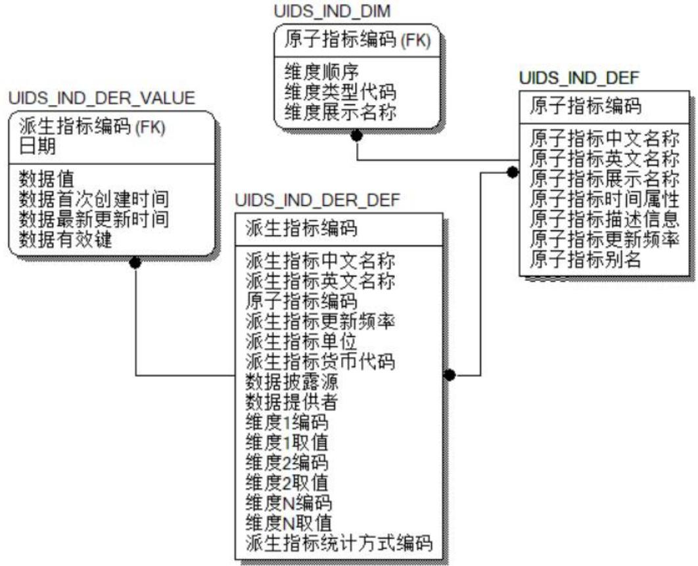
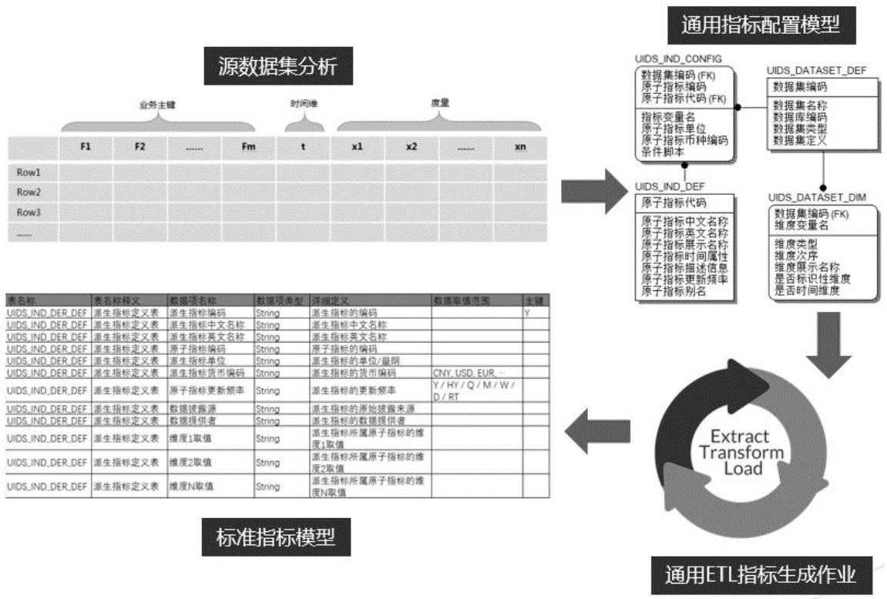
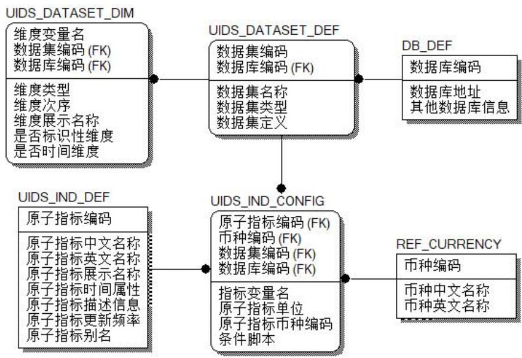
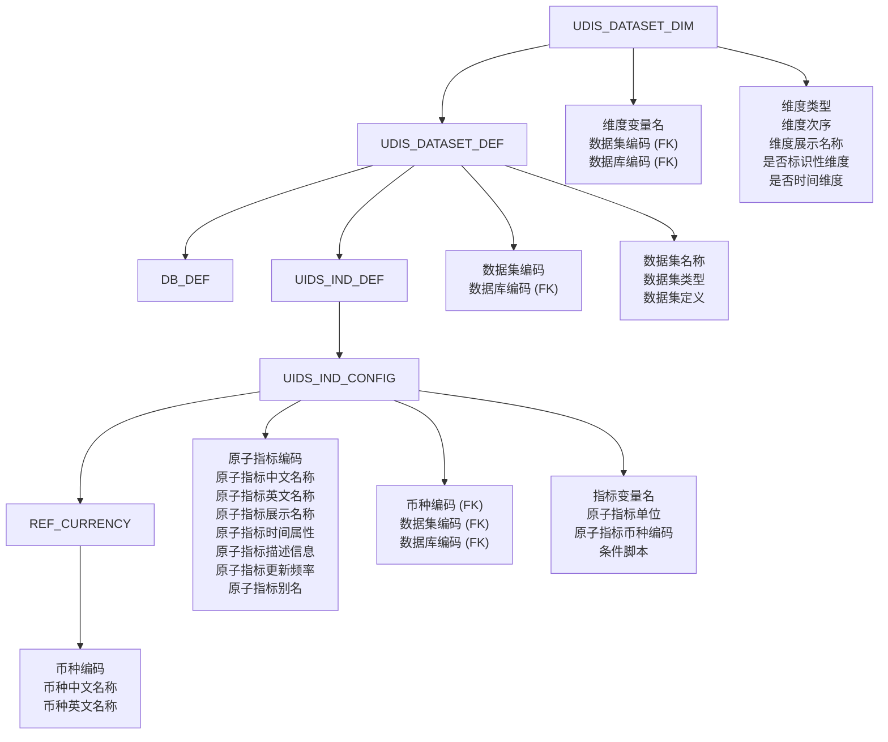
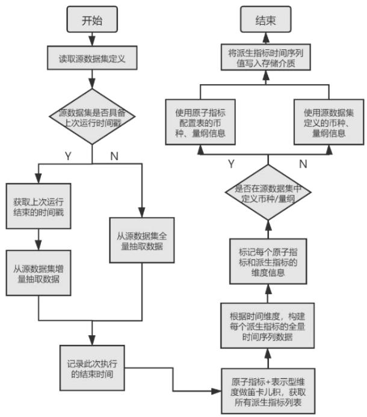
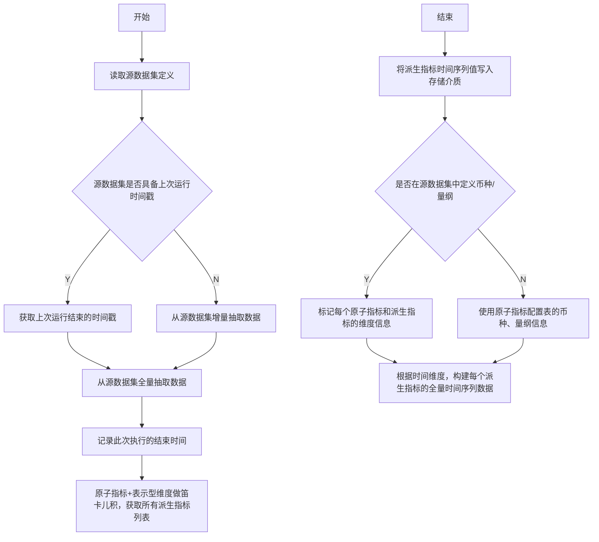
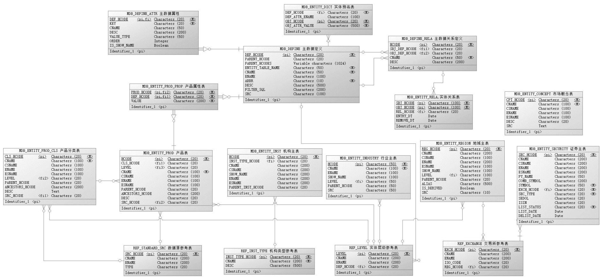
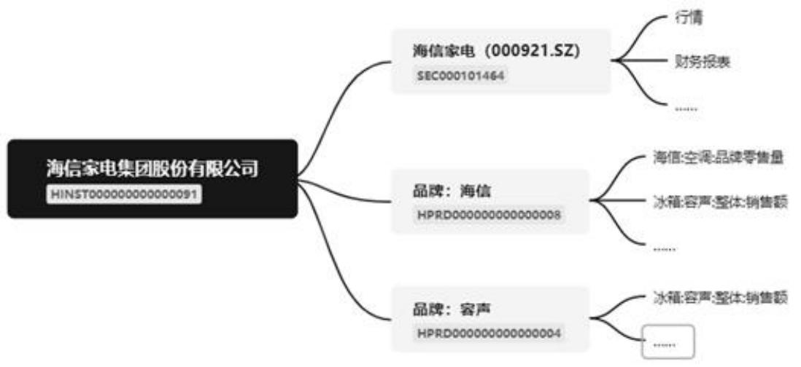
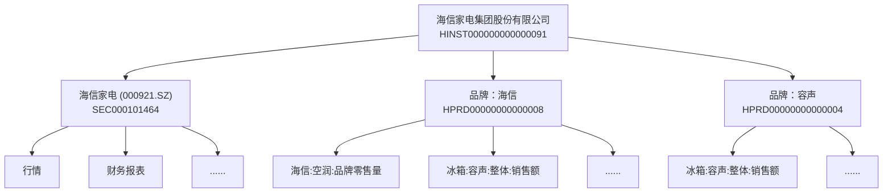

# 投资研究时序数据参考模型

# Investment analysis time series data reference model

2024-04-23 发布

2024-04-23 实施

## 目次

前言....II

引言.... III

1 范围.... 1  
2 规范性引用文件.... 1  
3 术语和定义....1  
4 投资研究主数据类别....2

4.1 主数据对象 2  
4.2 主数据实体 2  
4.3 主数据参考信息....2

5 投资研究主数据表清单及逻辑模型图....2  
6 投资研究主数据逻辑模型数据表详细设计 3

6.1 概述 3  
6.2 数据表详细设计 3

7 维度表达标准化设计方案.... 11

7.1 概述.... 11  
7.2 维度类型编码（主数据）规范 12  
7.3 通用维度码值规范....12

8 投资研究时序数据指标标准模型设计方案....16

8.1 标准化模型设计.... 16  
8.2 标准化模型表说明 17

9 通用指标模型 ETL 作业的设计方法....20

9.1 方法概述 20  
9.2 通用指标配置模型详述....21  
9.3 ETL作业步骤简述 24  
9.4 模型验证....24

附录 A（资料性）投资研究主数据逻辑模型示例图....25

附录B（资料性）投资研究主数据逻辑模型应用场景....26

B.1 场景一 数据表意消歧....26  
B.2 场景二 指标表达标准化 26  
B.3 场景三 数据智能应用 27

参考文献....29

## 前言

本文件按照GB/T 1.1—2020《标准化工作导则 第1部分：标准化文件的结构和起草规则》的规定起草。

本文件由全国金融标准化技术委员会证券分技术委员会（SAC/TC 180/SC4）提出。

本文件由全国金融标准化技术委员会（SAC/TC 180）归口。

本文件起草单位：嘉实基金管理有限公司、上证所信息网络有限公司、中证信息技术服务有限责任公司、银华基金管理股份有限公司、中国国际金融股份有限公司、中信证券股份有限公司、中国人寿资产管理有限公司、资本市场学院。

本文件主要起草人：刘志明、杨竞霜、田玉双、蔡楚煌、路一、彭乔、刘瀚月、张若海、李珊珊、高贵中。

## 引言

投资研究是金融领域的重要环节，其涉及的数据范围之广、专业程度之深、数据非标准化程度之高，已成为阻碍数据治理与流通快速发展的影响因素。

当前投资研究领域的数据化程度相对较低，数据形态多样，机构内及机构间数据交换频繁、业务发展迅速。由于行业内缺乏数据流通标准，导致重复建设、加工数据采集和标准化程序，造成了多对多的复杂、低效的投研数据生产和传输模式。

本文件专注于投资研究中使用频率最高的一类数据：时间序列数据，简称时序数据。通过对投资研究主数据分类，汇总归纳生成主数据清单及主数据逻辑模型图，同时结合主数据维度表达标准化设计方案，形成投资研究时序数据指标，基于此指标形成一套容易生产、便于流通的行业数据模型框架。该模型对于规范行业数据语言、推进行业数据治理、辅助行业监管科技建设等都具有十分重要的意义。

# 投资研究时序数据参考模型

## 1 范围

本文件专注于投资研究过程中使用频率最高的时序数据，对投资研究主数据进行了分类，同时设计了主数据维度表达标准化方案，生成了一套容易生产、便于流通的时序数据指标参考模型框架。

本文件适用于金融机构在投资研究场景中的指标数据抽象模型建设及投研数据交互工作。

## 2 规范性引用文件

下列文件中的内容通过文中的规范性引用而构成本文件必不可少的条款。其中，注日期的引用文件，仅该日期对应的版本适用于本文件；不注日期的引用文件，其最新版本（包括所有的修改单）适用于本文件。

GB/T 2260 中华人民共和国行政区划代码

GB/T 2659.1 世界各国和地区及其行政区划名称代码 第1部分：国家和地区代码

GB/T 21076 证券及相关金融工具 国际证券识别编码体系

GB/T 36073 数据管理能力成熟度评估模型

JR/T 0020 上市公司分类与代码

JR/T 0176.1 证券期货业数据模型 第1部分：抽象模型设计方法

JR/T 0176.3 证券期货业数据模型 第3部分：证券公司逻辑模型

JR/T 0176.4 证券期货业数据模型 第4部分：基金公司逻辑模型

ISO 4217 Currency codes

## 3 术语和定义

下列术语和定义适用于本文件。

3.1

时序数据 time series data

时间序列数据

按时间顺序记录的数据列。

3.2

主数据 master data

组织中需要跨系统、跨部门进行共享的核心业务实体数据。

[来源：GB/T 36073]

3.3

维度 dimension

描述性属性或特征。

3.4

实体 entity

参与金融和经济生产活动的对象。

## 3.5

指标 indicator

从数据中提取出来的特定的数值或统计量。

## 4 投资研究主数据类别

## 4.1 主数据对象

对投资研究主数据的对象进行约定及描述，同时对主数据的属性、不同主数据之间可能的关系进行约定及描述，是逻辑模型的核心内容。

## 4.2 主数据实体

对投资研究主数据的具体实体进行枚举、编码、定义与描述。例如地域主数据对应的地域主数据实体表，详细列示了所有国家、省州、市、区县等地域行政单位，并进行编码和层级关系描述。

## 4.3 主数据参考信息

用在描述主数据实体的信息当中。对于范围与取值稳定且需要编码管理的非研究对象类信息，归纳为参考信息。例如交易所信息、主数据实体层级信息、机构类型信息等。

## 5 投资研究主数据表清单及逻辑模型图

根据JR/T 0176.1抽象模型设计方法，通过对投资研究主数据逻辑模型的数据分类汇总归纳，形成的投资研究主数据表清单，见表1。

表 1 投资研究主数据表清单

<table><tr><td>序号</td><td>类别</td><td>表名</td><td>表释义</td></tr><tr><td>1</td><td>主数据对象</td><td>MDB_DEFINE</td><td>主数据对象定义</td></tr><tr><td>2</td><td>主数据对象</td><td>MDB_DEFINE_ATTR</td><td>主数据属性表</td></tr><tr><td>3</td><td>主数据对象</td><td>MDB_DEFINE_RELA</td><td>关系定义表</td></tr><tr><td>4</td><td>主数据实体</td><td>MDB_ENTITY_RELA</td><td>实体关系表</td></tr><tr><td>5</td><td>主数据实体</td><td>MDB_ENTITY_PROD_CLS_ATTR</td><td>产品分类属性表</td></tr><tr><td>6</td><td>主数据实体</td><td>MDB_ENTITY_PROD_PROP</td><td>产品属性值表</td></tr><tr><td>7</td><td>主数据实体</td><td>MDB_ENTITY_DICT</td><td>主数据别名表</td></tr><tr><td>8</td><td>主数据实体</td><td>MDB_ENTITY_INST</td><td>机构主表</td></tr><tr><td>9</td><td>主数据实体</td><td>MDB_ENTITY_SECURITY</td><td>证券主表</td></tr><tr><td>10</td><td>主数据实体</td><td>MDB_ENTITY_INDUSTRY</td><td>行业主表</td></tr><tr><td>11</td><td>主数据实体</td><td>MDB_ENTITY_REGION</td><td>地域主表</td></tr><tr><td>12</td><td>主数据实体</td><td>MDB_ENTITY_PERSON</td><td>人物主表</td></tr><tr><td>13</td><td>主数据实体</td><td>MDB_ENTITY_CONCEPT</td><td>市场概念主表</td></tr><tr><td>14</td><td>主数据实体</td><td>MDB_ENTITY_PROD</td><td>产品主表</td></tr><tr><td>15</td><td>主数据实体</td><td>MDB_ENTITY_PROD_CLS</td><td>产品分类主表</td></tr><tr><td>16</td><td>主数据实体</td><td>MDB_ENTITY_COMMON</td><td>通用实体主表</td></tr><tr><td>17</td><td>主数据参考信息</td><td>REF_STANDARD_SRC</td><td>数据源参考表</td></tr><tr><td>18</td><td>主数据参考信息</td><td>REF_INST_TYPE</td><td>机构类型参考表</td></tr><tr><td>19</td><td>主数据参考信息</td><td>REF_LEVEL</td><td>实体层级参考表</td></tr><tr><td>20</td><td>主数据参考信息</td><td>REF_EXCHANGE</td><td>交易所参考表</td></tr></table>

根据对投资研究主数据逻辑模型的数据分类，形成逻辑模型图。

投资研究主数据逻辑模型例图见附录A图A.1，其相关数据表的详细设计内容见第6章。

## 6 投资研究主数据逻辑模型数据表详细设计

## 6.1 概述

根据JR/T 0176.3，通过梳理投资研究主数据逻辑模型的每个数据分类，分析整合形成出符合该分类定义范围的数据表信息，再对每个数据表进行细化设计，从而形成一套完整且适用于投资研究框架的实用性比较强的数据表结构。数据表之间通过相互关联，最终构成投资研究主数据逻辑模型的主体部分。

在投资研究主数据逻辑模型中，重要的数据主要为主数据定义与描述信息和主数据实体信息中的数据，该部分的数据表详细内容见6.1～6.16。

其中，6.1～6.2所涉及的表可划分为数据模型的定义表，6.3～6.9涉及的表可被统称为业务表，6.10～6.14所涉及的表为产品主表系列，产品数据在实际生活中品类繁多、内容更为丰富，每一品类具备其单独属性。但在下游日常的业务场景中，或者实际开发流程中，往往会统一调用。故针对产品主数据，我们未将其按不同的类别抽象成一个个独立的业务表，而是采用同一套数据模型进行维护，方便下游调用。

## 6.2 数据表详细设计

## 6.2.1 MDB\_DEFINE 定义表

表2用于管理主数据，如新增业务、项目为主数据，更新已有内容。故在表2中需要维护主数据基本信息，如名称、业务描述、业务表名等信息，有统领主数据体系的作用，便于后续业务的查询。某一项主数据既可以作为业务本身，也可以作为描述其他业务的一个维度（或属性），如“地域”，既可以单独研究某一省市的地理、环境特征，也可以用来描述公司注册地、办公地。“地域”与“公司”皆被定义为主数据。

表 2 MDB\_DEFINE 主数据对象定义表

<table><tr><td>序号</td><td>英文字段</td><td>中文字段</td><td>字段类型</td><td>业务主键</td></tr><tr><td>1</td><td>HCODE</td><td>内部编码,英文,具备可读性</td><td>varchar(20)</td><td>√</td></tr><tr><td>2</td><td>PARENT_HCODE</td><td>上级编码</td><td>varchar(20)</td><td>—</td></tr><tr><td>3</td><td>PARENT_HCODES</td><td>祖先节点代码</td><td>json</td><td>—</td></tr><tr><td>4</td><td>ENTITY_TABLE_NAME</td><td>所在业务表</td><td>varchar(50)</td><td>—</td></tr><tr><td>5</td><td>NAME</td><td>主数据中文</td><td>varchar(50)</td><td>—</td></tr><tr><td>6</td><td>ENAME</td><td>主数据英文</td><td>varchar(100)</td><td>—</td></tr><tr><td>7</td><td>ABBR</td><td>用于生成下游业务表 HCODE 的前缀</td><td>varchar(10)</td><td>—</td></tr><tr><td>8</td><td>DESC</td><td>具体描述</td><td>varchar(500)</td><td>—</td></tr><tr><td>9</td><td>FILTER_SQL</td><td>过滤条件</td><td>varchar(200)</td><td>—</td></tr><tr><td>10</td><td>SRC</td><td>主要数据来源</td><td>varchar(100)</td><td>—</td></tr><tr><td colspan="5">注:主数据存在父子层级关系,如国家与省、直辖市。可以使用 PARENT_HCODE、FILTER_SQL 维护,PARENT_HCODES 便于程序使用。FILTER_SQL 维护方式包括 WHERE 和具体筛选条件。</td></tr></table>

## 6.2.2 MDB\_DEFINE\_ATTR 主数据属性表

表3用于记录某一主数据具备的属性，如证券主数据需要有全称、简称、上市场所、上市日期等信息；地域需要维护中文名称、英文名称等内容。

表 3 MDB\_DEFINE\_ATTR 主数据属性表

<table><tr><td>序号</td><td>英文字段</td><td>中文字段</td><td>字段类型</td><td>业务主键</td></tr><tr><td>1</td><td>DEF_HCODE</td><td>内部编码</td><td>varchar(20)</td><td>√</td></tr><tr><td>2</td><td>KEY</td><td>字段英文名,主数据的属性</td><td>varchar(20)</td><td>√</td></tr><tr><td>3</td><td>NAME</td><td>字段中文名,主数据的属性</td><td>varchar(50)</td><td>—</td></tr><tr><td>4</td><td>DESC</td><td>描述信息</td><td>varchar(200)</td><td>—</td></tr><tr><td>5</td><td>VALUE_TYPE</td><td>数据类型</td><td>varchar(50)</td><td>—</td></tr><tr><td>6</td><td>ORDER</td><td>排序</td><td>int(11)</td><td>—</td></tr><tr><td>7</td><td>IS_SHOW_NAME</td><td>是否展示名称</td><td>tinyint(1)</td><td>—</td></tr></table>

## 6.2.3 MDB\_DEFINE\_RELA 关系定义表

表4用于定义主数据之间的关系，如行业与证券的关系，公司与品牌的关系。

表 4 MDB\_DEFINE\_RELA 关系定义表

<table><tr><td>序号</td><td>英文字段</td><td>中文字段</td><td>字段类型</td><td>业务主键</td></tr><tr><td>1</td><td>HCODE</td><td>关系内部编码</td><td>varchar(20)</td><td>√</td></tr><tr><td>2</td><td>NAME</td><td>中文名</td><td>varchar(50)</td><td>—</td></tr><tr><td>3</td><td>DESC</td><td>描述信息</td><td>varchar(200)</td><td>—</td></tr><tr><td>4</td><td>SBJ_DEF_HCODE</td><td>主体,对应MDB_DEFINE的主数据内部编码</td><td>varchar(20)</td><td>—</td></tr><tr><td>5</td><td>OBJ_DEF_HCODE</td><td>客体,对应MDB_DEFINE的主数据内部编码</td><td>varchar(20)</td><td>—</td></tr></table>

## 6.2.4 MDB\_ENTITY\_INST 机构表

表5用于记录机构信息，包含中英文名称、中英文简称、办公地址、公司简介、经营范围、企业类型等业务信息。

表5的存在使得在数据库中的机构或组织有唯一的编码、有统一标准的信息。当数据库中其他业务表中出现了相关机构，通过程序或人工的方式将其匹配为机构表中的HCODE，实现机构数据标准化。

表 5 MDB\_ENTITY\_INST 机构表

<table><tr><td>序号</td><td>英文字段</td><td>中文字段</td><td>字段类型</td><td>业务主键</td></tr><tr><td>1</td><td>HCODE</td><td>内部代码</td><td>varchar(100)</td><td>√</td></tr><tr><td>2</td><td>CNAME</td><td>中文名称</td><td>varchar(200)</td><td>—</td></tr><tr><td>3</td><td>CSNAME</td><td>中文简称</td><td>varchar(200)</td><td>—</td></tr><tr><td>4</td><td>SHOW_NAME</td><td>展示名称</td><td>varchar(200)</td><td>—</td></tr><tr><td>5</td><td>ENAME</td><td>英文名称</td><td>varchar(200)</td><td>—</td></tr><tr><td>6</td><td>ESNAME</td><td>英文简称</td><td>varchar(200)</td><td>—</td></tr><tr><td>7</td><td>INST_LEI</td><td>全球法人识别编码</td><td>varchar(100)</td><td>—</td></tr><tr><td>8</td><td>INST_TYPE_CD</td><td>机构类型 CODE</td><td>varchar(10)</td><td>—</td></tr><tr><td>9</td><td>INST_TYPE</td><td>机构类型</td><td>varchar(50)</td><td>—</td></tr><tr><td>10</td><td>PARENT_INST_HCODE</td><td>所属公司</td><td>varchar(100)</td><td>—</td></tr><tr><td>11</td><td>REG_CAPITAL</td><td>注册资本</td><td>varchar(50)</td><td>—</td></tr><tr><td>12</td><td>CURRENCY_UNIT</td><td>货币单位</td><td>varchar(20)</td><td>—</td></tr><tr><td>13</td><td>COMPANY_STATUS</td><td>机构存续状态</td><td>varchar(20)</td><td>—</td></tr><tr><td>14</td><td>ESTABLISHMENT_DATE</td><td>成立日期</td><td>varchar(20)</td><td>—</td></tr><tr><td>15</td><td>CLOSE_DATE</td><td>存续截止日</td><td>varchar(20)</td><td>—</td></tr><tr><td>16</td><td>REG_ADDR</td><td>注册地址</td><td>varchar(200)</td><td>—</td></tr><tr><td>17</td><td>REG_COUNTRY</td><td>注册地所在国家</td><td>varchar(20)</td><td>—</td></tr><tr><td>18</td><td>REG_CITY</td><td>注册所在省市</td><td>varchar(20)</td><td>—</td></tr><tr><td>19</td><td>REG_AREA</td><td>注册所在区县</td><td>varchar(20)</td><td>—</td></tr><tr><td>20</td><td>REG_ZIP</td><td>注册地址邮编</td><td>varchar(20)</td><td>—</td></tr><tr><td>21</td><td>OFFICE_ADDR</td><td>办公地址</td><td>varchar(200)</td><td>—</td></tr><tr><td>22</td><td>EMAIL</td><td>电子邮箱</td><td>varchar(50)</td><td>—</td></tr><tr><td>23</td><td>WEBSITE</td><td>网址</td><td>varchar(50)</td><td>—</td></tr><tr><td>24</td><td>TEL</td><td>联系电话</td><td>varchar(50)</td><td>—</td></tr><tr><td>25</td><td>FAX</td><td>传真</td><td>varchar(50)</td><td>—</td></tr><tr><td>26</td><td>BRIEF_INTRO_TEXT</td><td>公司简介</td><td>text</td><td>—</td></tr><tr><td>27</td><td>BIZ_SCOPE</td><td>经营范围</td><td>text</td><td>—</td></tr><tr><td>28</td><td>BUSINESS_MAJOR</td><td>主营业务</td><td>text</td><td>—</td></tr><tr><td>29</td><td>WORKFORCE</td><td>员工人数</td><td>varchar(20)</td><td>—</td></tr><tr><td>30</td><td>ORGANIZATION_CODE</td><td>组织机构代码</td><td>varchar(20)</td><td>—</td></tr><tr><td>31</td><td>COMPANY_NATURE</td><td>企业性质</td><td>varchar(20)</td><td>—</td></tr><tr><td>32</td><td>IS_LIST</td><td>是否上市</td><td>bit</td><td>—</td></tr><tr><td>33</td><td>IS_BRANCH</td><td>是否分支机构</td><td>bit</td><td>—</td></tr><tr><td>34</td><td>ORG_TYPE</td><td>组织形式</td><td>varchar(20)</td><td>—</td></tr><tr><td>35</td><td>AUTH_CAPSK</td><td>法定股本</td><td>varchar(20)</td><td>—</td></tr><tr><td>36</td><td>LEGAL_PERSON_REPR</td><td>法人代表</td><td>varchar(20)</td><td>—</td></tr><tr><td>37</td><td>GENERAL_MANAGER</td><td>总经理</td><td>varchar(20)</td><td>—</td></tr><tr><td>38</td><td>CHAIRMAN</td><td>董事长</td><td>varchar(20)</td><td>—</td></tr><tr><td>39</td><td>BIZ_LICENSE_NO</td><td>营业执照号码</td><td>varchar(20)</td><td>—</td></tr><tr><td>40</td><td>TAX_REGISTER_NO</td><td>税务登记证</td><td>varchar(20)</td><td>—</td></tr><tr><td>41</td><td>ORG_REGISTER_NO</td><td>组织机构代码证</td><td>varchar(20)</td><td>—</td></tr><tr><td>42</td><td>SOCIAL_CREDIT_NO</td><td>社会信用代码</td><td>varchar(20)</td><td>—</td></tr></table>

## 6.2.5 MDB\_ENTITY\_SECURITY 证券表

表6用于记录各类证券信息，覆盖股票、债券、基金、指数等类型，包含证券全称、简称、上市地点、上市状态等业务信息。

表 6 MDB\_ENTITY\_SECURITY 证券表

<table><tr><td>序号</td><td>英文字段</td><td>中文字段</td><td>字段类型</td><td>业务主键</td></tr><tr><td>1</td><td>SEC_HCODE</td><td>证券内部代码</td><td>varchar(20)</td><td>√</td></tr><tr><td>2</td><td>CNAME</td><td>证券中文名称</td><td>varchar(200)</td><td>—</td></tr><tr><td>3</td><td>SHOW_SYMBOL</td><td>展示代码</td><td>varchar(200)</td><td>—</td></tr><tr><td>4</td><td>EXCH_HCODE</td><td>交易所代码</td><td>varchar(200)</td><td>—</td></tr><tr><td>5</td><td>CSNAME</td><td>证券中文简称</td><td>varchar(100)</td><td>—</td></tr><tr><td>6</td><td>ENAME</td><td>证券英文名称</td><td>varchar(200)</td><td>—</td></tr><tr><td>7</td><td>ESNAME</td><td>证券英文简称</td><td>varchar(100)</td><td>—</td></tr><tr><td>8</td><td>PY_NAME</td><td>拼音缩写</td><td>varchar(50)</td><td>—</td></tr><tr><td>9</td><td>SYMBOL</td><td>交易代码</td><td>varchar(50)</td><td>—</td></tr><tr><td>10</td><td>TRADE_CURR_HCODE</td><td>交易货币代码</td><td>varchar(20)</td><td>—</td></tr><tr><td>11</td><td>PARVALUE_CURR_HCODE</td><td>最小单位货币代码</td><td>varchar(20)</td><td>—</td></tr><tr><td>12</td><td>SEC_TYPE</td><td>证券类型</td><td>varchar(20)</td><td>—</td></tr><tr><td>13</td><td>SEDOL</td><td>SEDOL 编码</td><td>varchar(50)</td><td>—</td></tr><tr><td>14</td><td>ISIN</td><td>ISIN 编码</td><td>varchar(50)</td><td>—</td></tr><tr><td>15</td><td>LIST_STATUS</td><td>上市状态</td><td>varchar(20)</td><td>—</td></tr><tr><td>16</td><td>LIST_DATE</td><td>上市日期</td><td>datetime</td><td>—</td></tr><tr><td>17</td><td>DELIST_DATE</td><td>退市日期</td><td>datetime</td><td>—</td></tr><tr><td>18</td><td>CSNAME_TRIM</td><td>交易简称</td><td>varchar(100)</td><td>—</td></tr></table>

## 6.2.6 MDB\_ENTITY\_INDUSTRY 行业表

表7用于记录各类行业标准分类，覆盖申万等行业分类。

表 7 MDB\_ENTITY\_INDUSTRY 行业表

<table><tr><td>序号</td><td>英文字段</td><td>中文字段</td><td>字段类型</td><td>业务主键</td></tr><tr><td>1</td><td>HCODE</td><td>行业内部代码</td><td>varchar(50)</td><td>√</td></tr><tr><td>2</td><td>CODE</td><td>行业代码</td><td>varchar(50)</td><td>—</td></tr><tr><td>3</td><td>CNAME</td><td>行业名称中文</td><td>varchar(100)</td><td>—</td></tr><tr><td>4</td><td>ENAME</td><td>行业名称英文</td><td>varchar(100)</td><td>—</td></tr><tr><td>5</td><td>SHOW_NAME</td><td>展示名称</td><td>varchar(100)</td><td>—</td></tr><tr><td>6</td><td>LEVEL</td><td>行业分类层级代码</td><td>varchar(50)</td><td>—</td></tr><tr><td>7</td><td>PARENT_HCODE</td><td>该条目父级代码</td><td>varchar(50)</td><td>—</td></tr><tr><td>8</td><td>CODE_ALIAS</td><td>行业代码别名</td><td>varchar(50)</td><td>—</td></tr><tr><td>9</td><td>SRC</td><td>行业分类标准出处</td><td>varchar(10)</td><td>—</td></tr></table>

## 6.2.7 MDB\_ENTITY\_REGION 地域表

表8用于记录地区信息，覆盖大洲、国家、省、州或直辖市、地级市等最细到街道的信息。

表 8 MDB\_ENTITY\_REGION 地域表

<table><tr><td>序号</td><td>英文字段</td><td>中文字段</td><td>字段类型</td><td>业务主键</td></tr><tr><td>1</td><td>HCODE</td><td>地域内部代码</td><td>varchar(50)</td><td>√</td></tr><tr><td>2</td><td>CODE</td><td>地域代码</td><td>varchar(50)</td><td>—</td></tr><tr><td>3</td><td>CNAME</td><td>地域中文全称</td><td>varchar(200)</td><td>—</td></tr><tr><td>4</td><td>CSNAME</td><td>地域中文简称</td><td>varchar(100)</td><td>—</td></tr><tr><td>5</td><td>SHOW_NAME</td><td>展示名称</td><td>varchar(100)</td><td>—</td></tr><tr><td>6</td><td>ENAME</td><td>地域英文全称</td><td>varchar(200)</td><td>—</td></tr><tr><td>7</td><td>ESNAME</td><td>地域英文简称</td><td>varchar(100)</td><td>—</td></tr><tr><td>8</td><td>PARENT_HCODE</td><td>上级编码</td><td>varchar(50)</td><td>—</td></tr><tr><td>9</td><td>LEVEL</td><td>地域行政区划层级代码</td><td>varchar(100)</td><td>—</td></tr><tr><td>10</td><td>ALIAS</td><td>地域别名</td><td>varchar(500)</td><td>—</td></tr><tr><td>11</td><td>IS_DERIVED</td><td>是否为衍生地域</td><td>int(11)</td><td>—</td></tr><tr><td>12</td><td>SRC</td><td>地域行政区划层级来源</td><td>varchar(10)</td><td>—</td></tr></table>

## 6.2.8 MDB\_ENTITY\_PERSON 人物表

表9用于记录人物信息，包含人物名称、性别、出生年月、籍贯、教育背景等信息。

表 9 MDB\_ENTITY\_PERSON 人物表

<table><tr><td>序号</td><td>英文字段</td><td>中文字段</td><td>字段类型</td><td>业务主键</td></tr><tr><td>1</td><td>HCODE</td><td>人物内部代码</td><td>varchar(50)</td><td>√</td></tr><tr><td>2</td><td>CNAME</td><td>中文姓名</td><td>varchar(100)</td><td>—</td></tr><tr><td>3</td><td>ENAME</td><td>英文姓名</td><td>varchar(45)</td><td>—</td></tr><tr><td>4</td><td>SHOW_NAME</td><td>展示名称</td><td>varchar(45)</td><td>—</td></tr><tr><td>5</td><td>BIRTHDAY</td><td>出生年月</td><td>varchar(20)</td><td>—</td></tr><tr><td>6</td><td>SEX</td><td>性别</td><td>varchar(45)</td><td>—</td></tr><tr><td>7</td><td>NATIONALITY</td><td>国籍</td><td>varchar(20)</td><td>—</td></tr><tr><td>8</td><td>NATIVE_PLACE</td><td>籍贯</td><td>varchar(20)</td><td>—</td></tr><tr><td>9</td><td>ETHNIC</td><td>民族</td><td>varchar(20)</td><td>—</td></tr><tr><td>10</td><td>POLITICS</td><td>政治面貌</td><td>varchar(20)</td><td>—</td></tr><tr><td>11</td><td>EDU</td><td>最高学历</td><td>varchar(100)</td><td>—</td></tr><tr><td>12</td><td>MAJOR</td><td>最高学历所学专业</td><td>varchar(100)</td><td>—</td></tr><tr><td>13</td><td>GRAD</td><td>最高学历毕业院校</td><td>varchar(100)</td><td>—</td></tr><tr><td>14</td><td>COMP_HCODE</td><td>当前任职公司内部代码</td><td>varchar(500)</td><td>—</td></tr><tr><td>15</td><td>TITLE</td><td>当前任职公司职位</td><td>varchar(200)</td><td>—</td></tr><tr><td>16</td><td>NOTES</td><td>人物备注信息</td><td>varchar(300)</td><td>—</td></tr></table>

## 6.2.9 MDB\_ENTITY\_CONCEPT 市场概念表

表10用于记录市场热点概念信息，如专精特新、一带一路、5G等信息。

表 10 MDB\_ENTITY\_CONCEPT 市场概念表

<table><tr><td>序号</td><td>英文字段</td><td>中文字段</td><td>字段类型</td><td>业务主键</td></tr><tr><td>1</td><td>HCODE</td><td>概念内部代码</td><td>varchar(50)</td><td>√</td></tr><tr><td>2</td><td>CODE</td><td>来源的概念代码</td><td>varchar(50)</td><td>—</td></tr><tr><td>3</td><td>SOURCE_CODE</td><td>来源代码</td><td>varchar(50)</td><td>—</td></tr><tr><td>4</td><td>CNAME</td><td>概念中文全称</td><td>varchar(512)</td><td>—</td></tr><tr><td>5</td><td>CSNAME</td><td>概念中文简称</td><td>varchar(512)</td><td>—</td></tr><tr><td>6</td><td>ENAME</td><td>概念英文全称</td><td>varchar(200)</td><td>—</td></tr><tr><td>7</td><td>ESNAME</td><td>概念英文简称</td><td>varchar(100)</td><td>—</td></tr><tr><td>8</td><td>IS_COM_CONCEPT</td><td>是否为综合概念</td><td>int(11)</td><td>—</td></tr><tr><td>9</td><td>DESC</td><td>概念描述</td><td>longtext</td><td>—</td></tr></table>

## 6.2.10 MDB\_ENTITY\_PROD 产品表

表11用于记录产品本身的信息，包含品类、名称，划分为品牌、系列、SKU三层进行维护，覆盖汽车、消费、医药等行业信息。

表 11 MDB\_ENTITY\_PROD 产品表

<table><tr><td>序号</td><td>英文字段</td><td>中文字段</td><td>字段类型</td><td>业务主键</td></tr><tr><td>1</td><td>HCODE</td><td>产品代码</td><td>varchar(50)</td><td>√</td></tr><tr><td>2</td><td>CLS_HCODE</td><td>品类代码,对应产品分类表</td><td>varchar(100)</td><td>—</td></tr><tr><td>3</td><td>LEVEL_NAME</td><td>产品层级名称,P1-品牌,P2-系列,P3-产品</td><td>varchar(100)</td><td>—</td></tr><tr><td>4</td><td>CNAME</td><td>产品中文全称</td><td>varchar(100)</td><td>—</td></tr><tr><td>5</td><td>CSNAME</td><td>产品中文简称</td><td>varchar(100)</td><td>—</td></tr><tr><td>6</td><td>SHOW_NAME</td><td>展示名称</td><td>varchar(100)</td><td>—</td></tr><tr><td>7</td><td>ENAME</td><td>产品英文全称</td><td>varchar(100)</td><td>—</td></tr><tr><td>8</td><td>ESNAME</td><td>产品英文简称</td><td>varchar(100)</td><td>—</td></tr><tr><td>9</td><td>DESC</td><td>产品描述</td><td>varchar(100)</td><td>—</td></tr><tr><td>10</td><td>STATUS</td><td>产品状态</td><td>varchar(10)</td><td>—</td></tr><tr><td>11</td><td>PARENT_HCODE</td><td>父节点代码</td><td>text</td><td>—</td></tr><tr><td>12</td><td>ANCESTORS_HCODE</td><td>祖先节点代码</td><td>varchar(100)</td><td>—</td></tr><tr><td>13</td><td>SRC</td><td>来源</td><td>varchar(100)</td><td>—</td></tr></table>

## 6.2.11 MDB\_ENTITY\_PROD\_CLS 产品分类表

表12用于记录产品品类信息，可被视为产品分类主数据。与产品主表关联，获取同一个品类下的相关品牌、产品。

表 12 MDB\_ENTITY\_PROD\_CLS 产品分类表

<table><tr><td>序号</td><td>英文字段</td><td>中文字段</td><td>字段类型</td><td>业务主键</td></tr><tr><td>1</td><td>CLS_HCODE</td><td>品类代码</td><td>varchar(100)</td><td>√</td></tr><tr><td>2</td><td>CODE</td><td>来源系统的代码</td><td>varchar(100)</td><td>—</td></tr><tr><td>3</td><td>CNAME</td><td>品类中文名称</td><td>varchar(100)</td><td>—</td></tr><tr><td>4</td><td>SHOW_NAME</td><td>展示名称</td><td>varchar(100)</td><td>—</td></tr><tr><td>5</td><td>ENAME</td><td>品类英文名称</td><td>varchar(100)</td><td>—</td></tr><tr><td>6</td><td>DESC</td><td>品类描述</td><td>text</td><td>—</td></tr><tr><td>7</td><td>DESC_EN</td><td>品类英文描述</td><td>text</td><td>—</td></tr><tr><td>8</td><td>PARENT_HCODE</td><td>品类父节点代码</td><td>varchar(100)</td><td>—</td></tr><tr><td>9</td><td>ANCESTORS_HCODE</td><td>祖先节点代码</td><td>varchar(500)</td><td>—</td></tr><tr><td>10</td><td>LEVEL_NAME</td><td>品类层级名称</td><td>varchar(100)</td><td>—</td></tr><tr><td>11</td><td>SRC</td><td>来源</td><td>varchar(100)</td><td>—</td></tr></table>

## 6.2.12 MDB\_ENTITY\_PROD\_CLS\_ATTR 品类属性表

表13用于记录某一产品品类下的关键属性，记录品类的属性和属性值。

表 13 MDB\_ENTITY\_PROD\_CLS\_ATTR 品类属性表

<table><tr><td>序号</td><td>英文字段</td><td>中文字段</td><td>字段类型</td><td>业务主键</td></tr><tr><td>1</td><td>CLS_HCODE</td><td>品类代码</td><td>varchar(100)</td><td>√</td></tr><tr><td>2</td><td>DIM_HCODE</td><td>品类的属性代码</td><td>varchar(100)</td><td>√</td></tr><tr><td>3</td><td>VALUE</td><td>对应的属性值</td><td>varchar(100)</td><td>—</td></tr></table>

## 6.2.13 MDB\_ENTITY\_PROD\_PROP 产品属性值表

表14用于记录产品的属性，如可以获取到汽车的车型、动力类型、级别等内容，以窄表方式存储。

表 14 MDB\_ENTITY\_PROD\_PROP 产品属性值表

<table><tr><td>序号</td><td>英文字段</td><td>中文字段</td><td>字段类型</td><td>业务主键</td></tr><tr><td>1</td><td>P_HCODE</td><td>产品代码,对应产品主表中的产品代码</td><td>varchar(100)</td><td>√</td></tr><tr><td>2</td><td>DIM_HCODE</td><td>产品的属性,对应定义表的内部编码</td><td>varchar(100)</td><td>√</td></tr><tr><td>3</td><td>VALUE</td><td>对应的属性值</td><td>varchar(100)</td><td>—</td></tr></table>

## 6.2.14 MDB\_ENTITY\_DICT 主数据实体别名表

表15用于记录各类主数据的别名，获取标准名称和别名的关系。通过品类与产品，产品与属性表，可以归纳出某一品类下具备的属性。

表 15 MDB\_ENTITY\_DICT 主数据实体别名表

<table><tr><td>序号</td><td>英文字段</td><td>中文字段</td><td>字段类型</td><td>业务主键</td></tr><tr><td>1</td><td>DEF_HCODE</td><td>主数据类型,对应MDB_DEFINE定义代码</td><td>varchar(20)</td><td>—</td></tr><tr><td>2</td><td>DEF_ATTR_ENAME</td><td>属性名</td><td>varchar(20)</td><td>√</td></tr><tr><td>3</td><td>OBJ_HCODE</td><td>对应的实体</td><td>varchar(200)</td><td>—</td></tr><tr><td>4</td><td>OBJ_ATTR_VALUE</td><td>别名</td><td>varchar(250)</td><td>—</td></tr></table>

## 6.2.15 MDB\_ENTITY\_COMMON 通用实体表

表16记录关注度较低、当前业务中短期暂时不对其进行专门研究、暂不关注其特有属性的主数据，可用一张通用表记录。

表 16 MDB\_ENTITY\_COMMON 通用实体表

<table><tr><td>序号</td><td>英文字段</td><td>中文字段</td><td>字段类型</td><td>业务主键</td></tr><tr><td>1</td><td>DEF_HCODE</td><td>主数据类型,对应MDB_DEFINE 定义代码</td><td>varchar(20)</td><td>—</td></tr><tr><td>2</td><td>HCODE</td><td>内部编码</td><td>varchar(20)</td><td>√</td></tr><tr><td>3</td><td>SHOW_NAME</td><td>展示名称</td><td>varchar(20)</td><td>—</td></tr><tr><td>4</td><td>PARENT_HCODE</td><td>父节点的 HCODE</td><td>varchar(20)</td><td>—</td></tr></table>

## 6.2.16 MDB\_ENTITY\_MAPPING 实体关系表

表17用于记录不同主数据之间的关系。

表 17 MDB\_ENTITY\_MAPPING 实体关系表

<table><tr><td>序号</td><td>英文字段</td><td>中文字段</td><td>字段类型</td><td>业务主键</td></tr><tr><td>1</td><td>REL_HCODE</td><td>关系的类型</td><td>varchar(20)</td><td>√</td></tr><tr><td>2</td><td>SBJ_HCODE</td><td>主体实体的内部编码</td><td>varchar(100)</td><td>—</td></tr><tr><td>3</td><td>OBJ_HCODE</td><td>客体实体的内部编码</td><td>varchar(100)</td><td>—</td></tr><tr><td>4</td><td>ENTRY_DT</td><td>生效时间</td><td>date</td><td>—</td></tr><tr><td>5</td><td>REMOVE_DT</td><td>失效时间</td><td>date</td><td>—</td></tr></table>

## 7 维度表达标准化设计方案

## 7.1 概述

针对数据生成指标类数据的过程，物理模型的统一标准是必要但不充分的。为让数据能够自由流通且让机器尽量自动化地学习数据背后的业务含义，维度类型和维度枚举值的标准化也是至关重要的。

投资研究行业的业务模型相对于传统金融业务（如基金管理、证券承销、市场营销等），要覆盖全部的宏观和行业领域，要复杂得多。不同行业的指标，都拥有该行业特性的维度属性。例如汽车行业：车型、车系、排量等；新能源电池领域则有：直径、电芯种类、包装类型等。

因此，从经济生产领域归纳、抽象一些通用的维度和实体并形成通用准则，是实现数据标准化的重要一环。

## 7.2 维度类型编码（主数据）规范

针对投资研究领域的实体，表18规范了其维度类型的中文全称、英文全称及英文词根的标准表达方式。英文词根命名原则，具体规范沿用JR/T 0176.4。

表 18 维度类型编码规范

<table><tr><td>序号</td><td>中文全称</td><td>英文全称</td><td>编码</td></tr><tr><td>1</td><td>证券</td><td>Security</td><td>sec</td></tr><tr><td>2</td><td>股票</td><td>Stock</td><td>stk</td></tr><tr><td>3</td><td>债券</td><td>Bond</td><td>bond</td></tr><tr><td>4</td><td>基金</td><td>Fund</td><td>fund</td></tr><tr><td>5</td><td>期货</td><td>Futures</td><td>futr</td></tr><tr><td>6</td><td>指数</td><td>Index</td><td>idx</td></tr><tr><td>7</td><td>公司</td><td>Organization</td><td>org</td></tr><tr><td>8</td><td>地域</td><td>Region</td><td>reg</td></tr><tr><td>9</td><td>人物</td><td>Person</td><td>psn</td></tr><tr><td>10</td><td>产品</td><td>Product</td><td>prod</td></tr><tr><td>11</td><td>渠道</td><td>Channel</td><td>chnl</td></tr><tr><td>12</td><td>行业</td><td>Industry</td><td>indu</td></tr></table>

## 7.3 通用维度码值规范

## 7.3.1 证券及相关金融工具 security

根据GB/T 21076，采用全球证券唯一识别码（ISIN）。

示例：

表 19 证券实体标准化码值表

<table><tr><td>ISIN</td><td>证券代码</td><td>中文全称</td><td>中文简称</td><td>证券类型</td></tr><tr><td>CNE100001QW3</td><td>06818.HK</td><td>中国光大银行股份有限公司</td><td>中国光大银行</td><td>STK</td></tr><tr><td>KYG8972T1067</td><td>01083.HK</td><td>港华燃气有限公司</td><td>港华燃气</td><td>STK</td></tr><tr><td>BMG7946B1000</td><td>00251.HK</td><td>爪哇控股有限公司</td><td>爪哇控股</td><td>STK</td></tr><tr><td>CNE100000VH6</td><td>150021.SZ</td><td>富国汇利回报分级债券型证券投资基金之B份额</td><td>富国汇利B</td><td>FUND</td></tr><tr><td>CNE100000VH6</td><td>150021J.SZ</td><td>富国汇利分级债券型证券投资基金B级</td><td>富国汇利B</td><td>FUND</td></tr><tr><td>CNE100000W29</td><td>150025.SZ</td><td>大成景丰分级债券型证券投资基金A类份额</td><td>大成景丰A</td><td>FUND</td></tr><tr><td>N/A</td><td>IH1805.CFFEX</td><td>上证50股指期货1805合约</td><td>上证50股指期货1805</td><td>FUT</td></tr><tr><td>N/A</td><td>IH1804.CFFEX</td><td>上证50股指期货1804合约</td><td>上证50股指期货1804</td><td>FUT</td></tr><tr><td>N/A</td><td>T1903.CFFEX</td><td>10年期国债期货1903合约</td><td>10年期国债期货1903</td><td>FUT</td></tr></table>

## 7.3.2 公司 organization

采用企业在工商登记信息中记录的统一社会信用代码。

示例：

表 20 公司实体标准化码值表

<table><tr><td>统一社会信用代码</td><td>公司全称</td><td>公司简称</td><td>注册省份</td><td>注册市县</td><td>法人代表</td></tr><tr><td>915101126675584324</td><td>成都高原汽车工业有限公司</td><td>高原汽车</td><td>四川省</td><td>成都市</td><td>安聪慧</td></tr><tr><td>913209821406641084</td><td>江苏东远建筑有限公司</td><td>东远建筑</td><td>江苏省</td><td>盐城市</td><td>胡永东</td></tr><tr><td>913207071392576016</td><td>江苏苏港工程有限公司</td><td>苏港工程</td><td>江苏省</td><td>连云港市</td><td>陈振房</td></tr><tr><td>91320707567762778G</td><td>江苏伟仁建设工程有限公司</td><td>伟仁建设</td><td>江苏省</td><td>连云港市</td><td>仲伟仁</td></tr><tr><td>91320684750503512L</td><td>苏通建设集团有限公司</td><td>苏通建设集团</td><td>江苏省</td><td>南通市</td><td>蔡国新</td></tr><tr><td>913205096083033417</td><td>江苏姑苏净化科技有限公司</td><td>江苏姑苏净化</td><td>江苏省</td><td>苏州市</td><td>章洪伟</td></tr></table>

## 7.3.3 地域 region

国内地域采用GB/T 2260。

国际地域因类型不同而标准不同。国际地域使用GB/T 2659.1中规定的全球国家和地区的三字母代码；国家以下地区遵循各国家的民政部门的统一命名和编码标准。

示例：

表 21 地域实体标准化码值表

<table><tr><td>地域代码</td><td>中文名称</td><td>英文名称</td><td>地域等级</td></tr><tr><td>110000</td><td>北京市</td><td>—</td><td>省、州或直辖市</td></tr><tr><td>110101</td><td>东城区</td><td>—</td><td>地级市</td></tr><tr><td>110102</td><td>西城区</td><td>—</td><td>地级市</td></tr><tr><td>110105</td><td>朝阳区</td><td>—</td><td>地级市</td></tr><tr><td>710000</td><td>台湾省</td><td>—</td><td>省、州或直辖市</td></tr><tr><td>SAM</td><td>南美洲</td><td>South America</td><td>大洲</td></tr><tr><td>OCE</td><td>大洋洲</td><td>Oceania</td><td>大洲</td></tr><tr><td>EUR</td><td>欧洲</td><td>Europe</td><td>大洲</td></tr><tr><td>USA</td><td>美利坚合众国</td><td>United States of America</td><td>国家</td></tr><tr><td>10001</td><td>纽约市</td><td>New York City</td><td>地级市</td></tr></table>

## 7.3.4 人物 person

因人物的统一编码身份证号不属于社会公开信息，人物的编码由各数据供给方独立采编。

采编原则：使用姓名、性别、任职公司、所在部门、毕业院校、生日等信息作为联合主键生成。

## 7.3.5 产品 product

使用《统计用产品分类目录》2010年版。

示例：

表 22 产品实体标准化码值表

<table><tr><td>统计局产品编码</td><td>类别</td><td>产品名称</td></tr><tr><td>1</td><td>大类</td><td>农业产品</td></tr><tr><td>101</td><td>中类</td><td>谷物</td></tr><tr><td>10101</td><td>小类</td><td>稻谷</td></tr><tr><td>1010101</td><td>组</td><td>早籼稻</td></tr><tr><td>101010101</td><td>小组</td><td>种用早籼稻</td></tr><tr><td>101010199</td><td>小组</td><td>其他早籼稻</td></tr><tr><td>1010102</td><td>组</td><td>晚籼稻</td></tr><tr><td>101010201</td><td>小组</td><td>种用晚籼稻</td></tr><tr><td>101010299</td><td>小组</td><td>其他晚籼稻</td></tr><tr><td>1010103</td><td>组</td><td>中籼稻</td></tr></table>

## 7.3.6 行业 industry

使用《中国上市公司协会上市公司行业统计分类指引》中定义的分类结构和代码表。

示例：

表 23 行业实体标准化码值表

<table><tr><td>行业编码</td><td>类别名称</td><td>父类行业</td><td>行业层级</td></tr><tr><td>A</td><td>农、林、牧、渔业</td><td>—</td><td>大类</td></tr><tr><td>A01</td><td>农业</td><td>A</td><td>中类</td></tr><tr><td>A011</td><td>谷物种植</td><td>A01</td><td>小类</td></tr><tr><td>A012</td><td>豆类、油料和薯类种植</td><td>A01</td><td>小类</td></tr><tr><td>A013</td><td>棉、麻、糖、烟草种植</td><td>A01</td><td>小类</td></tr><tr><td>A014</td><td>蔬菜、食用菌及园艺作物种植</td><td>A01</td><td>小类</td></tr><tr><td>A02</td><td>林业</td><td>A</td><td>中类</td></tr></table>

## 7.3.7 渠道 channel

渠道通常用来分析上市公司发行产品的收入来源分布情况。

表24归纳了10余种常见的不同行业的销售渠道并进行编码，后续可根据各行业需要持续扩充。

示例：

表 24 渠道实体标准化码值表

<table><tr><td>渠道编码</td><td>渠道中文名称</td><td>渠道英文名称</td></tr><tr><td>CH001</td><td>居家购物</td><td>Homeshopping</td></tr><tr><td>CH002</td><td>电子商务</td><td>E-Commerce</td></tr><tr><td>CH003</td><td>直销</td><td>Direct Selling</td></tr><tr><td>CH004</td><td>杂货店</td><td>Grocery Retailers</td></tr><tr><td>CH005</td><td>其他非杂货专营</td><td>Other Non-Grocery Specialists</td></tr><tr><td>CH006</td><td>户外市场</td><td>Outdoor Markets</td></tr><tr><td>CH007</td><td>百货商店</td><td>Department Stores</td></tr><tr><td>CH008</td><td>大卖场</td><td>Mass Merchandisers</td></tr><tr><td>CH009</td><td>仓储式商店</td><td>Warehouse Clubs</td></tr><tr><td>CH010</td><td>超市</td><td>Supermarkets</td></tr><tr><td>CH011</td><td>线下经销商</td><td>Online Dealer</td></tr><tr><td>CH012</td><td>线上经销商</td><td>Offline Dealer</td></tr><tr><td>CH013</td><td>银行</td><td>Banks</td></tr><tr><td>CH014</td><td>券商</td><td>Brokers</td></tr></table>

## 7.3.8 币种 currency

币种在金融数据中是一个常见的字段，也是一种特殊维度。在上述通用指标模型中，币种和时间维度一样，被独立成标准字段。

币种的码值规范使用ISO 4217中规定的三字母货币代码。

示例：

表 25 币种实体标准化码值表

<table><tr><td>ISO 货币代码</td><td>货币中文名称</td><td>货币英文名称</td></tr><tr><td>CNY</td><td>人民币元</td><td>China Renminbi</td></tr><tr><td>ARS</td><td>阿根廷比索</td><td>Argentine Peso</td></tr><tr><td>ATS</td><td>奥地利先令</td><td>Austrian Schilling</td></tr><tr><td>AUD</td><td>澳大利亚元</td><td>Australian Dollar</td></tr><tr><td>BDT</td><td>孟加拉塔卡</td><td>Bangladesh Taka</td></tr><tr><td>BEF</td><td>比利时法郎</td><td>Belgian Franc</td></tr><tr><td>BRL</td><td>巴西里亚尔</td><td>Brazil Real</td></tr><tr><td>CAD</td><td>加拿大元</td><td>Canadian Dollar</td></tr><tr><td>CHF</td><td>瑞士法郎</td><td>Swiss Franc</td></tr><tr><td>CNH</td><td>离岸人民币元</td><td>Offshore RMB</td></tr><tr><td>EUR</td><td>欧元</td><td>EURO</td></tr></table>

派生指标所有涉及的通用维度的取值和编码，均应按照以上规范在UIDS\_IND\_DER\_DEF（派生指标定义表）表中赋值。如遇到上述规范无法覆盖的维度码值，需在“维度N编码”字段添加“N/A”标识。

## 7.3.9 统计方式 calc\_prop

时序指标通常有统计方式和口径的概念，常见的统计方式如同比、环比、累计同（环）比等。对于同一指标概念的不同统计方式下的数值，本文件认为应统一为同一原子指标，用统计方式属性的不同编码来进行区分标识。

示例：

表 26 统计方式属性标准化码值表

<table><tr><td>统计方式编码</td><td>统计方式中文名称</td><td>统计方式别名</td></tr><tr><td>CURR</td><td>当期值</td><td>当月值,当周值,当季值</td></tr><tr><td>AGG</td><td>累计值</td><td>月累计,周累计,季累计</td></tr><tr><td>YTD</td><td>年度至今累计值</td><td>YTD</td></tr><tr><td>YOY</td><td>同比</td><td>同比值,同比增速</td></tr><tr><td>MOM</td><td>环比</td><td>环比值,环比增速</td></tr><tr><td>AGG_YOY</td><td>累计同比</td><td>累计同比增速</td></tr><tr><td>AGG_MOM</td><td>累计环比</td><td>累计环比增速</td></tr></table>

## 8 投资研究时序数据指标标准模型设计方案

## 8.1 标准化模型设计

原子指标和派生指标的关系，可以用经典的关系代数模型表示：

$$
Y _ {M e a s u r e} = f (t, x 1, x 2, x 3, \dots , x n)
$$

式中：

Y——派生指标数值;

$f$ ——度量，即原子指标，也是获取派生指标数值的函数，指定入参向量值（即维度值）后返回确定的数据集；

t——时间入参;

x——入参向量，即“维度”，用 $x1,x2,x3,\ldots,xn$ 表示。

本文件基于经典的关系代数理论，制定了一套通用的指标标准化模型，用以在提供派生指标时间序列数值的基础上，完整、标准地定义指标的维度信息，供分析师和机器更灵活地消费指标数据。投资研究主数据逻辑模型应用场景详见附录B。

图1给出了投资研究标准化数据逻辑模型中每张表的设计及相关规范。

flowchart

图 1 投资研究标准化数据逻辑模型

## 8.2 标准化模型表说明

## 8.2.1 UIDS\_IND\_DEF 原子指标定义表

UIDS\_IND\_DEF用于定义原子指标，见表27。

原子指标是一类拥有共同维度类型且业务含义、统计口径一致的指标集合。原子指标的定义方式取决于主数据的存储形态。如果主数据通过关系型数据库存储，通常来说，一个原子指标来自一张表或视图的一个字段，且同一个数据集的原子指标拥有相同的维度定义；如果主数据已经是派生指标形态，则需要根据业务知识抽象的方式“还原”原子指标的名称。

例如：“江苏：工业增加值：累计值”和“湖南：工业增加值：累计值”的原子指标为“工业增加值”，该表需要定义原子指标的标准名称和展示名称。二者的区别在于标准名称面向数据管理人员，展示名称面向业务分析人员。

例如 “市盈率” 是个标准原子指标名称，但是对于业务人员来说，“PE” 是个更习惯的展示名称。同时如果可能，需尽量穷尽原子指标的多种不同名称，以便数据作业任务能够识别同义不同名的原子指标。

其他诸如原子指标的频率、来源、时间属性等，也需数据管理人员进行明确定义。

表 27 原子指标定义表

<table><tr><td>表名称</td><td>数据项名称</td><td>数据项类型</td><td>详细说明</td><td>数据取值范围</td><td>主键</td></tr><tr><td rowspan="8">UIDS_IND_DEF原子指标定义表</td><td>原子指标编码</td><td>String</td><td>原子指标的编码</td><td>—</td><td>Y</td></tr><tr><td>原子指标中文名称</td><td>String</td><td>原子指标标准中文名称</td><td>—</td><td>—</td></tr><tr><td>原子指标英文名称</td><td>String</td><td>原子指标标准英文名称</td><td>—</td><td>—</td></tr><tr><td>原子指标展示名称</td><td>String</td><td>原子指标面向用户展示的名称</td><td>—</td><td>—</td></tr><tr><td>原子指标时间属性</td><td>String</td><td>指标的统计方式是时点或区间</td><td>时点: spot;区间: duration。</td><td>—</td></tr><tr><td>原子指标描述信息</td><td>String</td><td>原子指标的详细描述,如计算方法,适用范围</td><td>—</td><td>—</td></tr><tr><td>原子指标更新频率</td><td>String</td><td>原子指标的更新频率</td><td>Y / HY / Q / M /W / D / RT</td><td>—</td></tr><tr><td>原子指标别名</td><td>String</td><td>原子指标的别名列表,用“,”分隔不同别名</td><td>—</td><td>—</td></tr></table>

## 8.2.2 UIDS\_IND\_DIM 原子指标维度表

UIDS\_IND\_DIM 用于定义原子指标的维度，也是机器能够理解指标业务含义的重要信息来源，见表28。

通常来说，时间维度作为所有投资指标中必不可少的维度，不必单独列示。

在实际业务中，不同经济领域和行业中的原子指标维度各异，有的只有一个维度，有的则有五个甚至以上的维度，因此采取纵表的形式存储原子指标的维度信息。

其中，“维度顺序”字段使用自增整数来定义每个维度之间的次序关系。该次序需根据常识和业务规则制定。在未来根据不同的维度值拼装时，维度顺序被用来按序拼接指标名称。

表 28 原子指标维度表

<table><tr><td>表名称</td><td>数据项名称</td><td>数据项类型</td><td>详细说明</td><td>数据取值范围</td><td>主键</td></tr><tr><td rowspan="4">UIDS_IND_DIM原子指标维度表</td><td>原子指标编码</td><td>String</td><td>原子指标的编码</td><td>—</td><td>Y</td></tr><tr><td>维度顺序</td><td>Int</td><td>维度按照业务逻辑的排列</td><td>1, 2, 3, ..., N</td><td>—</td></tr><tr><td>维度类型编码</td><td>String</td><td>根据维度的值域归纳的维度类型编码</td><td>Region, security, product, person, ...</td><td>—</td></tr><tr><td>维度展示名称</td><td>String</td><td>根据维度的值域归纳的维度类型的展示名称</td><td>地域、证券、产品、人...</td><td>—</td></tr></table>

## 8.2.3 UIDS\_IND\_DER\_DEF 派生指标定义表

UIDS\_IND\_DER\_DEF 用于定义派生指标的信息，见表29。

派生指标的定义与原子指标定义相比，需要额外定义原子指标在每个维度中的枚举值。

表 29 派生指标定义表

<table><tr><td>表名称</td><td>数据项名称</td><td>数据项类型</td><td>详细说明</td><td>数据取值范围</td><td>主键</td></tr><tr><td rowspan="13">UIDS_IND_DER_DEF派生指标定义表</td><td>派生指标编码</td><td>String</td><td>派生指标的编码</td><td>—</td><td>Y</td></tr><tr><td>派生指标中文名称</td><td>String</td><td>派生指标中文名称</td><td>—</td><td>—</td></tr><tr><td>派生指标英文名称</td><td>String</td><td>派生指标英文名称</td><td>—</td><td>—</td></tr><tr><td>原子指标编码</td><td>String</td><td>原子指标的编码</td><td>—</td><td>—</td></tr><tr><td>派生指标单位</td><td>String</td><td>派生指标的单位/量纲</td><td>—</td><td>—</td></tr><tr><td>派生指标货币编码</td><td>String</td><td>派生指标的货币编码</td><td>CNY, USD,EUR, ...</td><td>—</td></tr><tr><td>派生指标更新频率</td><td>String</td><td>派生指标的更新频率</td><td>Y / HY / Q /M / W / D / RT</td><td>—</td></tr><tr><td>数据披露源</td><td>String</td><td>派生指标的原始披露来源</td><td>—</td><td>—</td></tr><tr><td>数据提供者</td><td>String</td><td>派生指标的数据提供者</td><td>—</td><td>—</td></tr><tr><td>维度1取值</td><td>String</td><td>派生指标所属原子指标的维度1取值</td><td>—</td><td>—</td></tr><tr><td>维度2取值</td><td>String</td><td>派生指标所属原子指标的维度2取值</td><td>—</td><td>—</td></tr><tr><td>维度N取值</td><td>String</td><td>派生指标所属原子指标的维度N取值,最大不超过10,如果超过建议重新考虑指标的设计合理性问题</td><td>N&lt;10</td><td>—</td></tr><tr><td>派生指标统计方式</td><td>String</td><td>派生指标的统计方式编码</td><td>CURR, AGG,YOY, ...</td><td>—</td></tr></table>

注：派生指标的名称由以下元素拼接而成：  
——维度 1，维度 2，……，维度 N 的码值；  
——原子指标名称；  
——数据频率；  
——统计方式与口径。

鉴于当前投研数据应用环境中，业务人员已经习惯于用 “：” 拼接不同实体取值的表达方式，本文件对于派生指标名称的拼接顺序约定如下：

{维度 1 取值}: {维度 2 取值}: …: {维度 N 取值}: {原子指标名}: {统计方式与口径}: {频率}

示例：

指标 “北京：GDP：工业：累计值”，标准化的指标名称表达为：

北京：工业：GDP：累计值：季

其中：

——“北京”——维度1“地域”的取值；  
——“工业”——维度2“产业类型”的取值；  
—— “GDP” ——原子指标名称；  
——“累计值”——指标的统计方式；  
——“季”——数据的更新频率。

## 8.2.4 UIDS\_IND\_DER\_VALUE 派生指标数值表

在投资研究的业务场景中，指标通常以时间序列的形态展示。表30以派生指标代码和日期为联合主键，专用于列示派生指标的取值时间序列。

从工程层面，表30需制定三个系统键值：数值有效键、数据首次创建时间、数据最新更新时间。

其中表30采取逻辑删除机制。所有记录的数值有效键默认值为True，即若历史数据发生删除，也不执行物理删除动作，而将该键设置为False。两个系统时间戳除去为业务用户提供数据更新状态的参照，也为上下游ETL任务提供灵活性。

表 30 派生指标数值表

<table><tr><td>表名称</td><td>数据项名称</td><td>数据项类型</td><td>详细定义</td><td>数据取值范围</td><td>主键</td></tr><tr><td rowspan="6">UIDS_IND_DER_VALUE派生指标数值表</td><td>派生指标编码</td><td>String</td><td>派生指标编码</td><td>—</td><td>Y</td></tr><tr><td>日期</td><td>Date</td><td>数据的日期点</td><td>—</td><td>Y</td></tr><tr><td>数值</td><td>Number</td><td>派生指标在该日期的取值</td><td>—</td><td>—</td></tr><tr><td>数值有效键</td><td>Bool</td><td>该记录当前是否有效</td><td>T:有效;F:无效。</td><td>—</td></tr><tr><td>数据首次创建时间</td><td>Datetime</td><td>该记录首次进入系统的时间戳</td><td>—</td><td>—</td></tr><tr><td>数据最新更新时间</td><td>Datetime</td><td>该记录最新在系统中更新的时间戳</td><td>—</td><td>—</td></tr></table>

## 9 通用指标模型 ETL 作业的设计方法

## 9.1 方法概述

根据投研数据应用实践总结，宏观经济领域的派生指标量通常在40万～80万，各行业级垂直数据的指标量则在百万级。数百万级的派生指标按照上述标准逻辑模型，由业务人员或者数据管理人员定义，工作量是巨大的。因此，需要一套标准化的数据作业流程，使得数据管理人员在尽量少且标准化的配置工作后，由机器作业生成标准化的派生指标。

在标准指标模型 $Y_{Measure} = f(t, x1, x2, x3, \ldots, xn)$ 中，可知派生指标由原子指标根据各维度的参数派生而来，因此派生指标的维度定义可继承自原子指标。进一步分析，在关系型数据库表中，同一源数据集的不同度量（也即原子指标）共享同样的维度定义。因此，只要数据管理人员可以标准化地定义数据集、数据集的原子指标和数据集的维度信息，原子指标的维度、派生指标的维度和码值均可由数据作业自动生产。

通用指标模型ETL作业流程示意图详见图2。

flowchart

通用指标配置模型流程图，展示源数据集分析、标准指标模型与通用ETL指标生成作业的关联结构

图 2 通用指标模型 ETL 作业流程示意图

——源数据集定义。源数据集可以是关系型数据库表，也可以是视图，或标准化的API、json、csv文件，也即任何可以用二维关系表示的数据结构包含的数据集合；  
——源数据集提炼。数据管理人员需在源数据集根据数据字典和业务知识，归纳得出业务主键（标识性维度、非标识性维度），时间维度，度量（原子指标）；  
——通用指标模型配置。将抽象出的信息分别配置在源数据集定义、源数据集维度、原子指标定义、原子指标配置表中；  
——作业读取通用配置表和源数据集数据，生成派生指标；  
——派生指标按照派生指标标准模型写入数据存储介质。

## 9.2 通用指标配置模型详述

## 9.2.1 通用指标配置逻辑模型概览

通用指标模型生成作业的核心是第二步“通用指标模型配置”。将多源、异构的主数据通过数据管理人员的归纳，用统一的模型进行描述，是后续ETL程序批量处理和生成标准化指标的基石。通用指标配置逻辑模型详见图3。

flowchart

图 3 通用指标配置逻辑模型

## 9.2.2 通用指标配置逻辑模型表单介绍

## 9.2.2.1 UIDS\_DATASET\_DEF 源数据集定义表

表31以源数据集为单位，定义一批拥有相同维度信息的原子指标的集合。表31的“数据库编码”字段尚需关联数据库配置表以获取源数据集的接入方式：若为数据库，则为数据库的连接串；若为csv或json文件，则是文件的存储路径。

需要注意的是，无论源数据集的物理形态如何，在源数据集定义字段需制定源数据集的更新时间戳updatetime，供ETL作业增量抽取数据。

表 31 源数据集定义表

<table><tr><td>表名称</td><td>数据项名称</td><td>数据项类型</td><td>详细说明</td><td>数据取值范围</td><td>主键</td></tr><tr><td rowspan="5">UIDS_DATASET_DEF源数据集定义表</td><td>源数据集编码</td><td>String</td><td>源数据集的编码</td><td>—</td><td>Y</td></tr><tr><td>源数据集名称</td><td>String</td><td>源数据集的标准名称</td><td>—</td><td>—</td></tr><tr><td>数据库编码</td><td>String</td><td>源数据集所在数据库的编码</td><td>—</td><td>—</td></tr><tr><td>源数据集类型</td><td>String</td><td>源数据集的物理形态</td><td>Sqlscript/json/csv</td><td>—</td></tr><tr><td>源数据集定义</td><td>Text</td><td>获取源数据集数据的方式(如 SQL 脚本)</td><td>SQL 脚本/python 脚本</td><td>—</td></tr></table>

## 9.2.2.2 UIDS\_IND\_DEF 原子指标定义表

同8.2.1 “UIDS\_IND\_DEF原子指标定义表”。

具体表见表27。

## 9.2.2.3 UIDS\_IND\_CONFIG 原子指标配置表

原子指标与数据集为多对多的关系，也即一个原子指标可能出现在不同的数据集中。

表32配置原子指标“在哪个数据集（源数据集编码）”，“通过哪个字段获取（原子指标变量名）”。条件脚本字段在必要时用于和源数据集定义表的“数据集定义”字段拼接，给予ETL程序更高的灵活性。例如，当源数据的形态为纵表，原子指标按var列纵向排列时，可将条件脚本置为where var = ‘sample value’ 供ETL程序从源数据集读取。

表 32 原子指标配置表

<table><tr><td>表名称</td><td>数据项名称</td><td>数据项类型</td><td>详细说明</td><td>数据取值范围</td><td>主键</td></tr><tr><td rowspan="7">UIDS_IND_CONFIG原子指标配置表</td><td>数据集编码</td><td>String</td><td>源数据集的编码</td><td>—</td><td>Y</td></tr><tr><td>数据库编码</td><td>String</td><td>源数据集所在数据库的编码</td><td>—</td><td>—</td></tr><tr><td>原子指标编码</td><td>String</td><td>原子指标的编码</td><td>—</td><td>Y</td></tr><tr><td>指标变量名</td><td>String</td><td>原子指标对应源数据集的字段名称,供ETL程序读取</td><td>—</td><td>Y</td></tr><tr><td>原子指标单位</td><td>String</td><td>原子指标的单位/量纲</td><td>—</td><td>—</td></tr><tr><td>原子指标币种编码</td><td>String</td><td>原子指标的币种编码(如需)</td><td>CNY, USD, EUR, ...</td><td>—</td></tr><tr><td>条件脚本</td><td>String</td><td>拼接原子指标的数据读取脚本(如需)</td><td>—</td><td>—</td></tr></table>

## 9.2.2.4 UIDS\_DATASET\_DIM 源数据集维度定义表

表33定义每个数据集的维度信息，也即“哪个维度（维度类型）在哪个数据集（源数据集编码）通过哪个字段（维度变量名）取值”。需要注意的是，表33有一个必要配置的维度变量名为updatetime，对应源数据集定义表中定义的增量抽取时间戳。

表 33 源数据集维度定义表

<table><tr><td>表名称</td><td>数据项名称</td><td>数据项类型</td><td>详细定义</td><td>数据取值范围</td><td>主键</td></tr><tr><td rowspan="5">UIDS_DATASET_DIM数据集维度定义表</td><td>数据集编码</td><td>String</td><td>源数据集的编码</td><td>—</td><td>Y</td></tr><tr><td>维度变量名</td><td>String</td><td>维度对应源数据集的字段名称,供 ETL 程序读取</td><td>—</td><td>Y</td></tr><tr><td>维度类型</td><td>String</td><td>维度的数据类型</td><td>—</td><td>—</td></tr><tr><td>维度次序</td><td>Int</td><td>维度在原子指标中的逻辑次序</td><td>—</td><td>—</td></tr><tr><td>维度展示名称</td><td>String</td><td>维度值在拼装为派生指标中的展示名称</td><td>—</td><td>—</td></tr><tr><td rowspan="2">UIDS_DATASET_DIM数据集维度定义表</td><td>是否标识性维度</td><td>Bool</td><td>该维度是否为标识性维度</td><td>T:是标识性维度;F:非标识性维度。</td><td>—</td></tr><tr><td>是否时间维度</td><td>Bool</td><td>该维度是否为时间维度</td><td>T:是时间维度;F:非时间维度。</td><td>—</td></tr></table>

## 9.3 ETL 作业步骤简述

根据通用指标配置模型，ETL作业可批量读取源数据集的数据和原子指标定义，自动化地生成标准化的派生指标模型。流程示意图详见图4。整个流程可分为三大主要流程模块：

——整理数据获取脚本并执行；  
——生成最细粒度派生指标及其时间序列数据；  
——整理指标描述类信息并写入存储介质。

flowchart

图 4 ETL 作业流程示意图

## 9.4 模型验证

考察通用指标配置模型符合实际业务的情况，包括对现有业务的覆盖情况和对未来业务的兼容性。以数个有代表性的源数据集为例，运行ETL数据作业，在生成的派生指标模型进行检验，检查该源数据集的业务含义在派生指标模型中的体现情况，和业务中涉及的数据维度、原子指标的整理提炼情况。

## 附录 A

## (资料性)

投资研究主数据逻辑模型示例图  

```mermaid
graph TD
  A["MDB_DEFINE_ATTR 主数据属性"] --> B["DEF_HCODE <pi,fi> Characters (20) <MD"]
  A --> C["KEY Characters (20) <MD"]
  A --> D["CNAME Characters (50)"]
  A --> E["DESC Characters (200)"]
  A --> F["VALUE_TYPE Characters (50)"]
  A --> G["ORDER Integer"]
  A --> H["IS_SHOW_NAME Boolean"]
  A --> I["Identifier_1 <pi>"]

  B --> J["MDB_DEFINE 主数据定义"]
  C --> K["MDB_DEFINE_RELA 主数据关系定义"]
  J --> L["DEF_HCODE <pi> Characters (20) <MD"]
  J --> M["PARENT_HCODE <20> Characters (20)"]
  J --> N["PARENT_HODES Variable characters (1024)"]
  J --> O["ENTITY_TABLE_NAME Characters (50) <MD"]
  J --> P["CNAME Characters (50) <MD"]
  J --> Q["ENAME Characters (100)"]
  J --> R["ABBR Characters (10)"]
  J --> S["DESC Characters (500)"]
  J --> T["FILTER_SQL Characters (200)"]
  J --> U["SRC Characters (100)"]

  K --> V["MDB_ENTITY_RELA 实体关系表"]
  K --> W["SBI_HCODE <pi> Characters (100) <MD"]
  K --> X["OBI_HCODE <pi> Characters (100) <MD"]
  K --> Y["REL_HCODE <fi> Characters (20)"]
  K --> Z["ENTRY_DT Date"]
  K --> AA["REMOVE_DT Date"]
  K --> AB["Identifier_1 <pi>"]

  L --> AC["MDB_ENTITY_PROD_PROP 产品属性表"]
  L --> AD["MDB_ENTITY_PROD_CLS 产品分类表"]
  AC --> AE["PROD_HCODE <pi,fi> Characters (20) <MD"]
  AC --> AF["DEF_HCODE <pi,fi> Characters (20) <MD"]
  AC --> AG["VALUE CHARLES (200) <MD"]
  AC --> AH["Identifier_1 <pi>"]

  AD --> AI["MDB_ENTITY_PROD 产品表"]
  AD --> AJ["MDB_ENTITY_INST 机构主表"]
  AD --> AK["HCODE <pi> Characters (20) <MD"]
  AD --> AL["INST_TYPE_HODE <fi> Characters (20)"]
  AD --> AM["CNAME Characters (20)"]
  AD --> AN["CSNAME Characters (100)"]
  AD --> AO["LEVEL CHARLES (20)"]
  AD --> AP["CNAME Characters (100)"]
  AD --> AQ["ENAME Characters (100)"]
  AD --> AR["ESNAME Characters (100)"]
  AD --> AS["LEVEL CHARLES (20)"]
  AD --> AT["PEARENT_HCODE Characters (20)"]
  AD --> AU["ANCESTORS_HCODE Characters (20)"]
  AD --> AV["DESC CHARLES (20)"]
  AD --> AW["DESC CHARLES (20)"]
  AD --> AX["SRC CHARLES (20)"]
  AD --> AY["Identifier_1 <pi>"]

  AL --> AZ["REF_STANDARD_SRC 数据源参考表"]
  AL --> BA["REF_INST_TYPE 机构类型参考表"]
  AL --> BB["REF_LEVEL 实体层级参考表"]
  AL --> BC["REFERENCE EXCHANGE 交易所参考表"]

  B --> BD["MDB_DEFINE_RELA 主数据关系定义"]
  B --> BE["MDBmodels RELA 主数据关系定义"]
  B --> BF["MDB_ENTITY_RELA 实体关系表"]
  B --> BG["MDB_ENTITY_CONCEPT 市场概念表"]
  B --> BH["MDB_ENTITY_CONCEPT 市场概念表"]

  C --> BI["MDBmodels RELA 主数据关系定义"]
  C --> BJ["MDBmodels RELA 主数据关系定义"]
  C --> BK["MDBmodels RELA 主数据关系定义"]

  AD --> BL["MDB_ENTITY_RELA 行业主表"]
  AD --> BM["MDBmodels RELA 行业主表"]

  AE --> BN["REF_STANDARD_SRC 数据源参考表"]
  AE --> BO["REF_INST_TYPE 机构类型参考表"]
  AE --> BP["REF_LEVEL 实体层级参考表"]

  BA --> BQ["REF_STANDARD_SRC 数据源参考表"]
  BA --> BR["REF_INST_TYPE 机构类型参考表"]
  BA --> BS["REF_LEVEL 实体层级参考表"]

  BC --> BT["REF_EXCHANGE 交易所参考表"]

  BD --> BU["MDB_DEFINE_RELA 主数据关系定义"]
  BD --> BV["MDBmodels RELA 主数据关系定义"]
  BD --> BW["MDBmodels RELA 主数据关系定义"]

  BE --> BX["MDBmodels RELA 主数据关系定义"]

  BC --> BY["MDBmodels RELA 主数据关系定义"]

  BD --> BZ["MDBmodels RELA 主数据关系定义"]

  BE --> CA["MDBmodels RELA 主数据关系定义"]

  BC --> CB["MDBmodels RELA 主数据关系定义"]

  BD --> CC["MDBmodels RELA 主数据关系定义"]

  BE --> CD["MDBmodels RELA 主数据关系定义"]

  BC --> CE["MDBmodels RELA 主数据关系定义"]

  BD --> CF["MDBmodels RELA 主数据关系定义"]

  BE --> CG["MDBmodels RELA 主数据关系定义"]

  BC --> CH["MDBmodels RELA 主数据关系定义"]

  BE --> CI["MDBmodels RELA 主数据关系定义"]

  BC --> CJ["MDBmodels RELA 主数据关系定义"]

  BE --> CK["MDBmodels RELA 主数据关系定义"]

  BC --> CL["MDBmodels RELA 主数据关系定义"]

  BE --> CDM["MDBmodels RELA 主数据关系定义"]

  BC --> CDW["MDBmodels RELA 主数据关系定义"]

  BE --> CEW["MDBmodels RELA 主数据关系定义"]

  BC --> CEWQ["MDBmodels RELA 主数据关系定义"]

  BE --> CEWPC["MDBmodels RELA 主数据关系定义"]

  BC --> CEWQX["MDBmodels RELA 主数据关系定义"]

  BE --> CEWPCX["MDBmodels RELA 主数据关系定义"]

  BC --> CEWPCY["MDBmodels RELA 主数据关系定义"]

  BE --> CEWPCZ["XEC第二届 SEC CODE <pi> Characters (20) <MD"]
```

flowchart

图 A.1 投资研究主数据逻辑模型示例图

# 附录 B

# (资料性)

# 投资研究主数据逻辑模型应用场景

## B.1 场景一 数据表意消歧

构建完整的投资研究主数据模型，有助于消除以下场景中的表意歧义，内容见表B.1。

表 B.1 产品编码表

<table><tr><td>产品编码</td><td>中文名称</td><td>品类</td></tr><tr><td>HPRD000000000000003</td><td>苹果</td><td>农产品</td></tr><tr><td>HPRD000000000000013</td><td>苹果</td><td>电子产品品牌</td></tr></table>

如在下游指标 “苹果：销售额” 中，若无其他业务场景辅助判断，则对 “苹果” 字段会存在歧义。利用主数据模型可以产品编码 “HPRD000000000000013” 快速定位到目标，提高对接的效率。

## B.2 场景二 指标表达标准化

构建完整的投资研究主数据模型，有助于促进指标表达的标准化。如表B.2记录了由于相同内容不同数据商的不同表达而造成的数据干扰。

表 B.2 不同供应商指标对比表

<table><tr><td>指标</td><td>供应商W</td><td>供应商T</td><td>供应商R</td></tr><tr><td>指标1</td><td>产量:家用电冰箱:安徽:当月值</td><td>安徽:规模以上工业产品产量:家用电冰箱:当月值</td><td>家用电冰箱产量:当月值:安徽省</td></tr><tr><td>指标2</td><td>出厂价:聚合MDI:上海巴斯夫</td><td>出厂价:MDI(聚合):上海巴斯夫</td><td>出厂价:聚氨酯:MDI(聚合):上海巴斯夫</td></tr><tr><td>指标3</td><td>销量:汽车:A级:一汽大众:捷达:当月值</td><td>汽车销量:一汽大众:大众捷达:当月值</td><td>乘用车销量:大众捷达:累计值</td></tr></table>

以上所列情况中包含以下几个共性问题:

a) 实体命名不规范（安徽/安徽省、聚合 MDI/MDI(聚合)、一汽大众：捷达/一汽大众：大众捷达/大众捷达）；  
b) 指标命名不规范（销量：轿车/乘用车销量/汽车销量）；  
c) 维度顺序不一致。

解决如上问题可以做以下标准化内容:

a) 地域主数据中，HREG00000001015 对应安徽省，简称为安徽。给指标 1 中的安徽匹配标准编码；  
b) 产品主数据中，HPRD00000072484 对应聚合 MDI，别名为粗 MDI、聚氨酯黑料、MDI(聚合)。给指标 2 中的聚合 MDI 匹配标准代码；

c) 产品主数据中，HPRD000000000001343 对应捷达，别名为一汽大众捷达。给指标 3 中的捷达匹配标准代码；  
d) 产品品类表中，HCLS000000000001592 对应家用冰箱。给指标 1 中的家用电冰箱匹配标准代码；  
e) 机构主数据中，HINST0000000000001972 对应上海巴斯夫聚氨酯有限公司，简称为上海巴斯夫，给指标 2 匹配上海巴斯夫的标准代码；HINST0000000000001973 对应一汽大众汽车有限公司，简称为一汽大众，给指标 3 一汽大众匹配标准代码；  
f) 另将统计口径、指标标准化处理后编码。

通过指标表达的标准化，最终成果如表B.3所示：

表 B.3 指标标准化成果表

<table><tr><td>指标</td><td>原指标名称</td><td>指标维度</td><td>维度编码</td><td>维度中文</td></tr><tr><td rowspan="4">指标1</td><td rowspan="4">1.产量:家用电冰箱:安徽:当月值2.安徽:规模以上工业产品产量:家用电冰箱:当月值3.家用电冰箱产量:当月值:安徽</td><td>指标</td><td>HABS00001000051</td><td>产量</td></tr><tr><td>统计口径</td><td>HIDTP00000000001</td><td>当月值</td></tr><tr><td>品类</td><td>HCLS000000000001592</td><td>家用冰箱</td></tr><tr><td>地域</td><td>HREG00000001015</td><td>安徽</td></tr><tr><td rowspan="3">指标2</td><td rowspan="3">1.出厂价:聚合MDI:上海巴斯夫2.出厂价:MDI(聚合):上海巴斯夫3.出厂价:聚氨酯:MDI(聚合):上海巴斯夫</td><td>指标</td><td>HABS00001002849</td><td>出厂价</td></tr><tr><td>产品</td><td>HPRD00000072484</td><td>聚合MDI</td></tr><tr><td>公司</td><td>HINST0000000000001972</td><td>上海巴斯夫</td></tr><tr><td rowspan="4">指标3</td><td rowspan="4">1.销量:汽车:A级:一汽大众:捷达:当月值2.汽车销量:一汽大众:大众捷达:当月值3.乘用车销量:大众捷达:累计值</td><td>指标</td><td>HABS00000000327</td><td>汽车销量</td></tr><tr><td>统计口径</td><td>HIDTP00000000001HIDTP0000000002</td><td>当月值、累计值</td></tr><tr><td>公司</td><td>HINST0000000000001973</td><td>一汽大众</td></tr><tr><td>品牌</td><td>HPRD000000000001343</td><td>捷达</td></tr></table>

经过标准化处理后，各指标由于被拆解为各类标准维度，能方便下游快速地确认指标一致性，同时也实现了标准化展示：

a）指标 1：产量：家用冰箱：安徽：当月值  
b) 指标 2：出厂价：聚合 MDI：上海巴斯夫

c) 指标 3：汽车销量：一汽大众：捷达：当月值、汽车销量：一汽大众：捷达：累计值

## B.3 场景三 数据智能应用

为保障投研信息及时有效地传递，数据的有效筛选和标识是重要影响因素之一。主数据实现了各类实体的标签以及实体之间的关系，如图6所示。

flowchart

图 6 实体标签及实体之间关系图

采用投资研究主数据模型各数据表中的关联关系，可通过搜索“海信冰箱”搜索到“容声”冰箱的相关指标。

## 参考文献

[1] 国家统计局，统计用产品分类目录，2010年1月22日  
[2] 中国上市公司协会，中国上市公司协会上市公司行业统计分类指引，2023年5月21日