# 品牌转型，玉汝于成

# 东方甄选首次覆盖报告

## 核心观点

- 从在线教育转型直播电商，从流量驱动迈向产品驱动。1)公司前身新东方在线成立于2005年，2021年双减政策落地后转型直播电商，2023年3月更名东方甄选并全面聚焦直播电商业务。2)公司核心管理层履历优秀、经验丰富，新执行总裁孙进于2025年12月到位，作为新东方19年老将在长期管理实践中展现精细化运营能力与稳健风格，与公司当前战略高度契合。3)由于业务结构调整及人员变动，FY2023-25营收净利波动，但FY2026起企稳，FY2026H1营收23.12亿元/+5.7%(剔除与辉同行后增长17%)，经调整净利2.58亿元(上年同期亏损161万元)。4)利润率同样修复，FY2026H1毛利率36.4%/+2.8pct、经调整净利率11.1%/+11.2pct。  
- 零售行业正从朴素的渠道竞争、价格竞争转向供应链选品及长期信任关系的建立。1)直播电商是重要的线上零售业态，国内市场规模自2020年的1.24万亿元增至2024年的5.79万亿元，CAGR为 $47\%$ ，预计2027年将增至8.79万亿元，CAGR为 $14.9\%$ 。2)直播电商先后经历1.0时代达人播为主及2.0时代品牌自播+达人播，目前正迈向多渠道品牌自播及品牌资产沉淀的3.0时代。3)复盘仓储超市及量贩零食业态的发展历程，我们认为零售行业已不再是朴素的线上与线下博弈的逻辑或价格维度之争，线上线下全渠道融合是重要趋势，核心看重供应链选品能力以及与消费者信任关系的长期建立。  
- 供应链选品、线上多渠道布局、线下新渠道拓展，构筑核心壁垒。1)公司聚焦供应链建设、提高品控能力、构造“社区反馈-数据验证-产品匹配”的流程，自营品矩阵快速扩张、占总GMV比重自FY2023的 $30\%$ 提至FY2026H1的 $52.8\%$ ，已打造多个高质价比爆款。2)公司线上策略从抖音为主到多平台栖息、再到自建APP构建私域资产、开放抖音全域达人带货合作打造“类加盟”模式，FY2024-2026H1 APP GMV占总GMV比重自 $8.4\%$ 提至 $18.5\%$ 、APP自营GMV占自营总GMV比重自 $16.3\%$ 提至 $28.6\%$ 。3)公司已布局智能货柜，且将在北京开设第一家旗舰店，后续望依托新东方1000+教学点及社群网络探索线上+线下进一步联动。

## 盈利预测与投资建议

- 我们预测公司 FY2026-28 年 EPS 为 0.55/0.64/0.73 元，以 FY2027 EPS 为基础，参考可比公司给予 55 倍 PE，对应公司合理目标价为 40.45 元港币(目标价 35.2 元人民币，港币汇率为 1 人民币=1.1492 元港币)，首次给予“买入评级”。  
● 风险提示：行业竞争加剧、自营品发展不及预期、直播矩阵建设不及预期。

公司主要财务信息

<table><tr><td></td><td>FY2024</td><td>FY2025</td><td>FY2026E</td><td>FY2027E</td><td>FY2028E</td></tr><tr><td>营业收入(百万元)</td><td>7072.56</td><td>4392.07</td><td>5112.96</td><td>5854.22</td><td>6640.62</td></tr><tr><td>同比增长(%)</td><td>56.82%</td><td>-37.90%</td><td>16.41%</td><td>14.50%</td><td>13.43%</td></tr><tr><td>营业利润(百万元)</td><td>421.37</td><td>-113.49</td><td>708.73</td><td>843.78</td><td>981.82</td></tr><tr><td>同比增长(%)</td><td>-60.11%</td><td>-126.93%</td><td>-724.48%</td><td>19.05%</td><td>16.36%</td></tr><tr><td>归属母公司净利润(百万元)</td><td>1719.50</td><td>5.74</td><td>587.61</td><td>681.44</td><td>777.36</td></tr><tr><td>同比增长(%)</td><td>77.03%</td><td>-99.67%</td><td>10145.99%</td><td>15.97%</td><td>14.08%</td></tr><tr><td>每股收益(元)</td><td>1.62</td><td>0.01</td><td>0.55</td><td>0.64</td><td>0.73</td></tr><tr><td>毛利率(%)</td><td>29.96%</td><td>31.97%</td><td>35.66%</td><td>35.87%</td><td>36.01%</td></tr><tr><td>净利率(%)</td><td>24.31%</td><td>0.14%</td><td>12.41%</td><td>12.57%</td><td>12.64%</td></tr><tr><td>净资产收益率(%)</td><td>34.60%</td><td>0.11%</td><td>10.30%</td><td>10.67%</td><td>10.85%</td></tr><tr><td>市盈率(倍)</td><td>17.50</td><td>5247.24</td><td>51.21</td><td>44.16</td><td>38.71</td></tr><tr><td>市净率(倍)</td><td>6.06</td><td>5.88</td><td>5.28</td><td>4.71</td><td>4.20</td></tr></table>

资料来源：公司数据. 东方证券研究所预测. 每股收益使用最新股本全面摊薄计算.

投资评级  
买入（首次）

<table><tr><td>股价(2026年04月16日)</td><td>28.22港元</td></tr><tr><td>目标价格</td><td>40.45港元</td></tr><tr><td>52周最高价/最低价</td><td>53.7/11.2港元</td></tr><tr><td>总股本/流通H股(万股)</td><td>105,961/105,961</td></tr><tr><td>H股市值(百万港币)</td><td>29,902</td></tr><tr><td>国家/地区</td><td>中国</td></tr><tr><td>行业</td><td>商贸零售</td></tr><tr><td>报告发布日期</td><td>2026年04月18日</td></tr></table>

股价表现

<table><tr><td></td><td>1周</td><td>1月</td><td>3月</td><td>12月</td></tr><tr><td>绝对表现%</td><td>-7.72</td><td>11.72</td><td>23.77</td><td>135.56</td></tr><tr><td>相对表现%</td><td>-10.21</td><td>9.55</td><td>25.45</td><td>110.21</td></tr><tr><td>恒生指数%</td><td>2.49</td><td>2.17</td><td>-1.68</td><td>25.35</td></tr></table>

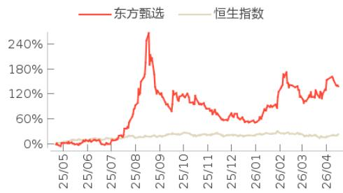

line chart

| Date   | 东方甄选 | 恒生指数 |
|--------|----------|----------|
| 25/05  | 0%       | 0%       |
| 25/06  | 0%       | 0%       |
| 25/07  | 0%       | 0%       |
| 25/08  | 240%     | 0%       |
| 25/09  | 120%     | 0%       |
| 25/10  | 60%      | 0%       |
| 25/11  | 40%      | 0%       |
| 25/12  | 60%      | 0%       |
| 26/01  | 80%      | 0%       |
| 26/02  | 180%     | 0%       |
| 26/03  | 120%     | 0%       |
| 26/04  | 160%     | 0%       |

## 证券分析师

陈笑 执业证书编号：S0860525100005
chenxiao2@orientsec.com.cn
021-63326320

李耀 执业证书编号：S0860525100001  
香港证监会牌照：BXH218  
liyao@orientsec.com.cn  
021-63326320

## 目录

## 二十余载玉汝于成，“线上山姆”未来可期....5

从在线教育转型直播电商，打造自营品驱动、多渠道运营的产品科技公司 ……5

股权结构高度集中，新执行总裁近期到位....6

业务及战略调整导致营收净利波动，FY2026H1显著改善....7

## 零售行业从朴素的渠道竞争、价格竞争转向供应链选品及信任关系的建立 … 11

直播电商：进入3.0时代，从用户闲暇时间的争夺到信任关系与矩阵布局并重……11

线下零售：复盘仓储超市与量贩零食，供应链选品与信任关系同样至关重要....13

## 三大核心优势筑牢护城河 18

供应链选品优势：主打高质价比，从流量驱动迈向产品驱动....18

线上多渠道布局优势：从抖音为主到多平台再到自建 APP 22

线下渠道优势：或依托新东方线下场景，拟开设旗舰店....27

## 盈利预测与投资建议....29

盈利预测 29

投资建议....29

## 风险提示....31

## 图表目录

图 1：公司历经 4 年探索已发展为国内知名的直播电商平台....5

图 2：公司核心业务模式 ……6

图 3：公司股权结构高度集中 ……6

图 4：公司自营产品及直播电商业务占比增加 ..... 7

图 5：公司自营产品及直播电商业务毛利占比增加....7

图 6：公司营收增速波动 ..... 8

图 7：公司经调整净利波动....8

图 8：公司净利率波动....9

图 9：公司自营产品及直播电商业务毛利率小幅提升....9

图 10：公司持续经营业务期间费用率有上涨趋势....9

图 11：公司费用结构以销售及营销费用为主....9

图 12：公司资产负债率降低.....10

图 13：公司经营净现金流波动 ..... 10

图 14：直播电商商业模式拆解 ..... 11

图 15：国内直播电商市场规模持续增长……12

图 16：国内网络直播用户规模使用率持续提升 ..... 12

图 17：抖音头达直播 GMV 占比低于其他直播 ..... 12

图 18: 抖音 TOP100 爆品的平均生命周期提升.....12

图 19：仓储会员超市以会员制为基石……13

图 20: Costco 营收稳定增长.....14

图 21：Costco 归母净利稳定增长.....14

图 22：山姆美国营收稳定增长 ..... 14

图 23：山姆美国营业利润稳定增长 ..... 14

图 24：量贩零食规模化采购、精简中间环节实现更高盈利能力 …… 15

图 25：呜呜很忙、万辰集团门店快速增长 ..... 15

图 26：呜呜很忙、万辰集团盈利能力企稳回升 ..... 15

图 27：国内实物商品网上零售渗透率到达相对稳定区间....16

图 28：国内电商增速及渗透率呈现 X 型走势 ..... 16

图 29：公司自营品 SKU 数量持续提升.....18

图 30：公司自营品 GMV 占比持续提升....18

图 31：复盘 2025 年，谷物鲜鸡蛋、吐司、牛奶等品类位居前列.....18

图 32：以自营品苹果产为例，公司推出透明工厂计划.....21

图 33：公司对于卫生巾进行严格的卫生筛选、工厂谈判....22

图 34：公司与正大合作白虾.....22

图 35：公司抖音 GMV2025H2 后月销逐步改善 ..... 23

图 36：公司抖音 GMV7 日滚动平均数据近期改善.....23

图 37：东方甄选多次开展溯源直播与文旅直播 ..... 24

图 38：公司自营 APP GMV 占总 GMV 比稳步提升 ..... 25

图 39：公司付费会员 ASP 有所降低 ..... 25

图 40：公司展示引导型智能货柜.....28

图 41：公司即时购买型智能货柜.....28

表 1：公司核心管理层具备丰富的从业经验....7

表 2：山姆会员店与 Costco 对比....14

表 3：中、美、英、日四国消费结构及电商渗透率对比....16

表 4：公司爆款产品苹果干、卫生巾、益生菌等均在定位高品质....19

表 5：公司产品具有性价比优势....19

表 6：相较于带货第三方品牌为主的直播电商机构，公司打造自营品的业务模式实现更高的净利率 ..... 20

表 7：公司在抖音渠道已建立多元化的账号矩阵....23

表 8：公司抖音主号相关数据位居前列 ..... 23

表 9：公司付费会员体系与山姆/Costco/盒马对比 ..... 26

表 10：公司在天猫、京东已打造一系列爆款……27

表 11：公司营收分类预测表....29

表 12：可比公司估值....30

## 二十余载玉汝于成，“线上山姆”未来可期

## 从在线教育转型直播电商，打造自营品驱动、多渠道运营的产品科技公司

公司前身新东方在线成立于 2005 年、是国内首批专业在线教育网站之一，2021 年转型直播电商。

● 2021-22 年转型：2021 年 7 月双减政策出台，学前教育及 K12 教育受到严重冲击。公司前身新东方在线寻求直播电商及 STEM 等业务转型，并于 12 月在抖音建立账号 “东方甄选”。  
● 2022 年知识型带货实现破圈：2022 年 6 月，主播董宇辉凭借独特的“知识带货”风格迅速破圈，使东方甄选一跃成为现象级直播间、带动 GMV 爆发增长；2023 年 3 月，公司正式更名为东方甄选，全面聚焦直播电商业务。  
● 2024年起战略调整：2023年底“小作文”事件引发舆论危机，也暴露出过于依赖核心IP的问题，此后主播董宇辉离职导致GMV、收入承压；公司加速战略调整，从“流量驱动”转向“产品驱动”，一方面大力投入自营产品建设，另一方面积极拓展其他渠道。

图 1：公司历经 4 年探索已发展为国内知名的直播电商平台  
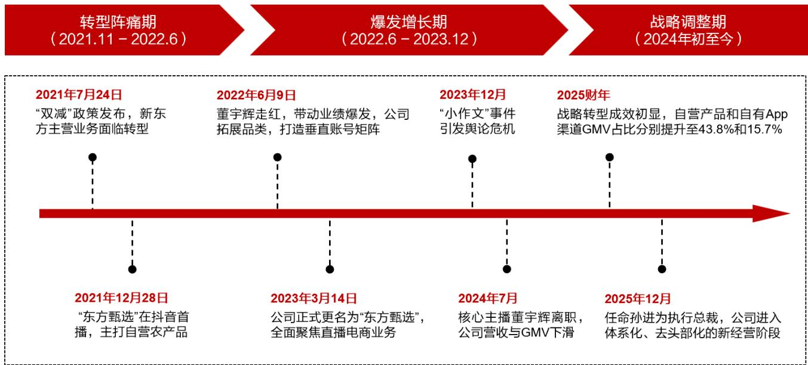

flowchart

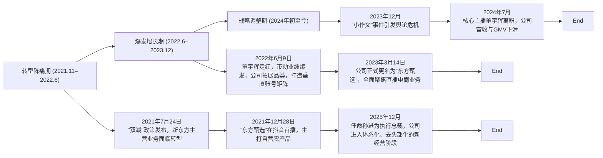
```mermaid
graph LR
  A["转型阵痛期 (2021.11–2022.6)"] --> B["爆发增长期 (2022.6–2023.12)"]
  B --> C["战略调整期 (2024年初至今)"]
    
  A --> D["2021年7月24日<br>“双减”政策发布，新东方主营业务面临转型"]
  B --> E["2022年6月9日<br>董宇辉走红，带动业绩爆发，公司拓展品类，打造垂直账号矩阵"]
  C --> F["2023年12月<br>“小作文”事件引发舆论危机"]
  D --> G["2021年12月28日<br>“东方甄选”在抖音首播，主打自营农产品"]
  E --> H["2023年3月14日<br>公司正式更名为“东方甄选”，全面聚焦直播电商业务"]
  F --> I["2024年7月<br>核心主播董宇辉离职，公司营收与GMV下滑"]
  G --> J["2025年12月<br>任命孙进为执行总裁，公司进入体系化、去头部化的新经营阶段"]
  H --> K["End"]
  I --> L["End"]
  J --> M["End"]
```

数据来源：东方甄选官网，东方证券研究所

核心商业模式：从依赖头部主播的直播带货，转向以自营品驱动、多渠道运营的“产品科技公司。

- 2022年6月到2024年7月，公司直播带货模式较依赖头部主播，主播董宇辉上播日GMV显著高于非上播日；2024年7月后公司启动业务模式战略模型。  
- 目前公司核心商业模式是：1)构建超过800款的自营产品矩阵，GMV占比已超 $52\%$ ，通过严选供应链及品控打造品牌以获得更高利润和定价权；2)销售渠道以抖音为主阵地，同时拓展自有App、微信视频号等多平台矩阵，后续有望通过线下体验店、自动售货机及与新东方教学点结合的方式开辟线下市场。

图 2: 公司核心业务模式  
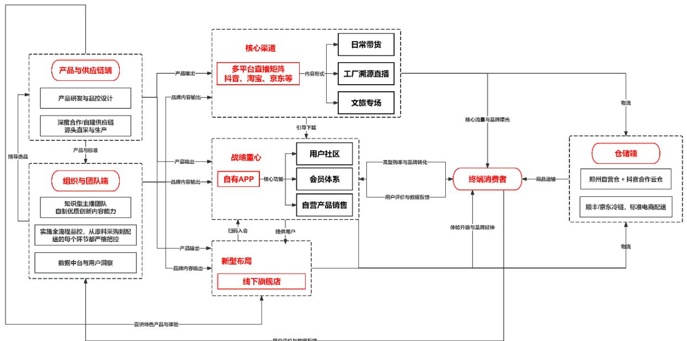

flowchart

```mermaid
graph TD
  A["产品与供应链端"] --> B["产品研发与品控设计"]
  A --> C["深度合作/自建供应链源头直采与生产"]
  D["组织与团队端"] --> E["知识型主播团队自制优质创新内容能力"]
  D --> F["实施全流程品控，从原料采购到配送的每个环节都严格把控"]
  D --> G["数据中心与用户洞察"]
  H["产品与标准"] --> I["产品与输出"]
  I --> J["品牌内容输出"]
  J --> K["品牌内容输出"]
  K --> L["产品输出"]
  L --> M["品牌内容输出"]
  M --> N["产品输出"]
  N --> O["品牌内容输出"]
  O --> P["产品输出"]
  P --> Q["品牌内容输出"]
  Q --> R["产品输出"]
  R --> S["品牌内容输出"]
  S --> T["产品输出"]
  T --> U["品牌内容输出"]
  U --> V["产品输出"]
  V --> W["品牌内容输出"]
  W --> X["产品输出"]
  X --> Y["品牌内容输出"]
  Y --> Z["产品输出"]
  Z --> AA["品牌内容输出"]
  AA --> AB["产品输出"]
  AB --> AC["品牌内容输出"]
  AC --> AD["产品输出"]
  AD --> AE["品牌内容输出"]
  AE --> AF["产品输出"]
  AF --> AG["品牌内容输出"]
  AG --> AH["产品输出"]
  AH --> AI["品牌内容输出"]
  AI --> AJ["产品输出"]
  AJ --> AK["品牌内容输出"]
  AK --> AL["产品输出"]
  AL --> AM["品牌内容输出"]
  AM --> AN["产品输出"]
  AN --> AO["品牌内容输出"]
  AO --> AP["产品输出"]
  AP --> AQ["品牌内容输出"]
  AQ --> AR["产品输出"]
  AR --> AS["品牌内容输出"]
  AS --> AT["产品输出"]
  AT --> AU["品牌内容输出"]
  AU --> AV["产品输出"]
  AV --> AW["品牌内容输出"]
  AW --> AX["产品输出"]
  AX --> AY["品牌内容输出"]
  AY --> AZ["产品输出"]
  AZ --> BA["品牌内容输出"]
  BA --> BB["产品输出"]
  BB --> BC["品牌内容输出"]
  BC --> BD["产品输出"]
  BD --> BE["品牌内容输出"]
  BE --> BF["产品输出"]
  BF --> BG["品牌内容输出"]
  BG --> BH["产品输出"]
  BH --> BI["品牌内容输出"]
  BI --> BJ["产品输出"]
  BJ --> BK["品牌内容输出"]
  BK --> BL["产品输出"]
  BL --> BM["品牌内容输出"]
  BM --> BN["产品输出"]
  BN --> BO["品牌内容输出"]
  BO --> BP["产品输出"]
  BP --> BQ["品牌内容输出"]
  BQ --> BR["产品输出"]
  BR --> BS["品牌内容输出"]
  BS --> BT["产品输出"]
  BT --> BU["品牌内容输出"]
  BU --> BV["产品输出"]
  BV --> BW["品牌内容输出"]
  BW --> BX["产品输出"]
  BX --> BY["品牌内容输出"]
  BY --> BZ["产品输出"]
  BZ --> CA["品牌内容输出"]
  CA --> CB["产品输出"]
  CB --> CC["品牌内容输出"]
  CC --> CD["产品输出"]
  CD --> CE["品牌内容输出"]
  CE --> CF["产品输出"]
  CF --> CG["品牌内容输出"]
  CG --> CH["产品输出"]
  CH --> CI["品牌内容输出"]
  CI --> CJ["产品输出"]
  CJ --> CK["品牌内容输出"]
  CK --> CL["产品输出"]
  CL --> CM["品牌内容输出"]
  CM --> CN["产品输出"]
  CN --> CO["品牌内容输出"]
  CO --> CP["产品输出"]
  CP --> CQ["品牌内容输出"]
  CQ --> CR["产品输出"]
  CR --> CS["品牌内容输出"]
  CS --> CT["产品输出"]
  CT --> CU["品牌内容输出"]
  CU --> CV["产品输出"]
  CV --> CW["品牌内容输出"]
  CW --> CX["产品输出"]
  CX --> CY["品牌内容输出"]
  CY --> CZ["产品输出"]
  CZ --> DA["品牌内容输出"]
  DA --> DB["产品输出"]
  DB --> DC["品牌内容输出"]
  DC --> DD["产品输出"]
  DD --> DE["品牌内容输出"]
  DE --> DF["产品输出"]
  DF --> DG["品牌内容输出"]
  DG --> DH["产品输出"]
  DH --> DI["品牌内容输出"]
  DI --> DJ["产品输出"]
  DJ --> DK["品牌内容输出"]
  DK --> DL["产品输出"]
  DL --> DV["品牌内容输出"]
  DV --> DW["产品输出"]
  DW --> DX["品牌内容输出"]
  DX --> DXB["产品输出"]
```

数据来源：东方证券研究所

## 股权结构高度集中，新执行总裁近期到位

公司股权结构高度集中，创始人俞敏洪先生是实际控制人。母公司新东方集团持有公司56.36%的股份，拥有绝对控制权；Tigerstep Developments Limited(实控人为俞敏洪先生)持股比例2.74%；俞敏洪先生合计持股比例约55.89%。

图 3：公司股权结构高度集中  
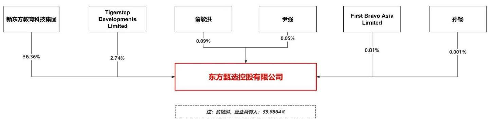

flowchart

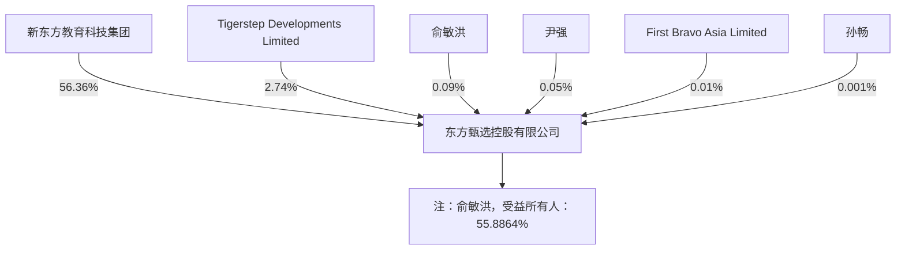
```mermaid
graph TD
  A["新东方教育科技集团"] -->|56.36%| C["东方甄选控股有限公司"]
  B["Tigerstep Developments Limited"] -->|2.74%| C
  D["俞敏洪"] -->|0.09%| C
  E["尹强"] -->|0.05%| C
  F["First Bravo Asia Limited"] -->|0.01%| C
  G["孙畅"] -->|0.001%| C
  C --> H["注：俞敏洪，受益所有人：55.8864%"]
```

数据来源：wind，东方证券研究所  
备注：截至2026年3月

公司核心管理层均具备丰富的从业经验，近期孙进已接任新执行总裁，我们看好俞+孙的新管理层有望带动公司驶入高质量、多元化的新发展阶段。

\- 俞敏洪先生为创始人及董事长：俞先生1993年创办北京新东方学校，是中国英语学习和留学教育的推动者和引领者；2006年带领新东方在纽交所上市；2008年被民政部授予“中华慈善奖”；2018年10月入选改革开放40年百名杰出民营企业家；2019年带领新东方在线在港交所上市；2021年12月推出直播带货新平台“东方甄选”。

\- 孙进接任新执行总裁：2025年12月，公司正式任命新东方副总裁孙进出任执行总裁，全面负责公司运营管理。我们认为，作为新东方19年老将的孙进在长期管理实践中展现精细化运营能力与稳健风格，与公司当前需要的“修复基本盘、探索第二曲线”战略高度契合。

表 1：公司核心管理层具备丰富的从业经验

<table><tr><td>姓名</td><td>年龄</td><td>职务</td><td>履历</td></tr><tr><td>俞敏洪</td><td>63</td><td>董事会主席、执行董事</td><td>俞先生 1985 年 7 月获北京大学英语学士学位。俞先生为新东方的创办人,自 2001 年起一直担任董事会执行主席。俞先生亦为北京迅程(自 2015 年 5 月起)及 新东方集团的若干公司(包括乐词网络)的主席兼董事。</td></tr><tr><td>孙进</td><td>-</td><td>执行总裁</td><td>孙先生 2006 年加入新东方,早期主讲四六级、考研、托福、雅思等课程;后历任南京学校常务副校长、校长,再到广州学校校长与集团副总裁;2025 年 12 月接任本集团执行总裁。孙先生曾获 2008 年度上海新东方优秀教师、2008 年度新东方集团优秀教师、新东方 20 周年功勋教师。</td></tr><tr><td>尹强</td><td>52</td><td>执行董事、首席财务官</td><td>尹先生 1996 年 7 月获首都经济贸易大学经济学学士学位,2008 年 7 月获北京大学工商管理硕士学位。尹先生 2001 年 10 月起为中国合资格会计师。除在本集团任职外,尹先生亦担任新东方中国的副总裁(自 2019 年 4 月起)以及财务总监及助理副总裁(2005 年 6 月至 2016 年 5 月)。</td></tr><tr><td>孙畅</td><td>58</td><td>非执行董事</td><td>孙女士 1990 年 7 月获北京师范大学学前教育学士学位,1999 年 7 月获中国人民大学工商管理硕士学位。除在本集团任职外,孙女士自 2012 年至 2016 年及 自 2016 年至 2020 年分别担任新东方中国的助理副总裁及副总裁。</td></tr><tr><td>马咏仪</td><td>-</td><td>公司秘书</td><td>马女士拥有香港大学文学士学位,是香港公司治理公会及英国特许公司治理公会会员。</td></tr><tr><td>宋契</td><td>-</td><td>联席公司秘书、投资关系总监</td><td>宋女士曾就读于中央财经大学金融学院,主修国际经济与贸易/金融风险管理,持有澳洲墨尔本维多利亚大学商学及经济学学士学位,以及布兰迪斯大学国际商学院国际经济与金融文学硕士学位。</td></tr></table>

数据来源：wind，东方证券研究所

## 业务及战略调整导致营收净利波动，FY2026H1显著改善

收入及毛利构成：公司核心业务由教育业务转为自营产品及直播电商业务。公司 FY2022 剥离 K12 业务，FY2024 向母公司出售其在中国提供在线课外教育服务的教育业务，因此 FY2025 后其营收、毛利均来自营产品及直播电商业务。

图 4：公司自营产品及直播电商业务占比增加

图 5：公司自营产品及直播电商业务毛利占比增加

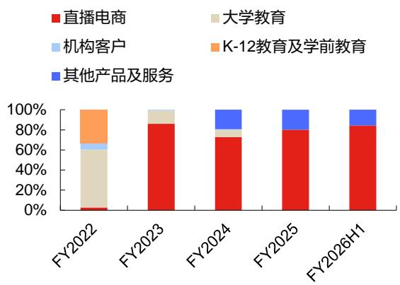

stacked bar chart

| 年份 | 直播电商 (%) | 大学教育 (%) | 机构客户 (%) | K-12教育及学前教育 (%) | 其他产品及服务 (%) |
| :--- | :--- | :--- | :--- | :--- | :--- |
| FY2022 | 3 | 58 | 10 | 34 | 0 |
| FY2023 | 85 | 10 | 0 | 0 | 0 |
| FY2024 | 70 | 5 | 5 | 0 | 15 |
| FY2025 | 80 | 0 | 0 | 0 | 15 |
| FY2026H1 | 83 | 0 | 0 | 0 | 10 |

数据来源：公司财报，东方证券研究所  
备注：公司财年为每年的6月1日至次年的5月31日，如FY2025为2024年6月1日至2025年5月31日，以此类推，下同。

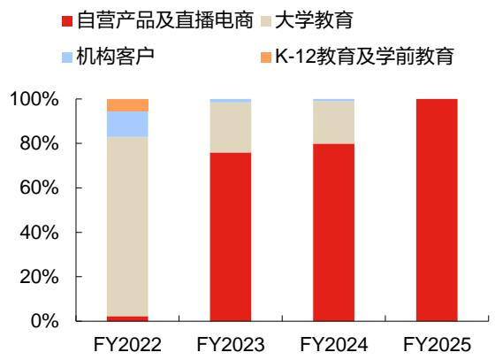

stacked bar chart

| Year | 自营产品及直播电商 (%) | 大学教育 (%) | 机构客户 (%) | K-12教育及学前教育 (%) |
|---|---|---|---|---|
| FY2022 | 3 | 74 | 13 | 6 |
| FY2023 | 75 | 23 | 3 | 0 |
| FY2024 | 79 | 18 | 3 | 0 |
| FY2025 | 100 | 0 | 0 | 0 |

数据来源：公司财报，东方证券研究所

## 业务结构调整及人员变动导致营收及净利增速波动，我们预计FY2026将企稳回升。

● 营收：公司总营收自 FY2022 的 8.99 亿元提至 FY2024 的 70.73 亿元，FY2025 降至 43.92 亿元。其中持续经营业务(即自营产品及直播电商业务)营收自 FY2022 的 6.01 亿元提至 FY2024 的 65.26 亿元，FY2025 降至 43.92 亿元。  
- 经调整净利：公司 Non-GAAP 经调整净利自 FY2022 的 -3.64 亿元提至 FY2024 的 21.81 亿元，FY2025 因出售与辉同行、调整业务结构，经调整净利降至 1.74 亿元。持续经营业务净利同样于 FY2022 至 FY2024 提升显著，FY2025 降至 620 万元，剔除出售与辉同行的财务影响后为 1.35 亿元/+30%。  
- FY2026H1：营收 23.12 亿元/+5.7%，剔除与辉同行后增长 17%；净利 2.39 亿元，上年同期亏损 9680 万元；经调整净利 2.58 亿元，上年同期亏损 161 万元。

图 6: 公司营收增速波动  
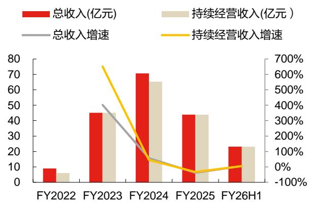

bar-line hybrid chart

| 年份 | 总收入(亿元) | 持续经营收入(亿元) | 总收入增速 (%) | 持续经营收入增速 (%) |
|---|---|---|---|---|
| FY2022 | 8 | 5 | - | - |
| FY2023 | 45 | 45 | 400 | 700 |
| FY2024 | 71 | 65 | 100 | 100 |
| FY2025 | 44 | 44 | -50 | -50 |
| FY26H1 | 23 | 23 | -50 | 50 |

数据来源：公司财报，东方证券研究所

图 7: 公司经调整净利波动  
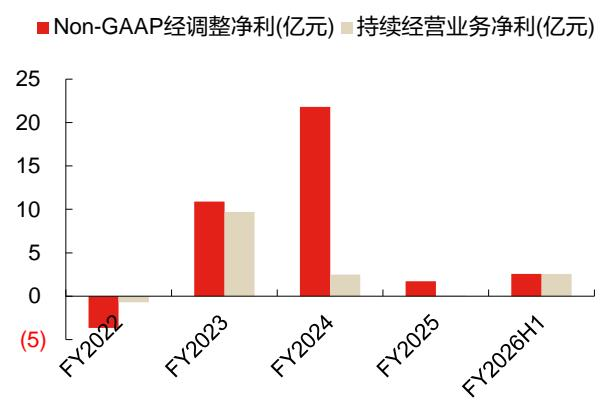

bar chart

| 年份 | Non-GAAP经调整净利(亿元) | 持续经营业务净利(亿元) |
|---|---|---|
| FY2022 | -3.5 | -0.5 |
| FY2023 | 11.0 | 9.8 |
| FY2024 | 21.8 | 2.5 |
| FY2025 | 1.7 | 0.0 |
| FY2026H1 | 2.5 | 2.5 |

数据来源：公司财报，东方证券研究所  
备注：FY2025 持续经营业务净利较低因此在图中较难显示

业务结构调整及人员变动同样导致盈利能力波动，自营产品及直播电商毛利率FY2025修复。

\- 毛利率及净利率：毛利率自FY2022的 $46.02\%$ 降至FY2024的 $29.96\%$ ，我们认为主要因高毛利率的大学教育等业务占比降低，FY2025 小幅提至 31.97%，我们认为主要因直营产品及直播电商毛利率修复。经调整净利率从 FY2022 的 -40.48% 提至 FY2024 的 30.83%，FY2025 降至 3.95%，主要因出售与辉同行、调整业务结构的影响。

- 分业务毛利率：自营产品及直播电商业务毛利率由 FY2023 的 38.22% 降至 FY2024 的 25.93%，FY2025 小幅上升至 31.97%，我们认为主要因自营产品占比提升、品类结构优化及规模效应显现，我们看好毛利率延续提升趋势。  
- FY2026H1：毛利率 $36.4\% / + 2.8\mathrm{pct}$ ，经调整净利率 $11.1\% / + 11.2\mathrm{pct}$ ，我们认为产品结构优化带动高毛利率产品占比稳步提升且费用端优化、部分一次性费用影响因素消除。

图 8: 公司净利率波动  
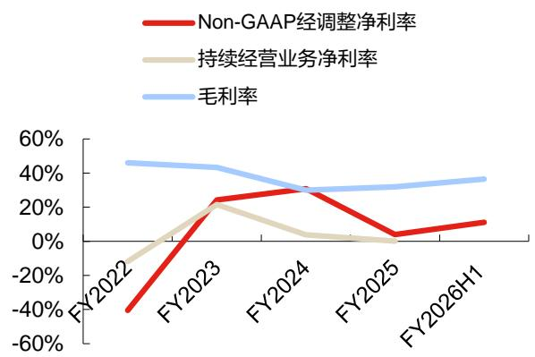

line chart

| Fiscal Year | Non-GAAP经调整净利率 | 持续经营业务净利率 | 毛利率 |
| ----------- | ------------------- | ------------------ | ------ |
| FY2022      | -40%                | -20%               | 45%    |
| FY2023      | 25%                 | 20%                | 40%    |
| FY2024      | 30%                 | 10%                | 30%    |
| FY2025      | 5%                  | 0%                 | 35%    |
| FY2026H1    | 10%                 | 0%                 | 40%    |

数据来源：公司财报，东方证券研究所

图 9：公司自营产品及直播电商业务毛利率小幅提升  
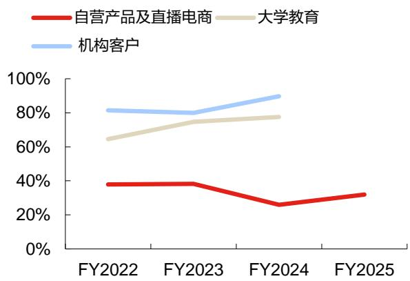

line chart

| Year   | 自营产品及直播电商 | 大学教育 | 机构客户 |
| ------ | ------------------ | -------- | --------- |
| FY2022 | 38%                | 65%      | 82%       |
| FY2023 | 38%                | 75%      | 80%       |
| FY2024 | 25%                | 78%      | 90%       |
| FY2025 | 32%                | -        | -         |

数据来源：公司财报，东方证券研究所

## 销售费用率有所提升，我们认为随品类、渠道深入建设有望摊薄费用端。

- 公司期间费用率 FY2022-2023 显著降低，我们认为一方面因业务结构转型，另一方面随着直播矩阵逐步建成且公司投流较少，获客成本稳步降低。  
- FY2023-2025 销售费用率先降后升，FY2025 约 20.54%/+7.27pct，FY2026H1 进一步降低，我们认为主要因公司推广 APP、拓展线下业务；管理费用率 FY2025 约 11.04%/+4.98pct，我们认为主要因分派与辉同行所有剩余未分派溢利，FY2026H1 显著降低。  
● 值得注意的是公司 FY2025 研发费用率稳步提升至 2.89%，我们认为主要因供应链和产品研发投入持续增加，有助于公司加快在高复购民生大品类、健康功效品类以及非标农品的布局。

图 10：公司持续经营业务期间费用率有上涨趋势

图 11：公司费用结构以销售及营销费用为主

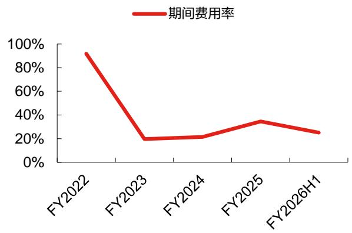

line chart

| Fiscal Year | 期间费用率 |
| ----------- | ---------- |
| FY2022      | 90%        |
| FY2023      | 20%        |
| FY2024      | 20%        |
| FY2025      | 35%        |
| FY2026H1    | 25%        |

数据来源：公司财报，东方证券研究所

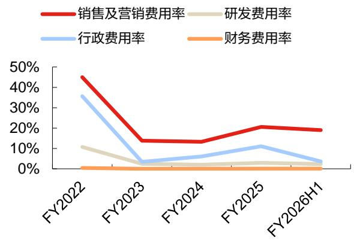

line chart

| Fiscal Year | 销售及营销费用率 | 研发费用率 | 行政费用率 | 财务费用率 |
| ----------- | ---------------- | ---------- | ---------- | ---------- |
| FY2022      | 45%              | 10%        | 35%        | 0%         |
| FY2023      | 15%              | 5%         | 5%         | 0%         |
| FY2024      | 15%              | 5%         | 5%         | 0%         |
| FY2025      | 20%              | 5%         | 10%        | 0%         |
| FY2026H1    | 18%              | 5%         | 5%         | 0%         |

数据来源：公司财报，东方证券研究所

## 资产负债率稳步降低，经营净现金流出现波动。

● 资产负债率从 FY2023 的 27.23% 稳步降至 FY2026H1 的 15.49%，我们认为公司通过不断优化资产结构、控制负债规模，资产负债率有望保持低位运行。  
- 经营净现金流从 FY2023 的 12.64 亿元降至 FY2025 的 0.89 亿元，我们认为主要因公司处于头部主播离职过渡期，直播 GMV 与营收出现波动，且在自营产品库存、供应链等方面的现金投入增加，导致经现金流出增加；FY2026H1 经营净现金流为 2.79 亿元，我们认为随新执行总裁到位、业务结构及人员结构进一步调整，我们看好经营现金流进一步修复。

图 12：公司资产负债率降低  
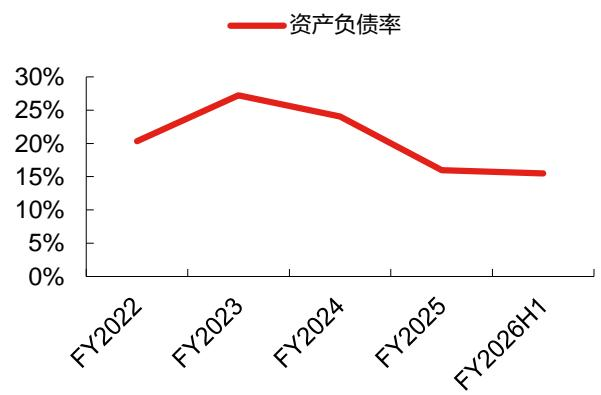

line chart

| Fiscal Year | 资产负债率 |
| ----------- | ---------- |
| FY2022      | 20%        |
| FY2023      | 27%        |
| FY2024      | 24%        |
| FY2025      | 16%        |
| FY2026H1    | 15%        |

数据来源：公司财报，东方证券研究所

图 13：公司经营净现金流波动  
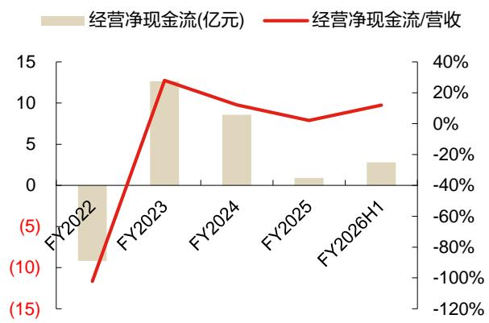

bar-line hybrid chart

| Fiscal Year | 经营净现金流(亿元) | 经营净现金流/营收 (%) |
|-------------|-------------------|----------------------|
| FY2022      | -10               | -100                 |
| FY2023      | 13                | 40                   |
| FY2024      | 8                 | 20                   |
| FY2025      | 1                 | 0                    |
| FY2026H1    | 3                 | 20                   |

数据来源：公司财报，东方证券研究所

## 零售行业从朴素的渠道竞争、价格竞争转向供应链选品及信任关系的建立

## 直播电商：进入 3.0 时代，从用户闲暇时间的争夺到信任关系与矩阵布局并重

直播带货从 1.0 达人播到 2.0 品牌自播+达人播再到 3.0 信任关系与矩阵布局并重。传统直播电商的黄金时段是一场“生物钟”争夺战，我们认为在用户闲暇时间有限的背景下，直播电商的竞争正进一步加剧，同时在去中心化及超头约束逻辑的带动下，多渠道品牌自播占比逐步提升，对此前较依赖头部主播或单一渠道的商业模式形成替代。此外，建立长期信任关系的策略正在形成，背后对优质内容供给、供应链选品等形成更高要求，我们认为直播带货正进入到 3.0 时代。

我们拆分直播带货商业模式，GMV = 观看人数 × 成交转化率 × 客单价，三项核心指标可进一步拆解为直播场次、直播时长、观看点击、购物点击等细分指标。

- 流量是入口：流量=直播场次×直播时长，一般通过增加场次、优化内容(提升自然流)和精准投流(付费流)来扩大观看人数，主要考验主播内容供给能力，以及团队在激烈竞争中延续马拉松式直播的持久力。  
- 转化率是核心：转化率=观看点击率×购物点击率，一般通过优化人货场匹配(主播、产品、场景)、话术脚本、促销活动，提升从观看到成交每一步的转化率，主要考验平台运营能力，即展示路径和服务质量对实际下单购买过程的触达。  
- 客单价是杠杆：客单价可拆分为定价及复购，一般通过优化产品结构和销售策略，在成交用户数基础上放大销售额，主要考验主播招商、选品和议价实力，以及粉丝质量和复购水平，此外自有品占比往往代表毛利率高低。

图 14：直播电商商业模式拆解  
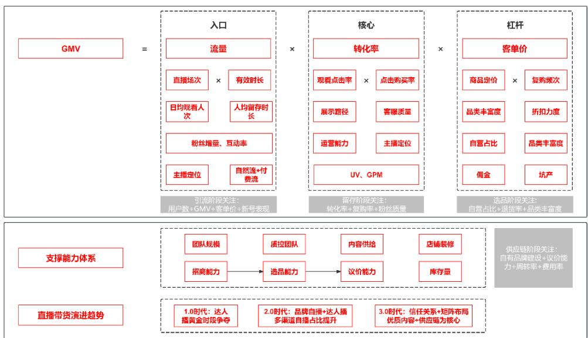

flowchart

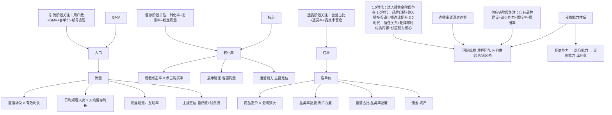
```mermaid
graph TD
  A["GMV"] --> B["入口"]
  B --> C["流量"]
  C --> D["直播场次 × 有效时长"]
  C --> E["日均观看人次 × 人均留存时长"]
  C --> F["粉丝增量、互动率"]
  C --> G["主播定位 自然流+付费流"]
  H["核心"] --> I["转化率"]
  I --> J["观看点击率 × 点击购买率"]
  I --> K["展示路径 客服质量"]
  I --> L["运营能力 主播定位"]
  M["杠杆"] --> N["客单价"]
  N --> O["商品定价 × 复购频次"]
  N --> P["品类丰富度 折扣力度"]
  N --> Q["自营占比 品类丰富度"]
  N --> R["佣金 坑产"]
  S["引流阶段关注：用户数+GMV+客单价+新号表现"] --> B
  T["留存阶段关注：转化率+复购率+粉丝质量"] --> I
  U["选品阶段关注：自营占比+退货率+品类丰富度"] --> M
  V["支撑能力体系"] --> W["团队规模 质控团队 内容供给 店铺装修"]
  V --> X["招商能力 → 选品能力 → 议价能力 库存量"]
  Y["供应链阶段关注：自有品牌建设+议价能力+周转率+费用率"] --> W
  Z["直播带货演进趋势"] --> W
  AA["1.0时代：达人播黄金时段争夺 2.0时代：品牌自播+达人播多渠道自播占比提升 3.0时代：信任关系+矩阵布局优质内容+供应链为核心"] --> W
```

数据来源：东方证券研究所

随着用户规模持续增长及技术进步，国内直播电商市场规模有望延续提升趋势。

● 市场规模：据艾瑞咨询，国内直播电商市场规模自 2020 年的 1.24 万亿元增至 2024 年的 5.79 万亿元，CAGR 为 47%，2024 年直播电商占实物网上零售额比重达到约 44%；预计 2027 年直播电商将增至 8.79 万亿元，CAGR 为 14.9%。  
- 用户规模：据《中国网络视听发展研究报告（2025）》，2024年12月我国网络直播用户规模8.33亿人，占网民整体的 $75.2\%$ ；其中电商直播用户规模在2024年6月已达5.97亿人，占网民整体的 $54.7\%$ 。

图 15：国内直播电商市场规模持续增长  
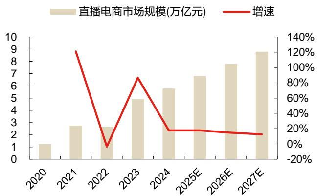

bar-line hybrid

| 年份 | 直播电商市场规模(万亿元) | 增速 (%) |
| :--- | :--- | :--- |
| 2020 | 1.2 | - |
| 2021 | 2.8 | 130 |
| 2022 | 2.5 | 0 |
| 2023 | 4.9 | 85 |
| 2024 | 5.8 | 20 |
| 2025E | 6.8 | 20 |
| 2026E | 7.8 | 18 |
| 2027E | 8.8 | 16 |

数据来源：艾瑞咨询，东方证券研究所

图 16：国内网络直播用户规模使用率持续提升  
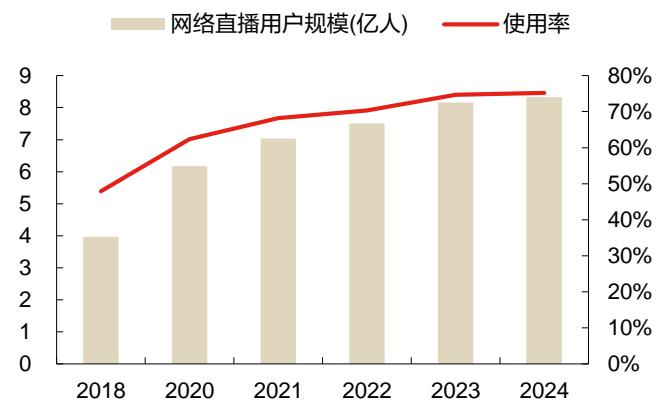

bar-line hybrid chart

| Year | 网络直播用户规模(亿人) | 使用率 |
| ---- | ---------------------- | ------ |
| 2018 | 4                      | 50%    |
| 2020 | 6                      | 65%    |
| 2021 | 7                      | 70%    |
| 2022 | 7.5                    | 72%    |
| 2023 | 8                      | 75%    |
| 2024 | 8.5                    | 76%    |

数据来源：《中国网络视听发展研究报告（2025）》，东方证券研究所

抖音直播电商新变化：从“网红”到“长红”，直播经济进入精耕细作时代。

- 自播崛起：据《2025年抖音直播电商发展白皮书》，2024年抖音电商店播GMV占比高达 $41\%$ ，首次超越达人直播的 $38\%$ ；据36氪，头达直播GMV占比降至 $9\%$ 。我们认为抖音直播正从“达人经济”迈向“店播时代，底层逻辑是达人带货驱动向品牌资产沉淀的转型。  
- 品牌生命周期拉长：抖音TOP100爆品的平均生命周期从14天延至68天，增幅达 $385.7\%$ ； $70\%$ 的爆品成功带动品牌关联品类搜索量增长 $200\%$ 以上，其中 $30\%$ 的爆品实现关联品类销售额同步提升 $150\%$ 。我们认为抖音电商的产品正从“速生速死”的粗放型发展模式迈入品牌价值提升、品类协同增强的良性发展阶段。

图 17：抖音头达直播 GMV 占比低于其他直播

图 18: 抖音 TOP100 爆品的平均生命周期提升

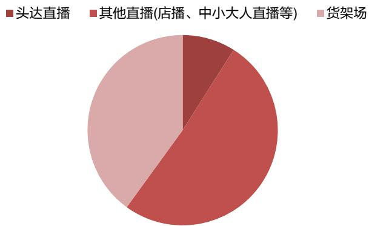

pie chart

| 类别 | 数值 |
|---|---|
| 头达直播 | 10 |
| 其他直播(店播、中小大人直播等) | 45 |
| 货架场 | 35 |

数据来源：36氪，东方证券研究所  
备注：时间为 2025 年

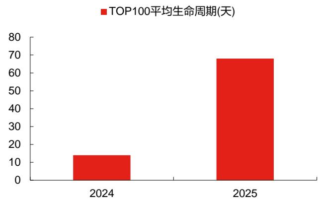

bar chart

TOP100平均生命周期(天)
| 年份 | TOP100平均生命周期(天) |
|---|---|
| 2024 | 14 |
| 2025 | 68 |

数据来源：中国经济时报，东方证券研究所

## 线下零售：复盘仓储超市与量贩零食，供应链选品与信任关系同样至关重要

## （一）仓储超市

复盘仓储会员超市的发展路径：脱胎于超市业态成熟期，以会员制为基石，通过严选供应链、打造差异化的自有品牌形成稳定的盈利能力。

- 定义、起源与特征：仓储会员超市又称仓储超市，主打平价策略，业态始于美国后滞胀期即上世纪80年代，衍生自步入成熟期的超市行业。仓储超市以会员制为基石精准锚定中产群体，通过严选供应商、打造差异化的自有品牌形成护城河。  
- 核心能力：仓储超市的供应链能力是高性价比/质价比+稳定利润率的保障，虽然毛利率一般低于传统超市，但依托极强的费用管控能力实现高净利率、而传统超市净利率并不稳定。

图 19: 仓储会员超市以会员制为基石  
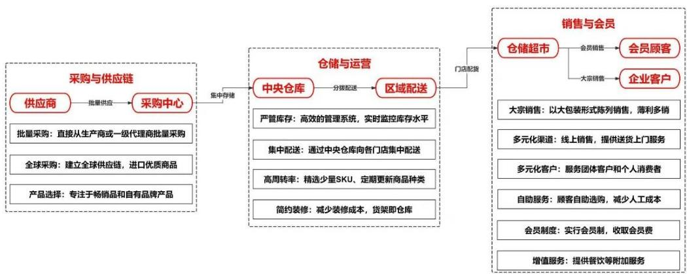

flowchart

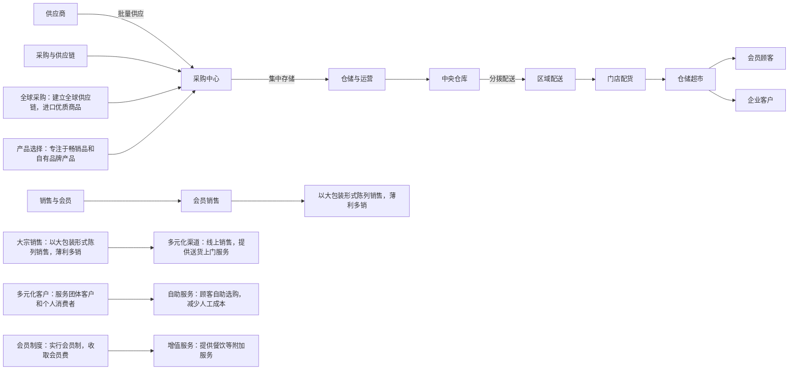
```mermaid
graph LR
  A["供应商"] -->|批量供应| B["采购中心"]
  B -->|集中存储| C["仓储与运营"]
  C --> D["中央仓库"]
  D -->|分拨配送| E["区域配送"]
  E --> F["门店配货"]
  F --> G["仓储超市"]
  G --> H["会员顾客"]
  G --> I["企业客户"]
  J["采购与供应链"] --> B
  K["全球采购：建立全球供应链，进口优质商品"] --> B
  L["产品选择：专注于畅销品和自有品牌产品"] --> B
  M["销售与会员"] --> N["会员销售"]
  N --> O["以大包装形式陈列销售，薄利多销"]
  P["大宗销售：以大包装形式陈列销售，薄利多销"] --> Q["多元化渠道：线上销售，提供送货上门服务"]
  R["多元化客户：服务团体客户和个人消费者"] --> S["自助服务：顾客自助选购，减少人工成本"]
  T["会员制度：实行会员制，收取会员费"] --> U["增值服务：提供餐饮等附加服务"]
```

数据来源：东方证券研究所

以Costco及山姆会员店为例：海外仓储超市双巨头、成长超越周期。美国线下零售业态供应链成熟、服务能力强，因此成为主流的零售业态，其中仓储超市依托宽类窄品的SKU策略以及锚定中产群体的会员策略形成稳定的复购频次，既能保证产品的精选优质，又能保有较高周转水平。其中 Costco 及山姆会员店均成立于 1983 年、是全球仓储超市两大巨头，打法深度贯彻薄利多销、宽类窄品的理念，但 Costco 更多深耕美国本地市场、山姆会员店更关注全球市场扩张。

图 20: Costco 营收稳定增长  
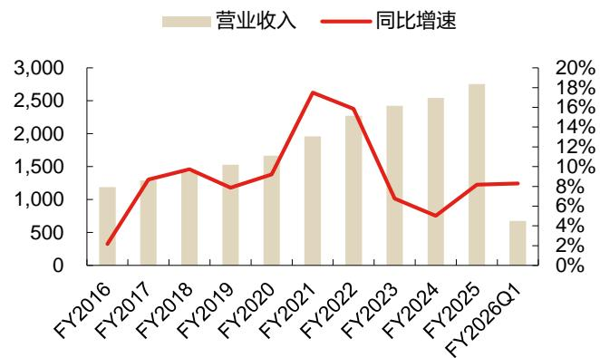

bar-line hybrid chart

| Fiscal Year | 营业收入 | 同比增速 |
| ----------- | -------- | -------- |
| FY2016      | 1200     | 3%       |
| FY2017      | 1300     | 10%      |
| FY2018      | 1400     | 11%      |
| FY2019      | 1500     | 9%       |
| FY2020      | 1600     | 10%      |
| FY2021      | 1900     | 18%      |
| FY2022      | 2300     | 16%      |
| FY2023      | 2400     | 8%       |
| FY2024      | 2500     | 6%       |
| FY2025      | 2700     | 8%       |
| FY2026Q1    | 700      | 8%       |

数据来源：wind，东方证券研究所  
备注：单位为亿美元

图 21: Costco 归母净利稳定增长  
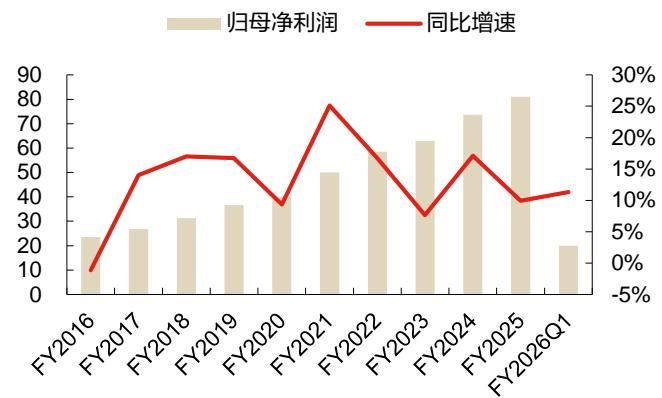

bar-line hybrid chart

| Fiscal Year | 归母净利润 | 同比增速 |
| ----------- | ---------- | -------- |
| FY2016      | 20         | 0%       |
| FY2017      | 25         | 15%      |
| FY2018      | 30         | 20%      |
| FY2019      | 35         | 18%      |
| FY2020      | 40         | 10%      |
| FY2021      | 50         | 25%      |
| FY2022      | 60         | 15%      |
| FY2023      | 65         | 5%       |
| FY2024      | 75         | 15%      |
| FY2025      | 80         | 10%      |
| FY2026Q1    | 20         | 10%      |

数据来源：wind，东方证券研究所  
备注：单位为亿美元

图 22：山姆美国营收稳定增长  
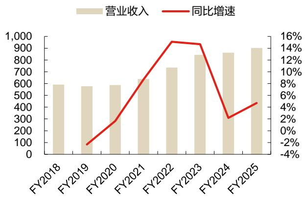

bar-line hybrid chart

| Fiscal Year | 营业收入 | 同比增速 |
| ----------- | -------- | -------- |
| FY2018      | 600      | -        |
| FY2019      | 580      | -2%      |
| FY2020      | 600      | 0%       |
| FY2021      | 650      | 8%       |
| FY2022      | 750      | 16%      |
| FY2023      | 850      | 14%      |
| FY2024      | 880      | 3%       |
| FY2025      | 900      | 5%       |

数据来源：wind，东方证券研究所

图 23：山姆美国营业利润稳定增长  
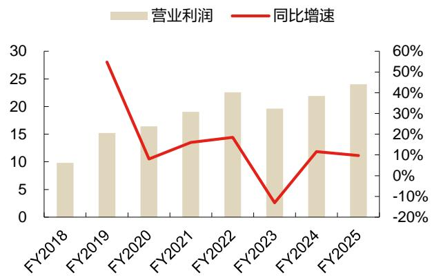

bar-line hybrid chart

| Fiscal Year | 营业利润 | 同比增速 |
| ----------- | -------- | -------- |
| FY2018      | 10       | -        |
| FY2019      | 15       | 60%      |
| FY2020      | 16       | 10%      |
| FY2021      | 19       | 15%      |
| FY2022      | 23       | 20%      |
| FY2023      | 20       | -10%     |
| FY2024      | 22       | 10%      |
| FY2025      | 24       | 10%      |

数据来源：wind，东方证券研究所

表 2：山姆会员店与 Costco 对比

<table><tr><td></td><td>Costco</td><td>山姆会员店</td></tr><tr><td>成立时间</td><td>1983年</td><td>1983年</td></tr><tr><td>目标人群</td><td>消费能力强且追求生活品质的一二线中产阶级家庭</td><td>消费能力强且追求生活品质的一二线中产阶级家庭</td></tr><tr><td>供应链</td><td>依靠强大的海外供应链资源提供供给,上海门店主要由台湾供应</td><td>依靠沃尔玛的全球供应商资源供货,重视复购率,同质商品即下架自有品牌销售占比已经做到35%</td></tr><tr><td>选品</td><td>采用大批量直采和买断的方法控制采购成本,提升议价能力</td><td>差异化选品,提高复购率和顾客黏性</td></tr><tr><td>自有品牌</td><td>质量相同甚至更优的情况下,自有品牌Kirkland产品比同类产品价格优惠至少20%</td><td>自有品牌Member&#x27;s Mark销售占比超35%</td></tr><tr><td>场景</td><td>门店以仓储货仓为主且装修简单,线下经营居多</td><td>门店以仓储货仓为主且装修简单,线下经营居多</td></tr><tr><td>退货政策</td><td>除钻石、烟酒等无条件退货外,3C产品90天内退货</td><td>商品能够保持出售原装且90天内无条件退货</td></tr></table>

有关分析师的申明，见本报告最后部分。其他重要信息披露见分析师申明之后部分，或请与您的投资代表联系。并请阅读本证券研究报告最后一页的免责申明。

<table><tr><td>经营策略</td><td>低价甄选,更倾向于获客拉新,大部分利润来自会员费</td><td>物美价廉且品质优良,提供一站式购物服务</td></tr><tr><td>会员价格</td><td>60/120 美元</td><td>45/100 美元</td></tr></table>

数据来源：公司官网，东方证券研究所

## （二）量贩零食

复盘国内量贩零食业态的发展路径：效率升级、折扣兴起。

● 发展趋势：国内量贩零食行业始于 2010 年左右，以老婆大人为代表在区域进行模式探索；2017 年后，零食很忙等品牌崛起并启动全国化扩张。2022 年以来，行业凭借极致性价比在下沉市场爆发式增长，门店数量激增，并迅速整合形成呜呜很忙与好想来双寡头竞争格局。  
- 定义与特征：量贩零食本质属于折扣零售，核心是低价(规模化采购+精简中间环节)、本质是效率(数字化选品及库存管理)，构建品牌引流+白牌盈利的商品组合，主要布局社区及下沉市场，通过加盟方式迅速扩张。

图 24：量贩零食规模化采购、精简中间环节实现更高盈利能力  
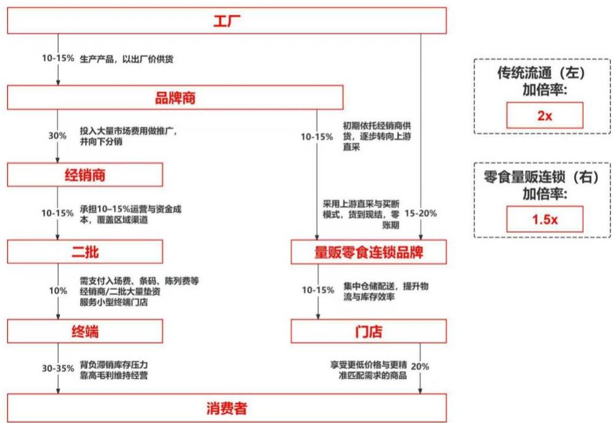

flowchart

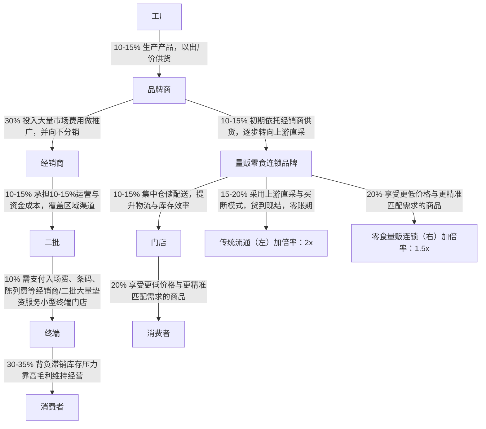
```mermaid
graph TD
  A["工厂"] -->|10-15% 生产产品，以出厂价供货| B["品牌商"]
  B -->|30% 投入大量市场费用做推广，并向下分销| C["经销商"]
  C -->|10-15% 承担10-15%运营与资金成本，覆盖区域渠道| D["二批"]
  D -->|10% 需支付入场费、条码、陈列费等经销商/二批大量垫资服务小型终端门店| E["终端"]
  E -->|30-35% 背负滞销库存压力靠高毛利维持经营| F["消费者"]
  B -->|10-15% 初期依托经销商供货，逐步转向上游直采| G["量贩零食连锁品牌"]
  G -->|10-15% 集中仓储配送，提升物流与库存效率| H["门店"]
  H -->|20% 享受更低价格与更精准匹配需求的商品| I["消费者"]
  G -->|15-20% 采用上游直采与买断模式，货到现结，零账期| J["传统流通（左）加倍率：2x"]
  G -->|20% 享受更低价格与更精准匹配需求的商品| K["零食量贩连锁（右）加倍率：1.5x"]
```

数据来源：新经销，东方证券研究所

以鸣鸣很忙、万辰集团为例：国内量贩零食双龙头快速增长。鸣鸣很忙(零食很忙+赵一鸣零食)门店总数自2022年的1902家增至2025Q3末的19517家；万辰集团(好想来+老婆大人)门店总数自2023年的885家增至2025Q3末的14334家；两家公司盈利能力在规模化优势显现、品牌资产强化后得到进一步提升。

图 25：呜呜很忙、万辰集团门店快速增长

图 26：呜呜很忙、万辰集团盈利能力企稳回升

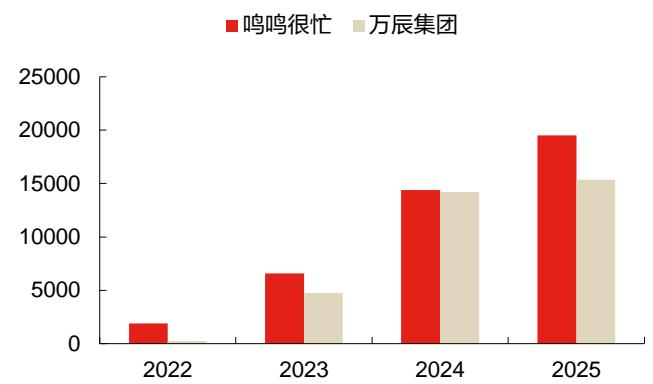

bar chart

| 年份 | 鸣鸣很忙 | 万辰集团 |
| :--- | :--- | :--- |
| 2022 | 1800 | 300 |
| 2023 | 6500 | 4700 |
| 2024 | 14500 | 14300 |
| 2025 | 19500 | 15300 |

数据来源：公司公告，东方证券研究所  
备注：单位为个

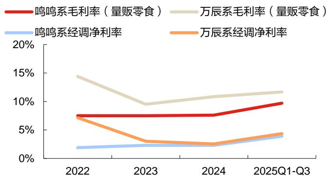

line chart

| Year | 鸣鸣系毛利率（量贩零食） (%) | 万辰系毛利率（量贩零食） (%) | 鸣鸣系经调净利率 (%) | 万辰系经调净利率 (%) |
|---|---|---|---|---|
| 2022 | 7.5 | 14.5 | 1.8 | 7.2 |
| 2023 | 7.6 | 9.5 | 2.2 | 3.0 |
| 2024 | 7.7 | 10.8 | 2.1 | 2.5 |
| 2025Q1-Q3 | 9.8 | 11.5 | 3.8 | 4.5 |

数据来源：公司公告，东方证券研究所

## （三）总结与思考：对零售业态的两个纠偏

## 纠偏其一，中美零售业态的先天环境造成产业链演化逻辑不同，但最终“殊途同归”。

- 国内零售产业链演化趋势与美国相反：国内是线上先行发展(早期线下零售基础设施相对薄弱、线上兼具效率与成本优势、移动支付获得跨越式普及)、随后倒逼并赋能线下基础设施升级的路径；美国则是在成熟的线下零售体系基础上逐步发展线上的路径。  
- 最终“殊途同归”：我们认为虽中美零售业发展路径不同，但电商渗透率规则基本类似，即电商渗透率≈商品消费占比×商品类电商渗透率。一般而言，当经济体越发达、越成熟，居民支出越倾向于体验性与服务性消费，因此国内电商增速及渗透率走势呈现X型走势。

图 27：国内实物商品网上零售渗透率到达相对稳定区间  
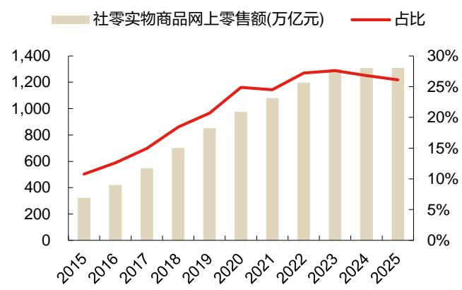

bar-line hybrid chart

| Year | 社零实物商品网上零售额(万亿元) | 占比 |
|------|-------------------------------|------|
| 2015 | 300                           | 10%  |
| 2016 | 400                           | 12%  |
| 2017 | 550                           | 15%  |
| 2018 | 700                           | 18%  |
| 2019 | 850                           | 20%  |
| 2020 | 1000                          | 25%  |
| 2021 | 1100                          | 24%  |
| 2022 | 1200                          | 26%  |
| 2023 | 1300                          | 27%  |
| 2024 | 1350                          | 26%  |
| 2025 | 1350                          | 25%  |

数据来源：wind，东方证券研究所

图 28：国内电商增速及渗透率呈现 X 型走势  
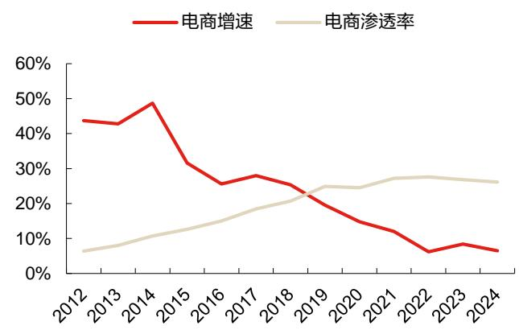

line chart

| Year | 电商增速 | 电商渗透率 |
|------|----------|------------|
| 2012 | 43%      | 6%         |
| 2013 | 42%      | 8%         |
| 2014 | 49%      | 10%        |
| 2015 | 32%      | 12%        |
| 2016 | 26%      | 15%        |
| 2017 | 28%      | 18%        |
| 2018 | 25%      | 20%        |
| 2019 | 20%      | 25%        |
| 2020 | 15%      | 24%        |
| 2021 | 12%      | 27%        |
| 2022 | 6%       | 28%        |
| 2023 | 8%       | 27%        |
| 2024 | 7%       | 26%        |

数据来源：中国连锁经营协会，东方证券研究所

表 3：中、美、英、日四国消费结构及电商渗透率对比

<table><tr><td>国家</td><td>服务消费占比</td><td>商品消费占比</td><td>商品类电商渗透率</td><td>推算总电商渗透率</td><td>实际观测</td><td>结构解读</td></tr><tr><td>中国</td><td>65-70%</td><td>30-35%</td><td>40-45%</td><td>≈15%</td><td>≈15-16%</td><td>高度服务社会,电商空间结构性有限</td></tr><tr><td>美国</td><td>45-50%</td><td>50-55%</td><td>45-50%</td><td>≈25%</td><td>≈25-27%</td><td>商品社会,电商仍处高位阶段</td></tr><tr><td>英国</td><td>≈75-80%</td><td>≈20-25%</td><td>50-55%</td><td>≈27%</td><td>26-29%</td><td>超高服务社会,电商高</td></tr></table>

有关分析师的申明，见本报告最后部分。其他重要信息披露见分析师申明之后部分，或请与您的投资代表联系。并请阅读本证券研究报告最后一页的免责申明。

<table><tr><td></td><td></td><td></td><td>(含自提)</td><td></td><td>(ONS)</td><td>占比源于自提;线上线下深度融合</td></tr><tr><td>日本</td><td>≈65%</td><td>≈35%</td><td>25-30%(物贩系EC)</td><td>≈10%</td><td>9.8%(METI)</td><td>成熟消费社会,服务需求抑制电商增长空间</td></tr></table>

数据来源：中国连锁经营协会，东方证券研究所  
备注：英国国家统计局在计算线上零售时，将“网上下单+到店自提（Click & Collect）”也计入线上销售；而在中国的统计口径中，电商通常指“线上下单+物流配送到家”的完整链路。这种差异使得英国的电商占比“看起来更高”。

## 纠偏其二，零售的线上、线下渠道并非对立逻辑，未来融合是大势所趋。

- 典型案例：英国 John Lewis 百货的电商销售占比高达 60%-70%，但公司披露约 97% 的订单由顾客自行到店提货。说明英国高电商占比的背后，并非传统意义上的“线上零售替代线下”，而是线上线下深度融合的零售生态。  
- 我们认为：第一，电商的优势在于可标准化、可复制、可规模化，但体验型、服务型消费较难完全线上化；第二，未来零售的竞争焦点不再是“线上份额”，而是服务消费的质量提升、线下体验的再造、无形价值(信任、忠诚、尊重、沟通、品质)的创造。因此，我们看好未来零售业线上、线下的融合趋势，且消费者信任关系、商品品质至关重要。

我们的结论：他山之石可攻玉，复盘仓储超市及量贩零食发展路径，我们认为零售行业已不再是朴素的线上与线下博弈的逻辑或价格维度之争，未来线上线下全渠道融合是重要趋势，且核心看重供应链选品能力以及与消费者信任关系的长期建立。公司作为垂类电商在供应链选品、消费者画像等领域与仓储超市更有共同之处，因此仓储超市的商业模式对其业务发展更具借鉴意义。

## 三大核心优势筑牢护城河

## 供应链选品优势：主打高质价比，从流量驱动迈向产品驱动

公司围绕“成为以自营品为核心的产品科技公司、以会员制为主的一站式生活购物平台”这一目标，自营品矩阵快速扩张、占总GMV比重持续提升。公司2022年4月推出首款自营品榴莲，从最初的生鲜(如鸡蛋、虾仁)为主扩至保健(益生菌、软糖)、日用(卫生巾)、食品(吐司、牛奶、烤肠)等多元化领域。截止FY2023-25及FY2026H1分别拥有120、488、732、801款自营品，自营品GMV占总GMV的比重分别为 $30\%$ 、 $40\%$ 、 $43.8\%$ 、 $52.8\%$ 。

我们认为：公司打造自营品的核心逻辑与仓储超市类似，均着眼于通过极致的供应链效率，实现自有品牌商品的高质低价。具体路径是：维持较低的毛利率、精简SKU，以此获得规模采购优势并降低成本。低价策略及商品品质有助于吸引更多消费者并构建长期信任关系，从而提升复购率与商品周转率；从而进一步反哺供应链，增强对上游的控制力和议价能力。最终推动“高质低价-规模增长-供应链及信任关系强化”的良性循环。

图 29：公司自营品 SKU 数量持续提升  
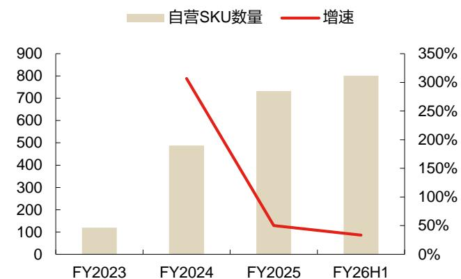

bar-line hybrid chart

| Fiscal Year | 自营SKU数量 | 增速   |
| ----------- | ---------- | ------ |
| FY2023      | 100        | -      |
| FY2024      | 480        | 300%   |
| FY2025      | 720        | 50%    |
| FY26H1      | 800        | 25%    |

数据来源：公司年报，东方证券研究所

图 30：公司自营品 GMV 占比持续提升  
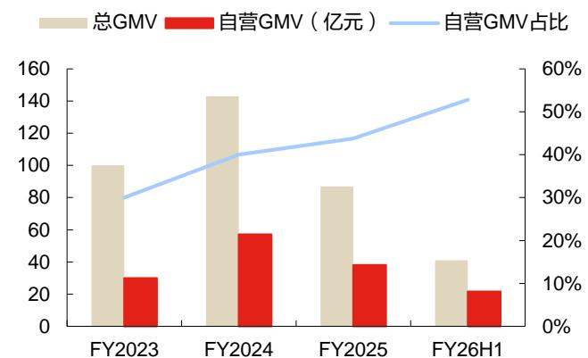

bar-line hybrid chart

| 年份 | 总GMV (亿元) | 自营GMV占比 (%) |
| :--- | :--- | :--- |
| FY2023 | 100 | 30 |
| FY2024 | 143 | 40 |
| FY2025 | 87 | 45 |
| FY26H1 | 41 | 53 |

数据来源：公司年报，东方证券研究所

公司在生鲜、食品、保健品等领域已打造大量爆款。2025年，公司谷物鲜鸡蛋、吐司、纯牛奶位居全年榜单前三。根据齐鲁壹点，截至2025年5月底，烤肠累计卖出2.6亿多根，鸡蛋累计卖出2.6亿多颗，软糖系列累计卖出超570万瓶，刺梨汁2025年销售额已破1亿元、销量突破1700万瓶。上述数据印证公司打造爆款产品的能力，也体现其对供应链体系强大的掌控力。

图 31：复盘 2025 年，谷物鲜鸡蛋、吐司、牛奶等品类位居前列

<table><tr><td></td><td>2025年全年</td><td>2025年11月</td><td>2025年10月</td><td>2025年9月</td><td>2025年8月</td><td>2025年7月</td><td>2025年6月</td><td>2025年5月</td></tr><tr><td>1</td><td>东方甄选谷物鲜鸡蛋</td><td>东方甄选谷物鲜鸡蛋</td><td>东方甄选蜜柚(红心蜜柚、三红柚)</td><td>东方甄选谷物鲜鸡蛋</td><td>东方甄选谷物鲜鸡蛋</td><td>东方甄选谷物鲜鸡蛋</td><td>东方甄选谷物鲜鸡蛋</td><td>东方甄选谷物鲜鸡蛋</td></tr><tr><td>2</td><td>东方甄选吐司系列</td><td>东方甄选脐橙(产自赣南)</td><td>东方甄选谷物鲜鸡蛋</td><td>东方甄选沙漠牛奶</td><td>东方甄选沙漠纯牛奶</td><td>东方甄选青虾仁</td><td>东方甄选烤肠</td><td>东方甄选吐司系列</td></tr><tr><td>3</td><td>东方甄选沙漠纯牛奶</td><td>东方甄选果冻橙</td><td>东方甄选云南冰糖橙</td><td>东方甄选吐司系列</td><td>东方甄选吐司系列</td><td>东方甄选吐司系列</td><td>东方甄选卫生巾</td><td>东方甄选粽子</td></tr><tr><td>4</td><td>东方甄选烤肠</td><td>东方甄选吐司系列</td><td>东方甄选吐司系列</td><td>东方甄选翠香猕猴桃</td><td>东方甄选牛肉干</td><td>东方甄选益生菌</td><td>东方甄选纯牛奶</td><td>东方甄选纯牛奶</td></tr><tr><td>5</td><td>东方甄选软糖系列</td><td>东方甄选沙漠牛奶</td><td>东方甄选烤肠系列</td><td>东方甄选烤肠系列</td><td>东方甄选焙烤薯片</td><td>东方甄选软糖系列</td><td>东方甄选吐司</td><td>东方甄选洛川苹果</td></tr><tr><td>6</td><td>东方甄选青虾仁</td><td>东方甄选洛川苹果</td><td>东方甄选沙漠牛奶</td><td>东方甄选秋月梨</td><td>东方甄选披萨</td><td>东方甄选鸡胸肉</td><td>东方甄选即食益生菌粉</td><td>东方甄选普罗旺斯番茄</td></tr><tr><td>7</td><td>东方甄选香煎鸡胸肉</td><td>东方甄选烤肠系列</td><td>东方甄选火腿肠系列</td><td>东方甄选红心蜜柚</td><td>东方甄选鸡胸肉</td><td>东方甄选彩虹黄油蟠桃</td><td>东方甄选软糖系列</td><td>东方甄选伦晚脐橙</td></tr><tr><td>8</td><td>东方甄选洛川苹果</td><td>东方甄选软糖系列</td><td>东方甄选鸡胸肉</td><td>东方甄选潮汕牛肉丸</td><td>东方甄选凯特芒</td><td>东方甄选烤肠</td><td>东方甄选香煎鸡胸肉</td><td>东方甄选软糖系列</td></tr><tr><td>9</td><td>东方甄选益生菌</td><td>东方甄选火腿肠系列</td><td>东方甄选软糖系列</td><td>东方甄选火腿肠系列</td><td>东方甄选蓝莓花色苷叶黄素酯软糖</td><td>东方甄选纯牛奶</td><td>东方甄选贝贝南瓜</td><td>东方甄选即食益生菌粉</td></tr><tr><td>10</td><td>东方甄选火腿肠系列</td><td>东方甄选酸菜鱼&amp;番茄鱼</td><td>东方甄选即食益生菌粉</td><td>东方甄选软籽石榴</td><td>东方甄选青虾仁</td><td>东方甄选牌轻薄速吸卫生巾</td><td>东方甄选火腿肠</td><td>东方甄选火腿肠</td></tr></table>

数据来源：公司官网，东方证券研究所

## 打造自营品的优势一：聚焦供应链建设。

- 创始人俞敏洪先生先后提出“对标胖东来”、“自营产品是长远发展的基石，把控产品端才能可持续发展”、“把东方甄选做成中国最好的农产品和生活用品公司”。我们认为，品质为自营产品核心的价值观在公司文化中已得到深刻积淀。  
- 公司深度参与到工厂的产品设计、品质把控等环节，以国产虾为例，公司与正大集团合作养殖基地，产能提升 $60\%$ ，损耗率从 $15\%$ 降至 $7\%$ ，实现稳定供应与成本优化；以烤肠为例，公司合作自建烤肠工厂、将产能提升1倍，从原料到生产由公司员工全程跟控。

表 4：公司爆款产品苹果干、卫生巾、益生菌等均在定位高品质

<table><tr><td>产品</td><td>首次上线</td><td>产品特征</td><td>取得成绩</td></tr><tr><td>苹果干</td><td>2026年初</td><td>原料选用成本高出市场均价约20%-30%的陕西洛川苹果。</td><td>上线当天2.5万袋现货售罄;预售订单排到1月底。</td></tr><tr><td>卫生巾</td><td>2025年6月16日</td><td>吸收速度20秒好于国标要求的60秒;薄膜粒子中加入碳酸钙粒子,薄膜成膜以后、进一步拉伸,就会在碳酸钙粒子周围形成微孔,微孔尺寸小于液态水分子团,但大于水蒸气分子,即可实现透气不透水效果。</td><td>6月16日首发,首日14小时内销量突破30万包;6月18日全网上线,当日实现订单14.7万单,售出超106万包。</td></tr><tr><td>益生菌</td><td>2025年5月</td><td>益生菌产品采用6大进口科学实证的菌株,株株有编号、株株有文献,菌株全部来自IFF全球专业益生菌工厂。</td><td>2025Q3益生菌成为自营品GMV累计排名第一;上线以来超100万人购买。</td></tr><tr><td>刺梨汁</td><td>2022年上线,2024年爆发</td><td>配料表干净简单,精心调整刺梨汁添加比例、精细控制气泡量,刺梨原汁≥10%,果汁含量≥80%。</td><td>创“上架16秒售罄10000盒”的记录,2025年全年销售额突破亿元。</td></tr></table>

数据来源：21 世纪商业评论、澎湃、财经网，东方证券研究所

表 5：公司产品具有性价比优势

<table><tr><td>青虾仁</td><td>东方甄选</td><td>山姆</td><td>Costco</td></tr></table>

有关分析师的申明，见本报告最后部分。其他重要信息披露见分析师申明之后部分，或请与您的投资代表联系。并请阅读本证券研究报告最后一页的免责申明。

<table><tr><td>商品名称</td><td>东方甄选青虾仁</td><td>Member&#x27;s Mark 生冻大虾仁</td><td>科克兰生冻虾仁</td></tr><tr><td>价格</td><td>95.2元</td><td>99.9元</td><td>99.9元</td></tr><tr><td>净重价格</td><td>95.2元/kg</td><td>110.0元/kg</td><td>110.0元/kg</td></tr><tr><td>规格</td><td>51-60只/每磅</td><td>31-40只/每磅</td><td>31-40只/每磅</td></tr><tr><td>净含量</td><td>7-9g/只</td><td>11-15g/只</td><td>11-15g/只</td></tr><tr><td>总重量</td><td>1kg</td><td>908g</td><td>908g</td></tr><tr><td>储存环境</td><td>-18°C及以下</td><td>-18°C及以下</td><td>-18°C及以下</td></tr><tr><td>产地</td><td>广东省湛江市</td><td>泰国</td><td>泰国</td></tr><tr><td>保质期</td><td>18个月</td><td>24个月</td><td>15个月</td></tr><tr><td>椰子水</td><td>东方甄选</td><td>山姆</td><td>Costco</td></tr><tr><td>商品名称</td><td>东方甄选100%椰子水</td><td>Member&#x27;s Mark 椰子水</td><td>科克兰粉红椰子水</td></tr><tr><td>价格(元)</td><td>36.9元</td><td>64.9元</td><td>97.90元</td></tr><tr><td>净重价格</td><td>17.6元/升</td><td>13.5元/升</td><td>39.2元/升</td></tr><tr><td>规格</td><td>350毫升/瓶</td><td>200毫升/瓶</td><td>414毫升/瓶</td></tr><tr><td>净含量</td><td>350毫升×6</td><td>200毫升×24</td><td>414毫升×6</td></tr><tr><td>总重量</td><td>2.1kg</td><td>4.8kg</td><td>2.5kg</td></tr><tr><td>储存环境</td><td>常温 阴凉干燥</td><td>冷藏</td><td>冷藏</td></tr><tr><td>产地</td><td>海南省海口市</td><td>泰国</td><td>泰国</td></tr><tr><td>保质期</td><td>12个月</td><td>12个月</td><td>12个月</td></tr><tr><td>牛排</td><td>东方甄选</td><td>山姆</td><td>Costco</td></tr><tr><td>商品名称</td><td>牧亩澳洲M3安格斯新鲜西冷牛排</td><td>澳洲谷饲西冷牛排</td><td>澳洲谷饲150天西冷牛排1.8kg</td></tr><tr><td>价格(元)</td><td>119.0元</td><td>153.8元</td><td>467.8元</td></tr><tr><td>净重价格</td><td>119.0元/kg</td><td>219.7元/kg</td><td>259.9元/kg</td></tr><tr><td>规格</td><td>167g×6</td><td>350g×2</td><td>350g×4</td></tr><tr><td>净含量</td><td>167g/片</td><td>350g/片</td><td>350g/片</td></tr><tr><td>总重量</td><td>1kg</td><td>700g</td><td>1.8kg</td></tr><tr><td>储存环境</td><td>-18°C以下</td><td>冷藏</td><td>冷藏</td></tr><tr><td>产地</td><td>澳大利亚</td><td>澳大利亚</td><td>澳大利亚</td></tr><tr><td>保质期</td><td>12个月</td><td>自分装日起6天</td><td>自分装日起6天</td></tr><tr><td>饼干</td><td>东方甄选</td><td>山姆</td><td>Costco</td></tr><tr><td>商品名称</td><td>东方甄选香葱/海盐苏打饼干</td><td>Member&#x27;s Mark 牛肉馅酥脆饼干</td><td>科克兰欧风巧克力味饼干</td></tr><tr><td>价格(元)</td><td>49.9元</td><td>59.9元</td><td>399.9元</td></tr><tr><td>净重价格</td><td>62.4元/kg</td><td>59.9元/kg</td><td>399.9元/kg</td></tr><tr><td>规格</td><td>800g/袋</td><td>1kg/袋</td><td>1.4kg/盒</td></tr><tr><td>净含量</td><td>28.5g/包</td><td>12.5g/包</td><td>1.4kg/盒</td></tr><tr><td>总重量</td><td>800g</td><td>1kg</td><td>1.4kg</td></tr><tr><td>储存环境</td><td>常温 阴凉干燥</td><td>常温 阴凉干燥</td><td>常温 阴凉干燥</td></tr><tr><td>产地</td><td>广东省东莞市、河北省邯郸市</td><td>福建省漳州市</td><td>德国</td></tr><tr><td>保质期</td><td>6个月</td><td>8个月</td><td>18个月</td></tr></table>

数据来源：各公司 APP，东方证券研究所

表 6：相较于带货第三方品牌为主的直播电商机构，公司打造自营品的业务模式实现更高的净利率

<table><tr><td></td><td>东方甄选</td><td>交个朋友</td><td>遥望科技</td></tr><tr><td>商业模式</td><td>以知识内容建立消费者信任,打造自营产品、向“线上山姆”转型</td><td>以技术和效率驱动的全渠道直播零售服务商,通过搭建“日不落”直播矩阵,为品牌提供代运营服务</td><td>科技驱动的新消费服务平台,明星IP+达人矩阵驱动,聚焦品牌孵化与整合营销</td></tr><tr><td>营收</td><td>FY2024-25 分别 65.3/43.9 亿元, FY2026H1 为 23.1 亿元</td><td>2021-24 年营收自 2.03 亿元增至 12.51 亿元, 2025H1 为 6.19 亿元</td><td>2021-24 年营收自 28.1 亿元增至 47.6 亿元, 2025H1 为 19 亿元</td></tr><tr><td>毛利率</td><td>FY2024-25 分别 25.9/32%, FY2026 H1 为 36.4%</td><td>2023-24 年分别 52.8/48.5%, 2025H1 为 43.7%</td><td>2023-24 年分别 2.05/3.95%, 2025H1 为 8.02%</td></tr><tr><td>净利</td><td>FY2024-25 分别 2.49/0.06 亿元, FY2026H1 为 2.58 亿元</td><td>2021-24 年净利润自-0.62 亿元增至 0.82 亿元, 2025H1 为 0.57 亿元</td><td>2021-24 年归母净利自-7 亿元扩至-10 亿元, 2025H1 为-2.53 亿元</td></tr><tr><td>净利率</td><td>FY2024-25 分别 26.4/0.14%, FY2026 H1 为 11.1%</td><td>2023-24 年分别 10.6/5.78%, 2025H1 为 8.9%</td><td>2023-24 年分别-21/-15.9%, 2025H1 为-13.3%</td></tr></table>

数据来源：wind，东方证券研究所

## 打造自营品的优势二：提高品控能力。

- 公司于2025年3月推出“透明工厂”计划并表示自营产品将举办更多场次的溯源直播，并邀请媒体和公众进入产地、生产基地溯源，共同监督自营产品安全透明生产。  
- 公司已建立严格的质量检验机制，计划实施定期的质量检验报告制度，并通过大数据分析和用户调研持续优化产品配方与包装，确保从原材料到终端产品的全链条品质可控。过去一年投入数千万元用于产品检测，建立起“没有模糊地带，只有是与非”的绝对品控防线。

图32：以自营品苹果产为例，公司推出透明工厂计划  
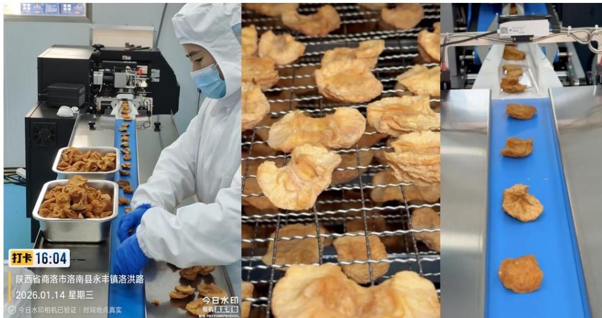

text_image

打卡 16:04
陕西省商洛市洛南县永丰镇洛洪路
2026.01.14 星期三
今日水印相机已验证！时间地点真实
今日水印
相机真实可验
BIDI PANTOMINUM/REDA

数据来源：公司官方微信公众号，东方证券研究所

以卫生巾为例：在 300 天的研发过程中，公司筛选了多个行业头部供应商，产品打样进行了 20 多版，最终敲定了卫生巾的标准和品质。从生产到出厂要经过 28 项严格检验，每批都会检验微生物含量；在工厂安装多个监控网点，从投料到生产线状况、废料销毁车间。

以白虾为例：公司与东营正大水厂合作国产白虾，公司深度参与到工厂的产品设计、品质把控等环节。通过对细节的沟通，工厂增强水体循环，从24次/天提升至36次/天，来加强虾线的洁净程度；在虾体的营养度、饱满度上，工厂升级饲料的配比；工厂采用活虾速冻技术、将每只虾单个速冻，方便消费者分装储存和食用，避免二次解冻的情况。

图 33：公司对于卫生巾进行严格的卫生筛选、工厂谈判  
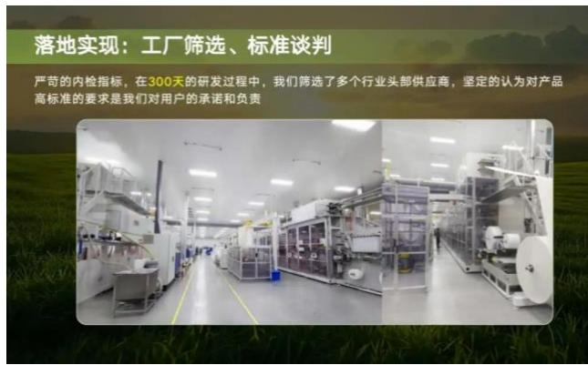

text_image

落地实现：工厂筛选、标准谈判
严苛的内检指标，在300天的研发过程中，我们筛选了多个行业头部供应商，坚定的认为对产品高标准的要求是我们对用户的承诺和负责

数据来源：公司官方公众号，东方证券研究所

图 34：公司与正大合作白虾  
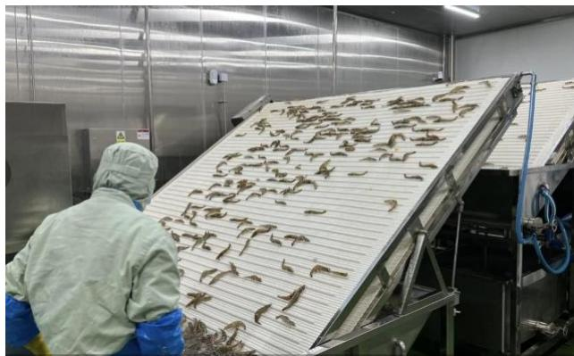

natural_image

Worker in cleanroom suit handling packaged food on a conveyor belt in a processing facility (no visible text or symbols)

数据来源：北京商报，东方证券研究所

## 打造自营品的优势三：构造“社区反馈-数据验证-产品匹配”的流程。

- 公司的 APP 已成为产品共创中枢，公司在收到用户建议后会经历详细的市场调研和论证。以五红粉为例，其诞生源于社区内宝妈、女性用户群体的高频反馈，产品团队调研发现“气血不足、易疲劳”是具有普遍性的健康痛点，将产品形态改造为即冲即饮的粉剂并锚定早餐、下午茶等高频代餐场景，从而解决便捷性这一痛点。  
- 我们认为：1)由于打造一款自营新品最短需2-3个月的时间，社区反馈对产品具良好的纠偏作用，可降低试错成本、提升新品成功率；2)社区的核心价值是真诚和落地，通过建立完善的反馈机制将赋予用户参与权，可进一步巩固用户的长期信任关系。

## 其他优势：强化物流配送能力及库存管理能力，建立全链条服务体系。

- 物流配送：截至 FY2025 末，公司全国布局 40 个仓库、覆盖 10 个核心城市，常温配送覆盖全国 99% 地区、冷链覆盖 92% 地区。公司计划计划在国内订单量前十大城市构建当日达能力，在北京、上海及广州启动即时零售履约能力的新试点。  
● 库存管理：公司实行动态库存管理模式，实时监控库存水平，精准预判需求并及时补货调货，避免缺货导致的转化率下滑。  
- 用户服务：公司建立全链条服务体系，包括物流跟踪、售后响应与客户关怀，2025财年自营产品用户满意度达 $98.7\%$ ，复购率显著高于行业平均水平。

## 线上多渠道布局优势：从抖音为主到多平台再到自建 APP

我们认为，总有下一个现象级平台的出现，多元化平台布局具有必要性。渠道红利的迁移，本质是技术、流量与商业模式的革新循环。从图文电商到直播带货，再到短视频与社交种草，每一轮红利都源于新平台以更低成本、更高效率连接了供需关系。因为品牌需要强化多元化布局，以避免单一平台流量波动的影响。

## （一）抖音仍是主要流量入口

公司抖音获客能力强，直播带货效果显著。截至2026年1月，公司在抖音平台多个账号(东方甄选、东方甄选美丽生活、东方甄选自营商品)累计粉丝超5000万，其中东方甄选官号粉丝数超2800万，是主要流量入口。FY2026H1，公司GMV为41亿元/-14.6%，剔除与辉同行后GMV为41亿元/+16.4%(其中抖音为主、APP占比18.5%)，经历人员变动风波后GMV重回良性增长。

图 35：公司抖音 GMV2025H2 后月销逐步改善  
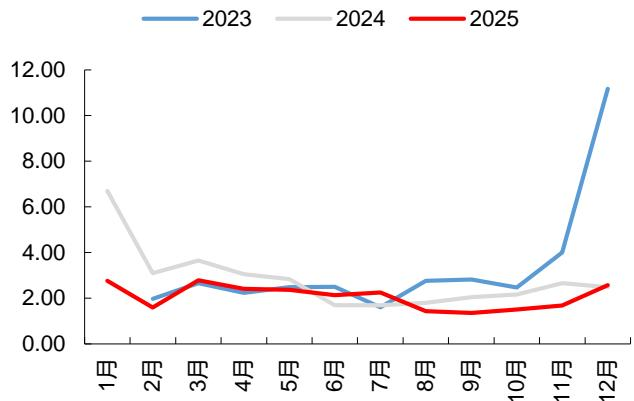

line chart

| Month | 2023  | 2024  | 2025  |
|-------|-------|-------|-------|
| 1月   | -     | 6.8   | 2.8   |
| 2月   | 1.8   | 3.0   | 1.6   |
| 3月   | 2.5   | 3.8   | 2.8   |
| 4月   | 2.2   | 3.0   | 2.4   |
| 5月   | 2.4   | 2.8   | 2.3   |
| 6月   | 2.5   | 1.8   | 2.1   |
| 7月   | 1.6   | 1.8   | 2.3   |
| 8月   | 2.8   | 1.9   | 1.4   |
| 9月   | 2.9   | 1.9   | 1.3   |
| 10月  | 2.3   | 2.1   | 1.5   |
| 11月  | 4.0   | 2.7   | 1.7   |
| 12月  | 11.5  | 2.5   | 2.5   |

数据来源：蝉妈妈，东方证券研究所  
备注：单位为亿元。

图 36：公司抖音 GMV7 日滚动平均数据近期改善  
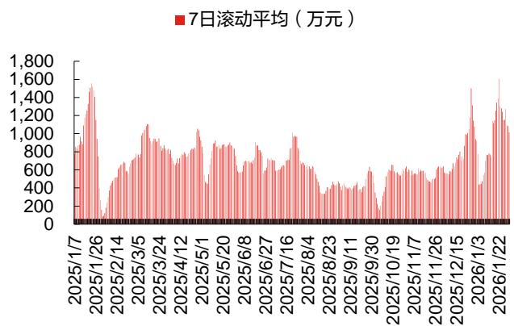

bar chart

7日滚动平均（万元）
| Date | 7日滚动平均 (万元) |
|---|---|
| 2025/1/7 | 800 |
| 2025/1/26 | 1500 |
| 2025/2/14 | 600 |
| 2025/3/5 | 1000 |
| 2025/3/24 | 900 |
| 2025/4/12 | 800 |
| 2025/5/1 | 1000 |
| 2025/5/20 | 900 |
| 2025/6/8 | 800 |
| 2025/6/27 | 700 |
| 2025/7/16 | 900 |
| 2025/8/4 | 600 |
| 2025/8/23 | 400 |
| 2025/9/11 | 400 |
| 2025/9/30 | 600 |
| 2025/10/19 | 600 |
| 2025/11/7 | 600 |
| 2025/11/26 | 600 |
| 2025/12/15 | 800 |
| 2026/1/3 | 1500 |
| 2026/1/22 | 1400 |

数据来源：蝉妈妈，东方证券研究所

表 7：公司在抖音渠道已建立多元化的账号矩阵

<table><tr><td>直播账号</td><td>销售品类</td><td>开播时间</td><td>2025年12月日均GMV</td><td>2025年GMV占比</td><td>粉丝数</td></tr><tr><td>东方甄选</td><td>以食品饮料、生鲜蔬果为主</td><td>2021.12.28</td><td>750w~1000w</td><td>33.66%</td><td>2,803.6w</td></tr><tr><td>东方甄选美丽生活</td><td>以服饰内衣、美妆护肤为主</td><td>2022.07.08</td><td>1000w~2500w</td><td>0.18%</td><td>519.4w</td></tr><tr><td>东方甄选自营商品</td><td>以自营产品为主</td><td>2022.06.29</td><td>250w~500w</td><td>46.34%</td><td>422.6w</td></tr><tr><td>东方甄选之图书</td><td>以图书教育、玩具乐器为主</td><td>2022.02.21</td><td>10w~25w</td><td>0.01%</td><td>358.6w</td></tr><tr><td>东方甄选看世界</td><td>采用“直播+文旅”形式推广地方旅游及农产品</td><td>2022.11.05</td><td>75w~100w</td><td>0.02%</td><td>273.1w</td></tr><tr><td>东方甄选生鲜</td><td>以生鲜蔬果为主</td><td>2024.08.22</td><td>250w~500w</td><td>6.99%</td><td>162.2w</td></tr></table>

数据来源：蝉妈妈，东方证券研究所

公司直播间“东方甄选”在抖音渠道位居前列、优势明显。抖音头部直播间包括疯狂小杨哥、与辉同行、东方甄选、交个朋友等，我们认为从各项经营指标对比，公司优势在于优质内容供给及更稳定的用户关系。

表 8：公司抖音主号相关数据位居前列

有关分析师的申明，见本报告最后部分。其他重要信息披露见分析师申明之后部分，或请与您的投资代表联系。并请阅读本证券研究报告最后一页的免责申明。

<table><tr><td></td><td>东方甄选</td><td>与辉同行</td><td>交个朋友</td><td>彩虹夫妇</td><td>小明正能量</td></tr><tr><td>引流数据</td><td></td><td></td><td></td><td></td><td></td></tr><tr><td>粉丝总数(万人)</td><td>2,813.2</td><td>3908</td><td>2499.5</td><td>1723.4</td><td>1608.7</td></tr><tr><td>粉丝增量(万人)</td><td>4.3</td><td>519.3</td><td>12.8</td><td>51.2</td><td>26.5</td></tr><tr><td>粉丝复合日增长率</td><td>0.0017%</td><td>0.16%</td><td>0.01%</td><td>0.03%</td><td>0.02%</td></tr><tr><td>日均观看人次(万人次)</td><td>360.6</td><td>2,440.9</td><td>157.5</td><td>433.8</td><td>463.2</td></tr><tr><td>日均点赞数(万个)</td><td>110.38</td><td>1,042.05</td><td>116.67</td><td>1,406.9</td><td>233.86</td></tr><tr><td>平均停留时长</td><td>1m30s</td><td>2m28s</td><td>2m18s</td><td>3m33s</td><td>2m43s</td></tr><tr><td>带货数据</td><td></td><td></td><td></td><td></td><td></td></tr><tr><td>直播天数(天)</td><td>87</td><td>88</td><td>90</td><td>29</td><td>22</td></tr><tr><td>销售转化率(件/人次)</td><td>2.87%</td><td>3.02%</td><td>2.22%</td><td>2.34%</td><td>5.25%</td></tr><tr><td>UV价值(元/人次)</td><td>2.77</td><td>3.77</td><td>4.79</td><td>4.03</td><td>2.98</td></tr><tr><td>直播带货数量(件)</td><td>6,076</td><td>12,000</td><td>4,361</td><td>920</td><td>1,428</td></tr><tr><td>客单价(元/件)</td><td>96.71</td><td>125</td><td>215.71</td><td>172.07</td><td>56.79</td></tr></table>

数据来源：蝉妈妈，东方证券研究所  
统计周期为2025年11月4日-2026年2月1日

文旅直播与特色选品双轮驱动，构筑与传统零售商的差异化竞争优势。公司依托户外专场、溯源直播等活动，深度挖掘国内多省市地理标志产品，核心自营品多源自户外直播后的选品布局。创始人俞敏洪先生2026年年初以来带领团队开启多场“看世界”系列直播活动，目前有1月11-13日中山、1月17-18日重庆、1月25-26日海南，有望助力自营品持续拓品破圈。

以2025年12月30日“食遍中国——东方甄选湖北行”直播为例：公司多位主播轮番上阵、带领网友云打卡黄鹤楼等景点，并深入推介湖北特色农产品，多款产品迅速成为爆款，开播6小时武当山黄精果销售额达80万元；风干鸡、老树桃胶、热干面订单均突破1万单；来凤藤茶订单量达8000单；腊肠、松花皮蛋、米酒等销量持续攀升。

图37：东方甄选多次开展溯源直播与文旅直播

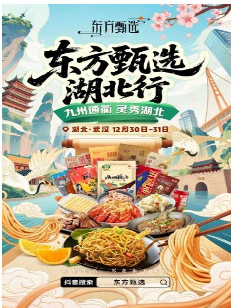

text_image

东方甄选
东方甄选
湖北行
九州通衢 灵秀湖北
湖北·武汉 12月30日-31日
抖音搜索 东方甄选

数据来源：公司官方公众号，东方证券研究所

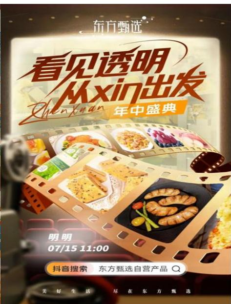

text_image

东方甄选
看见透明
从xin出发
Chunxuan 年中盛典
明明
07/15 11:00
抖音搜索 东方甄选自营产品 Q
美好生活 尽在东方甄选

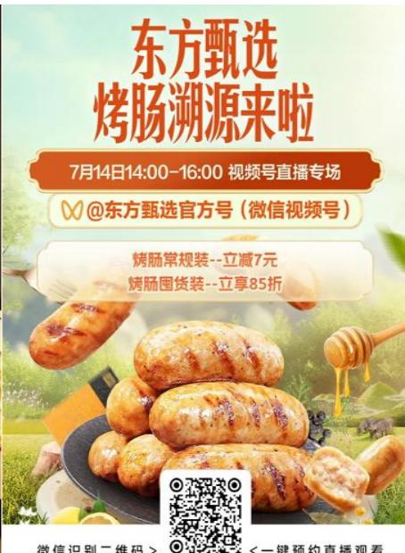

text_image

东方甄选
烤肠溯源来啦
7月14日14:00-16:00 视频号直播专场
@东方甄选官方号（微信视频号）
烤肠常规装--立减7元
烤肠囤货装--立享85折
微信识别二维码 > <一键预约直播观看

## 公司宣布启动长期招聘计划，培养一批新主播。

- 公司1月12-20日启动“甄选的offer新主播”，要求本科以上学历，能力特质包括有口才、有创意、思维灵动、具有较强的个人风格，内核匹配包括深度认同公司的企业文化价值观、目标导向强、具备团队合作意识。  
- 截至 2025 年 11 月 30 日，公司自营产品及直播电商团队达 1373 人、供应链及产品团队 654 人。本次招聘聚焦优秀主播及专业人才，围绕产品知识、内容创作、直播技巧三大模块开展系统化培训，旨在提升主播专业讲解能力与品牌文化传递力，增强用户直播间参与度。

公司宣布开放抖音全域达人带货合作，首批精选了烤肠、谷物鲜鸡蛋等6款自营产品。我们认为类似从直营转向“直营+加盟”商业模式，公司将获得流量入口的扩容、销售增长的确定性提升、品牌生态的加固。

## （二）自有 APP 增长强劲

公司自有 APP 成为多元渠道布局的重要载体，近年来多项关键指标实现跨越式增长。自有 APP 于 2022 年 8 月上线初期下载量达 20 万次，2023 年 7 月初超过 100 万次，FY2024 至 FY2026H1，APP GMV 占总 GMV 比重自 8.4% 提至 18.5%，APP 自营 GMV 占自营总 GMV 比重 FY2026H1 达到 28.6%。我们测算付费会员 ASP，FY2025 及 FY2026H1 分别 5168/3159 元。

图 38：公司自营 APP GMV 占总 GMV 比稳步提升

图 39: 公司付费会员 ASP 有所降低

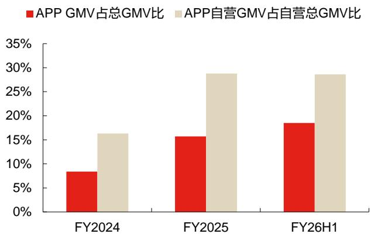

bar chart

| 年份 | APP GMV占总GMV比 (%) | APP自营GMV占自营总GMV比 (%) |
|---|---|---|
| FY2024 | 8.5 | 16.3 |
| FY2025 | 15.7 | 28.9 |
| FY26H1 | 18.5 | 28.7 |

数据来源：公司公告，东方证券研究所

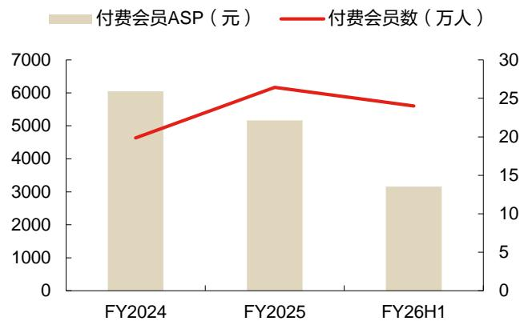

bar-line hybrid chart

| 年份 | 付费会员ASP (元) | 付费会员数 (万人) |
| :--- | :--- | :--- |
| FY2024 | 6000 | 20 |
| FY2025 | 5100 | 27 |
| FY26H1 | 3100 | 24 |

数据来源：公司公告，东方证券研究所  
备注：左轴为付费会员 ASP，右轴为付费会员数

## 公司推出付费会员体系，进一步构建私域资产。

- 公司于2023年10月正式推出付费会员体系，成为全网第一家实行付费会员制度的直播带货机构，一方面会员权益显著提升用户留存，另一方面私域流量能有效反哺产品设计和运营，为新品共创、直播策略调整提供依据。  
● 会员结构：199元/年定价，提供新品优先购、会员日折扣、亲友卡等专属权益；用户画像：核心群体为35-45岁女性，且新一线及二线城市占比高、中高收入知识型职业(企业管理者、教育从业者、公务员)占比高；消费特征：会员复购率达到普通用户2.7倍。

表 9：公司付费会员体系与山姆/Costco/盒马对比

<table><tr><td></td><td>东方甄选</td><td>山姆</td><td>Costco</td><td>盒马</td></tr><tr><td>会员价格</td><td>199元</td><td>普通会员:260元卓越会员:680元</td><td>299元</td><td>盒马x88vip:88元黄金会员:258元钻石会员:658元</td></tr><tr><td>会员数量</td><td>24.01万</td><td>1070万</td><td>8100万</td><td>2023年峰值接近300万</td></tr><tr><td>核心权益</td><td>会员价、月享券、周享券、入会礼、旅游度假、省钱无忧、续费礼、专属客服、直播礼物</td><td>普通会员:亲友卡卓越会员:每月运费券、眼镜享9折、省钱无忧购每月返回馈金、亲友卡</td><td>亲友卡、验光服务、氮气填充、听力测试、甄选好物、全球通用</td><td>盒马x88vip:会员日、免运费、免费领菜、专享券、会员价、到家服务、生活特权、专属特权黄金会员:家庭卡、会员日、免运费、免费领菜、专享券、会员价、到家服务、生活特权、专属特权钻石会员:门店88折、家庭卡、会员日、免运费、免费领菜、专享券、会员价、到家服务、生活特权、专属特权</td></tr></table>

有关分析师的申明，见本报告最后部分。其他重要信息披露见分析师申明之后部分，或请与您的投资代表联系。并请阅读本证券研究报告最后一页的免责申明。

<table><tr><td>服务网络</td><td>全国</td><td>一线+强二线(线上全国配送)</td><td>极少数大城市</td><td>一线+新一线+部分二线(线上全国配送)</td></tr><tr><td>商品特点</td><td>严选健康、配料干净、高性价比的线上爆款,主打“信任消费”。</td><td>全球精选、大包装、独家自有品牌(Member&#x27;s Mark),强调品质与会员专属感。</td><td>极致低价、巨量装、自有品牌 Kirkland 为主,美式高性价比仓储超市。</td><td>新鲜生鲜为核心,小份即食、本地化口味强,融合餐饮与即时零售。</td></tr><tr><td>自营品占比</td><td>52.8%</td><td>30%</td><td>-</td><td>60%(NB)</td></tr></table>

数据来源：各公司官网、北京商报、金融界、wind，东方证券研究所

除自营 App 外，公司亦在天猫、京东、微信小程序、微信视频号等非抖音渠道进行布局。截止 2026 月 2 月 1 日，东方甄选天猫旗舰店共有 60.1 万粉丝，42 款产品销量破万，其中吐司面包、烤肠、冷冻青虾销量破 5 万；东方甄选京东旗舰店店共有 71.2 万粉丝，超 30 款产品(部分产品有多个 sku)销量破 5 万。此外，公司亦布局东方甄选官方号、东方甄选会员两个视频号。

表 10：公司在天猫、京东已打造一系列爆款

<table><tr><td>天猫</td><td>价格</td><td>净含量</td><td>单价</td><td>总销量</td></tr><tr><td>东方甄选冷冻青虾仁去虾线南美白虾生鲜</td><td>109.0元/袋</td><td>0.72kg</td><td>151.4元/kg</td><td>5000+</td></tr><tr><td>东方甄选吐司面包切片</td><td>42.9元/箱</td><td>0.96kg</td><td>44.7元/kg</td><td>5万+</td></tr><tr><td>东方甄选刺梨原汁(50ml*10瓶)</td><td>79.0元/盒</td><td>0.50L</td><td>158.0元/L</td><td>2万+</td></tr><tr><td>东方甄选果冻橙橙子</td><td>35.9元/5斤</td><td>2.5kg</td><td>14.4元/kg</td><td>1万+</td></tr><tr><td>东方甄选五香鸡</td><td>29元/袋</td><td>0.58kg</td><td>50元/kg</td><td>6000+</td></tr><tr><td>东方甄选牌纯棉柔巾100%全棉悬挂式+1挂钩</td><td>29.9元/包</td><td>190抽</td><td>0.16元/抽</td><td>6000+</td></tr><tr><td>京东</td><td>价格</td><td>净含量</td><td>单价</td><td>总评论数</td></tr><tr><td>东方甄选冷冻青虾仁去虾线南美白虾生鲜</td><td>109元/袋</td><td>0.72kg</td><td>151.4元/kg</td><td>5万+</td></tr><tr><td>东方甄选吐司面包切片</td><td>42.9元/箱</td><td>0.96kg</td><td>44.7元/kg</td><td>2万+</td></tr><tr><td>东方甄选刺梨原汁(50ml*10瓶)</td><td>69.0元/盒</td><td>0.50L</td><td>138.0元/L</td><td>2万+</td></tr><tr><td>东方甄选果冻橙橙子</td><td>37.9元/5斤</td><td>2.5kg</td><td>15.2元/kg</td><td>1万+</td></tr><tr><td>东方甄选五香鸡</td><td>29元/袋</td><td>0.58kg</td><td>50.0元/kg</td><td>2000+</td></tr><tr><td>东方甄选牌纯棉柔巾100%全棉悬挂式</td><td>25.9元/包</td><td>190抽</td><td>0.14元/抽</td><td>2000+</td></tr></table>

数据来源：天猫、京东，东方证券研究所

## 线下渠道优势：推进与新东方的协同合作，拟开设旗舰店

## （一）布局线下智能货柜

公司智能货柜是其从线上直播电商向“产品驱动+会员制零售”转型的重要线下探索。引导型货柜展示自营品，消费者扫码跳转小程序线上下单、物流配送；辅助型货柜24小时自助，扫码开门自动结算，满足即时需求。智能货柜已在北京启动试点，截至FY2026H1已布局40多台自动售货机，部分已实现盈利；且计划进一步扩大布局范围，覆盖写字楼、社区等更多场景。我们认为智能货柜布局有望推动公司与新东方学校携手开设地面服务店、会员店、旗舰店的蓝图逐步落地。

图 40：公司展示引导型智能货柜  
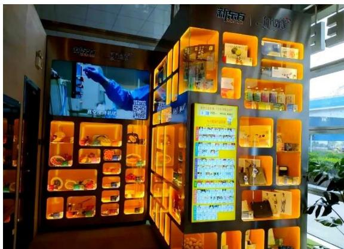

text_image

Interior photo of a retail store display with illuminated shelves, product displays, and promotional signage in Chinese.

数据来源：公司官方公众号，东方证券研究所

图 41：公司即时购买型智能货柜  
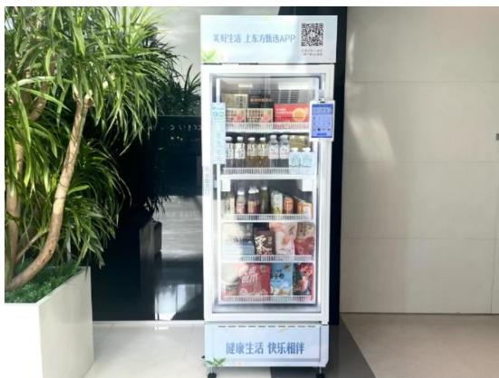

text_image

美好生活 上东方雅选APP
健康生活 快乐相逢

数据来源：公司官方公众号，东方证券研究所

## （二）有望依托新东方线下教学点转化流量

公司有望依托新东方 1000+教学点进行线下布局。2024 年 7 月，创始人俞敏洪先生提出，希望依托 800 个新东方地面教学点，能探索出线上线下相结合的模式，和全国新东方合作开设地面服务店、会员店、旗舰店。我们认为，一方面线下教学点拥有精准且现成的客群，与公司目标用户高度重合；另一方面可强化品牌曝光。目前相关试点工作已在启动。此外，由于线下教学点与前置仓条件高度匹配，我们认为或许能为周边 3-5km 范围内的用户提供更高效的即时配送服务。

## （三）拟建设线下旗舰店

公司将打造位于北京中关村的旗舰店，定位“餐饮+零售”复合业态，兼具即时零售前置仓功能。公司将在3-4月在北京中关村(总部附近)开设首家线下门店，面积约439平方米，提供一站式“购物+休闲+社交”体验。据《北京商报》，公司以1.5-3万元月薪为门店寻觅店长，优先锁定“餐饮+零售”复合业态管理人才。我们认为，线下旗舰店一方面能实时观察运营，另一方面可借助教学点流量“低成本试错”，将教育场景转化为零售的流量入口，且可为后续扩张奠定基础。

线下门店成为直播电商机构强化消费者品牌心智、寻找第二增长曲线的重要路径，目前赛事正热。三只羊的“小杨臻选”、辛巴的“辛选超市”、李佳琦“奈娃咖啡”等均是直播电商机构布局线下渠道的典型代表，我们认为既是其供应链能力的体现，也是其打造长期品牌的重要载体。

## 盈利预测与投资建议

## 盈利预测

## 我们对公司 FY2026-28 年盈利预测做如下假设：

- 公司已剥离教育业务、目前主业为直播电商，人员结构变化及业务调整导致该直播电商营收FY2024-25有所波动、FY2026以来企稳，考虑到公司自营品占比稳步提升、规模优势及品牌声量进一步增强，我们假设直播电商业务FY2026-28年营收分别41.57/48.22/55.46亿元，增速分别 $18 / 16 / 15\%$ ；我们预计其他产品及服务业务将保持稳定增长，假设FY2026-28年营收分别9.56/10.33/10.95亿元，增速分别 $10 / 8 / 6\%$ 。  
- 我们假设公司 FY2026-28 年毛利率分别 35.66%、35.87%、36.01%(其中直播电商毛利率分别 36.5%、36.7%、36.8%)。我们认为随公司自营品占比提升、规模优势强化，毛利率有望保持小幅提升趋势。  
- 我们预计随公司规模进一步扩张、控费提效，费用率将有所降低，假设 FY2026-28 年销售费用率分别 18.5%、18.3%、18%，管理费用率分别 3.5%、3.47%、3.45%。  
● 我们假设公司 FY2026-28 年的所得税率均为 25%。

根据测算，我们预测 FY2026-28 年营收分别 51.13/58.54/66.41 亿元，增速分别 16.4/14.5/13.4%；归母净利分别 5.88/6.81/7.77 亿元，增速分别 10146/16/14.1%。

表 11：公司营收分类预测表

<table><tr><td></td><td>FY2024</td><td>FY2025</td><td>FY2026E</td><td>FY2027E</td><td>FY2028E</td></tr><tr><td colspan="6">直播电商</td></tr><tr><td>收入(百万元)</td><td>5,147</td><td>3,523</td><td>4,157</td><td>4,822</td><td>5,546</td></tr><tr><td>收入增速</td><td>32.6%</td><td>-31.6%</td><td>18.0%</td><td>16.0%</td><td>15.0%</td></tr><tr><td>毛利率</td><td>25.93%</td><td>31.97%</td><td>36.5%</td><td>36.7%</td><td>36.8%</td></tr><tr><td colspan="6">其他产品及服务</td></tr><tr><td>收入(百万元)</td><td>1,378</td><td>869</td><td>956</td><td>1,033</td><td>1,095</td></tr><tr><td>收入增速</td><td></td><td>-36.9%</td><td>10.0%</td><td>8.0%</td><td>6.0%</td></tr><tr><td>毛利率</td><td>45.0%</td><td>32.0%</td><td>32.0%</td><td>32.0%</td><td>32.0%</td></tr><tr><td colspan="6">合计</td></tr><tr><td>收入(百万元)</td><td>6,526</td><td>4,392</td><td>5,113</td><td>5,854</td><td>6,641</td></tr><tr><td>收入增速</td><td>44.7%</td><td>-32.7%</td><td>16.4%</td><td>14.5%</td><td>13.4%</td></tr><tr><td>毛利率</td><td>29.96%</td><td>31.97%</td><td>35.66%</td><td>35.87%</td><td>36.01%</td></tr></table>

资料来源：wind、iFnd，东方证券研究所预测备注：教育业务已剥离、不列入

## 投资建议

公司所在行业为零售行业，盈利状况整体稳定，同行业竞争充分，采用同行业可比公司相对估值方法最为合适。我们选择线下零售公司永辉超市、王府井、天虹股份以及线上电商产业链公司壹网壹创、值得买作为可比公司，调整后2026年平均PE估值为55倍；以FY2027EPS为基础，参考可比公司给予55倍PE，对应公司合理目标价为40.45元港币(目标价35.2元人民币，港币汇率为1人民币=1.1492元港币)，首次给予“买入评级”。

表 12：可比公司估值

<table><tr><td></td><td></td><td colspan="2">最新股价</td><td colspan="4">EPS(元人民币)</td><td colspan="4">PE 估值</td></tr><tr><td>公司代码</td><td>公司名称</td><td>(元人民币)</td><td>2024A</td><td>2025E</td><td>2026E</td><td>2027E</td><td>2024A</td><td>2025E</td><td>2026E</td><td>2027E</td><td></td></tr><tr><td>永辉超市</td><td>601933</td><td>3.97</td><td>-0.16</td><td>-0.29</td><td>0.07</td><td>0.14</td><td>-24.58</td><td>-13.69</td><td>57.79</td><td>27.51</td><td></td></tr><tr><td>王府井</td><td>600859</td><td>12.32</td><td>0.24</td><td>0.21</td><td>0.34</td><td>0.43</td><td>51.55</td><td>58.47</td><td>36.17</td><td>28.64</td><td></td></tr><tr><td>天虹股份</td><td>002419</td><td>5.78</td><td>0.07</td><td>0.07</td><td>0.11</td><td>0.14</td><td>88.11</td><td>81.18</td><td>51.98</td><td>42.22</td><td></td></tr><tr><td>壹网壹创</td><td>300792</td><td>35.80</td><td>0.32</td><td>0.45</td><td>0.65</td><td>0.80</td><td>111.63</td><td>78.85</td><td>54.85</td><td>44.82</td><td></td></tr><tr><td>值得买</td><td>300785</td><td>51.41</td><td>0.38</td><td>0.45</td><td>0.55</td><td>0.65</td><td>135.86</td><td>113.66</td><td>93.87</td><td>79.31</td><td></td></tr><tr><td>调整后平均</td><td></td><td></td><td></td><td></td><td></td><td></td><td>83.76</td><td>72.84</td><td>54.87</td><td>38.56</td><td></td></tr></table>

数据来源：wind，东方证券研究所  
备注：最新股价取自2026年4月16日收盘价；由于公司财年截止日为5/31，故使用可比公司2026年度PE对应公司FY2027

## 风险提示

行业竞争加剧。国内零售行业尤其生鲜零售行业竞争激烈，目前阶段而言，行业内至少存在生鲜电商、社区团购、即时零售、商超及便利店等参与者；此外也存在量贩零食、短保超市等新兴竞争者。若行业竞争加剧，或对公司业务产生不利影响。

自营品发展不及预期。布局自营品是公司战略的核心着力点，其中供应链建设是重要方向，若出现物流效率低下、质量控制问题、交货延迟等问题，可能对公司业务发展产生不利影响。此外若新品销售情况不佳，可能导致公司收入利润增长不及预期。

直播矩阵建设不及预期。抖音直播当前仍是承接用户流量并转化的核心渠道，新的直播间崛起带来新场景的快速爆发、老玩家多平台栖息在短视频平台为载体的背景下可能更为便利，由此可能带来行业竞争加剧及日后盈利能力受损的风险；此外如直播间矩阵建设不及预期，同样可能对公司业务产生不利影响。

附表：财务报表预测与比率分析  
资产负债表

<table><tr><td>单位:百万元</td><td>FY2024</td><td>FY2025</td><td>FY2026E</td><td>FY2027E</td><td>FY2028E</td></tr><tr><td>货币资金</td><td>2384.59</td><td>2621.10</td><td>3081.87</td><td>3760.43</td><td>4542.35</td></tr><tr><td>应收账款</td><td>31.69</td><td>27.43</td><td>32.61</td><td>37.34</td><td>42.36</td></tr><tr><td>预付款项、按金及其他应收款项</td><td>989.11</td><td>273.95</td><td>439.86</td><td>503.62</td><td>571.28</td></tr><tr><td>其他应收款</td><td>0.00</td><td>0.00</td><td>0.00</td><td>0.00</td><td>0.00</td></tr><tr><td>存货</td><td>422.34</td><td>308.57</td><td>267.23</td><td>304.96</td><td>345.18</td></tr><tr><td>其他流动资产</td><td>2336.15</td><td>2527.90</td><td>2744.08</td><td>2858.12</td><td>2979.10</td></tr><tr><td>流动资产总计</td><td>6163.89</td><td>5758.95</td><td>6565.65</td><td>7464.48</td><td>8480.27</td></tr><tr><td>长期股权投资</td><td>73.23</td><td>72.55</td><td>72.87</td><td>73.23</td><td>73.63</td></tr><tr><td>固定资产</td><td>43.20</td><td>31.64</td><td>33.01</td><td>39.10</td><td>42.09</td></tr><tr><td>在建工程</td><td>0.00</td><td>0.00</td><td>7.50</td><td>7.00</td><td>6.50</td></tr><tr><td>无形资产</td><td>98.97</td><td>53.30</td><td>44.42</td><td>35.53</td><td>26.65</td></tr><tr><td>长期待摊费用</td><td>0.00</td><td>0.00</td><td>0.00</td><td>0.00</td><td>0.00</td></tr><tr><td>其他非流动资产</td><td>162.23</td><td>176.08</td><td>176.08</td><td>176.08</td><td>176.08</td></tr><tr><td>非流动资产合计</td><td>377.63</td><td>333.57</td><td>333.87</td><td>330.95</td><td>324.95</td></tr><tr><td>资产总计</td><td>6541.52</td><td>6092.51</td><td>6899.52</td><td>7795.42</td><td>8805.22</td></tr><tr><td>短期借款</td><td>0.00</td><td>0.00</td><td>0.00</td><td>0.00</td><td>0.00</td></tr><tr><td>应付账款</td><td>611.89</td><td>432.70</td><td>438.14</td><td>500.00</td><td>565.95</td></tr><tr><td>其他流动负债</td><td>901.01</td><td>521.86</td><td>689.09</td><td>787.50</td><td>892.17</td></tr><tr><td>流动负债合计</td><td>1512.90</td><td>954.55</td><td>1127.23</td><td>1287.50</td><td>1458.12</td></tr><tr><td>长期借款</td><td>0.00</td><td>0.00</td><td>0.00</td><td>0.00</td><td>0.00</td></tr><tr><td>其他非流动负债</td><td>59.00</td><td>20.00</td><td>20.00</td><td>20.00</td><td>20.00</td></tr><tr><td>非流动负债合计</td><td>59.00</td><td>20.00</td><td>20.00</td><td>20.00</td><td>20.00</td></tr><tr><td>负债合计</td><td>1571.90</td><td>974.56</td><td>1147.24</td><td>1307.51</td><td>1478.13</td></tr><tr><td>股本</td><td>0.13</td><td>0.14</td><td>0.14</td><td>0.14</td><td>0.14</td></tr><tr><td>储备</td><td>4969.08</td><td>5116.96</td><td>5116.96</td><td>5116.96</td><td>5116.96</td></tr><tr><td>留存收益</td><td>0.00</td><td>0.00</td><td>587.61</td><td>1269.05</td><td>2046.42</td></tr><tr><td>归属于母公司股东权益</td><td>4969.22</td><td>5117.10</td><td>5704.70</td><td>6386.15</td><td>7163.51</td></tr><tr><td>归属于非控制股股东权益</td><td>0.41</td><td>0.86</td><td>47.58</td><td>101.77</td><td>163.58</td></tr><tr><td>权益合计</td><td>4969.62</td><td>5117.96</td><td>5752.29</td><td>6487.92</td><td>7327.09</td></tr><tr><td>负债和权益合计</td><td>6541.52</td><td>6092.51</td><td>6899.52</td><td>7795.42</td><td>8805.22</td></tr></table>

现金流量表

<table><tr><td>单位:百万元</td><td>FY2024</td><td>FY2025</td><td>FY2026E</td><td>FY2027E</td><td>FY2028E</td></tr><tr><td>税后经营利润</td><td>289.69</td><td>-11.50</td><td>531.25</td><td>632.50</td><td>735.99</td></tr><tr><td>折旧与摊销</td><td>62.95</td><td>48.80</td><td>15.01</td><td>17.29</td><td>19.40</td></tr><tr><td>财务费用</td><td>2.37</td><td>2.93</td><td>-9.98</td><td>-11.97</td><td>-14.53</td></tr><tr><td>其他经营资金</td><td>501.09</td><td>49.06</td><td>-173.25</td><td>-60.00</td><td>-63.25</td></tr><tr><td>经营性现金净流量</td><td>856.09</td><td>89.29</td><td>363.03</td><td>577.81</td><td>677.61</td></tr><tr><td>投资性现金净流量</td><td>202.75</td><td>195.50</td><td>87.76</td><td>88.77</td><td>89.78</td></tr><tr><td>筹资性现金净流量</td><td>-14.77</td><td>-53.12</td><td>9.98</td><td>11.97</td><td>14.53</td></tr><tr><td>现金流量净额</td><td>1044.07</td><td>231.67</td><td>460.77</td><td>678.56</td><td>781.92</td></tr></table>

利润表

<table><tr><td>单位:百万元</td><td>FY2024</td><td>FY2025</td><td>FY2026E</td><td>FY2027E</td><td>FY2028E</td></tr><tr><td>营业额</td><td>7072.56</td><td>4392.07</td><td>5112.96</td><td>5854.22</td><td>6640.62</td></tr><tr><td>销售成本</td><td>4953.56</td><td>2988.03</td><td>3289.75</td><td>3754.26</td><td>4249.42</td></tr><tr><td>其他费用</td><td>0.00</td><td>0.00</td><td>0.00</td><td>0.00</td><td>0.00</td></tr><tr><td>销售费用</td><td>1144.29</td><td>902.11</td><td>945.90</td><td>1065.47</td><td>1195.31</td></tr><tr><td>管理费用</td><td>554.77</td><td>611.82</td><td>178.95</td><td>203.14</td><td>229.10</td></tr><tr><td>财务费用</td><td>2.37</td><td>2.93</td><td>-9.98</td><td>-11.97</td><td>-14.53</td></tr><tr><td>其他经营损益</td><td>0.00</td><td>0.00</td><td>0.00</td><td>0.00</td><td>0.00</td></tr><tr><td>投资收益</td><td>3.79</td><td>-0.68</td><td>0.40</td><td>0.45</td><td>0.50</td></tr><tr><td>公允价值变动损益</td><td>0.00</td><td>0.00</td><td>0.00</td><td>0.00</td><td>0.00</td></tr><tr><td>营业利润</td><td>421.37</td><td>-113.49</td><td>708.73</td><td>843.78</td><td>981.82</td></tr><tr><td>其他非经营损益</td><td>120.14</td><td>174.24</td><td>136.91</td><td>136.91</td><td>136.91</td></tr><tr><td>税前利润</td><td>541.50</td><td>60.74</td><td>845.64</td><td>980.69</td><td>1118.73</td></tr><tr><td>所得税</td><td>-1178.00</td><td>54.55</td><td>211.31</td><td>245.06</td><td>279.56</td></tr><tr><td>税后利润</td><td>1719.51</td><td>6.19</td><td>634.33</td><td>735.63</td><td>839.17</td></tr><tr><td>归属于非控制股股东利润</td><td>0.01</td><td>0.46</td><td>46.72</td><td>54.18</td><td>61.81</td></tr><tr><td>归属于母公司股东利润</td><td>1719.50</td><td>5.74</td><td>587.61</td><td>681.44</td><td>777.36</td></tr><tr><td>EBITDA</td><td>606.82</td><td>112.48</td><td>850.67</td><td>986.00</td><td>1123.60</td></tr><tr><td>NOPLAT</td><td>1637.81</td><td>-11.27</td><td>524.16</td><td>623.97</td><td>725.60</td></tr><tr><td>EPS(元)</td><td>1.62</td><td>0.01</td><td>0.55</td><td>0.64</td><td>0.73</td></tr></table>

主要财务比率

<table><tr><td></td><td>FY2024</td><td>FY2025</td><td>FY2026E</td><td>FY2027E</td><td>FY2028E</td></tr><tr><td colspan="6">成长能力</td></tr><tr><td>营收额增长率</td><td>56.82%</td><td>-37.90%</td><td>16.41%</td><td>14.50%</td><td>13.43%</td></tr><tr><td>EBIT 增长率</td><td>-53.69%</td><td>-88.29%</td><td>1212.34%</td><td>15.92%</td><td>13.99%</td></tr><tr><td>EBITDA 增长率</td><td>-50.27%</td><td>-81.46%</td><td>656.32%</td><td>15.91%</td><td>13.96%</td></tr><tr><td>税后利润增长率</td><td>77.03%</td><td>-99.64%</td><td>10145.99%</td><td>15.97%</td><td>14.08%</td></tr><tr><td colspan="6">盈利能力</td></tr><tr><td>毛利率</td><td>29.96%</td><td>31.97%</td><td>35.66%</td><td>35.87%</td><td>36.01%</td></tr><tr><td>净利率</td><td>24.31%</td><td>0.14%</td><td>12.41%</td><td>12.57%</td><td>12.64%</td></tr><tr><td>ROE</td><td>34.60%</td><td>0.11%</td><td>10.30%</td><td>10.67%</td><td>10.85%</td></tr><tr><td>ROA</td><td>26.29%</td><td>0.09%</td><td>8.52%</td><td>8.74%</td><td>8.83%</td></tr><tr><td>ROIC</td><td>155.68%</td><td>-0.55%</td><td>53.56%</td><td>50.97%</td><td>53.53%</td></tr><tr><td colspan="6">估值倍数</td></tr><tr><td>P/E</td><td>17.50</td><td>5247.24</td><td>51.21</td><td>44.16</td><td>38.71</td></tr><tr><td>P/S</td><td>4.25</td><td>6.85</td><td>5.89</td><td>5.14</td><td>4.53</td></tr><tr><td>P/B</td><td>6.06</td><td>5.88</td><td>5.28</td><td>4.71</td><td>4.20</td></tr></table>

资料来源：东方证券研究所

## 分析师申明

## 每位负责撰写本研究报告全部或部分内容的研究分析师在此作以下声明：

分析师在本报告中对所提及的证券或发行人发表的任何建议和观点均准确地反映了其个人对该证券或发行人的看法和判断；分析师薪酬的任何组成部分无论是在过去、现在及将来，均与其在本研究报告中所表述的具体建议或观点无任何直接或间接的关系。

## 投资评级和相关定义

报告发布日后的 12 个月内行业或公司的涨跌幅相对同期相关证券市场代表性指数的涨跌幅为基准（A 股市场基准为沪深 300 指数，香港市场基准为恒生指数，美国市场基准为标普 500 指数）；

## 公司投资评级的量化标准

买入：相对强于市场基准指数收益率 15%以上；

增持：相对强于市场基准指数收益率 5%～15%;

中性：相对于市场基准指数收益率在-5%～+5%之间波动；

减持：相对弱于市场基准指数收益率在-5%以下。

未评级——由于在报告发出之时该股票不在本公司研究覆盖范围内，分析师基于当时对该股票的研究状况，未给予投资评级相关信息。

暂停评级——根据监管制度及本公司相关规定，研究报告发布之时该投资对象可能与本公司存在潜在的利益冲突情形；亦或是研究报告发布当时该股票的价值和价格分析存在重大不确定性，缺乏足够的研究依据支持分析师给出明确投资评级；分析师在上述情况下暂停对该股票给予投资评级等信息，投资者需要注意在此报告发布之前曾给予该股票的投资评级、盈利预测及目标价格等信息不再有效。

## 行业投资评级的量化标准：

看好：相对强于市场基准指数收益率5%以上；

中性：相对于市场基准指数收益率在-5%～+5%之间波动；

看淡：相对于市场基准指数收益率在-5%以下。

未评级：由于在报告发出之时该行业不在本公司研究覆盖范围内，分析师基于当时对该行业的研究状况，未给予投资评级等相关信息。

暂停评级：由于研究报告发布当时该行业的投资价值分析存在重大不确定性，缺乏足够的研究依据支持分析师给出明确行业投资评级；分析师在上述情况下暂停对该行业给予投资评级信息，投资者需要注意在此报告发布之前曾给予该行业的投资评级信息不再有效。

## 免责声明

本证券研究报告（以下简称“本报告”）由东方证券股份有限公司（以下简称“本公司”）制作及发布。

本报告仅供本公司的客户使用。本公司不会因接收人收到本报告而视其为本公司的当然客户。本报告的全体接收人应当采取必要措施防止本报告被转发给他人。

本报告是基于本公司认为可靠的且目前已公开的信息撰写，本公司力求但不保证该信息的准确性和完整性，客户也不应该认为该信息是准确和完整的。同时，本公司不保证文中观点或陈述不会发生任何变更，在不同时期，本公司可发出与本报告所载资料、意见及推测不一致的证券研究报告。本公司会适时更新我们的研究，但可能会因某些规定而无法做到。除了一些定期出版的证券研究报告之外，绝大多数证券研究报告是在分析师认为适当的时候不定期地发布。

在任何情况下，本报告中的信息或所表述的意见并不构成对任何人的投资建议，也没有考虑到个别客户特殊的投资目标、财务状况或需求。客户应考虑本报告中的任何意见或建议是否符合其特定状况，若有必要应寻求专家意见。本报告所载的资料、工具、意见及推测只提供给客户作参考之用，并非作为或被视为出售或购买证券或其他投资标的的邀请或向人作出邀请。

本报告中提及的投资价格和价值以及这些投资带来的收入可能会波动。过去的表现并不代表未来的表现，未来的回报也无法保证，投资者可能会损失本金。外汇汇率波动有可能对某些投资的价值或价格或来自这一投资的收入产生不良影响。那些涉及期货、期权及其它衍生工具的交易，因其包括重大的市场风险，因此并不适合所有投资者。

在任何情况下，本公司不对任何人因使用本报告中的任何内容所引致的任何损失负任何责任，投资者自主作出投资决策并自行承担投资风险，任何形式的分享证券投资收益或者分担证券投资损失的书面或口头承诺均为无效。

本报告主要以电子版形式分发，间或也会辅以印刷品形式分发，所有报告版权均归本公司所有。未经本公司事先书面协议授权，任何机构或个人不得以任何形式复制、转发或公开传播本报告的全部或部分内容。不得将报告内容作为诉讼、仲裁、传媒所引用之证明或依据，不得用于营利或用于未经允许的其它用途。

经本公司事先书面协议授权刊载或转发的，被授权机构承担相关刊载或者转发责任。不得对本报告进行任何有悖原意的引用、删节和修改。

提示客户及公众投资者慎重使用未经授权刊载或者转发的本公司证券研究报告，慎重使用公众媒体刊载的证券研究报告。

## 东方证券研究所

地址：上海市中山南路318号东方国际金融广场26楼

电话：021-63325888

传真：021-63326786

网址： www.dfzq.com.cn