# 大化工周报：美伊谈判推进，油价下降带动化工品价格整体回落

大化工首席证券分析师：陈淑娴，CFA

执业证书编号：S0600523020004

联系方式：chensx@dwzq.com.cn

石化化工证券分析师：周少玟

执业证书编号：S0600525070005

联系方式：zhoushm@dwzq.com.cn

2026年4月19日

■ [本周观点]本周美伊谈判释放缓和信号，油价下滑，带动化工品价格整体回落。4月17日，伊朗有条件开放霍尔木兹海峡；4月18日，伊朗正式拒绝新一轮会谈，谈判再度停滞，关注后续地缘关系进展。从油价具体影响投资的角度来看，若油价上涨，油气及替代路线企业有望受益；若油价下跌，下游原油加工和基础化工中下游加工企业有望受益。

## ■ [本周重要事件]

## 1）行业：

- 2026年4月16日，伊朗已暂停所有石化产品出口，以确保本月初以色列袭击后国内供应减少情况下的内需保障。  
- 2026年4月16日，依照《危险化学品安全管理条例》有关规定，中华人民共和国应急管理部等十部门将2-硝基-3-甲基苯甲酸等五种化学品纳入《危险化学品目录（2015版）》。

2）公司：2026年4月16日，东方盛虹的控股股东江苏盛虹科技股份有限公司及其一致行动人盛虹苏州（集团）有限公司计划自公告披露日起6个月内，以集中竞价、大宗交易等方式增持公司A股股份，本次合计增持金额不低于9.8亿元，不超过19.6亿元。本次增持是基于对公司未来持续稳定发展的坚定信心及对公司长期投资价值的认可。

## ■ [本周跟踪标的]

1）涨幅前五：宝丽迪（+74.3%）、东方盛虹（+8.7%）、万凯新材（+6.5%）、一诺威（+4.5%）、海油工程（+4.0%）；  
2）跌幅前五：亚钾国际（-12.6%）、扬农化工（-11.2%）、华鲁恒升（-8.8%）、荣盛石化（-7.8%）、浙江医药（-7.8%）。

■ [相关上市公司]万华化学、宝丰能源、卫星化学、华鲁恒升、新和成、安迪苏、扬农化工、江山股份、国光股份、兴发集团、云天化、川恒股份、新安股份、东岳硅材、博源化工、华峰化学、新乡化纤。  
■ [风险提示]1）项目实施进度不及预期；2）宏观经济增速下滑，导致需求复苏弱于预期；3）地缘风险演化导致原材料价格波动；4）行业产能发生重大变化；5）统计口径及计算误差。

natural_image

Exterior view of a modern curved glass office building with a logo on top (no visible text or signage)

1. 大化工股价及重点数据汇总  
2. 大化工各行业数据跟踪  
3. 风险提示

natural_image

Exterior view of a modern curved glass office building with a logo on top (no visible text or signage)

## 1. 大化工股价及重点数据汇总

1.1 大化工股价汇总  
1.2 大化工重点数据汇总

## 1.1 大化工股价汇总

<table><tr><td>板块</td><td>子板块</td><td>序号</td><td>股票代码</td><td>公司名称</td><td>2026年4月17日 市值(亿RMB)</td><td>周涨跌幅</td><td>月涨跌幅</td><td>城市</td></tr><tr><td rowspan="15">石化</td><td rowspan="6">三桶油</td><td rowspan="2">1</td><td>601857.SH</td><td>中国石油</td><td>21102</td><td>-4.7%</td><td>-4.1%</td><td>北京</td></tr><tr><td>0857.HK</td><td>中国石油股份</td><td>17158</td><td>-0.7%</td><td>1.0%</td><td>北京</td></tr><tr><td rowspan="2">2</td><td>600028.SH</td><td>中国石化</td><td>6723</td><td>-4.8%</td><td>-11.0%</td><td>北京</td></tr><tr><td>0386.HK</td><td>中国石油化工股份</td><td>4836</td><td>-1.5%</td><td>-4.6%</td><td>北京</td></tr><tr><td rowspan="2">3</td><td>600938.SH</td><td>中国海油</td><td>17748</td><td>-2.5%</td><td>-7.7%</td><td>北京</td></tr><tr><td>0883.HK</td><td>中国海洋石油</td><td>11246</td><td>1.2%</td><td>-6.3%</td><td>北京</td></tr><tr><td rowspan="3">油服</td><td>4</td><td>601808.SH</td><td>中海油服</td><td>728</td><td>-2.9%</td><td>-14.2%</td><td>北京</td></tr><tr><td>5</td><td>600968.SH</td><td>海油发展</td><td>431</td><td>-3.2%</td><td>-10.2%</td><td>北京</td></tr><tr><td>6</td><td>600583.SH</td><td>海油工程</td><td>310</td><td>4.0%</td><td>-0.1%</td><td>北京</td></tr><tr><td rowspan="6">大炼化</td><td>7</td><td>600346.SH</td><td>恒力石化</td><td>1642</td><td>-0.4%</td><td>5.8%</td><td>大连</td></tr><tr><td>8</td><td>002493.SZ</td><td>荣盛石化</td><td>1165</td><td>-7.8%</td><td>-9.2%</td><td>杭州</td></tr><tr><td>9</td><td>000301.SZ</td><td>东方盛虹</td><td>805</td><td>8.7%</td><td>7.4%</td><td>苏州</td></tr><tr><td>10</td><td>601233.SH</td><td>桐昆股份</td><td>467</td><td>0.7%</td><td>2.3%</td><td>桐乡</td></tr><tr><td>11</td><td>603225.SH</td><td>新凤鸣</td><td>281</td><td>-5.8%</td><td>-1.9%</td><td>桐乡</td></tr><tr><td>12</td><td>000703.SZ</td><td>恒逸石化</td><td>577</td><td>-3.1%</td><td>30.6%</td><td>杭州</td></tr></table>

## 1.1 大化工股价汇总

<table><tr><td>板块</td><td>子板块</td><td>序号</td><td>股票代码</td><td>公司名称</td><td>2026年4月17日市值(亿RMB)</td><td>周涨跌幅</td><td>月涨跌幅</td><td>城市</td></tr><tr><td rowspan="34">化工</td><td rowspan="5">聚氨酯</td><td>13</td><td>600309.SH</td><td>万华化学</td><td>2748</td><td>0.2%</td><td>9.5%</td><td>烟台</td></tr><tr><td>14</td><td>002064.SZ</td><td>华峰化学</td><td>535</td><td>-2.7%</td><td>3.4%</td><td>温州</td></tr><tr><td>15</td><td>600230.SH</td><td>沧州大化</td><td>80</td><td>-6.4%</td><td>-0.3%</td><td>沧州</td></tr><tr><td>16</td><td>301518.SZ</td><td>长华化学</td><td>61</td><td>3.7%</td><td>-1.0%</td><td>苏州</td></tr><tr><td>17</td><td>920261.BJ</td><td>一诺威</td><td>43</td><td>4.5%</td><td>-2.9%</td><td>淄博</td></tr><tr><td rowspan="3">聚烯烃</td><td>18</td><td>600989.SH</td><td>宝丰能源</td><td>2035</td><td>-6.3%</td><td>-15.8%</td><td>宁夏</td></tr><tr><td>19</td><td>002648.SZ</td><td>卫星化学</td><td>923</td><td>-5.0%</td><td>5.4%</td><td>嘉兴</td></tr><tr><td>20</td><td>002221.SZ</td><td>东华能源</td><td>126</td><td>-0.1%</td><td>-14.0%</td><td>南京</td></tr><tr><td rowspan="10">食品添加剂</td><td>21</td><td>002001.SZ</td><td>新和成</td><td>1112</td><td>-1.9%</td><td>2.6%</td><td>绍兴</td></tr><tr><td>22</td><td>600216.SH</td><td>浙江医药</td><td>143</td><td>-7.8%</td><td>-6.6%</td><td>绍兴</td></tr><tr><td>23</td><td>600299.SH</td><td>安迪苏</td><td>433</td><td>-0.2%</td><td>-1.7%</td><td>北京</td></tr><tr><td>24</td><td>301220.SZ</td><td>亚香股份</td><td>45</td><td>0.6%</td><td>-14.8%</td><td>苏州</td></tr><tr><td>25</td><td>600873.SH</td><td>梅花生物</td><td>305</td><td>-1.0%</td><td>-12.9%</td><td>廊坊</td></tr><tr><td>26</td><td>0546.HK</td><td>阜丰集团</td><td>156</td><td>3.3%</td><td>-17.3%</td><td>青岛</td></tr><tr><td>27</td><td>600866.SH</td><td>星湖科技</td><td>115</td><td>-1.1%</td><td>-11.2%</td><td>广东</td></tr><tr><td>28</td><td>688639.SH</td><td>华恒生物</td><td>70</td><td>-1.8%</td><td>-18.1%</td><td>合肥</td></tr><tr><td>29</td><td>002597.SZ</td><td>金禾实业</td><td>129</td><td>-4.7%</td><td>-4.3%</td><td>滁州</td></tr><tr><td>30</td><td>605016.SH</td><td>百龙创园</td><td>110</td><td>-6.3%</td><td>8.8%</td><td>德州</td></tr><tr><td rowspan="6">化肥</td><td>31</td><td>600426.SH</td><td>华鲁恒升</td><td>750</td><td>-8.8%</td><td>-5.3%</td><td>德州</td></tr><tr><td>32</td><td>002274.SZ</td><td>华昌化工</td><td>59</td><td>-2.7%</td><td>-11.1%</td><td>苏州</td></tr><tr><td>33</td><td>600096.SH</td><td>云天化</td><td>608</td><td>0.2%</td><td>-14.8%</td><td>昆明</td></tr><tr><td>34</td><td>002895.SZ</td><td>川恒股份</td><td>225</td><td>-6.9%</td><td>-4.7%</td><td>成都</td></tr><tr><td>35</td><td>000893.SZ</td><td>亚钾国际</td><td>502</td><td>-12.6%</td><td>-9.6%</td><td>广州</td></tr><tr><td>36</td><td>002545.SZ</td><td>东方铁塔</td><td>269</td><td>-4.7%</td><td>-8.8%</td><td>胶州</td></tr><tr><td rowspan="3">农药</td><td>37</td><td>600486.SH</td><td>扬农化工</td><td>290</td><td>-11.2%</td><td>-6.6%</td><td>扬州</td></tr><tr><td>38</td><td>300261.SZ</td><td>雅本化学</td><td>59</td><td>-3.2%</td><td>-15.1%</td><td>上海</td></tr><tr><td>39</td><td>002749.SZ</td><td>国光股份</td><td>61</td><td>-1.2%</td><td>-3.7%</td><td>成都</td></tr><tr><td rowspan="2">氯碱</td><td>40</td><td>002092.SZ</td><td>中泰化学</td><td>162</td><td>-7.1%</td><td>-20.6%</td><td>新疆</td></tr><tr><td>41</td><td>601678.SH</td><td>滨化股份</td><td>104</td><td>1.0%</td><td>-4.2%</td><td>滨州</td></tr><tr><td rowspan="3">纯碱</td><td>42</td><td>000683.SZ</td><td>博源化工</td><td>314</td><td>-4.7%</td><td>-2.8%</td><td>鄂尔多斯</td></tr><tr><td>43</td><td>600409.SH</td><td>三友化工</td><td>144</td><td>-4.3%</td><td>-9.6%</td><td>唐山</td></tr><tr><td>44</td><td>000822.SZ</td><td>山东海化</td><td>53</td><td>-0.8%</td><td>-12.3%</td><td>潍坊</td></tr><tr><td rowspan="2">钛白粉</td><td>45</td><td>002601.SZ</td><td>龙佰集团</td><td>422</td><td>0.4%</td><td>-5.9%</td><td>河南</td></tr><tr><td>46</td><td>002145.SZ</td><td>中核钛白</td><td>178</td><td>2.6%</td><td>-11.0%</td><td>甘肃</td></tr><tr><td rowspan="4">新材料</td><td>高端改性塑料</td><td>47</td><td>301003.SZ</td><td>江苏博云</td><td>51</td><td>1.4%</td><td>1.0%</td><td>苏州</td></tr><tr><td>水溶性高分子</td><td>48</td><td>688350.SH</td><td>富淼科技</td><td>42</td><td>4.0%</td><td>3.0%</td><td>苏州</td></tr><tr><td>COFs树脂材料</td><td>49</td><td>300905.SZ</td><td>宝丽迪</td><td>99</td><td>74.3%</td><td>74.1%</td><td>苏州</td></tr><tr><td>机器人材料</td><td>50</td><td>301216.SZ</td><td>万凯新材</td><td>171</td><td>6.5%</td><td>12.0%</td><td>海宁</td></tr></table>

## 1.1 大化工股价汇总：石油石化（申万）PE/PB Bands

text_image

时间范围 3Y 5Y 10Y 上市以来 自定义 PE-TTM PB PS PCF 周期 周 自定义设置 F5 + WP

石油石化(申万) 801960.SI 2912.40 -1.09% PE/PB Bands

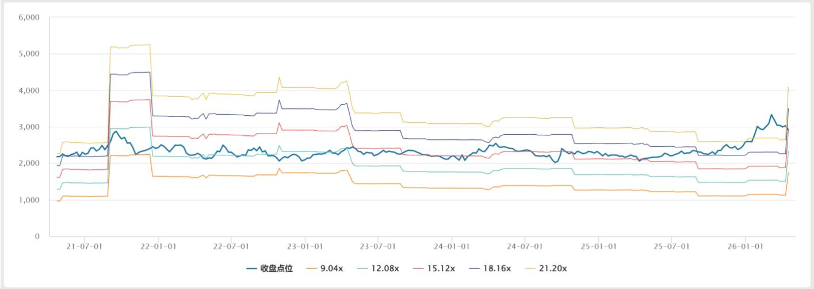

line chart

| Date       | 收盘点位 | 9.04x | 12.08x | 15.12x | 18.16x | 21.20x |
| ---------- | -------- | ----- | ------ | ------ | ------ | ------ |
| 21-07-01   | ~2,300   | ~1,000| ~1,400 | ~1,800 | ~2,000 | ~2,500 |
| 22-01-01   | ~2,500   | ~1,600| ~2,300 | ~3,700 | ~4,500 | ~5,200 |
| 23-01-01   | ~2,300   | ~1,600| ~2,300 | ~3,700 | ~3,500 | ~4,100 |
| 23-07-01   | ~2,400   | ~1,400| ~1,900 | ~2,300 | ~3,500 | ~3,300 |
| 24-01-01   | ~2,300   | ~1,300| ~1,800 | ~2,200 | ~3,300 | ~3,100 |
| 24-07-01   | ~2,400   | ~1,300| ~1,800 | ~2,300 | ~3,500 | ~3,300 |
| 25-01-01   | ~2,300   | ~1,300| ~1,700 | ~2,200 | ~3,300 | ~3,100 |
| 25-07-01   | ~2,400   | ~1,300| ~1,700 | ~2,200 | ~3,400 | ~3,200 |
| 26-01-01   | ~3,300   | ~1,300| ~1,600 | ~2,300 | ~3,500 | ~4,100 |

text_image

时间范围 3Y 5Y 10Y 上市以来 自定义 PE-TTM PB PS PCF 周期 周
自定义设置 F5 + WP

石油石化(申万) 801960.SI 2912.40 -1.09% PE/PB Bands

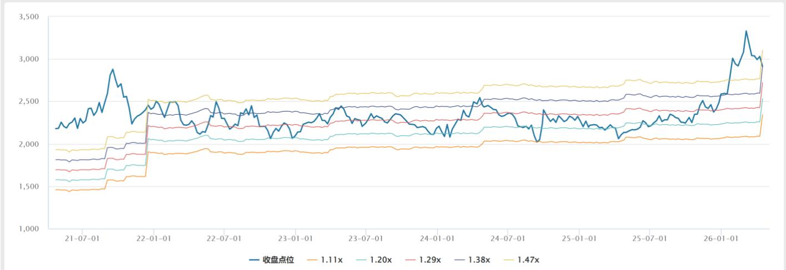

line chart

| Date       | 收盘点位 | 1.11x | 1.20x | 1.29x | 1.38x | 1.47x |
| ---------- | -------- | ----- | ----- | ----- | ----- | ----- |
| 21-07-01   | ~2,200   | ~1,500| ~1,600| ~1,700| ~1,800| ~1,900|
| 22-01-01   | ~2,800   | ~1,600| ~1,700| ~1,800| ~1,900| ~2,000|
| 23-01-01   | ~2,300   | ~1,800| ~1,900| ~2,000| ~2,100| ~2,300|
| 24-01-01   | ~2,400   | ~1,900| ~2,000| ~2,100| ~2,200| ~2,400|
| 25-01-01   | ~2,300   | ~2,000| ~2,100| ~2,200| ~2,300| ~2,500|
| 26-01-01   | ~3,300   | ~2,100| ~2,200| ~2,300| ~2,400| ~2,600|
| 27-01-01   | ~3,100   | ~2,200| ~2,300| ~2,400| ~2,500| ~2,700|

## 1.1 大化工股价汇总：基础化工（申万） PE/PB Bands

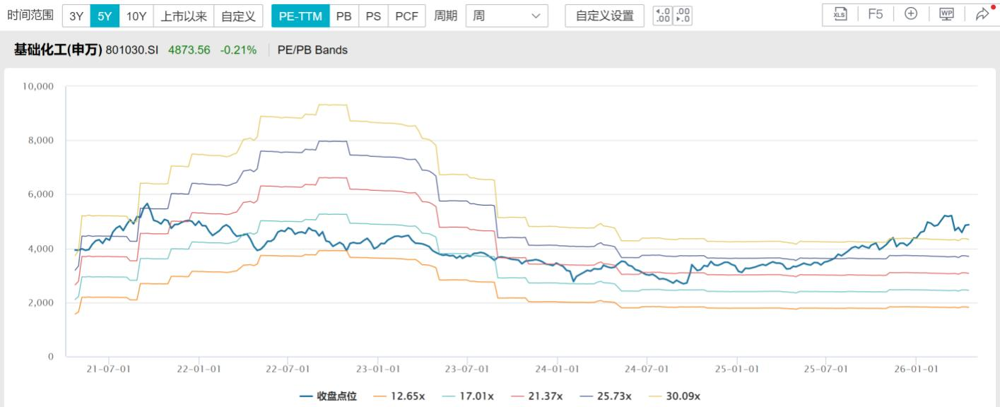

line chart

| 时间范围 | 收盘点位 | 12.65x | 17.01x | 21.37x | 25.73x | 30.09x |
| --- | --- | --- | --- | --- | --- | --- |
| 3Y | 4000 | 2000 | 3000 | 4000 | 5000 | 5000 |
| 5Y | 4500 | 2500 | 3500 | 4500 | 5500 | 5500 |
| 10Y | 5000 | 3000 | 4000 | 5000 | 6000 | 6000 |
| 上市以来 | 5500 | 3500 | 4500 | 5500 | 6500 | 6500 |
| 自定义 | 6000 | 4000 | 5000 | 6000 | 7000 | 7000 |
| PE-TTM | 6500 | 4500 | 5500 | 6500 | 7500 | 7500 |
| PB | 7000 | 5000 | 6000 | 7000 | 8000 | 8000 |
| PS | 7500 | 5500 | 6500 | 7500 | 8500 | 8500 |
| PCF | 8000 | 6000 | 7000 | 8000 | 9000 | 9000 |
| 周期 | 8500 | 6500 | 7500 | 8500 | 9500 | 9500 |
| 自定义设置 | - | - | - | - | - | - |
| F5 | - | - | - | - | - | - |
| + | - | - | - | - | - | - |
| WP | - | - | - | - | - | - |
| - | - | - | - | - | - | - |
| - | - | - | - | - | - | - |
| - | - | - | - | - | - | - |
| - | - | - | - | - | - | - |
| - | - | - | - | -723.56 | - | - |
| - | - | - | - | -723.56 | - | - |
| - | - | - | - | -723.56 | - | - |
| - | - | - | - | -723.56 | - | - |
| - | - | - | - (end) | -723.56 | - | - |
| PE/PB Bands | - | - | - | - | - | - |
| 基础化工(申万) | 88183.61 | 4873.56 | - | - | - | - |
| PE/PB Bands | - | - | - | - | - | - |
| PE/PB Bands | - | - | - | - | - | - |
| PE/PB Bands | - | - | - | - | - | - |
| PE/PB Bands | - | - | - | - | - | - |

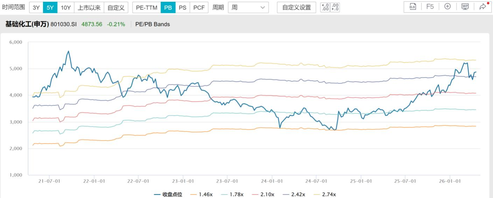

line chart

| 时间范围 | 收盘点位 | 1.46x | 1.78x | 2.10x | 2.42x | 2.74x |
| --- | --- | --- | --- | --- | --- | --- |
| 3Y | - | - | - | - | - | - |
| 5Y | - | - | - | - | - | - |
| 10Y | - | - | - | - | - | - |
| 上市以来 | - | - | - | - | - | - |
| 自定义 | - | - | - | - | - | - |
| PE-TTM | - | - | - | - | - | - |
| PB | - | - | - | - | - | - |
| PS | - | - | - | - | - | - |
| PCF | - | - | - | - | - | - |
| 周期 | - | - | - | - | - | - |
| 自定义设置 | - | - | - | - | - | - |
| F5 | - | - | - | - | - | - |
| + | - | - | - | - | - | - |
| WP | - | - | - | - | - | - |
| + | - | - | - | - | - | - |
| + | - | - | - | - | - | - |
| + | - | - | - | - | - | - |
| + | - | - | - | - | - | - |
| + | - | - | - | - | - | - |
| + | - | - | - | - | - | - |
| + | - | - | - | - | - | - |
| + | - | - | - | - | - | - |
| + | - | - | - | - | - | - |
| + | + | + | + | + | + | + |
| + | + | + | + | + | + | + |
| + | + | + | + | + | + | + |
| + | + | + | + | + | + | + |
| + | + | + | + | + | + | + |
| + | + | + & + | + + + | + + + | + + + | + + |

## 1.2 大化工重点数据汇总

油价及国内外大炼化价差

<table><tr><td rowspan="3">国际原油</td><td>品种</td><td>本周均价</td><td>环比变化</td><td>环比涨跌幅</td><td>同比涨跌幅</td><td>单位</td><td>本周均价</td><td>环比变化</td><td>环比涨跌幅</td><td>同比涨跌幅</td><td>单位</td></tr><tr><td>布伦特</td><td>96.8</td><td>-6.7</td><td>-6.5%</td><td>48.0%</td><td>美元/桶</td><td>4903</td><td>-293.3</td><td>-5.6%</td><td>42.4%</td><td>元/吨</td></tr><tr><td>WTI</td><td>94.1</td><td>-11.5</td><td>-10.9%</td><td>51.5%</td><td>美元/桶</td><td>4731</td><td>-591.5</td><td>-11.1%</td><td>44.2%</td><td>元/吨</td></tr><tr><td rowspan="2">炼化价差测算</td><td>炼化项目</td><td>本周价差</td><td>环比变化</td><td>环比涨跌幅</td><td>同比涨跌幅</td><td>炼化项目</td><td>本周价差</td><td>环比变化</td><td>环比涨跌幅</td><td>同比涨跌幅</td><td>单位</td></tr><tr><td>国内炼化项目</td><td>2519</td><td>395</td><td>18.6%</td><td>-7.4%</td><td>国外炼化项目</td><td>3835</td><td>(20)</td><td>-0.5%</td><td>310.0%</td><td>元/吨</td></tr></table>

聚酯板块

<table><tr><td rowspan="5">聚酯上游</td><td>产品</td><td>本周均价</td><td>环比变化</td><td>本周价差</td><td>环比变化</td><td>单位</td><td>库存/万吨</td><td>环比变化</td><td>开工率</td><td>环比变化</td><td>产销率</td><td>环比变化</td></tr><tr><td>PX</td><td>1210</td><td>-24</td><td>503</td><td>25</td><td>美元/吨</td><td>/</td><td>/</td><td>85.0%</td><td>-0.4%</td><td>/</td><td>/</td></tr><tr><td>MEG</td><td>5003</td><td>-270</td><td>100</td><td>23</td><td>元/吨</td><td>87.1</td><td>-4.9</td><td>61.1%</td><td>-1.4%</td><td>/</td><td>/</td></tr><tr><td>产品</td><td>本周均价</td><td>环比变化</td><td>单吨净利润</td><td>环比变化</td><td>单位</td><td>库存天数/天</td><td>环比变化</td><td>开工率</td><td>环比变化</td><td>产销率</td><td>环比变化</td></tr><tr><td>PTA</td><td>6403</td><td>-279</td><td>-282</td><td>-93</td><td>元/吨</td><td>5.5</td><td>-0.1</td><td>77.5%</td><td>-2.4%</td><td>/</td><td>/</td></tr><tr><td rowspan="4">涤纶长丝</td><td>产品</td><td>本周均价</td><td>环比变化</td><td>单吨净利润</td><td>环比变化</td><td>单位</td><td>库存天数/天</td><td>环比变化</td><td>开工率</td><td>环比变化</td><td>产销率</td><td>环比变化</td></tr><tr><td>POY</td><td>9107</td><td>-164</td><td>498</td><td>111</td><td>元/吨</td><td>28.5</td><td>1.8</td><td rowspan="3">85.1%</td><td rowspan="3">-0.8%</td><td rowspan="3">30.6%</td><td rowspan="3">-14.6%</td></tr><tr><td>FDY</td><td>9429</td><td>-93</td><td>445</td><td>158</td><td>元/吨</td><td>32.0</td><td>1.3</td></tr><tr><td>DTY</td><td>10300</td><td>-121</td><td>426</td><td>139</td><td>元/吨</td><td>32.3</td><td>1.4</td></tr><tr><td rowspan="2">短纤&amp;瓶片</td><td>涤纶短纤</td><td>8014</td><td>-219</td><td>(62)</td><td>75</td><td>元/吨</td><td>11.7</td><td>0.5</td><td>83.9%</td><td>-0.9%</td><td>56.2%</td><td>2.9%</td></tr><tr><td>聚酯瓶片</td><td>8501</td><td>-102</td><td>395</td><td>153</td><td>元/吨</td><td>/</td><td>/</td><td>/</td><td>/</td><td>/</td><td>/</td></tr><tr><td>聚酯下游</td><td>织布</td><td colspan="5">/</td><td>19.3</td><td>(0.1)</td><td>52.7%</td><td>-0.4%</td><td>/</td><td>/</td></tr></table>

## 1.2 大化工重点数据汇总

<table><tr><td rowspan="2">板块</td><td rowspan="2">产品</td><td colspan="2">价格</td><td rowspan="2">周度涨跌幅</td><td rowspan="2">单位</td></tr><tr><td>2026/4/17</td><td>2026/4/10</td></tr><tr><td rowspan="4">聚氨酯</td><td>纯MDI</td><td>25000</td><td>25500</td><td>-2.0%</td><td>元/吨</td></tr><tr><td>聚合MDI</td><td>19000</td><td>20500</td><td>-7.3%</td><td>元/吨</td></tr><tr><td>TDI</td><td>18700</td><td>20038</td><td>-6.7%</td><td>元/吨</td></tr><tr><td>己二酸</td><td>9800</td><td>10500</td><td>-6.7%</td><td>元/吨</td></tr><tr><td rowspan="2">聚烯烃</td><td>聚乙烯</td><td>9490</td><td>9500</td><td>-0.1%</td><td>元/吨</td></tr><tr><td>聚丙烯</td><td>9150</td><td>9400</td><td>-2.7%</td><td>元/吨</td></tr><tr><td rowspan="8">农业</td><td>草甘膦</td><td>34294</td><td>34294</td><td>0.0%</td><td>元/吨</td></tr><tr><td>草铵膦</td><td>46000</td><td>46000</td><td>0.0%</td><td>元/吨</td></tr><tr><td>菊酯</td><td>13</td><td>13</td><td>0.0%</td><td>万元/吨</td></tr><tr><td>尿素</td><td>1910</td><td>1900</td><td>0.5%</td><td>元/吨</td></tr><tr><td>磷酸一铵</td><td>4001</td><td>3955</td><td>1.2%</td><td>元/吨</td></tr><tr><td>磷酸二铵</td><td>3968</td><td>3968</td><td>0.0%</td><td>元/吨</td></tr><tr><td>钾肥</td><td>3240</td><td>3245</td><td>-0.2%</td><td>元/吨</td></tr><tr><td>复合肥</td><td>3500</td><td>3500</td><td>0.0%</td><td>元/吨</td></tr><tr><td rowspan="6">食品添加剂</td><td>维生素A</td><td>116.5</td><td>117.5</td><td>-0.9%</td><td>元/千克</td></tr><tr><td>维生素E</td><td>116.5</td><td>117.5</td><td>-0.9%</td><td>元/千克</td></tr><tr><td>固体蛋氨酸</td><td>52.0</td><td>52.0</td><td>0.0%</td><td>元/千克</td></tr><tr><td>液体蛋氨酸</td><td>36.0</td><td>35.5</td><td>1.4%</td><td>元/千克</td></tr><tr><td>赖氨酸</td><td>8.5</td><td>8.6</td><td>-1.2%</td><td>元/千克</td></tr><tr><td>苏氨酸</td><td>10.4</td><td>10.4</td><td>0.0%</td><td>元/千克</td></tr></table>

<table><tr><td rowspan="2">板块</td><td rowspan="2">产品</td><td colspan="2">价格</td><td rowspan="2">周度涨跌幅</td><td rowspan="2">单位</td></tr><tr><td>2026/4/17</td><td>2026/4/10</td></tr><tr><td rowspan="6">磷化工</td><td>磷矿石</td><td>1011</td><td>1011</td><td>0.0%</td><td>元/吨</td></tr><tr><td>黄磷</td><td>30000</td><td>29000</td><td>3.4%</td><td>元/吨</td></tr><tr><td>硫磺</td><td>6254</td><td>6420</td><td>-2.6%</td><td>元/吨</td></tr><tr><td>磷酸铁</td><td>12660</td><td>12450</td><td>1.7%</td><td>元/吨</td></tr><tr><td>磷酸铁锂</td><td>60872</td><td>56300</td><td>8.1%</td><td>元/吨</td></tr><tr><td>六氟磷酸锂</td><td>95000</td><td>98000</td><td>-3.1%</td><td>元/吨</td></tr><tr><td rowspan="4">化纤</td><td>氨纶</td><td>27100</td><td>26100</td><td>3.8%</td><td>元/吨</td></tr><tr><td>PA6</td><td>13600</td><td>13900</td><td>-2.2%</td><td>元/吨</td></tr><tr><td>粘胶长丝</td><td>44500</td><td>44500</td><td>0.0%</td><td>元/吨</td></tr><tr><td>粘胶短纤</td><td>13750</td><td>13550</td><td>1.5%</td><td>元/吨</td></tr><tr><td rowspan="4">地产化工品</td><td>纯碱(重质)</td><td>1180</td><td>1200</td><td>-1.7%</td><td>元/吨</td></tr><tr><td>钛白粉</td><td>15600</td><td>15600</td><td>0.0%</td><td>元/吨</td></tr><tr><td>PVC</td><td>6200</td><td>6883</td><td>-9.9%</td><td>元/吨</td></tr><tr><td>烧碱</td><td>904</td><td>921</td><td>-1.8%</td><td>元/吨</td></tr><tr><td rowspan="3">新材料</td><td>有机硅DMC</td><td>14600</td><td>14500</td><td>0.7%</td><td>元/吨</td></tr><tr><td>PA66</td><td>22500</td><td>23500</td><td>-4.3%</td><td>元/吨</td></tr><tr><td>碳纤维</td><td>73.0</td><td>73.0</td><td>0.0%</td><td>元/千克</td></tr><tr><td rowspan="3">其他化工品</td><td>草酸</td><td>4405</td><td>4405</td><td>0.0%</td><td>元/吨</td></tr><tr><td>辛醇</td><td>9300</td><td>9200</td><td>1.1%</td><td>元/吨</td></tr><tr><td>丙烯酸丁酯</td><td>11750</td><td>12250</td><td>-4.1%</td><td>元/吨</td></tr></table>

natural_image

Exterior view of a modern curved glass office building with a logo on top (no visible text or signage)

## 2. 大化工重点数据跟踪

• 2.1 大炼化：原油/石脑油/PX/PTA/MEG  
• 2.2 聚酯：涤纶长丝/短纤/瓶片  
• 2.3 聚氨酯：MDI/TDI/己二酸/聚醚/TPU  
2.4 聚烯烃：油煤气路线对比  
2.5 农业：农药、化肥  
• 2.6 食品添加剂：维生素、氨基酸  
2.7 磷化工：磷矿石/硫磺/黄磷/磷酸/磷酸铁/磷酸铁锂/6F  
• 2.8 化纤：氨纶、己内酰胺/锦纶、粘胶长丝/短纤  
• 2.9 地产化工品：钛白粉/纯碱/烧碱/PVC  
• 2.10 新材料：有机硅/多晶硅、EVA/POE、PA66、碳纤维  
• 2.11 其他化工品：草酸、辛醇、DMF、醋酸、丙烯酸及酯、ABS、MMA

## 2.1 大炼化：原油/石脑油

原油、PX价格及价差（美元/吨）  
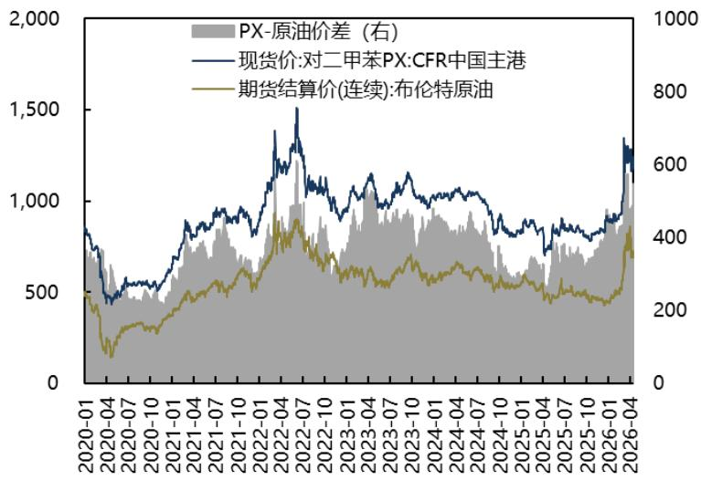

bar-line hybrid chart

| Date     | PX-原油价差 (右) | 现货价:对二甲苯PX:CFR中国主港 | 期货结算价(连续):布伦特原油 |
|----------|------------------|------------------------------|-------------------------------|
| 2020-01  | ~500             | ~800                         | ~300                          |
| 2020-04  | ~400             | ~500                         | ~200                          |
| 2020-07  | ~500             | ~600                         | ~300                          |
| 2021-01  | ~600             | ~700                         | ~400                          |
| 2021-04  | ~700             | ~800                         | ~500                          |
| 2021-07  | ~800             | ~900                         | ~600                          |
| 2021-10  | ~900             | ~1000                        | ~700                          |
| 2022-01  | ~1,000           | ~1,200                        | ~800                          |
| 2022-04  | ~1,100           | ~1,400                        | ~900                          |
| 2022-07  | ~1,200           | ~1,500                        | ~1,000                        |
| 2022-10  | ~1,100           | ~1,300                        | ~950                          |
| 2023-01  | ~1,050           | ~1,250                        | ~900                          |
| 2023-04  | ~1,150           | ~1,350                        | ~950                          |
| 2023-07  | ~1,150           | ~1,350                        | ~950                          |
| 2023-10  | ~1,150           | ~1,350                        | ~950                          |
| 2024-01  | ~1,150           | ~1,350                        | ~950                          |
| 2024-04  | ~1,150           | ~1,350                        | ~950                          |
| 2024-07  | ~1,150           | ~1,350                        | ~950                          |
| 2024-10  | ~1,150           | ~1,350                        | ~950                          |
| 2025-01  | ~1,150           | ~1,350                        | ~950                          |
| 2025-04  | ~1,150           | ~1,350                        | ~950                          |
| 2025-07  | ~1,150           | ~1,350                        | ~950                          |
| 2025-10  | ~1,150           | ~1,350                        | ~950                          |
| 2026-01  | ~1,250           | ~1,450                        | ~950                          |
| 2026-04  | ~1,350           | ~1,550                        | ~950                          |

石脑油、PX价格及价差（美元/吨）  
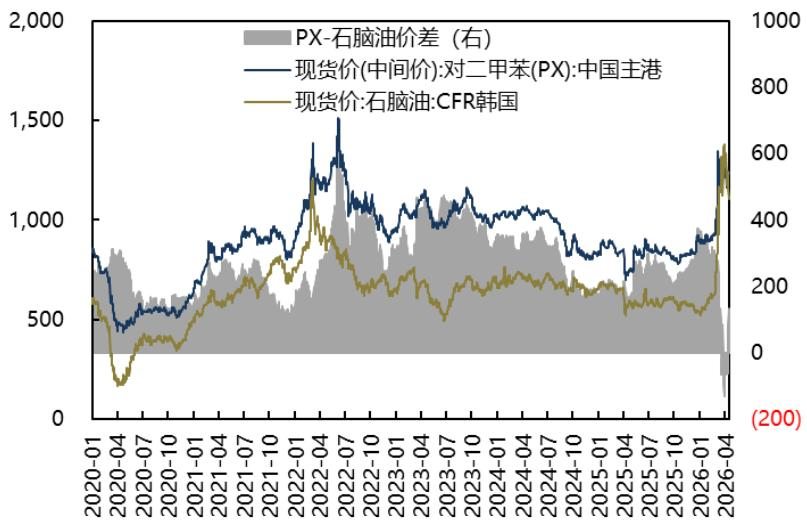

bar-line hybrid chart

| Date     | PX-石脑油价差 (右) | 现货价(中间价):对二甲苯(PX):中国主港 | 现货价:石脑油:CFR韩国 |
|----------|---------------------|----------------------------------|------------------------|
| 2020-01  | ~800                | ~800                             | ~600                   |
| 2020-04  | ~400                | ~400                             | ~200                   |
| 2020-07  | ~600                | ~600                             | ~400                   |
| 2020-10  | ~700                | ~700                             | ~500                   |
| 2021-01  | ~800                | ~800                             | ~600                   |
| 2021-04  | ~900                | ~900                             | ~700                   |
| 2021-07  | ~1000               | ~1000                            | ~800                   |
| 2021-10  | ~1100               | ~1100                            | ~900                   |
| 2022-01  | ~1300               | ~1300                            | ~1100                  |
| 2022-04  | ~1500               | ~1500                            | ~1300                  |
| 2022-07  | ~1400               | ~1400                            | ~1200                  |
| 2022-10  | ~1300               | ~1300                            | ~1100                  |
| 2023-01  | ~1200               | ~1200                            | ~1000                  |
| 2023-04  | ~1100               | ~1100                            | ~900                   |
| 2023-07  | ~1200               | ~1200                            | ~1000                  |
| 2023-10  | ~1100               | ~1100                            | ~900                   |
| 2024-01  | ~1200               | ~1200                            | ~1000                  |
| 2024-04  | ~1100               | ~1100                            | ~900                   |
| 2024-07  | ~1300               | ~1300                            | ~1100                  |
| 2024-10  | ~1200               | ~1200                            | ~1000                  |
| 2025-01  | ~1300               | ~1300                            | ~1100                  |
| 2025-04  | ~1400               | ~1400                            | ~1200                  |
| 2025-07  | ~1300               | ~1300                            | ~1100                  |
| 2025-10  | ~1400               | ~1400                            | ~1200                  |
| 2026-01  | ~1500               | ~1500                            | ~1300                  |
| 2026-04  | ~1600               | ~1600                            | ~1400                  |

国内大炼化项目周度价差（美元/桶，元/吨）  
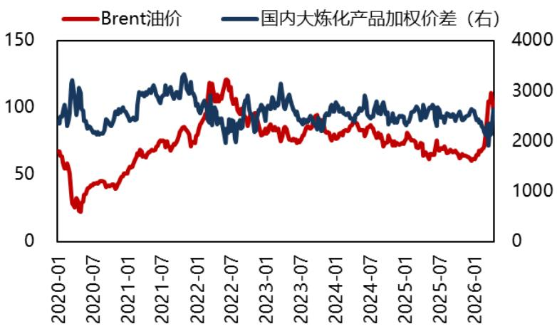

bar-line hybrid chart

| Date     | Brent油价 | 国内大炼化产品加权价差 (右) |
|----------|-----------|-----------------------------|
| 2020-01  | 60        | 3000                        |
| 2020-07  | 30        | 2500                        |
| 2021-01  | 40        | 3500                        |
| 2021-07  | 60        | 3000                        |
| 2022-01  | 80        | 3500                        |
| 2022-07  | 120       | 3000                        |
| 2023-01  | 90        | 3500                        |
| 2023-07  | 80        | 3000                        |
| 2024-01  | 70        | 3500                        |
| 2024-07  | 80        | 3000                        |
| 2025-01  | 70        | 3500                        |
| 2025-07  | 60        | 3000                        |
| 2026-01  | 110       | 2500                        |

国外大炼化项目周度价差（美元/桶，元/吨）  
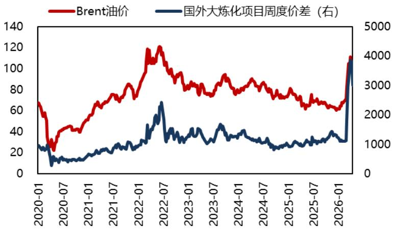

bar-line hybrid chart

| Date     | Brent油价 | 国外大炼化项目周度价差 |
|----------|-----------|------------------------|
| 2020-01  | 65        | 1000                   |
| 2020-07  | 25        | 500                    |
| 2021-01  | 45        | 1000                   |
| 2021-07  | 75        | 1500                   |
| 2022-01  | 115       | 2000                   |
| 2022-07  | 125       | 6500                   |
| 2023-01  | 95        | 3500                   |
| 2023-07  | 85        | 4500                   |
| 2024-01  | 90        | 3500                   |
| 2024-07  | 80        | 3000                   |
| 2025-01  | 75        | 3500                   |
| 2025-07  | 70        | 3500                   |
| 2026-01  | 65        | 3500                   |
| 2026-06  | 115       | 4500                   |

PX、PTA价格及PTA单吨净利润（元/吨，元/吨）  
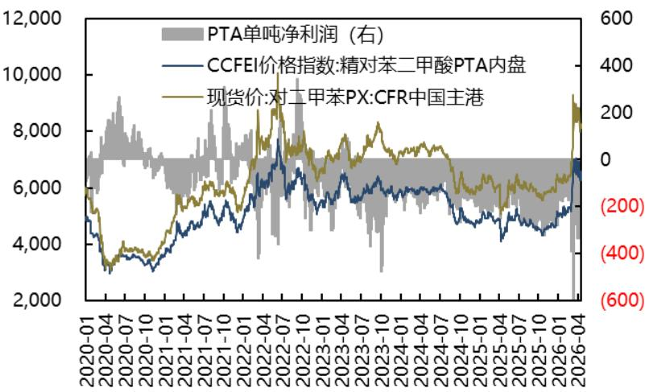

PTA库存（天）  
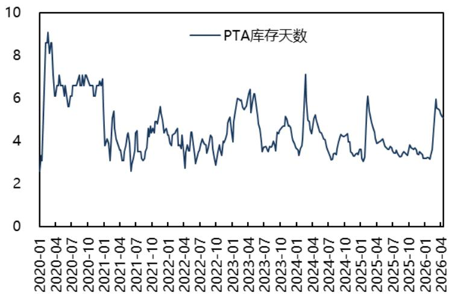

line chart

| Date     | PTA库存天数 |
| -------- | ----------- |
| 2020-01  | 3.0         |
| 2020-04  | 9.0         |
| 2020-07  | 6.5         |
| 2020-10  | 7.0         |
| 2021-01  | 6.8         |
| 2021-04  | 5.5         |
| 2021-07  | 4.5         |
| 2021-10  | 5.0         |
| 2022-01  | 4.8         |
| 2022-04  | 4.2         |
| 2022-07  | 3.8         |
| 2022-10  | 4.5         |
| 2023-01  | 5.5         |
| 2023-04  | 6.0         |
| 2023-07  | 5.8         |
| 2023-10  | 4.5         |
| 2024-01  | 3.5         |
| 2024-04  | 7.0         |
| 2024-07  | 4.5         |
| 2024-10  | 3.8         |
| 2025-01  | 6.0         |
| 2025-04  | 4.5         |
| 2025-07  | 3.8         |
| 2025-10  | 3.5         |
| 2026-01  | 3.8         |
| 2026-04  | 6.0         |

PX、PTA和MEG开工率（%）  
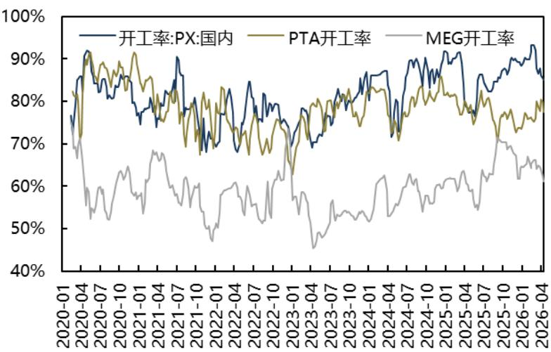

line chart

| Date     | 开工率: PX:国内 | PTA开工率 | MEG开工率 |
|----------|-----------------|-----------|-----------|
| 2020-01  | ~85%            | ~85%      | ~70%      |
| 2020-04  | ~90%            | ~90%      | ~55%      |
| 2020-07  | ~85%            | ~85%      | ~60%      |
| 2020-10  | ~80%            | ~80%      | ~55%      |
| 2021-01  | ~75%            | ~75%      | ~60%      |
| 2021-04  | ~80%            | ~80%      | ~65%      |
| 2021-07  | ~85%            | ~85%      | ~70%      |
| 2021-10  | ~90%            | ~90%      | ~75%      |
| 2022-01  | ~75%            | ~75%      | ~55%      |
| 2022-04  | ~70%            | ~70%      | ~60%      |
| 2022-07  | ~75%            | ~75%      | ~65%      |
| 2022-10  | ~80%            | ~80%      | ~70%      |
| 2023-01  | ~75%            | ~75%      | ~65%      |
| 2023-04  | ~70%            | ~70%      | ~60%      |
| 2023-07  | ~75%            | ~75%      | ~65%      |
| 2023-10  | ~80%            | ~80%      | ~70%      |
| 2024-01  | ~85%            | ~85%      | ~75%      |
| 2024-04  | ~90%            | ~90%      | ~80%      |
| 2024-07  | ~85%            | ~85%      | ~75%      |
| 2024-10  | ~90%            | ~90%      | ~80%      |
| 2025-01  | ~95%            | ~95%      | ~85%      |
| 2025-04  | ~90%            | ~90%      | ~80%      |
| 2025-07  | ~85%            | ~85%      | ~75%      |
| 2025-10  | ~80%            | ~80%      | ~70%      |
| 2026-01  | ~85%            | ~85%      | ~75%      |
| 2026-04  | ~90%            | ~90%      | ~80%      |

MEG价格和华东MEG库存（元/吨，万吨）  
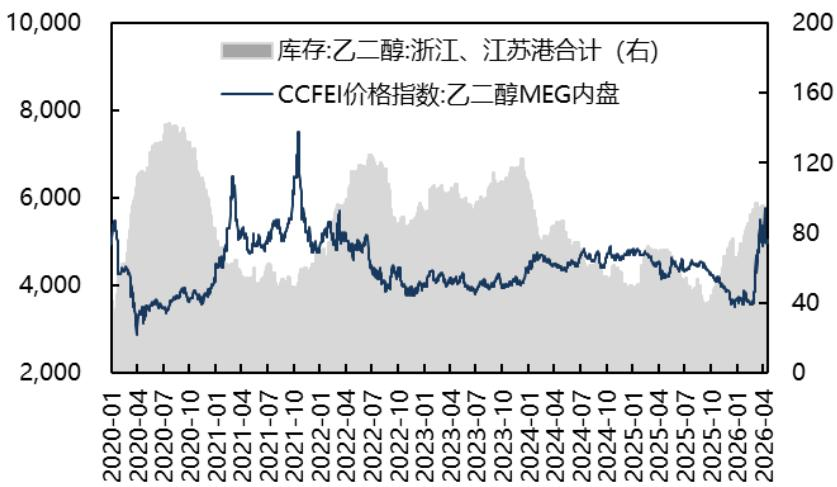

bar-line hybrid chart

| Date       | 库存:乙二醇:浙江、江苏港合计 (右) | CCFEI价格指数:乙二醇MEG内盘 |
| ---------- | ------------------------------ | -------------------------- |
| 2020-01    | ~7,500                         | ~5500                      |
| 2020-04    | ~3,000                         | ~3000                      |
| 2020-07    | ~7,500                         | ~4000                      |
| 2020-10    | ~7,800                         | ~4500                      |
| 2021-01    | ~6,500                         | ~5000                      |
| 2021-04    | ~5,500                         | ~6500                      |
| 2021-07    | ~5,800                         | ~7500                      |
| 2021-10    | ~6,800                         | ~7800                      |
| 2022-01    | ~5,500                         | ~5500                      |
| 2022-04    | ~6,800                         | ~5800                      |
| 2022-07    | ~6,500                         | ~5500                      |
| 2022-10    | ~6,800                         | ~5800                      |
| 2023-01    | ~6,500                         | ~5500                      |
| 2023-04    | ~6,800                         | ~5800                      |
| 2023-07    | ~6,500                         | ~5500                      |
| 2023-10    | ~6,800                         | ~5800                      |
| 2024-01    | ~6,500                         | ~5500                      |
| 2024-04    | ~6,800                         | ~5800                      |
| 2024-07    | ~6,500                         | ~5500                      |
| 2024-10    | ~6,800                         | ~5800                      |
| 2025-01    | ~6,500                         | ~5500                      |
| 2025-04    | ~6,800                         | ~5800                      |
| 2025-07    | ~6,500                         | ~5500                      |
| 2025-10    | ~6,800                         | ~5800                      |
| 2026-01    | ~6,500                         | ~5500                      |
| 2026-04    | ~6,800                         | ~5800                      |

POY价格及POY单吨净利润（元/吨，元/吨）  
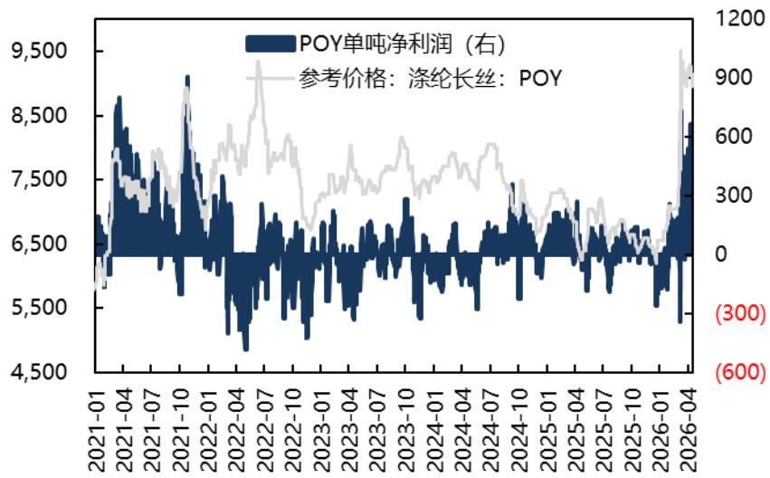

bar-line hybrid chart

| Date     | POY单吨净利润 (右) | 参考价格: 涤纶长丝: POY |
|----------|---------------------|------------------------|
| 2021-01  | ~6,500              | ~300                   |
| 2021-04  | ~8,500              | ~600                   |
| 2021-07  | ~7,500              | ~400                   |
| 2021-10  | ~9,500              | ~800                   |
| 2022-01  | ~6,500              | ~300                   |
| 2022-04  | ~4,500              | ~100                   |
| 2022-07  | ~6,500              | ~500                   |
| 2022-10  | ~6,500              | ~400                   |
| 2023-01  | ~6,500              | ~300                   |
| 2023-04  | ~6,500              | ~400                   |
| 2023-07  | ~6,500              | ~500                   |
| 2023-10  | ~6,500              | ~600                   |
| 2024-01  | ~6,500              | ~700                   |
| 2024-04  | ~6,500              | ~800                   |
| 2024-07  | ~6,500              | ~900                   |
| 2024-10  | ~6,500              | ~1,000                 |
| 2025-01  | ~6,500              | ~1,100                 |
| 2025-04  | ~6,500              | ~1,200                 |
| 2025-07  | ~6,500              | ~1,300                 |
| 2025-10  | ~6,500              | ~1,400                 |
| 2026-01  | ~6,500              | ~1,500                 |
| 2026-04  | ~9,500              | ~1,600                 |

0.86吨PTA +1吨POY净利润（元/吨）  
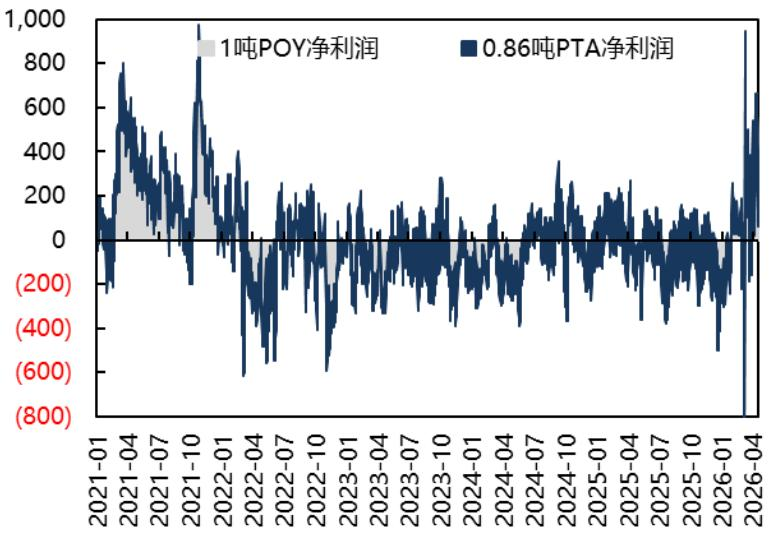

line chart

| Date     | 1吨POY净利润 | 0.86吨PTA净利润 |
|----------|---------------|------------------|
| 2021-01  | -             | -                |
| 2021-04  | -             | -                |
| 2021-07  | -             | -                |
| 2021-10  | -             | -                |
| 2022-01  | -             | -                |
| 2022-04  | -             | -                |
| 2022-07  | -             | -                |
| 2022-10  | -             | -                |
| 2023-01  | -             | -                |
| 2023-04  | -             | -                |
| 2023-07  | -             | -                |
| 2023-10  | -             | -                |
| 2024-01  | -             | -                |
| 2024-04  | -             | -                |
| 2024-07  | -             | -                |
| 2024-10  | -             | -                |
| 2025-01  | -             | -                |
| 2025-04  | -             | -                |
| 2025-07  | -             | -                |
| 2025-10  | -             | -                |
| 2026-01  | -             | -                |
| 2026-04  | -             | -                |

FDY价格及FDY单吨净利润（元/吨，元/吨）  
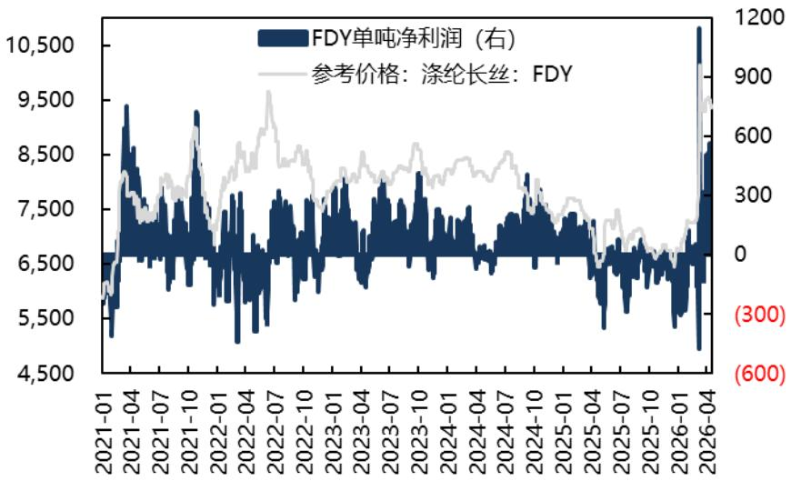

bar-line hybrid chart

| Date     | FDY单吨净利润 (右) | 参考价格：涤纶长丝：FDY |
|----------|---------------------|------------------------|
| 2021-01  | ~6,500              | ~300                   |
| 2021-04  | ~9,500              | ~400                   |
| 2021-07  | ~7,500              | ~350                   |
| 2021-10  | ~8,500              | ~450                   |
| 2022-01  | ~6,500              | ~300                   |
| 2022-04  | ~7,500              | ~500                   |
| 2022-07  | ~9,500              | ~600                   |
| 2022-10  | ~7,500              | ~450                   |
| 2023-01  | ~7,500              | ~450                   |
| 2023-04  | ~7,500              | ~450                   |
| 2023-07  | ~7,500              | ~450                   |
| 2023-10  | ~7,500              | ~450                   |
| 2024-01  | ~7,500              | ~450                   |
| 2024-04  | ~7,500              | ~450                   |
| 2024-07  | ~7,500              | ~450                   |
| 2024-10  | ~7,500              | ~450                   |
| 2025-01  | ~7,500              | ~450                   |
| 2025-04  | ~6,500              | ~350                   |
| 2025-07  | ~6,500              | ~350                   |
| 2025-10  | ~6,500              | ~350                   |
| 2026-01  | ~6,500              | ~350                   |
| 2026-04  | ~11,500             | ~950                   |

0.86吨PTA + 1吨FDY净利润（元/吨）  
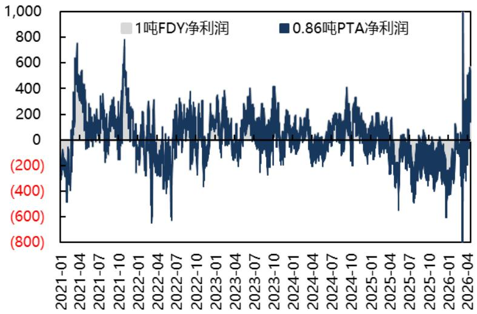

line chart

| Date     | 1吨FDY净利润 | 0.86吨PTA净利润 |
|----------|---------------|------------------|
| 2021-01  | (200)         | (200)            |
| 2021-04  | (200)         | (750)            |
| 2021-07  | (200)         | (300)            |
| 2021-10  | (200)         | (800)            |
| 2022-01  | (200)         | (350)            |
| 2022-04  | (200)         | (650)            |
| 2022-07  | (200)         | (350)            |
| 2022-10  | (200)         | (350)            |
| 2023-01  | (200)         | (350)            |
| 2023-04  | (200)         | (350)            |
| 2023-07  | (200)         | (350)            |
| 2023-10  | (200)         | (450)            |
| 2024-01  | (200)         | (350)            |
| 2024-04  | (200)         | (350)            |
| 2024-07  | (200)         | (350)            |
| 2024-10  | (200)         | (350)            |
| 2025-01  | (200)         | (350)            |
| 2025-04  | (200)         | (350)            |
| 2025-07  | (200)         | (350)            |
| 2025-10  | (200)         | (350)            |
| 2026-01  | (200)         | (350)            |
| 2026-04  | (200)         | (950)            |

DTY价格及DTY单吨净利润（元/吨，元/吨）  
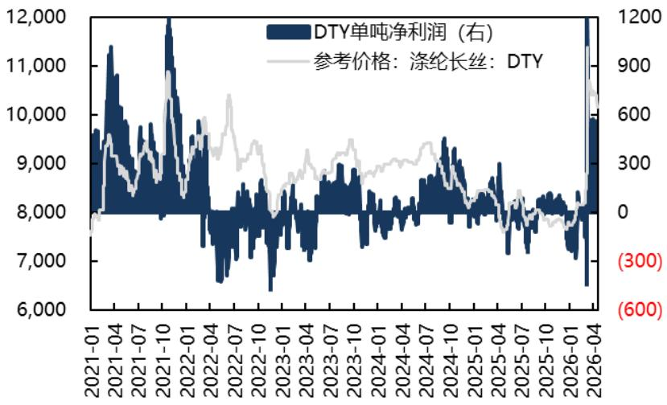

bar-line hybrid chart

| Date     | DTY单吨净利润 (右) | 参考价格: 涤纶长丝: DTY |
|----------|---------------------|------------------------|
| 2021-01  | ~9,500              | ~800                   |
| 2021-04  | ~11,500             | ~900                   |
| 2021-07  | ~9,000              | ~700                   |
| 2021-10  | ~12,000             | ~1000                  |
| 2022-01  | ~8,500              | ~600                   |
| 2022-04  | ~9,500              | ~800                   |
| 2022-07  | ~8,500              | ~700                   |
| 2022-10  | ~8,500              | ~600                   |
| 2023-01  | ~6,500              | ~500                   |
| 2023-04  | ~8,500              | ~600                   |
| 2023-07  | ~9,500              | ~700                   |
| 2023-10  | ~8,500              | ~600                   |
| 2024-01  | ~8,500              | ~500                   |
| 2024-04  | ~8,500              | ~400                   |
| 2024-07  | ~9,500              | ~500                   |
| 2024-10  | ~9,500              | ~600                   |
| 2025-01  | ~8,500              | ~500                   |
| 2025-04  | ~8,500              | ~400                   |
| 2025-07  | ~8,500              | ~300                   |
| 2025-10  | ~8,500              | ~200                   |
| 2026-01  | ~7,500              | ~150                   |
| 2026-04  | ~11,500             | ~11,50                 |

0.86吨PTA + 1吨DTY净利润（元/吨）  
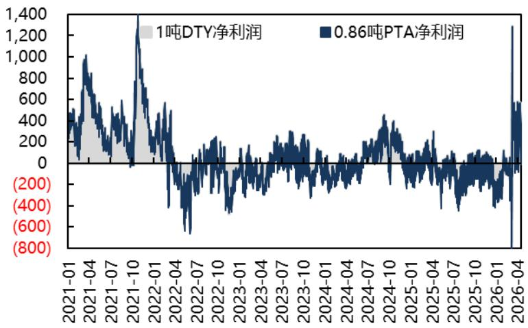

line chart

| Date     | 1吨DTY净利润 | 0.86吨PTA净利润 |
|----------|---------------|------------------|
| 2021-01  | -             | -                |
| 2021-04  | -             | -                |
| 2021-07  | -             | -                |
| 2021-10  | -             | -                |
| 2022-01  | -             | -                |
| 2022-04  | -             | -                |
| 2022-07  | -             | -                |
| 2022-10  | -             | -                |
| 2023-01  | -             | -                |
| 2023-04  | -             | -                |
| 2023-07  | -             | -                |
| 2023-10  | -             | -                |
| 2024-01  | -             | -                |
| 2024-04  | -             | -                |
| 2024-07  | -             | -                |
| 2024-10  | -             | -                |
| 2025-01  | -             | -                |
| 2025-04  | -             | -                |
| 2025-07  | -             | -                |
| 2025-10  | -             | -                |
| 2026-01  | -             | -                |
| 2026-04  | -             | -                |

江浙地区涤纶长丝产销率（%）  
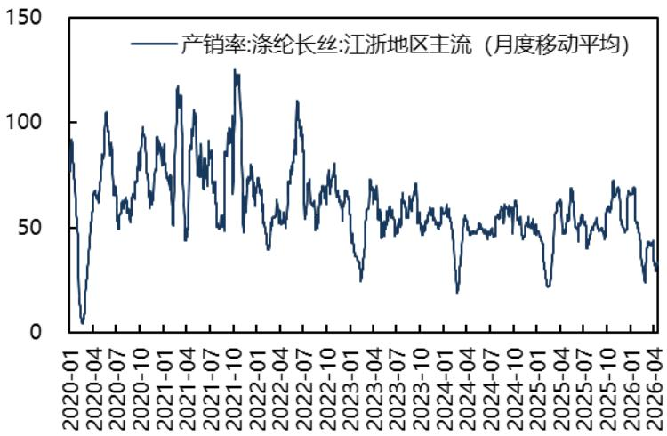

line chart

| Date     | 产销率:涤纶长丝:江浙地区主流 (月度移动平均) |
| -------- | ------------------------------------------ |
| 2020-01  | ~90                                        |
| 2020-04  | ~5                                         |
| 2020-07  | ~100                                       |
| 2020-10  | ~60                                        |
| 2021-01  | ~90                                        |
| 2021-04  | ~110                                       |
| 2021-07  | ~80                                        |
| 2021-10  | ~120                                       |
| 2022-01  | ~70                                        |
| 2022-04  | ~50                                        |
| 2022-07  | ~110                                       |
| 2022-10  | ~70                                        |
| 2023-01  | ~50                                        |
| 2023-04  | ~70                                        |
| 2023-07  | ~60                                        |
| 2023-10  | ~50                                        |
| 2024-01  | ~20                                        |
| 2024-04  | ~50                                        |
| 2024-07  | ~60                                        |
| 2024-10  | ~50                                        |
| 2025-01  | ~40                                        |
| 2025-04  | ~60                                        |
| 2025-07  | ~50                                        |
| 2025-10  | ~70                                        |
| 2026-01  | ~60                                        |
| 2026-04  | ~30                                        |

涤纶长丝产销率全年分布（农历、%）  
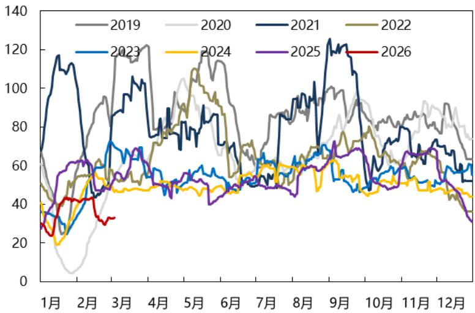

line chart

| Month | 2019 | 2020 | 2021 | 2022 | 2023 | 2024 | 2025 | 2026 |
| --- | --- | --- | --- | --- | --- | --- | --- | --- |
| 1月 |  |  |  |  |  |  |  |  |
| 2月 |  |  |  |  |  |  |  |  |
| 3月 |  |  |  |  |  |  |  |  |
| 4月 |  |  |  |  |  |  |  |  |
| 5月 |  |  |  |  |  |  |  |  |
| 6月 |  |  |  |  |  |  |  |  |
| 7月 |  |  |  |  |  |  |  |  |
| 8月 |  |  |  |  |  |  |  |  |
| 9月 |  |  |  |  |  |  |  |  |
| 10月 |  |  |  |  |  |  |  |  |
| 11月 |  |  |  |  |  |  |  |  |
| 12月 |  |  |  |  |  |  |  |  |

涤纶长丝与下游织机开工率（公历、%）  
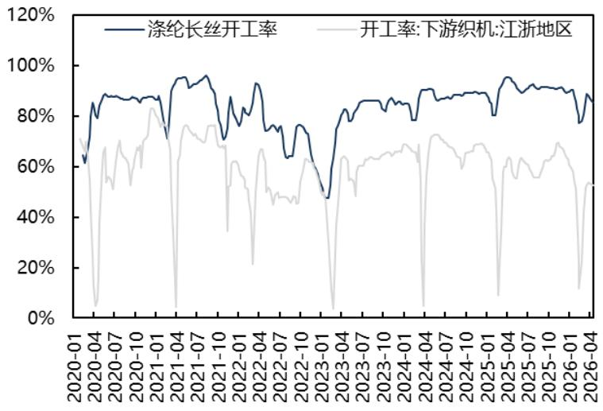

line chart

| Date     | 涤纶长丝开工率 | 开工率:下游织机:江浙地区 |
|----------|----------------|--------------------------|
| 2020-01  | ~60%           | ~5%                      |
| 2020-04  | ~85%           | ~70%                     |
| 2020-07  | ~88%           | ~65%                     |
| 2020-10  | ~87%           | ~75%                     |
| 2021-01  | ~85%           | ~60%                     |
| 2021-04  | ~95%           | ~75%                     |
| 2021-07  | ~98%           | ~70%                     |
| 2021-10  | ~95%           | ~65%                     |
| 2022-01  | ~85%           | ~55%                     |
| 2022-04  | ~90%           | ~60%                     |
| 2022-07  | ~85%           | ~55%                     |
| 2022-10  | ~75%           | ~50%                     |
| 2023-01  | ~65%           | ~45%                     |
| 2023-04  | ~45%           | ~30%                     |
| 2023-07  | ~80%           | ~65%                     |
| 2023-10  | ~85%           | ~70%                     |
| 2024-01  | ~88%           | ~75%                     |
| 2024-04  | ~90%           | ~70%                     |
| 2024-07  | ~88%           | ~65%                     |
| 2024-10  | ~85%           | ~60%                     |
| 2025-01  | ~88%           | ~65%                     |
| 2025-04  | ~95%           | ~70%                     |
| 2025-07  | ~98%           | ~75%                     |
| 2025-10  | ~95%           | ~70%                     |
| 2026-01  | ~90%           | ~65%                     |
| 2026-04  | ~85%           | ~60%                     |

涤纶长丝开工率全年分布（农历、%）  
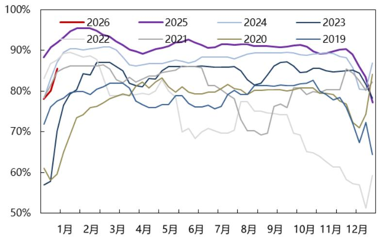

line chart

| Month | 2026 | 2025 | 2024 | 2023 | 2022 | 2021 | 2020 | 2019 |
| --- | --- | --- | --- | --- | --- | --- | --- | --- |
| 1月 | 78% | 88% | 85% | 85% | 85% | 85% | 60% | 70% |
| 2月 |  | 95% | 90% |  |  |  |  |  |
| 3月 |  | 93% | 88% |  |  |  |  |  |
| 4月 |  | 90% | 85% |  |  |  |  |  |
| 5月 |  | 92% | 87% |  |  |  |  |  |
| 6月 |  | 91% | 86% |  |  |  |  |  |
| 7月 |  | 90% | 85% |  |  |  |  |  |
| 8月 |  | 91% | 86% |  |  |  |  |  |
| 9月 |  | 90% | 85% |  |  |  |  |  |
| 10月 |  | 91% | 86% |  |  |  |  |  |
| 11月 |  | 90% | 85% |  |  |  |  |  |
| 12月 |  | 78% | 80% |  |  |  |  |  |
|  |  |  |  |  |  |  |  |  |
|  |  |  |  |  |  |  |  |  |
|  |  |  |  |  |  |  |  |  |
|  |  |  |  |  |  |  |  |  |
|  |  |  |  |  |  |  |  |  |

下游织机开工率全年分布（农历、%）  
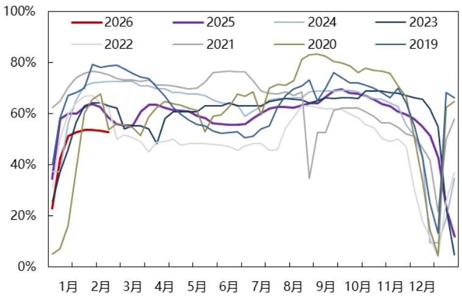

line chart

| Month | 2026 | 2025 | 2024 | 2023 | 2022 | 2021 | 2020 | 2019 |
|-------|------|------|------|------|------|------|------|------|
| 1月   | 25%  | 60%  | 65%  | 60%  | 65%  | 60%  | 5%   | 65%  |
| 2月   | 55%  | 65%  | 70%  | 75%  | 70%  | 65%  | 60%  | 80%  |
| 3月   | 50%  | 60%  | 75%  | 70%  | 65%  | 60%  | 55%  | 75%  |
| 4月   | 55%  | 65%  | 70%  | 65%  | 60%  | 55%  | 60%  | 70%  |
| 5月   | 60%  | 60%  | 65%  | 60%  | 55%  | 50%  | 55%  | 65%  |
| 6月   | 65%  | 55%  | 60%  | 55%  | 50%  | 45%  | 60%  | 60%  |
| 7月   | 70%  | 55%  | 65%  | 60%  | 45%  | 40%  | 65%  | 65%  |
| 8月   | 75%  | 60%  | 70%  | 65%  | 40%  | 35%  | 70%  | 70%  |
| 9月   | -    | -    | -    | -    | -    | -    | -    | -    |
| 10月  | -    | -    | -    | -    | -    | -    | -    | -    |
| 11月  | -    | -    | -    | -    | -    | -    | -    | -    |
| 12月  | -    | -    | -    | -    | -    | -    | -    | -    |
| End   | -    | -    | -    | -    | -    | -    | -    | -    |

聚酯企业的涤纶长丝库存天数（公历、天）  
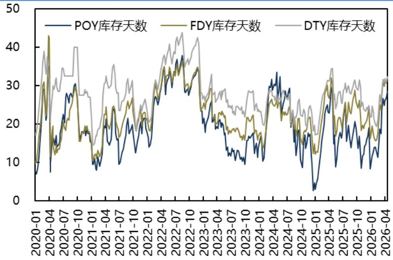

line chart

| Date     | POY库存天数 | FDY库存天数 | DTY库存天数 |
|----------|-------------|-------------|-------------|
| 2020-01  | 5           | 10          | 8           |
| 2020-04  | 15          | 20          | 25          |
| 2020-07  | 25          | 30          | 35          |
| 2020-10  | 30          | 35          | 40          |
| 2021-01  | 10          | 15          | 20          |
| 2021-04  | 15          | 20          | 25          |
| 2021-07  | 20          | 25          | 30          |
| 2021-10  | 25          | 30          | 35          |
| 2022-01  | 30          | 35          | 40          |
| 2022-04  | 35          | 40          | 45          |
| 2022-07  | 40          | 45          | 50          |
| 2022-10  | 35          | 40          | 45          |
| 2023-01  | 30          | 35          | 40          |
| 2023-04  | 25          | 30          | 35          |
| 2023-07  | 20          | 25          | 30          |
| 2023-10  | 15          | 20          | 25          |
| 2024-01  | 10          | 15          | 20          |
| 2024-04  | 15          | 20          | 25          |
| 2024-07  | 20          | 25          | 30          |
| 2024-10  | 25          | 30          | 35          |
| 2025-01  | 3           | 15          | 20          |
| 2025-04  | 15          | 20          | 25          |
| 2025-07  | 20          | 25          | 30          |
| 2025-10  | 25          | 30          | 35          |
| 2026-01  | 3           | 15          | 20          |
| 2026-04  | 15          | 20          | 25          |

POY库存天数全年分布（农历、天）  
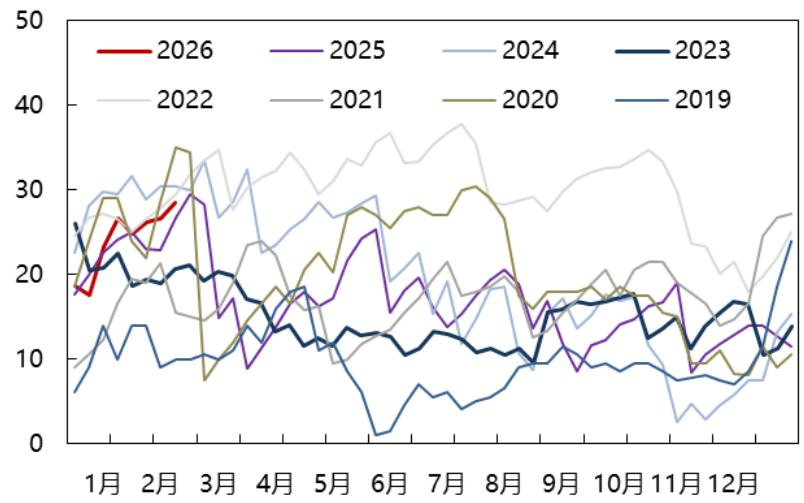

line chart

| Month | 2019 | 2020 | 2021 | 2022 | 2023 | 2024 | 2025 | 2026 |
|-------|------|------|------|------|------|------|------|------|
| 1月   | 6    | 18   | 10   | 15   | 25   | 30   | 20   | 18   |
| 2月   | 10   | 35   | 15   | 20   | 20   | 30   | 30   | 25   |
| 3月   | 8    | 10   | 10   | 15   | 15   | 35   | 30   | 30   |
| 4月   | 10   | 15   | 15   | 20   | 15   | 30   | 15   | 20   |
| 5月   | 12   | 20   | 20   | 25   | 15   | 35   | 25   | 25   |
| 6月   | 5    | 25   | 25   | 30   | 15   | 30   | 25   | 30   |
| 7月   | 10   | 30   | 30   | 35   | 15   | 35   | 30   | 35   |
| 8月   | 15   | 35   | 35   | 30   | 15   | 30   | 35   | 30   |
| 9月   | 10   | 30   | 30   | 25   | 15   | 25   | 30   | 25   |
| 10月  | 15   | 25   | 25   | 20   | 15   | 20   | 25   | 20   |
| 11月  | 10   | 20   | 20   | 15   | 15   | 15   | 20   | 15   |
| 12月  | 15   | 15   | 15   | 10   | 15   | 10   | 15   | 10   |

FDY库存天数全年分布（农历、天）  
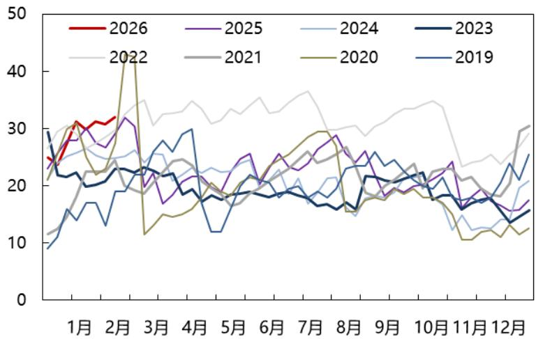

line chart

| Month | 2026 | 2025 | 2024 | 2023 | 2022 | 2021 | 2020 | 2019 |
| --- | --- | --- | --- | --- | --- | --- | --- | --- |
| 1月 |  |  |  |  |  |  |  |  |
| 2月 |  |  |  |  |  |  |  |  |
| 3月 |  |  |  |  |  |  |  |  |
| 4月 |  |  |  |  |  |  |  |  |
| 5月 |  |  |  |  |  |  |  |  |
| 6月 |  |  |  |  |  |  |  |  |
| 7月 |  |  |  |  |  |  |  |  |
| 8月 |  |  |  |  |  |  |  |  |
| 9月 |  |  |  |  |  |  |  |  |
| 10月 |  |  |  |  |  |  |  |  |
| 11月 |  |  |  |  |  |  |  |  |
| 12月 |  |  |  |  |  |  |  |  |

DTY库存天数全年分布（农历、天）  
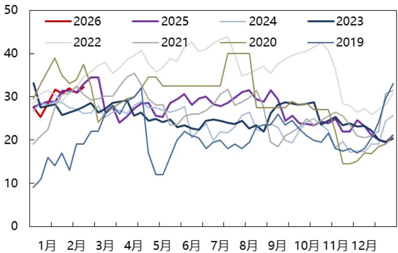

line chart

| Month | 2026 | 2025 | 2024 | 2023 | 2022 | 2021 | 2020 | 2019 |
| --- | --- | --- | --- | --- | --- | --- | --- | --- |
| 1月 | 28 | 29 | 27 | 33 | 28 | 29 | 39 | 9 |
| 2月 | 31 | 34 | 28 | 29 | 30 | 31 | 37 | 15 |
| 3月 | 32 | 35 | 29 | 28 | 31 | 32 | 36 | 18 |
| 4月 | 31 | 33 | 28 | 27 | 30 | 31 | 35 | 12 |
| 5月 | 30 | 32 | 27 | 26 | 29 | 30 | 34 | 11 |
| 6月 | 31 | 33 | 28 | 27 | 30 | 31 | 35 | 19 |
| 7月 | 32 | 34 | 29 | 28 | 31 | 32 | 40 | 18 |
| 8月 | 31 | 35 | 30 | 29 | 32 | 33 | 40 | 17 |
| 9月 | 30 | 34 | 29 | 28 | 31 | 32 | 29 | 16 |
| 10月 | 29 | 33 | 28 | 27 | 30 | 31 | 28 | 15 |
| 11月 | 28 | 32 | 27 | 26 | 29 | 30 | 15 | 14 |
| 12月 | 27 | 31 | 26 | 25 | 28 | 29 | 14 | 13 |
|  |  |  |  |  |  |  |  |  |
|  |  |  |  |  |  |  |  |  |
|  |  |  |  |  |  |  |  |  |
|  |  |  |  |  |  |  |  |  |
|  |  |  |  |  |  |  |  |  |
|  |  |  |  |  |  |  |  |  |
|  |  |  |  |  |  |  |  |  |
|  |  |  |  |  |  |  |  |  |
|  |  |  |  |  |  |  |  |  |
|  |  |  |  |  |  |  |  |  |
|  |  |  |  |  |  |  |  |  |

涤纶短纤价格及涤纶短纤单吨净利润（元/吨，元/吨）  
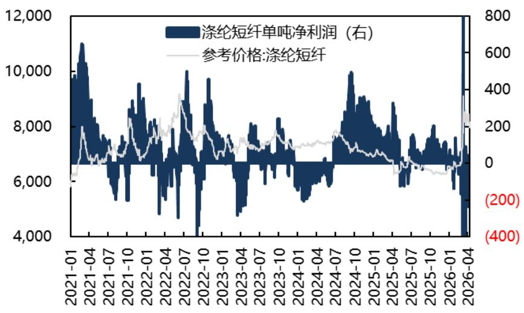

bar-line hybrid chart

| Date     | 涤纶短纤单吨净利润 (右) | 参考价格:涤纶短纤 |
|----------|--------------------------|-------------------|
| 2021-01  | ~10,000                  | ~600              |
| 2021-04  | ~11,000                  | ~700              |
| 2021-07  | ~8,000                   | ~500              |
| 2021-10  | ~9,000                   | ~650              |
| 2022-01  | ~8,500                   | ~750              |
| 2022-04  | ~9,500                   | ~850              |
| 2022-07  | ~10,000                  | ~950              |
| 2022-10  | ~9,500                   | ~850              |
| 2023-01  | ~8,500                   | ~750              |
| 2023-04  | ~8,000                   | ~700              |
| 2023-07  | ~8,500                   | ~750              |
| 2023-10  | ~8,500                   | ~750              |
| 2024-01  | ~8,500                   | ~750              |
| 2024-04  | ~8,500                   | ~750              |
| 2024-07  | ~9,500                   | ~750              |
| 2024-10  | ~10,500                  | ~750              |
| 2025-01  | ~9,500                   | ~750              |
| 2025-04  | ~9,500                   | ~750              |
| 2025-07  | ~8,500                   | ~750              |
| 2025-10  | ~8,500                   | ~750              |
| 2026-01  | ~8,500                   | ~750              |
| 2026-04  | ~8,500                   | ~750              |

0.86吨PTA + 1吨涤纶短纤净利润（元/吨）  
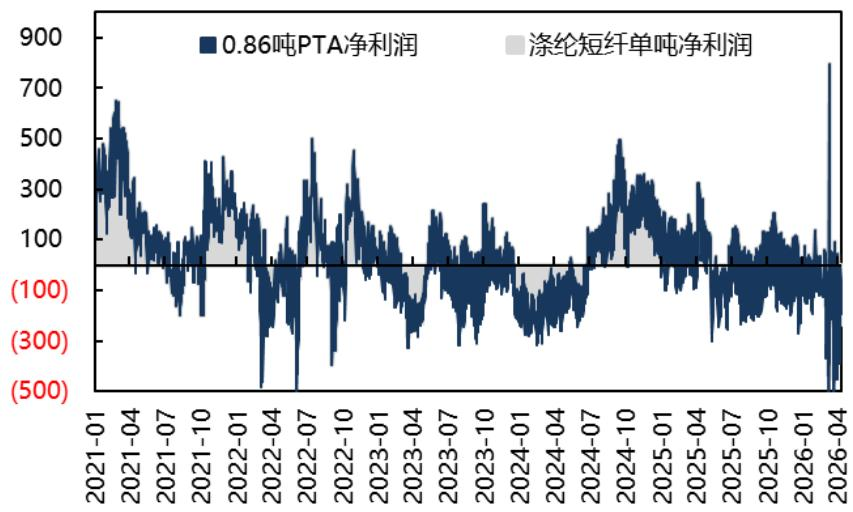

area chart

| Date     | 0.86吨PTA净利润 | 涤纶短纤单吨净利润 |
|----------|------------------|---------------------|
| 2021-01  | ~700             | ~100                |
| 2021-04  | ~500             | ~100                |
| 2021-07  | ~300             | ~100                |
| 2021-10  | ~400             | ~100                |
| 2022-01  | ~350             | ~100                |
| 2022-04  | ~50              | ~100                |
| 2022-07  | ~50              | ~100                |
| 2022-10  | ~450             | ~100                |
| 2023-01  | ~350             | ~100                |
| 2023-04  | ~300             | ~100                |
| 2023-07  | ~350             | ~100                |
| 2023-10  | ~350             | ~100                |
| 2024-01  | ~350             | ~100                |
| 2024-04  | ~350             | ~100                |
| 2024-07  | ~50              | ~100                |
| 2024-10  | ~550             | ~150                |
| 2025-01  | ~350             | ~150                |
| 2025-04  | ~350             | ~150                |
| 2025-07  | ~350             | ~150                |
| 2025-10  | ~350             | ~150                |
| 2026-01  | ~350             | ~150                |
| 2026-04  | ~950             | ~150                |

涤纶短纤开工率（%）  
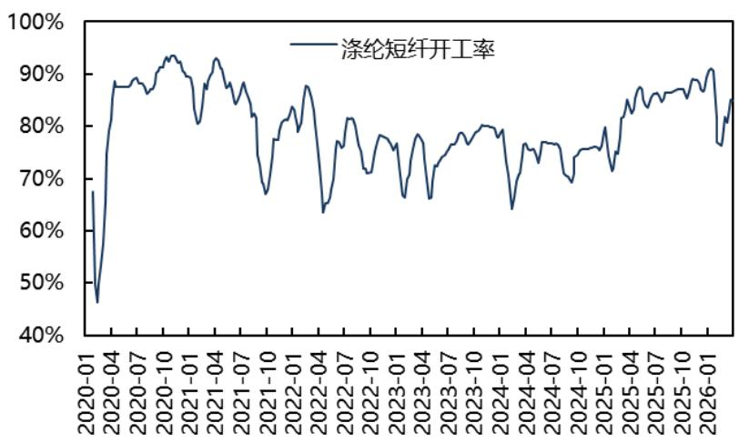

line chart

| Date     | 涤纶短纤开工率 |
| -------- | -------------- |
| 2020-01  | 68%            |
| 2020-04  | 47%            |
| 2020-07  | 88%            |
| 2020-10  | 93%            |
| 2021-01  | 81%            |
| 2021-04  | 92%            |
| 2021-07  | 85%            |
| 2021-10  | 68%            |
| 2022-01  | 83%            |
| 2022-04  | 64%            |
| 2022-07  | 81%            |
| 2022-10  | 71%            |
| 2023-01  | 78%            |
| 2023-04  | 67%            |
| 2023-07  | 79%            |
| 2023-10  | 80%            |
| 2024-01  | 65%            |
| 2024-04  | 76%            |
| 2024-07  | 75%            |
| 2024-10  | 73%            |
| 2025-01  | 77%            |
| 2025-04  | 85%            |
| 2025-07  | 87%            |
| 2025-10  | 89%            |
| 2026-01  | 85%            |

聚酯企业的涤纶短纤库存天数（天）  
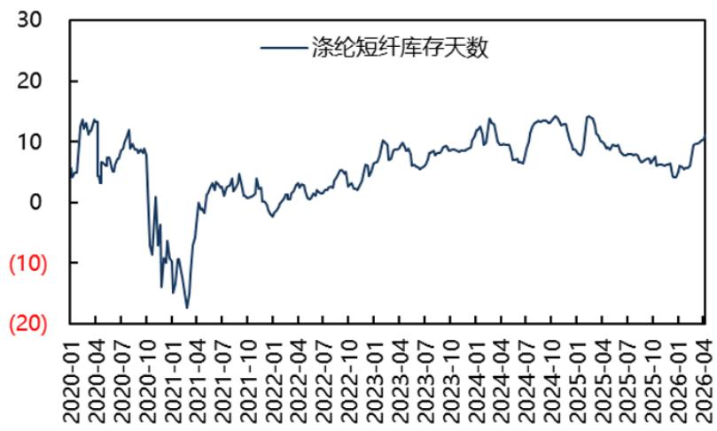

line chart

| Date     | 涤纶短纤库存天数 |
| -------- | ---------------- |
| 2020-01  | ~13              |
| 2020-04  | ~12              |
| 2020-07  | ~8               |
| 2020-10  | ~-5              |
| 2021-01  | ~-15             |
| 2021-04  | ~-25             |
| 2021-07  | ~3               |
| 2021-10  | ~5               |
| 2022-01  | ~3               |
| 2022-04  | ~5               |
| 2022-07  | ~7               |
| 2022-10  | ~9               |
| 2023-01  | ~10              |
| 2023-04  | ~11              |
| 2023-07  | ~10              |
| 2023-10  | ~12              |
| 2024-01  | ~13              |
| 2024-04  | ~14              |
| 2024-07  | ~13              |
| 2024-10  | ~14              |
| 2025-01  | ~13              |
| 2025-04  | ~14              |
| 2025-07  | ~13              |
| 2025-10  | ~12              |
| 2026-01  | ~11              |
| 2026-04  | ~13              |

MEG、PTA价格及聚酯瓶片单吨净利润（元/吨，元/吨）  
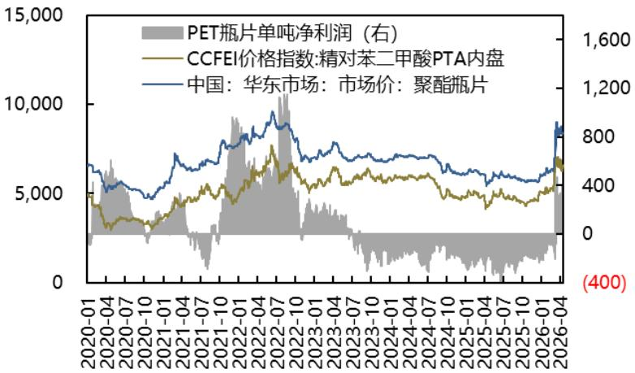

bar-line hybrid chart

| Date     | PET瓶片单吨净利润 (右) | CCFEI价格指数:精对苯二甲酸PTA内盘 | 中国：华东市场：市场价：聚酯瓶片 |
|----------|--------------------------|----------------------------------|----------------------------------|
| 2020-01  | ~3,000                   | ~400                             | ~6,000                           |
| 2020-04  | ~4,000                   | ~300                             | ~5,500                           |
| 2020-07  | ~3,500                   | ~250                             | ~5,000                           |
| 2020-10  | ~3,000                   | ~200                             | ~4,500                           |
| 2021-01  | ~3,500                   | ~250                             | ~5,500                           |
| 2021-04  | ~4,500                   | ~350                             | ~6,500                           |
| 2021-07  | ~5,500                   | ~450                             | ~7,500                           |
| 2021-10  | ~6,500                   | ~550                             | ~8,500                           |
| 2022-01  | ~7,500                   | ~650                             | ~9,500                           |
| 2022-04  | ~8,500                   | ~750                             | ~10,500                          |
| 2022-07  | ~9,500                   | ~850                             | ~11,500                          |
| 2022-10  | ~10,500                  | ~950                             | ~12,500                          |
| 2023-01  | ~9,500                   | ~850                             | ~11,500                          |
| 2023-04  | ~8,500                   | ~750                             | ~10,500                          |
| 2023-07  | ~7,500                   | ~650                             | ~9,500                           |
| 2023-10  | ~6,500                   | ~550                             | ~8,500                           |
| 2024-01  | ~5,500                   | ~450                             | ~7,500                           |
| 2024-04  | ~4,500                   | ~350                             | ~6,500                           |
| 2024-07  | ~3,500                   | ~250                             | ~5,500                           |
| 2024-10  | ~2,500                   | ~150                             | ~4,500                           |
| 2025-01  | ~1,500                   | ~50                              | ~3,500                           |
| 2025-04  | ~5,50                    | ~1,5                              | ~4,5                              |
| 2025-07  | ~1,5                      | ~-1                               | ~5                               |
| 2025-10  | ~-1                      | -2                               | ~6                               |
| 2026-01  | ~-3                      | -3                               | ~7                               |
| 2026-04  | ~-4                      | -4                               | ~8                               |

0.86吨PTA+1吨聚酯瓶片净利润（元/吨）  
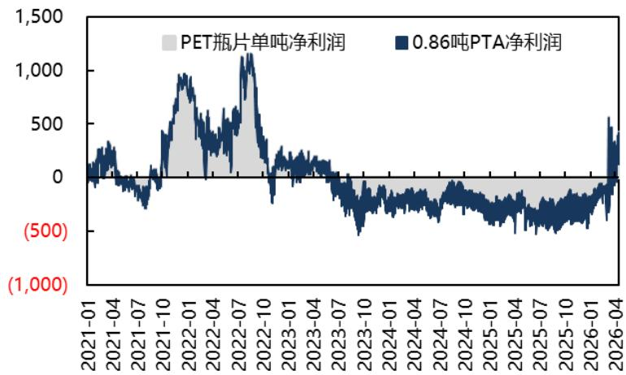

line chart

| Date     | PET瓶片单吨净利润 | 0.86吨PTA净利润 |
|----------|-------------------|-----------------|
| 2021-01  | ~0                | ~0              |
| 2021-04  | ~0                | ~0              |
| 2021-07  | ~0                | ~0              |
| 2021-10  | ~0                | ~0              |
| 2022-01  | ~1,000            | ~1,000          |
| 2022-04  | ~500              | ~500            |
| 2022-07  | ~1,000            | ~1,000          |
| 2022-10  | ~500              | ~500            |
| 2023-01  | ~0                | ~0              |
| 2023-04  | ~0                | ~0              |
| 2023-07  | ~0                | ~0              |
| 2023-10  | ~-500             | ~-500           |
| 2024-01  | ~-500             | ~-500           |
| 2024-04  | ~-500             | ~-500           |
| 2024-07  | ~-500             | ~-500           |
| 2024-10  | ~-500             | ~-500           |
| 2025-01  | ~-500             | ~-500           |
| 2025-04  | ~-500             | ~-500           |
| 2025-07  | ~-500             | ~-500           |
| 2025-10  | ~-500             | ~-500           |
| 2026-01  | ~-500             | ~-500           |
| 2026-04  | ~+500             | ~+500           |

中国纯MDI、聚合MDI、TDI价格走势（元/吨）  
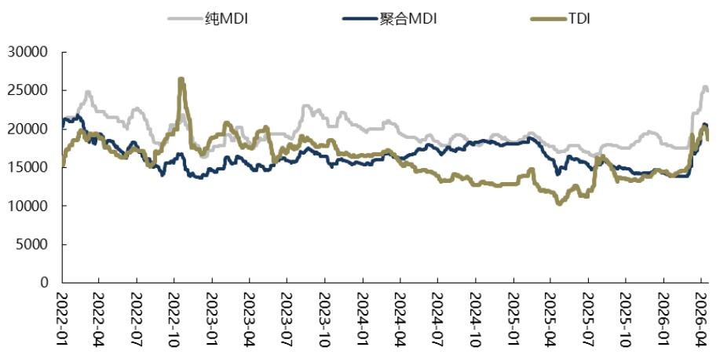

line chart

| Date     | 纯MDI  | 聚合MDI | TDI    |
|----------|--------|---------|--------|
| 2022-01  | 21000  | 20000   | 18000  |
| 2022-04  | 24000  | 19000   | 19500  |
| 2022-07  | 23000  | 18000   | 18500  |
| 2022-10  | 26000  | 17000   | 27000  |
| 2023-01  | 19000  | 16000   | 19500  |
| 2023-04  | 20000  | 17000   | 21000  |
| 2023-07  | 23000  | 18000   | 19500  |
| 2023-10  | 22000  | 17500   | 18500  |
| 2024-01  | 21500  | 17500   | 18500  |
| 2024-04  | 21500  | 17500   | 18500  |
| 2024-07  | 21500  | 17500   | 18500  |
| 2024-10  | 21500  | 17500   | 18500  |
| 2025-01  | 21500  | 17500   | 18500  |
| 2025-04  | 19500  | 16500   | 14500  |
| 2025-07  | 18500  | 16500   | 13500  |
| 2025-10  | 19500  | 16500   | 14500  |
| 2026-01  | 19500  | 16500   | 14500  |
| 2026-04  | 25500  | 21500   | 19500  |

中国纯MDI价格及价差（元/吨，元/吨）  
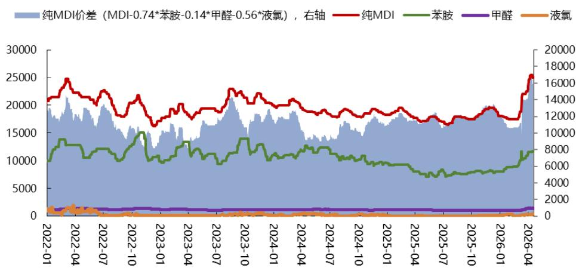

area chart

| Date     | 纯MDI价差 (MDI-0.74*苯胺-0.14*甲醛-0.56*液氯) | 纯MDI | 苯胺 | 甲醛 | 液氯 |
|----------|---------------------------------------------|-------|------|------|------|
| 2022-01  | ~18000                                      | ~21000| ~10000 | ~1000 | ~500 |
| 2022-04  | ~25000                                      | ~25000| ~13000 | ~1000 | ~500 |
| 2022-07  | ~22000                                      | ~23000| ~11000 | ~1000 | ~500 |
| 2022-10  | ~21000                                      | ~22000| ~14000 | ~1000 | ~500 |
| 2023-01  | ~19000                                      | ~21000| ~12000 | ~1000 | ~500 |
| 2023-04  | ~18000                                      | ~20000| ~13000 | ~1000 | ~500 |
| 2023-07  | ~19000                                      | ~21000| ~14000 | ~1000 | ~500 |
| 2023-10  | ~23000                                      | ~24000| ~15000 | ~1000 | ~500 |
| 2024-01  | ~21000                                      | ~23000| ~13000 | ~1000 | ~500 |
| 2024-04  | ~22000                                      | ~24000| ~14000 | ~1000 | ~500 |
| 2024-07  | ~21000                                      | ~23000| ~13000 | ~1000 | ~500 |
| 2024-10  | ~21500                                      | ~23500| ~13500 | ~1050 | ~550 |
| 2025-01  | ~21500                                      | ~23500| ~13500 | ~1150 | ~650 |
| 2025-04  | ~21500                                      | ~23500| ~13500 | ~1150 | ~650 |
| 2025-07  | ~21500                                      | ~23500| ~13500 | ~1150 | ~650 |
| 2025-10  | ~21500                                      | ~23500| ~13500 | ~1150 | ~650 |
| 2026-01  | ~21500                                      | ~23500| ~13500 | ~1150 | ~650 |
| 2026-04  | ~26567                                      | ~34567| ~17567| ~13567| ~7567 |
The chart displays the price difference between MDI and other chemical products over time. The left panel shows absolute price differences for each product, while the right panel shows corresponding volume values. Legend indicates five categories: 纯MDI, 苯胺, 甲醛, 液氯, and their respective values. The data is presented in a table format with columns for 'Price Difference' and 'Volume'.

中国聚合MDI价格及价差（元/吨，元/吨）  
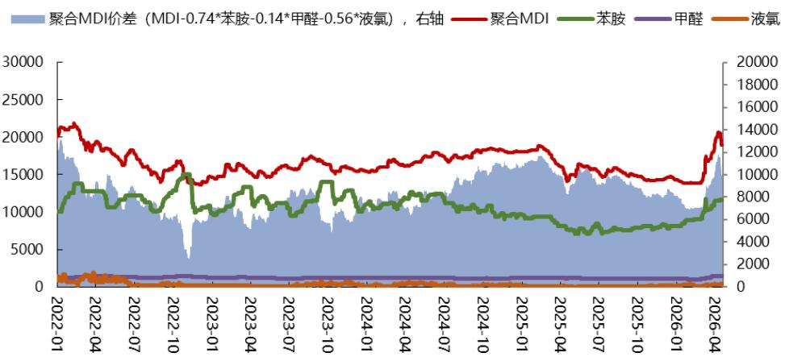

area chart

| Date | 聚合MDI价差 | 聚合MDI | 苯胺 | 甲醛 | 液氯 |
| --- | --- | --- | --- | --- | --- |
| 2022-01 | ~20000 | ~21000 | ~13000 | ~1000 | ~1000 |
| 2022-04 | ~18000 | ~19000 | ~12000 | ~1000 | ~1000 |
| 2022-07 | ~16000 | ~17000 | ~11000 | ~1000 | ~1000 |
| 2022-10 | ~14000 | ~15000 | ~10000 | ~1000 | ~1000 |
| 2023-01 | ~13000 | ~14000 | ~9500 | ~1000 | ~1000 |
| 2023-04 | ~14000 | ~15500 | ~11500 | ~1000 | ~1000 |
| 2023-07 | ~15500 | ~16500 | ~12500 | ~1000 | ~1000 |
| 2023-10 | ~16500 | ~17500 | ~13500 | ~1000 | ~1000 |
| 2024-01 | ~17500 | ~18500 | ~14500 | ~1000 | ~1000 |
| 2024-04 | ~18500 | ~19500 | ~15500 | ~1000 | ~1000 |
| 2024-07 | ~19500 | ~20500 | ~16500 | ~1000 | ~1000 |
| 2024-10 | ~20500 | ~21500 | ~17500 | ~1000 | ~1000 |
| 2025-01 | ~21500 | ~22500 | ~18500 | ~1000 | ~1000 |
| 2025-04 | ~22500 | ~23500 | ~19500 | ~1000 | ~1000 |
| 2025-07 | ~23500 | ~24500 | ~20500 | ~1556 | ~1556 |
| 2025-10 | ~24500 | ~25500 | ~21500 | ~1656 | ~1656 |
| 2026-01 | ~25500 | ~26500 | ~22500 | ~1756 | ~1756 |

中国TDI价格及价差（元/吨，元/吨）  
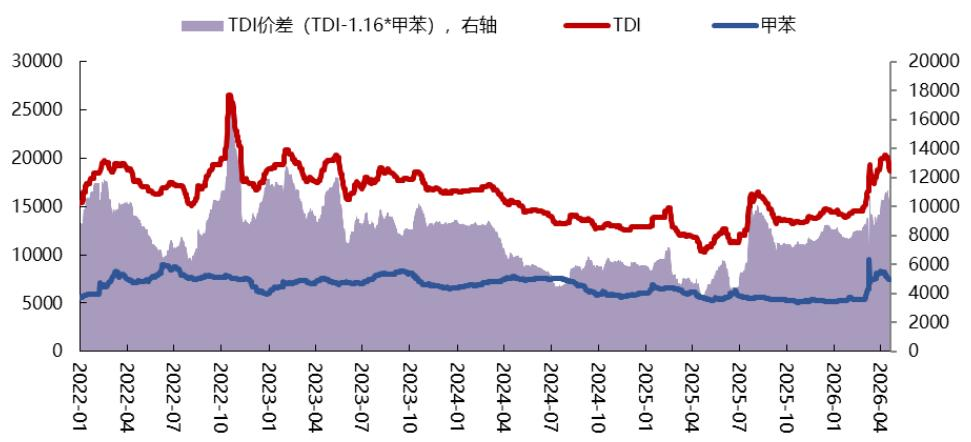

bar-line hybrid chart

| Date     | TDI价差 (TDI-1.16*甲苯) | TDI   | 甲苯  |
|----------|--------------------------|-------|-------|
| 2022-01  | ~15000                   | ~15000| ~5000 |
| 2022-04  | ~18000                   | ~19000| ~6000 |
| 2022-07  | ~16000                   | ~17000| ~7000 |
| 2022-10  | ~27000                   | ~27000| ~7500 |
| 2023-01  | ~18000                   | ~19000| ~6500 |
| 2023-04  | ~19000                   | ~21000| ~7500 |
| 2023-07  | ~17000                   | ~18000| ~7500 |
| 2023-10  | ~18000                   | ~19000| ~7500 |
| 2024-01  | ~16000                   | ~17000| ~7500 |
| 2024-04  | ~15000                   | ~16000| ~7500 |
| 2024-07  | ~14000                   | ~15000| ~7500 |
| 2024-10  | ~13500                   | ~14500| ~7500 |
| 2025-01  | ~13500                   | ~14500| ~7500 |
| 2025-04  | ~13500                   | ~14500| ~7500 |
| 2025-07  | ~16500                   | ~16500| ~7500 |
| 2025-10  | ~14500                   | ~14500| ~7500 |
| 2026-01  | ~14500                   | ~14500| ~7500 |
| 2026-04  | ~18500                   | ~18500| ~8500 |

## 2.3 聚氨酯：己二酸/聚醚/TPU

己二酸价格及毛利（元/吨，元/吨）  
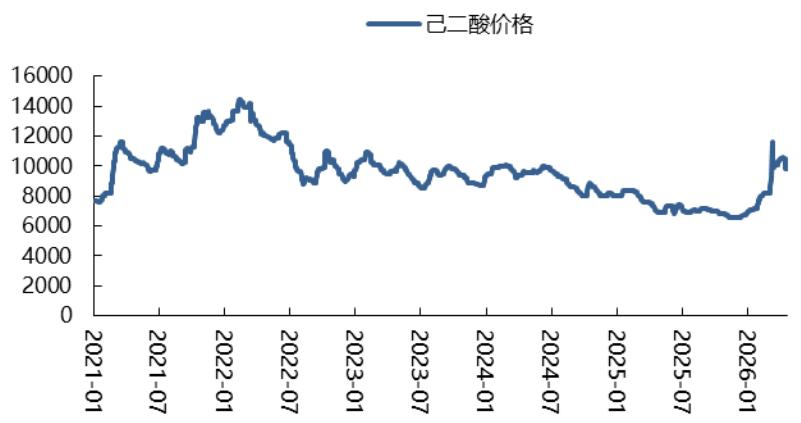

line chart

| Date     | 己二酸价格 |
| -------- | --------- |
| 2021-01  | 7500      |
| 2021-07  | 11500     |
| 2022-01  | 13500     |
| 2022-07  | 14500     |
| 2023-01  | 10500     |
| 2023-07  | 9500      |
| 2024-01  | 9800      |
| 2024-07  | 9700      |
| 2025-01  | 8500      |
| 2025-07  | 7500      |
| 2026-01  | 7800      |
| 2026-06  | 11500     |

软泡聚醚价格（元/吨）  
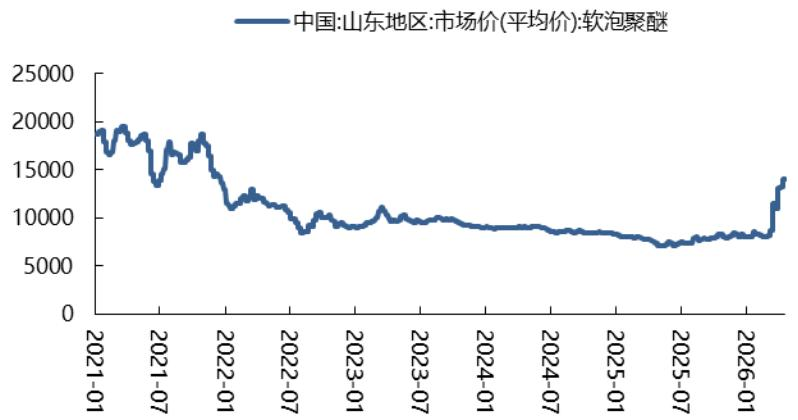

line chart

| Date     | 中国:山东地区:市场价(平均价):软泡聚醚 |
| -------- | ---------------------------------- |
| 2021-01  | ~19000                             |
| 2021-07  | ~18000                             |
| 2022-01  | ~13000                             |
| 2022-07  | ~9000                              |
| 2023-01  | ~10000                             |
| 2023-07  | ~9500                              |
| 2024-01  | ~9000                              |
| 2024-07  | ~8500                              |
| 2025-01  | ~8000                              |
| 2025-07  | ~7500                              |
| 2026-01  | ~14000                             |

TPU薄膜价格（元/吨）  
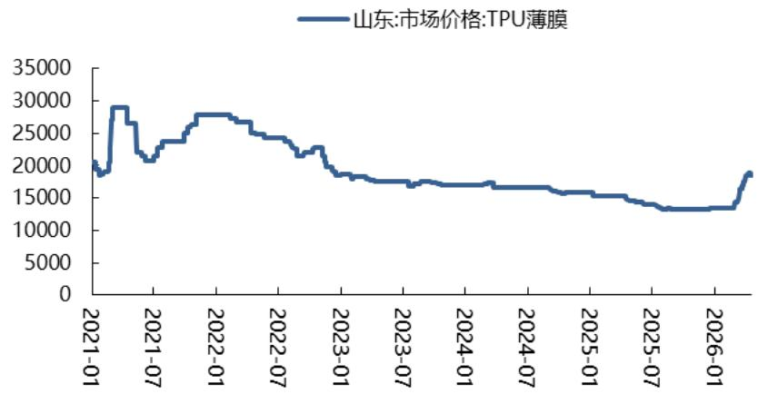

line chart

| Date     | Market Price (TPU薄膜) |
| -------- | ---------------------- |
| 2021-01  | 19000                  |
| 2021-07  | 29000                  |
| 2022-01  | 28000                  |
| 2022-07  | 24000                  |
| 2023-01  | 19000                  |
| 2023-07  | 17500                  |
| 2024-01  | 17000                  |
| 2024-07  | 16500                  |
| 2025-01  | 15500                  |
| 2025-07  | 14500                  |
| 2026-01  | 13500                  |
| 2026-06  | 19000                  |

## 2.4 聚烯烃：油煤气路线对比

MB乙烷及NYMEX天然气价格（美元/吨，美元/百万英热）  
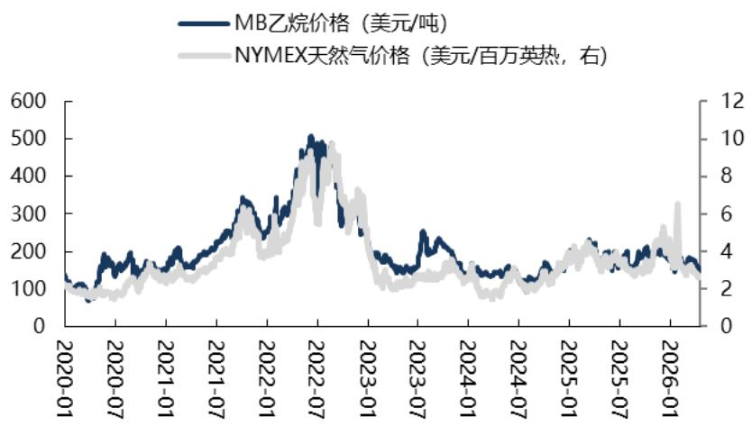

bar-line hybrid chart

| Date     | MB乙烷价格 (美元/吨) | NYMEX天然气价格 (美元/百万英热, 右) |
|----------|----------------------|------------------------------------|
| 2020-01  | ~100                 | ~1                                 |
| 2020-07  | ~150                 | ~2                                 |
| 2021-01  | ~200                 | ~3                                 |
| 2021-07  | ~300                 | ~4                                 |
| 2022-01  | ~450                 | ~6                                 |
| 2022-07  | ~500                 | ~8                                 |
| 2023-01  | ~300                 | ~4                                 |
| 2023-07  | ~250                 | ~3                                 |
| 2024-01  | ~150                 | ~2                                 |
| 2024-07  | ~150                 | ~2                                 |
| 2025-01  | ~180                 | ~3                                 |
| 2025-07  | ~180                 | ~3                                 |
| 2026-01  | ~150                 | ~4                                 |

华东丙烷及原油价格走势（美元/吨，美元/桶）  
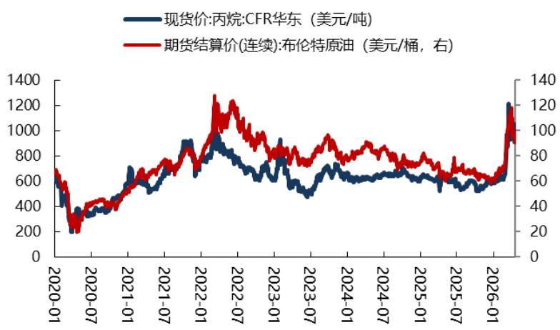

line chart

| Date     | 现货价:丙烷:CFR华东 (美元/吨) | 期货结算价(连续):布伦特原油 (美元/桶, 右) |
|----------|-------------------------------|----------------------------------------|
| 2020-01  | ~600                          | ~70                                    |
| 2020-07  | ~300                          | ~30                                    |
| 2021-01  | ~500                          | ~50                                    |
| 2021-07  | ~700                          | ~70                                    |
| 2022-01  | ~900                          | ~90                                    |
| 2022-07  | ~800                          | ~130                                   |
| 2023-01  | ~700                          | ~90                                    |
| 2023-07  | ~500                          | ~80                                    |
| 2024-01  | ~600                          | ~80                                    |
| 2024-07  | ~650                          | ~75                                    |
| 2025-01  | ~600                          | ~70                                    |
| 2025-07  | ~550                          | ~65                                    |
| 2026-01  | ~650                          | ~65                                    |
| 2026-06  | ~1200                         | ~120                                   |

国内动力煤及原油价格走势（元/吨，美元/桶）  
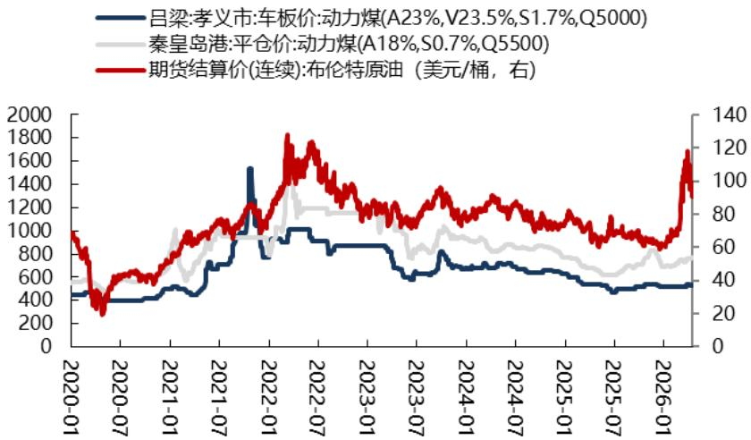

bar-line hybrid chart

| Date     | 吕梁:孝义市:车板价:动力煤(A23%,V23.5%S1.7,Q5000) | 秦皇岛港:平仓价:动力煤(A18%S0.7,Q5500) | 期货结算价(连续):布伦特原油 (美元/桶, 右) |
|----------|---------------------------------------------|----------------------------------------|------------------------------------------|
| 2020-01  | ~400                                        | ~400                                   | ~100                                     |
| 2020-07  | ~400                                        | ~400                                   | ~30                                      |
| 2021-01  | ~400                                        | ~400                                   | ~60                                      |
| 2021-07  | ~600                                        | ~600                                   | ~90                                      |
| 2022-01  | ~1500                                       | ~1000                                  | ~180                                     |
| 2022-07  | ~1000                                       | ~1100                                  | ~160                                     |
| 2023-01  | ~800                                        | ~900                                   | ~130                                     |
| 2023-07  | ~600                                        | ~800                                   | ~110                                     |
| 2024-01  | ~600                                        | ~700                                   | ~100                                     |
| 2024-07  | ~500                                        | ~650                                   | ~90                                      |
| 2025-01  | ~500                                        | ~600                                   | ~85                                      |
| 2025-07  | ~500                                        | ~550                                   | ~80                                      |
| 2026-01  | ~500                                        | ~550                                   | ~170                                     |

石脑油及原油价格走势（美元/吨，美元/桶）  
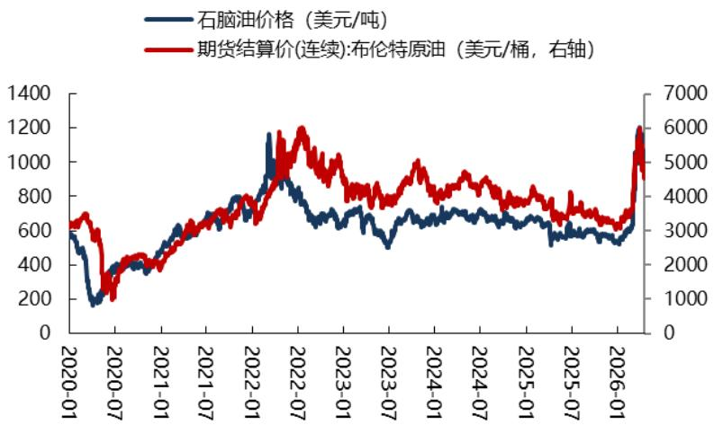

bar-line hybrid chart

| Date     | 石脑油价格 (美元/吨) | 期货结算价(连续):布伦特原油 (美元/桶, 右轴) |
|----------|----------------------|---------------------------------------------|
| 2020-01  | ~550                 | ~3000                                       |
| 2020-07  | ~150                 | ~1000                                       |
| 2021-01  | ~400                 | ~2500                                       |
| 2021-07  | ~600                 | ~3500                                       |
| 2022-01  | ~800                 | ~4500                                       |
| 2022-07  | ~1150                | ~6000                                       |
| 2023-01  | ~700                 | ~4500                                       |
| 2023-07  | ~550                 | ~4000                                       |
| 2024-01  | ~650                 | ~4500                                       |
| 2024-07  | ~650                 | ~4500                                       |
| 2025-01  | ~600                 | ~4500                                       |
| 2025-07  | ~550                 | ~4500                                       |
| 2026-01  | ~650                 | ~6000                                       |

## 2.4 聚烯烃：油煤气路线对比

MB乙烷价格及乙烷裂解制PE盈利（美元/吨，元/吨）  
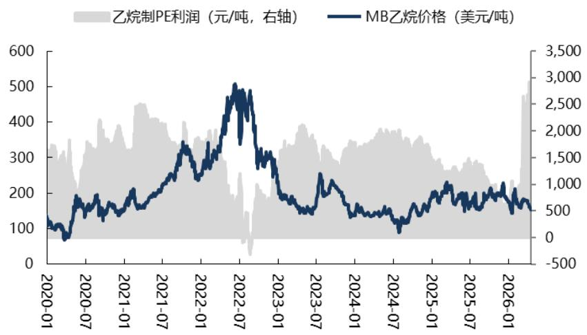

bar-line hybrid chart

| Date     | 乙烷制PE利润 (元/吨) | MB乙烷价格 (美元/吨) |
|----------|----------------------|----------------------|
| 2020-01  | ~350                 | ~100                 |
| 2020-07  | ~400                 | ~150                 |
| 2021-01  | ~450                 | ~200                 |
| 2021-07  | ~400                 | ~250                 |
| 2022-01  | ~350                 | ~300                 |
| 2022-07  | ~500                 | ~350                 |
| 2023-01  | ~300                 | ~150                 |
| 2023-07  | ~350                 | ~100                 |
| 2024-01  | ~350                 | ~50                  |
| 2024-07  | ~350                 | ~100                 |
| 2025-01  | ~350                 | ~150                 |
| 2025-07  | ~350                 | ~150                 |
| 2026-01  | ~450                 | ~150                 |

煤制PE、煤制PP盈利（元/吨）

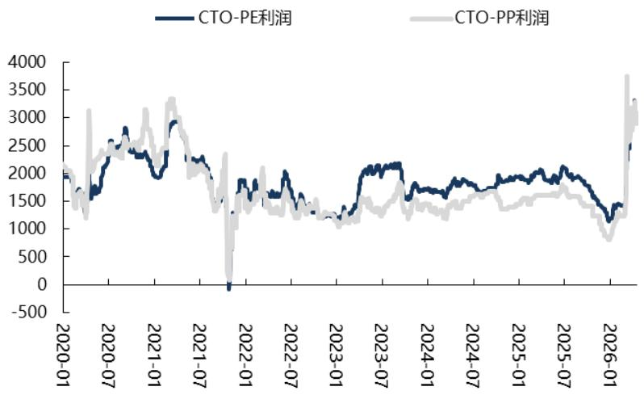

line chart

| Date     | CTO-PE利润 | CTO-PP利润 |
| -------- | ---------- | ---------- |
| 2020-01  | ~1500      | ~1400      |
| 2020-07  | ~2500      | ~2400      |
| 2021-01  | ~2800      | ~3000      |
| 2021-07  | ~2200      | ~2300      |
| 2022-01  | ~1800      | ~1500      |
| 2022-07  | ~1600      | ~1400      |
| 2023-01  | ~1400      | ~1300      |
| 2023-07  | ~2100      | ~1800      |
| 2024-01  | ~1900      | ~1600      |
| 2024-07  | ~1800      | ~1500      |
| 2025-01  | ~1900      | ~1600      |
| 2025-07  | ~1700      | ~1400      |
| 2026-01  | ~1300      | ~800       |
| 2026-07  | ~3800      | ~3500      |

华东丙烷价格及PDH制PP盈利（美元/吨，元/吨）  
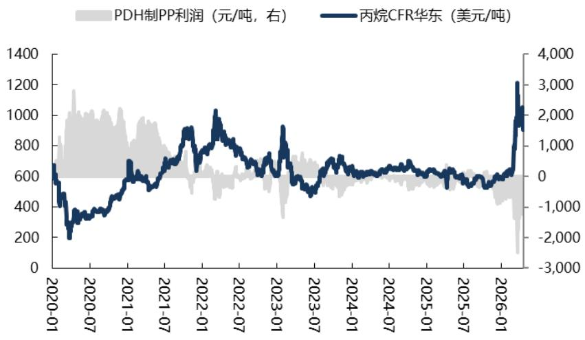

bar-line hybrid chart

| Date     | PDH制PP利润 (元/吨) | 丙烷CFR华东 (美元/吨) |
|----------|---------------------|------------------------|
| 2020-01  | ~800                | ~600                   |
| 2020-07  | ~1100               | ~200                   |
| 2021-01  | ~900                | ~600                   |
| 2021-07  | ~700                | ~800                   |
| 2022-01  | ~600                | ~1000                  |
| 2022-07  | ~500                | ~800                   |
| 2023-01  | ~400                | ~900                   |
| 2023-07  | ~500                | ~500                   |
| 2024-01  | ~600                | ~600                   |
| 2024-07  | ~550                | ~650                   |
| 2025-01  | ~550                | ~650                   |
| 2025-07  | ~550                | ~650                   |
| 2026-01  | ~450                | ~1200                  |

石脑油制PE、石脑油制PP盈利（元/吨）  
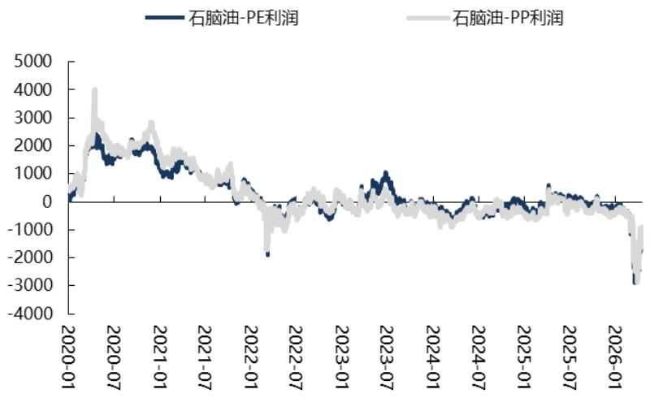

line chart

| Date     | 石脑油-PE利润 | 石脑油-PP利润 |
| -------- | -------------- | -------------- |
| 2020-01  | 0              | 0              |
| 2020-07  | 2000           | 4000           |
| 2021-01  | 1500           | 3000           |
| 2021-07  | 1000           | 2000           |
| 2022-01  | -500           | -1000          |
| 2022-07  | -1500          | -2000          |
| 2023-01  | -500           | -1000          |
| 2023-07  | 500            | 1000           |
| 2024-01  | -500           | -1000          |
| 2024-07  | -1000          | -500           |
| 2025-01  | -500           | -1000          |
| 2025-07  | -1000          | -500           |
| 2026-01  | -3500          | -3500          |

## 2.4 聚烯烃：油煤气路线对比

油煤气路线制聚乙烯盈利对比（元/吨）  
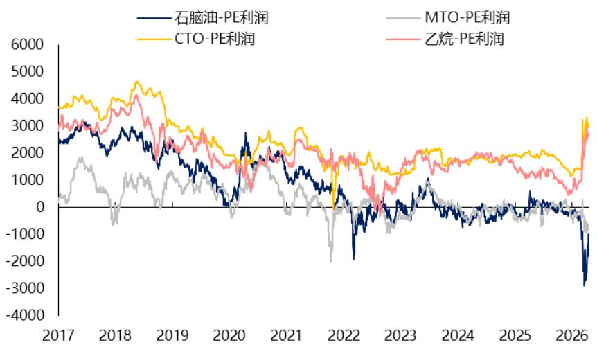

line chart

| Year | 石脑油-PE利润 | CTO-PE利润 | 乙烷-PE利润 | MTO-PE利润 |
|------|----------------|-------------|-------------|-------------|
| 2017 | ~2500          | ~3500       | ~3000       | ~500        |
| 2018 | ~2000          | ~4500       | ~3500       | ~1000       |
| 2019 | ~1500          | ~3500       | ~3000       | ~500        |
| 2020 | ~500           | ~2500       | ~2000       | ~0          |
| 2021 | ~1500          | ~3000       | ~2500       | ~500        |
| 2022 | ~-2000         | ~1500       | ~1500       | ~-2000      |
| 2023 | ~-500          | ~1500       | ~1500       | ~-500       |
| 2024 | ~-500          | ~1500       | ~1500       | ~-500       |
| 2025 | ~-500          | ~1500       | ~1500       | ~-500       |
| 2026 | ~-3500         | ~3500       | ~3000       | ~-1500      |

油煤气路线制聚丙烯盈利对比（元/吨）  
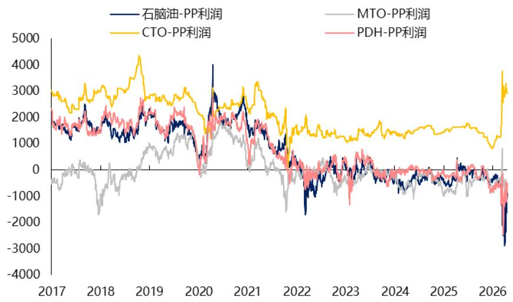

line chart

| Year | 石脑油-PP利润 | CTO-PP利润 | MTO-PP利润 | PDH-PP利润 |
|------|----------------|-------------|-------------|-------------|
| 2017 | ~1500          | ~3000       | ~0          | ~2000       |
| 2018 | ~1800          | ~3500       | ~-500       | ~2200       |
| 2019 | ~2000          | ~4500       | ~1000       | ~2500       |
| 2020 | ~3000          | ~2500       | ~-1000      | ~1500       |
| 2021 | ~2500          | ~3500       | ~-500       | ~1800       |
| 2022 | ~-1500         | ~1500       | ~-1500      | ~-500       |
| 2023 | ~-500          | ~1500       | ~-1000      | ~-500       |
| 2024 | ~-500          | ~1500       | ~-500       | ~-500       |
| 2025 | ~-500          | ~1500       | ~-500       | ~-500       |
| 2026 | ~-3500         | ~3500       | ~-1500      | ~-1500      |

中国农药市场各原药价格指数走势（点）  
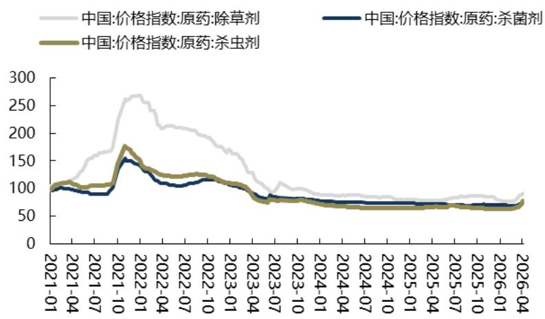

line chart

| Date     | 中国:价格指数:原药:除草剂 | 中国:价格指数:原药:杀菌剂 | 中国:价格指数:原药:杀虫剂 |
|----------|---------------------------|---------------------------|---------------------------|
| 2021-01  | ~100                      | ~100                      | ~100                      |
| 2021-04  | ~150                      | ~90                       | ~100                      |
| 2021-07  | ~180                      | ~95                       | ~105                      |
| 2021-10  | ~270                      | ~150                      | ~180                      |
| 2022-01  | ~260                      | ~140                      | ~170                      |
| 2022-04  | ~220                      | ~130                      | ~150                      |
| 2022-07  | ~200                      | ~120                      | ~140                      |
| 2022-10  | ~180                      | ~110                      | ~130                      |
| 2023-01  | ~160                      | ~105                      | ~125                      |
| 2023-04  | ~140                      | ~95                       | ~115                      |
| 2023-07  | ~120                      | ~85                       | ~105                      |
| 2023-10  | ~100                      | ~80                       | ~95                       |
| 2024-01  | ~95                       | ~75                       | ~90                       |
| 2024-04  | ~90                       | ~75                       | ~85                       |
| 2024-07  | ~85                       | ~75                       | ~85                       |
| 2024-10  | ~85                       | ~75                       | ~85                       |
| 2025-01  | ~85                       | ~75                       | ~85                       |
| 2025-04  | ~85                       | ~75                       | ~85                       |
| 2025-07  | ~85                       | ~75                       | ~85                       |
| 2025-10  | ~85                       | ~75                       | ~85                       |
| 2026-01  | ~85                       | ~75                       | ~85                       |
| 2026-04  | ~85                       | ~75                       | ~85                       |

菊酯价格（万元/吨）  
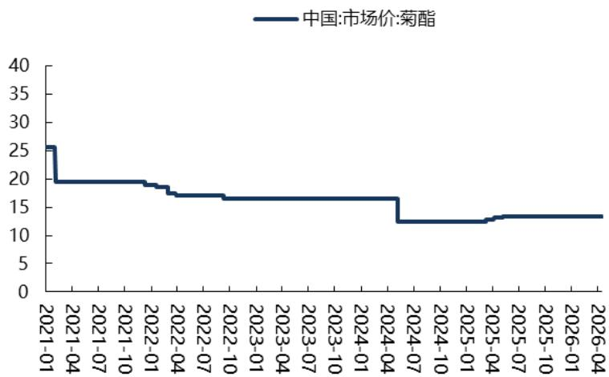

line chart

| Date     | 中国:市场价:菊酯 |
| -------- | --------------- |
| 2021-01  | 25              |
| 2021-04  | 20              |
| 2021-07  | 20              |
| 2021-10  | 20              |
| 2022-01  | 19              |
| 2022-04  | 18              |
| 2022-07  | 17              |
| 2022-10  | 17              |
| 2023-01  | 17              |
| 2023-04  | 17              |
| 2023-07  | 17              |
| 2023-10  | 17              |
| 2024-01  | 17              |
| 2024-04  | 17              |
| 2024-07  | 13              |
| 2024-10  | 13              |
| 2025-01  | 13              |
| 2025-04  | 13              |
| 2025-07  | 13              |
| 2025-10  | 13              |
| 2026-01  | 13              |
| 2026-04  | 13              |

草甘膦价格（元/吨）  
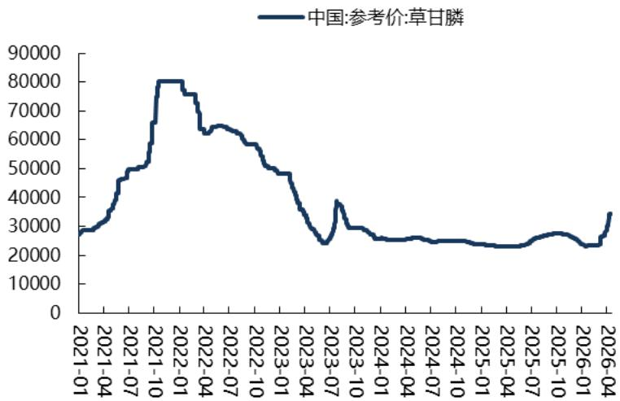

line chart

| Date       | 中国:参考价:草甘膦 |
| ---------- | ------------------ |
| 2021-04    | 28000              |
| 2021-07    | 45000              |
| 2021-10    | 80000              |
| 2022-04    | 75000              |
| 2022-07    | 65000              |
| 2022-10    | 60000              |
| 2023-04    | 45000              |
| 2023-07    | 35000              |
| 2023-10    | 38000              |
| 2024-01    | 28000              |
| 2024-04    | 27000              |
| 2024-07    | 26000              |
| 2024-10    | 25500              |
| 2025-04    | 25500              |
| 2025-07    | 26500              |
| 2025-10    | 27500              |
| 2026-04    | 35000              |

草铵膦价格（元/吨）  
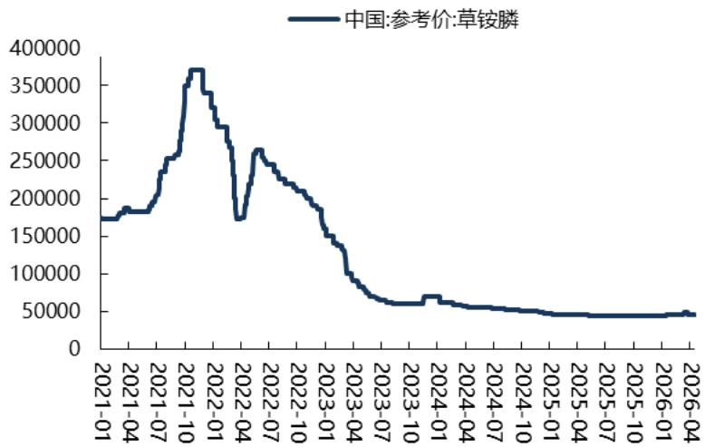

line chart

| Date       | 中国:参考价:草铵膦 |
| ---------- | ------------------ |
| 2021-01    | 170000             |
| 2021-04    | 180000             |
| 2021-07    | 250000             |
| 2021-10    | 370000             |
| 2022-01    | 350000             |
| 2022-04    | 170000             |
| 2022-07    | 260000             |
| 2022-10    | 230000             |
| 2023-01    | 180000             |
| 2023-04    | 130000             |
| 2023-07    | 80000              |
| 2023-10    | 60000              |
| 2024-01    | 65000              |
| 2024-04    | 55000              |
| 2024-07    | 55000              |
| 2024-10    | 55000              |
| 2025-01    | 55000              |
| 2025-04    | 55000              |
| 2025-07    | 55000              |
| 2025-10    | 55000              |
| 2026-01    | 55000              |
| 2026-04    | 55000              |

尿素价格（元/吨）  
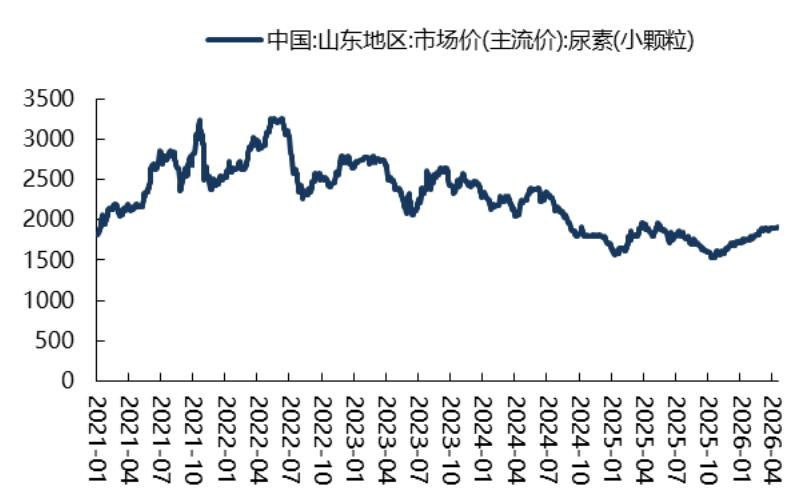

line chart

| Date     | Market Price (Small Cap) |
| -------- | ------------------------ |
| 2021-01  | 1800                     |
| 2021-04  | 2000                     |
| 2021-07  | 2200                     |
| 2021-10  | 2500                     |
| 2022-01  | 3200                     |
| 2022-04  | 3300                     |
| 2022-07  | 3100                     |
| 2022-10  | 2800                     |
| 2023-01  | 2700                     |
| 2023-04  | 2600                     |
| 2023-07  | 2400                     |
| 2023-10  | 2500                     |
| 2024-01  | 2300                     |
| 2024-04  | 2400                     |
| 2024-07  | 2300                     |
| 2024-10  | 2100                     |
| 2025-01  | 1900                     |
| 2025-04  | 1800                     |
| 2025-07  | 1700                     |
| 2025-10  | 1600                     |
| 2026-01  | 1700                     |
| 2026-04  | 1900                     |

磷肥价格（元/吨）  
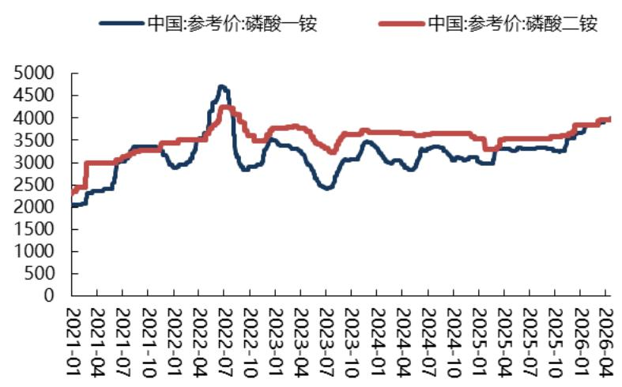

line chart

| Date     | 中国:参考价:磷酸一铵 | 中国:参考价:磷酸二铵 |
|----------|----------------------|----------------------|
| 2021-01  | 2000                 | 2500                 |
| 2021-04  | 2500                 | 3000                 |
| 2021-07  | 3000                 | 3500                 |
| 2021-10  | 3500                 | 3500                 |
| 2022-01  | 3000                 | 3500                 |
| 2022-04  | 3500                 | 3500                 |
| 2022-07  | 4500                 | 4000                 |
| 2022-10  | 3500                 | 3500                 |
| 2023-01  | 3500                 | 3500                 |
| 2023-04  | 3500                 | 3500                 |
| 2023-07  | 2500                 | 3500                 |
| 2023-10  | 3500                 | 3500                 |
| 2024-01  | 3500                 | 3500                 |
| 2024-04  | 3500                 | 3500                 |
| 2024-07  | 3500                 | 3500                 |
| 2024-10  | 3500                 | 3500                 |
| 2025-01  | 3500                 | 3500                 |
| 2025-04  | 3500                 | 3500                 |
| 2025-07  | 3500                 | 3500                 |
| 2025-10  | 3500                 | 3500                 |
| 2026-01  | 3500                 | 3500                 |
| 2026-04  | 4000                 | 4000                 |

钾肥价格（元/吨）  
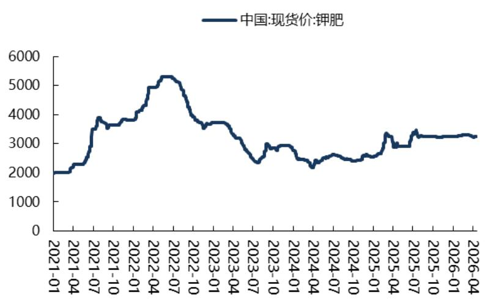

line chart

| Date     | 中国:现货价:钾肥 |
| -------- | ---------------- |
| 2021-01  | 2000             |
| 2021-04  | 2200             |
| 2021-07  | 3800             |
| 2021-10  | 3600             |
| 2022-01  | 4000             |
| 2022-04  | 5000             |
| 2022-07  | 5300             |
| 2022-10  | 4500             |
| 2023-01  | 3600             |
| 2023-04  | 3400             |
| 2023-07  | 2400             |
| 2023-10  | 2800             |
| 2024-01  | 2600             |
| 2024-04  | 2300             |
| 2024-07  | 2500             |
| 2024-10  | 2600             |
| 2025-01  | 2800             |
| 2025-04  | 3300             |
| 2025-07  | 3100             |
| 2025-10  | 3300             |
| 2026-01  | 3300             |
| 2026-04  | 3300             |

复合肥价格（元/吨）  
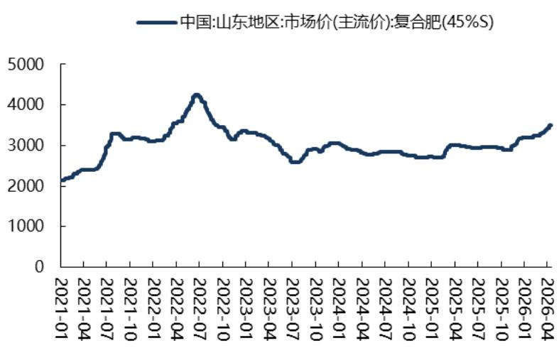

line chart

| Date     | Market Price (USD) |
| -------- | ------------------ |
| 2021-01  | 2100               |
| 2021-04  | 2300               |
| 2021-07  | 3200               |
| 2021-10  | 3100               |
| 2022-01  | 3150               |
| 2022-04  | 3500               |
| 2022-07  | 4200               |
| 2022-10  | 3800               |
| 2023-01  | 3300               |
| 2023-04  | 3100               |
| 2023-07  | 2600               |
| 2023-10  | 2900               |
| 2024-01  | 3000               |
| 2024-04  | 2800               |
| 2024-07  | 2850               |
| 2024-10  | 2800               |
| 2025-01  | 2750               |
| 2025-04  | 3000               |
| 2025-07  | 3050               |
| 2025-10  | 3000               |
| 2026-01  | 3150               |
| 2026-04  | 3500               |

## 2.6 食品添加剂：维生素

## VA价格（元/千克）

中国:市场报价:维生素A(50万IU/g,国产)  
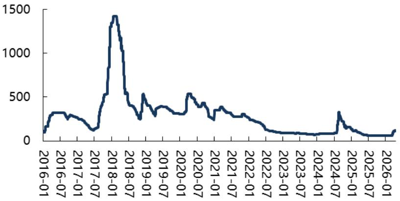

line chart

| Date     | Value |
| -------- | ----- |
| 2016-01  | ~100  |
| 2016-07  | ~300  |
| 2017-01  | ~250  |
| 2017-07  | ~100  |
| 2018-01  | ~1450 |
| 2018-07  | ~300  |
| 2019-01  | ~500  |
| 2019-07  | ~350  |
| 2020-01  | ~400  |
| 2020-07  | ~550  |
| 2021-01  | ~350  |
| 2021-07  | ~300  |
| 2022-01  | ~250  |
| 2022-07  | ~150  |
| 2023-01  | ~100  |
| 2023-07  | ~100  |
| 2024-01  | ~100  |
| 2024-07  | ~350  |
| 2025-01  | ~150  |
| 2025-07  | ~50   |
| 2026-01  | ~100  |

## VE价格（元/千克）

中国:市场报价:维生素E(50%,国产)  
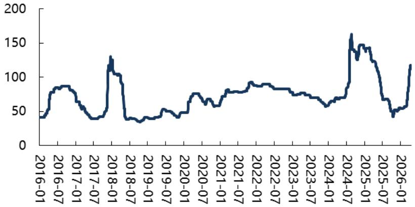

line chart

| Date     | Value |
| -------- | ----- |
| 2016-01  | 40    |
| 2016-07  | 80    |
| 2017-01  | 70    |
| 2017-07  | 35    |
| 2018-01  | 130   |
| 2018-07  | 35    |
| 2019-01  | 40    |
| 2019-07  | 50    |
| 2020-01  | 60    |
| 2020-07  | 70    |
| 2021-01  | 80    |
| 2021-07  | 90    |
| 2022-01  | 85    |
| 2022-07  | 80    |
| 2023-01  | 75    |
| 2023-07  | 65    |
| 2024-01  | 55    |
| 2024-07  | 160   |
| 2025-01  | 140   |
| 2025-07  | 130   |
| 2026-01  | 50    |
| 2026-07  | 115   |

## VD3价格（元/千克）

中国:市场报价:维生素D3(50万IU/g,国产)  
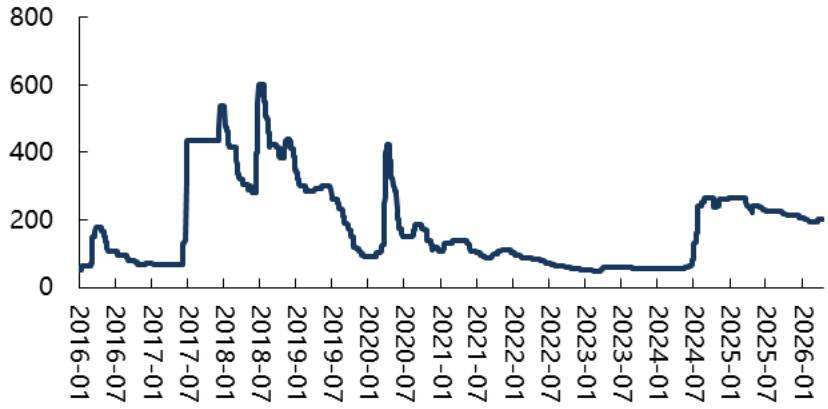

line chart

| Date     | Value |
| -------- | ----- |
| 2016-01  | ~50   |
| 2016-07  | ~180  |
| 2017-01  | ~50   |
| 2017-07  | ~450  |
| 2018-01  | ~550  |
| 2018-07  | ~600  |
| 2019-01  | ~450  |
| 2019-07  | ~350  |
| 2020-01  | ~100  |
| 2020-07  | ~420  |
| 2021-01  | ~150  |
| 2021-07  | ~120  |
| 2022-01  | ~100  |
| 2022-07  | ~80   |
| 2023-01  | ~60   |
| 2023-07  | ~50   |
| 2024-01  | ~50   |
| 2024-07  | ~50   |
| 2025-01  | ~250  |
| 2025-07  | ~230  |
| 2026-01  | ~210  |

## VB3价格（元/千克）

中国:市场报价:烟酰胺(99%,进口)  
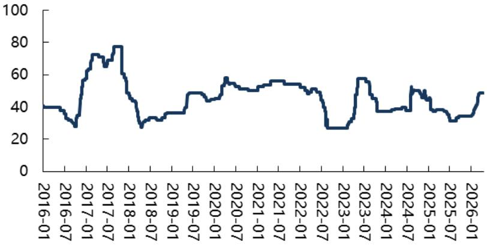

line chart

| Date     | Value |
| -------- | ----- |
| 2016-01  | 40    |
| 2016-07  | 30    |
| 2017-01  | 70    |
| 2017-07  | 80    |
| 2018-01  | 30    |
| 2018-07  | 35    |
| 2019-01  | 45    |
| 2019-07  | 50    |
| 2020-01  | 55    |
| 2020-07  | 50    |
| 2021-01  | 55    |
| 2021-07  | 55    |
| 2022-01  | 50    |
| 2022-07  | 30    |
| 2023-01  | 35    |
| 2023-07  | 60    |
| 2024-01  | 40    |
| 2024-07  | 50    |
| 2025-01  | 45    |
| 2025-07  | 35    |
| 2026-01  | 45    |

## 2.6 食品添加剂：氨基酸

固体蛋氨酸价格（元/千克）  
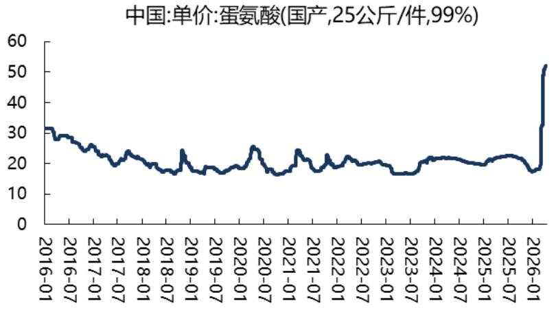

line chart

| Date     | Value |
| -------- | ----- |
| 2016-01  | 30    |
| 2016-07  | 28    |
| 2017-01  | 25    |
| 2017-07  | 22    |
| 2018-01  | 20    |
| 2018-07  | 18    |
| 2019-01  | 17    |
| 2019-07  | 16    |
| 2020-01  | 18    |
| 2020-07  | 25    |
| 2021-01  | 15    |
| 2021-07  | 20    |
| 2022-01  | 18    |
| 2022-07  | 17    |
| 2023-01  | 16    |
| 2023-07  | 18    |
| 2024-01  | 20    |
| 2024-07  | 20    |
| 2025-01  | 20    |
| 2025-07  | 20    |
| 2026-01  | 55    |

液体蛋氨酸价格（元/千克）  
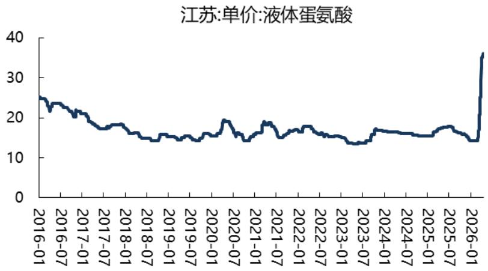

line chart

| Date     | Value |
| -------- | ----- |
| 2016-07  | 25.0  |
| 2017-01  | 23.0  |
| 2018-01  | 18.0  |
| 2019-01  | 16.0  |
| 2020-01  | 19.0  |
| 2021-01  | 15.0  |
| 2022-01  | 17.0  |
| 2023-01  | 14.0  |
| 2024-01  | 16.0  |
| 2025-01  | 17.0  |
| 2026-01  | 36.0  |

赖氨酸价格（元/千克）  
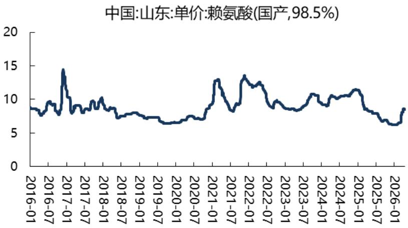

line chart

| Date     | Value |
| -------- | ----- |
| 2016-01  | 8.5   |
| 2016-07  | 9.0   |
| 2017-01  | 14.5  |
| 2017-07  | 8.0   |
| 2018-01  | 9.5   |
| 2018-07  | 7.5   |
| 2019-01  | 7.0   |
| 2019-07  | 6.5   |
| 2020-01  | 6.0   |
| 2020-07  | 6.5   |
| 2021-01  | 13.0  |
| 2021-07  | 8.5   |
| 2022-01  | 13.5  |
| 2022-07  | 12.0  |
| 2023-01  | 9.5   |
| 2023-07  | 10.5  |
| 2024-01  | 11.0  |
| 2024-07  | 11.5  |
| 2025-01  | 10.5  |
| 2025-07  | 8.5   |
| 2026-01  | 8.0   |

苏氨酸价格（元/千克）  
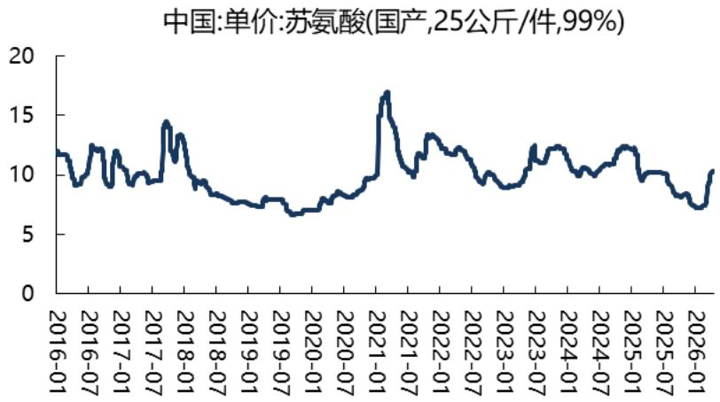

line chart

| Date     | Value |
| -------- | ----- |
| 2016-01  | 12.0  |
| 2016-07  | 11.5  |
| 2017-01  | 13.0  |
| 2017-07  | 14.5  |
| 2018-01  | 10.0  |
| 2018-07  | 9.0   |
| 2019-01  | 8.5   |
| 2019-07  | 7.5   |
| 2020-01  | 7.0   |
| 2020-07  | 8.0   |
| 2021-01  | 17.0  |
| 2021-07  | 13.0  |
| 2022-01  | 12.5  |
| 2022-07  | 11.0  |
| 2023-01  | 10.5  |
| 2023-07  | 12.0  |
| 2024-01  | 11.5  |
| 2024-07  | 12.5  |
| 2025-01  | 11.0  |
| 2025-07  | 9.5   |
| 2026-01  | 8.5   |

## 2.7 磷化工：磷矿石/硫磺/黄磷/磷酸/磷酸铁/磷酸铁锂/6F

磷矿石、硫磺价格（元/吨）  
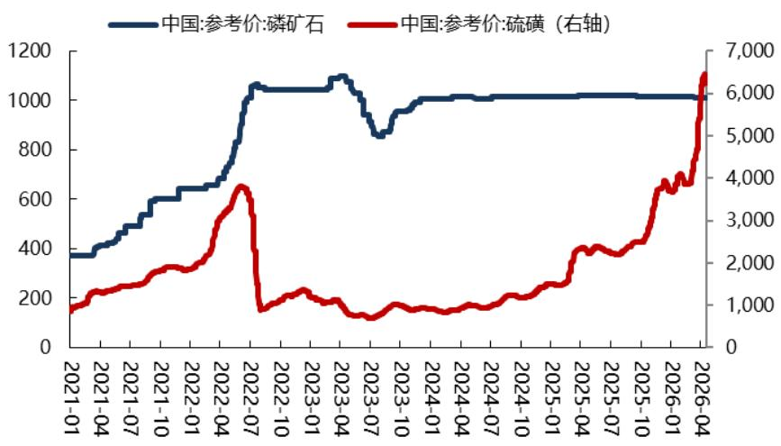

bar-line hybrid chart

| Date     | 中国:参考价:磷矿石 | 中国:参考价:硫磺 (右轴) |
|----------|---------------------|--------------------------|
| 2021-01  | 380                 | 150                      |
| 2021-04  | 400                 | 180                      |
| 2021-07  | 450                 | 200                      |
| 2021-10  | 500                 | 220                      |
| 2022-01  | 550                 | 250                      |
| 2022-04  | 650                 | 350                      |
| 2022-07  | 850                 | 650                      |
| 2022-10  | 1050                | 150                      |
| 2023-01  | 1050                | 180                      |
| 2023-04  | 1100                | 160                      |
| 2023-07  | 950                 | 140                      |
| 2023-10  | 850                 | 160                      |
| 2024-01  | 950                 | 180                      |
| 2024-04  | 1000                | 200                      |
| 2024-07  | 1000                | 220                      |
| 2024-10  | 1000                | 250                      |
| 2025-01  | 1000                | 300                      |
| 2025-04  | 1000                | 350                      |
| 2025-07  | 1000                | 400                      |
| 2025-10  | 1000                | 450                      |
| 2026-01  | 1000                | 550                      |
| 2026-04  | 1050                | 650                      |

黄磷、热法磷酸价格（元/吨）  
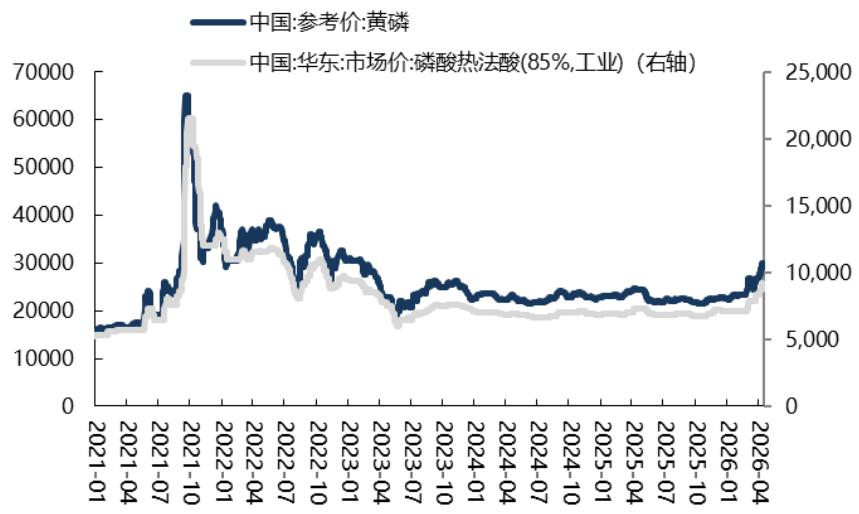

line chart

| Date     | 中国:参考价:黄磷 | 中国:华东:市场价:磷酸热法酸(85%,工业) |
|----------|------------------|-----------------------------------|
| 2021-01  | ~15,000          | ~5,000                            |
| 2021-07  | ~25,000          | ~7,000                            |
| 2021-10  | ~65,000          | ~22,000                           |
| 2022-01  | ~35,000          | ~15,000                           |
| 2022-07  | ~38,000          | ~12,000                           |
| 2022-10  | ~35,000          | ~10,000                           |
| 2023-01  | ~32,000          | ~9,000                            |
| 2023-07  | ~25,000          | ~8,000                            |
| 2023-10  | ~28,000          | ~9,000                            |
| 2024-01  | ~26,000          | ~8,500                            |
| 2024-07  | ~24,000          | ~8,000                            |
| 2024-10  | ~23,000          | ~7,500                            |
| 2025-01  | ~24,000          | ~8,500                            |
| 2025-07  | ~23,500          | ~8,500                            |
| 2025-10  | ~24,500          | ~9,500                            |
| 2026-01  | ~25,500          | ~11,500                           |
| 2026-04  | ~30,500          | ~13,500                           |

磷酸铁、磷酸铁锂价格（元/吨）  
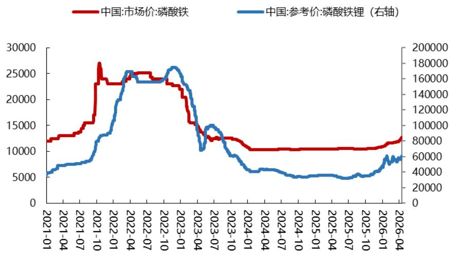

bar-line hybrid chart

| Date     | 中国:市场价:磷酸铁 | 中国:参考价:磷酸铁锂 (右轴) |
|----------|-------------------|-----------------------------|
| 2021-01  | ~12,000           | ~5,000                      |
| 2021-04  | ~13,000           | ~6,000                      |
| 2021-07  | ~14,000           | ~7,000                      |
| 2021-10  | ~27,000           | ~13,000                     |
| 2022-01  | ~23,000           | ~16,000                     |
| 2022-04  | ~25,000           | ~17,000                     |
| 2022-07  | ~24,000           | ~16,500                     |
| 2022-10  | ~23,500           | ~17,500                     |
| 2023-01  | ~23,000           | ~18,500                     |
| 2023-04  | ~15,000           | ~10,500                     |
| 2023-07  | ~13,500           | ~14,500                     |
| 2023-10  | ~13,000           | ~13,500                     |
| 2024-01  | ~11,500           | ~6,500                      |
| 2024-04  | ~11,500           | ~6,500                      |
| 2024-07  | ~11,500           | ~6,500                      |
| 2024-10  | ~11,500           | ~6,500                      |
| 2025-01  | ~11,500           | ~6,500                      |
| 2025-04  | ~11,500           | ~6,500                      |
| 2025-07  | ~11,500           | ~6,500                      |
| 2025-10  | ~11,500           | ~6,500                      |
| 2026-01  | ~11,500           | ~7,500                      |
| 2026-04  | ~12,500           | ~8,500                      |

六氟磷酸锂价格（元/吨）  
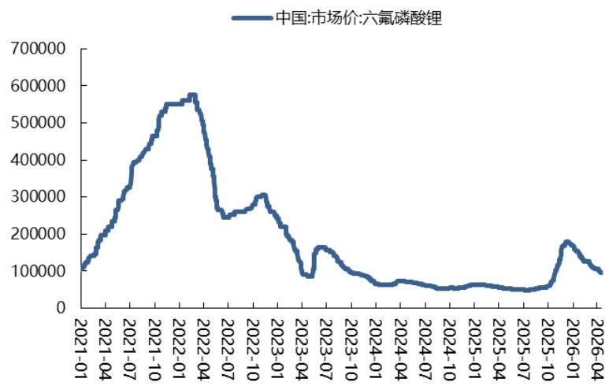

line chart

| Date     | 中国:市场价:六氟磷酸锂 |
| -------- | --------------------- |
| 2021-01  | 100000                |
| 2021-04  | 250000                |
| 2021-07  | 350000                |
| 2021-10  | 450000                |
| 2022-01  | 550000                |
| 2022-04  | 580000                |
| 2022-07  | 350000                |
| 2022-10  | 300000                |
| 2023-01  | 250000                |
| 2023-04  | 150000                |
| 2023-07  | 180000                |
| 2023-10  | 150000                |
| 2024-01  | 120000                |
| 2024-04  | 100000                |
| 2024-07  | 80000                 |
| 2024-10  | 70000                 |
| 2025-01  | 65000                 |
| 2025-04  | 65000                 |
| 2025-07  | 65000                 |
| 2025-10  | 75000                 |
| 2026-01  | 180000                |
| 2026-04  | 150000                |

氨纶价格及价差（元/吨）  
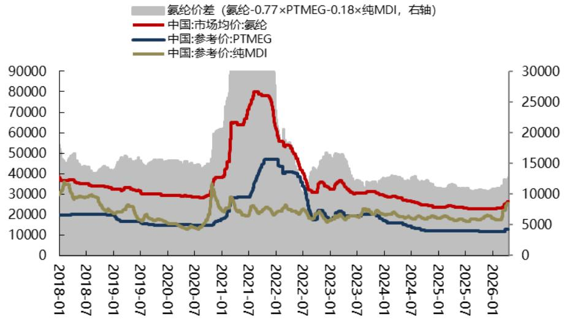

line chart

| Date     | 中国:市场均价:氨纶 | 中国:参考价:PTMEG | 中国:参考价:纯MDI |
|----------|-------------------|-------------------|-------------------|
| 2018-01  | ~35000            | ~20000            | ~10000            |
| 2018-07  | ~34000            | ~20000            | ~9000             |
| 2019-01  | ~33000            | ~20000            | ~8000             |
| 2019-07  | ~32000            | ~20000            | ~7000             |
| 2020-01  | ~31000            | ~20000            | ~6000             |
| 2020-07  | ~30000            | ~20000            | ~5000             |
| 2021-01  | ~35000            | ~25000            | ~7500             |
| 2021-07  | ~85000            | ~45000            | ~15000            |
| 2022-01  | ~75000            | ~45000            | ~15000            |
| 2022-07  | ~55000            | ~35000            | ~15000            |
| 2023-01  | ~35000            | ~25000            | ~15000            |
| 2023-07  | ~33000            | ~25000            | ~15000            |
| 2024-01  | ~32000            | ~25000            | ~15000            |
| 2024-07  | ~31000            | ~25000            | ~15000            |
| 2025-01  | ~31500            | ~25500            | ~15500            |
| 2025-07  | ~31500            | ~25500            | ~15500            |
| 2026-01  | ~31500            | ~25500            | ~15500            |

我国氨纶开工率及库存（%，万吨）  
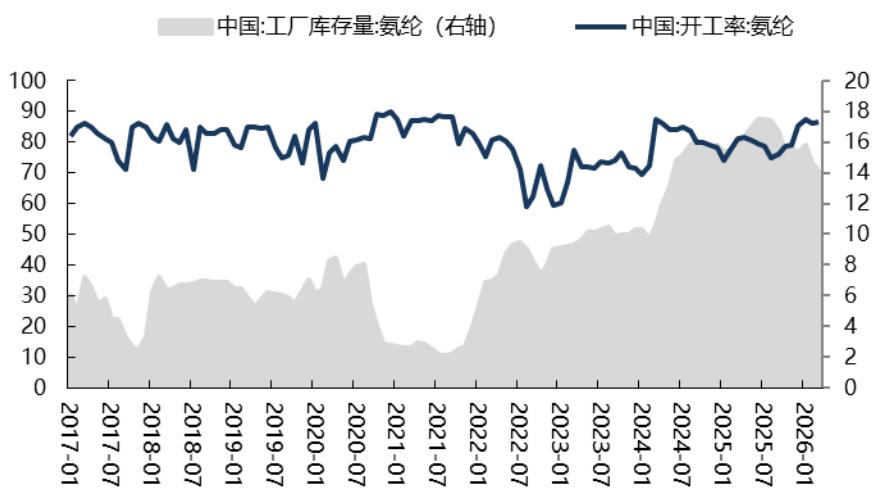

bar-line hybrid chart

| Date     | China:工厂库存量:氨纶 (右轴) | 中国:开工率:氨纶 |
|----------|------------------------------|------------------|
| 2017-01  | ~35                          | ~17              |
| 2017-07  | ~30                          | ~16              |
| 2018-01  | ~35                          | ~15              |
| 2018-07  | ~30                          | ~14              |
| 2019-01  | ~35                          | ~15              |
| 2019-07  | ~30                          | ~16              |
| 2020-01  | ~35                          | ~17              |
| 2020-07  | ~40                          | ~18              |
| 2021-01  | ~35                          | ~17              |
| 2021-07  | ~30                          | ~16              |
| 2022-01  | ~45                          | ~15              |
| 2022-07  | ~50                          | ~14              |
| 2023-01  | ~55                          | ~13              |
| 2023-07  | ~60                          | ~14              |
| 2024-01  | ~70                          | ~15              |
| 2024-07  | ~80                          | ~16              |
| 2025-01  | ~85                          | ~17              |
| 2025-07  | ~80                          | ~16              |
| 2026-01  | ~85                          | ~17              |

## 2.8 化纤：己内酰胺/锦纶

己内酰胺价格及毛利（元/吨）  
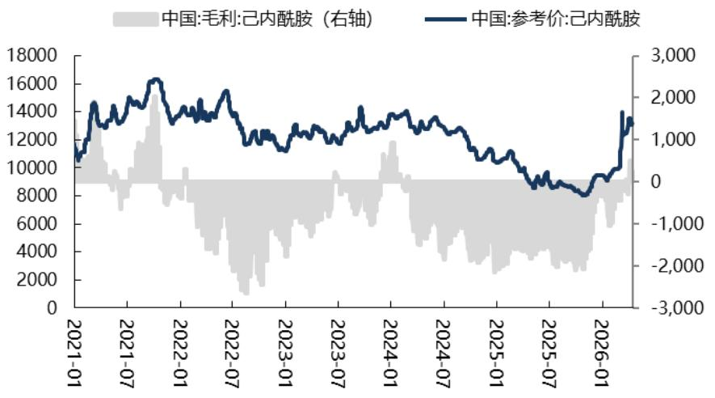

bar-line hybrid chart

| Date     | 中国:毛利:己内酰胺 (右轴) | 中国:参考价:己内酰胺 |
|----------|---------------------------|----------------------|
| 2021-01  | ~9000                     | ~1000                |
| 2021-07  | ~14000                    | ~16000               |
| 2022-01  | ~10000                    | ~14000               |
| 2022-07  | ~8000                     | ~15000               |
| 2023-01  | ~6000                     | ~12000               |
| 2023-07  | ~9000                     | ~13000               |
| 2024-01  | ~11000                    | ~14000               |
| 2024-07  | ~8000                     | ~13000               |
| 2025-01  | ~6000                     | ~11000               |
| 2025-07  | ~5000                     | ~9000                |
| 2026-01  | ~8000                     | ~14000               |

己内酰胺价格及价差（元/吨）  
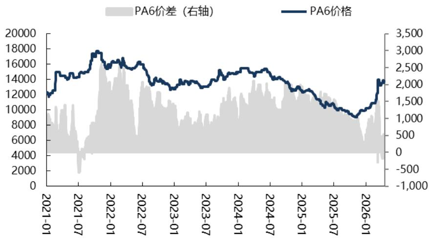

bar-line hybrid chart

| Date     | PA6价格 | PA6价差 (右轴) |
|----------|---------|----------------|
| 2021-01  | 12000   | -              |
| 2021-07  | 14000   | -              |
| 2022-01  | 18000   | -              |
| 2022-07  | 16000   | -              |
| 2023-01  | 14000   | -              |
| 2023-07  | 13000   | -              |
| 2024-01  | 15000   | -              |
| 2024-07  | 14000   | -              |
| 2025-01  | 12000   | -              |
| 2025-07  | 10000   | -              |
| 2026-01  | 14000   | -              |

## 2.8 化纤：粘胶长丝/短纤

粘胶长丝价格（元/吨）  
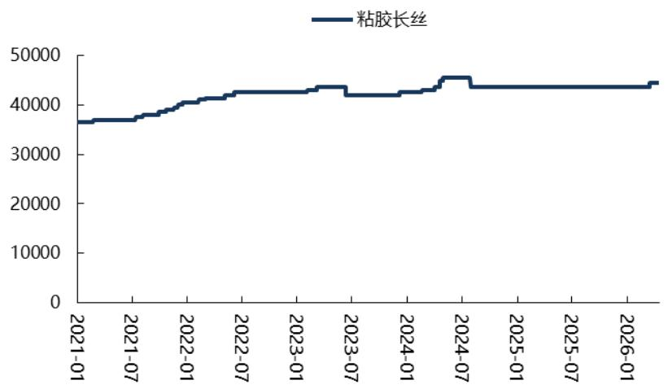

line chart

| Date     | 粘胶长丝 |
| -------- | -------- |
| 2021-01  | 37000    |
| 2021-07  | 38000    |
| 2022-01  | 40000    |
| 2022-07  | 42000    |
| 2023-01  | 43000    |
| 2023-07  | 42000    |
| 2024-01  | 43000    |
| 2024-07  | 45000    |
| 2025-01  | 44000    |
| 2025-07  | 44000    |
| 2026-01  | 44500    |

粘胶短纤价格及毛利（元/吨）  
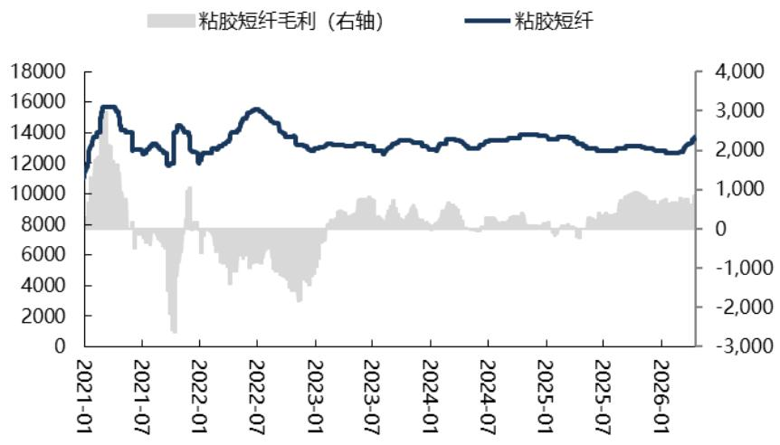

bar-line hybrid chart

| Date     | 粘胶短纤毛利 (右轴) | 粘胶短纤毛利 (左轴) |
|----------|----------------------|----------------------|
| 2021-01  | ~11,000              | ~15,000              |
| 2021-07  | ~8,000               | ~14,000              |
| 2022-01  | ~1,000               | ~13,000              |
| 2022-07  | ~8,000               | ~15,000              |
| 2023-01  | ~9,000               | ~13,500              |
| 2023-07  | ~8,500               | ~13,500              |
| 2024-01  | ~8,500               | ~13,500              |
| 2024-07  | ~8,500               | ~13,500              |
| 2025-01  | ~8,500               | ~13,500              |
| 2025-07  | ~9,500               | ~13,500              |
| 2026-01  | ~9,500               | ~13,500              |

## 2.9 新材料：有机硅/多晶硅

有机硅DMC价格及价差（元/吨）  
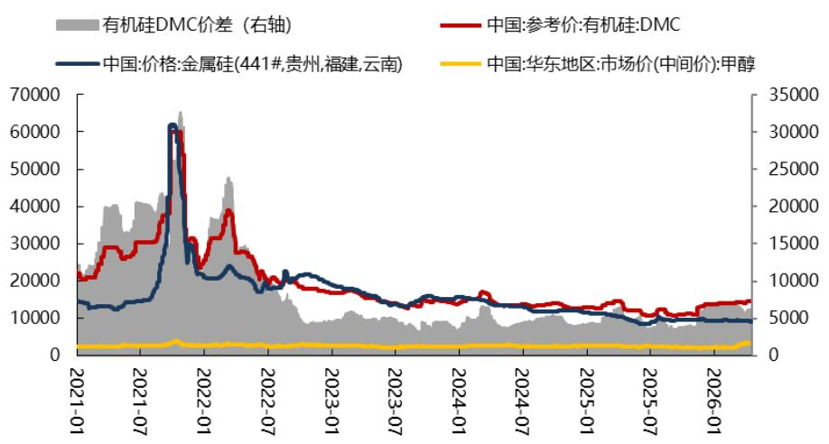

bar-line hybrid chart

| Date     | 有机硅DMC价差 (右轴) | 中国:参考价:有机硅:DMC | 中国:价格:金属硅(441#,贵州,福建,云南) | 中国:华东地区:市场价(中间价):甲醇 |
|----------|----------------------|------------------------|--------------------------------------|----------------------------------|
| 2021-01  | ~20000               | ~20000                 | ~15000                               | ~500                             |
| 2021-07  | ~40000               | ~30000                 | ~15000                               | ~500                             |
| 2022-01  | ~65000               | ~60000                 | ~60000                               | ~500                             |
| 2022-07  | ~45000               | ~35000                 | ~25000                               | ~500                             |
| 2023-01  | ~15000               | ~25000                 | ~20000                               | ~500                             |
| 2023-07  | ~10000               | ~20000                 | ~15000                               | ~500                             |
| 2024-01  | ~8000                | ~15000                 | ~15000                               | ~500                             |
| 2024-07  | ~7000                | ~15000                 | ~15000                               | ~500                             |
| 2025-01  | ~6500                | ~15000                 | ~15000                               | ~500                             |
| 2025-07  | ~6500                | ~15000                 | ~15000                               | ~500                             |
| 2026-01  | ~6500                | ~15000                 | ~15000                               | ~500                             |

107胶、硅油价格（元/吨）  
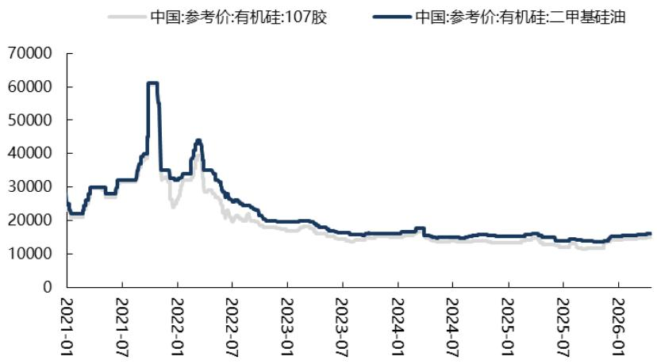

line chart

| Date     | 中国:参考价:有机硅:107胶 | 中国:参考价:有机硅:二甲基硅油 |
| -------- | ------------------------ | -------------------------- |
| 2021-01  | ~20000                   | ~25000                     |
| 2021-07  | ~30000                   | ~35000                     |
| 2021-14  | ~40000                   | ~60000                     |
| 2022-01  | ~35000                   | ~45000                     |
| 2022-07  | ~30000                   | ~35000                     |
| 2023-01  | ~25000                   | ~25000                     |
| 2023-07  | ~20000                   | ~20000                     |
| 2024-01  | ~18000                   | ~18000                     |
| 2024-07  | ~16000                   | ~16000                     |
| 2025-01  | ~15000                   | ~15000                     |
| 2025-07  | ~14000                   | ~14000                     |
| 2026-01  | ~15000                   | ~15000                     |

多晶硅价格（元/吨）  
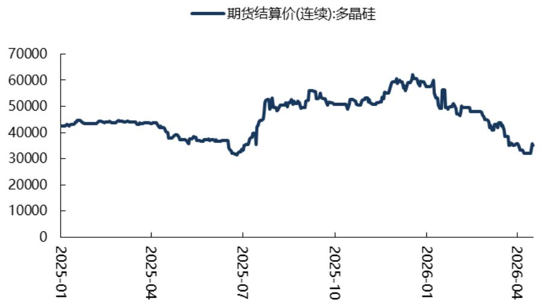

line chart

| Date     | 期货结算价(连续):多晶硅 |
| -------- | ------------------------ |
| 2025-01  | 43000                    |
| 2025-04  | 42000                    |
| 2025-07  | 32000                    |
| 2025-10  | 52000                    |
| 2026-01  | 60000                    |
| 2026-04  | 33000                    |

EVA价格（元/吨）  
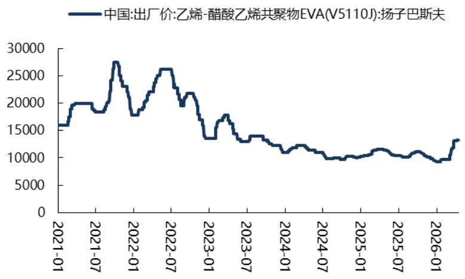

line chart

| Date     | 中国:出厂价:乙烯-醋酸乙烯共聚物EVA(V5110J):扬子巴斯夫 |
| -------- | -------------------------------------------------- |
| 2021-01  | 15000                                              |
| 2021-07  | 20000                                              |
| 2022-01  | 28000                                              |
| 2022-07  | 26000                                              |
| 2023-01  | 14000                                              |
| 2023-07  | 13000                                              |
| 2024-01  | 11000                                              |
| 2024-07  | 10000                                              |
| 2025-01  | 11000                                              |
| 2025-07  | 10500                                              |
| 2026-01  | 13000                                              |

POE价格（元/吨）  
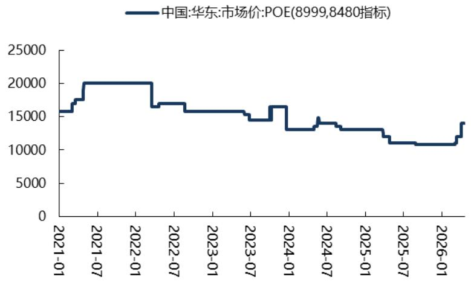

line chart

| Date     | 中国:华东:市场价:POE(8999,8480指标) |
| -------- | ---------------------------------- |
| 2021-01  | 15000                              |
| 2021-07  | 20000                              |
| 2022-01  | 20000                              |
| 2022-07  | 16000                              |
| 2023-01  | 15500                              |
| 2023-07  | 15000                              |
| 2024-01  | 16500                              |
| 2024-07  | 13500                              |
| 2025-01  | 13000                              |
| 2025-07  | 11500                              |
| 2026-01  | 11500                              |
| 2026-07  | 14500                              |

PA66价格（元/吨）  
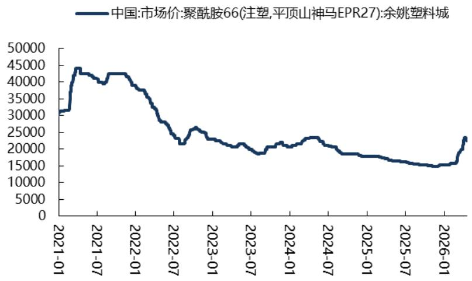

line chart

| Date     | 中国: 市场价: 聚酰胺66(注塑, 平顶山神马 EPR27): 余姚塑料城 |
| -------- | -------------------------------------------------------- |
| 2021-01  | 30000                                                    |
| 2021-07  | 45000                                                    |
| 2022-01  | 40000                                                    |
| 2022-07  | 25000                                                    |
| 2023-01  | 20000                                                    |
| 2023-07  | 18000                                                    |
| 2024-01  | 22000                                                    |
| 2024-07  | 23000                                                    |
| 2025-01  | 18000                                                    |
| 2025-07  | 16000                                                    |
| 2026-01  | 15000                                                    |
| 2026-07  | 17000                                                    |
| 2026-13  | 23000                                                    |

碳纤维价格（元/千克）  
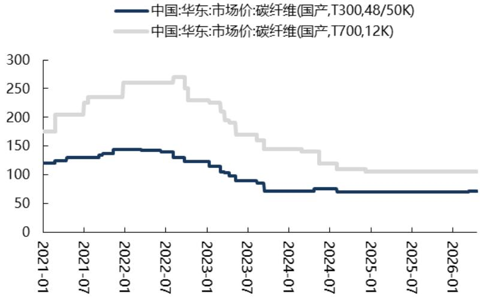

line chart

| Date     | 中国:华东:市场价:碳纤维(国产,T300,48/50K) | 中国:华东:市场价:碳纤维(国产,T700,12K) |
|----------|----------------------------------------|--------------------------------------|
| 2021-01  | 120                                    | 180                                  |
| 2021-07  | 130                                    | 200                                  |
| 2022-01  | 140                                    | 250                                  |
| 2022-07  | 135                                    | 270                                  |
| 2023-01  | 125                                    | 230                                  |
| 2023-07  | 90                                     | 180                                  |
| 2024-01  | 70                                     | 150                                  |
| 2024-07  | 75                                     | 130                                  |
| 2025-01  | 70                                     | 110                                  |
| 2025-07  | 70                                     | 105                                  |
| 2026-01  | 70                                     | 105                                  |

钛白粉价格（元/吨）  
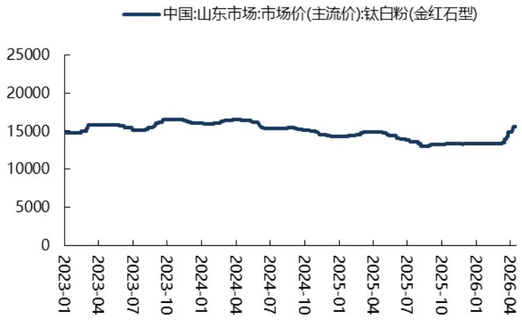

line chart

| Date     | 中国:山东市场:市场价(主流价):钛白粉(金红石型) |
| -------- | ------------------------------------------ |
| 2023-01  | 15000                                      |
| 2023-04  | 16000                                      |
| 2023-07  | 15500                                      |
| 2023-10  | 16500                                      |
| 2024-01  | 16000                                      |
| 2024-04  | 16500                                      |
| 2024-07  | 16000                                      |
| 2024-10  | 15500                                      |
| 2025-01  | 15000                                      |
| 2025-04  | 15500                                      |
| 2025-07  | 14500                                      |
| 2025-10  | 13500                                      |
| 2026-01  | 13500                                      |
| 2026-04  | 15500                                      |

纯碱价格（元/吨）  
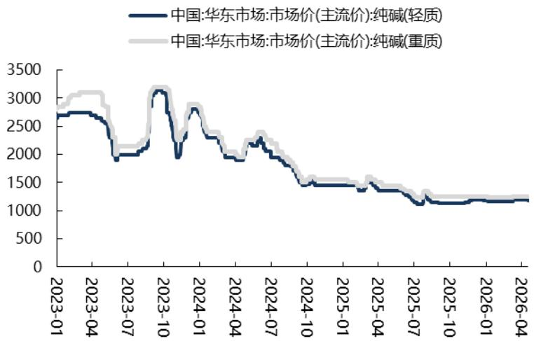

line chart

| Date     | 中国:华东市场:市场价(主流价):纯碱(轻质) | 中国:华东市场:市场价(主流价):纯碱(重质) |
|----------|----------------------------------------|----------------------------------------|
| 2023-01  | ~2700                                  | ~3000                                  |
| 2023-04  | ~2750                                  | ~3100                                  |
| 2023-07  | ~1900                                  | ~2100                                  |
| 2023-10  | ~3100                                  | ~3200                                  |
| 2024-01  | ~1950                                  | ~2800                                  |
| 2024-04  | ~2100                                  | ~2300                                  |
| 2024-07  | ~1950                                  | ~2200                                  |
| 2024-10  | ~1500                                  | ~1600                                  |
| 2025-01  | ~1450                                  | ~1550                                  |
| 2025-04  | ~1400                                  | ~1500                                  |
| 2025-07  | ~1150                                  | ~1300                                  |
| 2025-10  | ~1150                                  | ~1350                                  |
| 2026-01  | ~1150                                  | ~1350                                  |
| 2026-04  | ~1150                                  | ~1350                                  |

烧碱价格（元/吨）  
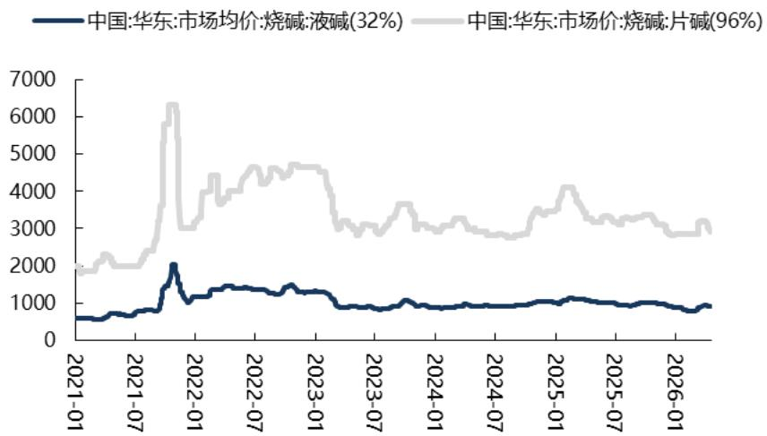

line chart

| Date     | 中国:华东:市场均价:烧碱:液碱(32%) | 中国:华东:市场均价:烧碱:片碱(96%) |
|----------|----------------------------------|----------------------------------|
| 2021-01  | ~500                             | ~1800                            |
| 2021-07  | ~600                             | ~2000                            |
| 2022-01  | ~1500                            | ~6500                            |
| 2022-07  | ~1400                            | ~4500                            |
| 2023-01  | ~1300                            | ~4800                            |
| 2023-07  | ~1000                            | ~3500                            |
| 2024-01  | ~900                             | ~3200                            |
| 2024-07  | ~950                             | ~3000                            |
| 2025-01  | ~1000                            | ~4200                            |
| 2025-07  | ~950                             | ~3500                            |
| 2026-01  | ~900                             | ~3200                            |

PVC价格（元/吨）  
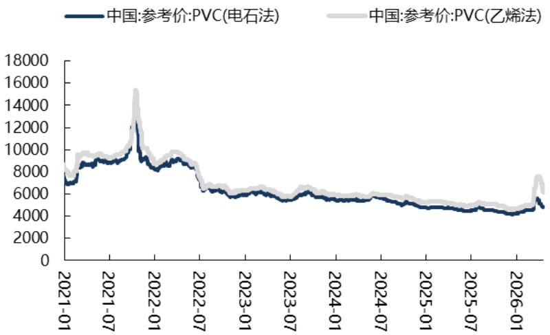

line chart

| Date     | 中国:参考价:PVC(电石法) | 中国:参考价:PVC(乙烯法) |
| -------- | ------------------------ | ------------------------ |
| 2021-01  | ~7000                    | ~8000                    |
| 2021-07  | ~9000                    | ~10000                   |
| 2022-01  | ~13000                   | ~15000                   |
| 2022-07  | ~8000                    | ~9000                    |
| 2023-01  | ~6000                    | ~7000                    |
| 2023-07  | ~5500                    | ~6500                    |
| 2024-01  | ~5500                    | ~6500                    |
| 2024-07  | ~5500                    | ~6500                    |
| 2025-01  | ~5500                    | ~6500                    |
| 2025-07  | ~5500                    | ~6500                    |
| 2026-01  | ~5500                    | ~7500                    |

草酸价格（元/吨）  
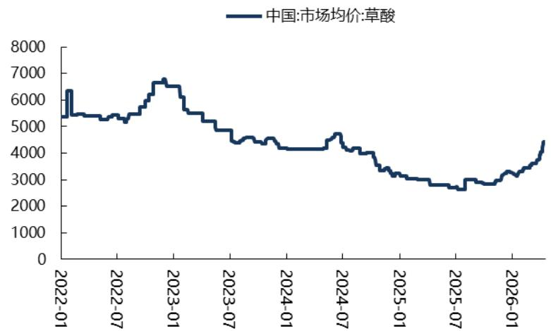

line chart

| Date     | 中国:市场均价:草酸 |
| -------- | ------------------ |
| 2022-01  | 6500               |
| 2022-07  | 5500               |
| 2023-01  | 6800               |
| 2023-07  | 5000               |
| 2024-01  | 4500               |
| 2024-07  | 4800               |
| 2025-01  | 3500               |
| 2025-07  | 2800               |
| 2026-01  | 4500               |

辛醇价格及毛利（元/吨，元/吨）  
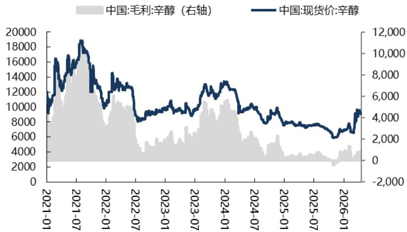

bar-line hybrid chart

| Date     | 中国:毛利:辛醇 (右轴) | 中国:现货价:辛醇 |
|----------|------------------------|------------------|
| 2021-01  | ~3000                  | ~10,000          |
| 2021-07  | ~18,000                | ~12,000          |
| 2022-01  | ~10,000                | ~8,000           |
| 2022-07  | ~4,000                 | ~6,000           |
| 2023-01  | ~6,000                 | ~8,000           |
| 2023-07  | ~8,000                 | ~10,000          |
| 2024-01  | ~10,000                | ~12,000          |
| 2024-07  | ~6,000                 | ~8,000           |
| 2025-01  | ~4,000                 | ~6,000           |
| 2025-07  | ~2,000                 | ~4,000           |
| 2026-01  | ~4,000                 | ~6,000           |

DMF价格及毛利（元/吨，元/吨）  
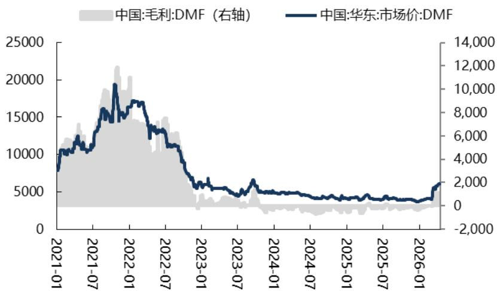

bar-line hybrid chart

| Date     | 中国:毛利:DMF (右轴) | 中国:华东:市场价:DMF |
|----------|----------------------|----------------------|
| 2021-01  | ~8,000               | ~8,000               |
| 2021-07  | ~15,000              | ~15,000              |
| 2022-01  | ~22,000              | ~20,000              |
| 2022-07  | ~14,000              | ~16,000              |
| 2023-01  | ~3,000               | ~5,000               |
| 2023-07  | ~2,000               | ~4,000               |
| 2024-01  | ~1,500               | ~3,500               |
| 2024-07  | ~1,000               | ~3,000               |
| 2025-01  | ~8,000               | ~2,500               |
| 2025-07  | ~6,000               | ~2,000               |
| 2026-01  | ~4,000               | ~1,500               |

醋酸价格及毛利（元/吨，元/吨）  
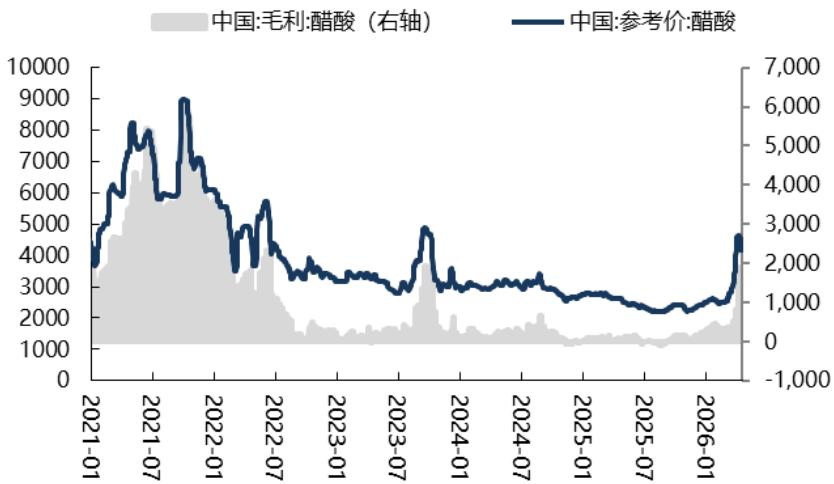

bar-line hybrid chart

| Date     | 中国:毛利:醋酸 (右轴) | 中国:参考价:醋酸 |
|----------|------------------------|------------------|
| 2021-01  | ~3500                  | ~4000            |
| 2021-07  | ~8000                  | ~9000            |
| 2022-01  | ~6000                  | ~7000            |
| 2022-07  | ~3500                  | ~5500            |
| 2023-01  | ~2000                  | ~3500            |
| 2023-07  | ~1500                  | ~3000            |
| 2024-01  | ~1500                  | ~3500            |
| 2024-07  | ~1500                  | ~3000            |
| 2025-01  | ~1500                  | ~2500            |
| 2025-07  | ~1500                  | ~2500            |
| 2026-01  | ~1500                  | ~4500            |

丙烯酸价格（元/吨）  
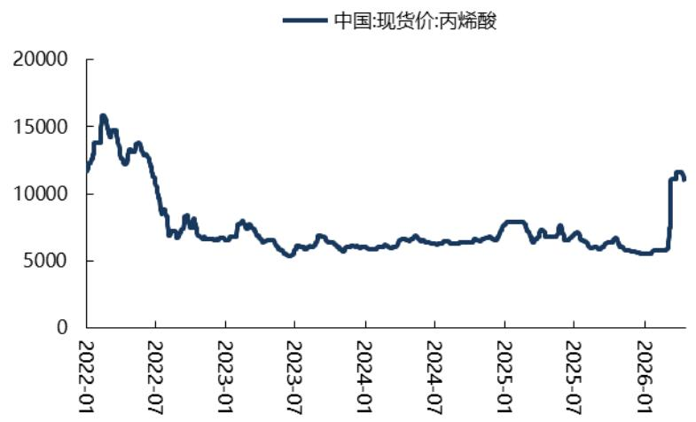

line chart

| Date     | 中国:现货价:丙烯酸 |
| -------- | ------------------ |
| 2022-01  | ~12000             |
| 2022-07  | ~15500             |
| 2023-01  | ~7000              |
| 2023-07  | ~6500              |
| 2024-01  | ~6000              |
| 2024-07  | ~6500              |
| 2025-01  | ~7500              |
| 2025-07  | ~6500              |
| 2026-01  | ~11500             |

丙烯酸丁酯价格（元/吨）  
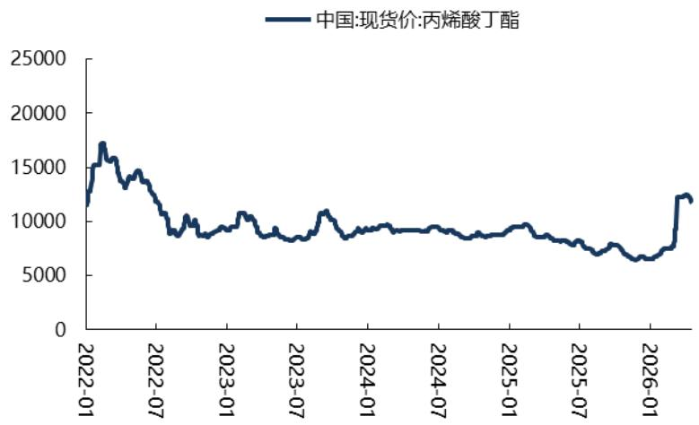

line chart

| Date     | 中国:现货价:丙烯酸丁酯 |
| -------- | --------------------- |
| 2022-01  | 12000                 |
| 2022-07  | 17000                 |
| 2023-01  | 9000                  |
| 2023-07  | 8500                  |
| 2024-01  | 9500                  |
| 2024-07  | 9000                  |
| 2025-01  | 9500                  |
| 2025-07  | 7500                  |
| 2026-01  | 12000                 |

ABS价格（元/吨）  
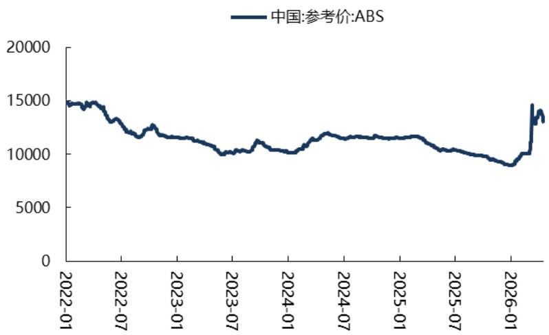

line chart

| Date     | 中国:参考价:ABS |
| -------- | --------------- |
| 2022-01  | 15000           |
| 2022-07  | 14000           |
| 2023-01  | 12000           |
| 2023-07  | 10000           |
| 2024-01  | 11000           |
| 2024-07  | 12000           |
| 2025-01  | 11500           |
| 2025-07  | 10500           |
| 2026-01  | 9000            |
| 2026-06  | 14000           |

MMA价格（元/吨）  
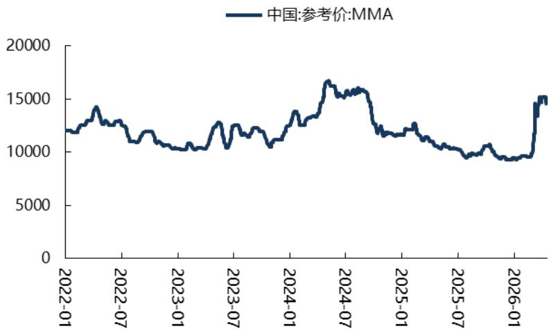

line chart

| Date     | 中国:参考价:MMA |
| -------- | --------------- |
| 2022-01  | ~12000          |
| 2022-07  | ~14000          |
| 2023-01  | ~10000          |
| 2023-07  | ~11000          |
| 2024-01  | ~13000          |
| 2024-07  | ~16000          |
| 2025-01  | ~12000          |
| 2025-07  | ~10000          |
| 2026-01  | ~9500           |
| 2026-07  | ~15000          |

natural_image

Exterior view of a modern curved glass office building with a logo on top (no visible text or signage)

## 3. 风险提示

## 3. 风险提示

- 项目实施进度不及预期  
- 宏观经济增速下滑，导致需求复苏弱于预期  
- 地缘风险演化导致原材料价格波动  
- 行业产能发生重大变化  
- 统计口径及计算误差

东吴证券股份有限公司经中国证券监督管理委员会批准，已具备证券投资咨询业务资格。

本研究报告仅供东吴证券股份有限公司（以下简称“本公司”）的客户使用。本公司不会因接收人收到本报告而视其为客户。在任何情况下，本报告中的信息或所表述的意见并不构成对任何人的投资建议，本公司及作者不对任何人因使用本报告中的内容所导致的任何后果负任何责任。任何形式的分享证券投资收益或者分担证券投资损失的书面或口头承诺均为无效。

在法律许可的情况下，东吴证券及其所属关联机构可能会持有报告中提到的公司所发行的证券并进行交易，还可能为这些公司提供投资银行服务或其他服务。

市场有风险，投资需谨慎。本报告是基于本公司分析师认为可靠且已公开的信息，本公司力求但不保证这些信息的准确性和完整性，也不保证文中观点或陈述不会发生任何变更，在不同时期，本公司可发出与本报告所载资料、意见及推测不一致的报告。

本报告的版权归本公司所有，未经书面许可，任何机构和个人不得以任何形式翻版、复制和发布。经授权刊载、转发本报告或者摘要的，应当注明出处为东吴证券研究所，并注明本报告发布人和发布日期，提示使用本报告的风险，且不得对本报告进行有悖原意的引用、删节和修改。未经授权或未按要求刊载、转发本报告的，应当承担相应的法律责任。本公司将保留向其追究法律责任的权利。

## 东吴证券投资评级标准

投资评级基于分析师对报告发布日后6至12个月内行业或公司回报潜力相对基准表现的预期（A股市场基准为沪深300指数，香港市场基准为恒生指数，美国市场基准为标普500指数，新三板基准指数为三板成指（针对协议转让标的）或三板做市指数（针对做市转让标的）），具体如下：

公司投资评级：

买入：预期未来6个月个股涨跌幅相对基准在15%以上；

增持：预期未来6个月个股涨跌幅相对基准介于5%与15%之间；

中性：预期未来6个月个股涨跌幅相对基准介于-5%与5%之间；

减持：预期未来6个月个股涨跌幅相对基准介于-15%与-5%之间；

卖出：预期未来6个月个股涨跌幅相对基准在-15%以下。

行业投资评级：

增持：预期未来6个月内，行业指数相对强于基准5%以上；

中性：预期未来6个月内，行业指数相对基准-5%与5%;

减持：预期未来6个月内，行业指数相对弱于基准5%以上。

我们在此提醒您，不同证券研究机构采用不同的评级术语及评级标准。我们采用的是相对评级体系，表示投资的相对比重建议。投资者买入或者卖出证券的决定应当充分考虑自身特定状况，如具体投资目的、财务状况以及特定需求等，并完整理解和使用本报告内容，不应视本报告为做出投资决策的唯一因素。

东吴证券研究所

苏州工业园区星阳街5号

邮政编码：215021

传真：(0512) 62938527

公司网址：http://www.dwzq.com.cn

## 东吴证券 财富家园