# 以海外银保为鉴，观我国寿险发展新格局

 行业深度报告

<table><tr><td>姓名</td><td>电话</td><td>邮箱</td><td>登记编号</td></tr><tr><td>刘欣琦(分析师)</td><td>021-38676647</td><td>liuxinqi@gtht.com</td><td>S0880515050001</td></tr><tr><td>唐关勇(分析师)</td><td>021-38031032</td><td>tangguanyong@gtht.com</td><td>S0880526030006</td></tr><tr><td>李嘉木(分析师)</td><td>021-38038619</td><td>lijiamu@gtht.com</td><td>S0880524030003</td></tr></table>

## 本报告导读：

以海外为鉴，我国银保渠道有望成为居民存款迁移的核心载体，而头部险企有望发挥综合优势转型银保合作模式，推动行业格局优化，进而驱动负债端高质量增长。

## 投资要点：

。 投资建议：低利率环境下我国居民资产由存款向长期金融产品迁移，保险的“刚兑+收益率”优势有望成为“存款搬家”重要载体，银保渠道则为核心枢纽；银保监管规范化进一步凸显头部险企综合优势，银保合作模式有望转型升级，行业集中度稳步提升，保险负债端实现高质量增长。维持行业“增持”评级。个股方面，推荐标的中国太保/中国平安/新华保险/中国财险/中国人寿/中国人民保险集团。

。 海外借鉴：全球各国和地区银保渠道发展程度分化，或受供需逻辑、制度环境以及合作模式差异所影响。全球银保发展程度表现分化，法国、意大利等欧洲市场银保占比长期在 60%以上，中国香港、韩国、中国台湾等亚洲市场银保亦为核心渠道，而美国、日本则仍以代理人体系为主。（1）需求基础，低利率环境下居民存款向非银资产迁移、银行净息差收窄后中收诉求上升，是银保发展的共同前提；（2）供给替代，不同国家和地区居民财富迁移的承接方向存在差异，美国长期资金更多流向股票、基金及 IRA、401(k)等养老金账户，保险储蓄功能被明显分流；而韩国、中国台湾、中国香港等市场中，保险本身承担了更强的长期储蓄和财富管理功能，且储蓄型、年金型、投资型及分红型产品与银行渠道销售场景更为契合，因此银保更易发展；（3）制度差异，融资结构与金融混业程度决定了银行能否掌握居民财富管理入口，以及银行与保险之间能否形成更深层次协同，银行主导型且混业推进较早的市场通常更有利于银保渠道扩张。（4）在此基础上，各国和地区进一步形成了差异化的合作模式：中国内地、日本以协议代理为主，中国香港更偏长期战略联盟，法国、意大利更多采用资本合作模式，中国台湾及部分欧洲市场则发展出金融集团模式，合作深度差异进一步强化了全球银保格局分化。

。 国内启示：银保渠道有望成为我国居民存款搬家的核心载体。（1）历史复盘：我国银保渠道自 2000年启动以来，经历由政策驱动、产品驱动到结构转型的多阶段演进，监管放松与产品转型为主要影响因素。（2）当前现状：银保产品形态向期缴转型，行业集中度稳步提升。行业模式从“价格竞争”向“价值竞争”转型，银保价值贡献提升，头部险企综合优势凸显驱动集中度提升。（3）未来趋势：银保有望成为承接居民储蓄迁移的核心渠道，银行净息差持续收窄下中间业务收入重要性提升，香港市场已验证“银保+分红险”模式具备较强生命力，分红险转型与银保深化具备协调效应，头部险企有望发挥综合优势与银行的合作关系从协议代理向长期战略合作转型，部分险企有望深化金融集团的银保一体化合作，推动银保高质量发展。

。 风险提示：长端利率下行；权益市场波动；负债成本改善不及预期。

dustry] 保险

[Table\_I评级：

增持

## [Table\_Rep相关报告

保险《资负联动是经营关键，保险加服务成重点》2026.04.01保险《26年 1-2月保费稳健，险企业绩持续向好带动保险估值修复》2026.03.31保险《25业绩整体符合预期，保险股配置价值凸显》2026.03.31保险《26年 1-2月寿险保费景气增长，财险增速放缓》2026.03.31保险《资负联动是关键》2026.03.20

## 目录

## 1. 全球银保格局：欧洲与亚洲兴盛，美日占比偏低..

1.1. 欧洲：银保渠道发源地，大部分国家银保占比在 6成以上. .3  
1.2. 亚洲：韩国、香港、台湾等地增长较快，日本占比较低...  
1.3. 美国：独立和专属代理人为主，银保渠道占比相对较低...

## 2. 外部因素：需求基础、供给替代与制度环境共同作用. 6

2.1. 需求基础：低利率驱动存款迁移，银行中收诉求同步上升....  
2.2. 供给替代：非银资产承接方向分化，决定银保承接空间...  
2.3. 制度差异：银行地位与金融混业深度塑造银保分化 .10

## 3. 内部驱动：协议代理、战略联盟、资本合作、金融集团等合作模式.....13

3.1. 协议代理：简约化的合作模式，以中国内地和日本为主. ..14  
3.2. 战略联盟：银保关系由“代销渠道”升级为“共同经营” ..15  
3.3. 资本合作：从“业务合作”到“股权关系”的转变 . .16  
3.4. 金融集团：银行与保险的一体化经营模式  
3.5. 总结：三因素影响全球银保分化，进一步形成合作模式差异...........17

## 4. 国内启示：银保迈向新范式，行业格局有望优化.. 19

4.1. 历史复盘：政策宽松与产品转型是银保渠道发展的关键变量...........19  
4.2. 当前现状：期缴化与集中度提升，银保迈向价值竞争 ..20  
4.3. 未来展望：承接存款迁移、行业集中度提升、合作模式升级...........21

## 5. 投资建议 . .24

## 6. 风险提示 .... .25

## 1. 全球银保格局：欧洲与亚洲兴盛，美日占比偏低

## 1.1. 欧洲：银保渠道发源地，大部分国家银保占比在 6成以上

欧洲主流国家 2000年以来银保渠道保费贡献约 7成。欧洲作为银保业务发源地，20世纪 80年代起，欧盟颁布多个文件推动金融市场自由化和银行业一体化，加剧了银行竞争，开启了全能银行模式，打通了银行销售保险的路径，1985年至2000年，欧盟银保渠道的原保费全球市场份额从10%快速提升至 50%，主流保险机构长期以来均将银保作为重点战略渠道。欧洲寿险银保渗透率约达到35%，从具体国别看，法国、意大利、西班牙、马耳他、葡萄牙、土耳其等国家均将银保渠道作为主要来源，2004-2019 年的银保渠道占总保费比重分别达到 62.8%、72.8%、65.8%、81%、81%、67%。

图1：2004-2019年欧洲主要国家的银保渠道  
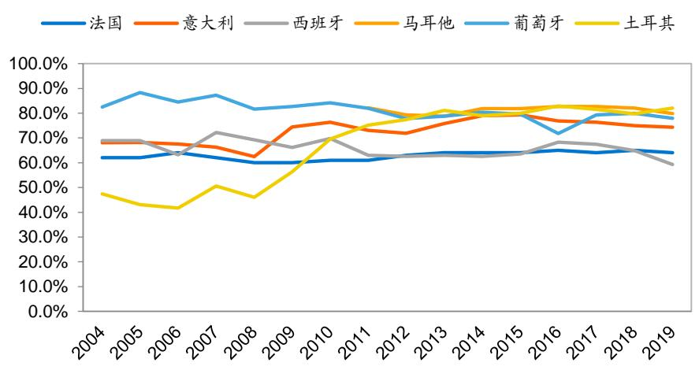

line chart

| Year | 法国  | 意大利 | 西班牙 | 马耳他 | 葡萄牙 | 土耳其 |
|------|-------|--------|--------|--------|--------|--------|
| 2004 | 62.0% | 68.0%  | 68.0%  | 68.0%  | 83.0%  | 47.0%  |
| 2005 | 62.0% | 67.0%  | 68.0%  | 68.0%  | 88.0%  | 43.0%  |
| 2006 | 62.0% | 66.0%  | 65.0%  | 68.0%  | 85.0%  | 41.0%  |
| 2007 | 62.0% | 65.0%  | 72.0%  | 68.0%  | 87.0%  | 50.0%  |
| 2008 | 61.0% | 63.0%  | 68.0%  | 68.0%  | 82.0%  | 45.0%  |
| 2009 | 61.0% | 74.0%  | 65.0%  | 68.0%  | 82.0%  | 55.0%  |
| 2010 | 61.0% | 75.0%  | 65.0%  | 70.0%  | 84.0%  | 70.0%  |
| 2011 | 61.0% | 73.0%  | 62.0%  | 75.0%  | 83.0%  | 75.0%  |
| 2012 | 61.0% | 72.0%  | 62.0%  | 78.0%  | 78.0%  | 78.0%  |
| 2013 | 61.0% | 73.0%  | 62.0%  | 78.0%  | 79.0%  | 81.0%  |
| 2014 | 61.0% | 75.0%  | 62.0%  | 81.0%  | 79.0%  | 81.0%  |
| 2015 | 61.0% | 75.0%  | 62.0%  | 81.0%  | 79.0%  | 81.0%  |
| 2016 | 61.0% | 74.0%  | 65.0%  | 81.0%  | 73.0%  | 83.0%  |
| 2017 | 61.0% | 73.0%  | 65.0%  | 81.0%  | 79.0%  | 83.0%  |
| 2018 | 61.0% | 73.0%  | 65.0%  | 81.0%  | 79.0%  | 83.0%  |
| 2019 | 61.0% | 73.0%  | 59.0%  | 81.0%  | 79.0%  | 83.0%  |

数据来源：欧洲保险业协会，国泰海通证券研究

## 1.2. 亚洲：韩国、香港、台湾等地增长较快，日本占比较低

中国台湾地区银保渠道贡献约 50%，是 2005-2018 年间中国台湾地区寿险实现高增长的主要来源。得益于中国台湾地区2005年起保险税收优惠政策（台湾地区实施商业人身险保险税减免政策，2007 年进一步对退休金免征印花税等），人口老龄化衍生出来的储蓄理财需求，中国台湾地区寿险保费在2005-2018年实现7.5%的复合增长，而2001年《金融控股公司法》实施后，银行与保险混业经营，银保渠道成为寿险销售的重要途径，银保渠道在2005-2018年实现复合增速9.9%，成为拉动寿险保费增长的主要贡献来源，银保渠道保费占比从2005年的37.5%提升至2018年的55%。2019年以后，中国台湾地区进入低利率甚至负利率阶段，监管为防范寿险利差损风险而下调责任准备金利率，叠加疫情以及全球贸易战导致经济增速放缓，居民收入预期的下滑影响了寿险需求。由此中国台湾地区寿险保费增速经历了多年的负增长，银保渠道贡献虽有所下滑，但占比仍然在 30%以上。

图2：中国台湾地区寿险总保费渠道结构  
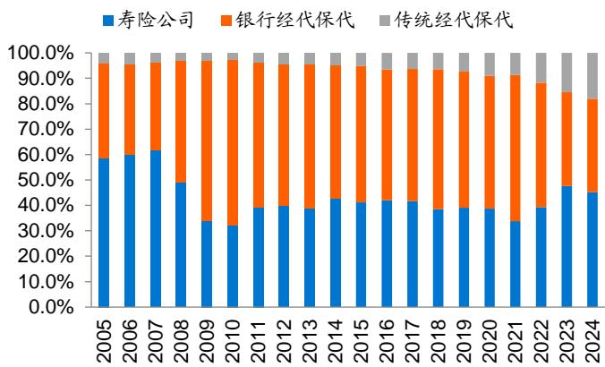

stacked bar chart

| 年份 | 寿险公司 (%) | 银行经代保代 (%) | 传统经代保代 (%) |
|---|---|---|---|
| 2005 | 60.0 | 38.0 | 3.0 |
| 2006 | 61.0 | 37.0 | 3.0 |
| 2007 | 62.0 | 36.0 | 3.0 |
| 2008 | 50.0 | 45.0 | 3.0 |
| 2009 | 34.0 | 65.0 | 3.0 |
| 2010 | 32.0 | 72.0 | 3.0 |
| 2011 | 40.0 | 68.0 | 3.0 |
| 2012 | 41.0 | 67.0 | 3.0 |
| 2013 | 41.0 | 68.0 | 3.0 |
| 2014 | 43.0 | 65.0 | 3.0 |
| 2015 | 41.0 | 64.0 | 3.0 |
| 2016 | 42.0 | 63.0 | 3.0 |
| 2017 | 41.0 | 64.0 | 3.0 |
| 2018 | 40.0 | 65.0 | 3.0 |
| 2019 | 41.0 | 64.0 | 3.0 |
| 2020 | 41.0 | 63.0 | 3.0 |
| 2021 | 34.0 | 65.0 | 3.0 |
| 2022 | 41.0 | 58.0 | 3.0 |
| 2023 | 48.0 | 47.0 | 3.0 |
| 2024 | 45.0 | 45.0 | 3.0 |

数据来源：中国台湾保险业协会，国泰海通证券研究

图3：中国台湾地区银保总保费规模及增速（百万台币）  
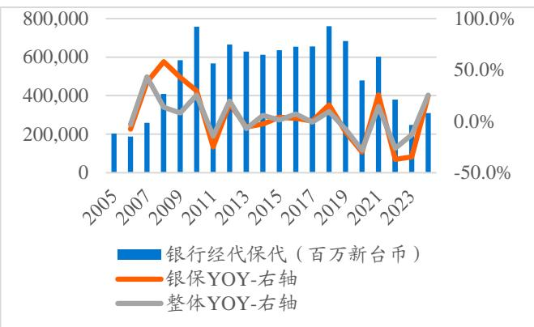

bar-line hybrid chart

| Year | 银行经代保代 (百万新台币) | 银保YOY-右轴 | 整体YOY-右轴 |
| --- | --- | --- | --- |
| 2005 | 200,000 | - | - |
| 2007 | 300,000 | - | - |
| 2009 | 500,000 | 60.0% | 40.0% |
| 2011 | 750,000 | - | - |
| 2013 | 650,000 | - | - |
| 2015 | 650,000 | - | - |
| 2017 | 650,000 | - | - |
| 2019 | 750,000 | - | - |
| 2021 | 450,000 | - | - |
| 2023 | 350,000 | - | - |
| 2023 | 350,000 | - | - |

数据来源：中国台湾保险业协会，国泰海通证券研究

中国香港银保渠道保费贡献超 40%，始终是香港人身险市场的主要保费来源。中国香港地区始终以银保渠道作为主要保费增长来源，2013-2024年银保渠道保费占比（整付+年度化保费）达到45%，这主要得益于香港地区的银行与保险集团深度绑定，打造一站式财富管理体系，叠加香港地区国际金融中心优势下储蓄分红险产品收益率具备优势，而银行网点零售网络密集，客户信任度高，为高净值客群提供了稳定可靠的理财产品。

图4：中国香港寿险渠道结构  
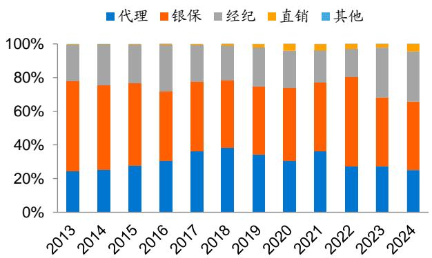

stacked bar chart

| Year | 代理 | 银保 | 经纪 | 直销 | 其他 |
|------|------|------|------|------|------|
| 2013 | 25%  | 75%  | 30%  | 0%   | 0%   |
| 2014 | 25%  | 70%  | 30%  | 0%   | 0%   |
| 2015 | 28%  | 68%  | 32%  | 0%   | 0%   |
| 2016 | 30%  | 65%  | 35%  | 0%   | 0%   |
| 2017 | 35%  | 55%  | 35%  | 0%   | 0%   |
| 2018 | 38%  | 48%  | 35%  | 5%   | 0%   |
| 2019 | 35%  | 45%  | 35%  | 5%   | 0%   |
| 2020 | 30%  | 50%  | 35%  | 5%   | 0%   |
| 2021 | 35%  | 55%  | 35%  | 5%   | 0%   |
| 2022 | 28%  | 68%  | 35%  | 5%   | 0%   |
| 2023 | 28%  | 55%  | 45%  | 5%   | 0%   |
| 2024 | 25%  | 50%  | 45%  | 5%   | 0%   |

数据来源：香港保监局，国泰海通证券研究

图5：中国香港地区银保渠道保费增长情况  
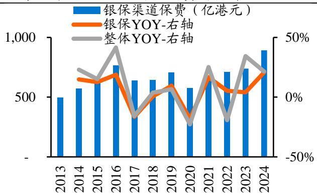

bar-line hybrid chart

| Year | 银保渠道保费 (亿港元) | 银保YOY-右轴 | 整体YOY-右轴 |
|------|------------------------|--------------|---------------|
| 2013 | 500                    | -            | -             |
| 2014 | 600                    | ~10%         | ~20%          |
| 2015 | 700                    | ~15%         | ~30%          |
| 2016 | 800                    | ~20%         | ~50%          |
| 2017 | 600                    | ~-10%        | ~-20%         |
| 2018 | 650                    | ~5%          | ~-5%          |
| 2019 | 700                    | ~10%         | ~-10%         |
| 2020 | 550                    | ~-15%        | ~-25%         |
| 2021 | 750                    | ~15%         | ~35%          |
| 2022 | 700                    | ~5%          | ~-10%         |
| 2023 | 800                    | ~10%         | ~40%          |
| 2024 | 900                    | ~15%         | ~35%          |

数据来源：香港保监局，国泰海通证券研究

韩国银保渠道保费贡献超过 50%，近 20 年复合增速达到 12%。韩国寿险业亦是以银保渠道作为主要的保费增长来源，银保渠道占比从 2003年的40%仍持续提升至 2022 年的 56%，近 20 年的复合增速达到 12%，支撑了韩国人身险保费的快速增长。韩国银保市场快速发展的原因主要包括政策支持、银行渠道积极参与、保险公司大力推动。韩国政府自上而下推动银行和保险公司合作。1997 年亚洲金融危机之后，韩国政府实施了全面的金融振兴政策，逐步放开银行销售保险的限制。韩国的银行业在亚洲金融危机后净息差收窄，对中收需求提升是银行发展银保业务的主要动力。

图6：韩国寿险业渠道结构  
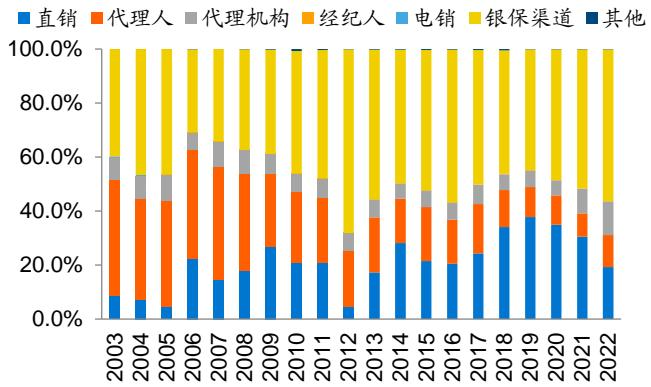

stacked bar chart

| Year | 直销 (%) | 代理人 (%) | 代理机构 (%) | 经纪人 (%) | 电销 (%) | 银保渠道 (%) | 其他 (%) |
|---|---|---|---|---|---|---|---|
| 2003 | 8.0 | 35.0 | 10.0 | 0.0 | 0.0 | 45.0 | 0.0 |
| 2004 | 7.0 | 36.0 | 9.0 | 0.0 | 0.0 | 45.0 | 0.0 |
| 2005 | 5.0 | 34.0 | 10.0 | 0.0 | 0.0 | 45.0 | 0.0 |
| 2006 | 22.0 | 33.0 | 7.0 | 0.0 | 0.0 | 35.0 | 0.0 |
| 2007 | 15.0 | 35.0 | 11.0 | 0.0 | 0.0 | 35.0 | 0.0 |
| 2008 | 18.0 | 31.0 | 11.0 | 0.0 | 0.0 | 35.0 | 0.0 |
| 2009 | 27.0 | 28.0 | 11.0 | 0.0 | 0.0 | 45.0 | 0.0 |
| 2010 | 21.0 | 26.0 | 9.0 | 0.0 | 0.0 | 45.0 | 1.0 |
| 2011 | 21.0 | 24.0 | 9.0 | 0.0 | 0.0 | 45.0 | 1.0 |
| 2012 | 4.0 | 18.0 | 11.0 | 0.0 | 0.0 | 65.0 | 1.0 |
| 2013 | 17.0 | 16.0 | 9.0 | 0.0 | 0.0 | 55.0 | 1.0 |
| 2014 | 28.0 | 14.0 | 9.0 | 0.0 | 0.0 | 45.0 | 1.0 |
| 2015 | 22.0 | 16.0 | 9.0 | 0.0 | 0.0 | 45.0 | 1.0 |
| 2016 | 22.0 | 16.0 | 9.0 | 0.0 | 0.0 | 45.0 | 1.0 |
| 2017 | 24.0 | 16.0 | 9.0 | 1.5 | 1.5 | 45.0 | 1.5 |
| 2018 | 34.0 | 14.5 | 9.5 | 1.5 | 1.5 | 45.5 | 1.5 |
| 2019 | 38.5 | 13.5 | 9.5 | 1.5 | 1.5 | 45.5 | 1.5 |
| 2020 | 35.5 | 13.5 | 9.5 | 1.5 | 1.5 | 45.5 | 1.5 |
| 2021 | 31.5 | 14.5 | 11.5 | 1.5 | 1.5 | 45.5 | - |
| 2022 | 19.5 | 13.5 | 13.5 | - | - | - | - |
The chart displays the percentage distribution of sales channels from '直销' (Direct Sales) and '代理人' (Administrators) over time, with additional categories for '代理机构' (Agency Institutions), '经纪人' (经纪人), '电销' (Electrician), '银保渠道' (Bank Deposits), and '其他' (Others). The data is presented in a stacked bar format with each bar segmented by category and labeled with the corresponding percentage values at the top of each bar.

数据来源：韩国保险业协会，国泰海通证券研究

图7：韩国银保渠道保费增长情况  
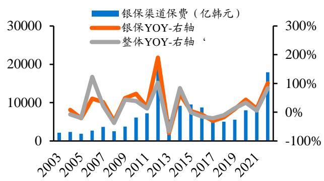

bar-line hybrid chart

| Year | 银保渠道保费 (亿韩元) | 银保YOY-右轴 | 整体YOY-右轴 |
|------|------------------------|--------------|--------------|
| 2003 | ~1000                  | ~50%         | ~50%         |
| 2005 | ~1500                  | ~75%         | ~75%         |
| 2007 | ~2000                  | ~125%        | ~175%        |
| 2009 | ~3000                  | ~50%         | ~50%         |
| 2011 | ~6000                  | ~125%        | ~125%        |
| 2013 | ~18000                 | ~225%        | ~175%        |
| 2015 | ~9000                  | ~50%         | ~125%        |
| 2017 | ~8000                  | ~25%         | ~25%         |
| 2019 | ~6000                  | ~12.5%       | ~12.5%       |
| 2021 | ~18000                 | ~150%        | ~150%        |

数据来源：韩国保险业协会，国泰海通证券研究

日本人身险行业形成了代理人渠道为主、代理店为辅的渠道模式，银保渠道贡献较小。日本寿险行业渠道结构呈现出“以营销员渠道为核心、银保及邮政渠道为重要补充、中介渠道持续崛起”的多元化格局。其中，营销员渠道依托长期形成的“营销职员体系”，在新单销售中占据主导地位；银保渠道在 2000年后逐步放开，主要采用协议代理模式，由银行员工销售保险产品；邮政渠道凭借日本邮政体系的广泛网点覆盖，在特定客群中具备显著优势。整体来看，日本寿险行业并未形成以银保为主导的销售模式，而是保持了以个险渠道为核心的结构特征。

图8：日本人寿保险行业购买保险的渠道结构  
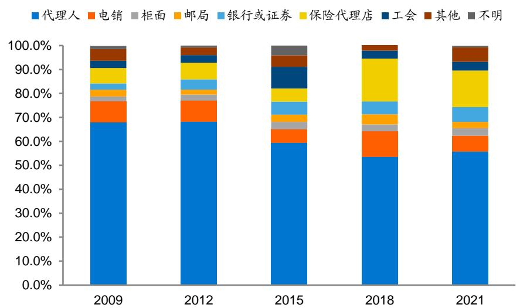

stacked bar chart

| Year | 代理人 | 电销 | 柜面 | 邮局 | 银行或证券 | 保险代理店 | 工会 | 其他 | 不明 |
|------|---------|------|------|------|------------|------------|------|------|------|
| 2009 | 67.0%   | 8.0% | 3.0% | 4.0% | 3.0%       | 7.0%       | 2.0% | 3.0% | 1.0% |
| 2012 | 67.0%   | 8.0% | 3.0% | 4.0% | 3.0%       | 7.0%       | 2.0% | 3.0% | 1.0% |
| 2015 | 59.0%   | 5.0% | 3.0% | 4.0% | 5.0%       | 5.0%       | 5.0% | 4.0% | 2.0% |
| 2018 | 53.0%   | 8.0% | 3.0% | 4.0% | 5.0%       | 14.0%      | 2.0% | 2.0% | 1.0% |
| 2021 | 55.0%   | 5.0% | 3.0% | 4.0% | 5.0%       | 14.0%      | 2.0% | 4.0% | 1.0% |

数据来源：日本生命保险文化中心，国泰海通证券研究

## 1.3. 美国：独立和专属代理人为主，银保渠道占比相对较低

美国人身险市场形成以代理人渠道为绝对主导的分销结构。根据 LIMRA 数据，2020 年独立代理人与经纪人渠道贡献的保费贡献约 53%，专属代理人渠道贡献 36%，代理人体系长期稳居第一大分销渠道。相比之下，银行渠道及其他金融机构渠道占比明显较低，未形成类似欧洲或亚洲市场的银保主导格局。从销售方式看，大部分寿险交易仍依赖面对面沟通与专业顾问参与，进一步强化了代理人渠道在客户获取与产品销售中的核心地位，预计保障型为主产品结构以及经纪文化形成了以代理人为主的渠道模式。

图9：2023年美国人身险产品渠道结构  
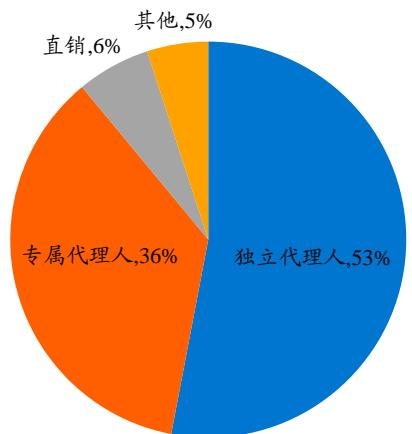

pie chart

| 类别 | 占比 (%) |
| :--- | :--- |
| 独立代理人 | 53 |
| 专属代理人 | 36 |
| 直销 | 6 |
| 其他 | 5 |

数据来源：LIMRA，国泰海通证券研究

全球各国和地区的银保渠道发展程度表现分化，整体呈现大部分欧洲和亚洲国家和地区的银保渠道占比高，日本和美国等国家以代理人为主的发展态势，其银保渠道发展程度的差异或受到多重外部因素影响，而险企自身与银保渠道的合作模式也造成了银保贡献的分化。

## 2. 外部因素：需求基础、供给替代与制度环境共同作用

## 2.1. 需求基础：低利率驱动存款迁移，银行中收诉求同步上升

低利率环境推动居民存款由银行体系向非银资产迁移。从国际经验看，低利率往往是居民资产由银行存款向非银金融资产再配置的重要催化因素。20世纪 80年代以来，全球主要经济体利率中枢整体下移，日本、欧洲等经济体长期处于低利率甚至零利率环境，传统存款产品收益率持续走低，居民持有存款的机会成本上升。在此背景下，银行存款的吸引力相对减弱，居民资金开始逐步向收益风险特征更具比较优势的非银资产迁移，包括保险、基金及其他中长期财富管理产品。尤其在储蓄率较高、居民资产配置需求较强的市场，低利率环境下“存款搬家”现象更为明显，推动非银金融机构在居民财富管理中的占比持续提升。

图10：全球各国和地区的存款利率（%）  
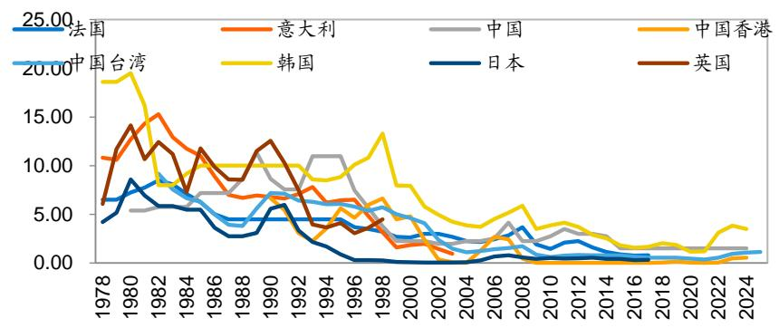

line chart

| Year | 法国 | 意大利 | 中国 | 中国香港 | 中国台湾 | 韩国 | 日本 | 英国 |
|------|------|--------|------|----------|----------|------|------|------|
| 1978 |      |        |      |          |          | 20.00|      | 6.00 |
| 1980 |      |        |      |          |          | 18.00|      | 14.00|
| 1982 |      |        |      |          |          | 15.00|      | 12.00|
| 1984 |      |        |      |          |          | 10.00|      | 10.00|
| 1986 |      |        |      |          |          | 8.00 |      | 8.00 |
| 1988 |      |        |      |          |          | 7.00 |      | 7.00 |
| 1990 |      |        |      |          |          | 6.00 |      | 6.00 |
| 1992 |      |        |      |          |          | 5.00 |      | 5.00 |
| 1994 |      |        |      |          |          | 4.00 |      | 4.00 |
| 1996 |      |        |      |          |          | 3.00 |      | 3.00 |
| 1998 |      |        |      |          |          | 2.00 |      | 2.00 |
| 2000 |      |        |      |          |          | 1.50 |      | 1.50 |
| 2002 |      |        |      |          |          | 1.00 |      | 1.00 |
| 2004 |      |        |      |          |          | 0.50 |      | 0.50 |
| 2006 |      |        |      |          |          | 0.30 |      | 0.30 |
| 2008 |      |        |      |          |          | 0.20 |      | 0.20 |
| 2010 |      |        |      |          |          | 0.15 |      | 0.15 |
| 2012 |      |        |      |          |          | 0.10 |      | 0.10 |
| 2014 |      |        |      |          |          | 0.05 |      | 0.05 |
| 2016 |      |        |      |          |          | 0.03 |      | 0.03 |
| 2018 |      |        |      |          |          | 0.02 |      | 0.02 |
| 2020 |      |        |      |          |          | 0.015|      | 0.015|
| 2022 |      |        |      |          |          | 0.01|      | 0.01 |
| 2024 |      |        |      |          |          | 0.015|      | 0.015|

数据来源：iFind，国泰海通证券研究

存贷利差持续收窄压缩银行净息差空间，推动银行向中间业务转型。各国存贷利差自上世纪80年代以来整体呈下降趋势，日本、欧洲等经济体利差已压缩至较低水平，银行传统依赖“吸收存款—发放贷款”的净息差盈利模式面临挑战。在此背景下，银行普遍加快向手续费及佣金等中间业务转型，以提升收入稳定性和资本使用效率。保险产品具有轻资本、可交叉销售、佣金收入稳定等特征，与银行零售客户基础高度契合，因而成为银行发展中间业务的重要抓手。通过银保渠道销售寿险、年金险及储蓄型产品，银行不仅能够承接居民资产配置需求，还可以获取持续的手续费和佣金收入，从而在低利率和利差收窄环境下维持经营韧性。法国、意大利、西班牙的银行体系普遍较早经历利率下行和零售银行利润率压缩，推动银行主动强化财富管理、基金代销和保险销售能力。

图11：全球各国和地区的存贷款利差（%）  
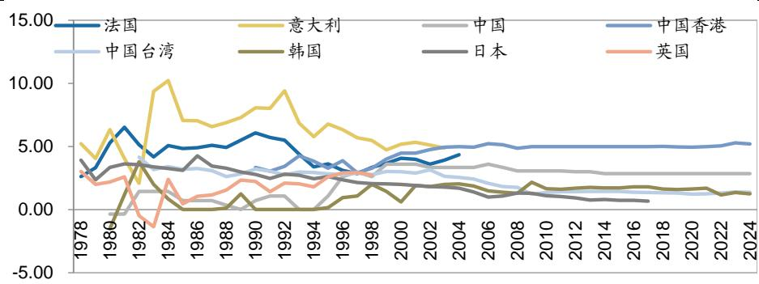

line chart

| Year | 法国 | 意大利 | 中国 | 中国香港 | 中国台湾 | 韩国 | 日本 | 英国 |
|------|------|--------|------|----------|----------|------|------|------|
| 1978 | 3.00 | 5.00   | 3.00 | 3.00     | 3.00     | 3.00 | 3.00 | 2.00 |
| 1980 | 6.00 | 6.00   | 3.00 | 3.00     | 3.00     | -1.00| 3.00 | 2.00 |
| 1982 | 4.00 | 10.00  | 3.00 | 3.00     | 3.00     | -1.00| 3.00 | -1.00|
| 1984 | 5.00 | 10.00  | 3.00 | 3.00     | 3.00     | -1.00| 3.00 | -2.00|
| 1986 | 5.00 | 7.00   | 3.00 | 3.00     | 3.00     | -1.00| 3.00 | -1.00|
| 1988 | 5.00 | 7.00   | 3.00 | 3.00     | 3.00     | -1.00| 3.00 | -1.00|
| 1990 | 6.00 | 8.00   | 3.00 | 3.00     | 3.00     | -1.00| 3.00 | -1.00|
| 1992 | 5.00 | 9.00   | 3.00 | 3.00     | 3.00     | -1.00| 3.00 | -1.00|
| 1994 | 4.00 | 6.00   | 3.00 | 3.00     | 3.00     | -1.00| 3.00 | -1.00|
| 1996 | 4.00 | 6.00   | 3.00 | 3.00     | 3.00     | -1.00| 3.00 | -1.00|
| 1998 | 4.00 | 5.00   | 3.00 | 3.00     | 3.00     | -1.00| 3.00 | -1.00|
| 2000 | 4.00 | 5.00   | 3.00 | 3.00     | 3.00     | -1.00| 3.00 | -1.00|
| 2002 | 4.50 | 5.50   | 3.50 | 3.50     | 3.50     | -1.50| 3.50 | -1.50|
| 2004 | 4.50 | 5.50   | 3.50 | 3.50     | 3.50     | -1.50| 3.50 | -1.50|
| 2006 | 4.50 | 5.50   | 3.50 | 3.50     | 3.50     | -1.50| 3.50 | -1.50|
| 2008 | 4.50 | 5.50   | 3.50 | 3.50     | 3.50     | -1.50| 3.50 | -1.50|
| 2010 | 4.50 | 5.50   | 3.50 | 3.50     | 3.50     | -1.50| 3.50 | -1.50|
| 2012 | 4.50 | 5.50   | 3.50 | 3.50     | 3.50     | -1.50| 3.50 | -1.50|
| 2014 | 4.50 | 5.50   | 3.50 | 3.50     | 3.50     | -1.50| 3.50 | -1.50|
| 2016 | 4.50 | 5.50   | 3.50 | 3.50     | 3.50     | -1.50| 3.50 | -1.50|
| 2O2O2O2O2O2O2O2O2O2O2O2O2O2O2O2O2O2O2O2O2O2O2O2O2O2O2O2O2O2O2O2O2O2O2O2O2O2O2O2O2O2O2 |
| OZO2O2O2O2O2O2O2O2O2O2O2O2O2O2O2O2O2O2O2O2O2O2O2O2O2O2O2O2O2O2O2O2O2O2O2O2O2O2O2O2O2O2O2O2O2O2O2O2O2O2O<nl>

数据来源：iFind，国泰海通证券研究

## 2.2. 供给替代：非银资产承接方向分化，决定银保承接空间

美国居民金融资产主要向股票、基金及养老金账户迁移，保险的储蓄功能被有所分流。从居民资产配置结构看，美国居民长期储蓄需求并未缺失，但其配置路径并未主要流向储蓄型保险，而是更多通过股票直投、共同基金及养老金账户体系实现。一方面，美国居民金融资产中股票、基金等资本市场相关资产占比较高，居民长期资金更倾向于通过证券市场参与财富增值；另一方面，IRA、401(k)／DC 等养老金账户体系较为完善，已成为居民养老储蓄和长期投资的核心载体。2025年，美国居民养老金资产中 IRA 占比已达39%，而 IRA 账户内部资产又主要投向共同基金等标准化投资产品，保险占比较低，仅为4%，反映出美国居民长期储蓄资金更多是通过资本市场化、账户化方式进行配置，而非通过保险产品沉淀。

图12：美国居民养老资金通过多种渠道进行资产配置  
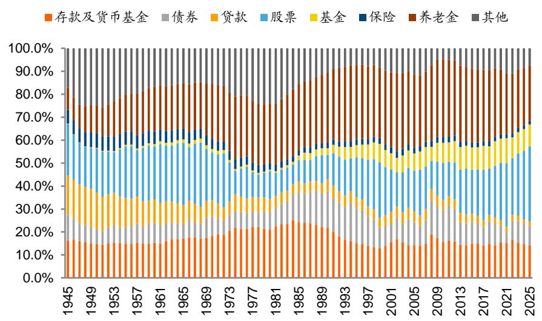

stacked bar chart

| Year | 存款及货币基金 | 债券 | 贷款 | 股票 | 基金 | 保险 | 养老金 | 其他 |
|------|----------------|------|------|------|------|------|--------|------|
| 1945 | 17.0%          | 10.0%| 20.0%| 20.0%| 10.0%| 10.0%| 10.0% | 10.0%|
| 1949 | 16.0%          | 10.0%| 20.0%| 20.0%| 10.0%| 10.0%| 10.0% | 10.0%|
| 1953 | 15.0%          | 10.0%| 20.0%| 20.0%| 10.0%| 10.0%| 10.0% | 10.0%|
| 1957 | 14.0%          | 10.0%| 20.0%| 20.0%| 10.0%| 10.0%| 10.0% | 10.0%|
| 1961 | 13.0%          | 10.0%| 20.0%| 20.0%| 10.0%| 10.0%| 10.0% | 10.0%|
| 1965 | 12.0%          | 10.0%| 20.0%| 20.0%| 10.0%| 10.0%| 10.0% | 10.0%|
| 1969 | 11.0%          | 10.0%| 20.0%| 20.0%| 10.0%| 10.0%| 10.0% | 10.0%|
| 1973 | 10.0%          | 10.0%| 20.0%| 20.0%| 10.0%| 10.0%| 10.0% | 10.0%|
| 1977 | 9.0%           | 15.0%| 25.0%| 25.0%| 15.0%| 5.0% | 25.0% | 5.0% |
| 1981 | 8.0%           | 25.0%| 25.0%| 25.0%| 25.0%| 5.0% | 25.0% | 5.0% |
| 1985 | 7.0%           | 35.0%| 25.0%| 25.0%| 35.0%| 5.0% | 25.0% | 5.0% |
| 1989 | 6.0%           | 45.0%| 25.0%| 25.0%| 45.0%| 5.0% | 25.0% | 5.0% |
| 1993 | 5.0%           | 55.0%| 25.0%| 25.0%| 55.0%| 5.0% | 25.0% | 5.0% |
| 1997 | 4.0%           | 65.0%| 25.0%| 25.0%| 65.0%| 5.0% | 25.0% | 5.0% |
| 2001 | 3.0%           | 75.0%| 25.0%| 25.0%| 75.0%| 5.0% | 25.0% | 5.0% |
| 2005 | 2.0%           | 85.0%| 25.0%| 25.0%| 85.0%| 5.0% | 25.0% | 5.0% |
| 2009 | 1.0%           | 95.0%| 25.0%| 25.0%| 95.0%| 5.0% | 25.0% | 5.0% |
| 2013 | -              | -    | -    | -    | -    | -    | -      | -    |
| 2017 | -              | -    | -    | -    | -    | -    | -      | -    |
| 2021 | -              | -    | -    | -    | -    | -    | -      | -    |
| 2025 | -              | -    | -    | -    | -    | -    | -      | -    |

数据来源：美联储，国泰海通证券研究

图13：美国居民养老资金通过多种渠道进行资产配置  
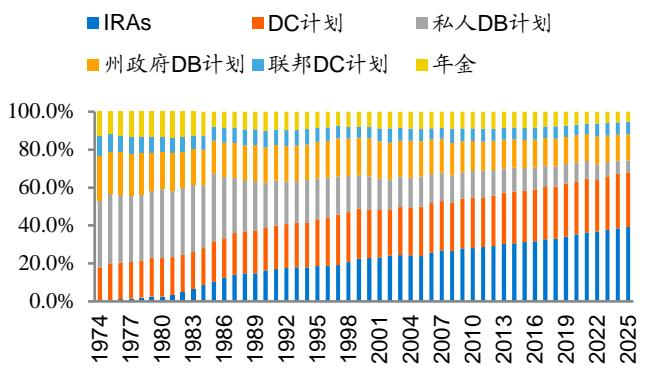

stacked bar chart

| Year | IRAs | DC计划 | 私人DB计划 | 州政府DB计划 | 联邦DC计划 | 年金 |
|------|------|---------|------------|--------------|------------|------|
| 1974 | 0%   | 20%     | 30%        | 20%          | 10%        | 10%  |
| 1977 | 0%   | 20%     | 30%        | 20%          | 10%        | 10%  |
| 1980 | 0%   | 20%     | 30%        | 20%          | 10%        | 10%  |
| 1983 | 0%   | 20%     | 30%        | 20%          | 10%        | 10%  |
| 1986 | 10%  | 20%     | 30%        | 20%          | 10%        | 10%  |
| 1989 | 15%  | 25%     | 30%        | 20%          | 10%        | 10%  |
| 1992 | 20%  | 25%     | 30%        | 20%          | 10%        | 10%  |
| 1995 | 20%  | 25%     | 30%        | 20%          | 10%        | 10%  |
| 1998 | 20%  | 25%     | 30%        | 20%          | 10%        | 10%  |
| 2001 | 25%  | 25%     | 30%        | 20%          | 10%        | 10%  |
| 2004 | 25%  | 25%     | 30%        | 20%          | 10%        | 10%  |
| 2007 | 30%  | 25%     | 30%        | 20%          | 10%        | 10%  |
| 2010 | 30%  | 25%     | 30%        | 20%          | 10%        | 10%  |
| 2013 | 35%  | 25%     | 30%        | 20%          | 10%        | 10%  |
| 2016 | 35%  | 25%     | 30%        | 20%          | 10%        | 10%  |
| 2019 | 40%  | 25%     | 30%        | 20%          | 10%        | 10%  |
| 2022 | 45%  | 25%     | 30%        | 20%          | 10%        | 10%  |
| 2025 | 45%  | 25%     | 30%        | 20%          | 10%        | 10%  |

数据来源：ICI，国泰海通证券研究

图14：美国 IRA账户的投资品种结构变化趋势  
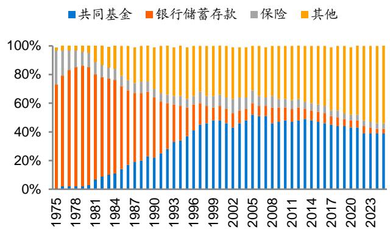

stacked bar chart

| Year | 共同基金 | 银行储蓄存款 | 保险 | 其他 |
|------|----------|--------------|------|------|
| 1975 | 0%       | 75%          | 20%  | 0%   |
| 1978 | 0%       | 85%          | 15%  | 0%   |
| 1981 | 10%      | 80%          | 10%  | 0%   |
| 1984 | 15%      | 70%          | 10%  | 0%   |
| 1987 | 20%      | 60%          | 10%  | 0%   |
| 1990 | 25%      | 50%          | 10%  | 0%   |
| 1993 | 30%      | 40%          | 10%  | 0%   |
| 1996 | 35%      | 30%          | 10%  | 0%   |
| 1999 | 40%      | 20%          | 10%  | 0%   |
| 2002 | 45%      | 15%          | 10%  | 0%   |
| 2005 | 50%      | 10%          | 10%  | 0%   |
| 2008 | 55%      | 5%           | 10%  | 0%   |
| 2011 | 60%      | 5%           | 10%  | 0%   |
| 2014 | 65%      | 5%           | 10%  | 0%   |
| 2017 | 70%      | 5%           | 10%  | 0%   |
| 2020 | 75%      | 5%           | 10%  | 0%   |
| 2023 | 80%      | 5%           | 10%  | 0%   |

数据来源：ICI，国泰海通证券研究

日本居民金融资产仍以存款为主，保险及养老金配置占比亦相对较高，但寿险销售长期由传统营销员体系主导，银保渠道发展相对有限。从居民资产配置结构看，日本居民金融资产长期仍以现金和存款为主，体现出较强的储蓄偏好，同时保险及养老金资产在居民金融资产中的占比也保持在较高水平，说明日本居民并不缺乏长期储蓄和养老保障需求，储蓄型保险亦具备一定需求基础。但从渠道格局看，日本早期即形成了较为稳固的营销员、邮政及代理店体系，寿险销售路径具有较强历史惯性；与此同时，日本个人寿险产品中医疗险、终身险、养老险等占比较高，尤其医疗健康险发展较为旺盛，此类产品通常更依赖面对面解释、持续服务与售后维护，与营销员及代理店渠道具有更强协同性。银行虽在制度放开后逐步介入保险销售，但更多是对既有渠道体系的补充，难以实质性改变传统渠道主导的市场格局，因此日本银保渠道占比始终相对有限。

图15：日本居民金融资产配置趋势  
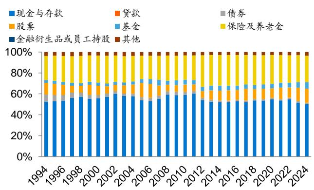

stacked bar chart

| Year | 现金与存款 | 股票 | 基金 | 其他 | 贷款 | 债券 | 保险及养老金 |
|------|------------|------|------|------|------|------|-------------|
| 1994 | ~50%       | ~10% | ~5%  | ~5%  | ~5%  | ~5%  | ~5%         |
| 1996 | ~50%       | ~10% | ~5%  | ~5%  | ~5%  | ~5%  | ~5%         |
| 1998 | ~50%       | ~10% | ~5%  | ~5%  | ~5%  | ~5%  | ~5%         |
| 2000 | ~50%       | ~10% | ~5%  | ~5%  | ~5%  | ~5%  | ~5%         |
| 2002 | ~50%       | ~10% | ~5%  | ~5%  | ~5%  | ~5%  | ~5%         |
| 2004 | ~50%       | ~10% | ~5%  | ~5%  | ~5%  | ~5%  | ~5%         |
| 2006 | ~50%       | ~10% | ~5%  | ~5%  | ~5%  | ~5%  | ~5%         |
| 2008 | ~50%       | ~10% | ~5%  | ~5%  | ~5%  | ~5%  | ~5%         |
| 2010 | ~50%       | ~10% | ~5%  | ~5%  | ~5%  | ~5%  | ~5%         |
| 2012 | ~50%       | ~10% | ~5%  | ~5%  | ~5%  | ~5%  | ~5%         |
| 2014 | ~50%       | ~10% | ~5%  | ~5%  | ~5%  | ~5%  | ~5%         |
| 2016 | ~50%       | ~10% | ~5%  | ~5%  | ~5%  | ~5%  | ~5%         |
| 2018 | ~50%       | ~10% | ~5%  | ~5%  | ~5%  | ~5%  | ~5%         |
| 2020 | ~50%       | ~10% | ~5%  | ~5%  | ~5%  | ~5%  | ~5%         |
| 2022 | ~50%       | ~10% | ~5%  | ~5%  | ~5%  | ~5%  | ~5%         |
| 2024 | ~50%       | ~10% | ~5%  | ~5%  | ~5%  | ~5%  | ~5%         |

数据来源：日本内阁府，国泰海通证券研究

图16：日本个人寿险的保单数量结构  
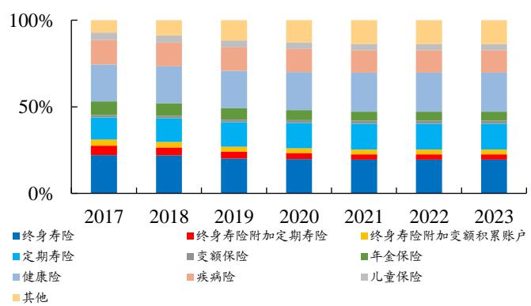

stacked bar chart

| 年份 | 终身寿险 (%) | 定期寿险 (%) | 健康险 (%) | 变额保险 (%) | 年金保险 (%) | 疾病险 (%) | 儿童保险 (%) | 其他 (%) |
|---|---|---|---|---|---|---|---|---|
| 2017 | 25 | 15 | 25 | 5 | 10 | 15 | 5 | 5 |
| 2018 | 25 | 15 | 25 | 5 | 10 | 15 | 5 | 5 |
| 2019 | 25 | 15 | 25 | 5 | 10 | 15 | 5 | 5 |
| 2020 | 25 | 15 | 25 | 5 | 10 | 15 | 5 | 5 |
| 2021 | 25 | 15 | 25 | 5 | 10 | 15 | 5 | 5 |
| 2022 | 25 | 15 | 25 | 5 | 10 | 15 | 5 | 5 |
| 2023 | 25 | 15 | 25 | 5 | 10 | 15 | 5 | 5 |

数据来源：ICI，国泰海通证券研究

图17：日本早期的人身险渠道结构以代理人为主  
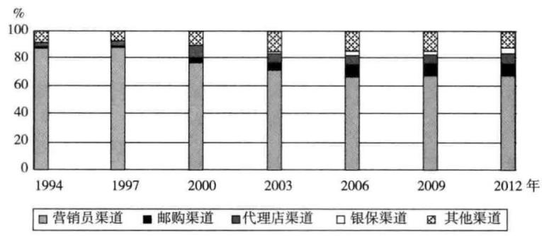

stacked bar chart

| 年份 | 营销员渠道 (%) | 邮购渠道 (%) | 代理店渠道 (%) | 银保渠道 (%) | 其他渠道 (%) |
|---|---|---|---|---|---|
| 1994 | 85 | 5 | 0 | 0 | 5 |
| 1997 | 85 | 5 | 0 | 0 | 5 |
| 2000 | 73 | 10 | 10 | 0 | 10 |
| 2003 | 70 | 10 | 10 | 0 | 10 |
| 2006 | 64 | 10 | 10 | 0 | 10 |
| 2009 | 64 | 10 | 10 | 0 | 10 |
| 2012年 | 64 | 10 | 10 | 0 | 10 |

注：其他渠道包括工会、网销、电视和电话销售等。  
资料来源：根据日本金融厅和各类英文、日文文献资料整理得出（本文其他图标如不特别表明，均与此同）。  
数据来源：万峰《日本寿险业研究》

图4-21994-2012年日本寿险营销渠道变化

韩国居民金融资产中保险已成为重要配置资产，并承担了居民长期储蓄功能，这使得保险产品结构与银行渠道的销售模式形成了更强适配。从居民资产配置结构看，韩国居民金融资产中保险、退休金缴纳金占比较高，保险在居民金融资产中的占比达到 29%，反映出保险不仅承担风险保障功能，也已成为居民中长期储蓄和养老资金配置的重要载体。在这一背景下，韩国人身险产品并非以纯保障型业务为主，而是形成了较强的储蓄属性，产品形态更契合居民“稳健增值、长期积累”的财富管理需求，也更适合作为银行面向零售客户进行财富管理和存款替代销售的产品供给。从账户结构看，韩国保险产品进一步形成了一般账户与独立账户并行的发展格局，其中一般账户主要承接传统寿险、储蓄险等业务，收益特征相对稳健，与银行客户对低波动、中长期储蓄产品的需求较为匹配；独立账户则主要对应投资型保险产品，更强调资产配置和投资收益弹性。2022 年独立账户保费占比已达到32%，表明随着居民财富管理需求提升，保险产品正在由传统储蓄型保障工具进一步向兼具投资功能的形态延伸。整体来看，正是由于韩国保险长期充分发挥了储蓄功能，储蓄型险种占比较高，其产品结构与银行渠道的客户基础、销售场景及财富管理属性更为契合，从而为银保渠道发展提供了较好的产品基础。

图18：韩国居民资产配置结构趋势  
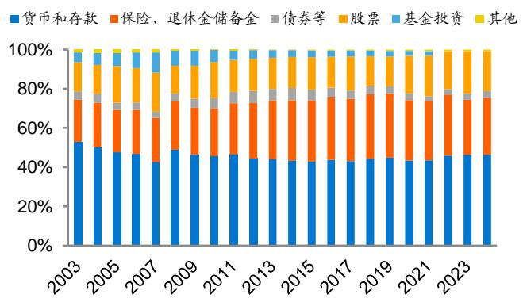

stacked bar chart

| 年份 | 货币和存款 (%) | 保险、退休金储备金 (%) | 债券等 (%) | 股票 (%) | 基金投资 (%) | 其他 (%) |
|---|---|---|---|---|---|---|
| 2003 | 54 | 27 | 10 | 18 | 6 | 6 |
| 2005 | 50 | 29 | 10 | 21 | 7 | 6 |
| 2007 | 47 | 31 | 10 | 23 | 8 | 6 |
| 2009 | 47 | 31 | 10 | 23 | 8 | 6 |
| 2011 | 46 | 31 | 10 | 23 | 8 | 6 |
| 2013 | 45 | 32 | 10 | 23 | 8 | 6 |
| 2015 | 43 | 34 | 10 | 23 | 8 | 6 |
| 2017 | 43 | 34 | 10 | 23 | 8 | 6 |
| 2019 | 44 | 35 | 10 | 23 | 8 | 6 |
| 2021 | 44 | 35 | 10 | 23 | 8 | 6 |
| 2023 | 46 | 34 | 10 | 23 | 8 | 6 |

数据来源：韩国统计局，国泰海通证券研究

图19：韩国人身险产品账户结构  
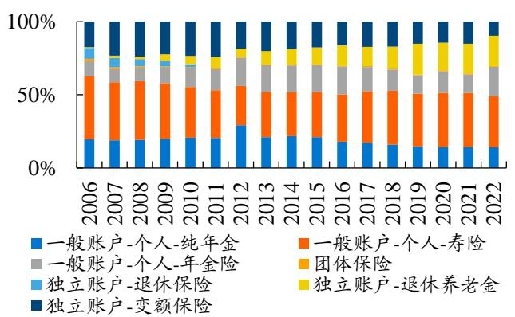

stacked bar chart

| Year | 一般账户-个人-纯年金 | 一般账户-个人-年金险 | 一般账户-个人-寿险 | 团体保险 | 独立账户-退休保险 | 独立账户-退休养老金 | 独立账户-变额保险 |
|------|---------------------|---------------------|-------------------|----------|-------------------|---------------------|-------------------|
| 2006 | ~25%                | ~15%                | ~35%              | ~5%      | ~5%               | ~5%                 | ~10%              |
| 2007 | ~20%                | ~15%                | ~40%              | ~5%      | ~5%               | ~5%                 | ~10%              |
| 2008 | ~20%                | ~15%                | ~35%              | ~5%      | ~5%               | ~5%                 | ~10%              |
| 2009 | ~20%                | ~15%                | ~35%              | ~5%      | ~5%               | ~5%                 | ~10%              |
| 2010 | ~20%                | ~15%                | ~35%              | ~5%      | ~5%               | ~5%                 | ~10%              |
| 2011 | ~20%                | ~15%                | ~35%              | ~5%      | ~5%               | ~5%                 | ~10%              |
| 2012 | ~25%                | ~15%                | ~30%              | ~5%      | ~5%               | ~5%                 | ~10%              |
| 2013 | ~20%                | ~15%                | ~30%              | ~5%      | ~5%               | ~5%                 | ~10%              |
| 2014 | ~20%                | ~15%                | ~30%              | ~5%      | ~5%               | ~5%                 | ~10%              |
| 2015 | ~20%                | ~15%                | ~30%              | ~5%      | ~5%               | ~5%                 | ~10%              |
| 2016 | ~20%                | ~15%                | ~30%              | ~5%      | ~5%               | ~5%                 | ~10%              |
| 2017 | ~20%                | ~15%                | ~30%              | ~5%      | ~5%               | ~5%                 | ~10%              |
| 2018 | ~20%                | ~15%                | ~30%              | ~5%      | ~5%               | ~5%                 | ~10%              |
| 2019 | ~20%                | ~15%                | ~30%              | ~5%      | ~5%               | ~5%                 | ~10%              |
| 2020 | ~20%                | ~15%                | ~30%              | ~5%      | ~5%               | ~5%                 | ~10%              |
| 2021 | ~20%                | ~15%                | ~30%              | ~5%      | ~5%               | ~5%                 | ~10%              |
| 2022 | ~20%                | ~15%                | ~30%              | ~5%      | ~5%               | ~5%                 | ~10%              |

数据来源：韩国人身险协会，国泰海通证券研究

中国台湾地区的投资型保险功能丰富，使得居民存款向保险迁移，储蓄型产品特性增强了保险与银行渠道的适配性。从居民金融资产配置结构看，中国台湾地区现金和存款占比虽仍处于较高水平，但人寿保险准备金长期维持在较高比重，2023 年已达到 27.5%，表明在低利率环境和居民财富管理需求提升背景下，保险已成为居民银行存款之外的重要资金去向。台湾地区投资型保险产品形态较为丰富，既包括与基金、债券等资产配置挂钩、账户价值随投资表现波动的变额寿险和变额年金，也包括以定期缴费、分期投入为特征、兼顾长期积累与保障功能的投资连结型产品；部分产品还可在不同投资标的、风险收益特征及币别之间进行转换，较好满足居民对稳健增值、弹性配置和养老储备的多元需求。正是由于这类产品兼具长期储蓄属性、账户管理属性和一定投资弹性，其销售逻辑与银行渠道面向零售客户开展资产配置、财富管理和存款替代销售的模式更为契合，从而推动保险尤其是投资型保险在银保渠道实现较快发展。

图20：中国台湾居民金融资产配置趋势  
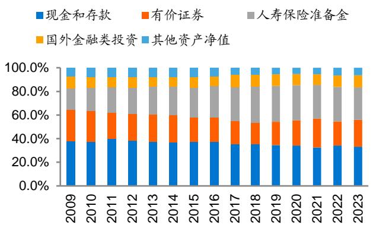

stacked bar chart

| 年份 | 现金和存款 (%) | 有价证券 (%) | 人寿保险准备金 (%) | 国外金融类投资 (%) | 其他资产净值 (%) |
|---|---|---|---|---|---|
| 2009 | 38.0 | 27.0 | 19.0 | 12.0 | 6.0 |
| 2010 | 37.5 | 27.5 | 20.0 | 11.5 | 6.5 |
| 2011 | 39.0 | 24.0 | 21.0 | 11.0 | 6.5 |
| 2012 | 38.5 | 24.5 | 22.0 | 11.5 | 6.5 |
| 2013 | 37.0 | 25.5 | 24.0 | 12.5 | 6.5 |
| 2014 | 37.5 | 24.5 | 25.5 | 12.0 | 6.5 |
| 2015 | 37.0 | 24.0 | 26.5 | 12.5 | 6.5 |
| 2016 | 37.5 | 23.5 | 27.5 | 13.0 | 6.5 |
| 2017 | 36.5 | 24.5 | 28.5 | 13.5 | 6.5 |
| 2018 | 36.0 | 25.5 | 29.5 | 14.0 | 6.5 |
| 2019 | 34.5 | 24.5 | 30.5 | 14.5 | 6.5 |
| 2020 | 34.0 | 24.0 | 31.5 | 15.0 | 6.5 |
| 2021 | 33.5 | 24.5 | 32.5 | 15.5 | 6.5 |
| 2022 | 34.0 | 23.5 | 33.5 | 16.0 | 6.5 |
| 2023 | 34.5 | 24.0 | 34.5 | 16.5 | 6.5 |

数据来源：中国台湾统计局，国泰海通证券研究

图21：中国台湾人身险新单保费结构  
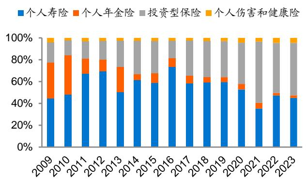

stacked bar chart

| 年份 | 个人寿险 (%) | 个人年金险 (%) | 投资型保险 (%) | 个人伤害和健康险 (%) |
|---|---|---|---|---|
| 2009 | 45 | 38 | 17 | 3 |
| 2010 | 48 | 36 | 15 | 3 |
| 2011 | 68 | 15 | 15 | 3 |
| 2012 | 70 | 12 | 15 | 3 |
| 2013 | 50 | 20 | 25 | 3 |
| 2014 | 62 | 8 | 25 | 3 |
| 2015 | 59 | 8 | 27 | 3 |
| 2016 | 74 | 10 | 15 | 3 |
| 2017 | 58 | 8 | 27 | 3 |
| 2018 | 60 | 6 | 27 | 3 |
| 2019 | 60 | 6 | 27 | 3 |
| 2020 | 52 | 6 | 34 | 3 |
| 2021 | 35 | 7 | 45 | 3 |
| 2022 | 48 | 4 | 37 | 3 |
| 2023 | 45 | 4 | 38 | 3 |

数据来源：中国台湾人寿保险商业同业公会，国泰海通证券研究

## 2.3. 制度差异：银行地位与金融混业深度塑造银保分化

1.银行主导的金融体系下银行成为居民财富入口，银保发展程度较高一国或地区的融资结构会影响银行在金融体系中的地位，进而决定银行是否能够掌握居民财富管理入口，并影响保险能否更多通过银行渠道承接居民财富迁移。2023 年中国香港、中国内地、法国的银行资产占金融中介机构比重分别为 68.5%、62.5%和 61.0%，银行在金融体系中仍处于较强主导地位；日本、英国、韩国分别为47.1%、47.0%和45.3%，意大利为42.9%，美国则仅为22.9%。这意味着，在中国香港、中国内地、法国等银行主导特征更强的市场中，银行不仅承担更重要的融资中介功能，也更深度掌握居民账户、存款、支付及财富管理入口，因此在低利率环境下更容易将“存款搬家”所释放的居民资金导入保险、理财及基金等非存款产品，保险也更容易借助银行渠道实现销售扩张。相较之下，美国融资体系明显更偏资本市场中介型，居民长期储蓄和财富管理需求更多通过证券账户、共同基金、ETF以及IRA、401(k)等养老金账户体系承接，银行并不掌握居民长期财富管理的核心入口，保险的储蓄功能也更容易被基金、养老金及证券投资工具分流，因此银保渠道难以成为主流。整体来看，银保渠道的发展分化，背后不仅是保险产品供给或居民需求差异，更深层次上取决于一国或地区的融资结构：银行主导型市场中，银行更容易依托客户与账户优势分流居民财富并导入保险；资本市场主导型市场中，居民财富则更多直接流向各类非银金融机构和资本市场工具，保险通过银行渠道承接资金的空间相对有限。

图22：全球各国和地区的银行资产占金融中介机构的比重  
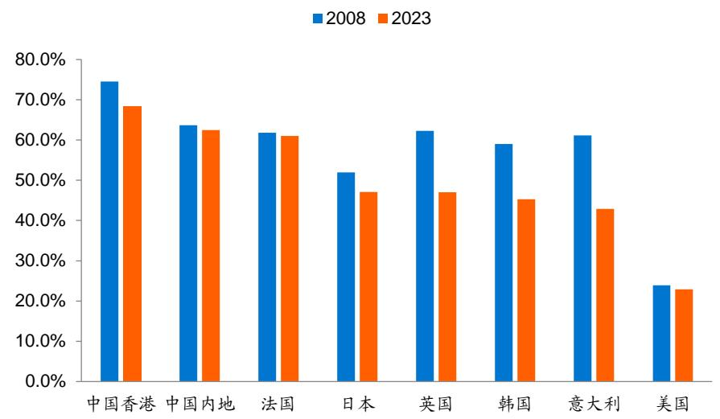

bar chart

| 地区 | 2008 (%) | 2023 (%) |
| :--- | :--- | :--- |
| 中国香港 | 74.5 | 68.5 |
| 中国内地 | 63.5 | 62.5 |
| 法国 | 61.5 | 61.0 |
| 日本 | 51.5 | 46.5 |
| 英国 | 62.0 | 46.5 |
| 韩国 | 59.0 | 44.5 |
| 意大利 | 61.0 | 42.5 |
| 美国 | 23.5 | 22.5 |

数据来源：iFind，国泰海通证券研究

2.鼓励金融混业的国家和地区银保股权协同紧密且银保政策相对宽松各国推动金融混业的政策时点与路径，深刻影响了银行与保险之间的股权协同模式，并进而决定银保渠道的发展深度。（1）欧洲大陆：自20世纪 80年代金融自由化以来，逐步放松银行业务边界并推动金融集团化发展，使银行法国和意大利等国得以通过控股或设立保险子公司实现一体化经营，形成以股权绑定为核心的 bancassurance 模式；（2）英美日：英国和日本虽分别经历1986年“金融大爆炸”和 1998年金融Big Bang 改革，但其制度演进更偏向“放开业务边界”而非强化集团内部整合，银行与保险之间以合作而非控股为主，股权协同程度明显弱于欧洲。美国则在 1999 年《Gramm-Leach-Bliley Act》通过后，才正式打破长期分业经营格局，允许银行、证券与保险机构在金融控股公司框架下整合，但由于历史上分业监管传统及渠道结构惯性，银行与保险之间的股权协同仍相对有限，银保渠道未能成为主导 。（3）亚洲地区：普遍在 2000年前后通过金融控股公司制度推动混业经营。中国台湾地区实施金融控股法后金控集团形成较高的银保协同效果；香港地区银行参与保险分销但需与代理人及财富管理渠道竞争；韩国依托金融控股公司实现跨业协同；日本在渐进放开银行代销保险的制度演进中，银保渠道有所提升但仍受传统营销员体系制约。总体来看，金融混业改革的“时点早晚”和“推进路径”共同决定了银行与保险之间是形成“股权一体化”还是“渠道合作型”关系，而前者通常对应更高的协同效率和更强的银保渠道占比。

表 1：各国和地区的金融混业的推进时间

<table><tr><td>国家/地区</td><td>是否金融混业</td><td>银保渠道发展情况</td><td>关键政策时间</td></tr><tr><td>法国</td><td>是</td><td>高(典型bancassurance)</td><td>1984年金融混业经营</td></tr><tr><td>意大利</td><td>是</td><td>高(银行渠道主导)</td><td>1993(银行法)+2005(保险法典)</td></tr><tr><td>台湾地区</td><td>是(金融控股公司)</td><td>较高(储蓄险依赖银行)</td><td>2001(金融控股公司法)</td></tr><tr><td>香港地区</td><td>是(混业经营+分业监管)</td><td>中(多渠道并存)</td><td>2015(保险条例修订)</td></tr><tr><td>韩国</td><td>部分是(金融控股集团)</td><td>中(受销售监管约束)</td><td>2000(金融控股公司法)</td></tr><tr><td>中国内地</td><td>有限混业</td><td>较高(银保重要渠道)</td><td>2003(监管体系)+2023(金融监管总局)</td></tr><tr><td>日本</td><td>是(渐进放开)</td><td>中(营销员仍强)</td><td>1998-2007(金融Big Bang+银行代销放开)</td></tr><tr><td>英国</td><td>可以(混业但非欧陆模式)</td><td>中低(IFA/经纪主导)</td><td>2000(FSMA)+2012(双峰监管)</td></tr><tr><td>美国</td><td>混业经营较晚(金融控股公司)</td><td>低(经纪/代理主导)</td><td>1999(GLBA)</td></tr></table>

数据来源：Banque de France、Insurance Europe、Banca d’Italia 等《欧洲银行保险市场报告》，BOK《Flow of Funds》，FCA监管文件，Federal Reserve《Financial Accounts》，国家金融监督管理总局及中国保险行业协会，国泰海通证券研究

各国银保渠道的发展通常伴随着金融混业改革或银行代理保险制度的放开。欧洲大陆国家在 20 世纪 80 年代金融自由化过程中逐步允许银行进入保险领域，并形成以银行控股保险公司为核心的一体化模式；美国则通过 1999年《Gramm-Leach-Bliley Act》正式打破分业经营限制，但由于渠道结构与监管传统影响，银保渠道发展相对有限；亚洲国家和地区大多在2000年前后通过制度或试点方式放开银保渠道，其中台湾以金融控股公司制度为代表实现深度协同，中国内地与韩国则在放开的同时加强监管约束，而香港则主要依赖市场机制自然发展。

表 2：各国和地区放开银保渠道合作的情况

<table><tr><td>国家/地区</td><td>放开时间</td><td>政策名称</td><td>主要内容</td></tr><tr><td>法国</td><td>1984– 1986</td><td>金融自由化改革(Banking Act 改革)</td><td>放松银行业务范围,允许银行销售保险并设立保险子公司,形成bancassurance</td></tr><tr><td>意大利</td><td>1993</td><td>《银行业统一法》(Testo Unico Bancario)</td><td>允许银行从事综合金融服务,包括保险分销及参与保险业务</td></tr><tr><td>台湾地区</td><td>2001</td><td>《金融控股公司法》</td><td>允许银行、保险、证券整合于同一集团,实现交叉销售与银保合作</td></tr><tr><td>香港地区</td><td>2000 年前后(持续放开)</td><td>《保险业条例》+银行代理制度</td><td>银行可注册为保险代理人并销售保险产品</td></tr><tr><td>韩国</td><td>2003-2007</td><td>银行代销保险(bancassurance)逐步放开放</td><td>银行允许销售保险产品,但设置比例限制(25%规则)</td></tr><tr><td>中国内地</td><td>1998– 2000</td><td>银保合作试点政策</td><td>银行开始代理销售保险,成为寿险重要渠道</td></tr><tr><td>日本</td><td>2001– 2007</td><td>银行代理保险逐步放开</td><td>分阶段允许银行销售保险,2007年全面放开</td></tr><tr><td>英国</td><td>1986</td><td>“金融大爆炸”(Big Bang)</td><td>放开金融机构业务边界,允许银行参与保险与证券业务</td></tr><tr><td>美国</td><td>1999</td><td>《Gramm-Leach-Bliley Act》</td><td>允许银行、证券、保险在金融控股公司框架下整合经营</td></tr></table>

数据来源：Banque de France、Insurance Europe、Banca d’Italia 等《欧洲银行保险市场报告》，BOK《Flow of Funds》，FCA 监管文件，Federal Reserve《Financial Accounts》，国家金融监督管理总局及中国保险行业协会，国泰海通证券研究

中国台湾银行保险市场的发展体现“渐进放开—制度驱动—协同深化”的特征。整体来看，其演进路径大致经历了从严格分业（1991 年前）到有限代销（1990 年代）、再到 2000 年前后初步放开银保业务，随后在 2001 年《金融控股公司法》实施后进入关键转折阶段，通过制度层面打通银行与保险之间的业务与资源壁垒，推动银保渠道快速崛起。2003 年全面开放后，银保成为寿险销售的重要渠道，并在2000– 2010年间实现规模化扩张。此后，监管逐步强化销售规范与产品结构约束，推动行业由“规模驱动”向“质量驱动”转型。2015 年以来，随着金控协同深化及业务边界进一步放宽，银行与保险之间的合作由渠道层面向资本与集团层面演进；2018 年后，在数字化与监管优化推动下，银保逐步进入精细化经营阶段，并成为综合财富管理体系的重要组成部分。银保渠道在 2005-2018 年实现复合增速 9.9%，成为拉动寿险保费增长的主要贡献来源，银保渠道保费占比从 2005 年的37.5%提升至 2018 年的 55%。

表 3：中国台湾银保渠道从放开到深化的政策趋势

<table><tr><td>时间阶段</td><td>政策/制度变化</td><td>主要影响</td></tr><tr><td>1991年前(原則禁止阶段)</td><td>银行业与保险业严格分业经营,银行不得销售保险产品</td><td>银保业务基本不存在,保险销售以代理人渠道为主</td></tr><tr><td>1991-2000年(有限开放阶段)</td><td>金融自由化推进,逐步允许银行从事有限保险代销业务</td><td>银行开始进入保险分销体系,但权限有限,银保处于试点阶段</td></tr><tr><td>2000年(初步放开)</td><td>放宽银行业务范围,允许银行“间接经营”保险业务(如代销、合作)</td><td>银保渠道开始规模化发展,成为保险公司重要增量渠道</td></tr><tr><td>2001年(金控协同阶段)</td><td>《金融控股公司法》实施,允许银行、保险等跨业经营与资源共享</td><td>银行与保险实现交叉销售,银保进入快速扩张期,成为核心渠道</td></tr><tr><td>2003年后(全面开放阶段)</td><td>银行可全面销售保险产品,银保制度基本放开</td><td>银保渠道快速做大,占比显著提升,储蓄型产品快速增长</td></tr><tr><td>2010年前后(规范发展阶段)</td><td>针对银保产品销售、费用结构、误导销售等加强监管</td><td>银保从“规模驱动”转向“规范发展”,产品结构逐步优化</td></tr><tr><td>2015年后(深化阶段)</td><td>放宽银行参与保险业务形式,强化金控协同与集团经营</td><td>银保向资本合作/金控模式演进,银行与保险深度绑定</td></tr><tr><td>2018年后(数字化与优化阶段)</td><td>推动互联网投保、银行兼营保险代理/经纪业务</td><td>银保进入精细化经营阶段,数字化与财富管理融合加速</td></tr></table>

数据来源：2024台湾银行保险年报，国泰海通证券研究

图23：中国台湾银保渠道增长趋势  
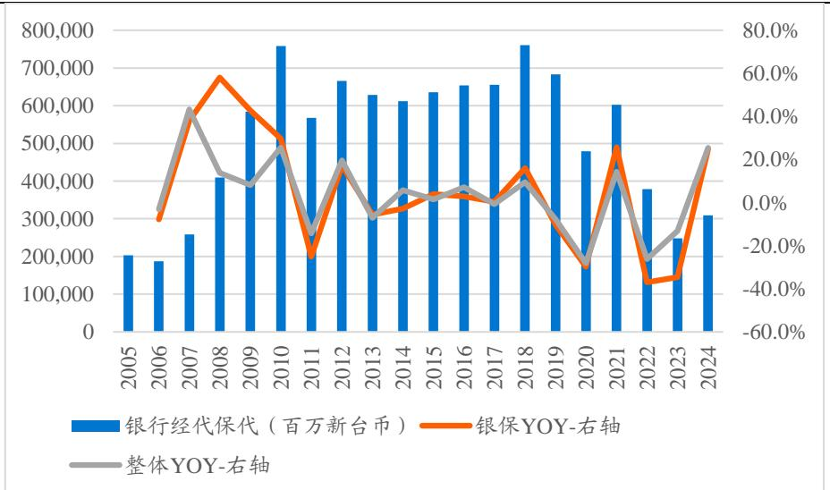

bar-line hybrid chart

| Year | 银行经代保代（百万新台币） | 银保YOY-右轴 | 整体YOY-右轴 |
|------|-----------------------------|--------------|--------------|
| 2005 | 200,000                     | -            | -            |
| 2006 | 180,000                     | -            | -            |
| 2007 | 260,000                     | -            | 55.0%        |
| 2008 | 410,000                     | 65.0%        | 45.0%        |
| 2009 | 580,000                     | 45.0%        | 35.0%        |
| 2010 | 750,000                     | 35.0%        | 55.0%        |
| 2011 | 570,000                     | -25.0%       | -25.0%       |
| 2012 | 670,000                     | 45.0%        | 45.0%        |
| 2013 | 630,000                     | -15.0%       | -15.0%       |
| 2014 | 610,000                     | -15.0%       | -15.0%       |
| 2015 | 640,000                     | -15.0%       | -15.0%       |
| 2016 | 660,000                     | -15.0%       | -15.0%       |
| 2017 | 660,000                     | -15.0%       | -15.0%       |
| 2018 | 760,000                     | 45.0%        | 45.0%        |
| 2019 | 690,000                     | -25.0%       | -25.0%       |
| 2020 | 480,000                     | -35.0%       | -35.0%       |
| 2021 | 610,000                     | 45.0%        | 45.0%        |
| 2022 | 380,000                     | -45.0%       | -45.0%       |
| 2023 | 260,000                     | -35.0%       | -35.0%       |
| 2024 | 310,000                     | 45.0%        | 45.0%        |

数据来源：中国台湾保险业协会，国泰海通证券研究

## 3. 内部驱动：协议代理、战略联盟、资本合作、金融集团等合作模式

全球银行保险根据资本关系、合作深度划分为四种合作模式，包括协议代理、战略联盟、资本合作、金融集团等。资本关系背后受当地金融监管体系所影响，如是否混业经营，银行保险是否可以互相控股影响，而合作深度受银行诉求以及保险公司经营策略有关（产品形态是否标准化、渠道是否已形成以专属代理人或经纪人为主的模式）。

表 4：国际银保合作模式对比

<table><tr><td>模式</td><td>典型地区</td><td>核心特征</td><td>主要优势</td><td>主要局限</td><td>代表案例</td></tr><tr><td>协议代理模式</td><td>亚洲(中国内地、日本)</td><td>银行与保险公司通过代理协议开展合作,通常以产品代销为主,合作关系较松散</td><td>合作灵活、投入低、落地快</td><td>绑定弱、协同浅、客户与数据难沉淀</td><td>中国内地银保模式:多家银行同时代销多家寿险公司产品</td></tr><tr><td>战略联盟模式</td><td>中国香港、美国、部分亚洲市场</td><td>银行与保险公司签订中长期独家或半独家合作协议,在渠道、产品、培训、客户经营等方面深度协同</td><td>关系稳定、协同较强、可提升客户经营效率</td><td>仍非一体化,利益分配与资源归属需持续协调</td><td>保诚 × 渣打银行;友邦 × 汇丰</td></tr><tr><td>资本合作模式</td><td>法国(合资企业)</td><td>银行与保险公司通过合资设立平台开展银保合作,共享渠道与经营收益</td><td>利益绑定更深、资源共享更充分、合作稳定性高</td><td>设立与磨合周期长,治理协调较复杂</td><td>法国部分银行与保险公司合资经营寿险平台</td></tr><tr><td>金融集团模式</td><td>法国、中国台湾</td><td>银行与保险公司同属一个金融控股集团,或通过并购纳入统一集团框架,实现一体化经营</td><td>协同最强、客户经营一体化、资源配置效率高</td><td>监管要求高、整合成本高、组织复杂度高</td><td>BNP Paribas Cardif; 台湾金控旗下银行与寿险子公司协同模式</td></tr></table>

数据来源：《国际银保合作模式分析及对我国的启示》吕晨，国泰海通证券研究

## 3.1. 协议代理：简约化的合作模式，以中国内地和日本为主

协议代理模式是指银行与保险签订一对多的代理销售协议的合作模式，中国内地和日本较为典型。该模式由银行作为兼业代理人利用其经营网点销售保险产品，而保险公司则向银行支付手续费，为银行提供中间收入。其优势在于合作双方自由度大，可以与多家银行签订代理协议，佣金服务模式下前期投入成本低，法律法规限制较少。而其劣势为整体关系松散不稳定，没有长期的共同利益机制，银行和保险的协同效应不足，银行销售人员难以全面深入了解保险产品。从国际经验看，日本银保渠道以协议代理模式（distribution agreement）为主导。根据《日本银保渠道的发展现状及前景》，银行与保险公司通常通过签订代理销售协议开展合作，由银行作为保险公司的兼业代理人，在柜面由银行职员直接销售保险产品并获取手续费收入，保险公司自有销售人员驻点较为少见，渠道主导权主要掌握在银行端 。从具体实践看，即使在同一金融集团内部，日本银保合作亦以协议合作为主，而非资本深度整合。例如，住友集团内三井住友银行与住友生命、三井住友海上火灾保险及三井生命自 2002 年起即通过全面合作协议开展银保业务；同时，部分机构亦通过设立合资公司作为补充形式参与银保经营，如三井住友海上保险与花旗集团合资设立人寿保险公司，但整体仍以协议代理为核心模式。在渠道运作机制上，日本寿险公司通常不直接建立银保销售队伍，而是通过设立专门的“银行服务团队”，为银行端销售人员提供产品培训、销售支持及客户服务体系，从而实现“银行负责销售、保险负责产品与支持”的分工模式。

表 5：日本以协议代理模式为主

<table><tr><td>银行</td><td>银保销售网点数</td><td>银保渠道销售人力</td><td>主要合作寿险公司</td><td>销售保险产品</td></tr><tr><td>三菱东京 UFJ 银行</td><td>全部 660 家网点</td><td>约 4000 人</td><td>日本生命、明治安田生命</td><td>医疗、终身等所有产品</td></tr><tr><td>瑞穗银行</td><td>约400家网点</td><td>约3000人</td><td>明治安田生命、第一生命</td><td>早期仅限于医疗保险</td></tr><tr><td>三井住友银行</td><td>从约100家网点扩展至460家</td><td>约2500人</td><td>住友生命</td><td>医疗、终身等所有产品</td></tr><tr><td>RESONA银行</td><td>270家网点</td><td>约2000人</td><td>第一生命</td><td>N.A.</td></tr></table>

数据来源：窦元《日本银保渠道的发展现状及前景》，国泰海通证券研究

## 3.2. 战略联盟：银保关系由“代销渠道”升级为“共同经营”

战略联盟模式是银行和保险公司实现独家战略关系，中国香港地区较为盛行。战略联盟模式的业务范围从基础的协议代理模式的网点销售扩展到联合进行产品开发和售后服务，极大提升了合作的深度和广度，双方对合作关系具有更稳定的预期，可以在较低资本投入的前提下形成更强的协同效应。根据 KPMG 报告，2013 年以来亚太银保合作呈现出三个显著特征：一是合作期限长期化，主流协议期限普遍在 10– 20年之间（如 AIA– 花旗、宏利– 星展、保诚– 渣打均为 15 年），反映银行渠道资源的稀缺性及保险公司锁定优质客户入口的战略诉求；二是前期投入资本化，头部交易普遍需要支付高额渠道费用（如宏利– 星展达 12 亿美元、AIA– 花旗超过 40 亿美元），并叠加业绩对赌或分成机制，本质上是对银行客户资源的“买断+分成”；三是合作由分销向协同转型，银行不再只是销售渠道，而逐步参与产品设计、客户经营与财富管理体系，银保成为银行中间收入的重要来源，同时也是险企获取长期价值业务的核心抓手。香港银保模式由早期开放代理，逐步演变为以长期排他协议为核心的战略合作模式，其本质在于银行掌握财富管理入口，而保险产品具备长期资产配置属性，要求深度客户经营与持续服务。

表 6：亚太地区的银保战略合作情况

<table><tr><td>日期</td><td>保险公司</td><td>银行</td><td>交易金额(美元)</td><td>合作期限</td></tr><tr><td>2015年5月</td><td>Ageas</td><td>EastWest Bank</td><td>首年投入6,500万美元,后续投入取决于业务表现</td><td>20年</td></tr><tr><td>2015年5月</td><td>Dai-ichi Life Vietnam(第一生命越南)</td><td>HDBank</td><td>未披露</td><td>10年</td></tr><tr><td>2015年4月</td><td>Manulife Financial(宏利金融)</td><td>DBS Group(星展集团)</td><td>初始支付12亿美元,并根据合作成效支付后续浮动款项</td><td>15年</td></tr><tr><td>2015年1月</td><td>Tokio Marine Life InsuranceMalaysia(东京海上马来西亚寿险)</td><td>RHB Capital</td><td>约5,000万美元(注:约合2.1亿林吉特)</td><td>10年</td></tr><tr><td>2014年3月</td><td>Prudential plc(保诚集团)</td><td>Standard Chartered(渣打银行)</td><td>未披露</td><td>15年</td></tr><tr><td>2013年12月</td><td>AIA(友邦保险)</td><td>Citibank(花旗银行)</td><td>超过40亿美元</td><td>15年</td></tr></table>

数据来源：KPMG，国泰海通证券研究

友邦保险（AIA）形成了亚太地区最具代表性的“长期策略性银行合作模式”。AIA 强调与“领先银行”建立长期（>15 年）且深度绑定的合作关系，通过数据整合、专属销售队伍及客户分层经营，实现银行渠道价值的持续提升，其合作银行新业务价值在 3 年内可实现翻倍增长。AIA 已在东南亚构建覆盖多国的银行合作网络：在泰国与 Bangkok Bank、新加坡与花旗、马来西亚与Public Bank等均形成领先合作关系，并在印尼、菲律宾、越南等市场通过多家本地头部银行深化布局，带动相关市场新业务价值增速普遍达到10%– 30%。

图24：友邦保险的长期策略性银行合作模式  
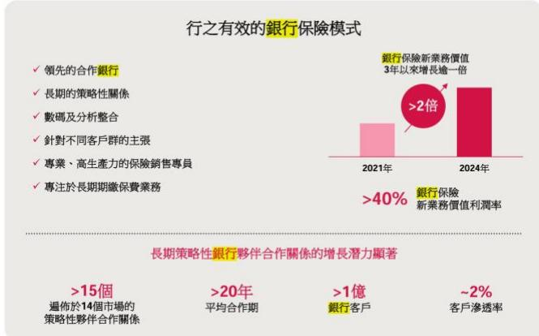

bar chart

行之有效的銀行保險模式
| 年份 | 銀行保險新業務價值 (3年以來增長逾一倍) |
| :--- | :--- |
| 2021年 | >2倍 |
| 2024年 | >40% |
| 長期策略性銀行夥伴合作關係的增長潛力顯著
| 領先的合作銀行、長期的策略性關係、數碼及分析整合、針對不同客戶群的主張、專業、高生產力的保險銷售專員、專注於長期期繳保費業務 | 銀行保險新業務價值利潤率 (>40個)
| 領先合作銀行、長期策略性關係、數碼及分析整合、針對不同客戶群的主張、專業、高生產力的保險銷售專員、專注於長期期繳保費業務 | 銀行保險新業務價值利潤率 (>15個)
| 領先合作銀行、長期策略性關係、數碼及分析整合、針對不同客戶群的主張、專業、高生產力的保險銷售專員、專注於長期期繳保費業務 | 銀行保險新業務價值利潤率 (>20個)
| 領先合作銀行、長期策略性關係、數碼及分析整合、針對不同客戶群的主張、專業、高生產力的保險銷售專員、專注於長期期繳保費業務 | 銀行保險新業務價值利潤率 (>1億)
| 領先合作銀行、長期策略性關係、數碼及分析整合、針對不同客戶群的主張、專業、高生產力的保險銷售專員、專注於長期期繳保費業務 | 銀行保險新業務價值利潤率 (~2%)

数据来源：AIA 2024年业绩简报

图25：友邦保险在东南亚与多家银行战略合作

<table><tr><td colspan="3">東盟區內人壽保險公司排名第一(2)及健康保險公司排名第一(3)</td><td>新業務價值增長</td><td></td></tr><tr><td>泰國</td><td>代理業務
市場排名第一
按百萬圓桌會會員人數計</td><td>Bangkok Bank
(盤谷銀行)</td><td>健康保險公司排名第一
保障業務市場排名第一</td><td>+15%</td></tr><tr><td>新加坡</td><td>代理業務
市場排名第一
按百萬圓桌會會員人數計</td><td>Citi
(花旗銀行)</td><td>健康保險公司排名第一
保障業務市場排名第一</td><td>+15%</td></tr><tr><td>馬來西亞</td><td>代理業務
市場排名第一
按百萬圓桌會會員人數計</td><td>PUBLIC BANK
(大眾銀行)</td><td>健康保險公司排名第一
企業方案業務排名第一</td><td>+10%</td></tr><tr><td>印尼
菲律賓
越南
緬甸
柬埔寨</td><td>別樹一轅的
「最優秀代理」
策略</td><td colspan="2">領先的本地銀行合作夥伴
BCA BPI VPBank</td><td>+30%</td></tr></table>

数据来源：AIA 2024年业绩简报

保诚银保渠道战略的核心在于构建以长期排他性合作为基础的战略合作型分销体系。公司已在亚洲及非洲市场建立覆盖 180 个银行合作伙伴（其中约11家为战略级合作银行）的广泛渠道网络，并通过与渣打银行、大华银行等核心机构的长期独家合作，实现对优质客户流量入口的持续锁定。从经营成效看，银保渠道已成为公司增长的核心驱动力之一。一方面，渠道贡献占比持续提升至 36%（2025 年 NBP），形成与代理人渠道（55%）并列的“双核心结构”；另一方面，业务规模实现 2022– 2025 年约 12%的复合增长（CAGR），2025年同比增长达+27%，显著快于整体业务增长。同时，渠道质量同步改善，银保NBP margin 提升约+5个pct，健康险及保障类产品占比持续提升。整体来看，保诚通过“长期绑定优质银行+深度协同经营客户”的模式，在实现渠道规模快速扩张的同时，推动银保业务向高价值、高质量增长转型，已成为其新业务价值增长的核心引擎。

图26：保诚 2022-2025年银保渠道增长情况  
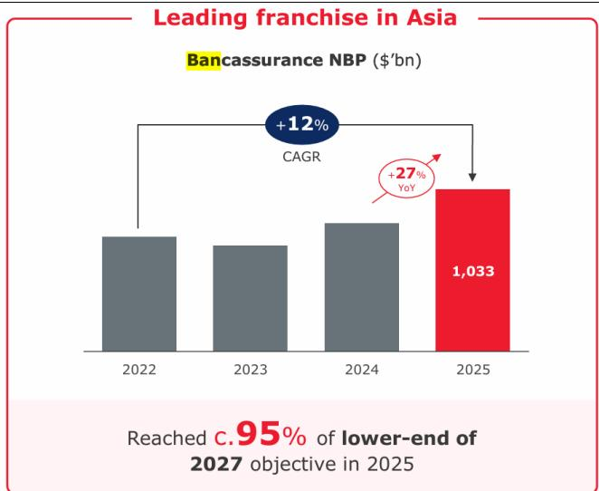

bar chart

Leading franchise in Asia
Bancassurance NBP ($'bn)
| Year | Value ($'bn) |
| :--- | :--- |
| 2022 | 1,033 |
| 2023 | 950 |
| 2024 | 1,033 |
| 2025 | 1,033 |
CAGR: +12%
+27% YoY: Reached c.95% of lower-end of
2027 objective in 2025

数据来源：保诚 2025年业绩 PPT

图27：保诚银保渠道发展战略  
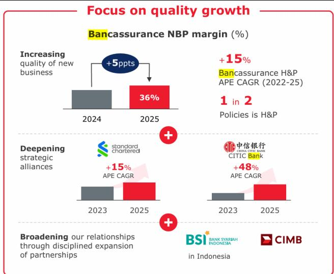

bar chart

Focus on quality growth
| Category | Year | Value (%) |
| :--- | :--- | :--- |
| Increasing quality of new business | 2024 | +5 ppts |
| Increasing quality of new business | 2025 | 36 |
| Deepening strategic alliances | 2023 | standard chartered |
| Deepening strategic alliances | 2025 | +15 |
| Broadening our relationships through disciplined expansion of partnerships | 2023 | - |
| Broadening our relationships through disciplined expansion of partnerships | 2025 | +48 |
Bancassurance H&P APE CAGR (2022-25) 1 in 2 Policies is H&P
Bancassurance CITIC BANK CITIC Bank
BANK SYARAH INDONESIA in Indonesia
CIMB

数据来源：保诚 2025年业绩 PPT

## 3.3. 资本合作：从“业务合作”到“股权关系”的转变

资本合作模式从业务合作转为股权关系绑定，欧洲银保的资本合作较为多元。其典型形式包括银行与保险公司共同设立合资公司，或银行、保险公司之间形成交叉持股与战略参股安排。资本合作模式的核心优势在于双方由松散合作关系转为利益共同体，资源共享和信息交流更为充分，经营风险与收益可在更大程度上实现共担与共享。在这一模式下，银行不仅是保险产品的销售终端，而且在产品定位、经营决策、客户经营与渠道资源配置中拥有更深参与度；保险公司则能够更稳定地锁定银行渠道，并更有效地嵌入银行零售客户体系，但资本合作模式的整合成本和复杂程度也在提升。意大利

UniCredit 与法国 CNP Assurances 初期共同设立了寿险合资公司 CUV，通过设立合资公司（CNP 控股 51%）实现银行渠道与保险产品能力的结合，银行主要获取分销佣金，而保险公司获取承保利润；随后随着合作深化，银行逐步提升持股比例并增强对保险业务的参与度；在低利率与净息差收窄背景下，银行开始重新评估银保业务的利润分配结构，并于 2024年启动“内部化”战略，通过行使收购期权实现对合资公司的完全控股。2025 年交易完成后，UniCredit将银保业务纳入集团内部“保险工厂”，由单一渠道收入模式转向“手续费+承保利润+资产管理收益”的综合收益模式。

表 7：意大利 UniCredit 与法国 CNP Assurances 的资本合作模式案例

<table><tr><td>时间</td><td>关键事件</td><td>股权结构变化</td><td>模式阶段</td></tr><tr><td>初始阶段</td><td>UniCredit与CNP设立寿险合资公司CNP UniCreditVita(CUV),并签署长期独家分销协议</td><td>CNP持股51%,UniCredit持股49%</td><td>合资JV(保险主导)</td></tr><tr><td>2022年</td><td>双方对股权结构进行“优化调整”:UniCredit增持CUV股份至约45.3%,但CNP仍保持控股(51%)</td><td>CNP 51%,UniCredit约45%</td><td>JV深化(银行提升参与度)</td></tr><tr><td>2024年9月</td><td>UniCredit宣布终止股东协议,并行使收购期权(call option),拟收购CNP持有的51%股份</td><td>拟由JV转向银行控股</td><td>战略转折(内部化启动)</td></tr><tr><td>2024年10月</td><td>UniCredit正式通知执行收购条款(根据股东协议约定)</td><td>JV退出程序启动</td><td>收购执行阶段</td></tr><tr><td>2025年6月</td><td>UniCredit完成收购,取得CUV 100%股权,JV正式解体</td><td>UniCredit 100%控股</td><td>完全内部化(银行主导)</td></tr><tr><td>2025年以后</td><td>银保业务整合为集团“保险工厂”,并计划与其他保险平台合并</td><td>银行完全掌控保险业务</td><td>金融集团模式</td></tr></table>

数据来源：CNP Assurance 官网、Unicreditgroup，国泰海通证券研究

## 3.4. 金融集团：银行与保险的一体化经营模式

金融集团模式实现最成熟的银行与保险一体化经营，中国台湾头部寿险公司均为金控系。其典型特征是银行与保险公司同属一个金融控股集团或综合金融集团内部，保险业务被纳入集团统一的零售金融和财富管理体系，银行与保险不仅共享渠道，还共享品牌、客户、数据、风控和管理平台。国泰金控体系下国泰人寿为中国台湾地区保费规模第一大寿险公司，体现了典型的金融集团一体化经营模式，其核心是通过统一控股国泰人寿与国泰世华银行，实现渠道、产品与客户经营的深度整合。在组织结构上，国泰人寿与国泰世华银行同属国泰金控全资子公司，银行作为零售金融入口，依托账户体系与财富管理平台对客户进行分层管理与资产配置，而保险公司则提供寿险、年金及健康险等产品承接客户的长期保障与储蓄需求，二者形成稳定的内部导流关系。国泰金控官方亦明确提出，通过整合银行、保险、证券等业务，构建“一站式金融服务平台（one-stop shopping）”，并推动跨子公司资源整合与交叉销售（cross-selling），以提升客户转化效率与综合金融服务能力。

表 8：中国台湾地区 TOP6 寿险公司中 5 家为金控集团旗下寿险公司

<table><tr><td>排名</td><td>公司</td><td>保费收入(亿元新台币)</td><td>市场份额(测算)</td><td>金控集团</td></tr><tr><td>1</td><td>国泰人寿</td><td>48,757</td><td>19.98%</td><td>国泰金控</td></tr><tr><td>2</td><td>富邦人寿</td><td>36,430</td><td>14.93%</td><td>富邦金控</td></tr><tr><td>3</td><td>南山人寿</td><td>28,969</td><td>11.87%</td><td>非金控</td></tr><tr><td>4</td><td>新光人寿</td><td>19,041</td><td>7.80%</td><td>新光金控</td></tr><tr><td>5</td><td>凯基人寿</td><td>17,453</td><td>7.15%</td><td>中华开发金控</td></tr><tr><td>6</td><td>台湾人寿</td><td>14,583</td><td>5.98%</td><td>中信金控</td></tr></table>

数据来源：中国台湾金管局，国泰海通证券研究

## 3.5. 总结：三因素影响全球银保分化，进一步形成合作模式差异

全球银保渠道发展呈现明显分化。从国际比较看，法国、意大利等欧洲大陆国家银保渠道占比长期维持在 60%以上；中国香港、韩国、中国台湾等亚洲市场银保渠道占比整体也处于较高水平，是寿险保费增长的重要来源；而日本、美国等市场则仍以营销员、独立代理人和经纪人渠道为主，银保渠道占比较低。整体来看，全球银保发展格局并非单纯由居民保险需求决定，而是由居民财富迁移方向、银行在金融体系中的地位、保险产品形态以及制度环境共同塑造。

我们认为全球银保发展的分化主要受三方面因素影响：第一，低利率环境下居民存款向非银资产迁移、银行净息差收窄后中收诉求上升，是银保发展的共同需求基础。第二，居民财富迁移的承接方向及产品适配性存在显著差异：美国长期资金更多流向股票、基金及养老金账户，保险储蓄功能被分流；日本虽有储蓄型保险需求，但更多由既有营销员和代理店体系承接；而韩国中国台湾、中国香港等市场中，保险本身承担了更强的长期储蓄和财富管理功能，且储蓄型、年金型、投资型及分红型产品与银行渠道的销售场景更为契合，因此银保更易发展。第三，融资结构与金融混业程度决定了银行能否掌握居民财富管理入口，以及银行与保险之间能否形成更深层次协同，银行主导型市场通常更有利于银保渠道扩张。

在上述因素作用下，各国和地区也形成了差异化的银保合作模式。中国内地、日本以协议代理模式为主，合作灵活但协同较浅；中国香港更偏向长期战略联盟，银行与保险公司在客户经营和财富管理上深度绑定；法国、意大利等欧洲市场更多采用资本合作模式，通过合资或股权绑定提升协同；中国台湾及部分欧洲市场则发展出金融集团模式，实现银行与保险的一体化经营。总体来看，需求基础决定银保发展的可能性，财富迁移方向与产品适配决定保险能否承接居民资金，而融资结构和金融混业路径则进一步决定银保合作的深度，这也是全球银保发展程度出现分化的核心原因。

图28：主流国家和地区的银保渠道保费占比趋势  
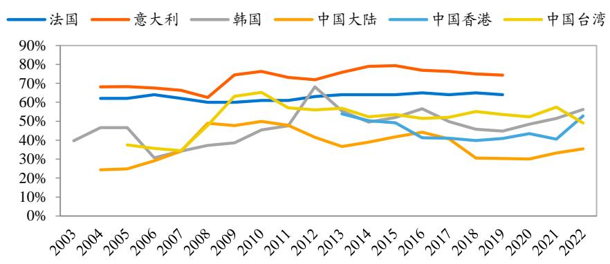

line chart

| Year | 法国 | 意大利 | 韩国 | 中国大陆 | 中国香港 | 中国台湾 |
|------|------|--------|------|----------|----------|----------|
| 2003 | 62%  | 68%    | 40%  | 25%      | 38%      | 38%      |
| 2004 | 62%  | 68%    | 45%  | 25%      | 38%      | 38%      |
| 2005 | 62%  | 68%    | 45%  | 25%      | 38%      | 38%      |
| 2006 | 62%  | 68%    | 45%  | 25%      | 38%      | 38%      |
| 2007 | 62%  | 68%    | 45%  | 30%      | 38%      | 38%      |
| 2008 | 62%  | 68%    | 45%  | 35%      | 38%      | 38%      |
| 2009 | 62%  | 75%    | 45%  | 45%      | 45%      | 45%      |
| 2010 | 62%  | 75%    | 45%  | 45%      | 45%      | 45%      |
| 2011 | 62%  | 75%    | 45%  | 45%      | 45%      | 45%      |
| 2012 | 62%  | 75%    | 70%  | 45%      | 45%      | 45%      |
| 2013 | 62%  | 75%    | 65%  | 45%      | 45%      | 45%      |
| 2014 | 62%  | 75%    | 50%  | 45%      | 45%      | 45%      |
| 2015 | 62%  | 75%    | 50%  | 45%      | 45%      | 45%      |
| 2016 | 62%  | 75%    | 50%  | 45%      | 45%      | 45%      |
| 2017 | 62%  | 75%    | 50%  | 45%      | 45%      | 45%      |
| 2018 | 62%  | 75%    | 45%  | 30%      | 45%      | 45%      |
| 2019 | 62%  | 75%    | 45%  | 30%      | 45%      | 45%      |
| 2020 | 62%  | 75%    | 45%  | 30%      | 45%      | 45%      |
| 2021 | 62%  | 75%    | 45%  | 30%      | 45%      | 45%      |
| 2022 | 62%  | 75%    | 50%  | 30%      | 45%      | 45%      |

数据来源：欧洲保险业协会，韩国人身险协会、中国保险年鉴、香港保险局、中国台湾保险业协会、国泰海通证券研究

表 9：全球各国和地区银保渠道发展分化的原因总结

<table><tr><td>国家/地区</td><td>银保渠道占比</td><td>非银资产迁移方向</td><td>融资结构/银行地位</td><td>保险产品结构</td><td>金融混业情况</td><td>主要合作模式</td></tr><tr><td>法国</td><td>高(60%+)</td><td>存款更多向保险迁移</td><td>银行主导较强,银行资产占比61.0%</td><td>储蓄型寿险、年金险为主</td><td>混业较早、程度高</td><td>资本合作、金融集团</td></tr><tr><td>意大利</td><td>高(60%+)</td><td>存款更多向保险迁移</td><td>银行主导中等偏强,银行资产占比42.9%</td><td>储蓄型、年金型产品较多</td><td>混业较早</td><td>资本合作</td></tr><tr><td>中国内地</td><td>较高(30%+)</td><td>存款向保险、理财、基金迁移,保险为重要承接方向</td><td>银行主导明显,银行资产占比62.5%</td><td>储蓄型、年金型、分红险为主</td><td>有限混业</td><td>协议代理为主</td></tr><tr><td>中国香港</td><td>较高(40%+)</td><td>存款更多向储蓄分红险迁移</td><td>银行主导很强,银行资产占比68.5%</td><td>储蓄分红险、终身寿险为主</td><td>混业较深</td><td>战略联盟</td></tr><tr><td>中国台湾</td><td>较高(30%-50%)</td><td>存款更多向保险迁移,人寿保险准备金占比27.5%</td><td>银行地位较强,金控协同明显</td><td>投资型保险、变额寿险、变额年金丰富</td><td>混业较深,金控模式成熟</td><td>金融集团</td></tr><tr><td>韩国</td><td>高(50%+)</td><td>存款更多向保险迁移,保险占居民金融资产29%</td><td>银行主导中等,银行资产占比45.3%</td><td>储蓄型较强,一般账户+独立账户,独立账户保费占比32%</td><td>混业较深</td><td>深度银保合作</td></tr><tr><td>日本</td><td>低(约10%以下)</td><td>存款占比高,保险需求更多由既有渠道承接</td><td>银行地位中等,银行资产占比47.1%</td><td>医疗险、终身险、养老险占比较高</td><td>渐进放开</td><td>协议代理</td></tr><tr><td>美国</td><td>低(约10%以下)</td><td>更多流向股票、基金、IRA、401(k);</td><td>资本市场主导,银行资产占比22.9%</td><td>保障、传承类为主</td><td>混业较晚</td><td>代理人、经纪人主导</td></tr></table>

数据来源：iFind，国泰海通证券研究

## 4. 国内启示：银保迈向新范式，行业格局有望优化

## 4.1. 历史复盘：政策宽松与产品转型是银保渠道发展的关键变量

我国银保渠道自2000年启动以来，经历了由政策驱动、产品驱动到结构转型的多阶段演进，监管放松与产品转型为主要影响因素。（1）快速扩张期（2000– 2003年）：随着银行代销分红险模式落地及监管由“1对 1”向“1对多”放开，银保渠道快速扩张，市场占比迅速提升至 30%以上；（2）产品驱动的爆发期（2004– 2008）：依托万能险、投连险等理财型产品以及资本市场牛市环境，银保业务迎来爆发式增长；（3）调整与低迷期（2009– 2012年）：在资本市场下行及监管趋严背景下，2010 年 11 月原银监会为整治渠道乱象，明确要求商业银行各网点最多只能代理不超过3家保险公司产品，即形成“1+3”合作模式，银保渠道进入首次低迷期，业务出现负增长并伴随退保压力。（4）再次扩张期（2013– 2016年）：在资产端收益提升与费率市场化改革推动下，银保产品吸引力显著增强，行业规模再度扩张，并于2016年达到历史高点。（4）强监管阶段（2017– 2018 年）：监管强化对中短期产品的限制，银保渠道进入去短期化调整阶段，规模明显收缩；（5）结构转型期：2019 年以来，随着利率下行及居民财富管理需求提升，银保产品体系向增额终身寿险及“分红年金+万能险”转型，期交业务快速发展，银保渠道重新进入扩张周期；（5）高质量发展期：2023 年以来，金管局开始针对银保渠道实行“报行合一”政策，叠加2024年放开银行网点合作数量从“1+3”开放至“1+N”，银保渠道竞争模式从“费用驱动”向“价值竞争”转变，银保渠道进入高质量发展新阶段。从我国银保渠道发展趋势看，监管政策趋势与产品转型是影响银保渠道发展重要因素。

图29：中国银保新单保费增长趋势  
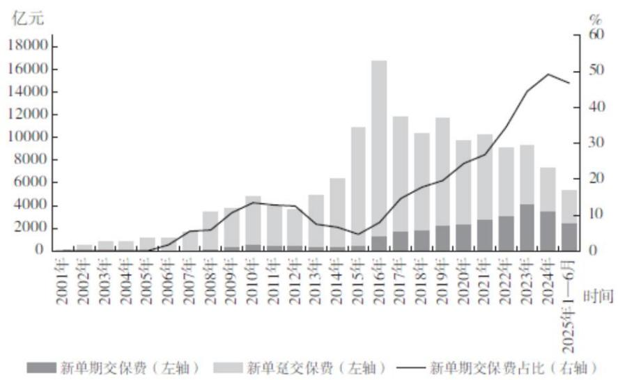

bar-line hybrid

| 时间 | 新单期交保费 (亿元) | 新单趸交保费 (亿元) | 新单期交保费占比 (%) |
| --- | --- | --- | --- |
| 2001年 | 0 | 0 | 0 |
| 2002年 | 0 | 500 | 0 |
| 2003年 | 0 | 500 | 0 |
| 2004年 | 0 | 500 | 0 |
| 2005年 | 0 | 1000 | 0 |
| 2006年 | 0 | 1000 | 0 |
| 2007年 | 0 | 1500 | 10 |
| 2008年 | 0 | 3500 | 15 |
| 2009年 | 0 | 3500 | 25 |
| 2010年 | 500 | 4500 | 35 |
| 2011年 | 500 | 4500 | 35 |
| 2012年 | 500 | 3500 | 35 |
| 2013年 | 500 | 4500 | 25 |
| 2014年 | 500 | 6500 | 15 |
| 2015年 | 1500 | 11500 | 15 |
| 2016年 | 1500 | 17500 | 15 |
| 2017年 | 1500 | 12500 | 25 |
| 2018年 | 1500 | 11500 | 35 |
| 2019年 | 2000 | 12500 | 45 |
| 2020年 | 2500 | 9500 | 45 |
| 2021年 | 2500 | 11500 | 45 |
| 2022年 | 3000 | 9500 | 45 |
| 2023年 | 4000 | 9500 | 45 |
| 2024年 | 3500 | 7500 | 48 |

数据来源：中国保险学会《银行保险市场的“新范式”》

## 4.2. 当前现状：期缴化与集中度提升，银保迈向价值竞争

从产品结构看，近年来银保渠道新单保费由趸缴向期交持续转型，业务价值显著提升。2011– 2016年间，银保新单以趸缴为主，占比长期维持在90%以上，呈现出典型的“规模驱动”特征；而 2017年以来，在监管引导去短期化及利率下行背景下，银保产品结构逐步向长期期交转型。根据行业数据，期交保费占比持续提升，并于 2024年接近50%，实现由“趸缴主导”向“期交与趸缴均衡”转变。同时，期交产品（如增额终身寿险、分红年金等）具备更高价值率，推动银保渠道由单纯规模扩张转向价值增长，成为险企新业务价值的重要来源。

图30：中国银保新单的缴费结构  
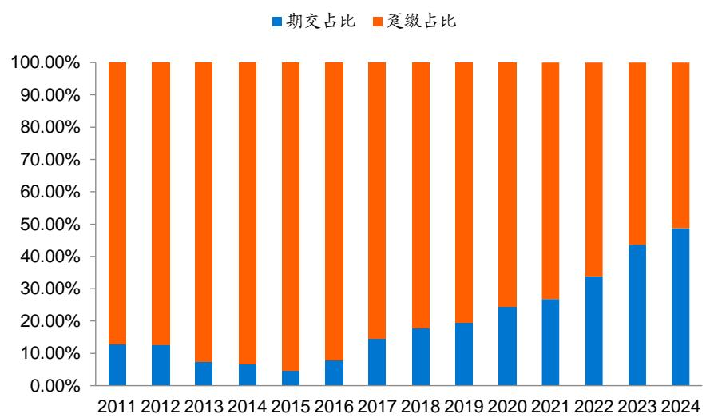

stacked bar chart

| 年份 | 期交占比 (%) | 走缴占比 (%) |
|---|---|---|
| 2011 | 12.00 | 87.00 |
| 2012 | 12.00 | 87.00 |
| 2013 | 7.00 | 87.00 |
| 2014 | 6.00 | 89.00 |
| 2015 | 4.00 | 89.00 |
| 2016 | 8.00 | 89.00 |
| 2017 | 14.00 | 85.00 |
| 2018 | 17.00 | 83.00 |
| 2019 | 19.00 | 81.00 |
| 2020 | 24.00 | 76.00 |
| 2021 | 27.00 | 73.00 |
| 2022 | 33.00 | 67.00 |
| 2023 | 43.00 | 57.00 |
| 2024 | 49.00 | 51.00 |

数据来源：13个精算师，国泰海通证券研究

从竞争格局看，银保渠道的市场份额逐步从中小保险向头部集中。银保渠道的市场份额正由早期以银行系及“银保七雄”为主导，逐步向头部综合实力更强的“老七家”集中。2016 年前后，银保渠道以银行系险企和银保专业公司为核心，占据主要市场份额；而近年来，随着渠道费用规范（报行合一）、产品复杂度提升及银行端筛选机制强化，具备品牌优势、产品能力及综合服务能力的头部险企竞争优势持续凸显。数据显示，2019 年以来“老七家”在银保渠道的市占率明显提升，行业呈现“头部领跑”格局，且头部险企期交业务增速显著高于行业平均水平。

图31：中国银保新单的竞争格局  
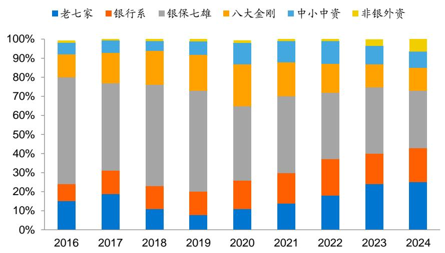

stacked bar chart

| Year | 老七家 | 银行系 | 银保七雄 | 八大金刚 | 中小中资 | 非银外资 |
|------|--------|--------|----------|----------|----------|----------|
| 2016 | 15%    | 10%    | 45%      | 15%      | 5%       | 1%       |
| 2017 | 18%    | 12%    | 40%      | 15%      | 5%       | 1%       |
| 2018 | 10%    | 10%    | 50%      | 15%      | 5%       | 1%       |
| 2019 | 8%     | 12%    | 45%      | 15%      | 5%       | 1%       |
| 2020 | 10%    | 15%    | 35%      | 20%      | 10%      | 1%       |
| 2021 | 13%    | 15%    | 35%      | 15%      | 10%      | 1%       |
| 2022 | 17%    | 18%    | 30%      | 15%      | 10%      | 1%       |
| 2023 | 23%    | 15%    | 30%      | 15%      | 8%       | 2%       |
| 2024 | 25%    | 18%    | 25%      | 15%      | 7%       | 4%       |

数据来源：13个精算师，国泰海通证券研究

## 4.3. 未来展望：承接存款迁移、行业集中度提升、合作模式升级

我国银保市场进入高质量发展新阶段。政策方面，银保渠道报行合一政策与银行网点“1+N”合作放开驱动行业竞争模式从“费用驱动”向“价值竞争”转型。银行诉求层面，在低利率和低息差环境下，银行重视中间业务收入，尽管银保渠道佣金率下降，但保险代销仍是不可忽视的重要非息收入。保险公司方面，“报行合一”实行之后银保渠道价值提升，外加寿险市场需要新的增长点，头部保险公司积极发展银保。尤其在客户方面，人口老龄化与低利率周期下，客户对长期、确定性、收益较高的产品有明确的诉求，居民存款有望逐步迁移。

图32：中国银保市场的“新范式”  
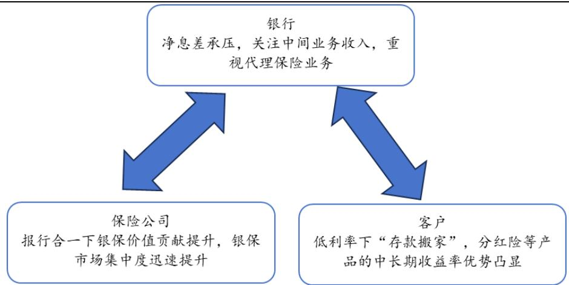

flowchart

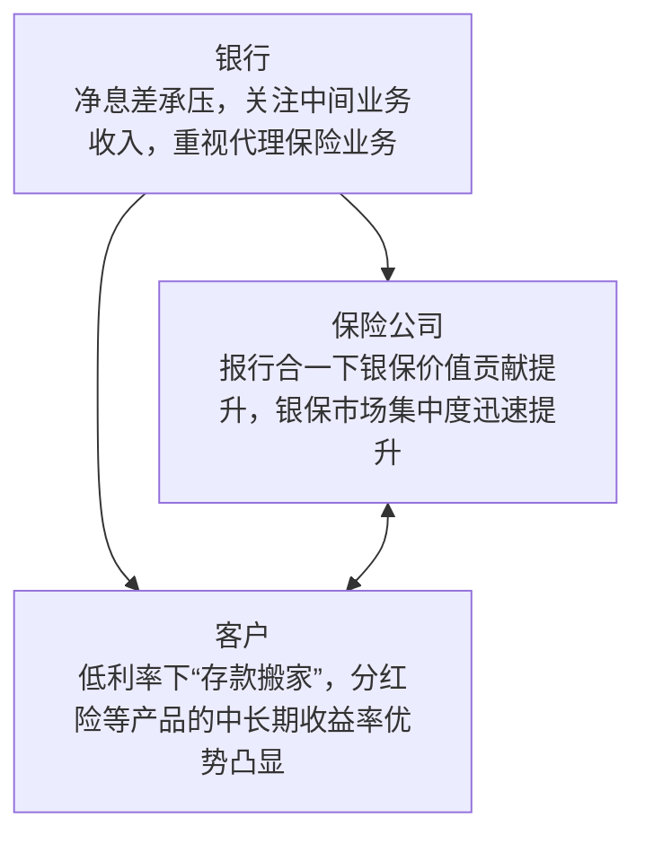
```mermaid
graph TD
  A["银行\n净息差承压，关注中间业务收入，重视代理保险业务"] --> B["保险公司\n报行合一下银保价值贡献提升，银保市场集中度迅速提升"]
  A --> C["客户\n低利率下“存款搬家”，分红险等产品的中长期收益率优势凸显"]
    B <--> C
```

数据来源：中国保险学会《银行保险市场的“新范式”》，国泰海通证券研究

## 1、居民存款迁移与银行中收诉求提升助推银保渠道增长

低利率背景下保险产品相对收益率优势凸显，居民存款有望向保险产品迁移。在居民资产配置层面，近年来人民币住户存款余额持续增长，规模已突破 160 万亿元，过去几年保持约 10%的复合增速，反映出居民风险偏好下降背景下的“超额储蓄”积累 。但与此同时，2023年以来存款利率进入快速下行通道，国有大行中长期定期存款利率已由此前 3%以上降至“1.3%区间”，存款收益吸引力明显下降。在利率持续走低的环境下，居民存款增速已出现边际回落，并逐步向理财、基金及保险等替代资产转移。保险产品凭借相对稳定的收益特征及长期锁定收益能力，成为承接“存款搬家”的重要方向。一方面，传统储蓄型保险及分红险具备收益相对确定、波动较低的特征，在当前低利率环境下相对银行存款具备比较优势；另一方面，银保渠道产品通过“分红年金+万能险”等结构设计，在兼顾收益与保障的同时提升资产配置效率，契合居民对稳健增值与长期规划的需求。结合利率下行与财富管理需求提升趋势，居民存款向保险产品迁移具有较强持续性，银保渠道有望成为承接居民储蓄再配置的核心载体。

图33：住户人民币存款余额情况  
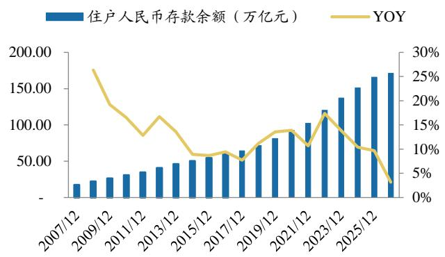

bar-line hybrid chart

| Year     | 住户人民币存款余额 (万亿元) | YOY  |
| -------- | ---------------------------- | ---- |
| 2007/12  | 20.00                        | 30%  |
| 2009/12  | 30.00                        | 25%  |
| 2011/12  | 40.00                        | 15%  |
| 2013/12  | 50.00                        | 10%  |
| 2015/12  | 60.00                        | 8%   |
| 2017/12  | 70.00                        | 10%  |
| 2019/12  | 80.00                        | 15%  |
| 2021/12  | 90.00                        | 12%  |
| 2023/12  | 120.00                       | 18%  |
| 2025/12  | 160.00                       | 8%   |
| 2027/12  | 170.00                       | 5%   |

数据来源：iFind，国泰海通证券研究

图34：保险产品与 5年期国有大行定存情况对比  
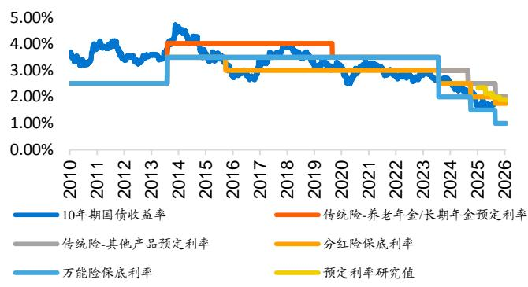

line chart

| Year | 10年期国债收益率 | 传统险-养老年金/长期年金预定利率 | 传统险-其他产品预定利率 | 分红险保底利率 | 万能险保底利率 | 预定利率研究值 |
|------|------------------|----------------------------------|--------------------------|----------------|----------------|----------------|
| 2010 | ~3.5%            | ~3.5%                            | ~3.5%                    | ~3.5%          | ~3.5%          | ~3.5%          |
| 2011 | ~3.8%            | ~3.8%                            | ~3.8%                    | ~3.8%          | ~3.8%          | ~3.8%          |
| 2012 | ~3.7%            | ~3.7%                            | ~3.7%                    | ~3.7%          | ~3.7%          | ~3.7%          |
| 2013 | ~3.6%            | ~3.6%                            | ~3.6%                    | ~3.6%          | ~3.6%          | ~3.6%          |
| 2014 | ~4.5%            | ~4.0%                            | ~3.5%                    | ~3.5%          | ~3.5%          | ~3.5%          |
| 2015 | ~4.0%            | ~4.0%                            | ~3.5%                    | ~3.5%          | ~3.5%          | ~3.5%          |
| 2016 | ~3.5%            | ~4.0%                            | ~3.5%                    | ~3.5%          | ~3.5%          | ~3.5%          |
| 2017 | ~3.5%            | ~4.0%                            | ~3.5%                    | ~3.5%          | ~3.5%          | ~3.5%          |
| 2018 | ~3.5%            | ~4.0%                            | ~3.5%                    | ~3.5%          | ~3.5%          | ~3.5%          |
| 2019 | ~3.5%            | ~4.0%                            | ~3.5%                    | ~3.5%          | ~3.5%          | ~3.5%          |
| 2020 | ~2.5%            | ~4.0%                            | ~3.5%                    | ~3.5%          | ~3.5%          | ~3.5%          |
| 2021 | ~2.8%            | ~4.0%                            | ~3.5%                    | ~3.5%          | ~3.5%          | ~3.5%          |
| 2022 | ~2.8%            | ~4.0%                            | ~3.5%                    | ~3.5%          | ~3.5%          | ~3.5%          |
| 2023 | ~2.8%            | ~4.0%                            | ~3.5%                    | ~3.5%          | ~3.5%          | ~3.5%          |
| 2024 | ~2.5%            | ~4.0%                            | ~3.0%                    | ~3.0%          | ~2.5%          | ~2.5%          |
| 2025 | ~1.8%            | ~4.0%                            | ~2.5%                    | ~2.5%          | ~1.8%          | ~2.0%          |
| 2026 | ~1.0%            | ~4.0%                            | ~2.0%                    | ~2.0%          | ~1.0%          | ~1.5%          |

数据来源：iFind，国泰海通证券研究

银行方面，低利率和低息差环境下银行重视中间业务收入，并在银保合作中谋求增加非银存款。低利率、低利差、低费率的环境给银行盈利能力带来很大挑战，根据国家金融监督管理总局发布的银行业主要监管数据，2024年末商业银行平均净息差为 1.524，同比下降了 17 个基点， 2025 年末差为1.46，同比下降8个基点，再次创历史新低。尽管在“报行合一”政策约束下，保险产品佣金率有所下行，短期内对代销收入形成一定压制，但从结构上看，银保业务仍然是银行中间业务的重要组成部分。一方面，保险产品具备期限长、客户黏性强、复购率高等特征，能够为银行提供持续性的手续费及佣金收入来源；另一方面，相较于基金、理财等波动性较高的产品，储蓄型与分红型保险更契合当前低利率环境下客户的稳健配置需求，使银保业务在财富管理体系中的地位持续稳固。进一步来看，银保合作不仅体现在中收贡献层面，还具备优化负债结构的潜在价值。在“存款搬家”趋势下，保险产品通过长期锁定资金属性，可在一定程度上转化为银行体系内的类负债资金来源，形成“非银存款”的补充渠道。同时，在“1+N”合作模式放开后，银行可通过多元保险产品供给增强客户留存与资产沉淀能力，推动从单一存贷款关系向综合金融服务关系转型。

图35：商业银行净息差收窄（%）  
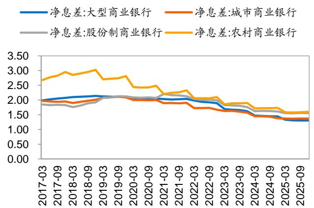

line chart

| Date     | 净息差:大型商业银行 | 净息差:城市商业银行 | 净息差:股份制商业银行 | 净息差:农村商业银行 |
|----------|----------------------|----------------------|------------------------|----------------------|
| 2017-03  | 2.00                 | 2.00                 | 1.80                   | 2.70                 |
| 2017-09  | 2.05                 | 1.95                 | 1.85                   | 2.90                 |
| 2018-03  | 2.10                 | 1.90                 | 1.90                   | 3.00                 |
| 2018-09  | 2.15                 | 1.85                 | 1.95                   | 3.10                 |
| 2019-03  | 2.20                 | 1.80                 | 2.00                   | 2.80                 |
| 2019-09  | 2.15                 | 1.75                 | 2.05                   | 2.70                 |
| 2020-03  | 2.10                 | 1.70                 | 2.10                   | 2.60                 |
| 2020-09  | 2.05                 | 1.65                 | 2.15                   | 2.50                 |
| 2021-03  | 2.00                 | 1.60                 | 2.20                   | 2.40                 |
| 2021-09  | 1.95                 | 1.55                 | 2.25                   | 2.30                 |
| 2022-03  | 1.90                 | 1.50                 | 2.30                   | 2.20                 |
| 2022-09  | 1.85                 | 1.45                 | 2.35                   | 2.10                 |
| 2023-03  | 1.80                 | 1.40                 | 2.40                   | 2.00                 |
| 2023-09  | 1.75                 | 1.35                 | 2.45                   | 1.90                 |
| 2024-03  | 1.70                 | 1.30                 | 2.50                   | 1.80                 |
| 2024-09  | 1.65                 | 1.25                 | 2.55                   | 1.70                 |
| 2025-03  | 1.60                 | 1.20                 | 2.60                   | 1.65                 |
| 2025-09  | 1.55                 | 1.15                 | 2.65                   | 1.60                 |

数据来源：iFind，国泰海通证券研究

图36：非银金融机构存款增加情况（亿元）  
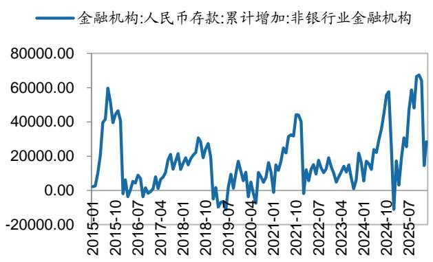

line chart

| Date     | 金融机构:人民币存款:累计增加:非银行业金融机构 |
| -------- | ------------------------------------------ |
| 2015-01  | 0.00                                       |
| 2015-10  | 60000.00                                   |
| 2016-07  | 0.00                                       |
| 2017-04  | 20000.00                                   |
| 2018-01  | 30000.00                                   |
| 2018-10  | 25000.00                                   |
| 2019-07  | -2000.00                                   |
| 2020-04  | 15000.00                                   |
| 2021-01  | 45000.00                                   |
| 2021-10  | 45000.00                                   |
| 2022-07  | 15000.00                                   |
| 2023-04  | 15000.00                                   |
| 2024-01  | 25000.00                                   |
| 2024-10  | 6000.00                                    |
| 2025-07  | 7000.00                                    |

数据来源：iFind，国泰海通证券研究

图37：上市险企 2025H1提升银行存款占比  
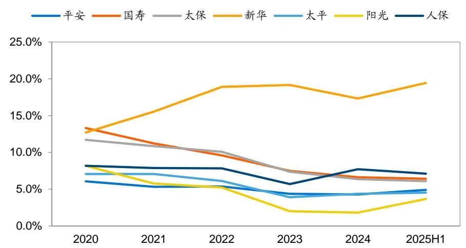

line chart

| Year   | 平安  | 国寿  | 太保  | 新华  | 太平  | 阳光  | 人保  |
|--------|-------|-------|-------|-------|-------|-------|-------|
| 2020   | 6.0%  | 13.0% | 11.5% | 13.0% | 7.0%  | 8.0%  | 8.0%  |
| 2021   | 5.5%  | 11.0% | 10.5% | 15.5% | 6.5%  | 5.5%  | 7.5%  |
| 2022   | 5.0%  | 9.5%  | 10.0% | 19.0% | 6.0%  | 5.0%  | 7.5%  |
| 2023   | 4.0%  | 7.5%  | 7.5%  | 19.0% | 4.5%  | 2.0%  | 5.5%  |
| 2024   | 4.5%  | 6.5%  | 6.5%  | 17.0% | 4.0%  | 1.5%  | 7.5%  |
| 2025H1 | 5.0%  | 6.0%  | 6.0%  | 19.5% | 4.5%  | 3.5%  | 7.0%  |

数据来源：公司财报，国泰海通证券研究

## 2、头部险企有望发挥综合优势提升行业集中度

保险公司方面，保险行业银保渠道占比仍有提升空间，头部险企发挥综合竞争优势下集中度有望进一步提升。随着银保渠道保费和价值贡献的改善，头部保险公司对银保渠道高度重视。从前述趋势看，银保市场分散度较高，头部寿险公司的市场占有率较低，随着银保渠道的价值贡献提升，头部险企有望发挥品牌、产品、服务、队伍、管理、综合资源等优势，与银行形成协同效应，快速提升市场份额。我们从韩国人身险行业集中度看，2022 年CR1/3/5/10 分别为 22%/54%/71%/89%，而中国的 25Q1 银保渠道 CR1/3/5/10分别为 8.8%/21.9%/33.5%/54.5%，仍有较大提升空间。

图38：韩国银保渠道总保费集中度情况  
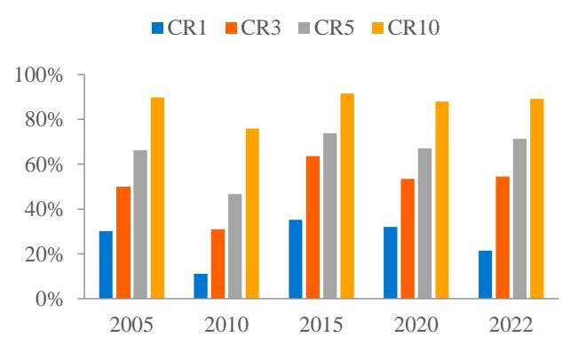

bar chart

| Year | CR1 (%) | CR3 (%) | CR5 (%) | CR10 (%) |
| :--- | :--- | :--- | :--- | :--- |
| 2005 | 30 | 50 | 66 | 90 |
| 2010 | 11 | 30 | 47 | 76 |
| 2015 | 35 | 63 | 74 | 91 |
| 2020 | 32 | 54 | 67 | 87 |
| 2022 | 21 | 55 | 71 | 89 |

数据来源：韩国人身险协会，国泰海通证券研究

图39：中国内地银保渠道新单集中度情况  
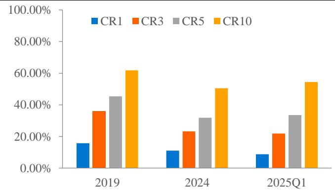

bar chart

| Year | CR1 (%) | CR3 (%) | CR5 (%) | CR10 (%) |
| :--- | :--- | :--- | :--- | :--- |
| 2019 | 16.00 | 36.00 | 45.00 | 62.00 |
| 2024 | 11.00 | 23.00 | 32.00 | 50.00 |
| 2025Q1 | 8.00 | 22.00 | 34.00 | 54.00 |

数据来源：13个精算师，国泰海通证券研究

## 3、银保渠道发展与分红险转型形成协同

中国香港地区银保渠道主要销售长期的分红型终身寿险，银保渠道发力与行业向分红险转型有望协同赋能。根据香港保监局数据披露，2025Q3香港银保渠道新单保费中，分红型产品占比达到93.9%，其中终身寿险占比达到64%，且主要以期缴产品为主，长期交的分红型终身寿险是香港银保渠道的主要销售产品。这一结构表明，银行渠道不仅能够销售传统储蓄型产品，还具备承载收益结构更为复杂、期限更长的分红险产品的能力，其背后依赖的是银行渠道对中高净值客户的触达能力以及长期资产配置需求的匹配。进一步来看，分红险本质上属于“低保证+浮动收益”的复杂产品形态，对销售能力、客户教育及持续服务要求更高，而香港市场中银保渠道能够成为分红险的主要销售渠道，核心在于长期稳定的银保战略合作关系：银行与保险公司在产品设计、客户经营及资产配置上实现深度协同，使渠道由单一分销平台升级为财富管理载体。在当前中国市场利率下行、保险产品向分红险转型的背景下，若能够通过深化银保战略合作（如长期独家或深度绑定合作），复制香港市场“银保+分红险”的发展路径，银保渠道有望成为推动分红险转型的核心抓手，进而加速行业由“刚性负债”向“浮动收益+风险共担”的新负债模式演进。

图40：2025Q3 香港银保渠道险种结构  
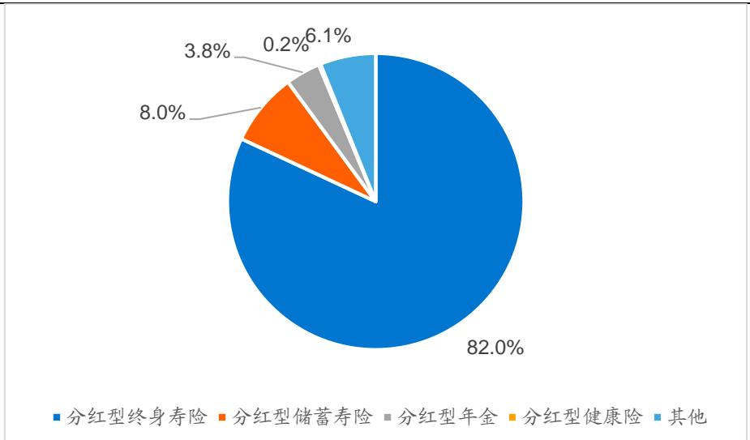

pie chart

| 类别 | 占比 (%) |
| :--- | :--- |
| 分红型终身寿险 | 82.0 |
| 分红型储蓄寿险 | 8.0 |
| 分红型年金 | 3.8 |
| 分红型健康险 | 0.2 |
| 其他 | 6.1 |

数据来源：香港保监局，国泰海通证券研究

## 5. 投资建议

投资建议：低利率环境下我国居民资产由存款向长期金融产品迁移，保险的“刚兑+收益率”优势有望成为“存款搬家”重要载体，银保渠道则为核心枢纽；银保监管规范化进一步凸显头部险企综合优势，银保合作模式有望转型升级，行业集中度稳步提升，保险负债端实现高质量增长。维持行业“增持”评级。个股方面，推荐标的中国太保/中国平安/新华保险/中国财险/中国人寿/中国人民保险集团。

海外借鉴：全球各国和地区银保渠道发展程度分化，或受供需逻辑、制度环境以及合作模式差异所影响。全球银保发展程度表现分化，法国、意大利等欧洲市场银保占比长期在60%以上，中国香港、韩国、中国台湾等亚洲市场银保亦为核心渠道，而美国、日本则仍以代理人体系为主。（1）需求基础，低利率环境下居民存款向非银资产迁移、银行净息差收窄后中收诉求上升，是银保发展的共同前提；（2）供给替代，不同国家和地区居民财富迁移的承接方向存在差异，美国长期资金更多流向股票、基金及 IRA、401(k)等养老金账户，保险储蓄功能被明显分流；而韩国、中国台湾、中国香港等市场中，保险本身承担了更强的长期储蓄和财富管理功能，且储蓄型、年金型、投资型及分红型产品与银行渠道销售场景更为契合，因此银保更易发展；（3）制度差异，融资结构与金融混业程度决定了银行能否掌握居民财富管理入口，以及银行与保险之间能否形成更深层次协同，银行主导型且混业推进较早的市场通常更有利于银保渠道扩张。（4）在此基础上，各国和地区进一步形成了差异化的合作模式：中国内地、日本以协议代理为主，中国香港更偏长期战略联盟，法国、意大利更多采用资本合作模式，中国台湾及部分欧洲市场则发展出金融集团模式，合作深度差异进一步强化了全球银保格局分化。

国内启示：银保渠道有望成为我国居民存款搬家的核心载体。（1）历史复盘：我国银保渠道自2000年启动以来，经历由政策驱动、产品驱动到结构转型的多阶段演进，监管放松与产品转型为主要影响因素。（2）当前现状：银保产品形态向期缴转型，行业集中度稳步提升。行业模式从“价格竞争”向“价值竞争”转型，银保价值贡献提升，头部险企综合优势凸显驱动集中度提升。

（3）未来趋势：银保有望成为承接居民储蓄迁移的核心渠道，银行净息差持续收窄下中间业务收入重要性提升，香港市场已验证“银保+分红险”模式具备较强生命力，分红险转型与银保深化具备协调效应，头部险企有望发挥综合优势与银行的合作关系从协议代理向长期战略合作转型，部分险企有望深化金融集团的银保一体化合作，推动银保高质量发展。

## 6. 风险提示

1） 负债端：负债成本改善不及预期；  
2） 资产端：长端利率下行；权益市场波动。

## 本公司具有中国证监会核准的证券投资咨询业务资格

## 分析师声明

作者具有中国证券业协会授予的证券投资咨询执业资格或相当的专业胜任能力，保证报告所采用的数据均来自合规渠道，分析逻辑基于作者的职业理解，本报告清晰准确地反映了作者的研究观点，力求独立、客观和公正，结论不受任何第三方的授意或影响，特此声明。

## 免责声明

本报告仅供国泰海通证券股份有限公司（以下简称“本公司”）的客户使用。本公司不会因接收人收到本报告而视其为本公司的当然客户。本报告仅在相关法律许可的情况下发放，并仅为提供信息而发放，概不构成任何广告。

本报告的信息来源于已公开的资料，本公司对该等信息的准确性、完整性或可靠性不作任何保证。本报告所载的资料、意见及推测仅反映本公司于发布本报告当日的判断，本报告所指的证券或投资标的的价格、价值及投资收入可升可跌。过往表现不应作为日后的表现依据。在不同时期，本公司可发出与本报告所载资料、意见及推测不一致的报告。本公司不保证本报告所含信息保持在最新状态。同时，本公司对本报告所含信息可在不发出通知的情形下做出修改，投资者应当自行关注相应的更新或修改。

本报告中所指的投资及服务可能不适合个别客户，不构成客户私人咨询建议。在任何情况下，本报告中的信息或所表述的意见均不构成对任何人的投资建议。在任何情况下，本公司、本公司员工或者关联机构不承诺投资者一定获利，不与投资者分享投资收益，也不对任何人因使用本报告中的任何内容所引致的任何损失负任何责任。投资者务必注意，其据此做出的任何投资决策与本公司、本公司员工或者关联机构无关。

本公司利用信息隔离墙控制内部一个或多个领域、部门或关联机构之间的信息流动。因此，投资者应注意，在法律许可的情况下，本公司及其所属关联机构可能会持有报告中提到的公司所发行的证券或期权并进行证券或期权交易，也可能为这些公司提供或者争取提供投资银行、财务顾问或者金融产品等相关服务。在法律许可的情况下，本公司的员工可能担任本报告所提到的公司的董事。

市场有风险，投资需谨慎。投资者不应将本报告作为作出投资决策的唯一参考因素，亦不应认为本报告可以取代自己的判断。在决定投资前，如有需要，投资者务必向专业人士咨询并谨慎决策。

本报告版权仅为本公司所有，未经书面许可，任何机构和个人不得以任何形式翻版、复制、发表或引用。如征得本公司同意进行引用、刊发的，需在允许的范围内使用，并注明出处为“国泰海通证券研究”，且不得对本报告进行任何有悖原意的引用、删节和修改。

若本公司以外的其他机构（以下简称“该机构”）发送本报告，则由该机构独自为此发送行为负责。通过此途径获得本报告的投资者应自行联系该机构以要求获悉更详细信息或进而交易本报告中提及的证券。本报告不构成本公司向该机构之客户提供的投资建议，本公司、本公司员工或者关联机构亦不为该机构之客户因使用本报告或报告所载内容引起的任何损失承担任何责任。

评级说明

## 投资建议的比较标准

投资评级分为股票评级和行业评级。

以报告发布后的 12个月内的市场表现为比较标准，报告发布日后的 12个月内的公司股价（或行业指数）的涨跌幅相对同期的沪深 300指数涨跌幅为基准。

<table><tr><td></td><td>评级</td><td>说明</td></tr><tr><td rowspan="4">股票投资评级</td><td>增持</td><td>相对沪深300指数涨幅15%以上</td></tr><tr><td>谨慎增持</td><td>相对沪深300指数涨幅介于5%~15%之间</td></tr><tr><td>中性</td><td>相对沪深300指数涨幅介于-5%~5%</td></tr><tr><td>减持</td><td>相对沪深300指数下跌5%以上</td></tr><tr><td rowspan="3">行业投资评级</td><td>增持</td><td>明显强于沪深300指数</td></tr><tr><td>中性</td><td>基本与沪深300指数持平</td></tr><tr><td>减持</td><td>明显弱于沪深300指数</td></tr></table>

## 国泰海通证券研究所

地址

上海市黄浦区中山南路 888 号

邮编

200011

电话

（021）38676666