## 杠杆资金&股票型ETF分化加剧

## 流动性&交易拥挤度&投资者温度计周报

2026年4月20日

证券分析师：姚佩

联系人：朱冬墨

执业编号：S0360522120004

邮箱：zhudongmo@hcyjs.com

邮箱：yaopei@hcyjs.com

本报告由华创证券有限责任公司编制

卖的出价或询价。本报告所载信息均为个人观点，并不构成对所涉及证券的个人投资建议。

请仔细阅读PPT后部分的分析师声明及免责声明。

## 资金流动性：

1）资金供给端：偏股型公募新发规模扩张至历史中高位、杠杆资金&股票型ETF分化加剧：杠杆资金净流入重回历史高位；股票型ETF流出规模持续扩大、回购金额仍处于历史低位；  
2）资金需求端：股权融资规模收缩至历史中位、产业资本净减持扩张至历史中高位、南向资金重回净流入。

交易拥挤度：以过去四周成交额占比/市值占比（较全A）作为衡量主题行业交易热度的表征指标来看，本周热度分位（下同）上行行业主要为：建材+10pct至66%、传媒+10pct至28%、医疗服务+7pct至76%；下行行业主要为：化工-28pct至37%、煤炭-15pct至36%、央企-13pct至56%。

## 投资者温度计：

1）上周市场呈震荡上行、成长领跑的格局，风险偏好修复量能温和放量，市场对美伊冲突逐步脱敏，自媒体A股搜索热度下降。  
2）公募抱团趋势不变，风格偏向价值，行业偏向金融、周期、消费。  
3）最近一周以小单衡量的沪深两市A股散户资金净流入820.8亿元，较前值增加503.4亿元，处过去五年33.7%分位，净流入规模上升。

## 目录

## 01 资金流动性：杠杆资金&股票型ETF分化加剧

02 交易拥挤度：建材、传媒、医疗服务上行；化工、煤炭、央企下行  
03 投资者温度计：自媒体A股搜索热度下降，散户资金净流入规模上升

## 1、资金流动性：杠杆资金&股票型ETF分化加剧

资金流动性：1）资金供给端：偏股型公募新发规模扩张至历史中高位、杠杆资金&股票型ETF分化加剧：杠杆资金净流入重回历史高位；股票型ETF流出规模持续扩大、回购金额仍处于历史低位；2）资金需求端：股权融资规模收缩至历史中位、产业资本净减持扩张至历史中高位、南向资金重回净流入。

<table><tr><td colspan="4">资金供给</td></tr><tr><td>资金供给主体(亿元)</td><td>上期</td><td>本期</td><td>近3年分位</td></tr><tr><td>偏股型公募新发份额</td><td>13</td><td>91</td><td>72%</td></tr><tr><td>两融资金净流入</td><td>330</td><td>554</td><td>95%</td></tr><tr><td>股票型ETF净申购</td><td>-340</td><td>-506</td><td>3%</td></tr><tr><td>上市公司回购</td><td>7</td><td>12</td><td>30%</td></tr><tr><td>合计</td><td>3</td><td>138</td><td></td></tr><tr><td colspan="4">资金需求</td></tr><tr><td>资金需求主体(亿元)</td><td>上期</td><td>本期</td><td>近3年分位</td></tr><tr><td>股权融资</td><td>321</td><td>105</td><td>58%</td></tr><tr><td>产业资本净减持</td><td>37</td><td>80</td><td>72%</td></tr><tr><td>南向资金净流入</td><td>-102</td><td>225</td><td>73%</td></tr><tr><td>合计</td><td>255</td><td>410</td><td></td></tr><tr><td>限售解禁流通市值</td><td>1174</td><td>768</td><td>75%</td></tr></table>

## 1.1、 公募权益新发规模上升

公募权益新成立基金：上周新成立份额91.1亿份，较前值13.2亿份上升，其中主动型新发56.3亿份，被动指数型新发34.8亿份。

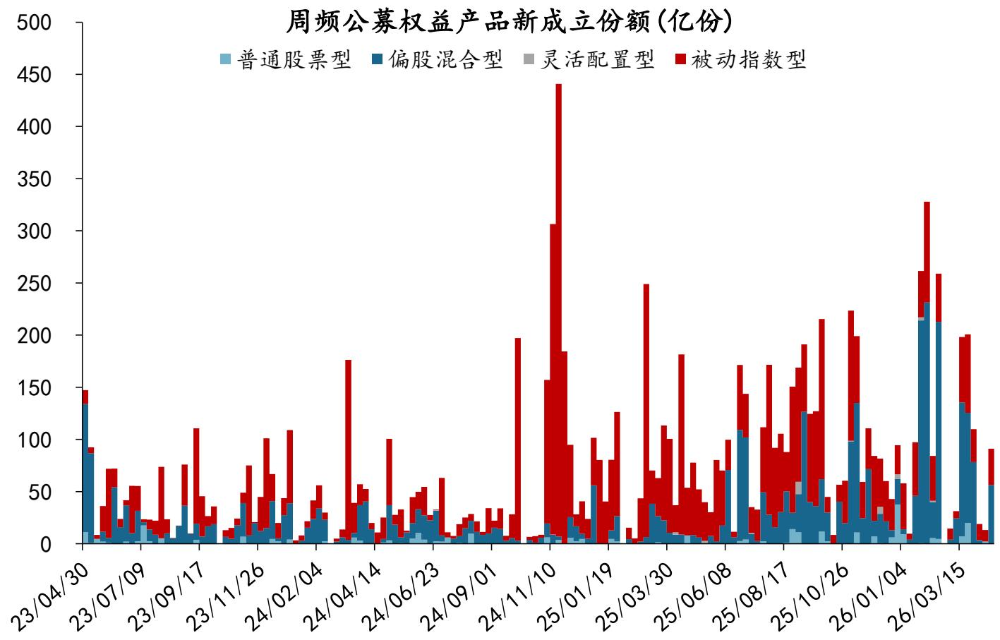

stacked bar chart

| Date       | 普通股票型 | 偏股混合型 | 灵活配置型 | 被动指数型 |
| ---------- | ---------- | ---------- | ---------- | ---------- |
| 23/04/30   | 10         | 130        | 0          | 15         |
| 23/07/09   | 15         | 50         | 0          | 70         |
| 23/09/17   | 20         | 35         | 0          | 55         |
| 23/11/26   | 15         | 40         | 0          | 75         |
| 24/02/04   | 10         | 40         | 0          | 50         |
| 24/04/14   | 15         | 45         | 0          | 175        |
| 24/06/23   | 10         | 35         | 0          | 100        |
| 24/09/01   | 15         | 30         | 0          | 60         |
| 24/11/10   | 10         | 20         | 0          | 195        |
| 25/01/19   | 15         | 30         | 0          | 95         |
| 25/03/30   | 10         | 40         | 0          | 250        |
| 25/06/08   | 15         | 60         | 0          | 180        |
| 25/08/17   | 20         | 80         | 0          | 170        |
| 25/10/26   | 25         | 100        | 0          | 220        |
| 26/01/04   | 30         | 130        | 0          | 260        |
| 26/03/15   | 35         | 140        | 0          | 265        |
| (Last Point)| (Last Point) | (Last Point) | (Last Point) | (Last Point) |

## 1.2、 两融资金：净流入553.7亿

1）最新融资余额2.65万亿较前值上升、融券余额198.2亿元较前值上升，整体余额占流通市值比例为2.57%，处近三年89%分位；  
2）两融资金整体上周净流入约553.7亿元，较前值净流入329.6亿元上升，处近三年95%分位；成交额占全A比例为10.1%，较前值上升0.4pct，参与度处近三年82%分位。

周频两融存量情况 (亿元)  
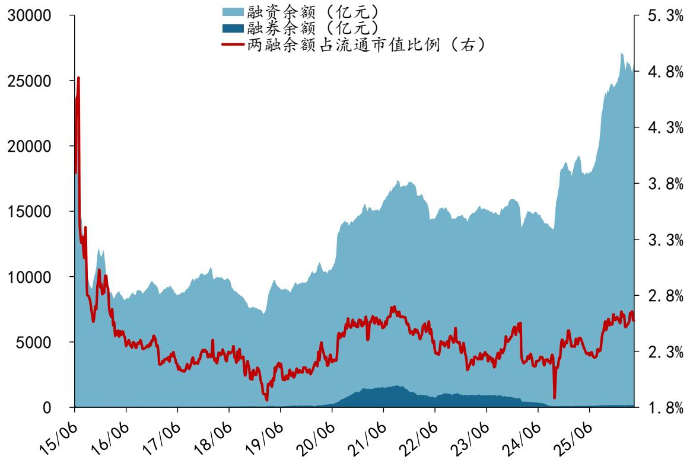

bar-line hybrid chart

| Date   | 融资余额 (亿元) | 融券余额 (亿元) | 两融余额占流通市值比例 (%) |
|--------|----------------|----------------|------------------------------|
| 15/06  | ~25000         | ~0             | ~4.8                         |
| 16/06  | ~12000         | ~0             | ~3.3                         |
| 17/06  | ~9000          | ~0             | ~2.8                         |
| 18/06  | ~10000         | ~0             | ~2.3                         |
| 19/06  | ~7000          | ~0             | ~1.8                         |
| 20/06  | ~11000         | ~0             | ~2.8                         |
| 21/06  | ~16000         | ~100           | ~3.8                         |
| 22/06  | ~17000         | ~50            | ~3.3                         |
| 23/06  | ~15000         | ~50            | ~2.8                         |
| 24/06  | ~14000         | ~50            | ~2.3                         |
| 25/06  | ~27000         | ~50            | ~4.8                         |

证监会审核华创证券投资咨询业务资格批文号：证监许可（2009）1210 号

周频两融交易情况 (亿元)  
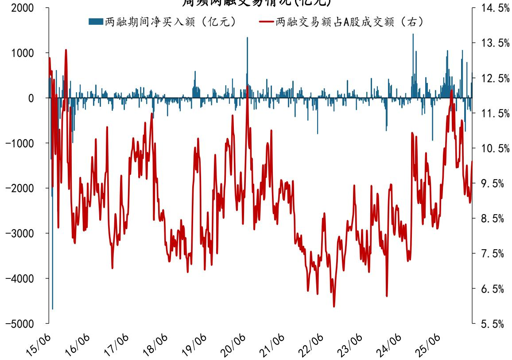

bar-line hybrid chart

| Date   | 两融期间净买入额 (亿元) | 两融交易额占A股成交额 (右) |
|--------|--------------------------|-----------------------------|
| 15/06  | ~500                     | ~13.5%                      |
| 16/06  | ~-1000                   | ~9.5%                       |
| 17/06  | ~-2000                   | ~8.5%                       |
| 18/06  | ~-3000                   | ~7.5%                       |
| 19/06  | ~-1000                   | ~9.5%                       |
| 20/06  | ~1500                    | ~12.5%                      |
| 21/06  | ~-1000                   | ~8.5%                       |
| 22/06  | ~-3000                   | ~6.5%                       |
| 23/06  | ~-2000                   | ~9.5%                       |
| 24/06  | ~-1000                   | ~8.5%                       |
| 25/06  | ~1000                    | ~12.5%                      |

6 数据来源：Wind，华创证券

## 1.2、 两融资金：净流入553.7亿

3）两融自身换手率上周为44.7%，较前值31.9%上升，处近三年83%分位。  
• 4）融资融券余业务个人投资者数量达到811.1万名，其中平均每日参与交易的投资者数量达到46.8万名，较前值上升6.5万名，散户参与度上升。

周频两融交易情况(亿元)  
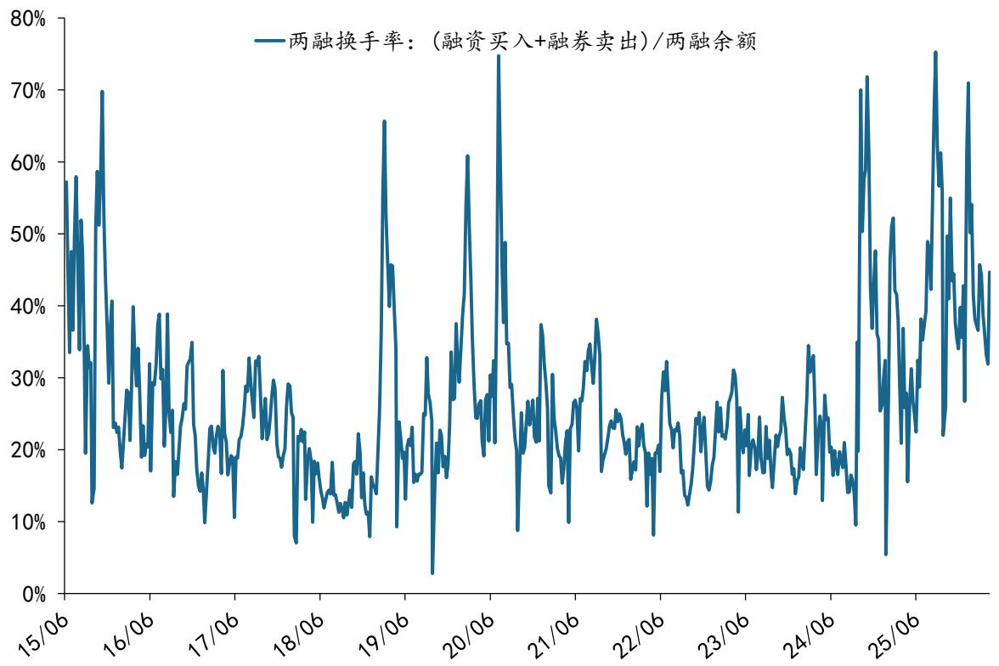

line chart

| Date   | 两融换手率 |
|--------|------------|
| 15/06  | ~58%       |
| 16/06  | ~70%       |
| 17/06  | ~35%       |
| 18/06  | ~25%       |
| 19/06  | ~65%       |
| 20/06  | ~75%       |
| 21/06  | ~30%       |
| 22/06  | ~25%       |
| 23/06  | ~30%       |
| 24/06  | ~35%       |
| 25/06  | ~75%       |

融资融券业务投资者数量  
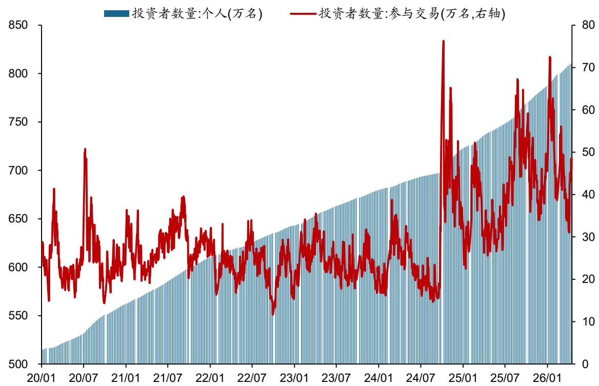

bar-line hybrid chart

| Date   | 投资者数量:个人(万名) | 投资者数量:参与交易(万名,右轴) |
|--------|------------------------|----------------------------------|
| 20/01  | 520                    | 30                               |
| 20/07  | 550                    | 50                               |
| 21/01  | 580                    | 40                               |
| 21/07  | 600                    | 50                               |
| 22/01  | 620                    | 45                               |
| 22/07  | 640                    | 55                               |
| 23/01  | 660                    | 60                               |
| 23/07  | 680                    | 55                               |
| 24/01  | 700                    | 65                               |
| 24/07  | 720                    | 75                               |
| 25/01  | 740                    | 60                               |
| 25/07  | 760                    | 65                               |
| 26/01  | 780                    | 70                               |

## 1.2、两融资金行业：电子、电新净流入；煤炭净流出

5） 两融上周主要：  
净流入电子186.7亿、电新117.0亿、通信88.3亿；  
净流出煤炭-1.1亿。

<table><tr><td colspan="4">两融——上周净流向前10行业&amp;各行业前3净流向个股(亿元)</td><td colspan="4">两融——上周净流向后10行业&amp;各行业后3净流向个股(亿元)</td></tr><tr><td>申万一级</td><td>行业净流入</td><td>个股简称</td><td>个股净流入</td><td>申万一级</td><td>行业净流入</td><td>个股简称</td><td>个股净流入</td></tr><tr><td rowspan="3">电子</td><td rowspan="3">186.7</td><td>东山精密</td><td>10.8</td><td rowspan="3">煤炭</td><td rowspan="3"></td><td>永泰能源</td><td>-0.6</td></tr><tr><td>兆易创新</td><td>9.5</td><td>山煤国际</td><td>-0.3</td></tr><tr><td>德明利</td><td>8.8</td><td>盘江股份</td><td>-0.2</td></tr><tr><td rowspan="3">电力设备</td><td rowspan="3">117.0</td><td>宁德时代</td><td>25.3</td><td rowspan="3" colspan="2">纺织服饰</td><td>探路者</td><td>-0.4</td></tr><tr><td>天华新能</td><td>6.5</td><td>森马服饰</td><td>-0.2</td></tr><tr><td>中恒电气</td><td>3.3</td><td>周大生</td><td>-0.1</td></tr><tr><td rowspan="3">通信</td><td rowspan="3">88.3</td><td>中际旭创</td><td>41.6</td><td rowspan="3" colspan="2">综合</td><td>南京新百</td><td>-0.3</td></tr><tr><td>亨通光电</td><td>6.8</td><td>天宸股份</td><td>-0.1</td></tr><tr><td>光迅科技</td><td>6.4</td><td>特力A</td><td>0.0</td></tr><tr><td rowspan="3">有色金属</td><td rowspan="3">56.1</td><td>华友钴业</td><td>10.3</td><td rowspan="3" colspan="2">美容护理</td><td>爱美客</td><td>-0.2</td></tr><tr><td>云南锗业</td><td>3.8</td><td>华熙生物</td><td>-0.1</td></tr><tr><td>北方稀土</td><td>3.4</td><td>珀莱雅</td><td>-0.1</td></tr><tr><td rowspan="3">计算机</td><td rowspan="3">42.3</td><td>海康威视</td><td>13.4</td><td rowspan="3" colspan="2">房地产</td><td>先导基电</td><td>-0.8</td></tr><tr><td>大华股份</td><td>5.4</td><td>保利发展</td><td>-0.7</td></tr><tr><td>金山办公</td><td>3.8</td><td>西藏城投</td><td>-0.5</td></tr><tr><td rowspan="3">机械设备</td><td rowspan="3">36.7</td><td>汇川技术</td><td>3.0</td><td rowspan="3" colspan="2">建筑装饰</td><td>中国电建</td><td>-1.2</td></tr><tr><td>罗博特科</td><td>2.4</td><td>中国中铁</td><td>-1.1</td></tr><tr><td>巨力索具</td><td>2.2</td><td>中国核建</td><td>-0.9</td></tr><tr><td rowspan="3">医药生物</td><td rowspan="3">35.4</td><td>药明康德</td><td>3.0</td><td rowspan="3" colspan="2">钢铁</td><td>包钢股份</td><td>-2.1</td></tr><tr><td>九安医疗</td><td>2.5</td><td>杭钢股份</td><td>-0.6</td></tr><tr><td>美诺华</td><td>2.3</td><td>沙钢股份</td><td>-0.3</td></tr><tr><td rowspan="3">基础化工</td><td rowspan="3">30.5</td><td>亚钾国际</td><td>2.2</td><td rowspan="3" colspan="2">商贸零售</td><td>浙江东日</td><td>-0.3</td></tr><tr><td>卫星化学</td><td>1.7</td><td>爱施德</td><td>-0.3</td></tr><tr><td>振华股份</td><td>1.6</td><td>上海九百</td><td>-0.2</td></tr><tr><td rowspan="3">国防军工</td><td rowspan="3">24.2</td><td>华丰科技</td><td>3.6</td><td rowspan="3" colspan="2">农林牧渔</td><td>牧原股份</td><td>-1.9</td></tr><tr><td>中航沈飞</td><td>2.1</td><td>平潭发展</td><td>-1.2</td></tr><tr><td>中国卫星</td><td>1.7</td><td>诺普信</td><td>-0.9</td></tr><tr><td rowspan="3">传媒</td><td rowspan="3">13.6</td><td>巨人网络</td><td>2.8</td><td rowspan="3" colspan="2">环保</td><td>高能环境</td><td>-2.9</td></tr><tr><td>蓝色光标</td><td>2.6</td><td>朗坤科技</td><td>-0.3</td></tr><tr><td>恺英网络</td><td>2.5</td><td>武汉天源</td><td>-0.2</td></tr></table>

## 1.3、股票型ETF：净流入-506.4亿，处近三年2.6%分位

股票型ETF整体上周净流入-506.4亿，较前值净流入-340.2亿下降，净流向整体处近三年2.6%分位。

周频股票型ETF净流入金额(亿元)  
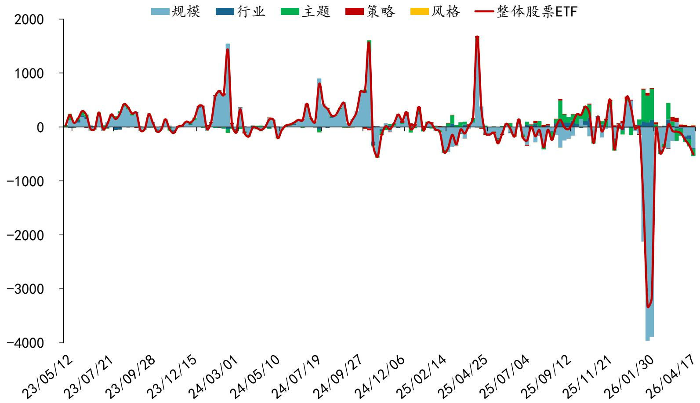

bar-line hybrid chart

| Date       | 规模  | 行业  | 主题   | 策略  | 风格  | 整体股票ETF |
| ---------- | ----- | ----- | ------ | ----- | ----- | ----------- |
| 23/05/12   | -     | -     | -      | -     | -     | -           |
| 23/07/21   | -     | -     | -      | -     | -     | -           |
| 23/09/28   | -     | -     | -      | -     | -     | -           |
| 23/12/15   | -     | -     | -      | -     | -     | -           |
| 24/03/01   | 1500  | -     | -      | -     | -     | 600         |
| 24/05/10   | -     | -     | -      | -     | -     | -           |
| 24/07/19   | 800   | -     | -      | -     | -     | 400         |
| 24/09/27   | -     | -     | 1600   | -     | -     | 600         |
| 24/12/06   | -     | -     | -      | -     | -     | -           |
| 25/02/14   | -     | -     | 200    | -     | -     | -           |
| 25/04/25   | 1700  | -     | -      | -     | -     | 1700        |
| 25/07/04   | -     | -     | 100    | -     | -     | -           |
| 25/09/12   | -     | -     | 500    | -     | -     | 500         |
| 25/11/21   | -     | -     | 300    | -     | -     | 400         |
| 26/01/30   | -3800 | -     | 700    | -     | -     | -3500       |
| 26/04/17   | -     | -     | 400    | 100   | -     | 100         |

## 1.3、股票型ETF：行业ETF净流入-3.8亿，主题ETF净流入-145.6亿

上周行业/主题ETF净流入品种集中于卫星（24.3亿）、电池（16.1亿）、医药生物（15.2亿）等；净流出品种集中于电子（-84.8亿）、人工智能（-53.2亿）、基础化工（-16.0亿）等。

<table><tr><td colspan="8">近一周行业/主题ETF净流入额(对应至申万一级行业/主题)</td></tr><tr><td rowspan="2">序号</td><td rowspan="2">行业/主题</td><td colspan="2">净流入额(亿元)</td><td rowspan="2">序号</td><td rowspan="2">行业/主题</td><td colspan="2">净流入额(亿元)</td></tr><tr><td>本周</td><td>上周</td><td>本周</td><td>上周</td></tr><tr><td>1</td><td>卫星</td><td>24.3</td><td>-9.4</td><td>26</td><td>金融</td><td>-0.7</td><td>0.5</td></tr><tr><td>2</td><td>电池</td><td>16.1</td><td>-4.8</td><td>27</td><td>5G</td><td>-0.9</td><td>1.1</td></tr><tr><td>3</td><td>医药生物</td><td>15.2</td><td>-2.5</td><td>28</td><td>软件</td><td>-1.1</td><td>-1.5</td></tr><tr><td>4</td><td>农林牧渔</td><td>10.2</td><td>1.4</td><td>29</td><td>家用电器</td><td>-1.2</td><td>-2.5</td></tr><tr><td>5</td><td>公用事业</td><td>5.7</td><td>0.9</td><td>30</td><td>绿色发展</td><td>-1.3</td><td>-0.4</td></tr><tr><td>6</td><td>传媒</td><td>5.1</td><td>-0.9</td><td>31</td><td>钢铁</td><td>-1.4</td><td>-1.7</td></tr><tr><td>7</td><td>食品饮料</td><td>4.7</td><td>-1.7</td><td>32</td><td>云计算</td><td>-1.4</td><td>-1.9</td></tr><tr><td>8</td><td>国防军工</td><td>2.2</td><td>-4.0</td><td>33</td><td>建筑材料</td><td>-1.5</td><td>-0.2</td></tr><tr><td>9</td><td>机械设备</td><td>0.7</td><td>0.2</td><td>34</td><td>能源</td><td>-1.6</td><td>-2.6</td></tr><tr><td>10</td><td>非银金融</td><td>0.6</td><td>-39.5</td><td>35</td><td>通信</td><td>-2.1</td><td>13.5</td></tr><tr><td>11</td><td>高端制造</td><td>0.6</td><td>-0.1</td><td>36</td><td>计算机</td><td>-2.1</td><td>-5.1</td></tr><tr><td>12</td><td>新能源车</td><td>0.6</td><td>-2.7</td><td>37</td><td>煤炭</td><td>-2.5</td><td>-3.9</td></tr><tr><td>13</td><td>汽车</td><td>0.0</td><td>-0.4</td><td>38</td><td>房地产</td><td>-2.6</td><td>-0.4</td></tr><tr><td>14</td><td>品牌工程</td><td>0.0</td><td>0.0</td><td>39</td><td>科技</td><td>-2.9</td><td>-2.8</td></tr><tr><td>15</td><td>养老</td><td>0.0</td><td>0.0</td><td>40</td><td>银行</td><td>-3.2</td><td>-10.6</td></tr><tr><td>16</td><td>原材料</td><td>-0.1</td><td>0.0</td><td>41</td><td>消费</td><td>-3.3</td><td>-5.2</td></tr><tr><td>17</td><td>物联网</td><td>-0.1</td><td>0.0</td><td>42</td><td>区域经济</td><td>-3.6</td><td>0.0</td></tr><tr><td>18</td><td>数字经济</td><td>-0.2</td><td>-0.3</td><td>43</td><td>旅游</td><td>-5.0</td><td>1.8</td></tr><tr><td>19</td><td>新材料</td><td>-0.2</td><td>0.0</td><td>44</td><td>有色金属</td><td>-8.1</td><td>15.6</td></tr><tr><td>20</td><td>民企</td><td>-0.3</td><td>-0.2</td><td>45</td><td>电力设备</td><td>-8.7</td><td>-17.4</td></tr><tr><td>21</td><td>建筑装饰</td><td>-0.3</td><td>0.2</td><td>46</td><td>机器人</td><td>-11.5</td><td>-8.5</td></tr><tr><td>22</td><td>大宗商品</td><td>-0.3</td><td>-0.3</td><td>47</td><td>油气</td><td>-13.7</td><td>-13.1</td></tr><tr><td>23</td><td>交通运输</td><td>-0.4</td><td>0.3</td><td>48</td><td>基础化工</td><td>-16.0</td><td>6.6</td></tr><tr><td>24</td><td>央国企</td><td>-0.6</td><td>-3.5</td><td>49</td><td>人工智能</td><td>-53.2</td><td>-44.1</td></tr><tr><td>25</td><td>船舶</td><td>-0.7</td><td>-1.2</td><td>50</td><td>电子</td><td>-84.8</td><td>-53.3</td></tr></table>

## 1.4、 上市公司回购：回购额上升

上周上市公司回购金额为11.6亿，较前值6.6亿上升，处近三年30%分位。

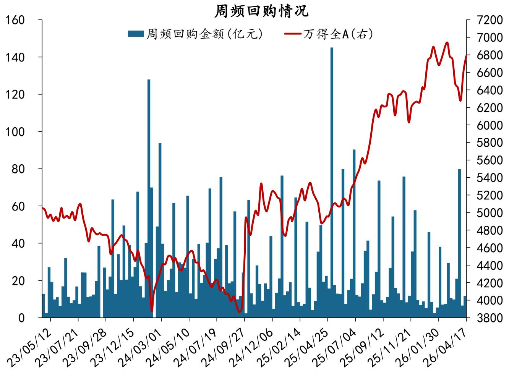

bar-line hybrid chart

| Date       | 周频回购金额(亿元) | 万得全A(右) |
| ---------- | ------------------ | ----------- |
| 23/05/12   | 12                 | 5800        |
| 23/07/21   | 18                 | 5600        |
| 23/09/28   | 25                 | 5400        |
| 23/12/15   | 38                 | 5200        |
| 24/03/01   | 128                | 4800        |
| 24/05/10   | 94                 | 4600        |
| 24/07/19   | 66                 | 4400        |
| 24/09/27   | 56                 | 4200        |
| 24/12/06   | 64                 | 4800        |
| 25/02/14   | 76                 | 5200        |
| 25/04/25   | 146                | 5600        |
| 25/07/04   | 80                 | 6000        |
| 25/09/12   | 90                 | 6400        |
| 25/11/21   | 76                 | 6600        |
| 26/01/30   | 58                 | 6800        |
| 26/04/17   | 80                 | 6800        |

## 1.5、 股权融资规模下降

以上市日为标准，上周股权融资金额为105.0亿元，处近三年58%分位，其中IPO47.0亿、再融资57.9亿。

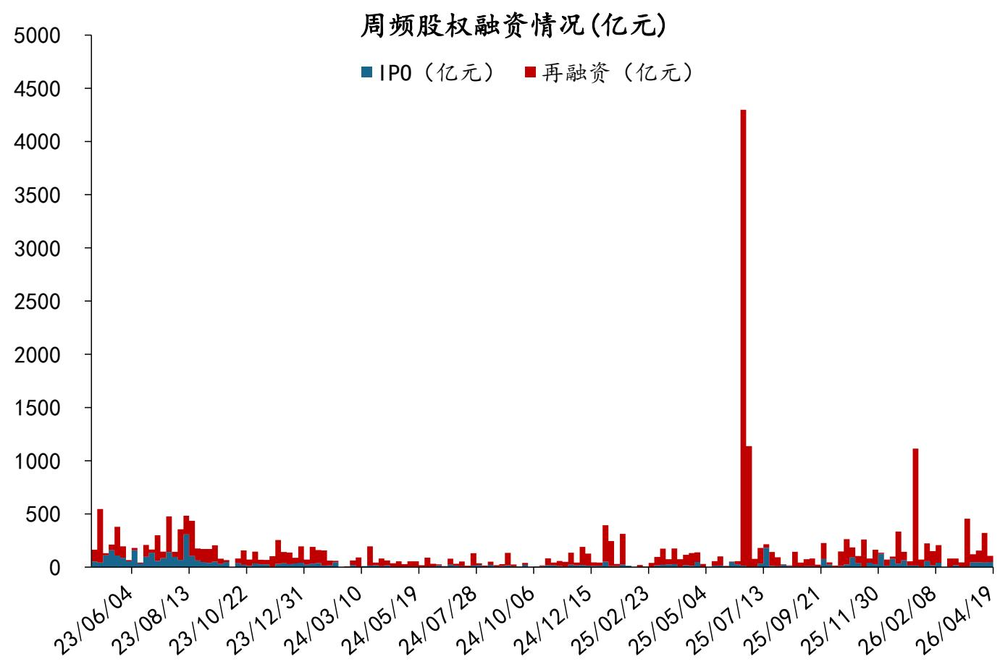

bar chart

周频股权融资情况 (亿元)
| Date | IPO (亿元) | 再融资 (亿元) |
|---|---|---|
| 23/06/04 | 100 | 500 |
| 23/08/13 | 150 | 400 |
| 23/10/22 | 100 | 200 |
| 23/12/31 | 50 | 150 |
| 24/03/10 | 50 | 100 |
| 24/05/19 | 50 | 50 |
| 24/07/28 | 50 | 100 |
| 24/10/06 | 50 | 50 |
| 24/12/15 | 50 | 150 |
| 25/02/23 | 50 | 300 |
| 25/05/04 | 50 | 150 |
| 25/07/13 | 100 | 4300 |
| 25/09/21 | 150 | 150 |
| 25/11/30 | 100 | 250 |
| 26/02/08 | 100 | 1100 |
| 26/04/19 | 50 | 300 |

## 1.6、产业资本净减持规模上升

1）上周产业资本整体增持6.1亿元、减持-86.4亿元，净减持-80.4亿，较前值-36.6亿规模上升，净减持规模处近三年72%分位。

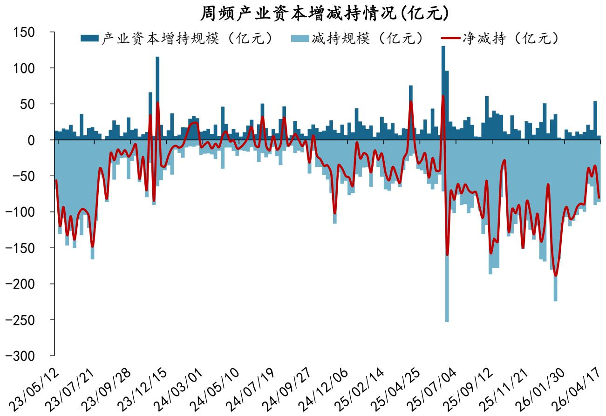

bar-line hybrid chart

| Date       | 产业资本增持规模 (亿元) | 减持规模 (亿元) | 净减持 (亿元) |
| ---------- | ------------------------ | ---------------- | -------------- |
| 23/05/12   | ~10                      | ~-15             | ~-50           |
| 23/07/21   | ~20                      | ~-10             | ~-100          |
| 23/09/28   | ~30                      | ~-5              | ~-150          |
| 23/12/15   | ~60                      | ~-10             | ~-50           |
| 24/03/01   | ~40                      | ~-5              | ~-5            |
| 24/05/10   | ~50                      | ~-10             | ~-5            |
| 24/07/19   | ~50                      | ~-10             | ~-5            |
| 24/09/27   | ~40                      | ~-10             | ~-5            |
| 24/12/06   | ~30                      | ~-15             | ~-10           |
| 25/02/14   | ~40                      | ~-10             | ~-5            |
| 25/04/25   | ~70                      | ~-10             | ~-5            |
| 25/07/04   | ~130                     | ~-250            | ~-150          |
| 25/09/12   | ~60                      | ~-15             | ~-10           |
| 25/11/21   | ~40                      | ~-15             | ~-10           |
| 26/01/30   | ~50                      | ~-200            | ~-15           |
| 26/04/17   | ~50                      | ~-15             | ~-10           |

## 1.6、产业资本行业：上周净增持地产；减持电子、电新

2）分行业来看，上周净增持地产0.03亿；净减持电子-32.5亿、电新-7.5亿、环保-9.6亿。

<table><tr><td colspan="8">分行业产业资本净增减持情况(亿元)</td></tr><tr><td>大类</td><td>行业</td><td>周度</td><td>月度</td><td>2026YTD</td><td>周度</td><td>月频</td><td>2026YTD</td></tr><tr><td rowspan="10">周期</td><td>基础化工</td><td>-0.1</td><td>-10.2</td><td>-107.0</td><td rowspan="10">-15.3</td><td rowspan="10">1.1</td><td rowspan="10">-161.2</td></tr><tr><td>钢铁</td><td>0.0</td><td>-1.2</td><td>-2.5</td></tr><tr><td>有色金属</td><td>-2.2</td><td>0.1</td><td>-41.5</td></tr><tr><td>建筑材料</td><td>0.0</td><td>12.5</td><td>22.8</td></tr><tr><td>建筑装饰</td><td>-0.7</td><td>-2.0</td><td>-11.4</td></tr><tr><td>煤炭</td><td>0.0</td><td>0.8</td><td>-1.0</td></tr><tr><td>石油石化</td><td>-0.2</td><td>22.3</td><td>26.3</td></tr><tr><td>交通运输</td><td>-0.8</td><td>1.3</td><td>11.7</td></tr><tr><td>环保</td><td>-9.6</td><td>-20.8</td><td>-46.8</td></tr><tr><td>公用事业</td><td>-1.7</td><td>-1.7</td><td>-11.8</td></tr><tr><td rowspan="4">TMT</td><td>电子</td><td>-32.5</td><td>-88.2</td><td>-439.9</td><td rowspan="4">-38.9</td><td rowspan="4">-113.2</td><td rowspan="4">-638.5</td></tr><tr><td>通信</td><td>-1.0</td><td>-11.4</td><td>-100.8</td></tr><tr><td>传媒</td><td>-1.3</td><td>-2.1</td><td>-25.8</td></tr><tr><td>计算机</td><td>-4.1</td><td>-11.5</td><td>-72.1</td></tr><tr><td rowspan="4">制造</td><td>电力设备</td><td>-7.5</td><td>-27.2</td><td>-166.0</td><td rowspan="4">-14.4</td><td rowspan="4">-50.6</td><td rowspan="4">-365.2</td></tr><tr><td>机械设备</td><td>-3.2</td><td>-20.5</td><td>-107.7</td></tr><tr><td>国防军工</td><td>-2.9</td><td>-5.2</td><td>-49.6</td></tr><tr><td>汽车</td><td>-0.8</td><td>2.3</td><td>-41.9</td></tr><tr><td rowspan="9">消费</td><td>农林牧渔</td><td>0.0</td><td>-2.6</td><td>-15.4</td><td rowspan="9">-11.8</td><td rowspan="9">-46.5</td><td rowspan="9">-234.3</td></tr><tr><td>家用电器</td><td>-1.0</td><td>-6.2</td><td>-27.2</td></tr><tr><td>食品饮料</td><td>-0.5</td><td>0.1</td><td>-22.2</td></tr><tr><td>纺织服饰</td><td>0.0</td><td>0.1</td><td>-5.6</td></tr><tr><td>轻工制造</td><td>0.0</td><td>-0.9</td><td>-12.5</td></tr><tr><td>医药生物</td><td>-3.4</td><td>-27.1</td><td>-107.6</td></tr><tr><td>社会服务</td><td>0.0</td><td>0.0</td><td>-6.2</td></tr><tr><td>美容护理</td><td>-4.1</td><td>-4.2</td><td>-8.3</td></tr><tr><td>商贸零售</td><td>-2.8</td><td>-5.9</td><td>-29.4</td></tr><tr><td rowspan="3">金融地产</td><td>房地产</td><td>0.0</td><td>-1.5</td><td>-10.7</td><td rowspan="3">0.0</td><td rowspan="3">2.5</td><td rowspan="3">-1.3</td></tr><tr><td>银行</td><td>0.0</td><td>8.0</td><td>22.0</td></tr><tr><td>非银金融</td><td>0.0</td><td>-4.0</td><td>-12.6</td></tr><tr><td></td><td>综合</td><td>0.0</td><td>-1.1</td><td>-1.9</td><td></td><td></td><td></td></tr></table>

上周解禁市值768.2亿元，较前值1174.3亿下降，处近三年75%分位。预计本周解禁市值为473.8亿元。

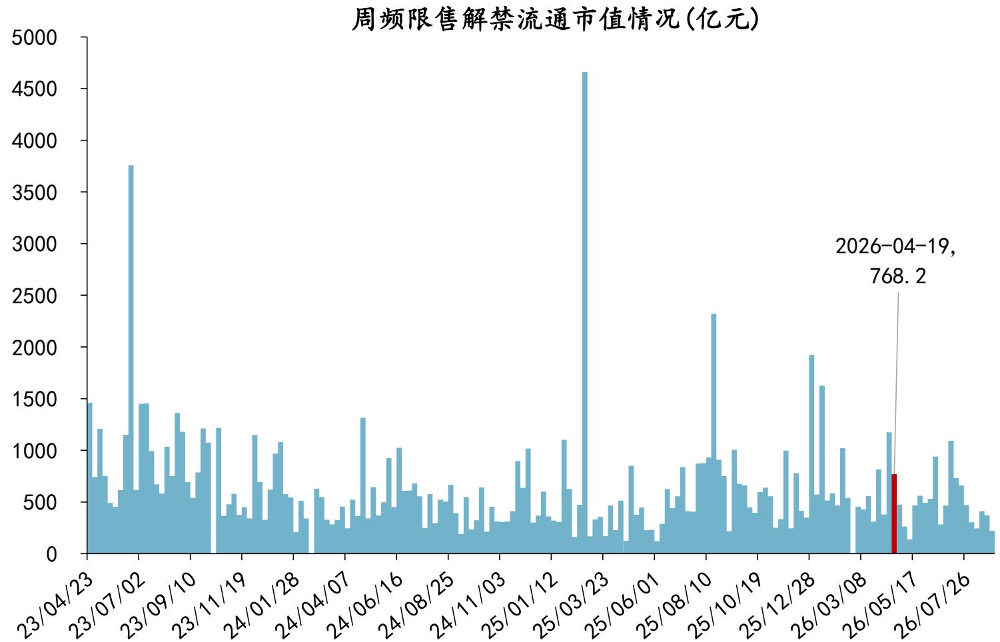

bar chart

| Date       | Value   |
| ---------- | ------- |
| 26/05/17   | 768.2   |

上周南向资金流向224.6亿元，较上周-102.5亿元上升，周净流向强度处近三年73%分位。

周频南向资金整体流向  
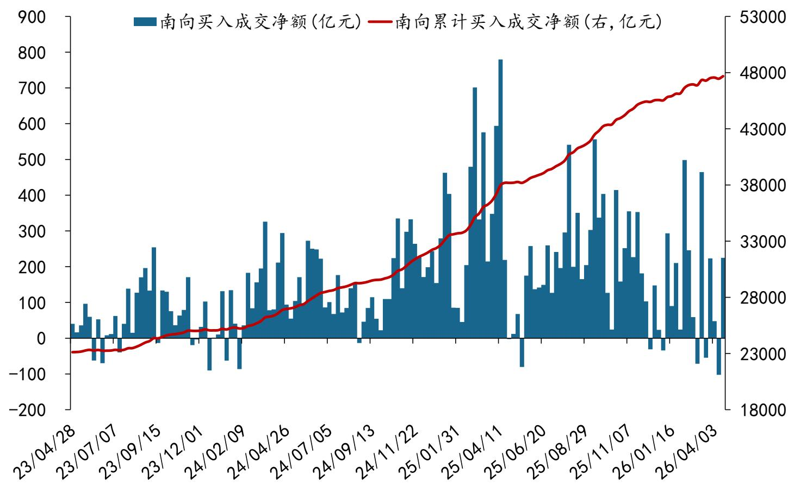

bar-line hybrid chart

| Date       | 南向买入成交净额(亿元) | 南向累计买入成交净额(右,亿元) |
| ---------- | ------------------------ | ------------------------------ |
| 23/04/28   | ~0                       | ~23000                         |
| 23/07/07   | ~50                      | ~23500                         |
| 23/09/15   | ~150                     | ~24000                         |
| 23/12/01   | ~100                     | ~24500                         |
| 24/02/09   | ~-50                     | ~25000                         |
| 24/04/26   | ~300                     | ~26000                         |
| 24/07/05   | ~150                     | ~27000                         |
| 24/09/13   | ~100                     | ~28000                         |
| 24/11/22   | ~350                     | ~29000                         |
| 25/01/31   | ~450                     | ~31000                         |
| 25/04/11   | ~750                     | ~35000                         |
| 25/06/20   | ~150                     | ~37000                         |
| 25/08/29   | ~550                     | ~39000                         |
| 25/11/07   | ~400                     | ~41000                         |
| 26/01/16   | ~300                     | ~43000                         |
| 26/04/03   | ~250                     | ~48000                         |

## 1.9、 北向资金参与度上升

上周北向资金成交占沪深A股比例7.0%，较前值上升1.5pct，参与度处近三年53%分位。

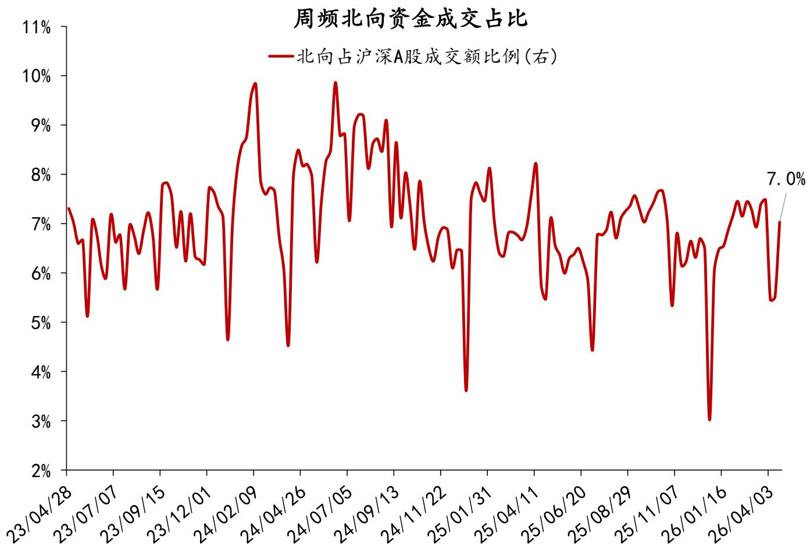

line chart

| Date       | 北向占沪深A股成交额比例(右) |
| ---------- | -------------------------- |
| 26/04/03   | 7.0%                       |

## 目录

01 资金流动性：杠杆资金&股票型ETF分化加剧  
02 交易拥挤度：建材、传媒、医疗服务上行；化工、煤炭、央企下行  
03 投资者温度计：自媒体A股搜索热度下降，散户资金净流入规模上升

交易热度 1.9 历史分位76%  
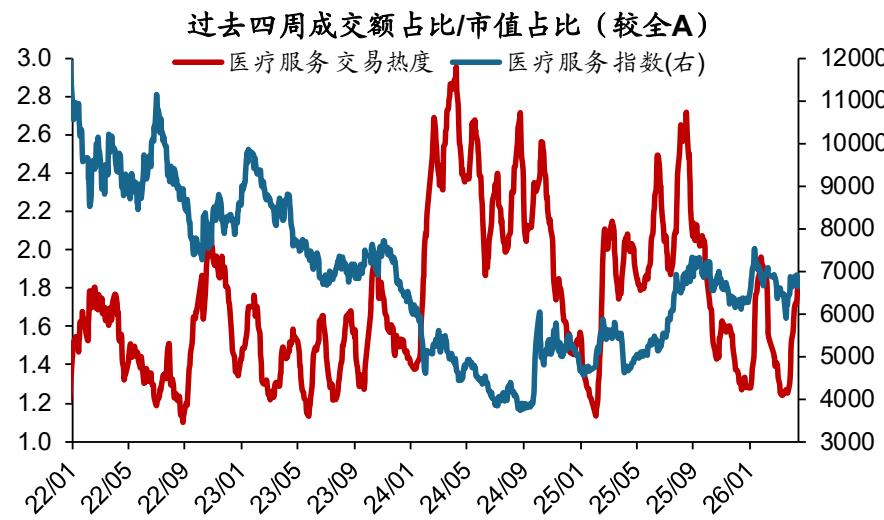

line chart

| Date   | 医疗服务交易热度 | 医疗服务指数(右) |
|--------|------------------|------------------|
| 22/01  | 1.8              | 12000            |
| 22/05  | 1.6              | 11000            |
| 22/09  | 1.4              | 10000            |
| 23/01  | 1.8              | 9000             |
| 23/05  | 2.0              | 8000             |
| 23/09  | 1.6              | 7000             |
| 24/01  | 1.4              | 6000             |
| 24/05  | 3.0              | 5000             |
| 24/09  | 2.6              | 4000             |
| 25/01  | 1.8              | 5000             |
| 25/05  | 2.2              | 6000             |
| 25/09  | 2.8              | 7000             |
| 26/01  | 1.8              | 6000             |

交易热度 2.1 历史分位21%  
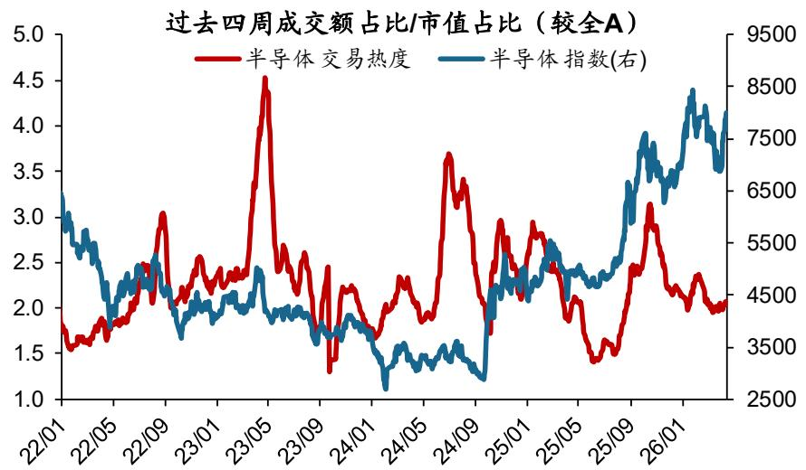

line chart

| Date   | 半导体交易热度 | 半导体指数(右) |
|--------|----------------|----------------|
| 22/01  | 1.8            | 6000           |
| 22/05  | 2.0            | 5500           |
| 22/09  | 2.5            | 5000           |
| 23/01  | 2.3            | 4500           |
| 23/05  | 4.5            | 4000           |
| 23/09  | 2.0            | 3500           |
| 24/01  | 1.5            | 3000           |
| 24/05  | 2.5            | 4000           |
| 24/09  | 3.7            | 5000           |
| 25/01  | 2.8            | 6000           |
| 25/05  | 2.5            | 5500           |
| 25/09  | 1.5            | 4500           |
| 26/01  | 2.0            | 7500           |

交易热度 3.3 历史分位 94%  
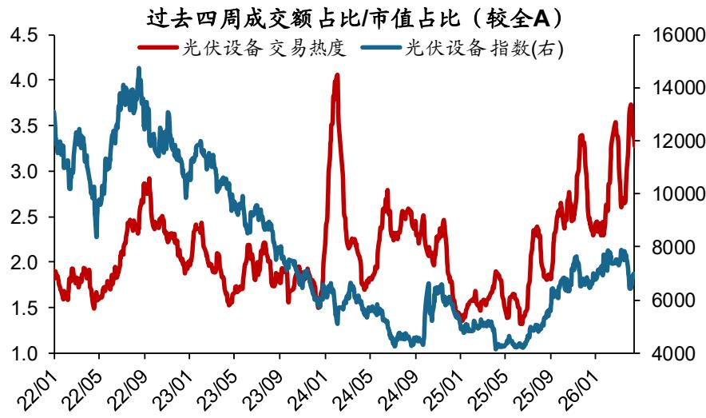

line chart

过去四周成交额占比/市值占比（较全A）
| Date   | 光伏设备交易热度 | 光伏设备指数(右) |
|--------|------------------|------------------|
| 22/01  | ~1.8             | ~13000           |
| 22/05  | ~1.6             | ~11000           |
| 22/09  | ~2.8             | ~14000           |
| 23/01  | ~2.4             | ~10000           |
| 23/05  | ~1.7             | ~8000            |
| 23/09  | ~2.0             | ~7000            |
| 24/01  | ~1.8             | ~6000            |
| 24/05  | ~4.1             | ~14000           |
| 24/09  | ~1.7             | ~5000            |
| 25/01  | ~1.5             | ~6000            |
| 25/05  | ~1.3             | ~4000            |
| 25/09  | ~1.8             | ~6000            |
| 26/01  | ~2.5             | ~8000            |
| 26/05  | ~3.7             | ~12000           |
| 26/09  | ~3.5             | ~13000           |
| 26/13  | ~3.8             | ~14000           |

交易热度 1.1 历史分位37%  
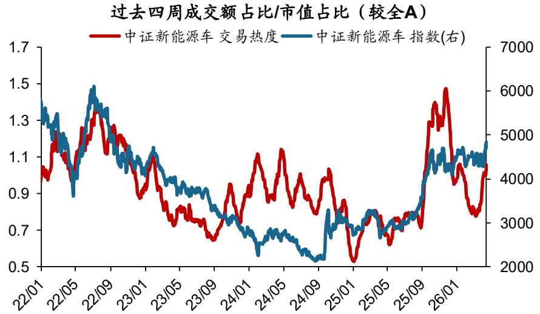

line chart

| Date   | 中证新能源车 交易热度 | 中证新能源车 指数(右) |
|--------|------------------------|------------------------|
| 22/01  | 1.3                    | 5000                   |
| 22/05  | 1.1                    | 4000                   |
| 22/09  | 1.5                    | 6000                   |
| 23/01  | 1.3                    | 5000                   |
| 23/05  | 1.1                    | 4000                   |
| 23/09  | 0.9                    | 3000                   |
| 24/01  | 0.7                    | 2000                   |
| 24/05  | 1.1                    | 3000                   |
| 24/09  | 0.8                    | 2500                   |
| 25/01  | 0.5                    | 3000                   |
| 25/05  | 0.7                    | 4000                   |
| 25/09  | 1.1                    | 5000                   |
| 26/01  | 1.5                    | 6000                   |

## 2.1、成长主题行业：医疗服务易热度分位上升7pct至76%

## 交易热度 2.1 历史分位33%

过去四周成交额占比/市值占比(较全A)  
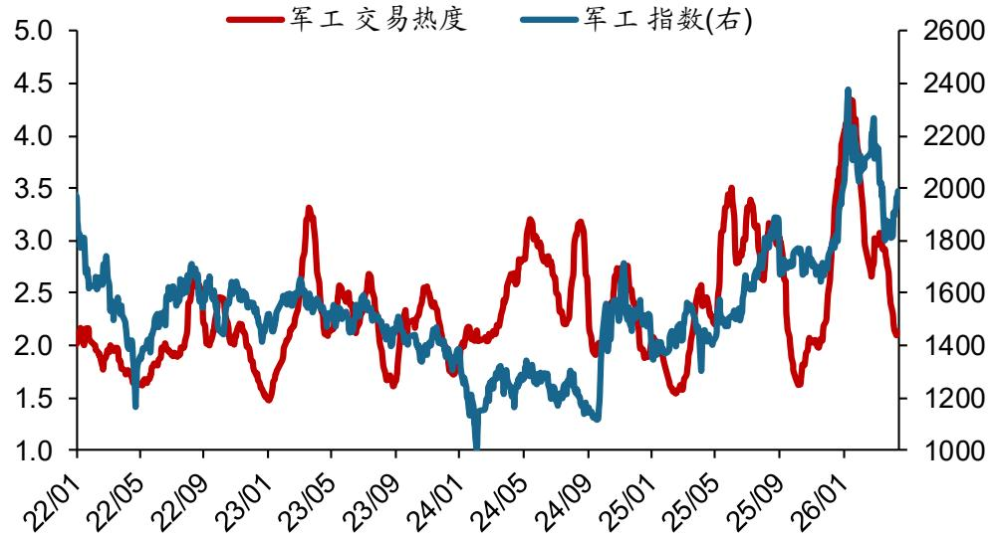

bar-line hybrid chart

| Date   | 军工交易热度 | 军工指数(右) |
|--------|--------------|--------------|
| 22/01  | 2.1          | 3.0          |
| 22/05  | 1.8          | 2.5          |
| 22/09  | 2.0          | 2.7          |
| 23/01  | 1.5          | 2.4          |
| 23/05  | 3.3          | 2.5          |
| 23/09  | 2.6          | 2.3          |
| 24/01  | 1.8          | 1.8          |
| 24/05  | 2.0          | 1.5          |
| 24/09  | 3.2          | 1.3          |
| 25/01  | 2.8          | 1.9          |
| 25/05  | 3.5          | 2.1          |
| 25/09  | 3.0          | 2.3          |
| 26/01  | 4.5          | 2.4          |

交易热度 0.4 历史分位 1%  
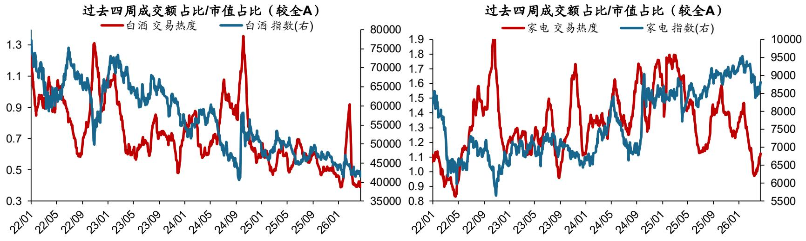  
交易热度 1.1 历史分位 25%

交易热度 0.5 历史分位 13%  
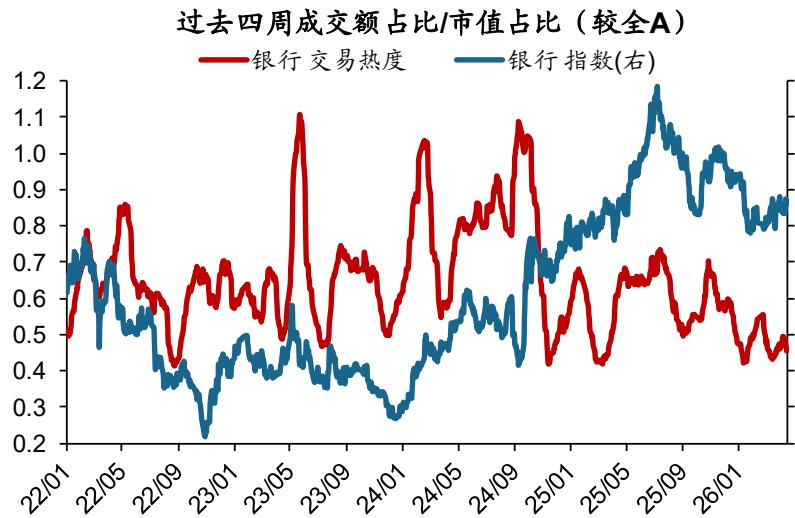

line chart

| Date   | 银行交易热度 | 银行指数(右) |
|--------|---------------|--------------|
| 22/01  | 0.5           | 0.7          |
| 22/05  | 0.8           | 0.6          |
| 22/09  | 0.6           | 0.4          |
| 23/01  | 0.7           | 0.3          |
| 23/05  | 1.1           | 0.5          |
| 23/09  | 0.5           | 0.4          |
| 24/01  | 0.5           | 0.3          |
| 24/05  | 1.0           | 0.5          |
| 24/09  | 1.1           | 0.6          |
| 25/01  | 0.4           | 0.7          |
| 25/05  | 0.7           | 0.9          |
| 25/09  | 0.7           | 1.1          |
| 26/01  | 0.5           | 0.8          |

交易热度 0.5 历史分位 23%  
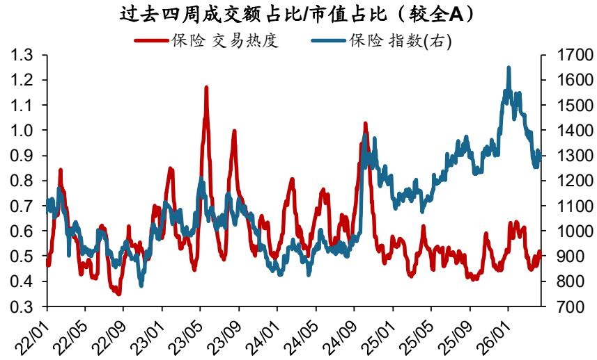

line chart

| Date   | 保险交易热度 | 保险指数(右) |
|--------|--------------|--------------|
| 22/01  | 0.4          | 900          |
| 22/05  | 0.8          | 1100         |
| 22/09  | 0.3          | 800          |
| 23/01  | 0.7          | 1000         |
| 23/05  | 1.2          | 1300         |
| 23/09  | 1.0          | 1400         |
| 24/01  | 0.5          | 900          |
| 24/05  | 0.8          | 1100         |
| 24/09  | 1.0          | 1400         |
| 25/01  | 0.6          | 1300         |
| 25/05  | 0.5          | 1200         |
| 25/09  | 0.4          | 1100         |
| 26/01  | 0.6          | 1600         |
| 26/05  | 0.5          | 1300         |
| 26/1    | 0.4          | 1100         |

## 交易热度 0.8 历史分位 1%

过去四周成交额占比/市值占比(较全A)  
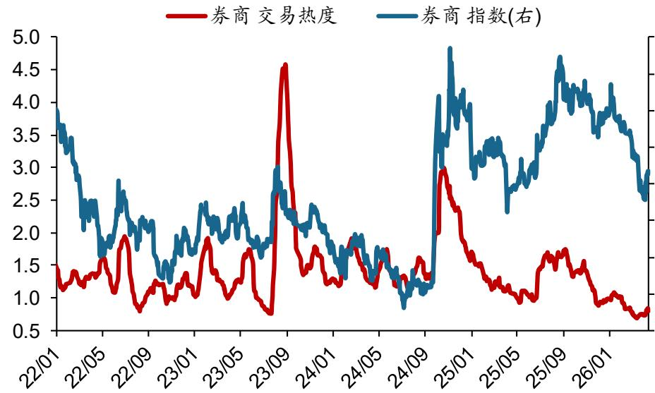

line chart

| Date   | 券商交易热度 | 券商指数(右) |
|--------|---------------|--------------|
| 22/01  | 1.3           | 3.8          |
| 22/05  | 1.4           | 2.5          |
| 22/09  | 0.8           | 2.8          |
| 23/01  | 1.2           | 2.0          |
| 23/05  | 1.5           | 2.3          |
| 23/09  | 4.6           | 2.7          |
| 24/01  | 1.3           | 2.0          |
| 24/05  | 1.4           | 1.8          |
| 24/09  | 1.2           | 1.0          |
| 25/01  | 3.0           | 4.8          |
| 25/05  | 1.0           | 3.5          |
| 25/09  | 1.7           | 4.5          |
| 26/01  | 0.7           | 2.5          |

## 交易热度 0.5 历史分位56%

过去四周成交额占比/市值占比(较全A)  
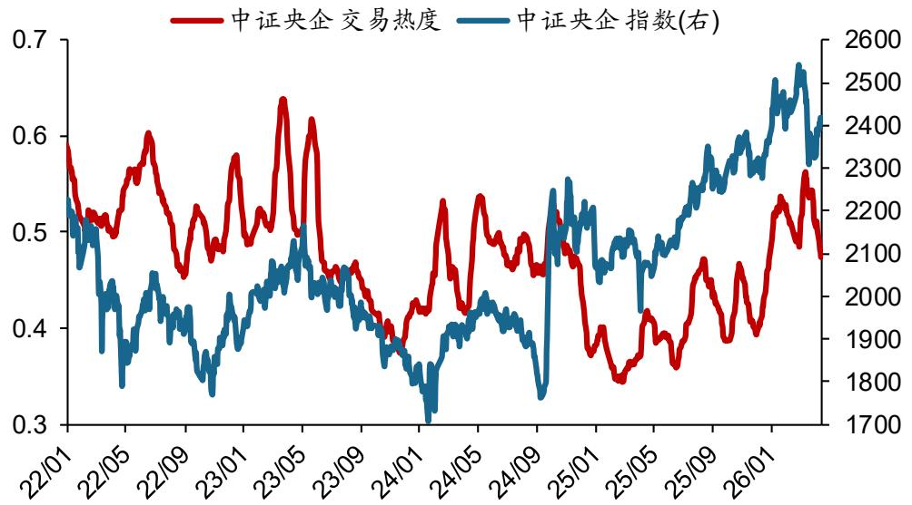

bar-line hybrid chart

| Date   | 中证央企交易热度 | 中证央企指数(右) |
|--------|------------------|------------------|
| 22/01  | 0.6              | 2100             |
| 22/05  | 0.5              | 1900             |
| 22/09  | 0.45             | 1800             |
| 23/01  | 0.55             | 1950             |
| 23/05  | 0.65             | 2050             |
| 23/09  | 0.4              | 1850             |
| 24/01  | 0.35             | 1750             |
| 24/05  | 0.5              | 1950             |
| 24/09  | 0.45             | 1850             |
| 25/01  | 0.5              | 2000             |
| 25/05  | 0.35             | 1900             |
| 25/09  | 0.4              | 2100             |
| 26/01  | 0.55             | 2300             |
| 26/05  | 0.6              | 2400             |
| 26/09  | 0.5              | 2500             |
| 26/13  | 0.45             | 2450             |
| 26/17  | 0.5              | 2350             |
| 26/21  | 0.4              | 2250             |
| 26/25  | 0.35             | 2150             |
| 26/29  | 0.4              | 2250             |
| 27/03  | 0.5              | 2350             |
| 27/07  | 0.4              | 2450             |
| 27/11  | 0.35             | 2350             |
| 27/15  | 0.4              | 2450             |
| 27/19  | 0.45             | 2550             |
| 27/23  | 0.5              | 2600             |
| 27/27  | 0.4              | 2450             |
| 28/01  | 0.35             | 2350             |
| 28/05  | 0.4              | 2450             |
| 28/09  | 0.45             | 2550             |
| 28/13  | 0.5              | 2650             |
| 28/17  | 0.4              | 2450             |
| 28/21  | 0.35             | 2350             |
| 28/25  | 0.4              | 2450             |
| 28/29  | 0.45             | 2550             |
| 29/03  | 0.5              | 2650             |
| 29/07  | 0.4              | 2450             |
| 29/11  | 0.35             | 2350             |
| 29/15  | 0.4              | 2450             |
| 29/19  | 0.45             | 2550             |
| 29/23  | 0.5              | 2650             |
| 29/27  | 0.4              | 2450             |
| 30/01  | 0.35             | 2350             |
| 30/05  | 0.4              | 2450             |
| 30/09  | 0.45             | 2550             |
| 30/13  | 0.5              | 2650             |
| 30/17  | 0.4              | 2450             |
| 30/21  | 0.35             | 2350             |
| 30/25  | 0.4              | 2450             |
|          |                  |                  |

交易热度 2.2 历史分位 24%  
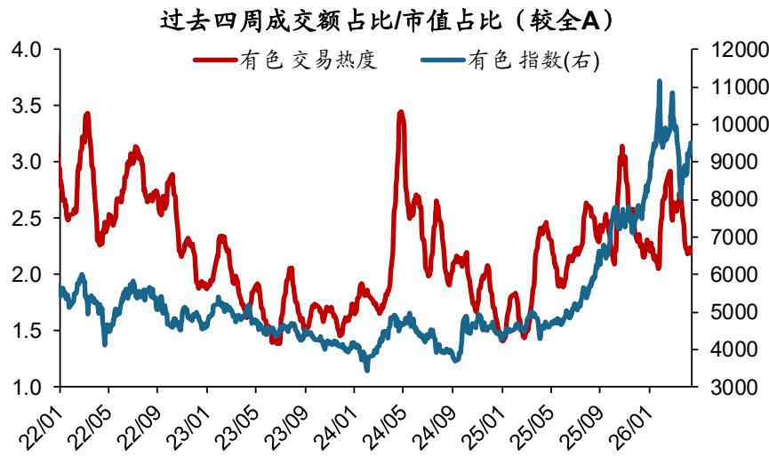

line chart

| Date   | 有色交易热度 | 有色指数(右) |
|--------|---------------|--------------|
| 22/01  | 3.0           | 6000         |
| 22/05  | 3.5           | 7000         |
| 22/09  | 3.1           | 6500         |
| 23/01  | 2.8           | 6000         |
| 23/05  | 2.5           | 5500         |
| 23/09  | 2.0           | 5000         |
| 24/01  | 1.5           | 4500         |
| 24/05  | 3.5           | 6000         |
| 24/09  | 2.5           | 5500         |
| 25/01  | 2.0           | 5000         |
| 25/05  | 2.5           | 6000         |
| 25/09  | 3.0           | 7000         |
| 26/01  | 2.5           | 9000         |

交易热度 1.8 历史分位52%  
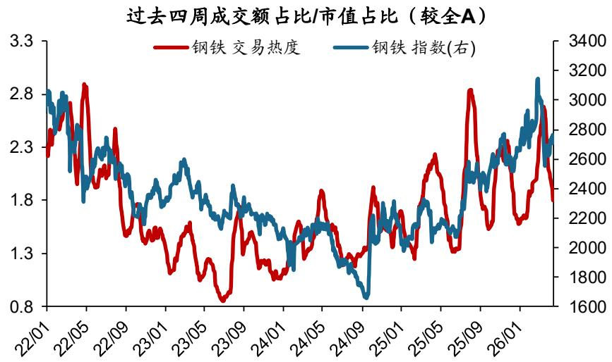

line chart

| Date   | 钢铁交易热度 | 钢铁指数(右) |
|--------|---------------|--------------|
| 22/01  | 2.3           | 2800         |
| 22/05  | 2.8           | 3000         |
| 22/09  | 2.3           | 2600         |
| 23/01  | 1.8           | 2400         |
| 23/05  | 1.5           | 2200         |
| 23/09  | 0.8           | 1800         |
| 24/01  | 1.3           | 2000         |
| 24/05  | 1.8           | 2400         |
| 24/09  | 1.5           | 1600         |
| 25/01  | 1.8           | 2200         |
| 25/05  | 2.3           | 2600         |
| 25/09  | 2.8           | 3000         |
| 26/01  | 2.3           | 2800         |

交易热度 1.7 历史分位36%  
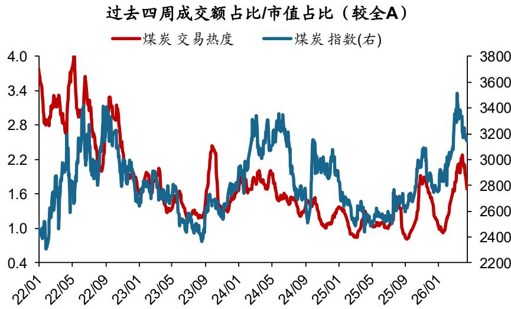

line chart

| Date   | 煤炭交易热度 | 煤炭指数(右) |
|--------|---------------|--------------|
| 22/01  | 3.8           | 2400         |
| 22/05  | 4.0           | 2800         |
| 22/09  | 3.4           | 3000         |
| 23/01  | 2.8           | 2600         |
| 23/05  | 1.6           | 2400         |
| 23/09  | 1.4           | 2200         |
| 24/01  | 1.6           | 2600         |
| 24/05  | 1.8           | 2800         |
| 24/09  | 1.6           | 3000         |
| 25/01  | 1.4           | 2600         |
| 25/05  | 1.2           | 2400         |
| 25/09  | 1.6           | 2600         |
| 26/01  | 2.2           | 3400         |

交易热度 2.3 历史分位37%  
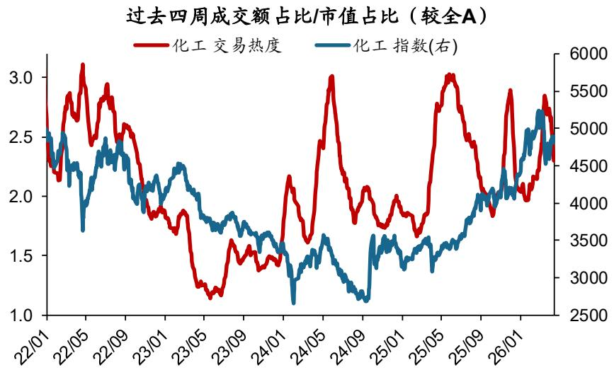

line chart

| Date   | 化工交易热度 | 化工指数(右) |
|--------|---------------|--------------|
| 22/01  | 2.5           | 4800         |
| 22/05  | 3.1           | 4500         |
| 22/09  | 2.8           | 4700         |
| 23/01  | 2.6           | 4600         |
| 23/05  | 1.8           | 4400         |
| 23/09  | 1.5           | 4200         |
| 24/01  | 1.7           | 4000         |
| 24/05  | 3.0           | 3800         |
| 24/09  | 1.8           | 3500         |
| 25/01  | 2.0           | 3700         |
| 25/05  | 3.0           | 4000         |
| 25/09  | 2.5           | 4300         |
| 26/01  | 2.8           | 4700         |

交易热度 1.1 历史分位16%  
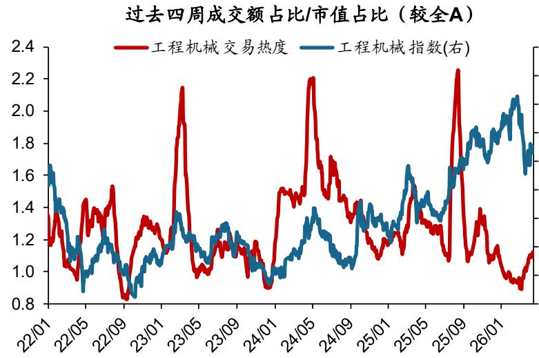

line chart

| Date   | 工程机械交易热度 | 工程机械指数(右) |
|--------|------------------|------------------|
| 22/01  | 1.4              | 1.6              |
| 22/05  | 1.0              | 1.2              |
| 22/09  | 0.8              | 1.0              |
| 23/01  | 1.3              | 1.2              |
| 23/05  | 2.2              | 1.4              |
| 23/09  | 1.0              | 1.2              |
| 24/01  | 1.5              | 1.0              |
| 24/05  | 2.2              | 1.4              |
| 24/09  | 1.7              | 1.2              |
| 25/01  | 1.3              | 1.6              |
| 25/05  | 1.4              | 1.5              |
| 25/09  | 2.3              | 1.8              |
| 26/01  | 0.9              | 1.7              |

交易热度 2.3 历史分位 66%  
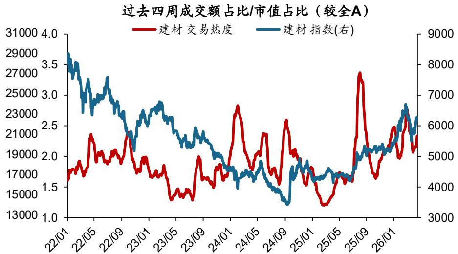

line chart

| Date   | 建材交易热度 | 建材指数(右) |
|--------|---------------|--------------|
| 22/01  | 17000         | 8500         |
| 22/05  | 21000         | 7500         |
| 22/09  | 19000         | 6500         |
| 23/01  | 18000         | 6000         |
| 23/05  | 14000         | 5500         |
| 23/09  | 19000         | 5000         |
| 24/01  | 23000         | 4500         |
| 24/05  | 18000         | 4000         |
| 24/09  | 25000         | 3500         |
| 25/01  | 13000         | 4500         |
| 25/05  | 17000         | 5000         |
| 25/09  | 35000         | 6500         |
| 26/01  | 23000         | 6000         |

交易热度 2.6 历史分位79%  
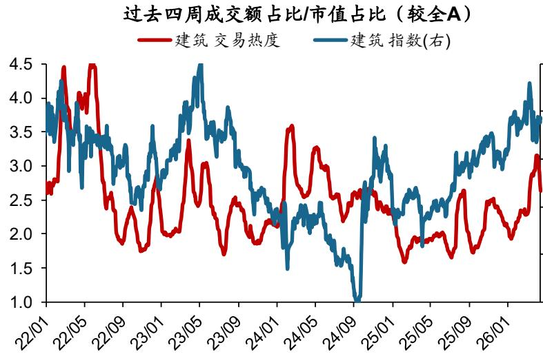

line chart

| Date   | 建筑交易热度 | 建筑指数(右) |
|--------|--------------|--------------|
| 22/01  | 2.7          | 3.8          |
| 22/05  | 4.5          | 4.0          |
| 22/09  | 2.5          | 3.5          |
| 23/01  | 2.0          | 3.0          |
| 23/05  | 3.0          | 4.5          |
| 23/09  | 2.5          | 3.5          |
| 24/01  | 2.0          | 2.5          |
| 24/05  | 3.5          | 2.0          |
| 24/09  | 1.0          | 1.0          |
| 25/01  | 2.5          | 3.0          |
| 25/05  | 2.0          | 2.5          |
| 25/09  | 2.5          | 3.0          |
| 26/01  | 3.0          | 3.5          |

交易热度 1.6 历史分位40%  
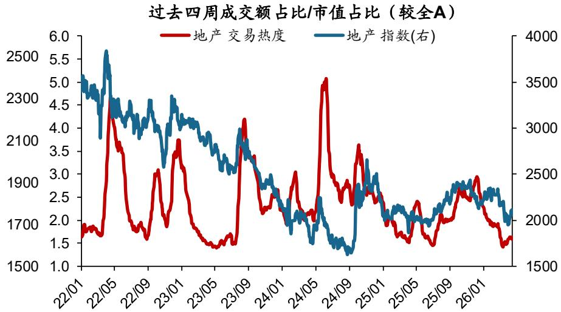

line chart

| Date   | 地产交易热度 | 地产指数(右) |
|--------|--------------|--------------|
| 22/01  | 1700         | 3500         |
| 22/05  | 2500         | 3800         |
| 22/09  | 1700         | 3000         |
| 23/01  | 3000         | 3200         |
| 23/05  | 1500         | 2800         |
| 23/09  | 4000         | 3000         |
| 24/01  | 2500         | 2500         |
| 24/05  | 3500         | 2200         |
| 24/09  | 1500         | 1800         |
| 25/01  | 3500         | 2800         |
| 25/05  | 1800         | 2400         |
| 25/09  | 2800         | 2600         |
| 26/01  | 1500         | 2200         |

## 交易热度 2.8 历史分位77%

过去四周成交额占比/市值占比(较全A)  
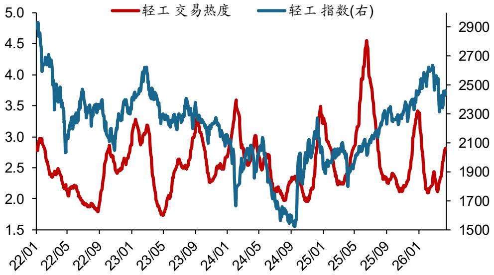

bar-line hybrid chart

| Date   | 轻工交易热度 | 轻工指数(右) |
|--------|--------------|--------------|
| 22/01  | 3.0          | 2900         |
| 22/05  | 2.5          | 2700         |
| 22/09  | 1.8          | 2500         |
| 23/01  | 3.2          | 2600         |
| 23/05  | 1.7          | 2400         |
| 23/09  | 2.6          | 2550         |
| 24/01  | 3.6          | 2300         |
| 24/05  | 2.8          | 2100         |
| 24/09  | 1.6          | 1700         |
| 25/01  | 3.5          | 2400         |
| 25/05  | 4.5          | 2600         |
| 25/09  | 3.4          | 2700         |
| 26/01  | 2.8          | 2500         |

交易热度 2.3 历史分位 30%  
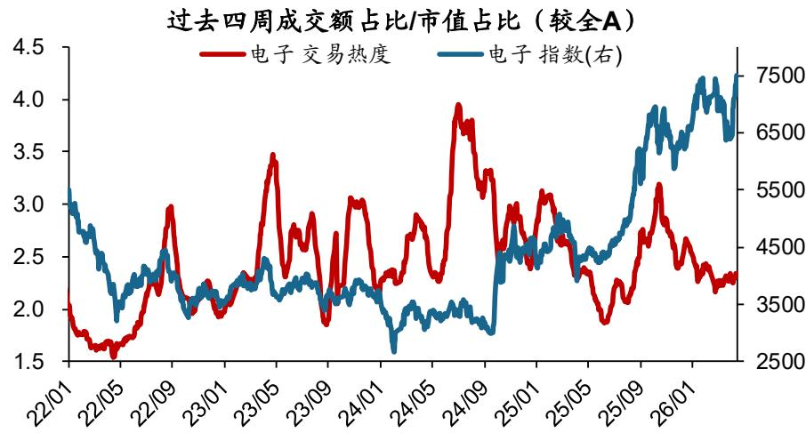

line chart

| Date   | 电子交易热度 | 电子指数(右) |
|--------|--------------|--------------|
| 22/01  | 2.0          | 3000         |
| 22/05  | 1.5          | 2500         |
| 22/09  | 2.5          | 3500         |
| 23/01  | 2.0          | 4000         |
| 23/05  | 3.5          | 4500         |
| 23/09  | 2.0          | 3500         |
| 24/01  | 2.5          | 3000         |
| 24/05  | 3.0          | 4000         |
| 24/09  | 4.0          | 5500         |
| 25/01  | 3.0          | 6000         |
| 25/05  | 2.5          | 6500         |
| 25/09  | 3.0          | 7000         |
| 26/01  | 2.5          | 7500         |

交易热度 2.2 历史分位 20%  
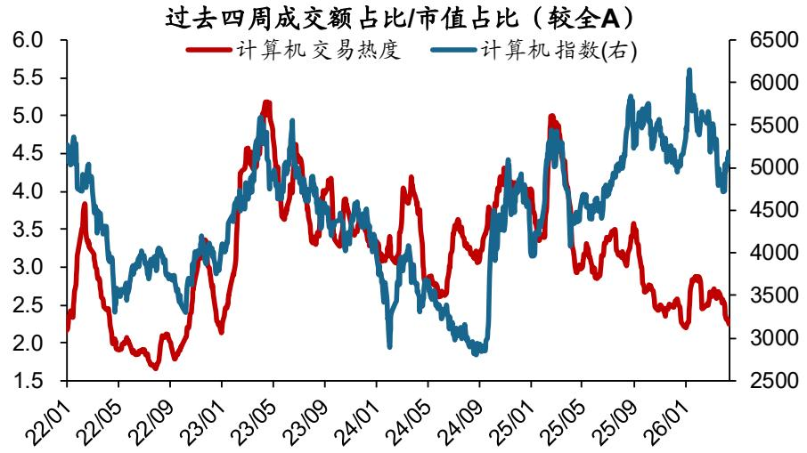

line chart

| Date   | 计算机交易热度 | 计算机指数(右) |
|--------|----------------|----------------|
| 22/01  | 2.5            | 4.5            |
| 22/05  | 3.8            | 4.2            |
| 22/09  | 1.8            | 3.0            |
| 23/01  | 2.2            | 3.5            |
| 23/05  | 5.2            | 4.8            |
| 23/09  | 3.5            | 4.0            |
| 24/01  | 3.0            | 3.5            |
| 24/05  | 4.2            | 3.0            |
| 24/09  | 3.0            | 2.5            |
| 25/01  | 4.5            | 4.5            |
| 25/05  | 5.0            | 5.0            |
| 25/09  | 3.5            | 5.5            |
| 26/01  | 2.5            | 4.0            |

交易热度 2.2 历史分位28%  
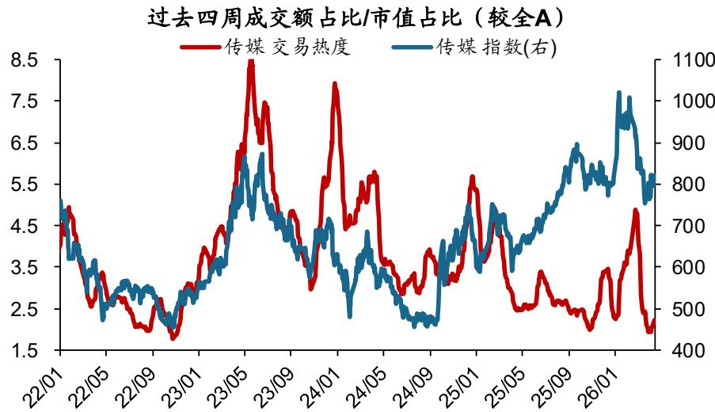

line chart

| Date   | 传媒交易热度 | 传媒指数(右) |
|--------|--------------|--------------|
| 22/01  | 4.5          | 750          |
| 22/05  | 3.0          | 600          |
| 22/09  | 2.5          | 550          |
| 23/01  | 3.5          | 650          |
| 23/05  | 8.5          | 800          |
| 23/09  | 7.5          | 700          |
| 24/01  | 8.0          | 650          |
| 24/05  | 5.5          | 500          |
| 24/09  | 3.5          | 450          |
| 25/01  | 5.5          | 600          |
| 25/05  | 3.0          | 700          |
| 25/09  | 2.5          | 800          |
| 26/01  | 4.5          | 900          |
| 26/05  | 1.5          | 850          |

交易热度 2.9 历史分位49%  
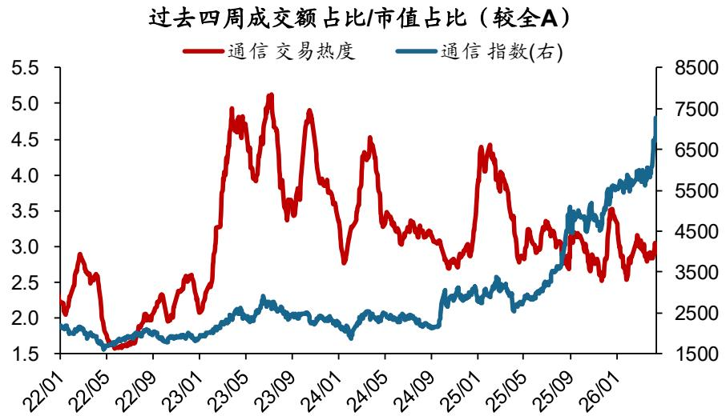

line chart

| Date   | 通信交易热度 | 通信指数(右) |
|--------|---------------|--------------|
| 22/01  | 2.0           | 1500         |
| 22/05  | 1.5           | 1500         |
| 22/09  | 1.8           | 1500         |
| 23/01  | 2.5           | 2000         |
| 23/05  | 4.8           | 2500         |
| 23/09  | 5.1           | 3000         |
| 24/01  | 3.5           | 2500         |
| 24/05  | 4.5           | 3000         |
| 24/09  | 3.0           | 3500         |
| 25/01  | 4.5           | 4000         |
| 25/05  | 3.5           | 4500         |
| 25/09  | 3.0           | 5000         |
| 26/01  | 3.5           | 6500         |

## 目录

01 资金流动性：杠杆资金&股票型ETF分化加剧  
02 交易拥挤度：建材、传媒、医疗服务上行；化工、煤炭、央企下行  
03 投资者温度计：自媒体A股搜索热度下降，散户资金净流入规模上升

## 3.1、 自媒体：A股搜索热度下降

上周市场呈震荡上行、成长领跑的格局，风险偏好修复量能温和放量，市场对美伊冲突逐步脱敏，自媒体A股搜索热度下降。

[华创策略]媒体平台A股讨论热度指数(标准化)  
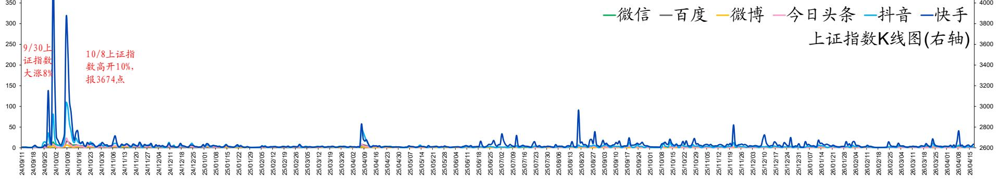

line chart

| Date       | Index Value |
| ---------- | ----------- |
| 9/30上证指数大涨 | 3674        |
| 10/8上证指数高开 | 10%         |

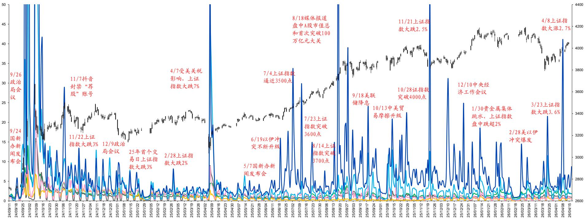

bar-line hybrid chart

| Date       | Index Value | Volume (Units) |
|------------|-------------|----------------|
| 9/26政治局会议 | 50          | 15             |
| 9/24国新办新闻发布会 | 10          | 10             |
| 11/7抖音封禁“荐股”账号 | 3           | 15             |
| 11/22上证指数大跌3% | 3           | 15             |
| 12/9政治局会议 | 3           | 15             |
| 25年首个交易日上证指数大跌3% | 3           | 15             |
| 2/28上证指数大跌2% | 2           | 15             |
| 7/4上证指数逼近3500点 | 3           | 15             |
| 6/19以伊冲突不断升级 | 3           | 15             |
| 5/7国新办新闻发布会 | 3           | 15             |
| 7/23上证指数突破3600点 | 3           | 15             |
| 8/14上证指数突破3700点 | 3           | 15             |
| 8/18媒体报道盘中A股市值总和首次突破100万亿元大关 | 3           | 15             |
| 9/18美联储降息 | 3           | 15             |
| 10/13中美贸易摩擦升级 | 3           | 15             |
| 10/28证指数突破4000点 | 3           | 15             |
| 11/21上证指数大跌2.5% | 3           | 15             |
| 12/10中央经济工作会议 | 3           | 15             |
| 1/30贵金属集体跳水，上证指数盘中跌超2% | 3           | 15             |
| 2/28美以伊冲突爆发 | 3           | 15             |
| 3/23上证指数大跌3.6% | 3           | 15             |
| 4/8上证指数大涨2.7% | 3           | 15             |

## 3.2、抖音观看“A股”内容用户：高能级城市、青年群体占比上升

抖音最近一周（4/11-4/17）观看“A股”内容用户结构分布总体平稳。从城市能级上看，一线、新一线等高能级城市群体占比上升；从年龄结构上看，18-23岁青年群体占比上升。

抖音用户观看"A股"内容占比及TGI地域分布  
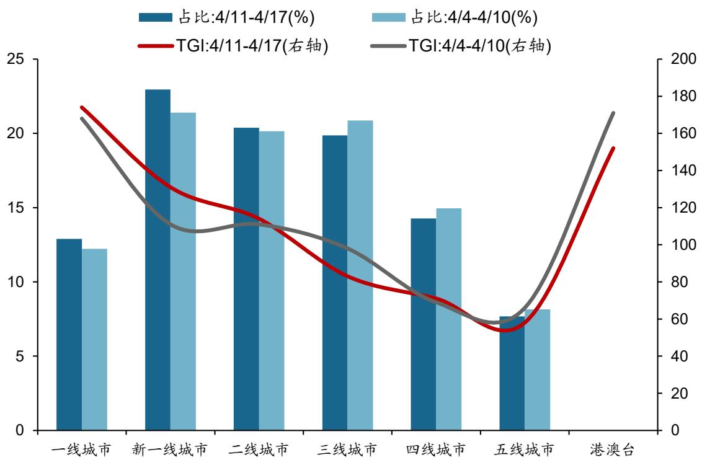

bar-line hybrid chart

| 城市 | 占比:4/11-4/17(%) | 占比:4/4-4/10(%) | TGI:4/11-4/17(右轴) | TGI:4/4-4/10(右轴) |
| :--- | :--- | :--- | :--- | :--- |
| 一线城市 | 13 | 12 | 180 | 170 |
| 新一线城市 | 23 | 21 | 160 | 130 |
| 二线城市 | 20.5 | 20 | 150 | 135 |
| 三线城市 | 20 | 21 | 100 | 110 |
| 四线城市 | 14.5 | 15 | 80 | 90 |
| 五线城市 | 7.5 | 8 | 60 | 60 |
| 港澳台 | - | - | 155 | 175 |

抖音用户观看"A股"内容占比及TGI年龄分布  
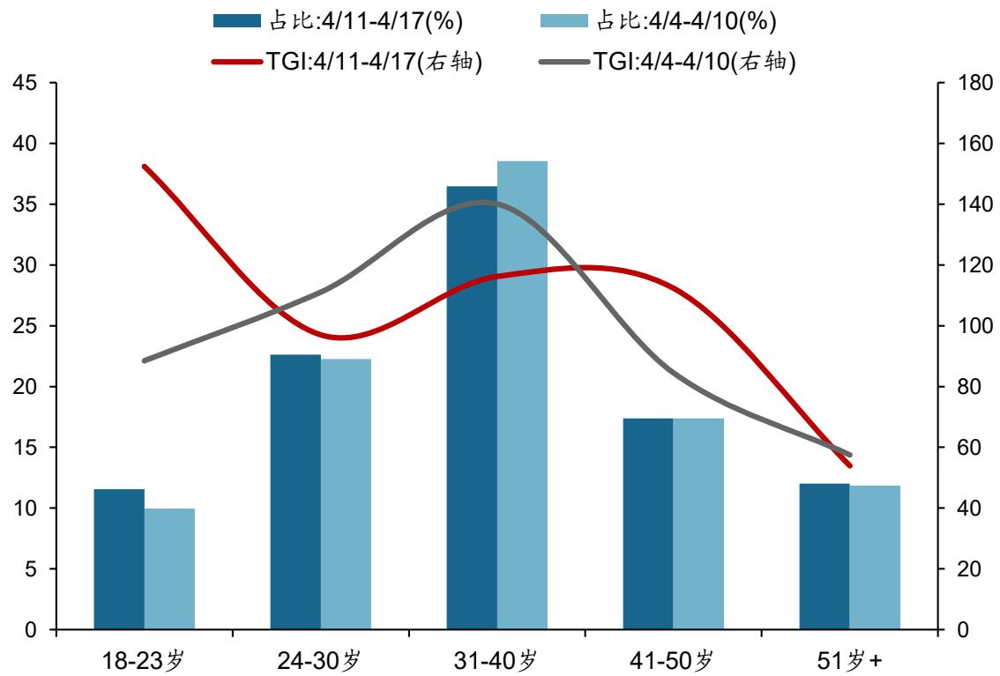

bar-line hybrid chart

| 年龄段   | 占比:4/11-4/17(%) | 占比:4/4-4/10(%) | TGI:4/11-4/17(右轴) | TGI:4/4-4/10(右轴) |
| -------- | ------------------ | ----------------- | -------------------- | -------------------- |
| 18-23岁  | 11.5               | 10.0              | 155                  | 90                   |
| 24-30岁  | 22.5               | 22.0              | 95                   | 105                  |
| 31-40岁  | 36.5               | 38.5              | 120                  | 140                  |
| 41-50岁  | 17.5               | 17.5              | 120                  | 90                   |
| 51岁+    | 12.0               | 12.0              | 55                   | 60                   |

## 3.3、快手：“A股”作品热度上升

最近一周（4/11-4/17）快手“A股”作品：作品量2.7万个，较上期增加0.7万个；点赞量17.8万次，较上期减少2.0万次；评论量14.3万次，较上期减少0.8万次。

快手"股票"话题热度及作品数(周频)  
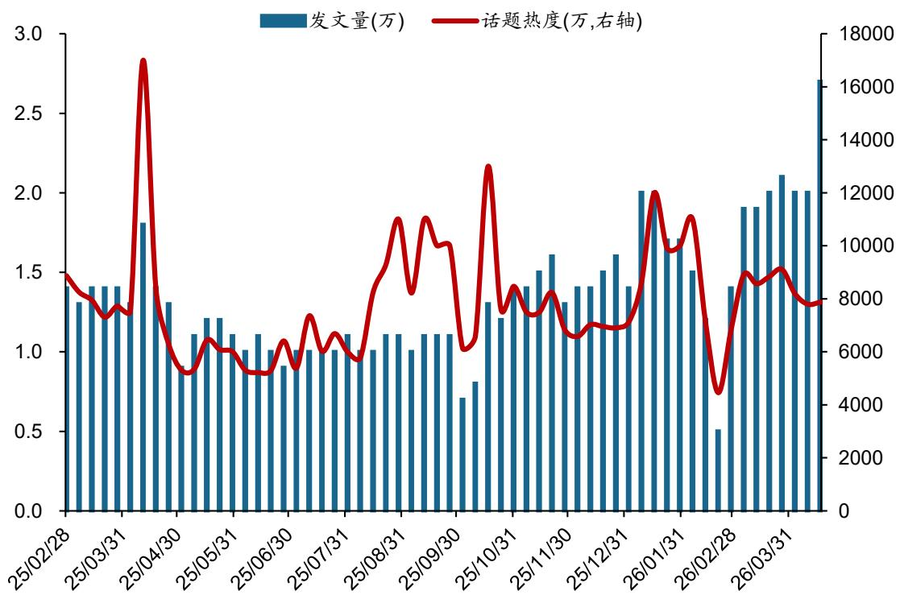

bar-line hybrid chart

| Date       | 发文量(万) | 话题热度(万,右轴) |
| ---------- | ---------- | ------------------ |
| 25/02/28   | 1.3        | 8000               |
| 25/03/31   | 1.4        | 7500               |
| 25/04/30   | 1.8        | 17000              |
| 25/05/31   | 1.1        | 6000               |
| 25/06/30   | 1.1        | 5500               |
| 25/07/31   | 1.0        | 6500               |
| 25/08/31   | 1.1        | 9000               |
| 25/09/30   | 1.1        | 7000               |
| 25/10/31   | 1.3        | 13000              |
| 25/11/30   | 1.4        | 8500               |
| 25/12/31   | 1.6        | 9500               |
| 26/01/31   | 2.0        | 12000              |
| 26/02/28   | 1.4        | 4500               |
| 26/03/31   | 2.1        | 9500               |
| 26/04/31   | 2.7        | 8500               |

快手"股票"话题评论量及点赞量(周频)  
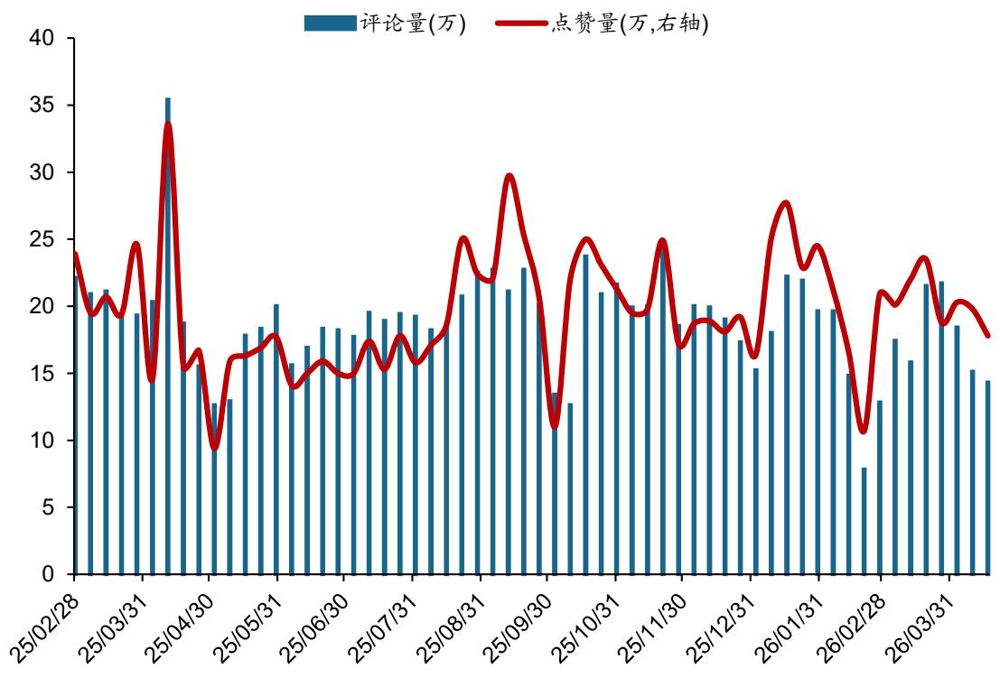

bar-line hybrid chart

| Date | 评论量(万) | 点赞量(万,右轴) |
| --- | --- | --- |
| 25/02/28 | 22 | 24 |
| 25/03/31 | 19 | 20 |
| 25/04/30 | 35 | 34 |
| 25/05/31 | 18 | 17 |
| 25/06/30 | 18 | 16 |
| 25/07/31 | 19 | 17 |
| 25/08/31 | 21 | 25 |
| 25/09/30 | 23 | 30 |
| 25/10/31 | 24 | 25 |
| 25/11/30 | 21 | 24 |
| 25/12/31 | 19 | 19 |
| 26/01/31 | 22 | 28 |
| 26/02/28 | 15 | 11 |
| 26/03/31 | 18 | 24 |
| 26/04/30 | 16 | 20 |
| 26/05/31 | 18 | 19 |
| 26/06/30 | 17 | 18 |
| 26/07/31 | 19 | 17 |
| 26/08/31 | 21 | 25 |
| 26/09/30 | 23 | 30 |
| 26/10/31 | 24 | 25 |
| 26/11/30 | 21 | 24 |
| 26/12/31 | 19 | 19 |
| 26/01/31 | 20 | 25 |
| 26/02/28 | 18 | 17 |
| 26/03/31 | 16 | 19 |
| 26/04/30 | 14 | 16 |
| 26/05/31 | 18 | 19 |
| 26/06/30 | 20 | 20 |
| 26/07/31 | 21 | 21 |
| 26/08/31 | 23 | 24 |
| 26/09/30 | 24 | 25 |
| 26/10/31 | 25 | 24 |
| 26/11/30 | 24 | 23 |
| 26/12/31 | 23 | 22 |
| 26/01/31 | 24 | 24 |
| 26/02/28 | 25 | 25 |
| 26/03/31 | 24 | 24 |
| 26/04/30 | 25 | 25 |
| 26/05/31 | 24 | 24 |
| 26/06/30 | 25 | 25 |
| 26/07/31 | 24 | 24 |
| 26/08/31 | 25 | 25 |
| 26/09/30 | 24 | 24 |
| 26/10/31 | 25 | 25 |
| 26/11/30 | 24 | 24 |
| 26/12/31 | 25 | 25 |
| 26/01/31 | 24 | 24 |
| 26/02/28 | 25 | 25 |
| 26/03/31 | 24 | 24 |
| 26/04/30 | 25 | 25 |
| 26/05/3 | 24 | 24 |
| 26/06/3 | 25 | 25 |
| 26/07/3 | 24 | 24 |
| 26/08/3 | 25 | 25 |
| 26/09/3 | 24 | 24 |
| 26/10/3 | 25 | 25 |
| 26/11/3 | 24 | 24 |
| 26/12/3 | 25 | 25 |
| 26/01/3 | 24 | 24 |
| 26/02/28 | 25 | 25 |
| 26/03/3 | 24 | 24 |
| 26/04/3 | 25 | 25 |
| 26/05/3 | 24 | 24 |
| 26/06/3 | 25 | 25 |
| 26/07/3 | 24 | 24 |
| 26/08/3 | 25 | 25 |
| 26 / | (value) | (value) |
|  |  |  |
|  |  |  |
|  |  |  |
|  |  |  |
|  |  |  |
|  |  |  |
|  |  |  |
|  |  |  |
|  |  |  |
|  |  |  |
|  |  |  |
|  |  |  |
|  |  |  |
|  |  |  |
|  |  |  |

上周微博情绪总体平稳，市场震荡上行引发积极等情绪明显上升。

微博关键词"A股"情绪走势  
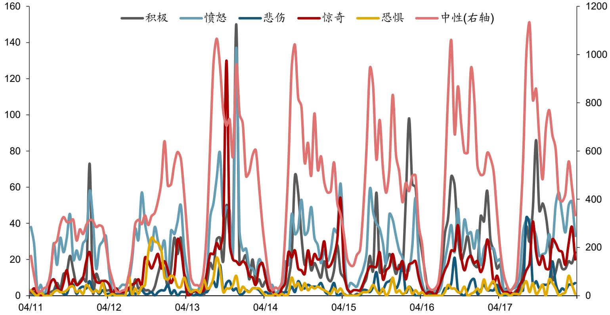

bar-line hybrid chart

| Date   | 积极 | 愤怒 | 悲伤 | 惊奇 | 恐惧 | 中性(右轴) |
|--------|------|-------|------|------|------|------------|
| 04/11  | 0    | 38    | 0    | 0    | 0    | 20         |
| 04/12  | 72   | 58    | 0    | 24   | 0    | 40         |
| 04/13  | 30   | 50    | 0    | 30   | 0    | 80         |
| 04/14  | 68   | 45    | 0    | 24   | 0    | 140        |
| 04/15  | 58   | 60    | 0    | 24   | 0    | 100        |
| 04/16  | 98   | 55    | 0    | 24   | 0    | 60         |
| 04/17  | 85   | 50    | 42   | 38   | 0    | 115        |

最近一周（4/13-4/17）公募抱团趋势不变，风格偏向价值，行业偏向金融、周期、消费。

基金净值涨幅分布  
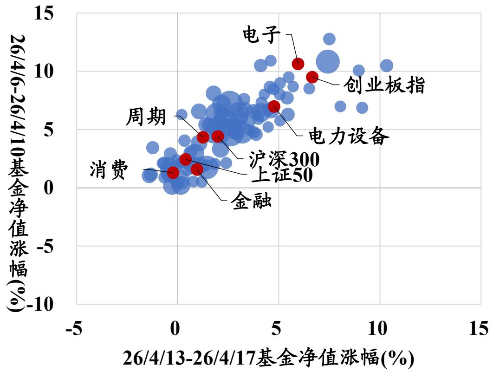

bubble chart

| 类别       | 26/4/13-26/4/17基金净值涨幅(%) | 26/4/6-26/4/10基金净值涨幅(%) |
| ---------- | ------------------------------ | ------------------------------ |
| 消费       | -1.5                           | 1.0                            |
| 周期       | 0.5                            | 2.0                            |
| 金融       | 1.0                            | 1.5                            |
| 上证50     | 2.0                            | 3.0                            |
| 沪深300    | 3.0                            | 4.0                            |
| 电力设备   | 5.0                            | 7.0                            |
| 创业板指   | 8.0                            | 9.0                            |
| 电子       | 6.0                            | 10.0                           |

基金净值涨幅分布  
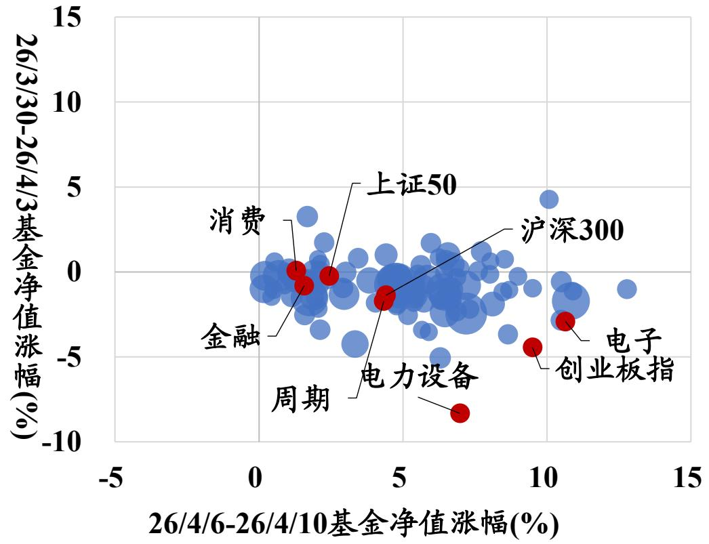

bubble chart

| 类别 | 26/4/6-26/4/10基金净值涨幅(%) | 26/3/30-26/4/3基金净值涨幅(%) |
| :--- | :--- | :--- |
| 消费 | 1.5 | -0.5 |
| 金融 | 2.0 | -1.0 |
| 周期 | 3.0 | -2.0 |
| 上证50 | 4.5 | -1.5 |
| 电力设备 | 7.0 | -8.0 |
| 沪深300 | 10.0 | 4.0 |
| 电子创业板指 | 11.0 | -3.0 |

注：图表以沪深300、创业板指、上证50、3个中信风格指数和2个申万指数（电子，电力设备）为参考，选取剔除行业基后规模前100普通股票型、偏股混合型和灵活配置型基金；气泡大小代表规模。

## 3.6、散户资金净流入规模上升

24/10新增开户数685万户，历史上仅次于15/4和15/6；26/3新增开户数460.1万户，处过去十年98%分位；  
最近一周（4/13-4/17）以小单(挂单额小于4万元)衡量的沪深两市A股散户资金净流入820.8亿元，较前值增加503.4亿元，处过去五年33.7%分位，净流入规模上升。

上证所：A股账户新增开户数(万户)  
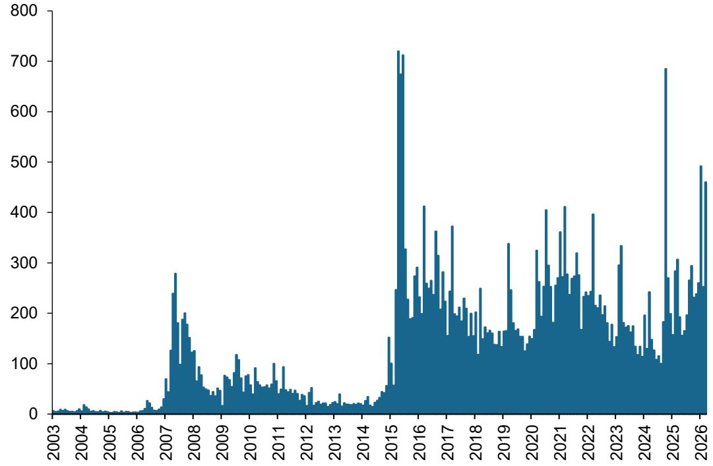

bar chart

| Year | Value |
| ---- | ----- |
| 2003 | 0     |
| 2004 | 10    |
| 2005 | 5     |
| 2006 | 15    |
| 2007 | 280   |
| 2008 | 190   |
| 2009 | 70    |
| 2010 | 110   |
| 2011 | 90    |
| 2012 | 40    |
| 2013 | 30    |
| 2014 | 20    |
| 2015 | 720   |
| 2016 | 410   |
| 2017 | 370   |
| 2018 | 250   |
| 2019 | 340   |
| 2020 | 320   |
| 2021 | 410   |
| 2022 | 390   |
| 2023 | 330   |
| 2024 | 240   |
| 2025 | 690   |
| 2026 | 490   |

周频沪深A股小单净流入额(亿元)  
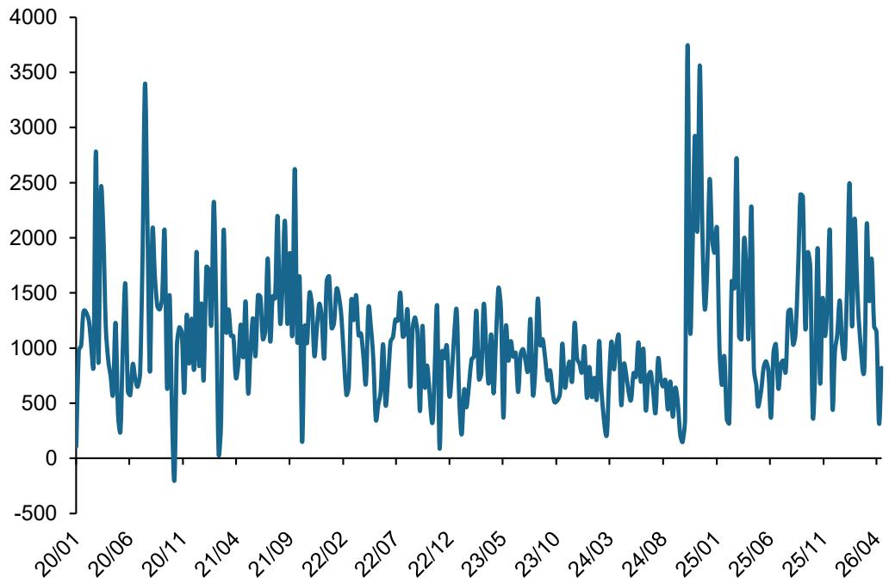

line chart

| Date   | Value |
|--------|-------|
| 20/01  | 1000  |
| 20/06  | 2800  |
| 20/11  | -200  |
| 21/04  | 2300  |
| 21/09  | 2600  |
| 22/02  | 1500  |
| 22/07  | 1400  |
| 22/12  | 1300  |
| 23/05  | 1500  |
| 23/10  | 1400  |
| 24/03  | 1100  |
| 24/08  | 600   |
| 25/01  | 3800  |
| 25/06  | 2700  |
| 25/11  | 2400  |
| 26/04  | 1800  |

## 3.7、散户入场渠道：下载量增加

• 最近一周（4/11-4/17，下同）同花顺累计下载量达17.3万次，较前值增加4.8万次；东方财富下载量6.6万次，较前值增加2.3万次。最近一周同花顺五星好评数量6108次，较前值增加1793次。

同花顺及东方财富APP下载量(iPhone端)  
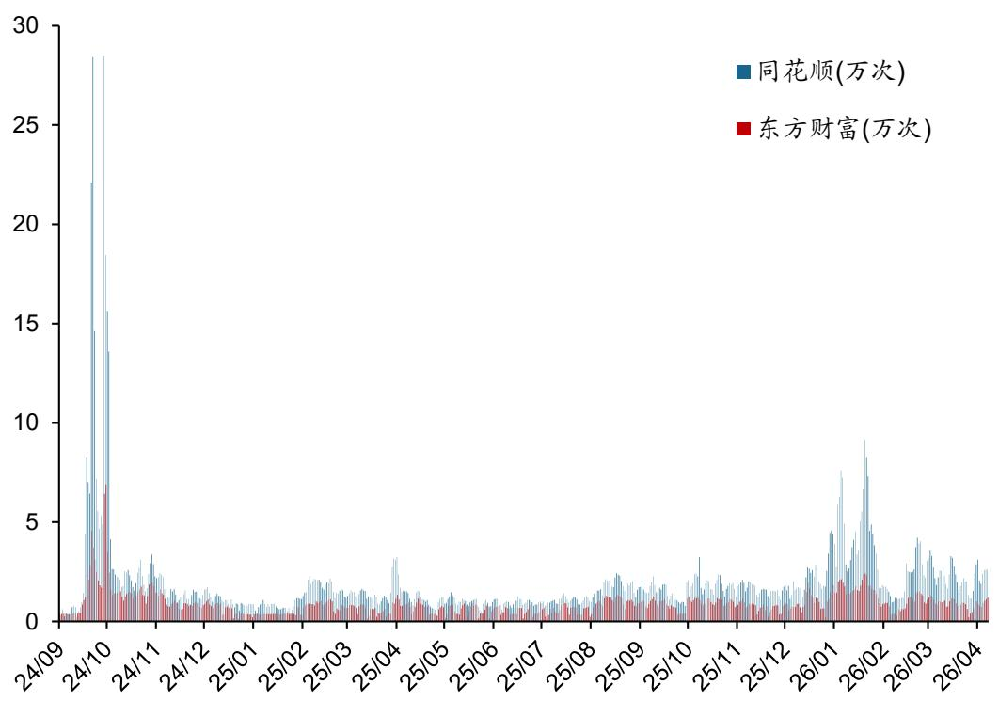

bar-line hybrid chart

| Date   | 同花顺(万次) | 东方财富(万次) |
|--------|--------------|---------------|
| 24/09  | 0            | 0             |
| 24/10  | 28           | 6             |
| 24/11  | 15           | 3             |
| 24/12  | 3            | 1             |
| 25/01  | 1            | 0.5           |
| 25/02  | 2            | 1             |
| 25/03  | 1            | 0.5           |
| 25/04  | 3            | 1             |
| 25/05  | 1            | 0.5           |
| 25/06  | 1            | 0.5           |
| 25/07  | 1            | 0.5           |
| 25/08  | 2            | 1             |
| 25/09  | 1            | 0.5           |
| 25/10  | 3            | 1             |
| 25/11  | 1            | 0.5           |
| 25/12  | 2            | 1             |
| 26/01  | 4            | 2             |
| 26/02  | 9            | 3             |
| 26/03  | 3            | 1             |
| 26/04  | 3            | 1             |

同花顺APP评分情况  
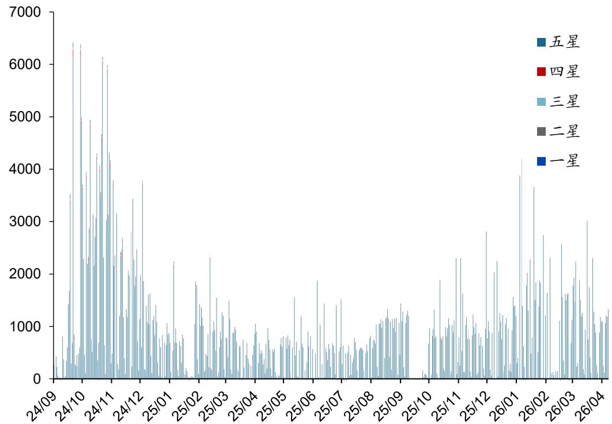

bar chart

| Date   | 五星 | 四星 | 三星 | 二星 | 一星 |
|--------|------|------|------|------|------|
| 24/09  |      |      |      |      |      |
| 24/10  |      |      |      |      |      |
| 24/11  |      |      |      |      |      |
| 24/12  |      |      |      |      |      |
| 25/01  |      |      |      |      |      |
| 25/02  |      |      |      |      |      |
| 25/03  |      |      |      |      |      |
| 25/04  |      |      |      |      |      |
| 25/05  |      |      |      |      |      |
| 25/06  |      |      |      |      |      |
| 25/07  |      |      |      |      |      |
| 25/08  |      |      |      |      |      |
| 25/09  |      |      |      |      |      |
| 25/10  |      |      |      |      |      |
| 25/11  |      |      |      |      |      |
| 25/12  |      |      |      |      |      |
| 26/01  |      |      |      |      |      |
| 26/02  |      |      |      |      |      |
| 26/03  |      |      |      |      |      |
| 26/04  |      |      |      |      |      |

1、宏观经济不及预期，可能导致相机抉择的货币政策与市场预期产生偏离；  
2、相关测算或与实际情况有所偏差；  
3、历史经验不代表未来：因市场环境等因素变化，历史数据得出的经验可能在未来失效。

## 组长、首席分析师：姚佩

中国人民大学金融硕士，曾任东吴证券策略首席分析师、海通证券策略高级分析师，连续四年新财富策略第一团队核心。在传统策略大势研判、行业比较、主题研究以外，对大类资产、政策取向、市场风格、产业周期、个股特征均有增量研究与发现。

## 策略分析师：丁炎晨

上海交通大学硕士，华中科技大学学士，2023年4月加入华创策略团队，曾任东吴证券策略研究员。目前专注于政策跟踪、个股特征等方面的增量研究。

## 助理研究员：蔡雨阳

圣路易斯华盛顿大学金融硕士。2023年加入华创研究所。

## 助理研究员：朱冬墨

上海财经大学经济学学士、硕士，2024年加入华创研究所。

## 助理研究员：周名未

香港理工大学金融硕士，中央财经大学金融工程学士。2025年加入华创证券研究所。

## 分析师声明

每位负责撰写本研究报告全部或部分内容的分析师在此作以下声明：

分析师在本报告中对所提及的证券或发行人发表的任何建议和观点均准确地反映了其个人对该证券或发行人的看法和判断；分析师对任何其他券商发布的所有可能存在雷同的研究报告不负有任何直接或者间接的可能责任。

## 免责声明

本报告仅供华创证券有限责任公司（以下简称“本公司”）的客户使用。本公司不会因接收人收到本报告而视其为客户。

本报告所载资料的来源被认为是可靠的，但本公司不保证其准确性或完整性。本报告所载的资料、意见及推测仅反映本公司于发布本报告当日的判断。在不同时期，本公司可发出与本报告所载资料、意见及推测不一致的报告。本公司在知晓范围内履行披露义务。

报告中的内容和意见仅供参考，并不构成本公司对具体证券买卖的出价或询价。本报告所载信息不构成对所涉及证券的个人投资建议，也未考虑到个别客户特殊的投资目标、财务状况或需求。客户应考虑本报告中的任何意见或建议是否符合其特定状况，自主作出投资决策并自行承担投资风险，任何形式的分享证券投资收益或者分担证券投资损失的书面或口头承诺均为无效。本报告中提及的投资价格和价值以及这些投资带来的预期收入可能会波动。

本报告版权仅为本公司所有，本公司对本报告保留一切权利。未经本公司事先书面许可，任何机构和个人不得以任何形式翻版、复制、发表或引用本报告的任何部分。如征得本公司许可进行引用、刊发的，需在允许的范围内使用，并注明出处为“华创证券研究”，且不得对本报告进行任何有悖原意的引用、删节和修改。

证券市场是一个风险无时不在的市场，请您务必对盈亏风险有清醒的认识，认真考虑是否进行证券交易。市场有风险，投资需谨慎。