机械组

分析师：满在朋（执业 S1130522030002）

manzaipeng@gjzq.com.cn

分析师：倪赵义（执业 S1130524120001）

nizhaoyi@gjzq.com.cn

联系人：刘民喆

liuminzhe@gjzq.com.cn

## 光模块设备：站在巨人的肩膀上，寻找中长期通胀方向

## 光模块行业蔚然成风，光模块设备为新蓝海市场

光模块是实现光电信号转换的核心器件，向高速率快速迭代。光模块由光发射/接收组件、激光器芯片、电芯片等组成，作用为通过光电转换实现通信设备间的数据互联，核心要求为高带宽、高可靠性、低功耗、低时延。

贴片、引线键合、耦合、封装、测试环节均需要专用光模块设备，价值量占比分别为 $20\%$ 、 $1\%$ 、 $40\%$ 、 $12\%$ 、 $27\%$ 。光模块是将光芯片、电芯片等核心组件通过多工序制造而成光电信号转化的模块，根据思瀚产业研究院，每100万支800G光模块设备投入约5亿元，主要为贴片机、引线键合设备、光学耦合设备、封装设备、测试仪器（设备），价值量占比分别为 $20\%$ 、 $1\%$ 、 $40\%$ 、 $12\%$ 、 $17\%$ 。根据TrendForce预测，2026年全球八大云服务厂商资本开支将达6020亿美元，同比 $+40\%$ ，AI资本开支扩张，有望带动光模块产线进入投资景气周期。

## 光模块向高速率、光电共封（CPO）演进，重视三大核心设备——耦合、测试、贴片

光模块向从 400G 向 800G、1.6T 演进。AI 大模型参数每两年扩展约 100 倍，传输需求的膨胀推动光模块向高速率迭代，根据“光摩尔定律”，光模块技术约每四年完成一代迭代升级，同步实现单比特成本与功耗的同步减半。目前 800G 光模块已成为市场主流方案，进入放量期；伴随算力网络对传输效率需求的持续提升，1.6T、3.2T 等超高速率光模块市场需求有望逐步崛起。

光模块由可插拔向光电共封（CPO）演进。数据中心交换机带宽提升80倍，系统总功耗也同步增长22倍，其中光模块功耗增长26倍，是需功耗优化的核心器件。根据ASE数据，CPO方案较传统可插拔光模块约可降低60%的功耗和30%以上的成本，28年有望开启大规模部署。

重视三大核心设备——耦合、测试、贴片。1）耦合设备：硅光子芯片、超高速率光模块对准精度要求大幅提升至±0.05μm，中高速光模块仅为0.1μm，关注能提供高精度耦合解决方案的设备商。2）测试仪器：光模块速率提升对采样示波器通道带宽、误码检测仪最高传输速率需求提升，800G光模块需要59GBaud误码仪，而1.6T需要113GBaud误码仪；并且CPO需验证数百项系统级参数，测试时长增至3-5倍，要求设备具备更高的集成度、稳定性与长时测试能力，测试设备有望成为核心通胀环节之一。3）贴片设备：高速光模块器件集成度提升使芯片尺寸缩小、间距减小，贴片容错空间大幅压缩，800G/1.6T光芯片贴片精度为3μm，相对400G的5μm要求更高，贴片设备要求持续提升。

## 投资建议与估值

AI 数据中心资本开支扩张，2026 年全球八大云服务厂商资本开支将达 6020 亿美元，同比+40%，有望带动光模块产线进入建设景气周期。耦合、测试、贴片价值量占比分别为 40%、27%、20%，为核心价值量环节。根据我们梳理，耦合环节国产市占率超 45%、测试环节国产龙头联讯市占率仅 9.9%、贴片环节日本 4T + ASMPT + MRSI 合计市占率为 50%，除耦合环节，测试、贴片设备国产市占率较低。光模块向 1.6T、CPO 迭代，对高端设备需求提升，有望带来新一轮国产厂商机遇，建议关注核心光模块耦合、测试、贴片设备国产龙头供应商。

## 风险提示

AI 资本开支不及预期；AI 大模型发展不及预期；技术发展带来需求不确定风险；市场竞争加剧。

## 内容目录

## 一、光模块蔚然成风，光模块设备为新蓝海市场.... 5

1.1 光模块为光通信核心器件，向高速率快速迭代.... 5  
1.2 贴片、耦合、封装、测试环节均需要专用光模块设备 6  
1.2.1 流程一：贴片—价值量占比 20%....7  
1.2.2 流程二：引线键合一价值量占比 1%....8  
1.2.3 流程三：光学耦合—价值量占比 40% 9  
1.2.4 流程四：封装—价值量占比 12%....10  
1.2.5 流程五：测试、老化—价值量占比 27% …… 10  
1.3 AI 资本开支扩张，有望带动光模块产线进入投资景气周期 11

## 二、光模块向光电CPO封 更高速率演进，重视通胀环节 12

2.1 光模块向光电共封（CPO）、更高速率演进 12  
2.1.1行业趋势一：光模块速率从400G向800G、1.6T演进 12  
2.1.2 行业趋势二：光模块由可插拔向光电共封（CPO）演进.... 12  
2.2 核心环节一：耦合设备—CPO 对耦合精度要求提升 13  
2.3 核心环节二：测试设备—速率提升、CPO 对测试要求提升 14  
2.4 核心环节三：贴片设备—精度要求随光模块速率提升 14

## 三、投资建议.... 15

3.1 联讯仪器：国产光模块测试仪器龙头，有望受益国产替代 16  
3.2 罗博特科：收购 ficonTEC，进化为全球光模块耦合设备龙头 18  
3.3 华盛昌：收购伽蓝特，切入光通信设备 20  
3.4 优利德：收购信测通信，切入光通信测试 …… 21

## 四、风险提示.... 23

## 图表目录

图表 1：光模块是光通信中光电信号转换设备 …… 5  
图表2：光通信具备高带宽低损耗的特点 5  
图表3：光模块包括光发射、接收及其他电路组件 5  
图表 4: 光模块通过其核心组件实现光电信号转换 ..... 5  
图表5：光模块面向数据中心四大核心需求 6  
图表6：光模块未来向高速率方向发展 6  
图表 7：光模块生产工序有源耦合是核心难点，贴片、测试是高壁垒环节 …… 6  
图表8：光模块设备中耦合设备价值量占比最高达 $40\%$ ，测试设备达 $27\%$ 7

图表9：光模块贴装分为共晶和固晶两种工艺路线 7

图表 10：猎奇智能贴片设备市占率全球第一，但仍存在国产替代空间 …… 8

图表 11：光模块使用金丝球焊实现芯片引脚互联 8

图表 12：耦合在于将光芯片发射的光信号耦合进光纤 ..... 9

图表 13：耦合设备核心竞争力在于精度 …… 9

图表 14：国内厂商位于光模块耦合设备第一梯队 ..... 9

图表 15：非气密性封装是高速光模块于数据中心机房应用的主流选择 …… 10

图表 16: 光模块需要测试其功能与老化可靠性 ..... 11

图表 17：测试关键设备有采样示波器、时钟恢复单元、波长计、误码分析仪、光芯片和模块老化测试设备．11

图表 18：预计 2026 年全球八大云服务厂商资本支出达 6020 亿美元 …… 12..

图表 19：国内云服务三大厂商 25 年资本开支同比增加 54.7%....12

图表 20: “光摩尔定律” 下速率迭代与功耗演进趋势 ..... 12

图表 21：光模块速率从 400G 向 800G、1.6T 演进 …… 12

图表 22：交换机带宽扩容带来核心部件功耗提升 …… 13

图表 23：CPO 方案可降低 60% 的功耗和 30% 以上的成本....13

图表24：2028年CPO光模块开始上量，2030年达100亿美元 13

图表 25：光模块向高速率/CPO 过程中有望推动耦合设备升级……14

图表 26：不同带宽实时示波器主要应用场景 …… 14

图表27：不同速率误码检测仪主要应用场景 14

图表28：CPO测试相较于传统光模块测试各环节挑战 14

图表 29：固晶贴片流程示意图 …… 15

图表30：贴片精度要求随光模块速率提升 15

图表 31：国内光模块设备厂商布局情况梳理 …… 15

图表 32：联讯仪器产品矩阵与客户关系图 …… 16

图表 33：联讯仪器主要产品发展历程 …… 17

图表 34: 联讯仪器营业收入快速提升 ..... 17

图表 35：电子测量仪器与半导体测试设备贡献主要增长 …… 17

图表 36: 联讯仪器毛利率维持高位 ..... 18

图表 37：联讯仪器电子测量仪器毛利率持续走高 …… 18

图表 38：国内光通信测试仪器市场竞争格局 …… 18

图表 39：罗博特科主营业务及主要产品介绍 …… 19

图表 40：罗博特科 3 月 25 日公告全资子公司 ficonTEC 签署约 6 亿元重大合同.... 19

图表 41：罗博特科营业收入呈现周期性波动 …… 20

图表 42：罗博特科归母净利受收购影响 25 年大幅回落 ..... 20

图表 43：罗博特科期间费用率整体较为稳定 …… 20

图表 44：罗博特科毛利率逐年攀升，净利率 25 年转负 …… 20  
图表 45：受美国关税政策影响公司营收波动 …… 21  
图表 46: 公司归母净利润有望受益于海外布局实现修复 ..... 21  
图表 47：伽蓝特业务包括光模块测试光源、仪表 …… 21  
图表 48：公司营收平稳增长 …… 22  
图表 49：公司归母净利润受越南工厂产能爬坡有所波动 …… 22  
图表 50：公司管理费用率管控良好 …… 22  
图表 51：公司毛利率净利率维持高位 …… 22  
图表 52：信测通信业务包括光网络建设维护产品及电磁环境安全监测产品 …… 22

## 一、光模块蔚然成风，光模块设备为新蓝海市场

## 1.1 光模块为光通信核心器件，向高速率快速迭代

光通信相对电通信具有高速率、低损耗、抗干扰的优势，光模块是光通信中的光电信号转换设备。光通信可以实现800GB/s以上的传输速率远高于电缆通信的40GB/s，并且可以实现百米至百公里的超远距离传输以0.14-0.19dB/km的低衰减，这些优势正推动光通信从传统的长距离应用进入数据中心中由铜互连主导的领域。光模块是一种将电信号与光信号互转的器件，其主要作用是在发送端将电信号转换成光信号，通过光纤传送后，再在接收端将光信号转换成电信号。通过光模块，可以实现各类型设备间的无缝连接和协作。

图表1：光模块是光通信中光电信号转换设备  
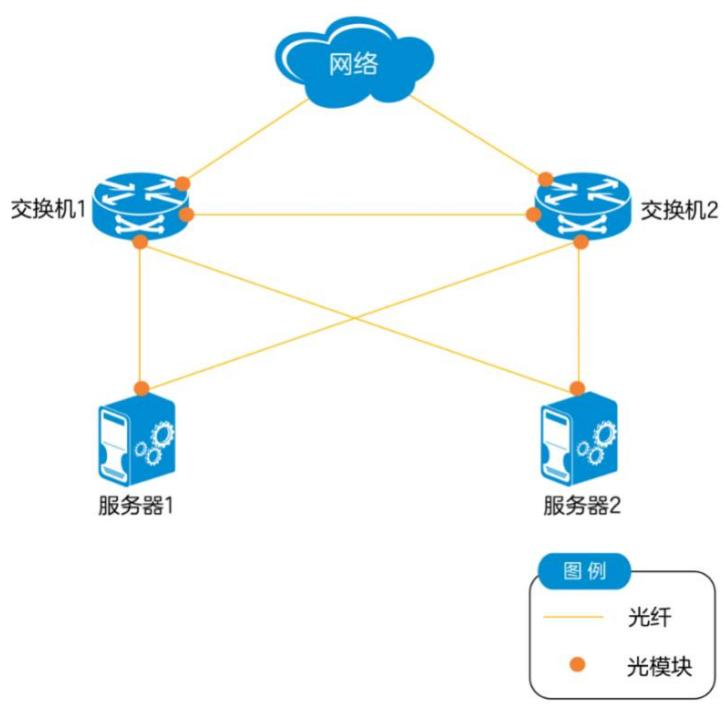

flowchart

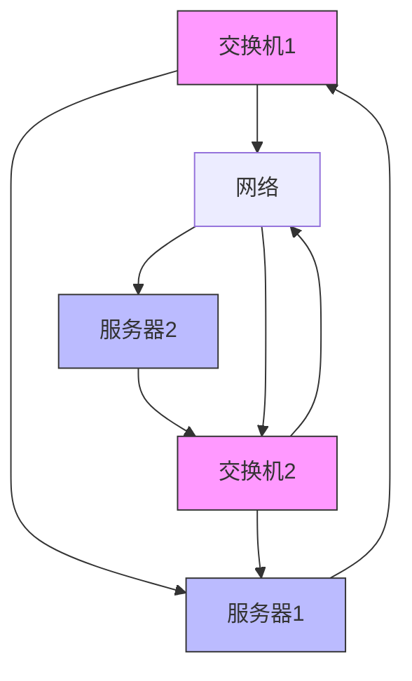
```mermaid
graph TD
  A["交换机1"] --> B["网络"]
  C["交换机2"] --> B
  D["服务器1"] --> A
  E["服务器2"] --> C
  B --> C
  A --> D
  B --> E
  C --> D
    style A fill:#f9f,stroke:#333
    style C fill:#f9f,stroke:#333
    style D fill:#bbf,stroke:#333
    style E fill:#bbf,stroke:#333
```

来源：中兴文档，国金证券研究所

图表2：光通信具备高带宽低损耗的特点

<table><tr><td>对比维度</td><td>光通信</td><td>电缆通信</td></tr><tr><td>传输原理</td><td>利用光信号传输信息,基于光的物理特性进行传输,利用光的全反射现象将光信号沿光纤传输</td><td>通过电信号传输信息,基于电流和电场的传输原理</td></tr><tr><td>传输速率</td><td>目前已实现800GB/s,正在研发1.6T/s传输布线</td><td>按照电缆类型传输速率不同,目前速率最高的八类线可传输40GB/s</td></tr><tr><td>传输距离</td><td>从百米以内到几百公里不等</td><td>多数线缆仅能在百米以内传输,提升难度大</td></tr><tr><td>传输质量</td><td>光纤传光不导电,不受电磁场的作用,抗干扰能力强。</td><td>受电磁干扰,信息易失真。</td></tr><tr><td>传输衰减</td><td>0.14-0.19dB/km</td><td>随频率增大而增大,2-50dB/100m</td></tr><tr><td>传输材料</td><td>主要为SiO2材料,纤芯细、重量轻、体积小、占地空间小、铺设方便</td><td>主要为铜芯,线缆直径越大损耗越低,故铜芯相对较粗,体积较大,重量大。</td></tr></table>

来源：ICC，华经产业研究院，国金证券研究所

光模块通常主要由光发射组件、光接收组件、光接口、底座、电路板和电接口金手指等组成，通过上述核心组件实现光电信号转换。具体而言，光接口是连接光纤的接口，用于发送接收光信号；光发射组件含激光器芯片，用于处理电信号，并驱动激光器根据电信号调制出光信号；光接收组件含光探测器芯片，将所接收到光信号，通过光探测器芯片转化成电信号；金手指是光模块与服务器之间的电信号通道；电路板是各模块协同通信工作的载体。

图表3：光模块包括光发射、接收及其他电路组件  
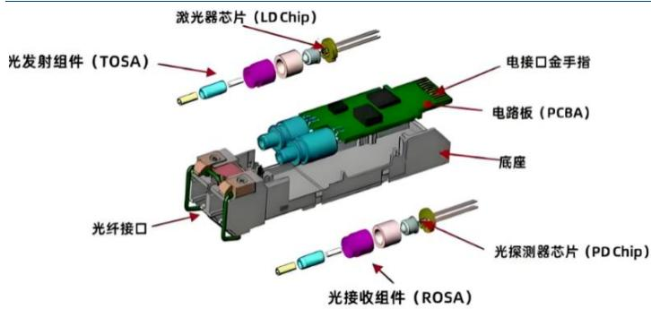

text_image

激光器芯片 (LD Chip)
光发射组件 (TOSA)
电接口金手指
电路板 (PCBA)
底座
光纤接口
光探测器芯片 (PD Chip)
光接收组件 (ROSA)

图表4：光模块通过其核心组件实现光电信号转换  
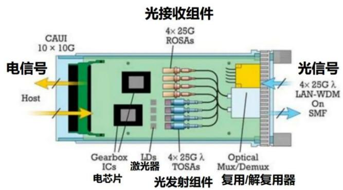

text_image

光接收组件
CAUI
10 × 10G
4×25G
ROSAs
电信号
Host
Gearbox
ICs
LDs
激光器
4×25G λ
TOSAs
Optical
Mux/Demux
光信号
4×25G λ
LAN-WDM
On
SMF
光发射组件
复用/解复用器
电芯片

来源：中兴文档，国金证券研究所

来源：鲜枣课堂，国金证券研究所

光模块核心需求为高带宽、高可靠性、低功耗、低时延，逐步向 1.6T、3.2T 升级。训练 ChatGPT 等大模型需超大规模计算集群，传统光模块带宽难以满足海量数据传输需求，并且光模块速率提升有望降低交换机端口、光纤用量，光模块目前主流为 400G/800G 逐步向 1.6T、3.2T 升级。

图表5：光模块面向数据中心四大核心需求

<table><tr><td>核心需求</td><td>关键说明</td></tr><tr><td>高带宽</td><td>大模型训练需要海量GPU协同工作,交换数据量巨大,网络带宽成为核心瓶颈。AI大模型参数每两年扩展约100倍,而网络互联带宽仅增长约1.4倍,这之间存在巨大的差距</td></tr><tr><td>高可靠</td><td>大模型训练往往需要数千块芯片共同分担,并持续数周甚至更长时间,任何故障都可能导致算力浪费,因此网络必须具备极高的可靠性</td></tr><tr><td>低功耗</td><td>随着交换机Serdes和光模块速率及数量的增加,计算交换设备的功耗呈指数级增长,其中光模块功耗占比甚至高达设备总功耗的三分之一</td></tr><tr><td>低时延</td><td>AI大模型是“大数据+大算力+强算法”的紧耦合场景。网络时延过大会导致GPU相互等待,降低GPU利用率。动态时延每增加 $10\mu s$ ,GPU利用率可能下降1%至3%</td></tr></table>

来源：光隆科技，国金证券研究所

图表6：光模块未来向高速率方向发展

<table><tr><td>传输速率</td><td>市场/技术状态</td><td>核心价值与特点</td></tr><tr><td>400G/800G</td><td>当前主流</td><td>正广泛应用于全球AI数据中心,是支撑现有算力需求的主力</td></tr><tr><td>1.6T</td><td>商业化与规模部署前期</td><td>速率是800G的两倍,能有效降低AI训练和推理的延迟,旨在降低数据中心总体拥有成本(TCO)。多家厂商已推出产品</td></tr><tr><td>3.2T</td><td>核心技术突破阶段</td><td>00G的4倍,有望将AI训练和推理效率提升400%。已有厂商攻克其核心光引擎技术</td></tr></table>

来源：华经产业研究院，国金证券研究所

## 1.2 贴片、耦合、封装、测试环节均需要专用光模块设备

光模块的制备是将光芯片、电芯片等核心组件通过贴装、键合、耦合、封装、测试老化等工艺形成功能性模块的过程，有源耦合是核心难点，贴片、测试是高壁垒环节，核心设备包括耦合机，高精度贴片机，采样示波器，误码分析仪，时钟恢复单元等。

图表7：光模块生产工序有源耦合是核心难点，贴片、测试是高壁垒环节  
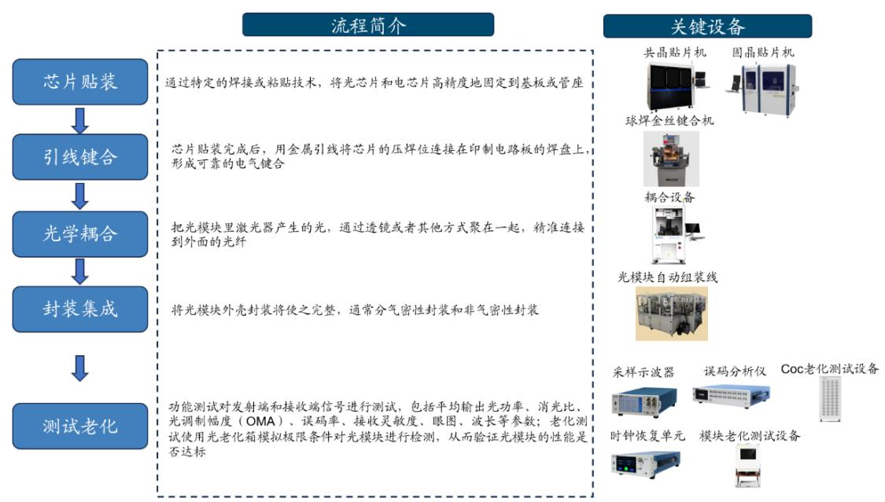

flowchart

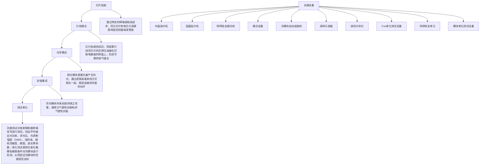
```mermaid
graph TD
  A["芯片贴装"] --> B["引线键合"]
  B --> C["光学耦合"]
  C --> D["封装集成"]
  D --> E["测试老化"]

  A --> F["通过特定的焊接或粘贴技术，将光芯片和电芯片高精度地固定到基板或管座"]
  B --> G["芯片贴装完成后，用金属引线将芯片的压焊位连接在印制电路板的焊盘上，形成可靠的电气键合"]
  C --> H["把光模块里激光器产生的光，通过透镜或者其他方式聚在一起，精准连接到外面的光纤"]
  D --> I["将光模块外壳封装将使之完整，通常分气密性封装和非气密性封装"]
  E --> J["功能测试对发射端和接收端信号进行测试，包括平均输出光功率、消光比、光调制幅度（OMA）、误码率、接收灵敏度、眼图、波长等参数；老化测试使用光老化箱模拟极限条件对光模块进行检测，从而验证光模块的性能是否达标"]

  K["关键设备"] --> L["共晶贴片机"]
  K --> M["固晶贴片机"]
  K --> N["球焊金丝键合机"]
  K --> O["耦合设备"]
  K --> P["光模块自动组装线"]
  K --> Q["采样示波器"]
  K --> R["误码分析仪"]
  K --> S["Coc老化测试设备"]
  K --> T["时钟恢复单元"]
  K --> U["模块老化测试设备"]
```

来源：合明光学，思瀚产业研究院，世强硬创平台，太阳金融研究所，伽蓝致远，博众精工年报，景唐通信，光纤在线，猎奇智能招股书，联讯仪器招股书，华经产业研究院，春宇科技，国金证券研究所

光模块设备中耦合设备价值量占比最高，达40%，测试设备包括仪表测试与可靠性与老化测试设备分别占比15%、12%，贴片设备占比20%，封装设备占比12%，键合设备占比1%。

图表8：光模块设备中耦合设备价值量占比最高达 $40\%$ ，测试设备达 $27\%$  
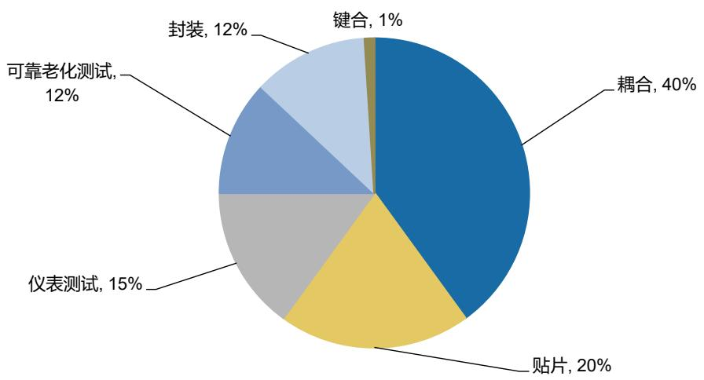

pie chart

| 类别 | 占比 (%) |
| :--- | :--- |
| 耦合 | 40 |
| 贴片 | 20 |
| 仪表测试 | 15 |
| 可靠老化测试 | 12 |
| 封装 | 12 |
| 键合 | 1 |

来源：思瀚产业研究院，国金证券研究所

## 1.2.1 流程一：贴片—价值量占比 20%

光模块贴装是将光电器件精确贴装在载体上的过程，分为共晶与固晶，光器件贴片精度要求±3μm之间。光模块贴装分为共晶与固晶，共晶利用低熔点合金材料（如AuSn焊料），在高温加压下使芯片与基板形成共晶结合，工艺复杂，适合高可靠性场景，固晶利用导电银胶在芯片底部和基板上进行粘接，范围广，效率高，适合常规场景装贴。光器件贴片精度要求±3μm之间，远高于pcb行业常规高精度贴片机的±25μm，主要是因为光芯片作为光信号收发的核心器件，其贴装精度直接决定后续光耦合效率及信号传输稳定性，光模块中其他电子元件贴片精度相对光器件有所放宽，厂家可以选择不同型号精度的贴片机进行分段贴装，例如使用共晶贴装光器件，用固晶贴装电器件，也可以直接高精度设备全覆盖以保证一致性与良率。

图表9：光模块贴装分为共晶和固晶两种工艺路线  
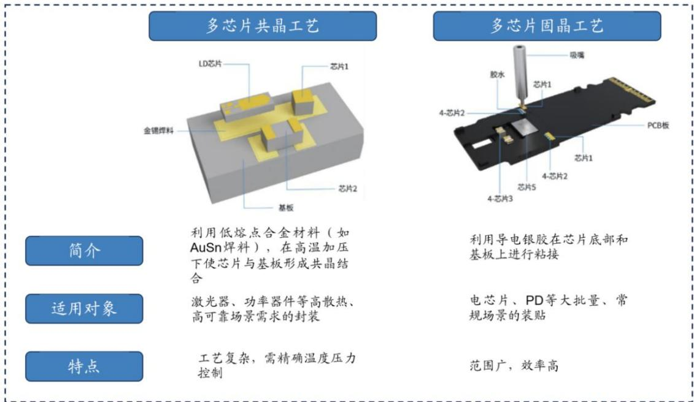

text_image

多芯片共晶工艺
LD芯片
芯片1
金锡焊料
芯片2
基板
多芯片固晶工艺
吸嘴
胶水
芯片1
4-芯片2
PCB板
芯片5
4-芯片3
利用低熔点合金材料（如
AuSn焊料），在高温加压
下使芯片与基板形成共晶结
合
利用导电银胶在芯片底部和
基板上进行粘接
适用对象
激光器、功率器件等高散热、
高可靠场景需求的封装
电芯片、PD等大批量、常
规场景的装贴
特点
工艺复杂，需精确温度压力
控制
范围广，效率高

来源：猎奇智能招股书，捷创，国金证券研究所

2024年猎奇智能光模块贴片设备市占率 $21\%$ ，全球第一，仍存在国产替代空间。根据弗若斯特沙利文数据，2024年猎奇智能光模块贴片设备全球市占率 $21\%$ ，日本4T为 $21\%$ ，ASMPT为 $15\%$ ，外国企业与其他企业占比 $79\%$ ，国内企业仍存在较大国产替代空间。

图表10：猎奇智能贴片设备市占率全球第一，但仍存在国产替代空间  
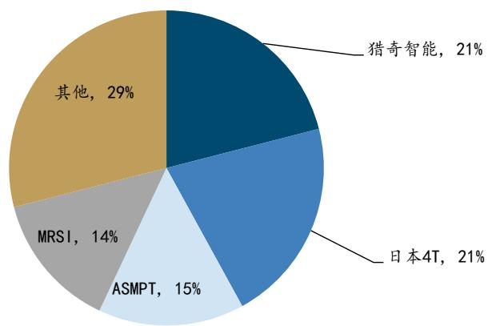

pie chart

| 类别 | 占比 (%) |
| :--- | :--- |
| 猎奇智能 | 21 |
| 日本4T | 21 |
| ASMPT | 15 |
| MRSI | 14 |
| 其他 | 29 |

来源：猎奇智能招股书，弗若斯特沙利文，国金证券研究所

## 1.2.2 流程二：引线键合—价值量占比 1%

光模块用金丝球焊，属于热超声键合。引线键合是指芯片贴装完成后，用金属引线将芯片的压焊位连接在印制电路板的焊盘上，引线键合按照键合能量可分为热压键合、超声键合，以及二者结合的热超声键合，光通信行业一般采用金丝热超声键合，具体为金丝球焊，原理为：金丝在设备瞬间高压放电时，尾端形成一个细小的金球，利用超声频率的机械振动，使金球与被焊材料表面接触产生塑性形变，在超声辅以温度及压力的条件下，使金属表面原子外层电子相互结合而形成接点。光器件加工中常用25um的金丝进行器件内部引脚互连，主要是基于金这种金属良好的延展性（可以拉成足够细的丝线并保证足够的拉力）、导电性、可焊性，以满足通信半导体精细的加工要求及高质量的电信号传输要求。

图表11：光模块使用金丝球焊实现芯片引脚互联  
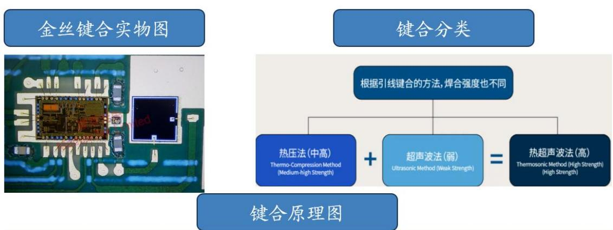

flowchart

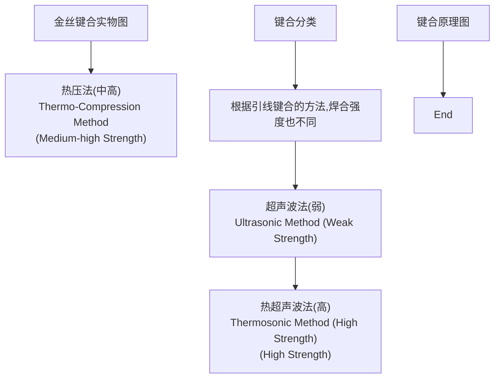
```mermaid
graph TD
  A["金丝键合实物图"] --> B["热压法(中高)\nThermo-Compression Method\n(Medium-high Strength)"]
  C["键合分类"] --> D["根据引线键合的方法,焊合强度也不同"]
  D --> E["超声波法(弱)\nUltrasonic Method (Weak Strength)"]
  E --> F["热超声波法(高)\nThermosonic Method (High Strength)\n(High Strength)"]
  G["键合原理图"] --> H["End"]
```

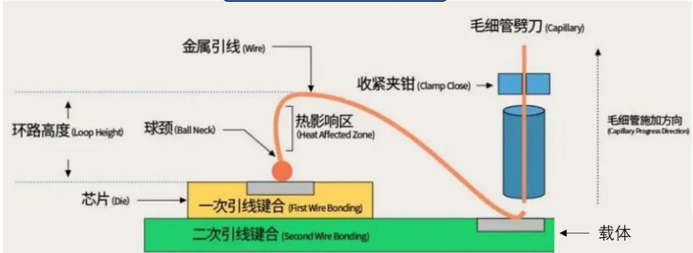

flowchart

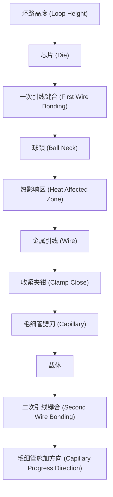
```mermaid
graph TD
  A["环路高度 (Loop Height)"] --> B["芯片 (Die)"]
  B --> C["一次引线键合 (First Wire Bonding)"]
  C --> D["球颈 (Ball Neck)"]
  D --> E["热影响区 (Heat Affected Zone)"]
  E --> F["金属引线 (Wire)"]
  F --> G["收紧夹钳 (Clamp Close)"]
  G --> H["毛细管劈刀 (Capillary)"]
  H --> I["载体"]
  I --> J["二次引线键合 (Second Wire Bonding)"]
  J --> K["毛细管施加方向 (Capillary Progress Direction)"]
```

来源：艾邦半导体网，摩泰光电，国金证券研究所

## 1.2.3 流程三：光学耦合—价值量占比 40%

耦合在于将光电芯片发射的光信号高效、稳定地耦合至光纤中，关键门槛在于满足亚微米级重复定位精度。激光器芯片产生的光源需要通过微透镜对光束进行准直、聚焦后才能最大限度地进入光纤中。耦合占封装工时40%以上、是最易产生不良品的步骤（手动耦合良率仅70%-80%），直接影响光模块的性能。耦合的流程一般为：对准、透镜耦合、胶水固定、验证耦合效率。800G及以上速率与CPO封装对耦合精度提出亚微米级要求(800G/1.6T为0.05μm级)，推动设备技术向更高精度、动态闭环控制与智能化方向演进。

图表12：耦合在于将光芯片发射的光信号耦合进光纤  
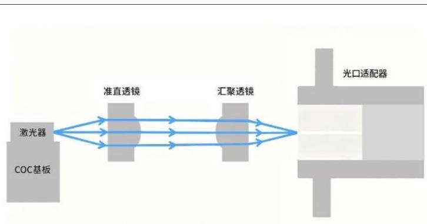

flowchart

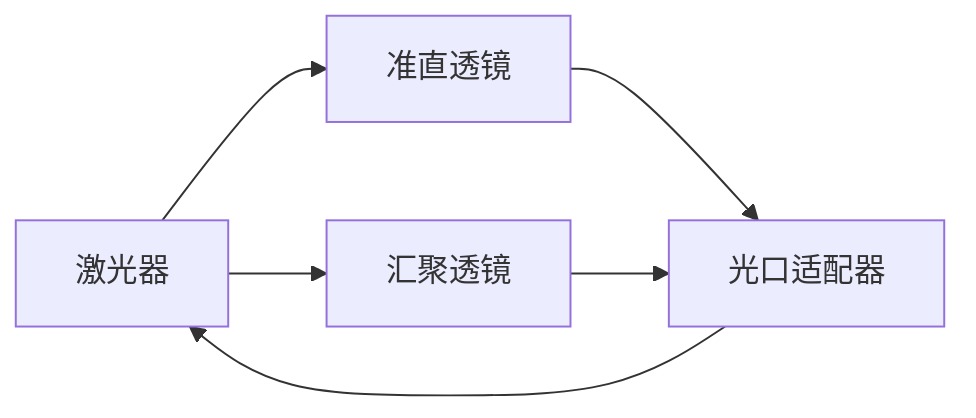
```mermaid
graph LR
  A["激光器"] --> B["准直透镜"]
  A --> C["汇聚透镜"]
  B --> D["光口适配器"]
  C --> D
  D --> A
```

来源：猎奇智能招股书，国金证券研究所

图表13：耦合设备核心竞争力在于精度

<table><tr><td>指标名称</td><td>指标含义</td><td>评价方法</td></tr><tr><td>XYZ轴分辨率</td><td>光耦合设备在三维空间中执行精密运动时的最小可控步长,决定了设备在水平(X/Y)和垂直(Z)方向上的定位精度</td><td>分辨率精度误差数值越小,代表精度越高</td></tr><tr><td>X/Y/Z轴重复精度</td><td>在相同操作条件下,设备或系统多次移动到同一目标位置时,实际到达位置的一致性或偏差程度。它反映设备重复执行相同定位任务时的稳定性和可靠性</td><td>精度越高,性能越好</td></tr></table>

来源：猎奇智能招股书，国金证券研究所

光模块耦合设备由国产主导。根据弗若斯特沙利文报告，2024年镭神技术在光模块耦合设备中市场份额占 $27\%$ ，排名全球第一，猎奇智能以 $18\%$ 的市场份额排名第二，海外厂商FiconTEC（被罗博特科全资收购）排名第三，光模块耦合设备第一梯队已经完全被国内厂商主导。

图表14：国内厂商位于光模块耦合设备第一梯队  
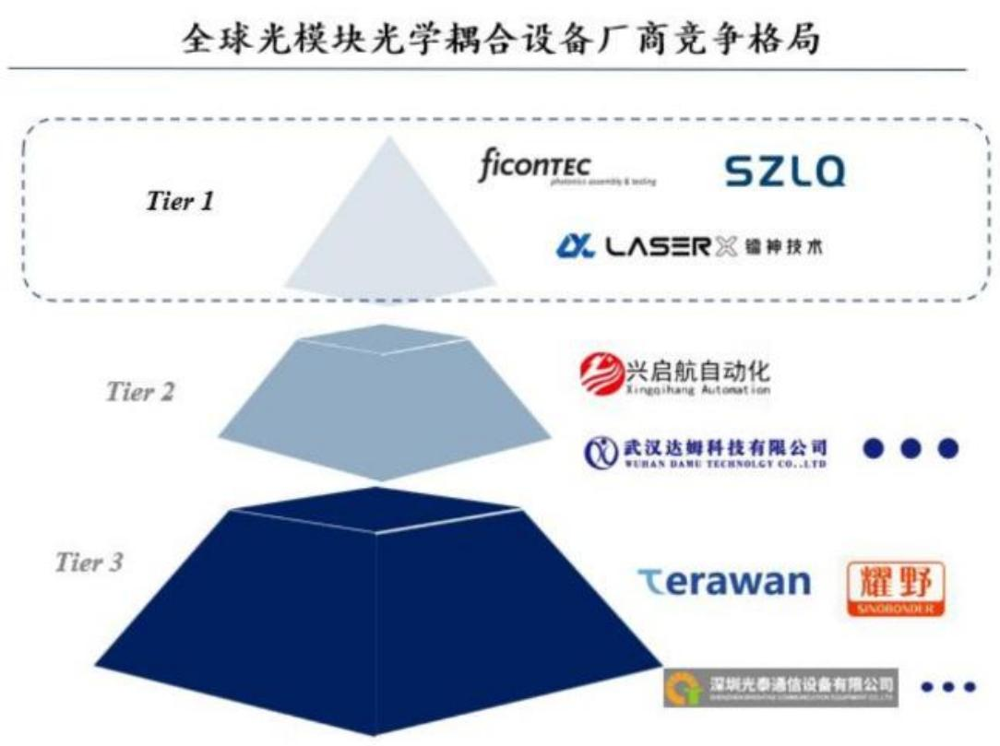

pyramid chart

| Tier | Company | Market Share |
| ---- | ------- | ------------ |
| Tier 1 | ficonTEC | 50% |
| Tier 1 | SZLQ | 40% |
| Tier 1 | LASER | 30% |
| Tier 2 | 兴启航自动化 | 20% |
| Tier 2 | 武汉达姆科技有限公司 | 15% |
| Tier 3 | Terawan | 10% |
| Tier 3 | 燃野 | 5% |
| Tier 3 | 深圳光泰通信设备有限公司 | 5% |

来源：猎奇智能招股书，弗若斯特沙利文，第一财经，国金证券研究所

## 1.2.4 流程四：封装—价值量占比 12%

光模块的封装分为气密性封装与非气密性封装，非气密性封装是高速光模块于数据中心机房应用的主流选择。封装通常分气密性封装和非气密性封装，气密性封装目的是防止外部的水汽和其他有害气体进入密封光器件内部，影响光芯片和相关零组件的性能，其中盒形/蝶形封装可以满足40G/100G/200G/400G及相应速率的相干光模块的需求。COB工艺，是指将裸芯片（Die）直接固定在印刷电路板上，然后通过金丝键合，再将芯片和引线进行封装保护的工艺，在信号完整性上具有更好优势，逐步成为高速光模块封装的主流工艺之一，但是这种封装条件下使用中光芯片会直接与空气产生接触，仅依靠芯片自身对水汽及其它气体氧化的耐用性，更容易受外界环境的影响，多用于恒温恒湿的数据中心机房内部。

图表15：非气密性封装是高速光模块于数据中心机房应用的主流选择  
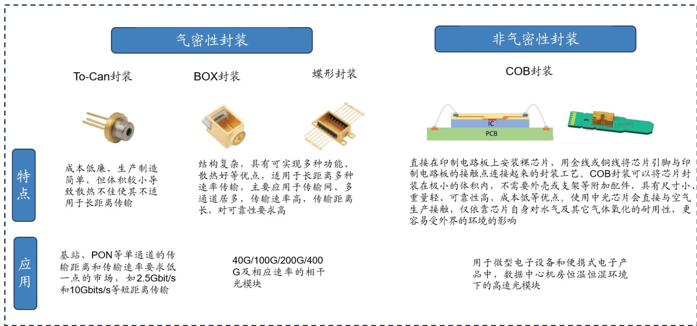

text_image

气密性封装
To-Can封装	BOX封装	蝶形封装
非气密性封装
COB封装
特点
成本低廉、生产制造简单，但体积较小导致散热不佳使其不适用于长距离传输
结构复杂，具有可实现多种功能、散热好等优点，适用于长距离多种速率传输，主要应用于传输网、多通道居多，传输速率高，传输距离长，对可靠性要求高
直接在印制电路板上安装裸芯片，用金线或铜线将芯片引脚与印制电路板的接触点连接起来的封装工艺。COB封装可以将芯片封装在极小的体积内，不需要外壳或支架等附加配件，具有尺寸小、重量轻、可靠性高、成本低等优点。使用中光芯片会直接与空气生产接触，仅依靠芯片自身对水气及其它气体氧化的耐用性，更容易受外界的环境的影响
应用
基站、PON等单通道的传输距离和传输速率要求低一点的市场，如2.5Gbit/s和10Gbits/s等短距离传输
40G/100G/200G/400G及相应速率的相干光模块
用于微型电子设备和便携式电子产品中，数据中心机房恒温恒湿环境下的高速光模块

来源：摩泰光电，知微创新，国金证券研究所

## 1.2.5 流程五：测试、老化—价值量占比 27%

光模块测试包括老化测试和功能测试，检测光模块光电性能与全周期运行可靠性。光模块功能测试包括光模块发射端测试与接收端测试，核心测试指标包括发射光功率、接收灵敏度、消光比等，通过上述指标判断光信号传输的稳定性；光模块老化测试包括机械可靠性测试与加速老化测试，机械可靠性测试测定光模块在振动、冲击等机械应力下的结构完整性和性能稳定性，确保光模块在实际应用中能够保持可靠的物理，连接。老化测试基于加速模型，对模块/芯片施加极端工作环境测试其寿命与可靠性，可通过提高环境应力水平来缩短测试时间，常用的加速应力包括高温、高电流和高湿度等。

图表16：光模块需要测试其功能与老化可靠性  
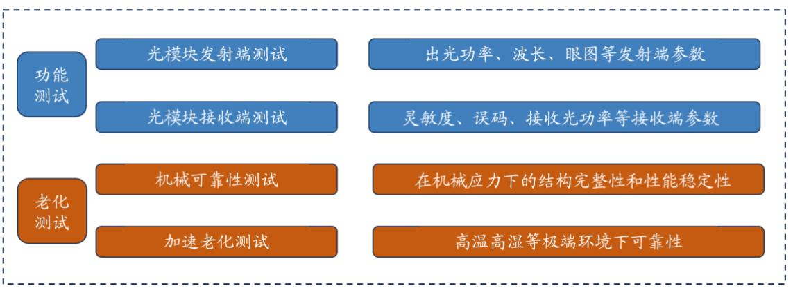

flowchart

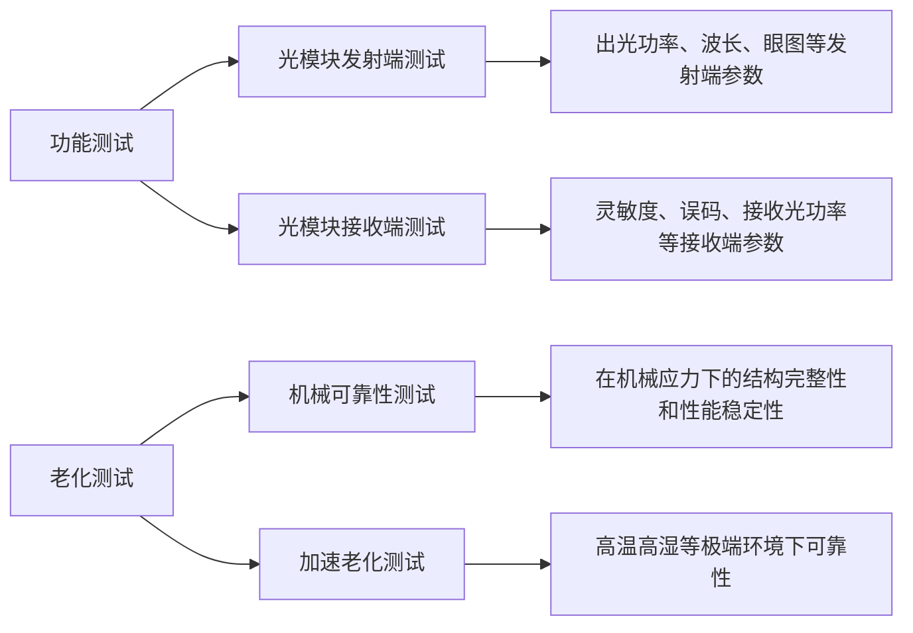
```mermaid
graph LR
  A["功能测试"] --> B["光模块发射端测试"]
  A --> C["光模块接收端测试"]
  D["老化测试"] --> E["机械可靠性测试"]
  D --> F["加速老化测试"]
  B --> G["出光功率、波长、眼图等发射端参数"]
  C --> H["灵敏度、误码、接收光功率等接收端参数"]
  E --> I["在机械应力下的结构完整性和性能稳定性"]
  F --> J["高温高湿等极端环境下可靠性"]
```

来源：欧光科技，嘉峪检测网，联讯仪器招股书，易飞扬通信，国金证券研究所

功能测试关键测试设备有采样示波器、时钟恢复单元、波长计、误码分析仪，老化测试关键测试设备有光芯片老化测试系统和模块老化测试设备。

功能测试环节，光发射器件测试依托采样示波器、时钟恢复单元、波长计，通过采样示波器将光信号转化为眼图并测量噪声、抖动、消光比等参数，时钟恢复单元为示波器提供触发信号，波长计则测量光信号的波长、功率等指标；光接收器件测试借助误码分析仪、突发误码分析仪、网络测试仪，分别完成连续信号、PON网络突发信号及以太网环境下的误码与跑流测试；  
老化测试环节，CoC光芯片老化测试使用专用老化测试系统，通过高温环境加速芯片衰减以验证寿命，模块老化测试则利用模块老化测试设备，对整个光模块施加老化条件并实时监控工作电流、电压与温度，自动判断失效情况。

图表17：测试关键设备有采样示波器、时钟恢复单元、波长计、误码分析仪、光芯片和模块老化测试设备

<table><tr><td>测试项目</td><td>关键仪器</td><td>测试细节</td></tr><tr><td>功能测试-光发射器件</td><td>采样示波器、时钟恢复单元、波长计等</td><td>采样示波器将光信号转化为可视的眼图,进行眼图测试并测量噪声、抖动、消光比、TDECQ(发射机色散眼图闭合代价)等参数;时钟恢复单元搭配采样示波器使用,其在提取光模块发射端/光发射器件(TOSA)发出信号中的时钟信号后,向采样示波器提供触发信号。波长计则可用于测量光模块发射端/光发射器件(TOSA)发出光信号的波长、频率、功率等参数</td></tr><tr><td>功能测试-光接收器件</td><td>误码分析仪、突发误码分析仪、网络测试仪等</td><td>误码测试核心功能是对比接收端信息与其发出的误码信息的差异,进而判断光模块接收端/光接收器件(ROSA)的信号接收质量:1)误码分析仪用于常规的连续信号误码测试;2)突发误码分析仪用于PON网络的突发信号误码测试;3)网络测试仪则用于以太网环境下的跑流测试</td></tr><tr><td>老化测试-COC光芯片老化测试</td><td>CoC光芯片老化测试系统</td><td>将CoC光芯片固定在特制夹具中并通过老化抽屉与驱动电源相连,在设定高温环境下对光芯片驱动偏置电流或偏置电压来加速芯片内电子流动以加速芯片衰减,实现化寿命验证</td></tr><tr><td>老化测试-模块老化测试</td><td>模块老化测试设备</td><td>针对整个光模块施加老化条件,同时对模块的工作电流、电压以及工作环境温度进行实时监控测试,并自动进行失效判断</td></tr></table>

来源：联讯仪器招股书，猎奇智能招股书，普赛斯电子，国金证券研究所

## 1.3 AI 资本开支扩张，有望带动光模块产线进入投资景气周期

国内外 AI 基建资本开支加速上行，有望带动光模块需求大幅扩张。因 AI 数据中心与云计算需求激增，国内外云服务厂商 2025 年资本开支大幅增加，TrendForce 预测 2026 年全球八大云服务厂商资本开支将达 6020 亿美元，同比+40%；与此同时国内三大云服务厂商资本开支创历史新高，腾讯、百度、阿里巴巴 2025 年资本开支达 2122.7 亿元，同比增加 54.7%，看好本轮资本支出驱动光模块产线进入投资景气周期。

图表18：预计2026年全球八大云服务厂商资本支出达6020亿美元  
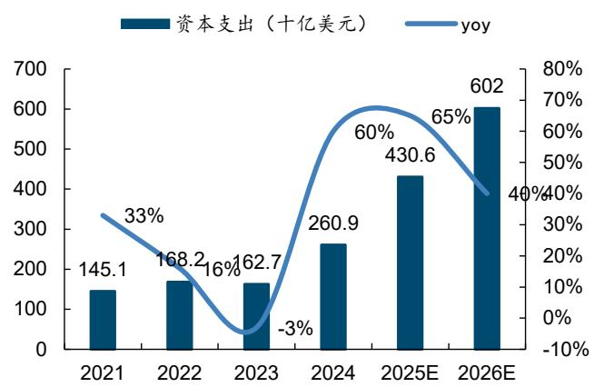

bar-line hybrid chart

| 年份 | 资本支出 (十亿美元) | yoy (%) |
| :--- | :--- | :--- |
| 2021 | 145.1 | 33 |
| 2022 | 168.2 | 16 |
| 2023 | 162.7 | -3 |
| 2024 | 260.9 | 60 |
| 2025E | 430.6 | 65 |
| 2026E | 602 | 40 |

来源：Trendforce，国金证券研究所

图表19：国内云服务三大厂商25年资本开支同比增加54.7%  
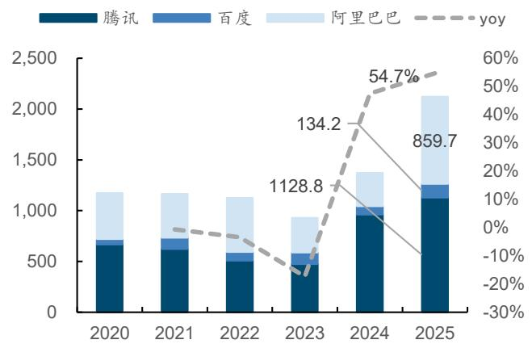

stacked bar chart

| 年份 | 腾讯 | 百度 | 阿里巴巴 | yoy (%) |
| :--- | :--- | :--- | :--- | :--- |
| 2020 | 680.0 | 100.0 | 490.0 | -13.7 |
| 2021 | 650.0 | 110.0 | 490.0 | -11.7 |
| 2022 | 550.0 | 120.0 | 530.0 | -13.7 |
| 2023 | 480.0 | 130.8 | 580.0 | -19.7 |
| 2024 | 980.0 | 140.0 | 650.0 | 54.7 |
| 2025 | 1120.0 | 150.0 | 759.7 | 54.7 |

来源：iFind，国金证券研究所，注：阿里巴巴为2025财年（2024.4-2025.3）

## 二、光模块向光电共封（CPO）、更高速率演进，重视通胀环节

## 2.1 光模块向光电共封（CPO）、更高速率演进

## 2.1.1 行业趋势一：光模块速率从 400G 向 800G、1.6T 演进

根据传输速率差异，光模块可划分为低速模块、中高速模块与超高速模块三类。其中，低速模块传输速率为1G/2.5G/10G，主要应用于传统以太网、接入网等场景；中高速模块传输速率为25G/40G/100G，多用于5G前传、数据中心内部互联等领域；而超高速模块的传输速率可达400G/800G/1.6T，能够进一步支撑AI算力中心、骨干网扩容等应用需求。

当前，光模块速率逐渐从400G向800G、1.6T演进。根据“光摩尔定律”，光模块技术约每四年完成一代迭代升级，同步实现单比特成本与功耗的同步减半。这一核心规律持续驱动光模块技术演进，在AI大模型训练与推理引发的算力革命下，推动超高速模块正从400G向800G、1.6T加速迭代。目前800G光模块已成为市场主流方案，伴随算力网络对传输效率需求的持续提升，1.6T、3.2T等超高速率光模块市场需求有望逐步崛起，预计2026年，800G与1.6T光模块将同步迎来快速放量阶段。据中际旭创2025年年报援引LightCounting预测，2026年800G与1.6T光模块合计市场规模有望达到146亿美元，占全球光模块整体市场规模的比重约 $64\%$ ，成为行业增长核心引擎。

图表20：“光摩尔定律”下速率迭代与功耗演进趋势  
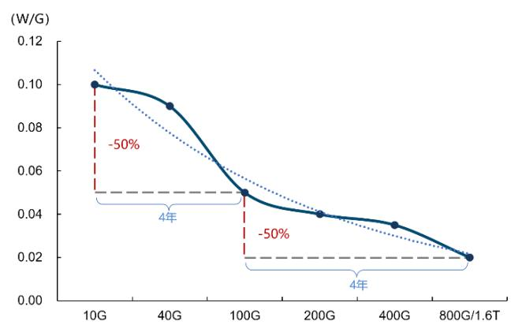

line chart

| 年份 | 空能 (W/G) |
| :--- | :--- |
| 10G | 0.10 |
| 40G | 0.09 |
| 100G | 0.05 |
| 200G | 0.04 |
| 400G | 0.035 |
| 800G/1.6T | 0.02 |

来源：ISSCC 2026 Forum, OCP EMEA 2025，国金证券研究所

：光模块速率从 400G 向 800G、1.6T 演进  
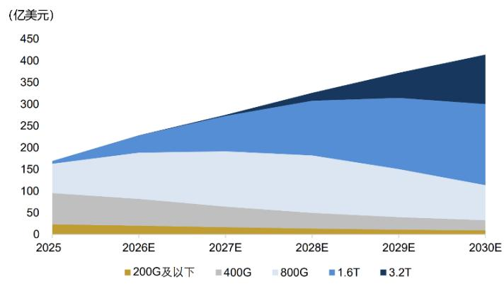

stacked bar chart

| Year   | 200G及以下 | 400G | 800G | 1.6T | 3.2T |
|--------|------------|------|------|------|------|
| 2025   | 25         | 90   | 60   | 40   | 15   |
| 2026E  | 25         | 85   | 75   | 55   | 25   |
| 2027E  | 25         | 75   | 85   | 75   | 45   |
| 2028E  | 25         | 65   | 85   | 100  | 65   |
| 2029E  | 25         | 55   | 75   | 115  | 85   |
| 2030E  | 25         | 45   | 65   | 130  | 110  |

来源：Lightcounting，国金证券研究所

## 2.1.2 行业趋势二：光模块由可插拔向光电共封（CPO）演进

在数据中心交换芯片迭代、交换机带宽扩容背景下，功耗控制成为核心痛点。Cisco 在 GSA 科技峰会中指出，随着数据中心交换芯片多轮迭代，交换机带宽提升 80 倍，系统总功耗也同步增长 22 倍。其中，系统风机、光模块、ASIC 芯片 SerDes 通道及逻辑部分功耗分别增长 11 倍、26 倍、25 倍、8 倍，而光模块与 SerDes 通道功耗增幅最为显著，是未来

功耗优化的重点。

CPO方案较传统可插拔方案能有效降低光模块功耗与成本，是未来光模块的核心演进方向。功耗方面，传统可插拔光模块与ASIC芯片独立封装，二者通过长距离SerDes链路连接，高速信号传输中损耗显著，需高功耗DSP进行信号补偿；而CPO将光引擎与ASIC芯片共封装，缩短互联距离至微米级，可省去光模块侧DSP信号增强环节，同时依托硅光集成技术，将激光器、调制器等光学器件单片集成，减少分立器件互联损耗。成本方面，硅光芯片采用储量丰富的硅基材料替代传统光器件依赖的磷化铟、砷化镓等稀缺III-V族化合物，材料获取成本更低；同时硅光工艺兼容成熟CMOS制程，可复用晶圆制造平台实现多器件单片集成，减少多次封装与组装环节。根据ASE数据，CPO方案较传统可插拔光模块约可降低 $60\%$ 的功耗和 $30\%$ 以上的成本。

图表22：交换机带宽扩容带来核心部件功耗提升  
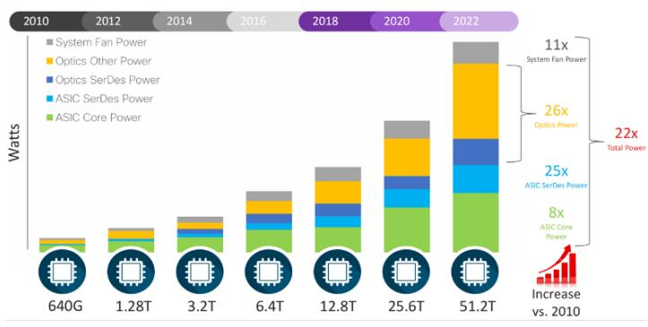

stacked bar chart

| Year | Total Power (Watts) |
| :--- | :--- |
| 2010 | 640G |
| 2012 | 1.28T |
| 2014 | 3.2T |
| 2016 | 6.4T |
| 2018 | 12.8T |
| 2020 | 25.6T |
| 2022 | 51.2T |

| Category | System Fan Power (Watts) | Optics Other Power (Watts) | Optics SerDes Power (Watts) | ASIC SerDes Power (Watts) | ASIC Core Power (Watts) |
| :--- | :--- | :--- | :--- | :--- | :--- |
| 2010 | 11x | 26x | 25x | 8x | Not labeled |
| Increase vs. 2010: Total Power: 22x; Total Power: 11x; System Fan Power: 26x; Optics Power: 25x; ASIC SerDes Power: 8x; ASIC Core Power: Not labeled.

来源：Cisco，TEF21，国金证券研究所

图表23：CPO方案可降低 $60\%$ 的功耗和 $30\%$ 以上的成本  
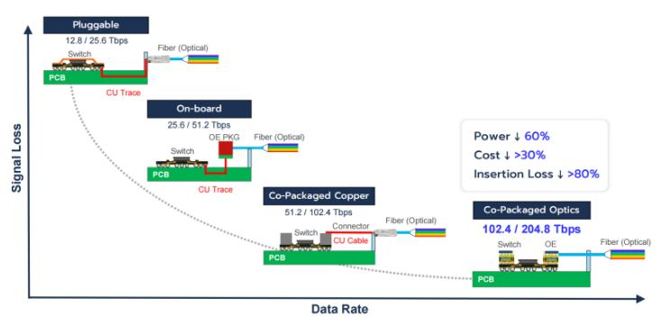

line chart

| Category           | Signal Loss (Tbps) |
| ------------------ | ------------------ |
| Pluggable          | 12.8 / 25.6         |
| On-board           | 25.6 / 51.2         |
| Co-Packaged Copper | 51.2 / 102.4       |
| Co-Packaged Optics  | 102.4 / 204.8      |

来源：ASE: Propelling AI forward through Advanced Packaging Creativity, GSA Tech Summit, 国金证券研究所

据LightCounting预测，CPO有望在2028年后实现大规模部署，预计于2030年达到10亿美元的市场规模。25年3月，英伟达率先宣布在其InfiniBand和以太网交换机中采用单通道200G的CPO技术，10月博通推出了其第三代单通道200G的CPO产品，25年CPO产品迭代时期。根据据LightCounting预测，CPO有望在2028年后实现大规模部署，预计于2030年达到10亿美元的市场规模。

图表24：2028年CPO光模块开始上量，2030年达100亿美元  
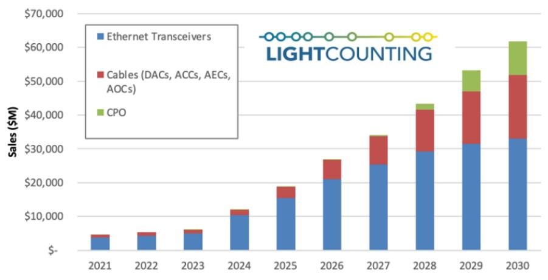

stacked bar chart

| Year | Ethernet Transceivers ($M) | Cables (DACs, ACCs, AECs, AOCs) ($M) | CPO ($M) |
|---|---|---|---|
| 2021 | 4500 | 1000 | - |
| 2022 | 5000 | 1500 | - |
| 2023 | 5500 | 2000 | - |
| 2024 | 10000 | 3000 | - |
| 2025 | 15000 | 4000 | - |
| 2026 | 21000 | 6000 | - |
| 2027 | 25000 | 8000 | - |
| 2028 | 30000 | 11000 | - |
| 2029 | 32000 | 14000 | 4500 |
| 2030 | 33500 | 16500 | 8500 |
LIGHTCOUNTING

来源：LightCounting，国金证券研究所

## 2.2 核心环节一：耦合设备—CPO 对耦合精度要求提升

耦合是光模块封装的核心环节，其价值约占封装环节的 $40\%$ ，也是封装中耗时最长、对产品良率影响最显著的工序之一。随着光模块速率从400G提升至800G、1.6T，叠加硅光技术与CPO方案加速应用，光学链路复杂度不断增加，对耦合精度的要求也随之提高，耦合设备有望成为光模块制程升级过程中的关键受益环节。

CPO 时代下无源耦合成为主导，对耦合设备提出了更高的技术要求。传统场景下，贴片与耦合为独立工序，贴片仅负责物理固定，中高速率光模块耦合精度要求为 $\pm0.1\mu m$ 重复定位精度，耦合作为后置独立工序以有源主动对准为主，耦合效率有限，成为产能瓶颈。而在CPO时代，贴片与耦合设备实现一体化，采用“无源为主、有源为辅”的模式，硅光子芯片、超高速率光模块对准精度要求大幅提升至 $\pm 0.05\mu \mathrm{m}$ ，同时采用被动对准，对于V型槽的设计精度和洁净度要求更高，也对耦合设备技术实力提出了更高的要求。

图表25：光模块向高速率/CPO过程中有望推动耦合设备升级

<table><tr><td></td><td>传统可插拔/中高速率耦合要求</td><td>CPO/超高速率耦合要求</td></tr><tr><td>精度要求</td><td>±0.1μm</td><td>±0.05μm</td></tr><tr><td>耦合方式</td><td>单通道耦合</td><td>多通道并行</td></tr><tr><td>对准策略</td><td>主动对准</td><td>被动对准,对V型槽的设计精度要求极高,需保证无颗粒污染</td></tr></table>

来源：PI 普爱纳米位移技术公众号，光芯公众号，猎奇智能招股说明书，国金证券研究所

## 2.3 核心环节二：测试设备—速率提升、CPO 对测试要求提升

光模块代际升级对检测设备的通道带宽、最高恢复速率等关键性能指标提出更高要求，测试设备有望成为核心通胀环节。根据联讯仪器招股书，用于光发射器件测试的采样示波器随着光模块速率提升，对通道带宽要求提升，400G/800G需要50GHz,800G/1.6T需要65GHz的通道带宽。

图表26：不同带宽实时示波器主要应用场景

<table><tr><td>通道带宽</td><td>主要应用场景</td></tr><tr><td>10GHz</td><td>10G及以下速率光模块测试(10GBaud 单通道)</td></tr><tr><td>30GHz</td><td>400G 光模块测试(28GBaud 八通道)</td></tr><tr><td>50GHz</td><td>400G 光模块测试(53GBaud 四通道)800G 光模块测试(53GBaud 八通道)</td></tr><tr><td>65GHz</td><td>800G 光模块测试(112GBaud 四通道)1.6T 光模块测试(112GBaud 八通道)</td></tr></table>

来源：联讯仪器招股书，国金证券研究所

图表27：不同速率误码检测仪主要应用场景

<table><tr><td>最高传输速率</td><td>主要应用场景</td></tr><tr><td>25GBaud</td><td>100G/200G 及以下光模块测试</td></tr><tr><td>30GBaud</td><td>400G 光模块测试</td></tr><tr><td>59. 37GBaud</td><td>800G 光模块测试</td></tr><tr><td>113. 44GBaud</td><td>1.6T 光模块测试</td></tr></table>

来源：联讯仪器招股书，国金证券研究所

速率提升、CPO 趋势下，测试环节需求在测试精度、自动化要求、系统兼容性和热负载能力等方面均有所提升。分环节来看，光电子集成芯片的晶圆级测试需亚微米级光纤对准，对相应测试仪器的精度提出了更高的要求。在裸芯片及半封装阶段，因连接器缺乏统一标准，大幅提升自动化测试复杂度和对测试系统兼容性的要求。在高速与实速测试环节，则需同时考虑器件内置自测的光回环需求，并依赖高端示波器、误码仪完成性能验证。进入整封装测试后，CPO 测试系统还需在多面建立光连接、配置大功率激光器、实现光回环测试，并管理数千瓦级热负载。整个流程对于测试设备精度、自动化、兼容性、集成度与稳定性均提出远超传统光模块的严苛要求。

图表28：CPO测试相较于传统光模块测试各环节挑战

<table><tr><td>环节</td><td>CPO 测试面临的挑战</td></tr><tr><td>光电子集成芯片的晶圆级测试</td><td>需实现亚微米精度的光纤对准,而目前大多数电气探针台只能实现数十微米内的对准精度。</td></tr><tr><td>裸芯片形式的测试/部分封装后的测试</td><td>连接器缺乏标准化,增加了自动化的复杂性,也要求测试系统支持各种连接器类型。</td></tr><tr><td>高速测试/实速测试</td><td>部分器件具有内置自测功能,需要从发送端到接收端口的光回环;其他器件需要外部高速示波器和误码率测试仪进行测试。</td></tr><tr><td>整个封装的测试</td><td>自动化测试系统必须在所有侧面建立光连接,提供大功率激光器,启用用于任务模式测试的光回环,并管理数千瓦的热负载。</td></tr></table>

来源：逍遥设计自动化公众号，国金证券研究所

## 2.4 核心环节三：贴片设备—精度要求随光模块速率提升

贴片是光模块制造中衔接芯片制备与耦合封装的核心工序，其价值约占封装环节的 20%。贴片环节的核心是将光芯片、电芯片等精准固定于基板，为后续光耦合、电互连提供稳定基础，其精度直接决定模块耦合效率、信号完整性等，遵循“锡膏印刷-元器件贴装-回流焊接-A01光学检测-维修-分板”的标准化流程。

光模块贴片核心工艺聚焦共晶贴装与固晶工艺。共晶贴装专为光芯片设计，通过共晶合金实现光芯片与热沉/基板的紧密连接，兼具高连接强度与优异散热性。固晶工艺核心是将芯片精准粘附于基板指定位置，为后续互连工序奠定基础，精度要求与应用场景强相关，是光模块芯片固定的基础工艺。

随着光模块速率从400G向800G、1.6T升级，贴片精度需求提升。高速光模块朝着器件小型化、焊盘高密度化方向迭代，这一趋势进一步放大了传统SMT贴片设备在核心性能上的短板，其在力控精度、对位精度、贴装姿态稳定性及循环运行一致性等关键指标上的不足，已难以适配高速光模块的生产需求。一方面，800G/1.6T光模块内部器件持续微缩，焊盘Pitch已逼近微米级，对贴装对位精度提出极致要求；另一方面，高速贴片过程中，吸嘴与芯片、元件及焊盘接触瞬间产生的瞬时冲击力易在硅晶格内部形成微观裂纹，不当贴装应力更是芯片元件早期失效的主要诱因之一。在此背景下，光模块速率提升直接推动贴装精度要求同步升级。

图表29：固晶贴片流程示意图  
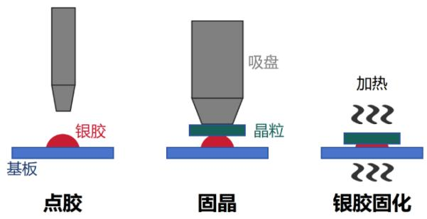

text_image

银胶
基板
吸盘
晶粒
点胶
固晶
加热
银胶固化

来源：51CTO，国金证券研究所

图表30：贴片精度要求随光模块速率提升

<table><tr><td></td><td>光芯片</td><td>电芯片</td><td>其他元件</td></tr><tr><td>400G</td><td>±5 μm</td><td>±10 μm</td><td>±15 μm-±35 μm</td></tr><tr><td>800G</td><td>±3 μm</td><td>±10 μm</td><td>±15 μm-±35 μm</td></tr><tr><td>1.6T</td><td>±3 μm</td><td>±10 μm</td><td>±15 μm-±35 μm</td></tr></table>

来源：猎奇智能招股书，国金证券研究所

## 三、投资建议

国内光模块设备厂商已形成细分赛道专业化、核心环节差异化的竞争格局，呈现全流程覆盖与单点突破并存的布局特征。罗博特科（ficonTEC）作为行业龙头，凭借对全球光电子封测领先企业 ficonTEC 的收购，构建起贴片机、光耦合、组装、功能测试的全流程设备矩阵，是国内少数具备光模块封测全环节供应能力的厂商，技术与客户资源优势显著。博众精工、凯格精机、科锐技术、猎奇智能、智立方聚焦前端制程，核心布局贴片机与光耦合设备，覆盖光模块高精度贴装与光学耦合核心工艺，契合高端光模块制造需求。联讯仪器、优利德、华盛昌专注测试环节，深耕功能测试与老化测试设备，在光模块性能验证、可靠性测试领域形成专业化优势。安达智能、快客智能、奥特维侧重检测与后段制程，以 AOI 检测设备为核心，保障光模块生产良率与品质管控。瑞松科技则在 AOI 检测领域实现专项布局，形成差异化竞争支点。

图表31：国内光模块设备厂商布局情况梳理

<table><tr><td></td><td>贴片机</td><td>键合设备</td><td>光耦合设备</td><td>组装设备</td><td>功能测试设备</td><td>老化测试设备</td><td>AOI 检测设备</td></tr><tr><td>罗博特科(ficonTEC)</td><td>✓</td><td></td><td>✓</td><td>✓</td><td>✓</td><td></td><td></td></tr><tr><td>联讯仪器</td><td></td><td></td><td></td><td></td><td>✓</td><td>✓</td><td></td></tr><tr><td>优利德</td><td></td><td></td><td></td><td></td><td>✓</td><td></td><td></td></tr><tr><td>华盛昌</td><td></td><td></td><td></td><td></td><td>✓</td><td></td><td></td></tr><tr><td>博众精工</td><td>✓</td><td></td><td>✓</td><td>✓</td><td></td><td></td><td></td></tr><tr><td>凯格精机</td><td>✓</td><td></td><td></td><td>✓</td><td></td><td></td><td></td></tr><tr><td>科锐技术</td><td>✓</td><td></td><td>✓</td><td></td><td></td><td></td><td></td></tr><tr><td>猎奇智能</td><td>✓</td><td></td><td>✓</td><td></td><td></td><td>✓</td><td></td></tr><tr><td>安达智能</td><td></td><td></td><td></td><td>✓</td><td></td><td></td><td>✓</td></tr><tr><td>快客智能</td><td></td><td></td><td></td><td></td><td></td><td></td><td>✓</td></tr><tr><td>奥特维智立方</td><td>√</td><td></td><td></td><td></td><td></td><td></td><td>✓√</td></tr><tr><td>瑞松科技</td><td></td><td></td><td></td><td></td><td></td><td></td><td>√</td></tr></table>

来源：各公司官网，各公司公告等，国金证券研究所

## 3.1 联讯仪器：国产光模块测试仪器龙头，有望受益国产替代

联讯仪器产品矩阵丰富，是全球第二家推出1.6T光模块全部核心测试仪器的厂商。联讯仪器是业内少数覆盖光通信产业链模块、芯片、晶圆等核心环节测试需求的厂商，也是全球少数、国内稀缺的可量产供货400G、800G、1.6T高速光模块核心测试仪器企业，更是全球第二家推出当前行业顶级1.6T光模块全系列核心测试仪器的厂商。同时，联讯仪器为国内少数具备多品类电性能测试仪器矩阵的企业，可提供PXIe插卡式源表、低漏电开关矩阵、高压源表、脉冲源等产品；亦是国内少数实现晶圆级老化测试设备、裸芯片级分选测试设备产业化落地，且拥有精密源表等核心测试部件自主研发能力的半导体测试设备厂商，产品核心性能指标位居行业前列。

图表32：联讯仪器产品矩阵与客户关系图  
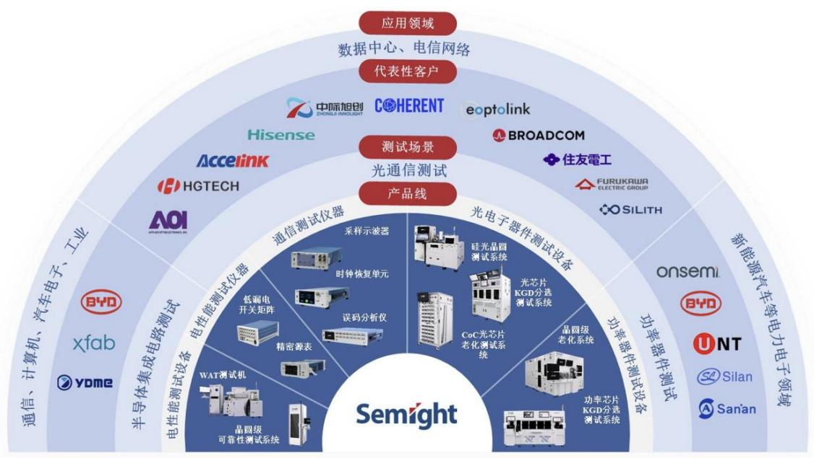

flowchart

```mermaid
graph TD
  A["应用领域"] --> B["数据中心、电信网络"]
  B --> C["代表性客户"]
  C --> D["中标旭创 ZHONGJI INNOUGHT"]
  D --> E["CoHERENT"]
  E --> F["eoptolink"]
  F --> G["测试场景"]
  G --> H["BROADCOM"]
  H --> I["光通信测试"]
  I --> J["产品线"]
  J --> K["通信测试仪器"]
  K --> L["采样示波器"]
  L --> M["时钟恢复单元"]
  M --> N["低漏电开关矩阵"]
  N --> O["精密源表"]
  O --> P["误码分析仪"]
  P --> Q["信性能测试仪器"]
  Q --> R["电性能测试设备"]
  R --> S["xfab"]
  S --> T["yome"]
  T --> U["通信、计算机、汽车电子、工业"]
  U --> V["半导体集成电路测试"]
  V --> W["通信、计算机、汽车电子、工业"]
  W --> X[" Semight "]
    
    subgraph sg["产品线"]
  J --> Y["光电子器件测试设备"]
  Y --> Z["硅光晶圆测试系统"]
  Y --> AA["光芯片KGD分选测试系统"]
  Y --> AB["功率芯片KGD分选测试系统"]
  Y --> AC["功率器件测试设备"]
  Y --> AD["功率器件测试设备"]
  Y --> AE["功率器件测试设备"]
  Y --> AF["功率器件测试设备"]
  Y --> AG["功率器件测试设备"]
  Y --> AH["功率器件测试设备"]
  Y --> AI["功率器件测试设备"]
  Y --> AJ["功率器件测试设备"]
  Y --> AK["功率器件测试设备"]
  Y --> AL["功率器件测试设备"]
  Y --> AM["功率器件测试设备"]
  Y --> AN["功率器件测试设备"]
  Y --> AO["功率器件测试设备"]
  Y --> AP["功率器件测试设备"]
  Y --> AQ["功率器件测试设备"]
  Y --> AR["功率器件测试设备"]
  Y --> AS["功率器件测试设备"]
  Y --> AT["功率器件测试设备"]
  Y --> AU["功率器件测试设备"]
  Y --> AV["功率器件测试设备"]
  Y --> AW["功率器件测试设备"]
  Y --> AX["功率器件测试设备"]
  Y --> AY["功率器件测试设备"]
  Y --> AZ["功率器件测试设备"]
  Y --> BA["功率器件测试设备"]
  Y --> BB["功率器件测试设备"]
  Y --> BC["功率器件测试设备"]
  Y --> BD["功率器件测试设备"]
  Y --> BE["功率器件测试设备"]
  Y --> BF["功率器件测试设备"]
  Y --> BG["功率器件测试设备"]
  Y --> BH["功率器件测试设备"]
  Y --> BI["功率器件测试设备"]
  Y --> BJ["功率器件测试设备"]
  Y --> BK["功率器件测试设备"]
  Y --> BL["功率器件测试设备"]
  Y --> BM["功率器件测试设备"]
  Y --> BN["功率器件测试设备"]
  Y --> BO["功率器件测试设备"]
  Y --> BP["功率器件测试设备"]
  Y --> BQ["功率器件测试设备"]
  Y --> BR["功率器件测试设备"]
  Y --> BS["功率器件测试设备"]
  Y --> BT["功率器件测试设备"]
  Y --> BU["功率器件测试设备"]
  Y --> BV["功率器件测试设备"]
  Y --> BW["功率器件测试设备"]
  Y --> BX["功率器件测试设备"]
  Y --> BYD["功率器件测试设备"]
  Y --> BZD["功率器件测试设备"]
  Y --> CAZD["功率器件测试设备"]
  Y --> CBZD["功率器件测试设备"]
  Y --> CCZD["功率器件测试设备"]
  Y --> CDZD["功率器件测试设备"]
  Y --> CEZD["功率器件测试设备"]
  Y --> CFZD["功率器件测试设备"]
  Y --> CGZD["功率器件测试设备"]
  Y --> CHZD["功率器件测试设备"]
  Y --> CIZD["功率器件测试设备"]
  Y --> CJZD["功率器件测试设备"]
  Y --> CKZD["功率器件测试设备"]
  Y --> CLZD["功率器件测试设备"]
  Y --> CMZD["功率器件测试设备"]
  Y --> CNZD["功率器件测试设备"]
  Y --> COZD["功率器件测试设备"]
  Y --> CSZD["功率器件测试设备"]
  Y --> CTZD["功率器件测试设备"]
  Y --> CUZD["功率器件测试设备"]
  Y --> CVZD["功率器件测试设备"]
  Y --> CWZD["功率器件测试设备"]
  Y --> CXZD["功率器件测试设备"]
  Y --> CYZD["功率器件测试设备"]
  Y --> CZDZD["功率器件测试设备"]
    end
    
    subgraph sg_2["滤度场景"]
        D1((2023年1月1日)):::note
    end
    
    subgraph sg_3["产品线"]
        J1((2023年1月1日)):::note
    end
    
    subgraph sg_4["电性能测试仪器"]
        K1((2023年1月1日)):::note
    end
    
    subgraph sg_5["误差分析仪"]
        L1((2023年1月1日)):::note
    end
    
    subgraph sg_6["电性能测试仪器"]
        M1((2023年1月1日)):::note
    end
    
    subgraph sg_7["误差分析仪"]
        N1((2023年1月1日)):::note
    end
    
    subgraph sg_8["电性能测试仪器"]
        O1((2023年1月1日)):::note
    end
    
    subgraph sg_9["误差分析仪"]
        P1((2023年1月1日)):::note
    end
    
    subgraph sg_10["误差分析仪"]
        Q1((2023年1月1日)):::note
    end
    
    subgraph sg_11["电性能测试仪器"]
        R1((2023年1月1日)):::note
    end
    
    subgraph sg_12["误差分析仪"]
        S1((2023年1月1日)):::note
    end
    
    subgraph sg_13["误差分析仪"]
        T1((2023年1月1日)):::note
    end
    
    subgraph sg_14["误差分析仪"]
        U1((2023年1月1日)):::note
    end
    
    subgraph sg_15["误差分析仪"]
        V1((2023年1月1日)):::note
    end
    
    subgraph sg_16["误差分析仪"]
        W1((2023年1月1日)):::note
    end
    
    subgraph sg_17["误差分析仪"]
        X1((2023年1月1日)):::note
    end
    
    subgraph sg_18["误差分析仪"]
        Y1((2023年1月1日)):::note
    end
    
    subgraph sg_19["误差分析仪"]
        Z1((2023年1月1日)):::note
    end
    
    subgraph sg_20["误差分析仪"]
        AA1((2023年1月1日)):::note
    end
    
    subgraph sg_21["误差分析仪"]
        AB1((2023年1月1日)):::note
    end
    
    subgraph sg_22["误差分析仪"]
        AC1((2023年1月1日)):::note
    end
    
    subgraph sg_23["误差分析仪"]
        AD1((2023年1月1日)):::note
    end
    
    subgraph sg_24["误差分析仪"]
        AE1((2023年1月1日)):::note
    end
    
    subgraph sg_25["误差分析仪"]
        AF1((2023年1月1日)):::note
    end
    
    subgraph sg_26["误差分析仪"]
        AG1((2023年1月1日)):::note
    end
    
    subgraph sg_27["误差分析仪"]
        AH1((2023年1月1日)):::note
    end
    
    subgraph sg_28["误差分析仪"]
        AI1((2023年1月1日)):::note
    end
    
    subgraph sg_29["误差分析仪"]
        AJ1((2023年1月1日)):::note
    end
    
    subgraph sg_30["误差分析仪"]
        AK1((2023年1月1日)):::note
    end
    
    subgraph sg_31["误差分析仪"]
        AL1((2023年1月1日)):::note
    end
    
    subgraph sg_32["误差分析仪"]
        AM1((2023年1月1日)):::note
    end
    
    subgraph sg_33["误差分析仪"]
        ANX((2023年1月1日)):::note
    end
    
    subgraph sg_34["误差分析仪"]
        AOX((2023年1月1日)):::note
    end
    
    subgraph sg_35["误差分析仪"]
        APX((2023年1月1日)):::note
    end
    
    subgraph sg_36["误差分析仪"]
        AQX((2023年1月1日)):::note
    end
    
    subgraph sg_37["误差分析仪"]
        ARX((2023年1月1日)):::note
    end
    
    subgraph sg_38["误差分析仪"]
        ASX((2023年1月1日)):::note
    end
    
    subgraph sg_39["误差分析仪"]
        ATX((2023年1月1日)):::note
    end
    
    subgraph sg_40["误差分析仪"]
        AUX((2023年1月1日)):::note
    end
    
    subgraph sg_41["误差分析仪"]
        AXX((2023年1月1日)):::note
    end
    
    subgraph sg_42["误差分析仪"]
        AYX((2023年1月1日)):::note
    end
    
    subgraph sg_43["误差分析仪"]
        AZX((2023年1月1日)):::note
    end
    
    subgraph sg_44["误差分析仪"]
        BAX((2023年1月1日)):::note
    end
    
    subgraph sg_45["误差分析仪"]
        BBX((2023年1月1日)):::note
    end
    
    subgraph sg_46["误差分析仪"]
        BCX((2023年1月1日)):::note
    end
    
    subgraph sg_47["误差分析仪"]
        BDX((2023年1月1日)):::note
    end
    
    subgraph sg_48["误差分析仪"]
        BEX((2023年1月1日)):::note
    end
    
    subgraph sg_49["误差分析仪"]
        BFX((2023年1月1日)):::note
    end
    
    subgraph sg_50["误差分析仪"]
        BGX((2023年1月1日)):::note
    end
    
    subgraph sg_51["误差分析仪"]
        BHX((2023年1月1日)):::note
    end
    
    subgraph sg_52["误差分析仪"]
        BIX((2023年1月1日)):::note
    end
    
    subgraph sg_53["误差分析仪"]
        BJX((2023年1月1日)):::note
    end
    
    subgraph sg_54["误差分析仪"]
        BKX((2023年1月1日)):::note
    end
    
    subgraph sg_55["误差分析仪"]
        BLX((2023年1月1日)):::note
    end
    
    subgraph sg_56["误差分析仪"]
        BKX((2023年1月1日)):::note
    end
    
    subgraph sg_57["误差分析仪"]
        BLX((2023年1月1日)):::note
    end
    
    subgraph sg_58["误差分析仪"]
        BKX((2023年1月1日))：:note;
    end
    
    subgraph sg_59["误差分析仪"]
        BLX((2023年1月1日))：:note;
    end
    
    subgraph sg_60["误差分析仪"]
        BKX((2023年1月1日)：:note)
    
    subgraph sg_61["误差分析仪"]
        BLX((2023年1月1日)：:note)
    
    subgraph sg_62["误差分析仪"]
        BKX((2023年1月1日)：:note)
    
    subgraph sg_63["误差分析仪"]
        BLX((2023年1月1日)：:note)
    
    subgraph sg_64["误差分析仪"]
        BKX((2023年1月1日)：:note)
    
    subgraph sg_65["误差分析仪"]
        BKX((2023年1月1日)：:note)
    
    subgraph sg_66["误差分析仪"]
        BKX((2023年1月1日)：:note)
    
    subgraph sg_67["误差分析仪"]
        BKX((2023年1月1日)：:note)
    
    end
    
    subgraph sg_68["误差分析仪"]
        BKX((2023年1月1日)：:note)
    
    subgraph sg_69["误差分析仪"]
        BKX((2023年1月1日)：:note)
    
    subgraph sg_70["误差分析仪"]
        BKX((2023年1月1日)：:note)
    
    subgraph sg_71["误差分析仪"]
        BKX((2023年1-9天)：:note)
    
    subgraph sg_72["误差分析仪"]
        BKX((2023年9天)：:note)
    
    subgraph sg_73["误差分析仪"]
            L["(4.5%)"]
    
      end
    
    subgraph sg_74["误差分析仪"]
            M["(4.5%)"]
    
      end
```

来源：联讯仪器招股说明书，国金证券研究所

联讯仪器深耕光通信测试领域，掌握核心自主技术并搭建平台级技术体系。自成立以来，联讯仪器依托在光通信核心测试仪器领域的技术研发与产业化落地成果，已掌握具备自主知识产权的核心芯片、自研算法、硬件板卡及超精密运动系统等行业关键前沿技术，构建起以高速信号处理、微弱信号处理及超精密运动控制为核心的平台级技术体系。凭借该核心技术平台，联讯仪器在持续强化光通信领域纵向竞争优势的同时，成功向功率器件、半导体集成电路等领域实现横向拓展，形成多元化产品矩阵，并在各细分领域建立起突出的市场竞争力。

图表33：联讯仪器主要产品发展历程  
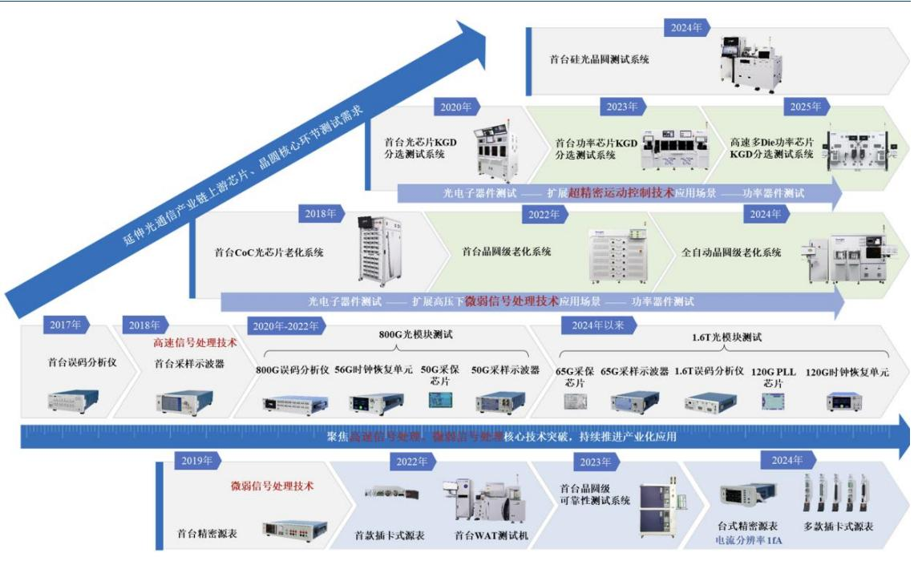

flowchart

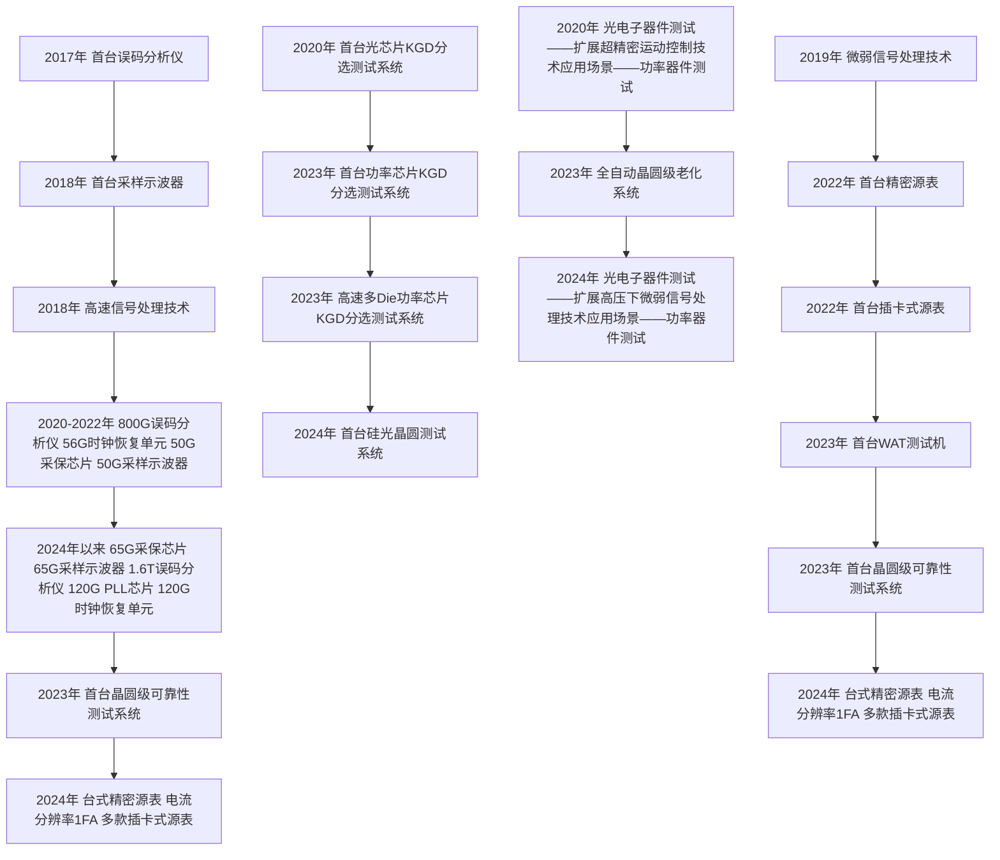
```mermaid
graph TD
  A["2017年 首台误码分析仪"] --> B["2018年 首台采样示波器"]
  B --> C["2018年 高速信号处理技术"]
  C --> D["2020-2022年 800G误码分析仪 56G时钟恢复单元 50G采保芯片 50G采样示波器"]
  D --> E["2024年以来 65G采保芯片 65G采样示波器 1.6T误码分析仪 120G PLL芯片 120G时钟恢复单元"]
  E --> F["2023年 首台晶圆级可靠性测试系统"]
  F --> G["2024年 台式精密源表 电流分辨率1FA 多款插卡式源表"]
    
  H["2020年 首台光芯片KGD分选测试系统"] --> I["2023年 首台功率芯片KGD分选测试系统"]
  I --> J["2023年 高速多Die功率芯片KGD分选测试系统"]
  J --> K["2024年 首台硅光晶圆测试系统"]
    
  L["2020年 光电子器件测试——扩展超精密运动控制技术应用场景——功率器件测试"] --> M["2023年 全自动晶圆级老化系统"]
  M --> N["2024年 光电子器件测试——扩展高压下微弱信号处理技术应用场景——功率器件测试"]
    
  O["2019年 微弱信号处理技术"] --> P["2022年 首台精密源表"]
  P --> Q["2022年 首台插卡式源表"]
  Q --> R["2023年 首台WAT测试机"]
  R --> S["2023年 首台晶圆级可靠性测试系统"]
  S --> T["2024年 台式精密源表 电流分辨率1FA 多款插卡式源表"]
```

来源：联讯仪器招股说明书，国金证券研究所

联讯仪器营收快速提升，电子测量仪器与半导体测试设备贡献主要增长。从收入端来看，联讯仪器营收呈现爆发式增长态势。2022、2023年营收分别为2.12亿元、2.69亿元，同比增长 $26.86\%$ ；2024年业绩大幅跃升，营收达7.83亿元，同比激增 $190.96\%$ 。2025年前三季度营收已达7.97亿元，超过2024年全年水平，充分受益于高速光模块测试需求爆发与国产替代红利，增长动能强劲。分业务板块来看，联讯仪器业务结构持续优化，电子测量仪器与半导体测试设备为核心双引擎。2022-2025年前三季度，两大主业合计占比始终维持在九成左右，2025年前三季度电子测量仪器与半导体测试设备营收占比分别达 $43.06\%$ 和 $50.02\%$ ，结构更趋均衡。

图表34：联讯仪器营业收入快速提升  
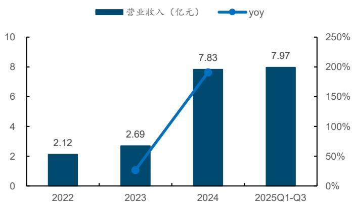

bar-line hybrid chart

| 年份 | 营业收入（亿元） | yoy (%) |
| :--- | :--- | :--- |
| 2022 | 2.12 | |
| 2023 | 2.69 | 30.0 |
| 2024 | 7.83 | 190.0 |
| 2025Q1-Q3 | 7.97 | |

来源：联讯仪器招股说明书，国金证券研究所

图表35：电子测量仪器与半导体测试设备贡献主要增长  
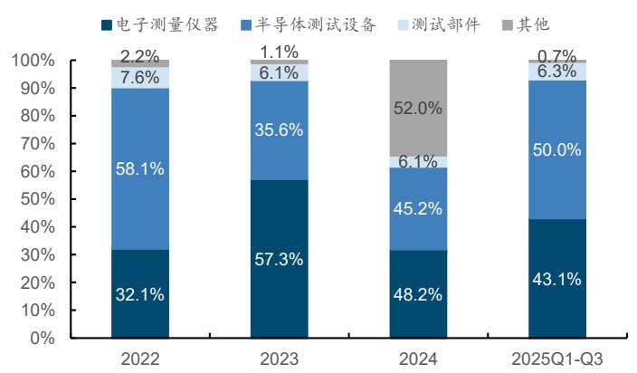

stacked bar chart

| 年份 | 电子测量仪器 (%) | 半导体测试设备 (%) | 测试部件 (%) | 其他 (%) |
|---|---|---|---|---|
| 2022 | 32.1 | 58.1 | 7.6 | 2.2 |
| 2023 | 57.3 | 35.6 | 6.1 | 1.1 |
| 2024 | 48.2 | 45.2 | 6.1 | 52.0 |
| 2025Q1-Q3 | 43.1 | 50.0 | 6.3 | 0.7 |

来源：联讯仪器招股说明书，国金证券研究所

联讯仪器盈利逐年改善，电子测量仪器毛利率持续走高。从盈利能力来看：毛利率自2022年的43.87%逐年攀升至2024年的63.91%，2025年前三季度维持在59.45%的高位，体现产品竞争力与规模效应持续释放。分业务板块来看，毛利率分化明显。电子测量仪器持续领跑并逐年走高，从2022年63.41%提升至25Q1-Q3的76.37%。

图表36：联讯仪器毛利率维持高位  
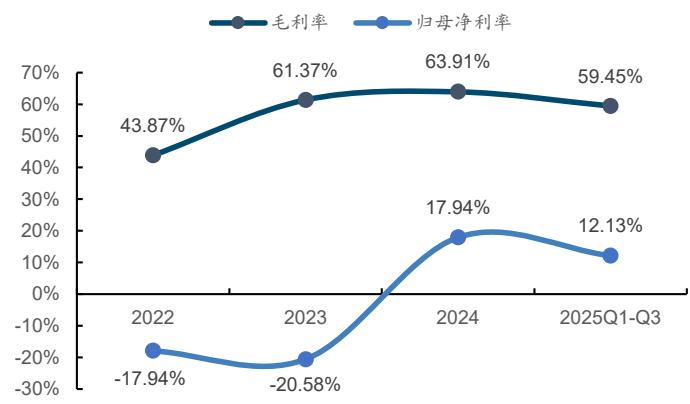

line chart

| 年份 | 毛利率 (%) | 归母净利率 (%) |
| :--- | :--- | :--- |
| 2022 | 43.87 | -17.94 |
| 2023 | 61.37 | -20.58 |
| 2024 | 63.91 | 17.94 |
| 2025Q1-Q3 | 59.45 | 12.13 |

来源：联讯仪器招股说明书，国金证券研究所

图表37：联讯仪器电子测量仪器毛利率持续走高  
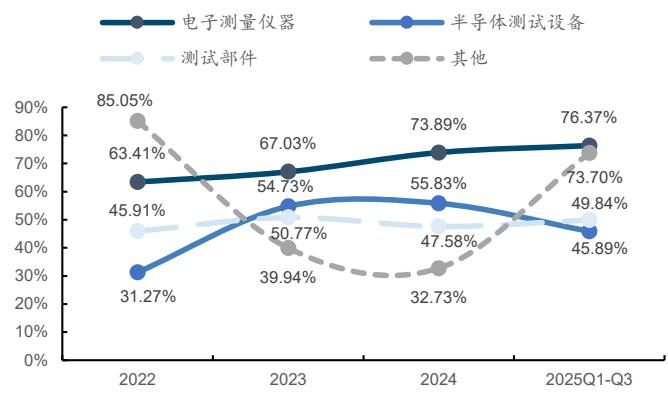

line chart

| Year     | 电子测量仪器 | 半导体测试设备 | 测试部件 | 其他   |
| -------- | ------------ | -------------- | --------- | ------ |
| 2022     | 63.41%       | 31.27%         | 45.91%    | 85.05% |
| 2023     | 67.03%       | 54.73%         | 50.77%    | 39.94% |
| 2024     | 73.89%       | 55.83%         | 47.58%    | 32.73% |
| 2025Q1-Q3| 76.37%       | 49.84%         | 45.89%    | 73.70% |

来源：联讯仪器招股说明书，国金证券研究所

联讯仪器为国内光通信测试仪器市场龙头，市占率达9.9%。据Frost&Sullivan数据，公司2024年国内光通信测试仪器市占率达9.9%，位列市场第三，也是前五梯队中唯一的本土企业。整体来看，国内光通信测试仪器市场，Keysight、Anritsu等海外企业合计占据84%主导份额，国产替代空间广阔。

图表38：国内光通信测试仪器市场竞争格局

<table><tr><td>排名</td><td>公司简称</td><td>基本情况</td><td>2024年市场份额</td></tr><tr><td>1</td><td>Keysight</td><td>全球领先的测量仪器公司,该公司提供电子测量仪器,系统以及相关软件工具和用于设计,开发,安装以及操作电子设备的相关服务,目前公司在美国、欧洲和亚太地区均设有工厂和研发中心</td><td>30.80%</td></tr><tr><td>2</td><td>Anritsu</td><td>创新电子测量解决方案的全球供应商,提供现有及下一代有线和无线通信系统和运营商的解决方案。1990年与美国微冲公司的合并,成功实现了从低频、射频、到微波,从光通信到移动通信的多领域发展</td><td>22.50%</td></tr><tr><td>3</td><td>联讯仪器</td><td>是国内领先的高端测试仪器设备企业,主营业务为电子测量仪器和半导体测试设备的研发、制造、销售及服务,专业为全球高速通信和半导体等领域用户提供高速率、高精度、高效率的核心测试仪器设备</td><td>9.90%</td></tr><tr><td>4</td><td>Tektronix</td><td>一家全球领先的测试,测量和监测解决方案提供商,公司除了销售电子测量仪器还衍生了其他产品线和服务的收入,包括校准和维修服务,视频测试设备,以及电源类产品</td><td>8.20%</td></tr><tr><td>5</td><td>EXFO</td><td>总部位于加拿大魁北克,是致力于光纤测试,测量、监测和自动化解决方案研制和开发的国际知名公司。其凭借设计和制造先进的创新型测试和测量解决方案,居于全球光通信领域前列。</td><td>4.80%</td></tr></table>

来源：联讯仪器招股说明书，Frost&Sullivan，国金证券研究所

## 3.2 罗博特科：收购 ficonTEC，进化为全球光模块耦合设备龙头

“清洁能源+泛半导体”双轮驱动，打造完整产品体系。罗博特科是一家专注于工业自动化设备、工业执行系统软件、高效电池解决方案及光电子与半导体自动化封测设备研发制造的高新技术企业，以“清洁能源+泛半导体”双轮驱动为核心战略，打造了集研发、设计、装配、测试、销售与服务于一体的完整产品体系。2025年公司完成对全球光电子及半导体自动化封测领域领先企业ficonTEC的收购，进一步强化在泛半导体领域的业务布局。

分应用领域来看，光伏业务方面，公司面向光伏电池片领域提供高效电池核心装备与智能化整厂解决方案。光电子及半导体业务方面，通过并购 ficonTEC，公司切入光子元器件微组装与测试赛道，相关设备广泛应用于硅光芯片、光模块、激光雷达、量子器件等产品的耦合、封装与测试，覆盖光计算、光互连及光感知等前沿应用场景。

图表39：罗博特科主营业务及主要产品介绍

<table><tr><td>主要业务</td><td>主要产品</td><td>具体产品/整体解决方案</td><td>下游主要应用领域</td></tr><tr><td rowspan="4">工业自动化设备</td><td rowspan="2">自动化设备</td><td>光伏电池自动化设备(刻蚀制域/碱地/扩散/LPCVD/PEPOLY/PECVD 纯化/测试分选等工艺段)</td><td>光伏</td></tr><tr><td>单晶圆清洗刻蚀系统/单晶圆涂胶系统</td><td>电子及半导体</td></tr><tr><td rowspan="2">光子封测设备及系统</td><td>高速晶圆测试设备、高速晶粒测试设备、高速芯片测试设备、高速硅光模组/CPO 模组测试设备</td><td>光电子及半导体</td></tr><tr><td>光子器件集成耦合设备,Bond 自动化超高精度贴片设备,光纤预制设备</td><td>光电子及半导体</td></tr><tr><td>工业执行系统软件</td><td colspan="2">智能制造系统 R2Fab</td><td>光伏、光电子及半导体</td></tr><tr><td>高效电池解决方案</td><td colspan="2">高效太阳能电池/铜互联整体解决方案</td><td>光伏</td></tr></table>

来源：罗博特科 2025 年年报，国金证券研究所

ficonTEC 凭借全球领先的技术与客户壁垒，持续为罗博特科释放核心动能。罗博特科3月25日公告，全资子公司ficonTEC及其子公司与一家纳斯达克上市公司F及其子公司签署日常经营重大合同，累计金额约6亿元，为可插拔硅光技术路线的量产化耦合设备及服务订单，占公司2024年度经审计营业收入的54.23%。

ficonTEC 作为全球领先的耦合设备商，依托高筑的技术壁垒深度绑定全球头部客户，持续赋能公司业务升级。公司通过收购 ficonTEC 顺利切入英伟达、英特尔、博通、台积电、思科等全球科技龙头供应链，成为头部企业在硅光、CPO 及光开关等方向的核心设备供应商。凭借长期严苛的客户认证体系，公司构建了显著的先发优势与较高行业准入壁垒，客户复购意愿及合作稳定性均处于行业领先水平。

图表40：罗博特科3月25日公告全资子公司ficonTEC签署约6亿元重大合同

<table><tr><td>序号</td><td>签署时间</td><td>交易对手方名称</td><td>我方交易主体名称</td><td>合同金额</td><td>合同标的</td></tr><tr><td>1</td><td>2026年3月19日和2026年3月24日</td><td>公司F的境内子公司</td><td rowspan="3">ficonTEC及其子公司</td><td>约10,500万元人民币</td><td rowspan="3">耦合设备及服务</td></tr><tr><td>2</td><td>2026年3月25日</td><td>公司F</td><td>约5,400万美元(折合人民币约为3.74亿元)</td></tr><tr><td>3</td><td>2026年3月25日</td><td>公司F的境外子公司</td><td>约1,500万欧元(折合人民币约为1.21亿元)</td></tr><tr><td>合计</td><td>-</td><td>-</td><td>-</td><td>折合人民币约6亿元</td><td>-</td></tr></table>

来源：罗博特科公告，国金证券研究所

2025年公司营收、归母净利润因收购ficonTEC发生短期下滑。从收入端来看，2020-2025年，罗博特科业绩随行业周期与战略转型呈现一定波动。营业收入2022年达10.86亿元阶段性高点后回落，2024年回升至15.72亿元，2025年则受光伏行业景气度低迷影响，全年营收9.50亿元，同比下降 $14.14\%$ 。从盈利端来看2022年起成功扭亏为盈，2023年归母净利润升至0.77亿元，2025年因传统光伏业务深度调整、收购ficonTEC产生整合费用与融资成本，叠加新业务尚未规模化盈利，归母净利润暂时由盈转亏至-0.66亿元。整体来看，公司正处于传统业务调整与新业务培育的业绩筑底期，2025年收入及利润同比有所下滑，而光电子及半导体业务同年实现营收4.85亿元，能够有效缓解光伏业务下滑所带来的营收下降压力，未来增长前景可观。

图表41：罗博特科营业收入呈现周期性波动  
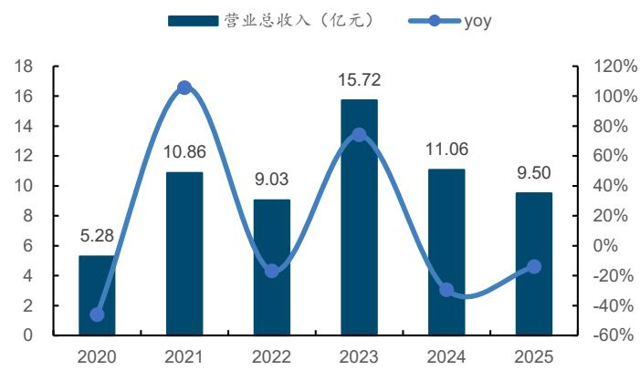

bar-line hybrid chart

| 年份 | 营业总收入 (亿元) | yoy (%) |
| :--- | :--- | :--- |
| 2020 | 5.28 | -36.7 |
| 2021 | 10.86 | 114.9 |
| 2022 | 9.03 | -17.4 |
| 2023 | 15.72 | 76.8 |
| 2024 | 11.06 | -31.4 |
| 2025 | 9.50 | -11.6 |

来源：iFinD，国金证券研究所

图表42：罗博特科归母净利受收购影响25年大幅回落  
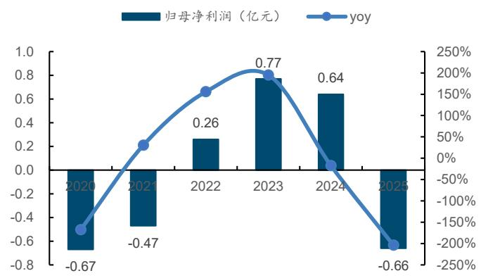

bar-line hybrid chart

| 年份 | 归母净利润（亿元） | yoy (%) |
|---|---|---|
| 2020 | -0.67 | -150 |
| 2021 | -0.47 | 25 |
| 2022 | 0.26 | 150 |
| 2023 | 0.77 | 200 |
| 2024 | 0.64 | -5 |
| 2025 | -0.66 | -200 |

来源：iFinD，国金证券研究所

费用率整体保持稳定，2025年因收购整合有所提升，利润率短期承压。从费用端来看，2020-2025年罗博特科期间费用率整体保持稳定，在2025年因对ficonTEC的并购整合出现阶段性上行。细分来看，销售费用率基本保持在 $3\% - 5\%$ 的稳健区间，2025年大幅提升至 $9.9\%$ ；管理费用率长期处于较低水平，2025年受收购影响短期提升至 $11.6\%$ 。毛利率和净利率方面，2020至2025年，罗博特科毛利率持续稳步提升，由 $11.2\%$ 逐年增长至 $34.5\%$ ，产品结构优化与规模效应持续显现。净利率由2020年的 $-12.9\%$ 同步改善至2024年的 $5.7\%$ ，而2025年净利率转负至 $-6.9\%$ ，主要源于收购ficonTEC带来的管理费用和销售费用暂时性提升。

图表43：罗博特科期间费用率整体较为稳定  
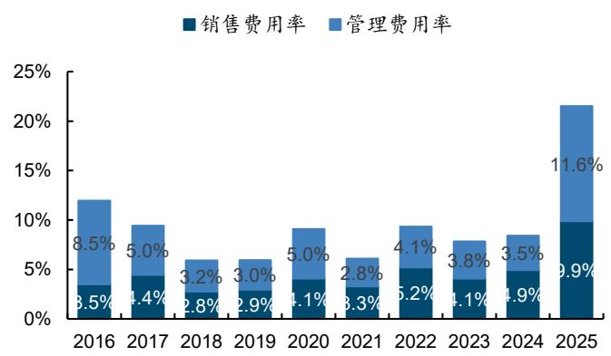

stacked bar chart

| 年份 | 销售费用率 (%) | 管理费用率 (%) |
| :--- | :--- | :--- |
| 2016 | 3.5 | 8.5 |
| 2017 | 4.4 | 5.0 |
| 2018 | 2.8 | 3.2 |
| 2019 | 2.9 | 3.0 |
| 2020 | 4.1 | 5.0 |
| 2021 | 3.3 | 2.8 |
| 2022 | 5.2 | 4.1 |
| 2023 | 4.1 | 3.8 |
| 2024 | 4.9 | 3.5 |
| 2025 | 9.9 | 11.6 |

来源：iFinD，国金证券研究所

图表44：罗博特科毛利率逐年攀升，净利率25年转负  
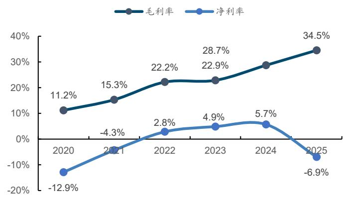

line chart

| 年份 | 毛利率 (%) | 净利率 (%) |
|---|---|---|
| 2020 | 11.2 | -12.9 |
| 2021 | 15.3 | -4.3 |
| 2022 | 22.2 | 2.8 |
| 2023 | 22.9 | 4.9 |
| 2024 | 28.7 | 5.7 |
| 2025 | 34.5 | -6.9 |

来源：iFinD，国金证券研究所

## 3.3 华盛昌：收购伽蓝特，切入光通信设备

25Q1-Q3公司营收、归母净利润受美国关税影响发生波动。25Q1-Q3公司实现营收5.3亿元，同比 $-5.5\%$ ，归母净利润0.65亿元，同比 $-40.9\%$ ，根据公司半年报，营收波动主要系美国关税政策影响对美出口业务，归母净利润波动主要系公司AI仪表布局导致研发费用增加同时公司因股权激励发生股份支付费用。公司越南工厂已经于25年7月实现大批量出货，有望增强对美贸易竞争力并受益于国内企业海外制造委托订单的溢出红利，看好公司AI智能化设备布局与海外布局带来业绩修复。

图表45：受美国关税政策影响公司营收波动  
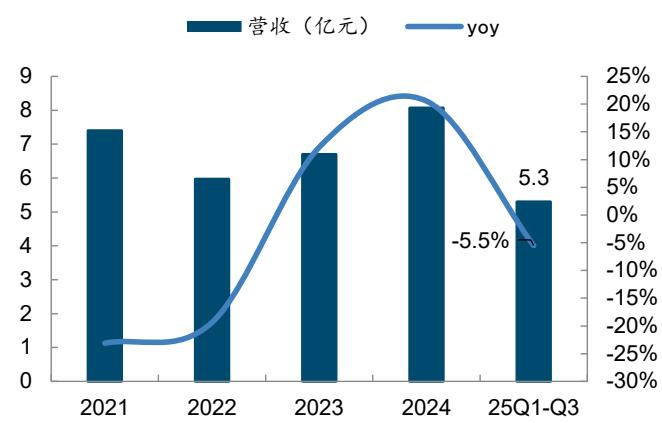

bar-line hybrid chart

| 年份 | 营收（亿元） | yoy (%) |
| :--- | :--- | :--- |
| 2021 | 7.4 | -1.5 |
| 2022 | 6.0 | -1.8 |
| 2023 | 6.7 | 10.0 |
| 2024 | 8.1 | 21.0 |
| 25Q1-Q3 | 5.3 | -5.5 |

来源：iFind，国金证券研究所

图表46：公司归母净利润有望受益于海外布局实现修复  
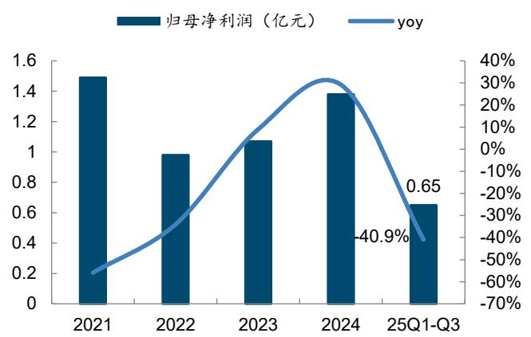

bar-line hybrid chart

| 年份 | 归母净利润（亿元） | yoy (%) |
| :--- | :--- | :--- |
| 2021 | 1.5 | -30.0 |
| 2022 | 1.0 | -20.0 |
| 2023 | 1.1 | 10.0 |
| 2024 | 1.4 | 35.0 |
| 25Q1-Q3 | 0.65 | -40.9 |

来源：iFind，国金证券研究所

收购伽蓝特，切入光通信检测设备赛道。2026年2月28日，华盛昌与伽蓝特股东余新文、张松伟、林小龙、史开贵签署了《股权收购意向协议》，筹划以现金方式收购伽蓝特100%的股权，整体估值暂定为人民币4.6亿元。伽蓝特产品线涵盖有源光器件和无源光器件自动化测试系统两大类，包括激光光源、宽带光源、光放大器、光开关、光功率计、光衰减仪、误码测试仪、光谱分析仪、射频放大器、射频开关，以及自动化测试软件等，切入光通信设备。华盛昌借此次并购切入光通信赛道，看好高增量赛道带来公司未来业绩增量。

图表47：伽蓝特业务包括光模块测试光源、仪表  
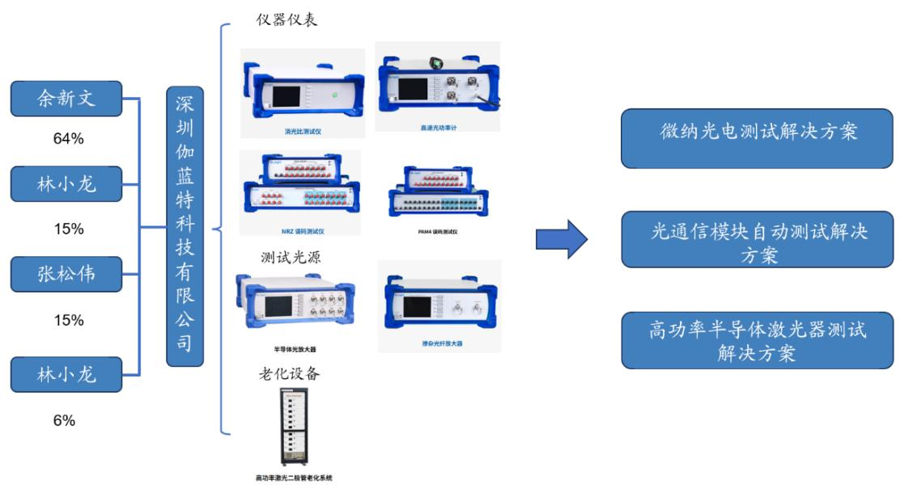

flowchart

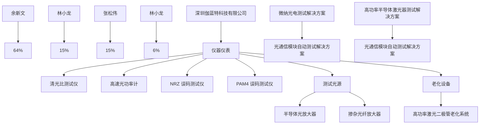
```mermaid
graph TD
  A["余新文"] --> B["64%"]
  C["林小龙"] --> D["15%"]
  E["张松伟"] --> F["15%"]
  G["林小龙"] --> H["6%"]
  I["深圳伽蓝特科技有限公司"] --> J["仪器仪表"]
  J --> K["清光比测试仪"]
  J --> L["高速光功率计"]
  J --> M["NRZ 误码测试仪"]
  J --> N["PAM4 误码测试仪"]
  J --> O["测试光源"]
  O --> P["半导体光放大器"]
  O --> Q["掺杂光纤放大器"]
  J --> R["老化设备"]
  R --> S["高功率激光二极管老化系统"]
    
  T["微纳光电测试解决方案"] --> U["光通信模块自动测试解决方案"]
  V["高功率半导体激光器测试解决方案"] --> W["光通信模块自动测试解决方案"]
```

来源：伽蓝特，中大并购研究院，国金证券研究所 注：股权结构为收购时点

## 3.4 优利德：收购信测通信，切入光通信测试

25Q1-Q3公司营收平稳增长，归母净利润有所波动。2025年公司实现营收12.2亿元，同比 $+8.0\%$ ，营收增量主要有仪器仪表业务贡献，实现归母净利润1.5亿元，同比 $-16.9\%$ 根据公司公告，归母净利润波动因为公司越南工厂在25年前三季度处于产能爬坡状态，第四季度实现正常出货，并且公司加大研发投入，研发费用1.46亿元，同比 $+24.61\%$ 。

图表48：公司营收平稳增长  
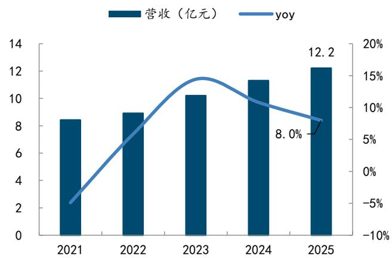

bar-line hybrid chart

| Year | 营收（亿元） | yoy   |
|------|--------------|-------|
| 2021 | 8.5          | -     |
| 2022 | 9.0          | 5.0%  |
| 2023 | 10.3         | 15.0% |
| 2024 | 11.5         | 10.0% |
| 2025 | 12.2         | 8.0%  |

来源：iFind，公司公告，国金证券研究所

图表49：公司归母净利润受越南工厂产能爬坡有所波动  
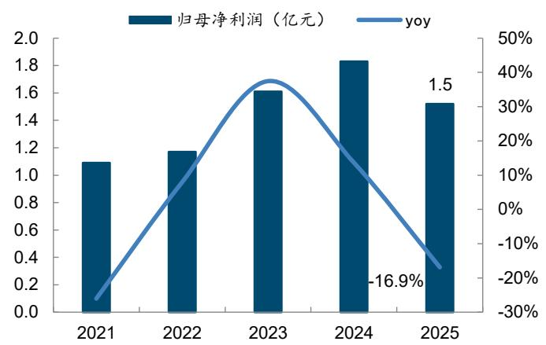

bar-line hybrid chart

| 年份 | 归母净利润（亿元） | yoy (%) |
| :--- | :--- | :--- |
| 2021 | 1.1 | -20.0 |
| 2022 | 1.2 | 16.4 |
| 2023 | 1.6 | 38.0 |
| 2024 | 1.8 | 17.9 |
| 2025 | 1.5 | -16.9 |

来源：iFind，公司公告，国金证券研究所

公司管理费用率管控良好，毛利率净利率维持高位。公司25Q1-Q3销售费用率9.5%，管理费用率7.2%，同比+0.05pct、+0.78pct，管理费用率上升由于成立越南分公司导致人员薪酬与费用增加。公司25Q1-Q3毛利率43.0%，净利率14.0%，同比-1.84pct、-3.42pct，是因为公司越南基地试生产导致营业成本增长，以及管理、研发支出增加，越南工厂已经于25Q4实现出货，看好出货放量带动费用率下降并贡献更多高毛利境外订单提升公司整体盈利能力。

图表50：公司管理费用率管控良好  
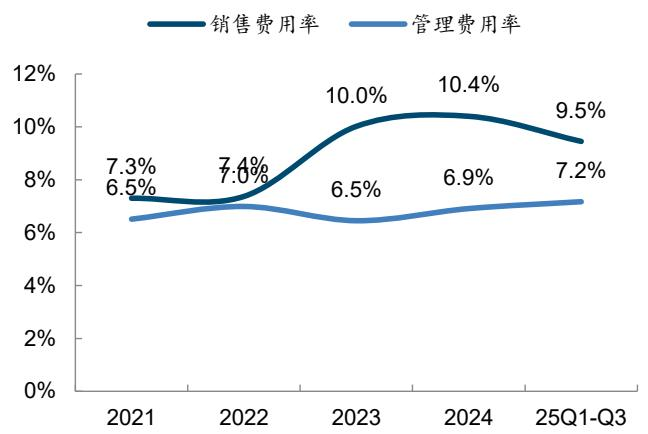

line chart

| Year     | 销售费用率 | 管理费用率 |
| -------- | ---------- | ---------- |
| 2021     | 7.3%       | 6.5%       |
| 2022     | 7.4%       | 7.0%       |
| 2023     | 10.0%      | 6.5%       |
| 2024     | 10.4%      | 6.9%       |
| 25Q1-Q3  | 9.5%       | 7.2%       |

来源：iFind，国金证券研究所

图表51：公司毛利率净利率维持高位  
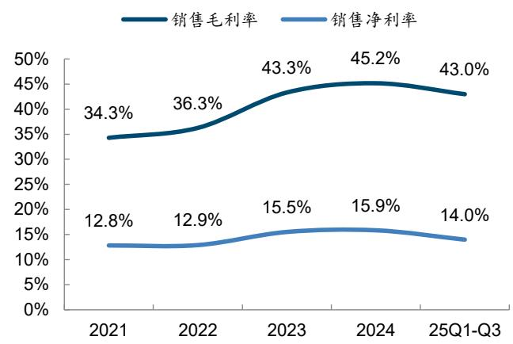

line chart

| 年份 | 销售毛利率 (%) | 销售净利率 (%) |
| :--- | :--- | :--- |
| 2021 | 34.3 | 12.8 |
| 2022 | 36.3 | 12.9 |
| 2023 | 43.3 | 15.5 |
| 2024 | 45.2 | 15.9 |
| 25Q1-Q3 | 43.0 | 14.0 |

来源：iFind，公司公告，国金证券研究所

收购信测通信 51% 股权，布局光通信板块。优利德 3 月 13 日晚公告，公司拟以不超过 8600 万元收购转让方持有的信测通信 51% 的股权。信测通信产品主要包括通信光功率计、光时域反射仪产品（OTDR）、光纤传感产品和电磁测量产品四大类，此次并购标志着优利德正式切入光通信板块。

图表52：信测通信业务包括光网络建设维护产品及电磁环境安全监测产品  
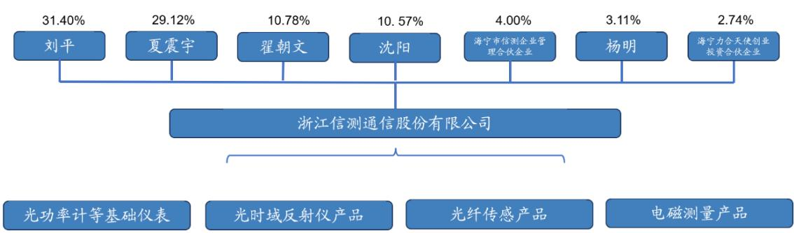

bar chart

| 公司名称 | 持股比例 (%) |
| :--- | :--- |
| 刘平 | 31.40 |
| 夏震宇 | 29.12 |
| 翟朝文 | 10.78 |
| 沈阳 | 10.57 |
| 海宁市信测企业管理合伙企业 | 4.00 |
| 杨明 | 3.11 |
| 海宁力合天使创业投资合伙企业 | 2.74 |
浙江信测通信股份有限公司
光功率计等基础仪表
光时域反射仪产品
光纤传感产品
电磁测量产品

来源：公司公告，爱企查，国金证券研究所

## 四、风险提示

AI 资本开支不及预期。光模块设备需求来产线建设的资本开支，若 AI 资本开支进度受政府管制或者巨头公司战略调整影响，或对光模块产线建设推进产生不利影响，进而影响光模块设备需求景气度。

AI 大模型发展不及预期。若 AI 大模型升级带来参数量增长不及预期，或将影响对算力的需求，进而影响资本开支预算，或对光模块设备需求产生不利影响。

技术发展带来需求不确定风险。光模块设备是速率提升、自动化需求下带动的需求，若未来光模块技术路径发生变化，或对自动化设备市场需求产生影响。

市场竞争加剧。光模块设备核心诉求为高精度、高带宽以及自动化等，若较多的跨界玩家切入光模块设备领域，或引发低价竞争等问题，影响行业内正常生态环境，对行业公司业绩产生不利影响。

## 行业投资评级的说明：

买入：预期未来3-6个月内该行业上涨幅度超过大盘在 $15\%$ 以上；

增持：预期未来3—6个月内该行业上涨幅度超过大盘在5%—15%;

中性：预期未来3—6个月内该行业变动幅度相对大盘在-5%—5%;

减持：预期未来3-6个月内该行业下跌幅度超过大盘在 $5\%$ 以上。

## 特别声明：

国金证券股份有限公司经中国证券监督管理委员会批准，已具备证券投资咨询业务资格。

本报告版权归“国金证券股份有限公司”（以下简称“国金证券”）所有，未经事先书面授权，任何机构和个人均不得以任何方式对本报告的任何部分制作任何形式的复制、转发、转载、引用、修改、仿制、刊发，或以任何侵犯本公司版权的其他方式使用。经过书面授权的引用、刊发，需注明出处为“国金证券股份有限公司”，且不得对本报告进行任何有悖原意的删节和修改。

本报告的产生基于国金证券及其研究人员认为可信的公开资料或实地调研资料，但国金证券及其研究人员对这些信息的准确性和完整性不作任何保证。本报告反映撰写研究人员的不同设想、见解及分析方法，故本报告所载观点可能与其他类似研究报告的观点及市场实际情况不一致，国金证券不对使用本报告所包含的材料产生的任何直接或间接损失或与此有关的其他任何损失承担任何责任。且本报告中的资料、意见、预测均反映报告初次公开发布时的判断，在不作事先通知的情况下，可能会随时调整，亦可因使用不同假设和标准、采用不同观点和分析方法而与国金证券其它业务部门、单位或附属机构在制作类似的其他材料时所给出的意见不同或者相反。

本报告仅为参考之用，在任何地区均不应被视为买卖任何证券、金融工具的要约或要约邀请。本报告提及的任何证券或金融工具均可能含有重大的风险，可能不易变卖以及不适合所有投资者。本报告所提及的证券或金融工具的价格、价值及收益可能会受汇率影响而波动。过往的业绩并不能代表未来的表现。

客户应当考虑到国金证券存在可能影响本报告客观性的利益冲突，而不应视本报告为作出投资决策的唯一因素。证券研究报告是用于服务具备专业知识的投资者和投资顾问的专业产品，使用时必须经专业人士进行解读。国金证券建议获取报告人员应考虑本报告的任何意见或建议是否符合其特定状况，以及（若有必要）咨询独立投资顾问。报告本身、报告中的信息或所表达意见也不构成投资、法律、会计或税务的最终操作建议，国金证券不就报告中的内容对最终操作建议做出任何担保，在任何时候均不构成对任何人的个人推荐。

在法律允许的情况下，国金证券的关联机构可能会持有报告中涉及的公司所发行的证券并进行交易，并可能为这些公司正在提供或争取提供多种金融服务。

本报告并非意图发送、发布给在当地法律或监管规则下不允许向其发送、发布该研究报告的人员。国金证券并不因收件人收到本报告而视其为国金证券的客户。本报告对于收件人而言属高度机密，只有符合条件的收件人才能使用。根据《证券期货投资者适当性管理办法》，本报告仅供国金证券股份有限公司客户中风险评级高于C3级(含C3级）的投资者使用；本报告所包含的观点及建议并未考虑个别客户的特殊状况、目标或需要，不应被视为对特定客户关于特定证券或金融工具的建议或策略。对于本报告中提及的任何证券或金融工具，本报告的收件人须保持自身的独立判断。使用国金证券研究报告进行投资，遭受任何损失，国金证券不承担相关法律责任。

若国金证券以外的任何机构或个人发送本报告，则由该机构或个人为此发送行为承担全部责任。本报告不构成国金证券向发送本报告机构或个人的收件人提供投资建议，国金证券不为此承担任何责任。

此报告仅限于中国境内使用。国金证券版权所有，保留一切权利。

上海

电话：021-80234211

邮箱：researchsh@gjzq.com.cn

邮编：201204

地址：上海浦东新区芳甸路1088号紫竹国际大厦5楼

北京

电话：010-85950438

邮箱：researchbj@gjzq.com.cn

邮编：100005

地址：北京市东城区建内大街26号
新闻大厦8层南侧

深圳

电话：0755-86695353

邮箱：researchsz@gjzq.com.cn

邮编：518000

地址：深圳市福田区金田路2028号皇岗商务中心18楼1806

text_image

国金证券
研究服务

[小程序]
国金证券研究服务

text_image

QR code with embedded circular logo containing Chinese text and a small emblem

[公众号]
国金证券研究