公司深度（R3）

圣农发展(002299.SZ)

## 农林牧渔 | 养殖业

# 全产业链一体化标杆，成本护城河护航盈利释放

圣农发展(002299.SZ)深度报告

2026年04月20日

评级

买入

评级变动 首次

交易数据

<table><tr><td>当前价格(元)</td><td>18.68</td></tr><tr><td>52周价格区间(元)</td><td>14.16-19.80</td></tr><tr><td>总市值(百万)</td><td>23221.33</td></tr><tr><td>流通市值(百万)</td><td>22769.76</td></tr><tr><td>总股本(万股)</td><td>124311.17</td></tr><tr><td>流通股(万股)</td><td>121893.77</td></tr></table>

涨跌幅比较

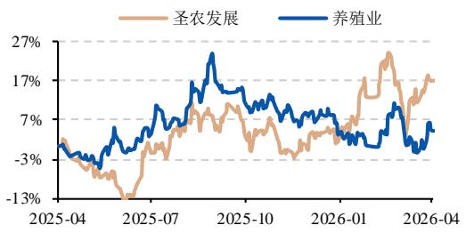

line chart

| Date     | 圣农发展 | 养殖业 |
| -------- | -------- | ------ |
| 2025-04  | -3%      | -3%    |
| 2025-07  | -13%     | -3%    |
| 2025-10  | -3%      | 27%    |
| 2026-01  | -3%      | 7%     |
| 2026-04  | 17%      | 7%     |

<table><tr><td>%</td><td>1M</td><td>3M</td><td>12M</td></tr><tr><td>圣农发展</td><td>4.94</td><td>11.86</td><td>16.68</td></tr><tr><td>养殖业</td><td>-3.11</td><td>0.17</td><td>3.94</td></tr></table>

刘敏

分析师

执业证书编号:S0530520010001

liumin83@hnchasing.com

## 相关报告

<table><tr><td>预测指标</td><td>2024A</td><td>2025A</td><td>2026E</td><td>2027E</td><td>2028E</td></tr><tr><td>营业收入(亿元)</td><td>185.86</td><td>200.94</td><td>212.98</td><td>222.29</td><td>221.55</td></tr><tr><td>归母净利润(亿元)</td><td>7.24</td><td>13.80</td><td>14.53</td><td>19.62</td><td>20.51</td></tr><tr><td>每股收益(元)</td><td>0.58</td><td>1.11</td><td>1.17</td><td>1.58</td><td>1.65</td></tr><tr><td>每股净资产(元)</td><td>8.40</td><td>9.02</td><td>9.28</td><td>10.15</td><td>11.06</td></tr><tr><td>P/E</td><td>32.06</td><td>16.83</td><td>15.98</td><td>11.84</td><td>11.32</td></tr><tr><td>P/B</td><td>2.22</td><td>2.07</td><td>2.01</td><td>1.84</td><td>1.69</td></tr></table>

资料来源：Wind，财信证券

## 投资要点：

> 白羽鸡产业链一体化龙头。圣农发展历经40余载发展，构建起覆盖种源育种、饲料加工、规模养殖、食品深加工至终端销售的全产业生态闭环，铸就"纵贯养殖屠宰、横跨食品多元"的竞争优势。公司以"成为世界级食品企业"为战略愿景，纵深推进大食品战略，白羽鸡养殖产能近8亿羽，食品深加工产能超50万吨，均居全国第一。

> 养殖产能稳步释放，大食品战略成效渐显。依托大规模一体化自养自宰模式，公司鸡肉产品实现优质优价，品牌溢价能力凸显，销量增长与价格优势共振。品牌端，聚焦"圣农"、"4度"、"安佰牧场"品牌矩阵，成功打造嘟嘟翅、脆皮炸鸡、手枪腿等多个大单品；渠道端，B端与C端各渠道发展势头迅猛。"品牌+渠道"双轮驱动下，公司一体化产业链的规模效应与品牌溢价有望加速转化为业绩，进入新一轮成长释放期。大食品战略持续推进，将增厚单羽肉鸡利润贡献，进一步提升整体盈利能力。

> 育种技术持续迭代，自主替代路径明确。种源打破国际垄断，公司育种先发优势显著。截至2025年12月底，“圣泽901”父母代种鸡销往全国15个省，推广父母代种鸡4700万套。圣泽生物白羽鸡育种持续更新迭代，相关性能指标达到全球领先水平，且自研种源已成功走出国门。随着国产品种替代进程加速及海外市场拓展，公司凭借自主可控的种源壁垒和已验证的市场化能力，有望在种业安全战略下持续巩固行业龙头地位，打开第二增长曲线。

产业链协同深化，成本护城河加固。圣农发展产业链一体化布局已趋成熟，纵向一体化消除中间环节利润流失，育种、饲料、养殖、屠宰、食品深加工各环节均为自有，助力实现全产业链价值内部留存。下游订单需求反向指导上游养殖出栏节奏，实现供需精准匹配；食品研发能力支撑与大客户的深度合作。依托自主育种技术优势降低上游养殖成本，规模化养殖提升中游生产效率，食品加工延伸下游增值链条，三大环节协同运作，实现降本增效、风险可控与利润最大化。

> 盈利预测与投资建议：我们预计2026/2027/2028年公司营收有望达到213/222/222亿元，同比增速分别为 $+5.99\% / + 4.37\% / - 0.33\%$ ；归母净利润分别为14.53/19.62/20.51亿元，同比增速分别为 $+5.27\% / + 35.03\% / + 4.57\%$ 。当前股价对应2026年PE约为16倍，公司PE估值显著低于可比公司。考虑到公司全产业链龙头地位、太阳谷并表协同效应、育种迭代带来的效率红利，给予公司2026年PE $20\sim 22$ 倍，首次覆盖，给予“买入”评级。

> 风险提示：鸡价格周期波动风险、消费复苏不及预期风险、禽类疫病爆发风险、原材料价格波动风险、种源迭代升级不及预期风险、种源推广进度不及预期风险等。

## 内容目录

## 1 白羽鸡全产业链一体化标杆....5

1.1 四十余年一体化布局，铸就白羽鸡行业标杆 5  
1.2 股权结构稳定，股权激励彰显信心....6  
1.3 公司发展历程：六阶跨越、全链贯通.....7

## 2 2026 年白羽肉鸡行业预计供给端仍宽松，关注消费复苏对鸡肉价格的提振……9

## 3 圣农发展未来看点.....11

3.1 养殖产能稳步释放，大食品战略纵深推进.....11  
3.2 育种技术持续迭代，自主替代路径明确，国际市场拓展可期....14  
3.3 产业链一体化成熟期，成本护城河形成，红利逐步释放....16

## 4 盈利预测与投资建议....17

4.1 盈利预测.....17  
4.2 估值及投资建议.....18

## 5 风险提示.... 19

## 图表目录

图 1: 圣农发展基地布局.....5

图 2: 圣农发展白羽鸡产业链.....5

图 3：圣农发展冻、鲜鸡肉产品....5

图 4：圣农发展餐饮厨房西式、中餐产品....5

图 5：圣农发展零售家庭熟食产品....6

图 6: 圣农发展股权结构图 ..... 6

图 7：2009 年以来圣农发展营业收入走势图....8

图 8：2009 年以来圣农发展归母净利润、扣非归母净利润走势图....8

图 9：我国白羽肉鸡苗价格走势图 （周、元/羽）……10

图 10：我国白羽肉鸡价格走势图 （周、元/kg）……10

图 11：我国肉鸡配合饲料价格走势……10

图 12：我国餐饮收入增速走势图.... 10

图 13：我国祖代白羽鸡年度更新量..... 10

图 14：我国父母代白羽鸡销量及滞后 8 个月的商品代鸡苗销量同比增速……10

图 15：我国白羽鸡各环节利润情况.....11

图 16: 圣农发展鸡肉销售均价与我国主产区鸡产品均价走势 ..... 12

图 17：圣农发展鸡肉、深加工肉制品销量情况 …… 12

图 18：圣农发展鸡肉、深加工肉制品销售收入情况..... 12

图 19：深加工肉制品销量占比及销售收入占比走势图.... 13

图 20：圣农食品品牌矩阵....13

图 21：圣泽生物自主育种历程..... 15

图 22：圣泽 901 出口东非开启国际化进程.... 15

表 1：2025 年实施的股权激励计划解除限售安排及公司层面业绩考核目标....7

表 2：圣农发展的发展历程....8

表 3：圣农食品加工厂基本情况....13

表 4：圣泽生物育种迭代及性能指标.... 15

表 5：圣农发展两大业务销量、均价、毛利率假设及销售收入预测……17

表 6：圣农发展营收、归母净利润预测（亿元）……18

表 7：圣农发展与可比公司估值情况对比....18

## 1 白羽鸡全产业链一体化标杆

## 1.1 四十余年一体化布局，铸就白羽鸡行业标杆

圣农发展创立于 1983 年，创始人傅光明在福建光泽县建立养鸡场起家，早期聚焦肉鸡饲养与屠宰加工，2007 年与肯德基等客户建立长期供销伙伴关系。公司于 2009 年在深交所 IPO 上市，成为国内领先的肉鸡养殖企业。经过 40 余年发展，公司已形成了"育种→孵化→饲料→养殖→屠宰→深加工→销售"的一体化全产业链布局的企业。2017 年，公司收购圣农食品进军熟食加工，目前，公司主要产品包括冻、鲜鸡肉产品及肉类深加工产品，公司从终端消费需求出发，全渠道为消费者匹配各场景适用的终端消费产品。经过潜心育种十余年，公司成功研发国内首个白羽肉鸡配套系"圣泽 901"，彻底打破国内白羽鸡种源依赖进口的局面，该品种于 2021 年获农业农村部批准对外销售。2023 年，公司育种攻关取得新突破，成功研发并推出“圣泽 901plus”。据公司 2025 年年报，公司生产基地主要分布在福建、江西、甘肃及安徽，并在上海、杭州设立了创新营销中心和产品研发中心，公司白羽鸡养殖产能近 8 亿羽，食品深加工产能超 50 万吨，均居全国第一；公司已成为国内集自主育种、规模化养殖、食品深加工于一体的综合性白羽肉鸡龙头。

图 1: 圣农发展基地布局  
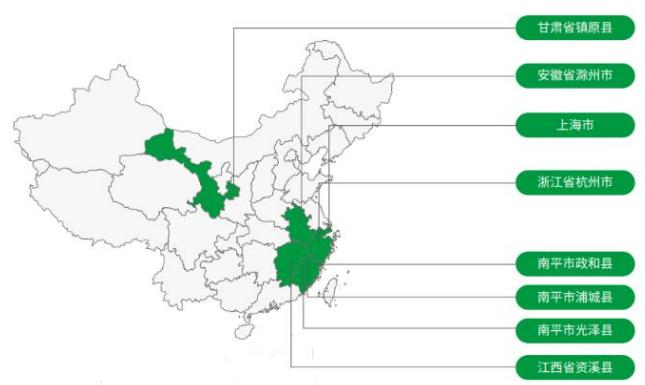

text_image

甘肃省镇原县
安徽省滁州市
上海市
浙江省杭州市
南平市政和县
南平市浦城县
南平市光泽县
江西省资溪县

资料来源：公司公告

图 3: 圣农发展冻、鲜鸡肉产品  
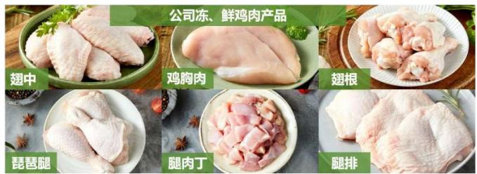

text_image

公司冻、鲜鸡肉产品
翅中
鸡胸肉
翅根
琵琶腿
腿肉丁
腿排

资料来源：公司公告

图 2: 圣农发展白羽鸡产业链  
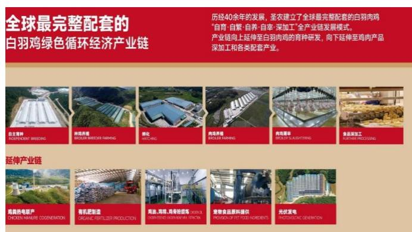

text_image

全球最完整配套的
白羽鸡绿色循环经济产业链
历经40余年的发展，圣农建立了全球最完整配套的白羽肉鸡
“自育·目繁·自养·自宰·深加工”全产业链发展模式。
产业链向上延伸至白羽肉鸡的育种研发，向下延伸至鸡肉产品
深加工和各类配套产业。
自主创新
PROFESSIONAL BREEDGING
蜂巢养殖
BROCOL FRESHING FARMING
孵化
WANJING
肉鸡养殖
FROCEL FARMING
肉鸡屠宰
SWEETLEASHING
食品深加工
FRESHING PROCESSED
延伸产业链
畜禽热电联产
CHIKEN FARMABLE COCONOMATION
有机肥制造
ORGANIC TERRILLIZE PRODUCTION
鸡肠、鸡精、鸡骨粉提炼
POKSHENG
COCONERCIAL FRESHING AND RATIO OF THE FRESHING
宠物食品原料提供
PRODUCTION OF PET FOOD INDEGREES
光伏发电
PRODUCTION OF FRESHING AND RATIO OF THE FRESHING

资料来源：公司公告

图 4: 圣农发展餐饮厨房西式、中餐产品  
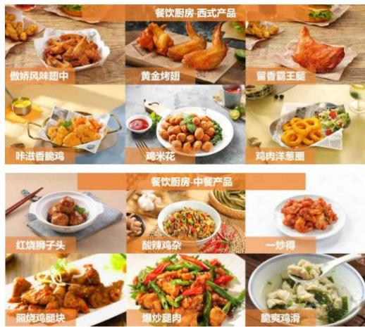

text_image

傲娇风味翅中
黄金烤翅
留香霸王腿
咋滋香脆鸡
鸡米花
鸡肉洋葱圈
餐饮厨房-西式产品
餐饮厨房-中餐产品
红烧狮子头
酸辣鸡杂
一炒得
照烧鸡腿块
爆炒腿肉
脆爽鸡滑

资料来源：公司公告

图 5: 圣农发展零售家庭熟食产品  
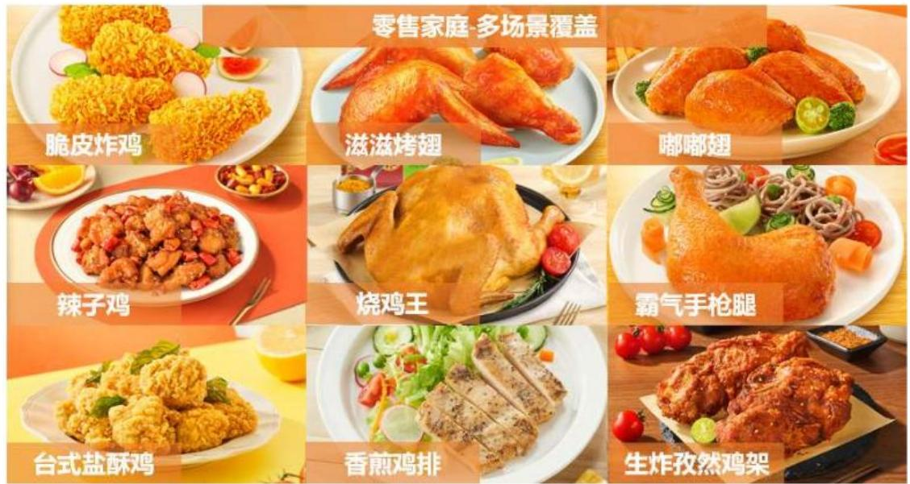

text_image

零售家庭-多场景覆盖
脆皮炸鸡
滋滋烤翅
嘟嘟翅
辣子鸡
烧鸡王
霸气手枪腿
台式盐酥鸡
香煎鸡排
生炸孜然鸡架

资料来源：公司公告

## 1.2 股权结构稳定，股权激励彰显信心

公司为家族企业，产权结构清晰，股权结构稳定。创始人家族拥有主要控制权，实际控制人为傅光明家族，据 wind 数据及 2025 年年报显示，实际控制人傅光明先生（创始人）、傅长玉女士（两人为夫妻关系）以及傅芬芳女士（两人之女）合计持有公司 48.19% 的股份。

股权激励彰显管理层发展信心,有利于调动核心团队的积极性。2025年12月16日，公司利用回购A股的股票，向284名激励对象授予716.80万股限制性股票（授予价8.11元/股），预计激励成本5669.89万元，分三期解锁并设置8%-12%的营收增长考核目标（以2023-2025年营收平均值为基数）。本次股权激励方案激励对象覆盖范围广泛，业绩目标较为明确，彰显管理层对公司未来3年稳健增长充满信心；核心团队利益与股东深度绑定，预计将有效调动核心团队积极性，支撑公司在行业周期中保持竞争优势，将有利于公司长期健康发展。

图 6: 圣农发展股权结构图  
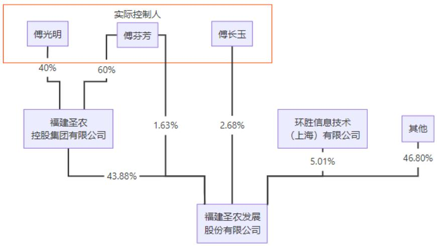

flowchart

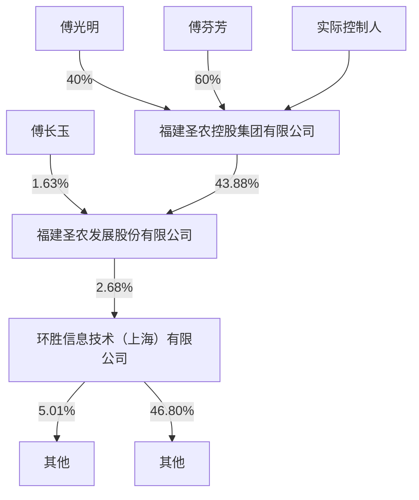

资料来源：Wind、公司公告、财信证券

表 1：2025 年实施的股权激励计划解除限售安排及公司层面业绩考核目标

<table><tr><td>解除限售期</td><td>解除限售比例</td><td>考核年度</td><td>营业收入增长率目标</td></tr><tr><td>第一个解除限售期</td><td>30%</td><td>2026年</td><td>≥8%</td></tr><tr><td>第二个解除限售期</td><td>30%</td><td>2027年</td><td>≥10%</td></tr><tr><td>第三个解除限售期</td><td>40%</td><td>2028年</td><td>≥12%</td></tr></table>

资料来源：公司公告、财信证券  
注：营业收入增长率目标均以2023-2025年营收平均值为基数。

## 1.3 公司发展历程：六阶跨越、全链贯通

公司自 1983 年光泽富屯溪畔的光兴养鸡场起步，历经近四十载砥砺奋进，已完成从个体作坊到亚洲白羽肉鸡龙头的蜕变，先后跨越作坊萌芽、规模扩张、产业链整合提速升华、资本上市扩张、智能升级、价值释放六大发展阶段，构建起覆盖种源育种、饲料加工、规模养殖、食品深加工至终端销售的全产业生态闭环，铸就了"纵贯养殖屠宰、横跨食品多元"的竞争优势。

## 1、作坊萌芽期（1983-1992）

创始人傅光明从福建省南平市光泽县富屯溪畔起步，注册福建省首家私营企业"光兴养鸡场"。期间遭遇禽霍乱全军覆没，但他将军队作风注入管理，推行半军事化制度与员工培训，以送货上门打破行业惯例，奠定了"百折不挠、注重学习"的企业韧性底色。

## 2、扩张壮大期（1993-2002）

1993 年引进丹麦冻肉生产线，实现活鸡到包装的现代化一体作业；1994 年与肯德基建立战略合作，引入先进管理理念与稳定订单。此阶段完成了从作坊向工厂化、产业链从产到销一体化的蜕变。

## 3、提速升华期（2003-2008）

2003 年后，公司进入了提速和升华阶段，公司确立"诚信、品质、专一、共赢"四大企业文化，将"圣农鼎"作为立诚信标杆，延伸产业链至食品深加工，建成 6 个食品厂，成为北京奥运会、上海世博会等国家级会议指定供应商，完成从养殖企业向食品集团的战略转型。

## 4、资本扩张期（2009-2016）

2009 年圣农发展登陆中小板，借助资本市场加速扩张。2011 年以来，启动浦城、政和异地扩张，在行业低迷期逆势投资。2016 年产能达 5 亿羽，市占率从 2% 升至 10%，展现"逆周期扩张"的战略定力。

## 5、智能升级期（2016-2020）

开启农业 4.0 时代，实现管理智能化、生产自动化，食品安全系统化，环保、消防标准化，公司成为世界上生产经营管理先进的肉鸡生产企业之一。2016 年，食品深加工进入麦当劳供应链，2010 年起，熟食出口日本等国家和地区。

## 6、价值释放期（2021至今）

2021年，圣农集团发布"十四五"战略规划，锚定五大方向：养殖规模翻番、强化食品战略、圣泽新品审定、做优圣农品牌、打造数字圣农等。尽管近年来白羽鸡行业深陷价格战泥潭，圣农仍凭借全链条竞争优势，持续提升单羽盈利水平，在行业低迷期拉开差距，展现出逆势增长的韧性。

公司通过40余年发展转型完成了从传统养殖企业向全产业链食品企业的蜕变，上市以来营收复合增速约 $18\%$ 。综合公司发展历程及关键时点的决策，公司成为白羽鸡产业链一体化标杆企业，主要凭借以下5点核心竞争力：一是40余年来"择一事、成一业"的战略定力与专注；二是从养殖到食品的全产业链垂直整合能力；三是半军事化管理孕育的组织执行力；四是"诚信立企、品质为先"的文化基因；五是逆境中敢于逆势扩张的魄力与韧性。

表 2：圣农发展的发展历程

<table><tr><td>阶段</td><td>时期</td><td>核心特征</td></tr><tr><td>作坊萌芽期</td><td>1983-1992年</td><td>个体养鸡小作坊,无标准、无规范,傅光明亲力亲为,经历禽霍乱挫折后建立半军事化管理</td></tr><tr><td>扩张壮大期</td><td>1993-2002年</td><td>引进丹麦冻肉生产线,建立产加销一体化产业链,1994年与肯德基建立战略合作</td></tr><tr><td>提速升华期</td><td>2003-2008年</td><td>打造企业文化(诚信、品质、专一、共赢),全面延伸产业链,为上市做准备</td></tr><tr><td>资本扩张期</td><td>2009-2016年</td><td>2009年深交所上市,2011年启动异地扩张(浦城、政和、资溪),2016年产能达5亿羽,市占率10%</td></tr><tr><td>智能升级期</td><td>2016-2020年</td><td>开启农业养殖4.0,管理智能化、生产自动化,食品深加工进入麦当劳供应链</td></tr><tr><td>价值释放期</td><td>2021年至今</td><td>全产业链协同+品牌溢价,数字化、品牌化、集群化多维度发力,目前产能近8亿羽</td></tr></table>

资料来源：中国食品安全报公众号、圣农发展公司官网、公司公告、财信证券

图 7：2009 年以来圣农发展营业收入走势图  
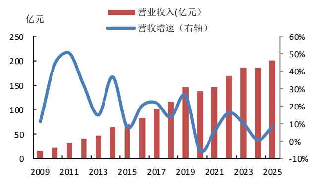

bar-line hybrid chart

| 年份 | 营业收入(亿元) | 营收增速（右轴） |
| ---- | -------------- | ---------------- |
| 2009 | 15             | 7%               |
| 2010 | 25             | 15%              |
| 2011 | 35             | 25%              |
| 2012 | 45             | 15%              |
| 2013 | 55             | 8%               |
| 2014 | 65             | 17%              |
| 2015 | 75             | 6%               |
| 2016 | 85             | 12%              |
| 2017 | 95             | 15%              |
| 2018 | 105            | 12%              |
| 2019 | 115            | 30%              |
| 2020 | 125            | -5%              |
| 2021 | 135            | 8%               |
| 2022 | 145            | 15%              |
| 2023 | 155            | 10%              |
| 2024 | 165            | 5%               |
| 2025 | 175            | 10%              |

资料来源：Wind、财信证券

图 8：2009 年以来圣农发展归母净利润、扣非归母净利润走势图  
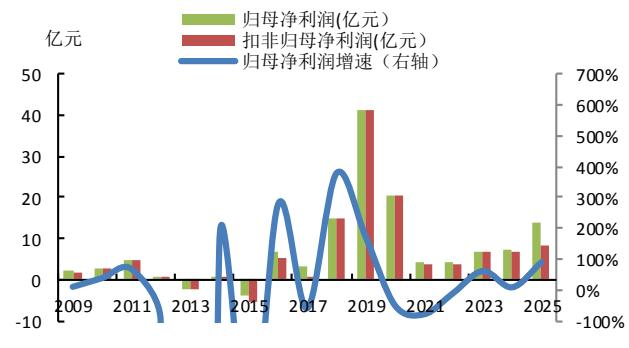

bar-line hybrid chart

| Year | 归母净利润(亿元) | 扣非归母净利润(亿元) | 归母净利润增速 (右轴) |
|------|------------------|----------------------|------------------------|
| 2009 | 2                | 1                    | -50%                   |
| 2010 | 3                | 2                    | 0%                     |
| 2011 | 5                | 4                    | 100%                   |
| 2012 | 1                | 1                    | -100%                  |
| 2013 | 1                | 1                    | -50%                   |
| 2014 | 1                | -3                   | -100%                  |
| 2015 | 6                | -2                   | -50%                   |
| 2016 | 7                | 6                    | 200%                   |
| 2017 | 3                | 15                   | 300%                   |
| 2018 | 15               | 42                   | 400%                   |
| 2019 | 42               | 42                   | 600%                   |
| 2020 | 21               | 21                   | -50%                   |
| 2021 | 4                | 4                    | -100%                  |
| 2022 | 4                | 4                    | -50%                   |
| 2023 | 7                | 7                    | 50%                    |
| 2024 | 8                | 8                    | 50%                    |
| 2025 | 14               | 9                    | 100%                   |

资料来源：Wind、财信证券  
注：2013 年、2015 年公司归母净利润同比变化幅度分别为 -8442%、-609%，为清晰显示其他年份数据坐标轴做了相关调整。

## 2 2026 年白羽肉鸡行业预计供给端仍宽松, 关注消费复苏对鸡肉价格的提振

回顾 2025 年, 我国白羽鸡行业呈现"产能创新高、供给过剩、价格利润双降"的特征。据《2025 年我国肉鸡产业形势分析、问题挑战与对策建议》(辛翔飞等)的统计数据, 2025 年白羽肉鸡出栏量、鸡肉产量分别为 90.57 亿只、1930.19 万吨, 同比 +5.97%、+8.50%。成本端, 受玉米、豆粕等饲料原料价格低位运行影响, 肉鸡配合饲料年均价格 3.51 元/kg, 同比下降 3.80%, 白羽肉鸡平均养殖成本降至 7.26 元/kg, 降幅 6.46%。然而, 供给端 8.50% 的产量增速远超消费端的增速, 2025 年餐饮收入增速 (3.2%) 较 2024 年 (5.3%) 和 2023 年 (20.4%) 明显放缓, 阶段性供需失衡加剧。价格端, 白羽肉鸡全年出栏均价 7.28 元/kg, 同比下降 6.60%, 2 月和 7 月分别出现近 15% 和 10% 的断崖式下跌。产业链利润大幅收缩, 白羽肉鸡全产业链平均收益仅 0.63 元/只, 同比下降 17.11%, 全产业链全年盈亏月数比为 9:3, 而商品代养殖环节全年盈亏月数比为 6:6。

从 2025 年祖代、父母代环节大致判断，2026 年父母代、商品代环节供应仍处于产能相对宽松阶段。种鸡产能方面，据《2025 年我国肉鸡产业形势分析、问题挑战与对策建议》（辛翔飞等）的统计数据，白羽祖代年度更新量达 157.41 万套，同比增加 4.89%，刷新 2013 年历史峰值。以父母代环节指标来看，2026 年供应中枢仍然呈现上移趋势。2025 年父母代种鸡年度更新 8007.71 万套，同比增长 19.73%；父母代种鸡平均月度存栏量 7089.60 万套，其中在产父母代种鸡 3817.25 万套，分别同比增长 9.69%、4.86%。由于白羽肉种鸡在约 32 周龄达到生产高峰，父母代种鸡补栏数量对应 8-9 个月后的商品代鸡苗销量，我们从父母代鸡苗销售量走势大致推断 8-9 个月后的商品代鸡苗销售量，结合《2025 年我国肉鸡产业形势分析、问题挑战与对策建议》（辛翔飞等）的思路，由于父母代鸡苗销量同比增速 2025 年下半年逐步走高，我们预计 2026 年肉鸡产量呈现前低后高的趋势，预计下半年供给压力较上半年更为突出，全年肉鸡产量预计仍呈现增长态势。疫病方面，需关注 2025 年秋冬季祖代强制换羽导致的雏鸡质量下降问题，若疫病风险持续发酵，可能对 2026 年实际产能转化效率产生阶段性扰动，但难以扭转整体供给宽松格局。

展望 2026 年全年价格来看，白羽鸡供给端仍为宽松局面，但需求端催化因素逐步显现。后期国内消费刺激政策落地有望提振终端需求，此外，若 2026 年下半年猪价上行，鸡猪替代效应亦将拉动鸡肉消费。供需格局改善下，预计 2026 年白羽鸡价格整体将略好于 2025 年，后续建议观察海外禽流感对引种短缺的影响及消费复苏情况。

图 9：我国白羽肉鸡苗价格走势图（周、元/羽）  
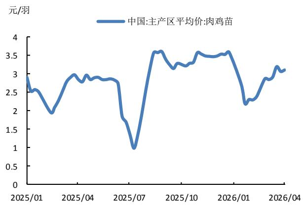

line chart

| Date     | 中国:主产区平均价:肉鸡苗 (元/羽) |
| -------- | ------------------------------- |
| 2025/01  | 2.8                             |
| 2025/02  | 2.5                             |
| 2025/03  | 2.0                             |
| 2025/04  | 2.9                             |
| 2025/05  | 2.8                             |
| 2025/06  | 2.9                             |
| 2025/07  | 1.0                             |
| 2025/08  | 3.6                             |
| 2025/09  | 3.5                             |
| 2025/10  | 3.4                             |
| 2025/11  | 3.5                             |
| 2025/12  | 3.6                             |
| 2026/01  | 3.5                             |
| 2026/02  | 2.2                             |
| 2026/03  | 2.8                             |
| 2026/04  | 3.1                             |

资料来源：Wind、财信证券

图 10：我国白羽肉鸡价格走势图（周、元/kg）  
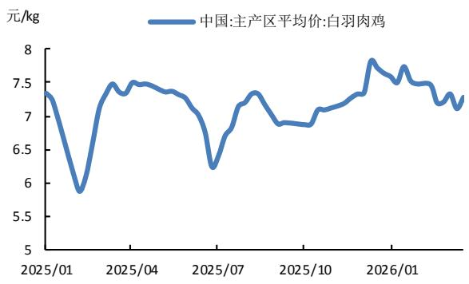

line chart

| Date     | 中国:主产区平均价:白羽肉鸡 (元/kg) |
| -------- | ---------------------------------- |
| 2025/01  | 7.4                                |
| 2025/02  | 5.9                                |
| 2025/03  | 7.5                                |
| 2025/04  | 7.4                                |
| 2025/05  | 7.3                                |
| 2025/06  | 7.1                                |
| 2025/07  | 6.3                                |
| 2025/08  | 7.3                                |
| 2025/09  | 6.9                                |
| 2025/10  | 6.9                                |
| 2025/11  | 7.1                                |
| 2025/12  | 7.3                                |
| 2026/01  | 7.8                                |
| 2026/02  | 7.6                                |
| 2026/03  | 7.4                                |
| 2026/04  | 7.3                                |
| 2026/05  | 7.1                                |
| 2026/06  | 7.3                                |
| 2026/07  | 7.5                                |
| 2026/08  | 7.7                                |
| 2026/09  | 7.9                                |
| 2026/10  | 7.7                                |
| 2026/11  | 7.5                                |
| 2026/12  | 7.3                                |

资料来源：Wind、财信证券

图 11: 我国肉鸡配合饲料价格走势  
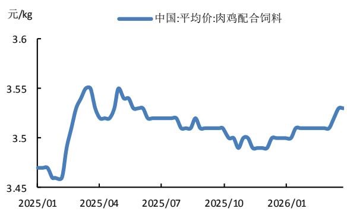

line chart

| Date     | 中国:平均价:肉鸡配合饲料 (元/kg) |
| -------- | ------------------------------- |
| 2025/01  | 3.47                            |
| 2025/04  | 3.55                            |
| 2025/07  | 3.52                            |
| 2025/10  | 3.49                            |
| 2026/01  | 3.51                            |
| 2026/04  | 3.53                            |

资料来源：Wind、财信证券

图 12：我国餐饮收入增速走势图  
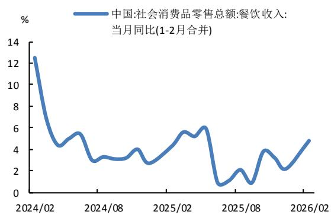

line chart

| Date     | China:社会消费品零售总额:餐饮收入:当月同比(1-2月合并) (%) |
| -------- | -------------------------------------------------------- |
| 2024/02  | 13.0                                                     |
| 2024/08  | 3.0                                                      |
| 2025/02  | 6.0                                                      |
| 2025/08  | 1.0                                                      |
| 2026/02  | 5.0                                                      |

资料来源：Wind、财信证券

图 13: 我国祖代白羽鸡年度更新量  
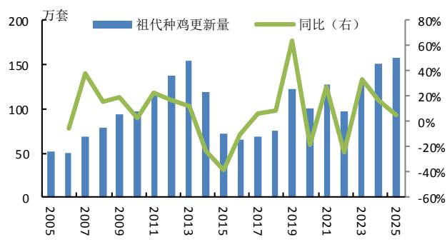

bar-line hybrid chart

| Year | 祖代种鸡更新量 (万套) | 同比 (%) |
|------|------------------------|----------|
| 2005 | 50                     | -        |
| 2006 | 50                     | -        |
| 2007 | 70                     | 40       |
| 2008 | 80                     | 20       |
| 2009 | 90                     | 10       |
| 2010 | 100                    | 15       |
| 2011 | 120                    | 25       |
| 2012 | 140                    | 20       |
| 2013 | 155                    | 15       |
| 2014 | 120                    | -        |
| 2015 | 75                     | -        |
| 2016 | 65                     | -        |
| 2017 | 70                     | -        |
| 2018 | 75                     | -        |
| 2019 | 125                    | 65       |
| 2020 | 100                    | -        |
| 2021 | 130                    | 30       |
| 2022 | 100                    | -        |
| 2023 | 135                    | 35       |
| 2024 | 155                    | 25       |
| 2025 | 160                    | 10       |

资料来源：《2025年我国肉鸡产业形势分析、问题挑战与对策建议》（辛翔飞等）、财信证券

图 14: 我国父母代白羽鸡销量及滞后 8 个月的商品代鸡苗销量同比增速  
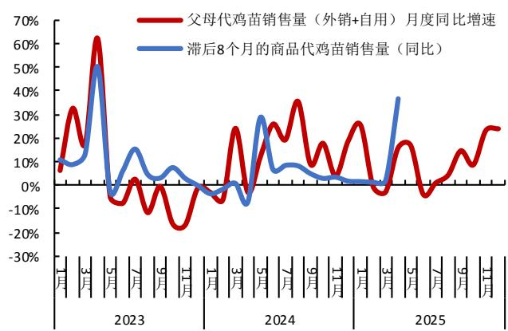

line chart

| Month | 父母代鸡苗销售量（外销+自用）月度同比增速 (%) | 滞后8个月的商品代鸡苗销售量（同比） (%) |
|-------|---------------------------------------------|------------------------------------------|
| 2023  | ~30%                                        | ~50%                                     |
| 2023  | ~65%                                        | ~-5%                                     |
| 2023  | ~-5%                                        | ~15%                                     |
| 2023  | ~-10%                                       | ~10%                                     |
| 2023  | ~-20%                                       | ~5%                                      |
| 2024  | ~25%                                        | ~-10%                                    |
| 2024  | ~35%                                        | ~10%                                     |
| 2024  | ~-5%                                        | ~5%                                      |
| 2024  | ~-10%                                       | ~0%                                      |
| 2025  | ~20%                                        | ~35%                                     |
| 2025  | ~-5%                                        | ~-5%                                     |
| 2025  | ~10%                                        | ~-5%                                     |
| 2025  | ~-5%                                        | ~-5%                                     |
| 2025  | ~15%                                        | ~-5%                                     |
| 2025  | ~-5%                                        | ~-5%                                     |
| 2025  | ~25%                                        | ~-5%                                     |

资料来源：中国畜牧业协会禽业分会、财信证券

图 15: 我国白羽鸡各环节利润情况  
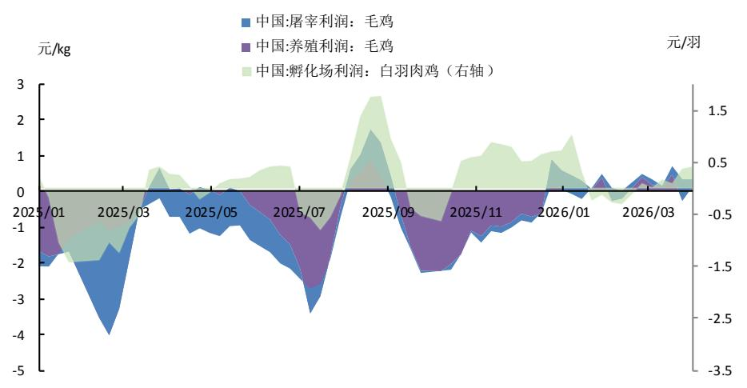

area chart

| Date     | 中国:屠宰利润：毛鸡 (元/kg) | 中国:养殖利润：毛鸡 (元/kg) | 中国:孵化场利润：白羽肉鸡 (右轴) (元/羽) |
|----------|-----------------------------|-----------------------------|------------------------------------------|
| 2025/01  | -2.0                        | -0.5                        | -0.5                                     |
| 2025/03  | -4.0                        | -0.5                        | -0.5                                     |
| 2025/05  | -1.0                        | -0.5                        | -0.5                                     |
| 2025/07  | -3.0                        | -1.5                        | -0.5                                     |
| 2025/09  | 1.5                         | -1.5                        | 1.5                                      |
| 2025/11  | -1.0                        | -1.5                        | 1.5                                      |
| 2026/01  | -0.5                        | -1.0                        | 1.0                                      |
| 2026/03  | 0.5                         | -0.5                        | 0.5                                      |

资料来源：Wind、财信证券

## 3 圣农发展未来看点

## 3.1 养殖产能稳步释放，大食品战略纵深推进

内生外延并举，养殖产能持续扩张。圣农发展从2009年的6400万羽肉鸡养殖产能起步，通过内生、外延方式提升产能，目前（截至2025年年报公布日）产能已近8亿羽。内生增长方面，上市以来，公司通过新建厂房、技改及提高养殖效率等方式提高产能；外延并购方面，2022年公司收购了河南森胜 $15\%$ 股份，2023年先后收购甘肃圣越农牧 $60\%$ 股份、收购安徽太阳谷食品 $46\%$ 股权，2025年进一步完成对太阳谷剩余 $54\%$ 股权的收购，实现全资控股。依托大规模一体化自养自宰模式，公司鸡肉产品优质优价，2025年公司鸡肉销售均价9.55元/kg(公司月度销售情况简报口径)，高出行业均值0.68元/kg，品牌溢价能力凸显，2025年全年鸡肉销量达157.68万吨，2015-2025年CAGR $9\%$ ，销量增长与价格优势共振。

大食品战略纵深推进，深加工产能全国第一。公司以“成为世界级食品企业”为战略愿景，2017年公司收购圣农食品切入熟食领域后，公司持续加码深加工布局，食品九厂于2022年投产，产能4.8万吨，食品十厂选址江西资溪，于2024年投产，新增6万吨年产能，产业链持续扩张。2025年上半年，公司收购太阳谷剩余股份并完成 $100\%$ 并表，新增9万吨熟食产能。圣农食品现拥有10座食品加工厂，据2025年年报，公司已建及在建食品深加工产能超50万吨，稳居全国第一。

产品端，公司先后在光泽、福州、上海设立了三大研发中心，依托130余人研发团队打造"圣农"、"4度"、"安佰牧场"品牌矩阵，聚焦炸鸡核心品类，成功打造嘟嘟翅、脆皮炸鸡、手枪腿等多个大单品。渠道端，公司在深加工B端业务实现连锁餐饮、便利店、出口等渠道全覆盖，通过白羽鸡行业40多年的沉淀和积累以及在食品深加工行业20多年的精耕细作，公司已与百胜中国、麦当劳、塔斯汀、德克士、沃尔玛、永辉等国内外知名客户建立了长期的战略合作关系。出口方面，公司与日本火腿、FOODLINK、日本服务、伊藤火腿、住金物产、日本永旺企业、韩国乐天、韩国普光集团、LG集团等日本、韩国大型企业建立了深度合作关系。同时，2019年以来，公司着力发展C端零售渠道，聚焦C端与品牌战略，公司进驻沃尔玛等线下商超外，亦开通了主流的线上、新零售平台，涵盖天猫、京东、拼多多、抖音等主要线上平台以及朴朴、钱大妈、盒马鲜生、美团买菜等主要新零售平台。2025年公司各渠道发展势头迅猛，C端零售渠道实现收入约35.5亿元（含太阳谷2025年并表后的C端收入），同比增长超过60%；出口渠道全年收入同比增长超过60%；餐饮渠道各板块收入也均取得亮眼增长。

“品牌+渠道”双轮驱动下，公司深加工规模大幅提升。据2025年年报披露，2025年公司深加工产品销量44.76万吨(同比 $+41.25\%$ )，深加工肉制品销售收入85.52亿元(同比 $+21.99\%$ )。未来，随着食品深加工产能持续扩大，公司一体化产业链的规模效应与品牌溢价有望加速转化为业绩，进入新一轮成长释放期。大食品战略持续推进下，将增厚单羽肉鸡的利润贡献，从而进一步提升公司整体盈利能力。

图 16: 圣农发展鸡肉销售均价与我国主产区鸡产品均价走势  
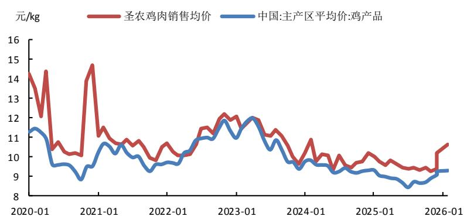

line chart

| Date     | 圣农鸡肉销售均价 (元/kg) | 中国:主产区平均价:鸡产品 (元/kg) |
|----------|--------------------------|----------------------------------|
| 2020-01  | ~14.5                    | ~11.5                            |
| 2021-01  | ~15.0                    | ~9.5                             |
| 2022-01  | ~10.5                    | ~9.5                             |
| 2023-01  | ~12.5                    | ~11.5                            |
| 2024-01  | ~10.5                    | ~9.5                             |
| 2025-01  | ~9.5                     | ~8.5                             |
| 2026-01  | ~10.5                    | ~9.5                             |

资料来源：Wind、财信证券  
注：销售均价计算口径为：根据公司月度销售情况简报披露数据测算，与年报披露数据略有差异。

图 17: 圣农发展鸡肉、深加工肉制品销量情况  
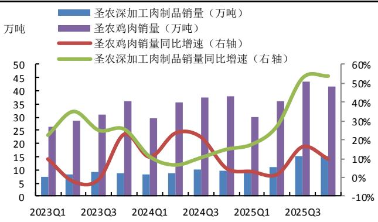

bar-line hybrid chart

| Quarter | 圣农深加工肉制品销量 (万吨) | 圣农鸡肉销量 (万吨) | 圣农鸡肉销量同比增速 (%) | 圣农深加工肉制品销量同比增速 (%) |
|---------|-----------------------------|--------------------|--------------------------|----------------------------------|
| 2023Q1  | 7                           | 25                 | 15                       | 25                               |
| 2023Q2  | 9                           | 30                 | 5                        | 35                               |
| 2023Q3  | 10                          | 35                 | 10                       | 30                               |
| 2023Q4  | 9                           | 30                 | 15                       | 25                               |
| 2024Q1  | 10                          | 35                 | 20                       | 15                               |
| 2024Q2  | 11                          | 38                 | 25                       | 10                               |
| 2024Q3  | 10                          | 38                 | 15                       | 15                               |
| 2024Q4  | 11                          | 30                 | 10                       | 20                               |
| 2025Q1  | 12                          | 35                 | 5                        | 30                               |
| 2025Q2  | 15                          | 45                 | 15                       | 45                               |
| 2025Q3  | 16                          | 42                 | 10                       | 55                               |

资料来源：Wind、财信证券

图 18：圣农发展鸡肉、深加工肉制品销售收入情况  
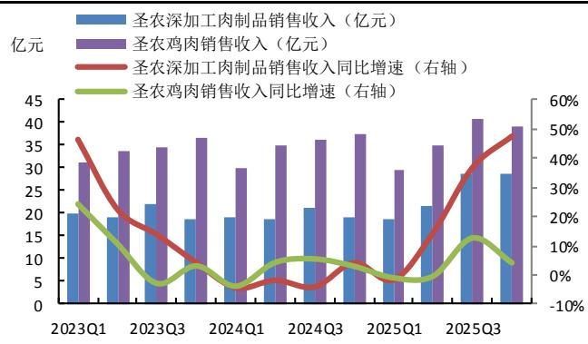

bar-line hybrid chart

| Quarter | 圣农深加工肉制品销售收入 (亿元) | 圣农鸡肉销售收入 (亿元) | 圣农深加工肉制品销售收入同比增速 (%) | 圣农鸡肉销售收入同比增速 (%) |
|---------|-------------------------------|--------------------------|--------------------------------------|----------------------------------|
| 2023Q1  | 20                            | 31                       | 50                                   | 25                               |
| 2023Q2  | 19                            | 34                       | 40                                   | 15                               |
| 2023Q3  | 22                            | 35                       | 30                                   | 5                                |
| 2023Q4  | 19                            | 37                       | 20                                   | -5                               |
| 2024Q1  | 19                            | 30                       | 5                                    | -5                               |
| 2024Q2  | 19                            | 35                       | 5                                    | 5                                |
| 2024Q3  | 21                            | 36                       | 5                                    | 5                                |
| 2024Q4  | 19                            | 38                       | 5                                    | 5                                |
| 2025Q1  | 19                            | 30                       | 5                                    | 0                                |
| 2025Q2  | 21                            | 35                       | 10                                   | 5                                |
| 2025Q3  | 29                            | 41                       | 40                                   | 15                               |
| 2025Q4  | —                             | —                        | —                                    | —                                |

资料来源：Wind、财信证券  
注：图17、图18显示数据根据公司月度销售情况简报披露数据测算，与年报披露数据略有差异。

图 19：深加工肉制品销量占比及销售收入占比走势图  
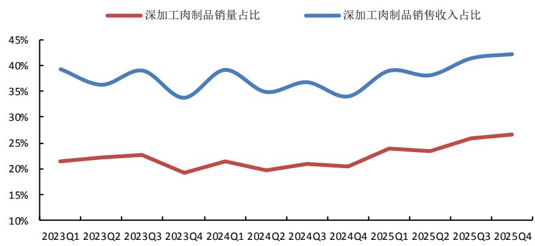

line chart

| Quarter | 深加工肉制品销量占比 | 深加工肉制品销售收入占比 |
| ------- | ------------------- | ----------------------- |
| 2023Q1  | 21.5%               | 39.5%                   |
| 2023Q2  | 22.0%               | 36.5%                   |
| 2023Q3  | 23.0%               | 38.5%                   |
| 2023Q4  | 19.0%               | 34.0%                   |
| 2024Q1  | 21.5%               | 39.0%                   |
| 2024Q2  | 19.5%               | 35.0%                   |
| 2024Q3  | 20.5%               | 36.5%                   |
| 2024Q4  | 20.0%               | 34.0%                   |
| 2025Q1  | 24.0%               | 39.0%                   |
| 2025Q2  | 23.5%               | 38.0%                   |
| 2025Q3  | 26.0%               | 41.0%                   |
| 2025Q4  | 27.0%               | 42.0%                   |

资料来源：Wind、财信证券

图 20: 圣农食品品牌矩阵  
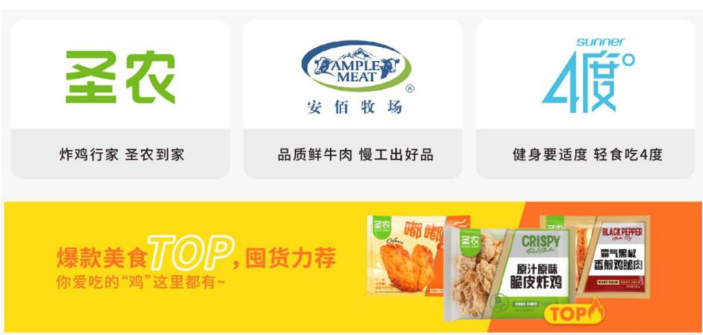

text_image

圣农
炸鸡行家 圣农到家
安佰 牧场
品质鲜牛肉 慢工出好品
健身要适度 轻食吃4度
sunner
4度
爆款美食TOP,囤货力荐
你爱吃的“鸡”这里都有~
嘟嘟
黑衣
CRISPY
原汁原味
脆皮炸鸡
BLACK PEPPER
霸气黑椒
香椒鸡腿肉
TOP

资料来源：圣农食品官网

表 3: 圣农食品加工厂基本情况

<table><tr><td>序号</td><td>工厂名称</td><td>投产时间</td><td>产能</td><td>主要产品/客户</td></tr><tr><td>1</td><td>食品加工一厂</td><td>2003年</td><td>/</td><td>对日热加工禽肉出口、大客户</td></tr><tr><td>2</td><td>食品加工二厂</td><td>2010年</td><td>3万吨/年</td><td>大客户、国内批发和商超渠道(成型油炸/灌肠/裹粉/丸子/面点)</td></tr><tr><td>3</td><td>食品加工三厂</td><td>2013年</td><td>3.6万吨/年</td><td>出口产品(油炸/蒸烤/炭烤类)</td></tr><tr><td>4</td><td>食品加工四厂</td><td>2013年</td><td>3.6万吨/年</td><td>餐饮大客户(油炸/蒸烤/炭烤/裹粉/调理品)</td></tr><tr><td>5</td><td>食品加工五厂</td><td>2015年</td><td>3.12万吨/年</td><td>熟食品加工</td></tr><tr><td>6</td><td>食品加工六厂</td><td>2016年</td><td>4.8万吨/年</td><td>油炸类、蒸烤类、裹粉油炸类产品</td></tr><tr><td>7</td><td>福建圣农华上食品</td><td>2017年</td><td>/</td><td>鸡肉培根产品</td></tr><tr><td>8</td><td>食品加工七厂、八厂</td><td>/</td><td>7.92万吨/年</td><td>中式调理包、腌制调理产品、油炸蒸烤产品</td></tr><tr><td>9</td><td>食品加工九厂</td><td>2022年</td><td>4.8万吨/年</td><td>肯德基、麦当劳、国内餐饮渠道(成型油炸/裹粉油炸/冷冻调理/肉饼)</td></tr><tr><td>10</td><td>食品加工十厂</td><td>2024年</td><td>6万吨/年</td><td>国际、国内餐饮品牌(油炸/蒸煮/蒸烤,鸡/牛/猪等肉类)</td></tr></table>

资料来源：圣农食品官方网站、Wind、圣农发展公告、财信证券

## 3.2育种技术持续迭代，自主替代路径明确，国际市场拓展可期

## 种源打破国际垄断，圣农育种先发优势显著。

我国白羽肉鸡种源长期依赖进口，主要为美国安伟捷的 $\mathrm{AA+}$ 、罗斯308、利丰品种及新西兰科宝品种。2009年国家肉鸡产业技术体系成立白羽肉鸡育种协作组，开展我国白羽肉鸡育种战略研究，组织推动我国有实力的企业开展白羽肉鸡育种工作。2014年，《全国肉鸡遗传改良计划(2014—2025年)》发布实施，将白羽肉鸡育种明确列入发展目标，有利地促进了我国白羽肉鸡育种工作。2019年，农业农村部实施白羽肉鸡育种联合攻关项目，着手推动白羽肉鸡育种工作。2021年农业农村部发布的《全国肉鸡遗传改良计划（2021—2035年)》提出到2035年自主培育品种市场占有率超 $60\%$ 的目标。

在此背景下，圣农发展育种先发优势成为核心战略机遇。据圣泽901公众号，公司2014年启动育种调研，2019年成立福建圣泽生物科技发展有限公司，同年成功培育出国内首个拥有完全自主知识产权的白羽肉鸡配套系“圣泽901”，2021年通过国家农业农村部审定，一举打破国外的垄断，实现白羽肉鸡种源从“0”到“1”的突破，同时，使得圣泽生物一跃成为具有世界影响力的农业高科技企业和具有自主知识产权的世界第三大白羽肉鸡育种企业。

2021年末获农业农村部批准对外销售资格，2022年6月正式批量供应市场。据中国福建三农网，截至2025年12月底，“圣泽901”父母代种鸡销往全国15个省，推广父母代种鸡4700万套。据新浪财经，2025年10月底，父母代种鸡国内市场占有率已达到 $20\%$ 。值得注意的是，公司自研种源已成功走出国门，据中国福建三农网2026年2月报道，公司已向坦桑尼亚、塔吉克斯坦2个国家累计出口父母代种鸡1万套、种蛋27万枚。随着国产品种替代进程加速及海外市场拓展，圣农发展凭借自主可控的种源壁垒和已验证的市场化能力，长期看来，有望在种业安全战略下持续巩固行业龙头地位，打开第二增长曲线。

国产品种来看，“广明2号”、“沃德188”亦经国家农业农村部审定通过，据《2025年我国肉鸡产业形势分析、问题挑战与对策建议》（辛翔飞等），当前国产品种正处于从"技术突破"到"市场突破"的关键攻坚期。国产品种生产性能2025年显著提升，“走出去”步伐明显加快——2023年以来相继出口至塔吉克斯坦、坦桑尼亚、巴基斯坦、沙特阿拉伯、乌兹别克斯坦等"一带一路"沿线国家，国际竞争实力初步显现。长期视角下，国产白羽鸡品种市场占有率有望提升。

推进白羽肉鸡全产业链高质量发展种源“卡脖子”突破，圣泽生物科技白羽鸡育种持续更新迭代，2023年底，在原有“圣泽901”基础上，公司成功迭代研发了种源新组合“圣泽901plus”，性能方面获得大幅提升，料肉比指标较原组合得到显著改善，此外在产蛋率、生长速度、抗病性等指标上均达到国际领先水平。后期建议关注新品种“圣泽903”的研发推广进展，据中国福建三农网报道，“圣泽903”取得突破性进展，新品种在料肉比、生长速度、成活率、产蛋率、鸡病净化等主要指标全面好于国外育种企业，达到全球领先水平。

图 21: 圣泽生物自主育种历程  
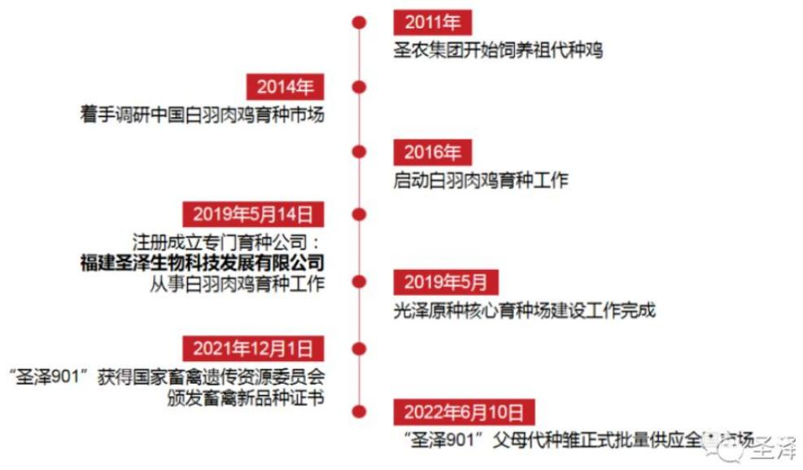

flowchart

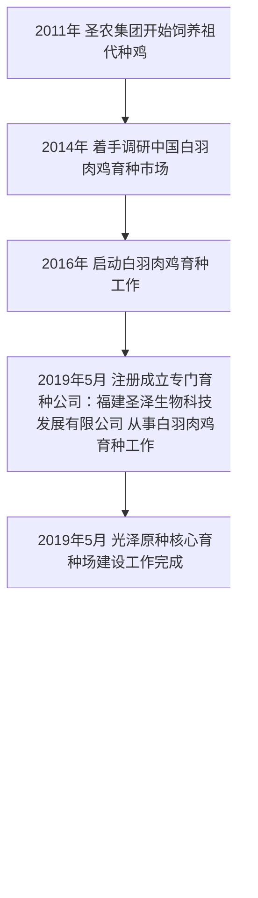

资料来源：圣泽901 公众号

图 22: 圣泽 901 出口东非开启国际化进程  
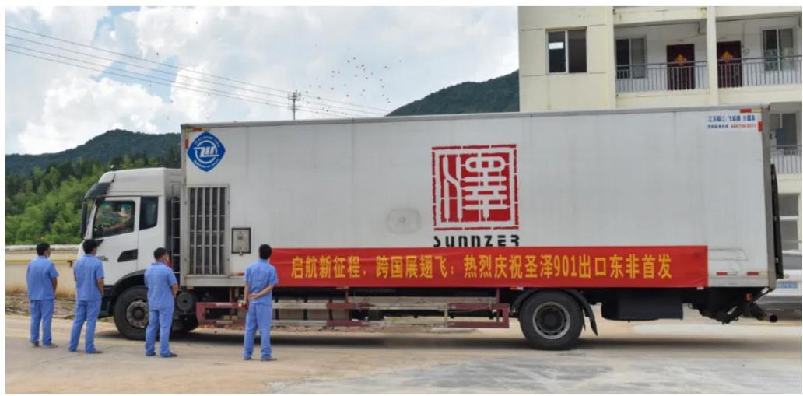

text_image

启航新征程，跨国展翅飞：热烈庆祝圣泽901出口东非首发

资料来源：闽北日报微信公众号

表 4: 圣泽生物育种迭代及性能指标

<table><tr><td>性能指标</td><td>圣泽 901plus</td><td>圣泽 901</td></tr><tr><td>料肉比(平养)</td><td>1.423</td><td>1.58</td></tr><tr><td>料肉比(笼养)</td><td>1.39</td><td>/</td></tr><tr><td>每套种鸡产合格种蛋</td><td>&gt;175枚</td><td>168枚</td></tr><tr><td>37日龄平均体重</td><td>2.5kg</td><td>2.5kg</td></tr></table>

资料来源：福建省工业和信息化厅官网、中国畜牧业协会、财信证券

## 3.3 产业链一体化成熟期，成本护城河形成，红利逐步释放

圣农发展产业链一体化布局已趋成熟，纵向一体化有利于消除中间环节利润流失，育种、饲料、养殖到屠宰、食品深加工的完整产业链各环节均为自有，助力公司实现全产业链价值内部留存。同时，下游订单需求反向指导上游养殖出栏节奏，实现供需精准匹配。公司凭借超强的食品研发能力，能够通过市场洞察、趋势分析和新品研发促成与食品大客户的交易。总之，公司依托自主育种技术优势降低养殖成本，凭借规模化养殖提升中游生产效率，通过食品加工延伸下游增值链条。公司三大环节协同运作，将助力实现降本增效、风险可控与利润最大化。

圣农发展凭借近 8 亿羽的白羽鸡养殖产能以及持续优化的造肉成本，守住了超额盈利的护城河。由于种源干净，有利于降低防疫成本。料肉比降低，一方面有效提升了效益，另一方面降低了成本。如圣泽 901plus 平养条件下出栏料肉比达 1.423，较圣泽 901 下降 0.157，蕴含着巨大的经济效益。据我们简单测算，将圣农集团养殖的肉鸡进行品种更新，若整体养殖的料肉比下降 0.05，在假设饲料价格为 3.5 元/kg，出栏体重为 2.5kg/羽的基础上，每年可节约饲料成本约 3 亿元。此外，疾病净化、成活率提升下，降低死淘率，有利于降低每羽摊销成本。

公司种源完全自给，养殖规模自主可控，摆脱海外引种依赖及苗价波动扰动，供应链稳定性强、市场响应敏捷，有效规避断供风险。在饲料价格下降，以及公司自主育种带来的成本下降形势下，公司自2023年以来鸡肉产品单吨成本持续下降，而国内鸡产品市场价格2023Q3以来基本处于下行的趋势，公司归母净利润水平自2024Q2以来保持较强韧性。随着公司种鸡不断迭代，通过基因组育种、精准选育、疾病净化三大技术路径，有望继续实现了料肉比下降、成活率提升、产蛋数提升、防疫成本下降的综合效应，最终推动综合造肉成本下降，从而节约饲料及养殖成本。

图 23: 我国鸡产品价格走势与圣农发展归母净利润序列图  
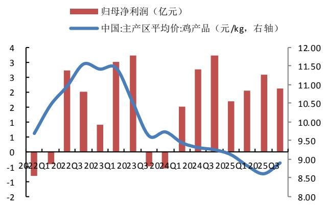

bar-line hybrid chart

| Quarter | 归母净利润（亿元） | 中国:主产区平均价:鸡产品（元/kg，右轴） |
| ------- | ------------------ | ----------------------------------- |
| 2022 Q1 | -1.0               | 9.5                                 |
| 2022 Q2 | 0.0                | 10.0                                |
| 2022 Q3 | 3.0                | 11.0                                |
| 2022 Q4 | 2.0                | 11.5                                |
| 2023 Q1 | 1.0                | 11.0                                |
| 2023 Q2 | 3.0                | 10.5                                |
| 2023 Q3 | 3.5                | 9.5                                 |
| 2023 Q4 | 0.0                | 9.0                                 |
| 2024 Q1 | 2.0                | 9.5                                 |
| 2024 Q2 | 3.0                | 9.0                                 |
| 2024 Q3 | 3.5                | 8.5                                 |
| 2024 Q4 | 2.0                | 9.0                                 |
| 2025 Q1 | 2.5                | 8.5                                 |
| 2025 Q2 | 3.0                | 8.0                                 |
| 2025 Q3 | 2.5                | 8.5                                 |

资料来源：Wind、财信证券

图 24: 圣农发展鸡肉产品测算单吨成本  
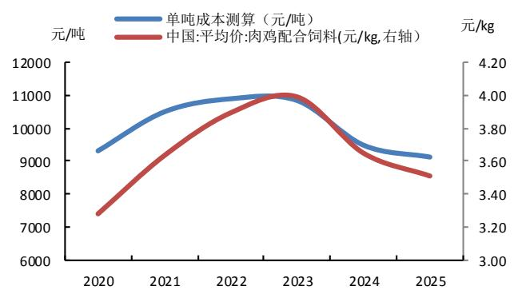

bar-line hybrid chart

| 年份 | 单吨成本测算 (元/吨) | 中国:平均价:肉鸡配合饲料 (元/kg, 右轴) |
| ---- | --------------------- | -------------------------------------- |
| 2020 | 9500                  | 3.40                                   |
| 2021 | 10500                 | 3.80                                   |
| 2022 | 11000                 | 4.00                                   |
| 2023 | 11200                 | 4.05                                   |
| 2024 | 10000                 | 3.70                                   |
| 2025 | 9500                  | 3.60                                   |

资料来源：Wind、公司公告、财信证券

## 4 盈利预测与投资建议

## 4.1 盈利预测

针对公司家禽饲养加工和食品加工两大业务板块，我们根据2025年公司年度报告及行业、公司发展趋势，对2026-2028年的公司经营进行了相关假设及预测。

家禽饲养加工行业：销量方面，公司2025年并表太阳谷，太阳谷有望贡献6000多万羽白羽鸡的养殖产能，近年来公司通过内生外延等方式加速家禽饲养端的产能建设，预计养殖产能有望逐步释放，我们假设2026/2027/2028年鸡肉销量分别达到159、162、164万吨。价格方面，综合白羽鸡供给端宽松局面及国内消费复苏催化因素将逐步显现，预计2026年白羽鸡下半年供给压力较上半年更为突出，但供需格局改善下，预计2026年白羽鸡价格整体将好于2025年。我们假设2026/2027/2028年鸡肉销售均价分别为9850/9950/9500元/吨，则对应销售收入（抵消后的收入）为100.47/102.49/97.85亿元。成本方面，2026年饲料价格可能小幅上涨，但公司成本领先战略预计将持续推进，公司使用自研种鸡可优化料肉比，以对冲饲料涨价的影响，预计2026年成本以稳为主，随着公司白羽鸡品种迭代下，假设2027年饲料价格相对企稳情况下，预计2027年鸡肉单吨成本有进一步下降空间。随着成本的下降，毛利率水平有望改善。预计2026/2027/2028年抵消后的营业收入分别为100/102/98亿元，假设单吨成本分别为9050/8900/8600元/吨，则测算毛利率分别为 $8.12\% / 10.55\% / 9.47\%$ 。

食品加工行业：太阳谷有望贡献9万吨的熟食产能，在B、C端渠道双轮驱动下，叠加品牌建设的持续推进，预计未来深加工产品销量仍可保持可观增速增长。我们假设2026/2027/2028年深加工肉制品销量分别为51/53/55万吨，销售均价方面，在消费复苏带动下，预计2026年、2027年销售均价有望稳中有升，假设2026/2027/2028年的均价分别为19550/20000/19800元/吨，则对应销售收入分别为100/106/109亿元。公司自有品牌持续推广，持续推动大单品战略，探索新品类，随着成本下降、叠加售价的提升，预计后期深加工毛利率有望稳步提升。预计2026/2027/2028年营业成本分别为77/80/81亿元，毛利率分别为 $22.30\% / 24.80\% / 25.55\%$ 。

表 5：圣农发展两大业务销量、均价、毛利率假设及销售收入预测

<table><tr><td>项目</td><td>2024A</td><td>2025A</td><td>2026E</td><td>2027E</td><td>2028E</td></tr><tr><td colspan="6">家禽饲养加工行业</td></tr><tr><td>鸡肉销量(万吨)</td><td>140.27</td><td>157.68</td><td>159.00</td><td>162.00</td><td>164.00</td></tr><tr><td>抵消后的鸡肉销量(万吨)</td><td>102.98</td><td>108.10</td><td>102.00</td><td>103.00</td><td>103.00</td></tr><tr><td>鸡肉销售均价(元/吨)</td><td>10057</td><td>9658</td><td>9850</td><td>9950</td><td>9500</td></tr><tr><td>鸡肉销售收入(亿元)</td><td>140.27</td><td>152.29</td><td>156.62</td><td>161.19</td><td>155.80</td></tr><tr><td>抵消后的鸡肉销售收入(亿元)</td><td>103.56</td><td>104.41</td><td>100.47</td><td>102.49</td><td>97.85</td></tr><tr><td>单吨成本(元/吨)</td><td>9483</td><td>9121</td><td>9050</td><td>8900</td><td>8600</td></tr><tr><td>营业成本(亿元)</td><td>97.66</td><td>98.60</td><td>92.31</td><td>91.67</td><td>88.58</td></tr><tr><td>毛利率</td><td>5.70%</td><td>5.56%</td><td>8.12%</td><td>10.55%</td><td>9.47%</td></tr><tr><td colspan="6">食品加工行业</td></tr><tr><td>深加工肉制品销量(万吨)</td><td>31.69</td><td>44.76</td><td>51.00</td><td>53.00</td><td>55.00</td></tr><tr><td>深加工肉制品销售均价(元/吨)</td><td>22120</td><td>19105</td><td>19550</td><td>20000</td><td>19800</td></tr><tr><td>深加工肉制品销售收入(亿元)</td><td>70.10</td><td>85.52</td><td>99.71</td><td>106.00</td><td>108.90</td></tr><tr><td>单吨成本(元/吨)</td><td>17783</td><td>15263</td><td>15191</td><td>15041</td><td>14741</td></tr><tr><td>营业成本(亿元)</td><td>56.36</td><td>68.32</td><td>77.47</td><td>79.72</td><td>81.08</td></tr><tr><td>毛利率</td><td>19.61%</td><td>20.11%</td><td>22.30%</td><td>24.80%</td><td>25.55%</td></tr></table>

资料来源：Wind、公司公告、财信证券  
注：公司合并报表统计食品加工板块及深加工板块的收入时，由于食品加工板块生产所用生鸡肉原料主要来源于养殖板块，因此会存在一定的内部抵消情况。

综合以上假设情况下，在假设 2026-2028 年其他业务收入小幅上行情况下，我们预计 2026/2027/2028 年公司营收有望达到 213/222/222 亿元，同比增速分别为 +5.99%/+4.37%/-0.33%，毛利率水平有望达到 15.49%/17.95%/18.10%。预计 2026/2027/2028 年归母净利润分别为 14.53/19.62/20.51 亿元，同比增速分别为 +5.27%/+35.03%/+4.57%，2025 年由于公司并购太阳谷产生 5.5 亿元的非经常性损益，扣除非经常性损益的归母净利润口径下，预计 2026 年同比增速有望达到 66%。

表 6：圣农发展营收、归母净利润预测（亿元）

<table><tr><td>产品类别</td><td>2024A</td><td>2025A</td><td>2026E</td><td>2027E</td><td>2028E</td></tr><tr><td>营业总收入</td><td>185.86</td><td>200.94</td><td>212.98</td><td>222.29</td><td>221.55</td></tr><tr><td>增长率</td><td>0.53%</td><td>8.12%</td><td>5.99%</td><td>4.37%</td><td>-0.33%</td></tr><tr><td>归属于母公司股东的净利润</td><td>7.24</td><td>13.80</td><td>14.53</td><td>19.62</td><td>20.51</td></tr><tr><td>增长率</td><td>9.03%</td><td>90.55%</td><td>5.27%</td><td>35.03%</td><td>4.57%</td></tr></table>

资料来源：Wind、财信证券

## 4.2 估值及投资建议

当前圣农发展市值对应2026年PE仅16倍左右，截至4月20日收盘，圣农发展市值对应2026/2027/2028年PE分别为15.98/11.84/11.32倍。PE（TTM）来看，显著低于可比公司平均值。考虑到公司为白羽肉鸡全产业链龙头企业，公司通过产业链三大环节协同运作，叠加太阳谷并表后的协同效应，有望持续实现降本增效、风险可控与利润最大化。公司养殖屠宰产能领先全国，规模化优势下成本管控优秀，且食品业务快速增长、C端增长强劲，品牌价值不断提升，有望享有估值溢价。

随着圣泽生物育种工作的不断迭代，种源端的效率红利有望逐步释放，公司毛利率水平有望持续提升，ROE有望提升，结合ROE水平及公司未来业绩增速情况，我们认为给予公司2026年PE20\~22倍比较合理，首次覆盖，给予“买入”评级。

表 7: 圣农发展与可比公司估值情况对比

<table><tr><td>公司/可比公司</td><td>PE(TTM)</td><td>PB(MRQ)</td><td>PS(TTM)</td></tr><tr><td>圣农发展(002299)</td><td>16.89</td><td>2.08</td><td>1.16</td></tr><tr><td>行业均值</td><td>42.15</td><td>1.79</td><td>2.01</td></tr><tr><td>民和股份(002234)</td><td>/</td><td>1.69</td><td>1.38</td></tr><tr><td>益生股份(002458)</td><td>66.08</td><td>2.52</td><td>3.70</td></tr><tr><td>仙坛股份(002746)</td><td>18.21</td><td>1.15</td><td>0.93</td></tr></table>

资料来源：Wind、财信证券

## 5 风险提示

## 1、鸡价格周期波动风险

白羽肉鸡行业呈现较强的周期性特征，鸡价的波动会直接导致行业毛利率周期性变化。若未来鸡价出现大幅下跌，或价格上涨幅度无法覆盖成本上涨幅度，公司毛利率将面临下行压力，业绩增长存在不确定性。

## 2、消费复苏不及预期风险

若宏观经济复苏放缓或居民消费意愿偏弱，下游餐饮行业及家庭消费需求可能承压，进而影响鸡肉消费量和价格走势，对公司销售收入产生不利影响。

## 3、禽类疫病爆发风险

禽流感、新城疫等动物疫病的爆发可能导致鸡只大规模死亡，直接减少公司肉鸡出栏量；同时疫病将显著抑制消费者采购意愿，打击终端市场需求，双重冲击下企业经营业绩将面临大幅下滑风险。

## 4、原材料价格波动风险

饲料成本占养殖成本的比重较高，而饲料主要原料为玉米和豆粕。国际地缘政治冲突、极端天气事件频发等因素增加了全球粮食供给的不确定性，玉米、豆粕价格若出现大幅波动，将直接推高养殖成本，对公司盈利能力产生较大影响。

## 5、种源迭代升级不及预期风险

若后续品种迭代升级，在料肉比、生长速度、抗病能力等关键性能指标上优化不及预期，或基因组育种、表型选育等核心技术攻关进展缓慢，将影响公司种源产品的市场竞争力。

## 6、种源推广进度不及预期风险

公司自主研发的圣泽系列种鸡正处于市场推广关键期，若养殖端对国产品种的接受度提升缓慢，或生产性能优势未能充分验证，可能影响公司种源业务的拓展进度和产业链一体化优势的发挥。

<table><tr><td colspan="6">报表预测(单位:百万元)</td><td colspan="6">财务和估值数据摘要</td></tr><tr><td>利润表</td><td>2024A</td><td>2025A</td><td>2026E</td><td>2027E</td><td>2028E</td><td>资产负债表</td><td>2024A</td><td>2025A</td><td>2026E</td><td>2027E</td><td>2028E</td></tr><tr><td>营业收入</td><td>18,586</td><td>20,094</td><td>21,298</td><td>22,229</td><td>22,155</td><td>营业收入</td><td>18,586</td><td>20,094</td><td>21,298</td><td>22,229</td><td>22,155</td></tr><tr><td>减:营业成本</td><td>16,518</td><td>17,567</td><td>17,998</td><td>18,239</td><td>18,146</td><td>增长率(%)</td><td>0.5%</td><td>8.1%</td><td>6.0%</td><td>4.4%</td><td>-0.3%</td></tr><tr><td>营业税金及附加</td><td>46</td><td>58</td><td>62</td><td>64</td><td>64</td><td>归属母公司股东净利润</td><td>724</td><td>1,380</td><td>1,453</td><td>1,962</td><td>2,051</td></tr><tr><td>营业费用</td><td>614</td><td>748</td><td>852</td><td>934</td><td>919</td><td>增长率(%)</td><td>9.0%</td><td>90.5%</td><td>5.3%</td><td>35.0%</td><td>4.6%</td></tr><tr><td>管理费用</td><td>388</td><td>454</td><td>490</td><td>556</td><td>543</td><td>每股收益(EPS)</td><td>0.58</td><td>1.11</td><td>1.17</td><td>1.58</td><td>1.65</td></tr><tr><td>研发费用</td><td>105</td><td>132</td><td>141</td><td>156</td><td>155</td><td>每股股利(DPS)</td><td>0.40</td><td>0.50</td><td>0.53</td><td>0.71</td><td>0.74</td></tr><tr><td>财务费用</td><td>163</td><td>127</td><td>223</td><td>228</td><td>181</td><td>每股经营现金流</td><td>2.45</td><td>3.24</td><td>2.42</td><td>3.29</td><td>3.41</td></tr><tr><td>减值损失</td><td>-190</td><td>-229</td><td>-181</td><td>-181</td><td>-181</td><td>销售毛利率</td><td>11.1%</td><td>12.6%</td><td>15.5%</td><td>17.9%</td><td>18.1%</td></tr><tr><td>加:投资收益</td><td>107</td><td>634</td><td>124</td><td>129</td><td>128</td><td>销售净利率</td><td>3.9%</td><td>6.9%</td><td>6.8%</td><td>8.8%</td><td>9.3%</td></tr><tr><td>公允价值变动损益</td><td>13</td><td>3</td><td>2</td><td>2</td><td>2</td><td>净资产收益率(ROE)</td><td>6.9%</td><td>12.3%</td><td>12.6%</td><td>15.5%</td><td>14.9%</td></tr><tr><td>其他经营损益</td><td>121</td><td>87</td><td>93</td><td>97</td><td>97</td><td>投入资本回报率(ROIC)</td><td>4.8%</td><td>5.3%</td><td>9.0%</td><td>10.9%</td><td>10.4%</td></tr><tr><td>营业利润</td><td>802</td><td>1502</td><td>1569</td><td>2099</td><td>2193</td><td>市盈率(P/E)</td><td>32.06</td><td>16.83</td><td>15.98</td><td>11.84</td><td>11.32</td></tr><tr><td>加:其他非经营损益</td><td>-32</td><td>-65</td><td>-55</td><td>-55</td><td>-55</td><td>市净率(P/B)</td><td>2.22</td><td>2.07</td><td>2.01</td><td>1.84</td><td>1.69</td></tr><tr><td>利润总额</td><td>770</td><td>1,437</td><td>1,514</td><td>2,044</td><td>2,138</td><td>股息率(分红/股价)</td><td>2.1%</td><td>2.7%</td><td>2.8%</td><td>3.8%</td><td>4.0%</td></tr><tr><td>减:所得税</td><td>55</td><td>50</td><td>53</td><td>72</td><td>75</td><td>主要财务指标</td><td></td><td></td><td></td><td></td><td></td></tr><tr><td>净利润</td><td>715</td><td>1,387</td><td>1,461</td><td>1,973</td><td>2,063</td><td>收益率</td><td></td><td></td><td></td><td></td><td></td></tr><tr><td>减:少数股东损益</td><td>-9</td><td>7</td><td>8</td><td>11</td><td>11</td><td>毛利率</td><td>11.1%</td><td>12.6%</td><td>15.5%</td><td>17.9%</td><td>18.1%</td></tr><tr><td>归属母公司股东净利润</td><td>724</td><td>1,380</td><td>1,453</td><td>1,962</td><td>2,051</td><td>四费/销售收入</td><td>6.8%</td><td>7.3%</td><td>8.0%</td><td>8.4%</td><td>8.1%</td></tr><tr><td>资产负债表</td><td></td><td></td><td></td><td></td><td></td><td>EBIT/销售收入</td><td>4.5%</td><td>4.9%</td><td>8.2%</td><td>10.2%</td><td>10.5%</td></tr><tr><td>货币资金</td><td>754</td><td>1,447</td><td>1,839</td><td>3,647</td><td>5,687</td><td>EBITDA/销售收入</td><td>12.7%</td><td>12.5%</td><td>16.4%</td><td>18.7%</td><td>19.6%</td></tr><tr><td>交易性金融资产</td><td>6</td><td>49</td><td>71</td><td>93</td><td>115</td><td>销售净利率</td><td>3.9%</td><td>6.9%</td><td>6.8%</td><td>8.8%</td><td>9.3%</td></tr><tr><td>应收和预付款项</td><td>1492</td><td>1740</td><td>2124</td><td>2202</td><td>2193</td><td>资产获利率</td><td></td><td></td><td></td><td></td><td></td></tr><tr><td>其他应收款(合计)</td><td>26</td><td>28</td><td>29</td><td>29</td><td>28</td><td>ROE</td><td>6.9%</td><td>12.3%</td><td>12.6%</td><td>15.5%</td><td>14.9%</td></tr><tr><td>存货</td><td>2983</td><td>3286</td><td>3420</td><td>3389</td><td>3392</td><td>ROA</td><td>3.3%</td><td>6.3%</td><td>6.2%</td><td>8.0%</td><td>7.9%</td></tr><tr><td>其他流动资产</td><td>253</td><td>231</td><td>211</td><td>191</td><td>171</td><td>ROIC</td><td>4.8%</td><td>5.3%</td><td>9.0%</td><td>10.9%</td><td>10.4%</td></tr><tr><td>长期股权投资</td><td>482</td><td>148</td><td>188</td><td>228</td><td>268</td><td>资本结构</td><td></td><td></td><td></td><td></td><td></td></tr><tr><td>金融资产投资</td><td>192</td><td>195</td><td>200</td><td>205</td><td>210</td><td>资产负债率</td><td>50.0%</td><td>51.7%</td><td>51.6%</td><td>50.2%</td><td>48.9%</td></tr><tr><td>投资性房地产</td><td>4</td><td>2</td><td>2</td><td>2</td><td>2</td><td>投资资本/总资产</td><td>78.3%</td><td>77.6%</td><td>77.8%</td><td>78.8%</td><td>80.1%</td></tr><tr><td>固定资产和在建工程</td><td>12999</td><td>13272</td><td>12897</td><td>12405</td><td>11794</td><td>带息债务/总负债</td><td>56.7%</td><td>56.7%</td><td>57.0%</td><td>57.8%</td><td>59.3%</td></tr><tr><td>无形资产和开发支出</td><td>340</td><td>387</td><td>402</td><td>415</td><td>425</td><td>流动比率</td><td>0.58</td><td>0.62</td><td>0.68</td><td>0.82</td><td>0.97</td></tr><tr><td>其他非流动资产</td><td>1359</td><td>2431</td><td>2523</td><td>2607</td><td>2683</td><td>速动比率</td><td>0.20</td><td>0.27</td><td>0.32</td><td>0.47</td><td>0.63</td></tr><tr><td>资产总计</td><td>20891</td><td>23216</td><td>23905</td><td>25411</td><td>26966</td><td>股利支付率</td><td>68.3%</td><td>44.9%</td><td>45.0%</td><td>45.0%</td><td>45.0%</td></tr><tr><td>短期借款</td><td>4922</td><td>5991</td><td>6191</td><td>6491</td><td>6891</td><td>收益留存率</td><td>31.7%</td><td>55.1%</td><td>55.0%</td><td>55.0%</td><td>55.0%</td></tr><tr><td>交易性金融负债</td><td>0</td><td>0</td><td>0</td><td>0</td><td>0</td><td>资产管理效率</td><td></td><td></td><td></td><td></td><td></td></tr><tr><td>应付和预收款项</td><td>4322</td><td>4869</td><td>4982</td><td>5058</td><td>5032</td><td>总资产周转率</td><td>0.86</td><td>0.91</td><td>0.90</td><td>0.90</td><td>0.85</td></tr><tr><td>长期借款</td><td>124</td><td>88</td><td>108</td><td>128</td><td>148</td><td>固定资产周转率</td><td>1.47</td><td>1.56</td><td>1.68</td><td>1.83</td><td>1.92</td></tr><tr><td>其他负债</td><td>1077</td><td>1043</td><td>1064</td><td>1085</td><td>1106</td><td>应收账款周转率</td><td>18.37</td><td>15.93</td><td>14.18</td><td>13.62</td><td>13.32</td></tr><tr><td>负债合计</td><td>10444</td><td>11992</td><td>12346</td><td>12762</td><td>13178</td><td>存货周转率</td><td>5.23</td><td>5.60</td><td>5.37</td><td>5.36</td><td>5.35</td></tr><tr><td>股本</td><td>1243</td><td>1243</td><td>1243</td><td>1243</td><td>1243</td><td>估值指标</td><td></td><td></td><td></td><td></td><td></td></tr><tr><td>资本公积</td><td>4269</td><td>4186</td><td>4186</td><td>4186</td><td>4186</td><td>EBIT</td><td>839.00</td><td>992.50</td><td>1,736.81</td><td>2,271.64</td><td>2,318.51</td></tr><tr><td>留存收益</td><td>5082</td><td>5844</td><td>6172</td><td>7251</td><td>8378</td><td>EBITDA</td><td>2,360.47</td><td>2,519.47</td><td>3,493.98</td><td>4,156.06</td><td>4,332.22</td></tr><tr><td>归属母公司股东权益</td><td>10440</td><td>11211</td><td>11539</td><td>12617</td><td>13745</td><td>NOPLAT</td><td>779.49</td><td>957.82</td><td>1,676.02</td><td>2,192.13</td><td>2,237.36</td></tr><tr><td>少数股东权益</td><td>6</td><td>13</td><td>21</td><td>32</td><td>43</td><td>归母净利润</td><td>724.27</td><td>1,380.06</td><td>1,452.83</td><td>1,961.71</td><td>2,051.44</td></tr><tr><td>股东权益合计</td><td>10446</td><td>11224</td><td>11560</td><td>12649</td><td>13788</td><td>EPS</td><td>0.58</td><td>1.11</td><td>1.17</td><td>1.58</td><td>1.65</td></tr><tr><td>负债和股东权益合计</td><td>20891</td><td>23216</td><td>23905</td><td>25411</td><td>26966</td><td>BPS</td><td>8.40</td><td>9.02</td><td>9.28</td><td>10.15</td><td>11.06</td></tr><tr><td>现金流量表</td><td></td><td></td><td></td><td></td><td></td><td>PE</td><td>32.06</td><td>16.83</td><td>15.98</td><td>11.84</td><td>11.32</td></tr><tr><td>经营性现金净流量</td><td>3049</td><td>4032</td><td>3006</td><td>4085</td><td>4238</td><td>PEG</td><td>3.55</td><td>0.19</td><td>3.03</td><td>0.34</td><td>2.47</td></tr><tr><td>投资性现金净流量</td><td>52</td><td>-2579</td><td>-1484</td><td>-1479</td><td>-1479</td><td>PB</td><td>2.22</td><td>2.07</td><td>2.01</td><td>1.84</td><td>1.69</td></tr><tr><td>筹资性现金净流量</td><td>-3034</td><td>-1105</td><td>-658</td><td>-798</td><td>-719</td><td>PS</td><td>1.25</td><td>1.16</td><td>1.09</td><td>1.04</td><td>1.05</td></tr><tr><td>现金流量净额</td><td>69</td><td>347</td><td>863</td><td>1808</td><td>2040</td><td>PCF</td><td>7.62</td><td>5.76</td><td>7.72</td><td>5.68</td><td>5.48</td></tr></table>

资料来源：财信证券，Wind

## 投资评级系统说明

以报告发布日后的6－12个月内，所评股票/行业涨跌幅相对于同期市场指数的涨跌幅度为基准。

<table><tr><td>类别</td><td>投资评级</td><td>评级说明</td></tr><tr><td rowspan="4">股票投资评级</td><td>买入</td><td>投资收益率超越沪深300指数15%以上</td></tr><tr><td>增持</td><td>投资收益率相对沪深300指数变动幅度为5%-15%</td></tr><tr><td>持有</td><td>投资收益率相对沪深300指数变动幅度为-10%-5%</td></tr><tr><td>卖出</td><td>投资收益率落后沪深300指数10%以上</td></tr><tr><td rowspan="3">行业投资评级</td><td>领先大市</td><td>行业指数涨跌幅超越沪深300指数5%以上</td></tr><tr><td>同步大市</td><td>行业指数涨跌幅相对沪深300指数变动幅度为-5%-5%</td></tr><tr><td>落后大市</td><td>行业指数涨跌幅落后沪深300指数5%以上</td></tr></table>

## 免责声明

本报告风险等级定为 R3，由财信证券股份有限公司（以下简称“本公司”）制作，本公司具有中国证监会核准的证券投资咨询业务资格。

根据《证券期货投资者适当性管理办法》，本报告仅供本公司客户中风险评级高于 R3 级（含 R3 级）的投资者使用。本报告对于接收报告的客户而言属于高度机密，只有符合条件的客户才能使用。本公司不会因接收人收到本报告而视其为本公司当然客户。本报告仅在相关法律法规许可的情况下发放，并仅为提供信息而发送，概不构成任何广告。

本报告所引用信息来源于公开资料，本公司对该信息的准确性、完整性或可靠性不作任何保证。本报告所载的信息、资料、建议及预测仅反映本公司于本报告公开发布当日的判断，且预测方法及结果存在一定程度局限性。在不同时期，本公司可能撰写并发布与本报告所载资料、建议及预测不一致的报告。本公司对已发报告无更新义务，若报告中所含信息发生变化，本公司可在不发出通知的情形下做出修改，投资者应当自行关注相应的更新或修改。

本报告仅供参考之用，不构成出售或购买证券或其他投资标的要约或邀请。任何情况下，本报告中的信息或所表述的意见均不构成对任何人的投资建议。在任何情况下，本公司及本公司员工或者关联机构不承诺投资者一定获利，不对任何人因使用本报告中的任何内容所引致的任何损失负任何责任。投资者务必注意，其据此作出的任何投资决策与本公司及本公司员工或者关联机构无关，投资者自主作出投资决策并自行承担投资风险。

市场有风险，投资需谨慎。投资者不应将本报告作为投资决策的唯一参考因素，亦不应认为本报告可以取代自己的判断。在决定投资前，如有需要，投资者务必向专业人士咨询并谨慎决策。本公司或关联机构可能会持有本报告中所提到的公司所发行的证券并进行交易，也可能涉及为该等公司提供或争取提供投资银行、财务顾问、咨询服务、金融产品等相关服务，投资者应充分考虑可能存在的利益冲突。本公司的资产管理部门、自营业务部门及其他投资业务部门可能独立作出与本报告中意见或建议不一致的投资决策。

本报告版权仅为本公司所有，未经事先书面授权，任何机构和个人（包括本公司客户及员工）均不得以任何形式、任何目的对本报告进行翻版、刊发、转载、复制、发表、篡改、引用或传播，或以任何侵犯本公司版权的其他方式使用，请投资者谨慎使用未经授权刊载、转发或传播的本公司研究报告。经过书面授权的引用、刊载、转发，需注明出处为“财信证券股份有限公司”及发布日期等法律法规规定的相关内容，且不得对本报告进行任何有悖原意的删节和修改。

本报告由财信证券研究发展中心对许可范围内人员统一发送，任何人不得在公众媒体或其它渠道对外公开发布。任何机构和个人（包括本公司内部客户及员工）对外散发本报告的，则该机构和个人独自为此发送行为负责，本公司不因此承担任何责任并保留对该机构和个人追究相应法律责任的权利。

## 财信证券研究发展中心

网址：stock.hnchasing.com

地址：长沙市岳麓区茶子山东路112号湘江财富金融中心B座25楼

邮编：410005

电话：0731-84403360

传真：0731-84403438